[TOC]

## 介绍

### 简单介绍

- Linux 是 UNIX 操作系统的一个克隆系统, 但是Linux是开源的内核
- Linux是一个基于文件的操作系统（一切皆文件）

### 名词

- GNU：Gnu’s Not Unix. 可以理解成一种口号，最早由Richard Stallman呼吁并倡导的，号召软件自由。
- GPL：General Public License. **GNU通用公共许可证**，GPL 授予程序的接受方下述的权利，即 GPL 所倡导的“自由”：
	- 可以以任何目的运行所购买的程序；
	- 在得到程序代码的前提下，可以以学习为目的，对源程序进行修改；
	- 可以对复制件进行再发行；
	- 对所购买的程序进行改进，并进行公开发布。
- LGPL(GNU Lesser General Public License): LGPL是GPL的一个为主要为类库使用设计的开源协议。
	- LGPL允许商业软件通过类库引用(link)方式使用LGPL类库而不需要开源商业软件的代码。
	- 采用LGPL协议的开源代码可以被商业软件作为类库引用并发布和销售。
- BSD开源协议: BSD开源协议是一个给于使用者很大自由的协议。基本上使用者可以”为所欲为”，以BSD协议代码为基础做二次开发自己的产品时，需要满足三个条件：
	- 如果再发布的产品中包含源代码，则在源代码中必须带有原来代码中的BSD协议。
	- 不可以用开源代码的作者/机构名字和原来产品的名字做市场推广。
	- BSD代码鼓励代码共享，但需要尊重代码作者的著作权。
- FSF：自由软件基本会，给GNU提供资金支付的，毕竟没钱难成事啊。
- 自由软件：GNU项目下的所有软件都基于GPL许可证（非GNU项目也可使用GPL），都是自由软件。
- 开源软件：是美国Open Source Initiative协会定义，软件开放源代码。
- POSIX：（Portable Operating System Interface for Computing Systems）是由 IEEE 和 ISO/IEC 开发的一套标准。POSIX 标准是对 UNIX 操作系统的经验和实践的总结，**对操作系统调用的服务接口进行了标准化，保证所编制的应用程序在源代码一级可以在多种操作系统上进行移植。**（所有Linux系统遵循POSIX标准）

### Linux发行版本

- 主流的2个版本：以Debian为基础再次修改的Linux系统（Ubuntu）；以Red Hat为基础再次修改的Linux系统（CentOS）

- 版本

	| 版本名称     | 网 址          | 特 点                                                        | 软件包管理器                           |
	| ------------ | -------------- | ------------------------------------------------------------ | -------------------------------------- |
	| Debian Linux | www.debian.org | 开放的开发模式，并且易于进行软件包升级                       | apt                                    |
	| Fedora Core  | www.redhat.com | 拥有数量庞大的用户，优秀的社区技术支持， 并且有许多创新      | up2date （rpm) yum（rpm）              |
	| CentOS       | www.centos.org | CentOS 是一种对 RHEL（Red Hat Enterprise Linux）源代码再编译的产物，由于 Linux 是 开发源代码的操作系统，并不排斥基于源代 码的再分发，CentOS 就是将商业的 Linux 操 作系统 RHEL 进行源代码再编译后分发，并 在 RHEL 的基础上修正了不少已知的漏洞 | rpm                                    |
	| SUSE Linux   | www.suse.com   | 专业的操作系统，易用的 YaST 软件包管理 系统                  | YaST（rpm），第 三方 apt（rpm）软 件库 |
	| Gentoo Linux | www.gentoo.org | 高度的可定制性，使用手册完整                                 | portage                                |
	| Ubuntu       | www.ubuntu.com | 优秀易用的桌面环境，基于 Debian 构建                         | apt                                    |

	- 安装稳定版的 ubuntu：
		- 官方每年会发布两个版本, 每个版本的版本号由两部分组成: 主版本号 + 副版本号
			- 主版本号为当年年份, 长期支持版的年份为偶数, 测试版年份为奇数
			- 副版本号为月份，在4月份发布的为相对稳定版， 在10月份发布的为测试版
		- 因此应当选择<span style="color:#FF0000;">主版本号为偶数，副版本号为 04</span>的版本，进行安装使用。

### Linux内核

- Linux 系统从应用角度来看，分为内核空间和用户空间两个部分。内核空间是 Linux 操作系统的主要部分，但是仅有内核的操作系统是不能完成用户任务的。

- Linux 的内核主要由 5 个子系统组成：**进程调度、内存管理、虚拟文件系统、网络接口、进程间通信。**

	- 进程调度 SCHED

		>进程调度指的是系统对进程的多种状态之间转换的策略。Linux 下的进程调度有 3 种策略：SCHED_OTHER、SCHED_FIFO 和 SCHED_RR。
		>

		- SCHED_OTHER：分时调度策略（默认），是用于针对普通进程的时间片轮转调度策略。
		- SCHED_FIFO：实时调度策略，是针对**运行的实时性要求比较高、运行时间短**的进程调度策略。（先进先出）
		- SCHED_RR：实时调度策略，是针对**实时性要求比较高、运行时间比较长**的进程调度策略。（时间片轮转）

	- 内存管理 MMU

		- 内存管理是多个进程间的内存共享策略。在Linux中，内存管理主要说的是虚拟内存。
		- 虚拟内存可以让进程拥有比实际物理内存更大的内存，可以是实际内存的很多倍。
		- 每个进程的虚拟内存有不同的地址空间，多个进程的虚拟内存不会冲突。
		- 将虚拟内存映射到物理内存

	- 虚拟文件系统 VFS

		- 在 Linux 下支持多种文件系统，如 ext、ext2、minix、umsdos、msdos、vfat、ntfs、proc、smb、ncp、iso9660、sysv、hpfs、affs 等。
		- 目前 Linux 下最常用的文件格式是 ext2 和 ext3。

	- 网络接口

		- Linux 是在 Internet 飞速发展的时期成长起来的，所以 Linux 支持多种网络接口和协议。**网络接口分为网络协议和驱动程序**，网络协议是一种网络传输的通信标准，而网络驱动则是对硬件设备的驱动程序。Linux 支持的网络设备多种多样，几乎目前所有网络设备都有驱动程序。

	- 进程间通信

		- Linux 操作系统支持多进程，进程之间需要进行数据的交流才能完成控制、协同工作等功能，Linux 的进程间通信是从 UNIX 系统继承过来的。Linux 下的进程间的通信方式主要有**管道、信号、消息队列、共享内存和套接字（本地套接字、网络套接字）**等方法。

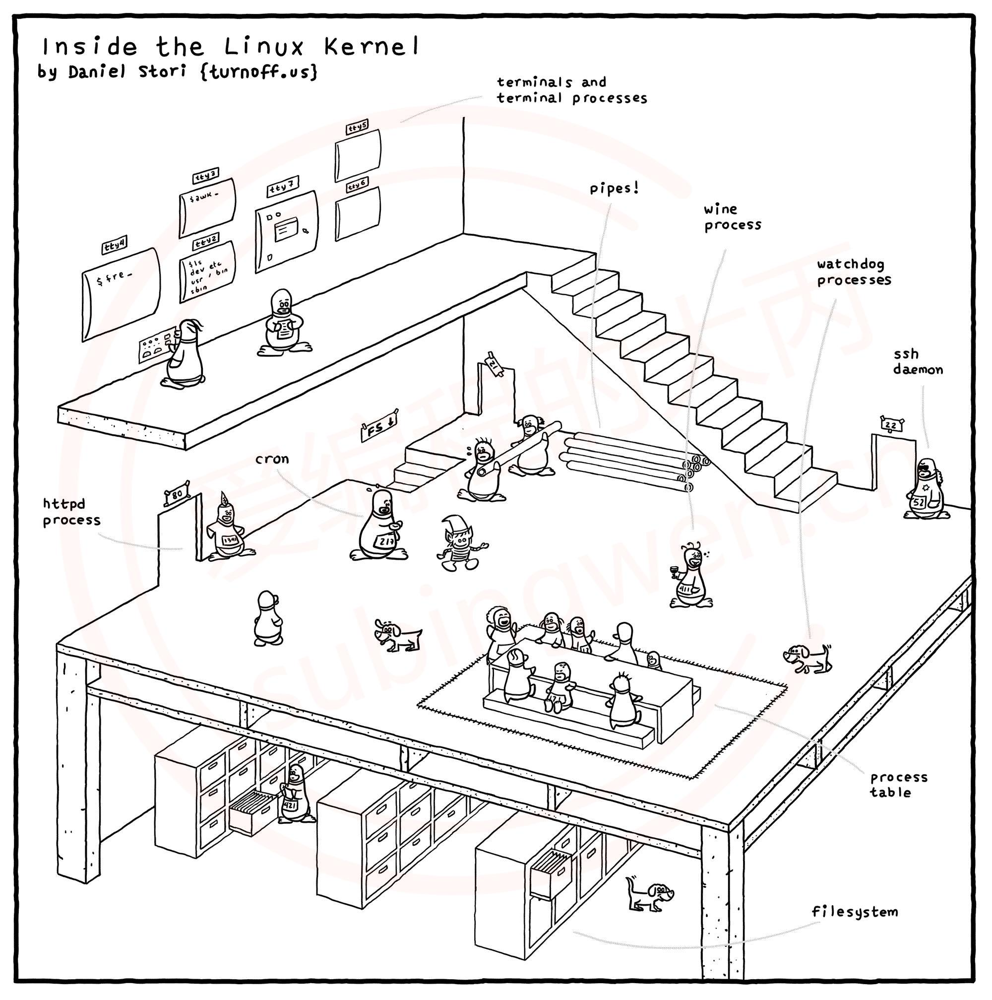

## Linux目录

- 与 Windows 下的文件组织结构不同，Linux 不使用磁盘分区符号来访问文件系统，而是将整个文件系统表示成树状的结构，Linux 系统每增加一个文件系统都会将其加入到这个树中。
	操作系统文件结构的开始，只有一个单独的顶级目录结构，叫做根目录。**所有一切都从“根”开始，用“/”代表**，并且延伸到子目录。Linux 则通过“挂接”的方式把所有分区都放置在“根”下各个目录里。一个 Linux 系统的文件结构如下图所示。

### 结构

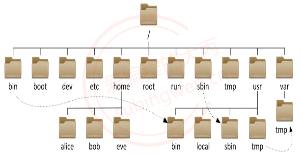

- bin: binary, 二进制文件目录, 存储了可执行程序,大部分Linux命令都存在在这个目录中

- sbin: super binary, root用户使用的一些二进制可执行程序

- etc: 配置文件目录, 系统的或者用户自己安装的应用程序的配置文件都存储在这个目录中

- lib或者lib64: library, 存储了一些动态库和静态库，给系统或者安装的软件使用

- media: 挂载目录, 挂载外部设备，比如: 光驱, 扫描仪

- mnt: 临时挂载目录, 比如我们可以将U盘临时挂载到这个目录下

- proc: 内存使用的一个映射目录, 给操作系统使用的
- run：给操作系统使用的
- tmp: 临时目录, 存放临时数据, 重启电脑数据就被自动删除了

- boot: 存储了开机相关的设置

- home: 存储了普通用户的家目录，家目录名和用户名相同

- root: root用户的家目录

- dev: device , 设备目录, Linux中一切皆文件, 所有的硬件会抽象成文件存储起来，比如：键盘， 鼠标

- lost+found: 一般时候是空的, 电脑异常关闭/崩溃时用来存储这些无家可归的文件, 用于用户系统恢复

- opt: 第三方软件的安装目录

- var: 存储了系统使用的一些经常会发生变化的文件， 比如：日志文件

- usr: unix system resource, 系统的资源目录

	- /usr/bin: 可执行的二进制应用程序

	- /usr/games: 游戏目录

	- /usr/include: 包含的标准头文件目录

	- /usr/local: 和opt目录作用相同, 安装第三方软件
	- /usr/src: 源文件

### 路径

- 相对路径：相对路径就是相对于当前文件的路径。在Linux中有两个表示路径的特殊符号:
	- ./：代表目前所在的目录，也可以使用 .表示。
	- ../：代表当前目录的上一层目录，也可以使用 ..表示

- 绝对路径：从系统磁盘起始节点开始描述的路径。
	- Linux：起始节点为根目录，比如： /root/luffy/get/onepiece
	- Windows: 起始节点为某个磁盘的盘符，比如：f:\\root\\luffy\\get\\onepiece

### 命令解释器

#### 简单组成

```shell
#ubuntu
siguyuan@siguyuan-VMware7-1:/$ 
#CentOS7
[root@10 ~]#
```

- root或者siguyuan : 当前登录的用户的用户名

- @: at -> 在
- siguyuan-VMware7-1或者10: 主机名, 在安装这个linux操作系统的时候手动指定, 可以修改
- ~: 当前用户的家目录
	- 在linux中有很多用户, 每个用户都用一个属于自己的目录, 这个目录称之为家目录
	- 普通用户家目录/home/用户名, root用户家目录 /root
- #: 代表当前用户是root用户
- $: 当前用户是普通用户, 也就是说例子中的 robin是一个普通用户

#### 工作原理

- 命令解析器在Linux操作系统中就是一个进程(运行的应用程序), 它的名字叫做**bash**，通常我们更习惯将其称之为**shell (即: sh)**。他们之间的渊源是这样的，在Unix操作系统诞生之后一个叫伯恩(Bourne )的人为其编写了命令解析器取名为shell, Linux操作系统诞生之后伯恩再次改写了shell (sh), 将其称之为bash (Bourne Again SHell), **bash 就是 sh 的增强版本**。

- 在Linux操作系统中默认使用的命令解析器是 bash, 当然也同样支持使用sh。当用户打开一个终端窗口，并输入相关指令， 按回车键， 这时候命令解析器就开始工作了， 具体步骤如下：

	- 在Linux中有一个叫做**PATH的环境变量**, 里边存储了一些系统目录 (windows也有, 叫 Path)

		```shell
		# 通过 echo 命令可以查看环境变量 PATH 中的值, 在shell中变量名前加 $ 就是取值  :做间隔
		siguyuan@siguyuan-VMware7-1:~$ echo $PATH 
		/usr/local/sbin:/usr/local/bin:/usr/sbin:/usr/bin:/sbin:/bin:/usr/games:/usr/local/games:/snap/bin
		```

		

	- 命令解析器需要依次搜索 PATH中的各个目录, 检查这些目录中是否有用户输入的指令

		- 如果找到了, 执行该目录下的可执行程序, 用户输入的命令就被执行完毕了
		- 如果没有找到, 继续搜索其他目录, 最后还是没有找到, 会提示命令找不到, 因此无法被执行

		```shell
		#CentOS7
		[root@10 siguyuan]# lls
		bash: lls: 未找到命令...
		相似命令是： 'ls'
		#ubuntu
		siguyuan@siguyuan-VMware7-1:~$ lls
		找不到命令 “lls”，但有 16 个相似命令。
		```

		

#### 快捷键

| 快捷键           | 功能                     | 备注                                                         |
| ---------------- | ------------------------ | ------------------------------------------------------------ |
| Tab              | 命令自动补齐             | 在终端中输入 某个命令的前一个或若干个字符, 再按Tab键<br /><br />由于很定shell命令的开头字母是相同的, 在这种情况下, 按一次Tab是不会自动补齐的，我们可以连续按两次Tab键，在当前终端中就可以显示出所有匹配成功的shell命令<br/><br />为了能够快速补全shell指令, 我们可以多输入一些前缀字符之后, 再按Tab键 |
| Ctrl+p           | 显示输入的上一个历史命令 | 从输入的最后一个命令往前倒, 也可以使用 ↑键                   |
| Ctrl+n           | 显示输入的下一个历史命令 | 也可以使用 ↓键                                               |
| Ctrl+a           | 光标移动命命令行首       | 也可以使用 Home键                                            |
| Ctrl+e           | 光标移动命命令行尾       | 也可以使用 End键                                             |
| Ctrl+u           | 删除光标前的部分字符串   | 无                                                           |
| Ctrl+k           | 删除光标后的部分字符串   | 无                                                           |
| →                | 光标向右移动一个字符     | 无                                                           |
| ←                | 光标向右移动一个字符     | 无                                                           |
| Backspace/Delete | 删除光标前/后的一个字符  | 无                                                           |


## vim

### 安装

- Vim是Linux操作系统中一款功能强大的文本编辑器, 支持安装各种插件。但是vim和windows中的文件编辑器所不同的是它没有UI界面，所有的操作都是通过键盘快捷键操作完成的，因此要想熟练使用vim在Linux中进行文本编辑是有成本的, 需要花费一定的时间去练习。

	如果我们拿到了一个纯净版的Linux, 里边是没有vim的，但是有一个类似的文本编辑器叫做Vi。vi编辑器的功能不是很强，可以这样理解**vim就是vi的增强版**。

	首先介绍一下如何在线安装vim，软件安装需要管理员权限:

	- Ubuntu：`sudo apt install vim`
	- CentOS：`sudo yum install vim`
	- 注意：上面的在线安装安装的vim不一定是最新版本  ，通过`vim --version`查看vim的版本号
	- 通过`vimtutor`查看帮助文档

### vim的三种模式

- 在vim中一共有三种模式, 分别是 **命令模式, 末行模式, 编辑模式**，当我们**打开vim之后默认进入的是命令模式**。
	- 命令模式：在该模式下我们可以进行查看文件内容, 简单修改文件, 关键的搜索等操作。
	- 编辑模式：在该模式下主要对文件内容进行修改和内容添加。
	- 末行模式：在该模式下可以进行 执行Linux命令, 保存文件, 进行行的跳转, 窗口分屏等操作。
- 三种模式之间是可以相互切换的：
	- 命令模式 -> 编辑模式 -> 命令模式
	- 命令模式 -> 末行模式 -> 命令模式
	- 编辑模式和末行模式之间是不能相互直接切换的
	- 图中shell指的是返回终端

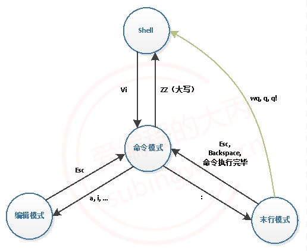


### 命令模式下的操作(注意以下操作都是在vim的命令模式下完成的)

- 通过vim打开一个文件, 如果文件不存在, 在退出的时候进行了保存, 文件就会被创建出来

	```shell
	# 打开一个文件
	$ vim 文件名
	```

	

- 保存退出

	>直接在键盘上操作, 通过**键盘按两个连续的大写的Z (**此处是大写的Z, 需要先按住 Shift 再操作哦)
	>

	```shell
	# 先按住 shift 键, 然后连续按两次 z
	ZZ
	```

	

- 代码格式化

	>在编码过程中, 为了便于阅读和代码维护, 代码都需要按照样式对其, 如果代码格式凌乱, 可以在命令模式下快速进行代码的格式化, 让其看起来更加美观，这个操作需要在键盘上连续输入多个字符。
	>

	```shell
	# 假设写的c/c+代码没有对齐, 通过该命令可以对齐代码
	# 一定要注意最后一个字符是 大写的 G, 因此需要先按 shift
	gg=G
	```

	

-  光标移动

	>在vim中可以使用键盘上的方向键(↑, ↓, ←, →)来移动光标，这种操作相对比较麻烦， 有一种更加简便的操作方式， 就是使用键盘上的 h, j, k, l。
	>

	```shell
	# 标准的移动光标的方法: 使用 h, j, k, l
	
	                                        光标上移   
	                                           ↑
	                                           |
	                     光标左移 <-- h    j    k    l --> 光标右移
	                                       |
	                                       ↓
	                                    光标下移    
	```

	>除此之外我们还可以使用一些快捷键实现光标的快速跳转, 常用的有:

	| 快捷键 | 功能               | 备注                                            |
	| ------ | ------------------ | ----------------------------------------------- |
	| 0      | 光标移动到行首     | 无                                              |
	| $      | 光标移动到行尾部   | 通过按两个键: shift + 4完成$的输入              |
	| gg     | 光标移动到文件头   | 第一行的开始                                    |
	| G      | 光标移动到文件尾部 | 最后一行的开始                                  |
	| nG     | 行跳转             | n 代表要跳转到哪一行                            |
	| n+回车 | 相对跳转 n 行      | 从光标所在当前行往下跳 n 行, n 对应的是一个整数 |

	

- 删除命令

	>在vim中是没有删除操作的, 其实**所谓的删除就是剪切**, 被删除的数据都可被粘贴到文档的任意位置, 即便如此我们还是习惯性的将剪切操作称之为删除, 常用的删除操作如下表所示:
	>

	| 快捷键   | 功能               | 备注                                                         |
	| -------- | ------------------ | ------------------------------------------------------------ |
	| x (小写) | 删除光标后边的字符 | vim中的光标比较宽会盖住后边的字符                            |
	| X (大写) | 删除光标前边的字符 | 无                                                           |
	| dw       | 删除单词           | 要先把光标移动到单词的第一个字母上再删除, 否则单词只能被删除一部分 |
	| d0       | 删除光标前的字符串 | 从字符串开头到光标当前位置的字符串被删除了                   |
	| d$ (D)   | 删除光标后的字符串 | 从光标当前位置到字符串尾部的字符串被删除了, 使用 D也行       |
	| dd       | 删除光标所在行     | 无                                                           |
	| ndd      | 删除n行            | 从光标所在行开始删除n行, n对应的是一个整数                   |

	

- 撤销和反撤销

	>撤销和反撤销对应windows中的 ctrl+z和ctrl+y, 但是在vim中使用这两个快捷键是不行的。
	>

	| 快捷键 | 功能   | 备注                       |
	| ------ | ------ | -------------------------- |
	| u      | 撤销   | 等价于 windows 中的 ctrl+z |
	| ctrl+r | 反撤销 | 等价于 windows 中的 ctrl+y |

	

- 复制和粘贴

	>前边已经介绍了, 在vim中做删除操作就相当于剪切, 剪切或者复制之后的数据都可以用来做粘贴操作, 在vim中对应的快捷键如下
	>

	| 快捷键 | 功能                      | 备注                          |
	| ------ | ------------------------- | ----------------------------- |
	| p      | 粘贴到光标所在行的下边    | 小写的 p                      |
	| P      | 粘贴到光标所在行的上边    | 大写的 P                      |
	| yy     | 复制光标所在行            | 无                            |
	| nyy    | 从光标所在行向下复制 n 行 | n是要复制的行数, 代表一个整数 |


​	

- 可视模式

	>在编辑文件的过程中, 有时候需要删除或者需要复制的数据不整行的, 而是一行中的某一部分, 这时候可以使用可视模式进行文本的选择, 之后再通过相关的快捷键对所选中的数据块进行复制或者删除操作。
	>
	>有三种方式可以切换到可视模式:
	>
	>- v： 进入的字符可视化模式（Characterwise visual mode)，文本选择是**以字符为单位的**。
	>
	>- V ：进入的行可视化模式（Linewise visual mode)，文本选择是**以行为单位的**。
	>- ctrl-v： 进入的块可视化模式（Blockwise visual mode），可以选择**一个矩形内的文本**。
	>
	>进入到可视模式之后，就可以进行文本块的选择和复制以及删除了

	| 快捷键   | 功能                 | 备注                                 |
	| -------- | -------------------- | ------------------------------------ |
	| h        | 光标向左移动         | 移动光标用于可视模式下的数据块选择   |
	| j        | 光标向下移动         | 移动光标用于可视模式下的数据块选择   |
	| k        | 光标向上移动         | 移动光标用于可视模式下的数据块选择   |
	| l        | 光标向右移动         | 移动光标用于可视模式下的数据块选择   |
	| d        | 删除(剪切)           | 删除可视模式下选中的数据块           |
	| y        | 复制                 | 复制可视模式下选中的数据块           |
	| p (小写) | 数据粘贴到光标的后边 | 粘贴在可视模式下复制或者剪切的数据块 |
	| P (大写) | 数据粘贴到光标的前边 | 粘贴在可视模式下复制或者剪切的数据块 |

	- 字符可视模式

		>控制光标方向用来选择文件中的不规则数据块, 可以对选中的文本信息进行复制和删除

		```shell
		# 进入到字符可视模式，直接在键盘上按 v 即可: 
		v
		```

		>通过 v 切换到字符可视模式之后， 在窗口的最下方会看到 -- VISUAL-- 字样。

		

	- 行可视模式

		>向下移动光标可以选择一整行, 向上移动光标可以取消整行选择

		```shell
		# 进入行可视模式, 键盘上按 shift+v 
		V
		```

		>通过 V 切换到行可视模式之后， 在窗口的最下方会看到 -- VISUAL LINE -- 字样。

		

	- 块可视化模式

		>通过向上，下移动光标控制矩形文本块的高度，通过向左，右移动光标控制矩形文本块的宽度。

		```shell
		# 进入块可视模式, 选择一个矩形文本块
		ctrl+v
		```

		>通过 ctrl+v 切换到块可视模式之后， 在窗口的最下方会看到 -- VISUAL BLOCK -- 字样。
		>

		

- 代码注释

	>代码块注释可以使用块可视模式，具体操作步骤如下:
	>
	>1. 通过 ctrl+v进入块可视模式
	>
	>2. 移动光标上移（k）或者下移（j），选中多个代码行的开头，如下图所示:
	>
	>	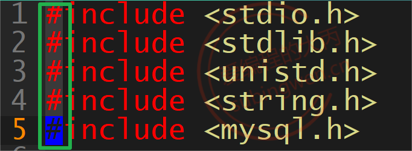
	>
	>3. 选择完毕后，按大写的的I键，此时下方会提示进入“insert” 模式，输入你要插入的注释符，例如: //
	>
	>4. 最后按ESC键，你就会发现选中的多行代码已经被注释了
	>
	>删除多行注释的方法，同样 Ctrl+v 进入列选择模式，移动光标把要删除的注释符选中，按下 d ，注释就被删除了。
	>

- 替换

	> 命令模式下替换功能并不强, 常用于某个单字符的替换。

	| 快捷键 | 功能                 | 备注            |
	| ------ | -------------------- | --------------- |
	| r      | 替换光标后的单个字符 | 无              |
	| R      | 替换光标后的多个字符 | 按 esc 结束替换 |

- 查找

	>在vim的命令模式下一共有三种查找方式, 首先需要在键盘上输入对应的字符, 然后按回车键vim会进行关键字匹配, 之后就可以通过 n或者N进行关键字之间的切换了。
	>
	>快捷键+搜索的词

	| 快捷键 | 关键字遍历 | 描述           | 备注                                       |
	| ------ | ---------- | -------------- | ------------------------------------------ |
	| /      | n          | 从当前位置向下 | 直接按键盘上的 /即可                       |
	|        | N          | 从当前位置向上 |                                            |
	| ？     | n          | 从当前位置向下 | 直接按键盘上的 ?即可, 需要使用组合键       |
	|        | N          | 从当前位置向上 |                                            |
	| #      | n          | 从当前位置向下 | 光标需要先放在被搜索的关键字上, 键盘上按 # |
	|        | N          | 从当前位置向上 |                                            |

	>关于 ? 和 # 都需要使用组合键, 这点要注意一下。
	>
	>下面总结一下这三种搜索方式：
	>
	>- 使用 / 或者 ? 搜索效果一样, 只是遍历关键字的时候的顺序是相反的
	>- 使用 # 必须先从被搜索的文件中找到要搜索的关键字, 好处就是搜索的内容不需要通过键盘输入
	>- 以上两种搜索方式各有优劣, 请根据实际情况选择使用。

- 查看man文档

	>man 文档, 是Linux中默认自带的帮助文档, 作为程序猿可以通过这个文档来查询shell命令或者标准API函数或者系统自带的配置文件格式的说明等信息。
	>
	>man文档一共有9个章节， 具体如下：

	| 章节      | 说明                                      |
	| --------- | ----------------------------------------- |
	| section 1 | Linux提供的所有shell命令                  |
	| section 2 | 系统函数（由内核提供的）                  |
	| section 3 | 库调函数(程序库中的函数（C 相关的函数)    |
	| section 4 | 特殊文件(通常在/dev目录中可以找到)        |
	| section 5 | 系统配置文件格式和约定，比如：/etc/passwd |
	| section 6 | 游戏（如果有的话）                        |
	| section 7 | 杂项(包括宏包和约定)                      |
	| section 8 | 系统管理命令(通常仅针对root用户)          |
	| section 9 | 内核例程[非标准]                          |

	```shell
	# 打开 man 文档首页
	$ man man
	# 退出 man 文档，直接按键盘上的 q 即可
	q
	
	
	# 那么，我们如何通过 man 文档查询相关的shell命令或者函数等信息呢？
	# 下边举几个例子:
	
	# 查询第一章的shell命令
	$ man 1 cp
	
	# 查询第二章的系统函数 (如: read, write, open 等)
	$ man 2 read
	
	# 查询第三章的标准的库函数 (如: fread, fwrite, fopen 等)
	$ man 3 fread
	
	# 查询第五章的特殊的配置文件说明, 比如: /etc/passwd 或者 /etc/group
	$ man 5 passwd
	
	
	```

	>#查询的时候章节号是可以省略的，只是查到的结果不精确。如果不写章节号，从第一章开始搜索查询的关键字，如果查询到了, 直接就结束了。也就是说如果查询的是函数，但是这个函数和某个命令的名字是相同的，查询到第一章搜索就结束了。
	>
	>如果当前是在vim的命令模式下，我们可以直接跳转到man 文档：
	>
	>- 找到要查看的函数，然后将光标放到该函数上
	>- 在键盘上依次输入: **章节号(可选) + K(shift+k)(大写的k)** ，就会自动调整到 man 文档中了

- 切换文本编辑模式

	>如果要编辑文件, 需要从命令模式切换到文件编辑模式, 切换模式的快捷键有很多, 不同的快捷键对应的效果有所不同, 效果如下表所示:
	>

	| 快捷键     | 功能                                          |
	| ---------- | --------------------------------------------- |
	| i          | 从光标前边开始输入                            |
	| a          | 从光标的后边开始输入                          |
	| o          | 在光标下边创建新行, 在新行中输入              |
	| s          | 删除光标覆盖的字符， 从删除的字符位置开始输入 |
	| I(大写的i) | 从当前行行首开始输入                          |
	| A          | 从当前行行尾开始输入                          |
	| O          | 在光标上边创建新行, 在新行中输入              |
	| S          | 删除当前行, 在当前行开始输入                  |

	>文件编辑完成之后, 从编辑模式回到命令模式只需要按键盘上的Esc即可。


### 末行模式

- 命令模式到末行模式

	>从命令模式切换到末行模式只需要在键盘上输入一个 :，同时这个符号也会出现在窗口的最下端，这时候我们就可以在最后一行输入我们执行的命令了。
	>

	```shell
	# 命令模式切换到末行模式
	在命令模式下键盘输入一个 冒号  -> :
	
	# 从末行模式 -> 命令模式
	1. 按两次esc
	2. 在末行模式下执行一个完整指令, 执行完毕, 自动回到命令模式
	```

- 保存退出

	>使用vim对文件编辑完成之后, 需要保存或者退出vim一般都是在末行模式下完成的, 不管是进行那种操作都有对应的操作命令, 如下表:
	>

	| 末行模式下输入的命令 | 功能                                                  |
	| -------------------- | ----------------------------------------------------- |
	| q                    | 退出, 如果退出的时候文件没有保存, vim会提示是否要保存 |
	| q!                   | 直接退出, 不保存 (强制退出)                           |
	| w                    | 保存, 不退出 (相当在windows中于按了ctrl+s)            |
	| wq                   | 保存退出                                              |
	| x                    | 保存退出                                              |


​	

- 替换

	>末行模式下的替换比命令模式下的替换功能要强大的多, 在末行模式下可以指定将什么样的内容替换为什么样的内容, 并且可以指定替换某一行或者某几行或者是全文替换。
	>
	>**替换对应的命令是 s并且可以给其指定参数**，默认情况下只替换相关行的第一个满足条件的关键字， **如果需要整行替换需要加参数/g。**

	| 末行模式下的替换命令                      | 说明                                                     |
	| ----------------------------------------- | -------------------------------------------------------- |
	| s/被替换的关键字/新的关键字/g             | 只对光标所在行进行替换                                   |
	| 行号1, 行号2s/被替换的关键字/新的关键字/g | [行号1 , 行号2] 是一个从小到大的范围, 对这个范围进行替换 |
	| %s/被替换的关键字/新的关键字/g            | %代表对所有行进行替换                                    |

	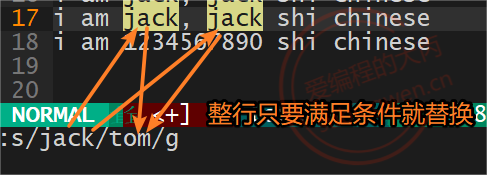

- 分屏

	>分屏就是将当前屏幕中的窗口以水平或者垂直的方式拆分成多个, 在不同的子窗口中可以显示同一个文件或者不同文件中的内容，下边介绍一下相关的分屏命令：

	| 末行模式命令或者快捷键 | 说明                           | 备注                                 |
	| ---------------------- | ------------------------------ | ------------------------------------ |
	| sp                     | 水平分屏 , 多个窗口垂直排列    | 多个窗口中显示同一个文件里的内容     |
	| vsp                    | 垂直分屏, 多个窗口水平排列     | 多个窗口中显示同一个文件里的内容     |
	| ctrl+w+w               | 光标在打开的屏幕之间切换       | 快捷键操作<br/>(按住ctrl然后按两次w) |
	| qall                   | 同时退出多个屏幕               |                                      |
	| wqall                  | 同时保存退出多个屏幕           |                                      |
	| sp 文件名              | 分屏的同时指定打开的文件的名字 | 在新窗口中显示指定的文件的内容       |
	| vsp 文件名             | 分屏的同时指定打开的文件的名字 | 在新窗口中显示指定的文件的内容       |

	>除了在末行模式下分屏, 我们也可以在使用vim打开文件的时候直接分屏, 下边是需要用到的参数:
	>
	>- -o: 水平分屏
	>- -O: 垂直分屏

	```shell
	# 在vim打开文件的时候指定打开多个文件和分屏方式
	# 水平分屏
	$ vim -o 文件1, 文件2, 文件3 ...
	# 垂直分屏
	$ vim -O 文件1, 文件2, 文件3 ...
	```

	

- 行跳转

	> 在vim中不仅可以在命令模式下进行行的跳转, 也可以在末行模式下进行行跳转, 末行模式下指定哪一行光标就可以跳转到哪一行。

	```shell
	:行号   # 输入完行号之后敲回车
	```


​	

-  执行shell命令

	>在使用vim编辑文件的过程中, 还可以在末行模式下执行需要的shell命令，在执行shell命令之前需要在前边加上一个叹号!。
	>

	```shell
	# 语法:
	:!shell命令
	
	# 举例
	:!ls		# 回车即可
	```

### vim配置命令

- vim 是一个文本编辑器工具, 这个工具也是有配置文件的，文件的名字叫做vimrc，在里边可以设置样式，功能, 快捷键等属性 。**对应的配置文件分为两种 用户级别和系统级别**。

	- 用户级别的配置文件（~/.vimrc）只对当前用户有效


	- 系统级别的配置文件（/ect/vim/vimrc）对所有Linux用户都有效
	
	- 如果两个配置文件都设置了, 用户级别的配置文件起作用（用户级别优先级高）。

- vim插件(vimplus)

  - vimplus项目的github地址: https://github.com/chxuan/vimplus

  - Linux 64-bit安装

    - 支持以下发行版

    	

    - 安装vimplus

    	```shell
    	git clone https://github.com/chxuan/vimplus.git ~/.vimplus
    	cd ~/.vimplus
    	./install.sh //不加sudo
    	
    	# 后续出现Y/N 选择Y  
    	# 出现选择python2或者python3，随意
    	```

    	

    - 设置Nerd Font

    	为防止vimplus显示乱码，需设置linux终端字体为Droid Sans Mono Nerd Font。

    - 多用户支持

    	将vimplus在某个用户下安装好后，若需要在其他用户也能够使用vimplus，则执行

    	`sudo ./install_to_user.sh username1 username2 //替换为真实用户名`

    - 更新vimplus

    	`./update.sh`

  - 自定义

    - ~/.vimrc为vimplus的默认配置，一般不做修改
    - ~/.vimrc.custom.plugins为用户自定义插件列表，用户增加、卸载插件请修改该文件
    - \~/.vimrc.custom.config为用户自定义配置文件，一般性配置请放入该文件，可覆盖~/.vimrc里的配置

  - 插件列表

    - | 插件                                                         | 说明                                                         |
    	| ------------------------------------------------------------ | ------------------------------------------------------------ |
    	| [cpp-mode](https://github.com/chxuan/cpp-mode)               | 提供生成函数实现、函数声明/实现跳转、.h .cpp切换等功能(I'm author:smile:) |
    	| [vim-edit](https://github.com/chxuan/vim-edit)               | 方便的文本编辑插件(I'm author:smile:)                        |
    	| [change-colorscheme](https://github.com/chxuan/change-colorscheme) | 随心所欲切换主题(I'm author:smile:)                          |
    	| [prepare-code](https://github.com/chxuan/prepare-code)       | 新建文件时，生成预定义代码片段(I'm author:smile:)            |
    	| [vim-buffer](https://github.com/chxuan/vim-buffer)           | vim缓存操作(I'm author:smile:)                               |
    	| [vimplus-startify](https://github.com/chxuan/vimplus-startify) | vimplus开始页面(修改自[mhinz/vim-startify](https://github.com/mhinz/vim-startify)) |
    	| [tagbar](https://github.com/preservim/tagbar)                | 使用[preservim/tagbar](https://github.com/preservim/tagbar)的最新版本，[taglist](https://github.com/vim-scripts/taglist.vim)的替代品，显示类/方法/变量 |
    	| [vim-plug](https://github.com/junegunn/vim-plug)             | 比[Vundle](https://github.com/VundleVim/Vundle.vim)下载更快的插件管理软件 |
    	| [YouCompleteMe](https://github.com/Valloric/YouCompleteMe)   | 史上最强大的基于语义的自动补全插件，支持C/C++、C#、Python、PHP等语言 |
    	| [NerdTree](https://github.com/preservim/nerdtree)            | 代码资源管理器                                               |
    	| [vim-nerdtree-syntax-highlight](https://github.com/tiagofumo/vim-nerdtree-syntax-highlight) | NerdTree文件类型高亮                                         |
    	| [nerdtree-git-plugin](https://github.com/Xuyuanp/nerdtree-git-plugin) | NerdTree显示git状态                                          |
    	| [vim-devicons](https://github.com/ryanoasis/vim-devicons)    | 显示文件类型图标                                             |
    	| [Airline](https://github.com/vim-airline/vim-airline)        | 可以取代[powerline](https://github.com/powerline/powerline)的状态栏美化插件 |
    	| [auto-pairs](https://github.com/jiangmiao/auto-pairs)        | 自动补全引号、圆括号、花括号等                               |
    	| [LeaderF](https://github.com/Yggdroot/LeaderF)               | 比[ctrlp](https://github.com/ctrlpvim/ctrlp.vim)更强大的文件的模糊搜索工具 |
    	| [ack](https://github.com/mileszs/ack.vim)                    | 强大的文本搜索工具                                           |
    	| [vim-surround](https://github.com/tpope/vim-surround)        | 自动增加、替换配对符的插件                                   |
    	| [vim-commentary](https://github.com/tpope/vim-commentary)    | 快速注释代码插件                                             |
    	| [vim-repeat](https://github.com/tpope/vim-repeat)            | 重复上一次操作                                               |
    	| [vim-endwise](https://github.com/tpope/vim-endwise)          | if/end/endif/endfunction补全                                 |
    	| [tabular](https://github.com/godlygeek/tabular)              | 代码、注释、表格对齐                                         |
    	| [vim-easymotion](https://github.com/easymotion/vim-easymotion) | 强大的光标快速移动工具，强大到颠覆你的插件观                 |
    	| [incsearch.vim](https://github.com/haya14busa/incsearch.vim) | 模糊字符搜索插件                                             |
    	| [vim-fugitive](https://github.com/tpope/vim-fugitive)        | 集成Git                                                      |
    	| [gv](https://github.com/junegunn/gv.vim)                     | 显示git提交记录                                              |
    	| [vim-slash](https://github.com/junegunn/vim-slash)           | 优化搜索，移动光标后清除高亮                                 |
    	| [echodoc](https://github.com/Shougo/echodoc.vim)             | 补全函数时在命令栏显示函数签名                               |
    	| [vim-smooth-scroll](https://github.com/terryma/vim-smooth-scroll) | 让翻页更顺畅                                                 |
    	| [clever-f.vim](https://github.com/rhysd/clever-f.vim)        | 强化f和F键                                                   |

  - 快捷键

    - 以下是部分快捷键，可通过vimplus的`,h`命令查看[vimplus帮助文档](https://github.com/chxuan/vimplus/blob/master/help.md)。

    - | 快捷键              | 说明                                      |
    	| ------------------- | ----------------------------------------- |
    	| `,`                 | Leader Key                                |
    	| `<leader>n`         | 打开/关闭代码资源管理器                   |
    	| `<leader>t`         | 打开/关闭函数列表                         |
    	| `<leader>a`         | .h .cpp 文件切换                          |
    	| `<leader>u`         | 转到函数声明                              |
    	| `<leader>U`         | 转到函数实现                              |
    	| `<leader>u`         | 转到变量声明                              |
    	| `<leader>o`         | 打开include文件                           |
    	| `<leader>y`         | 拷贝函数声明                              |
    	| `<leader>p`         | 生成函数实现                              |
    	| `<leader>w`         | 单词跳转                                  |
    	| `<leader>f`         | 搜索~目录下的文件                         |
    	| `<leader>F`         | 搜索当前目录下的文本                      |
    	| `<leader>g`         | 显示git仓库提交记录                       |
    	| `<leader>G`         | 显示当前文件提交记录                      |
    	| `<leader>gg`        | 显示当前文件在某个commit下的完整内容      |
    	| `<leader>ff`        | 语法错误自动修复(FixIt)                   |
    	| `<c-p>`             | 切换到上一个buffer                        |
    	| `<c-n>`             | 切换到下一个buffer                        |
    	| `<leader>d`         | 删除当前buffer                            |
    	| `<leader>D`         | 删除当前buffer外的所有buffer              |
    	| `vim`               | 运行vim编辑器时,默认启动开始页面          |
    	| `<F5>`              | 显示语法错误提示窗口                      |
    	| `<F9>`              | 显示上一主题                              |
    	| `<F10>`             | 显示下一主题                              |
    	| `<leader>l`         | 按竖线对齐                                |
    	| `<leader>=`         | 按等号对齐                                |
    	| `Ya`                | 复制行文本到字母a                         |
    	| `Da`                | 剪切行文本到字母a                         |
    	| `Ca`                | 改写行文本到字母a                         |
    	| `rr`                | 替换文本                                  |
    	| `<leader>r`         | 全局替换，目前只支持单个文件              |
    	| `rev`               | 翻转当前光标下的单词或使用V模式选择的文本 |
    	| `gcc`               | 注释代码                                  |
    	| `gcap`              | 注释段落                                  |
    	| `vif`               | 选中函数内容                              |
    	| `dif`               | 删除函数内容                              |
    	| `cif`               | 改写函数内容                              |
    	| `vaf`               | 选中函数内容（包括函数名 花括号）         |
    	| `daf`               | 删除函数内容（包括函数名 花括号）         |
    	| `caf`               | 改写函数内容（包括函数名 花括号）         |
    	| `fa`                | 查找字母a，然后再按f键查找下一个          |
    	| `<leader>e`         | 快速编辑~/.vimrc文件                      |
    	| `<leader>s`         | 重新加载~/.vimrc文件                      |
    	| `<leader>vp`        | 快速编辑~/.vimrc.custom.plugins文件       |
    	| `<leader>vc`        | 快速编辑~/.vimrc.custom.config文件        |
    	| `<leader>h`         | 打开vimplus帮助文档                       |
    	| `<leader>H`         | 打开当前光标所在单词的vim帮助文档         |
    	| `<leader><leader>t` | 生成try-catch代码块                       |
    	| `<leader><leader>y` | 复制当前选中到系统剪切板                  |
    	| `<leader><leader>i` | 安装插件                                  |
    	| `<leader><leader>u` | 更新插件                                  |
    	| `<leader><leader>c` | 删除插件                                  |

  - FAQ

    - **`vimplus怎么安装新插件？`**

    	编辑[~/.vimrc.custom.plugins](https://github.com/chxuan/vimplus/blob/master/.vimrc.custom.plugins)，添加自定义插件。

    - **`vimplus怎么添加自定义配置？`**

    	编辑[~/.vimrc.custom.config](https://github.com/chxuan/vimplus/blob/master/.vimrc.custom.config)，添加自定义配置。

    - **`vimplus安装脚本会在自己电脑上安装哪些软件？`**

    	网络良好情况下，vimplus只需30分钟左右即可将vim cpp环境配置好，vimplus真正的做到了一键配置，不让用户操心。vimplus会安装一些必备软件，比如说python、cmake、gcc、fontconfig等，vimplus也考虑到了有些系统的vim不支持python，它会自动去下载vim源码将python支持编译进去，vimplus也会安装nerd-font不让vim显示出现乱码，最最重要的是vimplus实现了ycm自动编译安装，给折腾了几天ycm都没有安装好的用户带来了新的希望，而且vimplus也支持macos和linux众多发行版，让linux发烧友频繁切换发行版而不用操心vim环境配置。最后说了这么多，不如看[vimplus安装脚本](https://github.com/chxuan/vimplus/blob/master/install.sh)来的直接:smile:。

    - **`启动vim报错：RequestsDependencyWarning: Old version of cryptography ([1, 2, 3]) may cause slowdown.`**

    	可以尝试将cryptography删掉，具体见[issues #208](https://github.com/chxuan/vimplus/issues/208)。

    - **`vimplus不支持目前用户正在使用的系统怎么办？`**

    	可以给作者提[Issues](https://github.com/chxuan/vimplus/issues)，或者自己fork vimplus来修改，并提交pr，贡献自己的一份力量。

    - **`安装vimplus后Airline等插件有乱码，怎么解决？`**

    	linux和mac系统需设置终端字体为`Droid Sans Mono Nerd Font`。

    - **`xshell连接远程主机不能使用vim-devicons或乱码。`**

    	windows系统安装[Nerd Font](https://github.com/ryanoasis/nerd-fonts)字体后并更改xshell字体即可。

    - **`ubuntu18.04安装了nerd font但通过终端属性并没有看到该字体。`**

    	可以试试dconf-editor软件来设置，可以参考[这里](https://blog.csdn.net/wang73ying/article/details/82491993)。

    - **`使用第三方库时怎么让ycm补全第三方库API？`**

    	vimplus安装完毕之后，`~`目录下将会生成两个隐藏文件分别是.vimrc和.ycm_extra_conf.py，其中.vimrc是vim的配置文件，.ycm_extra_conf.py是ycm插件的配置文件，当你需要创建一个project时，需要将.ycm_extra_conf.py拷贝到project的顶层目录，通过修改该配置文件里面的`flags`变量来添加你的第三方库路径。

    - **`使用vi命令报错：E492: Not an editor command:`**

    	vimplus安装完成后，linux下可能会同时存在vi和vim命令，执行vi时，vi加载~/.vimrc文件可能会报错，但不影响使用，如果要消除错误可以设置软链接`ln -s /usr/bin/vim /usr/bin/vi`

    - **`怎么自定义文件头，比如说添加作者、创建时间？`**

    	你可以修改[chxuan/prepare-code](https://github.com/chxuan/prepare-code)插件来达到目的，可以参考[这里](https://blog.csdn.net/liuyangbo121/article/details/82971736)。

    - **`安装vimplus在“[ 95%] Building CXX object ycm/CMakeFiles/ycm_core.dir/ycm_core.cpp.o”等进度时出现编译报错`**

    	编译ycm需要消耗较大内存，建议内存大于1G，实在不行也可以开启linux swap分区。

    - **`以上没有我遇到的问题怎么办？`**

    	您可以通过上网找解决方法，或提[Issues](https://github.com/chxuan/vimplus/issues)，也可以通过加QQ`787280310`、发邮件方式`787280310@qq.com`一起讨论解决方法。

  - 无法翻墙的这种解决方案

    - https://www.bilibili.com/video/BV1rA41157qK/?vd_source=5f8610a33e469a605635adbbdcc8c98e


## GCC

- GCC 是 Linux 下的编译工具集，是 GNU Compiler Collection 的缩写，包含 gcc、g++ 等编译器。这个工具集不仅包含编译器，还包含其他工具集，例如 ar、nm 等。

	GCC 工具集不仅能编译 C/C++语言，其他例如 Objective-C、Pascal、Fortran、Java、Ada 等语言均能进行编译。GCC 在可以根据不同的硬件平台进行编译，即能进行交叉编译，在 A 平台上编译 B 平台的程序，支持常见的 X86、ARM、PowerPC、mips 等，以及 Linux、Windows 等软件平台。


### 安装

```shell
# 安装软件必须要有管理员权限
# ubuntu
$ sudo apt update   		# 更新本地的软件下载列表, 得到最新的下载地址
$ sudo apt install gcc g++	# 通过下载列表中提供的地址下载安装包, 并安装

# centos
$ sudo yum update   		# 更新本地的软件下载列表, 得到最新的下载地址
$ sudo yum install gcc g++	# 通过下载列表中提供的地址下载安装包, 并安装


# 查看 gcc 版本
$ gcc -v
$ gcc --version

# 查看 g++ 版本
$ g++ -v
$ g++ --version

# 4.8.5及以上才有C++11的特性
```


### gcc工作流程

- GCC 编译器对程序的编译下图所示，分为 4 个阶段：**预处理（预编译）、编译和优化、汇编和链接**。GCC 的编译器可以将这 4 个步骤合并成一个。 先介绍一个每个步骤都分别做了写什么事儿:

	- 预处理: 在这个阶段主要做了三件事: **展开头文件 、宏替换 、去掉注释行**

		- 这个阶段需要GCC调用预处理器来完成, 最终得到的还是源文件, 文本格式

	- 编译: 这个阶段需要GCC调用编译器对文件进行编译, 最终得到一个汇编文件

	- 汇编: 这个阶段需要GCC调用汇编器对文件进行汇编, 最终得到一个二进制文件

	- 链接: 这个阶段需要GCC调用链接器对程序需要调用的库进行链接, 最终得到一个可执行的二进制文件

		| 文件名后缀 | 说明                           | gcc 参数 |
		| ---------- | ------------------------------ | -------- |
		| .c         | 源文件                         | 无       |
		| .i         | 预处理后的 C 文件              | -E       |
		| .s         | 编译之后得到的汇编语言的源文件 | -S       |
		| .o         | 汇编后得到的二进制文件         | -c       |

		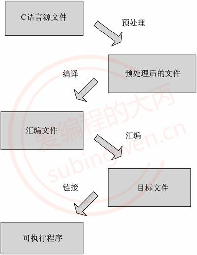


- 在 Linux 下使用 GCC 编译器编译单个文件十分简单，直接使用 gcc 命令后面加上要编译的 C 语言的源文件，GCC 会自动生成文件名为 a.out 的可执行文件（也可以通过参数 -o 指定生成的文件名），也就是通过一个简单的命令上边提到的4个步骤就全部执行完毕了。但是如果想要单步执行也是没问题的， 下边基于这段示例程序给大家演示一下。(**.c用GCC编译，.cpp用G++编译**)

	```shell
	// 假设程序对应的源文件名为 test.c
	#include <stdio.h>
	#include <stdlib.h>
	#include <unistd.h>
	#include <string.h>
	
	int main()
	{
	    int array[5] = {1,2,3,4,5};
	    for(int i=0; i<5; ++i)
	    {
	        printf("array[%d] = %d\n", i, array[i]);
	    }
	    return 0;
	}
	
	
	# 1. 预处理, -o 指定生成的文件名
	$ gcc -E test.c -o test.i
	
	
	# 2. 编译, 得到汇编文件
	$ gcc -S test.i -o test.s
	
	
	# 3. 汇编
	$ gcc -c test.s -o test.o
	
	
	# 4. 链接
	$ gcc test.o -o test
	
	
	# 自动执行前面的步骤
	# 参数 -c 是进行文件的汇编, 汇编之前的两步会自动执行
	$ gcc test.c -c -o app.o
	
	# 该命令是直接进行链接生成可执行程序, 链接之前的三步会自动执行
	$ gcc test.c -o app    
	
	```

	

### GCC的常用参数

- 下面的表格中列出了常用的一些gcc参数, 这些参数在 gcc命令中没有位置要求，只需要编译程序的时候将需要的参数指定出来即可。

	| gcc编译选项                                      | 选项的意义                                                   |
	| ------------------------------------------------ | ------------------------------------------------------------ |
	| -E                                               | 预处理指定的源文件，不进行编译                               |
	| -S                                               | 编译指定的源文件，但是不进行汇编                             |
	| -c                                               | 编译、汇编指定的源文件，但是不进行链接                       |
	| -o [file1] [file2]       /    [file2] -o [file1] | 将文件 file2 编译成文件 file1                                |
	| -I directory (大写的i)                           | 指定 include 包含文件的搜索目录                              |
	| -g                                               | 在编译的时候，生成调试信息，该程序可以被调试器调试           |
	| -D                                               | 在程序编译的时候，指定一个宏                                 |
	| -w                                               | 不生成任何警告信息, 不建议使用, 有些时候警告就是错误         |
	| -Wall                                            | 生成所有警告信息                                             |
	| -On                                              | n的取值范围：0~3。编译器的优化选项的4个级别，-O0表示没有优化，-O1为缺省值，-O3优化级别最高 |
	| -l                                               | 在程序编译的时候，指定使用的库                               |
	| -L                                               | 指定编译的时候，搜索的库的路径。                             |
	| -fPIC   /   fpic                                 | 生成与位置无关的代码                                         |
	| -shared                                          | 生成共享目标文件。通常用在建立共享库时                       |
	| -std                                             | 指定C方言，如:-std=c99，gcc默认的方言是GNU C  ，Linux下位-std=gun99 |

	- 指定生成的文件名 (-o)

		```shell
		# 该参数用于指定原文件通过 gcc 处理之后生成的新文件的名字, 有两种写法, 原文件可以写在参数 -o前边后缀写在后边。
		# 参数 -o的用法 , 原材料 test.c 最终生成的文件名为 app
		# test.c 写在 -o 之前
		$ gcc test.c -o app
		
		# test.c 写在 -o 之后
		$ gcc -o app test.c
		```

		

	-  搜索头文件 (-I)

		```shell
		# 如果在程序中包含了一些头文件, 但是包含的一些头文件在程序预处理的时候因为找不到无法被展开，导致程序编译失败，这时候我们可以在gcc命令中添加 -I参数重新指定要引用的头文件路径, 保证编译顺利完成。
		# -I, 指定头文件目录
		$ tree
		.
		├── add.c
		├── div.c
		├── include
		│   └── head.h
		├── main.c
		├── mult.c
		└── sub.c
		
		# 编译当前目录中的所有源文件，得到可执行程序
		$ gcc *.c -o calc
		main.c:2:18: fatal error: head.h: No such file or directory
		compilation terminated.
		sub.c:2:18: fatal error: head.h: No such file or directory
		compilation terminated.
		 
		# 通过编译得到的错误信息可以知道, 源文件中包含的头文件无法被找到。通过提供的目录结构可以得知头文件 head.h 在 include 目录中，因此可以在编译的时候重新指定头文件位置，具体操作如下：
		
		
		# 可以在编译的时候重新指定头文件位置 -I 头文件目录
		$ gcc *.c -o calc -I ./include
		
		```

		

	- 指定一个宏 (-D)

		```shell
		# 在程序中我们可以使用宏定义一个常量, 也可以通过宏控制某段代码是否能够被执行。在下面这段程序中第8行判断是否定义了一个叫做 DEBUG的宏, 如果没有定义第9行代码就不会被执行了, 通过阅读代码能够知道这个宏是没有在程序中被定义的。
		
		// test.c
		#include <stdio.h>
		#define NUMBER  3
		
		int main()
		{
		    int a = 10;
		#ifdef DEBUG
		    printf("我是一个程序猿, 我不会爬树...\n");
		#endif
		    for(int i=0; i<NUMBER; ++i)
		    {
		        printf("hello, GCC!!!\n");
		    }
		    return 0;
		}
		
		
		# 如果不想在程序中定义这个宏， 但是又想让它存在，通过gcc的参数 -D就可以实现了，编译器会认为参数后边指定的宏在程序中是存在的。
		
		# 在编译命令中定义这个 DEBUG 宏, 
		$ gcc test.c -o app -D DEBUG
		
		# 执行生成的程序， 可以看到程序第9行的输出
		$ ./app 
		我是一个程序猿, 我不会爬树...
		hello, GCC!!!
		hello, GCC!!!
		hello, GCC!!!
		
		```

		>-D 参数的应用场景:
		>在发布程序的时候, 一般都会要求将程序中所有的log输出去掉, 如果不去掉会影响程序的执行效率，很显然删除这些打印log的源代码是一件很麻烦的事情，解决方案是这样的：
		>
		>- 将所有的打印log的代码都写到一个宏判定中, 可以模仿上边的例子
		>
		>	- 在编译程序的时候指定 -D 就会有log输出
		>	- 在编译程序的时候不指定 -D, log就不会输出


### 多文件编译

- GCC 可以自动编译链接多个文件，不管是目标文件还是源文件，都可以使用同一个命令编译到一个可执行文件中。

- 首先将程序编译之前需要的代码准备出来, 例如一个项目包含3个文件，文件 string.h , string.c 中有一个函数 strLength 用于计算字符串的长度，而在 main.c 中调用这个函数将计算的结果显示出来。

	```c
	// 头文件
	#ifndef _STRING_H_
	#define _STRING_H_
	int strLength(char *string);
	#endif // _STRING_H_
	
	
	//源文件 string.c
	#include "string.h"
	
	int strLength(char *string)
	{
		int len = 0;
		while(*string++ != '\0') 	// 当*string 的值为'\0'时, 停止计算
	    {
	        len++;
	    }
		return len; 	// 返回字符串长度
	}
	
	
	// main.c
	#include <stdio.h>
	#include "string.h"
	
	int main(void)
	{
		char *src = "Hello, I'am Monkey·D·Luffy!!!"; 
		printf("string length is: %d\n", strLength(src)); 
		return 0;
	}
	```

	

- 编译运行

	>因为头文件是包含在源文件中的, 因此在使用gcc编译程序的时候不需要指定头文件的名字**（在头文件无法被找到的时候需要使用参数 -I 指定其具体路径而不是名字）**。我们可以通过一个 gcc 命令将多个源文件编译并生成可执行程序，也可以分多步完成这个操作。
	>

	```shell
	# 直接链接生成可执行程序
	# 直接生成可执行程序 test
	$ gcc -o test string.c main.c
	
	# 运行可执行程序
	$ ./test
	
	
	# 先将源文件编成目标文件，然后进行链接得到可执行程序
	# 汇编生成二进制目标文件, 指定了 -c 参数之后, 源文件会自动生成 string.o 和 main.o
	$ gcc –c string.c main.c
	
	# 链接目标文件, 生成可执行程序 test
	$ gcc –o test string.o main.o
	
	# 运行可执行程序
	$ ./test
	
	
	# 总结 多文件就是将.c文件放在gcc后面
	gcc *.c -o xxx
	```

	

### GCC与G++区别

- 关于对gcc和g++很多人的理解都是比较片面的或者是对二者的理解有一些误区，下边从三个方面介绍一下二者的区别:
	- 在代码编译阶段（第二个阶段）:
		- 后缀为 .c 的，gcc 把它当作是C程序，而 g++ 当作是 C++ 程序
		- 后缀为.cpp的，两者都会认为是 C++ 程序，C++ 的语法规则更加严谨一些
		- g++会调用gcc，对于C++代码，两者是等价的, 也就是说 gcc 和 g++ 都可以编译 C/C++代码
	- 在链接阶段（最后一个阶段）:
		- gcc 和 g++ 都可以自动链接到标准C库
		- g++ 可以自动链接到标准C++库, gcc如果要链接到标准C++库需要加参数 -lstdc++
	- 关于 __cplusplus宏的定义
		- g++ 会自动定义__cplusplus宏，但是这个不影响它去编译C程序
		- gcc 需要根据文件后缀判断是否需要定义 __cplusplus 宏 （规则参考第一条）

- 综上所述：
	- 不管是 gcc 还是 g++ 都可以编译 C 程序，编译程序的规则和参数都相同
	- g++可以直接编译C++程序， **gcc 编译 C++程序需要添加额外参数 -lstdc++**
	- 不管是 gcc 还是 g++ 都可以定义 __cplusplus宏

```shell
# 编译 c 程序
$ gcc test.c -o test	# 使用gcc
$ g++ test.c -o test	# 使用g++

# 编译 c++ 程序
$ g++ test.cpp -o test              # 使用g++
$ gcc test.cpp -lstdc++ -o test     # 使用gcc
```


## 动态库和静态库

- 在项目中使用库一般有两个目的，一个是为了使程序更加简洁不需要在项目中维护太多的源文件，另一方面是为了源代码保密，毕竟不是所有人都想把自己编写的程序开源出来。
- 拿到了库文件（动态库、静态库）之后要想使用还必须有这些库中提供的API函数的声明，也就是头文件，把这些都添加到项目中


### 静态库（无执行权限）

- **在Linux中静态库由程序 ar 生成**，现在静态库已经不像之前那么普遍了，这主要是由于程序都在使用动态库。关于静态库的命名规则如下:
	- 在Linux中静态库以lib作为前缀, 以.a作为后缀, 中间是库的名字自己指定即可, 即: libxxx.a
	- 在Windows中静态库一般以lib作为前缀, 以lib作为后缀, 中间是库的名字需要自己指定, 即: libxxx.lib

#### 生成静态链接库

- 生成静态库，需要先对源文件进行汇编操作 (使用参数 -c) 得到二进制格式的目标文件 (.o 格式), 然后在通过 ar工具将目标文件打包就可以得到静态库文件了 (libxxx.a)。

	使用ar工具创建静态库的时候需要三个参数:

	- 参数c：创建一个库，不管库是否存在，都将创建。
	- 参数s：创建目标文件索引，这在创建较大的库时能加快时间。
	- 参数r：在库中插入模块(替换)。默认新的成员添加在库的结尾处，如果模块名已经在库中存在，则替换同名的模块。

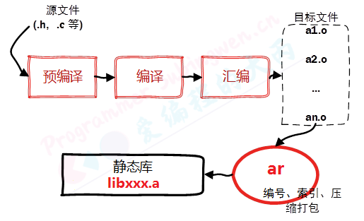

```shell
# 需要将源文件进行汇编, 得到 .o 文件, 需要使用参数 -c
# 执行如下操作, 默认生成二进制的 .o 文件
# -c 参数位置没有要求
$ gcc 源文件(*.c) -c	


# 将得到的 .o 进行打包, 得到静态库
$ ar rcs 静态库的名字(libxxx.a) 原材料(*.o)


# 发布静态库
# 发布静态库
	1. 提供头文件 **.h
	2. 提供制作出来的静态库 libxxx.a

```

```shell
# 测试
# 在某个目录中有如下的源文件, 用来实现一个简单的计算器:
# 目录结构 add.c div.c mult.c sub.c -> 算法的源文件, 函数声明在头文件 head.h
# main.c中是对接口的测试程序, 制作库的时候不需要将 main.c 算进去
.
├── add.c
├── div.c
├── include
│   └── head.h
├── main.c
├── mult.c
└── sub.c


# 加法计算源文件 add.c:
#include <stdio.h>
#include "head.h"

int add(int a, int b)
{
    return a+b;
}


# 减法计算源文件 sub.c:
#include <stdio.h>
#include "head.h"

int subtract(int a, int b)
{
    return a-b;
}


# 乘法计算源文件 mult.c:
#include <stdio.h>
#include "head.h"

int multiply(int a, int b)
{
    return a*b;
}


# 减法计算的源文件 div.c
#include <stdio.h>
#include "head.h"

double divide(int a, int b)
{
    return (double)a/b;
}


# 头文件 head.h
#ifndef _HEAD_H
#define _HEAD_H
// 加法
int add(int a, int b);
// 减法
int subtract(int a, int b);
// 乘法
int multiply(int a, int b);
// 除法
double divide(int a, int b);
#endif


# 测试文件main.c
#include <stdio.h>
#include "head.h"

int main()
{
    int a = 20;
    int b = 12;
    printf("a = %d, b = %d\n", a, b);
    printf("a + b = %d\n", add(a, b));
    printf("a - b = %d\n", subtract(a, b));
    printf("a * b = %d\n", multiply(a, b));
    printf("a / b = %f\n", divide(a, b));
    return 0;
}


# 生成静态库 第一步: 将源文件add.c, div.c, mult.c, sub.c 进行汇编, 得到二进制目标文件 add.o, div.o, mult.o, sub.o
# 1. 生成.o
$ gcc add.c div.c mult.c sub.c -c
sub.c:2:18: fatal error: head.h: No such file or directory
compilation terminated.

# 提示头文件找不到, 添加参数 -I 重新头文件路径即可
$ gcc add.c div.c mult.c sub.c -c -I ./include/

# 查看目标文件是否已经生成
$ tree
.
├── add.c
├── add.o            # 目标文件
├── div.c
├── div.o            # 目标文件
├── include
│   └── head.h
├── main.c
├── mult.c
├── mult.o           # 目标文件
├── sub.c
└── sub.o            # 目标文件


# 第二步: 将生成的目标文件通过 ar工具打包生成静态库
# 2. 将生成的目标文件 .o 打包成静态库
$ ar rcs libcalc.a a.o b.o c.o    # a.o b.o c.o在同一个目录中可以写成 *.o

# 查看目录中的文件
$ tree
.
├── add.c
├── add.o
├── div.c
├── div.o
├── include
│   └── `head.h  ===> 和静态库一并发布
├── `libcalc.a   ===> 生成的静态库
├── main.c
├── mult.c
├── mult.o
├── sub.c
└── sub.o


# 第三步: 将生成的的静态库 libcalc.a和库对应的头文件head.h一并发布给使用者就可以了。
# 3. 发布静态库
	1. head.h    => 函数声明
	2. libcalc.a => 函数定义(二进制格式)
```


#### 静态库使用

- 当我们得到了一个可用的静态库之后, 需要将其放到一个目录中, 然后根据得到的头文件编写测试代码, 对静态库中的函数进行调用。

	```shell
	# 1. 首先拿到了发布的静态库
		`head.h` 和 `libcalc.a`
		
	# 2. 将静态库, 头文件, 测试程序放到一个目录中准备进行测试
	.
	├── head.h          # 函数声明
	├── libcalc.a       # 函数定义（二进制格式）
	└── main.c          # 函数测试
	```

	

- 编译测试程序, 得到可执行文件。

	```shell
	# 3. 编译测试程序 main.c
	$ gcc main.c -o app
	/tmp/ccR7Fk49.o: In function `main':
	main.c:(.text+0x38): undefined reference to `add'
	main.c:(.text+0x58): undefined reference to `subtract'
	main.c:(.text+0x78): undefined reference to `multiply'
	main.c:(.text+0x98): undefined reference to `divide'
	collect2: error: ld returned 1 exit status
	```

	

- 上述错误分析:

	- 编译的源文件中包含了头文件 head.h, 这个头文件中声明的函数对应的定义（也就是函数体实现）在静态库中，程序在编译的时候没有找到函数实现，因此提示 undefined reference to xxxx。
	- 解决方案：在编译的时将静态库的路径和名字都指定出来
		- -L: 指定库所在的目录(相对或者绝对路径)
		- -l: 指定库的名字, 需要掐头(lib)去尾(.a) 剩下的才是需要的静态库的名字


​	

```shell
# 4. 编译的时候指定库信息
	-L: 指定库所在的目录(相对或者绝对路径)
	-l: 指定库的名字, 掐头(lib)去尾(.a) ==> calc
# -L -l, 参数和参数值之间可以有空格, 也可以没有  -L./ -lcalc
$ gcc main.c -o app -L ./ -l calc

# 查看目录信息, 发现可执行程序已经生成了
$ tree
.
├── app   		# 生成的可执行程序
├── head.h
├── libcalc.a
└── main.c
```


### 动态库（有执行权限）

- 动态链接库是程序运行时加载的库，当动态链接库正确部署之后，运行的多个程序可以使用同一个加载到内存中的动态库，因此在Linux中动态链接库也可称之为共享库。

	动态链接库是目标文件的集合，目标文件在动态链接库中的组织方式是按照特殊方式形成的。库中函数和变量的地址使用的是相对地址（静态库中使用的是绝对地址），其真实地址是在应用程序加载动态库时形成的。

	关于动态库的命名规则如下:

	- 在Linux中动态库以lib作为前缀, 以.so作为后缀, 中间是库的名字自己指定即可, 即: **libxxx.so**
	- 在Windows中动态库一般以lib作为前缀, 以dll作为后缀, 中间是库的名字需要自己指定, 即: **libxxx.dll**
		- 制作工具不一样，生成的也不一样，如：使用vs制作，库文件有两个.lib与.dll，两个一起使用才是完整动态库

#### 生成动态链接库

- 生成动态链接库是**直接使用gcc命令并且需要添加-fPIC（-fpic） 以及-shared 参数**。

	- -fPIC 或 -fpic 参数的作用是使得 gcc 生成的代码是与位置无关的，也就是使用相对位置。
	- -shared参数的作用是告诉编译器生成一个动态链接库。

	>生成的.o为是 与位置无关的代码（进程使用时，将代码放入动态库加载区，使用的相对地址）。静态库生成的.o是放在代码区的，且使用的是绝对地址

	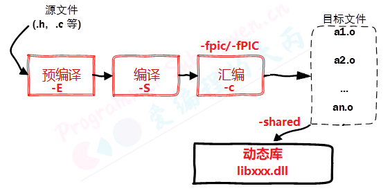

- 生成动态链接库的具体步骤如下:

	- 将源文件进行汇编操作, 需要使用参数 -c, 还需要添加额外参数 -fpic / -fPIC

		```shell
		# 得到若干个 .o文件
		$ gcc 源文件(*.c) -c -fpic
		```

		

	- 将得到的.o文件打包成动态库, 还是使用gcc, 使用参数 -shared 指定生成动态库(位置没有要求)

		```shell
		$ gcc -shared 与位置无关的目标文件(*.o) -o 动态库(libxxx.so)
		```

		

	- 发布动态库和头文件

		```shell
		# 发布
		 	1. 提供头文件: xxx.h
		 	2. 提供动态库: libxxx.so
		```

		```shell
		# 例子
		# 在此还是以上面制作静态库使用的实例代码为例来制作动态库
		# 举例, 示例目录如下:
		# 目录结构 add.c div.c mult.c sub.c -> 算法的源文件, 函数声明在头文件 head.h
		# main.c中是对接口的测试程序, 制作库的时候不需要将 main.c 算进去
		.
		├── add.c
		├── div.c
		├── include
		│   └── head.h
		├── main.c
		├── mult.c
		└── sub.c
		
		
		# 第一步: 使用gcc将源文件进行汇编(参数-c), 生成与位置无关的目标文件, 需要使用参数 -fpic或者-fPIC
		# 1. 将.c汇编得到.o, 需要额外的参数 -fpic/-fPIC
		$ gcc add.c div.c mult.c sub.c -c -fpic -I ./include/
		
		# 查看目录文件信息, 检查是否生成了目标文件
		$ tree
		.
		├── add.c
		├── add.o                # 生成的目标文件
		├── div.c
		├── div.o                # 生成的目标文件
		├── include
		│   └── head.h
		├── main.c
		├── mult.c
		├── mult.o               # 生成的目标文件
		├── sub.c
		└── sub.o                # 生成的目标文件
		
		
		# 第二步: 使用gcc将得到的目标文件打包生成动态库, 需要使用参数 -shared
		# 2. 将得到 .o 打包成动态库, 使用gcc , 参数 -shared
		$ gcc -shared add.o div.o mult.o sub.o -o libcalc.so  
		
		# 检查目录中是否生成了动态库
		$ tree
		.
		├── add.c
		├── add.o
		├── div.c
		├── div.o
		├── include
		│   └── `head.h   ===> 和动态库一起发布
		├── `libcalc.so   ===> 生成的动态库
		├── main.c
		├── mult.c
		├── mult.o
		├── sub.c
		└── sub.o
		
		
		
		# 第三步: 发布生成的动态库和相关的头文件
		# 3. 发布库文件和头文件
			1. head.h
			2. libcalc.so
		```

#### 动态库的使用

- 当我们得到了一个可用的动态库之后, 需要将其放到一个目录中, 然后根据得到的头文件编写测试代码, 对动态库中的函数进行调用。

	```shell
	# 1. 拿到发布的动态库
		`head.h   libcalc.so
	# 2. 基于头文件编写测试程序, 测试动态库中提供的接口是否可用
		`main.c`
	# 示例目录:
	.
	├── head.h          ==> 函数声明
	├── libcalc.so      ==> 函数定义
	└── main.c          ==> 函数测试
	```

	

- 编译测试程序

	```shell
	# 3. 编译测试程序
	$ gcc main.c -o app
	/tmp/ccwlUpVy.o: In function `main':
	main.c:(.text+0x38): undefined reference to `add'
	main.c:(.text+0x58): undefined reference to `subtract'
	main.c:(.text+0x78): undefined reference to `multiply'
	main.c:(.text+0x98): undefined reference to `divide'
	collect2: error: ld returned 1 exit status
	```

	

- 错误原因:

	和使用静态库一样, 在编译的时候需要指定库相关的信息: 库的路径 -L和 库的名字 -l

- 添加库信息相关参数, 重新编译测试代码:

	```shell
	# 在编译的时候指定动态库相关的信息: 库的路径 -L, 库的名字 -l
	$ gcc main.c -o app -L./ -lcalc
	
	# 查看是否生成了可执行程序
	$ tree
	.
	├── app 			# 生成的可执行程序
	├── head.h
	├── libcalc.so
	└── main.c
	
	# 执行生成的可执行程序, 错误提示 ==> 可执行程序执行的时候找不到动态库
	$ ./app 
	./app: error while loading shared libraries: libcalc.so: cannot open shared object file: No such file or directory
	```

	

- 关于整个操作过程的报告：

	 gcc通过指定的动态库信息生成了可执行程序, 但是可执行程序运行却提示无法加载到动态库。


#### 解决动态库无法加载问题

#####  库的工作原理

- 静态库如何被加载
	- 在程序编译的最后一个阶段也就是链接阶段，提供的静态库会被打包到可执行程序中。当可执行程序被执行，静态库中的代码也会一并被加载到内存中，因此不会出现静态库找不到无法被加载的问题。
- 动态库如何被加载
	- 在程序编译的最后一个阶段也就是链接阶段：
		- 在gcc命令中虽然指定了库路径(使用参数 -L ), 但是这个路径并没有记录到可执行程序中，只是检查了这个路径下的库文件是否存在。
		- 同样对应的**动态库文件也没有被打包到可执行程序中**，**只是在可执行程序中记录了库的名字。**
	- 可执行程序被执行起来之后:
		- 程序执行的时候会先检测需要的动态库是否可以被加载，加载不到就会提示上边的错误信息
		- 当动态库中的函数在程序中被调用了, 这个时候动态库才加载到内存，如果不被调用就不加载（随用随加载）
		- 动态库的检测和内存加载操作都是由动态连接器来完成的

##### 动态链接器

- 动态链接器是一个独立于应用程序的进程, 属于操作系统, 当用户的程序需要加载动态库的时候动态连接器就开始工作了，很显然动态连接器根本就不知道用户通过 gcc 编译程序的时候通过参数 -L指定的路径。

	那么动态链接器是如何搜索某一个动态库的呢，在它内部有一个默认的搜索顺序，按照优先级从高到低的顺序分别是：

	- 可执行文件内部的 DT_RPATH 段
	- 系统的环境变量 LD_LIBRARY_PATH（默认为空）
	- 系统动态库的缓存文件 /etc/ld.so.cache
	- 存储动态库/静态库的系统目录 /lib/, /usr/lib等

- 按照以上四个顺序, 依次搜索, 找到之后结束遍历, 最终还是没找到, 动态连接器就会提示动态库找不到的错误信息。


##### 解决方案

- 可执行程序生成之后, 根据动态链接器的搜索路径, 我们可以提供三种解决方案，我们只需要将动态库的路径放到对应的环境变量或者系统配置文件中，同样也可以将动态库拷贝到系统库目录（或者是将动态库的软链接文件放到这些系统库目录中）。

	1. 方案1: 将库路径添加到环境变量 LD_LIBRARY_PATH 中

		>找到相关的配置文件
		>
		>- 用户级别: ~/.bashrc —> 设置对当前用户有效
		>- 系统级别: /etc/profile —> 设置对所有用户有效
		>
		>使用 vim 打开配置文件, 在文件最后添加这样一句话:
		>
		>- ```shell
		>	# 自己把路径写进去就行了
		>	export LD_LIBRARY_PATH =$LD_LIBRARY_PATH :动态库的绝对路径	
		>	```
		>
		>让修改的配置文件生效
		>
		>- 修改了用户级别的配置文件, 关闭当前终端, 打开一个新的终端配置就生效了
		>
		>- 修改了系统级别的配置文件, 注销或关闭系统, 再开机配置就生效了
		>
		>- 不想执行上边的操作, 可以执行一个命令让配置重新被加载
		>
		>	```shell
		>	# 修改的是哪一个就执行对应的那个命令
		>	# source 可以简写为一个 . , 作用是让文件内容被重新加载
		>	$ source ~/.bashrc          (. ~/.bashrc)
		>	$ source /etc/profile       (. /etc/profile)
		>	```

	2. 方案2: 更新 /etc/ld.so.cache 文件

		>找到动态库所在的绝对路径（不包括库的名字）比如：/home/robin/Library/
		>
		>使用vim 修改 /etc/ld.so.conf 这个文件, 将上边的路径添加到文件中(独自占一行)
		>
		>```shell
		># 1. 打开文件
		>$ sudo vim /etc/ld.so.conf
		>
		># 2. 添加动态库路径, 并保存退出
		># 如：/aaa/aa/a
		>```
		>
		>更新 /etc/ld.so.conf中的数据到 /etc/ld.so.cache 中
		>
		>```shell
		># 必须使用管理员权限执行这个命令
		>$ sudo ldconfig   
		>```

	3. 方案3: 拷贝动态库文件到系统库目录 /lib/ 或者 /usr/lib 中 (或者将库的软链接文件放进去)

		>```shell
		># 第一种 库拷贝
		>sudo cp /xxx/xxx/libxxx.so /usr/lib
		>
		># 第二种 创建软连接（对于后续的更新维护，更方便）
		>sudo ln -s /xxx/xxx/libxxx.so /usr/lib/libxxx.so
		>```

##### 验证

- 在启动可执行程序之前, 或者在设置了动态库路径之后, 我们可以通过一个命令检测程序能不能够通过动态链接器加载到对应的动态库, 这个命令叫做 **ldd**

	```shell
	# 语法:
	$ ldd 可执行程序名
	
	# 举例:
	$ ldd app
		linux-vdso.so.1 =>  (0x00007ffe8fbd6000)
	    libcalc.so => /home/robin/Linux/3Day/calc/test/libcalc.so (0x00007f5d85dd4000)
	    libc.so.6 => /lib/x86_64-linux-gnu/libc.so.6 (0x00007f5d85a0a000)
	    /lib64/ld-linux-x86-64.so.2 (0x00007f5d85fd6000)  ==> 动态链接器, 操作系统提供
	# 如果每个都能加载到，后面都有一个地址；如果不能加载，一般为not found
	```

	

### 动态库与静态库优缺点

- 静态库

	- 优点：

		- 静态库被打包到应用程序中加载速度快
		- 发布程序无需提供静态库，移植方便

	- 缺点：

		- 相同的库文件数据可能在内存中被加载多份, 消耗系统资源，浪费内存

		- 库文件更新需要重新编译项目文件, 生成新的可执行程序, 浪费时间。

			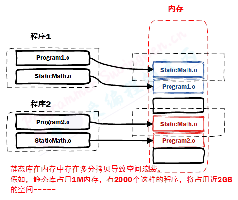

- 动态库

	- 优点：

		- 可实现不同进程间的资源共享
		- 动态库升级简单, 只需要替换库文件, 无需重新编译应用程序
		- 程序猿可以控制何时加载动态库, 不调用库函数动态库不会被加载

	- 缺点：

		- 加载速度比静态库慢, 以现在计算机的性能可以忽略

		- 发布程序需要提供依赖的动态库

			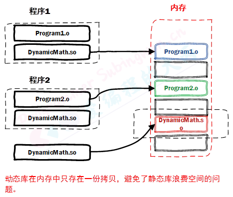


## makefile（linux自带的编译工具）

- 使用 GCC 的命令行进行程序编译在单个文件下是比较方便的，当工程中的文件逐渐增多，甚至变得十分庞大的时候，使用 GCC 命令编译就会变得力不从心。这种情况下我们需要借助项目构造工具 make 帮助我们完成这个艰巨的任务。 **make是一个命令工具，是一个解释makefile中指令的命令工具**，一般来说，大多数的IDE都有这个命令，比如：Visual C++的nmake，QtCreator的qmake等。
- make工具在构造项目的时候需要加载一个叫做makefile的文件，makefile关系到了整个工程的编译规则。一个工程中的源文件不计数，其按类型、功能、模块分别放在若干个目录中，makefile定义了一系列的规则来指定哪些文件需要先编译，哪些文件需要后编译，哪些文件需要重新编译，甚至于进行更复杂的功能操作，因为makefile就像一个Shell脚本一样，其中也可以执行操作系统的命令。（make为厨师，makefile为食谱）
- **makefile带来的好处就是——“自动化编译”，一旦写好，只需要一个make命令，整个工程完全自动编译，极大的提高了软件开发的效率。**
- makefile文件有两种命名方式 makefile 和 Makefile，构建项目的时候在哪个目录下执行构建命令 make这个目录下的 makefile 文件就会别加载，因此在一个项目中可以有多个 makefile 文件，分别位于不同的项目目录中。

### 规则

- Makefile的框架是由规则构成的。make命令执行时先在Makefile文件中查找各种规则，对各种规则进行解析后运行规则。规则的基本格式为：

	```shell
	# 每条规则的语法格式:
	target1,target2...: depend1, depend2, ...
		command
		......
		......
	```

	- **每条规则由三个部分组成分别是目标(target), 依赖(depend)和命令(command)**。（一条规则，可以有多个目标、依赖、命令）

		- 命令(command): 当前这条规则的动作，一般情况下这个动作就是一个 shell 命令
			- 例如：通过某个命令编译文件、生成库文件、进入目录等。
			- 动作可以是多个，**每个命令前必须有一个Tab缩进并且独占占一行。**
		- 依赖(depend): 规则所必需的依赖条件，在规则的命令中可以使用这些依赖。
			- 例如：生成可执行文件的**目标文件（*.o）可以作为依赖使用**
			- 如果规则的命令中不需要任何依赖，那么规则的依赖可以为空
			- 当前规则中的依赖可以是其他规则中的某个目标，这样就形成了规则之间的嵌套
			- 依赖可以根据要执行的命令的实际需求, 指定很多个
		- 目标(target)： 规则中的目标，这个目标和规则中的命令是对应的
			- 通过执行规则中的命令，可以生成一个和目标同名的文件
			- 规则中可以有多个命令, 因此可以通过这多条命令来生成多个目标, 所有目标也可以有很多个
			- 通过执行规则中的命令，可以只执行一个动作，不生成任何文件，这样的目标被称为**伪目标**

		```makefile
		# 举例: 有源文件 a.c b.c c.c head.h, 需要生成可执行程序 app
		################# 例1 #################
		app:a.c b.c c.c
			gcc a.c b.c c.c -o app
		
		################# 例2 #################
		# 有多个目标, 多个依赖, 多个命令
		app,app1:a.c b.c c.c d.c
			gcc a.c b.c -o app
			gcc c.c d.c -o app1
			
		################# 例3 #################	
		# 规则之间的嵌套
		# a.o b.o c.o默认不存在，通过下面的规则实现
		app:a.o b.o c.o
			gcc a.o b.o c.o -o app
		# a.o 是第一条规则中的依赖
		a.o:a.c
			gcc -c a.c
		# b.o 是第一条规则中的依赖
		b.o:b.c
			gcc -c b.c
		# c.o 是第一条规则中的依赖
		c.o:c.c
			gcc -c c.c
		# 一般来说，后面的规则为第一条规则服务
		```


### 工作原理

#### 规则的执行

- **在调用 make 命令编译程序的时候，make 会首先找到 Makefile 文件中的第 1 个规则，分析并执行相关的动作**。但是需要注意的是，好多时候要执行的动作（命令）中使用的依赖是不存在的，如果使用的依赖不存在，这个动作也就不会被执行。

- 对应的解决方案是先将需要的依赖生成出来，我们就可以在makefile中添加新的规则，将不存在的依赖作为这个新的规则中的目标，当这条新的规则对应的命令执行完毕，对应的目标就被生成了，同时另一条规则中需要的依赖也就存在了。

- 这样，makefile中的某一条规则在需要的时候，就会被其他的规则调用，直到makefile中的第一条规则中的所有的依赖全部被生成，第一条规则中的命令就可以基于这些依赖生成对应的目标，make 的任务也就完成了。

	```makefile
	# makefile
	# 规则之间的嵌套
	# 规则1
	app:a.o b.o c.o
		gcc a.o b.o c.o -o app
	# 规则2
	a.o:a.c
		gcc -c a.c
	# 规则3
	b.o:b.c
		gcc -c b.c
	# 规则4
	c.o:c.c
		gcc -c c.c
	```

	>在这个例子中，如果执行 make 命令就会根据这个 makefile 中的4条规则编译这三个源文件。在解析第一条规则的时候发现里边的三个依赖都是不存在的，因此规则对应的命令也就不能被执行。
	>
	>当依赖不存在的时候，make就是查找其他的规则，看哪一条规则是用来生成需要的这个依赖的，找到之后就会执行这条规则中的命令。因此规则2， 规则3， 规则4里的命令会相继被执行，当规则1中依赖全部被生成之后对应的命令也就被执行了，因此规则1的目标被生成，make工作结束。
	>

- 如果想要执行 makefile 中**非第一条规则对应的命令**, 那么就不能直接 make, 需要**将那条规则的目标也写到 make的后边,** 比如只需要执行规则3中的命令, 就需要: make b.o。

#### 文件的时间戳

- make 命令执行的时候会根据文件的时间戳判定是否执行makefile文件中相关规则中的命令。
	- 执行完成：
		- 目标是通过依赖生成的，因此**正常情况下：目标时间戳 > 所有依赖的时间戳**, 如果执行 make 命令的时候检测到规则中的目标和依赖满足这个条件, 那么规则中的命令就不会被执行。
	- 更新：
		- 当依赖文件被更新了, 文件时间戳也会随之被更新, 这时候 **目标时间戳 < 某些依赖的时间戳,** 在这种情况下目标文件会通过规则中的命令被重新生成。
		- 如果规则中的**目标对应的文件根本就不存在**， 那么规则中的命令肯定会被执行。

```makefile
# makefile
# 规则之间的嵌套
# 规则1
app:a.o b.o c.o
	gcc a.o b.o c.o -o app
# 规则2
a.o:a.c
	gcc -c a.c
# 规则3
b.o:b.c
	gcc -c b.c
# 规则4
c.o:c.c
	gcc -c c.c
	
# 根据上文的描述, 先执行 make 命令，基于这个 makefile 编译这几个源文件生成对应的目标文件。然后再修改例子中的 a.c, 再次通过make编译这几个源文件，那么这个时候先执行规则2更新目标文件a.o， 然后再执行规则1更新目标文件app，其余的规则是不会被执行的。
```


#### 自动推导

- make 是一个功能强大的构建工具，虽然make需要根据 makefile 中指定的规则来完成源文件的编译。作为小白的我们编写makefile的时候难免写的不是那么严谨从而漏写一些构建规则，但是我们会发现程序还是会被编译成功。这是因为 make 有自动推导的能力，不会完全依赖 makefile。
- 比如: 使用命令 make 编译扩展名为.c 的 C 语言文件的时候，源文件的编译规则不用明确给出。这是因为 make 进行编译的时候会使用一个默认的编译规则，按照默认规则完成对.c文件的编译，生成对应的.o 文件。它使用命令`cc -c`来编译.c 源文件。在 Makefile 中只要给出需要构建的目标文件名（一个.o 文件），make 会自动为这个.o 文件寻找合适的依赖文件（对应的.c 文件），并且使用默认的命令来构建这个目标文件。

```shell
# 假设本地项目目录中有以下几个源文件:
$ tree
.
├── add.c
├── div.c
├── head.h
├── main.c
├── makefile
├── mult.c
└── sub.c

# 目录中 makefile 文件内容如下
# 这是一个完整的 makefile 文件
calc:add.o  div.o  main.o  mult.o  sub.o
        gcc  add.o  div.o  main.o  mult.o  sub.o -o calc


# 通过make构建项目:
$ make
cc    -c -o add.o add.c
cc    -c -o div.o div.c
cc    -c -o main.o main.c
cc    -c -o mult.o mult.c
cc    -c -o sub.o sub.c
gcc  add.o  div.o  main.o  mult.o  sub.o -o calc


# 我们可以发现上边的 makefile 文件中只有一条规则, 依赖中所有的 .o文件在本地项目目录中是不存在的, 并且也没有其他的规则用来生成这些依赖文件, 这时候 make 会使用内部默认的构造规则先将这些依赖文件生成出来, 然后在执行规则中的命令, 最后生成目标文件 calc。


```

- makefile文件的命名：文件名全小写（makefile）/  文件名首字母大写（Makefile）

### 变量

- 使用 Makefile 进行规则定义的时候，为了写起来更加灵活，我们可以在里边使用变量。makefile中的变量分为三种：**自定义变量，预定义变量和自动变量**。


#### 自定义变量

- 用 Makefile 进行规则定义的时候，用户可以定义自己的变量，称为用户自定义变量。**makefile 中的变量是没有类型的**，直接创建变量然后给其赋值就可以了。

	```shell
	# 错误, 只创建了变量名, 没有赋值
	变量名 
	# 正确, 创建一个变量名并且给其赋值
	变量名=变量值
	```

- 在给makefile中的变量赋值之后, 如何在需要的时候将变量值取出来呢?

	```makefile
	# 如果将变量的值取出?
	$(变量的名字)
	
	# 举例 add.o  div.o  main.o  mult.o  sub.o
	# 定义变量并赋值
	obj=add.o  div.o  main.o  mult.o  sub.o
	# 取变量的值
	$(obj)
	```

	

- 自定义变量使用举例：

	```makefile
	# 这是一个规则，普通写法
	calc:add.o  div.o  main.o  mult.o  sub.o
	        gcc  add.o  div.o  main.o  mult.o  sub.o -o calc
	        
	# 这是一个规则，里边使用了自定义变量
	obj=add.o  div.o  main.o  mult.o  sub.o
	target=calc
	$(target):$(obj)
	        gcc  $(obj) -o $(target)
	```

#### 预定义变量

- **在 Makefile 中有一些已经定义的变量**，用户可以直接使用这些变量，不用进行定义。在进行编译的时候，某些条件下 Makefile 会使用这些预定义变量的值进行编译。这些预定义变量的名字一般都是大写的，经常采用的预定义变量如下表所示：

	| 变 量 名 |            含 义             | 默 认 值 |
	| :------: | :--------------------------: | :------: |
	|    AR    |  生成静态库库文件的程序名称  |    ar    |
	|    AS    |       汇编编译器的名称       |    as    |
	|    CC    |      C 语言编译器的名称      |    cc    |
	|   CPP    |     C 语言预编译器的名称     | $(CC) -E |
	|   CXX    |     C++语言编译器的名称      |   g++    |
	|    FC    |   FORTRAN 语言编译器的名称   |   f77    |
	|    RM    |      删除文件程序的名称      |  rm -f   |
	| ARFLAGS  |  生成静态库库文件程序的选项  | 无默认值 |
	| ASFLAGS  |   汇编语言编译器的编译选项   | 无默认值 |
	|  CFLAGS  |    C 语言编译器的编译选项    | 无默认值 |
	| CPPFLAGS |    C 语言预编译的编译选项    | 无默认值 |
	| CXXFLAGS |   C++语言编译器的编译选项    | 无默认值 |
	|  FFLAGS  | FORTRAN 语言编译器的编译选项 | 无默认值 |

```makefile
# 这是一个规则，普通写法
calc:add.o  div.o  main.o  mult.o  sub.o
        gcc  add.o  div.o  main.o  mult.o  sub.o -o calc
        
# 这是一个规则，里边使用了自定义变量和预定义变量
obj=add.o  div.o  main.o  mult.o  sub.o
target=calc
CFLAGS=-O3 # 代码优化
$(target):$(obj)
        $(CC)  $(obj) -o $(target) $(CFLAGS)
```

#### 自动变量

- Makefile 中的变量除了用户自定义变量和预定义变量外，还有一类自动变量。Makefile 中的规则语句中经常会出现目标文件和依赖文件，**自动变量用来代表这些规则中的目标文件和依赖文件，并且它们<span style="color:#FF0000;">只能在规则的命令中使用</span>**。（从第二行以下的命令才能使用自动变量）

	下表中是一些常见的自动变量。

	| 变 量 | 含 义                                                        |
	| ----- | ------------------------------------------------------------ |
	| $*    | 表示目标文件的名称，不包含目标文件的扩展名（忽略后缀名）     |
	| $+    | 表示所有的依赖文件，这些依赖文件之间以空格分开，按照出现的先后为顺序，其中可能 包含重复的依赖文件 |
	| $<    | 表示依赖项中第一个依赖文件的名称 (某个规则的依赖项的第一个依赖文件) |
	| $?    | 依赖项中，所有比目标文件时间戳晚的依赖文件，依赖文件之间以空格分开 |
	| $@    | 表示目标文件的名称，包含文件扩展名                           |
	| $^    | 依赖项中，所有不重复的依赖文件，这些文件之间以空格分开       |

	```makefile
	# 这是一个规则，普通写法
	calc:add.o  div.o  main.o  mult.o  sub.o
	        gcc  add.o  div.o  main.o  mult.o  sub.o -o calc
	        
	# 这是一个规则，里边使用了自定义变量
	# 使用自动变量, 替换相关的内容
	calc:add.o  div.o  main.o  mult.o  sub.o
		gcc $^ -o $@ 			# 自动变量只能在规则的命令中使用
	
	```

	

### 模式匹配

```makefile
calc:add.o  div.o  main.o  mult.o  sub.o
        gcc  add.o  div.o  main.o  mult.o  sub.o -o calc
# 语法格式重复的规则, 将 .c -> .o, 使用的命令都是一样的 gcc *.c -c
add.o:add.c
        gcc add.c -c

div.o:div.c
        gcc div.c -c

main.o:main.c
        gcc main.c -c

sub.o:sub.c
        gcc sub.c -c

mult.o:mult.c
        gcc mult.c -c
```

- 在阅读过程中能够发现从第二个规则开始到第六个规则做的是相同的事情, 但是由于文件名不同不得不在文件中写出多个规则，这就让 makefile 文件看起来非常的冗余，我们可以将这一系列的相同操作整理成一个模板，所有类似的操作都通过模板去匹配 makefile 会因此而精简不少，只是可读性会有所下降。

- 这个规则模板可以写成下边的样子，这种操作就称之为模式匹配。

	```makefile
	# 模式匹配 -> 通过一个公式, 代表若干个满足条件的规则
	# 依赖有一个, 后缀为.c, 生成的目标是一个 .o 的文件, % 是一个通配符, 匹配的是文件名
	%.o:%.c
		gcc $< -c
	```

	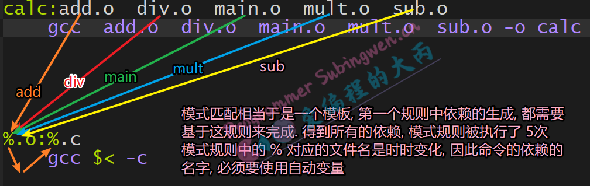

### 函数

- makefile中有很多函数并且**所有的函数都是有返回值的**。makefile中函数的格式和C/C++中函数也不同，其写法是这样的： **$(函数名 参数1, 参数2, 参数3, ...)**，主要目的是让我们能够快速方便的得到函数的返回值。

	这里为大家介绍两个 makefile 中使用频率比较高的函数：wildcard和patsubst。


#### wildcard

- 这个函数的主要作用是获取指定目录下指定类型的文件名，其返回值是以空格分割的、指定目录下的所有符合条件的文件名列表。函数原型如下：

	```makefile
	# 该函数的参数只有一个, 但是这个参数可以分成若干个部分, 通过空格间隔
	$(wildcard PATTERN...)
		参数:	指定某个目录, 搜索这个路径下指定类型的文件，比如： *.c
	```

	- 参数功能:
		- PATTERN 指的是某个或多个目录下的对应的某种类型的文件, 比如当前目录下的.c文件可以写成 *.c
		- 可以指定多个目录，每个路径之间使用空格间隔
	- 返回值：
		- 得到的若干个文件的文件列表， 文件名之间使用空格间隔
		- 示例：$(wildcard *.c ./sub/*.c)
			- 返回值格式: a.c b.c c.c d.c e.c f.c ./sub/aa.c ./sub/bb.c

```makefile
# 使用举例: 分别搜索三个不同目录下的 .c 格式的源文件
src = $(wildcard /home/robin/a/*.c /home/robin/b/*.c *.c)  # *.c == ./*.c
# 返回值: 得到一个大的字符串, 里边有若干个满足条件的文件名, 文件名之间使用空格间隔
/home/robin/a/a.c /home/robin/a/b.c /home/robin/b/c.c /home/robin/b/d.c e.c f.c

```

#### patsubst

- 这个函数的功能是按照指定的模式替换指定的文件名的后缀, 函数原型如下:

	```makefile
	# 有三个参数, 参数之间使用 逗号间隔
	$(patsubst <pattern>,<replacement>,<text>)
	```

	- 参数功能:
		- pattern: 这是一个模式字符串, 需要指定出要被替换的文件名中的后缀是什么
			- 文件名和路径不需要关心, 因此使用 % 表示即可 [通配符是 %]
			- 在通配符后边指定出要被替换的后缀, 比如: %.c, 意味着 .c的后缀要被替换掉
		- replacement: 这是一个模式字符串, 指定参数pattern中的后缀最终要被替换为什么
			- 还是使用 % 来表示参数pattern 中文件的路径和名字
			- 在通配符 % 后边指定出新的后缀名, 比如: %.o 这表示原来的后缀被替换为 .o
		- text: 该参数中存储这要被替换的原始数据
	- 返回值:
		- 函数返回被替换过后的字符串。

```makefile
src = a.cpp b.cpp c.cpp e.cpp
# 把变量 src 中的所有文件名的后缀从 .cpp 替换为 .o
obj = $(patsubst %.cpp, %.o, $(src)) 
# obj 的值为: a.o b.o c.o e.o
```


### makefile编写

- 下面基于一个简单的项目, 为大家演示一下编写一个makefile从不标准到标准的进化过程。

	```shell
	# 项目目录结构
	.
	├── add.c
	├── div.c
	├── head.h
	├── main.c
	├── mult.c
	└── sub.c
	# 需要编写makefile对该项目进行自动化编译
	```

```makefile
# 版本1

calc:add.c  div.c  main.c  mult.c  sub.c
        gcc add.c  div.c  main.c  mult.c  sub.c -o calc

# 这个版本的优点：书写简单
# 这版本的缺点：只要依赖中的某一个源文件被修改，所有的源文件都需要被重新编译，太耗时、效率低
# 改进方式：提高效率，修改哪一个源文件, 哪个源文件被重新编译, 不修改就不重新编译


# 版本2

# 默认所有的依赖都不存在, 需要使用其他规则生成这些依赖
# 因为 add.o 被更新, 需要使用最新的依赖, 生成最新的目标
calc:add.o  div.o  main.o  mult.o  sub.o
        gcc  add.o  div.o  main.o  mult.o  sub.o -o calc

# 如果修改了add.c, add.o 被重新生成
add.o:add.c
        gcc add.c -c

div.o:div.c
        gcc div.c -c

main.o:main.c
        gcc main.c -c

sub.o:sub.c
        gcc sub.c -c

mult.o:mult.c
        gcc mult.c -c

# 这个版本的优点：相较于版本1效率提升了
# 这个版本的缺点：规则比较冗余, 需要精简
# 改进方式：在 makefile 中使用变量 和 模式匹配


# 版本3

# 添加自定义变量 -> makefile中注释前 使用 # 
obj=add.o  div.o  main.o  mult.o  sub.o
target=calc

$(target):$(obj)
        gcc $(obj)  -o $(target)

%.o:%.c
        gcc $< -c

# 这个版本的优点：文件精简不少，变得简洁了
# 这个版本的缺点：变量 obj 的值需要手动的写出来, 如果需要编译的项目文件很多，都用手写出来不现实
# 改进方式：在makefile中使用函数


# 版本4

# 添加自定义变量 -> makefile中注释前 使用 # 
# 使用函数搜索当前目录下的源文件 .c
src=$(wildcard *.c)
# 将源文件的后缀替换为 .o
# % 匹配的内容是不能被替换的, 需要替换的是第一个参数中的后缀, 替换为第二个参数中指定的后缀
# obj=$(patsubst %.cpp, %.o, $(src)) 将src中的关键字 .cpp 替换为 .o
obj=$(patsubst %.c, %.o, $(src))
target=calc

$(target):$(obj)
        gcc $(obj)  -o $(target)

%.o:%.c
        gcc $< -c

# 这个版本的优点：解决了自动加载项目文件的问题，解放了双手
# 这个版本的缺点：没有文件删除的功能，不能删除项目编译过程中生成的目标文件（*.o）和可执行程序
# 改进方式：在makefile文件中添加新的规则用于删除生成的目标文件（*.o）和可执行程序


# 版本5

# 添加自定义变量 -> makefile中注释前 使用 # 
# 使用函数搜索当前目录下的源文件 .c
src=$(wildcard *.c)
# 将源文件的后缀替换为 .o
obj=$(patsubst %.c, %.o, $(src))
target=calc
# obj 的值 xxx.o xxx.o xxx.o xx.o
$(target):$(obj)
        gcc $(obj)  -o $(target)

%.o:%.c
        gcc $< -c

# 添加规则, 删除生成文件 *.o 可执行程序
# 这个规则比较特殊, clean根本不会生成, 这是一个伪目标
clean:
        rm $(obj) $(target)

# 这个版本的优点：添加了新的规则（16行）用于文件的删除, 直接 make clean 就可以执行规则中的删除命令了
# 这个版本的缺点：在下面有具体的问题演示和分析
# 改进方式：在makefile文件中声明 clean是一个伪目标，让 make 放弃对它的时间戳检测。

# 正常情况下这个版本的makefile是可以正常工作的，但是我们如果在这个项目目录中添加一个叫做clean的文件（和规则中的目标名称相同），再进行 make clean发现这个规则就不能正常工作了。

# 在项目目录中添加一个叫 clean的文件, 然后在 make clean 这个规则中的命令就不工作了
$ ls
add.c  calc   div.c  head.h  main.o    mult.c  sub.c
add.o  div.o  main.c  makefile  mult.o  sub.o  clean  ---> 新添加的

# 使用 makefile 中的规则删除生成的目标文件和可执行程序
$ make clean
make: 'clean' is up to date. 

# 查看目录, 发现相关文件并没有被删除, make clean 失败了
$ ls
add.c  calc   div.c  head.h  main.o    mult.c  sub.c
add.o  clean  div.o  main.c  makefile  mult.o  sub.o

# 这个问题的关键点在于 clean是一个伪目标, 不对应任何实体文件, 在前边讲关于文件时间戳更新问题的时候说过，如果目标不存在规则的命令肯定被执行， 如果目标文件存在了就需要比较规则中目标文件和依赖文件的时间戳，满足条件才执行规则的命令，否则不执行。
# 解决这个问题需要在 makefile 中声明 clean是一个伪目标，这样 make 就不会对文件的时间戳进行检测，规则中的命令也就每次都会被执行了。
# 在 makefile 中声明一个伪目标需要使用 .PHONY 关键字, 声明方式为: .PHONY:伪文件名称


# 最终版

# 添加自定义变量 -> makefile中注释前 使用 # 
# 使用函数搜索当前目录下的源文件 .c
src=$(wildcard *.c)
# 将源文件的后缀替换为 .o
obj=$(patsubst %.c, %.o, $(src))
target=calc

$(target):$(obj)
        gcc $(obj)  -o $(target)

%.o:%.c
        gcc $< -c

# 添加规则, 删除生成文件 *.o 可执行程序
# 声明clean为伪文件
.PHONY:clean
clean:
        # shell命令前的 - 表示强制这个指令执行, 如果执行失败也不会终止
        -rm $(obj) $(target) 
        echo "hello, 我是测试字符串"

```

- 在 makefile 中声明一个伪目标需要使用 .PHONY 关键字, 声明方式为: **.PHONY:伪文件名称**

```makefile
# 目录结构
.
├── include
│   └── head.h	==> 头文件, 声明了加减乘除四个函数
├── main.c		==> 测试程序, 调用了head.h中的函数
└── src
    ├── add.c	==> 加法运算
    ├── div.c	==> 除法运算
    ├── mult.c  ==> 乘法运算
    └── sub.c   ==> 减法运算

# makefile文件
# 最终的目标名 app
target = app
# 搜索当前项目目录下的源文件
src=$(wildcard *.c ./src/*.c)
# 将文件的后缀替换掉 .c -> .o
obj=$(patsubst %.c, %.o, $(src))
# 头文件目录
include=./include

# 第一条规则
# 依赖中都是 xx.o yy.o zz.o
# gcc命令执行的是链接操作
$(target):$(obj)
        gcc $^ -o $@

# 模式匹配规则
# 执行汇编操作, 前两步: 预处理, 编译是自动完成
%.o:%.c
        gcc $< -c -I $(include) -o $@

# 添加一个清除文件的规则
.PHONY:clean

clean:
        -rm $(obj) $(target) -f
```


## GDB调式

- gdb 是由 GNU 软件系统社区提供的调试器，同 gcc 配套组成了一套完整的开发环境，可移植性很好，支持非常多的体系结构并被移植到各种系统中（包括各种类 Unix 系统与 Windows 系统里的 MinGW 和 Cygwin ）。此外，除了 C 语言之外，gcc/gdb 还支持包括 C++、Objective-C、Ada 和 Pascal 等各种语言后端的编译和调试。 gcc/gdb 是 Linux 和许多类 Unix 系统中的标准开发环境，Linux 内核也是专门针对 gcc 进行编码的。
- **GDB 是一套字符界面的程序集，可以使用命令 gdb 加载要调试的程序。**

### 调式准备

- 项目程序如果是**为了进行调试而编译时， 必须要打开调试选项(-g)**。另外还有一些可选项，比如: 在尽量不影响程序行为的情况下**关掉编译器的优化选项(-O0)**，**-Wall选项打开所有 warning**，也可以发现许多问题，避免一些不必要的 bug。
- -g选项的作用是在可执行文件中加入源代码的信息，比如可执行文件中第几条机器指令对应源代码的第几行，但并不是把整个源文件嵌入到可执行文件中，所以在调试时必须保证gdb能找到源文件。
- 习惯上如果是c程序就使用gcc编译, 如果是 c++程序就使用g++编译, 编译命令中添加上边提到的参数即可。
	- 假设有一个文件 args.c, 要对其进行gdb调试，编译的时候必须要添加参数 -g，加入了源代码信息的可执行文件比不加之前要大一些。


```shell
# -g 将调试信息写入到可执行程序中
$ gcc -g args.c -o app

# 编译不添加 -g 参数
$ gcc args.c -o app1  

# 查看生成的两个可执行程序的大小
$ ll

-rwxrwxr-x  1 robin robin 9816 Apr 19 09:25 app*	# 可以用于gdb调试
-rwxrwxr-x  1 robin robin 8608 Apr 19 09:25 app1*	# 不能用于gdb调试
```

### 启动和退出gdb

#### 启动gdb

- gdb是一个用于应用程序调试的进程, 需要先将其打开, **一定要注意 gdb进程启动之后, 需要的被调试的应用程序是没有执行的**。打开Linux终端，切换到要调试的可执行程序所在路径，执行如下命令就可以启动 gdb了。

	```shell
	# 在终端中执行如下命令
	# gdb程序启动了, 但是可执行程序并没有执行
	$ gdb 可执行程序的名字
	
	# 使用举例：
	$ gdb app
	(gdb) 		# gdb等待输入调试的相关命令
	```

	

#### 命令行传参

- 有些程序在启动的时候需要传递命令行参数，如果要调试这类程序，这些命令行参数必须要在应用程序启动之前通过调试程序的gdb进程传递进去。下面是一段带命令行参数的程序：

	```c
	// args.c
	#include <stdio.h>
	#include <stdlib.h>
	#include <unistd.h>
	#include <string.h>
	
	#define NUM 10
	
	// argc, argv 是命令行参数
	// 启动应用程序的时候
	int main(int argc, char* argv[])
	{
	    printf("参数个数: %d\n", argc);
	    for(int i=0; i<argc; ++i)
	    {
	        printf("%d\n", NUM);
	        printf("参数 %d: %s\n", i, argv[i]);
	    }
	    return 0;
	}
	
	```

	```shell
	# 第一步: 编译出带条信息的可执行程序
	$ gcc args.c -o app -g
	# 第二步: 启动gdb进程, 指定需要gdb调试的应用程序名称
	$ gdb app
	(gdb) 
	# 第三步: 在启动应用程序 app之前设置命令行参数。gdb中设置参数的命令叫做set args ...，查看设置的命令行参数命令是 show args。 语法格式如下：
	# 设置的时机: 启动gdb之后, 在应用程序启动之前
	(gdb) set args 参数1 参数2 .... ...
	# 查看设置的命令行参数
	(gdb) show args
	
	```

	```shell
	# 例子
	# 非gdb调试命令行传参
	# argc 参数总个数，argv[0] == ./app， argv[1] == "11"  argv[2] == "22"  ...  argv[5] == "55"
	$ ./app 11 22 33 44 55		# 这是数据传递给main函数
	 
	# 使用 gdb 调试
	$ gdb app
	GNU gdb (Ubuntu 7.11.1-0ubuntu1~16.5) 7.11.1
	Copyright (C) 2016 Free Software Foundation, Inc.
	# 通过gdb给应用程序设置命令行参数
	(gdb) set args 11 22 33 44 55
	# 查看设置的命令行参数
	(gdb) show args
	Argument list to give program being debugged when it is started is "11 22 33 44 55"
	```

	

####  gdb中启动程序

- 在gdb中启动要调试的应用程序有两种方式, 一种是使用run命令, 另一种是使用start命令启动。在整个 gdb 调试过程中, 启动应用程序的命令只能使用一次。

	- run: 可以缩写为 **r**, 如果程序中设置了断点会停在第一个断点的位置, 如果没有设置断点, 程序就执行完了
	- start: 启动程序, 最终会阻塞在main函数的第一行，等待输入后续其它 gdb 指令

	```shell
	# 两种方式
	# 方式1: run == r 
	(gdb) run  
	
	# 方式2: start
	(gdb) start
	```

	- 如果想让程序start之后**继续运行, 或者在断点处继续运行**，可以使用 **continue命令**, 可以简写为 c

	```shell
	# continue == c
	(gdb) continue
	```

#### 退出gdb

- 退出gdb调试, 就是终止 gdb 进程, 需要使用 quit命令, 可以缩写为 q

```shell
# quit == q
(gdb) quit
```


### 查看代码

- 因为gdb调试没有IDE那样的完善的可视化窗口界面，给调试的程序打断点又是调试之前必须做的一项工作。因此gdb提供了查看代码的命令，这样就可以轻松定位要调试的代码行的位置了。

	查看代码的命令叫做**list可以缩写为 l,** 通过这个命令我们可以查看项目中任意一个文件中的内容，并且还可以通过文件行号，函数名等方式查看。

#### 当前文件

- 一个项目中一般是有很多源文件的, **默认情况下通过list查看到代码信息位于程序入口函数main对应的的那个文件中**。因此如果不进行文件切换main函数所在的文件就是当前文件, 如果进行了文件切换, 切换到哪个文件哪个文件就是当前文件。查看文件内容的方式如下：

	```shell
	# 使用 list 和使用 l 都可以
	# 从第一行开始显示
	(gdb) list 
	
	# 列值这行号对应的上下文代码, 默认情况下只显示10行内容
	(gdb) list 行号
	
	# 显示这个函数的上下文内容, 默认显示10行
	(gdb) list 函数名
	
	```

	- 通过list去查看文件代码, 默认只显示10行, 如果还想继续查看后边的内容, 可以继续执行list命令, 也可以**直接回车（再次执行上一次执行的那个gdb命令）**。


#### 切换文件

- 在查看文件内容的时候，很多情况下需要进行文件切换，我们只需要在list命令后边将要查看的文件名指定出来就可以了，切换命令执行完毕之后，这个文件就变成了当前文件。文件切换方式如下：

	```shell
	# 切换到指定的文件，并列出这行号对应的上下文代码, 默认情况下只显示10行内容
	(gdb) l 文件名:行号
	
	# 切换到指定的文件，并显示这个函数的上下文内容, 默认显示10行
	(gdb) l 文件名:函数名
	```

#### 设置显示的行数

- 默认通过list只能一次查看10行代码, 如果想显示更多, 可以**通过set listsize设置**, 同样如果想查看当前显示的行数可以**通过 show listsize查看**, 这里的**listsize可以简写为 list**。具体语法格式如下:

	```shell
	# 以下两个命令中的 listsize 都可以写成 list
	(gdb) set listsize 行数
	
	# 查看当前list一次显示的行数
	(gdb) show listsize
	```

	

### 断点操作

- 想要通过gdb调试某一行或者得到某个变量在运行状态下的实际值，就需要在在这一行设置断点，程序指定到断点的位置就会阻塞，我们就可以通过gdb的调试命令得到我们想要的信息了。

	**设置断点的命令叫做break可以缩写为b。**

#### 设置断点

- 断点的设置有两种方式一种是**常规断点**，程序只要运行到这个位置就会被阻塞，还有一种叫**条件断点**，只有指定的条件被满足了程序才会在断点处阻塞。

	调试程序的断点可以设置到某个具体的行, 也可以设置到某个函数上，具体的设置方式如下：

	- 设置普通断点到当前文件

		```shell
		# 在当前文件的某一行上设置断点
		# break == b
		(gdb) b 行号
		(gdb) b 函数名		# 停止在函数的第一行
		```

		

	- 设置普通断点到某个非当前文件上

		```shell
		# 在非当前文件的某一行上设置断点
		(gdb) b 文件名:行号
		(gdb) b 文件名:函数名		# 停止在函数的第一行
		```

		

	- 设置条件断点

	```shell
	# 必须要满足某个条件, 程序才会停在这个断点的位置上
	# 通常情况下, 在循环中条件断点用的比较多
	(gdb) b 行数 if 变量名==某个值
	```

	

#### 查看断点

- 断点设置完毕之后, 可以通过 **info break命令**查看设置的断点信息，其中**info可以缩写为i**

	```shell
	# info == i
	# 查看设置的断点信息
	(gdb) i b   #info break
	
	# 举例
	(gdb) i b
	Num     Type           Disp Enb Address            What
	1       breakpoint     keep y   0x0000000000400cb5 in main() at test.cpp:12
	2       breakpoint     keep y   0x0000000000400cbd in main() at test.cpp:13
	3       breakpoint     keep y   0x0000000000400cec in main() at test.cpp:18
	4       breakpoint     keep y   0x00000000004009a5 in insertionSort(int*, int) 
	                                                   at insert.cpp:8
	5       breakpoint     keep y   0x0000000000400cdd in main() at test.cpp:16
	6       breakpoint     keep y   0x00000000004009e5 in insertionSort(int*, int) 
	```

	- 在显示的断点信息中有一些属性需要在其他操作中被使用, 下面介绍一下:
		- Num: 断点的编号, 删除断点或者设置断点状态的时候都需要使用
		- Enb: 当前断点的状态, y表示断点可用, n表示断点不可用
		- What: 描述断点被设置在了哪个文件的哪一行或者哪个函数上

#### 删除断点

- 如果确定设置的某个断点不再被使用了, 可用将其删除, 删除命令是 **delete 断点编号**, 这个**delete可以简写为del也可以再简写为d。**

	删除断点的方式有两种: **删除(一个或者多个)指定断点或者删除一个连续的断点区间**，具体操作如下：

	```shell
	# delete == del == d
	# 需要 info b 查看断点的信息, 第一列就是编号
	(gdb) d 断点的编号1 [断点编号2 ...]
	# 举例: 
	(gdb) d 1          # 删除第1个断点
	(gdb) d 2 4 6      # 删除第2,4,6个断点
	
	# 删除一个范围, 断点编号 num1 - numN 是一个连续区间
	(gdb) d num1-numN
	# 举例, 删除第1到第5个断点
	(gdb) d 1-5
	```

	

#### 设置断点状态

- 如果某个断点只是临时不需要了，我们可以将其**设置为不可用状态**, 设置命令为**disable 断点编号**，当需要的时候再将其**设置回可用状态**，设置命令为 **enable 断点编号**。

- 设置断点无效

	```shell
	# 让断点失效之后, gdb调试过程中程序是不会停在这个位置的
	# disable == dis
	# 设置某一个或者某几个断点无效
	(gdb) dis 断点1的编号 [断点2的编号 ...]
	
	# 设置某个区间断点无效
	(gdb) dis 断点1编号-断点n编号
	
	
	# 例子
	# 查看断点信息
	(gdb) i b
	Num     Type           Disp Enb Address            What
	2       breakpoint     keep y   0x0000000000400cce in main() at test.cpp:14
	4       breakpoint     keep y   0x0000000000400cdd in main() at test.cpp:16
	5       breakpoint     keep y   0x0000000000400d46 in main() at test.cpp:23
	6       breakpoint     keep y   0x0000000000400d4e in main() at test.cpp:25
	7       breakpoint     keep y   0x0000000000400d6e in main() at test.cpp:28
	8       breakpoint     keep y   0x0000000000400d7d in main() at test.cpp:30
	
	# 设置第2, 第4 个断点无效
	(gdb) dis 2 4
	
	# 查看断点信息
	(gdb) i b
	Num     Type           Disp Enb Address            What
	2       breakpoint     keep n   0x0000000000400cce in main() at test.cpp:14
	4       breakpoint     keep n   0x0000000000400cdd in main() at test.cpp:16
	5       breakpoint     keep y   0x0000000000400d46 in main() at test.cpp:23
	6       breakpoint     keep y   0x0000000000400d4e in main() at test.cpp:25
	7       breakpoint     keep y   0x0000000000400d6e in main() at test.cpp:28
	8       breakpoint     keep y   0x0000000000400d7d in main() at test.cpp:30
	
	# 设置 第5,6,7,8个 断点无效
	(gdb) dis 5-8
	
	# 查看断点信息
	(gdb) i b
	Num     Type           Disp Enb Address            What
	2       breakpoint     keep n   0x0000000000400cce in main() at test.cpp:14
	4       breakpoint     keep n   0x0000000000400cdd in main() at test.cpp:16
	5       breakpoint     keep n   0x0000000000400d46 in main() at test.cpp:23
	6       breakpoint     keep n   0x0000000000400d4e in main() at test.cpp:25
	7       breakpoint     keep n   0x0000000000400d6e in main() at test.cpp:28
	8       breakpoint     keep n   0x0000000000400d7d in main() at test.cpp:30
	
	```

	

- 让无效的断点生效

```shell
# enable == ena
# 设置某一个或者某几个断点有效
(gdb) ena 断点1的编号 [断点2的编号 ...]

# 设置某个区间断点有效
(gdb) ena 断点1编号-断点n编号


# 例子
# 查看断点信息
(gdb) i b
Num     Type           Disp Enb Address            What
2       breakpoint     keep n   0x0000000000400cce in main() at test.cpp:14
4       breakpoint     keep n   0x0000000000400cdd in main() at test.cpp:16
5       breakpoint     keep n   0x0000000000400d46 in main() at test.cpp:23
6       breakpoint     keep n   0x0000000000400d4e in main() at test.cpp:25
7       breakpoint     keep n   0x0000000000400d6e in main() at test.cpp:28
8       breakpoint     keep n   0x0000000000400d7d in main() at test.cpp:30

# 设置第2, 第4个断点有效
(gdb) ena 2 4

# 查看断点信息
(gdb) i b
Num     Type           Disp Enb Address            What
2       breakpoint     keep y   0x0000000000400cce in main() at test.cpp:14
4       breakpoint     keep y   0x0000000000400cdd in main() at test.cpp:16
5       breakpoint     keep n   0x0000000000400d46 in main() at test.cpp:23
6       breakpoint     keep n   0x0000000000400d4e in main() at test.cpp:25
7       breakpoint     keep n   0x0000000000400d6e in main() at test.cpp:28
8       breakpoint     keep n   0x0000000000400d7d in main() at test.cpp:30

# 设置第5,6,7个断点有效
(gdb) ena 5-7

# 查看断点信息
(gdb) i b
Num     Type           Disp Enb Address            What
2       breakpoint     keep y   0x0000000000400cce in main() at test.cpp:14
4       breakpoint     keep y   0x0000000000400cdd in main() at test.cpp:16
5       breakpoint     keep y   0x0000000000400d46 in main() at test.cpp:23
6       breakpoint     keep y   0x0000000000400d4e in main() at test.cpp:25
7       breakpoint     keep y   0x0000000000400d6e in main() at test.cpp:28
8       breakpoint     keep n   0x0000000000400d7d in main() at test.cpp:30

```


### 调式命令

#### 继续运行gdb

- 如果调试的程序被断点阻塞了又想让程序继续执行，这时候就可以使用continue命令。程序会继续运行, 直到遇到下一个有效的断点。continue可以缩写为 c。

	```shell
	# continue == c
	(gdb) continue
	```

#### 手动打印信息

- 当程序被某个断点阻塞之后, 可以通过一些命令打印变量的名字或者变量的类型，并且还可以跟踪打印某个变量的值。

##### 打印变量值

- 在gdb调试的时候如果需要打印变量的值， 使用的命令是 **print**, 可缩写为 **p**。如果打印的变量是整数还可以指定输出的整数的格式, 格式化输出的整数对应的字符表如下：

	| 格式化字符(/fmt) | 说明                                 |
	| ---------------- | ------------------------------------ |
	| /x               | 以十六进制的形式打印出整数。         |
	| /d               | 以有符号、十进制的形式打印出整数。   |
	| /u               | 以无符号、十进制的形式打印出整数。   |
	| /o               | 以八进制的形式打印出整数。           |
	| /t               | 以二进制的形式打印出整数。           |
	| /f               | 以浮点数的形式打印变量或表达式的值。 |
	| /c               | 以字符形式打印变量或表达式的值。     |

- print命令的语法格式如下:

	```shell
	# print == p
	(gdb) p 变量名
	
	# 如果变量是一个整形, 默认对应的值是以10进制格式输出, 其他格式请参考上表
	(gdb) p/fmt 变量名
	```

	

- 举例:

```shell
# 举例
(gdb) p i       # 10进制
$5 = 3
(gdb) p/x i     # 16进制
$6 = 0x3
(gdb) p/o i     # 8进制
$7 = 03
```

##### 打印变量类型

- 如果在调试过程中需要查看某个变量的类型, 可以使用命令ptype, 语法格式如下:

	```shell
	# 语法格式
	(gdb) ptype 变量名
	```

	

- 例子

	```shell
	# 打印变量类型
	(gdb) ptype i
	type = int
	(gdb) ptype array[i]
	type = int
	(gdb) ptype array
	type = int [12]
	```

	

#### 自动打印信息

##### 设置变量名自动显示

- 和 print 命令一样，**display** 命令也用于调试阶段查看某个变量或表达式的值，它们的区别是，**使用 display 命令查看变量或表达式的值，每当程序暂停执行（例如单步执行）时，GDB 调试器都会自动帮我们打印出来，而 print 命令则不会**。因此，当我们想频繁查看某个变量或表达式的值从而观察它的变化情况时，使用 display 命令可以一劳永逸。display 命令没有缩写形式，常用的语法格式如下 2 种：
	```shell
	# 在变量的有效取值范围内, 自动打印变量的值(设置一次, 以后就会自动显示)
	(gdb) display 变量名
	
	# 以指定的整形格式打印变量的值, 关于 fmt 的取值, 请参考 print 命令的格式化字符表
	(gdb) display/fmt 变量名
	```

	

##### 查看自动显示列表

- 对于使用 display 命令查看的目标变量或表达式，**都会被记录在一张列表（称为自动显示列表）中。通过执行`info dispaly`命令，可以打印出这张表**：

	```shell
	# info == i
	(gdb) info display
	Auto-display expressions now in effect:
	Num Enb Expression
	1:   y  i
	2:   y  array[i]
	3:   y  /x array[i]
	```

	- 在展示出的信息中, 每个列的含义如下:
		- Num : 变量或表达式的编号，GDB 调试器为每个变量或表达式都分配有唯一的编号
		- Enb : 表示当前变量（表达式）是处于激活状态还是禁用状态，如果处于激活状态（用 y 表示），则每次程序停止执行，该变量的值都会被打印出来；反之，如果处于禁用状态（用 n 表示），则该变量（表达式）的值不会被打印。
		- Expression ：被自动打印值的变量或表达式的名字。

#####  取消自动显示

- 对于不需要再打印值的变量或表达式，可以将其删除或者禁用。

- 删除自动显示列表中的变量或表达式

	```shell
	# 命令中的 num 是通过 info display 得到的编号, 编号可以是一个或者多个
	(gdb) undisplay num [num1 ...]
	# num1 - numN 表示一个范围
	(gdb) undisplay num1-numN
	
	(gdb) delete display num [num1 ...]
	(gdb) delete display num1-numN
	
	
	# 例子
	# 查看显示列表
	(gdb) info display
	Auto-display expressions now in effect:
	Num Enb Expression
	1:   y  i
	2:   y  array[i]
	3:   y  /x array[i]
	
	# 删除变量显示, 需要使用 info display 得到的变量/表达式编号
	(gdb) undisplay 1 2
	
	# 查看显示列表, 只剩下一个了
	(gdb) i display
	Auto-display expressions now in effect:
	Num Enb Expression
	3:   y  /x array[i]
	
	```

	

- 如果不想删除自动显示的变量, 也可以**禁用**自动显示列表中处于激活状态下的变量或表达式

	```shell
	# 命令中的 num 是通过 info display 得到的编号, 编号可以是一个或者多个
	(gdb) disable display num [num1 ...]
	# num1 - numN 表示一个范围
	(gdb) disable display num1-numN
	```

	

- 当需要**启用**自动显示列表中被禁用的变量或表达式时, 可以使用下边的命令

	````shell
	# 命令中的 num 是通过 info display 得到的编号, 编号可以是一个或者多个
	(gdb) enable  display num [num1 ...]
	# num1 - numN 表示一个范围
	(gdb) disable display num1-numN
	````

#### 单步调式

- 当程序阻塞到某个断点上之后, 可以通过以下命令对程序进行单步调试:

##### step

- step命令可以缩写为s, 命令被执行一次代码被向下执行一行，**如果这一行是一个函数调用，那么程序会进入到函数体内部**。

	```shell
	# 从当前代码行位置, 一次调试当前行下的每一行代码
	# step == s
	# 如果这一行是函数调用, 执行这个命令, 就可以进入到函数体的内部
	(gdb) step
	```

##### finish

- 如果通过 s 单步调试**进入到函数内部, 想要跳出这个函数体**， 可以执行finish命令。**如果想要跳出函数体必须要保证函数体内不能有有效断点，否则无法跳出**。


```shell
# 如果通过 s 单步调试进入到函数内部, 想要跳出这个函数体
(gdb) finish
```

##### next

- next命令和step命令功能是相似的，**只是在使用next调试程序的时候不会进入到函数体内部**，next可以缩写为 n


```shell
# next == n
# 如果这一行是函数调用, 执行这个命令, 不会进入到函数体的内部
(gdb) next
```

##### until

- 通过 until 命令**可以直接跳出某个循环体**，这样就能提高调试效率了。如果想直接从循环体中跳出, 必须要满足以下的条件，否则命令不会生效：
	- 要跳出的循环体内部不能有有效的断点
	- 必须要在循环体的开始/结束行执行该命令

```shell
(gdb) until
```

### 设置变量值

- 在调试程序的时候, 我们需要在某个变量等于某个特殊值的时候查看程序的运行状态, 但是通过程序运行让变量等于这个值又非常困难, 这种情况下就可以在 gdb 中直接对这个变量进行值的设置, 或者是在单步调试的时候通过设置循环因子的值直接跳出某个循环, 值设置的命令格式为: **set var 变量名=值**

	```shell
	# 可以在循环中使用, 直接设置循环因子的值
	# 假设某个变量的值在程序中==90的概率是5%, 这时候可以直接通过命令将这个变量值设置为90
	(gdb) set var 变量名=值
	```

	


## Linux命令


查找命令：微信小程序 `Linux命令速查表`


### `cd:`目录跳转命令

- 进入指定目录

```shell
cd 目录名
#目录名: 使用相对路径/绝对路径都可以, 该路径必须是一个有效路径
#特殊的目录:
# ..: 表示当前目录的上一级目录, 使用cd .. 或者 cd ../都可以
# . : 表示当前目录, 使用 .或者./都可以, cd .不会切换目录
```

- 进入家目录
	- 每个用户(普通用户和root)都有一个属于自己的目录, 比如:
		- siguyuan是用户, 家目录: /home/siguyuan
		- root是管理员用户, 家目录: /root
	- 按照上边的格式来表示家目录书写起来比较麻烦, 有一种相对简单的写法就是**使用 ~ 表示**。如果是使用cd命令切换到家目录, 后边可以什么路径都不加, 这样也可以进入到当前用户的家目录。综上所述也就是通过cd进入到当前用户的家目录一共有三种不同的方式。

```shell
cd 				#方式1
cd ~			#方式2
cd 	/home/用户名 #方式3

#前两种方式只能切换到当前目录
```

- 在临近的两个目录之间切换
	- 如果我们要频繁的在两个路径之间切换, 也有相关的快捷操作, 尤其是对于比较长的路径, 可以是这简直是一个福利:


```shell
# 通过cd进入到目录1:  /usr/include/c++/7.5.0/ext/pb_ds/detail/list_update_map_/
# 通过cd进入到目录2:  /home/luffy/get/onepiece/itis/a/goldfish
# 使用下面命令，可以频繁在两个目录之间切换
cd -
```


### `ls:`查看当前目录的文件

```c++
ls [args]         # 查看当前目录
ls [args] 目录名 	# 查看指定目录
ls [args] 文件名 	# 查看某个文件的信息
```

#### 显示所有文件（包括隐藏文件）

- 给 ls添加 **-a**参数（就是 all 的意思）就可以显示指定目录中是所有文件了, 因为默认情况下具有隐藏属性的文件是不会显示出来的。那么在Linux中什么样是文件才能被隐藏呢？其实很简单只需要**在文件名前边加一个点(.)文件就具有隐藏属性了**， 例如： .demo, .a.txt

```shell
# 查看siguyuan家目录下所有非隐藏文件
[siguyuan@10 ~]$ ls
公共  模板  视频  图片  文档  下载  音乐  桌面

# 查看siguyuan家目录下所有文件 (隐藏 + 非隐藏)
[siguyuan@10 ~]$ ls -a
.   .bash_history  .bash_profile  .cache   .dbus      .ICEauthority  .mozilla     公共  视频  文档  音乐
..  .bash_logout   .bashrc        .config  .esd_auth  .local         .Xauthority  模板  图片  下载  桌面
```

#### 显示文件详细信息（长文件显示）

- 给 ls添加 **-l参数（**就是 list 的意思）我们就可以看到文件的详细信息了, 里边的信息量还是非常大的, 其中包括: **文件类型, 文件所有者对文件的操作权限, 文件所属组用户对文件的操作权限, 其他人对文件的操作权限, 硬链接计数, 文件所有者, 文件所属组, 文件大小, 文件的修改日期, 文件名**


```shell
# 显示文件的详细信息
[siguyuan@10 ~]$ ls -l
总用量 0
drwxr-xr-x. 2 siguyuan siguyuan 6 4月  21 02:16 公共
drwxr-xr-x. 2 siguyuan siguyuan 6 4月  21 02:16 模板
drwxr-xr-x. 2 siguyuan siguyuan 6 4月  21 02:16 视频
drwxr-xr-x. 2 siguyuan siguyuan 6 4月  21 02:16 图片
drwxr-xr-x. 2 siguyuan siguyuan 6 4月  21 02:16 文档
drwxr-xr-x. 2 siguyuan siguyuan 6 4月  21 02:16 下载
drwxr-xr-x. 2 siguyuan siguyuan 6 4月  21 02:16 音乐
drwxr-xr-x. 2 siguyuan siguyuan 6 4月  21 02:16 桌面


# 文件详细信息介绍
 d      rwx       rwx     r-x     5    robin    robin    4096    Jan 13 17:35    udp
 |       |         |       |      |      |        |       |          |	          |
文件    文件所    文件所  	 其他人 硬链接  	文件     文件   文件大小  文件修改时间       文件名
类型   有者权限  属组权限  	权限   计数    所有者   所属组    
```

- 在查看文件详细信息的时候, 还有一种简单的写法, 可以使用**ll命令**：

	- 有些版本的Linux中ll 等价于 ls -l；
	- 有些版本的Linux中ll 等价于 ls -laF；

##### 文件类型

- 在Linux操作系统中, 一共有7中文件类型, 这7中类型是根据文件属性进行划分的, 而不是根据文件后缀划分的。
	- -: 普通的文件, 在Linux终端中没有执行权限的为白色, 压缩包为红色, 可执行程序为绿色字体
	- d: 目录(directory), 在Linux终端中为蓝色字体, 如果目录的所有权限都是开放的, 有绿色的背景色
	- l: 软链接文件(link), 相当于windows中的快捷方式, 在Linux终端中为淡蓝色(青色)字体
	- c: 字符设备(char), 在Linux终端中为黄色字体
	- b: 块设备(block), 在Linux终端中为黄色字体
	- p: 管道文件(pipe), 在Linux终端中为棕黄色字体
	- s: 本地套接字文件(socket), 在Linux终端中为粉色字体

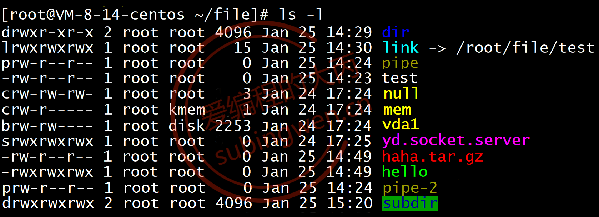

##### 用户类型

- 在Linux中有三大类用户: **文件所有者, 文件所属组用户, 其他人,** 我们可以对同一个文件给这三种人设置不同的操作权限, 用于限制用户对文件的访问。

	- 文件所有者

		- Linux中的所有的文件都有一个所有者, 就是文件的主人

	- 文件所属组（一般创建所有者时，会创建一个同名的组）

		- 文件的主人属于哪个组, 这个文件默认也就属于哪个组
		- 用户组中可以有多个用户, 这些组中的其他用户和所有者的权限可以是不一样的

	- 其他人

		- 这个用户既不是文件所有者也不是文件所属组中的用户，就称之为其他人
		- 其他人对文件也可以拥有某些权限


​		

##### 用户权限

- Linux中不同的用户可以对文件拥有不同的操作权限, 权限一共有四种: 读权限, 写权限, 执行权限, 无权限。
	- 读权限：使用 r表示, 即: read
	- 写权限：使用 w表示, 即: write
	- 执行权限：使用 x表示, 即: excute
	- 没有任何权限：使用-表示

```shell
#crw-rw----. 1 root video    10, 175 4月  21 21:16 agpgart
  c      rw-     rw- 		---         . 1 root video    10, 175 4月  21 21:16 agpgart
  |		  |		  |			 |			|
文件类型  文件所有  文件所属     其他人权限  安全设置
		者权限		组权限					相关
```

- 从上边的例子中可以看出:
	- 文件所有者对文件有读、写权限、没有执行权限
	- 文件所属组用户对文件有 读、写权限、没有执行权限
	- 其他人对文件有没有任何权限

##### 硬链接计数（起别名，C++引用，共用内存，第二列）

- 硬链接计数是一个整数，如果这个数为N(N>=1)，就说明在一个或者多个目录下一共有N个文件, 但是这N个文件并不占用多块磁盘空间, 他们使用的是同一块, 如果通过其中一个文件修改了磁盘数据, 那么其他文件中的内容也就变了。每当我们给给磁盘文件创建一个硬链接（使用 ln），磁盘上就会出现一个新的文件名，硬链接计数加1，但是这新文件并不占用任何的磁盘空间，文件名还是映射到原来的磁盘地址上。

	下图中为大家展示了给文件创建硬链接, 和直接进行文件拷贝的区别, **创建硬链接只是多了一个新的文件名, 拷贝文件不仅多了新的文件名在磁盘上数据也进行了拷贝**


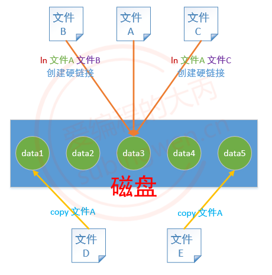

##### 其他属性

```shell
lrwxrwxrwx. 1     root   root        13     4月  21 21:16     fd -> /proc/self/fd
			|	    |      |		  |				|				|
		硬链接计数   所有者  所属组	文件大小      文件日期			 文件名
```

- 文件大小 —> 单位是字节

	- 如果文件是目录显示为4096, 这是目录自身大小, 不包括目录中的文件大小
- 文件日期: 显示的是文件的修改日期, 只要文件被更新, 日期也会随之变化
- 文件名: 文件自己的名字
	- 如果文件类型是软连接会这样显示： link -> /root/file/test, 后边的路径表示快捷方式链接的是哪个磁盘文件


#### 单位显示

- 在查看文件大小的时候, 如果文件比较大对应的数组自然也就很大, 我们还需要基于字节进行相关的换算, 不能直观得到我们想要的结果, 如果数学不好, 我们可以使用一个参数 **-h** (human)(就是命令说人话)。

```shell
# 直接查看文件大小
[siguyuan@10 ~]$ ls -laF
总用量 36
drwx------. 15 siguyuan siguyuan 4096 4月  25 09:57 ./
drwxr-xr-x.  3 root     root       22 4月  21 01:37 ../
-rw-------.  1 siguyuan siguyuan   53 4月  21 15:46 .bash_history
-rw-r--r--.  1 siguyuan siguyuan   18 11月 25 2021 .bash_logout
-rw-r--r--.  1 siguyuan siguyuan  193 11月 25 2021 .bash_profile
-rw-r--r--.  1 siguyuan siguyuan  231 11月 25 2021 .bashrc
drwx------. 17 siguyuan siguyuan 4096 4月  21 21:19 .cache/
drwxr-xr-x. 14 siguyuan siguyuan  261 4月  21 02:17 .config/
drwx------.  3 siguyuan siguyuan   25 4月  21 02:16 .dbus/
-rw-------.  1 siguyuan siguyuan   16 4月  21 02:16 .esd_auth
-rw-------.  1 siguyuan siguyuan  620 4月  21 21:16 .ICEauthority
drwx------.  3 siguyuan siguyuan   19 4月  21 02:16 .local/
drwxr-xr-x.  6 siguyuan siguyuan   81 4月  21 21:19 .mozilla/
-rw-------.  1 siguyuan siguyuan   56 4月  25 09:57 .Xauthority
drwxr-xr-x.  2 siguyuan siguyuan    6 4月  21 02:16 公共/
drwxr-xr-x.  2 siguyuan siguyuan    6 4月  21 02:16 模板/
drwxr-xr-x.  2 siguyuan siguyuan    6 4月  21 02:16 视频/
drwxr-xr-x.  2 siguyuan siguyuan    6 4月  21 02:16 图片/
drwxr-xr-x.  2 siguyuan siguyuan    6 4月  21 02:16 文档/
drwxr-xr-x.  2 siguyuan siguyuan    6 4月  21 02:16 下载/
drwxr-xr-x.  2 siguyuan siguyuan    6 4月  21 02:16 音乐/
drwxr-xr-x.  2 siguyuan siguyuan    6 4月  21 02:16 桌面/

# 添加 -h 参数查看文件大小（主要是第5列的区别）
[siguyuan@10 ~]$ ls -laFh
总用量 36K
drwx------. 15 siguyuan siguyuan 4.0K 4月  25 09:57 ./
drwxr-xr-x.  3 root     root       22 4月  21 01:37 ../
-rw-------.  1 siguyuan siguyuan   53 4月  21 15:46 .bash_history
-rw-r--r--.  1 siguyuan siguyuan   18 11月 25 2021 .bash_logout
-rw-r--r--.  1 siguyuan siguyuan  193 11月 25 2021 .bash_profile
-rw-r--r--.  1 siguyuan siguyuan  231 11月 25 2021 .bashrc
drwx------. 17 siguyuan siguyuan 4.0K 4月  21 21:19 .cache/
drwxr-xr-x. 14 siguyuan siguyuan  261 4月  21 02:17 .config/
drwx------.  3 siguyuan siguyuan   25 4月  21 02:16 .dbus/
-rw-------.  1 siguyuan siguyuan   16 4月  21 02:16 .esd_auth
-rw-------.  1 siguyuan siguyuan  620 4月  21 21:16 .ICEauthority
drwx------.  3 siguyuan siguyuan   19 4月  21 02:16 .local/
drwxr-xr-x.  6 siguyuan siguyuan   81 4月  21 21:19 .mozilla/
-rw-------.  1 siguyuan siguyuan   56 4月  25 09:57 .Xauthority
drwxr-xr-x.  2 siguyuan siguyuan    6 4月  21 02:16 公共/
drwxr-xr-x.  2 siguyuan siguyuan    6 4月  21 02:16 模板/
drwxr-xr-x.  2 siguyuan siguyuan    6 4月  21 02:16 视频/
drwxr-xr-x.  2 siguyuan siguyuan    6 4月  21 02:16 图片/
drwxr-xr-x.  2 siguyuan siguyuan    6 4月  21 02:16 文档/
drwxr-xr-x.  2 siguyuan siguyuan    6 4月  21 02:16 下载/
drwxr-xr-x.  2 siguyuan siguyuan    6 4月  21 02:16 音乐/
drwxr-xr-x.  2 siguyuan siguyuan    6 4月  21 02:16 桌面/

```

#### 显示目录后缀

- 在查看文件信息的时候, 处理通过文件类型区分该文件是不是一个目录之外, 还可以通过一个参数 -F在目录名后边显示一个/, 这样就可以直接区分出来了。


```shell
# 直接查看文件信息
[siguyuan@10 ~]$ ls -l
总用量 0
drwxr-xr-x. 2 siguyuan siguyuan 6 4月  21 02:16 公共
drwxr-xr-x. 2 siguyuan siguyuan 6 4月  21 02:16 模板
drwxr-xr-x. 2 siguyuan siguyuan 6 4月  21 02:16 视频
drwxr-xr-x. 2 siguyuan siguyuan 6 4月  21 02:16 图片
drwxr-xr-x. 2 siguyuan siguyuan 6 4月  21 02:16 文档
drwxr-xr-x. 2 siguyuan siguyuan 6 4月  21 02:16 下载
drwxr-xr-x. 2 siguyuan siguyuan 6 4月  21 02:16 音乐
drwxr-xr-x. 2 siguyuan siguyuan 6 4月  21 02:16 桌面

# 添加了 -F 参数查看文件信息
[siguyuan@10 ~]$ ls -lF
总用量 0
drwxr-xr-x. 2 siguyuan siguyuan 6 4月  21 02:16 公共/
drwxr-xr-x. 2 siguyuan siguyuan 6 4月  21 02:16 模板/
drwxr-xr-x. 2 siguyuan siguyuan 6 4月  21 02:16 视频/
drwxr-xr-x. 2 siguyuan siguyuan 6 4月  21 02:16 图片/
drwxr-xr-x. 2 siguyuan siguyuan 6 4月  21 02:16 文档/
drwxr-xr-x. 2 siguyuan siguyuan 6 4月  21 02:16 下载/
drwxr-xr-x. 2 siguyuan siguyuan 6 4月  21 02:16 音乐/
drwxr-xr-x. 2 siguyuan siguyuan 6 4月  21 02:16 桌面/

```


### `pwd:`查看当前的绝对路径

```shell
# 查看当前用户在哪个目录中, 所在的目录一般称之为工作目录
[root@VM-8-14-centos ~/luffy/get/onepiece]# pwd
/root/luffy/get/onepiece		# 当前工作目录
```


### `touch 命令`：创建文件

- 使用touch命令可以创建一个新的空文件, **如果指定的文件是已存在的, 只会更新文件的修改日期**, 对内容没有任何影响。推荐使用vim命令

```shell
# 语法: touch 文件名

# 查看目录信息
[root@VM-8-14-centos ~/luffy]# ll
total 8
drwxr-xr-x 3 root root 4096 Jan 25 17:38 get
-rw-r--r-- 2 root root   37 Jan 25 17:26 onepiece.txt

# 创建一个新的文件 robin.txt
[root@VM-8-14-centos ~/luffy]# touch robin.txt

# 再次查看目录中的文件信息, 发现 robin.txt是空的, 大小为 0
[root@VM-8-14-centos ~/luffy]# ll
total 8
drwxr-xr-x 3 root root 4096 Jan 25 17:38 get
-rw-r--r-- 2 root root   37 Jan 25 17:26 onepiece.txt
-rw-r--r-- 1 root root    0 Jan 25 17:54 robin.txt

# touch 后的参数指定一个已经存在的文件名
[root@VM-8-14-centos ~/luffy]# touch onepiece.txt 

# 继续查看目录中的文件信息, 发现文件时间被更新了: 37 Jan 25 17:26 --> 37 Jan 25 17:54
[root@VM-8-14-centos ~/luffy]# ll
total 8
drwxr-xr-x 3 root root 4096 Jan 25 17:38 get
-rw-r--r-- 2 root root   37 Jan 25 17:54 onepiece.txt
-rw-r--r-- 1 root root    0 Jan 25 17:54 robin.txt
```


### `whoami：`查看当前用户

```shell
[siguyuan@10 /]$ whoami
siguyuan
```

### `su 用户名:`切换用户

- Linux是一个多用户的操作系统, 可以同时登陆多个用户, 因此很多时候需要在多个用户之间切换, 用户切换需要使用su或者su -。**使用su只切换用户, 当前的工作目录不会变化, 但是使用 su -不仅会切换用户也会切换工作目录, 工作目录切换为当前用户的家目录。**

	**从用户A切换到用户B， 如果还想再切换回用户A，可以直接使用 exit。**

```shell
# 只切换用户, 工作目录不变
$ su 用户名
# 举例:
robin@OS:~/Linux$ su luffy
Password:                       # 需要输入luffy用户的密码
luffy@OS:/home/robin/Linux$	    # 工作目录不变

# 切换用户和工作目录, 会自动跳转到当前用户的家目录中
$ su - 用户名
# 举例:
robin@OS:~/Linux$ su - luffy
Password: 		# 需要输入luffy用户的密码
luffy@OS:~$ pwd
/home/luffy		# 工作目录变成了luffy的家目录

# 回到原来的用户
$ exit

```

- UBuntu切换root用户，需要在普通用户下，使用`su - root`进行切换
	- 设置root用户名时，出现大于等于8个字符，且不能为简单数字的提示时，可以无视   （root密码设置为123456）


### `which 命令:`查看命令路径

- which命令可以查看要执行的命令所在的实际路径, 命令解析器工作的时候也会搜索这个目录。需要注意的是该命令只能查看非内建的shell指令所在的实际路径, 有些命令是直接写到内核中的, 无法查看。

	我们使用的大部分shell命令都是放在系统的/bin或者/usr/bin目录下:

```shell
# 由于使用的Linux版本不同, 得到的路径也会有不同
[root@VM-8-14-centos ~]# which ls
alias ls='ls --color=auto'
        /usr/bin/ls
        
[root@VM-8-14-centos ~]# which date
/usr/bin/date

[root@VM-8-14-centos ~]# which cp
alias cp='cp -i'
        /usr/bin/cp
        
[root@VM-8-14-centos ~]# which mv
alias mv='mv -i'
        /usr/bin/mv
        
[root@VM-8-14-centos ~]# which pwd
/usr/bin/pwd
```

### `echo 命令`：打印到屏幕

```shell
# 打印字符
[siguyuan@10 /]$ echo PATH
PATH

# 打印变量值
[siguyuan@10 /]$ echo $PATH
/usr/local/sbin:/sbin:/bin:/usr/sbin:/usr/bin:/root/bin

```


### `cp 命令`：拷贝

- 拷贝文件 => 文件不存在得到新文件, 文件存在就覆盖

	```shell
	# `语法: cp 要拷贝的文件  得到的文件`
	
	# `场景1: 文件A, 将A拷贝一份得到文件B（拷贝之前文件B不存在，拷贝后生成文件B）`
	$ cp 文件A 文件B
	
	# `场景2: 文件A存在的, 文件B也是存在的, 执行下边的拷贝 ==> 文件A覆盖文件B`
	$ cp 文件A 文件B
	```

	

- 拷贝目录 ==> 目录不存在得到新目录, 该目录被拷贝到存在的目录中

	```shell
	# 拷贝目录需要参数 -r （递归）
	# 场景1: 目录A, 通过拷贝得到不存在的目录B
	$ cp 目录A 目录B -r
	
	# 场景2: 目录A存在的, 目录B也是存在的, 执行下边的拷贝 ==> 目录A会被拷贝并将其放到目录B中
	$ cp 目录A 目录B -r
	
	# 场景3: 把A目录里的某一个或者多个文件拷贝到B目录中
	$ cp A/a.txt B	# 拷贝 A目录中的 a.txt 到目录B中
	$ cp A/* B -r	# 拷贝 A目录中的所有文件到目录B中, 不能确定A目录中是否有子目录, 因此需要加 -r
	
	```

### `mv 命令`：移动

- 文件目录的移动

	```shell
	# 语法: mv 要移动的文件  目录
	# 有一个文件A, 移动到目录B中
	# 其中A可以是文件也可以是目录, B必须是目录而且必须是存在的
	$ mv A B
	```

- 文件改名

	```shell
	# 语法: mv 要改名的文件  新名字(原来是不存在的，这点很重要)
	# 其中A可以是文件也可以是目录，并且是存在的, B原来是不存在的
	$ mv A B
	```

- 文件覆盖

```shell
# 语法: mv 存在文件A  存在的文件B
# 其中A是文件（非目录）并且是存在的, B也是一个文件（非目录）并且也存在
# A文件中的内容覆盖B文件中的内容, A文件被删除, 只剩下B文件
$ mv A B
```


### `tree 命令`: 目录结构显示

- 该命令的作用是以树状结构显示目录, tree工具默认是没有的, 需要手动安装, 系统版本不同安装方式也不尽相同:

	- `ubuntu: sudo apt install tree`
	- `centos: sudo yum install tree`

- 如果是基于管理员用户安装软件，不需要加sudo。该命令有一个常用参数 -L, 即 (layer) 显示目录的层数。

- 下载时，需要修改yum的镜像源：

	- 切换到root用户

	- 备份：

		`cp /etc/yum.repos.d/CentOS-Base.repo /etc/yum.repos.d/CentOS-Base.repo.bak`

		`cp /etc/yum.repos.d/epel.repo /etc/yum.repos.d/epel.repo.bak`

	- 配置镜像源(使用的阿里云镜像)

		`wget -O /etc/yum.repos.d/CentOS-Base.repo http://mirrors.aliyun.com/repo/Centos-7.repo
		wget -O /etc/yum.repos.d/epel.repo http://mirrors.aliyun.com/repo/epel-7.repo`

	- 重启yum

		`yum clean all`
		`yum makecache`

```shell
# 语法格式
$ tree [-L n]         # 查看当前目录的结构, n为显示的目录层数
$ tree 目录名  [-L n]	# 查看指定目录的结构, n为显示的目录层数

# 只显示1层
[root@VM-8-14-centos ~]# tree -L 1
.
|-- ace
|-- file
|-- ipc.tar.gz
|-- link.lnk -> /root/luffy/onepiece.txt
`-- luffy

# 显示2层目录
[root@VM-8-14-centos ~]# tree -L 2
.
|-- ace
|   `-- brother
|-- file
|   |-- dir
|   |-- haha.tar.gz
|   |-- hello
|   |-- link -> /root/file/test
|   |-- pipe-2
|   |-- subdir
|   `-- test
|-- ipc.tar.gz
|-- link.lnk -> /root/luffy/onepiece.txt
`-- luffy
    |-- get
    `-- onepiece.txt

```


### 创建删除目录

- 创建目录

	- 目录的创建分为两种, 一种是创建单个目录, 另一种是一次性创建多层目录, 使用的命令是mkdir, 后边参数是要创建的目录的名字, 如果是多层目录需要添加参数-p。

		关于创建的目录所在的路径可以是相对路径， 也可以是绝对路径。

```shell
# 单层目录
mkdir 新目录的名字
# 创建多个单层目录
mkdir 目录1 目录2

# 多层目录, 需要加参数 -p
mkdir -p parent/child/baby1/baby2 
```

- 删除目录
	- 如果要删除已经存在的路径一共有两种方式, 可以使用rmdir或者rm
		- rmdir: **只能删除空目录**，有点low，不好用
		- rm: 可以删除文件也可以删除目录, 如果删除的的是目录, 需要加参数 -r, 意思是递归(recursion)
			- rm命令还有另外两个经常使用的参数:
				- -i: 删除的时候给提示
				- -f: 强制删除文件, 没有提示直接删除并且不能恢复, 慎用
				- -fi:效果互斥。 一起使用的时候，谁在后面，谁的生效。

```shell
# 1. low, 矮穷矬, 只能删除空目录
rmdir 目录名

# 2. 高大上, 可以删除目录也可以删除文件
# 删除目录需要加参数 -r, 递归的意思, 删除之后是不能恢复的
rm  -r 目录名 
```

### 查看文件内容

- 如果想要查看文件内容方式有很多, 最常用的是vim, 下面介绍一下vim以外的一些的一些方式:

#### cat

- 该命令可以将文件内容显示到终端, 由于终端是有缓存的, 因此能显示的字节数也是受限制的。 如果文件太大数据就不能完全显示出来了，因此该命令适合查看比较小的文件内容。


```shell
cat 文件名

#输出行号
cat -n 文件名
```

#### more

- 该命令比cat要高级一点, 我们可以以翻屏的方式查看文件中的内容，使用方式如下：

```shell
$ more 文件名
# 快捷键
- 回车: 显示下一行
- 空格: 向下滚动一屏
- b: 返回上一屏
- q: 退出more
```

#### less

- 该命令和more命令差不多, 我们可以以翻屏的方式查看文件中的内容，使用方式如下：

```shell
$ less 文件名
# 快捷键
- b: 向上翻页
- 空格: 向后翻页
- 回车: 显示下一行
- 上下键: 上下滚动
- q:退出
```

#### head

- 使用该命令可以查看文件头部的若干行信息, 使用方式如下:

```shell
# 默认显示文件的前10行
$ head 文件名
# 指定显示头部的前多少行
$ head -行数 文件名
```

#### tail

- 使用该命令可以查看文件尾部的若干行信息, 使用方式如下:

```shell
# 默认显示文件的后10行
$ tail 文件名
# 指定显示尾部的最后多少行
$ tail -行数 文件名
```

### 链接创建

- 链接分两种类型: **软连接和硬链接**。软连接相当于windows中的快捷方式，硬链接前边也已经介绍过了文件并不会进行拷贝，只是多出一个新的文件名并且硬链接计数会加1。

- 软连接

	```shell
	# 语法: ln -s 源文件路径 软链接文件的名字(可以带路径)
	
	# 查看目录文件
	[root@VM-8-14-centos ~/luffy]# ll
	total 8
	drwxr-xr-x 3 root root 4096 Jan 25 17:27 get
	-rw-r--r-- 1 root root   37 Jan 25 17:26 onepiece.txt
	
	# 给 onepiece.txt 创建软连接, 放到子目录 get 中
	[root@VM-8-14-centos ~/luffy]# ln -s /root/luffy/onepiece.txt get/link.lnk  
	[root@VM-8-14-centos ~/luffy]# ll get
	total 4
	lrwxrwxrwx 1 root root   24 Jan 25 17:27 link.lnk -> /root/luffy/onepiece.txt
	drwxr-xr-x 2 root root 4096 Jan 24 21:37 onepiece
	
	# 在创建软链接的时候， 命令中的 源文件路径 建议使用 绝对路径, 这样才能保证创建出的软链接文件在任意目录中移动都可以访问到链接的那个源文件。
	```

	

- 硬链接

	```shell
	# 语法: ln 源文件 硬链接文件的名字(可以带路径)
	
	# 创建硬链接文件, 放到子目录中
	[root@VM-8-14-centos ~/luffy]# ln onepiece.txt get/link.txt
	
	# 查看链接文件和硬链接计数, 从 1 --> 2
	[root@VM-8-14-centos ~/luffy]# ll get
	total 8
	lrwxrwxrwx 1 root root   24 Jan 25 17:27 link.lnk -> /root/luffy/onepiece.txt
	-rw-r--r-- 2 root root   37 Jan 25 17:26 link.txt
	drwxr-xr-x 2 root root 4096 Jan 24 21:37 onepiece
	
	# 硬链接和软链接不同, 它是通话文件名直接找对应的硬盘地址, 而不是基于路径, 因此 源文件使用相对路径即可, 无需为其制定绝对路径。
	
	# 目录是不允许创建硬链接的。
	```

	

### 修改文件权限

- 文件权限是针对文件所有者, 文件所属组用户, 其他人这三类人而言的, 对应的操作指令是chmod。设置方式也有两种，分别为文字设定法和数字设定法。

- 文字设定法是通过一些关键字r, w, x, -来描述用户对文件的操作权限。

- 数字设定法是通过一些数字 0, 1, 2, 4, 5, 6, 7 来描述用户对文件的操作权限。

	

	

- 文字设定法

	```shell
	#chmod
	# 语法格式: chmod who [+|-|=] mod 文件名
		- who:
			- u: user  -> 文件所有者
			- g: group -> 文件所属组用户
			- o: other -> 其他
			- a: all, 以上是三类人 u+g+o
		- 对权限的操作:
			+: 添加权限
			-: 去除权限
			=: 权限的覆盖
		- mod: 权限
			r: read, 读
			w: write, 写
			x: execute, 执行
			-: 没有权限
			
	# 将文件所有者权限设置为读和执行, 也就是权限覆盖
	robin@OS:~/Linux$ chmod u=rx b.txt 
	robin@OS:~/Linux$ ll b.txt         
	-r-xrw-r-- 2 robin robin 2929 Apr 14 18:53 b.txt*
	
	# 给其他人添加写和执行权限
	robin@OS:~/Linux$ chmod o+wx b.txt 
	robin@OS:~/Linux$ ll b.txt         
	-r-xrw-rwx 2 robin robin 2929 Apr 14 18:53 b.txt*
	
	# 给文件所属组用户和其他用户去掉读和执行权限
	robin@OS:~/Linux$ chmod go-rx b.txt 
	robin@OS:~/Linux$ ll b.txt         
	-r-x-w--w- 2 robin robin 2929 Apr 14 18:53 b.txt*
	
	# 将文件所有者,文件所属组用户,其他人权限设置为读+写+执行
	robin@OS:~/Linux$ chmod a=rwx b.txt
	robin@OS:~/Linux$ ll b.txt 
	-rwxrwxrwx 2 robin robin 2929 Apr 14 18:53 b.txt*
	
	```

- 数字设定法

	```shell
	# 语法格式: chmod [+|-|=] mod 文件名
		- 对权限的操作:
			+: 添加权限
			-: 去除权限
			=: 权限的覆盖, 等号可以不写
		- mod: 权限描述, 所有权限都放开是 7
			- 4: read, r
			- 2: write, w
			- 1: execute , x
			- 0: 没有权限
	      二进制:111  每一位对应一种权限，即rwx
			
	# 分解: chmod 0567 a.txt
	
	    0           5           6             7
	  八进制     文件所有者  文件所属组用户    其他人
	              r + x       r + w         r+w+x
	
	######################### 举例 #########################
	# 查看文件 c.txt 的权限			   
	robin@OS:~/Linux$ ll c.txt 
	-rwxrwxrwx 2 robin robin 2929 Apr 14 18:53 c.txt*
	
	# 文件所有者去掉执行权限, 所属组用户去掉写权限, 其他人去掉读+写权限
	robin@OS:~/Linux$ chmod -123 c.txt
	robin@OS:~/Linux$ ll c.txt 
	-rw-r-xr-- 2 robin robin 2929 Apr 14 18:53 c.txt*
	
	# 文件所有者添加执行权限, 所属组用户和其他人权限不变
	robin@OS:~/Linux$ chmod +100 c.txt
	robin@OS:~/Linux$ ll c.txt 
	-rwxr-xr-- 2 robin robin 2929 Apr 14 18:53 c.txt*
	
	# 将文件所有者,文件所属组用户,其他人权限设置为读+写, 没有执行权限
	robin@OS:~/Linux$ chmod 666 c.txt
	robin@OS:~/Linux$ ll c.txt 
	-rw-rw-rw- 2 robin robin 2929 Apr 14 18:53 c.txt
	```

	

### 修改文件所有者

- 默认情况下, 文件是通过哪个用户创建出来的, 就属于哪个用户, 这个用户属于哪个组, 文件就属于哪个组。如果有特殊需求，可以修改文件所有者，对应的操作命令是chown。因为修改文件所有者就跨用户操作, 普通用户没有这个权限, 需要借助管理员权限才能完成该操作。

- 普通用户借助管理员权限执行某些shell命令, 需要在命令前加关键字sudo, 但是普通用户默认是没有使用 sudo的资格的, 需要修改 **/etc/sudoers 文件** 。

	- 给普通用户添加sudo权限

		- 先切换到root用户

		- 在root用户下修改这个文件属性, 给其添加写权限

		- 修改文件内容, 把普通用户sanji添加进去, 保存退出

		- 将文件权限修改为原来的 400 (r--------)

		- 切换到用户 sanji, 这时候就可以使用 sudo了, 权限添加成功

			```shell
			# 1. 切换到root用户
			$ su root
			Password: 		# 输入root用户的密码
			
			# 2. 修改文件权限, 暴力一点没有关系, 反正还需要改回去, 直接 777 就行
			$ chmod 777 sudoers
			
			# 3. 使用 vim 打开这个文件
			$ vim sudoers
			
			# 4. 在文件中找到这一行, 在文件偏尾部的位置
			root    ALL=(ALL)       ALL
			
			# 5. 照葫芦画瓢, 在下边新添加一行内容如下:
			root    ALL=(ALL)       ALL           # 原来的内容
			sanji    ALL=(ALL)       ALL          # 新添加的行, 将用户名指定为 sanji 即可
			
			# 6. 保存退出 (先按esc, 然后输入 :wq)
			# 7. 将文件改回原来的权限
			$ chmod 400 sudoers
			```

			

```shell
# 语法1-只修改所有者: 
$ sudo chown 新的所有者 文件名

# 语法2-同时修改所有者和所属组: 
$ sudo chown 新的所有者:新的组名 文件名

# 查看文件所有者：b.txt 属于 robin 用户
robin@OS:~/Linux$ ll b.txt 
-rw-rw-rw- 2 robin robin 2929 Apr 14 18:53 b.txt

# 将 b.txt 的所有者修改为 luffy
robin@OS:~/Linux$ sudo chown luffy b.txt
[sudo] password for robin: 
robin@OS:~/Linux$ ll b.txt 
-rw-rw-rw- 2 luffy robin 2929 Apr 14 18:53 b.txt

# 修改文件所有者和文件所属组
# 查看文件所有者和所属组
robin@OS:~/Linux$ ll b.txt 
-rw-rw-rw- 2 luffy robin 2929 Apr 14 18:53 b.txt

# 同时修改文件所有者和文件所属组
robin@OS:~/Linux$ sudo chown robin:luffy b.txt 
robin@OS:~/Linux$ ll b.txt 
-rw-rw-rw- 2 robin luffy 2929 Apr 14 18:53 b.txt
```

### 修改文件所属组

- 普通用户没有修改文件所属组的权限, 如果需要修改需要借助管理员权限才能完成，需要使用的命令是chgrp。当然了这个属性的修改也可以使用chown命令来完成。

	```shell
	# 只修改文件所属的组, 普通用户没有这个权限, 借助管理员的权限
	# 语法: sudo chgrp 新的组 文件名
	
	# 查看文件所属组信息
	robin@OS:~/Linux$ ll b.txt 
	-rw-rw-rw- 2 robin luffy 2929 Apr 14 18:53 b.txt
	
	# 修改文件所属的组
	robin@OS:~/Linux$ sudo chgrp robin b.txt 
	robin@OS:~/Linux$ ll b.txt 
	-rw-rw-rw- 2 robin robin 2929 Apr 14 18:53 b.txt
	
	```


​	


### 重定向命令

- 关于重定向使用最多的是就是输出重定向, 顾名思义就是修改输出的数据的位置, 通过重定向操作我们可以非常方便的进行文件的复制, 或者文件内容的追加。输出重定向使用的不是某个关键字而是符号 >或者>>。

	>`>`: 将文件内容写入到指定文件中, 如果文件中已有数据, 则会使用新数据**覆盖**原数据
	>
	>`>>`: 将输出的内容**追加**到指定的文件尾部

	```shell
	# 输出的重定向举例: printf默认是要将数据打印到终端, 可以修改默认的输出位置 => 重定向到某个文件中
	# 关键字 >
	# 执行一个shell指令, 获得一个输出, 这个输出默认显示到终端, 如果要将其保存到文件中, 就可以使用重定向
	# 如果当前目录下test.txt不存在, 会被创建, 如果存在, 内容被覆盖
	robin@OS:~/Linux$ date > test.txt
	# 日期信息被写入到文件 test.txt中
	robin@OS:~/Linux$ cat test.txt 
	Wed Apr 15 09:37:52 CST 2020
	
	# 如果不希望文件被覆盖, 而是追加, 需要使用 >>
	in@OS:~/Linux$ date >> test.txt
	# 日期信息被追加到 test.txt中
	robin@OS:~/Linux$ cat test.txt 
	Wed Apr 15 09:37:52 CST 2020
	Wed Apr 15 09:38:44 CST 2020
	
	# 继续追加信息
	robin@OS:~/Linux$ date >> test.txt
	robin@OS:~/Linux$ cat test.txt    
	Wed Apr 15 09:37:52 CST 2020
	Wed Apr 15 09:38:44 CST 2020
	Wed Apr 15 09:39:03 CST 2020
	```

### 添加/删除用户

- 作为一个普通用户是没有给系统添加新用户这个权限的, 如果想要添加新用户可以先切换到root用户, 或者基于普通用户为其添加管理员权限来完成新用户的添加。添加新用户需要使用adduser/useradd命令来完成。

	普通用户没有添加/删除用户的权限（sudo权限）, 需要授权,


#### 添加用户

```shell
# 添加用户
# sudo -> 使用管理员权限执行这个命令  （建议使用这个。CentOS7设置时，也不会设置密码）
$ sudo adduser 用户名

# centos
$ sudo useradd 用户名

# ubuntu  （-m ：如果用户家目录不存在，自动创建（也可以使用-d手动指定）  -s：当前用户的命令解释器为/bin/bash  -p：设置密码（不建议使用，会暴露密码，所有后面使用修改密码，设置密码））不添加参数，创建的用户不完整
$ sudo useradd -m -s /bin/bash  用户名

# 在使用 adduser 添加新用户的时候，有的Linux版本执行完命令就结束了，有的版本会提示设置密码等用户信息
robin@OS:~/Linux$ sudo adduser lisi
Adding user `lisi' ...
Adding new group `lisi' (1004) ...
Adding new user `lisi' (1004) with group `lisi' ...
Creating home directory `/home/lisi' ...
Copying files from `/etc/skel' ...
Enter new UNIX password: 
Retype new UNIX password: 
passwd: password updated successfully
Changing the user information for lisi
Enter the new value, or press ENTER for the default     # 直接回车
        Full Name []: 
        Room Number []: 
        Work Phone []: 
        Home Phone []: 
        Other []: 
Is the information correct? [Y/n] y

```

- 当新用户添加完毕之后, 我们可以切换到新添加的用户下, 用来检测是否真的添加成功了, 另外我们也可以使用其他方式来检验, 首先在 /home目录中会出现一个和用户名同名的目录, 这就是新创建的用户的家目录, 另外我们还可以查看 /etc/passwd文件, 里边记录着新添加的用户的更加详细的信息:


#### 删除用户

- 删除用户并不是将/home下的用户家目录删除就完事儿了, 我们需要使用userdle命令才能删除用户在系统中的用户ID和所属组ID等相关信息，**但是需要注意的是在某些Linux版本中用户虽然被删除了， 但是它的家目录却没有被删除，需要我们手动将其删除。**


```shell
# 删除用户, 添加参数 -r 就可以一并删除用户的家目录了
$ sudo userdel 用户名 -r

# 删除用户 lisi
$ sudo userdel lisi -r

# 使用deluser不能添加参数-r, 家目录不能被删除, 需要使用 rm 命令删除用户的家目录, 比如:
$ sudo rm /home/用户名 -r
```

- 由于Linux的版本很多, 删除用户对应的操作指令不是唯一的, **经测试在 CentOS 版本只支持 userdel命令, 在Ubuntu中既支持 userdel 也支持 deluser命令**。


### 添加/删除用户组

- 默认情况下, 只要创建新用户就会得到一个同名的用户组, 并且这个用户属于这个组。一般情况下不需要创建新的用户组，如果有需求可以使用 groupadd添加用户组, 使用 groupdel删除用户组。

	由于普通用户没有添加删除用户组权限，因此需要在管理员（root）用户下操作，或者在普通用户下借助管理员权限完成该操作（sudo权限）。


```shell
# 基于普通用户创建新的用户组
$ sudo groupadd 组名

# 基于普通用户删除已经存在的用户组
$ sudo groupdel 组名
```

- 如果验证用户组是否添加成功了, 可以查看 /etc/group文件, 里边有用户组相关的信息:


- 在Ubuntu中添加删除用户组可以使用 addgroup/groupadd 和 delgroup/groupdel

	在CentOS中添加和删除用户只能使用 groupadd 和 groupdel

	我们只需要通过 which 命令名 查看，就能知道该Linux版本是不是支持使用该命令了。


### 修改密码

- Linux中设置用户密码和修改用户密码的方式是一样的, 修改用户密码又分几种情况: 修改当前用户密码, 普通用户A修改其他普通用户密码, 普通用户A修改root用户密码, root用户修改普通用户密码。修改密码需要使用passwd命令。当创建了一个普通用户却没有提示指定密码, 或者忘记了用户密码都可以通过该命令来实现自己重置密码的需求。

	- 当前用户修改自己的密码, 默认是有权限操作的
	- 当前普通用户修改其他用户密码, 默认没有权限, 需要借助管理员权限才能完成操作
	- 当前普通用户修改root用户密码, 默认没有权限, 需要借助管理员权限才能完成操作
	- root用户修改其他普通用户密码, 默认有权限, 可以直接修改

```shell
# passwd
# 修改当前用户
$ passwd

# 修改非当前用户密码
$ sudo passwd 用户名

# 修改root
$ sudo passwd root

```

- 通过以上介绍的相关命令我们可以知道，如果让一个普通用户可以使用管理员权限执行一些指令其实是非常危险的的， 因此普通用户默认是没有使用 sudo的权限的, 必须授权才能使用，工作场景中授权操作一定要慎重，要三思。


### 压缩/解压缩命令

- 常用的压缩包格式包含：tar.gz,    .tgz,    .tar.bz2,      .zip,       .rar,      .tar.xz

#### tar

- 在Linux操作系统中默认自带两个原始的压缩工具分别是 gzip和bzip2, 但是它们都有先天的缺陷, **不能打包压缩文件, 每个文件都会生成一个单独的压缩包, 并且压缩之后不会保留原文件， 这是一件叔能忍婶也不能忍的事情**。

	Linux中自带一个打包工具，叫做tar, **默认情况下该工具是不能进行压缩操作的**，在这种情况下tar和gzip, bzip2就联姻了, 各自发挥各自的优势, Linux下最强大的打包压缩工具至此诞生。

##### 压缩(.tar.gz .    tar.bz2     .tgz)

- 如果使用tar完成文件压缩, 涉及的参数如下, 在使用过程中参数没有先后顺序:
	- c: 创建压缩文件
	- z: 使用gzip的方式进行文件压缩
	- j: 使用bzip2的方式进行文件压缩
	- v: 压缩过程中显示压缩信息, 可以省略不写（显示log日志）
	- f: 指定压缩包的名字
- 一般认为 .tgz 文件就等同于 .tar.gz 文件, 因此它们的压缩方式是相同的。（必须写明压缩技术—后缀名，否则不好解压缩）

```shell
# 语法: 
$ tar 参数 生成的压缩包的名字 要压缩的文件(文件或者目录)

# 备注: 关于生成的压缩包的名字, 建议使用标准后缀, 方便识别:
	- 压缩使用 gzip 方式,  标准后缀格式为: .tar.gz
	- 压缩使用 bzip2 方式, 标准后缀格式为: .tar.bz2	
	
	
# 使用gzip压缩
# 查看目录内容
[root@VM-8-14-centos ~/luffy]# ls
get  onepiece.txt  robin.txt

# 压缩目录中所有文件, 如果要压缩某几个文件, 直接指定文件名即可
[root@VM-8-14-centos ~/luffy]# tar zcvf all.tar.gz *
get/                     # ....... 压缩信息
get/link.lnk             # ....... 压缩信息
get/onepiece/            # ....... 压缩信息
get/onepiece/haha.txt
get/link.txt
onepiece.txt
robin.txt

# 查看目录文件, 多了一个压缩文件 all.tar.gz
[root@VM-8-14-centos ~/luffy]# ls
all.tar.gz  get  onepiece.txt  robin.txt


# 使用bzip2压缩
# 查看目录内容
[root@VM-8-14-centos ~/luffy]# ls
all.tar.gz  get  onepiece.txt  robin.txt

# 压缩目录中除 all.tar.gz 的文件和目录
[root@VM-8-14-centos ~/luffy]# tar jcvf part.tar.bz2 get onepiece.txt robin.txt 
get/                   # ....... 压缩信息
get/link.lnk           # ....... 压缩信息
get/onepiece/          # ....... 压缩信息
get/onepiece/haha.txt
get/link.txt
onepiece.txt
robin.txt

# 查看目录信息, 多了一个压缩文件 part.tar.bz2
[root@VM-8-14-centos ~/luffy]# ls
all.tar.gz  get  onepiece.txt  part.tar.bz2  robin.txt

```

##### 解压缩 (.tar.gz     .tar.bz2      .tgz)

- 如果使用tar进行文件的解压缩, 涉及的参数如下, 在使用过程中参数没有先后顺序:
	- x: 释放压缩文件内容
	- z: 使用gzip的方式进行文件压缩, 压缩包后缀为.tar.gz
	- j: 使用bzip2的方式进行文件压缩, 压缩包后缀为.tar.bz2
	- v: 解压缩过程中显示解压缩信息
	- f: 指定压缩包的名字
- 使用以上参数是将压缩包解压到当前目录, 如果需要解压到指定目录, 需要指定参数 -C。 一般认为 .tgz 文件就等同于 .tar.gz 文件, 解压缩方式是相同的。解压的语法格式如下:

```shell
# 语法1: 解压到当前目录中
$ tar 参数 压缩包名 

# 语法2: 解压到指定目录中
$ tar 参数 压缩包名 -C 解压目录

# 使用gzip解压缩
# 查看目录文件信息
[root@VM-8-14-centos ~/luffy]# ls
all.tar.gz  get  onepiece.txt  part.tar.bz2  robin.txt  temp

# 将 all.tar.gz 压缩包解压缩到 temp 目录中
[root@VM-8-14-centos ~/luffy]# tar zxvf all.tar.gz -C temp
get/                      # 解压缩文件信息
get/link.lnk              # 解压缩文件信息
get/onepiece/             # 解压缩文件信息
get/onepiece/haha.txt     # 解压缩文件信息
get/link.txt
onepiece.txt
robin.txt

# 查看temp目录内容, 都是从压缩包中释放出来的
[root@VM-8-14-centos ~/luffy]# ls temp/
get  onepiece.txt  robin.txt


# 使用bzip2解压缩
# 删除 temp 目录中的所有文件
[root@VM-8-14-centos ~/luffy]# rm temp/* -rf

# 查看 luffy 目录中的文件信息
[root@VM-8-14-centos ~/luffy]# ls
all.tar.gz  get  onepiece.txt  part.tar.bz2  robin.txt  temp

# 将 part.tar.bz2 中的文件加压缩到 temp 目录中
[root@VM-8-14-centos ~/luffy]# tar jxvf part.tar.bz2 -C temp
get/                         # 解压缩文件信息
get/link.lnk                 # 解压缩文件信息
get/onepiece/                # 解压缩文件信息
get/onepiece/haha.txt        # 解压缩文件信息
get/link.txt
onepiece.txt
robin.txt

# 查看 temp 目录中的文件信息
[root@VM-8-14-centos ~/luffy]# ls temp/
get  onepiece.txt  robin.txt


```

#### zip

- zip格式的压缩包在Linux中也是很常见的, 在某些版本中需要安装才能使用（高版本的Ubuntu与Centos以及自带）

- Ubuntu

	```shell
	$ sudo apt install zip    	# 压缩
	$ sudo apt install unzip	# 解压缩
	```

	

- CentOS

	```shell
	# 因为 centos 可以使用 root 用户登录, 基于 root 用户安装软件, 不需要加 sudo
	$ sudo yum install zip    	# 压缩
	$ sudo yum install unzip	# 解压缩
	```

##### 压缩 (.zip)

- 使用zip压缩目录需要注意一点, **必须要添加参数 -r,** 这样才能将子目录中的文件一并压缩, 如果要压缩的文件中没有目录, 该参数就可以不写了。

	另外使用zip压缩文件, 会自动生成文件后缀.zip, 因此就不需要额外指定了。


```shell
# 语法: 后自动添加压缩包后缀 .zip, 如果要压缩目录, 需要添加参数 r
$ zip [-r]  压缩包名 要压缩的文件


# 例子
# 查看目录文件信息
[root@VM-8-14-centos ~/luffy]# ls
get  onepiece.txt  robin.txt  temp

# 压缩目录 get 和文件 onepiece.txt robin.txt 得到压缩包 all.zip(不需要指定后缀, 自动添加)
[root@VM-8-14-centos ~/luffy]# zip all onepiece.txt robin.txt get/ -r
  adding: onepiece.txt (stored 0%)
  adding: robin.txt (stored 0%)
  adding: get/ (stored 0%)
  adding: get/link.lnk (stored 0%)             # 子目录中的文件也被压缩进去了
  adding: get/onepiece/ (stored 0%)            # 子目录中的文件也被压缩进去了
  adding: get/onepiece/haha.txt (stored 0%)    # 子目录中的文件也被压缩进去了
  adding: get/link.txt (stored 0%)             # 子目录中的文件也被压缩进去了
  
# 查看目录文件信息, 多了一个压缩包文件 all.zip
[root@VM-8-14-centos ~/luffy]# ls
all.zip  get  onepiece.txt  robin.txt  temp

```

##### 解压缩 (.zip)

- 对应zip格式的文件解压缩, 必须要使用 unzip 命令, 和压缩的时候使用的命令是不一样的。**如果压缩包中的文件要解压到指定目录需要指定参数-d, 默认是解压缩到当前目录中。**


```shell
# 语法1: 解压到当前目录中 
$ unzip 压缩包名

# 语法: 解压到指定目录, 需要添加参数 -d
$ unzip 压缩包名 -d 解压目录


# 例子
# 查看目录文件信息
[root@VM-8-14-centos ~/luffy]# ls
all.zip  get  onepiece.txt  robin.txt  temp

# 删除 temp 目录中的所有文件
[root@VM-8-14-centos ~/luffy]# rm temp/* -rf

# 将 all.zip 解压缩到 temp 目录中
[root@VM-8-14-centos ~/luffy]# unzip all.zip -d temp/
Archive:  all.zip
 extracting: temp/onepiece.txt           # 释放压缩的子目录中的文件            
 extracting: temp/robin.txt              # 释放压缩的子目录中的文件            
   creating: temp/get/
 extracting: temp/get/link.lnk       
   creating: temp/get/onepiece/
 extracting: temp/get/onepiece/haha.txt  # 释放压缩的子目录中的文件
 extracting: temp/get/link.txt      
 
# 查看 temp 目录中的文件信息 
[root@VM-8-14-centos ~/luffy]# ls temp/
get  onepiece.txt  robin.txt

```

#### rar

- rar这种压缩格式在Linux中并不常用, 这是Windows常用的压缩格式, 如果想要在Linux压缩和解压这种格式的文件需要额外安装对应的工具, 不同版本的Linux安装方式也是不同的。

- Ubuntu

	```shell
	# 执行在线下载命令即可
	$ sudo apt install rar
	```

	

- CentOS

	```shell
	# 需要下载安装包, 官方地址: https://www.rarlab.com/download.htm
	# 从下载页面找到 Linux 版本的下载链接并复制链接地址, 使用 wget 下载到本地
	$ wget https://www.rarlab.com/rar/rarlinux-x64-6.0.0.tar.gz
	
	# 将下载得到的 rarlinux-x64-6.0.0.tar.gz 压缩包解压缩, 得到解压目录 rar
	$ tar zxvf rarlinux-x64-6.0.0.tar.gz 
	
	# 将得到的解压目录移动到 /opt 目录中 (因为/opt软件安装目录, 移动是为了方便管理, 不移动也没事儿)
	# 该操作需要管理员权限, 我是使用 root 用户操作的
	$ mv ./rar /opt
	
	# 给 /opt/rar 目录中的可执行程序添加软连接, 方便命令解析器可以找到该压缩命令
	$ ln -s /opt/rar/rar /usr/local/bin/rar
	$ ln -s /opt/rar/unrar /usr/local/bin/unrar
	
	
	#其他版本的linux，也适用
	```


​	

##### 压缩 (.rar)

- 使用rar压缩过程中的注意事项和zip是一样的, **如果压缩的是目录, 需要指定参 -r,** 如果只压缩文件就不需要添加了。**压缩过程中需要使用参数 a (archive), 压缩归档的意思。**

	rar工具在生成压缩包的时候也会自动添加后缀, 名字为.rar, 因此我们只需要指定压缩包的名字。

	```shell
	# 文件压缩, 需要使用参数 a, 压缩包名会自动添加后缀 .rar
	# 如果压缩了目录, 需要加参数 -r
	# 语法: 
	$ rar a 压缩包名 要压缩的文件 [-r]
	
	# 举例
	# 查看目录文件信息
	[root@VM-8-14-centos ~/luffy]# ls
	get  onepiece.txt  robin.txt  temp
	
	# 压缩文件 onepiece.txt, robin.txt 和目录 get/ 到要是文件 all.rar 中
	[root@VM-8-14-centos ~/luffy]# rar a all onepiece.txt get/ robin.txt -r 
	
	RAR 6.00   Copyright (c) 1993-2020 Alexander Roshal   1 Dec 2020
	Trial version             Type 'rar -?' for help
	
	Evaluation copy. Please register.
	
	Creating archive all.rar
	
	Adding    onepiece.txt                     OK 
	Adding    get/link.lnk                     OK        # 子目录中的文件也被压缩了 
	Adding    get/onepiece/haha.txt            OK        # 子目录中的文件也被压缩了
	Adding    get/link.txt                     OK        # 子目录中的文件也被压缩了  
	Adding    robin.txt                        OK 
	Adding    get/onepiece                     OK         
	Done
	[root@VM-8-14-centos ~/luffy]# ls
	all.rar  get  onepiece.txt  robin.txt  temp
	
	```

#####  解压缩 (.rar)

- 解压缩.rar格式的文件的时候, 可以使用 rar也可以使用unrar, 操作方式是一样的, **需要添加参数 x**, 默认是将压缩包内容释放到当前目录中, 如果要释放到指定目录直接指定解压目录名即可, 不需要使用任何参数。

```shell
# 解压缩: 需要参数 x
# 语法: 解压缩到当前目录中
$ rar/unrar x 压缩包名字

# 语法: 解压缩到指定目录中
rar/unrar x 压缩包名字 解压目录


# 例子
# 查看目录文件信息
[root@VM-8-14-centos ~/luffy]# ls
all.rar  get  onepiece.txt  robin.txt  temp

# 删除 temp 目录中的所有文件
[root@VM-8-14-centos ~/luffy]# rm temp/* -rf

# 将 all.rar 中的文件解压缩到 temp 目录中
[root@VM-8-14-centos ~/luffy]# rar x all.rar temp/ 

RAR 6.00   Copyright (c) 1993-2020 Alexander Roshal   1 Dec 2020
Trial version             Type 'rar -?' for help


Extracting from all.rar

Extracting  temp/onepiece.txt               OK 
Creating    temp/get                        OK
Extracting  temp/get/link.lnk               OK          # 子目录文件也被释放出来了
Extracting  temp/get/link.lnk               OK          # 子目录文件也被释放出来了
Extracting  temp/get/link.lnk               OK          # 子目录文件也被释放出来了
Creating    temp/get/onepiece               OK                    
Extracting  temp/get/link.lnk               OK          # 子目录文件也被释放出来了 
Extracting  temp/get/link.lnk               OK          # 子目录文件也被释放出来了 
Extracting  temp/get/onepiece/haha.txt      OK
Extracting  temp/get/link.txt               OK 
Extracting  temp/robin.txt                  OK 
All OK

# 查看 temp 目录中文件信息
[root@VM-8-14-centos ~/luffy]# ls temp/
get  onepiece.txt  robin.txt

```

#### xz

- .xz格式的文件压缩和解压缩都相对比较麻烦, 通过一个命令是完不成对应的操作的, 需要通过两步操作才行。并且操作过程中需要使用tar工具进行打包, 压缩使用的则是 xz工具。


##### 压缩（.tar.xz)

- 创建文件的步骤如下, 首先 将需要压缩的文件打包 ` tar cvf xxx.tar files`, 然后再对打包文件进行压缩 `xz -z xxx.tar`, 这样我们就可以得到一个打包之后的压缩文件了。

	使用 xz工具压缩文件的时候**需要添加参数 -z**


```shell
# 语法:
# 第一步
$ tar cvf xxx.tar 要压缩的文件
# 第二步, 最终得到一个xxx.tar.xz 格式的压缩文件
$ xz -z xxx.tar


# 例子
# 查看目录文件信息
[root@VM-8-14-centos ~/luffy]# ls
get  onepiece.txt  robin.txt  temp

# 将文件 onepiece.txt, robin.txt 和目录 get 打包到 all.tar 中
[root@VM-8-14-centos ~/luffy]# tar cvf all.tar onepiece.txt robin.txt get/
onepiece.txt
robin.txt
get/
get/link.lnk
get/onepiece/
get/onepiece/haha.txt
get/link.txt

# 查看目录文件信息, 多了一个打包文件 all.tar
[root@VM-8-14-centos ~/luffy]# ls
all.tar  get  onepiece.txt  robin.txt  temp

# 使用 xz 工具压缩打包文件 all.tar
[root@VM-8-14-centos ~/luffy]# xz -z all.tar 

# 最终得到了压缩之后的打包文件 all.tar.xz
[root@VM-8-14-centos ~/luffy]# ls
all.tar.xz  get  onepiece.txt  robin.txt  temp


```

##### 解压缩(.tar.xz)

- 解压缩的步骤和压缩的步骤相反, 需要先解压缩, 然后将文件包中的文件释放出来。

	使用xz工具解压需要使用参数-d。

	```shell
	# 语法:
	# 第一步： 压缩包解压缩, 得到 xxx.tar
	$ xz -d xxx.tar.xz
	# 第二步: 将 xxx.tar 中的文件释放到当前目录
	$ tar xvf xxx.tar 			
	
	# 例子
	# 查看目录中文件信息, 有一个 all.tar.xz
	[root@VM-8-14-centos ~/luffy]# ls
	all.tar.xz  get  onepiece.txt  robin.txt  temp
	
	# 将 all.tar.xz 解压缩, 得到 all.tar
	[root@VM-8-14-centos ~/luffy]# xz -d all.tar.xz 
	
	# 查看目录文件, 得到了 all.tar
	[root@VM-8-14-centos ~/luffy]# ls
	all.tar  get  onepiece.txt  robin.txt  temp
	
	# 释放 all.tar 到当前目录
	[root@VM-8-14-centos ~/luffy]# tar xvf all.tar 
	onepiece.txt
	robin.txt
	get/
	get/link.lnk
	get/onepiece/
	get/onepiece/haha.txt
	get/link.txt
	
	```

### 搜索命令

- Linux为我们提供了很多的用于文件搜索的命令, 如果需求比较简单可以使用 locate，which，whereis 来完成搜索, 如果需求复杂可以使用 find, grep进行搜索。其中 which在前边已经介绍过了, whereis局限性太大, 不常用。


#### find

- find是Linux中一个搜索功能非常强大的工具, 它的主要功能是根据文件的属性, 查找对应的磁盘文件, 比如说我们常用的一些属性 **文件名, 文件类型, 文件大小, 文件的目录深度** 等, 下面基于这些常用数据来讲解一些具体的使用方法。

	如果想用通过属性对文件进行搜索， 只需要指定出属性对应的参数就可以了， 下面将依次进行介绍。


##### 文件名 (-name)

- 根据文件名进行搜索有两种方式: **精确查询和模糊查询**。关于**模糊查询必须要使用对应的通配符，最常用的有两个， 分别为 * 和 ?**。其中 *** 可以匹配零个或者多个字符, ?用于匹配单个字符**。

	如果我们进行模糊查询，建议（非必须）将**带有通配符的文件名写到引号中**（单引号或者双引号都可以），这样可以避免搜索命令执行失败（如果不加引号，某些情况下会这样）。

	如果需要根据文件名进行搜索, 需要使用参数 -name。

	```shell
	# 语法格式: 根据文件名搜索 
	$ find 搜索的路径 -name 要搜索的文件名
	
	
	# 例子
	# 模式搜索
	# 搜索 root 家目录下文件后缀为 txt 的文件
	[root@VM-8-14-centos ~]# find /root -name "*.txt"
	/root/luffy/get/onepiece/haha.txt
	/root/luffy/get/onepiece/onepiece.txt
	/root/luffy/get/onepiece.txt
	/root/luffy/get/link.txt
	/root/luffy/robin.txt
	/root/luffy/onepiece.txt
	/root/ace/brother/finally/die.txt
	/root/onepiece.txt
	
	##################################################
	
	# 精确搜索
	# 搜索 root 家目录下文件名为 onepiece.txt 的文件
	[root@VM-8-14-centos ~]# find /root -name "onepiece.txt"
	/root/luffy/get/onepiece/onepiece.txt
	/root/luffy/get/onepiece.txt
	/root/luffy/onepiece.txt
	/root/onepiece.txt
	
	
	作者: 苏丙榅
	链接: https://subingwen.cn/linux/search/#1-1-%E6%96%87%E4%BB%B6%E5%90%8D-name
	来源: 爱编程的大丙
	著作权归作者所有。商业转载请联系作者获得授权，非商业转载请注明出处。
	```

#####  文件类型 (-type)

- 在前边文章中已经介绍过Linux中有7中文件类型, 如果有去求我们可以通过find对指定类型的文件进行搜索, 该属性对应的参数为 -type。其中每种类型都有对应的关键字，如下表：

	| 文件类型       | 类型的字符描述 |
	| -------------- | -------------- |
	| 普通文件类型   | f              |
	| 目录类型       | d              |
	| 软连接类型     | l              |
	| 字符设备类型   | c              |
	| 块设备类型     | b              |
	| 管道类型       | p              |
	| 本地套接字类型 | s              |

	```shell
	# 语法格式: 
	$ find 搜索的路径 -type 文件类型
	
	
	# 例子
	# 搜索 root 用户家目录下, 软连接类型的文件
	[root@VM-8-14-centos ~]# find /root -type l
	/root/link.lnk
	/root/luffy/get/link.lnk
	/root/file/link
	```

#####  文件大小 (-size)

- 如果需要根据文件大小进行搜索, 需要使用参数 -size。关于**文件大小的单位有很多**，可以根据实际需求选择，常用的分别有 **k(小写), M(大写), G(大写)**。

	在进行文件大小判断的时候，**需要指定相应的范围**，涉及的符号有两个分别为: **加号(+) 和 减号(-)**，下面具体说明其使用方法：


```shell
# 语法格式: 
$ find 搜索的路径 -size [+|-]文件大小
	- 文件大小需要加单位: 
		- k (小写)
		- M (大写)
		- G (大写)

# -size 4k 表示的区间为 (4-1k，4k], 表示一个区间, 大于3k,小于等于4k
# -size -4k: [0k, 4-1k], 表示一个区间, 大于等于0 并且 小于等于3k
# -size +4k: (4k, 正无穷), 表示搜索大于4k的文件


# 例子
# 搜索当前目录下 大于3M的所有文件 (file>3M)
$ find ./ -size +3M

# 搜索当前目录下 大于等于0M并且小于等于2M的文件 (0M <= file <=2M)
$ find ./ -size -3M

# 搜索当前目录下 大于2M并且小于等于3M的文件 (2M < file <=3M)
$ find ./ -size 3M

# 搜索当前目录下 大于1M 并且 小于等于 3M 的文件
$ find ./ -size +1M -size -4M
```

##### 目录层级

- 因为Linux的目录是树状结构, 所有目录可能有很多层, 在搜索某些属性的时候可以指定只搜索某几层目录, 相关的参数有两个, 分别为: **-maxdepth和-mindepth**。

	这两个参数不能单独使用， 必须和其他属性一起使用，也就是搜索某几层目录中满足条件的文件。

	- -maxdepth: 最多搜索到第多少层目录 ,
	- -mindepth: 至少从第多少层开始搜索

```shell
# 查找文件, 从根目录开始, 最多搜索5层, 这个文件叫做 *.txt (1 <= 层数 <= 5)
$ sudo find / -maxdepth 5 -name "*.txt"

# 查找文件, 从根目录开始, 至少从第5层开始搜索, 这个文件叫做 *.txt (层数>=5层)
$ sudo find / -mindepth 5 -name "*.txt"
```

##### 同时执行多个操作

- 在搜索文件的时候如果想在一个find执行多个操作, 通过使用管道(|)的方式是行不通的, 比如下面的操作:

	```shell
	# 比如: 通过find搜索最多两层目录中后缀为 .txt 的文件, 然后再查看这些满足条件的文件的详细信息
	# 在find操作中直接通过管道操作多个指令, 最终输出的结果是有问题, 因此不能直接这样使用
	$ find ./ -maxdepth 2  -name "*.txt" | ls -l
	total 612
	drwxr-xr-x 2 root root   4096 Jan 26 18:11 a
	-rw-r--r-- 1 root root    269 Jan 26 17:44 a.c
	drwxr-xr-x 3 root root   4096 Jan 26 18:39 ace
	drwxr-xr-x 4 root root   4096 Jan 25 15:21 file
	lrwxrwxrwx 1 root root     24 Jan 25 17:27 link.lnk -> /root/luffy/onepiece.txt
	drwxr-xr-x 4 root root   4096 Jan 26 18:39 luffy
	-r--r--r-- 1 root root     37 Jan 26 16:50 onepiece.txt
	-rw-r--r-- 1 root root 598314 Dec  2 02:07 rarlinux-x64-6.0.0.tar.gz
	
	# 数量多了后，会出现只执行管道后面的指令
	```

- 如果想要实现上面的需求, 需要在find中使用 **exec, ok, xargs,** 这样就可以在find命令执行完毕之后, 再执行其他的子命令了。


###### exec

- -exec 是find的参数, 可以在**exec参数后添加其他需要被执行的shell命令**。

	find 添加了 exec 参数之后, 命令的尾部**需要加一个后缀 {} \;, 注意 {}和\之间需要有一个空格。**

	在参数-exec后添加的shell命令处理的是find搜索之后的结果, find的结果会作为 新添加的shell命令 的输入，最后在终端上输出最终的处理结果。

	```shell
	# 语法：
	$ find 路径 参数 参数值 -exec shell命令2 {} \;
	
	
	# 例子
	# 搜索最多两层目录, 文件名后缀为 .txt的文件
	$ find ./ -maxdepth 2  -name "*.txt" 
	./luffy/robin.txt
	./luffy/onepiece.txt
	./onepiece.txt
	
	# 搜索到满足条件的文件之后, 再继续查看文件的详细属性信息
	$ find ./ -maxdepth 2  -name "*.txt" -exec ls -l {} \; 
	-rw-r--r-- 1 root root 0 Jan 25 17:54 ./luffy/robin.txt
	-r--r--r-- 2 root root 37 Jan 25 17:54 ./luffy/onepiece.txt
	-r--r--r-- 1 root root 37 Jan 26 16:50 ./onepiece.txt
	```


​	

###### ok（具有交互）

- -ok 和 -exec 都是find命令的参数, 使用方式类似, 但是这个参数是交互式的, 在处理find的结果的时候, 会向用户发起询问，比如在删除搜索结果的时候，为了保险起见，就需要询问机制了。

	语法格式如下:


```shell
# 语法: 其实就是将 -exec 替换为 -ok, 其他都不变
$ find 路径 参数 参数值 -ok shell命令2 {} \;


# 例子
# 搜索到了2个满足条件的文件
$ find ./ -maxdepth 1  -name "*.txt"
./aaaaa.txt 
./english.txt

# 查找并显示文件详细信息
$ find ./ -maxdepth 1  -name "*.txt" -ok ls -l {} \;     
< ls ... ./aaaaa.txt > ? y		# 同意显示文件详细信息
-rw-rw-r-- 1 robin robin 10 Apr 17 11:34 ./aaaaa.txt
< ls ... ./english.txt > ? n	# 不同意显示文件详细信息, 会跳过显示该条信息

# 什么时候需要交互呢? ---> 删除文件的时候
$ find ./ -maxdepth 1  -name "*.txt" -ok rm -rf {} \;     
< rm ... ./aaaaa.txt > ? y		# 同意删除
< rm ... ./english.txt > ? n	# 不同意删除

# 删除一个文件之后再次进行相同的搜索
$ find ./ -maxdepth 1  -name "*.txt"
./english.txt		# 只剩下了一个.txt 文件
```

###### xargs

- 在使用find的-exec参数的时候, 需要在指定的子命令尾部添加几个特殊字符{} \;，一不小心就容易写错，有一种看起来更加直观、书写更加简便的方式，我们可以**使用 xargs替换掉-exec参数**, 而且在处理数据的时候xargs更高效。有了xargs的加持我们就可以在find命令中直接使用管道完成前后命令的数据传递, 使用方法如下:

	```shell
	# 在find 中 使用 xargs 关键字我们就可以使用管道了, 否则使用管道也不会起作用
	# 将 find 搜索的结果通过管道（|）传递给后边的shell命令继续处理
	$ find 路径 参数 参数值 | xargs shell命令2
	
	
	# 例子
	# 查找文件
	$ find ./ -maxdepth 1  -name "*.cpp" 
	./occi.cpp
	./main.cpp
	./test.cpp
	
	# 查找文件, 并且显示文件的详细信息
	robin@OS:~$ find ./ -maxdepth 1  -name "*.cpp" | xargs ls -l
	-rw-r--r-- 1 robin robin 2223 Mar  2  2020 ./main.cpp
	-rw-r--r-- 1 robin robin 1406 Mar  2  2020 ./occi.cpp
	-rw-r--r-- 1 robin robin 2015 Mar  1  2020 ./test.cpp
	
	
	# xargs的效率比使用 -exec 效率高
		-exec:  将find查询的结果逐条传递给后边的shell命令
		-xargs: 将find查询的结果一次性传递给后边的shell命令
	
	
	```


​	

#### grep

- 和find不同 grep 命令用于查找文件里符合条件的字符串。grep命令中有几个常用参数, 下面介绍一下:

	- -r: 如果需要搜索目录中的文件内容, 需要进行递归操作, 必须指定该参数
	- -i: 对应要搜索的关键字, 忽略字符大小写的差别
	- -n: 在显示符合样式的那一行之前，标示出该行的列数编号
	- 对应要搜索的文件内容, 建议放到引号（单或者双引号）中, 因为关键字中可能有特殊字符, 或者有空格, 从而导致解析错误。

```shell
# 语法格式: 
$ grep "搜索的内容" 搜索的路径/文件 参数


# 例子
# 搜索指定文件中是否有字符串 include
[root@VM-8-14-centos ~]# grep "include" a.c
#include <stdio.h>
#include <unistd.h>
#include <fcntl.h>

# 不区分大小写进行搜索
[root@VM-8-14-centos ~]# grep "INCLUDE" a.c
[root@VM-8-14-centos ~]# grep "INCLUDE" a.c -i
#include <stdio.h>
#include <unistd.h>
#include <fcntl.h>

# 搜索指定目录中哪些文件中包含字符串 include 并且显示关键字所在的行号
[root@VM-8-14-centos ~]# grep "include" ./ -rn        
./a.c:1:#include <stdio.h>
./a.c:2:#include <unistd.h>
./a.c:3:#include <fcntl.h>
./luffy/get/e.c:1:#include <stdio.h>
./luffy/get/e.c:2:#include <unistd.h>
./luffy/get/e.c:3:#include <fcntl.h>
./luffy/c.c:1:#include <stdio.h>
./luffy/c.c:2:#include <unistd.h>
./luffy/c.c:3:#include <fcntl.h>
./ace/b.c:1:#include <stdio.h>
./ace/b.c:2:#include <unistd.h>
./ace/b.c:3:#include <fcntl.h>
./.bash_history:1449:grep "include" ./
./.bash_history:1451:grep "include" ./ -r
./.bash_history:1465:grep "include" a.c

```

#### locate

- 我们可以将locate看作是一个简化版的find, 使用这个命令我们可以**根据文件名搜索本地的磁盘文件,** 但是**locate的效率比find要高很多**。原因在于它不搜索具体目录，而是搜索一个本地的数据库文件，这个数据库中含有本地所有文件信息。Linux系统自动创建这个数据库，并且每天自动更新一次，所以使用locate命令查不到最新变动过的文件。为了避免这种情况，可以**在使用locate之前，先使用updatedb命令，手动更新数据库**。

```shell
# 使用管理员权限更新本地数据库文件, root用户这样做
$ updatedb
# 非root用户需要加 sudo
$ sudo updatedb


# 常用参数
# 搜索所有目录下以某个关键字开头的文件
$ locate test		# 搜索所有目录下以 test 开头的文件

# 搜索指定目录下以某个关键字开头的文件, 指定的目录必须要使用绝对路径
$ locate /home/robin/test    # 指定搜索目录为 /home/robin/, 文件以 test 开头

# 搜索文件的时候, 忽略文件名的大小写, 使用参数 -i
$ locate TEST -i	# 文件名以小写的test为前缀的文件也能被搜索到

# 列出前N个匹配到的文件名称或路径名称, 使用参数-n
$ locate test -n 5		# 搜索文件前缀为 test 的文件, 并且只显示5条信息

# 基于正则表达式进行文件名匹配, 查找符合条件的文件, 使用参数 -r
# 使用该参数, 需要有正则表达式基础
$ locate -r "\.cpp$"		# 搜索以 .cpp 结尾的文件


```

- 正则表达式小科普:
	- 在正则表达式中`.` 可以匹配任意一个 非 \n的单字符
	- 上边的命令中使用转译字符`\`对特殊字符.转译, 就得到了普通的字符.
	- 在正则表达式中 `$`放到字符尾部, 表示字符串必须以这个字符结尾, 上边的命令中修饰的是字符p
	- 正则表达式中的 字符c和后边的字符p需要进行字节匹配, 没有特殊含义
	- 通过上面的解释就能明白 \.cpp$ 说的就是以 .cpp结尾的字

