[TOC]


# 安装vcpkg （跨平台包管理工具）

- 安装vcpkg
	- 先创建一个安装目录，打开PowerShell，跳转到安装目录，如：C:\vcpkg，然后打开该目录：`cd "C:/vcpkg"`
	- clone（克隆）官方git仓库
		` git clone https://github.com/microsoft/vcpkg.git`
- 编译vcpkg
	- 切换换到克隆下来的vcpkg目录下`cd "c:/vcpkg/vcpkg"`
	- 执行引导脚本 `.\bootstrap-vcpkg.bat`
	- 成功执行完成后，在目录中可以看到文件 vcpkg.exe：
		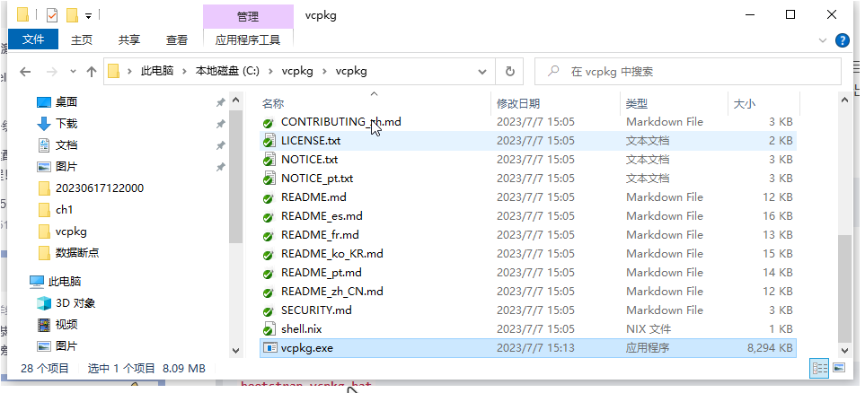

- 添加环境变量

	- 将 vcpkg.exe 的路径添加到环境变量，即可在任意位置执行 vcpkg 命令：
			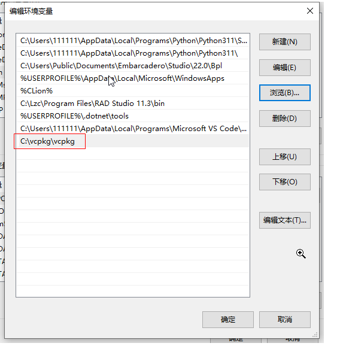

- 更新

	- vcpkg 包管理器在 GitHub 上定期更新。 若要将 vcpkg 的克隆更新到最新版本，执行 git pull 命令即可。更新下载完成后，再次运行引导程序会重新生成 vcpkg 程序，但保留已安装的库。

- 相关命令

	- `vcpkg install <library>`：安装一个库

	- `vcpkg remove <library>`：卸载一个库

	- `vcpkg update`：更新所有库

	- `vcpkg list`：列出已安装的库

	- `vcpkg search <library>`：搜索库

	- `vcpkg integrate install`：将 Vcpkg 集成到 Visual Studio 中

		


# 安装MongoDB的架构包

1. 使用**管理员**身份启动PowerShell，并且跳转到刚刚创建好的vcpgk的目录下，`cd "c:/vcpkg/vcpkg"`
2. 使用`vcpkg integrate install`，获取方框中的信息
    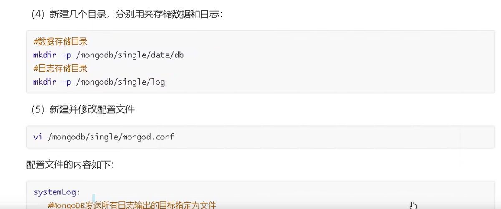
3. 使用`vcpkg install mongo-cxx-driver`安装mongoDB的库，注意PowerShell版本必须在7.2.24及以上。且必须没有保证visual Studio 2022中有Cmake(安装了c++桌面模块)
4. 


# MongoDB学习（非关系数据库  使用BSON的格式）

## 体系结构

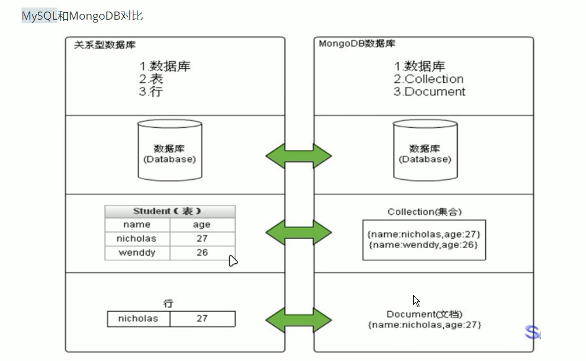

| SQL术语/概念 | MongoDB术语/概念 | 解释/说明                               |
| ------------ | ---------------- | --------------------------------------- |
| database     | database         | 数据库                                  |
| table        | collection       | 数据库表/集合                           |
| row          | document         | 数据记录行/文档                         |
| column       | field            | 数据字段/域                             |
| ndex         | index            | 索引                                    |
| table joins  |                  | 表连接                                  |
|              | 嵌入文档         | MongoDB不支持通过嵌入式文档替代多表连接 |
| primary key  | primary key      | 主键，MongoDB自动将_id字段设置为主键    |

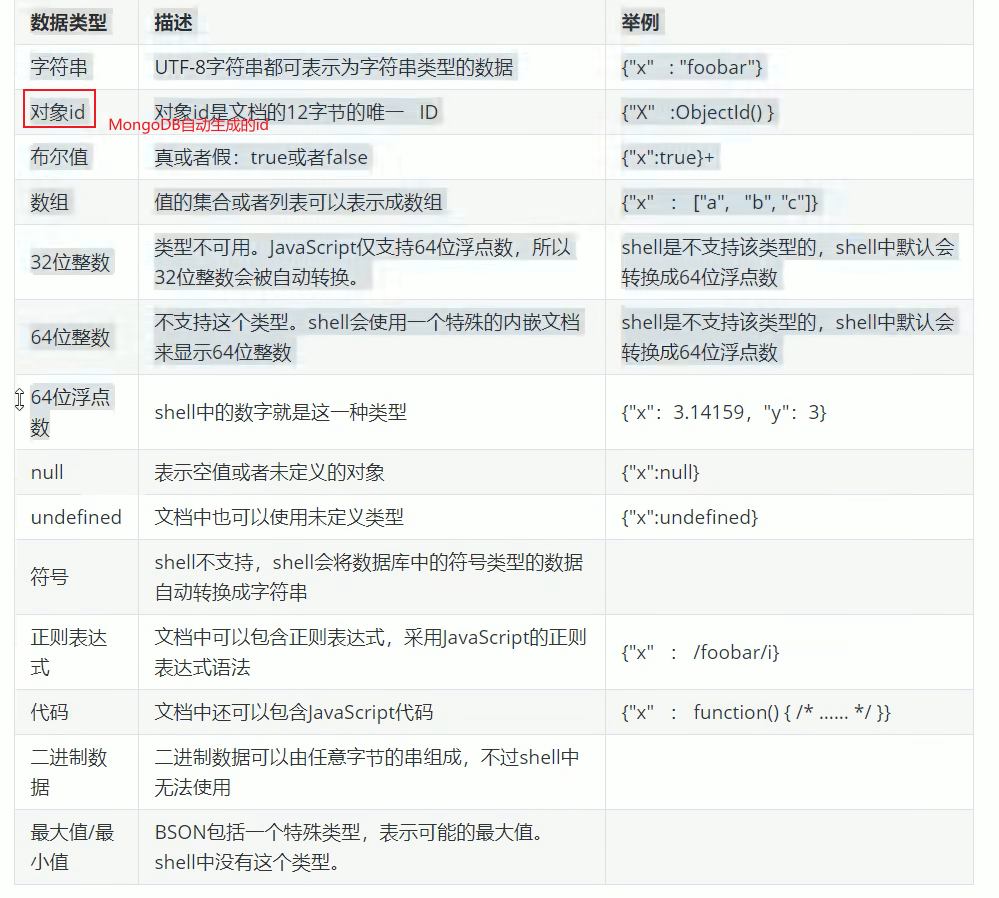

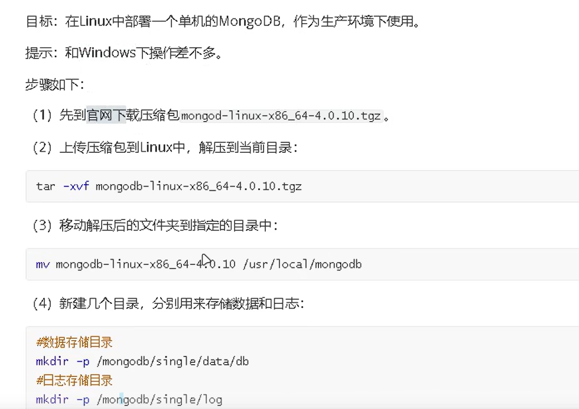

## 安装（windows）

- 到[MongoDB官网下载](https://www.mongodb.com/try)

- 解压或者安装到自己想要的目录下,

- 在该目录下，手动创建一个目录用于存放数据，如 “data/db”，同时在bin目录中打开cmd

- 启动配置

	- 第一种方式，之后使用`mongod --dbpath=..\{刚刚创建的新目录}`  在启动信息看到默认端口27017，即为成功（如果想要改变默认端口，可以通过`--port`来自定端口），为了后续方便启动，可以将bin目录放入环境变量path中

	- 第二种方式，在bin目录的同级目录下创建config目录，在该目录下新建配置文件`mongod.conf`,内容如下：

		```yaml
		storage:
		    # The directory where the mongod instance stores its data. Default value is "\data\db" on Windows.
		    dbPath: D:\02_Server\DBServer\mongodb-win32-x86_64-2008plus-ssl-4.0.1\data
		    #D:\02_Server\DBServer\mongodb-win32-x86_64-2008plus-ssl-4.0.1\data 替换成 data/db（用于存放数据的目录的绝对地址）
		```

		后面通过`mongod -f ../config/mongod.conf`或者`mongod -config ../config/mongod.conf`

- shell连接（mongo命令）启动
	- 启动登录`mongo`或者`mongo --host=localhost --port=27017`
	- 查看已有数据库 `show databases`
	- 退出`exit`
	- 帮助`mongo --help`
- Compass-图形化界面客户端启动

## 安装(Linux)


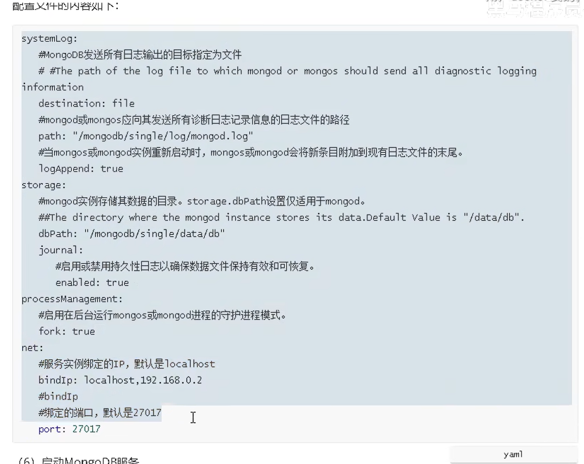

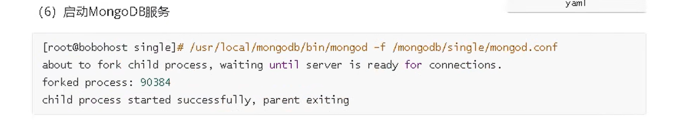

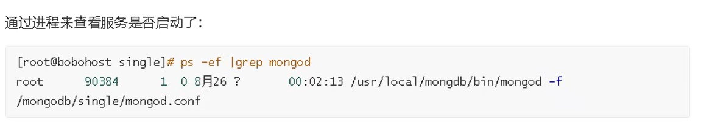

## 基本指令

### 数据库操作

#### 选择和创建数据库

基本语法格式（如果数据库不存在则会自动创建）：

```html
use 数据库名
```

查看有权限查看的所有的数据库：

```html
show dbs
或者
show databases
```

> 注意:在MongoDB种,集合只有在内容插入后才会创建,也就是说,创建集合(数据表)后需要再插入一个文档(记录),集合才会真正创建.当使用 `use 数据库名` 的时候. `数据库名` 其实存放在内存之中, 当 `数据库名` 中存在一个 collection 之后, mongo 才会将这个数据库持久化到硬盘之中.

查看当前正在使用的数据库命令:

```html
db
```

>注意:MongoDB中默认的数据库为test,如果你没有选择数据库,集合将存放再test数据库中.

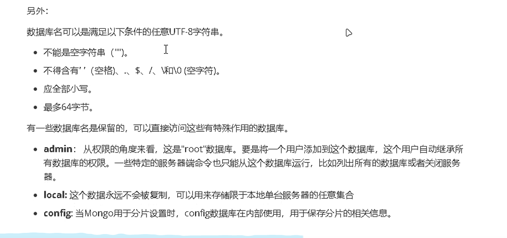

#### 数据库的删除

删除数据库的语法:

```html
db.dropDatabase()
```

>注意:主要用来删除已经持久化的数据库


### 集合操作

集合,类似关系数据库中的表.

可以显示的创建,也可以隐式的创建

#### 集合的显示创建

```html
db.createCollection(name)
#name:换成要创建的集合名称


#例如:创建mycollection的普通集合  db.createCollection("mycollection")
```


查看当前库中的表:

```html
show collections
或者
show tables
```

#### 集合的隐式创建

当向一个集合中插入一个文档的时候,如果集合不存在,则会自动创建集合(文档的插入)

>通常使用隐式创建文档即可

#### 集合的删除

格式:

```html
db.collection.drop()
或
db.集合名.drop()
```

返回值:如果成功删除选定的集合,则drop()方法返回true,否则返回false


### 文档的基本操作

文档(document)的数据结构和json一样

所有存储再集合中的数据都是BSON格式

官方文档: https://docs.mongodb.com/manual/crud/

#### 文档的插入

1. 单个文档插入
	使用insert()或者save()方法向集合中插入文档,语法:

	```json
	db.collection.insert(
		<document or array of documents>,
	        {
	        	writeConcern:<document>,
	        	ordered:<boolean>
	        }
	)
	```

	参数:

	| 参数         | **类型**          | **描述**                                                     |
	| ------------ | ----------------- | ------------------------------------------------------------ |
	| document     | document or array | 要插入到集合中的文档或文档数组。（JSON格式）                 |
	| writeConcern | document          | 可选。表达写入关注的文档。如果省略，则使用默认写入关注。不建议在事务中显式设置写入关注。若要在事务中使用写入关注，请参阅 Transactions and Write Concern。 |
	| ordered      | boolean           | 可选。<br/>如果为真：按照顺序插入数组中的文档。如果其中一个文档出错，MongoDB将返回而不处理数组中的其余文档。<br/>如果为假：执行无序插入。如果其中一个文档出现错误，则继续处理数组中的其它文档。 在版本2.6+中默认值为true。 |

	示例:

	要向 comment 的集合(表)中插入一条测试数据：

	```js
	db.comment.insert({
	    "articleid": "100000",
	    "content": "今天天气真好，阳光明媚",
	    "userid": "1001",
	    "nickname": "Rose",
	    "createdatetime": new Date(),
	    "likenum": NumberInt(10),
	    "state": null
	})
	```

	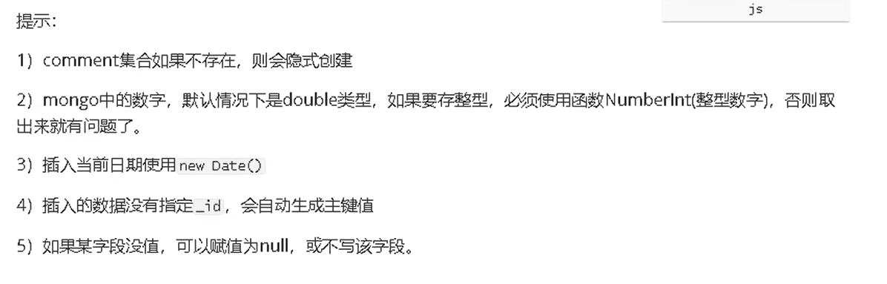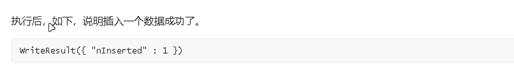
	
2. 批量插入
	语法:

	```js
	db.collection.insertMany(
		[ <document>,<document>, ... ],
	    {
	        writeConcern:<document>,
	        ordered:<boolean>
	    }
	)
	```

	参数:

	| Parameter    | Type     | Description                                                  |
	| ------------ | -------- | ------------------------------------------------------------ |
	| document     | document | 要插入到集合中的文档或文档数组。（json格式）                 |
	| writeConcern | document | 可选。定义写操作的write concern。如果在事务中运行，请勿显式设置写操作的写关注。详情参见Transactions and Write Concern。 |
	| ordered      | boolean  | 可选。一个布尔值，指定MongoDB实例应执行有序插入还是无序插入。默认为true。 |

	示例:
	批量插入多条文章评论:

	```js
	db.comment.insertMany([
	    {
	        "_id": "1",
	        "articleid": "100001",
	        "content": "我们不应该把清晨浪费在手机上，健康很重要，一杯温水幸福你我他。",
	        "userid": "1002",
	        "nickname": "相忘于江湖",
	        "createdatetime": new Date("2019-08-05T22:08:15.522Z"),
	        "likenum": NumberInt(1000),
	        "state": "1"
	    },
	    {
	        "_id": "2",
	        "articleid": "100001",
	        "content": "我夏天空腹喝凉开水，冬天喝温开水。",
	        "userid": "1005",
	        "nickname": "伊人憔悴",
	        "createdatetime": new Date("2019-08-05T23:58:51.485Z"),
	        "likenum": NumberInt(888),
	        "state": "1"
	    },
	    {
	        "_id": "3",
	        "articleid": "100001",
	        "content": "我一直喝凉开水，冬天夏天都喝。",
	        "userid": "1004",
	        "nickname": "杰克船长",
	        "createdatetime": new Date("2019-08-06T01:05:06.321Z"),
	        "likenum": NumberInt(666),
	        "state": "1"
	    },
	    {
	        "_id": "4",
	        "articleid": "100001",
	        "content": "专家说不能空腹吃饭，影响健康。",
	        "userid": "1003",
	        "nickname": "凯撒",
	        "createdatetime": new Date("2019-08-06T08:18:35.288Z"),
	        "likenum": NumberInt(2000),
	        "state": "1"
	    },
	    {
	        "_id": "5",
	        "articleid": "100001",
	        "content": "研究表明，刚烧开的水千万不能喝，因为烫嘴。",
	        "userid": "1003",
	        "nickname": "凯撒",
	        "createdatetime": new Date("2019-08-06T11:01:02.521Z"),
	        "likenum": NumberInt(3000),
	        "state": "1"
	    }
	])
	
	```

	
	


#### 文档的查询

语法格式:

```json
db.collection.find(<query>,[projection])
```

参数:

| Parameter  | Type     | Description                                                  |
| ---------- | -------- | ------------------------------------------------------------ |
| query      | document | 可选。使用查询运算符指定选择筛选器。若要返回集合中的所有文档，请省略此参数或传递空文档 (`{}`)。 |
| projection | document | 可选。指定要在与查询筛选器匹配的文档中返回的字段（投影）。若要返回匹配文档中的所有字段，请省略此参数。 |

示例:

1. 查询所有:

	```html
	db.comment.find()
	或者
	db.comment.find({})
	```

	>注意:每条文档会有一个叫_id的字段,这个相当于我们原来关系数据库中表的主键,当你在插入文档记录时没有指定该字段,MongoDB会自动创建,其类型为ObjectID类型
	>
	>如果我们在插入文档记录时指定该字段也可以，其类型可以是 ObjectID 类型，也可以是 MongoDB 支持的任意类型。

2. 按照一定条件查询
	想要查询 `userid` 为 `1003` 的记录，使用 `find()` 方法，格式为 JSON

	```html
	db.comment.find({userid: '1003'})
	```

	

3. 只会返回第一条符合添加的数据
	使用 `findOne()` 方法返回符合条件的第一条记录。

	```html
	db.comment.findOne({userid: '1003'})
	```

4. 投影查询
	如果要查询结果返回部分字段，则需要使用投影查询（不显示所有字段，只显示指定的字段,默认 `_id` 会显示。）。
	例如：查询结果只显示 `_id`, `userid`, `nickname`：

	```html
	db.comment.find({userid:"1003"},{userid:1,nickname:1})
	
	{ "_id" : "4", "userid" : "1003", "nickname" : "凯撒" }
	{ "_id" : "5", "userid" : "1003", "nickname" : "凯撒" }
	
	#{userid:1,nickname:1} 1显示,0不显示 
	```

	例如：查询结果只显示 `userid`, `nickname`，不显示 `_id`：

	```html
	db.comment.find({userid:"1003"},{userid:1,nickname:1,_id:0})
	
	{ "userid" : "1003", "nickname" : "凯撒" }
	{ "userid" : "1003", "nickname" : "凯撒" }
	
	```

#### 文档的更新

语法：

```js
db.collection.update(query, update, options)
// 或
db.collection.update(
    <query>,
    <update>,
    {
        upsert: <boolean>,
        multi: <boolean>,
        writeConcern: <document>,
        collation: <document>,
        arrayFilters: [ <filterdocument1>, ... ],
        hint: <document|string> // Available starting in MongoDB 4.2
    }
)
```

参数：

| Parameter    | Type                  | Description                                                  |
| ------------ | --------------------- | ------------------------------------------------------------ |
| query        | document              | 更新的选择条件。可以使用与 `find()` 方法中相同的查询选择器，类似于 SQL 的 `where` 部分。若使用 `upsert:true`，查询条件不能是 `_id` 字段未指定的情况。 |
| update       | document or pipeline  | 要应用的修改文档。值可以是更新运算符（如 `$set`）或聚合管道操作符（如 `$unset`、`$addFields` 等）。 |
| upsert       | boolean               | 可选。如果设置为 `true`，当条件匹配的文档不存在时，会创建新文档。默认为 `false`。 |
| multi        | boolean               | 可选。如果设置为 `true`，会更新符合条件的多个文档；设置为 `false` 时，仅更新一个文档，默认值为 `false`。 |
| writeConcern | document              | 可选，表示写问题的文档级别，抛出异常异常时级别               |
| collation    | document              | 可选。<br /> 指定要用于操作的校对规则。 校对规则允许用户为字符串比较指定特定于语言的规则，例如字母大小写和重音标记的规则。<br /> 校对规则选项具有以下语法：  <br />校对规则: {  <br />区域设置: `<string>` <br />caseLevel: `<boolean>` <br />caseFirst: `<string>` <br />强度: `<int>` <br />numericOrdering: `<boolean>` <br />替代: `<string>` <br />最大变量: `<string>` <br />向后: `<boolean>` `}` <br />指定校对规则时，区域设置字段是必需的；<br />所有其他校对规则字段都是可选的。<br />有字段的说明，请参阅校对规则文档。 <br />如果未指定校对规则，但集合具有默认校对规则（请参见 `db.createCollection()`），则操作将使用集合指定的校对规则。<br />  如果没有为集合或操作指定校对规则，MongoDB将使用以前版本中使用的简单二进制比较进行字符串比较。 不支持为一个操作指定多个校对规则。例如：  不能为每个字段指定不同的校对规则。 或者不能将一个校对规则用于查询，另一个用于排序 |
| arrayFilters | array                 | 可选。一个筛选文档数组，用于确定要为数组字段上的更新操作修改哪些数组元素。<br />在更新文档中，使用 `[$[]`](https://docs.mongodb.com/manual/reference/operator/update/positional-filtered/up.us) 标识符来定义标识符。标识符必须与过滤器文档中的标识符匹配，否则会报错。 |
| hint         | Document`  or `string | 可选。指定用于支持查询谓词的索引的文档或字符串。该选项可以采用索引规范文档或索引名称字符串。如果指定的索引不存在，则说明操作错误。例如，请参阅版本 4 中的“为更新操作指定提示”。 |

示例：

1. 覆盖修改
	如果我们想修改 `_id` 为 1 的记录，点赞量为 1001，输入以下语句：

	```html
	db.comment.update({_id:"1"}, {likenum:NumberInt(1001)})
	```

	执行后，我们会发现，这条文档除了 `likenum` 字段，其它字段都不见了。

2. 局部修改
	我们需要使用修改器`$set`来实现。命令如下：
	我们想修改`_id`为2的记录，浏览量为889，输入以下语句：

	```html
	db.comment.update({_id:"2"},{$set:{likenum:NumberInt(889)}})
	```

	

3. 批量修改
	更新所有用户为 `1003` 的用户的昵称为 `凯撒大帝`。

	```html
	// 默认只修改第一条数据
	db.comment.update({userid:"1003"},{$set:{nickname:"凯撒2"}})
	
	// 修改所有符合条件的数据
	db.comment.update({userid:"1003"},{$set:{nickname:"凯撒大帝"}},{multi:true})
	
	```

	提示：如果不加后面的参数，则只更新符合条件的第一条记录。

4. 列值增长的修改
	如果我们想实现对某列在原有值的基础上进行增加或减少，可以使用 `$inc` 运算符来实现。
	需求：对 3 号数据的点赞数，每次递增 1

	```html
	db.comment.update({_id:"3"},{$inc:{likenum:NumberInt(1)}})
	```


#### 文档的删除

**删除文档的语法结构**：

```javascript
db.集合名称.remove(条件)
```

示例：
**以下语句可以将数据全部删除，请慎用**：

```javascript
db.comment.remove({})
```

**如果删除 `_id=1` 的记录，输入以下语句**：

```javascript
db.comment.remove({_id:"1"})
```

### 文档的分页查询

#### 统计查询

统计查询使用 `count()` 方法，语法如下：

```javascript
db.collection.count(query, options)
```


**参数：**

| Parameter | Type     | Description                    |
| --------- | -------- | ------------------------------ |
| query     | document | 查询选择条件。                 |
| options   | document | 可选。用于修改计数的额外选项。 |

**提示：** 可选项暂时不使用。

【示例】
(1) 统计所有记录数：
统计comment集合的所有的记录数：

```
db.comment.count()  
```


(2) 按条件统计记录数：
例如：统计userid为1003的记录条数

```
db.comment.count({userid: "1003"})  
```


提示：
默认情况下 `count()` 方法返回符合条件的全部记录条数。


#### 分页列表查询

可以使用 `limit()` 方法来读取指定数量的数据，使用 `skip()` 方法来跳过指定数量的数据。

基本语法如下所示：

```shell
> db.COLLECTION_NAME.find().limit(NUMBER).skip(NUMBER)
```

示例：

1. 如果你想返回指定条数的记录，可以在 `find` 方法后调用 `limit` 来返回结果（Top N），默认值为 20。例如：

	```javascript
	db.comment.find().limit(3)
	```

2. `skip` 方法同样接受一个数字参数作为跳过的记录条数。（前 N 个不要）默认值是 0：

	```javascript
	db.comment.find().skip(3)
	```

分页查询：需求：每页2个，第二页开始：跳过前两条数据，接着值显示3和4条数据。

```
//第一页
db.comment.find().skip(0).limit(2)

//第二页
db.comment.find().skip(2).limit(2)

//第三页
db.comment.find().skip(4).limit(2)
```

#### 排序查询

**sort() 方法说明:**

- sort() 方法可以对数据进行排序，通过参数指定排序的字段。
- 使用 `1` 表示升序排列，`-1` 表示降序排列。

**语法:**

```javascript
db.COLLECTION_NAME.find().sort({KEY:1})
或者：
db.集合名称.find().sort(排序方式)
```

**示例:** 对 `userid` 降序排列，并对访问量进行升序排列的示例：

```javascript
db.comment.find().sort({userid:-1, likenum:1})
```

提示：

skip()、limit()、sort() 三个放在一起执行的时候，执行的顺序是先 sort()，然后是 skip()，最后是显示的 limit()。和命令编写顺序无关。


### 更多查询方式

#### 正则的复杂条件查询

**MongoDB的模糊查询是通过正则表达式的方式实现的**，格式为：

```
db.collection.find({field:/正则表达式/})
或
db.集合.find({字段:/正则表达式/})
```

提示：正则表达式是js的语法，直接量的写法。

例如： 我要查询评论内容包含“开水”的所有文档，代码如下：

```
db.comment.find({content:/开水/})
```

如果要查询评论的内容中以“专家”开头的，代码如下：

```
db.comment.find({content:/^专家/})
```

#### 比较查询

`<, <=, >, >=` 这个操作符也是很常用的，格式改如下：

```javascript
db.集合名称.find({ "field" : { $gt: value }})   // 大于: field > value
db.集合名称.find({ "field" : { $lt: value }})   // 小于: field < value
db.集合名称.find({ "field" : { $gte: value }})  // 大于等于: field >= value
db.集合名称.find({ "field" : { $lte: value }})  // 小于等于: field <= value
db.集合名称.find({ "field" : { $ne: value }})   // 不等于: field != value
```

**示例**：

查询评论点赞数数量大于700的记录：

```javascript
db.comment.find({likenum:{$gt:NumberInt(700)}})
```

#### 包含查询

包含，使用$in操作符：
示例：查询评论的集合中userid字段包含1003或1004的文档

```js
db.comment.find({userid: {$in: ["1003", "1004"]}})
```

不包含，使用$nin操作符：
示例：查询评论的集合中userid字段不包含1003和1004的文档

```js
db.comment.find({userid: {$nin: ["1003", "1004"]}})
```

#### 条件连接查询

如果需要查询同时满足两个以上条件，需要使用 `$and` 操作符将条件进行关联。（相当于 SQL 的 `AND`）

**格式为：**

```js
$and: [ { }, { }, { } ]
```

**示例：** 查询评论集合中 `likenum` 大于等于 700 并且小于 2000 的文档：

```js
db.comment.find({$and:[{likenum:{$gte:NumberInt(700)}},{likenum:{$lt:NumberInt(2000)}}]})
```

如果两个以上条件之间是 **或者** 的关系，我们使用 `$or` 操作符进行关联。（与前面 `$and` 的使用方式相同）

**格式为：**

```js
$or: [ { }, { }, { } ]
```

**示例：** 查询评论集合中 `userid` 为 1003，或者点赞数小于 1000 的文档记录：

```js
db.comment.find({$or:[ {userid:"1003"}, {likenum:{$lt:1000}} ]})
```

#### 小结

1. **切换数据库**

	```
	use articledb
	```

2. **插入数据（同时隐式创建comment集合）**

	```
	db.comment.insert({BSON数据})
	```

3. **查询所有数据**

	```
	db.comment.find();
	```

4. **条件查询数据**

	```
	db.comment.find({条件});
	```

5. **查询符合条件的第一条记录**

	```
	db.comment.findOne({条件})
	```

6. **查询符合条件的前几条记录**

	```
	db.comment.find({条件}).limit(条数)
	```

7. **查询符合条件的跳过的记录**

	```
	db.comment.find({条件}).skip(条数)
	```

8. **修改数据**

	```
	db.comment.update({条件}, {修改后的数据})    覆盖更新
	或 
	db.comment.update({条件}, {$set:{要修改部分的字段: 数据}})    局部更新
	```

9. **修改数据并自增某字段值**

	```
	db.comment.update({条件}, {$inc:{自增的字段: 步进值}})
	```

10. **删除数据**

	```
	db.comment.remove({条件})
	```

11. **统计查询**

	```
	db.comment.count({条件})
	```

12. **模糊查询**

	```
	db.comment.find({字段名: /正则表达式/})
	```

13. **条件比较运算**

	```
	db.comment.find({字段名: {$gt: 值}})
	```

14. **包含查询**

	```
	db.comment.find({字段名: {$in: [值1, 值2]}})      包含
	或
	db.comment.find({字段名: {$nin: [值1, 值2]}})	不包含
	```

15. **条件组合查询**

	```
	db.comment.find({$and: [{条件1}, {条件2}]})
	或
	db.comment.find({$or: [{条件1}, {条件2}]})
	```

## 索引

索引支持在MongoDB中高效地执行查询。如果没有索引，MongoDB必须执行全集合扫描，即扫描集合中的每个文档，以选择与查询语句匹配的文档。这种扫描全集合的查询效率是非常低的，特别在处理大量的数据时，查询可能要花费几十秒甚至几分钟。这对网站的性能是非常致命的。

如果查询存在适当的索引，MongoDB可以使用该索引限制必须检查的文档数。

索引是特殊的数据结构，它以易于遍历的形式存储集合数据集的一小部分。索引存储特定字段或一组字段的值，按字段值排序。索引项的排序支持有效的相等匹配和基于范围的查询操作。此外，MongoDB还可以使用索引中的排序返回排序结果。

官网文档: https://docs.mongodb.com/manual/indexes/

了解:
MongoDB索引使用B树数据结构（确切的说是B-Tree，MySQL是B+Tree）

### 索引类型

MongoDB支持在文档的单个字段上创建用户定义的升序/降序索引，称为单字段索引（Single Field Index）。

对于单个字段索引和排序操作，索引键的排序顺序（即升序或降序）并不重要，因为MongoDB可以在任何方向上遍历索引。
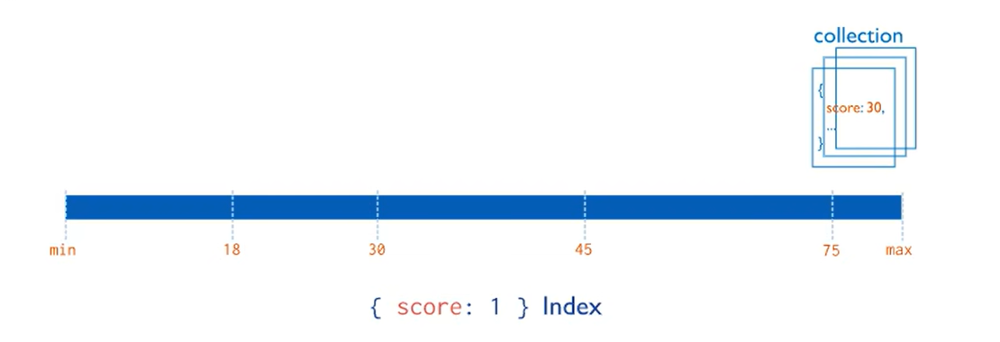

### 复合索引

MongoDB还支持多个字段的用户定义索引，即复合索引（Compound Index）。

复合索引中列出的字段顺序具有重要意义。例如，如果复合索引由 `{ userid: 1, score: -1 }` 组成，则索引首先按userid正序排序，然后在每个userid的值内，再按score倒序排序。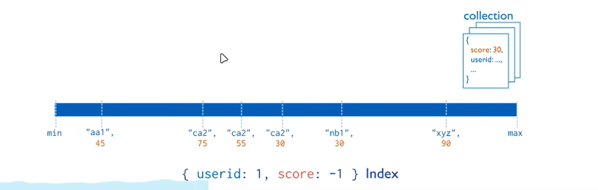

### 其他类型索引

地理空间索引（Geospatial Index）、文本索引（Text Indexes）、哈希索引（Hashed Indexes）。

#### 地理空间索引（Geospatial Index）

为了支持对地理空间坐标数据的有效查询，MongoDB 提供了两种特殊的索引：返回结果时使用平面几何的二维索引和返回结果时使用球面几何的二维球面索引。

#### 文本索引（Text Indexes）

MongoDB 提供了一种文本索引类型，支持在集合中搜索字符串内容。这些文本索引不存储特定于语言的停止词（例如“the”、“a”、“or”），而将集合中的词作为词干，只存储根词。

#### 哈希索引（Hashed Indexes）

为了支持基于散列的分片，MongoDB 提供了散列索引类型，它对字段值的散列列进行索引。这些索引在其范围内的值分布更加随机，但不支持相等匹配，不支持基于范围的查询。


### 索引的管理操作

#### 索引的查看

说明：

返回一个集合中的所有索引的数组。

------

语法：

```javascript
db.collection.getIndexes()
```

提示：该语法命令运行要求是 MongoDB 3.0+

------

【示例】

查看 `comment` 集合中所有的索引情况：

```javascript
> db.comment.getIndexes()
[
    {
        "v": 2,							#索引引擎版本
        "key": {
            "_id": 1					#索引条件_id 升序(默认创建的索引)
        },
        "name": "_id_",					#索引名称
        "ns": "articledb.comment"		#存放在articledb数据库下的comment集合 新版不存在这个参数了
    }
]
```

结果中显示的是默认 `_id` 索引


#### 索引的创建

说明：

在集合上创建索引。

语法：

```javascript
db.collection.createIndex(keys, options)
```

参数：

| Parameter | Type     | Description                                                  |
| --------- | -------- | ------------------------------------------------------------ |
| `keys`    | document | 包含字段和值对的文档，其中字段是索引键，值描述该字段的索引类型。对于字段上的升序索引，请指定值1；对于降序索引，请指定值-1。例如：`{字段: 1 或 -1}`，其中1为指定按升序创建索引，如果你想按降序来创建索引指定位为-1即可。另外，MongoDB支持几种不同的索引类型，包括文本、地理空间和哈希索引。 |
| `options` | document | 可选。包含一组控制索引创建的选项的文档。有关详细信息，请参见选项详细表。 |

`options`（更多选项）列表：

| Parameter              | Type          | Description                                                  |
| ---------------------- | ------------- | ------------------------------------------------------------ |
| **background**         | Boolean       | 建索引过程会阻塞其它数据库操作，background 可指定以后台方式创建索引。即增加 "background" 可选参数。"background" 默认值为 `false`。 |
| **unique**             | Boolean       | 建立的索引是否唯一。指定为 `true` 创建唯一索引。默认值为 `false`。 |
| **name**               | string        | 索引的名称。如果未指定，MongoDB 通过连接索引的字段名和排序顺序生成一个索引名称。 |
| **dropDups**           | Boolean       | **3.0+版本已废弃**。在建立唯一索引时是否删除重复记录。指定为 `true` 创建唯一索引。默认值为 `false`。 |
| **sparse**             | Boolean       | 对文档中不存在的字段数据不启用索引；如果设置为 `true`，在索引字段中不会查询出不包含对应字段的文档。默认值为 `false`。 |
| **expireAfterSeconds** | integer       | 指定一个以秒为单位的数值，完成 TTL 设置，设置集合的生存时间。 |
| **v**                  | index version | 索引的版本号，默认的索引版本取决于 MongoDB 创建索引时运行的版本。 |
| **weights**            | document      | 索引权重值，数值在 1 到 99,999 之间，表示该索引相对于其他索引字段的得分权重。 |
| **default_language**   | string        | 对于文本索引，该参数决定了停用词及词干和词器的规则的列表。默认认为是英语。 |
| **language_override**  | string        | 对于文本索引，该参数指定了包含在文档中的字段名，语言覆盖默认为 `language`。 |

提示：

注意在 **3.0.0** 版本前创建索引方法为 `db.collection.ensureIndex()`，之后的版本使用了 `db.collection.createIndex()` 方法。
`ensureIndex()` 仍能用，但只是 `createIndex()` 的别名。

示例：

- **单字段索引示例**：对 `userid` 字段建立索引：

	```js
	db.comment.createIndex({userid: 1})
	{
	    "createdCollectionAutomatically": false,
	    "numIndexesBefore": 1,
	    "numIndexesAfter": 2,
	    "ok": 1
	}
	```

	CopyInsert

**参数1：按升序创建索引**
可以查看索引如下：

```js
db.comment.getIndexes()
[
    {
        "v": 2,
        "key": {
            "_id": 1
        },
        "name": "_id_",
        "ns": "articledb.comment"
    },
    {
        "v": 2,
        "key": {
            "userid": 1
        },
        "name": "userid_1",
        "ns": "articledb.comment"
    }
]
```


-  **复合索引：**对 `userid` 和 `nickname` 同时建立复合（compound）索引：

```shell
> db.comment.createIndex({userid:1, nickname:-1})
{
    "createdCollectionAutomatically" : false,
    "numIndexesBefore" : 2,
    "numIndexesAfter" : 3,
    "ok"  : 1
}
```

**查看索引：**

```shell
> db.comment.getIndexes()
[
    {
        "v" : 2,
        "key" : {
            "_id" : 1
        },
        "name" : "_id_",
        "ns" : "articledb.comment"
    },
    {
        "v" : 2,
        "key" : {
            "userid" : 1,
            "nickname" : -1
        },
        "name" : "userid_1_nickname_-1",
        "ns" : "articledb.comment"
    }
]
```


#### 索引的删除

**说明：**
可以移除指定的索引，或移除所有索引。

一、指定索引的移除

**语法：**

```javascript
db.collection.dropIndex(index)
```

**参数：**

| Parameter | Type               | Description                                                  |
| --------- | ------------------ | ------------------------------------------------------------ |
| index     | string or document | 指定要删除的索引。可以通过索引名称或索引规范文档指定索引。若要删除文本索引，请指定索引名称。 |

------

**【示例】**

删除 `comment` 集合中 `userid` 字段上的升序索引：

```javascript
> db.comment.dropIndex({userid:1})
{
  "nIndexesWas": 3,
  "ok": 1
}
```


可以通过 `db.comment.getIndexes()` 查看已经删除完毕。


二、所有索引的移除

**语法：**

```
db.collection.dropIndexes()
```

CopyInsert

------

**【示例】**

删除 `spit` 集合中所有索引：

```shell
> db.comment.dropIndexes()
{
    "nIndexesWas": 2,
    "msg": "non-_id indexes dropped for collection",
    "ok": 1
}
```

CopyInsert

------

**提示**：
`_id` 的字段的索引是无法删除的，只能删除非 `_id` 字段的索引。


### 索引的使用

#### 执行计划

**分析查询性能**（Analyze Query Performance）通常使用执行计划（解释计划、Explain Plan）来查看查询的情况，如查询耗费的时间、是否基于索引查询等。

那么，通常，我们想知道，建立的索引是否有效，效果如何，都需要通过执行计划查看。

**语法：**

```javascript
db.collection.find(query,options).explain(options)
```

CopyInsert

【示例】
查看根据`userid`查询数据的情况：

```javascript
db.comment.find({userid:"1003"}).explain()
{
  "queryPlanner": {
    "plannerVersion": 1,
    "namespace": "articledb.comment",
    "indexFilterSet": false,
    "parsedQuery": {
      "userid": {
        "$eq": "1003"
      }
    },
    "winningPlan": {
      "stage": "COLLSCAN",					#COLLSCAN 集合扫描   FETCH 抓取（使用了索引）
      "filter": {
        "userid": {
          "$eq": "1003"
        }
      },
      "direction": "forward"
    },
    "rejectedPlans": []
  },
  "serverInfo": {
    "host": "instance-2ki2pjry",
    "port": 27017,
    "version": "4.0.10",
    "gitVersion": "c389e7f69f637f7a1ac3cc9fae843b635f20b766"
  },
  "ok": 1
}

```

#### 涵盖查询

**Covered Queries**
当查询条件和查询的投影仅包含索引字段时，MongoDB直接从**索引**返回结果，而不扫描任何文档或将文档带入内存(不进入集合)。这些覆盖的查询可以非常有效。

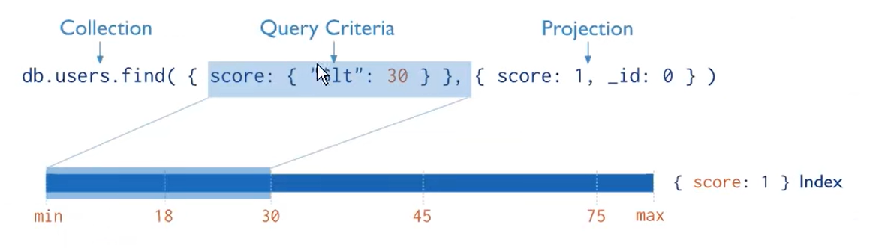

https://docs.mongodb.com/manual/core/query-optimization/#read-operations-covered-query

```html
data> db.data.find({userid:"10001"},{userid:1,_id:0}).explain()
{
  explainVersion: '1',
  queryPlanner: {
    namespace: 'data.data',
    parsedQuery: { userid: { '$eq': '10001' } },
    indexFilterSet: false,
    queryHash: 'B198DE4A',
    planCacheShapeHash: 'B198DE4A',
    planCacheKey: '42EC1F4C',
    optimizationTimeMillis: 6,
    maxIndexedOrSolutionsReached: false,
    maxIndexedAndSolutionsReached: false,
    maxScansToExplodeReached: false,
    prunedSimilarIndexes: false,
    winningPlan: {
      isCached: false,
      stage: 'PROJECTION_COVERED', 					#PROJECTION_COVERED 覆盖索引
      transformBy: { userid: 1, _id: 0 },
      inputStage: {
        stage: 'IXSCAN',
        keyPattern: { userid: 1 },
        indexName: 'userid_1',
        isMultiKey: false,
        multiKeyPaths: { userid: [] },
        isUnique: false,
        isSparse: false,
        isPartial: false,
        indexVersion: 2,
        direction: 'forward',
        indexBounds: { userid: [ '["10001", "10001"]' ] }
      }
    },
    rejectedPlans: []
  },
  queryShapeHash: 'E296207AA229093E9E6C4A3DEBD1913AE096BCFCB31450A91890A6E2D89269CD',
  command: {
    find: 'data',
    filter: { userid: '10001' },
    projection: { userid: 1, _id: 0 },
    '$db': 'data'
  },
  serverInfo: {
    host: 'tanjun',
    port: 27017,
    version: '8.0.5',
    gitVersion: 'cb9e2e5e552ee39dea1e39d7859336456d0c9820'
  },
  serverParameters: {
    internalQueryFacetBufferSizeBytes: 104857600,
    internalQueryFacetMaxOutputDocSizeBytes: 104857600,
    internalLookupStageIntermediateDocumentMaxSizeBytes: 104857600,
    internalDocumentSourceGroupMaxMemoryBytes: 104857600,
    internalQueryMaxBlockingSortMemoryUsageBytes: 104857600,
    internalQueryProhibitBlockingMergeOnMongoS: 0,
    internalQueryMaxAddToSetBytes: 104857600,
    internalDocumentSourceSetWindowFieldsMaxMemoryBytes: 104857600,
    internalQueryFrameworkControl: 'trySbeRestricted',
    internalQueryPlannerIgnoreIndexWithCollationForRegex: 1
  },
  ok: 1
}
```

