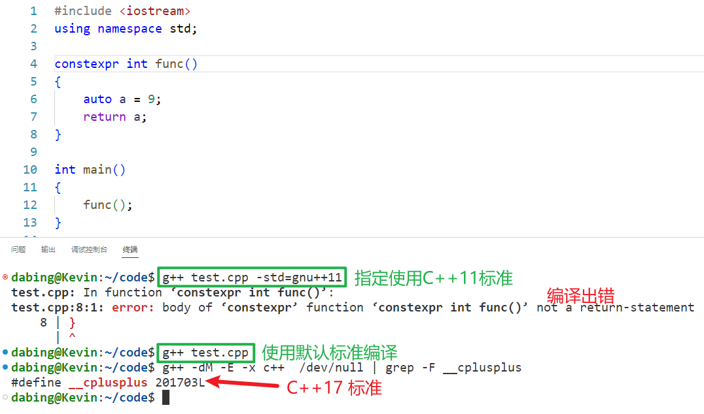
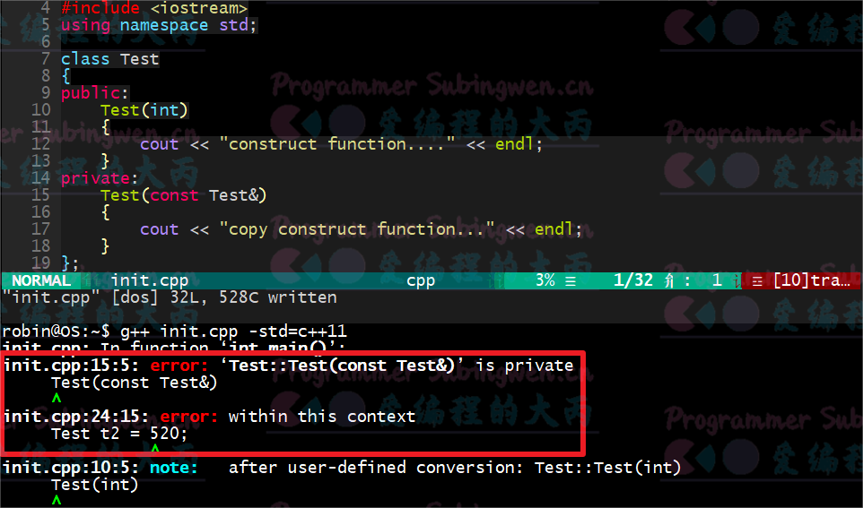
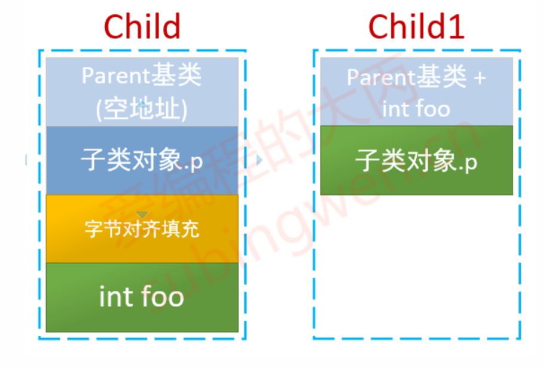
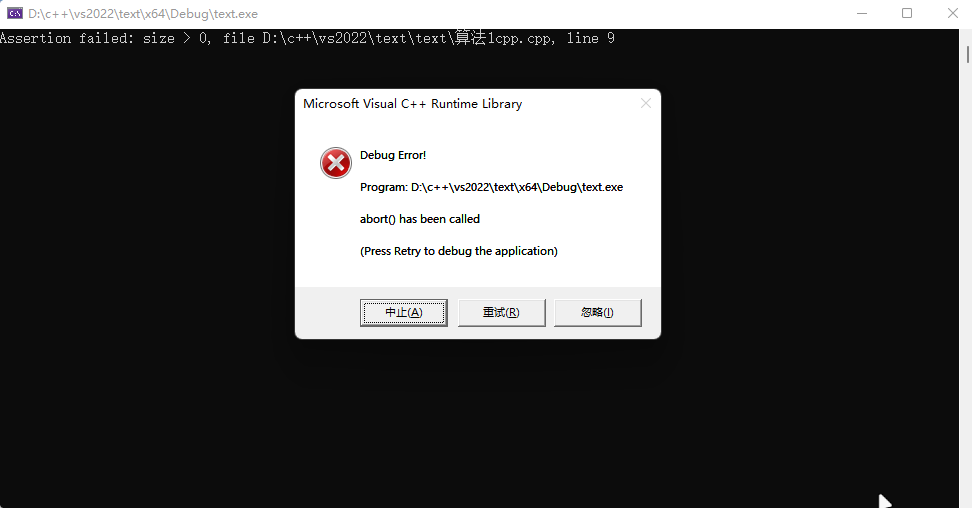
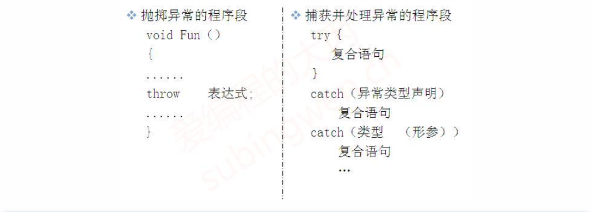

- [TOC]


## 原始字面量

- 字面量：固定的值，数字、字符、字符串等固定值。如：H\t，存在歧义，一种是 H、\、t；另一种是 H、\t(制表符)

-  使用原始字面量消除歧义

	- 定义方式：

		- `R “ xxx(原始字符串)xxx”` ()两边的 xxx 是描述字符串（使用描述字符串时，前后字符串必须相同），转义时会自动忽略掉，所以可省略 `R "()"`

		- 使用场景用例：

			```c++
			// 设置样式表
			QString styleSheet = R"(
			            QLabel {
			                color: #333333; /* 设置标签字体颜色 */
			            }
			            QLineEdit {
			                background-color: #ffffff; /* 设置输入框背景色 */
			                border: 1px solid #cccccc; /* 设置输入框边框 */
			                border-radius: 5px; /* 设置输入框圆角 */
			            }
			            QPushButton {
			                background-color: #007bff; /* 深蓝色按钮 */
			                color: white; /* 设置按钮文字颜色 */
			                border: none; /* 移除按钮边框 */
			                border-radius: 5px; /* 设置按钮圆角 */
			                padding: 10px 20px; /* 设置按钮内边距 */
			            }
			            QPushButton:hover {
			                background-color:  #00695C; /* 设置鼠标悬停时的背景色 */
			            }
			            QPushButton:pressed {
			                background-color: #3e8e41; /* 设置鼠标按下时的背景色 */
			            }
			        )";
			this->setStyleSheet(styleSheet);
			
			
			//例子
			#include <iostream>
			#include <string>
			
			using namespace std;
			
			void open_file_w() 
			{
			    string aa;
			#if 1
			    aa = R"(D:\E\A\B)";
			#else
			    aa = "D:\\E\\A\\B";  //如果想要正确表达，需要使用转义字符\,否则会报错
			#endif
			
			    
			    cout << aa <<endl;
			    
			}
			
			int main() {
			    
			    open_file_w();
			    return 0;
			}
			
			//输出：D:\E\A\B
			```
		
		

## 指针空值类型——nullptr

- 在 C++程序开发中，为了提高程序的健壮性，一般会在定义指针的同时完成初始化操作，或者在指针的指向尚未明确的情况下，**都会给指针初始化为 NULL，避免产生野指针（没有明确指向的指针，操作也这种指针极可能导致程序发生异常）**。C++98/03 标准中，将一个指针初始化为空指针的方式有 2 种：

	```c++
	char *ptr = 0;
	char *ptr = NULL;			//本质上NULL宏定义成0
	```

	在底层源码中 NULL 这个宏是这样定义的:

	```c++
	#ifndef NULL
	    #ifdef __cplusplus
	        #define NULL 0
	    #else
	        #define NULL ((void *)0)
	    #endif
	#endif
	```

	也就是说如果源码是 C++程序 **NULL 就是 0**，如果是 C 程序 NULL 表示(void *)0。那么为什么要这样做呢？ * *是由于 C++ 中，void * 类型无法隐式转换为其他类型的指针，此时使用 0 代替 ((void *)0)，用于解决空指针的问题* *。* *这个 0（0x0000 0000）表示的就是虚拟地址空间中的 0 地址，这块地址是只读的**。


- C++ 中将 NULL 定义为字面常量 0，并不能保证在所有场景下都能很好的工作，比如，函数重载时，NULL 和 0 无法区分：

	```c++
	#include <iostream>
	using namespace std;
	
	void func(char *p)
	{
	    cout << "void func(char *p)" << endl;
	}
	
	void func(int p)
	{
	    cout << "void func(int p)" << endl;
	}
	
	int main()
	{
	    func(NULL);   // 想要调用重载函数 void func(char *p)
	    func(250);    // 想要调用重载函数 void func(int p)
	
	    return 0;
	}
	
	
	//输出结果为
	//void func(int p)
	//void func(int p)
	```

	通过打印的结果可以看到，虽然调用 func(NULL); 最终链接到的还是 void func(int p)和预期是不一样的，其实这个原因前边已经说的很明白了，在 C++中 **NULL 和 0 是等价的**。

- 出于兼容性的考虑，C++11 标准并没有对 NULL 的宏定义做任何修改，而是另其炉灶，引入了一个新的关键字 nullptr。**nullptr 专用于初始化空类型指针**，不同类型的指针变量都可以使用 nullptr 来初始化

	```c++
	#include <iostream>
	using namespace std;
	
	void func(char *p)
	{
	    cout << "void func(char *p)" << endl;
	}
	
	void func(int p)
	{
	    cout << "void func(int p)" << endl;
	}
	
	int main()
	{
	    int*    ptr1 = nullptr;			// 隐式转换成 int* 指针类型
		char*   ptr2 = nullptr;			//隐式转换成 char*
		double* ptr3 = nullptr;			//隐式转换成 double*
	
	    func(nullptr);
	    func(250);
	    return 0;
	}
	
	//输出结果
	//void func(char *p)
	//void func(int p)
	```

## constexpr ——常量表达式

### const

- 在 C++11 之前只有 const 关键字，从功能上来说这个关键字有双重语义：**变量只读，修饰常量**，举一个简单的例子：

	```c++
	void func(const int num)
	{
	    const int count = 24;
	    int array[num];            // error，num是一个只读变量，不是常量
	    int array1[count];         // ok，count是一个常量
	
	    int a1 = 520;
	    int a2 = 250;
	    const int& b = a1;
	    b = a2;                         // error
	    a1 = 1314;
	    cout << "b: " << b << endl;     // 输出结果为1314
	}
	
	```

	- 函数 void func(const int num)的参数 num 表示这个变量是 **只读的**，但不是常量，因此使用 int array [num]; 这种方式定义一个数组，编译器是会报错的，提示 num 不可用作为常量来使用。
	- const int count = 24; 中的 count 却是一个 **常量**，因此可以使用这个常量来定义一个静态数组。

- 另外，**变量只读并不等价于常量**，二者是两个概念不能混为一谈，分析一下这句测试代码 const int& b = a1;：

	- b 是一个常量的引用，所以 b 引用的变量是不能被修改的，也就是说 b = a2; 这句代码语法是错误的。

	- 在 const 对于变量 a1 是没有任何约束的，a1 的值变了 b 的值也就变了

	- 引用 b 是只读的，但是并不能保证它的值是不可改变的，也就是说它不是常量。

		

### constexpr

- 在 C++11 中添加了一个新的关键字 constexpr，这个关键字是用来修饰常量表达式的。所谓 **常量表达式，指的就是由多个（≥1）常量（值不会改变）组成并且在编译过程中就得到计算结果的表达式**。

- 在介绍 gcc/g++工作流程的时候说过，C++ 程序从编写完毕到执行分为四个阶段：**预处理、 编译、汇编和链接** 4 个阶段，得到可执行程序之后就可以运行了。需要额外强调的是，**常量表达式和非常量表达式的计算时机不同，非常量表达式只能在程序运行阶段计算出结果，但是常量表达式的计算往往发生在程序的编译阶段**，这可以极大提高程序的执行效率，因为表达式只需要在编译阶段计算一次，节省了每次程序运行时都需要计算一次的时间。

- 那么问题来了，编译器如何识别表达式是不是常量表达式呢？在 C++11 中添加了 constexpr 关键字之后就可以在程序中使用它来修饰常量表达式，用来提高程序的执行效率。在使用中建议将 const 和 constexpr 的功能区分开，即 **凡是表达“只读”语义的场景都使用 const，表达“常量”语义的场景都使用 constexpr**。

- 在定义常量时，const 和 constexpr 是等价的，都可以在程序的编译阶段计算出结果，例如：

	```c++
	const int m = f();  // 不是常量表达式，m的值只有在运行时才会获取。
	const int i=520;    // 是一个常量表达式
	const int j=i+1;    // 是一个常量表达式
	
	constexpr int i=520;    // 是一个常量表达式
	constexpr int j=i+1;    // 是一个常量表达式
	```

- 对于 C++ 内置类型的数据，可以直接用 constexpr 修饰 **，但如果是自定义的数据类型（用 struct 或者 class 实现），直接用 constexpr 修饰是不行的。**

	```c++
	// 此处的constexpr修饰是无效的
	constexpr struct Test
	{
	    int id;
	    int num;
	};
	
	
	struct Test
	{
	    int id;
	    int num;
	};
	
	int main()
	{
	    constexpr Test t{ 1, 2 };			//实例化对象时使用
	    constexpr int id = t.id;
	    constexpr int num = t.num;
	    // error，不能修改常量
	    t.num += 100;						//t.num += 100;的操作是错误的，对象t是一个常量，因此它的成员也是常量，常量是不能被修改的。
	    cout << "id: " << id << ", num: " << num << endl;
	
	    return 0;
	}
	
	```

	

### 常量表达式函数

- 为了提高 C++程序的执行效率，我们可以将程序中值不需要发生变化的变量定义为常量，也可以使用 constexpr 修饰函数的返回值，这种函数被称作常量表达式函数，这些函数主要包括以下几种：**普通函数/类成员函数、类的构造函数、模板函数**。


#### 修饰函数

- 温馨提示：由于现在编译器版本都比较高，默认的使用的 C++标准也比较高（大于 C++11），相关源代码请基于 C++11 标准进行测试。


- constexpr 并不能修改任意函数的返回值，使这些函数成为常量表达式函数，必须要满足以下几个条件：

	- **函数必须要有返回值，并且 return 返回的表达式必须是常量表达式**。

		```c++
		// error，不是常量表达式函数（没有返回值）
		constexpr void func1()
		{
		    int a = 100;
		    cout << "a: " << a << endl;
		}
		
		// error，不是常量表达式函数(返回值不是常量表达式)
		constexpr int func2()
		{
		    int a = 100;
		    return a;
		}
		```

		

		- 函数 func1()没有返回值，不满足常量表达式函数要求
		- 函数 func2()返回值不是常量表达式，不满足常量表达式函数要求

		

		- 由此可见在更新的 C++标准里边放宽了对 constexpr 的语法限制。

	- **函数在使用之前，必须有对应的定义语句。**

		```c++
		#include <iostream>
		using namespace std;
		
		constexpr int func1();
		int main()
		{
		    constexpr int num = func1();	// error
		    return 0;
		}
		
		constexpr int func1()
		{
		    constexpr int a = 100;
		    return a;
		}
		
		
		// 在测试程序constexpr int num = func1();中，还没有定义func1()就直接调用了，应该将func1()函数的定义放到main()函数的上边。
		```

		

	- **整个函数的函数体中，不能出现非常量表达式之外的语句（using 指令、typedef 语句以及 static_assert 断言、return 语句除外）。**

		```c++
		// error
		constexpr int func1()
		{
		    constexpr int a = 100;
		    constexpr int b = 10;
		    for (int i = 0; i < b; ++i)
		    {
		        cout << "i: " << i << endl;
		    }
		    return a + b;
		}
		
		// ok
		constexpr int func2()
		{
		    using mytype = int;			//using == typedef
		    constexpr mytype a = 100;
		    constexpr mytype b = 10;
		    constexpr mytype c = a * b;
		    return c - (a + b);
		}
		
		
		//因为func1()是一个常量表达式函数，在函数体内部是不允许出现非常量表达式以外的操作，因此函数体内部的for循环是一个非法操作。
		```

	- 以上三条规则不仅对应普通函数适用，对应类的成员函数也是适用的：

		```c++
		class Test
		{
		public:
		    constexpr int func()
		    {
		        constexpr int var = 100;
		        return 5 * var;
		    }
		};
		
		int main()
		{
		    Test t;
		    constexpr int num = t.func();
		    cout << "num: " << num << endl;
		
		    return 0;
		}
		```

#### 修饰模板函数

- C++11 语法中，constexpr 可以修饰函数模板，但由于模板中类型的不确定性，因此函数模板实例化后的模板函数是否符合常量表达式函数的要求也是不确定的。**如果 constexpr 修饰的模板函数实例化结果不满足常量表达式函数的要求，则 constexpr 会被自动忽略，即该函数就等同于一个普通函数**。

	```c++
	#include <iostream>
	using namespace std;
	
	struct Person {
	    const char* name;
	    int age;
	};
	
	// 定义函数模板  (定义的时函数模板--重点时模板，使用时就是模板函数--重点时函数)
	template<typename T>
	constexpr T dispaly(T t) {
	    return t;
	}
	
	int main()
	{
	    struct Person p { "luffy", 19 };
	    //普通函数
	    struct Person ret = dispaly(p);
	    cout << "luffy's name: " << ret.name << ", age: " << ret.age << endl;
	
	    //常量表达式函数
	    constexpr int ret1 = dispaly(250);
	    cout << ret1 << endl;
	
	    constexpr struct Person p1 { "luffy", 19 };
	    constexpr struct Person p2 = dispaly(p1);
	    cout << "luffy's name: " << p2.name << ", age: " << p2.age << endl;
	    return 0;
	}
	
	```

	- 在上面示例程序中定义了一个函数模板 display()，但由于其返回值类型未定，因此在实例化之前无法判断其是否符合常量表达式函数的要求：
		- struct Person ret = dispaly(p); 由于参数 p 是变量，所以实例化后的函数不是常量表达式函数，此时 constexpr 是无效的
		- constexpr int ret1 = dispaly(250); 参数是常量，符合常量表达式函数的要求，此时 constexpr 是有效的
		- constexpr struct Person p2 = dispaly(p1); 参数是常量，符合常量表达式函数的要求，此时 constexpr 是有效的

#### 修饰构造函数

- 如果想用直接得到一个常量对象，也可以使用 constexpr 修饰一个构造函数，这样就可以得到一个常量构造函数了。常量构造函数有一个要求：**构造函数的函数体必须为空，并且必须采用初始化列表的方式为各个成员赋值**。

	```c++
	#include <iostream>
	using namespace std;
	
	struct Person {
	    constexpr Person(const char* p, int age) :name(p), age(age)
	    {
	    }
	    const char* name;
	    int age;
	};
	
	int main()
	{
	    constexpr struct Person p1("luffy", 19);
	    cout << "luffy's name: " << p1.name << ", age: " << p1.age << endl;
	    return 0;
	}
	```

	

## 自动类型推导

- 在 C++11 中增加了很多新的特性，比如可以使用 **auto（使用时，必须初始化）** 自动推导变量的类型，还能够结合 **decltype（基于已经存在的类型，进行推导）** 来表示函数的返回值。使用新的特性可以让我们写出更加简洁，更加现代的代码。


### auto

- 在 C++11 之前 auto 和 static 是对应的，表示变量是自动存储的，但是非 static 的局部变量默认都是自动存储的，因此这个关键字变得非常鸡肋，在 C++11 中他们赋予了新的含义，使用这个关键字能够像别的语言一样自动推导出变量的实际类型。


#### 推导规则

- C++11 中 **auto 并不代表一种实际的数据类型，只是一个类型声明的 “占位符”**，auto 并不是万能的在任意场景下都能够推导出变量的实际类型，**使用 auto 声明的变量必须要进行初始化，以让编译器推导出它的实际类型**，在编译时将 auto 占位符替换为真正的类型。使用语法如下：

	```c++
	auto 变量名 = 变量值;
	
	
	//例子
	auto x = 3.14;      // x 是浮点型 double
	auto y = 520;       // y 是整形 int
	auto z = 'a';       // z 是字符型 char
	auto nb;            // error，变量必须要初始化
	auto double nbl;    // 语法错误, 不能修改数据类型   
	```

- 不仅如此，auto 还可以和指针、引用结合起来使用也可以带上 const、volatile 限定符，在不同的场景下有对应的推导规则，规则内容如下：

	- **当变量不是指针或者引用类型时，推导的结果中不会保留 const、volatile（告诉编译器该关键字下的变量，经常变化）关键字**
	- **当变量是指针或者引用类型时，推导的结果中会保留 const、volatile 关键字**

	```c++
	// 变量d的数据类型为 int，因此auto关键字被推导为 int类型
	int temp = 110;
	auto *a = &temp;			// 变量a的数据类型为 int*，因此auto关键字被推导为 int类型
	auto b = &temp;				// 变量b的数据类型为 int*，因此auto关键字被推导为 int*类型
	auto &c = temp;				// 变量c的数据类型为 int&，因此auto关键字被推导为 int类型
	auto d = temp;				// 变量d的数据类型为 int，因此auto关键字被推导为 int类型
	
	
	// 带const限定的变量，使用auto进行类型推导的例子
	int tmp = 250;
	const auto a1 = tmp;		//变量a1的数据类型为 const int，因此auto关键字被推导为 int类型
	auto a2 = a1;				//变量a2的数据类型为 int，但是a2没有声明为指针或引用因此 const属性被去掉, auto被推导为 int
	const auto &a3 = tmp;		//变量a3的数据类型为 const int&，a3被声明为引用因此 const属性被保留，auto关键字被推导为 int类型
	auto &a4 = a3;				//变量a4的数据类型为 const int&，a4被声明为引用因此 const属性被保留，auto关键字被推导为 const int类型
	```

#### auto 的限制

- auto 关键字并不是万能的，在以下这些场景中是不能完成类型推导的：

	- 不能作为函数参数使用。因为只有在函数调用的时候才会给函数参数传递实参，auto 要求必须要给修饰的变量赋值，因此二者矛盾。

		```c++
		int func(auto a, auto b)	// error
		{	
		    cout << "a: " << a <<", b: " << b << endl;
		}
		```

		

	- 不能用于类的非静态成员变量的初始化

		`````
		class Test
		{
		    auto v1 = 0;                    // error
		    static auto v2 = 0;             // error,类的静态非常量成员不允许在类内部直接初始化,类外初始化
		    static const auto v3 = 10;      // ok
		}
		`````

		

	- 不能使用 auto 关键字定义数组

		```c++
		int func()
		{
		    int array[] = {1,2,3,4,5};  // 定义数组
		    auto t1 = array;            // ok, t1被推导为 int* 类型
		    auto t2[] = array;          // error, auto无法定义数组
		    auto t3[] = {1,2,3,4,5};;   // error, auto无法定义数组
		}
		```

		

	- 无法使用 auto 推导出模板参数

		```c++
		template <typename T>
		struct Test{}
		
		int func()
		{
		    Test<double> t;
		    Test<auto> t1 = t;           // error, 无法推导出模板类型
		    return 0;
		}
		```

#### auto 的应用	

- 比较常用的场景：

	- 用于 STL 的容器遍历。

		```c++
		// 	c++11之前
		#include <map>
		int main()
		{
		    map<int, string> person;
		    map<int, string>::iterator it = person.begin();
		    for (; it != person.end(); ++it)
		    {
		        // do something
		    }
		    return 0;
		}
		
		
		//  C++11
		#include <map>
		int main()
		{
		    map<int, string> person;
		    // 代码简化
		    for (auto it = person.begin(); it != person.end(); ++it)
		    {
		        // do something
		    }
		    return 0;
		}
		```

		

	- 用于泛型编程，在使用模板的时候，很多情况下我们不知道变量应该定义为什么类型，比如下面的代码：

		```c++
		#include <iostream>
		#include <string>
		using namespace std;
		
		class T1
		{
		public:
		    static int get()
		    {
		        return 10;
		    }
		};
		
		class T2
		{
		public:
		    static string get()
		    {
		        return "hello, world";
		    }
		};
		
		template <class A>
		void func(void)
		{
		    auto val = A::get();
		    cout << "val: " << val << endl;
		}
		
		int main()
		{
		    func<T1>();
		    func<T2>();
		    return 0;
		}
		
		```

		在这个例子中定义了泛型函数 func，在函数中调用了类 A 的静态方法 get() ，这个函数的返回值是不能确定的，如果不使用 auto，就需要再定义一个模板参数，并且在外部调用时手动指定 get 的返回值类型，具体代码如下：

		```c++
		#include <iostream>
		#include <string>
		using namespace std;
		
		class T1
		{
		public:
		    static int get()
		    {
		        return 0;
		    }
		};
		
		class T2
		{
		public:
		    static string get()
		    {
		        return "hello, world";
		    }
		};
		
		template <class A, typename B>        // 添加了模板参数 B
		void func(void)
		{
		    B val = A::get();
		    cout << "val: " << val << endl;
		}
		
		int main()
		{
		    func<T1, int>();                  // 手动指定返回值类型 -> int
		    func<T2, string>();               // 手动指定返回值类型 -> string
		    return 0;
		}
		
		```


### decltype

- 在某些情况下，不需要或者不能定义变量，但是希望得到某种类型，这时候就可以使用 C++11 提供的 decltype 关键字了，它的作用是在编译器编译的时候推导出一个表达式的类型，语法格式如下：

	```c++
	decltype (表达式) 推导变量 
	```

- decltype 是“declare type”的缩写，意思是“声明类型”。decltype 的推导是在编译期完成的，它只是用于表达式类型的推导，并不会计算表达式的值。来看一组简单的例子：

	```c++
	int a = 10;
	decltype(a) b = 99;                 // b -> int
	decltype(a+3.14) c = 52.13;         // c -> double
	decltype(a+b*c) d = 520.1314;       // d -> double
	```

- 可以看到 decltype 推导的表达式可简单可复杂，在这一点上 auto 是做不到的，auto 只能推导已初始化的变量类型。


####  推导规则

- 通过上面的例子我们初步感受了一下 decltype 的用法，但不要认为 decltype 就这么简单，在它简单的背后隐藏着很多的细节，下面分三个场景依次讨论一下：

	- 表达式为普通变量或者普通表达式或者类表达式，在这种情况下，使用 decltype 推导出的类型和表达式的类型是一致的。

```c++
#include <iostream>
#include <string>
using namespace std;

class Test
{
public:
    string text;
    static const int value = 110;
};

int main()
{
    int x = 99;
    const int &y = x;					
    decltype(x) a = x;					// 变量a被推导为 int类型
    decltype(y) b = x;					// 变量b被推导为 const int &类型
    decltype(Test::value) c = 0;		// 变量c被推导为 const int类型		

    Test t;
    decltype(t.text) d = "hello, world";	// 变量d被推导为 string类型

    return 0;
}
```

- 表达式是函数调用，使用 decltype 推导出的类型和函数返回值一致。

	```c++
	class Test{...};
	//函数声明
	int func_int();                 // 返回值为 int
	int& func_int_r();              // 返回值为 int&（左值引用）
	int&& func_int_rr();            // 返回值为 int&&（右值引用）
	
	const int func_cint();          // 返回值为 const int
	const int& func_cint_r();       // 返回值为 const int&
	const int&& func_cint_rr();     // 返回值为 const int&&
	
	const Test func_ctest();        // 返回值为 const Test
	
	//decltype类型推导
	int n = 100;
	decltype(func_int()) a = 0;			// 变量a被推导为 int类型
	decltype(func_int_r()) b = n;		// 变量b被推导为 int&类型
	decltype(func_int_rr()) c = 0;		// 变量c被推导为 int&&类型
	decltype(func_cint())  d = 0;		// 变量d被推导为 int类型
	decltype(func_cint_r())  e = n;		// 变量e被推导为 const int &类型
	decltype(func_cint_rr()) f = 0;		// 变量f被推导为 const int &&类型
	decltype(func_ctest()) g = Test();	// 变量g被推导为 const Test类型
	
	/*
	左右值引用
	绑定的对象类型不同：
	左值引用（lvalue reference）绑定到左值。
	右值引用（rvalue reference）绑定到右值。
	修改原对象：
	左值引用可以用于修改原对象的值。
	右值引用主要用于移动语义，避免不必要的复制。
	移动语义：
	右值引用允许你从临时对象中“窃取”资源，从而提高性能。
	通过 std::move 将左值转换为右值，可以使用右值引用。
	*/

- 函数 func_cint() 返回的是一个纯右值（在表达式执行结束后不再存在的数据，也就是临时性的数据，也就是字面量、常量），**对于纯右值而言，只有类类型可以携带const、volatile限定符，除此之外需要忽略掉这两个限定符**，因此推导出的变量d的类型为 int 而不是 const int。


- 表达式是一个左值（可以取地址的变量,且有表达式的左值），或者被括号( )包围，使用 decltype推导出的是**表达式类型的引用**（如果有const、volatile限定符不能忽略）。

	``` c++
	#include <iostream>
	#include <vector>
	using namespace std;
	
	class Test
	{
	public:
	    int num;
	};
	
	int main() {
	    const Test obj;
	    //带有括号的表达式
	    decltype(obj.num) a = 0;			// obj.num 为类的成员访问表达式，符合场景 1，因此 a 的类型为 int
	    decltype((obj.num)) b = a;			// obj.num 带有括号，符合场景 3，因此 b 的类型为 const int&。
	    //加法表达式
	    int n = 0, m = 0;					
	    decltype(n + m) c = 0;				// n+m 得到一个右值，符合场景 1，因此 c 的类型为 int
	    decltype(n = n + m) d = n;			// n = n+m 得到一个左值 n，符合场景 3，因此 d 的类型为 int&
	    return 0;
	}
	```

####  decltype的应用

- 关于decltype的应用多出现在泛型编程中。比如我们编写一个类模板，在里边添加遍历容器的函数，操作如下：

	``` c++
	#include <list>
	using namespace std;
	
	template <class T>
	class Container
	{
	public:
	    void func(T& c)
	    {
	        for (m_it = c.begin(); m_it != c.end(); ++m_it)
	        {
	            cout << *m_it << " ";
	        }
	        cout << endl;
	    }
	private:
	    ??? m_it;  // 这里不能确定迭代器类型
	};
	
	int main()
	{
	    const list <int> lst;
	    Container <const list<int> > obj;
	    obj.func(lst);
	    return 0;
	}
	
	
	// 在程序的第 17 行出了问题，关于迭代器变量一共有两种类型：只读（T:: const_iterator）和读写（T:: iterator），有了 decltype 就可以完美的解决这个问题了，当 T 是一个 非 const 容器得到一个 T:: iterator，当 T 是一个 const 容器时就会得到一个 T:: const_iterator。
	
	#include <list>
	#include <iostream>
	using namespace std;
	
	template <class T>
	class Container
	{
	public:
	    void func(T& c)
	    {
	        for (m_it = c.begin(); m_it != c.end(); ++m_it)
	        {
	            cout << *m_it << " ";
	        }
	        cout << endl;
	    }
	private:
	    decltype(T().begin()) m_it;  // 这里不能确定迭代器类型  T() 匿名对象的创建
	};
	
	int main()
	{
	    const list <int> lst{ 1,2,3,4,5,6,7,8,9 };
	    Container <const list<int> > obj;
	    obj.func(lst);
	    return 0;
	}
	
	
	// decltype(T().begin())这种写法在 vs2017/vs2019 下测试可用完美运行。
	```

### 返回类型后置

- 在泛型编程中，可能需要通过参数的运算来得到返回值的类型，比如下面这个场景：

	``` c++
	#include <iostream>
	using namespace std;
	// R-> 返回值类型, T-> 参数 1 类型, U-> 参数 2 类型
	template <typename R, typename T, typename U>
	R add(T t, U u)
	{
	    return t + u;
	}
	
	int main()
	{
	    int x = 520;
	    double y = 13.14;
	    // auto z = add <decltype(x + y), int, double>(x, y);
	    auto z = add <decltype(x + y)>(x, y);	// 简化之后的写法
	    cout << "z: " << z << endl;
	    return 0;
	}
	```

	- 关于返回值，从上面的代码可以推断出和表达式 t+u的结果类型是一样的，因此可以通过通过decltype进行推导，关于模板函数的参数t和u可以通过实参自动推导出来，因此在程序中就也可以不写。虽然通过上述方式问题被解决了，但是解决方案有点过于理想化，因为对于调用者来说，是不知道函数内部执行了什么样的处理动作的。

- 因此如果要想解决这个问题就得直接在 add 函数身上做文章，先来看第一种写法：

	``` c++
	template <typename T, typename U>
	decltype(t+u) add(T t, U u)
	{
	    return t + u;
	}
	```

	- 当我们在编译器中将这几行代码改出来后就直接报错了，因此decltype中的 t 和 u 都是函数参数，直接这样写相当于变量还没有定义就直接用上了，这时候变量还不存在，有点心急了。

- **在C++11中增加了返回类型后置语法，说明白一点就是将decltype和auto结合起来完成返回类型的推导**。其语法格式如下:

	``` c++
	// 符号 -> 后边跟随的是函数返回值的类型
	auto func(参数 1, 参数 2, ...) -> decltype(参数表达式)
	```

	通过对上述返回类型后置语法代码的分析，得到结论：**auto 会追踪 decltype() 推导出的类型**，因此上边的add()函数可以做如下的修改：

	``` c++
	#include <iostream>
	using namespace std;
	
	template <typename T, typename U>
	// 返回类型后置语法
	auto add(T t, U u) -> decltype(t+u) 		// decltype()的括号中不一定和返回值一样，也可以是能推导出返回值的类型的值
	{
	    return t + u;
	}
	
	int main()
	{
	    int x = 520;
	    double y = 13.14;
	    // auto z = add <int, double>(x, y);
	    auto z = add(x, y);		// 简化之后的写法
	    cout << "z: " << z << endl;
	    return 0;
	}
	```

	为了进一步说明这个语法，我们再看一个例子：

	``` c++
	#include <iostream>
	using namespace std;
	
	int& test(int &i)
	{
	    return i;
	}
	
	double test(double &d)
	{
	    d = d + 100;
	    return d;
	}
	
	template <typename T>
	// 返回类型后置语法
	auto myFunc(T& t) -> decltype(test(t))
	{
	    return test(t);
	}
	
	int main()
	{
	    int x = 520;
	    double y = 13.14;
	    // auto z = myFunc <int>(x);
	    auto z = myFunc(x);             // 简化之后的写法
	    cout << "z: " << z << endl;
	
	    // auto z = myFunc <double>(y);
	    auto z1 = myFunc(y);            // 简化之后的写法
	    cout << "z1: " << z1 << endl;
	    return 0;
	}
	
	// 在这个例子中，通过 decltype 结合返回值后置语法很容易推导出来 test(t)函数可能出现的返回值类型，并将其作用到了函数 myFunc()上。
	// 输出结果
	// z: 520
	// z1: 113.14
	```

	

## final和override

### final

- C++中增加了final关键字**来限制某个类不能被继承，或者某个虚函数不能被重写**，和Java的final关键字的功能是类似的。**如果使用final修饰函数，只能修饰虚函数，并且要把final关键字放到类或者函数的后面。**


#### 修饰函数

- 如果使用final修饰函数，只能修饰虚函数，这样就能阻止子类重写父类的这个函数了：

	``` c++
	class Base								// 基类：Base
	{
	public:
	    virtual void test()
	    {
	        cout << "Base class...";
	    }
	};
	
	class Child : public Base				// 子类：Child
	{
	public:
	    void test() final
	    {
	        cout << "Child class...";
	    }
	};
	
	class GrandChild : public Child			// 孙子类：GrandChild
	{
	public:
	    // 语法错误, 不允许重写
	    void test()
	    {
	        cout << "GrandChild class...";
	    }
	};
	
	
	//test()是基类中的一个虚函数，在子类中重写了这个方法，但是不希望孙子类中继续重写这个方法了，因此在子类中将 test()方法标记为 final，孙子类中对这个方法就只有使用的份了。
	```

#### 修饰类

- 使用final关键字修饰过的类是不允许被继承的，也就是说这个类不能有派生类。

	``` c++
	class Base
	{
	public:
	    virtual void test()
	    {
	        cout << "Base class...";
	    }
	};
	
	class Child final: public Base
	{
	public:
	    void test()
	    {
	        cout << "Child class...";
	    }
	};
	
	// error, 语法错误
	class GrandChild : public Child
	{
	public:
	};
	
	
	// Child 类是被 final 修饰过的，因此 Child 类不允许有派生类 GrandChild 类的继承是非法的，Child 是个断子绝孙的类。
	```

### override

- override关键字**确保在派生类中声明的重写函数与基类的虚函数有相同的签名，同时也明确表明将会重写基类的虚函数**，这样就可以保证重写的虚函数的正确性，也提高了代码的可读性，和final一样这个关键字要写到方法的后面。使用方法如下：

	``` c++
	class Base
	{
	public:
	    virtual void test()
	    {
	        cout << "Base class...";
	    }
	};
	
	class Child : public Base
	{
	public:
	    void test() override
	    {
	        cout << "Child class...";
	    }
	};
	
	class GrandChild : public Child
	{
	public:
	    void test() override
	    {
	        cout << "Child class...";
	    }
	};
	
	// 上述代码中第 13 行和第 22 行就是显示指定了要重写父类的 test()方法，使用了 override 关键字之后，假设在重写过程中因为误操作，写错了函数名或者函数参数或者返回值编译器都会提示语法错误，提高了程序的正确性，降低了出错的概率。
	
	// 多态条件： 
	// 1.有继承关系
	// 2.子类重写父类虚函数
	// 3.父类指针或者引用指向子类函数
	```

## 模板优化

### 模板的右尖括号

- 在泛型编程中，模板实例化有一个非常繁琐的地方，那就是**连续的两个右尖括号（>>）会被编译器解析成右移操作符**，而不是模板参数表的结束。我们先来看一段关于容器遍历的代码，在创建的类模板Base中提供了遍历容器的操作函数traversal():

	``` c++
	// test.cpp
	#include <iostream>
	#include <vector>
	using namespace std;
	
	template <typename T>
	class Base
	{
	public:
	    void traversal(T& t)
	    {
	        auto it = t.begin();
	        for (; it != t.end(); ++it)
	        {
	            cout << *it << " ";
	        }
	        cout << endl;
	    }
	};
	
	
	int main()
	{
	    vector <int> v{ 1,2,3,4,5,6,7,8,9 };
	    Base <vector<int> > b;
	    b.traversal(v);
	
	    return 0;
	}
	
	```

	如果使用C++98/03标准(在>>中间添加空格解决)来编译上边的这段代码，就会得到如下的错误提示：

	``` c++
	test.cpp:25:20: error: '>>' should be '> >' within a nested template argument list
	     Base <vector<int> > b;
	```

	- 根据错误提示中描述模板的两个右尖括之间需要添加空格，这样写起来就非常的麻烦，**C++11改进了编译器的解析规则，尽可能地将多个右尖括号（>）解析成模板参数结束符**，方便我们编写模板相关的代码。

	- 上面的这段代码，在支持C++11的编译器中编译是没有任何问题的，如果使用g++直接编译需要加参数-std=c++11：

		``` shell
		$ g++ test.cpp -std = c++11 -o app
		```

### 默认模板参数

- 在C++98/03标准中，类模板可以有默认的模板参数：

	``` c++
	#include <iostream>
	using namespace std;
	
	template <typename T=int, T t=520>
	class Test
	{
	public:
	    void print()
	    {
	        cout << "current value: " << t << endl;
	    }
	};
	
	int main()
	{
	    Test <> t;
	    t.print();
	
	    Test <int, 1024> t1;
	    t1.print();
	
	    return 0;
	}
	
	```

- 但是不支持函数的默认模板参数，在C++11中添加了对**函数模板默认参数**的支持:

	``` c++
	#include <iostream>
	using namespace std;
	
	template <typename T=int>	// C++98/03 不支持这种写法, C++11 中支持这种写法
	void func(T t)
	{
	    cout << "current value: " << t << endl;
	}
	
	int main()
	{
	    func(100);
	    return 0;
	}
	```

	- 通过上面的例子可以得到如下结论：**当所有模板参数都有默认参数时，函数模板的调用如同一个普通函数。但对于类模板而言，哪怕所有参数都有默认参数，在使用时也必须在模板名后跟随<>来实例化**。

		**另外：函数模板的默认模板参数在使用规则上和其他的默认参数也有一些不同，它没有必须写在参数表最后的限制**。这样当默认模板参数和模板参数自动推导结合起来时，书写就显得非常灵活了。我们可以指定函数模板中的一部分模板参数使用默认参数，另一部分使用自动推导，比如下面的例子：

		``` c++
		#include <iostream>
		#include <string>
		using namespace std;
		
		template <typename R = int, typename N>
		R func(N arg)
		{
		    return arg;
		}
		
		int main()
		{
		    auto ret1 = func(520);
		    cout << "return value-1: " << ret1 << endl;
		
		    auto ret2 = func <double>(52.134);
		    cout << "return value-2: " << ret2 << endl;
		
		    auto ret3 = func <int>(52.134);
		    cout << "return value-3: " << ret3 << endl;
		
		    auto ret4 = func <char, int>(100);
		    cout << "return value-4: " << ret4 << endl;
		
		    return 0;
		}
		
		```

		测试代码输出的结果为:

		``` c++
		return value-1: 520
		return value-2: 52.134
		return value-3: 52
		return value-4: d
		```

	- 根据得到的日志输出，分析一下示例代码中调用的模板函数：

		- auto ret = func(520);
			- 函数返回值类型使用了默认的模板参数，函数的参数类型是自动推导出来的为int类型。
		- auto ret1 = func<double>(52.134);
			- 函数的返回值指定为double类型，函数参数是通过实参推导出来的，为double类型
		- auto ret3 = func<int>(52.134);
			- 函数的返回值指定为int类型，函数参数是通过实参推导出来的，为double类型
		- auto ret4 = func<char, int>(100);
			- 函数的参数为指定为int类型，函数返回值指定为char类型，不需要推导

	- 当默认模板参数和模板参数自动推导同时使用时（优先级从高到低）：

		- 如果指定了类型，就使用指定类型
		- 如果可以推导出参数类型则使用推导出的类型
		- 如果函数模板无法推导出参数类型，那么编译器会使用默认模板参数
		- 如果无法推导出模板参数类型并且没有设置默认模板参数，编译器就会报错。

	- 看一下下面的例子：

		``` c++
		#include <iostream>
		#include <string>
		using namespace std;
		
		// 函数模板定义
		template <typename T, typename U = char>
		void func(T arg1 = 100, U arg2 = 100)
		{
		    cout << "arg1: " << arg1 << ", arg2: " << arg2 << endl;
		}
		
		int main()
		{
		    // 模板函数调用
		    func('a');
		    func(97, 'a');
		    // func();    //编译报错
		    return 0;
		}
		
		// 程序输出的结果为:
		// 	arg1: a, arg2: d
		//  arg1: 97, arg2: a
		```

		分析一下调用的模板函数func()：

		- func('a')：参数T被自动推导为char类型，U使用的默认模板参数为char类型
		- func(97, 'a');：参数T被自动推导为int类型，U使用推导出的类型为char
		- func();：参数T没有指定默认模板类型，并且无法自动推导，编译器会直接报错
			- **模板参数类型的自动推导是根据模板函数调用时指定的实参进行推断的，没有实参则无法推导**
			- **模板参数类型的自动推导不会参考函数模板中指定的默认参数**。


​		

## using

- 在C++中using用于声明命名空间，使用命名空间也可以防止命名冲突。在程序中声明了命名空间之后，就可以直接使用命名空间中的定义的类了。在C++11中赋予了using新的功能，让C++变得更年轻，更灵活。


### 定义别名

- 在 C++中可以通过 typedef 重定义一个类型，语法格式如下：
	```
	typedef 旧的类型名 新的类型名;
	// 使用举例
	typedef unsigned int uint_t;
	```

	- 被重定义的类型并不是一个新的类型，仅仅只是原有的类型取了一个新的名字。和以前的声明语句一样，这里的声明符也可以包含类型修饰，从而也能由基本数据类型构造出复合类型来。C++11中规定了一种新的方法，使用别名声明(alias declaration)来定义类型的别名，即使用using。
	- 在使用的时候，关键字using作为别名声明的开始，其后紧跟别名和等号，其作用是把等号左侧的名字规定成等号右侧类型的别名。**类型别名和类型的名字等价，只要是类型的名字能出现的地方，就能使用类型别名。使用typedef定义的别名和使用using定义的别名在语义上是等效的**。

- 使用using定义别名的语法格式是这样的：

	``` c++
	using 新的类型 = 旧的类型;
	// 使用举例
	using uint_t = int;
	```

	- 通过using和typedef的语法格式可以看到二者的使用没有太大的区别，假设我们定义一个函数指针，using的优势就能凸显出来了，看一下下面的例子：

``` c++
// 使用 typedef 定义函数指针
typedef int(*func_ptr)(int, double);

// 使用 using 定义函数指针
using func_ptr1 = int(*)(int, double);

int myfunc（int a，string b）
//使用  
func_ptr f = myfunc;
func_prtf f1 = myfunc;
f(10, "nihao");
f1(10, "nih");
(*f)(10, "nih");  //相当于直接使用了函数本身
```

- 
	如果不是特别熟悉函数指针与typedef，第一眼很难看出func_ptr其实是一个别名，其本质是一个函数指针，指向的函数返回类型是int，函数参数有两个分别是int，double类型。

- 使用using定义函数指针别名的写法看起来就非常直观了，把别名的名字强制分离到了左边，而把别名对应的实际类型放在了右边，比较清晰，可读性比较好。


### 模板的别名

- 使用typedef重定义类似很方便，但是它有一点限制，比如无法重定义一个模板，比如我们需要一个固定以int类型为key的map，它可以和很多类型的value值进行映射，如果使用typedef这样直接定义就非常麻烦:

	``` c++
	typedef map <int, string> m1;
	typedef map <int, int> m2;
	typedef map <int, double> m3;
	```

- 在这种情况下我们就不自觉的想到了模板：

	``` c++
	template <typename T>
	typedef map <int, T> type;	// error, 语法错误
	```

- 使用typename不支持给模板定义别名，这个简单的需求仅通过typedef很难办到，需要添加一个外敷类：

	``` c++
	#include <iostream>
	#include <functional>
	#include <map>
	using namespace std;
	
	template <typename T>
	// 定义外敷类
	struct MyMap
	{
	    typedef map <int, T> type;
	};
	
	int main(void)
	{
	    MyMap <string>:: type m;
	    m.insert(make_pair(1, "luffy"));
	    m.insert(make_pair(2, "ace"));
	
	    MyMap <int>:: type m1;
	    m1.insert(1, 100);
	    m1.insert(2, 200);
	
	    return 0;
	}
	
	```

	- 通过上边的例子可以直观的感觉到，需求简单但是实现起来并不容易。**在C++11中，新增了一个特性就是可以通过使用using来为一个模板定义别名**，对于上面的需求可以写成这样：

		``` c++
		template <typename T>
		using mymap = map <int, T>;
		```

		完整的示例代码如下:

		``` c++
		#include <iostream>
		#include <functional>
		#include <map>
		using namespace std;
		
		template <typename T>
		using mymap = map <int, T>;
		
		int main(void)
		{
		    // map 的 value 指定为 string 类型
		    mymap <string> m;
		    m.insert(make_pair(1, "luffy"));
		    m.insert(make_pair(2, "ace"));
		
		    // map 的 value 指定为 int 类型
		    mymap <int> m1;
		    m1.insert(1, 100);
		    m1.insert(2, 200);
		
		    return 0;
		}
		
		```

		- 上面的例子中通过使用using给模板指定别名，就可以基于别名非常方便的给value指定相应的类型，这样使编写的程序变得更加灵活，看起来也更加简洁一些。

			**最后在强调一点：using语法和typedef一样，并不会创建出新的类型，它们只是给某些类型定义了新的别名。using相较于typedef的优势在于定义函数指针别名时看起来更加直观，并且可以给模板定义别名。**

## 委托构造和继承构造函数

### 委托构造

- 委托构造函数允许使用同一个类中的一个构造函数调用其它的构造函数，从而简化相关变量的初始化。下面举例说明：

	``` c++
	#include <iostream>
	using namespace std;
	
	class Test
	{
	public:
	    Test() {};
	    Test(int max)
	    {
	        this-> m_max = max > 0 ? max : 100;
	    }
	
	    Test(int max, int min)
	    {
	        this-> m_max = max > 0 ? max : 100;              // 冗余代码
	        this-> m_min = min > 0 && min < max ? min : 1;   
	    }
	
	    Test(int max, int min, int mid)
	    {
	        this-> m_max = max > 0 ? max : 100;             // 冗余代码
	        this-> m_min = min > 0 && min < max ? min : 1;  // 冗余代码
	        this-> m_middle = mid < max && mid > min ? mid : 50;
	    }
	
	    int m_min;
	    int m_max;
	    int m_middle;
	};
	
	int main()
	{
	    Test t(90, 30, 60);
	    cout << "min: " << t.m_min << ", middle: " 
	         << t.m_middle << ", max: " << t.m_max << endl;
	    return 0;
	}
	```

- 在上面的程序中有三个构造函数，但是这三个函数中都有重复的代码，在C++11之前构造函数是不能调用构造函数的，加入了委托构造之后，我们就可以轻松地完成代码的优化了：

	``` c++
	#include <iostream>
	using namespace std;
	
	class Test
	{
	public:
	    Test() {};
	    Test(int max)
	    {
	        this-> m_max = max > 0 ? max : 100;
	    }
	
	    Test(int max, int min): Test(max)
	    {
	        this-> m_min = min > 0 && min < max ? min : 1;
	    }
	
	    Test(int max, int min, int mid): Test(max, min)
	    {
	        this-> m_middle = mid < max && mid > min ? mid : 50;
	    }
	
	    int m_min;
	    int m_max;
	    int m_middle;
	};
	
	int main()
	{
	    Test t(90, 30, 60);
	    cout << "min: " << t.m_min << ", middle: " 
	         << t.m_middle << ", max: " << t.m_max << endl;
	    return 0;
	}
	```

	- 在修改之后的代码中可以看到，重复的代码全部没有了，并且在一个构造函数中调用了其他的构造函数用于相关数据的初始化，相当于是一个链式调用。在使用委托构造函数的时候还需要注意一些几个问题：

		- **这种链式的构造函数调用不能形成一个闭环（死循环），否则会在运行期抛异常。**
		- **如果要进行多层构造函数的链式调用，建议将构造函数的调用的写在初始列表中而不是函数体内部，否则编译器会提示形参的重复定义。**

		``` c++
		Test(int max)
		{
		    this-> m_max = max > 0 ? max : 100;
		}
		
		Test(int max, int min)
		{
		    Test(max);	// error, 此处编译器会报错, 提示形参 max 被重复定义
		    this-> m_min = min > 0 && min < max ? min : 1;
		}
		
		```

		- **初始化列表中调用了代理构造函数初始化某个类成员变量之后，就不能在初始化列表中再次初始化这个变量了。**

		``` c++
		// 错误, 使用了委托构造函数就不能再次 m_max 初始化了
		Test(int max, int min) : Test(max), m_max(max)
		{
		    this-> m_min = min > 0 && min < max ? min : 1;
		}
		```

		

### 继承构造函数

- C++11中提供的继承构造函数可以让派生类直接使用基类的构造函数，而无需自己再写构造函数，尤其是在基类有很多构造函数的情况下，可以极大地简化派生类构造函数的编写。先来看没有继承构造函数之前的处理方式：

	``` c++
	#include <iostream>
	#include <string>
	using namespace std;
	
	class Base
	{
	public:
	    Base(int i) : m_i(i) {}
	    Base(int i, double j) : m_i(i), m_j(j) {}
	    Base(int i, double j, string k) : m_i(i), m_j(j), m_k(k) {}
	
	    int m_i;
	    double m_j;
	    string m_k;
	};
	
	class Child : public Base
	{
	public:
	    Child(int i) : Base(i) {}
	    Child(int i, double j) : Base(i, j) {}
	    Child(int i, double j, string k) : Base(i, j, k) {}
	};
	
	int main()
	{
	    Child c(520, 13.14, "i love you");
	    cout << "int: " << c.m_i << ", double: " 
	         << c.m_j << ", string: " << c.m_k << endl;
	    return 0;
	}
	```

	- 通过测试代码可以看出，在子类中初始化从基类继承的类成员，需要在子类中重新定义和基类一致的构造函数，这是非常繁琐的，C++11中通过添加继承构造函数这个新特性完美的解决了这个问题，使得代码更加精简。

	- 继承构造函数的使用方法是这样的：通过使用`using 类名::构造函数名`（其实类名和构造函数名是一样的）来声明使用基类的构造函数，这样子类中就可以不定义相同的构造函数了，直接使用基类的构造函数来构造派生类对象。

		``` c++
		#include <iostream>
		#include <string>
		using namespace std;
		
		class Base
		{
		public:
		    Base(int i) : m_i(i) {}
		    Base(int i, double j) : m_i(i), m_j(j) {}
		    Base(int i, double j, string k) : m_i(i), m_j(j), m_k(k) {}
		
		    int m_i;
		    double m_j;
		    string m_k;
		};
		
		class Child : public Base
		{
		public:
		    using Base:: Base;
		};
		
		int main()
		{
		    Child c1(520, 13.14);
		    cout << "int: " << c1.m_i << ", double: " << c1.m_j << endl;
		    Child c2(520, 13.14, "i love you");
		    cout << "int: " << c2.m_i << ", double: " 
		         << c2.m_j << ", string: " << c2.m_k << endl;
		    return 0;
		}
		
		
		
		```

		- 在修改之后的子类中，没有添加任何构造函数，而是添加了using Base::Base;这样就可以在子类中直接继承父类的所有的构造函数，通过他们去构造子类对象了。

		- 另外如果在子类中隐藏了父类中的同名函数，也可以通过using的方式在子类中使用基类中的这些父类函数：

			``` c++
			#include <iostream>
			#include <string>
			using namespace std;
			
			class Base
			{
			public:
			    Base(int i) : m_i(i) {}
			    Base(int i, double j) : m_i(i), m_j(j) {}
			    Base(int i, double j, string k) : m_i(i), m_j(j), m_k(k) {}
			
			    void func(int i)
			    {
			        cout << "base class: i = " << i << endl;
			    }
			    
			    void func(int i, string str)
			    {
			        cout << "base class: i = " << i << ", str = " << str << endl;
			    }
			
			    int m_i;
			    double m_j;
			    string m_k;
			};
			
			class Child : public Base
			{
			public:
			    using Base:: Base;
			    using Base:: func;
			    void func()
			    {
			        cout << "child class: i'am luffy!!!" << endl;
			    }
			};
			
			int main()
			{
			    Child c(250);
			    c.func();
			    c.func(19);
			    c.func(19, "luffy");
			    return 0;
			}
			
			// 输出结果
			// child class: i'am luffy!!!
			// base class: i = 19
			// base class: i = 19, str = luffy
			```

			

		- 子类中的func()函数隐藏了基类中的两个func()因此默认情况下通过子类对象只能调用无参的func()，在上面的子类代码中添加了`using Base::func;`之后，就可以通过子类对象直接调用父类中被隐藏的带参func()函数了。(子类重载了父类方法，又想使用父类的方法，可以通过这种方式)

			

## 列表初始化

- 关于C++中的变量，数组，对象等都有不同的初始化方法，在这些繁琐的初始化方法中没有任何一种方式适用于所有的情况。为了统一初始化方式，并且让初始化行为具有确定的效果，在C++11中提出了列表初始化的概念。


### 统一的初始化

- 在C++98/03中，对应普通数组和可以直接进行内存拷贝（memcpy()）的对象是可以使用列表初始化来初始化数据的


``` c++
// 数组的初始化
int array [] = { 1,3,5,7,9 };
double array1 [3] = { 1.2, 1.3, 1.4 };

// 对象的初始化
struct Person
{
    int id;
    double salary;
}zhang3{ 1, 3000 };
```

- 在C++11中，列表初始化变得更加灵活了，来看一下下面这段初始化类对象的代码：

``` c++
#include <iostream>
using namespace std;

class Test
{
public:
    Test(int) {}
private:
    Test(const Test &);
};

int main(void)
{
    Test t1(520);
    Test t2 = 520; 					// 自动调用 Test（int）构造函数，进行隐式转换
    Test t3 = { 520 };
    Test t4{ 520 };
    int a1 = { 1314 };
    int a2{ 1314 };
    int arr1 [] = { 1, 2, 3 };
    int arr2 []{ 1, 2, 3 };
    return 0;
}

```

- 具体地来解读一下上面代码中使用的各种初始化方式：

	- t1：最中规中矩的初始化方式，通过提供的带参构造进行对象的初始化

	- t2：语法错误，因为提供的拷贝构造函数是私有的。如果拷贝构造函数是公共的，520会通过隐式类型转换被Test(int)构造成一个匿名对象，然后再通过对这个匿名对象进行拷贝构造得到t2（这个错误在VS中不会出现，在Linux中使用g++编译会提示描述的这个错误，截图如下。）

		

	- t3和t4：使用了C++11的初始化方式来初始化对象，效果和t1的方式是相同的。
		- 在初始时，{}前面的等号是否书写对初始化行为没有任何影响。
		- t3虽然使用了等号，但是它仍然是列表初始化，因此私有的拷贝构造对它没有任何影响。
	- t1、arr1和t2、arr2：这两个是基础数据类型的列表初始化方式，可以看到，和对象的初始化方式是统一的。
	- t3、t4、a2、arr2的写法，是C++11中新添加的语法格式，**使用这种方式可以直接在变量名后边跟上初始化列表，来进行变量或者对象的初始化**。


- 既然使用列表初始化可以对普通类型以及对象进行直接初始化，那么在使用 new 操作符创建新对象的时候可以使用列表初始化进行对象的初始化吗？答案是肯定的，来看下面的例子：

	``` c++
	int * p = new int{520};
	double b = double{52.134};
	int * array = new int [3]{1,2,3};
	```

	- 指针p指向了一个new操作符返回的内存，通过列表初始化将内存数据初始化为了520
	- 变量b是对匿名对象使用列表初始之后，再进行拷贝初始化。
	- 数组array在堆上动态分配了一块内存，通过列表初始化的方式直接完成了多个元素的初始化。

- 除此之外，列表初始化还可以直接用在函数返回值上：

	``` c++
	#include <iostream>
	#include <string>
	using namespace std;
	
	class Person
	{
	public:
	    Person(int id, string name)
	    {
	        cout << "id: " << id << ", name: " << name << endl;
	    }
	};
	
	Person func()
	{
	    return { 9527, "华安" };
	}
	
	int main(void)
	{
	    Person p = func();
	    return 0;
	}
	
	```

	- 代码中的return { 9527, "华安" };就相当于return (9527, "华安" );，直接返回了一个匿名对象。通过上面的几个例子可以看出在C++11使用列表初始化是非常便利的，它统一了各种对象的初始化方式，而且还让代码的书写更加简单清晰。


### 列表初始化细节

#### 聚合体

- 在C++11中，列表初始化的使用范围被大大增强了，但是一些模糊的概念也随之而来，在前面的例子可以得知，列表初始化可以用于自定义类型的初始化，但是对于一个自定义类型，列表初始化可能有两种执行结果：

	``` c++
	#include <iostream>
	#include <string>
	using namespace std;
	
	struct T1
	{
	    int x;
	    int y;
	}a = { 123, 321 };
	
	struct T2
	{
	    int x;
	    int y;
	    T2(int, int) : x(10), y(20) {}
	}b = { 123, 321 };
	
	int main(void)
	{
	    cout << "a.x: " << a.x << ", a.y: " << a.y << endl;
	    cout << "b.x: " << b.x << ", b.y: " << b.y << endl;
	    return 0;
	}
	
	/*
	结果：
	a.x: 123, a.y: 321
	b.x: 10, b.y: 20
	*/
	```

	- 在上边的程序中都是用列表初始化的方式对对象进行了初始化，但是得到结果却不同，对象b并没有被初始化列表中的数据初始化，这是为什么呢？

		- 对象a是对一个自定义的聚合类型进行初始化，它将以拷贝的形式使用初始化列表中的数据来初始化T1结构体中的成员。
		- 在结构体T2中自定义了一个构造函数，因此实际的初始化是通过这个构造函数完成的。

	- 如果使用列表初始化对对象初始化时，还需要判断这个对象对应的类型是不是一个聚合体，如果是初始化列表中的数据就会拷贝到对象中

	- 聚合体

		- 普通数组本身可以看做是一个聚合类型

			``` c++
			int x [] = {1,2,3,4,5,6};
			double y [3][3] = {
			    {1.23, 2.34, 3.45},
			    {4.56, 5.67, 6.78},
			    {7.89, 8.91, 9.99},
			};
			char carry [] = {'a', 'b', 'c', 'd', 'e', 'f'};
			std:: string sarry [] = {"hello", "world", "nihao", "shijie"};
			```

			

		- 满足以下条件的类（class、struct、union）可以被看做是一个聚合类型：

			- 无用户自定义的构造函数。

			- 无私有或保护的非静态数据成员。

				- 场景1: 类中有私有成员, 无法使用列表初始化进行初始化
					``` C++
					struct T1
					{
					    int x;
					    long y;
					protected:
					    int z;			// 需要构造函数来使用初始化列表
					}t{ 1, 100, 2};		// error, 类中有私有成员, 无法使用初始化列表初始化
					```

				- 场景2：类中有非静态成员可以通过列表初始化进行初始化，但它不能初始化静态成员变量。

					``` c++
					struct T2
					{
					    int x;
					    long y;
					protected:
					    static int z;	
					}t{ 1, 100， 2};		// error  静态成员 z 需要类外初始化
					```

					结构体中的静态变量 z 不能使用列表初始化进行初始化，它的初始化遵循静态成员的初始化方式。

					``` c++
					struct T2
					{
					    int x;
					    long y;
					protected:
					    static int z;
					}t{ 1, 100};		// ok
					// 静态成员的初始化
					int T2:: z = 2;
					```

					

				- 无基类。

				- 无虚函数。

				- 类中不能有使用{}和=直接初始化的非静态数据成员（从c++14开始就支持了）。

					``` c++
					#include <iostream>
					#include <string>
					using namespace std;
					
					struct T2
					{
					    int x;
					    long y;
					protected:
					    static int z;
					}t1{ 1, 100 };		// ok
					// 静态成员的初始化
					int T2:: z = 2;
					
					struct T3
					{
					    int x;
					    double y = 1.34;
					    int z [3]{1,2,3};
					};
					
					int main(void)
					{
					    T3 t{520, 13.14, {6,7,8}};		// error, c++11 不支持, 从 c++14 开始就支持了
					    return 0;
					} 
					```

					

#### 非聚合体

- 对于聚合类型的类可以直接使用列表初始化进行对象的初始化，如果不满足聚合条件还想使用列表初始化其实也是可以的，**需要在类的内部自定义一个构造函数, 在构造函数中使用初始化列表对类成员变量进行初始化**:

``` c++
#include <iostream>
#include <string>
using namespace std;

struct T1
{
    int x;
    double y;
    // 在构造函数中使用初始化列表初始化类成员
    T1(int a, double b, int c) : x(a), y(b), z(c){}
    virtual void print()
    {
        cout << "x: " << x << ", y: " << y << ", z: " << z << endl;
    }
private:
    int z;
};

int main(void)
{
    T1 t{ 520, 13.14, 1314 };	// ok, 基于构造函数使用初始化列表初始化类成员
    t.print();
    return 0;
}
```

- 可以看到，T1并非一个聚合类型，因为它有一个Private的非静态成员。但是尽管T2有一个非聚合类型的非静态成员t1，T2依然是一个聚合类型，可以直接使用列表初始化的方式进行初始化。
- 最后强调一下t2对象的初始化过程，对于非聚合类型的成员t1做初始化的时候，可以直接写一对空的大括号{}，这相当于调用是T1的无参构造函数
- **对于一个聚合类型，使用列表初始化相当于对其中的每个元素分别赋值，而对于非聚合类型，则需要先自定义一个合适的构造函数，此时使用列表初始化将会调用它对应的构造函数。**

### std::initializer_list

- 在C++的STL容器中，可以进行任意长度的数据的初始化，使用初始化列表也只能进行固定参数的初始化，如果想要做到和STL一样有任意长度初始化的能力，可以使用std::initializer_list这个轻量级的类模板来实现。


- 先来介绍一下这个类模板的一些特点：
	- 它是一个轻量级的容器类型，内部定义了迭代器iterator等容器必须的概念，遍历时得到的迭代器是只读的。
	- 对于std::initializer_list<T>而言，它可以**接收任意长度的初始化列表，但是要求元素必须是同种类型T**
	- 在std::initializer_list内部有三个成员接口：**size(), begin(), end()**。
	- std::initializer_list对象**只能被整体初始化或者赋值**。

#### 作为普通函数参数

- 如果想要自定义一个函数并且接收任意个数的参数（变参函数），只需要将函数参数指定为std::initializer_list，使用初始化列表{ }作为实参进行数据传递即可。

	``` c++
	#include <iostream>
	#include <string>
	using namespace std;
	
	void traversal(std:: initializer_list <int> a)
	{
	    for (auto it = a.begin(); it != a.end(); ++it)
	    {
	        cout << *it << " ";
	    }
	    cout << endl;
	}
	
	int main(void)
	{
	    initializer_list <int> list;
	    cout << "current list size: " << list.size() << endl;
	    traversal(list);
	
	    list = { 1,2,3,4,5,6,7,8,9,0 };
	    cout << "current list size: " << list.size() << endl;
	    traversal(list);
	    cout << endl;
	    
	    list = { 1,3,5,7,9 };
	    cout << "current list size: " << list.size() << endl;
	    traversal(list);
	    cout << endl;
	
	    ////////////////////////////////////////////////////
	    ////////////// 直接通过初始化列表传递数据 //////////////
	    ////////////////////////////////////////////////////
	    traversal({ 2, 4, 6, 8, 0 });
	    cout << endl;
	
	    traversal({ 11,12,13,14,15,16 });
	    cout << endl;
	
	
	    return 0;
	}
	
	/*
	结果：
	current list size: 0
	
	current list size: 10
	1 2 3 4 5 6 7 8 9 0
	
	current list size: 5
	1 3 5 7 9
	
	2 4 6 8 0
	
	11 12 13 14 15 16
	*/
	```

	- **std::initializer_list拥有一个无参构造函数**，因此，它可以直接定义实例，此时将**得到一个空的std::initializer_list**，因为在遍历这种类型的容器的时候得到的是一个只读的迭代器，因此我们不能修改里边的数据，只能通过值覆盖的方式进行容器内部数据的修改。虽然如此，在效率方面也无需担心，**std::initializer_list的效率是非常高的，它的内部并不负责保存初始化列表中元素的拷贝，仅仅存储了初始化列表中元素的引用。**

#### 作为构造函数参数

- 自定义的类如果在构造对象的时候想要接收任意个数的实参，可以给构造函数指定为std::initializer_list类型，在自定义类的内部还是使用容器来存储接收的多个实参。（Qt框架中使用的比较多）

	``` c++
	#include <iostream>
	#include <string>
	#include <vector>
	using namespace std;
	
	class Test
	{
	public:
	    Test(std:: initializer_list <string> list)
	    {
	        for (auto it = list.begin(); it != list.end(); ++it)
	        {
	            cout << *it << " ";
	            m_names.push_back(*it);
	        }
	        cout << endl;
	    }
	private:
	    vector <string> m_names;
	};
	
	int main(void)
	{
	    Test t({ "jack", "lucy", "tom" });
	    Test t1({ "hello", "world", "nihao", "shijie" });
	    return 0;
	}
	
	
	/*
	结果
	jack lucy tom
	hello world nihao shijie
	*/
	```

## 基于范围的for循环

- 在C++98/03中，不同的容器和数组遍历的方式不尽相同，写法不统一，也不够简洁，而C++11基于范围的for循环可以以简洁、统一的方式来遍历容器和数组，用起来也更方便了。


### for循环新语法

- 在介绍新语法之前，先来看一个使用迭代器遍历容器的例子：

	``` c++
	#include <iostream>
	#include <vector>
	using namespace std;
	
	int main()
	{
	    vector <int> t{ 1,2,3,4,5,6 };
	    for (auto it = t.begin(); it != t.end(); ++it)
	    {
	        cout << *it << " ";
	    }
	    cout << endl;
	    
	    return 0;
	}
	```

	- 我们在遍历的过程中需要给出容器的两端：开头（begin）和结尾（end），因为这种遍历方式不是基于范围来设计的。**在基于范围的for循环中，不需要再传递容器的两端，循环会自动以容器为范围展开，并且循环中也屏蔽掉了迭代器的遍历细节，直接抽取容器中的元素进行运算，使用这种方式进行循环遍历会让编码和维护变得更加简便。**

	- C++98/03中普通的for循环，语法格式：

		``` c++
		for(表达式 1; 表达式 2; 表达式 3)
		{
		    // 循环体
		}
		```

	- C++11基于范围的for循环，语法格式：

		``` c++
		for (declaration : expression)
		{
		    // 循环体
		}
		```

		- 在上面的语法格式中
			- **declaration表示遍历声明**，在遍历过程中，当前被遍历到的元素会被存储到声明的变量中。
			- **expression是要遍历的对象**，它可以是**表达式、容器、数组、初始化列表**等。

	- 使用基于范围的for循环遍历容器，示例代码如下：

		`````
		#include <iostream>
		#include <vector>
		using namespace std;
		
		int main(void)
		{
		    vector <int> t{ 1,2,3,4,5,6 };
		    for (auto value : t)
		    {
		        cout << value << " ";
		    }
		    cout << endl;
		
		    return 0;
		}
		`````

		- 在上面的例子中，**是将容器中遍历的当前元素拷贝到了声明的变量value中，因此无法对容器中的元素进行写操作，如果需要在遍历过程中修改元素的值，需要使用引用,效率更高。**


``` C++
#include <iostream>
#include <vector>
using namespace std;

int main(void)
{
    vector <int> t{ 1,2,3,4,5,6 };
    cout << "遍历修改之前的容器: ";
    for (auto &value : t)
    {
        cout << value++ << " ";
    }
    cout << endl << "遍历修改之后的容器: ";

    for (auto &value : t)
    {
        cout << value << " ";
    }
    cout << endl;

    return 0;
}

/*
	输出结果：
	遍历修改之前的容器: 1 2 3 4 5 6
	遍历修改之后的容器: 2 3 4 5 6 7
	*/

//对容器的遍历过程中，如果只是读数据，不允许修改元素的值，可以使用 const 定义保存元素数据的变量，在定义的时候建议使用 **const auto &**，这样相对于 const auto 效率要更高一些。

#include <iostream>
#include <vector>
using namespace std;

int main(void)
{
    vector <int> t{ 1,2,3,4,5,6 };
    for (const auto& value : t)
    {
        cout << value << " ";
    }

    return 0;
}
```

### 使用细节

#### 关系型容器(键，值)

- 使用基于范围的for循环有一些需要注意的细节，先来看一下对关系型容器map的遍历：

	``` c++
	#include <iostream>
	#include <string>
	#include <map>
	using namespace std;
	
	int main(void)
	{
	    map <int, string> m{
	        {1, "lucy"},{2, "lily"},{3, "tom"}
	    };
	
	    // 基于范围的 for 循环方式
	    for (auto& it : m)
	    {
	        cout << "id: " << it.first << ", name: " << it.second << endl;
	    }
	
	    // 普通的 for 循环方式
	    for (auto it = m.begin(); it != m.end(); ++it)
	    {
	        cout << "id: " << it-> first << ", name: " << it-> second << endl;
	    }
	
	    return 0;
	}
	```

	- 在上面的例子中使用两种方式对map进行了遍历，通过对比有两点需要注意的事项：
		- **使用普通的for循环方式（基于迭代器）遍历关联性容器， auto自动推导出的是一个迭代器类型，需要使用迭代器的方式取出元素中的键值对（和指针的操作方法相同）：**
			- it->first
			- it->second
		- **使用基于范围的for循环遍历关联性容器，auto自动推导出的类型是容器中的value_type，相当于一个对组（std::pair）对象，提取键值对的方式如下：**
			- it.first
			- it.second

#### 元素只读

- 通过对基于范围的for循环语法的介绍可以得知，在for循环内部声明一个变量的引用就可以修改遍历的表达式中的元素的值，但是这并不适用于所有的情况，**对应set容器来说，内部元素都是只读的，这是由容器的特性决定的，因此在for循环中auto&会被视为const auto &** 。


``` c++
#include <iostream>
#include <set>
using namespace std;

int main(void)
{
    set <int> st{ 1,2,3,4,5,6 };
    for (auto &item : st) 
    {
        cout << item++ << endl;		// error, 不能给常量赋值
    }
    return 0;
}
```

- 除此之外，**在遍历关联型容器时也会出现同样的问题，基于范围的for循环中，虽然可以得到一个std::pair引用，但是我们是不能修改里边的first值的，也就是key值。**

	``` c++
	#include <iostream>
	#include <string>
	#include <map>
	using namespace std;
	
	int main(void)
	{
	    map <int, string> m{
	        {1, "lucy"},{2, "lily"},{3, "tom"}
	    };
	
	    for (auto& item : m)
	    {
	        // item.first 是一个常量
	        cout << "id: " << item.first++ << ", name: " << item.second << endl;  // error
	    }
	
	    return 0;
	}
	```

#### 访问次数

- 基于范围的for循环遍历的对象可以是一个表达式或者容器/数组等。假设我们对一个容器进行遍历，在遍历过程中for循环对这个容器的访问频率是一次还是多次呢？我们通过下面的例子验证一下：

`````c++
#include <iostream>
#include <vector>
using namespace std;

vector <int> v{ 1,2,3,4,5,6 };
vector <int>& getRange()
{
    cout << "get vector range..." << endl;
    return v;
}

int main(void)
{
    for (auto val : getRange())
    {
        cout << val << " ";
    }
    cout << endl;

    return 0;
}

/*
输出结果：
get vector range...
1 2 3 4 5 6
*/
`````

​	

- 从上面的结果中可以看到，不论基于范围的for循环迭代了多少次，函数getRange()只在第一次迭代之前被调用，得到这个容器对象之后就不会再去重新获取这个对象了。

- **对应基于范围的for循环来说，冒号后边的表达式只会被执行一次。在得到遍历对象之后会先确定好迭代的范围，基于这个范围直接进行遍历。如果是普通的for循环，在每次迭代的时候都需要判断是否已经到了结束边界。**（只能顺序遍历）


## 可调用对象包装器、绑定器

### 可调用对象

- 在C++中存在“可调用对象”这么一个概念。准确来说，可调用对象有如下几种定义：

  - 是一个函数指针

  	``` c++
  	int print(int a, double b)
  	{
  	    cout << a << b << endl;
  	    return 0;
  	}
  	// 定义函数指针
  	int (*func)(int, double) = &print;
  	```

  	

  - 是一个具有operator()成员函数的类对象（仿函数）

  	``` c++
  	#include <iostream>
  	#include <string>
  	#include <vector>
  	using namespace std;
  	
  	struct Test
  	{
  	    // ()操作符重载
  	    void operator()(string msg)
  	    {
  	        cout << "msg: " << msg << endl;
  	    }
  	};
  	
  	int main(void)
  	{
  	    Test t;
  	    t("我是要成为海贼王的男人!!!");	// 仿函数
  	    return 0;
  	}
  	```

  	

  - 是一个可被转换为函数指针的类对象

    ``` c++
    #include <iostream>
    #include <string>
    #include <vector>
    using namespace std;
    
    //给函数指针起别名
    using func_ptr = void(*)(int, string);
    struct Test
    {
        static void print(int a, string b)
        {
            cout << "name: " << b << ", age: " << a << endl;
        }
    
        // 将类对象转换为函数指针  
        //必须是静态函数（没有 this 指针），普通成员函数（存在 this 指针，只能被对象调用）不行  非静态成员函数必须与对象绑定
        operator func_ptr()
        {
            return print;
        }
    };
    
    int main(void)
    {
        Test t;
        // 对象转换为函数指针, 并调用
        t(19, "Monkey D. Luffy");
    
        return 0;
    }
    ```

    

  - 是一个类成员函数指针或者类成员指针
  	``` C++
  	#include <iostream>
  	#include <string>
  	#include <vector>
  	using namespace std;
  	
  	struct Test
  	{
  	    void print(int a, string b)
  	    {
  	        cout << "name: " << b << ", age: " << a << endl;
  	    }
  	    int m_num;
  	};
  	
  	int main(void)
  	{
  	    // 定义类成员函数指针指向类成员函数
  	    //使用 using 定义  
  	    //using func_ptr = void(Test::*)(int , string);
  	    //func_ptr f1 = &Test:: print;			//函数名就是地址，加不加&都行
  	    void (Test::*func_ptr)(int, string) = &Test:: print;
  	    // 类成员指针指向类成员变量
  	    int Test::*obj_ptr = &Test:: m_num;
  	
  	    Test t;
  	    // 通过类成员函数指针调用类成员函数
  	    //*f1 解引用  等于使用该函数
  	    //(t.*f1)(19, "Monkey D. Luffy");
  	    (t.*func_ptr)(19, "Monkey D. Luffy");
  	    // 通过类成员指针初始化类成员变量
  	    t.*obj_ptr = 1;
  	    cout << "number is: " << t.m_num << endl;
  	
  	    return 0;
  	}
  	```

  	

- 在上面的例子中满足条件的这些可调用对象对应的类型被统称为可调用类型。C++中的可调用类型虽然具有比较统一的操作形式，但定义方式五花八门，这样在我们试图使用统一的方式保存，或者传递一个可调用对象时会十分繁琐。现在，**C++11通过提供std::function 和 std::bind统一了可调用对象的各种操作**。																													

### 可调用对象包装器(适用于业务逻辑复杂的场景)

- **std::function是可调用对象的包装器。它是一个类模板，可以容纳除了<span style="color:#FF3333;">类(非静态)成员（函数）指针</span>之外的所有可调用对象。通过指定它的模板参数，它可以用统一的方式处理函数、函数对象、函数指针，并允许保存和延迟执行它们。**

#### 基本用法

- std::function必须要**包含一个叫做functional的头文件**，可调用对象包装器使用语法如下:

	``` c++
	#include <functional>
	std:: function <返回值类型(参数类型列表)> diy_name = 可调用对象;
	```

- 下面的实例代码中演示了可调用对象包装器的基本使用方法：

	``` c++
	#include <iostream>
	#include <functional>
	using namespace std;
	
	using func_ptr = int (*)(int, int);
	int add(int a, int b)
	{
	    cout << a << " + " << b << " = " << a + b << endl;
	    return a + b;
	}
	
	class T1
	{
	public:
	    static int sub(int a, int b)
	    {
	        cout << a << " - " << b << " = " << a - b << endl;
	        return a - b;
	    }
	    
	    operator func_ptr()
	    {
	        return sub;
	    }
	};
	
	class T2
	{
	public:
	    int operator()(int a, int b)
	    {
	        cout << a << " * " << b << " = " << a * b << endl;
	        return a * b;
	    }
	};
	
	int main(void)
	{
	    // 绑定（包装）一个普通函数
	    function <int(int, int)> f1 = add;
	    // 绑定（包装）一个静态类成员函数
	    function <int(int, int)> f2 = T1:: sub;
	    // 绑定（包装）一个仿函数
	    T2 t;
	    function <int(int, int)> f3 = t;
	    // 绑定（包装）一个转换成函数指针的对象
	    T1 tt;
	    function <int(int,int)> f4 = tt;
	
	    // 函数调用
	    f1(9, 3);
	    f2(9, 3);
	    f3(9, 3);
	    f4(9, 3);
	
	    return 0;
	}
	
	//结果：
	//9 + 3 = 12
	//9 - 3 = 6
	//9 * 3 = 27
	//9 - 3 = 6
	```
	
	- **通过测试代码可以得到结论：std::function可以将可调用对象进行包装，得到一个统一的格式，包装完成得到的对象相当于一个函数指针，和函数指针的使用方式相同，通过包装器对象就可以完成对包装的函数的调用了。**

#### 作为回调函数使用

- 因为回调函数本身就是通过函数指针实现的，**使用对象包装器可以取代函数指针的作用**，来看一下下面的例子：

	``` c++
	#include <iostream>
	#include <functional>
	using namespace std;
	
	class A
	{
	public:
	    // 构造函数参数是一个包装器对象  目的：给一个处理函数，并将函数存储在 callback 中。
	    A(const function <void()>& f) : callback(f)
	    {
	    }
	
	    void notify()
	    {
	        callback(); // 调用通过构造函数得到的函数指针  目的：实际调用该处理函数
	    }
	private:
	    function <void()> callback;
	};
	
	class B
	{
	public:
	    //重载（），且无参
	    void operator()()
	    {
	        cout << "我是要成为海贼王的男人!!!" << endl;
	    }
	};
	int main(void)
	{
	    B b;
	    A a(b); // 仿函数通过包装器对象进行包装
	    a.notify();
	
	    return 0;
	}
	```

	- 通过上面的例子可以看出，使用对象包装器std::function可以非常方便的将仿函数转换为一个函数指针，通过进行函数指针的传递，在其他函数的合适的位置就可以调用这个包装好的仿函数了。
	- 另外，使用std::function作为函数的传入参数，可以将定义方式不相同的可调用对象进行统一的传递，这样大大增加了程序的灵活性。


### 绑定器

- **std::bind用来将可调用对象与其参数一起进行绑定。绑定后的结果可以使用std::function进行保存，并延迟调用到任何我们需要的时候。**通俗来讲，它主要有两大作用：

	- **将可调用对象与其参数一起绑定成一个仿函数。**
	- **将多元（参数个数为n，n>1）可调用对象转换为一元或者（n-1）元可调用对象，即只绑定部分参数。**

- 绑定器函数使用语法格式如下：

	``` c++
	// 绑定非类成员函数/变量
	auto f = std:: bind(可调用对象地址, 绑定的参数/占位符);
	// 绑定类成员函/变量
	auto f = std:: bind(类函数/成员地址, 类实例对象地址, 绑定的参数/占位符);
	```

- 下面来看一个关于绑定器的实际使用的例子：

	``` c++
	#include <iostream>
	#include <functional>
	using namespace std;
	
	void callFunc(int x, const function <void(int)>& f)
	{
	    if (x % 2 == 0)
	    {
	        f(x);
	    }
	}
	
	void output(int x)
	{
	    cout << x << " ";
	}
	
	void output_add(int x)
	{
	    cout << x + 10 << " ";
	}
	
	int main(void)
	{
	    // 使用绑定器绑定可调用对象和参数
	    auto f1 = bind(output, placeholders::_1);
	    for (int i = 0; i < 10; ++i)
	    {
	        callFunc(i, f1);
	    }
	    cout << endl;
	
	    auto f2 = bind(output_add, placeholders::_1);
	    for (int i = 0; i < 10; ++i)
	    {
	        callFunc(i, f2);
	    }
	    cout << endl;
	
	    return 0;
	}
	
	/*
	结果：
	0 2 4 6 8
	10 12 14 16 18
	*/
	```

	- 在上面的程序中，使用了std::bind绑定器，在函数外部通过绑定不同的函数，控制了最后执行的结果。**std::bind绑定器返回的是一个仿函数类型，得到的返回值可以直接赋值给一个std::function，在使用的时候我们并不需要关心绑定器的返回值类型，使用auto进行自动类型推导就可以了**。
	- placeholders::_1是一个占位符，代表这个位置将在函数调用时被传入的第一个参数所替代。同样还有其他的占位符placeholders::_2、placeholders::_3、placeholders::_4、placeholders::_5等……

- 有了占位符的概念之后，使得std::bind的使用变得非常灵活:

	``` c++
	#include <iostream>
	#include <functional>
	using namespace std;
	
	void output(int x, int y)
	{
	    cout << x << " " << y << endl;
	}
	
	int main(void)
	{
	    // 使用绑定器绑定可调用对象和参数, 并调用得到的仿函数
	    bind(output, 1, 2)();						// 两个固定参数
	    bind(output, placeholders::_1, 2)(10);		// 一个变量，一个固定参数
	    bind(output, 2, placeholders::_1)(10);
	
	    // error, 调用时没有第二个参数
	    // bind(output, 2, placeholders::_2)(10);
	    // 调用时第一个参数 10 被吞掉了，没有被使用
	    bind(output, 2, placeholders::_2)(10, 20);
	
	    bind(output, placeholders::_1, placeholders::_2)(10, 20);
	    bind(output, placeholders::_2, placeholders::_1)(10, 20);
	
	
	    return 0;
	}
	
	/*
	结果
	1  2		// bind(output, 1, 2)();
	10 2		// bind(output, placeholders::_1, 2)(10);
	2 10		// bind(output, 2, placeholders::_1)(10);
	2 20		// bind(output, 2, placeholders::_2)(10, 20);
	10 20		// bind(output, placeholders::_1, placeholders::_2)(10, 20);
	20 10		// bind(output, placeholders::_2, placeholders::_1)(10, 20);
	*/
	```

	- 通过测试可以看到，**std::bind可以直接绑定函数的所有参数，也可以仅绑定部分参数。在绑定部分参数的时候，通过使用std::placeholders来决定空位参数将会属于调用发生时的第几个参数。**

- 可调用对象包装器std::function是不能实现对类成员函数指针或者类成员指针的包装的，但是通过绑定器std::bind的配合之后，就可以完美的解决这个问题了，再来看一个例子，然后再解释里边的细节：

	``` c++
	#include <iostream>
	#include <functional>
	using namespace std;
	
	class Test
	{
	public:
	    void output(int x, int y)
	    {
	        cout << "x: " << x << ", y: " << y << endl;
	    }
	    int m_number = 100;
	};
	
	void testFunc(int i, int j, const functional <void(int,int)> &f)
	{
	    if(i % 2 == 0)
	    {
	        f(i, j);
	    }
	}
	
	int main(void)
	{
	    Test t;
	    // 绑定类成员函数
	    function <void(int, int)> f1 = 
	        bind(&Test:: output, &t, placeholders::_1, placeholders::_2);
	    // 绑定类成员变量(公共) 不加&，不能修改变量值
	    function <int&(void)> f2 = bind(&Test:: m_number, &t);
	    auto f22 = bind(&Test:: m_number, &t);   // 与 f2 类型不一样，一个是仿函数，一个是包装器
	    
	    //其他写法
		auto f3 = bind(&Test:: output, &t, placeholders::_1, placeholders::_2);
		testFunc(10,20, f3);
	    
	
	    // 调用
	    f1(520, 1314);
	    f2() = 2333;
	    cout << "t.m_number: " << t.m_number << endl;
	
	    return 0;
	}
	
	
	/*
	结果：
	x: 520, y: 1314
	t.m_number: 2333
	*/
	```

	- 在用绑定器绑定类成员函数或者成员变量的时候需要将它们所属的实例对象一并传递到绑定器函数内部。**f1的类型是function<void(int, int)>，通过使用std::bind将Test的成员函数output的地址和对象t绑定，并转化为一个仿函数并存储到对象f1中。**
	- **使用绑定器绑定的类成员变量m_number得到的仿函数被存储到了类型为function<int&(void)>的包装器对象f2中，并且可以在需要的时候修改这个成员。其中int是绑定的类成员的类型，并且允许修改绑定的变量，因此需要指定为变量的引用，由于没有参数因此参数列表指定为void。**
	- 示例程序中是使用function包装器保存了bind返回的仿函数，如果不知道包装器的模板类型如何指定，可以直接使用auto进行类型的自动推导，这样使用起来会更容易一些。


​	

## Lambda表达式(匿名函数)

### 基本用法

lambda表达式是C++11最重要也是最常用的特性之一，这是现代编程语言的一个特点，lambda表达式有如下的一些优点：

- 声明式的编程风格：就地匿名定义目标函数或函数对象，不需要额外写一个命名函数或函数对象。

- 简洁：避免了代码膨胀和功能分散，让开发更加高效。
- 在需要的时间和地点实现功能闭包，使程序更加灵活。

lambda表达式定义了一个匿名函数，并且可以捕获一定范围内的变量。lambda表达式的语法形式简单归纳如下：

``` c++
[capture](params) opt -> ret {body;};
```

其中capture是捕获列表，params是参数列表，opt是函数选项，ret是返回值类型，body是函数体。

1. 捕获列表[]: 捕获一定范围内的变量

2. 参数列表(): 和普通函数的参数列表一样，如果没有参数参数列表可以省略不写。

	``` c++
	auto f = [](){return 1;}	// 没有参数, 参数列表为空
	auto f = []{return 1;}		// 没有参数, 参数列表省略不写
	```

	

3. opt 选项， 不需要可以省略

	- mutable: 可以修改按值传递进来的拷贝（注意是能修改拷贝，而不是值本身）
	- exception: 指定函数抛出的异常，如抛出整数类型的异常，可以使用throw();

4. 返回值类型：在C++11中，lambda表达式的返回值是通过返回值后置语法来定义的。

5. 函数体：函数的实现，这部分不能省略，但函数体可以为空。

调用：

``` c++
[](){
    
}(传入的实参); 
```


### 捕获列表

lambda表达式的捕获列表可以捕获一定范围内的变量，具体使用方式如下：

- [] - 不捕捉任何变量
- [&] - 捕获外部作用域中所有变量, 并作为引用在函数体内使用 **(按引用捕获)**
- [=] - 捕获外部作用域中所有变量, 并作为副本在函数体内使用 **(按值捕获)**
	- **拷贝的副本在匿名函数体内部是只读的**
- [=, &foo] - 按值捕获外部作用域中所有变量, 并按照引用捕获外部变量 foo
- [bar] - 按值捕获 bar 变量, 同时不捕获其他变量
- [&bar] - 按引用捕获 bar 变量, 同时不捕获其他变量
- [this] - 捕获当前类中的this指针
	- 让lambda表达式拥有和当前类成员函数同样的访问权限
	- 如果已经使用了 & 或者 =, 默认添加此选项

下面通过一个例子，看一下初始化列表的具体用法：

``` c++
#include <iostream>
#include <functional>
using namespace std;

class Test
{
public:
    void output(int x, int y)
    {
        auto x1 = [] {return m_number; };                      // error
        auto x2 = [=] {return m_number + x + y; };             // ok
        auto x3 = [&] {return m_number + x + y; };             // ok
        auto x4 = [this] {return m_number; };                  // ok
        auto x5 = [this] {return m_number + x + y; };          // error
        auto x6 = [this, x, y] {return m_number + x + y; };    // ok
        auto x7 = [this] {return m_number++; };                // ok
    }
    int m_number = 100;
};

/*
x1：错误，没有捕获外部变量，不能使用类成员 m_number
x2：正确，以值拷贝的方式捕获所有外部变量
x3：正确，以引用的方式捕获所有外部变量
x4：正确，捕获 this 指针，可访问对象内部成员
x5：错误，捕获 this 指针，可访问类内部成员，没有捕获到变量 x，y，因此不能访问。
x6：正确，捕获 this 指针，x，y
x7：正确，捕获 this 指针，并且可以修改对象内部变量的值
*/

int main(void)
{
    int a = 10, b = 20;
    auto f1 = [] {return a; };                        // error
    auto f2 = [&] {return a++; };                     // ok
    auto f3 = [=] {return a; };                       // ok
    auto f4 = [=] {return a++; };                     // error
    auto f5 = [a] {return a + b; };                   // error
    auto f6 = [a, &b] {return a + (b++); };           // ok
    auto f7 = [=, &b] {return a + (b++); };           // ok

    return 0;
}

/*
f1：错误，没有捕获外部变量，因此无法访问变量 a
f2：正确，使用引用的方式捕获外部变量，可读写
f3：正确，使用值拷贝的方式捕获外部变量，可读
f4：错误，使用值拷贝的方式捕获外部变量，可读不能写
f5：错误，使用拷贝的方式捕获了外部变量 a，没有捕获外部变量 b，因此无法访问变量 b
f6：正确，使用拷贝的方式捕获了外部变量 a，只读，使用引用的方式捕获外部变量 b，可读写
f7：正确，使用值拷贝的方式捕获所有外部变量以及 b 的引用，b 可读写，其他只读
*/
```

> 在匿名函数内部，需要通过lambda表达式的捕获列表控制如何捕获外部变量，以及访问哪些变量。默认状态下lambda表达式无法修改通过复制方式捕获外部变量，如果希望修改这些外部变量，需要通过引用的方式进行捕获。

### 返回值

很多时候，lambda表达式的返回值是非常明显的，因此在C++11中允许省略lambda表达式的返回值。

``` c++
// 完整的 lambda 表达式定义
auto f = [](int a) -> int
{
    return a+10;  
};

// 忽略返回值的 lambda 表达式定义
auto f = [](int a)
{
    return a+10;  
};
```

一般情况下，不指定lambda表达式的返回值，编译器会根据return语句自动推导返回值的类型，**但需要注意的是labmda表达式不能通过列表初始化自动推导出返回值类型。**

``` c++
// ok，可以自动推导出返回值类型
auto f = [](int i)
{
    return i;
};

// error，不能推导出返回值类型 需要将返回值类型写出，否则编译器不知道初始化成什么类型
//auto f1 = []()-> vector <int>{return {1, 2};};
auto f1 = []()
{
    return {1, 2};	// 基于列表初始化推导返回值，错误
};
```

### 函数本质

使用lambda表达式捕获列表捕获外部变量，如果希望去修改按值捕获的外部变量，那么应该如何处理呢？这就需要使用mutable选项，**被mutable修改是lambda表达式就算没有参数也要写明参数列表(即写上小括号)，并且可以去掉按值捕获的外部变量的只读（const）属性**。

``` c++
int a = 0;
auto f1 = [=] {return a++; };              // error, 按值捕获外部变量, a 是只读的
auto f2 = [=]() mutable {return a++; };     // ok
```

最后再剖析一下为什么通过值拷贝的方式捕获的外部变量是只读的:

1. lambda表达式的类型在C++11中会被看做是一个带operator()的类，即**仿函数**。

2. 按照C++标准，lambda表达式的operator()默认是const的，一个const成员函数是无法修改成员变量值的。

**mutable选项的作用就在于取消operator()的const属性。**

因为lambda表达式在C++中会被看做是一个仿函数，因此可**以使用std::function和std::bind来存储和操作lambda表达式**：

``` c++
#include <iostream>
#include <functional>
using namespace std;

int main(void)
{
    // 包装可调用函数
    std:: function <int(int)> f1 = [](int a) {return a; };
    // 绑定可调用函数
    std:: function <int(int)> f2 = bind([](int a) {return a; }, placeholders::_1);

    // 函数调用
    cout << f1(100) << endl;
    cout << f2(200) << endl;
    return 0;
}
```

**对于没有捕获任何变量的lambda表达式，还可以转换成一个普通的函数指针：**

``` c++
using func_ptr = int(*)(int);
// 没有捕获任何外部变量的匿名函数
func_ptr f = [](int a)
{
    return a;  
};
// 函数调用
f(1314);

```

## 右值引用

### 右值

C++11 增加了一个新的类型，称为右值引用（ R-value reference），标记为 **&&**。在介绍右值引用类型之前先要了解什么是左值和右值：

- lvalue 是locator value的缩写，rvalue 是 read value的缩写

- 左值是指存储在内存中、有明确存储地址（可取地址）的数据；

- 右值是指可以提供数据值的数据（不可取地址），如常量，常量字符串；


通过描述可以看出，区分左值与右值的便捷方法是：**可以对表达式取地址（&）就是左值，否则为右值** 。**所有有名字的变量或对象都是左值，而右值是匿名的**。

``` c++
int a = 520;
int b = 1314;
a = b;
```

一般情况下，位于=前的表达式为左值，位于=后边的表达式为右值。也就是说例子中的a, b为左值，520,1314为右值。a=b是一种特殊情况，在这个表达式中a, b都是左值，因为变量b是可以被取地址的，不能视为右值。


C++11 中右值可以分为两种：一个是将亡值（ xvalue, expiring value），另一个则是纯右值（ prvalue, PureRvalue）：

- **纯右值：非引用返回的临时变量、运算表达式产生的临时变量、原始字面量和 lambda 表达式等**

- **将亡值：与右值引用相关的表达式，比如，T&&类型函数的返回值、 std::move 的返回值等。**

``` c++
int value = 520;
//右值引用
int &&b = 10; 
//常量右值引用
const int &&b1 = 11;
const int &&b2 = b;				//error, 右值引用只能通过右值进行初始化，b 变量 = 左边时，编译器还是会将其看成左值

int &&b3 = b;						//error	

//常量左值引用
const int &a = value;				//正确，但是不是最优
//constexpr int &a = value;	 			 //最优，但是有些时候编译器会报错（vs2022，gcc：13.1.0）
const int &a1 = value;
const int &a2 = b;
const int &a3 = b1;
```

在上面的语句中，value是左值，520是字面量也就是右值。其中value可以被引用，但是520就不行了，因为字面量都是右值。

左值能接受右值，右值只能接受右值

### 右值引用（引用实际效果还是取别名，本质是指针常量。作用：延长右值的销毁时间）

>指针常量即指向常量的指针，指向的内容不能通过该指针改变，但是能改变指针指向（改变指向的地址）。
>
>常量指针即常量形式的指针，指向方向不能改变（指向的地址固定），指向的内容可以通过该指针改变。（即const永远形容左边）

右值引用就是对一个右值进行引用的类型。因为右值是匿名的，所以我们只能通过引用的方式找到它。**无论声明左值引用还是右值引用都必须立即进行初始化，因为引用类型本身并不拥有所绑定对象的内存，只是该对象的一个别名。通过右值引用的声明，该右值又“重获新生”，其生命周期与右值引用类型变量的生命周期一样，只要该变量还活着，该右值临时量将会一直存活下去**。

``` c++
#include <iostream>
using namespace std;

int&& value = 520;
class Test
{
public:
    Test()
    {
        cout << "construct: my name is jerry" << endl;
    }
    Test(const Test& a)
    {
        cout << "copy construct: my name is tom" << endl;
    }
};

Test getObj()
{
    return Test();
}

int main()
{
    int a1;
    int &&a2 = a1;        // error
    Test& t = getObj();   // error
    Test && t = getObj();
    const Test& t = getObj();
    return 0;
}
```

- 在上面的例子中int&& value = 520;里面520是纯右值，value是对字面量520这个右值的引用。

- 在int &&a2 = a1;中a1虽然写在了=右边，但是它仍然是一个左值，使用左值初始化一个右值引用类型是不合法的。

- 在Test& t = getObj()这句代码中语法是错误的，右值不能给普通的左值引用赋值。

- 在Test && t = getObj();中getObj()返回的临时对象被称之为将亡值，t是这个将亡值的右值引用。

- const Test& t = getObj()这句代码的语法是正确的，常量左值引用是一个万能引用类型，它可以接受左值、右值、常量左值和常量右值。


### 性能优化

在C++中在进行对象赋值操作的时候，很多情况下会发生对象之间的深拷贝，如果堆内存很大，这个拷贝的代价也就非常大，在某些情况下，如果想要避免对象的深拷贝，就可以使用右值引用进行性能的优化。

``` c++
#include <iostream>
using namespace std;

class Test
{
public:
    Test() : m_num(new int(100))
    {
        cout << "construct: my name is jerry" << endl;
    }

    Test(const Test& a) : m_num(new int(*a.m_num))
    {
        cout << "copy construct: my name is tom" << endl;
    }

    ~Test()
    {
        delete m_num;
    }

    int* m_num;
};

Test getObj()
{
    Test t;
    return t;
}

int main()
{
    Test t = getObj();
    cout << "t.m_num: " << *t.m_num << endl;
    return 0;
};

```

测试代码执行的结果为（当时使用的vs版本为2019，vs2022已无法看到相同的输出，代码被优化了）:

``` c++
construct: my name is jerry
copy construct: my name is tom
t.m_num: 100
```

通过输出的结果可以看到调用Test t = getObj();的时候调用拷贝构造函数对返回的临时对象进行了深拷贝得到了对象t，在getObj()函数中创建的对象虽然进行了内存的申请操作，但是没有使用就释放掉了。如果能够使用临时对象已经申请的资源，既能节省资源，还能节省资源申请和释放的时间，如果要执行这样的操作就需要使用右值引用了，**右值引用具有移动语义，移动语义可以将资源（堆、系统对象等）通过浅拷贝从一个对象转移到另一个对象这样就能减少不必要的临时对象的创建、拷贝以及销毁，可以大幅提高C++应用程序的性能**。

``` c++
#include <iostream>
using namespace std;

class Test
{
public:
    Test() : m_num(new int(100))
    {
        cout << "construct: my name is jerry" << endl;
    }

    Test(const Test& a) : m_num(new int(*a.m_num))
    {
        cout << "copy construct: my name is tom" << endl;
    }

    // 添加移动构造函数（右值引用构造函数）
    Test(Test&& a) : m_num(a.m_num)			//m_num(a.m_num)获取所有权（指向同一个内存地址--m_num 为指针）
    {
        a.m_num = nullptr;					// 清除原本者的所有权，其改变指针指向
        cout << "move construct: my name is sunny" << endl;
    }

    ~Test()
    {
        delete m_num;
        cout << "destruct Test class ..." << endl;
    }

    int* m_num;
};

Test getObj()
{
    Test t;
    return t;
}

int main()
{
    Test t = getObj();
    cout << "t.m_num: " << *t.m_num << endl;
    return 0;
};

```

测试代码执行的结果如下（当时使用的vs版本为2019，vs2022已无法看到相同的输出，代码被优化了）:

``` c++
construct: my name is jerry
move construct: my name is sunny
destruct Test class ...
t.m_num: 100
destruct Test class ...
```

通过修改，在上面的代码给Test类添加了移动构造函数（参数为右值引用类型），这样在进行Test t = getObj();操作的时候并没有调用拷贝构造函数进行深拷贝，而是调用了移动构造函数，在这个函数中只是进行了浅拷贝，没有对临时对象进行深拷贝，提高了性能。

在测试程序中getObj()的返回值就是一个将亡值，也就是说是一个右值，在进行赋值操作的时候如果=右边是一个右值，那么移动构造函数就会被调用。**移动构造中使用了右值引用，会将临时对象中的堆内存地址的所有权转移给对象t，这块内存被成功续命，因此在t对象中还可以继续使用这块内存。**

***对于需要动态申请大量资源的类，应该设计移动构造函数，以提高程序效率。需要注意的是，我们一般在提供移动构造函数的同时，也会提供常量左值引用的拷贝构造函数，以保证移动不成还可以使用拷贝构造函数。***

### && 的特性

**在C++中，并不是所有情况下 && 都代表是一个右值引用**，具体的场景体现在**模板和自动类型推导**中，如果是模板参数需要指定为**T&&**，如果是自动类型推导需要指定为**auto &&**，在这两种场景下 **&&被称作未定的引用类型**。另外还有一点需要额外注意**const T&&表示一个右值引用，不是未定引用类型**。

``` c++
template <typename T>
void f(T&& param);
void f1(const T&& param);
f(10); 	
int x = 10;
f(x); 
f1(x);	// error, x 是左值
f1(10); // ok, 10 是右值

```

在上面的例子中函数模板进行了自动类型推导，需要通过传入的实参来确定参数param的实际类型。

- 第4行中，对于f(10)来说传入的实参10是右值，因此T&&表示右值引用

- 第6行中，对于f(x)来说传入的实参是x是左值，因此T&&表示左值引用
- 第7行中，f1(x)的参数是const T&&不是未定引用类型，不需要推导，本身就表示一个右值引用

``` c++
int main()
{
    int x = 520, y = 1314;
    auto&& v1 = x;
    auto&& v2 = 250;
    decltype(x)&& v3 = y;   // error
    cout << "v1: " << v1 << ", v2: " << v2 << endl;
    return 0;
};
```

- 第4行中 auto&&表示一个整形的左值引用

- 第5行中 auto&&表示一个整形的右值引用
- 第6行中decltype(x)&&等价于int&&是一个右值引用不是未定引用类型，y是一个左值，不能使用左值初始化一个右值引用类型。

由于上述代码中存在T&&或者auto&&这种未定引用类型，当它作为参数时，有可能被一个右值引用初始化，也有可能被一个左值引用初始化，在进行类型推导时右值引用类型（&&）会发生变化，这种变化被称为**引用折叠**。在C++11中引用折叠的规则如下：

1. **通过右值推导 T&& 或者 auto&& 得到的是一个右值引用类型**
2. **通过非右值（右值引用、左值、左值引用、常量右值引用、常量左值引用）推导 T&& 或者 auto&& 得到的是一个左值引用类型**

``` c++
int&& a1 = 5;
auto&& bb = a1;
auto&& bb1 = 5;

int a2 = 5;
int &a3 = a2;
auto&& cc = a3;
auto&& cc1 = a2;

const int& s1 = 100;
const int&& s2 = 100;
auto&& dd = s1;
auto&& ee = s2;

const auto&& x = 5;

```

- 第2行：a1为右值引用，推导出的bb为左值引用类型

- 第3行：5为右值，推导出的bb1为右值引用类型
- 第7行：a3为左值引用，推导出的cc为左值引用类型
- 第8行：a2为左值，推导出的cc1为左值引用类型
- 第12行：s1为常量左值引用，推导出的dd为常量左值引用类型
- 第13行：s2为常量右值引用，推导出的ee为常量左值引用类型
- 第15行：x为右值引用，不需要推导，只能通过右值初始化

``` c++
#include <iostream>
using namespace std;

void printValue(int &i)
{
    cout << "l-value: " << i << endl;
}

void printValue(int &&i)
{
    cout << "r-value: " << i << endl;
}

void forward(int &&k)
{
    printValue(k);
}

int main()
{
    int i = 520;
    printValue(i);
    printValue(1314);
    forward(250);

    return 0;
};

测试代码输出的结果如下:
l-value: 520
r-value: 1314
l-value: 250
```

根据测试代码可以得知，编译器会根据传入的参数的类型（左值还是右值）调用对应的重置函数（printValue），函数forward()接收的是一个右值，但是在这个函数中调用函数printValue()时，参数k变成了一个命名对象，编译器会将其当做左值来处理。

**最后总结一下关于&&的使用：**

1. **左值和右值是独立于他们的类型的，右值引用类型可能是左值也可能是右值。**

2. **编译器会将已命名的右值引用视为左值，将未命名的右值引用视为右值。**
3. **auto&&或者函数参数类型自动推导的T&&是一个未定的引用类型，它可能是左值引用也可能是右值引用类型，这取决于初始化的值类型（上面有例子）。**
4. **通过右值推导 T&& 或者 auto&& 得到的是一个右值引用类型，其余都是左值引用类型。**

## 转移和完美转移

### move（返回值为右值——将亡值）

在C++11添加了右值引用，并且不能使用左值初始化右值引用，如果想要使用左值初始化一个右值引用需要借助std::move()函数，**使用std::move方法可以将左值转换为右值。使用这个函数并不能移动任何东西，而是和移动构造函数一样都具有移动语义，将对象的状态或者*所有权从一个对象转移到另一个对象*，只是转移，没有内存拷贝，但是会修改旧对象的指向，即并将源对象的资源指针设置为 `nullptr`。**

从实现上讲，**std::move基本等同于一个类型转换：static_cast<T&&>(lvalue);**，函数原型如下:

``` c++
template <class _Ty>
_NODISCARD constexpr remove_reference_t <_Ty>&& move(_Ty&& _Arg) _NOEXCEPT
{	// forward _Arg as movable
    return (static_cast <remove_reference_t<_Ty>&&>(_Arg));
}

```

使用方法如下：

``` c++
class Test
{
public：
    Test(){}
    ......
}
int main()
{
    Test t;
    Test && v1 = t;          // error 使用左值初始化右值引用，因此语法是错误的
    Test && v2 = move(t);    // ok 使用 move()函数将左值转换为了右值，这样就可以初始化右值引用了。
    return 0;
}
```

假设一个临时容器很大，并且需要将这个容器赋值给另一个容器，就可以执行如下操作：

``` c++
list <string> ls;
ls.push_back("hello");
ls.push_back("world");
......
list <string> ls1 = ls;        // 需要拷贝, 效率低
list <string> ls2 = move(ls);
```

如果不使用std::move，拷贝的代价很大，性能较低。使用move几乎没有任何代价，只是转换了资源的所有权。如果一个对象内部有较大的堆内存或者动态数组时，使用move()就可以非常方便的进行数据所有权的转移。另外，我们也可以**给类编写相应的移动构造函数（T::T(T&& another)）和和具有移动语义的赋值函数（T&& T::operator=(T&& rhs)）**，在构造对象和赋值的时候尽可能的进行资源的重复利用，因为它们都是接收一个右值引用参数。

### forward

右值引用类型是独立于值的，一个右值引用作为函数参数的形参时，在函数内部转发该参数给内部其他函数时，它就变成一个左值，并不是原来的类型了。如果需要**按照参数原来的类型转发到另一个函数**，可以使用C++11提供的std::forward()函数，该函数实现的功能称之为**完美转发**。

``` c++
// 函数原型
template <class T> T&& forward (typename remove_reference <T>:: type& t) noexcept;
template <class T> T&& forward (typename remove_reference <T>:: type&& t) noexcept;

// 精简之后的样子
std:: forward <T>(t);

```

- **当T为左值引用类型时，t将被转换为T类型的左值**
- **当T不是左值引用类型时，t将被转换为T类型的右值**

``` c++
#include <iostream>
using namespace std;

template <typename T>
void printValue(T& t)
{
    cout << "l-value: " << t << endl;
}

template <typename T>
void printValue(T&& t)
{
    cout << "r-value: " << t << endl;
}

template <typename T>
void testForward(T && v)
{
    printValue(v);					//v 为左值
    printValue(move(v));			//move 的返回值为右值
    printValue(forward <T>(v));
    cout << endl;
}

int main()
{
    testForward(520);
    int num = 1314;
    testForward(num);
    testForward(forward <int>(num));				// int 左值
    testForward(forward <int&>(num));			//int & 左值引用
    testForward(forward <int&&>(num));			//int && 右值引用

    return 0;
}

```

​	测试代码打印的结果如下:

``` c++
l-value: 520
r-value: 520
r-value: 520

l-value: 1314
r-value: 1314
l-value: 1314

l-value: 1314
r-value: 1314
r-value: 1314

l-value: 1314
r-value: 1314
l-value: 1314

l-value: 1314
r-value: 1314
r-value: 1314
```

- testForward(520);函数的形参为未定引用类型T&&，实参为右值，初始化后被推导为一个右值引用

	- printValue(v);已命名的右值v，编译器会视为左值处理，实参为左值
	- printValue(move(v));已命名的右值编译器会视为左值处理，通过move又将其转换为右值，实参为右值
	- printValue(forward<T>(v));forward的模板参数为右值引用，最终得到一个右值，实参为``右值`
- testForward(num);函数的形参为未定引用类型T&&，实参为左值，初始化后被推导为一个左值引用
	- printValue(v);实参为左值
	- printValue(move(v));通过move将左值转换为右值，实参为右值
	- printValue(forward<T>(v));forward的模板参数为左值引用，最终得到一个左值引用，实参为左值
- testForward(forward<int>(num));forward的模板类型为int，最终会得到一个右值，函数的形参为未定引用类型T&&被右值初始化后得到一个右值引用类型
	- printValue(v);已命名的右值v，编译器会视为左值处理，实参为左值
	- printValue(move(v));已命名的右值编译器会视为左值处理，通过move又将其转换为右值，实参为右值
	- printValue(forward<T>(v));forward的模板参数为右值引用，最终得到一个右值，实参为右值
- testForward(forward<int&>(num));forward的模板类型为int&，最终会得到一个左值，函数的形参为未定引用类型T&&被左值初始化后得到一个左值引用类型
	- printValue(v);实参为左值
	- printValue(move(v));通过move将左值转换为右值，实参为右值
	- printValue(forward<T>(v));forward的模板参数为左值引用，最终得到一个左值，实参为左值
- testForward(forward<int&&>(num));forward的模板类型为int&&，最终会得到一个右值，函数的形参为未定引用类型T&&被右值初始化后得到一个右值引用类型
	- printValue(v);已命名的右值v，编译器会视为左值处理，实参为左值
	- printValue(move(v));已命名的右值编译器会视为左值处理，通过move又将其转换为右值，实参为右值
	- printValue(forward<T>(v));forward的模板参数为右值引用，最终得到一个右值，实参为右值

## 智能指针

在C++中没有垃圾回收机制，必须自己释放分配的内存，否则就会造成内存泄露。解决这个问题最有效的方法是使用智能指针（smart pointer）。**智能指针是存储指向动态分配（堆）对象指针的类，用于生存期的控制，能够确保在离开指针所在作用域时，自动地销毁动态分配的对象，防止内存泄露。智能指针的核心实现技术是引用计数（共享内存计数器），每使用它一次，内部引用计数加1，每析构一次内部的引用计数减1，减为0时，删除所指向的堆内存。**

C++11中提供了三种智能指针，使用这些智能指针时需要**引用头文件<memory>**：

1. **std::shared_ptr：共享的智能指针**。可以多个智能指针同时管理一片堆区，其内部有共享内存计数器对不同指针进行管理，当计数从1减为0之前，会先释放堆区，在减少指针。
2. **std::unique_ptr：独占的智能指针**。只能有一个智能指针管理，可以通过move转移堆区所有权。
3. **std::weak_ptr：弱引用的智能指针，它不共享指针，不能操作资源，是用来监视shared_ptr的。**

### shared_ptr（共享智能指针）

#### 初始化

共享智能指针是指多个智能指针可以同时管理同一块有效的内存，共享智能指针shared_ptr 是一个**模板类**，如果要进行初始化有四种方式：通过构造函数、std::make_shared辅助函数以及reset方法。共享智能指针对象初始化完毕之后就指向了要管理的那块堆内存，如果想要**查看当前有多少个智能指针同时管理着这块内存**可以使用共享智能指针提供的一个成员函数**use_count**，函数原型如下：

``` c++
// 管理当前对象的 shared_ptr 实例数量，或若无被管理对象则为 0。
long use_count() const noexcept;
```

##### 通过构造函数初始化

``` c++
// shared_ptr <T> 类模板中，提供了多种实用的构造函数, 语法格式如下:
std:: shared_ptr <T> 智能指针名字(创建堆内存);
```

例子：

``` c++
#include <iostream>
#include <memory>
using namespace std;

int main()
{
    // 使用智能指针管理一块 int 型的堆内存
    shared_ptr <int> ptr1(new int(520));
    cout << "ptr1 管理的内存引用计数: " << ptr1.use_count() << endl;
    // 使用智能指针管理一块字符数组对应的堆内存
    shared_ptr <char> ptr2(new char [12]);
    cout << "ptr2 管理的内存引用计数: " << ptr2.use_count() << endl;
    // 创建智能指针对象, 不管理任何内存
    shared_ptr <int> ptr3;
    cout << "ptr3 管理的内存引用计数: " << ptr3.use_count() << endl;
    // 创建智能指针对象, 初始化为空
    shared_ptr <int> ptr4(nullptr);
    cout << "ptr4 管理的内存引用计数: " << ptr4.use_count() << endl;

    return 0;
}
```

结果：

``` c++
ptr1 管理的内存引用计数: 1
ptr2 管理的内存引用计数: 1
ptr3 管理的内存引用计数: 0
ptr4 管理的内存引用计数: 0
```

><span style="color:#FF0000;">如果智能指针被初始化了一块有效内存，那么这块内存的引用计数+1，如果智能指针没有被初始化或者被初始化为nullptr空指针，引用计数不会+1。另外，不要使用一个原始指针初始化多个shared_ptr。</span>

``` c++
int *p = new int;
shared_ptr <int> p1(p);
shared_ptr <int> p2(p);		// error, 编译不会报错, 运行会出错 使用注意事项中的第一点，会导致重复析构，只能通过 p2 = p1 进行赋值
```

##### 通过拷贝或者移动构造函数初始化

当一个智能指针被初始化之后，就可以通过这个智能指针初始化其他新对象。在创建新对象的时候，对应的拷贝构造函数或者移动构造函数就被自动调用了。

``` c++
#include <iostream>
#include <memory>
using namespace std;

int main()
{
    // 使用智能指针管理一块 int 型的堆内存, 内部引用计数为 1
    shared_ptr <int> ptr1(new int(520));
    cout << "ptr1 管理的内存引用计数: " << ptr1.use_count() << endl;
    //调用拷贝构造函数
    shared_ptr <int> ptr2(ptr1);
    cout << "ptr2 管理的内存引用计数: " << ptr2.use_count() << endl;
    shared_ptr <int> ptr3 = ptr1;
    cout << "ptr3 管理的内存引用计数: " << ptr3.use_count() << endl;
    //调用移动构造函数
    shared_ptr <int> ptr4(std:: move(ptr1));
    cout << "ptr4 管理的内存引用计数: " << ptr4.use_count() << endl;
    std:: shared_ptr <int> ptr5 = std:: move(ptr2);
    cout << "ptr5 管理的内存引用计数: " << ptr5.use_count() << endl;

    return 0;
}
```

结果：

``` c++
ptr1 管理的内存引用计数: 1
ptr2 管理的内存引用计数: 2
ptr3 管理的内存引用计数: 3
ptr4 管理的内存引用计数: 3
ptr5 管理的内存引用计数: 3
```

><span style="color:#FF0000;">如果使用拷贝的方式初始化共享智能指针对象，这两个对象会同时管理同一块堆内存，堆内存对应的引用计数也会增加；如果使用移动的方式初始智能指针对象，只是转让了内存的所有权，管理内存的对象并不会增加，因此内存的引用计数不会变化。</span>

##### 通过std::make_shared初始化

通过C++提供的std::make_shared() 就可以完成内存对象的创建并将其初始化给智能指针，函数原型如下：

``` c++
template < class T, class... Args >
shared_ptr <T> make_shared( Args&&... args );
```

- **T：模板参数的数据类型**

- **Args&&... args ：要初始化的数据，如果是通过make_shared创建对象，需按照构造函数的参数列表指定**

``` c++
#include <iostream>
#include <string>
#include <memory>
using namespace std;

class Test
{
public:
    Test() 
    {
        cout << "construct Test..." << endl;
    }
    Test(int x) 
    {
        cout << "construct Test, x = " << x << endl;
    }
    Test(string str) 
    {
        cout << "construct Test, str = " << str << endl;
    }
    ~Test()
    {
        cout << "destruct Test ..." << endl;
    }
};

int main()
{
    // 使用智能指针管理一块 int 型的堆内存, 内部引用计数为 1
    shared_ptr <int> ptr1 = make_shared <int>(520);
    cout << "ptr1 管理的内存引用计数: " << ptr1.use_count() << endl;

    shared_ptr <Test> ptr2 = make_shared <Test>();
    cout << "ptr2 管理的内存引用计数: " << ptr2.use_count() << endl;

    shared_ptr <Test> ptr3 = make_shared <Test>(520);
    cout << "ptr3 管理的内存引用计数: " << ptr3.use_count() << endl;

    shared_ptr <Test> ptr4 = make_shared <Test>("我是要成为海贼王的男人!!!");
    cout << "ptr4 管理的内存引用计数: " << ptr4.use_count() << endl;
    return 0;
}
```

><span style="color:#FF0000;">使用std::make_shared()模板函数可以完成内存地址的创建，并将最终得到的内存地址传递给共享智能指针对象管理。如果申请的内存是普通类型，通过函数的（）可完成地址的初始化，如果要创建一个类对象，函数的（）内部需要指定构造对象需要的参数，也就是类构造函数的参数。</span>

#####  通过 reset方法初始化(重置智能指针)

共享智能指针类提供的std::shared_ptr::reset方法函数原型如下：

``` c++
void reset() noexcept;

template < class Y >
void reset( Y* ptr );

template < class Y, class Deleter >
void reset( Y* ptr, Deleter d );

template < class Y, class Deleter, class Alloc >
void reset( Y* ptr, Deleter d, Alloc alloc );

```

- ptr：指向要取得所有权的对象的指针

- d：指向要取得所有权的对象的指针
- aloc：内部存储所用的分配器

``` c++
#include <iostream>
#include <string>
#include <memory>
using namespace std;

int main()
{
    // 使用智能指针管理一块 int 型的堆内存, 内部引用计数为 1
    shared_ptr <int> ptr1 = make_shared <int>(520);
    shared_ptr <int> ptr2 = ptr1;
    shared_ptr <int> ptr3 = ptr1;
    shared_ptr <int> ptr4 = ptr1;
    cout << "ptr1 管理的内存引用计数: " << ptr1.use_count() << endl;
    cout << "ptr2 管理的内存引用计数: " << ptr2.use_count() << endl;
    cout << "ptr3 管理的内存引用计数: " << ptr3.use_count() << endl;
    cout << "ptr4 管理的内存引用计数: " << ptr4.use_count() << endl;

    ptr4.reset();
    cout << "ptr1 管理的内存引用计数: " << ptr1.use_count() << endl;
    cout << "ptr2 管理的内存引用计数: " << ptr2.use_count() << endl;
    cout << "ptr3 管理的内存引用计数: " << ptr3.use_count() << endl;
    cout << "ptr4 管理的内存引用计数: " << ptr4.use_count() << endl;

    shared_ptr <int> ptr5;
    ptr5.reset(new int(250));
    cout << "ptr5 管理的内存引用计数: " << ptr5.use_count() << endl;

    return 0;
}
```

结果：

``` c++
ptr1 管理的内存引用计数: 4
ptr2 管理的内存引用计数: 4
ptr3 管理的内存引用计数: 4
ptr4 管理的内存引用计数: 4
    
ptr1 管理的内存引用计数: 3
ptr2 管理的内存引用计数: 3
ptr3 管理的内存引用计数: 3
ptr4 管理的内存引用计数: 0
    
ptr5 管理的内存引用计数: 1

```

><span style="color:#FF0000;">对于一个未初始化的共享智能指针，可以通过reset方法来初始化，当智能指针中有值的时候，调用reset会使引用计数减1。</span>

#### 获取原始指针

通过智能指针可以管理一个普通变量或者对象的地址，此时原始地址就不可见了。当我们想要修改变量或者对象中的值的时候，就需要从智能指针对象中先取出数据的原始内存的地址再操作，解决方案是调用共享智能指针类提供的get()方法，其函数原型如下：

``` c++
T* get() const noexcept;
```

``` c++
#include <iostream>
#include <string>
#include <memory>
using namespace std;

int main()
{
    int len = 128;
    shared_ptr <char> ptr(new char [len]);
    // 得到指针的原始地址，通过原始地址进行操作
    char* add = ptr.get();
    memset(add, 0, len);
    strcpy_s(add, sizeof(char)*len "我是要成为海贼王的男人!!!");			//strcpy()在 c++中会认为不安全
    cout << "string: " << add << endl;
    
    // 通过智能指针进行操作
    shared_ptr <int> p(new int);
    *p = 100;
    cout << *p.get() << "  " << * p << endl;
    
    return 0;
}

```

#### 指定删除器

当智能指针管理的内存对应的引用计数变为0的时候，这块内存就会被智能指针析构掉了。另外，我们在初始化智能指针的时候也可以自己指定删除动作，**这个删除操作对应的函数被称之为删除器**，这个删除器函数本质是一个**回调函数(函数指针)**，我们只需要进行实现，其调用是由智能指针完成的。

``` c++
#include <iostream>
#include <memory>
using namespace std;

// 自定义删除器函数，释放 int 型内存
void deleteIntPtr(int* p)
{
    delete p;
    cout << "int 型内存被释放了...";
}

int main()
{
    shared_ptr <int> ptr(new int(250), deleteIntPtr);
    return 0;
}


```

删除器函数也可以是lambda表达式，因此代码也可以写成下面这样：

``` c++
int main()
{
    shared_ptr <int> ptr(new int(250), [](int* p) {delete p; });
    return 0;
}

```

在上面的代码中，**lambda表达式的参数就是智能指针管理的内存的地址，有了这个地址之后函数体内部就可以完成删除操作了**。

在C++11中**使用shared_ptr管理动态数组时，需要指定删除器，因为std::shared_ptr的默认删除器不支持数组对象**，具体的处理代码如下：

``` c++
int main()
{
    shared_ptr <int> ptr(new int [10], [](int* p) {delete [] p; });
    return 0;
}
```

在删除数组内存时，除了自己编写删除器，也可以使用C++提供的**std::default_delete<T>()**函数作为删除器，这个函数内部的删除功能也是通过调用delete来实现的，要释放什么类型的内存就将模板类型T指定为什么类型即可。具体处理代码如下：

``` c++
int main()
{
    shared_ptr <int> ptr(new int [10], default_delete <int[]>());
    return 0;
}
```

另外，我们还可以自己封装一个make_shared_array方法来让shared_ptr支持数组，代码如下:

``` c++
#include <iostream>
#include <memory>
using namespace std;

template <typename T>
shared_ptr <T> make_share_array(size_t size)
{
    // 返回匿名对象
    return shared_ptr <T>(new T [size], default_delete <T[]>());
}

int main()
{
    shared_ptr <int> ptr1 = make_share_array <int>(10);
    cout << ptr1.use_count() << endl;
    shared_ptr <char> ptr2 = make_share_array <char>(128);
    cout << ptr2.use_count() << endl;
    return 0;
}
```

shared_ptr使用时的注意事项：

1. 不能使用一个原始地址初始化多个共享智能指针
2. 函数不能返回管理了this的共享智能指针对象（本质上就是第一点，返回的数据是原始地址，导致报错，如： return shared_ptr<Test>(this)；或者使用shared_ptr<char> ptr2(ptr1.get());）
3. 共享智能指针不能循环引用（老王娶老李的闺女，老李娶老王的闺女，老王与老李同辈）

### unique_ptr（独占智能指针）

#### 初始化

std::unique_ptr是一个独占型的智能指针，它不允许其他的智能指针共享其内部的指针，可以通过它的构造函数初始化一个独占智能指针对象，但是**不允许通过赋值将一个unique_ptr赋值给另一个unique_ptr**。

``` c++
// 通过构造函数初始化对象
unique_ptr <int> ptr1(new int(10));
// error, 不允许将一个 unique_ptr 赋值给另一个 unique_ptr
unique_ptr <int> ptr2 = ptr1;
```

std::unique_ptr不允许复制，但是可以通过函数返回给其他的std::unique_ptr，还可以通过std::move来转译给其他的std::unique_ptr，这样原始指针的所有权就被转移了，这个原始指针还是被独占的。

``` c++
#include <iostream>
#include <memory>
using namespace std;

unique_ptr <int> func()
{
    return unique_ptr <int>(new int(520));
}

int main()
{
    // 通过构造函数初始化
    unique_ptr <int> ptr1(new int(10));
    // 通过转移所有权的方式初始化
    unique_ptr <int> ptr2 = move(ptr1);
    unique_ptr <int> ptr3 = func();

    return 0;
}
```


unique_ptr独占智能指针类也有一个reset方法，函数原型如下：

``` c++
void reset( pointer ptr = pointer() ) noexcept;
```

使用reset方法可以让unique_ptr解除对原始内存的管理，也可以用来初始化一个独占的智能指针。

``` c++
int main()
{
    unique_ptr <int> ptr1(new int(10));
    unique_ptr <int> ptr2 = move(ptr1);

    ptr1.reset();
    ptr2.reset(new int(250));

    return 0;
}
```

- ptr1.reset();解除对原始内存的管理

- ptr2.reset(new int(250));重新指定智能指针管理的原始内存

如果想要获取独占智能指针管理的原始地址，可以调用get()方法，函数原型如下：

``` c++
pointer get() const noexcept;
```

``` c++
int main()
{
    unique_ptr <int> ptr1(new int(10));
    unique_ptr <int> ptr2 = move(ptr1);

    ptr2.reset(new int(250));
    cout << *ptr2.get() << endl;	// 得到内存地址中存储的实际数值 250

    return 0;
}
```

#### 删除器

unique_ptr指定删除器和shared_ptr指定删除器是有区别的，**unique_ptr指定删除器的时候需要确定删除器的类型**，所以不能像shared_ptr那样直接指定删除器，举例说明：

``` c++
shared_ptr <int> ptr1(new int(10), [](int*p) {delete p; });	// ok
unique_ptr <int> ptr1(new int(10), [](int*p) {delete p; });	// error

int main()
{
    using func_ptr = void(*)(int*);
    unique_ptr <int, func_ptr> ptr1(new int(10), [](int*p) {delete p; });

    return 0;
}
```

在上面的代码中第7行，func_ptr的类型和lambda表达式的类型是一致的。在lambda表达式没有捕获任何变量的情况下是正确的，如果捕获了变量，编译时则会报错：

``` c++
int main()
{
    using func_ptr = void(*)(int*);
    unique_ptr <int, func_ptr> ptr1(new int(10), [&](int*p) {delete p; });	// error
    return 0;
}
```

上面的代码中错误原因是这样的，在lambda表达式没有捕获任何外部变量时，可以直接转换为函数指针，一旦捕获了就无法转换了（Lambda成为仿函数，需要包装器进转变成函数指针），如果想要让编译器成功通过编译，那么需要使用可调用对象包装器来处理声明的函数指针：

``` c++
int main()
{
    using func_ptr = void(*)(int*);
    unique_ptr <int, function<void(int*)> > ptr1(new int(10), [&](int*p) {delete p; });
    return 0;
}

```


独占智能指针能够管路数据类型的地址，且能自动释放内存。

``` c++
unique_ptr <int[]> ptr1(new int [5]);
// C++11 以后，共享智能指针也能自动释放数据类型内存
shared-prt <int[]> ptr2(new int [5]);
```

### weak_ptr（弱引用智能指针）

弱引用智能指针std::weak_ptr可以看做是shared_ptr的助手，它不管理shared_ptr内部的指针。**std::weak_ptr没有重载操作符*和->，因为它不共享指针，不能操作资源，所以它的构造不会增加引用计数，析构也不会减少引用计数，它的主要作用就是作为一个旁观者监视shared_ptr中管理的资源是否存在。**

#### 初始化

``` c++
// 默认构造函数
constexpr weak_ptr() noexcept;
// 拷贝构造
weak_ptr (const weak_ptr& x) noexcept;
template <class U> weak_ptr (const weak_ptr <U>& x) noexcept;
// 通过 shared_ptr 对象构造
template <class U> weak_ptr (const shared_ptr <U>& x) noexcept;
```

在C++11中，weak_ptr的初始化可以通过以上提供的构造函数来完成初始化，具体使用方法如下：

``` c++
#include <iostream>
#include <memory>
using namespace std;

int main() 
{
    shared_ptr <int> sp(new int);

    weak_ptr <int> wp1;
    weak_ptr <int> wp2(wp1);
    weak_ptr <int> wp3(sp);
    weak_ptr <int> wp4;
    wp4 = sp;
    weak_ptr <int> wp5;
    wp5 = wp3;
    
    return 0;
}
```

- weak_ptr<int> wp1;构造了一个空weak_ptr对象

- weak_ptr<int> wp2(wp1);通过一个空weak_ptr对象构造了另一个空weak_ptr对象
- weak_ptr<int> wp3(sp);通过一个shared_ptr对象构造了一个可用的weak_ptr实例对象
- wp4 = sp;通过一个shared_ptr对象构造了一个可用的weak_ptr实例对象（这是一个隐式类型转换）
- wp5 = wp3;通过一个weak_ptr对象构造了一个可用的weak_ptr实例对象

#### 其他常用方法

##### use_count()

通过调用std::weak_ptr类提供的use_count()方法可以获得当前所观测资源的引用计数，函数原型如下：

``` c++
// 函数返回所监测的资源的引用计数
long int use_count() const noexcept;
```


修改一下上面的测试程序，添加打印资源引用计数的代码：

``` c++
#include <iostream>
#include <memory>
using namespace std;

int main() 
{
    shared_ptr <int> sp(new int);

    weak_ptr <int> wp1;
    weak_ptr <int> wp2(wp1);
    weak_ptr <int> wp3(sp);
    weak_ptr <int> wp4;
    wp4 = sp;
    weak_ptr <int> wp5;
    wp5 = wp3;

    cout << "use_count: " << endl;
    cout << "wp1: " << wp1.use_count() << endl;
    cout << "wp2: " << wp2.use_count() << endl;
    cout << "wp3: " << wp3.use_count() << endl;
    cout << "wp4: " << wp4.use_count() << endl;
    cout << "wp5: " << wp5.use_count() << endl;
    return 0;
}
```

结果：

``` c++
use_count:
wp1: 0
wp2: 0
wp3: 1
wp4: 1
wp5: 1
```

通过打印的结果可以知道，虽然弱引用智能指针wp3、wp4、wp5监测的资源是同一个，但是它的引用计数并没有发生任何的变化，也进一步证明了**weak_ptr只是监测资源，并不管理资源**。

##### expired()

通过调用std::weak_ptr类提供的expired()方法来判断观测的**资源是否已经被释放**，函数原型如下：

``` c++
// 返回 true 表示资源已经被释放, 返回 false 表示资源没有被释放
bool expired() const noexcept;
```


函数的使用方法如下:

``` c++
#include <iostream>
#include <memory>
using namespace std;

int main() 
{
    shared_ptr <int> shared(new int(10));
    weak_ptr <int> weak(shared);
    cout << "1. weak " << (weak.expired() ? "is" : "is not") << " expired" << endl;

    shared.reset();
    cout << "2. weak " << (weak.expired() ? "is" : "is not") << " expired" << endl;

    return 0;
}

```

结果：

``` c++
1. weak is not expired
2. weak is expired
```

weak_ptr监测的就是shared_ptr管理的资源，当共享智能指针调用shared.reset();之后管理的资源被释放，因此weak.expired()函数的结果返回true，表示监测的资源已经不存在了。

##### lock()

通过调用std::weak_ptr类提供的lock()方法来获取管理所监测资源的shared_ptr对象，函数原型如下：

``` c++
shared_ptr <element_type> lock() const noexcept;
```


函数的使用方法如下:

``` c++
#include <iostream>
#include <memory>
using namespace std;

int main()
{
    shared_ptr <int> sp1, sp2;
    weak_ptr <int> wp;

    sp1 = std:: make_shared <int>(520);
    wp = sp1;
    sp2 = wp.lock();
    cout << "use_count: " << wp.use_count() << endl;

    sp1.reset();
    cout << "use_count: " << wp.use_count() << endl;

    sp1 = wp.lock();
    cout << "use_count: " << wp.use_count() << endl;

    cout << "*sp1: " << *sp1 << endl;
    cout << "*sp2: " << *sp2 << endl;

    return 0;
}
```

测试代码输出的结果为:

``` c++
use_count: 2
use_count: 1
use_count: 2
*sp1: 520
*sp2: 520
```

- sp2 = wp.lock();通过调用lock()方法得到一个用于管理weak_ptr对象所监测的资源的共享智能指针对象，使用这个对象初始化sp2，此时所监测资源的引用计数为2

- sp1.reset();共享智能指针sp1被重置，weak_ptr对象所监测的资源的引用计数减1
- sp1 = wp.lock();sp1重新被初始化，并且管理的还是weak_ptr对象所监测的资源，因此引用计数加1
- 共享智能指针对象sp1和sp2管理的是同一块内存，因此最终打印的内存中的结果是相同的，都是520

##### reset()

通过调用std::weak_ptr类提供的reset()方法来清空对象，使其不监测任何资源，函数原型如下：

``` c++
void reset() noexcept;
```


函数的使用是非常简单的，示例代码如下：

``` c++
#include <iostream>
#include <memory>
using namespace std;

int main() 
{
    shared_ptr <int> sp(new int(10));
    weak_ptr <int> wp(sp);
    cout << "1. wp " << (wp.expired() ? "is" : "is not") << " expired" << endl;

    wp.reset();
    cout << "2. wp " << (wp.expired() ? "is" : "is not") << " expired" << endl;

    return 0;
}
```

测试代码输出的结果为:

``` c++
1. wp is not expired
2. wp is expired
```

weak_ptr对象sp被重置之后wp.reset();变成了空对象，不再监测任何资源，因此wp.expired()返回true

#### 返回管理this的shared_ptr

如果在一个类中编写了一个函数，通过这个得到管理当前对象的共享智能指针，我们可能会写出如下代码：

``` c++
#include <iostream>
#include <memory>
using namespace std;

struct Test
{
    shared_ptr <Test> getSharedPtr()
    {
        return shared_ptr <Test>(this);				// 相当于在该原始地址上再创建了一个共享智能指针
    }
    
    ~Test()
    {
        cout << "class Test is disstruct ..." << endl;
    }

};

int main() 
{
    shared_ptr <Test> sp1(new Test);
    cout << "use_count: " << sp1.use_count() << endl;
    shared_ptr <Test> sp2 = sp1-> getSharedPtr();			// 使用-> 调用的是 Test 里面的方法或者属性，使用.调用的是 shared_ptr 中的方法或者属性
    cout << "use_count: " << sp1.use_count() << endl;
    return 0;
}
```

执行上面的测试代码，运行中会出现异常，在终端还是能看到对应的日志输出：

``` c++
use_count: 1
use_count: 1
class Test is disstruct ...
class Test is disstruct ...
```

通过输出的结果可以看到一个对象被析构了两次，其原因是这样的：在这个例子中使用同一个指针this构造了两个智能指针对象sp1和sp2，这二者之间是没有任何关系的，因为sp2并不是通过sp1初始化得到的实例对象。在离开作用域之后this将被构造的两个智能指针各自析构，导致重复析构的错误。

这个问题可以通过weak_ptr来解决，通过wek_ptr返回管理this资源的共享智能指针对象shared_ptr。C++11中为我们提供了一个模板类叫做**std::enable_shared_from_this<T>**，这个类中有一个方法叫做s**hared_from_this()**，通过这个方法可以返回一个共享智能指针，在函数的内部就是使用weak_ptr来监测this对象，并通过调用weak_ptr的lock()方法返回一个shared_ptr对象。


修改之后的代码为：

``` c++
#include <iostream>
#include <memory>
using namespace std;

struct Test : public enable_shared_from_this <Test>				
{
    shared_ptr <Test> getSharedPtr()
    {
        return shared_from_this();
    }
    ~Test()
    {
        cout << "class Test is disstruct ..." << endl;
    }
};

int main() 
{
    shared_ptr <Test> sp1(new Test);						// enable_shared_from_this <Test> 里面的 weak_ptr 关联 Test（初始化）
    cout << "use_count: " << sp1.use_count() << endl;
    shared_ptr <Test> sp2 = sp1-> getSharedPtr();
    cout << "use_count: " << sp1.use_count() << endl;
    return 0;
}
```

测试代码输出的结果为:

``` c++
use_count: 1
use_count: 2
class Test is disstruct ...
```

最后需要强调一个细节：**在调用enable_shared_from_this类的shared_from_this()方法之前，必须要先初始化函数内部weak_ptr对象，否则该函数无法返回一个有效的shared_ptr对象（具体处理方法可以参考上面的示例代码）。**

#### 解决循环引用问题

智能指针如果循环引用会导致内存泄露，比如下面的例子：

``` c++
#include <iostream>
#include <memory>
using namespace std;

struct TA;
struct TB;

struct TA
{
    shared_ptr <TB> bptr;
    ~TA()
    {
        cout << "class TA is disstruct ..." << endl;
    }
};

struct TB
{
    shared_ptr <TA> aptr;
    ~TB()
    {
        cout << "class TB is disstruct ..." << endl;
    }
};

void testPtr()
{
    shared_ptr <TA> ap(new TA);
    shared_ptr <TB> bp(new TB);
    cout << "TA object use_count: " << ap.use_count() << endl;
    cout << "TB object use_count: " << bp.use_count() << endl;

    ap-> bptr = bp;
    bp-> aptr = ap;
    cout << "TA object use_count: " << ap.use_count() << endl;
    cout << "TB object use_count: " << bp.use_count() << endl;
}

int main()
{
    testPtr();
    return 0;
}
```

测试程序输出的结果如下:

``` c++
TA object use_count: 1
TB object use_count: 1
TA object use_count: 2
TB object use_count: 2
```

在测试程序中，共享智能指针ap、bp对TA、TB实例对象的引用计数变为2，在共享智能指针离开作用域之后引用计数只能减为1，这种情况下不会去删除智能指针管理的内存，导致类TA、TB的实例对象**不能被析构**，最终造成内存泄露。通过使用weak_ptr可以解决这个问题，只要将类TA或者TB的任意一个成员改为weak_ptr，修改之后的代码如下：

``` c++
#include <iostream>
#include <memory>
using namespace std;

struct TA;
struct TB;

struct TA
{
    weak_ptr <TB> bptr;
    ~TA()
    {
        cout << "class TA is disstruct ..." << endl;
    }
};

struct TB
{
    shared_ptr <TA> aptr;
    ~TB()
    {
        cout << "class TB is disstruct ..." << endl;
    }
};

void testPtr()
{
    shared_ptr <TA> ap(new TA);
    shared_ptr <TB> bp(new TB);
    cout << "TA object use_count: " << ap.use_count() << endl;
    cout << "TB object use_count: " << bp.use_count() << endl;

    ap-> bptr = bp;
    bp-> aptr = ap;
    cout << "TA object use_count: " << ap.use_count() << endl;
    cout << "TB object use_count: " << bp.use_count() << endl;
}

int main()
{
    testPtr();
    return 0;
}
```


程序输出的结果:

``` c++
TA object use_count: 1
TB object use_count: 1
TA object use_count: 2
TB object use_count: 1
class TB is disstruct ...
class TA is disstruct ...
```

通过输出的结果可以看到类TA或者TB的对象被成功析构了。

上面程序中，在对类TA成员赋值时ap->bptr = bp;由于bptr是weak_ptr类型，这个赋值操作并不会增加引用计数，所以bp的引用计数仍然为1，在离开作用域之后bp的引用计数减为0，类TB的实例对象被析构。

在类TB的实例对象被析构的时候，内部的aptr也被析构，其对TA对象的管理解除，内存的引用计数减为1，当共享智能指针ap离开作用域之后，对TA对象的管理也解除了，内存的引用计数减为0，类TA的实例对象被析构。

## chrono库

C++11中提供了日期和时间相关的库chrono，通过chrono库可以很方便地**处理日期和时间**，为程序的开发提供了便利。chrono库主要包含三种类型的类：**时间间隔duration、时钟clocks、时间点time point**。

### 时间间隔duration

#### 常用类成员

duration表示一段时间间隔，用来记录时间长度，可以表示几秒、几分钟、几个小时的时间间隔。duration的原型如下：

``` c++
// 定义于头文件 <chrono>
template <
    class Rep,
    class Period = std:: ratio <1>
> class duration;
```

- Rep：这是一个数值类型，**表示时钟数（周期）的类型（默认为整形）**。若 Rep 是浮点数，则 duration 能使用小数描述时钟周期的数目。

- Period：表示时钟的周期，它的原型如下：

	``` c++
	// 定义于头文件 <ratio>
	template <
	    std:: intmax_t Num,
	    std:: intmax_t Denom = 1
	> class ratio;
	```

	**ratio类表示每个时钟周期的秒数**，其中第一个模板参数Num代表分子，Denom代表分母，该分母值默认为1，因此，ratio代表的是一个分子除以分母的数值，比如：ratio<2>代表一个时钟周期是2秒，ratio<60>代表一分钟，ratio<60\*60>代表一个小时，ratio<60\*60*24>代表一天。而ratio<1,1000>代表的是1/1000秒，也就是1毫秒，ratio<1,1000000>代表一微秒，ratio<1,1000000000>代表一纳秒。

	>为了方便使用，在标准库中定义了一些常用的时间间隔，比如：时、分、秒、毫秒、微秒、纳秒，它们都位于chrono命名空间下，定义如下（两根/包裹的是Rep的最大数据类型长度，即long long或者int）：

	| 类型                            | 其官方内部定义                                               |
	| ------------------------------- | ------------------------------------------------------------ |
	| 纳秒：std::chrono::nanoseconds  | duration<Rep*/*至少 64 位的有符号整数类型*/*, std::nano>     |
	| 微秒：std::chrono::microseconds | duration<Rep*/*至少 55 位的有符号整数类型*/*, std::micro>    |
	| 毫秒：std::chrono::milliseconds | duration<Rep*/*至少 45 位的有符号整数类型*/*, std::milli>    |
	| 秒： std::chrono::seconds       | duration<Rep*/*至少 35 位的有符号整数类型*/*>                |
	| 分钟：std::chrono::minutes      | duration<Rep*/*至少 29 位的有符号整数类型*/*, std::ratio<60>> |
	| 小时：std::chrono::hours        | duration<Rep*/*至少 23 位的有符号整数类型*/*, std::ratio<3600>> |

	>注意：到 hours 为止的每个预定义时长类型至少涵盖 ±292 年的范围。

duration类的构造函数原型如下：

``` c++
// 1. 拷贝构造函数
duration( const duration& ) = default;
// 2. 通过指定时钟周期的类型来构造对象
template < class Rep2 >
constexpr explicit duration( const Rep2& r );
// 3. 通过指定时钟周期类型，和时钟周期长度来构造对象
template < class Rep2, class Period2 >
constexpr duration( const duration <Rep2,Period2>& d );
```

为了更加方便的进行duration对象之间的操作，类内部进行了操作符重载：

| 操作符重载                                                   | 描述                                    |
| ------------------------------------------------------------ | --------------------------------------- |
| operator=                                                    | 赋值内容 (公开成员函数)                 |
| operator+<br/>operator-                                      | 实现一元 + 和一元 - (公开成员函数)      |
| operator++<br/>operator++(int)<br/>operator–<br/>operator–(int)<br/> | 递增或递减周期计数 (公开成员函数)       |
| operator+=<br/>operator-=<br/>operator*=<br/>operator/=<br/>operator%=<br/> | 实现二个时长间的复合赋值 (公开成员函数) |

duration类还提供了获取时间间隔的时钟周期数（周期次数）的方法**count()**，函数原型如下：

``` c++
constexpr rep count() const;
```

#### 类的使用

通过构造函数构造事件间隔对象示例代码如下：

``` c++
#include <chrono>
#include <iostream>
using namespace std;
int main()
{
    chrono:: hours h(1);                          // 一小时 里面直接给的总时间
    chrono:: milliseconds ms{ 3 };                // 3 毫秒  使用了列表初始化
    chrono:: duration <int, ratio<1000> > ks(3);    // 3000 秒

    // chrono:: duration <int, ratio<1000> > d3(3.5);  // error
    chrono:: duration <double> dd(6.6);               // 6.6 秒

    // 使用小数表示时钟周期的次数
    chrono:: duration <double, std::ratio<1, 30> > hz(3.5);
}
```

- h(1)时钟周期为1小时，共有1个时钟周期，所以h表示的时间间隔为1小时

- ms(3)时钟周期为1毫秒，共有3个时钟周期，所以ms表示的时间间隔为3毫秒
- ks(3)时钟周期为1000秒，一共有三个时钟周期，所以ks表示的时间间隔为3000秒
- d3(3.5)时钟周期为1000秒，时钟周期数量只能用整形来表示，但是此处指定的是浮点数，因此语法错误
- dd(6.6)时钟周期为默认的1秒，共有6.6个时钟周期，所以dd表示的时间间隔为6.6秒
- hz(3.5)时钟周期为1/30秒，共有3.5个时钟周期，所以hz表示的时间间隔为1/30*3.5秒

chrono库中根据duration类封装了不同长度的时钟周期（也可以自定义），基于这个时钟周期再进行周期次数的设置就可以得到总的时间间隔了（**时钟周期 * 周期次数 = 总的时间间隔**）。


示例代码如下：

``` c++
#include <chrono>
#include <iostream>
int main()
{
    std::chrono:: milliseconds ms{3};         // 3 毫秒
    std::chrono:: microseconds us = 2*ms;     // 6000 微秒
    // 时间间隔周期为 1/30 秒
    std::chrono:: duration <double, std::ratio<1, 30> > hz(3.5);
 
    std:: cout <<  "3 ms duration has " << ms.count() << " ticks\n"
              <<  "6000 us duration has " << us.count() << " ticks\n"
              <<  "3.5 hz duration has " << hz.count() << " ticks\n";       
}
```

输出的结果为：

``` c++
3 ms duration has 3 ticks
6000 us duration has 6000 ticks
3.5 hz duration has 3.5 ticks
```

- ms时间单位为毫秒，初始化操作ms{3}表示时间间隔为3毫秒，一共有3个时间周期，每个周期为1毫秒

- us时间单位为微秒，初始化操作2*ms表示时间间隔为6000微秒，一共有6000个时间周期，每个周期为1微秒
- hz时间单位为秒，初始化操作hz(3.5)表示时间间隔为1/30*3.5秒，一共有3.5个时间周期，每个周期为1/30秒

由于在duration类内部做了操作符重载，因此时间间隔之间可以直接进行算术运算，比如我们要计算两个时间间隔的差值，就可以在代码中做如下处理：

``` c++
#include <iostream>
#include <chrono>
using namespace std;

int main()
{
    chrono:: minutes t1(10);
    chrono:: seconds t2(60);
    chrono:: seconds t3 = t1 - t2;
    cout << t3.count() << " second" << endl;
}

程序输出的结果：
540 second
```

在上面的测试程序中，t1代表10分钟，t2代表60秒，t3是t1减去t2，也就是60*10-60=540，这个540表示的时钟周期，每个时钟周期是1秒，因此两个时间间隔之间的差值为540秒。

>**注意事项：duration的加减运算有一定的规则，当两个duration时钟周期不相同的时候，会先统一成一种时钟，然后再进行算术运算，统一的规则如下：假设有ratio<x1,y1> 和 ratio<x2,y2>两个时钟周期，首先需要求出x1，x2的最大公约数X，然后求出y1，y2的最小公倍数Y，统一之后的时钟周期ratio为ratio<X,Y>。**

``` c++
#include <iostream>
#include <chrono>
using namespace std;

int main()
{
    chrono:: duration <double, ratio<9, 7> > d1(3);
    chrono:: duration <double, ratio<6, 5> > d2(1);
    // d1 和 d2 统一之后的时钟周期
    chrono:: duration <double, ratio<3, 35> > d3 = d1 - d2;
}
```

对于分子6,、9最大公约数为3，对于分母7、5最小公倍数为35，因此推导出的时钟周期为ratio<3,35>，d3约为31

### 时间点 time point

chrono库中提供了一个表示时间点的类time_point，该类的定义如下：

``` c++
// 定义于头文件 <chrono>
template <
    class Clock,
    class Duration = typename Clock:: duration
> class time_point;
```

它被实现成如同存储一个 Duration 类型的自 Clock 的纪元起始开始的时间间隔的值，通过这个类最终可以得到时间中的某一个时间点。

- Clock：此时间点在此时钟上计量

- Duration：用于计量从纪元起时间的 std::chrono::duration 类型

time_point类的构造函数原型如下：

``` c++
// 1. 构造一个以新纪元(epoch，即：1970.1.1)作为值的对象，需要和时钟类一起使用，不能单独使用该无参构造函数
time_point();
// 2. 构造一个对象，表示一个时间点，其中 d 的持续时间从 epoch 开始，需要和时钟类一起使用，不能单独使用该构造函数
explicit time_point( const duration& d );
// 3. 拷贝构造函数，构造与 t 相同时间点的对象，使用的时候需要指定模板参数
template < class Duration2 >
time_point( const time_point <Clock,Duration2>& t );
```

在这个类中除了构造函数还提供了另外一个time_since_epoch()函数，用来获得1970年1月1日到time_point对象中记录的时间经过的时间间隔（duration），函数原型如下：

``` c++
duration time_since_epoch() const;
```

除此之外，时间点time_point对象和时间段对象duration之间还支持直接进行算术运算（即加减运算），时间点对象之间可以进行逻辑运算，具体细节可以参考下面的表格：


其中 tp 和 tp2 是time_point 类型的对象， dtn 是duration类型的对象。

| 描述                              | 操作      | 返回值             |
| --------------------------------- | --------- | ------------------ |
| 复合赋值(成员函数) operator+=     | tp += dtn | *this              |
| 复合赋值(成员函数)  operator-=    | tp -= dtn | *this              |
| 算术运算符(非成员函数) operator+  | tp + dtn  | a time_point value |
| 算术运算符(非成员函数) operator+  | dtn + tp  | a time_point value |
| 算术运算符(非成员函数) operator-  | tp - dtn  | a time_point value |
| 算术运算符(非成员函数) operator-  | tp - tp2  | a duration value   |
| 关系操作符(非成员函数) operator== | tp == tp2 | a bool value       |
| 关系操作符(非成员函数) operator!= | tp != tp2 | a bool value       |
| 关系操作符(非成员函数) operator<  | tp < tp2  | a bool value       |
| 关系操作符(非成员函数) operator>  | tp > tp2  | a bool value       |
| 关系操作符(非成员函数) operator>= | tp >= tp2 | a bool value       |
| 关系操作符(非成员函数) operator<= | tp <= tp2 | a bool value       |

该时间点类经常和下面的时钟类一起使用。

### 时钟类clocks

chrono库中提供了获取当前的系统时间的时钟类，包含的时钟一共有三种：

- system_clock：系统的时钟，系统的时钟可以修改，甚至可以网络对时，因此使用系统时间计算时间差可能不准。

- steady_clock：是固定的时钟，相当于秒表。开始计时后，时间只会增长并且不能修改，**适合用于记录程序耗时**
- high_resolution_clock：和时钟类 steady_clock 是等价的（是它的别名）。

在这些时钟类的内部有time_point、duration、Rep、Period等信息，基于这些信息来获取当前时间，以及实现time_t和time_point之间的相互转换。

| 时钟类成员类型 | 描述                               |
| -------------- | ---------------------------------- |
| rep            | 表示时钟周期次数的有符号算术类型   |
| period         | 表示时钟计次周期的 std::ratio 类型 |
| duration       | 时间间隔，可以表示负时长           |
| time_point     | 表示在当前时钟里边记录的时间点     |

>**在使用chrono提供的时钟类的时候，不需要创建类对象，直接调用类的静态方法就可以得到想要的时间了。**

#### system_clock

具体来说，时钟类system_clock是**一个系统范围的实时时钟**。system_clock提供了对当前时间点time_point的访问，将得到时间点转换为time_t类型的时间对象，就可以基于这个时间对象获取到**当前的时间信息**了。

system_clock时钟类在底层源码中的定义如下：

``` c++
struct system_clock { // wraps GetSystemTimePreciseAsFileTime/GetSystemTimeAsFileTime
    using rep                       = long long;
    using period                    = ratio <1, 10'000'000>; // 100 nanoseconds
    using duration                  = chrono:: duration <rep, period>;
    using time_point                = chrono:: time_point <system_clock>;
    static constexpr bool is_steady = false;

    _NODISCARD static time_point now() noexcept 
    { // get current time
        return time_point(duration(_Xtime_get_ticks()));
    }

    _NODISCARD static __time64_t to_time_t(const time_point& _Time) noexcept 
    { // convert to __time64_t
        return duration_cast <seconds>(_Time.time_since_epoch()).count();
    }

    _NODISCARD static time_point from_time_t(__time64_t _Tm) noexcept 
    { // convert from __time64_t
        return time_point{seconds{_Tm}};
    }
};
```

通过以上源码可以了解到在system_clock类中的一些细节信息：

- rep：时钟周期次数是通过整形来记录的long long

- period：一个时钟周期是100纳秒ratio<1, 10'000'000>
- duration：时间间隔为rep*period纳秒chrono::duration<rep, period>
- time_point：时间点通过系统时钟做了初始化chrono::time_point<system_clock>，里面记录了新纪元时间点

另外还可以看到system_clock类一共提供了三个静态成员函数：

``` c++
// 返回表示当前时间的时间点。
static std::chrono:: time_point <std::chrono::system_clock> now() noexcept;
// 将 time_point 时间点类型转换为 std:: time_t 类型
static std:: time_t to_time_t( const time_point& t ) noexcept;
// 将 std:: time_t 类型转换为 time_point 时间点类型
static std::chrono::system_clock:: time_point from_time_t( std:: time_t t ) noexcept;
```

比如，我们要获取当前的系统时间，并且需要将其以能够识别的方式打印出来，示例代码如下：

``` c++
#include <chrono>
#include <iostream>
using namespace std;
using namespace std:: chrono;
int main()
{
    // 新纪元 1970.1.1 时间
    system_clock:: time_point epoch;

    duration <int, ratio<60*60*24> > day(1);
    // 新纪元 1970.1.1 时间 + 1 天
    system_clock:: time_point ppt(day);

    using dday = duration <int, ratio<60 * 60 * 24> >;
    // 新纪元 1970.1.1 时间 + 10 天
    time_point <system_clock, dday> t(dday(10));

    // 系统当前时间
    system_clock:: time_point today = system_clock:: now();
    
    // 转换为 time_t 时间类型
    time_t tm = system_clock:: to_time_t(today);
    cout << "今天的日期是:    " << ctime(&tm);

    time_t tm1 = system_clock:: to_time_t(today+day);
    cout << "明天的日期是:    " << ctime(&tm1);

    time_t tm2 = system_clock:: to_time_t(epoch);
    cout << "新纪元时间:      " << ctime(&tm2);

    time_t tm3 = system_clock:: to_time_t(ppt);
    cout << "新纪元时间+1 天:  " << ctime(&tm3);

    time_t tm4 = system_clock:: to_time_t(t);				
    cout << "新纪元时间+10 天: " << ctime(&tm4);
    
    // vs2022 中使用 ctime 会被认为不安全，可以使用 ctime_s();
    // char buf [26];
    // ctime_s(buf, sizeof(buf), &tm4);
    // cout << "新纪元时间+10 天: " << buf;
}
```

示例代码打印的结果为：

``` c++
今天的日期是:    Thu Jul  3 13:35:02 2025
明天的日期是:    Fri Jul  4 13:35:02 2025
新纪元时间:      Thu Jan  1 08:00:00 1970
新纪元时间+1 天:  Fri Jan  2 08:00:00 1970
新纪元时间+10 天: Sun Jan 11 08:00:00 1970
```

#### steady_clock

如果我们通过时钟不是为了获取当前的系统时间，而是进行程序耗时的时长，此时使用syetem_clock就不合适了，因为这个时间可以跟随系统的设置发生变化。在C++11中提供的**时钟类steady_clock相当于秒表，只要启动就会进行时间的累加，并且不能被修改，非常适合于进行耗时的统计**。


steady_clock时钟类在底层源码中的定义如下：

``` c++
struct steady_clock { // wraps QueryPerformanceCounter
    using rep                       = long long;
    using period                    = nano;
    using duration                  = nanoseconds;
    using time_point                = chrono:: time_point <steady_clock>;
    static constexpr bool is_steady = true;

    // get current time
    _NODISCARD static time_point now() noexcept 
    { 
        // doesn't change after system boot
        const long long _Freq = _Query_perf_frequency(); 
        const long long _Ctr  = _Query_perf_counter();
        static_assert(period:: num == 1, " This assumes period:: num == 1.");
        const long long _Whole = (_Ctr / _Freq) * period:: den;
        const long long _Part  = (_Ctr % _Freq) * period:: den / _Freq;
        return time_point(duration(_Whole + _Part));
    }
};
```

通过以上源码可以了解到在steady_clock类中的一些细节信息：	

- rep：时钟周期次数是通过整形来记录的long long

- period：一个时钟周期是1纳秒nano
- duration：时间间隔为1纳秒nanoseconds
- time_point：时间点通过系统时钟做了初始化chrono::time_point<steady_clock>

另外，在这个类中也提供了一个静态的**now()方法，用于得到当前的时间点**，函数原型如下：

``` c++
static std::chrono:: time_point <std::chrono::steady_clock> now() noexcept;
```

假设要测试某一段程序的执行效率，可以计算它执行期间消耗的总时长，示例代码如下：

``` c++
#include <chrono>
#include <iostream>
using namespace std;
using namespace std:: chrono;
int main()
{
    // 获取开始时间点
    steady_clock:: time_point start = steady_clock:: now();
    // 执行业务流程
    cout << "print 1000 stars ...." << endl;
    for (int i = 0; i < 1000; ++i)
    {
        cout << "*";
    }
    cout << endl;
    // 获取结束时间点
    steady_clock:: time_point last = steady_clock:: now();
    // 计算差值
    auto dt = last - start;        // dt 类型为 duration（时间段）
    cout << "总共耗时: " << dt.count() << "纳秒" << endl;
}
```

#### high_resolution_clock

high_resolution_clock**提供的时钟精度比system_clock要高**，它也是**不可以修改的**。在底层源码中，这个类其实是steady_clock类的**别名**。

``` c++
using high_resolution_clock = steady_clock;
```

此high_resolution_clock的使用方式和steady_clock是一样的。

### 转换函数

#### duration_cast

duration_cast是chrono库提供的一个**模板函数**，这个函数不属于duration类。通过这个函数**可以对duration类对象内部的时钟周期Period，和周期次数的类型Rep进行修改**，该函数原型如下：

``` c++
template <class ToDuration, class Rep, class Period>
  constexpr ToDuration duration_cast (const duration <Rep,Period>& dtn);
```

使用duration与duration_cast的场景：

1. **如果是对时钟周期进行转换：源时钟周期必须能够整除目的时钟周期（比如：小时到分钟（时间大单位转小单位））。**
2. **如果是对时钟周期次数的类型进行转换：低等类型默认可以向高等类型进行转换（比如：int 转 double）。**
3. **如果时钟周期和时钟周期次数类型都变了，根据第二点进行推导（也就是看时间周期次数类型）。**
4. **以上条件都不满足，那么就需要使用 duration_cast 进行显示转换。**

我们可以修改一下上面测试程序执行时间的代码，在代码中修改duration对象的属性：

``` c++
#include <iostream>
#include <chrono>
using namespace std;
using namespace std:: chrono;

void f()
{
    cout << "print 1000 stars ...." << endl;
    for (int i = 0; i < 1000; ++i)
    {
        cout << "*";
    }
    cout << endl;
}

int main()
{
    auto t1 = steady_clock:: now();
    f();
    auto t2 = steady_clock:: now();

    // 整数时长：时钟周期纳秒转毫秒，要求 duration_cast
    auto int_ms = duration_cast <chrono::milliseconds>(t2 - t1);

    // 小数时长：不要求 duration_cast
    duration <double, ratio<1, 1000> > fp_ms = t2 - t1;

    cout << "f() took " << fp_ms.count() << " ms, "
        << "or " << int_ms.count() << " whole milliseconds\n";
}

```

示例代码输出的结果：

``` c++
print 1000 stars ....
**** **** **** **** **** **** **** **** **** **** **** **** **** **** **** **** **** **** **** **** **** **** **** **** **** **** **** **** **** **** **** **** **** **** **** **** **** **** **** **** **** **** **** **** **** **** **** **** **** **** **** **** **** **** **** **** **** **** **** **** **** **** **** **** **** **** **** **** **** **** **** **** **** **** **** **** **** **** **** **** **** **** **** **** **** **** **** **** **** **** **** **** **** **** **** **** **** **** **** **** **** **** **** **** **** **** **** **** **** **** **** **** **** **** **** **** **** **** **** **** **** **** **** **** **** **** **** **** **** **** **** **** **** **** **** **** **** **** **** **** **** **** **** **** **** **** **** **** **** **** **** **** **** **** **** **** **** **** **** **** **** **** **** **** **** **** **** **** **** **** **** **** **** **** **** **** **** **** **** **** **** **** **** **** **** **** **** **** **** **** **** **** **** **** **** **** **** **** **** **** **** **** **** **** **** **** **** **** **** **** **** **** **** **** **** **** **** **** **** **** **** **** **** **** **** **** **** **** **** **** **** **** **** **** **** **** **** **** **** **** **** **** **** **** **** **** **** **** **** ****
f() took 40.2547 ms, or 40 whole milliseconds
```

#### time_point_cast

time_point_cast也是chrono库提供的一个**模板函数**，这个函数不属于time_point类。函数的作用是**对时间点进行转换**，因为不同的时间点对象内部的时钟周期Period，和周期次数的类型Rep可能也是不同的，一般情况下它们之间可以进行隐式类型转换，也可以通过该函数显示的进行转换，函数原型如下：

``` c++
template <class ToDuration, class Clock, class Duration>
time_point <Clock, ToDuration> time_point_cast(const time_point <Clock, Duration> &t);
```

关于函数的使用，示例代码如下：

``` c++
#include <chrono>
#include <iostream>
using namespace std;

using Clock = chrono:: high_resolution_clock;
using Ms = chrono:: milliseconds;
using Sec = chrono:: seconds;
template <class Duration>
using TimePoint = chrono:: time_point <Clock, Duration>;    	// 别名模板

void print_ms(const TimePoint <Ms>& time_point)
{
    std:: cout << time_point.time_since_epoch().count() << " ms\n";
}

int main()
{
    TimePoint <Sec> time_point_sec(Sec(6));
    // 无精度损失, 可以进行隐式类型转换（秒转毫秒）
    TimePoint <Ms> time_point_ms(time_point_sec);
    print_ms(time_point_ms);    // 6000 ms

    time_point_ms = TimePoint <Ms>(Ms(6789));
    // error，会损失精度，不允许进行隐式的类型转换 （毫秒转秒）
    TimePoint <Sec> sec(time_point_ms);

    // 显示类型转换, 会损失精度。6789 truncated to 6000（毫秒转秒）
    time_point_sec = std::chrono:: time_point_cast <Sec>(time_point_ms);
    print_ms(time_point_sec); // 6000 ms
}
```

>**注意事项：关于时间点的转换如果没有没有精度的损失可以直接进行隐式类型转换，如果会损失精度只能通过显示类型转换，也就是调用time_point_cast函数来完成该操作。**

## 数字类型与字符串之间的转换

### 数值转换为字符串

使用to_string()方法可以非常方便地将各种数值类型转换为字符串类型，这是一个重载函，函数声明位于头文件<string>中，函数原型如下：

``` c++
// 头文件 <string>
string to_string (int val);
string to_string (long val);
string to_string (long long val);
string to_string (unsigned val);
string to_string (unsigned long val);
string to_string (unsigned long long val);
string to_string (float val);
string to_string (double val);
string to_string (long double val);
```


关于函数的使用是非常简单的，示例代码如下：

``` c++
#include <iostream>
#include <string>
using namespace std;

int main()
{
    string pi = "pi is " + to_string(3.1415926);
    string love = "love is " + to_string(5.20 + 13.14);
    cout << pi << endl;
    cout << love << endl;
    return 0;
}
```

### 字符串转换为数值

由于C++中的数值类型包括整形和浮点型，因此针对于不同的类型提供了不同的函数，通过调用这些函数可以将字符串类型转换为对应的数值类型。

``` c++
// 定义于头文件 <string>
int       stoi( const std:: string& str, std:: size_t* pos = 0, int base = 10 );
long      stol( const std:: string& str, std:: size_t* pos = 0, int base = 10 );
long long stoll( const std:: string& str, std:: size_t* pos = 0, int base = 10 );

unsigned long      stoul( const std:: string& str, std:: size_t* pos = 0, int base = 10 );
unsigned long long stoull( const std:: string& str, std:: size_t* pos = 0, int base = 10 );

float       stof( const std:: string& str, std:: size_t* pos = 0 );
double      stod( const std:: string& str, std:: size_t* pos = 0 );
long double stold( const std:: string& str, std:: size_t* pos = 0 );
```

- str：要转换的字符串

- pos：传出参数, 记录从哪个字符开始无法继续进行解析, 比如: 123abc, 传出的位置为3
- base：若 base 为 0 ，则自动检测数值进制：若前缀为 0 ，则为八进制，若前缀为 0x 或 0X，则为十六进制，否则为十进制。

这些函数虽然都有多个参数，但是除去第一个参数外其他都有默认值，一般情况下使用默认值就能满足需求。关于函数的使用也给大家提供了一个例子，示例代码如下：

``` c++
#include <iostream>
#include <string>
using namespace std;
int main()
{
    string str1 = "45";
    string str2 = "3.14159";
    string str3 = "9527 with words";
    string str4 = "words and 2";

    int myint1 = std:: stoi(str1);
    float myint2 = std:: stof(str2);
    int myint3 = std:: stoi(str3);
    // 错误： 抛出异常'std:: invalid_argument'
    // int myint4 = std:: stoi(str4);
    // 使用 std:: istringstream（会从字符串中提取第一个数字，直到非数字结束）可以解决, 在复杂一些则需要使用正则表达式
    // std:: istringstream iss(str4);

    cout << "std:: stoi(\"" << str1 << "\") is " << myint1 << endl;
    cout << "std:: stof(\"" << str2 << "\") is " << myint2 << endl;
    cout << "std:: stoi(\"" << str3 << "\") is " << myint3 << endl;
    // cout << "std:: stoi(\"" << str4 << "\") is " << myint4 << endl;
}
```


示例代码输入的结果如下：

``` c++
std:: stoi("45") is 45
std:: stof("3.14159") is 3.14159
std:: stoi("9527 with words") is 9527
```

从上述测试程序可以得出这样的结论，在C++11提供的这些转换函数将字符串转换为数值的过程中：

- **如果字符串中所有字符都是数值类型，整个字符串会被转换为对应的数值，并通过返回值返回**

- **如果字符串的前半部分字符是数值类型，后半部不是，那么前半部分会被转换为对应的数值，并通过返回值返回**
- **如果字符第一个字符不是数值类型转换失败**

## POD类型

POD是英文中 Plain Old Data 的缩写，翻译过来就是普通的旧数据 。POD在C++中是非常重要的一个概念，通常**用于说明一个类型的属性，尤其是用户自定义类型的属性**。

POD属性在C++11中往往又是构建其他C++概念的基础，事实上，在C++11标准中，POD出现的概率相当高。因此学习C++，尤其是在 C++11中，了解 POD的概念是非常必要的。

- Plain ：表示是个普通的类型
- Old ：体现了其与C的兼容性，支持标准C函数

在C++11中将 POD划分为两个基本概念的合集，即∶**平凡的（trivial） 和标准布局的（standard layout ）** 。


### “平凡”类型

一个平凡的类或者结构体应该符合以下几点要求：

1. **有平凡的默认构造函数（trivial constructor）和析构函数（trivial destructor）**。

> **平凡的默认构造函数就是说构造函数什么都不干**。

- 通常情况下，**不定义类的构造函数**，编译器就会为我们**生成一个平凡的默认构造函数**。

```c++
// 使用默认的构造函数
class Test {};
```

- 一旦**定义了构造函数，即使构造函数不包含参数，函数体里也没有任何的代码，那么该构造函数也不再是"平凡"的**。

```c++
class Test1 
{
    Test1();	// 程序猿定义的构造函数, 非默认构造
};
```

关于析构函数也和上面列举的构造函数类似，一旦被定义就不平凡了。但是这也并非无药可救，使用**=default关键字**可以显式地声明默认的构造函数，从而使得类型恢复 “平凡化”。

2. **拥有平凡的拷贝构造函数（trivial copy constructor）和移动构造函数（trivial move constructor）**

	- 平凡的拷贝构造函数基本上等同于使用memcpy 进行类型的构造。

		```c++
		#include <iostream>
		#include <cstring> // for memcpy
		
		struct MyPOD {
		    int a;
		    double b;
		};
		
		int main() {
		    MyPOD src = {42, 3.14};
		    MyPOD dest;
		
		    // 用 memcpy 进行构造
		    std::memcpy(&dest, &src, sizeof(MyPOD));
		
		    std::cout << "dest.a = " << dest.a << ", dest.b = " << dest.b << std::endl;
		    return 0;
		}
		```

		

	- 同平凡的默认构造函数一样，不声明拷贝构造函数的话，编译器会帮程序员自动地生成。

	- 可以显式地使用**=default** 声明默认拷贝构造函数。


	- 而平凡移动构造函数跟平凡的拷贝构造函数类似，只不过是用于移动语义。


3. **拥有平凡的拷贝赋值运算符（trivial assignment operator）和移动赋值运算符（trivial move operator）**

	这基本上与平凡的拷贝构造函数和平凡的移动构造运算符类似

4. **不包含虚函数以及虚基类。**

	- 类中使用**virtual 关键字**修饰的函数 叫做虚函数

		```c++
		class Base 
		{
		public:
		    Base() {}
		    virtual void print() {}
		};
		```

		

	- 虚基类是在**创建子类的时候在继承的基类前加virtual 关键字** 修饰

		```c++
		语法: class 派生类名：virtual  继承方式  基类名
		```

		示例代码：

		```c++
		class Base 
		{
		public:
		    Base() {}
		};
		// 子类Child，虚基类：Base
		class Child : virtual public Base 
		{
		    Child() {}
		};
		```

		

### “标准布局”类型

标准布局类型主要主要指的是**类或者结构体的结构或者组合方式**。

标准布局类型的类应该符合以下五点定义，最重要的为前两条：

1. **所有非静态成员有相同 的访问权限（public，private，protected）。**

	- 类成员拥有不同的访问权限（非标准布局类型）

		```c++
		class Base
		{
		public:
		    Base() {}
		    int a;
		protected:
		    int b;
		private:
		    int c;
		};
		```

	- 类成员拥有相同的访问权限（标准布局类型）

		```c++
		class Base
		{
		public:
		    Base() {}
		    int a;
		    int b;
		    int c;
		};
		```

		

2. **在类或者结构体继承时，满足以下两种情况之一∶**


	- 派生类中有非静态成员，基类中包含静态成员（或基类没有变量）。

	- 基类有非静态成员，而派生类没有非静态成员。

		```c++
		struct Base { static int a;};
		struct Child: public Base{ int b;};          // ok
		struct Base1 { int a;};
		struct Child1: public Base1{ static int c;}; // ok
		struct Child2:public Base, public Base1 { static int d;}; // ok
		struct Child3:public Base1{ int d;};         // error  C++14中依然属于POD类型，但不是标准类型
		struct Child4:public Base1, public Child     // error
		{
		    static int num;
		};
		```

		通过上述例子得到的结论：

		- 非静态成员只要同时出现在派生类和基类间，即不属于标准布局。
		- 对于多重继承，一旦非静态成员出现在多个基类中，即使派生类中没有非静态成员变量，派生类也不属于标准布局。

3. **子类中第一个非静态成员的类型与其基类不同。**

	>此处基于G++编译器讲解，如果使用VS的编译器和G++编译器得到的结果是不一样的。

	```c++
	struct Parent{};
	struct Child : public Parent
	{
	    Parent p;	// 子类的第一个非静态成员
	    int foo;
	};
	```

	上面的例子中Child不是一个标准布局类型，因为它的第一个非静态成员变量p和父类的类型相同，改成下面这样子类就变成了一个标准布局类型：

	```c++
	struct Parent{};
	struct Child1 : public Parent
	{
	    int foo;   // 子类的第一个非静态成员
	    Parent p;	
	};
	```

	这条规则对于我们来说是比较特别的，这样规定的目的主要是是节约内存，提高数据的读取效率。对于上面的两个子类Child和Child1来说它们的内存结构是不一样的，在基类没有成员的情况下：

	- C++标准允许**标准布局类型**（Child1）派生类的第一个成员foo与基类共享地址，此时基类并没有占据任何的实际空间（可以节省一点数据）

	- 对于子类Child而言，如果子类的第一个成员仍然是基类类型，C++标准**要求类型相同的对象它们的地址必须不同**（基类地址不能和子类中的变量 p 类型相同），此时需要分配额外的地址空间将二者的地址错开。

		


​		

4. **没有虚函数和虚基类。**


5. **所有非静态数据成员均符合标准布局类型，其基类也符合标准布局，这是一个递归的定义。**

### 对POD类型的判断

想要判断某个数据类型是不是属于 POD 类型，可以使用C++11给我们提供的相关函数

#### 对“平凡类型”的判断

C++11提供的类模板叫做 **is_trivial**，其定义如下：

```c++
template <class T> struct std::is_trivial;
```

s**td::is_trivial 的成员value** 可以用于判断T的类型是否是一个平凡的类型（**value 函数返回值为布尔类型**）。除了类和结构体外，is_trivial还可以对内置的标准类型数据（比如int、float都属于平凡类型）及数组类型（元素是平凡类型的数组总是平凡的）进行判断。


关于类型的判断，示例程序如下：

```c++
#include <iostream>
#include <type_traits>
using namespace std;

class A {};
class B { B() {} };
class C : B {};
class D { virtual void fn() {} };
class E : virtual public A { };

int main() 
{
    cout << std::boolalpha;
    cout << "is_trivial:" << std::endl;
    cout << "int: " << is_trivial<int>::value << endl;
    cout << "A: " << is_trivial<A>::value << endl;
    cout << "B: " << is_trivial<B>::value << endl;
    cout << "C: " << is_trivial<C>::value << endl;
    cout << "D: " << is_trivial<D>::value << endl;
    cout << "E: " << is_trivial<E>::value << endl;
    return 0;
}
```

输出的结果：

```c++
is_trivial:
int: true
A: true
B: false
C: false
D: false
E: false
```

- int ：内置标准数据类型，属于 trivial 类型

- A ：拥有默认的构造和析构函数，属于 trivial 类型
- B ：自定义了构造函数，因此不属于 trivial 类型
- C ：基类中自定义了构造函数，因此不属于 trivial 类型
- D ：类成员函数中有虚函数，因此不属于 trivial 类型
- E ：继承关系中有虚基类，因此不属于 trivial 类型

#### 对“标准布局”类型的判断

同样，在C++11中，我们可以使用模板类来帮助判断类型是否是一个标准布局的类型，其定义如下：

```c++
template <typename T> struct std::is_standard_layout;
```

通过 **is_standard_layout模板类的成员 value（is_standard_layout<T>∶∶value）**，我们可以在代码中打印出类型的标准布局属性，函数返回值为布尔类型。

关于类型的判断，示例程序如下：

```c++
// pod.cpp
#include <iostream>
#include <type_traits>
using namespace std;

struct A { };
struct B : A { int j; };
struct C
{
public:
    int a;
private:
    int c;
};
struct D1 {  static int i; };
struct D2 {  int i; };
struct E1 { static int i; };
struct E2 { int i; };
struct D : public D1, public E1 { int a; };
struct E : public D1, public E2 { int a; };
struct F : public D2, public E2 { static int a; };
struct G : public A
{
    int foo;
    A a;
};
struct H : public A
{
    A a;
    int foo;
};

int main() 
{
    cout << std::boolalpha;
    cout << "is_standard_layout:" << std::endl;
    cout << "A: " << is_standard_layout<A>::value << endl;
    cout << "B: " << is_standard_layout<B>::value << endl;
    cout << "C: " << is_standard_layout<C>::value << endl;
    cout << "D: " << is_standard_layout<D>::value << endl;
    cout << "D1: " << is_standard_layout<D1>::value << endl;
    cout << "E: " << is_standard_layout<E>::value << endl;
    cout << "F: " << is_standard_layout<F>::value << endl;
    cout << "G: " << is_standard_layout<G>::value << endl;
    cout << "H: " << is_standard_layout<H>::value << endl;
    return 0;
}
```

G++ 编译输出的结果:

```shell
# 编译命令
g++ pod.cpp -std=c++11
 
# 输出结果
is_standard_layout:
A: true
B: true
C: false
D: true
D1: true
E: false
F: false
G: true
H: false
```

vs2022s输出的结果：

```c++
is_standard_layout:
A: true
B: true
C: false
D: true
D1: true
E: false
F: false
G: false
H: false
```

- A ：没有虚基类和虚函数，属于 standard_layout 类型

- B ：没有虚基类和虚函数，属于 standard_layout 类型
- C ：所有非静态成员访问权限不一致，不属于 standard_layout 类型
- D ：基类和子类没有同时出现非静态成员变量，属于 standard_layout 类型
- D1 ：没有虚基类和虚函数，属于 standard_layout 类型
- E ：基类和子类中同时出现了非静态成员变量，不属于 standard_layout 类型
- F ：多重继承中在基类里同时出现了非静态成员变量，不属于 standard_layout 类型
- G ：使用的编译器不同，得到的结果也不同。
- H ：子类中第一个非静态成员的类型与其基类类型不能相同，不属于 standard_layout 类型

> **POD优点：**
>
> - **字节赋值，代码中我们可以安全地使用memset 和 memcpy 对 POD类型进行初始化和拷贝等操作。**

>
> - **提供对C内存布局兼容。C++程序可以与C 函数进行相互操作，因为POD类型的数据在C与C++ 间的操作总是安全的。**

> - **保证了静态初始化的安全有效。静态初始化在很多时候能够提高程序的性能，而POD类型的对象初始化往往更加简单。**

## 默认函数控制 =default 与 =delete

### 类与默认函数

在C++中声明自定义的类，编译器会默认帮助程序员生成一些他们未自定义的成员函数。这样的函数版本被称为”默认函数”。这样的函数一共有六个，我们一起来看一下：

- 无参构造函数：创建类对象

- 拷贝构造函数：拷贝类对象
- 移动构造函数：拷贝类对象
- 拷贝赋值函数：类对象赋值
- 移动赋值函数：类对象赋值
- 析构函数
：销毁类对象

**在C++语法规则中，一旦程序员实现了这些函数的自定义版本，则编译器不会再为该类自动生成默认版本。**

有时程序员会忘记上面提到的规则，最常见的是声明了带参数的构造，如果还需要无参构造函数，这时候必须定义出不带参数的版本。不过通过编译器的提示，这样的问题通常会得到更正。但更为严重的问题是，一旦声明了自定义版本的构造函数，则**有可能导致我们定义的类型不再是POD类型**，我们便不再能够享受POD类型为我们带来的便利。

对于上面提到的这些，我们无需过度担心，因为C++11非常贴心地为我们提供了解决方案，就是使用=default 。

在C++11标准中称**= default修饰的函数为显式默认【缺省】（explicit defaulted）函数**，而称**=delete**修饰的函数为**删除（deleted）函数或者显示删除函数**。


C++11引入显式默认和显式删除是为了增强对类默认函数的控制，让程序员能够更加精细地控制默认版本的函数。

### =default

我们可以在类内部修饰满足条件的类函数为显示默认函数，也可以在类定义之外修饰成员函数为默认函数。下面举例说明：

#### 在类内部指定函数为默认函数

一般情况下，我们可以在定义类的时候直接在类内部指定默认函数，如下所示：

```c++
class Base
{
public:
    Base() = default;
    Base(const Base& obj) = default;
    Base(Base&& obj) = default;
    Base& operator= (const Base& obj) = default;
    Base& operator= (Base&& obj) = default;
    ~Base() = default;
};
```

- 第4行：指定无参构造为默认函数

- 第5行：指定拷贝构造函数为默认函数
- 第6行：指定移动构造函数为默认函数
- 第7行：指定复制赋值操作符重载函数为默认函数
- 第8行：指定移动赋值操作符重载函数为默认函数
- 第9行：指定析构函数为默认函数

> **使用 =defaut 指定的默认函数和类提供的默认函数是等价的**

#### 在类外部指定函数为默认函数

默认函数除了在类定义的内部指定，也可以在类的外部指定，如下所示：

```c++
// 类定义
class Base
{
public:
    Base();
    Base(const Base& obj);
    Base(Base&& obj);
    Base& operator= (const Base& obj);
    Base& operator= (Base&& obj);
    ~Base();
};
// 在类定义之外指定成员函数为默认函数
Base::Base() = default;
Base::Base(const Base& obj) = default;
Base::Base(Base&& obj) = default;
Base& Base::operator= (const Base& obj) = default;
Base& Base::operator= (Base&& obj) = default;
Base::~Base() = default;
```

> 定义默认函数的注意事项:
>
> **如果程序猿对C++类提供的默认函数（上面提到的六个函数）进行了实现，那么可以通过 =default 将他们再次指定为默认函数，不能使用 =default 修饰这六个函数以外的函数。**

```c++
class Base
{
public:
    Base() = default;
    Base(const Base& obj) = default;
    Base(Base&& obj) = default;
    Base& operator= (const Base& obj) = default;
    Base& operator= (Base&& obj) = default;
    ~Base() = default;

    // 以下写法全部都是错误的
    Base(int a = 0) = default;
    Base(int a, int b) = default;
    void print() = default;
    bool operator== (const Base& obj) = default;
    bool operator>=(const Base& obj) = default;
};
```

- 第12行：自定义带参构造，不允许使用 =default 修饰（即使有默认参数也不行）

- 第13行：自定义带参构造，不允许使用 =default 修饰

- 第14行：自定义函数，不允许使用 =default 修饰

- 第15、16行：不是移动、复制赋值运算符重载，不允许使用 =default 修饰


### =delete

=delete 表示显示删除，**`显式删除可以避免用户使用一些不应该使用的类的成员函数`**，使用这种方式可以有效的防止某些类型之间自动进行隐式类型转换产生的错误。下面举例说明：

#### 禁止使用默认生成的函数

```c++
class Base
{
public:
    Base() = default;
    Base(const Base& obj) = delete;
    Base& operator= (const Base& obj) = delete;
};

int main()
{
    Base b;
    Base tmp1(b);    // error
    Base tmp = b;    // error
    return 0;
}
```

- 第5行：禁用拷贝构造函数

- 第6行：禁用 = 进行对象复制
- 第12行：拷贝构造函数已被显示删除，无法拷贝对象
- 第13行：复制对象的赋值操作符重载函数已被显示删除，无法复制对象

#### 禁止使用自定义函数

```c++
class Base
{
public:
    Base(int num) : m_num(num) {}
    Base(char c) = delete;
    void print(char c) = delete;
    void print()
    {
        cout << "num: " << m_num << endl;
    }
    void print(int num)
    {
        cout << "num: " << num << endl;
    }
private:
    int m_num;
};

int main()
{
    Base b(97);       // 'a' 对应的 acscii 值为97
    Base b1('a');     // error
    b.print();
    b.print(97);
    b.print('a');     // error
    return 0;
}
```

- 第5行：禁用带 char类型参数的构造函数，防止隐式类型转换（char转int)

- 第6行：禁止使用带char类型的自定义函数，防止隐式类型转换（char转int)
- 第22行：对应的构造函数被禁用，因此无法使用该构造函数构造对象
- 第25行：对应的打印函数被禁用，因此无法给函数传递char类型参数

## 静态断言 static_assert

### 断言

断言（assertion）是一种编程中常用的手段。在通常情况下，**断言就是将一个返回值总是需要为真的判断表达式放在语句中，用于排除在设计的逻辑上不应该产生的情况**。

比如：一个函数总需要输入在一定的范围内的参数，那么程序员就可以对该参数使用断言，以迫使在该参数发生异常的时候程序退出，从而避免程序陷入逻辑的混乱。


从一些意义上讲，断言并不是正常程序所必需的，不过对于程序调试来说，通常断言能够帮助程序开发者快速定位那些违反了某些前提条件的程序错误。

如果我们要在C++程序中使用断言，需要在程序中包含头文件**<cassert>或<assert.h>**，头文件中为我们提供了 **assert 宏**，用于在运行时进行断言。举例说明：

```c++
#include <iostream>
#include <cassert>
using namespace std;

// 创建一个指定大小的 char 类型数组
char* createArray(int size)
{
    // 通过断言判断数组大小是否大于0
    assert(size > 0);	// 必须大于0, 否则程序中断
    char* array = new char[size];
    return array;
}

int main()
{
    char* buf = createArray(0);
    // 此处使用的是vs提供的安全函数, 也可以使用 strcpy
    strcpy_s(buf, 16, "hello, world!");
    cout << "buf = " << buf << endl;
    delete[]buf;
    return 0;
}

```

在程序的第9行，使用了断言**assert(expression)** ，这是一个宏，它的**参数是一个表达式**，这个**表达式通常返回一个布尔类型的值**，并且要求**表达式必须为 true** 程序才能继续向下执行，否则会直接中断。

- 如果 createArray参数大于0，程序在16行正常运行直到结束

- 如果 createArray参数小于等于0，程序运行到16行直接退出，会看到如下图的提示信息：




### 静态断言

在上面的例子中我们使用了断言 assert。但 **assert是一个运行时断言，也就是说它只有在程序运行时才能起作用** 。这意味着不运行程序我们将无法得知某些条件是否是成立的。
比如：我们想知道当前是32位还是64位平台，对于这个需求我们应该是在程序运行之前就应该得到结果，如果使用断言显然是无法做到的，对于这种情况我们就需要使用C++11提供的静态断言了。

**静态断言static_assert**，所谓静态就是**在编译时就能够进行检查的断言**，使用时不需要引用头文件。静态断言的另一个好处是，可以自定义违反断言时的错误提示信息。静态断言使用起来非常简单，它接收两个参数：

- **参数1：断言表达式，这个表达式通常需要返回一个 bool值**

- **参数2：警告信息，它通常就是一段字符串，在违反断言（表达式为false）时提示该信息**

由于基于VS计算的字节大小和理论值有出入，下面程序基于64位Linux进行测试，使用静态断言验证当前操作系统是否是32位：

```c++
// assert.cpp
#include <iostream>                                         
using namespace std;
  
int main()
{
    // 字体原因看起来是一个=, 其实这是两个=
    static_assert(sizeof(long) == 4, "错误, 不是32位平台...");
    cout << "64bit Linux 指针大小: " << sizeof(char*) << endl;
    cout << "64bit Linux long 大小: " << sizeof(long) <<endl;
  
    return 0;
}

```


通过g++编译程序：

```c++
 $ g++ assert.cpp -std=c++11
assert.cpp: In function ‘int main()’:
assert.cpp:6:5: error: static assertion failed: 错误, 不是32位平台...
static_assert(sizeof(long) == 4, "错误, 不是32位平台...");
```

由于使用的Linux是64位的，因此在编译阶段静态断言检测条件失败，提示的错误信息就是我们给静态断言指定的第二个参数对应的那个字符串。


如果我们将静态断言的条件判断修改一下：

```c++
static_assert(sizeof(long) == 8, "错误, 不是64位平台...");
```

然后在进行编译:

```c++
$ g++ assert.cpp -std=c++11
```

编译通过，得到可执行程序a.out，然后执行这个程序可以看到如下输出：

```c++
$ ./a.out 
64bit Linux 指针大小: 8
64bit Linux long 大小: 8
```

静态断言条件判断为true，程序就可以继续向下执行了。

>**注意事项：**
>
>**由于静态断言的表达式是在编译阶段进行检测，所以在它的表达式中不能出现变量，也就是说这个表达式必须是常量表达式。**

### 附录

下面是32位系统与64位系统各数据类型对比：                         

| 数据类型           | 说明           | 32位字节数 | 64位字节数 | 取值范围/精度说明                     |
| ------------------ | -------------- | ---------- | ---------- | ------------------------------------- |
| bool               | 布尔型         | 1          | 1          | true, false                           |
| char               | 字符型         | 1          | 1          | -128 ~ 127                            |
| unsigned char      | 无符号字符型   | 1          | 1          | 0 ~ 255                               |
| short              | 短整型         | 2          | 2          | -32768 ~ 32767                        |
| unsigned short     | 无符号短整型   | 2          | 2          | 0 ~ 65535                             |
| int                | 整型           | 4          | 4          | -2147483648 ~ 2147483647              |
| unsigned int       | 无符号整型     | 4          | 4          | 0 ~ 4294967295                        |
| long               | 长整型         | 4          | 8          | —                                     |
| unsigned long      | 无符号长整型   | 4          | 8          | —                                     |
| unsigned long long | 无符号超长整型 | ≥8         | ≥8         | 8字节时：0 ~ 2^64                     |
| float              | 单精度浮点数   | 4          | 4          | 范围约-2^128~2^128，精度6~7位有效数字 |
| double             | 双精度浮点数   | 8          | 8          | 范围约-2^1024~2^1024，精度15~16位     |
| long double        | 扩展精度浮点数 | 8          | 8          | 范围约-2^1024~2^1024，精度15~16位     |
| *                  | 地址（指针）   | 4          | 8          | —                                     |

## noexcept

### 异常

异常通常用于处理逻辑上可能发生的错误，在C++98中为我们提供了一套完善的异常处理机制，我们可以直接在程序中将各种类型的异常抛出，从而强制终止程序的运行。

#### 基本语法

关于异常的基本语法如下：



```c++
int main()
{ 
    try
    {
        throw -1; 
    } 
    catch (int e)
    { 
        cout << "int exception, value: " << e << endl; 
    } 
    cout << "That's ok!" << endl; 
    return 0; 
}
```

>**异常被抛出后，从进入try块起，到异常被抛掷前，这期间在栈上构造的所有对象，都会被自动析构。析构的顺序与构造的顺序相反。这一过程称为栈的解旋。**

#### 异常接口声明

为了加强程序的可读性，可以在函数声明中列出可能抛出的所有异常类型，常用的有如下三种书写方式：

1. 显示指定可以抛出的异常类型

	```c++
	struct MyException
	{
	    MyException(string s) :msg(s) {}
	    string msg;
	};
	
	double divisionMethod(int a, int b) throw(MyException, int)			// 异常类型
	{
	    if (b == 0)
	    {
	        throw MyException("division by zero!!!");
	        // throw 100;
	    }
	    return a / b;
	}
	
	int main()
	{
	    try
	    {	
	        double v = divisionMethod(100, 0);
	        cout << "value: " << v << endl;
	    }
	    catch (int e)						// b != 0
	    {
	        cout << "catch except: "  << e << endl;
	    }
	    catch (MyException e)				// b == 0
	    {
	        cout << "catch except: " << e.msg << endl;
	    }
	    return 0;
	}
	```

	第7行代码在divisionMethod函数后添加了throw异常接口声明，其参数表示可以抛出的异常类型，分别为int 和MyException 类型。


​	

2. 抛出任意异常类型

	```c++
	struct MyException
	{
	    MyException(string s) :msg(s) {}
	    string msg;
	};
	
	double divisionMethod(int a, int b)						// 未声明异常类型
	{
	    if (b == 0)
	    {
	        throw MyException("division by zero!!!");
	        // throw 100;
	    }
	    return a / b;
	}
	```

	第7行代码在divisionMethod 没有添加异常接口声明，表示在该函数中可以抛出任意类型的异常。

3. 不抛出任何异常

	```c++
	struct MyException
	{
	    MyException(string s) :msg(s) {}
	    string msg;
	};
	
	double divisionMethod(int a, int b) throw()					// 不抛出异常
	{
	    if (b == 0)
	    {
	        cout << "division by zero!!!" << endl;
	    }
	    return a / b;
	}
	```

	第7行代码在divisionMethod 函数后添加了throw异常接口声明，其参数列表为空，表示该函数不允许抛出异常。


>温馨提示：以上程序在VS上的测试结果和在Linux上基于G++的测试结果是不同的，如果违反了规则VS只会给出警告，而G++则会直接终止程序的运行。（PS：VS使用的不是G++编译器）
>

###  noexcept

上面的例子中，在 divisionMethod 函数声明之后，我们定义了一个动态异常声明 throw(MyException, int)，该声明指出了divisionMethod可能抛出的异常的类型。事实上，该特性很少被使用，因此在C++11中被弃用了 ，而表示函数不会抛出异常的动态异常声明 throw() 也被新的 noexcept 异常声明所取代。


**noexcept 形如其名，表示其修饰的函数不会抛出异常** 。不过与 `throw()`动态异常声明不同的是，**`在 C++11 中如果 noexcept 修饰的函数抛出了异常，编译器会直接调用 std::terminate() 函数来终止程序的运行，这比基于异常机制的 throw() 在效率上会高一些`**。这是因为异常机制会带来一些额外开销，比如函数抛出异常，会导致函数栈被依次地展开（栈解旋），并自动调用析构函数释放栈上的所有对象。

noexcept 在C++中有两种用法：修饰符 和 操作符。它们的作用和语法不同。

#### noexcept修饰符（常用于移动构造、析构等这些不应该抛出异常的情况下）

因此对于**不会抛出异常的函数**我们可以这样写:

```c++
double divisionMethod(int a, int b) noexcept
{
    if (b == 0)
    {
        cout << "division by zero!!!" << endl;
        return -1;
    }
    return a / b;
}
```


从语法上讲，noexcept 修饰符有两种形式：

1. **简单地在函数声明后加上 noexcept 关键字**

2. **可以接受一个常量表达式作为参数，如下所示∶**

	```c++
	double divisionMethod(int a, int b) noexcept(常量表达式);
	```

	常量表达式的结果会被转换成一个bool类型的值：

	- 值为 true，表示函数不会抛出异常
	- 值为 false，表示有可能抛出异常这里
	- 不带常量表达式的noexcept相当于声明了noexcept（true），即不会抛出异常。

#### noexcept 操作符（模板元编程、条件性地声明函数为 noexcept。）

用于编译期判断一个表达式是否会抛出异常，结果为 true 或 false。

```c++
bool b = noexcept(expr);
```

如果 expr 在编译期被判定为不会抛异常，结果为 true，否则为 false。

```c++
#include <iostream>
using namespace std;

// noexcept修饰符：声明foo不会抛异常
void foo() noexcept 
{
    cout << "foo() called" << endl;
}

// 没有noexcept修饰，可能抛异常
void bar()
{
    cout << "bar() called" << endl;
}

int main() 
{
    // noexcept操作符：编译期判断表达式是否noexcept
    static_assert(noexcept(foo()), "foo不会抛异常");
    static_assert(!noexcept(bar()), "bar可能抛异常");

    foo();
    bar();
    return 0;
}

```

## 类成员的快速初始化

### C++98 标准的类成员初始化

在C++98中，支持了在类声明中**使用等号 = 加初始值** 的方式，来**初始化类中静态成员常量** 。这种声明方式我们也称之为”就地”声明。而**非静态成员变量的初始化则必须在构造函数中进行**。

```c++
struct Base 
{
    Base() : a(250) {}
    Base(int num) : a(num) {}

    int a;
    int b = 1;	
    static int c = 0;	
    static const double d = 3.14;	
    static const char* const e = "i am luffy";	
    const static int f = 0;	
};
```

如果按照 C++98 标准来解读上面这段代码 ，其中有这么几行语法是错误的：

- 第7行：类的非静态成员，必须在构造函数中进行初始化

- 第8行：类的静态成员，必须在类的外部进行初始化

- 第9行：类的静态常量成员，但不是整形或者枚举，无法通过编译

	如果使用 g++ 可能发现就地初始化 double 类型的静态常量是可以通过编译的，不过这实际是 GNU 对C++的一个扩展，并不遵从C++ 标准。

- 第10行：类的静态常量成员，但不是整形或者枚举，无法通过编译

- 第8、9、10行的变量初始化方式是一样的，都是在类的外部


```c++
int Base::c = 110;
const double Base::d = 3.14;
const char* const Base::e = "i am luffy";
```

>上面程序中的 static const 和 const static 是等价的。

### C++11 标准的类成员初始化

#### 初始化类的非静态成员

在进行类成员变量初始化的时候，C++11标准对于C++98做了补充，允许在定义类的时候在类内部直接对非静态成员变量进行初始化，在初始化的时候**可以使用等号 = 也可以使用花括号 {}** 。

```c++
class Test
{
private:
    int a = 9;
    int b = {5};
    int c{12};
    double array[4] = { 3.14, 3.15, 3.16, 3.17};
    double array1[4] { 3.14, 3.15, 3.16, 3.17 };
    string s1("hello");     // error
    string s2{ "hello, world" };
};
```

可以看到如果使用花括号 {}的方式对类的非静态成员进行初始化，等号是可以省略不写的。

- 第9行：错误，不能使用小括号() 初始化对象，应该使用花括号{}


#### 类内部赋值和初始化列表

在C++11之前对于非静态的类成员变量我们除了在构造函数内部进行赋值，也可以在类的初始化列表中进行初始化（这种方式比在构造函数内部赋值效率高）。那么，如果同时在类内部对非静态成员变量就地初始化和在初始化列表中进行初始化会怎么样呢？下面来测试一下：

```c++
class Init
{
public:
    Init(int x, int y, int z) :a(x), b(y), c(z) {}

    int a = 1;
    int b = 2;
    int c = 3;
};

int main()
{
    Init tmp(10, 20, 30);
    cout << "a: " << tmp.a << ", b: " << tmp.b << ", c: " << tmp.c << endl;
    return 0;
}
```

- 第4行：使用初始化列表对类的非静态成员进行初始化

- 第6、7、8行：在类内部对非静态成员变量就地初始化（C++11新特性）

执行程序，输出的结果如下：

```c++
a: 10, b: 20, c: 30
```

我们可以从函数的打印输出中看到，在类内部就地初始化和初始化列表并不冲突（程序可以正常运行）。程序员可以为同一成员变量既在类内部就地初始化，又在初始化列表中进行初始化，只不过初始化列表总是看起来后作用于非静态成员。也就是说，**通过初始化列表指定的值会覆盖就地初始化时指定的值**。

## long long 整形

相比于C++98标准，C++11整型的最大改变就是多了long long。但事实上，long long 整型本来就离C++标准很近，早在1995年，long long 就被提议写入 C++98标准，却被C++标准委员会拒绝了。而后来，long long类型却进入了C99标准，而且也事实上也被很多编译器支持。于是辗转地，C++标准委员会又掉头决定将 long long纳入 C++11标准。

### long long 类型

C++11 标准要求 long long 整型可以在不同平台上有不同的长度，但**至少有64位**。long long 整型有两种∶

- **long long - 对应类型的数值可以使用 LL (大写) 或者 ll (小写) 后缀**

	```c++
	long long num1 = 123456789LL;
	long long num2 = 123456789ll;
	```

	

- **unsigned long long - 对应类型的数值可以使用 ULL (大写) 或者 ull (小写) 或者 Ull、uLL (等大小写混合)后缀**

	```c++
	unsigned long long num1 = 123456789ULL;
	unsigned long long num2 = 123456789ull;
	unsigned long long num3 = 123456789uLL;
	unsigned long long num4 = 123456789Ull;
	```

事实上在C++11中还有一些类型与以上两种类型是等价的:

- **对于有符号类型的 long long和以下三种类型等价**
	- long long int
	- signed long long
	- signed long long int
- **对于无符号类型的unsigned long long 和unsigned long long int是等价的**

同其他的整型一样，要了解平台上 long long最值的方法就是查看**<climits>（或<limits. h> ）**中的宏与long long整 型相关的一共有3个：

- **LLONG_MIN - 最小的long long值**
- **LLONG_MAX - 最大的long long 值**
- **ULLONG MAX - 最大的 unsigned long long 值**


测试代码如下:

```c++
#include <iostream>
using namespace std;

int main()
{
    long long max = LLONG_MAX;
    long long min = LLONG_MIN;
    unsigned long long ullMax = ULLONG_MAX;

    cout << "Max Long Long value: " << max << endl
        << "Min Long Long value: " << min << endl
        << "Max unsigned Long Long value: " << ullMax << endl;
    return 0;
}
```

程序输出的结果:

```c++
Max Long Long value: 9223372036854775807
Min Long Long value: -9223372036854775808
Max unsigned Long Long value: 18446744073709551615
```

**可以看到 long long 类型能够存储的最大/最小值还是非常大/小的，但是这个值根据平台不同会有所变化，原因是因为C++11标准规定该类型至少占8字节，它占的字节数越多，对应能够存储的数值也就越大。**

### 扩展的整形

在C++11中一共只定义了以下5种标准的有符号整型：

- signed char
- short int
- int
- long int
- long long int

标准同时规定，每一种有符号整型都有一种对应的无符号整数版本，且有符号整型与其对应的无符号整型具有相同的存储空间大小。比如与 signed int对应的无符号版本的整型是 unsigned int。

当我们在C++中处理数据的时候，如果参与运算的数据或者传递的参数类型不匹配，整型间会发生隐式的转换，这种过程通常被称为整型的提升。比如如下表达式∶

```c++
(int)num1 + (long long)num2
```


关于这种整形提升的隐式转换遵循如下原则:

- **长度越大的整型等级越高，比如 long long int 的等级会高于int。**

- **长度相同的情况下，标准整型的等级高于扩展类型，比如 long long int 和 int64 如果
都是64 位长度，则long long int类型的等级更高。**

- **相同大小的有符号类型和无符号类型的等级相同，long long int 和unsigned longlong 
int的等级就相同。**
- **转换过程中，低等级整型需要转换为高等级整型，有符号的需要转换为无符号整形。**

## 扩展的 friend 语法

friend关键字在C++中是一个比较特别的存在。因为在大多数编程语言中是没有提供friend关键字的，比如Java。friend关键字用于声明类的友元，友元可以无视类中成员的属性（ public、protected 或是 private ），友元类或友元函数都可以访问，这就**完全破坏了面向对象编程中封装性的概念**。但有的时候，friend关键字确实会让程序猿少写很多代码，因此 friend 还是在很多程序中被使用到。

### 语法改进

在 C++11 标准中对 friend关键字进行了一些改进，以保证其更加好用：

**声明一个类为另外一个类的友元时，不再需要使用class关键字，并且还可以使用类的别名（使用 typedef 或者 using 定义）。**

我们可以看看下面的例子：

```c++
#include <iostream>
using namespace std;

// 类声明
class Tom;
// 定义别名
using Honey = Tom;

// 定义两个测试类
class Jack
{
    // 声明友元
    // friend class Tom;    // C++98 标准语法
    friend Tom;             // C++11 标准语法 
    string name = "jack";   // 默认私有
    void print()            // 默认私有
    {
        cout << "my name is " << name << endl;
    }
};

class Lucy
{
protected:
    // 声明友元
    // friend class Tom;    // C++98 标准语法
    friend Honey;           // C++11 标准语法 
    string name = "lucy";
    void print()
    {
        cout << "my name is " << name << endl;
    }
};

class Tom
{
public:
    void print()
    {
        // 通过类成员对象访问其私有成员
        cout << "invoke Jack private member: " << jObj.name << endl;
        cout << "invoke Jack private function: " << endl;
        jObj.print();

        cout << "invoke Lucy private member: " << lObj.name << endl;
        cout << "invoke Lucy private function: " << endl;
        lObj.print();
    }
private:
    string name = "tom";
    Jack jObj;
    Lucy lObj;
};

int main()
{
    Tom t;
    t.print();
    return 0;
}
```

在上面的例子中 Tom 类分别作为了Jack类和Lucy类的友元类，然后在Tom类中定义了Jack类和Lucy类的对象jObj和lObj，这样我们就可以在Tom类中通过这两个类对象直接访问它们各自的私有或者受保护的成员变量或者成员函数了。

### 为类模板声明友元

虽然在C++11标准中对友元的改进不大，却会带来应用的变化——程序员可以为类模板声明友元了，这在C++98中是无法做到的。使用方法如下：

```c++
class Tom;

template<typename T>  
class Person
{
    friend T;
};

int main()
{
    Person<Tom> p;
    Person<int> pp;
    return 0;
}
```

- 第11行：Tom类是Person类的友元

- 第12行：对于int类型的模板参数，友元声明被忽略（第6行）

这样一来，我们就可以在**模板实例化时才确定一个模板类是否有友元**，以及谁是这个模板类的友元。

下面基于一个实际场景来讲解一下如何给模板类指定友元：

假设有一个矩形类，一个圆形类，我们在对其进行了一系列的操作之后，需要验证一下矩形的宽度和高度、圆形的半径是否满足要求，并且要求这个校验操作要在另一个类中完成。

```c++
template<typename T>  
class Rectangle
{
public:
    friend T;
    Rectangle(int w, int h) : width(w), height(h) {}
private:
    int width;
    int height;
};

template<typename T> 
class Circle
{
public:
    friend T;
    Circle(int r) : radius(r) {}
private:
    int radius;
};

// 校验类
class Verify
{
public:
    void verifyRectangle(int w, int h, Rectangle<Verify> &r)
    {
        if (r.width >= w && r.height >= h)
        {
            cout << "矩形的宽度和高度满足条件!" << endl;
        }
        else
        {
            cout << "矩形的宽度和高度不满足条件!" << endl;
        }
    }

    void verifyCircle(int r, Circle<Verify> &c)
    {
        if (r >= c.radius)
        {
            cout << "圆形的半径满足条件!" << endl;
        }
        else
        {
            cout << "圆形的半径不满足条件!" << endl;
        }
    }
};

int main()
{
    Verify v;
    Circle<Verify> circle(30);
    Rectangle<Verify> rect(90, 100);
    v.verifyCircle(60, circle);
    v.verifyRectangle(100, 100, rect);
    return 0;
}
```

- 第28行：在Verify类中 访问了 Rectangle类 的私有成员变量

- 第40行：在Verify类中 访问了 Circle类 的私有成员变量

程序输出的结果：

```c++
圆形的半径满足条件!
矩形的宽度和高度不满足条件!
```

在上面的例子中我们定义了两个类模板Rectangle和Circle并且将其模板类型定义为了它们的友元（如果是模板类型是基础类型友元的定义就被忽略了）。在main()函数中测试的时候将Verify类指定为了两个模板类的实际友元类型。这样我们在Verify类中就可以通过Rectangle类和Circle类的实例对象访问它们内部的私有成员变量了。

补充说明：

1. 在上面的测试程序中Rectangle类和Circle类我们没有提供对应的set方法来设置私有成员的值，为了简化程序直接通过构造函数的初始化列表完成了它们的初始化。

2. 在上面的程序中也没有给Rectangle类和Circle类提供get方法，这样如果想要在类外部访问私有（或受保护）成员就只能使用友元了（此处这样处理完全了为了测试的需要）。

## 强类型枚举

### 枚举

#### 枚举的使用

枚举类型是C及C++中一个基本的内置类型，不过也是一个有点”奇怪”的类型。从枚举的本意上来讲，就是要定义一个类别，并穷举同一类别下的个体以供代码中使用。由于枚举来源于C，所以出于设计上的简单的目的，枚举值常常是对应到整型数值的一些名字，比如：

```c++
// 匿名枚举
enum {Red, Green, Blue};
// 有名枚举
enum Colors{Red, Green, Blue};
```

在枚举类型中的枚举值编译器会默认从0开始赋值，而后依次向下递增，也就是说Red=0，Green=1，Blue=2。

#### 枚举的缺陷

C/C++的enum有个很”奇怪” 的设定，就是具名（有名字）的enum类型的名字，以及 enum 的成员的名字都是全局可见的。这与 C++中具名的 namespace、class/struct 及 union 必须通过名字::成员名的方式访问相比是格格不入的，编码过程中一不小心程序员就容易遇到问题。比如∶

```c++
enum China {Shanghai, Dongjing, Beijing, Nanjing};
enum Japan {Dongjing, Daban, Hengbin, Fudao};
```


上面定义的两个枚举在编译的时候，编译器会报错，具体信息如下：

```c++
error C2365: “Dongjing”: 重定义；以前的定义是“枚举数”
```

错误的原因上面也提到了，在这两个具名的枚举中Dongjing是全局可见的，所有编译器就会提示其重定义了。

另外，由于C中枚举被设计为常量数值的”别名”的本性，所以枚举的成员总是可以被隐式地转换为整型，但是很多时候我们并不想这样。

### 强类型枚举

#### 优势

针对枚举的缺陷，C++11标准引入了一种新的枚举类型，即枚举类，又称强类型枚举（strong-typed enum）。
声明强类型枚举非常简单，**只需要在 enum 后加上关键字 class**。比如∶

```c++
// 定义强类型枚举
enum class Colors{Red, Green, Blue};
```

强类型枚举具有以下几点优势∶


- **强作用域，强类型枚举成员的名称不会被输出到其父作用域空间。**

	- **强类型枚举只能是有名枚举，如果是匿名枚举会导致枚举值无法使用（因为没有作用域名称）。**
- **转换限制，强类型枚举成员的值不可以与整型隐式地相互转换。**

- **可以指定底层类型。强类型枚举默认的底层类型为 int，但也可以显式地指定底层类型，
具体方法为在枚举名称后面加上∶type，其中 type 可以是除 wchar_t 以外的任何整型。**比如:

```c++
enum class Colors :char { Red, Green, Blue };
```

>wchar_t 是什么?
>
>双字节类型，或宽字符类型，是C/C++的一种扩展的存储方式，一般为16位或32位，所能表示的字符数远超char型。
>主要用在国际化程序的实现中，但它不等同于 unicode 编码。unicode 编码的字符一般以wchar_t类型存储。

了解了强类型枚举的优势之后，我们再看一段程序：

```c++
enum class China { Shanghai, Dongjing, Beijing, Nanjing, };
enum class Japan:char { Dongjing, Daban, Hengbin, Fudao };
int main()
{
    int m = Shanghai;           // error
    int n = China::Shanghai;    // error
    int j = static_cast<int>(China::Shanghai);			// 强行类型转换，static_cast为C++的显示类型转换，比(int)这种c语言形式更安全
    if ((int)China::Beijing >= 2)
    {
    	cout << "ok!" << endl;
    }
    cout << "size1: " << sizeof(China::Dongjing) << endl;
    cout << "size2: " << sizeof(Japan::Dongjing) << endl;
    return 0;
}
```

- 第5行：该行的代码有两处错误

	- 强类型枚举属于强作用于类型，不能直接使用，枚举值前必须加枚举类型
	- 强类型枚举不会进行隐式类型转换，因此枚举值不能直接给int行变量赋值（虽然强类型枚举的枚举值默认就是整形，但其不能作为整形使用）。
- 第6行：语法错误，将强类型枚举值作为整形使用，此处不会进行隐式类型转换
- 第7行：语法正确，强类型枚举值在和整数比较之前做了强制类型转换。
- 第11行：打印的结果为4，强类型枚举底层类型值默认为int，因此占用的内存是4个字节
- 第12行：打印的结果为1，显示指定了强类型枚举值的类型为char，因此占用的内存大小为1个字节，这样我们就可以节省更多的内存空间了。

#### 对原有枚举的扩展

相比于原来的枚举，强类型枚举更像是一个属于C++的枚举。但为了配合新的枚举类型，C++11还对原有枚举类型进行了扩展：

1. **原有枚举类型的底层类型在默认情况下，仍然由编译器来具体指定实现。但也可以跟强类型枚举类一样，显式地由程序员来指定。其指定的方式跟强类型枚举一样，都是枚举名称后面加上∶type，其中type 可以是除 wchar_t 以外的任何整型。比如∶**

	```c++
	enum Colors : char { Red, Green, Blue };
	```

	

2. **关于作用域，在C++11中，枚举成员的名字除了会自动输出到父作用域，也可以在枚举类型定义的作用域内有效。比如：**

	```c++
	enum Colors : char { Red, Green, Blue };
	int main()
	{
	    Colors c1 = Green;          // C++11以前的用法
	    Colors c2 = Colors::Green;  // C++11的扩展语法
	    return 0;
	}
	```

	上面程序中第4、5行的写法都是合法的。

C++11中对原有枚举类型的这两个扩展都保留了向后兼容性，也方便了程序员在代码中同时操作两种枚举类型。此外，我们在声明强类型枚举的时候，也可以使用**关键字enum struct**。实际上 enum struct 和enum class在语法上没有任何区别（**强类型枚举 的成员没有公有私有之分，也不会使用模板来支持泛化的声明** ）。

## 非受限联合体

### 什么是非受限联合体

联合体又叫共用体，我将其称之为**union**，它的使用方式和结构体类似，程序猿可以在联合体内部定义多种不同类型的数据成员，但是这些数据会共享同一块内存空间（也就是如果对多个数据成员同时赋值会发生数据的覆盖）。在某些特定的场景下，通过这种特殊的数据结构我们就可以实现内存的复用，从而达到节省内存空间的目的。

在**C++11之前**我们使用的联合体是有局限性的，主要有以下三点：

1. **不允许联合体拥有非POD类型的成员**
2. **不允许联合体拥有静态成员**
3. **不允许联合体拥有引用类型的成员**

在新的C++11标准中，取消了关于联合体对于数据成员类型的限定，规定**任何非引用类型都可以成为联合体的数据成员，这样的联合体称之为非受限联合体（Unrestricted Union）**

### 非受限联合体的使用

#### 静态类型的成员

对于非受限联合体来说，静态成员有两种分别是**静态成员变量**和**静态成员函数**，我们来看一下下面的代码：

```c++
union Test
{
    int age;
    long id;
    // int& tmp = age; // error
    static char c;
    static int print()
    {
        cout << "c value: " << c << endl;
        return 0;
    }
};
char Test::c;
// char Test::c = 'a';

int main()
{
    Test t;
    Test t1;
    t.c = 'b';
    t1.c = 'c';
    t1.age = 666;
    cout << "t.c: " << t.c << endl;
    cout << "t1.c: " << t1.c << endl;
    cout << "t1.age: " << t1.age << endl;
    cout << "t1.id: " << t1.id << endl;
    t.print();
    Test::print();
    return 0;
}
```

执行程序输出的结果如下:

```c++
t.c: c
t1.c: c
t1.age: 666
t1.id: 666
c value: c
c value: c
```

- 第5行：语法错误，非受限联合体中不允许出现引用类型

- 第6行：非受限联合体中的静态成员变量
	- 需要在非受限联合体外部声明（第13行）或者初始化（第14行）之后才能使用
	- 通过打印的结果可以发现18、19行的t和t1对象共享这个静态成员变量（和类 class/struct 中的静态成员变量的使用是一样的）。
- 第7行：非受限联合体中的静态成员函数
	- 在静态函数print()只能访问非受限联合体Test中的静态变量，对于非静态成员变量（age、id）是无法访问的。
	- 调用这个静态方法可以通过对象（第27行）也可以通过类名（第28行）实现。
- 第24、25、26行：通过打印的结果可以得出结论**在非受限联合体中静态成员变量和非静态成员变量使用的不是同一块内存**。

#### 非POD类型成员

在 C++11标准中会默认删除一些非受限联合体的默认函数。比如，非受限联合体有一个**非 POD 的成员**，而该**非 POD成员类型拥有 非平凡的构造函数**，那么**非受限联合体的默认构造函数将被编译器删除**。其他的特殊成员函数，例如**默认拷贝构造函数、拷贝赋值操作符以及析构函数等，也将遵从此规则。**下面来举例说明：

```c++
union Student
{
    int id;
    string name;
};

int main()
{
    Student s;
    return 0;
}
```

编译程序会看到如下的错误提示:

```c++
warning C4624: “Student”: 已将析构函数隐式定义为“已删除”
error C2280: “Student::Student(void)”: 尝试引用已删除的函数
```

上面代码中的非受限联合体Student中拥有一个非PDO类型的成员string name，string 类中有非平凡构造函数，因此Student的构造函数被删除（通过警告信息可以得知它的析构函数也被删除了）导致对象无法被成功创建出来。解决这个问题的办法就是**由程序猿自己为非受限联合体定义构造函数**，在定义构造函数的时候我们需要用到**定位放置 new**操作。

##### placement new

一般情况下，使用new申请空间时，是从系统的**堆（heap）**中分配空间，申请所得的空间的位置是根据当时的内存的实际使用情况决定的。但是，在某些特殊情况下，可能需要在已分配的特定内存创建对象，这种操作就叫做**placement new即定位放置 new**。

定位放置new操作的语法形式不同于普通的new操作：

- **使用new申请内存空间：Base* ptr = new Base;**

- **使用定位放置new申请内存空间：**

```c++
ClassName* ptr = new (定位的内存地址)ClassName;
```

```c++
#include <iostream>
using namespace std;

class Base
{
public:
    Base() {}
    ~Base() {}
    void print()
    {
        cout << "number value: " << number << endl;
    }
private:
    int number;
};

int main()
{
    int n = 100;
    Base* b = new (&n)Base;
    b->print();
    return 0;
}
```

程序运行输出的结果为:

```c++
number value: 100
```

在程序的第20行，使用定位放置的方式为指针b申请了一块内存，也就是说此时**指针 b指向的内存地址和变量 n对应的内存地址是同一块（栈内存）**，而在**Base类中成员变量 number的起始地址和Base对象的起始地址是相同的**，所以打印出 number 的值为100也就是整形变量 n 的值。

最后，给大家总结一下关于placement new的一些细节：

1. **使用定位放置new操作，既可以在栈(stack)上生成对象，也可以在堆（heap）上生成对象，这取决于定位时指定的内存地址是在堆还是在栈上。**

2. **从表面上看，定位放置new操作是申请空间，其本质是利用已经申请好的空间，真正的申请空间的工作是在此之前完成的。**
3. **使用定位放置new 创建对象时会自动调用对应类的构造函数，但是由于对象的空间不会自动释放，如果需要释放堆内存必须显示调用类的析构函数。**
4. **使用定位放置new操作，我们可以反复动态申请到同一块堆内存，这样可以避免内存的重复创建销毁，从而提高程序的执行效率（比如网络通信中数据的接收和发送）。**

##### 自定义非受限联合体构造函数

掌握了placement new的使用，我们通过一段程序来演示一下如果在非受限联合体中自定义构造函数：

```c++
class Base
{
public:
    void setText(string str)
    {
        notes = str;
    }
    void print()
    {
        cout << "Base notes: " << notes << endl;
    }
private:
    string notes;
};

union Student
{
    Student()
    {
        new (&name)string;
    }
    ~Student() {}

    int id;
    Base tmp;
    string name;
};

int main()
{
    Student s;
    s.name = "蒙奇·D·路飞";
    s.tmp.setText("我是要成为海贼王的男人!");
    s.tmp.print();
    cout << "Student name: " << s.name << endl;
    return 0;
}
```


程序打印的结果如下：

```c++
Base notes: 我是要成为海贼王的男人!
Student name: 我是要成为海贼王的男人!
```

我们在上面的程序里边给非受限制联合体显示的指定了构造函数和析构函数，在程序的第31行需要创建一个非受限联合体对象，这时便调用了联合体内部的构造函数，在构造函数的第20行通过定位放置 new的方式将构造出的对象地址定位到了联合体的成员string name的地址上了，这样联合体内部其他非静态成员也就可以访问这块地址了（通过输出的结果可以看到对联合体内的tmp对象赋值，会覆盖name对象中的数据，在Student中`id`、`tmp`和`name`成员变量都位于同一块内存空间中）。

##### 匿名的非受限联合体

一般情况下我们使用的非受限联合体都是具名的（有名字），但是我们也可以定义匿名的非受限联合体，一个比较实用的场景就是配合着类的定义使用。我们来设定一个场景：

```c++
木叶村要进行第99次人口普查，人员的登记方式如下：
    - 学生只需要登记所在学校的编号
    - 本村学生以外的人员需要登记其身份证号码
    - 本村外来人员需要登记户口所在地+联系方式	
```

```c++
// 外来人口信息
struct Foreigner
{
    Foreigner(string s, string ph) : addr(s), phone(ph) {}
    string addr;
    string phone;
};

// 登记人口信息
class Person
{
public:
    enum class Category : char {Student, Local, Foreign};
    Person(int num) : number(num), type(Category::Student) {}
    Person(string id) : idNum(id), type(Category::Local) {}
    Person(string addr, string phone) : foreign(addr, phone), type(Category::Foreign) {}
    ~Person() {}

    void print()
    {
        cout << "Person category: " << (int)type << endl;
        switch (type)
        {
        case Category::Student:
            cout << "Student school number: " << number << endl;
            break;
        case Category::Local:
            cout << "Local people ID number: " << idNum << endl;
            break;
        case Category::Foreign:
            cout << "Foreigner address: " << foreign.addr
                << ", phone: " << foreign.phone << endl;
            break;
        default:
            break;
        }
    }

private:
    Category type;
    union
    {
        int number;
        string idNum;
        Foreigner foreign;
    };
};

int main()
{
    Person p1(9527);
    Person p2("1101122022X");
    Person p3("砂隐村村北", "1301810001");
    p1.print();
    p2.print();
    p3.print();
    return 0;
}
```

根据需求我们将木叶村的人口分为了三类并通过枚举记录了下来，在**Person类中添加了一个匿名的非受限联合体用来存储人口信息**，仔细分析之后就会发现这种处理方式的优势非常明显：尽可能地节省了内存空间。

- Person类可以直接访问匿名非受限联合体内部的数据成员。

- 不使用匿名非受限联合体申请的内存空间等于 number、 idNum 、 foreign 三者内存之和。

- 使用匿名非受限联合体之后number、 idNum 、 foreign 三者共用同一块内存。


