[TOC]


## Qt 概述

### 简介

>Qt 是一个 跨平台 的 C++图形用户界面应用程序框架。
>
>支持 WIndow、Linux、OS。

>安装：https://www.qt.io/
>
>安装教程：https://blog.csdn.net/qq_51355375/article/details/143222677

### 优点

- 跨平台
- 接口简单
- 一定程度简化内存回收机制
- 开发效率高
- 支持嵌入式开发

## 创建 Qt 项目

>第一步，点击 Qt Creator
>
>第二步，New Project 创建新工程
>
>第二步（其他方式），点击 Open Project  打开一个工程 
>
>第三步，选择 Application-》Qt Widgets Application
>
>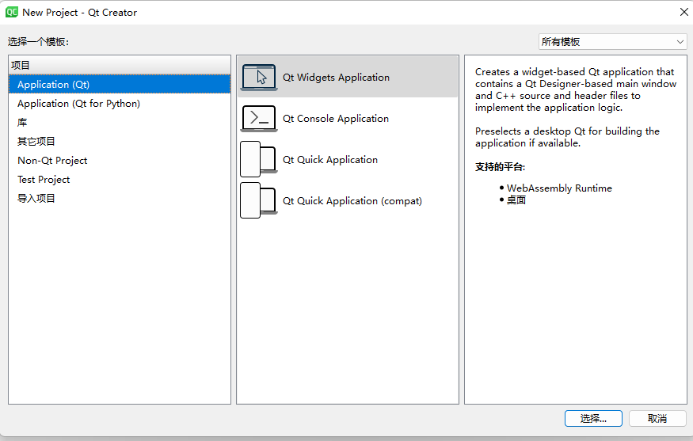
>
>第四步，切记不能有中文或者空格。
>
>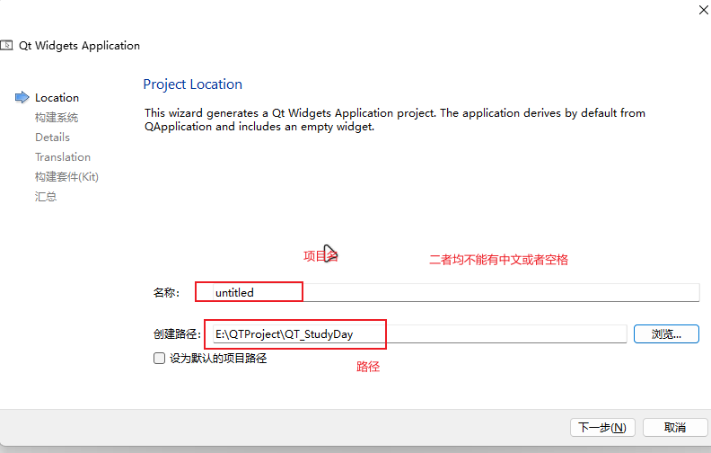
>
>
>
>第五步，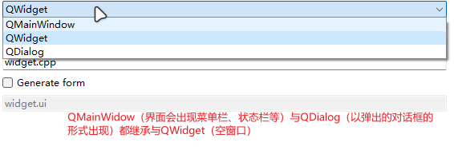
>
>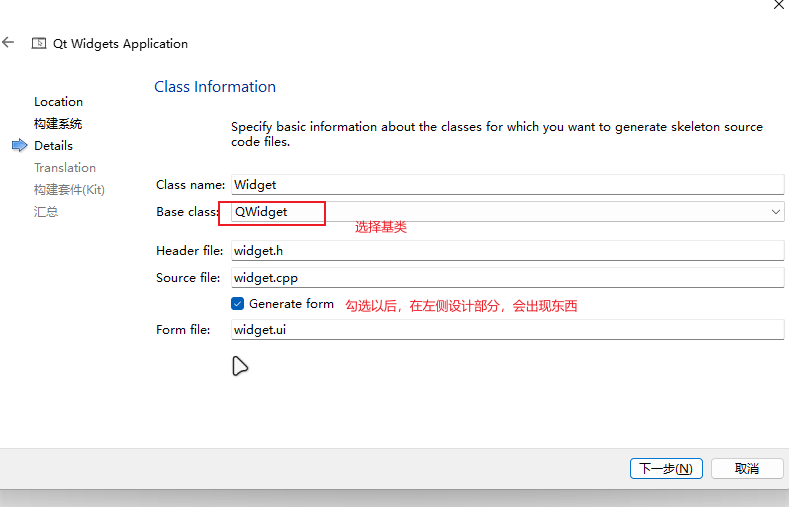
>
>第六步，选择自己所需要的环境。
>
>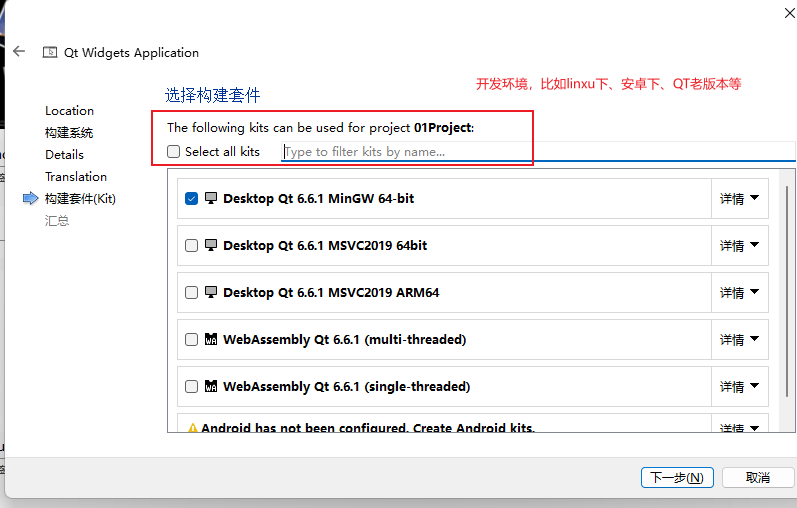
>
>第七步，选择自己所需要版本控制。没有就不选。
>
>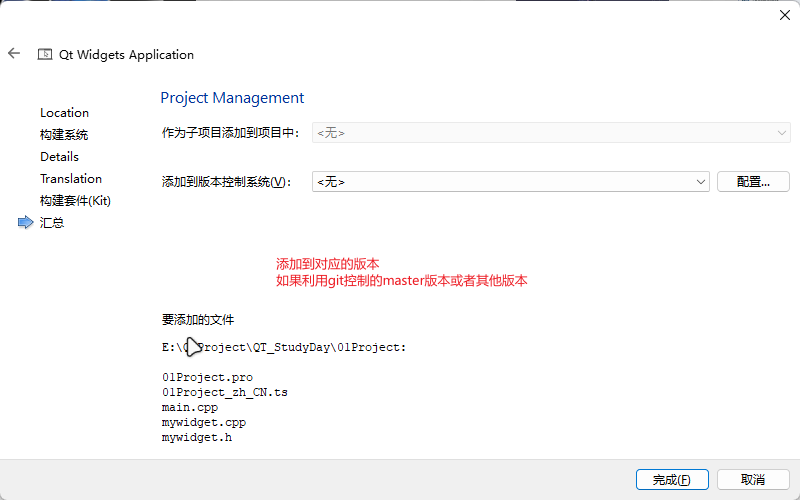

>.pro  相应的工程文件（点击之后，能直接打开软件类似 keil5 的.uvprojx）


### mian 程序解释


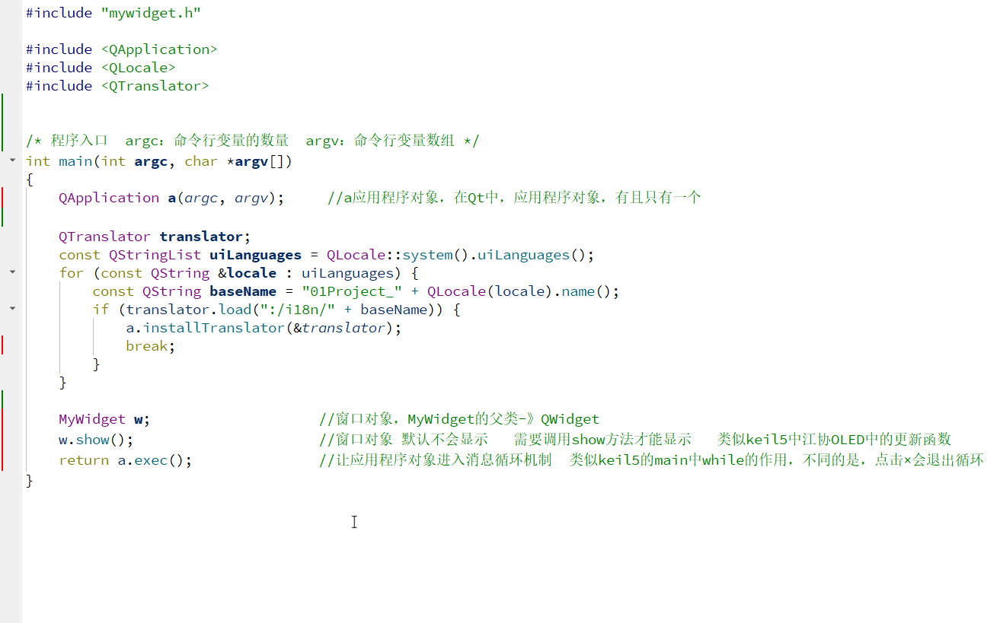

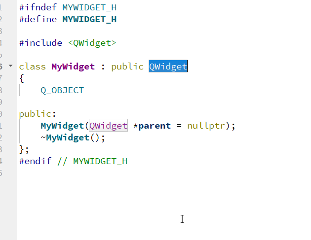

##  命名规范与快捷键

###  pro 文件的解释（qmake 构建才有.pro 文件）

|                         配置项                         |                             含义                             |
| :----------------------------------------------------: | :----------------------------------------------------------: |
|                  QT       += core gui                  |          添加 Qt 模块  core：核心模块  gui：图形模块           |
|    greaterThan(QT_MAJOR_VERSION, 4): QT += widgets     |                 Qt 版本大于 4，添加 widgets 模块                 |
|                    CONFIG += c++17                     | 经常用的值，release：以发布模式编译程序，debug：以调试模式编译程序，warn_on：编译器输出尽可能多的警告, C++11: 启用 c++11 标准支持 |
|                         TARGET                         |                  指定生成的可执行程序的名字                  |
|                        TEMPLATE                        | 指定如何运行当前程序，默认值为 app（Application），表示当前程序是应用程序，可直接编译运行，常用值还有 lib，表示将当前程序编译成库文件 |
|                        DEFINES                         |         在程序中定义一个宏，如同 c 文件中的#define xxx         |
|                        SOURCES                         |                  指定项目中的所有 cpp 源文件                   |
|                        HEADERS                         |                   指定项目中的所有 h 头文件                    |
|                         FORMS                          |                     指定项目的所有 ui 文件                     |
|                      INCLUDEPATH                       |                 指定引入外部资源的头文件路径                 |
|                          LIBS                          |                 指定引入外部资源的指定库文件                 |
|         qnx: target.path = /tmp/$${TARGET}/bin         | 当前平台为QNX（嵌入式实时操作系统），路径就为 /tmp/$${TARGET}/bin |
| else: unix:! android: target.path = /opt/$${TARGET}/bin |   当前平台是unix而不是android，路径就为/opt/$${TARGET}/bin   |
|       ! isEmpty(target.path): INSTALLS += target        |     如果 `target.path` 不为空，那么就添加 `target` 这个规则      |


```
QT       += core gui		

greaterThan(QT_MAJOR_VERSION, 4): QT += widgets			

CONFIG += c++17			

# You can make your code fail to compile if it uses deprecated APIs.
# In order to do so, uncomment the following line.
#DEFINES += QT_DISABLE_DEPRECATED_BEFORE=0x060000    # disables all the APIs deprecated before Qt 6.0.0

SOURCES += \
    main.cpp \
    mywidget.cpp

HEADERS += \
    mywidget.h

TRANSLATIONS += \
    01Project_zh_CN.ts
CONFIG += lrelease
CONFIG += embed_translations

# Default rules for deployment.
qnx: target.path = /tmp/$${TARGET}/bin
else: unix:!android: target.path = /opt/$${TARGET}/bin
!isEmpty(target.path): INSTALLS += target
```


####  Qt 模块

>Qt Widegets：Qt5 以及之后的版本，才有将 Widegets 模块独立，之前版本将 Widegets 放在 GUI 模块中。
>

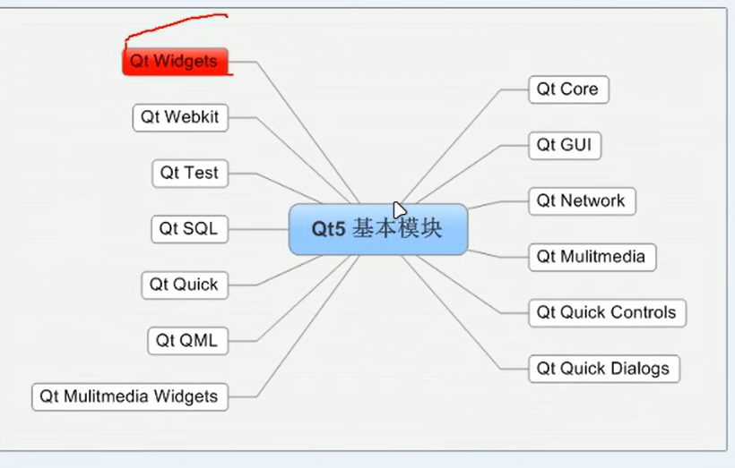

###  头文件

```c++
#prama once			//防止头文件重复声明（C++中）

#ifndef __XX_H_		//也是防止头文件重复声明
#define __XX_H_
	xxxx
#endif

```

```C++
/* MyWidget.h */
ifndef MYWIDGET_H
#define MYWIDGET_H

#include <QWidget>                          //QWidget  窗口类

class MyWidget : public QWidget             //继承与QWidget类
{
    Q_OBJECT                                //Q_OBJECT宏，允许类中使用信号和槽的机制

public:
    MyWidget(QWidget *parent = nullptr);    //有参构造函数
    ~MyWidget();                            //析构函数
};
#endif // MYWIDGET_H


/* MyWidget.cpp */
#include "mywidget.h"

MyWidget::MyWidget(QWidget *parent)
    : QWidget(parent)                       //使用初始化列表，初始化MyWidgte类
{}

MyWidget::~MyWidget() {}
```

### 命令规范

>类名：首字母大写，单词与单词之间的首字母大写(大驼峰)
>函数名、变量名：首字母小写、单词与单词之间首字母大写(小驼峰)
>
>指针变量 -> ptr 指针名		eg.  ptrstusql
>
>成员变量-> m_成员变量名		eg. m_age

###  快捷键

>注释：CTRL+/
>运行：CTRL+r
>编译：CTRL+b
>字体缩放：CTRL+鼠标滚轮
>查找：CTRL+f
>整行移动：CTRL+↓ 或者 ↑
>帮助文档：选中+F1
>
>>第一种：F1
>>第二种：左侧帮助按钮
>>第三种："E:\Qt\6.6.1\mingw_64\bin\assistant.exe"
>
>自动对齐：CTRL+i
>同名之间的.h 和.cpp 切换：F4
>选取列：alt+左键
>
>快速将.h 中的函数在.cpp 中定义：alt+enter
>
>重写虚函数不提示：帮助-> 关于插件-> c++-> ClangCodeModel-> 取消勾选-> 重启 qt


## QT窗口类

### 基础窗口类

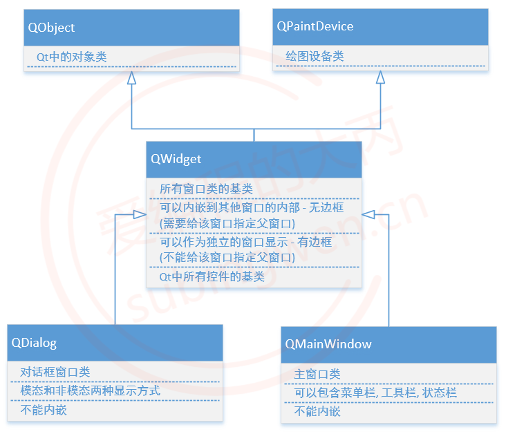

- 常用的窗口类有3个

	- 在创建Qt窗口的时候, 需要让自己的窗口类继承上述三个窗口类的其中一个
- QWidget
	- 所有窗口类的基类
	- Qt中的控件(按钮, 输入框, 单选框…)也属于窗口, 基类都是QWidget
	- 可以内嵌到其他窗口中: 没有边框
	- 可以不内嵌单独显示: 独立的窗口, 有边框
- QDialog
	- 对话框类
	- 不能内嵌到其他窗口中
- QMainWindow
	- 有工具栏, 状态栏, 菜单栏, 后边的章节会具体介绍这个窗口
	- 不能内嵌到其他窗口中


#### QWidget

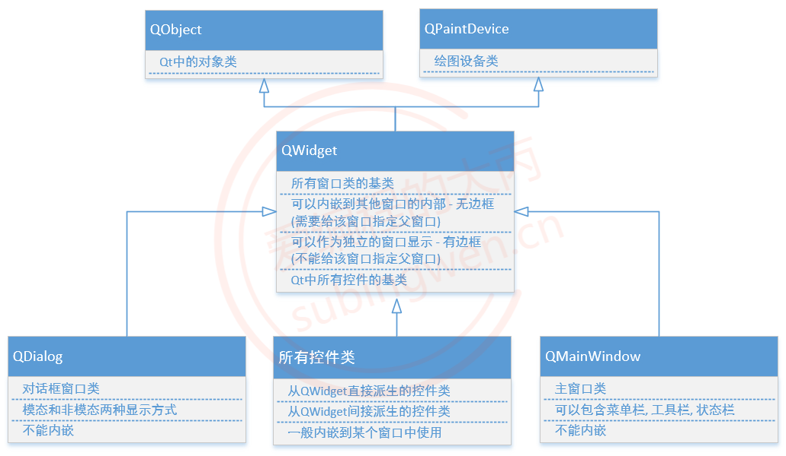

```c++
//设置父对象
// 构造函数
QWidget::QWidget(QWidget *parent = nullptr, Qt::WindowFlags f = Qt::WindowFlags());

// 公共成员函数
// 给当前窗口设置父对象
void QWidget::setParent(QWidget *parent);
void QWidget::setParent(QWidget *parent, Qt::WindowFlags f);
// 获取当前窗口的父对象, 没有父对象返回 nullptr
QWidget *QWidget::parentWidget() const;


//窗口位置
//------------- 窗口位置 -------------
// 得到相对于当前窗口父窗口的几何信息, 边框也被计算在内
QRect QWidget::frameGeometry() const;
// 得到相对于当前窗口父窗口的几何信息, 不包括边框
const QRect &geometry() const;
// 设置当前窗口的几何信息(位置和尺寸信息), 不包括边框
void setGeometry(int x, int y, int w, int h);
void setGeometry(const QRect &);
    
// 移动窗口, 重新设置窗口的位置
void move(int x, int y);
void move(const QPoint &);


//窗口位置设定和位置获取的测试代码如下:
// 获取当前窗口的位置信息
void MainWindow::on_positionBtn_clicked()
{
    QRect rect = this->frameGeometry();
    qDebug() << "左上角: " << rect.topLeft()
             << "右上角: " << rect.topRight()
             << "左下角: " << rect.bottomLeft()
             << "右下角: " << rect.bottomRight()
             << "宽度: " << rect.width()
             << "高度: " << rect.height();
}

// 重新设置当前窗口的位置以及宽度, 高度
void MainWindow::on_geometryBtn_clicked()
{
    int x = 100 + rand() % 500;
    int y = 100 + rand() % 500;
    int width = this->width() + 10;
    int height = this->height() + 10;
    setGeometry(x, y, width, height);
}

// 通过 move() 方法移动窗口
void MainWindow::on_moveBtn_clicked()
{
    QRect rect = this->frameGeometry();
    move(rect.topLeft() + QPoint(10, 20));
}


//窗口尺寸
//------------- 窗口尺寸 -------------
// 获取当前窗口的尺寸信息
QSize size() const
// 重新设置窗口的尺寸信息
void resize(int w, int h);
void resize(const QSize &);
// 获取当前窗口的最大尺寸信息
QSize maximumSize() const;
// 获取当前窗口的最小尺寸信息
QSize minimumSize() const;
// 设置当前窗口固定的尺寸信息
void QWidget::setFixedSize(const QSize &s);
void QWidget::setFixedSize(int w, int h);
// 设置当前窗口的最大尺寸信息
void setMaximumSize(const QSize &);
void setMaximumSize(int maxw, int maxh);
// 设置当前窗口的最小尺寸信息
void setMinimumSize(const QSize &);
void setMinimumSize(int minw, int minh);


// 获取当前窗口的高度    
int height() const;
// 获取当前窗口的最小高度
int minimumHeight() const;
// 获取当前窗口的最大高度
int maximumHeight() const;
// 给窗口设置固定的高度
void QWidget::setFixedHeight(int h);
// 给窗口设置最大高度
void setMaximumHeight(int maxh);
// 给窗口设置最小高度
void setMinimumHeight(int minh);

// 获取当前窗口的宽度
int width() const;
// 获取当前窗口的最小宽度
int minimumWidth() const;
// 获取当前窗口的最大宽度
int maximumWidth() const;
// 给窗口设置固定宽度
void QWidget::setFixedWidth(int w);
// 给窗口设置最大宽度
void setMaximumWidth(int maxw);
// 给窗口设置最小宽度
void setMinimumWidth(int minw);


//窗口标题和图标
//------------- 窗口图标 -------------
// 得到当前窗口的图标
QIcon windowIcon() const;
// 构造图标对象, 参数为图片的路径
QIcon::QIcon(const QString &fileName);
// 设置当前窗口的图标
void setWindowIcon(const QIcon &icon);

//------------- 窗口标题 -------------
// 得到当前窗口的标题
QString windowTitle() const;
// 设置当前窗口的标题
void setWindowTitle(const QString &);


//信号
// QWidget::setContextMenuPolicy(Qt::ContextMenuPolicy policy);
// 窗口的右键菜单策略 contextMenuPolicy() 参数设置为 Qt::CustomContextMenu, 按下鼠标右键发射该信号
[signal] void QWidget::customContextMenuRequested(const QPoint &pos);
// 窗口图标发生变化, 发射此信号
[signal] void QWidget::windowIconChanged(const QIcon &icon);
// 窗口标题发生变化, 发射此信号
[signal] void QWidget::windowTitleChanged(const QString &title);


//槽函数
//------------- 窗口显示 -------------
// 关闭当前窗口
[slot] bool QWidget::close();
// 隐藏当前窗口
[slot] void QWidget::hide();
// 显示当前创建以及其子窗口
[slot] void QWidget::show();
// 全屏显示当前窗口, 只对windows有效
[slot] void QWidget::showFullScreen();
// 窗口最大化显示, 只对windows有效
[slot] void QWidget::showMaximized();
// 窗口最小化显示, 只对windows有效
[slot] void QWidget::showMinimized();
// 将窗口回复为最大化/最小化之前的状态, 只对windows有效
[slot] void QWidget::showNormal();

//------------- 窗口状态 -------------
// 判断窗口是否可用
bool QWidget::isEnabled() const; // 非槽函数
// 设置窗口是否可用, 不可用窗口无法接收和处理窗口事件
// 参数true->可用, false->不可用
[slot] void QWidget::setEnabled(bool);
// 设置窗口是否可用, 不可用窗口无法接收和处理窗口事件
// 参数true->不可用, false->可用
[slot] void QWidget::setDisabled(bool disable);
// 设置窗口是否可见, 参数为true->可见, false->不可见
[slot] virtual void QWidget::setVisible(bool visible);


```


### 窗口的相对坐标系

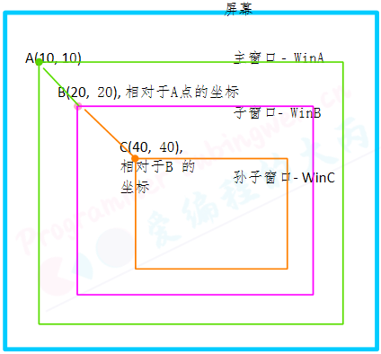


```txt
在一个Qt窗口中一般都有很多子窗口内嵌到这个父窗口中，其中每个窗口都有自己的坐标原点，子窗口的位置也就是其使用的坐标点就是它的父窗口坐标体系中的坐标点`
```

- 在Qt的某一个窗口中有可能有若干个控件, 这个控件都是嵌套的关系

	- A窗口包含B窗口, B窗口包含C窗口
- 每个窗口都有坐标原点, 在左上角
	- 子窗口的位置是基于父窗口的坐标体系来确定的, 也就是说通过父窗口左上角的坐标点来确定自己的位置
- Qt中窗口显示的时候使用的相对坐标, 相对于自己的父窗口


## QT的数据类型

### QT的基本数据类型

- 因为Qt是一个C++ 框架, 因此C++中所有的语法和数据类型在Qt中都是被支持的, 但是Qt中也定义了一些属于自己的数据类型, 下边给大家介绍一下这些基础的数类型。

- QT基本数据类型定义在<span style="color:#FF0000; border:1px solid #FFFFFF;">#include <QtGlobal></span> 中，QT基本数据类型有：

| Qt类型名称 | 注释                                      | 备注                                              |
| ---------- | ----------------------------------------- | ------------------------------------------------- |
| qint8      | signed char                               | 有符号8位数据类型                                 |
| qint16     | signed short                              | 有符号16位数据类型                                |
| qint32     | signed int                                | 有符号32位数据类型                                |
| qint64     | long long int 或(int64）                  | 有符号64位数据类型，Windows中定义为_int64         |
| quint8     | unsigned char                             | 无符号8位数据类型                                 |
| quint16    | unsigned short                            | 无符号16位数据类型                                |
| quint32    | unsigned int                              | 无符号32位数据类型                                |
| quint64    | unsigned long long int 或 unsigned  int64 | 无符号64位数据类型，Windows中定义为unsigned int64 |
| qintptr    | qint32 或 qint64                          | 指针类型，32位系统为qint32，64位系统为qint64      |
| quintptr   | quint32 或 quint64                        | 指针类型，32位系统为quint32，64位系统为quint64    |
| qlonglong  | long long int 或 int64                    | 有符号64位数据类型，Windows中定义为__int64        |
| qulonglong | unsigned long long int 或 unsigned int64  | 无符号64位数据类型，Windows中定义为unsigned int64 |
| qptrdiff   | qint32 或 qint64                          | 指针差类型，32位系统为qint32，64位系统为qint64    |
| qreal      | double 或 float                           | 默认为double，除非配置了-qreal float选项          |
| uchar      | unsigned char                             | 无符号字符类型                                    |
| uint       | unsigned int                              | 无符号整型                                        |
| ulong      | unsigned long                             | 无符号长整型                                      |
| ushort     | unsigned short                            | 无符号短整型                                      |


- 虽然在Qt中有属于自己的整形或者浮点型, 但是在变成过程中这些一般不用, 常用的类型关键字还是 C/C++中的 int, float, double 等。


### QT中终端窗口中输出日志

- 使用上面的方法只能在项目调试过程中进行日志输出, 如果不是通过IDE进行程序调试（使用qDebug）, 而是直接执行可执行程序在这种情况下是没有日志输出窗口的, 因此也就看不到任何的日志输出。

	默认情况下日志信息是不会打印到终端窗口的, 如果想要实现这样的效果, 必须在项目文件中添加相关的属性信息

- 打开项目文件（*.pro或者）找到配置项 config, 添加 console 控制台属性:

	```shell
	CONFIG += c++11 console
	
	或者
	
	# 设置日志输出到终端
	# 在Qt中，qDebug()默认是输出到QDebug的默认消息处理器的，通常是IDE的输出窗口。
	# 如果你想在终端中看到输出，确保在运行时没有重定向QDebug的输出。
	# 你可以通过宏定义来控制，或者在代码中设置。
	
	# 方法一：通过编译选项设置宏定义
	target_compile_definitions(${PROJECT_NAME} PRIVATE QT_MESSAGELOG_FILE="")
	
	# 方法二：在代码中设置
	# 你也可以在你的代码中通过QLoggingCategory来设置日志输出，例如在main.cpp中：
	# #include <QLoggingCategory>
	# int main(int argc, char *argv[]) {
	#     QLoggingCategory::setFilterRules("*.debug=true");
	#     // 其他代码
	# }
	
	# 方法三：运行时设置环境变量
	# 在运行可执行文件之前，设置QT_MESSAGE_PATTERN环境变量，例如：
	# export QT_MESSAGE_PATTERN="%{message}\n"
	# 这将使日志信息以简单的消息格式输出到终端
	```


### QT的字符串类型

####  QByteArray

- 在Qt中QByteArray可以看做是c语言中 char*的升级版本。我们在使用这种类型的时候可通过这个类的构造函数申请一块动态内存，用于存储我们需要处理的字符串数据。

- ```c++
	//构造函数
	// 构造空对象, 里边没有数据
	QByteArray::QByteArray();
	// 将data中的size个字符进行构造, 得到一个字节数组对象
	// 如果 size==-1 函数内部自动计算字符串长度, 计算方式为: strlen(data)
	QByteArray::QByteArray(const char *data, int size = -1);
	// 构造一个长度为size个字节, 并且每个字节值都为ch的字节数组
	QByteArray::QByteArray(int size, char ch);
	
	//数据操作
	// 在尾部追加数据
	// 其他重载的同名函数可参考Qt帮助文档, 此处略
	QByteArray &QByteArray::append(const QByteArray &ba);
	void QByteArray::push_back(const QByteArray &other);
	
	// 头部添加数据
	// 其他重载的同名函数可参考Qt帮助文档, 此处略
	QByteArray &QByteArray::prepend(const QByteArray &ba);
	void QByteArray::push_front(const QByteArray &other);
	
	// 插入数据, 将ba插入到数组第 i 个字节的位置(从0开始)
	// 其他重载的同名函数可参考Qt帮助文档, 此处略
	QByteArray &QByteArray::insert(int i, const QByteArray &ba);
	
	// 删除数据
	// 从大字符串中删除len个字符, 从第pos个字符的位置开始删除
	QByteArray &QByteArray::remove(int pos, int len);
	// 从字符数组的尾部删除 n 个字节
	void QByteArray::chop(int n);
	// 从字节数组的 pos 位置将数组截断 (前边部分留下, 后边部分被删除)
	void QByteArray::truncate(int pos);
	// 将对象中的数据清空, 使其为null
	void QByteArray::clear();
	
	// 字符串替换
	// 将字节数组中的 子字符串 before 替换为 after
	// 其他重载的同名函数可参考Qt帮助文档, 此处略
	QByteArray &QByteArray::replace(const QByteArray &before, const QByteArray &after);
	
	
	//字符串查找和判断
	// 在尾部追加数据
	// 其他重载的同名函数可参考Qt帮助文档, 此处略
	QByteArray &QByteArray::append(const QByteArray &ba);
	void QByteArray::push_back(const QByteArray &other);
	
	// 头部添加数据
	// 其他重载的同名函数可参考Qt帮助文档, 此处略
	QByteArray &QByteArray::prepend(const QByteArray &ba);
	void QByteArray::push_front(const QByteArray &other);
	
	// 插入数据, 将ba插入到数组第 i 个字节的位置(从0开始)
	// 其他重载的同名函数可参考Qt帮助文档, 此处略
	QByteArray &QByteArray::insert(int i, const QByteArray &ba);
	
	// 删除数据
	// 从大字符串中删除len个字符, 从第pos个字符的位置开始删除
	QByteArray &QByteArray::remove(int pos, int len);
	// 从字符数组的尾部删除 n 个字节
	void QByteArray::chop(int n);
	// 从字节数组的 pos 位置将数组截断 (前边部分留下, 后边部分被删除)
	void QByteArray::truncate(int pos);
	// 将对象中的数据清空, 使其为null
	void QByteArray::clear();
	
	// 字符串替换
	// 将字节数组中的 子字符串 before 替换为 after
	// 其他重载的同名函数可参考Qt帮助文档, 此处略
	QByteArray &QByteArray::replace(const QByteArray &before, const QByteArray &after);
	
	
	//遍历
	// 使用迭代器
	iterator QByteArray::begin();
	iterator QByteArray::end();
	
	// 使用数组的方式进行遍历
	// i的取值范围 0 <= i < size()
	char QByteArray::at(int i) const;
	char QByteArray::operator[](int i) const;
	
	
	
	//查看字节数
	// 返回字节数组对象中字符的个数
	int QByteArray::length() const;
	int QByteArray::size() const;
	int QByteArray::count() const;
	
	// 返回字节数组对象中 子字符串ba 出现的次数
	int QByteArray::count(const QByteArray &ba) const;
	int QByteArray::count(const char *ba) const;
	// 返回字节数组对象中 字符串ch 出现的次数
	int QByteArray::count(char ch) const;
	
	
	//类型转换
	// 将QByteArray类型的字符串 转换为 char* 类型
	char *QByteArray::data();
	const char *QByteArray::data() const;
	
	// int, short, long, float, double -> QByteArray
	// 其他重载的同名函数可参考Qt帮助文档, 此处略
	QByteArray &QByteArray::setNum(int n, int base = 10);
	QByteArray &QByteArray::setNum(short n, int base = 10);
	QByteArray &QByteArray::setNum(qlonglong n, int base = 10);
	QByteArray &QByteArray::setNum(float n, char f = 'g', int prec = 6);
	QByteArray &QByteArray::setNum(double n, char f = 'g', int prec = 6);
	[static] QByteArray QByteArray::number(int n, int base = 10);
	[static] QByteArray QByteArray::number(qlonglong n, int base = 10);
	//g表示使用科学技术法
	[static] QByteArray QByteArray::number(double n, char f = 'g', int prec = 6);
	
	
	// QByteArray -> int, short, long, float, double
	int QByteArray::toInt(bool *ok = Q_NULLPTR, int base = 10) const;
	short QByteArray::toShort(bool *ok = Q_NULLPTR, int base = 10) const;
	long QByteArray::toLong(bool *ok = Q_NULLPTR, int base = 10) const;
	float QByteArray::toFloat(bool *ok = Q_NULLPTR) const;
	double QByteArray::toDouble(bool *ok = Q_NULLPTR) const;
	
	// std::string -> QByteArray
	[static] QByteArray QByteArray::fromStdString(const std::string &str);
	// QByteArray -> std::string
	std::string QByteArray::toStdString() const;
	
	// 所有字符转换为大写
	QByteArray QByteArray::toUpper() const;
	// 所有字符转换为小写
	QByteArray QByteArray::toLower() const;
	
	
	```


####  QString

- QString也是封装了字符串, 但是内部的编码为utf8, UTF-8属于Unicode字符集, 它固定使用多个字节（window为2字节, linux为3字节）来表示一个字符，这样可以将世界上几乎所有语言的常用字符收录其中。

- ```C++
	//构造函数
	// 构造一个空字符串对象
	QString::QString();
	// 将 char* 字符串 转换为 QString 类型
	QString::QString(const char *str);
	// 将 QByteArray 转换为 QString 类型
	QString::QString(const QByteArray &ba);
	// 其他重载的同名构造函数可参考Qt帮助文档, 此处略
		
	
	//数据操作
	// 尾部追加数据
	// 其他重载的同名函数可参考Qt帮助文档, 此处略
	QString &QString::append(const QString &str);
	QString &QString::append(const char *str);
	QString &QString::append(const QByteArray &ba);
	void QString::push_back(const QString &other);
	
	// 头部添加数据
	// 其他重载的同名函数可参考Qt帮助文档, 此处略
	QString &QString::prepend(const QString &str);
	QString &QString::prepend(const char *str);
	QString &QString::prepend(const QByteArray &ba);
	void QString::push_front(const QString &other);
	
	// 插入数据, 将 str 插入到字符串第 position 个字符的位置(从0开始)
	// 其他重载的同名函数可参考Qt帮助文档, 此处略
	QString &QString::insert(int position, const QString &str);
	QString &QString::insert(int position, const char *str);
	QString &QString::insert(int position, const QByteArray &str);
	
	// 删除数据
	// 从大字符串中删除len个字符, 从第pos个字符的位置开始删除
	QString &QString::remove(int position, int n);
	
	// 从字符串的尾部删除 n 个字符
	void QString::chop(int n);
	// 从字节串的 position 位置将字符串截断 (前边部分留下, 后边部分被删除)
	void QString::truncate(int position);
	// 将对象中的数据清空, 使其为null
	void QString::clear();
	
	// 字符串替换
	// 将字节数组中的 子字符串 before 替换为 after
	// 参数 cs 为是否区分大小写, 默认区分大小写
	// 其他重载的同名函数可参考Qt帮助文档, 此处略
	QString &QString::replace(const QString &before, const QString &after, Qt::CaseSensitivity cs = Qt::CaseSensitive);
	
	
	
	
	//字符串查找和判断
	// 参数 cs 为是否区分大小写, 默认区分大小写
	// 其他重载的同名函数可参考Qt帮助文档, 此处略
	
	// 判断字符串中是否包含子字符串 str, 包含返回true, 否则返回false
	bool QString::contains(const QString &str, Qt::CaseSensitivity cs = Qt::CaseSensitive) const;
	
	// 判断字符串是否以字符串 ba 开始, 是返回true, 不是返回false
	bool QString::startsWith(const QString &s, Qt::CaseSensitivity cs = Qt::CaseSensitive) const;
	
	// 判断字符串是否以字符串 ba 结尾, 是返回true, 不是返回false
	bool QString::endsWith(const QString &s, Qt::CaseSensitivity cs = Qt::CaseSensitive) const;
	
	
	
	//遍历
	// 使用迭代器
	iterator QString::begin();
	iterator QString::end();
	
	// 使用数组的方式进行遍历
	// i的取值范围 0 <= position < size()
	const QChar QString::at(int position) const
	const QChar QString::operator[](int position) const;
	
	
	
	
	
	//查看字节数
	// 返回字节数组对象中字符的个数 (字符个数和字节个数是不同的概念)
	int QString::length() const;
	int QString::size() const;
	int QString::count() const;
	
	// 返回字节串对象中 子字符串 str 出现的次数
	// 参数 cs 为是否区分大小写, 默认区分大小写
	int QString::count(const QStringRef &str, Qt::CaseSensitivity cs = Qt::CaseSensitive) const;
	
	
	
	
	
	//类型转换
	// 将int, short, long, float, double 转换为 QString 类型
	// 其他重载的同名函数可参考Qt帮助文档, 此处略
	QString &QString::setNum(int n, int base = 10);
	QString &QString::setNum(short n, int base = 10);
	QString &QString::setNum(long n, int base = 10);
	QString &QString::setNum(float n, char format = 'g', int precision = 6);
	QString &QString::setNum(double n, char format = 'g', int precision = 6);
	[static] QString QString::number(long n, int base = 10);
	[static] QString QString::number(int n, int base = 10);
	[static] QString QString::number(double n, char format = 'g', int precision = 6);
	
	// 将 QString 转换为 int, short, long, float, double 类型
	int QString::toInt(bool *ok = Q_NULLPTR, int base = 10) const;
	short QString::toShort(bool *ok = Q_NULLPTR, int base = 10) const;
	long QString::toLong(bool *ok = Q_NULLPTR, int base = 10) const
	float QString::toFloat(bool *ok = Q_NULLPTR) const;
	double QString::toDouble(bool *ok = Q_NULLPTR) const;
	
	// 将标准C++中的 std::string 类型 转换为 QString 类型
	[static] QString QString::fromStdString(const std::string &str);
	// 将 QString 转换为 标准C++中的 std::string 类型
	std::string QString::toStdString() const;
	
	// QString -> QByteArray
	// 转换为本地编码, 跟随操作系统
	QByteArray QString::toLocal8Bit() const;
	// 转换为 Latin-1 编码的字符串 不支持中文
	QByteArray QString::toLatin1() const;
	// 转换为 utf8 编码格式的字符串 (常用)
	QByteArray QString::toUtf8() const;
	
	// 所有字符转换为大写
	QString QString::toUpper() const;
	// 所有字符转换为小写
	QString QString::toLower() const;
	
	
	
	
	
	```

### QVariant

- QVariant这个类很神奇，或者说方便。很多时候，需要几种不同的数据类型需要传递，如果用结构体，又不大方便，容器保存的也只是一种数据类型，而QVariant则可以统统搞定。

	QVariant 这个类型充当着最常见的数据类型的联合。QVariant 可以保存很多Qt的数据类型，包括QBrush、QColor、QCursor、QDateTime、QFont、QKeySequence、 QPalette、QPen、QPixmap、QPoint、QRect、QRegion、QSize和QString，并且还有C++基本类型，如 int、float等。

	（类似泛型机制）

- 标准类型转换成QVariant

- ```c++
	// 这类转换需要使用QVariant类的构造函数, 由于比较多, 大家可自行查阅Qt帮助文档, 在这里简单写几个
	QVariant::QVariant(int val);
	QVariant::QVariant(bool val);
	QVariant::QVariant(double val);
	QVariant::QVariant(const char *val);
	QVariant::QVariant(const QByteArray &val);
	QVariant::QVariant(const QString &val);
	......
	    
	// 使用设置函数也可以将支持的类型的数据设置到QVariant对象中
	// 这里的 T 类型, 就是QVariant支持的类型
	void QVariant::setValue(const T &value);
	// 该函数行为和 setValue() 函数完全相同
	[static] QVariant QVariant::fromValue(const T &value);
	// 例子:
	#if 1
	QVariant v;
	v.setValue(5);
	#else
	QVariant v = QVariant::fromValue(5);
	#endif
	
	int i = v.toInt();          // i is now 5
	QString s = v.toString();   // s is now "5"
	
	```

- 判断 QVariant中封装的实际数据类型

- ```c++
	//Qt5.0
	// 该函数的返回值是一个枚举类型, 可通过这个枚举判断出实际是什么类型的数据
	Type QVariant::type() const;
	
	
	//Qt6.0
	[since 6.0] QMetaType QVariant::metaType() const
	    
	//返回值Type  或者  QMetaType的部分枚举定义, 全部信息可以自行查阅Qt帮助文档
	```

- 将QVariant对象转换为实际的数据类型

- ```c++
	// 如果要实现该操作, 可以使用QVariant类提供的 toxxx() 方法, 全部转换可以参考Qt帮助文档
	// 在此举列举几个常用函数:
	bool QVariant::toBool() const;
	QByteArray QVariant::toByteArray() const;
	double QVariant::toDouble(bool *ok = Q_NULLPTR) const;
	float QVariant::toFloat(bool *ok = Q_NULLPTR) const;
	int QVariant::toInt(bool *ok = Q_NULLPTR) const;
	QString QVariant::toString() const;
	......
	
	
	```

- 自定义数据类型

- 除了标准类型, 我们自定义的类型也可以使用QVariant类进行封装, 被QVariant存储的数据类型需要有一个默认的构造函数和一个拷贝构造函数。为了实现这个功能，首先必须使用Q_DECLARE_METATYPE()宏。通常会将这个宏放在类的声明所在头文件的下面， 原型为：

	Q_DECLARE_METATYPE(Type)

	使用的具体步骤如下:

	1. 第一步: 在头文件中声明

		```c++
		// *.h
		struct MyTest
		{
		    int id;
		    QString name;
		};
		// 自定义类型注册
		Q_DECLARE_METATYPE(MyTest)
		
		
		```

		

	2. 第二步: 在源文件中定义

		```C++
		MyTest t;
		t.name = "张三丰";
		t.num = 666;
		// 值的封装
		QVariant vt = QVariant::fromValue(t);
		
		// 值的读取
		if(vt.canConvert<MyTest>())
		{
		    MyTest t = vt.value<MyTest>();
		    qDebug() << "name: " << t.name << ", num: " << t.num;
		}
		
		```

		

		以上操作用到的QVariant类的API如下:

		```C++
		// 如果当前QVariant对象可用转换为对应的模板类型 T, 返回true, 否则返回false
		bool QVariant::canConvert() const;
		// 将当前QVariant对象转换为实际的 T 类型
		T QVariant::value() const;
		
		```

	

### 位置和尺寸

#### QPoint

- QPoint类封装了我们常用用到的坐标点 (x, y), 常用的 API如下:

```C++
// 构造函数
// 构造一个坐标原点, 即(0, 0)
QPoint::QPoint();
// 参数为 x轴坐标, y轴坐标
QPoint::QPoint(int xpos, int ypos);

// 设置x轴坐标
void QPoint::setX(int x);
// 设置y轴坐标
void QPoint::setY(int y);

// 得到x轴坐标
int QPoint::x() const;
// 得到x轴坐标的引用
int &QPoint::rx();
// 得到y轴坐标
int QPoint::y() const;
// 得到y轴坐标的引用
int &QPoint::ry();

// 直接通过坐标对象进行算术运算: 加减乘除
QPoint &QPoint::operator*=(float factor);
QPoint &QPoint::operator*=(double factor);
QPoint &QPoint::operator*=(int factor);
QPoint &QPoint::operator+=(const QPoint &point);
QPoint &QPoint::operator-=(const QPoint &point);
QPoint &QPoint::operator/=(qreal divisor);

// 其他API请自行查询Qt帮助文档, 不要犯懒哦哦哦哦哦......


```


#### QLine

- QLine是一个直线类, 封装了两个坐标点 (两点确定一条直线)，常用API如下:


```C++
// 构造函数
// 构造一个空对象
QLine::QLine();
// 构造一条直线, 通过两个坐标点
QLine::QLine(const QPoint &p1, const QPoint &p2);
// 从点 (x1, y1) 到 (x2, y2)
QLine::QLine(int x1, int y1, int x2, int y2);

// 给直线对象设置坐标点
void QLine::setPoints(const QPoint &p1, const QPoint &p2);
// 起始点(x1, y1), 终点(x2, y2)
void QLine::setLine(int x1, int y1, int x2, int y2);
// 设置直线的起点坐标
void QLine::setP1(const QPoint &p1);
// 设置直线的终点坐标
void QLine::setP2(const QPoint &p2);

// 返回直线的起始点坐标
QPoint QLine::p1() const;
// 返回直线的终点坐标
QPoint QLine::p2() const;
// 返回值直线的中心点坐标, (p1() + p2()) / 2
QPoint QLine::center() const;

// 返回值直线起点的 x 坐标
int QLine::x1() const;
// 返回值直线终点的 x 坐标
int QLine::x2() const;
// 返回值直线起点的 y 坐标
int QLine::y1() const;
// 返回值直线终点的 y 坐标
int QLine::y2() const;

// 用给定的坐标点平移这条直线
void QLine::translate(const QPoint &offset);
void QLine::translate(int dx, int dy);
// 用给定的坐标点平移这条直线, 返回平移之后的坐标点
QLine QLine::translated(const QPoint &offset) const;
QLine QLine::translated(int dx, int dy) const;

// 直线对象进行比较
bool QLine::operator!=(const QLine &line) const;
bool QLine::operator==(const QLine &line) const;

// 其他API请自行查询Qt帮助文档, 不要犯懒哦哦哦哦哦......


```


#### QSize

- 在QT中QSize类用来形容长度和宽度, 常用的API如下:

```C++
// 构造函数
// 构造空对象, 对象中的宽和高都是无效的
QSize::QSize();
// 使用宽和高构造一个有效对象
QSize::QSize(int width, int height);

// 设置宽度
void QSize::setWidth(int width)
// 设置高度
void QSize::setHeight(int height);

// 得到宽度
int QSize::width() const;
// 得到宽度的引用
int &QSize::rwidth();
// 得到高度
int QSize::height() const;
// 得到高度的引用
int &QSize::rheight();

// 交换高度和宽度的值
void QSize::transpose();
// 交换高度和宽度的值, 返回交换之后的尺寸信息
QSize QSize::transposed() const;

// 进行算法运算: 加减乘除
QSize &QSize::operator*=(qreal factor);
QSize &QSize::operator+=(const QSize &size);
QSize &QSize::operator-=(const QSize &size);
QSize &QSize::operator/=(qreal divisor);

// 其他API请自行查询Qt帮助文档, 不要犯懒哦哦哦哦哦......


```


#### QRect

- 在Qt中使用 QRect类来描述一个矩形, 常用的API如下:

```C++
// 构造函数
// 构造一个空对象
QRect::QRect();
// 基于左上角坐标, 和右下角坐标构造一个矩形对象
QRect::QRect(const QPoint &topLeft, const QPoint &bottomRight);
// 基于左上角坐标, 和 宽度, 高度构造一个矩形对象
QRect::QRect(const QPoint &topLeft, const QSize &size);
// 通过 左上角坐标(x, y), 和 矩形尺寸(width, height) 构造一个矩形对象
QRect::QRect(int x, int y, int width, int height);

// 设置矩形的尺寸信息, 左上角坐标不变
void QRect::setSize(const QSize &size);
// 设置矩形左上角坐标为(x,y), 大小为(width, height)
void QRect::setRect(int x, int y, int width, int height);
// 设置矩形宽度
void QRect::setWidth(int width);
// 设置矩形高度
void QRect::setHeight(int height);

// 返回值矩形左上角坐标
QPoint QRect::topLeft() const;
// 返回矩形右上角坐标
// 该坐标点值为: QPoint(left() + width() -1, top())
QPoint QRect::topRight() const;
// 返回矩形左下角坐标
// 该坐标点值为: QPoint(left(), top() + height() - 1)
QPoint QRect::bottomLeft() const;
// 返回矩形右下角坐标
// 该坐标点值为: QPoint(left() + width() -1, top() + height() - 1)
QPoint QRect::bottomRight() const;
// 返回矩形中心点坐标
QPoint QRect::center() const;

// 返回矩形上边缘y轴坐标
int QRect::top() const;
int QRect::y() const;
// 返回值矩形下边缘y轴坐标
int QRect::bottom() const;
// 返回矩形左边缘 x轴坐标
int QRect::x() const;
int QRect::left() const;
// 返回矩形右边缘x轴坐标
int QRect::right() const;

// 返回矩形的高度
int QRect::width() const;
// 返回矩形的宽度
int QRect::height() const;
// 返回矩形的尺寸信息
QSize QRect::size() const;


```


### 日期和时间

#### QDate

- QDate类可以封装日期信息也可以通过这个类得到日期相关的信息, 包括:年, 月, 日。

```C++
// 构造函数
QDate::QDate();
QDate::QDate(int y, int m, int d);

// 公共成员函数
// 重新设置日期对象中的日期
bool QDate::setDate(int year, int month, int day);
// 给日期对象添加 ndays 天
QDate QDate::addDays(qint64 ndays) const;
// 给日期对象添加 nmonths 月
QDate QDate::addMonths(int nmonths) const;
// 给日期对象添加 nyears 月
QDate QDate::addYears(int nyears) const;

// 得到日期对象中的年/月/日
int QDate::year() const;
int QDate::month() const;
int QDate::day() const;
void QDate::getDate(int *year, int *month, int *day) const;

// 日期对象格式化
/*
    d    - The day as a number without a leading zero (1 to 31)
    dd   - The day as a number with a leading zero (01 to 31)
    ddd	 - The abbreviated localized day name (e.g. 'Mon' to 'Sun'). Uses the system locale to localize the name, i.e. QLocale::system().
    dddd - The long localized day name (e.g. 'Monday' to 'Sunday'). Uses the system locale to localize the name, i.e. QLocale::system().
    M    - The month as a number without a leading zero (1 to 12)
    MM   - The month as a number with a leading zero (01 to 12)
    MMM	 - The abbreviated localized month name (e.g. 'Jan' to 'Dec'). Uses the system locale to localize the name, i.e. QLocale::system().
    MMMM - The long localized month name (e.g. 'January' to 'December'). Uses the system locale to localize the name, i.e. QLocale::system().
    yy   - The year as a two digit number (00 to 99)
    yyyy - The year as a four digit number. If the year is negative, a minus sign is prepended, making five characters.
*/
QString QDate::toString(const QString &format) const;

// 操作符重载 ==> 日期比较
bool QDate::operator!=(const QDate &d) const;
bool QDate::operator<(const QDate &d) const;
bool QDate::operator<=(const QDate &d) const;
bool QDate::operator==(const QDate &d) const;
bool QDate::operator>(const QDate &d) const;
bool QDate::operator>=(const QDate &d) const;

// 静态函数 -> 得到本地的当前日期
[static] QDate QDate::currentDate();

```

#### QTime

- QTime类可以封装时间信息也可以通过这个类得到时间相关的信息, 包括:时, 分, 秒, 毫秒。

```C++
// 构造函数
QTime::QTime();
/*
    h 		==> 取值范围： 0 ~ 23
    m and s 	==> 取值范围： 0 ~ 59
    ms 		==> 取值范围： 0 ~ 999
*/ 
QTime::QTime(int h, int m, int s = 0, int ms = 0);

// 公共成员函数
// Returns true if the set time is valid; otherwise returns false.
bool QTime::setHMS(int h, int m, int s, int ms = 0);
QTime QTime::addSecs(int s) const;
QTime QTime::addMSecs(int ms) const;

// 示例代码
  QTime n(14, 0, 0);                // n == 14:00:00
  QTime t;
  t = n.addSecs(70);                // t == 14:01:10
  t = n.addSecs(-70);               // t == 13:58:50
  t = n.addSecs(10 * 60 * 60 + 5);  // t == 00:00:05
  t = n.addSecs(-15 * 60 * 60);     // t == 23:00:00

// 从时间对象中取出 时/分/秒/毫秒
// Returns the hour part (0 to 23) of the time. Returns -1 if the time is invalid.
int QTime::hour() const;
// Returns the minute part (0 to 59) of the time. Returns -1 if the time is invalid.
int QTime::minute() const;
// Returns the second part (0 to 59) of the time. Returns -1 if the time is invalid.
int QTime::second() const;
// Returns the millisecond part (0 to 999) of the time. Returns -1 if the time is invalid.
int QTime::msec() const;


// 时间格式化
/*
    -- 时 --
    h	==>	The hour without a leading zero (0 to 23 or 1 to 12 if AM/PM display)
    hh	==>	The hour with a leading zero (00 to 23 or 01 to 12 if AM/PM display)
    H	==>	The hour without a leading zero (0 to 23, even with AM/PM display)
    HH	==>	The hour with a leading zero (00 to 23, even with AM/PM display)
    -- 分 --
    m	==>	The minute without a leading zero (0 to 59)
    mm	==>	The minute with a leading zero (00 to 59)
    -- 秒 --
    s	==>	The whole second, without any leading zero (0 to 59)
    ss	==>	The whole second, with a leading zero where applicable (00 to 59)
    -- 毫秒 --
    zzz	==>	The fractional part of the second, to millisecond precision, 
			including trailing zeroes where applicable (000 to 999).
    -- 上午或者下午
    AP or A	==>	使用AM/PM(大写) 描述上下午, 中文系统显示汉字
    ap or a	==>	使用am/pm(小写) 描述上下午, 中文系统显示汉字
*/
QString QTime::toString(const QString &format) const;

// 阶段性计时
// 过时的API函数
// 开始计时
void QTime::start();
// 计时结束
int QTime::elapsed() const;
// 重新计时
int QTime::restart();

// 推荐使用的API函数
// QElapsedTimer 类
void QElapsedTimer::start();
qint64 QElapsedTimer::restart();
qint64 QElapsedTimer::elapsed() const;


// 操作符重载 ==> 时间比较
bool QTime::operator!=(const QTime &t) const;
bool QTime::operator<(const QTime &t) const;
bool QTime::operator<=(const QTime &t) const;
bool QTime::operator==(const QTime &t) const;
bool QTime::operator>(const QTime &t) const;
bool QTime::operator>=(const QTime &t) const;

// 静态函数 -> 得到当前时间
[static] QTime QTime::currentTime();

```

#### QDateTime

- QDateTime类可以封装日期和时间信息也可以通过这个类得到日期和时间相关的信息, 包括:年, 月, 日, 时, 分, 秒, 毫秒。其实这个类就是QDate 和 QTime 这两个类的结合体。


```C++
// 构造函数
QDateTime::QDateTime();
QDateTime::QDateTime(const QDate &date, const QTime &time, Qt::TimeSpec spec = Qt::LocalTime);

// 公共成员函数
// 设置日期
void QDateTime::setDate(const QDate &date);
// 设置时间
void QDateTime::setTime(const QTime &time);
// 给当前日期对象追加 年/月/日/秒/毫秒, 参数可以是负数
QDateTime QDateTime::addYears(int nyears) const;
QDateTime QDateTime::addMonths(int nmonths) const;
QDateTime QDateTime::addDays(qint64 ndays) const;
QDateTime QDateTime::addSecs(qint64 s) const;
QDateTime QDateTime::addMSecs(qint64 msecs) const;

// 得到对象中的日期
QDate QDateTime::date() const;
// 得到对象中的时间
QTime QDateTime::time() const;

// 日期和时间格式, 格式字符参考QDate 和 QTime 类的 toString() 函数
QString QDateTime::toString(const QString &format) const;


// 操作符重载 ==> 日期时间对象的比较
bool QDateTime::operator!=(const QDateTime &other) const;
bool QDateTime::operator<(const QDateTime &other) const;
bool QDateTime::operator<=(const QDateTime &other) const;
bool QDateTime::operator==(const QDateTime &other) const;
bool QDateTime::operator>(const QDateTime &other) const;
bool QDateTime::operator>=(const QDateTime &other) const;

// 静态函数
// 得到当前时区的日期和时间(本地设置的时区对应的日期和时间)
[static] QDateTime QDateTime::currentDateTime();


```


##  组件类


### QPushButton(按钮控件)

#### 按钮基类 QAbstractButton

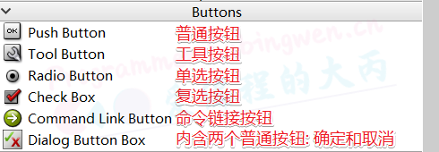

​		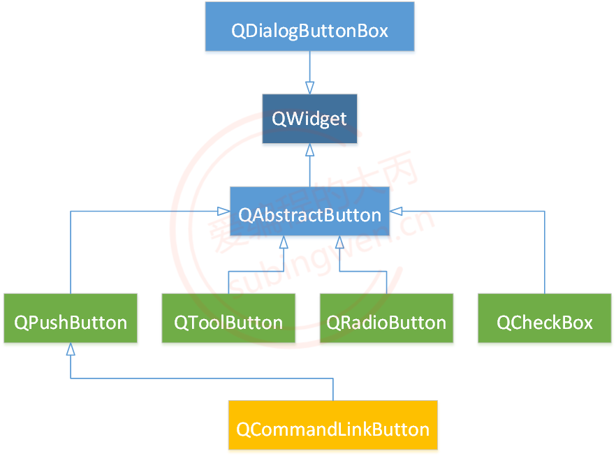

- 相关API

	```c++
	//
	// 参数text的内容显示到按钮上
	void QAbstractButton::setText(const QString &text);
	// 得到按钮上显示的文本内容, 函数的返回就是
	QString QAbstractButton::text() const;
	
	// 得到按钮设置的图标
	QIcon icon() const;
	// 给按钮设置图标
	void setIcon(const QIcon &icon);
	
	// 得到按钮图标大小
	QSize iconSize() const
	// 设置按钮图标的大小
	[slot]void setIconSize(const QSize &size);
	
	
	//按钮的 Check 属性
	// 判断按钮是否设置了checkable属性, 如果设置了点击按钮, 按钮一直处于选中状态
	// 默认这个属性是关闭的, not checkable
	bool QAbstractButton::isCheckable() const;
	// 设置按钮的checkable属性
	// 参数为true: 点击按钮, 按钮被选中, 松开鼠标, 按钮不弹起
	// 参数为false: 点击按钮, 按钮被选中, 松开鼠标, 按钮弹起
	void QAbstractButton::setCheckable(bool);
	
	    
	// 判断按钮是不是被按下的选中状态
	bool QAbstractButton::isChecked() const;
	// 设置按钮的选中状态: true-选中, false-没选中
	// 设置该属性前, 必须先进行 checkable属性的设置
	void QAbstractButton::setChecked(bool);
	
	
	
	//信号
	/*
	这些信号都按钮被点击之后发射出来的, 只是在细节上有细微的区别, 其中最常用的是 clicked(), 通过鼠标的不同瞬间状态可以发射出pressed() 和 released() 信号, 如果鼠标设置了 check属性, 一般通过 toggled()信号判断当前按钮是选中状态还是非选中状态。
	*/
	/*
	当按钮被激活时(即，当鼠标光标在按钮内时按下然后释放)，当键入快捷键时，或者当click()或animateClick()被调用时，这个信号被发出。值得注意的是，如果调用setDown()、setChecked()或toggle()，则不会触发此信号。
	*/
	[signal] void QAbstractButton::clicked(bool checked = false);
	// 在按下按钮的时候发射这个信号
	[signal] void QAbstractButton::pressed();
	// 在释放这个按钮的时候发射直观信号
	[signal] void QAbstractButton::released();
	// 每当可检查按钮改变其状态时，就会发出此信号。checked在选中按钮时为true，在未选中按钮时为false。
	[signal] void QAbstractButton::toggled(bool checked);
	
	
	//槽函数
	// 执行一个动画点击:按钮被立即按下，并在毫秒后释放(默认是100毫秒)。
	[slot] void QAbstractButton::animateClick(int msec = 100);
	// 执行一次按钮点击, 相当于使用鼠标点击了按钮
	[slot] void QAbstractButton::click();
	
	// 参考 1.2 中的函数介绍
	[slot] void QAbstractButton::setChecked(bool);
	// 设置按钮上图标大小
	[slot]void setIconSize(const QSize &size);
	// 切换可检查按钮的状态。 checked <==> unchecked
	[slot] void QAbstractButton::toggle();
	
	```

- 对应按钮来说, 一般有三种常见状态, 分别为: Normal, Hover, Pressed。

	- Normal: 普通状态, 没有和鼠标做任何接触
	- Hover: 悬停状态, 鼠标位于按钮之上, 但是并未按下
	- Pressed: 按压状态, 鼠标键在按钮上处于按下状态

	默认情况下, 鼠标在按钮上按下, 按钮从 Normal 切换到 Pressed状态,

	 鼠标释放, 按钮从 Pressed恢复到Normal状态。
	当我们给按钮设置了 check 属性之后，情况就有所不同了， 在按钮上释放鼠标键， 按钮依然会处在 Pressed状态, 再次点击按钮, 按钮才能恢复到 Normal 状态。具有check属性的按钮就相当于一个开关, 每点击一次才能实现一次状态的切换。


	

#### QPushButton

- 常用API

	```c++
	// 构造函数
	/*
	参数:
	    - icon: 按钮上显示的图标
	    - text: 按钮上显示的标题
	    - parent: 按钮的父对象, 可以不指定
	*/
	QPushButton::QPushButton(const QIcon &icon, const QString &text, QWidget *parent = nullptr);
	QPushButton::QPushButton(const QString &text, QWidget *parent = nullptr);
	QPushButton::QPushButton(QWidget *parent = nullptr);
	
	// 判断按钮是不是默认按钮
	bool isDefault() const;
	// 一般在对话框窗口中使用, 将按钮设置为默认按钮, 自动关联 Enter 键 
	void setDefault(bool);
	
	/*
	将弹出菜单菜单与此按钮关联起来。这将把按钮变成一个菜单按钮，
	在某些样式中会在按钮文本的右边产生一个小三角形。
	*/
	void QPushButton::setMenu(QMenu *menu);
	
	/*
	显示(弹出)相关的弹出菜单。如果没有这样的菜单，这个函数什么也不做。
	这个函数直到弹出菜单被用户关闭后才返回。
	*/
	[slot] void QPushButton::showMenu();
	
	
	```

	

- 示例：

	通过API的介绍, 我们可以知道, 使用QPushButton这种类型的按钮, 有三种使用方式:

	- 作为普通按钮, 可以显示文本信息和图标
	- 设置check属性, 使其可以处于持续的被选中状态
	- 关联一个菜单, 点击按钮菜单弹出

	具体操作可以参考如下代码:

	```c++
	MainWindow::MainWindow(QWidget *parent)
	    : QMainWindow(parent)
	    , ui(new Ui::MainWindow)
	{
	    ui->setupUi(this);
	
	    // 普通按钮, 没有checked属性
	    ui->normalBtn->setText("我是小猪佩奇");
	    ui->normalBtn->setIcon(QIcon(":/Peppa-Pig.png"));
	    ui->normalBtn->setIconSize(QSize(30, 30));
	    connect(ui->normalBtn, &QPushButton::clicked, this, [=]()
	    {
	         qDebug() << "我是一个普通按钮, 图标是小猪佩奇...";
	    });
	
	    // 有checked属性的按钮
	    ui->checkedBtn->setCheckable(true);
	    connect(ui->checkedBtn, &QPushButton::toggled, this, [=](bool bl)
	    {
	         qDebug() << "我是一个checked按钮, 当前状态为:" << bl;
	    });
	
	    // 关联菜单
	    ui->menuBtn->setText("你喜欢哪种美女?");
	    QMenu* menu = new QMenu;
	    QAction* act = menu->addAction("可爱的");
	    menu->addAction("粘人的");
	    menu->addAction("胸大的");
	    menu->addAction("屁股翘的");
	    ui->menuBtn->setMenu(menu);
	    connect(act, &QAction::triggered, this, [=]{
	        qDebug() << "我是一个可爱的女人, 今晚约吗?";
	    });
	}
	
	```

#### QToolButton

- 常用API

	```c++
	///////////////////////////// 构造函数 /////////////////////////////
	QToolButton::QToolButton(QWidget *parent = nullptr);
	
	/////////////////////////// 公共成员函数 ///////////////////////////
	/*
	    1. 将给定的菜单与此工具按钮相关联。
	    2. 菜单将根据按钮的弹出模式显示。
	    3. 菜单的所有权没有转移到“工具”按钮(不能建立父子关系)
	*/
	void QToolButton::setMenu(QMenu *menu);
	// 返回关联的菜单，如果没有定义菜单，则返回nullptr。
	QMenu *QToolButton::menu() const;
	
	/*
	弹出菜单的弹出模式是一个枚举类型: QToolButton::ToolButtonPopupMode, 取值如下:
	    - QToolButton::DelayedPopup: 
	        - 延时弹出, 按压工具按钮一段时间后才能弹出, 比如:浏览器的返回按钮
	        - 长按按钮菜单弹出, 但是按钮的 clicked 信号不会被发射，短按不会弹出菜单，但是会有clicked信号
	    - QToolButton::MenuButtonPopup: 
	        - 在这种模式下，工具按钮会显示一个特殊的箭头，表示有菜单。
		- 当按下按钮的箭头部分时，将显示菜单。按下按钮部分发射 clicked 信号
	    - QToolButton::InstantPopup: 
	        - 当按下工具按钮时，菜单立即显示出来。
	        - 在这种模式下，按钮本身的动作不会被触发(不会发射clicked信号
	*/
	// 设置弹出菜单的弹出方式
	void setPopupMode(QToolButton::ToolButtonPopupMode mode);
	// 获取弹出菜单的弹出方式
	QToolButton::ToolButtonPopupMode popupMode() const;
	
	/*
	QToolButton可以帮助我们在按钮上绘制箭头图标, 是一个枚举类型, 取值如下: 
	    - Qt::NoArrow: 没有箭头
	    - Qt::UpArrow: 箭头向上
	    - Qt::DownArrow: 箭头向下
	    - Qt::LeftArrow: 箭头向左
	    - Qt::RightArrow: 箭头向右
	*/
	// 显示一个箭头作为QToolButton的图标。默认情况下，这个属性被设置为Qt::NoArrow。
	void setArrowType(Qt::ArrowType type);
	// 获取工具按钮上显示的箭头图标样式
	Qt::ArrowType arrowType() const;
	
	///////////////////////////// 槽函数 /////////////////////////////
	// 给按钮关联一个QAction对象, 主要目的是美化按钮
	[slot] void QToolButton::setDefaultAction(QAction *action);
	// 返回给按钮设置的QAction对象
	QAction *QToolButton::defaultAction() const;
	
	/*
	图标的显示样式是一个枚举类型->Qt::ToolButtonStyle, 取值如下:
	    - Qt::ToolButtonIconOnly: 只有图标, 不显示文本信息
	    - Qt::ToolButtonTextOnly: 不显示图标, 只显示文本信息
	    - Qt::ToolButtonTextBesideIcon: 文本信息在图标的后边显示
	    - Qt::ToolButtonTextUnderIcon: 文本信息在图标的下边显示
	    - Qt::ToolButtonFollowStyle: 跟随默认样式(只显示图标)
	*/
	// 设置的这个属性决定工具按钮是只显示一个图标、只显示文本，还是在图标旁边/下面显示文本。
	[slot] void QToolButton::setToolButtonStyle(Qt::ToolButtonStyle style);
	// 返回工具按钮设置的图标显示模式
	Qt::ToolButtonStyle toolButtonStyle() const;
	
	
	// 显示相关的弹出菜单。如果没有这样的菜单，这个函数将什么也不做。这个函数直到弹出菜单被用户关闭才会返回。
	[slot] void QToolButton::showMenu();
	
	```

	

- 示例：

	通过API的介绍, 我们可以知道, 使用QToolButton这种类型的按钮, 有三种使用方式::

	- 作为普通按钮, 可以显示文本信息和图标
	- 按钮的图标可以使用不同的方式设置, 并且制定图标和文本信息的显示模式
	- 设置check属性, 使其可以处于持续的被选中状态
	- 关联一个菜单, 点击按钮菜单弹出, 并且可以设置菜单的弹出方式

	具体操作可以参考如下代码:

	```c++
	MainWindow::MainWindow(QWidget *parent)
	    : QMainWindow(parent)
	    , ui(new Ui::MainWindow)
	{
	    ui->setupUi(this);
	
	    // 普通按钮, 没有checked属性
	    ui->normalBtn->setText("我是个屌丝");
	    ui->normalBtn->setIconSize(QSize(50, 50));
	    ui->normalBtn->setIcon(QIcon(":/mario.png"));
	    connect(ui->normalBtn, &QToolButton::clicked, this, [=]()
	    {
	         qDebug() << "我是一个普通按钮, 是一个屌丝...";
	    });
	    // 设置图标和文本的显示模式
	    ui->normalBtn->setToolButtonStyle(Qt::ToolButtonTextBesideIcon);
	    // 基于QAction的方式给按钮设置图标和文本信息
	    QAction* actBtn = new QAction(QIcon(":/mushroom_life.png"), "奥利给");
	    ui->actionBtn->setDefaultAction(actBtn);
	    connect(ui->actionBtn, &QToolButton::triggered, this, [=](QAction* act)
	    {
	        act->setText("我是修改之后的马里奥...");
	        act->setIcon(QIcon(":/mario.png"));
	    });
	    // 设置图标和文本的显示模式
	    ui->actionBtn->setToolButtonStyle(Qt::ToolButtonTextUnderIcon);
	    
	    // 基于自带样式, 给按钮设置箭头图标
	    ui->arrowBtn->setArrowType(Qt::UpArrow);
	    ui->arrowBtn->setText("向上");
	    // 设置图标和文本的显示模式
	    ui->arrowBtn->setToolButtonStyle(Qt::ToolButtonTextUnderIcon);
	
	
	    // 有checked属性的按钮
	    ui->checkedBtn->setCheckable(true);
	    connect(ui->checkedBtn, &QToolButton::toggled, this, [=](bool bl)
	    {
	         qDebug() << "我是一个checked按钮, 当前状态为:" << bl;
	    });
	
	    // 关联菜单
	    ui->menuBtn->setText("你喜欢哪种美女?");
	    QMenu* menu = new QMenu;
	    QAction* act = menu->addAction("可爱的");
	    menu->addAction("粘人的");
	    menu->addAction("胸大的");
	    menu->addAction("屁股翘的");
	    ui->menuBtn->setMenu(menu);
	    connect(act, &QAction::triggered, this, [=]{
	        qDebug() << "我是一个可爱的女人, 今晚约吗?";
	    });
	
	    ui->popmenu->setMenu(menu);
	    /*
	    弹出菜单的弹出模式是一个枚举类型: QToolButton::ToolButtonPopupMode, 取值如下:
	      - QToolButton::DelayedPopup: 
	          - 延时弹出, 按压工具按钮一段时间后才能弹出, 比如:浏览器的返回按钮
	          - 长按按钮菜单弹出, 但是按钮的 clicked 信号不会被发射
	      - QToolButton::MenuButtonPopup: 
	          - 在这种模式下，工具按钮会显示一个特殊的箭头，表示有菜单。
		  - 当按下按钮的箭头部分时，将显示菜单。按下按钮部分发射 clicked 信号
	      - QToolButton::InstantPopup: 
	          - 当按下工具按钮时，菜单立即显示出来。
	          - 在这种模式下，按钮本身的动作不会被触发(不会发射clicked信号
	    */
	    ui->popmenu->setPopupMode(QToolButton::MenuButtonPopup);
	    // 测试关联了菜单的按钮是否会发射clicked信号
	    connect(ui->popmenu, &QToolButton::clicked, this, [=]()
	    {
	        qDebug() << "我是popMenu按钮, 好痒呀...";
	    });
	}
	
	```


	

#### QRadioButton

- 常用API

	```c++
	// 构造函数
	/*
	参数:
	    - text: 按钮上显示的标题
	    - parent: 按钮的父对象
	*/
	QRadioButton::QRadioButton(const QString &text, QWidget *parent = nullptr);
	QRadioButton::QRadioButton(QWidget *parent = nullptr);
	
	```

- 示例：

	单选按钮一般是以组的形式来使用的, 如果在一个窗口中需要有多个单选按钮组, 应该如何处理呢?
	在同一窗口中, Qt会认为所有的单选按钮都属于同一组, 如果需要多个单选按钮组, 应该将他们放到不同的子窗口中。


	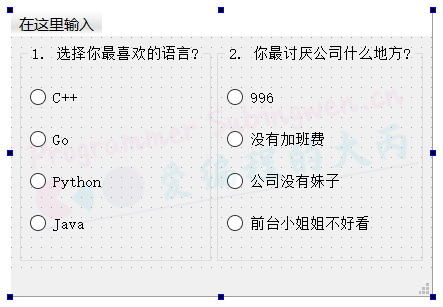

通过上图可以看到有两个单选按钮组, 在制作的时候分别将单选按钮放到了不同的容器窗口（组框）中，这样就被人为分隔为两组了。

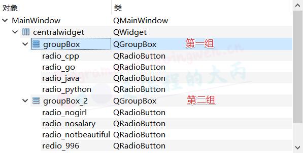

如果我们使用鼠标点击了某个单选按钮, 按钮还是会发射出 clicked()信号, 简单的按钮测试代码如下所示:

```c++
void MainWindow::on_redio_996_clicked()
{
    qDebug() << "996";
}

void MainWindow::on_radio_nosalary_clicked()
{
    qDebug() << "没有加班费";
}

void MainWindow::on_radio_nogirl_clicked()
{
    qDebug() << "公司没有妹子...";
}

// clicked 信号传递的参数可以接收, 也可以不接收 
// 这个参数对应这中类型的按钮没啥用
void MainWindow::on_radio_notbeautiful_clicked(bool checked)
{
    qDebug() << "前台小姐姐不好看!!!";
}


```


#### QCheckBox

- 常用API

	```c++
	// 构造函数
	/*
	参数:
	    - text: 按钮上显示的文本信息
	    - parent: 按钮的父对象
	*/
	QCheckBox::QCheckBox(const QString &text, QWidget *parent = nullptr);
	QCheckBox::QCheckBox(QWidget *parent = nullptr);
	
	// 判断当前复选框是否为三态复选框, 默认情况下为两种状态: 未选中, 选中
	bool isTristate() const;
	// 设置当前复选框为三态复选框: 未选中, 选中, 半选中
	void setTristate(bool y = true);
	
	/*
	参数 state, 枚举类型 Qt::CheckState:
	    - Qt::Unchecked	      --> 当前复选框没有被选中
	    - Qt::PartiallyChecked    --> 当前复选框处于半选中状态, 部分被选中(三态复选框)
	    - Qt::Checked	      --> 当前复选框处于选中状态
	*/
	// 设置复选框按钮的状态
	void QCheckBox::setCheckState(Qt::CheckState state);
	// 获取当前复选框的状态
	Qt::CheckState QCheckBox::checkState() const;
	
	
	
	// 当复选框的状态改变时，即当用户选中或取消选中复选框时，他的信号就会发出。
	// 参数 state 表示的是复选框的三种状态中某一种, 可参考 Qt::CheckState
	[signal] void QCheckBox::stateChanged(int state);
	
	
	```

- 示例：

	下面针对于复选框按钮的三种状态, 为大家展示一下对应的操作流程, 首先第一步搭建一个有树状关系的界面:


	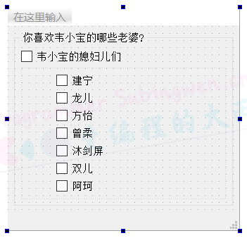

这些复选框按钮的关系以及 objectName 如下:

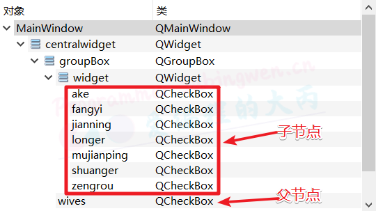


```c++
// mainwindow.h
QT_BEGIN_NAMESPACE
namespace Ui { class MainWindow; }
QT_END_NAMESPACE

class MainWindow : public QMainWindow
{
    Q_OBJECT

public:
    MainWindow(QWidget *parent = nullptr);
    ~MainWindow();

private slots:
    // 添加槽函数, 处理复选框按钮状态变化
    void statusChanged(int state);

private:
    Ui::MainWindow *ui;
    int m_number = 0;    // 添加一个计数器, 记录有几个子节点被选中了
};


// mainwindow.cpp
// 窗口的构造函数
MainWindow::MainWindow(QWidget *parent)
    : QMainWindow(parent)
    , ui(new Ui::MainWindow)
{
    ui->setupUi(this);

    // 设置根节点的三态属性
    ui->wives->setTristate(true);
    // 处理根节点的鼠标点击事件
    connect(ui->wives, &QCheckBox::clicked, this, [=](bool bl)
    {
        if(bl)
        {
            // 子节点全部设置为选中状态
            ui->jianning->setChecked(true);
            ui->fangyi->setChecked(true);
            ui->longer->setChecked(true);
            ui->zengrou->setChecked(true);
            ui->mujianping->setChecked(true);
            ui->shuanger->setChecked(true);
            ui->ake->setChecked(true);
        }
        else
        {
            // 子节点全部设置为非选中状态
            ui->jianning->setChecked(false);
            ui->fangyi->setChecked(false);
            ui->longer->setChecked(false);
            ui->zengrou->setChecked(false);
            ui->mujianping->setChecked(false);
            ui->shuanger->setChecked(false);
            ui->ake->setChecked(false);
        }
    });

    // 处理子节点的状态变化, 对应的槽函数相同
    connect(ui->jianning, &QCheckBox::stateChanged, this, &MainWindow::statusChanged);
    connect(ui->fangyi, &QCheckBox::stateChanged, this, &MainWindow::statusChanged);
    connect(ui->longer, &QCheckBox::stateChanged, this, &MainWindow::statusChanged);
    connect(ui->zengrou, &QCheckBox::stateChanged, this, &MainWindow::statusChanged);
    connect(ui->mujianping, &QCheckBox::stateChanged, this, &MainWindow::statusChanged);
    connect(ui->shuanger, &QCheckBox::stateChanged, this, &MainWindow::statusChanged);
    connect(ui->ake, &QCheckBox::stateChanged, this, &MainWindow::statusChanged);
}

// 槽函数
void MainWindow::statusChanged(int state)
{
    if(state == Qt::Checked)
    {
        m_number ++;	// 选中一个子节点, 计数器加1
    }
    else
    {
        m_number --;   // 取消选中一个子节点, 计数器减1
    }

    // 根据计数器值判断根节点是否需要做状态的更新
    if(m_number == 7)
    {
        ui->wives->setCheckState(Qt::Checked);
    }
    else if(m_number == 0)
    {
        ui->wives->setCheckState(Qt::Unchecked);
    }
    else
    {
        ui->wives->setCheckState(Qt::PartiallyChecked);
    }
}


```


#### 基本简介

| Header:           | #include <QPushButton>                                       |
| ----------------- | ------------------------------------------------------------ |
| **CMake:**        | find_package(Qt6 REQUIRED COMPONENTS Widgets) <br/>target_link_libraries(mytarget PRIVATE Qt6:: Widgets) |
| **qmake:**        | QT += widgets                                                |
| **Inherits:**     | QAbstractButton                                              |
| **Inherited By:** | QCommandLinkButton                                           |


- **头文件**：`#include <QPushButton>` 这行代码用于在 C++源文件中包含 QPushButton 类的定义，以便可以使用该类创建和操作按钮。
- **CMake 配置**：
	- `find_package(Qt6 REQUIRED COMPONENTS Widgets)` 这行代码用于在 CMake 项目中查找 Qt6 库，并指定需要使用 Widgets 模块。
	- `target_link_libraries(mytarget PRIVATE Qt6::Widgets)` 这行代码则用于将 Qt6 的 Widgets 模块链接到名为 `mytarget` 的目标项目。
- **qmake 配置**：`QT += widgets` 这行代码用于在 qmake 项目文件（.pro）中指定需要使用 Qt 的 widgets 模块。
- **继承关系**：`QAbstractButton` 是 QPushButton 类的基类，这意味着 QPushButton 继承了 QAbstractButton 的所有公共和受保护的成员。
- **被继承关系**：`QCommandLinkButton` 类继承自 QPushButton，这意味着 QCommandLinkButton 类具备 QPushButton 类的所有功能，并且还可以在其基础上添加额外的功能。


#### 信号

`该信号全部继承于 QAbstractButton 类`

- Signals：
	-  void clicked(bool checked = false)   //当按钮被点击时发出该信号。如果按钮是可选中的，`checked` 表示当前的选中状态。
	-  void pressed()                                    //当按钮被按下时发出该信号。
	-  void released()                                   //当按钮被释放时发出该信号（即用户松开按钮时触发）。
	-  void toggled(bool checked)             //当按钮的选中状态改变（切换）时发出该信号，`checked` 表示新的选中状态。


#### 槽函数

- public Slots:
- `继承于QAbstractButton 类`
	-  void animateClick()                             //触发按钮的点击动画默认持续时间（通常为 100 ms），并会触发按钮的 `clicked()` 信号。
	-  void click()                                            //程序模拟按钮被点击的动作，会触发 `clicked()` 信号，但不会有动画。        
	-  void setChecked(bool)                       //设置按钮的选中状态，仅适用于可切换的按钮（如 QCheckBox 或 QRadioButton）。
	-  void setIconSize(const QSize &size) //设置按钮图标的显示尺寸。
	-  void toggle()                                          //切换按钮的选中状态（从选中到未选中或从未选中到选中）。

- `自身的槽函数`
	- void showMean();				//用于显示与按钮关联的弹出菜单（`QMenu`）


#### 示例

```c++
//mywidget.h
#include <QPushButton>                      //QPushButton 按钮类


//mywidget.cpp
#include "mywidget.h"


MyWidget::MyWidget(QWidget *parent)
    : QWidget(parent)                      
{
    /* 第一种重载 */
    QPushButton *btn = new QPushButton;     //创建在堆区的按钮指针
    // btn->show();                            //show()方法是以顶层的形式创建按钮（新创建一个窗口）
    btn->setParent(this);                   //btn对象 绑定父组件（依赖于myWidget窗口中）

    btn->setText("这是第一个按钮");           //按钮上显示文本 设置按钮的属性一般为set...();

    /* 第二种重载 */
    QPushButton *btn01 = new QPushButton("这是第二个按钮",this);
                                            //弊端：按照控件大小创建窗口
                                            //新创建的控件会覆盖原控件，需要调整位置

    /* 移动控件位置 */
    btn->move(100,100);

    /* 设置控件窗口标题 */
    this->setWindowTitle("按钮");

    /* 重置窗口初始大小 */
    resize(500,400);

    /* 固定窗口大小 */
    this->setFixedSize(500,400);

    /* 重置按钮大小 */
    btn01->resize(100,50);
    
    

}
```


- 注意：在 Qt 中，如果你通过 `setParent(this)` 将按钮设置为某个父组件（例如 `myWidget`）的子组件，那么你通常不需要手动删除这个按钮对象。Qt 的内存管理机制会自动处理这种情况：当父组件被销毁时，所有子组件也会被自动销毁。但是，如果你在没有设置父组件的情况下创建了一个按钮对象，并且希望在某个时刻手动删除它，那么你需要调用 `delete` 来释放内存。
- 查看编码格式：`工具->外部->配置->文本编辑器->行为->编码格式`


### QUdpSocket(网络控件)

#### 基本简介

| Header:       | \#include <QUdpSocket>                                       |
| ------------- | ------------------------------------------------------------ |
| **CMake:**    | f find_package(Qt6 REQUIRED COMPONENTS Network) <br/>target_link_libraries(mytarget PRIVATE Qt6:: Network) |
| **qmake:**    | QT += network                                                |
| **Inherits:** | QAbstractSocket                                              |


- **头文件**：`#include <QUdpSocket>` 用于在项目中包含 QUdpSocket 类的定义。
- **CMake 配置**：
	- `find_package(Qt6 REQUIRED COMPONENTS Network)` 用于查找 Qt6 库中的 Network 模块，该模块包含 QUdpSocket 等网络相关的类。
	- `target_link_libraries(mytarget PRIVATE Qt6::Network)` 用于将 Qt6 的 Network 模块链接到你的项目目标 `mytarget`，以便在项目中使用 QUdpSocket 类。
- **qmake 配置**：`QT += network` 用于在 qmake 项目文件.pro 中添加 Network 模块，使 QUdpSocket 类可以被项目使用。
- **继承关系**：QUdpSocket 继承自 QAbstractSocket，这意味着 QUdpSocket 类具有 QAbstractSocket 类的所有功能，并且可以用于处理 UDP 套接字的特定需求。


### QMainWindow(主窗口类)

- **QMainWindow** 是一个为用户提供主窗口程序的类，包含一个菜单栏（**menu bar**）、多个工具栏（**tool bars**）、多个锚接部件（**dock widgets**）、一个状态栏（**status bar**）及一个中心部件（**central widget**），是许多应用程序的基础，如文本编辑器、图片编辑器等。
	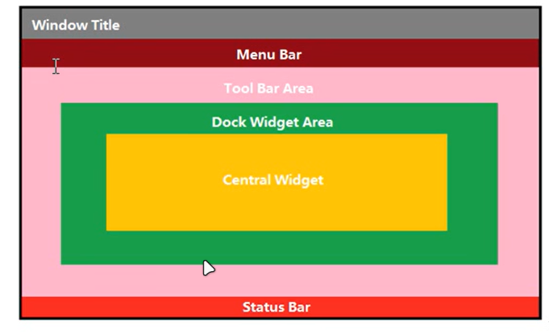


#### 基本简介

| Header:       | #include <QMainWindow>                                       |
| ------------- | ------------------------------------------------------------ |
| **CMake:**    | find_package(Qt6 REQUIRED COMPONENTS Widgets) <br/>target_link_libraries(mytarget PRIVATE Qt6:: Widgets) |
| **qmake:**    | QT += widgets                                                |
| **Inherits:** | QWidget                                                      |

- **头文件**：`#include <QMainWindow>` 用于在项目中包含 QMainWindow 类的定义，使得可以创建主窗口应用程序。
- **CMake 配置**：
	- `find_package(Qt6 REQUIRED COMPONENTS Widgets)` 用于查找 Qt6 库中的 Widgets 模块，该模块提供了构建图形用户界面的基础类。
	- `target_link_libraries(mytarget PRIVATE Qt6::Widgets)` 用于将 Qt6 的 Widgets 模块链接到你的项目目标 `mytarget`，以便在项目中使用 QMainWindow 及其他相关类。
- **qmake 配置**：`QT += widgets` 用于在 qmake 项目文件.pro 中添加 Widgets 模块，使 QMainWindow 类可以被项目使用。
- **继承关系**：QMainWindow 继承自 QWidget，这意味着 QMainWindow 类拥有 QWidget 类的所有功能，并且提供更多用于构建应用程序主窗口的特性，如工具栏、状态栏和菜单栏等。


#### 菜单栏(一个窗口最多一个)

```c++
//窗口菜单栏
    QMenuBar *bar = menuBar();
//将菜单栏放入窗口中
setMenuBar(bar);

//创建菜单
QMenu *fileMenu =  bar->addMenu("文件");
QMenu *editMenu =  bar->addMenu("编辑");

//创建菜单项
fileMenu->addAction("新建");
fileMenu->addAction("打开");

//创建分隔线
fileMenu->addSeparator();

fileMenu->addAction("退出");


```

#### 工具栏(一个窗口可以有多个)

```c++
    /* 工具栏 可以有多个 */
    //创建工具栏 QMainWindow中没有实现工具栏的方法
    QToolBar *toolBar = new QToolBar(this);
    //添加工具栏  设定工具生成的初始位置
    addToolBar(Qt::LeftToolBarArea,toolBar);

    //设置可以移动访问 只能停在左边或者右边
    toolBar->setAllowedAreas(Qt::LeftToolBarArea | Qt::RightToolBarArea);

    //设置是否浮动（如果停靠的边不合规，将放回上一次的位置）
    toolBar->setFloatable(false);

    //设置能否移动 （移动总开关）
    toolBar->setMovable(true);

    //创建工具项
    toolBar->addAction("运行");
    toolBar->addSeparator();                //添加分割线
    toolBar->addAction(newAct);             //和菜单栏的新建 与 打开 共用一套数据
    toolBar->addAction(openAct);

    //添加控件
    QPushButton *btn = new QPushButton("你好",toolBar);
    toolBar->addWidget(btn); 
```

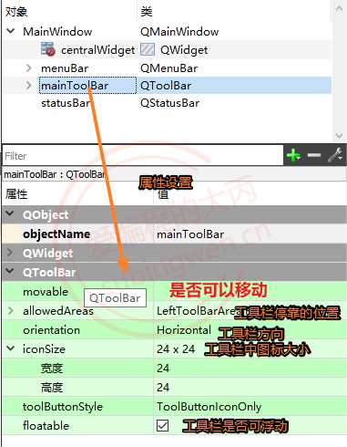

#### 状态栏(最多只有一个)

```c++
    /* 状态栏 最多只有一个 */
    //创建状态栏 有成员函数可以实现
    QStatusBar *stb = statusBar();
    //放入窗口
    setStatusBar(stb);

    //添加标签
    QLabel *lab = new QLabel("提示信息",this);
    QLabel *lab1 = new QLabel("提示信息2",this);

    //默认左侧
    stb->addWidget(lab);
    //设置在右侧
    stb->addPermanentWidget(lab1);
```


#### 铆接部件(浮动控件    可以有多个)     和  核心控件(只能有一个)

```c++
    /* 铆接部件（浮动控件） 可以有多个   核心部件 只能有一个*/
    //创建铆接部件
    QDockWidget *dow = new QDockWidget("浮动",this);
    //添加到窗口 同时指定位置(位置是以核心部件为中心)
    addDockWidget(Qt::BottomDockWidgetArea,dow);

    //固定位置移动范围  只能上或者下
    dow->setAllowedAreas(Qt::BottomDockWidgetArea | Qt::TopDockWidgetArea);

    //创建文本部件
    QTextEdit *te = new QTextEdit(this);
    //添加成核心部件
    setCentralWidget(te);
```


小技巧：只能有一个的用 set 添加     可以有多个用 add 添加     父对象提供实现的成员函数，用成员函数     没有提供用 new


### 对话框(QDialog)

标准对话框，是 Qt 内置的一系列对话框，用于简化开发。实际上，有很多对话框都是通用的，比如打开文件、设置颜色、打印设置等。这些对话框在所有程序中几乎都相应，因此没有必要在每一个程序中都实现这一个对话框。

Qt 的内置对话框大致分为以下几类：

- **QColorDialog**: 选择颜色；
- **QFileDialog**: 选择文件或目录；
- **QFontDialog**: 选择字体；
- **QInputDialog**: 允许用户输入一个值，并将其返回；
- **QMessageBox**: 消息对话框，用于显示信息、询问问题等；
- **QPageSetupDialog**: 为打印机提供纸张相关的选项；
- **QPrintDialog**: 打印机设置；
- **QPrintPreviewDialog**: 打印预览；
- **QProgressDialog**: 显示操作进程。


```c++
//常用API
// 构造函数
QDialog::QDialog(QWidget *parent = nullptr, Qt::WindowFlags f = Qt::WindowFlags());

// 模态显示窗口
[virtual slot] int QDialog::exec();
// 隐藏模态窗口, 并且解除模态窗口的阻塞, 将 exec() 的返回值设置为 QDialog::Accepted
[virtual slot] void QDialog::accept();
// 隐藏模态窗口, 并且解除模态窗口的阻塞, 将 exec() 的返回值设置为 QDialog::Rejected
[virtual slot] void QDialog::reject();
// 关闭对话框并将其结果代码设置为r。finished()信号将发出r;
// 如果r是QDialog::Accepted 或 QDialog::Rejected，则还将分别发出accept()或Rejected()信号。
[virtual slot] void QDialog::done(int r);

[signal] void QDialog::accepted();
[signal] void QDialog::rejected();
[signal] void QDialog::finished(int result);


//例子
/*场景介绍:
    1. 有两个窗口, 主窗口和一个对话框子窗口
    2. 对话框窗口先显示, 根据用户操作选择是否显示主窗口
*/
// 对话框窗口中三个普通按钮按下之后对应的槽函数
void MyDialog::on_acceptBtn_clicked()
{
    this->accept();  // exec()函数返回值为QDialog::Accepted
}

void MyDialog::on_rejectBtn_clicked()
{
    this->reject();  // exec()函数返回值为QDialog::Rejected
}

void MyDialog::on_donBtn_clicked()
{
    // exec()函数返回值为 done() 的参数, 并根据参数发射出对应的信号
    this->done(666);   
}


// 创建对话框对象
MyDialog dlg;    
int ret = dlg.exec();
if(ret == QDialog::Accepted)
{
    qDebug() << "accept button clicked...";
    // 显示主窗口
    MainWindow* w = new MainWindow;
    w->show();
}
else if(ret == QDialog::Rejected)
{
    qDebug() << "reject button clicked...";
    // 不显示主窗口
    ......
    ......
}
else
{
    // ret == 666
    qDebug() << "done button clicked...";
    // 根据需求进行逻辑处理
    ......
    ......
}


```


#### 模态对话框(打开以后，不能操作其他窗口——阻塞其他窗口)——自定义对话框

```c++
 //连接新建触发的信号  与 创建窗口
    connect(ui->actionNew,&QAction::triggered,[=](){
        //模态对话框  会阻塞原窗口进程
        //阻塞了进程 生命周期暂停 点击×的时候才释放 不要new
        QDialog dlg(this);
        dlg.setWindowTitle("新建");
        dlg.exec();

        qDebug() << "新窗口创建了" ;

    });

```


#### 非模态对话框(打开以后，能操作其他窗口——不阻塞其他窗口)——自定义对话框

```c++
    connect(ui->new2_2,&QAction::triggered,[=](){
        //非模态对话框  不会阻塞原窗口进程
        //需要创建到堆区 才能保证窗口不会只出现一瞬间   释放在父对象×掉以后释放
        QDialog *dlg = new QDialog(this);
        dlg->setWindowTitle("新建");
        dlg->setAttribute(Qt::WA_DeleteOnClose);        // 值为55 保证点击关闭时，释放小控件内存  如果不做这个处理，连续的创建会导致内存泄露
        dlg->show();

        qDebug() << "新窗口创建了" ;

    });
```

#### 消息对话框——QMessageBox(模态对话框)

- 底层封装的函数为静态函数（不需要对象，能直接调用）
- QMessageBox 对话框类是 QDialog 类的子类, 通过这个类可以显示一些简单的提示框, 用于展示警告、错误、问题等信息。关于这个类我们只需要掌握一些静态方法的使用就可以了。


```c++
// 显示一个模态对话框, 将参数 text 的信息展示到窗口中
[static] void QMessageBox::about(QWidget *parent, const QString &title, const QString &text);

/*
参数:
- parent: 对话框窗口的父窗口
- title: 对话框窗口的标题
- text: 对话框窗口中显示的提示信息
- buttons: 对话框窗口中显示的按钮(一个或多个)
- defaultButton
    1. defaultButton指定按下Enter键时使用的按钮。
    2. defaultButton必须引用在参数 buttons 中给定的按钮。
    3. 如果defaultButton是QMessageBox::NoButton, QMessageBox会自动选择一个合适的默认值。
*/
// 显示一个信息模态对话框
[static] QMessageBox::StandardButton QMessageBox::information(
           QWidget *parent, const QString &title, 
           const QString &text, 
           QMessageBox::StandardButtons buttons = Ok,
           QMessageBox::StandardButton defaultButton = NoButton);

// 显示一个错误模态对话框
[static] QMessageBox::StandardButton QMessageBox::critical(
           QWidget *parent, const QString &title, 
           const QString &text, 
           QMessageBox::StandardButtons buttons = Ok,
           QMessageBox::StandardButton defaultButton = NoButton);

// 显示一个问题模态对话框
[static] QMessageBox::StandardButton QMessageBox::question(
           QWidget *parent, const QString &title, 
           const QString &text, 
           QMessageBox::StandardButtons buttons = StandardButtons(Yes | No), 
           QMessageBox::StandardButton defaultButton = NoButton);

// 显示一个警告模态对话框
[static] QMessageBox::StandardButton QMessageBox::warning(
           QWidget *parent, const QString &title, 
           const QString &text, 
           QMessageBox::StandardButtons buttons = Ok,
           QMessageBox::StandardButton defaultButton = NoButton);


//例子
void MainWindow::on_msgbox_clicked()
{
    QMessageBox::about(this, "about",  "这是一个简单的消息提示框!!!");
    QMessageBox::critical(this, "critical", "这是一个错误对话框-critical...");
    int ret = QMessageBox::question(this, "question", 
             "你要保存修改的文件内容吗???",                                 
              QMessageBox::Save|QMessageBox::Cancel, 
              QMessageBox::Cancel);
    if(ret == QMessageBox::Save)
    {
        QMessageBox::information(this, "information", "恭喜你保存成功了, o(*￣︶￣*)o!!!");
    }
    else if(ret == QMessageBox::Cancel)
    {
        QMessageBox::warning(this, "warning", "你放弃了保存, ┭┮﹏┭┮ !!!");
    }
}


```

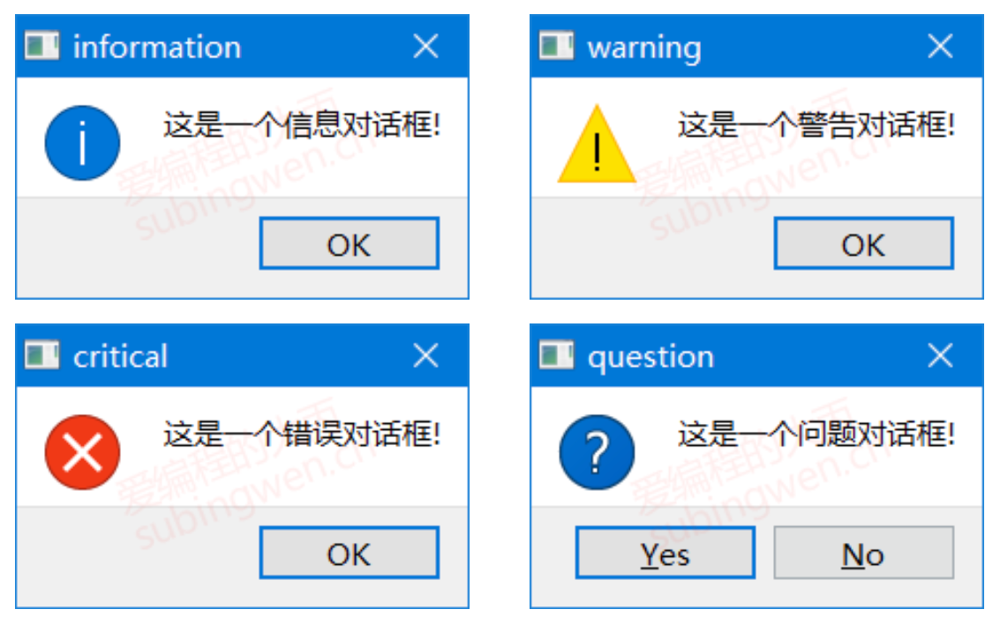


```c++
 connect(ui->actionNew,&QAction::triggered,[=](){
        /* 消息对话框 */
        //错误对话框
        // QMessageBox::critical(this,"错误提示框","xxx内容错误");

        //信息提示框
        // QMessageBox::information(this,"信息提示框","xxx内容");

        //提问提示框
        //参数1 父对象    参数2 窗口标题   参数3 提示内容   参数4 按键内容   参数5  默认关联回车的按键类型
        //返回值为StandardButton 用于确定返回值类型
        // QMessageBox::question(this,"提问提示框","是否取消");
        //QMessageBox::question(this,"提问提示框","是否保存",QMessageBox::Save | QMessageBox::Cancel,QMessageBox::Cancel);
        // if(QMessageBox::Save == QMessageBox::question(this,"提问提示框","是否保存",QMessageBox::Save | QMessageBox::Cancel,QMessageBox::Cancel))
        // {
        //     qDebug() << "保存";
        // }


        //警告提示框
        // QMessageBox::warning(this,"警告提示框","xxx警告");


        //自定义提示框
        QMessageBox qmb(this);
        qmb.setWindowTitle("自定义提示框");
        qmb.setText("是否保存");
        // qmb.setIcon();    //设置图标

        //添加自定义按钮
        QPushButton *p1 = qmb.addButton("保存",QMessageBox::AcceptRole);
        QPushButton *p2 = qmb.addButton("取消",QMessageBox::RejectRole);

        qmb.setDefaultButton(p2);               //回车关联取消
        qmb.exec();                             //显示并设置成模态

        if(qmb.clickedButton() == p1){
            qDebug() << "保存";
        }


    });

  
```


#### QFileDialog

- QFileDialog 对话框类是 QDialog 类的子类, 通过这个类可以选择要打开/保存的文件或者目录。关于这个类我们只需要掌握一些静态方法的使用就可以了。

	```c++
	//API
	/*
	通用参数:
	  - parent: 当前对话框窗口的父对象也就是父窗口
	  - caption: 当前对话框窗口的标题
	  - dir: 当前对话框窗口打开的默认目录
	  - options: 当前对话框窗口的一些可选项,枚举类型, 一般不需要进行设置, 使用默认值即可
	  - filter: 过滤器, 在对话框中只显示满足条件的文件, 可以指定多个过滤器, 使用 ;; 分隔
	    - 样式举例: 
		- Images (*.png *.jpg)
		- Images (*.png *.jpg);;Text files (*.txt)
	  - selectedFilter: 如果指定了多个过滤器, 通过该参数指定默认使用哪一个, 不指定默认使用第一个过滤器
	*/
	// 打开一个目录, 得到这个目录的绝对路径
	[static] QString QFileDialog::getExistingDirectory(
	                  QWidget *parent = nullptr, 
	                  const QString &caption = QString(), 
	                  const QString &dir = QString(), 
	                  QFileDialog::Options options = ShowDirsOnly);
	
	// 打开一个文件, 得到这个文件的绝对路径
	[static] QString QFileDialog::getOpenFileName(
	    	          QWidget *parent = nullptr, 
	    		  const QString &caption = QString(), 
	                  const QString &dir = QString(), 
	                  const QString &filter = QString(), 
	                  QString *selectedFilter = nullptr, 
	                  QFileDialog::Options options = Options());
	
	// 打开多个文件, 得到这多个文件的绝对路径
	[static] QStringList QFileDialog::getOpenFileNames(
	    	          QWidget *parent = nullptr, 
	                  const QString &caption = QString(), 
	                  const QString &dir = QString(), 
	                  const QString &filter = QString(), 
	                  QString *selectedFilter = nullptr, 
	                  QFileDialog::Options options = Options());
	
	// 打开一个目录, 使用这个目录来保存指定的文件
	[static] QString QFileDialog::getSaveFileName(
	    		  QWidget *parent = nullptr, 
	                  const QString &caption = QString(), 
	                  const QString &dir = QString(), 
	                  const QString &filter = QString(), 
	                  QString *selectedFilter = nullptr, 
	                  QFileDialog::Options options = Options());
	
	
	
	```

	- 打开一个已存在的本地目录

		```c++
		void MainWindow::on_filedlg_clicked()
		{
		    QString dirName = QFileDialog::getExistingDirectory(this, "打开目录", "e:\\temp");
		    QMessageBox::information(this, "打开目录", "您选择的目录是: " + dirName);
		}
		
		```

		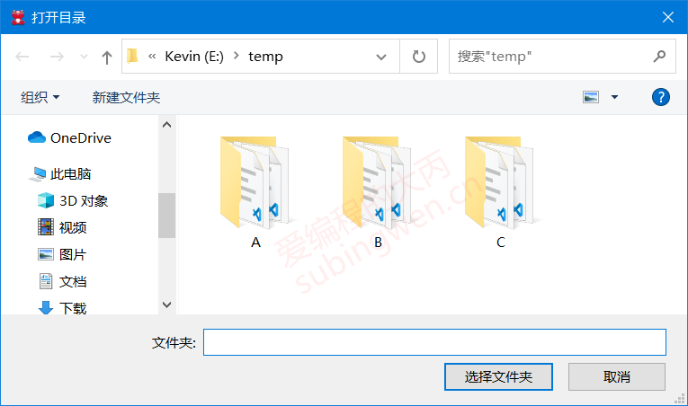

	- 打开一个本地文件

		```c++
		void MainWindow::on_filedlg_clicked()
		{
		    QString arg("Text files (*.txt)");
		    QString fileName = QFileDialog::getOpenFileName(
		              this, "Open File", "e:\\temp",
		              "Images (*.png *.jpg);;Text files (*.txt)", &arg);
		    QMessageBox::information(this, "打开文件", "您选择的文件是: " + fileName);
		}
		
		
		```

		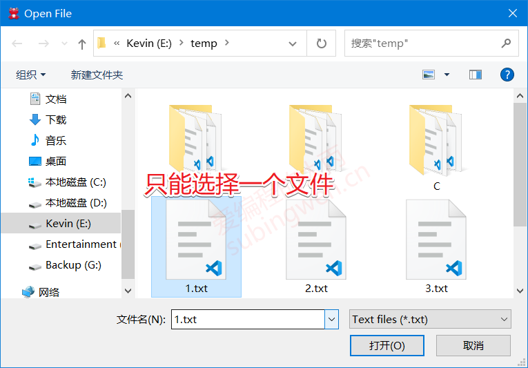

	- 打开多个本地文件

		```c++
		void MainWindow::on_filedlg_clicked()
		{
		    QStringList fileNames = QFileDialog::getOpenFileNames(
		              this, "Open File", "e:\\temp",
		              "Images (*.png *.jpg);;Text files (*.txt)");
		    QString names;
		    for(int i=0; i<fileNames.size(); ++i)
		    {
		        names += fileNames.at(i) + " ";
		    }
		    QMessageBox::information(this, "打开文件(s)", "您选择的文件是: " + names);
		}
		
		
		```

		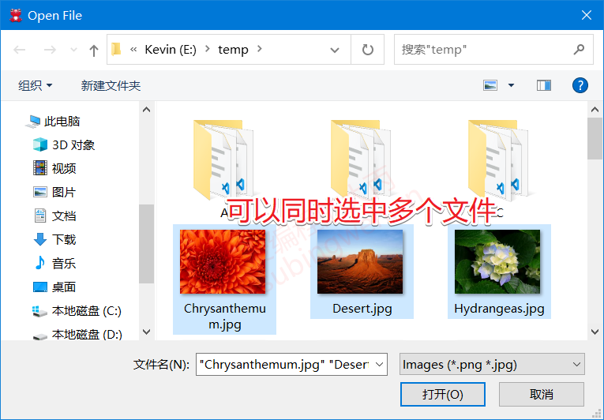

	- 打开保存文件对话框

		```c++
		void MainWindow::on_filedlg_clicked()
		{
		    QString fileName = QFileDialog::getSaveFileName(this, "保存文件", "e:\\temp");
		    QMessageBox::information(this, "保存文件", "您指定的保存数据的文件是: " + fileName);
		}
		//只是获取一个路径，该路径下的文件是否存在，并不关心，如果不存在，在后续操作中可以更具这个路径创建
		```

		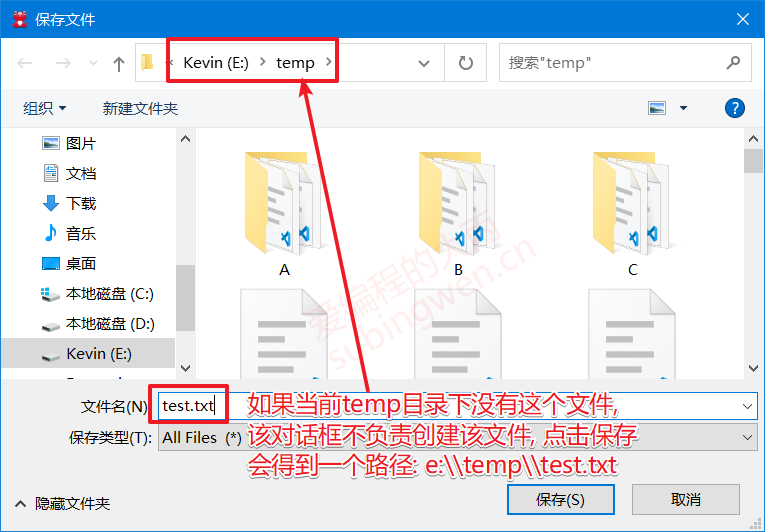

		

#### QFontDialog

- QFontDialog类是QDialog的子类, 通过这个类我们可以得到一个进行字体属性设置的对话框窗口, 和前边介绍的对话框类一样, 我们只需要调用这个类的静态成员函数就可以得到想要的窗口了。


##### QFont 字体类

- 关于字体的属性信息, 在QT框架中被封装到了一个叫QFont的类中,

- ```c++
	// 构造函数
	  QFont::QFont();
	  /*
	  参数:
	    - family: 本地字库中的字体名, 通过 office 等文件软件可以查看
	    - pointSize: 字体的字号
	    - weight: 字体的粗细, 有效范围为 0 ~ 99
	    - italic: 字体是否倾斜显示, 默认不倾斜
	  */
	  QFont::QFont(const QString &family, int pointSize = -1, int weight = -1, bool italic = false);
	  
	  // 设置字体
	  void QFont::setFamily(const QString &family);
	  // 根据字号设置字体大小
	  void QFont::setPointSize(int pointSize);
	  // 根据像素设置字体大小
	  void QFont::setPixelSize(int pixelSize);
	  // 设置字体的粗细程度, 有效范围: 0 ~ 99
	  void QFont::setWeight(int weight);
	  // 设置字体是否加粗显示
	  void QFont::setBold(bool enable);
	  // 设置字体是否要倾斜显示
	  void QFont::setItalic(bool enable);
	  
	  // 获取字体相关属性(一般规律: 去掉设置函数的 set 就是获取相关属性对应的函数名)
	  QString QFont::family() const;
	  bool QFont::italic() const;
	  int QFont::pixelSize() const;
	  int QFont::pointSize() const;
	  bool QFont::bold() const;
	  int QFont::weight() const;
	
	
	
	//如果一个QFont对象被创建, 并且进行了初始化, 我们可以将这个属性设置给某个窗口, 或者设置给当前应用程序对象。
	// QWidget 类
	// 得到当前窗口使用的字体
	const QWidget::QFont& font() const;
	// 给当前窗口设置字体, 只对当前窗口类生效
	void QWidget::setFont(const QFont &);
	
	// QApplication 类
	// 得到当前应用程序对象使用的字体
	[static] QFont QApplication::font();
	// 给当前应用程序对象设置字体, 作用于当前应用程序的所有窗口
	[static] void QApplication::setFont(const QFont &font, const char *className = nullptr);
	
	
	
	```

##### QFontDialog的API

```c++
/*
参数:
  - ok: 传出参数, 用于判断是否获得了有效字体信息, 指定一个布尔类型变量地址
  - initial: 字体对话框中默认选中并显示该字体信息, 用于对话框的初始化
  - parent: 字体对话框窗口的父对象
  - title: 字体对话框的窗口标题
  - options: 字体对话框选项, 使用默认属性即可, 一般不设置
*/
  [static] QFont QFontDialog::getFont(
		bool *ok, const QFont &initial, 
		QWidget *parent = nullptr, const QString &title = QString(), 
		QFontDialog::FontDialogOptions options = FontDialogOptions());
  
  [static] QFont QFontDialog::getFont(bool *ok, QWidget *parent = nullptr);


//例子
//通过字体对话框选择字体, 并将选择的字体设置给当前窗口
void MainWindow::on_fontdlg_clicked()
{
#if 1
    // 方式1
    bool ok;
    QFont ft = QFontDialog::getFont(
                &ok, QFont("微软雅黑", 12, QFont::Bold), this, "选择字体");
    qDebug() << "ok value is: " << ok;
#else
    // 方式2
    QFont ft = QFontDialog::getFont(NULL);
#endif
    // 将选择的字体设置给当前窗口对象
    this->setFont(ft);
}

```

#### QColorDialog

- QColorDialog类是QDialog的子类, 通过这个类我们可以得到一个选择颜色的对话框窗口, 和前边介绍的对话框类一样, 我们只需要调用这个类的静态成员函数就可以得到想要的窗口了。
	


#####  颜色类 QColor

- 关于颜色的属性信息, 在QT框架中被封装到了一个叫QColor的类中, 下边为大家介绍一下这个类的API, 了解一下关于这个类的使用。
	各种颜色都是基于红, 绿, 蓝这三种颜色调配而成的, 并且颜色还可以进行透明度设置, 默认是不透明的。

- ```C++
	// 构造函数
	QColor::QColor(Qt::GlobalColor color);
	QColor::QColor(int r, int g, int b, int a = ...);
	QColor::QColor();
	
	// 参数设置 red, green, blue, alpha, 取值范围都是 0-255
	void QColor::setRed(int red);		// 红色
	void QColor::setGreen(int green);	// 绿色
	void QColor::setBlue(int blue);	// 蓝色
	void QColor::setAlpha(int alpha);	// 透明度, 默认不透明(255)
	void QColor::setRgb(int r, int g, int b, int a = 255);
	
	int QColor::red() const;
	int QColor::green() const;
	int QColor::blue() const;
	int QColor::alpha() const;
	void QColor::getRgb(int *r, int *g, int *b, int *a = nullptr) const;
	
	
	```

##### QColorDialog的API

```c++
  // 弹出颜色选择对话框, 并返回选中的颜色信息
/*
参数:
    - initial: 对话框中默认选中的颜色, 用于窗口初始化
    - parent: 给对话框窗口指定父对象
    - title: 对话框窗口的标题
    - options: 颜色对话框窗口选项, 使用默认属性即可, 一般不需要设置
*/
  [static] QColor QColorDialog::getColor(
		const QColor &initial = Qt::white, 
		QWidget *parent = nullptr, const QString &title = QString(), 
		QColorDialog::ColorDialogOptions options = ColorDialogOptions());


//例子
/*
场景描述:
	1. 在窗口上放一个标签控件
	2. 通过颜色对话框选择一个颜色, 将选中的颜色显示到标签控件上
	3. 将选中的颜色的 RGBA 值分别显示出来
*/
void MainWindow::on_colordlg_clicked()
{
    QColor color = QColorDialog::getColor();
    QBrush brush(color);
    QRect rect(0, 0, ui->color->width(), ui->color->height());
    QPixmap pix(rect.width(), rect.height());
    QPainter p(&pix);
    p.fillRect(rect, brush);
    ui->color->setPixmap(pix);
    QString text = QString("red: %1, green: %2, blue: %3, 透明度: %4")
            .arg(color.red()).arg(color.green()).arg(color.blue()).arg(color.alpha());
    ui->colorlabel->setText(text);
}

```

#### QInputDialog

- QInputDialog类是QDialog的子类, 通过这个类我们可以得到一个输入对话框窗口, 根据实际需求我们可以在这个输入窗口中输入整形, 浮点型, 字符串类型的数据, 并且还可以显示下拉菜单供使用者选择。
	和前边介绍的对话框类一样, 我们只需要调用这个类的静态成员函数就可以得到想要的窗口了。

- ```c++
	// 得到一个可以输入浮点数的对话框窗口, 返回对话框窗口中输入的浮点数
	/*
	参数:
	  - parent: 对话框窗口的父窗口
	  - title: 对话框窗口显示的标题信息
	  - label: 对话框窗口中显示的文本信息(用于描述对话框的功能)
	  - value: 对话框窗口中显示的浮点值, 默认为 0
	  - min: 对话框窗口支持显示的最小数值
	  - max: 对话框窗口支持显示的最大数值
	  - decimals: 浮点数的精度, 默认保留小数点以后1位
	  - ok: 传出参数, 用于判断是否得到了有效数据, 一般不会使用该参数
	  - flags: 对话框窗口的窗口属性, 使用默认值即可
	*/
	[static] double QInputDialog::getDouble(
	    		QWidget *parent, const QString &title, 
	    		const QString &label, double value = 0, 
	    		double min = -2147483647, double max = 2147483647, 
	    		int decimals = 1, bool *ok = nullptr, 
	    		Qt::WindowFlags flags = Qt::WindowFlags());
	
	// 得到一个可以输入整形数的对话框窗口, 返回对话框窗口中输入的整形数
	/*
	参数:
	  - parent: 对话框窗口的父窗口
	  - title: 对话框窗口显示的标题信息
	  - label: 对话框窗口中显示的文本信息(用于描述对话框的功能)
	  - value: 对话框窗口中显示的整形值, 默认为 0
	  - min: 对话框窗口支持显示的最小数值
	  - max: 对话框窗口支持显示的最大数值
	  - step: 步长, 通过对话框提供的按钮调节数值每次增长/递减的量
	  - ok: 传出参数, 用于判断是否得到了有效数据, 一般不会使用该参数
	  - flags: 对话框窗口的窗口属性, 使用默认值即可
	*/
	[static] int QInputDialog::getInt(
	    		QWidget *parent, const QString &title, 
	    		const QString &label, int value = 0, 
	    		int min = -2147483647, int max = 2147483647, 
	    		int step = 1, bool *ok = nullptr, 
	    		Qt::WindowFlags flags = Qt::WindowFlags());
	
	// 得到一个带下来菜单的对话框窗口, 返回选择的菜单项上边的文本信息
	/*
	参数:
	  - parent: 对话框窗口的父窗口
	  - title: 对话框窗口显示的标题信息
	  - label: 对话框窗口中显示的文本信息(用于描述对话框的功能)
	  - items: 字符串列表, 用于初始化窗口中的下拉菜单, 每个字符串对应一个菜单项
	  - current: 通过菜单项的索引指定显示下拉菜单中的哪个菜单项, 默认显示第一个(编号为0)
	  - editable: 设置菜单项上的文本信息是否可以进行编辑, 默认为true, 即可以编辑
	  - ok: 传出参数, 用于判断是否得到了有效数据, 一般不会使用该参数
	  - flags: 对话框窗口的窗口属性, 使用默认值即可
	  - inputMethodHints: 设置显示模式, 默认没有指定任何特殊显示格式, 显示普通文本字符串
	    - 如果有特殊需求, 可以参数帮助文档进行相关设置
	*/
	[static] QString QInputDialog::getItem(
	    		QWidget *parent, const QString &title, 
	    		const QString &label, const QStringList &items, 
	    		int current = 0, bool editable = true, bool *ok = nullptr, 
	    		Qt::WindowFlags flags = Qt::WindowFlags(), 
	    		Qt::InputMethodHints inputMethodHints = Qt::ImhNone);
	
	// 得到一个可以输入多行数据的对话框窗口, 返回用户在窗口中输入的文本信息
	/*
	参数:
	  - parent: 对话框窗口的父窗口
	  - title: 对话框窗口显示的标题信息
	  - label: 对话框窗口中显示的文本信息(用于描述对话框的功能)
	  - text: 指定显示到多行输入框中的文本信息, 默认是空字符串
	  - ok: 传出参数, 用于判断是否得到了有效数据, 一般不会使用该参数
	  - flags: 对话框窗口的窗口属性, 使用默认值即可
	  - inputMethodHints: 设置显示模式, 默认没有指定任何特殊显示格式, 显示普通文本字符串
	    - 如果有特殊需求, 可以参数帮助文档进行相关设置
	*/
	[static] QString QInputDialog::getMultiLineText(
	    		QWidget *parent, const QString &title, const QString &label, 
	    		const QString &text = QString(), bool *ok = nullptr, 
	    		Qt::WindowFlags flags = Qt::WindowFlags(), 
	    		Qt::InputMethodHints inputMethodHints = Qt::ImhNone);
	
	// 得到一个可以输入单行信息的对话框窗口, 返回用户在窗口中输入的文本信息
	/*
	参数:
	  - parent: 对话框窗口的父窗口 
	  - title: 对话框窗口显示的标题信息
	  - label: 对话框窗口中显示的文本信息(用于描述对话框的功能)
	  - mode: 指定单行编辑框中数据的反馈模式, 是一个 QLineEdit::EchoMode 类型的枚举值
	    - QLineEdit::Normal: 显示输入的字符。这是默认值
	    - QLineEdit::NoEcho: 不要展示任何东西。这可能适用于连密码长度都应该保密的密码。
	    - QLineEdit::Password: 显示与平台相关的密码掩码字符，而不是实际输入的字符。
	    - QLineEdit::PasswordEchoOnEdit: 在编辑时按输入显示字符，否则按密码显示字符。
	  - text: 指定显示到单行输入框中的文本信息, 默认是空字符串
	  - ok: 传出参数, 用于判断是否得到了有效数据, 一般不会使用该参数
	  - flags: 对话框窗口的窗口属性, 使用默认值即可
	  - inputMethodHints: 设置显示模式, 默认没有指定任何特殊显示格式, 显示普通文本字符串
	     - 如果有特殊需求, 可以参数帮助文档进行相关设置
	*/
	[static] QString QInputDialog::getText(
	    		QWidget *parent, const QString &title, const QString &label,
	    		QLineEdit::EchoMode mode = QLineEdit::Normal, 
	    		const QString &text = QString(), bool *ok = nullptr, 
	    		Qt::WindowFlags flags = Qt::WindowFlags(), 
	    		Qt::InputMethodHints inputMethodHints = Qt::ImhNone);
	
	```

	- 整形输入框

		```c++
		void MainWindow::on_inputdlg_clicked()
		{
		    int ret = QInputDialog::getInt(this, "年龄", "您的当前年龄: ", 10, 1, 100, 2);
		    QMessageBox::information(this, "年龄", "您的当前年龄: " + QString::number(ret));
		}
		
		
		
		```

		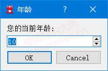

	- 单行字符串输入框

		```c++
		void MainWindow::on_inputdlg_clicked()
		{
		    QString text = QInputDialog::getText(this, "密码", "请输入新的密码", QLineEdit::Password, "helloworld");
		    QMessageBox::information(this, "密码", "您设置的密码是: " + text);
		}
		
		
		```

		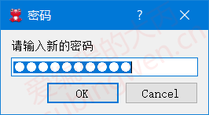

	- 浮点型输入框

		```c++
		void MainWindow::on_inputdlg_clicked()
		{
		    double ret = QInputDialog::getDouble(this, "工资", "您的工资: ", 2000, 1000, 6000, 2);
		    QMessageBox::information(this, "工资", "您的当前工资: " + QString::number(ret));
		}
		
		```

		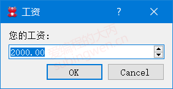

	- 带下拉菜单的输入框

		```c++
		void MainWindow::on_inputdlg_clicked()
		{
		    QStringList items;
		    items << "苹果" << "橙子" << "橘子" << "葡萄" << "香蕉" << "哈密瓜";
		    QString item = QInputDialog::getItem(this, "请选择你喜欢的水果", "你最喜欢的水果:", items, 1, false);
		    QMessageBox::information(this, "水果", "您最喜欢的水果是: " + item);
		}
		
		
		```

		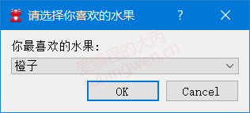

	- 多行字符串输入框

		```c++
		void MainWindow::on_inputdlg_clicked()
		{
		    QString info = QInputDialog::getMultiLineText(this, "表白", "您最想对漂亮小姐姐说什么呢?", "呦吼吼...");
		    QMessageBox::information(this, "知心姐姐", "您最想对小姐姐说: " + info);
		}
		
		```

		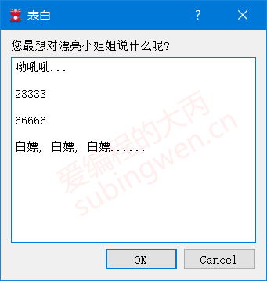


####  QProgressDialog

- QProgressDialog类是QDialog的子类, 通过这个类我们可以得到一个带进度条的对话框窗口, 这种类型的对话框窗口一般常用于文件拷贝、数据传输等实时交互的场景中。


```c++
// 构造函数
/*
参数:
  - labelText: 对话框中显示的提示信息
  - cancelButtonText: 取消按钮上显示的文本信息
  - minimum: 进度条最小值
  - maximum: 进度条最大值
  - parent: 当前窗口的父对象
  - f: 当前进度窗口的flag属性, 使用默认属性即可, 无需设置
*/
QProgressDialog::QProgressDialog(
	QWidget *parent = nullptr, 
	Qt::WindowFlags f = Qt::WindowFlags());

QProgressDialog::QProgressDialog(
	const QString &labelText, const QString &cancelButtonText, 
	int minimum, int maximum, QWidget *parent = nullptr,
	Qt::WindowFlags f = Qt::WindowFlags());


// 设置取消按钮显示的文本信息
[slot] void QProgressDialog::setCancelButtonText(const QString &cancelButtonText);

// 公共成员函数和槽函数
QString QProgressDialog::labelText() const;
void QProgressDialog::setLabelText(const QString &text);

// 得到进度条最小值
int QProgressDialog::minimum() const;
// 设置进度条最小值
void QProgressDialog::setMinimum(int minimum);

// 得到进度条最大值
int QProgressDialog::maximum() const;
// 设置进度条最大值
void QProgressDialog::setMaximum(int maximum);

// 设置进度条范围(最大和最小值)
[slot] void QProgressDialog::setRange(int minimum, int maximum);

// 得到进度条当前的值
int QProgressDialog::value() const;
// 设置进度条当前的值
void QProgressDialog::setValue(int progress);


bool QProgressDialog::autoReset() const;
// 当value() = maximum()时，进程对话框是否调用reset()，此属性默认为true。
void QProgressDialog::setAutoReset(bool reset);


bool QProgressDialog::autoClose() const;
// 当value() = maximum()时，进程对话框是否调用reset()并且隐藏，此属性默认为true。
void QProgressDialog::setAutoClose(bool close);

// 判断用户是否按下了取消键, 按下了返回true, 否则返回false
bool wasCanceled() const;


// 重置进度条
// 重置进度对话框。wascancelled()变为true，直到进程对话框被重置。进度对话框被隐藏。
[slot] void QProgressDialog::cancel();
// 重置进度对话框。如果autoClose()为真，进程对话框将隐藏。
[slot] void QProgressDialog::reset();   

// 信号
// 当单击cancel按钮时，将发出此信号。默认情况下，它连接到cancel()槽。
[signal] void QProgressDialog::canceled();

// 设置窗口的显示状态(模态, 非模态)
/*
参数:
	Qt::NonModal  -> 非模态
	Qt::WindowModal	-> 模态, 阻塞父窗口
	Qt::ApplicationModal -> 模态, 阻塞应用程序中的所有窗口
*/
void QWidget::setWindowModality(Qt::WindowModality windowModality);


//例子
/*
场景描述:
	1. 基于定时器模拟文件拷贝的场景
	2. 点击窗口按钮, 进度条窗口显示, 同时启动定时器
	3. 通过定时器信号, 按照固定频率更新对话框窗口进度条
	4. 当进度条当前值 == 最大值, 关闭定时器, 关闭并析构进度对话框
*/
void MainWindow::on_progressdlg_clicked()
{
    // 1. 创建进度条对话框窗口对象
    QProgressDialog *progress = new QProgressDialog(
                "正在拷贝数据...", "取消拷贝", 0, 100, this);
    // 2. 初始化并显示进度条窗口
    progress->setWindowTitle("请稍后");
    progress->setWindowModality(Qt::WindowModal);
    progress->show();

    // 3. 更新进度条
    static int value = 0;
    QTimer *timer = new QTimer;
    connect(timer, &QTimer::timeout, this, [=]()
    {
         progress->setValue(value);
         value++;
         // 当value > 最大值的时候
         if(value > progress->maximum())
         {
             timer->stop();
             value = 0;
             delete progress;
             delete timer;
         }
    });

    connect(progress, &QProgressDialog::canceled, this, [=]()
    {
        timer->stop();
        value = 0;
        delete progress;
        delete timer;
    });

    timer->start(50);
}


```


#### 其他对话框

```c++
    connect(ui->actionNew,&QAction::triggered,[=](){
        //其他对话框
        //颜色对话框
        // QColor color = QColorDialog::getColor(QColor(255,55,0));               //QColor()还有第四个参数,为透明度
        // qDebug() << "r=" << color.red() << "g=" << color.green() << "b=" << color.blue();
        // qDebug() << "html =" << color.name();

        //文本对话框
        //参数1 父对象  参数2 窗口标题  参数3 文件路径（需要转义字符\） 参数4 过滤文本格式
        // QString fileName = QFileDialog::getOpenFileName(this,"打开文件","E:\\笔记","(*.txt)");
        // qDebug() << fileName;

        //字体对话框
        bool flag;              //是否选择字体
        QFont font = QFontDialog::getFont(&flag,QFont("宋体",20,1),this,"字体选择");
        qDebug() << "字体：" << font.family().toUtf8().data() << "字号：" << font.pointSize() << "是否加租：" << font.bold() << "是否倾斜:" << font.italic();
        qDebug() << flag;
    });
```


## 容器控件

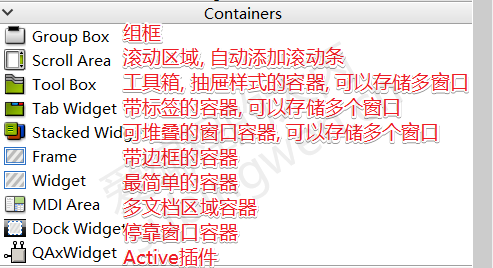

### QWidget

<span style="font-size:3em;">**选中属性，按F1可以直接跳转到对于帮助文档**</span>

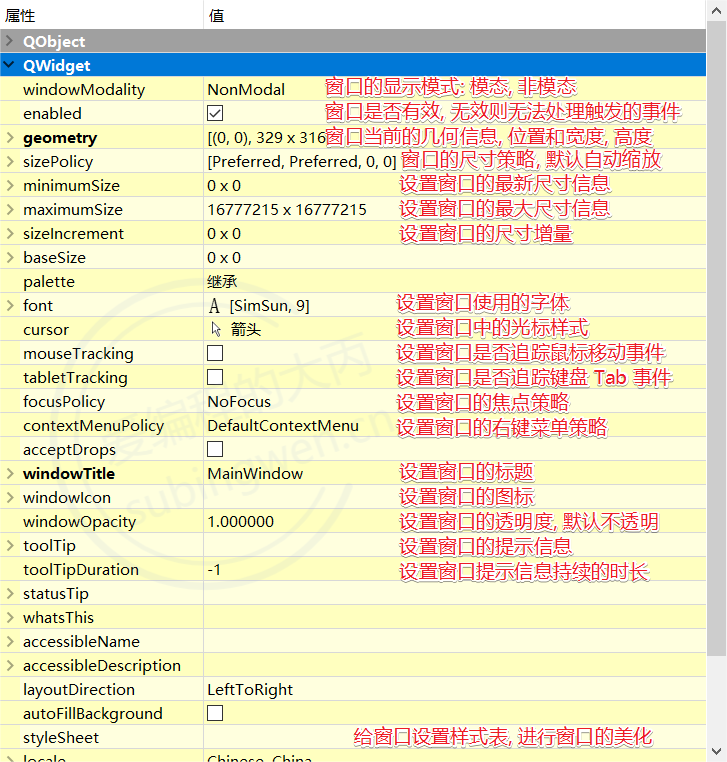

### Frame

- QFrame就是一个升级版的QWidget, 它继承了QWidget的属性, 并且做了拓展, 这种类型的容器窗口可以提供边框, 并且可以设置边框的样式、宽度以及边框的阴影。

-  相关API

	```C++
	/*
	边框形状为布尔类型, 可选项为:
	    - QFrame::NoFrame: 没有边框
	    - QFrame::Box: 绘制一个框
	    - QFrame::Panel: 绘制一个面板，使内容显示为凸起或凹陷
	    - QFrame::StyledPanel: 绘制一个外观取决于当前GUI样式的矩形面板。它可以上升也可以下沉。
	    - QFrame::HLine: 画一条没有边框的水平线(用作分隔符)
	    - QFrame::VLine: 画一条没有边框的垂直线(用作分隔符)
	    - QFrame::WinPanel: 绘制一个矩形面板，可以像Windows 2000那样向上或向下移动。
		                指定此形状将线宽设置为2像素。WinPanel是为了兼容而提供的。
		                对于GUI风格的独立性，我们建议使用StyledPanel代替。
	*/
	// 获取边框形状
	Shape frameShape() const;
	// 设置边框形状
	void setFrameShape(Shape);
	
	
	/*
	Qt中关于边框的阴影(QFrame::Shadow)提供了3种样式, 分别为: 
	    - QFrame::Plain: 简单的,朴素的, 框架和内容与周围环境显得水平;
		             使用调色板绘制QPalette::WindowText颜色(没有任何3D效果)
	    - QFrame::Raised: 框架和内容出现凸起;使用当前颜色组的明暗颜色绘制3D凸起线
	    - QFrame::Sunken: 框架及内容物凹陷;使用当前颜色组的明暗颜色绘制3D凹线
	*/
	// 获取边框阴影样式
	Shadow frameShadow() const;
	// 设置边框阴影样式
	void setFrameShadow(Shadow);
	
	// 得到边框线宽度
	int lineWidth() const;
	// 设置边框线宽度, 默认值为1
	void setLineWidth(int);
	
	// 得到中线的宽度
	int midLineWidth() const;
	// 设置中线宽度, 默认值为0, 这条线会影响边框阴影的显示
	void setMidLineWidth(int);
	
	
	```

	

- 相关属性

	这个类的属性并不多, 都是关于边框的设置的。
	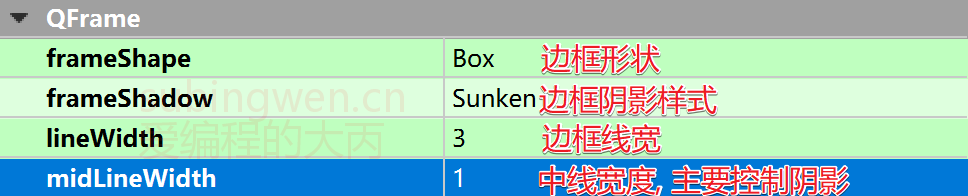

	这个表格显示了一些边框样式和线宽以及阴影的组合:

	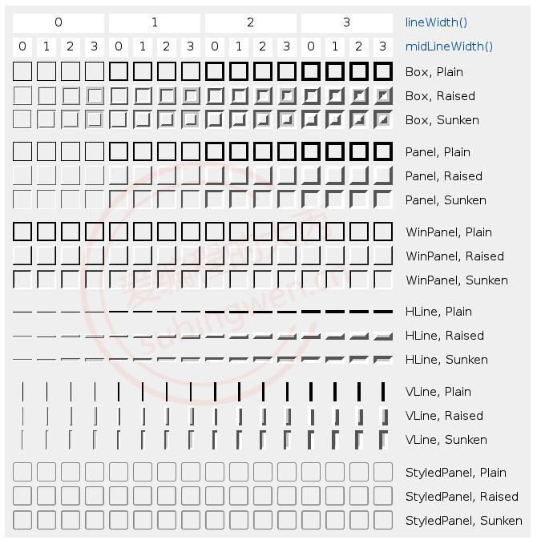

### Group Box

- QGroupBox类的基类是QWidget, 在这种类型的窗口中可以绘制边框、给窗口指定标题, 并且还支持显示复选框。

- 相关API

	```c++
	// 构造函数
	QGroupBox::QGroupBox(QWidget *parent = Q_NULLPTR);
	QGroupBox::QGroupBox(const QString &title, QWidget *parent = Q_NULLPTR);
	
	// 公共成员函数
	bool QGroupBox::isCheckable() const;
	// 设置是否在组框中显示一个复选框
	void QGroupBox::setCheckable(bool checkable);
	
	/*
	关于对齐方式需要使用枚举类型 Qt::Alignment, 其可选项为:
	    - Qt::AlignLeft: 左对齐(水平方向)
	    - Qt::AlignRight: 右对齐(水平方向)
	    - Qt::AlignHCenter: 水平居中
	    - Qt::AlignJustify: 在可用的空间内调整文本(水平方向)
		
	    - Qt::AlignTop: 上对齐(垂直方向)
	    - Qt::AlignBottom: 下对齐(垂直方向)
	    - Qt::AlignVCenter: 垂直居中
	*/
	Qt::Alignment QGroupBox::alignment() const;
	// 设置组框标题的对其方式
	void QGroupBox::setAlignment(int alignment);
	
	QString QGroupBox::title() const;
	// 设置组框的标题
	void QGroupBox::setTitle(const QString &title);
	
	bool QGroupBox::isChecked() const;
	// 设置组框中复选框的选中状态
	[slot] void QGroupBox::setChecked(bool checked);
	
	```

	

- 属性设置

	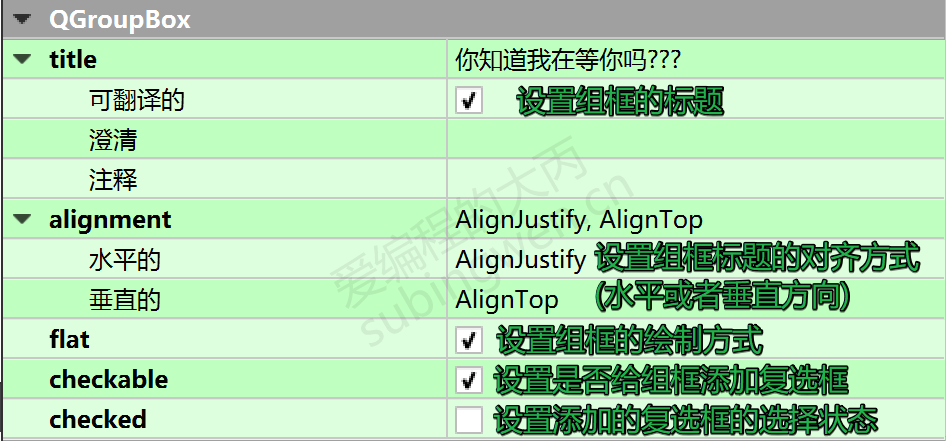

	组框中的flat属性没有对应的API函数, 只能在属性窗口中设置, 它控制的是窗口边框的绘制方式, 如果打开该属性, 组框的边框就消失了, 效果如下:


	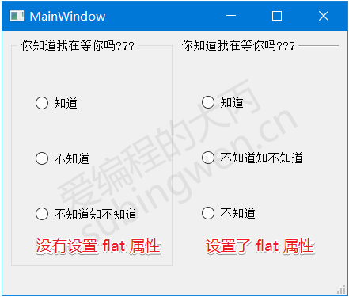


### Scroll Area

- QScrollArea这种类型的容器, 里边可以放置一些窗口控件, 当放置的窗口控件大于当前区域导致无法全部显示的时候, 滚动区域容器会自动添加相应的滚动条(水平方向或者垂直方向), 保证放置到该区域中的所有窗口内容都可以正常显示出来。对于使用者不需要做太多事情, 只需要把需要显示的窗口放到滚动区域中就行了。

- 相关API

	```c++
	//在某些特定环境下, 我们需要动态的往滚动区域内部添加要显示的窗口, 或者动态的将显示的窗口移除, 这时候就必须要调用对应的API函数来完成这部分操作了。主要API有两个 添加 - setWidget(), 移除 - takeWidget()
	
	
	// 构造函数
	QScrollArea::QScrollArea(QWidget *parent = Q_NULLPTR);
	
	// 公共成员函数
	// 给滚动区域设置要显示的子窗口widget
	void QScrollArea::setWidget(QWidget *widget);
	// 删除滚动区域中的子窗口, 并返回被删除的子窗口对象
	QWidget *QScrollArea::takeWidget();
	
	/*
	关于显示位置的设定, 是一个枚举类型, 可选项为:
	    - Qt::AlignLeft: 左对齐
	    - Qt::AlignHCenter: 水平居中
	    - Qt::AlignRight: 右对齐
	    - Qt::AlignTop: 顶部对齐
	    - Qt::AlignVCenter: 垂直对其
	    - Qt::AlignBottom: 底部对其
	*/
	// 获取子窗口在滚动区域中的显示位置
	Qt::Alignment alignment() const;
	// 设置滚动区域中子窗口的对其方式, 默认显示的位置是右上
	void setAlignment(Qt::Alignment);
	
	// 判断滚动区域是否有自动调节小部件大小的属性
	bool widgetResizable() const;
	/*
	1. 设置滚动区域是否应该调整视图小部件的大小, 该属性默认为false, 滚动区域按照小部件的默认大小进行显示。
	2. 如果该属性设置为true，滚动区域将自动调整小部件的大小，避免滚动条出现在本可以避免的地方，
	   或者利用额外的空间。
	3. 不管这个属性是什么，我们都可以使用widget()->resize()以编程方式调整小部件的大小，
	   滚动区域将自动调整自己以适应新的大小。
	*/
	void setWidgetResizable(bool resizable);
	
	
	```

	

- 属性

	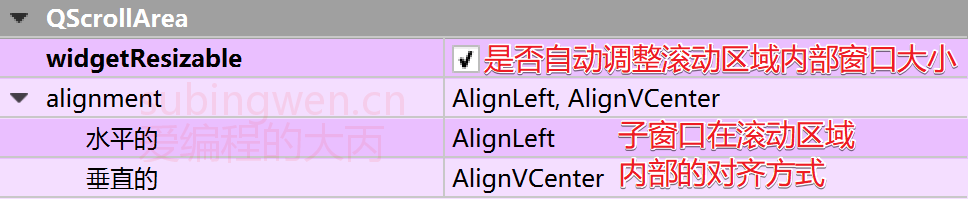

- 窗口的动态添加和删除 

	- 关于窗口的滚动区域对象创建有两种方式, 第一种比较简单在编辑页面直接拖拽一个控件到UI界面, 然后布局即可。第二种方式是在程序中通过new操作创建一个实例对象, 然后通过通过代码的方式将其添加到窗口的某个布局中, 相对来说要麻烦一点。
		下面通过第一种方式，演示一下如果往滚动区域中添加多个子窗口。

	- ```c++
		MainWindow::MainWindow(QWidget *parent)
		    : QMainWindow(parent)
		    , ui(new Ui::MainWindow)
		{
		    ui->setupUi(this);
		
		    // 创建一个垂直布局对象
		    QVBoxLayout* vlayout = new QVBoxLayout;
		
		    for(int i=0; i<11; ++i)
		    {
		        // 创建标签对象
		        QLabel* pic = new QLabel;
		        // 拼接图片在资源文件中的路径
		        QString name = QString(":/images/%1.png").arg(i+1);
		        // 给标签对象设置显示的图片
		        pic->setPixmap(QPixmap(name));
		        // 设置图片在便签内部的对其方式
		        pic->setAlignment(Qt::AlignHCenter);
		        // 将标签添加到垂直布局中
		        vlayout->addWidget(pic);
		    }
		
		    // 创建一个窗口对象
		    QWidget* wg = new QWidget;
		    // 将垂直布局设置给窗口对象
		    wg->setLayout(vlayout);
		    // 将带有垂直布局的窗口设置到滚动区域中
		    ui->scrollArea->setWidget(wg);
		}
		
		
		```

	- 关于以上代码做以下说明, 调用setWidget(wg)之后, wg会自动平铺填充满整个滚动区域, 因此:

		- 在程序中调用 void setWidgetResizable(bool resizable);不会有明显效果
		- 在程序中调用 void setAlignment(Qt::Alignment);不会看到任何效果
		- 如果要设置显示的图片的对其方式要设置图片的载体对象即 标签签对象
		- 如果要动态移除滚动区域中的窗口, 直接使用滚动区域对象调用 takeWidget() 即可
		- 滚动区域中只能通过setWidget(wg)添加一个子窗口, 如果要添加多个可使用布局的方式来实现


		

### Tool Box

- QToolBox工具箱控件, 可以存储多个子窗口, 该控件可以实现类似QQ的抽屉效果, 每一个抽屉都可以设置图标和标题, 并且对应一个子窗口, 通过抽屉按钮就可以实现各个子窗口显示的切换。

- 相关API

	```c++
	// 构造函数
	QToolBox::QToolBox(QWidget *parent = Q_NULLPTR, Qt::WindowFlags f = Qt::WindowFlags());
	
	// 公共成员
	/*
	addItem(), insertItem()函数相关参数:
	    - widget: 添加到工具箱中的选项卡对应的子窗口对象
	    - icon: 工具箱新的选项卡上显示的图标
	    - text: 工具箱新的选项卡上显示的标题
	    - index: 指定在工具箱中插入的新的选项卡的位置
	*/
	// 给工具箱尾部添加一个选项卡, 每个选项卡在工具箱中就是一个子窗口, 即参数widget
	int QToolBox::addItem(QWidget *widget, const QString &text);
	int QToolBox::addItem(QWidget *widget, const QIcon &icon, const QString &text);
	// 在工具箱的指定位置添加一个选项卡, 即添加一个子窗口
	int QToolBox::insertItem(int index, QWidget *widget, const QString &text);
	int QToolBox::insertItem(int index, QWidget *widget, const QIcon &icon, 
	                         const QString &text);
	// 移除工具箱中索引index位置对应的选项卡, 注意: 只是移除对应的窗口对象并没有被销毁
	void QToolBox::removeItem(int index);
	
	// 设置索引index位置的选项卡是否可用, 参数 enabled=true为可用, enabled=false为禁用
	void QToolBox::setItemEnabled(int index, bool enabled);
	// 设置工具箱中index位置选项卡的图标
	void QToolBox::setItemIcon(int index, const QIcon &icon);
	// 设置工具箱中index位置选项卡的标题
	void QToolBox::setItemText(int index, const QString &text);
	// 设置工具箱中index位置选项卡的提示信息(需要鼠标在选项卡上悬停一定时长才能显示)
	void QToolBox::setItemToolTip(int index, const QString &toolTip);
	
	// 如果位置索引的项已启用，则返回true;否则返回false。
	bool QToolBox::isItemEnabled(int index) const;
	// 返回位置索引处项目的图标，如果索引超出范围，则返回空图标。
	QIcon QToolBox::itemIcon(int index) const;
	// 返回位于位置索引处的项的文本，如果索引超出范围，则返回空字符串。
	QString QToolBox::itemText(int index) const;
	// 返回位于位置索引处的项的工具提示，如果索引超出范围，则返回空字符串。
	QString QToolBox::itemToolTip(int index) const;
	
	// 得到当前工具箱中显示的选项卡对应的索引
	int QToolBox::currentIndex() const;
	// 返回指向当前选项卡对应的子窗口的指针，如果没有这样的项，则返回0。
	QWidget *QToolBox::currentWidget() const;
	// 返回工具箱中子窗口的索引，如果widget对象不存在，则返回-1
	int QToolBox::indexOf(QWidget *widget) const;
	// 返回工具箱中包含的项的数量。
	int QToolBox::count() const;
	
	// 信号
	// 工具箱中当前显示的选项卡发生变化, 该信号被发射, index为当前显示的新的选项卡的对应的索引
	[signal] void QToolBox::currentChanged(int index);
	
	// 槽函数
	// 通过工具箱中选项卡对应的索引设置当前要显示哪一个选项卡中的子窗口
	[slot] void QToolBox::setCurrentIndex(int index);
	// 通过工具箱中选项卡对应的子窗口对象设置当前要显示哪一个选项卡中的子窗口
	[slot] void QToolBox::setCurrentWidget(QWidget *widget);
	
	
	
	```

	

- 属性

	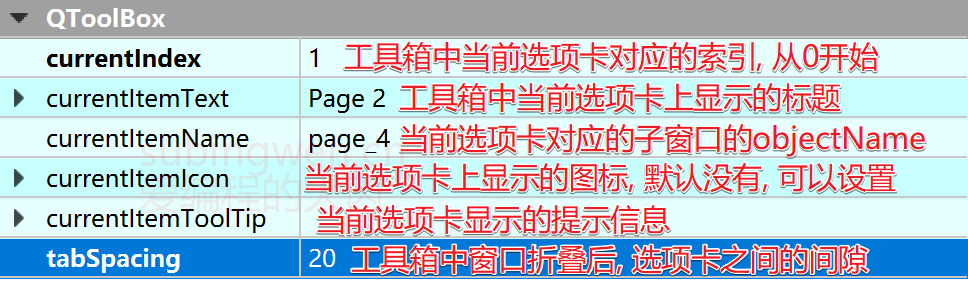

### Tab Widget

- QTabWidget的一种带标签页的窗口，在这种类型的窗口中可以存储多个子窗口，每个子窗口的显示可以通过对应的标签进行切换。

- 相关API

	```c++
	// 构造函数
	QTabWidget::QTabWidget(QWidget *parent = Q_NULLPTR);
	
	// 公共成员函数
	/*
	添加选项卡addTab()或者插入选项卡insertTab()函数相关的参数如下:
	    - page: 添加或者插入的选项卡对应的窗口实例对象
	    - label: 添加或者插入的选项卡的标题
	    - icon: 添加或者插入的选项卡的图标
	    - index: 将新的选项卡插入到索引index的位置上
	*/
	int QTabWidget::addTab(QWidget *page, const QString &label);
	int QTabWidget::addTab(QWidget *page, const QIcon &icon, const QString &label);
	int QTabWidget::insertTab(int index, QWidget *page, const QString &label);
	int QTabWidget::insertTab(int index, QWidget *page, 
	                          const QIcon &icon, const QString &label);
	// 删除index位置的选项卡
	void QTabWidget::removeTab(int index);
	
	// 得到选项卡栏中的选项卡的数量
	int count() const;
	// 从窗口中移除所有页面，但不删除它们。调用这个函数相当于调用removeTab()，直到选项卡小部件为空为止。
	void QTabWidget::clear();
	// 获取当前选项卡对应的索引
	int QTabWidget::currentIndex() const;
	// 获取当前选项卡对应的窗口对象地址
	QWidget *QTabWidget::currentWidget() const;
	// 返回索引位置为index的选项卡页，如果索引超出范围则返回0。
	QWidget *QTabWidget::widget(int index) const;
	
	/*
	标签上显示的文本样式为枚举类型 Qt::TextElideMode, 可选项为:
	    - Qt::ElideLeft: 省略号应出现在课文的开头，例如：.....是的,我很帅。
	    - Qt::ElideRight: 省略号应出现在文本的末尾，例如：我帅吗.....。
	    - Qt::ElideMiddle: 省略号应出现在文本的中间，例如：我帅.....很帅。
	    - Qt::ElideNone: 省略号不应出现在文本中
	*/
	// 获取标签上显示的文本模式
	Qt::TextElideMode QTabWidget::elideMode() const;
	// 如何省略标签栏中的文本, 此属性控制在给定的选项卡栏大小没有足够的空间显示项时如何省略项。
	void QTabWidget::setElideMode(Qt::TextElideMode);
	    
	// 得到选项卡上图标的尺寸信息
	QSize QTabWidget::iconSize() const
	// 设置选项卡上显示的图标大小
	void QTabWidget::setIconSize(const QSize &size)
	
	// 判断用户是否可以在选项卡区域内移动选项卡, 可以返回true, 否则返回false
	bool QTabWidget::isMovable() const;
	// 此属性用于设置用户是否可以在选项卡区域内移动选项卡。默认情况下，此属性为false;
	void QTabWidget::setMovable(bool movable);
	
	// 判断选项卡是否可以自动隐藏, 如果可以自动隐藏返回true, 否则返回false
	bool QTabWidget::tabBarAutoHide() const;
	// 如果为true，则当选项卡栏包含少于2个选项卡时，它将自动隐藏。默认情况下，此属性为false。
	void QTabWidget::setTabBarAutoHide(bool enabled);
	
	// 判断index对应的选项卡是否是被启用的, 如果是被启用的返回true, 否则返回false
	bool QTabWidget::isTabEnabled(int index) const;
	// 如果enable为true，则在索引位置的页面是启用的;否则，在位置索引处的页面将被禁用。
	void QTabWidget::setTabEnabled(int index, bool enable);
	
	// 得到index位置的标签对应的图标
	QIcon QTabWidget::tabIcon(int index) const;
	// 在位置索引处设置标签的图标。
	void QTabWidget::setTabIcon(int index, const QIcon &icon);
	
	/*
	选项卡标签的位置通过枚举值进行指定, 可使用的选项如下:
		- QTabWidget::North: 北(上), 默认
		- QTabWidget::South: 南(下)
		- QTabWidget::West:	 西(左)
		- QTabWidget::East:  东(右)
	*/
	// 得到选项卡中显示的标签的位置, 即: 东, 西, 南, 北
	TabPosition QTabWidget::tabPosition() const;
	// 设置选项卡中标签显示的位置, 默认情况下，此属性设置为North。
	void QTabWidget::setTabPosition(TabPosition);
	
	/*
	选项卡标签的形状通过枚举值进行指定, 可使用的选项如下:
		- QTabWidget::Rounded: 标签以圆形的外观绘制。这是默认形状
		- QTabWidget::Triangular: 选项卡以三角形外观绘制。
	*/
	// 获得选项卡标签的形状
	TabShape QTabWidget::tabShape() const;
	// 设置选项卡标签的形状
	void QTabWidget::setTabShape(TabShape s);
	
	// 得到index位置的标签的标题
	QString QTabWidget::tabText(int index) const;
	// 设置选项卡index位置的标签的标题
	void QTabWidget::setTabText(int index, const QString &label);
	
	
	// 获取index对应的标签页上设置的提示信息
	QString QTabWidget::tabToolTip(int index) const;
	// 设置选项卡index位置的标签的提示信息(鼠标需要悬停在标签上一定时长才能显示)
	void QTabWidget::setTabToolTip(int index, const QString &tip);
	
	
	// 判断选项卡标签也上是否有关闭按钮, 如果有返回true, 否则返回false
	bool QTabWidget::tabsClosable() const;
	// 设置选项卡的标签页上是否显示关闭按钮, 该属性默认情况下为false
	void QTabWidget::setTabsClosable(bool closeable);
	
	
	// 判断选项卡栏中是否有滚动按钮, 如果有返回true, 否则返回false
	bool QTabWidget::usesScrollButtons() const;
	// 设置选项卡栏有许多标签时，它是否应该使用按钮来滚动标签。
	// 当一个选项卡栏有太多的标签时，选项卡栏可以选择扩大它的大小，或者添加按钮，让标签在选项卡栏中滚动。
	void QTabWidget::setUsesScrollButtons(bool useButtons);
	
	// 判断窗口是否设置了文档模式, 如果设置了返回true, 否则返回false
	bool QTabWidget::documentMode() const;
	// 此属性保存选项卡小部件是否以适合文档页面的模式呈现。这与macOS上的文档模式相同。
	// 不设置该属性, QTabWidget窗口是带边框的, 如果设置了该属性边框就没有了。
	void QTabWidget::setDocumentMode(bool set);
	
	
	// 每当当前页索引改变时，就会发出这个信号。参数是新的当前页索引位置，如果没有新的索引位置，则为-1
	[signal] void QTabWidget::currentChanged(int index);
	// 当用户单击索引处的选项卡时，就会发出这个信号。index指所单击的选项卡，如果光标下没有选项卡，则为-1。
	[signal] void QTabWidget::tabBarClicked(int index)
	// 当用户双击索引上的一个选项卡时，就会发出这个信号。
	// index是单击的选项卡的索引，如果光标下没有选项卡，则为-1。
	[signal] void QTabWidget::tabBarDoubleClicked(int index);
	// 此信号在单击选项卡上的close按钮时发出。索引是应该被删除的索引。 	
	[signal] void QTabWidget::tabCloseRequested(int index);
	
	
	```

	

- 属性

	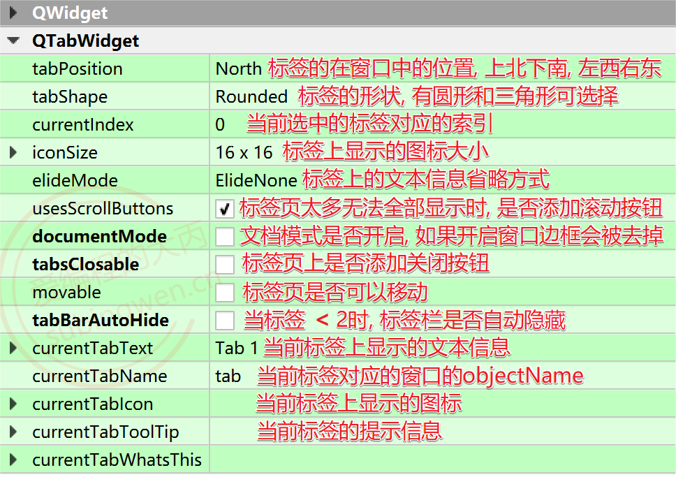

- 例子

	```c++
	// mainwindow.h
	QT_BEGIN_NAMESPACE
	namespace Ui { class MainWindow; }
	QT_END_NAMESPACE
	
	class MainWindow : public QMainWindow
	{
	    Q_OBJECT
	
	public:
	    MainWindow(QWidget *parent = nullptr);
	    ~MainWindow();
	
	private:
	    Ui::MainWindow *ui;
	    QQueue<QWidget*> m_widgets;	// 存储标签对应的窗口对象
	    QQueue<QString> m_names;    // 存储标签标题
	};
	
	
	// mainwindow.cpp
	MainWindow::MainWindow(QWidget *parent)
	    : QMainWindow(parent)
	    , ui(new Ui::MainWindow)
	{
	    ui->setupUi(this);
	
	    // 点击了标签上的关闭按钮
	    connect(ui->tabWidget, &QTabWidget::tabCloseRequested, this, [=](int index)
	    {
	        // 保存信息
	        QWidget* wg = ui->tabWidget->widget(index);
	        QString title = ui->tabWidget->tabText(index);
	        m_widgets.enqueue(wg);
	        m_names.enqueue(title);
	        // 移除tab页
	        ui->tabWidget->removeTab(index);
	        ui->addBtn->setEnabled(true);
	
	    });
	
	    // 当标签被点击了之后的处理动作
	    connect(ui->tabWidget, &QTabWidget::tabBarClicked, this, [=](int index)
	    {
	        qDebug() << "我被点击了一下, 我的标题是: " << ui->tabWidget->tabText(index);
	    });
	
	    // 切换标签之后的处理动作
	    connect(ui->tabWidget, &QTabWidget::currentChanged, this, [=](int index)
	    {
	        qDebug() << "当前显示的tab页, 我的标题是: " << ui->tabWidget->tabText(index);
	    });
	
	    // 点击添加标签按钮点击之后的处理动作
	    connect(ui->addBtn, &QPushButton::clicked, this, [=]()
	    {
	        // 将被删除的标签页添加到窗口中
	        // 1. 知道窗口对象, 窗口的标题
	        // 2. 知道添加函数
	        ui->tabWidget->addTab(m_widgets.dequeue(), m_names.dequeue());
	        if(m_widgets.empty())
	        {
	            ui->addBtn->setDisabled(true);
	        }
	    });
	}
	
	
	```


	

### Stacked Widget

- QStackedWidget 栈类型窗口, 在这种类型的窗口中可以存储多个子窗口, 但是只有其中某一个可以被显示出来, 至于是哪个子窗口被显示, 需要在程序中进行控制，在这种类型的窗口中没有直接切换子窗口的按钮或者标签。

- 相关API

	```c++
	// 构造函数
	QStackedWidget::QStackedWidget(QWidget *parent = Q_NULLPTR);
	
	// 公共成员函数
	// 在栈窗口中后边添加一个子窗口, 返回这个子窗口在栈窗口中的索引值(从0开始计数)
	int QStackedWidget::addWidget(QWidget *widget);
	// 将子窗口widget插入到栈窗口的index位置
	int QStackedWidget::insertWidget(int index, QWidget *widget);
	// 将子窗口widget从栈窗口中删除
	void QStackedWidget::removeWidget(QWidget *widget);
	
	// 返回栈容器窗口中存储的子窗口的个数
	int QStackedWidget::count() const;
	// 得到当前栈窗口中显示的子窗口的索引
	int QStackedWidget::currentIndex() const;
	// 得到当前栈窗口中显示的子窗口的指针(窗口地址)
	QWidget *QStackedWidget::currentWidget() const;
	// 基于索引index得到栈窗口中对应的子窗口的指针
	QWidget *QStackedWidget::widget(int index) const;
	// 基于子窗口的指针(实例地址)得到其在栈窗口中的索引
	int QStackedWidget::indexOf(QWidget *widget) const;
	
	// 信号
	// 切换栈窗口中显示子窗口, 该信息被发射出来, index为新的当前窗口对应的索引值
	[signal] void QStackedWidget::currentChanged(int index);
	// 当栈窗口的子窗口被删除, 该信号被发射出来, index为被删除的窗口对应的索引值
	[signal] void QStackedWidget::widgetRemoved(int index);
	
	// 槽函数
	// 基于子窗口的index索引指定当前栈窗口中显示哪一个子窗口
	[slot] void QStackedWidget::setCurrentIndex(int index);
	[slot] void QStackedWidget::setCurrentWidget(QWidget *widget);
	
	//在这些函数中最常用的就是它的槽函数, 并且名字和 QToolBox, QTabWidget 两个类提供的槽函数名字相同 分别为 setCurrentIndex(int), setCurrentWidget(QWidget*) 用来设置当前显示的窗口。
	
	
	```

	

- 属性

	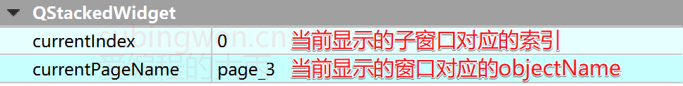

- 例子

	这里主要给大家演示一下QStackedWidget类型的容器中的子窗口如何切换, 如下图所示, 我们在一个栈窗口容器中添加了两个子窗口, 通过两个按钮对这两个窗口进行切换


	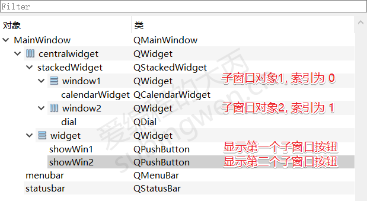

	```c++
	MainWindow::MainWindow(QWidget *parent)
	    : QMainWindow(parent)
	    , ui(new Ui::MainWindow)
	{
	    ui->setupUi(this);
	    // 设置默认显示的窗口
	    ui->stackedWidget->setCurrentWidget(ui->window1);
	
	    connect(ui->showWin1, &QPushButton::clicked, this, [=]()
	    {
		// 切换显示第一个子窗口
	        ui->stackedWidget->setCurrentIndex(0);
	    });
	
	    connect(ui->showWin2, &QPushButton::clicked, this, [=]()
	    {
	        // 切换显示第二个子窗口, 调用这两个槽函数中的任何一个都可以
	        ui->stackedWidget->setCurrentWidget(ui->window2);
	    });
	}
	
	```


	


## 对象树

- 在 Qt 中创建对象的时候会传递一个 Parent 对象指针，下面来解释这个 parent 到底是子什么的。
	- QObject 是以对象树的形式组织起来的。
		- 当前创建一个 QObject 对象时，会看到 QObject 的构造函数接收一个 QObject 指针作为参数，这个参数就是 parent，也就是父对象指针。
		- 这样当于，在创建 QObject 对象时，可以提供一个其父对象。我们创建的这个 QObject 对象会自动添加到其父对象的 children() 列表。
	- 当父对象析构的时候，这个列表中的所有对象也会被析构。（注意，**这里的父对象并不是继承意义上的父类**！）
		- 这种机制在 GUI 程序设计中相当有用。例如，一个按钮有一个 QShortcut（快捷键）对象作为其子对象。当我们删除按钮的时候，这个快捷键是应该删除。这是合理的。
		- 析构时，先调用自己（最大的父对象）的析构函数，再看有无子对象，有调用子对象的析构函数，子对象再检查自己有无子对象；无释放自己。（内存释放顺序为孙子对象-》子对象-》父对象。析构调用顺序为父对象-》子对象-》孙子对象）。
		- 对象放入对象树中，自动释放内存，—-》一定程度简化了内存回收机制。

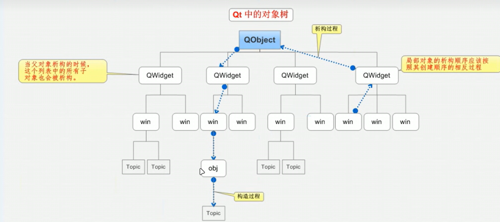

- QWidget 是能够定屏幕上显示的一切图形化的父类。
	- QWidget 继承自 QObject，因此也继承了这种对象关系链。一个子对象自动地成为父组件的一个子组件。因此，它会显示在父组件的坐标系之中，覆盖父组件的起示对象。例如，当用户关闭这个窗体对象，应用程序应该关闭那个控件，那么，我们现在只需要关闭一个父对象，这样这个控件就会被删除了。因为这些对象是及其相关的。


### 示例

```c++
//mypushbotton.h
#ifndef MYPUSHBOTTON_H
#define MYPUSHBOTTON_H

#include <QPushButton>
#include <QDebug>                                                   //控制台打印

class MyPushBotton : public QPushButton
{
public:
    explicit MyPushBotton(QWidget *parent = nullptr);               //explicit 声明构造函数

    ~MyPushBotton();

signals:
};

#endif // MYPUSHBOTTON_H


//mypushbotton.cpp
#include "mypushbotton.h"

MyPushBotton::MyPushBotton(QWidget *parent)
    : QPushButton{parent}                           //QPushButton{parent}  传入父类进行构造
{

    qDebug() << "MyPushBotton的构造函数";
}

MyPushBotton::~MyPushBotton()
{
    qDebug() << "MyPushBotton的析构函数";

}


//mypushbotton.cpp
#include "mywidget.h"
#include "mypushbotton.h"
#include <QDebug>


MyWidget::MyWidget(QWidget *parent)
    : QWidget(parent)                       //使用初始化列表，初始化MyWidgte类
{
    /* 验证对象树的构造和析构过程 */
    MyPushBotton *myBtn = new MyPushBotton();
    myBtn->setParent(this);                 //绑定父对象为MyWidget

    myBtn->setText("自己的按钮");

}

MyWidget::~MyWidget() {
    qDebug() << "MyWidget的析构函数";
}

```


### qt 窗口坐标系

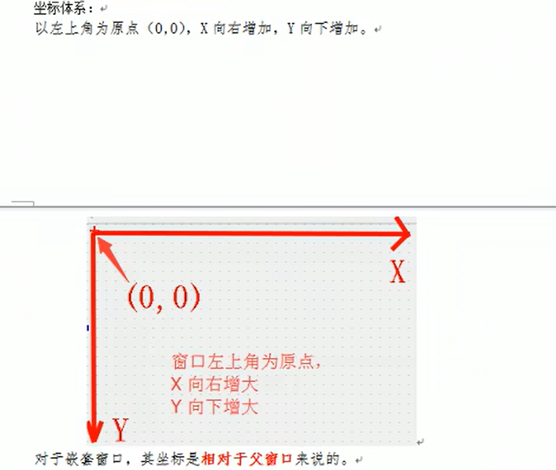


## 信号和槽

### 基本概念

- 本质：信号-》事件    槽-》处理事件的方法或者函数   二者通过一定关系连接
- 优点：松散耦合。（信号发送方 与 信号处理方 本身没有联系   通过 connect 连接在一起）
- 使用：
	- `connect(信号发送方，发送的信号（给函数的地址），信号接受方，处理的槽函数（给函数地址）);`
	- eg.     connect(myBtn,&MyPushBotton:: clicked, this,&MyWidget:: close);               // MyPushBotton 可以换成继承的父类


### 技巧

- 使用 Qt 助手查找时，注意  Signals（信号）和  Public Slots（槽） ，如果没有找一下最后的函数，看一下继承与什么父类，在通过父类查找。

	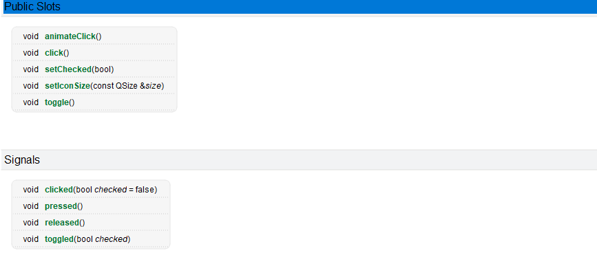 

	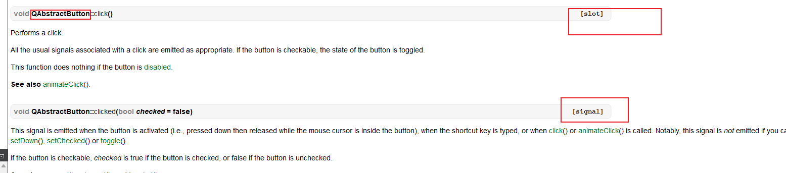


### 自定义信号和槽

- 自定义信号 
	- 需要放到类中的 signals 下面
	- 无返回值 需要声明 不需要实现
	- 可有参数 可重载
- 自定义槽
	- 需要放到类中的 public 或者 public slots（低版本必须放在 public slots）下   可以私有 private slots
	- 无返回值 需要声明 需要实现  
	- 可有参数 可重载
- 自定义触发
	- emit 关键字  调用信号      一般封装到函数中	
	- 信号连接信号 触发信号


示例：

```c++
//student.h
#ifndef STUDENT_H
#define STUDENT_H

#include <QObject>

class Student : public QObject
{
    Q_OBJECT
public:
    explicit Student(QObject *parent = nullptr);

    /* 槽函数 */
    //有参 无返回 需实现 可重载
    void dining();


signals:
};

#endif // STUDENT_H


//student.cpp
#include "student.h"
#include <QDebug>

Student::Student(QObject *parent)
    : QObject{parent}
{}

void Student::dining(){

    qDebug() << "冲出教室 吃饭！";
}


//teacher.h
#ifndef TEACHER_H
#define TEACHER_H

#include <QObject>

class Teacher : public QObject
{
    Q_OBJECT
public:
    explicit Teacher(QObject *parent = nullptr);

signals:
    // 有参无返回 不需要实现 可重载
    void classIsOver();

};

#endif // TEACHER_H


//teacher.cpp
#include "teacher.h"

Teacher::Teacher(QObject *parent)
    : QObject{parent}
{}


//widget.h
#ifndef WIDGET_H
#define WIDGET_H

#include <QWidget>
#include "student.h"
#include "teacher.h"

class Widget : public QWidget
{
    Q_OBJECT

public:
    Widget(QWidget *parent = nullptr);
    ~Widget();

private:
    void By12();

    Student *m_st;
    Teacher *m_th;
};
#endif // WIDGET_H


//widget.cpp
#include "widget.h"


//12:00(触发条件)   老师 发出 下课信号     学生 冲向食堂

Widget::Widget(QWidget *parent)
    : QWidget(parent)
{
    //创建对象 同时将父对象告知
    this->m_th = new Teacher(this);
    this->m_st = new Student(this);

    connect(this->m_th,&Teacher::classIsOver,this->m_st,&Student::dining);

    this->By12();
    //emit this->m_th->classIsOver();
}

void Widget::By12()
{
    //触发信号
    emit this->m_th->classIsOver();

}

Widget::~Widget() {}

```


注：先连接，在触发，才能生效


### 自定义信号和槽重载问题解决

- 连接时，使用函数指针     void(指针名)（参数列表） = 函数地址


示例：

```c++
//student.h
#ifndef STUDENT_H
#define STUDENT_H

#include <QObject>

class Student : public QObject
{
    Q_OBJECT
public:
    explicit Student(QObject *parent = nullptr);

    /* 槽函数 */
    //有参 无返回 需实现 可重载
    void dining();
	//重载
    void dining(QString food);


signals:
};

#endif // STUDENT_H


//student.cpp
#include "student.h"
#include <QDebug>

Student::Student(QObject *parent)
    : QObject{parent}
{}

void Student::dining(){

    qDebug() << "冲出教室 吃饭！";
}
void Student::dining(QString food)
{

    //Qstring类型打印会出现“”
    //解决“” 先转换成QByteArray 在使用QByteArray的成员函数data()转换成char *
    qDebug() << "冲出教室 吃饭！吃:" << food.toUtf8().data();
    //先转换成std::string 在换成 c_str
    qDebug() << "冲出教室 吃饭！吃:" << food.toStdString().c_str();

}

//teacher.h
#ifndef TEACHER_H
#define TEACHER_H

#include <QObject>

class Teacher : public QObject
{
    Q_OBJECT
public:
    explicit Teacher(QObject *parent = nullptr);

signals:
    // 有参无返回 不需要实现 可重载
    void classIsOver();
	//重载
    void classIsOver(QString food);
};

#endif // TEACHER_H


//teacher.cpp
#include "teacher.h"

Teacher::Teacher(QObject *parent)
    : QObject{parent}
{}


//widget.h
#ifndef WIDGET_H
#define WIDGET_H

#include <QWidget>
#include "student.h"
#include "teacher.h"

class Widget : public QWidget
{
    Q_OBJECT

public:
    Widget(QWidget *parent = nullptr);
    ~Widget();

private:
    void By12();

    Student *m_st;
    Teacher *m_th;
};
#endif // WIDGET_H


//widget.cpp
#include "widget.h"


//12:00(触发条件)   老师 发出 下课信号     学生 冲向食堂

Widget::Widget(QWidget *parent)
    : QWidget(parent)
{
    //创建对象 同时将父对象告知
    this->m_th = new Teacher(this);
    this->m_st = new Student(this);

    //出现重载版本后 编译器不知道用哪一个信号和槽
    //使用函数指针  void(指针名)（参数列表） = 函数地址
    void(Teacher:: *teacher)(QString) = &Teacher::classIsOver;
    void(Student:: *student)(QString) = &Student::dining;
    connect(this->m_th,teacher,this->m_st,student);

    this->By12();
}

void Widget::By12()
{
    //触发信号
    emit this->m_th->classIsOver();

}

Widget::~Widget() {}

```


### 拓展

- 信号链（信号连接信号）
	connect(发送方 1，发送信号 1，发送方 2，发送信号 2);   

	connect(发送方 2，发送信号 2，接受方，槽函数); 

- 断开信号
	disconnect(发送方，发送信号，接受方，槽函数);     //参数和 connect 一样

- 一个信号 连接 多个槽

- 多个信号 连接 同一个槽

- 信号和槽的参数    类型必须一一对应

- 信号和槽的参数   数量可以不对应        但只能信号的参数个数 **多于** 槽的参数个数（且信号参数列表中存在槽的所有参数类型）

	- clicked（）参数列表只有 bool  所以不能直接连接一个及以上参数的槽函数   可以通过自定义函数进行间接连接 或者  Lambda 表达式

- Qt4 版本之前的连接方式
	connect(发送方，SIGNAL(信号函数())，接受方，SLOT(槽函数()));       //缺点：不会做类型检测，会在运行后才能报错   **不推荐** 


示例：

```c++
//同上
Widget::Widget(QWidget *parent)
    : QWidget(parent)
{
    //创建对象 同时将父对象告知
    this->m_th = new Teacher(this);
    this->m_st = new Student(this);

    //出现重载版本后 编译器不知道用哪一个信号和槽
    //使用函数指针  void(指针名)（参数列表） = 函数地址
    void(Teacher:: *teacher)(QString) = &Teacher::classIsOver;
    void(Student:: *student)(QString) = &Student::dining;
    connect(this->m_th,teacher,this->m_st,student);

    this->By12();
    //emit this->m_th->classIsOver();

    //信号连接信号
    QPushButton *btn = new QPushButton("12：00",this);

    void(Teacher:: *teacher1)(void) = &Teacher::classIsOver;
    void(Student:: *student1)(void) = &Student::dining;
    connect(this->m_th,teacher1,this->m_st,student1);
    connect(btn,&QPushButton::clicked,this->m_th,teacher1);

     //断开信号
    disconnect(btn,&QPushButton::clicked,this->m_th,teacher1);
}

```


### Lambda 表达式（用于一个信号连接多个槽函数   或者   多个信号连接一个槽函数）

- 匿名函数 或者 闭包
- 用于定义并创建匿名的函数对象
- 低版本使用需要在 .pro 文件中 加 CONFIG += c++11
- [函数对象参数]（操作符重载函数参数）mutable -> 返回值类型{函数体}  

  - 后面变成 最后加上()变为调用     
  - 函数对象参数（捕获参数）形式：
    - 空：没有使用任何函数对象参数。
    - `=`：函数体内可以使用 Lambda 所在作用范围内所有可见的局部变量（包括 Lambda 所在类的 this），并且是 **值传递方式**（相当于编译器隐式为我们按值传递了所有局部变量）。
    - `&`：函数体内可以使用 Lambda 所在作用范围内所有可见的局部变量（包括 Lambda 所在类的 this），并且是 **引用传递方式**（相当于编译器隐式为我们按引用传递了所有局部变量）。
    - `this`：函数体内可以使用 Lambda 所在类中的成员变量。引用捕获
    - `*this`：值捕获
    - `a`：将 a 按值传递传递。按值传递传递，函数体内不能修改传递进来的 a 的拷贝，可以标记该传参 const 的。**要修改传递进来的 a 的拷贝，可以添加 mutable 修饰符**。
    - `&a`：将 a 按引用传递。
    - `a, &b.` 将 a 按值进行传递，b 按引用进行传递。
    - `=, &a, &b.` 除 a 和 b 按引用进行传递外，其他参数都按值进行传递。
    - `&, a, b.` 除 a 和 b 按值进行传递外，其他参数都按引用进行传递。
  - 操作符重载函数参数：标识重载的操作符的参数，没有参数时，这部分可以省略。参数可以通过按值（如：`(a, b)`）和按引用（如：`(&a, &b)`）两种方式进行传递。

  - 可修改标示符：`mutable` 关键词，这部分可以省略。按值传递函数对象参数时，加上 `mutable` 修饰符后，可以修改按值传递进来的拷贝（注意是能修改拷贝，而不是原本的参数值）。

  	```C++
  	QPushButton * myBtn = new QPushButton(this);
  	QPushButton * myBtn2 = new QPushButton(this);
  	myBtn2->move(100, 100);
  	
  	int m = 10;
  	
  	//mutable 修改拷贝值，而不会改变原来的值
  	connect(myBtn, &QPushButton::clicked, this, [m]() mutable { m = 100 + 10; qDebug() << m; });
  	
  	connect(myBtn2, &QPushButton::clicked, this, [=] { qDebug() << m; });
  	
  	qDebug() << m;
  	```

  - 函数返回值： -> 返回值类型，标识函数返回值的类型。当返回值为 void，或者函数体中只有一处 return 的地方（比如编译器可以自动推断出返回值类型）时，这部分可以省略。如果有返回值，可以在-> 后面写一个返回值类型

  - 是函数体： {}，标识函数的实现，这部分不能省略，但函数体可以为空。

- ```c++
	// 匿名函数的定义, 程序执行这个匿名函数是不会被调用的
	[](){
	    qDebug() << "hello, 我是一个lambda表达式...";
	};
	
	// 匿名函数的定义+调用:
	int ret = [](int a) -> int
	{
	    return a+1;
	}(100);  // 100是传递给匿名函数的参数
	
	
	
	//在Lambda表达式的捕获列表中也就是 []内部添加不同的关键字, 就可以在函数体中使用外部变量了。
	// 在匿名函数外部定义变量
	int a=100, b=200, c=300;
	// 调用匿名函数
	[](){
	    // 打印外部变量的值
	    qDebug() << "a:" << a << ", b: " << b << ", c:" << c;  // error, 不能使用任何外部变量
	}
	
	[&](){
	    qDebug() << "hello, 我是一个lambda表达式...";
	    qDebug() << "使用引用的方式传递数据: ";
	    qDebug() << "a+1:" << a++ << ", b+c= " << b+c;
	}();
	
	// 值拷贝的方式使用外部数据
	[=](int m, int n)mutable{
	    qDebug() << "hello, 我是一个lambda表达式...";
	    qDebug() << "使用拷贝的方式传递数据: ";
	    // 拷贝的外部数据在函数体内部是只读的, 如果不添加 mutable 关键字是不能修改这些只读数据的值的
	    // 添加 mutable 允许修改的数据是拷贝到函数内部的副本, 对外部数据没有影响
	    qDebug() << "a+1:" << a++ << ", b+c= " << b+c;
	    qDebug() << "m+1: " << ++m << ", n: " << n;
	}(1, 2);
	
	```

	


## 资源文件

### 添加 ui 文件

#### 新建时添加 ui 文件

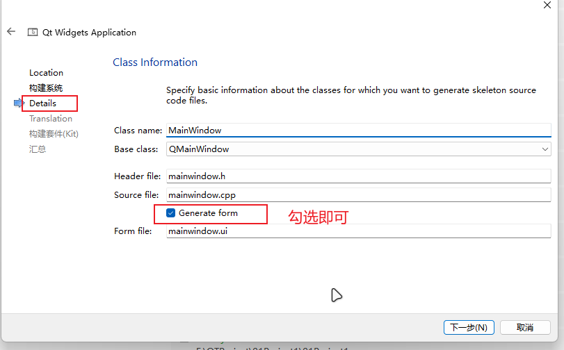


#### 已经创建的文件中添加 ui 文件

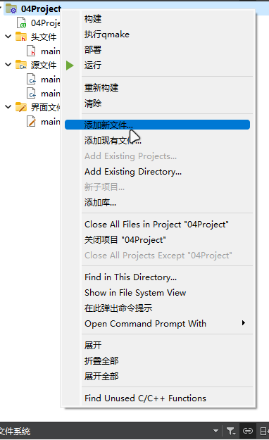

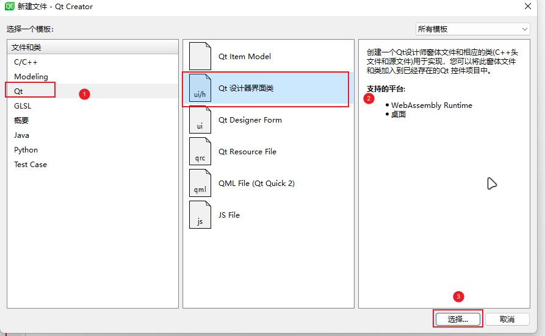

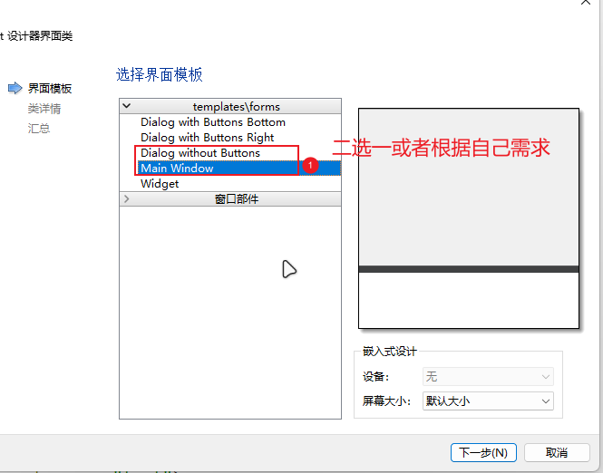

### 使用 ui 文件

使用时，注意有些地方需要敲回车确定

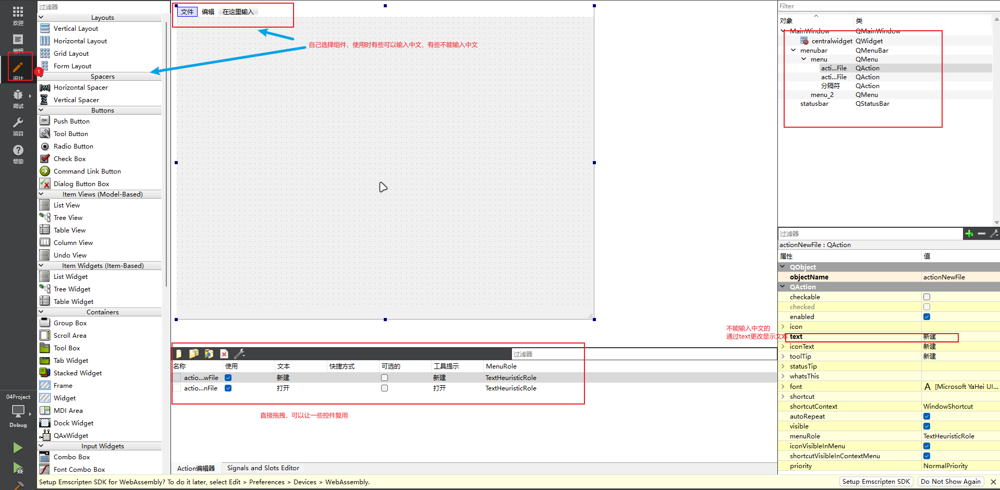

### 添加资源文件

#### 创建资源文件

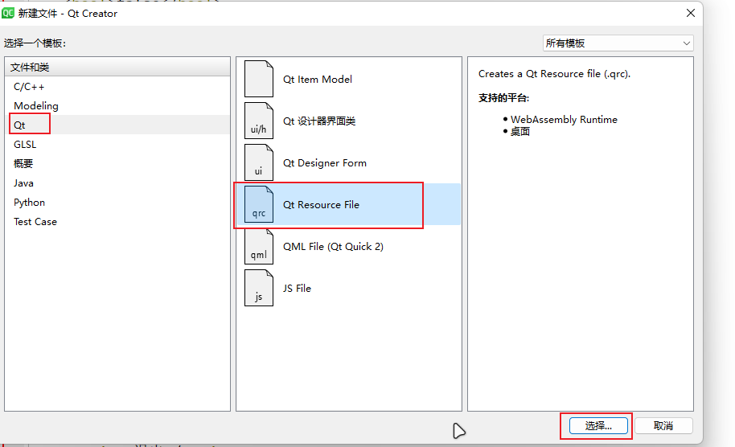

#### 回到资源文件界面

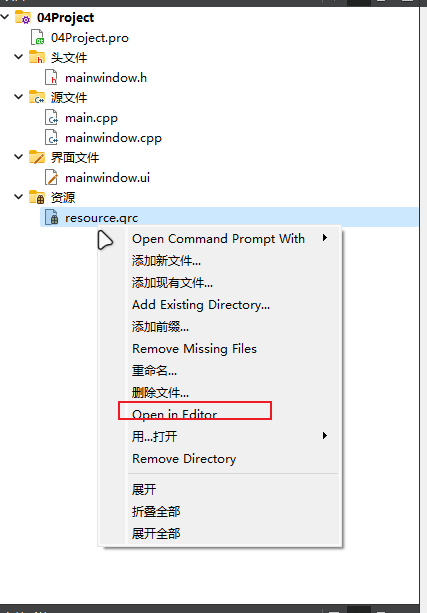

#### 添加资源

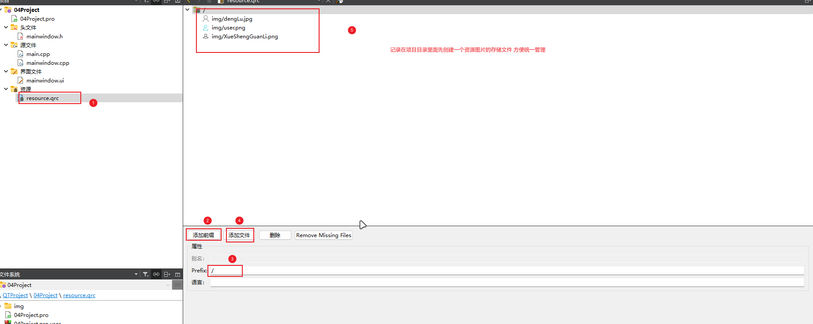

#### 使用

```c++
//使用Qt资源文件 :+前缀名+资源名
//使用的对象-> setIcon(QIcon( ":+前缀名+资源名"));
ui->actionNewFile->setIcon(QIcon(":/img/dengLu.jpg"));
ui->actionOpenFile->setIcon(QIcon(":/img/user.png"));
```


## 界面布局

### 布局的样式

| 布局样式         | 描述                            | 行数       | 列数        |
| ---------------- | ------------------------------- | ---------- | ----------- |
| 水平布局         | 布局中的所有的控件水平排列      | 1行        | N列（N>=1） |
| 垂直布局         | 布局中的所有的控件垂直排列      | N行(N>=1） | 1列         |
| 网格（栅格）布局 | 布局中的所有的控件垂直+水平排列 | N行        | N列 (N>=1） |

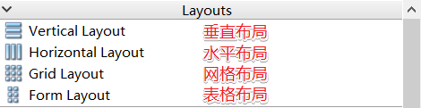

### 控件布局

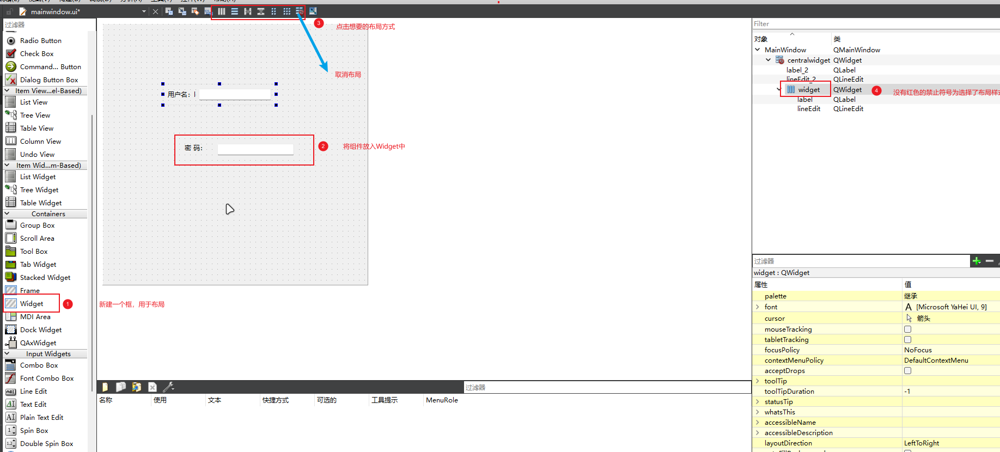


### 弹簧

用于自适应控件之间的距离。

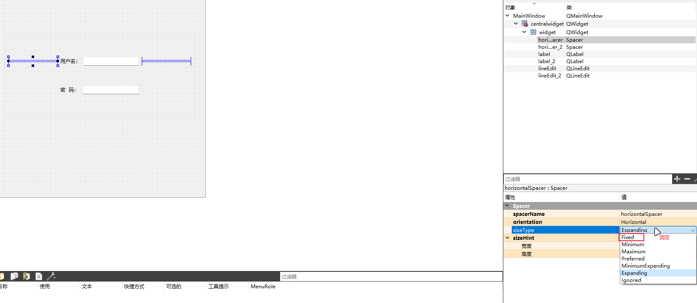

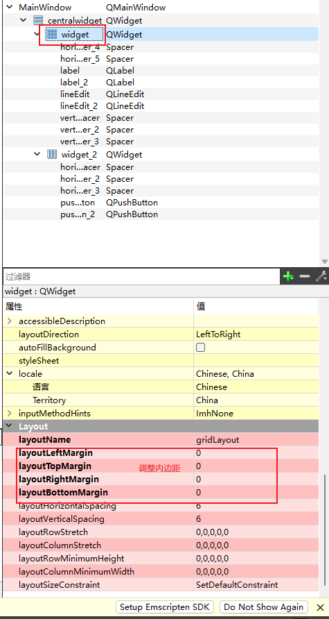

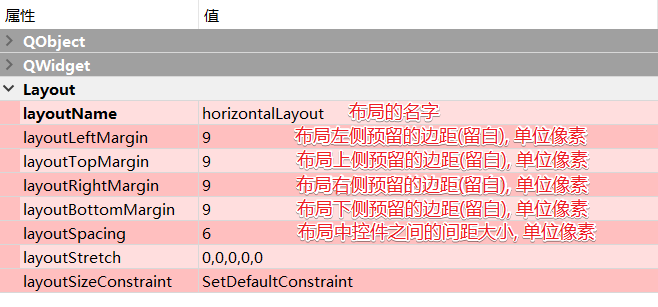

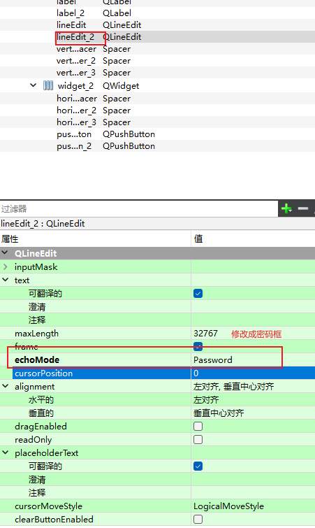

- 弹簧属性

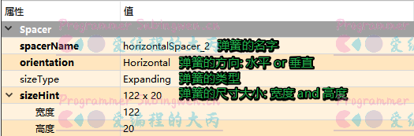

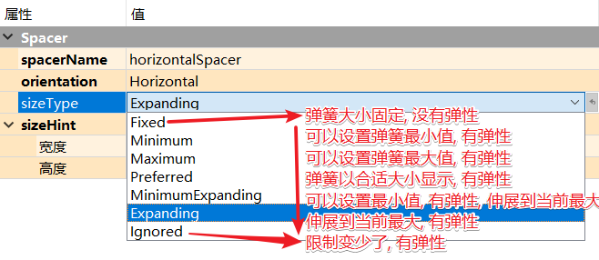

### API实现

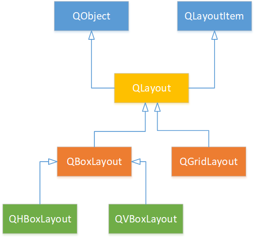

| 布局样式         | 类名        |
| ---------------- | ----------- |
| 水平布局         | QHBoxLayout |
| 垂直布局         | QVBoxLayout |
| 网格（栅格）布局 | QGridLayout |

#### QLayout

```C++
// 在布局最后面添加一个窗口
void QLayout::addWidget(QWidget *w);
// 将某个窗口对象从布局中移除, 窗口对象如果不再使用需要自己析构
void QLayout::removeWidget(QWidget *widget);
// 设置布局的四个边界大小, 即: 左、上、右和下的边距。
void QLayout::setContentsMargins(int left, int top, int right, int bottom);
// 设置布局中各个窗口之间的间隙大小
void setSpacing(int);

```

#### QHBoxLayout

```c++
// 创建符窗口对象
QWidget *window = new QWidget;
// 创建若干个子窗口对象
QPushButton *button1 = new QPushButton("One");
QPushButton *button2 = new QPushButton("Two");
QPushButton *button3 = new QPushButton("Three");
QPushButton *button4 = new QPushButton("Four");
QPushButton *button5 = new QPushButton("Five");

// 创建水平布局对象
QHBoxLayout *layout = new QHBoxLayout;
// 将子窗口添加到布局中
layout->addWidget(button1);
layout->addWidget(button2);
layout->addWidget(button3);
layout->addWidget(button4);
layout->addWidget(button5);

// 将水平布局设置给父窗口对象
window->setLayout(layout);
// 显示父窗口
window->show();


```

#### QVBoxLayout

```c++
// 创建符窗口对象
QWidget *window = new QWidget;
// 创建若干个子窗口对象
QPushButton *button1 = new QPushButton("One");
QPushButton *button2 = new QPushButton("Two");
QPushButton *button3 = new QPushButton("Three");
QPushButton *button4 = new QPushButton("Four");
QPushButton *button5 = new QPushButton("Five");

// 创建垂直布局对象
QVBoxLayout *layout = new QVBoxLayout;
// 将子窗口添加到布局中
layout->addWidget(button1);
layout->addWidget(button2);
layout->addWidget(button3);
layout->addWidget(button4);
layout->addWidget(button5);

// 将水平布局设置给父窗口对象
window->setLayout(layout);
// 显示父窗口
window->show();


```

#### QGridLayout

```c++
// 构造函数
QGridLayout::QGridLayout();
QGridLayout::QGridLayout(QWidget *parent);

// 添加窗口对象到网格布局中
/*
参数:
  - widget: 添加到布局中的窗口对象
  - row: 添加到布局中的窗口对象位于第几行 (从0开始)
  - column: 添加到布局中的窗口对象位于第几列 (从0开始)
  - alignment: 窗口在布局中的对齐方式, 没有特殊需求使用默认值即可
*/
void QGridLayout::addWidget(
	QWidget *widget, int row, int column, 
Qt::Alignment alignment = Qt::Alignment());

/*
参数:
  - widget: 添加到布局中的窗口对象
  - fromRow: 添加到布局中的窗口对象位于第几行 (从0开始)
  - fromColumn: 添加到布局中的窗口对象位于第几列 (从0开始)
  - rowSpan: 添加的窗口从 fromRow 行开始跨越的行数
  - columnSpan: 添加的窗口从 fromColumn 列开始跨越的列数
  - alignment: 窗口在布局中的对齐方式, 没有特殊需求使用默认值即可
*/
void QGridLayout::addWidget(
QWidget *widget, int fromRow, int fromColumn, 
int rowSpan, int columnSpan, 
Qt::Alignment alignment = Qt::Alignment());

// 设置 column 对应的列的最新宽度, 单位: 像素
void QGridLayout::setColumnMinimumWidth(int column, int minSize);

// 设置布局中水平方向窗口之间间隔的宽度
void QGridLayout::setHorizontalSpacing(int spacing);

// 设置布局中垂直方向窗口之间间隔的宽度
void QGridLayout::setVerticalSpacing(int spacing);


//例子
// 创建父窗口对象
QWidget* window = new QWidget;
// 创建子窗口对象
QPushButton *button1 = new QPushButton("One");
QPushButton *button2 = new QPushButton("Two");
QPushButton *button3 = new QPushButton("Three");
QPushButton *button4 = new QPushButton("Four");
QPushButton *button5 = new QPushButton("Five");
QPushButton *button6 = new QPushButton("Six");
// 多行文本编辑框
QTextEdit* txedit = new QTextEdit;
txedit->setText("我占用了两行两列的空间哦。");

QGridLayout* layout = new QGridLayout;
// 按钮起始位置: 第1行, 第1列, 该按钮占用空间情况为1行1列
layout->addWidget(button1, 0, 0);
// 按钮起始位置: 第1行, 第2列, 该按钮占用空间情况为1行1列
layout->addWidget(button2, 0, 1);
// 按钮起始位置: 第1行, 第3列, 该按钮占用空间情况为1行1列
layout->addWidget(button3, 0, 2);
// 编辑框起始位置: 第2行, 第1列, 该按钮占用空间情况为2行2列
layout->addWidget(txedit, 1, 0, 2, 2);
// 按钮起始位置: 第2行, 第3列, 该按钮占用空间情况为1行1列
layout->addWidget(button4, 1, 2);
// 按钮起始位置: 第3行, 第3列, 该按钮占用空间情况为1行1列
layout->addWidget(button5, 2, 2);
// 按钮起始位置: 第4行, 第1列, 该按钮占用空间情况为1行3列
layout->addWidget(button6, 3, 0, 1, 3);

// 网格布局设置给父窗口对象
window->setLayout(layout);
// 显示父窗口
window->show();  

```


## ui 控件

### 按钮控件

#### 工具按钮

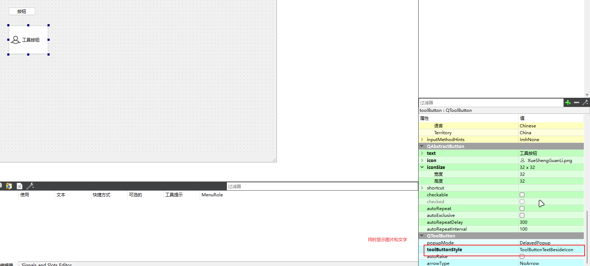

下面的 autoRasie  选上 变成突出风格


#### 单选按钮

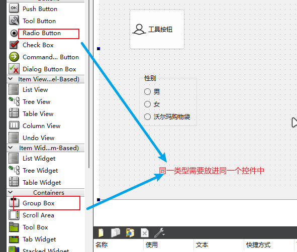

```c++
//默认男选择
    ui->radioButton->setChecked(true);

    connect(ui->radioButton_3,&QRadioButton::clicked,[=](){
        qDebug() << "多性别人士";
    });
```

#### 复选按钮

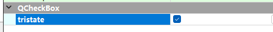

```c++
//stateChanged 获取按钮状态  1为半选  2为全选   0为不选
    connect(ui->checkBox_3,&QCheckBox::stateChanged,[=](int state){
        qDebug() << state;
    });
```

### QListWidget 控件

```c++
    //设置List widget
    //添加一行 但是可以设置文本位置
    QListWidgetItem *item = new QListWidgetItem("锄禾日当午");
    ui->listWidget->addItem(item);
    item->setTextAlignment(Qt::AlignHCenter);   //居中

    //添加一个文本 但是不可以设置文本位置
    QStringList stl;                            //qt风格的List<String>
    stl << "汗滴留下土" << "谁知盘中餐" << "粒粒皆辛苦";
    ui->listWidget->addItems(stl);
```

### QTreeWidget

```c++
    //treeWidget 控件
    //添加表头
    ui->treeWidget->setHeaderLabels(QStringList() << "英雄" << "英雄简介");

    //添加头节点
    QTreeWidgetItem * i1 = new QTreeWidgetItem(QStringList() << "打野");
    QTreeWidgetItem * i2 = new QTreeWidgetItem(QStringList() << "射手");
    QTreeWidgetItem * i3 = new QTreeWidgetItem(QStringList() << "法师");
    ui->treeWidget->addTopLevelItem(i1);
    ui->treeWidget->addTopLevelItem(i2);
    ui->treeWidget->addTopLevelItem(i3);

    //添加子节点
    QTreeWidgetItem *i11 = new QTreeWidgetItem(QStringList() << "兰陵王" << "隐身与爆发输出，兰陵王拥有强大的隐身能力，可以快速接近敌人并造成高额伤害。他的技能设计使得他在团战中也能发挥重要作用，是灵活多变的刺客型打野。");
    QTreeWidgetItem *i12 = new QTreeWidgetItem(QStringList() << "韩信" << "灵活位移与控制，韩信的位移技能多样，能够快速穿梭战场，避开敌人的攻击。他擅长控制敌人位置，为队友创造输出机会，是极具机动性的打野英雄。");
    QTreeWidgetItem *i13 = new QTreeWidgetItem(QStringList() << "李白" << "飘逸位移与群体削弱，李白以其高超的位移技巧和飘逸的战斗风格著称。他能够对多个敌人造成伤害，同时保持自身的灵活性，是团战中的重要输出点。");
    i1->addChild(i11);
    i1->addChild(i12);
    i1->addChild(i13);

    QTreeWidgetItem *i21 = new QTreeWidgetItem(QStringList() << "后羿" << "高爆发伤害，拥有远程消耗与控制能力，适合前期压制对手");
    QTreeWidgetItem *i22 = new QTreeWidgetItem(QStringList() << "孙尚香" << "高机动性与输出，能够快速切入战场并造成大量伤害。");
    QTreeWidgetItem *i23 = new QTreeWidgetItem(QStringList() << "公孙离" << "独特技能机制，集高伤害输出与灵活走位于一体，擅长爆发式击杀。");
    i2->addChild(i21);
    i2->addChild(i22);
    i2->addChild(i23);

    QTreeWidgetItem *i31 = new QTreeWidgetItem(QStringList() << "妲己" << "高爆发伤害，技能控制能力强，适合团队中消耗敌人和提供控制。");
    QTreeWidgetItem *i32 = new QTreeWidgetItem(QStringList() << "安琪拉" << "持续输出能力强，拥有位移技能，能够灵活走位躲避敌人攻击。");
    QTreeWidgetItem *i33 = new QTreeWidgetItem(QStringList() << "小乔" << "高伤害输出，技能带有范围伤害，适合在团战中造成大量AOE伤害。");
    i3->addChild(i31);
    i3->addChild(i32);
    i3->addChild(i33);
```

### QTableWidget

```c++
    //tableWidget 控件
    //设置列数
    ui->tableWidget->setColumnCount(3);

    //设置表头
    ui->tableWidget->setHorizontalHeaderLabels(QStringList() << "姓名" << "性别" << "年龄");

    //设置行数
    ui->tableWidget->setRowCount(5);

    //设置单元格
    //0,0开始
    //ui->tableWidget->setItem(0,0,new QTableWidgetItem("111"));
    QString str[] = {
        "妲己","女","20","后羿","男","22","鲁班大师","男","25","孙尚香","女","23","安琪拉","女","21"
    };
    for(int i = 0; i < 5; i++)
    {
        int t = i * 3;
        ui->tableWidget->setItem(i,0,new QTableWidgetItem(str[t]));
        ui->tableWidget->setItem(i,1,new QTableWidgetItem(str[t + 1]));
        ui->tableWidget->setItem(i,2,new QTableWidgetItem(str[t + 2]));
        
        //int 转 string  QString::number()
    }
```


### 其他控件

#### scroll Area(下拉条)

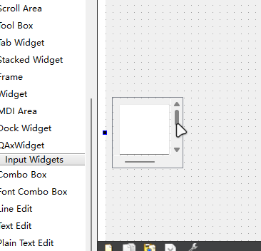

#### Tool Box(类似抽屉)

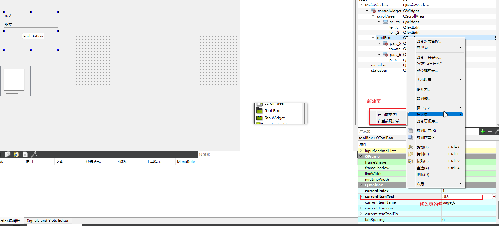

#### Tab Widget（类似网页切换）

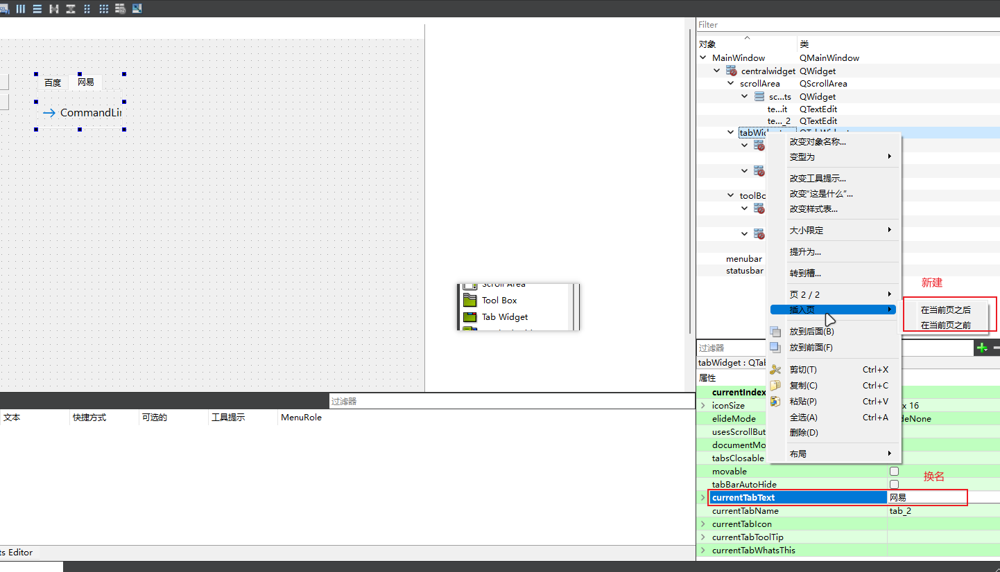


#### Stacked Widget（栈控件——翻页的切换页面）

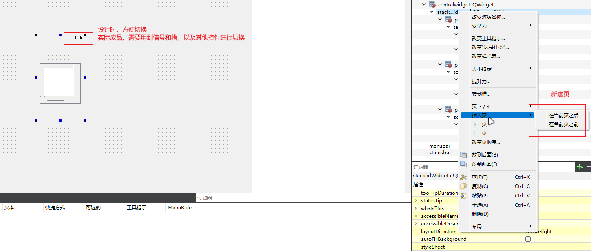

```c++
	//栈控件的控制  查看ui->stackedWidget中的currentIndex属性，才能知道其他控件在多少页
    //设置默认第一个页面
    ui->stackedWidget->setCurrentIndex(2);
    //Tool Box
    connect(ui->pushButton_3,&QPushButton::clicked,[=](){
        ui->stackedWidget->setCurrentIndex(2);

    });

    //Scroll Area
    connect(ui->pushButton_4,&QPushButton::clicked,[=](){
        ui->stackedWidget->setCurrentIndex(1);
    });

    //Tab Widget
    connect(ui->pushButton_5,&QPushButton::clicked,[=](){
        ui->stackedWidget->setCurrentIndex(0);
    });
```


#### combo Box(下拉框)     font Combo Box(字体下拉框)

```c++
    //下拉框
    ui->comboBox->addItem("1份宫保鸡丁");
    ui->comboBox->addItem("2份宫保鸡丁");
    ui->comboBox->addItem("3份宫保鸡丁");
    ui->comboBox->addItem("没有宫保鸡丁");

    connect(ui->pushButton_6,&QPushButton::clicked,[=](){
        ui->comboBox->setCurrentIndex(1);
        // ui->comboBox->setCurrentText("2份宫保鸡丁");
    });
```


- Text Edit 与 Plain Text Edit  都是文本框, 前者可以修改文字颜色、倾斜，后者纯文本
- Spin Box 数字加减控件(类似快速跳转翻页)
- Double Spin Box 带小数的数字加减控件
- Time Edit 时间的加减控件
- Date Edit 日期加减控件
- Date/Time Edit 日期/时间加减控件
- Horizontal Scroll Bar 水平滑动条
- Vertical Scroll Bar 垂直滑动条
- Horizontal  Slider 水平滑块
- Vertical Slider 垂直滑块
- Label 标签       
	- 显示图片 `ui->label->setPixmap(QPixmap(":/img/user.png"));`       
	- 显示动图 `QMovie *movie = new QMovie(".gif资源");    ui->label->setMovie(movie);   movie->start();	//播放 `


### 自定义控件封装

#### 创建 ui 文件

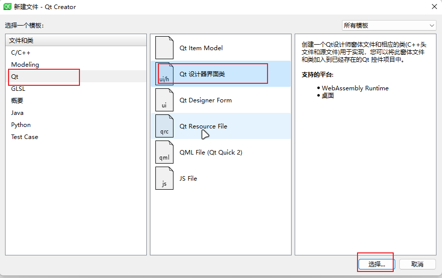

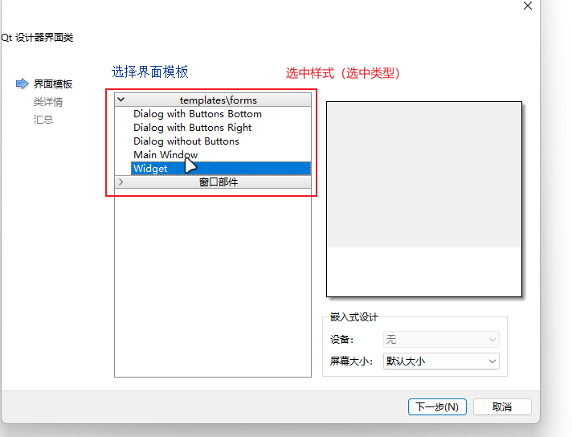

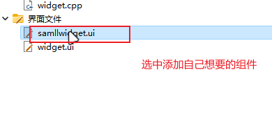

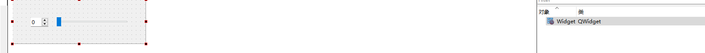


#### 引入到其他窗口界面中

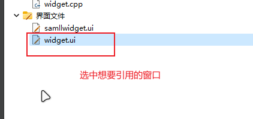

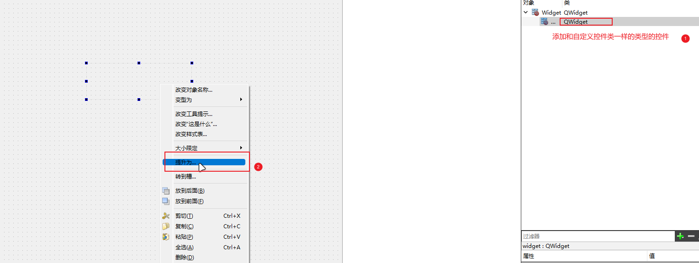

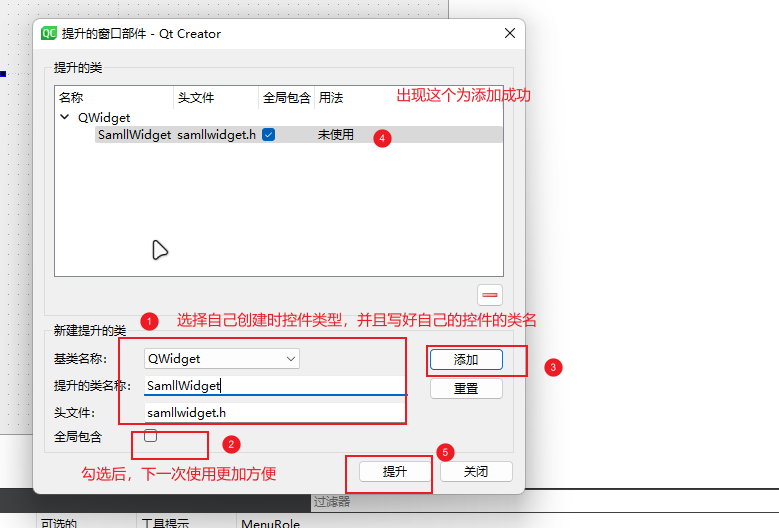

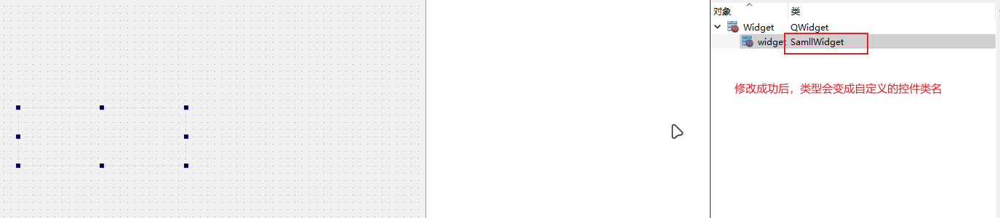


#### 给自己定义控件添加功能

```c++
//自定义控件.h
namespace Ui {
class SamllWidget;
}

class SamllWidget : public QWidget
{
    Q_OBJECT

public:
    explicit SamllWidget(QWidget *parent = nullptr);
    ~SamllWidget();

    //获取num
    int getNum();

    //设置num
    void setNum(int num);

    //触发信号
    // void change(int num);

signals:
    // 自定义信号
    void numChanged(int num);

public slots:
    // 触发信号
    void change(int num);


private:

    Ui::SamllWidget *ui;
};

//自定义控件.cpp
SamllWidget::SamllWidget(QWidget *parent)
    : QWidget(parent)
    , ui(new Ui::SamllWidget)
{
    ui->setupUi(this);

    //横向滑块设置范围
    ui->horizontalSlider->setMaximum(100);
    ui->horizontalSlider->setMinimum(0);

    //设置spinBox的最大为100
    ui->spinBox->setMaximum(100);

    //给自定义控件设置功能    spinBox单向绑定horizontalSlider
    connect(ui->spinBox,&QSpinBox::valueChanged,ui->horizontalSlider,&QSlider::setValue);

    //horizontalSlider单向绑定spinBox
    connect(ui->horizontalSlider,&QAbstractSlider::sliderMoved,ui->spinBox,&QSpinBox::setValue);
}

//获取num
int SamllWidget::getNum()
{
    return ui->spinBox->value();
}

//设置num
void SamllWidget::setNum(int num)
{
    ui->spinBox->setValue(num);
}

// 触发信号
void SamllWidget::change(int num)
{
    emit numChanged(num); // 触发自定义信号
}

```

```c++
//主窗口
Widget::Widget(QWidget *parent)
    : QWidget(parent)
    , ui(new Ui::Widget)
{
    ui->setupUi(this);

    ui->lineEdit->setText(QString::number(ui->widget->getNum()));

    //+
    connect(ui->pushButton_2,&QPushButton::clicked,[=](){
        int num = 0;
        num = ui->widget->getNum();
        num++;
        if(num >= 100)
            num = 0;
        ui->widget->setNum(num);
        ui->lineEdit->setText(QString::number(num));
    });

    //-
    connect(ui->pushButton_3,&QPushButton::clicked,[=](){
        int num = 0;
        num = ui->widget->getNum();
        num--;
        if(num <= 0)
            num = 100;
        ui->widget->setNum(num);
        ui->lineEdit->setText(QString::number(num));
    });


    connect(ui->widget,&SamllWidget::numChanged,[=](int num){
        ui->lineEdit->setText(QString::number(num));
    });
}
```


## QEvent(事件)

事件都要重新实现，qt 文档中大多数在 Reimplemented Protected Functions 下面


### 鼠标事件

- 创建类，并且重写 enterEvent 和 leaveEvent 方法

- 改继承类型，改为和要操作的控件类型一致，如：我要操作 QLabel 控件，将继承改为 QLabel

- 在 ui 界面提升要操作的控件。
	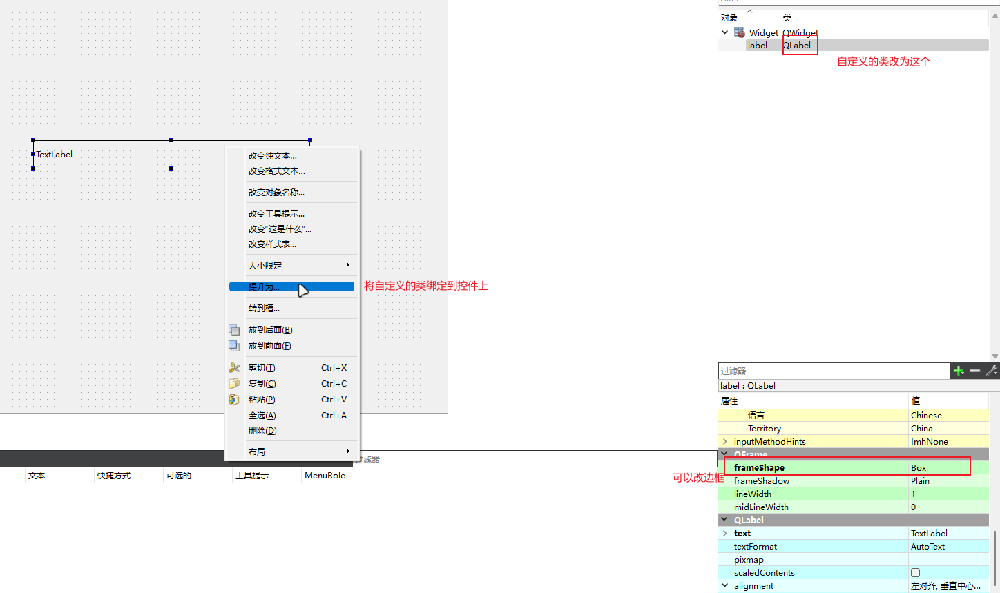

	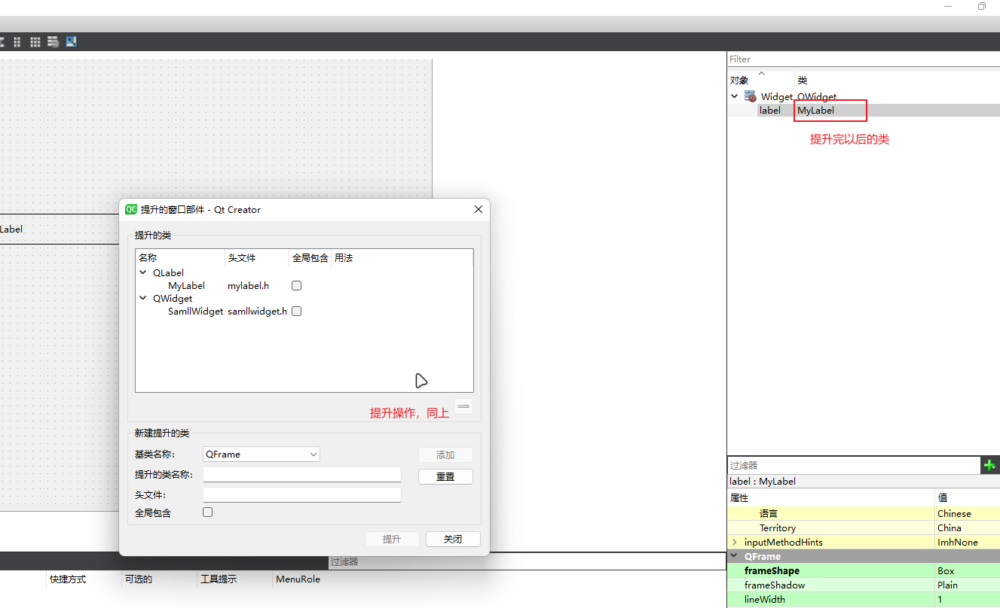

```c++
//MyLabel.h
#include <QLabel>

class MyLabel : public QLabel
{
public:
    explicit MyLabel(QWidget *parent = nullptr);

    //重写鼠标进入事件
    void enterEvent(QEnterEvent *event);
    //重写鼠标离开事件
    void leaveEvent(QEvent *event);

     //重写鼠标移动事件
    void mouseMoveEvent(QMouseEvent *ev);
    //重写鼠标按下事件
    void mousePressEvent(QMouseEvent *ev);
    //重写鼠标释放事件
    void mouseReleaseEvent(QMouseEvent *ev);

signals:
};


//MyLabel.cpp
#include "mylabel.h"
#include <QDebug>
#include<QMouseEvent>
#include <QPointF>

MyLabel::MyLabel(QWidget *parent)
    : QLabel{parent}
{
    //设置鼠标追踪 不需要按下以后才有移动事件的触发
    setMouseTracking(true);

}


//重写鼠标进入事件
void MyLabel::enterEvent(QEnterEvent *event)
{
    qDebug() << "鼠标进入";
    qDebug();
}

//重写鼠标离开事件
void MyLabel::leaveEvent(QEvent *event)
{
    qDebug() << "鼠标离开";
    qDebug();
}


//重写鼠标移动事件（过程值）
void MyLabel::mouseMoveEvent(QMouseEvent *ev)
{
    QPointF f = ev->globalPosition();
    //%1为第一个arg()的占位符
    //globalPosition是绝对位置  整个屏幕中的位置
    //scenePosition是相对位置 主窗口中的位置
    qDebug() << QString("鼠标移动到，x=%1,y=%2,globalx=%3,globaly=%4").arg(ev->scenePosition().x())
        .arg(ev->scenePosition().y()).arg(f.x()).arg(f.y());
    //qDebug() << f.rx() << " " << f.ry();   //和y()  x()没有差别  只是rx和ry只读
    qDebug();
}

//重写鼠标按下事件（瞬间值）
void MyLabel::mousePressEvent(QMouseEvent *ev)
{
    // if(ev->button() == Qt::LeftButton)
    // {
    //   qDebug() << "左键按下";
    // }
    // else if(ev->button() == Qt::MiddleButton)
    // {
    //   qDebug() << "中键按下";
    // }
    // else if(ev->button() == Qt::RightButton)
    // {
    //     qDebug() << "右键按下";
    // }

    if(ev->buttons() == (Qt::LeftButton | Qt::MiddleButton))
    {
        qDebug() << "左键和中间按下";
    }
    qDebug();
}

//重写鼠标释放事件（瞬间值）
void MyLabel::mouseReleaseEvent(QMouseEvent *ev)
{
    //buttons 用于检测按键组合 能用于检测按下事件和移动事件 释放事件中返回值依然是按下按键的值（排除引起该事件的按钮）
    //button 用于检测按键
    if(ev->buttons() == (Qt::LeftButton | Qt::MiddleButton))
    {
        qDebug() << "三键按下后，左键和中间按下,右键释放";
    }
    qDebug();
}


```


### 定时器事件（概念与 stm32 中学的基本类似）

- 在进行窗口程序的处理过程中, 经常要周期性的执行某些操作, 或者制作一些动画效果，看似比较复杂的问题使用定时器就可以完美的解决这些问题， Qt中提供了两种定时器方式一种是使用Qt中的事件处理函数这个在后续章节会给大家做细致的讲解，本节主要给大家介绍一下Qt中的定时器类 QTimer的使用方法。

	要使用它，只需创建一个QTimer类对象，然后调用其 start() 函数开启定时器，此后QTimer对象就会周期性的发出 timeout() 信号。

- ```c++
	// 构造函数
	// 如果指定了父对象, 创建的堆内存可以自动析构
	QTimer::QTimer(QObject *parent = nullptr);
	
	// 设置定时器时间间隔为 msec 毫秒
	// 默认值是0，一旦窗口系统事件队列中的所有事件都已经被处理完，一个时间间隔为0的QTimer就会触发
	void QTimer::setInterval(int msec);
	// 获取定时器的时间间隔, 返回值单位: 毫秒
	int QTimer::interval() const;
	
	// 根据指定的时间间隔启动或者重启定时器, 需要调用 setInterval() 设置时间间隔
	[slot] void QTimer::start();
	// 启动或重新启动定时器，超时间隔为msec毫秒。
	[slot] void QTimer::start(int msec);
	// 停止定时器。
	[slot] void QTimer::stop();
	
	// 设置定时器精度
	/*
	参数: 
	    - Qt::PreciseTimer -> 精确的精度, 毫秒级
	    - Qt::CoarseTimer  -> 粗糙的精度, 和1毫秒的误差在5%的范围内, 默认精度
	    - Qt::VeryCoarseTimer -> 非常粗糙的精度, 精度在1秒左右
	*/
	void QTimer::setTimerType(Qt::TimerType atype);
	Qt::TimerType QTimer::timerType() const;	// 获取当前定时器的精度
	
	// 如果定时器正在运行，返回true; 否则返回false。
	bool QTimer::isActive() const;
	
	// 判断定时器是否只触发一次
	bool QTimer::isSingleShot() const;
	// 设置定时器是否只触发一次, 参数为true定时器只触发一次, 为false定时器重复触发, 默认为false
	void QTimer::setSingleShot(bool singleShot);
	
	
	
	
	//这个类的信号只有一个, 当定时器超时时，该信号就会被发射出来。给这个信号通过conect()关联一个槽函数, 就可以在槽函数中处理超时事件了。
	[signal] void QTimer::timeout();
	
	
	
	//静态方法  不创建QTimer对象
	// 其他同名重载函数可以自己查阅帮助文档
	/*
	功能: 在msec毫秒后发射一次信号, 并且只发射一次
	参数:
		- msec:     在msec毫秒后发射信号
		- receiver: 接收信号的对象地址
		- method:   槽函数地址
	*/
	[static] void QTimer::singleShot(
	        int msec, const QObject *receiver, 
	        PointerToMemberFunction method);
	
	
	
	//例子
	//周期性定时器
	// 创建定时器对象
	QTimer* timer = new QTimer(this);
	  
	// 修改定时器对象的精度
	timer->setTimerType(Qt::PreciseTimer);
	  
	// 按钮 loopBtn 的点击事件
	// 点击按钮启动或者关闭定时器, 定时器启动, 周期性得到当前时间
	connect(ui->loopBtn, &QPushButton::clicked, this, [=]()
	{
	    // 启动定时器
	    if(timer->isActive())
	    {
	        timer->stop();  // 关闭定时器
	        ui->loopBtn->setText("开始");
	    }
	    else
	    {
	        ui->loopBtn->setText("关闭");
	        timer->start(1000); // 1000ms == 1s
	    }
	});
	  
	connect(timer, &QTimer::timeout, this, [=]()
	{
	    QTime tm = QTime::currentTime();
	    // 格式化当前得到的系统时间
	    QString tmstr = tm.toString("hh:mm:ss.zzz");
	    // 设置要显示的时间
	    ui->curTime->setText(tmstr);
	});
	  
	
	
	//一次性定时器
	// 点击按钮 onceBtn 只发射一次信号
	// 点击按钮一次, 发射一个信号, 得到某一个时间点的时间
	connect(ui->onceBtn, &QPushButton::clicked, this, [=]()
	{
	     // 获取2s以后的系统时间, 不创建定时器对象, 直接使用类的静态方法
	    QTimer::singleShot(2000, this, [=](){
	        QTime tm = QTime::currentTime();
	        // 格式化当前得到的系统时间
	        QString tmstr = tm.toString("hh:mm:ss.zzz");
	        // 设置要显示的时间
	        ui->onceTime->setText(tmstr);
	    });
	});
	  
	```

	


```c++
//widget.h
#include <QWidget>

QT_BEGIN_NAMESPACE
namespace Ui {
class Widget;
}
QT_END_NAMESPACE

class Widget : public QWidget
{
    Q_OBJECT

public:
    Widget(QWidget *parent = nullptr);
    ~Widget();

    //重写定时器事件
    void timerEvent(QTimerEvent *e);

private:
    int id1;            //定时器1的id
    int id2;            //定时器2的id
    int num3 = 1;       //定时器3的计数值
    Ui::Widget *ui;
};

//widget.cpp
#include "widget.h"
#include "ui_widget.h"
#include <QTimer>
#include <QPushButton>

Widget::Widget(QWidget *parent)
    : QWidget(parent)
    , ui(new Ui::Widget)
{
    ui->setupUi(this);

    //启动一个定时器
    id1 = startTimer(1000);                   //参数1 时间间隔（ms） 每隔xx毫秒调用定时器事件   返回值为定时器的唯一id

    id2 = startTimer(2000);

    //第二种定时器方式（信号和槽，非事件）
    QTimer *t = new QTimer(this);
    t->start(500);                             //0.5秒
    connect(t,&QTimer::timeout,[=](){
        ui->label_4->setText(QString::number(this->num3++));
    });

    //暂停
    connect(ui->pushButton,&QPushButton::clicked,[=](){
        if(t->isActive())              //ui->pushButton->text() == "暂停"   isActive() 是否在运行
        {
            t->stop();                      //暂停
            ui->pushButton->setText("继续");
        }
        else           //ui->pushButton->text() == "继续"
        {
            t->start();                     //重启
            ui->pushButton->setText("暂停");
        }
    });

    //清零
    connect(ui->pushButton_2,&QPushButton::clicked,[=](){
        // t->interval();                   //获取当前的毫秒数
        this->num3 = 1;
         ui->label_4->setText(QString::number(this->num3));
    });
}

//重写定时器事件
void Widget::timerEvent(QTimerEvent *e)
{
     //每隔1秒
    if(e->timerId() == id1)
    {
        static int num1 = 1;                    //静态变量 让函数第一次调用的时候才赋值，后面调用就用之前的值
        ui->label_2->setText(QString::number(num1++));
    }

    //每隔2秒
    if(e->timerId() == id2)
    {
        static int num2 = 1;                    //静态变量 让函数第一次调用的时候才赋值，后面调用就用之前的值
        ui->label_3->setText(QString::number(num2++));
    }
}

Widget::~Widget()
{
    delete ui;
}

```


### 事件分发器(event())

- bool event(QEvent *ev);
- 返回值为 bool 类型。如果返回 true，代表用户自己处理了该事件，不在向下分发（不分发给系统或者父类）。
- 事件分发器 介于 用户与事件之间，用户触发事件后，由事件分发器来告诉系统该事件是用户 自己处理（重写的 event 中处理） 还是系统处理（默认的对应事件函数）。

```c++
//mylabel.h
//重写事件分发器event
bool event(QEvent *e);


//mylabel.cpp
//重写事件分发器 用于拦截所有事件
bool MyLabel::event(QEvent *e)
{
    //处理拦截下的鼠标按下事件
    if(QEvent::MouseButtonPress == e->type())
    {
        //类型转换
        // QMouseEvent *ev = static_cast<QMouseEvent *>(e);             //static_cast<>() 基本类型之间的转换、上转型（从派生类到基类   子类到父类） 且不会进行继承关系的检查
        QMouseEvent *ev = dynamic_cast<QMouseEvent *>(e);               //dynamic_cast<>() 向下转型（从基类到派生类  父类到子类） 且会进行继承检查


        qDebug() << QString("用户自己的处理鼠标移动到，x=%1,y=%2,globalx=%3,globaly=%4").arg(ev->scenePosition().x()).arg(ev->scenePosition().y());

        return true;
    }

    //其他事件调用 父类的方法  默认处理
    return QLabel::event(e);
}
```

### 事件过滤器

- 在 event 之前可以通过事件过滤器，进行一次高级过滤

- 使用步骤

	- 给控件安装事件过滤器（控件调用）
	- 重写 evnetFilter()

	```c++
	//widget.h
	//重写事件过滤器
	bool eventFilter(QObject *obj, QEvent *ev);
	
	
	//widget.cpp
	Widget::Widget(QWidget *parent)
	    : QWidget(parent)
	    , ui(new Ui::Widget)
	{   
	
	    //给控件设置过滤器
	    //参数 父对象
	    ui->label->installEventFilter(this);
	
	}
	//重写事件过滤器
	//obj 控件类型
	//e 事件类型
	bool Widget::eventFilter(QObject *obj, QEvent *e)
	{
	    //过滤出label控件
	    if(ui->label == obj)
	    {
	        if(QEvent::MouseButtonDblClick == e->type())
	        {
	            //类型转换
	            QMouseEvent *ev = dynamic_cast<QMouseEvent *>(e);               //dynamic_cast<>() 向下转型（从基类到派生类  父类到子类） 且会进行继承检查
	
	            qDebug() << QString("过滤器过滤的鼠标事件，移动到，x=%1,y=%2,globalx=%3,globaly=%4").arg(ev->scenePosition().x()).arg(ev->scenePosition().y());
	
	            return true;
	        }
	    }
	
	    //其他事件 默认处理  交给父类
	    return QWidget::eventFilter(obj,e);
	
	}
	```


### QPainter(绘图)

#### 绘图事件

```c++
//widget.h
#include <QWidget>

QT_BEGIN_NAMESPACE
namespace Ui {
class Widget;
}
QT_END_NAMESPACE

class Widget : public QWidget
{
    Q_OBJECT

public:
    Widget(QWidget *parent = nullptr);
    ~Widget();

    //重写绘图事件
    void paintEvent(QPaintEvent *event);

private:
    Ui::Widget *ui;
};


//widget.cpp
#include "widget.h"
#include "ui_widget.h"
#include <QPainter>         //回画家类

Widget::Widget(QWidget *parent)
    : QWidget(parent)
    , ui(new Ui::Widget)
{
    ui->setupUi(this);
}

Widget::~Widget()
{
    delete ui;
}

//重写绘图事件
void Widget::paintEvent(QPaintEvent *event)
{
    //实例化画家对象  这里this 是告诉在哪里画（画画的地方）
    QPainter painter(this);

    //画线
    painter.drawLine(QPoint(0,0),QPoint(100,100));

    //画圆 本质是画椭圆  参数1：圆心 参数2：x轴的焦点 参数3：y轴的焦点
    painter.drawEllipse(QPoint(100,100),20,20);

    //画矩形
    //QRect构造重载版本1 QRect(QPoint(100,100),QPoint(200,200))  给两个对角的点
    //QRect构造重载版本2 QRect(QPoint(100,100),QSize(20,10))     给一个左上角的点，通过QSize()给长，宽
    //QRect构造重载版本3 QRect(100,100,100,100)                  给一个左上角的点，直接给长，宽
    //QRectF  使用浮点精度画矩形
    painter.drawRect(QRect(100,100,100,100));


    QPen pen;

    //要想同时设置样式、颜色等，需要先设置笔的样式
    pen.setColor(QColor(255,0,0));
    pen.setStyle(Qt::DotLine);


    //改变线条颜色 （换笔）  什么时候使用，那之后的线条就会变颜色
    painter.setPen(pen);

    //改变线条样式 但是不会改变文字的线条样式
    painter.setPen(pen);


    //设置文字样式
    QFont font;
    font.setBold(true);                 // 设置为粗体
    font.setItalic(true);               // 设置为斜体
    font.setFamily("Microsoft YaHei");  // 设置字体为微软雅黑
    font.setPointSize(14);              // 设置字体大小为14
    painter.setFont(font);


    //设置画刷 填充封闭图形的颜色  注意字和填充的顺序
    QBrush brush(QColor(255, 192, 203));
    brush.setStyle(Qt::HorPattern);          //设置画刷风格
    painter.setBrush(brush);

    painter.drawRect(QRect(300,300,100,100));                      //显示外面的框

    //画文字  在一个矩形框里写字
    painter.drawText(QRect(300,300,100,100),"你好世界，你好中国！");
}
```

#### 绘图高级设置

```c++
//widget.cpp
void Widget::paintEvent(QPaintEvent *event)
{
	//高级设置
    painter.drawEllipse(QPoint(100,400),50,50);

    //设置高锯齿 更精细 但是效率更低
    painter.setRenderHint(QPainter::Antialiasing);

    painter.drawEllipse(QPoint(200,400),50,50);

    //移动画家(将原点（0，0）移动到（100，0）)
    painter.translate(100,0);

    painter.drawEllipse(QPoint(200,400),50,50);     //不会重叠

    //保存画家状态
    painter.save();
    painter.translate(100,0);


    painter.drawEllipse(QPoint(200,400),50,50);

    //还原画家状态
    painter.restore();
    // painter.translate(200,0);
	
    painter.drawEllipse(QPoint(200,400),50,50); //与上一个重叠
}
```

#### 手动调用绘图事件(利用绘图类画图片中的图)

```c++
//widget.cpp

#include "widget.h"
#include "ui_widget.h"
#include <QPainter>         //回画家类
#include <QTimer>

Widget::Widget(QWidget *parent)
    : QWidget(parent)
    , ui(new Ui::Widget)
{
    ui->setupUi(this);

    QTimer *t = new QTimer(this);


    connect(ui->pushButton,&QPushButton::clicked,[=](){
        if(t->isActive())
        {
            t->stop();
            ui->pushButton->setText("启动");
        }
        else
        {
            t->start(500);
            ui->pushButton->setText("暂停");
        }

    });

    connect(t,&QTimer::timeout,[=](){
        posy += 20;
        if(posy > this->height())
        {
            posy = 0;
        }


        //手动调用绘图事件 用update()更新
        update();
    });
}
//重写绘图事件
void Widget::paintEvent(QPaintEvent *event)
{
    //实例化画家对象  这里this 是告诉在哪里画（画画的地方）
    QPainter painter(this);
    //绘制资源图片
    painter.drawPixmap(QRect(500,posy,20,20),QPixmap(":/img/user.png"));

}
```

#### 绘图设备

绘图设备是指继承自 **QPaintDevice** 的子类。Qt一共提供了四个这样的类，分别是：

- **QPixmap**：专门为图像在屏幕上的显示做了优化。（不同设备或者操作系统，会有不同的优化）
- **QBitmap**：是 QPixmap 的一个子类，它的色深限定为1。可以使用 QPixmap 的 **isQBitmap()** 函数来确定这个 QPixmap 是否是一个 QBitmap。（只有黑白两种颜色）
- **QImage**：专门为图像的像素级访问做了优化。（可以获取像素点，并且可以对获取的像素点进行赋值）
- **QPicture**：可以用来记录和重现 QPainter 的各类命令。


- QPixmap、QImage、QPicture的使用：

```c++
//widget.h
#include <QWidget>

QT_BEGIN_NAMESPACE
namespace Ui {
class Widget;
}
QT_END_NAMESPACE

class Widget : public QWidget
{
    Q_OBJECT

public:
    Widget(QWidget *parent = nullptr);
    ~Widget();


    //重写绘图事件
    void paintEvent(QPaintEvent *event);
private:
    Ui::Widget *ui;
};


//widget.cpp
#include "widget.h"
#include "ui_widget.h"
#include <QPixmap>
#include <QPainter>
#include <QImage>
#include <QPicture>

Widget::Widget(QWidget *parent)
    : QWidget(parent)
    , ui(new Ui::Widget)
{
    ui->setupUi(this);

    //创建 QPixmap绘图设备    如果没有指定到widget上，那么窗口什么也不会显示
    QPixmap pix(300,400);           //创建设备大小 300×400
    pix.fill(Qt::white);            //画布背景默认黑色 现在填充为白色
	//pix = pix.scaled(pix.width() * 0.5, pix.height() * 0.5);      //参数1：原宽 * 缩放倍数  参数2：原高 * 缩放倍数
        
    //创建画师
    QPainter pain(&pix);            //指定pix设备
    pain.setPen(Qt::green);         //设置成绿色
    pain.drawRect(100,100,100,100); //画一个矩形

    //保存设备  在该路径下创建pix.png进行保存
    pix.save("E:\\QTProject\\13Project\\img\\pix.png");
	


    //创建 QImage绘图设备  可以对像素点进行访问
    QImage img(300,400,QImage::Format_RGB32);       //宽 高 文件类型
    img.fill(Qt::white);                            //画布背景默认黑色 现在填充为白色
    QPainter pain1(&img);
    pain1.setPen(Qt::blue);                         //设置成绿色
    pain1.drawRect(100,100,100,100);                 //画一个矩形

    //保存
    img.save("E:\\QTProject\\13Project\\img\\img.png");


    //创建 QPicture绘图设备  记录和重现 绘图指令（代码）
    QPicture pic;
    QPainter pain2;
    pain2.begin(&pic);
    pain2.setPen(Qt::yellow);
    pain2.drawRect(100,100,100,100);
    pain2.end();

    //保存
    pic.save("E:\\QTProject\\13Project\\img\\pic.tj");      //文件名为自定义的（可以保证数据隐私），里面存储的是begin()~end() 之间的代码

}

Widget::~Widget()
{
    delete ui;
}

//重写绘图事件
void Widget::paintEvent(QPaintEvent *event)
{
    //指定到窗口
    // QImage img;
    // img.load(":/img/R-C.jpg");              //从文件中加载图片
    // QPainter p(this);

    // for(int i = 60; i < 100; i++)
    // {
    //     for(int j = 60; j < 100; j++)
    //     {
    //         QRgb va = qRgb(255,0,0);          //设置像素点的颜色
    //         img.setPixel(i,j,va);             //访问像素点
    //     }
    // }

    // p.drawImage(0,0,img);

    //重现代码
    QPicture pic;
    QPainter p(this);
    pic.load("E:\\QTProject\\13Project\\img\\pic.tj");      //加载
    p.drawPicture(0,0,pic);                      //复现绘图操作      不会完全覆盖 按照原图比例作画 drawPixmap(0,0,this->width(),this->height(),pix); 会拉伸图片
}
```


- QBitmap与QPixmap区别：

```cpp
void PaintWidget::paintEvent(QPaintEvent *)
{
    QPixmap pixmap("./Image/butterfly.png");
    QPixmap pixmap1("./Image/butterfly1.png");

    QBitmap bitmap("./Image/butterfly.png");
    QBitmap bitmap1("./Image/butterfly1.png");

    QPainter painter(this);
    painter.drawPixmap(0, 0, pixmap);
    painter.drawPixmap(200, 0, pixmap1);
    painter.drawPixmap(0, 130, bitmap);
    painter.drawPixmap(200, 130, bitmap1);
}
```

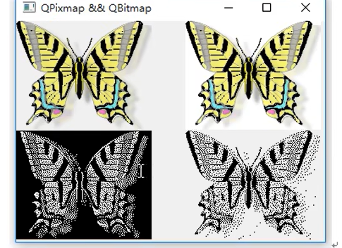

- 绘出了两张 `.png` 图片。`butterfly1.png` 是没有透明色的纯白背景，而 `butterfly.png` 是具有透明色的背景。我们分别使用 `QPixmap` 和 `QBitmap` 来加载它们。

- 注意它们的区别：
	- 白色的背景在 `QBitmap` 中消失了，而透明色在 `QBitmap` 中转换成了黑色；其他颜色则是使用点的疏密程度来体现的。


## QFile(对文件进行读写操作)

```c++
//widget.cpp
#include "widget.h"
#include "ui_widget.h"
#include <QFile>
#include <QFileDialog>
// #include <QStringConverter>
// #include <QStringDecoder>
// #include <QMessageBox>

Widget::Widget(QWidget *parent)
    : QWidget(parent)
    , ui(new Ui::Widget)
{
    ui->setupUi(this);

    connect(ui->pushButton,&QPushButton::clicked,[=](){
        //创建堆区文件对话框
        QString path = QFileDialog::getOpenFileName(this,"打开文件","../14Project/text");

        //放入lineEdit中
        ui->lineEdit->setText(path);

        //编码格式枚举类型 qt5 QTextCodec
        //QTextCodec *codec = QTextCodec::codecForName("gbk");
        //ui->textEdit->setText(codec->toUnicode(array));

        //std::optional<T> 是一个在标准库中提供的模板类，用于表示一个值可以有意义（存在）或者没有意义（不存在）的情况。
        //c++17提供std::optional<T> 是一个在标准库中提供的模板类，用于表示一个值可以有意义（存在）或者没有意义（不存在）的情况。
        /* eg:
std::optional<int> findNumber(bool found) {
if (found) {
    return 42;  // 返回有效的值
}
    return std::nullopt;  // 返回无效值
}

int main() {
    auto result = findNumber(true);
if (result) {
    std::cout << "Found number: " << *result << "\n";
} else {
    std::cout << "No number found.\n";
}
return 0;
}
        */

        //获取文本信息  默认获取的文本格式为utf-8（读文件）
        QFile qf(path);
        qf.open(QIODeviceBase::ReadOnly);           //只读方式打开

        QByteArray ba = qf.readAll();               //读取文件
        //通过读取一行 qf.readLine() 读取全部
        //QByteArray ba;
        // while(!qf.atEnd())
        // {
        //     ba += qf.readLine();
        // }


        qf.close();                                 //关闭文件
        ui->textEdit->setText(QString::fromLocal8Bit(ba));     //会进行隐式转换  QByteArray转存QString  将GBK转为UTF-8
        // ui->textEdit->setText(ba);
        //utf-8 转 GBK 数据.toLocal8Bit().data()


        //写文件
        QFile fW(path);
        fW.open(QIODeviceBase::Append);             //追加方式写入
        fW.write("\n");                             //换行
        QString t("哈哈哈哈哈哈哈哈哈");
        fW.write(t.toLocal8Bit().data());          //默认写入utf-8格式
        fW.close();
    });
}
```

### QFileInfo对文件信息的读取

```c++
//widget.cpp续
//获取文本信息  默认获取的文本格式为utf-8（读文件）
        QFile qf(path);
        qf.open(QIODeviceBase::ReadOnly);           //只读方式打开

        QByteArray ba = qf.readAll();               //读取文件
        //通过读取一行 qf.readLine() 读取全部
        //QByteArray ba;
        // while(!qf.atEnd())
        // {
        //     ba += qf.readLine();
        // }


        qf.close();                                 //关闭文件
        ui->textEdit->setText(QString::fromLocal8Bit(ba));     //会进行隐式转换  QByteArray转存QString  将GBK转为UTF-8
        // ui->textEdit->setText(ba);
        //utf-8 转 GBK 数据.toLocal8Bit().data()


        //写文件
        QFile fW(path);
        fW.open(QIODeviceBase::Append);             //追加方式写入
        fW.write("\n");                             //换行
        QString t("哈哈哈哈哈哈哈哈哈");
        fW.write(t.toLocal8Bit().data());          //默认写入utf-8格式
        fW.close();


        //读取文件的信息
        QFileInfo fif(path);
        qDebug() << "文件大小:" << fif.size() << " 后缀名:" << fif.suffix() << " 文件名称" << fif.fileName() << " 文件路径:" << fif.filePath();

        qDebug() << " 创建日期：" << fif.birthTime().toString("yyyy/MM/dd hh:mm:ss");
        qDebug() << "最后修改日期:" << fif.metadataChangeTime().toString("yyyy/MM/dd hh:mm:ss");
```


## 翻金币项目

### 主窗口

```c++
//mainscene.h
#ifndef MAINSCENE_H
#define MAINSCENE_H

#include <QMainWindow>
#include "chooselevelscene.h"

QT_BEGIN_NAMESPACE
namespace Ui {
class MainScene;
}
QT_END_NAMESPACE

class MainScene : public QMainWindow
{
    Q_OBJECT

public:
    MainScene(QWidget *parent = nullptr);
    ~MainScene();


    //重写绘图事件
    void paintEvent(QPaintEvent *event);


    //创建关卡场景
    ChooseLevelScene *m_choose = NULL;
private:
    Ui::MainScene *ui;
};
#endif // MAINSCENE_H


//mainscene.cpp
#include "mainscene.h"
#include "ui_mainscene.h"
#include "mypushbutton.h"
#include <QPainter>
#include <QPixmap>
#include <QImage>
#include <QTimer>
#include <QPushButton>
#include <QSoundEffect>
#include <QUrl>

MainScene::MainScene(QWidget *parent)
    : QMainWindow(parent)
    , ui(new Ui::MainScene)
{
    ui->setupUi(this);

    //设置窗口固定大小
    this->setFixedSize(320,588);

    //设置窗口图标
    this->setWindowIcon(QIcon(":/img/Coin0001.png"));

    //设置标题
    this->setWindowTitle("翻金币");


    /* 退出功能 */
    connect(ui->quit,&QAction::triggered,this,&MainScene::close);


    //准备按钮音效
    QSoundEffect *sound = new QSoundEffect(this);           //绑定父对象
    sound->setSource(QUrl::fromLocalFile(":/img/TapButtonSound.wav"));


    /* 设置start按钮 */
    QString normalImg = ":/img/MenuSceneStartButton.png";
    MyPushButton *startBtn = new MyPushButton(normalImg);
    startBtn->setParent(this);                  //绑定父对象
    int btnW = this->width() * 0.5 - startBtn->width() * 0.5;
    int btnH = this->height() * 0.7;
    startBtn->move(btnW,btnH);                  //移动按钮
    this->setFocusPolicy(Qt::NoFocus);          // 去除焦点边界 ‘虚线边框’

    //实例化 关卡场景
    this->m_choose = new ChooseLevelScene;

    //监听back信号,进行返回
    connect(this->m_choose,&ChooseLevelScene::chooseLevelSceneBack,[=](){
         QTimer::singleShot(500,this->m_choose,[=](){
            //保持前后窗口位置一致
            this->setGeometry(this->m_choose->geometry());
            this->show();
            this->m_choose->hide();
         });
    });


    /* 设置按钮按下效果 切换关卡 */
    connect(startBtn,&MyPushButton::clicked,[=](){
        //弹起特效
        startBtn->downAnim();
        startBtn->upAnim();

        //播放音频
        sound->play();

        //延时进入关卡场景
        //参数1 延迟500ms  参数2 作用对象  参数3 延迟后进行的操作
        QTimer::singleShot(500,this,[=](){
            //保持前后窗口位置一致
            this->m_choose->setGeometry(this->geometry());
            //自身隐藏
            this->hide();

            //显示关卡场景
            this->m_choose->show();

        });


    });
}

MainScene::~MainScene()
{
    delete ui;
}

//绘画事件
void MainScene::paintEvent(QPaintEvent *event)
{
    /* 绘制背景图片 */
    QPainter per(this);                     //创建画家 指定在窗口作画
    QPixmap pix;                            //创建绘画设备
    pix.load(":/img/PlayLevelSceneBg.png");      //加载文件
    per.drawPixmap(0,0,this->width(),this->height(),pix);   //作画  void QPainter::drawPixmap(0,0,pix);       不会完全覆盖 按照原图比例作画

    /* 绘制左上角标题图片 */
    // pix.load(":/img/Title.png");
    // pix = pix.scaled(pix.width() * 0.5, pix.height() * 0.5);      //参数1：原宽 * 缩放倍数  参数2：原高 * 缩放倍数
    // per.drawPixmap(10,30,pix);

    QImage img;
    img.load(":/img/Title.png");
    img = img.scaled(img.width() * 0.5, img.height() * 0.5);
    per.drawImage(10,30,img);
}

```


### 自定义按钮类

```c++
//mypushbutton.h
#ifndef MYPUSHBUTTON_H
#define MYPUSHBUTTON_H

#include <QPushButton>

class MyPushButton : public QPushButton
{
    Q_OBJECT
public:
    //explicit MyPushButton(QWidget *parent = nullptr);

    //自己的构造函数
    MyPushButton(QString normalImg, QString pressImg = "");

    //按钮向下动的动画效果
    void downAnim();

    //按钮向上动的动画效果
    void upAnim();

    //重写鼠标按下事件
    void mousePressEvent(QMouseEvent *ev);
    //重写鼠标释放事件
    void mouseReleaseEvent(QMouseEvent *ev);

    QString m_normalImg;        //正常按钮图片
    QString m_pressImg;         //按下按钮切换的图片
signals:


};

#endif // MYPUSHBUTTON_H


//mypushbutton.cpp
#include "mypushbutton.h"
#include <QMessageBox>
#include <QPropertyAnimation>   //动画特效类

//normalImg 正常按钮 不要显示其他图片
//pressImg 按下按钮后显示的图片
MyPushButton::MyPushButton(QString normalImg, QString pressImg)
{
    this->m_normalImg = normalImg;
    this->m_pressImg = pressImg;

    //处理正常状态显示的图片
    QPixmap pix;
    bool ret = pix.load(this->m_normalImg);

    if(!ret)
    {
        QMessageBox::critical(this,"错误提示","图片加载失败！");
        return;
    }

    //设置按钮固定大小
    this->setFixedSize(pix.width(),pix.height());

    //设置不规则图片样式
    this->setStyleSheet("QPushButton{border:0px;}");         //里面为css

    //设置图片
    this->setIcon(QIcon(pix));

    //设置图片大小
    this->setIconSize(QSize(pix.width(),pix.height()));
}


//按钮向下动的动画效果
void MyPushButton::downAnim()
{
    //参数1 作用的对象  参数2 动画属性   geometry 按照按钮的几何属性动画化
    QPropertyAnimation * animation = new QPropertyAnimation(this,"geometry");

    //设置动画时间间隔 200ms
    animation->setDuration(200);

    //设置起始位置  根据几何属性 参数可以是矩形框
    animation->setStartValue(QRect(this->x(),this->y(),this->width(),this->height()));

    //设置结束位置
    animation->setEndValue(QRect(this->x(),this->y() + 10,this->width(),this->height()));

    //设置弹跳曲线
    animation->setEasingCurve(QEasingCurve::OutBounce);


    //开始动画
    animation->start();
}

//按钮向上动的动画效果
void MyPushButton::upAnim()
{
    //参数1 作用的对象  参数2 动画属性   geometry 按照按钮的几何属性动画化
    QPropertyAnimation * animation = new QPropertyAnimation(this,"geometry");

    //设置动画时间间隔 200ms
    animation->setDuration(200);

    //设置起始位置  根据几何属性 参数可以是矩形框
    animation->setStartValue(QRect(this->x(),this->y() + 10,this->width(),this->height()));

    //设置结束位置
    animation->setEndValue(QRect(this->x(),this->y(),this->width(),this->height()));

    //设置弹跳曲线
    animation->setEasingCurve(QEasingCurve::OutBounce);

    //开始动画
    animation->start();
}

//重载鼠标按下事件
void MyPushButton::mousePressEvent(QMouseEvent *ev)
{
    //传入的状态不为空  说明需要有按下状态，切换成初始图片图片
    if(this->m_pressImg != "")
    {
        //处理正常状态显示的图片
        QPixmap pix;
        bool ret = pix.load(this->m_pressImg);

        if(!ret)
        {
            QMessageBox::critical(this,"点击事件错误提示","图片加载失败！");
            return;
        }

        //设置按钮固定大小
        this->setFixedSize(pix.width(),pix.height());

        //设置不规则图片样式
        this->setStyleSheet("QPushButton{border:0px;}");         //里面为css

        //设置图片
        this->setIcon(QIcon(pix));

        //设置图片大小
        this->setIconSize(QSize(pix.width(),pix.height()));
    }

    //其他操作让父类完成
    return QPushButton::mousePressEvent(ev);
}

//重载鼠标释放事件
void MyPushButton::mouseReleaseEvent(QMouseEvent *ev)
{
    //传入的状态不为空  说明需要有按下状态，切换图片
    if(this->m_pressImg != "")
    {
        //处理正常状态显示的图片
        QPixmap pix;
        bool ret = pix.load(this->m_normalImg);

        if(!ret)
        {
            QMessageBox::critical(this,"释放错误提示","图片加载失败！");
            return;
        }

        //设置按钮固定大小
        this->setFixedSize(pix.width(),pix.height());

        //设置不规则图片样式
        this->setStyleSheet("QPushButton{border:0px;}");         //里面为css

        //设置图片
        this->setIcon(QIcon(pix));

        //设置图片大小
        this->setIconSize(QSize(pix.width(),pix.height()));
    }

    //其他操作让父类完成
    return QPushButton::mouseReleaseEvent(ev);
}


```

声明带默认参数，实现不需要 


### 选择关卡类

```c++
//chooselevelscene.h
#ifndef CHOOSELEVELSCENE_H
#define CHOOSELEVELSCENE_H

#include <QMainWindow>
#include "palyscene.h"

class ChooseLevelScene : public QMainWindow
{
    Q_OBJECT
public:
    explicit ChooseLevelScene(QWidget *parent = nullptr);

    //重写绘图事件
    void paintEvent(QPaintEvent *event);


    PalyScene *paly = NULL;


signals:
    //发出一个返回主窗口信号
    void chooseLevelSceneBack();
};

#endif // CHOOSELEVELSCENE_H


//chooselevelscene.cpp
#include "chooselevelscene.h"
#include "mainscene.h"
#include "mypushbutton.h"
#include <QMenuBar>
#include <QMainWindow>
#include <QPixmap>
#include <QPainter>
#include <QTimer>
#include <QMouseEvent>
#include <QLabel>
#include <QDebug>
#include <QSoundEffect>
#include <QUrl>

ChooseLevelScene::ChooseLevelScene(QWidget *parent)
    : QMainWindow{parent}
{
    //设置窗口固定大小
    this->setFixedSize(320,588);

    //设置窗口图标
    this->setWindowIcon(QIcon(":/img/Coin0001.png"));

    //设置标题
    this->setWindowTitle("翻金币-关卡选择");

    //创建菜单栏
    QMenuBar *bar = new QMenuBar(this);
    this->setMenuBar(bar);                      //放入到当前窗口

    //创建菜单
    QMenu *startMenu = bar->addMenu("菜单");

    //创建菜单项
    QAction *exitAction = startMenu->addAction("退出");

    //退出功能
    connect(exitAction,&QAction::triggered,this,&QWidget::close);

    //创建音效
    QSoundEffect *choo = new QSoundEffect(this);
    choo->setSource(QUrl::fromLocalFile(":/img/TapButtonSound.wav"));
    QSoundEffect *chooBack = new QSoundEffect(this);
    chooBack->setSource(QUrl::fromLocalFile(":/img/BackButtonSound.wav"));

    //创建back按钮
    MyPushButton *backBtn = new MyPushButton(":/img/BackButton.png",":/img/BackButtonSelected.png");
    backBtn->setParent(this);
    backBtn->move(QPoint(this->width() - backBtn->width(), this->height() - backBtn->height()));


    //返回主界面
    connect(backBtn,&MyPushButton::clicked,[=](){      
        chooBack->play();
        //发出信号
        emit this->chooseLevelSceneBack();
    });


    //创建关卡按钮
    for(int i = 0; i < 20; i++)
    {
        MyPushButton *menuBtn = new MyPushButton(":/img/LevelIcon.png");
        menuBtn->setParent(this);
        menuBtn->move(i % 4 * 70 + 25, i / 4 * 70 + 130);               //取余控制层数，取商控制列数，乘数控制间隔，家数控制离窗口间距

        //监听按钮
        connect(menuBtn,&MyPushButton::clicked,[=](){                   //通过new存放在堆区，虽然名字都是menuBtn，但是地址不同
            //设置动画
            menuBtn->downAnim();
            menuBtn->upAnim();

            //设置音效
            choo->play();

            //进入游戏场景

            paly = new PalyScene(i + 1);                //实例化游戏场景
            this->hide();                               //隐藏本界面
            //设置游戏窗口初始位置
            paly->setGeometry(this->geometry());

            paly->show();                               //显示游戏场景


            //监听游戏场景的Bcak信号
            connect(paly,&PalyScene::palySceneBack,[=](){
                //保持前后窗口位置一致
                this->setGeometry(paly->geometry());
                this->show();
                delete paly;                //摧毁paly对象 让下一次进入新的关卡
                paly = NULL;
            });
        });


        //浮现文字
        // menuBtn->setText(QString::number(i + 1));            //不能在图片上显示
        QLabel *label = new QLabel(this);
        label->move(i % 4 * 70 + 25, i / 4 * 70 + 130);
        label->setFixedSize(menuBtn->width(),menuBtn->height());   //设置大小
        label->setAlignment(Qt::AlignHCenter | Qt::AlignVCenter);   //设置文本对齐方式 水平和垂直居中
        label->setText(QString::number(i + 1));

        //因为Label标签挡住了按钮，所以需要鼠标穿透事件
        label->setAttribute(Qt::WA_TransparentForMouseEvents);      //鼠标穿透属性 值为51
    }


}


//重写绘图事件
void ChooseLevelScene::paintEvent(QPaintEvent *event)
{
    //设置背景图
    QPainter p(this);
    QPixmap pix;
    pix.load(":/img/OtherSceneBg.png");
    p.drawPixmap(0,0,this->width(),this->height(),pix);

    //设置背景标题
    pix.load(":/img/Title.png");
    p.drawPixmap(((this->width() - pix.width()) * 0.5),30,pix.width(),pix.height(),pix);

}


```

### 翻金币场景

```c++
//palyscene.h
 #ifndef PALYSCENE_H
#define PALYSCENE_H

#include <QMainWindow>
#include "mycoin.h"

class PalyScene : public QMainWindow
{
    Q_OBJECT
public:
    //explicit PalyScene(QWidget *parent = nullptr);

    PalyScene(int i);

    //重写绘图事件
    void paintEvent(QPaintEvent *event);


    int m_id = 0;        //记录游戏关卡
    int m_coinGrou[4][4];  //用于维护每关数组的二维数组
    MyCoin * m_coinArray[4][4];     //用于维护每个按钮的属性

    bool m_isWinP = false;

signals:
    void palySceneBack();
};

#endif // PALYSCENE_H


//palyscene.cpp
#include "palyscene.h"
#include "mypushbutton.h"
#include "mycoin.h"
#include "dataconfig.h"
#include <QPixmap>
#include <QPainter>
#include <QMenuBar>
#include <QImage>
#include <QLabel>
#include <QFont>
#include <QTimer>
#include <QPropertyAnimation>
#include <QSoundEffect>
#include <QUrl>

PalyScene::PalyScene(int i)
{
    this->m_id = i;
    QString str = QString("第 %1 关翻金币").arg(m_id);
    setWindowTitle(str);            //设置窗口标题

    setFixedSize(320,588);
    this->setWindowIcon(QIcon(":/img/Coin0001.png"));

    //设置back按钮
    MyPushButton *backBtn = new MyPushButton(":/img/BackButton.png",":/img/BackButtonSelected.png");
    backBtn->setParent(this);
    backBtn->move(QPoint(this->width() - backBtn->width(), this->height() - backBtn->height()));

    //创建音效
    QSoundEffect *palyBack = new QSoundEffect(this);
    palyBack->setSource(QUrl::fromLocalFile(":/img/BackButtonSound.wav"));
    QSoundEffect *palyCoin = new QSoundEffect(this);
    palyCoin->setSource(QUrl::fromLocalFile(":/img/ConFlipSound.wav"));
    QSoundEffect *palyWin = new QSoundEffect(this);
    palyWin->setSource(QUrl::fromLocalFile(":/img/LevelWinSound.wav"));

    //返回主界面
    connect(backBtn,&MyPushButton::clicked,[=](){
        palyBack->play();
        //发出信号
        emit this->palySceneBack();
    });

    //创建菜单栏
    QMenuBar *bar = new QMenuBar(this);
    this->setMenuBar(bar);                      //放入到当前窗口

    //创建菜单
    QMenu *startMenu = bar->addMenu("菜单");

    //创建菜单项
    QAction *exitAction = startMenu->addAction("退出");

    //退出功能
    connect(exitAction,&QAction::triggered,this,&QWidget::close);


    //显示当前关卡数
    QLabel *label = new QLabel();
    label->setParent(this);
    //设置字体样式，大小
    QFont font;
    font.setFamily("华文新魏");
    font.setPointSize(20);
    label->setFont(font);

    QString str2 = QString("关卡: %1").arg(m_id);
    label->setText(str2);
    label->setGeometry(QRect(30,this->height() - 50,120,50));       //设置QLabel形状


    //创建好胜利图片
    QLabel *winLabel = new QLabel();
    QPixmap tpix;
    tpix.load(":/img/LevelCompletedDialogBg.png");
    winLabel->setGeometry(0,0,tpix.width(),tpix.height());
    winLabel->setPixmap(tpix);
    winLabel->setParent(this);
    winLabel->move((this->width() - tpix.width())*0.5,-tpix.height());          //移到窗口外

    //初始化维护数组
    dataConfig da;
    for(int i = 0; i < 4; i++)
    {
        for(int j = 0; j < 4; j++)
        {
            this->m_coinGrou[i][j] =  da.m_data[this->m_id][i][j];
        }
    }

    //显示金币背景图案
    for(int i = 0; i < 4; i++)
    {
        for(int j = 0; j < 4; j++)
        {
            QLabel *la = new QLabel();
            QPixmap pix = QPixmap(":/img/BoardNode(1).png");
            la->setGeometry(0,0,pix.width(),pix.height());
            la->setPixmap(pix);
            la->setParent(this);

            la->move(57 + i * 50,200 + j * 50);

            // QLabel la(this);                //创建在栈上，作用域完了，就消失


            //创建金币并显示
            QString str3;
            if(this->m_coinGrou[i][j] == 1)
            {
                str3 = ":/img/Coin0001.png";
            }
            else
            {
                str3 = ":/img/Coin0008.png";
            }

            MyCoin *coin = new MyCoin(str3);
            coin->setParent(this);
            coin->move(59 + i * 50,204 + j * 50);

            //给金币属性赋值
            coin->m_x = i;
            coin->m_y = j;
            coin->m_falg = this->m_coinGrou[i][j];


            //更新维护按钮数组
            this->m_coinArray[i][j] = coin;

            //监听金币
            connect(coin,&MyCoin::clicked,[=](){
                //消除用户快速点击时，动画没完成，出现贴图错误的第二中方式
                // if(coin->m_isAnimation)
                //     return;
                // else
                // {
                //     coin->coinTurn();
                //     this->m_coinGrou[i][j] = this->m_coinGroup[i][j] == 0 ? 1 : 0;
                // }


                //防止胜利，用户快速点击其他按钮，导致出现bug
                for(int i = 0; i < 4; i++)
                {
                    for(int j = 0; j < 4; j++)
                    {
                        this->m_coinArray[i][j]->m_judge = true;
                    }
                }

                palyCoin->play();

                coin->coinTurn();
                //更新维护数组
                this->m_coinGrou[i][j] = this->m_coinGrou[i][j] == 0 ? 1 : 0;


                // QTimer::singleShot 不会阻塞进程。它用于在一定时间后执行指定的槽,所以胜利检查需要写在这个下面 否则检查的是，周围还没有翻转的情况
                QTimer::singleShot(300,this,[=](){

                    //翻转右侧
                    if(coin->m_x + 1 <= 3)
                    {
                        this->m_coinArray[coin->m_x + 1][coin->m_y]->coinTurn();
                        this->m_coinGrou[coin->m_x + 1][coin->m_y] = this->m_coinGrou[coin->m_x + 1][coin->m_y] == 0 ? 1 : 0;
                    }
                    //翻转左侧
                    if(coin->m_x - 1 >= 0)
                    {
                        this->m_coinArray[coin->m_x - 1][coin->m_y]->coinTurn();
                        this->m_coinGrou[coin->m_x - 1][coin->m_y] = this->m_coinGrou[coin->m_x - 1][coin->m_y] == 0 ? 1 : 0;
                    }
                    //翻转上面
                    if(coin->m_y - 1 >= 0)
                    {
                        this->m_coinArray[coin->m_x][coin->m_y - 1]->coinTurn();
                        this->m_coinGrou[coin->m_x][coin->m_y - 1] = this->m_coinGrou[coin->m_x][coin->m_y - 1] == 0 ? 1 : 0;
                    }
                    //翻转下面
                    if(coin->m_y + 1 <= 3)
                    {
                        this->m_coinArray[coin->m_x][coin->m_y + 1]->coinTurn();
                        this->m_coinGrou[coin->m_x][coin->m_y + 1] = this->m_coinGrou[coin->m_x][coin->m_y + 1] == 0 ? 1 : 0;
                    }

                    //还有状元
                    for(int i = 0; i < 4; i++)
                    {
                        for(int j = 0; j < 4; j++)
                        {
                            this->m_coinArray[i][j]->m_judge = false;
                        }
                    }

                    //检查胜利
                    this->m_isWinP = true;          //假设胜利
                    for(int i = 0; i < 4; i++)
                    {
                        for(int j = 0; j < 4; j++)
                        {
                            if(this->m_coinArray[i][j]->m_falg == false)         //存在一个银币  没有胜利
                            {
                                this->m_isWinP = false;
                                break;
                            }
                        }

                        if(this->m_isWinP == false)
                            break;
                    }

                    //让每个按钮下的都有胜利属性
                    if(this->m_isWinP == true)
                    {
                        palyWin->play();

                        for(int i = 0; i < 4; i++)
                        {
                            for(int j = 0; j < 4; j++)
                            {
                                this->m_coinArray[i][j]->m_isWin = true;
                            }
                        }


                        //动画效果的移回胜利窗口
                        QPropertyAnimation *anim = new QPropertyAnimation(winLabel,"geometry");
                        anim->setDuration(1000);            //设置动画时间
                        anim->setStartValue(QRect(winLabel->x(),winLabel->y(),winLabel->width(),winLabel->height()));    //设置开始位置
                        anim->setEndValue(QRect(winLabel->x(),winLabel->y() + 114,winLabel->width(),winLabel->height()));    //设置结束位置
                        anim->setEasingCurve(QEasingCurve::OutBounce);              //设置缓和曲线

                        anim->start();


                    }
                });
\
            });
        }
    }


}

//重写绘图事件
void PalyScene::paintEvent(QPaintEvent *event)
{
    QPixmap pix;
    QPainter p(this);
    pix.load(":/img/PlayLevelSceneBg.png");       //加载
    p.drawPixmap(0,0,this->width(),this->height(),pix);

    QImage img;
    img.load(":/img/Title.png");
    img = img.scaled(img.width() * 0.5, img.height() * 0.5);
    p.drawImage(10,30,img);
}

```

### 金币类

```c++
//mycoin.h
#ifndef MYCOIN_H
#define MYCOIN_H

#include <QPushButton>
#include <QTimer>

class MyCoin : public QPushButton
{
    Q_OBJECT
public:
    //explicit MyCoin(QWidget *parent = nullptr);

    //传入显示的图片
    MyCoin(QString btnImg);

    //改变标志函数
    void coinTurn();

    //重写 点击 事件  第一种消除用户快速点击时，动画没完成，出现贴图错误方法
    void mousePressEvent(QMouseEvent *e);

    int m_x;                //记录行
    int m_y;                //记录列
    bool m_falg;            //记录正方

    int m_min = 1;              //图片的最小值
    int m_max = 8;              //图片的最大值
    QTimer *m_t1;               //定时器1 记录正翻反
    QTimer *m_t2;               //定时器2 记录反翻正

    bool m_isAnimation = false;   //执行动画的标志  默认没有  防止用户快速点击时，动画没完成，出现贴图错误
    bool m_isWin = false;               //胜利状态
        bool m_judge = false;           //记录胜利状态 防止有人点快出现bug
signals:
};

#endif // MYCOIN_H

//mycoin.cpp
#include "mycoin.h"
#include <QPixmap>
#include <QMessageBox>

MyCoin::MyCoin(QString btnImg)
{
    QPixmap pix;
    bool rel = pix.load(btnImg);

    if(!rel)
    {
        QMessageBox::critical(this,"金币 错误提示框","图片加载失败");
        return;
    }

    this->setFixedSize(pix.width(),pix.height());
    this->setStyleSheet("QPushButton{border:0px;}");
    this->setIconSize(QSize(pix.width(),pix.height()));
    this->setIcon(QIcon(pix));

    //初始化定时器
    this->m_t1 = new QTimer(this);
    this->m_t2 = new QTimer(this);

    //监听定时器
    connect(this->m_t1,&QTimer::timeout,[=](){
        QPixmap pix1;
        pix1.load(QString(":/img/Coin000%1.png").arg(this->m_min++));
        this->setFixedSize(pix1.width(),pix1.height());
        this->setStyleSheet("QPushButton{border:0px;}");
        this->setIconSize(QSize(pix1.width(),pix1.height()));
        this->setIcon(QIcon(pix1));

        this->m_t1->start(30);

        //翻完
        if(this->m_min > this->m_max)
        {
            this->m_min = 1;
            this->m_t1->stop();
            this->m_isAnimation = false;
        }


    });

    connect(this->m_t2,&QTimer::timeout,[=](){
        QPixmap pix1;

        pix1.load(QString(":/img/Coin000%1.png").arg(this->m_max--));
        this->setFixedSize(pix1.width(),pix1.height());
        this->setStyleSheet("QPushButton{border:0px;}");
        this->setIconSize(QSize(pix1.width(),pix1.height()));
        this->setIcon(QIcon(pix1));

        this->m_t2->start(30);

        if(this->m_min > this->m_max)
        {
            this->m_max = 8;
            this->m_t2->stop();
            this->m_isAnimation = false;
        }

    });
}

//改变标志函数
void MyCoin::coinTurn()
{

    //正翻反
    if(this->m_falg)
    {
        //启动定时器1
        this->m_t1->start(30);
        this->m_falg = !this->m_falg;
        this->m_isAnimation = true;
    }
    else
    {
        //启动定时器2
        this->m_t2->start(30);
        this->m_falg = !this->m_falg;
        this->m_isAnimation = true;
    }
}

void MyCoin::mousePressEvent(QMouseEvent *e)
{
    //如果进动画 或者 胜利 或者 改变周围方块时 将不能点击按钮
    if(this->m_isAnimation || this->m_isWin || this->m_judge)
        return;
    else
        QPushButton::mousePressEvent(e);
}


```

### 关卡数据类

```c++
//dataconfig,h
#ifndef DATACONFIG_H
#define DATACONFIG_H

#include <QObject>
#include <QMap>
#include <QVector>

class dataConfig : public QObject
{
    Q_OBJECT
public:
    explicit dataConfig(QObject *parent = nullptr);


    QMap<int,QVector< QVector<int>>> m_data;             //map中的int表示关卡号  QVector< QVector<int>>表示金币的二维数组
signals:
};

#endif // DATACONFIG_H


//dataconfig.cpp
#include "dataconfig.h"


dataConfig::dataConfig(QObject *parent)
    : QObject{parent}
{
    //创建第一关的模板
    //1为金币 0为银币
    int array1[4][4] = {{1, 1, 1, 1},
                        {1, 1, 0, 1},
                        {1, 0, 0, 0},
                        {1, 1, 0, 1} } ;

    QVector< QVector<int>> v;
    for(int i = 0 ; i < 4;i++)
    {
        QVector<int>v1;
        for(int j = 0 ; j < 4;j++)
        {

            v1.push_back(array1[i][j]);
        }
        v.push_back(v1);
    }

    m_data.insert(1,v);


    int array2[4][4] = { {1, 0, 1, 1},
                        {0, 0, 1, 1},
                        {1, 1, 0, 0},
                        {1, 1, 0, 1}} ;

    v.clear();
    for(int i = 0 ; i < 4;i++)
    {
        QVector<int>v1;
        for(int j = 0 ; j < 4;j++)
        {
            v1.push_back(array2[i][j]);
        }
        v.push_back(v1);
    }

    m_data.insert(2,v);


    int array3[4][4] = {  {0, 0, 0, 0},
                        {0, 1, 1, 0},
                        {0, 1, 1, 0},
                        {0, 0, 0, 0}} ;
    v.clear();
    for(int i = 0 ; i < 4;i++)
    {
        QVector<int>v1;
        for(int j = 0 ; j < 4;j++)
        {
            v1.push_back(array3[i][j]);
        }
        v.push_back(v1);
    }

    m_data.insert(3,v);


    int array4[4][4] = {   {0, 1, 1, 1},
                        {1, 0, 0, 1},
                        {1, 0, 1, 1},
                        {1, 1, 1, 1}} ;
    v.clear();
    for(int i = 0 ; i < 4;i++)
    {
        QVector<int>v1;
        for(int j = 0 ; j < 4;j++)
        {
            v1.push_back(array4[i][j]);
        }
        v.push_back(v1);
    }

    m_data.insert(4,v);


    int array5[4][4] = {  {1, 0, 0, 1},
                        {0, 0, 0, 0},
                        {0, 0, 0, 0},
                        {1, 0, 0, 1}} ;
    v.clear();
    for(int i = 0 ; i < 4;i++)
    {
        QVector<int>v1;
        for(int j = 0 ; j < 4;j++)
        {
            v1.push_back(array5[i][j]);
        }
        v.push_back(v1);
    }

    m_data.insert(5,v);


    int array6[4][4] = {   {1, 0, 0, 1},
                        {0, 1, 1, 0},
                        {0, 1, 1, 0},
                        {1, 0, 0, 1}} ;
    v.clear();
    for(int i = 0 ; i < 4;i++)
    {
        QVector<int>v1;
        for(int j = 0 ; j < 4;j++)
        {
            v1.push_back(array6[i][j]);
        }
        v.push_back(v1);
    }

    m_data.insert(6,v);


    int array7[4][4] = {   {0, 1, 1, 1},
                        {1, 0, 1, 1},
                        {1, 1, 0, 1},
                        {1, 1, 1, 0}} ;
    v.clear();
    for(int i = 0 ; i < 4;i++)
    {
        QVector<int>v1;
        for(int j = 0 ; j < 4;j++)
        {
            v1.push_back(array7[i][j]);
        }
        v.push_back(v1);
    }

    m_data.insert(7,v);

    int array8[4][4] = {  {0, 1, 0, 1},
                        {1, 0, 0, 0},
                        {0, 0, 0, 1},
                        {1, 0, 1, 0}} ;
    v.clear();
    for(int i = 0 ; i < 4;i++)
    {
        QVector<int>v1;
        for(int j = 0 ; j < 4;j++)
        {
            v1.push_back(array8[i][j]);
        }
        v.push_back(v1);
    }

    m_data.insert(8,v);

    int array9[4][4] = {   {1, 0, 1, 0},
                        {1, 0, 1, 0},
                        {0, 0, 1, 0},
                        {1, 0, 0, 1}} ;
    v.clear();
    for(int i = 0 ; i < 4;i++)
    {
        QVector<int>v1;
        for(int j = 0 ; j < 4;j++)
        {
            v1.push_back(array9[i][j]);
        }
        v.push_back(v1);
    }

    m_data.insert(9,v);


    int array10[4][4] = {  {1, 0, 1, 1},
                         {1, 1, 0, 0},
                         {0, 0, 1, 1},
                         {1, 1, 0, 1}} ;
    v.clear();
    for(int i = 0 ; i < 4;i++)
    {
        QVector<int>v1;
        for(int j = 0 ; j < 4;j++)
        {
            v1.push_back(array10[i][j]);
        }
        v.push_back(v1);
    }

    m_data.insert(10,v);


    int array11[4][4] = {  {0, 1, 1, 0},
                         {1, 0, 0, 1},
                         {1, 0, 0, 1},
                         {0, 1, 1, 0}} ;
    v.clear();
    for(int i = 0 ; i < 4;i++)
    {
        QVector<int>v1;
        for(int j = 0 ; j < 4;j++)
        {
            v1.push_back(array11[i][j]);
        }
        v.push_back(v1);
    }

    m_data.insert(11,v);

    int array12[4][4] = {  {0, 1, 1, 0},
                         {0, 0, 0, 0},
                         {1, 1, 1, 1},
                         {0, 0, 0, 0}} ;
    v.clear();
    for(int i = 0 ; i < 4;i++)
    {
        QVector<int>v1;
        for(int j = 0 ; j < 4;j++)
        {
            v1.push_back(array12[i][j]);
        }
        v.push_back(v1);
    }

    m_data.insert(12,v);


    int array13[4][4] = {    {0, 1, 1, 0},
                         {0, 0, 0, 0},
                         {0, 0, 0, 0},
                         {0, 1, 1, 0}} ;
    v.clear();
    for(int i = 0 ; i < 4;i++)
    {
        QVector<int>v1;
        for(int j = 0 ; j < 4;j++)
        {
            v1.push_back(array13[i][j]);
        }
        v.push_back(v1);
    }

    m_data.insert(13,v);

    int array14[4][4] = {    {1, 0, 1, 1},
                         {0, 1, 0, 1},
                         {1, 0, 1, 0},
                         {1, 1, 0, 1}} ;
    v.clear();
    for(int i = 0 ; i < 4;i++)
    {
        QVector<int>v1;
        for(int j = 0 ; j < 4;j++)
        {
            v1.push_back(array14[i][j]);
        }
        v.push_back(v1);
    }

    m_data.insert(14,v);


    int array15[4][4] = {   {0, 1, 0, 1},
                         {1, 0, 0, 0},
                         {1, 0, 0, 0},
                         {0, 1, 0, 1}} ;
    v.clear();
    for(int i = 0 ; i < 4;i++)
    {
        QVector<int>v1;
        for(int j = 0 ; j < 4;j++)
        {
            v1.push_back(array15[i][j]);
        }
        v.push_back(v1);
    }

    m_data.insert(15,v);


    int array16[4][4] = {   {0, 1, 1, 0},
                         {1, 1, 1, 1},
                         {1, 1, 1, 1},
                         {0, 1, 1, 0}} ;
    v.clear();
    for(int i = 0 ; i < 4;i++)
    {
        QVector<int>v1;
        for(int j = 0 ; j < 4;j++)
        {
            v1.push_back(array16[i][j]);
        }
        v.push_back(v1);
    }

    m_data.insert(16,v);

    int array17[4][4] = {  {0, 1, 1, 1},
                         {0, 1, 0, 0},
                         {0, 0, 1, 0},
                         {1, 1, 1, 0}} ;
    v.clear();
    for(int i = 0 ; i < 4;i++)
    {
        QVector<int>v1;
        for(int j = 0 ; j < 4;j++)
        {
            v1.push_back(array17[i][j]);
        }
        v.push_back(v1);
    }

    m_data.insert(17,v);


    int array18[4][4] = { {0, 0, 0, 1},
                         {0, 0, 1, 0},
                         {0, 1, 0, 0},
                         {1, 0, 0, 0}} ;
    v.clear();
    for(int i = 0 ; i < 4;i++)
    {
        QVector<int>v1;
        for(int j = 0 ; j < 4;j++)
        {
            v1.push_back(array18[i][j]);
        }
        v.push_back(v1);
    }

    m_data.insert(18,v);

    int array19[4][4] = {   {0, 1, 0, 0},
                         {0, 1, 1, 0},
                         {0, 0, 1, 1},
                         {0, 0, 0, 0}} ;
    v.clear();
    for(int i = 0 ; i < 4;i++)
    {
        QVector<int>v1;
        for(int j = 0 ; j < 4;j++)
        {
            v1.push_back(array19[i][j]);
        }
        v.push_back(v1);
    }

    m_data.insert(19,v);

    int array20[4][4] = {  {0, 0, 0, 0},
                         {0, 0, 0, 0},
                         {0, 0, 0, 0},
                         {0, 0, 0, 0}} ;
    v.clear();
    for(int i = 0 ; i < 4;i++)
    {
        QVector<int>v1;
        for(int j = 0 ; j < 4;j++)
        {
            v1.push_back(array20[i][j]);
        }
        v.push_back(v1);
    }

    m_data.insert(20,v);


}

```


## 打包

### 步骤1

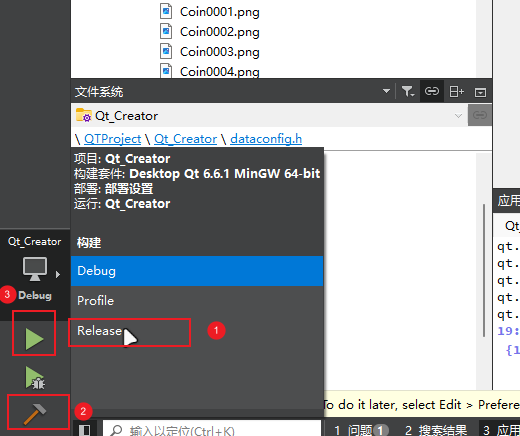

记得运行程序，检查是否正常。


### 步骤2(只做到这一步，需要使用者有对应的qt环境)

在项目的上一级目录，有Debug（调式）版本和Release（发布）版本，复制Release文件夹里面的.exe文件

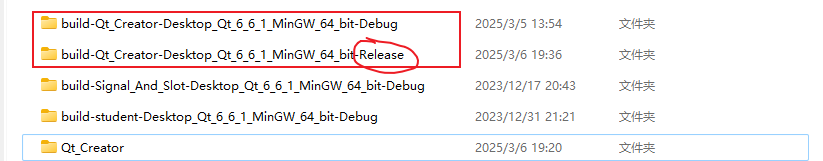

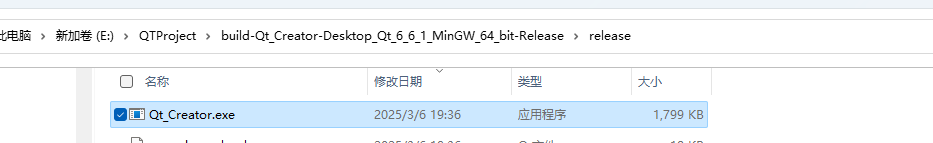


### 步骤3(这一步之后，就可以将这个文件夹压缩，发给使用者)

将复制的.exe文件,复制到新建的一个文件夹中

在该文件夹下，打开cmd 输入`windeployqt.exe 项目.exe` 例如：windeployqt.exe Qt_Creator.exe

确保在qt安装目录下能找到windeployqt.exe程序，E:\Qt\6.6.1\mingw_64\bin\windeployqt.exe

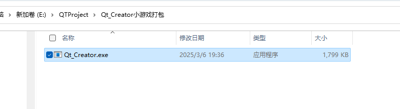

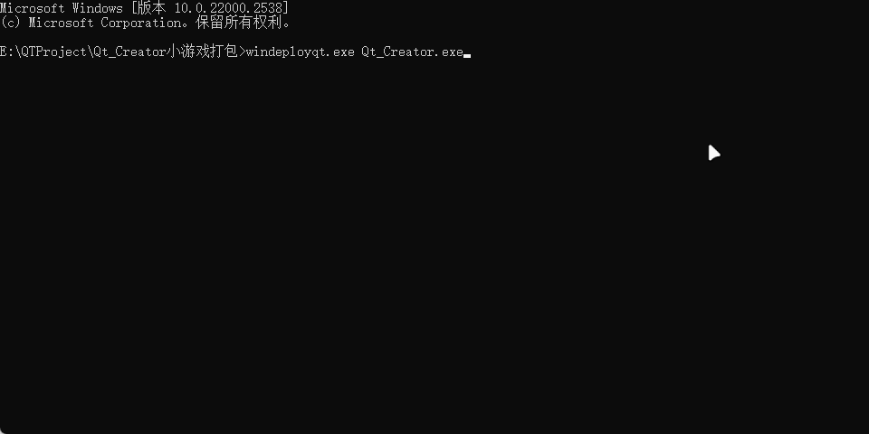

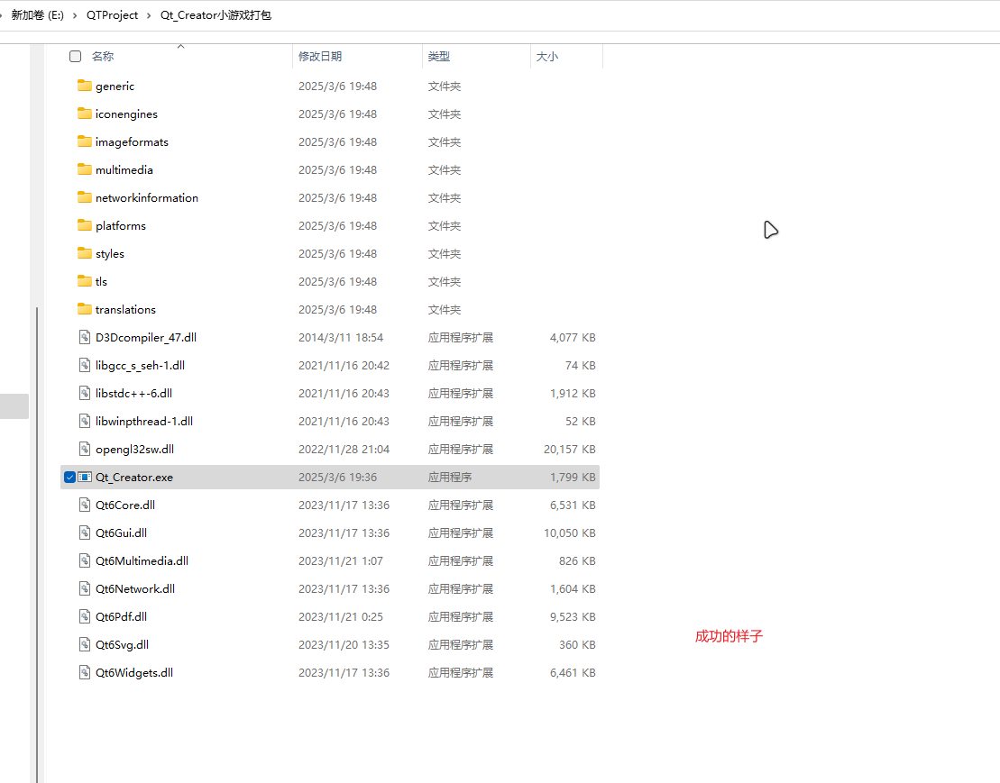


### 步骤4（可省略    使用第三方，形成安装程序 固定生成的是setup.exe的安装包）

1. 安装nsis与hm nis edit第三方打包软件
2. 启动hm nis edit

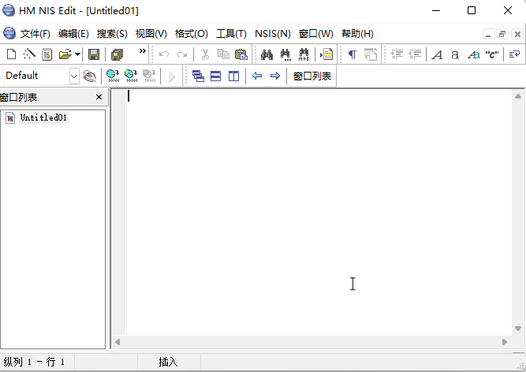

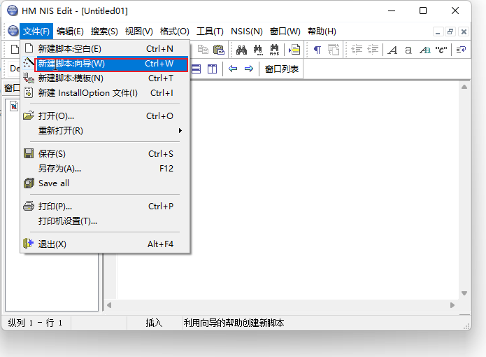

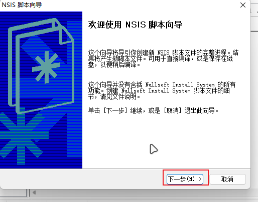

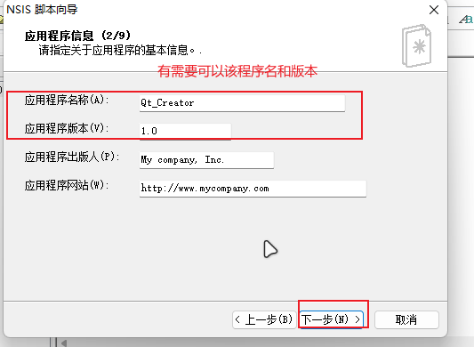

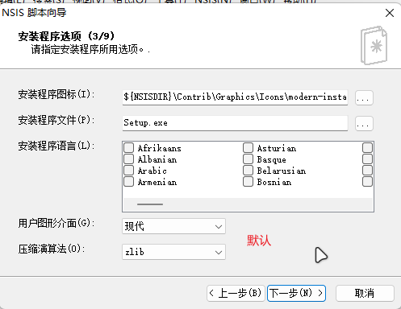

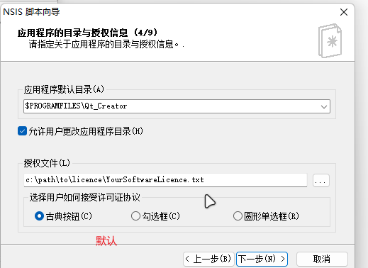

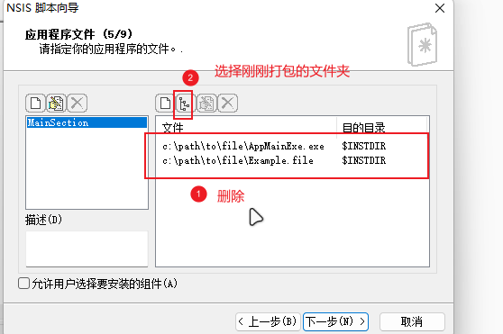

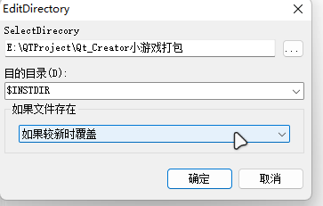

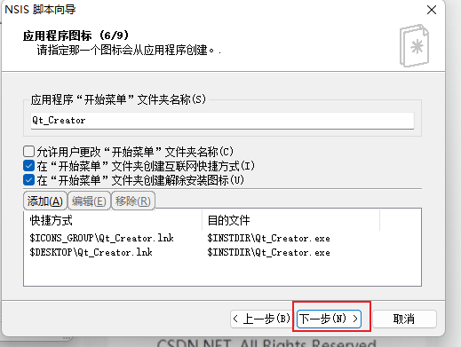

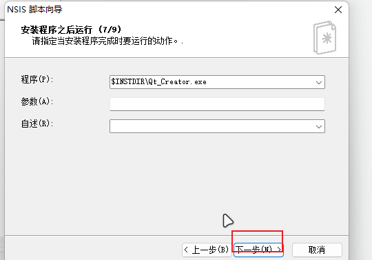

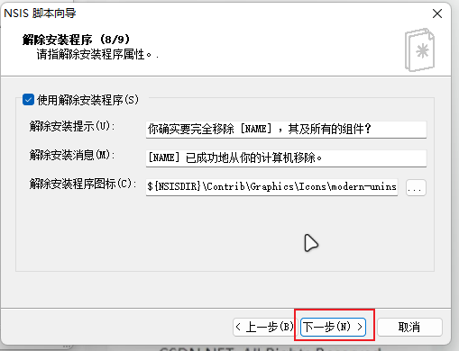

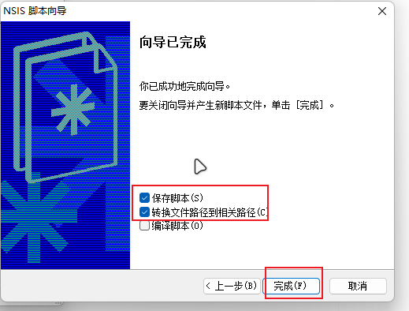

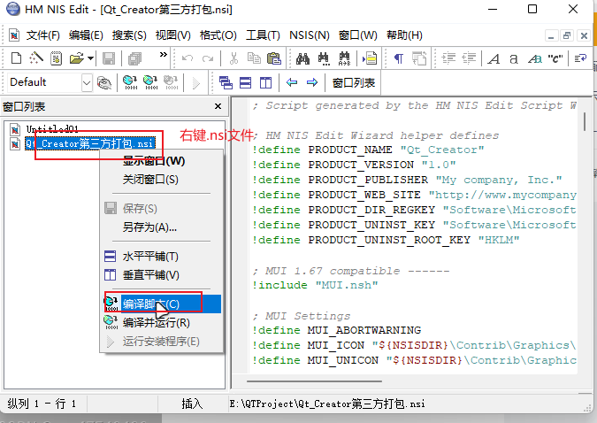

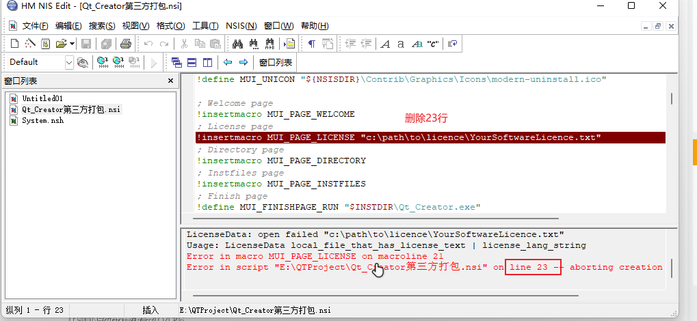

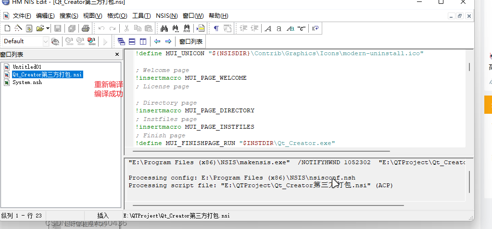

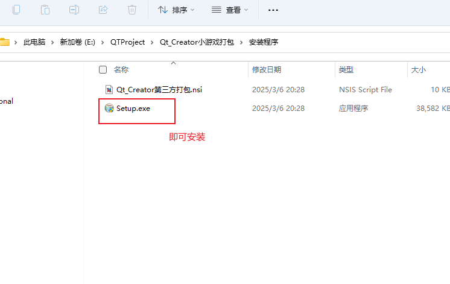
