[TOC]

## 线程

### 线程概述

线程是轻量级的进程（LWP：light weight process），在 Linux 环境下线程的本质仍是进程。在计算机上运行的程序是一组指令及指令参数的组合，指令按照既定的逻辑控制计算机运行。操作系统会以进程为单位，分配系统资源，可以这样理解，**进程是资源分配的最小单位，线程是操作系统调度执行的最小单位**。

先从概念上了解一下线程和进程之间的区别：

- **进程有自己独立的地址空间, 多个线程共用同一个地址空间**
	- **线程更加节省系统资源, 效率不仅可以保持的, 而且能够更高**
	
	- **在一个地址空间中多个线程独享: 每个线程都有属于自己的栈区, 寄存器(内核中管理的)**
	
	- **在一个地址空间中多个线程共享: 代码段, 堆区, 全局数据区, 打开的文件(文件描述符表)都是线程共享的**
	
- **线程是程序的最小执行单位, 进程是操作系统中最小的资源分配单位**

	- **每个进程对应一个虚拟地址空间，一个进程只能抢一个 CPU 时间片**

- **一个地址空间中可以划分出多个线程, 在有效的资源基础上, 能够抢更多的 CPU 时间片**(具体的抢占规则可以了解一下 cpu 调度算法)

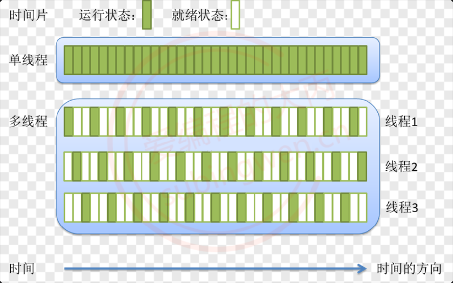

- **CPU 的调度和切换: 线程的上下文切换比进程要快的多**

	- **上下文切换：进程/线程分时复用 CPU 时间片，在切换之前会将上一个任务的状态进行保存, 下次切换回这个任务的时候, 加载这个状态继续运行，任务从保存到再次加载这个过程就是一次上下文切换。**

- **线程更加廉价, 启动速度更快, 退出也快, 对系统资源的冲击小。**

**在处理多任务程序的时候使用多线程比使用多进程要更有优势**，但是线程并不是越多越好，如何控制线程的个数呢？

1. **文件 IO 操作：文件 IO 对 CPU 是使用率不高, 因此可以分时复用 CPU 时间片, 线程的个数 = 2 * CPU 核心数 (效率最高)**

2. **处理复杂的算法(主要是 CPU 进行运算, 压力大)，线程的个数 = CPU 的核心数 (效率最高)**

### 创建线程

#### 线程函数

每一个线程都有一个唯一的线程 ID，ID 类型为 pthread_t，这个 ID 是一个 **无符号长整形数**（unsigned long），如果想要得到当前线程的线程 ID，可以调用如下函数：

```c
pthread_t pthread_self(void);	// 返回当前线程的线程ID
```

在一个进程中调用线程创建函数，就可得到一个子线程，和进程不同，需要给每一个创建出的线程指定一个处理函数，否则这个线程无法工作。

```c++
#include <pthread.h>
int pthread_create(pthread_t *thread, const pthread_attr_t *attr,
                   void *(*start_routine) (void *), void *arg);
// Compile and link with -pthread, 线程库的名字叫pthread, 全名: libpthread.so libptread.a
```

- 参数:

	- thread: 传出参数，是无符号长整形数，线程创建成功, 会将线程 ID 写入到这个指针指向的内存中

	- attr: 线程的属性, 一般情况下使用默认属性即可, 写 NULL

	- start_routine: 函数指针，创建出的子线程的处理动作，也就是该函数在子线程中执行。（线程需要完成的任务）
		- (void *)是一个泛指针，需要其他参数，需要将 arg 创建成结构体。
	- arg: 作为实参传递到 start_routine 指针指向的函数内部（该线程需要完成的任务的参数）

- 返回值：线程创建成功返回 0，创建失败返回对应的错误号 

#### 创建线程

下面是创建线程的示例代码（这段代码是由 POSIX 线程（pthread）库创建，在 window 环境下使用 MinGW 编译可以通过，使用 Microsoft Visual C++ 编译器不能通过），在创建过程中一定要保证编写的线程函数与规定的函数指针类型一致：void *(* start_routine) (void *):

```c
// pthread_create.c 
#include <stdio.h>
#include <stdlib.h>
#include <unistd.h>
#include <string.h>
#include <pthread.h>

// 子线程的处理代码
void* working(void* arg)
{
    printf("我是子线程, 线程ID: %ld\n", pthread_self());
    for(int i=0; i<9; ++i)
    {
        printf("child == i: = %d\n", i);
    }
    return NULL;
}

int main()
{
    // 1. 创建一个子线程
    pthread_t tid;
    pthread_create(&tid, NULL, working, NULL);

    printf("子线程创建成功, 线程ID: %ld\n", tid);
    // 2. 子线程不会执行下边的代码, 主线程执行
    printf("我是主线程, 线程ID: %ld\n", pthread_self());
    for(int i=0; i<3; ++i)
    {
        printf("i = %d\n", i);
    }
    
    // 休息, 休息一会儿...
    // sleep(1);			// 在Linux中是秒级别
    
    return 0;
}
```


Linux 环境下的 C 编译测试程序，会看到如下错误信息：

```shell
$ gcc pthread_create.c 
/tmp/cctkubA6.o: In function `main':
pthread_create.c:(.text+0x7f): undefined reference to `pthread_create'
collect2: error: ld returned 1 exit status
```

错误原因是因为 **编译器链接不到线程库文件（动态库）**，需要在编译的时候通过参数指定出来，动态库名为 libpthread.so 需要使用的参数为 -l，根据规则掐头去尾最终形态应该写成：-lpthread（参数和参数值中间可以有空格）。正确的编译命令为：

```c++
# pthread_create 函数的定义在某一个库中, 编译的时候需要加库名 pthread
$ gcc pthread_create.c -lpthread
$ ./a.out 
子线程创建成功, 线程ID: 127795390838464
我是主线程, 线程ID: 127795393173312
i = 0
i = 1
i = 2
我是子线程, 线程ID: 127795390838464
child == i: = 0
child == i: = 1
child == i: = 2
child == i: = 3
child == i: = 4
child == i: = 5
child == i: = 6
child == i: = 7
child == i: = 8
```

>在打印的日志输出中为什么子线程处理函数没有执行完毕呢（只看到了子线程的部分日志输出）？
>主线程一直在运行, 执行期间创建出了子线程，说明主线程有 CPU 时间片, 在这个时间片内将代码执行完毕了, 主线程就退出了。**子线程被创建出来之后需要抢 cpu 时间片, 抢不到就不能运行，如果主线程退出了, 虚拟地址空间就被释放了, 子线程就一并被销毁了。但是如果某一个子线程退出了, 主线程仍在运行, 虚拟地址空间依旧存在。**
>
>得到的结论：在没有人为干预的情况下，虚拟地址空间的生命周期和主线程是一样的，与子线程无关。
>
>目前的解决方案: 让子线程执行完毕, 主线程再退出, 可以在主线程中添加挂起函数 sleep();
>
>**上面是 [爱编程的大丙](https://space.bilibili.com/147020887/?spm_id_from=333.788.upinfo.detail.click) 的 up 的现象，2025 年以后，没有见到这个现象**
>
> Linux 中的线程是通过 clone() 系统调用来创建的，clone() 会创建一个新的线程，并将父线程的虚拟地址空间复制到子线程中。这样，子线程就可以访问父线程的变量和函数。
>
>当主线程执行完毕时，Linux 会将主线程的状态设置为 "terminated"，但是子线程仍然可以继续执行。子线程会在自己的栈中执行自己的代码，直到它完成自己的任务。


### 线程退出

在编写多线程程序的时候，如果想要让线程退出，但是不会导致虚拟地址空间的释放（针对于主线程），我们就可以调用线程库中的线程退出函数，**只要调用该函数当前线程就马上退出了，并且不会影响到其他线程的正常运行，不管是在子线程或者主线程中都可以使用**。

```c
#include <pthread.h>
void pthread_exit(void *retval);
```

- 参数: 线程退出的时候携带的数据，**当前子线程的主线程会得到该数据（返回需要的数据）**。如果不需要使用，指定为 NULL

```c
#include <stdio.h>
#include <stdlib.h>
#include <unistd.h>
#include <string.h>
#include <pthread.h>

// 子线程的处理代码
void* working(void* arg)
{
    sleep(1);
    printf("我是子线程, 线程ID: %ld\n", pthread_self());
    for(int i=0; i<9; ++i)
    {
        if(i==6)
        {
            pthread_exit(NULL);	// 直接退出子线程
        } 
        printf("child == i: = %d\n", i);
    }
    return NULL;
}

int main()
{
    // 1. 创建一个子线程
    pthread_t tid;
    pthread_create(&tid, NULL, working, NULL);

    printf("子线程创建成功, 线程ID: %ld\n", tid);
    // 2. 子线程不会执行下边的代码, 主线程执行
    printf("我是主线程, 线程ID: %ld\n", pthread_self());
    for(int i=0; i<3; ++i)
    {
        printf("i = %d\n", i);
    }

    // 主线程调用退出函数退出, 地址空间不会被释放
    pthread_exit(NULL);
    
    return 0;
}
```

### 线程回收

#### 线程函数

线程和进程一样，子线程退出的时候其内核资源主要由主线程回收，线程库中提供的线程回收函叫做 **pthread_join()**，这个函数是一个 **阻塞函数**，**如果还有子线程在运行，调用该函数就会阻塞，子线程退出函数解除阻塞进行资源的回收，函数被调用一次，只能回收一个子线程，如果有多个子线程则需要循环进行回收**。

另外通过线程回收函数还可以获取到子线程退出时传递出来的数据，函数原型如下：

```c
#include <pthread.h>
// 这是一个阻塞函数, 子线程在运行这个函数就阻塞
// 子线程退出, 函数解除阻塞, 回收对应的子线程资源, 类似于回收进程使用的函数 wait()
int pthread_join(pthread_t thread, void **retval);
```

- 参数:
	- thread: 要被回收的子线程的线程 ID
	- retval: 二级指针, 指向一级指针的地址, 是一个传出参数, 这个地址中存储了 pthread_exit() 传递出的数据，如果不需要这个参数，可以指定为 NULL
- 返回值：线程回收成功返回 0，回收失败返回错误号。

#### 回收子线程数据

在子线程退出的时候可以使用 pthread_exit()的参数将数据传出，在回收这个子线程的时候可以通过 phread_join()的第二个参数来接收子线程传递出的数据。接收数据有很多种处理方式，下面来列举几种：

##### 使用子线程栈(问题)

通过函数 pthread_exit(void \*retval); 可以得知，子线程退出的时候，需要将数据记录到一块内存中，通过参数传出的是存储数据的内存的地址，而不是具体数据，由因为参数是 void*类型，所有这个万能指针可以指向任意类型的内存地址。先来看第一种方式，将子线程退出数据保存在子线程自己的栈区：

```c
// pthread_join.c
#include <stdio.h>
#include <stdlib.h>
#include <unistd.h>
#include <string.h>
#include <pthread.h>

// 定义结构
struct Persion
{
    int id;
    char name[36];
    int age;
};

// 子线程的处理代码
void* working(void* arg)
{
    printf("我是子线程, 线程ID: %ld\n", pthread_self());
    for(int i=0; i<9; ++i)
    {
        printf("child == i: = %d\n", i);
        if(i == 6)
        {
            struct Persion p;
            p.age  =12;
            strcpy(p.name, "tom");
            p.id = 100;
            // 该函数的参数将这个地址传递给了主线程的pthread_join()
            pthread_exit(&p);
        }
    }
    return NULL;	// 代码执行不到这个位置就退出了
}

int main()
{
    // 1. 创建一个子线程
    pthread_t tid;
    pthread_create(&tid, NULL, working, NULL);

    printf("子线程创建成功, 线程ID: %ld\n", tid);
    // 2. 子线程不会执行下边的代码, 主线程执行
    printf("我是主线程, 线程ID: %ld\n", pthread_self());
    for(int i=0; i<3; ++i)
    {
        printf("i = %d\n", i);
    }

    // 阻塞等待子线程退出
    void* ptr = NULL;
    // ptr是一个传出参数, 在函数内部让这个指针指向一块有效内存
    // 这个内存地址就是pthread_exit() 参数指向的内存
    pthread_join(tid, &ptr);
    // 打印信息
    struct Persion* pp = (struct Persion*)ptr;
    printf("子线程返回数据: name: %s, age: %d, id: %d\n", pp->name, pp->age, pp->id);
    printf("子线程资源被成功回收...\n");
    
    return 0;
}
```


编译并执行测试程序:

```c
# 编译代码
$ gcc pthread_join.c -lpthread
# 执行程序
$ ./a.out 
子线程创建成功, 线程ID: 140652794640128
我是主线程, 线程ID: 140652803008256
i = 0
i = 1
i = 2
我是子线程, 线程ID: 140652794640128
child == i: = 0
child == i: = 1
child == i: = 2
child == i: = 3
child == i: = 4
child == i: = 5
child == i: = 6
子线程返回数据: name: , age: 0, id: 0					// 数据不是age=12，id=100...
子线程资源被成功回收...
```

>通过打印的日志可以发现，在主线程中没有没有得到子线程返回的数据信息，具体原因是这样的：
>
>**如果多个线程共用同一个虚拟地址空间，每个线程在栈区都有一块属于自己的内存，相当于栈区被这几个线程平分了，当线程退出，线程在栈区的内存也就被回收了，因此随着子线程的退出，写入到栈区的数据也就被释放了**。

##### 使用全局变量（解法一）

位于同一虚拟地址空间中的线程，虽然 **不能共享栈区数据，但是可以共享全局数据区和堆区数据**，因此在子线程退出的时候可以将传出数据存储到全局变量、静态变量或者堆内存中。在下面的例子中将数据存储到了全局变量中：

```c
#include <stdio.h>
#include <stdlib.h>
#include <unistd.h>
#include <string.h>
#include <pthread.h>

// 定义结构
struct Persion
{
    int id;
    char name[36];
    int age;
};

struct Persion p;	// 定义全局变量

// 子线程的处理代码
void* working(void* arg)
{
    printf("我是子线程, 线程ID: %ld\n", pthread_self());
    for(int i=0; i<9; ++i)
    {
        printf("child == i: = %d\n", i);
        if(i == 6)
        {
            // 使用全局变量
            p.age  =12;
            strcpy(p.name, "tom");
            p.id = 100;
            // 该函数的参数将这个地址传递给了主线程的pthread_join()
            pthread_exit(&p);
        }
    }
    return NULL;
}

int main()
{
    // 1. 创建一个子线程
    pthread_t tid;
    pthread_create(&tid, NULL, working, NULL);

    printf("子线程创建成功, 线程ID: %ld\n", tid);
    // 2. 子线程不会执行下边的代码, 主线程执行
    printf("我是主线程, 线程ID: %ld\n", pthread_self());
    for(int i=0; i<3; ++i)
    {
        printf("i = %d\n", i);
    }

    // 阻塞等待子线程退出
    void* ptr = NULL;
    // ptr是一个传出参数, 在函数内部让这个指针指向一块有效内存
    // 这个内存地址就是pthread_exit() 参数指向的内存
    pthread_join(tid, &ptr);
    // 打印信息
    struct Persion* pp = (struct Persion*)ptr;
    printf("name: %s, age: %d, id: %d\n", pp->name, pp->age, pp->id);
    printf("子线程资源被成功回收...\n");
    
    return 0;
}
```

##### 使用主线程栈(解法二)

虽然每个线程都有属于自己的栈区空间，但是 **位于同一个地址空间的多个线程是可以相互访问对方的栈空间上的数据的**。由于很多情况下还需要在主线程中回收子线程资源，所以主线程一般都是最后退出，基于这个原因在下面的程序中将子线程返回的数据保存到了主线程的栈区内存中：

```c++
#include <stdio.h>
#include <stdlib.h>
#include <unistd.h>
#include <string.h>
#include <pthread.h>

// 定义结构
struct Persion
{
    int id;
    char name[36];
    int age;
};


// 子线程的处理代码
void* working(void* arg)
{
    struct Persion* p = (struct Persion*)arg;
    printf("我是子线程, 线程ID: %ld\n", pthread_self());
    for(int i=0; i<9; ++i)
    {
        printf("child == i: = %d\n", i);
        if(i == 6)
        {
            // 使用主线程的栈内存
            p->age  =12;
            strcpy(p->name, "tom");
            p->id = 100;
            // 该函数的参数将这个地址传递给了主线程的pthread_join()
            pthread_exit(p);
        }
    }
    return NULL;
}

int main()
{
    // 1. 创建一个子线程
    pthread_t tid;

    struct Persion p;
    // 主线程的栈内存传递给子线程
    pthread_create(&tid, NULL, working, &p);

    printf("子线程创建成功, 线程ID: %ld\n", tid);
    // 2. 子线程不会执行下边的代码, 主线程执行
    printf("我是主线程, 线程ID: %ld\n", pthread_self());
    for(int i=0; i<3; ++i)
    {
        printf("i = %d\n", i);
    }

    // 阻塞等待子线程退出
    void* ptr = NULL;
    // ptr是一个传出参数, 在函数内部让这个指针指向一块有效内存
    // 这个内存地址就是pthread_exit() 参数指向的内存
    pthread_join(tid, &ptr);
    // 打印信息
    printf("name: %s, age: %d, id: %d\n", p.name, p.age, p.id);
    printf("子线程资源被成功回收...\n");
    
    return 0;
}
```

在上面的程序中，调用 pthread_create()创建子线程，并将主线程中栈空间变量 p 的地址传递到了子线程中，在子线程中将要传递出的数据写入到了这块内存中。也就是说在程序的 main()函数中，通过指针变量 ptr 或者通过结构体变量 p 都可以读出子线程传出的数据。

### 线程分离

在某些情况下，程序中的主线程有属于自己的业务处理流程，如果让主线程负责子线程的资源回收，调用 pthread_join()只要子线程不退出主线程就会一直被阻塞，主要线程的任务也就不能被执行了。

在线程库函数中为我们提供了线程分离函数 **pthread_detach()**，**调用这个函数之后指定的子线程就可以和主线程分离，当子线程退出的时候，其占用的内核资源就被系统的其他进程接管并回收了。线程分离之后在主线程中使用 pthread_join()就回收不到子线程资源了**。

但是如果销毁主线程的虚拟地址空间，子线程也无法存活。pthread_exit()只是退出线程，不会导致虚拟地址空间的释放（针对于主线程）。

```c
#include <pthread.h>
// 参数就子线程的线程ID, 主线程就可以和这个子线程分离了
int pthread_detach(pthread_t thread);
```


下面的代码中，在主线程中创建子线程，并调用线程分离函数，实现了主线程和子线程的分离：

```c
#include <stdio.h>
#include <stdlib.h>
#include <unistd.h>
#include <string.h>
#include <pthread.h>

// 子线程的处理代码
void* working(void* arg)
{
    printf("我是子线程, 线程ID: %ld\n", pthread_self());
    for(int i=0; i<9; ++i)
    {
        printf("child == i: = %d\n", i);
    }
    return NULL;
}

int main()
{
    // 1. 创建一个子线程
    pthread_t tid;
    pthread_create(&tid, NULL, working, NULL);

    printf("子线程创建成功, 线程ID: %ld\n", tid);
    // 2. 子线程不会执行下边的代码, 主线程执行
    printf("我是主线程, 线程ID: %ld\n", pthread_self());
    for(int i=0; i<3; ++i)
    {
        printf("i = %d\n", i);
    }

    // 设置子线程和主线程分离
    pthread_detach(tid);

    // 让主线程自己退出即可
    pthread_exit(NULL);
    
    return 0;
}
```

### 其他线程函数

#### 线程取消

线程取消的意思就是在某些特定情况下 **在一个线程中杀死另一个线程**。使用这个函数杀死一个线程需要分两步：

- **在线程 A 中调用线程取消函数 pthread_cancel，指定杀死线程 B，这时候线程 B 是死不了的（被标记成 *可取消* 状态）**
- **在线程 B 中执行一次特定函数（系统调用（从用户区切换到内核区）、睡眠函数），线程 B 才会检查自己的状态，如果发现自己被标记为 "可取消"，则会终止自己的执行。。**

```c
#include <pthread.h>
// 参数是子线程的线程ID
int pthread_cancel(pthread_t thread);
```

- 参数：要杀死的线程的线程 ID
- 返回值：函数调用成功返回 0，调用失败返回非 0 错误号。

在下面的示例代码中，主线程调用线程取消函数，只要在子线程中进行了系统调用，当子线程执行到这个位置就挂掉了。

```c
#include <stdio.h>
#include <stdlib.h>
#include <unistd.h>
#include <string.h>
#include <pthread.h>

// 子线程的处理代码
void* working(void* arg)
{
    int j=0;
    for(int i=0; i<9; ++i)
    {
        j++;
    }
    // 这个函数会调用系统函数, 因此这是个间接的系统调用
    printf("我是子线程, 线程ID: %ld\n", pthread_self());
    for(int i=0; i<9; ++i)
    {
        printf(" child i: %d\n", i);
    }

    return NULL;
}

int main()
{
    // 1. 创建一个子线程
    pthread_t tid;
    pthread_create(&tid, NULL, working, NULL);

    printf("子线程创建成功, 线程ID: %ld\n", tid);
    // 2. 子线程不会执行下边的代码, 主线程执行
    printf("我是主线程, 线程ID: %ld\n", pthread_self());
    for(int i=0; i<3; ++i)
    {
        printf("i = %d\n", i);
    }

    // 杀死子线程, 如果子线程中做系统调用, 子线程就结束了
    pthread_cancel(tid);

    // 让主线程自己退出即可
    pthread_exit(NULL);
    
    return 0;
}
```

>关于系统调用有两种方式：
>
>- 直接调用 Linux 系统函数
>
>- 调用标准 C 库函数，为了实现某些功能，在 Linux 平台下标准 C 库函数会调用相关的系统函数

#### 线程 ID 比较

在 Linux 中线程 ID 本质就是一个无符号长整形，因此可以直接使用比较操作符比较两个线程的 ID，但是线程库是可以跨平台使用的，在某些平台上 pthread_t 可能不是一个单纯的整形，这中情况下比较两个线程的 ID 必须要使用比较函数，函数原型如下：

```c
#include <pthread.h>
int pthread_equal(pthread_t t1, pthread_t t2);
```

- 参数：t1 和 t2 是要比较的线程的线程 ID

- 返回值：如果两个线程 ID 相等返回非 0 值，如果不相等返回 0。

## 线程同步（线程线性执行）

### 同步的概念

假设有 4 个线程 A、B、C、D，当前一个线程 A 对内存中的 **共享资源** 进行访问的时候，其他线程 B, C, D 都不可以对这块内存进行操作，直到线程 A 对这块内存访问完毕为止，B，C，D 中的一个才能访问这块内存，剩余的两个需要继续阻塞等待，以此类推，直至所有的线程都对这块内存操作完毕。 线程对内存的这种访问方式就称之为线程同步，通过对概念的介绍，我们可以了解到 **所谓的同步并不是多个线程同时对内存进行访问，而是按照先后顺序依次进行的**。

#### 为什么需要同步

一个两个线程交替数数（每个线程数 50 个数，交替数到 100）的例子：

```c
#include <stdio.h>
#include <unistd.h>
#include <stdlib.h>
#include <sys/types.h>
#include <sys/stat.h>
#include <string.h>
#include <pthread.h>

#define MAX 50
// 全局变量
int number;

// 线程处理函数
void* funcA_num(void* arg)
{
    for(int i=0; i<MAX; ++i)
    {
        int cur = number;
        cur++;
        usleep(10);
        number = cur;
        printf("Thread A, id = %lu, number = %d\n", pthread_self(), number);
    }

    return NULL;
}

void* funcB_num(void* arg)
{
    for(int i=0; i<MAX; ++i)
    {
        int cur = number;
        cur++;
        number = cur;
        printf("Thread B, id = %lu, number = %d\n", pthread_self(), number);
        usleep(5);				// 毫秒级别的睡眠函数
    }

    return NULL;
}

int main(int argc, const char* argv[])
{
    pthread_t p1, p2;

    // 创建两个子线程
    pthread_create(&p1, NULL, funcA_num, NULL);
    pthread_create(&p2, NULL, funcB_num, NULL);

    // 阻塞，资源回收
    pthread_join(p1, NULL);
    pthread_join(p2, NULL);

    return 0;
}
```

编译并执行上面的测试程序，得到如下结果：

```c
$ ./a.out 
Thread B, id = 140504473724672, number = 1
Thread B, id = 140504473724672, number = 2
Thread A, id = 140504482117376, number = 2
Thread B, id = 140504473724672, number = 3
Thread A, id = 140504482117376, number = 4
Thread B, id = 140504473724672, number = 5
Thread A, id = 140504482117376, number = 6
Thread B, id = 140504473724672, number = 7
Thread B, id = 140504473724672, number = 8
Thread A, id = 140504482117376, number = 7
Thread B, id = 140504473724672, number = 8
Thread B, id = 140504473724672, number = 9
Thread A, id = 140504482117376, number = 8
Thread B, id = 140504473724672, number = 9
Thread A, id = 140504482117376, number = 9
Thread B, id = 140504473724672, number = 10
Thread B, id = 140504473724672, number = 11
Thread A, id = 140504482117376, number = 10
Thread B, id = 140504473724672, number = 11
Thread A, id = 140504482117376, number = 11
Thread B, id = 140504473724672, number = 12
Thread A, id = 140504482117376, number = 13
Thread B, id = 140504473724672, number = 14
Thread A, id = 140504482117376, number = 15
Thread B, id = 140504473724672, number = 16
Thread B, id = 140504473724672, number = 17
Thread B, id = 140504473724672, number = 18
Thread B, id = 140504473724672, number = 19
Thread A, id = 140504482117376, number = 17
Thread B, id = 140504473724672, number = 18
Thread B, id = 140504473724672, number = 19
Thread A, id = 140504482117376, number = 19
Thread B, id = 140504473724672, number = 20
Thread A, id = 140504482117376, number = 20
Thread B, id = 140504473724672, number = 21
Thread A, id = 140504482117376, number = 21
Thread B, id = 140504473724672, number = 22
Thread A, id = 140504482117376, number = 22
Thread B, id = 140504473724672, number = 23
Thread A, id = 140504482117376, number = 23
Thread B, id = 140504473724672, number = 24
Thread A, id = 140504482117376, number = 24
Thread B, id = 140504473724672, number = 25
Thread A, id = 140504482117376, number = 25
Thread B, id = 140504473724672, number = 26
Thread A, id = 140504482117376, number = 26
Thread B, id = 140504473724672, number = 27
Thread A, id = 140504482117376, number = 27
Thread B, id = 140504473724672, number = 28
Thread A, id = 140504482117376, number = 28
Thread B, id = 140504473724672, number = 29
Thread A, id = 140504482117376, number = 29
Thread B, id = 140504473724672, number = 30
Thread A, id = 140504482117376, number = 30
Thread B, id = 140504473724672, number = 31
Thread A, id = 140504482117376, number = 31
Thread B, id = 140504473724672, number = 32
Thread A, id = 140504482117376, number = 32
Thread B, id = 140504473724672, number = 33
Thread A, id = 140504482117376, number = 33
Thread B, id = 140504473724672, number = 34
Thread A, id = 140504482117376, number = 34
Thread B, id = 140504473724672, number = 35
Thread A, id = 140504482117376, number = 35
Thread B, id = 140504473724672, number = 36
Thread A, id = 140504482117376, number = 36
Thread B, id = 140504473724672, number = 37
Thread A, id = 140504482117376, number = 37
Thread B, id = 140504473724672, number = 38
Thread A, id = 140504482117376, number = 38
Thread B, id = 140504473724672, number = 39
Thread A, id = 140504482117376, number = 39
Thread A, id = 140504482117376, number = 40
Thread B, id = 140504473724672, number = 41
Thread B, id = 140504473724672, number = 42
Thread A, id = 140504482117376, number = 42
Thread A, id = 140504482117376, number = 43
Thread B, id = 140504473724672, number = 44
Thread B, id = 140504473724672, number = 45
Thread A, id = 140504482117376, number = 45
Thread B, id = 140504473724672, number = 46
Thread A, id = 140504482117376, number = 46
Thread B, id = 140504473724672, number = 47
Thread A, id = 140504482117376, number = 47
Thread B, id = 140504473724672, number = 48
Thread A, id = 140504482117376, number = 48
Thread B, id = 140504473724672, number = 49
Thread A, id = 140504482117376, number = 50
Thread B, id = 140504473724672, number = 51
Thread A, id = 140504482117376, number = 51
Thread B, id = 140504473724672, number = 52
Thread A, id = 140504482117376, number = 53
Thread A, id = 140504482117376, number = 54
Thread A, id = 140504482117376, number = 55
Thread A, id = 140504482117376, number = 56
Thread A, id = 140504482117376, number = 57
Thread A, id = 140504482117376, number = 58
Thread A, id = 140504482117376, number = 59
Thread A, id = 140504482117376, number = 60
Thread A, id = 140504482117376, number = 61
```

通过对上面例子的测试，可以看出虽然每个线程内部循环了 50 次每次数一个数，但是最终没有数到 100，通过输出的结果可以看到，有些数字被重复数了多次，其原因就是没有对线程进行同步处理，造成了数据的混乱。

两个线程在数数的时候需要分时复用 CPU 时间片，并且测试程序中调用了 sleep()导致线程的 CPU 时间片没用完就被迫挂起了，这样就能让 CPU 的上下文切换（保存当前状态, 下一次继续运行的时候需要加载保存的状态）更加频繁，更容易再现数据混乱的这个现象。


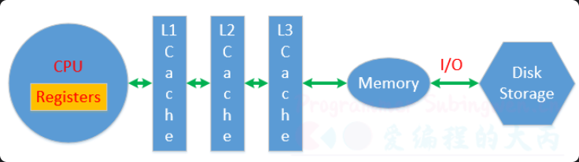

CPU 对应寄存器、一级缓存、二级缓存、三级缓存是独占的，用于存储处理的数据和线程的状态信息，数据被 CPU 处理完成需要再次被写入到物理内存(Memory)中，物理内存数据也可以通过文件 IO 操作写入到磁盘中。

在测试程序中两个线程共用全局变量 number 当线程变成运行态之后开始数数，从物理内存加载数据，让后将数据放到 CPU 进行运算，最后将结果更新到物理内存中。如果数数的两个线程都可以顺利完成这个流程，那么得到的结果肯定是正确的。

如果线程 A 执行这个过程期间就失去了 CPU 时间片，线程 A 被挂起了 **最新的数据没能更新到物理内存**。线程 B 变成运行态之后从物理内存读数据，很显然它没有拿到最新数据，只能基于旧的数据往后数，然后失去 CPU 时间片挂起。线程 A 得到 CPU 时间片变成运行态，第一件事儿就是将上次没更新到内存的数据更新到内存，但是这样会导致线程 B 已经更新到内存的数据被覆盖，活儿白干了，最终导致有些数据会被重复数很多次。

#### 同步方式

对于多个线程访问共享资源出现数据混乱的问题，需要进行线程同步。**常用的线程同步方式有四种：互斥锁、读写锁、条件变量、信号量**。所谓的共享资源就是多个线程共同访问的变量，这些变量通常为全局数据区变量或者堆区变量，这些变量对应的共享资源也被称之为临界资源。

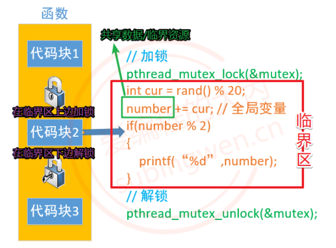

找到临界资源之后，再找和临界资源相关的上下文代码，这样就得到了一个代码块，这个代码块可以称之为临界区。确定好临界区（临界区越小越好）之后，就可以进行线程同步了，线程同步的大致处理思路是这样的：

- 在临界区代码的上边，添加加锁函数，对临界区加锁。

	- 哪个线程调用这句代码，就会把这把锁锁上，其他线程就只能阻塞在锁上了。
- 在临界区代码的下边，添加解锁函数，对临界区解锁。
	- 出临界区的线程会将锁定的那把锁打开，其他抢到锁的线程就可以进入到临界区了。
- 通过锁机制能保证临界区代码最多只能同时有一个线程访问，这样并行访问就变为串行访问了。

### 互斥锁

#### 互斥锁函数

互斥锁是线程同步最常用的一种方式，通过 **互斥锁可以锁定一个代码块, 被锁定的这个代码块, 所有的线程只能顺序执行(不能并行处理)**，这样多线程访问共享资源数据混乱的问题就可以被解决了，需要付出的代价就是执行效率的降低，因为默认临界区多个线程是可以并行处理的，现在只能串行处理。

在 Linux 中互斥锁的类型为 pthread_mutex_t，创建一个这种类型的变量就得到了一把互斥锁：

```c
pthread_mutex_t  mutex;
```

在 **创建的锁对象中保存了当前这把锁的状态信息：锁定还是打开，如果是锁定状态还记录了给这把锁加锁的线程信息（线程 ID）**。一个互斥锁变量只能被一个线程锁定，被锁定之后其他线程再对互斥锁变量加锁就会被阻塞，直到这把互斥锁被解锁，被阻塞的线程才能被解除阻塞。**一般情况下，每一个共享资源对应一个把互斥锁，锁的个数和线程的个数无关。**


Linux 提供的互斥锁操作函数如下，如果函数调用成功会返回 0，调用失败会返回相应的错误号：

```c
// 初始化互斥锁
// restrict: 是一个关键字, 用来修饰指针, 只有这个关键字修饰的指针可以访问指向的内存地址, 其他指针是不行的
// restrict 关键字告诉编译器，该指针不会被其他指针别名访问
// mutex 指针被标记为 restrict，这意味着编译器会假设 mutex 指针是唯一访问该指针指向的内存区域的指针。如果你使用 restrict 关键字修饰一个指针，然后又使用另一个指针别名（pthread_mutex_t *p = mutex）访问该内存区域，编译器会产生警告（p不能访问mutex指向的内存），因为这违反了 restrict 关键字的约束
int pthread_mutex_init(pthread_mutex_t *restrict mutex,
           const pthread_mutexattr_t *restrict attr);
// 释放互斥锁资源            
int pthread_mutex_destroy(pthread_mutex_t *mutex);
```

- 参数:

	- mutex: 互斥锁变量的地址
	- attr: 互斥锁的属性, 一般使用默认属性即可, 这个参数指定为 NULL

```c
// 修改互斥锁的状态, 将其设定为锁定状态, 这个状态被写入到参数 mutex 中
int pthread_mutex_lock(pthread_mutex_t *mutex);
```

这个函数被调用, 首先会判断参数 mutex 互斥锁中的状态是不是锁定状态:

- 没有被锁定, 是打开的, 这个线程可以加锁成功, 这个这个锁中会记录是哪个线程加锁成功了
- 如果被锁定了, 其他线程加锁就失败了, 这些线程都会阻塞在这把锁上
- 当这把锁被解开之后, 这些阻塞在锁上的线程就解除阻塞了，并且这些线程是通过竞争的方式对这把锁加锁，没抢到锁的线程继续阻塞

```c
// 尝试加锁
int pthread_mutex_trylock(pthread_mutex_t *mutex);
```

调用这个函数对互斥锁变量加锁还是有两种情况:

- 如果这把锁没有被锁定是打开的，线程加锁成功

- 如果锁变量被锁住了，调用这个函数加锁的线程，不会被阻塞，加锁失败直接返回错误号（可以去干别的任务等待公共资源）

```c
// 对互斥锁解锁
int pthread_mutex_unlock(pthread_mutex_t *mutex);
```

不是所有的线程都可以对互斥锁解锁，哪个线程加的锁, 哪个线程才能解锁成功。

#### 互斥锁的使用

我们可以将上面多线程交替数数的例子修改一下，使用互斥锁进行线程同步。两个线程一共操作了同一个全局变量，因此需要添加一互斥锁，来控制这两个线程。公共资源尽量要小，互斥执行时是线性执行，如果太大，执行时间太长，等待时间也会变长。

```c
#include <stdio.h>
#include <unistd.h>
#include <stdlib.h>
#include <sys/types.h>
#include <sys/stat.h>
#include <string.h>
#include <pthread.h>

#define MAX 100
// 全局变量
int number;

// 创建一把互斥锁
// 全局变量, 多个线程共享
pthread_mutex_t mutex;

// 线程处理函数
void* funcA_num(void* arg)
{
    for(int i=0; i<MAX; ++i)
    {
        // 如果线程A加锁成功, 不阻塞
        // 如果B加锁成功, 线程A阻塞
        pthread_mutex_lock(&mutex);
        int cur = number;
        cur++;
        usleep(10);
        number = cur;
        pthread_mutex_unlock(&mutex);
        printf("Thread A, id = %lu, number = %d\n", pthread_self(), number);
    }

    return NULL;
}

void* funcB_num(void* arg)
{
    for(int i=0; i<MAX; ++i)
    {
        // a加锁成功, b线程访问这把锁的时候是锁定的
        // 线程B先阻塞, a线程解锁之后阻塞解除
        // 线程B加锁成功了
        pthread_mutex_lock(&mutex);
        int cur = number;
        cur++;
        number = cur;
        pthread_mutex_unlock(&mutex);
        printf("Thread B, id = %lu, number = %d\n", pthread_self(), number);
        usleep(5);
    }

    return NULL;
}

int main(int argc, const char* argv[])
{
    pthread_t p1, p2;

    // 初始化互斥锁
    pthread_mutex_init(&mutex, NULL);

    // 创建两个子线程
    pthread_create(&p1, NULL, funcA_num, NULL);
    pthread_create(&p2, NULL, funcB_num, NULL);

    // 阻塞，资源回收
    pthread_join(p1, NULL);
    pthread_join(p2, NULL);

    // 销毁互斥锁
    // 线程销毁之后, 再去释放互斥锁
    pthread_mutex_destroy(&mutex);

    return 0;
}
```


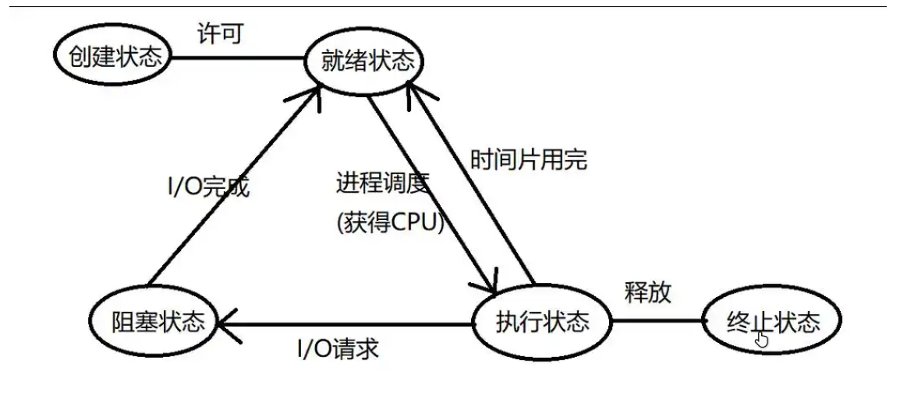 睡眠状态 = 阻塞状态

### 死锁

当多个线程访问共享资源, 需要加锁, 如果锁使用不当, 就会造成死锁这种现象。如果线程死锁造成的后果是：所有的线程都被阻塞，并且线程的阻塞是无法解开的（因为可以解锁的线程也被阻塞了）。

造成死锁的场景有如下几种：

- 加锁之后忘记解锁

	```c
	// 场景1
	void func()
	{
	    for(int i=0; i<6; ++i)
	    {
	        // 当前线程A加锁成功, 当前循环完毕没有解锁, 在下一轮循环的时候自己被阻塞了
	        // 其余的线程也被阻塞
	    	pthread_mutex_lock(&mutex);
	    	....
	    	.....
	        // 忘记解锁
	    }
	}
	
	// 场景2
	void func()
	{
	    for(int i=0; i<6; ++i)
	    {
	        // 当前线程A加锁成功
	        // 其余的线程被阻塞
	    	pthread_mutex_lock(&mutex);
	    	....
	    	.....
	        if(xxx)
	        {
	            // 函数退出, 没有解锁（解锁函数无法被执行了）
	            return ;
	        }
	        
	        pthread_mutex_unlock(&mutex);
	    }
	}
	```

	

- 重复加锁, 造成死锁

	```c
	void func()
	{
	    for(int i=0; i<6; ++i)
	    {
	        // 当前线程A加锁成功
	        // 其余的线程阻塞
	    	pthread_mutex_lock(&mutex);
	        // 锁被锁住了, A线程阻塞
	        pthread_mutex_lock(&mutex);
	    	....
	    	.....
	        pthread_mutex_unlock(&mutex);
	    }
	}
	
	// 隐藏的比较深的情况
	void funcA()
	{
	    for(int i=0; i<6; ++i)
	    {
	        // 其余的线程阻塞
	    	pthread_mutex_lock(&mutex);
	    	....
	    	.....
	        pthread_mutex_unlock(&mutex);
	    }
	}
	
	void funcB()
	{
	    for(int i=0; i<6; ++i)
	    {
	        // 当前线程B加锁成功
	        // 其余的线程阻塞
	    	pthread_mutex_lock(&mutex);
	        funcA();		// 重复加锁
	    	....
	    	.....
	        pthread_mutex_unlock(&mutex);
	    }
	}
	```

	

- 在程序中有多个共享资源, 因此有很多把锁，随意加锁，导致相互被阻塞

	```txt
	场景描述:
	  1. 有两个共享资源:X, Y，X对应锁A, Y对应锁B
	     - 线程A访问资源X, 加锁A
	     - 线程B访问资源Y, 加锁B
	  2. 线程A要访问资源Y, 线程B要访问资源X，因为资源X和Y已经被对应的锁锁住了，因此这个两个线程被阻塞
	     - 线程A被锁B阻塞了, 无法打开A锁
	     - 线程B被锁A阻塞了, 无法打开B锁
	```

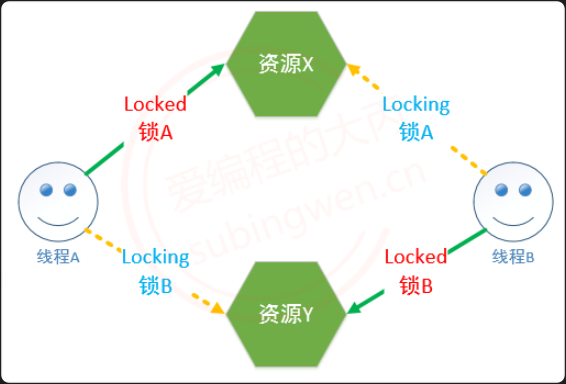

在使用多线程编程的时候，如何避免死锁呢？

- 避免多次锁定, 多检查

- 对共享资源访问完毕之后, 一定要解锁，或者在加锁的使用 trylock

- 如果程序中有多把锁, 可以控制对锁的访问顺序(顺序访问共享资源，但在有些情况下是做不到的)，另外也可以在对其他互斥锁做加锁操作之前，先释放当前线程拥有的互斥锁。

- 项目程序中可以引入一些专门用于死锁检测的模块(如：银行家算法)


### 读写锁

#### 读写锁函数

读写锁是互斥锁的升级版, **在做读操作的时候可以提高程序的执行效率，如果所有的线程都是做读操作, 那么读是并行的，但是使用互斥锁，读操作也是串行的**。

**读写锁是一把锁**，锁的类型为 pthread_rwlock_t，有了类型之后就可以创建一把互斥锁了：

```c
pthread_rwlock_t rwlock;
```

之所以称其为读写锁，是因为这把锁既可以锁定读操作，也可以锁定写操作。为了方便理解，可以大致认为在这把锁中记录了这些信息：

- 锁的状态: 锁定/打开

- 锁定的是什么操作: 读操作/写操作，**使用读写锁锁定了读操作，需要先解锁才能去锁定写操作，反之亦然**。
- 哪个线程将这把锁锁上了

读写锁的使用方式也互斥锁的使用方式是完全相同的：找共享资源, 确定临界区，在临界区的开始位置加锁（读锁/写锁），临界区的结束位置解锁。

因为通过一把读写锁可以锁定读或者写操作，下面介绍一下关于读写锁的特点：

1. **使用读写锁的读锁锁定了临界区，线程对临界区的访问是并行的，读锁是共享的。**

2. **使用读写锁的写锁锁定了临界区，线程对临界区的访问是串行的，写锁是独占的。（读锁共享，写锁独占）**
3. **使用读写锁分别对两个临界区加了读锁和写锁，两个线程要同时访问者两个临界区，访问写锁临界区的线程继续运行，访问读锁临界区的线程阻塞，因为 *写锁比读锁的优先级高*。**

**如果说程序中所有的线程都对共享资源做写操作，使用读写锁没有优势，和互斥锁是一样的，如果说程序中所有的线程都对共享资源有写也有读操作，并且对共享资源读的操作越多，读写锁更有优势。**

Linux 提供的读写锁操作函数原型如下，如果函数调用成功返回 0，失败返回对应的错误号：

```c
#include <pthread.h>
pthread_rwlock_t rwlock;
// 初始化读写锁
int pthread_rwlock_init(pthread_rwlock_t *restrict rwlock,
           const pthread_rwlockattr_t *restrict attr);
// 释放读写锁占用的系统资源
int pthread_rwlock_destroy(pthread_rwlock_t *rwlock);
```

- 参数:

	- rwlock: 读写锁的地址，传出参数
	- attr: 读写锁属性，一般使用默认属性，指定为 NULL

```c
// 在程序中对读写锁加读锁, 锁定的是读操作
int pthread_rwlock_rdlock(pthread_rwlock_t *rwlock);
```

调用这个函数，如果读写锁是打开的，那么加锁成功；**如果读写锁之前已经锁定了读操作，调用这个函数依然可以加锁成功，因为读锁是共享的；如果读写锁之前已经锁定了写操作，调用这个函数的线程会被阻塞**。

```c
// 这个函数可以有效的避免死锁
// 如果加读锁失败, 不会阻塞当前线程, 直接返回错误号
int pthread_rwlock_tryrdlock(pthread_rwlock_t *rwlock);
```

调用这个函数，如果读写锁是打开的，那么加锁成功；如果读写锁已经锁定了读操作，调用这个函数依然可以加锁成功，因为读锁是共享的；如果读写锁已经锁定了写操作，调用这个函数加锁失败，对应的线程不会被阻塞，可以在程序中对函数返回值进行判断，添加加锁失败之后的处理动作。

```c
// 在程序中对读写锁加写锁, 锁定的是写操作
int pthread_rwlock_wrlock(pthread_rwlock_t *rwlock);
```

调用这个函数，**如果读写锁是打开的，那么加锁成功；如果读写锁之前已经锁定了读操作或者锁定了写操作，调用这个函数的线程会被阻塞**。

```c
// 这个函数可以有效的避免死锁
// 如果加写锁失败, 不会阻塞当前线程, 直接返回错误号
int pthread_rwlock_trywrlock(pthread_rwlock_t *rwlock);
```

调用这个函数，如果读写锁是打开的，那么加锁成功；如果读写锁已经锁定了读操作或者锁定了写操作，调用这个函数加锁失败，但是线程不会阻塞，可以在程序中对函数返回值进行判断，添加加锁失败之后的处理动作。

```c
// 解锁, 不管锁定了读还是写都可用解锁
int pthread_rwlock_unlock(pthread_rwlock_t *rwlock);
```

#### 读写锁的使用

题目要求：8 个线程操作同一个全局变量，3 个线程不定时写同一全局资源，5 个线程不定时读同一全局资源。

```c
#include <stdio.h>
#include <stdlib.h>
#include <unistd.h>
#include <string.h>
#include <pthread.h>

// 全局变量
int number = 0;

// 定义读写锁
pthread_rwlock_t rwlock;

// 写的线程的处理函数
void* writeNum(void* arg)
{
    while(1)
    {
        pthread_rwlock_wrlock(&rwlock);
        int cur = number;
        cur ++;
        number = cur;
        printf("++写操作完毕, number : %d, tid = %ld\n", number, pthread_self());
        pthread_rwlock_unlock(&rwlock);
        // 添加sleep目的是要看到多个线程交替工作
        usleep(rand() % 100);
    }

    return NULL;
}

// 读线程的处理函数
// 多个线程可以如果处理动作相同, 可以使用相同的处理函数
// 每个线程中的栈资源是独享
void* readNum(void* arg)
{
    while(1)
    {
        pthread_rwlock_rdlock(&rwlock);
        printf("--全局变量number = %d, tid = %ld\n", number, pthread_self());
        pthread_rwlock_unlock(&rwlock);
        usleep(rand() % 100);
    }
    return NULL;
}

int main()
{
    // 初始化读写锁
    pthread_rwlock_init(&rwlock, NULL);

    // 3个写线程, 5个读的线程
    pthread_t wtid[3];
    pthread_t rtid[5];
    for(int i=0; i<3; ++i)
    {
        pthread_create(&wtid[i], NULL, writeNum, NULL);
    }

    for(int i=0; i<5; ++i)
    {
        pthread_create(&rtid[i], NULL, readNum, NULL);
    }

    // 释放资源
    for(int i=0; i<3; ++i)
    {
        pthread_join(wtid[i], NULL);
    }

    for(int i=0; i<5; ++i)
    {
        pthread_join(rtid[i], NULL);
    }

    // 销毁读写锁
    pthread_rwlock_destroy(&rwlock);

    return 0;
}
```

### 条件变量（线程之间通信机制）

#### 条件变量函数

严格意义上来说，条件变量的 **主要作用不是处理线程同步, 而是进行线程的阻塞**。如果在多线程程序中只使用条件变量无法实现线程的同步, 必须要配合互斥锁来使用。虽然条件变量和互斥锁都能阻塞线程，但是二者的效果是不一样的，二者的区别如下：

- 假设有 A-Z 26 个线程，这 26 个线程共同访问同一把互斥锁，如果线程 A 加锁成功，那么其余 B-Z 线程访问互斥锁都阻塞，所有的线程只能顺序访问临界区

- 条件变量只有在满足指定条件下才会阻塞线程，如果条件不满足，多个线程可以同时进入临界区，同时读写临界资源，这种情况下还是会出现共享资源中数据的混乱。

**一般情况下条件变量用于处理生产者和消费者模型，并且和互斥锁配合使用**。条件变量类型对应的类型为 pthread_cond_t，这样就可以定义一个条件变量类型的变量了：

```c
pthread_cond_t cond;
```

**被条件变量阻塞的线程的线程信息会被记录到这个变量中**，以便在解除阻塞的时候使用。

条件变量操作函数函数原型如下：

```c
#include <pthread.h>
pthread_cond_t cond;
// 初始化
int pthread_cond_init(pthread_cond_t *restrict cond,
      const pthread_condattr_t *restrict attr);
// 销毁释放资源        
int pthread_cond_destroy(pthread_cond_t *cond);
```

- 参数:
	- cond: 条件变量的地址
	- attr: 条件变量属性, 一般使用默认属性, 指定为 NULL

```c
// 线程阻塞函数, 哪个线程调用这个函数, 哪个线程就会被阻塞，阻塞的同时会自身释放资源
int pthread_cond_wait(pthread_cond_t *restrict cond, pthread_mutex_t *restrict mutex);
```

通过函数原型可以看出，该函数在阻塞线程的时候，**需要一个互斥锁参数，这个互斥锁主要功能是进行线程同步**，让线程顺序进入临界区，避免出现数共享资源的数据混乱。该函数会对这个互斥锁做以下几件事情：

- 在阻塞线程时候，如果线程已经对互斥锁 mutex 上锁，那么会将这把锁打开，这样做是为了避免死锁

- 当线程解除阻塞的时候，函数内部会帮助这个线程再次将这个 mutex 互斥锁锁上，继续向下访问临界区

```c
// 表示的时间是从1970.1.1到某个时间点的时间, 总长度使用秒/纳秒表示
struct timespec {
	time_t tv_sec;      /* Seconds */
	long   tv_nsec;     /* Nanoseconds [0 .. 999999999] */
};
// 将线程阻塞一定的时间长度, 时间到达之后, 线程就解除阻塞了，超时阻塞
int pthread_cond_timedwait(pthread_cond_t *restrict cond,
           pthread_mutex_t *restrict mutex, const struct timespec *restrict abstime);
```

这个函数的前两个参数和 pthread_cond_wait 函数是一样的，第三个参数表示线程阻塞的时长，但是需要额外注意一点：**struct timespec 这个结构体中记录的时间是从 1970.1.1 到某个时间点的时间，总长度使用秒/纳秒表示**。因此赋值方式相对要麻烦一点：

```c
time_t mytim = time(NULL);	// 1970.1.1 0:0:0 到当前的总秒数
struct timespec tmsp;
tmsp.tv_nsec = 0;	// 一般初始化为0 
tmsp.tv_sec = time(NULL) + 100;	// 线程阻塞100s
```

```c
// 唤醒阻塞在条件变量上的线程, 至少有一个被解除阻塞
int pthread_cond_signal(pthread_cond_t *cond);
// 唤醒阻塞在条件变量上的线程, 被阻塞的线程全部解除阻塞
int pthread_cond_broadcast(pthread_cond_t *cond);
```

调用上面两个函数中的任意一个，都可以唤醒被 pthread_cond_wait 或者 pthread_cond_timedwait 阻塞的线程，**区别就在于 pthread_cond_signal 是唤醒至少一个被阻塞的线程（总个数不定），pthread_cond_broadcast 是唤醒所有被阻塞的线程。（这个两个函数唤醒的线程，还是会对 pthread_cond_wait 中的条件进行判断，不符合继续阻塞）**

#### 生产者和消费者模型

生产者和消费者模型的组成：

- 生产者线程 -> 若干个

	- 生产商品或者任务放入到任务队列中
	- 任务队列满了就阻塞, 不满的时候就工作
	- 通过一个生产者的条件变量控制生产者线程阻塞和非阻塞
- 消费者线程 -> 若干个
	- 读任务队列, 将任务或者数据取出
	- 任务队列中有数据就消费，没有数据就阻塞
	- 通过一个消费者的条件变量控制消费者线程阻塞和非阻塞
- 队列 -> 存储任务/数据，对应一块内存，为了读写访问可以通过一个数据结构维护这块内存
	- 可以是数组、链表，也可以使用 stl 容器：queue / stack / list / vector


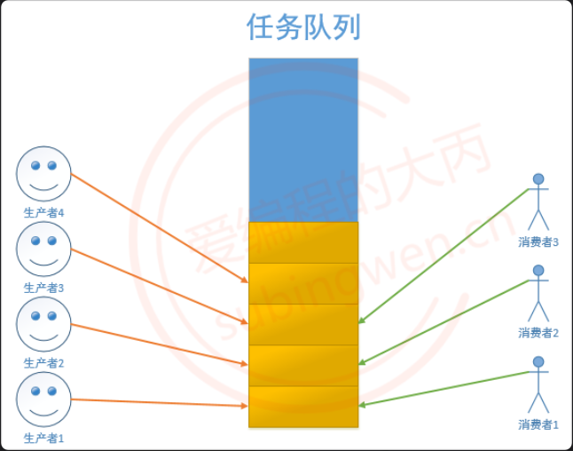

**供过于求，生产者阻塞；供不应求，消费者阻塞**（生产者生产消息到任务队列，当任务队列消息较多或者满了，唤醒消费者，满了生产者还会阻塞自身；消费者消耗任务队列中的消息，当任务队列为空或者消息较少的时候，唤醒生产者，空了消费者会阻塞自身）。

场景描述：使用条件变量实现生产者和消费者模型，生产者有 5 个，往链表头部添加节点，消费者也有 5 个，删除链表头部的节点。

```c
#include <stdio.h>
#include <stdlib.h>
#include <unistd.h>
#include <string.h>
#include <pthread.h>

// 链表的节点
struct Node
{
    int number;
    struct Node* next;
};

// 定义条件变量, 控制消费者线程
pthread_cond_t cond;
// 互斥锁变量
pthread_mutex_t mutex;
// 指向头结点的指针
struct Node * head = NULL;

// 生产者的回调函数
void* producer(void* arg)
{
    // 一直生产
    while(1)
    {
        pthread_mutex_lock(&mutex);
        // 创建一个链表的新节点
        struct Node* pnew = (struct Node*)malloc(sizeof(struct Node));
        // 节点初始化
        pnew->number = rand() % 1000;
        // 节点的连接, 添加到链表的头部, 新节点就新的头结点
        pnew->next = head;
        // head指针前移
        head = pnew;
        printf("+++producer, number = %d, tid = %ld\n", pnew->number, pthread_self());
        pthread_mutex_unlock(&mutex);

        // 生产了任务, 通知消费者消费
        pthread_cond_broadcast(&cond);

        // 生产慢一点
        sleep(rand() % 3);
    }
    return NULL;
}

// 消费者的回调函数
void* consumer(void* arg)
{
    while(1)
    {
        pthread_mutex_lock(&mutex);
        // 一直消费, 删除链表中的一个节点
//        if(head == NULL)   // 这样写有bug
        while(head == NULL)
        {
            // 任务队列, 也就是链表中已经没有节点可以消费了
            // 消费者线程需要阻塞
            // 线程加互斥锁成功, 但是线程阻塞在这行代码上, 锁还没解开
            // 其他线程在访问这把锁的时候也会阻塞, 生产者也会阻塞 ==> 死锁
            // 这函数会自动将线程拥有的互斥锁解开
            pthread_cond_wait(&cond, &mutex);
            // 当消费者线程解除阻塞之后, 会自动将这把锁锁上
            // 这时候当前这个线程又重新拥有了这把互斥锁
        }
        // 取出链表的头结点, 将其删除
        struct Node* pnode = head;
        printf("--consumer: number: %d, tid = %ld\n", pnode->number, pthread_self());
        head  = pnode->next;
        free(pnode);			// 释放旧节点
        pthread_mutex_unlock(&mutex);        

        sleep(rand() % 3);
    }
    return NULL;
}

int main()
{
    // 初始化条件变量
    pthread_cond_init(&cond, NULL);
    pthread_mutex_init(&mutex, NULL);

    // 创建5个生产者, 5个消费者
    pthread_t ptid[5];
    pthread_t ctid[5];
    for(int i=0; i<5; ++i)
    {
        pthread_create(&ptid[i], NULL, producer, NULL);
    }

    for(int i=0; i<5; ++i)
    {
        pthread_create(&ctid[i], NULL, consumer, NULL);
    }

    // 释放资源
    for(int i=0; i<5; ++i)
    {
        // 阻塞等待子线程退出
        pthread_join(ptid[i], NULL);
    }

    for(int i=0; i<5; ++i)
    {
        pthread_join(ctid[i], NULL);
    }

    // 销毁条件变量
    pthread_cond_destroy(&cond);
    pthread_mutex_destroy(&mutex);

    return 0;
}
```

代码分析：

```c
void* consumer(void* arg)
{
    while(1)
    {
        pthread_mutex_lock(&mutex);
        // 一直消费, 删除链表中的一个节点
        if(head == NULL)   // 这样写有bug
        {
            pthread_cond_wait(&cond, &mutex);
        }
        // 取出链表的头结点, 将其删除
        struct Node* pnode = head;
        printf("--consumer: number: %d, tid = %ld\n", pnode->number, pthread_self());
        head  = pnode->next;
        free(pnode);
        pthread_mutex_unlock(&mutex);        

        sleep(rand() % 3);
    }
    return NULL;
}

/*
为什么在第7行使用if 有bug:
    当任务队列为空, 所有的消费者线程都会被这个函数阻塞 pthread_cond_wait(&cond, &mutex);
    也就是阻塞在代码的第9行
	
    当生产者生产了1个节点, 调用 pthread_cond_broadcast(&cond); 唤醒了所有阻塞的线程
      - 有一个消费者线程通过 pthread_cond_wait()加锁成功, 其余没有加锁成功的线程继续阻塞
      - 加锁成功的线程向下运行, 并成功删除一个节点, 然后解锁
      - 没有加锁成功的线程解除阻塞继续抢这把锁, 另外一个子线程加锁成功
      - 但是这个线程删除链表节点的时候链表已经为空了, 后边访问这个空节点的时候就会出现段错误
      
    主要是在pthread_cond_wait()阻塞之后，生产者再次生成出资源(一个或者多个)，
    代码会从pthread_cond_wait()继续执行，生产一个资源没问题，但是生产多个资源会出现下一次最外层的while循环中有空的存在，消费者会阻塞在这个地方，同时可能出现生成者生产资源，资源队列满了的情况（生成者生成速率大于消费者消费速率的情况），生产者阻塞，形成死锁。
    
    解决方案:
      - 需要循环的对链表是否为空进行判断, 需要将if 该成 while
*/


// 消费者与生成者的条件变量不一样，一个是上限，一个是下限
```

### 信号量（资源计数器）——操作系统中的 PV 操作

#### 信号量函数

信号量用在多线程多任务同步的，一个线程完成了某一个动作就通过信号量告诉别的线程，别的线程再进行某些动作。**信号量不一定是锁定某一个资源，而是流程上的概念**，比如：有 A，B 两个线程，B 线程要等 A 线程完成某一任务以后再进行自己下面的步骤，这个任务并不一定是锁定某一资源，还可以是进行一些计算或者数据处理之类。

**信号量（信号灯）与互斥锁和条件变量的主要不同在于”灯”的概念，灯亮则意味着资源可用，灯灭则意味着不可用。信号量主要阻塞线程, 不能完全保证线程安全，如果要保证线程安全, 需要信号量和互斥锁一起使用**。

**信号量和条件变量一样用于处理生产者和消费者模型**，用于阻塞生产者线程或者消费者线程的运行。信号的类型为 sem_t 对应的头文件为 <semaphore.h>：

```c
#include <semaphore.h>
sem_t sem;
```


Linux 提供的信号量操作函数原型如下：

```c
#include <semaphore.h>
// 初始化信号量/信号灯
int sem_init(sem_t *sem, int pshared, unsigned int value);
// 资源释放, 线程销毁之后调用这个函数即可
// 参数 sem 就是 sem_init() 的第一个参数            
int sem_destroy(sem_t *sem);
```

- 参数:

	- sem：信号量变量地址
	- pshared：
		- 0：线程同步
		- 非 0：进程同步
	- value：初始化当前信号量拥有的资源数（>= 0），如果资源数为 0，线程就会被阻塞了。

```c
// 参数 sem 就是 sem_init() 的第一个参数  
// 函数被调用sem中的资源就会被消耗1个, 资源数-1
int sem_wait(sem_t *sem);
```

当线程调用这个函数，**并且 sem 中的资源数 > 0，线程不会阻塞，线程会占用 sem 中的一个资源，因此资源数-1，直到 sem 中的资源数减为 0 时，资源被耗尽，因此线程也就被阻塞了。**

```c
// 参数 sem 就是 sem_init() 的第一个参数  
// 函数被调用sem中的资源就会被消耗1个, 资源数-1
int sem_trywait(sem_t *sem);
```

当线程调用这个函数，并且 sem 中的资源数 > 0，线程不会阻塞，线程会占用 sem 中的一个资源，因此资源数-1，直到 sem 中的资源数减为 0 时，资源被耗尽，**但是线程不会被阻塞，直接返回错误号**，因此可以在程序中添加判断分支，用于处理获取资源失败之后的情况。

```c
// 表示的时间是从1970.1.1到某个时间点的时间, 总长度使用秒/纳秒表示
struct timespec {
	time_t tv_sec;      /* Seconds */
	long   tv_nsec;     /* Nanoseconds [0 .. 999999999] */
};
// 调用该函数线程获取sem中的一个资源，当资源数为0时，线程阻塞，在阻塞abs_timeout对应的时长之后，解除阻塞。
// abs_timeout: 阻塞的时间长度, 单位是s, 是从1970.1.1开始计算的
int sem_timedwait(sem_t *sem, const struct timespec *abs_timeout);
```

该函数的参数 abs_timeout 和 pthread_cond_timedwait 的最后一个参数是一样的，使用方法不再过多赘述。当线程调用这个函数，并且 sem 中的资源数 > 0，线程不会阻塞，线程会占用 sem 中的一个资源，因此资源数-1，直到 sem 中的资源数减为 0 时，资源被耗尽，线程被阻塞，当阻塞指定的时长之后，线程解除阻塞。

```c
// 调用该函数给sem中的资源数+1
int sem_post(sem_t *sem);
```

调用该函数会将 sem 中的资源数+1，如果有线程在调用 sem_wait、sem_trywait、sem_timedwait 时因为 sem 中的资源数为 0 被阻塞了，这时这些线程会解除阻塞，获取到资源之后继续向下运行。

```c
// 查看信号量 sem 中的整形数的当前值, 这个值会被写入到sval指针对应的内存中
// sval是一个传出参数
int sem_getvalue(sem_t *sem, int *sval);
```

通过这个函数可以查看 sem 中现在拥有的资源个数，通过第二个参数 sval 将数据传出，也就是说第二个参数的作用和返回值是一样的。

#### 生产者和消费者

由于生产者和消费者是两类线程，并且在还没有生成之前是不能进行消费的，在使用信号量处理这类问题的时候可以定义两个信号量，分别用于记录生产者和消费者线程拥有的总资源数（双方目的，减少自己的资源，增加对方的资源）。

```c
// 生产者线程 
sem_t psem;
// 消费者线程
sem_t csem;

// 信号量初始化
sem_init(&psem, 0, 5);    // 5个生产者可以同时生产
sem_init(&csem, 0, 0);    // 消费者线程没有资源, 因此不能消费

// 生产者线程
// 在生产之前, 从信号量中取出一个资源，生成者资源-1
sem_wait(&psem);	
// 生产者商品代码, 有商品了, 放到任务队列
......	 
......
......
// 通知消费者消费，给消费者信号量添加资源，让消费者解除阻塞，消费者资源+1
sem_post(&csem);
	
////////////////////////////////////////////////////////
////////////////////////////////////////////////////////

// 消费者线程
// 消费者需要等待生产, 默认启动之后应该阻塞，消费者资源-1
sem_wait(&csem);
// 开始消费
......
......
......
// 消费完成, 通过生产者生产，给生产者信号量添加资源，生成者资源+1
sem_post(&psem);

```

通过上面的代码可以知道，初始化信号量的时候没有消费者分配资源，消费者线程启动之后由于没有资源自然就被阻塞了，等生产者生产出产品之后，再给消费者分配资源，这样二者就可以配合着完成生产和消费流程了。

#### 信号量的使用

场景描述：使用信号量实现生产者和消费者模型，生产者有 5 个，往链表头部添加节点，消费者也有 5 个，删除链表头部的节点。

##### 总资源数为 1

如果生产者和消费者线程使用的信号量对应的总资源数为 1，那么不管线程有多少个，可以工作的线程只有一个，其余线程由于拿不到资源，都被迫阻塞了。

```c
#include <stdio.h>
#include <stdlib.h>
#include <unistd.h>
#include <string.h>
#include <semaphore.h>
#include <pthread.h>

// 链表的节点
struct Node
{
    int number;
    struct Node* next;
};

// 生产者线程信号量
sem_t psem;
// 消费者线程信号量
sem_t csem;

// 互斥锁变量
pthread_mutex_t mutex;
// 指向头结点的指针
struct Node * head = NULL;

// 生产者的回调函数
void* producer(void* arg)
{
    // 一直生产
    while(1)
    {
        // 生产者拿一个信号灯
        sem_wait(&psem);
        // 创建一个链表的新节点
        struct Node* pnew = (struct Node*)malloc(sizeof(struct Node));
        // 节点初始化
        pnew->number = rand() % 1000;
        // 节点的连接, 添加到链表的头部, 新节点就新的头结点
        pnew->next = head;
        // head指针前移
        head = pnew;
        printf("+++producer, number = %d, tid = %ld\n", pnew->number, pthread_self());

        // 通知消费者消费, 给消费者加信号灯
        sem_post(&csem);
        

        // 生产慢一点
        sleep(rand() % 3);
    }
    return NULL;
}

// 消费者的回调函数
void* consumer(void* arg)
{
    while(1)
    {
        sem_wait(&csem);
        // 取出链表的头结点, 将其删除
        struct Node* pnode = head;
        printf("--consumer: number: %d, tid = %ld\n", pnode->number, pthread_self());
        head  = pnode->next;
        free(pnode);
        // 通知生产者生成, 给生产者加信号灯
        sem_post(&psem);

        sleep(rand() % 3);
    }
    return NULL;
}

int main()
{
    // 初始化信号量
    // 生产者和消费者拥有的信号灯的总和为1
    sem_init(&psem, 0, 1);  // 生成者线程一共有1个信号灯
    sem_init(&csem, 0, 0);  // 消费者线程一共有0个信号灯

    // 创建5个生产者, 5个消费者
    pthread_t ptid[5];
    pthread_t ctid[5];
    for(int i=0; i<5; ++i)
    {
        pthread_create(&ptid[i], NULL, producer, NULL);
    }

    for(int i=0; i<5; ++i)
    {
        pthread_create(&ctid[i], NULL, consumer, NULL);
    }

    // 释放资源
    for(int i=0; i<5; ++i)
    {
        pthread_join(ptid[i], NULL);
    }

    for(int i=0; i<5; ++i)
    {
        pthread_join(ctid[i], NULL);
    }

    sem_destroy(&psem);
    sem_destroy(&csem);

    return 0;
}
```

**通过测试代码可以得到如下结论：如果生产者和消费者使用的信号量总资源数为 1，那么不会出现生产者线程和消费者线程同时访问共享资源的情况，不管生产者和消费者线程有多少个，它们都是顺序执行的。**

##### 总资源数大于 1

如果生产者和消费者线程使用的信号量对应的总资源数为大于 1，这种场景下出现的情况就比较多了：

- 多个生产者线程同时生产

- 多个消费者同时消费
- 生产者线程和消费者线程同时生产和消费

以上不管哪一种情况都可能会出现多个线程访问共享资源的情况，如果想防止共享资源出现数据混乱，那么就需要使用互斥锁进行线程同步，处理代码如下：

```c
#include <stdio.h>
#include <stdlib.h>
#include <unistd.h>
#include <string.h>
#include <semaphore.h>
#include <pthread.h>

// 链表的节点
struct Node
{
    int number;
    struct Node* next;
};

// 生产者线程信号量
sem_t psem;
// 消费者线程信号量
sem_t csem;

// 互斥锁变量
pthread_mutex_t mutex;
// 指向头结点的指针
struct Node * head = NULL;

// 生产者的回调函数
void* producer(void* arg)
{
    // 一直生产
    while(1)
    {
        // 生产者拿一个信号灯
        sem_wait(&psem);
        // 加锁, 这句代码放到 sem_wait()上边, 有可能会造成死锁
        pthread_mutex_lock(&mutex);
        // 创建一个链表的新节点
        struct Node* pnew = (struct Node*)malloc(sizeof(struct Node));
        // 节点初始化
        pnew->number = rand() % 1000;
        // 节点的连接, 添加到链表的头部, 新节点就新的头结点
        pnew->next = head;
        // head指针前移
        head = pnew;
        printf("+++producer, number = %d, tid = %ld\n", pnew->number, pthread_self());
        pthread_mutex_unlock(&mutex);

        // 通知消费者消费
        sem_post(&csem);
        
        // 生产慢一点
        sleep(rand() % 3);
    }
    return NULL;
}

// 消费者的回调函数
void* consumer(void* arg)
{
    while(1)
    {
        sem_wait(&csem);
        pthread_mutex_lock(&mutex);
        struct Node* pnode = head;
        printf("--consumer: number: %d, tid = %ld\n", pnode->number, pthread_self());
        head  = pnode->next;
        // 取出链表的头结点, 将其删除
        free(pnode);
        pthread_mutex_unlock(&mutex);
        // 通知生产者生成, 给生产者加信号灯
        sem_post(&psem);

        sleep(rand() % 3);
    }
    return NULL;
}

int main()
{
    // 初始化信号量
    sem_init(&psem, 0, 5);  // 生成者线程一共有5个信号灯
    sem_init(&csem, 0, 0);  // 消费者线程一共有0个信号灯
    // 初始化互斥锁
    pthread_mutex_init(&mutex, NULL);

    // 创建5个生产者, 5个消费者
    pthread_t ptid[5];
    pthread_t ctid[5];
    for(int i=0; i<5; ++i)
    {
        pthread_create(&ptid[i], NULL, producer, NULL);
    }

    for(int i=0; i<5; ++i)
    {
        pthread_create(&ctid[i], NULL, consumer, NULL);
    }

    // 释放资源
    for(int i=0; i<5; ++i)
    {
        pthread_join(ptid[i], NULL);
    }

    for(int i=0; i<5; ++i)
    {
        pthread_join(ctid[i], NULL);
    }

    sem_destroy(&psem);
    sem_destroy(&csem);
    pthread_mutex_destroy(&mutex);

    return 0;
}
```

在编写上述代码的时候还有一个需要注意是事项，不管是消费者线程的处理函数还是生产者线程的处理函数内部有这么两行代码：

```c
// 消费者
sem_wait(&csem);
pthread_mutex_lock(&mutex);

// 生产者
sem_wait(&csem);
pthread_mutex_lock(&mutex);
```


这两行代码的调用顺序是不能颠倒的，如果颠倒过来就有可能会造成死锁，下面来分析一种死锁的场景：	

```c
void* producer(void* arg)
{
    // 一直生产
    while(1)
    {
        pthread_mutex_lock(&mutex);
        // 生产者拿一个信号灯
        sem_wait(&psem);
		......
        ......
        // 通知消费者消费
        sem_post(&csem);
        pthread_mutex_unlock(&mutex);
        
        // 生产慢一点
        sleep(rand() % 3);
    }
    return NULL;
}

// 消费者的回调函数
void* consumer(void* arg)
{
    while(1)
    {
        pthread_mutex_lock(&mutex);
        sem_wait(&csem);
		......
        ......
        // 通知生产者生成, 给生产者加信号灯
        sem_post(&psem);
        pthread_mutex_unlock(&mutex);

        sleep(rand() % 3);
    }
    return NULL;
}

int main()
{
    // 初始化信号量
    sem_init(&psem, 0, 5);  // 生成者线程一共有5个信号灯
    sem_init(&csem, 0, 0);  // 消费者线程一共有0个信号灯
	......
	......
    return 0;
}
```

在上面的代码中，**初始化状态下消费者线程没有任务信号量资源，假设某一个消费者线程先运行，调用 pthread_mutex_lock(&mutex); 对互斥锁加锁成功，然后调用 sem_wait(&csem); 由于没有资源，因此被阻塞了。其余的消费者线程由于没有抢到互斥锁，因此被阻塞在互斥锁上。对应生产者线程第一步操作也是调用 pthread_mutex_lock(&mutex);，但是这时候互斥锁已经被消费者线程锁上了，所有生产者都被阻塞，到此为止，多余的线程都被阻塞了，程序产生了死锁（信号量处理早于互斥锁，没有拿到原料（信号量），不能锁工作间（互斥锁））**。


## 线程池

### 线程池的原理

我们使用线程的时候就去创建一个线程，这样实现起来非常简便，但是就会有一个问题：**如果并发的线程数量很多，并且每个线程都是执行一个时间很短的任务就结束了，这样频繁创建线程就会大大降低系统的效率，因为频繁创建线程和销毁线程需要时间。**

那么有没有一种办法使得线程可以复用，就是执行完一个任务，并不被销毁，而是可以继续执行其他的任务呢？

线程池是一种多线程处理形式，处理过程中将任务添加到队列，然后在创建线程后自动启动这些任务。线程池线程都是后台线程。每个线程都使用默认的堆栈大小，以默认的优先级运行，并处于多线程单元中。如果某个线程在托管代码中空闲（如正在等待某个事件）, 则线程池将插入另一个辅助线程来使所有处理器保持繁忙。如果所有线程池线程都始终保持繁忙，但队列中包含挂起的工作，则线程池将在一段时间后创建另一个辅助线程但线程的数目永远不会超过最大值。超过最大值的线程可以排队，但他们要等到其他线程完成后才启动。

在各个编程语言的语种中都有线程池的概念，并且很多语言中直接提供了线程池，作为程序猿直接使用就可以了，下面给大家介绍一下线程池的实现原理：

- 线程池的组成主要分为 3 个部分，这三部分配合工作就可以得到一个完整的线程池：

	1. 任务队列（本质为回调函数），存储需要处理的任务，由工作的线程来处理这些任务（存储空间，C++中 STL 容器，C 中数组或者链表）
		- 通过线程池提供的 API 函数，将一个待处理的任务添加到任务队列，或者从任务队列中删除
		- 已处理的任务会被从任务队列中删除
		- 线程池的使用者，也就是调用线程池函数（API）往任务队列中添加任务的线程就是 **生产者线程**
	2. 工作的线程（任务队列任务的 **消费者**）（通过函数地址，使用任务队列） ，N 个
		- 线程池中维护了一定数量的工作线程, 他们的作用是是不停的读任务队列, 从里边取出任务并处理
		- 工作的线程相当于是任务队列的消费者角色，
		- 如果任务队列为空, 工作的线程将会被阻塞 (使用条件变量/信号量阻塞)
		- 如果阻塞之后有了新的任务, 由生产者将阻塞解除, 工作线程开始工作
	3. 管理者线程（不处理任务队列中的任务），1 个
		- 它的任务是周期性的对任务队列中的任务数量以及处于忙状态的工作线程个数进行检测
			- 当任务过多的时候, 可以适当的创建一些新的工作线程
			- 当任务过少的时候, 可以适当的销毁一些工作的线程

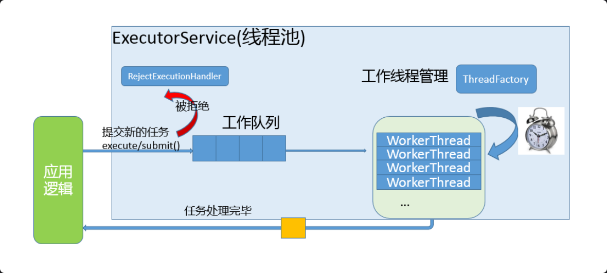

### 线程池-C 语言

#### 使用 VS2022+SSH 编写（windows 下编写代码，Linux 下编译(需要提前安装 SSH 服务、gdb 或者 g++ )）

在 vs2022 中创建新的项目（创建时，选择  控制台应用程序——在 Linux 终端运行代码。默认打印“hello”  或者 空项目——使用适用于 Linux 的 C++从头开始操作。提供基础文件 。如果没有这两个选项，需要安装 Linux 模块）

创建好了，之后的入门页就是创建远程连接（SSH）

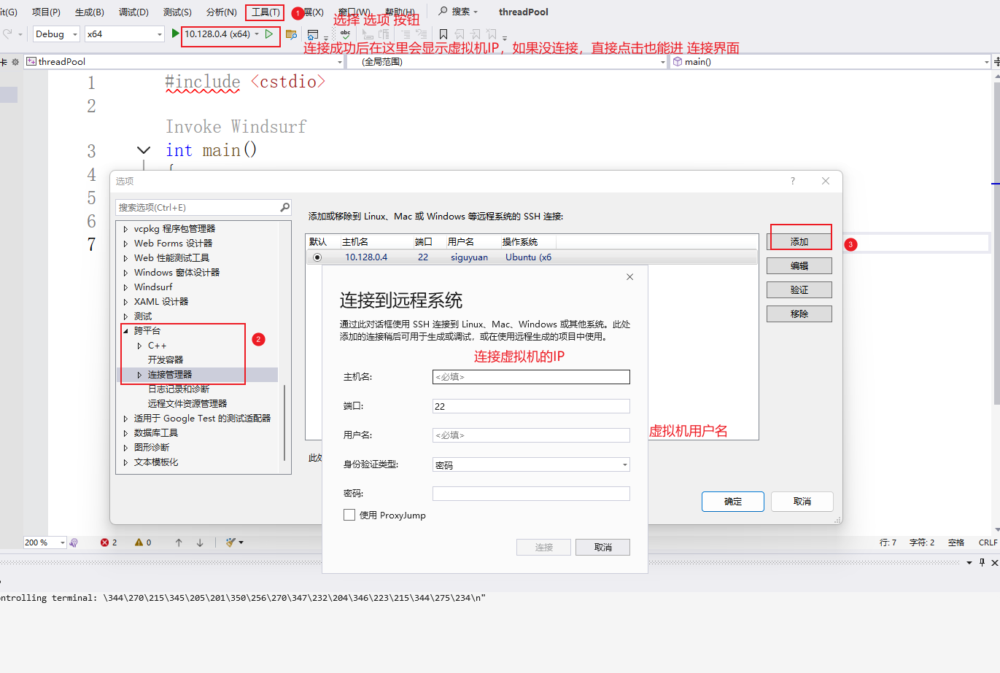

做完之后在 跨平台 -> 连接管理器-> 远程标头 IntelliSense 管理器-> 更新 /  下载  , 将 Linux 的头文件下载到 Windows 上

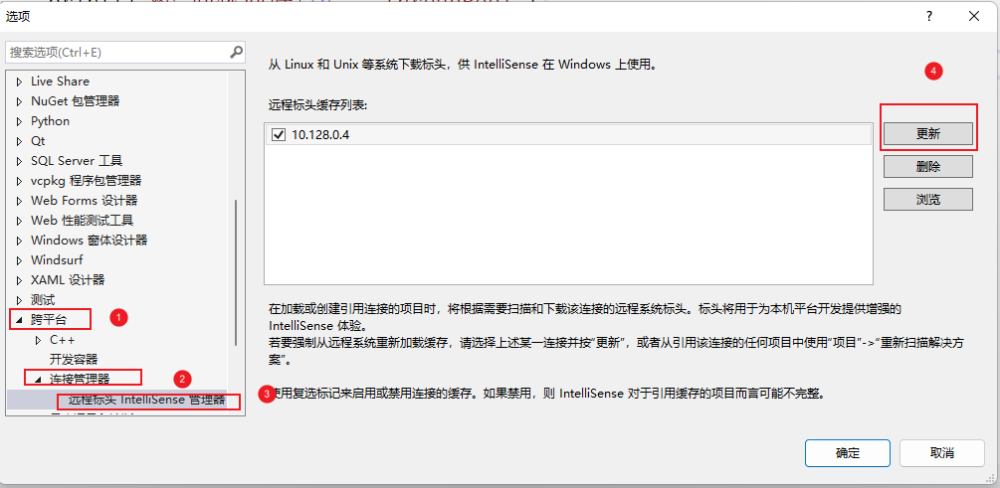

代码在远程终端存储位置如下：

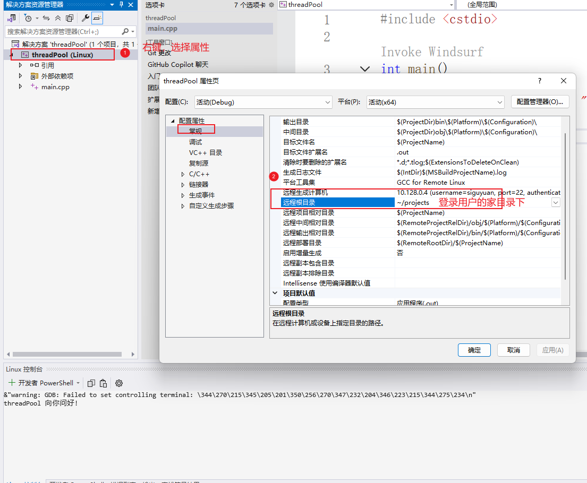

在 vs 中编译执行之后，在下方的 Linux 控制台可以看到结果，也可以去终端中查看

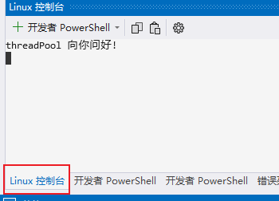

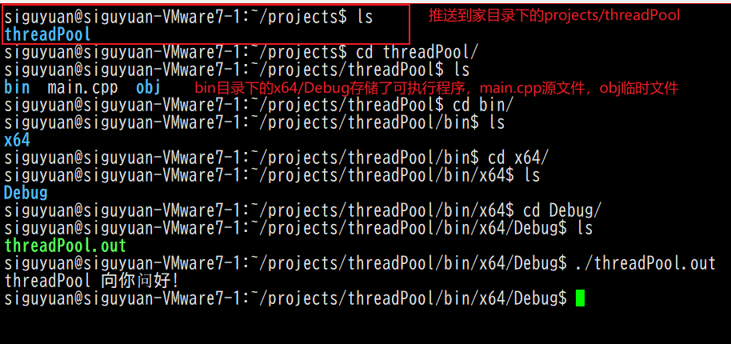

#### 线程池编写

```c
项目结构
    ---main.cpp
    ---threadpool.cpp
    ---threadpool.h
```

threadpool.h

```c++
#ifndef __THREADPOOL_H__
#define __THREADPOOL_H__

typedef struct ThreadPool ThreadPool;
// 创建线程池并且初始化
ThreadPool* threadpool_create(int queueCapacity,int minNum, int maxNum);

// 销毁线程池
int threadpool_destroy(ThreadPool *pool);

// 给线程池添加任务
void threadpool_add(ThreadPool *pool, void (*func)(void *),void* arg);

// 获取线程池中工作线程个数
int threadpool_busy_num(ThreadPool *pool);
// 获取线程池中存活线程个数
int threadpool_live_num(ThreadPool *pool);


// 工作回调函数
void* worker(void *arg);
// 管理回调函数
void* manager(void * arg);
// 退出线程函数
void threadExit(ThreadPool *pool);

#endif // __THREADPOOL_H__
```

threadpool.cpp

```c++
#include "threadpool.h"
#include <pthread.h>
#include <stdio.h>
#include <stdlib.h>
#include <string.h>
#include <unistd.h>

const int NUMBER = 2;		// 一次销毁/创建2个

// 任务结构体
//	定义到.h中，在编译成动态库后，使用者能看见；
//	定义到.c中，编译成动态库后，使用者不能看见
//	使用typedef关键字，是为了定义时少写struct Task（起别名）（c语言规定结构体定义时:struct Task Tabc;）

typedef struct Task
{
	// void* arg是一种泛型，能兼容更多的数据类型
	void (*function)(void* arg);	// 接收处理的函数
	void* arg;						// 存储接收的处理函数的需要的参数	
}Task;


// 线程结构体
struct ThreadPool
{
	// 任务队列
	Task* taskQueue;
	int queueCapacity;				// 队列容量
	int queueSize;					// 当前任务个数
	int queueFront;					// 队头 -> 取出数据
	int queueRear;					// 队尾 -> 存入数据

	// 工作与管理相关线程
	pthread_t managerID;			// 管理者线程 唯一一个
	pthread_t* threadpoolIDs;		// 工作者线程 存在多个
	int minNum;						// 工作者线程最小个数
	int maxNum;						// 工作者线程最大个数
	int busyNum;					// 忙线程的个数（正在工作的线程）
	int exitNum;					// 需要销毁的线程个数
	int liveNum;					// 存活的线程个数

	// 线程同步
	pthread_mutex_t mutexPool;		// 锁整个线程池
	pthread_mutex_t mutexBusy;		// 锁busyNum变量（exitNum与liveNum变化没有这个剧烈）
	pthread_cond_t notFull;			// 任务队列为空
	pthread_cond_t notEmpty;		// 任务队列为满

	// 线程池销毁
	int shutdown;					// 销毁线程池，1销毁，0销毁
};

// 创建线程池并且初始化
ThreadPool* threadpool_create(int queueCapacity, int minNum, int maxNum)
{
	// 初始化线程池
	ThreadPool *threadPool = (ThreadPool*)malloc(sizeof(ThreadPool));
	do
	{
		// 判断threadPool是否分配成功
		if (threadPool == NULL)
		{
			printf("malloc threadPool fail\n");
			break;
		}

		// 初始化工作的线程数组
		threadPool->threadpoolIDs = (pthread_t*)malloc(sizeof(pthread_t) * maxNum);		// 根据最大数量初始化
		if (threadPool->threadpoolIDs == NULL)
		{
			printf("malloc threadpoolIDs fail\n");
			break;
		}
		memset(threadPool->threadpoolIDs, 0, sizeof(pthread_t) * maxNum);					// 初始化分配数据，获取判断该区域是不是0，然后进行添加或者销毁
		threadPool->minNum = minNum;
		threadPool->maxNum = maxNum;
		threadPool->busyNum = 0;
		threadPool->liveNum = minNum;			// 存活线程按最小值初始化
		threadPool->exitNum = 0;

		// 初始化锁，判断初始化是否成功
		if (pthread_mutex_init(&threadPool->mutexPool, NULL) != 0 ||
			pthread_mutex_init(&threadPool->mutexBusy, NULL) != 0 ||
			pthread_cond_init(&threadPool->notFull, NULL) != 0 ||
			pthread_cond_init(&threadPool->notEmpty, NULL) != 0)
		{
			printf("mutex or cond fail\n");
			break;
		}

		// 初始化任务队列
		threadPool->taskQueue = (Task*)malloc(sizeof(Task) * queueCapacity);
		if (threadPool->taskQueue == NULL)
		{
			printf("malloc taskQueu fail\n");
			break;
		}
		threadPool->queueCapacity = queueCapacity;
		threadPool->queueSize = 0;
		threadPool->queueRear = 0;
		threadPool->queueFront = 0;

		threadPool->shutdown = 0;

		// 创建管理者和工作者线程
		pthread_create(&threadPool->managerID, NULL, manager, threadPool);
		for (int i = 0; i < minNum; i++)
		{
			pthread_create(&threadPool->threadpoolIDs[i], NULL, worker, threadPool);		// 将threadPool传入worker方便调用threadPool中的任务队列
		}

		return threadPool;
	} while (0);			// 为了失败时，方便释放已经申请的内存

	if (threadPool && threadPool->threadpoolIDs) free(threadPool->threadpoolIDs);
	if (threadPool && threadPool->taskQueue) free(threadPool->taskQueue);
	if (threadPool) free(threadPool);

	return NULL;
}

int threadpool_destroy(ThreadPool* pool)
{
	// 判断线程是否存在
	if (pool == NULL) 
	{
		return -1;
	}

	// 关闭线程池，管理者线程在循环扫描时，会判断线程池是否关闭，若关闭则自杀
	pool->shutdown = 1;
	
	// 阻塞回收的管理线程
	pthread_join(pool->managerID, NULL);

	// 唤醒阻塞的消费者线程自杀
	for (int i = 0; i < pool->liveNum; i++)
	{
		pthread_cond_signal(&pool->notEmpty);
	}

	
	// 销毁锁资源
	pthread_mutex_destroy(&pool->mutexPool);
	pthread_mutex_destroy(&pool->mutexBusy);
	pthread_cond_destroy(&pool->notEmpty);
	pthread_cond_destroy(&pool->notFull);

	// 释放堆内存
	if (pool->taskQueue)
	{
		free(pool->taskQueue);
		pool->taskQueue = NULL;
	}
	if (pool->threadpoolIDs)
	{
		free(pool->threadpoolIDs);
		pool->threadpoolIDs = NULL;
	}
	free(pool);
	pool = NULL;


	return 0;
}

void threadpool_add(ThreadPool* pool, void(*func)(void*), void* arg)
{
	// 加锁
	pthread_mutex_lock(&pool->mutexPool);
	

	// 判断线程池存在，任务队列满
	while (pool->queueSize == pool->queueCapacity && !pool->shutdown)
	{
		// 阻塞当前生产者（生产者线程）
		pthread_cond_wait(&pool->notFull,&pool->mutexPool);
	}

	// 判断线程池是销毁
	if (pool->shutdown)
	{
		pthread_mutex_unlock(&pool->mutexPool);
		return;
	}

	// 放入任务
	pool->taskQueue[pool->queueRear].function = func;
	pool->taskQueue[pool->queueRear].arg = arg;

	// 队尾后移
	pool->queueRear = (pool->queueRear + 1) % pool->queueCapacity;
	pool->queueSize++;

	// 唤醒消费者
	pthread_cond_signal(&pool->notEmpty);

	// 解锁
	pthread_mutex_unlock(&pool->mutexPool);
}

int threadpool_busy_num(ThreadPool* pool)
{
	pthread_mutex_lock(&pool->mutexBusy);
	int busyNum = pool->busyNum;
	pthread_mutex_unlock(&pool->mutexBusy);
	return busyNum;
}

int threadpool_live_num(ThreadPool* pool)
{
	pthread_mutex_lock(&pool->mutexPool);
	int liveNum = pool->liveNum;
	pthread_mutex_unlock(&pool->mutexPool);
	return liveNum;
}

void* worker(void* arg)
{
	ThreadPool* pool = (ThreadPool*) arg;
	while (1)
	{
		// 加锁
		pthread_mutex_lock(&pool->mutexPool);
		// 判断当前任务队列是否有任务  线程池存在且任务为0
		while(pool->queueSize == 0 && pool->shutdown == 0) 
		{
			// 阻塞当前消费者（工作线程），等待新的任务出现(会自动释放自身资源，资源够了在重新上锁)
			pthread_cond_wait(&pool->notEmpty,&pool->mutexPool);

			// 自杀
			if (pool->exitNum > 0)
			{
				pool->exitNum--;
				// 判断当前存活线程是否大于最小线程，保证线程至少有minNum线程
				if (pool->liveNum > pool->minNum)
				{
					pool->liveNum--;
					// 归还资源
					pthread_mutex_unlock(&pool->mutexPool);
					threadExit(pool);
				}
			}
		}
		// 判断线程池是否被关闭
		if(pool->shutdown == 1)
		{
			// 解锁,退出线程
			pthread_mutex_unlock(&pool->mutexPool);
			threadExit(pool);
		}

		// 获取任务队列中的任务
		Task task;
		// 从头部取数据
		task.function = pool->taskQueue[pool->queueFront].function;
		task.arg = pool->taskQueue[pool->queueFront].arg;

		// 移动任务队列头节点,减少当前任务个数
		pool->queueFront = (pool->queueFront + 1) % pool->queueCapacity;
		pool->queueSize--;		

		//唤醒生产者
		pthread_cond_signal(&pool->notFull);

		// 解锁
		pthread_mutex_unlock(&pool->mutexPool);

		// 开始工作
		// 记录忙线程
		printf("start to work , busyNum+1 , tid = %ld\n",pthread_self());
		pthread_mutex_lock(&pool->mutexBusy);
		pool->busyNum++;
		pthread_mutex_unlock(&pool->mutexBusy);


		task.function(task.arg);			// 或者 (*task.function)(task.arg);
		// 释放堆内存，传入的参数是堆内存
		free(task.arg);
		task.arg = NULL;

		// 工作完成
		// 再次记录忙线程
		printf("finish the work , busyNum-1 , tid = %ld\n",pthread_self());
		pthread_mutex_lock(&pool->mutexBusy);
		pool->busyNum--;
		pthread_mutex_unlock(&pool->mutexBusy);

	}

	return NULL;
}


void* manager(void* arg)
{
	ThreadPool* pool = (ThreadPool*)arg;
	// 线程池关闭退出
	while (!pool->shutdown)
	{
		// 每隔3s进行一次检查
		sleep(3);

		// 取出线程池中的任务数量和当前存活线程数量
		pthread_mutex_lock(&pool->mutexPool);
		int queuseSize = pool->queueSize;
		int liveNum = pool->liveNum;
		// int busyNum = pool->busyNum;
		pthread_mutex_unlock(&pool->mutexPool);

		// 取出线程池中忙线程数量（写在上面也可以）
		pthread_mutex_lock(&pool->mutexBusy);
		int busyNum = pool->busyNum;
		pthread_mutex_unlock(&pool->mutexBusy);

		// 添加线程
		// 任务个数 > 当前存活线程数据量 && 存活线程数 < 最大线程数
		if (queuseSize > liveNum && liveNum < pool->maxNum) 
		{
			// 加锁，需要对pool->liveNum进行修改
			pthread_mutex_lock(&pool->mutexPool);
			// 一次创建2个
			int count = 0;
			for (int i = 0; i < pool->maxNum && 
				pool->liveNum < pool->maxNum && 
				count < NUMBER; i++)
			{
				// 当前threadpoolIDs存储的是0，代表没有被使用
				if (pool->threadpoolIDs[i] == 0)
				{
					pthread_create(&pool->threadpoolIDs[i],NULL,worker,pool);
					count++;
					pool->liveNum++;
				}
			}
			pthread_mutex_unlock(&pool->mutexPool);
		}

		// 销毁线程
		// 忙线程 * 2 < 当前存活线程 && 当前存活线程 > 最小线程数
		if (busyNum * 2 < liveNum && liveNum > pool->minNum)
		{
			// 添加销毁线程数
			pthread_mutex_lock(&pool->mutexPool);
			pool->exitNum = NUMBER;
			pthread_mutex_unlock(&pool->mutexPool);
			// 引导存活线程自己自杀
			for (int i = 0; i < NUMBER; i++) 
			{
				// 唤醒在worker中阻塞在pthread_cond_wait的线程
				pthread_cond_signal(&pool->notEmpty);
			}
		}

	}

	return nullptr;
}

void threadExit(ThreadPool* pool)
{
	// 获取当前线程ID
	pthread_t tid = pthread_self();
	// 加锁，防止多个线程同时修改
	pthread_mutex_lock(&pool->mutexPool); 
	for (int i = 0; i < pool->maxNum; i++) 
	{
		// 找到与要退出线程ID相同的ID
		if (pthread_equal(pool->threadpoolIDs[i],tid))
		{
			pool->threadpoolIDs[i] = 0;
			printf("exit ID: %ld\n",tid);
			break;
		}
	}
	// 解锁
	pthread_mutex_unlock(&pool->mutexPool); 
	pthread_exit(NULL);	
}
```

main.cpp

```c++
#include <stdio.h>
#include <stdlib.h>
#include <pthread.h>
#include <unistd.h>
#include "threadpool.h"

void taskFunc(void *arg) 
{
    // 强转解引用
    int num = *(int*)arg;
    printf("thread tid: %ld , num = %d\n",pthread_self(),num);
    usleep(1000);
}

int main()
{
    ThreadPool* pool = threadpool_create(500,4,12);
    for(int i =0 ;i < 10000; i++)
    {
        int *num = (int*)malloc(sizeof(int));
		*num = i + rand() % 100;
        threadpool_add(pool,taskFunc,num);
    }

    // 等待主线程运行完
    sleep(30);

    // 销毁线程池
    threadpool_destroy(pool);


    return 0;
}
```

`memset` 是一个 C 标准库函数，用于将一块内存区域填充为指定的值。memset ` 函数的头文件是 ` <string.h> 它的原型如下：

```c
void* memset(void* dest, int c, size_t n);
```

- `dest` 是需要填充的内存区域的起始地址。
- `c` 是需要填充的值。
- `n` 是需要填充的内存区域的大小（以字节为单位）。

`memset` 函数将 `dest` 指向的内存区域的前 `n` 个字节填充为 `c` 的值。如果 `n` 为 0，则不进行任何操作。


代码写完之后，需要添加动态库，否则编译出来有问题:

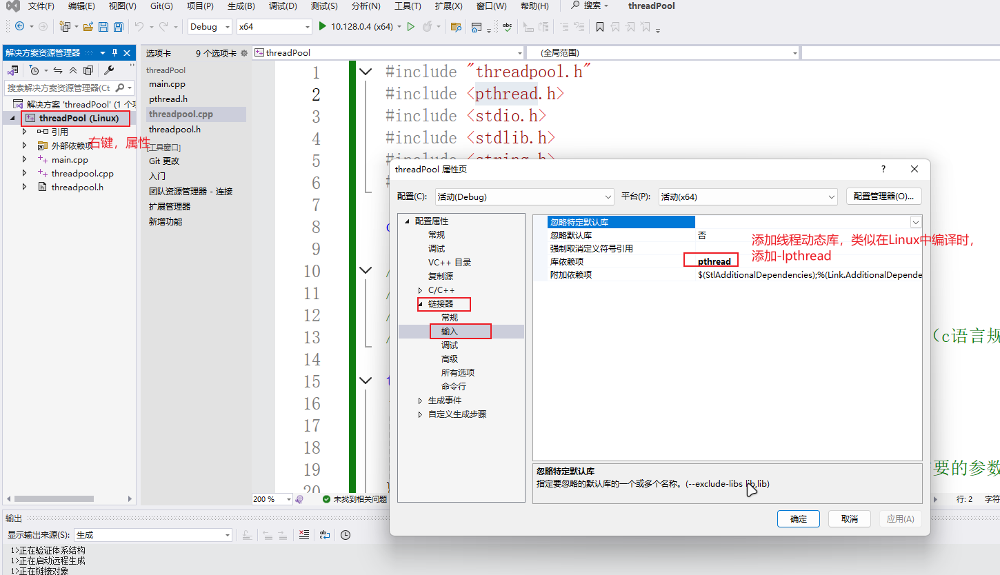

### 线程池-C++（C++11之前）

```c++
项目结构
    ---main.cpp
    ---ThreadPool.cpp
    ---ThreadPool.h
    ---TaskQueue.cpp
    ---TaskQueue.h
    // 建议模板使用.hpp
```


main.cpp

```c++
#include <iostream>
#include <pthread.h>
#include <unistd.h>
#include "ThreadPool.h"

void taskFunc(int* arg)
{
    int num = *arg;
    std::cout << "thread tid: " << pthread_self() << ", num = " << num << std::endl;
    usleep(1000);
}

int main()
{
    ThreadPool<int> pool(4, 12);
    for (int i = 0; i < 10000; i++)
    {
        int* num = new int(i + rand() % 100);
        pool.addTasks(taskFunc,num);
    }

    // 等待主线程运行完
    sleep(30);
    return 0;
}
```

ThreadPool.h

```c++
#pragma once
#include "TaskQueue.h"
#include <vector>
#include <iostream>
#include <string>
#include <unistd.h>


template<typename T0>
class ThreadPool
{
public:
	// 创建线程池并且初始化
	ThreadPool(int minNum, int maxNum);

	// 销毁线程池
	~ThreadPool();

	// 给线程池添加任务
	void addTasks(callback<T0> func, T0* arg);

	// 获取线程池中工作线程数量
	int getBusyNum();
	// 获取线程池中存活线程数量
	int getAlive_num();

private:
	// 工作线程回调函数 只有静态函数（未被初始化的时候有地址，类对象只有实例化（创建对象后）才有地址
	// pthread_create只能接受 void* (*)(void*)
	// 静态函数没有this指针，不属于任何类对象，属于类
	static void* worker(void* arg);
	// 管理者线程回调函数
	static void* manager(void* arg);
	// 单个线程退出函数
	void threadExit();

private:
	// 任务队列
	TaskQueue<T0>* m_taskQueue;

	// 线程池中的线程
	pthread_t m_managerID;			// 管理者线程 唯一一个
	std::vector<pthread_t>* m_threadpoolIDs = nullptr;		// 工作者线程 存在多个 动态
	int m_minNum;						// 线程池最小线程数量
	int m_maxNum;						// 线程池最大线程数量
	int m_busyNum;					// 忙线程的个数（正在工作的线程）
	int m_exitNum;					// 需要销毁的线程数量
	int m_aliveNum;					// 存活线程数量

	// 锁和条件变量
	pthread_mutex_t m_lock;
	pthread_cond_t m_notEmpty;

	// 关闭线程池的标志位
	bool m_shutdown = false;

	// 一次创建或销毁的线程数量
	static const int NUMBER = 2;
};

// 创建线程池并初始化
template<typename T0>
ThreadPool<T0>::ThreadPool(int minNum, int maxNum)
{
	// 实例化任务队列
	m_taskQueue = new TaskQueue<T0>;
	do
	{
		// 初始化线程池
		m_minNum = minNum;
		m_maxNum = maxNum;
		m_busyNum = 0;
		m_aliveNum = minNum;
		m_exitNum = 0;

		// 根据线程的最大上限给线程数组分配内存
		m_threadpoolIDs = new std::vector<pthread_t>(maxNum);
		if (m_threadpoolIDs == nullptr)
		{
			std::cout << "new threadpool failed..." << std::endl;
			break;
		}

		// 初始化互斥锁和条件变量
		if (pthread_mutex_init(&m_lock, NULL) != 0 ||
			pthread_cond_init(&m_notEmpty, NULL) != 0)
		{
			std::cout << "init mutex or condition failed..." << std::endl;
			break;
		}

		// 创建管理者线程
		pthread_create(&m_managerID, NULL, manager, this);

		// 创建工作线程
		for (int i = 0; i < minNum; ++i)
		{
			pthread_create(&(*this->m_threadpoolIDs)[i], NULL, worker, this);
		}
		return;
	} while (0);

	// 释放资源
	if (m_taskQueue) delete m_taskQueue;
	if (m_threadpoolIDs) delete m_threadpoolIDs;
}

// 销毁线程池
template<typename T0>
ThreadPool<T0>::~ThreadPool()
{
	m_shutdown = true;
	// 阻塞回收管理者线程
	pthread_join(m_managerID, NULL);
	// 唤醒所有消费者线程
	for (int i = 0; i < m_aliveNum; ++i)
	{
		pthread_cond_signal(&m_notEmpty);
	}

	// 释放堆内存
	if (m_taskQueue) delete m_taskQueue;
	if (m_threadpoolIDs) delete m_threadpoolIDs;
	pthread_mutex_destroy(&m_lock);
	pthread_cond_destroy(&m_notEmpty);
}

// 给线程池添加任务
template<typename T0>
void ThreadPool<T0>::addTasks(callback<T0> func, T0* arg)
{
	if (m_shutdown)
	{
		return;
	}
	// 添加任务，不需要加锁，任务队列中有锁
	m_taskQueue->addTask(func, arg);
	// 唤醒工作的线程
	pthread_cond_signal(&m_notEmpty);
}

// 获取线程池中工作的线程的个数
template<typename T0>
int ThreadPool<T0>::getBusyNum()
{
	int busyNum = 0;
	pthread_mutex_lock(&m_lock);
	busyNum = m_busyNum;
	pthread_mutex_unlock(&m_lock);
	return busyNum;
}

// 获取线程池中活着的线程的个数
template<typename T0>
int ThreadPool<T0>::getAlive_num()
{
	int aliveNum = 0;
	pthread_mutex_lock(&m_lock);
	aliveNum = m_aliveNum;
	pthread_mutex_unlock(&m_lock);
	return aliveNum;
}

// 工作线程任务函数
template<typename T0>
void* ThreadPool<T0>::worker(void* arg)
{
	ThreadPool* pool = static_cast<ThreadPool*>(arg);
	while (true)
	{
		// 访问任务队列(共享资源)加锁
		pthread_mutex_lock(&pool->m_lock);
		// 判断任务队列是否为空, 如果为空工作线程阻塞
		while (pool->m_taskQueue->taskNumber() == 0 && !pool->m_shutdown)
		{
			// 阻塞工作线程
			pthread_cond_wait(&pool->m_notEmpty, &pool->m_lock);

			// 解除阻塞之后, 判断是否要销毁线程
			if (pool->m_exitNum > 0)
			{
				pool->m_exitNum--;
				if (pool->m_aliveNum > pool->m_minNum)
				{
					pool->m_aliveNum--;
					pthread_mutex_unlock(&pool->m_lock);
					pool->threadExit();
				}
			}
		}

		// 判断线程池是否被关闭了
		if (pool->m_shutdown)
		{
			pthread_mutex_unlock(&pool->m_lock);
			pool->threadExit();
		}

		// 从任务队列中取出一个任务
		Task<T0> task = pool->m_taskQueue->takeTask();
		// 工作的线程+1
		pool->m_busyNum++;
		// 线程池解锁
		pthread_mutex_unlock(&pool->m_lock);

		// 执行任务
		std::cout << "thread " << pthread_self() << " start working..." << std::endl;
		task.m_func(task.m_arg);
		task.m_arg = nullptr;

		// 任务处理结束
		std::cout << "thread " << pthread_self() << " end working..." << std::endl;
		pthread_mutex_lock(&pool->m_lock);
		pool->m_busyNum--;
		pthread_mutex_unlock(&pool->m_lock);
	}

	return nullptr;
}

// 管理者线程任务函数
template<typename T0>
void* ThreadPool<T0>::manager(void* arg)
{
	ThreadPool* pool = static_cast<ThreadPool*>(arg);
	while (!pool->m_shutdown)
	{
		// 每隔3s检测一次
		sleep(3);
		// 取出线程池中的任务数和线程数量
		// 取出工作的线程池数量
		pthread_mutex_lock(&pool->m_lock);
		int queueSize = static_cast<int>(pool->m_taskQueue->taskNumber());
		int liveNum = pool->m_aliveNum;
		int busyNum = pool->m_busyNum;
		pthread_mutex_unlock(&pool->m_lock);

		// 创建线程
		// 当前任务个数>存活的线程数 && 存活的线程数<最大线程个数
		if (queueSize > liveNum && liveNum < pool->m_maxNum)
		{
			// 线程池加锁
			pthread_mutex_lock(&pool->m_lock);
			int counter = 0;
			for (int i = 0; i < pool->m_maxNum && counter < NUMBER && pool->m_aliveNum < pool->m_maxNum; ++i)
			{
				// 如果当前线程ID为0，表示这个线程还没有被创建
				if ((*pool->m_threadpoolIDs)[i] == 0)
				{
					pthread_create(&(*pool->m_threadpoolIDs)[i], NULL, worker, pool);
					counter++;
					pool->m_aliveNum++;
				}
			}
			pthread_mutex_unlock(&pool->m_lock);
		}

		// 销毁多余的线程
		// 忙线程*2 < 存活的线程数目 && 存活的线程数 > 最小线程数量
		if (busyNum * 2 < liveNum && liveNum > pool->m_minNum)
		{
			// 线程池加锁
			pthread_mutex_lock(&pool->m_lock);
			pool->m_exitNum = NUMBER;
			pthread_mutex_unlock(&pool->m_lock);
			// 让工作的线程自杀
			for (int i = 0; i < NUMBER; ++i)
			{
				pthread_cond_signal(&pool->m_notEmpty);
			}
		}
	}
	return nullptr;
}

// 单个线程退出
template<typename T0>
void ThreadPool<T0>::threadExit()
{
	pthread_t tid = pthread_self();
	for (int i = 0; i < m_maxNum; ++i)
	{
		if ((*m_threadpoolIDs)[i] == tid)
		{
			(*m_threadpoolIDs)[i] = 0;
			std::cout << "threadExit() called, " << tid << " exiting..." << std::endl;
			break;
		}
	}
	pthread_exit(NULL);
}


```

TaskQueue.h

```c++
#pragma once
#include <queue>
#include <pthread.h>

// 使用模板优化传入参数
// 使用using简化函数指针
template<typename T>
using callback = void(*)(T* arg);

// 任务结构体
template<typename T>
struct Task
{
	Task()
	{
		m_func = nullptr;
		m_arg = nullptr;
	}
	Task(callback<T> func, T* arg)
	{
		m_func = func;
		m_arg = arg;
	}
	callback<T> m_func;
	T* m_arg;
};

// 任务队列
template<typename T>
class TaskQueue
{
public:
	TaskQueue();
	~TaskQueue();

	// 添加任务
	void addTask(callback<T> func, T* arg);
	void addTask(Task<T>& task);

	// 取出一个任务
	Task<T> takeTask();

	// 获取当前任务的个数
	size_t taskNumber();

private:
	// 任务队列
	std::queue<Task<T>> m_taskQ;
	// 互斥锁
	pthread_mutex_t m_mutex;
};

template<typename T>
TaskQueue<T>::TaskQueue()
{
	pthread_mutex_init(&m_mutex, NULL);
}

template<typename T>
TaskQueue<T>::~TaskQueue()
{
	pthread_mutex_destroy(&m_mutex);
}

template<typename T>
void TaskQueue<T>::addTask(callback<T> func, T* arg)
{
	pthread_mutex_lock(&m_mutex);
	Task<T> task(func, arg);
	m_taskQ.push(task);
	pthread_mutex_unlock(&m_mutex);
}

template<typename T>
void TaskQueue<T>::addTask(Task<T>& task)
{
	pthread_mutex_lock(&m_mutex);
	m_taskQ.push(task);
	pthread_mutex_unlock(&m_mutex);
}

template<typename T>
Task<T> TaskQueue<T>::takeTask()
{
	Task<T> t;
	pthread_mutex_lock(&m_mutex);
	if (m_taskQ.size() > 0)
	{
		t = m_taskQ.front();
		m_taskQ.pop();
	}
	pthread_mutex_unlock(&m_mutex);
	return t;
}

template<typename T>
size_t TaskQueue<T>::taskNumber()
{
	size_t num = 0;
	pthread_mutex_lock(&m_mutex);
	num = m_taskQ.size();
	pthread_mutex_unlock(&m_mutex);
	return num;
}

```

`inline` [内联函数](https://so.csdn.net/so/search?q=内联函数&spm=1001.2101.3001.7020) 是指用 inline 关键字修饰的函数。为了消除函数调用的时空开销，C++ 提供一种提高效率的方法，即在 **编译时将函数调用处用函数体替换**，类似于 C 语言中的宏展开。这种在函数调用处直接嵌入函数体的函数称为内联函数（Inline Function）。但也存在缺点，就是每一调用处均会展开，增加了重复的代码量。

通常在以下情况下使用 `inline` 关键字：

1. **小函数**: 如果函数体很小，通常只有一两行代码，且没有判定，使用 `inline` 可以避免函数调用带来的开销。
2. **频繁调用**: 如果函数被频繁调用，使用 `inline` 可以减少函数调用次数，从而提高性能。
3. **模板函数**: 在模板元编程中，使用 `inline` 可以避免函数实例化带来的开销。
4. 类里面定义的函数默认是内联函数（隐私内联，不用直接使用 inline 关键字）

**注意事项**：

1. **函数体大小**: 如果函数体过大，使用 `inline` 可能会导致代码膨胀，从而降低性能。
2. **函数调用次数**: 如果函数调用次数不频繁，使用 `inline` 可能不会带来显著的性能提升。
3. **编译器优化**: 现代编译器通常会自动进行内联优化，因此在某些情况下使用 `inline` 关键字可能不会带来额外的性能提升。
4. **函数定义**: `inline` 函数必须在头文件中定义，否则会导致链接错误。
5. **多文件编译**: 如果在多个文件中定义了同一个 `inline` 函数，可能会导致编译错误。

```c++
// header.h
inline int add(int a, int b) {
    return a + b;
}

// main.cpp
#include "header.h"

int main() {
    int result = add(2, 3);
    return 0;
}
//add函数被声明为inline函数，在编译时会将函数体直接插入到调用处
```

### 线程池-C++（C++11之后）

C++11中提供的线程类叫做**std::thread**，基于这个类创建一个新的线程非常的简单，只需要提供线程函数或者函数对象即可，并且可以同时指定线程函数的参数。我们首先来了解一下这个类提供的一些常用API：

#### 构造函数

```c++
// ①
thread() noexcept;
// ②
thread( thread&& other ) noexcept;
// ③
template< class Function, class... Args >
explicit thread( Function&& f, Args&&... args );
// ④
thread( const thread& ) = delete;
```

- 构造函数①：默认构造函，构造一个线程对象，在这个线程中不执行任何处理动作

- 构造函数②：移动构造函数，将 other 的线程所有权转移给新的thread 对象。之后 other 不再表示执行线程。

- 构造函数③：创建线程对象，并在该线程中执行函数f中的业务逻辑，args是要传递给函数f的参数

	- 任务函数f的可选类型有很多，具体如下：

		- **普通函数，类成员函数，匿名函数，仿函数（这些都是可调用对象类型）**
		- **可以是可调用对象包装器类型，也可以是使用绑定器绑定之后得到的类型（仿函数）**
- 构造函数④：使用=delete显示删除拷贝构造, 不允许线程对象之间的拷贝

