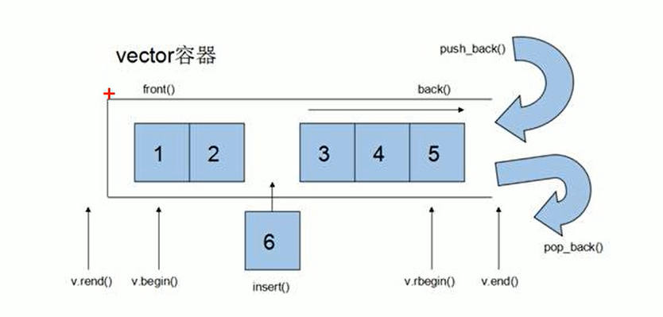
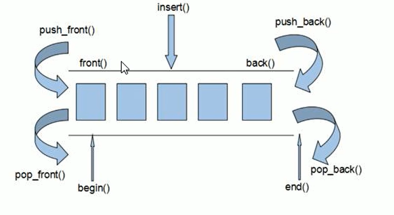
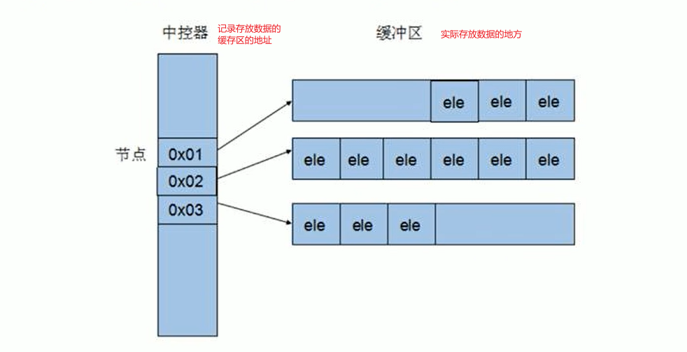
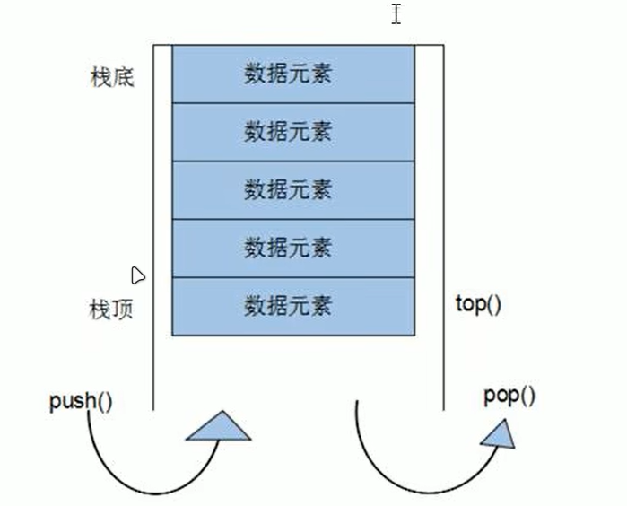
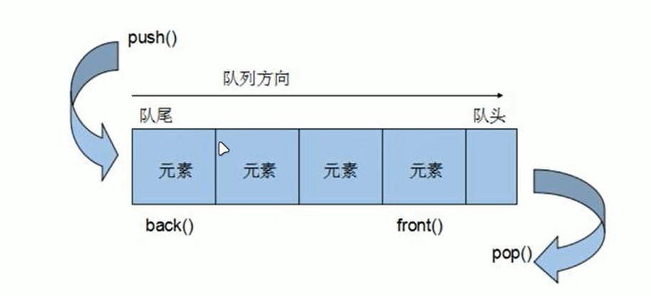
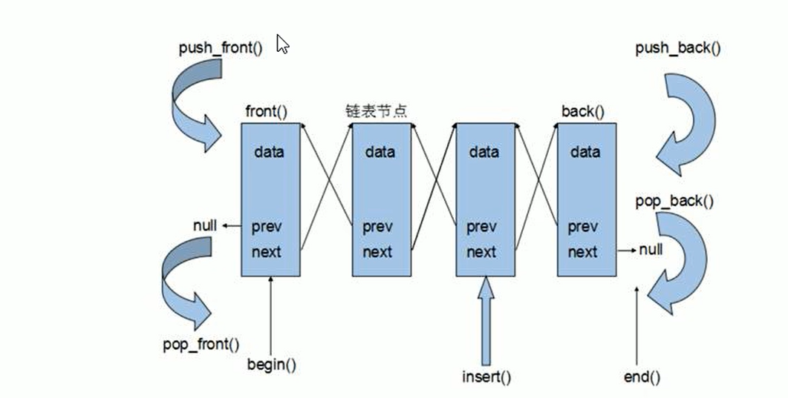

# 1 STL简介

## 1.1 STL诞生

- 软件界希望建立一种可重复利用的东西
- C++的面向对象（**面对对象的三大特性：封装、继承、多态**）和泛型编程的思想，目的就是复用性提升
- 大多数情况下，数据结构和算法都未能有一套标准，导致被迫从事大量重复工作
- 为了建立数据结构和算法的一套标准，诞生了STL

## 1.2 STL基本概念

- STL（Standard Template Library，标准模板库）
- STL从广义上分为：**容器（container）、算法（algorithm）、迭代器（iterator）**
- **容器**和**算法**之间通过**迭代器**进行**无缝连接**
- STL几乎所有的代码都采用了**模板类和模板函数**

## 1.3 STL六大组件

- STL大体分为六大组件，分别为**容器、算法、迭代器、仿函数、适配器（配接器）、空间配置器**

	- >1. 容器:各种数据结构，如vector、 list、 deque、 set、 map等,用来存放数据。
		>2. 算法:各种常用的算法，如sort、find、copy、for_each等
		>3. 迭代器:扮演了容器与算法之间的胶合剂。
		>4. 仿函数:行为类似函数,可作为算法的某种策略。（eg.重载=、重载()等函数）
		>5. 适配器:一种用来修饰容器或者仿函数或迭代器接口的东西。
		>6. 空间配置器:负责空间的配置与管理。（eg. 自动管理堆栈区的内存）

## 1.4 STL中容器、算法、迭代器

>- 容器：置物之所也
>- STL容器就是将运用最广泛的一些数据结构实现出来
>- 常用的数据结构:数组,链表,树,栈,队列,集合,映射表等
>- 这些容器分为**序列式容器**和**关联式容器**两种:
>	- 序列式容器:强调值的排序，序列式容器中的每个元素均有固定的位置。如，顺序表，链表，队列，栈（放进去之前什么样，出来什么样）
>	- 关联式容器：二叉树结构，各元素之间没有严格的物理上的顺序关系。如，树，图，集合，映射表（会进行排序）


>- 算法：问题之解法也
>- 有限的步骤,解决逻辑或数学上的问题,这一门学科我们叫做算法(Algorithms)（算法头文件就是Algorithms）
>- 算法分为:**质变算法和非质变算法**:
>	- 质变算法:是指运算过程中会更改区间内的元素的内容。例如，拷贝,替换,删除等等
>	- 非质变算法:是指运算过程中不会更改区间内的元素内容,例如，查找、计数、遍历、寻找极值等等


>- 迭代器：容器和算法之间粘合剂（通过迭代器来访问容器内容）
>- 提供一种方法,使之能够依序**寻访某个容器所含的各个元素,**而又无需暴露该容器的内部表示方式。
>- **每个容器**都有自己**专属的迭代器**
>- 迭代器使用非常类似于指针,初学阶段我们可以先理解迭代器为指针
>
>
>
>- 迭代器种类：
>
>	|      种类      |                           功能                           |                 支持运算                 | 举例                    |
>	| :------------: | :------------------------------------------------------: | :--------------------------------------: | ----------------------- |
>	|   输入迭代器   |                     对数据的只读访问                     |           只读，支持++、==、!=           | std::istream_iterator   |
>	|   输出迭代器   |                     对数据的只写访问                     |               只写，支持++               | std::ostream_iterator   |
>	|   前向迭代器   |               读写操作，并能向前推进迭代器               |           读写，支持++、==、!=           | std::forward_list       |
>	|   双向迭代器   |               读写操作，并能向前和向后操作               |            读写，支持++、- -             | std::list               |
>	| 随其访问迭代器 | 读写操作，可以以跳跃的方式访问任意数据，功能最强的迭代器 | 读写，支持++、- -、[n]、-n、<、<=、>、<= | std::vector、std::array |
>
>- 常用的容器中迭代器种类为双向迭代器，和随机访问迭代器
>

# 2 常用容器

## 2.1 vector

- 容器： vector
- 算法：for_each
- 迭代器：vector<数据类型>::iterator
- 容器头文件：#include <vector>
- 算法头文件：#include <algorithm>


### (1) 存放内置数据类型

示例：

```c++ 
#include <iostream>
#include <vector>											//vector容器头文件
#include <algorithm>										//标准算法头文件

using namespace std;

/*  vector插入内置数据  */


void myPrint(int val) {
	cout << val << endl;
}

void test01(void) {
	/* 创建vector容器 */
	vector<int> v;											//vector<数据类型>容器变量;

	/* 在容器中放数据 */
	v.push_back(10);
	v.push_back(20);
	v.push_back(30);
	v.push_back(40);
	v.push_back(50);

	/* 创建vector迭代器 */
	/* vector<数据类型>::迭代器类型 迭代器变量名字   iterator：正向迭代器 */
	vector<int>::iterator myBegin = v.begin();				//创建起始迭代器   指向v容器中的第一个
	vector<int>::iterator myEnd = v.end();					//创建终止迭代器   指向v容器中的最后一个元素的下一位

	/* 第一种遍历 */
	while (myBegin != myEnd)
	{
		cout << *myBegin << endl;
		myBegin++;											//与指针操作一样
	}

	cout << endl;

	/* 第二种遍历 */
	for (vector<int>::iterator it = v.begin(); it != v.end(); it++) {
		cout << *it << endl;
	}

	cout << endl;

	/* 第三种遍历 */
	/* 参数为（起始位置，终点位置，可调用对象）   可调用对象：这里使用的函数，利用的时回调函数的知识  */
	for_each(v.begin(), v.end(),myPrint);
}


int main(void) {

	test01();

	return 0;
}
```


### (2) 存放自定义数据类型

示例：

```c++
#include <iostream>
#include <algorithm>
#include <vector>
#include <string>

using namespace std;


class Person {
public:

	Person(string name,int age) {
		this->m_name = name;
		this->m_age = age;
	}

	string m_name;
	int m_age;

};

void myPrintf(Person val) {
	cout << "姓名： " << val.m_name << " 年龄： " << val.m_age << endl;
}

/* vector容器存放自定义数据类型 */

void test01(void) {
	vector<Person> v;

	Person p1("aaa", 10);
	Person p2("BBB", 20);
	Person p3("ccc", 30);
	Person p4("ddd", 40);
	Person p5("eee", 50);
	Person p6("fff", 60);

	v.push_back(p1);
	v.push_back(p2);
	v.push_back(p3);
	v.push_back(p4);
	v.push_back(p5);
	v.push_back(p6);

	/* for循环遍历 */
	for (vector<Person>::iterator it = v.begin(); it != v.end(); it++) {
		cout << "姓名：" << (*it).m_name << "年龄：" << it->m_age << endl;
	}

	/* for_each()遍历 */
	for_each(v.begin(),v.end(), myPrintf);

}

/* vector容器存放自定义数据类型  指针 */
void myPrintf1(Person* val) {
	cout << "姓名： " << val->m_name << " 年龄： " << (*val).m_age << endl;
}

void test02(void) {
	vector<Person*> v;

	Person p1("aaa", 10);
	Person p2("BBB", 20);
	Person p3("ccc", 30);
	Person p4("ddd", 40);
	Person p5("eee", 50);
	Person p6("fff", 60);

	v.push_back(&p1);
	v.push_back(&p2);
	v.push_back(&p3);
	v.push_back(&p4);
	v.push_back(&p5);
	v.push_back(&p6);

	/* for循环遍历 */
	for (vector<Person*>::iterator it = v.begin(); it != v.end(); it++) {
		cout << "姓名：" << (*(*it)).m_name << "年龄：" << (*(it))->m_age << endl;					//二级指针   **it 
	}

	/* for_each()遍历 */
	for_each(v.begin(), v.end(), myPrintf1);

}

int main(void) {

	test01();

	cout << endl;

	test02();
	return 0;
}
	
```

### (3) 容器嵌套容器

示例：

```c++
#include <iostream>
#include <algorithm>
#include <vector>

using namespace std;


/* vector容器嵌套容器 */

void test01(void) {
	vector<vector<int>> v;

	/* 创建小容器 */
	vector<int> v1;
	vector<int> v2;
	vector<int> v3;
	vector<int> v4;

	/* 在小容器中创建数据 */
	for (int i = 0; i < 4; i++) {
		v1.push_back(i * 1);
		v2.push_back(i * 10);
		v3.push_back(i * 100);
		v4.push_back(i * 1000);
	}

	/* 在大容器中写入数据 */
	v.push_back(v1);
	v.push_back(v2);
	v.push_back(v3);
	v.push_back(v4);

	/* for循环遍历 */
	for (vector<vector<int>>::iterator it = v.begin(); it != v.end(); it++) {
		for (vector<int>::iterator it1 = (*it).begin(); it1 != (*it).end(); it1++) {		//*it 可以看<>中的数据是什么，就可以知道类型
			cout << *it1 << "  ";
		}
		cout << endl;
	}

	
}


int main(void) {

	test01();

	
	return 0;
}

```


### (4) 基本概念

- **功能**：

	- `vector`数据结构和普通数组非常相似，通常也被称为**单端数组**。

- **`vector`与普通数组的区别**：

	- 普通数组在定义时大小是静态的，而`vector`则可以**动态扩展**。（vector头文件中，会倍数放大你要开辟的空间）

- **动态扩展**：

	- `vector`并不是在原空间之上继续扩展，而是寻找更大的内存空间（一般会分配更大的空间，避免频繁开辟空间），然后将原数据移动到新空间，释放原空间。（vector  != 链表）

	

	- `vector`容器的迭代器是支持随机访问的迭代器


### (5) 构造函数

- 功能描述：

	- 创建`vector`容器。

- 函数原型：

	- `vector<T> v;`
		// 采用模板实现类型实例化，默认为构造函数。

	- `vector(v.begin(), v.end());`
		// 将`v`中`[begin(), end())`区间的元素拷贝给本身。 end() 取得是最后一个元素的下一个位置 

	- `vector(n, elem);`
		// 构造函数将`n`个`elem`拷贝给本身。

	- `vector(const vector &vec);`
		// 拷贝构造函数。

示例：

```c++
#include <iostream>
#include <vector>
#include <algorithm>

using namespace std;

/* vector容器的构造函数 */

void printVector(vector<int> v) {
	for (vector<int>::iterator it = v.begin(); it != v.end(); it++) {
		cout << *it << "  ";
	}
	cout << endl;
}

void test01() {
	vector<int> v1;								// 采用模板实现类型实例化，默认为构造函数。
	for (int i = 0; i < 10; i++) {
		v1.push_back(i);
	}
	printVector(v1);

	vector<int> v2(v1.begin(), v1.end());		// 将`v`中`[begin(), end())`区间的元素拷贝给本身。 end() 取得是最后一个元素的下一个位置 
	printVector(v2);

	vector<int> v3(10,100);						// 构造函数将`n`个`elem`拷贝给本身。
	printVector(v3);

	vector<int> v4(v3);							// 拷贝构造函数。
	printVector(v4);
}

int main() {

	test01();

	getchar();
	return 0;
}


```


### (6) 赋值操作

-  功能描述：
	- 给`vector`容器进行赋值。
-  函数原型：
	- `vector& operator=(const vector &vec);`
		// 重载等号操作符。
	- `assign(beg, end);`
		// 将`[beg, end)`区间中的数据拷贝赋值给本身。
	- `assign(n, elem);`
		// 将`n`个`elem`拷贝赋值给本身。


示例：

```c++
#include <iostream>
#include <vector>
#include <algorithm>

using namespace std;

/* vector容器的赋值操作 */

void printVector(vector<int> &v) {
	for (vector<int>::iterator it = v.begin(); it != v.end(); it++) {
		cout << *it << "  ";
	}
	cout << endl;
}

void test01() {
	vector<int> v1;
	for (int i = 0; i < 10; i++) {
		v1.push_back(i);
	}
	printVector(v1);						

	vector<int> v2;							//vector& operator=(const vector & vec); // 重载等号操作符。
	v2 = v1;
	printVector(v2);

	vector<int> v3;							//assign(beg, end); //将[beg, end)区间中的数据拷贝赋值给本身。
	v3.assign(v1.begin(),v1.end());
	printVector(v3);

	vector<int> v4;							//assign(n, elem);将n个elem拷贝赋值给本身。
	v4.assign(10,100);
	printVector(v4);

	
}

int main() {

	test01();

	getchar();
	return 0;
}


```


### (7) 容量和大小

- 功能描述：
	- 对`vector`容器的容量和大小操作。
- 函数原型：
	- `empty();`
		// 判断容器是否为空。
	- `capacity();`
		// 容器的容量。
	- `size();`
		// 返回容器中元素的个数。
	- `resize(int num);`
		// 重新指定容器的长度为`num`，若容器变长，则用默认值（0）填充新位置。若容器变短，则末尾超出容器长度的元素被删除。（不会改变容量（系统分配的空间），只会改变大小（实际使用的空间））
	- `resize(int num, elem);`
		// 重新指定容器的长度为`num`，若容器变长，则以`elem`值填充新位置。若容器变短，则末尾超出容器长度的元素被删除。


示例：

```c++
#include <iostream>
#include <vector>
#include <algorithm>

using namespace std;

/* vector容器的容量和大小 */

void printVector(vector<int>& v) {
	for (vector<int>::iterator it = v.begin(); it != v.end(); it++) {
		cout << *it << "  ";
	}
	cout << endl;
}

void test01() {
	vector<int> v1;
	for (int i = 0; i < 10; i++) {
		v1.push_back(i);
	}
	printVector(v1);

	if (v1.empty()) {						// 判断容器是否为空。
		cout << "容器为空" << endl;
	}
	else
	{
		cout << "容量：" << v1.capacity();	// 容器的容量。
		cout << endl;
		cout << "元素个数：" << v1.size();	// 返回容器中元素的个数。
		cout << endl;
		cout << "重新指定长度：" << endl;	//resize(int num); 重新指定容器的长度为`num`，若容器变长，则默认用`值`填充新位置。若容器变短，则末尾超出容器长度的元素被删除。
											//resize(int num, elem); 重新指定容器的长度为`num`，若容器变长，则以`elem`值填充新位置。若容器变短，则末尾超出容器长度的元素被删除。
		v1.resize(3);
		printVector(v1);
		v1.resize(5, 100);
		printVector(v1);
	}


}

int main() {

	test01();

	getchar();
	return 0;
}


```


### (8) 插入和删除

- 功能描述：
	- 对`vector`容器进行插入、删除操作。
- 函数原型：
	- `push_back(ele);`
		// 尾部插入元素`ele`。
	- `pop_back();`
		// 删除最后一个元素。
	- `insert(const_iterator pos, ele);`
		// 迭代器指向位置`pos`插入元素`ele`。（提供迭代器）
	- `insert(const_iterator pos, int count, ele);`
		// 迭代器指向位置`pos`插入`count`个元素`ele`。（提供迭代器）
	- `erase(const_iterator pos);`
		// 删除迭代器指向的元素。（提供迭代器）
	- `erase(const_iterator start, const_iterator end);`
		// 删除迭代器从`start`到`end`之间的元素。（提供迭代器）（不包括end位置上的数）
	- `clear();`
		// 删除容器中所有元素。


1、正向迭代器：	容器名<类型>::iterator 迭代器名

2、常量正向迭代器：容器名<类型>::const_iterator 迭代器名

3、反向迭代器：	容器名<类型>::reverse_iterator 迭代器名

4、常量反向迭代器：容器名<类型>::const_reverse_iterator 迭代器名


示例：

```c++
#include <iostream>
#include <vector>
#include <algorithm>

using namespace std;

/* vector容器的插入和删除 */

void printVector(vector<int>& v) {
	for (vector<int>::iterator it = v.begin(); it != v.end(); it++) {
		cout << *it << "  ";
	}
	cout << endl;
}

void test01() {
	vector<int> v1;
	for (int i = 0; i < 10; i++) {
		v1.push_back(i);						// 尾部插入元素`ele`。
	}
	printVector(v1);

	cout << "删除最后一个元素" ;
	v1.pop_back();								// 删除最后一个元素。
	printVector(v1);

	vector<int>::iterator  it = v1.begin();		//正向迭代器（只能用正向或者常量正向）
	cout << "指定插入一个元素";					// 迭代器指向位置`pos`插入元素`ele`。（提供迭代器）
	v1.insert(it,100);							//v.insert(v.begin() + index, element);
	printVector(v1);

	it = v1.begin();							//重新获取头部位置
	cout << "指定插入n个相同元素";				// 迭代器指向位置`pos`插入`count`个元素`ele`。（提供迭代器）
	v1.insert(it, 2, 110);
	printVector(v1);

	cout << " 删除一个元素 ";
	v1.erase(v1.begin() + 2);					// 删除迭代器指向的元素。（提供迭代器） 删除一个100
	printVector(v1);

	cout << " 删除区间元素 ";
	v1.erase(v1.begin(),v1.begin() + 2);		// 删除迭代器从`start`到`end`之间的元素。删除110、110
	printVector(v1);							//清空 v1.erase(v1.begin().v1.end());

	cout << "清空容器";
	v1.clear();									// 删除容器中所有元素。
	printVector(v1);
}

int main() {

	test01();

	getchar();
	return 0;
}


```


### (9) 数据存取

-  功能描述：
	- 对`vector`中的数据进行获取操作。
- 函数原型：
	- `at(int idx);`
		// 返回索引`idx`所指的数据。
	- `operator[];`
		// 返回索引`idx`所指的数据。
	- `front();`
		// 返回容器中的第一个数据元素。
	- `back();`
		// 返回容器中的最后一个数据元素。


示例：

```c++
#include <iostream>
#include <vector>
#include <algorithm>

using namespace std;

/* vector容器的数据存取*/

void printVector(vector<int>& v) {
	for (vector<int>::iterator it = v.begin(); it != v.end(); it++) {
		cout << *it << "  ";
	}
	cout << endl;
}

void test01() {
	vector<int> v1;
	for (int i = 0; i < 10; i++) {
		v1.push_back(i);						
	}
	printVector(v1);

	cout << "成员函数at方式：" << endl;
	for (int i = 0; i < v1.size(); i++) {
		cout << v1.at(i) << "  ";						// 返回索引`idx`所指的数据。
	}

	cout  << endl << "重载[]方式：" << endl;
	for (int i = 0; i < v1.size(); i++) {
		cout << v1[i] << "  ";							// 返回索引`idx`所指的数据。
	}
	cout << endl;

	cout << " 返回第一个数据： " << v1.front() << endl;	// 返回容器中的第一个数据元素。
	cout << " 返回最后一个数据： " << v1.back() << endl;// 返回容器中的最后一个数据元素。
}

int main() {

	test01();

	getchar();
	return 0;
}


```


### (10) 互换容器

- 功能描述：
	- 实现两个容器内元素进行互换。（可以实现内存收缩的效果）
- 函数原型：
	- `swap(vec);`
		// 将 `vec` 与自身的元素进行互换。


示例：

```c++
#include <iostream>
#include <vector>
#include <algorithm>

using namespace std;

/* vector容器的互换容器*/

void printVector(vector<int>& v) {
	for (vector<int>::iterator it = v.begin(); it != v.end(); it++) {
		cout << *it << "  ";
	}
	cout << endl;
}

void test01(void) {
	vector<int> v1,v2;
	for (int i = 0; i < 10; i++) {
		v1.push_back(i);
		v2.push_back(i * 10);
	}
	cout << "交换前：" << endl;
	printVector(v1);
	printVector(v2);

	v1.swap(v2);					// 将 `vec` 与自身的元素进行互换。

	cout << "交换后：" << endl;
	printVector(v1);
	printVector(v2);
	
}

void test02(void) {
	vector<int> v;
	for (int i = 0; i < 10000; i++) {
		v.push_back(i);
	}

	cout << "容量：" << v.capacity() << endl;
	cout << "大小：" << v.size() << endl;

	v.resize(3);

	cout << "容量：" << v.capacity() << endl;
	cout << "大小：" << v.size() << endl;

	/* 使用swap收缩容量 */
	vector<int>(v).swap(v);						//匿名对象(当前行执行完，系统回收内存)，创建了一个新的 vector<int> 对象，初始化为 v 的内容
	cout << "容量：" << v.capacity() << endl;
	cout << "大小：" << v.size() << endl;
}

int main(void) {

	test01();
	test02();

	return 0;
}


```


### (11) 预留空间

-  功能描述：
	- 减少 `vector` 在动态扩展容量时的扩展次数。
- 函数原型：
	- `reserve(int len);`
		// 容器预留 `len` 个元素的长度，预留位置未初始化，元素不可访问。

示例：

```c++
#include <iostream>
#include <vector>
#include <algorithm>

using namespace std;

/* vector容器的预留空间*/

void printVector(vector<int>& v) {
	for (vector<int>::iterator it = v.begin(); it != v.end(); it++) {
		cout << *it << "  ";
	}
	cout << endl;
}

void test01(void) {
	vector<int> v1;

	v1.reserve(10000);					// 容器预留 `len` 个元素的长度，预留位置未初始化，元素不可访问。

	/* 统计开辟空间次数 */
	int num = 0;
	int* p = NULL;

	for (int i = 0; i < 10000; i++) {
		v1.push_back(i);

		if (p != &v1[0]) {				//如果不等于v1的首地址，就强制等于首地址
			p = &v1[0];					
			num++;
		}
	}
	
	cout << "num=" << num << endl;		//无预留空间开辟24次

}


int main(void) {

	test01();

	return 0;
}


```


## 2.2 String

### (1) 基本概念

- 本质：

	- string是C++风格的字符串，而string**本质上是一个类**

- 与char*的区别：

	- char*是一个指针
	- string是一个类，类内部封装了char*，管理这个字符串，是一个char\*型的容器

- 特点

	- string类内部封装了很多成员方法，例如，查找find、拷贝copy、删除delete、替换replace、插入insert

	- string管理char*所分配的内存，不用担心复制越界和取值越界等，由类内部进行负责

		

### (2) 构造函数

构造函数原型：

- string();					//创建一个空字符串 例如：string str;
- string(const char* s );              //使用字符串s初始化
- string(const string& str);         //使用一个string对象初始化另一个string对象
- string(int n, char c);                 //使用n个字符c初始化

示例：

```c++
#include <iostream>
#include <string>

using namespace std;


void test01(void) {
	string s1;						//使用默认构造函数

	const char* str = "你好";
	string s2(str);					//使用有参构造   string s5("ab");

	string s3(s2);					//使用拷贝构造

	string s4(10, 'b');				//使用另一种有参构造

	cout << "s2 = " << s2 << endl;
	cout << "s3 = " << s3 << endl;
	cout << "s4 = " << s4 << endl;
	
}

int main(void) {

	test01();

	return 0;
}
```


### (3) 赋值操作

- 功能描述
	- 给string字符串进行赋值
- 赋值的函数原型
	- string& operator=(const char *s);					//char\*类型字符串 赋值给当前字符串
	- string& operator=(const string &s);				    //字符串s赋值给当前的字符串
	- string& operator=(char c);						   //字符赋值给当前的字符串
	- string& assign(const char *s);					     //把字符串s赋给当前的字符串
	- string& assign(const char *s, int n);				  //把字符串是的前n个字符赋给当前字符串
	- string& assign(const string &s));					//把字符串s赋给当前字符串
	- string& assign(int n, char c);					      //用n个字符c赋给当前字符串	

示例：

```c++
#include <iostream>
#include <string>

using namespace std;


//strin的赋值操作
void test01(void) {
	string s1;						//string& operator=(const char *s);
	s1 = "你好";

	string s2;						//string& operator=(const string &s);
	s2 = s1;

	char c = 'A';
	string s3;						//string& operator=(char c);
	s3 = c;

	string s4;						//string& assign(const char *s);
	s4.assign("ABC");

	string s5;						//string& assign(const char *s, int n);
	s5.assign("ABCD", 2);

	string s6;						//string& assign(const string &s));
	s6.assign(s5);

	string s7;						//string& assign(int n, char c);
	s7.assign(7, 'a');

	cout << "s1 = " << s1 << endl;
	cout << "s2 = " << s2 << endl;
	cout << "s3 = " << s3 << endl;
	cout << "s4 = " << s4 << endl;
	cout << "s5 = " << s5 << endl;
	cout << "s6 = " << s6 << endl;
	cout << "s7 = " << s7 << endl;

}

int main(void) {

	test01();

	return 0;
}
```


### (4)  字符串拼接

- 功能描述
	- 在字符串末尾拼接字符串
- 赋值的函数原型
	- `string& operator+=(const char* str);`			 // 重载 `+=` 操作符
	- `string& operator+=(const char c);` 			      // 重载 `=` 操作符
	- `string& operator+=(const string& str);`    		// 重载 `+=` 操作符
	- `string& append(const char* s);` 		   		// 将字符数组 `s` 连接到当前字符串末尾
	- `string& append(const char* s, int n);`     		 // 将字符数组 `s` 的前 `n` 个字符连接到当前字符串末尾
	- `string& append(const string& s);` 				// 将字符串 `s` 连接到当前字符串末尾
	- `string& append(const string& s, int pos, int n);` // 将字符串 `s` 从 `pos` 开始的 `n` 个字符连接到当前字符串末尾
	- 还有其他类型的拼接函数

示例：

```c++
#include <iostream>
#include <string>

using namespace std;


//strin的字符串拼接
void test01(void) {
	string s1 = "我";					

	s1 += "爱你";						//string& operator+=(const char* str);
	cout << "s1 = " << s1 << endl;

	s1 += 's';							//string& operator=(const char c);` 
	cout << "s1 = " << s1 << endl;

	string s2 = "在家";					//string& operator+=(const string& str);
	s1 += s2;
	cout << "s1 = " << s1 << endl;

	string s3 = "蜜";
	s3.append("雪冰城");				//string& append(const char* s);
	cout << "s3 = " << s3 << endl;
		
	s3.append(" nihaoshijie",3);		//string& append(const char* s, int n);
	cout << "s3 = " << s3 << endl;

	s3.append(s2);						//string& append(const string& s);
	cout << "s3 = " << s3 << endl;

	s3.append("ABCDEF",2,3);			//string& append(const string & s, int pos, int n);
	cout << "s3 = " << s3 << endl;
	

}

int main(void) {

	test01();

	return 0;
}
```


### (5) 查找与替换

- **功能描述：**

	- 查找：查找指定字符串是否存在

	- 替换：在指定的位置替换字符串

- **函数原型：**

	- `int find(const string& str, int pos = 0) const;` 		// 查找 str 第一次出现位置，从 pos 开始查找，有返回下标；没有返回-1，下面同理。从前往后找

	- `int find(const char* s, int pos = 0) const;`			 // 查找第一次出现位置，从 pos 开始查找

	- `int find(const char* s, int pos, int n) const;` 		// 从 pos 位置查找前 n 个字符第一次位置

	- `int find(const char c, int pos = 0) const;` 			// 查找字符 c **第一次**出现位置

	- `int rfind(const string& str, int pos = npos) const;`      // 查找 str **最后一次**出现位置，从 pos 开始查找。从后往前找

	- `int rfind(const char* s, int pos = npos) const;` 	     // 查找最后一次出现位置，从 pos 开始查找

	- `int rfind(const char* s, int pos, int n) const;` 	    // 从 pos 查找字符的前 n 个字符最后一次位置

	- `int rfind(const char c, int pos = 0) const;` 		// 查找字符 c 最后一次出现位置

	- `string& replace(int pos, int n, const string& str);` // 替换从 pos 开始的 n 个字符为字符串 str。如果str的长度大于n，依然能够将str完整插入到 [pos:pos+n] 中去

	- `string& replace(int pos, int n, const char* s);` 	// 替换从 pos 开始的 n 个字符为字符串 s 

示例：

```c++
#include <iostream>
#include <string>

using namespace std;


//strin的查找与替换
void test01(void) {
	string s1 = "ni hao shi jie ni ni hao shi jie";
	string s2 = "shi jie";
	
	/* find 从前往后 */
	cout << s1.find(s2) << endl;
	cout << s1.find("o s") << endl;

	/* rfind 从后往前 */
	cout << s1.rfind(s2) << endl;
	cout << s1.rfind("o s") << endl;

	/* replace */
	cout << s1.replace(8,3,s2) << endl;
	cout << s1.replace(8,2, "abc") << endl;				
	
	//指定多少字符，都会替换，
	string s3 = "abcdefg";		
	cout << s3.replace(1, 3, "1111") << endl;		//替换成a1111efg,不会因为长度不够，而舍弃
	cout << s3.replace(1, 3, "22") << endl;
}

int main(void) {

	test01();

	return 0;
}
```


### (6) 字符串比较

- **功能描述：**
	- 字符串之间的比较，判断二者大小的意义不是很大

- **比较方式：**
	- 字符串比较是按字符的 ASCII 码进行比较
		- `=` 返回 0
		- `>` 返回 1
		- `<` 返回 -1

- **函数原型：**

	- `int compare(const string &s) const;` // 与字符串 s 比较

	- `int compare(const char *s) const;` // 与字符串 s 比较

示例：

```c++
#include <iostream>
#include <string>

using namespace std;


//strin的字符串比较 
void test01(void) {
	string s1 = "abc";
	string s2 = "abc";

	cout << s1.compare(s2) << endl;			//相等
	cout << s1.compare("ab") << endl;		//不相等 且第一个不相等的地方的ASCII值S1大 返回1
	cout << s1.compare("ad") << endl;		//不相等 且第一个不相等的地方的ASCII值S1小 返回-1
}

int main(void) {

	test01();

	return 0;
}
```


### (7) 字符串存取

- **string 中单个字符存取方式有两种：**

	- `char& operator[](int n);` // 通过 `[]` 方式获取字符

	- `char& at(int n);` // 通过 `at` 方法获取字符

示例：

```c++
#include <iostream>
#include <string>

using namespace std;


//strin的字符串存取
void test01(void) {
	string s1 = "abcef";
	
	//s1.size()  访问string s1的大小
	cout << s1[1] << endl;
	cout << s1.at(2) << endl;

	s1[1] = 'a';
	cout << s1[1] << endl;
}

int main(void) {

	test01();

	return 0;
}
```


### (8) 字符串插入和删除

- **功能描述：**
	- 对 `string` 字符串进行插入和删除字符操作
- **函数原型：**
	- `string& insert(int pos, const char* s);` // 插入字符串
	- `string& insert(int pos, const string& str);` // 插入字符串
	- `string& insert(int pos, int n, char c);` // 在指定位置插入 n 个字符 c
	- `string& erase(int pos, int n = npos);` // 删除从 pos 开始的 n 个字符

示例：

```c++
#include <iostream>
#include <string>

using namespace std;


//strin的字符串插入和删除
void test01(void) {
	string s1 = "abcef";

	cout << s1.insert(1, "111") << endl;

	cout << s1.erase(1, 3) << endl;
}

int main(void) {

	test01();

	return 0;
}
```


### (9) 子串的获取

- **功能描述：**
	- 从字符串中获取想要的子串
- **函数原型：**
	- `string substr(int pos = 0, int n = npos) const;` // 返回由 pos 开始的 n 个字符组成的字符串

示例：

```c++
#include <iostream>
#include <string>

using namespace std;


//strin的子串获取
void test01(void) {
	string s1 = "abcef";
	string s2 = "你好世界";

	cout << s1.substr(1,3)<< endl;
	cout << s2.substr(0, 4) << endl;			//一个汉字站2个字节
}

/* 过滤信息 */
void test02(void) {
	string s1 = "nihaoshijie@qq.com";

	string s2;
	s2 = s1.substr(0, s1.find("@"));

	cout << s2 << endl;
}

int main(void) {

	test01();
	test02();

	return 0;
}
```


## 2.3 deque

### (1) 基本概念

- **功能：**
	- 双端数组，可以对头尾进行插入删除操作
- **deque与vector区别：**
	- vector对于头部的插入删除效率低，数据量越大，效率越低
	- deque相对而言，对头部的插入删除速度比vector快
	- vector访问元素时的速度会比deque快，这和两者内部实现有关




- **deque内部工作原理：**

	- deque内部有个中控器，维护每段缓冲区中的内容，缓冲区中存放真实数据。

	- 中控器维护的是每个缓冲区的地址，使得使用deque时像是一片连续的内存空间。



- deque容器的迭代器也是支持随机访问。


### (2) 构造函数

- **功能描述：**
	- deque容器构造
- **函数原型：**
	- `deque<T> deqT;` // 默认构造形式
	- `deque(beg, end);` // 构造函数将[beg, end)区间中的元素拷贝给本身。
	- `deque(n, elem);` // 构造函数将n个elem拷贝给本身。
	- `deque(const deque &deq);` // 拷贝构造函数


示例：

```c++
#include <iostream>
#include <deque>
#include <algorithm>

using namespace std;

/* deque容器的构造函数*/

void printDeque(const deque<int>& d) {											//使用const 让d只读，防止函数中的操作进行误操作
	for (deque<int>::const_iterator it = d.begin(); it != d.end(); it++) {		//const_iterator 常量正向迭代器
		cout << *it << "  ";
	}
	cout << endl;
}

void test01(void) {
	deque<int> d1;							//默认构造形式
	for (int i = 0; i < 20; i++)
	{
		d1.push_back(i);
	}
	printDeque(d1);

	deque<int> d2(d1.begin(),d1.end());		// 构造函数将[beg, end)区间中的元素拷贝给本身。
	printDeque(d2);

	deque<int> d3(3,100);					// 构造函数将n个elem拷贝给本身。
	printDeque(d3);


	deque<int> d4(d3);						// 拷贝构造函数
	printDeque(d4);
}


int main(void) {

	test01();

	return 0;
}


```


### (3) 赋值操作

- **功能描述：**
	- 给deque容器进行赋值
- **函数原型：**
	- `deque& operator=(const deque &deq);` // 重载赋值操作符
	- `assign(beg, end);` // 将[beg, end)区间中的数据拷贝赋值给本身。
	- `assign(n, elem);` // 将n个elem拷贝赋值给本身。


示例：

```c++
#include <iostream>
#include <deque>
#include <algorithm>

using namespace std;

/* deque容器的赋值操作 */

void printDeque(const deque<int>& d) {											//使用const 让d只读，防止函数中的操作进行误操作
	for (deque<int>::const_iterator it = d.begin(); it != d.end(); it++) {		//const_iterator 常量正向迭代器
		cout << *it << "  ";
	}
	cout << endl;
}

void test01(void) {
	deque<int> d1;							
	for (int i = 0; i < 20; i++)
	{
		d1.push_back(i);
	}
	printDeque(d1);

	deque<int> d2;						
	d2 = d1;							// 重载赋值操作符
	printDeque(d2);

	deque<int> d3;						
	d3.assign(d1.begin(),d1.end());		 // 将[beg, end)区间中的数据拷贝赋值给本身。
	printDeque(d3);

	deque<int> d4;
	d4.assign(2,100);					// 将n个elem拷贝赋值给本身。
	printDeque(d4);
}


int main(void) {

	test01();

	return 0;
}


```


### (4) 大小操作

-  **功能描述：**
	- 对deque容器的大小进行操作
- **函数原型：**
	- `deque.empty();` // 判定容器是否为空
	- `deque.size();` // 返回容器中元素的个数
	- `deque.resize(num);` // 重新指定容器的长度为num，如果容器变长，则以默认值（0）填充新位置；若容器变短，则末尾超出容器长度的元素被删除
	- `deque.resize(num, elem);` // 重新指定容器的长度为num，如果容器变长，则以elem值填充新位置；若容器变短，则末尾超出容器长度的元素被删除


示例：

```c++
#include <iostream>
#include <deque>
#include <algorithm>

using namespace std;

/* deque容器的大小操作 */

void printDeque(const deque<int>& d) {											//使用const 让d只读，防止函数中的操作进行误操作
	for (deque<int>::const_iterator it = d.begin(); it != d.end(); it++) {		//const_iterator 常量正向迭代器
		cout << *it << "  ";
	}
	cout << endl;
}

void test01(void) {
	deque<int> d1;
	for (int i = 0; i < 20; i++)
	{
		d1.push_back(i);
	}
	printDeque(d1);

	if (d1.empty()) {
		cout << "deque容器为空！" << endl;				 // 判定容器是否为空
	}
	else
	{
		cout << "大小：" << d1.size() << endl;			 // 返回容器中元素的个数
		d1.resize(3);									 // 重新指定容器的长度为num，如果容器变长，则以默认值（0）填充新位置；若容器变短，则末尾超出容器长度的元素被删除
		printDeque(d1);

		d1.resize(4, 100);
		printDeque(d1);								     // 重新指定容器的长度为num，如果容器变长，则以elem值填充新位置；若容器变短，则末尾超出容器长度的元素被删除


	}
}


int main(void) {

	test01();

	return 0;
}


```


### (5) 插入和删除

- **功能描述：**
	- 向deque容器中插入和删除数据
- **函数原型：**
	- **两端操作：**
		- `push_back(elem);` // 在容器尾部添加一个数据
		- `push_front(elem);` // 在容器头部插入一个数据
		- `pop_back();` // 删除容器最后一个数据
		- `pop_front();` // 删除容器第一个数据
	- **指定位置操作：**
		- `insert(pos, elem);` // 在pos位置(迭代器)插入一个elem元素，返回新数据的位置。
		- `insert(pos, n, elem);` // 在pos位置插入n个elem数据，无返回值。
		- `insert(pos, beg, end);` // 在pos位置插入[beg, end)区间的数据，无返回值。
		- `clear();` // 清空容器的所有数据
		- `erase(beg, end);` // 删除[beg, end)区间的数据，返回下一个数据的位置（返回的是迭代器）。
		- `erase(pos);` // 删除pos位置的数据，返回下一个数据的位置。


示例：

```c++
#include <iostream>
#include <deque>
#include <algorithm>

using namespace std;

/* deque容器的大小操作 */

void printDeque(const deque<int>& d) {											//使用const 让d只读，防止函数中的操作进行误操作
	for (deque<int>::const_iterator it = d.begin(); it != d.end(); it++) {		//const_iterator 常量正向迭代器
		cout << *it << "  ";
	}
	cout << endl;
}


void test01(void) {
	/* 两端插入 */
	deque<int> d1,d2;
	for (int i = 0; i < 20; i++)
	{
		d1.push_back(i);						// 在容器尾部添加一个数据
		d2.push_front(i * 10);					// 在容器头部插入一个数据
	}
	printDeque(d1);						
	printDeque(d2);						 
	

	d1.pop_back();								 // 删除容器最后一个数据
	d2.pop_front();								// 删除容器第一个数据
	printDeque(d1);
	printDeque(d2);

	/* 指定插入 */
	d1.insert(d1.begin(),1000);					// 在pos位置插入一个elem元素，返回新数据的位置。
	printDeque(d1);

	d2.insert(d2.end(), 3, 1000);				// 在pos位置插入n个elem数据，无返回值。
	printDeque(d2);

	d1.insert(d1.begin(), d2.begin(), d2.end());// 在pos位置插入[beg, end)区间的数据，无返回值。
	printDeque(d1);

	cout << "初始位置" << *(d1.begin()) << endl;
	deque<int>::iterator a = d1.erase(d1.begin());	// 删除pos位置的数据，返回下一个数据的位置。 通過偏移刪除其他位置
	printDeque(d1);
	cout << *a << endl;

	d1.erase(d1.begin(), d1.end());			 // 删除[beg, end)区间的数据，返回下一个数据的位置（返回的是迭代器）。

	d2.clear();									 // 清空容器的所有数据
	printDeque(d2);

}


int main(void) {

	test01();

	return 0;
}


```


### (6) 数据存取

- 功能描述：
	- 对 `deque` 中的数据的存取操作
- 函数原型：
	- `at(int idx);` // 返回索引 `idx` 所指的数据
	- `operator[];` // 返回索引 `idx` 所指的数据
	- `front();` // 返回容器中第一个数据元素
	- `back();` // 返回容器中最后一个数据元素


示例：

```c++
#include <iostream>
#include <deque>
#include <algorithm>

using namespace std;

/* deque容器的数据存取 */

void printDeque(const deque<int>& d) {											//使用const 让d只读，防止函数中的操作进行误操作
	for (deque<int>::const_iterator it = d.begin(); it != d.end(); it++) {		//const_iterator 常量正向迭代器
		cout << *it << "  ";
	}
	cout << endl;
}


void test01(void) {
	deque<int> d1, d2;
	for (int i = 0; i < 20; i++)
	{
		d1.push_back(i);						// 在容器尾部添加一个数据
		d2.push_front(i * 10);					// 在容器头部插入一个数据
	}
	printDeque(d1);
	printDeque(d2);


	/* []索引 */
	for (int i = 0; i < d1.size(); i++)
	{
		cout << d1[i] << " ";
	}
	cout << endl;

	/* at()索引 */
	for (int i = 0; i < d2.size(); i++)
	{
		cout << d2.at(i) << " ";
	}
	cout << endl;


	/* front() 访问返回容器中第一个数据元素 */
	cout << d1.front() << endl;

	/* back() 访问返回容器中最后一个数据元素 */
	cout << d2.back() << endl;

}


int main(void) {

	test01();

	return 0;
}


```


### (7) 排序

- 功能描述：
	- 利用算法实现对deque容器进行排序
- 算法：
	- `sort(iterator beg, iterator end)` //对beg和end区间内元素进行排序（从小到大排序）   vector容器也能使用


示例：

```c++
#include <iostream>
#include <deque>
#include <algorithm>

using namespace std;

/* deque容器的排序 */

void printDeque(const deque<int>& d) {											//使用const 让d只读，防止函数中的操作进行误操作
	for (deque<int>::const_iterator it = d.begin(); it != d.end(); it++) {		//const_iterator 常量正向迭代器
		cout << *it << "  ";
	}
	cout << endl;
}


void test01(void) {
	deque<int> d1;
	int j = 0;
	for (int i = 0; i < 20; i++)
	{
		j = i;
		if ((i % 2) == 0) {
			j += 2;
		}
		d1.push_back(j);						// 在容器尾部添加一个数据
	}
	printDeque(d1);


	/* sort() 排序 */
	sort(d1.begin(), d1.end());
	printDeque(d1);								//从小到打排序

}


int main(void) {

	test01();

	return 0;
}


```


## 2.4 stack(栈)

### (1) 基本概念

- 概念：stack是一种**先入后出**（First In Last Out，FILO）的数据结构，它只有一个出口。
- 
- 栈中只有顶端的元素才可以被外界使用，因此**栈不允许有遍历行为**。
- 向栈写入数据——入栈（push（））
- 从栈取出数据——出栈（pop（））


### (2) 常用接口

- 功能描述：栈常用的对外接口
- 构造函数：
	- `stack<T> stk;`//默认构造
	- `stack(const stack &stk);`//拷贝构造
- 赋值操作：
	- `stack& operator=(const stack &stk);`//重载等号操作符
- 数据存取：
	- `push(elem);`//向栈顶添加元素
	- `pop();`//移除栈顶第一个元素
	- `top();`//返回栈顶元素
- 大小操作：
	- `empty();`//判断栈是否为空
	- `size();`//返回栈大小


示例：

```c++
#include <iostream>
#include <stack>

using namespace std;

/* statc的常用接口（先进后出的特点） */

void test01() {
	stack<int> s;

	//入栈
	s.push(10);
	s.push(20);
	s.push(30);
	s.push(40);

	//查看栈中所有数据
	while (!s.empty())			//不为空，显示
	{
		cout << "查看栈顶元素：" << s.top() << endl;

		cout << "出栈前的大小：" << s.size() << endl;

		//出栈
		s.pop();

		cout << "出栈后的大小：" << s.size() << endl;
	}

	
}

int main() {
	test01();

	return 0;
}
```


## 2.5 queue（队列）

### (1) 基本概念

- 概念：Queue是一种**先进先出**（First In First Out，FIFO）的数据结构，它有两个出口。
- 
- 队列容器允许从一端新增元素，从另一端移除元素。
- 队列中只有队头和队尾才可以被外界使用，因此**队列不允许有遍历行为。**
- 队列中进数据——入队（push），只能队尾进数据。
- 队列中出数据——出队（pop）。只能队头出数据。

### (2) 常用接口

- 功能描述：栈容器常用的对外接口
- 构造函数：
	- `queue<T> que;` // queue采用模板类实现，queue对象的默认构造形式
	- `queue(const queue &que);` // 拷贝构造函数
- 赋值操作：
	- `queue& operator=(const queue &que);` // 重载等号操作符
- 数据存取：
	- `push(elem);` // 往队尾添加元素
	- `pop();` // 从队头移除第一个元素
	- `back();` // 返回最后一个元素
	- `front();` // 返回第一个元素
- 大小操作：
	- `empty();` // 判断堆栈是否为空
	- `size();` // 返回栈的大小


示例：

```c++
#include <iostream>
#include <queue>

using namespace std;

/* queue的常用接口（先进先出） */

void test01() {
	queue<int> q;

	//入队
	q.push(10);
	q.push(20);
	q.push(30);
	q.push(40);

	cout << "队列大小" << q.size() << endl;

	//队列不为空，查看队尾、对头，出队
	while (!q.empty())
	{

		cout << "对头：" << q.front() << endl; 
		cout << "对尾：" << q.back() << endl;

		//出队
		q.pop();

		cout << endl;
	}

	cout << "队列大小" << q.size() << endl;

}

int main() {
	test01();

	return 0;
}
```


## 2.6 list

### (1) 基本概念

- 功能：将数据进行链式存储

- 优点：

	- 对比数组，对于任意的位置进行快速的插入或者删除元素（链表执行插入和删除操作十分方便，修改指针即可，不需要移动大量元素。）
	- 能分散存储，采用动态存储分配，不会造成内存浪费和溢出。

- 缺点：

	- 容器遍历速度，没有数组快；链表灵活，但是空间（指针域）和时间（遍历）额外耗费较大。
	- 占用空间比数组大。

- 链表（list）是一种物理存储单元上**非连续的存储结构**，数据元素的逻辑顺序是通过链表中的指针链接实现的。

- 链表的组成：由一系列**结点**组成。

- 结点的组成：一个存储数据元素的**数据域**，另一个存储下一个节点地址的**指针域**。

- STL中的链表是一个**双向循环链表**（一个结点中指针域，维护两个指针，存储上一个结点的地址——prev；另外一个存储下一个结点的地址——next）。

- 

- 由于链表的存储方式并不是连续的内存空间，因此链表list中的迭代器只支持前移和后移，属于双向迭代器。

- List有一个重要的性质，插入操作和删除操作都不会造成原有list**迭代器**的失效，这在vector是不成立的。

	

	总结：STL中List和Vector是两个最常被使用的容器，各有优缺点。


### (2) 构造函数

- 功能描述：
	- 创建list容器
- 函数原型：
	- `list<T> lst;`//list采用模板类实现对象的默认构造形式
	- `list(beg, end);`//构造函数将[beg, end)区间中的元素拷贝给本身
	- `list(n, elem);`//构造函数将n个elem拷贝给本身
	- `list(const list &lst);`//拷贝构造函数


示例：

```c++
#include <iostream>
#include <list>

using namespace std;

/* list的构造函数 */

void printList(const list<int> &L) {
	for(list<int>::const_iterator it = L.begin(); it != L.end(); it++) {
		cout << *it << " ";
	}
	cout << endl;
}

void test01() {
	list<int> l1;								//默认构造

	l1.push_back(10);
	l1.push_back(20);
	l1.push_back(30);
	l1.push_back(40);
	
	printList(l1);

	list<int> l2(l1.begin(),l1.end());			//构造函数(区间)
	printList(l2);

	list<int> l3(l2);							//拷贝构造
	printList(l3);

	list<int> l4(10,100);						//构造函数(n个m的形式)
	printList(l4);
}

int main() {
	test01();

	return 0;
}
```


### (3) 赋值和交换

- 功能描述：
	- 给list容器进行赋值，以及交换list容器
- 函数原型：
	- `assign(beg, end);` 将[beg, end)区间中的数据拷贝赋值给本身。
	- `assign(n, elem);` 将n个elem拷贝赋值给本身。
	- `list& operator=(const list &lst);` 重载等号操作符
	- `swap(lst);` 将lst与本身的元素互换。


示例：

```c++
#include <iostream>
#include <list>

using namespace std;

/* list的赋值和交换 */

void printList(const list<int>& L) {
	for (list<int>::const_iterator it = L.begin(); it != L.end(); it++) {
		cout << *it << " ";
	}
	cout << endl;
}

void test01() {
	list<int> l1;								//默认构造

	l1.push_back(10);
	l1.push_back(20);
	l1.push_back(30);
	l1.push_back(40);

	printList(l1);

	list<int> l2;								//将[beg, end)区间中的数据拷贝赋值给本身。
	l2.assign(l1.begin(),l1.end());
	printList(l2);

	list<int> l3;								// 将n个elem拷贝赋值给本身。
	l3.assign(10,100);
	printList(l3);

	list<int> l4;								//重载等号操作符
	l4 = l3;
	printList(l4);

	l1.swap(l4);								//将lst与本身的元素互换。
	printList(l1);
	printList(l4);
}

int main() {
	test01();

	return 0;
}
```


### (4) 大小操作

- 功能描述：

	- 对list容器的大小进行操作

- 函数原型：

	- `size();`//返回容器中元素的个数
	- `empty();`//判断容器是否为空
	- `resize(num);`//重新指定容器的长度为num，若容器变长，则以默认值填充新位置。

	​			//如果容器变短，则未尾超出容器长度的元素被删除。

	- `resize(num, elem);`//重新指定容器的长度为num，若容器变长，则以elem值填充新位置。

​						//如果容器变短，则未尾超出容器长度的元素被删除。


示例：

```c++
#include <iostream>
#include <list>

using namespace std;

/* list的大小操作 */

void printList(const list<int>& L) {
	for (list<int>::const_iterator it = L.begin(); it != L.end(); it++) {
		cout << *it << " ";
	}
	cout << endl;
}

void test01() {
	list<int> l1;								//默认构造

	l1.push_back(10);
	l1.push_back(20);
	l1.push_back(30);
	l1.push_back(40);

	printList(l1);

	if(!l1.empty())								//判断容器是否为空
	{
		cout << "大小：" << l1.size() << endl;	//返回容器中元素的个数
	}

	//重新指定容器的长度为num，若容器变长，则以默认值填充新位置。如果容器变短，则未尾超出容器长度的元素被删除。
	l1.resize(8);
	printList(l1);

	cout << endl;

	l1.resize(3);

	printList(l1);

	cout << endl;

	//重新指定容器的长度为num，若容器变长，则以elem值填充新位置。如果容器变短，则未尾超出容器长度的元素被删除。
	l1.resize(8,80);
	printList(l1);

	cout << endl;

	l1.resize(3,80);

	printList(l1);

	cout << endl;

}

int main() {
	test01();

	return 0;
}
```


### (5) 插入和删除

- 功能描述：
	- 对list容器进行数据的插入和删除
- 函数原型：
	- `push_back(elem);` //在容器尾部加入一个元素
	- `pop_back();` //删除容器中最后一个元素
	- `push_front(elem);` //在容器开头插入一个元素
	- `pop_front();` //从容器开头移除第一个元素
	- `insert(pos, elem);` //在pos位置插入elem元素的拷贝，返回新数据的位置。
	- `insert(pos, n, elem);` //在pos位置插入n个elem数据，无返回值。
	- `insert(pos, beg, end);` //在pos位置插入[beg, end)区间的数据，无返回值。
	- `clear();` //移除容器的所有数据
	- `erase(beg, end);` //删除[beg, end)区间的数据，返回下一个数据的位置。
	- `erase(pos);` //删除pos位置的数据，返回下一个数据的位置。
	- `remove(elem);` //删除容器中所有与elem值匹配的元素。


示例：

```c++
#include <iostream>
#include <list>

using namespace std;

/* list的插入和删除 */

void printList(const list<int>& L) {
	for (list<int>::const_iterator it = L.begin(); it != L.end(); it++) {
		cout << *it << " ";
	}
	cout << endl;
}


void test01() {
	list<int> l1;								//默认构造

	l1.push_back(10);							//在容器尾部加入一个元素
	l1.push_back(20);
	l1.push_back(30);
	l1.push_back(40);

	printList(l1);

	/* 插入 */
	l1.push_front(90);							//在容器开头插入一个元素
	printList(l1);

	list<int>::iterator it = l1.begin();		//在pos位置插入elem元素的拷贝，返回新数据的位置。
	it = l1.insert(++it,80);					//不能it+1，没有对应的int重载
	printList(l1);

	l1.insert(it, 4, 70);						 //在pos位置插入n个elem数据，无返回值。
	printList(l1);

	l1.insert(it, l1.begin(), l1.end());		 //在pos位置插入[beg, end)区间的数据，无返回值。
	printList(l1);

	cout << endl;

	/* 删除 */
	l1.pop_back();								 //删除容器中最后一个元素
	printList(l1);

	l1.pop_front();								 //从容器开头移除第一个元素
	printList(l1);

	if (!l1.empty()) {
		l1.erase(it);							//删除pos位置的数据，返回下一个数据的位置。it存的是80的位置
		printList(l1);

		l1.remove(90);							 //删除容器中所有与elem值匹配的元素。
		printList(l1);

		it = l1.begin();

		l1.erase(l1.begin(),++it);				//删除[beg, end)区间的数据，返回下一个数据的位置。l1.erase(it, ++it)会出现，第二个it未定义行为
		printList(l1);

		l1.clear();
		if (l1.empty())
			cout << "清空" << endl;
	}
}

int main() {
	test01();

	return 0;
}
```


### (6) 数据存取

- 功能描述
	- 对list容器中的数据进行存取（非连续空间——不能随机访问）
- 函数原型
	- `front();`//返回第一个元素。
	- `back();`//返回最后一个元素。


示例：

```c++
#include <iostream>
#include <list>

using namespace std;

/* list的数据存取 */

void printList(const list<int>& L) {
	for (list<int>::const_iterator it = L.begin(); it != L.end(); it++) {
		cout << *it << " ";
	}
	cout << endl;
}


void test01() {
	list<int> l1;								//默认构造

	l1.push_back(10);							//在容器尾部加入一个元素
	l1.push_back(20);
	l1.push_back(30);
	l1.push_back(40);

	printList(l1);
	
	//不能使用[]访问元素 ，且没有at接口 迭代器也不支持随机访问（it = it + 1）
	cout << "第一个元素：" << l1.front() << endl;
	cout << "第二个元素：" << l1.back() << endl;
}

int main() {
	test01();

	return 0;
}
```


### (7) 反转和排序

- 功能描述：
	- 将容器中的元素反转，以及将容器中的数据进行排序
- 函数原型：
	- `reverse();` // 反转链表
	- `sort();` // 链表排序


示例：

```c++
#include <iostream>
#include <list>

using namespace std;

/* list的反转和排序 */

void printList(const list<int>& L) {
	for (list<int>::const_iterator it = L.begin(); it != L.end(); it++) {
		cout << *it << " ";
	}
	cout << endl;
}


bool myCompare(int v1,int v2) {
	//更换成降序
	return v1 > v2;
}

void test01() {
	list<int> l1;								//默认构造

	l1.push_back(10);							//在容器尾部加入一个元素
	l1.push_back(40);
	l1.push_back(20);
	l1.push_back(30);

	printList(l1);

	l1.reverse();								 // 反转链表
	printList(l1);

	l1.sort();									// 链表排序（从小到大）  不能使用算法中的sort(l1,begin(),l1.end()); 所有不支持随机访问迭代器的容器，不能使用标准算法
	printList(l1);								//不支持随机访问迭代器的容器，内部会提供对应的算法

	l1.sort(myCompare);							//排序（从大到小）  提供仿函数或者函数
	printList(l1);
}

int main() {
	test01();

	return 0;
}
```


## 2.7 set/multiset（集合容器）

### (1) 基本概念

- 简介：
	- 所有元素都会在插入时自动被排序。
- 本质：
	- set/multiset属于**关联式容器**，底层结构是用**二叉树**实现。
- set和multiset区别：
	- set不允许容器中有重复的元素。
	- multiset允许容器中有重复的元素。


### (2) 构造函数和赋值

- 功能描述：创建set容器以及赋值
- 构造：
	- `set<T> st;` //默认构造函数
	- `set(const set &st);` //拷贝构造函数
- 赋值：
	- `set& operator=(const set &st);` //重载等号操作符


示例：

```c++
#include <iostream>
#include <set>

using namespace std;

/* set/multiset的构造函数和赋值 */

void printSet(const set<int>& L) {
	for (set<int>::const_iterator it = L.begin(); it != L.end(); it++) {
		cout << *it << " ";
	}
	cout << endl;
}

void printMultiset(const multiset<int>& L) {
	for (multiset<int>::const_iterator it = L.begin(); it != L.end(); it++) {
		cout << *it << " ";
	}
	cout << endl;
}


void test01() {
	set<int> s1;					//默认构造函数
	multiset<int> m1;

	//set没有push_back,只能通过insert()添加数据	
	s1.insert(10);
	s1.insert(40);
	s1.insert(30);
	s1.insert(20);
	s1.insert(30);

	m1.insert(10);
	m1.insert(10);
	m1.insert(5);

	printSet(s1);					//set不允许容器中有重复的元素，且会自动排序
	printMultiset(m1);				//multiset允许容器中有重复的元素，且会自动排序

	set<int> s2(s1);				//拷贝构造函数
	printSet(s2);

	set<int> s3 = s1;				 //重载等号操作符
	printSet(s3);

}

int main() {
	test01();

	return 0;
}
```


### (3) 大小和交换

- 功能描述：
	- 统计set容器大小以及交换set容器
- 函数原型：
	- `size();` // 返回容器中元素的数量
	- `empty();` // 判断容器是否为空
	- `swap(st);` // 交换两个集合容器


示例：

```c++
#include <iostream>
#include <set>

using namespace std;

/* set/multiset的大小和交换 */

void printSet(const set<int>& L) {
	for (set<int>::const_iterator it = L.begin(); it != L.end(); it++) {
		cout << *it << " ";
	}
	cout << endl;
}


void test01() {
	set<int> s1;					//默认构造函数
	set<int> s2;

	//set没有push_back,只能通过insert()添加数据	
	s1.insert(10);
	s1.insert(40);
	s1.insert(30);
	s1.insert(20);
	s1.insert(30);

	s2.insert(10);
	s2.insert(10);
	s2.insert(5);

	printSet(s1);
	printSet(s2);
	
	if (!s1.empty() && !s2.empty()) {
		cout << "s1的大小：" << s1.size() << endl;
		cout << "s2的大小：" << s2.size() << endl;

		s1.swap(s2);

		cout << "交换后：" << endl;

		printSet(s1);
		printSet(s2);

	}
}

int main() {
	test01();

	return 0;
}
```


### (4) 插入和删除

- **功能描述：**
	- set容器进行插入数据和删除数据
- **函数原型：**
	- `insert(elem);` // 在容器中插入元素。
	- `clear();` // 清除所有元素。
	- `erase(pos);` // 删除pos指代的元素，返回下一个元素的迭代器。
	- `erase(beg, end);` // 删除区间[beg, end)的所有元素，返回下一个元素的迭代器。
	- `erase(elem);` // 删除容器中值为elem的元素。


示例：

```c++
#include <iostream>
#include <set>

using namespace std;

/* set/multiset的插入和删除 */

void printSet(const set<int>& L) {
	for (set<int>::const_iterator it = L.begin(); it != L.end(); it++) {
		cout << *it << " ";
	}
	cout << endl;
}


void test01() {
	set<int> s1;					//默认构造函数
	set<int> s2;

	//set没有push_back,只能通过insert()添加数据	
	s1.insert(10);					// 在容器中插入元素。
	s1.insert(40);
	s1.insert(30);
	s1.insert(20);
	s1.insert(30);

	s2.insert(10);
	s2.insert(10);
	s2.insert(5);

	printSet(s1);
	printSet(s2);

	set<int>::iterator it = s1.begin();
	s1.erase(it);					 // 删除pos指代的元素，返回下一个元素的迭代器。
	printSet(s1);

	s1.erase(20);
	printSet(s1);					// 删除容器中值为elem的元素。

	s1.erase(s1.begin(), it);		// 删除区间[beg, end)的所有元素，返回下一个元素的迭代器。
	printSet(s1);

	s2.clear();						// 清除所有元素。
	printSet(s2);
}

int main() {
	test01();

	return 0;
}
```


### (5)  查找和统计

- 功能描述：
	- 对set容器进行查找数据以及统计数据
- 函数原型：
	- `find(key);` // 查找key是否存在，若存在，返回该键的元素的迭代器；若不存在，返回set.end()
	- `count(key);` // 统计key的元素个数，对于set而言，只可能为1或者0；对于multiset来说，可能会出现大于1


示例：

```c++
#include <iostream>
#include <set>

using namespace std;

/* set/multiset的查找和统计 */

void printSet(const set<int>& L) {
	for (set<int>::const_iterator it = L.begin(); it != L.end(); it++) {
		cout << *it << " ";
	}
	cout << endl;
}


void test01() {
	set<int> s1;					//默认构造函数
	set<int> s2;

	//set没有push_back,只能通过insert()添加数据	
	s1.insert(10);					// 在容器中插入元素。
	s1.insert(40);
	s1.insert(30);
	s1.insert(20);
	s1.insert(30);

	s2.insert(10);
	s2.insert(10);
	s2.insert(5);

	printSet(s1);
	printSet(s2);

	// 查找key是否存在，若存在，返回该键的元素的迭代器；若不存在，返回set.end()
	set<int>::iterator it = s1.find(10);
	if (it != s1.end()) {
		cout << "找到" << endl;
	}
	else
	{
		cout << "未找到" << endl;
	}

	// 统计key的元素个数，对于set而言，只可能为1或者0；对于multiset来说，可能会出现大于1
	int num = s1.count(10);
	cout << num << endl;
}

int main() {
	test01();

	return 0;
}
```


### (6) set与multiset的区别

- 区别：
	- set不可以插入重复数据，而multiset可以
	- set插入数据的同时会返回插入结果，表示插入是否成功
	- multiset不会检测数据，因此可以插入重复数据


示例：

```c++
#include <iostream>
#include <set>

using namespace std;

/* set/multiset的区别*/

void printSet(const set<int>& L) {
	for (set<int>::const_iterator it = L.begin(); it != L.end(); it++) {
		cout << *it << " ";
	}
	cout << endl;
}

void printSet(const multiset<int>& L) {
	for (multiset<int>::const_iterator it = L.begin(); it != L.end(); it++) {
		cout << *it << " ";
	}
	cout << endl;
}

void test01() {
	set<int> s1;					//默认构造函数
	multiset<int> s2;

	//set没有push_back,只能通过insert()添加数据	
	s1.insert(10);					// 在容器中插入元素。
	s1.insert(40);
	s1.insert(30);
	s1.insert(20);
	s1.insert(30);

	s2.insert(10);					//直接返回的是迭代器
	s2.insert(10);
	s2.insert(5);

	printSet(s1);
	printSet(s2);

	//insert里面使用了对组，pair<迭代器，插入成功的布尔值>
	pair<set<int>::iterator, bool> re = s1.insert(70);

	if (re.second) {						//通过second属性查看
		cout << "插入成功" << endl;
	}
	else
	{
		cout << "插入失败" << endl;
	}


	
}

int main() {
	test01();

	return 0;
}
```


### (7) 容器排序

- 主要技术点：
	- 利用仿函数，改变排序规则

自定义数据类型，必须指定排序规则。


示例1——set存放内置的数据类型：

```c++
#include <iostream>
#include <set>

using namespace std;

/* set存放内置的数据类型 */

//仿函数 本质就是一个类
class MyCompareF
{
public:
	//添加const原因 explicit set(const Compare& comp, const Allocator& alloc = Allocator());
	bool operator()(int v1, int v2) const{
		return v1 > v2;
	}

};

void printSet(const set<int>& L) {
	for (set<int>::const_iterator it = L.begin(); it != L.end(); it++) {
		cout << *it << " ";
	}
	cout << endl;
}

void printSet(const set<int, MyCompareF>& L) {
	for (set<int, MyCompareF>::const_iterator it = L.begin(); it != L.end(); it++) {
		cout << *it << " ";
	}
	cout << endl;
}


void test01() {
	set<int> s1;

	s1.insert(10);
	s1.insert(20);
	s1.insert(30);
	s1.insert(40);
	printSet(s1);				//默认从小到大

	/* 更改排序规则--使用仿函数 */
	set<int, MyCompareF> s2;

	s2.insert(10);
	s2.insert(20);
	s2.insert(30);
	s2.insert(40);
	printSet(s2);				//从大到小

}

int main() {
	test01();

	return 0;
}
```


示例2——自定义数据类型指定排序规则：

```c++
#include <iostream>
#include <set>

using namespace std;

/* set自定义数据类型指定排序规则 */

class Person
{
public:
	Person(char a, int age) {
		this->m_a = a;
		this->m_age = age;
	}

	char m_a;
	int m_age;
private:

};


//仿函数 本质就是一个类
class MyCompareF
{
public:
	
	bool operator()(const Person &v1,const Person &v2) const {
		return v1.m_age > v2.m_age;
	}

};

void printSet(const set<Person, MyCompareF>& L) {
	for (set<Person, MyCompareF>::const_iterator it = L.begin(); it != L.end(); it++) {
		cout << "姓名：" << it->m_a << " " << "年龄：" << it->m_age << endl;;
	}
	cout << endl;
}


void test01() {
	set<Person, MyCompareF> s1;
	Person p1('A',10);
	Person p2('B', 20);
	Person p3('C', 30);
	Person p4('D', 50);
	s1.insert(p1);
	s1.insert(p2);
	s1.insert(p3);
	s1.insert(p4);

	printSet(s1);

	

}

int main() {
	test01();

	return 0;
}
```


## 2.8 pair(队组)

### (1) 创建

- 功能描述：
	- 成对出现的数据，利用对组可以返回两个数据
- 两种创建方式：
	- `pair<type, type> p ( value1, value2 );`
	- `pair<type, type> p = make_pair( value1, value2 );`


示例：

```c++
#include <iostream>
#include <set>

using namespace std;

/* pair 队组*/

void printSet(const set<int>& L) {
	for (set<int>::const_iterator it = L.begin(); it != L.end(); it++) {
		cout << *it << " ";
	}
	cout << endl;
}


void test01() {
	//默认构造
	pair<char, int> p('A',20);
	cout << "第一个数据：" << p.first << endl;
	cout << "第二个数据：" << p.second << endl;

	//make_pair()
	pair<char, int> p1 = make_pair('B', 10);
	cout << "第一个数据：" << p1.first << endl;
	cout << "第二个数据：" << p1.second << endl;
}

int main() {
	test01();

	return 0;
}
```


## 2.9 map/multimap

### (1) 基本概念

- 简介：
	- `map`中所有元素都是`pair`。
	- `pair`中第一个元素是`key`（键值），起到索引作用，第二个元素是`value`（实值）。
	- 所有元素会根据键元素自动排序。
- 本质：
	- `map`/`multimap`属于关联式容器，底层结构是用二叉树实现。
- 优点：
	- 可以根据`key`值快速找到`value`值。
- `map`和`multimap`区别：
	- `map`不允许容器中有**重复键值**元素。
	- `multimap`允许容器中有**重复键值**元素。


### (2) 构造和赋值

- 功能描述：
	- 对 `map` 容器进行构造和赋值操作。
- 函数原型：
	- 构造：
		- `map<T1, T2> mp;` // map 默认构造函数
		- `map(const map &mp);` // 拷贝构造函数
	- 赋值：
		- `map& operator=(const map &mp);` // 重载等号操作符


示例：

```c++
#include <iostream>
#include <map>

using namespace std;

/* map的构造和赋值 */


void printMap(const map<int,int> &m) {
	for (map<int, int>::const_iterator it = m.begin(); it != m.end();it++) {
		cout << it->first << " " << it->second << endl;
	}
	cout << endl;
}

void test01() {
	map<int, int> m1;

	//map::insert 方法期待一个 std::pair 类型来插入键值对。
	m1.insert(pair<int,int> (1,1));
	m1.insert(pair<int, int>(3, 1));
	m1.insert(pair<int, int>(2, 3));
	m1.insert(pair<int, int>(3, 4));
	m1.insert({ 4,5 });
	printMap(m1);

	map<int, int> m2(m1);			// 拷贝构造函数
	printMap(m2);

	map<int, int> m3;
	m3 = m2;						// 重载等号操作符
	printMap(m3);
}

int main() {
	test01();

	return 0;
}
```


### (3) 大小和交换

- 功能描述：
	- 用于统计 `map` 容器大小以及交换 `map` 容器。
- 函数原型：
	- `size()`//返回容器中元素的数目。
	- `empty()`// 判断容器是否为空。
	- `swap(st)`// 交换两个集合容器。


示例：

```c++
#include <iostream>
#include <map>

using namespace std;

/* map的大小和交换 */


void printMap(const map<int, int>& m) {
	for (map<int, int>::const_iterator it = m.begin(); it != m.end(); it++) {
		cout << it->first << " " << it->second << endl;
	}
	cout << endl;
}

void test01() {
	map<int, int> m1;

	//map::insert 方法期待一个 std::pair 类型来插入键值对。
	m1.insert(pair<int, int>(1, 1));
	m1.insert(pair<int, int>(3, 1));
	m1.insert(pair<int, int>(2, 3));
	m1.insert(pair<int, int>(3, 4));
	m1.insert({ 4,5 });
	printMap(m1);

	if (!m1.empty()) {								// 判断容器是否为空。
		cout << "大小：" << m1.size() << endl;		//返回容器中元素的数目。
	}

	map<int, int> m2;			
	m2.insert(pair<int, int>(10, 1));
	m2.insert(pair<int, int>(30, 1));
	m2.insert(pair<int, int>(20, 3));
	printMap(m2);

	cout << "交换：" << endl;
	m1.swap(m2);
	printMap(m1);
	printMap(m2);

	
}

int main() {
	test01();

	return 0;
}
```


### (4) 插入和删除

- 功能描述：
	- map容器进行插入数据和删除数据
- 函数原型：
	- `insert(elem);` // 在容器中插入元素。
	- `clear();` // 清除所有元素。
	- `erase(pos);` // 删除pos迭代器所指的元素，返回下一个元素的迭代器。
	- `erase(beg, end);` // 删除区间[beg,end)的所有元素，返回下一个元素的迭代器。
	- `erase(key);` // 删除容器中值为key的元素。


示例：

```c++
#include <iostream>
#include <map>

using namespace std;

/* map的插入和删除 */


void printMap(const map<int, int>& m) {
	for (map<int, int>::const_iterator it = m.begin(); it != m.end(); it++) {
		cout << it->first << " " << it->second << endl;
	}
	cout << endl;
}

void test01() {
	map<int, int> m1;

	//map::insert 方法期待一个 std::pair 类型来插入键值对。
	m1.insert(pair<int, int>(1, 1));			 // 在容器中插入元素。第一种
	m1.insert(pair<int, int>(3, 1));
	m1.insert(pair<int, int>(2, 3));
	m1.insert(pair<int, int>(3, 4));
	m1.insert(make_pair(5,5));					//第二种
	m1.insert({ 4,5 });							//第三种
	m1.insert(map<int, int>::value_type(6, 6));	//第四种
	m1[7] = 8;									//第五种 存在风险，使用时如果没有创建键值，会默认创建一个0；如果有会覆盖原本数据
	cout << m1[8]  << "《-值" << endl;			//[]多用于访问map的value值
	printMap(m1);

	m1.erase(8);								// 删除容器中值为key的元素。
	printMap(m1);

	m1.erase(m1.begin());						// 删除pos迭代器所指的元素，返回下一个元素的迭代器。
	printMap(m1);

	map<int, int>::iterator it = m1.begin();
	m1.erase(m1.begin(),++it);					// 删除区间[beg,end)的所有元素，返回下一个元素的迭代器。
	printMap(m1);
	
	m1.clear();									 // 清除所有元素。
	printMap(m1);


}

int main() {
	test01();

	return 0;
}
```


### (5) 查找和统计

- 功能描述：
	- 对 map 容器进行查找数据以及统计数据
- 函数原型：
	- `find(key);`//查找 key 是否存在，若存在，返回该键的元素的迭代器；若不存在，返回 map.end()。
	- `count(key);`//统计 key 的元素个数。mao只为0或者1；multimap会出现大于1的情况。


示例：

```c++
#include <iostream>
#include <map>

using namespace std;

/* map的查找和统计 */


void printMap(const map<int, int>& m) {
	for (map<int, int>::const_iterator it = m.begin(); it != m.end(); it++) {
		cout << it->first << " " << it->second << endl;
	}
	cout << endl;
}

void test01() {
	map<int, int> m1;

	//map::insert 方法期待一个 std::pair 类型来插入键值对。
	m1.insert(pair<int, int>(1, 1));			 // 在容器中插入元素。第一种
	m1.insert(pair<int, int>(3, 1));
	m1.insert(pair<int, int>(2, 3));
	m1.insert(pair<int, int>(3, 4));
	m1.insert(make_pair(5, 5));					//第二种
	m1.insert({ 4,5 });							//第三种
	m1.insert(map<int, int>::value_type(6, 6));	//第四种
	m1[7] = 8;									//第五种 存在风险，使用时如果没有创建键值，会默认创建一个0；如果有会覆盖原本数据
	cout << m1[8] << "《-值" << endl;			//[]多用于访问map的value值
	printMap(m1);

	int i = 5;
	if (m1.find(i) != m1.end()) {
		cout << m1[i] << endl;
		cout << "数量：" << m1.count(i) << endl;
	}
	else {
		cout << "未找到" << endl;
		cout << "数量：" << m1.count(i) << endl;
	}


}

int main() {
	test01();

	return 0;
}
```


### (6) 排序

- 主要技术点：
	- 利用仿函数，改变排序规则

自定义数据类型，必须指定排序规则。


示例：

```c++
#include <iostream>
#include <map>

using namespace std;

/* map的排序 */

class Person
{
public:
	Person(char name,int age) {
		this->m_name = name;
		this->m_age = age;
	}
	
	char m_name;
	int m_age;
};


//仿函数
class MyCompareMap
{
public:
	//降序 不能通过value来排序
	bool operator()(int v1, int v2)const {
		return v1 > v2;
	}

	bool operator()(const Person p1,const Person p2)const {
		return p1.m_age > p2.m_age;
	}

};


void printMap(const map<int, int, MyCompareMap>& m) {
	for (map<int, int, MyCompareMap>::const_iterator it = m.begin(); it != m.end(); it++) {
		cout << it->first << " " << it->second << endl;
	}
	cout << endl;
}

void printMap(const map<Person, int, MyCompareMap>& m) {
	for (map<Person, int, MyCompareMap>::const_iterator it = m.begin(); it != m.end(); it++) {
		cout << "姓名：" << it->first.m_name
			 << "年龄：" << it->first.m_age << " " << it->second << endl;
	}
	cout << endl;
}

void test01() {
	map<int, int, MyCompareMap> m1;

	//map::insert 方法期待一个 std::pair 类型来插入键值对。
	m1.insert(pair<int, int>(1, 1));			 // 在容器中插入元素。第一种
	m1.insert(pair<int, int>(3, 1));
	m1.insert(pair<int, int>(2, 3));
	m1.insert(pair<int, int>(3, 4));
	m1.insert(make_pair(5, 5));					//第二种
	m1.insert({ 4,5 });							//第三种
	m1.insert(map<int, int>::value_type(6, 6));	//第四种
	m1[7] = 8;									//第五种 存在风险，使用时如果没有创建键值，会默认创建一个0；如果有会覆盖原本数据
	cout << m1[8] << "《-值" << endl;			//[]多用于访问map的value值
	printMap(m1);

	map<Person, int, MyCompareMap> m2;

	Person p1('A',10);
	Person p2('B', 40);
	Person p3('C', 20);

	m2.insert(make_pair(p1, 100));
	m2.insert(make_pair(p2, 200));
	m2.insert(make_pair(p3, 300));

	printMap(m2);
}

int main() {
	test01();

	return 0;
}
```


# 3 函数对象

## 3.1 函数对象（仿函数）

### (1) 函数对象概念

- 概念：
	- 重载函数调用操作符的类，其对象常称为函数对象
	- 函数对象使用重载的()时，行为类似函数调用，也叫仿函数
- 本质： 函数对象(仿函数)是一个类，不是一个函数
- 4种实现方式：函数指针（fucntion pointer）、lambda表达式、“带有成员函数 operator（）”的class建立的object、“带有转换函数可以将自己转换为 pointer to function”的class所建立的object。


### (2) 函数对象使用

- 特点：

	- 函数对象在使用时，可以像普通函数那样调用，可以有参数，可以有返回值
	- 函数对象超出普通函数的概念，函数对象可以有自己的状态
	- 函数对象可以作为参数传递


示例：

```c++
#include <iostream>


using namespace std;

class MyAdd
{
public:
	int operator()(int v1, int v2) {
		return v1 + v2;
	}
};

class MyChar
{
public:
	MyChar() {
		this->count = 0;
	}
	void operator()(char a) {
		cout << a << endl;
		this->count++;
	}

	int count;			//记录仿函数使用状态
};


//函数对象在使用时，可以像普通函数那样调用，可以有参数，可以有返回值
void test01() {
	MyAdd myAdd;								//myAdd叫做函数对象
	cout << myAdd(10, 10) << endl;				//本质上是myAdd()(10,10)
}


// 函数对象超出普通函数的概念，函数对象可以有自己的状态
void test02() {
	MyChar myChar;
	myChar('A');
	myChar('A');

	cout << myChar.count << endl;				//打印状态
}

//函数对象可以作为参数传递
void doChar(MyChar &mC,char a) {
	mC(a);
}

void test03() {
	MyChar myChar;
	doChar(myChar,'B');
}

int main() {
	test01();
	test02();
	test03();

	return 0;
}
```


## 3.2 谓词

### (1) 概念

- 概念：
	- **返回 `bool` 类型的仿函数**称为谓词。
	- 如果 `operator()` 接受一个参数，那么称作一元谓词。
	- 如果 `operator()` 接受两个参数，那么称作二元谓词。


示例1——一元谓词：

```c++
#include <iostream>
#include <vector>
#include <algorithm>


using namespace std;

/* 一元谓词 */
class MyC{
public:
	bool operator()(int var) {
		return var > 5;
	}
};

void test01() {
	vector<int> v;

	for (int i = 0; i < 10; i++) {
		v.push_back(i);
	}

	//寻找大于5的数
	//MyC() 匿名函数对象
	//find_if() 按照条件查找元素的算法
	vector<int>::iterator it = find_if(v.begin(),v.end(), MyC());

	if (it != v.end()) {
		cout << *it << endl;
	}
	else {
		cout << "未找到" << endl;
	}
}


int main() {
	test01();

	return 0;
}
```


示例2——二元谓词：

```c++
#include <iostream>
#include <vector>
#include <algorithm>


using namespace std;

/* 二元谓词 */
class MyC {
public:
	bool operator()(int v1,int v2) {
		return v1 > v2;
	}
};

void test01() {
	vector<int> v;

	for (int i = 0; i < 10; i++) {
		v.push_back(i);
	}

	//改变排序规则从大到小
	sort(v.begin(),v.end(),MyC());
	for (vector<int>::iterator it = v.begin(); it != v.end(); it++) {
		cout << *it << " ";
	}
	cout << endl;
}


int main() {
	test01();

	return 0;
}
```


## 3.3 内建函数对象

### (1) 意义

- 概念：
	- STL内建了一些函数对象。
- 分类：
	- 算术仿函数
	- 关系仿函数
	- 逻辑仿函数
- 用法：
	- 这些仿函数所产生的对象，用法和一般函数完全相同。
	- 使用内建函数对象，需要引入头文件`#include <functional>`。


### (2) 算术仿函数

- 功能描述：
	- 实现四则运算
	- 其中`negate`是一元运算，其他都是二元运算
- 仿函数原型：
	- `template<class T> T plus<T>` // 加法仿函数
	- `template<class T> T minus<T>` // 减法仿函数
	- `template<class T> T multiplies<T>` // 乘法仿函数
	- `template<class T> T divides<T>` // 除法仿函数
	- `template<class T> T modulus<T>` // 取模仿函数
	- `template<class T> T negate<T>` // 取反仿函数

template<class T>为声明模板T 

T plus<T>第一个为返回值类型，第二个为参数列表类型


示例：

```c++
#include <iostream>
#include <vector>
#include <functional>


using namespace std;

/* 算术仿函数 */

void test01() {
	// 取反仿函数
	negate<int> n;

	cout << n(5) << endl;

	// 加法仿函数 二元仿函数 但是两个参数只能是同一类型
	plus<int> p;
	cout << p(5,6) << endl;

	// 减法仿函数
	minus<int> mi;
	cout << mi(5, 6) << endl;

	// 乘法仿函数
	multiplies<int> mu;
	cout << mu(5, 6) << endl;

	// 除法仿函数
	divides<int> d;
	cout << d(10, 5) << endl;
	
	 // 取模仿函数
	modulus<int> mo;
	cout << mo(10, 5) << endl;
}


int main() {
	test01();

	return 0;
}
```


### (3) 关系仿函数

- 功能描述：
	- 实现关系对比
- 仿函数原型：
	- `template<class T> bool equal_to<T>` // 等于
	- `template<class T> bool not_equal_to<T>` // 不等于
	- `template<class T> bool greater<T>` // 大于
	- `template<class T> bool greater_equal<T>` // 大于等于
	- `template<class T> bool less<T>` // 小于
	- `template<class T> bool less_equal<T>` // 小于等于


示例：

```c++
#include <iostream>
#include <vector>
#include <functional>
#include <algorithm>


using namespace std;

/* 关系仿函数 */

void test01() {
	vector<int> v;

	v.push_back(10);
	v.push_back(30);
	v.push_back(40);
	v.push_back(20);

	sort(v.begin(), v.end(), greater<int>());

	// 大于
	for (vector<int>::iterator it = v.begin(); it != v.end(); it++) {
		cout << *it << " ";
	}
	cout << endl;
}


int main() {
	test01();

	return 0;
}
```


### (4) 逻辑仿函数

- 功能描述：
	- 实现逻辑运算
- 函数原型：
	- `template<class T> bool logical_and<T>` //逻辑与
	- `template<class T> bool logical_or<T>` //逻辑或
	- `template<class T> bool logical_not<T>` //逻辑非


示例：

```c++
#include <iostream>
#include <vector>
#include <functional>
#include <algorithm>


using namespace std;

/* 逻辑仿函数 */

void test01() {
	vector<bool> v;

	v.push_back(true);
	v.push_back(false);
	v.push_back(true);
	v.push_back(true);

	
	for (vector<bool>::iterator it = v.begin(); it != v.end(); it++) {
		cout << *it << " ";
	}
	cout << endl;

	//利用逻辑非 将容器v搬运到容器v1中，并且取反
	vector<bool> v1;
	v1.resize(v.size());

	//搬运算法
	transform(v.begin(),v.end(),v1.begin(), logical_not<bool>());

	for (vector<bool>::iterator it = v1.begin(); it != v1.end(); it++) {
		cout << *it << " ";
	}
	cout << endl;
}


int main() {
	test01();

	return 0;
}
```


# 4 算法

- 概述：
	- 算法主要是由头文件 `<algorithm>`、`<functional>`、`<numeric>` 组成。
	- `<algorithm>` 是所有STL头文件中最大的一个，范围涉及到比较、交换、查找、遍历操作、复制、修改等等。
	- `<numeric>` 体积很小，只包括几个在序列上面进行简单数学运算的模板函数。
	- `<functional>` 定义了一些模板类，用以声明函数对象。


## 4.1 遍历算法

- 算法简介：
	- `for_each` //遍历容器
	- `transform` //搬运容器到另一个容器中

### (1) for_each()

- 功能描述：
	- 实现遍历容器
- 函数原型：
	- `for_each(iterator beg, iterator end, _func);`
		- 遍历算法 遍历容器元素
		- `beg` 开始迭代器
		- `end` 结束迭代器
		- `_func` 函数或者函数对象


示例：

```c++
#include <iostream>
#include <vector>
#include <algorithm>


using namespace std;

/* for_each */

//普通函数
void print01(int v) {
	cout << v << " ";
}

//仿函数
class Print02
{
public:
	void operator()(int v) {
		cout << v << " ";
	}

};


void test01() {
	vector<int> v;
	v.push_back(10);
	v.push_back(20);
	v.push_back(30);
	v.push_back(40);
	v.push_back(50);
	v.push_back(60);

	for_each(v.begin(),v.end(), print01);
	cout << endl;

	for_each(v.begin(), v.end(), Print02());
	cout << endl;
	
}


int main() {
	test01();

	return 0;
}
```


### (2) transform()

- 功能描述：
	- 搬运容器到另一个容器中
- 函数原型：
	- `transform(iterator beg1, iterator end1, iterator beg2, _func);`
		- `beg1`：源容器开始迭代器
		- `end1`：源容器结束迭代器
		- `beg2`：目标容器开始迭代器
		- `_func`：函数或者函数对象
- 目标容器必须提前开辟空间，否则会报错
	


示例：

```c++
#include <iostream>
#include <vector>
#include <algorithm>


using namespace std;

/* transform */

//仿函数
class Transform
{
public:
	int operator()(int v) {
		cout << v << " ";
		return v;
	}

};

class Print
{
public:
	void operator()(int v) {
		cout << v << " ";
	}

};

void test01() {
	vector<int> v;
	v.push_back(10);
	v.push_back(20);
	v.push_back(30);
	v.push_back(40);
	v.push_back(50);
	v.push_back(60);

	vector<int> v1;
	v1.resize(6);				//目标容器需要提前开辟空间，否则会报错

	
	transform(v.begin(), v.end(), v1.begin(), Transform());		//可在搬运时，进行数据处理
	cout << endl;
	for_each(v1.begin(),v1.end(), Print());

}


int main() {
	test01();

	return 0;
}
```


## 4.2 查找算法

- 算法简介：
	- `find`//查找元素
	- `find_if`//按条件查找元素
	- `adjacent_find`//查找相邻重复元素
	- `binary_search`//二分查找法
	- `count`//统计元素个数
	- `count_if`//按条件统计元素个数


### (1) find()

- 功能描述：
	- 查找指定元素，找到返回指定元素的迭代器，找不到返回结束迭代器end()
- 函数原型：
	- `find(iterator beg, iterator end, value);`
		- // 按值查找元素，找到返回指定位置迭代器，找不到返回结束迭代器位置
		- // beg 开始迭代器
		- // end 结束迭代器
		- // value 查找的元素
- 查找自定义类型，需要重载==
- 返回值为迭代器


示例：

```c++
#include <iostream>
#include <vector>
#include <algorithm>


using namespace std;

/* find */

class Person{
public:
	Person(char name,int age) {
		this->m_name = name;
		this->m_age = age;
	}

	//重载== 让find底层知道如何对比自定义数据类型 
	bool operator==(const Person &p1) {
		return this->m_name == p1.m_name;
	}

	char m_name;
	int m_age;
};

//仿函数
class Transform
{
public:
	int operator()(int v) {
		cout << v << " ";
		return v;
	}

};

class Print
{
public:
	void operator()(int v) {
		cout << v << " ";
	}

};

void test01() {
	//查找内置数据类型
	vector<int> v;
	v.push_back(10);
	v.push_back(20);
	v.push_back(30);
	v.push_back(40);
	v.push_back(50);
	v.push_back(60);

	vector<int>::iterator it;
	it = find(v.begin(),v.end(),5);
	if (it != v.end()) {
		cout << *it << endl;
	}
	else {
		cout << "没有" << endl;
	}

	//查找自定义数据类型
	vector<Person> v1;
	char c[4] = {'A','B','C','D'};
	for (int i = 0; i < 4; i++) {
		int t = rand() % 100 + 1;
		Person p(c[i],t);

		v1.push_back(p);
	}

	vector<Person>::iterator itP;
	Person q('A',20);
	itP = find(v1.begin(), v1.end(), q);
	if (itP != v1.end()) {
		cout << itP->m_name << " " << itP->m_age << endl;
	}
	else {
		cout << "没有" << endl;
	}

}


int main() {
	test01();

	return 0;
}
```


### (2) find_if()

- 功能描述：
	- 按条件查找元素
- 函数原型：
	- find_if(iterator beg, iterator end, _Pred);	
		- // 按值查找元素，找到返回指定位置迭代器，找不到返回结束迭代器位置
		- // beg 开始迭代器
		- // end 结束迭代器
		- // _Pred 函数或谓词（返回 bool 类型的仿函数）


示例：

```c++
#include <iostream>
#include <vector>
#include <algorithm>


using namespace std;

/* find_if */

class Person {
public:
	Person(char name, int age) {
		this->m_name = name;
		this->m_age = age;
	}

	//重载== 让find底层知道如何对比自定义数据类型 
	bool operator==(const Person& p1) {
		return this->m_name == p1.m_name;
	}

	char m_name;
	int m_age;
};

//仿函数
class GreaterFive
{
public:
	bool operator()(int v) {
		return v > 20;
	}
	

};

class Print
{
public:
	bool operator()(Person& p1) {
		return p1.m_name == 'A';
	}

};

void test01() {
	//查找内置数据类型
	vector<int> v;
	v.push_back(10);
	v.push_back(20);
	v.push_back(30);
	v.push_back(40);
	v.push_back(50);
	v.push_back(60);

	vector<int>::iterator it;
	it = find_if(v.begin(), v.end(), GreaterFive());
	if (it != v.end()) {
		cout << *it << endl;
	}
	else {
		cout << "没有" << endl;
	}

	//查找自定义数据类型
	vector<Person> v1;
	char c[4] = { 'A','B','C','D' };
	for (int i = 0; i < 4; i++) {
		int t = rand() % 100 + 1;
		Person p(c[i], t);

		v1.push_back(p);
	}

	vector<Person>::iterator itP;
	Person q('A', 20);
	itP = find_if(v1.begin(), v1.end(), Print());
	if (itP != v1.end()) {
		cout << itP->m_name << " " << itP->m_age << endl;
	}
	else {
		cout << "没有" << endl;
	}

}


int main() {
	test01();

	return 0;
}
```


### (3) adjacent_find()

- 功能描述：
	- 查找相邻重复元素
- 函数原型：
	- `adjacent_find(iterator beg, iterator end);`
		- // 查找相邻重复元素, 返回相邻元素的第一个位置的迭代器
		- // beg 开始迭代器
		- // end 结束迭代器


示例：

```c++
#include <iostream>
#include <vector>
#include <algorithm>


using namespace std;

/* adjacent_find */

class Person {
public:
	Person(char name, int age) {
		this->m_name = name;
		this->m_age = age;
	}
	
	//重载== 让find底层知道如何对比自定义数据类型 
	bool operator==(const Person& p1) {
		return this->m_name == p1.m_name;
	}

	char m_name;
	int m_age;
};

//仿函数
class GreaterFive
{
public:
	bool operator()(int v) {
		return v > 20;
	}


};

class Print
{
public:
	bool operator()(Person& p1) {
		return p1.m_name == 'A';
	}

};

void test01() {
	//查找内置数据类型
	vector<int> v;
	v.push_back(10);
	v.push_back(20);
	v.push_back(20);
	v.push_back(40);
	v.push_back(50);
	v.push_back(60);

	vector<int>::iterator it;
	it = adjacent_find(v.begin(),v.end());
	if (it != v.end()) {
		cout << *it << endl;
	}
	else {
		cout << "没有" << endl;
	}

	//查找自定义数据类型
	vector<Person> v1;
	char c[4] = { 'A','B','C','D' };
	for (int i = 0; i < 4; i++) {
		Person p(c[i], 1);

		v1.push_back(p);
	}

	vector<Person>::iterator itP;
	Person q('A', 20);
	itP = adjacent_find(v1.begin(), v1.end());
	if (itP != v1.end()) {
		cout << itP->m_name << " " << itP->m_age << endl;
	}
	else {
		cout << "没有" << endl;
	}

}


int main() {
	test01();

	return 0;
}
```


### (4) binary_search()

- 功能描述：
	- 查找指定元素是否存在
- 函数原型：
	- `bool binary_search(iterator beg, iterator end, value);`
		- // 查找指定的元素，查到返回true 否则false
		- // 注意：在**无序序列中不可用**(必须为排好序的序列,且必须为升序，降序也找不到)
		- // beg 开始迭代器
		- // end 结束迭代器
		- // value 查找的元素（实际值）


示例：

```c++
#include <iostream>
#include <vector>
#include <algorithm>


using namespace std;

/* binary_search */


void test01() {
	//查找内置数据类型
	vector<int> v;
	v.push_back(60);
	v.push_back(50);
	v.push_back(40);
	v.push_back(30);
	v.push_back(20);
	v.push_back(10);

	bool it;
	it = binary_search(v.begin(), v.end(),10);			//降序无法寻找
	if (it) {
		cout << "有" << endl;
	}
	else {
		cout << "没有" << endl;
	}

	

}


int main() {
	test01();

	return 0;
}
```


### (5) count()

- 功能描述：
	- 统计元素个数
- 函数原型：
	- count(iterator beg, iterator end, value); 
		- // 统计元素出现次数 
		- // beg 开始迭代器
		-  // end 结束迭代器 
		- // value 统计的元素
- 自定义数据类型，需要重载==


示例：

```c++
#include <iostream>
#include <vector>
#include <algorithm>


using namespace std;

/* count */
class Person
{
public:
	Person(char name,int age) {
		this->m_name = name;
		this->m_age = age;
	}

	//需要重载==
	bool operator==(const Person &p) {
		return ((this->m_name == p.m_name) && (this->m_age == p.m_age));
	}

	char m_name;
	int m_age;
};


void test01() {
	//统计内置数据类型
	vector<int> v;
	v.push_back(60);
	v.push_back(50);
	v.push_back(20);
	v.push_back(20);
	v.push_back(20);
	v.push_back(10);

	int it;
	it = count(v.begin(), v.end(), 20);			
	cout << it << endl;

	//统计自定义类型
	vector<Person> v1;
	Person p1('A',20);
	Person p2('A', 20);
	Person p3('B', 20);
	Person p4('A', 30);

	v1.push_back(p1);
	v1.push_back(p2);
	v1.push_back(p3);
	v1.push_back(p4);

	Person p5('A', 20);

	int num = count(v1.begin(), v1.end(), p5);
	cout << num << endl;
}


int main() {
	test01();

	return 0;
}
```


### (6) count_if()

- 功能描述：
	- 按条件统计元素个数
- 函数原型：
	- `count_if(iterator beg, iterator end, _Pred);`
		- 按条件统计元素出现次数
		- `beg` 开始迭代器
		- `end` 结束迭代器
		- `_Pred` 谓词


示例：

```c++
#include <iostream>
#include <vector>
#include <algorithm>


using namespace std;

/* count_if */
class Person
{
public:
	Person(char name, int age) {
		this->m_name = name;
		this->m_age = age;
	}

	//需要重载==
	bool operator==(const Person& p) {
		return ((this->m_name == p.m_name) && (this->m_age == p.m_age));
	}

	char m_name;
	int m_age;
};

class Pr
{
public:
	bool operator()(const int& v) {
		return v > 20;
	}
};

class Pr1
{
public:
	bool operator()(const Person& v) {
		return v.m_age > 20;
	}
};


void test01() {
	//统计内置数据类型
	vector<int> v;
	v.push_back(60);
	v.push_back(50);
	v.push_back(20);
	v.push_back(20);
	v.push_back(20);
	v.push_back(10);

	int it;
	it = count_if(v.begin(), v.end(), Pr());
	cout << it << endl;

	//统计自定义类型
	vector<Person> v1;
	Person p1('A', 20);
	Person p2('A', 20);
	Person p3('B', 20);
	Person p4('A', 30);

	v1.push_back(p1);
	v1.push_back(p2);
	v1.push_back(p3);
	v1.push_back(p4);


	int num = count_if(v1.begin(), v1.end(), Pr1());
	cout << num << endl;
}


int main() {
	test01();

	return 0;
}
```


## 4.3 排序算法

- **算法简介：**
	- `sort` // 对容器内元素进行排序
	- `random_shuffle` // 洗牌，指定范围内的元素随机调整次序
	- `merge` // 容器元素合并，并存储到另一容器中
	- `reverse` // 反转指定范围的元素


### (1) sort()

- 功能描述：
	- 对容器内元素进行排序
- 函数原型：
	- `sort(iterator beg, iterator end, _Pred);`
		- // 按值查找元素，找到返回指定位置迭代器，找不到返回结束迭代器位置
		- // `beg` 开始迭代器
		- // `end` 结束迭代器
		- // `_Pred` 谓词 （可选，默认从小到大的排序）


示例：

```c++
#include <iostream>
#include <vector>
#include <algorithm>
#include <functional>

using namespace std;

/* sort */

void Print(int v) {
	cout << v << " ";
}

void test01() {
	//内置数据类型
	vector<int> v;
	v.push_back(60);
	v.push_back(50);
	v.push_back(20);
	v.push_back(20);
	v.push_back(20);
	v.push_back(10);

	sort(v.begin(),v.end());
	for_each(v.begin(),v.end(), Print);
	cout << endl;

	//该降序
	sort(v.begin(), v.end(), greater<int>());
	for_each(v.begin(), v.end(), Print);
	cout << endl;
	
}


int main() {
	test01();

	return 0;
}
```


### (2) random_shuffle()

- 功能描述：
	- 洗牌：指定范围内的元素随机调整次序
- 函数原型：
	- `random_shuffle(iterator beg, iterator end);`
		- 指定范围内的元素随机调整次序
		- `beg` 开始迭代器
		- `end` 结束迭代器
- 需要加随机数种子


示例：

```c++
#include <iostream>
#include <vector>
#include <algorithm>
#include <functional>

using namespace std;

/* random_shuffle */


void Print(int v) {
	cout << v << " ";
}

void test01() {

	vector<int> v;
	v.push_back(60);
	v.push_back(50);
	v.push_back(20);
	v.push_back(20);
	v.push_back(20);
	v.push_back(10);

	for_each(v.begin(), v.end(), Print);
	cout << endl;

	//洗牌
	random_shuffle(v.begin(),v.end());
	for_each(v.begin(), v.end(), Print);
	cout << endl;

}


int main() {
	srand((unsigned int)time(NULL));			//需要添加随机数种子 这样random_shuffle才能每次打乱结果不一样

	test01();

	return 0;
}
```


### (3) merge()

- 功能描述：
	- 两个容器元素合并，并存储到另一个容器中(合并完，依然为有序序列)
- 函数原型：
	- `merge(iterator beg1, iterator end1, iterator beg2, iterator end2, iterator dest);`
		- 容器元素合并，并存储到另一个容器中
		- **注意：两个容器必须是有序的**(必须为升序)
		- `beg1` 容器1开始迭代器
		- `end1` 容器1结束迭代器
		- `beg2` 容器2开始迭代器
		- `end2` 容器2结束迭代器
		- `dest` 目标容器开始迭代器
- 提前给容器开辟空间


示例：

```c++
#include <iostream>
#include <vector>
#include <algorithm>
#include <functional>

using namespace std;

/* merge */


void Print(int v) {
	cout << v << " ";
}

void test01() {

	vector<int> v,v1,v2;
	v.push_back(60);
	v.push_back(50);
	v.push_back(20);
	v.push_back(20);
	v.push_back(20);
	v.push_back(10);

	v1.push_back(6);
	v1.push_back(5);
	v1.push_back(2);
	v1.push_back(2);
	v1.push_back(2);
	v1.push_back(1);

	// 对v和v1进行排序 merge必须为升序
	sort(v.begin(), v.end());
	sort(v1.begin(), v1.end());

	int size1 = v.size() + v1.size();
	v2.resize(size1);					//提前开辟空间

	for_each(v.begin(), v.end(), Print);
	cout << endl;
	for_each(v1.begin(), v1.end(), Print);
	cout << endl;
	
	merge(v.begin(),v.end(),v1.begin(),v1.end(),v2.begin());
	for_each(v2.begin(), v2.end(), Print);
	cout << endl;

}


int main() {
	test01();

	return 0;
}
```


### (4) reverse()

- 功能描述：
	- 将容器内元素进行反转
- 函数原型：
	- `reverse(iterator beg, iterator end);`
		- // 反转指定范围的元素
		- // `beg` 开始迭代器
		- // `end` 结束迭代器


示例：

```c++
#include <iostream>
#include <vector>
#include <algorithm>
#include <functional>

using namespace std;

/* reverse */


void Print(int v) {
	cout << v << " ";
}

void test01() {

	vector<int> v, v1, v2;
	v.push_back(60);
	v.push_back(50);
	v.push_back(20);
	v.push_back(20);
	v.push_back(20);
	v.push_back(10);


	for_each(v.begin(), v.end(), Print);
	cout << endl << "反转后" << endl;
	reverse(v.begin(),v.end());
	for_each(v.begin(),v.end(),Print);
	cout << endl;
}


int main() {
	test01();

	return 0;
}
```


## 4.4 拷贝和替换算法

- 算法简介：
	- `copy`：将容器内指定范围的元素拷贝到另一容器中
	- `replace`：将容器内指定范围的旧元素修改为新元素
	- `replace_if`：容器内指定范围满足条件的元素替换为新元素
	- `swap`：互换两个容器的元素


### (1) copy()

- 功能描述：
	- 容器内指定范围的元素拷贝到另一容器中
- 函数原型：
	- `copy(iterator beg, iterator end, iterator dest);`
		- 说明：
		- 按值查找元素，找到返回指定位置迭代器，找不到返回结束迭代器位置
		- // beg 开始迭代器
		- // end 结束迭代器
		- // dest 目标迭代器开始迭代器
- 必须先开辟空间


示例：

```c++
#include <iostream>
#include <vector>
#include <algorithm>
#include <functional>

using namespace std;

/* copy */


void Print(int v) {
	cout << v << " ";
}

void test01() {

	vector<int> v, v1;
	v.push_back(60);
	v.push_back(50);
	v.push_back(20);
	v.push_back(20);
	v.push_back(20);
	v.push_back(10);

	//开辟空间
	v1.resize(v.size());	


	for_each(v.begin(), v.end(), Print);
	cout << endl << "复制后" << endl;
	copy(v.begin(), v.end(),v1.begin());
	for_each(v1.begin(), v1.end(), Print);
	cout << endl;
}


int main() {
	test01();

	return 0;
}
```


### (2) replace()

- 功能描述：
	- 将容器内指定范围的旧元素修改为新元素。
- 函数原型：
	- `replace(iterator beg, iterator end, oldvalue, newvalue);`
		- 将区间内旧元素替换成新元素
		- `beg`：开始迭代器
		- `end`：结束迭代器
		- `oldvalue`：旧元素
		- `newvalue`：新元素


示例：

```c++
#include <iostream>
#include <vector>
#include <algorithm>
#include <functional>

using namespace std;

/* replace */


void Print(int v) {
	cout << v << " ";
}

void test01() {

	vector<int> v, v1;
	v.push_back(60);
	v.push_back(50);
	v.push_back(20);
	v.push_back(20);
	v.push_back(20);
	v.push_back(10);

	for_each(v.begin(),v.end(),Print);
	cout << endl << " 替换后" << endl;

	replace(v.begin(), v.end(), 20, 200);
	for_each(v.begin(), v.end(), Print);
}


int main() {
	test01();

	return 0;
}
```


### (3) replace_if()

- 功能描述：
	- 将区间内满足条件的元素，替换成指定元素。
- 函数原型：
	- `replace_if(iterator beg, iterator end, _pred, newvalue);`
		- 按条件替换元素，满足条件的替换成指定元素
		- `beg`：开始迭代器
		- `end`：结束迭代器
		- `_pred`：谓词
		- `newvalue`：替换的新元素


示例：

```c++
#include <iostream>
#include <vector>
#include <algorithm>
#include <functional>

using namespace std;

/* replace_if */


void Print(int v) {
	cout << v << " ";
}

class MyPr
{
public:
	bool operator()(int v) {
		return v > 20;
	}
};


void test01() {

	vector<int> v, v1;
	v.push_back(60);
	v.push_back(50);
	v.push_back(20);
	v.push_back(20);
	v.push_back(20);
	v.push_back(10);

	for_each(v.begin(), v.end(), Print);
	cout << endl << " 替换后" << endl;

	replace_if(v.begin(), v.end(), MyPr(), 200);
	for_each(v.begin(), v.end(), Print);
}


int main() {
	test01();

	return 0;
}
```


### (4) swap()

- 功能描述：
	- 互换两个同种类型容器的元素
- 函数原型：
	- `swap(container c1, container c2);`
		- 互换两个容器的元素  同种类型的容器的交换
		- `c1`：容器1
		- `c2`：容器2


示例：

```c++
#include <iostream>
#include <vector>
#include <algorithm>
#include <functional>

using namespace std;

/* swap */


void Print(int v) {
	cout << v << " ";
}

class MyPr
{
public:
	bool operator()(int v) {
		return v > 20;
	}
};


void test01() {

	vector<int> v, v1;
	v.push_back(60);
	v.push_back(50);
	v.push_back(20);
	v.push_back(20);
	v.push_back(20);
	v.push_back(10);

	v1.push_back(6);
	v1.push_back(5);
	v1.push_back(2);
	v1.push_back(2); 
	v1.push_back(2);

	for_each(v.begin(), v.end(), Print);
	cout << endl;
	for_each(v1.begin(), v1.end(), Print);
	cout << endl << " 交换后" << endl;

	swap(v,v1);
	for_each(v.begin(), v.end(), Print);
	cout << endl;
	for_each(v1.begin(), v1.end(), Print);
}


int main() {
	test01();

	return 0;
}
```


## 4.5 算术生成算法

- 注意：
	- 算术生成算法属于小型算法，使用时包含的头文件为 `#include <numeric>`
- 算法简介：
	- `accumulate` // 计算容器元素累计总和
	- `fill` // 向容器中添加元素


### (1) accumulate()

- **功能描述：**
	- 计算区间内容器元素累计总和
- **函数原型：**
	- `accumulate(iterator beg, iterator end, value);`
		- 计算容器元素累计总和
		- `beg`：开始迭代器
		- `end`：结束迭代器
		- `value`：起始的累加值，该值不在容器中


示例：

```c++
#include <iostream>
#include <vector>
#include <algorithm>
#include <numeric>

using namespace std;

/* accumulate */


void Print(int v) {
	cout << v << " ";
}

class MyPr
{
public:
	bool operator()(int v) {
		return v > 20;
	}
};


void test01() {

	vector<int> v, v1;
	v.push_back(60);
	v.push_back(50);
	v.push_back(20);
	v.push_back(20);
	v.push_back(20);
	v.push_back(10);


	for_each(v.begin(), v.end(), Print);
	cout << endl;


	int sum = accumulate(v.begin(),v.end(),0);			//如果不为0，sum的值是在原容器中的总和加上该值
	cout << "总和：" << sum << endl; 
}


int main() {
	test01();

	return 0;
}
```


### (2) fill()

- 功能描述：
	- 向容器中填充指定的元素(会覆盖原有的值)
- 函数原型：
	- `fill(iterator beg, iterator end, value);`
		- 解释：
		- `beg`：开始迭代器
		- `end`：结束迭代器
		- `value`：填充的值


示例：

```c++
#include <iostream>
#include <vector>
#include <algorithm>
#include <numeric>

using namespace std;

/* fill */


void Print(int v) {
	cout << v << " ";
}

class MyPr
{
public:
	bool operator()(int v) {
		return v > 20;
	}
};


void test01() {

	vector<int> v, v1;
	v.push_back(60);
	v.push_back(50);
	v.push_back(20);
	v.push_back(20);
	v.push_back(20);
	v.push_back(10);


	for_each(v.begin(), v.end(), Print);
	cout << endl;

	fill(v.begin(), v.end(), 100);

	for_each(v.begin(), v.end(), Print);
	cout << endl;

	v.resize(10);
	fill(v.begin(), v.end(), 100);
	for_each(v.begin(), v.end(), Print);
	cout << endl;
}


int main() {
	test01();

	return 0;
}
```


## 4.6 集合算法

- 算法简介：

	- `set_intersection` // 求两个容器的交集

	- `set_union` // 求两个容器的并集

	- `set_difference` // 求两个容器的差集


### (1) set_intersection()

- 功能描述：
	- 求两个容器的交集

- 函数原型：
	- `set_intersection(iterator beg1, iterator end1, iterator beg2, iterator end2, iterator dest);`
		- // 求两个集合的交集
		- // 注意：**两个集合必须是有序序列**
		- // beg1 容器1开始迭代器
		- // end1 容器1结束迭代器
		- // beg2 容器2开始迭代器
		- // end2 容器2结束迭代器
		- // dest 目标容器开始迭代器
- 目标容器需要提取开辟空间
- 遍历时，使用`set_intersection`返回的迭代器，否则会将没有使用的地方遍历出来。


示例：

```c++
#include <iostream>
#include <vector>
#include <algorithm>
#include <numeric>

using namespace std;

/* set_intersection */


void Print(int v) {
	cout << v << " ";
}

class MyPr
{
public:
	bool operator()(int v) {
		return v > 20;
	}
};


void test01() {

	vector<int> v, v1,v2;
	v.push_back(1);
	v.push_back(2);
	v.push_back(3);
	v.push_back(4);
	v.push_back(5);
	v.push_back(6);

	v1.push_back(2);
	v1.push_back(12);
	v1.push_back(22);
	v1.push_back(32);
	v1.push_back(42);
	v1.push_back(52);

	//开辟空间 空间大小取值，最小容器的大小
	
	v2.resize(min(v1.size(),v.size()));


	for_each(v.begin(), v.end(), Print);
	cout << endl;
	for_each(v1.begin(), v1.end(), Print);
	cout << endl;
	
	//记录结束位置
	vector<int>::iterator itEnd = set_intersection(v.begin(),v.end(),v1.begin(),v1.end(),v2.begin());

	//使用itEnd作为结束迭代器
	for_each(v2.begin(), itEnd, Print);
	cout << endl;
}


int main() {
	test01();

	return 0;
}
```


### (2) set_union()

功能描述：

- 求两个集合的并集。

函数原型：

- `set_union(iterator beg1, iterator end1, iterator beg2, iterator end2, iterator dest);`
	- // 求两个集合的并集
	- // 注意：两个集合必须是**有序序列**
	- // `beg1` 容器1开始迭代器
	- // `end1` 容器1结束迭代器
	- // `beg2` 容器2开始迭代器
	- // `end2` 容器2结束迭代器
	- // `dest` 目标容器开始迭代器
- 目标容器需要提取开辟空间
- 遍历时，使用`set_union`返回的迭代器，否则会将没有使用的地方遍历出来。


示例：

```c++
#include <iostream>
#include <vector>
#include <algorithm>
#include <numeric>

using namespace std;

/* set_union */


void Print(int v) {
	cout << v << " ";
}

class MyPr
{
public:
	bool operator()(int v) {
		return v > 20;
	}
};


void test01() {

	vector<int> v, v1, v2;
	v.push_back(1);
	v.push_back(2);
	v.push_back(3);
	v.push_back(4);
	v.push_back(5);
	v.push_back(6);

	v1.push_back(2);
	v1.push_back(12);
	v1.push_back(22);
	v1.push_back(32);
	v1.push_back(42);
	v1.push_back(52);

	//开辟空间 空间大小取值，两个容器大小的和

	v2.resize(v1.size() + v.size());


	for_each(v.begin(), v.end(), Print);
	cout << endl;
	for_each(v1.begin(), v1.end(), Print);
	cout << endl;

	//记录结束位置
	vector<int>::iterator itEnd = set_union(v.begin(), v.end(), v1.begin(), v1.end(), v2.begin());

	//使用itEnd作为结束迭代器
	for_each(v2.begin(), itEnd, Print);
	cout << endl;
}


int main() {
	test01();

	return 0;
}
```


### (3) set_difference()

- 功能描述：

	- 求两个集合的差集

- 函数原型：

	- `set_difference(iterator beg1, iterator end1, iterator beg2, iterator end2, iterator dest);`

		- // 求两个集合的差集(上面为v1对于v2的差集，差集 = v1 - （v2与v1求交集）)

		- // 注意:两个集合必须是有序列

		- // beg1 容器1开始迭代器

		- // end1 容器1结束迭代器

		- // beg2 容器2开始迭代器

		- // end2 容器2结束迭代器

		- // dest 目标容器开始迭代器


示例：

```c++
#include <iostream>
#include <vector>
#include <algorithm>
#include <numeric>

using namespace std;

/* set_difference */


void Print(int v) {
	cout << v << " ";
}

class MyPr
{
public:
	bool operator()(int v) {
		return v > 20;
	}
};


void test01() {

	vector<int> v, v1, v2,v3;
	v.push_back(1);
	v.push_back(2);
	v.push_back(3);
	v.push_back(4);
	v.push_back(5);
	v.push_back(6);

	v1.push_back(2);
	v1.push_back(12);
	v1.push_back(22);
	v1.push_back(32);
	v1.push_back(42);


	//开辟空间 空间大小取值，求谁的差集，用谁的容器大小 或者 直接用大的，如：A和B的差集 A的大小

	//v和v1的差集 容器大小
	v2.resize(v.size());

	//v1和v的差集 容器大小
	v3.resize(v1.size());

	//v2.resize(max(v.size(),v1.size()));


	for_each(v.begin(), v.end(), Print);
	cout << endl;
	for_each(v1.begin(), v1.end(), Print);
	cout << endl;

	//记录结束位置
	//v和v1的差集
	vector<int>::iterator itEnd1 = set_difference(v.begin(), v.end(), v1.begin(), v1.end(), v2.begin());

	//v1和v的差集
	vector<int>::iterator itEnd2 = set_difference(v1.begin(), v1.end(), v.begin(), v.end(), v3.begin());

	//使用itEnd作为结束迭代器
	for_each(v2.begin(), itEnd1, Print);
	cout << endl;
	for_each(v3.begin(), itEnd2, Print);
	cout << endl;
}


int main() {
	test01();

	return 0;
}
```


**写程序**：理清关系-》搭建最基础-》抽象出各个类的父类-》搭建子类接口 -》编写接口

选中+atl + 回车 直接在cpp中创建

/stirng 转 int
//.c_str() 转 char* (C语言风格)
//atoi() 转 int
atoi(o.m_order[i]["stuId"].c_str())
