1. [TOC]


### 1、stm32

#### 1.1、stm32 简介

>•STM32 是 ST 公司基于 ARM Cortex-M 内核开发的 32 位微控制器
>
>•STM32 常应用在嵌入式领域，如智能车、无人机、机器人、无线通信、物联网、工业控制、娱乐电子产品等
>
>•STM32 功能强大、性能优异、片上资源丰富、功耗低，是一款经典的嵌入式微控制器

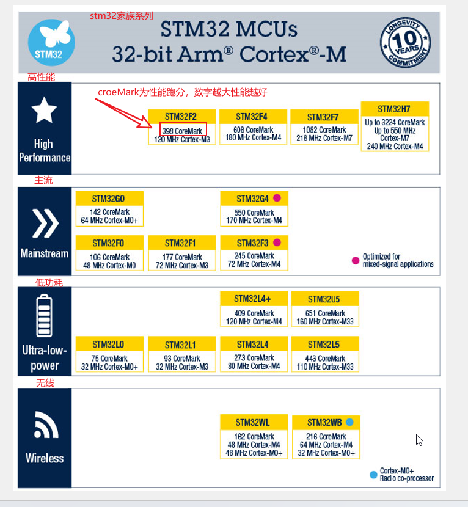

#### 1.2、ARM

>•ARM 既指 ARM 公司，也指 ARM 处理器内核
>
>•ARM 公司是全球领先的半导体知识产权（IP）提供商，全世界超过 95%的智能手机和平板电脑都采用 ARM 架构
>
>•ARM 公司设计 ARM 内核，半导体厂商完善内核周边电路并生产芯片

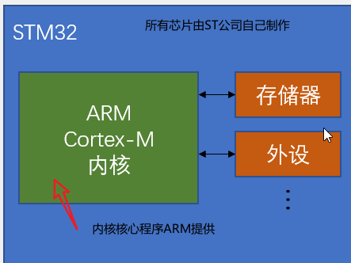

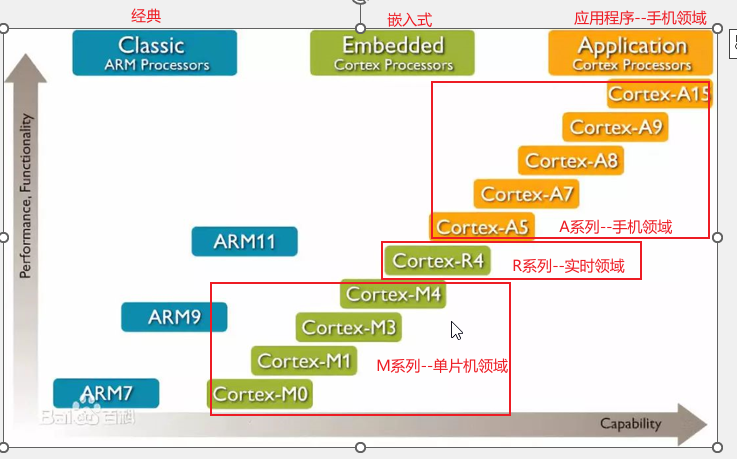

#### 1.3、STM32F103C8T6

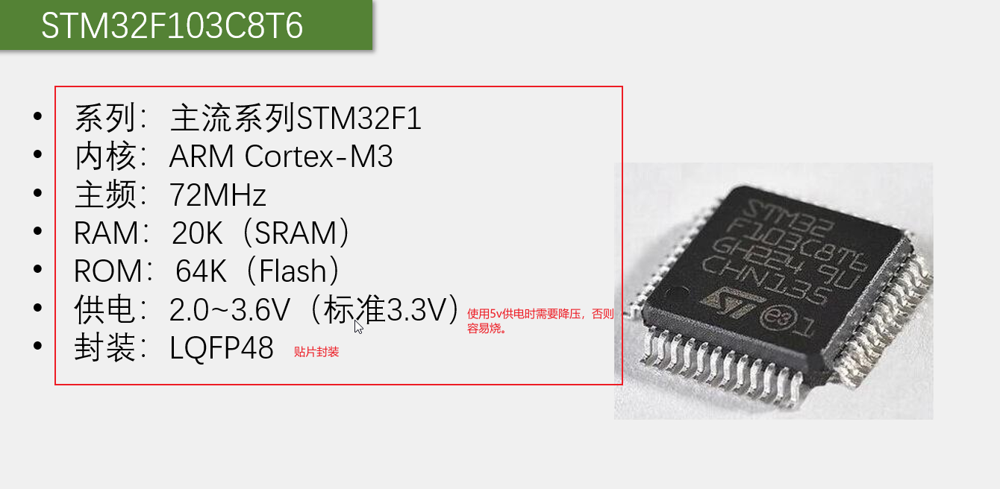


#### 1.4、命名规则

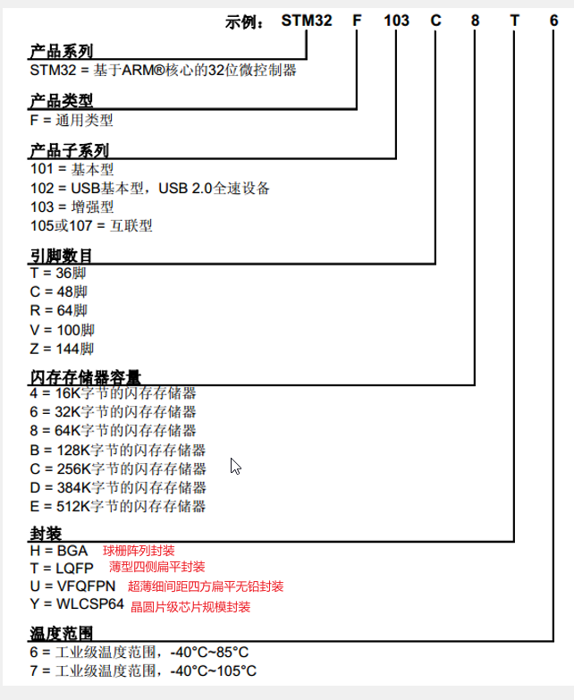

#### 1.5、系统结构

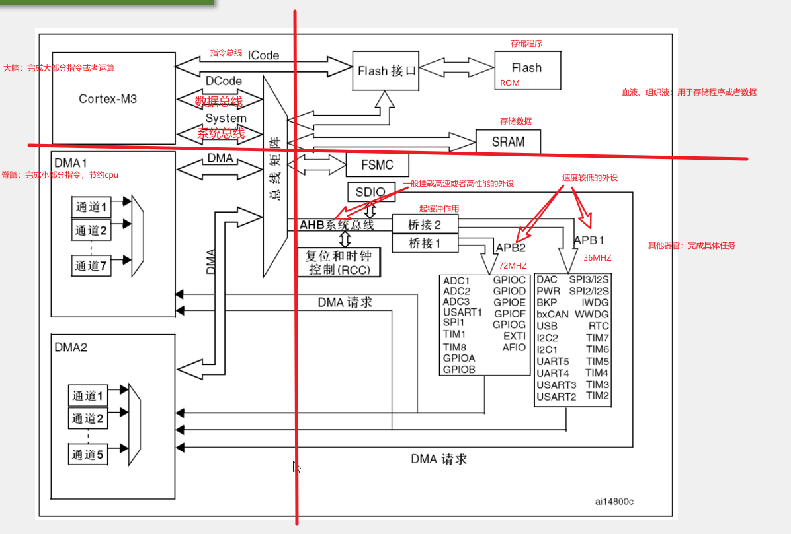

#### 1.6、引脚定义

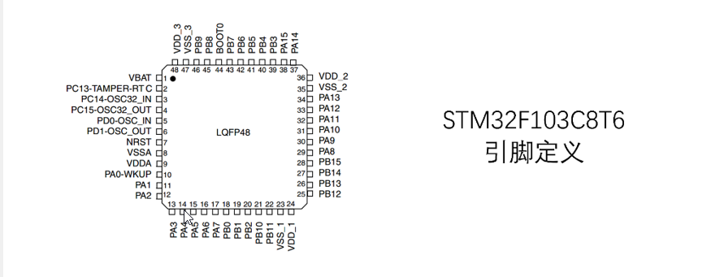

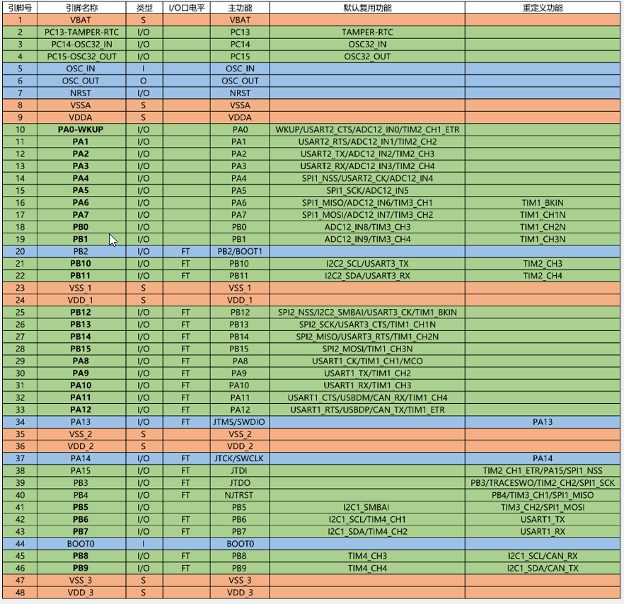

[引脚定义](STM32F103C8T6引脚定义.xlsx)

#### 1.7、启动配置

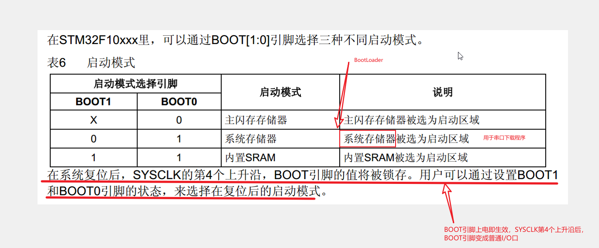

#### 1.8、最小系统电路

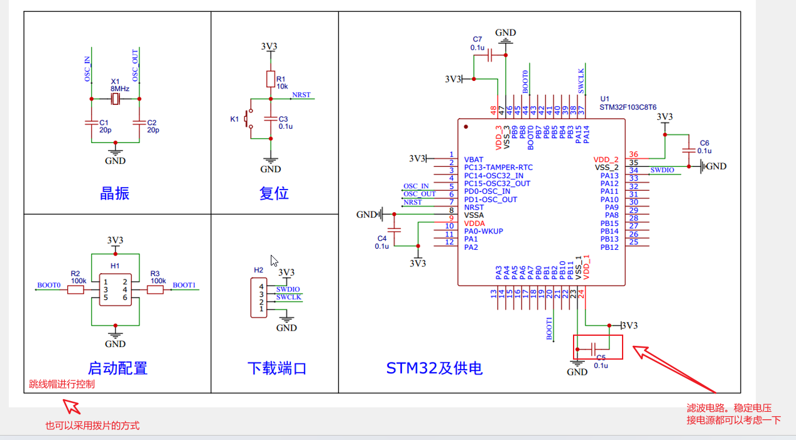

### 2、keil 新建 stm32 工程

[keil5_MDK 安装教程](https://www.bilibili.com/video/BV1th411z7sn/?spm_id_from=333.1391.0.0&p=3&vd_source=5f8610a33e469a605635adbbdcc8c98e)

> 开发方式:
>
> - 基于寄存器的方式——类似 51，程序直接配置寄存器
> - 基于标志库的方式（库函数）——使用 ST 官方封装好的库函数间接配置寄存器
> - 基于 HAL 方式——用图形化界面快速配置 stm32

#### 2.1、新建 Strat 文件

>启动文件(官方下载的文件)
>
>STM32F10x_StdPeriph_Lib_V3.5.0\Libraries\CMSIS\CM3\DeviceSupport\ST\STM32F10x\startup\arm

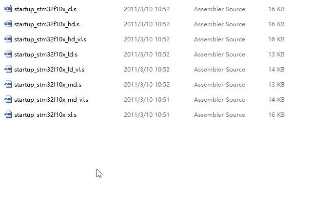

>| **缩写**  (文件后缀) | **释义**           | **Flash 容量** | **型号**          |
>| -------------------- | ------------------ | ------------- | ----------------- |
>| LD_VL                | 小容量产品超值系列 | 16~32K        | STM32F100         |
>| MD_VL                | 中容量产品超值系列 | 64~128K       | STM32F100         |
>| HD_VL                | 大容量产品超值系列 | 256~512K      | STM32F100         |
>| LD                   | 小容量产品         | 16~32K        | STM32F101/102/103 |
>| MD                   | 中容量产品         | 64~128K       | STM32F101/102/103 |
>| HD                   | 大容量产品         | 256~512K      | STM32F101/102/103 |
>| XL                   | 加大容量产品       | 大于 512K      | STM32F101/102/103 |
>| CL                   | 互联型产品         | -             | STM32F105/107     |


>外设寄存器描述以及 system 配置文件
>
>STM32F10x_StdPeriph_Lib_V3.5.0\Libraries\CMSIS\CM3\DeviceSupport\ST\STM32F10x
>
>​	stm32f10x.h 外设描述文件，类似 REGX51.h
>
>​	system 开头的文件：配置时钟

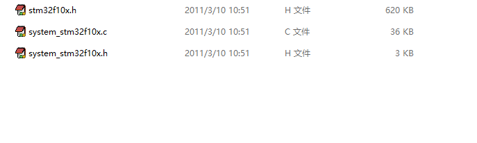

>内核寄存器描述
>
>STM32F10x_StdPeriph_Lib_V3.5.0\Libraries\CMSIS\CM3\CoreSupport

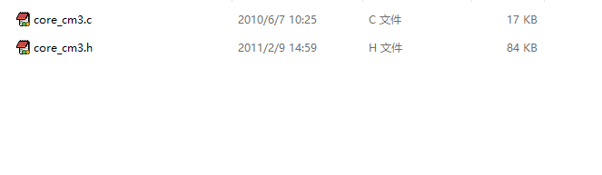

将上述文件复制，并在自己的项目中创建 Start 文件夹，并且复制到里面。在 keil5 中添加文件夹与文件（添加头文件路径）

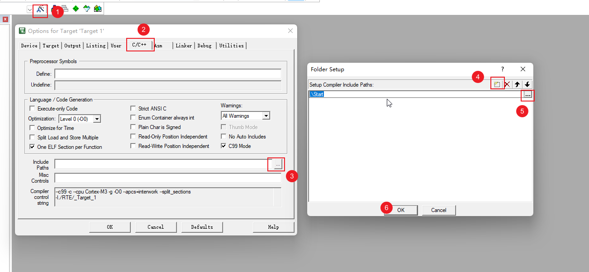


>项目中 Start 文件中实际添加的文件
>
> 	钥匙符号代表只读

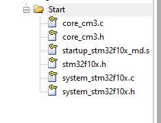

>在项目中添加文件路径（让 keil 知道去哪里找）


#### 2.2、新建 User 文件

>1.在项目中新建 User 文件夹（用于存放 main 函数和自己的代码）
>
>2.在 keil5 中创建组，并改名为 User
>
>3.添加 main 函数
>
>4.创建 main 函数（注意：将路径改到 User 目录下）

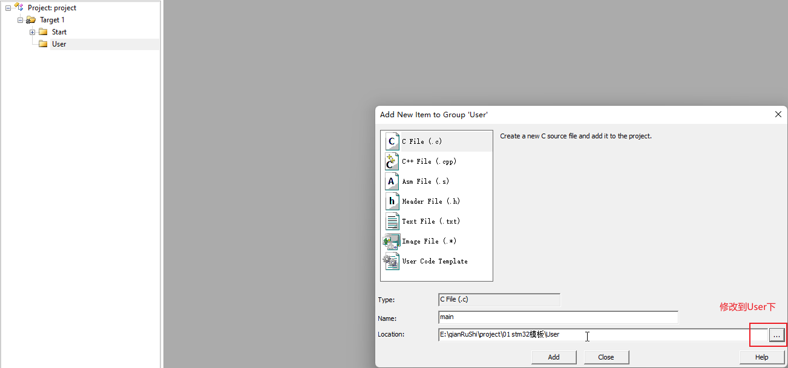


>调字体、调缩进、调编码格式

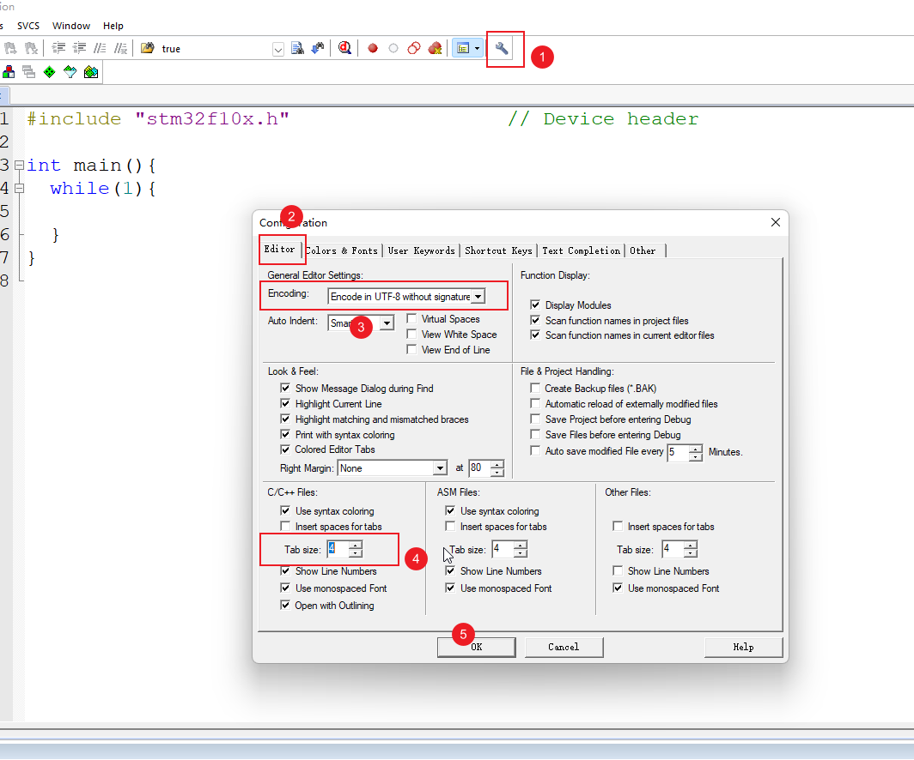

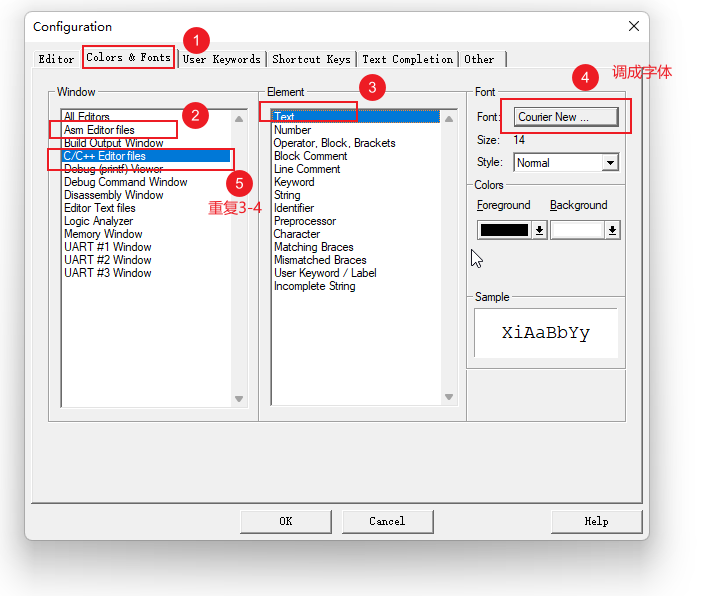

#### 2.3、配置调试器

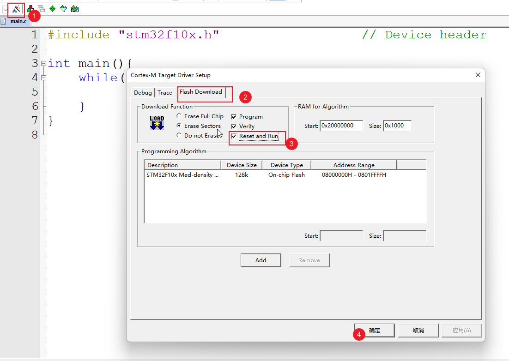

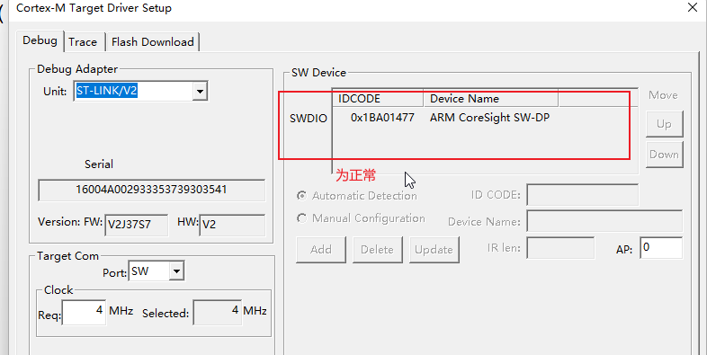

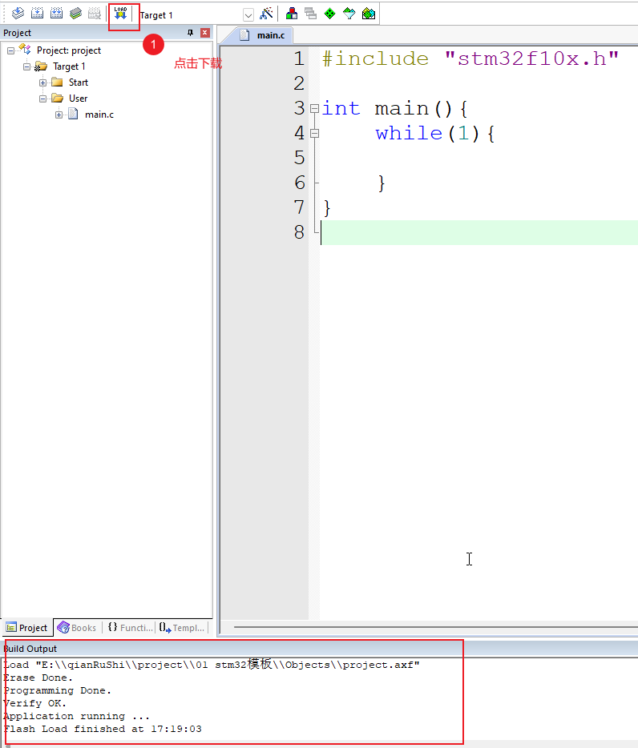

> 下载到实物上后（蓝色 LED 灯不在闪烁—闪烁原因：stm32 内置的调试程序）


>以上的创建完，就可以用基于寄存器的开发方式写 stm32 了。

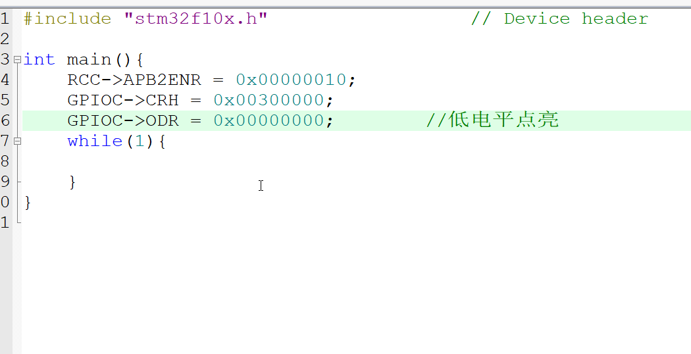

#### 2.4、新建 Library 文件

>1.在项目中新建 Library 文件夹
>
>2.在 STM32F10x_StdPeriph_Lib_V3.5.0\Libraries\STM32F10x_StdPeriph_Driver\src 与 STM32F10x_StdPeriph_Lib_V3.5.0\Libraries\STM32F10x_StdPeriph_Driver\inc 中复制库函数源文件和头文件，复制到 Library 中

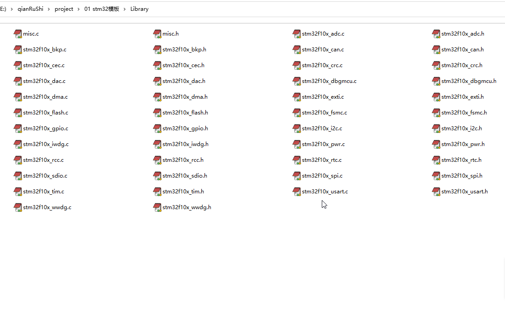

>3.在 keil5 的项目中新建 Library 组，并且添加上面的所有文件

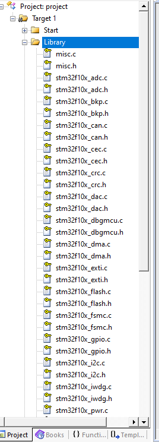

#### 2.5、在 User 文件夹中新增文件

>在 STM32F10x_StdPeriph_Lib_V3.5.0\Project\STM32F10x_StdPeriph_Template 复制一下文件，复制到项目 User 目录下
>
>​		conf 用于配置 u 库函数头文件的包含关系

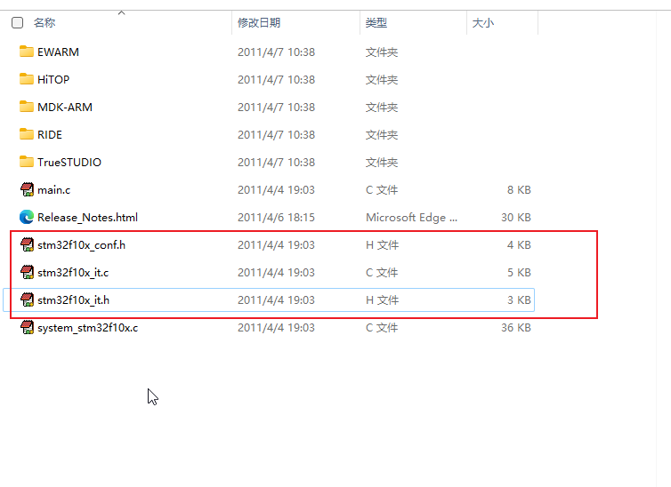

>在 keil5 的项目 User 文件下新增，并且设置宏定义（USE_STDPERIPH_DRIVER 在 stm32f10x.h 文件的最后面）

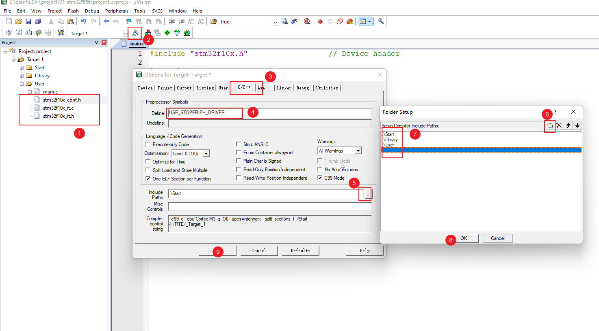


>以上为库函数开发方式

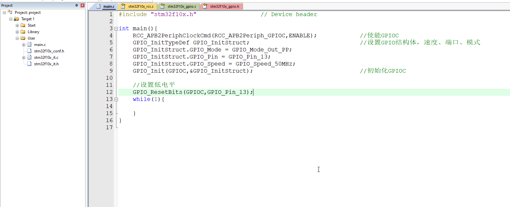


==新建文件步凑==

>•建立工程文件夹，Keil 中新建工程，选择型号
>
>•工程文件夹里建立 Start、Library、User 等文件夹，复制固件库里面的文件到工程文件夹
>
>•工程里对应建立 Start、Library、User 等同名称的分组，然后将文件夹内的文件添加到工程分组里
>
>•工程选项，C/C++，Include Paths 内声明所有包含头文件的文件夹
>
>•工程选项，C/C++，Define 内定义 USE_STDPERIPH_DRIVER
>
>•工程选项，Debug，下拉列表选择对应调试器，Settings，Flash Download 里勾选 Reset and Run


### 3、GPIO

#### 3.1、GPIO 简介

>•GPIO（General Purpose Input Output）通用输入输出口
>
>•可配置为 8 种输入输出模式
>
>•引脚电平：0V~3.3V，部分引脚可容忍 5V
>
>•输出模式下可控制端口输出高低电平，用以驱动 LED、控制蜂鸣器、模拟通信协议输出时序等
>
>•输入模式下可读取端口的高低电平或电压，用于读取按键输入、外接模块电平信号输入、ADC 电压采集、模拟通信协议接收数据等

#### 3.2、GPIO 基本结构

>所有的 GPIO 都挂载在 APB2 总线上。
>
>GPIO 中的寄存器为 32 位寄存器，P0~P15 只是使用了低 16 位。
>
>驱动器负责增大驱动能力。

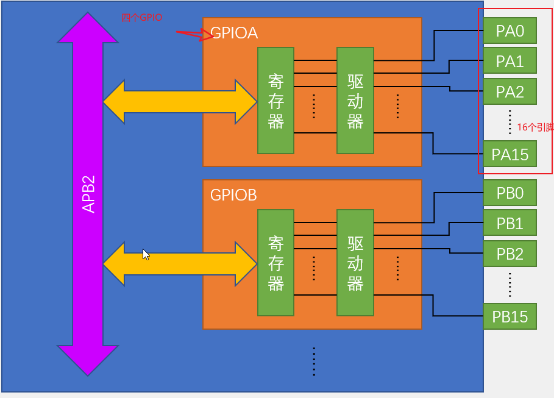

#### 3.3、GPIO 位结构

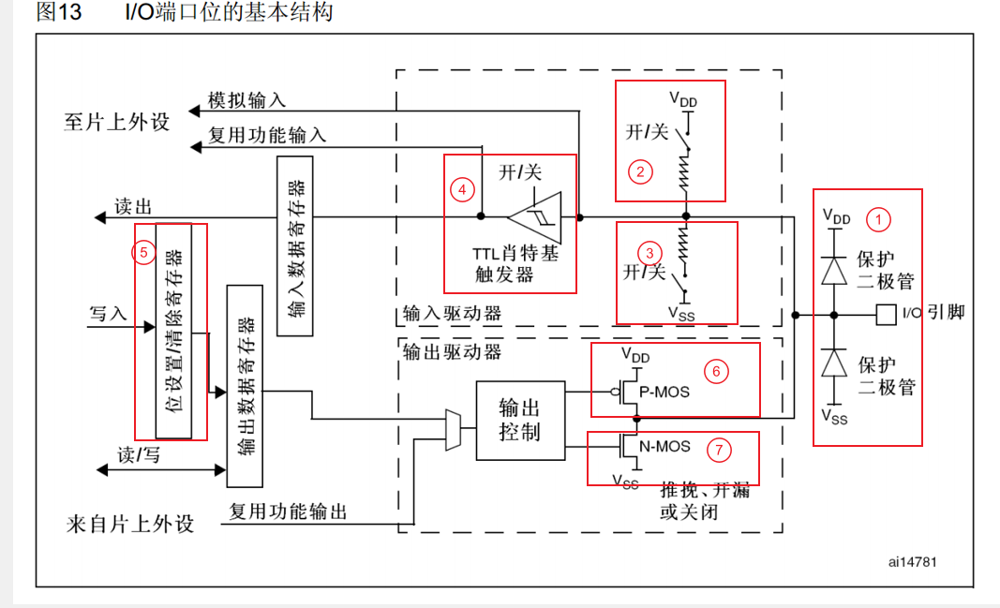

>输入部分：
>
>①：保护二极管：保护电路。当输入电压大于 VDD 时，上部分的二极管导通，电流流向 VDD；当输入电压小于 VSS 时，下部分的二极管导通，电流从 VSS 流向 I/O 引脚。只有在 VSS~VDD 之间才能输入。I/O 引脚电压相对于 VSS，可以存在负数。
>
>②、③：上拉电阻、下拉电阻。当 ② 打开，③ 关闭时，为上拉输入（默认为高电平输入）；当 ③ 打开，② 关闭时，为下拉输入（默认为低电平输入）；当 ②、③ 都关闭时，为浮空输入（及其不稳定）。上拉电阻与下拉电阻阻值一般比较大，所以是弱上拉与弱下拉，目的是为了不影响正常输入操作。
>
>④、TTL 施密特触发器（由肖特基管构成）。对输入电压进行整形。虽然输入电压为数字信号，但是也会存在波动。
>
>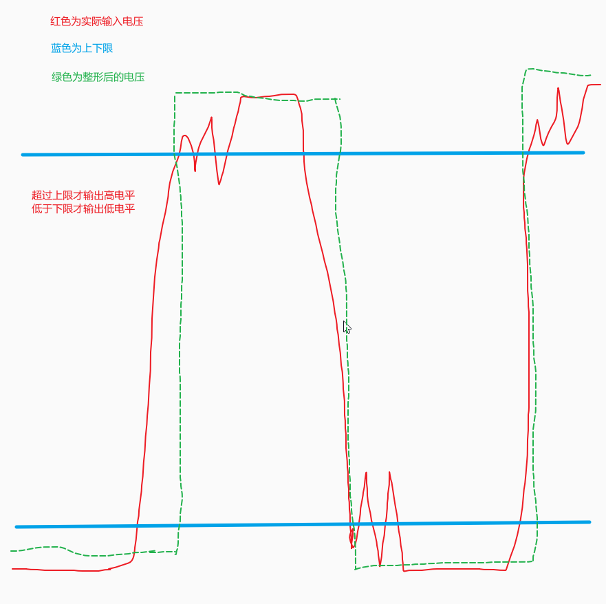
>
>输出部分：
>
>⑤、位设置/位清除寄存器：用于操作输出数据寄存器（只能整体读写）的某位进行置 1 或者置 0。
>
>​	常见的位操作：
>
>​		a、将输出数据寄存器读出，通过&= 和|= 操作，在整体写入到输出数据寄存器中。
>
>​		b、设置位设置/位清除寄存器，对位设置/位清除寄存器中的某位进行操作，然后整体写入输出数据寄存器。
>
>​		c、读写 stm32 位带区域（等价于 51 位寻址）。
>
>⑥、⑦：PMOS 管（低电平导通）、NMOS 管（高电平导通）。==推挽输出模式==（强推模式）下，PMOS 管和 NMOS 管均有效，当输出数据寄存器输出 1 时，PMOS 管导通，NMOS 管断开，I/O 引脚直接接到 VDD，输出高电平；当输出数据寄存器输出 0 时，PMOS 管断开，NMOS 管导通，I/O 引脚直接接到 VSS，输出低电平，==高低电平均匀驱动能力==。==开漏输出模式== 下，PMOS 管无效，NMOS 管有效，当输出数据寄存器输出 1 时，NMOS 管断开，输出断开，相当于高阻模式（悬空）；当输出数据寄存器输出 0 时，NMOS 管导通，I/O 引脚直接接到 VSS，输出低电平；开漏模式下，==只有低电平有驱动能力==（想输出高电平时，会外接上拉电阻），常用于通信协议的驱动，如：I2C。
>
>
>输出驱动器中的==输出控制==：本质为D锁存器，即下图。
>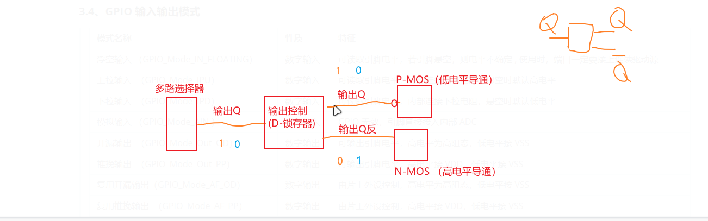

#### 3.4、GPIO 输入输出模式

>| **模式名称**                       | **性质** | **特征**                                                     |
>| ---------------------------------- | -------- | ------------------------------------------------------------ |
>| 浮空输入 （GPIO_Mode_IN_FLOATING） | 数字输入 | 可读取引脚电平，若引脚悬空，则电平不确定 , 使用时，端口一定要接上连续驱动源 |
>| 上拉输入  （GPIO_Mode_IPU）        | 数字输入 | 可读取引脚电平，内部连接上拉电阻，悬空时默认高电平           |
>| 下拉输入  （GPIO_Mode_IPD）        | 数字输入 | 可读取引脚电平，内部连接下拉电阻，悬空时默认低电平           |
>| 模拟输入 （GPIO_Mode_AIN ）        | 模拟输入 | GPIO 无效，引脚直接接入内部 ADC                                |
>| 开漏输出  （GPIO_Mode_Out_OD）     | 数字输出 | 可输出引脚电平，高电平为高阻态，低电平接 VSS                  |
>| 推挽输出  （GPIO_Mode_Out_PP）     | 数字输出 | 可输出引脚电平，高电平接 VDD，低电平接 VSS                     |
>| 复用开漏输出（GPIO_Mode_AF_OD）    | 数字输出 | 由片上外设控制，高电平为高阻态，低电平接 VSS                  |
>| 复用推挽输出  （GPIO_Mode_AF_PP）  | 数字输出 | 由片上外设控制，高电平接 VDD，低电平接 VSS                     |

>浮空/上拉/下拉输入
>
>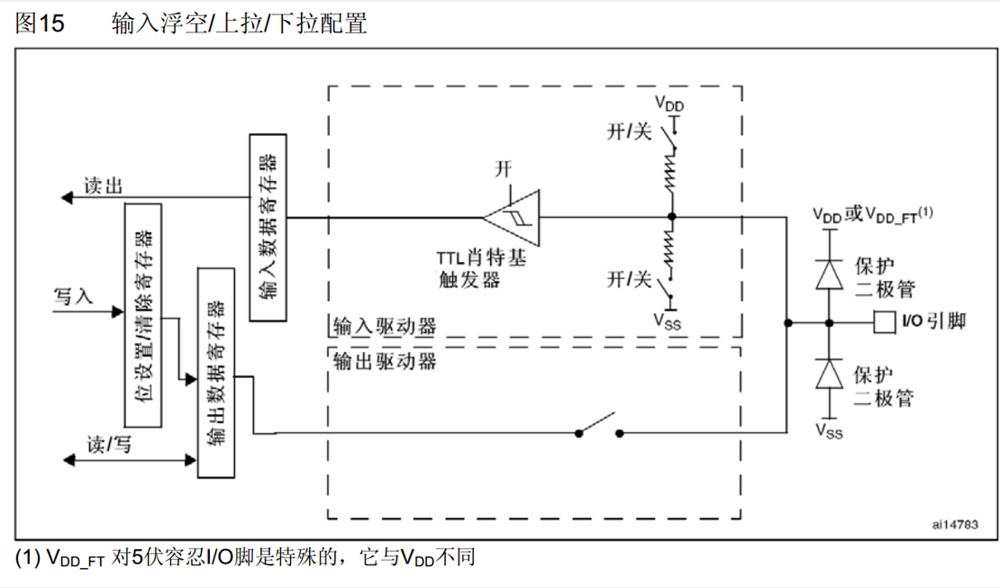

>模拟输入
>
>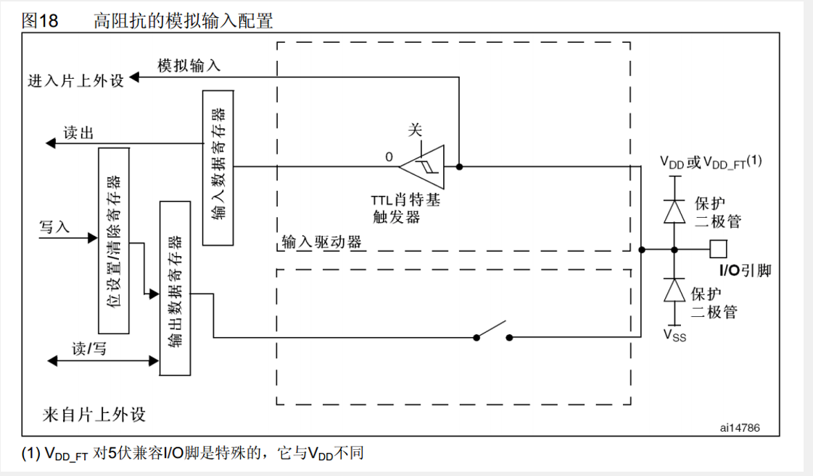

>开漏/推挽输出（也可以进行简单的输入）
>
>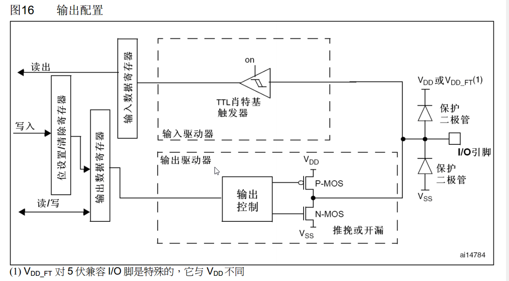

>复用开漏/推挽输出
>
>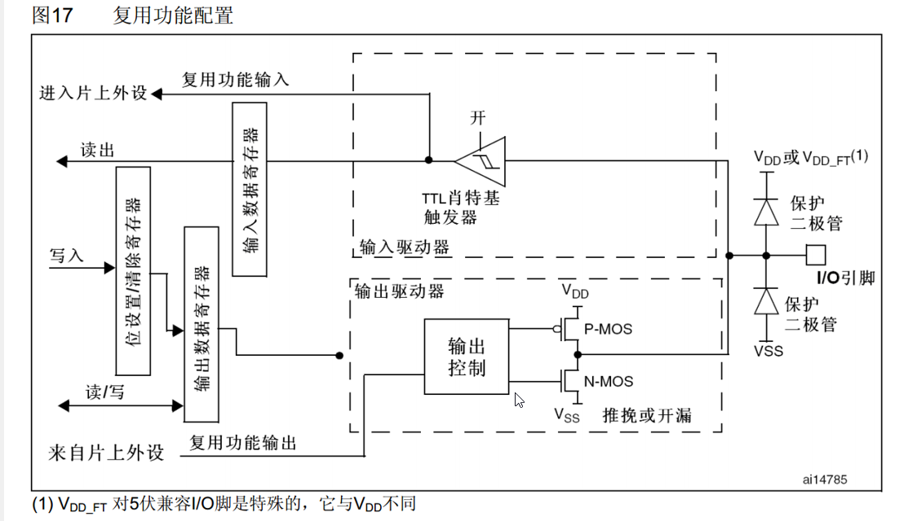

#### 3.5、传感器模块

##### （1）简介

>•传感器模块：传感器元件（光敏电阻/热敏电阻/红外接收管等）的电阻会随外界模拟量的变化而变化，通过与定值电阻分压即可得到模拟电压输出，再通过电压比较器进行二值化即可得到数字电压输出

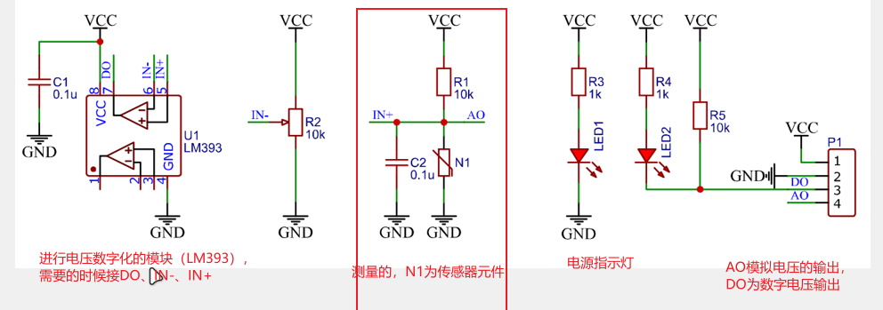

##### （2） 硬件电路

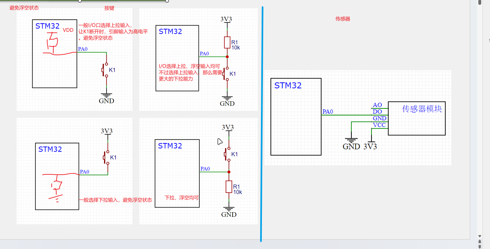

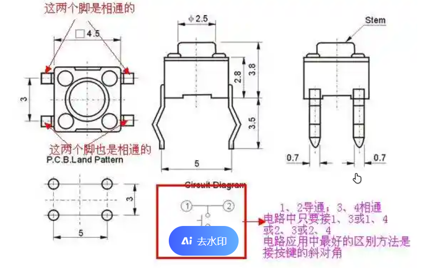

### 4、OLED 调试

>调试方式	
>
>•串口调试：通过串口通信，将调试信息发送到电脑端，电脑使用串口助手显示调试信息
>
>•
>
>•显示屏调试：直接将显示屏连接到单片机，将调试信息打印在显示屏上
>
>•
>
>•Keil 调试模式：借助 Keil 软件的调试模式，可使用单步运行、设置断点、查看寄存器及变量等功能

#### 4.1、简介

>•OLED（Organic Light Emitting Diode）：有机发光二极管
>
>•OLED 显示屏：性能优异的新型显示屏，具有功耗低、相应速度快、宽视角、轻薄柔韧等特点
>
>•0.96 寸 OLED 模块：小巧玲珑、占用接口少、简单易用，是电子设计中非常常见的显示屏模块
>
>•供电：3~5.5V，通信协议：I2C/SPI，分辨率：128*64
>
>

#### 4.2、硬件电路

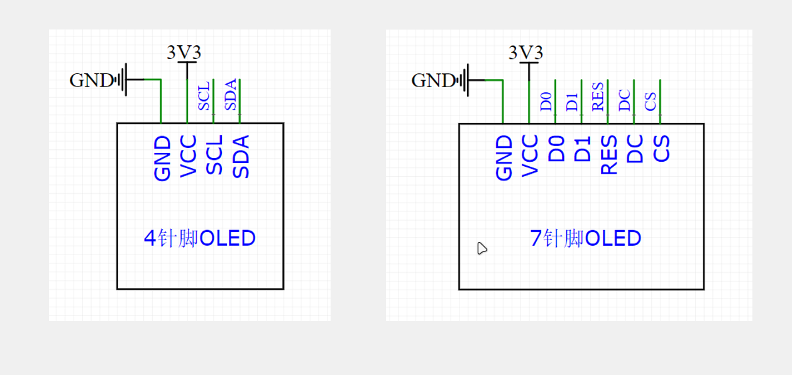

>4 引脚使用的是 I2C 协议，7 引脚使用的是 SPI 引脚

### 5、keil 调试方式

>选择进行仿真调试，并且连接好 stm32

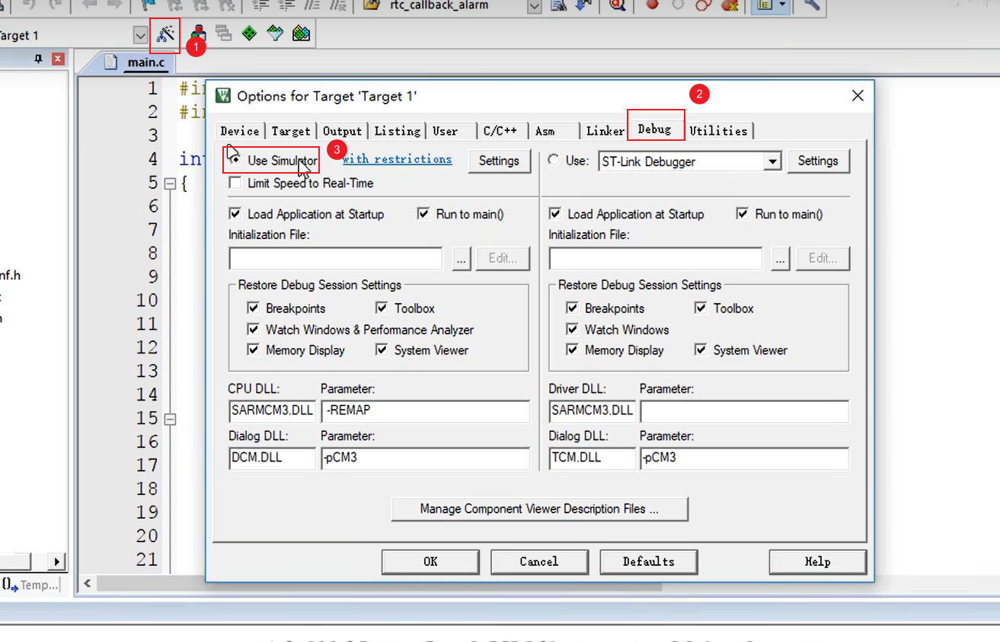

>点击编译，点击仿真按钮


>菜单介绍

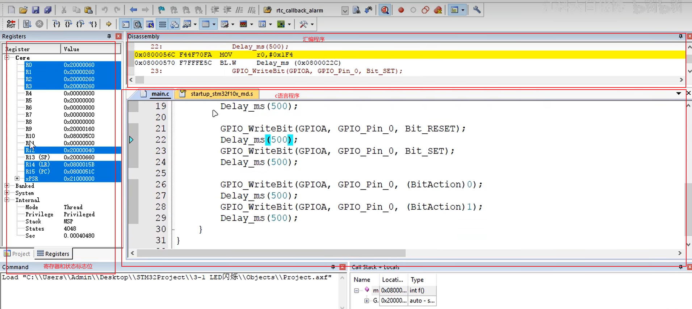

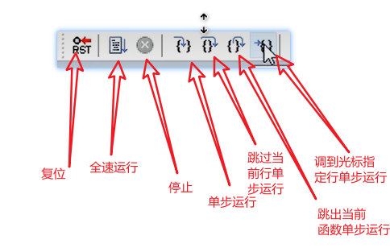

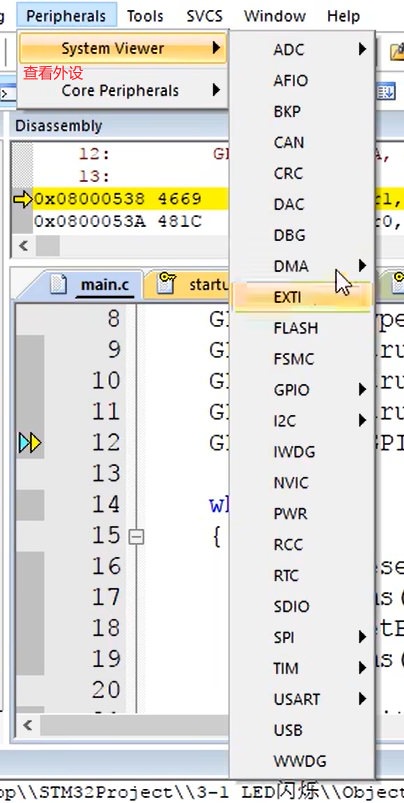

>使用逻辑分析仪，需要在 Dialog DLL 输入 -pSTM32F103C8（自己的stm32型号），以及在 Dialog DLL 下更改成 DARMSTM.DLL
>
>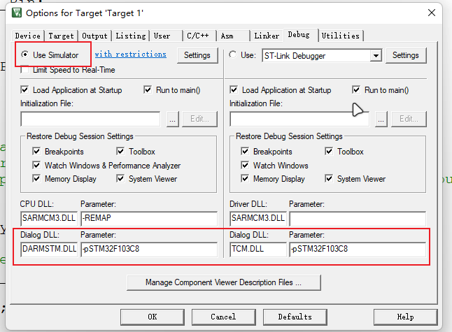
>
>引脚输入为 PORTx.n
>
>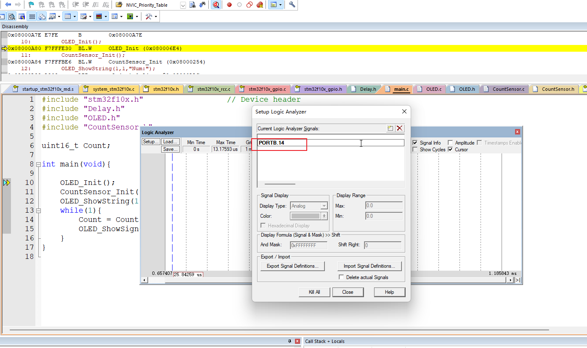


>注意：==每次退出仿真调试，需要重新编译，在进入==

### 6、EXTI 外部中断

#### 6.1、中断

>•中断：在主程序运行过程中，出现了特定的中断触发条件（中断源），使得 CPU 暂停当前正在运行的程序，转而去处理中断程序，处理完成后又返回原来被暂停的位置继续运行
>
>•中断优先级：当有多个中断源同时申请中断时，CPU 会根据中断源的轻重缓急进行裁决，优先响应更加紧急的中断源
>
>•中断嵌套：当一个中断程序正在运行时，又有新的更高优先级的中断源申请中断，CPU 再次暂停当前中断程序，转而去处理新的中断程序，处理完成后依次进行返回

#### 6.2、STM32 中断（部分型号）

>•68 个可屏蔽中断通道，包含 EXTI、TIM、ADC、USART、SPI、I2C、RTC 等多个外设
>
>•使用 ==NVIC== 统一管理中断，每个中断通道都拥有 ==16 个可编程== 的优先等级，可对优先级进行分组，进一步设置抢占优先级和响应优先级

>灰色部分为内核中断。
>
>白色为外设中断。
>
>向量表–> 可以看成 c 语言的指针，里面存储的是，实际中断函数的地址。

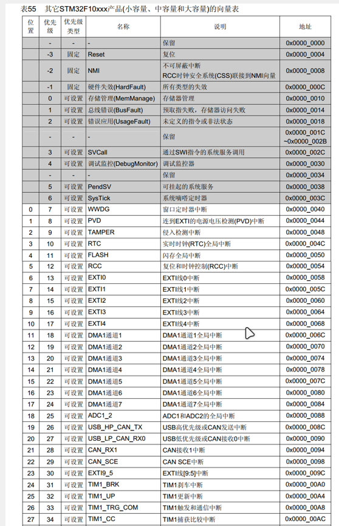

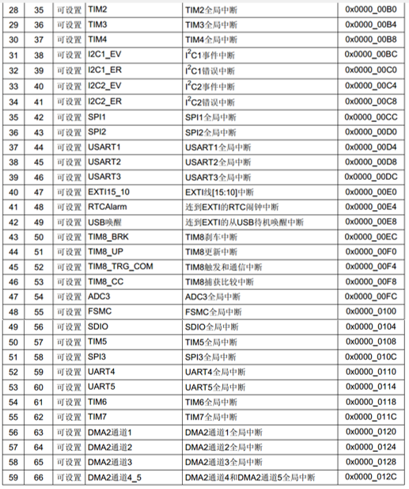

#### 6.3、NVIC（嵌套中断向量控制器）——位于内核中

##### （1）、NVIC 基本结构

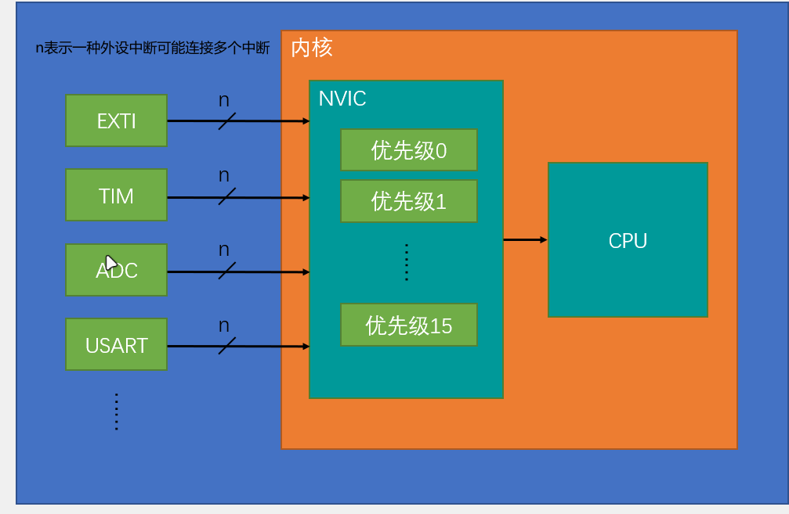

##### （2）、NVIC 优先级分组

>•NVIC 的中断优先级由 ==优先级寄存器的 4 位==（0~15）决定（==数字越小优先级越高==），这 4 位可以进行切分，分为 ==高 n 位的抢占优先级== 和 ==低 4-n 位的响应优先级==
>
>- 抢占优先级高的可以中断嵌套（打断当前中断）
>- 响应优先级高的可以优先排队（优先进入空闲的 CPU）
>- 抢占优先级和响应优先级均相同的按中断号排队（根据中断向量表中的向量号决定）

>| **分组方式** | **抢占优先级**      | **响应优先级**      |
>| ------------ | ------------------- | ------------------- |
>| 分组 0        | 0 位，取值范围为 0    | 4 位，取值范围为 0~15 |
>| 分组 1        | 1 位，取值范围为 0~1  | 3 位，取值范围为 0~7  |
>| 分组 2        | 2 位，取值范围为 0~3  | 2 位，取值范围为 0~3  |
>| 分组 3        | 3 位，取值范围为 0~7  | 1 位，取值范围为 0~1  |
>| 分组 4        | 4 位，取值范围为 0~15 | 0 位，取值范围为 0    |
>
>（抢占 > 响应 > 中断号，数字越小优先级越高，一个中断同时用于抢占优先级和响应优先级）

#### 6.4、EXTI

##### （1）、简介

>•EXTI（Extern Interrupt）外部中断
>
>•EXTI 可以监测指定 GPIO 口的电平信号，当其指定的 GPIO 口产生电平变化时，EXTI 将立即向 NVIC 发出中断申请，经过 NVIC 裁决后即可中断 CPU 主程序，使 CPU 执行 EXTI 对应的中断程序
>
>•支持的触发方式：上升沿/下降沿/双边沿(上升沿与下降沿均可以触发)/软件触发（程序中执行指令触发）
>
>•支持的 GPIO 口：所有 GPIO 口，但 ==相同的 Pin 不能同时触发中断==（不同 GPIO 的相同引脚口（GPIO_Pin_x）不能同时触发中断，如：PA0 与 PB0 是不行，PA0 与 PB1 是可以的）
>
>•通道数（==20 个==）：16 个 GPIO_Pin，外加 PVD 输出、RTC 闹钟、USB 唤醒、以太网唤醒（后面 4 个是会利用到外部中断 **从低功耗的停止模式下唤醒 stm32 的功能**）
>
>•触发响应方式：中断响应/事件响应

##### （2）、基本结构

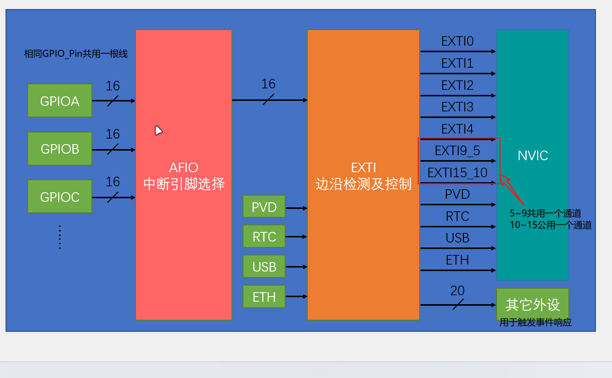

>第一步，打开GPIO、AFIO的时钟
>
>第二步，配置GPIO
>
>第三步，配置AFIO的中断引脚
>
>第四步，配置EXTI
>
>第五步，分组，配置NVIC

##### （3）、AFIO 复用 IO 口

>•AFIO 主要用于引脚复用功能的选择和重定义
>
>•在 STM32 中，AFIO 主要完成两个任务：复用功能引脚重映射、中断引脚选择

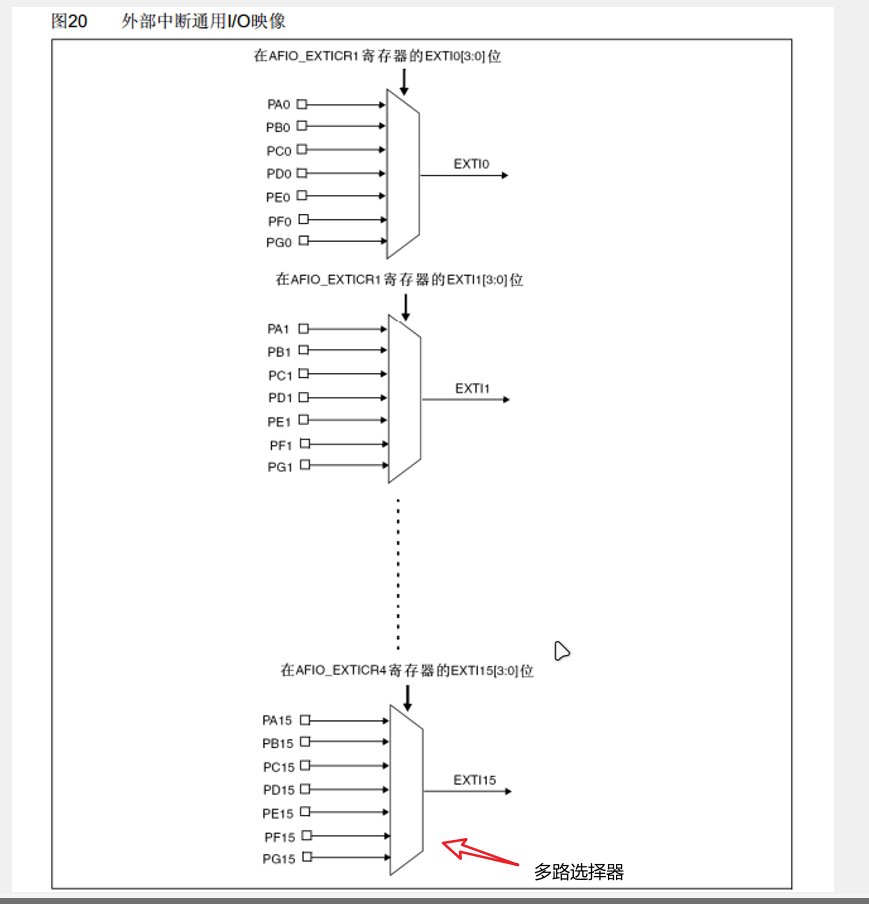

##### （4）、EXTI 框图

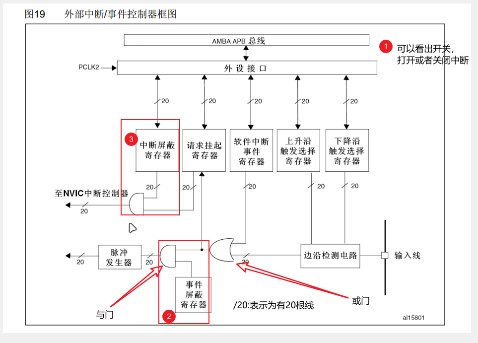

#### 6.5、旋转编码器

##### （1）、简介

>•旋转编码器：用来测量位置、速度或旋转方向的装置，当其旋转轴旋转时，其输出端可以输出与旋转速度和方向对应的方波信号，读取方波信号的频率和相位信息即可得知旋转轴的速度和方向
>
>•类型：机械触点式/霍尔传感器式/光栅式

##### （2）、硬件电路

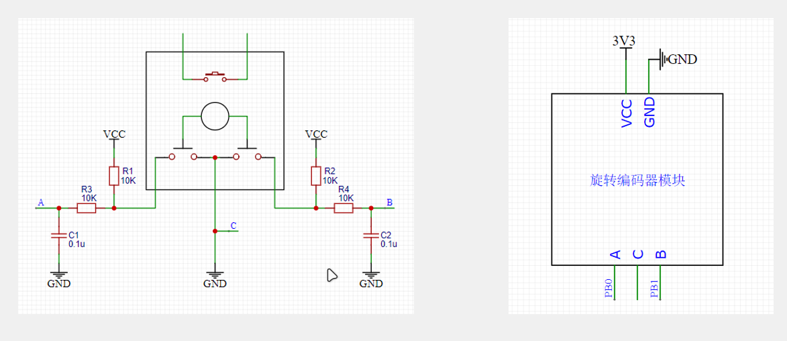

>本次使用的是机械触点式旋转编码器，利用 A、B 口出现波形的位置来判断方向（出现位置会相差 90°（整个周期 360°），四分之一的波形）
>
>[具体图示见 7.7.2、正交编码器](#####7.7.2、正交编码器)
>
>中间两对触点，以相位相差 90° 的方式交替导通（与 c 导通——接地）。

### 7、TIM

#### 7.1、简介

>•TIM（Timer）定时器
>
>•定时器可以对输入的时钟进行计数，并在计数值达到设定值时触发中断
>
>•==16 位计数器（计数）、16位预分频器（倍频）、自动重装寄存器（装入目标值，自动与计数器值比较）的时基单元==，在 72MHz 计数时钟下可以实现最大 59.65s 的定时（内部的预分频器与自动重载器都为 16 位——65536，（65536*（65536/72MHZ））us）。
>
>•不仅具备基本的定时中断功能，而且还包含内外时钟源选择、输入捕获、输出比较、编码器接口、主从触发模式等多种功能
>
>•根据复杂度和应用场景分为了高级定时器、通用定时器、基本定时器三种类型
>
>•STM32 定时器支持定时器级联（一个定时器的输出作为另一个的定时器的输入，定时时间会成 65536*65536 的倍数增长）

#### 7.2、定时器类型

>| **高级定时器** | **TIM1** **、** **TIM8** | **APB2** | **拥有通用定时器全部功能，并额外具有重复计数器、死区生成、互补输出、刹车输入等功能** |
>| -------------- | ------------------------ | -------- | ------------------------------------------------------------ |
>| 通用定时器     | TIM2、TIM3、TIM4、TIM5   | APB1     | 拥有基本定时器全部功能，并额外具有内外时钟源选择、输入捕获、输出比较、编码器接口、主从触发模式等功能 |
>| 基本定时器     | TIM6、TIM7               | APB1     | 拥有定时中断、主模式触发 DAC 的功能                            |
>
>•STM32F103C8T6 定时器资源：TIM1、TIM2、TIM3、TIM4

##### （1）、基本定时器

>CNT 计数器支持模式：向上计数（从 0 开始自增到重装值，然后申请中断，清零，开始下一次计数循环）

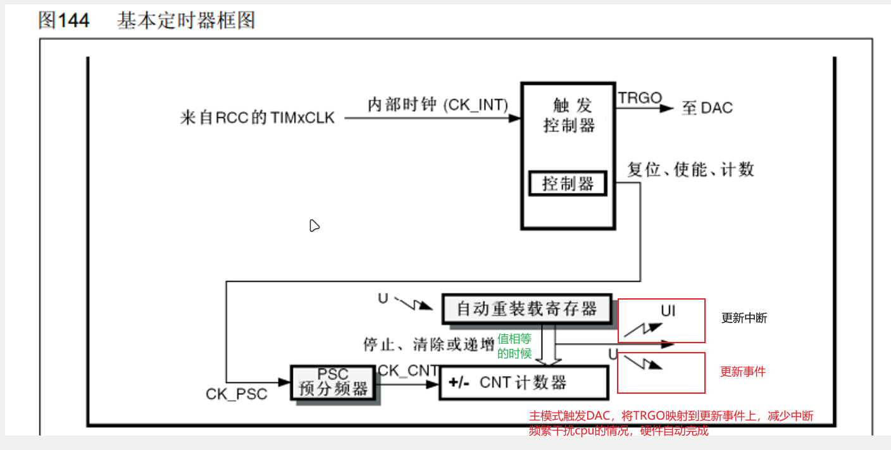

##### （2）、通用定时器

>CNT 计数器支持模式：向上计数、向下计数（从重载值开始自减到 0，然后申请中断，恢复重载值，开始下一次计数循环）、中央对齐（从 0 开始自增到重装值，然后申请中断；下一次循环从重装值开始自减到 0，然后申请中断；开始下一次计数。）

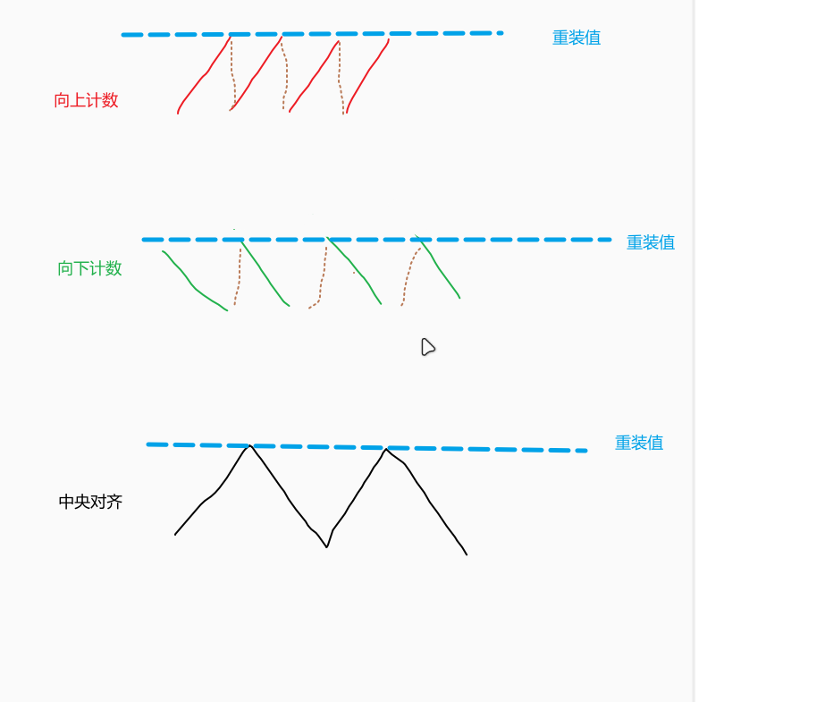

>- ① 内部时钟源，该模式与基本定时器相同。
>
>- 外部时钟源（4 种时钟源）：
>
>	- ②TIMx_ETR（本芯片复用在 PA0 上），如果选择配置 ③ETRF，那么该模式成为：外部时钟模式 2；如果选择配置 ⑦TRGI，并且把 TRGI 的触发输入当作外部时钟。称作：外部时钟模式 1。
>
>	-  ④ITR0~3，把其他定时器的输出当作外部时钟输入，来源为其他定时器的 ⑧TRGO（其他定时器将 ⑨ 更新事件映射到 TRGO 上）——定时器的级联。
>
>		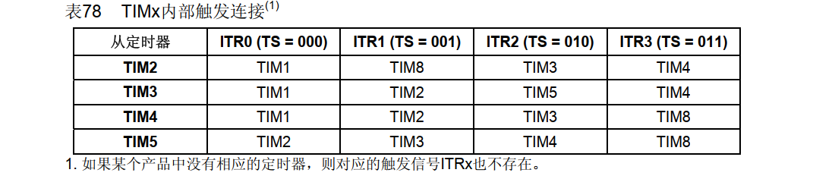
>
>	- ⑤TIF_ED（ED：边沿有效）, 与 TIMx_CH1 相连。
>
>	- ⑥TI1FP1、TI2FP2：与 ⑩TIMx_CH1 的 TI1FP1 相连、⑩TIMx_CH2 的 TI2FP2 相连。
>
>		- 注意：使用外部时钟模式 1，只要把 TRGI 的触发输入当作外部时钟就可以称为外部时钟模式 1。
>
>- 下面的 TIMx_CH1~4 组成了输入捕获和输出比较，其中共用了捕获/比较寄存器。
>
>

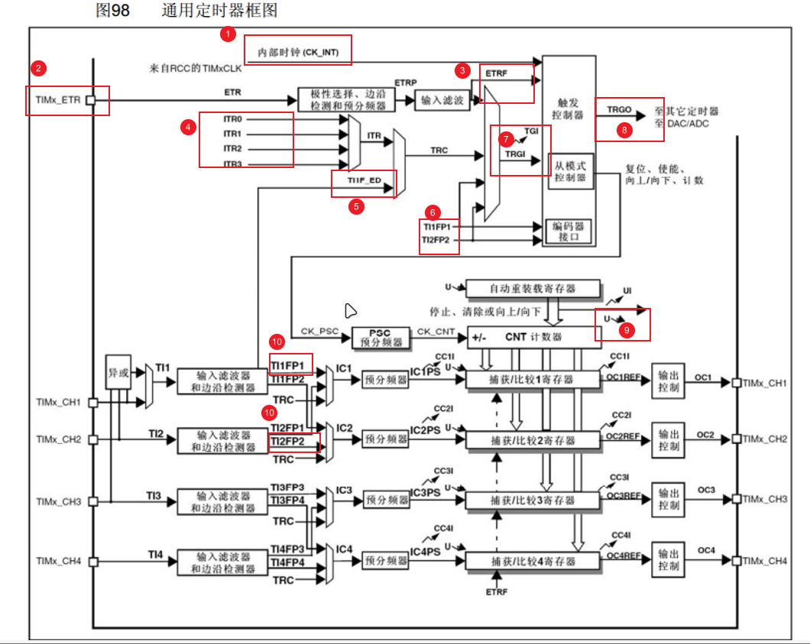

##### （3）、高级定时器

>CNT 计数器支持模式：向上计数、向下计数、中央对齐。
>
>图中，带影子的框图，都表示自带一个缓存机制——影子寄存器（用与不用可以自己决定）。
>
>- ①、重复次数计数器：让更新中断、更新事件，每隔几个周期更新一次（对中断结果进行了再一次的分频）。
>- ②、增加了死区生成电路（DTG），为了防止直通现象（直通就是一个桥臂上下两个开关管同时导通，此时会将电路给短路，同时可能烧毁开关管），增加了几对互补的 PWM 输出，为了驱动三相无刷电机（需要三个桥臂（每隔桥臂上有两个开关管））。
>- ③、当出现刹车信号、内部时钟失效，控制电路会自动切断电机输出，防止意外发生。

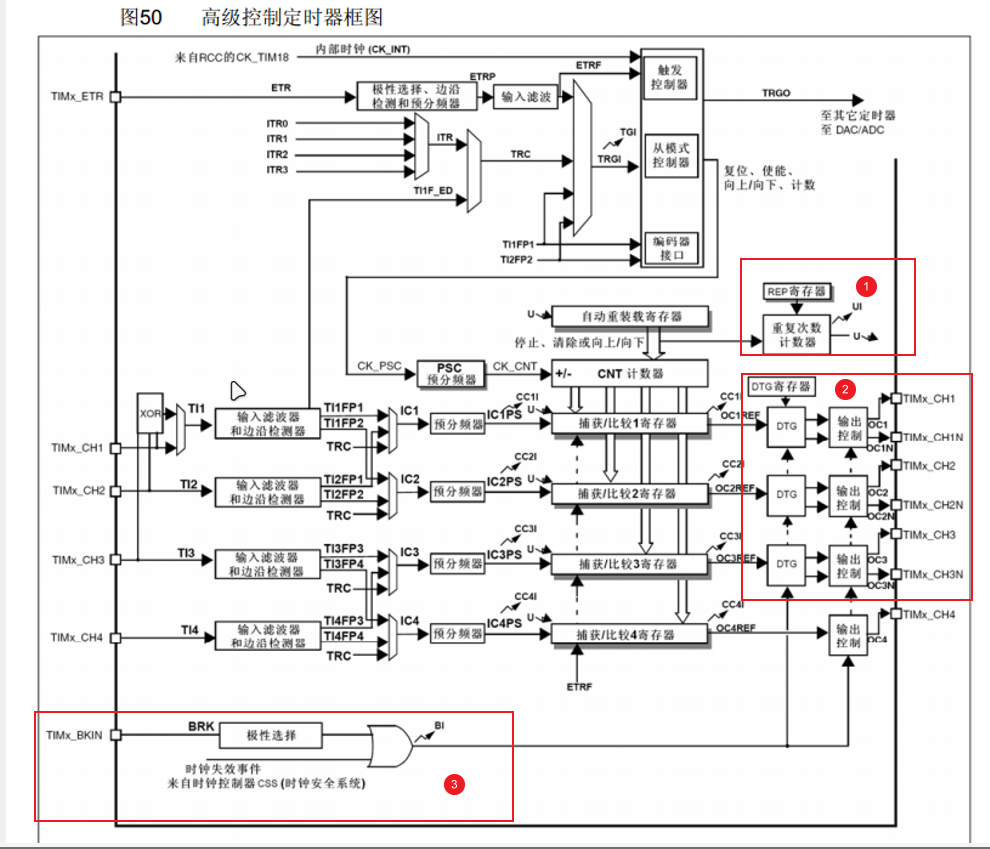

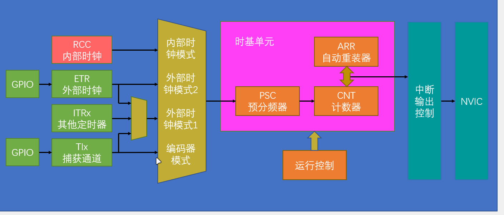

#### 7.3、时序

##### （1）、预分频器时序

>- CK_PSC：内部时钟频率
>- CNT_EN：预分频器使能
>- CK_CNT：分频之后的频率，中间比较密集的部分为 1 分频，后面比较稀疏的部分为 2 分频
>- 计数器寄存器（CNT）：FC 为重装载值，ARR 中的值。
>- UEV：更新事件（CNT == ARR）
>- 预分频控制寄存器：实际能操作的值，向其中写入 PSC 中的值（想要的分频系数）
>- 预分频缓存器：向预分频控制寄存器写入数据后，并不会马上改变预分频计数器，而是让预分频计数器完成一个周期之后，才让修改预分频计数器
>- 预分频计数器：计数，计数值等于预分频控制器中的值时，下一次计数（清零），让产生 CNT 的变化

$$
计数器计数频率：
CK\_CNT = CK\_PSC / (PSC + 1)
\\
注：PSC 为预分频器的值
$$

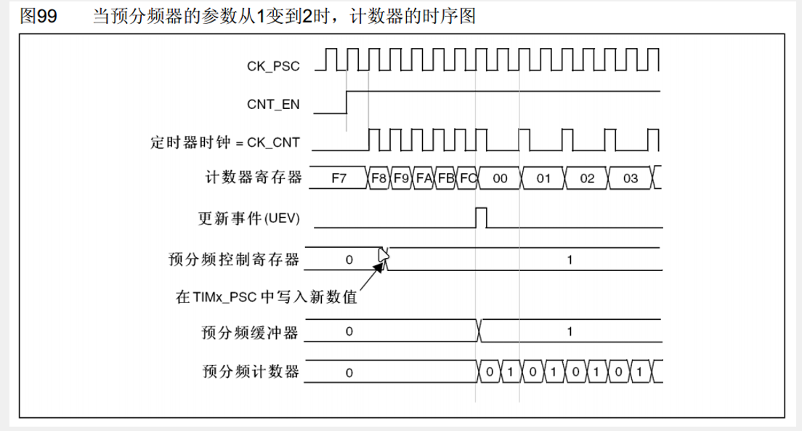

##### （2）、计数器时序

>当 UIF = 1 时，才会产生中断，且只能软件清零。

$$
计数器溢出频率：
CK\_CNT\_OV = CK\_CNT / (ARR + 1)
\\
加入计数器计数频率后:
					       CK\_CNT\_OV = CK\_PSC / (PSC + 1) / (ARR + 1)
\\
\\
工作流程：
对 CK\_PSC（时钟频率，单位; hz）缩小成（（PSC+1）/CK\_PSC）（频率, 单位; hz），
\\计数（ARR+1）次，就是计时（(PSC+1)*(ARR +1) / CK\_PSC）(时间，单位：s)					       
\\
\\
计数器溢出时间：1/CK\_CNT\_OV
$$

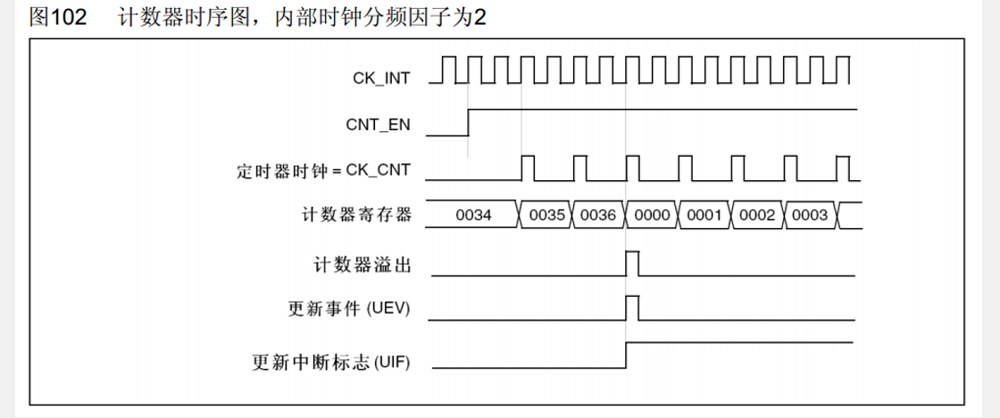

##### （3）、计数器无预装时序（不启用影子寄存器）

>在改变 ARR（自动加载寄存器）后，计数器的值，加到改变后 ARR 中的值，就产生了更新中断与更新事件

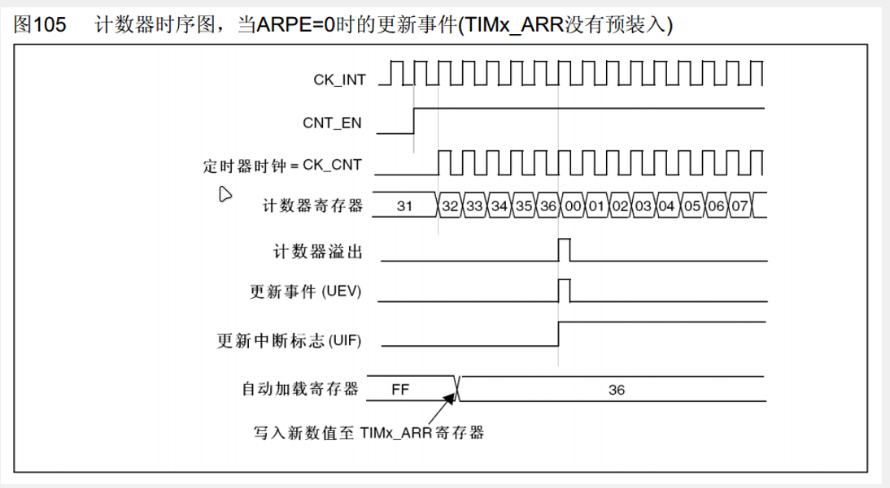

##### （4）、计数器有预装时序（启用影子寄存器）

>在改变 ARR（自动加载寄存器）后，计数器的值，加到改变前 ARR 中的值，才产生了更新中断与更新事件

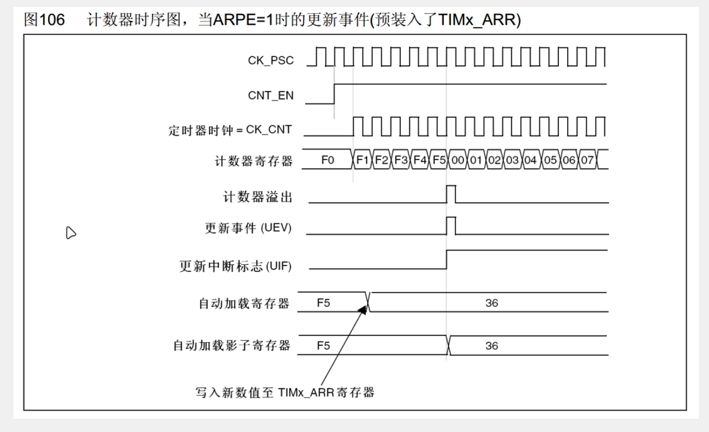

#### 7.4、RCC 时钟树

>ST 配置好的时钟初始化函数（SystemInit）
>
>system_stm32f10x.c和system_stm32f10x.h配置时钟相关的文件

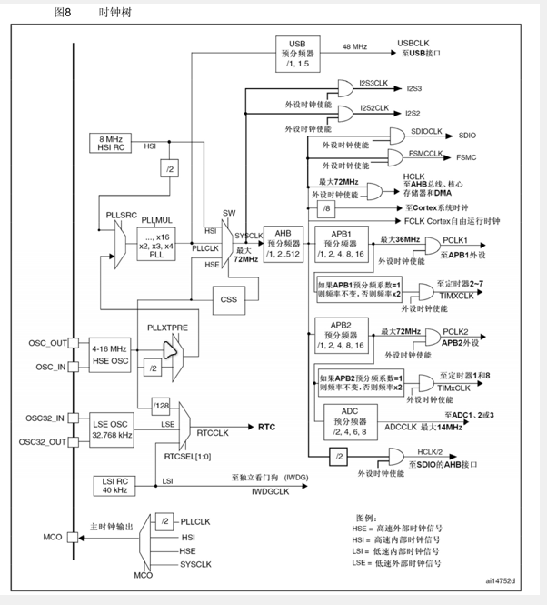


**==无论高级定时器、通用定时器、基本定时器其内部基准时钟都为 72MHz==**

```html
定时器总结：
//第一步，RCC开启时钟，这个基本上每个代码都是第一步，打开时钟后，定时器的基准时钟和整个外设的工作时钟就都会同时打开了
//第二步，选择时基单元的时钟源，对于定时中断，我们选择内部时钟源
//第三步，配置时基单元，用一个结构体来配置这里的预分频器、自动重装器、计数器（模式）等等
//第四步，配置输出中断控制，允许更新中断输出到NVIC
//第五步，配置NVIC，在NVIC中打开定时器中断的通道，并分配一个优先级
//第六步，运行控制（使能计数器，不然其不运行） 	 	
```


#### 7.5、输出比较

>•OC（Output Compare）输出比较
>
>•输出比较可以通过比较 CNT 与 CCR（捕获/比较寄存器）寄存器值的关系，来对输出电平进行置 1、置 0 或翻转的操作，用于输出一定频率和占空比的 PWM 波形
>
>•每个高级定时器和通用定时器都拥有 4 个输出比较通道
>
>•高级定时器的前 3 个通道额外拥有死区生成和互补输出的功能
>
>•CC（Capture Compare）输入捕获与输出比较的单元。
>
>•CCR 是一个人为制定的固定值。

##### 7.5.1、输出比较通道

###### （1）、通用定时器输出比较通道

>①：CCR 捕获/输出寄存器与 CNT 计数器比较，CCR = CNT 或者 CCR < CNT 输出对应的电平。
>
>②：输出模式的控制器的模式由 OC1M [2:0] 决定。
>
>③：OC1M [2:0]：输出比较 1 模式 (Output compare 1 enable) 该 3 位定义了输出参考信号 OC1REF 的动作，而 OC1REF 决定了 OC1 的值。 OC1REF 是高电平 有效，而 OC1 的有效电平取决于 CC1P 位。
>
>输出比较模式
>
>| **模式**                  | **描述**                                                     |
>| ------------------------- | :----------------------------------------------------------- |
>| 冻结                      | CNT 与 CCR 比较无效，REF 保持为原状态                            |
>| 匹配时置有效电平          | CNT = CCR 时，REF 置有效电平 （置高）                            |
>| 匹配时置无效电平          | CNT = CCR 时，REF 置无效电平  （置低）                           |
>| 匹配时电平翻转            | CNT = CCR 时，REF 电平翻转                                       |
>| 强制为无效电平            | CNT 与 CCR 无效，REF 强制为无效电平                              |
>| 强制为有效电平            | CNT 与 CCR 无效，REF 强制为有效电平                              |
>| PWM 模式 1                  | 向上计数：CNT <CCR时，REF置有效电平，CNT≥CCR时，REF置无效电平      向下计数：CNT> CCR 时，REF 置无效电平，CNT≤CCR 时，REF 置有效电平 |
>| PWM 模式 2（PWM 模式 1 取反） | 向上计数：CNT <CCR时，REF置无效电平，CNT≥CCR时，REF置有效电平      向下计数：CNT> CCR 时，REF 置有效电平，CNT≤CCR 时，REF 置无效电平 |
>
>④：OC1 ref，输出模式控制器的输出，这里指该位置的高低电平。ref（reference）参考信号。
>
>⑤：OC1 REF 可以映射到主模式上的 TRGO 输出。
>
>⑥、⑦：OC1 REF 的主要去向。⑥：极性选择器。CC1P 为 1，会将 OC1  REF 信号翻转；为 0 则不会翻转。⑦：输出使能电路，CC1E 为 1 会使能，为 0 不使能。其中 CC1E 与 CC1P 分别是 TIM1_CCER 寄存器上的一位。
>
>⑧：ETRF，定时器的小功能，一般不用。

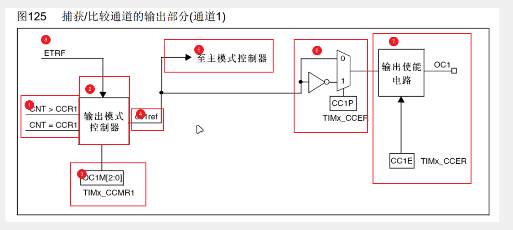

###### （2）、高级定时器输出比较通道

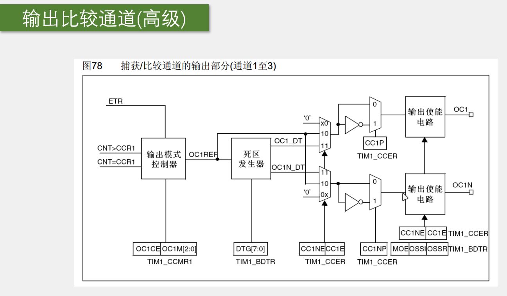

##### 7.5.2、PWM

###### （1）、简介

>•PWM（Pulse Width Modulation）脉冲宽度调制
>
>•在具有 ==惯性的系统== 中，可以通过对一系列脉冲的宽度进行调制，来等效地获得所需要的模拟参量，常应用于电机控速等领域
>
>•PWM 参数：
>
>   频率 = 1 / T~S~      占空比 = T~ON~ / T~S~           分辨率 = 占空比变化步距
>
>•解释：T~S~  ：方波一个周期；T~ON~：打开时间；T~OFF~：关闭时间。分辨率，比如有的占空比只能是 1%、2%、3%等等这样以 1%的步距跳变，那他的分辨率就是 1%；如果可以 1.1%、1.2%、1.3%等等这样以 0.1%的步距跳变，那他的分辨率就是 0.1% 。所以这个分辨率就是占空比变化的精细程度，这个分辨率需要多高，取决于项目的需求。
>
>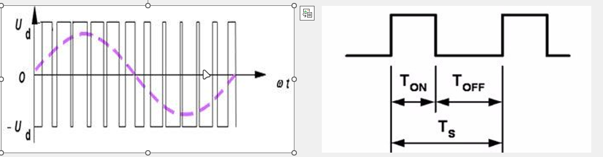

###### （2）、PWM 基本结构

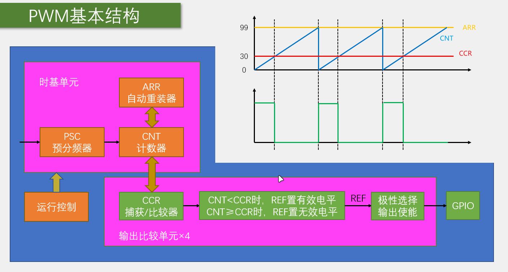

###### （3）、参数计算

$$
PWM 频率(计数器频率)：	Freq = CK\_PSC / (PSC + 1) / (ARR + 1)
\\
PWM 占空比：	Duty = CCR / (ARR + 1)
\\
PWM 分辨率：	Reso = 1 / (ARR + 1)
$$

##### 7.5.3、SG90 舵机

###### （1）、简介

>•舵机是一种根据输入 PWM 信号占空比来控制输出角度的装置
>
>•输入 PWM 信号要求：周期为 20ms，高电平宽度为 0.5ms~2.5ms

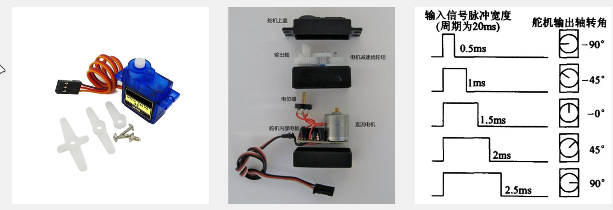

###### （2）、硬件电路

>==5v 供电==

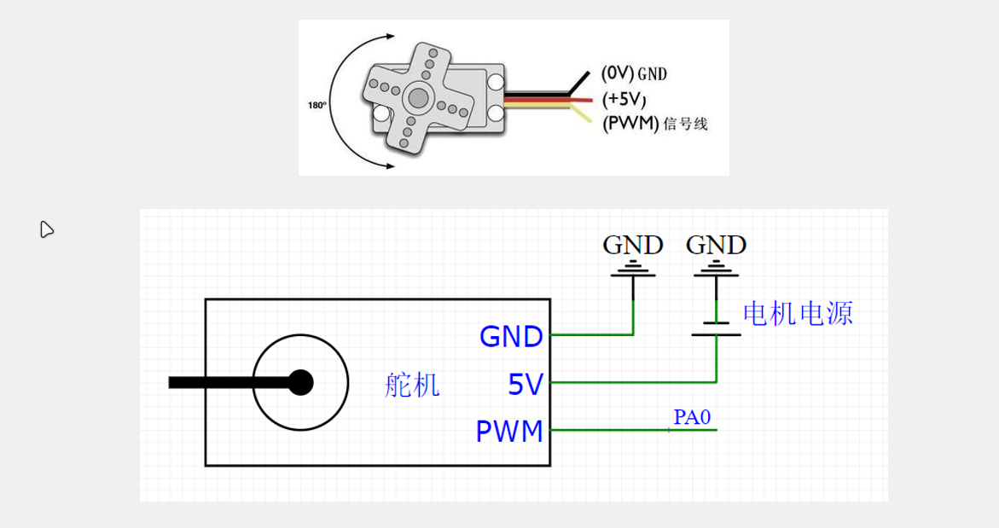

##### 7.5.4、直流电机及驱动介绍

###### （1）、简介

>•直流电机是一种将电能转换为机械能的装置，有两个电极，当电极正接时，电机正转，当电极反接时，电机反转
>
>•直流电机属于大功率器件，GPIO 口无法直接驱动，需要配合电机驱动电路来操作
>
>•TB6612 是一款双路 H 桥型的直流电机驱动芯片，可以驱动两个直流电机并且控制其转速和方向

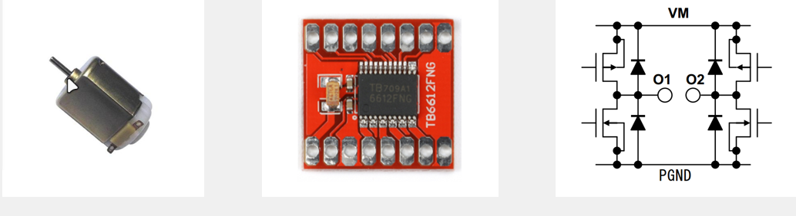

###### （2）、硬件电路

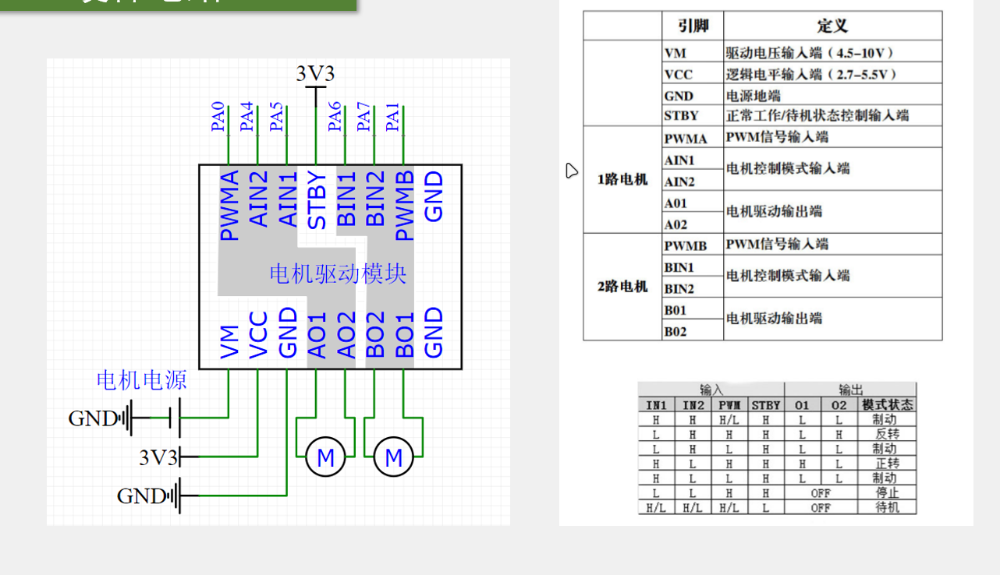


```html
PWM总结：
	//第一步，RCC开启时钟，把TIM外设和GPIO外设的时钟打开
	//第二步，配置时基单元
	//第三步，配置输出比较单元（CCR值、输出比较模式、极性选择、输出使能）
	//第四步，配置GPIO，把对应的GPIO口，初始化为复用推挽输出配置
	//第五步，启动计数器（运行控制），这样子就可以输出PWM了
```

#### 7.6、输入捕获

##### 7.6.1 、简介

>•IC（Input Capture）输入捕获
>
>•输入捕获模式下，当通道输入引脚出现指定电平跳变时，当前 CNT 的值将被锁存到 CCR 中，可用于测量 PWM 波形的频率、占空比、脉冲间隔、电平持续时间等参数 
>
>•每个高级定时器和通用定时器都拥有 4 个输入捕获通道
>
>•可配置为 PWMI 模式，同时测量频率和占空比
>
>•可配合主从触发模式，实现硬件全自动测量

##### 7.6.2、频率测量方法

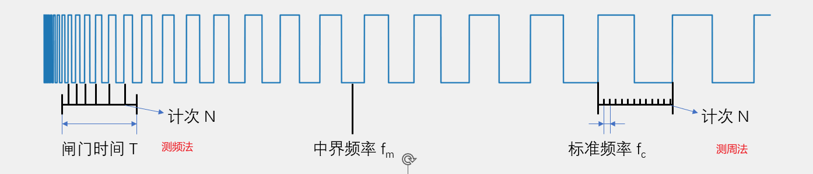
$$
测频法：在闸门时间 T 内，对上升沿（/下降沿）计次，得到 N，则频率
\\
𝑓_𝑥 = 𝑁 / 𝑇
\\
测周法：两个上升沿内，以标准频率 fc 计次，得到 N ，则频率
\\
𝑓_𝑥 = 𝑓_𝑐  / 𝑁
\\
\\
中界频率：测频法与测周法误差相等的频率点
\\
𝑓_𝑚 =\sqrt{(𝑓_𝑐  / 𝑇)}
$$

>对于 stm32 测频率而言，它只能测量数字信号，所以测量之前，需要信号预处理电路（比较器）。如果测量信号的电压非常高，还需要考虑隔离问题（用隔离放大器、电压互感器）。
>
>- 测频法：一定时间 T 内，重复出现了 N 个周期，所以频率为 N *（1/T）。适合用在* *高频率**的测量中，测量结果更新慢，数据稳定。（以前的对射式红外传感器，加上定时时间，就能简单实现）。
>- 测周法：一个周期中，用了多少时间（用已知频率去计次测量）。适合用在 **低频率** 的测量中，测量结果更新快，数据跳变快。
>	- 如果使用定时器测量，fc = 72Mhz/（PSC+1）
>- 以上两种方法都存在+1 或者-1 的误差（本质是计次，所以实际会舍去或者加入半个周期）
>- 中界频率：用于区分低频率还是高频率的标志频率。令测频法与测周法计次 N 相等。

##### 7.6.3、结构

###### （1）、捕获粗略结构

>①：异或门，用于服务三相无刷电机，连接三相无刷电机中的霍尔传感器，驱动换相电路工作。
>
>②：内部有 2 对输入滤波器（信号整形）和边沿检测器（信号检测），一对输入滤波器和边沿检测器（用上升沿触发）连接 T1FP2，输入给 IC1；另一对输入滤波器和边沿检测器（用下降沿触发）连接 T1FP2，输入给 IC2。主要用于 PWMI，实现对一个信号的频率与占空比检测。
>
>​	该结构 TI1 和 TI2、TI3 和 TI4 可以分别组成一对，实现一个通道（ICx）切换两个引脚，或者两个通道捕获一个引脚。
>
>③：信号来源为 ⑦，服务于无刷电机。
>
>④：向后面输入分频后触发信号。
>
>⑤：该信号，用于将 CNT 的值转运到 CCR 保存。
>
>⑥：捕获事件，可以在触发一次之后，执行中断或者事件。

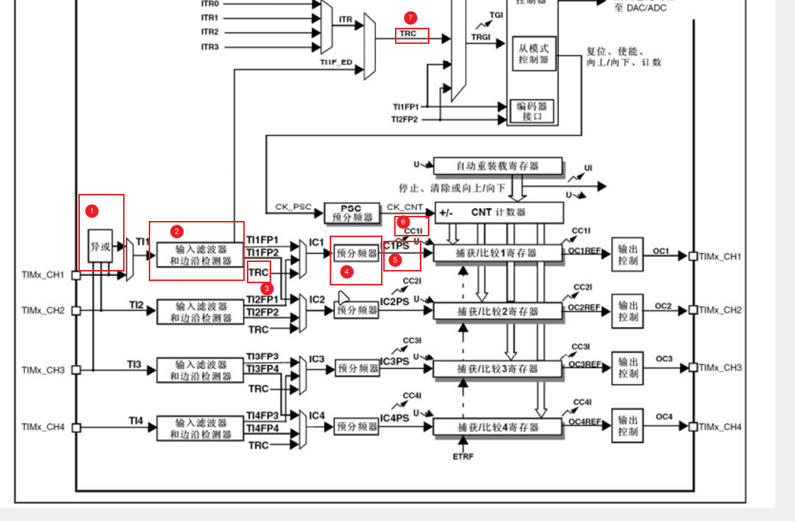

###### （2）、输入捕获通道

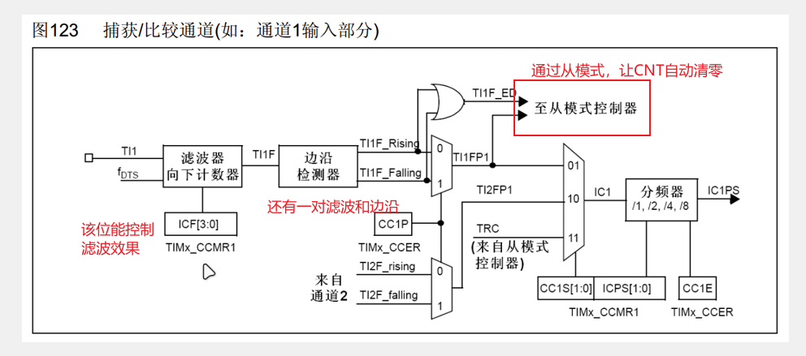

######  （3）、主从触发模式

>主模式：将左边的定时器内部信号，映射到 TRGO 上，用于触发别的外设—–控制别人。

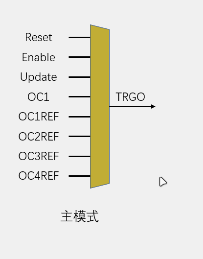

>从模式：接收其他外设或者自身外设的一些信号（触发源选择），用于控制自身定时器的运行——被别人控制。
>
>具体描述见数据手册。

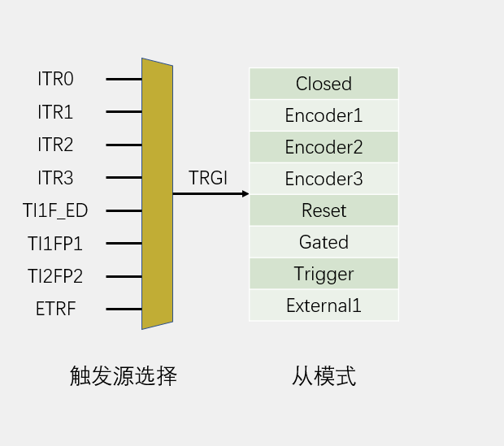

###### （4）、输入捕获基本结构（测周法测量频率）

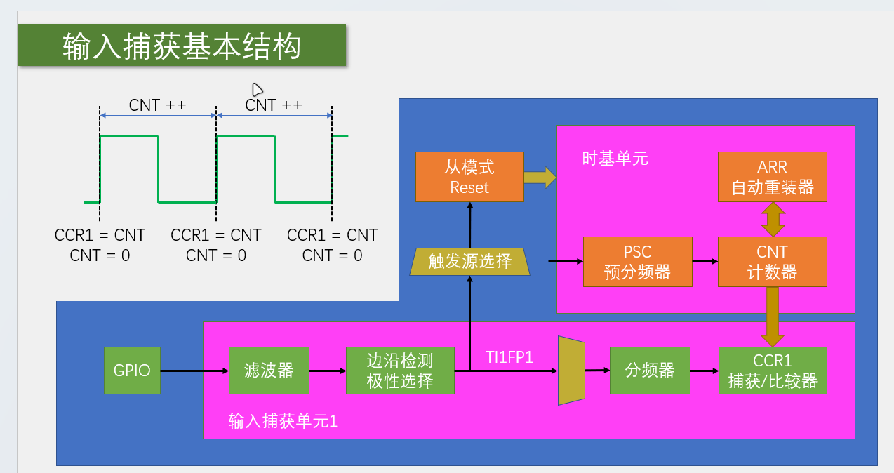

>第一步：RCC 开启时钟，把 GPIO 与 TIM 的时钟打开。
>
>第二步：GPIO 初始化，配置成输出模式。
>
>第三步：配置时基单元。
>
>第四步：配置输入捕获单元，包含滤波器、极性选择、直连通道还是交叉通道、分频器。
>
>第五步：选择从模式触发源，为 TI1FP1。
>
>第六步：选择触发之后执行操作（Reset 操作）。

###### （5）、PWMI 基本结构（测量频率和占空比）

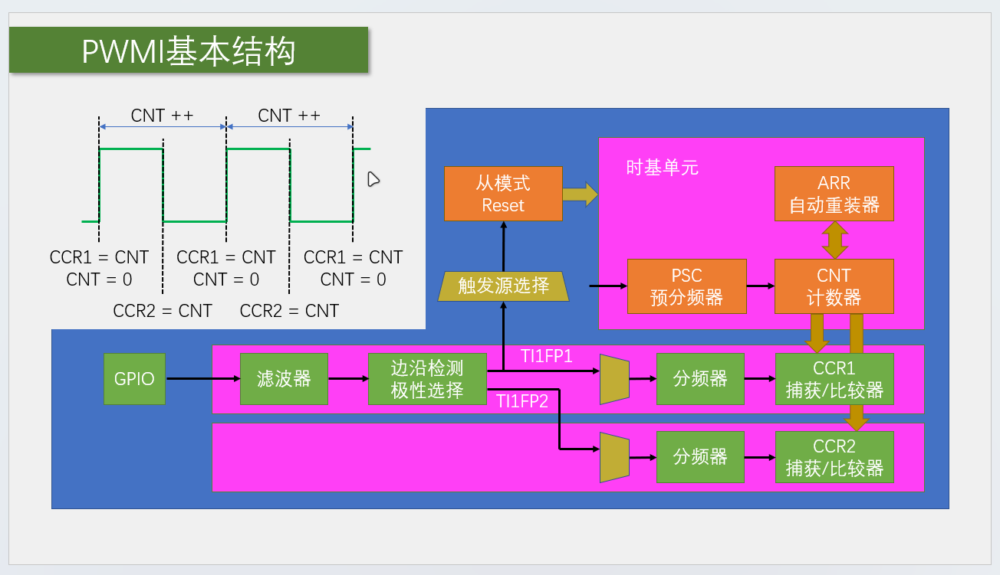

#### 7.7、编码器接口

##### 7.7.1、简介

>•Encoder Interface 编码器接口（基本上相当于使用了一个带方向选择的外部时钟）
>
>•编码器接口可接收增量（正交）编码器的信号，根据编码器旋转产生的正交信号脉冲（更加抗噪声），自动控制 CNT 自增或自减，从而指示编码器的位置、旋转方向和旋转速度
>
>•每个高级定时器和通用定时器都拥有 1 个编码器接口
>
>•两个输入引脚借用了输入捕获的通道 1 和通道 2
>
>本质上是利用测频法测正交脉冲的频率，只是编码器接口能根据旋转方向，进行自增计次或者自减计次。

##### 7.7.2、正交编码器

| **边沿** | **另一相状态** |
| -------- | -------------- |
| A 相 ↑     | B 相低电平      |
| A 相 ↓     | B 相高电平      |
| B 相 ↑     | A 相高电平      |
| B 相 ↓     | A 相低电平      |


| **边沿** | **另一相状态** |
| -------- | -------------- |
| A 相 ↑     | B 相高电平      |
| A 相 ↓     | B 相低电平      |
| B 相 ↑     | A 相低电平      |
| B 相 ↓     | A 相高电平      |

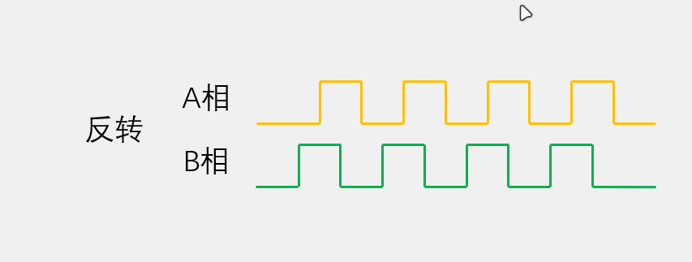

##### 7.7.3、编码器的电路结构

>①：编码器使用的是输入捕获 1 和 2 的接口。
>
>④：编码器的信号来源为 ② 和 ③。
>
>⑥：时基单元中，不在使用 72MHZ 的内部时钟，而是由编码器接口直接控制（⑤）；同时，不会确定计数模式（⑦），由编码器接口直接控制。
>
>

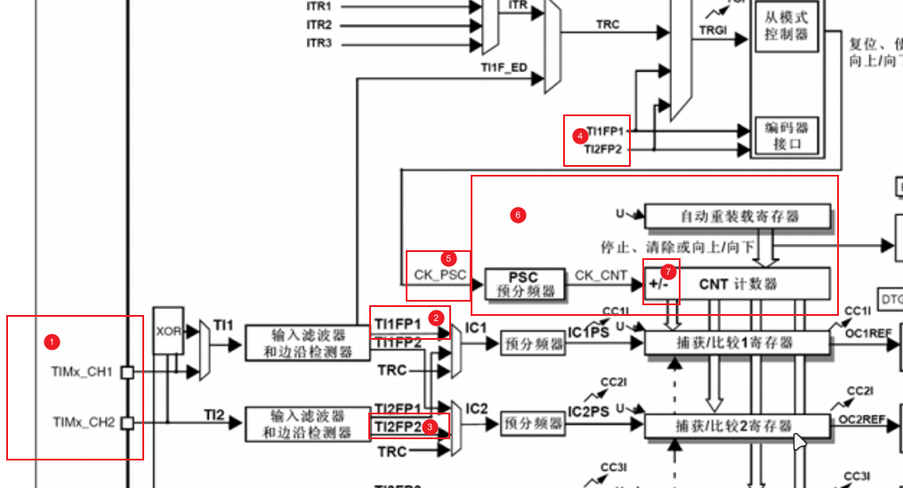

##### 7.7.4、编码器基本结构

>ARR 自动重装器：一般是给 65535 的最大量程。目的为能表示负数，利用补码手写一个操作程序（符号自己加），比如 65535（1111 1111 1111 1111 1111 1111 1111 1111） —— -1 （取反+1 0000 0000 0000 0000 0000 0000 0000 0001）

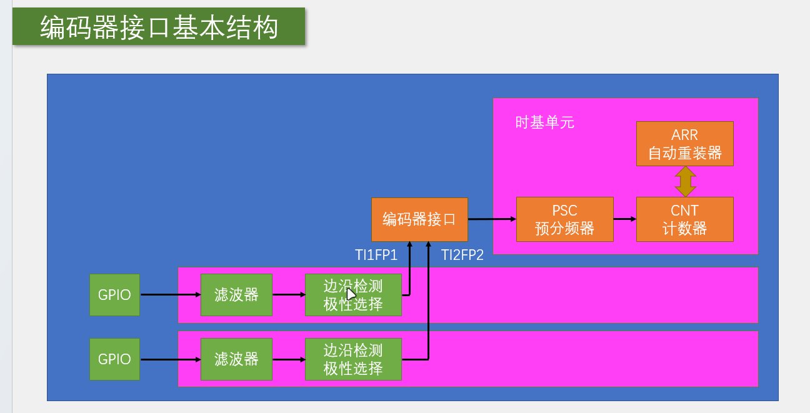

>第一步，RCC 开启时钟，开启 GPIO 和定时器
>
>第二步，配置 GPIO，引脚配置为输入模式
>
>第三步，配置时基单元，PSC 不分频，ARR 最大值 65535
>
>第四步，配置输入捕获单元，主要配置滤波器和极性选择
>
>第五步，配置编码器接口
>
>第六步，启动定时器

##### 7.7.5、工作模式

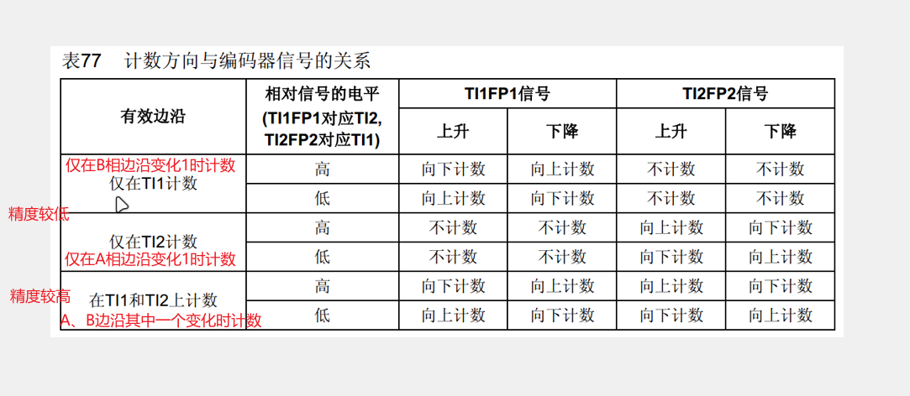

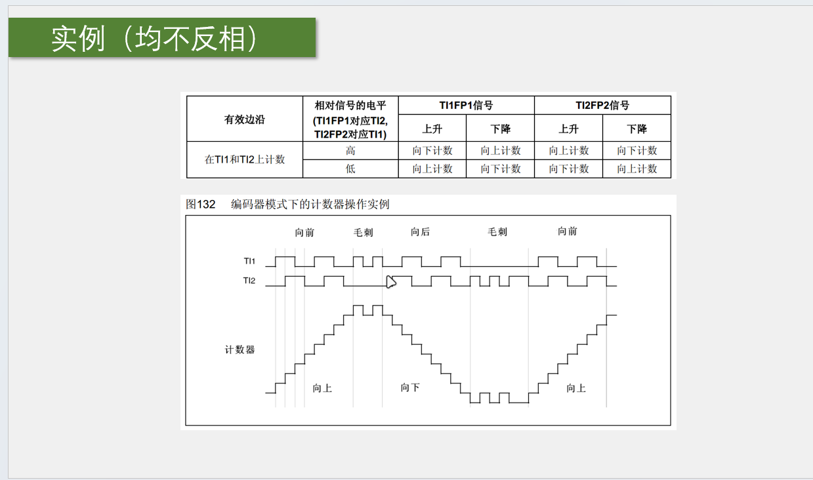

>TI1 反相之后，需要把 TI1 的输入信号，整体取反，在进行判断。

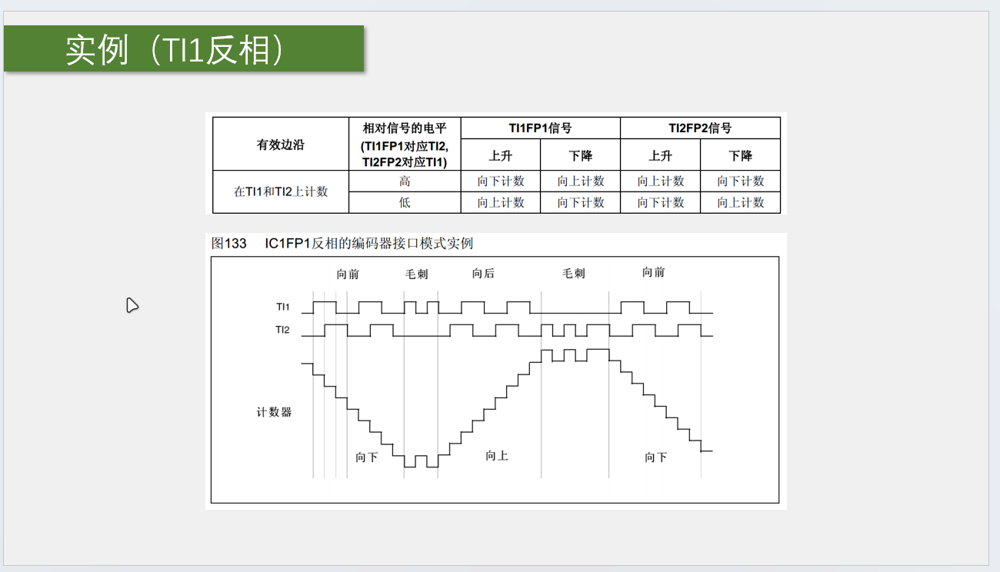

### 8、ADC 模数转换器

#### 8.1、简介

>•ADC（Analog-Digital Converter）模拟-数字转换器
>
>•ADC 可以将引脚上连续变化的模拟电压转换为内存中存储的数字变量，建立模拟电路到数字电路的桥梁
>
>•12 位(0~4095)逐次逼近型 ADC，1us 转换时间，适合用于转换频率小于 1MHZ（1/1us）
>
>•输入电压范围：0\~3.3V，转换结果范围：0~4095
>
>•18 个输入通道，可测量 16 个外部（16 个 GPIO 口，直接接模拟信号）和 2 个内部信号源（内部温度传感器（可以测量 CPU 温度——电脑能显示 CPU 温度的根本原因）和内部参考电压（固定的 1.2v 基准电压——能够进行校准））
>
>•规则组（用于常规情况。组：能进行多个数值转换）和注入组（用于突发事件的情况）两个转换单元
>
>•模拟看门狗（进行阈值判断，满足申请中断）自动监测输入电压范围
>
>
>
>•STM32F103C8T6 ADC 资源：ADC1、ADC2，10 个外部输入通道

#### 8.2、stm32f103C8T6 的 ADC 框图

>①：模拟信号的输入口。
>
>②、⑤：构成注入组，其中注入通道（②），最多能同时处理 4 个通道模拟信号。注入通道数据寄存器（⑤），有 4 个 16 位的寄存器，同时存储 4 个转换后的数字信号。
>
>③、⑥：构成规则组，其中注入通道（③），最多能同时处理 16 个通道模拟信号。规则通道数据寄存器（⑥），最有一个 16 位的寄存器，如果不利用 DMA（可将数据转存到其他地方）的话，⑥ 中存储的为最后进入的信号（用 16 个通道的话，只存第 16 个的数字信号）。如果利用 DMA，其他数据会转存到其他地方，防止被覆盖。
>
>④：模拟至数字转换器，里面用的是逐次逼近型 ADC 的原理（详见单片机.pdf 或者江科大单片机 AD/DA 章节）。
>
>⑦：DMA 请求，用于转存其他数据。
>
>⑧：ADC 的时钟，详见第二张图，且 ADC 预分频器只能选择 6 分频（72MHZ / 6 = 12MHZ  <  14MHZ）。
>
>⑨：硬件触发转换。类似 start 信号（开始转换信号），其中信号源可以是 TIM 的通道或者 TRGO（多使用主从模式的 TRGO 信号源触发——自动触发），亦或者外部中断。另一种触发方式为软件触发（调用 ST 库函数）。
>
>⑩：规则组或注入组转换结束标志位——EOC，注入转换结束标志位——JEOC，模拟看门狗触发标志位——AWD。
>
>⑪：模拟看门狗，管理阈值，高于阈值高限或者低于阈值低限触发中断。
>
>V~REF~ ~+/-~：参考电压引脚（本型号的芯片与 V~DDA~  ~/SSA~连接在一起了）。
>
>V~DDA~  ~/SSA~：供电引脚。

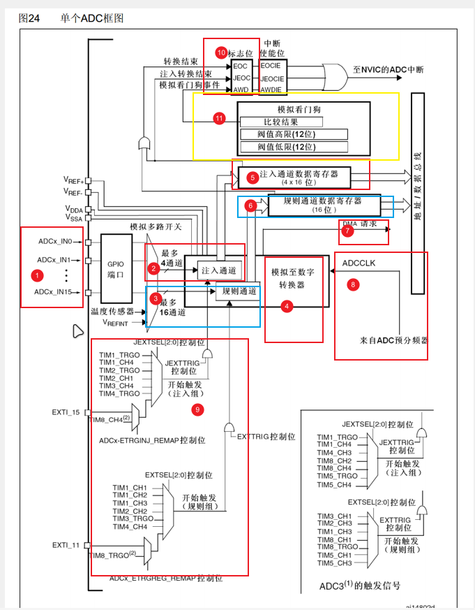

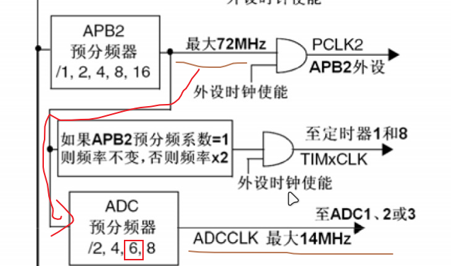

#### 8.3、ADC 基本结构框图

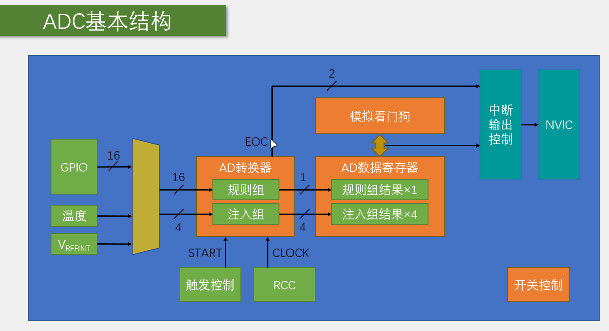

>第一步，开启 RCC 时钟，包括 ADC、GPIO，配置 ADC CLOCK（ADC 的预分频器）
>
>第二步，配置 GPIO，模拟输入
>
>第三步，配置多路开关（通道和采样时间），匹配通道与序列。
>
>第四步，配置 AD 转换器与 AD 数据寄存器、触发控制等。
>
>==第五步（可选），配置模拟看门狗==
>
>==第六步（可选），配置中断==
>
>==第七步（可选），配置 NVIC==
>
>第八步，打开 ADC 开关
>
>**第九步（可选），校准（手册推荐写）**

#### 8.4、输入通道

>c8t6 芯片只有 ADC1 和 ADC2。其中 ADC1 和 ADC2 共用一组通道及通道 0\~通道 9《=》PA0\~PA7、PB0、PB1；这样子设计的目的：能使用双 ADC 功能（该功能有多种模式——同步模式、交叉模式等）。
>
>通道 16、17 只有 ADC1 有。

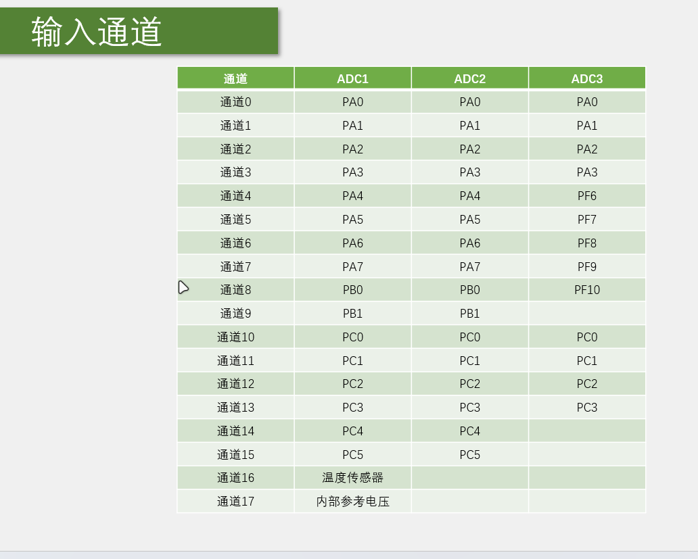

#### 8.5、转换模式（规则组）

##### （1）、单次转换，非扫描模式

>该模式下，只有序列 1 有效，将序列 1 连接自己想要使用的通道（如：通道 2）。（单个序列）		EOC—> 转换结束标志位
>
>启动第一次后（给了触发转换——start 信号），会在转换完成之后立即停止，下一次的转换，需要重新启动（触发）。  （多次启动）

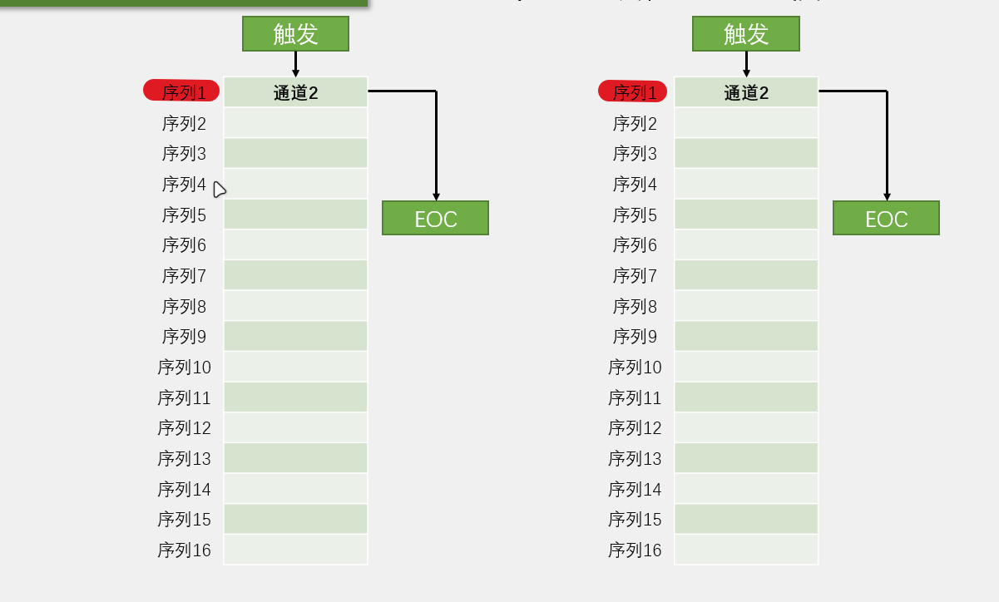

##### （2）、连续转换，非扫描模式

>该模式下，只有有序列 1 有效，序列 1 可接自己想要的转换通道。（单个序列有效）
>
>启动第一次后，在转换结束之后，不会停止，会持续的进行转换。（启动一次）

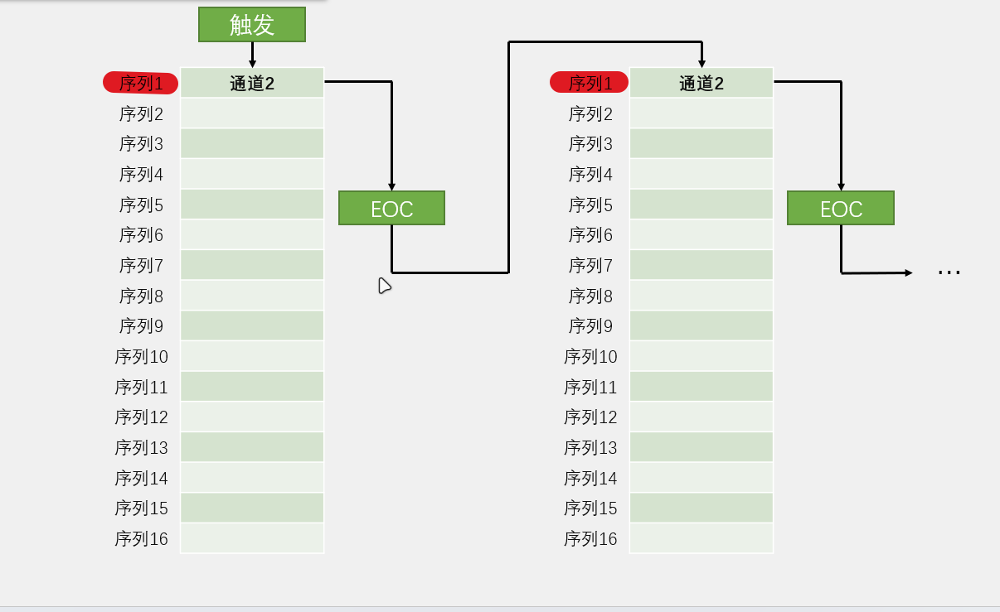

##### （3）、单次转换，扫描模式

>该模式下，通过 **通道数目** 决定多少个序列有效。（多个序列）
>
>启动第一次后，在转换结束之后，不会停止（中间的序列数值，需要通过 DMA 转存到其他地方），会持续的进行转换。（启动一次）

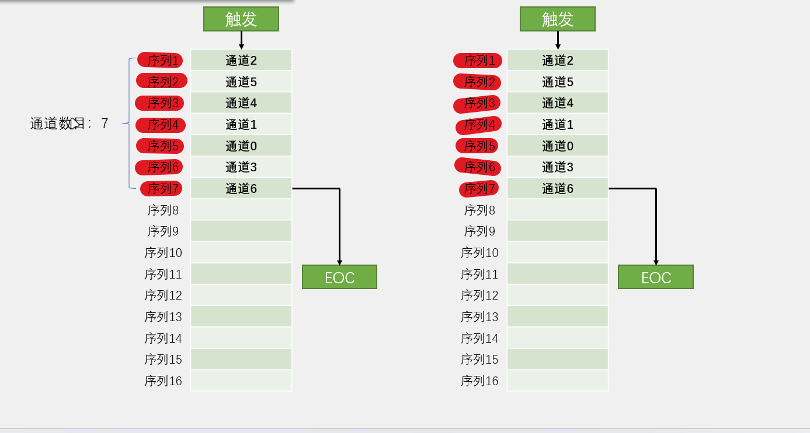

##### （4）、连续转换，扫描模式

>该模式下，通过 **通道数目** 决定多少个序列有效。（多个序列）
>
>启动第一次后，会在最后一个序列转换完成之后立即停止，同时在每个序列转换完成之后要尽快利用 DMA 将数据转存，下一次的转换，需要重新启动。  （多次启动）

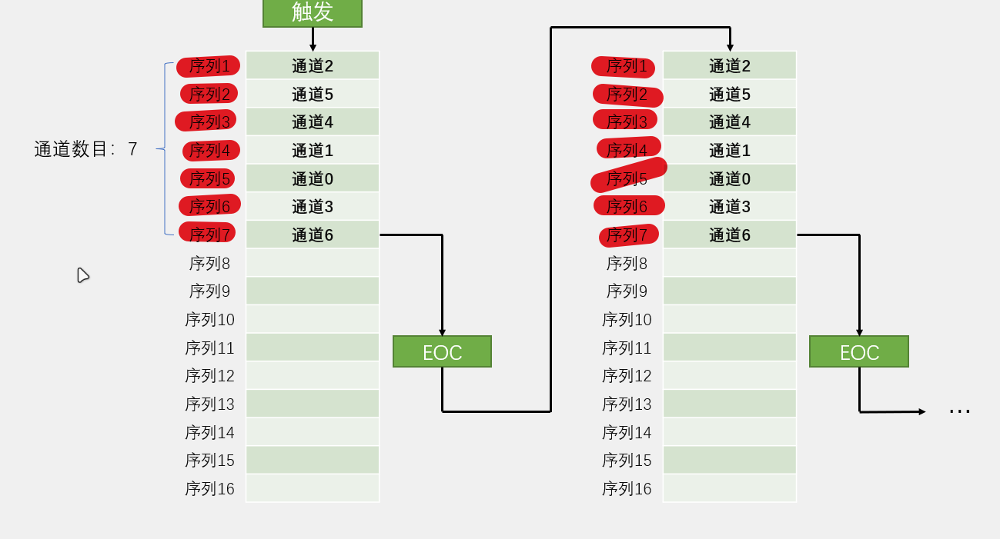

>在扫描模式的情况下，还有一种间断模式，每隔几个序列，暂停一次。

#### 8.6、规则组的触发控制

>通过配置 EXTSEL [2:0] 来控制触发源。
>
>其中倒数第二个触发源，具体是引脚还是定时器，需要用 AFIO 重映射决定。

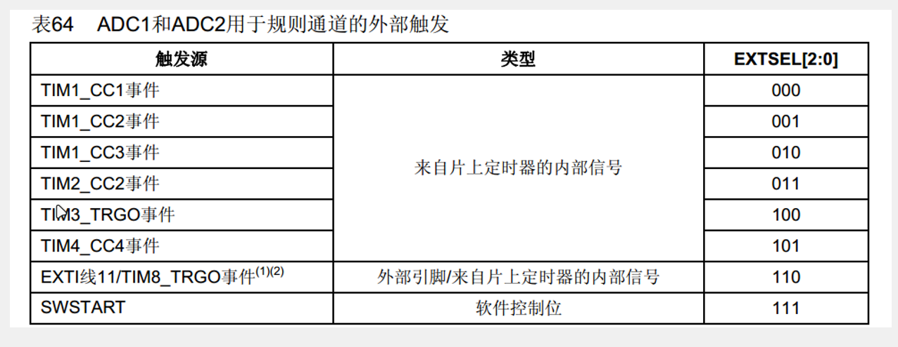

#### 8.7、数据对齐

> •数据右对齐（经常使用）：

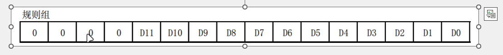

>•数据左对齐（非高精度环境下使用，直接读取高 8 位）：

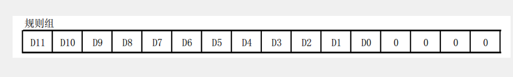

#### 8.8、转换时间

>•AD 转换的步骤：<span style="color: #FF0000;"> 采样，保持 </span>，<span style="color: #8080FF;"> 量化，编码 </span>
>
>
>
>•STM32 ADC 的总转换时间为：
>
> TCONV = 采样时间（采样+保持） + 12.5 个 ADC 周期（量化+编码）
>
>其中，ADC 周期为 RCC 中 ADCCLK 的分频，即 [ADC 框图中的 ⑧](#####8.2、stm32f103C8T6的ADC框图)
>
>
>
>•例如：当 ADCCLK = 14MHz，采样时间为 1.5 个 ADC 周期
>
> TCONV = 1.5 + 12.5 = 14 个 ADC 周期 = 1μs

#### 8.9、校准

>•ADC 有一个内置自校准模式。校准可大幅减小因内部电容器组的变化而造成的准精度误差。校准期间，在每个电容器上都会计算出一个误差修正码(数字值)，这个码用于消除在随后的转换中每个电容器上产生的误差
>
>
>
>•建议在每次上电后执行一次校准
>
>
>
>•启动校准前， ADC 必须处于关电状态超过至少两个 ADC 时钟周期
>
>
>**实际使用时，在 ADC 初始化后，加几条代码。**

#### 8.10、硬件电路

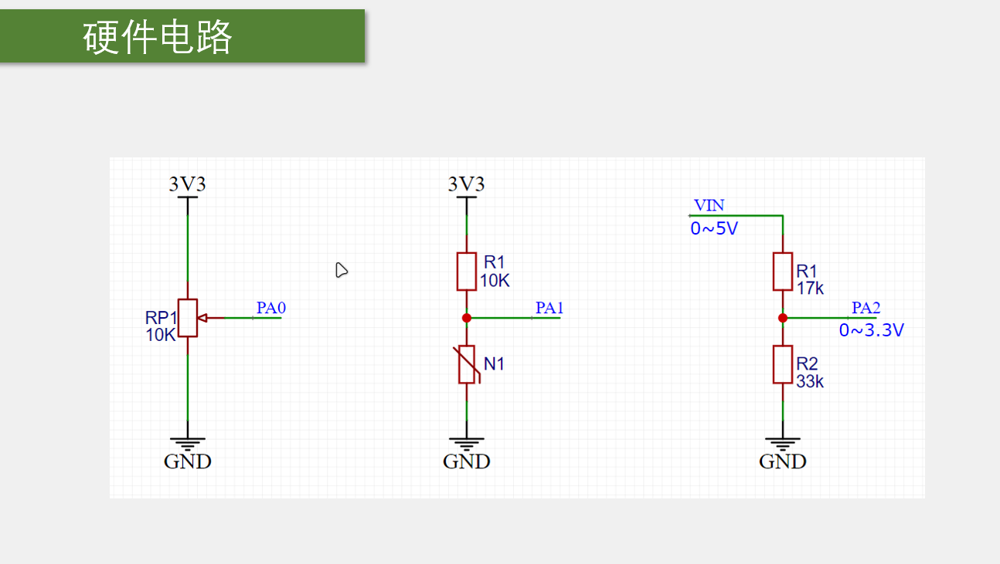

### 9、DMA 直接存储器

#### 9.1、简介

>•DMA（Direct Memory Access）直接存储器存取
>
>•DMA 可以提供外设（外设的寄存器——一般为数据寄存器 DR（Data Register））和存储器（SRAM、Flash）或者存储器和存储器之间的高速数据传输，**无须 CPU 干预，节省了 CPU 的资源**
>
>•12 个独立可配置的通道： DMA1（7 个通道）， DMA2（5 个通道）
>
>•每个通道都支持软件触发和特定的硬件触发
>
>
>
>•STM32F103C8T6 DMA 资源：DMA1（7 个通道）

#### 9.2、stm32 存储器映像

<table border="1" align="center" text-align="center" cellpadding="10"> 
        <tr bgcolor="#cccccc">
            <th> 类型 </th>
            <th> 起始地址 </th>
            <th> 存储器 </th>
            <th> 用途 </th>
        </tr>
        <tr>
            <td rowspan="3"> ROM </td>
            <td> 0x0800 0000 </td>
            <td> 程序存储器 Flash </td>
            <td> 存储 c 语言编译后的程序代码、常量数据 </td>
        </tr>
        <tr>
            <td> 0x1FFF F000 </td>
            <td> 系统存储器 </td>
            <td> 存储 BootLoader，用于串口下载 </td>
        </tr>
        <tr>
            <td> 0x1FFF F800 </td>
            <td> 选项字节（存储 Flash 的读保护、写保护，看门狗的配置等）</td>
            <td> 存储一些独立于程序代码的配置参数 </td>
        </tr>
        <tr>
            <td rowspan="3"> RAM </td>
            <td> 0x2000 0000 </td>
            <td> 运行内存 SRAM </td>
            <td> 存储运行过程中的临时变量 </td>
        </tr>
        <tr>
            <td> 0x4000 0000 </td>
            <td> 外设寄存器 </td>
            <td> 存储各个外设的配置参数 </td>
        </tr>
        <tr>
            <td> 0xE000 0000 </td>
            <td> 内核外设寄存器 </td>
            <td> 存储内核各个外设的配置参数 </td>
        </tr>
    </table>

####  9.3、DMA 框图

>- ①：DAM 有三个总线，DMA1（7 个通道）通过一条 DMA 总线连接总线矩阵，DMA2（5 个通道）通过另一条 DMA 总线连接总线矩阵，以太网 MAC 通过自己私有的 DMA 总线连接总线矩阵。
>- ②：仲裁器，让多通道分时复用一条 DAN 总线（决定通道优先级）。
>- ③：AHB 从设备，让 CPU（内核）能访问 DMA 的寄存器。
>- ④：总线矩阵，包含多个总线。内含总线仲裁器，处理各个总线的冲突（如：CPU 与 DMA 访问同一个目标时，总线仲裁器会让限制 CPU，让它得到一半的带宽（传输速度），在保证 CPU 正常功能不受影响的同时，让 DMA 优先访问）。
>- 在 ④（总线矩阵）左端连接的是主动单元（能访问被动单元的权力），右端连接的是被动单元（只能被主动单元读写）。
>- DMA 作为主动单元时，路线为红线 ⑥，访问外设和存储器。
>- DMA 作为被动单元时，CPU 访问的 DMA 的路线为蓝线 ⑤。
>	- DMA 既是主动单元，也是被动单元。
>- 黑箭头 ⑦：DMA 请求，为外设的硬件触发 DMA。

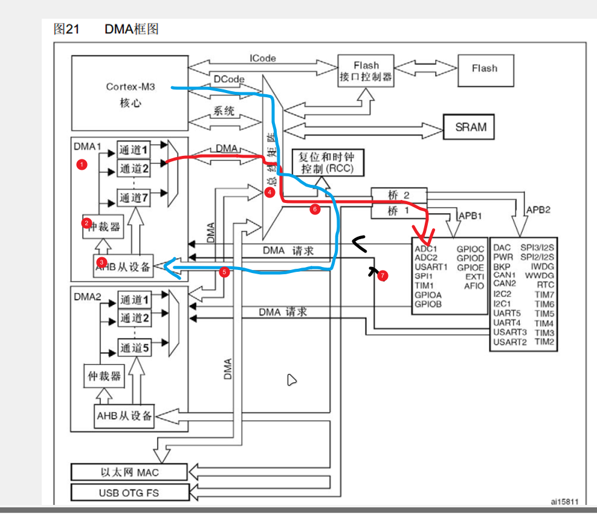

#### 9.4、DMA 基本结构

>方向为：外设-> 存储器时
>
>左边的 ”外设” 可以理解成 “起始 或者 源端“
>
>右边的 “存储器” 可以理解成 “目的地 或者 目标”
>
>
>
>方向为：存储器-> 外设时
>
>左边的  “外设”  可以理解成  “目的地 或者 目标”
>
>右边的  “存储器”   可以理解成  ”起始 或者 源端“
>
>
>
>传输计数器：转移次数，自减。==给传输计数器写值时（没有使用自动重装器的前提），必须先关闭 DMA，再写入值。==
>
>自动重装器：是否循环转运（传输计数器清零后自动重装），开启—》循环转运，关闭—》单词转运。
>
>M2M：里面的值，决定触发方式。1，软件触发（非调用函数，而用最快的速度，连续不断触发 DMA，让传输计数器值清零——连续触发）（软件触发不能与自动重装器一起使用）；0，硬件触发。

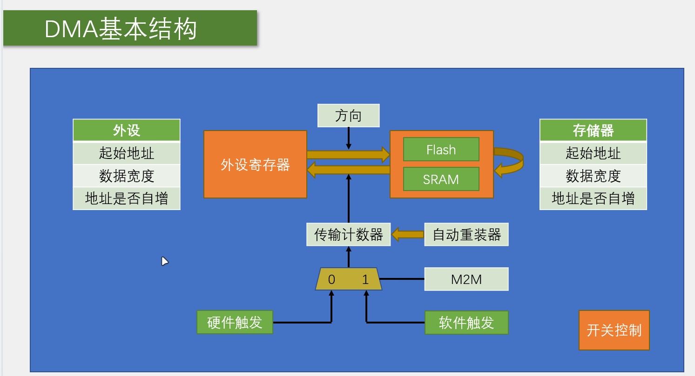

>第一步，RCC 开启 DMA 时钟。
>
>第二步，初始化 DMA 各个参数。
>
>第三步，打开 DMA 开关。
>
>第四步（硬件触发），再对应外设打开 DMA（xxx_DMACmd()）。
>
>
>后续操作，关闭 DMA，写入传输计数器，打开 DMA。

#### 9.5、DMA 请求

>①：外设请求信号，想要接收这些信号源，需要打开自己 DMA 使能。（如：想要使用 ADC1，需要再初始化时，打开自己的 DMA（TIM_DMACmd()））。
>
>②：EN 位（DMA_CCRx 寄存器的第 0 位），是否让数据选择器工作。DMA 的开关控制。
>
>③：MEM~2~MEM 位（DMA_CCRx 寄存器的第 14 位）  ：为 1 时，软件触发；为 0 时，硬件触发（上面的硬件请求生效）。
>
>**注意：每个通道所对应的请求信号不同。**

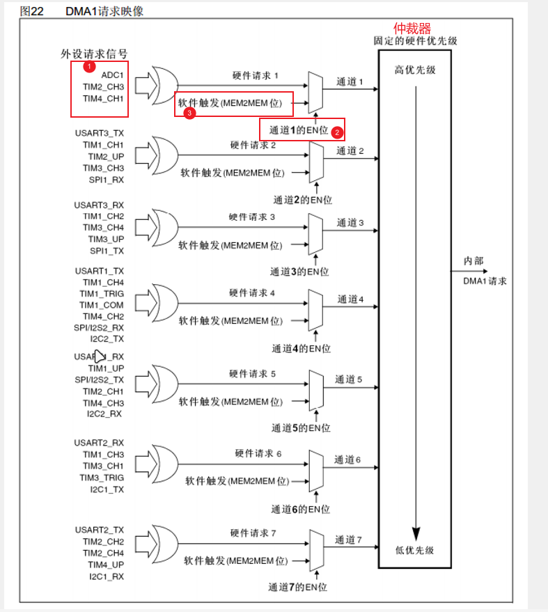

#### 9.6、数据宽度与对齐

>源端宽度（起始的数据宽度）= 目标宽度（目的地的数据宽度），将源端的数据完整的转移到目标里面。
>
>源端宽度（起始的数据宽度）< 目标宽度（目的地的数据宽度）, 将源端的数据完整的转移到目标的低位，目标中剩余没有填充的高位补 0。
>
>源端宽度（起始的数据宽度）> 目标宽度（目的地的数据宽度）, 将源端的低位数据转移到目标里面。（舍弃源端多余的高位）。
>
>存储方式为：小端存储（高位放在高地址，低位放在低地址）。

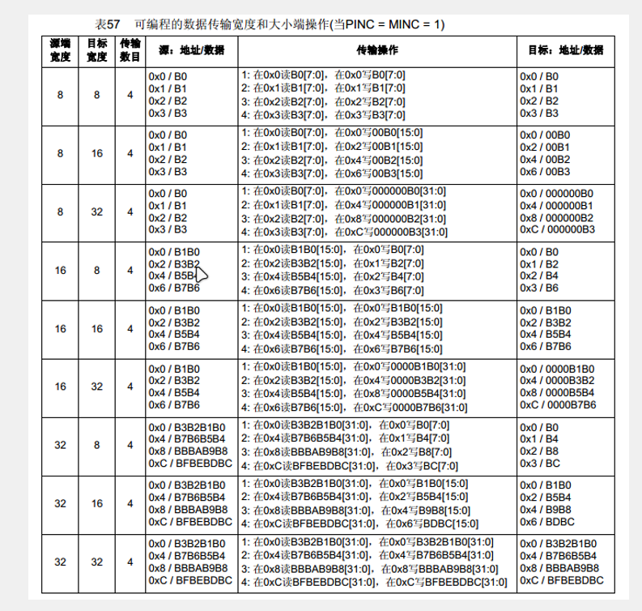

#### 9.7、例子

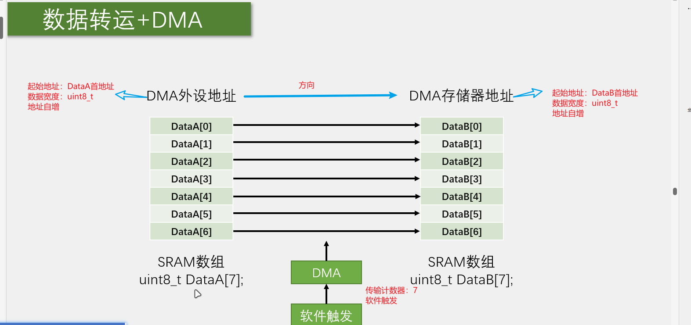

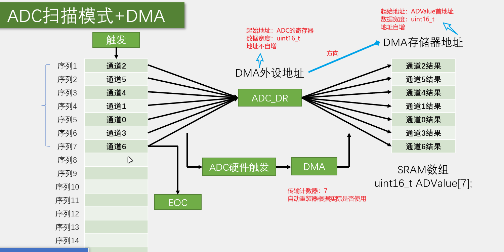

### 10、USART 串口协议（单片机.pdf 串口章节）

#### 10.1、通信协议

>•通信的目的：将一个设备的数据传送到另一个设备，扩展硬件系统
>
>•通信协议：制定通信的规则，通信双方按照协议规则进行数据收发

>USART 有异步和同步两种，UART 只有异步。

>单端：高低电平都是对 GND 的电压差，所以单端信号的双方必须要共地，也就是把 GND 接在一起。
>
>差分：两个差分引脚的电压差，来传递信号。（抗干扰能力更强）

| **名称** | **引脚**             | **双工** | **时钟**                  | **电平** | **设备** |
| -------- | -------------------- | -------- | ------------------------- | -------- | -------- |
| USART    | TX、RX               | 全双工   | 异步  /  同步（有时钟线） | 单端     | 点对点   |
| I2C      | SCL、SDA             | 半双工   | 同步                      | 单端     | 多设备   |
| SPI      | SCLK、MOSI、MISO、CS | 全双工   | 同步                      | 单端     | 多设备   |
| CAN      | CAN_H、CAN_L         | 半双工   | 异步                      | 差分     | 多设备   |
| USB      | DP(D+)、DM(D-)       | 半双工   | 异步                      | 差分     | 点对点   |

#### 10.2、串口协议（低位先行）

##### (1)、简介

>•串口是一种应用十分广泛的通讯接口，串口成本低、容易使用、通信线路简单，可实现两个设备的互相通信
>
>•单片机的串口可以使单片机与单片机、单片机与电脑、单片机与各式各样的模块互相通信，极大地扩展了单片机的应用范围，增强了单片机系统的硬件实力

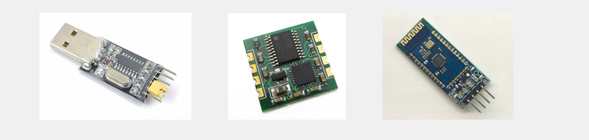

##### (2)、硬件电路

>•简单双向串口通信有两根通信线（发送端 TX 和接收端 RX）
>
>•TX 与 RX 要交叉连接
>
>•当只需单向的数据传输时，可以只接一根通信线
>
>•当电平标准不一致时，需要加电平转换芯片

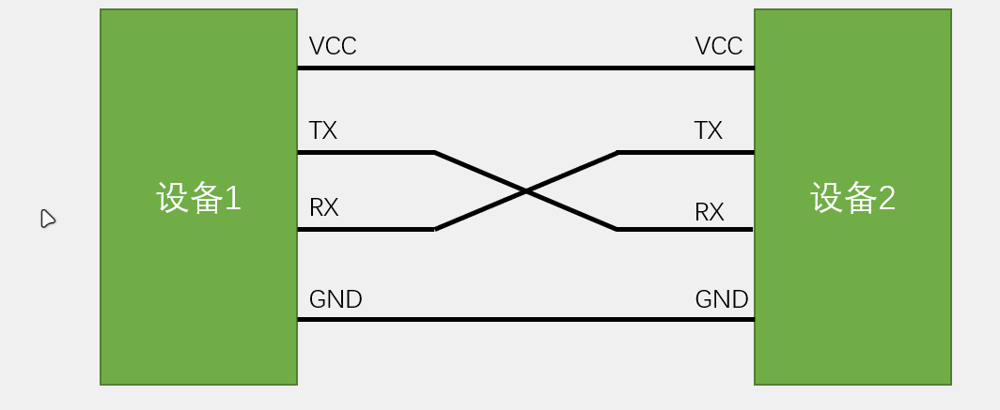

##### (3)、电平标准

>•电平标准是数据 1 和数据 0 的表达方式，是传输线缆中人为规定的电压与数据的对应关系，串口常用的电平标准有如下三种：
>
>
>
>•TTL 电平：+3.3V 或+5V 表示 1，0V 表示 0
>
>•RS232 电平：-3\~-15V 表示 1，+3~+15V 表示 0
>
>•RS485 电平：两线压差+2\~+6V 表示 1，-2~-6V 表示 0（差分信号）

##### (4)、串口参数及时序

>•波特率：串口通信的速率（单位：码元/s    码元：数据帧里的数据位）
>
>•起始位：标志一个数据帧的开始，固定为低电平
>
>•数据位：数据帧的有效载荷，1 为高电平，0 为低电平，低位先行
>
>•校验位：用于数据验证，根据数据位计算得来
>
>•停止位：用于数据帧间隔，固定为高电平

>图中 RB8/TB8：奇偶校验位。

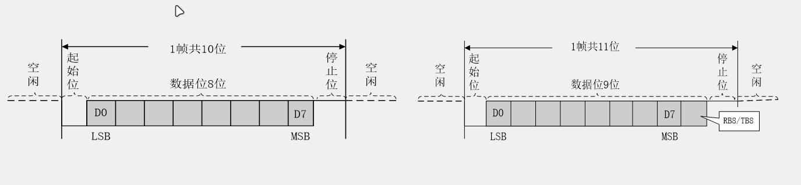

##### (5)、串口时序

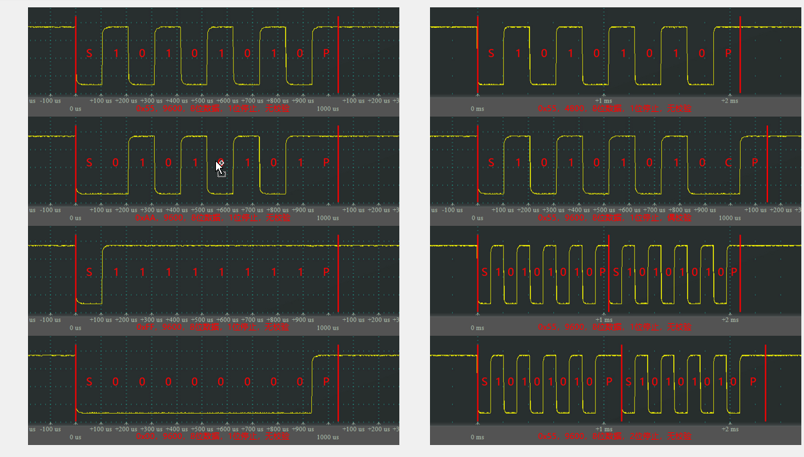

>TX 定时发送翻转电平，RX 定时读取翻转电平。

#### 10.3、stm32F103C8T6 中的 USART 外设

##### (1)、USART简介

>•USART（Universal Synchronous/Asynchronous Receiver/Transmitter）通用同步/异步收发器
>
>•USART是STM32内部集成的硬件外设，可根据数据寄存器的一个字节数据==自动生成数据帧时序，从TX引脚发送出去==，也可==自动接收==RX引脚的数据帧时序，拼接为一个字节数据，存放在数据寄存器里
>
>•**自带波特率发生器**（配置波特率，本质是分频器，将APB2的72MHZ，分频成指定波特率的时钟），最高达4.5Mbits/s
>
>•可配置数据位长度（8/9）、停止位长度（0.5/1/1.5/2）
>
>•可选校验位（无校验/奇校验/偶校验）
>
>•支持同步模式、硬件流控制（会多一根信号线，传递是否准备就绪的信号，只有就绪，才会传输数据）、DMA、智能卡、IrDA（另一种的红外通信）、LIN（汽车等领域通信协议）
>
>
>
>•STM32F103C8T6 USART资源： USART1、 USART2、 USART3

##### (2)、USART框图

>①：TX，发送引脚口。
>
>②：RX，接收引脚口。
>
>③、⑤：TDR、RDR。在程序中共用一个物理地址（数据寄存器DR）。
>
>④：发送移位寄存器。与TX相连，且发送数据方向（低位开始发送）。
>
>⑥：接收移位寄存器。与RX相连，且接收数据方向（从低位开始接收）。
>
>⑦：TXE，发送数据寄存器空的标志位。为1，则表示发送数据寄存器为空；为0，则表示为发送数据寄存器不为空。
>
>⑧：RXDE，接收数据寄存器非空。为1，表示接收数据寄存器为非空；为0，表示接收数据寄存器为空。
>
>写操作（低位先行）：向③（TDR）写入一个字节数据后，检测④（发送移位寄存器）是否正在移位，如果④（发送移位寄存器）没有移位，会自动将数据整体移到④（发送移位寄存器）中，由⑪（发送控制器）控制下从低位输出，数据一位一位右移到最低位，然后向①（TX）输出数据，同时将⑦（TXE）置1，让下一个数据写入③（TDR）；如果④（发送移位寄存器）有移位，则等待移位完成后。
>
>读操作（低位先收）：②（RX）接收到数据时，⑫（接收控制器）驱动下读取②（RX）的电平，先放在⑥（接收移位寄存器）的高位，然后一位一位的右移到低位，移位八次后，就能接收一个字节。将数据整体转移到⑤（RDR），同时将⑧（RXDE）置1。
>
>
>硬件数据流控：
>
>⑨：nRTS（n表示低电平有效），请求发送。告诉别人，我当前能不能接收数据。输出引脚。
>
>⑩：nCTS（低电平有效），清除发送。用于接收别人的nRTS的信号。 输入引脚。
>
>
>
>⑬：唤醒单元，用于实现挂载多个设备。
>
>
>
>⑭~⑳：组成波特率发生器。
>
>- ⑯：f~PCLKx~，当x为1时，该USART挂载在APB1上，频率为36MHz；当x为2时，该USART挂载在APB2上，频率为72MHz
>- ⑰：USARTDIV，预分频系数。包含了⑱、⑲、⑳
>	- ⑱：左边为预分频系数的整数部分，右边为小数部分（4位）
>	- ⑲：发送器波特率控制，TE=1，发送部分的波特率有效。
>	- ⑳：接收器波特率控制，RE=1，接收部分的波特率有效。
>- ⑰的左边的/16：为固定的16分频。分频之后形成⑭、⑮两个时钟。
>
>
>
>
>㉑：SCLK控制，用于产生同步的时钟信号，发送移位寄存器移位一次，同步时钟电平跳变一个周期。SCLK引脚，输出引脚。实际作用：兼容别的协议；做自适应波特率（通过读取该引脚的时钟，计算需要的波特率（不知道波特率的前提））。

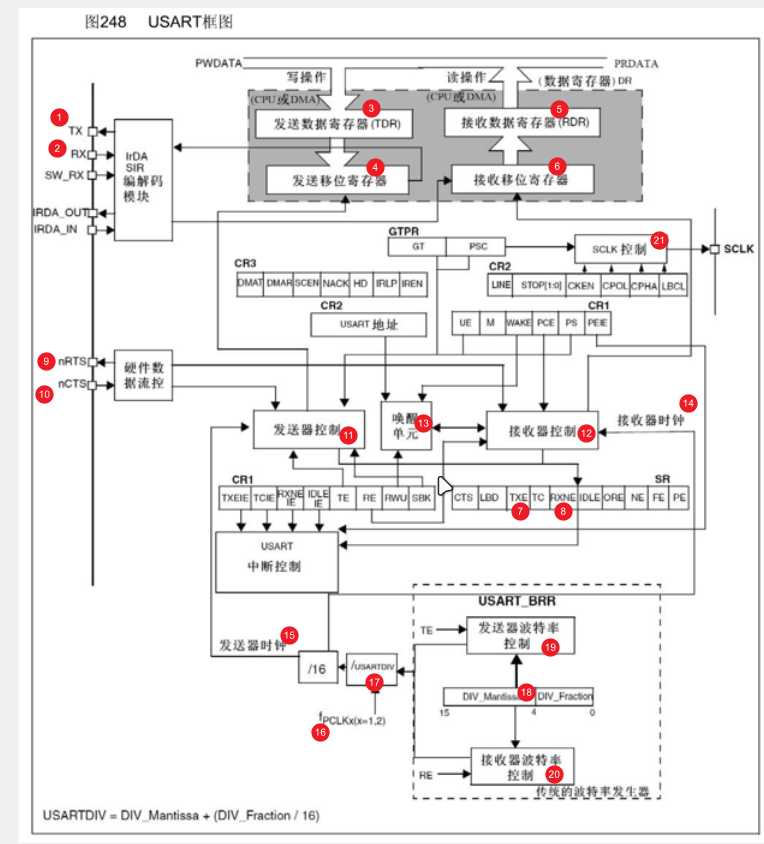

##### (3)、USART基本结构

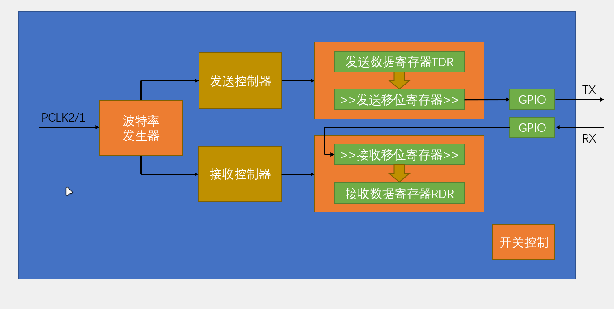

>第一步，开启时钟（RCC），打开USART和GPIO的时钟
>
>第二步，GPIO初始化，TX配置成复用输出，RX配置成输入
>
>第三步，配置USART
>
>第四步（需要接收功能时），配置中断
>
>第五步，打开总开关

##### (4)、数据帧

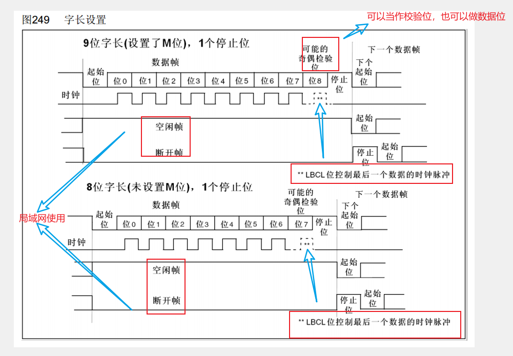

###### Ⅰ、停止位

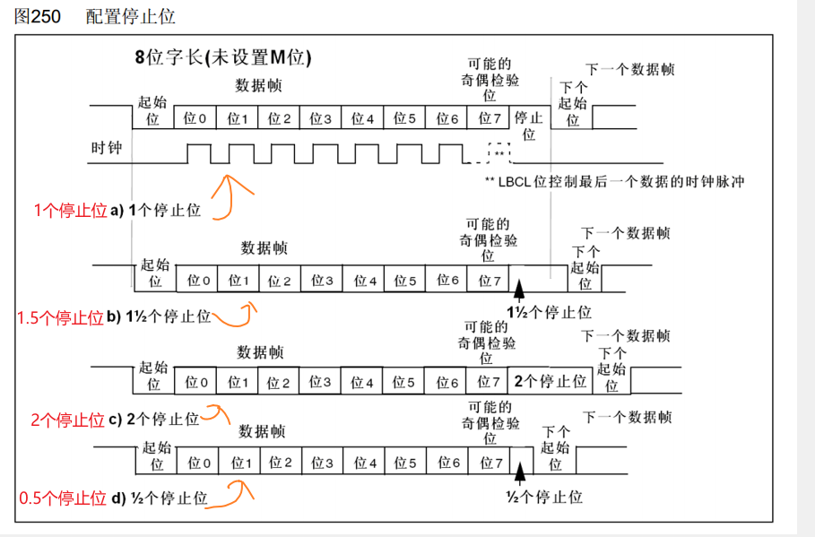

###### Ⅱ、接收起始位侦测

>每次采样的时间【发送器时钟】（①）=一位的时间长度【自带波特率发生器配置的波特率时钟】（②）/  16   
>
>
>
>判断起始位的条件：
>
>1. 在单位采样时间内检测到下降沿（③）
>
>2. ③之后的数据采样中第3次、第5次、第7次中至少有2个0
>
>3. 在数据采样的第8次、第9次、第10次中至少有2个0
>
>	（解释：检测到下降沿之后的16次数据采样中，第一组（第3次、第5次、第7次）和第二组（第8次、第9次、第10次）分别都至少含有2个0。如果两组都分别有3个0，则为无噪点，继续读取后面的数据帧；如果有一组中出现2个0，则为有噪点，将噪点标志位置1（NE=1），继续读取后面的数据帧；如果其中一组最多只有1个0，则不算检测到起始位，将会舍弃这16个采样，重新检测下降沿）
>
>⑥：噪点。（信号受到了干扰）

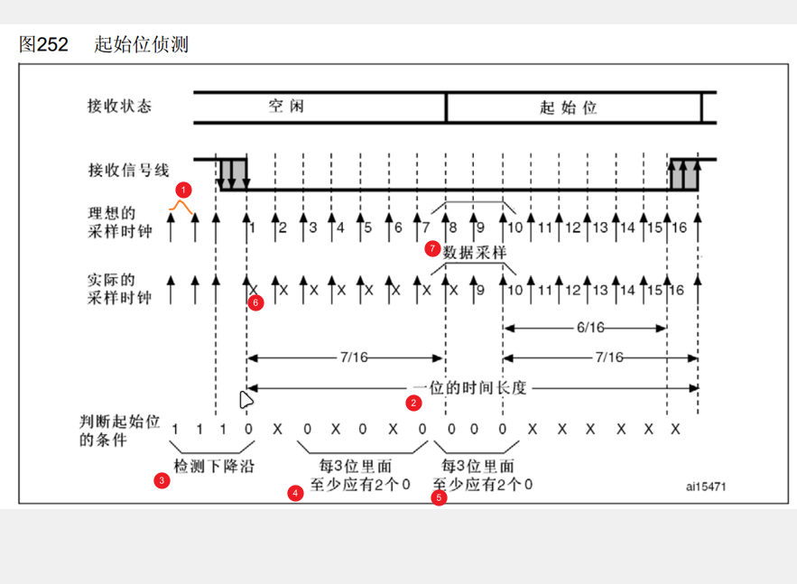

###### Ⅲ、数据接收侦测

>第8次、第9次、第10次连续采样
>
>| 第8次、第9次、第10次状态  | 接收到的数据 | 噪点标志位（NE，=1，有噪点；=0，无噪点） |
>| :-----------------------: | :----------: | :--------------------------------------: |
>|   1：0 = 3：0（全为1）    |      1       |                    0                     |
>| 1：0 = 2：1（2个1，1个0） |      1       |                    1                     |
>| 1：0 = 1：2（2个0，1个1） |      0       |                    1                     |
>|   1：0 = 0：3（全为0）    |      0       |                    0                     |

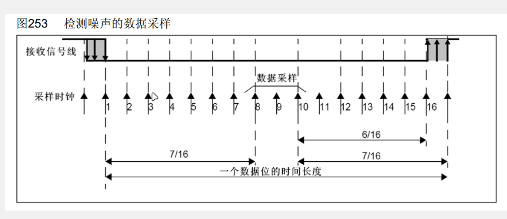

##### (5)、波特率发生器

>•发送器和接收器的波特率由波特率寄存器BRR里的DIV确定

$$
计算公式：
\\
波特率 = f_{PCLK2 or 1} / (16 * DIV)
$$

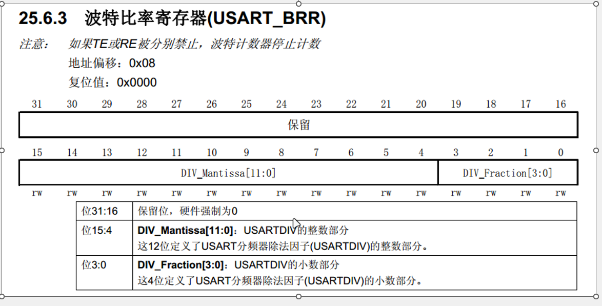

##### (6)、数据包（人为规定）

###### Ⅰ、HEX数据包（自己定义以FF为包头、以FE为包尾）

•固定包长，含包头包尾

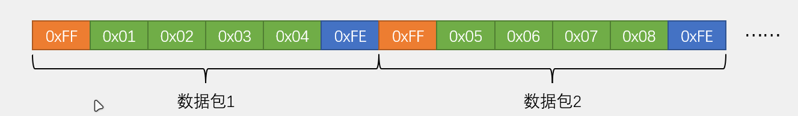

•可变包长，含包头包尾

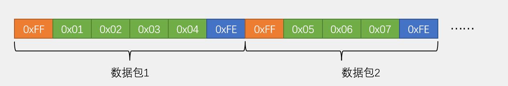

>避免包头、包尾与载荷数据重复的问题解决办法：
>
>1. 固定包长。
>2. 限制载荷数据范围，如：温度传感器的时候，限制温度传感器发送的数据范围在0~100等。
>3. 多位包头、包尾，如：以FF、FE为包头，以FD、FC为包尾等。

>优点：传输直接，解析数据简单，适合模块之间的传输数据
>
>缺点：灵活性不足、载荷与包头包尾容易重复

###### Ⅱ、文本数据包（自己定义以@为包头、以\r\n（换行符）为包尾）

•固定包长，含包头包尾

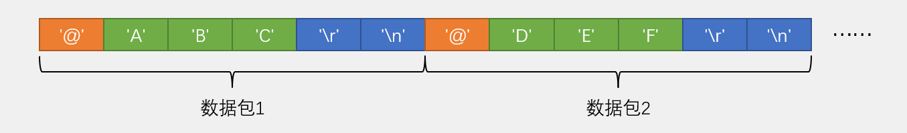

•可变包长，含包头包尾

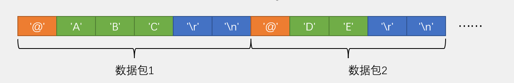

>优点：数据直观、灵活性强，适合人机交互
>
>缺点：解析效率低

###### Ⅲ、HEX数据包接收

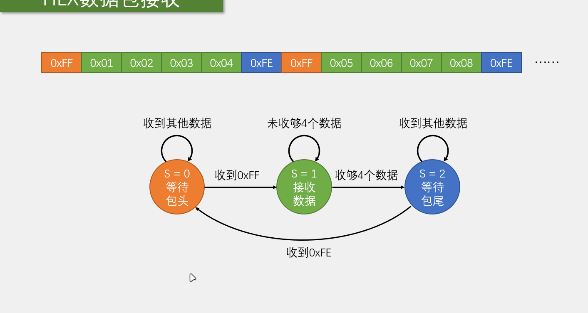

###### Ⅳ、文本数据包接收

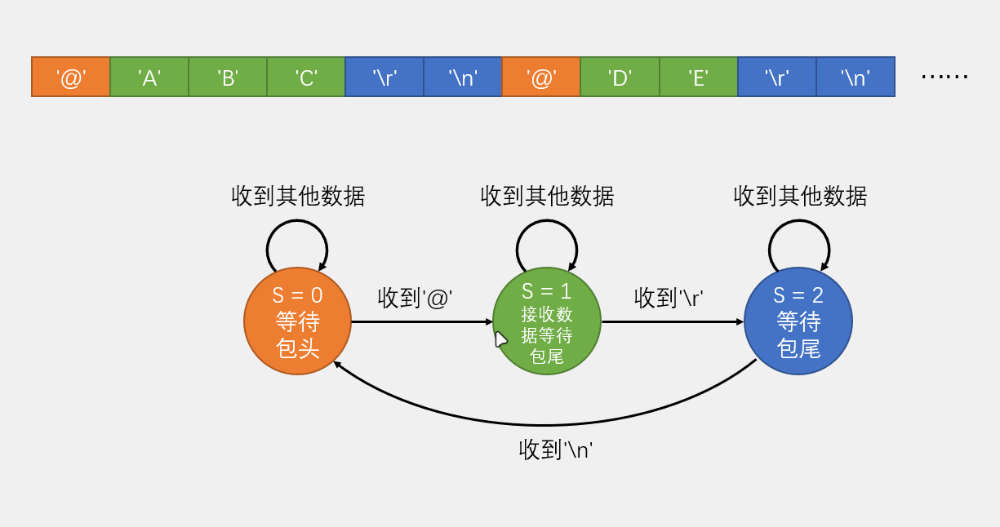

>以上的收发使用了状态机的思想，即一个状态一个标志位，状态变化，标志位变化。
>
>==状态机：==
>
>1. ==根据项目要求定义状态（画几个圈）==
>2. ==考虑好各个状态在什么情况下进行转移，如何转移（画好线和转移条件）==
>3. ==根据图编程==

### 11、I2C协议

#### 11.1、I2C简介(高位先行)

>•I2C（Inter IC Bus）是由Philips公司开发的一种通用数据总线
>
>•两根通信线：SCL（Serial Clock）、SDA（Serial Data）
>
>•同步(使用同步时序能极大降低单片机对硬件电路的依赖，且进中断，会完全暂停，中断结束恢复当前传输)，半双工
>
>•带数据应答
>
>•支持总线挂载多设备（一主多从、多主多从（I2C协议有==仲裁机制==，当多个主机强总线时，通过仲裁决定一个主机占用总线，其余全变成从机，同时进行时钟同步））

#### 11.2、硬件电路

>•所有I2C设备的SCL连在一起，SDA连在一起
>
>•设备的SCL和SDA均要配置成==开漏输出模式==（为了比避免，主机输出高电平，从机输出低电平导致电源电路的现象）
>
>•SCL和SDA各添加一个上拉电阻，阻值一般为4.7KΩ左右（避免高电平输出时引脚浮空状态）。
>
>注意：I2C的开漏外加上拉电阻的电路，使得通信线高电平的驱动能力较弱，让低电平恢复到高电平所需的时间更加多（是曲线，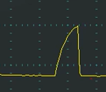而非像高电平到低电平那样直接），这也会限制I2C的最大通信速度。
>
>（高位先行）

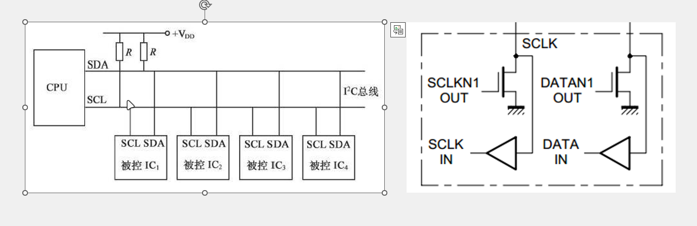

#### 11.3、I2C时序

>I2C使用数据流读写


##### (1)、基本时序

###### Ⅰ、起始与终止

>•起始条件：SCL高电平期间，SDA从高电平切换到低电平
>
>•终止条件：SCL高电平期间，SDA从低电平切换到高电平

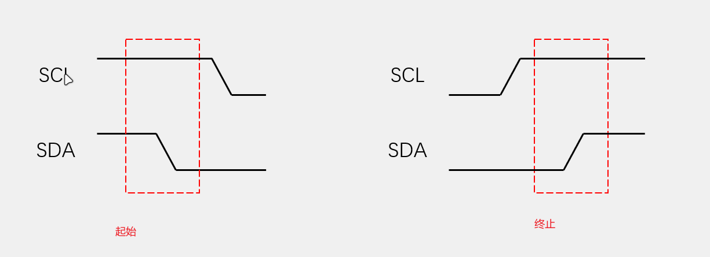

###### Ⅱ、发送一个字节

>•发送一个字节：SCL低电平期间，主机将数据位依次放到SDA线上（高位先行），然后释放SCL，从机将在SCL高电平期间读取数据位，所以SCL高电平期间SDA不允许有数据变化，依次循环上述过程8次，即可发送一个字节

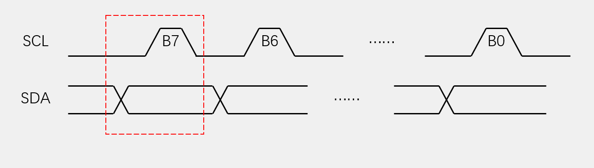

###### Ⅲ、接收一个字节

>•接收一个字节：SCL低电平期间，从机将数据位依次放到SDA线上（高位先行），然后释放SCL，主机将在SCL高电平期间读取数据位，所以SCL高电平期间SDA不允许有数据变化，依次循环上述过程8次，即可接收一个字节（主机在接收之前，主机需要释放SDA，虚线从机掌控，实线主机掌控，且SDA的实线应该再往前面一些）

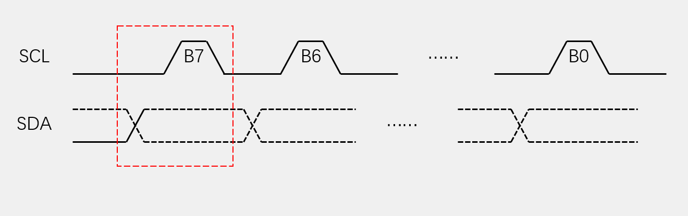

###### Ⅳ、应答

>•发送应答：主机在接收完一个字节之后，在下一个时钟发送一位数据，数据0表示应答（继续），数据1表示非应答（停止）
>
>•接收应答：主机在发送完一个字节之后，在下一个时钟接收一位数据，判断从机是否应答，数据0表示应答，数据1表示非应答（主机在接收之前，需要释放SDA）

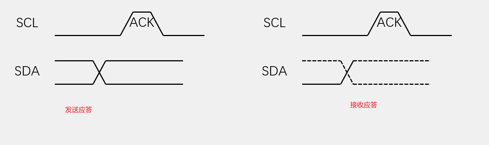

##### (2)、实际时序（MPU6050为例子）

###### Ⅰ、指定地址写（R/W = 0  -》写）

>•对于指定设备（Slave Address）(分成16位和7位的从机地址，本次外设使用7位从机地址的产品)，在指定地址（Reg Address）（寄存器地址）下，写入指定数据（Data）

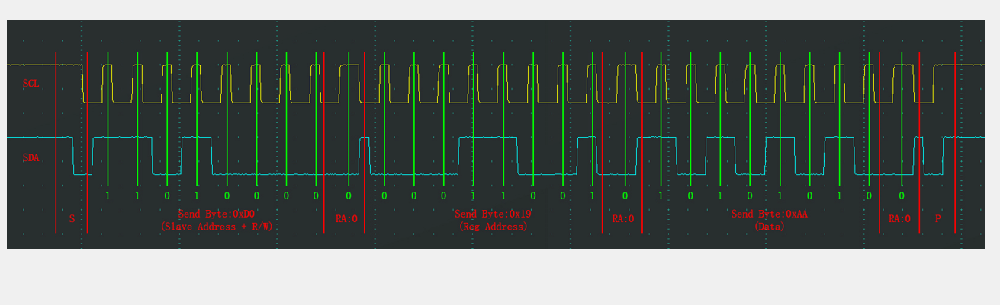

###### Ⅱ、当前地址读（R/W = 1  -》读）

>•对于指定设备（Slave Address），在当前地址指针指示的地址下，读取从机数据（Data）
>
>当前地址指针：从机返回当前指针指向的寄存器的地址。从机将所有寄存器放到一个线性区域中，并且会有个单独的指针变量指示着一个寄存器，上电默认，指向这个线性区域首地址。每当写入一个字节或读出一个字节后，指针会自增，指向下一个地址。

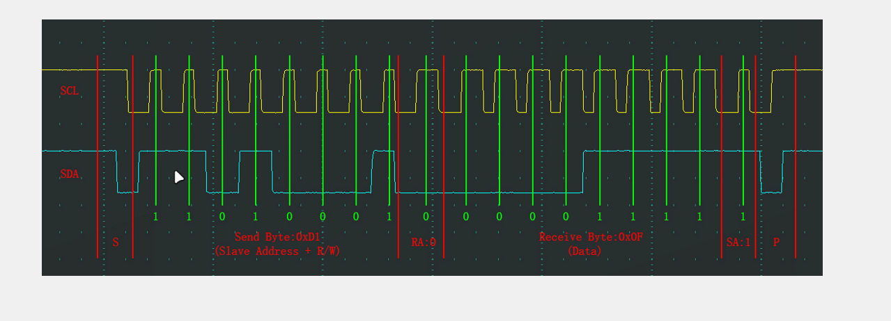

###### Ⅲ、指定地址读（复合格式：指定地址写（不写数据）+当前地址读）

>•对于指定设备（Slave Address），在指定地址（Reg Address）下，读取从机数据（Data）
>
>Sr：重置起始条件

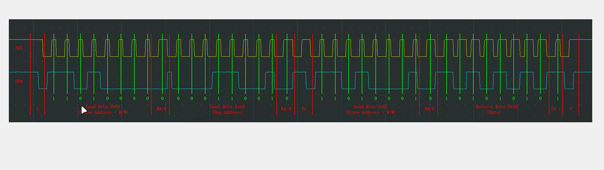

#### 11.4、MPU6050

##### (1)、简介

>•MPU6050是一个6轴姿态传感器，可以测量芯片自身X、Y、Z轴的加速度、角速度参数，通过数据融合，可进一步得到姿态角(欧拉角)，常应用于平衡车、飞行器等需要检测自身姿态的场景
>
>•3轴加速度计（Accelerometer / Accel  /  Acc  / A）（本质为测力计）：测量X、Y、Z轴的加速度   （优点：加速度计具有静态稳定性（测量静态物体时，加速度准确），不具有动态稳定性）
>
>•3轴陀螺仪传感器（Gyroscope / Gyro / G）：测量X、Y、Z轴的角速度   （优点：陀螺仪具有动态稳定性，不具有静态稳定性）
>
>
>
>（芯片中实际是MEMS的电子结构，非图中机械结构）
>
>
>
>拓展：
>
>在飞控领域，欧拉角可以用来描述飞机机头下倾或者上仰（俯仰——Pitch）、机身左翻滚或者右翻滚（滚转——Roll）、飞机机身保持水平，机头向左转向或者向右转向（偏航—–Yaw）
>
>飞控算法，需要精确且稳定的欧拉角，这种欧拉角无法直接通过一种传感器测得，需要通过多种传感器的数据融合（数据融合算法：互补滤波、卡尔曼滤波  =》 具体搜索惯性导航领域的姿态解算了解详情）。

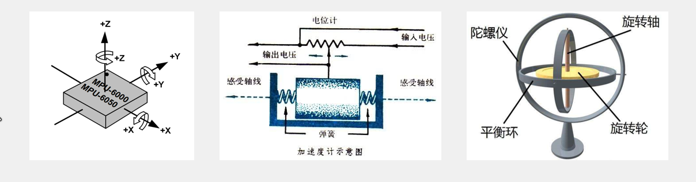

##### (2)、参数

>•16位ADC采集传感器的模拟信号，量化范围：-32768~32767
>
>•加速度计满量程（模拟信号为-32768或者+32767）选择：±2、±4、±8、±16（g）
>
>•陀螺仪满量程选择： ±250、±500、±1000、±2000（°/sec）
>
>
>选择满量程越小，精度越高
>
>
>
>•可配置的数字低通滤波器
>
>•可配置的时钟源
>
>•可配置的采样分频
>
>
>
>•I2C从机地址：
>
>1101000（AD0=0）
>
> 1101001（AD0=1）
>
>注：==AD0为MPU6050引脚，用于调节从机地址的最低位，以此实现不同的地址==
>
>该从机地址的两种写法（下面针对AD=0的情况，AD=1同理）：
>>1. 从机地址与读写位分开，0x68，读操作时，(0x68 <<  1) | 1；写操作时，(0x68 <<  1) | 0
>>2. 从机地址与读写位合在一起，0xD0，读操作时，0xD1，写操作时，0xD0。

##### (3)、硬件电路

| **引脚** | **功能**                 | 说明                               |
| -------- | ------------------------ | ---------------------------------- |
| VCC、GND | 电源                     |                                    |
| SCL、SDA | I2C通信引脚              | MPU6050内置了两个4.7K的电阻        |
| XCL、XDA | 主机(MPU6050)I2C通信引脚 | 外接拓展功能，如接磁力计或者气压计 |
| AD0      | 从机地址最低位           |                                    |
| INT      | 中断信号输出             |                                    |

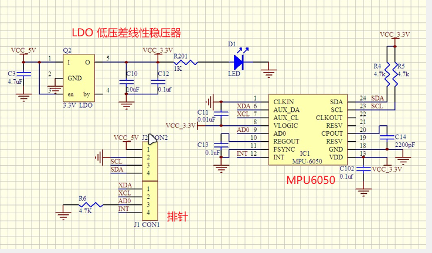

##### (4)、MPU6050框图

>①：外部时钟的输入、输出引脚。一般使用内部时钟，所以该引脚一般不用。
>
>②：x、y、z加速度计和陀螺仪传感器（陀螺仪传感器也内部含晶振）。
>
>③：温度传感器。
>
>④：模数转换部分。将测量的模拟量转换为数字量
>
>⑤：电荷泵（充电泵）。一种升压电路。电源并联到⑥的电容上，给电容充电；电容充好之后，电源与⑥串联到陀螺仪传感器上，一起放电（2倍电压）；电容快放完之前，快速切换并联，进行充电，再快速切换串联一起放电。（具体原理可搜索boost电路或者自举升压电路）
>
>⑥：外接电容。
>⑦：各个传感器的自测模块。用于判断内部的传感器的好坏。测量方式，先使能自测模块（会模拟外力施加到传感器上），读出测量值1，再失能自测模块，读出测量值2，(测量值1-测量值2) = 自测响应 ，自测响应的范围在MPU6050数据手册上的安全范围内，即为完好的传感器。
>
>⑧：中断寄存器。连接INT引脚。
>
>⑨：先进先出寄存器。对数据流进行缓存。
>
>⑩：配置寄存器。用于配置各个寄存器。
>
>⑪：数据寄存器。每个传感器都有自己的16位存储器。从④到⑪的过程MPU6050自动完成转运。
>
>⑫：工厂校准。校准传感器。
>⑬：数字运动处理器(DMP)。内置的姿态解算的硬件算法。
>
>⑭：MPU60x0作为从机stm32的I2C通信引脚和SPI通信引脚。（6050没有SPI引脚，6000有I2C和6050）
>
>⑮：MPU6050作为主机连接各个拓展传感器芯片（磁力计或者气压计）的I2C接口。
>
>⑯：接口旁路选择器。开关拨到上方，与⑭的SCL、SDA相连，stm32能直接控制拓展的传感器芯片。拨到下方，由MPU6050控制拓展。
>
>FSYNC引脚：帧同步引脚。

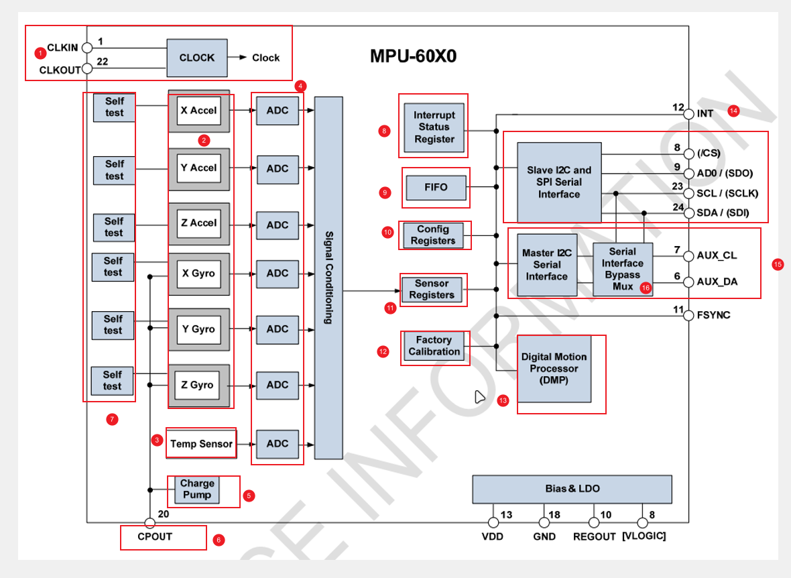

#### 11.5、stm32F103C8T6的I2C外设

##### (1)、外设简介

>•STM32内部集成了硬件I2C收发电路，可以由硬件自动执行时钟生成、起始终止条件生成、应答位收发、数据收发等功能，减轻CPU的负担
>
>•支持多主机模型（固定多主机和可变多主机，stm32中I2C外设按照可变多主机设计）
>
>•支持7位/10位地址模式（10位地址模式下，第一个字节的最后一位依然是读写位，且有5位作为标志位）
>
>•支持不同的通讯速度，标准速度(高达100 kHz)，快速(高达400 kHz)
>
>•支持DMA
>
>•兼容SMBus（系统管理总线——基于I2C总线改进）协议（用于电源管理系统）
>
>
>
>•STM32F103C8T6 硬件I2C资源：I2C1、I2C2

##### (2)、I2C外设框图

>①：与串口类似，发送时，会将DR（Data Register）寄存器的数据转入数据移位寄存器，同时将状态寄存器中的TXE位置1（DR为空），然后数据移位寄存器一位一位的将数据发送出去（高位优先）；接收时，将接收到的数据一位一位的存入数据移位寄存器（高位先行），装满一个字节，再转入DR寄存器，同时将状态寄存器中的RXNE置1（DR非空），等待读取。
>
>②：用于stm32为从机模式的情况，比较器比较接收到的数据与stm32的从机地址。自身地址寄存器可以给stm32自定义一个从机地址。双地址寄存器（另一个自身的从机地址），是为了满足stm32同时响应双从机地址。应用在可变多主机模式下。
>
>③：用于校验数据是否出错，出错测会将PEC寄存器置1，提醒使用者。

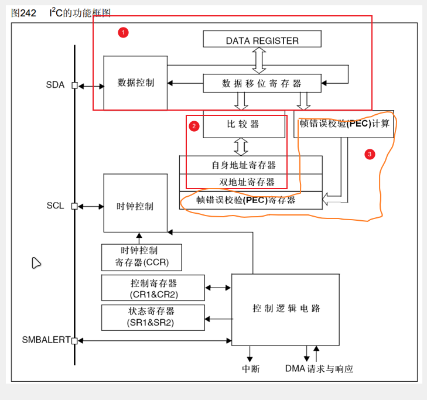

##### (3)、I2C基本结构

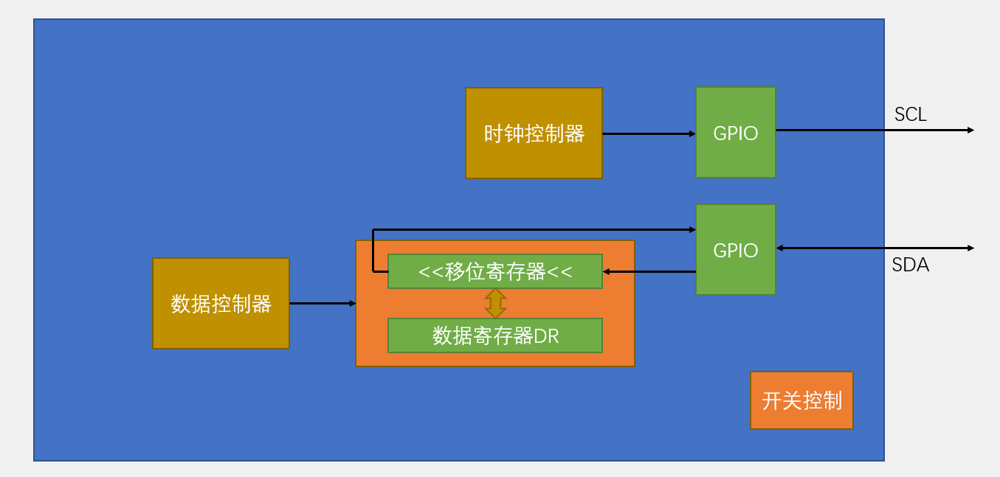

>第一步，打开RCC，打开GPIO与I2C2的时钟。
>
>第二步，把I2C外设对应的GPIO口初始化为复用开漏模式。
>
>第三步，调用结构体配置I2C。
>
>第四步，使能I2C。

##### (4)、主机发送和接收（一主多从模式下）

>EV5、EV6、EV8等是代表不同通信阶段或状态的事件（Events）。这些事件用于指示I2C通信的进度和状态。可以看成当前情况标志位变化
>
>具体寄存器作用需要配合相关的寄存器数据手册理解。

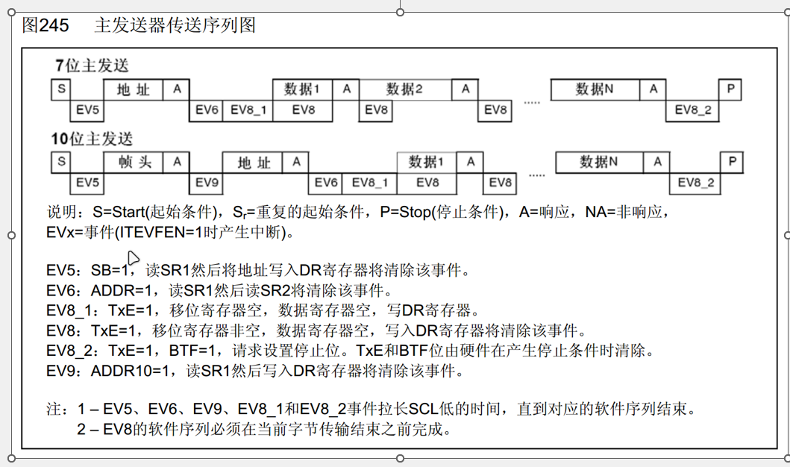


>下面为当前地址读的形式
>
>在接收最后一个字节之前需要设置Ack=0和设置停止条件（不会影响最后一个字节读取），保证在最后一个读取数据的发送应答之前停止

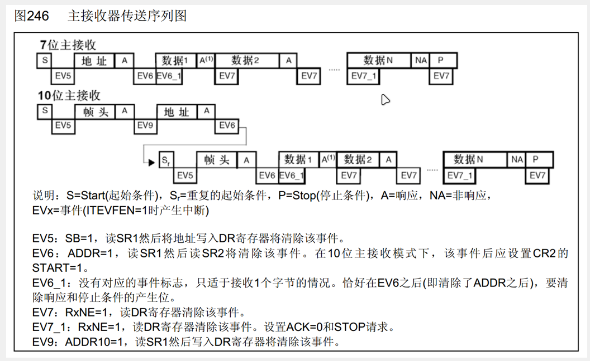

##### (5)、软件/硬件波形对比

>硬件波形
>
>更加规整，紧凑

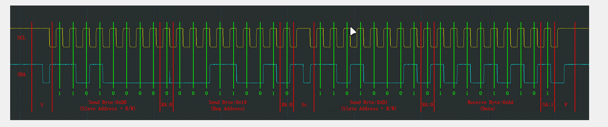


>软件波形

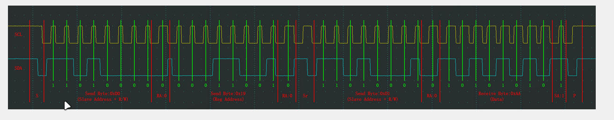

### 12、SPI协议

#### 12.1、SPI简介(高位先行)

>•SPI（Serial Peripheral Interface）是由Motorola公司开发的一种通用数据总线
>
>•四根通信线：SCK（Serial Clock）、MOSI（Master Output Slave Input）（主机输出从机输入）、MISO（Master Input Slave Output）（主机输入从机输出）、SS（Slave Select）（从机选择）
>
>​	注：SCK也可以叫SCLK、CLK、CK；MOSI、MISO也可以叫DO、DI；SS也可以叫做NSS、CS
>
>•同步，全双工
>
>•支持总线挂载多设备（一主多从，不支持多主机，没有应答机制）

|              | SPI                        | I2C                                              |
| ------------ | -------------------------- | ------------------------------------------------ |
| 最大传输速度 | 没有限制（具体有厂商决定） | 一般的为400KHz，最快也只有3.4MHz（3.4MHz未普及） |
| 电路设计     | 比较简单                   | 比较复杂                                         |
| 最简单模块   | 硬件开销大，通信线需要4根  | 硬件开销小，通信线2根就能完成通信协议            |

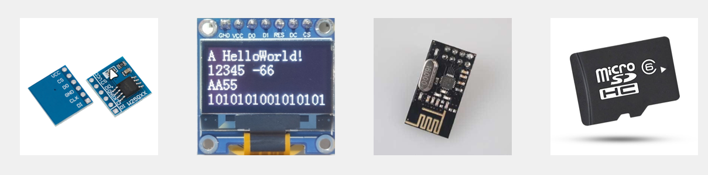

#### 12.2、硬件电路

>•所有SPI设备的SCK、MOSI、MISO分别连在一起
>
>•主机另外引出多条SS控制线，分别接到各从机的SS引脚
>
>•输出引脚配置为推挽输出，输入引脚配置为浮空或上拉输入
>
>注：SPI使用推挽输出，所以高低电平的驱动能力都比较强，在实际波形变化就比I2C迅速。  
>
>（高位先行）

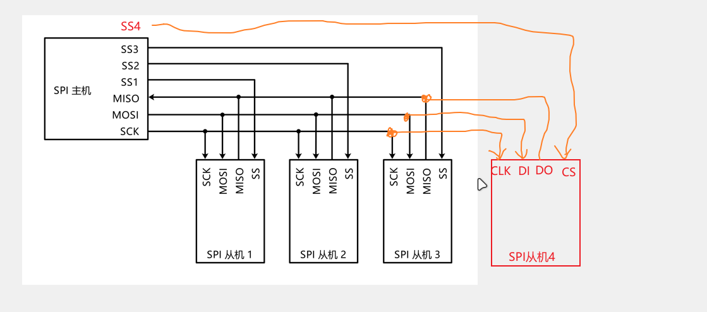

#### 12.3、移位示意图

>①：时钟源，由主机决定。
>
>高位先行。
>
>本质上是主机与从机交换一个字节，只是接收时，不看发送部分；发送时，不看接收部分；主机中的接收与发送共用一个寄存器。

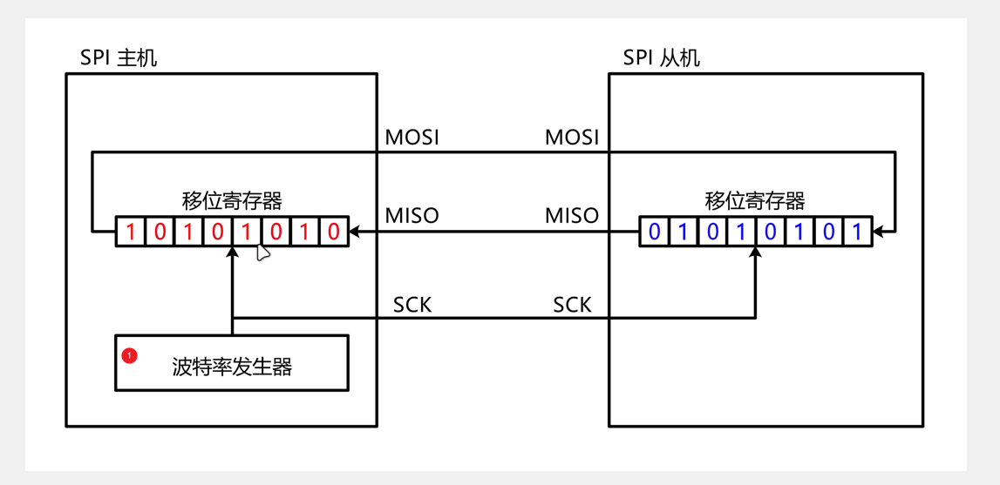

#### 12.4、SPI基本时序

##### (1)、起始与停止条件

>•起始条件：SS从高电平切换到低电平
>
>•终止条件：SS从低电平切换到高电平

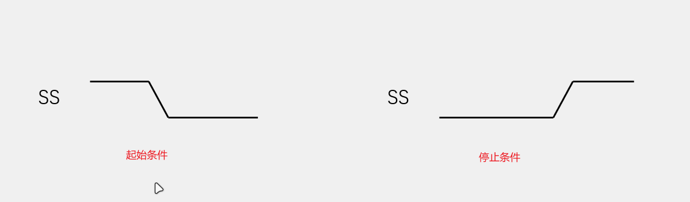

##### (2)、4种交换模式

>通过配置CPOL、CPHA（时钟相位）的值来决定模式。
>
>CPHA确定的是计数移入还是偶数移入，并不规定上升沿采样还是下降沿采样。
>
>
>每种交换模式，实现的效果一样，只是移动数据的条件不同
>
>注：MISO空闲状态时，主机收到的状态为高阻态，即从机未被选中时，MISO为高阻态。
>
>移出时线上数据才变化，寄存器不变；移入时线上数据没有变化，寄存器变化

###### Ⅰ、交换一个字节（模式0）

>•CPOL=0：空闲状态时，SCK为低电平
>
>•CPHA=0：SCK第一个边沿时移入数据到寄存器（数据采样），第二个边沿移出数据到线上
>
>在SCK的一个边沿之前（SS的下降沿，提前半个周期），主机和从机就需要把数据的最高位移出

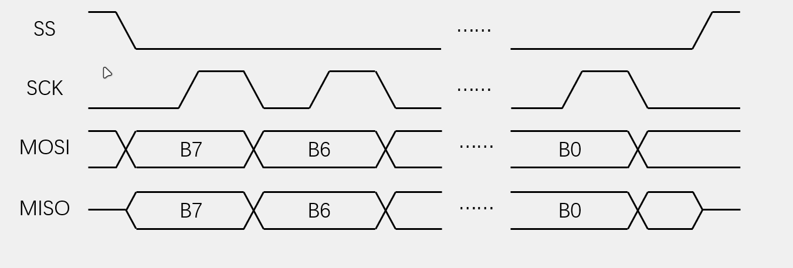

###### Ⅱ、交换一个字节（模式1）

>•CPOL=0：空闲状态时，SCK为低电平
>
>•CPHA=1：SCK第一个边沿移出数据到线上，第二个边沿移入数据到寄存器（数据采样）

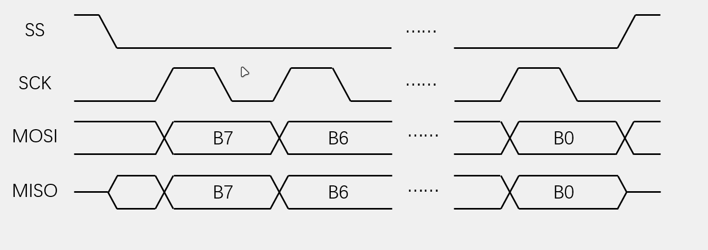

###### Ⅲ、交换一个字节（模式2）

>•CPOL=1：空闲状态时，SCK为高电平
>
>•CPHA=0：SCK第一个边沿移入数据到寄存器（数据采样），第二个边沿移出数据到线上
>
>在SCK的一个边沿之前（SS的下降沿），主机和从机就需要把数据的最高位移出

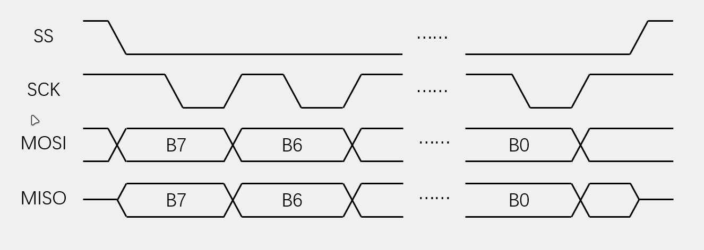

###### Ⅳ、交换一个字节（模式3）

>•CPOL=1：空闲状态时，SCK为高电平
>
>•CPHA=1：SCK第一个边沿移出数据到线上，第二个边沿移入数据到寄存器（数据采样）

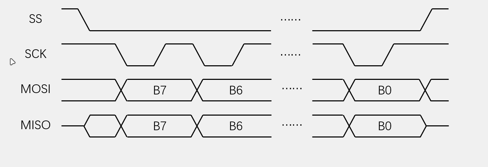

#### 12.5、SPI时序（W25Q64为例子）

>SPI使用的是指令码读写
>
>从机芯片内部会指定指令集
>
>
>
>以下使用的是软件模拟SPI的模式0

##### (1)、发送指令

>•向SS指定的设备，发送指令（0x06）

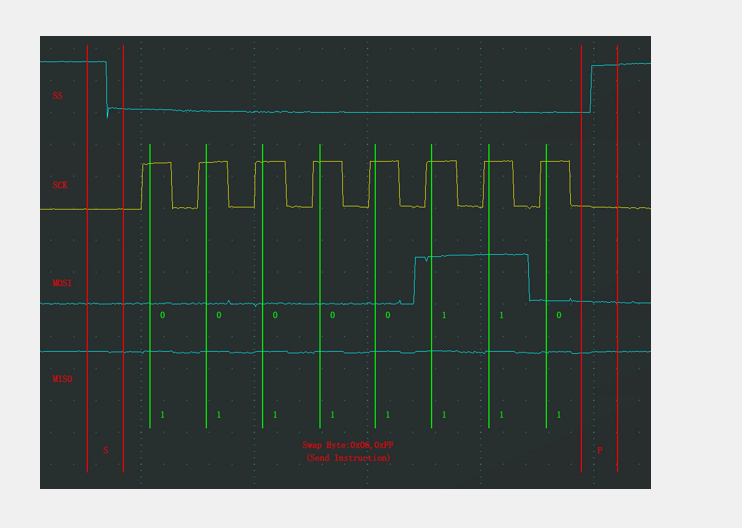

##### (2)、指定地址写

>•向SS指定的设备，发送写指令（0x02），
>
>   随后在指定地址（Address[23:0]）下，写入指定数据（Data）

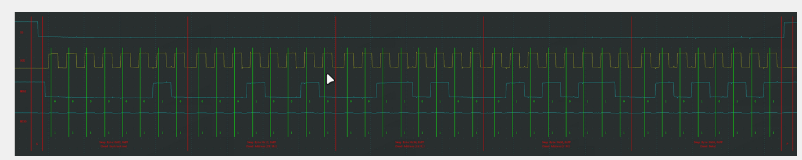

##### (3)、指定地址读

>•向SS指定的设备，发送读指令（0x03），
>
>   随后在指定地址（Address[23:0]）下，读取从机数据（Data）

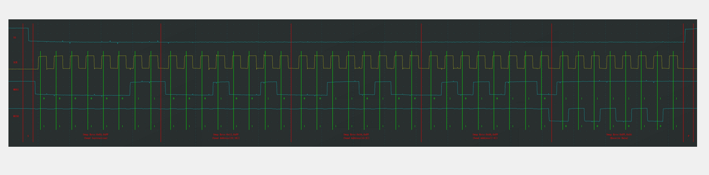

#### 12.6、W25Q64

##### (1)、简介

>•W25Qxx系列是一种低成本、小型化、使用简单的非易失性存储器，常应用于数据存储、字库存储、固件程序存储等场景
>
>•存储介质：Nor Flash（闪存）
>
>•时钟频率：80MHz / 160MHz (Dual SPI——双重SPI) / 320MHz (Quad SPI——四重SPI)	
>
>>双重SPI：发送时将MISO也用作发送，也就是MISO、MOSI双线发送，80MHz*2=160MHz
>
>•存储容量（24位地址——寻址空间为16MB）：
>
> 	W25Q40：  4Mbit  /  512KByte
>																			
> 	W25Q80：  8Mbit  /  1MByte
>																			
> 	W25Q16：  16Mbit  /  2MByte
>																			
> 	W25Q32：  32Mbit  /  4MByte
>																			
> 	W25Q64：  64Mbit  /  8MByte
>																			
> 	W25Q128： 128Mbit  /  16MByte
>																			
> 	W25Q256： 256Mbit  /  32MByte
>
>512kByte=512*1024Byte=512\*1024\*8bit=4194304bit=4\*1024\*1024bit=4Mbit

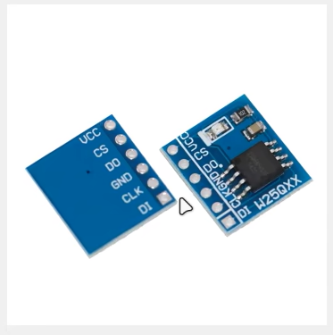

##### (2)、硬件电路

| **引脚**   | **功能**                                                     |
| ---------- | ------------------------------------------------------------ |
| VCC、GND   | 电源（2.7~3.6V）                                             |
| CS（SS）   | SPI片选                                                      |
| CLK（SCK） | SPI时钟                                                      |
| DI（MOSI） | SPI主机输出从机输入                                          |
| DO（MISO） | SPI主机输入从机输出                                          |
| WP         | 写保护                                                       |
| HOLD       | 数据保持  (主机出现中断，且需要使用本SPI来完成功能时，<br />HOLD置低，会记住当前的时序，等中断完成，将HOLD置高，恢复时序) |

>图中出现括号的引脚，可以做为MOSI或者MISO发送或者接收数据，形成双重SPI或四重SPI

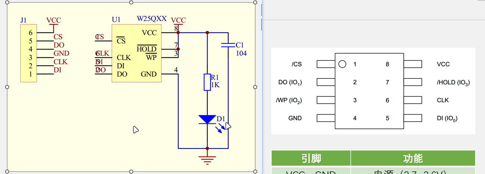

##### (3)、W25Q64框图

>①：存储器。将整个存储空间（0x000000h\~0x7FFFFFh）按照64KB的大小分为了128个Block(块，块号:0\~127)，其中每个Block在按照4KB的大小分为了16个Sector(扇区，扇区号:0\~15)，每个Sector在按照256B的大小分为了16个Page(页，页号:0\~15)。
>
>②：SPI控制逻辑。
>
>③：状态寄存器。
>
>>状态寄存器1。
>>
>>​	BUSY位：当设备正在执行页编程（写入数据）、扇区擦除、块擦除、整片擦除或者写状态寄存器指令时，BUSY位置1，在这期间，设备将会忽略进一步指令，除了读状态寄存器和擦除挂起指令；当编程、擦除、写状态寄存器指令结束后，BUSY清零来指示设备准备完成。
>>
>>​	WEL位（写使能锁存位）：在执行完写使能指令后，WEL置1，代表芯片可以进行写入操作；当设备写失能（1.上电后，芯片默认写失能；2.发送写失能指令，会写失能；3.页编程、扇区擦除等，写入操作后，会写失能）时，WEL位清0。（任何写入操作前，都需要写使能）
>>
>>状态寄存器2。
>
>④：写控制逻辑。实现硬件写保护。
>
>⑤：高电压发生器。用于实现掉电不丢失。
>
>⑥：页地址锁存/计数器。读写后，内部的地址指针自动加1。
>
>⑦：字节地址锁存/计数器。读写后，内部的地址指针自动加1。
>
>⑧：列解码和256B的页缓存区（RAM存储器）。需要写入的数据会先放到页缓存区中，时序结束后再将缓存区的数据复制到对应的flash里。设置缓存区的目的是为了应对flash的写入速度和SPI的写入速度不匹配的问题。
>
>⑨：写保护和行解码。
>
>写操作：②接收到的3个字节大小的地址，前两个字节通过⑥、⑨然后来选中操作哪一页；最后一个字节通过⑦、⑧然后进行指定地址的读写操作。
>
>读操作：从flash中读取数据，通过⑧、②发送出去。

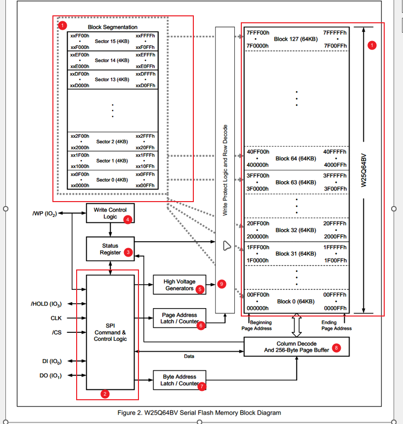

##### (4)、Flash操作注意事项

>写入操作时：
>
>​	•写入操作前，必须先进行写使能
>
>​	•每个数据位只能由1改写为0，不能由0改写为1
>
>​	•写入数据前必须先擦除，擦除后，所有数据位变为1
>
>​	•擦除必须按最小擦除单元(一个扇区)进行
>
>​	•连续写入多字节时，最多写入一页的数据，超过页尾位置的数据，会回到页首覆盖写入
>
>​	•写入操作结束后或者发出擦除指令后，芯片进入忙状态，不响应新的读写操作
>
>读取操作时：
>
>​	•直接调用读取时序，无需使能，无需额外操作，没有页的限制，读取操作结束后不会进入忙状态，但不能在忙状态时读取

>flash中的0xFF表示空白。
>
>注：flash的读取数据可以看作   读取数据=原始数据&写入数据

##### (5)、指令集

>虚拟字节（dummy）：给无用数据就行
>
>

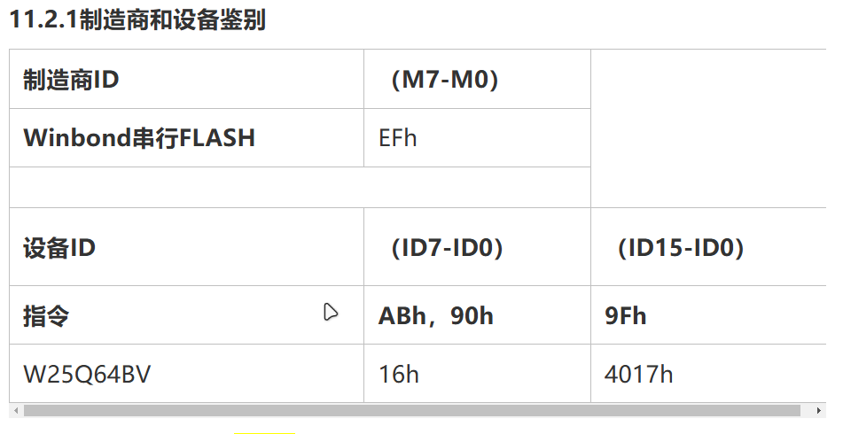

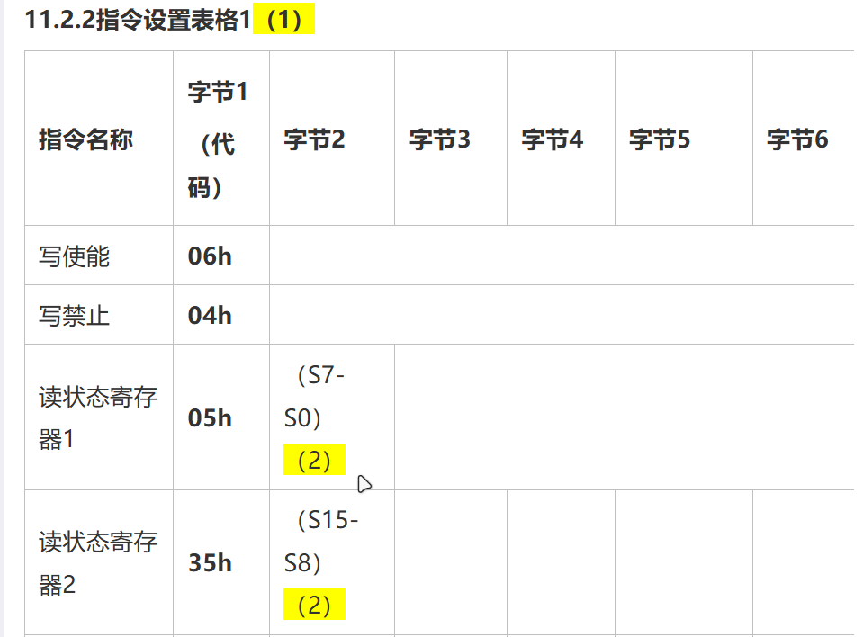

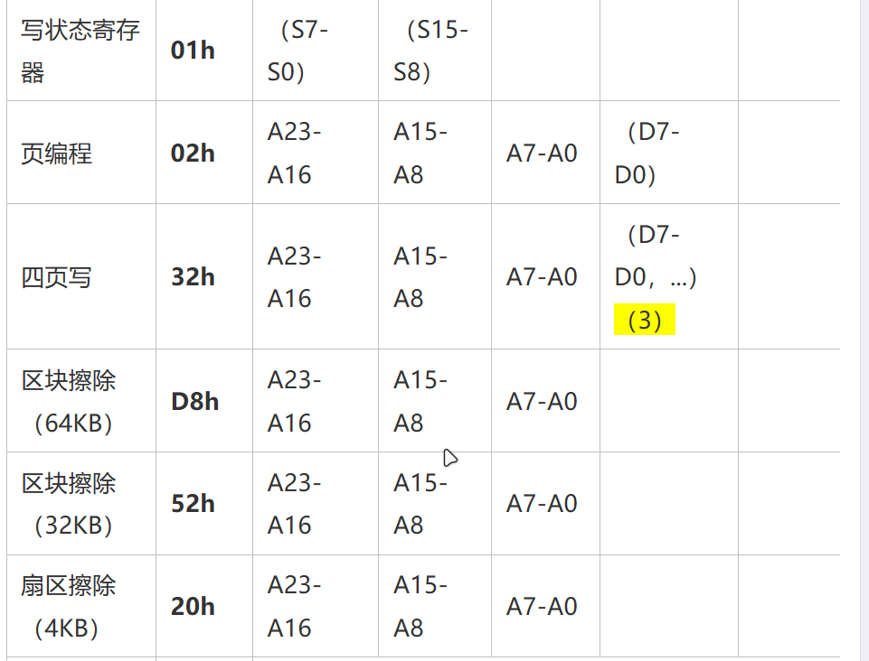

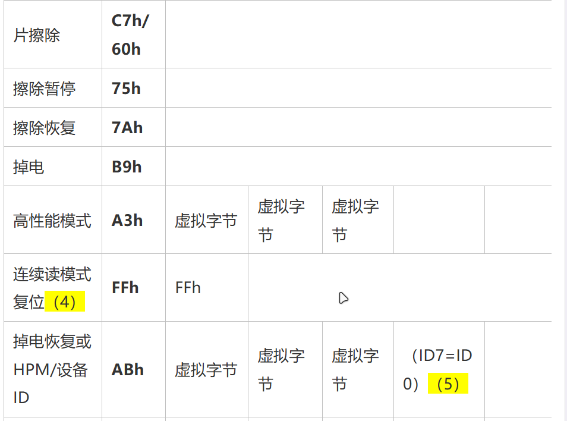

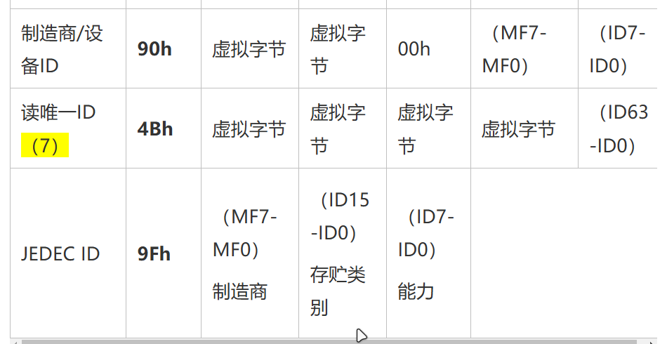

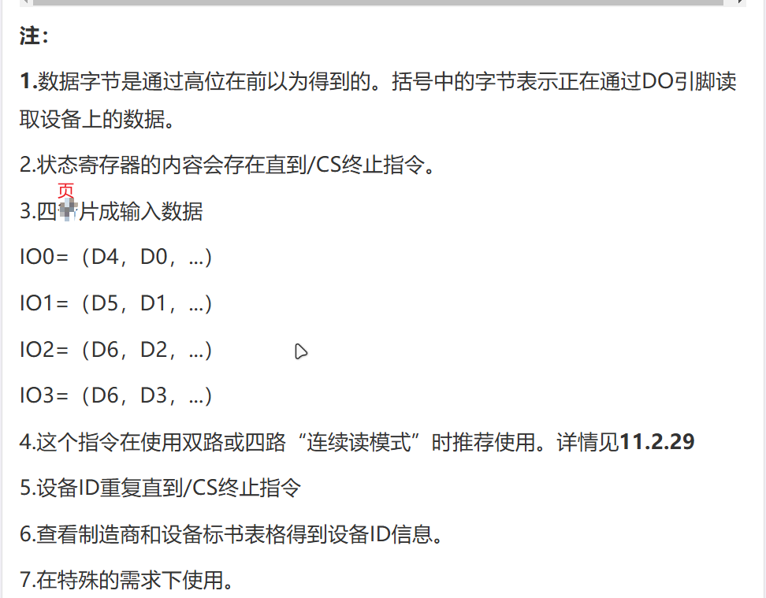

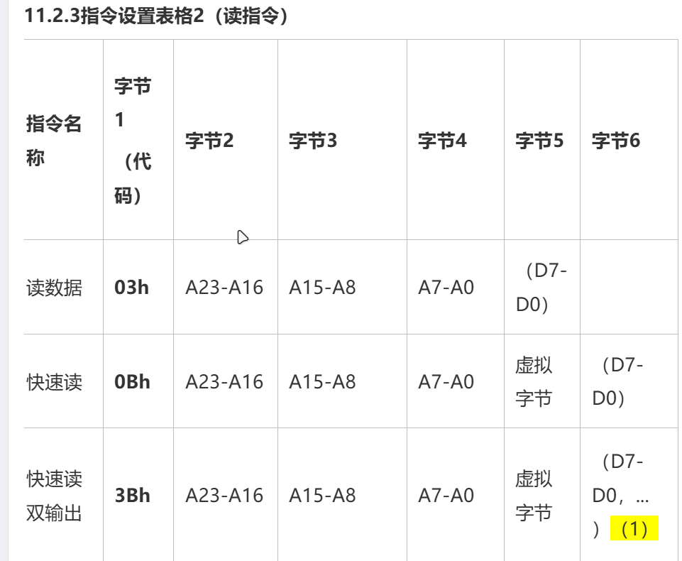

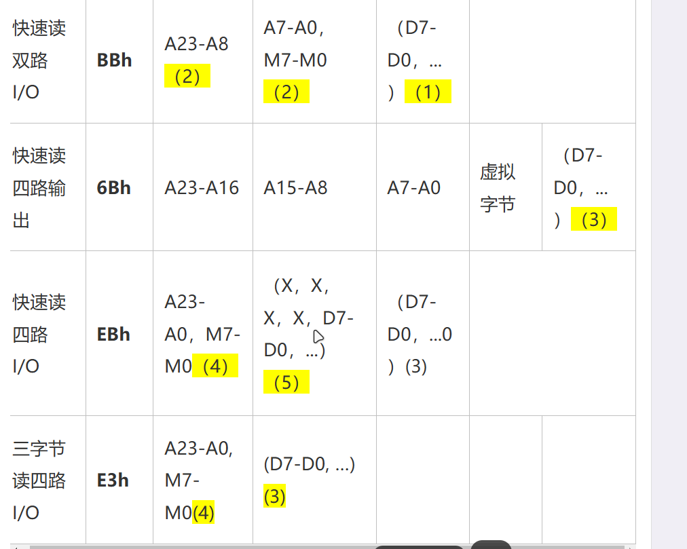

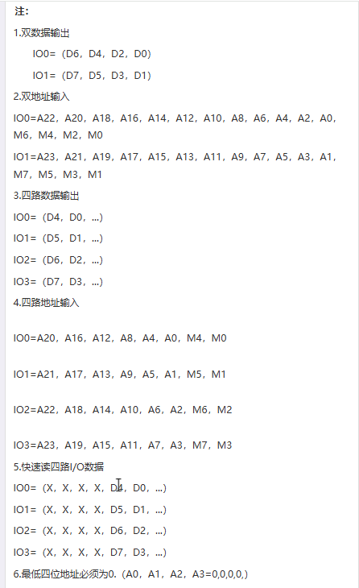

#### 12.7、stm32F103C8T6的SPI外设

##### (1)、SPI外设简介

>•STM32内部集成了硬件SPI收发电路，可以由硬件自动执行时钟生成、数据收发等功能，减轻CPU的负担
>
>•可配置8位/16位数据帧、高位先行/低位先行
>
>•时钟频率： f~PCLK~ / (2, 4, 8, 16, 32, 64, 128, 256)    具体由实际挂载的总线决定APB1或者APB2
>
>•支持多主机模型、主或从操作
>
>•可精简为半双工/单工通信
>
>•支持DMA
>
>•兼容I2S协议（数字音频信号传输协议）
>
>
>
>•STM32F103C8T6 硬件SPI资源：SPI1、SPI2

##### (2)、SPI框图

>分成①和②部分
>
>①：数据输入输出部分
>
>​	⑧：用于进行主从模式引脚变化。当STM32做主机时，MISO(为MI)输入、MOSI(为MO)输出；当STM32做从机时，MOSI(为SI)输入，MISO(为SO)输出。
>
>​	交换过程：当需要发送数据时，DR检查TXE == 1（TXE：发送缓存区为空标志位），=1，向⑥（发送缓冲区）写入数据，检查⑦(移位寄存器)有没有数据，没有数据，⑥的数据移入⑦发送出去，同时将TXE置1；有数据，检查⑤（接收缓冲区）是否有数据，没有数据，⑦的数据移入⑤，同时将RXNE（RXNE：接收缓冲区非空）置1，DR读出⑤后，将RXNE置0。
>
>​	移位寄存器是高位先行还是低位先行，由LSBFIRST控制位决定（LSBFIRST = 0，低位先行；LSBFIRST = 1，高位先行）。
>
>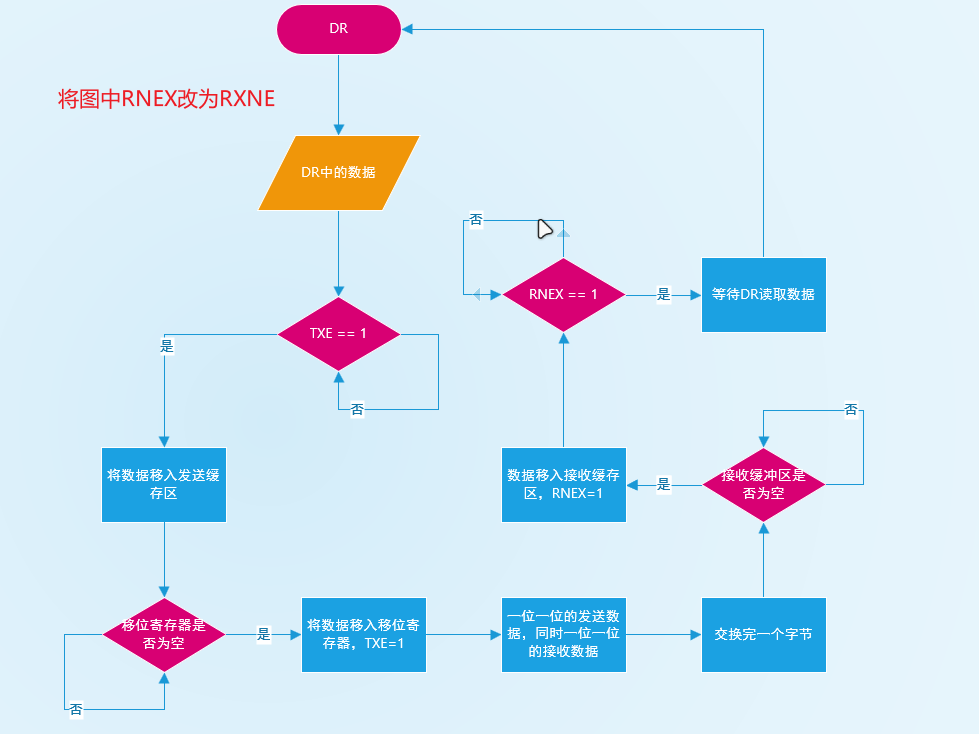
>
>②：控制逻辑部分
>
>​	BR[2:0]，控制分频系数。
>
>​	波特率发生器，分频后的实际时钟。
>
>​	LSBFIRST，决定高位先行还是低位先行。
>
>​	SPE，SPI使能。
>
>​	MSTR，配置主从模式。（1是主模式，0是从模式）
>
>​	CPOL、CPHA，选择SPI的4中交换模式。
>
>​	NSS端口，用于实现多主机切换。

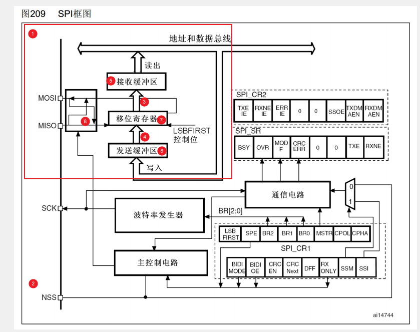

##### (3)、SPI基本结构

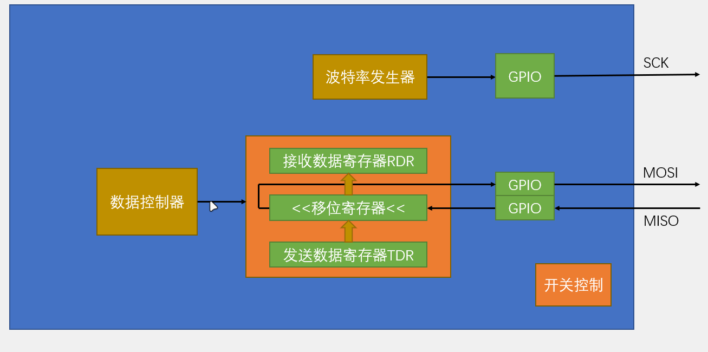

>第一步，开启SPI和GPIO的时钟。
>
>第二步，初始化GPIO口，SCK和MOSI配置为复用推挽。MISO配置为上拉输入，SS配置为推挽（软件模拟SS）。
>
>第三步，配置SPI外设。
>
>第四步，使能SPI。
>
>第五步，使用非连续模式，书写交换函数。

##### (4)、外设SPI时序

###### Ⅰ、主模式全双工连续传输

>时序紧凑，效率高

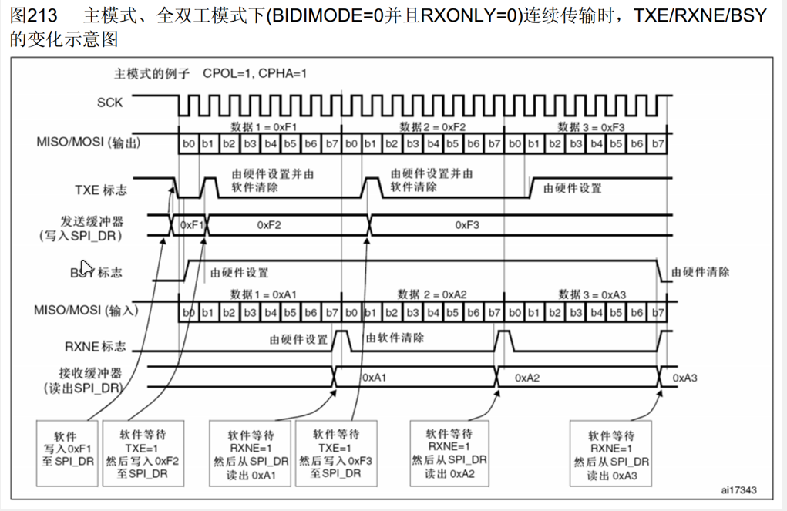


###### Ⅱ、非连续传输

>时序有序，性能浪费，且SPI时钟越快，对数据影响越大

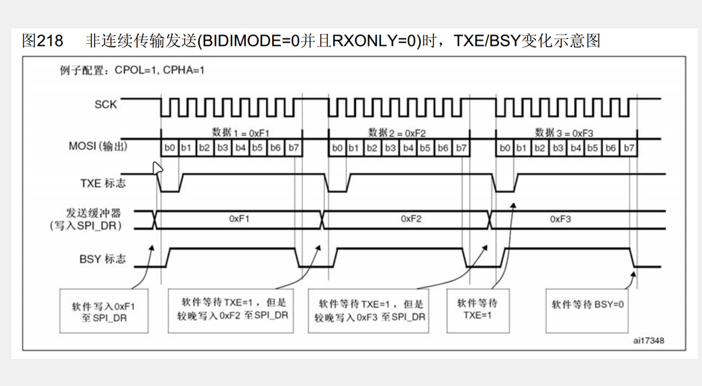

##### (5)、软硬件波形对比

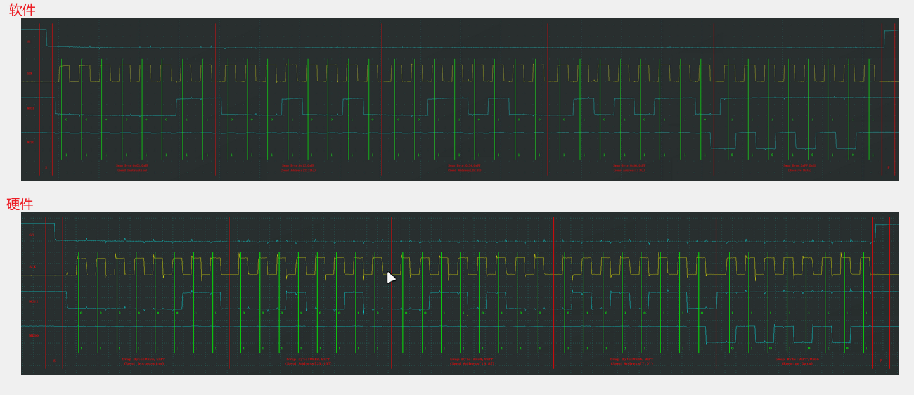

### 13、BKP备份寄存器、RTC实时时钟、PWR电源控制

#### 13.1、Unix时间戳

##### (1)、简介

>•Unix 时间戳（Unix Timestamp）定义为从UTC/GMT的1970年1月1日0时0分0秒开始所经过的**秒数**，不考虑闰秒（最开始是，Unix系统使用）
>
>•时间戳存储在一个秒计数器中，秒计数器为32位/64位的整型变量
>
>•世界上所有时区的秒计数器相同，不同时区通过添加偏移来得到当地时间
>
>
>
>
>Typora使用了typora_plugin插件之后，可以通过/timestamp来查看当前时间戳

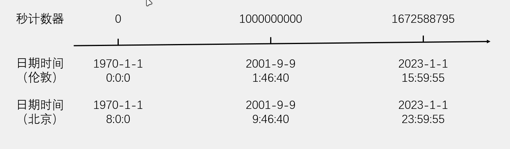

##### (2)、GMT/UTC

>•GMT（Greenwich Mean Time）格林尼治（伦敦的一个地区）标准时间是一种以地球自转为基础的时间计量系统。它将地球自转一周的时间间隔等分为24小时，以此确定计时标准
>
>
>
>•UTC（Universal Time Coordinated）协调世界时是一种以原子钟为基础的时间计量系统。它规定铯133原子基态的两个超精细能级间在零磁场下跃迁辐射9,192,631,770周所持续的时间为1秒。当原子钟计时一天的时间与地球自转一周的时间相差超过0.9秒时，UTC会执行**闰秒**（一份61秒或者59秒）来保证其计时与地球自转的协调一致

##### (3)、时间戳转换

>•C语言的time.h模块提供了时间获取和时间戳转换的相关函数，可以方便地进行秒计数器、日期时间和字符串之间的转换

| **函数**                                                     | **作用**                               |
| ------------------------------------------------------------ | -------------------------------------- |
| time_t time(time_t*);                                        | 获取系统时钟                           |
| struct tm* gmtime(const time_t*);                            | 秒计数器转换为日期时间（格林尼治时间） |
| struct tm* localtime(const time_t*);                         | 秒计数器转换为日期时间（当地时间）     |
| time_t mktime(struct tm*);                                   | 日期时间转换为秒计数器（当地时间）     |
| char* ctime(const time_t*);                                  | 秒计数器转换为字符串（默认格式）       |
| char* asctime(const struct tm*);                             | 日期时间转换为字符串（默认格式）       |
| size_t strftime(char*, size_t, const  char*, const struct tm*); | 日期时间转换为字符串（自定义格式）     |

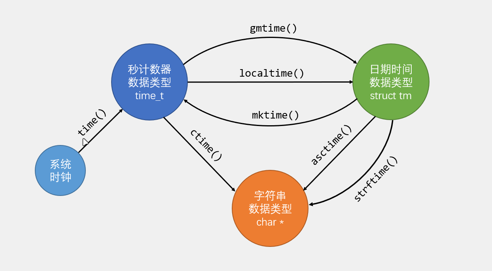

#### 13.2、BKP备份寄存器

##### (1)、简介

>•BKP（Backup Registers）备份寄存器（本质为RAM）
>
>•BKP可用于存储用户应用程序数据。当VDD（2.0\~3.6V）(主电源)电源被切断，他们仍然由VBAT（1.8~3.6V）(备用电池电源)维持供电。当系统在待机模式下被唤醒，或系统复位或电源复位时，他们也不会被复位
>
>•TAMPER引脚产生的侵入事件将所有备份寄存器内容清除（用于拆除时，清除数据）
>
>•RTC引脚输出RTC校准时钟、RTC闹钟脉冲或者秒脉冲
>
>•存储RTC时钟校准寄存器
>
>•用户数据存储容量：
>
> 20字节（中容量和小容量）/ 84字节（大容量和互联型）

##### (2)、BKP基本结构

>当主电源有电时，优先使用主电源供电，主电源断电，才使用VBAT供电
>
>DR1\~10（中容量和小容量）/ DR1\~42（大容量和互联型）

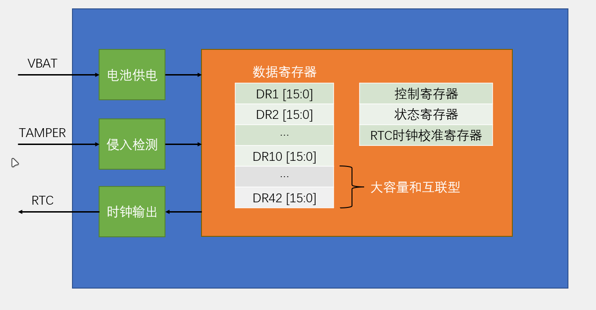

>第一步，开启PWR和BKP的时钟，挂载在APB1上
>
>第二步，调用PWR_BackupAccessCmd()设置PWR_CR的DBP，使能对BKP和RTC的访问。

#### 13.3、RTC

##### (1)、简介

>•RTC（Real Time Clock）实时时钟
>
>•RTC是一个独立的定时器，可为系统提供时钟和日历的功能
>
>•RTC和时钟配置系统处于后备区域，系统复位时数据不清零，VDD（2.0\~3.6V）断电后可借助VBAT（1.8~3.6V）供电继续走时
>
>•32位的可编程计数器，可对应Unix时间戳的秒计数器
>
>•20位的可编程预分频器，可适配不同频率的输入时钟
>
>•可选择三种RTC时钟源：
>
>​	 HSE时钟除以128（通常为8MHz/128）
>
>​	LSE振荡器时钟（通常为32.768KHz）（RTC常用，且只有LSE才能使用VBAT供电）
>
>​	LSI振荡器时钟（40KHz）

##### (2)、RTC框图

> ①：RTCCLK，RTC时钟，通过RCC配置，可选择HSE、LSE（常用）、LSI三种。
>
> ②：RTC_DIV（自减计数器）、RTC_PRL（自动重装载器），20位的可编程预分频器，分频范围：（0+1）\~（2^20^-1+1）。
>
> ③：RTC_CNT，32位的可编程计数器，用于记Unix时间戳。	
>
> ④：RTC_ALR，32位的闹钟寄存器，写入秒数，当与RTC_CNT相等时，产生RTC_Alarm(闹钟中断信号)，进入中断或者退出待机模式。RTC_ALR是一个一次性的次，每次闹钟响完，都需要重新设置RTC_ALR的值。
>
> ⑤：RTC_Second（秒中断信号）、RTC_Overflow（溢出中断信号）、RTC_Alarm（闹钟中断信号）。

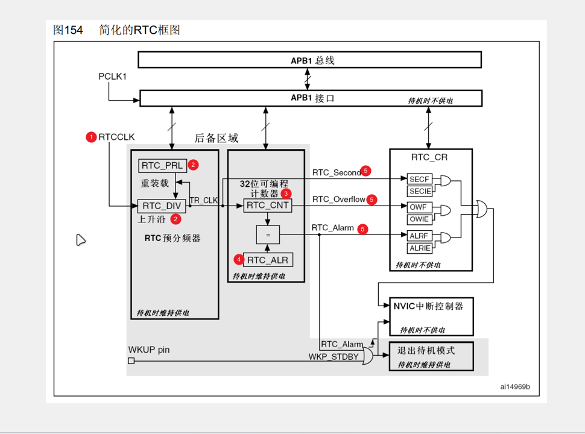

##### (3)、RTC基本结构

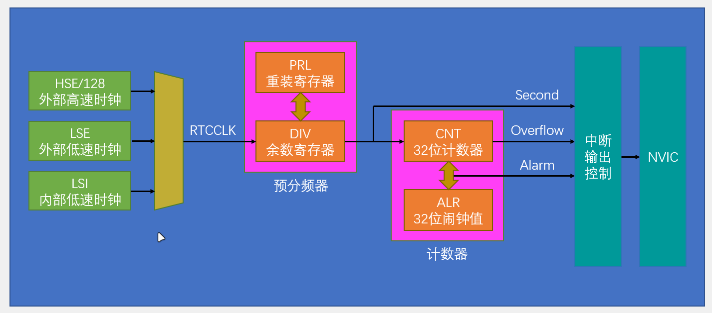

>第一步，开启PWR和BKP的时钟，挂载在APB1上。
>
>第二步，调用PWR_BackupAccessCmd()设置PWR_CR的DBP，使能对BKP和RTC的访问。
>
>第三步，启动RTC的时钟（LSE时钟）。等待启动完成。
>
>第四步，配置RTCCLK，指定为LSE。
>
>第五步，调用等待同步和等待上一次操作完成。
>
>第六步，配置预分频器。等待写完成。（进入退出配置模式的函数，在其他RTC写相关函数中已经调用）
>
>第七步，配置CNT的值。（给RTC初始时间）等待写完成

##### (4)、硬件电路

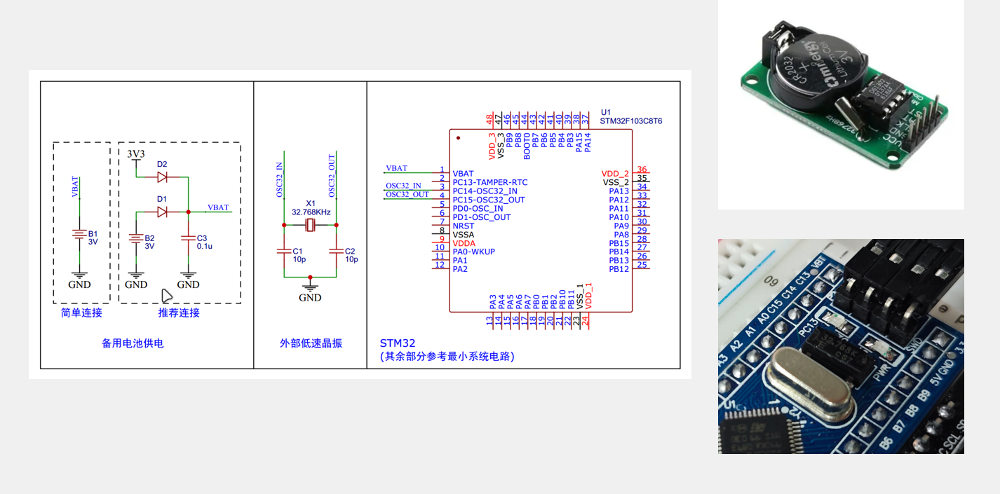

##### (5)、RTC操作注意事项

>•执行以下操作将使能对BKP和RTC的访问：
>
> 	设置RCC_APB1ENR的PWREN和BKPEN，使能PWR和BKP时钟
>															
> 	设置PWR_CR的DBP，使能对BKP和RTC的访问
>
>•若在读取RTC寄存器时，RTC的APB1接口曾经处于禁止状态，则软件首先必须等待RTC_CRL寄存器中的RSF位（寄存器同步标志）被硬件置1
>
>•必须设置RTC_CRL寄存器中的CNF位，使RTC进入配置模式后，才能写入RTC_PRL、RTC_CNT、RTC_ALR寄存器
>
>•对RTC任何寄存器的写操作，都必须在前一次写操作结束后进行。可以通过查询RTC_CR寄存器中的RTOFF状态位，判断RTC寄存器是否处于更新中。仅当RTOFF状态位是1时，才可以写入RTC寄存器

#### 13.4、PWR电源控制

##### (1)、简介

>•PWR（Power Control）电源控制
>
>•PWR负责管理STM32内部的电源供电部分，可以实现可编程电压监测器和低功耗模式的功能
>
>•可编程电压监测器（PVD）可以监控VDD电源电压，当VDD下降到PVD阈值以下或上升到PVD阈值之上时，PVD会触发中断，用于执行紧急关闭任务
>
>•低功耗模式包括睡眠模式（Sleep）、停机模式（Stop）和待机模式（Standby），可在系统空闲时，降低STM32的功耗，延长设备使用时间
>
>
>
>注：在三种低功耗模式下和禁用调试端口，需要按住复位键，同时在点LOAD（下载程序按钮），之后松开复位键，才能下载成功。(此时会显示找不到STLink接口)
>
>只有外部中断可以唤醒停止1模式。

##### (2)、电源框图

>①：模拟部分供电区域，其中A/D转换器还会有V~REF-~和V~REF+~两个参考电源。在引脚多的芯片，会单独引出，引脚少的芯片，则会直接接到V~DDA~和V~SSA~上。
>
>②：主供电区。分为VDD供电区与和1.8V供电区（通过VDD供电区中电压调节器所得）。
>
>③：后备供电区域。其中RCC BDCR寄存器（备份域控制寄存器）。

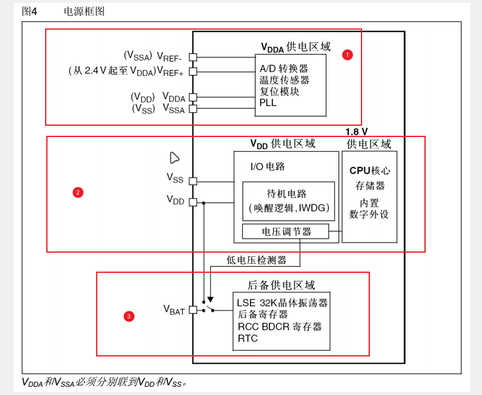

##### (3)、上电复位和掉电复位

>复位信号，低电平有效。
>
>当VDD高于上限PRO时，解除复位；当低于下限POR时，进入复位。
>
>中间的40mV的迟滞区域，是为了防止电压在某个阈值附近波动时，造成输出也来回抖动。

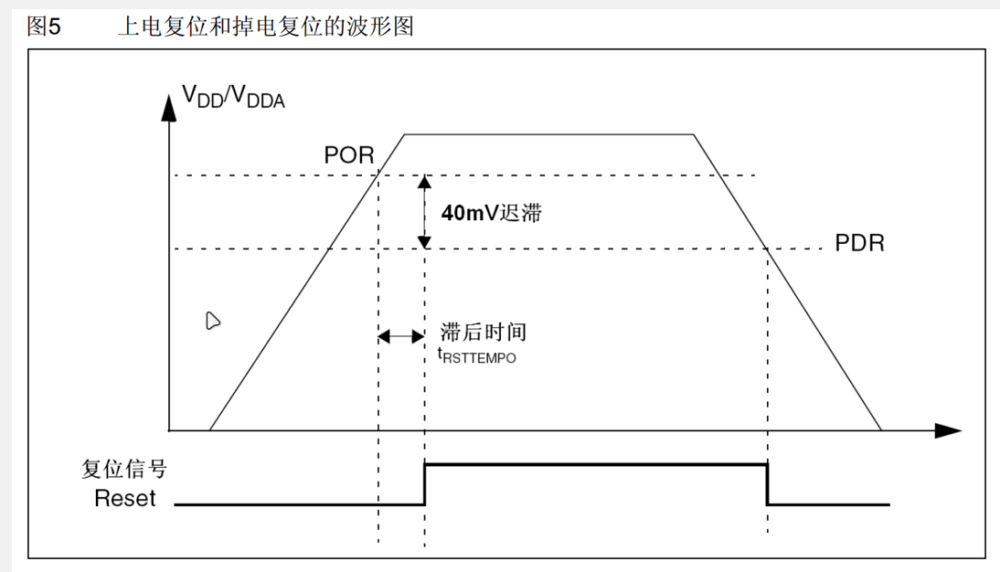

##### (4)、可编程电压监测器

>PVD阈值，可通过配置寄存器来配上下限。
>
>PVD输出低电平时，可以申请外部中断。

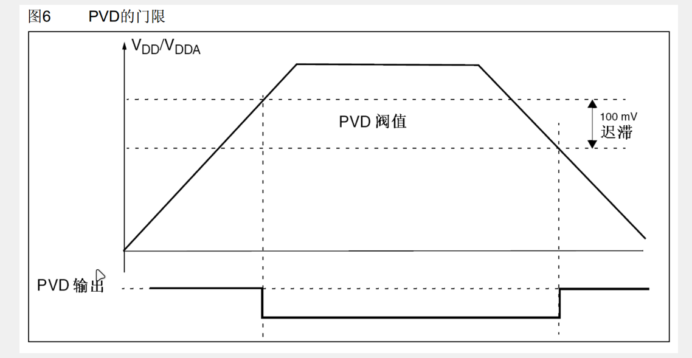

##### (5)、**低功耗模式**

>睡眠模式：WFI,意思是Wait For Interrupt，等待中断——需要==任意中断==唤醒。WFE，意思是Wait For Event，等待事件——需要==任意事件==唤醒。
>
>停机模式：PDDS=0，且设置SLEEPDEEP位为1，调用WFI或者WFE，进入停机模式。LPDS=0，开启电压调节器；LPDS=1，电压调节器处于低功耗模式（也会维持1.8V区域寄存器和存储器的数据内容）。需要==任意一外部中断或者事件==唤醒。
>
>待机模式：PDDS=1，且设置SLEEPDEEP位为1，调用WFI或者WFE，进入待机模式。==WKUP引脚的上升沿、RTC闹钟事件、NRST引脚上的外部复位（复位键）、IWDG复位==唤醒。时钟和1.8v电源关闭。
>
>
>
>注：进入低功耗模式的本质时，关闭时钟（停止计算，寄存器和存储器的值不受影响）或者关闭电源（停止计算，寄存器和存储器的值丢失）。
>
>LSI和LSE一般不会被关闭，用于维持RTC和看门狗。

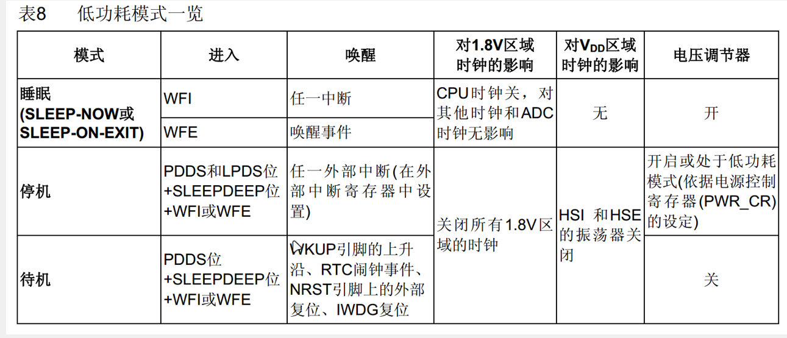

###### Ⅰ、睡眠模式

>•执行完WFI/WFE指令后，STM32进入睡眠模式，程序暂停运行，唤醒后程序从暂停的地方继续运行
>
>•SLEEPONEXIT位决定STM32执行完WFI或WFE后，是立刻进入睡眠，还是等STM32从最低优先级的中断处理程序中退出时进入睡眠
>
>•在睡眠模式下，所有的I/O引脚都保持它们在运行模式时的状态
>
>•WFI指令进入睡眠模式，可被任意一个NVIC响应的中断唤醒
>
>•WFE指令进入睡眠模式，可被唤醒事件唤醒

###### Ⅱ、停机模式

>•执行完WFI/WFE指令后，STM32进入停止模式，程序暂停运行，唤醒后程序从暂停的地方继续运行
>
>•1.8V供电区域的所有时钟都被停止，PLL、HSI和HSE被禁止，SRAM和寄存器内容被保留下来
>
>•在停止模式下，所有的I/O引脚都保持它们在运行模式时的状态
>
>•当一个中断或唤醒事件导致退出停止模式时，HSI被选为系统时钟（需要第一时间重启HSE相关时钟源的配置，重新配置成72Mhz）
>
>•当电压调节器处于低功耗模式下，系统从停止模式退出时，会有一段额外的启动延时
>
>•WFI指令进入停止模式，可被任意一个EXTI中断唤醒
>
>•WFE指令进入停止模式，可被任意一个EXTI事件唤醒

###### Ⅲ、待机模式

>•执行完WFI/WFE指令后，STM32进入待机模式，唤醒后程序从头开始运行
>
>•整个1.8V供电区域被断电，PLL、HSI和HSE也被断电，SRAM和寄存器内容丢失，只有备份的寄存器和待机电路维持供电
>
>•在待机模式下，所有的I/O引脚变为高阻态（浮空输入）
>
>•WKUP引脚的上升沿、RTC闹钟事件的上升沿、NRST引脚上外部复位、IWDG复位退出待机模式


##### (6)、低功耗基本框图

>•执行WFI（Wait For Interrupt）或者WFE（Wait For Event）指令后，STM32进入低功耗模式。（寄存器配置需要在WFI和WFE之前）
>
>
>SLEEPONEXIT=1，当WFI或者WFE在中断中时，程序会执行完中断，再睡眠。

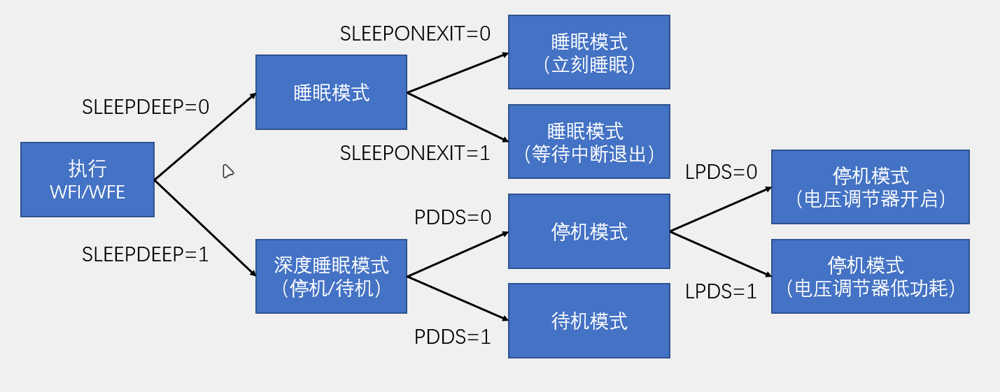


### 14、0.96寸OLED显示屏（驱动芯片为：SSD1306 / SSD1315）

#### 14.1、移植

1. 将OLED相关的.c或者.h文件复制到自己的对应的工程目录。（新建工程目录，流程可以参考[新建Start文件](####2.1、新建 Strat 文件)）

2. 将对应的目录添加到项目中。

	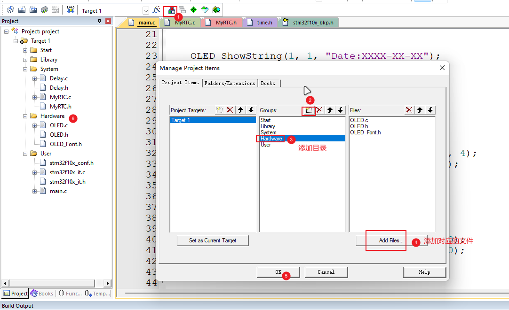

3. 解决乱码报错（和解决串口字符报错一样   --no-multibyte-chars     最小版keil5已经自带了）。


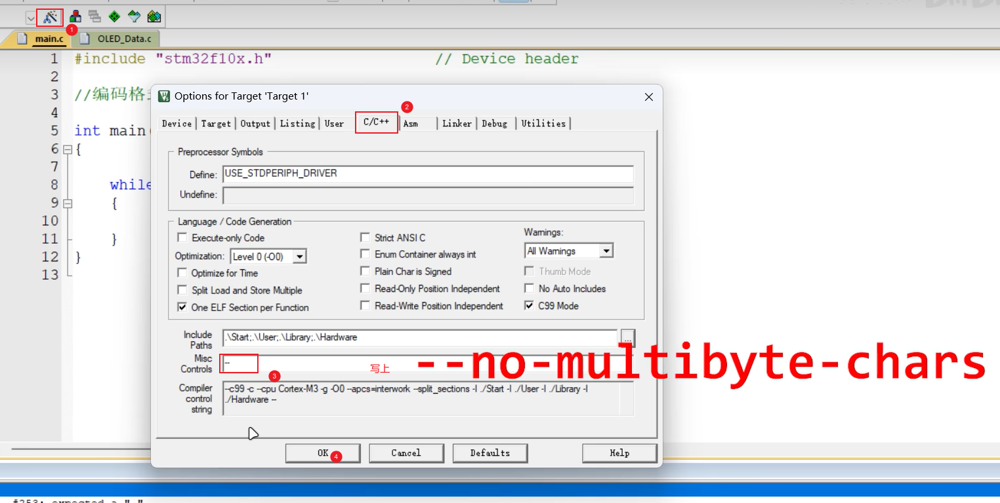

#### 14.2、转换文件编码格式

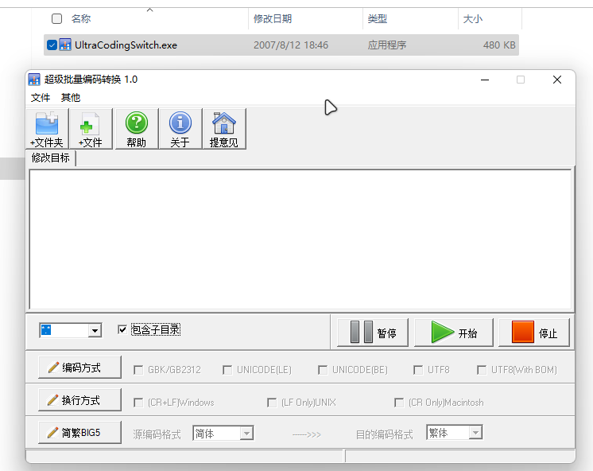

#### 14.3、OLED结构

##### (1)、芯片位置

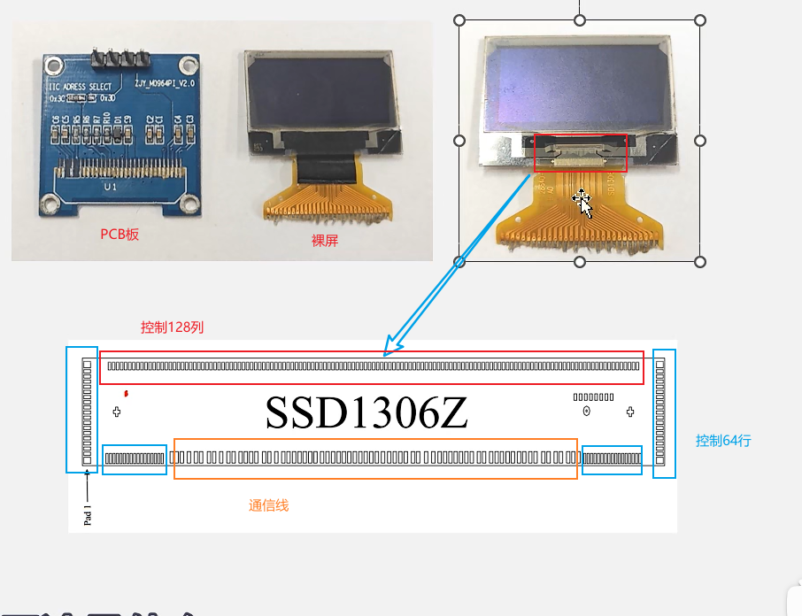

##### (2)、SSD1306

###### Ⅰ、简介

>•SSD1306是一款OLED/PLED点阵显示屏的控制器，可以嵌入在屏幕中，用于执行接收数据、显示存储、扫描刷新等任务
>
>OLED——有机发光二极管。PLED——高分子发光二极管
>
>
>
>•驱动接口：128个SEG引脚和64个COM引脚，对应128*64像素点阵显示屏
>
>
>
>•内置显示存储器（GDDRAM）：128\*64 bit （128*8 Byte）SRAM
>
>
>
>•供电：VDD=1.65~3.3V（IC 逻辑），VCC=7~15V（面板驱动）(屏幕内部含有升压电路（3.3V升9V），PCB板上有降压电路（5V降3.3V）)
>
>
>
>•通信接口：8位6800/8080并行接口，3/4线SPI接口，I2C接口

######  Ⅱ、SSD1306框图及引脚定义

| **引脚**              | **功能**                                                     |
| --------------------- | ------------------------------------------------------------ |
| VDD、VCC、  VSS、VLSS | 供电  VDD=1.65~3.3V，VCC=7~15V                               |
| D0~D7                 | 6800/8080：8位双向数据总线  3/4线SPI：D0为SCLK，D1为SDIN  I2C：D0为SCL，D1为SDAin，D2为SDAout（实际上不能读出） |
| BS0~BS2               | 选择通信接口 （选择不同的通信协议）                          |
| R/W#(WR#)             | 6800：R/W#，指定读/写操作  8080：WR#，写使能  （#表示低电平，R/W#=0，表示写操作，R/W#=1，表示读操作） |
| E(RD#)                | 6800：E，读/写使能  8080：RD#，读使能                        |
| D/C#                  | 6800/8080/4线SPI：指定传输数据/指令  （4线SPI比3线SPI多这个引脚）  I2C：SA0，指定I2C从机地址最低位 |
| CS#                   | 片选                                                         |
| RES#                  | 复位                                                         |

>①：MCU通信接口。会对数据进行分流，数据前往GDDRAM，命令前往Command Decoder。
>
>②：命令译码器，用于控制电路执行。
>
>③：GDDRAM（RAM存储器）。
>
>④：显示控制器，将GDDRAM的内容扫描刷新到屏幕。
>
>⑤：公共端驱动器，COM0\~63。
>
>⑥：段驱动器，SEG0\~127。
>
>⑦：振荡器，提供屏幕刷新的时钟。CLS=1，选择内部时钟，CL引脚不用；CLS=0，选择外部时钟，CL接外部时钟源。
>
>⑧：电流控制和电压控制。V~COMH~，公共端的电压输出。I~REF~，驱动电流控制。
>
>TE：芯片测试点。

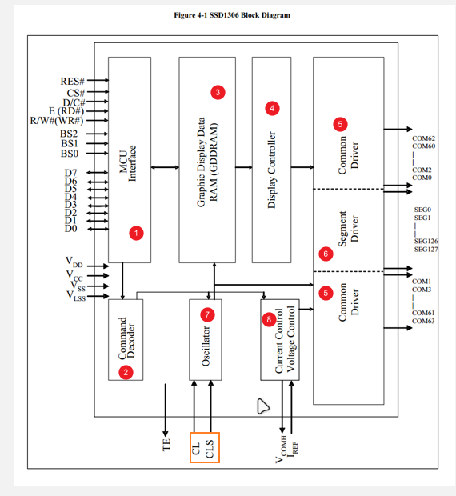

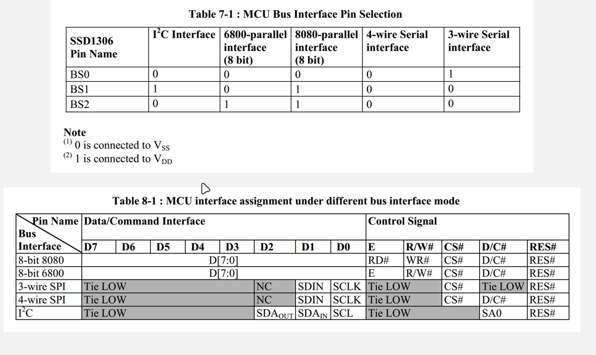

###### Ⅲ、4针脚I2C接口模块原理图6

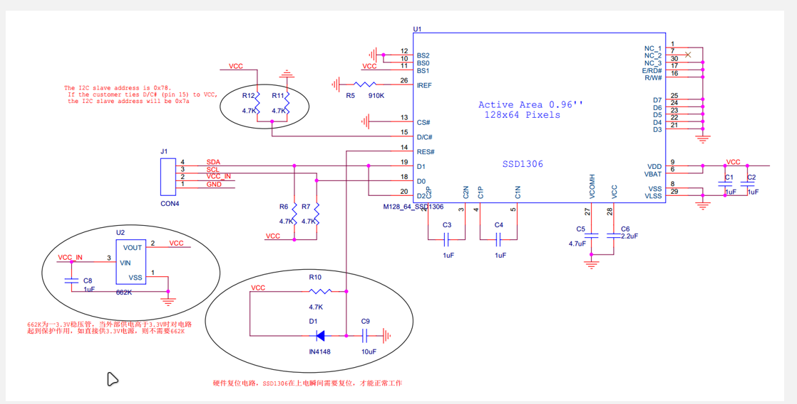

###### Ⅳ、7针脚SPI接口模块原理图

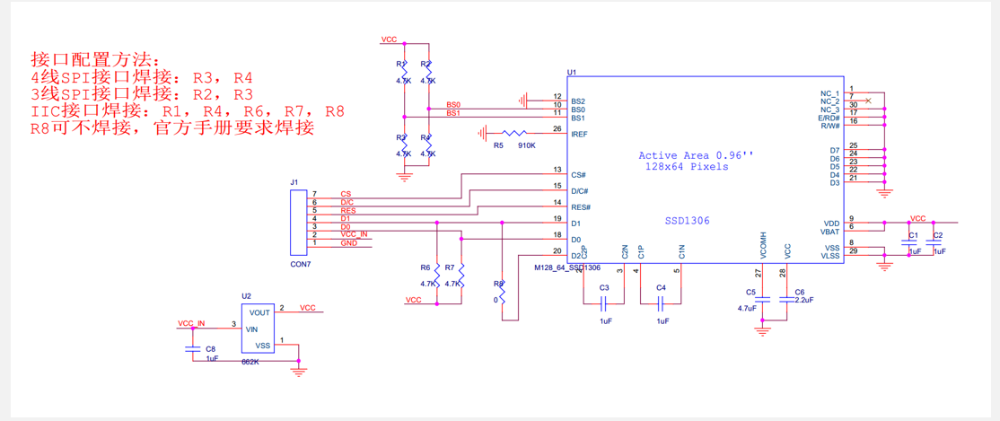

###### Ⅴ、字节传输-6800并口

>所有操作必须在CS#置低电平（选中芯片）有效。
>
>
>D/C#置低电平，为命令。以下两个：
>
>​	Wrie command:写命令。R/W#置低电平为写入。
>
>​	Read status:读状态。R/W#置高电平为读取。
>
>D/C#置高电平，为数据。以下两个：
>
>​	Write data:写数据。R/W#置低电平为写入。
>
>​	Read data:读数据。R/W#置高电平为读取。
>
>
>E引脚给下降沿，执行读写操作。

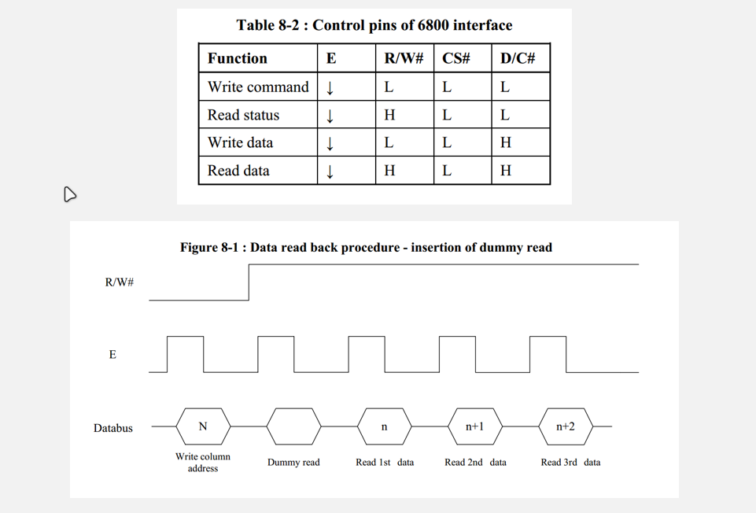

###### Ⅵ、字节传输-8080并口

>所有操作必须在CS#置低电平（选中芯片）有效。
>
>
>
>D/C#置低电平，为命令。以下两个：
>
>​	Wrie command:写命令。WR#为上升沿时，执行写入。
>
>​	Read status:读状态。RD#为上升沿时，执行读取
>
>D/C#置高电平，为数据。以下两个：
>
>​	Write data:写数据。WR#为上升沿时，执行写入。
>
>​	Read data:读数据。RD#为上升沿时，执行读取
>
>​	不读写时WR#与RD#保持高电平状态。当执行写操作时，WR#使能，RD#默认高电平；当执行读操作时，RD#使能，WR#默认高电平。
>
>
>下图为写操作时序

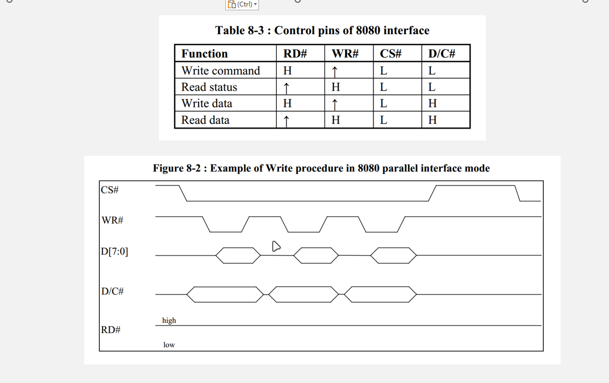

###### Ⅶ、字节传输-4线SPI 与 字节传输-3线SPI

>只有写操作，不能读取。
>
>
>
>字节传输-4线SPI：
>
>所有操作必须在CS#置低电平（选中芯片）有效。E、R/W#引脚无用，接低电平。
>
>
>
>SCLK下降沿主机变化数据，上升沿从机采样，完成写入操作（高位先行）
>
>​	D/C#置低电平，为命令：
>
>​		Write command：写命令。
>
>​	D/C#置高电平，为数据：
>
>​		Write data：写数据。

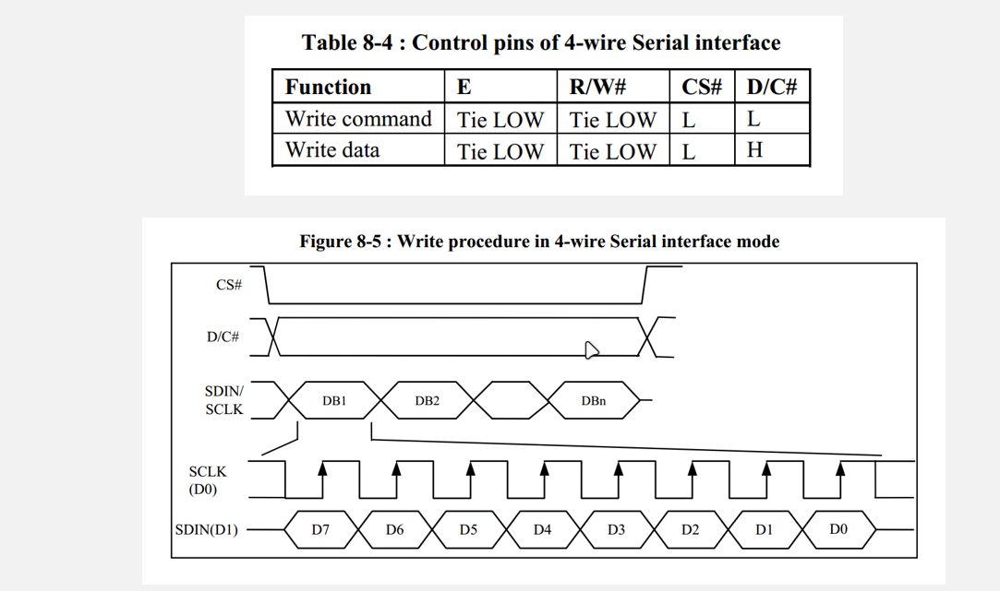

>字节传输-3线SPI：
>
>基本与上面相同，只是少用了D/C#引脚。
>
>在发送一个字节之前，先发送一位D/C#位（D/C# = 0,为命令；D/C# = 1,为数据）。

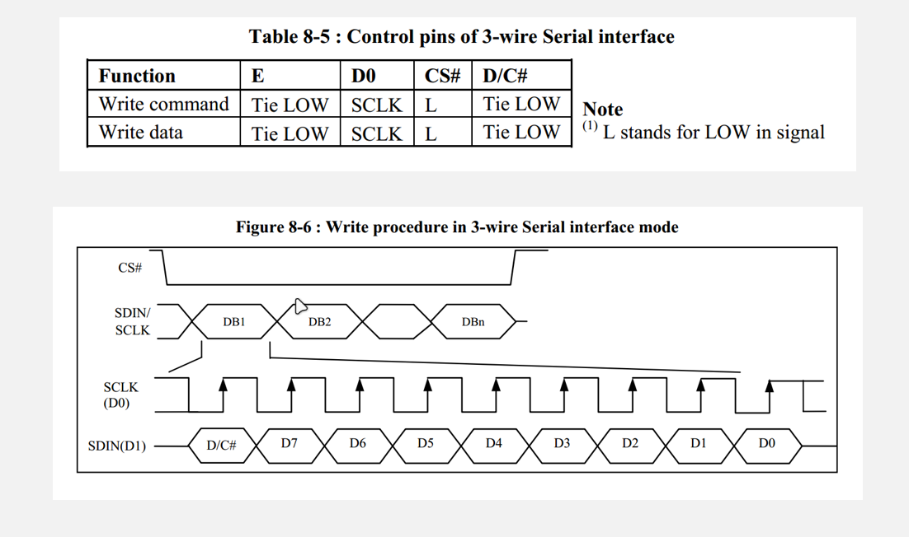

###### Ⅷ、字节传输-I2C

>[I2C基本时序](#####(1)、基本时序)
>
>
>SSD1306规定时序：
>
>Start  ->   Slave Address（从机地址+读写位RW#）->   ACK（接收应答） ->Control byte ->  ACK -> Data byte -> ACK -> Stop
>
>
>
>
> Slave Address：从机地址(最低位可通过SA0改变)+读写位R/W#
>
><span style="color:#FF0000;">Control</span> <span style="color:#3399FF;">byte</span>：前两位分别是Co位和D/C#位，后六位无用，全为0。Co=1，连续模式；Co=0，非连续模式。
>
> <span style="color:#FF0000;"> Data</span> <span style="color:#3399FF;">byte</span>：数据或者命令，由前一个<span style="color:#FF0000;">Control</span> <span style="color:#3399FF;">byte</span>的D/C#位决定。
>
>
>
>连续模式Co=1（Data byte前面必须发一个Control byte，命令与数据切换更加自如）
>
>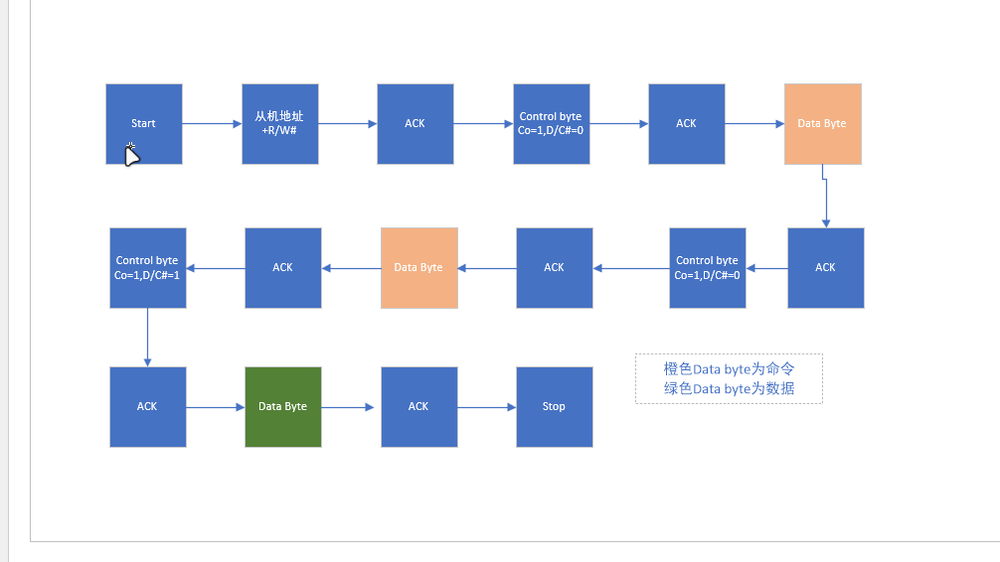
>
>非连续模式Co=0（只发一个Control byte，后面的Data byte全为命令或者指令）(常用)
>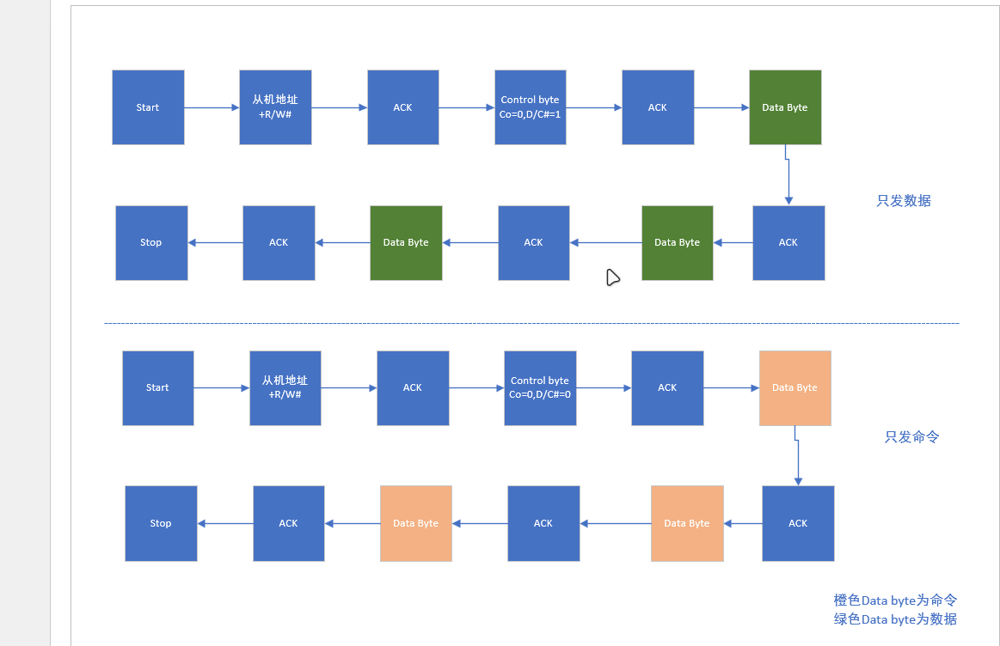

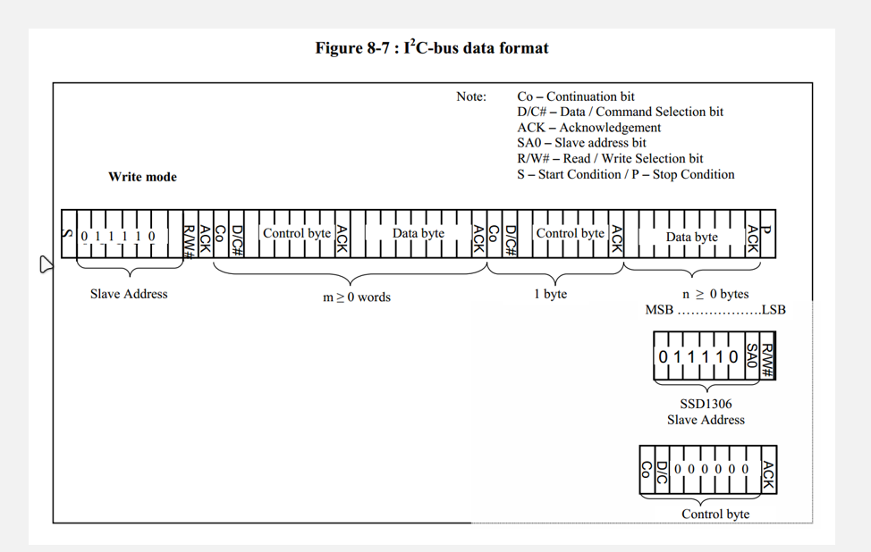

###### Ⅸ、执行逻辑图

>①：显示屏。左上为原点，横轴为x轴，竖轴为y轴。
>
>②：GDDRAM。每个存储单元与显示屏的像素一一对应。但是GGDRAM的数轴进行了分页，8×128为一页，分成8页（PAGE0~7），一个字节控制一页中的一列（低位在上，高位在下）。
>
>
>所以当每页的数据向下移动1个单位，就需要跨页写入（读取GDDRAM的能力），使用I2C和SPI无法实现，所以需要定义一个缓存数组，先读写缓存数组，最后再一起更新到GDDRAM里面。

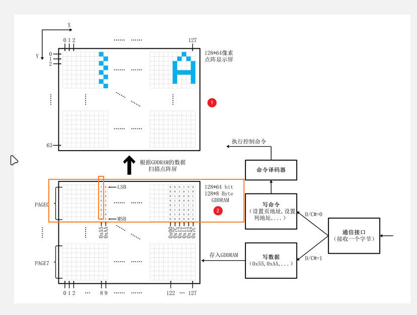

###### Ⅹ、命令表

>•通过写命令时序传输的字节，作为发送给SSD1306的一个命令
>
>•SSD1306查询命令表的定义，执行相应的操作
>
>•命令可以由一个字节或者连续的多个字节组成
>
>•命令可分为基础命令、滚屏命令、寻址命令、硬件配置命令、时间及驱动命令5大类（详细见驱动芯片SSD1306数据手册.pdf的9 COMMAND TABLE  ）

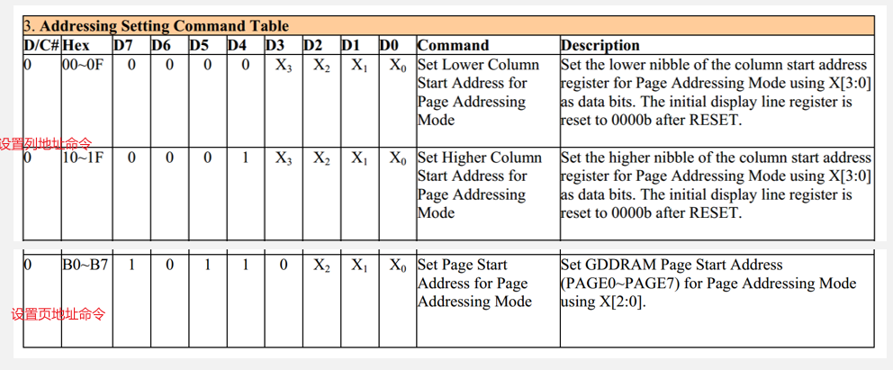

###### Ⅺ、初始化过程（内部提供VCC）（厂家提供的配置思路）

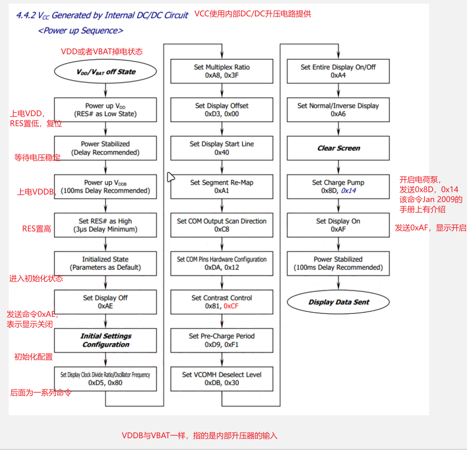

[OLED命令相关汉化资料（一部分）](https://blog.csdn.net/Keep_moving_tzw/article/details/104877286)

#### 14.4、汉字编码

>•汉字编码是一套数字到汉字的映射标准，它规定了用什么数字表示什么汉字
>
>•汉字编码有多种方案，常用的有GB2312/GBK/GB18030和Unicode/UTF-8
>
>
>
>•GB2312编码下：
>
> char s[] = “好”; 等效于   char s[] = {0xBA, 0xC3, 0x00};
>
> char s[] = “你好”; 等效于   char s[] = {0xC4, 0xE3, 0xBA, 0xC3, 0x00};
>
>•UTF-8编码下：
>
> char s[] = “好”; 等效于   char s[] = {0xE5, 0xA5, 0xBD, 0x00};
>
> char s[] = “你好”; 等效于   char s[] = {0xE4, 0xBD, 0xA0, 0xE5, 0xA5, 0xBD, 0x00};
>
>
>[编码查询](https://www.qqxiuzi.cn/bianma/zifuji.php)


### 15、WDG看门狗

#### 15.1、简介

>•WDG（Watchdog）看门狗（类似进程心跳——异常处理之一）
>
>•看门狗可以监控程序的运行状态，当程序因为设计漏洞、硬件故障、电磁干扰等原因，出现卡死或跑飞现象时，看门狗能及时复位程序，避免程序陷入长时间的罢工状态，保证系统的可靠性和安全性
>
>•看门狗本质上是一个定时器，当指定时间范围内，程序没有执行喂狗（重置计数器）操作时，看门狗硬件电路就自动产生复位信号
>
>•STM32内置两个看门狗
>
>​	 独立看门狗（IWDG）：独立工作，对时间精度要求较低。（使用专用的LSI时钟）
>
> 	窗口看门狗（WWDG）：要求看门狗在精确计时窗口（上限和下限之间）起作用。（使用APB1的时钟）
>
>
>注：
>
>1. 关键硬件故障，看门狗也无法处理。
>2. 看门狗应该处理，无法预料的设计漏洞。
>3. 一旦启动看门狗，无法关闭看门狗。

#### 15.2、两狗区别

##### (1)、IWDG（独立看门狗）

###### Ⅰ、框图

>类似定时器时基单元。
>
>喂狗：手动重装计数器，通过键寄存器IWDG_KR来操作喂狗。
>
>通过操作1.8V供电区里面的寄存器来操作看门狗的硬件电路。

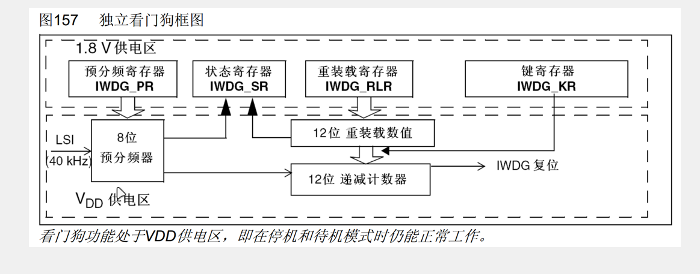

>第一步，解除写保护。
>
>第二步，写入预分频器值，重装值。
>
>第二步，启动独立看门狗。

###### Ⅱ、IWDG键寄存器

>•键寄存器本质上是控制寄存器，用于控制硬件电路的工作
>
>•在可能存在干扰的情况下，一般通过在整个键寄存器写入特定值来代替控制寄存器写入一位的功能，以降低硬件电路受到干扰的概率

| **写入键寄存器的值** |                **作用**                |
| :------------------: | :------------------------------------: |
|        0xCCCC        |             启用独立看门狗             |
|        0xAAAA        | IWDG_RLR中的值重新加载到计数器（喂狗） |
|        0x5555        |     解除IWDG_PR和IWDG_RLR的写保护      |
|  0x5555之外的其他值  |     启用IWDG_PR和IWDG_RLR的写保护      |

###### Ⅲ、超时时间

$$
超时时间：T_{IWDG} = T_{LSI} × PR预分频系数 × (RL + 1)
\\
\\
其中：
\\
T_{LSI} = 1 / f_{LSI}
\\
RL：为IWDG\_RLR寄存器的值
$$


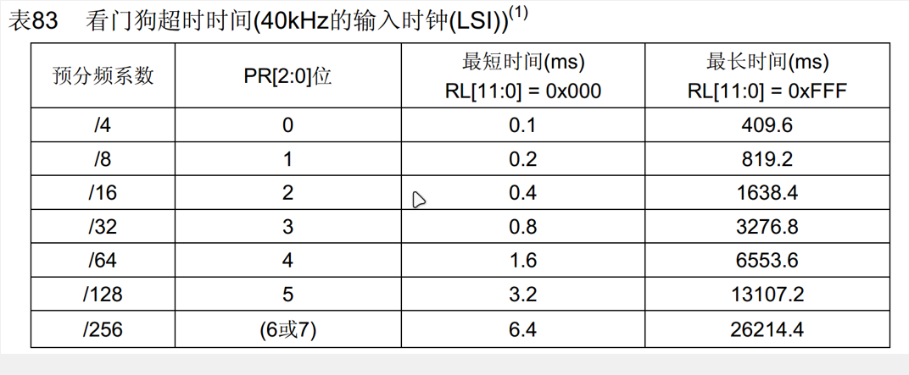

##### (2)、WWDG（窗口看门狗）

###### Ⅰ、框图

>WWDG_CR与CNT使用同一个寄存器，没有重装寄存器。修改值，直接写入CNT中。
>
>WWDG_CFR：记录的是喂狗的最早时间界限（上限）。
>
>6位 递减计数器(CNT)：只有T0~T5为计数部分，T6为溢出标志位，溢出后（T6=0）T6会产生复位信号。
>
>​					 如果将T6也看成计数器的一部分，将会减到0x40的下一个数产生溢出。
>
>​					 如果将T6也看成溢出标志位，将会减到0后产生溢出。
>
>​					WDGA：窗口看门狗的使能位，为1使能窗口看门狗；为0失能窗口看门狗。
>
>通过写入WWDG_CR（或者CNT），来进行喂狗。
>
>当T[6:0] > W[6:0]时，比较器输出1,且写入了WWDG_CR（进行喂狗）,产生复位信号。

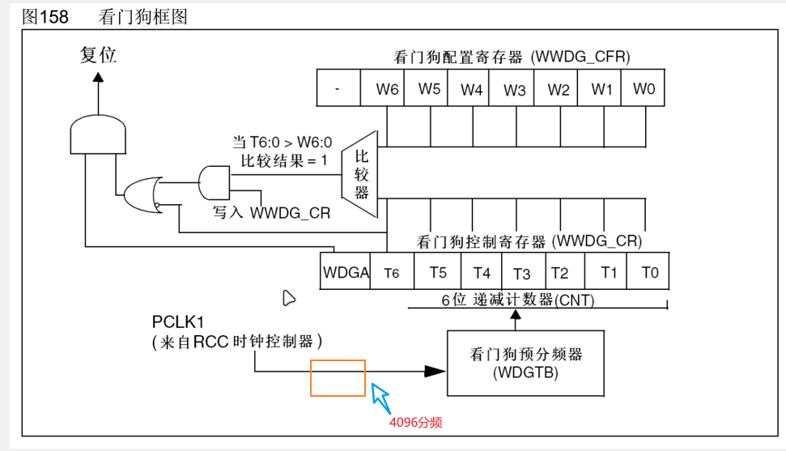

>第一步，开启窗口看门狗的APB1时钟。
>
>第二步，配置预分频器值、窗口值。
>
>第三步，写入控制寄存器CR，设置WDGA、T6与T[5:0]。

###### Ⅱ、工作特性

>•递减计数器T[6:0]的值小于0x40时，WWDG产生复位
>
>•递减计数器T[6:0]在窗口W[6:0]外被重新装载时，WWDG产生复位
>
>•递减计数器T[6:0]等于0x40时可以产生早期唤醒中断（EWI），用于重装载计数器以避免WWDG复位
>
>•定期写入WWDG_CR寄存器（喂狗）以避免WWDG复位
>
>
>
>早期唤醒中断（EWI）：也叫**死前中断**，可以在中断中喂狗，避免复位重启；也可以在中断保存重要数据、关闭危险设备；也可以在中断中进行超时提示。（类似手机关机的倒计时）


>①：不允许刷新。在这个阶段，不能写入WWDG_CR（喂狗），否则产生中断。（狗粮充足，多喂撑死）
>
>②：刷新窗口。在这个阶段，必须喂狗，否则到达0x3f产生中断。（狗粮不足，添粮喂狗）
>
>0x3f时刻：复位。（已无狗粮，狗已饿死）

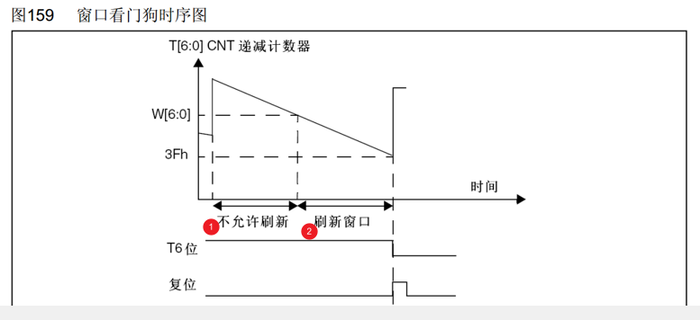

###### Ⅲ、超时时间

$$
超时时间(不看W[6:0])：
\\
	T_{WWDG} = T_{PCLK1} × 4096 × WDGTB预分频系数 × (T[5:0] + 1)
\\
窗口时间（设置W[6:0]以后，最大超时时间会变动）：
\\
	T_{WIN} = T_{PCLK1} × 4096 × WDGTB预分频系数 × (T[5:0] - W[5:0])
\\
\\
其中：
\\
T_{PCLK1} = 1 / f_{PCLK1}
\\

T[5:0]:为包含T6的溢出标志位，0 \sim (2^6-1)
$$

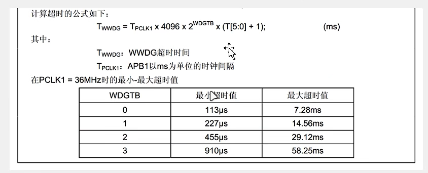

##### (3)、对比

|            |      **IWDG独立看门狗**      |         **WWDG窗口看门狗**          |
| :--------: | :--------------------------: | :---------------------------------: |
|    复位    |        计数器减到0后         | 计数器T[5:0]减到0后、过早重装计数器 |
|    中断    |              无              |            早期唤醒中断             |
|   时钟源   |         LSI（40KHz）         |           PCLK1（36MHz）            |
| 预分频系数 |    4、8、32、64、128、256    |             1、2、4、8              |
|   计数器   |             12位             |           6位（有效计数）           |
|  超时时间  |       0.1ms~26214.4ms        |            113us~58.25ms            |
|  喂狗方式  | 写入键寄存器，重装固定值RLR  |   直接写入计数器，写多少重装多少    |
|  防误操作  |       键寄存器和写保护       |                 无                  |
|    用途    | 独立工作，对时间精度要求较低 |   要求看门狗在精确计时窗口起作用    |

#### 15.3、其他注意事项

>1. 如果用户在**选择字节中启用**了“硬件看门狗”功能，在系统上电复位后，看门狗会自动开始运行；如果在计数器计数结束前，若软件没有向键寄存器写入相应的值，则系统会产生复位。  
>2. IWDG的这些时间（表83）是按照40kHz时钟给出。实际上， **MCU内部的RC频率会在30kHz到60kHz之间变化**。此外，即使RC振荡器的频率是精确的，确切的时序仍然依赖于APB接口时钟与RC振荡器时钟之间的相位差，因此总会有一个完整的RC周期是不确定的。  
>3. 递减计数器（CNT）处于自由运行状态，即使看门狗被禁止，递减计数器仍继续递减计数。**当看门狗被启用时， T6位必须被设置，以防止立即产生一个复位。**  
>4. 如果独立看门狗已经由硬件选项或软件启动， LSI振荡器将被强制在打开状态，并且不能被关闭。在LSI振荡器稳定后，时钟供应给IWDG。  
>5. 在系统复位后，看门狗总是处于关闭状态，设置WWDG_CR寄存器的WDGA位能够开启看门狗，随后它不能再被关闭，除非发生复位。  

### 16、Flash闪存(非易失性存储器)

#### 16.1、FLASH简介

>•STM32F1系列的FLASH包含[程序存储器、系统存储器和选项字节](#####9.2、stm32 存储器映像)三个部分，通过闪存存储器接口（外设）可以对程序存储器和选项字节进行擦除和编程
>
>•读写FLASH的用途：
>
> 	利用程序存储器的剩余空间来保存掉电不丢失的用户数据
>								
> 	通过在程序中编程（IAP），实现程序的自我更新（类似的升级技术——OTA（无线更新技术））
>
>•在线编程（In-Circuit Programming – ICP）用于更新程序存储器的全部内容，它通过JTAG、SWD协议或系统加载程序（Bootloader）下载程序
>
>•在程序中编程（In-Application Programming – IAP）可以使用微控制器支持的任一种通信接口下载程序

>闪存编程过程中，任何读写闪存的操作都会使CPU暂停，直到此次闪存编程结束。
>
>如果程序中有需要频繁执行，且对时间要求严格的中断函数，需要慎用这个闪存存储。
>
>内部为小端存储

#### 16.2、闪存模块的组织

>主存储器——程序存储器
>
>启动程序代码——系统存储器
>
>用户选中字节——选项字节
>
>闪存存储器接口寄存器——可以看作闪存管理员
>
>[注意事项](#####(4)、Flash操作注意事项)
>
>对于stm32f103C8T6来说闪存容量只有64KB
>
>**页的起始地址，0x080X X000、0x080X X400、0x080X X800、0x080X XC00**

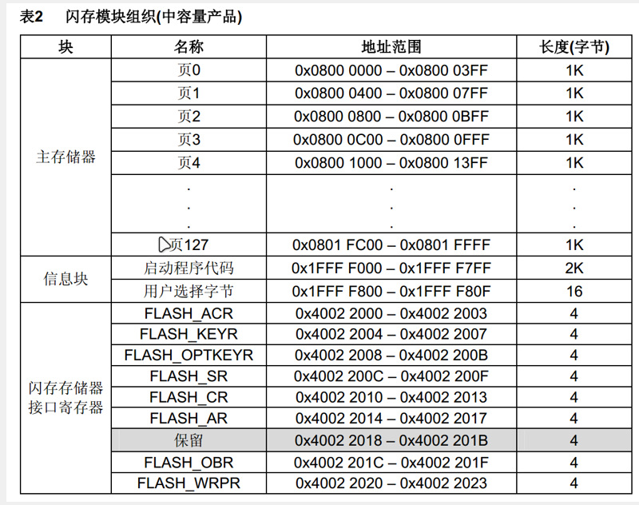

#### 16.3、flash基本结构图

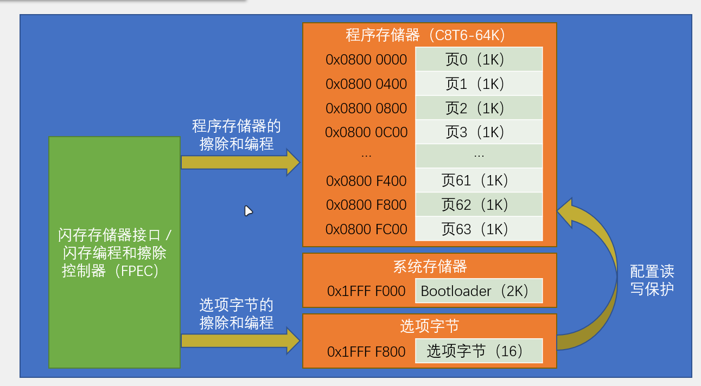

>第一步，封装读取（ uint16_t Data = *((__IO uint16_t *)(0x08000000));）
>
>第二步，封装解锁、擦除、加锁
>
>第三步，封装解锁、编程、加锁


##### (1)、FLASH解锁

>•FPEC共有三个键值（密钥）：
>
> 	RDPRT键 = 0x000000A5     (解除读保护的密钥)
>
>​	KEY1 = 0x45670123
>
> 	KEY2 = 0xCDEF89AB
>
>•解锁：
>
> 	复位后，FPEC被保护（上锁状态），不能写入FLASH_CR
>
>​	 在FLASH_KEYR先写入KEY1，再写入KEY2，解锁**（先写KEY1再写KEY2）**
>
> 	**错误的操作序列会在下次复位前锁死FPEC和FLASH_CR**
>
>•加锁（**操作完成后，必须加锁**）：
>
> 	设置FLASH_CR中的LOCK位（LOCK=1）锁住FPEC和FLASH_CR

##### (2)、使用指针访问存储器

>•使用指针读指定地址下的存储器：
>
>​	 uint16_t Data = *((__IO uint16_t *)(0x08000000));
>
>​	数据类型a   变量 = *((数据类型a指针)(地址));
>
>•使用指针写指定地址下的存储器（需要较高权限）：
>
> 	*((__IO uint16_t *)(0x08000000)) = 0x1234;
>
>•其中：
>
>​	 \#define  __IO  volatile        (volatile  关键字，防止编译器优化，数据同步)

##### (3)、程序存储器编程（写入数据）

>擦除之后，才能进行写入操作，否则会警告（写入数据的全是0，除外）
>
>PG位：写入标志位，置1有效。
>
>如果写入字节（8位），需要先将整页读到SRAM中进行修改。
>
>BSY位：芯片忙状态标志位。为1则芯片在忙。
>
>读编程地址并检查写入数据：验证程序所使用的，一般可以不管（不操作）。

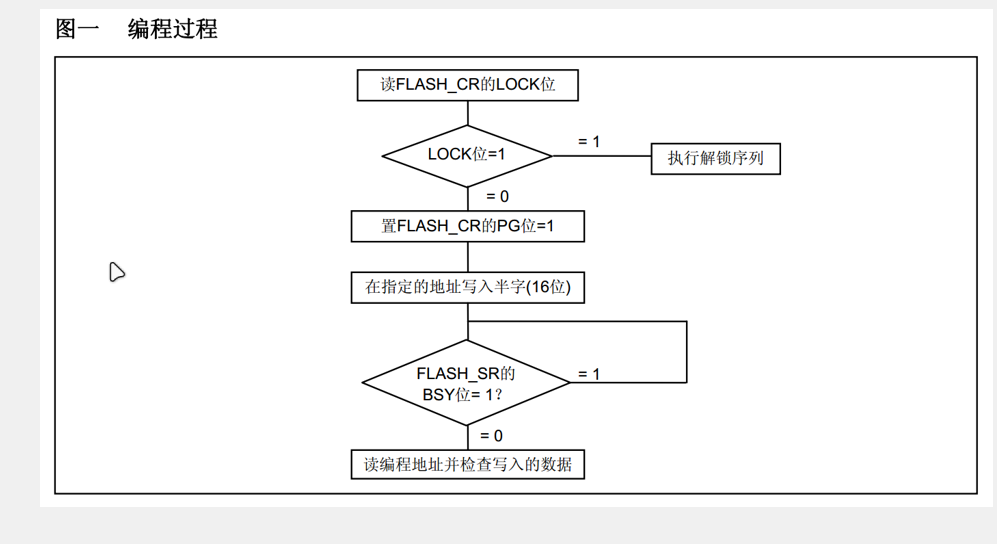

##### (4)、程序存储器页擦除

>PER位：页擦除标志位，置1有效。
>
>FLASH_AR中选择所要擦除页的页首地址。
>
>STRT位：执行标志位，置1有效。
>
>BSY位：芯片忙状态标志位。为1则芯片在忙。
>
>读出并验证被擦除页的数据：验证程序所使用的，一般可以不管（不操作）。

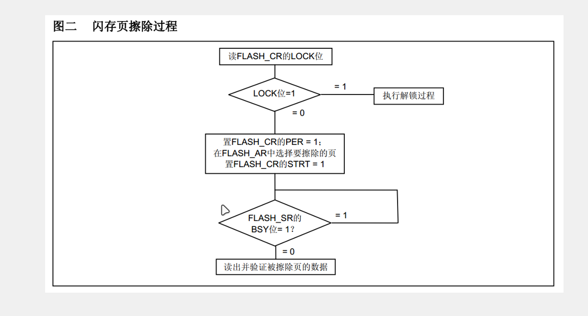

##### (5)、程序存储器全擦除

>MER位：全擦除标志位，置1有效。
>
>STRT位：执行标志位，置1有效。
>
>BSY位：芯片忙状态标志位。为1则芯片在忙。
>
>读出并验证所有页的数据：验证程序所使用的，一般可以不管（不操作）。

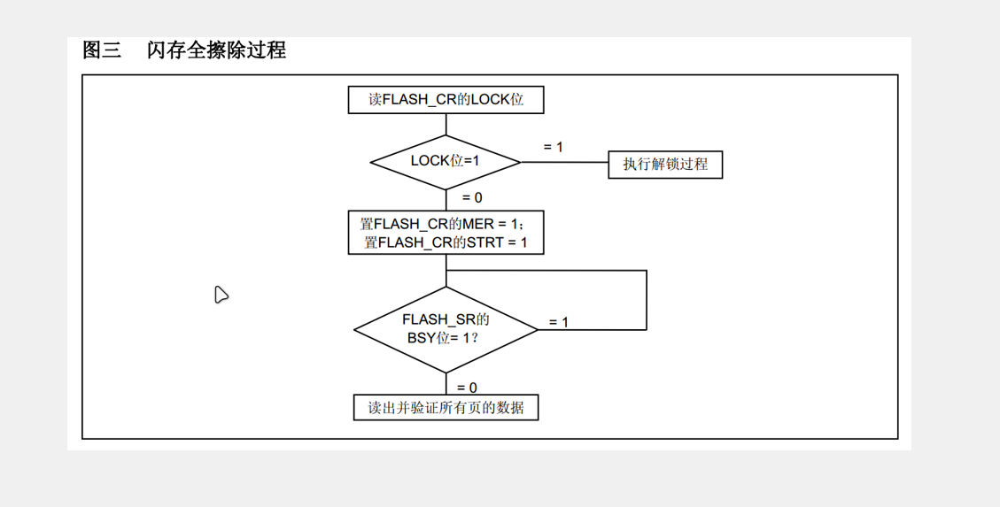

#### 16.4、选项字节

>•RDP：写入RDPRT键（0x000000A5）后解除读保护
>
>•USER：配置硬件看门狗和进入停机/待机模式是否产生复位
>
>•Data0/1：用户可自定义使用
>
>•WRP0/1/2/3：配置写保护，每一个位对应保护4个存储页（中容量）
>
>
>
>
>注：前面带小n，表示写入对应数据的反码。如：写入USER数据，必须在[31:24]写入USER数据的反码，否则数据无效。（FPEC会自动计算出对应的反码，并开始编程操作）
>
>当读闪存保护选项从“保护”变为“未保护”时，在重新设置读保护选项前会自动执行一个整片擦除用户闪存的操作。  如果用户要改变读保护之外的选项，则不会出现整片擦除操作。读保护选项上的这一擦除操作保护了闪存中的内容不被非法读出。  
>
>读写保护：0实施保护。1不实施保护。（flash擦除之后都是1）

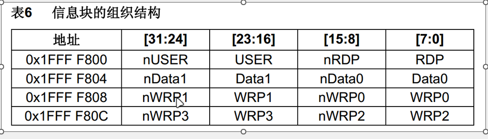

##### (1)、选项字节编程

>•解锁闪存
>
>•检查FLASH_SR的BSY位，以确认没有其他正在进行的编程操作
>
>•解锁FLASH_CR的OPTWRE位（选项字节的解锁）
>
>•设置FLASH_CR的OPTPG位为1（设置写入选项字节标志位）
>
>•写入要编程的**半字**到指定的地址
>
>•等待BSY位变为0
>
>•读出写入的地址并验证数据

##### (2)、选项字节擦除

>•解锁闪存
>
>•检查FLASH_SR的BSY位，以确认没有其他正在进行的闪存操作
>
>•解锁FLASH_CR的OPTWRE位（选项字节的解锁）
>
>•设置FLASH_CR的OPTER位为1（设置擦除选项字节位）
>
>•设置FLASH_CR的STRT位为1
>
>•等待BSY位变为0
>
>•读出被擦除的选择字节并做验证

#### 16.5、器件电子签名

>•电子签名存放在闪存存储器模块的系统存储区域，包含的芯片识别信息在出厂时编写，不可更改，使用指针读指定地址下的存储器可获取电子签名
>
>
>
>•闪存容量寄存器：
>
> 	基地址：0x1FFF F7E0
>
>​	 大小：16位
>
>
>
>•产品唯一身份标识寄存器：
>
> 	基地址： 0x1FFF F7E8
>								
> 	大小：96位
>
>程序中可以通过多处识别ID号，来实现程序被盗。

#### 16.6、限制程序文件存储在flash的大小

>防止flash中程序文件区和用户自定义变量区互相影响，导致程序bug

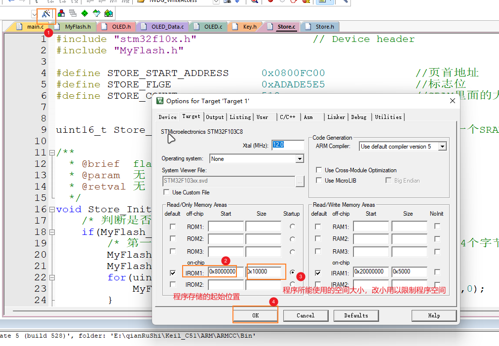

>提供下载速度，保存自定义数据。

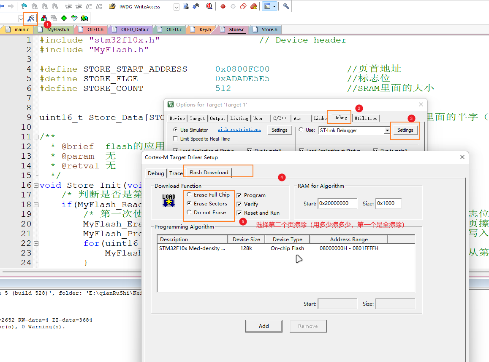

>查看程序大小
>
>Code：代码大小。
>
>RO-data：只读数据大小。
>
>RW-data：可读数据大小。
>
>
>
>
>点击Target 1可以查编译信息（.map文件），最后有计算好的程序大小数据。
>
>切记看完.map文件要关掉，否则每次编译后都会弹出窗口，询问是否重新加载。

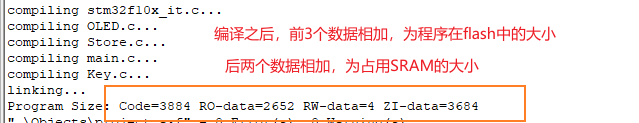

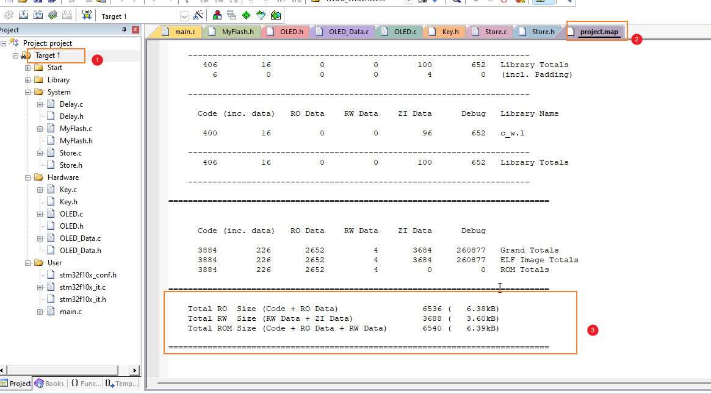

### 17、CAN总线

#### 17.1、CAN简介(高位先行)

>•CAN总线（Controller Area Network Bus）控制器局域网总线
>
>•CAN总线是由BOSCH公司开发的一种简洁易用、传输速度快、易扩展、可靠性高的串行通信总线，广泛应用于汽车、嵌入式、工业控制等领域
>
>•CAN总线特征：
>
>- ​	两根通信线（CAN_H、CAN_L），线路少，实际应用中需要一根地线相互连接，防止电压差过大（共模范围）
>- ​	差分信号通信，抗干扰能力强
>- ​	高速CAN（ISO11898）：125k~1Mbps, <40m
>- ​	低速CAN（ISO11519）：10k~125kbps, <1km
>- ​	异步，无需时钟线，通信速率由设备各自约定
>- ​	半双工，可挂载多设备，**多设备同时发送数据时通过仲裁判断先后顺序**
>- ​	11位（标准格式）/29位（扩展格式）报文ID，用于区分消息功能，同时决定优先级（ID小的优先发送）
>- ​	可配置1\~8字节的有效载荷（可以发送1\~8个字节，可以灵活发送）
>- ​	可实现广播式（数据发送方对全部接收方自动发送数据，接收方根据报文ID来确定使不使用数据）和请求式（数据发送方需要等待接收方的请求，才会发送数据）两种传输方式
>- ​	应答、CRC校验、位填充、位同步、错误处理等特性

#### 17.2、主流通信协议对比

| **名称** | **引脚**            | **双工** | **时钟** | **电平** | **设备** | **应用场景**                 |
| -------- | ------------------- | -------- | -------- | -------- | -------- | ---------------------------- |
| UART     | TX、RX              | 全双工   | 异步     | 单端     | 点对点   | 两个设备互相通信             |
| I2C      | SCL、SDA            | 半双工   | 同步     | 单端     | 多设备   | 一个主控外挂多个模块         |
| SPI      | SCK、MOSI、MISO、SS | 全双工   | 同步     | 单端     | 多设备   | 一个主控外挂多个模块（高速） |
| CAN      | CAN_H、CAN_L        | 半双工   | 异步     | 差分     | 多设备   | 多个主控互相通信             |

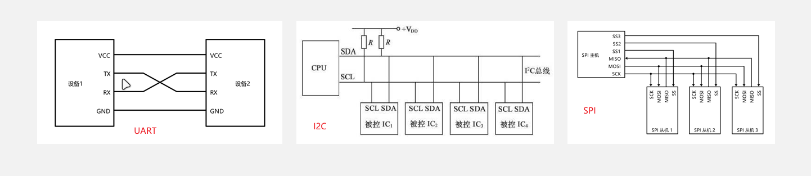

#### 17.3、CAN硬件电路

>•每个设备通过CAN收发器(将CAN控制器的TTL电平转换成差分信号)挂载在CAN总线网络上
>
>•CAN控制器引出的TX和RX与CAN收发器相连，CAN收发器引出的CAN_H和CAN_L分别与总线的CAN_H和CAN_L相连
>
>•高速CAN使用闭环网络，CAN_H和CAN_L两端添加120Ω的**终端电阻**（终端电阻作用：1.防止[回波反射](https://blog.csdn.net/Matlab_dashi/article/details/140251656)影响信号完整性。2.在没有设备操作时，将两根差分线的电压“收紧”，使两根线的电压一致，即没有电压差。）（设备想要发送信号0时，将两根线的电压差“拉开”，当发送信号0时，不动信号线，让终端电阻“收紧”）
>
>•低速CAN使用开环网络，CAN_H和CAN_L其中一端添加2.2kΩ的终端电阻（该终端电阻，有防止回波反射，但是没有“收紧”作用）

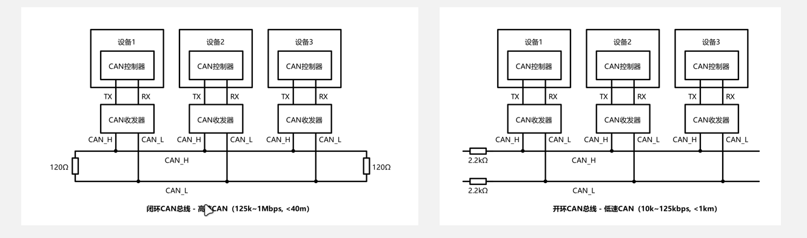

#### 17.4、CAN电平标准

>•CAN总线采用差分信号，即两线电压差（V~CAN_H~ - V~CAN_L~）传输数据位
>
>•高速CAN规定：
>
> 	电压差为0V时表示逻辑1（隐性电平）
>							
> 	电压差为2V时表示逻辑0（显性电平）（0强于1，显性与隐性同时出现时，表示为显性）
>
>•低速CAN规定：
>
> 	电压差为-1.5V时表示逻辑1（隐性电平）
>							
> 	电压差为3V时表示逻辑0（显性电平）
>
>
>低速CAN，总线回归隐性电平慢，传输速率慢；高速CAN，总线回归隐性电平快，传输速率快。
>
>
>
>后面帧格式的图，采用逻辑电平的简便画法

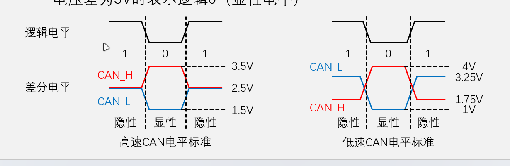

#### 17.5、CAN收发器 – TJA1050（高速CAN）

>①：接收器，时刻检测总线（CANH和CANL）电压差。当有电压差时，输出1；当没有电压差时，输出0。
>
>②：两个场效应管输出驱动器组成（COMS反相器）。当从①接收到0时，下管断开，上管导通，与VCC相连，输出1到RXD（没有电压差为1，隐性）；当从	①接收到1时，上管断开，下管导通，与GND相连，输出0到RXD（有电压差为0，显性）。（与stm32的GPIO开漏推挽输出模式类似）
>
>③：驱动器。当从TXD接收到1，将④和⑤断开，让终端电阻将CANH和CAN拉到一样的电压；当从TXD接收到0，将④和⑤导通，CANH被VCC拉高，CANL被	GND拉低，形成电压差。
>
>④和⑤：场效应管。
>
>⑥：该结构让CANH和cANL处于隐性电平时，让V~CANH~ = V~CANL~  = 0.5 * V~CC~。
>
>⑦：电流源上拉。类似上拉电阻，当TXD悬空时，让TXD保持默认输入1的状态。
>
>⑧：TXD显性超时计时器。当TXD始终输入为0时，会让总线处于显性电平状态，该计数器在一定时间后，会自动释放总线，防止总线瘫痪。
>
>⑨：开关控制。由S引脚输入1时选择静默模式。（S引脚有下拉电流源，防止引脚悬空时操作的电平混乱）
>
>⑩：温度保护。温度异常，会切断输出，以免干扰CAN总线。

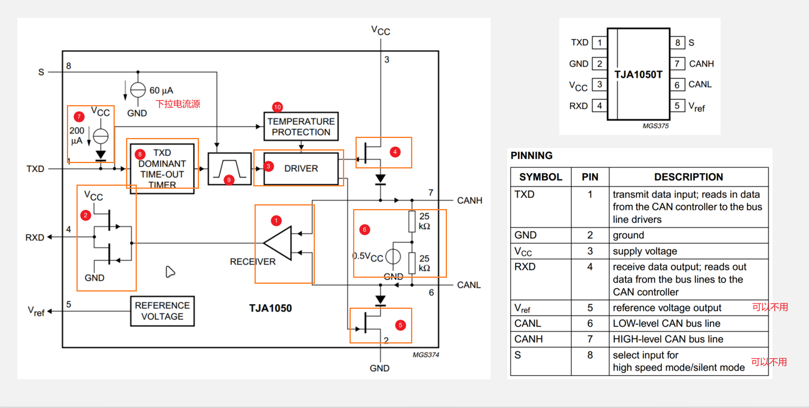

#### 17.6、CAN物理层特性

>Min和Max，是允许的误差范围的最小值和最大值。

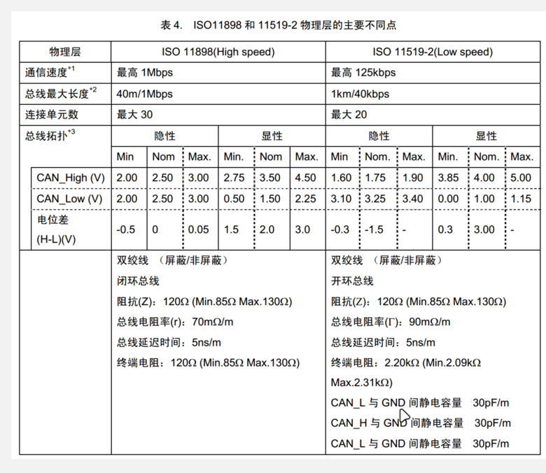

#### 17.7、帧格式

>•CAN协议规定了以下5种类型的帧：

| **帧类型** |                **用途**                |
| :--------: | :------------------------------------: |
|   数据帧   |     发送设备主动发送数据（广播式）     |
|   遥控帧   |     接收设备主动请求数据（请求式）     |
|   错误帧   | 某个设备检测出错误时向其他设备通知错误 |
|   过载帧   |     接收设备通知其尚未做好接收准备     |
|   帧间隔   |  用于将数据帧及遥控帧与前面的帧分离开  |

##### (1)、数据帧

>图中方框里面的数字，表示该段的数据位数。
>
>灰色表示发送显性电平（低电平），白色表示发送隐性电平（高电平），浅紫色表示发送显性电平或者隐性电平都可以。
>ACK位槽，发送方必须发送隐性电平，接收方必须发送显性电平。
>
>扩展格式比标准格式的ID位多出看18位。同时扩展格式兼容标准格式。
>
>发送方和接收方共同完成一个波形。

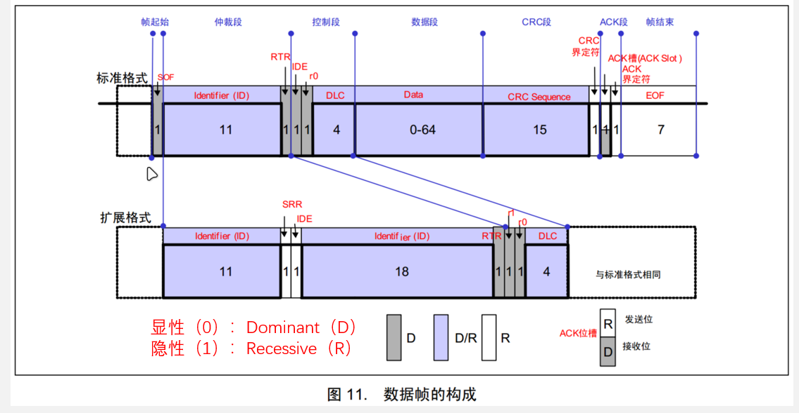

>起始段（1位数据）：
>
>​	•SOF（Start of Frame）：帧起始，表示后面一段波形为传输的数据位
>
>
>
>仲裁段（（11+1）位数据     扩展格式：（11+1+1+18+1）位数据）：
>
>​	•ID（Identify）（报文ID）：标识符，区分功能，同时决定优先级（小ID优先发送，数据帧的优先级大于遥控帧）
>
>​	•RTR（Remote Transmission Request ）：远程请求位，区分数据帧（RTR = 0）和遥控帧（RTR = 1）
>
>​	•<span style="color:#FF8000;">SRR（Substitute Remote Request）：替代RTR，协议升级时留下的无意义位，且必须给隐性电平1。（为了保证仲裁规则中标准格式的优先级高于扩展格式的优先级的设计，即RTR位永远在ID位的后面）       （扩展格式与标准格式的不同）</span>
>
>​	•<span style="color:#FF8000;">IDE（Identifier Extension）：扩展标志位，区分标准格式（IDE = 0）和扩展格式 （IDE = 1）,其实是r1位演变来的    （扩展格式与标准格式的不同）</span>
>
>与I2C的7位从机地址+1位读写位相似，区别是I2C的只发送给一个从机（多个从机同时接收7从机地址，与自身比对，相同，继续接收后面数据；不同，不在接收后面数据）；CAN是给所有设备同时发送全部数据，是否使用由设备自己决定（软件程序处理）。
>
>
>
>
>控制段（（1+1+4）位数据  ）：
>
>​	•<span style="color:#FF8000;">IDE（Identifier Extension）：扩展标志位，区分标准格式（IDE = 0）和扩展格式 （IDE = 1）（扩展格式与标准格式的不同）</span>
>
>​	• r0/r1（Reserve）：保留位，为后续协议升级留下空间<span style="color:#FF8000;">（r1位，扩展格式与标准格式的不同）</span>
>
>​	•DLC（Data Length Code）：数据长度，指示数据段有几个**字节**（范围：0~8）
>
>
>
>
>数据段（0~64位数据，一般大于0，且位数的倍数为8）：
>
>​	•Data：数据段的1~8个字节有效数据
>
>
>
>CRC段（（15+1）位数据）：
>
>​	•CRC（Cyclic Redundancy Check）：循环冗余校验，校验数据是否正确
>
>​	•CRC界定符：为发送方释放总线留下时间，CRC界定符由发送方置为隐性1（CRC界定符 = 1）
>
>
>
>ACK段（（1+1）位数据）：
>
>​	•ACK（Acknowledgement）：应答位，判断数据有没有被接收方接收
>
>​	•ACK界定符：为接收方释放总线留下时间（ACK界定符 = 1），ACK界定符由接收方置为隐性1，在这个之前发送方需要读取ACK槽，如果ACK = 0，表示有接收；ACK = 1，表示没有设备接收，可以选择重发。
>
>​		•CRC/ACK界定符：为应答位前后发送方和接收方释放总线留下时间。（相当于I2C里面的接收应答）
>
>
>
>帧结束段（7位数据）：
>
>​	•EOF（End of Frame ）：帧结束，表示数据位已经传输完毕

***数据帧发展历史***

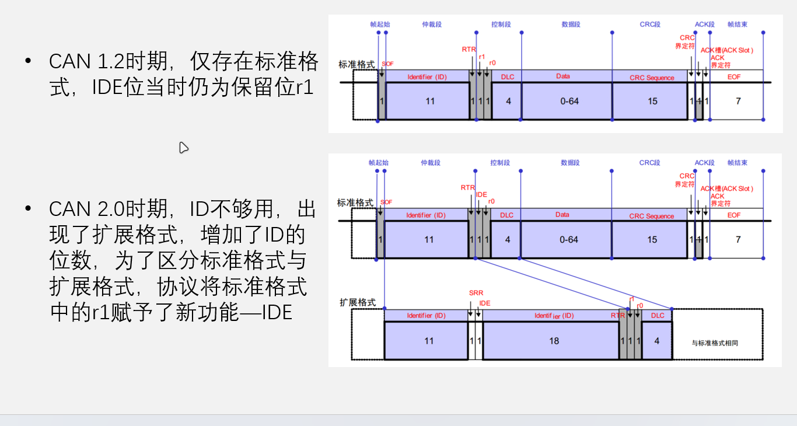

##### (2)、遥控帧

>•遥控帧无数据段，RTR为隐性电平1，其他部分与数据帧相同
>
>一次完整的请求，需要遥控帧+数据帧配合。
>
>适合数据使用频率低的场合。
>
>RTR位、SRR位、IDE位共同区分标准遥控帧（RTR隐1，无SRR，IDE显0）、标准数据帧（RTR显0，无SRR，IDE显0）、扩展遥控帧（RTR隐1，SRR隐1，IDE隐1）、扩展数据帧（RTR显0，SRR隐1，IDE隐1）。

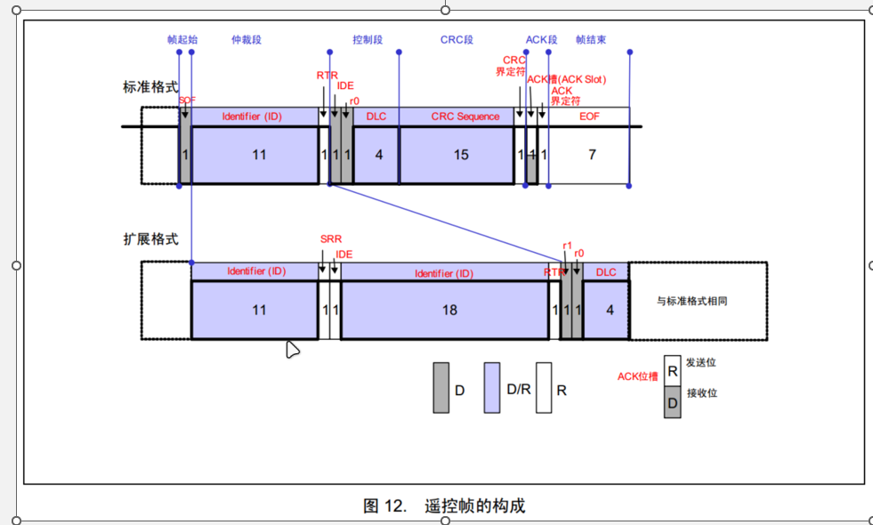

##### (3)、错误帧

>•总线上所有设备都会监督总线的数据，一旦发现“位错误”或“填充错误”或“CRC错误”或“格式错误”或“应答错误” ，这些设备便会发出错误帧来破坏数据，同时终止当前的发送设备
>
>错误帧会破坏数据帧（错误帧会重叠到数据帧上），以此向其他设备发出错误警告。
>
>设备默认处于主动错误状态，处于主动错误状态的设备，检测出错误时，会连续发出6个显性0的数据位（会破坏总线上的数据）。
>
>当主动错误产生太频繁，会让设备进入被动错误状态。处于错误状态的设备，会连续发出6个隐性1的数据位（不会破坏别的设备发的数据，但是会破坏自己发的数据）。
>
>发完错误标志后，会跟8个隐性1的数据位（错误界定符）
>
>错误标志的重叠部分：指的是一个设备发出错误标志，会连带其他设备发出错误标志。所以会多0~6个标志位。

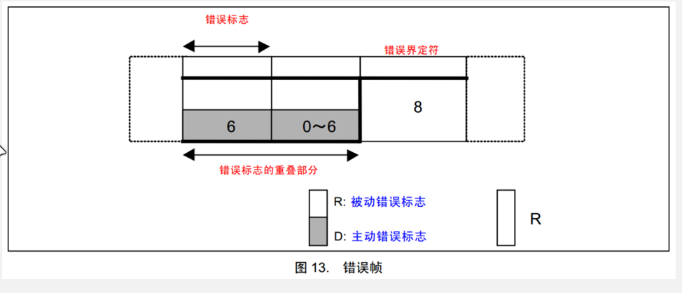

##### (4)、过载帧

>•当接收方收到大量数据而无法处理时，其可以发出过载帧，延缓发送方的数据发送，以平衡总线负载，避免数据丢失（接收方发出）
>
>过载标志为6个显性0。
>
>过载界定符为8个隐性1。
>
>过载标志的重叠部分：指的是一个设备发出过载标志，会连带其他设备发出过载标志。
>
>过载帧的发出一般出现在间歇场里（间歇场由3个隐性位组成,在此期间,CAN节点不进行帧发送，也就是帧间隔）

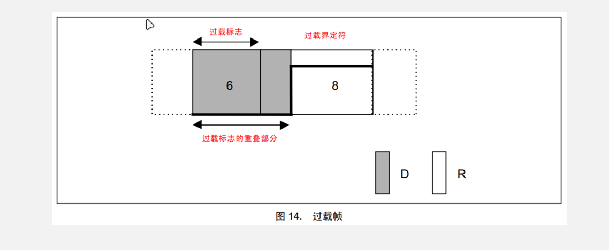

##### (5)、帧间隔

>•将数据帧和遥控帧与前面的帧分离开
>
>帧间隔分为主动错误状态和被动错误状态
>
>​	•主动错误状态，帧间隔由3个隐性1组成。
>
>​	•被动错误状态，帧间隔3个隐性1+延迟传送（8个隐性1）组成
>
>延迟传送，会将设备置于仲裁不利的处境。

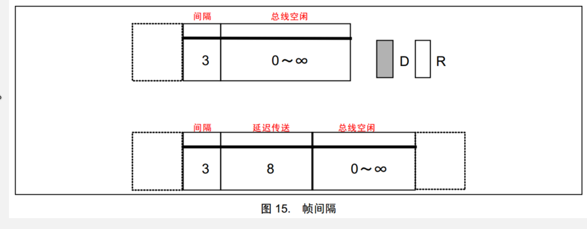

#### 17.8、位填充

>数据帧或者遥控帧，在发送到总线上之前，需要进行位填充。
>
>位填充是为防止突发错误而设定的功能 。
>

>•位填充规则：SOF～CRC段（除开CRC界定符）间，发送方***每发送5个相同电平***（包括填充位）后，自动追加一个相反电平的填充位，接收方检测到填充位时，会自动移除填充位，恢复原始数据
>
>•例如（红色为填充位）：
>
>​     即将发送：     100000110          10000011110            0111111111110
>
>​     实际发送：     100000<span style="color:#FF0000;">1</span>110        100000<span style="color:#FF3333;">1</span>1111<span style="color:#FF3333;">0</span>0        011111<span style="color:#FF3333;">0</span>11111<span style="color:#FF3333;">0</span>10
>
>​     实际接收：     100000<span style="color:#FF3333;">1</span>110        100000<span style="color:#FF3333;">1</span>1111<span style="color:#FF3333;">0</span>0        011111<span style="color:#FF3333;">0</span>11111<span style="color:#FF3333;">0</span>10
>
>​     移除填充后： 100000110          10000011110             0111111111110
>
>•位填充作用：
>
>- ​	增加波形的定时信息，利于接收方执行“再同步”，防止波形长时间无变化，导致接收方不能精确掌握数据采样时机（解决异步通信的缺点）
>- ​	**将正常数据流与“错误帧”和“过载帧”区分开**，标志“错误帧”和“过载帧”的特异性
>- ​	保持CAN总线在发送正常数据流时的活跃状态，防止被误认为总线空闲

#### 17.9、波形实例

>•标准数据帧，报文ID为0x555，数据长度1字节，数据内容为0xAA

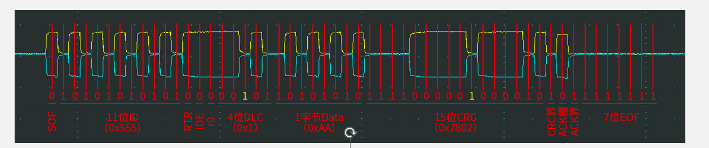

>•标准数据帧，报文ID为0x666，数据长度2字节，数据内容为0x12, 0x34

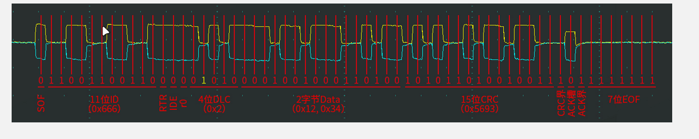

>•扩展数据帧，报文ID为0x0789ABCD，数据长度1字节，数据内容为0x56

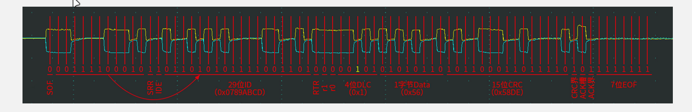

>•标准遥控帧，报文ID为0x088，数据长度1字节，无数据内容

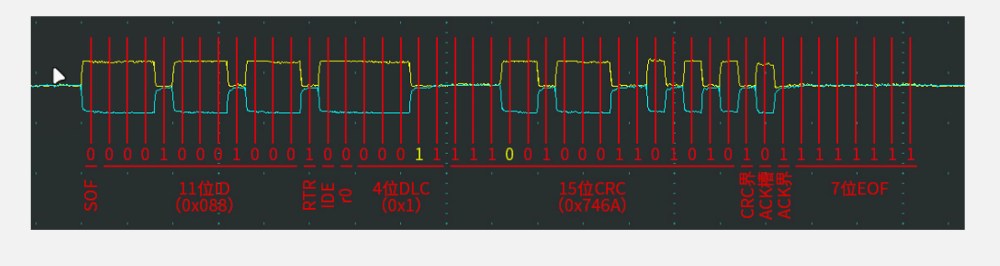

#### 17.10、接收方数据采样（位同步）

>•CAN总线没有时钟线，总线上的所有设备通过约定波特率的方式确定每一个数据位的时长
>
>•发送方以约定的位时长每隔固定时间输出一个数据位
>
>•接收方以约定的位时长每隔固定时间采样总线的电平，输入一个数据位
>
>•理想状态下，接收方能依次采样到发送方发出的每个数据位，且采样点位于数据位中心附近（采样点实际会配置到中心偏后一些或者波形结束的位置，以此保证波形的稳定性）

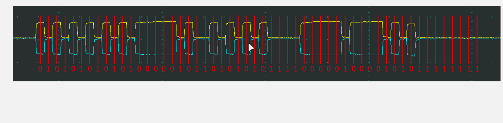

##### (1)、接收方数据采样遇到的问题

>•问题1：接收方以约定的位时长进行采样，但是采样点没有对齐数据位中心附近      以下为未同步问题

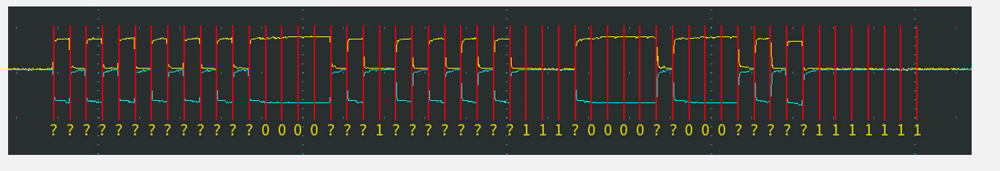

>•问题2：接收方刚开始采样正确，但是时钟有误差，随着误差积累，采样点逐渐偏离

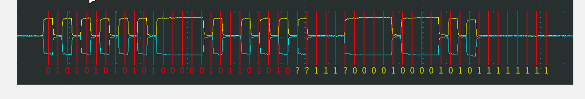

##### (2)、位时序

>•为了灵活调整每个采样点的位置，使采样点对齐数据位中心附近，CAN总线对**每一个数据位**的时长进行了更细的划分，分为同步段（SS）、传播时间段（PTS）、相位缓冲段1（PBS1）和相位缓冲段2（PBS2），每个段又由若干个最小时间单位（Tq）构成。
>
>>SS：用于检查发送和接收是否同步。
>>
>>PTS：用于吸收网络上的物理延迟（发送单元的输出延迟）、总线上信号的传播延迟、接收单元的输入延迟。PTS的时间为以上个延迟时间的和的2倍。
>
>​				
>
>- SS = 1Tq
>- PTS = 1~8Tq
>- PBS1 = 1~8Tq
>- PBS2 = 2~8Tq
>
>
>①：正常的一位数据，当电平的跳变沿（上升沿或者下降沿）出现在SS段，且下一位的数据的跳变沿，也出现在跳变沿，这种情况为发送方和接收方已经同步，采样点在PBS1~PBS2之间采样。
>
>②：当PTS+PBS1的时间比正常情况小，而PBS2比正常情况大的时候，采样点会提前。
>
>③：当PTS+PBS1的时间比正常情况大，而PBS2比正常情况小的时候，采样点延后。

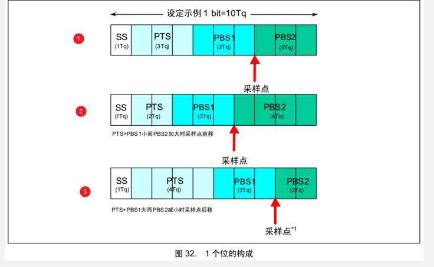

##### (3)、解决接收方采样时的两个问题

###### 1)、硬同步（问题1的解决方法）

>•每个设备都有一个位时序计时周期，当某个设备（发送方）率先发送报文，其他所有设备（接收方）收到SOF的下降沿时，接收方会将自己的位时序计时周期拨到SS段的位置，与发送方的位时序计时周期保持同步
>
>•==硬同步只在帧的第一个下降沿（SOF下降沿）有效==
>
>•经过硬同步后，若发送方和接收方的时钟没有误差，则后续所有数据位的采样点必然都会对齐数据位中心附近
>
>
>每个设备都有一个“秒表”，当帧起始（SOF段）发送显性0时（发送方将自己的“秒表”置到SS段后才产生下降沿），所有的接收设备将自己的“秒表”调到SS段，当“秒表”的指针指到PBS1和PBS2之间时，接收方进行采样。

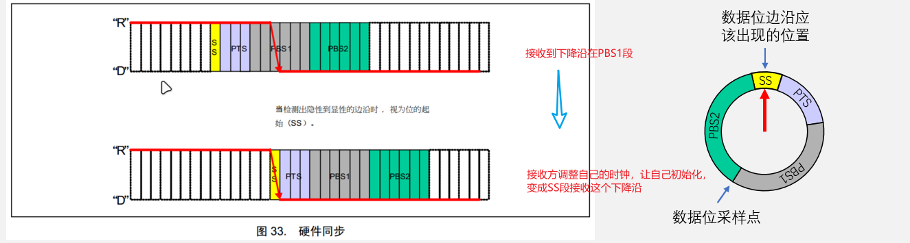

###### 2)、再同步（问题2的解决方法）

>•若发送方或接收方的时钟有误差，随着误差积累，数据位边沿逐渐偏离SS段，则此时接收方根据再同步补偿宽度值（SJW）通过加长PBS1段，或缩短PBS2段，以调整同步。（注：SJW是最大值，实际的补偿小于等于SJW的值，防止补偿过度）
>
>•==再同步可以发生在**第一个下降沿之后的每个数据位跳变边沿**==
>
>- SJW=1~4Tq
>
>
>图中的第一个列表，表示接收方的时钟比发送方的时钟快。第二个列表，表示接收方的时钟比发送方的时钟慢。

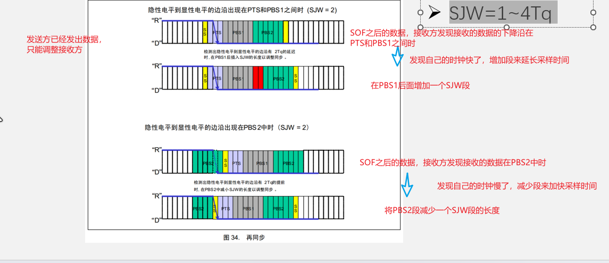

>硬件同步和再同步遵从如下规则。
>(1) 1 个位中只进行一次同步调整。
>(2) 只有当上次采样点的总线值和边沿后的总线值不同时，该边沿才能用于调整同步。
>(3) 在总线空闲且存在隐性电平到显性电平的边沿时，则一定要进行硬件同步。
>(4) 在总线非空闲时检测到的隐性电平到显性电平的边沿如果满足条件（ 1）和（ 2），将进行再同步。但还要
>满足下面条件。
>(5) 发送单元观测到自身输出的显性电平有延迟时不进行再同步。
>(6) 发送单元在帧起始到仲裁段有多个单元同时发送的情况下，对延迟边沿不进行再同步。  

###### 3)、波特率计算

$$
波特率 = 1 / 一个数据位的时长 = 1 / (T_{SS} + T_{PTS} + T_{PBS1} + T_{PBS2})
\\

\begin{flalign}
例如：&
\end{flalign}

\\
	SS = 1Tq，PTS = 3Tq，PBS1 = 3Tq，PBS2 = 3Tq
	\\
	Tq = 0.5us
	\\
	波特率 = 1 / (0.5us + 1.5us + 1.5us + 1.5us) = 200kbps
	\\
	200kbps = 200000 码元/s = 0.2 码元/us
\\
注：波特率原本单位为：波特（Baud），意为码元/s。bps为比特率单位。但是在二进制的调制下，波特率的值=比特率的值。码元就是字节。
$$

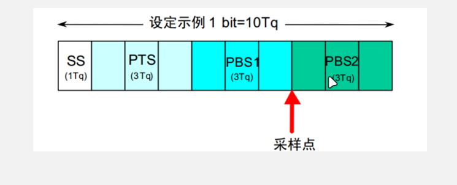

#### 17.11、多设备同时发送遇到的问题

>•CAN总线只有一对差分信号线，同一时间只能有一个设备操作总线发送数据，若多个设备同时有发送需求，该如何分配总线资源？
>
>•解决问题的思路：制定资源分配规则，依次满足多个设备的发送需求，确保同一时间只有一个设备操作总线

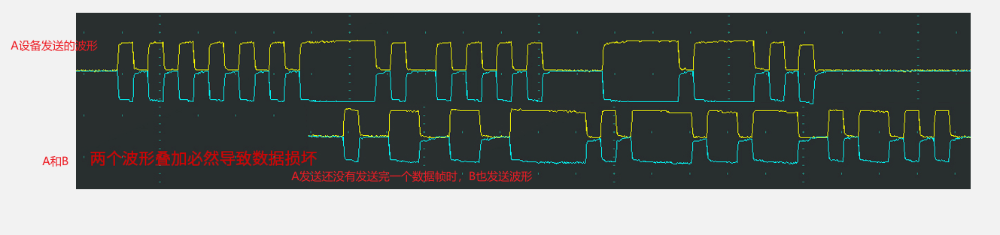

##### (1)、资源分配规则1 - 先占先得

>•若当前已经有设备正在操作总线发送数据帧/遥控帧，则其他任何设备不能再同时发送数据帧/遥控帧（可以发送错误帧/过载帧破坏当前数据）
>
>•任何设备检测到连续11个隐性电平，即认为总线空闲，只有在总线空闲时，设备才能发送数据帧/遥控帧
>
>•一旦有设备正在发送数据帧/遥控帧，总线就会变为活跃状态，必然不会出现连续11个隐性电平，其他设备自然也不会破坏当前发送
>
>•若总线活跃状态其他设备有发送需求，则需要等待总线变为空闲，才能执行发送需求

##### (2)、资源分配规则2 - 非破坏性仲裁（仲裁机制）

>•若多个设备的发送**需求同时到来或因等待而同时到来**，则CAN总线协议会根据ID号（仲裁段）进行非破坏性仲裁，ID号小的（优先级高）取到总线控制权，ID号大的（优先级低）仲裁失利后将转入接收状态，等待下一次总线空闲时再尝试发送
>
>•实现非破坏性仲裁需要两个要求：
>
>>线与特性：总线上任何一个设备发送显性电平0时，总线就会呈现显性电平0状态，只有当所有设备都发送隐性电平1时，总线才呈现隐性电平1状态，即：0 & X & X = 0，1 & 1 & 1 = 1
>>
>>回读机制：每个设备发出一个数据位后，都会读回总线当前的电平状态，以确认自己发出的电平是否被真实地发送出去了，根据线与特性，发出0读回必然是0，发出1读回不一定是1
>
>同时发送，并且检测自己发送的电平，高优先级的设备（小ID号0多,线与能力强）会拉低总线，其他设备就能得知是否还有优先级更高的设备在操控总线。

###### 1)、非破坏性仲裁过程

>•数据位从前到后依次比较，出现差异且数据位为1的设备仲裁失利
>
>位填充不会影响仲裁

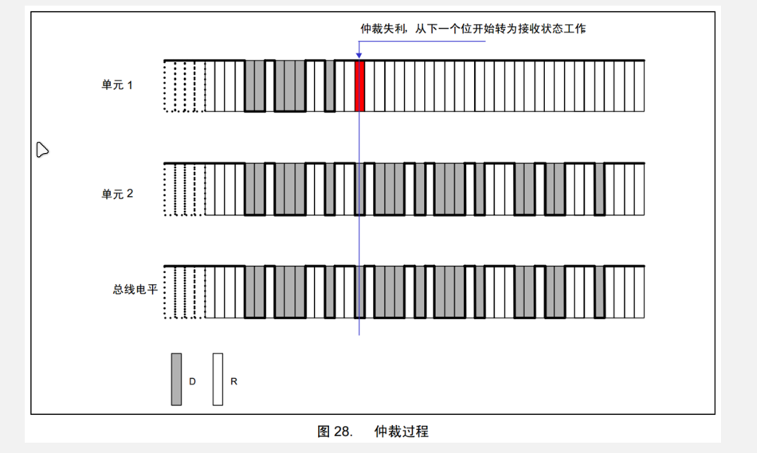

###### 2)、数据帧和遥控帧的优先级

>•数据帧和遥控帧ID号一样时，数据帧的优先级高于遥控帧

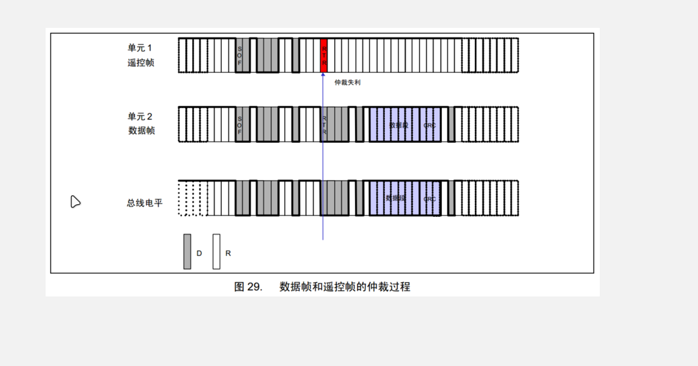

3)、数据帧和遥控帧的优先级

>•标准格式11位ID号和扩展格式29位ID号的高11位一样时，标准格式的优先级高于扩展格式（SRR必须始终为1，以保证此要求）

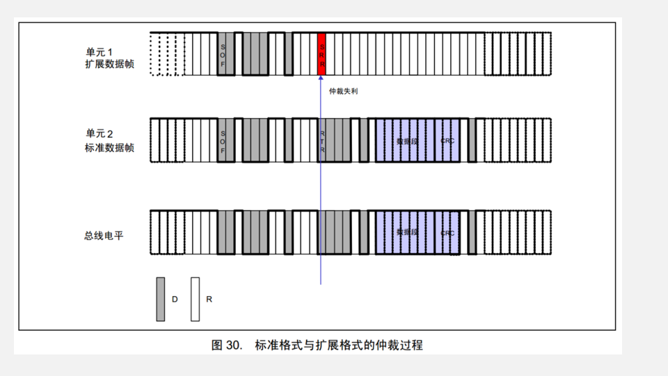

#### 17.12、错误处理

##### (1)、错误类型

>•错误共有5种： 位错误（回读机制下会产生的错误，除开仲裁段和应答段）、填充错误、CRC错误、格式错误、应答错误（接收方无应答）

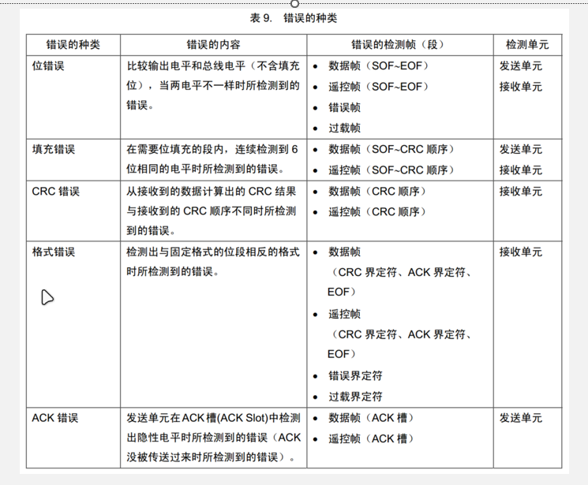

##### (2)、错误状态

>•主动错误状态的设备正常参与通信并在检测到错误时发出主动错误帧（可以破坏数据）
>
>•被动错误状态的设备正常参与通信但检测到错误时只能发出被动错误帧（不可以破坏数据，用于避免设备自身的原因，而破坏总线数据）
>
>•总线关闭状态的设备不能参与通信
>
>•每个设备内部管理一个TEC和REC，根据TEC和REC的值确定自己的状态

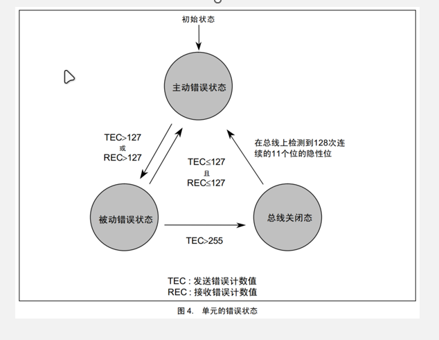

(3)、错误计数器

>TEC（Transmit Error Counter），发送错误计数器。每发送一次错误，会进行自增；每进行一次正常发送后，会自减。
>
>REC（Receive Error Counter），接收错误计数器。每接收一次错误，会进行自增；每进行一次正常接收后，会自减。

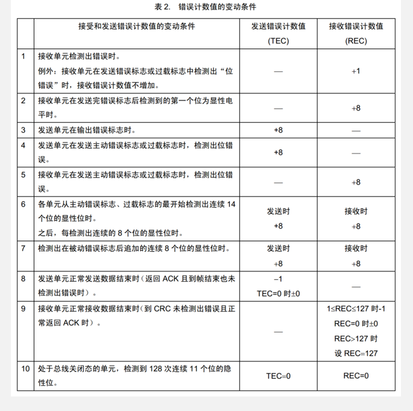

##### (4)、波形实例

>•设备处于主动错误状态，发送标准数据帧，正常传输

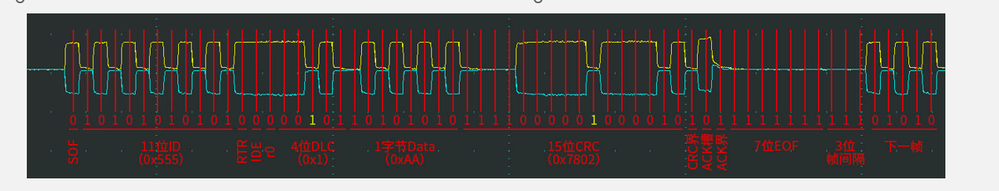

>•设备处于主动错误状态，发送标准数据帧，检测到ACK错误（出现错误后，没有EOF段）

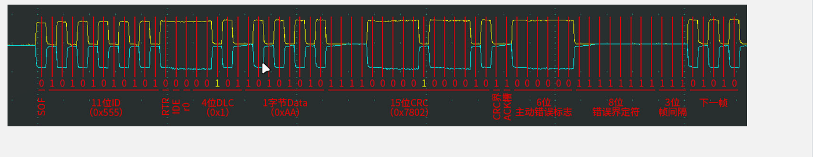

>•设备处于被动错误状态，发送标准数据帧，检测到ACK错误（出现错误后，没有EOF段，被动错误想要发送下一帧，必须延迟8位隐性1才能传送）

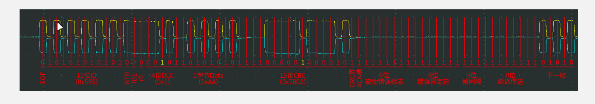

#### 17.13、stm32上的CAN外设

##### (1)、STM32 CAN外设简介

>•STM32内置bxCAN外设（CAN控制器），支持CAN2.0A和2.0B，可以自动发送CAN报文和按照过滤器自动接收指定CAN报文，程序只需处理报文数据而无需关注总线的电平细节
>
>•波特率最高可达1兆位/秒
>
>•3个可配置优先级的发送邮箱（3个发送缓存区）
>
>•2个3级深度的接收FIFO（2*3个接收缓存区）
>
>•14个过滤器组（互联型28个）
>
>•时间触发通信、自动离线恢复、自动唤醒、禁止自动重传、接收FIFO溢出处理方式可配置、发送优先级可配置、双CAN模式
>
>
>
>•STM32F103C8T6 CAN资源：CAN1

##### (2)、CAN网拓扑图

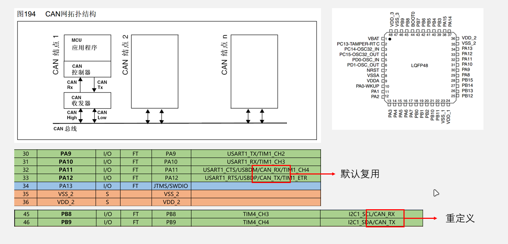

##### (3)、CAN收发器的电路

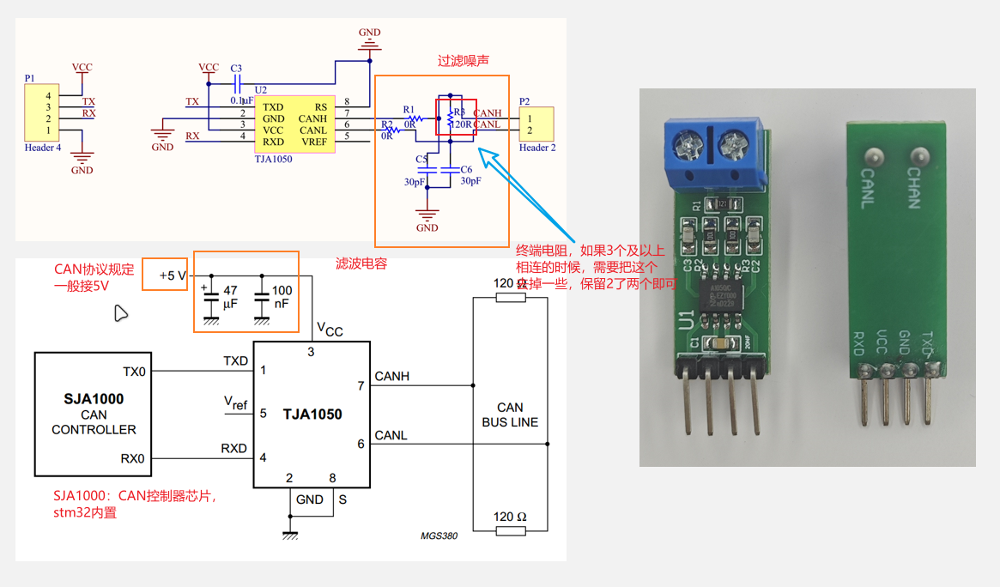

##### (4)、CAN框图

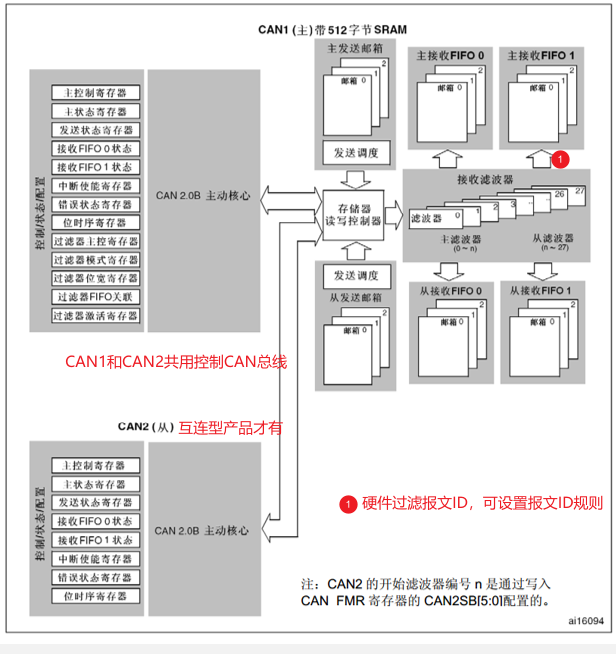

##### (5)、基本结构

>发送邮箱可以配置发送规则（如：先来先发送，ID小先发送）。
>
>接收过滤器也可以配置规则，将想要接收的报文ID规则，写入到过滤器中，可配置14个规则。过滤器不配置的话。默认失能。可以指定过滤器过滤的数据进入的FIFO队列。
>
>FIFO队列，可以设置锁定状态和不锁定状态。锁定，FIFO在3个邮箱满了之后，选择不接受数据，直到邮箱出现空，才接收数据。不锁定，FIFO满了之后，新的数据会将邮箱2的数据踢出去，自己占据邮箱2。邮箱0空了之后，邮箱1会填补邮箱0。

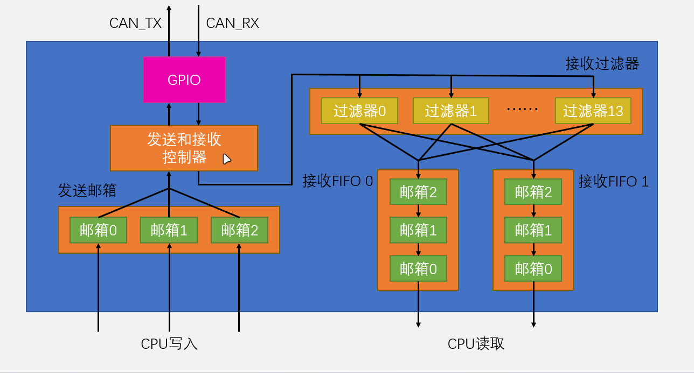

>第一步，RCC时钟初始化，开启CAN1、GPIO的时钟。
>
>第二步，GPIO初始化,把CAN_TX引脚初始化为复用推挽输出模式，CAN_RX引脚初始化上拉输入模式。
>
>第三步，整个CAN外设的初始化。
>
>第四步，对过滤器初始化。

##### (6)、发送流程

>•基本流程：选择一个空置邮箱→写入报文 →请求发送
>
>>- RQCP（Request completed）请求完成位。
>>- TXOK（Transmission OK）发送成功位。
>>- TME（Transmit mailbox empty）发送邮箱空位。
>>- TXRQ（Transmit mailbox request）发送请求控制位。为1，产生发送请求。
>>- NART（No automatic retransmission）禁止自动重传位。置1，关闭自动重传，CAN报文只被发送1次，不管发送的结果如何（成功、出错或仲裁丢失）；置0，自动重传，CAN硬件在发送报文失败时会一直自动重传直到发送成功
>>- TXFP（Transmit FIFO priority）发送优先级配置。置1，优先级由发送请求的顺序来决定，先请求的先发送；置0，优先级由报文标识符来决定，标识符值小的先发送（标识符值相等时，邮箱号小的报文先发送）
>>- ABRQ（Abort request）中止发送位。为1，中止发送。
>>- IDLE，空闲。
>>- X：为任意值。

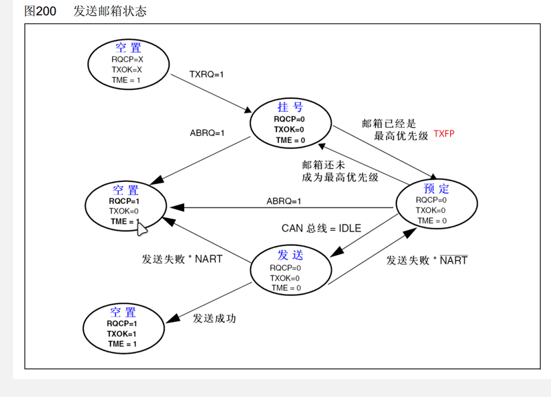

##### (7)、接收流程

>•基本流程：接收到一个报文→匹配过滤器后进入FIFO 0或FIFO 1→CPU读取
>
>>- FMP（FIFO message pending）报文数目。
>>- FOVR（FIFO overrun）FIFO溢出位。
>>- FULL（FIFO full）FIFO满状态。为1，FIFO存满。
>>- RFOM（Release FIFO output mailbox）释放邮箱位。为1，释放邮箱。
>>- RFLM（Receive FIFO locked mode）接收FIFO锁定模式。置1，接收FIFO锁定，FIFO溢出时，新收到的报文会被丢弃；置0，禁用FIFO锁定，FIFO溢出时，FIFO中最后收到的报文被新报文覆盖

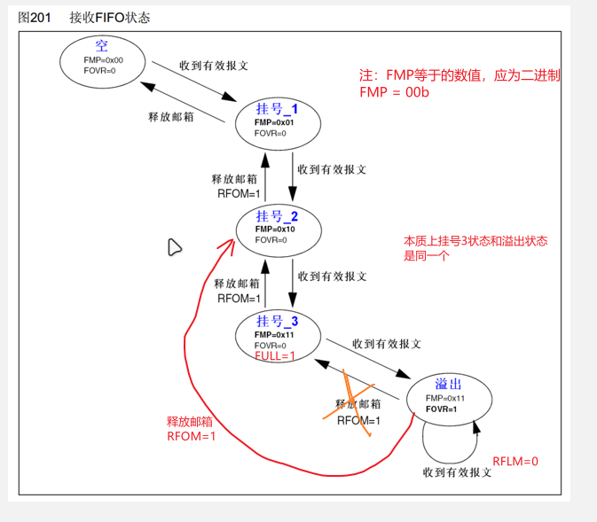

##### (8)、标识符过滤器

>•每个过滤器的核心由两个32位寄存器组成：CAN_FxR1[31:0]和CAN_FxR2[31:0]	（x可取范围：0~13）	
>
>
>以下为一个过滤器中的一些标志位：
>
>•FSCx：位宽设置
>
>  置0，16位；置1，32位
>
>
>
>•FBMx：模式设置
>
>  置0，屏蔽模式；置1，列表模式
>
>
>
>•FFAx：关联设置
>
>  置0，FIFO 0；置1，FIFO 1
>
>
>
>•FACTx：激活设置
>
>  置0，禁用；置1，启用

<table border="1" align="center" text-align="center" cellpadding="10"> 
    <tr bgcolor="#cccccc">
        <th colspan="2">配置</th>
        <th>名称</th>
        <th>R1寄存器</th>
        <th>R2寄存器</th>
        <th>其他补充</th>
    </tr>
    <tr>
        <td rowspan="2">FSCx = 0</td>
        <td> FBMx = 0 </td>
        <td>2个16位过滤器—标识符屏蔽</td>
        <td>
            R1的高16位<br>
            &nbsp;&nbsp;标准格式下，向STID[10:0]写入标准格式的报文ID，IDE置0，RTR根据数据为遥控帧还是数据帧置位。<br>
            R1的低16位<br>
            &nbsp;&nbsp;写入想要的匹配规则。
        </td>
        <td>
            与R1相同配置
        </td>
        <td>
            该模式下能过滤2种标准报文ID。<br>
            该模式下的最后3位，虽然定义为EXID[17:15]（扩展ID高3位），但实际置0不用，因为16位寄存器无法存储扩展ID。<br>
            该模式下无法过滤扩展ID。
        </td>
    </tr>
    <tr>
        <td>FBMx = 1</td>
        <td>4个16位过滤器—标识符列表</td>
        <td>
            标准格式下，向STID[10:0]写入标准格式的报文ID，IDE置0，RTR根据数据为遥控帧还是数据帧置位<br>
        </td>
        <td>与R1相同配置</td>
        <td>
            该模式下最多只能过滤4个标准报文ID。<br>
            该模式下的最后3位，虽然定义为EXID[17:15]（扩展ID高3位），但实际置0不用，因为16位寄存器无法存储扩展ID。<br>
            该模式下无法过滤扩展ID。
        </td>
    </tr>
    <tr>
        <td rowspan="2">FSCx = 1</td>
        <td>FBMx = 0</td>
        <td>1个32位过滤器—标识符屏蔽</td>
        <td>
            标准格式下，向STID[10:0]写入标准格式的报文ID，IDE置0，RTR根据数据为遥控帧还是数据帧置位。<br>
            扩展格式下，向STID[10:0]+EXID[17:0]写入扩展格式的报文ID，IDE置1，RTR根据数据为遥控帧还是数据帧置位。
        </td>
        <td>
            想要让数据与R1寄存器中的报文ID的哪些部分匹配，可以在R2对应的位置上置1，<br>
            不想匹配位1或者0均可，R2中的IDE置1，必须匹配想要格式。<br>
            R2中的RTR根据是否只想要某种特定的数据，置1，必须为数据帧或者要遥控帧；置0，不限制。
        </td>
        <td>
            该模式下32位寄存器会多出来一位未用到，置0。<br>
            该模式下可以过滤一类ID。<br>
            如：想过滤的ID为标准格式的1001 xxxx xxx<br>
            &nbsp;&nbsp;则R1写入该ID，寄存器内为 0001 xxxx xxx EXID[17:0]置0 0 0 <br>
            &nbsp;&nbsp;R2写入的匹配规则为       1111 xxxx xxx EXID[17:0]置x 1 0 <br>
           （x为任意值）
        </td>
    </tr>
    <tr>
        <td>FBMx = 1</td>
        <td>2个32位过滤器—标识符列表</td>
        <td>
            标准格式下，向STID[10:0]写入标准格式的报文ID，IDE置0，RTR根据数据为遥控帧还是数据帧置位。<br>
            扩展格式下，向STID[10:0]+EXID[17:0]写入扩展格式的报文ID，IDE置1，RTR根据数据为遥控帧还是数据帧置位。
        </td>
        <td>与R1相同配置</td>
        <td>
            使用标准格式的报文ID的时候，EXID[17:0]不会被使用，全部置0。<br>
            该模式下32位寄存器会多出来一位未用到，置0。<br>
            该模式下一个过滤器最多只能过滤2个ID 。
        </td>
    </tr>
    <tr>
        <td colspan="6">
            注：列表模式，是对ID一一匹配，完全匹配，才能通过；屏蔽模式，则是对ID部分匹配，符号匹配规则，才能通过。<br>
                列表模式下R1和R2寄存器存储的是报文ID；屏蔽模式下，R1或者R2寄存器存储一个报文ID和一个屏蔽规则（掩码，1为匹配，0为不限制）。<br>
            	有规律用屏蔽，无规律用列表
        </td>
    </tr>
</table>

​	

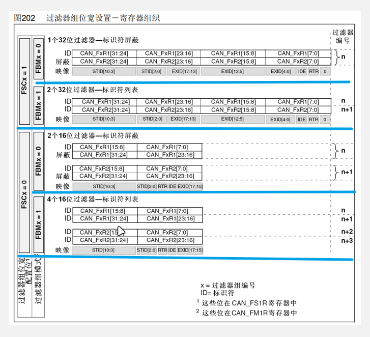

###### 过滤器配置示例

| **总线上存在的ID**                                      | **想要接收的ID**          | **过滤器模式** | **R1[31:0]配置值**                                           | **R2[31:0]配置值**                                           |
| ------------------------------------------------------- | ------------------------- | -------------- | ------------------------------------------------------------ | ------------------------------------------------------------ |
| 0x123, 0x234,   0x345, 0x456,   0x567, 0x678            | 0x234,   0x345,   0x567   | 16位/列表      | ID: R1[15:0]=0x234<<5  ID: R1[31:16]=0x345<<5                | ID: R2[15:0]=0x567<<5  ID: R2[31:16]=0x000<<5                |
| 0x100~0x1FF,  0x200~0x2FF,  0x310~0x31F,  0x320~0x32F   | 0x200~0x2FF,  0x320~0x32F | 16位/屏蔽      | ID: R1[15:0]=0x200<<5  Mask: R1[31:16]=  (0x700<<5)\|0x10\|0x8 | ID: R2[15:0]=0x320<<5  Mask: R2[31:16]=  (0x7F0<<5)\|0x10\|0x8 |
| 0x123, 0x234,   0x345, 0x456,   0x12345678,  0x0789ABCD | 0x123,  0x12345678        | 32位/列表      | ID: R1[31:0]=  0x123<<21                                     | ID: R2[31:0]=  (0x12345678<<3)\|0x4                          |
| 0x12345600~  0x123456FF, 0x0789AB00~  0x0789ABFF        | 0x12345600~  0x123456FF   | 32位/屏蔽      | ID: R1[31:0]=  (0x12345600<<3)\|0x4                          | Mask: R2[31:0]=  (0x1FFFFF00<<3)\|0x4\|0x2                   |
| 任意ID                                                  | 只要遥控帧                | 32位/屏蔽      | ID: R1[31:0]=0x2                                             | Mask: R2[31:0]=0x2                                           |
| 任意ID                                                  | 所有帧                    | 32位/屏蔽      | ID: R1[31:0]=随意                                            | Mask: R2[31:0]=0                                             |

##### (9)、测试模式（通过代码切换）

>•静默模式：用于分析CAN总线的活动，不会对总线造成影响（发送直接连接到自己的接收，同时让CANTX引脚始终发送1，也可以接收总线上的消息）
>
>•环回模式：用于自测试，同时发送的报文可以在CAN_TX引脚上检测到（发送接到自己的接收，自己的接收不接收CANRX引脚。区别于回读机制（读电平），这个是对于帧来说的机制）
>
>•环回静默模式：用于热自测试，自测的同时不会影响CAN总线（发送接到自己的接收，同时让CANTX始终发送1，不接受CANRX引脚信号。对自己的自测）

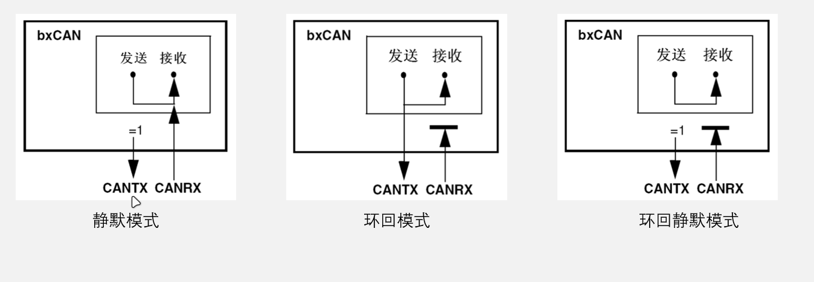

##### (10)、工作模式

>•初始化模式：用于配置CAN外设，禁止报文的接收和发送（配置CAN外设参数时使用）
>
>•正常模式：配置CAN外设后进入正常模式，以便正常接收和发送报文
>
>•睡眠模式：低功耗，CAN外设时钟停止，可使用软件唤醒或者硬件自动唤醒
>
>•AWUM（Automatic wakeup mode）：置1，自动唤醒，一旦检测到CAN总线活动，硬件就自动清零SLEEP，唤醒CAN外设；置0，手动唤醒，软件清零SLEEP，唤醒CAN外设

>SLAK（Sleep ack）睡眠确认状态位。置1，确认进入睡眠模式。
>
>INAK（Init ack）初始化确认位。置0，目前未确认进入初始化。
>
>INRQ(Initialization request) 初始化请求位 。
>
>SYNC信号，总线空闲信号。
>
>
>
>头上有横线表示，置0。
>
>三种工作模式的切换，并不会立刻生效。需要等待相应的信号出现，才会生效。
>
>比如，初始化模式-》正常模式   将INRQ=0，SLEEP=0，if（SYNC==1）{SLAK=0，INAK=0，进入正常模式}else{继续等待}。

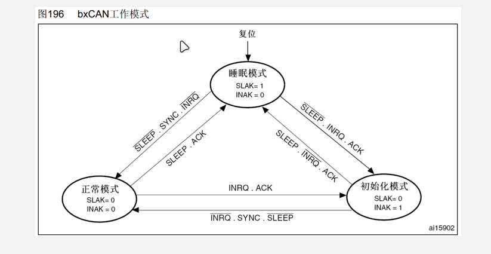

##### (11)、位时间特性

$$
波特率 = APB1时钟频率 / 分频系数 / 一位的Tq数量
\\
                = 36MHz / (BRP[9:0]+1) / (1 + (TS1[3:0]+1) + (TS2[2:0]+1))
$$

>stm32中的CAN时许于CAN官方的时许不同，stm32将CAN官方时序的PTS段和PBS1段合成BS1段

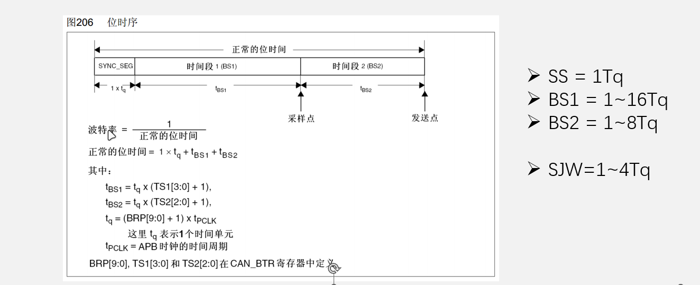

##### (12)、中断

>•CAN外设占用4个专用的中断向量
>
>
>
>•发送中断：发送邮箱空时产生
>
>
>
>•FIFO 0中断：收到一个报文/FIFO 0满/FIFO 0溢出时产生
>
>
>
>•FIFO 1中断：收到一个报文/FIFO 1满/FIFO 1溢出时产生
>
>
>
>•状态改变错误中断：出错/唤醒/进入睡眠时产生

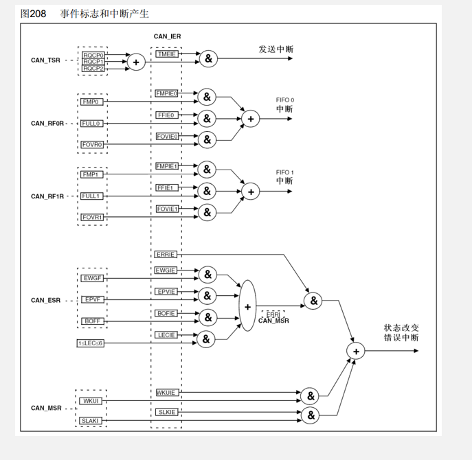

##### (13)、时间触发通信(每个节点只在固定的时间段内发送报文)

>•TTCM（Time triggered communication mode）：置1，开启时间触发通信功能；置0，关闭时间触发通信功能
>
>•CAN外设内置一个16位的计数器，用于记录时间戳
>
>•TTCM置1后，该计数器在每个CAN位的时间自增一次，溢出后归零
>
>•每个发送邮箱和接收FIFO都有一个TIME[15:0]寄存器，发送帧SOF时，硬件捕获计数器值到发送邮箱的TIME寄存器，接收帧SOF时，硬件捕获计数器值到接收FIFO的TIME寄存器
>
>•发送邮箱可配置TGT（Transmit global time   发送时间戳功能）位，捕获计数器值的同时，也把此值写入到数据帧**数据段**的最后两个字节，为了使用此功能，DLC必须设置为8

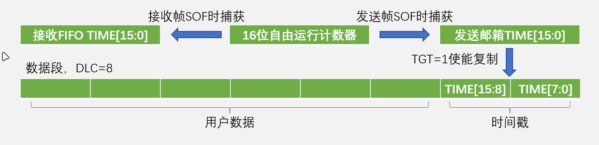

##### (14)、错误处理和离线恢复

>•[TEC和REC根据错误的情况增加或减少](#####(2)、错误状态)
>
>•ABOM：置1，开启离线自动恢复，进入离线状态后，就自动开启恢复过程（离线状态-》主动错误状态）；置0，关闭离线自动恢复，软件必须先请求进入然后再退出初始化模式，随后恢复过程才被开启

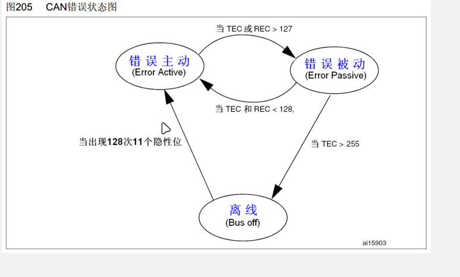


### C 语言

>数据类型
>
>| **关键字**         | **位数** | **表示范围**                 | **stdint.h** **重定义关键字** | **ST** **关键字**（老版本） |
>| ------------------ | -------- | ---------------------------- | ----------------------------- | --------------------------- |
>| char               | 8        | -128 ~ 127                   | int8_t                        | s8                          |
>| unsigned char      | 8        | 0 ~ 255                      | uint8_t                       | u8                          |
>| ==short==          | ==16==   | ==-32768 ~ 32767==           | ==int16_t==                   | ==s16==                     |
>| unsigned short     | 16       | 0 ~ 65535                    | uint16_t                      | u16                         |
>| ==int==            | ==32==   | ==-2147483648 ~ 2147483647== | ==int32_t==                   | s32                         |
>| unsigned int       | 32       | 0 ~ 4294967295               | uint32_t                      | u32                         |
>| ==long==           | ==32==   | ==-2147483648 ~ 2147483647== |                               |                             |
>| unsigned long      | 32       | 0 ~ 4294967295               |                               |                             |
>| long long          | 64       | -(2^64)/2 ~ (2^64)/2-1       | int64_t                       |                             |
>| unsigned long long | 64       | 0 ~ (2^64)-1                 | uint64_t                      |                             |
>| float              | 32       | -3.4e38 ~ 3.4e38             |                               |                             |
>| double             | 64       | -1.7e308 ~ 1.7e308           |                               |                             |


>C 语言宏定义
>
>•关键字：#define
>
>•用途：用一个字符串代替一个数字，便于理解，防止出错；提取程序中经常出现的参数，便于快速修改（==定义一个常量或者常用数据==）
>
>•定义宏定义：
>
> \#define ABC 12345
>
>•引用宏定义：
>
> int a = ABC; //等效于 int a = 12345;


>C 语言 typedef
>
>•关键字：typedef
>
>•用途：将一个比较长的 ==变量== 类型名换个名字，便于使用
>
>•定义 typedef：
>
> typedef unsigned char uint8_t;
>
>•引用 typedef：
>
>  uint8_t a; //等效于 unsigned char a;


>C 语言结构体
>
>•关键字：struct
>
>•用途：数据打包，不同类型变量的集合
>
>•定义结构体变量：
>
> struct{char x; int y; float z;} StructName;  				（匿名结构体）
>
>
>
>struct aaa {char x; int y; float z;} ;		
>
>struct aaa pStructName;
>
>或者
>
>typedef struct {char x; int y; float z;}  aaa；		（加 typedef 换名）
>
>aaa pStructName;
>
>\> StructName, pStructName 为结构体变量   aaa 为结构体类型名 <
>
> ==因为结构体变量类型较长，所以通常用 typedef 更改变量类型名==
>
>•引用结构体成员：
>
> StructName.x = 'A';
>
> StructName.y = 66;
>
> StructName.z = 1.23;
>
>或 pStructName-> x = 'A'; //pStructName 为结构体的地址 （结构体指针）
>
>pStructName-> y = 66;
>
> pStructName-> z = 1.23;


>C 语言枚举
>
>•关键字：enum
>
>•用途：定义一个取值受限制的整型变量，用于限制变量取值范围；宏定义的集合
>
>•定义枚举变量：
>
>enum{FALSE = 0, TRUE = 1} EnumName;
>
>或者
>
>typedef  enum{FALSE = 0, TRUE = 1} aaa;
>
>aaa EnumName;
>
>==因为枚举变量类型较长，所以通常用 typedef 更改变量类型名==
>
>•引用枚举成员：
>
>EnumName = FALSE;
>
>EnumName = TRUE;
>
>>枚举类型多文件抛出
>
>>xxxx.h
>
>>```c
>>#ifndef __XXXX_h_
>>#define __XXXX_h_
>>    typedef enum {
>>        ON = 0, 
>>        OFF = !ON
>>    } xxx;
>
>>#endif
>
>>main.c
>
>>```c
>>#include <stido.h>
>>#include "xxxx.h"
>
>>int main(){
>>printf ("%d\n"，ON);
>>return 0;
>>}
>>
>>
>

>有参宏定义
>
>#define 自定名(形参x)		函数名(形参1，形参2，形参x)
>
>eg.	#define OLED_W_SCL(x)		GPIO_WriteBit(GPIOB, GPIO_Pin_8, (BitAction)(x))
>
>将GPIO_WriteBit宏定义成OLED_W_SCL，且可传入x参数到GPIO_WriteBit中，x强转为BitAction类型（BitAction通常是一个用于位操作的枚举类型或数据类型。）

### 使用hex文件下载程序

#### （1）、器件

>硬件：任意stm32芯片（STM32F103C8T6）、USB转串口芯片
>
>软件：FlyMcu或者STLINK Utility

#### （2）、接线

>对于STM32F103C8T6（只能用串口1下载程序），官方让PA9、PA10复用成串口1相关接口


#### （3）、在keil5中生成hex文件

>与c51的一样的操作

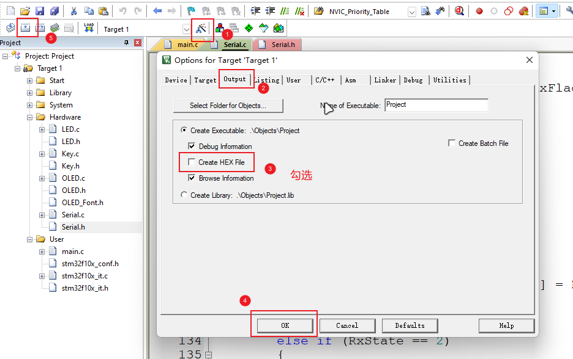

#### （4-1）、FlyMcu设置

>①：选择USB转串口芯片连接到电脑的端口号（需要提前安装USB转串口驱动）
>
>②：选择波特率（默认就行）
>
>③：选择需要下载的hex文件（一般在项目的Objects或者Obj中）

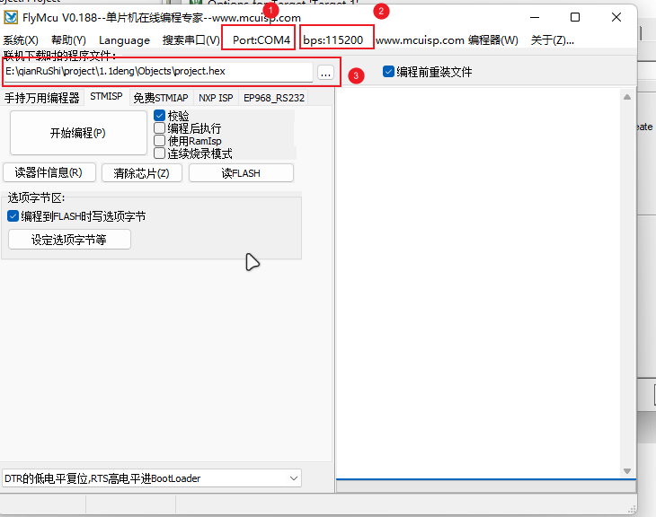

#### （4-2）、硬件设置

>①、将boot0跳线帽取下，重新插到另一处（即进入bootLoader），如第二幅图所示。
>
>之后按下下方的白色按钮（复位键）。

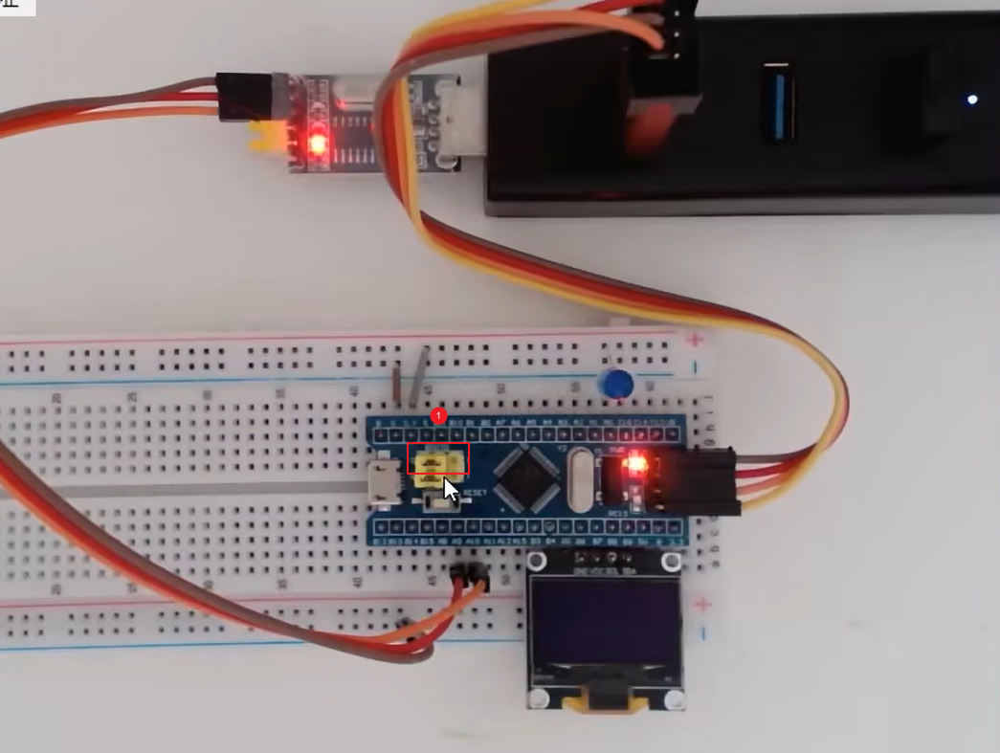

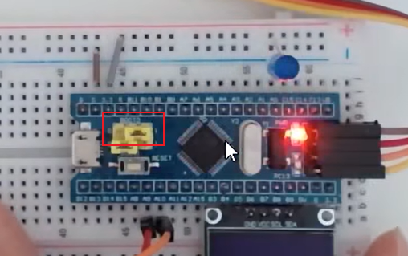

#### （4-3）、下载程序

>回到软件点击“开始编程”
>
>等到提示下载完成，回到硬件上，将刚刚换位置的boot0跳线帽，重新换回来，之后点击复位键，即能观察到现象。

#### （4-4）、FlyMcu软件的说明

>①：不使用USB转串口芯片控制boot0时（需要配置外围电路，详情搜索stm32一键下载），勾选之后，不能勾选⑤，下载程序时，还是要先把boot0跳线帽换位置。下载完成后，立刻能观察到现象，复位后，需要重新下载，不使用后恢复boot0跳线帽。
>
>②：没有A5引脚没有读保护时，能读取芯片中的程序（生成的.bin文件能使用STLINK Utility重新烧录到新的相同型号芯片中）。
>
>③：擦除主程序区域
>
>④：能读出芯片型号数据
>
>⑦：启用后，能读出程序。
>
>⑧：启用后，不能读出程序，但是keil5下载程序会失败，需要再到软件里修改该字节数据。取消读保护时，会清空芯片程序。
>
>⑨：勾选后，勾选的页，里面的数据不能修改。如果勾选了前面的页，该软件无法解除，可使用STLINK Utility解除。
>
>⑩：用于USB转串口芯片控制boot0。

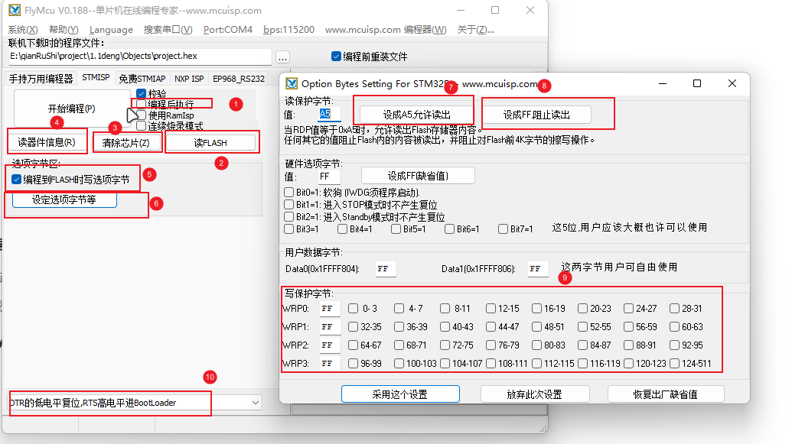

#### （5-1）、STLINK Utility下载程序

>安装好软件后，将boot0跳线帽恢复初始状态。
>
>点击①连接stm32芯片，点击②选择需要烧录的hex文件或者bin文件，点击③下载。
>
>④：能保存当前芯片的文件（能保存为hex文件）
>
>⑤：断开连接

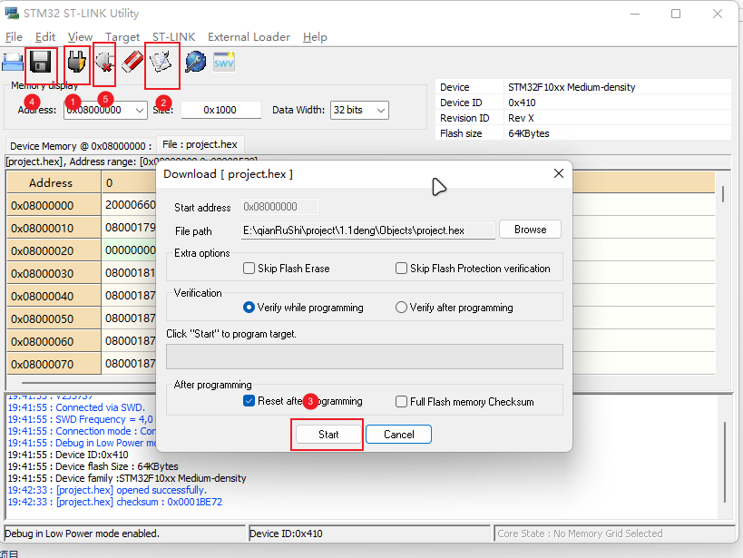

>当使用STLINK Utility查看寄存器内容时，查看完后需要立刻断开连接，否则会keil的STLINK下载会出问题


### 注意与小技巧：

1、keil 中 CMSIS 为红色，是因为支持包与 MDK 的版本不相符合。

2、写 main 函数时，必须位 int main(){while(1){}} 切 main 函数写完还有空一行，否则会出现两个警告。

3、System 文件夹用于存放自定义函数（系统资源）、功能函数。

4、Hardware 文件夹用于存放硬件驱动。

5、ctrl+alt+空格或者ctrl+空格 可以在没有代码提示的时候出现代码提示。（如果没有提示框，看一下是不是输入法按键冲突）

6、对printf重定向时，需要勾选Use MicroLIB

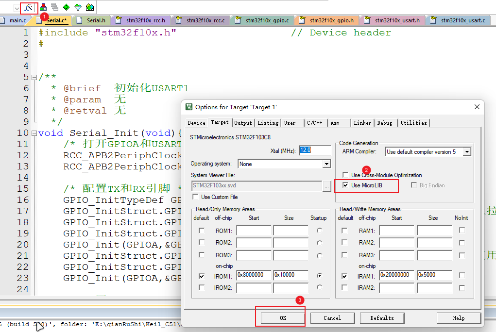

7、串口UTF-8，传输中文乱码解决方式1，输入--no-multibyte-chars，且接收端也要为UTF-8的编码格式

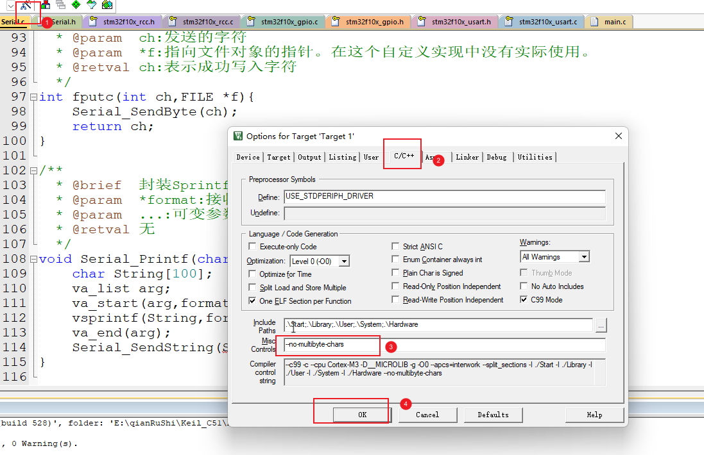

8、Keil5结构体指针无法赋值，只能实例化。

方式2，keil5和接收端使用GBK编码

9、取消文件只读，到文件系统右键-》属性-》取消勾选只读选项

10、Keil5如果不在  魔术棒-》c/c++-》勾选C99 mode；那么程序使用的是C89的C语言标准，即变量要在函数顶部定义。勾选后，使用C99标准，变量在使用前定义即可，位置不限。

11、Keil5调式模式查看变量，点击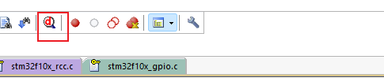，选中需要查看的变量右键-》Add “xxx” to …-》Wath1

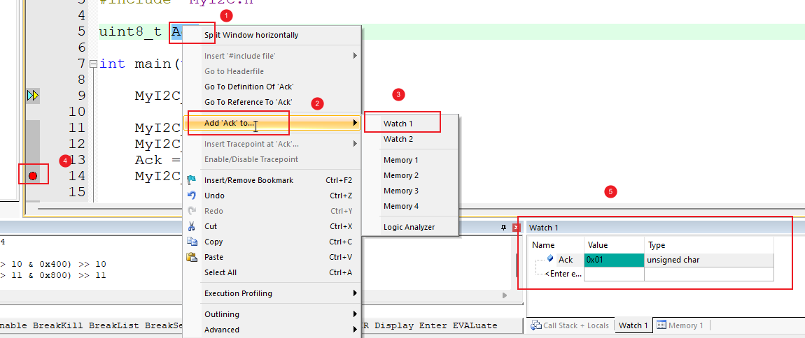

然后设置断点（点一下④），在Watch中可以看到变量变化。最后点击全速运行。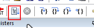


<span style="font-size:2.0em;">**芯片锁住，可以通过STM32 ST-LINK Utility软件，来解除**</span>


Keil 技巧：Alt+鼠标左键 ——矩形框选
