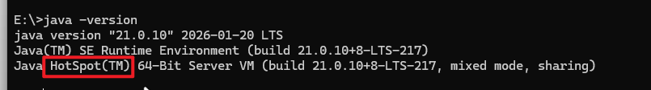
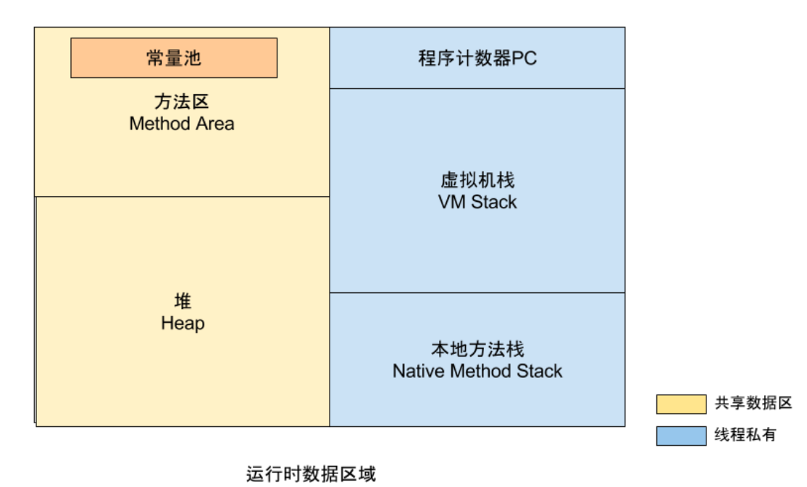
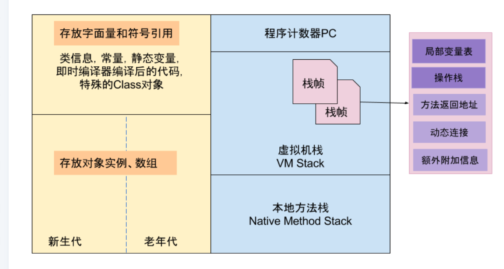
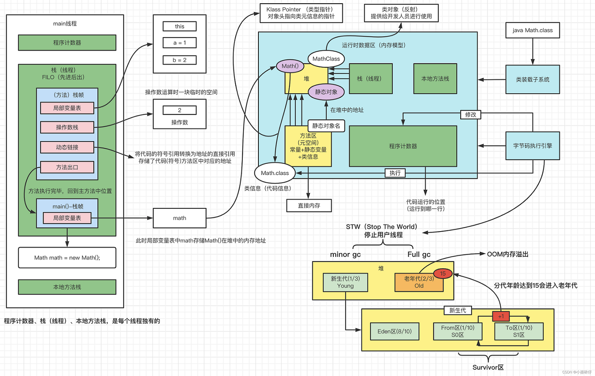

[TOC]

# 前言

- 全部阶段

  1. java 基础（辅助工具 swing）+ 数据库的语句 -> 目标：熟练增删改查
  2. 前端（辅助工具 mybatis）-> 目标：熟练增删改查 + 权限（自己实现）
  3. 框架（SSM） -> 目标：完全弄懂增删改查 + 权限的实现
  4. springboot（中间技术会很多，包括与 ai 结合） -> 目标：以项目为目标
  5. 微服务

# java

## 代码规范

1. 不同功能的代码块之间，应该存在间隙
2. 常量名需要大写，并且单词与单词之间通过 下划线 隔开
3. 标识符（变量名）：不能是关键字 和 保留字（二者的重要特点，全是小写），需要见面知意

## java的特性

### 跨平台

- 每种平台上都有对应的 Java 虚拟机
	- JVM 是一种虚拟机规范
	- 一般 java 使用的虚拟机（JVM 实现）是 hotspot
		- 
	- 不同的 JVM 通过识别同一种 **规范文件 ——class(字节码文件，是一种十六进制文件)** 完成对 java 程序 的执行
	- class 文件是由工具 javac 将.java 文件编译而来
		- .java  ===> .class : `javac xxx.java`
		- 运行程序：`java xxx【.class】` .class 不用写，java 是边运行，边将.class 翻译成机器码

### JVM内存图（不同版本、不同虚拟机存在差别）

- 栈（虚拟机栈）：每一个线程都会有一个虚拟机栈，里面存放 局部变量、操作数栈（临时区域，存算式计算的结果）、动态链接、方法返回地址

- 堆：new 出的对象、字符串常量

	- JAVA 回收器（垃圾收集器），自动回收堆区的空闲内存
		- `System.gc(); /* 提醒垃圾回收器回收垃圾，但是具体执行时间，有编译器自己决定 */`

- 方法区：类的信息——属性、方法、普通常量

- 程序计数器：当前执行指令的程序地址，会自动+1

- 本地方法栈：放的是底层语言（C++）的方法

- 

	

	

## java语法

### 变量

- 声明 ——> 赋值 ——> 使用

- 变量的类型

	- 基本类型：int、byte 、short、char 、 long 、float、double、boolean(布尔类型)

	- 引用类型：除了基本类型之外的类型，如： 类

- 变量类型转换
	- 基本数据类型转换规则
		- 大——> 小，强制转换（精度丢失）
		- 小——> 大，自动转换
- 作用域：哪个括号里面声明的，就在哪里有效

### 语句

- switch(变量): 变量类型可以为 byte short char int String
- for: 增强的 for 循环 for - each

### 数组

- 定义：`数据类型[] 数组名;`

- 初始化（2种）

	- 静态初始化：`int[] a = {1,2,3};`

	- 动态初始化

		- ```java
			int[] a = new int[3];
			a[0] = 10;
			```

- jvm内存中的特点：一块连续的定长存储区域

- 可变数组： `类型名... 变量名`

- 数组常用的API

	- 数组工具类（Arrays）

		- | 静态方法                                 | 形参                     | 返回值                  | 说明                     |
			| ---------------------------------------- | ------------------------ | ----------------------- | ------------------------ |
			| String toString(Object[] a)              | 任意类型数组             | 字符串                  | 打印数组中全部内容       |
			| void sort(Object[] a)                    | 任意类型数组             |                         | 对数组进行排序           |
			| int binarySearch(Object[] a, Object key) | 任意类型数组，查找的元素 | 下标(成功) / -1（失败） | 折半查找（数组必须有序） |

		- 数组的拷贝：`System.arraycopy(src, srcPos, dest, destPos, length);`

			- src: 源数组
			- srcPos：从源数组哪里开始拷贝
			- dest：目标数组（拷贝的去处）
			- destPos：从目标数组的哪个位置开始存放
			- length：拷贝长度

	- 二分查找法

		- ```java
			/**
			     * binarySearch ---- 使用二分查找的方式寻找数组中的num
			     * @array: 找寻的数组
			     * @num: 寻找的数字
			     *
			     * return: 成功，返回寻找到的下标；失败，返回-1
			     * */
			   public static int binarySearch(int[] array, int num){
			        /* 1.获取初始的低下标和高下标 */
			        int low = 0;
			        int high = array.length;
			
			        /* 2.进行二分查找 */
			        while (low <= high){
			            int mid  = (low + high) >>> 1; /* 等价于(low + high) / 2 */
			            if(num < mid){
			                high = mid - 1;
			            }else if(num > mid){
			                low = mid + 1;
			            }else{
			                return  mid;
			            }
			        }
			        return -1;
			    }
			```

		- 

### 函数（方法）

-  作用

	- 代码的复用
	- 用于封装业务逻辑

- 定义

	- ```java
		返回类型 函数名(形参列表){
		 函数体;
		}
		```

- 注意事项

	- static 修饰的函数只能调用 static 修饰的函数
	- java函数名中2是表示 到 的意思

### 类

- 特点

  -  具有属性 、方法
  - **一个文件**可以有多个类，但是**最多只有一个 public 的类**, 文件名与 public 类一致

- 定义

  - ```java
  	class 类名{
  	     属性;
  	     方法;
  	 }
  	
  	class Student{
  	 String id;
  	    String name;
  	}
  	```

- 对象

  - 特点
  	- 对象 是以类为模板创建的实例，类 是对象的抽象
  	- 对象具有类的属性 和 行为
  - 使用
  	- `类名 对象变量名 = new 类名();`
  		- `new 类名()`：就是该类的匿名对象
  		- `类名()`是该类的构造器
  		- 对象变量名：则是引用变量，在栈区中，指向对象【new 类名()】
  	- 访问属性 或者方法 ：`对象.属性` `对象.方法` 

- 构造函数（构造器）

  - 作用：创造对象时，进行初始化

  - 特征

    - 和类名相同，没有返回类型

    	- ```java
    		class Student{
    			Student(){} /* 无参构造方法 */
    		}
    		```

    - 每个类，都会有一个默认 无参构造方法；

    - 自己定义了  有参构造方法，那么默认的无参构造方法就会消失，需要自己定义

- 内部类

	- 放在类中的类

	- 分类

		- 成员内部类(在类中)

		- 局部内部类（出现类中方法里）

			-   ```java
				public void method() {
				    // 1. 定义局部内部类（在方法内部）
				    class Inner {
				        public void show() {
				            System.out.println("我是局部内部类");
				        }
				    }
				    
				    // 2. **必须在方法内 new 对象使用**
				    Inner inner = new Inner();
				    inner.show();
				}
				```

	- 使用场景

		- 想将某些属性 或者 方法 放在一个类中，但是这个类只是在我们内部使用即可，外面不需要使用，声明为内部类

- this

  - 代表当前对象。（谁调用 构造函数，this 就是谁）

  - 只能在类中非静态方法使用

  - 构造器互相调用（调用代码只能放在方法里的第一行）

  	- ```java
  		class Student{
  		    private int id;
  		    private String name;
  		
  		    Student(int id,String name){
  		        this(); /* 调用无参构造器 该调用 只能在第一行 */
  		        this.id = id;
  		        this.name = name;
  		    }
  		
  		    Student(){}
  		}
  		```

  - 在类中使用类的属性 或者 方法的时候，前面没有加任何对象，默认前面有 this

- 方法的重载（overload）：相同 函数名 ，不同的形参列表 ，与返回值类型无关

- static

	- static 可以修饰方法、变量、类（内部类 —— 放在类内部定义的类）

		1. static修饰类（只能对内部类使用）

			- ```java
				class AAA{
				  class static BBB{} /* 内部类 —— 不让别人调用 */
				}
				```

		2. static修饰属性

			- 这种类的对象**共用**的属性，不属于某个对象

			- 该属性在类加载的时候就生成，且只会生成一次

			- ```java
				class AAA{
				  public static String a;
				}
				
				AAA aaa1 = new AAA();
				aaa1.a = "111";
				
				AAA aaa2 = new AAA();
				
				System.out.println(aaa1.a + " " + aaa2.a);
				
				/* 打印出来都是 111 a 是 AAA 类的对象共用的  */
				```

		3. static修饰方法

			- 可以通过类名访问。也可以通过对象去访问（但是 IDEA 中不推荐对象去访问）

			- ```java
				class AAA{
				  static void m(){}
				}
				
				AAA.m();
				```

			- static 不属于任何对象。static 的方法只能访问 static 的属性和方法。 非 static 的方法能访问 static，也可以访问非 static 的属性和方法。

		4. static块

			- static 块、匿名块、构造器执行顺序以及执行次数

				- ```java
					class AAA{
					   AAA(){
					       /* 构造器 */
					   }
					 
					   static{
					       /* static块 */
					   }
					 
					   {
					       /* 匿名块 */
					   }
					 }
					 /* 执行顺序 先static -> 匿名 -> 构造 */
					 /* 执行次数 static只执行1次 匿名和构造器，创建一个对象执行一次 */
					```

			- 使用场景

				- static 修饰属性，所有对象共享属性
				- 修饰方法，工具类的方法（如：数组工具类 Arrays）
				- static 块，初始化工作，且执行一次的


### 继承

- 定义 关键字 extends

	- ```java
		/* 继承父类的public方法和属性(无条件) protected的方法和属性（只能类内部使用） */
		class 子类 extends 父类{
		    
		}
		```

- 继承意义：把 公有的方法或者属性（基本特征） 放到父类上去（所有子类公有属性、方法 抽出来放到父类中去，每个子类根据自己的需要重写这些方法）

- 逻辑上应该满足一种条件 ： 什么东西（子类）是 一种什么（父类）

	- 例如：
		- 狗 是 一种动物（对）
		- 人 不是 一种狗（逻辑错误。虽然语法正确）

- 定义对象

	- ```java
		class Animal{
		  String id;
		}
		
		 class Dog extends Animal{
		     
		 }
		
		 /* 父类引用 指向 子类对象 */
		 /* 这种方式扩展性强，通过一个父类可以转换成任何一种子类 */
		 Animal animal = new Dog(); /* animal只能用的Animal类中的方法 */ /* 向上转型Dog -> Animal */
		
		 /* 类型判断 */
		 /* 判读animal是否是Dog类型 */
		 if(animal instanceof Dog){
		     /* 想使用Dog特有的方法时， 向下转型才能用的Dog中的方法 */
		     Dog dog = (Dog)animal; /* 强制转换 向下转型 Animal -> Dog */
		 }
		```

	- 如果想用子类本身的东西， 使用向下转型  不够转换之前要对对象 是否是某种类型进行判断（关键字instanceof）

- 子类 可以对 父类的方法 重写（overwrite ，override）

	- 针对 方法

	- 必须有继承关系（对父类的方法不满意）

	- 特征：方法名相同 ，参数相同  ，返回类型一致 或者 兼容(重写方法可以是被重写方法返回值类型的子类)

	- 加了@Override之后不报错，那就是重写 父类的方法

	- ```java
		class Animal{
		    String id;
		    
		    public void run(){
		        System.out.println("动物跑");
		    }
		}
		
		class Dog extends Animal{
		    /* 重写 */
		    @Override /* 注解，如果不是重写 会报错 */
		 public void run(){
		        System.out.println("小狗跑");
		    }
		}
		
		```

- 抽象类

	- 关键字abstract
	- 所有子类都要重写父类的方法时，父类方法的实现就没有必要了（不需要方法体），所有需要加入 abstract 关键字 使他变成抽象方法

	- 抽象方法 只能在 抽象类 中出现

	- 抽象类中 不一定需要抽象方法

	- 抽象类 不能 被自己实例化
		- `Animal animal = new Animal(); /*  错 */`

	- 抽象方法 子类不一定会实现该方法，继续让他抽象

	- 没有方法体：

		- 抽象方法（子类实现）
		- native方法（底层使用C++实现）

- 继承中构造器调用 

	- 在创建子类对象时，会调用子类的构造器，子类的构造器会**默认**调用父类无参的构造器（执行顺序 父类构造器 -> 子类构造器）

	- 想要调用父类有参构造器，需要super显示调用,只能方法

	- ```java
		class Animal{
		     Animal(String name){
		  
		     }
		}
		
		/* 子类继续抽象 */
		class Dog extends Animal{
		    
		    Dog(){
		        /* 只能放在第一行 */
		      super("dog");
		        ...
		    }
		    
		}
		```

	- ```java
		class Animal{
		     Animal(String name){
		  
		     }
		}
		
		/* 子类继续抽象 */
		class Dog extends Animal{
		    
		    Dog(){
		        /* 调用父类有参构造器只能放在第一行 */
		      super("dog");
		        ...
		    }
		    
		    Dog(String name){
		        /* 调用自身无参构造器只能放在第一行 */
		      this();
		        ...
		    }
		}
		```

- Object

	- 所有类的父类（基类） 默认不会显示extends Object
	- 字符串相关
		- toString()
			- 用字符串 展示 一个对象
			- 默认展示出来的效果： `类所在的包名.类名@16进制地址值`  
				- `oop.daya02.Dog02@1b6d3586`  包名 oop.day02  类名 Dog02  16进制地址 1b6d3586
			- 子类使用时，应该重写toString() 方法

		- equals()
			- 用于比较2个对象 是否 相等
			- 默认实现 比较地址是否相等
			- 字符串常量 可以 直接调用比较 `“nihao”.equals("nihao")`
			- 子类使用时，应该重写equals()

	- 哈希值相关
		- hashcode()
			- 获取对象的哈希值 ，在散列表中使用

	- 自身的类类型相关
		- getClasss()
			- 返回 对象 运行时的Class对象，在反射时使用（Class类中有行为的属性、属性的属性、构造器的属性）

	- 拷贝相关
		- clone()

	- 线程相关的方法
		- wait()
		- notify()
		- notifyAll()

- 访问控制符

	- public —— 公有
		- 声明位置
			- 修饰类
			- 修饰方法
			- 修饰属性
		- 权限
			- 所有位置都能用
	- private —— 私有
		- 声明位置
			- 只能修饰内部类
			- 修饰属性（类中）
			- 修饰方法（类中）
		- 权限
			- 只可以在当前类（本类）的内部使用
	- protected —— 受保护
		- 声明位置
			- 只能修饰内部类
			- 修饰属性（类中）
			- 修饰方法（类中）
		- 权限
			- 没有继承关系，同包下的文件能使用
			- 有继承关系，都能使用
	- default
		- 声明位置 —— 这不是一个关键字，所以不需要写出来。只要类、方法、属性没有明确使用上面三种访问控制符，那么默认就是default
			- 修饰类
			- 修饰方法
			- 修饰属性
		- 权限
			- 同包下的文件能使用
	- 能用权限最小的就用最小的（从小到大：private -> default -> protected -> public  ）

- final（最终的）

	- 修饰类
		- 不能被继承（如：String类 就是final修饰）
	- 修饰属性
		- 不能修改的（指向不能修改）—— 就是常量（规范：常量名 所有字母大写，单词与单词之间用_隔开  NI_HAO）
	- 修饰方法
		- 不能被重写的
	- 修饰变量（形参）
		- 同修饰属性

### 接口

- 前提：java不支持多继承，使用interface来实现多继承

- 接口实现关键字：implements

- 接口声明关键字：interface

	- ```java
		/* 接口的实现 */
		public class UserServiceImpl implements UserService {
		    @Override
		    public User login(String username, String pwd) {
		        UserDao userDao = new UserDaoImpl();
		        User user = userDao.compareUsernameAndPwd(username,pwd);
		        return user;
		    }
		}
		
		/* 声明接口 */
		public interface UserService {
		    public User login(String username, String pwd);
		}
		
		```

	- 接口中定义的 方法  都是抽象方法，即使没有声明，也是public abstract，在jdk8中，增加了default方法

		- ```java
			public interface UserService {
			    void fun();
			    default void fun1(){
			        /* 只要default方法可以有函数体 */
			    }
			}
			```

	- 接口中定义的  属性  即使没有声明，都是public static final  （公有常量）

	- 接口 也表示一种能力 （一种的类，就应该定义接口）

	- 类与类是继承关系   类与接口是实现关系   接口与接口是继承关系

	- 一个类 只能继承一个类，可以实现多个接口

	- 一个接口可以继承多个接口

		- ```java
			public class intrtface A extends B,C{
			    
			} 
			```


### 多态

- 同一个类型（类） 表现不同形态（实例对象）
- 满足多态的条件
	    继承或者实现
	- 重写父类或者接口方法
		     		- 父类引用 指向 子类对象（调用父类的方法，会执行具体的子类重写的方法）

### 注解

- 只是一种标签 ，这个标签能发挥什么作用是由我们自己写代码来进行决定

- 元注解

	- 描述注解的注解
		-  `@Target()`：告知注解的使用范围
			- 参数
				- `ElementType.METHOD`：只能在方法使用
				- `ElementType.TYPE`：可以用在**类、接口、枚举**上
		- `@Retention()`：注解生效时机
			- 参数
				- `RetentionPolicy.CLASS`：注解在class中生效
				- `RetentionPolicy.RUNTIME`：注解在运行时生效（常用）
				- `RetentionPolicy.SOURCE`：注解只是在源代码中生效

- 自定义注解

	- 定义

		- ```java
			@Target(ElementType.METHOD) /* ElementType.METHOD提示下面注解只能使用在方法上面 */
			public @interface 注解名{
			    /* 参数定义 */
			    数据类型 属性名();
			}
			```

	- 使用

		- ```java
			@@Retention(RetentionPolicy.RUNTIME)
			@Target(ElementType.TYPE)
			public @interface Table{
			    String value();
			    int age();
			}
			
			@Table(value = "111", age=222)
			class AAA{
			    
			}
			
			/* 使用反射获取注解 */
			Class aaa = AAA.class;
			Annotation tableAnnotation = AAA.class.getAnnottaion(Table.class); 
			/* 让注解发挥作用 */
			if(tableAnnotation != null){
			    Table table = (Table)tableAnnotation; /* 向下转型 */
			    String value = table.value();
			    int age = table.age();
			}
			```

- 普通注解

	- `@Deprecated`：废弃的（不是不能用，而是当前版本有更好的替代品）
	- `@Override`：重写父类方法
	- `@SuppressWarnings(value = "unchecked")`：关闭警告

### 枚举

- 定义

	- ```java
		public enum 枚举名{
		/* 枚举常量需要全大写 */
		/* 枚举常量的声明必须在第一行（;一行是分号结尾） */
		RED("红"),
		BULE("蓝"),
		GREEN("绿");
		
		/* 下面可以当成类 来使用 */
		/* 属性 */
		private String name;
		/* 构造器（默认有一个private的无参构造）有参构造器也是默认private */
		枚举名(String name){
		    this.name = name;
		}
		/* 方法 */
		/* 哪个枚举值调用toString()就打印什么 */
		@Override
		public String toString(){
		    return this.name;
		}
		
		 枚举名.RED;
		```

- 


# 杂项

## 项目相关

- 常量需要单独管理
- 图片素材使用相对路径
- 密码需要加密

## 加密、解密

- 消息摘要 —— 特征码（类似身份证） ——— 需要加密算法生成
	- 提取md5特征码
	- 场景：数据传递，将数据缓存到本地，生成一系列特征码，每次登录比对特征码，比对不一样，从服务器拉取数据
- 对称加密 （密钥）：
	- 加密 明文  + 密钥 =》 密文（加密文件）
		- 加密算法：DES、3DES、AES

	- 解密：密文 + 密钥 =》 明文（原始文件）
	- 缺点：密钥需要一起传输，所以密钥所以窃取
	- 性能高
- 非对称加密（私钥 + 公钥 ：公钥的加密需要直接的私钥解开，生成时，一对私钥 + 公钥）
	- 加密：
		1. 明文 + 私钥
		2. 明文 + 公钥
			- 加密算法：RSA

	- 解密
		1. 密文 + 公钥
		2. 密钥 + 私钥

	- 安全、性能低
- 对称加密（加密 数据） + 非对称加密（加密 密钥）

- MD5加密

	- 特点：
	  - 无论明文多长， 加密之后的密文都是定长
	  - MD5是不可逆的（只能 明文 变成 密文 不能 密文 变成 明文 （简单一些的密码 可以暴力解密））
	- 相关明文 产生不同的密文  需要加盐
			- 密文 + 盐 + 密钥

## 包

- 为了让项目 更有结构性，组织更加清晰
- 声明包：`packge 包名`
- 导入包：`import 包名.*` *表示当前包的所有类  也可以换成类名（精确导包）
- 常见包
	- java.util ：java官方工具包
	- java.lang：该包，官方内置到IDEA中
	- java.swing：图形界面的包
- 一般是公司域名 倒着写建包
	- 如：gxa.com   建包 com.gxa.xxx

## JavaBean

- 广义
	- 只要是类，都可以看做javaBean
- 狭义
	- 符合JavaBean规范，才叫JavaBean

- JavaBean规范
	- 属性私有化
	- 使用get和set方法来访问私有属性


