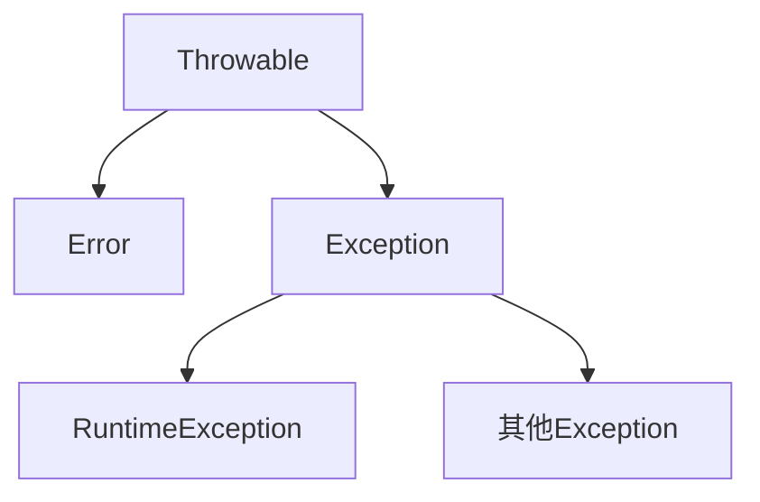

[TOC]

## 程序执行阶段

- 编译（javac） java ——> classs
- 运行（java） class ——> 结果

## 异常的组织结构




- 异常（运行期的异常）的类的作用

	- Throwable：所有异常类的基类
		- Errror：错误 （指不是通过修改程序就能解决的）
			- 常见的 Error：
				- VirtualMachineError （虚拟机出现错误）
				- StackOverflowError（栈空间不够）
					- 栈溢出 -> 栈空间不够
				- OutOfMemoryError（堆内存用完了）
					- 抛出堆内存用完时刻的情况给日志
		- Exception: 异常（能通过修改程序解决的）（都是运行时异常）
			- RuntimeException
				- 这类异常代码上可以处理，也可以不处理（运行时，才会出错）
				- 出现的频繁
				- 其结果是，可能造出问题，也可能没有问题
				- 例如：空指针
			- 其他 Exception
				- 代码上必须作出处理（不处理，就会出现编译错误）

- 异常处理：

	- 方式 1：try catch

		- ```java
			/*  */
			try{ /* 尝试运行 */
			 /* 可以有问题的代码片段 */
			}catch(异常类 e){ /* 匹配异常 */
			    /* 异常出现后的处理代码片段 */
			}
			
			/* 一个try多个catch */
			/* try中问题语句，从上到下以此匹配catch中的异常类,如果匹配上，就不会执行后续的catch   因此应该catch从上到下，异常类应该从最小的子类到最大的父类 */
			try{
			    
			}catch(。。){
			    
			}catch(Ex。。){
			    
			}
			
			/* 因为异常类很多，所以catch抓异常父类 */
			try{
			    
			}catch(Exception e){
			 e.printStackTrace(); /* 打印栈的跟踪信息  用于查看try中的异常 */   
			 /* 跟踪信息： 将问题出错地方给出来，即第一行异常类型 第二行最根本问题出处 */
			}
			```

		- catch 中必须有异常处理的相关动作，不然会出先“吃异常”现象，即程序正常结束，没有异常提示信息

	- 方式 2：throws

		- ```java
			/* 通过throws抛出异常，让使用这个函数的人，决定怎么处理。具体的处理方式，由使用者决定 */
			static 函数名 throws 异常类{
			    
			}
			```

- 自定义异常

	1. 如果定义的异常是 RuntimeException的子类，上层可以处理也可以不处理

	2. 如果定义的异常是 Exception的子类，上层则必须处理

		- ```java
			/* 自定义异常 */
			public class CustomException extends Exception{
			    /* 处理内容 */
			    /* 无参 */
			    public CustomException(){
			        super(); /* 调用父亲的无参构造器 */
			    }
			    
			    /* 带消息 */
			    public CustomException(String message){
			        super(message); /* 调用父亲的有参构造器 */
			    }
			    
			    /* 带对象 */
			    public CustomException(Exception e){
			        super(e); 
			    }
			}
			
			/* 使用方式之一 */
			public class AAA{
			 public void mm() throws CustomException{
			        try{
			            int i = 5 / 0;
			  }catch(ArithmeticException e){
			            /* 使用自己的异常 —— 进行类型转换 */
			            CustomException customException = new CustomException(e);
			            throw customException; /* 抛出异常 经常用于抛出转换之后异常 */
			            /* 使用自己的异常的对象有参构造器，带一个算术异常对象 */
			  }
			 }
			}
			
			```

		- 自定义中需要构造函数进行相应的处理

		- 如果异常转换，需要使用 throw -> 抛出一个自定义的异常，需要配合 throws 使用，除了 RuntimeException 的类型或者子类，不用使用 throws

		- throw 不能单独使用 如果是 Ex 的异常以及子类异常需要配合

- finally

	- ```java
		try{
		}catch(){
		
		}finally{ /* 一定会执行的代码段 */
		
		}
		```

	- 提供了 try 的统一出口。finally 无论 try 有没有异常，都会执行 finally 中的代码。

- final finally finanize 区别

	- final：修饰的类、变量、函数，不能被继承
	- finally：异常处理时，不能有无异常 一定会执行的代码段
	- finanize：类销毁时，由于发出最后消息的函数，通过 System.gc()查看最后的消息

- try catch finally 中代码执行顺序：catch 中的 return 会在 finally 执行完之后执行（catch 中有 return，finally 中有 return，会先执行 catch 中 return，在执行 finally 中 return）

