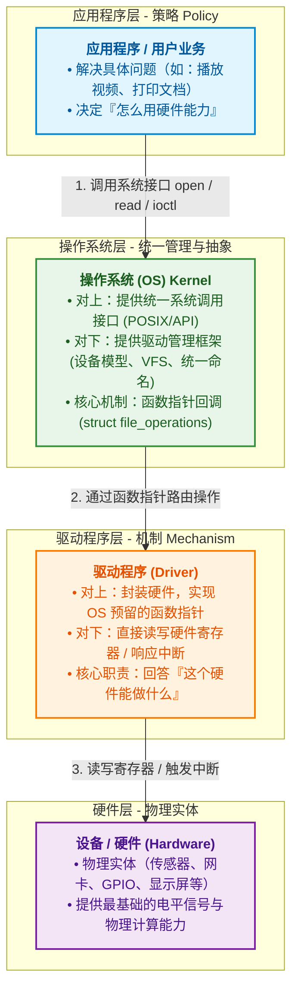
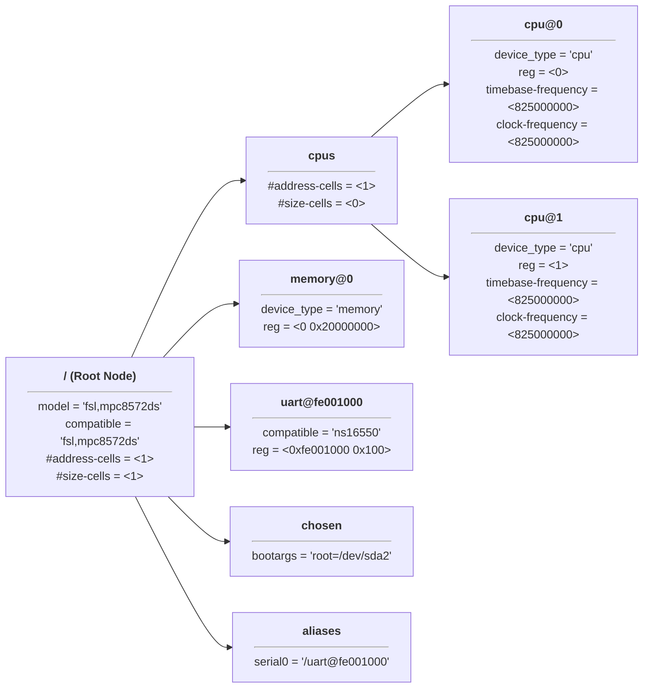
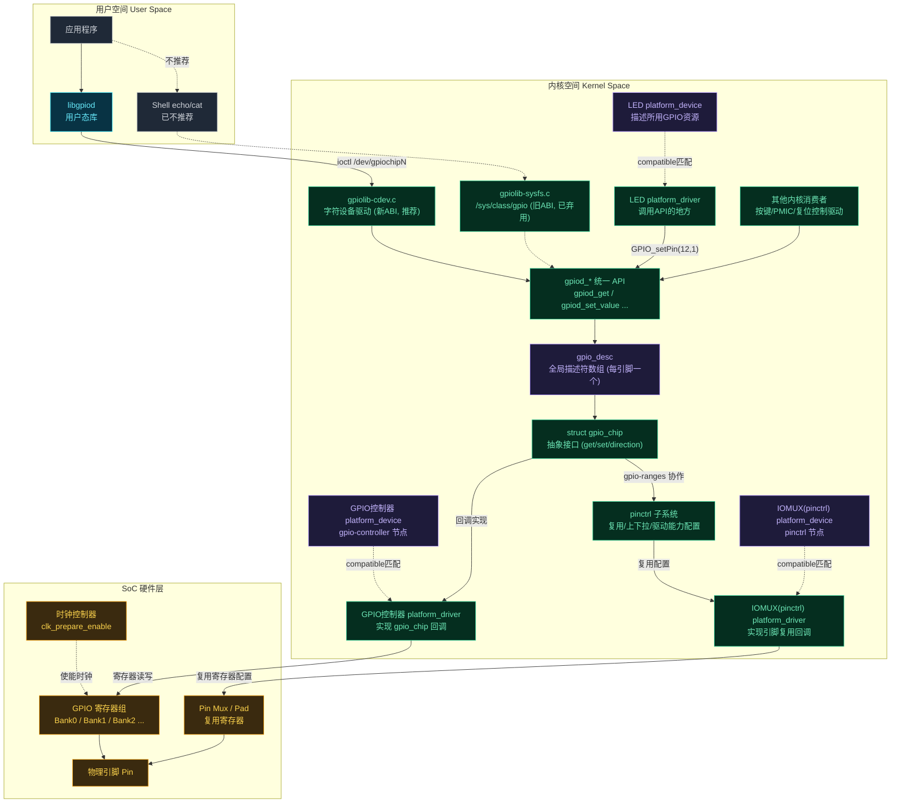

# Linux的驱动编程概要

层级（分层设计思路、学习思路）：



- 裸机驱动
	- 硬件控制者
	- 本质：纯粹的机制（Mechanism）实现。直接操作 CPU 的寄存器、控制时序（如 I2C/SPI 逻辑）。
	- 特点：**强耦合、无统一标准**（与具体硬件高度绑定）。在裸机开发（如 STM32）中，驱动通常直接针对特定的 MCU 架构和具体外设芯片（如 AT24C02）编写。
	- 缺点：缺乏 OS 层的抽象，**几乎没有移植性**。
- Linux驱动
	- 框架适配器
	- 本质：**机制 + 驱动管理框架**。它不仅要控制硬件，更重要的是**填空**——把硬件的操作逻辑填充到 Linux 内核预留好的框架（如 `struct file_operations`、字符设备框架、I2C 子系统框架）中。
	- **特点**：**高度抽象、分层解耦**。Linux 引入了“总线-设备-驱动模型”和“设备树（Device Tree）”，将硬件参数（硬件结构）与逻辑代码（驱动算法）彻底分离。
	- 优点：可移植性高


Linux驱动如何做到在内核运行时，也能注册？

- 核心思想：注册 + 路由表。
	- 当你的驱动加载时，调用内核提供的注册函数，把“函数地址”挂载到内核的**全局链表**或 **Hash 表**中。
- 命令式触发函数：
	- 在裸机中，所有代码在编译阶段就被死死地烧录在 Flash 的固定位置。但 Linux 可以在系统运行过程中，随时通过 `insmod my_driver.ko` 命令加载驱动，这依赖于以下三步：
		1. **动态加载（Dynamic Loading）**：`my_driver.ko` 本质上是一个可重定位的 `ELF` 二进制文件。当你运行 `insmod` 时，内核的模块加载器（Module Loader）会在 RAM 中动态申请一块内存，把 `.ko` 里的代码和数据拷贝进去。
		2. **符号重定位（Relocation）**：`register_chrdev` 这个注册函数是内核本身提供的（已被导出为全局符号 `EXPORT_SYMBOL`）。内核加载器在装载 `.ko` 时，会自动解析 `.ko` 里的未知符号，将其绑定到内核 `register_chrdev` 在 RAM 中的实际地址。
		3. **执行入口函数（`module_init`）**：内核跳转到驱动指定的入口函数 `my_driver_init()` 开始执行。此时，驱动把刚才分配在 RAM 里的 `&my_fops` 内存地址注册进 OS 框架。
- 程序式触发函数：
	- 当驱动注册完成后，整个调用链路就变成了**纯粹的指针寻址**：
		1. **用户层**：调用 `open("/dev/my_dev", O_RDWR)`。
		2. **OS 框架（VFS）**：根据 `/dev/my_dev` 的主次设备号，去内核的设备映射表里查找。
		3. **寻找指针**：找到你刚才注册进去的 `&my_fops` 地址。
		4. **间接调用**：执行 `my_fops->open()`，从而跳入你写的 `my_open()` 函数中。


驱动挂载方式：

1. 手动挂载：使用 `insmod xxx.ko` 或 `modprobe xxx`。
2. 自动挂载
	- **热插拔设备（USB、PCIe 等）**：硬件接入时触发电信号，内核扫描到硬件 ID（如 USB VID/PID），**udev** 服务会自动匹配并调用 `modprobe` 加载对应的驱动程序。
	- **板载/平台设备（Platform Device / 设备树）**：系统启动阶段，内核解析设备树（Device Tree）或 ACPI，自动将硬件节点与已编译（内建或可加载模块）的驱动 `match` 并绑定，自动执行驱动的 `probe()` 函数。
	- **开机自动加载模块**：即使设备无法被动态枚举，也可将模块名写入 `/etc/modules` 或 `/etc/modules-load.d/*.conf`，系统启动时会自动挂载，无需人工干预。


Linux框架图：


- 驱动框架提供的三种设备模型：
	- 字符设备：数据以流的形式传递。
	- 块设备：数据以块的形式传递，且速度慢，需要缓冲区。
	- 网络设备：数据以包的形式传递，需要协议格式。
- 字符设备与块设备依赖于虚拟文件系统向上提供接口，网络设备通过网络协议栈向上提供接口（借助了文件描述符）
	- 依赖于虚拟文件系统的，在`/dev`目录下有实体节点。


应用编程和内核编程的区别：

| **比较维度** | **应用编程**  | **内核编程**     |
| ------------ | ------------- | ---------------- |
| **使用函数** | libc库        | 内核函数         |
| **运行空间** | 用户空间      | 内核空间         |
| **运行权限** | 普通用户      | root用户         |
| **入口函数** | main()        | module_init()    |
| **出口函数** | exit()        | module_exit()    |
| **编译**     | gcc -c选项    | 依赖内核Makefile |
| **链接**     | gcc .so文件   | insmod           |
| **运行**     | linux系统加载 | insmod           |
| **调试**     | GDB printf    | KGDB printk      |

​	内核编程的思想：模块思想。

​	内核编译，都是使用内核提供的`makefile`,因为内核是一个整体，我们只是编译内核的一个模块


---

# 内核编程【学习方法：多参考、模仿别人的内核代码】

## 编程前准备

内核模块编程前，必须构建 内核源码树（即下载源码后，必须先make一下 —— 因为内核中有些文件时动态生成的）：

1. 先写一个简单函数（不是完成函数，只需要能编译，就行）

	- ```c
		#include <linux/module.h>
		#include <linux/init.h>
		
		static __init int hello_init(void){
		
		}
		
		module_init(hello_init)
		```

	- 

2. 写一个`makefile`

	- ```makefile
		# 若是虚拟机自身内核，可以定义变量为: /lib/modules/$(shell uname -r)/build
		# 注意激活环境变量ARCH和CROSS_COMPILE
		# 定义内核源码根目录(解压的内核源码根目录)
		BASE_KERNEL ?= /home/siguyuan/EBF_6ULL/kernel/linux_4.19.35_imx6ull
		# 定义目标名(与自己创建的.c文件名，完全一致)
		TARGET_NAME = hello
		
		obj-m += $(TARGET_NAME).o
		# $(TARGET_NAME)-objs := parameter.o
		
		# 为所有编译选项添加-Wno-missing-attributes，避免GCC9.x的警告(交叉编译器不是gcc9的可以不加)
		ccflags-y += -Wno-missing-attributes
		# 为partB提供debug选项
		# CFLAGS_partB.o += -DDEBUG
		all:
			make -C $(BASE_KERNEL) M=$(PWD) modules
		# 拷贝到共享目录中
			cp $(TARGET_NAME).ko /home/siguyuan/EBF_6ULL/shared
		clean:
			make -C $(BASE_KERNEL) M=$(PWD) clean
		
		```

		- `make -C $(BASE_KERNEL) M=$(PWD) modules`：
			- `-C`： 切换到`$(BASE_KERNEL)`目录。**不要使用当前目录下的 Makefile，而是先跳转到 `$(BASE_KERNEL)`（内核源码所在的根目录）**。在那里借助内核顶层极其庞大的 `Kbuild` 编译系统和环境来进行编译。
			- `M=`：指定外部模块所在的路径。现在要编译的是一个内核树之外的独立模块，这个驱动的代码和 Makefile 保存在 `$(PWD)`（即你当前所在的驱动工程目录）。
			- `modules`：编译目标（Target），**本次编译的任务是生成一个或多个动态可加载内核模块（`.ko` 文件）**，而不是去编译整个内核镜像（如 `zImage`）。
		- `CFLAGS_文件名.o += -D宏名`，针对一个文件进行宏定义
		- `CFLAGS_y += -D宏名`，针对所有文件进行宏定义

3. 编译一次，让`clangd`认识。

	- 先将交叉编译器添加到当前终端的环境变量`source ...`

	- 利用`bear`工具，创建clangd认识的clangd文件`bear -- make`

	- 检查生成的`compile_commands.json`是否有内容。如果没有，检查一下Makefile中路径是否正确，文件名是否一样。

	- 如果是JSON文件不在当前工作区的顶层目录中，将当前目录的JSON文件拷贝到，当前工作区的最顶层目录中。

	- 清除刚刚编译其他文件`make clean`，保留JSON文件

	- 重新打开.c文件，发现出现

		- ```c
			Unknown argument: '-fno-ipa-sra'clang(drv_unknown_argument)
			Unknown argument: '-fno-var-tracking-assignments'clang(drv_unknown_argument)
			Unknown argument: '-fconserve-stack'clang(drv_unknown_argument)
			```

		- 去刚刚生成的.c文件中，删除这个三个只有交叉编译器才认识的选项（clang不认识）

		- 如果可以，可以删除一个JSON中重复的`arguments`选项。


---

## 编程

内核模块编程：

​	1、 模仿内核中其他模块的类似写法（功能相近 或者 接口类似）

​	2 、内核硬性规范：

​		a. Linux 内核（5.18 版本之前） —— 使用C99标准 【**当前正常使用的内核为：4.19.35**】。 所有局部变量**必须在当前作用域（如函数体或代码块 `{}`）的最开头集中声明**，严禁在执行代码中间“边声明边使用”（即 `mixed declarations and code`），否则编译器在开启 `-Wdeclaration-after-statement` 警告标志时会直接报错。 【现代内核（5.18之后）使用的是C11标准，不需要这样。】

​		b.  Linux 内核代码风格文档中明确规定：如果一个函数不需要任何参数，必须在参数列表中声明为 `void`。

​		c. 必须要有GPL协议声明。如果没有，当前模块会触发内核警报，然后大量内核接口失效。


基本的编写规则

```c
// 初始化使用
#include "linux/printk.h"
#include <linux/init.h>
// 内核模块相关头文件     
#include <linux/module.h>

// 初始化函数，必须有返回值，否则内核会认为当前模块没有被加载成功，不需要传入参数必须写void
static int __init hello_init(void){
    printk("hello\n");      // 使用printk 进行打印，打印到控制台，不是当前终端
    return 0;
}

static void __exit hello_exit(void){
    printk("bey\n");
}

// 先内核注册这个模块
module_init(hello_init);
module_exit(hello_exit);

// GPL协议声明
MODULE_LICENSE("GPL");
// MODULE_AUTHOR("siguyuan <123@qq.com>");	// MODULE_AUTHOR("姓名/昵称 <邮箱>")  写明作者，可以存在多个MODULE_AUTHOR
```

- `__init、__exit`：将这个修饰的函数代码，放到代码区的对应段上（如：`__init`段）。

	- ```c
		#define __section(S)		__attribute__((__section__(#S)))
		
		#define __init		__section(.init.text)
		#define __exit      __section(.exit.text)
		
		// int __init fun(void)  =>   int   __attribute__((__section__(".init.text"))) fun(void)
		```

	- 每个段，内核都会有不同的处理行为，

		- 如：`_init`段：在初始化了之后，会释放这个段。内核启动时，给的如下提示就是如此。

			- ```c
				// 释放了__init段
				Freeing unused kernel memory: 1024K
				```

			- 

- `module_init()、module_exit()`为什么能写到函数体外

	- 本质是一种宏替换，替换成一个函数指针。

	- ```c
		#define module_init(initfn)					\
			static inline initcall_t __maybe_unused __inittest(void)		\
			{ return initfn; }					\
			int init_module(void) __attribute__((alias(#initfn)));
		
		// ↓
		
		// 这个用于类型检查的伪函数（__inittest）
		// 如果写的 hello_init 返回了 void 或者带了参数，编译阶段在这行就会直接报类型不匹配的警告/错误！
		// 与initcall_t【typedef int (*initcall_t)(void);】 进行比较
		static inline initcall_t __maybe_unused __inittest(void){ 
		    return initfn; 
		}
		
		
		// 内核真正调用的入口定义（init_module 别名） —— 给函数起了一个init_module的别名
		// 将hello_init 替换成 init_modeule, 让其指令内容和执行逻辑完全指向 hello_init（#initfn）”
		// 当驱动被编译成 .ko 模块时，内核的模块加载器（Module Loader）在装载该 .ko 时，只认一个固定名字的符号——init_module。
		// __attribute__生成二进制文件时，将hello_init的地址打上一个init_module的标签
		int init_module(void) __attribute__((alias(#initfn)));
		```

- 在 Linux 内核开发中，严格的风格一致性：**严格采用 `static int __init 函数名(void)` 的顺序**。

- 使用`make`编译，生成`.ko`文件

- 挂载模块`insmode 模块.ko`

	- 错误:

		```bash
		# 板子上
		# 挂载模块 识别 —— 模块在编译时所使用的内核头文件/源码版本，与当前运行该模块的 Linux 系统内核（4.19.35）不匹配
		[root@localhost /opt]# insmod hello.ko
		[  227.298974] hello: disagrees about version of symbol module_layout
		insmod: can't insert 'hello.ko': invalid module format
		
		# 查看板子的内核
		[root@localhost /opt]# uname -r
		4.19.35
		
		# 虚拟机上
		# 查看.ko文件的内核版本
		siguyuan@debian:~/EBF_6ULL/mycode/ex01$ sudo modinfo hello.ko
		[sudo] siguyuan 的密码：
		filename:       /home/siguyuan/EBF_6ULL/mycode/ex01/hello.ko
		license:        GPL
		srcversion:     627B3C802F95C32152D4D9B
		depends:
		name:           hello
		vermagic:       4.19.35 SMP preempt mod_unload modversions ARMv7 p2v8
		
		
		# 发现两个的版本号一致都是4.19.35
		# 发现板子上报错信息为：disagrees about version of symbol module_layout
		# 即：开发板上正在运行的内核 要么未开启 CONFIG_MODVERSIONS（符号版本校验）），要么编译内核与编译驱动时使用了不同的 .config 配置文件（导致算出来的 module_layout 校验码不匹配）。
		
		# 方式1：重新编译内核镜像文件，在拷贝过来
		# 之前使用了NFS共享目录，将编译号的zImage镜像文件放到共享目录中
		# 板子上：挂载共享目录和boot区
		cp /opt/zImage /mnt
		reboot
		
		# 方式2：强制加载
		insmod -f hello.ko
		```

- 查看模块加载情况：`lsmod` 或者 ` cat /proc/modules`

	- 一切皆文件，有些时候可以通过`/proc`目录解决一些没有提供系统调式的情况（如：获取CPU信息）

- 卸载模块：`rmmod 模块名`


`/proc`目录使用场景

| **分类**             | **常用 /proc 文件**        | **调试 / 诊断用途**                             |
| -------------------- | -------------------------- | ----------------------------------------------- |
| **硬件与系统信息**   | `/proc/cpuinfo`            | 查看 CPU 架构、主频、核心数、指令集等           |
|                      | `/proc/meminfo`            | 实时查看内存剩余、缓存（Cached/Buffers）占用    |
|                      | `/proc/interrupts`         | 查看硬件中断（IRQ）的触发计数，调试中断驱动     |
| **进程与线程诊断**   | `/proc/<PID>/cmdline`      | 查看指定进程的启动参数                          |
|                      | `/proc/<PID>/fd/`          | 查看进程打开的所有文件描述符（定位句柄泄露）    |
|                      | `/proc/<PID>/maps`         | 查看进程的虚拟内存空间映射（定位内存越界/崩溃） |
| **动态调整内核参数** | `/proc/sys/kernel/printk`  | **控制控制台日志打印级别**（驱动调试最常用）    |
|                      | `/proc/sys/vm/drop_caches` | 向其写入 `1` 或 `3` 强制内核立即释放 PageCache  |


内核模块 起到了一个进入内核、退出内核的路径引导作用 

​	目的：把驱动的数据结构，注册到框架中【这个数据结构必须时全局的、本文使用的】

​	初始化函数，不能把局部变量注册到框架中。


【面试static回答】：

​	Linux 内核是一个共享同一地址空间的单体结构。如果不加 `static`，写在模块里的非静态全局变量和函数会变成全局符号。当其他驱动也定义了相同名字的变量时，就会造成**全局命名空间污染（Symbol Collision）**，导致模块加载失败。因此，内核规范要求**模块内部的变量和函数必须用 `static` 限制在当前 `.c` 文件作用域内**。

【面试常问】：内核需要跨模块调用怎么办？

​	将某个驱动的核心 API（例如公共子系统框架、底层总线接口）暴露给其他 `.ko` 模块调用时，**首先不应该使用 `static` 修饰该函数**（static修饰，虽然能正常导出，但是是内核的补救），然后再通过 **`EXPORT_SYMBOL()`** 或 **`EXPORT_SYMBOL_GPL()`** 将其显式注册到内核的全局导出符号表（`__ksymtab`）中。


---

内核的头文件分布：

- 体系结构相关：`arch/<CPU架构>/include/asm/` —— `#include <asm/xxx>`：体系结构相关的头
- 体系结构无关：`include/linux/` （通用的内核核心子系统和驱动框架） —— `#include <linux/xxx>`： 体系结构无关


----

修改Makefile，使其能在宿主机上编译：

```makefile
# 若是虚拟机自身内核，可以定义变量为: /lib/modules/$(shell uname -r)/build
# uname -r :是查看版本号的命令
# 注意激活环境变量ARCH和CROSS_COMPILE
BASE_KERNEL ?= /lib/modules/$(shell uname -r)/build
# 定义目标名(与自己创建的.c文件名，完全一致)
TARGET_NAME = hello

obj-m += $(TARGET_NAME).o
# $(TARGET_NAME)-objs := parameter.o

# 为所有编译选项添加-Wno-missing-attributes，避免GCC9.x的警告(交叉编译器不是gcc9的可以不加)
ccflags-y += -Wno-missing-attributes
# 为partB提供debug选项
# CFLAGS_partB.o += -DDEBUG
all:
	make -C $(BASE_KERNEL) M=$(PWD) modules
# 拷贝到共享目录中
	cp $(TARGET_NAME).ko /home/siguyuan/EBF_6ULL/shared
clean:
	make -C $(BASE_KERNEL) M=$(PWD) clean

```

- 如果没有这个build目录，就需要安装内核源码目录树：`sudo apt install linux-headers-$(uname -r)`

	- 如果这个命令报错，证明当前内核的版本已经被官方下架的，`sudo apt install linux-headers-` 按`tab` 找一个版本最近的进行安装

	- ```bash
		siguyuan@debian:~$ uname -r
		6.12.73+deb13-amd64
		
		siguyuan@debian:~$ sudo apt install linux-headers-
		linux-headers-6.12.86+deb13-amd64        linux-headers-6.12.94+deb13-amd64        linux-headers-amd64
		linux-headers-6.12.86+deb13-cloud-amd64  linux-headers-6.12.94+deb13-cloud-amd64  linux-headers-cloud-amd64
		linux-headers-6.12.86+deb13-common       linux-headers-6.12.94+deb13-common       linux-headers-rt-amd64
		linux-headers-6.12.86+deb13-common-rt    linux-headers-6.12.94+deb13-common-rt
		linux-headers-6.12.86+deb13-rt-amd64     linux-headers-6.12.94+deb13-rt-amd64
		
		
		# 方式1：选择一个安装，应急
		# 方式2：升级内核版本（安装最新的）
		sudo apt update
		sudo apt install linux-headers-amd64 linux-image-amd64
		sudo reboot
		
		siguyuan@debian:~$ uname -r
		6.12.94+deb13-amd64
		
		```

- 挂载：`sudo insmod hello.ko` ；

- 查看`printk`打印的内容：`sudo dmesg`

- 卸载: ` sudo rmmod hello`


Linux命令：`uname -r` : 查看当前机器上的Linux版本号


---

## printk函数

- 带日志级别的打印，一般是打印到控制台

- `printk(KERN_ERR"bey\n");` 只有超过默认的日志级别，才打印

	- ```c
		#define KERN_SOH	"\001"	
		
		#define KERN_EMERG	KERN_SOH "0"	/* system is unusable */
		#define KERN_ALERT	KERN_SOH "1"	/* action must be taken immediately */
		#define KERN_CRIT	KERN_SOH "2"	/* critical conditions */
		#define KERN_ERR	KERN_SOH "3"	/* error conditions */
		#define KERN_WARNING	KERN_SOH "4"	/* warning conditions */
		#define KERN_NOTICE	KERN_SOH "5"	/* normal but significant condition */
		#define KERN_INFO	KERN_SOH "6"	/* informational */
		#define KERN_DEBUG	KERN_SOH "7"	/* debug-level messages */
		```

	- 使用中，本质是利用 C 语言编译器的“自动拼接相邻字符串常量”特性，合并为一个完整字符串 `"\0013bey\n"`，内核解析开头的 ASCII 码 `\001` (`KERN_SOH`) 提取级别

	- 数据越小，级别越高。

	- `cat /proc/sys/kernel/printk` 结构是个数字`4       4       1       7`

		- 第一个数字：当前控制台日志级别
		- 第二个数字：默认消息日志级别（当`printk`没有显示指定时，默认使用这个）
		- 第三个数字：允许设置的最高优先级门槛极限
		- 第四个数字：启动时默认控制台日志级别

	- 修改上面4个级别`echo "1 4 1 7" > /proc/sys/kernel/printk`

	- 只有当`printk`中日志级别必须“高于”控制台日志级别（即数值严格“小于”）才会打印

	- `printk`不能打印浮点数。因为浮点数编码标准太多，所以内核没有做。如果使用浮点数，会在编译阶段出现内核段错误。

		- ```bash
			------------[ cut here ]------------
			WARNING: CPU: 0 PID: 135 at lib/vsprintf.c:2149 format_decode+0x4c0/0x520
			Please remove unsupported %f in format string
			Modules linked in: hello(O+)
			CPU: 0 PID: 135 Comm: insmod Tainted: G           O      4.19.35 #1
			Hardware name: Freescale i.MX6 UltraLite (Device Tree)
			[<8010f5ec>] (unwind_backtrace) from [<8010b7c0>] (show_stack+0x10/0x14)
			[<8010b7c0>] (show_stack) from [<808d0434>] (dump_stack+0x78/0x8c)
			[<808d0434>] (dump_stack) from [<801257e8>] (__warn+0xec/0x108)
			[<801257e8>] (__warn) from [<80125420>] (warn_slowpath_fmt+0x4c/0x78)
			[<80125420>] (warn_slowpath_fmt) from [<808df7c0>] (format_decode+0x4c0/0x520)
			[<808df7c0>] (format_decode) from [<808e2dec>] (vsnprintf+0x78/0x49c)
			[<808e2dec>] (vsnprintf) from [<808e321c>] (vscnprintf+0xc/0x24)
			[<808e321c>] (vscnprintf) from [<801682a8>] (vprintk_store+0x2c/0x1d0)
			[<801682a8>] (vprintk_store) from [<801686ec>] (vprintk_emit+0x7c/0x1b8)
			[<801686ec>] (vprintk_emit) from [<801689e0>] (vprintk_default+0x20/0x28)
			[<801689e0>] (vprintk_default) from [<80168d1c>] (printk+0x30/0x5c)
			[<80168d1c>] (printk) from [<7f00502c>] (hello_init+0x2c/0x1000 [hello])
			[<7f00502c>] (hello_init [hello]) from [<80102670>] (do_one_initcall+0x58/0x1a0)
			[<80102670>] (do_one_initcall) from [<8019b218>] (do_init_module+0x60/0x224)
			[<8019b218>] (do_init_module) from [<8019d464>] (load_module+0x2024/0x2364)
			[<8019d464>] (load_module) from [<8019d8f8>] (sys_init_module+0x154/0x190)
			[<8019d8f8>] (sys_init_module) from [<80101000>] (ret_fast_syscall+0x0/0x54)
			Exception stack(0x88853fa8 to 0x88853ff0)
			3fa0:                   00000f88 0963cf85 01415218 00000f88 0009d145 00000001
			3fc0: 00000f88 0963cf85 76e2caa0 00000080 7ea9de38 7ea9de3c 76fc6000 0008ceff
			3fe0: 7ea9db00 7ea9daf0 0002c181 76eb7c22
			---[ end trace 9072efa93743a341 ]---
			
			```

		- 后面就需要通过**栈回溯**，来解决这个问题。

	- 简单用法：

		- **`pr_xxx` 简写宏（定义在 `<linux/printk.h>`）**：
			- `pr_emerg()` / `pr_alert()` / `pr_crit()` / `pr_err()`
			- `pr_warn()` / `pr_notice()` / `pr_info()` / `pr_debug()`
			- 语法示例：`pr_err("Failed to request GPIO!\n");`（无需写日志级别前缀）
		- **`dev_xxx` 设备驱动专用宏（自带设备名与树状上下文）**： 在平台驱动（Platform Driver）中极其常用，能自动打印是哪一个设备发出的日志：
			- `dev_err(dev, "Format string", ...)`
			- `dev_info(&pdev->dev, "Driver probed successfully\n");`
			- 输出示例：`imx6q-pcie 3380000.pcie: Driver probed successfully`

---

## 多文件编程

需要的功能写到了多个文件中：

partA.c

```c
#include <linux/init.h>
#include <linux/module.h>

__init static int part_init(void ) {
	pr_info("part init...!\n");
	return 0;
}

module_init(part_init)
MODULE_LICENSE("GPL");
MODULE_AUTHOR("Rocky <eleyuan@163.com>");

```

partB.c

```c
#include <linux/init.h>
#include <linux/module.h>

static void __exit part_exit(void ) {
	pr_debug("part exit...!\n");
}

module_exit(part_exit);
MODULE_INFO(x2_info,"Easy Value");

```

Makefile

```makefile
# 若是虚拟机自身内核，可以定义变量为: /lib/modules/$(shell uname -r)/build
# 注意激活环境变量ARCH和CROSS_COMPILE
# 定义内核源码根目录
BASE_KERNEL ?= /home/siguyuan/EBF_6ULL/kernel/linux_4.19.35_imx6ull
# 定义目标名
TARGET_NAME = hello

# 解决多文件编程
obj-m += $(TARGET_NAME).o
$(TARGET_NAME)-objs := partA.o partB.o

# 为所有编译选项添加-Wno-missing-attributes，避免GCC9.x的警告
ccflags-y += -Wno-missing-attributes
# 为partB提供debug选项
CFLAGS_partB.o += -DDEBUG
all:
	make -C $(BASE_KERNEL) M=$(PWD) modules
	cp $(TARGET_NAME).ko /home/siguyuan/EBF_6ULL/shared
clean:
	make -C $(BASE_KERNEL) M=$(PWD) clean

```

- 增加一步，将各个文件链接到一起`$(TARGET_NAME)-objs := partA.o partB.o`


多模块：

calc.h

```c
#ifndef IMX_LAB_CALC_H
#define IMX_LAB_CALC_H

extern int add_integer(int a,int b);
extern int sub_integer(int a,int b);
#endif

```

calculator.c

```c
#include <linux/init.h>
#include <linux/module.h>

static int add_integer(int a,int b) {
	return a+b;
}

int sub_integer(int a,int b) {
	return a-b;
}

static int __init sym_init(void) {
	return 0;
}

static void __exit sym_exit(void) {
}

// 对外导出符号表，让外部程序使用
EXPORT_SYMBOL_GPL(add_integer);
EXPORT_SYMBOL_GPL(sub_integer);

module_init(sym_init)
module_exit(sym_exit)
MODULE_LICENSE("GPL");

```

- `EXPORT_SYMBOL_GPL()`：导出符号表，让外部程序使用


calc_module.c

```c
#include <linux/init.h>
#include <linux/module.h>
#include "calc.h"

static int __init calc_init(void ) {
	pr_info("calc init...%d\n", add_integer(10, 20));
	return 0;
}

static void __exit calc_exit(void ) {
	pr_warn("calc exit...%d\n", sub_integer(30, 20));
}

module_init(calc_init)
module_exit(calc_exit)
MODULE_LICENSE("GPL");

```

Makefile

```makefile
# 若是虚拟机自身内核，可以定义变量为: /lib/modules/$(shell uname -r)/build
# 注意激活环境变量ARCH和CROSS_COMPILE
# 定义内核源码根目录
BASE_KERNEL ?= /home/siguyuan/EBF_6ULL/kernel/linux_4.19.35_imx6ull
# 定义目标名
# TARGET_NAME = hello

# 将需要使用的模块，单独弄成一个模块
obj-m += calc_fun.o calc_main.o
calc_fun-objs := calculator.o
calc_main-objs := calc_module.o

# 为所有编译选项添加-Wno-missing-attributes，避免GCC9.x的警告
ccflags-y += -Wno-missing-attributes

all:
	make -C $(BASE_KERNEL) M=$(PWD) modules
	cp calc_fun.ko /home/siguyuan/EBF_6ULL/shared
	cp calc_main.ko /home/siguyuan/EBF_6ULL/shared
clean:
	make -C $(BASE_KERNEL) M=$(PWD) clean

```

- 将需要使用的模块，做成独立模块


板子上使用

```bash
# 错误用法:
# 先启动了需要其他模块的模块，会报找不到符号的错误
[root@localhost /opt]# insmod calc_main.ko
calc_main: Unknown symbol add_integer (err -2)
calc_main: Unknown symbol sub_integer (err -2)
insmod: can't insert 'calc_main.ko': unknown symbol in module or invalid parameter

# 正确：
# 先启动独立模块
insmod calc_fun.ko
insmod calc_main.ko


# 错误卸载
# 先卸载了需要使用的模块，所以报错
[root@localhost /opt]# insmod calc_fun.ko
insmod: can't insert 'calc_fun.ko': File exists


# 正确
rmmod calc_main.ko
rmmod calc_fun.ko
```


---

## 内核模块参数

1、 内核模块（.ko文件），通过配置一些输入参数信息，用户来决定模块的不同状态。

​	`boorloader`在启动内核时，`bootargs`把内核启动参数传递给了内核镜像，如：本次内核启动时传递的参数部分信息（在启动时打印到比较靠前的信息）：` console=ttymxc0,115200 root=/dev/mmcblk0p2 rw rootfstype=ext4 init=/linuxrc`

​	内核镜像 就是 一堆内核模块的组合。

2、内核模块参数格式：键值对（k = v）

常见错误：

build.c：

```c
// 初始化使用
#include "linux/printk.h"
#include <linux/init.h>
// 内核模块相关头文件     
#include <linux/module.h>

// 一般使用全局变量进行输入参数的传递
static int abc = 0;

static int __init build_init(void){
    printk("hello\n");     
    printk("%d\n", abc);
    return 0;
}

static void __exit build_exit(void){
    printk(KERN_ERR"bey, %d\n", abc);
}

module_init(build_init);
module_exit(build_exit);

MODULE_LICENSE("GPL");
```

```bash
# 执行效果
# 出现错误：未识别参数abc
[root@localhost /opt]# insmod build.ko abc=100
build: unknown parameter 'abc' ignored
hello
0

```

​	模块输入参数方式1：`insmod 模块.ko 参数名=值`

​	模块输入参数方式2：`echo "值" > /sys/module/模块名/parameters/参数名`

​	**模块参数必须使用`module_param(name, typer, perm)`显示声明**，否则会报错。

​	模块参数本质都是内存中的全局变量 + 内核的描述元数据（数据结构 —— 链表），值在内存中，所以修改不会影响磁盘上的值。

​		磁盘上的 `.ko` 文件只是包含二进制代码和初始静态数据的**静态磁盘镜像**。当使用 `insmod` 加载模块时，内核将 `.ko` 文件的内容**拷贝加载到了 RAM（运行内存）** 中。

​	`/proc` ：查看进程、系统相关的信息。`/sys`：查看内核、设备相关的信息


```c
/* 参数说明
	name: 模块参数名
	type: 模块参数的数据类型
		具体的有哪些类型：可以在linux_4.19.35_imx6ull/include/linux/moduleparam.h 中搜索param_get_
	perm: 权限
		权限要求：0664 =》 0 USER+GROUP+OTHER
			1、必须是8进制
			2、读权限递减：USER 读 ≥ GROUP 读 ≥ OTHER 读（不能出现“拥有者不可读，其他人反而能读”的情况）
			3、写权限递减：USER 写 ≥ GROUP 写（不能出现“拥有者不可写，组反而能写”的情况）
			4、强行禁止 Other 写：末尾最后一位不能包含写权限 2（即不允许 OTHER_WRITABLE）。
			5、如果权限写成0，不在 /sys/module/模块名/parameters/
 文件系统中生成任何节点
*/
module_param(name, type, perm)	

// 参数说明，可选择
MODULE_PARM_DESC(_parm, desc)
```

如果权限不对，会出现链接错误：

```bash
# 编译时期的断言错误 —— 这里是权限为0666，错误触发了other不能写的要求
./include/linux/build_bug.h:29:45: error: negative width in bit-field ‘<anonymous>’
   29 | #define BUILD_BUG_ON_ZERO(e) (sizeof(struct { int:(-!!(e)); }))
      |                                             ^
./include/linux/kernel.h:1033:3: note: in expansion of macro ‘BUILD_BUG_ON_ZERO’
 1033 |   BUILD_BUG_ON_ZERO((perms) & 2) +     \
      |   ^~~~~~~~~~~~~~~~~
./include/linux/moduleparam.h:228:6: note: in expansion of macro ‘VERIFY_OCTAL_PERMISSIONS’
  228 |      VERIFY_OCTAL_PERMISSIONS(perm), level, flags, { arg } }
      |      ^~~~~~~~~~~~~~~~~~~~~~~~
./include/linux/moduleparam.h:170:2: note: in expansion of macro ‘__module_param_call’
  170 |  __module_param_call(MODULE_PARAM_PREFIX, name, ops, arg, perm, -1, 0)
      |  ^~~~~~~~~~~~~~~~~~~
./include/linux/moduleparam.h:150:2: note: in expansion of macro ‘module_param_cb’
  150 |  module_param_cb(name, &param_ops_##type, &value, perm);     \
      |  ^~~~~~~~~~~~~~~
./include/linux/moduleparam.h:129:2: note: in expansion of macro ‘module_param_named’
  129 |  module_param_named(name, name, type, perm)
      |  ^~~~~~~~~~~~~~~~~~
/home/siguyuan/EBF_6ULL/mycode/ex04/build.c:6:1: note: in expansion of macro ‘module_param’
    6 | module_param(abc, int, 0666);
      | ^~~~~~~~~~~~
make[2]: *** [scripts/Makefile.build:310：/home/siguyuan/EBF_6ULL/mycode/ex04/build.o] 错误 1
make[1]: *** [Makefile:1525：_module_/home/siguyuan/EBF_6ULL/mycode/ex04] 错误 2
make: *** [Makefile:17：all] 错误 2

```


正常写法：

build.c

```c
#include "linux/moduleparam.h"
#include <linux/init.h>   
#include <linux/module.h>

// 一般使用全局变量进行输入参数的传递
static int abc = 0;
static char cba = '1';
module_param(abc, int, 0664);
module_param(cba, byte, 0);		// 权限为
// 参数描述（可选）
MODULE_PARM_DESC(abc, "build param");       

static int __init build_init(void){
    printk("hello\n");     
    printk("%d %c\n", abc, cba);
    return 0;
}

static void __exit build_exit(void){
    printk(KERN_ERR"bey, %d, %c\n", abc, cba);
}

module_init(build_init);
module_exit(build_exit);

MODULE_LICENSE("GPL");
```

现象：

```bash
# 权限为0，在/sys/module/build/parameters/目录下无法为其创建文件，所以无法写入
[root@localhost /opt]# insmod build.ko abc=100 cba='a'
build: `a' invalid for parameter `cba'
insmod: can't insert 'build.ko': invalid parameter

# 正常显示
[root@localhost /opt]# insmod build.ko abc=100
hello
100 1

[root@localhost /opt]# cat /sys/module/build/parameters/cba
cat: can't open '/sys/module/build/parameters/cba': No such file or directory
# 第二种传输方式
[root@localhost /opt]# echo "100" > /sys/module/build/parameters/abc
[root@localhost /opt]# rmmod build.ko
bey, 200, 1
[root@localhost 
```


错误：在内核中找不到文件 —— 根本原因内核编译不正确，或者没有编译（因为有些文件是动态生成的）

```bash
siguyuan@debian:~/EBF_6ULL/mycode/ex04$ make
make -C /home/siguyuan/EBF_6ULL/kernel/linux_4.19.35_imx6ull M=/home/siguyuan/EBF_6ULL/mycode/ex04 modules
Makefile:595: include/config/auto.conf: 没有那个文件或目录
make: *** [Makefile:17：all] 错误 2

# 进入内核重新make imx_v7_defconfig、make zImage -j$(nproc) 记住当前内核的版本与.config文件与板子上使用的内核镜像必须一样
```


`modinfo 模块名`：查看文件名与路径、模块作者与描述、开源协议、内核版本签名/vermagic、支持的模块参数、模块依赖关系。**需要/lib/modules/$(uname -r)/modules.dep，有这个工具，需要安装**

---

## 字符设备驱动框架 —— 向上提供的接口

版本历史：

​	老版本使用的字符设备框架注册接口`register_chrdev()`【在版本这个内部使用依然调用新版的接口】

​	新版本（2.6之后）字符设备框架`cdev`结构体，使用`cdev`相关API按需申请


### register_chrdev函数

向字符设备框架的表中注册一条信息

框架


在系统移植，编写根文件系统时，有编写了一个rcS文件中这个，`echo /sbin/mdev > /proc/sys/kernel/hotplug`，一旦驱动有变化，内核就会无条件运行这个文件内容。【注意：这个文件中只能有一个程序路径，如果需要多个程序，就一个脚本包装】


```c
int register_chrdev(unsigned int major, const char *name, const struct file_operations *fops)
```

参数：

- `major`：主设备号。如果写0，内核会自动申请一个未使用的主设备号

	- 主设备分类：固定的（Linux内核已经占用）、动态的（其他驱动能使用）

	- 主设备号：属于那类驱动。次设备：该类驱动中的哪个硬件。如：uart有3个，主设备号是uart驱动，次设备号是3个uart中的其中之一。

	- 内核会将0~255这个256个次设备号一次性划给主设备号。

	- 查看主设备号的方式`cat /proc/devices`

		- ```bash
			[root@localhost /opt]# cat /proc/devices
			Character devices:
			1 mem
			4 /dev/vc/0
			4 tty
			5 /dev/tty
			...
			248 watchdog
			249 tee
			250 iio
			251 ptp
			252 pps
			
			Block devices:
			1 ramdisk
			7 loop
			8 sd
			31 mtdblock
			65 sd
			...
			131 sd
			132 sd
			133 sd
			
			
			```

- `name`：给用户显示的驱动名称。`/proc/devices`的第二列就是显示的这个名称。

- **`fops`：** 相关操作的集合。常驻内存，内部存地址，不能是局部值。

	- ```c
		// 相关结构体
		// 一堆操作相关的函数指针，在写驱动时，就需要进行实现。
		struct module *owner;
			loff_t (*llseek) (struct file *, loff_t, int);
			ssize_t (*read) (struct file *, char __user *, size_t, loff_t *);
			ssize_t (*write) (struct file *, const char __user *, size_t, loff_t *);
			ssize_t (*read_iter) (struct kiocb *, struct iov_iter *);
			ssize_t (*write_iter) (struct kiocb *, struct iov_iter *);
			...
		    __poll_t (*poll) (struct file *, struct poll_table_struct *);	// epoll的底层实现
			...
		    int (*open) (struct inode *, struct file *);
		};
		```

	- 对于`open()` 的简单流程：

		- 对于VFS：维护了文件描述符对应的数据结构（如：struct inode 、struct file），用户层有open的调用，申请一块空间（`struct file`），绑定对应的驱动fops，先检查对应的 fops->open 是否实现，如果不存在，就默认打开；如果存在，就调用 fops->open ，返回文件描述符或者fops->open的错误码。
		- 对于驱动层：对fops->open进行实现，打开对应的设备并初始化。

	- 对于`read()`的简单流程：

		- 对于VFS：根据传入的fd，找到对应的`struct file`结构体，检查file->fops->read是否实现，如果实现，执行file->fops->read；没有实现，返回错误 `-EINVAL`（Invalid argument，无效参数错误）
		- 对于驱动层：`fops->read` 的核心使命是将硬件控制器/内存中的数据，通过 `copy_to_user()` 拷贝发送给用户态缓冲区，并更新文件偏移量 `loff_t`

	- > [!NOTE]
		>
		> ```c
		> // 虚拟文件系统进行管理的
		> struct file {
		> 	union {
		> 		struct llist_node	fu_llist;
		> 		struct rcu_head 	fu_rcuhead;
		> 	} f_u;
		> 	struct path		f_path;				// 路径
		> 	struct inode		*f_inode;	/* cached value */	// 设备相关信息
		> 	const struct file_operations	*f_op;		// 对应的操作函数
		> 	...
		> 	fmode_t			f_mode;						// 权限
		> 	struct mutex		f_pos_lock;	
		> 	loff_t			f_pos;						// 文件光标偏移
		>    
		>     ...
		> };
		> 
		> // 一个inode就是一个物理设备
		> struct inode {
		>   ...
		>   // 文件类型
		>   union {
		> 		struct pipe_inode_info	*i_pipe;	// 有名管道
		> 		struct block_device	*i_bdev;		// 块设备
		> 		struct cdev		*i_cdev;			// 字符设备
		> 		char			*i_link;			// 软链接
		> 		unsigned		i_dir_seq;			
		>   };
		> };
		> ```
		>
		> 

返回值：如果major = 0，返回主设备号；如果major > 0，返回0；失败都是返回错误号。


例子：

```c
#include "linux/fs.h"
#include "linux/moduleparam.h"
#include "linux/printk.h"
#include <linux/init.h>   
#include <linux/module.h>

// 一般使用全局变量进行输入参数的传递
static int abc = 0;
module_param(abc, int, 0664);
// 参数描述（可选）
MODULE_PARM_DESC(abc, "build param");

// 实现操作函数
static 	int build_open (struct inode *inode, struct file *file){
    printk("build open\n");
    return  0;     
}


static ssize_t build_read (struct file *file, char __user *buf,
			size_t count, loff_t *ppos) {
    printk("build read\n");
    return  0;
}

static ssize_t build_write (struct file *file, const char __user *buf, size_t count, loff_t *ppos) {
    printk("build write\n");
    return  0;
}

// 定义操作函数
static struct file_operations fops = {
    .open = build_open,
    .read = build_read,
    .write = build_write,
};

static int major = 0;

static int __init build_init(void){
    int ret = 0;
    ret = register_chrdev(100, "abc", &fops);
    if(ret < 0){
        printk("build register_chrdev error: %d\n", ret);
        return ret;     // 返回错误码
    }

    major = ret;
    printk("hello\n");     
    printk("%d\n", abc);
    return 0;
}

static void __exit build_exit(void){
    // 清除框架中的注册信息注册
    unregister_chrdev(100, "abc");
    printk(KERN_ERR"bey, %d\n", abc);
}

module_init(build_init);
module_exit(build_exit);

MODULE_LICENSE("GPL");
```

```c
// 应用层的测试程序 —— 注意编译器
#include <fcntl.h>
#include <stdio.h>
#include <unistd.h>


// 测试驱动程序
int main(){
    // 找到字符设备节点
    int fd = open("/tmp/build", O_RDWR);
    if(fd < 0){
        perror("open");
        return -1;
    }

    printf("open build success!\n");
    char buf[8];

    read(fd, buf, 8);
    write(fd, buf, 7);

    close(fd);
    return 0;
}
```

```bash
# 板子上执行
# 错误1: 找不目录，可能存在设备节点没有正确创建 或者 驱动模块没有正确加载
[root@localhost /opt]# ./test
open: No such file or directory

# 创建字符设备节点
[root@localhost /opt]# mknod /tmp/build c 100 20
[root@localhost /opt]# ls -l /tmp/
total 0
crw-r--r--    1 0        0         100,  20 Jan  1 04:58 build
# 错误2： 找不到驱动
[root@localhost /opt]# ./test
open: No such device or address

[root@localhost /opt]# insmod build.ko
hello
0

# 注意只有open build success!是应用程序打印的，其他都是驱动程序打印，一般有使用有[时间]的都是内核打印的（驱动）
[root@localhost /opt]# ./test
build open
open build success!build read

build write

[root@localhost /opt]# rmmod build.ko
bey, 0
[root@localhost /opt]# rm -rf /tmp/*

```


使用`mknod 路径 设备类型 主设备号 次设备号`，创建对应的设备节点

清除框架中的驱动信息 —— `  void unregister_chrdev(unsigned int major, const char *name)`


主设备与次设备的逻辑：

```c
#define MINORBITS	20
#define MINORMASK	((1U << MINORBITS) - 1)

// ma为主设备号，mi为次设备号，如果为32位，那么高12为主设备号，低20位为次设备号
#define MKDEV(ma,mi)	(((ma) << MINORBITS) | (mi))

```


### 字符设备模块框架 —— cdev结构体

本次实现框架作用：模拟一块内存，当作设备的数据 —— 实现IPC通信，共享内存  ，取名：`global_mem`

#### cdev结构体

```c
struct cdev {
	struct kobject kobj;
	struct module *owner;			// 这两个变量属于内核的管理变量
	const struct file_operations *ops;	// 设备操作
	struct list_head list;		// 内核的双向循环链表
	dev_t dev;		// 主次设备号，用户需要通过 主次设备号到内核框架里寻找对应的驱动
	unsigned int count;		// 一个设备号里有多个设备
} __randomize_layout;
```

cdev可以等价于C++中的基类概念，所有字符设备都有cdev的特性，但是每个字符设备的处理cdev特性，还有其他不同的性质。


流程：

1. 定义一个子类，继承与cdev基类

	```c
	#include <linux/cdev.h>
	
	/* 设置于继承于cdev的子类 */
	#define GLB_MEM_SIZE 4096
	struct my_mem_cdev {
		struct cdev cdev;					// 字符设备结构 —— cdev基类
		unsigned char mem[GLB_MEM_SIZE];	// 全局内存缓冲区，大小为4KB
	};
	```

	

2. 定义并申请主次设备号，并将子类的cdev成员注册到内核的字符设备框架中

	```c
	#include <linux/init.h>   
	#include <linux/module.h>
	#include <linux/fs.h>
	
	/* 设备名字 */
	#define DEVICE_NAME "my_mem"
	
	/* 声明主次设备号 */
	/* 设置成全局变量的目的：全局是因为多个函数都需要使用，变量是因为允许用户传参进行修改 */
	static int major = 0;                   // 主设备号，主设备不能为0，所以写0内核会自动找没有被使用的主设备号进行使用
	static uint8_t num_minor = 3;			// 次设备数量
	static uint8_t base_minor = 5;			// 次设备号的基地址
	module_param(major, int, 0644);			// 可以通过sysfs修改主设备号值      module_param向外部抛出内部变量
	module_param(num_minor, byte, 0);		// 不可以通过sys
	module_param(base_minor, byte, 0);
	
	static int __init test_init(void){
	    /* 定义主设备号 */
	    dev_t devid;
		int rc, i;
		/* 申请主设备号 */
		if (major) {        // 使用用户传来的
			devid = MKDEV(major, base_minor);       // 将主设备号 + 次设备基地址组合
			rc = register_chrdev_region(devid, num_minor, DEVICE_NAME); 		// 注册进内核框架cat /proc/devices
		} else {            // 使用默认值
			rc = alloc_chrdev_region(&devid, base_minor, num_minor, DEVICE_NAME);
			major = MAJOR(devid);
		}
		if (rc < 0) {
			pr_err("glb_mem chrdev_region err: %d\n", rc);
			goto failed;
		}
	    return 0;
	
	failed:
	    return rc;      // 统一的出错出口
	}
	
	static void __exit test_exit(void){
	    dev_t devid = MKDEV(major, base_minor);     // 通过组合的方式获得主次设备号
	    unregister_chrdev_region(devid, num_minor);
	}
	```

	```bash
	# 可以在这个目录下看见
	cat /proc/devices	
	```

	当前阶段的缺点：用户需要手动通过mknod 创建设备节点，利用文件IO来访问

3. 实例化成员

	```c
	#include <linux/slab.h>
	
	static struct my_mem_cdev *my_mem = NULL;  // 实例化设备类 采用一个指针来维护 多个设备实例，具体的实例化由用户的次设备号数量来决定
	
	// 设备的操作
	static const struct file_operations fops = {
		.owner = THIS_MODULE,
	};
	
	
	static int __init test_init(void){
	    ...
	
	    // 把子类对象进行实例化
	    my_mem = kzalloc(sizeof(struct my_mem_cdev) * num_minor, GFP_KERNEL);	// 内核中申请堆区的方法kzalloc。GFP_KERNEL表示堆区属于内核区域，GFP_USER申请的堆区属于用户区域
		if (!my_mem) {
			rc = -ENOMEM;
			goto out1;
		}
	
	    for (i = 0; i < num_minor; i++) {
			cdev_init(&my_mem[i].cdev, &fops);
			cdev_add(&my_mem[i].cdev, MKDEV(major, base_minor + i), 1);
		}
	
	  	...
	
	    return 0;
	out1:
	    for (i = 0; i < num_minor; i++) {
			device_destroy(my_mem_class, MKDEV(major, base_minor + i));
		}
	    class_destroy(my_mem_class);
	out2:
	    unregister_chrdev_region(devid, num_minor);
	failed:
	    return rc;      // 统一的出错出口
	}
	
	static void __exit test_exit(void){
	    ...
	    for (i = 0; i < num_minor; i++) {
	        cdev_del(&my_mem[i].cdev); 
	    }
	    kfree(my_mem);
		...
	}
	
	```

	【面试常问】：`malloc` 的本质是：用户态 C 库管理内存池 + 内核态按需扩展虚拟地址 + 缺页中断延迟分配物理内存。

	​	**小块内存**：用 `brk` 抬升堆顶，减少系统调用开销。

	​	**大块内存**：用 `mmap` 独立映射，避免堆碎片。

	​	**物理内存**：通过**缺页中断（Page Fault）**在首次读写时才由伙伴系统真实分配。

4. 文件系统如何自动生成注册好的主次设备号

	**【面试常问】：如何才能自动创建节点？**

	​	**内核端**：驱动在 `init` 中调用 `class_create()` 创建类，再调用 `device_create()` 创建设备。`device_create()` 会在 `/sys/class/` 下导出包含主次设备号信息的 `dev` 文件，并向用户空间广播 `uevent` 消息。

	​	**用户端**：用户空间的设备管理守护进程（嵌入式通常是 `mdev`，通用 Linux 是 `udev`）通过 Netlink 套接字实时监听内核的 `uevent`。

	​		**其中 `mdev` 的使能和配置，通常是在内核移植或根文件系统构建时，通过开机仅执行一次的启动脚本（如 `rcS`）来指定的**（如执行 `echo /sbin/mdev > /proc/sys/kernel/hotplug` 或启动守护进程，并运行 `mdev -s` 扫描冷插拔设备）

	​	**节点生成**：收到 `add` 事件后，守护进程解析 `/sys` 下对应的设备信息，最终调用 `mknod()` 系统调用在 `/dev/` 目录下动态生成设备节点。

	```c
	#include <linux/fs.h>
	static struct class *my_mem_class = NULL;
	
	static int __init test_init(void){
	    ...
	
	    /* 前面的内核结构注册成功后 自动创建设备节点的准备工作，先创建一个类 /sys/class/xxx，再创建device节点 /dev/xxx0 */
		my_mem_class = class_create(THIS_MODULE, "glb");
		if (IS_ERR(my_mem_class)) {
			rc = PTR_ERR(my_mem_class);
			goto out2;
		}
		for (i = 0; i < num_minor; i++) {
			device_create(my_mem_class, NULL, MKDEV(major, base_minor + i), NULL,
				    DEVICE_NAME"%d", i);
		}
	
	    return 0;
	
	out2:
	    unregister_chrdev_region(devid, num_minor);
	failed:
	    return rc;      // 统一的出错出口
	}
	
	static void __exit test_exit(void){
	    ...
	    for (i = 0; i < num_minor; i++) {
			device_destroy(my_mem_class, MKDEV(major, base_minor + i));
		}
	    class_destroy(my_mem_class);
	    ...
	}
	
	```

5. 根据设备类型编写对应的操作函数，并且对于临界区，加锁

	常规的方法：

	```c
	#include <linux/types.h>
	#include <linux/uaccess.h>
	#include <linux/mutex.h>
	
	/* open的逻辑：
	 * 确定用户打开的是哪个设备，需要把内核对该设备分配的数据结构和文件描述符进行绑定
	 * 文件描述符中提供了private_data属性，为设备数据提供指向能力
	 * read、write方法中，传递了文件描述符，就相当于带着自己的数据结构信息访问了驱动的接口函数
	 * */
	static int mem_open(struct inode *node, struct file *filp) {
		struct my_mem_cdev *dev;
	
		dev = container_of(node->i_cdev, struct my_mem_cdev, cdev);     // 在这个类中 什么类型 名字叫什么   => 通过这个反推出类的地址
		filp->private_data = dev;           // 存真实的子类地址
		return 0;
	}
	
	static int mem_release(struct inode *node, struct file *fp) {
		return 0;
	}
	
	/* write的逻辑:
	 * 从文件描述符找到驱动对应的数据结构，从用户空间将数据传递到内核数据结构的空间处
	 * 根据设备逻辑，更新文件索引位置
	 * */
	static ssize_t mem_write(struct file *fp, const char __user *data, size_t num, loff_t *pos) {   // __user表示用户空间来的数据，语法上能直接访问，但是在内核中不能直接访问
		struct my_mem_cdev *dev = fp->private_data;     // 获取当前子类的地址
		unsigned long p = *pos;
		int ret;
	
		if (p >= MY_MEM_SIZE) {
			return 0;           // 当共享内存的写偏移已经到达最大值，无法再写入了
		}
		if (num > MY_MEM_SIZE - p) {
			num = MY_MEM_SIZE - p;    // 当写入的空间超过共享内存剩余空间时，写到剩下合法空间
		}
	
		mutex_lock(&dev->mem_mutex);
		if (copy_from_user(dev->mem + p, data, num)) {      // 用户空间 将数据拷贝到内核空间
			ret = -EFAULT;
		} else {
			*pos += num;
			ret = num;
		}
		mutex_unlock(&dev->mem_mutex);
		return ret;
	}
	
	static ssize_t mem_read(struct file *fp, char __user *data, size_t num, loff_t *pos) {
		struct my_mem_cdev *dev = fp->private_data;
		unsigned long p = *pos;
		int ret;
	
		if (p >= MY_MEM_SIZE) {
			return 0;           // 当共享内存的读偏移已经到达最大值，无法再读出了
		}
		if (num > MY_MEM_SIZE - p) {
			num = MY_MEM_SIZE - p;    // 当读取的空间超过共享内存剩余空间时，只读到最大值
		}
		mutex_lock(&dev->mem_mutex);
		if (copy_to_user(data, dev->mem+p, num)) {	   // 内核空间 将数据拷贝到用户空间
			ret = -EFAULT;
		} else {
			*pos += num;
			ret = num;
		}
		mutex_unlock(&dev->mem_mutex);
		return ret;
	}
	
	static loff_t mem_lseek(struct file *fp, loff_t offset, int whence) {
		int ret;
		switch (whence) {
			case SEEK_SET:
				if ( (offset < 0) || (offset > MY_MEM_SIZE) ) {
					ret = -EINVAL;
					break;
				}
				fp->f_pos = offset;
				ret = fp->f_pos;
				break;
			case SEEK_CUR:
				if ( (fp->f_pos + offset < 0) || (fp->f_pos + offset > MY_MEM_SIZE) ) {
					ret = -EINVAL;
					break;
				}
				fp->f_pos += offset;
				ret = fp->f_pos;
				break;
			default:
				ret = -EINVAL;
				break;
		}
		return ret;
	}
	
	// 设备的操作
	static const struct file_operations fops = {
		.owner = THIS_MODULE,
	    .open = mem_open,
	    .release = mem_release,
	    .read = mem_read,
	    .write = mem_write,
	    .llseek = mem_lseek,
	};
	
	
	static int __init test_init(void){
		...
	    for (i = 0; i < num_minor; i++) {
			...
	        mutex_init(&my_mem[i].mem_mutex);       // 初始化锁
		}
	    ...
	}
	
	```

	unlocked_ioctl —— 配置自己选项对于的操作

	```c
	/* 定义 Magic Number (幻数)，推荐使用 'A'~'Z' 或 'a'~'z' */
	#define MY_MEM_MAGIC 'A'
	
	/* 定义特定的 ioctl 命令 */
	#define MEM_IOCTL_FUN1   _IO(MY_MEM_MAGIC, 1)                  // 无数据传输
	#define MEM_IOCTL_FUN2   _IOW(MY_MEM_MAGIC, 2, unsigned long)  // 用户写数据到内核 (传递基本类型)
	#define MEM_IOCTL_CLEAR  _IO(MY_MEM_MAGIC, 3)                  // 示例：清空缓冲区
	
	/* 自己定义的配置选项 */
	static long mem_ioctl(struct file *fp, unsigned int cmd, unsigned long arg) {
	    struct my_mem_cdev *dev = fp->private_data;
	    unsigned long val;
	
	    /* 1. 检查命令的 Magic Number 是否匹配本驱动 */
	    if (_IOC_TYPE(cmd) != MY_MEM_MAGIC) {
	        return -ENOTTY; // 标准 Linux 错误码：不合法的 ioctl 命令
	    }
	
	    /* 2. 处理具体的命令 */
	    switch (cmd) {
	        case MEM_IOCTL_FUN1: 
	            pr_info("my_mem: Executed FUN1 (no arg)\n");
	            break;
	
	        case MEM_IOCTL_FUN2:
	            // 情况 A：如果 arg 本身就是传入的值（如整数/标志位）
	            val = arg;
	            pr_info("my_mem: Executed FUN2, value passed = %lu\n", val);
	
	            // 情况 B：如果 arg 是用户态传来的指针，需使用 copy_from_user
	            /*
	            if (copy_from_user(&val, (unsigned long __user *)arg, sizeof(val))) {
	                return -EFAULT;
	            }
	            */
	            break;
	
	        case MEM_IOCTL_CLEAR:
	            mutex_lock(&dev->mem_mutex);
	            memset(dev->mem, 0, MY_MEM_SIZE);
	            fp->f_pos = 0; // 重置文件偏移
	            mutex_unlock(&dev->mem_mutex);
	            pr_info("my_mem: Memory cleared\n");
	            break;
	
	        default:
	            return -ENOTTY; // 未知的 ioctl 指令
	    }
	
	    return 0;
	}
	
	// 设备的操作
	static const struct file_operations fops = {
		...
	    .unlocked_ioctl = mem_ioctl
	};
	
	```

	


```c
#include <linux/cdev.h>
#include <linux/init.h>   
#include <linux/module.h>
#include <linux/fs.h>
#include <linux/slab.h>
#include <linux/kernel.h>
#include <linux/types.h>
#include <linux/uaccess.h>
#include <linux/mutex.h>

/* 设备名字 */
#define DEVICE_NAME "my_mem"

#define FUN1 _IO('A', 1)
#define FUN2 _IO('A', 2)

/* 设置于继承于cdev的子类 */
#define MY_MEM_SIZE 4096
struct my_mem_cdev {
	struct cdev cdev;					// 字符设备结构 —— cdev基类
	unsigned char mem[MY_MEM_SIZE];	    // 全局内存缓冲区，大小为4KB
    struct mutex mem_mutex;             // 加锁
};

/* 声明主次设备号 */
/* 设置成全局变量的目的：全局是因为多个函数都需要使用，变量是因为允许用户传参进行修改 */
static int major = 0;                   // 主设备号，主设备不能为0，所以写0内核会自动找没有被使用的主设备号进行使用
static uint8_t num_minor = 3;			// 次设备数量
static uint8_t base_minor = 5;			// 次设备号的基地址
module_param(major, int, 0644);			// 可以通过sysfs修改主设备号值      module_param向外部抛出内部变量
module_param(num_minor, byte, 0);		// 不可以通过sys
module_param(base_minor, byte, 0);


static struct class *my_mem_class = NULL;
static struct my_mem_cdev *my_mem = NULL;  // 实例化设备类 采用一个指针来维护 多个设备实例，具体的实例化由用户的次设备号数量来决定


/* open的逻辑：
 * 确定用户打开的是哪个设备，需要把内核对该设备分配的数据结构和文件描述符进行绑定
 * 文件描述符中提供了private_data属性，为设备数据提供指向能力
 * read、write方法中，传递了文件描述符，就相当于带着自己的数据结构信息访问了驱动的接口函数
 * */
static int mem_open(struct inode *node, struct file *filp) {
	struct my_mem_cdev *dev;

	dev = container_of(node->i_cdev, struct my_mem_cdev, cdev);     // 在这个类中 什么类型 名字叫什么   => 通过这个反推出类的地址
	filp->private_data = dev;           // 存真实的子类地址
	return 0;
}

static int mem_release(struct inode *node, struct file *fp) {
	return 0;
}

/* write的逻辑:
 * 从文件描述符找到驱动对应的数据结构，从用户空间将数据传递到内核数据结构的空间处
 * 根据设备逻辑，更新文件索引位置
 * */
static ssize_t mem_write(struct file *fp, const char __user *data, size_t num, loff_t *pos) {   // __user表示用户空间来的数据，语法上能直接访问，但是在内核中不能直接访问
	struct my_mem_cdev *dev = fp->private_data;     // 获取当前子类的地址
	unsigned long p = *pos;
	int ret;

	if (p >= MY_MEM_SIZE) {
		return 0;           // 当共享内存的写偏移已经到达最大值，无法再写入了
	}
	if (num > MY_MEM_SIZE - p) {
		num = MY_MEM_SIZE - p;    // 当写入的空间超过共享内存剩余空间时，写到剩下合法空间
	}

	mutex_lock(&dev->mem_mutex);
	if (copy_from_user(dev->mem + p, data, num)) {      // 用户空间 将数据拷贝到内核空间
		ret = -EFAULT;
	} else {
		*pos += num;
		ret = num;
	}
	mutex_unlock(&dev->mem_mutex);
	return ret;
}

static ssize_t mem_read(struct file *fp, char __user *data, size_t num, loff_t *pos) {
	struct my_mem_cdev *dev = fp->private_data;
	unsigned long p = *pos;
	int ret;

	if (p >= MY_MEM_SIZE) {
		return 0;           // 当共享内存的读偏移已经到达最大值，无法再读出了
	}
	if (num > MY_MEM_SIZE - p) {
		num = MY_MEM_SIZE - p;    // 当读取的空间超过共享内存剩余空间时，只读到最大值
	}
	mutex_lock(&dev->mem_mutex);
	if (copy_to_user(data, dev->mem+p, num)) {
		ret = -EFAULT;
	} else {
		*pos += num;
		ret = num;
	}
	mutex_unlock(&dev->mem_mutex);
	return ret;
}

static loff_t mem_lseek(struct file *fp, loff_t offset, int whence) {
	int ret;
	switch (whence) {
		case SEEK_SET:
			if ( (offset < 0) || (offset > MY_MEM_SIZE) ) {
				ret = -EINVAL;
				break;
			}
			fp->f_pos = offset;
			ret = fp->f_pos;
			break;
		case SEEK_CUR:
			if ( (fp->f_pos + offset < 0) || (fp->f_pos + offset > MY_MEM_SIZE) ) {
				ret = -EINVAL;
				break;
			}
			fp->f_pos += offset;
			ret = fp->f_pos;
			break;
		default:
			ret = -EINVAL;
			break;
	}
	return ret;
}

/* 自己定义的配置选项 */
static long mem_ioctl(struct file *fp, unsigned int cmd, unsigned long arg) {
	struct my_mem_cdev *dev = fp->private_data;
	switch (cmd) {
		case FUN1: 
			pr_info("kernel 0x11...\n");
			break;
		case FUN2:
			pr_info("kernel 0x22...: %ld\n", arg);
			break;
		default:
			return -EINVAL;
	}
	return 0;
}


// 设备的操作
static const struct file_operations fops = {
	.owner = THIS_MODULE,
    .open = mem_open,
    .release = mem_release,
    .read = mem_read,
    .write = mem_write,
    .llseek = mem_lseek,
    .unlocked_ioctl = mem_ioctl
};


static int __init test_init(void){
    int cdev_count = 0; // 用于精准记录已成功添加的 cdev 数量，防止清理越界
    /* 定义主设备号 */
    dev_t devid;
	int rc, i;
	/* 申请主设备号 */
	if (major) {        // 使用用户传来的
		devid = MKDEV(major, base_minor);       // 将主设备号 + 次设备基地址组合
		rc = register_chrdev_region(devid, num_minor, DEVICE_NAME); 
	} else {            // 使用默认值
		rc = alloc_chrdev_region(&devid, base_minor, num_minor, DEVICE_NAME);
		major = MAJOR(devid);
	}
	if (rc < 0) {
		pr_err("my_mem chrdev_region err: %d\n", rc);
		return rc;
	}


    // 把子类对象进行实例化
    my_mem = kzalloc(sizeof(struct my_mem_cdev) * num_minor, GFP_KERNEL);
	if (!my_mem) {
		rc = -ENOMEM;
		goto failed;
	}

    for (i = 0; i < num_minor; i++) {
        mutex_init(&my_mem[i].mem_mutex);       // 初始化锁
		cdev_init(&my_mem[i].cdev, &fops);
		rc = cdev_add(&my_mem[i].cdev, MKDEV(major, base_minor + i), 1);
        if (rc) {
            pr_err("cdev_add failed for minor %d\n", base_minor + i);
            goto out2;
        }
        cdev_count++; // 递增成功添加的计数值
	}

    /* 前面的内核结构注册成功后 自动创建设备节点的准备工作，先创建一个类 /sys/class/xxx，再创建device节点 /dev/xxx0 */
	my_mem_class = class_create(THIS_MODULE, "glb");
	if (IS_ERR(my_mem_class)) {
		rc = PTR_ERR(my_mem_class);
		goto out2;
	}
	for (i = 0; i < num_minor; i++) {
        struct device *dev_ptr;
		dev_ptr = device_create(my_mem_class, NULL, MKDEV(major, base_minor + i), NULL,
			    DEVICE_NAME"%d", i);
        if (IS_ERR(dev_ptr)) {
            rc = PTR_ERR(dev_ptr);
            goto out1;
        }
	}

    return 0;
out1:
    while (i--) {
        device_destroy(my_mem_class, MKDEV(major, base_minor + i));
    }
    class_destroy(my_mem_class);
out2:
    while (cdev_count > 0) {
        cdev_count--;
        cdev_del(&my_mem[cdev_count].cdev);
    }
    kfree(my_mem);
failed:
    unregister_chrdev_region(MKDEV(major, base_minor), num_minor);
    return rc;      // 统一的出错出口
}

static void __exit test_exit(void){
    int i = 0;
    dev_t devid = MKDEV(major, base_minor);     // 通过组合的方式获得主次设备号
    for (i = 0; i < num_minor; i++) {
        device_destroy(my_mem_class, MKDEV(major, base_minor + i));
    }
    class_destroy(my_mem_class);
    for (i = 0; i < num_minor; i++) {
        cdev_del(&my_mem[i].cdev); 
    }
    kfree(my_mem);
    unregister_chrdev_region(devid, num_minor);
}

module_init(test_init);
module_exit(test_exit);
MODULE_LICENSE("GPL");

```


```c
// 测试程序
#include <stdio.h>
#include <stdlib.h>
#include <string.h>
#include <fcntl.h>
#include <unistd.h>
#include <sys/ioctl.h>

/* 设备节点路径（对应驱动代码中指定的 DEVICE_NAME + 编号） */
#define DEV_PATH "/dev/my_mem0"

/* 定义与驱动匹配的 ioctl 命令号 */
#define MY_MEM_MAGIC 'A'
#define MEM_IOCTL_FUN1   _IO(MY_MEM_MAGIC, 1)
#define MEM_IOCTL_FUN2   _IOW(MY_MEM_MAGIC, 2, unsigned long)

int main(int argc, char *argv[]) {
    int fd;
    int ret;
    char write_buf[] = "Hello, Kernel Driver! This is a test message.";
    char read_buf[128] = {0};

    printf("=== 1. 打开设备节点: %s ===\n", DEV_PATH);
    fd = open(DEV_PATH, O_RDWR);
    if (fd < 0) {
        perror("打开设备失败，请检查是否已加载驱动模块或权限是否充足");
        return -1;
    }
    printf("成功打开设备，fd = %d\n\n", fd);

    /* --- 测试 ioctl 控制命令 --- */
    printf("=== 2. 测试 ioctl 命令 ===\n");
    printf("发送 FUN1 命令...\n");
    ret = ioctl(fd, MEM_IOCTL_FUN1);
    if (ret < 0) perror("ioctl FUN1 失败");

    printf("发送 FUN2 命令 (参数: 8888)...\n");
    ret = ioctl(fd, MEM_IOCTL_FUN2, 8888UL);
    if (ret < 0) perror("ioctl FUN2 失败");
    printf("\n");

    /* --- 测试 写入 (write) --- */
    printf("=== 3. 测试写数据 (write) ===\n");
    printf("写入内容: \"%s\"\n", write_buf);
    ret = write(fd, write_buf, strlen(write_buf));
    if (ret < 0) {
        perror("写入数据失败");
    } else {
        printf("成功写入 %d 字节数据\n\n", ret);
    }

    /* --- 测试 读偏移重置 (lseek) --- */
    printf("=== 4. 测试文件定位 (lseek) ===\n");
    off_t new_pos = lseek(fd, 0, SEEK_SET);
    if (new_pos < 0) {
        perror("lseek 失败");
    } else {
        printf("已将文件偏移量重置回起始位置 (pos = %ld)\n\n", new_pos);
    }

    /* --- 测试 读取 (read) --- */
    printf("=== 5. 测试读数据 (read) ===\n");
    ret = read(fd, read_buf, sizeof(read_buf) - 1);
    if (ret < 0) {
        perror("读取数据失败");
    } else {
        read_buf[ret] = '\0'; // 手动补充字符串结尾符
        printf("读取到 %d 字节数据: \"%s\"\n\n", ret, read_buf);
    }

    /* --- 关闭设备 --- */
    printf("=== 6. 关闭设备 (release) ===\n");
    close(fd);
    printf("测试完毕！\n");

    return 0;
}
```


一般open 时，在对应的inode结构体中有一个共同体存储着设备的基类。通过基类反推出子类的当前的地址

```c
struct inode {
	union {
		struct pipe_inode_info	*i_pipe;
		struct block_device	*i_bdev;
		struct cdev		*i_cdev;		// 存在对应的基类
		char			*i_link;
		unsigned		i_dir_seq;
	};
};
```


## 字符设备驱动框架 —— 向下对硬件访问

Linux驱动代码，由对应的进程间接执行（相同的驱动接口，对于不同进程来访问说互不影响）。

​	当用户空间进程调用 `open`、`read`、`ioctl` 等系统调用访问字符设备驱动时，CPU 会通过软中断或系统调用指令（如 `syscall`）陷入内核态，**在当前进程的上下文（Process Context）中执行驱动代码**

底层机制是 地址转换（虚拟地址 —— 物理地址）

​	对于用户空间的虚拟地址：F（虚拟地址， PID） = 物理地址

​	对于内核空间的虚拟地址：F（虚拟地址） = 物理地址

| **维度**             | **用户空间 (User Space)**                       | **内核空间 (Kernel Space)**                      |
| -------------------- | ----------------------------------------------- | ------------------------------------------------ |
| **地址映射公式**     | `VA + PID ➔ PA`（每个进程独立的页表）           | `VA ➔ PA`（全局共享的主内核页表）                |
| **驱动中的映射函数** | `mmap()` / `remap_pfn_range()`                  | `ioremap()`（针对 MMIO 寄存器）                  |
| **主要作用**         | 将硬件/物理内存映射到进程用户态，实现零拷贝直连 | 将硬件寄存器物理地址映射到内核态，供驱动代码读写 |

驱动设计方法：

1. 老式方法 —— 硬编码
	- **硬件信息与驱动代码死锁**：驱动工程师在 C 语言源码中写死了硬件的物理基地址（如 `#define GPIO_BASE 0x0209C000`）、中断号、引脚配置等。
	- **映射过程**：驱动在 `init` 阶段调用 `ioremap(0x0209C000, SIZE)` 得到内核虚拟地址，驱动内部通过 `readl/writel` 读写该地址。
	- **用户层访问**：用户层**并不直接访问**这个虚拟地址，而是通过 `open("/dev/my_gpio")`，然后调用 `read/write/ioctl` 等标准接口，由内核驱动代为操作。
	- **致命缺点**：如果更换了芯片或换了引脚（硬件变了），必须**修改 C 语言驱动源码并重新编译**，移植性极差，内核代码里充斥着大量冗余的硬件描述。
2. 现代方法 —— 设备驱动分离
	- 引入**总线（Bus）、设备（Device）、驱动（Driver）** 的三元组模型
	- **设备（Device / 硬件信息）**：
		- **负责什么**：只描述硬件占用了哪些物理地址、中断号、GPIO 引脚等（**“有什么硬件”**）。
		- **实现方式**：现代 Linux（如 ARM/ARM64）统一采用 **设备树（Device Tree, `.dts`）** 来描述。
	- **驱动（Driver / 软件逻辑）**：
		- **负责什么**：只编写通用控制逻辑，如如何初始化、如何响应中断、如何向用户态提供 `file_operations` 接口（**“怎么用硬件”**）。
		- **实现方式**：编写通用的 Platform Driver 代码，不写死任何物理地址。
	- **总线匹配（Bus Match）**：
		- 当内核启动时，总线（Platform Bus）会根据设备树中的 `compatible` 属性（如 `compatible = "vendor,my-gpio";`）去匹配 Driver。
		- 匹配成功后，执行 Driver 的 `probe()` 函数。
		- Driver 在 `probe()` 中通过 `platform_get_resource()` 动态获取物理地址，并自动调用 `devm_ioremap_resource()` 完成物理到虚拟地址的映射。


对于GPIO口的划分

1. ST公司：分成A\~G6组，每组有0~15个引脚
2. NXP公司：划分为 **GPIO1, GPIO2, GPIO3 ...**（数字命名组），每组有32个引脚


### 老式方式 —— 无总线，硬编码方式


- IO Pad：定义和控制引脚的**物理电气特性**
- IO MUX：决定将芯片内部的哪种外设信号（如 UART_TX、SPI_CLK、GPIO、I2C_SDA 等）路由连接到特定的 IOPAD 上
- 需要设置GPIO寄存器（CPIOx_DR、GPIOx_GDIR），设置时钟（Module Clock Geting Enable）


1. 如何去查看到i.MX6ULL的原理图和参考手册（RM）  LED GPIO的控制电路原理

	a、从原理图找到需要外设的引脚名称。（根据焊盘引脚名，找内部引脚名）

	​	LED的引脚名：GPIO_4 、CSI_HSYNC  、CSI_VSYNC  

	​	GPIO_4 —— GPIO1_IO04   

	b、在参考手册的External Signals and Pin Multiplexing  （外部信号和引脚复用）里找到 焊盘（Pad，物理引脚）和外设（Instance）【注：Port —— 信号 或者 功能。Mode —— 复用模式】

	​	CSI_HSYNC —— GPIO4_IO20 

	​	CSI_VSYNC  —— GPIO4_IO19

	​	时钟使能  GPIO1 —— CCGR1[CG13]	 GPIO4  —— CCGR3[CG6]

2. 代码编写 —— 框架依然和字符设备框架一样

	1. 设计驱动结构 —— 字符设备结构（各个寄存器资源，基本设置）

		```c
		/* 设置于继承于cdev的子类 */
		/* LED的物理地址信息结构体 */
		struct led_dev_info {
			const char *name;
			uint32_t PA_DR;				// GPIO_DR寄存器
			uint32_t PA_DIR;			// GPIO_GDIR寄存器 —— 方向寄存器物理地址，输入还是输出
			uint32_t PA_IOMUXC_MUX;		// MUX 寄存器物理地址
			uint32_t PA_IOMUXC_PAD;		// PAD 寄存器物理地址
			uint32_t PA_CCM_CCGRX;		// CCM 时钟控制寄存器物理地址
			uint32_t led_pin;			// 引脚口
			uint32_t clock_offset;		// CCM 时钟位偏移量
		};
		
		/* 3个LDE实际引脚对应的内存地址 */
		/* 根据参考手册 */
		static const struct led_dev_info rgb_leds[] ={
			{
				.name = "red_led",
				.PA_DR = 0x0209C000, .PA_DIR = 0x0209C004,
				.PA_IOMUXC_MUX = 0x20E006C, .PA_IOMUXC_PAD = 0x20E02F8,
				.PA_CCM_CCGRX = 0x20C406C,
				.led_pin = 4,	.clock_offset = 26,
			},
			{
				.name = "green_led",
				.PA_DR = 0x20A8000, .PA_DIR = 0x20A8004,
				.PA_IOMUXC_MUX = 0x20E01E0, .PA_IOMUXC_PAD = 0x20E046C,
				.PA_CCM_CCGRX = 0x20C4074,
				.led_pin = 20,	.clock_offset = 12,
			},
			{
				.name = "blue_led",
				.PA_DR = 0x20A8000, .PA_DIR = 0x20A8004,
				.PA_IOMUXC_MUX = 0x20E01E0, .PA_IOMUXC_PAD = 0x20E046C,
				.PA_CCM_CCGRX = 0x20C4074,
				.led_pin = 19,	.clock_offset = 12,
			}
		};
		
		/* 内核空间访问的虚拟地址 */
		struct leds_dev {
			struct cdev cdev;					// 字符设备结构
			/* 硬件相关的信息，需要映射成虚拟地址 */
			uint32_t __iomem *VA_DR;		// __iomem 表示内核空间能访问的虚拟地址
			uint32_t __iomem *VA_DIR;
			uint32_t __iomem *VA_IOMUXC_MUX;
			uint32_t __iomem *VA_IOMUXC_PAD;
			uint32_t __iomem *VA_CCM_CCGRX;
			uint32_t led_pin;
			uint32_t clock_offset;
		};
		```

		

	2. 各个函数的编写（本次在init中进行物理地址到虚拟地址的转换）

		```c
		#include <linux/cdev.h>
		#include <linux/init.h>   
		#include <linux/module.h>
		#include <linux/fs.h>
		#include <linux/slab.h>
		#include <linux/kernel.h>
		#include <linux/types.h>
		#include <linux/uaccess.h>
		#include <linux/mutex.h>
		#include <linux/io.h>
		
		/* 设备名字 */
		#define DEVICE_NAME "imx_leds"
		
		/* 定义 Magic Number (幻数)，推荐使用 'A'~'Z' 或 'a'~'z' */
		#define LEDS_MAGIC 'L'
		
		/* 定义特定的 ioctl 命令 */
		#define LED_ON  _IO(LEDS_MAGIC, 1)                  
		#define LED_OFF  _IO(LEDS_MAGIC, 2)                  
		
		/* 设置于继承于cdev的子类 */
		/* LED的物理地址信息结构体 */
		struct led_dev_info {
			const char *name;
			uint32_t PA_DR;				// GPIO_DR寄存器
			uint32_t PA_DIR;			// GPIO_GDIR寄存器 —— 方向寄存器物理地址，输入还是输出
			uint32_t PA_IOMUXC_MUX;		// MUX 寄存器物理地址
			uint32_t PA_IOMUXC_PAD;		// PAD 寄存器物理地址
			uint32_t PA_CCM_CCGRX;		// CCM 时钟控制寄存器物理地址
			uint32_t led_pin;			// 引脚口
			uint32_t clock_offset;		// CCM 时钟位偏移量
		};
		
		/* 3个LDE实际引脚对应的内存地址 */
		/* 根据参考手册 */
		static const struct led_dev_info rgb_leds[] ={
			{
				.name = "red_led",
				.PA_DR = 0x0209C000, .PA_DIR = 0x0209C004,
				.PA_IOMUXC_MUX = 0x20E006C, .PA_IOMUXC_PAD = 0x20E02F8,
				.PA_CCM_CCGRX = 0x20C406C,
				.led_pin = 4,	.clock_offset = 26,
			},
			{
				.name = "green_led",
				.PA_DR = 0x20A8000, .PA_DIR = 0x20A8004,
				.PA_IOMUXC_MUX = 0x20E01E0, .PA_IOMUXC_PAD = 0x20E046C,
				.PA_CCM_CCGRX = 0x20C4074,
				.led_pin = 20,	.clock_offset = 12,
			},
			{
				.name = "blue_led",
				.PA_DR = 0x20A8000, .PA_DIR = 0x20A8004,
				.PA_IOMUXC_MUX = 0x20E01E0, .PA_IOMUXC_PAD = 0x20E046C,
				.PA_CCM_CCGRX = 0x20C4074,
				.led_pin = 19,	.clock_offset = 12,
			}
		};
		
		/* 内核空间访问的虚拟地址 */
		struct leds_dev {
			struct cdev cdev;					// 字符设备结构
			/* 硬件相关的信息，需要映射成虚拟地址 */
			uint32_t __iomem *VA_DR;		// __iomem 表示内核空间能访问的虚拟地址
			uint32_t __iomem *VA_DIR;
			uint32_t __iomem *VA_IOMUXC_MUX;
			uint32_t __iomem *VA_IOMUXC_PAD;
			uint32_t __iomem *VA_CCM_CCGRX;
			uint32_t led_pin;
			uint32_t clock_offset;
		};
		
		/* 声明主次设备号 */
		/* 设置成全局变量的目的：全局是因为多个函数都需要使用，变量是因为允许用户传参进行修改 */
		static int major = 0;                   // 主设备号，主设备不能为0，所以写0内核会自动找没有被使用的主设备号进行使用
		static uint8_t num_minor = 3;			// 次设备数量
		static uint8_t base_minor = 5;			// 次设备号的基地址
		module_param(major, int, 0644);			// 可以通过sysfs修改主设备号值      module_param向外部抛出内部变量
		module_param(num_minor, byte, 0);		// 不可以通过sys
		module_param(base_minor, byte, 0);
		
		static struct class *leds_class;
		static struct leds_dev *leds = NULL;  // 实例化设备类 采用一个指针来维护 多个设备实例，具体的实例化由用户的次设备号数量来决定
		
		
		/* open的逻辑：
		 * 确定用户打开的是哪个设备，需要把内核对该设备分配的数据结构和文件描述符进行绑定
		 * 文件描述符中提供了private_data属性，为设备数据提供指向能力
		 * read、write方法中，传递了文件描述符，就相当于带着自己的数据结构信息访问了驱动的接口函数
		 * */
		static int mem_open(struct inode *node, struct file *filp) {
			struct leds_dev *dev;
			u32 val;
			dev = container_of(node->i_cdev, struct leds_dev, cdev);     // 在这个类中 什么类型 名字叫什么   => 通过这个反推出类的地址
			filp->private_data = dev;           // 存真实的子类地址
		
			// 打开时钟
			val = ioread32(dev->VA_CCM_CCGRX);
			val &= ~(0x3 << dev->clock_offset);
			val |= (0x3 << dev->clock_offset);
			iowrite32(val, dev->VA_CCM_CCGRX);
		
			// 配置MUX寄存器，使得IO口工作在GPIO模式下
			iowrite32(5, dev->VA_IOMUXC_MUX);
			// 配置PAD寄存器，使得IO口工作的电流、上拉电阻等信息
			iowrite32(0x1F838, dev->VA_IOMUXC_PAD);
			// 配置GPIO为输出功能
			val = ioread32(dev->VA_DIR);
			val |= (0x1 << dev->led_pin);
			iowrite32(val, dev->VA_DIR);
			// 默认输出高电压，熄灭LED
			val = ioread32(dev->VA_DR);
			val |= (0x1 << dev->led_pin);
			iowrite32(val, dev->VA_DR);
		
			return 0;
		}
		
		static int mem_release(struct inode *node, struct file *fp) {
			struct leds_dev *dev;
			uint32_t val = 0;
		
			dev = fp->private_data;
			// 默认输出高电压，熄灭LED
			val = ioread32(dev->VA_DR);
			val |= (0x1 << dev->led_pin);
			iowrite32(val, dev->VA_DR);
		
			return 0;
		}
		
		/* 自己定义的配置选项 */
		static long mem_ioctl(struct file *fp, unsigned int cmd, unsigned long arg) {
		    struct leds_dev *dev = fp->private_data;
		    uint32_t val = ioread32(dev->VA_DR);
			switch (cmd) {
				case LED_ON:
					val &= ~(0x1 << dev->led_pin);
					break;
				case LED_OFF:
					val |= (0x1 << dev->led_pin);
					break;
				default:
					return -EINVAL;
			}
			iowrite32(val, dev->VA_DR);
		
		    return 0;
		}
		
		
		// 设备的操作
		static const struct file_operations fops = {
			.owner = THIS_MODULE,
		    .open = mem_open,
		    .release = mem_release,
		    .unlocked_ioctl = mem_ioctl
		};
		
		
		static int __init test_init(void){
		    int cdev_count = 0; // 用于精准记录已成功添加的 cdev 数量，防止清理越界
		    /* 定义主设备号 */
		    dev_t devid;
			int rc, i;
			/* 申请主设备号 */
			if (major) {        // 使用用户传来的
				devid = MKDEV(major, base_minor);       // 将主设备号 + 次设备基地址组合
				rc = register_chrdev_region(devid, num_minor, DEVICE_NAME); 
			} else {            // 使用默认值
				rc = alloc_chrdev_region(&devid, base_minor, num_minor, DEVICE_NAME);
				major = MAJOR(devid);
			}
			if (rc < 0) {
				pr_err("leds chrdev_region err: %d\n", rc);
				return rc;
			}
		
		
		    // 把子类对象进行实例化
		    leds = kzalloc(sizeof(struct leds_dev) * num_minor, GFP_KERNEL);
			if (!leds) {
				rc = -ENOMEM;
				goto failed;
			}
		
		    for (i = 0; i < num_minor; i++) {
				cdev_init(&leds[i].cdev, &fops);
				rc = cdev_add(&leds[i].cdev, MKDEV(major, base_minor + i), 1);
		        if (rc) {
		            pr_err("cdev_add failed for minor %d\n", base_minor + i);
		            goto out2;
		        }
		
				/* 将物理地址映射成虚拟地址 */
				leds[i].VA_CCM_CCGRX = ioremap(rgb_leds[i].PA_CCM_CCGRX, 4);
				leds[i].VA_DIR = ioremap(rgb_leds[i].PA_DIR, 4);
				leds[i].VA_DR = ioremap(rgb_leds[i].PA_DR, 4);
				leds[i].VA_IOMUXC_MUX = ioremap(rgb_leds[i].PA_IOMUXC_MUX, 4);
				leds[i].VA_IOMUXC_PAD = ioremap(rgb_leds[i].PA_IOMUXC_PAD, 4);
				leds[i].led_pin = rgb_leds[i].led_pin;
				leds[i].clock_offset = rgb_leds[i].clock_offset;
		
		        cdev_count++; // 递增成功添加的计数值
			}
		
		    /* 前面的内核结构注册成功后 自动创建设备节点的准备工作，先创建一个类 /sys/class/xxx，再创建device节点 /dev/xxx0 */
			leds_class = class_create(THIS_MODULE, "imx_leds");
			if (IS_ERR(leds_class)) {
				rc = PTR_ERR(leds_class);
				goto out2;
			}
			for (i = 0; i < num_minor; i++) {
		        struct device *dev_ptr;
				dev_ptr = device_create(leds_class, NULL, MKDEV(major, base_minor + i), NULL,
					    DEVICE_NAME"%s", rgb_leds[i].name);
		        if (IS_ERR(dev_ptr)) {
		            rc = PTR_ERR(dev_ptr);
		            goto out1;
		        }
			}
		
		    return 0;
		out1:
		    while (i--) {
		        device_destroy(leds_class, MKDEV(major, base_minor + i));
		    }
		    class_destroy(leds_class);
		out2:
		    while (cdev_count > 0) {
		        cdev_count--;
		        cdev_del(&leds[cdev_count].cdev);
		    }
		    kfree(leds);
		failed:
		    unregister_chrdev_region(MKDEV(major, base_minor), num_minor);
		    return rc;      // 统一的出错出口
		}
		
		static void __exit test_exit(void){
		    int i = 0;
		    dev_t devid = MKDEV(major, base_minor);     // 通过组合的方式获得主次设备号
		    for (i = 0; i < num_minor; i++) {
		        device_destroy(leds_class, MKDEV(major, base_minor + i));
		    }
		    class_destroy(leds_class);
		    for (i = 0; i < num_minor; i++) {
		        cdev_del(&leds[i].cdev); 
		
				/* 取消映射映射关系 */
				iounmap(leds[i].VA_DIR);
				iounmap(leds[i].VA_DR);
				iounmap(leds[i].VA_CCM_CCGRX);
				iounmap(leds[i].VA_IOMUXC_PAD);
				iounmap(leds[i].VA_IOMUXC_MUX);
		    }
		    kfree(leds);
		    unregister_chrdev_region(devid, num_minor);
		}
		
		module_init(test_init);
		module_exit(test_exit);
		MODULE_LICENSE("GPL");
		
		```

		在open函数和init函数之中进行地址转换的区别：

		| **维度**         | **init / probe 阶段映射**                     | **open 阶段映射**                                      |
		| ---------------- | --------------------------------------------- | ------------------------------------------------------ |
		| **映射触发时机** | 执行 `insmod` 加载驱动或设备匹配成功时        | 用户态程序调用 `open("/dev/xxx")` 时                   |
		| **映射执行次数** | **全局仅 1 次**（生命周期内单次映射）         | **多次**（每次有进程打开设备就执行一次）               |
		| **解除映射时机** | 执行 `rmmod` 卸载驱动或设备移除 (`remove`) 时 | 用户态程序关闭文件描述符 (`close`) 时                  |
		| **资源占用**     | 驱动加载期间一直占用少量内核虚拟地址          | 无进程访问时不占用虚拟地址，有访问时按需申请           |
		| **性能开销**     | **低**。页表在加载时建立完毕，`open` 零开销   | **高**。频繁打开/关闭设备会导致反复修改 MMU 页表       |
		| **并发安全**     | **天然安全**。虚拟地址由内核全局管理          | **风险极高**。多进程并发 `open` 易引发指针覆盖或野指针 |
		| **设计逻辑**     | **资源静态绑定**（硬件在，映射就在）          | **资源动态按需**（用时映射，不用即还）                 |
		| **场景**         | 绝大数场景                                    | 高动态热插拔外设                                       |

	3. 测试的用户程序

		```c
		#include <stdio.h>
		#include <unistd.h>
		#include <fcntl.h>
		#include <sys/ioctl.h>
		
		#define LED_ON  _IO('L', 1)
		#define LED_OFF _IO('L', 0)
		
		
		void led_blink(int fd) {
			for (int i = 0; i < 2; ++i) {
				ioctl(fd, LED_ON);
				sleep(2);
				ioctl(fd, LED_OFF);
				sleep(2);
			}
		}
		
		int main() {
			int fd1, fd2;
		
			fd1 = open("/dev/led_red", O_RDONLY);
			if (fd1 < 0) {
				perror("open");
				return -1;
			}
			led_blink(fd1);
		
			fd2 = open("/dev/led_green", O_RDONLY);
			if (fd2 < 0) {
				perror("open");
				return -1;
			}
			led_blink(fd2);
		
			close(fd1);
			close(fd2);
		
			return 0;
		}
		```

		


### 现代方式 —— 设备驱动分离

老方式 ： 一个文件中（Linux设备驱动），包含设备信息（物理地址、虚拟地址、数据访问）、框架信息（cdev、fops）

现代方式：对老式方式进行解耦。

​	芯片公司设计一款通信芯片（解决跨平台、统一管理） 提供做什么、怎么做事情的接口，同时也会预留在哪里访问/操作的接口，让另外的保存设备信息的模块调用。

​	设计方式：

​			设备：资源在哪里

​			  $\Uparrow$ 

​			总线 ：如何匹配上设备和驱动

​			  $\Downarrow$ 

​			驱动：怎么进行操作

总线：提供设备和驱动的匹配逻辑（如：按照名字和类型进行匹配），一旦匹配上，就告知驱动和设备该做什么事情。

​	总线框架在`/sys/bus`目录下。

​	内核中的总线数据结构体：

```c
struct bus_type {
	const char		*name;		// 总线名字
	...
    
	int (*match)(struct device *dev, struct device_driver *drv);	// 设备和驱动的匹配函数（规则）,该函数成功返回非0值，失败返回0值
	int (*uevent)(struct device *dev, struct kobj_uevent_env *env);
	int (*probe)(struct device *dev);
	...
};
```

​	仿写：

```c
#include <linux/init.h>
#include <linux/module.h>
#include <linux/device.h>

/* 返回0表示该设备和驱动没有匹配，返回非0值表示该设备和驱动已经匹配了
 * 一旦匹配成功，总线就会自动调用驱动种的probe函数
 * */
static int gxa_bus_match(struct device *dev, struct device_driver *drv) {
	printk("ready match....\n");
	if (!strncmp(dev_name(dev), drv->name, strlen(drv->name))) {
		printk("dev & drv match\n");
		return 1;
	}
	return 0;
}

//提供show回调函数，这样用户便可以通过cat命令， 来查询总线的名称
ssize_t x_bus_test_show(struct bus_type *bus, char *buf) {
	return sprintf(buf, "n: %s\n", bus->name);
}
BUS_ATTR(xbus_test, S_IRUSR, x_bus_test_show, NULL);

/* 定义新的总线gxa_bus
 * 就是要实现这根总线的匹配机制
 * */
static struct bus_type x_bus = {
		.name = "gxa_bus",
		.match = gxa_bus_match,
};
EXPORT_SYMBOL_GPL(x_bus);	// 需要导出符号表

//注册总线
static int __init x_bus_init(void) {
	int ret;
	printk("x_bus init\n");
	ret = bus_register(&x_bus);
	if (ret)
		return ret;
	ret = bus_create_file(&x_bus, &bus_attr_xbus_test);
	if (ret)
		return ret;
	return 0;
}

//注销总线
static void __exit x_bus_exit(void) {
	printk("x_bus exit\n");
	bus_remove_file(&x_bus, &bus_attr_xbus_test);
	bus_unregister(&x_bus);
}

module_init(x_bus_init)
module_exit(x_bus_exit)
MODULE_LICENSE("GPL");

```


设备：1个设备对应1个驱动。只提供硬件相关的资源信息。

​	设备结构体：

```c
struct device {
	struct device		*parent;
	...
    
	struct kobject kobj;
	const char		*init_name; /* initial name of the device */
	const struct device_type *type;
    ...
    void		*platform_data;	/* Platform specific data, device core doesn't touch it */ /* 额外的数据 */
	void		*driver_data;	/* Driver data, set and get with dev_set/get_drvdata */ /* 驱动子类对象的值 */
	...

	struct bus_type	*bus;		/* type of bus device is on */
	struct device_driver *driver;	/* which driver has allocated this
					   device */
	...

	dev_t			devt;	/* dev_t, creates the sysfs "dev" */
	u32			id;	/* device instance */

	...
};
```

​	仿写：

```c
#include <linux/init.h>
#include <linux/module.h>
#include <linux/device.h>
#include <uapi/asm-generic/errno-base.h>

extern struct bus_type x_bus;
void x_dev_release(struct device *dev) {
	printk("%s-%s\n", __FILE__, __func__);	// 告知文件名和函数名
}

unsigned long id = 0;
//show回调函数中，直接将id的值通过sprintf函数拷贝至buf中。
ssize_t x_dev_id_show(struct device *dev, struct device_attribute *attr, char *buf) {
	return sprintf(buf, "%lu\n", id);
}

ssize_t x_dev_id_store(struct device * dev, struct device_attribute * attr, const char *buf, size_t count) {
	if( kstrtoul(buf, 10, &id) ) {
		printk(KERN_ERR"dev_id str to ul\n");
		return -EINVAL;
	}
	return count;
}
DEVICE_ATTR(x_dev_id, S_IRUSR | S_IWUSR, x_dev_id_show, x_dev_id_store);

static struct device x_dev = {
		.init_name = "gxa_ic1",	
		.bus = &x_bus,				// 注册总线
		.release = x_dev_release,	// 销毁时操作
};

//设备结构体以及属性文件结构体注册
static __init int x_dev_init(void) {
	int ret;
	printk("x-dev init\n");
	ret = device_register(&x_dev);
	if (ret)
		return ret;
	ret = device_create_file(&x_dev, &dev_attr_x_dev_id);
	if (ret)
		return ret;
	return 0;
}

//设备结构体以及属性文件结构体注销。
static void __exit x_dev_exit(void) {
	printk("x-dev exit\n");
	device_remove_file(&x_dev, &dev_attr_x_dev_id);
	device_unregister(&x_dev);
}

module_init(x_dev_init)
module_exit(x_dev_exit)
MODULE_LICENSE("GPL");

```


驱动：1个驱动对应多个设备。提供怎么操作这些资源。

​	驱动结构体：

```c
struct device_driver {
	const char		*name;
	struct bus_type		*bus;

	struct module		*owner;
	const char		*mod_name;	/* used for built-in modules */

	bool suppress_bind_attrs;	/* disables bind/unbind via sysfs */
	enum probe_type probe_type;

	const struct of_device_id	*of_match_table;
	const struct acpi_device_id	*acpi_match_table;

	int (*probe) (struct device *dev);		// 驱动初始化，一旦有驱动内核遍历对应驱动和设备，调用probe进行初始化
	int (*remove) (struct device *dev);
	void (*shutdown) (struct device *dev);
	int (*suspend) (struct device *dev, pm_message_t state);
	int (*resume) (struct device *dev);
	const struct attribute_group **groups;

	const struct dev_pm_ops *pm;
	void (*coredump) (struct device *dev);

	struct driver_private *p;
};
```

​	仿写：

```c
#include <linux/init.h>
#include <linux/module.h>
#include <linux/device.h>

extern struct bus_type x_bus;

char *name = "x-drv";
// 保证store和show函数的前缀与驱动属性文件一致，drv_name_show()的前缀和drv_name
static ssize_t drv_name_show(struct device_driver *drv, char *buf) {
	return sprintf(buf, "%s\n", name);
}
DRIVER_ATTR_RO(drv_name);

int x_drv_probe(struct device *dev) {
	printk("%s-%s\n", __FILE__, __func__);
	return 0;
}

int x_drv_remove(struct device *dev) {
	printk("%s-%s\n", __FILE__, __func__);
	return 0;
}

//定义了一个驱动结构体x_drv，名字需要和设备的名字相同，否则就不能成功匹配
static struct device_driver x_drv = {
	.name = "gxa_ic1",
	.bus = &x_bus,			// 该驱动挂载在已经注册好的总线x_bus下
	.probe = x_drv_probe,	// 当驱动和设备匹配成功之后，便会执行驱动的probe函数
	.remove = x_drv_remove,	// 当注销驱动时，需要关闭物理设备的某些功能等
};

static int __init x_drv_init(void) {
	int ret;
	printk("x-drv init\n");
	ret = driver_register(&x_drv);
	if (ret)
		return ret;
	ret = driver_create_file(&x_drv, &driver_attr_drv_name);
	if (ret)
		return ret;
	return 0;
}

static __exit void x_drv_exit(void) {
	printk("x-drv exit\n");
	driver_remove_file(&x_drv, &driver_attr_drv_name);
	driver_unregister(&x_drv);
}

module_init(x_drv_init)
module_exit(x_drv_exit)
MODULE_LICENSE("GPL");

```

挂载顺序：总线 -> 驱动 -> 设备 【设备和驱动的顺序没有先后关系，一般先驱动后设备】

​	先挂载驱动/设备，出现问题：

```bash
[root@localhost /opt]# insmod a_driver.ko
[  709.594880] a_driver: loading out-of-tree module taints kernel.
[  709.601298] a_driver: Unknown symbol x_bus (err -2)
insmod: can't insert 'a_driver.ko': unknown symbol in module or invalid parameter
```

​	挂载成后，在`/sys/bus`下出现自己定义的总线，该总线目录下的`device`下有对应设备，`driver` 下有uiy的驱动。

==**工作流程：**==

​	总线内部维护着两条链表：一条是**设备信息链表（`struct device`）**，另一条是**设备驱动链表（`struct device_driver`）**。每当有新的设备或驱动注册到总线上时，就会触发总线的匹配机制：

1. **链表遍历**：总线会拿着新注册的设备（或驱动），去遍历另一条链表上的所有驱动（或设备）。遍历过程中，对每一对设备和驱动执行总线结构体中指定的 `match` 回调函数。
2. **规则匹配**：`match` 函数定义了具体的匹配规则（如比较名称、设备树 `compatible` 属性或 ID 列表等）。如果匹配成功，`match` 函数返回非 0 值（通常为 1）。
3. **触发 Probe**：框架接收到匹配成功的返回值后，便会自动调用驱动结构体中的 `probe` 函数指针，完成设备的初始化与资源绑定。


Linux上的总线：

**1. Platform 平台总线（纯软件虚拟总线）**

- **匹配机制**：完全依靠**软件协议与数据结构**。
- **工作原理**：由于 SoC 内部的内存映射外设（如定时器、GPIO 控制器、内部 UART 等）没有物理上的总线协议来自动识别设备，Linux 内核在软件层面虚拟出一条 Platform 总线。
- **匹配过程**：内核在启动时读取设备树（Device Tree）或静态代码，将硬件资源解析为 `platform_device`；同时驱动注册为 `platform_driver`。平台总线通过比较两者的 `compatible` 字符串或 `name` 属性完成软件上的匹配。

**2. I2C / CAN 等物理硬件总线（硬件协议 + 软件适配）**

- **匹配机制**：包含**硬件传输层的寻址/滤波规则**，以及**Linux 内核驱动层的软件匹配**。
- **工作原理**：
	- **I2C 总线**：硬件层面通过 **7 位/10 位从机地址（Slave Address）** 在 SCL/SDA 上进行应答（ACK）。在软件层面，Linux 的 I2C 子系统会在驱动（`i2c_driver`）和设备（`i2c_client`）中比对地址与设备名，匹配成功后调用 `probe()`。
	- **CAN 总线**：硬件层面基于 **CAN ID 与掩码（Filter/Mask）** 在物理总线上做报文过滤与仲裁。在 Linux 中，CAN 通常被抽象为**网络接口（SocketCAN）**，硬件控制器在物理层过滤符合条件的帧，驱动层则负责解析和上报数据包。


总线：

1. Platform总线的匹配规则

	```c
	struct bus_type platform_bus_type = {
		.name		= "platform",
		.dev_groups	= platform_dev_groups,
		.match		= platform_match,		// 确定匹配函数
		.uevent		= platform_uevent,
		.dma_configure	= platform_dma_configure,
		.pm		= &platform_dev_pm_ops,
	};
	
	/* 这里写struct device这些基类，是因为内核只认识基类 */
	/* 优先级依次递减 */
	static int platform_match(struct device *dev, struct device_driver *drv)
	{
	    /* 根据基类，利用container_of反推子类地址 */
		struct platform_device *pdev = to_platform_device(dev);
		struct platform_driver *pdrv = to_platform_driver(drv);
	
		/* When driver_override is set, only bind to the matching driver */
		if (pdev->driver_override)
			return !strcmp(pdev->driver_override, drv->name);
		
	    /* 设备树dev进行匹配 */
		/* Attempt an OF style match first */
		if (of_driver_match_device(dev, drv))
			return 1;
	
		/* Then try ACPI style match */
		if (acpi_driver_match_device(dev, drv))
			return 1;
		
	    /* 根据id表进行匹配 */
		/* Then try to match against the id table */
		if (pdrv->id_table)
			return platform_match_id(pdrv->id_table, pdev) != NULL;
	
		/* fall-back to driver name match */
		return (strcmp(pdev->name, drv->name) == 0);	// 根据名字匹配，所以名字必须提供
	}
	
	
	```

	一般这些参数写法，通过全局搜索 `.yyy`或者`"xxx"`

	```c
	/* 根据id匹配 */
	static const struct platform_device_id *platform_match_id(
				const struct platform_device_id *id,
				struct platform_device *pdev)
	{
		while (id->name[0]) {
			if (strcmp(pdev->name, id->name) == 0) {
				pdev->id_entry = id;
				return id;
			}
			id++;
		}
		return NULL;
	}
	
	/* 写法：因为是通过id->name[0]来退出，所以必须留一个空的{} */
	static struct rpmsg_device_id pm_rpmsg_id_table[] = {
		{ .name	= "rpmsg-life-cycle-channel" },
		{ },
	};
	```

	

Platform 驱动 ——提前匹配的platform_device 里存储的设备信息（一般是芯片公司设计）

```c
#include <linux/init.h>
#include <linux/module.h>
#include <linux/platform_device.h>
#include <linux/mod_devicetable.h>
#include <linux/cdev.h>
#include <linux/fs.h>
#include <uapi/asm-generic/errno-base.h>
#include <asm-generic/ioctl.h>
#include <linux/io.h>

#define DRV_NAME	"rgb_leds_drv"
#define MINOR_BASE 5
#define LED_ON  _IO('L', 1)
#define LED_OFF _IO('L', 0)

static struct class *cls;
static int major = 0;
module_param(major, int, 0);

struct led_dev_info {
	uint32_t __iomem *VA_DR;
	uint32_t __iomem *VA_DIR;
	uint32_t __iomem *VA_IOMUXC_MUX;
	uint32_t __iomem *VA_CCM_CCGRX;
	uint32_t __iomem *VA_IOMUXC_PAD;
};	// 将va_mem这个匿名空间转换成能使用变量访问的空间
// 结构体led_data管理设备资源
struct led_data {
	unsigned int led_pin;
	unsigned int clk_shift;
	struct cdev led_cdev;
	unsigned int __iomem *va_mem[5];
};

/* LED的操作集合
 * */
static int led_open(struct inode *inode, struct file *filp) {
	struct led_data *cur_led = container_of(inode->i_cdev, struct led_data, led_cdev);
	struct led_dev_info *led = (struct led_dev_info *)cur_led->va_mem;
	uint32_t val = 0;
	// 打开时钟
	val = ioread32(led->VA_CCM_CCGRX);
	val |= (3 << cur_led->clk_shift);
	iowrite32(val, led->VA_CCM_CCGRX);
	// 配置MUX寄存器，使得IO口工作在GPIO模式下
	iowrite32(5, led->VA_IOMUXC_MUX);
	// 配置PAD寄存器，使得IO口工作的电流、上拉电阻等信息
	iowrite32(0x1F838, led->VA_IOMUXC_PAD);
	// 配置GPIO为输出功能
	val = ioread32(led->VA_DIR);
	val |= (0x1 << cur_led->led_pin);
	iowrite32(val, led->VA_DIR);
	// 默认输出高电压，熄灭LED
	val = ioread32(led->VA_DR);
	val |= (0x1 << cur_led->led_pin);
	iowrite32(val, led->VA_DR);

	filp->private_data = cur_led;
	printk("led drv open success!\n");
	return 0;
}

static int led_release(struct inode *inode, struct file *filp) {
	struct led_data *cur_led = (struct led_data *)filp->private_data;
	struct led_dev_info *led = (struct led_dev_info *)cur_led->va_mem;
	uint32_t val = 0;

	// 默认输出高电压，熄灭LED
	val = ioread32(led->VA_DR);
	val |= (0x1 << cur_led->led_pin);
	iowrite32(val, led->VA_DR);
	return 0;
}

static long led_ioctl(struct file *filp, unsigned int cmd, unsigned long arg) {
	struct led_data *cur_led = (struct led_data *)filp->private_data;
	struct led_dev_info *led = (struct led_dev_info *)cur_led->va_mem;

	uint32_t val = ioread32(led->VA_DR);
	switch (cmd) {
		case LED_ON:
			val &= ~(0x1 << cur_led->led_pin);
			break;
		case LED_OFF:
			val |= (0x1 << cur_led->led_pin);
			break;
		default:
			return -EINVAL;
	}
	iowrite32(val, led->VA_DR);
	return 0;
}

static const struct file_operations fops = {
	.owner = THIS_MODULE,
	.open = led_open,
	.release = led_release,
	.unlocked_ioctl = led_ioctl,
};

/* platform_driver的激活和释放部分
 * */
static int led_drv_probe(struct platform_device *pdev) {
	struct led_data *cur_led;
	unsigned int *led_hwinfo;
	struct resource *mem;
	dev_t dev_id;
	int rc;
	int i;

	printk("led platform driver probe\n");
	// 第一步：提取平台设备提供的资源
	// devm_kzalloc函数申请cur_led和led_hwinfo结构体内存大小
	cur_led = devm_kzalloc(&pdev->dev, sizeof(struct led_data), GFP_KERNEL);
	if(!cur_led)
		return -ENOMEM;

	// 获取设备私有数据，得到LED灯的寄存器偏移量，并赋值给cur_led->led_pin和cur_led->clk_shift
	led_hwinfo = dev_get_platdata(&pdev->dev);
	cur_led->led_pin = led_hwinfo[0];
	cur_led->clk_shift = led_hwinfo[1];

	/* get platform resource */
	//利用函数platform_get_resource可以获取到各个寄存器的地址
	for (i = 0; i < pdev->num_resources; ++i) {
		mem = &pdev->resource[i];
		cur_led->va_mem[i] = devm_ioremap(&pdev->dev, mem->start, resource_size(mem));	// 从mem中获取资源，mem中的值由设备的resource提供的
	}

	// 第二步：注册字符设备
	// 申请主设备号
	if (major) {
		dev_id = MKDEV(major, MINOR_BASE + pdev->id);
		rc = register_chrdev_region(dev_id, 1, DRV_NAME);
	} else {
		rc = alloc_chrdev_region(&dev_id, MINOR_BASE + pdev->id, 1, DRV_NAME);
		major = MAJOR(dev_id);
	}
	if (rc < 0) {
		printk("device region ID failed!\n");
		return rc;
	}
	cdev_init(&cur_led->led_cdev, &fops);
	rc = cdev_add(&cur_led->led_cdev, dev_id, 1);
	if (rc) {
		printk("cdev add failed!\n");
		goto failed;
	}
	device_create(cls, NULL, dev_id, NULL, "%s", pdev->name);
	printk("led driver register success!\n");
	platform_set_drvdata(pdev, cur_led);
	return 0;
failed:
	unregister_chrdev_region(dev_id, 1);
	return rc;
}

static int led_drv_remove(struct platform_device *pdev) {
	dev_t dev_id;
	struct led_data *cur_data = platform_get_drvdata(pdev);

	dev_id = MKDEV(major, MINOR_BASE + pdev->id);
	cdev_del(&cur_data->led_cdev);
	device_destroy(cls, dev_id);
	unregister_chrdev_region(dev_id, 1);
	return 0;
}

static const struct platform_device_id led_dev_ids[] = {
	{.name = "gxa_red_led"},
	{.name = "gxa_green_led"},
	{.name = "gxa_blue_led"},
	{},
};
MODULE_DEVICE_TABLE(platform, led_dev_ids);

static struct platform_driver rgb_led_driver = {
	.probe = led_drv_probe,
	.remove = led_drv_remove,
	.driver = {
		.name = "gxa_leds",
	},
	.id_table = led_dev_ids,		// 使用id匹配
};

static int __init led_drv_init(void ) {
	int rc;
	rc = platform_driver_register(&rgb_led_driver);		// 向platform框架注册
	if (rc) {
		printk(KERN_ERR DRV_NAME ": Can't register driver");
		return rc;
	}
	cls = class_create(THIS_MODULE, "my_leds");
	if (IS_ERR(cls)) {
		rc = (int )PTR_ERR(cls);
		goto out_drv;
	}
	printk("led platform driver register success!\n");
	return 0;
out_drv:
	platform_driver_unregister(&rgb_led_driver);
	return rc;
}

static void __exit led_drv_exit(void ) {
	class_destroy(cls);
	platform_driver_unregister(&rgb_led_driver);
}

module_init(led_drv_init)
module_exit(led_drv_exit)
MODULE_LICENSE("GPL");

```


Platform 设备 —— 提供设备地址信息

1. 写法1：写成.c文件 —— 传统写法 / Legacy

  - ```c
    #include <linux/init.h>
    #include <linux/module.h>
    #include <linux/platform_device.h>
    
    #define CCM_CCGR1 									0x20C406C	//时钟控制寄存器
    #define IOMUXC_SW_MUX_CTL_PAD_GPIO1_IO04 			0x20E006C	//GPIO1_04复用功能选择寄存器
    #define IOMUXC_SW_PAD_CTL_PAD_GPIO1_IO04 			0x20E02F8	//PAD属性设置寄存器
    #define GPIO1_DIR 									0x0209C004	//GPIO方向设置寄存器（输入或输出）
    #define GPIO1_DR 									0x0209C000	//GPIO输出状态寄存器
    
    #define CCM_CCGR3 									0x020C4074
    #define GPIO4_DIR 									0x020A8004
    #define GPIO4_DR 									0x020A8000
    
    #define IOMUXC_SW_MUX_CTL_PAD_GPIO4_IO020 			0x020E01E0
    #define IOMUXC_SW_PAD_CTL_PAD_GPIO4_IO020 			0x020E046C
    
    #define IOMUXC_SW_MUX_CTL_PAD_GPIO4_IO019 			0x020E01DC
    #define IOMUXC_SW_PAD_CTL_PAD_GPIO4_IO019 			0x020E0468
    
    static struct resource red_led_resource[] = {
    	[0] = DEFINE_RES_MEM(GPIO1_DR, 4),
    	[1] = DEFINE_RES_MEM(GPIO1_DIR, 4),	// 内核gcc的语法结构[] = 
    	[2] = DEFINE_RES_MEM(IOMUXC_SW_MUX_CTL_PAD_GPIO1_IO04, 4),
    	[3] = DEFINE_RES_MEM(CCM_CCGR1, 4),
    	[4] = DEFINE_RES_MEM(IOMUXC_SW_PAD_CTL_PAD_GPIO1_IO04, 4),
    };
    
    static struct resource green_led_resource[] = {
    	[0] = DEFINE_RES_MEM(GPIO4_DR, 4),
    	[1] = DEFINE_RES_MEM(GPIO4_DIR, 4),
    	[2] = DEFINE_RES_MEM(IOMUXC_SW_MUX_CTL_PAD_GPIO4_IO020, 4),
    	[3] = DEFINE_RES_MEM(CCM_CCGR3, 4),
    	[4] = DEFINE_RES_MEM(IOMUXC_SW_PAD_CTL_PAD_GPIO4_IO020, 4),
    };
    
    static struct resource blue_led_resource[] = {
    	[0] = DEFINE_RES_MEM(GPIO4_DR, 4),
    	[1] = DEFINE_RES_MEM(GPIO4_DIR, 4),
    	[2] = DEFINE_RES_MEM(IOMUXC_SW_MUX_CTL_PAD_GPIO4_IO019, 4),
    	[3] = DEFINE_RES_MEM(CCM_CCGR3, 4),
    	[4] = DEFINE_RES_MEM(IOMUXC_SW_PAD_CTL_PAD_GPIO4_IO019, 4),
    };
    
    static void led_release(struct device *dev){
    
    }
    
    /* led hardware information */
    unsigned int red_led_hwinfo[2] = { 4, 26 };
    unsigned int green_led_hwinfo[2] = { 20, 12 };
    unsigned int blue_led_hwinfo[2] = { 19, 12 };
    
    
    static struct platform_device red_led_pdev = {
    	.name = "gxa_red_led",
    	.id = 0,
    	.num_resources = ARRAY_SIZE(red_led_resource),
    	.resource = red_led_resource,
    	.dev = {
    		.release = led_release,
    		.platform_data = red_led_hwinfo,
    	},
    };
    
    static struct platform_device green_led_pdev = {
    	.name = "gxa_green_led",
    	.id = 1,
    	.num_resources = ARRAY_SIZE(green_led_resource),
    	.resource = green_led_resource,
    	.dev = {
    		.release = led_release,
    		.platform_data = green_led_hwinfo,
    	},
    };
    
    static struct platform_device blue_led_pdev = {
    	.name = "gxa_blue_led",
    	.id = 2,
    	.num_resources = ARRAY_SIZE(blue_led_resource),
    	.resource = blue_led_resource,
    	.dev = {
    		.release = led_release,
    		.platform_data = blue_led_hwinfo,
    	},
    };
    
    static __init int led_dev_init(void) {
    	platform_device_register(&red_led_pdev);
    	platform_device_register(&green_led_pdev);
    	platform_device_register(&blue_led_pdev);
    	printk("Red Green Blue LED device register success!\n");
    	return 0;
    }
    
    static __exit void led_dev_exit(void) {
    	platform_device_unregister(&red_led_pdev);
    	platform_device_unregister(&green_led_pdev);
    	platform_device_unregister(&blue_led_pdev);
    }
    
    module_init(led_dev_init)
    module_exit(led_dev_exit)
    MODULE_LICENSE("GPL");
    
    ```

  - 流程

    1.  硬件资源描述阶段（设备端 / DTS）
    2.  驱动注册与匹配阶段（驱动端 / Driver）
    3.  Probe 初始化阶段（核心业务逻辑）
    4.  Remove 卸载阶段（清理资源）

2. 写法2：设备树（写成普通文件，内核自动转换成platform_device）—— 现代写法 / Device Tree

	- **内核自动转换过程**：
	  1. 设备树文件通过 DTS 编译器（`dtc`）编译成二进制文件 `.dtb`。
	  2. 系统启动时，Bootloader（如 U-Boot）将 `.dtb` 加载到内存并传递给 Linux 内核。
	  3. 内核启动过程中会解析 `.dtb`，将符合条件的节点（如包含 `compatible` 属性且挂在根节点或 `soc` 节点下的子节点）**自动动态转换为 `struct platform_device`** 结构体，并注册到 Platform 总线上。
	
	- ```c
		// 创建dts文件
		/* 设备树节点信息获取案例 */
		/ {
			test_dts: dts_node01 {
				compatible = "rkw,dts_info";		// 顺便起的
				// 当节点包含reg资源时，设备名会增加首地址后缀
				#address-cells = <1>;
				#size-cells = <1>;
				// 为资源空间起别名，映射后可在/proc/iomem下可见
				reg = <0x30008000 0x2000>, <0x30010000 0x1000>;
				reg-names = "rkw_res0", "rkw_res1";
				// 自定义K-V对
				pins = <1 3 4>;
				locals = [11 aa ff];
				// 定义子节点
				nd01 {
					label = "node_01";
					nd-gpios = <&gpio2 4 GPIO_ACTIVE_LOW>;
					x1 = <0x11>;
				};
				nd02 {
					label = "node_02";
					nd-gpios = <&gpio2 5 GPIO_ACTIVE_LOW>;
					x1 = <0x22>;
				};
			};
		};
		```
	
	- 找到内核中对应的芯片的设备文件野火的板子：`imx6ull-mmc-npi.dts`
	
		- ```c
			// 在根后面，添加
			...
			    
			/ {
				model = "Embedfire i.MX6ULL Board";
				compatible = "fsl,imx6ull-14x14-evk", "fsl,imx6ull";
			
				...
			};
			
			// 自己的dts文件路径
			#include "/home/siguyuan/EBF_6ULL/mycode/ex09/info.dts"
			
			...
			```
	
	- 编译时测试，在编译内核和设备树之前，可以去掉一个分号，用于检测
	
		- ```bash
			# 出现错误
			DTC     arch/arm/boot/dts/imx6ull-mmc-npi.dtb
			Error: /home/siguyuan/EBF_6ULL/mycode/ex09/info.dts:5.3-4 syntax error
			FATAL ERROR: Unable to parse input tree
			make[1]: *** [scripts/Makefile.lib:293: arch/arm/boot/dts/imx6ull-mmc-npi.dtb] 错误 1
			make: *** [arch/arm/Makefile:343: imx6ull-mmc-npi.dtb] 错误 2
			```
	
	- 编译好的设备树文件`dtb`，拷贝到板子上，将新的dtb文件拷贝到，之前挂载好的dtb映射区域，进行覆盖，重启系统
	
	- 重启之后，在`/sys/firmware/devicetree/base/`下有对应的节点名字
	
	- 在应用层程序使用之前，还需要编写对应的驱动文件进行匹配
	
		- ```c
			#include <linux/init.h>
			#include <linux/module.h>
			#include <linux/of.h>
			#include <linux/platform_device.h>	// module_platform_driver的头文件
			
			/* 从platform_device中提取struct resource成员 */
			static int dts_get_resource(struct platform_device *pdev) {
				struct resource *res;
				void *base;
				
				res = platform_get_resource_byname(pdev, IORESOURCE_MEM, "rkw_res0");	// 按名字提取
				if (!res) {
					dev_err(&pdev->dev, "No rkw0_REG resource for device\n");
					return -ENODEV;
				}
				dev_info(&pdev->dev, "rkw res0: <%x, %x>\n", res->start, resource_size(res));	// 打印信息，会添加前缀  
				res = platform_get_resource(pdev, IORESOURCE_MEM, 1);		// 按顺序提取
				if (!res) {
					dev_err(&pdev->dev, "No rkw1_REG resource for device\n");
					return -ENODEV;
				}
				dev_info(&pdev->dev, "rkw res1: <%x, %x>\n", res->start, resource_size(res));
				base = devm_ioremap_resource(&pdev->dev, res);
				if (IS_ERR(base))
					return PTR_ERR(base);
				dev_info(&pdev->dev, "ioreamp success!\n");
				return 0;
			}
			
			static void showValue(u32 *data, size_t num) {
				int i;
				for (i = 0; i < num; ++i) {
					pr_info("data[%d]: %x\n", i, data[i]);
				}
			}
			/* 从platform_device中提取自定义key-value值 */
			static int dts_get_keyValue(struct platform_device *pdev) {
				u32 data[3];
				int ret;
				ret = device_property_read_u32_array(&pdev->dev, "pins", data, ARRAY_SIZE(data));
				if (ret) {
					dev_err(&pdev->dev, "device_property_read failed!\n");
					return ret;
				}
				showValue(data, ARRAY_SIZE(data));
			
				ret = fwnode_property_read_u32_array(pdev->dev.fwnode, "pins", data, ARRAY_SIZE(data));
				if (ret) {
					dev_err(&pdev->dev, "fwnode_property_read failed!\n");
					return ret;
				}
				showValue(data, ARRAY_SIZE(data));
				return 0;
			}
			
			/* 子节点内容显示 */
			static int dts_get_childnode(struct platform_device *pdev) {
				struct device_node *child_node;
				int ret;
				const char *label;
			
				for_each_available_child_of_node(pdev->dev.of_node, child_node) {
					ret = of_property_read_string(child_node, "label", &label);
					if (ret) {
						dev_err(&pdev->dev, "read label failed!\n");
					} else {
						dev_info(&pdev->dev, "label: %s\n", label);
					}
				}
				return 0;
			}
			
			static int dts_driver_probe(struct platform_device *pdev) {
				int ret;
				ret = dts_get_resource(pdev);
				if (ret) {
					return ret;
				}
				ret = dts_get_keyValue(pdev);
				if (ret) {
					return ret;
				}
				ret = dts_get_childnode(pdev);
				if (ret) {
					return ret;
				}
				dev_info(&pdev->dev, "dts_driver_probe return!\n");
				return 0;
			}
			
			static int dts_driver_remove(struct platform_device *pdev) {
				return 0;
			}
			
			static const struct of_device_id of_dts_info_match[] = {
				{ .compatible = "rkw,dts_info", },
				{ /* sentinel */ },
			};
			MODULE_DEVICE_TABLE(of, of_dts_info_match);
			
			static struct platform_driver dts_info_drv = {
				.probe	= dts_driver_probe,
				.remove	= dts_driver_remove,
				.driver = {
					.name = "info_drv",
					.of_match_table = of_dts_info_match,	// 用于匹配
				},
			};
			
			module_platform_driver(dts_info_drv)		// 这个宏封装了init 和 exit
			MODULE_LICENSE("GPL");
			MODULE_AUTHOR("Rocky <eleyuan@163.com>");
			
			```
	
		- 

测试文件：

```c
#include <stdio.h>
#include <unistd.h>
#include <fcntl.h>
#include <sys/ioctl.h>

#define LED_ON  _IO('L', 1)
#define LED_OFF _IO('L', 0)

void led_blink(int fd) {
	for (int i = 0; i < 2; ++i) {
		ioctl(fd, LED_OFF);
		sleep(1);
		ioctl(fd, LED_ON);
		sleep(1);
	}
}

int main() {
	int fd1, fd2;

	fd1 = open("/dev/gxa_red_led", O_RDONLY);
	if (fd1 < 0) {
		perror("open");
		return -1;
	}
	led_blink(fd1);

	fd2 = open("/dev/gxa_green_led", O_RDONLY);
	if (fd2 < 0) {
		perror("open");
		return -1;
	}
	led_blink(fd2);

	close(fd1);
	close(fd2);

	return 0;
}
```


**`devm_` 资源管理框架**：

-  核心原理

	1. **生命周期绑定（Device-Managed Resource）**
		- **概念**：`devm_` 机制通过将分配的资源（内存、映射地址、中断、GPIO 等）挂载到设备的 `struct device` 内部资源链表（`devres`）上。
		- **自动释放策略**：资源的生命周期严格与驱动绑定。当驱动卸载（`rmmod`）、设备注销或 `probe()` 函数返回失败时，内核的 `devres` 框架会自动遍历该链表，依次调用预设的释放函数（如 `iounmap`、`kfree`）。
	2. **核心痛点解决**
		- **防内存/资源泄漏**：避免开发者因忘记在 `remove()` 或错误处理分支中编写 `iounmap` / `kfree` 而导致内核内存泄漏。
		- **极简错误处理**：在 `probe()` 函数中，一旦后续步骤失败，直接 `return err` 即可，无需编写复杂的 `goto` 错误清理标记。

- 用法(以 `devm_ioremap` 为例)

	- 结构体定义

		- ```c
			struct my_chip_dev {
			    void __iomem *regs; // 存放 devm_ioremap 映射后的内核虚拟地址
			};
			```

	- Probe 函数内分配与映射

		- ```c
			static int my_chip_probe(struct platform_device *pdev)
			{
			    struct my_chip_dev *chip;
			    struct resource *mem;
			
			    // ① 分配结构体空间（自动 kfree）
			    chip = devm_kzalloc(&pdev->dev, sizeof(*chip), GFP_KERNEL);
			    if (!chip)
			        return -ENOMEM;
			
			    // ② 从设备树 / 平台设备中获取物理内存资源
			    mem = platform_get_resource(pdev, IORESOURCE_MEM, 0);
			
			    // ③ 资源申请 + 物理地址映射一步到位（推荐：自动 request_mem_region + ioremap）
			    chip->regs = devm_ioremap_resource(&pdev->dev, mem);
			    if (IS_ERR(chip->regs))
			        return PTR_ERR(chip->regs); // 失败直接返回，前面分配的 chip 内存由 devm 自动释放
			
			    // ④ 读写硬件寄存器（使用专用 IO 接口）
			    // writel(val, chip->regs + OFFSET);
			
			    platform_set_drvdata(pdev, chip);
			    return 0;
			}
			```

	- Remove 函数内无需手动清理

		- ```c
			static int my_chip_remove(struct platform_device *pdev)
			{
			    // devm 框架会在 remove 函数执行完毕后，自动调用 iounmap 和 kfree
			    dev_info(&pdev->dev, "Device removed, devm will auto-cleanup resources.\n");
			    return 0;
			}
			```

- 常用函数

	- 

	- | **API 分类**     | **常用 API 函数**                       | **对应的传统 API**                   | **核心作用与说明**                               |
		| ---------------- | --------------------------------------- | ------------------------------------ | ------------------------------------------------ |
		| **内存管理**     | `devm_kzalloc(dev, size, flags)`        | `kzalloc()`                          | 动态分配内核内存并清零，设备解绑时自动 `kfree`   |
		|                  | `devm_kcalloc(dev, n, size, flags)`     | `kcalloc()`                          | 分配连续数组内存并清零，自动释放                 |
		| **地址映射**     | `devm_ioremap(dev, offset, size)`       | `ioremap()`                          | 将物理地址映射为内核虚拟地址，自动 `iounmap`     |
		|                  | `devm_ioremap_resource(dev, res)`       | `request_mem_region()` + `ioremap()` | 检查资源冲突、申请内存区域并映射虚拟地址一步到位 |
		| **中断管理**     | `devm_request_irq(...)`                 | `request_irq()`                      | 注册中断处理函数，设备解绑时自动 `free_irq`      |
		|                  | `devm_request_threaded_irq(...)`        | `request_threaded_irq()`             | 注册线程化中断处理函数，自动释放                 |
		| **GPIO 子系统**  | `devm_gpiod_get(dev, con_id, flags)`    | `gpiod_get()`                        | 从设备树/平台获取 GPIO 描述符，自动 `gpiod_put`  |
		|                  | `devm_gpiod_get_optional(...)`          | `gpiod_get_optional()`               | 可选获取 GPIO，不存在时不报错并返回 `NULL`       |
		|                  | `devm_gpio_request(dev, gpio, label)`   | `gpio_request()`                     | 申请指定编号的硬件 GPIO（旧版 API），自动释放    |
		| **时钟与复位**   | `devm_clk_get(dev, id)`                 | `clk_get()`                          | 获取时钟源指针，自动 `clk_put`                   |
		|                  | `devm_clk_get_enabled(dev, id)`         | `clk_get()` + `clk_prepare_enable()` | 获取并直接使能时钟，卸载时自动禁用与释放         |
		|                  | `devm_reset_control_get_exclusive(...)` | `reset_control_get_exclusive()`      | 获取复位控制器句柄，自动释放                     |
		| **电源与 Pin脚** | `devm_regulator_get(dev, id)`           | `regulator_get()`                    | 获取电源调节器（PMIC）句柄，自动释放             |
		|                  | `devm_pinctrl_get(dev)`                 | `pinctrl_get()`                      | 获取 Pinctrl 状态句柄，自动释放                  |


**【面试系统移植常问】**

1. **内核裁剪了什么？根文件如何制作？ramdisk的内存布局？**
2. **做了哪些驱动移植？（主要是设备树 或 device编写）**


## 设备树 —— arm体系架构

Linux中ARM的设备树借鉴了PowerPC 的设备树框架。

Linux中的固件接口目录：`/sys/firmware`，对于arm系列的Linux的设备树目录：`/sys/firmware/devicetree/`

​	对于`devicetree/`目录下：

​		- `base/`：代表设备树的根节点（`/`），所有设备节点均以目录形式树状挂载在此目录下。

​		- **节点与属性**：设备树中的节点映射为**文件夹**，属性映射为**文件**（K-V 对，即 `文件名 = Key`，`文件内容 = Value`）。**所有节点（无论根节点、中间节点还是叶子节点）都可以包含 K-V 属性。**

​		- **常见 K（属性名）与 V（属性值）**：

​			1、**`name`**：节点名称（文本文件，可直接 `cat` 查看）。

​			2、**`compatible`**：驱动匹配标识字符串（文本文件，包含零终止符 `\0`，可直接 `cat` 查看）。

​			3、**`reg`**：设备的物理地址空间与长度（二进制 Big-Endian 数据，直接 `cat` 会乱码，需用 `hexdump` 或 `xxd` 查看）。


https://wiki.lckfb.com/zh-hans/linux-docs-tspi1-rk3566/device-tree/device-tree-usage.html


x86架构位ACPI


### 设备树流程


- Source file hierarchy（源文件层级）
	- `SoC dtsi`：由芯片厂商提供。主要定义了芯片本身的硬件资源（CPU、总线、外设控制器等）
	- `module dtsi`：模块级别描述文件，通常描述核心板/模组上的具体外设配置（在Soc上进行扩充，包含了Soc dtsi【``#include <SoC.dtsi>`】，如：板载 eMMC、DRAM 配置、电源管理芯片 (PMIC)）。
	- `board dts`：最终的板级设备树文件，在module上面扩充一些外设（如：温湿度传感器、LED、LCD等外设）
	- 一份 SoC dtsi 可以被使用同一颗芯片的多个不同模组/板子（module dtsi / board dts）共同包含和复用，从而避免每个板子都重复描述芯片内部资源。
- Compile（编译）
	- 使用 **DTC（Device Tree Compiler）** 工具，将上述文本格式的 `.dts/.dtsi` 源码编译成二进制格式的 **`.dtb`（Device Tree Blob）文件**。
- Bootloader Processing（引导程序处理，可选）
	- **.dtb file** 传给 bootloader（如 U-Boot）
	- Bootloader 可以在加载内核前对 dtb 进行 **Modification（修改）**，比如动态填充内存大小、设置命令行参数（chosen 节点）、根据硬件版本调整设备树等
	- 处理后得到 **.dtb(modified)**，再传递给内核。这一步是可选的（图中用虚线框标出）
-  Kernel Processing（内核处理）
	- 内核启动后对设备树的处理链路：
	  - **Load**：内核加载传入的 dtb 二进制数据
	  - **dtb**：加载进内存的二进制设备树数据
	  - **Unflatten**：将扁平化的二进制 dtb 展开（unflatten）成树形数据结构
	  - **Live tree**：内核内部维护的、可动态操作的运行时设备树（这是运行时可以被 overlay、动态增删节点的树）
	  - **Device Initialisation（设备初始化）**：内核根据 live tree 中的节点信息，匹配并初始化对应的驱动程序（probe 过程）
	  - 最上方箭头指向 **"To further run-time processing (overlays etc)"**，表示 live tree 后续还可能被设备树 overlay（DT overlay）等机制在运行时动态修改
	
	- dtb中每⼀个节点都被转换为device_node结构体  
	
	- 哪些设备树节点会被转换为platform_device  
	
		- **根节点直接子节点**：位于根节点 `/{}` 下且带有 `compatible` 属性的直接子节点，会被内核自动转换为 `platform_device`。
	
		- **特定总线节点的子节点**：如果一个父节点的 `compatible` 属性包含以下 **4 种特定值之一**，其带有 `compatible` 属性的子节点也会被转换为 `platform_device`：
	
			- `"simple-bus"`（通用内存映射总线）
			- `"simple-mfd"`（多功能复合设备总线）
			- `"isa"`
			- `"arm,amba-bus"`
	
		- 不会转换为 `platform_device` 的节点
	
			- **特定总线下的设备子节点（如 I2C、SPI、USB 等）**
	
		- ```c
			/ {
			    mytest {
			        compatile = "mytest", "simple-bus";
			        mytest@0 {
			            compatile = "mytest_0";
			        };
			    };	// /mytest会被转换为platform_device, 因为它兼容"simple-bus"; 它的⼦节点/mytest/mytest@0 也会被转换为platform_device
			    i2c {
			        compatile = "samsung,i2c";
			        at24c02 {
			            compatile = "at24c02";
			        };
			    };	// /i2c节点⼀般表示i2c控制器, 它会被转换为platform_device, 在内核中有对应的platform_driver;
			    	// /i2c/at24c02节点不会被转换为platform_device, 它被如何处理完全由⽗节点的platform_driver决定, ⼀般是被创建为⼀个i2c_client。
			    spi {
			        compatile = "samsung,spi";
			        flash@0 {
			            compatible = "winbond,w25q32dw";
			            spi-max-frequency = <25000000>;
			            reg = <0>;
			        };
			    };	// /spi 和 /spi/flash同上面i2c
			};
			```
	
	- 转换为platform_device  
	
		- platform_device中含有resource数组, 它来⾃ device_node的reg, interrupts属性;  
		- `platform_device.dev.of_node`指向device_node, 可以通过它获得其他属性  

​		

运行时的设备树节点分布（每个节点上面为设备名，下面为属性）：




### 设备树文件格式（语法）

#### DTS⽂件格式  —— 通用定义格式

```c
/dts-v1/;                   // 1. 版本声明

/memreserve/ 0x80000000 0x00100000; // 2. 内存保留（位于根节点外部！），告诉内核保留指定范围的物理内存

/ {                         // 3. 根节点开始 / 代表根
    // 属性定义 (Property definitions)
    #address-cells = <1>;
    #size-cells = <1>;
    model = "My Board";

    // 子节点 (Child nodes)
    cpus {
        // ...
    };

    memory@80000000 {
        // ...
    };
};                          // 4. 根节点结束（注意末尾有分号）
```


#### Node的格式 —— 标准通用定义格式

设备树中的基本单元，被称为“node”

```c
[label:] node-name[@unit-address] {
    [properties definitions]
    [child nodes]
};
```

- `label:`（节点标签，可选）

  - **作用**：给该节点起一个“别名”。

  - **好处**：方便在节点的外部（如 `/{}` 外部）通过 `&label` 直接引用或修改这个节点，而不需要写很长的节点路径。

    - ```c
      /dts-v1/;
      / {
          uart0: uart@fe001000 {
              compatible="ns16550";
              reg=<0xfe001000 0x100>;
          };
      };
      // 在根节点之外使⽤label引⽤node：
      &uart0 {
      	status = “disabled”;
      };
      
      // 在根节点之外使⽤全路径 —— 没有lable的情况：
      &{/uart@fe001000} {
      	status = “disabled”;
      };
      ```

      - 三种标签：

      	- | **标签类型**                  | **语法结构**                    | **作用位置**           | **核心用途**                                                |
      		| ----------------------------- | ------------------------------- | ---------------------- | ----------------------------------------------------------- |
      		| **节点标签 (Node Label)**     | `label: node-name { ... };`     | 作用于**节点**         | 最常用！用于在 `/{}` 外部通过 `&label` 修改节点或添加子节点 |
      		| **属性标签 (Property Label)** | `label: property-name = value;` | 作用于**属性/键值对**  | 标记属性的内存偏移位置，方便引用该属性                      |
      		| **值标签 (Value Label)**      | `prop = <0x00 label: 0x01>;`    | 作用于**属性值的内部** | 精确标记数组或二进制流中某个字节的起始位置                  |

- `node-name`（节点名称，必填）

	- **作用**：节点的名称，用来标识设备的类型或功能（如 `cpu`、`memory`、`serial`、`gpio`）。

- `@unit-address`（单元地址，可选）

	- **作用**：标识该设备的**基物理地址**（如果节点有 `reg` 属性）或**总线编号/索引**。
	- **规则**：通常与该节点内部 `reg` 属性的第一个地址保持一致。如果节点没有 `reg` 属性，则不带 `@unit-address`。

- `[properties definitions]`（属性定义，即 K-V 对）

	- **内容**：该节点的配置参数，如 `compatible = "ns16550";`、`reg = <0xfe001000 0x100>;`。

- `[child nodes]`（子节点）

	- **内容**：节点内部嵌套的更深层节点（例如在 I2C 控制器节点下嵌套温湿度传感器节点）。

两种格式的区别：

| **对比维度** | **顶层结构（前面的 /{ ... };）**                   | **通用节点语法（当前这个格式）**                    |
| ------------ | -------------------------------------------------- | --------------------------------------------------- |
| **适用范围** | 仅用于定义**根节点**（或 `/memreserve/` 顶层指令） | **所有节点**（根节点、中间总线节点、叶子设备节点）  |
| **命名规则** | 固定为 `/`，不能有 label 和 `@unit-address`        | 可以有 `label:` 前缀，也可以有 `@unit-address` 后缀 |
| **嵌套关系** | 处于最外层，包含所有节点                           | 可以多层嵌套（父节点包含子节点）                    |
| **存在数量** | 一个完整的 DTS 中**只有一个根节点 `/`**            | 可以有**成百上千个**普通节点                        |


##### Properties的格式 —— 属性格式

```c
// 格式1： K-V
[label:] property-name = value;		

// 格式2：K
[label:] property-name;

```

Property中 `V`有3种方式：

```c
// 数组 —— 1个或多个32位数据, 64位数据使⽤2个32位数据表示，一个cell表示一个32位（4B）的数据，每个cell都是十六进制表示
K  =  <arrays of cells>;
// 列子
interrupts = <17 0xc>;		//  17 -> 0x17
clock-frequency = <0x00000001 0x00000000>;	// 64位的数据使用2个cell表示

// 字符串
K = "string";
// 列子
compatible = "simple-bus";

// 字节流 1个或多个字节
K = [bytestring];
// 列子
local-mac-address = [00 00 12 34 56 78]; // 每个byte使⽤2个16进制数来表示
local-mac-address = [000012345678]; // 每个byte使⽤2个16进制数来表示，等价于上面

// 组合使用，使用逗号分隔
compatible = "ns16550", "ns8250";
example = <0xf00f0000 19>, "a strange property format";
```


#### dsti文件

dtsi⽂件跟dts⽂件的语法是完全⼀样的。 dts中可以包含.h头⽂件，也可以包含dtsi⽂件，在.h头⽂件中可以定义⼀些宏。  

```c
/dts-v1/;
#include <dt-bindings/input/input.h>
#include "imx6ull.dtsi"		// 引用imx6ull芯片的dtsi文件
/ {
    ……
};
```


#### 常用属性

##### \#address-cells、 #size-cells

cell指⼀个32位的数值  。

`#address-cells` ： 地址需要多少个数表示

`#size-cells`：大小需要多少个数表示

```c
/ {
    #address-cells = <1>;		// 需要一个数表示
    #size-cells = <1>;			// 需要一个数表示
    memory {
        reg = <0x80000000 0x20000000>;	// 第一个数是地址，第二个数是大小
    };
};
```


##### compatible

“compatible”表示“兼容”。总线中的匹配设备树匹配规则，通过这个来属性来比对

```c
// 对于某个LED，内核中可能有A、 B、 C三个驱动都⽀持它
led {
	compatible = “A”, “B”, “C”;	// 内核会按照从左到右依次匹配
};
```


##### status

想在设备树上禁用某些设备。

```c
&uart1 {
	status = "disabled";
};
```


##### reg

reg的本意是register，⽤来表示寄存器地址。  

等价于 无设备树写法 中的`xxx_resource[]`。

```c
/dts-v1/;
/ {
    #address-cells = <1>;
    #size-cells = <1>;
    memory {
        reg = <0x80000000 0x20000000>;
    };
};
```


### 常用节点

#### 根节点 (`/`)

必须存在的顶级入口节点，用于定义整张板卡的基本属性与全局寻址规则。

- **`#address-cells`**：定义其**直接子节点**在 `reg` 属性中需要使用多少个 32 位（u32）整数来描述**起始地址**。
- **`#size-cells`**：定义其**直接子节点**在 `reg` 属性中需要使用多少个 32 位（u32）整数来描述**地址长度/大小**。
- **`compatible`**：定义兼容性字符串列表，用于在内核启动初期匹配对应的单板描述符结构体（`machine_desc`）。
- **`model`**：给出具体的板卡名称或型号（如 `"SMDK2440"`）。当两款板卡的驱动逻辑完全相同（`compatible` 一致）时，可通过 `model` 区分它们。

#### CPU 节点 (`cpus`)

用于描述芯片的 CPU 核心及其参数，通常定义在 SoC 级头文件（`SoC.dtsi`）中，无需板级开发者手动修改。

- **子节点寻址**：在 `cpus` 节点内部，`#address-cells = <1>;` 与 `#size-cells = <0>;` 表示其子节点（如 `cpu@0`）只需要 1 个 u32 描述核心编号（`reg = <0>;`），且不需要描述长度大小。

####  内存节点 (`memory`)

用于描述系统的物理内存（RAM）基地址与容量大小。

- **自定义配置**：由于芯片原厂无法预知具体的板载内存大小，因此必须在板级设备树（`board.dts`）中配置。
- **示例解析**：`reg = <0x80000000 0x20000000>;` 表示内存物理起始地址为 `0x80000000`，容量大小为 `0x20000000`（即 512MB）。

#### 启动参数节点 (`chosen`)

并非描述实际硬件电路，而是用于向 Linux 内核传递启动配置参数。

- **`bootargs` 属性**：存放内核启动命令行参数（如指定根文件系统路径 `root=/dev/...`、控制台终端串口 `console=tty...` 等）。此节点内容在运行时通常会被 Bootloader（如 U-Boot）动态修改或覆盖。


### 常用函数

内核源码 `include/linux/` 目录下有很多 `of` 开头的头文件，`of` 表示 **Open Firmware**（开放固件），是设备树相关 API 的统一前缀。

------

#### 一设备树相关接口头文件介

#####  处理 `device_node`

| 头文件              | 说明                                                         |
| ------------------- | ------------------------------------------------------------ |
| `of.h`              | 设备树通用处理函数，如 `of_property_read_u32`（读取某属性的 u32 值）、`of_get_child_count`（获取某 device_node 的子节点数） |
| `of_address.h`      | 地址相关函数，如 `of_get_address`（获得 `reg` 属性中的 addr、size 值）、`of_match_device`（从 matches 数组中取出与当前设备最匹配的一项） |
| `of_dma.h`          | 设备树中 DMA 相关属性的处理函数                              |
| `of_gpio.h`         | GPIO 相关函数                                                |
| `of_graph.h`        | **OF Graph** 绑定相关函数，用于解析节点间的 port/endpoint 图形化连接关系（如摄像头、显示子系统的媒体流水线拓扑），并非 GPU 专用 |
| `of_iommu.h`        | IOMMU 相关函数，很少直接用到                                 |
| `of_irq.h`          | 中断相关函数                                                 |
| `of_mdio.h`         | MDIO（以太网 PHY）相关 API                                   |
| `of_net.h`          | 网络设备相关的 OF 辅助函数                                   |
| `of_pci.h`          | PCI 相关函数                                                 |
| `of_pdt.h`          | Prom Device Tree 相关，很少用到（主要用于早期 SPARC 等平台） |
| `of_reserved_mem.h` | `reserved-memory` 相关函数                                   |

**示例节点：**

```c
spi {
    compatible = "samsung,spi";
    flash@0 {
        compatible = "winbond,w25q32dw";
        spi-max-frequency = <25000000>;
        reg = <0>;
    };
};
```

#####  处理 `platform_device`

| 头文件          | 说明                                                         |
| --------------- | ------------------------------------------------------------ |
| `of_platform.h` | 把 `device_node` 转换为 `platform_device` 时用到的函数，如 `of_device_alloc`（根据 device_node 分配设置 platform_device）、`of_find_device_by_node`（根据 device_node 查找对应的 platform_device）、`of_platform_bus_probe`（处理 device_node 及其子节点） |
| `of_device.h`   | 设备相关函数，如 `of_match_device`                           |

`of_platform.h` 中声明了很多函数，但作为驱动开发者通常只会用到其中一两个，其余大多是内核自身用来处理设备树、转换生成 `platform_device` 的。

------

#### `platform_device` 相关函数

#####  `of_find_device_by_node`

```c
extern struct platform_device *of_find_device_by_node(struct device_node *np);
```

设备树中的每一个节点，在内核里都对应一个 `device_node`；可以用它去找到对应的 `platform_device`。

#####  `platform_get_resource`

这个函数跟设备树本身没有直接关系，但设备树节点被转换为 `platform_device` 后，节点中的 `reg` 属性、`interrupts` 属性会被转换为 **resource（资源）**。此时可用该函数取出这些资源：

- `reg` 属性 → 对应 **`IORESOURCE_MEM`** 类型资源
- `interrupts` 属性 → 对应 **`IORESOURCE_IRQ`** 类型资源

```c
/**
 * platform_get_resource - get a resource for a device
 * @dev:  platform device
 * @type: resource type   // 取哪类资源？IORESOURCE_MEM、IORESOURCE_IRQ
 * @num:  resource index  // 这类资源中的第几个？
 */
struct resource *platform_get_resource(struct platform_device *dev,
                                        unsigned int type, unsigned int num)
{
    int i;

    for (i = 0; i < dev->num_resources; i++) {
        struct resource *r = &dev->resource[i];

        if (type == resource_type(r) && num-- == 0)
            return r;
    }
    return NULL;
}
EXPORT_SYMBOL_GPL(platform_get_resource);
```

------

#### 如果无法生成 `platform_device`，如何直接访问设备树

#####  找到节点

| 函数                                                | 说明                                                         |
| --------------------------------------------------- | ------------------------------------------------------------ |
| `of_find_node_by_path`                              | 根据路径查找节点，如 `"/"` 对应根节点，`"/memory"` 对应 memory 节点 |
| `of_find_node_by_name`                              | 根据 `name` 属性查找节点；**官方规范不建议使用 `name` 属性，故也不建议使用此函数** |
| `of_find_node_by_type`                              | 根据 `device_type` 属性查找节点；**官方规范不建议使用该属性，故也不建议使用此函数** |
| `of_find_compatible_node`                           | 根据 `compatible` 属性查找节点，最常用                       |
| `of_get_next_child` / `of_get_next_available_child` | 取出下一个（可用的）子节点；`available` 版本会跳过 `status = "disabled"` 的节点 |


```c
static inline struct device_node *of_find_node_by_path(const char *path);

extern struct device_node *of_find_node_by_name(struct device_node *from,
                                                  const char *name);

extern struct device_node *of_find_node_by_type(struct device_node *from,
                                                  const char *type);

extern struct device_node *of_find_compatible_node(struct device_node *from,
                                                     const char *type,
                                                     const char *compat);

struct device_node *of_get_next_available_child(const struct device_node *node,
                                                  struct device_node *prev);
```

> `from` 参数表示从哪个节点开始查找，传 `NULL` 表示从根节点开始。 `of_find_compatible_node` 的 `compat` 用来匹配 `compatible` 属性值，`type` 用来匹配 `device_type`（可传 `NULL` 忽略）。

##### 找到属性

```c
extern struct property *of_find_property(const struct device_node *np,
                                          const char *name, int *lenp);
```

`np` 表示待查找的节点，`name` 为属性名，`lenp` 用来返回该属性值的字节长度。

#####  获取属性的值

###### `of_get_property`

```c
const void *of_get_property(const struct device_node *np,
                             const char *name, int *lenp);
```

根据名字找到节点属性并直接返回其值（原始指针），`lenp` 返回长度。

###### `of_property_count_elems_of_size`

```c
/**
 * of_property_count_elems_of_size - 统计属性中元素的个数
 * @np:       目标节点
 * @propname: 属性名
 * @elem_size: 单个元素的字节大小
 *
 * 返回值：成功返回元素个数；属性不存在或长度不是 elem_size 的整数倍返回 -EINVAL；
 * 属性无值返回 -ENODATA。
 */
int of_property_count_elems_of_size(const struct device_node *np,
                                     const char *propname, int elem_size);
```

示例：

```c
xxx_node {
    xxx_pp_name = <0x50000000 1024>, <0x60000000 2048>;
};
```

- `of_property_count_elems_of_size(np, "xxx_pp_name", 8)` → 返回 `2`（按 8 字节为一组）
- `of_property_count_elems_of_size(np, "xxx_pp_name", 4)` → 返回 `4`（按 4 字节为一组）

##### 读整数 `u32` / `u64`

```c
static inline int of_property_read_u32(const struct device_node *np,
                                        const char *propname, u32 *out_value);

extern int of_property_read_u64(const struct device_node *np,
                                 const char *propname, u64 *out_value);
```

示例节点：

```c
xxx_node {
    name1 = <0x50000000>;
    name2 = <0x50000000 0x60000000>;
};
```

- `of_property_read_u32(np, "name1", &val)` → `val = 0x50000000`
- `of_property_read_u64(np, "name2", &val)` → 将 `name2` 的两个 32 位 cell 按大端拼接成一个 64 位数：`val = 0x5000000060000000`

##### 读数组中的某个整数

```c
extern int of_property_read_u32_index(const struct device_node *np,
                                       const char *propname,
                                       u32 index, u32 *out_value);
```

沿用上面的 `name2 = <0x50000000 0x60000000>;`：

- `of_property_read_u32_index(np, "name2", 1, &val)` → `val = 0x60000000`（取索引为 1 的第二个元素）

##### 读变长数组

```c
int of_property_read_variable_u8_array(const struct device_node *np,
        const char *propname, u8 *out_values, size_t sz_min, size_t sz_max);
int of_property_read_variable_u16_array(const struct device_node *np,
        const char *propname, u16 *out_values, size_t sz_min, size_t sz_max);
int of_property_read_variable_u32_array(const struct device_node *np,
        const char *propname, u32 *out_values, size_t sz_min, size_t sz_max);
int of_property_read_variable_u64_array(const struct device_node *np,
        const char *propname, u64 *out_values, size_t sz_min, size_t sz_max);
```

这组函数要么**一次性取到全部数值**，要么**一个都不返回**：若值的元素个数落在 `[sz_min, sz_max]` 区间内，则返回全部数值；否则返回失败。

示例节点（共 8 字节）：

```c
xxx_node {
    name2 = <0x50000012 0x60000034>;
};
```

- `of_property_read_variable_u8_array(np, "name2", out_values, 1, 10)` → 按大端字节序，`out_values` = `0x50, 0x00, 0x00, 0x12, 0x60, 0x00, 0x00, 0x34`
- `of_property_read_variable_u16_array(np, "name2", out_values, 1, 10)` → `out_values` = `0x5000, 0x0012, 0x6000, 0x0034`

##### 读字符串

```c
int of_property_read_string(const struct device_node *np,
                             const char *propname, const char **out_string);
```

返回节点 `np` 中名为 `propname` 的属性值，`*out_string` 指向该字符串。


| 场景                             | 常用函数                                                     |
| -------------------------------- | ------------------------------------------------------------ |
| 转换成 platform_device 后取资源  | `of_find_device_by_node`、`platform_get_resource`            |
| 无 platform_device，手动查找节点 | `of_find_node_by_path` / `of_find_compatible_node` / `of_get_next_available_child` |
| 查找属性                         | `of_find_property`                                           |
| 读取属性值（整数）               | `of_property_read_u32` / `u64` / `_index` / `_variable_*_array` |
| 读取属性值（字符串）             | `of_property_read_string`                                    |
| 一般处理                         | `of.h`、`of_address.h` 等专项头文件按需引入                  |

设备树最终目的是把硬件描述数据（节点树 `device_node`）与驱动匹配（`compatible` 匹配），并按需转换为内核可操作的资源（`platform_device`、`resource`、GPIO、IRQ 等），上述函数正是这条链路上各环节的核心 API。


### 设备树匹配机制 与 属性提取 API

两个主题：**设备如何与驱动匹配**、**如何从节点中提取各类属性（含子节点遍历）**。

------

#### 定义节点使驱动能够匹配

##### 匹配机制

匹配依赖 **`compatible`** 这个 K-V 属性，两端各写一份，由内核做字符串比对：

**① 设备树节点侧**

```c
my_dev {
    compatible = "rkw,dts_info";
};
```

**② 驱动侧**（`platform_driver` 内嵌的 `device_driver` 结构体）

```c
static const struct of_device_id my_dev_of_match[] = {
    { .compatible = "rkw,dts_info", .data = NULL },
    { /* 哨兵（sentinel），必须以空结构体结尾，标记数组结束 */ }
};
MODULE_DEVICE_TABLE(of, my_dev_of_match);   // 补充：生成模块别名，支持模块自动加载/热插拔

static struct platform_driver my_driver = {
    .driver = {
        .name = "my_dev",
        .of_match_table = my_dev_of_match,
    },
    .probe  = my_probe,
    .remove = my_remove,
};
```

> **补充要点**：
>
> - 数组最后一项**必须**是空结构体 `{}`（全 0），内核用它来判断数组遍历到了末尾，否则会越界读取。
> - `.data` 字段可以携带私有数据（如芯片版本号、私有配置结构体指针），匹配成功后可通过 `of_match_device()` 或 `of_device_get_match_data()` 取回，常用于**一份驱动兼容多种芯片型号**的场景。
> - 建议加上 `MODULE_DEVICE_TABLE(of, ...)`，这样该驱动编译为模块时，`modinfo` 能看到它支持哪些 `compatible`，也便于 udev/mdev 根据设备树信息自动加载对应模块。

------

### 属性提取方式

节点里除了 `compatible`，还可以有任意自定义 K（属性名）-V（属性值）。提取方式按"属性类型"分为三类。

####  通用属性：`of_property_read_*` / `device_property_*` / `fwnode_property_*`

这里其实是**三套并行的 API 家族**，作用相近但抽象层级不同，需要区分清楚：

| API 家族                     | 操作对象                 | 适用范围                                                     |
| ---------------------------- | ------------------------ | ------------------------------------------------------------ |
| `of_property_read_xxx()`     | `struct device_node *`   | **仅设备树（Device Tree）** 场景，最底层、最贴近 DT 原始结构 |
| `device_property_read_xxx()` | `struct device *`        | **统一属性接口**，内部会自动判断该设备是用 DT 描述还是 ACPI 描述，再分发到对应后端处理 |
| `fwnode_property_read_xxx()` | `struct fwnode_handle *` | **更底层的统一固件节点抽象**，`device_property_*` 实际上就是对 `fwnode_property_*` 的一层封装（取 `dev->fwnode` 后转调） |


```c
int of_property_read_string(const struct device_node *np,
                             const char *propname, const char **out_string);

int device_property_read_u32_array(struct device *dev, const char *propname,
                                    u32 *val, size_t nval);

int fwnode_property_read_u32_array(const struct fwnode_handle *fwnode,
                                    const char *propname,
                                    u32 *val, size_t nval);
```

**补充要点**：

- `fwnode_handle` 是 Linux 内核为了**兼容 Device Tree 和 ACPI 两种固件描述方式**而设计的统一抽象层。写驱动时如果希望同一份代码既能跑在用 DT 描述硬件的板子上，也能跑在用 ACPI 描述硬件的 x86 平台上，就应该优先使用 `device_property_*` / `fwnode_property_*`，而不是 `of_property_read_*`（后者与 DT 强绑定，无法在纯 ACPI 平台上使用）。
- 三者对应关系：`struct device` 内含 `of_node` 和 `fwnode` 两个指针；如果平台用的是 DT，`fwnode` 实际上是对 `of_node` 的一层包装（`of_fwnode_handle()`）。

####  特殊属性：`resource`（内存/中断资源）

`reg`、`interrupts` 这类属性比较特殊，内核在把节点转换为 `platform_device` 时会**预先解析**并转成 `struct resource` 数组，挂在 `platform_device` 上，因此不走通用的 `of_property_read_*`，而是专门的资源提取接口：


```c
struct resource *platform_get_resource(struct platform_device *pdev,
                                        unsigned int type, unsigned int num);

struct resource *platform_get_resource_byname(struct platform_device *pdev,
                                               unsigned int type,
                                               const char *name);
```

提取 `reg`（内存资源）的**最终目的通常是 `ioremap`**，即把物理地址映射为内核可访问的虚拟地址。常见写法及区别：

| 函数                                         | 说明                                                         |
| -------------------------------------------- | ------------------------------------------------------------ |
| `ioremap` + `iounmap`                        | 最原始方式，需要手动在 `remove()` 里释放，容易遗漏           |
| `request_mem_region` + `ioremap` + `iounmap` | 加了资源占用检查，防止多个驱动争用同一段地址                 |
| **`devm_ioremap_resource(dev, res)`**        | **推荐用法**：内部已经封装了 `request_mem_region` + `ioremap`，且与 `device` 生命周期绑定（devm = device managed），驱动卸载/probe 失败时**自动释放**，不需要手动 `iounmap`，也是笔记中强调"不需要 iounmap"的原因 |
| `of_iomap(np, index)`                        | 直接从 `device_node` 一步到位拿到映射后的虚拟地址，跳过 `resource` 中间步骤，但**不做 `request_mem_region` 占用检查**，也不是 devm 管理，需自行 `iounmap` |

**`platform_device` 结构体中相关字段的位置**：


```c
struct platform_device {
    const char      *name;
    int             id;
    struct device   dev;
    u32             num_resources;
    struct resource *resource;      // <-- reg / interrupts 解析后的结果放在这里

    ...
};

struct device {
    ...
    struct device_node   *of_node;   // 关联的设备树节点（DT 专用）
    struct fwnode_handle *fwnode;    // 固件节点（DT / ACPI 统一抽象）
    ...
};
```

由此也解释了为什么会出现**两套平行的 API 体系**：

- 针对 `struct device_node *`（即 `of_node`）设计的一系列 `of_xxx()` 函数——DT 专用；
- 针对 `struct fwnode_handle *`（即 `fwnode`）设计的一系列 `fwnode_xxx()` / `device_xxx()` 函数——DT/ACPI 通用。

#### 子节点：个数统计与遍历

子节点操作同样存在 **device_node 层级** 和 **fwnode 层级 / device 层级** 两条平行路线，遍历时用 `child` 作为迭代辅助指针，`parent`（或 `dev`/`fwnode`）作为遍历的起点：

| 层级                | 起点参数类型                   | 迭代变量类型                  | 宏                                                    |
| ------------------- | ------------------------------ | ----------------------------- | ----------------------------------------------------- |
| device_node 层级    | `struct device_node *parent`   | `struct device_node *child`   | `for_each_available_child_of_node(parent, child)`     |
| device 层级（统一） | `struct device *dev`           | `struct fwnode_handle *child` | `device_for_each_child_node(dev, child)`              |
| fwnode 层级（统一） | `struct fwnode_handle *fwnode` | `struct fwnode_handle *child` | `fwnode_for_each_available_child_node(fwnode, child)` |


```c
/* 方式一：仅适用于设备树，只遍历 status != "disabled" 的子节点 */
struct device_node *child;
for_each_available_child_of_node(parent, child) {
    ...
}

/* 方式二：统一接口，从 device 出发（内部自动取 dev->fwnode） */
struct fwnode_handle *child;
device_for_each_child_node(dev, child) {
    ...
}

/* 方式三：统一接口，直接从 fwnode_handle 出发 */
struct fwnode_handle *child;
fwnode_for_each_available_child_node(fwnode, child) {
    ...
}
```

**补充要点**：

- 三者行为一致：都只遍历"可用"（`status` 不为 `"disabled"`）的直接子节点，不含孙子节点。
- 若不需要过滤 disabled 节点，device_node 层级还有对应的**非 available 版本** `for_each_child_of_node(parent, child)`。
- 使用 `fwnode_handle` 系列宏时，遍历结束或提前 `break` 跳出循环，都需要调用 `fwnode_handle_put(child)` 释放引用计数（这是 `fwnode` 相比 `device_node` 多出的一层引用计数管理，容易被忽略而导致引用泄漏）；`for_each_available_child_of_node` 内部同样会在循环结束/出错时自动 `of_node_put`，但手动提前 `break` 时也要记得自己调用 `of_node_put(child)`。
- 统计子节点个数：`device_node` 层级用 `of_get_child_count(np)`（定义在 `of.h`，参见上一篇文档）；`fwnode` 层级没有直接对应的计数函数，通常需要自己用上述遍历宏累加计数。

------

**两条平行的 API 主线**

| 用途       | Device Tree 专用（`of_*`）                                   | 统一抽象（`device_*` / `fwnode_*`）                          |
| ---------- | ------------------------------------------------------------ | ------------------------------------------------------------ |
| 查找节点   | `of_find_compatible_node` 等                                 | —                                                            |
| 读属性     | `of_property_read_xxx`                                       | `device_property_read_xxx` / `fwnode_property_read_xxx`      |
| 遍历子节点 | `for_each_available_child_of_node`                           | `device_for_each_child_node` / `fwnode_for_each_available_child_node` |
| 资源提取   | `platform_get_resource`（基于 `platform_device->resource`，DT/ACPI 通用） | 同左                                                         |
| 匹配驱动   | `of_match_table`（`struct of_device_id`）                    | `acpi_match_table`（ACPI 场景，`struct acpi_device_id`）     |

**选型建议**：只针对纯设备树平台开发、且不考虑跨固件描述兼容性时，用 `of_*` 系列更直接、更贴近 DT 原始语义；如果驱动需要同时兼容 ACPI 平台（常见于服务器/x86 场景），应优先使用 `device_property_*` / `fwnode_property_*` 统一接口。


## GPIO子系统（现代框架 推荐）




GPIO子系统

​	从直接映射（物理地址 -> 虚拟地址）到 GPIO 子系统的演进，核心在于**用抽象（Descriptor/Logical Pin）替代了物理细节（Physical Register）**。	

​	提供统一数据格式和接口。

​	怎么描述一个GPIO的对象：

```c
gpio-controller;		// 如果一个节点包含了这个关键字，那么该节点就可以被GPIO子系统使用
#gpio-cells = <2>;		// 使用的GPIO子系统中的驱动，需要2个参数来描述GPIO对象
	gpio-sck = <&gpio5 11 0>;	// &gpio5	属于哪个对象，11 0表示gpio5这个对象需要的2个参数
```

​	设备树描述 ：

	gpio = 
	gpios =		（多个）通过名字来访问 		key-gpios

IOMUX子系统

​	只能提供统一接口，但是数据格式和数据数量由各个SOC厂家自定义

​	怎么描述一个管脚信息：

​		在iomux的节点下面，定义一堆子节点。在具体的设备(设备树)描述上饮用这个子节点，子节点的配置在初始化这个设备的platform_device和platform_driver 匹配后，被系统自动执行

​	怎么引用一个管脚信息

```c
节点名 {
	pinctrl-names = "default", "low";
	pinctrl-0 = <&管脚信息的节点>;
	pinctrl-1 = <&xxxx> 
};
```

​	用法：只需要配置设备树就行，内部配置代码是在 设备和驱动匹配成功后，自动执行


GPIO 、IOMUX(pinctrl) 、LED 子系统，三者的关系可以用一句话概括：**LED 子系统是 GPIO 子系统的一个典型"消费者"（consumer），而 GPIO 子系统在配置引脚方向、电平之前，往往需要先通过 IOMUX(pinctrl) 子系统把引脚从"外设复用功能"切到"GPIO 功能"**。

```text
应用程序 / echo 命令
        │
        ▼
LED 子系统 (led_classdev, /sys/class/leds/xxx/brightness)
        │  brightness_set() 回调 (leds-gpio.c 实现)
        ▼
GPIO 子系统 (gpiod_set_value, 经 gpio_desc → gpio_chip)
        │  gpiod_direction_output() 内部自动联动
        ▼
IOMUX(pinctrl) 子系统 (确认/切换该引脚为 GPIO 功能, pinctrl_gpio_request)
        │
        ▼
SoC 寄存器 (GPIO 控制器 Bank 寄存器 + Pin Mux 复用寄存器)
        │
        ▼
物理引脚电平变化 → LED 亮/灭s
```

- 三个子系统各自独立注册、独立匹配设备树（各有各的 `compatible`），**不是包含关系，而是调用链关系**。
- LED 子系统关心"业务语义"（亮度、触发器），GPIO 子系统关心"电平读写"，IOMUX 子系统关心"这个引脚现在该干什么活"。
- 排障顺序建议：先看 `/sys/class/leds/xxx/brightness` 有没有正确设置 → 再看 `/sys/kernel/debug/gpio` 确认该 GPIO 方向/电平是否符合预期 → 最后看 `/sys/kernel/debug/pinctrl/.../pinmux-pins` 确认引脚复用是否真的切到了 GPIO 功能（有些板级设计问题就出在复用没切对，导致 GPIO 端怎么设都不生效）。


### GPIO 子系统

####  原理概述

GPIO 子系统（`drivers/gpio/gpiolib.c`）在内核里分为三个层次：

| 层次                    | 角色                                                         | 关键结构体                               |
| ----------------------- | ------------------------------------------------------------ | ---------------------------------------- |
| **Provider（提供者）**  | 具体 SoC 的 GPIO 控制器驱动，负责实现电平读写的回调          | `struct gpio_chip`                       |
| **核心框架（gpiolib）** | 管理所有 GPIO 描述符，把 consumer 的请求路由到具体 provider  | `struct gpio_desc`、`struct gpio_device` |
| **Consumer（消费者）**  | 其他驱动（LED、按键、PMIC 等），通过统一 API 使用某个具体 GPIO | `gpiod_*` API                            |

用户空间还有两条并行的访问路径：

- **`/dev/gpiochipN` 字符设备**（新 ABI，基于 `ioctl`，推荐）
- **`/sys/class/gpio`**（旧 ABI，基于文件读写，**已弃用**，未来版本可能移除）

关键数据结构：

```c
struct gpio_chip {
    const char *label;
    struct device *parent;
    struct gpio_device *gpiodev;
    int base;                 // 起始编号(新代码不应依赖固定编号)
    u16  ngpio;                // 该控制器管理的引脚数量
    int (*direction_input)(struct gpio_chip *gc, unsigned offset);
    int (*direction_output)(struct gpio_chip *gc, unsigned offset, int value);
    int (*get)(struct gpio_chip *gc, unsigned offset);
    void (*set)(struct gpio_chip *gc, unsigned offset, int value);
    int (*to_irq)(struct gpio_chip *gc, unsigned offset);
    ...
};
```

- `gpio_desc`：内核内部的"引脚句柄"，每个物理引脚对应一个，consumer 侧拿到的都是它的指针，不再直接用整数编号（这是新 API 相对老 `gpio_request(int gpio, ...)` 的最大改进）。

#### 常用内核 API

Consumer 侧（写业务驱动最常用，头文件 `<linux/gpio/consumer.h>`）

```c
/* 获取 GPIO：自动从设备树里找 "<con_id>-gpios" 属性 */
struct gpio_desc *gpiod_get(struct device *dev, const char *con_id, enum gpiod_flags flags);
struct gpio_desc *gpiod_get_optional(struct device *dev, const char *con_id, enum gpiod_flags flags); // 找不到不报错，返回NULL
struct gpio_desc *gpiod_get_index(struct device *dev, const char *con_id, unsigned index, enum gpiod_flags flags); // 同一属性里有多个GPIO时按下标取

/* 推荐用 devm_ 版本，probe失败/驱动卸载时自动释放 */
struct gpio_desc *devm_gpiod_get(struct device *dev, const char *con_id, enum gpiod_flags flags);
struct gpio_desc *devm_gpiod_get_optional(struct device *dev, const char *con_id, enum gpiod_flags flags);

int  gpiod_direction_input(struct gpio_desc *desc);
int  gpiod_direction_output(struct gpio_desc *desc, int value);

int  gpiod_get_value(const struct gpio_desc *desc);
void gpiod_set_value(struct gpio_desc *desc, int value);

/* 如果该GPIO挂在I2C/SPI等可能睡眠的总线上(如GPIO扩展芯片)，必须用_cansleep版本 */
int  gpiod_get_value_cansleep(const struct gpio_desc *desc);
void gpiod_set_value_cansleep(struct gpio_desc *desc, int value);

int  gpiod_to_irq(const struct gpio_desc *desc); // 把GPIO转成中断号，配合 request_irq 使用
void gpiod_put(struct gpio_desc *desc);          // 非devm版本需要手动释放
```

`enum gpiod_flags` 常用取值：`GPIOD_ASIS`、`GPIOD_IN`、`GPIOD_OUT_LOW`、`GPIOD_OUT_HIGH`（后两者会在获取的同时直接设好方向和初始电平，省一次 `gpiod_direction_output` 调用）。

> **重要细节**：设备树里的 `GPIO_ACTIVE_LOW`/`GPIO_ACTIVE_HIGH` 标志会被 `gpiod_*` API 自动处理——业务代码里 `gpiod_set_value(desc, 1)` 永远表示"逻辑有效"，不用关心该引脚物理上是低有效还是高有效，这是新 API 比老的整数 `gpio_set_value` 更安全的地方。


Provider 侧（写 GPIO 控制器驱动时用，头文件`<linux/gpio/driver.h>`）

```c
int devm_gpiochip_add_data(struct device *dev, struct gpio_chip *gc, void *data);
```


#### 设备树写法

**Provider（GPIO 控制器）：**

```c
gpio1: gpio@ff420000 {
    compatible = "vendor,soc-gpio";
    reg = <0xff420000 0x100>;
    gpio-controller;
    #gpio-cells = <2>;     // <引脚号 标志(ACTIVE_HIGH/LOW)>
    gpio-ranges = <&pinctrl 0 32 16>;  // 与pinctrl的联动，见第二部分
};
```

**Consumer（任意使用 GPIO 的设备节点）：**

```c
my-dev {
    compatible = "vendor,my-dev";
    reset-gpios = <&gpio1 10 GPIO_ACTIVE_LOW>;  // 属性名固定后缀 "-gpios"
};
```

对应驱动里：`gpiod_get(dev, "reset", GPIOD_OUT_HIGH)` 会自动去找 `reset-gpios` 属性。


#### 用户空间使用（libgpiod 工具集）

```bash
gpiodetect          # 列出所有 gpiochip
gpioinfo gpiochip1  # 查看某个控制器下每条线的状态、占用者
gpioget gpiochip1 10          # 读取第10号线电平
gpioset gpiochip1 10=1        # 设置第10号线为高电平
gpiomon gpiochip1 10          # 监听某条线的电平变化(中断事件)
```

底层都是走 `/dev/gpiochipN` 字符设备的 `ioctl`（v2 uAPI 用 `GPIO_V2_GET_LINE_IOCTL` 等命令）。


####  工作中常见用法与坑

- **优先用 `devm_gpiod_get\*`**，避免忘记在 `remove()` 里 `gpiod_put`。
- **总线是否可能睡眠**要分清：I2C/SPI GPIO 扩展芯片必须用 `_cansleep` 版本，直接内存映射的 SoC 原生 GPIO 用普通版本即可（如果不确定，用 `_cansleep` 版本总是安全的，只是效率略低）。
- **不要用逻辑值反推硬件电平**：永远通过 `GPIO_ACTIVE_LOW` 属性描述硬件极性，代码里只操作"逻辑值"。
- **调试**：`cat /sys/kernel/debug/gpio` 可以看到系统里所有已注册的 GPIO 控制器、每条线当前的方向、电平、被哪个 consumer 占用（consumer 名字来自 `gpiod_get` 的 `con_id` 参数），排查"GPIO 被谁占用了"非常好用。
- **中断场景**：按键类驱动常见写法是 `gpiod_get(dev,"key",GPIOD_IN)` → `gpiod_to_irq()` → `devm_request_irq()`，而不是自己去查中断号。


### IOMUX（pinctrl）子系统

#### 原理概述

很多 SoC 的物理引脚是**复用**的：同一个引脚在不同场景下可以是 GPIO，也可以是 UART_TX、SPI_CLK 等外设功能。pinctrl 子系统（业内也常俗称 IOMUX）就是管理这种复用关系的框架，核心职责两块：

| 职责                | 说明                                                  |
| ------------------- | ----------------------------------------------------- |
| **pinmux（复用）**  | 把某组引脚切换到某个具体功能（GPIO / UART / SPI ...） |
| **pinconf（配置）** | 配置引脚的电气属性：上拉/下拉、驱动能力、施密特触发等 |

内核角色分工与 GPIO 类似：

- **Pin controller 驱动**（`drivers/pinctrl/`）：实现 `pinctrl_desc`，提供 `pctlops`（管理 pin group）、`pmxops`（实现 `set_mux` 切换功能）、`confops`（实现 pinconf 读写）三组回调。
- **Client 驱动**（consumer）：在 `probe()` 里申请某个"状态（state）"并激活它。


重要名词：

**`pinctrl-names`**：状态名称列表，最常见的是 `"default"`（正常工作态）和 `"sleep"`（低功耗态，把不用的引脚切成高阻/输入以省电）。

**Pin group**：一组物理引脚的集合（比如 UART0 占用的 TX/RX 两个引脚）。

**Function**：一个功能名（比如 `"uart0"`），映射到某个 pin group + 复用寄存器的具体配置值。


####  常用 API（头文件 `<linux/pinctrl/consumer.h>`）

```c
/* 最常用的一步到位封装：获取 + 查找"default"状态 + 激活，probe()里一行搞定 */
struct pinctrl *devm_pinctrl_get_select_default(struct device *dev);

/* 需要在多个状态间切换时（如运行态/睡眠态）用完整流程 */
struct pinctrl       *pinctrl_get(struct device *dev);
struct pinctrl_state *pinctrl_lookup_state(struct pinctrl *p, const char *name);
int                    pinctrl_select_state(struct pinctrl *p, struct pinctrl_state *s);
void                   pinctrl_put(struct pinctrl *p);
```


####  设备树写法

```c
uart0: serial@ff180000 {
    pinctrl-names = "default", "sleep";
    pinctrl-0 = <&uart0_pins>;
    pinctrl-1 = <&uart0_sleep_pins>;
};
```

Pin controller 侧定义（以常见的 group/function 风格为例，具体属性名因厂商而异）：

```c
&pinctrl {
    uart0_pins: uart0-pins {
        rockchip,pins =
            <1 RK_PB1 1 &pcfg_pull_up>,   // 引脚 复用功能编号 上下拉配置
            <1 RK_PB0 1 &pcfg_pull_none>;
    };
};
```

与 GPIO 子系统的关系：

- 设备树里的 **`gpio-ranges`** 属性把 pinctrl 控制器的一段引脚编号映射到某个 `gpio_chip` 的一段 GPIO 编号，两个子系统由此建立"同一物理引脚"的对应关系。
- **`gpiod_get()`/`gpiod_direction_output()` 内部会自动调用 `pinctrl_gpio_request()`**，检查/切换该引脚的复用状态为 GPIO 功能——这也是为什么大多数情况下写 GPIO consumer 驱动**不需要**手动操心 pinctrl，框架已经帮你联动好了；只有当引脚需要复用为非 GPIO 的外设功能时（如 UART、SPI），才需要显式调用 `pinctrl_select_state` 之类的 API。

工作中常见用法与坑：

- **低功耗场景**：在 `suspend()`/`resume()` 回调里切换 `"default"`/`"sleep"` 两个状态，把不用的外设引脚切到高阻态降低功耗，是电源管理相关驱动的标准写法。
- **调试**：`/sys/kernel/debug/pinctrl/<设备名>/pinmux-pins` 可以看到每个引脚当前被哪个 owner 占用、复用成了什么功能；`pingroups`、`pinconf-pins` 分别看组信息和电气配置，排查"这个引脚为什么没有输出"时第一步就该看这里。
- **多状态覆盖不完整**：如果只定义了 `"default"` 没定义 `"sleep"`，进入低功耗时引脚配置不会自动改变，容易在功耗测试中漏掉某几个引脚。


### LED 子系统

#### 原理概述

LED 子系统（`drivers/leds/led-class.c`）提供了一层**与具体硬件实现无关**的抽象：不管 LED 是通过 GPIO 直接开关、还是通过 PWM 调光、还是挂在某个 I2C LED 驱动芯片上，上层用户空间看到的都是统一的 `/sys/class/leds/<name>/` 接口。

```c
struct led_classdev {
    const char *name;
    enum led_brightness brightness;      // 当前亮度
    enum led_brightness max_brightness;
    int (*brightness_set)(struct led_classdev *led_cdev, enum led_brightness brightness); // 非阻塞
    int (*brightness_set_blocking)(struct led_classdev *led_cdev, enum led_brightness brightness); // 允许睡眠(如I2C)
    const char *default_trigger;         // 默认触发器
    ...
};
```

- **Trigger（触发器）机制**是 LED 子系统的一大特色：LED 的亮灭不一定要手动 `echo`，可以"挂"一个触发器让它自动联动某个系统事件——常见内置触发器有 `heartbeat`（心跳，常用作系统存活指示）、`timer`（周期闪烁，可配置亮灭时长）、`netdev`（联动网卡收发包）、`disk-activity`（联动硬盘读写）等。

#### leds-gpio 驱动 —— GPIO 消费者的典型样例

`drivers/leds/leds-gpio.c` 是最常见的 LED 驱动实现，它本质上就是**GPIO 子系统的一个 consumer**：为设备树里 `leds` 节点下的每个子节点调用 `devm_gpiod_get()` 拿到 `gpio_desc`，然后注册一个 `led_classdev`，其 `brightness_set` 回调内部直接调用 `gpiod_set_value()`。

这正好把本文前两节串起来：**LED 子系统（业务语义）→ GPIO 子系统（gpiod_\* API）→ IOMUX 子系统（自动联动切换引脚为 GPIO 功能）→ 具体寄存器**，是一条完整的调用链。

#### 常用 API（头文件 `<linux/leds.h>`）

```c
int  devm_led_classdev_register(struct device *parent, struct led_classdev *led_cdev);
void led_set_brightness(struct led_classdev *led_cdev, enum led_brightness value); // 上层统一调用入口

/* 触发器相关 */
void led_trigger_event(struct led_trigger *trigger, enum led_brightness event); // 自定义驱动里想联动LED时调用
```


#### 设备树写法

```c
leds {
    compatible = "gpio-leds";

    led-status {
        label = "board:red:status";
        gpios = <&gpio1 10 GPIO_ACTIVE_HIGH>;
        default-state = "off";
        linux,default-trigger = "heartbeat";
    };

    led-user {
        label = "board:blue:user";
        gpios = <&gpio1 11 GPIO_ACTIVE_HIGH>;
        default-state = "off";
    };
};
```


#### 用户空间使用

```bash
ls /sys/class/leds/                       # 查看当前系统有哪些LED
echo 1 > /sys/class/leds/board:blue:user/brightness   # 点亮(非0即亮，若支持调光则是具体亮度值)
echo 0 > /sys/class/leds/board:blue:user/brightness   # 熄灭

cat  /sys/class/leds/board:red:status/trigger         # 查看可选触发器列表，方括号内为当前值
echo timer > /sys/class/leds/board:red:status/trigger # 切换为周期闪烁触发器
echo 500 > /sys/class/leds/board:red:status/delay_on  # timer触发器专属参数：亮多久(ms)
echo 500 > /sys/class/leds/board:red:status/delay_off # 灭多久(ms)
```


工作中常见用法与坑：

- **能用 `leds-gpio` 就不要自己写驱动**：只要 LED 是简单的 GPIO 开关控制，写设备树节点即可复用内核自带驱动，不需要额外写 C 代码。
- **需要调光时用 `leds-pwm`**：如果 LED 需要呼吸灯效果或亮度渐变，应该用 PWM 控制而不是纯 GPIO 开关，对应 `compatible = "pwm-leds"`，走的是 PWM 子系统而不是 GPIO 子系统。
- **`linux,default-trigger` 常见踩坑**：如果同时有其他驱动（比如网络驱动的 `netdev` 触发器）也想控制同一个 LED，要注意触发器抢占关系，同一时间只有一个触发器生效。
- **命名规范**：`label` 建议遵循 `<板卡>:<颜色>:<功能>` 的社区惯例（如 `board:red:status`），便于上层脚本按名字识别，而不是硬编码具体 GPIO 编号。


## ==中断==

中断：什么时候发生，程序员不知道，提供异步通知机制，CPU提供一个处理策略，一旦收到了异步信号，处理这个事件。


中断编码方法：

1、要发生的事件，处理方法提前实现好

2、这些提前写好的方法，注册到框架里（CPU的中断处理器，内核的框架上）

3、等待事件的发生


如：scanf：获取标准输入对应设备的数据，read系统调用，陷入到内核，执行设备驱动的read方法。

​	如果设备的缓存区里，没有数据（说明事件不满足），把当前调用这个方法的进程，设置为等待态，主动放弃CPU（执行schedule函数）

​		schedule —— 调度算法函数，从就绪队列中，选择一个准备好的进程，调度到CPU里

​	一旦设备收到了数据，CPU先得到中断信号，立刻走中断处理流程（查中断源-> 保护现场 -> 开中断 -> 中断处理 -> 关中断 -> 恢复现场）

​		中断处理函数（各个设备驱动提供），尝试唤醒这个驱动程序 维护的等待队列，把这个进程放入内核维护的就绪队列


软中断（系统调用）异常的一种，CPU内部产生信号


设计一款带阻塞的驱动模块,需要考虑：

1、驱动对象一定要有等待队列

2、驱动对象是否考虑增加一个事件缓存（数据缓存）


向设备树放入自己的节点

```c

/ {
    /* 设备树实验使用的节点 */
	test_dts: dts_node01 {
		compatible = "rkw,dts_info";
		// 当节点包含reg资源时，设备名会增加首地址后缀
		#address-cells = <1>;
		#size-cells = <1>;
		// 为资源空间起别名，映射后可在/proc/iomem下可见
		reg = <0x30008000 0x2000>, <0x30010000 0x1000>;
		reg-names = "rkw_res0", "rkw_res1";
		// 自定义K-V对
		pins = <1 3 4>;
		locals = [11 aa ff];
		// 定义子节点
		nd01 {
			label = "node_01";
			nd-gpios = <&gpio2 4 GPIO_ACTIVE_LOW>;
			x1 = <0x11>;
		};
		nd02 {
			label = "node_02";
			nd-gpios = <&gpio2 5 GPIO_ACTIVE_LOW>;
			x1 = <0x22>;
		};
	};
};

/* 基于GPIO子系统的LED设备驱动 */
/* GPIO子系统实现使用的节点 */
/ {
	dts_leds: dts_node02 {
		compatible = "rkw,rgb_leds";
		pinctrl-names = "default";
		pinctrl-0 = <&pinctrl_rkw_rgb>;
		// 定义RGB三盏灯子设备节点，共享该主设备的租设备号
		led01 {
			label = "ebf_red_led";
			led-gpios = <&gpio1 4 GPIO_ACTIVE_LOW>;
		};
		led02 {
			label = "ebf_green_led";
			led-gpios = <&gpio4 20 GPIO_ACTIVE_LOW>;
		};
		led03 {
			label = "ebf_blue_led";
			led-gpios = <&gpio4 19 GPIO_ACTIVE_LOW>;
		};
	};
};

/* GPIO子系统实现的相关的硬件信息 */
&iomuxc {
	/* add rgb leds from rocky */
	pinctrl_rkw_rgb: pinctrl_rgb {
		fsl,pins = <
			MX6UL_PAD_GPIO1_IO04__GPIO1_IO04    0x1b0b0
			MX6UL_PAD_CSI_HSYNC__GPIO4_IO20     0x1b0b0
			MX6UL_PAD_CSI_VSYNC__GPIO4_IO19     0x1b0b0
		>;
	};
	/* add keys from rocky */
	pinctrl_rkw_keys: pinctrl_keys {
		fsl,pins = <
			MX6ULL_PAD_SNVS_TAMPER1__GPIO5_IO01	0x1b0b0
			MX6ULL_PAD_BOOT_MODE1__GPIO5_IO11	0x1b0b0
		>;
	};
};

/* 按键中断实验使用的节点 */
#define IRQF_TRIGGER_RISING		0x00000001
#define IRQF_TRIGGER_FALLING	0x00000002
#define IRQF_TRIGGER_HIGH		0x00000004
#define IRQF_TRIGGER_LOW		0x00000008
/ {
	/* 定义KEY和Mode按键 */
	dts_keys: dts_node03 {
		compatible = "rkw,gpio_key";
		pinctrl-names = "default";
		pinctrl-0 = <&pinctrl_rkw_keys>;

		key1 {
			label = "key1";
			key-gpios = <&gpio5 1 GPIO_ACTIVE_HIGH>;	// gpio5的引脚上有中断相关的配置
			int_type = <IRQF_TRIGGER_RISING>;
			value = [48];
		};
		mode {
			label = "mode";
			key-gpios = <&gpio5 11 GPIO_ACTIVE_LOW>;
			int_type = <IRQF_TRIGGER_FALLING>;
			value = [47];
		};
	};
};


/* 别的文件 */
/* 在芯片的设备树中（soc），imx6ull.dtsi */
gpio5: gpio@20ac000 {
    compatible = "fsl,imx6ul-gpio", "fsl,imx35-gpio";
    reg = <0x20ac000 0x4000>;
    interrupts = <GIC_SPI 74 IRQ_TYPE_LEVEL_HIGH>,
    <GIC_SPI 75 IRQ_TYPE_LEVEL_HIGH>;
    clocks = <&clks IMX6UL_CLK_GPIO5>;
    gpio-controller;			// gpio控制器（GPIO子系统相关）
    #gpio-cells = <2>;
    interrupt-controller;		// 中断控制器（中断子系统相关）
    #interrupt-cells = <2>;
    gpio-ranges = <&iomuxc 0 7 10>, <&iomuxc 10 5 2>;
};

```


设备驱动编写

```c
#include <linux/init.h>
#include <linux/module.h>
#include <linux/of.h>
#include <linux/platform_device.h>
#include <linux/cdev.h>
#include <linux/gpio/consumer.h>
#include <linux/wait.h>
#include <linux/kfifo.h>
#include <linux/uaccess.h>
#include <linux/interrupt.h>
#include <linux/poll.h>

#define BUF_MAX_NUM	16
#define BASE_MINOR  5					// 次设备号基地址
#define DEV_NUM_NAME "gpio_keys"		// 设备号申请名
enum {
	NOT_USED 		= 0,				// 原子状态，设备未被使用
	EXCLUSIVE_OPEN 	= 1,				// 原子状态，设备已经被打开了
};

struct gpio_key_data {
	const char *key_name;			// 按键名称
	struct gpio_desc *key_gpio;		// GPIO子系统对象
	int irq_num;					// 该按键设备的IRQ号，该中断号内核提供，GPIO对象中也有，只是这里显示存储
	struct cdev key_cdev;			// 字符设备基类
	atomic_t open_status;			// 描述设备打开状态，保证一个设备只能被独占访问
	wait_queue_head_t key_wq;		// 读按键的等待队列（队头）
	struct timer_list key_timer;	// 去抖定时器
	u8 value;						// 该按键的键值 设备树中提供的值
	struct kfifo key_fifo;			// 按键fifo缓存（内核提供的环形缓冲区）
};

/* 按键组，1 + x，管理多个按键 */
struct gpio_keys_priv {
	int num_keys;
	struct gpio_key_data keys[];		// 柔性数组
};

static int major = 0;					// 该类设备的主设备号
module_param(major, int, S_IRUGO);
static struct class *keys_cls;			// 该设备的类节点

static int key_open(struct inode *inode, struct file *file) {
	struct gpio_key_data *key = container_of(inode->i_cdev,struct gpio_key_data, key_cdev);
	
    /* 对独占设备检查 —— atomic_cmpxchg交换比较原子操作（一个指令周期完成），相等返回NOT_USED,不相等返回EXCLUSIVE_OPEN */
	if (atomic_cmpxchg(&key->open_status, NOT_USED, EXCLUSIVE_OPEN))
		return -EBUSY;
	file->private_data = key;

	kfifo_reset(&key->key_fifo);	// 重置队头队尾
	gpiod_direction_input(key->key_gpio); // 设置为输出
	return 0;
}

/* 重新初始化 */
static int key_release(struct inode *inode, struct file *file) {
	struct gpio_key_data *key = file->private_data;
	
	atomic_set(&key->open_status, NOT_USED);
	return 0;
}

static ssize_t key_read(struct file *fp, char __user *buf, size_t num, loff_t *pos) {
	struct gpio_key_data *key = fp->private_data;
	int ret;
	u8 arr[BUF_MAX_NUM];
	size_t cnt = num < BUF_MAX_NUM ? num : BUF_MAX_NUM;

	if (kfifo_is_empty(&key->key_fifo)) {
		if (fp->f_flags & O_NONBLOCK) {	// 是否是非阻塞  O_NONBLOCK 非阻塞
			return -EAGAIN;
		}
	}
   	
    /* 等待kfifo_is_empty这个事件发生 */
	ret = wait_event_interruptible(key->key_wq, !kfifo_is_empty(&key->key_fifo));
	if (ret < 0) {
		return -ret;
	}
	cnt = kfifo_out(&key->key_fifo, arr, cnt);	// 出队
	if(copy_to_user(buf, arr, cnt)) {
		return -EFAULT;
	}
	return cnt;
}

/* select 和 epoll的核心实现 */
static __poll_t key_poll(struct file *fp, poll_table *wait) {
	struct gpio_key_data *key = fp->private_data;
	__poll_t mask = 0;

	poll_wait(fp, &key->key_wq, wait);	// 将所有fp和其等待队列汇总到poll_table中
	if (!kfifo_is_empty(&key->key_fifo)) {
		mask |= EPOLLIN | POLLRDNORM;
	}

	return mask;
}

const struct file_operations fops = {
	.owner		=	THIS_MODULE,
	.open		=	key_open,
	.release	=	key_release,
	.read		=	key_read,
	.poll		=	key_poll,
};

/* 定时器初始化 */
static void key_timerback(struct timer_list *t) {
	struct gpio_key_data *key = from_timer(key, t, key_timer);
	if (kfifo_is_full(&key->key_fifo)) {
		pr_err("key data full!\n");
		return;
	}
	if (gpiod_get_value(key->key_gpio)) {
		kfifo_in(&key->key_fifo, &key->value, 1);
		wake_up(&key->key_wq);	
	} else {
		pr_info("key %c shake!\n", key->value);
	}
}

/* 中断处理函数	 */
static irqreturn_t key_irq_handler(int irq, void *dev_id) {
	struct gpio_key_data *key = dev_id;
	
	if (atomic_read(&key->open_status)) {	// 消抖
		mod_timer(&key->key_timer, jiffies + msecs_to_jiffies(100)); // 延迟时间
	}
	return IRQ_HANDLED;	// 中断处理完成，返回IRQ_HANDLED
}

/* 驱动初始化 */
static int init_device(int count) {
	/* 创建主次设备号 */
    dev_t dev_id;
	int ret;
	if (major) {
		dev_id = MKDEV(major, BASE_MINOR);
		ret = register_chrdev_region(dev_id, count, DEV_NUM_NAME);
	} else {
		ret = alloc_chrdev_region(&dev_id, BASE_MINOR, count, DEV_NUM_NAME);
		major = MAJOR(dev_id);
	}
	if (ret < 0) {
		pr_err("major number failed!\n");
		return ret;
	}
    
    /* 自动创建设备节点 */
	keys_cls = class_create(THIS_MODULE, "rgb_cls");
	if (IS_ERR(keys_cls))
		return PTR_ERR(keys_cls);
	return 0;
}

static void exit_device(int count) {
	dev_t dev_id = MKDEV(major, BASE_MINOR);
	class_destroy(keys_cls);
	unregister_chrdev_region(dev_id, count);
}

static inline int sizeof_gpio_keys_priv(int num_keys) {
	return sizeof(struct gpio_keys_priv) +
		(sizeof(struct gpio_key_data) * num_keys);
}

/* 完整的初始化 */
static int dts_driver_probe(struct platform_device *pdev) {
	struct device *dev = &pdev->dev;
	struct fwnode_handle *child;
	struct gpio_keys_priv *priv;
	int count, ret;
	unsigned int irqflags;
	dev_t dev_id;
	
    /* 获取设备树子节点个数 */
	count = device_get_child_node_count(&pdev->dev);
	if (!count) {
		return -ENODEV;
	}
	ret = init_device(count);
	if (ret) {
		return ret;
	}
    /* 分配多个设备管理空间 */
	priv = devm_kzalloc(&pdev->dev, sizeof_gpio_keys_priv(count), GFP_KERNEL);
	if (priv == NULL) {
		ret = -ENOMEM;
		goto failed;
	}
    /* 遍历子节点，提取信息 */
	device_for_each_child_node(dev, child) {
		struct gpio_key_data *key_data = &priv->keys[priv->num_keys];	
		ret = fwnode_property_read_string(child, "label", &key_data->key_name);
		if (ret) {
			dev_err(&pdev->dev, "no key lable");
			fwnode_handle_put(child);
			ret = -EINVAL;
			goto failed;
		}
		ret = fwnode_property_read_u8(child, "value", &key_data->value);
		if (ret) {
			fwnode_handle_put(child);
			ret = -EINVAL;
			goto failed;
		}
		ret = fwnode_property_read_u32(child, "int_type", &irqflags);
		if (ret) {
			irqflags = IRQF_TRIGGER_RISING;	// 触发电平由设备树决定
		}
        /* 获取GPIO对象 */
		key_data->key_gpio = devm_fwnode_get_gpiod_from_child(dev, "key", child, GPIOD_IN, key_data->key_name);
		if (IS_ERR(key_data->key_gpio)) {
			fwnode_handle_put(child);
			ret = PTR_ERR(key_data->key_gpio);
			goto failed;
		}
        /* 获取中断号 */
		key_data->irq_num = gpiod_to_irq(key_data->key_gpio);
		if (key_data->irq_num < 0) {
			dev_err(&pdev->dev, "failed to translate GPIO to IRQ : %d\n", key_data->irq_num);
			ret = key_data->irq_num;
			goto failed;
		}
        /* 将中断号和中断函数主串进入中断表中 */
		ret = devm_request_irq(&pdev->dev, key_data->irq_num, key_irq_handler, IRQF_SHARED | irqflags, 
					key_data->key_name, key_data);
		if (ret) {
			dev_err(&pdev->dev, "unable to request irq %d, err = %d\n", key_data->irq_num, ret);
			goto failed;
		}
		//  初始化中断周边核心数据，等待队列，内核定时器、内核fifo
		init_waitqueue_head(&key_data->key_wq);		// 初始化空的等待队列
		atomic_set(&key_data->open_status, NOT_USED);	// 
		timer_setup(&key_data->key_timer, key_timerback, 0);
		ret = kfifo_alloc(&key_data->key_fifo, BUF_MAX_NUM, GFP_KERNEL);	// 分配缓冲区
		if (ret) {
			dev_err(&pdev->dev, "key_fifo alloc failed!\n");
			goto failed;
		}

		dev_id = MKDEV(major, BASE_MINOR + priv->num_keys);
		cdev_init(&key_data->key_cdev, &fops);
		cdev_add(&key_data->key_cdev, dev_id, 1);
		device_create(keys_cls, NULL, dev_id, NULL, key_data->key_name);

		priv->num_keys++;
	}
	platform_set_drvdata(pdev, priv);	// 绑定结构
	return 0;
failed:
	exit_device(count);
	return ret;
}

static int dts_driver_remove(struct platform_device *pdev) {
	struct gpio_keys_priv *priv = platform_get_drvdata(pdev);
	int i;
	int dev_id;

	for (i = 0; i < priv->num_keys; ++i) {
		struct gpio_key_data *key_data = &priv->keys[i];
		dev_id = MKDEV(major, BASE_MINOR + i);
		device_destroy(keys_cls, dev_id);
		kfifo_free(&key_data->key_fifo);
		cdev_del(&key_data->key_cdev);
	}
	exit_device(priv->num_keys);
	return 0;
}

static const struct of_device_id of_gpio_key_match[] = {
	{ .compatible = "rkw,gpio_key", },
	{ /* sentinel */ },
};
MODULE_DEVICE_TABLE(of, of_gpio_key_match);

static struct platform_driver gpio_key_drv = {
	.probe	= dts_driver_probe,
	.remove	= dts_driver_remove,
	.driver = {
		.name = "key_drv",
		.of_match_table = of_gpio_key_match,
	},
};

module_platform_driver(gpio_key_drv)
MODULE_LICENSE("GPL");
MODULE_AUTHOR("Rocky <eleyuan@163.com>");
```

在`/proc/interrupts`下有中断节点信息


测试：

```c
#include <stdio.h>
#include <stdlib.h>
#include <string.h>
#include <fcntl.h>
#include <errno.h>
#include <unistd.h>
#include <sys/select.h>
#include <sys/epoll.h>

int init_key(const char *key_name) {
	int fd1 = open(key_name, O_RDONLY);
	if (fd1 < 0) {
		fprintf(stderr, "open %s key error: %s\n", key_name, strerror(errno));
		return fd1;
	}
	return fd1;
}

int read_key(int fd) {
	char data[5];
	ssize_t r_len;
	r_len = read(fd, data, sizeof(data) - 1);
	if (r_len < 0) {
		if (errno == EAGAIN) {
			printf("No Data, again!\n");
		} else {
			perror("read");
			return -errno;
		}
	} else {
		data[r_len] = 0;
		printf("read %zd bytes, cnt = %s\n", r_len, data);
	}
	return r_len;
}

/* 分别读取一次按键key1和按键mode */
void test01() {
	int fd1 = init_key("/dev/key1");
	int fd2 = init_key("/dev/mode");
	if (fd1 < 0 || fd2 < 0) {
		return;
	}
	printf("Please Press KEY-Button...\n");
	read_key(fd1);
	printf("Please Press Mode-Button...\n");
	read_key(fd2);

	close(fd2);
	close(fd1);
}

/* 使用非阻塞方式操作按键 */
void test02() {
	int fd = open("/dev/mode", O_NONBLOCK | O_RDONLY);
	if (fd < 0) {
		fprintf(stderr, "open MODE key error: %s\n", strerror(errno));
		return;
	}
	printf("Ready Read MODE-key Non_Block...\n");
	read_key(fd);
	printf("Waiting any press...\n");
	getchar();
	read_key(fd);
	close(fd);
}

/* 等待用户按下任意键触发进程，测试按键缓存 */
void test03() {
	int fd = init_key("/dev/key1");
	int ch;
	char data[5];
	ssize_t r_len;

	printf("<Press any key, q is quit...>\n");
	ch = getchar();
	while (ch != 'q') {
		read_key(fd);
		printf("<Press any key, q is quit...>\n");
		ch = getchar();
	}
	close(fd);
}

/* 使用select实现并发复用 */
void test04() {
	fd_set current, bakfds;
	int maxfd;
	int fd1 = open("/dev/key1", O_NONBLOCK | O_RDONLY);
	int fd2 = open("/dev/mode", O_NONBLOCK | O_RDONLY);
	if (fd1 < 0 || fd2 < 0) {
		return;
	}
	FD_ZERO(&current);
	FD_ZERO(&bakfds);

	FD_SET(fd1, &current);
	FD_SET(fd2, &current);

	maxfd = fd1 > fd2 ? fd1 : fd2;

	ssize_t r_len;
	char data[5];
	int count = 0;
	while (1) {
		if (count > 5) {
			break;
		}
		bakfds = current;
		int ret = select(maxfd + 1, &bakfds, NULL, NULL, NULL);
		if (ret < 0) {
			perror("select");
			break;
		}
		++count;
		for (int i = 0; i <= maxfd; ++i) {
			if (FD_ISSET(i, &bakfds)) {
				if (read_key(i) < 0) {
					fprintf(stderr, "read key error!\n");
					close(i);
					FD_CLR(i, &current);
				}
				if (i == fd1) {
					printf("KEY Press, Ready Sleep 5s!\n");
					sleep(5);
					printf("KEY Over, Continue...\n");
				}
			}
		}
	}
	close(fd1);
	close(fd2);
}

/* 使用epoll实现并发复用 */
void test05() {
	int fd1 = open("/dev/key1", O_NONBLOCK | O_RDONLY);
	int fd2 = open("/dev/mode", O_NONBLOCK | O_RDONLY);
	if (fd1 < 0 || fd2 < 0) {
		return;
	}
	int epoll_fd = epoll_create1(0);
	if (epoll_fd < 0) {
		perror("epoll create");
		return;
	}
	struct epoll_event ev;

	ev.events = EPOLLIN;
	ev.data.fd = fd1;
	if (epoll_ctl(epoll_fd, EPOLL_CTL_ADD, fd1, &ev) == -1) {
		perror("epoll_ctl: key1");
		exit(EXIT_FAILURE);
	}
	ev.data.fd = fd2;
	if (epoll_ctl(epoll_fd, EPOLL_CTL_ADD, fd2, &ev) == -1) {
		perror("epoll_ctl: mode");
		exit(EXIT_FAILURE);
	}
	struct epoll_event events[5];
	int count = 0;
	while (1) {
		if (count > 8) {
			break;
		}
		int nfds = epoll_wait(epoll_fd, events, 5, -1);
		for (int i = 0; i < nfds; ++i) {
			read_key(events[i].data.fd);
		}
		count++;
	}
	close(fd1);
	close(fd2);
}

int main() {
	printf("Test key one by one...\n");
	test01();
	printf("Test key by Blocked...\n");
	test02();
	printf("Test Key Buffer!\n");
	test03();
	printf("Test select 5 times...\n");
	test04();
	printf("Test epoll 8 times...\n");
	test05();
	return 0;
}

```


内核中断框架 类似 ：`NVIC[irq_num]();`


**【面试点】CortexM 和CortexA的区别？**

1. CortexM 专门针对微控制器（MCU）提供，一般没有内存管理单元（MMU），中断处理行为是由硬件提供的中断向量表来支撑的。
	- 一旦发生中断，硬件自动找到中断向量表的基地址，然后根据硬件设计的中断号，充当向量表的索引。取出对应空间里的值，将其加载给PC，完成中断处理函数的入口
2. CortexA 专门针对应用处理器（MPU）提供，含有内存管理单元（虚拟地址到物理地址的转换，提供页表），中断处理行为是由软件来实现的。
	- 发生中断后，提供一个统一的IRQ中断入口，保护现场（软件做），跳转到软件实现的代码里。
	- 软件在内存上维护一个数据空间，软件进入到IRQ中断处理后，查询硬件提供的中断号
	- 在软件维护的数组空间里，把这个中断号当作数组索引，取出对应中断的入口首地址，交给PC


**select和epoll是如何跟驱动联通**

- 底层都是具体设备驱动poll接口
- 多路复用的核心 ：多个IO汇总成一个对象（poll_table），框架只检查这个对象的数据情况
- 提供的接口注主要目的：判断框架中有没有被唤醒的驱动（通过file结构体、poll_table判断）
- 唤醒是由驱动提供，向框架注册
- select
	- 采用的是for循环遍历位域的框架，遍历每一个节点，都需要去调用这个节点的poll接口，这个接口返回给框架，这个设备是否有数据
	- 会遍历所有汇集IO的驱动poll接口
	- 内核中采用位域技术实现多个IO的集合表示，一旦这个集合里有反应，那么使用for循环进行一次全遍历，来提取出哪些IO有数据，更新位域，并返回位域给用户空间。用户空间拿到还是位域，再次使用for循环，遍历结果中到底哪些IO发生反应
- epoll
	- 采用了红黑树的接口，实现log（N）复杂度的查询效率，提供上树、下树，遍历每一个节点，都需要去调用这个节点的poll接口
	- 只是调用有反应的poll接口确定
	- 内核中采用了红黑树 + 双向循环链表的结果来管理IO集合。红黑树里存放的是K-V对，K值是文件描述符 + 文件结构体
		- 一旦某个文件描述符对应的设备有数据，会唤醒其等待队列，触发回调函数 `ep_poll_callback`，内核通过 `container_of` **直接由等待队列项指针**拿到这个 `epitem`（无需查红黑树），将其挂载到就绪链表 `rdllist` 中（此时**不会**触发其他 fd 驱动里的 poll）。
		- 当用户调用 `epoll_wait` 时，只遍历 `rdllist`（不遍历红黑树、不遍历所有注册的 fd），对链表里的每一个 `epitem` 再调用一次它对应驱动的 `poll` 方法，做**二次确认**该 fd 是否真的就绪（避免虚假唤醒）。
		- 最终把确认就绪的事件拷贝到用户空间传入的 `epoll_event` 数组中返回（不是链表本身），用户空间遍历这个数组，逐个处理就绪的 fd，不需要遍历所有已注册的 fd。
		- 红黑树只用于 `epoll_ctl`（增/删/改），不参与就绪事件的收集


---

## ==内核的双向循环链表实现以及思路【面试手写】==

内核的实现**侵入式双向链表**思路：

- 内核只维护一个只有前后指针的双向链表`struct list_head`。
- 用户在创建自定义结构体时，将这个双向链表结构`struct list_head`添加到自己的自定义结构体中的任意位置。
- 内核通过这个双向链表的头，来遍历所有节点。
- 自定义结构体的首地址 = 链表成员地址`struct list_head` - 链表成员地址`struct list_head`在自定义结构内部的偏移量（offset）
  - 怎么获取则会个偏移量offset呢？
    1. `((TYPE *)0)`：把数值 `0` 强转为一个指向 `TYPE` 类型的结构体指针（假设结构体位于内存 `0x00000000`）。【特性：**将地址 `0` 强制转换为结构体指针**。因为从地址 `0` 出发，任何成员的地址值，在数值上就正好等于它相对于首地址（`0`）的偏移量】
    2. `((TYPE *)0)->MEMBER`：引用该结构体里的 `MEMBER` 成员。
    3. `&((TYPE *)0)->MEMBER`：获取该 `MEMBER` 成员的内存地址。由于基地址是 `0`，此时获得的地址值就是该成员相对于结构体首地址的**相对字节偏移量**。
    4. `(size_t)...`：将这个地址强转为无符号整数类型（`size_t`），方便后续做加减运算。

- 对于混合类型的链表（该双向链表中有多种结构体），应对方式：

	- 每个结构体包含统一的“类型标识”：如果链表必须混合存放不同模块/类型的数据，可以在**每个结构体最开头**定义一个通用的结构体头或 `type` 字段。遍历时先取出 `type`，确定是自己的类型后再安全转换。

		- ```c
			// 1. 定义公共类型枚举
			enum node_type {
			    TYPE_A,
			    TYPE_B,
			    TYPE_C,
			};
			
			// 2. 模块 A 的结构体（必须包含 type）
			struct module_a_data {
			    enum node_type type; // 必须放在最前或者通过公共头访问
			    int a_value;
			    struct list_head list;
			};
			
			// 3. 模块 B 的结构体
			struct module_b_data {
			    enum node_type type;
			    char b_name[32];
			    struct list_head list;
			};
			
			// 遍历方式：
			struct list_head *pos;
			
			// 逐个遍历原始 list_head 指针
			list_for_each(pos, &shared_list_head) {
			    // 先假设它是一个包含 type 的通用结构体（通过偏移量反推 type 变量位置）
			    // 或者直接利用 container_of 映射到模块 A 结构体查看 type
			    struct module_a_data *a_tmp = list_entry(pos, struct module_a_data, list);
			
			    if (a_tmp->type == TYPE_A) {
			        // 确认是 A 模块的数据，安全使用！
			        printk(KERN_INFO "Found A data: %d\n", a_tmp->a_value);
			    } else if (a_tmp->type == TYPE_B) {
			        // 这是 B 的数据，A 模块直接跳过
			        continue;
			    }
			}
			```

	- 统一使用基类包装（内核设备模型 `struct device` 的做法）

		- 内核不直接把各个模块散乱的私有数据挂在链表上，而是**定义一个通用的基类结构体**作为链表节点，各个模块的数据“继承”或“包裹”这个基类。

		- ```c
			// 统一的通用基类节点
			struct common_node {
			    int type_id;           // 标识所属模块
			    struct list_head list; // 挂载到共享链表上的节点
			};
			
			// A 模块的私有数据结构（包裹 common_node）
			struct module_a_data {
			    int a_private_val;
			    struct common_node base; // 包含通用基类
			};
			```

		- ```c
			// 遍历
			struct common_node *curr;
			
			// 遍历通用节点链表
			list_for_each_entry(curr, &shared_list_head, list) {
			    if (curr->type_id == TYPE_A) {
			        // 通过 container_of 从 base 字段反推 A 的完整结构体
			        struct module_a_data *a_data = container_of(curr, struct module_a_data, base);
			        printk(KERN_INFO "A's val: %d\n", a_data->a_private_val);
			    }
			}
			```

	- 结构体嵌入多个 `list_head`，分链表管理

		-  A 模块**只想访问自己的数据**，最符合侵入式链表设计精髓的方式是：**不把不同模块的数据混在一条链表里，而是让同一个结构体挂在不同的链表上**。

		- 通过在结构体内部嵌入多个 `list_head`：

			- `global_list`：用于挂在内核的全局共享链表上（比如内核统一的调度或回收链表）。
			- `a_private_list`：用于只挂载 A 模块自己的节点。

		- ```c
			struct module_a_data {
			    int data;
			    struct list_head global_node;  // 节点1：挂到系统全局共享链表
			    struct list_head a_own_node;   // 节点2：挂到 A 模块私有链表
			};
			
			// 遍历时：
			// 1. 内核处理全局事务，遍历全局表头 + global_node
			// 2. A 模块处理私有事务，遍历 a_own_head + a_own_node （此时链表里纯粹只有 A 的数据，无需任何类型判断）
			```

		- 


内核的代码实现（剔除了无关代码）：

```c
#ifndef IMX_LAB_XLIST_H
#define IMX_LAB_XLIST_H
#include <stdio.h>
/**
 * 链表节点的核心结构，使用链表的数据结构包含struct list_head成员即可
 */
struct list_head {
	struct list_head *next, *prev;
};

// 让next prev指向自己
#define LIST_HEAD_INIT(name) { &(name), &(name) }

// 在编译阶段，就创建出当前类型一个全局的空的双向循环链表头，并让它指向自己【注意：尽量不用使用同名的List head】
#define LIST_HEAD(name) \
	struct list_head name = LIST_HEAD_INIT(name)

/**
 * INIT_LIST_HEAD - 动态初始化双向循环链表节点
 * @list: 链表头节点
 *
 * 传递用户自定义结构中链表数据成员
 * */
static inline void INIT_LIST_HEAD(struct list_head *list) {
	list->next = list;
	list->prev = list;
}

static inline void __list_add(struct list_head *new_node,
							  struct list_head *prev,
							  struct list_head *next) {
	next->prev = new_node;
	new->next = next;
	new->prev = prev;
	prev->next = new_node;
}

/**
 * list_add - add a new entry  头插法（插入到链表的最前面）
 * @new_node: new entry to be added
 * @head: list head to add it after
 *
 * Insert a new entry after the specified head.
 * This is good for implementing stacks.
 */
static inline void list_add(struct list_head *new_node, struct list_head *head) {
	__list_add(new_node, head, head->next);
}

/**
 * list_add_tail - add a new entry 尾插法（插到链表的最后面）
 * @new_node: new entry to be added
 * @head: list head to add it before
 *
 * Insert a new entry before the specified head.
 * This is useful for implementing queues.
 */
static inline void list_add_tail(struct list_head *new_node, struct list_head *head) {
	__list_add(new_node, head->prev, head);
}

/*
 * Delete a list entry by making the prev/next entries
 * point to each other.
 *
 * This is only for internal list manipulation where we know
 * the prev/next entries already!
 */
static inline void __list_del(struct list_head * prev, struct list_head * next) {
	next->prev = prev;
	prev->next = next;
}

/**
 * list_del - deletes entry from list.
 * @entry: the element to delete from the list.
 * Note: list_empty() on entry does not return true after this, the entry is
 * in an undefined state.
 */
static inline void list_del(struct list_head *entry)
{
	__list_del(entry->prev, entry->next);
	entry->next = NULL;
	entry->prev = NULL;
}

// 偏移量的计算，先将自定义结构体放入0地址，访问其双向链表（就是偏移量）
#define offsetof(TYPE, MEMBER) ((size_t) &((TYPE *)0)->MEMBER)

// 计算出自定义结构体的首地址 = 当前双向链表成员 - 偏移量
// const是为了兼容传入的指针是const，如：指向只读数据的指针const struct list_head *p
// typeof GNU C 编译器（GCC）扩展提供的一个关键字。在编译阶段，自动推导并获取一个变量或表达式的数据类型。区别于typedef
#define container_of(ptr, type, member) ({			\
	const typeof( ((type *)0)->member ) *__mptr = (ptr);	\
	(type *)( (char *)__mptr - offsetof(type,member) );})

// 已知链表节点指针，反推获取外层大结构体指针
#define list_entry(ptr, type, member) \
	container_of(ptr, type, member)

// 获取表头中的“第一个有效节点”对应的大结构体指针。获得list_head->next
#define list_first_entry(ptr, type, member) \
	list_entry((ptr)->next, type, member)

// 根据当前大结构体指针，直接获取“下一个”大结构体指针。获得->next
#define list_next_entry(pos, member) \
	list_entry((pos)->member.next, typeof(*(pos)), member)

/**
 * list_for_each_entry	-	iterate over list of given type 获得的是实际节点
 * @pos:	the type * to use as a loop cursor.
 * @head:	the head for your list.
 * @member:	the name of the list_struct within the struct.
 */
#define list_for_each_entry(pos, head, member)				\
	for (pos = list_first_entry(head, typeof(*pos), member);	\
	     &pos->member != (head);					\
	     pos = list_next_entry(pos, member))

/**
 * list_for_each	-	iterate over a list 获得的是实际节点中的双向循环链表成员,需要使用list_entry() 转换
 * @pos:	the &struct list_head to use as a loop cursor.
 * @head:	the head for your list.
 */
#define list_for_each(pos, head) \
	for (pos = (head)->next; pos != (head); pos = pos->next)

#endif

```

```c
// 案例
#include <stdio.h>
#include <stdlib.h>
#include "xList.h"

// 一个表头只能有一类结构体
struct stu {
	int age;
	struct list_head list;
};
struct stu stu_head;

int main() {
	struct stu *p;
	struct stu *tmp;
	struct list_head *find;
	INIT_LIST_HEAD(&stu_head.list);		// 获得表头
	stu_head.age = 0;

	for (int i = 0; i < 5; ++i) {
		p = (struct stu *)malloc(sizeof(struct stu));
		p->age = i + 10;
		list_add(&p->list, &stu_head.list);
	}

	list_for_each(find, &stu_head.list) {
		p = container_of(find, struct stu, list);
		printf("the p is %d\n", p->age);
		if (p->age == 13) {
			break;
		}
	}
	list_del(&p->list);
	free(p);

	list_for_each_entry(tmp, &stu_head.list, list) {
		printf("the stu is %d\n", tmp->age);
	}
	return 0;
}

```

