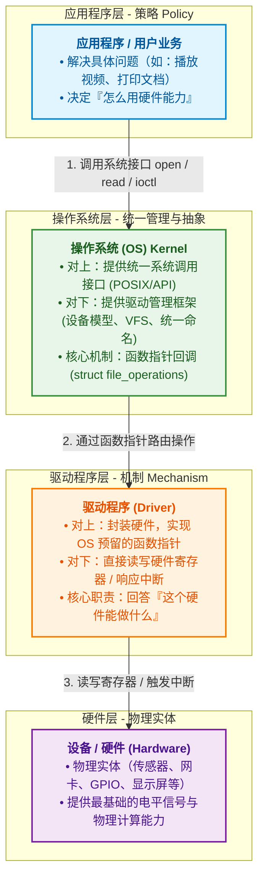

# Linux的驱动编程概要

层级（分层设计思路、学习思路）：



- 裸机驱动
	- 硬件控制者
	- 本质：纯粹的机制（Mechanism）实现。直接操作 CPU 的寄存器、控制时序（如 I2C/SPI 逻辑）。
	- 特点：**强耦合、无统一标准**（与具体硬件高度绑定）。在裸机开发（如 STM32）中，驱动通常直接针对特定的 MCU 架构和具体外设芯片（如 AT24C02）编写。
	- 缺点：缺乏 OS 层的抽象，**几乎没有移植性**。
- Linux驱动
	- 框架适配器
	- 本质：**机制 + 驱动管理框架**。它不仅要控制硬件，更重要的是**填空**——把硬件的操作逻辑填充到 Linux 内核预留好的框架（如 `struct file_operations`、字符设备框架、I2C 子系统框架）中。
	- **特点**：**高度抽象、分层解耦**。Linux 引入了“总线-设备-驱动模型”和“设备树（Device Tree）”，将硬件参数（硬件结构）与逻辑代码（驱动算法）彻底分离。
	- 优点：可移植性高


Linux驱动如何做到在内核运行时，也能注册？

- 核心思想：注册 + 路由表。
	- 当你的驱动加载时，调用内核提供的注册函数，把“函数地址”挂载到内核的**全局链表**或 **Hash 表**中。
- 命令式触发函数：
	- 在裸机中，所有代码在编译阶段就被死死地烧录在 Flash 的固定位置。但 Linux 可以在系统运行过程中，随时通过 `insmod my_driver.ko` 命令加载驱动，这依赖于以下三步：
		1. **动态加载（Dynamic Loading）**：`my_driver.ko` 本质上是一个可重定位的 `ELF` 二进制文件。当你运行 `insmod` 时，内核的模块加载器（Module Loader）会在 RAM 中动态申请一块内存，把 `.ko` 里的代码和数据拷贝进去。
		2. **符号重定位（Relocation）**：`register_chrdev` 这个注册函数是内核本身提供的（已被导出为全局符号 `EXPORT_SYMBOL`）。内核加载器在装载 `.ko` 时，会自动解析 `.ko` 里的未知符号，将其绑定到内核 `register_chrdev` 在 RAM 中的实际地址。
		3. **执行入口函数（`module_init`）**：内核跳转到驱动指定的入口函数 `my_driver_init()` 开始执行。此时，驱动把刚才分配在 RAM 里的 `&my_fops` 内存地址注册进 OS 框架。
- 程序式触发函数：
	- 当驱动注册完成后，整个调用链路就变成了**纯粹的指针寻址**：
		1. **用户层**：调用 `open("/dev/my_dev", O_RDWR)`。
		2. **OS 框架（VFS）**：根据 `/dev/my_dev` 的主次设备号，去内核的设备映射表里查找。
		3. **寻找指针**：找到你刚才注册进去的 `&my_fops` 地址。
		4. **间接调用**：执行 `my_fops->open()`，从而跳入你写的 `my_open()` 函数中。


驱动挂载方式：

1. 手动挂载：使用 `insmod xxx.ko` 或 `modprobe xxx`。
2. 自动挂载
	- **热插拔设备（USB、PCIe 等）**：硬件接入时触发电信号，内核扫描到硬件 ID（如 USB VID/PID），**udev** 服务会自动匹配并调用 `modprobe` 加载对应的驱动程序。
	- **板载/平台设备（Platform Device / 设备树）**：系统启动阶段，内核解析设备树（Device Tree）或 ACPI，自动将硬件节点与已编译（内建或可加载模块）的驱动 `match` 并绑定，自动执行驱动的 `probe()` 函数。
	- **开机自动加载模块**：即使设备无法被动态枚举，也可将模块名写入 `/etc/modules` 或 `/etc/modules-load.d/*.conf`，系统启动时会自动挂载，无需人工干预。


Linux框架图：


- 驱动框架提供的三种设备模型：
	- 字符设备：数据以流的形式传递。
	- 块设备：数据以块的形式传递，且速度慢，需要缓冲区。
	- 网络设备：数据以包的形式传递，需要协议格式。
- 字符设备与块设备依赖于虚拟文件系统向上提供接口，网络设备通过网络协议栈向上提供接口（借助了文件描述符）
	- 依赖于虚拟文件系统的，在`/dev`目录下有实体节点。


应用编程和内核编程的区别：

| **比较维度** | **应用编程**  | **内核编程**     |
| ------------ | ------------- | ---------------- |
| **使用函数** | libc库        | 内核函数         |
| **运行空间** | 用户空间      | 内核空间         |
| **运行权限** | 普通用户      | root用户         |
| **入口函数** | main()        | module_init()    |
| **出口函数** | exit()        | module_exit()    |
| **编译**     | gcc -c选项    | 依赖内核Makefile |
| **链接**     | gcc .so文件   | insmod           |
| **运行**     | linux系统加载 | insmod           |
| **调试**     | GDB printf    | KGDB printk      |

​	内核编程的思想：模块思想。

​	内核编译，都是使用内核提供的`makefile`,因为内核是一个整体，我们只是编译内核的一个模块


---

# 内核编程【学习方法：多参考、模仿别人的内核代码】

## 编程前准备

内核模块编程前，必须构建 内核源码树（即下载源码后，必须先make一下 —— 因为内核中有些文件时动态生成的）：

1. 先写一个简单函数（不是完成函数，只需要能编译，就行）

	- ```c
		#include <linux/module.h>
		#include <linux/init.h>
		
		static __init int hello_init(void){
		
		}
		
		module_init(hello_init)
		```

	- 

2. 写一个`makefile`

	- ```makefile
		# 若是虚拟机自身内核，可以定义变量为: /lib/modules/$(shell uname -r)/build
		# 注意激活环境变量ARCH和CROSS_COMPILE
		# 定义内核源码根目录(解压的内核源码根目录)
		BASE_KERNEL ?= /home/siguyuan/EBF_6ULL/kernel/linux_4.19.35_imx6ull
		# 定义目标名(与自己创建的.c文件名，完全一致)
		TARGET_NAME = hello
		
		obj-m += $(TARGET_NAME).o
		# $(TARGET_NAME)-objs := parameter.o
		
		# 为所有编译选项添加-Wno-missing-attributes，避免GCC9.x的警告(交叉编译器不是gcc9的可以不加)
		ccflags-y += -Wno-missing-attributes
		# 为partB提供debug选项
		# CFLAGS_partB.o += -DDEBUG
		all:
			make -C $(BASE_KERNEL) M=$(PWD) modules
		# 拷贝到共享目录中
			cp $(TARGET_NAME).ko /home/siguyuan/EBF_6ULL/shared
		clean:
			make -C $(BASE_KERNEL) M=$(PWD) clean
		
		```

		- `make -C $(BASE_KERNEL) M=$(PWD) modules`：
			- `-C`： 切换到`$(BASE_KERNEL)`目录。**不要使用当前目录下的 Makefile，而是先跳转到 `$(BASE_KERNEL)`（内核源码所在的根目录）**。在那里借助内核顶层极其庞大的 `Kbuild` 编译系统和环境来进行编译。
			- `M=`：指定外部模块所在的路径。现在要编译的是一个内核树之外的独立模块，这个驱动的代码和 Makefile 保存在 `$(PWD)`（即你当前所在的驱动工程目录）。
			- `modules`：编译目标（Target），**本次编译的任务是生成一个或多个动态可加载内核模块（`.ko` 文件）**，而不是去编译整个内核镜像（如 `zImage`）。
		- `CFLAGS_文件名.o += -D宏名`，针对一个文件进行宏定义
		- `CFLAGS_y += -D宏名`，针对所有文件进行宏定义

3. 编译一次，让`clangd`认识。

	- 先将交叉编译器添加到当前终端的环境变量`source ...`

	- 利用`bear`工具，创建clangd认识的clangd文件`bear -- make`

	- 检查生成的`compile_commands.json`是否有内容。如果没有，检查一下Makefile中路径是否正确，文件名是否一样。

	- 如果是JSON文件不在当前工作区的顶层目录中，将当前目录的JSON文件拷贝到，当前工作区的最顶层目录中。

	- 清除刚刚编译其他文件`make clean`，保留JSON文件

	- 重新打开.c文件，发现出现

		- ```c
			Unknown argument: '-fno-ipa-sra'clang(drv_unknown_argument)
			Unknown argument: '-fno-var-tracking-assignments'clang(drv_unknown_argument)
			Unknown argument: '-fconserve-stack'clang(drv_unknown_argument)
			```

		- 去刚刚生成的.c文件中，删除这个三个只有交叉编译器才认识的选项（clang不认识）

		- 如果可以，可以删除一个JSON中重复的`arguments`选项。


---

## 编程

内核模块编程：

​	1、 模仿内核中其他模块的类似写法（功能相近 或者 接口类似）

​	2 、内核硬性规范：

​		a. Linux 内核（5.18 版本之前） —— 使用C99标准 【**当前正常使用的内核为：4.19.35**】。 所有局部变量**必须在当前作用域（如函数体或代码块 `{}`）的最开头集中声明**，严禁在执行代码中间“边声明边使用”（即 `mixed declarations and code`），否则编译器在开启 `-Wdeclaration-after-statement` 警告标志时会直接报错。 【现代内核（5.18之后）使用的是C11标准，不需要这样。】

​		b.  Linux 内核代码风格文档中明确规定：如果一个函数不需要任何参数，必须在参数列表中声明为 `void`。

​		c. 必须要有GPL协议声明。如果没有，当前模块会触发内核警报，然后大量内核接口失效。


基本的编写规则

```c
// 初始化使用
#include "linux/printk.h"
#include <linux/init.h>
// 内核模块相关头文件     
#include <linux/module.h>

// 初始化函数，必须有返回值，否则内核会认为当前模块没有被加载成功，不需要传入参数必须写void
static int __init hello_init(void){
    printk("hello\n");      // 使用printk 进行打印，打印到控制台，不是当前终端
    return 0;
}

static void __exit hello_exit(void){
    printk("bey\n");
}

// 先内核注册这个模块
module_init(hello_init);
module_exit(hello_exit);

// GPL协议声明
MODULE_LICENSE("GPL");
// MODULE_AUTHOR("siguyuan <123@qq.com>");	// MODULE_AUTHOR("姓名/昵称 <邮箱>")  写明作者，可以存在多个MODULE_AUTHOR
```

- `__init、__exit`：将这个修饰的函数代码，放到代码区的对应段上（如：`__init`段）。

	- ```c
		#define __section(S)		__attribute__((__section__(#S)))
		
		#define __init		__section(.init.text)
		#define __exit      __section(.exit.text)
		
		// int __init fun(void)  =>   int   __attribute__((__section__(".init.text"))) fun(void)
		```

	- 每个段，内核都会有不同的处理行为，

		- 如：`_init`段：在初始化了之后，会释放这个段。内核启动时，给的如下提示就是如此。

			- ```c
				// 释放了__init段
				Freeing unused kernel memory: 1024K
				```

			- 

- `module_init()、module_exit()`为什么能写到函数体外

	- 本质是一种宏替换，替换成一个函数指针。

	- ```c
		#define module_init(initfn)					\
			static inline initcall_t __maybe_unused __inittest(void)		\
			{ return initfn; }					\
			int init_module(void) __attribute__((alias(#initfn)));
		
		// ↓
		
		// 这个用于类型检查的伪函数（__inittest）
		// 如果写的 hello_init 返回了 void 或者带了参数，编译阶段在这行就会直接报类型不匹配的警告/错误！
		// 与initcall_t【typedef int (*initcall_t)(void);】 进行比较
		static inline initcall_t __maybe_unused __inittest(void){ 
		    return initfn; 
		}
		
		
		// 内核真正调用的入口定义（init_module 别名） —— 给函数起了一个init_module的别名
		// 将hello_init 替换成 init_modeule, 让其指令内容和执行逻辑完全指向 hello_init（#initfn）”
		// 当驱动被编译成 .ko 模块时，内核的模块加载器（Module Loader）在装载该 .ko 时，只认一个固定名字的符号——init_module。
		// __attribute__生成二进制文件时，将hello_init的地址打上一个init_module的标签
		int init_module(void) __attribute__((alias(#initfn)));
		```

- 在 Linux 内核开发中，严格的风格一致性：**严格采用 `static int __init 函数名(void)` 的顺序**。

- 使用`make`编译，生成`.ko`文件

- 挂载模块`insmode 模块.ko`

	- 错误:

		```bash
		# 板子上
		# 挂载模块 识别 —— 模块在编译时所使用的内核头文件/源码版本，与当前运行该模块的 Linux 系统内核（4.19.35）不匹配
		[root@localhost /opt]# insmod hello.ko
		[  227.298974] hello: disagrees about version of symbol module_layout
		insmod: can't insert 'hello.ko': invalid module format
		
		# 查看板子的内核
		[root@localhost /opt]# uname -r
		4.19.35
		
		# 虚拟机上
		# 查看.ko文件的内核版本
		siguyuan@debian:~/EBF_6ULL/mycode/ex01$ sudo modinfo hello.ko
		[sudo] siguyuan 的密码：
		filename:       /home/siguyuan/EBF_6ULL/mycode/ex01/hello.ko
		license:        GPL
		srcversion:     627B3C802F95C32152D4D9B
		depends:
		name:           hello
		vermagic:       4.19.35 SMP preempt mod_unload modversions ARMv7 p2v8
		
		
		# 发现两个的版本号一致都是4.19.35
		# 发现板子上报错信息为：disagrees about version of symbol module_layout
		# 即：开发板上正在运行的内核 要么未开启 CONFIG_MODVERSIONS（符号版本校验）），要么编译内核与编译驱动时使用了不同的 .config 配置文件（导致算出来的 module_layout 校验码不匹配）。
		
		# 方式1：重新编译内核镜像文件，在拷贝过来
		# 之前使用了NFS共享目录，将编译号的zImage镜像文件放到共享目录中
		# 板子上：挂载共享目录和boot区
		cp /opt/zImage /mnt
		reboot
		
		# 方式2：强制加载
		insmod -f hello.ko
		```

- 查看模块加载情况：`lsmod` 或者 ` cat /proc/modules`

	- 一切皆文件，有些时候可以通过`/proc`目录解决一些没有提供系统调式的情况（如：获取CPU信息）

- 卸载模块：`rmmod 模块名`


`/proc`目录使用场景

| **分类**             | **常用 /proc 文件**        | **调试 / 诊断用途**                             |
| -------------------- | -------------------------- | ----------------------------------------------- |
| **硬件与系统信息**   | `/proc/cpuinfo`            | 查看 CPU 架构、主频、核心数、指令集等           |
|                      | `/proc/meminfo`            | 实时查看内存剩余、缓存（Cached/Buffers）占用    |
|                      | `/proc/interrupts`         | 查看硬件中断（IRQ）的触发计数，调试中断驱动     |
| **进程与线程诊断**   | `/proc/<PID>/cmdline`      | 查看指定进程的启动参数                          |
|                      | `/proc/<PID>/fd/`          | 查看进程打开的所有文件描述符（定位句柄泄露）    |
|                      | `/proc/<PID>/maps`         | 查看进程的虚拟内存空间映射（定位内存越界/崩溃） |
| **动态调整内核参数** | `/proc/sys/kernel/printk`  | **控制控制台日志打印级别**（驱动调试最常用）    |
|                      | `/proc/sys/vm/drop_caches` | 向其写入 `1` 或 `3` 强制内核立即释放 PageCache  |


内核模块 起到了一个进入内核、退出内核的路径引导作用 

​	目的：把驱动的数据结构，注册到框架中【这个数据结构必须时全局的、本文使用的】

​	初始化函数，不能把局部变量注册到框架中。


【面试static回答】：

​	Linux 内核是一个共享同一地址空间的单体结构。如果不加 `static`，写在模块里的非静态全局变量和函数会变成全局符号。当其他驱动也定义了相同名字的变量时，就会造成**全局命名空间污染（Symbol Collision）**，导致模块加载失败。因此，内核规范要求**模块内部的变量和函数必须用 `static` 限制在当前 `.c` 文件作用域内**。

【面试常问】：内核需要跨模块调用怎么办？

​	将某个驱动的核心 API（例如公共子系统框架、底层总线接口）暴露给其他 `.ko` 模块调用时，**首先不应该使用 `static` 修饰该函数**（static修饰，虽然能正常导出，但是是内核的补救），然后再通过 **`EXPORT_SYMBOL()`** 或 **`EXPORT_SYMBOL_GPL()`** 将其显式注册到内核的全局导出符号表（`__ksymtab`）中。


---

内核的头文件分布：

- 体系结构相关：`arch/<CPU架构>/include/asm/` —— `#include <asm/xxx>`：体系结构相关的头
- 体系结构无关：`include/linux/` （通用的内核核心子系统和驱动框架） —— `#include <linux/xxx>`： 体系结构无关


----

修改Makefile，使其能在宿主机上编译：

```makefile
# 若是虚拟机自身内核，可以定义变量为: /lib/modules/$(shell uname -r)/build
# uname -r :是查看版本号的命令
# 注意激活环境变量ARCH和CROSS_COMPILE
BASE_KERNEL ?= /lib/modules/$(shell uname -r)/build
# 定义目标名(与自己创建的.c文件名，完全一致)
TARGET_NAME = hello

obj-m += $(TARGET_NAME).o
# $(TARGET_NAME)-objs := parameter.o

# 为所有编译选项添加-Wno-missing-attributes，避免GCC9.x的警告(交叉编译器不是gcc9的可以不加)
ccflags-y += -Wno-missing-attributes
# 为partB提供debug选项
# CFLAGS_partB.o += -DDEBUG
all:
	make -C $(BASE_KERNEL) M=$(PWD) modules
# 拷贝到共享目录中
	cp $(TARGET_NAME).ko /home/siguyuan/EBF_6ULL/shared
clean:
	make -C $(BASE_KERNEL) M=$(PWD) clean

```

- 如果没有这个build目录，就需要安装内核源码目录树：`sudo apt install linux-headers-$(uname -r)`

	- 如果这个命令报错，证明当前内核的版本已经被官方下架的，`sudo apt install linux-headers-` 按`tab` 找一个版本最近的进行安装

	- ```bash
		siguyuan@debian:~$ uname -r
		6.12.73+deb13-amd64
		
		siguyuan@debian:~$ sudo apt install linux-headers-
		linux-headers-6.12.86+deb13-amd64        linux-headers-6.12.94+deb13-amd64        linux-headers-amd64
		linux-headers-6.12.86+deb13-cloud-amd64  linux-headers-6.12.94+deb13-cloud-amd64  linux-headers-cloud-amd64
		linux-headers-6.12.86+deb13-common       linux-headers-6.12.94+deb13-common       linux-headers-rt-amd64
		linux-headers-6.12.86+deb13-common-rt    linux-headers-6.12.94+deb13-common-rt
		linux-headers-6.12.86+deb13-rt-amd64     linux-headers-6.12.94+deb13-rt-amd64
		
		
		# 方式1：选择一个安装，应急
		# 方式2：升级内核版本（安装最新的）
		sudo apt update
		sudo apt install linux-headers-amd64 linux-image-amd64
		sudo reboot
		
		siguyuan@debian:~$ uname -r
		6.12.94+deb13-amd64
		
		```

- 挂载：`sudo insmod hello.ko` ；

- 查看`printk`打印的内容：`sudo dmesg`

- 卸载: ` sudo rmmod hello`


Linux命令：`uname -r` : 查看当前机器上的Linux版本号


---

## printk函数

- 带日志级别的打印，一般是打印到控制台

- `printk(KERN_ERR"bey\n");` 只有超过默认的日志级别，才打印

	- ```c
		#define KERN_SOH	"\001"	
		
		#define KERN_EMERG	KERN_SOH "0"	/* system is unusable */
		#define KERN_ALERT	KERN_SOH "1"	/* action must be taken immediately */
		#define KERN_CRIT	KERN_SOH "2"	/* critical conditions */
		#define KERN_ERR	KERN_SOH "3"	/* error conditions */
		#define KERN_WARNING	KERN_SOH "4"	/* warning conditions */
		#define KERN_NOTICE	KERN_SOH "5"	/* normal but significant condition */
		#define KERN_INFO	KERN_SOH "6"	/* informational */
		#define KERN_DEBUG	KERN_SOH "7"	/* debug-level messages */
		```

	- 使用中，本质是利用 C 语言编译器的“自动拼接相邻字符串常量”特性，合并为一个完整字符串 `"\0013bey\n"`，内核解析开头的 ASCII 码 `\001` (`KERN_SOH`) 提取级别

	- 数据越小，级别越高。

	- `cat /proc/sys/kernel/printk` 结构是个数字`4       4       1       7`

		- 第一个数字：当前控制台日志级别
		- 第二个数字：默认消息日志级别（当`printk`没有显示指定时，默认使用这个）
		- 第三个数字：允许设置的最高优先级门槛极限
		- 第四个数字：启动时默认控制台日志级别

	- 修改上面4个级别`echo "1 4 1 7" > /proc/sys/kernel/printk`

	- 只有当`printk`中日志级别必须“高于”控制台日志级别（即数值严格“小于”）才会打印

	- `printk`不能打印浮点数。因为浮点数编码标准太多，所以内核没有做。如果使用浮点数，会在编译阶段出现内核段错误。

		- ```bash
			------------[ cut here ]------------
			WARNING: CPU: 0 PID: 135 at lib/vsprintf.c:2149 format_decode+0x4c0/0x520
			Please remove unsupported %f in format string
			Modules linked in: hello(O+)
			CPU: 0 PID: 135 Comm: insmod Tainted: G           O      4.19.35 #1
			Hardware name: Freescale i.MX6 UltraLite (Device Tree)
			[<8010f5ec>] (unwind_backtrace) from [<8010b7c0>] (show_stack+0x10/0x14)
			[<8010b7c0>] (show_stack) from [<808d0434>] (dump_stack+0x78/0x8c)
			[<808d0434>] (dump_stack) from [<801257e8>] (__warn+0xec/0x108)
			[<801257e8>] (__warn) from [<80125420>] (warn_slowpath_fmt+0x4c/0x78)
			[<80125420>] (warn_slowpath_fmt) from [<808df7c0>] (format_decode+0x4c0/0x520)
			[<808df7c0>] (format_decode) from [<808e2dec>] (vsnprintf+0x78/0x49c)
			[<808e2dec>] (vsnprintf) from [<808e321c>] (vscnprintf+0xc/0x24)
			[<808e321c>] (vscnprintf) from [<801682a8>] (vprintk_store+0x2c/0x1d0)
			[<801682a8>] (vprintk_store) from [<801686ec>] (vprintk_emit+0x7c/0x1b8)
			[<801686ec>] (vprintk_emit) from [<801689e0>] (vprintk_default+0x20/0x28)
			[<801689e0>] (vprintk_default) from [<80168d1c>] (printk+0x30/0x5c)
			[<80168d1c>] (printk) from [<7f00502c>] (hello_init+0x2c/0x1000 [hello])
			[<7f00502c>] (hello_init [hello]) from [<80102670>] (do_one_initcall+0x58/0x1a0)
			[<80102670>] (do_one_initcall) from [<8019b218>] (do_init_module+0x60/0x224)
			[<8019b218>] (do_init_module) from [<8019d464>] (load_module+0x2024/0x2364)
			[<8019d464>] (load_module) from [<8019d8f8>] (sys_init_module+0x154/0x190)
			[<8019d8f8>] (sys_init_module) from [<80101000>] (ret_fast_syscall+0x0/0x54)
			Exception stack(0x88853fa8 to 0x88853ff0)
			3fa0:                   00000f88 0963cf85 01415218 00000f88 0009d145 00000001
			3fc0: 00000f88 0963cf85 76e2caa0 00000080 7ea9de38 7ea9de3c 76fc6000 0008ceff
			3fe0: 7ea9db00 7ea9daf0 0002c181 76eb7c22
			---[ end trace 9072efa93743a341 ]---
			
			```

		- 后面就需要通过**栈回溯**，来解决这个问题。

	- 简单用法：

		- **`pr_xxx` 简写宏（定义在 `<linux/printk.h>`）**：
			- `pr_emerg()` / `pr_alert()` / `pr_crit()` / `pr_err()`
			- `pr_warn()` / `pr_notice()` / `pr_info()` / `pr_debug()`
			- 语法示例：`pr_err("Failed to request GPIO!\n");`（无需写日志级别前缀）
		- **`dev_xxx` 设备驱动专用宏（自带设备名与树状上下文）**： 在平台驱动（Platform Driver）中极其常用，能自动打印是哪一个设备发出的日志：
			- `dev_err(dev, "Format string", ...)`
			- `dev_info(&pdev->dev, "Driver probed successfully\n");`
			- 输出示例：`imx6q-pcie 3380000.pcie: Driver probed successfully`

---

## 多文件编程

需要的功能写到了多个文件中：

partA.c

```c
#include <linux/init.h>
#include <linux/module.h>

__init static int part_init(void ) {
	pr_info("part init...!\n");
	return 0;
}

module_init(part_init)
MODULE_LICENSE("GPL");
MODULE_AUTHOR("Rocky <eleyuan@163.com>");

```

partB.c

```c
#include <linux/init.h>
#include <linux/module.h>

static void __exit part_exit(void ) {
	pr_debug("part exit...!\n");
}

module_exit(part_exit);
MODULE_INFO(x2_info,"Easy Value");

```

Makefile

```makefile
# 若是虚拟机自身内核，可以定义变量为: /lib/modules/$(shell uname -r)/build
# 注意激活环境变量ARCH和CROSS_COMPILE
# 定义内核源码根目录
BASE_KERNEL ?= /home/siguyuan/EBF_6ULL/kernel/linux_4.19.35_imx6ull
# 定义目标名
TARGET_NAME = hello

# 解决多文件编程
obj-m += $(TARGET_NAME).o
$(TARGET_NAME)-objs := partA.o partB.o

# 为所有编译选项添加-Wno-missing-attributes，避免GCC9.x的警告
ccflags-y += -Wno-missing-attributes
# 为partB提供debug选项
CFLAGS_partB.o += -DDEBUG
all:
	make -C $(BASE_KERNEL) M=$(PWD) modules
	cp $(TARGET_NAME).ko /home/siguyuan/EBF_6ULL/shared
clean:
	make -C $(BASE_KERNEL) M=$(PWD) clean

```

- 增加一步，将各个文件链接到一起`$(TARGET_NAME)-objs := partA.o partB.o`


多模块：

calc.h

```c
#ifndef IMX_LAB_CALC_H
#define IMX_LAB_CALC_H

extern int add_integer(int a,int b);
extern int sub_integer(int a,int b);
#endif

```

calculator.c

```c
#include <linux/init.h>
#include <linux/module.h>

static int add_integer(int a,int b) {
	return a+b;
}

int sub_integer(int a,int b) {
	return a-b;
}

static int __init sym_init(void) {
	return 0;
}

static void __exit sym_exit(void) {
}

// 对外导出符号表，让外部程序使用
EXPORT_SYMBOL_GPL(add_integer);
EXPORT_SYMBOL_GPL(sub_integer);

module_init(sym_init)
module_exit(sym_exit)
MODULE_LICENSE("GPL");

```

- `EXPORT_SYMBOL_GPL()`：导出符号表，让外部程序使用


calc_module.c

```c
#include <linux/init.h>
#include <linux/module.h>
#include "calc.h"

static int __init calc_init(void ) {
	pr_info("calc init...%d\n", add_integer(10, 20));
	return 0;
}

static void __exit calc_exit(void ) {
	pr_warn("calc exit...%d\n", sub_integer(30, 20));
}

module_init(calc_init)
module_exit(calc_exit)
MODULE_LICENSE("GPL");

```

Makefile

```makefile
# 若是虚拟机自身内核，可以定义变量为: /lib/modules/$(shell uname -r)/build
# 注意激活环境变量ARCH和CROSS_COMPILE
# 定义内核源码根目录
BASE_KERNEL ?= /home/siguyuan/EBF_6ULL/kernel/linux_4.19.35_imx6ull
# 定义目标名
# TARGET_NAME = hello

# 将需要使用的模块，单独弄成一个模块
obj-m += calc_fun.o calc_main.o
calc_fun-objs := calculator.o
calc_main-objs := calc_module.o

# 为所有编译选项添加-Wno-missing-attributes，避免GCC9.x的警告
ccflags-y += -Wno-missing-attributes

all:
	make -C $(BASE_KERNEL) M=$(PWD) modules
	cp calc_fun.ko /home/siguyuan/EBF_6ULL/shared
	cp calc_main.ko /home/siguyuan/EBF_6ULL/shared
clean:
	make -C $(BASE_KERNEL) M=$(PWD) clean

```

- 将需要使用的模块，做成独立模块


板子上使用

```bash
# 错误用法:
# 先启动了需要其他模块的模块，会报找不到符号的错误
[root@localhost /opt]# insmod calc_main.ko
calc_main: Unknown symbol add_integer (err -2)
calc_main: Unknown symbol sub_integer (err -2)
insmod: can't insert 'calc_main.ko': unknown symbol in module or invalid parameter

# 正确：
# 先启动独立模块
insmod calc_fun.ko
insmod calc_main.ko


# 错误卸载
# 先卸载了需要使用的模块，所以报错
[root@localhost /opt]# insmod calc_fun.ko
insmod: can't insert 'calc_fun.ko': File exists


# 正确
rmmod calc_main.ko
rmmod calc_fun.ko
```


---

## 内核模块参数

1、 内核模块（.ko文件），通过配置一些输入参数信息，用户来决定模块的不同状态。

​	`boorloader`在启动内核时，`bootargs`把内核启动参数传递给了内核镜像，如：本次内核启动时传递的参数部分信息（在启动时打印到比较靠前的信息）：` console=ttymxc0,115200 root=/dev/mmcblk0p2 rw rootfstype=ext4 init=/linuxrc`

​	内核镜像 就是 一堆内核模块的组合。

2、内核模块参数格式：键值对（k = v）

常见错误：

build.c：

```c
// 初始化使用
#include "linux/printk.h"
#include <linux/init.h>
// 内核模块相关头文件     
#include <linux/module.h>

// 一般使用全局变量进行输入参数的传递
static int abc = 0;

static int __init build_init(void){
    printk("hello\n");     
    printk("%d\n", abc);
    return 0;
}

static void __exit build_exit(void){
    printk(KERN_ERR"bey, %d\n", abc);
}

module_init(build_init);
module_exit(build_exit);

MODULE_LICENSE("GPL");
```

```bash
# 执行效果
# 出现错误：未识别参数abc
[root@localhost /opt]# insmod build.ko abc=100
build: unknown parameter 'abc' ignored
hello
0

```

​	模块输入参数方式1：`insmod 模块.ko 参数名=值`

​	模块输入参数方式2：`echo "值" > /sys/module/模块名/parameters/参数名`

​	**模块参数必须使用`module_param(name, typer, perm)`显示声明**，否则会报错。

​	模块参数本质都是内存中的全局变量 + 内核的描述元数据（数据结构 —— 链表），值在内存中，所以修改不会影响磁盘上的值。

​		磁盘上的 `.ko` 文件只是包含二进制代码和初始静态数据的**静态磁盘镜像**。当使用 `insmod` 加载模块时，内核将 `.ko` 文件的内容**拷贝加载到了 RAM（运行内存）** 中。

​	`/proc` ：查看进程、系统相关的信息。`/sys`：查看内核、设备相关的信息


```c
/* 参数说明
	name: 模块参数名
	type: 模块参数的数据类型
		具体的有哪些类型：可以在linux_4.19.35_imx6ull/include/linux/moduleparam.h 中搜索param_get_
	perm: 权限
		权限要求：0664 =》 0 USER+GROUP+OTHER
			1、必须是8进制
			2、读权限递减：USER 读 ≥ GROUP 读 ≥ OTHER 读（不能出现“拥有者不可读，其他人反而能读”的情况）
			3、写权限递减：USER 写 ≥ GROUP 写（不能出现“拥有者不可写，组反而能写”的情况）
			4、强行禁止 Other 写：末尾最后一位不能包含写权限 2（即不允许 OTHER_WRITABLE）。
			5、如果权限写成0，不在 /sys/module/模块名/parameters/
 文件系统中生成任何节点
*/
module_param(name, type, perm)	

// 参数说明，可选择
MODULE_PARM_DESC(_parm, desc)
```

如果权限不对，会出现链接错误：

```bash
# 编译时期的断言错误 —— 这里是权限为0666，错误触发了other不能写的要求
./include/linux/build_bug.h:29:45: error: negative width in bit-field ‘<anonymous>’
   29 | #define BUILD_BUG_ON_ZERO(e) (sizeof(struct { int:(-!!(e)); }))
      |                                             ^
./include/linux/kernel.h:1033:3: note: in expansion of macro ‘BUILD_BUG_ON_ZERO’
 1033 |   BUILD_BUG_ON_ZERO((perms) & 2) +     \
      |   ^~~~~~~~~~~~~~~~~
./include/linux/moduleparam.h:228:6: note: in expansion of macro ‘VERIFY_OCTAL_PERMISSIONS’
  228 |      VERIFY_OCTAL_PERMISSIONS(perm), level, flags, { arg } }
      |      ^~~~~~~~~~~~~~~~~~~~~~~~
./include/linux/moduleparam.h:170:2: note: in expansion of macro ‘__module_param_call’
  170 |  __module_param_call(MODULE_PARAM_PREFIX, name, ops, arg, perm, -1, 0)
      |  ^~~~~~~~~~~~~~~~~~~
./include/linux/moduleparam.h:150:2: note: in expansion of macro ‘module_param_cb’
  150 |  module_param_cb(name, &param_ops_##type, &value, perm);     \
      |  ^~~~~~~~~~~~~~~
./include/linux/moduleparam.h:129:2: note: in expansion of macro ‘module_param_named’
  129 |  module_param_named(name, name, type, perm)
      |  ^~~~~~~~~~~~~~~~~~
/home/siguyuan/EBF_6ULL/mycode/ex04/build.c:6:1: note: in expansion of macro ‘module_param’
    6 | module_param(abc, int, 0666);
      | ^~~~~~~~~~~~
make[2]: *** [scripts/Makefile.build:310：/home/siguyuan/EBF_6ULL/mycode/ex04/build.o] 错误 1
make[1]: *** [Makefile:1525：_module_/home/siguyuan/EBF_6ULL/mycode/ex04] 错误 2
make: *** [Makefile:17：all] 错误 2

```


正常写法：

build.c

```c
#include "linux/moduleparam.h"
#include <linux/init.h>   
#include <linux/module.h>

// 一般使用全局变量进行输入参数的传递
static int abc = 0;
static char cba = '1';
module_param(abc, int, 0664);
module_param(cba, byte, 0);		// 权限为
// 参数描述（可选）
MODULE_PARM_DESC(abc, "build param");       

static int __init build_init(void){
    printk("hello\n");     
    printk("%d %c\n", abc, cba);
    return 0;
}

static void __exit build_exit(void){
    printk(KERN_ERR"bey, %d, %c\n", abc, cba);
}

module_init(build_init);
module_exit(build_exit);

MODULE_LICENSE("GPL");
```

现象：

```bash
# 权限为0，在/sys/module/build/parameters/目录下无法为其创建文件，所以无法写入
[root@localhost /opt]# insmod build.ko abc=100 cba='a'
build: `a' invalid for parameter `cba'
insmod: can't insert 'build.ko': invalid parameter

# 正常显示
[root@localhost /opt]# insmod build.ko abc=100
hello
100 1

[root@localhost /opt]# cat /sys/module/build/parameters/cba
cat: can't open '/sys/module/build/parameters/cba': No such file or directory
# 第二种传输方式
[root@localhost /opt]# echo "100" > /sys/module/build/parameters/abc
[root@localhost /opt]# rmmod build.ko
bey, 200, 1
[root@localhost 
```


错误：在内核中找不到文件 —— 根本原因内核编译不正确，或者没有编译（因为有些文件是动态生成的）

```bash
siguyuan@debian:~/EBF_6ULL/mycode/ex04$ make
make -C /home/siguyuan/EBF_6ULL/kernel/linux_4.19.35_imx6ull M=/home/siguyuan/EBF_6ULL/mycode/ex04 modules
Makefile:595: include/config/auto.conf: 没有那个文件或目录
make: *** [Makefile:17：all] 错误 2

# 进入内核重新make imx_v7_defconfig、make zImage -j$(nproc) 记住当前内核的版本与.config文件与板子上使用的内核镜像必须一样
```


`modinfo 模块名`：查看文件名与路径、模块作者与描述、开源协议、内核版本签名/vermagic、支持的模块参数、模块依赖关系。**需要/lib/modules/$(uname -r)/modules.dep，有这个工具，需要安装**

---

## 字符设备驱动框架

版本历史：

​	老版本使用的字符设备框架注册接口`register_chrdev()`【在版本这个内部使用依然调用新版的接口】

​	新版本（2.6之后）字符设备框架`cdev`结构体，使用`cdev`相关API按需申请


### register_chrdev函数

向字符设备框架的表中注册一条信息

框架


在系统移植，编写根文件系统时，有编写了一个rcS文件中这个，`echo /sbin/mdev > /proc/sys/kernel/hotplug`，一旦驱动有变化，内核就会无条件运行这个文件内容。【注意：这个文件中只能有一个程序路径，如果需要多个程序，就一个脚本包装】


```c
int register_chrdev(unsigned int major, const char *name, const struct file_operations *fops)
```

参数：

- `major`：主设备号。如果写0，内核会自动申请一个未使用的主设备号

	- 主设备分类：固定的（Linux内核已经占用）、动态的（其他驱动能使用）

	- 主设备号：属于那类驱动。次设备：该类驱动中的哪个硬件。如：uart有3个，主设备号是uart驱动，次设备号是3个uart中的其中之一。

	- 内核会将0~255这个256个次设备号一次性划给主设备号。

	- 查看主设备号的方式`cat /proc/devices`

		- ```bash
			[root@localhost /opt]# cat /proc/devices
			Character devices:
			1 mem
			4 /dev/vc/0
			4 tty
			5 /dev/tty
			...
			248 watchdog
			249 tee
			250 iio
			251 ptp
			252 pps
			
			Block devices:
			1 ramdisk
			7 loop
			8 sd
			31 mtdblock
			65 sd
			...
			131 sd
			132 sd
			133 sd
			
			
			```

- `name`：给用户显示的驱动名称。`/proc/devices`的第二列就是显示的这个名称。

- **`fops`：** 相关操作的集合。常驻内存，内部存地址，不能是局部值。

	- ```c
		// 相关结构体
		// 一堆操作相关的函数指针，在写驱动时，就需要进行实现。
		struct module *owner;
			loff_t (*llseek) (struct file *, loff_t, int);
			ssize_t (*read) (struct file *, char __user *, size_t, loff_t *);
			ssize_t (*write) (struct file *, const char __user *, size_t, loff_t *);
			ssize_t (*read_iter) (struct kiocb *, struct iov_iter *);
			ssize_t (*write_iter) (struct kiocb *, struct iov_iter *);
			...
		    __poll_t (*poll) (struct file *, struct poll_table_struct *);	// epoll的底层实现
			...
		    int (*open) (struct inode *, struct file *);
		};
		```

	- 对于`open()` 的简单流程：

		- 对于VFS：维护了文件描述符对应的数据结构（如：struct inode 、struct file），用户层有open的调用，申请一块空间（`struct file`），绑定对应的驱动fops，先检查对应的 fops->open 是否实现，如果不存在，就默认打开；如果存在，就调用 fops->open ，返回文件描述符或者fops->open的错误码。
		- 对于驱动层：对fops->open进行实现，打开对应的设备并初始化。

	- 对于`read()`的简单流程：

		- 对于VFS：根据传入的fd，找到对应的`struct file`结构体，检查file->fops->read是否实现，如果实现，执行file->fops->read；没有实现，返回错误 `-EINVAL`（Invalid argument，无效参数错误）
		- 对于驱动层：`fops->read` 的核心使命是将硬件控制器/内存中的数据，通过 `copy_to_user()` 拷贝发送给用户态缓冲区，并更新文件偏移量 `loff_t`

	- > [!NOTE]
		>
		> ```c
		> // 虚拟文件系统进行管理的
		> struct file {
		> 	union {
		> 		struct llist_node	fu_llist;
		> 		struct rcu_head 	fu_rcuhead;
		> 	} f_u;
		> 	struct path		f_path;				// 路径
		> 	struct inode		*f_inode;	/* cached value */	// 设备相关信息
		> 	const struct file_operations	*f_op;		// 对应的操作函数
		> 	...
		> 	fmode_t			f_mode;						// 权限
		> 	struct mutex		f_pos_lock;	
		> 	loff_t			f_pos;						// 文件光标偏移
		>    
		>     ...
		> };
		> 
		> // 一个inode就是一个物理设备
		> struct inode {
		>   ...
		>   // 文件类型
		>   union {
		> 		struct pipe_inode_info	*i_pipe;	// 有名管道
		> 		struct block_device	*i_bdev;		// 块设备
		> 		struct cdev		*i_cdev;			// 字符设备
		> 		char			*i_link;			// 软链接
		> 		unsigned		i_dir_seq;			
		>   };
		> };
		> ```
		>
		> 

返回值：如果major = 0，返回主设备号；如果major > 0，返回0；失败都是返回错误号。


例子：

```c
#include "linux/fs.h"
#include "linux/moduleparam.h"
#include "linux/printk.h"
#include <linux/init.h>   
#include <linux/module.h>

// 一般使用全局变量进行输入参数的传递
static int abc = 0;
module_param(abc, int, 0664);
// 参数描述（可选）
MODULE_PARM_DESC(abc, "build param");

// 实现操作函数
static 	int build_open (struct inode *inode, struct file *file){
    printk("build open\n");
    return  0;     
}


static ssize_t build_read (struct file *file, char __user *buf,
			size_t count, loff_t *ppos) {
    printk("build read\n");
    return  0;
}

static ssize_t build_write (struct file *file, const char __user *buf, size_t count, loff_t *ppos) {
    printk("build write\n");
    return  0;
}

// 定义操作函数
static struct file_operations fops = {
    .open = build_open,
    .read = build_read,
    .write = build_write,
};

static int major = 0;

static int __init build_init(void){
    int ret = 0;
    ret = register_chrdev(100, "abc", &fops);
    if(ret < 0){
        printk("build register_chrdev error: %d\n", ret);
        return ret;     // 返回错误码
    }

    major = ret;
    printk("hello\n");     
    printk("%d\n", abc);
    return 0;
}

static void __exit build_exit(void){
    // 清除框架中的注册信息注册
    unregister_chrdev(100, "abc");
    printk(KERN_ERR"bey, %d\n", abc);
}

module_init(build_init);
module_exit(build_exit);

MODULE_LICENSE("GPL");
```

```c
// 应用层的测试程序 —— 注意编译器
#include <fcntl.h>
#include <stdio.h>
#include <unistd.h>


// 测试驱动程序
int main(){
    // 找到字符设备节点
    int fd = open("/tmp/build", O_RDWR);
    if(fd < 0){
        perror("open");
        return -1;
    }

    printf("open build success!\n");
    char buf[8];

    read(fd, buf, 8);
    write(fd, buf, 7);

    close(fd);
    return 0;
}
```

```bash
# 板子上执行
# 错误1: 找不目录，可能存在设备节点没有正确创建 或者 驱动模块没有正确加载
[root@localhost /opt]# ./test
open: No such file or directory

# 创建字符设备节点
[root@localhost /opt]# mknod /tmp/build c 100 20
[root@localhost /opt]# ls -l /tmp/
total 0
crw-r--r--    1 0        0         100,  20 Jan  1 04:58 build
# 错误2： 找不到驱动
[root@localhost /opt]# ./test
open: No such device or address

[root@localhost /opt]# insmod build.ko
hello
0

# 注意只有open build success!是应用程序打印的，其他都是驱动程序打印，一般有使用有[时间]的都是内核打印的（驱动）
[root@localhost /opt]# ./test
build open
open build success!build read

build write

[root@localhost /opt]# rmmod build.ko
bey, 0
[root@localhost /opt]# rm -rf /tmp/*

```


使用`mknod 路径 设备类型 主设备号 次设备号`，创建对应的设备节点

清除框架中的驱动信息 —— `  void unregister_chrdev(unsigned int major, const char *name)`


主设备与次设备的逻辑：

```c
#define MINORBITS	20
#define MINORMASK	((1U << MINORBITS) - 1)

// ma为主设备号，mi为次设备号，如果为32位，那么高12为主设备号，低20位为次设备号
#define MKDEV(ma,mi)	(((ma) << MINORBITS) | (mi))

```


---

## ==内核的双向循环链表实现以及思路【面试手写】==

内核的实现**侵入式双向链表**思路：

- 内核只维护一个只有前后指针的双向链表`struct list_head`。
- 用户在创建自定义结构体时，将这个双向链表结构`struct list_head`添加到自己的自定义结构体中的任意位置。
- 内核通过这个双向链表的头，来遍历所有节点。
- 自定义结构体的首地址 = 链表成员地址`struct list_head` - 链表成员地址`struct list_head`在自定义结构内部的偏移量（offset）
  - 怎么获取则会个偏移量offset呢？
    1. `((TYPE *)0)`：把数值 `0` 强转为一个指向 `TYPE` 类型的结构体指针（假设结构体位于内存 `0x00000000`）。【特性：**将地址 `0` 强制转换为结构体指针**。因为从地址 `0` 出发，任何成员的地址值，在数值上就正好等于它相对于首地址（`0`）的偏移量】
    2. `((TYPE *)0)->MEMBER`：引用该结构体里的 `MEMBER` 成员。
    3. `&((TYPE *)0)->MEMBER`：获取该 `MEMBER` 成员的内存地址。由于基地址是 `0`，此时获得的地址值就是该成员相对于结构体首地址的**相对字节偏移量**。
    4. `(size_t)...`：将这个地址强转为无符号整数类型（`size_t`），方便后续做加减运算。

- 对于混合类型的链表（该双向链表中有多种结构体），应对方式：

	- 每个结构体包含统一的“类型标识”：如果链表必须混合存放不同模块/类型的数据，可以在**每个结构体最开头**定义一个通用的结构体头或 `type` 字段。遍历时先取出 `type`，确定是自己的类型后再安全转换。

		- ```c
			// 1. 定义公共类型枚举
			enum node_type {
			    TYPE_A,
			    TYPE_B,
			    TYPE_C,
			};
			
			// 2. 模块 A 的结构体（必须包含 type）
			struct module_a_data {
			    enum node_type type; // 必须放在最前或者通过公共头访问
			    int a_value;
			    struct list_head list;
			};
			
			// 3. 模块 B 的结构体
			struct module_b_data {
			    enum node_type type;
			    char b_name[32];
			    struct list_head list;
			};
			
			// 遍历方式：
			struct list_head *pos;
			
			// 逐个遍历原始 list_head 指针
			list_for_each(pos, &shared_list_head) {
			    // 先假设它是一个包含 type 的通用结构体（通过偏移量反推 type 变量位置）
			    // 或者直接利用 container_of 映射到模块 A 结构体查看 type
			    struct module_a_data *a_tmp = list_entry(pos, struct module_a_data, list);
			
			    if (a_tmp->type == TYPE_A) {
			        // 确认是 A 模块的数据，安全使用！
			        printk(KERN_INFO "Found A data: %d\n", a_tmp->a_value);
			    } else if (a_tmp->type == TYPE_B) {
			        // 这是 B 的数据，A 模块直接跳过
			        continue;
			    }
			}
			```

	- 统一使用基类包装（内核设备模型 `struct device` 的做法）

		- 内核不直接把各个模块散乱的私有数据挂在链表上，而是**定义一个通用的基类结构体**作为链表节点，各个模块的数据“继承”或“包裹”这个基类。

		- ```c
			// 统一的通用基类节点
			struct common_node {
			    int type_id;           // 标识所属模块
			    struct list_head list; // 挂载到共享链表上的节点
			};
			
			// A 模块的私有数据结构（包裹 common_node）
			struct module_a_data {
			    int a_private_val;
			    struct common_node base; // 包含通用基类
			};
			```

		- ```c
			// 遍历
			struct common_node *curr;
			
			// 遍历通用节点链表
			list_for_each_entry(curr, &shared_list_head, list) {
			    if (curr->type_id == TYPE_A) {
			        // 通过 container_of 从 base 字段反推 A 的完整结构体
			        struct module_a_data *a_data = container_of(curr, struct module_a_data, base);
			        printk(KERN_INFO "A's val: %d\n", a_data->a_private_val);
			    }
			}
			```

	- 结构体嵌入多个 `list_head`，分链表管理

		-  A 模块**只想访问自己的数据**，最符合侵入式链表设计精髓的方式是：**不把不同模块的数据混在一条链表里，而是让同一个结构体挂在不同的链表上**。

		- 通过在结构体内部嵌入多个 `list_head`：

			- `global_list`：用于挂在内核的全局共享链表上（比如内核统一的调度或回收链表）。
			- `a_private_list`：用于只挂载 A 模块自己的节点。

		- ```c
			struct module_a_data {
			    int data;
			    struct list_head global_node;  // 节点1：挂到系统全局共享链表
			    struct list_head a_own_node;   // 节点2：挂到 A 模块私有链表
			};
			
			// 遍历时：
			// 1. 内核处理全局事务，遍历全局表头 + global_node
			// 2. A 模块处理私有事务，遍历 a_own_head + a_own_node （此时链表里纯粹只有 A 的数据，无需任何类型判断）
			```

		- 


内核的代码实现（剔除了无关代码）：

```c
#ifndef IMX_LAB_XLIST_H
#define IMX_LAB_XLIST_H
#include <stdio.h>
/**
 * 链表节点的核心结构，使用链表的数据结构包含struct list_head成员即可
 */
struct list_head {
	struct list_head *next, *prev;
};

// 让next prev指向自己
#define LIST_HEAD_INIT(name) { &(name), &(name) }

// 在编译阶段，就创建出当前类型一个全局的空的双向循环链表头，并让它指向自己【注意：尽量不用使用同名的List head】
#define LIST_HEAD(name) \
	struct list_head name = LIST_HEAD_INIT(name)

/**
 * INIT_LIST_HEAD - 动态初始化双向循环链表节点
 * @list: 链表头节点
 *
 * 传递用户自定义结构中链表数据成员
 * */
static inline void INIT_LIST_HEAD(struct list_head *list) {
	list->next = list;
	list->prev = list;
}

static inline void __list_add(struct list_head *new_node,
							  struct list_head *prev,
							  struct list_head *next) {
	next->prev = new_node;
	new->next = next;
	new->prev = prev;
	prev->next = new_node;
}

/**
 * list_add - add a new entry  头插法（插入到链表的最前面）
 * @new_node: new entry to be added
 * @head: list head to add it after
 *
 * Insert a new entry after the specified head.
 * This is good for implementing stacks.
 */
static inline void list_add(struct list_head *new_node, struct list_head *head) {
	__list_add(new_node, head, head->next);
}

/**
 * list_add_tail - add a new entry 尾插法（插到链表的最后面）
 * @new_node: new entry to be added
 * @head: list head to add it before
 *
 * Insert a new entry before the specified head.
 * This is useful for implementing queues.
 */
static inline void list_add_tail(struct list_head *new_node, struct list_head *head) {
	__list_add(new_node, head->prev, head);
}

/*
 * Delete a list entry by making the prev/next entries
 * point to each other.
 *
 * This is only for internal list manipulation where we know
 * the prev/next entries already!
 */
static inline void __list_del(struct list_head * prev, struct list_head * next) {
	next->prev = prev;
	prev->next = next;
}

/**
 * list_del - deletes entry from list.
 * @entry: the element to delete from the list.
 * Note: list_empty() on entry does not return true after this, the entry is
 * in an undefined state.
 */
static inline void list_del(struct list_head *entry)
{
	__list_del(entry->prev, entry->next);
	entry->next = NULL;
	entry->prev = NULL;
}

// 偏移量的计算，先将自定义结构体放入0地址，访问其双向链表（就是偏移量）
#define offsetof(TYPE, MEMBER) ((size_t) &((TYPE *)0)->MEMBER)

// 计算出自定义结构体的首地址 = 当前双向链表成员 - 偏移量
// const是为了兼容传入的指针是const，如：指向只读数据的指针const struct list_head *p
// typeof GNU C 编译器（GCC）扩展提供的一个关键字。在编译阶段，自动推导并获取一个变量或表达式的数据类型。区别于typedef
#define container_of(ptr, type, member) ({			\
	const typeof( ((type *)0)->member ) *__mptr = (ptr);	\
	(type *)( (char *)__mptr - offsetof(type,member) );})

// 已知链表节点指针，反推获取外层大结构体指针
#define list_entry(ptr, type, member) \
	container_of(ptr, type, member)

// 获取表头中的“第一个有效节点”对应的大结构体指针。获得list_head->next
#define list_first_entry(ptr, type, member) \
	list_entry((ptr)->next, type, member)

// 根据当前大结构体指针，直接获取“下一个”大结构体指针。获得->next
#define list_next_entry(pos, member) \
	list_entry((pos)->member.next, typeof(*(pos)), member)

/**
 * list_for_each_entry	-	iterate over list of given type 获得的是实际节点
 * @pos:	the type * to use as a loop cursor.
 * @head:	the head for your list.
 * @member:	the name of the list_struct within the struct.
 */
#define list_for_each_entry(pos, head, member)				\
	for (pos = list_first_entry(head, typeof(*pos), member);	\
	     &pos->member != (head);					\
	     pos = list_next_entry(pos, member))

/**
 * list_for_each	-	iterate over a list 获得的是实际节点中的双向循环链表成员,需要使用list_entry() 转换
 * @pos:	the &struct list_head to use as a loop cursor.
 * @head:	the head for your list.
 */
#define list_for_each(pos, head) \
	for (pos = (head)->next; pos != (head); pos = pos->next)

#endif

```

```c
// 案例
#include <stdio.h>
#include <stdlib.h>
#include "xList.h"

// 一个表头只能有一类结构体
struct stu {
	int age;
	struct list_head list;
};
struct stu stu_head;

int main() {
	struct stu *p;
	struct stu *tmp;
	struct list_head *find;
	INIT_LIST_HEAD(&stu_head.list);		// 获得表头
	stu_head.age = 0;

	for (int i = 0; i < 5; ++i) {
		p = (struct stu *)malloc(sizeof(struct stu));
		p->age = i + 10;
		list_add(&p->list, &stu_head.list);
	}

	list_for_each(find, &stu_head.list) {
		p = container_of(find, struct stu, list);
		printf("the p is %d\n", p->age);
		if (p->age == 13) {
			break;
		}
	}
	list_del(&p->list);
	free(p);

	list_for_each_entry(tmp, &stu_head.list, list) {
		printf("the stu is %d\n", tmp->age);
	}
	return 0;
}

```

