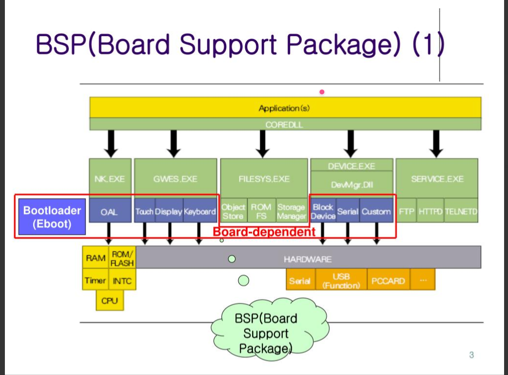

## 操作系统移植

什么是OS？

- 是一个管理软件。main函数中进行“任务管理”，前后台设计方式 、 多任务分时设计方式、多任务抢占（优先级）设计方式。

- 在不同的硬件，运行相同的任务，每个系统都能运行多个任务

- 架构思路

	- ```text
		用户层： 任务1		任务2 	任务3
						↑
					 向上提高统一接口
		OS：			函数指针	任务管理模块(任务的数据结构、调度策略：基于时间片【分时系统】，基于优先级【实时系统】)
					 驱动层（每个硬件的接口）
						↓
		硬件：		硬件A			硬件B
		```

- 

	- 自己编写OS，需要考虑怎么定义任务（task_struct中保存，如：PC、SP、任务状态标志...）
	- 等待 $\rightarrow$ 就绪，靠的中断处理函数（需要硬件配合） 
	- 内存管理：
		- 物理内存管理（总内存管理，需要软件进行管理用户区和内核区，以及栈【保证不越界】、堆【需要策略管理内存碎片】）
		- 虚拟内存管理（必须有硬件单元支撑 MMU）
	- 基于时间片设计思路
		- 需要定时器中断。即需要一个tick(节拍)，$$\text{单次 Tick 时间 (秒)} = \frac{1}{\text{定时器频率 (Hz)}}$$，一个时间片为多少tick由当前OS的设计决定。时间片到了就去就绪队列“调度一个任务”
		- 多个等待队列，一个就绪队列
	- 基于优先级的设计思路
		- 多个就绪队列（一个就绪队列就是一个优先级），一个等待队列


## FreeRTOS(源码安装)

书籍推荐：FreeRTOS内核实现与应用开发实战基于stm32 —— 野火出版

官网地址：https://www.freertos.org/zh-cn-cmn-s

GitHub地址：https://github.com/FreeRTOS/FreeRTOS + https://github.com/FreeRTOS/FreeRTOS-Kernel

FreeRTOS在提供了两套代码，一个是最新更新版本，一个是LTS版本（长期维护版本），在LTS版本中是没有Demo参考。

GitHub上的为全家桶，将所有的信息和示例都放到了一起，Github上的外设库和内核代码是分开的

```text
FreeRTOS/
├── FreeRTOS/
│   ├── Source/                     <-- 核心！FreeRTOS 内核源码
│   │   ├── include/                <-- 内核头文件 (task.h, queue.h 等)
│   │   ├── portable/               <-- 硬件移植层代码 (不同 CPU 架构的接口)
│   │   │   ├── GCC/                <-- 使用 GCC 编译器的各芯片移植代码
│   │   │   ├── RVDS/               <-- 使用 Keil/ARMCC 编译器的移植代码
│   │   │   └── MemMang/            <-- 5 种官方内存管理算法 (heap_1 ~ heap_5)
│   │   ├── tasks.c                 <-- 任务管理核心实现
│   │   ├── queue.c                 <-- 队列/信号量/互斥锁实现
│   │   ├── list.c                  <-- 链表数据结构实现
│   │   └── timers.c                <-- 软件定时器实现
│   │
│   ├── Demo/                       <-- 各大厂商开发板的官方示例工程
│   │   ├── CORTEX_STM32F103_Keil/  <-- 针对 STM32F1 的现成示例
│   │   └── ...                      <-- 包含几百个不同芯片/开发板的 Demo
│   │
│   └── Test/                       <-- 自动化测试与内核验证代码
```

- FreeRTOS/Demo目录  

	- 主要包含了大量预先制作好的示例工程，比如保留CORTEX_STM32F103_Keil目录，为stm32F103的参考工程
	- 还有Common目录，独立于demo的通用代码，大部分已经废弃，比如像drivers里其实就是stm32的标准库，可以删除  

- FreeRTOS/Source目录  

	- 该目录即为FreeRTOS的内核文件，去掉非.c的文件，保证目录的纯粹  

	- 这些.c文件是通用的，和平台无关的代码，核心的文件有2个： task.c和list.c  

	- | FreeRTOS/Source/*.c | 作用                                          |
		| ------------------- | --------------------------------------------- |
		| tasks.c             | 必需，任务操作                                |
		| list.c              | 必需，列表操作                                |
		| queue.c             | 基本必需，提供队列、信号量（semaphore）的操作 |
		| timer.c             | 可选， software timer                         |
		| event_groups.c      | 可选，提供event group功能                     |
		| croutine.c          | 可选，过时了                                  |

- FreeRTOS/Source/portable目录  

	- portable目录下是移植时需要实现的文件
	- 目录名命名规则： [compiler]/[architecture]
	- 比如RVDS/ARM_CM3，表示cortexM3架构在RVDS工具上的移植文件
		- 这个目录原本应该保留RVDS下的内容，以支持Keil，但最新版本的Keil编译器AC6对这些语
			法不支持了
		- 保留目录下的**GCC目录**，该目录保留ARM_CM3，以支持stm32F103
	- 其中该目录下有一个名为MemMang的目录，里面包含了堆内存管理代码，可以在Keil建立工程时，选择其中一个作为堆内存管理接口即可  

- FreeRTOS-Plus目录 ：FreeRTOS的生态文件，不需要，可以删除  

- tools目录  ：被亚马逊收购后，新增的云服务业务，可以删除  

官网的LTS：面向**企业级商业产品**的极简模块化发布。只要核心库和稳定的外围库

```text
FreeRTOS-LTS/
├── FreeRTOS/
│   ├── FreeRTOS-Kernel/            <-- 纯粹的内核源码（即主版本中的 Source 文件夹）
│   │   ├── include/                <-- 内核头文件
│   │   ├── portable/               <-- 硬件移植层 (GCC, IAR, RVDS 等)
│   │   └── *.c                     <-- tasks.c, queue.c 等内核源文件
│   │
│   ├── coreMQTT/                   <-- 轻量级 MQTT 协议栈（已通过 LTS 安全认证）
│   ├── coreHTTP/                   <-- 轻量级 HTTP 客户端库
│   ├── coreJSON/                   <-- 适合嵌入式系统的 JSON 解析器
│   ├── coreSNTP/                   <-- 网络对时协议库
│   ├── corePKCS11/                 <-- 密码学安全接口规范
│   ├── backoffAlgorithm/           <-- 指数退避重试算法库
│   ├── FreeRTOS-Cellular-Interface/ <-- 蜂窝网络（如 4G/5G 模组）抽象层
│   └── FreeRTOS-Plus-TCP/          <-- 官方 TCP/IP 网络协议栈
```


移植时需要的文件

在自己项目的内核目录，应该包含以下内容

```bash
FreeRTOS Core Folder Structure
│
├── CMakeLists.txt        // CMake 编译构建配置文件
├── croutine.c            // [可选] 协程（Co-routine）实现文件，适用于极小内存芯片（通常不使用）
├── event_groups.c        // [可选] 事件标志组（Event Groups）实现，用于多任务间的事件同步
├── History.txt           // 版本更新与变更历史日志
├── list.c                // [必选] 双向链表数据结构实现，FreeRTOS 调度器和队列的基础
├── manifest.yml          // 包元数据配置文件
├── queue.c               // [必选] 消息队列与信号量（Semaphore/Mutex）核心实现
├── stream_buffer.c       // [可选] 流缓冲区（Stream Buffer）与消息缓冲区实现（单生产者/单消费者场景）
├── tasks.c               // [必选] 任务管理与核心调度器（Scheduler）实现
├── timers.c              // [可选] 软件定时器（Software Timers）实现
│
├─inc                     // 内核 API 接口头文件目录
│      atomic.h           // 原子操作接口（用于多核或无锁操作）
│      croutine.h         // 协程头文件
│      deprecated_definitions.h  // 旧版本废弃宏定义的兼容层
│      event_groups.h     // 事件标志组 API 头文件
│      FreeRTOS.h         // [必选] FreeRTOS 核心配置与基础定义头文件
│      list.h             // [必选] 链表数据结构头文件
│      message_buffer.h   // 消息缓冲区 API 头文件
│      mpu_prototypes.h   // MPU（内存保护单元）API 函数原型
│      mpu_syscall_numbers.h // MPU 系统调用号定义
│      mpu_wrappers.h     // MPU 封装函数定义
│      newlib-freertos.h  // Newlib C 标准库适配头文件
│      picolibc-freertos.h// Picolibc 轻量级 C 标准库适配头文件
│      portable.h         // [必选] 硬件移植层统一接口抽象头文件
│      projdefs.h         // [必选] 系统通用宏定义（如 pdPASS, pdFAIL）
│      queue.h            // [必选] 队列/信号量 API 头文件
│      semphr.h           // 信号量/互斥锁 API 头文件
│      StackMacros.h      // 栈溢出检测辅助宏定义
│      stack_macros.h     // 栈分析辅助宏定义
│      stdint.readme      // C99 stdint.h 类型的说明文件
│      stream_buffer.h    // 流缓冲区 API 头文件
│      task.h             // [必选] 任务管理 API 头文件
│      timers.h           // 软件定时器 API 头文件
│
└─portable                // 平台移植层（Porting Layer）
    ├─GCC                 // 选择的编译器工具链：GCC
    │  └─ARM_CM3          // 选择的 CPU 架构：ARM Cortex-M3 (如 STM32F103)
    │          port.c     // [必选] Cortex-M3 的硬件细节实现（上下文切换、PendSV/SysTick 中断）
    │          portmacro.h// [必选] Cortex-M3 的架构定义（如临界区控制、数据类型定义）
    │
    └─MemMang             // 动态内存管理策略选型（5种策略选择1种）
            heap_4.c      // [必选] 最常用堆管理算法（支持动态内存分配/释放，带碎片自动合并）
            
FreeRTOSConfig.h		  // 配置文件，放在自己相应放的目录下，我放在App下
```

- MemMang下的5种策略：

	- | 文件     | 优点                           | 缺点                     |
		| -------- | ------------------------------ | ------------------------ |
		| heap_1.c | 分配简单，时间确定             | 只分配、不回收           |
		| heap_2.c | 动态分配，最佳匹配             | 碎片，时间不定           |
		| heap_3.c | 调用标准库函数                 | 速度慢、时间不定         |
		| heap_4.c | 相邻空闲内存可合并             | 可解决碎片问题、时间不定 |
		| heap_5.c | 在heap_4基础上支持分隔的内存块 | 可解决碎片问题、时间不定 |

- `FreeRTOSConfig.h`: FreeRTOS的配置文件，比如选择调度算法： configUSE_PREEMPTION 每个demo都必定含有FreeRTOSConfig.h,建议去修改demo中的 FreeRTOSConfig.h，而不是从头写一个。==【需要自己去demo拷贝一份，并且修改参数】==


**因为FreeRTOS需要时间片，进行任务的调度，使用的是SysTick定时器；所以自己写代码时，不能使用这个定时器**

在`FreeRTOSConfig.h`内容：

```c
/*
 * FreeRTOS V202411.00
 * Copyright (C) 2020 Amazon.com, Inc. or its affiliates. All Rights Reserved.
 *
 * Permission is hereby granted, free of charge, to any person obtaining a copy of
 * this software and associated documentation files (the "Software"), to deal in
 * the Software without restriction, including without limitation the rights to
 * use, copy, modify, merge, publish, distribute, sublicense, and/or sell copies of
 * the Software, and to permit persons to whom the Software is furnished to do so,
 * subject to the following conditions:
 *
 * The above copyright notice and this permission notice shall be included in all
 * copies or substantial portions of the Software.
 *
 * THE SOFTWARE IS PROVIDED "AS IS", WITHOUT WARRANTY OF ANY KIND, EXPRESS OR
 * IMPLIED, INCLUDING BUT NOT LIMITED TO THE WARRANTIES OF MERCHANTABILITY, FITNESS
 * FOR A PARTICULAR PURPOSE AND NONINFRINGEMENT. IN NO EVENT SHALL THE AUTHORS OR
 * COPYRIGHT HOLDERS BE LIABLE FOR ANY CLAIM, DAMAGES OR OTHER LIABILITY, WHETHER
 * IN AN ACTION OF CONTRACT, TORT OR OTHERWISE, ARISING FROM, OUT OF OR IN
 * CONNECTION WITH THE SOFTWARE OR THE USE OR OTHER DEALINGS IN THE SOFTWARE.
 *
 * https://www.FreeRTOS.org
 * https://github.com/FreeRTOS
 *
 */

#ifndef FREERTOS_CONFIG_H
#define FREERTOS_CONFIG_H

/*-----------------------------------------------------------
 * Application specific definitions.
 *
 * These definitions should be adjusted for your particular hardware and
 * application requirements.
 *
 * THESE PARAMETERS ARE DESCRIBED WITHIN THE 'CONFIGURATION' SECTION OF THE
 * FreeRTOS API DOCUMENTATION AVAILABLE ON THE FreeRTOS.org WEB SITE. 
 *
 * See http://www.freertos.org/a00110.html
 *----------------------------------------------------------*/

#define configUSE_PREEMPTION		1
#define configUSE_IDLE_HOOK			0
#define configUSE_TICK_HOOK			0
#define configCPU_CLOCK_HZ			( ( unsigned long ) 72000000 )	
#define configTICK_RATE_HZ			( ( TickType_t ) 1000 )
#define configMAX_PRIORITIES		( 5 )
#define configMINIMAL_STACK_SIZE	( ( unsigned short ) 128 )
#define configTOTAL_HEAP_SIZE		( ( size_t ) ( 17 * 1024 ) )
#define configMAX_TASK_NAME_LEN		( 16 )
#define configUSE_TRACE_FACILITY	0
#define configUSE_16_BIT_TICKS		0
#define configIDLE_SHOULD_YIELD		1

/* Co-routine definitions. */
#define configUSE_CO_ROUTINES 		0
#define configMAX_CO_ROUTINE_PRIORITIES ( 2 )

/* Set the following definitions to 1 to include the API function, or zero
to exclude the API function. */

#define INCLUDE_vTaskPrioritySet		1
#define INCLUDE_uxTaskPriorityGet		1
#define INCLUDE_vTaskDelete				1
#define INCLUDE_vTaskCleanUpResources	0
#define INCLUDE_vTaskSuspend			1
#define INCLUDE_vTaskDelayUntil			1
#define INCLUDE_vTaskDelay				1

/* This is the raw value as per the Cortex-M3 NVIC.  Values can be 255
(lowest) to 0 (1?) (highest). */
#define configKERNEL_INTERRUPT_PRIORITY 		255
/* !!!! configMAX_SYSCALL_INTERRUPT_PRIORITY must not be set to zero !!!!
See http://www.FreeRTOS.org/RTOS-Cortex-M3-M4.html. */
#define configMAX_SYSCALL_INTERRUPT_PRIORITY 	191 /* equivalent to 0xb0, or priority 11. */


/* This is the value being used as per the ST library which permits 16
priority values, 0 to 15.  This must correspond to the
configKERNEL_INTERRUPT_PRIORITY setting.  Here 15 corresponds to the lowest
NVIC value of 255. */
#define configLIBRARY_KERNEL_INTERRUPT_PRIORITY	15

/* 添加内容 */
/* 必须添加： 将 FreeRTOS 的中断处理函数映射到 Cortex-M 对应的标准向量入口 */
#define vPortSVCHandler     SVC_Handler
#define xPortPendSVHandler  PendSV_Handler
#define xPortSysTickHandler SysTick_Handler


/* -- 下面可选，还有其他选项没有列出 --  */
/* 互斥量、递归互斥量、计数信号量 */
#define configUSE_MUTEXES                   1
#define configUSE_RECURSIVE_MUTEXES         1
#define configUSE_COUNTING_SEMAPHORES       1

/* 软件定时器（很常用） */
#define configUSE_TIMERS                    1
#define configTIMER_TASK_PRIORITY           ( configMAX_PRIORITIES - 1 )
#define configTIMER_QUEUE_LENGTH            10
#define configTIMER_TASK_STACK_DEPTH        ( configMINIMAL_STACK_SIZE * 2 )

/* 任务通知（现代 FreeRTOS 强烈推荐） */
#define configUSE_TASK_NOTIFICATIONS        1
#define configTASK_NOTIFICATION_ARRAY_ENTRIES 1

/* 静态/动态分配支持（根据需要） */
#define configSUPPORT_STATIC_ALLOCATION     0   /* 需要静态创建任务时改为 1 */
#define configSUPPORT_DYNAMIC_ALLOCATION    1

/* 断言（调试时非常有用） */
#define configASSERT( x ) if( ( x ) == 0 ) { taskDISABLE_INTERRUPTS(); for( ;; ); }

/* 栈溢出检测 */
#define configCHECK_FOR_STACK_OVERFLOW      2   /* 0关闭，1简单，2完整 */

#endif /* FREERTOS_CONFIG_H */
```

对于`stm32f10x_it.c`中的修改

```c
/**
  ******************************************************************************
  * @file    Project/STM32F10x_StdPeriph_Template/stm32f10x_it.c 
  * @author  MCD Application Team
  * @version V3.6.0
  * @date    20-September-2021
  * @brief   Main Interrupt Service Routines.
  *          This file provides template for all exceptions handler and 
  *          peripherals interrupt service routine.
  ******************************************************************************
  * @attention
  *
  * Copyright (c) 2011 STMicroelectronics.
  * All rights reserved.
  *
  * This software is licensed under terms that can be found in the LICENSE file
  * in the root directory of this software component.
  * If no LICENSE file comes with this software, it is provided AS-IS.
  *
  ******************************************************************************
  */

/* Includes ------------------------------------------------------------------*/
/** @addtogroup STM32F10x_StdPeriph_Template
  * @{
  */

/* Private typedef -----------------------------------------------------------*/
/* Private define ------------------------------------------------------------*/
/* Private macro -------------------------------------------------------------*/
/* Private variables ---------------------------------------------------------*/
/* Private function prototypes -----------------------------------------------*/
/* Private functions ---------------------------------------------------------*/

/******************************************************************************/
/*            Cortex-M3 Processor Exceptions Handlers                         */
/******************************************************************************/

/**
  * @brief  This function handles NMI exception.
  * @param  None
  * @retval None
  */
void NMI_Handler(void)
{
}

/**
  * @brief  This function handles Hard Fault exception.
  * @param  None
  * @retval None
  */
void HardFault_Handler(void)
{
  /* Go to infinite loop when Hard Fault exception occurs */
  while (1)
  {
  }
}

/**
  * @brief  This function handles Memory Manage exception.
  * @param  None
  * @retval None
  */
void MemManage_Handler(void)
{
  /* Go to infinite loop when Memory Manage exception occurs */
  while (1)
  {
  }
}

/**
  * @brief  This function handles Bus Fault exception.
  * @param  None
  * @retval None
  */
void BusFault_Handler(void)
{
  /* Go to infinite loop when Bus Fault exception occurs */
  while (1)
  {
  }
}

/**
  * @brief  This function handles Usage Fault exception.
  * @param  None
  * @retval None
  */
void UsageFault_Handler(void)
{
  /* Go to infinite loop when Usage Fault exception occurs */
  while (1)
  {
  }
}

/* 屏蔽这3个中断函数 */
#ifdef FREERTOS
/**
  * @brief  This function handles SVCall exception.
  * @param  None
  * @retval None
  */
void SVC_Handler(void)
{
}

/**
  * @brief  This function handles PendSVC exception.
  * @param  None
  * @retval None
  */
void PendSV_Handler(void)
{
}

/**
  * @brief  This function handles SysTick Handler.
  * @param  None
  * @retval None
  */
void SysTick_Handler(void)
{
}
#endif

/**
  * @brief  This function handles Debug Monitor exception.
  * @param  None
  * @retval None
  */
void DebugMon_Handler(void)
{
}


/******************************************************************************/
/*                 STM32F10x Peripherals Interrupt Handlers                   */
/*  Add here the Interrupt Handler for the used peripheral(s) (PPP), for the  */
/*  available peripheral interrupt handler's name please refer to the startup */
/*  file (startup_stm32f10x_xx.s).                                            */
/******************************************************************************/

/**
  * @brief  This function handles PPP interrupt request.
  * @param  None
  * @retval None
  */
/*void PPP_IRQHandler(void)
{
}*/

/**
  * @}
  */ 

```

对于`stm32f10x_it.h`中的修改

```c
/**
  ******************************************************************************
  * @file    Project/STM32F10x_StdPeriph_Template/stm32f10x_it.h 
  * @author  MCD Application Team
  * @version V3.6.0
  * @date    20-September-2021
  * @brief   This file contains the headers of the interrupt handlers.
  ******************************************************************************
  * @attention
  *
  * Copyright (c) 2011 STMicroelectronics.
  * All rights reserved.
  *
  * This software is licensed under terms that can be found in the LICENSE file
  * in the root directory of this software component.
  * If no LICENSE file comes with this software, it is provided AS-IS.
  *
  ******************************************************************************
  */

/* Define to prevent recursive inclusion -------------------------------------*/
#ifndef __STM32F10x_IT_H
#define __STM32F10x_IT_H

#ifdef __cplusplus
 extern "C" {
#endif 

/* Includes ------------------------------------------------------------------*/
#include "stm32f10x.h"

/* Exported types ------------------------------------------------------------*/
/* Exported constants --------------------------------------------------------*/
/* Exported macro ------------------------------------------------------------*/
/* Exported functions ------------------------------------------------------- */

void NMI_Handler(void);
void HardFault_Handler(void);
void MemManage_Handler(void);
void BusFault_Handler(void);
void UsageFault_Handler(void);
void DebugMon_Handler(void);
#ifndef FREERTOS
void SVC_Handler(void);
void PendSV_Handler(void);
void SysTick_Handler(void);
#endif

/* 自定义中断 */
void EXTI0_IRQHandler();
void TIM6_IRQHandler();
void USART1_IRQHandler();

#ifdef __cplusplus
}
#endif

#endif /* __STM32F10x_IT_H */


```

在keil中将所有.c添加到项目树中，所有头文件都需要在魔术棒设置中告知keil头文件位置。

测试例子

```c
#include <FreeRTOS.h>
#include <stm32f10x.h>
#include <task.h>			// 任务管理接口

volatile static int task1Flags = 0;
volatile static int task2Flags = 0;
volatile static int task3Flags = 0;

void task1(void * arg) {
	BaseType_t xReturn = pdPASS;
	while (1) {
		task1Flags = 1;
		task2Flags = 0;
		task3Flags = 0;
	}
}

void task2(void * arg) {
	while (1) {
		task1Flags = 0;
		task2Flags = 1;
		task3Flags = 0;
	}
}

TaskHandle_t task1_handle;			// 任务PCB信息
TaskHandle_t task2_handle;

int main() {
	// 创建任务
	BaseType_t xReturn = pdPASS;

	xReturn = xTaskCreate(task1, "task1", 100, NULL, 0, &task1_handle);
	if (xReturn != pdPASS) {
		goto failed;
	}
	xReturn = xTaskCreate(task2, "task2", 100, NULL, 0, &task2_handle);
	if (xReturn == pdPASS) {
		vTaskStartScheduler();			// 使用系统调用，让CPU在异常中执行该任务调度，之后交替执行这两个任务
	}
failed:
	while (1);
}

```


任务相关的函数

| **API 函数**          | **功能描述**                         | **核心参数说明**                                             |
| --------------------- | ------------------------------------ | ------------------------------------------------------------ |
| `xTaskCreate()`       | 动态创建任务并分配内存               | 任务函数名, 任务名称, 栈深度, 传递参数, 优先级, 任务句柄     |
| `xTaskCreateStatic()` | 静态创建任务（需手动指定内存）       | 任务函数名, 任务名称, 栈深度, 传递参数, 优先级, 栈数组, TCB结构体 |
| `vTaskDelete()`       | 删除指定的任务（传 `NULL` 删除自身） | `xTaskToDelete`: 目标任务句柄                                |
| `vTaskSuspend()`      | 挂起指定任务                         | `xTaskToSuspend`: 目标任务句柄                               |
| `vTaskResume()`       | 恢复挂起的任务                       | `xTaskToResume`: 目标任务句柄                                |

```c
BaseType_t xTaskCreate( 
    TaskFunction_t pxTaskCode,                  /* [参数1] 任务函数入口指针：指向任务的主体函数（函数签名必须为 void vFunction(void *pvParameters)） */
    const char * const pcName,                  /* [参数2] 任务的可读名称：字符串形式，主要用于调试和追踪（最大长度由 configMAX_TASK_NAME_LEN 定义） */
    const configSTACK_DEPTH_TYPE uxStackDepth,  /* [参数3] 任务栈深度：分配给该任务的栈空间大小（注意：单位是 Word 字节数/字长，例如在 32 位系统下，传入 128 代表 128 * 4 = 512 字节） */
    void * const pvParameters,                  /* [参数4] 传递给任务的参数：通用指针，会作为参数传递给 pxTaskCode 任务函数（若无参数传 NULL） */
    UBaseType_t uxPriority,                     /* [参数5] 任务优先级：数值越大优先级越高，范围为 0 ~ (configMAX_PRIORITIES - 1) */
    TaskHandle_t * const pxCreatedTask          /* [参数6] 任务句柄指针：用于传出刚创建好的任务句柄（后续挂起、删除或修改该任务时需要用到；若不需要可传 NULL） */
);
```


测试方式（软件的模拟逻辑分析仪测试）：

1. 先创建一个项目目标，用于区分RAM、flash的配置。
2. 在Debug选项框中，选择“use simulator”，在“Dialog DLL”中改为“DARMSTM.DLL”，然后对应的
	parameter改为“-pSTM32F103ZE  ，勾选Load Application at Startup

3. 软件模拟，默认是12MHZ，需要修改频率，让它9倍频之后等于72MHZ

  - ```c
  	    /*  PLL configuration: PLLCLK = HSE * 9 = 72 MHz */
  	    RCC->CFGR &= (uint32_t)((uint32_t)~(RCC_CFGR_PLLSRC | RCC_CFGR_PLLXTPRE |
  	                                        RCC_CFGR_PLLMULL));

  	/* 软件模拟 HSE = 12MHZ 需要修改,添加宏方便切换 */
  	#ifndef FREERTOS_SIM
  	    RCC->CFGR |= (uint32_t)(RCC_CFGR_PLLSRC_HSE | RCC_CFGR_PLLMULL9);
  	#else
  		RCC->CFGR |= (uint32_t)(RCC_CFGR_PLLSRC_HSE | RCC_CFGR_PLLMULL6); // 6倍频
  	#endif
  	```

4. 

	


## Linux移植

Linux的移植流程：

| **步骤** | **阶段名称**         | **核心任务与实现细节**                                       |
| -------- | -------------------- | ------------------------------------------------------------ |
| **1**    | **工具与环境搭建**   | 搭建 Linux 开发主机环境，安装交叉编译工具链（如 `aarch64-none-linux-gnu-gcc` 或 `arm-linux-gnueabihf-gcc`），配置 TFTP/NFS 网络服务以便调试。 |
| **2**    | **Bootloader 阶段**  | 硬件复位后首先运行（如 U-Boot）。初始化 DDR 内存、串口等基础硬件；配置启动参数（`bootargs`/传参给内核）；将 Flash/SD卡/eMMC 中的 `zImage`/`uImage` 以及设备树（`DTB`）加载到内存指定位置，并跳转到内核入口。 |
| **3**    | **内核移植与启动**   | 解压内核，进行架构相关初始化（如 MMU 开启、中断控制器配置）；挂载根文件系统（Rootfs）；解析设备树；建立虚拟内存与物理内存映射。 |
| **4**    | **初始化根文件系统** | 基于 VFS（虚拟文件系统）将存储介质上的块设备挂载到挂载点；利用 Ext4/UBIFS 等文件系统建立文件名/路径（字符串）到磁盘 Block/Inode 的物理映射，使操作系统能够识别目录结构。 |
| **5**    | **用户态首个程序**   | 内核在空间初始化完成后，从根文件系统中寻找并启动 **PID 1** 的 `init` 进程（如 BusyBox init、Systemd 或 SysVinit），完成从内核态（Kernel Space）到用户态（User Space）的跨越。 |
| **6**    | **Shell 与人机交互** | `init` 脚本通过 `/etc/inittab` 或服务配置文件拉起 `getty`/`login` 终端，进而加载并运行 `Shell`（如 `ash`、`bash`）可执行程序，为用户提供指令解析与内核交互的窗口。 |

相关的工作岗位：BSP工程师


### 工具与环境搭建

1. 【面试常问】：交叉编译工具链（Cross-Compilation Toolchain）

	>回答：之所以需要交叉编译，是因为嵌入式目标机的计算性能和存储资源有限，不具备在本地直接编译复杂大型代码的能力；因此我们需要借用性能强悍的 x86 宿主机，配合针对目标板架构定制的交叉编译工具链来完成编译。（本质：）
	>
	>
	>
	>编译工具：将高级语言$\rightarrow$ 机器语言（各个CPU架构有自己独立的指令集），同时集成了某款OS的初始化代码（调用`main`函数之前，该OS初始化执行指令）
	>
	>
	>
	>工具依赖于具体CPU架构
	>
	>交叉编译工具链的本质：**指运行在某种架构的**==宿主机（Host）==**上，能够生成另一种不同架构**==目标机==（Target）**所能执行的机器码的编译器集合**
	>
	>- 宿主机：Host、主机端，编写代码、执行编译的机器
	>- 目标机：Target，最终运行可执行程序的机器
	>
	>
	>
	>如何证明工具链运行在哪个宿主机上
	>
	>```bash
	># 查看命令的位置
	>siguyuan@debian:~$ which gcc
	>/usr/bin/gcc
	>
	># 使用file命令探测和识别文件真正类型
	>siguyuan@debian:~$ file /usr/bin/gcc
	>/usr/bin/gcc: symbolic link to gcc-14 # 是一个软链接，链接到gcc-14
	>
	>siguyuan@debian:~$ file /usr/bin/gcc-14
	>/usr/bin/gcc-14: symbolic link to x86_64-linux-gnu-gcc-14  
	>
	># 链接的真实文件
	>siguyuan@debian:~$ file /usr/bin/x86_64-linux-gnu-gcc-14
	>/usr/bin/x86_64-linux-gnu-gcc-14: ELF 64-bit LSB executable, x86-64, version 1 (GNU/Linux), dynamically linked, interpreter /lib64/ld-linux-x86-64.so.2, BuildID[sha1]=a162828956e216e665b1216fd8d6199f4e9b78b4, for GNU/Linux 3.2.0, stripped
	>
	># 文件绝对路径: ELF格式 64位架构 小端 可执行程序, 运行在x86-64CPU上, ELF文件头版本, 动态链接, 指定的动态链接器/加载器路径，编译时生成的独一无二的 SHA-1 校验指纹，最低内核版本要求，符号表已被剥离/去除
	>```
	>
	>如何证明工具链 生成哪个目标机Target上
	>
	>```bash
	>siguyuan@debian:~$ gcc -v
	>Using built-in specs.
	>COLLECT_GCC=gcc
	>COLLECT_LTO_WRAPPER=/usr/libexec/gcc/x86_64-linux-gnu/14/lto-wrapper
	>OFFLOAD_TARGET_NAMES=nvptx-none:amdgcn-amdhsa
	>OFFLOAD_TARGET_DEFAULT=1
	>Target: x86_64-linux-gnu   # 编译的程序运行到 x86_64-linux上
	>Configured with: ../src/configure -v --with-pkgversion='Debian 14.2.0-19' --with-bugurl=file:///usr/share/doc/gcc-14/README.Bugs --enable-languages=c,ada,c++,go,d,fortran,objc,obj-c++,m2,rust --prefix=/usr --with-gcc-major-version-only --program-suffix=-14 --program-prefix=x86_64-linux-gnu- --enable-shared --enable-linker-build-id --libexecdir=/usr/libexec --without-included-gettext --enable-threads=posix --libdir=/usr/lib --enable-nls --enable-bootstrap --enable-clocale=gnu --enable-libstdcxx-debug --enable-libstdcxx-time=yes --with-default-libstdcxx-abi=new --enable-libstdcxx-backtrace --enable-gnu-unique-object --disable-vtable-verify --enable-plugin --enable-default-pie --with-system-zlib --enable-libphobos-checking=release --with-target-system-zlib=auto --enable-objc-gc=auto --enable-multiarch --disable-werror --enable-cet --with-arch-32=i686 --with-abi=m64 --with-multilib-list=m32,m64,mx32 --enable-multilib --with-tune=generic --enable-offload-targets=nvptx-none=/build/reproducible-path/gcc-14-14.2.0/debian/tmp-nvptx/usr,amdgcn-amdhsa=/build/reproducible-path/gcc-14-14.2.0/debian/tmp-gcn/usr --enable-offload-defaulted --without-cuda-driver --enable-checking=release --build=x86_64-linux-gnu --host=x86_64-linux-gnu --target=x86_64-linux-gnu --with-build-config=bootstrap-lto-lean --enable-link-serialization=3
	>Thread model: posix
	>Supported LTO compression algorithms: zlib zstd
	>gcc version 14.2.0 (Debian 14.2.0-19)
	>
	>```
	>
	>

2. 工具链获取方式

	1. 芯片厂家提供 —— 最优解（性能优化最强，需要花钱，工程上推荐）

	2. CPU厂家提供 —— 最通用（泛用最强，部分需要花钱，Linux不需要，学习推荐）

	  - arm开发者网站下载：https://developer.arm.com/tools-and-software/gnu-toolchain

	  - 本次学习使用的是野火的`EBF6ULL`板子，需要下载`gun-toolchain`的9版本（新版的gcc工具不支持低版本的语法）

	   -  ```bash
		# 下载9版本的32位 需要添加-L允许重定向，没有科学上网很慢
		curl -L -O https://armkeil.blob.core.windows.net/developer/Files/downloads/gnu-a/9.2-2019.12/binrel/gcc-arm-9.2-2019.12-x86_64-arm-none-linux-gnueabihf.tar.xz
		
		# 使用国内镜像源下载，下载的大小为264181856
		wget https://mirrors.tuna.tsinghua.edu.cn/armbian-releases/_toolchain/gcc-arm-9.2-2019.12-x86_64-arm-none-linux-gnueabihf.tar.xz
		
		# 解压到/opt目录（防止有些工具没有使用相对路径，导致报错）
		sudo tar -Jxvf gcc-arm-9.2-2019.12-x86_64-arm-none-linux-gnueabihf.tar.xz -C /opt/
	
	  - 权限修改
	
	   -  ```bash
		siguyuan@debian:~/EBF_6ULL/packages$ ls -l /opt/
		总计 4
		drwxr-xr-x 9 siguyuan siguyuan 4096 2019年12月13日 gcc-arm-9.2-2019.12-x86_64-arm-none-linux-gnueabihf
		
		# 如果中的所有组和所有者不是当前用户，而是root，需要修改权限
		sudo chown -R 当前用户组:当前用户名 路径
		# 文件重命名（可选）
		mv gcc-arm-9.2-2019.12-x86_64-arm-none-linux-gnueabihf arm-linux-gnueabihf
		
		# 创建软连接
		sudo ln -s /opt/gcc-arm-9.2-2019.12-x86_64-arm-none-linux-gnueabihf /opt/arm-linux-gnueabihf
	
	
	
	  - 配置环境变量
	
	    - `export PATH=$PATH:/opt/arm-linux-gnueabihf/bin`
	
	    	1. 直接运行，已经运行的终端无法知道环境变量的改变
	
	    	2. 把这个配置信息写到一个脚本里，等需要时，激活脚本（推荐）
	
	    		- ```bash
	    			siguyuan@debian:~/EBF_6ULL/packages/env$ cat arm_path.sh
	    			#!/bin/bash
	    			
	    			# 交叉编译工具链的环境变量配置
	    			export PATH=$PATH:/opt/arm-linux-gnueabihf/bin
	    			# export 把当前 Shell 进程中的“局部变量”提升为“环境变量”，使其可以被当前进程后续创建的所有“子进程”继承和使用。
	    			siguyuan@debian:~/EBF_6ULL/packages/env$ sudo chmod +x arm_path.sh
	    			
	    			```
	
	    		- 
	
	    		- `source`激活形式（推荐）
	
	    			- 在当前进程激活脚本，会修改当前的环境变量
	    			- `source arm_path.sh`
	
	    		- 脚本直接执行
	
	    			- 只有子进程才有这个变量，父进程的环境变量没有执行
	    			- `./arm_path.sh`

	  - 常用的连接介质：串口、网线（JATG太贵、USB需要自己写驱动）
	
	3. 自己构建  不推荐 
	
	- Buildroot：开源自动化嵌入式 Linux 系统构建工具。下载链接：https://buildroot.org/download.html


常见的二进制工具

在嵌入式与 C/C++ 开发中，这些属于 GNU Binutils 工具链的核心命令。以下是为你补充完整并加上高频实用参数的参考字典：

**`readelf`（解析 ELF 文件结构）**

- **`-h`**：查看 ELF 文件头（显示目标架构如 ARM/x86、大小端、程序入口地址等）。
- **`-S`**：查看段表（Section headers），例如代码段 `.text`、数据段 `.data` 和 `.bss`。
- **`-s`**：查看详细的符号表。
- **`-d`**：查看动态段信息（可用于查看该程序依赖了哪些 `.so` 动态库）。

**`od` / `hexdump`（查看二进制原始数据）**

- **`od -t x1 文件名`**：以单字节十六进制格式输出。
- **`hexdump -C 文件名`**（补充）：以左侧十六进制、右侧 ASCII 字符对应的经典排版显示，比 `od` 更适合人类阅读。

**`size`（查看内存分段占用）**

- **`size 文件名`**：直接输出 `.text`（代码区）、`.data`（已初始化全局/静态变量）、`.bss`（未初始化全局/静态变量）的独立大小以及总大小。用于评估程序放入 RAM/ROM 的尺寸。

**`nm`（查看符号表）**

- **`nm 文件名`**：列出程序中的函数名、全局变量等符号及其内存地址。
- **`-C`**：解开（Demangle）C++ 的符号名，将乱码般的底层符号还原为带参数列表的 C++ 源码函数名。
- **`-u`**：只显示未定义符号（查找 “为什么编译提示 undefined reference” 时的利器）。

**`strip`（文件瘦身/去除调试信息）**

- **`strip 文件名`**：剔除符号表、重定位信息和调试信息。**开发时不能 strip，否则无法用 GDB 调试；部署到板子上前必须 strip，可大幅缩小文件体积**。
- **`--strip-debug`**：仅剔除调试信息，保留普通的符号表。
- 不同CPU架构的gcc生成的汇编，需要对应架构的strip进行识别

**`objdump`（反汇编与分析，实际工程会做乱序处理，防止反汇编）**

- **`-d`**：仅反汇编包含可执行指令的段（如 `.text`）。
- **`-S`**：将 C/C++ 源代码与对应的汇编代码交替显示（前提是编译时加了 `-g` 参数）。
- **`-R`**：显示动态重定位入口（查看对外部动态库函数的调用劫持点）。
- 不同CPU架构的gcc生成的汇编，需要对应架构的objdump进行识别

**`objcopy`（文件格式转换/提纯）**

- **提取纯二进制**：ELF 文件包含头部和地址信息，通常用此命令剥离格式，生成可以直接烧录到单片机或内存运行的裸二进制（bin）文件： `objcopy -O binary 原文件.elf 输出.bin`

**`strings`（提取可打印字符）**

- **`strings 文件名`**：打印文件中所有的文本字符串常量（例如代码里写死的密码、路径、版本号、报错提示等）。即使经过 `strip`，字符串常量也依然存在。

**`addr2line`**：程序发生段错误（Segmentation fault）死机时，配合内核打印的崩溃地址，将地址翻译为具体的**源码文件名和报错行号**。 `addr2line -e 文件名 崩溃内存地址`

**`file`**：查看文件基础属性，快速确认这个程序是 32 位还是 64 位，是 x86 还是 ARM 架构。

**`ldd`**（仅限板端/主机端）：查看可执行文件运行所需的所有动态共享库（`.so`）及其绝对路径。

```bash
# 先创建例子
siguyuan@debian:~/EBF_6ULL/test$ gcc -o a_x86 aa.c
siguyuan@debian:~/EBF_6ULL/test$ arm-none-linux-gnueabihf-gcc -o a_arm aa.c
siguyuan@debian:~/EBF_6ULL/test$ ls
aa.c  a_arm  a_x86
siguyuan@debian:~/EBF_6ULL/test$ cat aa.c
#include <stdio.h>

void test01(){}

void test02(){}

int main(){
    printf("======\n");
    test01();
    test02();
    return 0;
}

siguyuan@debian:~/EBF_6ULL/test$ ls -l
总计 32
-rw-rw-r-- 1 siguyuan siguyuan   134  8月11日 17:30 aa.c
-rwxrwxr-x 1 siguyuan siguyuan 12052  8月11日 17:38 a_arm
-rwxrwxr-x 1 siguyuan siguyuan 16008  8月11日 17:38 a_x86

```


```bash
# file查看ELF头区别

# 运行在x86-64的环境，没有剔除符号表
siguyuan@debian:~/EBF_6ULL/test$ file a_x86
a_x86: ELF 64-bit LSB pie executable, x86-64, version 1 (SYSV), dynamically linked, interpreter /lib64/ld-linux-x86-64.so.2, BuildID[sha1]=71a94870abdb3570f4f832cf36deee88f311e1ed, for GNU/Linux 3.2.0, not stripped

# 运行在32位 arm的环境，没有剔除符号表
siguyuan@debian:~/EBF_6ULL/test$ file a_arm
a_arm: ELF 32-bit LSB executable, ARM, EABI5 version 1 (SYSV), dynamically linked, interpreter /lib/ld-linux-armhf.so.3, for GNU/Linux 3.2.0, with debug_info, not stripped

```


```bash
# 查看结构头的区别
siguyuan@debian:~/EBF_6ULL/test$ arm-none-linux-gnueabihf-readelf -h a_arm
ELF Header:
  Magic:   7f 45 4c 46 01 01 01 00 00 00 00 00 00 00 00 00
  Class:                             ELF32
  Data:                              2's complement, little endian
  Version:                           1 (current)
  OS/ABI:                            UNIX - System V
  ABI Version:                       0
  Type:                              EXEC (Executable file)
  Machine:                           ARM
  Version:                           0x1
  Entry point address:               0x10319  # 程序运行 最开始的地方
  Start of program headers:          52 (bytes into file)
  Start of section headers:          10572 (bytes into file)
  Flags:                             0x5000400, Version5 EABI, hard-float ABI
  Size of this header:               52 (bytes)
  Size of program headers:           32 (bytes)
  Number of program headers:         9
  Size of section headers:           40 (bytes)
  Number of section headers:         37
  Section header string table index: 36


siguyuan@debian:~/EBF_6ULL/test$ od -t x1 a_arm
0000000 7f 45 4c 46 01 01 01 00 00 00 00 00 00 00 00 00
0000020 02 00 28 00 01 00 00 00 19 03 01 00 34 00 00 00
0000040 4c 29 00 00 00 04 00 05 34 00 20 00 09 00 28 00
0000060 25 00 24 00 01 00 00 70 6c 04 00 00 6c 04 01 00


siguyuan@debian:~/EBF_6ULL/test$ readelf -h a_x86
ELF 头：
  Magic：  7f 45 4c 46 02 01 01 00 00 00 00 00 00 00 00 00 # 这个ELF头标志对应的二进制
  类别:                              ELF64
  数据:                              2 补码，小端序 (little endian)
  Version:                           1 (current)
  OS/ABI:                            UNIX - System V
  ABI 版本:                          0
  类型:                              DYN (Position-Independent Executable file)
  系统架构:                          Advanced Micro Devices X86-64
  版本:                              0x1
  入口点地址：              0x1050
  程序头起点：              64 (bytes into file)
  Start of section headers:          14024 (bytes into file)
  标志：             0x0
  Size of this header:               64 (bytes)
  Size of program headers:           56 (bytes)
  Number of program headers:         14
  Size of section headers:           64 (bytes)
  Number of section headers:         31
  Section header string table index: 30
  
siguyuan@debian:~/EBF_6ULL/test$ od -t x1 a_x86
0000000 7f 45 4c 46 02 01 01 00 00 00 00 00 00 00 00 00  
0000020 03 00 3e 00 01 00 00 00 50 10 00 00 00 00 00 00
0000040 40 00 00 00 00 00 00 00 c8 36 00 00 00 00 00 00
0000060 00 00 00 00 40 00 38 00 0e 00 40 00 1f 00 1e 00

```

入口地址：ELF 头部记录的一个内存指针，指示 CPU 或操作系统加载程序后**执行第一条指令的位置**。

- **操作系统/加载器**：Linux 下由标准链接脚本或动态随机基址（ASLR + PIE）决定（如 `0x1000` 或 `0x10300` 偏移）。（相对地址）
- **裸机/板端硬件**：由芯片 SRAM/Flash 的物理内存布局决定（如 i.MX6ULL 的 `0x80000000`、STM32 的 `0x08000000`）。（真实物理地址）

```bash
# 查看大小，不太编译器添加的main之前添加的内容不同
siguyuan@debian:~/EBF_6ULL/test$ size a_x86
   text    data     bss     dec     hex filename
   1423     584       8    2015     7df a_x86

siguyuan@debian:~/EBF_6ULL/test$ arm-none-linux-gnueabihf-size a_arm
   text    data     bss     dec     hex filename
    799     288       4    1091     443 a_arm

```

```bash
# 查看二进制符号表
siguyuan@debian:~/EBF_6ULL/test$ nm a_x86
0000000000002134 r __abi_tag
0000000000004018 B __bss_start
0000000000004018 b completed.0
                 w __cxa_finalize@GLIBC_2.2.5
0000000000004008 D __data_start
0000000000004008 W data_start
0000000000001080 t deregister_tm_clones
00000000000010f0 t __do_global_dtors_aux
0000000000003dd8 d __do_global_dtors_aux_fini_array_entry
0000000000004010 D __dso_handle
0000000000003de0 d _DYNAMIC
0000000000004018 D _edata
0000000000004020 B _end
0000000000001178 T _fini
0000000000001130 t frame_dummy
0000000000003dd0 d __frame_dummy_init_array_entry
0000000000002130 r __FRAME_END__
0000000000003fe8 d _GLOBAL_OFFSET_TABLE_
                 w __gmon_start__
000000000000200c r __GNU_EH_FRAME_HDR
0000000000001000 T _init
0000000000002000 R _IO_stdin_used
                 w _ITM_deregisterTMCloneTable
                 w _ITM_registerTMCloneTable
                 U __libc_start_main@GLIBC_2.34
0000000000001147 T main
                 U puts@GLIBC_2.2.5
00000000000010b0 t register_tm_clones
0000000000001050 T _start
0000000000001139 T test01
0000000000001140 T test02
0000000000004018 D __TMC_END__

siguyuan@debian:~/EBF_6ULL/test$ arm-none-linux-gnueabihf-nm a_arm
         U abort@@GLIBC_2.4
0002102c B __bss_end__
0002102c B _bss_end__
00021028 B __bss_start
00021028 B __bss_start__
00010348 t call_weak_fn
00021028 b completed.10857
00021020 D __data_start
00021020 W data_start
0001036c t deregister_tm_clones
000103bc t __do_global_dtors_aux
00020f0c d __do_global_dtors_aux_fini_array_entry
00021024 D __dso_handle
00020f10 d _DYNAMIC
00021028 D _edata
0002102c B __end__
0002102c B _end
00010458 T _fini
000103d4 t frame_dummy
00020f08 d __frame_dummy_init_array_entry
00010474 r __FRAME_END__
00021000 d _GLOBAL_OFFSET_TABLE_
         w __gmon_start__
000102c8 T _init
00020f0c d __init_array_end
00020f08 d __init_array_start
00010460 R _IO_stdin_used
00010454 T __libc_csu_fini
00010414 T __libc_csu_init
         U __libc_start_main@@GLIBC_2.4
000103f4 T main
         U puts@@GLIBC_2.4
00010390 t register_tm_clones
00010318 T _start
000103d8 T test01
000103e6 T test02
00021028 D __TMC_END__

```

| **符号类型**                   | **符号含义描述**                               | **常见示例**                                                 |
| ------------------------------ | ---------------------------------------------- | ------------------------------------------------------------ |
| **`T` / `t`**                  | **Text（代码段）** 符号                        | 函数、子程序（如 `main`），t：局部有效                       |
| **`D` / `d`**                  | **Data（数据段）** 符号                        | 已初始化的全局变量或静态变量（如 `int a = 10;`）             |
| **`B` / `b`** 或 **`S` / `s`** | **BSS / Uninitialized（未初始化数据段）** 符号 | 未初始化的全局变量或静态变量（如 `int a;`）                  |
| **`R` / `r`**                  | **ReadOnly（只读数据段）** 符号                | 常量数据、只读变量（如 `const int a = 5;` 或字符串字面量）   |
| **`U`**                        | **Undefined（未定义）** 符号                   | 当前文件使用但未定义的符号（如引用了外部库函数或未包含主体的声明） |
| **`N`**                        | **Debug（调试）** 符号                         | 编译时加入的调试信息符号                                     |

```bash
# 剔除符号表
siguyuan@debian:~/EBF_6ULL/test$ strip a_x86
siguyuan@debian:~/EBF_6ULL/test$ strip a_arm	# 需要对应架构的strip才能识别
strip: Unable to recognise the format of the input file `a_arm'

siguyuan@debian:~/EBF_6ULL/test$ file a_x86
a_x86: ELF 64-bit LSB pie executable, x86-64, version 1 (SYSV), dynamically linked, interpreter /lib64/ld-linux-x86-64.so.2, BuildID[sha1]=71a94870abdb3570f4f832cf36deee88f311e1ed, for GNU/Linux 3.2.0, stripped  # 已经剔除
siguyuan@debian:~/EBF_6ULL/test$ ls -l a_x86
-rwxrwxr-x 1 siguyuan siguyuan 14472  8月11日 18:11 a_x86		# 对比之前少了一些
siguyuan@debian:~/EBF_6ULL/test$ nm a_x86		
nm: a_x86：无符号		

```


```bash
# 反汇编
# 剔除符号表之后
siguyuan@debian:~/EBF_6ULL/test$ objdump -d a_x86

a_x86：     文件格式 elf64-x86-64


Disassembly of section .init:

0000000000001000 <.init>:
    1000:       48 83 ec 08             sub    $0x8,%rsp
    1004:       48 8b 05 c5 2f 00 00    mov    0x2fc5(%rip),%rax        # 3fd0 <__cxa_finalize@plt+0x2f90>
    100b:       48 85 c0                test   %rax,%rax
    100e:       74 02                   je     1012 <puts@plt-0x1e>
    1010:       ff d0                   call   *%rax
    1012:       48 83 c4 08             add    $0x8,%rsp
    1016:       c3                      ret

Disassembly of section .plt:

0000000000001020 <puts@plt-0x10>:
    1020:       ff 35 ca 2f 00 00       push   0x2fca(%rip)        # 3ff0 <__cxa_finalize@plt+0x2fb0>
    1026:       ff 25 cc 2f 00 00       jmp    *0x2fcc(%rip)        # 3ff8 <__cxa_finalize@plt+0x2fb8>
    102c:       0f 1f 40 00             nopl   0x0(%rax)

0000000000001030 <puts@plt>:
    1030:       ff 25 ca 2f 00 00       jmp    *0x2fca(%rip)        # 4000 <__cxa_finalize@plt+0x2fc0>
    1036:       68 00 00 00 00          push   $0x0
    103b:       e9 e0 ff ff ff          jmp    1020 <puts@plt-0x10>

Disassembly of section .plt.got:

0000000000001040 <__cxa_finalize@plt>:
    1040:       ff 25 9a 2f 00 00       jmp    *0x2f9a(%rip)        # 3fe0 <__cxa_finalize@plt+0x2fa0>
    1046:       66 90                   xchg   %ax,%ax

Disassembly of section .text:

0000000000001050 <.text>:
    1050:       31 ed                   xor    %ebp,%ebp
    1052:       49 89 d1                mov    %rdx,%r9
    1055:       5e                      pop    %rsi
    1056:       48 89 e2                mov    %rsp,%rdx
    1059:       48 83 e4 f0             and    $0xfffffffffffffff0,%rsp
    105d:       50                      push   %rax
    105e:       54                      push   %rsp
    105f:       45 31 c0                xor    %r8d,%r8d
    1062:       31 c9                   xor    %ecx,%ecx
    1064:       48 8d 3d dc 00 00 00    lea    0xdc(%rip),%rdi        # 1147 <__cxa_finalize@plt+0x107>
    106b:       ff 15 4f 2f 00 00       call   *0x2f4f(%rip)        # 3fc0 <__cxa_finalize@plt+0x2f80>
    1071:       f4                      hlt
    1072:       66 2e 0f 1f 84 00 00    cs nopw 0x0(%rax,%rax,1)
    1079:       00 00 00
    107c:       0f 1f 40 00             nopl   0x0(%rax)
    1080:       48 8d 3d 91 2f 00 00    lea    0x2f91(%rip),%rdi        # 4018 <__cxa_finalize@plt+0x2fd8>
    1087:       48 8d 05 8a 2f 00 00    lea    0x2f8a(%rip),%rax        # 4018 <__cxa_finalize@plt+0x2fd8>
    108e:       48 39 f8                cmp    %rdi,%rax
    1091:       74 15                   je     10a8 <__cxa_finalize@plt+0x68>
    1093:       48 8b 05 2e 2f 00 00    mov    0x2f2e(%rip),%rax        # 3fc8 <__cxa_finalize@plt+0x2f88>
    109a:       48 85 c0                test   %rax,%rax
    109d:       74 09                   je     10a8 <__cxa_finalize@plt+0x68>
    109f:       ff e0                   jmp    *%rax
    10a1:       0f 1f 80 00 00 00 00    nopl   0x0(%rax)
    10a8:       c3                      ret
    10a9:       0f 1f 80 00 00 00 00    nopl   0x0(%rax)
    10b0:       48 8d 3d 61 2f 00 00    lea    0x2f61(%rip),%rdi        # 4018 <__cxa_finalize@plt+0x2fd8>
    10b7:       48 8d 35 5a 2f 00 00    lea    0x2f5a(%rip),%rsi        # 4018 <__cxa_finalize@plt+0x2fd8>
    10be:       48 29 fe                sub    %rdi,%rsi
    10c1:       48 89 f0                mov    %rsi,%rax
    10c4:       48 c1 ee 3f             shr    $0x3f,%rsi
    10c8:       48 c1 f8 03             sar    $0x3,%rax
    10cc:       48 01 c6                add    %rax,%rsi
    10cf:       48 d1 fe                sar    $1,%rsi
    10d2:       74 14                   je     10e8 <__cxa_finalize@plt+0xa8>
    10d4:       48 8b 05 fd 2e 00 00    mov    0x2efd(%rip),%rax        # 3fd8 <__cxa_finalize@plt+0x2f98>
    10db:       48 85 c0                test   %rax,%rax
    10de:       74 08                   je     10e8 <__cxa_finalize@plt+0xa8>
    10e0:       ff e0                   jmp    *%rax
    10e2:       66 0f 1f 44 00 00       nopw   0x0(%rax,%rax,1)
    10e8:       c3                      ret
    10e9:       0f 1f 80 00 00 00 00    nopl   0x0(%rax)
    10f0:       f3 0f 1e fa             endbr64
    10f4:       80 3d 1d 2f 00 00 00    cmpb   $0x0,0x2f1d(%rip)        # 4018 <__cxa_finalize@plt+0x2fd8>
    10fb:       75 2b                   jne    1128 <__cxa_finalize@plt+0xe8>
    10fd:       55                      push   %rbp
    10fe:       48 83 3d da 2e 00 00    cmpq   $0x0,0x2eda(%rip)        # 3fe0 <__cxa_finalize@plt+0x2fa0>
    1105:       00
    1106:       48 89 e5                mov    %rsp,%rbp
    1109:       74 0c                   je     1117 <__cxa_finalize@plt+0xd7>
    110b:       48 8b 3d fe 2e 00 00    mov    0x2efe(%rip),%rdi        # 4010 <__cxa_finalize@plt+0x2fd0>
    1112:       e8 29 ff ff ff          call   1040 <__cxa_finalize@plt>
    1117:       e8 64 ff ff ff          call   1080 <__cxa_finalize@plt+0x40>
    111c:       c6 05 f5 2e 00 00 01    movb   $0x1,0x2ef5(%rip)        # 4018 <__cxa_finalize@plt+0x2fd8>
    1123:       5d                      pop    %rbp
    1124:       c3                      ret
    1125:       0f 1f 00                nopl   (%rax)
    1128:       c3                      ret
    1129:       0f 1f 80 00 00 00 00    nopl   0x0(%rax)
    1130:       f3 0f 1e fa             endbr64
    1134:       e9 77 ff ff ff          jmp    10b0 <__cxa_finalize@plt+0x70>
    1139:       55                      push   %rbp
    113a:       48 89 e5                mov    %rsp,%rbp
    113d:       90                      nop
    113e:       5d                      pop    %rbp
    113f:       c3                      ret
    1140:       55                      push   %rbp
    1141:       48 89 e5                mov    %rsp,%rbp
    1144:       90                      nop
    1145:       5d                      pop    %rbp
    1146:       c3                      ret
    1147:       55                      push   %rbp
    1148:       48 89 e5                mov    %rsp,%rbp
    114b:       48 8d 05 b2 0e 00 00    lea    0xeb2(%rip),%rax        # 2004 <__cxa_finalize@plt+0xfc4>
    1152:       48 89 c7                mov    %rax,%rdi
    1155:       e8 d6 fe ff ff          call   1030 <puts@plt>
    115a:       b8 00 00 00 00          mov    $0x0,%eax
    115f:       e8 d5 ff ff ff          call   1139 <__cxa_finalize@plt+0xf9>
    1164:       b8 00 00 00 00          mov    $0x0,%eax
    1169:       e8 d2 ff ff ff          call   1140 <__cxa_finalize@plt+0x100>
    116e:       b8 00 00 00 00          mov    $0x0,%eax
    1173:       5d                      pop    %rbp
    1174:       c3                      ret

Disassembly of section .fini:

0000000000001178 <.fini>:
    1178:       48 83 ec 08             sub    $0x8,%rsp
    117c:       48 83 c4 08             add    $0x8,%rsp
    1180:       c3                      ret


# 没有剔除符号表，main函数位置清楚
siguyuan@debian:~/EBF_6ULL/test$ gcc -o a_x86 aa.c
siguyuan@debian:~/EBF_6ULL/test$ objdump -d a_x86

a_x86：     文件格式 elf64-x86-64


Disassembly of section .init:

0000000000001000 <_init>:
    1000:       48 83 ec 08             sub    $0x8,%rsp
    1004:       48 8b 05 c5 2f 00 00    mov    0x2fc5(%rip),%rax        # 3fd0 <__gmon_start__@Base>
    100b:       48 85 c0                test   %rax,%rax
    100e:       74 02                   je     1012 <_init+0x12>
    1010:       ff d0                   call   *%rax
    1012:       48 83 c4 08             add    $0x8,%rsp
    1016:       c3                      ret

Disassembly of section .plt:

0000000000001020 <puts@plt-0x10>:
    1020:       ff 35 ca 2f 00 00       push   0x2fca(%rip)        # 3ff0 <_GLOBAL_OFFSET_TABLE_+0x8>
    1026:       ff 25 cc 2f 00 00       jmp    *0x2fcc(%rip)        # 3ff8 <_GLOBAL_OFFSET_TABLE_+0x10>
    102c:       0f 1f 40 00             nopl   0x0(%rax)

0000000000001030 <puts@plt>:
    1030:       ff 25 ca 2f 00 00       jmp    *0x2fca(%rip)        # 4000 <puts@GLIBC_2.2.5>
    1036:       68 00 00 00 00          push   $0x0
    103b:       e9 e0 ff ff ff          jmp    1020 <_init+0x20>

Disassembly of section .plt.got:

0000000000001040 <__cxa_finalize@plt>:
    1040:       ff 25 9a 2f 00 00       jmp    *0x2f9a(%rip)        # 3fe0 <__cxa_finalize@GLIBC_2.2.5>
    1046:       66 90                   xchg   %ax,%ax

Disassembly of section .text:

0000000000001050 <_start>:
    1050:       31 ed                   xor    %ebp,%ebp
    1052:       49 89 d1                mov    %rdx,%r9
    1055:       5e                      pop    %rsi
    1056:       48 89 e2                mov    %rsp,%rdx
    1059:       48 83 e4 f0             and    $0xfffffffffffffff0,%rsp
    105d:       50                      push   %rax
    105e:       54                      push   %rsp
    105f:       45 31 c0                xor    %r8d,%r8d
    1062:       31 c9                   xor    %ecx,%ecx
    1064:       48 8d 3d dc 00 00 00    lea    0xdc(%rip),%rdi        # 1147 <main>
    106b:       ff 15 4f 2f 00 00       call   *0x2f4f(%rip)        # 3fc0 <__libc_start_main@GLIBC_2.34>
    1071:       f4                      hlt
    1072:       66 2e 0f 1f 84 00 00    cs nopw 0x0(%rax,%rax,1)
    1079:       00 00 00
    107c:       0f 1f 40 00             nopl   0x0(%rax)

0000000000001080 <deregister_tm_clones>:
    1080:       48 8d 3d 91 2f 00 00    lea    0x2f91(%rip),%rdi        # 4018 <__TMC_END__>
    1087:       48 8d 05 8a 2f 00 00    lea    0x2f8a(%rip),%rax        # 4018 <__TMC_END__>
    108e:       48 39 f8                cmp    %rdi,%rax
    1091:       74 15                   je     10a8 <deregister_tm_clones+0x28>
    1093:       48 8b 05 2e 2f 00 00    mov    0x2f2e(%rip),%rax        # 3fc8 <_ITM_deregisterTMCloneTable@Base>
    109a:       48 85 c0                test   %rax,%rax
    109d:       74 09                   je     10a8 <deregister_tm_clones+0x28>
    109f:       ff e0                   jmp    *%rax
    10a1:       0f 1f 80 00 00 00 00    nopl   0x0(%rax)
    10a8:       c3                      ret
    10a9:       0f 1f 80 00 00 00 00    nopl   0x0(%rax)

00000000000010b0 <register_tm_clones>:
    10b0:       48 8d 3d 61 2f 00 00    lea    0x2f61(%rip),%rdi        # 4018 <__TMC_END__>
    10b7:       48 8d 35 5a 2f 00 00    lea    0x2f5a(%rip),%rsi        # 4018 <__TMC_END__>
    10be:       48 29 fe                sub    %rdi,%rsi
    10c1:       48 89 f0                mov    %rsi,%rax
    10c4:       48 c1 ee 3f             shr    $0x3f,%rsi
    10c8:       48 c1 f8 03             sar    $0x3,%rax
    10cc:       48 01 c6                add    %rax,%rsi
    10cf:       48 d1 fe                sar    $1,%rsi
    10d2:       74 14                   je     10e8 <register_tm_clones+0x38>
    10d4:       48 8b 05 fd 2e 00 00    mov    0x2efd(%rip),%rax        # 3fd8 <_ITM_registerTMCloneTable@Base>
    10db:       48 85 c0                test   %rax,%rax
    10de:       74 08                   je     10e8 <register_tm_clones+0x38>
    10e0:       ff e0                   jmp    *%rax
    10e2:       66 0f 1f 44 00 00       nopw   0x0(%rax,%rax,1)
    10e8:       c3                      ret
    10e9:       0f 1f 80 00 00 00 00    nopl   0x0(%rax)

00000000000010f0 <__do_global_dtors_aux>:
    10f0:       f3 0f 1e fa             endbr64
    10f4:       80 3d 1d 2f 00 00 00    cmpb   $0x0,0x2f1d(%rip)        # 4018 <__TMC_END__>
    10fb:       75 2b                   jne    1128 <__do_global_dtors_aux+0x38>
    10fd:       55                      push   %rbp
    10fe:       48 83 3d da 2e 00 00    cmpq   $0x0,0x2eda(%rip)        # 3fe0 <__cxa_finalize@GLIBC_2.2.5>
    1105:       00
    1106:       48 89 e5                mov    %rsp,%rbp
    1109:       74 0c                   je     1117 <__do_global_dtors_aux+0x27>
    110b:       48 8b 3d fe 2e 00 00    mov    0x2efe(%rip),%rdi        # 4010 <__dso_handle>
    1112:       e8 29 ff ff ff          call   1040 <__cxa_finalize@plt>
    1117:       e8 64 ff ff ff          call   1080 <deregister_tm_clones>
    111c:       c6 05 f5 2e 00 00 01    movb   $0x1,0x2ef5(%rip)        # 4018 <__TMC_END__>
    1123:       5d                      pop    %rbp
    1124:       c3                      ret
    1125:       0f 1f 00                nopl   (%rax)
    1128:       c3                      ret
    1129:       0f 1f 80 00 00 00 00    nopl   0x0(%rax)

0000000000001130 <frame_dummy>:
    1130:       f3 0f 1e fa             endbr64
    1134:       e9 77 ff ff ff          jmp    10b0 <register_tm_clones>

0000000000001139 <test01>:
    1139:       55                      push   %rbp
    113a:       48 89 e5                mov    %rsp,%rbp
    113d:       90                      nop
    113e:       5d                      pop    %rbp
    113f:       c3                      ret

0000000000001140 <test02>:
    1140:       55                      push   %rbp
    1141:       48 89 e5                mov    %rsp,%rbp
    1144:       90                      nop
    1145:       5d                      pop    %rbp
    1146:       c3                      ret

0000000000001147 <main>:
    1147:       55                      push   %rbp
    1148:       48 89 e5                mov    %rsp,%rbp
    114b:       48 8d 05 b2 0e 00 00    lea    0xeb2(%rip),%rax        # 2004 <_IO_stdin_used+0x4>
    1152:       48 89 c7                mov    %rax,%rdi
    1155:       e8 d6 fe ff ff          call   1030 <puts@plt>
    115a:       b8 00 00 00 00          mov    $0x0,%eax
    115f:       e8 d5 ff ff ff          call   1139 <test01>
    1164:       b8 00 00 00 00          mov    $0x0,%eax
    1169:       e8 d2 ff ff ff          call   1140 <test02>
    116e:       b8 00 00 00 00          mov    $0x0,%eax
    1173:       5d                      pop    %rbp
    1174:       c3                      ret

Disassembly of section .fini:

0000000000001178 <_fini>:
    1178:       48 83 ec 08             sub    $0x8,%rsp
    117c:       48 83 c4 08             add    $0x8,%rsp
    1180:       c3                      ret

```


```bash
# 提取可打印字符（strip对这个没有影响）
siguyuan@debian:~/EBF_6ULL/test$ strings a_x86
/lib64/ld-linux-x86-64.so.2
puts
__libc_start_main
__cxa_finalize
libc.so.6
GLIBC_2.2.5
GLIBC_2.34
_ITM_deregisterTMCloneTable
__gmon_start__
_ITM_registerTMCloneTable
PTE1
u+UH
======		# 自己在pritf输出的字符串常量
;*3$"
GCC: (Debian 14.2.0-19) 14.2.0
Scrt1.o
__abi_tag
crtstuff.c
deregister_tm_clones
__do_global_dtors_aux
completed.0
__do_global_dtors_aux_fini_array_entry
frame_dummy
__frame_dummy_init_array_entry
aa.c
__FRAME_END__
_DYNAMIC
__GNU_EH_FRAME_HDR
_GLOBAL_OFFSET_TABLE_
__libc_start_main@GLIBC_2.34
_ITM_deregisterTMCloneTable
test01
puts@GLIBC_2.2.5
_edata
_fini
__data_start
__gmon_start__
__dso_handle
_IO_stdin_used
_end
test02
__bss_start
main
__TMC_END__
_ITM_registerTMCloneTable
__cxa_finalize@GLIBC_2.2.5
_init
.symtab
.strtab
.shstrtab
.note.gnu.property
.note.gnu.build-id
.interp
.gnu.hash
.dynsym
.dynstr
.gnu.version
.gnu.version_r
.rela.dyn
.rela.plt
.init
.plt.got
.text
.fini
.rodata
.eh_frame_hdr
.eh_frame
.note.ABI-tag
.init_array
.fini_array
.dynamic
.got.plt
.data
.bss
.comment

```


----

```bash
# 创建汇编文件用于测试
# .S支持C的宏，.s不支持
siguyuan@debian:~/EBF_6ULL/test$ cat a.S
        .text
        SWI     0x66    // 软中断命令
loop:
        b       loop

        .end
        
siguyuan@debian:~/EBF_6ULL/test$ arm-none-linux-gnueabihf-gcc -c -o a.o a.S
siguyuan@debian:~/EBF_6ULL/test$ ls -l
-rw-rw-r-- 1 siguyuan siguyuan   600  8月11日 18:28 a.o
-rw-rw-r-- 1 siguyuan siguyuan    98  8月11日 18:28 a.S
siguyuan@debian:~/EBF_6ULL/test$ file a.o
a.o: ELF 32-bit LSB relocatable, ARM, EABI5 version 1 (SYSV), not stripped # 未剔除

# 进行连接
siguyuan@debian:~/EBF_6ULL/test$ arm-none-linux-gnueabihf-gcc -o a a.o
/opt/gcc-arm-9.2-2019.12-x86_64-arm-none-linux-gnueabihf/bin/../lib/gcc/arm-none-linux-gnueabihf/9.2.1/../../../../arm-none-linux-gnueabihf/bin/ld: /opt/gcc-arm-9.2-2019.12-x86_64-arm-none-linux-gnueabihf/bin/../arm-none-linux-gnueabihf/libc/usr/lib/crt1.o: in function `_start':
/tmp/dgboter/bbs/rhev-vm7--rhe6x86_64/buildbot/rhe6x86_64--arm-none-linux-gnueabihf/build/src/glibc/csu/../sysdeps/arm/start.S:119: undefined reference to `main'
collect2: error: ld returned 1 exit status		# 缺少main 且使用gcc会将一些别的库和OS初始化代码也放入

# 使用ld减少不必要的库的引入（生成一个ARM的二进制文件，用于在OS内核成功加载之前运行来处理事务）
siguyuan@debian:~/EBF_6ULL/test$ arm-none-linux-gnueabihf-ld -o a a.o
arm-none-linux-gnueabihf-ld: warning: cannot find entry symbol _start; defaulting to 0000000000010054  # 缺少开始标志，需要告知ld从哪里开始
siguyuan@debian:~/EBF_6ULL/test$ cat a.S
        .text
_start:                 // 添加gcc的ld需要的开始标志
        SWI     0x66    // 软中断命令
loop:
        b       loop

        .end
# 重新编译之后
siguyuan@debian:~/EBF_6ULL/test$ arm-none-linux-gnueabihf-nm a.o
00000004 t loop
00000000 t _start		# t局部有效，只能在本文件才识别需要弄成全局
siguyuan@debian:~/EBF_6ULL/test$ cat a.S
        .text
        .global _start  // 添加全局表示，.global为gcc汇编语法
_start:                 // 添加gcc的ld需要的开始标志
        SWI     0x66    // 软中断命令
loop:
        b       loop

        .end
# 重新编译之后
siguyuan@debian:~/EBF_6ULL/test$ arm-none-linux-gnueabihf-nm a.o
00000004 t loop
00000000 T _start

siguyuan@debian:~/EBF_6ULL/test$ arm-none-linux-gnueabihf-ld -o a a.o
siguyuan@debian:~/EBF_6ULL/test$ ls -l a
-rwxrwxr-x 1 siguyuan siguyuan 712  8月11日 18:44 a
# 此时生成的可执行文件是根据OS来生成的虚拟地址，在没有OS加载之前，需要告知CPU绝对地址
siguyuan@debian:~/EBF_6ULL/test$ arm-none-linux-gnueabihf-nm a
0002005c T __bss_end__
0002005c T _bss_end__
0002005c T __bss_start
0002005c T __bss_start__
0002005c T _edata
0002005c T __end__
0002005c T _end
00010058 t loop
00010054 T _start

# 划为实际的物理地址
siguyuan@debian:~/EBF_6ULL/test$ arm-none-linux-gnueabihf-ld -Ttext=0x20008000 -o a a.o
siguyuan@debian:~/EBF_6ULL/test$ arm-none-linux-gnueabihf-nm a
20018008 T __bss_end__
20018008 T _bss_end__
20018008 T __bss_start
20018008 T __bss_start__
20018008 T _edata
20018008 T __end__
20018008 T _end
20008004 t loop
20008000 T _start

# 添加了一些ELF头 + 内存地址信息
siguyuan@debian:~/EBF_6ULL/test$ ls -l a
-rwxrwxr-x 1 siguyuan siguyuan 33396  8月11日 18:47 a
# 剔除符号表
siguyuan@debian:~/EBF_6ULL/test$ arm-none-linux-gnueabihf-strip a
siguyuan@debian:~/EBF_6ULL/test$ ls -l a
-rwxrwxr-x 1 siguyuan siguyuan 33004  8月11日 18:49 a

# 将代码段提取出来 a.bin为代码段
siguyuan@debian:~/EBF_6ULL/test$ arm-none-linux-gnueabihf-objcopy -O binary a a.bin
siguyuan@debian:~/EBF_6ULL/test$ ls -l a a.bin
-rwxrwxr-x 1 siguyuan siguyuan 33004  8月11日 18:49 a
-rwxrwxr-x 1 siguyuan siguyuan     8  8月11日 18:51 a.bin

```


生成ELF可执行文件

1、把高级语言 .c .S生成 .o目标文件

2、不能ld命令，而是使用gcc，将.o目标文件 做为链接原材料进行连接，gcc会自动加载标准C库和OS初始化库的内容

3、在链接时，交给默认链接脚本实现链接，使用虚拟地址

4、 默认生成ELF格式的可执行文件


生成ARM的二进制文件（二进制镜像文件）【剔除ELF格式头和其他冗余代码，boot loader 和内核都是这个二进制镜像文件】

1、把高级语言 .c .S生成 .o目标文件

`arm-none-linux-gnueabihf-gcc -c -o a.o a.S`

2、使用ld命令，将.o目标文件 做为链接原材料进行连接，ld不会自动加载标准C库和OS初始化库的内容

3、在链接时，指定各个段的首地址

`arm-none-linux-gnueabihf-ld -T-Tmap.lds -o a a.o`

4、 默认生成ELF格式的可执行文件

5、利用objcopy实现 ELF去头效果，拷贝对应的段到二进制镜像文件

`arm-none-linux-gnueabihf-objcopy -O binary a a.bin`


ld是的连接脚本：

```c
/* 示例：map.lds */
OUTPUT_FORMAT("elf32-littlearm", "elf32-littlearm", "elf32-littlearm")
/*OUTPUT_FORMAT("elf32-arm", "elf32-arm", "elf32-arm")*/
OUTPUT_ARCH(arm)
ENTRY(_start)                   /* 1. 显式指定入口标签为 _start */

SECTIONS
{
    . = 0x80000000;             /* 2. 将定位计数器设为物理内存/DDR的首地址 需要修改 */

    .text : {                   /* 3. 定义代码段 */
        start.o (.text)         /* 确保 start.o 的代码段放在最前面（最先执行） 需要修改 */
        *(.text)                /* 其他所有 .o 文件的代码段紧随其后 */
    }

    . = ALIGN(4);               /* 4. 4 字节对齐 */
    .rodata : { *(.rodata) }    /* 只读数据段 */

    . = ALIGN(4);
    .data : { *(.data) }        /* 已初始化数据段 */

    . = ALIGN(4);
    __bss_start = .;            /* 记录 BSS 段起始地址，供 C 语言清除内存使用 */
    .bss : { *(.bss) }          /* 未初始化数据段 */
    __bss_end = .;              /* 记录 BSS 段结束地址 */
}
```

生成makefile脚本

```makefile
CROSS_COMPILE = arm-none-linux-gnueabihf-		# 需要烧入板子的对编译器 需要改
CC = $(CROSS_COMPILE)gcc
OBJCOPY = $(CROSS_COMPILE)objcopy
LD = $(CROSS_COMPILE)ld

OBJS += start.o
CFLGAS += -nostdinc
LDFLAGS += -nostdlib -Tmap.lds

TARGET := build.bin

all:$(TARGET)
$(TARGET):build
        $(OBJCOPY) -S --gap-fill 0xff -O binary $^ $@ # -S：剔除（Strip）目标文件中的所有符号表（Symbol table）和重定位信息 --gap-fill 0xff：用指定的十六进制数值 0xFF 去填充各个段（Section）之间的空隙

build:$(OBJS)
        $(LD) $(LDFLAGS) -o $@ $^

%.o:%.c
        $(CC) -c $(CFLAGS) -o $@ $<
%.o:%.S
        $(CC) -c $(CFLAGS) -o $@ $<
.PYHON:clean
clean:
        rm -f *.o build build.bin

```


### bootloader搭建（最小系统搭建）

最小系统：保证微处理器（如 CPU、内存、串口、flash 等）**正常工作、运行最基础程序所需的最少硬件电路组合**。

Linux系统被设计成“被动加载”的形式，必须有一个引导程序 —— boot loader，来加载内核镜像文件（纯二进制文件，没有ELF头）。

boot loader程序的获取来源：

- 芯片厂商提供的原厂程序（BSPs / SDKs）：
	1. 根据开源项目，针对自家芯片进行移植和二次开发的程序。
	2. 完全自研的程序。

- 开源 Bootloader（开源社区）：支持成百上千种不同的芯片架构和单板。它们通过非常成熟的**配置机制**（如类似于 Linux 内核的 `Kconfig` + `make menuconfig` / DeviceTree）来适配特定芯片与硬件板级外设。如：Uboot

boot loader按功能区分：

- 交互式bootloader（研发/调试阶段使用）：允许开发者通过串口（UART）、网口或 USB 输入指令，控制启动流程。
	- 典型行为：
		- **启动等待倒计时**：开机时停顿 1~3 秒，打印类似 `Press any key to stop autoboot` 的提示
		- **进入命令行**：按下任意键可打断自动引导，进入交互 Shell（如 U-Boot 命令行）。
- 非交互式bootloader（量产/发布阶段使用）：全自动静默运行，取消交互界面，追求**极速启动**与**系统安全**。
	- 典型行为：
		- 移除等待延时，上电即加载内核
		- 关闭/裁剪控制台
		- 启用安全校验，开启 Secure Boot，校验内核和设备树的签名，阻止未授权固件运行。

本次实验使用的是由野火公司提供的针对`EBF6ULL`的定制U-boot


---

如何移植Uboot到开发板上：

1. 下载对应板子的Uboot版本的源码，`uboot-ebf_v2020_10_imx.tar.gz`

2. 解压`tar -zxvf uboot-ebf_v2020_10_imx.tar.gz -C ../uboot-ebf/`

3. 对Uboot编译前的配置，配置哪些文件参与编译

  - ```bash
	# 解压之后的目录
	siguyuan@debian:~/EBF_6ULL/uboot-ebf/uboot-ebf_v2020_10_imx$ ls
	api   board  common     configs  doc      dtoverlay  env       fs       Kbuild   lib       MAINTAINERS  net   README   test
	arch  cmd    config.mk  disk     drivers  dts        examples  include  Kconfig  Licenses  Makefile     post  scripts  tools
	
	# 主Makefile中，发现需要定义CROSS_COMPILE才能使用交叉编译器
	siguyuan@debian:~/EBF_6ULL/uboot-ebf/uboot-ebf_v2020_10_imx$ nvim Makefile +390
	AS      = $(CROSS_COMPILE)as
	# Always use GNU ld
	ifneq ($(shell $(CROSS_COMPILE)ld.bfd -v 2> /dev/null),)
	LD      = $(CROSS_COMPILE)ld.bfd
	else
	LD      = $(CROSS_COMPILE)ld
	endif
	CC      = $(CROSS_COMPILE)gcc
	CPP     = $(CC) -E
	AR      = $(CROSS_COMPILE)ar
	NM      = $(CROSS_COMPILE)nm
	LDR     = $(CROSS_COMPILE)ldr
	STRIP       = $(CROSS_COMPILE)strip
	OBJCOPY     = $(CROSS_COMPILE)objcopy
	OBJDUMP     = $(CROSS_COMPILE)objdump
	LEX     = flex
	YACC        = bison
	AWK     = awk
	PERL        = perl
	PYTHON      ?= python
	PYTHON2     = python2
	PYTHON3     = python3
	DTC     ?= $(objtree)/scripts/dtc/dtc
	CHECK       = sparse
	

  - 每个目录下都有自己的Makefile进行配置

  	- `arch`：**CPU体系架构强相关的代码目录**。架构初始化（如 `start.S` 汇编）、中断处理、CPU 相关的低级硬件初始化都在这里。
  	- `board`：**板卡（Board）的硬件配置与板级初始化代码目录**。它会调用 `arch` 目录提供的底层接口，完成板载外设（如 PMIC、DDR 参数、电源引脚）的初始化。
  	- `cmd`：**定义 U-Boot 交互控制台下的指令集目录**，决定有哪些命令。如果想在 U-Boot 中添加自定义的交互命令，就是在 `cmd/` 目录下新增 `.c` 文件并用 `U_BOOT_CMD` 宏注册。
  	- `configs`：**存放默认配置文件目录**。执行 `make xxx_defconfig` 时，构建系统就会把 `configs/` 下对应的配置文件复制到根目录下的 `.config` 中，作为当前项目的全局编译开关。

  - Makefile中的`obj-y` 表示将对应的 `.o` 目标文件编译并**打包进最终的镜像**；`obj-`（或未指定）则**不参与编译**。通常配合配置文件（`.config`）中的宏使用

   -  ```makefile
	obj-$(CONFIG_CMD_NET) += net.o
	```

   -  当 `.config` 中定义了 `CONFIG_CMD_NET=y` 时，这一行自动展开为 `obj-y += net.o`（编译）；若定义为 `n` 或未定义，则展开为 `obj-` 或 `obj-n`（不编译）。

  - 从参考配置单目录configs下，找到一个适合我们开发板的配置单，再修改成独立（厂家会告知需要激活哪些配置单）—— `mx6ull_fire_mmc_defconfig`由野火公司提供的配置单

  - ==步骤1：在`uboot-ebf_v2020_10_imx`目录下make执行对应的配置单==

    - ```bash
    	# 运行出现错误（注意：一次执行可能之后报出一个错误）
    	siguyuan@debian:~/EBF_6ULL/uboot-ebf/uboot-ebf_v2020_10_imx$ make mx6ull_fire_mmc_defconfig
    	  HOSTCC  scripts/basic/fixdep
    	  HOSTCC  scripts/kconfig/conf.o
    	  YACC    scripts/kconfig/zconf.tab.c
    	/bin/sh: 1: bison: not found
    	make[1]: *** [scripts/Makefile.lib:222：scripts/kconfig/zconf.tab.c] 错误 127
    	make: *** [Makefile:565：mx6ull_fire_mmc_defconfig] 错误 2
    	
    	# 根据错误提示安装对应的工具，如：bison工具
    	sudo apt update
    	sudo apt install bison
    	```

    - ```bash
    	# 执行成功后的现象
    	siguyuan@debian:~/EBF_6ULL/uboot-ebf/uboot-ebf_v2020_10_imx$  make mx6ull_fire_mmc_defconfig
    	  LEX     scripts/kconfig/zconf.lex.c
    	  HOSTCC  scripts/kconfig/zconf.tab.o
    	  HOSTLD  scripts/kconfig/conf
    	#
    	# configuration written to .config
    	#
    	
    	# 成功之后会在当前目录生成.config文件，Makefile会根据这个文件去看哪些文件编译，哪些文件不编译
    	# 如果想要在vscode中能自由跳转，需要使用bear工具生成clangd可以识别的json文件
    	```

  - ==步骤2：生成Uboot镜像文件==

   -  ```bash
	siguyuan@debian:~/EBF_6ULL/uboot-ebf/uboot-ebf_v2020_10_imx$ make
	scripts/kconfig/conf  --syncconfig Kconfig
	UPD     include/config.h
	CFG     u-boot.cfg
	GEN     include/autoconf.mk
	GEN     include/autoconf.mk.dep
	CFGCHK  u-boot.cfg
	UPD     include/config/uboot.release
	UPD     include/generated/version_autogenerated.h
	UPD     include/generated/timestamp_autogenerated.h
	UPD     include/generated/dt.h
	CC      lib/asm-offsets.s
	cc1: error: bad value ‘generic-armv7-a’ for ‘-mtune=’ switch
	cc1: note: valid arguments to ‘-mtune=’ switch are: nocona core2 nehalem corei7 westmere sandybridge corei7-avx ivybridge core-avx-i haswell core-avx2 broadwell skylake skylake-avx512 cannonlake icelake-client rocketlake icelake-server cascadelake tigerlake cooperlake sapphirerapids emeraldrapids alderlake raptorlake meteorlake graniterapids graniterapids-d arrowlake arrowlake-s lunarlake pantherlake bonnell atom silvermont slm goldmont goldmont-plus tremont gracemont sierraforest grandridge clearwaterforest knl knm intel x86-64 eden-x2 nano nano-1000 nano-2000 nano-3000 nano-x2 eden-x4 nano-x4 lujiazui yongfeng k8 k8-sse3 opteron opteron-sse3 athlon64 athlon64-sse3 athlon-fx amdfam10 barcelona bdver1 bdver2 bdver3 bdver4 znver1 znver2 znver3 znver4 znver5 btver1 btver2 generic native
	make[1]: *** [scripts/Makefile.build:155：lib/asm-offsets.s] 错误 1
	make: *** [Makefile:1834：prepare0] 错误 2
	
	# 这个错误是因为，当前终端的编译器是x86的gcc，不是交叉编辑器
	siguyuan@debian:~/EBF_6ULL/uboot-ebf/uboot-ebf_v2020_10_imx$ cat ../../env/arm_path.sh
	#!/bin/bash
	
	# 交叉编译工具链的环境变量配置
	export PATH=$PATH:/opt/arm-linux-gnueabihf/bin
	# 告知交叉编译器的前缀
	export CROSS_COMPILE=arm-none-linux-gnueabihf-
	
	# 将交叉编辑器的bin目录添加到环境变量中
	siguyuan@debian:~/EBF_6ULL/uboot-ebf/uboot-ebf_v2020_10_imx$ source ../../env/arm_path.sh
	
	# -j$(nproc) 结合系统的 CPU 核心数变量来实现自动分配多线程编译
	siguyuan@debian:~/EBF_6ULL/uboot-ebf/uboot-ebf_v2020_10_imx$ make -j$(nproc)
	# HOSTCC表示编译宿主机使用的工具 tools/
	HOSTCC  tools/lpc32xximage.o
	HOSTCC  tools/mxsimage.o
	HOSTCC  tools/omapimage.o
	HOSTCC  tools/pblimage.o
	HOSTCC  tools/pbl_crc32.o
	HOSTCC  tools/vybridimage.o
	HOSTCC  tools/stm32image.o
	WRAP    tools/lib/rc4.c
	...
	# 目标机的文件 arch/
	LD      u-boot		# 生成ELF头的可执行文件
	OBJCOPY u-boot-nodtb.bin
	OBJCOPY u-boot.srec
	DTC     arch/arm/dts/imx6ull-14x14-evk.dtb
	SYM     u-boot.sym
	DTC     arch/arm/dts/imx6ull-fire-mmc.dtb
	DTC     arch/arm/dts/imx6ull-fire-nand.dtb
	DTC     arch/arm/dts/imx6ull-colibri.dtb
	DTC     arch/arm/dts/imx6ull-myir-mys-6ulx-eval.dtb
	DTC     arch/arm/dts/imx6ull-phytec-segin-ff-rdk-emmc.dtb
	DTC     arch/arm/dts/imx6ull-dart-6ul.dtb
	DTC     arch/arm/dts/imx6ull-somlabs-visionsom.dtb
	DTC     arch/arm/dts/imx6ulz-14x14-evk.dtb
	DTC     arch/arm/dts/imx6-apalis.dtb
	DTC     arch/arm/dts/imx6-colibri.dtb
	SHIPPED dts/dt.dtb
	FDTGREP dts/dt-spl.dtb
	CAT     u-boot-dtb.bin
	COPY    u-boot.dtb
	COPY    u-boot.bin			# 镜像文件
	CFGS    u-boot-dtb.cfgout
	MKIMAGE u-boot-dtb.imx		# 根据芯片内部厂家的bootloader的规则生成的镜像文件
	
	```

	- 有可能会出现缺少openssl库和dev库
	- `make distclean`：清除目标文件和配置文件
	- 编译成功后，生成一个u-boot的可执行文件，（静态文件） 、u-boot-nodtb.bin（镜像文件） 、u-boot-dtb,imx（最后根据芯片内自动的芯片产生的bootloader规则生成的镜像文件）
	- 将`u-boot-dtb.imx`拷贝到输出目录`cp u-boot-dtb.imx ../../out_dir/`

  - ==步骤3： 擦除SD卡数据（擦除过程慢很正常）==

  	- `lsblk`: 以树状结构列出系统中的所有块设备（如硬盘、固态硬盘、SD 卡、U 盘、光驱等）及其分区情况

   -   ```bash
	siguyuan@debian:~/EBF_6ULL/uboot-ebf/uboot-ebf_v2020_10_imx$ lsblk
	NAME   MAJ:MIN RM  SIZE RO TYPE MOUNTPOINTS
	sda      8:0    0  100G  0 disk
	├─sda1   8:1    0   98G  0 part /
	├─sda2   8:2    0    1K  0 part
	└─sda5   8:5    0    2G  0 part [SWAP]
	sdb      8:16   1 29.7G  0 disk		# SD卡的目录
	├─sdb1   8:17   1   50M  0 part
	└─sdb2   8:18   1  148M  0 part
	sr0     11:0    1 1024M  0 rom
	```

   -   `dd`：**按字节或数据块（Block）进行逐位（Bit-by-Bit）的低级底层复制**，完全不在乎文件系统的类型

   -   ```bash
	# 清空SD卡前4M
	# if后为填充的值，of后面跟的是擦除设备 
	siguyuan@debian:~/EBF_6ULL$ sudo dd iflag=dsync oflag=dsync if=/dev/zero of=/dev/sdb bs=512 count=8192
	输入了 8192+0 块记录
	输出了 8192+0 块记录
	4194304 字节 (4.2 MB, 4.0 MiB) 已复制，44.5842 s，94.1 kB/s
	
	siguyuan@debian:~/EBF_6ULL$ lsblk
	NAME   MAJ:MIN RM  SIZE RO TYPE MOUNTPOINTS
	sda      8:0    0  100G  0 disk
	├─sda1   8:1    0   98G  0 part /
	├─sda2   8:2    0    1K  0 part
	└─sda5   8:5    0    2G  0 part [SWAP]
	sdb      8:16   1 29.7G  0 disk
	sr0     11:0    1 1024M  0 rom
	```

   -   > [!CAUTION]
	>
	> 必须确认路径是否正确

   -   ```bash
	# 烧写uboot
	# 注意if输入和of输出
	siguyuan@debian:~/EBF_6ULL/out_dir$ sudo dd iflag=dsync oflag=dsync if=/home/siguyuan/EBF_6ULL/out_dir/u-boot-dtb.imx of=/dev/sdb seek=2
	输入了 782+0 块记录
	输出了 782+0 块记录
	400384 字节 (400 kB, 391 KiB) 已复制，4.23605 s，94.5 kB/s
	```

   -   

4. 烧写（斜体代码都是Uboot的命令，正常的是Linux命令）

	- 连接USB串口，第一次启动，需要快速按下空格键。否则会自动进入野火厂家的Bootloader 的启动。
	- 连接好以后，设置进入等待时间，
		- *`setenv bootdelay 2`* ：设置将开机倒计时等待时间设置为 2 秒。
		- *`saveenv`*：保存设置

5. 验证，界面最上面为当前时间，即为成功。

---

如何从宿主机里加载一段数据到目标机的指定内存上？

1. 宿主机与目标机的连接方式（一般使用网络连接传输文件，串口传输太慢了），本次使用方式2 —— 网络层配置

	1. 方式1：双网卡直连（PC 扩展网卡）。板子 $\rightarrow$ PC 扩展网口 $\rightarrow$ 虚拟机网卡2（桥接）

		- 虚拟扩展网口，和两根网线

	2. 方式2：路由器桥接（物理路由器 WAN/LAN）。板子 $\rightarrow$ 路由器 $\rightarrow$ PC 上网网口 $\rightarrow$ 虚拟机网卡2（桥接）。

		- 一个扩展网口，一根网线，一根联网的路由器（构建局域网）

		- 配置板子的IP

			- *`setenv ipaddr 192.168.50.50`

			- *`printfenv ipaddr`* :查看ip配置

			- *`ping 192.168.50.51`*: ping宿主机的IP，查看是否连通

				> [!NOTE]
				>
				> - 因为板子资源有限，所以有些命令是精简命令，如：ping命令
				> - ping命令没有回应主机的代码
				> - 在虚拟机中运行 `ping <开发板IP>` 时，始终无法收到回应报文（显示超时或无响应）；但实际网络链路、TFTP 及 NFS 共享均正常工作。
				> 	- **ICMP 响应机制被精简/裁减**：开发板运行的嵌入式系统（如 BusyBox 或精简版 U-Boot/Linux）裁剪了 ICMP Echo Reply（回显响应）逻辑，或防火墙/内核未使能对 Ping 请求的处理，导致其接收到包后**不予回发**。
				> 	- **网络协议栈为单向主动设计**：在 U-Boot 阶段或极简网络栈中，网络驱动仅实现了“主动发送并接收回复”的单向逻辑，不具备作为 Ping 服务端回应外部 ICMP 请求的能力。
				> - 正确做法：在开发板终端运行 `ping <虚拟机IP>`，只要有数据包返回，即可**100% 确认双向物理链路和 IP 配置完全正确**。

		- ```bash
			=> setenv ipaddr 192.168.50.50  # 设置本地IP
			=> printenv ipaddr				# 查看设置的IP
			ipaddr=192.168.50.50
			
			=> ping 192.168.50.51			# 与宿主机检查连接情况
			Using ethernet@20b4000 device
			host 192.168.50.51 is alive
			
			```

		- 为了防止虚拟机关机之后，虚拟机的IP丢失，写一个配置脚本`net.sh`(在`/env`目录下),如果IP改变，运行这个脚本`./net.sh`

		- ```bash
			#!/bin/bash
			
			sudo ifconfig ens37 192.168.50.50
			```

		- 

2. 板子传输层选择UDP协议，进行快速传输。

3. 板子上的应用层使用tftp客户（UDP协议），虚拟机上需要tftp服务 或者 atftpd

	- 虚拟机

	  - ```bash
	  	# 安装tftpd服务端
	  	sudo apt install tftpd-hpa
	  	
	  	# 配置tftp 配置文件：/etc/default/tftpd-hpa
	  	sudo nvim /etc/default/tftpd-hpa
	  	
	  	# 修改内容
	  	# --------------
	  	# /etc/default/tftpd-hpa
	  	
	  	TFTP_USERNAME="siguyuan"
	  	TFTP_DIRECTORY="/home/siguyuan/EBF_6ULL/out_dir"  # 告知共享目录
	  	TFTP_ADDRESS="0.0.0.0:69"                         # 使用IPv4，板子不支持Ipv6
	  	TFTP_OPTIONS="--secure"
	  	
	  	# ------------
	  	
	  	# 重启服务
	  	sudo service tftpd-hpa restart
	  	
	  	# 查看端口
	  	sudo netstat -aun
	  	```

	  - ```bash
	  	# 错误：目录不存在的错误
	  	siguyuan@debian:~/EBF_6ULL/env$ sudo nvim /etc/default/tftpd-hpa
	  	siguyuan@debian:~/EBF_6ULL/env$ sudo chown -R tftp:tftp /home/siguyuan/EBF_6ULL/out_dir
	  	siguyuan@debian:~/EBF_6ULL/env$ sudo chmod 777 /home/siguyuan/EBF_6ULL/out_dir
	  	
	  	# 重启服务出现报错
	  	siguyuan@debian:~/EBF_6ULL/env$ sudo systemctl restart tftpd-hpa
	  	Job for tftpd-hpa.service failed because the control process exited with error code.
	  	See "systemctl status tftpd-hpa.service" and "journalctl -xeu tftpd-hpa.service" for details.
	  	siguyuan@debian:~/EBF_6ULL/env$ cat nvim /etc/de
	  	debconf.conf    debian_version  default/        deluser.conf    depmod.d/
	  	siguyuan@debian:~/EBF_6ULL/env$ cat nvim /etc/default/tftpd-hpa
	  	cat: nvim: 没有那个文件或目录
	  	# /etc/default/tftpd-hpa
	  	TFTP_USERNAME="tftp"
	  	TFTP_DIRECTORY="/home/siguyuan/EBF_6ULL/out_dir"
	  	TFTP_ADDRESS=":69"
	  	TFTP_OPTIONS="--secure"
	  	
	  	# 查看报错，提示目录不存在，即便目录存在，文件存在，权限正确
	  	siguyuan@debian:~/EBF_6ULL/env$ sudo systemctl status tftpd-hpa.service --no-pager -l
	  	× tftpd-hpa.service - tftpd-hpa TFTP Server
	  	     Loaded: loaded (/usr/lib/systemd/system/tftpd-hpa.service; enabled; preset: enabled)
	  	     Active: failed (Result: exit-code) since Wed 2026-08-12 19:11:00 CST; 46s ago
	  	   Duration: 19min 11.217s
	  	 Invocation: 9b09e48d654a402d868256fc200a18a7
	  	       Docs: man:in.tftpd
	  	    Process: 8314 ExecStart=/usr/sbin/in.tftpd --listen --user $TFTP_USERNAME --address $TFTP_ADDRESS $TFTP_OPTIONS $TFTP_DIRECTORY (code=exited, status=66)
	  	   Mem peak: 2.1M
	  	        CPU: 23ms
	  	8月 12 19:11:00 debian systemd[1]: Starting tftpd-hpa.service - tftpd-hpa TFTP Server...
	  	8月 12 19:11:00 debian in.tftpd[8314]: /home/siguyuan/EBF_6ULL/out_dir: No such file or directory
	  	8月 12 19:11:00 debian systemd[1]: tftpd-hpa.service: Control process exited, code=exited, status=66/NOINPUT
	  	8月 12 19:11:00 debian systemd[1]: tftpd-hpa.service: Failed with result 'exit-code'.
	  	8月 12 19:11:00 debian systemd[1]: Failed to start tftpd-hpa.service - tftpd-hpa TFTP Server.
	  	
	  	siguyuan@debian:~/EBF_6ULL/env$ ls -l /home/siguyuan/EBF_6ULL/out_dir/
	  	总计 392
	  	-rw-rw-r-- 1 tftp tftp 400384  8月12日 16:33 u-boot-dtb.imx
	  	siguyuan@debian:~/EBF_6ULL/env$ ls -l /home/siguyuan/EBF_6ULL/
	  	总计 20
	  	drwxrwxr-x 2 siguyuan siguyuan 4096  8月12日 18:48 env
	  	drwxrwxrwx 2 tftp     tftp     4096  8月12日 16:33 out_dir
	  	drwxrwxr-x 2 siguyuan siguyuan 4096  8月12日 15:32 packages
	  	drwxrwxr-x 2 siguyuan siguyuan 4096  8月11日 19:08 test
	  	drwxrwxr-x 3 siguyuan siguyuan 4096  8月12日 15:33 uboot-ebf
	  	siguyuan@debian:~/EBF_6ULL/env$
	  	
	  	# Debian默认给用户 home 目录设置为 750（drwxr-x---）权限，这是系统设计上的隐私保护机制，导致tftp无法访问
	  	# 解决方式 
	  	# 在/opt目录下创建一个新的目录 或者 移动过去  ;
	  	# 将家目录修改成777  【十分不推荐】
	  	sudo mv /home/siguyuan/EBF_6ULL/out_dir /opt/
	  	sudo mkdir /opt/out_dir/EBF_6ULL
	  	sudo mv /opt/out_dir /opt/out_dir/EBF_6ULL
	  	
	  	# 修改tftp配置文件（注意：不支持末尾注释，只能单独行注释）
	  	siguyuan@debian:~/EBF_6ULL/env$ cat /etc/default/tftpd-hpa
	  	# /etc/default/tftpd-hpa
	  	
	  	TFTP_USERNAME="siguyuan"
	  	# 告知共享目录
	  	TFTP_DIRECTORY="/opt/out_dir/EBF_6ULL"  
	  	# 使用IPv4，板子不支持Ipv6
	  	TFTP_ADDRESS="0.0.0.0:69"               
	  	TFTP_OPTIONS="--secure"
	  	
	  	# 可以使用下面命令进行命令行写入
	  	sudo tee /etc/default/tftpd-hpa > /dev/null <<'EOF'
	  	# TFTP服务配置文件
	  	# TFTP_USERNAME: 运行tftpd的用户
	  	TFTP_USERNAME="tftp"
	  	# TFTP_DIRECTORY: 共享目录
	  	TFTP_DIRECTORY="/opt/out_dir/EBF_6ULL"
	  	# TFTP_ADDRESS: 监听地址，使用IPv4（板子不支持IPv6）
	  	TFTP_ADDRESS="0.0.0.0:69"
	  	TFTP_OPTIONS="--secure"
	  	EOF
	  	
	  	
	  	# 重启服务
	  	sudo service tftpd-hpa restart
	  	
	  	# 查看端口（69端口启动，且前面不是udp6）
	  	siguyuan@debian:~/EBF_6ULL/env$ sudo netstat -aun
	  	Active Internet connections (servers and established)
	  	Proto Recv-Q Send-Q Local Address           Foreign Address         State
	  	udp        0      0 10.128.0.128:68         0.0.0.0:*
	  	udp        0      0 0.0.0.0:69              0.0.0.0:*		
	  	udp6       0      0 fe80::ffc8:a1f3:f13:546 :::*
	  	
	  	# 注意目录的权限问题
	  	sudo chmod -R 777 /opt/out_dir/EBF_6ULL
	  	```

	- 板子

		- 确认tftp服务端IP是否配置正确
	
		- ```bash
			=> printenv serverip
			## Error: "serverip" not defined
			# 设置成宿主主的IP setenv把环境变量修改保存在了系统的临时内存（RAM）中
			# saveenv将当前内存中的所有环境变量写入到物理存储介质
			=> setenv serverip 192.168.50.51
			=> printenv serverip		
			serverip=192.168.50.51
			```

		- 修改测试文件并编译
	
			- ```c
				// led.c
				// 寄存器写法
				//时钟控制寄存器
				#define CCM_CCGR1 (volatile unsigned long*)0x20C406C
				//GPIO1_04复用功能选择寄存器
				#define IOMUXC_SW_MUX_CTL_PAD_GPIO1_IO04 (volatile unsigned long*)0x20E006C
				//PAD属性设置寄存器
				#define IOMUXC_SW_PAD_CTL_PAD_GPIO1_IO04 (volatile unsigned long*)0x20E02F8
				//GPIO方向设置寄存器（输入或输出）
				#define GPIO1_GDIR (volatile unsigned long*)0x0209C004
				//GPIO输出状态寄存器
				#define GPIO1_DR (volatile unsigned long*)0x0209C000
				
				typedef unsigned int uint32_t;
				
				/*简单延时函数*/
				void delay(uint32_t count) {
				    volatile uint32_t i = 0;
				    for (i = 0; i < count; ++i) {
				        __asm("NOP"); /* 调用nop空指令 */
				    }
				}
				
				int main() {
				    *(CCM_CCGR1) = (0x3 << 26) | (0x3 << 18);		// 开启GPIO1的时钟
				    *(IOMUXC_SW_MUX_CTL_PAD_GPIO1_IO04) = 0x5;		// 设置PAD复用功能为GPIO
				    *(IOMUXC_SW_PAD_CTL_PAD_GPIO1_IO04) = 0x1F838;	// 设置PAD属性
				    *(GPIO1_GDIR) = 0x10;							// 设置GPIO为输出模式
				    *(GPIO1_DR) = 0x0;   							// 设置输出电平为低电平
				
				    while(1) {
				        *(GPIO1_DR) = 0x0;
				        delay(0xaFFFFF);
				        *(GPIO1_DR) = 1<<4;
				        delay(0xaFFFFF);
				    }
				}
				```
	
			- ```c
				/* led.lds 连接脚本 */
				ENTRY(_start)
				SECTIONS {
					. = 0x80800000;
					
					. = ALIGN(4);
					.text : {
						start.o (.text)
						*(.text)
					}
				
					. = ALIGN(4);
					.data : {
						*(.data)
					}
					
					. = ALIGN(4);
					.bss : {
						*(.bss) 
					}
				}
				
				```
	
			- ```makefile
				OBJS += led.o start.o
				
				CROSS_COMPILE = arm-none-linux-gnueabihf-
				CC = $(CROSS_COMPILE)gcc
				LD = $(CROSS_COMPILE)ld
				OBJCOPY = $(CROSS_COMPILE)objcopy
				
				CFLAGS += -Wall -O2
				LDFLAGS += -Tled.lds
				COPY_FLAGS += -S -g
				
				TARGET = led.bin
				ELF_TARGET = led.elf
				
				all:$(TARGET)
				$(TARGET):$(ELF_TARGET)
					$(OBJCOPY) -O binary $(COPY_FLAGS) $^ $@
					sudo cp $@ /opt/out_dir/EBF_6ULL  # 复制到到别的目录下
				
				$(ELF_TARGET):$(OBJS)
					$(LD) $(LDFLAGS) -o $@ $^
				
				%.o : %.c
					$(CC) -c $(CFLAGS) -o $@ $^
				
				%.o : %.S
					$(CC) -c $(CFLAGS) -o $@ $^
				
				clean:
					rm -fr $(TARGET) $(ELF_TARGET) $(OBJS)
				```
	
			- ```assembly
				# led.S
				# 程序入口的汇编
				.text            //代码段
				.align 2         //设置字节对齐
				.global _start   //定义全局变量
				.global main
				
				_start:          //程序的开始
				    ldr sp, =0x84000000   //暂时设置到这个位置
				    b main
				    // ldr pc, =main   //跳转到main函数执行
				loop:
				    b loop
				
				```
	
			- ```bash
				# 编译程序
				siguyuan@debian:~/EBF_6ULL/test/led_test$ make
				arm-none-linux-gnueabihf-gcc -c -Wall -O2 -o led.o led.c
				arm-none-linux-gnueabihf-gcc -c -Wall -O2 -o start.o start.S
				arm-none-linux-gnueabihf-ld -Tled.lds -o led.elf led.o start.o
				arm-none-linux-gnueabihf-objcopy -O binary -S -g led.elf led.bin
				sudo cp led.bin /opt/out_dir/EBF_6ULL/
				siguyuan@debian:~/EBF_6ULL/test/led_test$ ls /opt/out_dir/EBF_6ULL/
				led.bin  u-boot-dtb.imx
				
				```

			- 

		- 传输文件

			- 板子上，执行获取文件数据的命令
	
				- ```bash
					=> tftp 0x80800000 led.bin
					Using ethernet@20b4000 device
					TFTP from server 192.168.50.51; our IP address is 192.168.50.50
					Filename 'led.bin'.
					Load address: 0x80800000
					Loading: T #
					         0 Bytes/s
					done
					Bytes transferred = 196 (c4 hex)
					=> md.b 0x80800000
					80800000: 21 d3 a0 e3 09 00 00 ea fe ff ff ea 82 b0 00 23    !..............#
					80800010: 01 93 01 93 01 9b 98 42 06 d9 00 bf 01 9b 01 33    .......B.......3
					80800020: 01 93 01 9b 83 42 f8 d3 02 b0 70 47 00 00 00 00    .....B....pG....
					80800030: 04 f0 1f e5 39 00 80 80 44 f2 6c 05 6c 22 c0 f2    ....9...D.l.l"..
					
					=> go 0x80800000
					## Starting application at 0x80800000 ...
					
					```

				- *`tftp 内存地址 服务器里的文件名`*。 SDRAM的地址：0x80800000

				- `md.b 内存地址` ：按字节显示内存信息。类似`hexdump`

				- `go 内存地址`： 跳到内存地址执行指令（无法跳回来，即无法使用u-boot），只能关机重启
	
		- 

### Linux内核移植

内核源码获取方式：

​	1、芯片厂家提供的定制版本（推荐）。芯片厂家在自家的公版上配置好，只需要在基础上修改配置，适配我们自己的硬件即可。本次由野火提供的linux_4.19.35_imx6ul内核

​	2、Linux主线版本。下载地址：www.kernel.org。（许多硬件厂商、云计算厂商和 Linux 发行版都会根据自身需求进行深度的“定制化（Out-of-tree / Custom）”，导致其源码无法在 内核官方上直接找到）


Linux内核的源码目录结构

​	先解压内核代码` tar -zxvf linux_4.19.35_imx6ull.tar.gz -C ../kernel/`

```bash
Linux 内核源码根目录
├── arch/                  --> 【体系结构相关】按 CPU 架构分类 (x86, arm, arm64)
│   ├── arm/
│   │   ├── boot/          --> 镜像生成 (zImage)
│   │   ├── kernel/        --> 架构相关的中断、调度
│   │   └── mm/            --> 架构相关的页表映射
│   └── x86/
├── drivers/               --> 【外设驱动】硬件网卡(drivers/net)、USB、显卡等
├── net/                   --> 【网络协议】TCP/IP、Socket 抽象层
├── kernel/                --> 【内核核心】进程调度、定时器、信号处理
├── mm/                    --> 【内存管理】通用虚拟内存、页分配器
├── fs/                    --> 【文件系统】EXT4、sysfs、proc 等
├── init/                  --> 【启动入口】start_kernel()
├── include/               --> 【公共头文件】
├── scripts/               --> 【宿主机工具】内核编译/配置辅助脚本
└── tools/                 --> 【宿主机工具】perf 等性能分析工具
```


```bash
siguyuan@debian:~/EBF_6ULL/kernel/linux_4.19.35_imx6ull$ ls
arch   COPYING  Documentation  fs       ipc      kernel    MAINTAINERS  mm      samples   sound  virt
block  CREDITS  drivers        include  Kbuild   lib       make_deb.sh  net     scripts   tools
certs  crypto   firmware       init     Kconfig  LICENSES  Makefile     README  security  usr

# 体系架构相关目录，分公司
siguyuan@debian:~/EBF_6ULL/kernel/linux_4.19.35_imx6ull/arch$ ls
alpha  arm    c6x    hexagon  Kconfig  microblaze  nds32  openrisc  powerpc  s390  sparc  unicore32  xtensa
arc    arm64  h8300  ia64     m68k     mips        nios2  parisc    riscv    sh    um     x86

# armCPU架构下的相关代码
siguyuan@debian:~/EBF_6ULL/kernel/linux_4.19.35_imx6ull/arch/arm$ ls
boot           mach-alpine     mach-ebsa110     mach-ixp4xx    mach-nomadik    mach-rpc       mach-u300       oprofile
common         mach-artpec     mach-efm32       mach-keystone  mach-npcm       mach-s3c24xx   mach-uniphier   plat-iop
configs        mach-asm9260    mach-ep93xx      mach-ks8695    mach-nspire     mach-s3c64xx   mach-ux500      plat-omap
crypto         mach-aspeed     mach-exynos      mach-lpc18xx   mach-omap1      mach-s5pv210   mach-versatile  plat-orion
firmware       mach-at91       mach-footbridge  mach-lpc32xx   mach-omap2      mach-sa1100    mach-vexpress   plat-pxa
include        mach-axxia      mach-gemini      mach-mediatek  mach-orion5x    mach-shmobile  mach-vt8500     plat-samsung
Kconfig        mach-bcm        mach-highbank    mach-meson     mach-oxnas      mach-socfpga   mach-w90x900    plat-versatile
Kconfig.debug  mach-berlin     mach-hisi        mach-mmp       mach-picoxcell  mach-spear     mach-zx         probes
Kconfig-nommu  mach-clps711x   mach-imx         mach-moxart    mach-prima2     mach-sti       mach-zynq       tools
kernel         mach-cns3xxx    mach-integrator  mach-mv78xx0   mach-pxa        mach-stm32     Makefile        vdso
kvm            mach-davinci    mach-iop13xx     mach-mvebu     mach-qcom       mach-sunxi     mm              vfp
lib            mach-digicolor  mach-iop32x      mach-mxs       mach-realview   mach-tango     net             xen
mach-actions   mach-dove       mach-iop33x      mach-netx      mach-rockchip   mach-tegra     nwfpe

```


- 体系结构相关
	- `arch/`: 包含所有支持的 CPU 架构代码（如 `x86`、`arm`、`arm64`、`riscv` 等）。如果不进行配置，默认使用当前宿主机的CPU架构
		- `arch/架构/net`: 存放的是硬件的网卡驱动
		- `arch/架构/kernel`：进程调度/中断处理
		- `arch/架构/mm`：内存管理
		- `arch/架构/boot`：引导构建程序
- 体系结构无关
	- 除开`arch`的其他目录
	- **`drivers/`**：**所有外设驱动的主阵地**（如 `drivers/net/` 硬件网卡驱动、`drivers/char/` 字符设备、`drivers/usb/` 等）。
	- **`net/`**：**网络协议栈实现**（如 TCP/IP、Bluetooth、Wi-Fi 协议等，与具体硬件网卡无关。
	- `kernel/`：内核核心逻辑（进程调度、信号处理、定时器等）。
	- `mm/`：通用内存管理代码（页表管理、SLAB 分配器、虚拟内存等）。
	- `fs/`：文件系统实现（EXT4、FAT、NFS、sysfs、proc 等）。
	- `include/`：公共头文件目录（其中 `include/asm-*` 会通过符号链接指向当前 `arch/` 下对应的头文件）。
	- `init/`：内核初始化代码（著名的 `main.c` 和 `start_kernel()` 就存放在这里）。
	- `ipc/`：进程间通信机制（消息队列、共享内存、信号量等）。
	- `block/`：块设备通用层及 IO 调度算法。
	- `sound/`：音频子系统架构（ALSA 等）。
	- `crypto/`：加密/解密算法库（AES、SHA 等）。
	- `security/`：安全模块（SELinux、AppArmor 等）。
- 内核中通过设置Makefile中的obj-来决定文件是否编译。
	- obj-y：用于编译内核镜像；
	- obj-m：用于编译可动态加载的内核模块（不会打包进内核主镜像，需要时才通过 `insmod` / `modprobe` 动态加载，或用 `rmmod` 卸载）；
	- obj- 不编译


Makefile中`obj-${CONFIG_NET}`中的宏，如何赋值？

​	有一个参考配置（`arch/cpu架构/configs/`），利用`make menuconfig` 进行图形界面的配置和裁剪。

​	参考配置来源：1. 芯片公司提供的公版参考配置；2. 厂家提供的一个扩展配置 野火提供了`npi_v7_defconfig`

```json
CONFIG_CRYPTO_DEV_FSL_CAAM_SECVIO=y
CONFIG_CRYPTO_DEV_MXS_DCP=y
CONFIG_CRC_T10DIF=y
CONFIG_CRC7=m
CONFIG_FONTS=y
CONFIG_FONT_8x8=y
```


​	Makefile会读取根据上面参考配置生成的`.config`文件做为配置单，规划Makefile的生成目标情况

---

#### Linux移植步骤

##### 编译前的准备工作

1. 检查内核解压文件顶层的Makefile，需要配置哪些宏（可以使用vim，按:  ，输入 `/` + `关键字arch `+ `Enter` ，进行搜索，按n键跳转到下一个结果）

	- ```makefile
		# CROSS_COMPILE specify the prefix used for all executables used
		# during compilation. Only gcc and related bin-utils executables
		# are prefixed with $(CROSS_COMPILE).
		# CROSS_COMPILE can be set on the command line
		# make CROSS_COMPILE=ia64-linux-
		# Alternatively CROSS_COMPILE can be set in the environment.
		# Default value for CROSS_COMPILE is not to prefix executables
		# Note: Some architectures assign CROSS_COMPILE in their arch/*/Makefile
		ARCH        ?= $(SUBARCH)
		
		# Architecture as present in compile.h
		UTS_MACHINE     := $(ARCH)
		SRCARCH     := $(ARCH)
		
		...
		
		# Make variables (CC, etc...)
		AS      = $(CROSS_COMPILE)as
		LD      = $(CROSS_COMPILE)ld
		CC      = $(CROSS_COMPILE)gcc
		CPP     = $(CC) -E
		AR      = $(CROSS_COMPILE)ar
		NM      = $(CROSS_COMPILE)nm
		STRIP       = $(CROSS_COMPILE)strip
		OBJCOPY     = $(CROSS_COMPILE)objcopy
		OBJDUMP     = $(CROSS_COMPILE)objdump
		
		...
		
		 # The expansion should be delayed until arch/$(SRCARCH)/Makefile is included.
		 # Some architectures define CROSS_COMPILE in arch/$(SRCARCH)/Makefile.
		 # CC_VERSION_TEXT is referenced from Kconfig (so it needs export),
		 # and from include/config/auto.conf.cmd to detect the compiler upgrade.
		 CC_VERSION_TEXT = $(shell $(CC) --version | head -n 1)
		
		 ifeq ($(config-targets),1)
		 # ===========================================================================   # *config targets only - make sure prerequisites are updated, and descend
		# in scripts/kconfig to make the *config target
		# Read arch specific Makefile to set KBUILD_DEFCONFIG as needed.
		# KBUILD_DEFCONFIG may point out an alternative default configuration
		# used for 'make defconfig'
		include arch/$(SRCARCH)/Makefile
		
		```

	- 根据上面的，需要配置`ARCH` 引入体系架构（`?=` 如果为NULL，使用默认值SUBARCH【宿主机架构】进行配置。`:=` ,直接赋值，会管上面SUBARCH的展开）； 需要配置`CROSS_COMPILE`，确定交叉编译器

2. 编写脚本，配置相关参数，激活脚本（不做，会导致使用宿主机gcc编译而报错）

	- ```bash
		siguyuan@debian:~/EBF_6ULL/env$ cat arm_path.sh
		#!/bin/bash
		
		# 交叉编译工具链的环境变量配置
		export PATH=$PATH:/opt/arm-linux-gnueabihf/bin
		# 告知交叉编译器的前缀
		export CROSS_COMPILE=arm-none-linux-gnueabihf-
		# 配置内核需要的体系架构
		export ARCH=arm
		
		siguyuan@debian:~/EBF_6ULL/env$ source arm_path.sh
		```

	- 

##### 激活参考配置

- 根据厂家的参考配置进行配置，生成`.config`文件

- ```bash
	siguyuan@debian:~/EBF_6ULL/kernel/linux_4.19.35_imx6ull$ make npi_v7_defconfig
	siguyuan@debian:~/EBF_6ULL/kernel/linux_4.19.35_imx6ull$ ls -a
	.     block    COPYING  Documentation  fs       ipc      kernel    MAINTAINERS  mm      samples   sound  virt
	..    certs    CREDITS  drivers        include  Kbuild   lib       make_deb.sh  net     scripts   tools
	arch  .config  crypto   firmware       init     Kconfig  LICENSES  Makefile     README  security  usr
	
	```


##### 基于参考配置，进行修改和裁剪

`make menuconfig`

一般工作中，第一个版本先不裁剪，生成一个可用的版本；在已经有可用版本的前提下进行裁剪。配置时，尽量赋值命令，写错不能删除修改，只能修改`.config`文件。

常见错误：


​	安装对应的图形库


​	注意是不是和板子的cpu架构是否一致。比如上图是x86，我需要arm，就执行`arm.sh`脚本，重新进入这个界面。

​	正确结果：


修改内核名字：General setup  --->  Local version - append to kernel release -> 输入名字


##### 编译内核

不能直接使用`make`。使用`make`编译出来的是：内核主目标 = 内核核心镜像目标 + 内核模块目标 + 内核设备树目标。

使用`make zImage` ：只编译内核核心镜像目标。**一般后面需要添加`-j$(nproc)`，加快编译速度**

`bear -- make zImage`：bear 检测make的过程，将make管理的目标 编译行为  汇总生成一个`compile_commands.json`文件，  clangd的静态代码检测器识别。（方便再vscode中查看源码）

```bash
siguyuan@debian:~/EBF_6ULL/kernel/linux_4.19.35_imx6ull$ make zImage
scripts/kconfig/conf -s --syncconfig Kconfig
/bin/sh: 1: bc: not found
make[1]: *** [Kbuild:42：include/generated/timeconst.h] 错误 127
make: *** [Makefile:1102：prepare0] 错误 2

# 找不bc工具，需要安装
siguyuan@debian:~/EBF_6ULL/kernel/linux_4.19.35_imx6ull$ sudo apt install bc

# 链接时出现multiple definition（多符号表）。原因：有些.c文件是程序生成，所以会出现多符号的情况。
siguyuan@debian:~/EBF_6ULL/kernel/linux_4.19.35_imx6ull$ make zImage -j$(nproc)
/usr/bin/ld: scripts/dtc/dtc-parser.tab.o:(.bss+0x10): multiple definition of `yylloc'; scripts/dtc/dtc-lexer.lex.o:(.bss+0x0): first defined here
collect2: error: ld returned 1 exit status
make[2]: *** [scripts/Makefile.host:99：scripts/dtc/dtc] 错误 1
make[1]: *** [scripts/Makefile.build:544：scripts/dtc] 错误 2
make[1]: *** 正在等待未完成的任务....
make: *** [Makefile:1067：scripts] 错误 2
make: *** 正在等待未完成的任务....

# 解决方式：修改生成.c的脚本文件（一劳永逸）
siguyuan@debian:~/EBF_6ULL/kernel/linux_4.19.35_imx6ull$ cd ./scripts/dtc/
siguyuan@debian:~/EBF_6ULL/kernel/linux_4.19.35_imx6ull/scripts/dtc$ ls
checks.c  dtc.h            dtc-parser.tab.c  dtx_diff    flattree.o        livetree.c    srcpos.h              util.c
checks.o  dtc-lexer.l      dtc-parser.tab.h  fdtdump.c   fstree.c          livetree.o    srcpos.o              util.h
data.c    dtc-lexer.lex.c  dtc-parser.tab.o  fdtget.c    fstree.o          Makefile      treesource.c          util.o
data.o    dtc-lexer.lex.o  dtc-parser.y      fdtput.c    include-prefixes  Makefile.dtc  treesource.o          version_gen.h
dtc.c     dtc.o            dt_to_config      flattree.c  libfdt            srcpos.c      update-dtc-source.sh
# 修改其中一个脚本（.l和.y都是脚本文件）
siguyuan@debian:~/EBF_6ULL/kernel/linux_4.19.35_imx6ull/scripts/dtc$ nvim dtc-lexer.l

# 修改内容
extern YYLTYPE yylloc;  # 在这个前面添加extern 告知其他地方声明了

# 出现没有openssl库
siguyuan@debian:~/EBF_6ULL/kernel/linux_4.19.35_imx6ull$ make zImage -j$(nproc)
scripts/extract-cert.c:21:10: fatal error: openssl/bio.h: 没有那个文件或目录
   21 | #include <openssl/bio.h>
      |          ^~~~~~~~~~~~~~~
compilation terminated.
make[1]: *** [scripts/Makefile.host:90：scripts/extract-cert] 错误 1
make[1]: *** 正在等待未完成的任务....
make: *** [Makefile:1067：scripts] 错误 2
make: *** 正在等待未完成的任务....

# 安装openssl库  注意：直接写openssl是安装可执行文件
siguyuan@debian:~/EBF_6ULL/kernel/linux_4.19.35_imx6ull$ sudo apt install libssl-dev

# 错误原因：.config被污染，再之前使用make menuconfig弄成x86之后，没有清除.config就直接重新编译
siguyuan@debian:~/EBF_6ULL/kernel/linux_4.19.35_imx6ull$ make zImage -j$(nproc)
...
arm-none-linux-gnueabihf-ld: drivers/net/wireless/bcmdhd/dhd_gpio.o: in function `dhd_wlan_set_carddetect':
dhd_gpio.c:(.text.unlikely+0x44): undefined reference to `wifi_card_detect'
arm-none-linux-gnueabihf-ld: drivers/usb/chipidea/ci_hdrc_imx.o: in function `imx_controller_suspend':
ci_hdrc_imx.c:(.text+0xb4): undefined reference to `release_bus_freq'
arm-none-linux-gnueabihf-ld: drivers/usb/chipidea/ci_hdrc_imx.o: in function `imx_controller_resume':
ci_hdrc_imx.c:(.text+0x320): undefined reference to `request_bus_freq'
arm-none-linux-gnueabihf-ld: ci_hdrc_imx.c:(.text+0x3e4): undefined reference to `release_bus_freq'
arm-none-linux-gnueabihf-ld: drivers/usb/chipidea/ci_hdrc_imx.o: in function `ci_hdrc_imx_remove':
ci_hdrc_imx.c:(.text+0x4b4): undefined reference to `release_bus_freq'
arm-none-linux-gnueabihf-ld: drivers/usb/chipidea/ci_hdrc_imx.o: in function `ci_hdrc_imx_probe':
ci_hdrc_imx.c:(.text+0xa78): undefined reference to `request_bus_freq'
arm-none-linux-gnueabihf-ld: ci_hdrc_imx.c:(.text+0xaa8): undefined reference to `release_bus_freq'
arm-none-linux-gnueabihf-ld: drivers/rpmsg/imx_rpmsg.o: in function `imx_rpmsg_notify':
imx_rpmsg.c:(.text+0xb0): undefined reference to `MU_SendMessage'
arm-none-linux-gnueabihf-ld: imx_rpmsg.c:(.text+0xe4): undefined reference to `MU_SendMessageTimeout'
arm-none-linux-gnueabihf-ld: drivers/rpmsg/imx_rpmsg.o: in function `imx_rpmsg_mu_init':
imx_rpmsg.c:(.text+0x544): undefined reference to `MU_Init'
arm-none-linux-gnueabihf-ld: imx_rpmsg.c:(.text+0x55c): undefined reference to `MU_EnableRxFullInt'
arm-none-linux-gnueabihf-ld: imx_rpmsg.c:(.text+0x570): undefined reference to `MU_EnableRxFullInt'
arm-none-linux-gnueabihf-ld: imx_rpmsg.c:(.text+0x580): undefined reference to `MU_SetFn'
arm-none-linux-gnueabihf-ld: drivers/rpmsg/imx_rpmsg.o: in function `imx_mu_rpmsg_isr':
imx_rpmsg.c:(.text+0xae0): undefined reference to `MU_ReadStatus'
arm-none-linux-gnueabihf-ld: imx_rpmsg.c:(.text+0xb2c): undefined reference to `MU_ReceiveMsg'
arm-none-linux-gnueabihf-ld: drivers/rpmsg/imx_rpmsg.o: in function `imx_rpmsg_restore':
imx_rpmsg.c:(.text+0xc1c): undefined reference to `MU_ReadStatus'
make: *** [Makefile:1032：vmlinux] 错误 1

# 清除.config 从第三步重新开始
siguyuan@debian:~/EBF_6ULL/kernel/linux_4.19.35_imx6ull$ make distclean

# 重新生成.config
siguyuan@debian:~/EBF_6ULL/kernel/linux_4.19.35_imx6ull$ make npi_v7_defconfig
# 重新配置
siguyuan@debian:~/EBF_6ULL/kernel/linux_4.19.35_imx6ull$ make menuconfig
scripts/kconfig/mconf -s Kconfig
# 重新编译（一步到位）
siguyuan@debian:~/EBF_6ULL/kernel/linux_4.19.35_imx6ull$ bear -- make zImage -j$(nproc)

# 缺少lzop工具，内核采取自解压的方式来实现加载到目标内存中 —— 使用了lz压缩算法
drivers/usb/gadget/configfs.c:183:1: note: in expansion of macro ‘GI_DEVICE_DESC_SIMPLE_R_u16’
  183 | GI_DEVICE_DESC_SIMPLE_R_u16(bcdDevice);
      | ^~~~~~~~~~~~~~~~~~~~~~~~~~~
/bin/sh: 1: lzop: not found
make[2]: *** [arch/arm/boot/compressed/Makefile:191：arch/arm/boot/compressed/piggy_data] 错误 1
make[1]: *** [arch/arm/boot/Makefile:64：arch/arm/boot/compressed/vmlinux] 错误 2
make: *** [arch/arm/Makefile:336：zImage] 错误 2

siguyuan@debian:~/EBF_6ULL/kernel/linux_4.19.35_imx6ull$ sudo apt install lzop

```

建议在flash中存储压缩的内核镜像，遇到了谁来解压内核镜像 加载到目标机的内存里。

​	内核采取了自解压的方式 来实现加载到目标机内存中。	

生成的文件在：`arch/CPU架构/boot`下

​	`Image`: 未被压缩的内核镜像文件，可以直接启动，但是太大，存储在flash上占用空间比较多

​	`zImage`：带自解压程序的携带压缩后的内核镜像文件，启动时，会自动解压内核镜像到内存上，再把PC指向解压后的内存位置

​	`bzImage`： 内核镜像较大的文件，通常给x86体系用，而zImage通常给arm使用

​	`uImage`: zImage的基础上，增加了一段uboot能够识别的头格式，便于uboot里的boot命令启动。uImage = uboot能理解的头格式 + zImage 


内核编译流程：

​	`scripts/` ，宿主机的工具 ，make使用HOSTCC进行编译

​	体系结构无关 ,使用CC编译

​	每个目录 被obj-y包含的源文件 生成对应.o文件，以目录为单位，用AR命令将该目录下的所有.o打包生成built-in.a

```bash
...
LD      vmlinux									# ELF格式的文件
OBJCOPY arch/arm/boot/Image				
Kernel: arch/arm/boot/Image is ready			# 镜像文件出来了
```


##### 编译内核设备树

设备树的本质就是：**用文本文件把硬件信息抽出来，让一套 Linux 内核镜像（`zImage`）可以通过搭配不同的设备树文件（`.dtb`），直接运行在的各种开发板上。**

`make imx6ull-mmc-npi.dtb`   编译im6ull板子的设备树

**建议写脚本，后期需要频繁修改**（记得给脚本添加可执行权限）

```bash
#!/bin/bash

# 将编译的内核镜像压缩文件，拷贝到共享目录中
sudo cp /home/siguyuan/EBF_6ULL/kernel/linux_4.19.35_imx6ull/arch/arm/boot/zImage /opt/out_dir/EBF_6ULL/
# 编辑设备树
make imx6ull-mmc-npi.dtb
# 将设备树的镜像文件拷贝到共享目录
sudo cp /home/siguyuan/EBF_6ULL/kernel/linux_4.19.35_imx6ull/arch/arm/boot/dts/imx6ull-mmc-npi.dtb /opt/out_dir/EBF_6ULL/

```

```bash
siguyuan@debian:~/EBF_6ULL/kernel/linux_4.19.35_imx6ull$ ../../env/DT_update.sh
```


##### 下载相关文件

启动Uboot，下载内核镜像文件和设备树镜像文件，配置相关的启动行为

`内核解压目里/System.map`：内核符号与内存地址的“映射表/对照表”文件（Kernel Symbol Map File）。知道下载内核镜像应该下到哪里。

板子上下载文件：

​	*`tftp 0x80800000 zImage`*

​	*`tftp 0x83000000 imx6ull-mmc-npi.dtb`*


```bash
# 拼写错误
=> tftp 0x8080000 zImage
Using ethernet@20b4000 device
TFTP from server 192.168.50.51; our IP address is 192.168.50.50
Filename 'zImage'.

TFTP error: trying to overwrite reserved memory...

# 服务端（虚拟机）没有配置IP
=> tftp 0x80800000 zImage
Using ethernet@20b4000 device
TFTP from server 192.168.50.51; our IP address is 192.168.50.50
Filename 'zImage'.
Load address: 0x80800000
Loading: *
ARP Retry count exceeded; starting again

# 成功
=> tftp 0x80800000 zImage
Using ethernet@20b4000 device
TFTP from server 192.168.50.51; our IP address is 192.168.50.50
Filename 'zImage'.
Load address: 0x80800000
Loading: T #################################################################
         #################################################################
         #################################################################
         #################################################################
         #################################################################
         #################################################################
         #################################################################
         #################################################################
         #################################################################
         #################################################################
         ########################################
         1.1 MiB/s
done
Bytes transferred = 10122704 (9a75d0 hex)

```


##### 运行内核代码

不能直接使用go命令启动，Linux启动需要参数

```bash
=> go 0x80800000  # 直接卡死
## Starting application at 0x80800000 ...

```


使用boot命令启动

```bash
bootz 0x80800000 - 0x83000000 	# 只使用了2个参数

=> bootz 0x80800000 - 0x83000000
Kernel image @ 0x80800000 [ 0x000000 - 0x9a75d0 ]
## Flattened Device Tree blob at 83000000
   Booting using the fdt blob at 0x83000000
   Using Device Tree in place at 83000000, end 8300c680

Starting kernel ...

[    0.000000] Booting Linux on physical CPU 0x0
[    0.000000] Linux version 4.19.35 (siguyuan@debian) (gcc version 9.2.1 20191025 (GNU Toolchain for the A-profile Architecture 9.2-2019.12 (arm-9.10))) #1 SMP PREEMPT Thu Aug 13 17:16:18 CST 2026  # 出现版本和宿主机名字

...
[    2.602061] ALSA device list:
[    2.605252]   No soundcards found.
[    2.609265] VFS: Cannot open root device "(null)" or unknown-block(0,0): error -6
[    2.617056] Please append a correct "root=" boot option; here are the available partitions:
...
[    2.753302] Kernel panic - not syncing: VFS: Unable to mount root fs on unknown-block(0,0)
[    2.761589] ---[ end Kernel panic - not syncing: VFS: Unable to mount root fs on unknown-block(0,0) ]---
[   64.492564] cfg80211: failed to load regulatory.db

# 出现错误（内核惊恐 —— Kernel panic），且错误提示VFS（虚拟文件系统）找不到根设备
# 解决方式：配置文件系统（boot启动时传入参数）
# 一般先使用厂家提供的文件系统，进行测试
tftp 0x80800000 zImage
tftp 0x83000000 imx6ull-mmc-npi.dtb
tftp 0x88000000 initrd.img	# 下载文件系统
bootz 0x80800000 0x88000000:0x4ecebc 0x83000000	# 使用了第三个参数

# 出现命令提示即可
[    3.590754] Freeing unused kernel memory: 1024K # 释放初始化时使用的内存

(initramfs) ls
bin      dev      init     proc     run      scripts  tmp      var
conf     etc      lib      root     sbin     sys      usr

# (initramfs) 可以通过PS1进行修改
export PS1='(my_board_env) \w # '
```

可能需要设置tftp的ip，`setenv serverip 192.168.50.51`

 

使用厂家提供文件系统时，会遇到的错误（并发文件本身的错）：

```bash
# 错误现象：系统文件正确，文件放入正确的内存地址，但是启动内核时出现惊恐
# 

[    0.449183] TCP bind hash table entries: 4096 (order: 3, 32768 bytes)
[    0.449346] TCP: Hash tables configured (established 4096 bind 4096)
[    0.449597] UDP hash table entries: 256 (order: 1, 8192 bytes)
[    0.449665] UDP-Lite hash table entries: 256 (order: 1, 8192 bytes)
[    0.450082] NET: Registered protocol family 1
[    0.481755] RPC: Registered named UNIX socket transport module.
[    0.481793] RPC: Registered udp transport module.
[    0.481816] RPC: Registered tcp transport module.
[    0.481835] RPC: Registered tcp NFSv4.1 backchannel transport module.
[    0.493916] Trying to unpack rootfs image as initramfs...
[    0.663966] rootfs image is not initramfs (read error); looks like an initrd
[    0.674645] Freeing initrd memory: 1140K
[    0.678971] Bus freq driver module loaded
[    0.681635] Initialise system trusted keyrings
  

1.648333] fec 20b4000.ethernet: Linked as a consumer to regulator.0
[    1.656222] pps pps0: new PPS source ptp0
[    1.661753] libphy: fec_enet_mii_bus: probed
[    1.680926] fec 20b4000.ethernet eth0: registered PHC device 0
[    1.689038] fec 2188000.ethernet: 2188000.ethernet supply phy not found, using dummy regulator
[    1.698232] fec 2188000.ethernet: Linked as a consumer to regulator.0
[    1.706222] pps pps1: new PPS source ptp1
[    1.710868] fec 2188000.ethernet (unnamed net_device) (uninitialized): Invalid MAC address: 00:00:00:00:00:00
[    1.721101] fec 2188000.ethernet (unnamed net_device) (uninitialized): Using random MAC address: 2a:b6:b2:49:da:0f
[    1.733788] fec 2188000.ethernet eth1: registered PHC device 1
[    1.741296] PPP generic driver version 2.4.2
 

2.802430] ALSA device list:
[    2.805616]   No soundcards found.
[    2.809560] RAMDISK: gzip image found at block 0
[    2.907039] RAMDISK: EOF while reading compressed data
[    2.907059] uncompression error
[    2.939332] List of all partitions:
[    2.943124] 0100           65536 ram0
[    2.943133]  (driver?)
[    2.949265] 0101           65536 ram1
[    2.949271]  (driver?)
[    2.955701] 0102           65536 ram2
[    2.955707]  (driver?)
[    2.961833] 0103           65536 ram3
[    2.961839]  (driver?)
[    2.968067] 0104           65536 ram4
[    2.968074]  (driver?)
[    2.974230] 0105           65536 ram5
[    2.974236]  (driver?)
[    2.980359] 0106           65536 ram6
[    2.980364]  (driver?)
[    2.986520] 0107           65536 ram7
[    2.986528]  (driver?)
[    2.992718] 0108           65536 ram8
[    2.992724]  (driver?)
[    2.998845] 0109           65536 ram9
[    2.998851]  (driver?)
[    3.005005] 010a           65536 ram10
[    3.005012]  (driver?)
[    3.011220] 010b           65536 ram11
[    3.011225]  (driver?)
[    3.017496] 010c           65536 ram12
[    3.017502]  (driver?)
[    3.023743] 010d           65536 ram13
[    3.023748]  (driver?)
[    3.029954] 010e           65536 ram14
[    3.029960]  (driver?)
[    3.036194] 010f           65536 ram15
[    3.036200]  (driver?)
[    3.042413] b308        31178752 mmcblk0
[    3.042420]  driver: mmcblk
[    3.049302] b300         7634944 mmcblk1
[    3.049309]  driver: mmcblk
[    3.056156] No filesystem could mount root, tried:
[    3.056162]  ext3
[    3.061046]  ext4
[    3.063004]  ext2
[    3.064934]  vfat
[    3.066867]  fuseblk
[    3.068797]
[    3.072486] Kernel panic - not syncing: VFS: Unable to mount root fs on unknown-block(1,0)
[    3.080771] ---[ end Kernel panic - not syncing: VFS: Unable to mount root fs on unknown-block(1,0) ]---
[   64.492725] cfg80211: failed to load regulatory.db


# 错误原因：不是网络、ALSA 或 regulatory.db，而是 Linux 启动时使用的 RAMDISK/initrd 镜像损坏或地址/长度传递不正确，最终导致根文件系统无法挂载

# 整体检查流程
# 第一步：检查文件
ls -lh /opt/out/
file /opt/out/zImage
file /opt/out/imx6ull-mmc-npi.dtb
file /opt/out/initrd.img
# 观察上面的现象
zImage       → ARM Linux kernel  大小与bootz命令中的大小是否一致
.dtb         → Device Tree Blob 设备树是否正常
initrd.img   → gzip 压缩文件	是否是gzip

# 第二步：检查 initrd 是否损坏
gzip -t /opt/out/initrd.img
zcat /opt/out/initrd.img | cpio -t | head
# 无报错 → initrd 本身基本正常。

# 第三步：记录 initrd 实际大小
ls -l /opt/out/initrd.img
# 后面 bootz 的 initrd 长度必须与实际文件大小一致（注意换算成16进制比较）

# 第四步：检查TFTP
tftp 0x80800000 zImage
tftp 0x83000000 imx6ull-mmc-npi.dtb
tftp 0x88000000 initrd.img
# 确认 TFTP 实际传输的文件大小。与宿主机中文件一致 → TFTP 传输正常。

# 第五步：检查 initrd 是否完整进入 RAM
md.b 0x88000000 0x40  # 输出 1f 8b 08 表示gzip文件头 ，正确
md.b 0x884ecea0 0x1c  # 其中0x88000000 + 0x4ECEBC = 0x884ECEBC
# 确认 RAM 中的 initrd 与 PC 文件一致

# 第六步：检查 bootargs环境变量【比较重要】
printenv bootargs
# 实际 initrd 大小 与 bootargs 中 initrd 大小。错误的大小会导致：RAMDISK: EOF while reading compressed data
# 解决方式：setenv bootargs 'console=ttymxc0,115200'  115200为initrd的实际大小

```


##### 配置VScode查看内核代码

vscode的管理方式：

- 以目录为项目，实现多文件管理
- 以多个项目（目录）为工作空间进行管理


配置步骤

1. 先使用VScode打开解压的内核目录，让clangd自动配置（读取之前bear创建的json文件）

2. 点击设置 —— 工作区 —— 打开设置 —— 关闭窗口（看到生成`.vscode/settings.json`即为成功）

3. 配置setttings.json

	- ```json
		{
		    // 屏蔽展示文件
		    "files.exclude": {
		        "**/.git": true,
		        "**/.svn": true,
		        "**/.hg": true,
		        "**/.DS_Store": true,
		        "**/Thumbs.db": true,
		
		        // --- 内核编译中间过程文件（极大清爽侧边栏） ---
		        // "**/*.o": true,               // 目标文件,暂时保留，看哪些文件编译了的
		        "**/*.o.cmd": true,           // 编译命令记录文件
		        "**/*.cmd": true,             // Kbuild 命令文件
		        "**/*.a": true,               // built-in.a 归档文件
		        "**/*.s": true,               // 汇编中间文件
		        "**/*.ko": true,              // 编译出的模块文件
		        "**/*.mod.c": true,           // 模块描述文件
		        "**/*.symvers": true,         // 模块符号文件
		        "**/*.order": true,           // 编译顺序文件
		
		        // --- 架构过滤（精炼：屏蔽除了 32位 arm 以外的所有架构） ---
		        // "**/arch/[^a]*": true,       // 简单写法，屏蔽除了a开头的目录
		        "arch/alpha": true,
		        "arch/arc": true,
		        "arch/arm64": true,           // 屏蔽 64位 ARM (arm64/AArch64)
		        "arch/avr32": true,
		        "arch/blackfin": true,
		        "arch/c6x": true,
		        "arch/cris": true,
		        "arch/frv": true,
		        "arch/h8300": true,
		        "arch/hexagon": true,
		        "arch/ia64": true,
		        "arch/m32r": true,
		        "arch/m68k": true,
		        "arch/metag": true,
		        "arch/microblaze": true,
		        "arch/mips": true,
		        "arch/nds32": true,
		        "arch/nios2": true,
		        "arch/openrisc": true,
		        "arch/parisc": true,
		        "arch/powerpc": true,
		        "arch/riscv": true,
		        "arch/s390": true,
		        "arch/score": true,
		        "arch/sh": true,
		        "arch/sparc": true,
		        "arch/tile": true,
		        "arch/unicore32": true,
		        "arch/x86": true,             // 屏蔽 x86/x86_64 架构
		        "arch/xtensa": true,
		        "**/arch/arm/mach-[^i]*": true,
		
		        // --- 驱动目录精炼（屏蔽 x86 专用驱动，按需开启） ---
		        "drivers/acpi": true,         // ACPI 高级电源管理（多用于 x86 PC）
		        "drivers/xen": true,           // Xen 虚拟化驱动
		        
		        // --- 内核顶层大链接及临时文件（图片里的这些） ---
		        "System.map": true,           // 符号映射表
		        "vmlinux": true,              // 原始 ELF 镜像
		        "vmlinux.o": true,            // 顶层大链接文件
		        ".tmp_*": true,               // 彻底匹配 .tmp_kallsyms*, .tmp_vmlinux*, .tmp_System.map
		        ".missing-syscalls.d": true,  // 系统调用检查临时文件
		        ".version": true,             // 版本记录文件
		        ".config*": true              // 配置文件及旧配置备份 (注意: 如果你想在侧边栏看 .config，这行可以不加)
		    },
		
		    // 屏蔽搜索时的范围
		    "search.exclude": {
		        "**/node_modules": true,
		        "**/bower_components": true,
		        "**/*.code-search": true,
		
		        // --- 屏蔽内核编译最终产物与构建目录 ---
		        "vmlinux*": true,             // 原始 ELF 镜像文件
		        "System.map": true,           // 符号映射表文件
		        "**/include/generated": true, // 自动生成的头文件目录
		        "**/scripts": true,           // 宿主机工具脚本目录
		        "**/tools": true              // 辅助工具集
		
		        
		    },
		    
		    // 明确告诉 C/C++ 插件不要去扫描 64位 ARM 和其他 CPU 的代码
		    "C_Cpp.files.exclude": {
		        "arch/arm64": true,
		        "arch/x86": true,
		        "arch/mips": true,
		        "arch/powerpc": true,
		        "arch/riscv": true
		    }
		}
		```

	- 

4. 关闭文件夹。在虚拟机中创建一个工作空间目录（用于关联内核目录、自己的驱动目录、Uboot目录）和一个自己驱动的目录。点击文件 —— 将工作区另存为，选中刚刚创建的工作空间目录 —— 添加

	- `/home/siguyuan/EBF_6ULL/vscode/linux_4.19.35_imx6ull.code-workspace` 选中时不用修改后面的配置脚本，改前面的路径即可

5. 打开Uboot目录进行配置（与上面内核相同，只是setting.json有些不同，没有添加到工作空间的步骤，直接关闭文件夹）

	- ```json
		{
		    // ================= 1. 侧边栏屏蔽（不展示的文件与文件夹） =================
		    "files.exclude": {
		        // --- 系统与版本控制 ---
		        "**/.git": true,
		        "**/.svn": true,
		        "**/.DS_Store": true,
		
		        // --- U-Boot 编译产生的中间文件 ---
		        "**/*.o": true,               // 目标文件
		        "**/*.o.cmd": true,           // Kbuild 编译指令文件
		        "**/*.cmd": true,             // 编译过程脚本
		        "**/*.a": true,               // built-in.a 归档文件
		        "**/*.s": true,               // 汇编中间文件
		        "**/*.su": true,              // 栈使用情况分析文件
		
		        // --- 架构过滤（只保留 ARM，屏蔽其他 CPU 架构） ---
		        "arch/arc": true,
		        "arch/arm64": true,           // 屏蔽 64 位 ARM
		        "arch/m68k": true,
		        "arch/microblaze": true,
		        "arch/mips": true,
		        "arch/nds32": true,
		        "arch/nios2": true,
		        "arch/powerpc": true,
		        "arch/riscv": true,
		        "arch/sandbox": true,         // 沙盒测试架构
		        "arch/sh": true,
		        "arch/x86": true,             // 屏蔽 x86 架构
		        "arch/xtensa": true,
		
		        // --- U-Boot 根目录编译生成的镜像与日志文件 ---
		        "System.map": true,           // 地址映射表
		        "u-boot": true,               // ELF 原始文件
		        "u-boot*": true,              // 通配匹配 u-boot-dtb.bin, u-boot.imx 等
		        "u-boot.*": true,             // 补全匹配带后缀的：u-boot.bin, u-boot.cfg, u-boot.map, u-boot.lds 等
		    },
		
		    // ================= 2. 全局搜索屏蔽（Ctrl+Shift+F 流畅搜索） =================
		    "search.exclude": {
		        // --- 显式过滤编译中间产物（防止误触导致的搜索污染） ---
		        "**/*.o": true,
		        "**/*.o.cmd": true,
		        "**/*.cmd": true,
		        "**/*.a": true,
		        "**/*.su": true,
		
		        // --- 屏蔽 U-Boot 编译生成的最终镜像与工具目录 ---
		        "u-boot*": true,              // u-boot, u-boot.bin, u-boot.imx 等产物
		        "System.map": true,           // 地址符号映射表
		        "**/include/generated": true, // 自动生成的头文件
		        "**/include/autoconf.mk*": true, // 编译自动生成的配置
		        "**/scripts": true,           // 编译脚本目录
		        "**/tools": true              // 宿主机构建工具
		    },
		
		    // ================= 3. C/C++ 语法索引优化（提升跳转速度） =================
		    "C_Cpp.files.exclude": {
		        "arch/arm64": true,
		        "arch/x86": true,
		        "arch/mips": true,
		        "arch/riscv": true,
		        "arch/powerpc": true
		    }
		}
		```

	- 

6. 自己创建的工作区目录有以下内容

	- ```bash
		siguyuan@debian:~/EBF_6ULL/vscode$ ls
		linux_4.19.35_imx6ull.code-workspace  uboot-ebf_v2020_10_imx.code-workspace
		
		```

	- 打开工作区目录，可以看到内核源码即成功

	- 右键将文件夹添加到工作区，选中uboot和自己的驱动目录


### **根文件系统**

文件系统本质是用于管理持久化存储设备、实现“逻辑文件/路径”到“物理存储块/内存页面”映射关系的高效**数据结构**与**软件**抽象层。内核找到根设备，在根设备里部署一个文件系统，利用文件系统间接访问存储资源


根设备：让内核启动后，找到一个设备让其工作，这个设备就是根设备，需要驱动程序的支持。

- 类型：
	- Flash类型（本地持久化挂载）：闪存、SD卡、磁盘
	- RAM 类（内存根文件系统）：内存。
		- 启动速度快，但掉电丢失。有一种处理方式：**修改不写回**：因为整个根目录都在 RAM 里，所有读写都在内存（Page Cache）中进行，**掉电后所有的修改全丢失**，完全不会影响外部介质。（这样做用户的修改不会影响核心程序）
	- 网络类：网络文件系统（使用宿主机的磁盘，通过网络连接） —— NFS协议。在调式阶段完全不需要重新烧录。
		- NFS ： network FS 网络文件系统服务 。使用的是C/S架构（客户端 —— 服务端）。


如何制作根文件系统，分为两个步骤：1、制作文件系统内容；2、找到一个管理员（文件系统格式）格式化，把这些做好的内容，有序的放入一个镜像之中。


#### 制作基本的根文件系统内容

文件系统准备工作：准备好NFS环境

- 宿主机（NFS服务器）：

	- 安装：` sudo apt install nfs-kernel-server`

	- 创建文件系统根目录（共享目录）：`mkdir /home/siguyuan/EBF_6ULL/rootfs`

	- 配置NFS：

		- 配置文件：`/etc/exports`

		- 配置内容（配置共享目录）

		- ```bash
			 # /etc/exports: the access control list for filesystems which may be exported
			 #       to NFS clients.  See exports(5).
			 #
			 # Example for NFSv2 and NFSv3:
			 # /srv/homes       hostname1(rw,sync,no_subtree_check) hostname2(ro,sync,no_subtree_check)
			 #
			 # Example for NFSv4:
			 # /srv/nfs4        gss/krb5i(rw,sync,fsid=0,crossmnt,no_subtree_check)
			 # /srv/nfs4/homes  gss/krb5i(rw,sync,no_subtree_check)
			
			 #   共享目录路径   允许任何IP的客户端访问(可读可写,同步写入,禁用子树检查,不压制客户端权限)
			 /home/siguyuan/EBF_6ULL/rootfs  *(rw,sync,no_subtree_check,no_root_squash)
			
			```

		-  `/home/siguyuan/EBF_6ULL/rootfs` （共享目录路径）

		-  `*` （允许访问的客户端 IP 匹配规则）

			- **允许任何 IP 地址的客户端**（即你的 i.MX6ULL 开发板）连接和挂载这个目录
			- 如果限定特定 IP,如：`/home/siguyuan/EBF_6ULL/rootfs 192.168.1.0/24(rw,sync,no_subtree_check,no_root_squash)` 限制`192.168.1.X` 这个网段

		- 

		- | **参数**               | **含义与作用**                                               |
			| ---------------------- | ------------------------------------------------------------ |
			| **`rw`**               | **Read-Write（可读可写）**。 开发板挂载后不仅可以读取文件，还可以在上面创建、修改和删除文件。如果设为 `ro`（Read-Only），开发板启动时会因为无法创建临时文件而报错。 |
			| **`sync`**             | **Synchronous（同步写入）**。 开发板写入数据时，宿主机必须将数据真正落盘（写回内存/磁盘）后才返回成功响应。**保证数据实时一致**，防止开发板刚写入的文件在宿主机上还没更新。 |
			| **`no_subtree_check`** | **禁用子树检查**。 强制 NFS 检查客户端访问的文件是否属于整个文件系统树的某个子目录。**禁用它可以提高性能和稳定性**，在共享整个根文件系统目录（`rootfs`）时几乎是必选参数。 |
			| `no_root_squash`       | **不压制（squash）客户端的 root 用户权限**。NFS 默认启用 `root_squash`，也就是说客户端（开发板）以 root 身份访问时，会被映射成匿名用户（nobody），这样一来开发板挂载 rootfs 后，很多需要 root 权限的操作（比如创建设备节点、写 /etc 下的文件、修改属主等）可能会失败，报 "Permission denied"。 |

		- > [!CAUTION]
			>
			> 路径和后面的属性，需要一个tab的空格，属性和()不需要空格，()里面是英文逗号分隔

	- 启动NFS服务：

		- 重启NFS服务`sudo service nfs-kernel-server restart` 。
		- 启动NFS服务：`sudo service nfs-kernel-server start`。
		- 查看NFS服务启动状态：`sudo systemctl status nfs-kernel-server`。有`SUCCESS`即为成功。
			- `sudo exportfs`，出现路径即为成功。

	- 在该目录下创建一个临时的测试文件，并使用交叉编译器编译。

- 目标机（板子，客户端）验证：

	- 先使用芯片厂商提供的文件系统，进行验证文件是否共享出去。(即NFS服务是否正常)

		- ```bash
			# 设置tftp服务端IP
			setenv serverip 192.168.50.51
			# 验证是否正确
			printenv serverip
			
			# 使用tftp下载
			tftp 0x80800000 zImage;tftp 0x83000000 imx6ull-mmc-npi.dtb;tftp 0x88000000 initrd.img
			# 使用boot命令启动内核
			bootz 0x80800000 0x88000000:0x4ECEBC 0x83000000
			
			# 检查IP
			ifconfig -a
			# 重新目标机配置IP
			ifconfig eth0 192.168.50.50
			# 验证是否成功
			ping 192.168.50.51
			
			
			# 将nfs的目录挂载到/mnt目录下（没有mnt目录，就创建）
			mount -t nfs -o nolock 192.168.50.51:/home/siguyuan/EBF_6ULL/rootfs /mnt
			
			# 查看文件
			cd /mnt && ls
			
			# 运行刚刚的测试文件
			./build
			```

			- `mount -t nfs -o nolock 192.168.50.51:/home/siguyuan/EBF_6ULL/rootfs /mnt`
				- **`-t` (Type)**：用于指定要挂载的**文件系统类型**。
				- **`nfs`**：告知内核这是一个**网络文件系统**（Network File System），内核会调用 NFS 协议栈驱动（而不是 Ext4、FAT 等本地块设备驱动）去建立网络连接和解析 RPC 协议。
				- **`-o` (Options)**：后面跟具体的挂载附加选项（如果有多个选项，用逗号分隔，如 `-o nolock,nfsvers=3`）。
				- **`nolock`（关键选项）**：**禁用 NLM（Network Lock Manager）文件锁机制**。
					- **为什么嵌入式开发必须加它？**
					-  标准 NFS 为了防止多台机器同时修改同一个文件，需要运行 `rpc.statd` 和 `rpc.lockd` 这两个后台服务来进行文件锁定。然而，在嵌入式设备启动阶段（如 `initramfs` 或精简版系统）中，**根本没有运行这些后台锁定服务**。 如果**不加** `nolock`，开发板在向宿主机申请文件锁时会因为等不到响应而**一直卡死（Timeout / Hang）**。加上 `nolock` 可以让挂载操作直接跳过加锁申请。
				- `192.168.50.51:/home/siguyuan/EBF_6ULL/rootfs`：远端 NFS 服务器上的资源路径
				- `/mnt`：开发板本地的**挂载点目录**。

	- 后续将该共享目录，作为根设备进行文件系统的挂载。

---

制作文件系统内容：

1. shell可执行程序（命令），如ls、cd..

	- 为了避免逐个实现和编译几百个 Linux 命令，我们使用开源软件 `Busybox` （应用层软件）来一站式生成并填充嵌入式根文件系统（Rootfs）所需的**系统命令、Shell 环境与网络服务工具**。

		> [!CAUTION]
		>
		> busybox编译时，应该注意编译器版本（即编译后命令需要在什么环境下执行）
		>
		> 如果出现问题，有可能busybox语法不能被编译器失败，可以修改busybox源码（删除编译器不认识的代码） 或者 替换busybox版本

	- 下载对应的源码文件`busybox-1.36.1.tar.bz2`

	- 解压源码文件：` tar -jxvf busybox-1.36.1.tar.bz2 -C ../busybox/`

	- 配置busybox：`make menuconfig`

		- 错误

			- ```bash
				siguyuan@debian:~/EBF_6ULL/busybox/busybox-1.36.1$ make menuconfig
				...
				 HOSTCC  scripts/kconfig/lxdialog/yesno.o
				  HOSTLD  scripts/kconfig/lxdialog/lxdialog
				 *** Unable to find the ncurses libraries or the
				 *** required header files.
				 *** 'make menuconfig' requires the ncurses libraries.
				 ***
				 *** Install ncurses (ncurses-devel) and try again.
				 ***
				make[2]: *** [/home/siguyuan/EBF_6ULL/busybox/busybox-1.36.1/scripts/kconfig/lxdialog/Makefile:15：scripts/kconfig/lxdialog/dochecklxdialog] 错误 1
				make[1]: *** [/home/siguyuan/EBF_6ULL/busybox/busybox-1.36.1/scripts/kconfig/Makefile:14：menuconfig] 错误 2
				make: *** [Makefile:444：menuconfig] 错误 2
				
				# 发现库存在，且之前能够使用make menuconfig
				siguyuan@debian:~/EBF_6ULL/busybox/busybox-1.36.1$ sudo apt install libncurses-dev
				libncurses-dev 已经是最新版 (6.5+20250216-2)。
				libncurses-dev 已设置为手动安装。
				摘要：
				  升级：0，安装：0，卸载：0，不升级：85
				
				# 解决方式：该busybox的脚本出现了问题，修改脚本
				nvim scripts/kconfig/lxdialog/Makefile +15
				# 发现该Makefile与check-lxdialog.sh脚本有关，且之前报错有scripts/kconfig/lxdialog/dochecklxdialog
				# 检查该脚本
				nvim scripts/kconfig/lxdialog/check-lxdialog.sh
				# 发现有语法错误 缺少返回值 补齐 保存
				main() {}  =>  int main() {}
				
				# 重新执行
				make distclean
				make menuconfig
				```

			- 解决思路：先确定库是存在，确定打印信息的脚本，读脚本

		- 进行配置（裁剪）

			- 

			- `Settings` 中的` Build static binary (no shared libs) (NEW)`  ==这里选择动态，为了遇到更多的错误，实际开发应由需求决定==

				- 

				- | **对比维度**                       | **勾选（静态链接 / Static）**                                | **不勾选（动态链接 / Dynamic）**                             |
					| ---------------------------------- | ------------------------------------------------------------ | ------------------------------------------------------------ |
					| **底层原理**                       | 编译时将 BusyBox 用到的所有 C 语言标准库函数代码，**直接打包打进 BusyBox 单个二进制文件中**。 | 编译时不打包库代码，**仅保存符号引用**。运行时依赖目标板 `/lib` 或 `/usr/lib` 目录下的动态库（如 `libc.so.6`、`libm.so` 等）。 |
					| **对根文件系统 (`rootfs`) 库依赖** | **零依赖！** 即使 `/lib` 目录下没有任何 `.so` 动态库，BusyBox 也能完美独立运行。 | **强依赖！** 如果开发板 `/lib` 下缺少对应的交叉编译链 `.so` 库文件，启动时会直接抛出著名的崩溃报错： `Kernel panic - not syncing: Attempted to kill init!` 或 `Failed to execute /init` |
					| **BusyBox 单文件体积**             | **较大**（通常 2MB ~ 5MB 左右）。                            | **极小**（通常几百 KB 左右）。                               |
					| **系统整体空间占用**               | 如果系统里只有 BusyBox，总空间较小。 但如果系统里有**很多其他独立程序**，静态链接会导致每个程序都重复打包一份 C 库代码，浪费 Flash 空间。 | 系统中所有程序**共享同一套 `.so` 动态库**，大幅节省闪存（Flash）和内存（RAM）空间。 |
					| **库状态**                         | 其他开发者无法使用                                           | 方便其他开发者使用                                           |

			- `Applets`:裁剪清单

				- 

				- | **菜单模块 (Menu)**                       | **建议操作**   | **裁剪理由 / 作用说明**                                      |
					| ----------------------------------------- | -------------- | ------------------------------------------------------------ |
					| **`Print Utilities --->`**                | **全部取消**   | 打印机服务（如 `lpd`），嵌入式开发完全用不到。               |
					| **`Mail Utilities --->`**                 | **全部取消**   | 邮件收发工具（如 `sendmail`），嵌入式根文件系统不需要。      |
					| **`Runit Utilities --->`**                | **全部取消**   | 另一种替代 `init` 的进程管理服务，保留默认的 `Init Utilities` 即可。 |
					| **`klibc-utils --->`**                    | **全部取消**   | 为 `klibc` 提供的极小工具集，BusyBox 本身功能已完全覆盖。    |
					| **`Debian Utilities --->`**               | **全部取消**   | 特定于 Debian 发行版的辅助工具（如 `run-parts`），极简系统用不上。 |
					| **`Linux Ext2 FS Progs --->`**            | **全部取消**   | Ext2/3/4 文件系统修复与格式化工具（如 `e2fsck`），挂载 NFS 或只读系统时无需格式化磁盘。 |
					| **`Archival Utilities --->`**             | **按需精简**   | 压缩/归档工具（如 `zip`, `dpkg`, `rpm`, `unxz`）。若无解压需求可全关，仅保留 `tar` 即可。 |
					| **`Login/Password Management --->`**      | **调试期取消** | 用户登录与密码管理（如 `login`, `passwd`, `su`）。取消后系统启动将直接进入 root Shell，免去输入密码步骤。 |
					| **`Networking Utilities --->`取消指定项** | **取消指定项** | **已取消项**：`IPv6 Support`（精简协议栈）、`dnsd`（DNS服务）、`ftpd` / `ftpput` / `ftpget`（FTP服务及客户端上传/下载工具）、`httpd`（Web服务）、`inetd`（超级服务）、`ntpd`（时间同步）、`tcpsvd` / `udpsvd`（网络服务监听）、`telnet` / `telnetd`（远程登录客户端与服务端）、`tftp` / `tftpd`（TFTP传输工具与服务）、`udhcpd`（DHCP服务端，保留客户端 `udhcpc` 即可）、**`tc`** （流量控制）。 |
					| **Shells --->**                           | **取消指定项** | **已取消项**：`hush`（极简 Shell，功能较弱）。               |

		- 退出保存后，在当前解压目录下生成一个`.config`文件。【如果：建议备份一些这个配置文件，避免后面出现问题，再次进行配置 `cp .config ../config.bak`】

		- 编译 ,` bear -- make -j$(nproc)` 【这一步经常出错很正常】

		- 安装（将各个文件汇总）：`make install` 【这一步经常出错很正常】

		- 检查`file _install/bin/busybox` 是否为arm体系

		- 将该文件拷贝到共享目录rootfs中:`cp -a _install/* ../../rootfs/ `

			- `-a`: 全属性保真拷贝（把文件和目录“原封不动”地复制过去）,会保留软链接

		- 为了遵循 **FHS（文件系统层次结构标准）**，需要在共享目录`rootfs`下创建一些必须的目录

			- `mkdir -p root dev etc boot tmp var sys proc lib mnt home opt`

	- ```bash
		# busybox目录
		siguyuan@debian:~/EBF_6ULL/busybox/busybox-1.36.1$ ls
		applets                      coreutils    INSTALL          Makefile.flags          procps                  testsuite
		applets_sh                   debianutils  klibc-utils      Makefile.help           qemu_multiarch_testing  TODO
		arch                         docs         libbb            make_single_applets.sh  README                  TODO_unicode
		archival                     e2fsprogs    libpwdgrp        miscutils               runit                   util-linux
		AUTHORS                      editors      LICENSE          modutils                scripts
		busybox_ldscript.README.txt  examples     loginutils       networking              selinux
		Config.in                    findutils    mailutils        NOFORK_NOEXEC.lst       shell
		configs                      include      Makefile         NOFORK_NOEXEC.sh        size_single_applets.sh
		console-tools                init         Makefile.custom  printutils              sysklogd
		
		# 这个架构目录，并发busybox自带的，是厂家加的补丁或者扩展。busybox具体在哪个平台执行由编译器决定
		siguyuan@debian:~/EBF_6ULL/busybox/busybox-1.36.1$ ls arch
		i386  sparc  sparc64  x86_64
		
		```

	- 错误

		- 使用宿主机编译器编译的错误

			- > [!CAUTION]
				>
				> 使用这个编译器编译和安装不会报错，==去安装看的 _install/bin/busybox 的ELF格式头==

			- ```bash
				# 编译和安装都没有报错，且生成了_install目录
				# 进入_install/bin目录，发现只有一个可执行程序，其他都是软连接
				siguyuan@debian:~/EBF_6ULL/busybox/busybox-1.36.1/_install/bin$ ls -l
				总计 756
				lrwxrwxrwx 1 siguyuan siguyuan      7  8月14日 17:11 arch -> busybox
				lrwxrwxrwx 1 siguyuan siguyuan      7  8月14日 17:11 ash -> busybox
				lrwxrwxrwx 1 siguyuan siguyuan      7  8月14日 17:11 base32 -> busybox
				lrwxrwxrwx 1 siguyuan siguyuan      7  8月14日 17:11 base64 -> busybox
				-rwxr-xr-x 1 siguyuan siguyuan 771624  8月14日 17:11 busybox
				lrwxrwxrwx 1 siguyuan siguyuan      7  8月14日 17:11 cat -> busybox
				lrwxrwxrwx 1 siguyuan siguyuan      7  8月14日 17:11 chgrp -> busybox
				lrwxrwxrwx 1 siguyuan siguyuan      7  8月14日 17:11 chmod -> busybox
				lrwxrwxrwx 1 siguyuan siguyuan      7  8月14日 17:11 chown -> busybox
				lrwxrwxrwx 1 siguyuan siguyuan      7  8月14日 17:11 conspy -> busybox
				lrwxrwxrwx 1 siguyuan siguyuan      7  8月14日 17:11 cp -> busybox
				lrwxrwxrwx 1 siguyuan siguyuan      7  8月14日 17:11 cttyhack -> busybox
				lrwxrwxrwx 1 siguyuan siguyuan      7  8月14日 17:11 date -> busybox
				lrwxrwxrwx 1 siguyuan siguyuan      7  8月14日 17:11 dd -> busybox
				lrwxrwxrwx 1 siguyuan siguyuan      7  8月14日 17:11 df -> busybox
				lrwxrwxrwx 1 siguyuan siguyuan      7  8月14日 17:11 dmesg -> busybox
				
				# 查看唯一个可执行程序的ELF头
				siguyuan@debian:~/EBF_6ULL/busybox/busybox-1.36.1/_install$ file bin/busybox
				bin/busybox: ELF 64-bit LSB pie executable, x86-64, version 1 (SYSV), dynamically linked, interpreter /lib64/ld-linux-x86-64.so.2, BuildID[sha1]=ac31424cbe808a7ba6519e790d008e7cdae22fd0, for GNU/Linux 3.2.0, stripped
				# 发现 该文件是64位，运行在x86-64机器上的文件，且是动态链接，并发arm环境下的32位的文件
				
				# 解决方式：先切换成交叉编译器，备份.config文件，在make distclean 将.config复制过来，重新编译（make -j4 ），安装（make install）
				source ../../env/arm_path.sh
				make distclean
				cp ../config.bak .config
				bear -- make -j$(nproc)
				make install
				
				# 检查_install/bin目录下的可执行文件，以及当前目录下有没有json文件
				siguyuan@debian:~/EBF_6ULL/busybox/busybox-1.36.1$ file _install/bin/busybox
				_install/bin/busybox: ELF 32-bit LSB executable, ARM, EABI5 version 1 (SYSV), dynamically linked, interpreter /lib/ld-linux-armhf.so.3, for GNU/Linux 3.2.0, stripped
				
				siguyuan@debian:~/EBF_6ULL/busybox/busybox-1.36.1$ ls compile_commands.json
				compile_commands.json
				
				```

			- 为什么一个可执行文件`busybox`能被这么多功能链接

				- **根据名字分支执行（`argv[0]` 机制）**

					当你在终端敲下 `cat` 时，系统顺着软链接调用的依然是 `busybox` 可执行文件。BusyBox 启动后读取自己的调用名称 `argv[0]` 为 `"cat"`，便自动跳转去执行内部的 `cat_main()` 函数。`int main(int argc, char **argv){}`

				- **共享底层函数库（代码重用）**

					几百个命令不再各自编写文件处理、参数解析等基础代码，而是统一复用 BusyBox 内部公共库（`libbb`），极大缩减了冗余代码。

				- **极小化体积与内存开销**

					避免了生成几百个小文件带来的磁盘空间浪费（Flash 碎片化）；同时在运行时，内存中只需要加载一份 `busybox` 代码段（RAM 占用极低）。

	- 

2. 将刚刚弄好的文件系统，通过NFS挂载成为板子的根文件系统

  - ```bash
	# 上电
	# 设置tftp服务端IP
	setenv serverip 192.168.50.51
	# 验证是否正确
	printenv serverip
	
	# 使用tftp下载
	tftp 0x80800000 zImage;tftp 0x83000000 imx6ull-mmc-npi.dtb;


- 配置boots启动时，以NFS共享目录为跟设备

- ```bash
	# 配置变量
	setenv bootargs console=ttymxc0,115200 root=/dev/nfs rw nfsroot=192.168.50.51:/home/siguyuan/EBF_6ULL/rootfs,proto=tcp,nfsvers=3 ip=192.168.50.50:192.168.50.51::255.255.255.0::eth0:off init=/linuxrc
	
	# 使用boot启动内核，不要写文件系统位置
	bootz 0x80800000 - 0x83000000
	```

- **`setenv bootargs`**：设置名为 `bootargs` 的 U-Boot 环境变量。U-Boot 引导内核时，会自动把这一长串字符串传递给内核。

-  **`console=ttymxc0,115200`**

	- **`console=ttymxc0`**：指定串口 `ttymxc0`（NXP i.MX6ULL 芯片对应的 UART1 串口）作为系统的控制台输出/输入终端。
	- **`115200`**：设置串口通信的波特率为 115200bps。

	- **`root=/dev/nfs`**：告诉内核，根文件系统不是存放在本地的 EMMC、SD 卡或 Flash 上，而是要**通过 NFS（网络文件系统）从网络挂载**。

	- **`rw`**：以可读可写（Read-Write）模式挂载根文件系统。如果写成 `ro` 就是只读。

	- **`nfsroot=192.168.50.51:/home/siguyuan/EBF_6ULL/rootfs,proto=tcp,nfsvers=3`**

	  - **`192.168.50.51`**：NFS 服务器（你的宿主机 Linux PC/虚拟机）的 IP 地址。
	  - **`/home/siguyuan/EBF_6ULL/rootfs`**：宿主机上共享出来的根文件系统绝对路径。
	  - **`proto=tcp`**：指定使用 TCP 协议传输 NFS 数据包（比默认的 UDP 更稳定，不易丢包）。
	  - **`nfsvers=3`**：显式指定使用 NFSv3（版本 3）协议。这是嵌入式 Linux NFS 挂载最兼容、最稳定的版本。

	- **`ip=192.168.50.50:192.168.50.51::255.255.255.0::eth0:off`**

	  告诉内核在挂载 NFS 之前，先为网络接口配置好静态 IP。它的格式为：

	  ```bash
	  ip=<client-ip>:<server-ip>:<gw-ip>:<netmask>:<hostname>:<device>:<autoconf>
	  ```

	  - **`192.168.50.50`**：开发板自身的 IP 地址（Client IP）。
	  - **`192.168.50.51`**：NFS 服务器/网关 IP（Server IP）。
	  - **`::`**：跳过了网关 IP（如果不需要跨网段路由可留空）。
	  - **`255.255.255.0`**：子网掩码（Netmask）。
	  - **`::`**：跳过了主机名（Hostname）。
	  - **`eth0`**：指定使用的物理网卡接口名（NXP 平台上通常是 `eth0` 或 `eth1`）。
	  - **`off`**：关闭自动配置（不使用 DHCP 或 BOOTP 自动获取，直接使用前面指定的静态 IP）。

- **`init=/linuxrc`**

	- 指定内核挂载完根文件系统后，执行的**第一个用户空间程序（PID = 1）**。
	- 在这里执行的是 BusyBox 生成的 `/linuxrc`（通常是一个软链接，指向 `bin/busybox`），由它来继续初始化系统并唤醒控制台 Shell。

  - 错误1：

   -  ```bash
		# 使用boot启动内核时，出现内核惊恐，且错误码为 -2 ，表示缺少了交叉编译器的 C 动态链接库（动态解析器 / libc）
		
		[    5.948643] ALSA device list:
		[    5.951640]   No soundcards found.
		[    6.036677] VFS: Mounted root (nfs filesystem) on device 0:15.
		[    6.044779] devtmpfs: mounted
		[    6.050745] Freeing unused kernel memory: 1024K
		[    6.055907] Run /linuxrc as init process
		[    6.080460] Kernel panic - not syncing: Requested init /linuxrc failed (error -2).
		[    6.088088] ---[ end Kernel panic - not syncing: Requested init /linuxrc failed (error -2). ]---
		
		# 解决方式，在虚拟机（宿主机）上，查看rootfs/bin目录下的可执行文件需要哪些库
		# 需要/lib/ld-linux-armhf.so.3库
		siguyuan@debian:~/EBF_6ULL/rootfs$ file bin/busybox
		bin/busybox: ELF 32-bit LSB executable, ARM, EABI5 version 1 (SYSV), dynamically linked, interpreter /lib/ld-linux-armhf.so.3, for GNU/Linux 3.2.0, stripped
		
		# 查看符号表 ，发现缺少libresolv.so.2、libm.so.6
		siguyuan@debian:~/EBF_6ULL/rootfs$ arm-none-linux-gnueabihf-readelf -d bin/busybox
		
		Dynamic section at offset 0x8df00 contains 27 entries:
		  Tag        Type                         Name/Value
		 0x00000001 (NEEDED)                     Shared library: [libm.so.6]
		 0x00000001 (NEEDED)                     Shared library: [libresolv.so.2]
		 0x00000001 (NEEDED)                     Shared library: [libc.so.6]
		 0x0000000c (INIT)                       0x14ed8
		 0x0000000d (FINI)                       0x7db7c
		 0x00000019 (INIT_ARRAY)                 0xadef8
		 0x0000001b (INIT_ARRAYSZ)               4 (bytes)
		 0x0000001a (FINI_ARRAY)                 0xadefc
		 0x0000001c (FINI_ARRAYSZ)               4 (bytes)
		 0x00000004 (HASH)                       0x10190
		 0x6ffffef5 (GNU_HASH)                   0x10be0
		 0x00000005 (STRTAB)                     0x130d8
		 0x00000006 (SYMTAB)                     0x11828
		 0x0000000a (STRSZ)                      3529 (bytes)
		 0x0000000b (SYMENT)                     16 (bytes)
		 0x00000015 (DEBUG)                      0x0
		 0x00000003 (PLTGOT)                     0xae000
		 0x00000002 (PLTRELSZ)                   3072 (bytes)
		 0x00000014 (PLTREL)                     REL
		 0x00000017 (JMPREL)                     0x142d8
		 0x00000011 (REL)                        0x14298
		 0x00000012 (RELSZ)                      64 (bytes)
		 0x00000013 (RELENT)                     8 (bytes)
		 0x6ffffffe (VERNEED)                    0x141b8
		 0x6fffffff (VERNEEDNUM)                 3
		 0x6ffffff0 (VERSYM)                     0x13ea2
		 0x00000000 (NULL)                       0x0
		
		# 去交叉编译器中拷贝这些库（注意如果是软链接，需要将背后的那个实际文件也拷贝过来）
		siguyuan@debian:~/EBF_6ULL/rootfs$ ls /opt/arm-linux-gnueabihf/
		9.2-2019.12-x86_64-arm-none-linux-gnueabihf-manifest.txt  arm-none-linux-gnueabihf  bin  include  lib  lib64  libexec  share
		
		# 外面的bin、lib、lib64是给宿主机用的
		# arm-none-linux-gnueabihf下面的bin、lib、lib64才是给目标机用的
		# lib是给C++用的、libc是C使用的
		siguyuan@debian:~/EBF_6ULL/rootfs$ ls /opt/arm-linux-gnueabihf/arm-none-linux-gnueabihf/
		bin  include  lib  libc
		# 选择对应的库
		siguyuan@debian:~/EBF_6ULL/rootfs$ ls -l /opt/arm-linux-gnueabihf/arm-none-linux-gnueabihf/libc/lib/{ld-linux-armhf.so.3,libm.so.6,libresolv.so.2}
		lrwxrwxrwx 1 siguyuan siguyuan 10 2019年12月 9日 /opt/arm-linux-gnueabihf/arm-none-linux-gnueabihf/libc/lib/ld-linux-armhf.so.3 -> ld-2.30.so
		lrwxrwxrwx 1 siguyuan siguyuan 12 2019年12月 9日 /opt/arm-linux-gnueabihf/arm-none-linux-gnueabihf/libc/lib/libm.so.6 -> libm-2.30.so
		lrwxrwxrwx 1 siguyuan siguyuan 17 2019年12月 9日 /opt/arm-linux-gnueabihf/arm-none-linux-gnueabihf/libc/lib/libresolv.so.2 -> libresolv-2.30.so
		
		# 发现是软连接需要，使用cp -a拷贝
		siguyuan@debian:~/EBF_6ULL/rootfs$ cp -a /opt/arm-linux-gnueabihf/arm-none-linux-gnueabihf/libc/lib/{ld*,libc*,libm*,libresolv*} lib/
		
		siguyuan@debian:~/EBF_6ULL/rootfs$ ls lib/
		ld-2.30.so  ld-linux-armhf.so.3  libm-2.30.so  libm.so.6  libresolv-2.30.so  libresolv.so.2

​	板子上重新上电，下载，启动

  - 错误2：

   -  ```bash
		# 找不到文件
		# 需要系统起来之前，需要第一个脚本（调度员inittab【配置文件】，找不执行者rcS【脚本】)
		# 该脚本的功能是，挂载文件，如：mount -t proc proc /proc
		[    5.892907] IP-Config: Complete:
		[    5.896248]      device=eth0, hwaddr=7e:38:d0:f0:74:60, ipaddr=192.168.50.50, mask=255.255.255.0, gw=255.255.255.255
		[    5.907306]      host=192.168.50.50, domain=, nis-domain=(none)
		[    5.913699]      bootserver=192.168.50.51, rootserver=192.168.50.51, rootpath=
		[    5.921275] cfg80211: Loading compiled-in X.509 certificates for regulatory database
		[    5.933290] cfg80211: Loaded X.509 cert 'sforshee: 00b28ddf47aef9cea7'
		[    5.940095] platform regulatory.0: Falling back to syfs fallback for: regulatory.db
		[    5.948735] ALSA device list:
		[    5.951780]   No soundcards found.
		[    6.003336] VFS: Mounted root (nfs filesystem) on device 0:15.
		[    6.011557] devtmpfs: mounted
		[    6.018599] Freeing unused kernel memory: 1024K
		[    6.024072] Run /linuxrc as init process
		can't run '/etc/init.d/rcS': No such file or directory
		
		# 制作配置文件 和 脚本

  - 错误3（如果busybox拷贝到/opt目录【即需要root权限】）

   -  ```bash
	# 解决方式：让sudo的环境变量env使用当前终端的环境变量
		# 注意：使用sudo，会导致后面生成的命令都是需要sudo执行（root用户）【不推荐】
		# 所以命令之前添加sudo PATH=$PATH -E
		sudo PATH=$PATH -E make menuconfig

3. 系统的启动配置文件和脚本制作

	1. init配置文件：共享目录下的 `etc/inittab` 

		> [!CAUTION]
		>
		> ==注意路径，rootfs/etc/inittab，不要修改到了/etc/inittab==

		```bash
		# 进入etc目录
		cd etc/
		# 创建inittab文件
		nvim inittab
		```

		inittab内容

		```bash
		# /etc/inittab
		# 格式为: <id>:<runlevels>:<action>:<process>
		
		# -------------------------------------------------------------
		# 1. 系统启动初始化 (sysinit)
		# -------------------------------------------------------------
		# 内核启动后执行的第一件事，指定运行 /etc/rc.d/rcS 脚本
		# 在这个脚本中通常会处理 mount -a 挂载 proc/sys 等文件系统以及 mdev 自动创建设备节点
		::sysinit:/etc/rc.d/rcS
		
		# -------------------------------------------------------------
		# 2. 交互控制台与 Shell 配置
		# -------------------------------------------------------------
		# 在控制台 (console) 上打开一个 Shell。
		# askfirst 表示在开启 Shell 前提示 "Please press Enter to activate this console."
		# -/bin/sh 前面的短横线 '-' 表示以 login shell 方式启动，会加载环境变量
		console::askfirst:-/bin/sh
		
		# -------------------------------------------------------------
		# 3. 关机与卸载操作 (shutdown)【可选】
		# -------------------------------------------------------------
		# 当执行 reboot 或 poweroff 关机/重启时，先安全卸载所有的文件系统
		::shutdown:/bin/umount -a -r
		```

		在 BusyBox 中，`/etc/inittab` 的语法格式非常简单固定，每一行的基本格式如下：$$\text{id} : \text{runlevels} : \text{action} : \text{process}$$

		

		**`id`**：表示命令行终端（TTY）。比如 `console`（系统默认控制台）、`tty1`，或者**留空**（适用于无需绑定特定终端的系统初始化任务）。

		**`runlevels`**：运行级别。在嵌入式 BusyBox 中**通常忽略并留空**（BusyBox 不区分传统的 Linux 运行级别）。

		**`action`**：动作类型。**最核心的字段**，告诉 `init` 何时以及如何运行 `process`：

		- `sysinit`：系统**初始化时**执行（仅执行一次，且必须等它执行完毕才继续后续任务）。
		- `respawn`：**死而复生**。程序一旦退出，`init` 就会自动重新启动它。
		- `askfirst`：类似 `respawn`，但在启动前会先打印提示语（如 `"Please press Enter to activate this console."`），敲回车后才启动 Shell。
		- `shutdown`：关机或重启时执行。
		- `ctrlaltdel`：按下 `Ctrl + Alt + Del` 组合键时执行。

		**`process`**：要执行的程序或脚本路径（可以带参数）。

	2. 创建执行者`rcS`脚本

		```bash
		# 创建目录
		mkdir etc/rc.d
		# 创建脚本
		nvim etc/rc.d/rcS
		# 修改脚本执行权限
		chmod +x etc/rc.d/rcS
		
		```

		rcS的内容

		```bash
		#!/bin/sh
		
		# 挂载目录
		/bin/mount -a
		
		# 自动创建设备节点，配置“热插拔监听”
		# 以后只要有任何新设备插入或拔出（比如插拔 U盘、网卡等），请立刻调用 /sbin/mdev 这个程序来处理
		echo /sbin/mdev > /proc/sys/kernel/hotplug
		
		# 开始创建
		# 在系统启动时，把板子上“已经存在/板载”的所有硬件设备，一次性全部在 /dev 目录下生成对应的设备节点
		mdev -s		
		
		# 开机终端打印信息
		echo "aaa"
		```

		`mount -a`：会自动读取`/etc/fstab`文件进行脚本挂载

	3. 创建，并编写`fstab`文件。`nvim etc/fstab`

		```bash
		# /etc/fstab: 静态文件系统挂载配置文件
		#
		# <file system>   <mount point>   <type>      <options>        <dump>  <pass>
		#  [设备/虚拟源]    [挂载点目录]    [文件系统类型]  [挂载选项]       [备份标志] [自检顺序]
		#----------------------------------------------------------------------------------
		
		# 1. 挂载内核进程信息虚拟文件系统 (必需，很多系统命令如 ps/top 依赖此目录)
		proc	/proc	proc	defaults	0	0
		# 2. 挂载系统设备树与驱动信息虚拟文件系统 (必需，mdev 动态创建设备节点依赖此目录)
		tmpfs	/tmp	tmpfs	defaults	0	0
		# 3. 挂载内存临时文件系统 (将 /tmp 放在内存中，读写更快且减少 Flash/SD卡写磨损)
		sysfs	/sys	sysfs	defaults	0	0
		# 4. 挂载设备节点虚拟文件系统 (配合 mdev 管理 /dev 目录下的设备文件)
		tmpfs	/dev	tmpfs	defaults	0	0
		
		# 5. 挂载伪终端文件系统 (用于支持 SSH / Telnet / 虚拟终端等多用户登录，可选)
		# devpts            /dev/pts        devpts      mode=0620,gid=5  0       0
		```

	4. shell的配置文件` /etc/profile`。`nvim etc/profile`

		```bash
		#!/bin/sh
		# /etc/profile: 全局环境变量配置文件
		# BusyBox Shell 在登录或启动控制台时会自动加载此文件
		
		# 1. 设置主机名环境变量 (可在提示符中引用或被应用程序读取)
		export HOSTNAME=localhost
		
		# 2. 设置当前登录用户名 (嵌入式系统默认通常为 root 超级用户)
		export USER=root
		# 3. 设置终端命令行提示符格式 (PS1)
		# \w : 显示当前工作目录的完整路径
		# \# : 显示当前命令的执行序号
		# 终端最终显示效果示例: [root@localhost /etc/init.d]# 
		export PS1='[${USER}@${HOSTNAME} \w]\# '
		
		# 4. 设置可执行命令的全局搜索路径 (PATH)
		# 冒号分隔。当你在命令行敲命令时，Shell 会按顺序到这些目录下查找对应的可执行程序
		export PATH=/bin:/sbin:/usr/bin:/usr/sbin
		
		# 5. 设置动态链接库搜索路径 (LD_LIBRARY_PATH)
		# 告诉动态链接器 (ld-linux) 在运行程序时优先到 /lib 和 /usr/lib 寻找 .so 动态库
		export LD_LIBRARY_PATH=/lib:/usr/lib:$LD_LIBRARY_PATH
		```

		加权限：`chmod +x etc/profile`

4. 重新烧写到板子中

	```bash
	# 启动成功的现象
	[    5.933286] cfg80211: Loaded X.509 cert 'sforshee: 00b28ddf47aef9cea7'
	[    5.940093] platform regulatory.0: Falling back to syfs fallback for: regulatory.db
	[    5.948604] ALSA device list:
	[    5.951602]   No soundcards found.
	[    6.004033] VFS: Mounted root (nfs filesystem) on device 0:15.
	[    6.012121] devtmpfs: mounted
	[    6.019250] Freeing unused kernel memory: 1024K
	[    6.024735] Run /linuxrc as init process
	”EBF-6ULL“
	
	Please press Enter to activate this console.
	
	[root@localhost ~]# ls proc/
	1              18             85             devices        mounts
	10             19             86             diskstats      mtd
	103            2              87             driver         net
	104            20             88             execdomains    pagetypeinfo
	105            21             89             fb             partitions
	106            22             9              filesystems    self
	107            23             90             fs             softirqs
	108            24             91             interrupts     stat
	109            25             92             iomem          swaps
	11             26             93             ioports        sys
	114            27             94             irq            sysrq-trigger
	115            28             95             kallsyms       sysvipc
	116            29             asound         key-users      thread-self
	117            3              buddyinfo      keys           timer_list
	118            30             bus            kmsg           tty
	12             31             cgroups        kpagecgroup    uptime
	122            4              cmdline        kpagecount     version
	123            5              config.gz      kpageflags     vmallocinfo
	13             6              consoles       loadavg        vmstat
	14             7              cpu            locks          zoneinfo
	15             8              cpuinfo        meminfo
	16             81             crypto         misc
	17             82             device-tree    modules
	[root@localhost ~]#
	
	
	```

	

> [!CAUTION]
>
> 服务脚本：运行时需要添加 & `./build &`
>
> **阻塞性命令/死循环程序**（比如自定义应用 `./build`），**必须放在后台运行（追加 `&`）**


##### 一步到位脚本（需要修改）：

```bash
# mkfs
#!/bin/sh
cd ~/EBF_6ULL/rootfs || exit		# rootfs目录

echo "------Create root,dev..."
mkdir -p root dev etc boot tmp var sys proc lib mnt home opt
mkdir -p etc/rc.d

echo "create inittab"
echo "::sysinit:/etc/rc.d/rcS" > etc/inittab
echo "::askfirst:-/bin/sh" >> etc/inittab

echo "create fstab"
echo "proc	/proc	proc	defaults	0	0" > etc/fstab
echo "tmpfs	/tmp	tmpfs	defaults	0	0" >> etc/fstab
echo "sysfs	/sys	sysfs	defaults	0	0" >> etc/fstab
echo "tmpfs	/dev	tmpfs	defaults	0	0" >> etc/fstab

echo "create rcS file"
echo '#!/bin/sh' >	etc/rc.d/rcS
echo "/bin/mount -a" >> etc/rc.d/rcS
echo "echo /sbin/mdev > /proc/sys/kernel/hotplug" >> etc/rc.d/rcS
echo "mdev -s" >> etc/rc.d/rcS
echo 'mkdir -p /lib/modules/`uname -r`' >> etc/rc.d/rcS
chmod +x etc/rc.d/rcS

echo "create profile"
echo "export HOSTNAME=localhost" > etc/profile
echo "export USER=root" >> etc/profile
echo "PS1='[\${USER}@\${HOSTNAME} \w]\#'" >> etc/profile
echo "PATH=/bin:/sbin:/usr/bin:/usr/sbin" >> etc/profile
echo "LD_LIBRARY_PATH=/lib:/usr/lib:$LD_LIBRARY_PATH" >> etc/profile
echo "export PATH LD_LIBRARY_PATH" >> etc/profile 

echo "----make direction done---------\n"
```


---

#### 找到一个管理员（文件系统格式）格式化 —— 将NFS创建好的系统打包到ram类或者flash类

在计算机中，无论是物理磁盘（HDD/SSD/SD卡）还是内存中的虚拟盘（RAMDisk/tmpfs），“裸存储空间”都只是一块连续的字节数组。**文件系统就是给这片空间建立的“账本与目录树”**，它决定了数据在介质上如何组织、存储、寻址和恢复。

常见文件系统全景整理与补充：

| **平台/场景**    | **文件系统**              | **开发/维护者** | **核心特点与适用场景**                                       |
| ---------------- | ------------------------- | --------------- | ------------------------------------------------------------ |
| **Windows 体系** | **FAT32**                 | 微软            | **兼容性极强**（所有系统都认识）。但非常老旧，**单文件最大不能超过 4GB**，且缺乏日志机制，易损坏。常用于 U盘、嵌入式 SD 卡。 |
|                  | **exFAT**                 | 微软            | 专门为闪存（U盘/SD卡）设计的 **FAT32 升级版**。突破了 4GB 文件限制，兼容 Windows/macOS/Linux，是目前大容量 U盘/内存卡的主流格式。 |
|                  | **NTFS**                  | 微软            | Windows 现代主系统的标准格式。支持高权限控制（ACL）、**日志恢复**、大文件存储。但在 macOS 上默认**只读**。 |
| **Linux 体系**   | **EXT 系列** *(EXT2/3/4)* | Linux 社区      | Linux 系统的经典文件系统。 • **EXT2**：无日志，适合老旧闪存； • **EXT3**：引入日志机制； • **EXT4**：当前最普及的 Linux 标准格式，性能强劲、稳定性高。 |
|                  | **Btrfs**                 | 社区/Oracle     | 下一代 Linux 文件系统。支持**写时复制（CoW）**、快照（Snapshot）、RAID 和动态扩容。 |
|                  | **F2FS**                  | 三星/Linux      | 专为 **Flash 闪存/NVMe SSD** 命名的文件系统。优化了读写寿命，广泛用于 Android 手机和嵌入式 Linux 存储。 |
| **Apple 体系**   | **APFS**                  | 苹果            | 替代老旧 HFS+ 的现代文件系统。专为 SSD 优化，支持极速文件克隆、空间共享、全盘加密与快照。 |
| **嵌入式专门**   | **UBIFS / JFFS2**         | Linux 社区      | 专门用于 **Raw MTD Flash**（如裸 SPI Flash / Parallel NAND）的文件系统，自带**磨损平衡（Wear Leveling）**和坏块管理。 |
| **内存/虚拟**    | **tmpfs / proc**          | Linux 内核      | **纯内存文件系统**。数据在内存中，掉电即失。`tmpfs` 常用于 `/tmp` 提高读写性能；`proc` / `sysfs` 用于暴露内核数据。 |


“格式化”，本质上就是在存储介质的头部和特定位置**写入文件系统的“元数据（Metadata）”**。

如：在 Windows 里格式化时，系统会在磁盘上画出以下区域：

```text
+----------------+----------------+----------------+------------------------+
| 引导块 (Boot)   | 超级块 (Super)  | inode 表 (索引) | 数据块区 (Data Blocks)  |
| Block          | Block          | Table          |                        |
+----------------+----------------+----------------+------------------------+
```

1. **超级块（Superblock）**：记录整个文件系统的全局信息（比如总容量、块大小、已用/剩余空间、文件系统类型标志）。内核挂载（`mount`）时首先读取的就是它。
2. **inode 索引表（Linux 核心）**：保存每个文件的元数据（文件大小、权限、所有者、修改时间、以及**指向数据实际物理存放位置的指针**）。
3. **数据块区（Data Blocks）**：真正用来存放文件内容的地方。


##### ram类

1、先创建目录：

```bash
mkdir tools

cd tools/
```


2、在当前目录下创建一个大小为 8MB（8192 KB）、内容全为二进制 0 的空白镜像文件（`ebf_rd.img`）：

​	常用于**制作 RAMDisk（内存盘）、极简根文件系统（Rootfs）镜像，或者给 Flash 烧录镜像预留固定大小的空白空间**。

```bash
dd if=/dev/zero of=ebf_rd.img bs=1k count=8192
```

| **参数**            | **全称与含义**                         | **在此命令中的作用**                                         |
| ------------------- | -------------------------------------- | ------------------------------------------------------------ |
| **`dd`**            | **D**ata **D**uplicator (数据复制工具) | Linux 下用于低级数据拷贝、镜像制作的底层物理复制命令。       |
| **`if=/dev/zero`**  | **I**nput **F**ile (输入源)            | 从 `/dev/zero` 读取数据。`/dev/zero` 是 Linux 的特殊设备，会无限源源不断地提供空字节（全为 `0x00`）。 |
| **`of=ebf_rd.img`** | **O**utput **F**ile (输出目标)         | 把读取到的数据写入当前目录下名为 **`ebf_rd.img`** 的文件。   |
| **`bs=1k`**         | **B**lock **S**ize (块大小)            | 指定单次读写的块大小为 **1 KB**（即 1024 字节）。            |
| **`count=8192`**    | **Count** (复制块的总数量)             | 告诉 `dd` 总共拷贝 **8192 个块**。                           |


3、强制将刚才创建的 `ebf_rd.img` 镜像文件格式化为 `ext2` 文件系统：

​	此时 `ebf_rd.img` 已经从一个“纯 0 的空白块”变成了**一个包含完整 `ext2` 文件系统结构（超级块、inode 表、根目录 `/`）的虚拟磁盘镜像**。

```bash
sudo mkfs.ext2 -F ebf_rd.img
```

| **参数**         | **含义与作用**                                               |
| ---------------- | ------------------------------------------------------------ |
| **`sudo`**       | 以管理员/超级用户权限执行格式化操作。                        |
| **`mkfs.ext2`**  | **M**ake **F**ile **S**ystem ext2。 专门用于创建/格式化 **`ext2`** 文件系统的工具（底层调用的其实是 `mke2fs`）。 |
| **`-F`**         | **F**orce（强制执行）。 默认情况下，`mkfs` 发现 `ebf_rd.img` 是一个普通文件而不是物理硬盘设备（如 `/dev/sdb`）时，会弹出警告并询问确认。加上 `-F` 参数可以**跳过交互式确认，直接强制格式化**。 |
| **`ebf_rd.img`** | 目标镜像文件。格式化后，这个文件内部就会建立起 `ext2` 的“账本与目录树”。 |


4、把之前构建好的根文件系统（包含 `/etc/inittab`、`/etc/init.d/rcS`、`bin`、`sbin` 等所有文件）安全完整地“灌入”到刚刚格式化好的 `ebf_rd.img` 镜像文件中：

​	挂载镜像到本地目录：

```bash
# 创建一个挂载目录
mkdir -p aaa
# 挂载
sudo mount -o loop ebf_rd.img aaa
```

- **`mount`**：挂载命令。
- **`-o loop`**：**Loopback 设备挂载模式**（核心参数）。`ebf_rd.img` 只是一个普通的虚拟磁盘文件，并不是物理硬盘。`-o loop` 告诉 Linux 内核：“**把这个镜像文件模拟/挂载成一个虚拟的块设备**（类似 Windows 下加载 ISO 虚拟光驱）”。
- **`ebf_rd.img`**：上一步用 `mkfs.ext2` 格式化好的 8MB 镜像文件。
- **`initrd`**：宿主机上的本地挂载点文件夹。
- **作用**：挂载成功后，进入 `initrd/` 目录就相当于直接进入了这个 8MB 虚拟磁盘的根目录。

​	

5、拷贝 Rootfs 文件（保持全量属性）：把准备好的 BusyBox、配置文件（`inittab`、`rcS`、`fstab`、`profile`）以及依赖库（`/lib`）**无损地复制**到虚拟磁盘镜像中。

```bash
sudo cp -a ~/EBF_6ULL/rootfs/* aaa/
```

- **`cp`**：文件复制命令。
- **`-a`**：**Archive（归档/完全保留属性）**（核心参数）。它等价于 `-dpr`：
- - **`-d`**：保留软链接（Symbolic Links）。**这对于 BusyBox 极其关键！** 之前提到的 `/sbin/mdev -> ../bin/busybox` 等大量软链接必须原封不动地拷贝，不能被解析展开成普通文件。
	- **`-p`**：保留原文件的权限（如 `rcS` 的可执行权限 `+x`）、所有者及时间戳。
	- **`-r`**：递归复制整个目录树。
- **`~/ebf/rootfs/\*`**：你前面配置好的根文件系统源目录。
- **`initrd/`**：刚刚挂载好的镜像目标目录。

```bash
# 错误：设备空间不够
siguyuan@debian:~/EBF_6ULL/tools$ sudo cp -a ~/EBF_6ULL/rootfs/* aaa/
cp: 写入 'aaa/lib/libc-2.30.so' 时出错: 设备上没有空间
cp: 无法创建目录 'aaa/mnt': 设备上没有空间
cp: 无法创建目录 'aaa/opt': 设备上没有空间
cp: 无法创建目录 'aaa/proc': 设备上没有空间
cp: 无法创建目录 'aaa/root': 设备上没有空间
cp: 无法创建目录 'aaa/sbin': 设备上没有空间
cp: 无法创建目录 'aaa/sys': 设备上没有空间
cp: 无法创建目录 'aaa/tmp': 设备上没有空间
cp: 无法创建目录 'aaa/usr': 设备上没有空间
cp: 无法创建目录 'aaa/var': 设备上没有空间

# 查看目录大小
siguyuan@debian:~/EBF_6ULL/tools$ du -sh ../rootfs/
20M     ../rootfs/

# 查看各个目录的大小，发现lib目录大小过大
siguyuan@debian:~/EBF_6ULL/tools$ du -h ../rootfs/
8.0K    ../rootfs/etc/rc.d
24K     ../rootfs/etc
4.0K    ../rootfs/tmp
19M     ../rootfs/lib
4.0K    ../rootfs/boot
4.0K    ../rootfs/mnt
4.0K    ../rootfs/usr/bin
4.0K    ../rootfs/usr/sbin
12K     ../rootfs/usr
4.0K    ../rootfs/sys
4.0K    ../rootfs/var
576K    ../rootfs/bin
4.0K    ../rootfs/home
4.0K    ../rootfs/proc
4.0K    ../rootfs/opt
4.0K    ../rootfs/dev
4.0K    ../rootfs/root
4.0K    ../rootfs/sbin
20M     ../rootfs/

# 发现libc-2.30.so 和 libm-2.30.so 过大
siguyuan@debian:~/EBF_6ULL/tools$ ls -lh ../rootfs/lib/
总计 19M
-rwxr-xr-x 1 siguyuan siguyuan 1.3M 2019年12月 9日 ld-2.30.so
lrwxrwxrwx 1 siguyuan siguyuan   10 2019年12月 9日 ld-linux-armhf.so.3 -> ld-2.30.so
-rwxr-xr-x 1 siguyuan siguyuan  15M 2019年12月 9日 libc-2.30.so
lrwxrwxrwx 1 siguyuan siguyuan   12 2019年12月 9日 libc.so.6 -> libc-2.30.so
-rwxr-xr-x 1 siguyuan siguyuan 2.5M 2019年12月 9日 libm-2.30.so
lrwxrwxrwx 1 siguyuan siguyuan   12 2019年12月 9日 libm.so.6 -> libm-2.30.so
-rwxr-xr-x 1 siguyuan siguyuan 407K 2019年12月 9日 libresolv-2.30.so
lrwxrwxrwx 1 siguyuan siguyuan   17 2019年12月 9日 libresolv.so.2 -> libresolv-2.30.so

# 发现二者有符号表和debug_info
siguyuan@debian:~/EBF_6ULL/tools$ file ../rootfs/lib/libc-2.30.so
../rootfs/lib/libc-2.30.so: ELF 32-bit LSB shared object, ARM, EABI5 version 1 (SYSV), dynamically linked, interpreter /lib/ld-linux-armhf.so.3, for GNU/Linux 3.2.0, with debug_info, not stripped
siguyuan@debian:~/EBF_6ULL/tools$ file ../rootfs/lib/libm-2.30.so
../rootfs/lib/libm-2.30.so: ELF 32-bit LSB shared object, ARM, EABI5 version 1 (SYSV), dynamically linked, for GNU/Linux 3.2.0, with debug_info, not stripped

# 解决方式：使用剔除指令
siguyuan@debian:~/EBF_6ULL/tools$ arm-none-linux-gnueabihf-strip ../rootfs/lib/*
siguyuan@debian:~/EBF_6ULL/tools$ ls -lh ../rootfs/lib/
总计 1.4M
-rwxr-xr-x 1 siguyuan siguyuan 104K  8月14日 21:05 ld-2.30.so
lrwxrwxrwx 1 siguyuan siguyuan   10 2019年12月 9日 ld-linux-armhf.so.3 -> ld-2.30.so
-rwxr-xr-x 1 siguyuan siguyuan 905K  8月14日 21:05 libc-2.30.so
lrwxrwxrwx 1 siguyuan siguyuan   12 2019年12月 9日 libc.so.6 -> libc-2.30.so
-rwxr-xr-x 1 siguyuan siguyuan 346K  8月14日 21:05 libm-2.30.so
lrwxrwxrwx 1 siguyuan siguyuan   12 2019年12月 9日 libm.so.6 -> libm-2.30.so
-rwxr-xr-x 1 siguyuan siguyuan  50K  8月14日 21:05 libresolv-2.30.so
lrwxrwxrwx 1 siguyuan siguyuan   17 2019年12月 9日 libresolv.so.2 -> libresolv-2.30.so

# 删除重新来卸载挂载点
sudo umount aaa
rm -fr ebf_rd.img
```


6、卸载挂载点：

```bash
sudo umount aaa

```


7、为了满足嵌入式设备的存储要求，可以使用压缩格式

```bash
# 使用这种方式是为了防止原文件被更改
gzip --best -c ebf_rd.img> ebf_rd.img.gz
rm -fr aaa ebf_rd.img
# 放大tftp共享目录中
sudo cp ebf_rd.img.gz /opt/out_dir/EBF_6ULL/

```


8、记录文件大小

```bash
siguyuan@debian:~/EBF_6ULL/tools$ ls -l /opt/out_dir/EBF_6ULL/
总计 16700
-rw-r--r-- 1 root     root      1361949  8月14日 21:16 ebf_rd.img.gz
-rw-r--r-- 1 root     root        38529  8月13日 18:29 imx6ull-mmc-npi.dtb
-rw-rw-r-- 1 siguyuan siguyuan  5164732  8月13日 18:52 initrd.img
-rwxr-xr-x 1 root     root          196  8月12日 19:56 led.bin
-rw-rw-r-- 1 tftp     tftp       400384  8月12日 16:33 u-boot-dtb.imx
-rwxr-xr-x 1 root     root     10122704  8月13日 18:29 zImage

# ebf_rd.img.gz文件大小为1361949,转化成16进制：0x14C81D

```


9、在板子上下载，并且启动

```bash
# 改IP 
setenv serverip 192.168.50.51

# initrd=地址,ebf的文件大小
setenv bootargs console=ttymxc0,115200 root=/dev/ram rw initrd=0x88000000,0x14C81D init=/linuxrc
tftp 0x80800000 zImage;tftp 0x83000000 imx6ull-mmc-npi.dtb;tftp 0x88000000 ebf_rd.img.gz;bootz 0x80800000 - 0x83000000
```


成功现象：

```bash
[    2.592847] imx_thermal 2000000.aips-bus:tempmon: Industrial CPU temperature grade - max:105C critical:100C passive:95C
[    2.605602] snvs_rtc 20cc000.snvs:snvs-rtc-lp: setting system clock to 1970-01-01 00:01:38 UTC (98)
[    2.615190] cfg80211: Loading compiled-in X.509 certificates for regulatory database
[    2.626888] cfg80211: Loaded X.509 cert 'sforshee: 00b28ddf47aef9cea7'
[    2.633975] platform regulatory.0: Falling back to syfs fallback for: regulatory.db
[    2.642263] ALSA device list:
[    2.645454]   No soundcards found.
[    2.649391] RAMDISK: gzip image found at block 0
[    2.921238] EXT4-fs (ram0): mounted filesystem without journal. Opts: (null)
[    2.928655] VFS: Mounted root (ext4 filesystem) on device 1:0.
[    2.935331] devtmpfs: mounted
[    2.941245] Freeing unused kernel memory: 1024K
[    2.946409] Run /linuxrc as init process
”EBF-6ULL“

Please press Enter to activate this console.
[root@localhost ~]# ls proc/
1              20             87             diskstats      mounts
10             21             88             driver         mtd
103            22             89             execdomains    net
104            23             9              fb             pagetypeinfo
105            24             90             filesystems    partitions
106            25             91             fs             self
107            26             92             interrupts     softirqs
108            27             93             iomem          stat
109            28             94             ioports        swaps
11             29             95             irq            sys
114            3              asound         kallsyms       sysrq-trigger
118            30             buddyinfo      key-users      sysvipc
119            31             bus            keys           thread-self
12             4              cgroups        kmsg           timer_list
13             5              cmdline        kpagecgroup    tty
14             6              config.gz      kpagecount     uptime
15             7              consoles       kpageflags     version
16             8              cpu            loadavg        vmallocinfo
17             81             cpuinfo        locks          vmstat
18             82             crypto         meminfo        zoneinfo
19             85             device-tree    misc
2              86             devices        modules
[root@localhost ~]#

```


将busybox的源码添加到VScode中


###### 一步到位脚本（需要修改）

```bash
# mkRamDisk.sh
#!/bin/sh
# 创建一个挂载点
mkdir -p initrd
# 分配一个镜像文件（多少个block，每块多大）查看制作好的文件系统的大小，计划分配8M
# dd if=/dev/zero of=initrd.img bs=1k count=8192
dd if=/dev/zero of=ebf_rd.img bs=1k count=8192
# 分配一个镜像，不需要分区（ramdisk），但需要格式化
sudo mkfs.ext2 -F ebf_rd.img
# 挂载格式化好的镜像到宿主机里的目录，方便写入
sudo mount -o loop ebf_rd.img initrd
sudo cp -a ~/EBF_6ULL/rootfs/* initrd/
sudo umount initrd
# 为了满足嵌入式设备的存储要求，可以使用压缩格式
gzip --best -c ebf_rd.img> ebf_rd.img.gz
rm -fr initrd ebf_rd.img
cp ebf_rd.img.gz /opt/out/

```


##### flash类

系统移植所需要的所有的镜像文件  打包生成一个可以直接交给工厂批量烧写的一个文件（镜像文件 `.img` / `.raw`）。

生成该文件之前，需要对存储器（SD卡 / flash）的进行布局（哪一块内存放什么程序）设计。

该文件需要实现程序上电自动进行`bootloader`、`内核加载`、`文件系统挂载`步骤


1. 对存储器进行分局与布局：

	

	将32GB的SD卡，预留200MB的默认系统镜像。

	对于200MB的分区：

	​	a. 分区表：用于记录SD卡的分区情况	

	​	b. Raw Area （裸区域）：需要读取boot分区，将其加载到内存中，不设计文件名，所以不需要文件系统

	​		i. uboot.imx —— 纯二进制文件，bootloader

	​		ii. uboot使用的相关环境变量 env 【`saveenv`之后，变量保存的磁盘空间】

	​			 `bootdelay`: Uboot启动倒计时。

	​			 `bootcmd`: U-Boot 倒计时结束后自动执行的命令组合。

	​			 `bootargs`: 传递给 Linux 内核的启动参数（内核命令行 Parameters）。

	​	c.  boot区域：调用各个文件引导并启动Linux内核，需要引入文件系统。不涉及软链接等Linux相关的文件，使用简单的FAT文件系统

	​		i. `zImage`: 内核镜像.

	​		ii. `.dtb`: 设备树

	​		iii. `ramdisk.gz`: 内存盘（可选）

	​	d. rootfs区域：挂载根文件系统，引入Linux的EXT4文件系统，读取下面配置文件，完成启动Linux完整系统。

	​		i. `/sbin/init`:第一个用户态程序

	​		ii. `/etc/inittab`: 系统初始化配置脚本，BusyBox 体系常见	

	​		iii. `/etc/init.d/rcS`: 启动服务脚本

	​		iv. `/etc/fstab`:文件系统挂载表

	​		v. `/etc/profile`:用户环境变量与 Shell 配置

	​	e. 其他区域，根据实际需要决定。

2. 需要完成系统上电后，自动加载内核和设备树，启动内核，内核自动挂载第二个分区作为根文件系统，所以对uboot进行修改。

	a.uboot启动之后（启动倒计时结束），自动执行`bootcmd` 环境变量中的命令。`run distro_bootcmd`

	

	b.uboot相关的命令

	​	`go`: 只是把PC指向后面的地址执行，同时uboot放弃主动权（即一旦进入不能回退到uboot）	go 0x20008000   直接将PC指向0x20008000，放弃了主动权 。

	​	`bootz`: 启动内核的命令		`bootz 0x20008000 - -`	读取`bootargs`的环境变量，准备内核启动前的环境设置，将PC指向0x20008000。【`bootargs`有默认值】

	​	`run`: 执行后面变量里的值 ，变量里存储需要执行的脚本的内容  		run abc;   执行abc里面存储的命令。

	​	`load`: 加载 文件的命令【从磁盘加载到内存中】		load 设备信息（Uboot的表示方式：mmc 0:1    =》 `存储设备类型 设备号:分区号`    mmc : 多媒体卡，SD卡等存储介质）

	

	c. uboot启动后的操作

	​	i.  设置环境变量bootargs，指定root所在位置SD卡的第二个分区

	```bash
	# 三种启动方式
	# 设置根设备（SD卡） 、 文件系统类型 、启动初始化程序 —— SD卡本地启动
	setenv bootargs console=ttymxc0,115200 root=/dev/mmcblk0p2 rw rootfstype=ext4 init=/linuxrc
	
	# 设置根设备（RAM） 、 文件系统类型 、文件系统位置与大小、启动初始化程序 —— RAM启动
	setenv bootargs console=ttymxc0,115200 root=/dev/ram rw rootfstype=ext2 initrd=0x88000000,0x123F34 init=/linuxrc
	
	# 设置根设备（宿主机上的NFS可挂载目录） 、 具体的NFS根挂载目录、网络连接协议、服务器版本、目标机ip:宿主机ip:网关:子网掩码:设备名: autoconf、启动初始化程序 —— 网络挂载启动
	setenv bootargs console=ttymxc0,115200 root=/dev/nfs rw nfsroot=192.168.50.51:/home/siguyuan/EBF_6ULL/rootfs,proto=tcp,nfsvers=3 ip=192.168.50.50:192.168.50.51::255.255.255.0::eth0:off init=/linuxrc
	```

	​	ii.  加载zImage dtb文件 从SD卡的第一个分区里读取

	```bash
	# 加载内核镜像
	load mmc 0:1 0x80800000 zImage
	# 加载设备树
	load mmc 0:1 0x83000000 imx6ull-mmc-npi.dtb
	# 加载文件系统
	load mmc 0:1 0x88000000 initrd.img
	```

	​	iii. 整合

	```bash
	# 使用SD卡启动，定义设置 bootargs 的宏变量
	setenv args_mmc_old 'setenv bootargs console=ttymxc0,115200 root=/dev/mmcblk0p2 rw rootfstype=ext4 init=/linuxrc' 
	
	# 保存环境变量到 Flash / SD 卡(可选)
	saveenv
	
	# 定义从 SD 卡加载内核、设备树并启动的自定义脚本 bootcmd_sd
	# load 将mmc 0:1 中的zImage文件加载到0x80800000的内存中
	load mmc 0:1 0x80800000 zImage;load mmc 0:1 0x83000000 imx6ull-mmc-npi.dtb;bootz 0x80800000 - 0x83000000;
	
	```

	将上面两句整合一下：

	```bash
	# 将 bootcmd_sd 赋值给系统默认自动启动脚本 bootcmd
	bootcmd_sd run args_mmc_old;load mmc 0:1 0x80800000 zImage;load mmc 0:1 0x83000000 imx6ull-mmc-npi.dtb;bootz 0x80800000 - 0x83000000;
	
	# 将 bootcmd_sd 赋值给系统默认自动启动脚本 bootcmd
	bootcmd  run bootcmd_sd
	
	```

	

3. 将上面第2小点，写入uboot的配置文件中，重新编译uboot

	野火板子的配置文件位置：`include/configs/mx6ullfire.h`

​	找到对应变量【修改时，先备份】

```c
// 使用\0的目的是这堆字符串拼接到一起时，方便解析。 \ 续行符  "abc" \ "123" =》 "abc123"
#define CONFIG_EXTRA_ENV_SETTINGS \
	"bootdelay=2\0" \
	"args_sd_boot=setenv bootargs console=ttymxc0,115200 root=/dev/mmcblk0p2 rw rootfstype=ext4 init=/linuxrc\0" \
	"bootcmd_mmcx=load mmc 0:1 0x80800000 zImage; load mmc 0:1 0x83000000 imx6ull-mmc-npi.dtb; run args_sd_boot; bootz 0x80800000 - 0x83000000;\0" \
	"bootcmd=run bootcmd_mmcx\0" \
```

​	该头文件中还有`include/config_distro_bootcmd.h`

```c
// 最后的位置进行修改
#ifndef CONFIG_BOOTCOMMAND
#define CONFIG_BOOTCOMMAND "run bootcmd_mmcx"   // 修改成自己的启动方式
// #define CONFIG_BOOTCOMMAND "run distro_bootcmd"   
#endif
```

​	修改完成之后，编译`make -j$(nproc)`，拷贝到tftp共享目录下：`sudo cp u-boot-dtb.imx /opt/out_dir/EBF_6ULL/`

> [!IMPORTANT]
>
> 找该变量的流程：
>
> 1. 板子上查看所有环境变量 `printenv`
> 2. 板子上**精准查找某个特定变量**（如查找 `bootcmd` 或 `args`）`printenv bootcmd; printenv args_sd_boot`
> 3. 根据上面的结果，去宿主机上的uboot源代码中`inlude/configs/对应板子.h`，打开文件后搜索 **`CONFIG_EXTRA_ENV_SETTINGS`** 宏，所有默认的环境变量（如 `bootdelay`、`bootcmd` 等）都在这个宏定义里面集中声明

​	

4. 开始制作整个系统镜像

​	i. 分配空镜像文件

```bash
# 先创建分区目录
mkdir -p sd/boot sd/root

# 生成200M大小的空镜像文件，等待填充分区
# 生成200M的img文件，50M为boot目录，150M为rootfs，每个block大小为512B
dd if=/dev/zero of=./imx6ull.img bs=512 count=409600
```

​	ii. 创建分区表，并进行设置

```bash
# 先对分区表分配格式：msdos格式（MX6ULL能支持），使用parted命令，找不到，就装一下命令
sudo parted imx6ull.img --script -- mklabel msdos
```

​	iii. 进行文件系统分区

```bash
# u-boot-dtb.imx的文件大小为：404480B， 一个块512B，需要790块
# uboot前面还需要留：
# 		扇区 0（Sector 0，前 512 字节）：留给 MBR 分区表
# 		扇区 2（Sector 2，物理偏移 1KB / 2 个块处）：i.MX6ULL 等芯片的 Boot ROM 规定，固件镜像（u-boot.imx）必须烧写在这个固定的起始物理地址。
# 所以总共需要保留790 + 2 块 => 近似800块
# 又因为需要满足现代文件系统 1MB （2048块）物理对齐，必须让一次读取较多的数据，所以进行对齐，第一个分区（boot）开始位置为2048块，结束位置：50M => 102400个block
# boot分区,文件系统为fat32,起始为2048,终止为102400 + 2048 - 1; (闭区间， s表示块)
sudo parted imx6ull.img --script -- mkpart primary fat32 2048s 104447s
# rootfs分区，文件系统为ext4,起始为104448,终止为- 1(表示后续区域都是rootfs分区)
sudo parted imx6ull.img --script -- mkpart primary ext4 104448s -1

# 对于裸区域（uboot.img），不应该进行文件系统分区（纯二进制程序）
# 一般的分区只分这两个，其他分区是在操作系统完全启动后，在linux上进行分区管理
```

​	iv. 对镜像文件进行格式化

```bash
# 使用回环设备，建立虚拟磁盘映射，每个机器上的回环设备不一样，现在的回环设备为:/dev/loop0
sudo losetup -f --show imx6ull.img	
```

​		`losetup` 是 Linux 中的 **Loop 环回设备（Loop Device）管理工具**。

​			**原理**：在 Linux 中，普通文件（如 `.img`、`.iso`）不能直接像磁盘驱动器一样按扇区读写或格式化。Loop 设备（如 `/dev/loop0`、`/dev/loop1`）充当了“转换桥梁”，它**将一个普通文件模拟/映射为一个虚拟的硬件磁盘块设备**。

```bash
# 使用kpartx，读取镜像中的分区表并映射分区节点
sudo kpartx -va /dev/loop0
```

​		**`kpartx`**：专门用于解析 Loop 设备内部的分区表，并在 `/dev/mapper/` 目录下为每个分区创建独立的块设备节点。

​			**参数**：

​				**`-a`** (add)：添加分区映射。

​				**`-v`** (verbose)：显示详细信息。

​			**作用**：前面用 `parted` 在 `imx6ull.img` 里划分了 `p1`（FAT32）和 `p2`（EXT4）。`kpartx` 会读取 `/dev/loop0` 的 MBR 分区表，生成：【不执行这个命令，mapper下只有control】

​				**`/dev/mapper/loop0p1`**（对应第一分区，即 Boot 分区）

​				**`/dev/mapper/loop0p2`**（对应第二分区，即 Rootfs 分区）

```bash
# 格式化两个分区
# 格式成fat32形式
sudo mkfs.vfat /dev/mapper/loop0p1
# 格式化成ext4形式
sudo mkfs.ext4 /dev/mapper/loop0p2

# 如果找不命令，安装sudo apt install e2fsprogs 和 sudo apt install dosfstools
```

​	v. 对分区进行挂载

```bash
# 将目录挂载
sudo mount /dev/mapper/loop0p1 ./sd/boot/
sudo mount /dev/mapper/loop0p2 ./sd/root/

# 将uboot烧写进去
sudo dd if=/opt/out_dir/EBF_6ULL/u-boot-dtb.imx of=/dev/loop0 bs=512 seek=2 conv=fsync

# 将boot 、 ramdisk.gz、DTB拷贝进去
sudo cp /opt/out_dir/EBF_6ULL/ebf_rd.img.gz sd/boot/
sudo cp /opt/out_dir/EBF_6ULL/zImage sd/boot/
sudo cp /opt/out_dir/EBF_6ULL/imx6ull-mmc-npi.dtb sd/boot/

# 将rootfs拷贝进去
sudo cp -a ~/EBF_6ULL/rootfs/* sd/root/
```

​	vi. 卸载

```bash
sudo umount ./sd/boot/ ./sd/root/

sudo kpartx -d /dev/loop0
sudo losetup -d /dev/loop0
```

​	vii. 压缩

```bash
xz -zf ./imx6ull.img
```

5. 将linux中的压缩包`imx6ull.img.xz`下载下来，在windows下使用`balenaEtcher`进行下载（速度快一些）。上电之后，不需要按任何键，等倒计时结束

> [!CAUTION]
>
> ​	使用 **balenaEtcher** 烧写镜像时，必须格外注意设备选择，以防误删重要数据：
>
> - **慎选目标设备**：如果电脑插有其他外接硬盘、移动固态或 U 盘，烧录前**强烈建议将所有不相关的外接存储设备直接拔掉**。
> - **物理级覆写风险**：balenaEtcher 采用的是**逐位（Bit-by-Bit）底层镜像覆写**机制。一旦选错盘符并启动烧录，目标设备上的所有分区与数据将被瞬间彻底覆写，**数据几乎无法恢复**。
>
> 为避免“误杀”其他硬盘，建议按以下标准化顺序操作：
>
> 1. **清理环境**：拔掉除目标 SD 卡/读卡器之外的所有无关外接存储。
> 2. **确认盘符/容量**：在 balenaEtcher 的 `Select target` 界面中，**仔细核对设备容量**（例如：16GB SD 卡在软件中显示约 `14.8 GB` 或 `15.x GB`）。
> 3. **开始烧写**：点击 `Flash!` 并等待校验（Verify）完成。
> 4. **安全移除**：烧录完成后，先在操作系统中“安全弹出”设备，再拔出 SD 卡。

6. 在宿主机上，创建一个`shared`目录，利用NFS进行共享，方便之后传输文件

  ```bash
  mkdir shared
  
  sudo nvim /etc/exports
  # 添加
  /home/siguyuan/EBF_6ULL/shared  *(rw,sync,no_subtree_check,no_root_squash)
  # 重启服务
  sudo service nfs-kernel-server restart
  ```

  

7. 将NFS共享目录和boot分区挂载在/opt下面，方面之后更新

  ```bash
  # 板子上
  ifconfig eth0 192.168.50.50 netmask 255.255.255.0
  
  # 挂载NFS目录
  mount -t nfs -o nolock,nfsvers=3 192.168.50.51:/home/siguyuan/EBF_6ULL/shared /opt
  
  # 挂载boot分区，方便之后更新设备树
  mount -t vfat /dev/mmcblk0p1 /mnt
  
  # 重启，同时将数据保存到SD卡
  reboot
  ```

8. 配置一个启动脚本

  ```bash
  # net.sh
  #!/bin/sh
  
  # 1. 配置网卡 IP
  ifconfig eth0 192.168.50.50 netmask 255.255.255.0
  
  # 2. 等待网络 Link Up
  echo "Waiting for eth0 link up..."
  cnt=0
  while [ $cnt -lt 10 ]; do
      if ping -c 1 -W 1 192.168.50.51 >/dev/null 2>&1; then
          echo "Network is Up and ready!"
          break
      fi
      sleep 1
      cnt=$((cnt+1))
  done
  
  # 3. 挂载 Boot 分区（如果未挂载才进行修复与挂载）
  if ! mountpoint -q /mnt; then
      dosfsck -a /dev/mmcblk0p1 >/dev/null 2>&1
      mount -t vfat /dev/mmcblk0p1 /mnt
  else
      echo "/mnt is already mounted."
  fi
  
  # 4. 挂载 NFS 目录（如果未挂载才挂载）
  if ! mountpoint -q /opt; then
      mount -t nfs -o nolock,nfsvers=3 192.168.50.51:/home/siguyuan/EBF_6ULL/shared /opt
  else
      echo "/opt is already mounted."
  fi
  ```

  


###### 一键脚本：

```bash
#!/bin/bash
# 安装格式化工具包，当前目录包含u-boot-dtb.imx、zImage、imx6ull-mmc-npi.dtb
# 生成测试好的文件系统，打包命名为rootfs.tar
# sudo apt-get install dosfstools dump parted kpartx
BASE_DIR=img
BOOT_DIR=img/boot
ROOT_DIR=img/root
# 镜像文件名
IMG_NAME=E390.img
# 要烧写的Uboot镜像文件名
UBOOT_NAME=/opt/out/u-boot-dtb.imx
# 要烧写的boot的路径
IMG_BOOT_DIR=/opt/out
OSL_IMG_NAME=zImage
DTB_IMG_NAME=imx6ull-mmc-npi.dtb
ROOT_FS_NAME=ebf_rd.img.gz
# 要烧写rootfs的路径
IMG_ROOT_DIR=~/ebf/rootfs

mkdir -p ${BOOT_DIR} ${ROOT_DIR}
echo "正在创建文件,需要一定时间,请勿中断"
# 生成200M的img文件，50M为boot目录，150M为rootfs
dd if=/dev/zero of=${IMG_NAME} bs=512 count=409600
# 在imx6ull.img文件上创建一个msdos分区表
sudo parted ${IMG_NAME} --script -- mklabel msdos
# 其中uboot.imx文件大小是400384，可以使用前(782+2)个block，那么偏移800个block就可以
# 考虑到文件系统对齐，选择偏移2048个block，第一个分区50M = 102400个block
sudo parted ${IMG_NAME} --script -- mkpart primary fat32 2048s 104447s
# 第二个分区是存放根文件系统，可以读写相关内容，一直到最后一个分区
sudo parted ${IMG_NAME} --script -- mkpart primary ext4 104448s -1
# 在Linux系统中找到一个可用的回环设备，并将其与img文件进行关联
LOOPX=$(sudo losetup -f --show ${IMG_NAME})
# 在回环设备中创建并激活分区映射
sudo kpartx -va $LOOPX
# 从字符串变量 ${LOOPX} 中提取最后一个字符，并将提取的字符赋值给变量 NUMB
NUMB=$(echo "$LOOPX" | grep -o '[0-9]\+$')
[ -z $NUMB ] && exit
echo "NUMB=${NUMB}"

# 在分区1进行格式化，格式化为vfat格式
sudo mkfs.vfat /dev/mapper/loop${NUMB}p1
# 在分区2进行格式化，格式化为ext4格式
sudo mkfs.ext4 /dev/mapper/loop${NUMB}p2
# 将已经格式化好的分区，挂载在系统上，便于写入数据
sudo mount /dev/mapper/loop${NUMB}p1 ${BOOT_DIR}
sudo mount /dev/mapper/loop${NUMB}p2 ${ROOT_DIR}

# 将uboot镜像烧写到SD卡未分区的块内，根据要求，偏移量为2
sudo dd if=${UBOOT_NAME} of=${LOOPX} bs=512 seek=2 conv=fsync

sudo cp ${IMG_BOOT_DIR}/${OSL_IMG_NAME} ${BOOT_DIR}		# 将生成的内核镜像到第一个BOOT分区
sudo cp ${IMG_BOOT_DIR}/${DTB_IMG_NAME} ${BOOT_DIR}		# 将生成的内核设备树拷贝到第一个BOOT分区
sudo cp ${IMG_BOOT_DIR}/${ROOT_FS_NAME} ${BOOT_DIR}		# 将Ramdisk镜像拷贝到第一个BOOT分区
sudo cp -a ${IMG_ROOT_DIR}/* ${ROOT_DIR}				# 拷贝根文件系统到第二个ROOT分区    

# 卸载挂载目录
sudo umount ${BOOT_DIR} ${ROOT_DIR}

sudo kpartx -d ${LOOPX}
sudo losetup -d ${LOOPX}

echo "正在打包,需要一定时间,请勿中断"
xz -zf ${IMG_NAME}
rm -rf ${BOOT_DIR} ${ROOT_DIR} ${BASE_DIR}

```


---

多线程库如何在板子上运行

​	虚拟机中创建一个测试文件：

```bash
#include <stdio.h>
#include <pthread.h>

void thread01(){
    int i = 100;
    while (i) {
        printf("thread01: %d\n", i);
        --i;
    }
}


void thread02(){
    int i = 100;
    while(i){
        printf("thread02:%d\n", i);
        --i;
    }
}

int main(){
    // 创建线程
    pthread_t thread1, thread2;
    int ret = pthread_create(&thread1, NULL, (void *(*)(void *))thread01, NULL);
    if(ret){
        perror("thread1");
        return -1;
    }

    ret = pthread_create(&thread2, NULL, (void *(*)(void *))thread02, NULL);
    if(ret){
        perror("thread2");
        pthread_cancel(thread1);
        pthread_join(thread1, NULL);
        return -1;
    }

    pthread_join(thread1, NULL);
    pthread_join(thread2, NULL);
    return 0;
}

```

​	使用交叉编译器编译：`arm-none-linux-gnueabihf-gcc -o build thread01.c -lpthread`

​	检查可执行文件：

```bash
# 发现确实是arm32位下能执行
siguyuan@debian:~/EBF_6ULL/test/thread_test$ file build
build: ELF 32-bit LSB executable, ARM, EABI5 version 1 (SYSV), dynamically linked, interpreter /lib/ld-linux-armhf.so.3, for GNU/Linux 3.2.0, with debug_info, not stripped

# 检查动态链接符号表 发现需要libpthread.so.0、libc.so.6
iguyuan@debian:~/EBF_6ULL/test/thread_test$ arm-none-linux-gnueabihf-readelf -d  build

Dynamic section at offset 0xf08 contains 26 entries:
  Tag        Type                         Name/Value
 0x00000001 (NEEDED)                     Shared library: [libpthread.so.0]
 0x00000001 (NEEDED)                     Shared library: [libc.so.6]
 0x0000000c (INIT)                       0x1041c
 0x0000000d (FINI)                       0x10690
 0x00000019 (INIT_ARRAY)                 0x20f00
 0x0000001b (INIT_ARRAYSZ)               4 (bytes)
 0x0000001a (FINI_ARRAY)                 0x20f04
 0x0000001c (FINI_ARRAYSZ)               4 (bytes)
 0x00000004 (HASH)                       0x10190
 0x6ffffef5 (GNU_HASH)                   0x101d0
 0x00000005 (STRTAB)                     0x102c0
 0x00000006 (SYMTAB)                     0x10210
 0x0000000a (STRSZ)                      187 (bytes)
 0x0000000b (SYMENT)                     16 (bytes)
 0x00000015 (DEBUG)                      0x0
 0x00000003 (PLTGOT)                     0x21000
 0x00000002 (PLTRELSZ)                   64 (bytes)
 0x00000014 (PLTREL)                     REL
 0x00000017 (JMPREL)                     0x103dc
 0x00000011 (REL)                        0x103d4
 0x00000012 (RELSZ)                      8 (bytes)
 0x00000013 (RELENT)                     8 (bytes)
 0x6ffffffe (VERNEED)                    0x10394
 0x6fffffff (VERNEEDNUM)                 2
 0x6ffffff0 (VERSYM)                     0x1037c
 0x00000000 (NULL)                       0x0

# 检查rootfs下的lib有没有对应的库，发现确实线程库
siguyuan@debian:~/EBF_6ULL/rootfs$ ls lib/
ld-2.30.so  ld-linux-armhf.so.3  libc-2.30.so  libc.so.6  libm-2.30.so  libm.so.6  libresolv-2.30.so  libresolv.so.2

# 将可执行文件拷贝到rootfs/home下
siguyuan@debian:~/EBF_6ULL/rootfs$ cp ../test/thread_test/build home/
siguyuan@debian:~/EBF_6ULL/rootfs$ ls /home/
siguyuan

```


```bash
# 为了方便，使用网络方式作为根文件系统
# 板子上电
# 设置tftp服务端IP
setenv serverip 192.168.50.51

# 配置变量,下载，启动
setenv bootargs console=ttymxc0,115200 root=/dev/nfs rw nfsroot=192.168.50.51:/home/siguyuan/EBF_6ULL/rootfs,proto=tcp,nfsvers=3 ip=192.168.50.50:192.168.50.51::255.255.255.0::eth0:off init=/linuxrc;tftp 0x80800000 zImage;tftp 0x83000000 imx6ull-mmc-npi.dtb;bootz 0x80800000 - 0x83000000

```

> [!CAUTION]
>
> 如果使用arm或者flash，因为文件系统提取打包好了，所以宿主新添加的文件，需要重新打包，才能在板子上找到


在板子上运行如果不添加线程库的现象：

```bash
# 板子运行错误现象
# 找不线程库
[root@localhost ~]# root/build
root/build: error while loading shared libraries: libpthread.so.0: cannot open shared object file: No such file or directory

# 虚拟机中
# 解决方式，添加线程动态库
siguyuan@debian:/opt/arm-linux-gnueabihf/arm-none-linux-gnueabihf/libc/lib$ ls
ld-2.30.so               libcrypt-2.30.so  libm.so.6              libnss_dns-2.30.so     libpthread-2.30.so  libthread_db-1.0.so
ld-linux-armhf.so.3      libcrypt.so.1     libnsl-2.30.so         libnss_dns.so.2        libpthread.so.0     libthread_db.so.1
libanl-2.30.so           libc.so.6         libnsl.so.1            libnss_files-2.30.so   libresolv-2.30.so   libutil-2.30.so
libanl.so.1              libdl-2.30.so     libnss_compat-2.30.so  libnss_files.so.2      libresolv.so.2      libutil.so.1
libBrokenLocale-2.30.so  libdl.so.2        libnss_compat.so.2     libnss_hesiod-2.30.so  librt-2.30.so
libBrokenLocale.so.1     libm-2.30.so      libnss_db-2.30.so      libnss_hesiod.so.2     librt.so.1
libc-2.30.so             libmemusage.so    libnss_db.so.2         libpcprofile.so        libSegFault.so
# 拷贝库
siguyuan@debian:/opt/arm-linux-gnueabihf/arm-none-linux-gnueabihf/libc/lib$ cp -a libpth* /home/siguyuan/EBF_6ULL/rootfs/lib/
siguyuan@debian:/opt/arm-linux-gnueabihf/arm-none-linux-gnueabihf/libc/lib$ cd /home/siguyuan/EBF_6ULL/rootfs/lib/
# 检查是否拷贝完成
siguyuan@debian:~/EBF_6ULL/rootfs/lib$ ls
ld-2.30.so           libc-2.30.so  libm-2.30.so  libpthread-2.30.so  libresolv-2.30.so
ld-linux-armhf.so.3  libc.so.6     libm.so.6     libpthread.so.0     libresolv.so.2

# 板子上检查、运行
[root@localhost ~]# ls lib/
ld-2.30.so           libm-2.30.so         libresolv-2.30.so
ld-linux-armhf.so.3  libm.so.6            libresolv.so.2
libc-2.30.so         libpthread-2.30.so
libc.so.6            libpthread.so.0

[root@localhost ~]# root/build
```


如果是厂家没有提供的库，使用交叉编译器编译对应的源码之后，将动态库拷贝到rootfs/lib下	


**动态库**【面试话题】：

1. 编译链接时，只要宿主机含有这个库，只需要在gcc过程中，通过-L指定库的查找路径，通过-l库名告诉链接器链接的库名
2. 运行时，目标机也应该有这个库，否则是运行不了的

解决方案：

1. 运行时，默认查找/lib目录
2. 通过设置环境变量LD_LIBRARY_PATH指定目标机在哪个目录下含有这个库文件


场景一：只读根文件系统（RAMDisk）+ 可写 Flash 路径（`/opt`）
	根文件系统为 RAMDisk 且只读（不可修改），仅 `/opt/` 挂载了外部可读写 Flash。在此环境下部署第三方库。

​	方案 A：静态链接或编译期头文件指定（针对编译期）

​		a. 头文件引入：编译时使用 `-I/opt/mylib/include` 指定头文件路径。

​		b. 库文件链接：编译时使用 `-L/opt/mylib/lib -lxxx` 指定库路径与库名。

​		c. 注：此方案仅解决编译通过问题，运行期仍需配好库路径（`LD_LIBRARY_PATH=库路径`）或使用 RPATH。


​	方案 B：运行期环境变量配置（修改启动脚本）

​		a. 由于 `/etc/profile` 或 `~/.bashrc` 位于只读的 RAMDisk 中无法修改，可以在 `/opt/` 下自定义初始化脚本（如 `/opt/env.sh`），并在开机自动运行的某些可写入口脚本（如开机挂载脚本）中用 `source` 加载：`export LD_LIBRARY_PATH=/opt/mylib/lib:$LD_LIBRARY_PATH`


​	方案 C：编译期写入硬编码运行路径（RPATH - 最推荐）

​		a. 编译链接时直接将运行期的库路径写入二进制文件的 ELF Header 中，彻底脱离环境变量依赖：`arm-linux-gnueabihf-gcc main.c -L/opt/mylib/lib -lxxx -Wl,-rpath=/opt/mylib/lib -o app`


场景二：开发板通过 NFS 挂载宿主机目录调试

​	在开发阶段，开发板通过 NFS 将宿主机的共享目录挂载到 `/opt`，用于频繁编译和调试程序

​	a. 将交叉编译好的动态库 `.so` 文件直接放在宿主机的 NFS 共享目录中（例如 `/home/siguyuan/EBF_6ULL/shared/lib`

​	b. 开发板挂载到 `/opt` 后，库文件直接映射在 `/opt/lib`。

​	c. 配合 **RPATH (`-Wl,-rpath=/opt/lib`)** 或临时指定环境变量运行：`LD_LIBRARY_PATH=/opt/lib ./app`


场景四：程序显式动态加载（运行时代码加载 .so）

​	程序不希望在编译期直接链接库，而是在代码运行过程中根据需要**显式/动态加载**动态库（如实现插件化架构）。

​	a. **标准 C 库 API（`<dlfcn.h>`）**：

​		1、**`dlopen()`**：打开并加载指定的 `.so` 动态库文件。

​		2、**`dlsym()`**：从已加载的动态库中获取函数指针或全局变量符号。

​		3、**`dlerror()`**：捕获并返回加载/查找过程中的错误信息。

​		4、**`dlclose()`**：卸载动态库并释放资源。

​	b. **编译注意**： 使用 `dlopen` 系列函数时，编译需要链接 `dl` 库（`-ldl`）：`arm-linux-gnueabihf-gcc main.c -ldl -o app`

```c
// 列子：加法函数
#include <stdio.h>
#include <dlfcn.h> // 1. 必须包含此头文件

int main() {
    // 定义一个函数指针类型，用来接收一会儿找到的 add 函数
    int (*my_add_func)(int, int);

    // 2.【dlopen】运行时去 /opt 目录下打开库文件
    void *handle = dlopen("/opt/libcalc.so", RTLD_LAZY);
    if (!handle) {
        printf("打开库失败: %s\n", dlerror());
        return -1;
    }

    // 3.【dlsym】在库里寻找名字叫 "add" 的函数，并拿到它的地址
    my_add_func = dlsym(handle, "add");
    if (!my_add_func) {
        printf("找不到 add 函数: %s\n", dlerror());
        dlclose(handle);
        return -1;
    }

    // 4. 通过拿到的函数指针直接调用函数
    int result = my_add_func(10, 20);
    printf("10 + 20 = %d\n", result);

    // 5.【dlclose】用完卸载动态库
    dlclose(handle);
    return 0;
}
```


---

### 给内核添加驱动

#### 基本概念

主要熟悉内核的Makefile以及Kconfig配置文件（使用的是Kbuild语法 —— 在内核`linux_4.19.35_imx6ull/Documentation/kbuild`目录下有说明文档）

架构：

```bash
. (内核根目录)
├── Kconfig                   <-- 顶层配置入口（定义所有子菜单）
├── Makefile                  <-- 顶层 Makefile（定义主编译规则与 ARCH/CROSS_COMPILE）
│
├── arch/                     <-- 架构相关代码
│   └── arm/
│       ├── Kconfig           <-- ARM 体系架构配置项
│       ├── Makefile          <-- ARM 平台专有编译规则
│       ├── mach-imx/         <-- i.MX 系列板级代码
│       │   ├── Kconfig       <-- 定义 CONFIG_SOC_IMX6ULL 等选项
│       │   └── Makefile
│       └── boot/
│           └── dts/
│               └── Makefile  <-- 控制设备树 (.dtb) 编译的目标列表
│
├── drivers/                  <-- 设备驱动程序目录
│   ├── Kconfig               <-- 引入各子驱动目录的 Kconfig
│   ├── Makefile              <-- 递归进入各驱动子目录 (obj-y += gpio/)
│   ├── gpio/
│   │   ├── Kconfig
│   │   └── Makefile
│   └── net/
│       ├── Kconfig
│       └── Makefile
│
├── fs/                       <-- 文件系统 (ext4, fat 等)
│   ├── Kconfig
│   └── Makefile
│
├── init/                     <-- 内核初始化入口 (main.c)
│   ├── Kconfig
│   └── Makefile
│
└── kernel/                   <-- 进程调度、中断等核心代码
    ├── Kconfig
    └── Makefile
```

主目录中：

`Makefile`: 编译规则的指定，汇总其他各个目录的Makefile下的obj的变量值。编译、链接、`objcopy`获得内核镜像等规则。

```makefile
# 交叉工具的选择
ARCH        ?= $(SUBARCH)
...

# 读取make menuconfig生成的.config配置清单
KCONFIG_CONFIG  ?= .config
export KCONFIG_CONFIG
...

# 各种工具的定义
AS      = $(CROSS_COMPILE)as
LD      = $(CROSS_COMPILE)ld
CC      = $(CROSS_COMPILE)gcc
CPP     = $(CC) -E
AR      = $(CROSS_COMPILE)ar
NM      = $(CROSS_COMPILE)nm
STRIP       = $(CROSS_COMPILE)strip
OBJCOPY     = $(CROSS_COMPILE)objcopy
OBJDUMP     = $(CROSS_COMPILE)objdump
...


```

`Kconfig`：汇总所有子目录下的配置菜单，最终在本文件编译给`make menuconfig`显示。

```bash
mainmenu "Linux/$(ARCH) $(KERNELVERSION) Kernel Configuration"

comment "Compiler: $(CC_VERSION_TEXT)"

# 类似头文件，编译时展开
source "scripts/Kconfig.include"

source "init/Kconfig"

source "kernel/Kconfig.freezer"

source "fs/Kconfig.binfmt"

source "mm/Kconfig"

source "net/Kconfig"

source "drivers/Kconfig"

source "fs/Kconfig"

source "security/Kconfig"

source "crypto/Kconfig"

source "lib/Kconfig"

source "lib/Kconfig.debug"
```

子目录中:

`Makefile`:  确定哪些文件是否编译，怎么编译。

```makefile
obj-y               += mem.o random.o				# 使用追加形式，不能改变前面的obj-y / obj-m的配置值
obj-$(CONFIG_TTY_PRINTK)    += ttyprintk.o
obj-y               += misc.o
obj-$(CONFIG_ATARI_DSP56K)  += dsp56k.o
obj-$(CONFIG_VIRTIO_CONSOLE)    += virtio_console.o
obj-$(CONFIG_RAW_DRIVER)    += raw.o
obj-$(CONFIG_SGI_SNSC)      += snsc.o snsc_event.o
obj-$(CONFIG_MSPEC)     += mspec.o
obj-$(CONFIG_UV_MMTIMER)    += uv_mmtimer.o
obj-$(CONFIG_IBM_BSR)       += bsr.o

```

- `obj-y`：编译进内核

- `obj-m`：编译成内核模块（按需调用），但不写进内核

- `obj-`：不编译

- > [!CAUTION]
	>
	> makefile中`$()`表示取变量值，这个变量可以是makefile自己定义的，也可以是shell定义的
	>
	> shell脚本中`${}`表示取变量值，`$()`表示执行一个子shell

`Kconfig`: 具体的菜单的选项。

```bash
# 下面的内容并非来自同一个文件
menu "Character devices"
...
endmenu

source "drivers/tty/Kconfig"

config DEVMEM
    bool "/dev/mem virtual device support"
    default y
    help
      Say Y here if you want to support the /dev/mem device.
      The /dev/mem device is used to access areas of physical
      memory.
      When in doubt, say "Y".

config SGI_MBCS
    tristate "SGI FPGA Core Services driver support"
    depends on SGI_TIOCX
    help
      If you have an SGI Altix with an attached SABrick
      say Y or M here, otherwise say N.

menuconfig GPIOLIB
	bool "GPIO Support"
	select ANON_INODES
	help
	   This enables GPIO support through the generic GPIO library.
	   You only need to enable this, if you also want to enable
	   one or more of the GPIO drivers below.
	
	   If unsure, say N.

```

- `menu` 与`endmenu`：菜单内容。

	- ```bash
		menu "菜单显示的标题"
			菜单的选项
		endmenu
		```

	- 

- `choice`与`endchoice  `：单选菜单

	- ```bash
		choice
			prompt "这里写单选菜单的提示标题"
			default MY_OPTION_A           # 默认选中的项
			help
			  这里可以写对这个单选菜单的总体说明。
		
		config MY_OPTION_A
			bool "选项 A 的描述"
		
		config MY_OPTION_B
			bool "选项 B 的描述"
		
		config MY_OPTION_C
			bool "选项 C 的描述"
		
		endchoice
		```

- `source "文件路径"`：文件包含，类似C语言的inlucde，会将该文件全部插入到引入处。

	- 该文件路径，必须基于主Kconfig位置来规定。因为最后都是汇总到主Kconfig编译。

- 所有带`config`的关键字：都是定义一个新的**配置变量节点**的开头（变量生成器）。在这个关键字下面，定义 `bool`、`tristate`、`depends on` 等（这些都是需要这个变量的）。如果选中，会在最后的`.config`配置清单中生成`CONFIG_变量名 = y`,提供给对于的`Makefile`文件编译

- `tristate "显示在make menuconfig 让用户看信息"`：三态选择。

	- **`y`** (Yes / Built-in)：编译进内核（界面显示为 `<*>`）。
	- **`m`** (Module)：编译为独立的内核模块（界面显示为 `<M>`）。
	- **`n`** (No / Off)：不编译（界面显示为 `< >`）。

- `bool "显示在make menuconfig 让用户看信息"`：两态选择。

	- **`y`** (Yes / Built-in)：编译进内核（界面显示为 `<*>`）。
	- **``n``** (No / Off)：不编译（界面显示为 `< >`）。

- `depends on 变量值`： 如果该变量值没有被选中，则当前配置项在 `make menuconfig` 界面中会**直接隐藏（或变灰不可选）**。类似C语言的`#if xx`

- `select 变量名` ：**强制（自动）选中**目标变量


`.config`文件的产生：

a. 通过参考配置，激活。` make npi_v7_defconfig` 通过厂家的参考配置清单生成`.config`

b. 通过`make menuconfig`图形化界面进行配置（交互式修改），生成`.config`


---

#### 添加驱动流程

1. 在`drivers`根据下面两种情况创建驱动文件或者驱动目录：

	- **只写一个简单文件** $\rightarrow$ **不建目录**，直接放进已有的同类驱动文件夹下（修改原文件夹里的 `Kconfig` 和 `Makefile`）
	- **功能独立 / 多个源文件 / 板级特定模块** $\rightarrow$ **建议新建目录**（拥有独立的 `Kconfig` 和 `Makefile`）【本次选择`drivers/char/my_free`】

2. 一般先使用官方驱动程序将整个顺序调通，然后在自己编写。使用野火提供的LED驱动`led_cdev.c`和测试程序`led_test.c`，将驱动程序拷贝到`drivers/my_fire/`目录下。

	- ```bash
		siguyuan@debian:~/EBF_6ULL/kernel/linux_4.19.35_imx6ull/drivers$ ls my_fire/
		led_cdev.c
		
		```

	- 

3. 打通Makefile，形成编译链。【如果偷懒，可以直接使用obj-y，不定义变量】

	- 对于`my_fire/Makefile`

	- ```makefile
		# 自己定义变量名 链接生成的.o文件
		# 变量名，必须为CONFIG_xxx，因为这是Kconfig的生成规则
		obj-$(CONFIG_MY_LED)              += led_cdev.o
		```

	- 对于`drivers/Makefile`

	- ```makefile
		# 随便找一处添加
		# 将自己的驱动放入drivers中
		obj-$(CONFIG_MY_FIRE)       += my_fire/

4. 打通Kconfig，形成配置选项。

	- 对于`my_fire/Kconfig`

	- ```bash
		# 这里的名字必须和CONFIG_后面一样
		menuconfig MY_FIRE
			bool "EmbedFire Drivers Configs"
			help
				EmbedFire board custom driver configuration.
		
		# 这里的名字必须和CONFIG_后面一样
		config MY_LED
			tristate "LED Drivers Config"
			depends on MY_FIRE
			help
				my led driver.
		```

	- 对于`drivers/Kconfig`

	- ```bash
		# 随便找一个位置添加，但必须在menu 和 endmenu之间
		# 告知自己的驱动目录
		source "drivers/my_fire/Kconfig"
		```

5. 使用`make menuconfig`，进行配置。在"Device Drivers" 下能找到 "EmbedFire Drivers Configs"，并且能成功选中，即为写入成功。【记得，切换成交叉编译器】

6. 检查主目录下的`.config`文件中是否有自己定义的变量 

7. 进行`make zImage -j$(nproc)`,进行编译，编译之后，生成设备树`make imx6ull-mmc-npi.dtb`， 之后将zImage、dtb文件拷贝到NFS共享目录中

8. （可选），添加脚本，方便后面修改

	```bash
	#!/bin/bash
	
	# 将编译的内核镜像压缩文件，拷贝到共享目录中
	sudo cp /home/siguyuan/EBF_6ULL/kernel/linux_4.19.35_imx6ull/arch/arm/boot/zImage /opt/out_dir/EBF_6ULL/
	sudo cp /home/siguyuan/EBF_6ULL/kernel/linux_4.19.35_imx6ull/arch/arm/boot/zImage ~/EBF_6ULL/shared/img/
	
	# 编辑设备树
	make imx6ull-mmc-npi.dtb
	
	# 将设备树的镜像文件拷贝到共享目录
	sudo cp /home/siguyuan/EBF_6ULL/kernel/linux_4.19.35_imx6ull/arch/arm/boot/dts/imx6ull-mmc-npi.dtb /opt/out_dir/EBF_6ULL/
	sudo cp /home/siguyuan/EBF_6ULL/kernel/linux_4.19.35_imx6ull/arch/arm/boot/dts/imx6ull-mmc-npi.dtb ~/EBF_6ULL/shared/img/
	
	```

9. 将内核镜像文件拷贝到boot区（之前将boot区挂载到了/mnt目录下）`cp /opt/img/zImage /mnt/` ，重启`reboot`

10. 验证

	1. `cat /proc/devices`：查看里面有没有`led_chrdev`驱动的存在。（根据驱动源代码，得来的验证方式）
	2. `ls /dev`：有没有驱动创建。(根据驱动源代码，得来的验证方式)
	3. 使用官方测试函数，进行测试，看现象

11. 官方驱动文件（优化差） + 测试文件

	```c
	#include <linux/init.h>
	#include <linux/module.h>
	#include <linux/cdev.h>
	#include <linux/fs.h>
	#include <linux/uaccess.h>
	#include <linux/io.h>
	
	#define DEV_NAME            "led_chrdev"
	#define DEV_CNT                 (3)
	
	static dev_t devno;
	struct class *led_chrdev_class;
	
	struct led_chrdev {
		struct cdev dev;
		unsigned int __iomem *va_dr;
		unsigned int __iomem *va_gdir;
		unsigned int __iomem *va_iomuxc_mux;
		unsigned int __iomem *va_ccm_ccgrx;
		unsigned int __iomem *va_iomux_pad;
	
		unsigned long pa_dr;
		unsigned long pa_gdir;
		unsigned long pa_iomuxc_mux;
		unsigned long pa_ccm_ccgrx;
		unsigned long pa_iomux_pad;
	
		unsigned int led_pin;
		unsigned int clock_offset;
	};
	
	static int led_chrdev_open(struct inode *inode, struct file *filp)
	{
		unsigned int val = 0;
		struct led_chrdev *led_cdev =
		    (struct led_chrdev *)container_of(inode->i_cdev, struct led_chrdev,
						      dev);
		filp->private_data =
		    container_of(inode->i_cdev, struct led_chrdev, dev);
	
		printk("open\n");
	
		led_cdev->va_dr = ioremap(led_cdev->pa_dr, 4);
		led_cdev->va_gdir = ioremap(led_cdev->pa_gdir, 4);
		led_cdev->va_iomuxc_mux = ioremap(led_cdev->pa_iomuxc_mux, 4);
		led_cdev->va_ccm_ccgrx = ioremap(led_cdev->pa_ccm_ccgrx, 4);
		led_cdev->va_iomux_pad = ioremap(led_cdev->pa_iomux_pad, 4);
	
		val = ioread32(led_cdev->va_ccm_ccgrx);
		val &= ~(3 << led_cdev->clock_offset);
		val |= (3 << led_cdev->clock_offset);
		iowrite32(val, led_cdev->va_ccm_ccgrx);
	
		iowrite32(5, led_cdev->va_iomuxc_mux);
	
		iowrite32(0x1F838, led_cdev->va_iomux_pad);
	
		val = ioread32(led_cdev->va_gdir);
		val &= ~(1 << led_cdev->led_pin);
		val |= (1 << led_cdev->led_pin);
		iowrite32(val, led_cdev->va_gdir);
	
		val = ioread32(led_cdev->va_dr);
		val |= (0x01 << led_cdev->led_pin);
		iowrite32(val, led_cdev->va_dr);
	
		return 0;
	}
	
	static int led_chrdev_release(struct inode *inode, struct file *filp)
	{
		struct led_chrdev *led_cdev =
		    (struct led_chrdev *)container_of(inode->i_cdev, struct led_chrdev,
						      dev);
		iounmap(led_cdev->va_dr);
		iounmap(led_cdev->va_gdir);
		iounmap(led_cdev->va_iomuxc_mux);
		iounmap(led_cdev->va_ccm_ccgrx);
		iounmap(led_cdev->va_iomux_pad);
		return 0;
	}
	
	static ssize_t led_chrdev_write(struct file *filp, const char __user * buf,
					size_t count, loff_t * ppos)
	{
		unsigned long val = 0;
		unsigned long ret = 0;
	
		int tmp = count;
	
		kstrtoul_from_user(buf, tmp, 10, &ret);
		struct led_chrdev *led_cdev = (struct led_chrdev *)filp->private_data;
	
		val = ioread32(led_cdev->va_dr);
		if (ret == 0)
			val &= ~(0x01 << led_cdev->led_pin);
		else
			val |= (0x01 << led_cdev->led_pin);
	
		iowrite32(val, led_cdev->va_dr);
		*ppos += tmp;
		return tmp;
	}
	
	static struct file_operations led_chrdev_fops = {
		.owner = THIS_MODULE,
		.open = led_chrdev_open,
		.release = led_chrdev_release,
		.write = led_chrdev_write,
	};
	
	static struct led_chrdev led_cdev[DEV_CNT] = {
		{.pa_dr = 0x0209C000,.pa_gdir = 0x0209C004,.pa_iomuxc_mux =
		 0x20E006C,.pa_ccm_ccgrx = 0x20C406C,.pa_iomux_pad =
		 0x20E02F8,.led_pin = 4,.clock_offset = 26},
		{.pa_dr = 0x20A8000,.pa_gdir = 0x20A8004,.pa_iomuxc_mux =
		 0x20E01E0,.pa_ccm_ccgrx = 0x20C4074,.pa_iomux_pad =
		 0x20E046C,.led_pin = 20,.clock_offset = 12},
		{.pa_dr = 0x20A8000,.pa_gdir = 0x20A8004,.pa_iomuxc_mux =
		 0x20E01DC,.pa_ccm_ccgrx = 0x20C4074,.pa_iomux_pad =
		 0x20E0468,.led_pin = 19,.clock_offset = 12},
	};
	
	static __init int led_chrdev_init(void)
	{
		int i = 0;
		dev_t cur_dev;
		printk("led chrdev init\n");
	
		alloc_chrdev_region(&devno, 0, DEV_CNT, DEV_NAME);
	
		led_chrdev_class = class_create(THIS_MODULE, "led_chrdev");
	
		for (; i < DEV_CNT; i++) {
			cdev_init(&led_cdev[i].dev, &led_chrdev_fops);
			led_cdev[i].dev.owner = THIS_MODULE;
	
			cur_dev = MKDEV(MAJOR(devno), MINOR(devno) + i);
	
			cdev_add(&led_cdev[i].dev, cur_dev, 1);
	
			device_create(led_chrdev_class, NULL, cur_dev, NULL,
				      DEV_NAME "%d", i);
		}
	
		return 0;
	}
	
	module_init(led_chrdev_init);
	
	static __exit void led_chrdev_exit(void)
	{
		int i;
		dev_t cur_dev;
		printk("led chrdev exit\n");
	
		for (i = 0; i < DEV_CNT; i++) {
			cur_dev = MKDEV(MAJOR(devno), MINOR(devno) + i);
	
			device_destroy(led_chrdev_class, cur_dev);
	
			cdev_del(&led_cdev[i].dev);
	
		}
		unregister_chrdev_region(devno, DEV_CNT);
		class_destroy(led_chrdev_class);
	
	}
	
	module_exit(led_chrdev_exit);
	
	MODULE_AUTHOR("embedfire");
	MODULE_LICENSE("GPL");
	
	```

	```c
	// 测试文件
	#include <stdio.h>
	#include <unistd.h>
	#include <fcntl.h>
	#include <string.h>
	
	char *led_on = "0\n";
	char *led_off= "1\n";
	
	int main(void)
	{
	    printf("led_cdev test\n");
	    //打开设备
	    int fd = open("/dev/led_chrdev0", O_RDWR);
	    if(fd>0)
	        printf("led_chrdev0 open success\n");
	    else
	        printf("led_chrdev0 open fail\n");
	    //写入数据
	    write(fd, led_on, strlen(led_on));
	    //写入完毕，关闭文件
	    close(fd);
	    sleep(1);
	    //打开设备
	     fd = open("/dev/led_chrdev1", O_RDWR);
	    if(fd>0)
	        printf("led_chrdev1 open success\n");
	    else
	        printf("led_chrdev1 open fail\n");
	    
	    //写入数据
	    write(fd, led_on, strlen(led_on));
	    //写入完毕，关闭文件
	    close(fd);
	    sleep(1);
	     //打开设备
	     fd = open("/dev/led_chrdev2", O_RDWR);
	    if(fd>0)
	        printf("led_chrdev2 open success\n");
	    else
	        printf("led_chrdev2 open fail\n");
	    //写入数据
	    write(fd, led_on, strlen(led_on));
	    //写入完毕，关闭文件
	    close(fd);
	    sleep(1);
	
	    //关闭设备
	    fd = open("/dev/led_chrdev0", O_RDWR);
	    write(fd, led_off, strlen(led_off));
	    close(fd);
	     fd = open("/dev/led_chrdev1", O_RDWR);
	    write(fd, led_off, strlen(led_off));
	    close(fd);
	     fd = open("/dev/led_chrdev2", O_RDWR);
	    write(fd, led_off, strlen(led_off));
	    close(fd);
	
	    return 0;
	}
	```

	

#### 内核裁剪

裁剪清单（野火E6ULL板子，在官方配置上，在进行一次裁剪）：

**i.MX6ULL 内核精简裁剪清单**

| **菜单路径**                                            | **配置项目 (Config Option)**                                 | **保留/禁用标志**   | **说明**                                                     |
| ------------------------------------------------------- | ------------------------------------------------------------ | ------------------- | ------------------------------------------------------------ |
| **General setup**                                       | Support initial ramdisk/ramfs compressed using bzip2 / LZMA / XZ / LZO / LZ4 | `[ ]` 禁用          | 仅保留需要的解压格式，其余全关以缩减内核体积                 |
| **System Type** $\rightarrow$ Freescale i.MX family     | i.MX6 UltraLite support                                      | `<*>` 保留          | 目标平台芯片支持                                             |
|                                                         | i.MX6 ULL support                                            | `<*>` 保留          | 目标平台芯片支持                                             |
|                                                         | *其他 CPU 系列（如 i.MX6Q/DL/Solo、i.MX7 等）*               | `[ ]` 禁用          | 裁剪无关 SOC 架构平台                                        |
| **Networking support**                                  | Networking options $\rightarrow$ The IPv6 protocol           | `[ ]`禁用           | 禁用 IPv6 协议栈                                             |
|                                                         | Networking options $\rightarrow$ 802.1Q/802.1ad VLAN Support，全部的802，801，以及相关的L3 | `[ ]`禁用           |                                                              |
|                                                         | CAN bus subsystem support                                    | `[ ]` 禁用          | 禁用 CAN 总线支持                                            |
|                                                         | Bluetooth subsystem support                                  | `[ ]` 禁用 / 视需   | 蓝牙子系统                                                   |
|                                                         | Wireless                                                     | `[ ]` 禁用 / 视需   | 无线网络子系统                                               |
| **Device Drivers** $\rightarrow$ Network device support | Ethernet driver support $\rightarrow$ Freescale devices      | `<*>` 保留          | 保留飞思卡尔网卡驱动核心                                     |
|                                                         | Ethernet driver support $\rightarrow$ FEC ethernet controller | `<*>` 保留          | **关键**：i.MX6ULL 内部 FEC 百兆网卡驱动                     |
|                                                         | *其他无关厂商网卡驱动（如 Intel、Realtek 等）*               | `[ ]` 禁用          | 批量清理冗余网卡驱动                                         |
|                                                         | PPP                                                          | `[ ]`禁用           |                                                              |
|                                                         | Rpmsg drivers  --->  IMX RPMSG driver on the AMP SOCs        | `[ ]` 禁用          |                                                              |
| **File systems**                                        | CD-ROM/DVD Filesystems $\rightarrow$ ISO 9660 / UDF          | `[ ]` 禁用          | 嵌入式开发板无光驱设备                                       |
|                                                         | Network File Systems $\rightarrow$ **Root file system on NFS** | **`<\*>` 必须开启** | **核心配置**：开启 NFS 挂载根文件系统（依赖 `NFS_FS` 和 `IP_PNP`） |

保存之后，`cp .config ../config.bak` ->  `make distclean` -> `cp ../config.bak .config` -> `make zImage -j$(nproc)` -> `make imx6ull-mmc-npi.dtb` -> 将镜像文件和设备树拷贝到NFS共享目录中	


错误：

```bash
drivers/usb/gadget/configfs.c:183:1: note: in expansion of macro ‘GI_DEVICE_DESC_SIMPLE_R_u16’
  183 | GI_DEVICE_DESC_SIMPLE_R_u16(bcdDevice);
      | ^~~~~~~~~~~~~~~~~~~~~~~~~~~
# 找不到这些变量
arm-none-linux-gnueabihf-ld: arch/arm/mach-imx/busfreq_optee.o: in function `init_freq_optee':
busfreq_optee.c:(.text+0x4c8): undefined reference to `imx_smp_wfe_optee'
arm-none-linux-gnueabihf-ld: busfreq_optee.c:(.text+0x4d0): undefined reference to `imx_smp_wfe_optee'
arm-none-linux-gnueabihf-ld: busfreq_optee.c:(.text+0x4f0): undefined reference to `imx_smp_wfe_optee_end'
arm-none-linux-gnueabihf-ld: busfreq_optee.c:(.text+0x4f4): undefined reference to `imx_smp_wfe_optee'
arm-none-linux-gnueabihf-ld: busfreq_optee.c:(.text+0x4f8): undefined reference to `imx_smp_wfe_optee_end'
arm-none-linux-gnueabihf-ld: busfreq_optee.c:(.text+0x4fc): undefined reference to `imx_smp_wfe_optee'
arm-none-linux-gnueabihf-ld: drivers/rpmsg/imx_rpmsg.o: in function `imx_rpmsg_notify':
imx_rpmsg.c:(.text+0xb4): undefined reference to `MU_SendMessage'
arm-none-linux-gnueabihf-ld: imx_rpmsg.c:(.text+0xe8): undefined reference to `MU_SendMessageTimeout'
arm-none-linux-gnueabihf-ld: drivers/rpmsg/imx_rpmsg.o: in function `imx_rpmsg_mu_init':
imx_rpmsg.c:(.text+0x45c): undefined reference to `MU_Init'
arm-none-linux-gnueabihf-ld: imx_rpmsg.c:(.text+0x474): undefined reference to `MU_EnableRxFullInt'
arm-none-linux-gnueabihf-ld: imx_rpmsg.c:(.text+0x488): undefined reference to `MU_EnableRxFullInt'
arm-none-linux-gnueabihf-ld: imx_rpmsg.c:(.text+0x498): undefined reference to `MU_SetFn'
arm-none-linux-gnueabihf-ld: drivers/rpmsg/imx_rpmsg.o: in function `imx_mu_rpmsg_isr':
imx_rpmsg.c:(.text+0x9a8): undefined reference to `MU_ReadStatus'
arm-none-linux-gnueabihf-ld: imx_rpmsg.c:(.text+0x9f4): undefined reference to `MU_ReceiveMsg'
arm-none-linux-gnueabihf-ld: drivers/rpmsg/imx_rpmsg.o: in function `imx_rpmsg_restore':
imx_rpmsg.c:(.text+0xae8): undefined reference to `MU_ReadStatus'
make: *** [Makefile:1032：vmlinux] 错误 1

```

**解决思路**：

1. 发现第一个错误`imx_smp_wfe_optee`，是在`arch/arm/mach-imx`目录的文件报错。

2. 跳转到给目录，使用`grep -nR "imx_smp_wfe_optee" *` （-n 显示行号，-R递归搜索）

	```bash
	# 如果当前目录没有.o实现，就往上一级进行搜索
	siguyuan@debian:~/EBF_6ULL/kernel/linux_4.19.35_imx6ull/arch/arm/mach-imx$ grep -nR "imx_smp_wfe_optee" *
	busfreq_optee.c:45:extern void imx_smp_wfe_optee(u32 cpuid, u32 status_addr);
	busfreq_optee.c:46:extern unsigned long imx_smp_wfe_start asm("imx_smp_wfe_optee");
	busfreq_optee.c:47:extern unsigned long imx_smp_wfe_end asm("imx_smp_wfe_optee_end");
	busfreq_optee.c:274:                            &imx_smp_wfe_optee,
	grep: busfreq_optee.o: 匹配到二进制文件
	smp_wfe_imx6.S:143:.globl imx_smp_wfe_optee_end
	smp_wfe_imx6.S:145:ENTRY(imx_smp_wfe_optee)
	smp_wfe_imx6.S:183:imx_smp_wfe_optee_end:
	smp_wfe_imx6.S:184:ENDPROC(imx_smp_wfe_optee)
	
	# 分析：
	# 1. 前面的busfreq_optee.c都是在使用这个变量(因为`extern`)，所以不是问题所在的地方
	# 2. smp_wfe_imx6.S 中使用.globl imx_smp_wfe_optee_end 定义了该变量
	# 如果这里是.c，就看谁是定义，让去看定义这个的.c文件是否被编译，逐级往上推导
	
	siguyuan@debian:~/EBF_6ULL/kernel/linux_4.19.35_imx6ull/arch/arm/mach-imx$ nvim smp_wfe_imx6.S +143
	# 发现确实存在
	# 3.检查是否有.o文件
	siguyuan@debian:~/EBF_6ULL/kernel/linux_4.19.35_imx6ull/arch/arm/mach-imx$ ls  smp_wfe_imx6.*
	smp_wfe_imx6.S
	# 4.发现没有.o文件，说明当前的Makefile没有汇编阶段，即开关没有被打开，通过Makefile查找开关
	siguyuan@debian:~/EBF_6ULL/kernel/linux_4.19.35_imx6ull/arch/arm/mach-imx$ nvim Makefile
	# 5.通过/smp_wfe_imx6 搜索文件（按n下一个，按N上一个），发现CONFIG_SOC_IMX6Q开关
	obj-$(CONFIG_SOC_IMX6Q) += mach-imx6q.o ddr3_freq_imx6.o smp_wfe_imx6.o \
	                lpddr2_freq_imx6q.o
	
	# 6.在make menuconfig中按？进行搜索CONFIG_SOC_IMX6Q
	Symbol: SOC_IMX6Q [=n] 			# 所属符号
	Type  : bool 					# 两态选择类型
	 Prompt: i.MX6 Quad/DualLite support  # 所属的选项名字
	   Location: 					# 配置路径
	   	-> System Type 
	   	(1)   -> Freescale i.MX family (ARCH_MXC [=y])  
	   Defined at arch/arm/mach-imx/Kconfig:505 
	   Depends on: ARCH_MXC [=y] && ARCH_MULTI_V7 [=y] # 前置依赖
	    Selects: ARM_ERRATA_764369 [=y] && HAVE_ARM_SCU [=y] && HAVE_ARM_TWD [=y] && PCI_DOMAINS [=n] && PINCTRL_IMX6Q [=n] && SOC_IMX 		# 相关联的选中选项
	# 如果有select by（反向依赖），需要重点关注，其依赖决定当前的值。
	
	# 7.解决
	# a. 在该配置界面，找到这个配置i.MX6 Quad/DualLite，并选上
	# b. 如果这个配置确实不使用，查程序  —— 上网搜索需要怎么解决，发现是厂家没有对a7和a9的内核做区分
	
	```

	- 解决b的修改`linux_4.19.35_imx6ull/arch/arm/mach-imx/busfreq_optee.c`

	- ```c
		#ifdef CONFIG_SMP
		/*
		 * External declaration
		 */
		extern void imx_smp_wfe_optee(u32 cpuid, u32 status_addr);
		extern unsigned long imx_smp_wfe_start asm("imx_smp_wfe_optee");
		extern unsigned long imx_smp_wfe_end asm("imx_smp_wfe_optee_end");
		
		// 改成
		#if defined(CONFIG_SMP) && (defined(CONFIG_SOC_IMX6Q) || defined(CONFIG_SOC_IMX6SL) || defined(CONFIG_SOC_IMX7D))
		/*
		 * External declaration
		 */
		extern void imx_smp_wfe_optee(u32 cpuid, u32 status_addr);
		extern unsigned long imx_smp_wfe_start asm("imx_smp_wfe_optee");
		extern unsigned long imx_smp_wfe_end asm("imx_smp_wfe_optee_end");
		
		
		// -------
		// 所有的  #ifdef CONFIG_SMP
		
		// 改成
		
		#if defined(CONFIG_SMP) && (defined(CONFIG_SOC_IMX6Q) || defined(CONFIG_SOC_IMX6SL) || defined(CONFIG_SOC_IMX7D))
		
		
		
		
		```

	- 

3. 重新`make zImage -j$(nproc)`，有错误，继续按照上面思路解决。

	```bash
	# 还有一个错误没有解决
	siguyuan@debian:~/EBF_6ULL/kernel/linux_4.19.35_imx6ull$ make zImage -j$(nproc)
	arm-none-linux-gnueabihf-ld: drivers/rpmsg/imx_rpmsg.o: in function `imx_rpmsg_notify':
	imx_rpmsg.c:(.text+0xb4): undefined reference to `MU_SendMessage'
	arm-none-linux-gnueabihf-ld: imx_rpmsg.c:(.text+0xe8): undefined reference to `MU_SendMessageTimeout'
	arm-none-linux-gnueabihf-ld: drivers/rpmsg/imx_rpmsg.o: in function `imx_rpmsg_mu_init':
	imx_rpmsg.c:(.text+0x45c): undefined reference to `MU_Init'
	arm-none-linux-gnueabihf-ld: imx_rpmsg.c:(.text+0x474): undefined reference to `MU_EnableRxFullInt'
	arm-none-linux-gnueabihf-ld: imx_rpmsg.c:(.text+0x488): undefined reference to `MU_EnableRxFullInt'
	arm-none-linux-gnueabihf-ld: imx_rpmsg.c:(.text+0x498): undefined reference to `MU_SetFn'
	arm-none-linux-gnueabihf-ld: drivers/rpmsg/imx_rpmsg.o: in function `imx_mu_rpmsg_isr':
	imx_rpmsg.c:(.text+0x9a8): undefined reference to `MU_ReadStatus'
	arm-none-linux-gnueabihf-ld: imx_rpmsg.c:(.text+0x9f4): undefined reference to `MU_ReceiveMsg'
	arm-none-linux-gnueabihf-ld: drivers/rpmsg/imx_rpmsg.o: in function `imx_rpmsg_restore':
	imx_rpmsg.c:(.text+0xae8): undefined reference to `MU_ReadStatus'
	make: *** [Makefile:1032：vmlinux] 错误 1
	
	# 发现没有，跳到上一级 
	siguyuan@debian:~/EBF_6ULL/kernel/linux_4.19.35_imx6ull/drivers/rpmsg$ grep -nR "MU_SendMessage" *
	imx_rpmsg.c:158:                MU_SendMessageTimeout(rpvq->rpdev->mu_base, 1, mu_rpmsg, 2000);
	imx_rpmsg.c:160:                MU_SendMessage(rpvq->rpdev->mu_base, 1, mu_rpmsg);
	imx_rpmsg.c:457:                 * When wait remote ready timeout, use the MU_SendMessageTimeout
	grep: imx_rpmsg.o: 匹配到二进制文件
	
	# 发现是mx8_mu.c定义
	siguyuan@debian:~/EBF_6ULL/kernel/linux_4.19.35_imx6ull/drivers/rpmsg$ cd ../
	siguyuan@debian:~/EBF_6ULL/kernel/linux_4.19.35_imx6ull/drivers$ grep -nR "MU_SendMessage" *
	mxc/vpu_malone/vpu_b0.c:462:    MU_SendMessage(base, 1, value);
	mxc/vpu_malone/vpu_b0.c:463:    MU_SendMessage(base, 0, type);
	mxc/vpu_malone/vpu_b0.c:2695:   MU_SendMessage(ctx->dev->mu_base_virtaddr, 0, COMMAND);
	mxc/vpu_windsor/vpu_encoder_b0.c:286:   MU_SendMessage(base, 1, value);
	mxc/vpu_windsor/vpu_encoder_b0.c:287:   MU_SendMessage(base, 0, type);
	mxc/vpu_windsor/vpu_encoder_b0.c:1624:  MU_SendMessage(core->mu_base_virtaddr, 0, COMMAND);
	rpmsg/imx_rpmsg.c:158:          MU_SendMessageTimeout(rpvq->rpdev->mu_base, 1, mu_rpmsg, 2000);
	rpmsg/imx_rpmsg.c:160:          MU_SendMessage(rpvq->rpdev->mu_base, 1, mu_rpmsg);
	rpmsg/imx_rpmsg.c:457:           * When wait remote ready timeout, use the MU_SendMessageTimeout
	grep: rpmsg/imx_rpmsg.o: 匹配到二进制文件
	soc/imx/mu/mx8_mu.c:89:void MU_SendMessage(void __iomem *base, uint32_t regIndex, uint32_t msg)
	soc/imx/mu/mx8_mu.c:110:void MU_SendMessageTimeout(void __iomem *base, uint32_t regIndex, uint32_t msg,
	soc/imx/sc/main/ipc.c:247:      MU_SendMessage(base, 0, *((uint32_t *) msg));
	soc/imx/sc/main/ipc.c:252:              MU_SendMessage(base, count % MU_TR_COUNT, msg->DATA.u32[count - 1]);
	
	# 发现没有编译.o
	siguyuan@debian:~/EBF_6ULL/kernel/linux_4.19.35_imx6ull/drivers$ cd soc/imx/mu/
	siguyuan@debian:~/EBF_6ULL/kernel/linux_4.19.35_imx6ull/drivers/soc/imx/mu$ ls
	Makefile  mx8_mu.c
	# 宏也是obj-y
	siguyuan@debian:~/EBF_6ULL/kernel/linux_4.19.35_imx6ull/drivers/soc/imx/mu$ cat Makefile
	obj-y += mx8_mu.o
	
	# 跳到上一级，发现CONFIG_HAVE_IMX_MU定义了该目录
	siguyuan@debian:~/EBF_6ULL/kernel/linux_4.19.35_imx6ull/drivers/soc/imx$ cat Makefile
	obj-$(CONFIG_HAVE_IMX_GPC) += gpc.o
	obj-$(CONFIG_IMX7_PM_DOMAINS) += gpcv2.o
	obj-$(CONFIG_HAVE_IMX_MU) += mu/
	obj-$(CONFIG_HAVE_IMX_SC) += sc/
	obj-$(CONFIG_HAVE_IMX_SC_PD) += pm-domains.o
	obj-$(CONFIG_HAVE_IMX_BUSFREQ) += busfreq-imx8mq.o
	obj-$(CONFIG_HAVE_IMX8_SOC) += soc-imx8.o
	obj-$(CONFIG_HAVE_IMX_GPC_PSCI) += gpc-psci.o
	obj-$(CONFIG_HAVE_IMX8_SECO) += seco_mu/
	
	# 进入make menuconfig 搜索该变量
	# 发现没有 Prompt，不能被修改
	# 又发现Selected by，该值取取决于下面两组（满足其一即可），打开SOC_IMX6SX
	Symbol: HAVE_IMX_MU [=n] 
	Type  : bool 
		Defined at arch/arm/mach-imx/Kconfig:58 
		Depends on: ARCH_MXC [=y]
		Selected by [n]: 
		- SOC_IMX6SX [=n] && ARCH_MXC [=y] && ARCH_MULTI_V7 [=y] 
		- SOC_IMX7 [=n] && ARCH_MXC [=y] && ARCH_MULTI_V7 [=y] 
	
	# 搜索SOC_IMX6SX
	Symbol: SOC_IMX6SX [=n] 
	Type  : bool  
	Prompt: i.MX6 SoloX support 
		Location:  
			-> System Type 
	        (1)   -> Freescale i.MX family (ARCH_MXC [=y]) 
	    Defined at arch/arm/mach-imx/Kconfig:536  
	     Depends on: ARCH_MXC [=y] && ARCH_MULTI_V7 [=y] 
	     Selects: PINCTRL_IMX6SX [=n] && HAVE_IMX_AMP [=n] && SOC_IMX6 [=y] && HAVE_IMX_MU [=n] && HAVE_IMX_RPMSG [=y] && RPMSG [=y] && && IMX_SEMA4 [=n] && MXC_MLB150 [=y] && KEYBOARD_SNVS_PWRKEY [=y]  
	
	# 发现i.MX6 SoloX support 对该板子没有任何作用，
	# 解决
	# a. 打开该开关
	# b. 消除该配置
	```

	- ```bash
		siguyuan@debian:~/EBF_6ULL/kernel/linux_4.19.35_imx6ull/drivers/rpmsg$ grep -n "imx_rpmsg" Makefile
		9:obj-$(CONFIG_HAVE_IMX_RPMSG)  += imx_rpmsg.o
		10:obj-$(CONFIG_IMX_RPMSG_PINGPONG)     += imx_rpmsg_pingpong.o
		11:obj-$(CONFIG_IMX_RPMSG_TTY)  += imx_rpmsg_tty.o
		
		siguyuan@debian:~/EBF_6ULL/kernel/linux_4.19.35_imx6ull/drivers/rpmsg$ grep -n "IMX_RPMSG" Kconfig
		58:config HAVE_IMX_RPMSG
		63:config IMX_RPMSG_PINGPONG
		68:config IMX_RPMSG_TTY
		
		# 去make menuconfig中搜索HAVE_IMX_RPMSG
		Symbol: HAVE_IMX_RPMSG [=y]  
		Type  : bool  
		Prompt: IMX RPMSG driver on the AMP SOCs  
			Location:  
				-> Device Drivers 
		       (1)   -> Rpmsg drivers 
		    Defined at arch/arm/mach-imx/Kconfig:61
		    Depends on: ARCH_MXC [=y] 
		    Selects: RPMSG_VIRTIO [=y] && RPMSG [=y] && RPMSG_VIRTIO [=y] && RPMSG_VIRTIO [=y] && RPMSG [=y]   
		     Selected by [n]:
		     - SOC_IMX6SX [=n] && ARCH_MXC [=y] && ARCH_MULTI_V7 [=y] 
		     - SOC_IMX7 [=n] && ARCH_MXC [=y] && ARCH_MULTI_V7 [=y] 
		     
		# 关闭IMX RPMSG driver on the AMP SOCs
		```

		

---

#### 内核启动 —— 内核板级支持包（BSP）

**板级支持包（BSP，Board Support Package）** 是**连接特定硬件开发板与操作系统（或上层软件）之间的“胶水软件代码包”**。



功能维度上BSP包含4大组件：

1. 引导加载程序（Bootloader）
2. 硬件抽象与板级配置（Board Configuration / Device Tree） —— 如：设备树
3. 设备驱动程序（Device Drivers）
4. 操作系统适配层与配置文件（OS Abstraction Layer & Config）


在内核中：

```bash
├── arch/                          # 【体系结构相关】硬件/芯片/板级目录
│   └── arm/                       #  └─ 1. 具体 CPU 架构 (ARM 32位)
│       ├── boot/                  #      └─ 2. 引导与设备树目录 (BSP核心)
│       │   └── dts/               #          └─ 3. 板级设备树文件 (.dts/.dtsi)
│       ├── mach-imx/              #      └─ 2. i.MX 系列芯片的 BSP 目录
│   	|	├── mach-imx6ul.c	   #          └─ 3. i.MX6ULL 单板初始化与平台配置代码
│   	|	├── pm-imx6.c          #   	   	  └─ 3. i.MX6 系列特定板级的电源管理（PM）
│   	|	├── clk-imx6ul.c       #          └─ 3. i.MX6ULL 芯片时钟树（Clock）控制
│       |   └── mm.c			   #          └─ 3. i.MX 芯片内存物理地址与 I/O 映射
|	 	└── mach-s3c2410/          # 	 └─ 2. 三星 S3C2410 系列的 BSP 目录
│
└── drivers/                       # 【体系结构无关】跨平台的通用驱动框架
    ├── net/                       #  └─ 1. 网络设备驱动子系统
    │   └── ethernet/              #      └─ 2. 以太网控制器通用驱动
    └── char/                      #  └─ 1. 字符设备驱动子系统
        └── random.c
```

- `arch/CPU体系结构/mach-xxx` —— BSP扩展目录，为了存放“设备树（DTS）写不了”且“通用驱动（drivers/）装不下”的芯片级 C 代码（动态逻辑）。**添加硬件驱动，需要在这个目录添加**

- BSP目录的.c本质是：结构体，含有大量的函数指针，启动之前，将各个指针指向正确的函数位置。在“编译时把这些结构体链接进了内核，并在启动初期直接执行结构体里的回调函数。

- 非体系相关的文件，只负责在合适的时间节点，调用板级支持包的结构体里的函数指针

- 现在的改变（arm64）：

	- 数据剥离：板级硬件描述 $\rightarrow$ 变成设备树（DTS）

		- **改变**：以前在 `mach-xxx/board-*.c` 里用 C 代码手动注册的各种外设（如 UART、网卡、GPIO），现在**全部改用 `.dts` 设备树文本文件描述**。
		- **结果**：所有的 `board-*.c` 彻底清理干净。

	- 框架下沉：芯片级控制代码 $\rightarrow$ 变成通用子系统（`drivers/`）

		- **改变**：以前写在 `mach-xxx` 里的引脚复用（Pinctrl）、时钟树（Clock）、电源管理（PMIC）、复位（Reset）等芯片逻辑，被重构并**强制下沉到内核统一的驱动框架**中（如 `drivers/clk/`、`drivers/pinctrl/`）。
		- **结果**：现代 ARM32（如 i.MX6/7）的 `mach-xxx` 目录大幅瘦身，仅剩一两个基本的入口文件（如 `mach-imx6q.c`）。

	- 控制下沉：底层电源与安全控制 $\rightarrow$ 变成固件协议（ATF / PSCI）

		- **改变**：以前在 `mach-xxx/pm.c` 里操作寄存器的低功耗/多核唤醒逻辑，在 ARM64 架构下**直接交给了 Secure World 固件（如 ATF）**。内核只需通过标准 API（PSCI）发起请求，不再直接碰硬件。
		- **结果**：ARM64 架构**完全取消了 `mach-xxx` 目录**，从源头上杜绝了代码膨胀。

	- ```text
					旧时代 (32位 ARM 早期)                     现代时代 (ARM32 晚期 / ARM64)
		           ┌─────────────────────────────┐           ┌─────────────────────────────┐
		数据剥离   │  board-xxx.c (描述板级硬件) │ ───> 1 ──>│  boot/dts/*.dts (纯文本设备树)│
		框架下沉   │  clock.c / pinctrl.c (芯片) │ ───> 2 ──>│  drivers/clk/, pinctrl/ (通用)│
		控制下沉   │  pm.c / reset.c (底层控制)  │ ───> 3 ──>│  Firmware / ATF / PSCI (固件)│
		           └─────────────────────────────┘           └─────────────────────────────┘
		                          │                                         │
		                          ▼                                         ▼
		                     mach-xxx 庞大                          mach-xxx 极简或完全消失
		```

	- 

---

内核启动时：

​	1、先执行汇编程序`arch/CPU体系架构/kernel/head.S`，进行相关的初始化:

```assembly
/* arch/arm/kernel/head.S */
...

/*
 * Kernel startup entry point.
 * ---------------------------
 *
 * This is normally called from the decompressor code.  The requirements
 * are: MMU = off, D-cache = off, I-cache = dont care, r0 = 0,
 * r1 = machine nr, r2 = atags or dtb pointer.
 *
 * This code is mostly position independent, so if you link the kernel at
 * 0xc0008000, you call this at __pa(0xc0008000).
 *
 * See linux/arch/arm/tools/mach-types for the complete list of machine
 * numbers for r1.
 *
 * We're trying to keep crap to a minimum; DO NOT add any machine specific
 * crap here - that's what the boot loader (or in extreme, well justified
 * circumstances, zImage) is for.
 */
	.arm

	__HEAD
ENTRY(stext)
 ARM_BE8(setend	be )			@ ensure we are in BE8 mode

 THUMB(	badr	r9, 1f		)	@ Kernel is always entered in ARM.
 THUMB(	bx	r9		)	@ If this is a Thumb-2 kernel,
 THUMB(	.thumb			)	@ switch to Thumb now.
 THUMB(1:			)

#ifdef CONFIG_ARM_VIRT_EXT
	bl	__hyp_stub_install
#endif
	@ ensure svc mode and all interrupts masked
	safe_svcmode_maskall r9

	mrc	p15, 0, r9, c0, c0		@ get processor id
	bl	__lookup_processor_type		@ r5=procinfo r9=cpuid
	movs	r10, r5				@ invalid processor (r5=0)?
 THUMB( it	eq )		@ force fixup-able long branch encoding
	beq	__error_p			@ yes, error 'p'

#ifdef CONFIG_ARM_LPAE
	mrc	p15, 0, r3, c0, c1, 4		@ read ID_MMFR0
	and	r3, r3, #0xf			@ extract VMSA support
	cmp	r3, #5				@ long-descriptor translation table format?
 THUMB( it	lo )				@ force fixup-able long branch encoding
	blo	__error_lpae			@ only classic page table format
#endif

#ifndef CONFIG_XIP_KERNEL
	adr	r3, 2f
	ldmia	r3, {r4, r8}
	sub	r4, r3, r4			@ (PHYS_OFFSET - PAGE_OFFSET)
	add	r8, r8, r4			@ PHYS_OFFSET
#else
	ldr	r8, =PLAT_PHYS_OFFSET		@ always constant in this case
#endif

...
```

​		arm的启动要求：

```text
 * are: MMU = off, D-cache = off, I-cache = dont care, r0 = 0,
 * r1 = machine nr, r2 = atags or dtb pointer.
 
 	关闭MMU单元（内存管理单元）、D-cache单元（数据缓存）；I-cache不关心 （指令缓存）,r0寄存器清理，r1寄存器等于machine nr，r2寄存器等于atags 或 dtb pointer（启动参数/设备树地址）
 	
 	machine nr对应的是板子具体的硬件型号/机器号，后面都是通过设备树进行查找
 	这些都是在跳转到内核入口之前需要准备的工作，也就是bootz命令的执行的内容。
```

​	2、 执行C语言入口函数`start_kernel()`。Linux 内核体系无关的全局统一通用入口函数（位于 `init/main.c`）

```c
asmlinkage __visible void __init start_kernel(void)
{
	char *command_line;
	char *after_dashes;

	set_task_stack_end_magic(&init_task);
	smp_setup_processor_id();
	debug_objects_early_init();

	cgroup_init_early();

	local_irq_disable();
	early_boot_irqs_disabled = true;

	/*
	 * Interrupts are still disabled. Do necessary setups, then
	 * enable them.
	 */
	boot_cpu_init();
	page_address_init();
	pr_notice("%s", linux_banner);	// linux_banner初始化时打印的版本信息
	setup_arch(&command_line);		// 架构构造
	/*
	 * Set up the the initial canary and entropy after arch
	 * and after adding latent and command line entropy.
	 */
	add_latent_entropy();
	add_device_randomness(command_line, strlen(command_line));
	boot_init_stack_canary();
	mm_init_cpumask(&init_mm);
	setup_command_line(command_line);
	setup_nr_cpu_ids();
	setup_per_cpu_areas();
	smp_prepare_boot_cpu();	/* arch-specific boot-cpu hooks */
	boot_cpu_hotplug_init();

	build_all_zonelists(NULL);
	page_alloc_init();

	pr_notice("Kernel command line: %s\n", boot_command_line);
	parse_early_param();
	after_dashes = parse_args("Booting kernel",
				  static_command_line, __start___param,
				  __stop___param - __start___param,
				  -1, -1, NULL, &unknown_bootoption);
	if (!IS_ERR_OR_NULL(after_dashes))
		parse_args("Setting init args", after_dashes, NULL, 0, -1, -1,
			   NULL, set_init_arg);

	jump_label_init();

	/*
	 * These use large bootmem allocations and must precede
	 * kmem_cache_init()
	 */
	setup_log_buf(0);
	vfs_caches_init_early();
	sort_main_extable();
	trap_init();
	mm_init();

	ftrace_init();

	/* trace_printk can be enabled here */
	early_trace_init();

	/*
	 * Set up the scheduler prior starting any interrupts (such as the
	 * timer interrupt). Full topology setup happens at smp_init()
	 * time - but meanwhile we still have a functioning scheduler.
	 */
	sched_init();
	/*
	 * Disable preemption - early bootup scheduling is extremely
	 * fragile until we cpu_idle() for the first time.
	 */
	preempt_disable();
	if (WARN(!irqs_disabled(),
		 "Interrupts were enabled *very* early, fixing it\n"))
		local_irq_disable();
	radix_tree_init();

	/*
	 * Set up housekeeping before setting up workqueues to allow the unbound
	 * workqueue to take non-housekeeping into account.
	 */
	housekeeping_init();

	/*
	 * Allow workqueue creation and work item queueing/cancelling
	 * early.  Work item execution depends on kthreads and starts after
	 * workqueue_init().
	 */
	workqueue_init_early();

	rcu_init();

	/* Trace events are available after this */
	trace_init();

	if (initcall_debug)
		initcall_debug_enable();

	context_tracking_init();
	/* init some links before init_ISA_irqs() */
	early_irq_init();
	init_IRQ();
	tick_init();
	rcu_init_nohz();
	init_timers();
	hrtimers_init();
	softirq_init();
	timekeeping_init();
	time_init();
	printk_safe_init();
	perf_event_init();
	profile_init();
	call_function_init();
	WARN(!irqs_disabled(), "Interrupts were enabled early\n");

	early_boot_irqs_disabled = false;
	local_irq_enable();

	kmem_cache_init_late();

	/*
	 * HACK ALERT! This is early. We're enabling the console before
	 * we've done PCI setups etc, and console_init() must be aware of
	 * this. But we do want output early, in case something goes wrong.
	 */
	console_init();
	if (panic_later)
		panic("Too many boot %s vars at `%s'", panic_later,
		      panic_param);

	lockdep_init();

	/*
	 * Need to run this when irqs are enabled, because it wants
	 * to self-test [hard/soft]-irqs on/off lock inversion bugs
	 * too:
	 */
	locking_selftest();

	/*
	 * This needs to be called before any devices perform DMA
	 * operations that might use the SWIOTLB bounce buffers. It will
	 * mark the bounce buffers as decrypted so that their usage will
	 * not cause "plain-text" data to be decrypted when accessed.
	 */
	mem_encrypt_init();

#ifdef CONFIG_BLK_DEV_INITRD
	if (initrd_start && !initrd_below_start_ok &&
	    page_to_pfn(virt_to_page((void *)initrd_start)) < min_low_pfn) {
		pr_crit("initrd overwritten (0x%08lx < 0x%08lx) - disabling it.\n",
		    page_to_pfn(virt_to_page((void *)initrd_start)),
		    min_low_pfn);
		initrd_start = 0;
	}
#endif
	kmemleak_init();
	debug_objects_mem_init();
	setup_per_cpu_pageset();
	numa_policy_init();
	acpi_early_init();
	if (late_time_init)
		late_time_init();
	sched_clock_init();
	calibrate_delay();
	pid_idr_init();
	anon_vma_init();
#ifdef CONFIG_X86
	if (efi_enabled(EFI_RUNTIME_SERVICES))
		efi_enter_virtual_mode();
#endif
	thread_stack_cache_init();
	cred_init();
	fork_init();
	proc_caches_init();
	uts_ns_init();
	buffer_init();
	key_init();
	security_init();
	dbg_late_init();
	vfs_caches_init();
	pagecache_init();
	signals_init();
	seq_file_init();
	proc_root_init();
	nsfs_init();
	cpuset_init();
	cgroup_init();
	taskstats_init_early();
	delayacct_init();

	check_bugs();

	acpi_subsystem_init();
	arch_post_acpi_subsys_init();
	sfi_init_late();

	if (efi_enabled(EFI_RUNTIME_SERVICES)) {
		efi_free_boot_services();
	}

	/* Do the rest non-__init'ed, we're now alive */
	rest_init();
}
```

```text
1. 环境硬化与关中断 (关中断 / 锁防重入)
       │
       ▼
2. 架构与 BSP 绑定 (setup_arch — 展开设备树 / 匹配 BSP)
       │
       ▼
3. 内存与调度器建立 (mm_init / sched_init)
       │
       ▼
4. 中断与时钟初始化 (init_IRQ / time_init)
       │  ──> 开中断 (local_irq_enable)
       ▼
5. 子系统与文件系统加载 (vfs_caches_init / cgroup_init)
       │
       ▼
6. 跃迁到 1 号进程 (rest_init — 挂载驱动 / 启动 init)
```

```c
// setup_arch
void __init setup_arch(char **cmdline_p)
{
	const struct machine_desc *mdesc;		// 含有大量初始化函数指针结构体

	setup_processor();
	mdesc = setup_machine_fdt(__atags_pointer);		// 初始化这个结构体
	if (!mdesc)
		mdesc = setup_machine_tags(__atags_pointer, __machine_arch_type);
	if (!mdesc) {
		early_print("\nError: invalid dtb and unrecognized/unsupported machine ID\n");
		early_print("  r1=0x%08x, r2=0x%08x\n", __machine_arch_type,
			    __atags_pointer);
		if (__atags_pointer)
			early_print("  r2[]=%*ph\n", 16,
				    phys_to_virt(__atags_pointer));
		dump_machine_table();
	}

	machine_desc = mdesc;
	machine_name = mdesc->name;
	dump_stack_set_arch_desc("%s", mdesc->name);

	if (mdesc->reboot_mode != REBOOT_HARD)
		reboot_mode = mdesc->reboot_mode;

	init_mm.start_code = (unsigned long) _text;
	init_mm.end_code   = (unsigned long) _etext;
	init_mm.end_data   = (unsigned long) _edata;
	init_mm.brk	   = (unsigned long) _end;

	/* populate cmd_line too for later use, preserving boot_command_line */
	strlcpy(cmd_line, boot_command_line, COMMAND_LINE_SIZE);
	*cmdline_p = cmd_line;

	early_fixmap_init();
	early_ioremap_init();

	parse_early_param();

#ifdef CONFIG_MMU
	early_mm_init(mdesc);
#endif
	setup_dma_zone(mdesc);
	xen_early_init();
	efi_init();
	/*
	 * Make sure the calculation for lowmem/highmem is set appropriately
	 * before reserving/allocating any mmeory
	 */
	adjust_lowmem_bounds();
	arm_memblock_init(mdesc);
	/* Memory may have been removed so recalculate the bounds. */
	adjust_lowmem_bounds();

	early_ioremap_reset();

	paging_init(mdesc);
	request_standard_resources(mdesc);

	if (mdesc->restart)
		arm_pm_restart = mdesc->restart;

	unflatten_device_tree();

	arm_dt_init_cpu_maps();
	psci_dt_init();
#ifdef CONFIG_SMP
	if (is_smp()) {
		if (!mdesc->smp_init || !mdesc->smp_init()) {
			if (psci_smp_available())
				smp_set_ops(&psci_smp_ops);
			else if (mdesc->smp)
				smp_set_ops(mdesc->smp);
		}
		smp_init_cpus();
		smp_build_mpidr_hash();
	}
#endif

	if (!is_smp())
		hyp_mode_check();

	reserve_crashkernel();

#ifdef CONFIG_GENERIC_IRQ_MULTI_HANDLER
	handle_arch_irq = mdesc->handle_irq;
#endif

#ifdef CONFIG_VT
#if defined(CONFIG_VGA_CONSOLE)
	conswitchp = &vga_con;
#elif defined(CONFIG_DUMMY_CONSOLE)
	conswitchp = &dummy_con;
#endif
#endif

	if (mdesc->init_early)
		mdesc->init_early();
}
```

板级支持包定义：

```c
// arch/arm/include/asm/mach/arch.h
// 定义了nr机器号
#define DT_MACHINE_START(_name, _namestr)		\
static const struct machine_desc __mach_desc_##_name	\
 __used							\
 __attribute__((__section__(".arch.info.init"))) = {	\
	.nr		= ~0,				\
	.name		= _namestr,

#endif

// arch/arm/mach-imx/mach-imx6il.c
DT_MACHINE_START(IMX6UL, "Freescale i.MX6 UltraLite (Device Tree)")
	.map_io		= imx6ul_map_io,
	.init_irq	= imx6ul_init_irq,
	.init_machine	= imx6ul_init_machine,
	.init_late	= imx6ul_init_late,
	.dt_compat	= imx6ul_dt_compat,
MACHINE_END
```


----

### Linux系统移植整体流程

```text
+-----------------------------------------------------------------------------------+
|                            1. 宿主机环境搭建 (Host Environment)                   |
|  - 虚拟机/原生 Linux 安装 (磁盘建议 ≥ 100GB，方便多版本内核/编译缓存)               |
|  - 基础工具链: build-essential (gcc, make), git, bison, flex, libncurses-dev      |
|  - 网络与服务配置: 静态 IP/桥接网络, TFTP Server (内核下载), NFS Server (根文件系统调试) |
|  - 关键步骤: 安装架构对应的交叉编译器 (如 arm-linux-gnueabihf-gcc / aarch64-none-linux-gnu)|
+-----------------------------------------------------------------------------------+
                                         |
                                         v
+-----------------------------------------------------------------------------------+
|                             2. U-Boot 移植 (Bootloader Stage)                      |
|  - 源码选择: SOC 厂商 SDK 或 mainline U-Boot                                        |
|  - 板级移植: 添加/修改 configs/<board>_defconfig，修改 include/configs/<board>.h   |
|  - 硬件驱动适配: 时钟初始化、DDR 参数配置、网卡 (PHY/MAC)、串口、MMC/NAND 驱动       |
|  - 环境变量配置: bootcmd (自动启动命令组), bootargs (传递给内核的启动参数)           |
|  - 编译产物: u-boot.bin / u-boot-with-spl.bin -> 烧录至 SD 卡/NAND/eMMC           |
+-----------------------------------------------------------------------------------+
                                         |
                                         v
+-----------------------------------------------------------------------------------+
|                        3. Linux 内核与设备树移植 (Kernel Stage)                    |
|  - 内核配置: make ARCH=arm xxx_defconfig -> make menuconfig 调整驱动与内核特性     |
|  - 设备树 (DTS) 适配: 修改/编写 soc.dtsi 和 board.dts (描述 GPIO、I2C、SPI、网卡等) |
|  - 内核编译: 生成压缩镜像 (zImage / Image) 与设备树二进制文件 (.dtb)               |
|  - 启动测试: 通过 U-Boot 的 tftpboot 命令拉取 zImage 和 dtb 到内存中引导启动       |
+-----------------------------------------------------------------------------------+
                                         |
                                         v
+-----------------------------------------------------------------------------------+
|                        4. 根文件系统制作 (Rootfs Stage)                           |
|  - BusyBox 编译: 配置 static 链接/交叉编译器，生成基础二进制指令集 (ls, cd, sh 等) |
|  - 目录树构建: 建立 /bin, /sbin, /etc, /dev, /proc, /sys, /lib, /mnt, /usr 等基础目录 |
|  - 配置文件编写:                                                                  |
|    * /etc/inittab (init 进程配置文件)                                              |
|    * /etc/init.d/rcS (启动初始化脚本，挂载 proc/sys，配置 IP 等)                  |
|    * /etc/fstab (文件系统挂载表)                                                   |
|  - 共享库填充: 从交叉编译器目录拷贝所需 .so 动态链接库到 /lib 和 /usr/lib          |
|  - 设备节点生成: 使用 mdev 实现热插拔与设备节点动态自动生成                        |
+-----------------------------------------------------------------------------------+
                                         |
                                         v
+-----------------------------------------------------------------------------------+
|                      5. 存储介质分区与镜像固化 (Partition & Flashing)              |
|  - 存储介质规划 (NAND / eMMC / NOR Flash / SD):                                   |
|    [ U-Boot 预留区 ] | [ ENV 环境变量 ] | [ Kernel (zImage) ] | [ DTB ] | [ Rootfs ] |
|  - 文件系统镜像打包:                                                               |
|    * Flash/NAND: UBIFS / YAFFS2 / JFFS2                                           |
|    * eMMC/SD 卡: Ext4 / SquashFS (只读安全分区)                                    |
|  - 最终烧录: 使用 U-Boot 烧录指令 (nand write / mmc write) 或专用产线烧录工具       |
+-----------------------------------------------------------------------------------+
```


1. 安装虚拟机，链接MobaXterm

2. 安装make、gcc、ncurses-devel / libncurses-dev、bison

3. 下载arm的gcc、busybox、Linux内核、uboot，上次到虚拟机，并解压到上级目录

4. 编写交叉编译器启动脚本

	```bash
	#!/bin/bash
	
	# 交叉编译工具链的环境变量配置【自己解压的目录】
	export PATH=$PATH:/opt/gcc-arm-9.2-2019.12-x86_64-arm-none-linux-gnueabihf/bin/
	# 告知交叉编译器的前缀【自己使用的板子对应的交叉编译器前缀】
	export CROSS_COMPILE=arm-none-linux-gnueabihf-
	# 配置内核需要的体系架构
	export ARCH=arm
	
	```

	使用`chmod +x 脚本`, `source 脚本`

5. 生成Uboot镜像文件


	```c
	// 确认bootloader、内核镜像、设备树、文件系统，启动时防止内存的哪些地址上，并告知启动方式，和根设备
	// 修改uboot对应的include/configs/xxx.h配置文件
	
	#define CONFIG_EXTRA_ENV_SETTINGS \
		"bootdelay=2\0" \
		"args_sd_boot=setenv bootargs console=ttymxc0,115200 root=/dev/mmcblk0p2 rw rootfstype=ext4 init=/linuxrc\0" \
		"bootcmd_mmcx=load mmc 0:1 0x80800000 zImage; load mmc 0:1 0x83000000 imx6ull-mmc-npi.dtb; run args_sd_boot; bootz 0x80800000 - 0x83000000;\0" \
		"bootcmd=run bootcmd_mmcx\0" \
		
	// 同时修改include/config_distro_bootcmd.h，启动时，执行的启动方式
	// 最后的位置进行修改
	#ifndef CONFIG_BOOTCOMMAND
	#define CONFIG_BOOTCOMMAND "run bootcmd_mmcx"   // 修改成自己的启动方式
	// #define CONFIG_BOOTCOMMAND "run distro_bootcmd"   
	#endif
	```

	

	```bash
	# 生成配置单（使用官方配置，慎重使用make menuconfig）
	make mx6ull_fire_mmc_defconfig
	# 生成进行文件
	make -j$(nproc)
	# 将u-boot-dtb.imx拷贝到临时目录
	cp u-boot-dtb.imx ../t/
	```

	

6. 裁剪内核

	```bash
	# 使用官方配置单
	make npi_v7_defconfig
	# 根据官方配置单进行裁剪 
	make menuconfig
	# 编译	arch/arm/boot/zImag
	make zImage -j$(nproc)
	# 编写设备树	arch/arm/boot/dts/imx6ull-mmc-npi.dtb 
	make imx6ull-mmc-npi.dtb
	```

	

7. 制作文件系统

	```bash
	# 配置busybox
	make menuconfig
	# 编译
	make -j$(nproc)
	# 汇总到一个目录
	make install
	# 拷贝到一个自己创建的目录的rootft下
	cp -a _install/* ../t/rootft/
	cd ../t/rootft/
	# 补全Linux需要的目录
	mkdir -p root dev etc boot tmp var sys proc lib mnt home opt
	# 将交叉编译器上的库全部拷贝过滤
	cp -a /opt/gcc-arm-9.2-2019.12-x86_64-arm-none-linux-gnueabihf/arm-none-linux-gnueabihf/libc/lib/* lib
	
	# 在rootft中制作启动配置文件和脚本
	vi etc/inittab
	# === 内容 ===
	::sysinit:/etc/rc.d/rcS
	console::askfirst:-/bin/sh
	::shutdown:/bin/umount -a -r
	# =====
	
	vi etc/inittab
	mkdir etc/rc.d
	vi etc/rc.d/rcS
	# == 内容 ==
	#!/bin/sh
	
	/bin/mount -a
	echo /sbin/mdev > /proc/sys/kernel/hotplug
	mdev -s
	# =====
	chmod +x etc/rc.d/rcS
	
	vi etc/fstab
	# == 内容 ==
	proc    /proc   proc    defaults        0       0
	tmpfs   /tmp    tmpfs   defaults        0       0
	sysfs   /sys    sysfs   defaults        0       0
	tmpfs   /dev    tmpfs   defaults        0       0
	# ====
	
	vi etc/profile
	# == 内容 ==
	#!bash/sh
	export HOSTNAME=localhost
	export USER=root
	export PS1='[${USER}@${HOSTNAME} \w]\# '
	export PATH=/bin:/sbin:/usr/bin:/usr/sbin
	export LD_LIBRARY_PATH=/lib:/usr/lib:$LD_LIBRARY_PATH
	# ==== 
	chmod +x etc/profile
	
	```

	

8. 制作SD卡的烧录文件

	```bash
	mkdir t1
	cd t1
	mkdir -p sd/boot sd/root
	dd if=/dev/zero of=./imx6ull.img bs=512 count=409600
	parted imx6ull.img --script -- mklabel msdos
	parted imx6ull.img --script -- mkpart primary fat32 2048s 104447s
	parted imx6ull.img --script -- mkpart primary ext4 104448s -1
	
	# 注意这个返回值：/dev/loop0
	sudo losetup -f --show imx6ull.img
	
	# 注意返回值：loop0p1、loop0p2
	 sudo kpartx -va /dev/loop0
	
	sudo mkfs.vfat /dev/mapper/loop0p1
	sudo mkfs.ext4 /dev/mapper/loop0p2
	
	# 注意loop后面是否是正确的节点
	sudo mount /dev/mapper/loop0p1 ./sd/boot/
	sudo mount /dev/mapper/loop0p2 ./sd/root/
	
	# 注意：if=实际的文件地址 of=实际的loop节点
	dd if=../u-boot-dtb.imx of=/dev/loop0 bs=512 seek=2 conv=fsync
	cp ../zImage sd/boot/
	../imx6ull-mmc-npi.dtb sd/boot/
	cp -a ../rootft/* sd/root/
	
	umount ./sd/boot/ ./sd/root/
	kpartx -d /dev/loop0
	losetup -d /dev/loop0
	
	# 压缩
	xz -zf ./imx6ull.img
	
	```

9. 将imx6ull.img.xz 文件，烧录到SD卡中，验证
