[TOC]

学习思路： 

计算机组成   → 具体的 CPU 架构 

ARM 架构 → CPU 提供哪些资源  

​	         → 资源软件如何操作的 —— 接口

---

# 一、ARM 的基础

## 概念

- CPU：中央处理器 ，能够执行指令、进行逻辑判断

	- CPU 中的存储单元，Cache（缓存）、寄存器。特点：容量小、速度快

	- CPU 的性能的比较方面

		- 

		- | 关键维度                   | 决定了什么             | 选购注意点                                                   |
			| -------------------------- | ---------------------- | ------------------------------------------------------------ |
			| 1. 架构 / 代际（最新优先） | 单核计算效率 (IPC)     | “买新不买旧”。新架构的低频 CPU 往往能轻松超越老架构的高频 CPU。 |
			| 2. 核心数与线程数          | 多任务、生产力并行效率 | 打游戏：6 核/8 核足够，更看重单核性能； 生产力（视频剪辑/代码编译/渲染）：核心越多越好（12 核、16 核或更多）。 |
			| 3. 频率（基准/睿频）       | 同架构下的响应速度     | 只有在同一代同架构 CPU 内对比时（如 i5-13600K vs i7-13700K），频率越高才代表性能越强。 |
			| 4. 缓存大小 (L3 Cache)     | 游戏帧率与特定数据吞吐 | 对游戏玩家非常关键，游戏场景下大 L3 缓存往往能大幅减少卡顿（低 1% Low 帧）。 |
			| 5. 功耗与散热要求 (TDP)    | 能耗比与硬件预算       | 性能强但功耗极高的 CPU 需要搭配更贵的散热器和电源，这会增加整机成本。 |

- GPU：图形处理器 ，指令执行能力较弱、没有逻辑判断、计算能力较强
	- GPU 编程 => 并行计算
		- GPU 是多核处理器，内部将计算分配给不同内核进行计算（相同计算，参数不同 —— 多线程），如： 英伟达的 CUDA

---

**通用计算机 (PC)**：模块解耦（CPU/内存/显卡分离），通用性强，体积大，无法定制。

**MCU (微控制器/单片机)**：

- **硬件**：CPU + 片内 RAM + 片内 Flash + 外设控制器（单芯片）。
- **软件**：裸机代码 (`while(1)`) 或 RTOS（实时操作系统）。
- **特点**：成本低、功耗低、实时性强。

**MPU (微处理器)**：

- **硬件**：CPU + 内存管理单元 (MMU) + 外设控制器（通常外挂 DDR 和 Flash）。
- **软件**：运行复杂 OS（如 Linux、Android）。
- **特点**：算力强、能处理复杂多任务与图形界面。

**SoC (片上系统，绝大数的 MPU 也是 SOC)**：

- **概念**：高度集成的芯片设计形态（System on Chip）。
- **硬件**：在一个芯片内部集成 CPU + GPU + DSP/NPU + 总线 + 各种专用 IP 核。
- **本质**：是 MPU/MCU 朝着高集成度发展的最终形态。


---

CPU 厂家：设计 CPU 内核架构 如：ARM 公司

芯片厂家：根据市场定位，定制化一款芯片 = CPU + 一堆控制器   如：NXP 公司、三星公司、ST 公司     

- 解决方案设计部，具体职能：本公司芯片 ，设计热门场景的通用解决方案
- FAE 售前工程师 ， 拿着方案去产品公司推广

产品厂家：定制化的芯片 + 外部接口 + 外扩 + 外壳 = 产品 如：小米公司

---

ARM（ Advanced RISC Machine） ， 指的是一类处理器 **芯片** 或者 ARM 公司。

ARM 芯片本质上是一个 32 位精简指令集（ RISC） 处理器架构  。

ARM 经典体系框图(不在更新)


ARM 现代体系框图


| **维度**         | **Cortex-A 系列 (Application)**        | **Cortex-R 系列 (Real-time)**                     | **Cortex-M 系列 (Microcontroller)**            |
| ---------------- | -------------------------------------- | ------------------------------------------------- | ---------------------------------------------- |
| **定位与使命**   | **高算力/通用应用**                    | **硬实时/高可靠与安全性**                         | **超低功耗/低成本微控制器**                    |
| **典型 OS 环境** | **Linux、Android、Windows**            | **RTOS**（VxWorks、FreeRTOS 等）                   | **裸机代码 (`while(1)`) 或 轻量级 RTOS**       |
| **核心硬件特征** | 包含 **MMU**（支持虚拟内存）           | 包含 **MPU** + **TCM**（紧耦合内存）              | 包含 **MPU**（可选）+ **NVIC**（嵌套向量中断） |
| **确定性与延迟** | 中断响应延迟不可预测（追求整体吞吐量） | **绝对确定（硬实时）**，极低的中断响应延迟        | 高实时性、快速中断响应                         |
| **安全机制**     | 软件隔离（TrustZone、Hypervisor）      | 硬件冗余（如 **双核锁步 Dual-Core Lockstep**）     | 基础硬件校验、轻量级 TrustZone                 |
| **应用场景**     | 智能手机、电脑、智能座舱、服务器       | **汽车 ABS/刹车/引擎控制**、5G 基带、硬盘控制芯片 | 家电控制、传感器节点、各种 STM32 单片机应用    |

每次版本的升级，本质是架构改变 或者 添加新的指令


> Cortex-A8 是最先出来的版本。


## 数据和指令类型

ARM 采用 32 位架构

> 一般数据总线和地址总线位数一般相等，但是存在不相等的架构类型

数据总线：

- 硬件层面，位数为一个字（word）【根据 cpu 架构不同，对应的字节数也不同，不能小于 1B】
- 软件层面，对应 int（一个字，CPU 一个周期的处理速度）

地址总线：

- 位数：CPU 对外寻址的能力  ，CPU 外存的容量大小
- CPU 发送地址信息时，除了向设备发送，也会向地址映射表（Memory map）进行发送（使能对应的芯片 —— 片选）
	- 
		- 实现内存映射表的硬件——地址译码器
	- 所有设备都要进行编址（设置地址映射表），获得片选

控制总线：

- 一组 **功能各异的独立物理信号线** 的集合：**读/写控制线**（如 `RD` / `WR`）、**片选使能线**（如 `CS`）**时钟信号线**（如 `CLK`）、**中断请求线**（如 `IRQ`）、**复位信号线**（如 `RESET`）、**总线请求/响应线**（如 `HOLD` / `HLDA`）

指令宽度：一条指令占多少 bit，与数据总线一样都是由具体的 CPU 架构决定

ARM 约定：

- Byte： 8bits
- Halfword（半字）： 16bits（ 2byte）
- Word（字）： 32bits（ 4byte）
- Doubleword（双字）： 64bits（ 8byte） （ Cortex-A 处理器）

大部分 ARM core 提供：

- ARM 指令集（ 32bit）
- Thumb 指令集（ 16bit）

Cortex-A 处理器（16 位与 32 位混编）

1. **Thumb-2 指令集（16 位 / 32 位 动态混编）**
	- **机制**：能用 16 位表示的指令就用 16 位（省空间）；表示不下的就用 32 位（保证性能），无需切换 CPU 状态。
	- **作用**：兼顾高代码密度（省 Flash/RAM）与高性能。
2. **ThumbEE 指令集（已淘汰）**
	- 针对 Java/JIT 虚拟机的扩展指令集，早期的 Cortex-A 存在，ARMv8 之后已被彻底移除。
3. **现代 64 位 Cortex-A (AArch64)**
	- 64 位运行模式下，指令宽度 **固定为 32 位**，不再支持 Thumb-2 混编。


## 工作模式与寄存器

为了给 OS 的内核态与用户态提供硬件支持，设计了工作模式

ARM 有 8 个基本工作模式:

- **User** : 非特权模式， 大部分任务执行在这种模式（用户态）
- FIQ : 特权模式， 当一个高优先级（ fast) 中断产生时将会进入这种模式
- IRQ : 特权模式， 当一个低优先级（ normal) 中断产生时将会进入这种模式
- **Supervisor** : 特权模式， 当复位或软中断指令执行时将会进入这种模式（内核态）
- Abort : 特权模式， 当存取异常时将会进入这种模式
- Undef : 特权模式， 当执行未定义指令时会进入这种模式
-  System : 特权模式， 使用和 User 模式相同寄存器集的模式  
	- \* 拥有与 **User 模式完全相同** 的寄存器（`sp` / `lr` 相同）。 
	- 拥有与 **Supervisor 模式完全相同** 的硬件特权。  
	- **核心作用**：方便 OS 内核以特权身份直接读写用户态的寄存器/上下文，常用于进程切换和高级中断处理。

ARM 有 37 个 32-bits 长的寄存器  

- 1 个用作 PC( program counter)  
- 1 个用作 CPSR(current program status register)  
- 5 个用作 SPSR(saved program status registers)  
- 30 个通用寄存器  
	- **r13，栈指针寄存器（stack pointer sp）**
	- **r14，（link register lr）   连接返回寄存器，用于函数返回（保存调用函数之前的 PC 值）**
	- **r15，pc  程序计数器，具体执行哪个指令**

Cortex-A 体系结构下有 40 个 32-Bits 长的寄存器  。多出了 3 个寄存器， Monitor 模式 r13_mon , r14_mon, spsr_mon  

ARM 中 C 语言函数调用需要的资源：

1. 保存返回地址 —— r14
2. 进入一个子函数里，子函数的局部变量，压栈，子函数返回，局部变量消失，出栈 —— r13

Cortex -M 系列


- 只用两种工作模式，
- sp 寄存器有 2 个，PSP、MSB
- 13 个通用寄存器  
	- 寄存器 r0 – r7 (低寄存器)  
	- 寄存器 r8 – r12 (高寄存器)  
- 3 个专用/通用寄存器  
	- 堆栈指针 (SP) – r13  
	- 链接寄存器 (LR) – r14  
	- 程序计数器 (PC) – r15  
- 特殊功能寄存器 - xPSR  
- 支持 Thumb-2 指令集
- 具有可编程的异常处理向量表
-  具有独有的异常向量表的处理方式  


**Cortext -A 系列**


- FIQ 模式，快速中断，速度快，有多个独立的寄存器（对 r0~r7 寄存器 进行保护现场，r8~r14 有独立寄存器），C 语言不支持。

- IRQ 模式，普通中断，速度慢（需要对 r0~r14 进行保护现场）

- CPSR，程序状态寄存器，如：if 的比较结果就是通过这个寄存器判断

	- 

	- 

	- | **标志位**         | **全称**      | **含义 / 何时被置为 1？**                                    |
		| ------------------ | ------------- | ------------------------------------------------------------ |
		| **N** *(Negative)* | 负数标志      | 上一次运算结果为 **负数**（结果的最高位 MSB 为 1）时，N = 1。 |
		| **Z** *(Zero)*     | 零标志        | 上一次运算结果 **等于 0**（或比较的两数相等）时，Z = 1。      |
		| **C** *(Carry)*    | 进位/借位标志 | 加法产生 **进位**，或减法 **没有发生借位**（无符号数比较 `A >= B`）时，C = 1。 |
		| **V** *(Overflow)* | 溢出标志      | 有符号数加减运算发生 **算术溢出** 时，V = 1。                  |

	- ARM 支持的字节顺序为 little / big endian（大小端都存在，大部分 ARM 是小端，部分 ARM 是大端）。通过。通过 E 位进行设置

- 支持 ARM 指令集

- 具有固定的异常处理向量表

- 异常处理和传统单片机一致


工作模式切换，保护现场（将寄存器组的内容保存到内存里）、 恢复现场（从内存上恢复寄存器组）   

- 使用内存的栈进行保存寄存器的值（队列太麻烦），ARM 提供硬件支持，r13 寄存器维护栈顶指针

---

Cortex M 体系结构


在 Cortex M 体系中，中断、内存映射等从芯片厂家管理又变成了 CPU 厂家管理了。

---


## Keil 汇编环境搭建

Keil（原本为德国公司），现在被 ARM 收购，成为 ARM 官方认可的工具 IDE（IDE = 编辑器 + 编译器（针对 ARM） + 调式器）

Keil 的安装：Keil 软件主体 + 硬件开发包

- 主体：负责提供标准的 IDE 工具链、通用语法解析、通用 Arm 编译与链接器（如 `armasm`、`armgcc` / `armclang`）。
- 硬件开发包： 由各芯片厂商（如 ST、GD、NXP 等）独立维护发布。包含目标芯片的寄存器映射表、SVD 调试描述文件、Flash 烧录算法（Flash Algorithms）及官方标准外设库。


核心工作流程，在 Keil 中进行嵌入式（如 STM32/汇编）开发的标准步骤（Keil 开发以项目为基准，需要点击 `project → new project`）：
1. **硬件适配 (Target Setup)**：选择目标芯片型号，安装并配置对应的芯片支持包（Packs）。
	- 
	- 
		- **CMSIS 库**：由 ARM 与芯片厂联合制定，提供统一的内核抽象层（如 NVIC、SysTick、内核寄存器操作），保证不同厂商 Cortex-M 芯片的代码跨平台可移植性。
		- **Startup 启动库 / 启动文件 (`.s`)**：由 ST 官方提供，采用 **汇编语言** 编写。在芯片复位后最先运行，负责初始化堆栈指针（MSP）、建重映射向量表、配置系统时钟并引导至 `main()` 函数。这个需要使用 CMSIS 库
2. **软件开发 (Software Development)**：编写 C/C++ 或 ASM 汇编源文件，配置系统启动与外设库。需要通过点击  进行配置
	- 
		- **STMicroelectronics STM32F103ZE**：显示当前选中的芯片型号（在 Device 选项卡中选择）。
		- **Xtal (MHz)**：**外部晶振频率**。当前显示 `<undefined>`。在软件模拟（Simulator）调试时，用于模拟系统时钟；如果使用硬件在线调试（如 ST-Link/J-Link），该值通常由代码中的时钟配置决定，不影响实际硬件烧录。
		- **Operating system**：实时操作系统（RTOS）支持。默认 `None`，通常在代码中直接引入 FreeRTOS 或 RTX 库即可，此处无需更改。
		- **System Viewer File (`STM32F103xx.svd`)**：寄存器描述文件。调试（Debug）时，Keil 会根据这个 `.svd` 文件在“System Viewer”窗口中实时展示外设寄存器的状态（如 GPIOA, USART1 等）。
		- **ARM Compiler**：**ARM 编译器版本选择**。
		- **Use MicroLIB**：**使用微型 C 运行库**。==一般勾选==。专为内存受限的微控制器优化。勾选后可以大幅精简生成的代码体积，且在使用 `printf` 重定向（串口打印）时，**无需** 在代码中编写繁琐的 `fputc` 禁用半主机（Semi-hosting）模式的代码。
		- **Big Endian**：大端模式（默认不勾选，STM32/Cortex-M 架构默认采用小端模式 Little-Endian）。
		-  Read/Only Memory Areas（只读存储区，通常指 Flash / ROM）：用于告诉链接器（Linker）将 **代码和常量数据**（`.text` 段和 `.rodata` 段）放置在哪些内存地址。
			- **IROM1 (Internal ROM 1 / 片内 Flash)**：
				- **勾选状态**：已勾选作为默认 ROM，且右侧选中了 `Startup`（表示复位启动代码放在此处）。
				- **Start (`0x80000000` 即 `0x08000000`)**：Flash 的起始映射物理地址（STM32 的内部 Flash 默认从 `0x08000000` 开始）。
				- **Size (`0x80000`)**：Flash 容量大小。`0x80000` 字节转换为十进制是 **524,288 字节 = 512 KB**，正好符合 STM32F103ZE（Z 代表 144 针，E 代表 512KB Flash）的容量。
			- **ROM1 ~ ROM3 / off-chip**：用于扩展外部 Flash（如外挂的 NOR Flash/SPI Flash），一般单片机开发保持空白即可。
		-  Read/Write Memory Areas（读写存储区，通常指 SRAM / RAM）：用于告诉链接器将 **全局变量、静态变量、堆区和栈区**（`.data` 段、`.bss` 段、Heap 和 Stack）放置在哪些内存地址。
			- **RAM1 (Internal RAM 1 / 片内 SRAM)**：
				- **勾选状态**：已勾选作为默认 RAM。
				- **Start (`0x20000000`)**：SRAM 的起始映射物理地址（STM32 的内部 SRAM 默认从 `0x20000000` 开始）。
				- **Size (`0x10000`)**：SRAM 容量大小。`0x10000` 字节转换为十进制是 **65,536 字节 = 64 KB**，正好符合 STM32F103ZE 的 SRAM 容量。
			- **NoInit 选项**：如果勾选，复位时不会对该 RAM 区域进行清零或初始化（用于系统复位后保留特定数据）。
			- **RAM1 ~ RAM2 / off-chip**：用于扩展外部 SRAM（如 STM32F103ZE 通过 FSMC 外挂 SRAM 芯片），此处默认空白。
	- 
		- **Select Folder for Objects...（选择对象文件夹）**：指定编译过程中生成的中间文件（如 `.o` 目标文件、`.d` 依赖文件）以及最终可执行文件的存放路径。
		- Name of Executable（可执行文件名称）：设置最终编译生成的可执行文件的名字（图中设置为 `project`）。
		- Create Executable（生成可执行文件，单选选中项）
			- **Debug Information（调试信息）**：默认 **勾选**。在生成的可执行文件（`.axf`）中包含符号表和源码调试信息。如果不勾选，在调试（Debug）时将无法设置断点、无法单步执行，也看不到变量和寄存器的动态变化。
			- **Create HEX File（生成 HEX 文件）**：默认未勾选。控制编译后是否自动生成标准的十六进制可执行文件（`.hex`）。如果需要使用串口下载器（如 FlyMcu）、第三方上位机软件或烧录器给单片机烧写程序，建议勾选此项。
			- **Browse Information（浏览信息）**：默认 **勾选**。勾选后在代码编辑器中才可以右键进行 **Go To Definition**（跳转到定义）和 **Go To Reference**（跳转到引用），极大地提升代码阅读和编写体验。
			- **Create Batch File（生成批处理文件）**：默认未勾选。生成用于在命令行（Command Line）下自动执行构建的 `.bat` 脚本文件，一般不需要勾选。
		- Create Library（生成静态库文件 `.lib`）：将当前工程的代码编译打包成一个静态链接库文件（`.lib`），而不是生成可在单片机上直接运行的程序。
	- 
		- 用于控制编译和链接过程中生成哪些 **分析与诊断文件**（如映射文件 `.map`、汇编列表文件 `.lst`）。这些文件通常保存在工程的 `.\Listings` 目录下，用于深度分析 RAM/Flash 内存占用、查找符号地址或排查语法/链接错误。
	- 
		- 允许你在 Keil 编译/构建的不同阶段，**自动调用外部程序或执行命令行脚本（批处理/Python/Shell 等）**，实现自动化构建流程扩展。
	- 
		- 用于向 **Arm Compiler 6 (armclang)** 编译器传递参数，直接控制 **C/C++ 代码的语法标准、代码优化等级、全局宏定义以及头文件包含路径**。
		- Preprocessor Symbols（预处理器符号定义）
			- Define（定义全局预处理宏），在此处输入的宏，相当于在工程所有 C/C++ 源文件最顶部写了 `#define 宏名称`。在 STM32 标准库开发中，通常在此处填写 `USE_STDPERIPH_DRIVER, STM32F10X_HD`，用来开启官方外设驱动并指定具体的芯片容量型号。
			- Undefine（取消宏定义）
		-  Language / Code Generation（语言标准与代码生成）
			- **Optimization（优化等级）**：
				- **`-O0`**（当前选中）：无优化。编译出的代码执行效率最低、体积最大，但 **最利于断点调试**（变量不会被优化掉，代码行与汇编一对一对应）。
				- **`-O1` / `-O2`**：平衡优化。建议在正式发布（Release）版本中使用，能大幅精简生成代码体积并提升执行速度。
				- **`-O3` / `-Ofast`**：激进优化。最大化执行效率，但可能引入未定义行为或使代码体积增大。
				- **`-Os` / `-Oz`**：极度优化代码体积（Size）。针对 Flash 空间极度受限的单片机项目使用。
			- **Link-Time Optimization (LTO)**：**链接时优化**。开启后能在链接阶段进行跨源文件（`.c` 之间）的内联和死代码消除，能显著减小体积，但会大大增加编译耗时。
			- **One ELF Section per Function**（**默认勾选，强烈建议保持**）：为每一个函数单独生成独立的代码段（Section）。结合链接器的死代码消除（Dead-code Elimination）功能，**未被调用的函数在最终烧录时会被自动移除**，极大节省 Flash 存储空间。
			- **Execute-only Code**：生成“仅执行”代码，防止数据从代码段直接读取，增强代码安全性（需硬件架构支持）。
			- **Split Load and Store Multiple**：拆分多重加载/存储指令（针对特定的硬件和实时性调优，一般不勾选）。
		- **Language C**：**C 语言语法标准**（如 `c99`、`c11`）
		- **Language C++**：**C++ 语言语法标准**（如 `c++11`、`c++14`）。
		- **Warnings**：警告显示级别（建议选择 `All Warnings`，能帮助你在编译阶段排查绝大多数隐患）。
		- **Turn Warnings into Errors**：将所有 Warning（警告）视为 Error（错误），遇到警告直接终止编译，常用于严格的代码质量管控。
		- **Plain Char is Signed**：默认将 `char` 类型视作有符号数（`signed char`）。未勾选时默认通常为无符号（`unsigned char`）。
		- **Short enums/wchar**（默认勾选）：**精简枚举与宽字符**。让枚举类型（`enum`）根据实际枚举值的范围自动选择最小的占用空间（如 1 字节或 2 字节），而不是默认占用 4 字节，有助于节省内存。
		- **Read-Only / Read-Write Position Independent (ROPI / RWPI)**：生成位置无关代码/数据（常用于编写支持任意地址加载的 Bootloader 或动态加载模块）。
		- **use RTTI**：是否开启 C++ 的运行时类型识别（RTTI），不使用 C++ 特性时关闭可节省内存。
		- **No Auto Includes**：禁止编译器自动包含系统标准头文件。
		- **Include Paths（头文件包含路径，点击右侧 `...`）**：当你的工程中有自定义的 `.h` 文件，或者使用了外设库、RTOS（如 FreeRTOS）时，**必须将所有 `.h` 文件所在的文件夹路径添加至此处**。否则编译时会频繁报 `fatal error: 'xxx.h' file not found` 错误。
		- **Misc Controls（杂项控制参数）**：用于手动输入某些特殊的编译器命令行参数（例如某些 AC6 专属的命令行 Flag）。
		- **Compiler control string（编译器控制字符串显示框）**：**只读面板**。它将你在上面图形界面中勾选的所有配置（如 `-std=c99` `-O0` 等），实时拼接还原成 Arm Compiler 6 最终在后台执行的完整命令行字符串，方便查阅。
	- 
		- 在 Target 页面选择了 **Arm Compiler 6 (AC6)**，这里的汇编器配置是专为 **`armclang` / `armasm` 汇编控制链** 服务的。它主要用来控制 `.s` / `.asm` 汇编源文件的 **条件编译宏、汇编器模式、头文件/包含路径以及命令行参数**。
		- Conditional Assembly Control Symbols（条件汇编控制符号），**Define（定义全局汇编宏）**、**Undefine（取消宏定义）**：
		- Language / Code Generation（语言与代码生成）
			- **Assembler Option（汇编器模式选择，当前为 `armclang (Auto Select)`）**：在 AC6 下，它能自动识别和选择是使用 GNU 语法（GAS）还是传统 ARM 语法（armasm）来处理 `.s` 文件。
			- **Thumb Mode（Thumb 指令集模式）**：强迫汇编器按照 16/32 位混合的 Thumb / Thumb-2 指令集解析（STM32 / Cortex-M 系列芯片必须运行在 Thumb 模式下）。
			- **No Warnings（屏蔽警告）**：勾选后，汇编器将不再弹出 Warning 提示，只报 Error。
			- **No Auto Includes（禁止自动包含）**：禁止汇编器自动引入系统默认的汇编包含文件。一般保持不勾选。
		-  Include Paths 与高级参数（最常用部分）：
			- **Include Paths（汇编头文件包含路径，点击右侧 `...`）**：
				- **非常关键！** 如果你的汇编代码中使用 `$INCLUDE` 或 `#include` 引入了外部的 `.inc` 或 `.h` 头文件，**必须把这些头文件所在的路径添加到这里**，否则汇编时会报错找不到文件。
			- **Misc Controls（杂项控制参数）**：用于手动输入传给汇编器的特殊命令行参数。例如屏蔽某个特定警告代码，或传入极特殊的汇编编译 Flag。
			- **Assembler control string（汇编器控制字符串框）**：
				- **只读显示**。显示后台最终执行的完整命令行（如图中自动生成的 `-target=arm-arm-none-eabi -mcpu=cortex-m3` 等），用于查看底层的编译参数传递情况。
	- 
		- **把编译生成的各个 `.o` 目标文件（以及 `.lib` 静态库）合并整理，按照物理存储器的布局（Flash / RAM 地址），把代码和数据分配到芯片的具体物理地址上，最终生成完整的二进制镜像。**
		- **`Use Memory Layout from Target Dialog`（使用 Target 选项卡中的内存布局）**：
			- 勾选后，Keil 会自动根据你在第一个 **Target 选项卡** 中设置的 `IROM1`（Flash 起始地址 `0x08000000`）和 `IRAM1`（RAM 起始地址 `0x20000000`）自动为你生成一份分散加载脚本文件（Scatter File, `.sct`）。
			- 当你需要进行复杂的手动内存分配时（例如：写 Bootloader 与 App 布局划分、将某些特定代码强制放到外部 SRAM 或 CCM RAM 中），可以取消勾选，并在下方指定自定义的 `.sct` 分散加载文件。
		- `Make RW Sections Position Independent` / `Make RO Sections Position Independent`：使可读写数据段（RW）或只读代码段（RO）变成位置无关代码（PI/PIC）。用于编写支持任意地址加载和运行的高级程序，日常开发保持 **不勾选**。
		- **`Don't Search Standard Libraries`（不搜索标准库）**：强制链接器忽略 C/C++ 标准库（如 `libc`）。一般保持 **不勾选**，除非你正在编写完全不依赖任何运行时库的底层固件。
		- **`Report 'might fail' Conditions as Errors`（把“可能失败”的条件报告为错误）**：默认 **勾选**。链接器如果发现潜在的风险（例如某些物理地址越界风险或符号冲突风险），会直接视作编译错误阻止构建，保证代码运行的安全性。
		- **`X/O Base` / `R/O Base` (`0x08000000`) / `R/W Base` (`0x20000000`)**：**代码与数据基地址**。当勾选了 `Use Memory Layout from Target Dialog` 时，这几项会自动从 Target 面板同步，呈 **灰显不可手动编辑** 状态（R/O 对应 Flash 起始地址，R/W 对应 SRAM 起始地址）。
		- **`disable Warnings`（屏蔽特定链接警告）**：可以在这里填入警告编号（如 `L6314W`）来隐藏特定的链接警告（不推荐盲目屏蔽）。
		- **`Scatter File`（分散加载文件路径 / `.sct` 文件）**：当取消勾选顶部的 `Use Memory Layout from Target Dialog` 后，该项变为可选状态。你可以点击右侧 `...` 浏览选择自定义的 `.sct` 配置文件，或者点击 `Edit...` 直接在编辑器中修改链接脚本。
			- **什么是 Scatter File (`.sct`)？** 它用文本形式精确规定了每一段代码（`.text`）、只读数据（`.rodata`）、可读写数据（`.data`）以及零初始化数据（`.bss`）该放到物理内存的什么位置。
		- **`Misc controls`（杂项控制参数）**：用于手动输入传给 `armlink` 链接器的特殊命令行参数。
			- **经典应用场景**：输入 `--keep=*(.VectorTable)` 强制链接器保留中断向量表段，防止被作为死代码（Dead-code）优化掉；或者使用 `--symbol_versions` 控制符号导出。
		- **`Linker control string`（链接器控制字符串框）**：
			- **只读面板**。展示后台最终传递给 `armlink` 的完整命令行指令。
	- 
		- Use Simulator（使用软件模拟仿真器）
		- Use: [仿真器类型]（使用硬件在线调试）
		- 如果是在 **没有开发板、纯用电脑 CPU 跑软件模拟** 时发现 Keil 菜单里看不了 STM32 的外设，可以把左侧的 **Dialog DLL** 改为 `DARMSTM.DLL`，**Parameter** 改为 `-pSTM32F103ZE`（这里与具体芯片型号有关）；如果使用 **实物烧录与调试**，这几项完全不用动。
	- 
		- 需要将 GBK 的编码格式变成 UTF 的编码格式。以及进行字体、tab 等个人爱好设置
3. **编译构建 (Build)**：调用 Arm Compiler 进行编译和链接，生成可执行文件（如 `.hex` 或 `.axf`）。
4. **调试运行 (Debug & Run)**：通过在线调试器（J-Link/ST-Link）烧录运行，或利用软件模拟器（Simulator）进行仿真。

上电之后执行的代码

```assembly
__Vectors_Size  EQU  __Vectors_End - __Vectors

                AREA    |.text|, CODE, READONLY
                
; Reset handler
Reset_Handler   PROC
                EXPORT  Reset_Handler             [WEAK]
                IMPORT  __main
                IMPORT  SystemInit
                LDR     R0, =SystemInit
                BLX     R0               
                LDR     R0, =__main
                BX      R0
                ENDP
                ...
                END
```

- 这是上电之后执行必须执行的代码，在这个汇编中调用 C 的 `main` 函数，所以在裸机开发中不能再 main 中返回，一般使用 `while(1){}`

- 汇编语言代码的前面至少有一个 Tab。顶格（前面没有 Tab）写的代码都认为是标签，可以把标签理解成指针，执行标签第一个指令。如：`Reset_Handler 就是一个标签   LDR 是一个指令`

- `[WEAK]`: 弱符号，

	- 修饰标签或函数名
	- 允许用户在 C 或汇编代码中重新定义同名函数或者标签。如果用户没有编写同名函数，编译器就会默认使用带有 `[WEAK]` 标记的代码；一旦用户重新定义了该函数（不带 `[WEAK]`），编译器就会优先绑定并执行用户编写的代码。常用于中断服务函数的重写（例如 STM32 HAL 库的中断回调机制）。

- `AREA`： 代码/数据段声明  （Keil 的伪指令，不同编译器的指令不同，效果相同）

	- 用于告诉汇编器将接下来的代码或数据划分为一个独立的分段，并指定其在内存中的存储属性。

	- ```assembly
		            AREA |段名|, 属性1, 属性2, ...
		
		            ; 例子
		            AREA |.text|, CODE, READONLY  ; 声明一个名为 .text 的代码段，只读
		            AREA |.data|, DATA, READWRITE ; 声明一个名为 .data 的数据段，可读可写
		```

- `PROC` / `ENDP`（过程/函数定义）

	- 类似于 C 语言中的大括号 `{ }`，用作一个完整过程（函数）的开始（PROC）**和** 结束（ENDP）标识。

- ```assembly
	Reset_Handler	PROC
	                LDR R0, =main   ; 将 main 函数地址加载到 R0
	                BX  R0          ; 跳转到 main 函数执行
	                ENDP
	```

- `EXPORT` / `IMPORT`（符号作用域控制）

	- **`EXPORT`（导出全局符号）**：
		- **作用**：将当前汇编文件内部定义的标签声明为 **全局可访问**，以便其他汇编文件或 C 语言文件（如通过 `extern`）进行调用。
		- **概念**：因为汇编语言中的符号默认都是局部（Local）有效的，所以必须显式导出。
		- **示例**：`EXPORT Reset_Handler`
	- **`IMPORT`（引用外部符号）**：
		- **作用**：告知汇编器，当前文件要使用的某个符号（如 C 语言中的 `main` 函数）定义在 **其他外部文件** 中，需要在链接期进行符号解析。
		- **示例**：`IMPORT main`

- `END` 伪指令代表整个汇编源文件的结束。自己写的汇编源文件（.s 或 .asm）时，**末尾必须加上 `END`**

```assembly
                AREA    |.text|, CODE, READONLY
                
Reset_Handler   PROC
                EXPORT  Reset_Handler     	; 用于替换官方默认的Reset_Handler
                IMPORT 	fun					; 声明外部文件的函数或者标签
				MOV		R0, #0x11
				MOV		R1, #0x33
				ADD		R3, R1, R0
				BL		fun					; 带地址的跳转，函数返回值默认是通过R0进行存储
LOOP
				B		LOOP			; 如果不添加这句，会导致程序跑飞，执行到未知的指令（自己循环自己）
				
                ENDP
			    END		; 缺少END的警告 
						;"test.s", line 12: Warning: A1313W: Missing END directive at end of file
```

- `#0x11`: #表示这是一个数字
- **`B` (Branch - 无条件跳转)**：**“一去不复返”**。只负责跳过去，不记录当前位置，通常用于死循环或程序分支。
- **`BL` (Branch with Link - 带链接跳转)**：**“去了还要回来”**。跳转前自动把下一条指令的地址保存到 **`LR` (Link Register, R14) 寄存器** 中，通常用于 **调用函数**。
- 防止程序跑飞执行未定义指令， `LOOP B LOOP`
- C 的函数返回，默认使用 R0 寄存器来接收。汇编跳到 C 和 C 跳到汇编时，需要保护寄存器和恢复寄存器


## ARM 指令集

所有 ARM 指令均为 32-bits 长 。

ARM 是一个 RISC（精简指令集）

- 指令特性：指令等长，操作都是基于寄存器来操作，设计 LDR/STR 架构（加载或者推入内存）完成 内存到寄存器之间的数据传输。

- C 语言对应的体现

	- ` + - * /` $\rightarrow$ 汇编动词

	- 指针 $\rightarrow$ 取出这个地址指向的内容，进行读、写

	- ```c
		int a = 0;		// 内存上选择一块4B大小的区域，用a来标识，再用10的常量对齐进行赋值操作
		```

	- ```assembly
		; 在arm汇编上有两种选择
		; keil cc 编译器方案
			MOV R0， #10			; 对于局部变量，直接使用寄存器
		
		
		
		; GNU gcc默认编译器方案（-O0）
			; 全局变量
			LDR R1, =a       	; 将全局变量 a 的地址加载到 R1
		    MOV R0, #10      	; 将 10 装入 R0
		    STR R0, [R1]     	; 把 10 写入 a 的内存地址中（不能只停留在 R0）
			
			; 局部变量
			MOV R0, #10         ; 将常量 10 放入 R0
			STR R0, [SP, #4]    ; 将 R0 的值存入栈中（偏移量为 4 的位置，即变量 a）
		
			; 当后续代码需要使用 a 时：
			LDR R0, [SP, #4]    ; 再从栈里重新读回 R0
			
			
		; GNU gcc -O2 选项优化（速度提升）
			MOV R0， #10		 	; 对于局部变量，直接使用寄存器
		```

	- 汇编 对寄存器里操作 和 对内存的交互

大部分为单周期指令 。

所有指令都可以条件执行 。

- 

	- `Cond`: 即为条件。具体的条件需要查数据手册中的 `Condition Code Summary`，下面是部分展示

	- 

	- 通过程序状态寄存器中的 NZCV 这几位，进行判读是否执行

	- 常见的几个

		- 

		- | **后缀** | **含义**                                        | **对应 C 语言运算符** | **判断依据（标志位）** |
			| -------- | ----------------------------------------------- | --------------------- | ---------------------- |
			| **`EQ`** | Equal（相等 / 为零）                            | `==`                  | `Z == 1`               |
			| **`NE`** | Not Equal（不相等 / 不为零）                    | `!=`                  | `Z == 0`               |
			| **`GT`** | Greater Than（大于，有符号）                    | `>`                   | `Z == 0` 且 `N == V`   |
			| **`GE`** | Greater or Equal（大于等于，有符号）            | `>=`                  | `N == V`               |
			| **`LT`** | Less Than（小于，有符号）                       | `<`                   | `N != V`               |
			| **`HI`** | Higher（大于，无符号/常用于地址、内存大小比较） | `>`                   | `C == 1` 且 `Z == 0`   |

		- ```assembly
			        ; 使用方式就是指令后面跟这些后缀
			        CMP R0, R1       ; 比较 R0 和 R1（背后做的是 R0 - R1 操作，并更新 APSR 标志位）
			        BEQ Is_Equal     ; 如果 R0 == R1（Z=1），跳转到 Is_Equal 标签
			        BNE Not_Equal    ; 如果 R0 != R1（Z=0），跳转到 Not_Equal 标签
			        
			        CMP   R0, R1        ; 比较 a 和 b
			        MOVEQ R2, #1        ; 如果相等 (EQ)，R2 = 1
			        MOVNE R2, #2        ; 如果不相等 (NE)，R2 = 2
			```

	- 一般的指令（除了比较指令），都不会更新程序状态寄存器的状态位，可以添加 `S` 后缀，强制更新（置位）

		- ```assembly
				MOV 	R0, #0x11
				MOVEQ	R1, #0x22		; 不会执行这句指令，因为MOV不会更新Z位置
				
				MOVS 	R0, #0x11
				MOVEQ	R1, #0x22		; 会执行这句指令，因为MOVS会更新Z位置
			```

**采用 Load/Store 架构  【必须记住】**

- 在该架构下
	- **算术与逻辑指令（如 `ADD`, `SUB`, `AND` 等）**：**只能对寄存器** 中的数据进行操作，**绝对不能** 直接操作内存中的数据。
	- **内存访问指令（仅限 `LDR` / `STR`）**：**只有专门的加载（Load）和存储（Store）指令** 才能在寄存器和内存（RAM）之间传输数据。
- 内存访问指令
	- `LDR    R0, [R1]`:  以 R1 为首地址，取出里面的内容，加载到 R0 寄存器	【把内存中的数据读入寄存器 】
	- `STR   R0, [R1]`:  把 R0 寄存器的内容送入 以 R1 为首地址的内存里		【把寄存器中的数据回写内存 】
- 有些时候 LR 寄存器(r14)中出现奇数，是 ARM 为了让 4B 的 Thumb-2 指令与 2B 的 ARM 指令集进行切换。
	- ARM 的指令的最低位不可能出现 1，所有 ARM 利用这一位进行切换表示
		- **Bit 0 = 1**：代表跳转过去后，CPU 以 **Thumb 模式** 执行代码。
		- **Bit 0 = 0**：代表跳转过去后，CPU 以 **ARM 模式** 执行代码。

```assembly
                AREA    |.text|, CODE, READONLY
                
Reset_Handler   PROC
                EXPORT  Reset_Handler     
                IMPORT 	fun
				
				MOV		R0, #0x11
				MOV		R1, #0x33
				
				MOV		R3, #0x20000000		; 将地址的数值放入寄存器
			    STR		R0, [R3]			; 将R0的数值，保存到寄存器R3存的地址值对应的内存中
			
				BL		fun		
				
				MOV		R3, #0x20000000		; 将地址的数值放入寄存器(防止R3中的值已经改变)
				LDR		R0,	[R3]			; 将R3中地址值对应内存的数值加载会R0寄存器
				ADD		R3, R1, R0
				
LOOP
				B		LOOP		
				
                ENDP
			    END		 

```

---

```assembly
		; 数据处理指令
		SUB r0,r1,#5			; r0 = r1 - 5$
		RSB r0,r1,r2			; r0 = r2 - r1
		ADD r2,r3,r3,LSL #2		; r2 = r3 + r3 << 2  r2 = r3 * 5 算法优化(桶形移位器)
		ANDS r4,r4,#0x20		; AND 与   ORR 或
		ADDEQ r5,r5,r6
		
		; 存储器存取指令
		LDR r0,[r1],#4				; r0 = *r1; r1 += 4
		STRNEB r2,[r3,r4]			; if (Z == 0)，把 r2 的低 8 位（Byte） 写入内存地址 (r3 + r4) 处。
		LDRSH r5,[r6,#8]!			; 从内存地址 (r6 + 8) 处读取 2 字节有符号短整型（Signed Halfword），符号扩充 后存入 r5；随后更新基址寄存器 r6 = r6 + 8。
									; !（叹号）：代表“写入回（Writeback）”，即先计算 r6 + 8 去读内存，读完后把新的地址 r6 + 8 写回给 r6。
									; SH：Signed Halfword（带符号半字，2 字节）。
		STMFD sp!,{r0,r2-r7,r10}	; 多寄存器压栈。将 r0, r2, r3, r4, r5, r6, r7, r10 共 8 个寄存器的值依次压入栈（sp）中，并且更新 sp 指针。
									; STM：Store Multiple（存储多个寄存器到内存）。
									; FD：Full Descending（满递减栈），ARM/Cortex-M 标准的栈类型，即栈指针 sp 指向当前已占据的栈顶，且压栈时地址向下增长（往低地址减）。
									; sp!：压栈完成后，新的栈顶地址自动写回给 sp。
		PUSH  {r7 ,lr}
		POP	  {r7, pc}				; 现在常用的保护现场和恢复现场的命令
									

```

```assembly
		; 跳转指令
		B <label>
		
		BL <subroutine>
```

- `B` 指令（无条件跳转 / 跳转到标签）

  - **跳转范围**：$\mathbf{\text{PC} \pm 32 \text{ MB}}$（采用相对当前 PC 的偏移量进行跳转，指令编码中占用 24 位操作数）。

  - **特点**：**不保存返回地址**（一去不复返），常用于分支结构或死循环（如 `B LOOP`）。

  - 

  	- 当 `bit24 = 1`，这个就是 BL 指令

  	- 当 `bit24 = 0`，这个就是 B 指令

  	- 偏移量（相对于 PC 寄存器偏移）。应该指令是 4B 大小，所有最低 2 位，只可能为 00，为了能表示更大的范围，将这 2 位拼接到 24 位前方, 并且在右边低位补上 00，组成（25 位 + 1 位符号位）。2^25^bit = 32MB 

  	- 如果地址跳转范围大于 32MB，使用多级跳转

  		- ```assembly
  			; ================= 1. 调用点 (PC = 0x0000_1000) =================
  			BL  __veneer_target_func    ; 第一级：基于 PC 的相对跳转
  			                            ; 这里的偏移量基于当时的 PC (0x1000)
  			                            ; 只需跳到附近的跳板即可 (< 32MB)
  			
  			; ================= 2. 链接器自动生成的跳板 (Veneer) =================
  			__veneer_target_func:
  			    LDR R12, =target_func   ; 将 32 位绝对地址 (0x0640_0000) 加载到 R12
  			                            ; (这步通常用 PC 相对读取文字池 LDR R12, [PC, #offset])
  			    BX  R12                 ; 第二级：寄存器间接跳转！直接飞往 4GB 空间内任意地址
  			```

  		- 

- `BL` 指令（带链接跳转 / 函数调用）

	- **核心机制**：

		1. **保存返回地址**：跳转前自动将下一条指令的地址保存到 **`LR` (Link Register, R14)** 寄存器中。
		2. **跳转**：设置 $PC = \text{目标函数地址}$。
		3. **返回**：子函数执行完毕后，通过 `BX LR` 或 `MOV PC, LR` 将 `LR` 中保存的地址恢复到 `PC`，从而顺利返回主调函数。

	-  叶子函数（Leaf Function）

		- **定义**：**不再调用其他任何子函数** 的终点函数。
		- **LR 处理**：`LR` 寄存器的值在整个函数执行期间 **不会被覆盖**。
		- **做法**：**无需将 LR 压栈**，函数结束时直接执行 `BX LR` 即可返回。

	- 非叶子函数（Non-leaf Function）

		- **定义**：**内部还会继续用 `BL` 调用其他函数** 的嵌套函数。

		- **LR 处理**：一旦在函数内部再次使用 `BL` 指令，硬件就会 **自动用新的返回地址覆盖 `LR` 寄存器**。如果不提前备份，函数将无法返回上一层！

		- **做法**：**必须在函数入口处将 LR 压栈保存**（对于 Cortex-M 满递减栈，通常结合 `PUSH/POP` 或 `STMFD/LDMFD`）：

			- ```assembly
				non_leaf_func
				    PUSH    {r4-r7, lr}     ; 1. 入口：将 LR（以及需要保存的通用寄存器）压入栈中保存
				    
				    BL      other_func      ; 2. 调用子函数，此时 LR 会被自动更新为下一条指令的地址
				    
				    POP     {r4-r7, pc}     ; 3. 出口：直接将栈里保存的原 LR 值弹出恢复给 PC，实现优雅返回！
				```

	- 刚上电时，sp 没有初始化，不能调用非叶子函数。在刚上电时，有些芯片的内存（栈）可能没有初始化 sp 代码，此时使用叶子函数能快速解决或者手动写汇编初始化

```assembly
			; 协处理器指令
			; 语法：MRC p15, <op1>, <Rt>, <CRn>, <CRm>, <op2> 从协处理器读取数据到 ARM 通用寄存器中（读操作）。
			MRC p15, 0, r0, c1, c0, 0    ; 读取 CP15 的 c1 控制寄存器到 r0 中
			
			; 语法：MCR p15, <op1>, <Rt>, <CRn>, <CRm>, <op2>  将 ARM 通用寄存器的值写入到协处理器中（写操作/配置）。
			MCR p15, 0, r0, c1, c0, 0    ; 将 r0 的值写入 CP15 的 c1 控制寄存器
```

- **多达 16 个可定义协处理器**：ARM 架构最多支持 16 个协处理器，编号为 **CP0 ~ CP15**。
- **扩展 ARM 指令集**：用于协助主 CPU 处理特定的专用任务（如浮点运算、向量处理、系统配置等
- **Internal Functions（内部系统控制）**：
	- **CP15（系统控制协处理器）**：最核心的协处理器，专门用于管理和控制 **Cache（缓存）、MMU（内存管理单元）、保护区、TLB 以及其他核心配置**。
- 协处理器，功能比较弱，一般只能进行计算，没有分支等功能

---

3 级流水线（ARM7 系列）

- 
- `Fetch`: 取指； `Decode`: 解码;  `Execute`: 执行
- PC 寄存器指向的是正在被取值的指令，而不是正在指向的指令

多级流水线（后续系列），多级流水线通过“分工并行”，牺牲了单条指令的响应时间，换取了整机吞吐量和主频的大幅提升。Cortex 系列。多级流水线会增加分支预测等待功能。

- **【高】吞吐量高：** 多个部件同时工作，每个周期都能产出一条完成的指令。
- **【高】主频极高：** 步骤切得很细，关键路径变短，CPU 频率可以拉得更高。
- **【高】硬件利用率高：** 取指、译码、执行单元时刻保持满载运转。
- **【低】单指令延时没降低：** 甚至因为增加了流水线寄存器而稍微变慢。
- **【低】容错率低（怕跳转）：** 级数越深，分支预测失败时“冲刷清空”的代价越大。
- **【低】硬件开销不低：** 控制逻辑复杂，级与级之间需要大量的寄存器暂存数据。

最佳流水线：每个指令指向时间都是单周期


LDR 流水线：代码中存在频繁和内存打交道的指令（内存访问），导致流水线速度降低


分支流水线: 存在频繁的分支跳转（if 或者 函数调用），会导致流水线的速度降低


中断流水线：存在频繁的中断（系统调用），导致流水线速度降低。


LDR 互锁：LDR 指令之后立即跟一条数据操作指令， 由于使用了相同的寄存器， 将会导致互锁。（需要使用会未返回的值寄存器）。编译器会进行优化，将无关指令提前执行 —— 也叫代码乱序。

  

---

条件执行以及标志位（为了减少代码容量）

- ARM 指令可以通过添加适当的条件码前缀来达到条件执行的目的。  
- 可以提高代码密度， 减少分支跳转指令数目， 提高性能。  
- 默认情况下， 数据处理指令不影响条件码标志位， 但可以选择通过添加“S”来影响标志位（添加了 S 会改变状态程序计数器）。 CMP 不需要增加 “S”就可改变相应的标志位  。

```assembly
        CMP r3,#0 		
        BEQ skip 		
        ADD r0,r1,r2
        skip			; 是否相等都会执行skip之后的代码

		; 优化
        CMP r3,#0
        ADDNE r0,r1,r2	; 直接优化成不相等才执行ADD代码
```


## ATPCS 标准

是 ARM 架构中极其核心的一套 **基本约定**。它规定了在编写 C/C++ 与汇编语言（或者汇编与汇编）相互调用时，**寄存器该怎么用、参数怎么传、返回值怎么拿、栈怎么对齐**。

1. | **寄存器**   | **ATPCS 别名** | **主要用途**                                      | **跨函数调用约束**                             |
	| ------------ | -------------- | ------------------------------------------------- | ---------------------------------------------- |
	| **R0 - R3**  | `a1 - a4`      | 传递 **函数参数**（前 4 个）和 **函数返回值**       | **可被子函数覆盖**（Caller-saved）             |
	| **R4 - R11** | `v1 - v8`      | 存放 **局部变量**                                  | **必须保护**（Callee-saved，子函数用完需还原） |
	| **R12**      | `IP`           | 内部过程调用暂存寄存器（Intra-Procedure-call）    | 可被子函数覆盖                                 |
	| **R13**      | `SP`           | **栈指针**（Stack Pointer），指向当前栈顶         | **必须保护**                                   |
	| **R14**      | `LR`           | **链接寄存器**（Link Register），保存函数返回地址 | **必须保护**                                   |
	| **R15**      | `PC`           | **程序计数器**（Program Counter）                 | -                                              |

2. 函数之间传递参数时遵循“**前 4 用寄存器，多余入栈**”的原则：

	- **前 4 个参数：** 依次放入 **R0, R1, R2, R3** 寄存器传递。
	- **第 5 个及之后的参数：** 依次 **压入栈（Stack）中** 传递（按从右往左的顺序入栈）。
	- **返回值：**
		- 32 位以内的返回值直接存放在 **R0** 中。
		- 64 位返回值（如 `long long`）使用 **R0 和 R1** 组合返回。

3. ATPCS 规定 ARM 芯片在运行时必须使用 **满递减栈（Full Descending, FD）**：

	- **满（Full）：** 栈指针 SP 总是指向 **最后一个已入栈的有效数据**（而不是空位置）。
	- **递减（Descending）：** 随着数据不断压栈，栈向 **低地址方向增长**。

4.  栈帧对齐要求。ATPCS 要求在任何 **外部调用点**（比如准备调用另一个函数时），栈指针 SP 的地址必须保持 **8 字节对齐**（确保能高效访问 64 位数据类型如 `double` / `uint64_t`）。


## 立即数

指令 = 操作码（动词） + 操作数 1（名词 1） + 操作数 2（名词 2）… （指令位数有限  32bit  / 64bit）

第二个操作数有 12 位。12 位操作数 = 4 位的移位量 + 8 位基础常数。

- 4 bit 移位值 (0-15)乘于 2， 得到一个范围在 0-30， 步长为 2 的移位值  
- **最后 8 位一定要移动偶数位**  
- 在 ARM 32 位指令集中，合法的立即数必须能由一个 8 位常数（0~255）经过 **偶数次循环右移得到**；也就是其二进制表示中，所有为 1 的最高有效位到最低有效位，必须能被包含在连续 8 个 bit 之内。
	- 0x000000FF $\rightarrow$ 二进制 `0000...11111111` 合法
	- 0xF000000F $\rightarrow$   二进制 `1111...00001111`  合法 循环一次就行
	- 0x00000107 $\rightarrow$ 二进制 `0001 0000 0111` 非法
	- 0x000001FE $\rightarrow$ 虽然只有 8 个 `1`（`0xFF`），但它是由 `0xFF` **左移 1 位（相当于右移 31 位，奇数）** 得到的 $\rightarrow$ **非法**
- 工程上不常用这种方式表示。

---

装载 32 bit 常数  （不需要去计算那个“8 位常数 + 循环右移”合不合法。 —— 使用数据池）

为允许装载大常数， 汇编器提供了一条 **伪指令**:  `LDR rd, =const`  

- 会被编译器自动编译成 ，MOV / MVN。  或者  LDR 指令， 从数据池（ Literal pools） 读取常数。  

	- ```assembly
		 		MOV r0, #立即数		  ; 方式1
		
		
				LDR r0,[PC,#Imm偏移数]   ; 偏移数为字节。方式2
				...
				DCD 0x非立即数			 ; 在内存中分配 4 字节（DCD）存放这个非合法立即数

``` assembly
LDR R0, = 0xFF       ; 0xFF 可以由 8 位常数直接表达，属于合法立即数
	↓
MOV R0, #0xFF       ; 汇编器替换后的真实硬件指令（占用 4 字节代码空间，0 内存读写）


LDR R0, = 0x12345678 ; 0x12345678 无法用“8 位常数+循环右移”表达，属于非法立即数
	↓
; ------------ 你的代码区域 ------------
LDR R0, [PC, #4]     ; 编译器替换：读取当前 PC 偏移 4 字节处的内存数据装载到 R0
ADD R1, R0, #1       ; 其他后续指令
...

; ------------ 编译器自动生成的文字池 (Literal Pool) ------------
DCD 0x12345678       ; 占用 4 字节内存，存放这个非合法常数
```


## 对寄存器和内存的操作

 单寄存器数据传送

单寄存器数据传送指令用于在 **CPU 寄存器** 与 **内存（RAM）** 之间传输单个数据（Word、Halfword、Byte）。

根据访问的数据宽度（Size）和是否带有符号位扩展，指令使用不同的后缀：

- 

- | **数据类型**        | **宽度**    | **扩展方式**               | **读取指令 (Load)** | **写入指令 (Store)** | **说明**                                       |
	| ------------------- | ----------- | -------------------------- | ------------------- | -------------------- | ---------------------------------------------- |
	| **Word (字)**       | 32-bit (4B) | 无                         | `LDR`               | `STR`                | 默认访问 32 位整型/指针                        |
	| **Byte (字节)**     | 8-bit (1B)  | 无符号（高位补 0）         | `LDRB`              | `STRB`               | 访问字符型/无符号 8 位数                       |
	| **Byte (字节)**     | 8-bit (1B)  | **带符号**（高位补符号位） | `LDRSB`             | -                    | 仅 Load 支持符号扩展（从内存读到 32位 寄存器） |
	| **Halfword (半字)** | 16-bit (2B) | 无符号（高位补 0）         | `LDRH`              | `STRH`               | 访问短整型（short）                            |
	| **Halfword (半字)** | 16-bit (2B) | **带符号**（高位补符号位） | `LDRSH`             | -                    | 仅 Load 支持符号扩展                           |

- 

	``` assembly
	LDR{<cond>}{<size>} Rd, <address>    ; Rd = [address]  (读内存)
	STR{<cond>}{<size>} Rd, <address>    ; [address] = Rd  (写内存)
	```

	- **`<cond>`**：条件码（可选，如 `EQ`、`NE`、`AL` 等）。
	- **`<size>`**：数据大小后缀（可选，如 `B`、`SB`、`H`、`SH`，默认为 Word）。
	- **`Rd`**：目标/源寄存器。
	- **`<address>`**：内存地址表达式（如 `[R0]`、`[R0, #4]`）。

C 语言指针与汇编指令对应关系举例（每个版本的arm指令不一定相同）

- 32位 整型指针（`int *` / Word）

	- ``` c
		int *p1;
		p1 [0] = 10;     // 写 4 字节 -> STR
		int x = p1 [0];  // 读 4 字节 -> LDR
		```

	- 对应汇编：

		- ``` assembly
			STR R0, [R1]   ; 将 R0 的 32 位值写入 p1 所指地址
			LDR R0, [R1]   ; 从 p1 所指地址读取 32 位值到 R0
			```

- 8位 字符指针（`char *` / Byte）

	- ``` c
		char *p2;
		p2 [0] = 'A';    // 写 1 字节 -> STRB
		char c = p2 [0]; // 读 1 字节 -> LDRB (或 LDRSB)
		```

	- 对应汇编

		- ``` assembly
			STRB R0, [R1]  ; 仅将 R0 的低 8 位写入 p2 所指地址
			LDRB R0, [R1]  ; 从 p2 读取 1 字节放入 R0，R0 高 24 位自动清零
			```

---

地址访问

 寄存器间接寻址（Register Indirect）

- 最基础的访问方式，直接使用寄存器里存放的地址去访问内存（类似于 C 语言中的 `*p` 指针解引用）。

- ``` assembly
	LDR R0, [R1]    ; 读取地址为 R1 的内存数据，放入 R0  (R0 = *R1)
	STR R0, [R1]    ; 把 R0 的数据写入地址为 R1 的内存中 (*R1 = R0)
	```

基址 + 立即数偏移（Immediate Offset）

- 在基址寄存器的基础上加上（或减去）一个常量偏移量。非常适合用来访问**结构体成员（Struct Field）**或**栈上的局部变量**。

- ``` assembly
	LDR R0, [R1, #4]   ; 读取地址为 (R1 + 4) 的内存数据  (R0 = *(R1 + 4))
	STR R0, [R1, #-8]  ; 写入地址为 (R1 - 8) 的内存数据  (*(R1 - 8) = R0)
	```

- **注意**：这种情况下，基址寄存器 `R1` 本身的值**不会改变**。

基址 + 寄存器/移位偏移（Register Offset & Shift）

- 偏移量也可以是另一个寄存器，甚至是经过移位运算后的结果。非常适合用来访问**数组（Array）**！

- ``` assembly
	; 假设 R1 是数组首地址，R2 是数组索引 (index)
	LDR R0, [R1, R2]           ; 地址为 (R1 + R2)
	LDR R0, [R1, R2, LSL #2]   ; 地址为 (R1 + R2 * 4)  <-- 最经典的 int 数组寻址！
	                           ; LSL #2 表示左移 2 位(乘以 4)，刚好对应 4 字节的 int 类型
	```

自动变址（Pre-indexed & Post-indexed）

- ARM 为了大幅提升代码效率（特别是在**循环**和**入栈/出栈**操作中），设计了在访问内存的同时**顺便更新基址寄存器**的语法：

	1. 前变址（Pre-indexed with Writeback）：先计算新地址并**用新地址访问内存**，访问完后**自动将新地址写回基址寄存器**（指令末尾加 `!`）。

		- ``` c
			LDR R0, [R1, #4]!   ; 1. R1 = R1 + 4
			                    ; 2. R0 = *R1 (用加完后的新地址读内存)
			```

		- **对应 C 语言**：`R0 = *(++R1);`

	2. 后变址（Post-indexed）：**先用当前的基址访问内存**，访问完成后，**再将偏移量加到基址寄存器上**。

		- ``` assembly
			LDR R0, [R1], #4    ; 1. R0 = *R1 (先用当前 R1 读内存)
			                    ; 2. R1 = R1 + 4 (读完后 R1 自己加 4)
			```

		- **对应 C 语言**：`R0 = *(R1++);`

- 所以对于C语言的指针 或者变量，必须知道其类型，因为编译器需要根据类型计算偏移（[]中的#就是填写基于第一参数的偏移量，怕偏移量可以有正负），形成对应的汇编

---

批量内存操作

指令：

- **`LDM` (Load Multiple)**：从内存连续地址**批量读取**数据到多个寄存器（内存 $\rightarrow$ 寄存器）。
- **`STM` (Store Multiple)**：将多个寄存器的值**批量写入**连续内存（寄存器 $\rightarrow$ 内存）。

寻址模式（ Addressing Modes ），根据**内存地址是向上增长还是向下递减**，以及**地址指针是在操作前修改还是操作后修改**，`LDM`/`STM` 衍生出了 4 种基础模式：

| **模式后缀**      | **全称**                 | **含义**                           | **对应指针操作** |
| ----------------- | ------------------------ | ---------------------------------- | ---------------- |
| **`IA`** *(默认)* | **I**ncrement **A**fter  | 先传送数据，传送后地址**向上增长** | `*p++`           |
| **`IB`**          | **I**ncrement **B**efore | 先地址**向上增长**，再传送数据     | `*++p`           |
| **`DA`**          | **D**ecrement **A**fter  | 先传送数据，传送后地址**向下递减** | `*p--`           |
| **`DB`**          | **D**ecrement **B**efore | 先地址**向下递减**，再传送数据     | `*--p`           |

**关键规则：寄存器列表的传输顺序** 无论使用哪种寻址模式，ARM 规范规定：**低编号的寄存器永远对应低内存地址，高编号的寄存器永远对应高内存地址**。

语法：

- ``` assembly
	LDM{<cond>}<mode>  Rn{!}, {<register_list>}
	STM{<cond>}<mode>  Rn{!}, {<register_list>}
	```

	- **`Rn`**：基址寄存器（存放内存起始地址）。
	- **`!`**：（可选）自动写回（Writeback）。操作结束后，将计算好的最终内存地址写回 `Rn`。
	- **`<register_list>`**：要传输的寄存器列表，用大括号包裹，如 `{R0-R3, R12, LR}`。

批量内存拷贝 (`memcpy` 的核心逻辑)

``` assembly
; 假设 R0 是源内存地址，R1 是目标内存地址
LDMIA  R0!, {R4 - R7}    ; 从 [R0] 读取 16 字节（4 个字）到 R4-R7，R0 自动加 16
STMIA  R1!, {R4 - R7}    ; 将 R4-R7 的值写入 [R1]，R1 自动加 16
```

在现代高并发、嵌入式或高性能计算中，**能用数组/连续内存结构，就尽量不用链表**；甚至连很多经典数据结构（如 `std::vector` 替代 `std::list`，数组实现队列/栈）都在向“顺序存储”靠拢。一般的Cache都是按行进行获取内存的。（Cache的局部性原理）

- 

- | **特性**              | **顺序存储 (如数组)**                  | **链式存储 (如链表)**                      |
	| --------------------- | -------------------------------------- | ------------------------------------------ |
	| **内存物理分布**      | 连续                                   | 碎片化、分散                               |
	| **CPU 访问模式**      | 顺序流水线访问                         | 随机跳跃访问                               |
	| **Cache Line 利用率** | **100%**（一抓抓一片，全能用上）       | **极低**（抓了一整行，只用了其中一个节点） |
	| **性能表现**          | **极高**（高 Cache 命中率 + 硬件预取） | **较低**（频繁 Cache Miss，CPU 停顿等待）  |

**堆栈**

在C语言为了方便使用满递减栈。

ARM提供的栈相关的别名：

| **栈类型后缀**    | **全称**                 | **对应压栈 (Store)**     | **对应出栈 (Load)**      | **说明**             |
| ----------------- | ------------------------ | ------------------------ | ------------------------ | -------------------- |
| **`FD`** *(标准)* | **F**ull **D**escending  | `STMFD` (等价于 `STMDB`) | `LDMFD` (等价于 `LDMIA`) | **ARM 默认满递减栈** |
| **`FA`**          | **F**ull **A**ascending  | `STMFA` (等价于 `STMIB`) | `LDMFA` (等价于 `LDMDA`) | 满递增栈             |
| **`ED`**          | **E**mpty **D**escending | `STMED` (等价于 `STMDA`) | `LDMED` (等价于 `STMIB`) | 空递减栈             |
| **`EA`**          | **E**mpty **A**scending  | `STMEA` (等价于 `STMIA`) | `LDMEA` (等价于 `STMDB`) | 空递增栈             |

在 ARM 汇编中最常看到的 `PUSH` 和 `POP` 指令，其实**只是 `STMFD` 和 `LDMFD` 操作 `SP` (R13) 寄存器时的简写伪指令**

1. 函数入口：现场保护（压栈）

	- ``` assembly
		PUSH  {R4-R7, LR}      ; 将 R4~R7 寄存器和返回地址 LR 压入栈中
		; --- 其底层本质完全等价于 ---
		STMFD SP!, {R4-R7, LR} ; 以 DB(Decrement Before) 方式先扣减 SP，再把数据写入栈
		```

	- 

2. 函数出口：恢复现场（出栈并返回）

	- ``` assembly
		POP   {R4-R7, PC}      ; 恢复 R4~R7，并直接将保存的 LR 弹出赋值给 PC（实现函数返回）
		; --- 其底层本质完全等价于 ---
		LDMFD SP!, {R4-R7, PC} ; 以 IA(Increment After) 方式从栈读出数据，再增加 SP
		```

对于之后Cortex芯片，需要使用**栈回溯技术**进行调式。

调BUG，需要先定位错误范围。需要是底层需要看lr寄存器进行定位（看最后出问题的函数在哪里）

---

SWP

**以原子操作（Atomic Operation）的方式，把一个寄存器的值与一个内存地址中的值进行对调**。（硬件层面的实现）

语法：

``` assembly
; 交换 32 位字 (Word)
SWP  Rd, Rm, [Rn]   ; 把 [Rn] 地址的数据读到 Rd，同时把 Rm 的值写入 [Rn]

; 交换 8 位字节 (Byte)
SWPB Rd, Rm, [Rn]   ; 把 [Rn] 地址的字节读到 Rd，同时把 Rm 的低 8 位写入 [Rn]
```

C语言不能使用，即编译器无法翻译成这个指令，只能通过C语言的内联汇编，使用汇编执行。

核心功能：

- 实现自旋锁与互斥量（Spinlock / Mutex）

- ``` assembly
	; 假设 R1 存放锁变量的地址，值为 1 表示已加锁，0 表示未加锁
	; 尝试获取锁：把 R0 设置为 1（表示想要占用），与内存中的 lock 变量交换
	MOV R0, #1
	TRY_LOCK:
	    SWP R0, R0, [R1]   ; 将 1 写入 lock，并将 lock 原本的值读回 R0
	    CMP R0, #0         ; 检查刚才读出的原值是不是 0？
	    BNE TRY_LOCK       ; 如果原值是 1（说明别人已经占了），继续循环等待（自旋）
	    
	; 成功获取锁，进入临界区...
	```

- 

- `SWP` 指令在 ARMv6 之后被标记为废弃（Deprecated），并在 ARMv8 中被彻底移除

	- **总线锁定开销太大（Bus Locking）**： 为了保证 `SWP` 的“先读后写”过程不被其他 CPU 或 DMA 中断，硬件必须在整个指令执行期间**锁死系统总线（Bus Lock）**。这在单核时代还能接受，但在多核（Multi-core）处理器中，锁总线会导致其他所有 CPU 核心全部挂起等待，严重拉低系统整体性能。
	- **无法完美支持多核缓存一致性（Cache Coherency）**： 现代 CPU 都有 L1/L2 Cache，传统的总线锁机制在复杂的多核 Cache 架构下变得既低效又难以维护。

现代 ARM 的替代者：独占加载/存储指令（`LDREX` / `STREX`）

- **`LDREX` (Load Register Exclusive)**：读取内存并标记当前地址为“独占监视状态”。

- **`STREX` (Store Register Exclusive)**：尝试写入内存。如果从 `LDREX` 到 `STREX` 期间**没有其他核心修改过该地址**，则写入成功并返回 0；否则写入失败并返回 1。

- ``` assembly
	TRY_LOCK:
	    LDREX R0, [R1]       ; 读取锁的状态，同时设置硬件独占监视器
	    CMP   R0, #0         ; 检查锁是否空闲（0）
	    STREXEQ R2, R0_NEW, [R1] ; 如果空闲，尝试写入新值。R2 保存写入结果(0 成功, 1 失败)
	    CMPEQ R2, #0         ; 检查 STREX 是否写入成功？
	    BNE   TRY_LOCK       ; 如果锁被占用或写入冲突，重新尝试
	```

---

==软件中断（SWI）==

用户态和内核态切换时（系统调用）使用的中断

SWI 就是用户程序（User Mode）**主动**向操作系统内核（Kernel Mode）发起请求的“门户”——也就是我们常说的“系统调用（System Call）”。**OS主动调用SWI指令**

语法格式：

``` assembly
SWI{<cond>} <immed_24>    ; ARM 模式：带 24 位立即数的 SWI 指令
SVC{<cond>} <immed_24>    ; 现代架构写法（SVC）
```

硬件触发流程（硬件会自动完成）：

1. **备份状态**：把当前程序状态寄存器（`CPSR`）保存到软中断模式的备份寄存器（`SPSR_svc`）中。
2. **切换模式**：将 `CPSR` 的 M[4:0] 模式位改为 **SVC 模式（Supervisor Mode）**，获得特权。
3. **保存返回地址**：把 `SWI` 下一条指令的地址存入 `LR_svc`（`R14_svc`）。
4. **禁掉响应**：关掉相关中断（防止处理中断时被打扰）。
5. **强行跳转**：将 PC 指针强制指向异常向量表（Vector Table）中的 SWI 入口地址（在 ARM32 下通常是 `0x00000008` 或高端地址 `0xFFFF0008`）。

以 C 语言的 `printf("Hello")` 为例：

``` text
C 代码: printf("Hello");
     │
     ▼
  C 标准库 (libc): 调用 write(1, "Hello", 5)
     │
     ▼
  汇编内联/系统调用桩 (Syscall Stub):
     MOV  R0, #1         ; 参数 1：标准输出 (stdout)
     LDR  R1, = "Hello"   ; 参数 2：缓冲区首地址
     MOV  R2, #5         ; 参数 3：长度
     MOV  R7, #4         ; 系统调用号 4 (sys_write) 放入 R7
     SWI  #0             ; 触发软件中断！CPU 陷入内核态
     │
┌────┴─────────────────────────────────────────┐
│              硬件自动切换到 SVC 模式          │
└────┬─────────────────────────────────────────┘
     ▼
  内核处理函数 (vector_swi / sys_call_table):
     1. 根据 R7 的值(#4) 查表找到 sys_write 函数
     2. 执行内核态的驱动代码将字符输出到屏幕/串口
     3. 执行 MOVS PC, LR (或者 SUBS PC, LR, #0) 恢复 CPSR 并返回用户态
```

在 SWI 中传递参数与提取调用号

- 参数传递

	- 在 ARM AAPCS 调用规范中，传递给内核函数的参数通常放在 **`R0 ~ R3`** 寄存器中；如果有更多参数，或者指定系统调用号，常借用 **`R7`**（Linux ARM）或直接保存在 **SWI 的 24 位立即数**里。

- SWI的24位立即数

	- 

		1. 硬件层面：CPU 确实只管跳转，不管编号
			- 当你写 `SWI #0x123` 或 `SWI #0x456` 时，**CPU 硬件做的事情是完全一模一样的**：
				1. 把当前 `CPSR` 保存到 `SPSR_svc`
				2. 切换到 **SVC（特权）模式**
				3. 把下一条指令地址存入 `LR_svc`
				4. **统一、无条件地跳到同一个固定地址**（异常向量表中的 SWI 入口，比如 `0x00000008`）
			- 硬件在跳转时，根本不会去解析低 24 位的这个编号，这就是为什么图片上写着 **`ignored by processor`（被CPU忽略）**。
		2. 软件层面：操作系统（内核）用它来区分具体函数
			- CPU 硬件虽然跳到了同一个 SWI 入口，但**操作系统内核的软件代码**需要知道用户到底想干嘛（是想调用 `read()`、`write()` 还是 `malloc()`？）。
			- **操作系统代码**会去干这件事：
				1. **取出 SWI 指令本身**：内核在 SWI 入口函数里，通过刚才保存的 `LR` 寄存器反向读取这条机器码（`LDR R0, [LR, #-4]`）。
				2. **提取低 24 位**：内核用位运算（`BIC` 或 masking）把高 8 位的条件码和 `1111` 组合关掉，拿到低 24 位的 `SWI number`。
				3. **查表执行**：内核拿着这个编号去查 **系统调用表（Syscall Table）**，从而找到并执行对应的内核函数！

	- ``` assembly
		; 假设进入了 SWI 中断服务程序
		swi_handler:
		    STMFD   SP!, {R0-R12, LR}   ; 1. 压栈保护现场
		    LDR     R0, [LR, #-4]       ; 2. LR 保存的是 SWI 的下一条指令地址，[LR-4] 就是 SWI 指令本身！
		    BIC     R0, R0, #0xFF000000 ; 3. 清除高 8 位指令码（提取低 24 位立即数 num）
		    ; 此时 R0 里存的就是 SWI 后面的 #num 编号了
		    
		    BL      C_swi_handler       ; 4. 调用 C 语言函数，根据 num 分发处理
		    
		    LDMFD   SP!, {R0-R12, PC}^  ; 5. 出栈并恢复 CPSR，返回用户态（^ 表示同时恢复 CPSR）
		```

- 补充：既然可以把中断号写在指令里（如 `SWI #4` ，4为中断号），为什么现代 Linux 经常写 `SWI #0`，而是把系统调用号放在 `R7` 或 `R0` 寄存器里呢？

	- **效率考虑**：让内核去读内存中的指令机器码（`LDR R0, [LR, #-4]`），会多一次额外的内存访问（甚至可能导致 Cache 未命中）。
	- **通用做法**：直接把系统调用号写进寄存器（如 `MOV R7, #4` 然后 `SWI #0`），内核直接读 `R7` 寄存器比去读内存指令快得多！

函数调用 与 系统调用的开销区别

- 

- | **对比维度**       | **普通函数调用 (Function Call)**                | **系统调用 (System Call / SWI / SVC)**                   |
	| ------------------ | ----------------------------------------------- | -------------------------------------------------------- |
	| **触发方式**       | `BL` / `BLX` 指令                               | `SWI` / `SVC` 指令                                       |
	| **CPU 模式切换**   | **不切换**（保持用户态或特权态）                | **硬件自动切换**（从 User Mode 切换到 SVC 模式）         |
	| **返回地址保存**   | 硬件自动存入 `LR` (`R14`)                       | 硬件自动存入 `LR_svc` (`R14_svc`)                        |
	| **状态寄存器保存** | **不保存** `CPSR`                               | **硬件自动保存** `CPSR` $\rightarrow$ `SPSR_svc`         |
	| **现场保护范围**   | 依据 AAPCS 规范（通常保护 `R4-R11/R12` + `LR`） | **需保护全套资源**（通常压栈 `R0-R12` + `SPSR` + `LR`）  |
	| **时间/性能开销**  | **极低**（仅涉及 CPU 内部寄存器/栈读写）        | **高**（包含模式切换、管程开销、全现场压栈、流水线冲刷） |

- 对于普通函数，也就是非叶子函数时，需要把LR入栈，这个会提供一点开销，但也不如系统调用

-  函数调用的开销：只有几条内存访问指令（`PUSH` / `POP`），在现代 CPU 的 L1 Cache 命中时，仅消耗 **几个时钟周期**。

- 系统调用的开销：系统调用的时间开销通常是普通函数调用的 **几十到上百倍**，开销来自于：

	1. **模式切换开销**：硬件改写 `CPSR`、切换寄存器组（Banked Registers）。
	2. **流水线冲刷 (Pipeline Flush)**：CPU 跳转到向量表，预取指令流水线清空。
	3. **大批量压栈/出栈**：从 `R0` 到 `R12` 以及 `SPSR`、`LR` 的全套现场保护。
	4. **内核安全检查**：内核解析系统调用号、校验用户态传进来的内存指针安全性。
	5. **TLB / Cache 侧重刷新**：特权级切换可能触发内存页表映射及缓存访问的变化。

## C语言与汇编的混合编程

学习汇编的目的：为了优化C程序，以及理解C程序报错时原因

### ==ATPCS（arm/thumb程序调用规范）==


- `R0 ~ R3`：用于C语言函数的参数传递，规定对于`R0~R3`寄存器在调用前和调用后不用保持一致。`R0`用于函数返回

	- 调用前后**不需要**保持一致。这意味着**调用者（Caller）, 如果后面还要用 R0~R3 里的旧值，调用前必须自己保存。所以它们被称为“调用者保存（Caller-saved）/ 暂存寄存器（Scratch Register）”**。
	- 如果没有这个规范，需要去栈上读取参数。

- `R4 ~ R12`: 用于存调用函数中的再次调用新的函数的参数。规定`R4 ~ R12`,需要保持调用前和调用后保持一致，编译器会自动生成入栈操作和出栈操作。

- `R12`:  在 ATPCS 中被称为 **IP (Intra-Procedure-call scratch register，过程间暂存寄存器)**。

	- 在函数内部，它可以被当做临时暂存寄存器（Corruptible）。
	- 编译器在生成较远距离跳转的代码（长跳转，跳转地址超出 `BL` 范围）时，常用 R12 作为临时中转寄存器。
	- 另外，在 GCC 中，**R11** 常常被用作 **FP（Frame Pointer，栈帧指针）** 来做栈回溯，而 R12 经常作为链接时的过渡脚手架（Veneer）。

- 

- | **寄存器**  | **ATPCS 别名** | **规范用途**                                                 | **保存责任人 (Preservation)**                                |
	| ----------- | -------------- | ------------------------------------------------------------ | ------------------------------------------------------------ |
	| **R0 ~ R3** | `a1 - a4`      | 传递**函数入参**（前4个），**R0** 保存函数**返回值**。       | **调用者保存**（子函数可以随意破坏，无需恢复）               |
	| **R4 ~ R8** | `v1 - v5`      | 保存 C 语言的**局部变量**。                                  | **被调用者保存**（子函数若使用，入口必须 `PUSH`，出口必须 `POP` 还原） |
	| **R9**      | `v6 / SB`      | 局部变量；若开启 RWPI 选项，用作**静态基地址（Static Base）**。 | **被调用者保存**                                             |
	| **R10**     | `v7 / SL`      | 局部变量；若开启堆栈检查，用作**栈限制值（Stack Limit）**。  | **被调用者保存**                                             |
	| **R11**     | `v8 / FP`      | 局部变量；GCC 等编译器常将其用作**栈帧指针（Frame Pointer）**，用于调试和栈回溯。 | **被调用者保存**                                             |
	| **R12**     | `IP`           | **过程间临时寄存器（Intra-Procedure Scratch Register）**，供长跳转或函数间过渡（Veneer）暂存数据。 | **不需保护**（可被子函数随意破坏）                           |
	| **R13**     | `SP`           | **栈指针（Stack Pointer）**，永远指向当前的栈顶（ARM 规范使用 Full Descending 满递减栈）。 | 必须严格保持栈平衡                                           |
	| **R14**     | `LR`           | **链接寄存器（Link Register）**，保存函数返回地址。如果是非叶子函数，必须入栈保存。 | 子函数负责保护与恢复                                         |
	| **R15**     | `PC`           | **程序计数器（Program Counter）**，指向当前执行/预取的指令地址。 | -                                                            |

---

 在硬件刚刚启动时，不能直接运行C语言程序。【**所有嵌入式系统（ARM/RISC-V/x86）硬件刚启动时，首先运行的代码必须是汇编**！】

- 硬件刚上电时，**栈指针寄存器（`SP`）里的值是随机的**：比如 `SP = 0xXXXXXXXX`，指向了一个根本不存在或者未初始化的内存地址。**RAM（内存）还没准备好**：很多芯片的内部 RAM 或外部 DDR 内存，在上电时甚至**还没有通电初始化、没有配置好时钟**，此时去读写 RAM 会直接触发硬件错误（HardFault / Bus Fault）导致芯片死机。
- C语言高度依赖栈，**只要里面调用了其他函数或者声明了局部变量，CPU 就必须去读写 `SP` 寄存器指向的内存**（自动会使用一个栈指针的寄存器来操作局部变量，保护现场）。
- 汇编中初始化，硬件准备工作，一切准备好后，PC指向C的入口 —— **bootloader**

汇编中调用(keill环境)

- 

C中调用汇编

- ``` c
	/* 拷贝函数 */
	extern void mystrcopy(char *d, const char * s);
	
	int main(){
	    const char *src = "source";
	    char dest [10];
	    mystrcopy(dest, src);		// 会被翻译成 BL mystrcopy   dest 和 src 会分别放入寄存器 r0，r1 中
	}
	```

	- **编译期（`armcc` / `gcc -c`）**：C 编译器生成 `main.o` 时，因为不知道 `mystrcopy` 的真实内存地址，会将 `BL` 指令的跳转目标留空/填入占位符，并在 `.o` 文件中标明一张**重定位表（Relocation Table）**。
	- **链接期（`armlink` / `ld`）**：链接器把 `main.o` 和 `stringcopy.o` 拼在一起，算出 `mystrcopy` 的实际物理/虚拟地址后，重新计算出相对偏移量，**修正（填补）`BL` 指令中的跳转偏移**。
	- 参数超过 4 个时，**传入参数**用的是 `STR`（调用者将第 5、6... 个参数压栈/写入栈内存），**读取参数**用的是 `LDR`（子函数从栈内存加载数据），这里不是 `LDA` 喔。
	- 如果是非叶子函数，会使用PUSH 和 POP来保护。
	- 如果使用了`R4 ~ R11`，也需要PUSH 和POP来保护
	- 如果使用了中断，也需要使用PUSH和POP保护

- ``` assembly
	        AREA StringCopy, CODE, READONLY
	        EXPORT mystrcopy		; 声明这个 mystrcopy 全局有效
	
	mystrcopy						; 因为通过寄存器传参，所以不需要使用 PUSH 和 POP 进程保护
			LDRB r2, [r1], #1
	        STRB r2, [r0], #1
	        CMP r2, #0
	        BNE mystrcopy
	        MOV pc, lr
	        END
	```

**ARM优化方式之一：函数参数最好不超过4个**

混合汇编和内联汇编

- 混合汇编形态（`.s` 文件 + `.c` 文件）

	- 独立汇编文件 (`disable_int.s`)：

		- ``` assembly
			AREA DisableInt, CODE, READONLY
			    EXPORT disable_interrupts
			
			disable_interrupts
			    CPSID   I           ; 关闭 IRQ 中断
			    BX      LR          ; 返回 C 语言
			    END
			```

	- C 语言文件 (`main.c`)：

		- ``` c
			extern void disable_interrupts(void); // 声明
			
			void main() {
			    disable_interrupts(); // 像普通 C 函数一样调用
			}
			```

	- 使用场景

		- **代码量较大/逻辑复杂**：比如实现操作系统内核的任务切换（Context Switch）、标准库算法的汇编手写优化。
		- **硬件启动与向量表**：嵌入式系统的 `startup.s`（设置栈指针 `SP`、初始化中断向量表）。
		- **团队代码解耦**：汇编归汇编，C 归 C，逻辑清晰，不受 C 编译器版本和内联语法规则变动的影响。

- 内联汇编形态（只在 `.c` 文件中）

	- **GCC / Clang 风格：**

		- ``` c
			void disable_interrupts(void) {
			    // 直接在 C 函数里嵌入汇编
			    __asm__ __volatile__(
			        "cpsid i"       ; // 关中断
			        :               ; // 输出参数（无）
			        :               ; // 输入参数（无）
			        : "memory"      ; // 破坏描述（内存屏障）
			    );
			}
			```

	- ARMCC (Keil) 风格：

		- ``` c
			void disable_interrupts(void) {
			    __asm {
			        CPSID I
			    }
			}
			```

	- 使用场景

		- **只需要插入一两条特殊指令**：比如 C 语言里没有直接对应的指令（`NOP` 空指令、`WFI` 休眠指令、`CPSID` 关中断、读取底层的 `CPSR` 寄存器）。
		- **极度追求性能的微小片段**：避免了 `BL` 跳转和函数调用的开销（因为内联汇编的代码会直接“展开”在 C 函数内）。

----

### 优化级别

使用的编译器优化级别是可选择的  

- 

- | **优化选项**       | **优化程度** | **代码体积 (Size)** | **运行速度 (Speed)** | **调试体验 (Debug)**              | **典型适用场景**                     |
	| ------------------ | ------------ | ------------------- | -------------------- | --------------------------------- | ------------------------------------ |
	| **`-O0`**          | **无优化**   | 最大                | 最慢                 | **极佳** (代码按顺序翻译，无乱跳) | **早期开发与源码单步调试**           |
	| **`-O1`**          | **基础优化** | 较小                | 较快                 | **良好** (保留多数调试信息)       | **需要兼顾运行效率与调试时**         |
	| **`-O2`** *(默认)* | **完全优化** | 小 (结合 `-Ospace`) | 快 (结合 `-Otime`)   | **有限** (指令被重排/变量被抹除)  | **正式发布 (Release) 与量产阶段**    |
	| **`-O3`**          | **激进优化** | 可能变大            | **极快**             | **极差**                          | **性能敏感型计算 (如图像/矩阵算法)** |
	| **`-Os`**          | **空间优化** | **最小**            | 适中                 | 较差                              | **Flash 空间极度紧张的 MCU**         |
	| **`-Og`**          | **调试优化** | 适中                | 适中                 | **优秀** (不破坏调试逻辑)         | **GCC 推荐的日常开发调试级别**       |

- `-O2`配合的使用的参数

	- 

	- | **选项**               | **核心策略** | **实现手段**                             | **适用场景**                      |
		| ---------------------- | ------------ | ---------------------------------------- | --------------------------------- |
		| **`-Ospace`** *(默认)* | **体积优先** | 优先合并重复代码、避免膨胀性指令         | 芯片 Flash 空间小、重视代码密度   |
		| **`-Otime`**           | **速度优先** | 展开循环（Loop Unrolling）、强制内联函数 | 对实时性（Latency）或帧率要求极高 |

Keil的自动优化，哪怕是-O0选项

- ``` c
	int f(int *p){
	    return (*p == *p);
	}
	```

- ``` assembly
		; keil 优化 或者使用 -O2
		MOV r1, r0
		MOV r0, #1		; 直接赋值 1
		MOV PC, lr
	```

- ``` c
	/* 防止优化的原因，有可能 p 指向的内存地址，是硬件更改，如：检查按键按下，当前时刻与上一时刻的不同 */
	/* volatile 关键字修饰 */
	int f(volatile  int *p){
	    return (*p == *p);
	}
	```

- ``` assembly
	    ; 会从内存中获取
	    LDR r1, [r0]
	    LDR r0, [r0]
	    CMP r1, r0
	    MOVNE r0,#0
	    MOVEQ r0,#1
	    MOV pc, lr
	```

冗余代码的清除（至少 -O1以及以上）

- ``` c
	int dummy()				// 没有输入，也没有输出 如果不是故意浪费 CPU 时间，那么就需要使用-O1 或者 -O2 进行优化
	{
	    int a = 10, b = 20;
	    int c;
	    c = a+b;
	    return 0;
	}
	```

- ``` assembly
	dummy
	    MOV r0, #0		; 优化成直接返回
	    MOV pc, lr
	```

指令编排（使用 -O1 -O2）

- 指令的重新编排是为了使要运行的代码更适合对应的核  
- 为arm9和以后的处理器提高吞吐量（ 一般可达到4%） ， 并防止互锁（ interlock）
- 选择处理器可决定使用的运算法则， 在默认的情况下， arm9的指令编排是使用的（ 对arm7没有影响）  


###   异常 / 中断

 CPU厂家会提供异常/中断向量表。

- 

- | **类型**                        | **触发源**           | **常见例子**                                                 | **特性**                                     |
	| ------------------------------- | -------------------- | ------------------------------------------------------------ | -------------------------------------------- |
	| **异常 (Exception / Internal)** | **CPU 内部**引发     | 执行了未定义指令、除以零、SWI/SVC 系统调用、内存访问违规 (HardFault/MemManage) | **同步发生的**（执行到特定指令时立即触发）   |
	| **中断 (Interrupt / External)** | **CPU 外部**硬件引发 | 按键触发 GPIO 中断、定时器溢出、串口收到数据 (UART IRQ)、DMA 传输完成 | **异步发生的**（随时可能打断 CPU，不可预测） |

**NVIC (Nested Vectored Interrupt Controller，嵌套向量中断控制器)** 是 ARM Cortex-M 处理器内核自带的硬件外设，专门用于高效管理所有异常和中断的优先级与跳转：

- **0 ~ 15 号：内核系统异常（System Exceptions）**

	- 由 ARM 官方统一规定，所有 Cortex-M 芯片都相同。
	- **1 号**：Reset（复位）
	- **2 号**：NMI（不可屏蔽中断）
	- **3 号**：HardFault（硬件故障）
	- **11 号**：SVCall（系统服务调用/软件中断）
	- **14 号**：PendSV（可挂起的系统服务，操作系统用于任务切换）
	- **15 号**：SysTick（滴答定时器）

- **16 号及以后（IRQ 0, IRQ 1, ...）：芯片厂商自定义外部中断**

	- **从 16 号异常向量开始**，交由具体的芯片厂商（如 ST、NXP、TI 等）自定义。
	- 对应具体的硬件外设中断，例如：16号向量可能被 ST 映射为 `WWDG`（窗口看门狗），17号映射为 `PVD`，或者某个定时器/串口中断。

- ``` text
	地址/偏移量         向量编号          内容 / 含义
	---------------------------------------------------------------------
	基地址 + 0x00       0 (栈顶)         主栈指针初始值 (Initial MSP)
	基地址 + 0x04       1 (Reset)        复位处理函数地址 (Reset_Handler)
	基地址 + 0x08       2 (NMI)          不可屏蔽中断入口地址
	基地址 + 0x0C       3 (HardFault)    硬件故障/内存非法访问入口
	...                  ...              ...
	基地址 + 0x2C      11 (SVCall)       系统服务调用 (SWI / 操作系统系统调用)
	基地址 + 0x38      14 (PendSV)       可挂起系统服务 (RTOS 任务上下文切换)
	基地址 + 0x3C      15 (SysTick)      系统滴答定时器
	---------------------------------------------------------------------
	基地址 + 0x40      16 (IRQ0)        \
	基地址 + 0x44      17 (IRQ1)         |-- 芯片厂商自定义的外设中断 (如 UART/SPI/GPIO)
	...                ...              /
	```

- 

Cortex-M 与传统 ARM7/ARM9 最大的不同在于：**它的向量表中直接存放的是“函数入口地址（指针）”，而不是跳转指令（如 `B delay`）**CortexM，从异常向量表 指定位置处，加载数据 给 PC赋值

==CortexA与CortexM异常机制区别==

- 

- | **机制维度**          | **Cortex-M 架构 (如 M3/M4/M7)**                            | **Cortex-A 架构 (如 A7/A53)**                            |
	| --------------------- | ---------------------------------------------------------- | -------------------------------------------------------- |
	| **控制器硬件**        | 内置 **NVIC**（嵌套向量中断控制器）                        | 外挂 **GIC**（通用中断控制器）                           |
	| **向量表内容**        | 存放的是 **32位函数入口地址（指针）**                      | 存放的是 **跳转汇编指令**（如 `B handle_reset`）         |
	| **向量表加载**        | **硬件自动完成**（直接把表里的地址赋给 `PC`）              | **硬件跳转到固定地址**后执行汇编指令跳转                 |
	| **复位（Reset）行为** | 硬件自动读 `0x0` 地址赋给 `SP`，读 `0x4` 地址赋给 `PC`     | 硬件将 `PC` 强行指向 `0x0`（或高向量 `0xFFFF0000`）      |
	| **现场保护方式**      | **硬件自动压栈**（自动将 `R0-R3, R12, LR, PC, xPSR` 入栈） | **软件手动压栈**（需在汇编 ISR 入口写 `PUSH/STMFD`）     |
	| **中断嵌套**          | **硬件级支持**（NVIC 根据优先级自动抢占和嵌套）            | **需软件辅助管理**（软件开中断与保存不同模式的 `SP/LR`） |

---

### stm32F103ZE的bootlader

``` assembly
 ; startup_stm32f10x_hd.s
 
Stack_Size      EQU     0x00000400		; EQU 宏指令

                AREA    STACK, NOINIT, READWRITE, ALIGN = 3		; 定义了栈段，可读可写
Stack_Mem       SPACE   Stack_Size		; 给栈段分配空间大小 1KB
__initial_sp			; SPACE 指令之后，代表这 1KB 空间的“末尾地址”（即栈空间的最高地址）。 标出初始栈顶地址。
                                                  

Heap_Size       EQU     0x00000200		

                AREA    HEAP, NOINIT, READWRITE, ALIGN = 3			; 定义堆段 可读可写
__heap_base
Heap_Mem        SPACE   Heap_Size	; 堆大小
__heap_limit		; 堆顶地址

                PRESERVE8
                THUMB

; ARM 规定 RESET 段 放入代码段前面的 0 地址位置, 存放栈顶地址、堆地址、中断函数入口等
; Vector Table Mapped to Address 0 at Reset
                AREA    RESET, DATA, READONLY  
                EXPORT  __Vectors
                EXPORT  __Vectors_End
                EXPORT  __Vectors_Size
; DCD 指令，分配一个字
__Vectors       DCD     __ initial_sp               ; Top of Stack 
                DCD     Reset_Handler              ; Reset Handler
                DCD     NMI_Handler                ; NMI Handler
                DCD     HardFault_Handler          ; Hard Fault Handler
                DCD     MemManage_Handler          ; MPU Fault Handler
                DCD     BusFault_Handler           ; Bus Fault Handler
                DCD     UsageFault_Handler         ; Usage Fault Handler
                DCD     0                          ; Reserved
                DCD     0                          ; Reserved
                DCD     0                          ; Reserved
                DCD     0                          ; Reserved
                DCD     SVC_Handler                ; SVCall Handler
                DCD     DebugMon_Handler           ; Debug Monitor Handler
                DCD     0                          ; Reserved
                DCD     PendSV_Handler             ; PendSV Handler
                DCD     SysTick_Handler            ; SysTick Handler
				
				; ST 公司规定的中断信息（由芯片规定）
                ; External Interrupts
                DCD     WWDG_IRQHandler            ; Window Watchdog
                DCD     PVD_IRQHandler             ; PVD through EXTI Line detect
                DCD     TAMPER_IRQHandler          ; Tamper
                DCD     RTC_IRQHandler             ; RTC
                DCD     FLASH_IRQHandler           ; Flash
                DCD     RCC_IRQHandler             ; RCC
                DCD     EXTI0_IRQHandler           ; EXTI Line 0
                DCD     EXTI1_IRQHandler           ; EXTI Line 1
                DCD     EXTI2_IRQHandler           ; EXTI Line 2
                DCD     EXTI3_IRQHandler           ; EXTI Line 3
                DCD     EXTI4_IRQHandler           ; EXTI Line 4
                DCD     DMA1_Channel1_IRQHandler   ; DMA1 Channel 1
                DCD     DMA1_Channel2_IRQHandler   ; DMA1 Channel 2
                DCD     DMA1_Channel3_IRQHandler   ; DMA1 Channel 3
                DCD     DMA1_Channel4_IRQHandler   ; DMA1 Channel 4
                DCD     DMA1_Channel5_IRQHandler   ; DMA1 Channel 5
                DCD     DMA1_Channel6_IRQHandler   ; DMA1 Channel 6
                DCD     DMA1_Channel7_IRQHandler   ; DMA1 Channel 7
                DCD     ADC1_2_IRQHandler          ; ADC1 & ADC2
                DCD     USB_HP_CAN1_TX_IRQHandler  ; USB High Priority or CAN1 TX
                DCD     USB_LP_CAN1_RX0_IRQHandler ; USB Low  Priority or CAN1 RX0
                DCD     CAN1_RX1_IRQHandler        ; CAN1 RX1
                DCD     CAN1_SCE_IRQHandler        ; CAN1 SCE
                DCD     EXTI9_5_IRQHandler         ; EXTI Line 9..5
                DCD     TIM1_BRK_IRQHandler        ; TIM1 Break
                DCD     TIM1_UP_IRQHandler         ; TIM1 Update
                DCD     TIM1_TRG_COM_IRQHandler    ; TIM1 Trigger and Commutation
                DCD     TIM1_CC_IRQHandler         ; TIM1 Capture Compare
                DCD     TIM2_IRQHandler            ; TIM2
                DCD     TIM3_IRQHandler            ; TIM3
                DCD     TIM4_IRQHandler            ; TIM4
                DCD     I2C1_EV_IRQHandler         ; I2C1 Event
                DCD     I2C1_ER_IRQHandler         ; I2C1 Error
                DCD     I2C2_EV_IRQHandler         ; I2C2 Event
                DCD     I2C2_ER_IRQHandler         ; I2C2 Error
                DCD     SPI1_IRQHandler            ; SPI1
                DCD     SPI2_IRQHandler            ; SPI2
                DCD     USART1_IRQHandler          ; USART1
                DCD     USART2_IRQHandler          ; USART2
                DCD     USART3_IRQHandler          ; USART3
                DCD     EXTI15_10_IRQHandler       ; EXTI Line 15..10
                DCD     RTCAlarm_IRQHandler        ; RTC Alarm through EXTI Line
                DCD     USBWakeUp_IRQHandler       ; USB Wakeup from suspend
                DCD     TIM8_BRK_IRQHandler        ; TIM8 Break
                DCD     TIM8_UP_IRQHandler         ; TIM8 Update
                DCD     TIM8_TRG_COM_IRQHandler    ; TIM8 Trigger and Commutation
                DCD     TIM8_CC_IRQHandler         ; TIM8 Capture Compare
                DCD     ADC3_IRQHandler            ; ADC3
                DCD     FSMC_IRQHandler            ; FSMC
                DCD     SDIO_IRQHandler            ; SDIO
                DCD     TIM5_IRQHandler            ; TIM5
                DCD     SPI3_IRQHandler            ; SPI3
                DCD     UART4_IRQHandler           ; UART4
                DCD     UART5_IRQHandler           ; UART5
                DCD     TIM6_IRQHandler            ; TIM6
                DCD     TIM7_IRQHandler            ; TIM7
                DCD     DMA2_Channel1_IRQHandler   ; DMA2 Channel1
                DCD     DMA2_Channel2_IRQHandler   ; DMA2 Channel2
                DCD     DMA2_Channel3_IRQHandler   ; DMA2 Channel3
                DCD     DMA2_Channel4_5_IRQHandler ; DMA2 Channel4 & Channel5
__Vectors_End

; 定义代码段，并且引入 main 程序入口
__Vectors_Size  EQU  __ Vectors_End - __Vectors

                AREA    |.text|, CODE, READONLY
                
; Reset handler
Reset_Handler   PROC
                EXPORT  Reset_Handler             [WEAK]
                IMPORT  __main
                IMPORT  SystemInit
                LDR     R0, = SystemInit		; startup_stm32f10x.c 中的初始化 
                BLX     R0               
                LDR     R0, =__main
                BX      R0
                ENDP


; ARM 公司规定，为系统中所有的中断“占坑”，防止程序在触发未定义的中断时崩溃飞程序。全部都是原地跳转。需要芯片厂家或者程序员在别的.c 和.s 中重写对应的中断逻辑，记得去掉 [WEAK] 标记
; Dummy Exception Handlers (infinite loops which can be modified)

NMI_Handler     PROC
                EXPORT  NMI_Handler                [WEAK]
                B       .
                ENDP
HardFault_Handler\
                PROC
                EXPORT  HardFault_Handler          [WEAK]
                B       .
                ENDP
MemManage_Handler\
                PROC
                EXPORT  MemManage_Handler          [WEAK]
                B       .
                ENDP
BusFault_Handler\
                PROC
                EXPORT  BusFault_Handler           [WEAK]
                B       .
                ENDP
UsageFault_Handler\
                PROC
                EXPORT  UsageFault_Handler         [WEAK]
                B       .
                ENDP
SVC_Handler     PROC
                EXPORT  SVC_Handler                [WEAK]
                B       .
                ENDP
DebugMon_Handler\
                PROC
                EXPORT  DebugMon_Handler           [WEAK]
                B       .
                ENDP
PendSV_Handler  PROC
                EXPORT  PendSV_Handler             [WEAK]
                B       .
                ENDP
SysTick_Handler PROC
                EXPORT  SysTick_Handler            [WEAK]
                B       .
                ENDP

Default_Handler PROC

                EXPORT  WWDG_IRQHandler            [WEAK]
                EXPORT  PVD_IRQHandler             [WEAK]
                EXPORT  TAMPER_IRQHandler          [WEAK]
                EXPORT  RTC_IRQHandler             [WEAK]
                EXPORT  FLASH_IRQHandler           [WEAK]
                EXPORT  RCC_IRQHandler             [WEAK]
                EXPORT  EXTI0_IRQHandler           [WEAK]
                EXPORT  EXTI1_IRQHandler           [WEAK]
                EXPORT  EXTI2_IRQHandler           [WEAK]
                EXPORT  EXTI3_IRQHandler           [WEAK]
                EXPORT  EXTI4_IRQHandler           [WEAK]
                EXPORT  DMA1_Channel1_IRQHandler   [WEAK]
                EXPORT  DMA1_Channel2_IRQHandler   [WEAK]
                EXPORT  DMA1_Channel3_IRQHandler   [WEAK]
                EXPORT  DMA1_Channel4_IRQHandler   [WEAK]
                EXPORT  DMA1_Channel5_IRQHandler   [WEAK]
                EXPORT  DMA1_Channel6_IRQHandler   [WEAK]
                EXPORT  DMA1_Channel7_IRQHandler   [WEAK]
                EXPORT  ADC1_2_IRQHandler          [WEAK]
                EXPORT  USB_HP_CAN1_TX_IRQHandler  [WEAK]
                EXPORT  USB_LP_CAN1_RX0_IRQHandler [WEAK]
                EXPORT  CAN1_RX1_IRQHandler        [WEAK]
                EXPORT  CAN1_SCE_IRQHandler        [WEAK]
                EXPORT  EXTI9_5_IRQHandler         [WEAK]
                EXPORT  TIM1_BRK_IRQHandler        [WEAK]
                EXPORT  TIM1_UP_IRQHandler         [WEAK]
                EXPORT  TIM1_TRG_COM_IRQHandler    [WEAK]
                EXPORT  TIM1_CC_IRQHandler         [WEAK]
                EXPORT  TIM2_IRQHandler            [WEAK]
                EXPORT  TIM3_IRQHandler            [WEAK]
                EXPORT  TIM4_IRQHandler            [WEAK]
                EXPORT  I2C1_EV_IRQHandler         [WEAK]
                EXPORT  I2C1_ER_IRQHandler         [WEAK]
                EXPORT  I2C2_EV_IRQHandler         [WEAK]
                EXPORT  I2C2_ER_IRQHandler         [WEAK]
                EXPORT  SPI1_IRQHandler            [WEAK]
                EXPORT  SPI2_IRQHandler            [WEAK]
                EXPORT  USART1_IRQHandler          [WEAK]
                EXPORT  USART2_IRQHandler          [WEAK]
                EXPORT  USART3_IRQHandler          [WEAK]
                EXPORT  EXTI15_10_IRQHandler       [WEAK]
                EXPORT  RTCAlarm_IRQHandler        [WEAK]
                EXPORT  USBWakeUp_IRQHandler       [WEAK]
                EXPORT  TIM8_BRK_IRQHandler        [WEAK]
                EXPORT  TIM8_UP_IRQHandler         [WEAK]
                EXPORT  TIM8_TRG_COM_IRQHandler    [WEAK]
                EXPORT  TIM8_CC_IRQHandler         [WEAK]
                EXPORT  ADC3_IRQHandler            [WEAK]
                EXPORT  FSMC_IRQHandler            [WEAK]
                EXPORT  SDIO_IRQHandler            [WEAK]
                EXPORT  TIM5_IRQHandler            [WEAK]
                EXPORT  SPI3_IRQHandler            [WEAK]
                EXPORT  UART4_IRQHandler           [WEAK]
                EXPORT  UART5_IRQHandler           [WEAK]
                EXPORT  TIM6_IRQHandler            [WEAK]
                EXPORT  TIM7_IRQHandler            [WEAK]
                EXPORT  DMA2_Channel1_IRQHandler   [WEAK]
                EXPORT  DMA2_Channel2_IRQHandler   [WEAK]
                EXPORT  DMA2_Channel3_IRQHandler   [WEAK]
                EXPORT  DMA2_Channel4_5_IRQHandler [WEAK]

WWDG_IRQHandler
PVD_IRQHandler
TAMPER_IRQHandler
RTC_IRQHandler
FLASH_IRQHandler
RCC_IRQHandler
EXTI0_IRQHandler
EXTI1_IRQHandler
EXTI2_IRQHandler
EXTI3_IRQHandler
EXTI4_IRQHandler
DMA1_Channel1_IRQHandler
DMA1_Channel2_IRQHandler
DMA1_Channel3_IRQHandler
DMA1_Channel4_IRQHandler
DMA1_Channel5_IRQHandler
DMA1_Channel6_IRQHandler
DMA1_Channel7_IRQHandler
ADC1_2_IRQHandler
USB_HP_CAN1_TX_IRQHandler
USB_LP_CAN1_RX0_IRQHandler
CAN1_RX1_IRQHandler
CAN1_SCE_IRQHandler
EXTI9_5_IRQHandler
TIM1_BRK_IRQHandler
TIM1_UP_IRQHandler
TIM1_TRG_COM_IRQHandler
TIM1_CC_IRQHandler
TIM2_IRQHandler
TIM3_IRQHandler
TIM4_IRQHandler
I2C1_EV_IRQHandler
I2C1_ER_IRQHandler
I2C2_EV_IRQHandler
I2C2_ER_IRQHandler
SPI1_IRQHandler
SPI2_IRQHandler
USART1_IRQHandler
USART2_IRQHandler
USART3_IRQHandler
EXTI15_10_IRQHandler
RTCAlarm_IRQHandler
USBWakeUp_IRQHandler
TIM8_BRK_IRQHandler
TIM8_UP_IRQHandler
TIM8_TRG_COM_IRQHandler
TIM8_CC_IRQHandler
ADC3_IRQHandler
FSMC_IRQHandler
SDIO_IRQHandler
TIM5_IRQHandler
SPI3_IRQHandler
UART4_IRQHandler
UART5_IRQHandler
TIM6_IRQHandler
TIM7_IRQHandler
DMA2_Channel1_IRQHandler
DMA2_Channel2_IRQHandler
DMA2_Channel3_IRQHandler
DMA2_Channel4_5_IRQHandler
                B       .

                ENDP

                ALIGN

; 堆和栈的初始化
                 IF      : DEF:__MICROLIB
                
                 EXPORT  __initial_sp
                 EXPORT  __heap_base
                 EXPORT  __heap_limit
                
                 ELSE
                
                 IMPORT  __use_two_region_memory
                 EXPORT  __user_initial_stackheap
                 
__user_initial_stackheap

                 LDR     R0, =  Heap_Mem
                 LDR     R1, =(Stack_Mem + Stack_Size)
                 LDR     R2, = (Heap_Mem +  Heap_Size)
                 LDR     R3, = Stack_Mem
                 BX      LR

                 ALIGN

                 ENDIF

                 END


```


# 二、STM32（本次使用的芯片：STM32F103ZET6）

简介

​	ARM芯片 = ARM内核 + 一堆芯片公司的控制器

​	stm32 = ARM内核 + ST公司封装的芯片 

---

STM32名字

​	ST— 意法半导体，是一个公司名，即芯片厂商。

​	M— Microelectronics的缩写，表示微控制器。

​	32— 32bit的意思，表示这是一个32bit的微控制器 。


微控制器与微处理器的区别

| **比较维度**       | **微控制器 (MCU)**                                | **微处理器 (MPU)**                             |
| ------------------ | ------------------------------------------------- | ---------------------------------------------- |
| **芯片内部集成**   | CPU + RAM + Flash + 丰富外设（GPIO, ADC, SPI 等） | **仅 CPU 核心**（或加少量 L1/L2/L3 缓存）      |
| **外围电路**       | 极简，几乎不需要外挂存储                          | 复杂，必须外挂 DDR 内存和 eMMC/NAND 闪存       |
| **关键硬件 (MMU)** | **无 MMU**（内存管理单元）                        | **集成 MMU**                                   |
| **运行的软件体系** | 裸机代码 (Bare-metal) 或 **RTOS**（如 FreeRTOS）  | **高级操作系统**（如 Linux, Android, Windows） |
| **主频与功耗**     | 主频低（几 MHz ~ 几百 MHz），**功耗极低**         | 主频高（数百 MHz ~ 几 GHz），**功耗较高**      |
| **典型应用场景**   | 遥控器、电饭煲、汽车 ECU、传感器节点              | 智能手机、电脑、路由器、机顶盒                 |
| **代表产品**       | STM32 系列、8051、Arduino (ATmega)                | Intel Core、苹果 M 系列、高通骁龙              |


----

STM32的资源

- 三种标准协议的接口

	- | **通信接口**     | **常见应用设备**                                             | **特点与协议性质**                                           |
		| ---------------- | ------------------------------------------------------------ | ------------------------------------------------------------ |
		| **USART / UART** | USB 转串口 (CH340)、ESP8266 WiFi、GPS 模块、GSM 模块、串口屏、指纹识别 | 异步全双工，最常用、最直观的调试与数据传输接口。             |
		| **I2C (IIC)**    | EEPROM (AT24C02)、MPU6050 陀螺仪、0.96寸 OLED 屏、温湿度传感器 | 2线（SCL/SDA）半双工同步总线，节省引脚，支持一主多从。       |
		| **SPI**          | Flash (W25Q64)、以太网模块 (W5500)、TFT 彩屏、音频模块 (VS1053) | 4线（SCK/MISO/MOSI/CS）全双工同步总线，**传输速度极快**（可达几十 MHz）。 |

- 信号采集和输出资源

	- **ADC（模数转换器）**：将输入的模拟电压信号转换为数字量。用于读取光敏电阻、电位器、电池电压检测、滑动变阻器等模拟传感器。
	- **Timer（定时器系统）**：STM32 的定时器非常强大，通常分为三类：
		- **基本定时器**：仅用于纯粹的定时中断或驱动 DAC。
		- **通用定时器**：除了定时，还能实现 **PWM 输出**（控制电机转速、舵机角度、呼吸灯）、**输入捕获**（测量脉冲宽度/频率）和编码器接口。
		- **高级定时器**：增加死区控制、互补输出，专门用于复杂的电机驱动与逆变器。
	- **WDG（看门狗：独立看门狗 IWDG + 窗口看门狗 WWDG）**：用于监测程序运行状态。如果程序卡死或跑飞，看门狗超时未“喂狗”就会自动复位芯片，提升系统稳定性。

---

STM32分类


STM32的命名规范


## STM32开发环境搭建

1.  CPU（处理器核） 资源: 

	- CortexM3
		- 字大小：32bit
		- 指令格式：thumb-2
		- 寄存器（CPU通过编号访问，且没有地址，底层通过硬件实现）：R0~R12、R13、R14、R15 PSR
		- 异常模型： 异常向量表（工作方式：一旦发生异常，从异常向量表里取出数据，赋值给PC，跳到哪里去处理异常）

2. 内存映射表：

	- 地址分为片内地址 和片外地址，通过一个硬件（内存映射表）区分
	- 由芯片公司自己定义，理论上查询芯片手册。但是CortexM系列由CPU厂家给一个参考分区表，各个芯片公司遵循这个规定。具体每个芯片公司怎么定义的，需要查询芯片公司提供的DataSheet（数据手册）  硬件设计规范
		- ARM公司的DataSheet内存映射表规范（不是实际芯片上的内存分布）
			- 
			- Peripheral —— 外设的内存推荐分布
		- ST公司实际的内存映射表（stm32F103系列）
			- 

3. 编程，控制外设

	- 确定外设的控制器所在的资源地址

	- 再向相关控制器写入命令或者数据，外设就工作了

	- 查询芯片公司提供Rreference Manual（参考手册），来确定控制器的地址

	- 【面试常问】两个手册区别

		- **在项目立项和硬件画板阶段**，我会先翻 **Datasheet（数据手册）**，确认选型芯片的 Flash/SRAM 大小，查 Pinout（引脚图）看外设分配是否冲突，以及看电气特性来设计电源和外围电路。

		- **在编写底层驱动和写代码阶段**，我主要查 **Reference Manual（参考手册）**。不管是基于寄存器开发，还是在使用 HAL/标准库排查 Bug 时，都需要看参考手册里的外设框图、工作流程以及具体的**寄存器位定义（Bit Description）**。

		- **Datasheet 看硬件接口和芯片极限，Reference Manual 看软件逻辑和寄存器配置。**”

		- 

		- | **比较维度**     | **数据手册 (Datasheet)**                                     | **参考手册 (Reference Manual)**                              |
			| ---------------- | ------------------------------------------------------------ | ------------------------------------------------------------ |
			| **主要服务对象** | **硬件工程师** / 软件选型人员                                | **嵌入式软件工程师** / 驱动开发人员                          |
			| **核心关注点**   | 硬件指标、电气特性、物理封装、引脚定义                       | 外设工作原理、逻辑框图、**寄存器详细定义**                   |
			| **文件篇幅**     | 相对较短（通常 100 ~ 200 页）                                | 非常庞大（通常 1000 ~ 2000+ 页）                             |
			| **针对范围**     | 针对**某一个具体的芯片型号**（如 STM32F103C8T6）             | 针对**一整族/系列芯片**（如 STM32F103xx 全系）               |
			| **典型查阅场景** | “这个引脚能承受多大电流？” “USART1 在哪几个引脚上？” “芯片工作温度和供电电压是多少？” | “I2C 控制寄存器（CR1）的 bit 8 是什么含义？” “定时器的 PWM 输出模式怎么配置？” “DMA 传输完成中断怎么触发？” |

	- CPU + 内存 + 外存 + 外设控制器

4. 查询手册，确定芯片内部提供的资源

	- 地址 需要关注 基地址、大小容量
	- 内存地址 ，SRAM的基地址以及大小（STM32F103系列）：`0x20000000`  `64KB` 
	- flash地址 ，STM32F103系列的FLASH基地址和大小：`0x08000000`  `512KB`

5. 启动在SRAM上或者flash上

	- 启动在SRAM上

		- 系统一上电，发出reset异常，CPU就自动进入reset异常处理函数
		- 0x4位置的值，加载给PC
		- 硬件上还可以把0x0 0x4这类连续地址，重映射成真实地址
		- 通过boot pins 设置了系统的启动方式
			- 

	- RAM

		- **SRAM（静态随机存取存储器）**：
			- **原理**：内部采用触发器（双稳态门电路）电路结构。
			- **特点**：只要通电数据就不会丢失，**不需要刷新**，结构简单，**上电就能直接使用**。
			- **缺点与应用**：电路占芯片面积大、成本高，因此容量做不大。常作为 **MCU / MPU 芯片内部的 SRAM**（如 STM32 的片上 RAM、CPU 缓存 Cache）。
		- **DRAM（动态随机存取存储器，如 DDR3/DDR4）**：
			- **原理**：内部采用“电容 + 晶体管”结构，由于电容存在漏电现象，**必须定期进行动态刷新**才能维持数据。
			- **特点**：结构极简、集成度高、成本低，可以做到极大容量（如几 GB 到数十 GB）。
			- **使用要求**：使用前**必须进行硬件初始化与控制器配置**。在跑 Linux 的系统（如 MPU/SoC）中，通常由 Bootloader（如 U-Boot）负责初始化 DRAM 控制器和时序参数，之后才能将操作系统加载并运行在 DRAM 中。

	- 如何看懂开发板原理图

		1. 使用网络标号 ，表示物理线路连接

		2. 设备标号，每个设备都要唯一的ID号

			- | **代号**         | **对应英文及器件**                   | **作用与特点**                                               |
				| ---------------- | ------------------------------------ | ------------------------------------------------------------ |
				| **R**            | Resistor（电阻）                     | 限流、上拉/下拉电阻、分压等                                  |
				| **C**            | Capacitor（电容）                    | 滤波（芯片旁边极其常见）、去耦、晶振谐振                     |
				| **D / LED**      | Diode / LED（二极管 / 发光二极管）   | 防反接、整流、指示灯                                         |
				| **U**            | IC / Unit（集成电路/芯片）           | 包含 MCU、电源芯片、传感器等。**为了排版美观，大型芯片常被拆成多个部分（如 U1A, U1B）画** |
				| **J / JP / CON** | Connector / Header（排针/插座/接口） | 串口插座、JTAG/SWD 烧录口、跳线帽、USB 接口等                |
				| **Q**            | Transistor（三极管 / MOS 管）        | 作为开关电路控制大电流设备（如继电器、蜂鸣器）               |
				| **Y / X**        | Crystal（晶体振荡器 / 晶振）         | 给芯片提供稳定时钟源（如 8MHz、32.768kHz）                   |
				| **L**            | Inductor（电感）                     | 电源滤波、DC-DC 升降压电路                                   |
				| **K / SW**       | Switch / Key（开关 / 按键）          | 复位键、用户按键、拨码开关                                   |

---

Keil配置


- 上图使用SRAM分区作为启动区域（测试阶段使用，掉电易失，避免频繁擦除Flash，降低寿命），实际工作中可以自行选择（常用Flash作为启动区域，掉电不易）
- 同时配置启动引脚BOOT0和BOOT1为高电平
- 如果二者的地址配置相同，keil会报错（找不到Cortex M）


- 勾选使用目标对话框的内存布局，这样就能自定义使用


- 本次使用JATG调式，勾选CMSIS

- 添加初始化文件，并编辑

- ```ini
	FUNC void Setup (void) {
	  SP = _RDWORD(0x20000000);                      //设置堆栈指针，ROM的基地址
	  PC = _RDWORD(0x20000004);                      //设置PC指针，基地址 + 4
	  _WDWORD(0xE000ED08, 0x20000000);               //设置中断向量表地址，第二个参数是基地址
	}
	                                                 //工程配置选项请不要勾选"Load Application ar Startup"
	LOAD .\Objects\项目名.axf INCREMENTAL      //装载代码到CPU内部RAM(Objects\ExecutableFile.axf 自己工程的路径和文件名)
	Setup();                                         //再调用Setup函数修改堆栈指针和PC指针 因为SP的值要从目标代码中读取
	// g, main                                          //运行到main函数
	
	```

- 


- 编写main函数，并运行

- ```c
	#include "test_reg.h"
	
	int main(){
		led_reg_test01();
		
		while(1);
		return 0;
	}
	
	
	
	#ifndef TEST_REG_H
	#define TEST_REG_H
	/* 片上外设基地址  */
	#define REG_PERIPH_BASE				((unsigned int)0x40000000)
	
	/* APB2 总线基地址 */
	#define REG_APB2PERIPH_BASE			(REG_PERIPH_BASE + 0x10000)
	/* AHB 总线基地址 */
	#define REG_AHBPERIPH_BASE			(REG_PERIPH_BASE + 0x20000)
	
	/* RCC 外设基地址 */
	#define REG_RCC_BASE				(REG_AHBPERIPH_BASE + 0x1000)
	/* RCC 的AHB1时钟使能寄存器地址,强制转换成指针 */
	#define REG_RCC_APB2ENR					*(unsigned int*)(REG_RCC_BASE + 0x18)
	
	/* GPIOB外设基地址 */
	#define REG_GPIOB_BASE				(REG_APB2PERIPH_BASE + 0x0C00)
	
	/* GPIOB寄存器地址,强制转换成指针 */
	#define GPIOB_CRL				*(unsigned int*)(REG_GPIOB_BASE + 0x00)
	#define GPIOB_CRH				*(unsigned int*)(REG_GPIOB_BASE + 0x04)
	#define GPIOB_IDR				*(unsigned int*)(REG_GPIOB_BASE + 0x08)
	#define GPIOB_ODR				*(unsigned int*)(REG_GPIOB_BASE + 0x0C)
	#define GPIOB_BSRR				*(unsigned int*)(REG_GPIOB_BASE + 0x10)
	#define GPIOB_BRR				*(unsigned int*)(REG_GPIOB_BASE + 0x14)
	#define GPIOB_LCKR				*(unsigned int*)(REG_GPIOB_BASE + 0x18)
	
	// 使用寄存器的点灯案例
	void led_reg_test01(void);
	void led_reg_test02(void);
	
	#endif
	
	
	
	
	#include <stm32f10x.h>
	#include "test_reg.h"
	
	void cnt_delay(uint32_t sec){
		for(uint32_t i = 0; i < sec; ++i){}
	}
	
	void led_reg_test01(void) {
		int i;
		uint32_t status[] = {(1 << 5), (1 << 0), (1 << 1)};
		// 开启GPIOB 端口时钟
		REG_RCC_APB2ENR |= (1 << 3);
		// 清空PB0、PB1、PB5的端口配置，然后设置这些端口的工作模式为推挽输出，速度为2M
		GPIOB_CRL &= ~((0xF << 0) | (0xF << 1 * 4) | (0xF << 5 * 4));
		GPIOB_CRL |= ((0x2 << 0) | (0x2 << 1 * 4) | (0x2 << 5 * 4));
	
		// 预处理LED灯熄灭
		GPIOB_ODR |= (status[0] | status[1] | status[2]);
	
		for (i = 0; i < 24; ++i) {
			GPIOB_ODR &= ~status[i % 3];
			cnt_delay(0xFFFFF);
			GPIOB_ODR |= status[i % 3];
			cnt_delay(0xFFFFF);
		}
	}
	
	/* LED_R    PB5
	 * LED_G    PB0
	 * LED_B    PB1
	 * */
	static void led_init(void) {
		// 开启GPIO_B的时钟
		RCC->APB2ENR |= (0x1 << 3);
		// 配置GPIO_B的工作模式，推挽输出，速度为10M
		GPIOB->CRL &= ~(0xF << 0 | 0xF << 4 | 0xF << 20);
		GPIOB->CRL |= (0x1 << 0 | 0x1 << 4 | 0x1 << 20);
		// 输出高电平，LED熄灭
		GPIOB->ODR |= (0x1 << 0 | 0x1 << 1 | 0x1 << 5);
	}
	
	static void led_blink() {
		uint32_t status[] = {(1 << 5), (1 << 0), (1 << 1)};
		int i;
	
		for (i = 0; i < 24; ++i) {
			GPIOB->ODR &= ~status[i % sizeof(status) / sizeof(status[0])];
			cnt_delay(0xFFFFF);
			GPIOB->ODR |=  status[i % sizeof(status) / sizeof(status[0])];
			cnt_delay(0xFFFFF);
		}
	}
	
	void led_reg_test02(void) {
		led_init();
		led_blink();
	}
	
	```


## 开发环境搭建

对外设做开发流程

1. 找到硬件原理图，找到设备ID，原理图中 设备 和MCU的连接关系（一个引脚控制一个设备， 多个引脚控制一个设备）
2. 确定引脚的工作模式是什么，才能使得外设能够工作（逻辑电路、时序电路）。GPIO控制器直接控制驱动电路，其他控制器间接控制驱动电路。（复用 、通用）
3. 对应的控制器是否有时钟使能信号。控制器挂载在芯片的哪根，该总线是否有使能要求
4. 实现设备的功能（实现接口）


开发方法：

- 使用的寄存器直接访问方式
	1. 找到 控制器的寄存器 所在地址（CPU寄存器没有地址，使用编号访问）
	2. 在哪些位赋什么值
- 芯片厂家提供了SDK包开发包方式（出现原因：资源太多，软件开发难度大，为了开发效率）


ST开发库（ST的SDK包方式）：

​	标准库 —— 尽量满足一个系列的硬件，接口里的代码设计，相对稍微有点臃肿

​	HAL库 —— 为了满足更多的硬件，统一接口使用，接口里的代码设计，相对更加臃肿（且ST公司独有）


标准库设计，如：F103 = CortexM3（CMSIS，由ARM编写的CPU标准库） +  ST控制器（ST编写的外设标准库）


ST开发环境：

1. 使用 Keil RTE (Pack Manager) 自动管理

	- 实现原理：

		在 MDK-ARM 中，通过 `Manage Run-Time Environment` (RTE) 勾选 Device / StdPeriph Driver 以及 CMSIS CORE。Keil 会直接去它安装路径下的 `Packs/Keil/STM32F1xx_DFP/` 目录抓取固件库文件。

	- 不兼容的原因：

		Keil 的 Pack 包里，**ARM 的 CMSIS 核心库（`core_cm3.h` 等）会跟随 ARM 官方持续更新到最新版**。然而 **ST 公司的“标准外设库 (StdPeriph Library)”早在很多年前就停止维护了**。  

		- *后果*：用最新版的 CMSIS（例如定义了新的结构体或更改了变量名，比如 `IP` 改为了 `IPR`）去编译十年前的 ST 标准库代码，就会报 `undefined` 或语法错误，需要手动修改 ST 的库文件或者调整头文件声明。

	- 优缺点：

		- **优点**：创建工程极快，勾几个选项就能生成项目。
		- **缺点**：**严重依赖本机 Keil 环境**。换一台电脑或升级了 Pack 包，工程可能直接编译报错；对基础原理不够直观。

2. 独立的工程环境（手动拷贝库文件）—— 工业界与教学推荐

	- 实现原理：

		从 ST 官网下载官方压缩包（如 `STM32F10x_StdPeriph_Lib_V3.5.0`）。该压缩包内**同时包含了 ST 自己的外设库** 和 **当时那个年代与之一致的旧版 ARM CMSIS 核心库**。我们将这些代码直接复制到你的 Project 文件夹内（如 `CMSIS/`、`FWlib/`）并加入 Keil 编译。  

	- 为什么不报错：

		因为工程内部使用的 CMSIS 与 ST 标准库是**同年代的“原配”**，二者完美契合，绝对不会出现接口改变导致的不兼容。

	- 优缺点：

		- **优点**：**完全解耦、便携性极强**。你的工程文件夹发给任何人，不需要对方安装特定的 Pack 版本，用 Keil 打开就能直接无错编译。
		- **缺点**：首次建工程需要手动拉文件夹、配置 Keil 的 Include 包含路径和 Preprocessor 宏定义（如 `STM32F10X_HD, USE_STDPERIPH_DRIVER`）。


在Keil中一个工作目录同时能使用隔离的RAM下载 和 flash下载，RAM下载用于测试，测试通过在使用flash下载

在 Keil 或 VSCode 中，一个物理磁盘文件夹（工程目录）完全可以管理多个不同的编译目标（Target）。

- Keil MDK 原生支持多 Target 管理（最便捷）

	- 不需要拷贝两份代码！在同一个 `.uvprojx` 工程中，利用右上角的 **Manage Project Items**，直接创建两个 Target：

		- **Target 1: `STM32_RAM`**
			- **ROM 地址 (IROM1)**：配置为芯片 SRAM 的起始地址（如 `0x20000000`），大小设为给代码分配的 RAM 容量。
			- **RAM 地址 (IRAM1)**：配置为剩余的 SRAM 空间。
			- **宏定义**：可以加入 `VECT_TAB_RAM`（将中断向量表重定向到 RAM）。

		- **Target 2: `STM32_FLASH`**
			- **ROM 地址 (IROM1)**：标准的内部 Flash 起始地址（`0x08000000`）。
			- **RAM 地址 (IRAM1)**：标准的 SRAM 起始地址（`0x20000000`）。

> **切换方式**：在 Keil 顶部工具栏下拉菜单中，一键切换 `RAM` 或 `Flash`。点击下载按钮时，Keil 会自动根据当前选中的 Target 烧录到对应的内存区域。


### 方式一的构建，VSCode编写代码 + Keil编译烧录（RTE）

1. 使用 Keil RTE (Pack Manager) 自动管理

	- ```text
		// VSCode的.vscode/settings.json需要将工作区设置在Project中
		MyProject/
		├── Project/                   # Keil 工程文件目录
		│   ├── MyProject.uvprojx      # Keil5 工程文件
		│   ├── MyProject.uvoptx
		│   └── Listings/, Objects/    # 编译中间产物（可加入 .gitignore）
		│
		├── User/ 或 App/              # 用户代码（main.c、中断处理等）
		│   ├── main.c
		│   ├── stm32f4xx_it.c
		│   └── stm32f4xx_it.h
		│
		├── Hardware/ 或 Bsp/          # 板级驱动/外设封装（led.c、uart.c等）
		│   ├── led.c
		│   ├── led.h
		│   └── ...
		│
		├── Middlewares/                # 第三方中间件（如 FreeRTOS、FatFS）
		│
		├── Libraries/ 或 Drivers/     # 芯片厂商提供的库
		│   ├── CMSIS/
		│   └── STM32F4xx_StdPeriph_Driver/ (或 HAL_Driver)
		│
		├── Output/                     # 生成的 hex/bin/axf 文件（可选独立出来）
		│
		├── .vscode/                     # VSCode 配置
		│   ├── c_cpp_properties.json   # 配置头文件路径、宏定义，供 IntelliSense 用
		│   ├── settings.json
		│   └── tasks.json               # 可选：调用 Keil 命令行编译（UV4.exe -b）
		│
		├── Doc/                     	 # 项目文档 (Documentation)
		│   ├── README.md            	 # 项目说明、接线指南、烧录方式
		│   └── Protocol.pdf         	 # 通信协议说明书
		│
		└── .gitignore
		```

	- 

2. 先在Keil中创建工作项目，并且保证编译没有问题

  - 
  - 在魔术棒 $\rightarrow$ `Debug`  $\rightarrow$ 勾选 `use CMSIS-DAP Debugger` 。不勾选烧录没有任何效果，且会在官方初始化文件中 死循环

3. 然后去VSCode配置，需要下载好CMake插件和Clangd插件。

	- 

VSCode的`settings.json`配置

```json
{
    // 配置cmake的构建工具名
	"cmake.generator": "Ninja",
	// 输出complie_commands.json文件，为clangd插件提供依据
	"cmake.exportCompileCommandsFile": true,
	
	"cmake.buildDirectory": "${workspaceFolder}/build",
	"clangd.arguments": [
		"--compile-commands-dir=${workspaceFolder}/build",
		// 显示详细日志
		"--log=verbose",
		// 在后台自动分析文件（基于complie_commands)
		"--background-index",
		// 补充头文件
		"--header-insertion=never",
		// pch优化的位置
		"--pch-storage=memory",
		// clang-tidy功能
		"--clang-tidy",
	],
}
```

CMakeLists.txt配置

```cmake
cmake_minimum_required(VERSION 3.12)

project(project C)

set(DFP_DIR "E:/qianRuShi/Keil_C51/ARM/PACK")		# 配置Keil DFP包的安装路径前缀
set(RTE_DIR "./Project/RTE")					    # 配置当前工程的RTE所在路径
set(COM_DIR "./Bsp")					            # 配置当前工程的外设接口目录名
set(USR_DIR "./App")					            # 配置当前工程的用户接口目录名
set(LIB_DIR "./Libs")                               # 配置当前工程的驱动接口目录名

# 包含头文件
include_directories(
    "${DFP_DIR}/ARM/CMSIS/6.3.0/CMSIS/Core/Include"
    "${DFP_DIR}/Keil/STM32F1xx_DFP/2.4.1/Device/Include"
	"${DFP_DIR}/Keil/STM32F1xx_DFP/2.4.1/Device/StdPeriph_Driver/inc"
	"${RTE_DIR}/Device/STM32F103ZE"
    "${RTE_DIR}/_Flash"
    "${COM_DIR}"
    "${USR_DIR}"
    "${LIB_DIR}"
)
# 包含宏定义
# 定义预处理宏（全局）
add_definitions(-D_RTE_)
add_definitions(-DSTM32F10X_HD)
# add_definitions(-DUSE_STDPERIPH_DRIVER)
add_definitions(-D__ARM_ACLE=200)		# 解决VSCode的报错，不解决不影响编程
add_definitions(-D__ARM_ARCH_PROFILE='M')

# 包含源码.c .h
# 获取驱动目录和用户目录的源文件
# file递归获取文件
# GLOB，根据指定的通配符模式（如 *.c、*.h），自动在文件系统中搜索并匹配所有符合条件的路径文件，然后将匹配到的文件路径列表保存到一个变量中
# GLOB_RECURSE，是GLOB的递归版本
file(GLOB SRC_Drivers CONFIGURE_DEPENDS ${COM_DIR}/*.c ${COM_DIR}/*.h)
file(GLOB SRC_LIBS ${DFP_DIR}/Keil/STM32F1xx_DFP/2.4.1/Device/StdPeriph_Driver/src/*.c)
file(GLOB SRC_LIB CONFIGURE_DEPENDS ${LIB_DIR}/*.c ${LIB_DIR}/*.h)
file(GLOB_RECURSE SRC_User CONFIGURE_DEPENDS ${USR_DIR}/*.c ${USR_DIR}/*.h)
file(GLOB_RECURSE RTE_Dev CONFIGURE_DEPENDS ${RTE_DIR}/Device/STM32F103ZE/*.c ${RTE_DIR}/Device/STM32F103ZE/*.h)

add_executable(hello ${SRC_User} ${SRC_Drivers} ${RTE_Dev} ${SRC_LIBS} ${SRC_LIB})
```


### 方式二：VSCode编译 + Keil烧录（手动导包）

1. 官网下载对应的STM32库 ，如：smt32F1系列的库：`en.stsw-stm32054_v3-6-0.zip`

2. keil相关配置

	- 

3. VScode相关配置

	- 流程差不多

	- ```cmake
		cmake_minimum_required(VERSION 3.12)
		project(stm32_template C)
		
		set(DFP_DIR "./Libs")		    # 配置Keil DFP包的安装路径前缀
		set(RTE_DIR "./Startup")		# 配置当前工程的RTE所在路径
		set(COM_DIR "./Bsp")			# 配置当前工程的驱动接口目录名
		set(USR_DIR "./App")			# 配置当前工程的用户接口目录名
		
		# 包含头文件
		include_directories(
		    "${DFP_DIR}/inc"
			"${RTE_DIR}"
		    "${COM_DIR}"
		    "${USR_DIR}"
		)
		# 包含宏定义
		# 定义预处理宏（全局）
		add_definitions(-DSTM32F10X_HD)
		add_definitions(-DUSE_STDPERIPH_DRIVER)
		
		# 包含源码.c .h
		# 获取驱动目录和用户目录的源文件
		file(GLOB SRC_Drivers CONFIGURE_DEPENDS ${COM_DIR}/*.c ${COM_DIR}/*.h)
		file(GLOB SRC_LIBS ${DFP_DIR}/src/*.c ${DFP_DIR}/inc/*.h)
		
		file(GLOB_RECURSE SRC_User CONFIGURE_DEPENDS ${USR_DIR}/*.c ${USR_DIR}/*.h)
		file(GLOB_RECURSE RTE_Dev CONFIGURE_DEPENDS ${RTE_DIR}/*.c ${RTE_DIR}/*.h)
		
		add_executable(hello ${SRC_User} ${SRC_Drivers} ${RTE_Dev} ${SRC_LIBS})
		
		```

	- 


## STM32外设资源

STM32系统框图（具体资源需要看具体系列的系统框图）


STM32F103系列的系统框图


STM32F103系列的时钟树


外设的控制器与CPU共享时钟（共享频率），但是CPU频率太快，芯片公司对通向控制的频率进行分频管理(AHB Prescaler )，芯片公司对通向控制器的频率进行分频管理，设备进行分类管理（如果相较于CPU内核，外设都是慢速设备。外设与外设之间依然有快速与慢速区分）。

控制器物理地址映射在内存地址空间中（MMIO），通过操作操作内存控制硬件寄存器（配置寄存器、状态寄存器、数据寄存器等）。

​	芯片公司进行片区划分（确定每个控制器的资源首地址）；

​	芯片公司进行时钟总线划分（时钟信号使能）。

AHB都是高速总线；APB是低速总线，APB2是高速的APB总线，APB1是低速的APB总线

芯片的寄存器是有地址，CPU的寄存器是没有地址的

通过内存映射表确认寄存器地址

一个芯片控制流程

1. bootloader
2. 配置时钟，工作在推荐时钟的范围内
3. 各个控制器的初始化
4. 等待事件发生

Reset & clock control （RCC）复位时钟控制器

官方的初始化`bootloader`:  `system_stm32f10x.c`中`SystemInit()`，将时钟频率初始为72MHZ


### GPIO

General Purpose Input / Output-通用输入输出 

GPIO，通用IO口，完全由软件进行控制电平变化。

​	

​	有些芯片厂商会将GPIO与多路选择器合并到一个模块中。一个引脚可能被多个模块使用（AFIO，Alternate function I/O  多功能IO）。

STM32F103微控制器最多可提供 **112 个**多功能双向 I/O 引脚（不同封装型号引脚数量有所差异）。

- 端口名称以大写字母命名，从 `A` 开始递增，一直到G结束
- 每个端口固定包含 **16 个** I/O 引脚，编号范围为 **0 ~ 15**。

GPIO的内部结构

​	

输入驱动

- 浮空输入：内部上拉/下拉电阻均不接入。引脚悬空时电平不确定，极易受干扰。按键外部已接上拉/下拉电阻时，或矩阵按键扫描。
- 上拉输入：内部接入上拉电阻（接 $V_{DD}$）。引脚悬空时，默认读取为**高电平 (1)**。低电平有效的外部信号（如一端接地的按键）。
- 下拉输入：内部接入下拉电阻（接 $V_{SS}$）。引脚悬空时，默认读取为**低电平 (0)**。高电平有效的外部信号（如一端接电源的按键）。
- 模拟输入：关闭数字 Schmitt 触发器^[施密特触发器，整理波形]^，内部上/下拉均断开，信号直通 ADC。读取纯粹的模拟电压值。ADC 采集传感器模拟信号（如光敏、热敏电阻）。

输出驱动

- 推挽模式：
	- 输出高电平：P-MOS 导通，N-MOS 截止。$V_{DD}$ 接通 I/O 口，对外输出高电平（具灌/拉电流能力）。
	- 输入低电平：P-MOS 截止，N-MOS 导通。I/O 口接通 $V_{SS}$，对外输出低电平（具吸收电流能力）。
	- P-MOS 和 N-MOS **绝不能同时导通**，否则会导致 $V_{DD}$ 与 $V_{SS}$ 直通短路烧毁芯片。
- 开漏模式：
	- 输出低电平：`P-MOS`禁用，`N-MOS`导通，此时接地，有驱动低电平（拉低吸电流）的能力，只是没有驱动高电平的能力。
	- 输出高电平：N-MOS 截止，I/O 口处于**高阻态（悬空）**，必须外接**上拉电阻**才能输出高电平。

8种工作模式

| **模式分类** | **模式名称** | **代码宏定义**          | **内部电路特征**                 | **默认/输出状态**              | **典型应用场景**                        |
| ------------ | ------------ | ----------------------- | -------------------------------- | ------------------------------ | --------------------------------------- |
| **输入**     | **浮空输入** | `GPIO_Mode_IN_FLOATING` | 上/下拉电阻均断开                | 电平不确定（高阻态）           | 外部自带上/下拉电阻的电路，USART_Rx     |
| **输入**     | **上拉输入** | `GPIO_Mode_IPU`         | 接入上拉电阻（接 $V_{DD}$）      | 悬空时为 **高电平 (1)**        | 按键检测（按键另一端接地）              |
| **输入**     | **下拉输入** | `GPIO_Mode_IPD`         | 接入下拉电阻（接 $V_{SS}$）      | 悬空时为 **低电平 (0)**        | 按键检测（按键另一端接 3.3V）           |
| **输入**     | **模拟输入** | `GPIO_Mode_AIN`         | 断开上/下拉，关闭数字触发器      | 连续的模拟电压值               | ADC 信号采集（电位器、光敏/热敏传感器） |
| **输出**     | **开漏输出** | `GPIO_Mode_Out_OD`      | P-MOS 禁用，仅 N-MOS 工作        | 只能强拉低，输出高需要外接上拉 | I2C 通信、电平转换（如 3.3V 转 5V）     |
| **输出**     | **推挽输出** | `GPIO_Mode_Out_PP`      | P-MOS 与 N-MOS **交替导通**      | 强驱动高/低电平                | 驱动 LED、蜂鸣器、普通数字信号开关      |
| **输出**     | **复用开漏** | `GPIO_Mode_AF_OD`       | 开漏结构，**控制权交给片上外设** | 取决于片上外设逻辑             | I2C 的 SCL/SDA 引脚                     |
| **输出**     | **复用推挽** | `GPIO_Mode_AF_PP`       | 推挽结构，**控制权交给片上外设** | 取决于片上外设逻辑             | PWM 波形输出、SPI、USART_Tx             |

GPIO输出速度：I/O管脚内部有多个响应速度（2MHz，10MHz， 50MHz） 不同的驱动电路， 用户可以根据自己的需要选择合适的驱动电路。 一般推荐I/O引脚的输出速度是其输出信号速度的5-10倍。

​	驱动电路内部 MOS 管从 OFF 到 ON（或 ON 到 OFF）的**切换速度**

​		**速度选高（如 50MHz）**：信号从 0V 升到 3.3V 的时间极短（上升沿陡峭，电平切换“急”）。

​		**速度选低（如 2MHz）**：信号从 0V 升到 3.3V 的时间较长（上升沿平缓，电平切换“缓”）。

​	对于连接LED、 数码管和蜂鸣器等外部设备， 一般设置为2MHz。  

​	对于串口来说， 这样只需要用2MHz的GPIO的引脚速度就可以了。

​	对于I2C接口， 可以选用10MHz的GPIO引脚速度。

​	对于SPI接口， 需要选择呢50MHz的GPIO引脚速度

​	对于用作FSMC复用功能连接存储器的输出引脚， 一般设置为50MHz的I/O引脚速度  

---

GPIO相关寄存器（具体寄存器信息需要查看参考手册）

配置寄存器低32位（GPIOx_CRL）


配置寄存器高32位（GPIOx_CRH）


---

```c
/* #include <stm32f10x.h>	中的结构 */


#define PERIPH_BASE           ((uint32_t)0x40000000)

#define AHBPERIPH_BASE        (PERIPH_BASE + 0x20000)
#define RCC_BASE              (AHBPERIPH_BASE + 0x1000)

#define RCC                 ((RCC_TypeDef *) RCC_BASE)


typedef struct
{
  __IO uint32_t CR;
  __IO uint32_t CFGR;
  __IO uint32_t CIR;
  __IO uint32_t APB2RSTR;
  __IO uint32_t APB1RSTR;
  __IO uint32_t AHBENR;
  __IO uint32_t APB2ENR;
  __IO uint32_t APB1ENR;
  __IO uint32_t BDCR;
  __IO uint32_t CSR;

#ifdef STM32F10X_CL  		// 其他系列的芯片的功能
  __IO uint32_t AHBRSTR;
  __IO uint32_t CFGR2;
#endif /* STM32F10X_CL */ 

#if defined (STM32F10X_LD_VL) || defined (STM32F10X_MD_VL) || defined (STM32F10X_HD_VL)   
  uint32_t RESERVED0;
  __IO uint32_t CFGR2;
#endif /* STM32F10X_LD_VL || STM32F10X_MD_VL || STM32F10X_HD_VL */ 
} RCC_TypeDef;
```


寄存器的写法：

```c
/* 根据官方的数据手册，对寄存器地址进行封装 */
/* 片上外设基地址  */
#define REG_PERIPH_BASE				((unsigned int)0x40000000)

/* APB2 总线基地址 */
#define REG_APB2PERIPH_BASE			(REG_PERIPH_BASE + 0x10000)
/* AHB 总线基地址 */
#define REG_AHBPERIPH_BASE			(REG_PERIPH_BASE + 0x20000)

/* RCC 外设基地址 */
#define REG_RCC_BASE				(REG_AHBPERIPH_BASE + 0x1000)
/* RCC 的AHB1时钟使能寄存器地址,强制转换成指针 */
#define REG_RCC_APB2ENR					*(unsigned int*)(REG_RCC_BASE + 0x18)

/* GPIOB外设基地址 */
#define REG_GPIOB_BASE				(REG_APB2PERIPH_BASE + 0x0C00)

/* GPIOB寄存器地址,强制转换成指针 */
#define GPIOB_CRL				*(unsigned int*)(REG_GPIOB_BASE + 0x00)
#define GPIOB_CRH				*(unsigned int*)(REG_GPIOB_BASE + 0x04)
#define GPIOB_IDR				*(unsigned int*)(REG_GPIOB_BASE + 0x08)
#define GPIOB_ODR				*(unsigned int*)(REG_GPIOB_BASE + 0x0C)
#define GPIOB_BSRR				*(unsigned int*)(REG_GPIOB_BASE + 0x10)
#define GPIOB_BRR				*(unsigned int*)(REG_GPIOB_BASE + 0x14)
#define GPIOB_LCKR				*(unsigned int*)(REG_GPIOB_BASE + 0x18)

void cnt_delay(uint32_t sec){
	for(uint32_t i = 0; i < sec; ++i){}
}

void led_reg_test01(void) {
	int i;
	uint32_t status[] = {(1 << 5), (1 << 0), (1 << 1)};
	// 开启GPIOB 端口时钟
	REG_RCC_APB2ENR |= (1 << 3);
	// 清空PB0、PB1、PB5的端口配置，然后设置这些端口的工作模式为推挽输出，速度为2M
	GPIOB_CRL &= ~((0xF << 0) | (0xF << 1 * 4) | (0xF << 5 * 4));
	GPIOB_CRL |= ((0x2 << 0) | (0x2 << 1 * 4) | (0x2 << 5 * 4));

	// 预处理LED灯熄灭
	GPIOB_ODR |= (status[0] | status[1] | status[2]);

	for (i = 0; i < 24; ++i) {
		GPIOB_ODR &= ~status[i % 3];
		cnt_delay(0xFFFFF);
		GPIOB_ODR |= status[i % 3];
		cnt_delay(0xFFFFF);
	}
}
```

官方初步封装的方式

```c
/* 官方对寄存器进行了封装 */
#include <stm32f10x.h>		// 需要保护对应的头文件

static void led_init(void) {
	// 开启GPIO_B的时钟
	RCC->APB2ENR |= (0x1 << 3);
	// 配置GPIO_B的工作模式，推挽输出，速度为10M
	GPIOB->CRL &= ~(0xF << 0 | 0xF << 4 | 0xF << 20);
	GPIOB->CRL |= (0x1 << 0 | 0x1 << 4 | 0x1 << 20);
	// 输出高电平，LED熄灭
	GPIOB->ODR |= (0x1 << 0 | 0x1 << 1 | 0x1 << 5);
}

static void led_blink() {
	uint32_t status[] = {(1 << 5), (1 << 0), (1 << 1)};
	int i;

	for (i = 0; i < 24; ++i) {
		GPIOB->ODR &= ~status[i % sizeof(status) / sizeof(status[0])];
		cnt_delay(0xFFFFF);
		GPIOB->ODR |=  status[i % sizeof(status) / sizeof(status[0])];
		cnt_delay(0xFFFFF);
	}
}

void led_reg_test02(void) {
	led_init();
	led_blink();
}
```


---

GPIO优化（原因：GPIO操作频繁）

- 传统做法：

	- `GPIOA->ODR |= 0x1 << 5;` ：读取控制器的寄存器 到 CPU寄存器  修改CPU寄存器值 写回控制器的寄存器。（LDR / STR框架）
	- 对于寄存器清零处理更加麻烦，`GPIOA->ODR &= ~(0x1 << 5);` ， 对于`~(0x1 << 5) `不是有效立即数，指令里不能直接保存具体的数字，需要借助内存间接取出到寄存器（从内存读取 ODR -> CPU 修改 -> 写回 ODR）
	- 缺点：
		- **非原子操作**。如果在“读取”和“写回”之间触发了中断并在中断里改变了其他 GPIO 引脚的状态，写回时就会覆盖中断里的修改，引发**竞态条件（Race Condition）**。

- 优化做法

	1. 标准库默认优化

		- ST公司对于GPIO寄存器优化方式：增加一些特性控制器寄存器，这些寄存器只能写，1为有效。如：BRR寄存器是对于BSRR寄存器的优化

		- BSRR（Bit Set Reset Register，端口置位/复位寄存器）是一个 **32 位**寄存器：

			- **低 16 位（BS0~BS15）**：**置 1**（写 1 引脚输出高电平，写 0 无影响）。
			- **高 16 位（BR0~BR15）**：**清零**（写 1 引脚输出低电平，写 0 无影响）。

		- BRR（Bit Reset Register，端口复位寄存器）是一个 **16 位**寄存器：

			- 它是把 BSRR 的高 16 位独立提出来的寄存器（写入 1 清零，写 0 无影响）。

			- ```c
				// 1. 引脚置 1 (高电平)
				GPIOA->BSRR = (1 << 5);         // 推荐：向 BSRR 低 16 位写 1
				
				// 2. 引脚清零 (低电平)
				GPIOA->BSRR = (1 << (5 + 16));  // 方式 A：向 BSRR 高 16 位写 1
				GPIOA->BRR  = (1 << 5);         // 方式 B：向 BRR 写 1
				```

		- 缺点：

			- **可读性略低**：直接看寄存器赋值不如 `Bit_SET` / `Bit_RESET` 宏或位域直观（标准库通过封装 `GPIO_SetBits` / `GPIO_ResetBits` 解决了这个问题）。

	2. 位带技术

		- 位带（Bit-banding）是 **ARM Cortex-M3/M4** 内核自带的外设/SRAM 内存映射机制。

			- 
			- 把二进制里的 1 个 bit（位），膨胀映射成内存里的 1 个 Word（32 位/4 字节的字）来管理。
			- 寄存器中的一位，使用一个字来进行管理，即0x2000000 中的0位 $\rightarrow$ 0x22000000的地址
			- 使用原因：
				-  C 语言和汇编指令**最小的寻址单位是字节（Byte）**，CPU 无法直接对“某一位”单独进行写地址操作。
				- **没有位带时**：想修改某一位，必须执行 `读 -> 改 -> 写` 3 个步骤，如果中间有中断插进来，就会导致数据冲突（非原子性）。
				- **有了位带后**：直接向别名区的地址（如 `0x22000000`）写 `1` 或 `0`，硬件内部的总线矩阵会自动帮你在 `0x20000000` 的 Bit 0 上完成修改。**1 次写指令解决，保证了原子性（Atomic）**。

		- 位带机制将外设区（0x40000000~0x400FFFFF）和 SRAM 区（0x20000000~0x200FFFFF）中**每一位的地址，膨胀映射为位带别名区（Bit-band Alias Region）中的一个 32 位字（Word）**。

			- $$\text{别名地址} = \text{别名区基地址} + (\text{字节偏移量} \times 32) + (\text{位序号} \times 4)$$
			- 也可以写成：$$\text{别名地址} = \text{别名区基地址} + (\text{字节偏移量} << 32) + (\text{位序号} << 4)$$
			- 

		- ```c
			#ifndef GPIO_BITS_H
			#define GPIO_BITS_H
			#include <stm32f10x.h>
			
			/* 本质就是 *(0x20000000) */
			
			//SRAM 位带区:		0X2000_0000~0X2010_0000
			//SRAM 位带别名区:	0X2200_0000~0X23FF_FFFF
			
			//外设 位带区:		0X4000_0000~0X4010_0000
			//外设 位带别名区:		0X4200_0000~0X43FF_FFFF
			
			// 把“位带地址+位序号”转换成别名地址的宏
			#define BIT_BAND(addr, bit_num) ((addr & 0xF0000000) + 0x02000000 + ((addr & 0x000FFFFF) << 5) + (bit_num << 2))
			/*
			 *addr & 0xF0000000，取地址的高4位，看看是2还是4，用于区分SRAM和外设地址，
			 *如果是2，+0x02000000则=0X2200 0000，即是SRAM，如果是4，+0x02000000则=0X4200 0000，即是外设
			 *
			 *addr & 0x000FFFFFF，屏蔽掉高两位，相当于-0X2000 0000或者-0X4000 0000，结果表示偏移位带区多少个字节
			 *<<5 等于*8*4，因为位带区一个地址表示一个字节，一个字节有8个bit，一个bit可以膨胀成一个字，即4个字节
			 *<<2 等于*4，因为一个位可以膨胀成一个字，即4个字节
			 *
			 *分解成两条公式应该就是这样：
			 *SRAM位带别名地址
			 *AliasAddr= 0x22000000+((A-0x20000000)*8+n)*4 =0x22000000+ (A-0x20000000)*8*4 +n*4
			 *外设位带别名地址
			 *AliasAddr= 0x22000000+((A-0x20000000)*8+n)*4 =0x22000000+ (A-0x20000000)*8*4 +n*4
			 */
			// 把一个地址转换成一个指针
			#define MEM_ADDR(addr)  *((volatile unsigned long *)(addr))
			
			// 把位带别名区地址转换成指针
			#define BIT_ADDR(addr, bit_num)   MEM_ADDR(BIT_BAND(addr, bit_num))
			
			// GPIO ODR 和 IDR 寄存器地址映射
			#define GPIOA_ODR_Addr    (GPIOA_BASE + 12) //0x4001080C  GPIOA_BASE 在stm32f103x.h的文件中
			#define GPIOB_ODR_Addr    (GPIOB_BASE + 12) //0x40010C0C
			#define GPIOC_ODR_Addr    (GPIOC_BASE + 12) //0x4001100C
			#define GPIOD_ODR_Addr    (GPIOD_BASE + 12) //0x4001140C
			#define GPIOE_ODR_Addr    (GPIOE_BASE + 12) //0x4001180C
			#define GPIOF_ODR_Addr    (GPIOF_BASE + 12) //0x40011A0C
			#define GPIOG_ODR_Addr    (GPIOG_BASE + 12) //0x40011E0C
			
			#define GPIOA_IDR_Addr    (GPIOA_BASE + 8)  //0x40010808
			#define GPIOB_IDR_Addr    (GPIOB_BASE + 8)  //0x40010C08
			#define GPIOC_IDR_Addr    (GPIOC_BASE + 8)  //0x40011008
			#define GPIOD_IDR_Addr    (GPIOD_BASE + 8)  //0x40011408
			#define GPIOE_IDR_Addr    (GPIOE_BASE + 8)  //0x40011808
			#define GPIOF_IDR_Addr    (GPIOF_BASE + 8)  //0x40011A08
			#define GPIOG_IDR_Addr    (GPIOG_BASE + 8)  //0x40011E08
			
			// 这里只定义了 GPIO ODR和IDR这两个寄存器的位带别名区地址，其他寄存器的没有定义
			// 单独操作 GPIO的某一个IO口，n(0,1,2...16),n表示具体是哪一个IO口
			#define PAout(n)   BIT_ADDR(GPIOA_ODR_Addr,n)  //输出
			#define PAin(n)    BIT_ADDR(GPIOA_IDR_Addr,n)  //输入
			
			#define PBout(n)   BIT_ADDR(GPIOB_ODR_Addr,n)  //输出
			#define PBin(n)    BIT_ADDR(GPIOB_IDR_Addr,n)  //输入
			
			#define PCout(n)   BIT_ADDR(GPIOC_ODR_Addr,n)  //输出
			#define PCin(n)    BIT_ADDR(GPIOC_IDR_Addr,n)  //输入
			
			#define PDout(n)   BIT_ADDR(GPIOD_ODR_Addr,n)  //输出
			#define PDin(n)    BIT_ADDR(GPIOD_IDR_Addr,n)  //输入
			
			#define PEout(n)   BIT_ADDR(GPIOE_ODR_Addr,n)  //输出
			#define PEin(n)    BIT_ADDR(GPIOE_IDR_Addr,n)  //输入
			
			#define PFout(n)   BIT_ADDR(GPIOF_ODR_Addr,n)  //输出
			#define PFin(n)    BIT_ADDR(GPIOF_IDR_Addr,n)  //输入
			
			#define PGout(n)   BIT_ADDR(GPIOG_ODR_Addr,n)  //输出
			#define PGin(n)    BIT_ADDR(GPIOG_IDR_Addr,n)  //输入
			#endif
			
			```

### 串口（UAST）

通信理论

- 通信总线分类

	- 按数据通信方式分类： 串行通信（对时序有要求，什么时候开始、结束）、 并行通信  （对速度有要求，所有线的数据尽量一同到达）

		- 并行通信:是指使用多条数据线传输数据。 并行通信时， 各个位同时在不同的数据线上传送，
			数据可以字或字节为单位并行进行传输。  

		- 串行通信:是指使用一条数据线， 将数据一位一位地在这条数据线上依次传输。  

		- | **特点**     | **传输速率** | **抗干扰能力** | **通信距离** | **IO资源占用** | **成本** |
			| ------------ | ------------ | -------------- | ------------ | -------------- | -------- |
			| **串行通信** | 较低         | 较强           | 较长         | 较少           | 较低     |
			| **并行通信** | 较高         | 较弱           | 较短         | 较多           | 较高     |

	- 按数据同步方式分类： 同步（有一根时钟线 CLK）、 异步（通信双方需要约定通信协议）

		- 

	-   按工作方式：单工、全双工、半双工

	- 【面试常问IIC、SPI、UART接口，简单的一种】：

		- 

		- | **接口协议** | **总线类型**         | **设备身份机制（专业术语）**                           | **具体实现方式**                                             | **特点**                                                     |
			| ------------ | -------------------- | ------------------------------------------------------ | ------------------------------------------------------------ | ------------------------------------------------------------ |
			| **I2C**      | 串行 / 同步 / 半双工 | 软件设备地址寻址 (Software Slave Addressing)           | 总线上每个从机有一个固定的 **7 位或 10 位 Address**。 主机通过在 SDA 线上发送地址数据来选中特定设备。 | 占用引脚少（仅SDA/SCL），通过软件代码匹配地址。              |
			| **SPI**      | 串行 / 同步 / 全双工 | 硬件片选引脚控制 (Hardware Chip Select / Slave Select) | 每个从机有一根独立的 **SS/CS 引脚**。 主机把哪根 CS 引脚拉低（Low），就代表选中哪个设备。 | 占用引脚多（每加一个设备多一根线），由硬件物理引脚决定。     |
			| **UART**     | 串行 / 异步 / 全双工 | 点对点点对连接 (Point-to-Point Topology)               | 通常**无从机身份选择机制**。 默认是 1对1 通信，无需寻址也不需要片选。 | 无法直接挂载多设备（若要挂载需拓展为 RS-485 引入软件地址）。 |

---

串口（UART）

​	因为没有时钟线，接收端没有办法解析总线上数据的内容，需要固定通信双方自行约定 双方的发送协议和参数（如：115200 8N1 、 9600 8N1）

​	校验（串口一般不用， N表示不使用）

​		奇偶校验（偶数错误无法检验）

​		累加和校验（数据乱序无法校验）

​		循环冗余校验

​	波特率（Baud Rate）

<table border="1" style="width: 100%; border-collapse: collapse; text-align: left;">
  <thead>
    <tr style="background-color: #f2f2f2;">
      <th style="padding: 8px; width: 15%;">模块分类</th>
      <th style="padding: 8px; width: 25%;">子项 / 现象</th>
      <th style="padding: 8px; width: 30%;">核心内容 / 原因分析</th>
      <th style="padding: 8px; width: 30%;">详细说明 / 解决思路</th>
    </tr>
  </thead>
  <tbody>
    <tr>
      <td rowspan="2" style="padding: 8px; font-weight: bold; background-color: #fafafa;">基本概念</td>
      <td style="padding: 8px;"><b>定义</b></td>
      <td style="padding: 8px;">每秒传输的码元（信号变化）个数</td>
      <td style="padding: 8px;">UART单轨通信中，1码元 = 1 bit，单位等同于 <b>bps</b>（bits per second）。</td>
    </tr>
    <tr>
      <td style="padding: 8px;"><b>常见配置</b></td>
      <td style="padding: 8px;">常用标准波特率</td>
      <td style="padding: 8px;"><code>9600 bps</code>、<code>115200 bps</code>（最常用）。</td>
    </tr>
    <tr>
      <td rowspan="3" style="padding: 8px; font-weight: bold; background-color: #fafafa;">局限与缺点<br>(不可无限加大)</td>
      <td style="padding: 8px;"><b>信号失真（电容效应）</b></td>
      <td style="padding: 8px;">线缆寄生电容导致方波边沿变缓</td>
      <td style="padding: 8px;">高波特率下方波易变成弧形，导致接收端识别高低电平出错。</td>
    </tr>
    <tr>
      <td style="padding: 8px;"><b>通信距离受限</b></td>
      <td style="padding: 8px;">速率与距离成反比</td>
      <td style="padding: 8px;">例如 RS485 在 9600 bps 下可传上千米，高波特率下仅能传几米。</td>
    </tr>
    <tr>
      <td style="padding: 8px;"><b>采样误差与成本</b></td>
      <td style="padding: 8px;">高帧率对硬件时钟精度要求高</td>
      <td style="padding: 8px;">晶振微小误差即导致采样错位；对 CPU 算力及硬件成本要求更高。</td>
    </tr>
    <tr>
      <td rowspan="5" style="padding: 8px; font-weight: bold; background-color: #fafafa;">故障排除指南</td>
      <td rowspan="3" style="padding: 8px; color: #d9534f;"><b>接收端全是乱码</b></td>
      <td style="padding: 8px;"><b>波特率不匹配</b>（最常见）</td>
      <td style="padding: 8px;">检查并统一发送方与接收方的波特率（如均设为 115200）。</td>
    </tr>
    <tr>
      <td style="padding: 8px;"><b>数据格式不匹配</b></td>
      <td style="padding: 8px;">检查数据位（8位）、停止位（1位）、校验位（无/N）是否一致。</td>
    </tr>
    <tr>
      <td style="padding: 8px;"><b>共地问题</b></td>
      <td style="padding: 8px;">发送端与接收端的 GND 未相连，导致参考电平不一致。</td>
    </tr>
    <tr>
      <td rowspan="2" style="padding: 8px; color: #d9534f;"><b>接收端收不到数据</b></td>
      <td style="padding: 8px;"><b>引脚接反</b></td>
      <td style="padding: 8px;">检查 TXD 与 RXD 是否接反（正确连接：<b>TXD &rarr; RXD，RXD &rarr; TXD</b>）。</td>
    </tr>
    <tr>
      <td style="padding: 8px;"><b>时钟/硬件配置错误</b></td>
      <td style="padding: 8px;">检查 RCC 外设时钟未使能、GPIO 未设为复用模式（AF）或线缆损坏。</td>
    </tr>
  </tbody>
</table>

​	停止位，常用1位表示。

​	数据位，常用9位标识

---

串口

- **9 针接口（DB9 / DE9）**：最标准的工业串口接口（如连接电脑或 RS232/RS485 设备）。【常用2、3、5引脚】

- **4 针接口（XH2.54 / 杜邦线接口）**：嵌入式单片机开发板（TTL 电平）最常用的封装形态，通常仅导出 **VCC, GND, TXD, RXD** 4 根线。

-  为什么保留这么多用不到的引脚？（历史遗留与硬件流控）
	- **历史遗留原因（打字机与 Modem 时代）**： 早期 UART 协议设计于上世纪 60-70 年代，主要用于连接**电传打字机（Teletype）\**和\**电话调制解调器（Modem）**。因此协议定义了 DCD、RI、DTR、DSR 等用于检测电话线接通、载波信号和设备准备状态的控制线。
	- **硬件流控制（Hardware Flow Control: RTS/CTS）**： 虽然现代单片机开发只需 `TXD + RXD + GND`，但在**通信数据量极高、CPU 忙不过来**的场景（比如连接蓝牙/Wi-Fi 模块、蜂窝网模组等），仍会用到 **RTS** 和 **CTS** 引脚：
		- **RTS（请求发送）**：告诉对方“我准备好接收了，你可以发数据”。
		- **CTS（清除发送）**：接收对方信号，“对方叫我发，我才能发”。
		- **作用**：防止接收端 FIFO 缓冲区溢出导致的**丢包（Buffer Overflow）**。

---

电平：

| **电平标准**                 | **逻辑 1 (High)**                     | **逻辑 0 (Low)**                      | **核心特点与典型应用**                                       |
| ---------------------------- | ------------------------------------- | ------------------------------------- | ------------------------------------------------------------ |
| **CMOS 电平**                | **3.3V** (或 VCC)                     | **0V** (GND)                          | **芯片/微控制器内部电平**（如 STM32、ESP32、ARM CPU 等内部逻辑）。 |
| **TTL 电平**                 | **5V** (或 2.4V~5V)                   | **0V** (或 0V~0.8V)                   | **经典数字电路电平**（如 51单片机、74系列芯片、USB转串口模块）。 |
| **RS-232 电平**              | **-3V ~ -15V** *(负逻辑)*             | **+3V ~ +15V** *(负逻辑)*             | **工业/电脑标准串口**。采用负逻辑，抗干扰能力较强，传输距离约 15 米。 |
| **RS-485 电平** *(差分信号)* | **A - B > +200mV** *(即 $V_A > V_B$)* | **A - B < -200mV** *(即 $V_A < V_B$)* | **工业差分总线**。不看对地电压，只看 **A/B 两根线的压差**，抗共模干扰极强，传输距离可达 1200 米。 |

不同电平标准之间不能直接相连，电压不匹配或逻辑相反时，必须经过电平转换芯片才能正常通信

常见电平转换芯片（硬件选型）

1. **CMOS / TTL $\leftrightarrow$ RS-232**：使用 **MAX232** / **SP3232** 芯片（内部包含电荷泵，可将 $3.3\text{V}/5\text{V}$ 升压并反相成 $\pm10\text{V}$ 左右的 RS-232 电平）。
2. **CMOS / TTL $\leftrightarrow$ RS-485**：使用 **MAX485** / **SP3485** 芯片（将单端 RXD/TXD 信号转换为 A/B 差分信号）。
3. **USB $\leftrightarrow$ TTL (CMOS)**：使用 **CH340** / **CP2102** / **FT232** 芯片（电脑 USB 转单片机串口）。
4. **3.3V CMOS $\leftrightarrow$ 5V TTL**：使用双向逻辑电平转换模块（如 **TXS0108E** 或 MOS 管转换电路）。


串口时序变化

```text
空闲 (Idle)                                                            空闲 (Idle)
电平:  高电平 (1) ──┐         ┌───┐           ┌───────────┐           ┌─────── 高电平 (1)
                   │         │   │           │           │           │
                   └─────────┘   └───────────┘           └───────────┘
比特:              起始位   D0  D1    D2  D3  D4    D5  D6  D7    校验位  停止位
逻辑:               0       1   0     0   0   0     0   1   0     (无)    1
                   └───下降沿                                └───低位在前(LSB)
```

​	起始位：下降沿，停止位：持续的高电平


一般GPS、GSM、WIFI模块、蓝牙模块是使用串口

串口一般发送LSB在前，MSB在后（先发低位、在发高位）

串口回车标志是: \r\n

Keil魔术棒中`Use MicroLIB` 勾选了，ARM官方实现了精简标准C库。

`

---

串口发送机制：发送数据寄存器与移位寄存器


**现象**：连续发送多个字符（如字符串）时，接收方只能收到**最后一个字符**，前面的字符全部丢失。

**本质原因**：**CPU 执行速度极慢于串口硬件外设发送速度**。

- 当 CPU 执行代码把字符写入发送数据寄存器（TDR/DR）时，耗时仅需几个 CPU 时钟周期（纳秒级）。
- 而串口硬件通过物理引脚一位一位（bit by bit）将字符从移位寄存器（Shift Register）发送出去，耗时相对漫长（微秒~毫秒级，由波特率决定）。
- 如果在硬件**还未将数据发送完毕**时，CPU 就紧接着写入下一个字符，新数据就会直接覆盖（Overwrite）尚未发送完毕的数据，导致只有最后一个写入的字符能成功发出。

串口外设内部发送端通常包含两个核心寄存器：

$$\text{CPU} \xrightarrow{\text{写入}} \text{发送数据寄存器 (TDR)} \xrightarrow{\text{硬件自动转移}} \text{发送移位寄存器 (Shift Register)} \xrightarrow{\text{物理引脚 TX}} \text{发送出去}$$

1. **TDR（Transmit Data Register，发送数据寄存器）**：CPU 负责写入数据的“暂存区”。
2. **Shift Register（发送移位寄存器）**：硬件负责把数据按位（1 bit）波特率时钟逐个推送到 TX 引脚的“发射台”。

解决方案：检查发送标志位

​	在每一次写入新字符之前，必须**显式轮询（Check/Poll）硬件状态寄存器（Status Register）中的标志位**，确保上一帧数据已处理完毕。

| **标志位** | **英文全称**                 | **含义与等待条件**                                           | **适用场景**                                                 |
| ---------- | ---------------------------- | ------------------------------------------------------------ | ------------------------------------------------------------ |
| **TXE**    | Transmit Data Register Empty | **发送数据寄存器为空**。 当数据从 TDR 转移到移位寄存器后置 1，CPU 可以写入下一个字节。 | **推荐**：连续发送多个字节（如字符串）时使用，效率最高。     |
| **TC**     | Transmission Complete        | **发送完成**。 当移位寄存器中的数据完全从 TX 引脚发送完毕后置 1。 | 最后一帧数据发送、关闭串口外设或切换 RS-485 收发方向时使用。 |

```c
/**
  * @brief  串口发送单个字节（阻塞等待方式）
  * @param  ch: 要发送的字符
  */
void UART_SendByte(uint8_t ch) 
{
    // 1. 将数据写入发送数据寄存器 (TDR)
    USART1->DR = ch;  // 或 USART_SendData(USART1, ch);
    
    // 2. 关键步骤：等待发送数据寄存器为空 (TXE == 1)
    //    若 TXE == 0 说明上一数据还在 TDR 中，CPU 在此处循环等待，防止数据被覆盖
    while (USART_GetFlagStatus(USART1, USART_FLAG_TXE) == RESET);
}

/**
  * @brief  串口发送字符串
  * @param  str: 字符串首地址
  */
void UART_SendString(char *str) 
{
    while (*str != '\0') 
    {
        UART_SendByte(*str); // 每次发送均会等待 TXE，保证字符按顺序完整发送
        str++;
    }
    
    // （可选）若需要确保最后一个字符彻底从 TX 物理引脚推出去，可等待 TC 标志位
    while (USART_GetFlagStatus(USART1, USART_FLAG_TC) == RESET);
}
```

---

C 标准库 `printf` 串口重定向机制

 核心原理：`printf` 是如何与硬件关联的？

在 C 语言中，`printf` 是一个标准的**格式化输出函数**，它的底层设计是基于文件流（`stdout`）的：

$$\text{调用 } \text{printf("...")} \xrightarrow{\text{底层调用}} \text{fputc(ch, stdout)} \xrightarrow{\text{硬件发送}} \text{串口 TX 引脚}$$

1. **标准 C 库的设计**：`printf` 本身并不关心你的数据是输出到电脑屏幕、文件还是串口。它在格式化好字符串后，会**循环调用 C 库中的基础输出函数 `fputc()`**，将字符一个一个投递给标准输出流 `stdout`。
2. **嵌入式环境的断层**：单片机没有电脑那样的操作系统和显示屏，`fputc()` 在默认情况下要么是空实现，要么指向了调试器的“半主机模式”（Semihosting）。
3. **重定向（Redirection）的本质**：我们通过在自己的代码中**重新定义（Override）`fputc()` 函数**，改写其内部实现，将输出目标重定向到单片机的串口硬件寄存器（如 USART 的 `DR` 或 `TDR` 寄存器）。

```c
#include <stdio.h>
#include "stm32f10x.h" // 根据具体芯片头文件修改

/**
  * @brief  重写 C 标准库的 fputc 函数
  * @param  ch:  当前需要输出的字符
  * @param  f:   文件指针（指向 stdout）
  * @retval 发送的字符
  */
int fputc(int ch, FILE *f)
{
    // 1. 将字符写入串口发送数据寄存器 (DR/TDR)
    USART1->DR = (uint8_t)ch;
    
    // 2. 阻塞等待：等待发送数据寄存器为空 (TXE)，防止数据被覆盖
    while ((USART1->SR & USART_SR_TXE) == 0);
    
    return ch;
}
```

---

LED模块（位带方式）

```c
#ifndef __LED_H__
#define __LED_H__

#include <stm32f10x.h>
#include "gpio_bits.h"

/* 灯的位带地址 */
#define LED_RED     PBout(5)     
#define LED_GREEN   PBout(0)
#define LED_BLUE    PBout(1)

/* 亮灭 */
#define LED_ON   0
#define LED_OFF  1

void Led_init();
 

#endif

#include "Led.h"

void Led_init(){
    /* 初始化时钟 */
    RCC_APB2PeriphClockCmd(RCC_APB2Periph_GPIOB, ENABLE);

    /* 初始化PB0 PB1 PB5 */
    GPIO_InitTypeDef GPIO_InitStruct;
    GPIO_InitStruct.GPIO_Pin   = GPIO_Pin_0 | GPIO_Pin_1 | GPIO_Pin_5;
    GPIO_InitStruct.GPIO_Mode  = GPIO_Mode_Out_OD;
    GPIO_InitStruct.GPIO_Speed = GPIO_Speed_2MHz;
    GPIO_Init(GPIOB, &GPIO_InitStruct);

    LED_RED   = LED_OFF;
    LED_GREEN = LED_OFF;
    LED_BLUE  = LED_OFF;
}
```


串口模块

```c
#ifndef __USART_H__
#define __USART_H__

#include <stm32f10x.h>

void Usart_init();

void Usart_send(const char *str);

#endif 

#include "Usart.h"

void Usart_init(){
    /* 开时钟 */
    RCC_APB2PeriphClockCmd(RCC_APB2Periph_GPIOA | RCC_APB2Periph_USART1, ENABLE);

    /* 配置端口 PA9 TX 根据参数手册配置成复用推挽 + 10MHZ */
    GPIO_InitTypeDef GPIO_InitStruct;
    GPIO_InitStruct.GPIO_Pin   = GPIO_Pin_9;     
    GPIO_InitStruct.GPIO_Mode  = GPIO_Mode_AF_PP;
    GPIO_InitStruct.GPIO_Speed = GPIO_Speed_10MHz;                   
    GPIO_Init(GPIOA, &GPIO_InitStruct);
    /* PA10 RX 配置成上拉 */
    GPIO_InitStruct.GPIO_Pin   = GPIO_Pin_10;     
    GPIO_InitStruct.GPIO_Mode  = GPIO_Mode_IPU; 
    GPIO_Init(GPIOA, &GPIO_InitStruct);

    /* 配置串口 */
    USART_InitTypeDef USART_InitStruct;
    USART_InitStruct.USART_BaudRate             = 115200;                           // 波特率115200
    USART_InitStruct.USART_WordLength           = USART_WordLength_8b;              // 数据位8位
    USART_InitStruct.USART_StopBits             = USART_StopBits_1;                 // 停止位1位
    USART_InitStruct.USART_Parity               = USART_Parity_No;                  // 校验位 不使用
    USART_InitStruct.USART_Mode                 = USART_Mode_Tx;                    // 发送模式
    USART_InitStruct.USART_HardwareFlowControl  = USART_HardwareFlowControl_None;   // 不使用 硬件控制流（即不使用TX、RX的其他端口）
    USART_Init(USART1, &USART_InitStruct);

    /* 开启串口 */
    USART_Cmd(USART1, ENABLE);
}

void Usart_send(const char *str){
    int flag = 0;
    while (*str) {
        /* 等待移位寄存器发送完毕 */
        while (USART_GetFlagStatus(USART1, USART_FLAG_TXE) == RESET);

        /* 判读\r\n 完整性 */
        if (*str == '\n') {
            while (USART_GetFlagStatus(USART1, USART_FLAG_TXE) == RESET);
            USART_SendData(USART1, '\r');
        }
        USART_SendData(USART1, *str);
        ++str;
    }
    
}

int fputc(int Ch, FILE *File){
    while (USART_GetFlagStatus(USART1, USART_FLAG_TXE) == RESET);   // 如果等待，那么可能太快收不到
    USART_SendData(USART1, Ch);
    return 0;
}

int fgetc(FILE *f) {
    while (USART_GetFlagStatus(USART1, USART_FLAG_RXNE) == RESET);
    return (int)USART_ReceiveData(USART1);
}

#include "Led.h"
#include "Usart.h"
#include <stdio.h>

int main(){
    int a = 10;
    Led_init();
    Usart_init();

    LED_RED = LED_ON;
    Usart_send("hello word\r\n");
	printf("a = %x\n", a);
    while (1) {
    }

    return 0;
}

```

如果毕波特率不对，接收的数据就是乱码


### 中断

中断概念：

​	由于外部事件发送时，打断正在运行的程序，程序设计者没有办法知道什么时候会出现这个事件。

​	不使用中断，只能使用周期性执行查询，会导致 CPU 效率非常低。

​	借助硬件，提供中断处理行为，异步事件

中断源： 能引发中断的事件。 通常， 中断源都与外设有关。 

- 区分中断源和异常源：

- | **维度**     | **中断源（Interrupt / HW Interrupt）**        | **异常源（Exception / Fault / Trap）**               |
	| ------------ | --------------------------------------------- | ---------------------------------------------------- |
	| **信号来源** | **外部触发**（CPU 内核之外的硬件或外设）      | **内部触发**（CPU 执行指令或代码时产生）             |
	| **典型示例** | 按键按下 (EXTI)、串口接收 (USART)、定时器到期 | 软中断指令 (SVC)、除零错误、内存非法访问 (HardFault) |
	| **同步特性** | **异步**（随时可能发生，与当前指令无关）      | **同步**（特定指令执行时产生，可预测/复现）          |

中断请求标志位： 每个中断源都有它对应的中断标志位 。

中断屏蔽：可以通过设置相应的中断屏蔽位， 禁止CPU响应某个中断 ，从而实现中断屏蔽。  分为可屏蔽中断、不可屏蔽中断。

中断处理过程 

- 中断普通流程

- | **阶段**                      | **核心名称**         | **触发主体**            | **主要动作与底层细节**                                       |
	| ----------------------------- | -------------------- | ----------------------- | ------------------------------------------------------------ |
	| **1. 中断请求** *(Request)*   | **硬件触发与采样**   | 外部外设 / 硬件信号     | 1. 外部事件（如按键按下、串口收到数据）触发信号。 2. 硬件将 **中断挂起标志位 (Pending Flag)** 置 1。 3. 外设向中断控制器（如 NVIC）发送中断请求信号。 |
	| **2. 中断响应** *(Response)*  | **仲裁与现场保护**   | CPU & 中断控制器 (NVIC) | 1. **权限与屏蔽检查**：判断全局中断是否开启，以及该中断是否被屏蔽。 2. **优先级仲裁**：若同时有多个中断请求，NVIC 根据抢占优先级和响应优先级决定响应哪一个。 3. **压栈 (Push Stack)**：CPU 自动/手动将当前运行现场（如 `R0-R3`, `R12`, `LR`, `PC`, `xPSR` 等寄存器）压入堆栈保护。 4. **获取向量**：从中断向量表中查找对应的 **中断服务函数地址 (ISR Vector)**。 |
	| **3. 中断服务** *(Execution)* | **执行中断处理函数** | 用户代码 (ISR)          | 1. 跳转至中断服务函数（ISR）开始执行。 2. **清除中断标志位**（ **关键**：若不清除，退出中断后会反复触发）。 3. 执行核心业务逻辑（如读取外设缓冲区、改变状态变量等）。 |
	| **4. 中断恢复** *(Restore)*   | **出栈与恢复现场**   | CPU 硬件                | 1. ISR 执行完毕，触发中断返回指令（如 Cortex-M 中的 `EXC_RETURN`）。 2. **出栈 (Pop Stack)**：CPU 将之前压入堆栈的寄存器值pop恢复到硬件寄存器中。 3. 恢复 CPU 的运行状态和程序指针 (PC)。 |
	| **5. 中断返回** *(Return)*    | **返回主程序**       | CPU                     | 1. CPU 回到被中断打断的那一行代码/指令处（或更高优先级的线程/主循环中）。 2. 继续正常执行主程序。 |

- 如果是中断嵌套，则是

	- 

	- | **阶段**                   | **核心名称**                          | **动作与“开中断”细节**                                       |
		| -------------------------- | ------------------------------------- | ------------------------------------------------------------ |
		| **1. 硬件响应**            | 保护现场 & 关中断                     | 1. CPU 收到中断请求，将当前 PC、寄存器压栈。 2. **硬件自动关闭全局中断允许**（防被打断）。 |
		| **2. 进入 ISR**            | 关中断状态                            | 跳转到中断服务程序，此时处于**禁止中断**状态。               |
		| **3. 清标志与评估**        | 紧急处理                              | 1. 清除当前中断的挂起标志位。 2. 保存必要的局部现场。        |
		| **4. 允许嵌套** *(开中断)* | **打开中断允许** *(Enable Interrupt)* | **【核心步骤】** 在 ISR 中**手动执行开中断指令**（例如允许更高优先级中断打断）。从此刻起，若有更高级中断到来，当前 ISR 会被挂起，转去执行高优先级 ISR（即**中断嵌套**）。 |
		| **5. 执行主体**            | 执行耗时逻辑                          | 执行当前中断的主体业务代码（此时是允许被抢占的）。           |
		| **6. 准备退出**            | 关中断 (保护)                         | 执行完毕前，**重新关闭中断允许**，防止出栈和恢复现场的过程中被打断。 |
		| **7. 恢复与返回**          | 出栈与返回                            | 恢复寄存器现场，退出 ISR，恢复全局中断允许并返回。           |

- 

中断优先级与中断嵌套（优先级是规则，嵌套是行为）

- **中断优先级** 解决的是 **“谁先处理”（排队/比较规则）** 的问题。
- **中断嵌套** 解决的是 **“高优先级能不能打断正在执行的低优先级”（抢占/执行机制）** 的问题。
- 一般的嵌入式开发和工程实践中，原则上应尽量减少使用中断嵌套，甚至尽量避免深度的中断嵌套。

---

CortexM中断子系统

```mermaid
graph LR
    %% 样式定义
    classDef cpuStyle fill:#dae8fc,stroke:#6c8ebf,stroke-width:2px;
    classDef nvicStyle fill:#fff2cc,stroke:#d6b656,stroke-width:2px;
    classDef extiStyle fill:#e1d5e7,stroke:#9673a6,stroke-width:1px;
    classDef devStyle fill:#f8cecc,stroke:#b85450,stroke-width:1px;

    %% 1. 外部设备与信号源
    subgraph SignalSource["1. 外设与信号源"]
        Dev1["外设1 (如 USART)"]
        Dev2["设备2 (如 PA0)"]
        Dev3["设备3 (如 PB0)"]
    end

    %% 2. 外部中断/子中断控制器 (AFIO/EXTI)
    subgraph SubInterrupt["2. 子中断控制器 (AFIO / EXTI)"]
        AFIO_MUX["AFIO (多路复用)"]
        EXTI_Ctrl["EXTI 控制器<br>(挂起/触发选择/使能)"]
    end

    %% 3. Cortex-M 内核中断控制器 (NVIC) —— 补全你草图中间的方框
    subgraph NVIC["3. NVIC (嵌套向量中断控制器)"]
        PendingReg["挂起寄存器 (Pending Bit)"]
        EnableReg["中断通道使能 (ISER)"]
        PriorityComp["优先级比较器<br>(抢占/响应优先级)"]
        MaskControl["全局/阈值屏蔽<br>(PRIMASK / BASEPRI)"]
        
        PendingReg --> EnableReg
        EnableReg --> PriorityComp
        PriorityComp --> MaskControl
    end

    %% 4. CPU 内核
    subgraph CPUCore["4. CPU 内核 (Cortex-M)"]
        CPU(("CPU"))
        VectorTable["中断向量表<br>(查找 ISR 地址)"]
    end

    %% 连线关系
    Dev1 -->|"中断请求 IRQn"| PendingReg
    Dev2 --> AFIO_MUX
    Dev3 --> AFIO_MUX
    AFIO_MUX --> EXTI_Ctrl
    EXTI_Ctrl -->|"EXTI0 中断线"| PendingReg

    MaskControl -->|"最终中断触发信号"| CPU
    CPU -.->|"自动压栈后查表"| VectorTable

    %% 应用样式
    class CPU cpuStyle;
    class NVIC,PendingReg,EnableReg,PriorityComp,MaskControl nvicStyle;
    class AFIO_MUX,EXTI_Ctrl extiStyle;
    class Dev1,Dev2,Dev3 devStyle;
```



​	中断挂起寄存器（Pending Register）

​	一旦发送中断，NVIC 的硬件中断控制器（由 ARM 提供），自动查找中断号，从中断向量表里把，数据读出来，赋值给 PC  （由硬件完成）

​	ARM 公司将整个框架规定，完成一部分中断，剩下由芯片厂商完成

​	异常/中断向量表，由数据驱动（以 C 语言函数指针数组为核心的数据驱动表）

​		而在 Cortex-M 中，向量表里**不放指令，只放纯数据**！这些数据就是各个中断服务函数的**起始地址（即函数指针）**。

​	STM32F1 系列： 向量表前 16 个为异常（ARM 制定），后 68 个为中断（由由 ST 制定）		

​	中断向量表的基地址可以改变，相对位置不能变。这是由 VTOR（向量表偏移寄存器）决定的，所以**一旦使用RAM进行烧录程序是，需要添加一个定义宏` VECT_TAB_SRAM`，开启使用RAM的基地址做为中断向量表的基地址**

​	在system_stm32f10x.c中:

```c
/* 向量表切换 */
#ifdef VECT_TAB_SRAM
  SCB->VTOR = SRAM_BASE | VECT_TAB_OFFSET; /* Vector Table Relocation in Internal SRAM. */
#else
  SCB->VTOR = FLASH_BASE | VECT_TAB_OFFSET; /* Vector Table Relocation in Internal FLASH. */
#endif 
```


CortexA中断子系统

```mermaid
graph LR
    %% 样式定义
    classDef devStyle fill:#f8cecc,stroke:#b85450,stroke-width:1px;
    classDef gicDStyle fill:#fff2cc,stroke:#d6b656,stroke-width:2px;
    classDef gicCStyle fill:#ffe6cc,stroke:#d79b00,stroke-width:2px;
    classDef cpuStyle fill:#dae8fc,stroke:#6c8ebf,stroke-width:2px;

    %% 1. 中断源
    subgraph InterruptSources["1. 中断信号源"]
        SPI_Dev["共享外设 (网卡/串口/按键)<br><b>SPI</b>"]
        PPI_Dev["核心私有外设 (内核定时器)<br><b>PPI</b>"]
        SGI_Dev["CPU 软件核间触发<br><b>SGI (IPI)</b>"]
    end

    %% 2. GIC 通用中断控制器
    subgraph GIC["2. GIC 通用中断控制器"]
        subgraph GICD["Distributor (分发器 GICD)"]
            PendReg["挂起与使能控制"]
            PrioDec["优先级排序与裁决"]
            RouteCtrl["目标 CPU 路由分发器"]
            
            PendReg --> PrioDec --> RouteCtrl
        end

        subgraph GICC["CPU Interfaces (CPU接口 GICC)"]
            GICC0["CPU0 Interface<br>(优先级掩码 / IAR / EOIR)"]
            GICC1["CPU1 Interface<br>(优先级掩码 / IAR / EOIR)"]
        end

        RouteCtrl -->|"发往 CPU0"| GICC0
        RouteCtrl -->|"发往 CPU1"| GICC1
    end

    %% 3. Cortex-A CPU 内核
    subgraph MulticoreCPU["3. Cortex-A 多核 CPU"]
        subgraph Core0["Core 0"]
            IRQ0["IRQ / FIQ 信号输入"]
            VecTable0["异常向量表<br>(IRQ Mode)"]
            Reg0["堆栈与寄存器保护<br>(SPSR / LR)"]
            
            IRQ0 --> VecTable0 --> Reg0
        end

        subgraph Core1["Core 1"]
            IRQ1["IRQ / FIQ 信号输入"]
        end
    end

    %% 连线关系
    SPI_Dev -->|"SPI (INTID 32~1019)"| PendReg
    PPI_Dev -->|"PPI (INTID 16~31)"| PendReg
    SGI_Dev -->|"SGI (INTID 0~15)"| PendReg

    GICC0 -->|"IRQ / FIQ 引脚"| IRQ0
    GICC1 -->|"IRQ / FIQ 引脚"| IRQ1

    %% 应用样式
    class SPI_Dev,PPI_Dev,SGI_Dev devStyle;
    class PendReg,PrioDec,RouteCtrl gicDStyle;
    class GICC0,GICC1 gicCStyle;
    class IRQ0,VecTable0,Reg0,IRQ1 cpuStyle;
```



​	发送中断$\rightarrow$ 查找中断号（中断向量表）

​	CPU 只有一根引脚做为 IRQ 的引脚，外部的众多的中断源，通过一个中断子系统 进行筛选  触发 IRQ 引脚的变化，CPU 自动跳到一个固定位置。

​	在这个位置上，执行一段代码，查找中断向量表的功能，中断向量表里保存了各个中断号的处理函数首地址（软件完成，因为面对的是极其复杂的环境（有 MMU、多权限模式、千级中断源、虚拟化，**必须用一条跳转指令作为“缓冲带”，把 CPU 从用户态/异常态切换并引导到内核的软件分发引擎中去**。）

​	中断向量表：软件做的，查看中断号（靠中断控制器引脚）  执行中断处理函数（靠软件 查表，函数调用）

​	为什么这么做的原因：A 系列服务的范围太大，由芯片厂家自定义

​	异常/中断向量表，由指令驱动（跳转到其他地方进行执行），需要自动分配空间，保存

| **属性对比**     | **Cortex-M (数据驱动)**                          | **Cortex-A (指令驱动)**                                      |
| ---------------- | ------------------------------------------------ | ------------------------------------------------------------ |
| **表里放的内容** | **纯地址数据**（如 `0x08001234`）                | **真正的 ARM 汇编跳转指令**（如 `B vector_irq` 或 `LDR PC, =vector_irq`） |
| **跳转机制**     | CPU 硬件读取地址数据直接赋给 PC                  | CPU 硬件跳转到向量表位置后，**执行该位置上的汇编跳转指令**，再次跳转到具体的处理函数 |
| **现场保护**     | **硬件全自动**将 `R0-R3, R12, LR, PC, xPSR` 压栈 | **全靠软件汇编**（如 `STMDB SP!, {R0-R12, LR}`）手动申请堆栈空间并保存寄存器 |
| **向量表大小**   | 很大（包含数十上百个具体的硬件中断入口地址）     | 非常小且固定（只包含 7~8 个主异常入口：Reset, Undef, SVC, Prefetch Abort, Data Abort, IRQ, FIQ） |

---

NVIC

NVIC集成在ARM Cortex-M3内核中， 与中央处理器核心CM3Core紧密耦合， 从而实现低延迟的中断处理和高效地处理晚到的较高优先级的中断。

- 支持84个异常， 包括16个内部异常和68个非内核异常中断；
- 使用4位优先级设置， 具有16级可编程异常优先级
- 中断响应时处理器状态的自动保存， 无须额外指令；
- 中断返回时处理器状态的自动恢复， 无须额外指令；
- 支持嵌套和向量中断；
- 支持中断尾链技术。  

中断优先级分组


判断中断是否会被响应的依据  : 首先是抢占式优先级， 其次是响应优先级； 抢占式优先级决定是否会有中
断嵌套。  

CortexM中，中断向量表中存在的是处理函数的绝对地址，响应跳转到中断向量表中对应中断就需要 基地址 + 相对地址

- **查找向量槽**：硬件通过 **`VTOR基地址 + 相对偏移量`** 准确定位到该中断在向量表中的“槽位”。
- **取出函数地址**：硬件从该槽位中读出预先填好的 **`处理函数绝对地址`**。
- **完成跳转**：硬件将这个`绝对地址`直接赋值给 PC 寄存器。


---

EXTI控制器（外部中断）


主线一：普通 GPIO 读写

- 引脚 $\rightarrow$ IO 驱动电路 $\rightarrow$ GPIO 控制器 $\rightarrow$ 内存/CPU（或反向输出）。

主线二：外设复用与独立中断（以 UART 为例）

- **通信数据流**：UART 控制器 $\leftrightarrow$ AFIO (MUX) $\leftrightarrow$ IO 驱动电路 $\leftrightarrow$ 引脚。
- **中断请求流**：UART 产生中断（如接收到字节 `RXNE`）$\rightarrow$ **直接发送给 NVIC** $\rightarrow$ CPU。

主线三：外部引脚中断（EXTI 流程）

- 外部按键/电平信号 $\rightarrow$ 引脚 $\rightarrow$ IO 驱动电路 $\rightarrow$ **AFIO (MUX 多路选择)** $\rightarrow$ **EXTI 控制器 (边沿检测)** $\rightarrow$ **NVIC 通道 (如 EXTI9_5_IRQn)** $\rightarrow$ CPU。

```c
#include <stdio.h>

#include "Led.h"
#include "misc.h"
#include "Key.h"
#include "Delay.h"

extern volatile int key_num1;

int main(){
    /* 配置NVIC的优先组 */
    NVIC_PriorityGroupConfig(NVIC_PriorityGroup_4);     // 抢占优先级占4位, 响应优先级占0位（总共4位）

    int a = 10;
    Led_init();
    Key_init();
    Delay_init();
    Key_ExitInit();

    while (1) {
        LED_RED = LED_ON;
        Delay_ms(500);

        LED_BLUE = key_num1;

    }

    return 0;
}
```

```c
#include <stm32f10x.h>
#include "Delay.h"

void Key_init(){
	/* 开启时钟 */
	RCC_APB2PeriphClockCmd(RCC_APB2Periph_GPIOA, ENABLE);
	RCC_APB2PeriphClockCmd(RCC_APB2Periph_GPIOC, ENABLE);

	/* 配置PA0 PC13  */
	GPIO_InitTypeDef GPIO_InitStruct;
	GPIO_InitStruct.GPIO_Pin   = GPIO_Pin_0;
	GPIO_InitStruct.GPIO_Mode  = GPIO_Mode_IPD;		// 下拉模式
	GPIO_InitStruct.GPIO_Speed = GPIO_Speed_2MHz; 
	GPIO_Init(GPIOA, &GPIO_InitStruct);

	GPIO_InitStruct.GPIO_Pin   = GPIO_Pin_13;
	GPIO_InitStruct.GPIO_Mode  = GPIO_Mode_IPU;		// 上拉模式
	GPIO_InitStruct.GPIO_Speed = GPIO_Speed_2MHz; 
	GPIO_Init(GPIOC, &GPIO_InitStruct);
}

void Key_ExitInit(){
    /* 打开时钟AFIO时钟、GPIO（上面已经打开）在 STM32F1 系列中，EXTI（外部中断/事件控制器）本身是不需要独立时钟使能信号的  */
    RCC_APB2PeriphClockCmd(RCC_APB2Periph_AFIO ,  ENABLE);

    /* 配置EXTI */
    EXTI_InitTypeDef EXTI_InitStruct;
    EXTI_InitStruct.EXTI_Line    = EXTI_Line0;			// PA0 对应 外部中断线0
	EXTI_InitStruct.EXTI_LineCmd = ENABLE;				// 使能
	EXTI_InitStruct.EXTI_Mode	 = EXTI_Mode_Interrupt; // EXTI_Mode_Interrupt（中断，NVIC参与） EXTI_Mode_Event（事件，其他外设参与，NVIC不参与）
    EXTI_InitStruct.EXTI_Trigger = EXTI_Trigger_Rising;	// 上升沿触发
	EXTI_Init(&EXTI_InitStruct);

	EXTI_InitStruct.EXTI_Line    = EXTI_Line13;					// PC13 对应 外部中断线13
    EXTI_InitStruct.EXTI_Trigger = EXTI_Trigger_Rising_Falling;	// 双边沿触发（即上升沿触发一次，下降沿触发一次）
	EXTI_Init(&EXTI_InitStruct);

	/* 配置EXTI和GPIO的连接关系 */
	GPIO_EXTILineConfig(GPIO_PortSourceGPIOA, GPIO_PinSource0);
	GPIO_EXTILineConfig(GPIO_PortSourceGPIOC, GPIO_PinSource13);

	/* 配置NVIC */
	NVIC_InitTypeDef NVIC_InitStruct;
	NVIC_InitStruct.NVIC_IRQChannel	   				  = EXTI0_IRQn;	    // 启用外部中断0的通道
	NVIC_InitStruct.NVIC_IRQChannelCmd 				  = ENABLE;		    // 使能
	NVIC_InitStruct.NVIC_IRQChannelSubPriority 		  = 0;				// 响应优先级 main中关闭了响应优先级 ，只能填0
	NVIC_InitStruct.NVIC_IRQChannelPreemptionPriority = 5;				// 抢占优先级 数字越小，优先级越高
	NVIC_Init(&NVIC_InitStruct);

	NVIC_InitStruct.NVIC_IRQChannel	   				  = EXTI15_10_IRQn;	// 启用外部中断10~15的通道（共用一个线）
	NVIC_InitStruct.NVIC_IRQChannelPreemptionPriority = 8;				// 抢占优先级 数字越小，优先级越高
	NVIC_Init(&NVIC_InitStruct);
}

int Key_read(){
 	int key_num = 0;
	if(GPIO_ReadInputDataBit(GPIOA, GPIO_Pin_0)){			// 识别PA0
		/* key1 按下 */
		Delay_ms(10);		// 消抖
		while (GPIO_ReadInputDataBit(GPIOA, GPIO_Pin_0));
		Delay_ms(10);
		key_num = 1;
	}
	
	if(GPIO_ReadInputDataBit(GPIOC, GPIO_Pin_13)){			// 识别PA0
		/* key1 按下 */
		Delay_ms(10);		// 消抖
		while (GPIO_ReadInputDataBit(GPIOC, GPIO_Pin_13));
		Delay_ms(10);
		key_num = 2;
	}
	
	return key_num;
}

```


```c
/* stm32f10x_it.c */
/**
  ******************************************************************************
  * @file    Project/STM32F10x_StdPeriph_Template/stm32f10x_it.c 
  * @author  MCD Application Team
  * @version V3.6.0
  * @date    20-September-2021
  * @brief   Main Interrupt Service Routines.
  *          This file provides template for all exceptions handler and 
  *          peripherals interrupt service routine.
  ******************************************************************************
  * @attention
  *
  * Copyright (c) 2011 STMicroelectronics.
  * All rights reserved.
  *
  * This software is licensed under terms that can be found in the LICENSE file
  * in the root directory of this software component.
  * If no LICENSE file comes with this software, it is provided AS-IS.
  *
  ******************************************************************************
  */

/* Includes ------------------------------------------------------------------*/
#include "stm32f10x_it.h"
#include "Led.h"
#include "Delay.h"

volatile int key_num1 = 0;

/** @addtogroup STM32F10x_StdPeriph_Template
  * @{
  */

/* Private typedef -----------------------------------------------------------*/
/* Private define ------------------------------------------------------------*/
/* Private macro -------------------------------------------------------------*/
/* Private variables ---------------------------------------------------------*/
/* Private function prototypes -----------------------------------------------*/
/* Private functions ---------------------------------------------------------*/

/******************************************************************************/
/*            Cortex-M3 Processor Exceptions Handlers                         */
/******************************************************************************/

/**
  * @brief  This function handles NMI exception.
  * @param  None
  * @retval None
  */
void NMI_Handler(void)
{
}

/**
  * @brief  This function handles Hard Fault exception.
  * @param  None
  * @retval None
  */
void HardFault_Handler(void)
{
  /* Go to infinite loop when Hard Fault exception occurs */
  while (1)
  {
  }
}

/**
  * @brief  This function handles Memory Manage exception.
  * @param  None
  * @retval None
  */
void MemManage_Handler(void)
{
  /* Go to infinite loop when Memory Manage exception occurs */
  while (1)
  {
  }
}

/**
  * @brief  This function handles Bus Fault exception.
  * @param  None
  * @retval None
  */
void BusFault_Handler(void)
{
  /* Go to infinite loop when Bus Fault exception occurs */
  while (1)
  {
  }
}

/**
  * @brief  This function handles Usage Fault exception.
  * @param  None
  * @retval None
  */
void UsageFault_Handler(void)
{
  /* Go to infinite loop when Usage Fault exception occurs */
  while (1)
  {
  }
}

/**
  * @brief  This function handles SVCall exception.
  * @param  None
  * @retval None
  */
void SVC_Handler(void)
{
}

/**
  * @brief  This function handles Debug Monitor exception.
  * @param  None
  * @retval None
  */
void DebugMon_Handler(void)
{
}

/**
  * @brief  This function handles PendSVC exception.
  * @param  None
  * @retval None
  */
void PendSV_Handler(void)
{
}

/**
  * @brief  This function handles SysTick Handler.
  * @param  None
  * @retval None
  */
void SysTick_Handler(void)
{
}

/******************************************************************************/
/*                 STM32F10x Peripherals Interrupt Handlers                   */
/*  Add here the Interrupt Handler for the used peripheral(s) (PPP), for the  */
/*  available peripheral interrupt handler's name please refer to the startup */
/*  file (startup_stm32f10x_xx.s).                                            */
/******************************************************************************/

/**
  * @brief  This function handles PPP interrupt request.
  * @param  None
  * @retval None
  */
/*void PPP_IRQHandler(void)
{
}*/

/**
  * @}
  */ 


  void EXTI0_IRQHandler(){
    /* 外部中断0 */
    LED_GREEN ^= 1;   // 翻转灯, 按一下翻转一些
    EXTI_ClearITPendingBit(EXTI_Line0);
     NVIC_ClearPendingIRQ(EXTI0_IRQn);
  }

  void EXTI15_10_IRQHandler(){
    /* 判断是哪个中断源发出的中断 */
    if(EXTI_GetITStatus(EXTI_Line13) == SET){
      if(GPIO_ReadInputDataBit(GPIOC, GPIO_Pin_13)){
        /* 长按亮灯 */
        key_num1 = 0;
      }else{
        /* 松开灭灯 */
        key_num1 = 1;
      }
      EXTI_ClearITPendingBit(EXTI_Line13);   
    }

    /* 清除标志位 */
    NVIC_ClearPendingIRQ(EXTI15_10_IRQn);
  }


```

在main函数中，一定要在init之前开启NVIC优先级分组。

- 优先级分组（`NVIC_PriorityGroupConfig`）建议在系统初始化**最早的时候**（主程序入口、或者外设配置之前）设置一次，并且**全程序只设置一次**。
- **切忌在运行过程中动态修改优先级分组**！如果后续有动态修改，会导致已配置的中断抢占优先级和响应优先级发生乱套，引发不可预知的抢占 Bug。

设置RAM和Flash的中断基地址

- **常规裸机开发**（程序直接烧写在 `0x08000000` 执行）：默认复位后 VTOR 就是 `0x08000000`（或 `0x0`），这种情况下不手动设置 VTOR 也不会报错（SystemInit 函数通常会自动初始化它）。
- **但是，在 IAP 在线升级、Bootloader、RTOS 或运行在 SRAM 上的程序中，这是必选动作**！跳转到 App 后，**必须第一时间重定向 VTOR**，否则发生中断时 CPU 会跳回 Bootloader 的向量表里执行。

中断出力完之后，清理外设层标志（EXTI->PR 寄存器）和**内核层标志（NVIC 挂起寄存器）**

中断处理函数中不用耗时任务（改成改变对应的标志）

- **非常标准的快进快出原则**！在 ISR 中将全局变量 `Flag` 置 1（或发送 RTOS 信号量），然后交由 `main` 循环或 Task 去执行复杂逻辑。
- **修饰符补充**：在 C 语言中，这个在 ISR 中被修改、在 `main` 中被读取的全局 `Flag` 变量，**必须加上 `volatile` 关键字修饰**！例如 `volatile uint8_t g_usart_rx_flag = 0;`，防止编译器开启优化后将变量读入寄存器，导致主循环读不到最新修改的值。

 避免在中断服务函数（ISR）中调用不可重入函数与复杂锁

- 不要在中断里调用 `printf()`、`malloc()` / `free()`、或带有延迟循环（如 `delay_ms()`）的函数。这些函数要么耗时不可控，要么内部含有临界区，在中断中调用极易引发**死锁**或**内存崩溃**。

临界区保护与“关中断”时间控制

- 当主程序（`main`）访问中断服务函数中会修改的共享数据（如全局环形缓冲区、多字节计数器）时，**必须进行临界区保护**（例如在读取前临时关闭中断/锁定调度器，读完后再打开），防止读到一半被中断打断造成“数据撕裂”。


### 1-wire

一般的触发方式：

- 电平信号（状态控制）： 高低电平
- 边沿信号（事件触发）： 电平的跳变（上升沿 / 下降沿）


UART：

​	TXD引脚 与  设备的RXD引脚相连；RXD引脚 与  设备的TXD引脚相连

​	异步通信方式，约定开始/结束信号 状态改变 高到低（开始信号），持续高电平（结束信号）

​	通信双方 需要约定通信协议，如：115200 8N1


MCU的外设通信开发模型：

​	1、外设和MCU 相连的引脚

​		 引脚的驱动形式不同：状态控制（电平信号）、事件触发（边沿信号）

​	2、 只要有通信控制器： 8bit 数据交给控制器的DR 控制器会根据通信协议  逐位发送   每位发送时，查询上次任务的状态；没有通信控制器，需要使用GPIO模拟相应的通信时序


传感器信号链原理：传感器通过感知外部环境的物理量变化，引起内部**电阻、电容或电感**的数值改变，最终转换为**电压信号**的变化。	

````text
							  ┌─► 方式 1: [原始传感器] ─► 模拟电压 ──► MCU 内置 ADC ──► 							   	  | 软件公式换算						
物理量变化 ──► 电平/电荷/阻抗变化 ┤
                               └─► 方式 2: [智能传感器模块] ─► 内部 MCU/ADC 转换 ──► 专用                                 总线 (I²C/SPI/单总线) ──► MCU 读取数字帧
````

- 裸传感器（模拟量输出 / Analog Sensor）

	- 工作流程：传感器直接输出连续变化的模拟电压信号 $\rightarrow$ MCU 利用 **ADC（模数转换器）** 采样转化为数字量（如 0~4095） $\rightarrow$ **软件层面**编写数学公式换算为实际物理量（如根据毫伏数计算温度）。

	- 特点：成本低、响应极快，但易受噪声干扰，需自行编写校准算法。

- 集成传感器模块（数字量输出 / Digital Sensor Module）

	- 工作流程：模块内部集成了信号放大、ADC 转换以及专用 MCU/芯片 $\rightarrow$ 内部自动完成物理量测量与换算 $\rightarrow$ 主控 MCU 只需通过通信协议（如 I²C、SPI、UART、单总线/DHT11）**直接读取解析好的数字数据**。

	- 特点：开发简单、抗干扰能力强、即插即用，但成本稍高，采样速率受通信协议限制。


1-wire总线通信

​	异步、串行、半双工通信

​	1-wire在stm32f103zet6上没有对应的通信控制器。

---

DHT11工作原理以及编程

​	DHT11数字温湿度传感器是一款含有已校准数字信号输出的温湿度复合传感器  

​	

​		其中①：VDD 供电3.3～5.5V DC  ；②：DATA 串行数据，单总线  ； ③：NC 空脚  （高级版本的芯片才使用）；④：GND 接地，电源负极 。

​	DHT11使用的是1-wire总线进行通信。

​	DHT11内部有一个8位单片机、存储器、ADC转化模块、电阻式感湿元件、NTC测温元件。

​	DHT11测量范围：湿度，20－90％RH； 温度，0－50℃。精度：湿度，±5％RH； 温度，±2℃

​	DHT11中2号引脚内置上拉电阻，一般MCU引脚设置为浮空或者下拉输入、开漏输出

​		

​	一次完整的数据传输为40bit,高位先出 ，数据格式：
$$
\text{数据} = (\text{8位湿度整数数据} + \text{8位湿度小数数据} + \text{8位温度整数数据} + \text{8位温度小数数据} + \text{8位校验和} )
$$
​	校验规则：前 4 个字节的按位相加求和，截断取低 8 位。

​		$$\text{Checksum} = (\text{Humidity}_{\text{int}} + \text{Humidity}_{\text{dec}} + \text{Temperature}_{\text{int}} + \text{Temperature}_{\text{dec}}) \ \& \ 0\text{xFF}$$

​	DHT11没有能精确到小数，所以小数部分为0

---

DHT11通信流程：

​	

​	分为主机请求 + DHT11回应

主机请求时序：

​	

​	总线空闲状态为高电平,主机把总线拉低等待DHT11响应,主机把总线拉低必须大于18毫秒,保证DHT11能检测到起始信号 。主机发送开始信号结束后,延时等待20-40us后 ，读取DHT11的输入。

DHT11回应数据时序：

​	

​	

​	等待50us（低电平） + 35us（高电平）进行判断，如果低电平，则是逻辑0；如果是高电平，则是逻辑1。


---

在不使用 RTOS 的裸机开发中，系统通常采用**前后台架构**：

- **前台（Foreground / 中步驱动）**：由中断服务函数（ISR）组成，响应实时事件，只做“快速、轻量”的操作
- **后台（Background / 任务主循环）**：由 `main()` 函数中的 `while(1)` 死循环组成，负责轮询与“耗时、复杂”的业务逻辑处理。

```text
如：串口
串口收到字节
          │
          ▼ (触发硬件中断)
 ┌──────────────────────────────────────────────────────────┐
 │ 前台 (ISR 中断服务函数)                                   │
 │  1. 快速读取串口 DR/RDR 寄存器                              │
 │  2. 压入环形缓冲区 (Ring Buffer)                           │
 │  3. 置位标志位 (flag = 1) / 更新写指针                      │
 │  4. 立即退出中断 (耗时 < 几个微秒)                          │
 └─────────────────────────┬────────────────────────────────┘
                           │
                           ▼ (通过共享变量/环形缓冲区传递)
 ┌──────────────────────────────────────────────────────────┐
 │ 后台 (main 函数 while(1) 主循环)                          │
 │  1. 轮询检查标志位 (flag) 或 检查环形缓冲区是否为空            │
 │  2. 从环形缓冲区中弹出/解析数据字节                        │
 │  3. 执行耗时任务 (如数据校验、解包、协议处理、屏幕刷新)     │
 └──────────────────────────────────────────────────────────┘
```

**为什么必须使用 `volatile` 关键字？**

在前后台系统中，全局变量（如事件标志位 `flag` 或环形缓冲区的读写指针 `head`/`tail`）会在 ISR 中被修改，并在 `while(1)` 中被读取。

- **问题**：编译器在优化代码时，可能会认为 `while(1)` 内部没有修改该变量，从而将其**缓存到 CPU 寄存器中**，导致主循环永远看不到中断里修改后的最新值（死循环）。

- **解决**：对所有前后台共享的变量加上 `volatile` 修饰：

	```c
	volatile uint8_t g_uart_rx_flag = 0; // 告诉编译器：每次读取必须直接去 RAM 拿最新值
	```

**为什么需要引入环形缓冲区（Ring Buffer）？**

如果只用一个标志位和单个变量，当主后台正在执行耗时任务时，如果串口连续收到多个字节，后续字节就会**覆盖旧字节**导致丢包。

- **环形缓冲区的作用**：作为前后台之间的**异步数据缓冲池**。前台（ISR）只管往缓冲区装数据，后台（`while(1)`）在有空时按顺序取出数据，彻底解耦了“接收速度”与“处理速度”。

---

### I2C总线协议与AT24C02芯片

I2C总线协议


【**面试常问**】

1. 协议基本特性

	- **同步通信**：依赖公共时钟线（SCL）同步传输信号，无须复杂的波特率约定。

	- **串行传输**：数据在单条数据线（SDA）上逐位（Bit）顺序传输。

	- **半双工通信**：SDA 线兼顾接收和发送，**不能**同时进行双向数据传输。

	- **拓扑结构**：
		- **主从模式**（Master/Slave）：支持**一对多**（最常用）和**多对多**（多主竞争需仲裁机制）。
		- **设备寻址**：总线上每个从机都有唯一地址（常用 7 位或 10 位地址），主机通过地址选中特定从机通信。

2. 硬件物理接口与电路特性

	- **引脚定义**：
		- `SDA` (Serial Data)：串行数据线
		- `SCL` (Serial Clock)：串行时钟线（由 Master 提供）
	- **开漏输出 (Open-Drain) & 上拉电阻**：
		- I2C 设备的引脚内部均为开漏/开集电极结构。
		- 总线上**必须接上拉电阻**（通常 1kΩ - 10kΩ，视速率和电容载荷而定），外接电源。
		- **线与逻辑（Line-AND）**：只要任意设备拉低总线，总线即为低电平；所有设备释放总线时，通过上拉电阻恢复为高电平。这也是**空闲状态默认高电平**及**时钟拉伸/总线仲裁**的实现基础。

3. 数据传输速率（Mode）

	- 速率由总线上**最慢的设备**决定：

	- 

	- | **模式名称** | **英文缩写**              | **最高速率** |
		| ------------ | ------------------------- | ------------ |
		| **标准模式** | Standard-mode (Sm)        | 100 kbit/s   |
		| **快速模式** | Fast-mode (Fm)            | 400 kbit/s   |
		| **高速模式** | High-speed mode (Hs-mode) | 3.4 Mbit/s   |

4. 数据传输机制（2个“注意”）

	- 数据有效性（Data Validity）
		- **数据采样期**：当 **`SCL` 为高电平时**，`SDA` 上的电平**必须保持稳定**，此时接收方读取数据。
		- **数据切换期**：当 **`SCL` 为低电平时**，才允许 `SDA` 改变电平状态（切换数据位）。
		- 
	- 数据传输顺序（Bit Order）
		- I2C 采用 **MSB First**（最高有效位优先传输），即先送出最高位 Bit7，最后送出 Bit0。

5. 三个核心关键信号

	- **起始信号 (START / S)**：
		- 在 `SCL`保持高电平 时，`SDA` 产生一个**下降沿**（由高变低）。
		- 标志着一次通信的开始，总线进入“忙”状态。
	- **停止信号 (STOP / P)**：
		- 在 `SCL`保持高电平 时，`SDA` 产生一个**上升沿**（由低变高）。
		- 标志着本次通信结束，总线释放恢复“空闲”状态。
	- **应答信号 (ACK / NACK)**：
		- 传输完 8 位数据后，发送方释放 SDA，接收方在第 9 个 SCL 高电平期间拉低 SDA 视为 **ACK (0)**；若保持高电平则视为 **NACK (1)**。

6. 通信过程中的状态

	- **空闲状态 (Idle State)**：
		- `SCL` 和 `SDA` 同时保持高电平（由上拉电阻维持）。
	- **忙状态 (Busy State)**：
		- 发出 START 信号后，总线被占用，直到产生 STOP 信号。
	- **时钟拉伸 (Clock Stretching)** ：
		- 从机处理速度较慢时，可以主动把 `SCL` 拉低，迫使主机进入等待状态，直到从机释放 `SCL` 继续传输。

---

**I2C时序【面试常问】**


开始信号与结束信号：


​	起始信号：SCL为高电压时，SDA出现下降沿（高到低电平跳变）。

​	终止信号：SCL为高电压时，SDA出现上升沿（低到高跳变）。


主机字节传送和从机应答信号：


> 在I2C总线的数据传输过程中， 发送到SDA信号线上的数据以字节为单位， 每个字节必须为8位， 而且是高位（MSB） 在前， 低位（LSB） 在后， 每次发送数据的字节数量不受限制。 但在这个数据传输过程中需要着重强调的是， 当发送方发送完每一字节后， 都必须等待接收方返回一个应答响应信号  
>
> 主机在发送完第8个bit之后，立马将SCL拉低，同时释放SDA，从机内部移位寄存器满了，之后自动触发ACK应答，将SDA拉低。ACK：收到，请继续发送；NOACK：不用继续发送数据


数据帧顺序：

​	


所有的总线通信（1对多通信）需要注意方面：

​	1、 开始信号 停止信号

​	2、数据1 数据0的数据格式

​	3、多个子设备的ID （编址）


stm32中的I2C 主机/从机通信时序图

​	stm32做为主机时：


stm32做为从机时：


| **事件编号** | **关键标志位** | **硬件状态含义**                          | **清除/解锁方法**                |
| ------------ | -------------- | ----------------------------------------- | -------------------------------- |
| **EV1**      | `ADDR = 1`     | 从机地址已发送且接收到 ACK                | **顺次读取 SR1，再读取 SR2**     |
| **EV3-1**    | `TxE = 1`      | DR 数据寄存器和移位寄存器**均为空**       | 向 `DR` 写入数据（启动连续发送） |
| **EV3**      | `TxE = 1`      | DR 数据寄存器为空，移位寄存器**正在发送** | 向 `DR` 写入下一个字节数据       |
| **EV3-2**    | `AF = 1`       | 应答失败（发送后未收到 ACK）              | **向 SR1 的 AF 位写入 `'0'`**    |


---

AT24C02

​	EEPROM是掉电后数据不丢失的存储器，常用来存储一些配置信息，在系统重新上电时就可以加载

​	AT24C02是一个2K bit（256B） 的EEPROM存储器，使用I2C通信方式。（2Kbit 一般表示成  256B * 8bit， 地址总线：11根， 数据总线8根）

​	最大支持400KHZ。

​	有写保护引脚（WP），将该引脚焊死，变成只读

​	每页8Byte大小，有32页。

字节写（默认写SCL线，一个格子对应一位）：


按页写：


当前地址读（不调整内存的指针）：


随机读（每读一次，切换一次地址）：


顺序读（根据第一次的地址，依次读，每一次主机ACK，内部的指针会偏移1单位）：


stm32在AT24C02（硬件地址：0xA0）中的0x20读取一个数据0x15的时序图

```wavedrom
{
  "signal": [
    { "name": "SCL (主机控制)", "wave": "1.0..1.0.1.0.1.0.1.0.1.0.1.0.1.0.1.0.1.0.1.0.1.0.1.0.1.0.1.0.1.0.1.0.1.0.1.01.0..1.0.1.0.1.0.1.0.1.0.1.0.1.0.1.0.1.0.1.0.1.0.1.0.1.0.1.0.1.0.1.0.1.0.1.0.1." },
    {},
    { "name": "SDA (主机控制)", "wave": "10..1...0...1...0...............................1...0......................1.0..1...0...1...0...............1..........................................0..1" },
    { "name": "SDA (从机控制)", "wave": "1...................................0......................................1....................................0...............1...0...1...0...1.........." },
    {},
    {},
    {
      "name": "状态划分",
      "wave": "3..3...............................5...3...............................5...3...3...............................5...5...............................3...3...",
      "data": ["开始信号", "从机地址 (0xA0)+写", "应答", "内存地址 (0x20)", "应答", "重新开始信号", "从机地址 (0xA1) + 读", "应答", "从机发数据 (0x15)", "不应答", "停止信号"]
    }
  ],
  "head": {
    "text": "AT24C02 随机读取 (Random Read) 规范时序图 —— 只读1字节，读完立即不应答",
    "tick": 0
  },
  "foot": {
    "text": "注：SCL 由主机驱动。黄色=主机操控SDA，蓝色=从机操控SDA。数据变化点始终落在 SCL 低电平中段，与边沿错开。读到唯一的数据字节后主机立即发不应答（不再ACK请求下一字节），随后STOP，这是纯随机读（单字节）而非顺序读。"
  },
  "config": { "hscale": 1 }
}
```

```wavedrom
{
  "signal": [
    { "name": "SCL (主机控制)", "wave": "1.0..1.01.0.1.0.1.01.0.1.01.0..1.01.0.1.0.1.01.0.1.0.1." },
    {},
    { "name": "SDA (主机控制)", "wave": "10.x......1...x......1.....0.x......1..............0..1" },
    { "name": "SDA (从机控制)", "wave": "1..........0.............1...........0..x......1......." },
    {},
    {},
    {
      "name": "状态划分",
      "wave": "3..3......5...3......5...3...3......5...5......3...3...",
      "data": ["开始信号", "从机地址 (0xA0)+写", "应答", "内存地址 (0x20)", "应答", "重新开始信号", "从机地址 (0xA1) + 读", "应答", "从机发数据 (0x15)", "不应答", "停止信号"]
    }
  ],
  "head": {
    "text": "AT24C02 随机读取 (Random Read) 简化时序图",
    "tick": 0
  },
  "foot": {
    "text": "注：SCL 由主机驱动。黄色=主机操控SDA，蓝色=从机操控SDA。"
  },
  "config": { "hscale": 1 }
}
```


推导

```text
SCL（全程主机发出）: 11   01 01 01 01 01 01 01 01   01    01 01 01 01 01 01 01 01   01   11   01 01 01 01 01 01 01 01   01   01 01 01 01 01 01 01 01   01   11

SDA（主机操控总线）: 10   11 00 11 00 00 00 00 00   11    00 00 11 00 00 00 00 00   11   10   11 00 11 00 00 00 00 11   11   11 11 11 11 11 11 11 11   11   01

SDA（从机操控总线）: 11   11 11 11 11 11 11 11 11   00    11 11 11 11 11 11 11 11   00   11   11 11 11 11 11 11 11 11   00   00 00 00 11 00 11 00 11   11   11

                     开始        0xA0从机地址 写    应答          数据地址：0x20     应答  开始       0xA1从机地址 读    应答    数据0x15             不应答 停止
```


```c
#include <stdio.h>
#include "at24c02.h"
#include "Usart.h"
uint8_t DeviceAddr = 0xA0;
// #define DeviceAddr		0xA0		// AT24C02的在I2C总线中的地址
#define DevicePageSize 	8			// AT24C02设备的页大小

/* 等待超时时间 */
#define I2CT_FLAG_TIMEOUT         ((uint32_t)0x1000)
#define I2CT_LONG_TIMEOUT         ((uint32_t)(8 * I2CT_FLAG_TIMEOUT))
static __IO uint32_t  I2CTimeout = I2CT_LONG_TIMEOUT;

/**@brief 当写入发生后，等待设备的ready状态，即等待总线有应答
 * */
void AT24C02WaitStandByState(void ) {
	do {
		I2C_GenerateSTART(I2C1, ENABLE);
		I2C_Send7bitAddress(I2C1, DeviceAddr, I2C_Direction_Transmitter);
	} while (!(I2C_ReadRegister(I2C1, I2C_Register_SR1) & 0x1 << 1));
	I2C_ClearFlag(I2C1, I2C_FLAG_AF);
	I2C_GenerateSTOP(I2C1, ENABLE);
}

static uint32_t I2C_TIMEOUT_UserCallback(uint8_t errorCode) {
	printf("I2C等待超时!errorCode = %d", errorCode);
	return errorCode;
}

static void AT24C02_GPIOInit() {
	GPIO_InitTypeDef GPIO_InitStruct;
	RCC_APB2PeriphClockCmd(RCC_APB2Periph_GPIOB, ENABLE);

	GPIO_InitStruct.GPIO_Mode = GPIO_Mode_AF_OD;
	GPIO_InitStruct.GPIO_Speed = GPIO_Speed_2MHz;
	GPIO_InitStruct.GPIO_Pin = GPIO_Pin_6 | GPIO_Pin_7;
	GPIO_Init(GPIOB, &GPIO_InitStruct);
}

static void AT24C02_I2CInit() {
	I2C_InitTypeDef I2C_InitStruct;
	I2C_InitStruct.I2C_Mode = I2C_Mode_I2C;
	I2C_InitStruct.I2C_AcknowledgedAddress = I2C_AcknowledgedAddress_7bit;
	I2C_InitStruct.I2C_ClockSpeed = 400000;
	I2C_InitStruct.I2C_DutyCycle = I2C_DutyCycle_2;
	I2C_InitStruct.I2C_OwnAddress1 = 0x10;
	I2C_InitStruct.I2C_Ack = I2C_Ack_Enable;
	I2C_Init(I2C1, &I2C_InitStruct);
	I2C_Cmd(I2C1, ENABLE);
}

void AT24C02Init(void) {
	RCC_APB1PeriphClockCmd(RCC_APB1Periph_I2C1, ENABLE);
	AT24C02_GPIOInit();
	AT24C02_I2CInit();
	DeviceAddr = 0xA0;
}

/** @brief 不管向AT24C02写入还是读出，都需要先激活设备，并激活设备内的数据地址，方便后续读出或写入
 * 即所有的时序都分为准备阶段，操作阶段。
 * @param deviceAddr AT24C02设备在I2C总线上的设备地址
 * @param dataAddr AT24C02设备存储区域的地址，即存储器内部空间的地址
 * @param baseCode 错误码基数，方便在时序错误时的错误码返回
 * */
static uint32_t AT24C02ReadyAddr(u8 deviceAddr, u8 dataAddr, u8 baseCode) {
	/* 等待总线 */
	I2CTimeout = I2CT_LONG_TIMEOUT;
	while (I2C_GetFlagStatus(I2C1, I2C_FLAG_BUSY)) {
		if (I2CTimeout-- == 0) return I2C_TIMEOUT_UserCallback(9);
	}
	/* 1. 发送开始信号 */
	I2C_GenerateSTART(I2C1, ENABLE);
	// 等待EV5信号
	I2CTimeout = I2CT_FLAG_TIMEOUT;
	while (!I2C_CheckEvent(I2C1, I2C_EVENT_MASTER_MODE_SELECT)) {
		if (I2CTimeout-- == 0)
			return I2C_TIMEOUT_UserCallback(baseCode + 0);
	}
	/* 2. 发送EEPROM设备地址 */
	I2C_Send7bitAddress(I2C1, deviceAddr, I2C_Direction_Transmitter);
	// 等待EV6信号
	I2CTimeout = I2CT_FLAG_TIMEOUT;
	while (!I2C_CheckEvent(I2C1, I2C_EVENT_MASTER_TRANSMITTER_MODE_SELECTED)) {
		if (I2CTimeout-- == 0)
			return I2C_TIMEOUT_UserCallback(baseCode + 1);
	}
	/* 3. 发送EEPROM写入设备的内部地址 */
	I2C_SendData(I2C1, dataAddr);
	// 等待EV8信号
	I2CTimeout = I2CT_FLAG_TIMEOUT;
	while (!I2C_CheckEvent(I2C1, I2C_EVENT_MASTER_BYTE_TRANSMITTING)) {
		if (I2CTimeout-- == 0)
			return I2C_TIMEOUT_UserCallback(baseCode + 2);
	}
	return 0;
}

/**@brief 写一个字节到AT24C02存储区内
 * @param addr AT24C02设备数据区的地址索引
 * @param value 向该数据区写入1字节的数据值
 * */
uint32_t AT24C02ByteWrite(u8 addr, u8 value) {
	uint32_t ret;
	ret = AT24C02ReadyAddr(DeviceAddr, addr, 0);
	if (ret) {
		return ret;
	}
	/* 4. 发送一个字节的数据 */
	I2C_SendData(I2C1, value);
	// 等待EV8_2信号
	I2CTimeout = I2CT_FLAG_TIMEOUT;
	while (!I2C_CheckEvent(I2C1, I2C_EVENT_MASTER_BYTE_TRANSMITTED)) {
		if (I2CTimeout-- == 0) return I2C_TIMEOUT_UserCallback(3);
	}
	/* 5. 发送停止信号 */
	I2C_GenerateSTOP(I2C1, ENABLE);
	return 0;
}

/**@brief 向AT24C02中的一页写入数据，注意该接口不能跨页操作
 * @param addr 向AT24C02中写入数据地址，该地址为某一个页中的地址
 * @param data 写入内容的字节流首地址
 * @param num 写入内容的数量，注意不要超过一个页的范围
 * */
uint32_t AT24C02PageWrite(u8 addr, const u8 *data, u16 num) {
	uint32_t ret;
	ret = AT24C02ReadyAddr(DeviceAddr, addr, 0);
	if (ret) {
		return ret;
	}
	while (num) {
		/* 4. 发送一个字节的数据 */
		I2C_SendData(I2C1, *data);
		// 等待EV8信号
		I2CTimeout = I2CT_FLAG_TIMEOUT;
		while (!I2C_CheckEvent(I2C1, I2C_EVENT_MASTER_BYTE_TRANSMITTING)) {
			if (I2CTimeout-- == 0) return I2C_TIMEOUT_UserCallback(8);
		}
		++data;
		--num;
	}
	// 等待EV8_2信号
	I2CTimeout = I2CT_FLAG_TIMEOUT;
	while (!I2C_CheckEvent(I2C1, I2C_EVENT_MASTER_BYTE_TRANSMITTED)) {
		if (I2CTimeout-- == 0) return I2C_TIMEOUT_UserCallback(8);
	}
	/* 5. 发送停止信号 */
	I2C_GenerateSTOP(I2C1, ENABLE);
	return 0;
}

/** @brief 从AT24C02的addr地址读取一个字节
 * @param addr AT24C02设备的数据索引
 * @param value 更新字节到value指向的空间
 * */
uint32_t AT24C02ByteRead(u8 addr, u8 *value) {
	uint32_t ret;
	ret = AT24C02ReadyAddr(DeviceAddr, addr, 10);
	if (ret) {
		return ret;
	}
	/* 4. 再次发送开始信号，开始读取 */
	I2C_GenerateSTART(I2C1, ENABLE);
	// 等待EV5事件
	I2CTimeout = I2CT_FLAG_TIMEOUT;
	while (!I2C_CheckEvent(I2C1, I2C_EVENT_MASTER_MODE_SELECT)) {
		if (I2CTimeout-- == 0) return I2C_TIMEOUT_UserCallback(13);
	}
	/* 5. 发送EEPROM设备地址，设置为读取方向 */
	I2C_Send7bitAddress(I2C1, DeviceAddr, I2C_Direction_Receiver);
	// 等待EV6事件
	I2CTimeout = I2CT_FLAG_TIMEOUT;
	while (!I2C_CheckEvent(I2C1, I2C_EVENT_MASTER_RECEIVER_MODE_SELECTED)) {
		if (I2CTimeout-- == 0) return I2C_TIMEOUT_UserCallback(14);
	}
	/* 6. 切换为发送NACK状态，在接收完1byte后，发送停止信号 */
	I2C_AcknowledgeConfig(I2C1, DISABLE);
	I2C_GenerateSTOP(I2C1, ENABLE);
	/* 7. 接收数据，等待EV7事件发生后，可以读取读寄存器里的内容 */
	I2CTimeout = I2CT_FLAG_TIMEOUT;
	while (!I2C_CheckEvent(I2C1, I2C_EVENT_MASTER_BYTE_RECEIVED)) {
		if (I2CTimeout-- == 0) return I2C_TIMEOUT_UserCallback(15);
	}
	*value = I2C_ReceiveData(I2C1);
	// 打开ACK自动发送，方便后续的操作
	I2C_AcknowledgeConfig(I2C1, ENABLE);
	return 0;
}

/**@brief 从AT24C02中的addr位置处，读取num个字节的数据到buffer指向的空间
 * @param addr AT24C02的数据区位置
 * @param buffer 读取到结果，存放的空间首地址
 * @param num 读取长度
 * */
uint32_t AT24C02BufferRead(u8 addr, u8 *buffer, u16 num) {
	uint32_t ret;
	ret = AT24C02ReadyAddr(DeviceAddr, addr, 10);
	if (ret) {
		return ret;
	}
	/* 4. 再次发送开始信号，开始读取 */
	I2C_GenerateSTART(I2C1, ENABLE);
	// 等待EV5事件
	I2CTimeout = I2CT_FLAG_TIMEOUT;
	while (!I2C_CheckEvent(I2C1, I2C_EVENT_MASTER_MODE_SELECT)) {
		if (I2CTimeout-- == 0) return I2C_TIMEOUT_UserCallback(13);
	}
	/* 5. 发送EEPROM设备地址，设置为读取方向 */
	I2C_Send7bitAddress(I2C1, DeviceAddr, I2C_Direction_Receiver);
	// 等待EV6事件
	I2CTimeout = I2CT_FLAG_TIMEOUT;
	while (!I2C_CheckEvent(I2C1, I2C_EVENT_MASTER_RECEIVER_MODE_SELECTED)) {
		if (I2CTimeout-- == 0) return I2C_TIMEOUT_UserCallback(14);
	}
	while (num) {
		if (num == 1) {
			/* 6. 切换为发送NACK状态，在接收完1byte后，发送停止信号 */
			I2C_AcknowledgeConfig(I2C1, DISABLE);
			I2C_GenerateSTOP(I2C1, ENABLE);
		}
		/* 7. 接收数据，等待EV7事件发生后，可以读取读寄存器里的内容 */
		I2CTimeout = I2CT_FLAG_TIMEOUT;
		while (!I2C_CheckEvent(I2C1, I2C_EVENT_MASTER_BYTE_RECEIVED)) {
			if (I2CTimeout-- == 0) return I2C_TIMEOUT_UserCallback(15);
		}
		*buffer = I2C_ReceiveData(I2C1);
		++buffer;
		--num;
	}
	// 打开ACK自动发送，方便后续的操作
	I2C_AcknowledgeConfig(I2C1, ENABLE);
	return 0;
}

/**@brief 向AT24C02设备写入连续的字节流，可能写入过程中触发跨页写入需求
 * @param WriteAddr 在AT24C02设备的哪个地址处开始写入数据
 * @param data 指向写入的字节流首地址
 * @param num 写入的字节数量
 * */
uint32_t AT24C02BufferWrite(u8 WriteAddr, const u8 *data, u16 num) {
	u8 offset, count;
	u8 numPage, numOffset;
	int numRest;
	uint32_t ret;

	offset = WriteAddr % DevicePageSize;	// 写入地址在页基地址的偏移量
	numPage = num / DevicePageSize;			// 要写入的页面数
	numOffset = num % DevicePageSize;		// 待写入的最后一页数量
	if (offset) {							/* 写入的首页是不对齐的，先把不对齐的单页写入 */
		count = DevicePageSize - offset;	// 本页剩余写入的数据量
		numRest = num - count;
		if (numRest < 0) {					// 当这页写完后，没有还需要写入的内容了
			ret = AT24C02PageWrite(WriteAddr, data, num);
			return ret;
		} else {
			numRest = DevicePageSize - offset;	// 待写入的内容较多，先将首页能写入的数据写进当前页，然后更新后续待写入的数量
			ret = AT24C02PageWrite(WriteAddr, data, numRest);
			if (ret) {
				return ret;
			}
			num -= numRest;
		}
		AT24C02WaitStandByState();
		data += numRest;
		WriteAddr += numRest;
		numPage = num / DevicePageSize;
		numOffset = num % DevicePageSize;
	}
	while (numPage) {  // 写入的首页是对齐的，按页数来写入
		ret = AT24C02PageWrite(WriteAddr, data, DevicePageSize);
		if (ret) {
			return ret;
		}
		AT24C02WaitStandByState();
		WriteAddr += DevicePageSize;
		data += DevicePageSize;
		numPage--;
	}
	if (numOffset) {
		ret = AT24C02PageWrite(WriteAddr, data, numOffset);
		if (ret) {
			return ret;
		}
		AT24C02WaitStandByState();
	}
	return 0;
}

```

```c
#ifndef AT24C02_H
#define AT24C02_H

#include <stm32f10x.h>

// AT24C02设备初始化
void AT24C02Init(void );
// 等待AT24C02的设备完成上一个状态
void AT24C02WaitStandByState(void );

// 向AT24C02的addr位置写入一个字节
uint32_t AT24C02ByteWrite(u8 addr, u8 value);
// 从AT24C02的addr位置读出一个字节
uint32_t AT24C02ByteRead(u8 addr, u8 *value);

// 向AT24C02的addr位置写连续的数据，但不超过这个地址所在的页范围
uint32_t AT24C02PageWrite(u8 addr, const u8 *data, u16 num);
// 向AT24C02的addr位置写连续的数据，共计写入num个
uint32_t AT24C02BufferWrite(u8 WriteAddr, const u8 *data, u16 num);

// 从AT24C02的addr位置读出num个字节到buffer内
uint32_t AT24C02BufferRead(u8 addr, u8 *buffer, u16 num);

#endif //AT24C02_H

```


### 定时器

概述

​	软件定时器，CPU死等，延时不准确（不推荐）

​	硬件定时器，定时器定时

定时器原理

​	

​	时基单元 = CNT + ARR

​	CNT：

​		**功能**：执行实际的计数操作。

​		**方向**：支持 **递增计数**、**递减计数** 或 **双向/中央对齐计数**

​		**溢出与信号触发**：**上溢（Overflow）**：递增计数达到设定最大值（ARR）时触发。**下溢（Underflow）**：递减计数减到 `0` 时触发。

​		**触发结果**：

​			**事件信号（Event）**：设置标志位（`flags`），可用于硬件联动（如触发 ADC 采样、DMA 搬运，无需 CPU 干预）。

​			**中断信号（Interrupt）**：产生定时器更新中断（Update Interrupt），CPU 跳转至对应的 **中断服务函数** 进行处理。

​	PSC：

​		**功能**：将输入的原始时钟频率降频，拓展定时器的计时范围。

​		**本质**：由分频触发器/计数器构成。

​		**频率计算**：$$f_{CNT} = \frac{f_{TIM\_CLK}}{PSC + 1}$$

​			$f_{TIM\_CLK}$：输入给定时器的基准时钟频率。

​			$f_{CNT}$：计数器最终的工作频率（即 CNT 每秒计数的次数）。

​	自动重装载寄存器 ARR：

​		**功能**：存储下一次循环计数的**目标总次数**。

​		**工作机制**：当 CNT 发生溢出（上溢/下溢）时，硬件会自动将 ARR 中的数值重新加载到 CNT 中，开启新一轮计数。

```c
[ 时钟源 TIM_CLK ] (矩形波脉冲: 上升沿/下降沿)
        │
        ▼
[ 预分频器 PSC ] ───(降低频率)───► [ 计数器 CNT ] ◄─── (自动重装) ─── [ 自动重装载寄存器 ARR ]
                                       │
                                 (上溢 / 下溢)
                                       │
                         ┌─────────────┴─────────────┐
                         ▼                           ▼
                 【 硬件事件信号 】           【 中断信号 】
               (置位 Flags / 联动硬件)       (触发中断处理函数)
```

1. **时钟输入**：外部/内部输入矩形波脉冲（通过检测上升沿或下降沿）作为计数基准。
2. **分频处理**：输入脉冲经过 **PSC** 降频，产生适合 CNT 计数的时钟频率。
3. **计数与溢出**：**CNT** 在分频后的时钟驱动下递增或递减。当达到 **ARR** 设定值（或减到 0）时产生溢出。
4. **响应处理**：溢出后自动重装载，同时触发 **Event 信号** 或 **中断处理函数**。


---

多级分频与定时器级联:

​	**多级分频**：通过组合多个分频寄存器/预分频阶段，大幅降低最终计数频率。

​	**定时器级联（主从模式）**：

​		使用多个定时器协同工作。

​		一个定时器作为**主定时器**，其溢出/更新事件作为另一个**从定时器**的输入时钟脉冲（即一个定时器唤醒/驱动另一个定时器）。

​	**目的**：极大地延长单次定时/计时的最长时间上限。

---

定时器分类汇总:

| **类别**       | **定时器类型**                           | **核心功能与特点**                                           |
| -------------- | ---------------------------------------- | ------------------------------------------------------------ |
| **常规定时器** | **基本定时器** *(Basic Timer)*           | 仅具备基本的计数功能（递增），无外部 IO 引脚。常用于纯定时中断或作为 DAC 的触发源。 |
|                | **通用定时器** *(General-Purpose Timer)* | 具备完整的计数模式（递增、递减、双向），支持输入捕获、输出比较、PWM 生成以及编码器接口。 |
|                | **高级定时器** *(Advanced Timer)*        | 在通用定时器的基础上，增加了**互补 PWM 输出、死区时间控制（Dead-time Injection）、刹车/紧急停止（Break）**，常用于电机控制与逆变器。 |
| **专用定时器** | **独立看门狗 (IWDG)**                    | 由独立的低速内部时钟（LSI）驱动，不受主时钟故障影响。用于系统挂起/死机时的强制复位。 |
|                | **窗口看门狗 (WWDG)**                    | 由主时钟分频驱动，要求在**特定时间窗口内**刷新计数器。过早或过晚喂狗均会引发系统复位，用于检测代码执行逻辑顺序异常。 |
|                | **实时时钟 (RTC)**                       | 专用低功耗计数器，通常由外部 32.768kHz 晶振驱动，在主电源断电时由后备电池（VBAT）维持运行，用于记录日历与时间。 |
|                | **低功耗定时器 (LPTIM)**                 | 支持在 Stop 或 Standby 等低功耗休眠模式下继续运行，可将 MCU 从休眠状态唤醒。 |
| **内核定时器** | **SysTick 定时器**                       | 集成在 ARM Cortex-M 内核中的 24 位向下递减计数器。主要为 RTOS（如 FreeRTOS、RT-Thread）提供系统时钟节拍（Tick），或用于提供精准的毫秒/微秒级 `delay` 延时。 |


捕获 / 比较（Capture / Compare），“捕获/比较”是通用和高级定时器的核心技术，对应外部信号的**输入**与**输出**：

- **输入捕获（Input Capture） $\approx$ 信号输入**
	- **原理**：监测外部引脚的电平变化（上升沿或下降沿）。当触发目标沿时，硬件立即将当前的计数器值（CNT）锁存到捕获/比较寄存器（CCR）中。
	- **典型应用**：测量脉冲宽度、高电平时间、频率、输入信号周期或旋转编码器信号。
- **输出比较（Output Compare） $\approx$ 信号输出**
	- **原理**：持续将计数器（CNT）的值与预设的比较寄存器（CCR）进行匹配。当 $CNT == CCR$ 时，硬件自动翻转外部引脚电平。
	- **典型应用**：生成精确周期的 PWM 信号、输出指定数量的脉冲、控制步进电机。

---


影子寄存器机制（Shadow Register）：定时器的某些关键寄存器（如 ARR、PSC、CCR）实际包含两个物理寄存器：

- **预装载寄存器（Preload Register）**：软件直接读写、操作的寄存器（即程序员代码中写入的 `ARR`）。
- **影子寄存器（Shadow Register）**：硬件真正生效、供计数器 `CNT` 实时读取比对的寄存器。

```
软件写入 (ARR) ──► [ 预装载寄存器 ]
                       │ 
                       │ (等待更新事件 Update Event 触发才载入)
                       ▼
                 [ 影子寄存器 ] ──► 供 CNT 计数时直接比对/重装载
```

为什么需要影子寄存器？

- **防止运行中突变导致误触发**：如果计数器运行到 `0x0050` 时，软件临时将 `ARR` 改为 `0x0030`。若没有影子寄存器，`CNT` 会因为错过目标值而一直向上累加到最大值 `0xFFFF` 溢出后才能重新开始，导致定时严重失真。
- **缓冲更新（Buffered Update）**：引入影子寄存器后，软件写入的新配置会暂存在预装载寄存器中，**只有在当前计数周期结束（产生更新事件 UE）时，新配置才会一次性同步更新到影子寄存器**，保障波形或定时的连续性与准确性


计数器 CNT 的初始基准

- **计数值基准**：`CNT` 计数器的默认起始值为 **`0`**（并非 `1`）。
- **溢出计算公式**：在递增模式下，`CNT` 从 `0` 计数到 `ARR`，总共经历了 **`ARR + 1`** 个计数脉冲后产生溢出。


```c
#ifndef BASE_TIMER_H
#define BASE_TIMER_H
void baseTimerInit();
#endif

#include <stm32f10x.h>

void baseTimerInit() {
	TIM_TimeBaseInitTypeDef TIM_TimeBaseInitStruct;
	NVIC_InitTypeDef NVIC_InitStruct;
	// 1. TIM6的时钟使能
	RCC_APB1PeriphClockCmd(RCC_APB1Periph_TIM6, ENABLE);
	// 2. 时基单元初始化
	TIM_TimeBaseInitStruct.TIM_CounterMode = TIM_CounterMode_Up;
	TIM_TimeBaseInitStruct.TIM_Prescaler = 7200 - 1;		// 100us
	TIM_TimeBaseInitStruct.TIM_Period = 1000 - 1;			// 100ms
	TIM_TimeBaseInit(TIM6, &TIM_TimeBaseInitStruct);
	
	TIM_ClearITPendingBit(TIM6, TIM_IT_Update);
	// 3. 打开定时器控制器 和 NVIC的 连接关系
	TIM_ITConfig(TIM6, TIM_IT_Update, ENABLE);
	// 4. 配置NVIC控制器
	NVIC_InitStruct.NVIC_IRQChannelPreemptionPriority = 0x2;
	NVIC_InitStruct.NVIC_IRQChannelSubPriority = 0;
	NVIC_InitStruct.NVIC_IRQChannelCmd = ENABLE;
	NVIC_InitStruct.NVIC_IRQChannel = TIM6_IRQn;
	NVIC_Init(&NVIC_InitStruct);

	TIM_Cmd(TIM6, ENABLE);		// 默认关闭
}

void TIM6_IRQHandler() {
  static int cnt = 1;
  ++cnt;
  if (cnt >= 20) {    
    RedLED ^= 0x1;
    cnt = 1;
  }
  
  TIM_ClearITPendingBit(TIM6, TIM_IT_Update);
}
```

```c
#include <stm32f10x.h>
#include <stdio.h>
#include "leds.h"
#include "sysTick.h"
#include "keys.h"
#include "dht11.h"
#include "console.h"
#include "baseTimer.h"
#include "stm32f10x_it.h"

int main01() {
	sysCntInit();
	console_init();
	dht11Init();

	DHT11Data_TypeDef value;
	while (1) {
		sysTick_delay_ms(1000);
		sysTick_delay_ms(1000);
		int ret = dht11ReadValue(&value);
		if (ret == 0) {
			dht11ShowValue(ret, &value);
		} else if (ret == 1) {
			printf("No dht11 device\n");
		} else if (ret == 2) {
			printf("dht11 device checksum error!\n");
		}
	}
}
```


### PWM

ADC 转化（模数转换）

- **核心流程**：采样 $\rightarrow$ 保持 $\rightarrow$ 量化 $\rightarrow$ 编码。

- **编码机制**：通过使用**多位二进制数**（如 8-bit、12-bit、16-bit）来保存和表示连续变化的模拟信号电压值。位（Bit）越多，分辨率与精度越高。

- 如：以 **12V 输入电压**、**8位（8-bit）分辨率**为例，8位二进制数共有 $2^8 = 256$ 个可能的值（范围：`0 ~ 255`）

	- **最小分辨率（LSB 电压）**：

	$$\text{最小分辨率} = \frac{V_{\text{max}}}{2^N - 1} = \frac{12\text{V}}{255} \approx 0.04706\text{V} \ (47.06\text{mV})$$

	- **电压与编码映射关系**：

	- | **模拟电压 (V)** | **数字编码 (10进制)** | **数字编码 (2进制)** | **说明**                 |
		| ---------------- | --------------------- | -------------------- | ------------------------ |
		| **0.00 V**       | `0`                   | `0000 0000`          | 最低电压（GND）          |
		| **3.00 V**       | `64`                  | `0100 0000`          | $3 / 0.04706 \approx 64$ |
		| **6.00 V**       | `128`                 | `1000 0000`          | 1/2 最大电压             |
		| **9.00 V**       | `191`                 | `1011 1111`          | 3/4 最大电压             |
		| **12.00 V**      | `255`                 | `1111 1111`          | 最高电压（满量程）       |


PWM（脉冲宽度调制）

硬件基础：通用定时器

- **核心功能**：基于通用定时器的输入捕获（Input Capture）**与**输出比较（Output Compare）功能实现。
- **工作模式**：同一定时器通道在**同一时间只能处于输入或输出状态之一**（二者不可同时开启）。
- 
	- 4和6是使用的是相同的通道，同一时间只能开启一个
- 
- 

PWM 工作原理

- **核心定义**：
	- **频率不变**：在固定的单位时间内，电平信号翻转与变化的次数保持不变。
	- **占空比可调**：通过改变高电平（高电压）在一个周期内所占的时间比例，实现输出等效模拟电压的调节。
- 

核心寄存器与参数控制

- **ARR（自动重装载寄存器）**：决定 PWM 波的**周期**和**频率**。
- **CCRx（捕获/比较寄存器 x）**：决定 PWM 波的**高电平持续时间（占空比）**。
- **通道配置**：相较于基础定时器，使用 PWM 功能时需额外完成定时器通道（GPIO 复用与 Output Channel）的初始化配置。
- 
- **起点 $t_1$（上升沿捕获）**
	- 当检测到高电平到来（上升沿）时，触发中断。
	- **关键操作**：把当前的计数器清零，并将捕获极性切换为“下降沿触发”。此时记录的计数值为 $CCRx_1$（图中清零后从 0 开始计，所以 $CCRx_1$ 代表起点处的时刻）。
- **中间过程（溢出处理）**
	- 如果高电平持续时间很长，计数器加到最大值 $ARR$ 后会**溢出归零**，重新开始计数。
	- 每溢出一次，硬件触发一次更新中断，在软件中用一个变量记下：溢出次数 $N$。
- **终点 $t_2$（下降沿捕获）**
	- 当检测到高电平结束（下降沿）时，再次触发中断。
	- 此时硬件会自动把当前计数器的值锁存到寄存器中，即为 $CCRx_2$。

```c
static void Led_PWM_init(){
    /* 初始化PB0 PB1 PB5 */
    GPIO_InitTypeDef GPIO_InitStruct;

	GPIO_InitStruct.GPIO_Mode = GPIO_Mode_AF_PP;
	GPIO_InitStruct.GPIO_Speed = GPIO_Speed_2MHz;
	GPIO_InitStruct.GPIO_Pin = GPIO_Pin_0 | GPIO_Pin_1 | GPIO_Pin_5;
	GPIO_Init(GPIOB, &GPIO_InitStruct);

    TIM_TimeBaseInitTypeDef TIM_TimeBaseInitStruct;
	TIM_OCInitTypeDef TIM_OCInitStruct;

	// 3. IO口部分映射
	GPIO_PinRemapConfig(GPIO_PartialRemap_TIM3, ENABLE);
    // 4. TIM3的控制器初始化（时基单元、OC2,3,4初始化）
	TIM_TimeBaseInitStruct.TIM_ClockDivision = 0;
	TIM_TimeBaseInitStruct.TIM_CounterMode = TIM_CounterMode_Up;
	TIM_TimeBaseInitStruct.TIM_Prescaler = DEFAULT_PWM_PSC; 	// 10KHZ  10 000
	TIM_TimeBaseInitStruct.TIM_Period = DEFAULT_PWM_ARR;		// 100HZ	ARR
	TIM_TimeBaseInit(TIM3, &TIM_TimeBaseInitStruct);

    TIM_OCInitStruct.TIM_OCMode = TIM_OCMode_PWM1;
	TIM_OCInitStruct.TIM_OCPolarity = TIM_OCPolarity_Low;                   // 起始是低电平，亮灯
	TIM_OCInitStruct.TIM_OutputState = TIM_OutputState_Enable;
	TIM_OCInitStruct.TIM_Pulse = PWM_DUTY_PERCENT(DEFAULT_PWM_ARR, 40);		
	TIM_OC2Init(TIM3, &TIM_OCInitStruct);

    TIM_OCInitStruct.TIM_Pulse = PWM_DUTY_PERCENT(DEFAULT_PWM_ARR, 10);     
    TIM_OC3Init(TIM3, &TIM_OCInitStruct);

    TIM_OCInitStruct.TIM_Pulse = PWM_DUTY_PERCENT(DEFAULT_PWM_ARR, 1);     
    TIM_OC4Init(TIM3, &TIM_OCInitStruct);
    

    TIM_OC2PreloadConfig(TIM3, TIM_OCPreload_Enable);
    TIM_OC3PreloadConfig(TIM3, TIM_OCPreload_Enable);
    TIM_OC4PreloadConfig(TIM3, TIM_OCPreload_Enable);
	TIM_ARRPreloadConfig(TIM3, ENABLE);

    TIM_Cmd(TIM3, DISABLE);

}

void Led_init(uint8_t LED_MODE){
    /* 初始化时钟 */
    RCC_APB2PeriphClockCmd(RCC_APB2Periph_GPIOB, ENABLE);

    if(LED_MODE){
        Led_GPIO_init();
    }else{
        /* PWM多开启两个时钟 */
        RCC_APB1PeriphClockCmd(RCC_APB1Periph_TIM3, ENABLE);
	    RCC_APB2PeriphClockCmd(RCC_APB2Periph_AFIO, ENABLE);
        Led_PWM_init();
    }


}

void Led_GPIO_PWM(uint8_t LED_MODE){
    GPIO_InitTypeDef GPIO_InitStruct;
    GPIO_InitStruct.GPIO_Pin   = GPIO_Pin_0 | GPIO_Pin_1 | GPIO_Pin_5;
    GPIO_InitStruct.GPIO_Mode = GPIO_Mode_AF_PP;
	GPIO_InitStruct.GPIO_Speed = GPIO_Speed_2MHz;
    if(LED_MODE){
        GPIO_InitStruct.GPIO_Mode  = GPIO_Mode_Out_OD;
    }
    GPIO_Init(GPIOB, &GPIO_InitStruct);
}


void Led_setPWMHZ(uint16_t hz) {
	TIM_SetAutoreload(TIM3, DEFAULT_PWM_HZ / hz - 1);
}

void Led_setPWMStrength(uint16_t percent) {
	double rate = percent * 1.0 / 100;
	TIM3->CCR2 = TIM3->ARR * rate;
	TIM_OC2PreloadConfig(TIM3, TIM_OCPreload_Enable);
}
```


---

## 串口控制台思想

**串口控制台（Serial Console）** 是嵌入式系统与底层开发中最经典、最高效的调试与交互设计思想。

它的核心核心哲学是：**将极其有限的硬件串口资源，抽象为一个通用的文本交互命令行接口（CLI），实现系统的“人机交互”、“实时监控”与“控制指令下发”。**

### 核心架构与分层设计

串口控制台的本质是**字符流的“收”与“发”**，在软件上通常划分为三层：

Plaintext

```
  [ 用户 / 上位机 Terminal ] (如 Mobaxterm, PuTTY)
             │ 字符收发 (RX / TX)
             ▼
  ┌─────────────────────────────────────────┐
  │ 3. 命令行接口层 (CLI Command Line)      │ ◄── 命令解析、匹配、执行回调函数
  ├─────────────────────────────────────────┤
  │ 2. 缓存与协议处理层 (Buffer & Protocol) │ ◄── 环形缓冲区 (Ring Buffer), 换行符识别
  ├─────────────────────────────────────────┤
  │ 1. 硬件驱动层 (UART Driver)             │ ◄── 中断接收 (ISR) / DMA + 轮询发送
  └─────────────────────────────────────────┘
```

#### 硬件驱动层（底层）

- **发送（TX）**：重定向 `printf` / `putchar`，将数据打包送入 UART 发送寄存器（可采用中断/DMA 提高效率）。
- **接收（RX）**：强烈建议采用 **中断 + 环形缓冲区（Ring Buffer）** 或 **DMA + 空闲中断（IDLE）** 接收字节，防止由于 CPUBusy 导致丢包。

#### 缓存与协议处理层（中间层）

- 按字节拼接接收到的字符，检测回车换行符（`\r\n` 或 `\n`）。
- 支持退格（`0x08` / `0x7F`）删除字符、清屏、自动补全等控制字符处理。

####  命令行接口层 CLI（应用层）

- 提取输入的指令字符串（例如 `led on 1`），按空格进行切分（类似于 C 语言 `main(int argc, char *argv[])`）。
- 查表匹配注册好的**命令回调函数**并执行。

### 关键设计思想

1. **非阻塞与异步响应（Async & Non-blocking）**
	- 控制台的输入是**随机且低速**的（人类打字速度），不能让 CPU 在 `while` 中死等串口字符。接收必须完全靠**硬件中断/DMA** 驱动。
2. **模块化与命令表注册（Table-driven Design）**
	- 每增加一个调试功能，不需要写一堆 `if-else`。
	- 通过定义一个“命令结构体”，将**指令名、帮助信息、函数指针**绑定，统一注册到命令表中。

### 核心代码框架实现（C语言）

#### 命令结构体定义

```c
typedef struct {
    const char *cmd_name;                    // 命令名称，例如 "led"
    int (*handler)(int argc, char *argv[]);  // 命令回调函数
    const char *help_info;                   // 帮助提示信息
} console_cmd_t;
```

#### 回调函数实现与命令表

```c
#include <stdio.h>
#include <string.h>

// 1. 实现具体控制逻辑
int cmd_led_handler(int argc, char *argv[]) {
    if (argc < 2) {
        printf("Usage: led <on|off>\r\n");
        return -1;
    }
    if (strcmp(argv[1], "on") == 0) {
        // 执行开灯硬件操作: HAL_GPIO_WritePin(...);
        printf("LED is turned ON\r\n");
    } else if (strcmp(argv[1], "off") == 0) {
        // 执行关灯硬件操作
        printf("LED is turned OFF\r\n");
    }
    return 0;
}

int cmd_help_handler(int argc, char *argv[]);

// 2. 注册命令表 (Command Table)
static const console_cmd_t cmd_table[] = {
    {"help", cmd_help_handler, "Show all supported commands"},
    {"led",  cmd_led_handler,  "Control LED status: led <on|off>"},
};

#define CMD_COUNT (sizeof(cmd_table) / sizeof(console_cmd_t))

int cmd_help_handler(int argc, char *argv[]) {
    printf("--- Available Commands ---\r\n");
    for (size_t i = 0; i < CMD_COUNT; i++) {
        printf("  %-10s : %s\r\n", cmd_table[i].cmd_name, cmd_table[i].help_info);
    }
    return 0;
}
```

#### 命令行解析器（CLI Engine）

```
// 当接收到一整行以 '\n' 结尾的字符串后调用此函数
void console_parse_line(char *line) {
    char *argv[8];
    int argc = 0;

    // 使用 strtok 按空格切分参数
    char *token = strtok(line, " \r\n");
    while (token != NULL && argc < 8) {
        argv[argc++] = token;
        token = strtok(NULL, " \r\n");
    }

    if (argc == 0) return; // 空行处理

    // 查表匹配并执行
    for (size_t i = 0; i < CMD_COUNT; i++) {
        if (strcmp(argv[0], cmd_table[i].cmd_name) == 0) {
            cmd_table[i].handler(argc, argv);
            return;
        }
    }

    printf("Command not found: %s. Type 'help' for info.\r\n", argv[0]);
}
```

###  工业级 / 开源实现的衍生

在实际项目或 RTOS 中，不需要重复造轮子，常用方案有：

- **FreeRTOS CLI**：FreeRTOS 官方提供的轻量级 CLI 扩展组件。
- **RT-Thread FinSH / MSH**：嵌入式领域做得最成熟的命令行控制台之一，支持 `Tab` 键补全、历史记录查找、直接调用 C 函数等高级特性。
- **Letter-Shell**：一个功能强大的嵌入式 C 语言 shell 库，支持快捷键、权限管理、多用户与自动补全。


# 三、错误

## 创建工程之后，不创建任何文件，直接运行时错误

``` bash
Build started: Project: project
*** Using Compiler 'V6.24', folder: 'E:\qianRuShi\Keil_C51\ARM\ARMCLANG\Bin'
Build target 'Target_1'
assembling startup_stm32f10x_hd.s...
compiling system_stm32f10x.c...
linking...
.\Objects\project.axf: Error: L6218E: Undefined symbol main (referred from entry9a.o). # 缺少 main 接口
Not enough information to list image symbols.
Not enough information to list load addresses in the image map.
Finished: 2 information, 0 warning and 1 error messages.
".\Objects\project.axf" - 1 Error(s), 0 Warning(s).
Target not created.
Build Time Elapsed:  00:00:00
```

---

实际上，**磁盘创建文件** 与 **将文件挂载/添加进 Keil 工程目录树** 是两个独立的步骤。如果不把 `main.c` 手动添加进工程，编译器（Compiler）在构建（Build）时根本不会编译它，链接时就会报错 `Undefined symbol main`（找不到 main 函数入口）。

---

添加 `main.c` 到工程的三种方法

1. 在 Keil 内“新建并自动添加”（最推荐/最高效）
  - **找到目标文件组 (Group)**：在左侧 **Project** 目录树中，找到代码分组（如 `Source Group 1` 或自定义的 `User` / `APP` 组）。
  - **呼出添加菜单**：右键点击该分组，选择：`Add New Item to Group 'Source Group 1'...`
  - **配置并生成文件**：
     * **文件类型**：选择 **`C File (.c)`**。
     * **Name（文件名）**：输入 `main`（或 `main.c`）。
     * **Location（保存路径）**：确认保存至工程对应源码路径（如 `User` 文件夹下）。
     * 点击右下角 **`Add`** 按钮。

2. 先在外部创建文件，再“手动挂载”
  - 若已通过 Notepad++、VS Code 或 Windows 资源管理器创建好了 `main.c`，需手动将其挂载到工程中：
  - **呼出添加已有文件菜单**：右键点击工程树中的代码分组（如 `Source Group 1`），选择：`Add Existing Files to Group 'Source Group 1'...`
  - **选择并确认添加**：
      * 在文件类型过滤中选择 **`C Source file (*.c)`** 或 **`All files (*.*)`**。
      * 选中磁盘中已建好的 `main.c` 文件。
      * 点击 **`Add`**（此时弹窗不会自动关闭，属正常现象，代表文件已加入列表）。
      * 点击 **`Close`** 关闭窗口。
3. 通过工程管理界面添加 (Manage Project Items)
  - 适合批量管理多个 Group 以及多个 C/ASM 文件的挂载。
  -  点击工具栏的 **Manage Project Items** 图标（品字形三色小方块），或选择菜单栏 `Project` → `Manage` →`Project Items...`。
  -  切换到 **`Project Items`** 选项卡。
  -  在中间 **Groups** 栏中选中目标分组（如 `Source Group 1`）。
  -  在右侧 **Files** 栏下方，点击 **`Add Files...`** 按钮。
  -  选中 `main.c` 并点击 `Add` 即可。

---

最后检查目录树下是否有对应文件，以及运行是否报错
