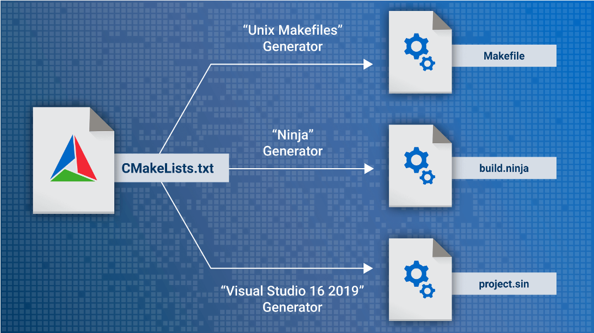

[TOC]

## Linux的简介

### Linux的概念

>【摘自维基百科】 ：
>Linux 是一种自由和开放源代码的类 UNIX 操作系统[^1]。 该操作系统的内核由 Linus Torvalds [林纳斯· 托 瓦兹]在 1991 年 10 月 5 日首次发布， 在加上用户空间的应用程序之后， 成为 Linux 操作系统。
>Linux 严格来说是单指操作系统的内核， 因操作系统中包含了许多用户图形接口和其他实用工具。
>
> 如今Linux 常用来指基于 Linux 的完整操作系统， 内核则改以 Linux 内核称之[^2]。  

- Linux本质： 是一种操作系统内核（一种多人多任务的开源软件 —— 向上统一管理应用软件，向下管理具体的计算机硬件）

- Linux发行版和Linux内核：

	- Linux发行版 = Linux内核 + 用户空间核心 + 系统调用接口 + 部分的驱动接口 
	- shell：用于操作系统与用户之间的交流（命令行的交互模式）
	- GUI：图形交互模式
	- 现在的手机：本质就  内核 + GUI系统
		- Android
			- Kernel：Linux（可能有修改）
			- GUI：Android、澎湃OS
		- Apple
			- Kernel：Unix（修改后的）
			- GUI：IOS
	- 

- 历史

	- 

	- **Unix诞生时间：1970年 1月1日 0时0分0秒**，同一时间，C语言规范 由K&R创造（实际上就是Ritchie根据Ken的操作系统，从新以C重写）

	- GNU（GNU’s Not Unix）

	  - **1983年**：Richard Stallman 宣布启动 GNU 项目，目标是开发一个**完全自由的类 Unix 操作系统**。

	    由于从零开发整个操作系统难度太大（个人开发确实很困难），GNU 项目**优先转向开发核心工具**：

	    - **GCC**（GNU Compiler Collection）—— 编译器
	    - **glibc**（标准C库）
	    - **GDB**（调试器）
	    - **Bash**（Shell）
	    - gzip 等工具

	  - **1991年**：Linus Torvalds 在 Intel PC 上**独立开发了 Linux 内核**（一开始只是个人兴趣项目）。

	  	- 他**使用 GCC** 来编译和开发 Linux 内核（这是正确的）。
	  	- Linux 内核发布后，**GNU 项目** 提供了几乎所有其他组件（shell、工具链、库等）。

	  - **1992年**：Linux 内核改用 **GPL 许可证**[^3]，**两者自然结合**，形成了完整的操作系统，即 **GNU/Linux**。
	
	- System V，由AT&T开发，第一个商业版本的Unix
	
		- 增加的特性
			- **System V IPC**（进程间通信）：
				- 消息队列（Message Queues）
				- 信号量（Semaphores）
				- 共享内存（Shared Memory）
				- 至今仍在广泛使用（msgget()、semget()、shmget() 等函数）
			- **Init 系统**：经典的 /etc/inittab + 运行级别（runlevel 0~6）机制，即大家常说的 **SysV init**
			- Streams I/O 子系统
			- ELF 可执行文件格式
			- 动态链接改进
			- `/proc` 文件系统
	
	- BSD，由伯克利加州大学开发，属于开源版本
	
		- 增加的特性
			- **TCP/IP 协议栈**：最早在 Unix 中实现高质量的 TCP/IP，使 Unix 成为互联网的核心操作系统。
			- **虚拟内存**、**快速文件系统（FFS）**。
			- **编辑器**：vi（由 Bill Joy 开发）
			- **Shell**：csh / tcsh
			- **Socket 接口**：现代网络编程的基础
			- **PF**（Packet Filter）：OpenBSD 的强大防火墙
			- **ZFS** 文件系统（最初来自 Solaris，后被 FreeBSD 采用）


### Linux内核特点

1. 源代码开放（任何人都可以获取到 Linux 源代码）

2. 完全免费 （下载安装使用都是免费的）
3. 良好的界面 （和 windows 一样， 有简单易用的图形用户界面）
4. 丰富的网络功能 （可以非常方便的搭建各种网络服务， 非常适合作为网络服务器）
5. 可靠的安全、 稳定性能 （非常安全， 不需要安装杀毒软件。 可以保证长时间运行不出故障， 服务

器甚至一两年不重启）

6. 多用户多任务 （可以多个用户同时登录， 并且同时运行多项任务）
7. 对硬件配置要求低 （最低 128M 内存就可以运行）  


### Linux发行版

- 以 Linux 系统软件打包发布的方式， 分类如下：
	- 基于 Dpkg (Debian 系)：
		- Debian： 由大批社区志愿者收集的包， 拥有庞大的软件包可供选择
		- Deepin： 使用自行开发的 Deepin DE 桌面环境的发行版， 启动迅速， 简洁美观
		- Ubuntu： 旨在开发出更加友好的桌面
	- 基于 RPM (Red Hat 系) —— 相关工作需要 <u> 红帽认证</u>：
		- Red Hat Enterprise Linux： 红帽 Linux 家族中唯一的商业分支
		- Fedora： 可用作工作站、 桌面以及服务器， 由红帽公司及其社区开发。
		- CentOS： 由社区支持的包， 旨在 100%地与 Red Hat Linux 企业版兼容， 但不包含 Red Hat 的商业软件。
- 嵌入式工作  ==  制造发行版本（高度定制化的操作系统）

### Linux的应用场景

- 服务器领域： 防火墙安全领域、 web 服务器、 邮件服务器、 文件 CDN 服务器等等。
- 移动手持设备： Android 系统的底层就是 linux 内核， IOS 的底层是类 Unix。
- 嵌入式、 物联网设备： 车载电子、 无人驾驶、 机器人、 机顶盒、 路由器等等。
- 大数据、 云计算： 底层都使用 linux 系统作为平台支撑。  


## Linux的安装

- Linux的安装方式
	1. 直接安装 （双操作系统，操作困难 —— 需要考虑启动boot配置和磁盘管理）
	2. 虚拟机
	3. Docker镜像

### Linux安装（虚拟机方式）

#### 虚拟机软件安装

- 常见的虚拟机软件有：
- QEMU： 常见于 android 模拟器， PC 上模拟安卓手机（开发， 玩游戏）
- VirtualBox： Oracle（甲骨文公司）
- Vmware 公司（2023年被Broadcom收购）的系列产品： [VMware Workstation](https://support.broadcom.com/group/ecx/productdownloads?subfamily=VMware%20Workstation%20Pro&freeDownloads=true)、 VMware Fusion  
- 成功的验证：
	1. VMware会在Windows上安装几个服务（用于解析虚拟机文件）
		- 
		- VMware Authorization Service：负责验证 VMware 软件的许可证（License）、激活状态。
		- VMware Autostart Service：允许你设置某些虚拟机在电脑开机时自动启动（无需手动打开 VMware）。
		- ==VMware DHCP Service（在运行）==：为使用 NAT 或 Host-Only 网络模式的虚拟机自动分配 IP 地址。
		- ==VMware NAT Service（在运行）==：实现虚拟机通过主机上网（虚拟机共享主机的网络）
		- VMware USB Arbitrator Service：管理主机上的 USB 设备在主机和虚拟机之间的分配和切换。
	2. 在Window上会安装几个虚拟网卡（用于Windows与Linux之间的通信）
		- 

#### 虚拟机创建

- 第二步，选择 稍后安装操作系统

- 名字、安装位置自定义

- 学习阶段需要  100G的磁盘大小，工作需要更大

	- 选项

		- 放在机械硬盘：选择 将虚拟磁盘存储为单个文件
		- 放在固定硬盘：选择 将虚拟磁盘拆分成多个文件

	- 这个阶段，会在安装位置产生几个文件

	- 

	- 

	- | 文件名         | 作用说明                                                     |
		| -------------- | ------------------------------------------------------------ |
		| **.vmx**       | **最重要配置文件** 虚拟机的“心脏”。记录了虚拟机的所有硬件配置（内存、CPU、硬盘路径、网络、显卡等）。编辑虚拟机设置时主要修改的就是这个文件。 |
		| **.vmdk**      | **虚拟硬盘文件** 真正存放 Debian 系统数据的地方（相当于虚拟机的硬盘）。这是体积最大的文件，里面装着整个 Debian 系统。 |
		| **.vmsd**      | **快照描述文件** 记录虚拟机快照（Snapshot）的信息。如果没创建过快照，这个文件通常是空的或很小。 |
		| **.lck文件夹** | **锁定文件** 当虚拟机**正在运行**时会自动生成，用于防止多个 VMware 同时打开同一个虚拟机，避免数据损坏。关机后会自动消失。 |
		| **.vmxf**      | **团队文件（Team File）** 用于 VMware Team 功能（多人协作管理虚拟机）。一般个人用户用不到，可以忽略。 |

	- 备份系统，需要备份这个4个文件（文件夹不用复制）

- 创建好了，右键虚拟机，选择 设置 ==》 选项  ==》  高级  ==》取消勾选“Enable side channel mitigations for Hyper-V enabled hosts”

#### Debian操作系统的安装

- 没有说明的都是选择默认（有些默认是空的，属于正常）
- 选择第一个 图形安装
- 选择 中文  —— 中国 
- 填写Root密码：123456
- 输入普通用户名：aaa
- 输入aaa的密码：123456
- 是否改写磁盘，选择 是
- 软件选择（本次学习是无界面的，所以只勾选 SSH server 和 标准系统工具）
- 必须按照启动引导器（如：GRUB）
- 启动引导器按照位置 ： /dev/sda

### Debian软件安装

#### 网络配置

- 执行命令：
	-  `echo "deb https://mirrors.ustc.edu.cn/debian trixie main contrib non-free non-free-firmware" > /etc/apt/sources.list`
	- `echo "deb https://mirrors.ustc.edu.cn/debian trixie-updates main contrib non-free non-free-firmware" >> /etc/apt/sources.list`

### 远程连接

- 执行命令：`ip addr` ，看ens33下的inet的ip号
- 在MobaXterm中使用SSH连接

#### 软件安装

- 需要安装软件gcc、vim
- 需要安装命令：sudo


## VSCode远程免密登录

- 

	- SSHD，后面的带D，表示服务器
	- **公钥的作用**
		- 把**公钥**放到 Debian 的 `~/.ssh/authorized_keys` 中。
		- 这里的公钥只用于**身份认证**（证明你拥有对应的私钥），**不用于加密传输的数据**。
	- **SSH 真正的加密机制**
		- SSH 连接时，首先会进行**密钥交换**（Key Exchange），双方协商出一个**临时会话密钥**（Session Key）。
		- 这个会话密钥是对称的（通常是 AES-256 等），速度快。
		- **从连接成功的那一刻起，所有数据都用这个会话密钥加密**。
		- 无论你是用密码登录还是公钥登录，加密方式是一样的。
	- VS Code 的远程连接也是基于 SSH 通道。
		- 它会先通过 SSH 建立加密隧道。
		- 然后在加密通道上安装 VS Code Server 并传输界面数据。
		- **看到的远程窗口、终端、文件浏览器等所有内容，都是加密传输的**。

- 连接步骤

	1. 在VSCode中安装`Remote -SSH`、`Remote -SSH:Editing Congiguration Files`、`Remote Explorer` 三个插件(安装其中一个就会将其他的一切安装)

	2. 在环境变量中检查有没有 `%SYSTEMROOT%\System32\OpenSSH\` ，如果没有，可以选择安装git来弥补,环境变量中添加`D:\Git\cmd`

	3. 检查OpenSSH目录有没有ssh-kengen.exe程序`"C:\Windows\System32\OpenSSH\ssh-keygen.exe"`

	4. 

	5. 此时`E:\project\myConfig\passwd`目录下会生成 `Debian13`、`Debian13.pub`的私钥和公钥（.pub）文件，将公钥文件里面的公钥复制给Debian中的`~/.ssh/authorized_keys`中

		- ```bash
			# 执行指令
			# 查看当前家目录，有没有.ssh目录
			ls -a
			
			# 如果没有.ssh,则创建该目录
			mkdir ~/.ssh 
			
			# 将公钥写入ssh信任列表
			echo "ssh-ed25519 AAAAC3NzaC1lZDI1NTE5AAAAIA63bM3O6mKiXWlCciRMZmUP3aZfQ6roYyKq2jV/pMJW tanjun@SiGuYuan" >> .ssh/authorized_keys
			
			# 检查是否写入成功
			cat .ssh/authorized_keys
			```

		- 

	6. 配置vscode的ssh连接配置文件

		- 

			

		- ```shell
			Host debian13                   # VSCode中显示的服务器名
			    HostName 10.128.0.4         # Linux服务器的主机名
			    User chiyu                  # 用户名
			    IdentityFile "E:\project\myConfig\passwd\Debian13" # 使用的私钥
			```

	7. 右键debian13连接，先在Debian中安装Clangd的服务端，再在VSCode中安装Clangd客户端插件


## ==虚拟网络拓扑图==

- 


## Linux命令

- 一般涉及新文件/目录的生成，语法结构`命令 旧文件 新文件`

- 所有命令都有三种I/O，标准输入（0）、标准输出（1）、标准错误（2）

- `ip addr` ：查看IP地址

- `echo`：回显命令（默认回显到屏幕），有空格的字符串建议加上“”

  - `echo a > a` ： 

  	- 输出重定向 
  	- `>` : 将打印结果输入到a文件中（覆盖的方式）；
  	- ` >>` 追加的方式

  - `echo $变量`：在屏幕回显变量值，该变量是临时变量，当前终端结束变量销毁。

  	- 声明和赋值变量`=`，不需要类型`abc=1`,声明了abc变量

  	- 注意1：`abc = 1`这种声明会被shell当成命令，所以**声明/赋值不能有空格**

  		- ```bash
  			siguyuan@debian:~/myflie/linuxfile$ abc = 1
  			-bash: abc: 未找到命令
  			```

  	- 注意2：`PATH=a`，这种复制会直接覆盖PATH中的原本变量

- `sudo` 提权命令（短暂获取root权限） ，有些系统没有安装

  - `usermod -aG sudo 用户名`：使用root将普通用户添加到sudo组中，重新启动终端就可以使用sudo命令

  	- ```bash
  		siguyuan@debian:~$ sudo apt install gcc
  		[sudo] siguyuan 的密码：
  		siguyuan 未出现在 sudoers 文件中。
  		
  		# 未添加到sudo组中
  		```

- `su`：切换命令

  - `su -`：带着环境变量的值 切换到root用户
  - `su 用户名`：从当前用户切换到 另一个用户

- `apt `：安装命令

  - `apt update`：刷新软件包，让后续下载为最新的
  - `apt install 软件名`：下载软件

- `whoami`：打印当前用户

- `ls` ：打印当前目录的文件。`ls`的执行流程， 它首先遍历并读取当前目录下的文件信息，将每个文件名作为单行数据存入临时缓冲区。随后，这些数据被传递给终端显示模块。该模块会动态检测当前终端窗口的列宽与行高，自动将缓冲区中的单行文本规整、重排为最适合当前视窗大小的多列（或单列）网格布局，最终呈现给用户。区别于管道、重定向，在文件中直接一个文件名占一行

  - `ls -a`: 显示隐藏文件
  - `ls -l`：以长文件显示（显示文件细节）
  - `ls -i`: 显示文件的inode号（内存地址），一般配合`-l`使用
  - `ls -h`: human，便于人类阅读的可视化界面，一般配合`-l`使用

- `命令 --help` ： 查看该命令的简要帮助，很多外部命令都支持。

- `mkdir 新目录名`：创建新目录

- `cd 目录路径`  ：切换目录

  - `cd ~`：切换成当前用户的家目录

  - `cd /`：切换到根目录

  - `cd -`：切换当上一次所在目录，同时会打印切换的目录信息

  - `cd ..`：返回上级目录

- `curl`：用于传输数据，支持多种协议

  - ```bash
  	# 例子：安装vim-plug管理器
  	curl -fLo ~/.vim/autoload/plug.vim --create-dirs \
  	    https://raw.githubusercontent.com/junegunn/vim-plug/master/plug.vim
  	
  	# 使用 cURL 下载 Vim 插件管理器 vim-plug 的安装脚本
  	-f - 失败时不输出 HTML 错误信息
  	-L - 如果遇到重定向，跟随重定向
  	-o - 指定输出文件路径（这里是 ~/.vim/autoload/plug.vim）
  	--create-dirs - 如果目录不存在，自动创建目录
  	```

- `grep 关键字 文件名`：文本搜索

  - 经常与管道搭配使用
    - `ls /bin | grep 'tree'`：搜索ls的打印信息为‘tree’的
  - 后面跟的是正则表达式

- `pwd`：打印当前路径

- `rm`：删除文件/目录

  - `rm -f`：强制删除
  - `rm -R：递归删除目录和文件

- `rmdir`: 删除空目录

- `chmod`：修改文件权限

  - 字符方式：$$\text{用户主体} \pm \text{操作符} \pm \text{权限字符}$$，例子：`chmod o=,g+w filename ` = => 其他组用户权限为空， 用户组增加 w 权限

  	- 用户主体：
  		- **`u`** (User)：文件所有者（主人）。
  		- **`g`** (Group)：所属用户组（团队）。
  		- **`o`** (Others)：其他所有人。
  		- **`a`** (All)：所有人（包含 `u, g, o`，如果不写主体，默认就是 `a`）。

  	- 操作符：
  		- **`+`**：**增加**权限。
  		- **`-`**：**抹去/删掉**权限。
  		- **`=`**：**精确赋予**权限（不管以前是什么，强行同步为当前设置）。

  	- 权限字符：
  		- **`r`** (Read)：读权限。
  		- **`w`** (Write)：写/修改权限。
  		- **`x`** (eXecute)：执行权限（脚本、可执行程序或切换目录）。

  - 数字方式：

  	- `chmod 数字 文件名` 

  	-  例子：`chmod 640 filename`

  		- ```txt
  			640 (八进制数)  ====>   110 100 000 (二进制)
  			权限对应                rw- r-- ---
  			```

- `chown`：修改所有者和所有组

  - | **核心核心场景**       | **语法格式**            | **核心命令示例**                  | **示例通俗解释**                                             |
  	| ---------------------- | ----------------------- | --------------------------------- | ------------------------------------------------------------ |
  	| **只改所有者 (User)**  | `chown 用户名 文件`     | `chown jack main.c`               | 将 `main.c` 的主人移交给用户 `jack`。                        |
  	| **只改所属组 (Group)** | `chown :组名 文件`      | `chown :dev main.c`               | 将 `main.c` 划分给 `dev` 开发团队（注意前面有冒号 `:`）。    |
  	| **同时修改主人和组**   | `chown 用户:组 文件`    | `chown jack:dev main.c`           | 一步到位：主人改成 `jack`，且归属给 `dev` 组。               |
  	| **递归修改整个目录**   | `chown -R 用户:组 目录` | `chown -R jack:dev /data/project` | **最常用！** 将 `/data/project` 文件夹及**内部所有子文件、子目录**全部移交给 `jack` 和 `dev` 组。 |
  	| **以某个文件为参照**   | `chown --reference=A B` | `chown --reference=a.txt b.txt`   | 让 `b.txt` 的所有者和组，变得跟 `a.txt` 完全一模一样。       |

- `realpath` ：相对路径转绝对路径；找软连接的真实路径；补充不存在文件的绝对路径（相对当前路径展开）

- `which`：查找当前命令在哪里（在PATH中寻找）

- `ln`：创建硬链接

  - `ln -s` ：创建软连接

- `mknod`:  创建字符设备/ 块设备（需要root权限）。使用：`mknod 文件名 [选项] 主设备号 次设备号`

  - `mknod c`：创建字符设备
  - `mknod b`：创建块设备

- `mkfifo`:  创建管道

- `socat` : 创建socket文件。需要下载。

- `wc`:  统计

  - ` wc -l` 统计多少行

- `cat 文件名`:  查看文件

- `more` : 分页查看文件(不能一行一行的翻页)

- `less` : 分页查看文件 (可以一行一行的翻页)

- `man 命令`: 查看对应命令的帮助文档

- `cp 旧 新`: 拷贝文件

- `mv 旧 新`: 移动文件（修改文件名）。本质是将老文件名与内存中的文件内容的链接断开，将新文件名链接到文件内容 

- `find -name 字符串`: 查找文件的路径

- `grep 字符串 文件名` : 过滤器之一，在文件中一行一行的过滤。

  - `grep -n`: 显示行号
  - `grep -A 行数`: after 显示查找位置后面几行
  - `grep -B 行数`: before 显示查找位置前面几行

- `file 文件名`: 用于辨识文件类型。

- `hexdump -C 文件名`: 查看文件的机器码。（-C 以十六进制展示）

- 网络管理命令 —— net-tools包

  - `ifconfig`: 格式化的显示当前机器网卡信息（IP地址、Mac地址）。需要root权限
  - `ping 域名`: 是否能连接外网

- 系统管理命令（先打包，在压缩；先解压，在解包）

  - 打包命令

  	- `tar`: 打包

  		- ```bash
  			
  			tar -c # 打包
  			tar -vf # 打印信息
  			
  			tar -x # 解包
  			tar -C # 指定路径 (不写-C 默认当前路径)
  			
  			tar -z # 调用gzip进行压缩 或者 解压
  			
  			tar -j # 调用bizp2进行解压 或者 压缩
  			
  			tar -J # 调用xz进行解压 或者 压缩
  			
  			# 常用:
  			tar -cvf 包名 原材料
  			
  			tar -xvf 原材料 -C 路径
  			
  			tar -zcvf 包名.gz 原材料 # 打包压缩
  			tar -zxvf 原材料.gz -C 路径 # 解压缩解包
  			
  			tar -jcvf 包名.bz2 原材料
  			tar -jxvf 原材料.bz2 -C 路径
  			
  			tar -Jcvf 包名.xz 原材料  # 推荐
  			tar -Jxvf 原材料.xz -C 路径 # 推荐
  			```

  - 压缩工具

  	- gzip ： 默认在源文件上操作。只能对单独文件操作。需要将多文件打包，才能进行压缩。文件后缀名`.gz`
  		- `gzip` 压缩命令。
  		- `gunzip` 解压命令

  	- bzip2 ：比gzip压缩率高一些，后缀名`bz2`
  	- xz ： 比bzip2压缩率高一些，后缀名`.xz`

- 磁盘管理

  - `df`：显示磁盘信息 （当前系统的文件系统的挂载情况 —— 挂载点、挂载设备信息  ）
  	- `df -h`: 美化选项
  	- `/dev/sda1 指磁盘`
  	- `tmpfs 指内存`
  - `du`: 目录或者文件在磁盘中存储容量
  	- ` du -a` : 显示全部的文件

- 进程管理

  - `ps` : process state 进程状态
  	- ` ps aux`: 展示当前系统全部的进程信息

  - `shutdown`
  	- `shutdown -r now`: 重启   <==== `reboot` `init 6`
  	- `shutdown -h now`: 现在关机 <==== `init 0`
  	- `shutdown -h +10`: 10分钟后关机

  - `pstree`: 用于以树状结构显示进程的命令,需要下载，软件包：psmisc

- 用户管理

  - 用户信息在`/etc/passwd`

  	- ```bash
  		# 用户名:密码:用户id:主id:用户名(/欢迎信息):家目录:进入时交互程序
  		# /nologin都是非登录用户，为服务而服务的
  		1 root:x:0:0:root:/root:/bin/bash
  		2 daemon:x:1:1:daemon:/usr/sbin:/usr/sbin/nologin
  		3 bin:x:2:2:bin:/bin:/usr/sbin/nologin
  		4 sys:x:3:3:sys:/dev:/usr/sbin/nologin
  		5 sync:x:4:65534:sync:/bin:/bin/sync
  		6 games:x:5:60:games:/usr/games:/usr/sbin/nologin
  		7 man:x:6:12:man:/var/cache/man:/usr/sbin/nologin
  		8 lp:x:7:7:lp:/var/spool/lpd:/usr/sbin/nologin
  		9 mail:x:8:8:mail:/var/mail:/usr/sbin/nologin
  		10 news:x:9:9:news:/var/spool/news:/usr/sbin/nologin
  		11 uucp:x:10:10:uucp:/var/spool/uucp:/usr/sbin/nologin
  		12 proxy:x:13:13:proxy:/bin:/usr/sbin/nologin
  		13 www-data:x:33:33:www-data:/var/www:/usr/sbin/nologin
  		14 backup:x:34:34:backup:/var/backups:/usr/sbin/nologin
  		15 list:x:38:38:Mailing List Manager:/var/list:/usr/sbin/nologin
  		16 irc:x:39:39:ircd:/run/ircd:/usr/sbin/nologin
  		17 _apt:x:42:65534::/nonexistent:/usr/sbin/nologin
  		18 nobody:x:65534:65534:nobody:/nonexistent:/usr/sbin/nologin
  		19 systemd-network:x:998:998:systemd Network Management:/:/usr/sbin/nologin
  		20 dhcpcd:x:100:65534:DHCP Client Daemon:/usr/lib/dhcpcd:/bin/false
  		21 systemd-timesync:x:991:991:systemd Time Synchronization:/:/usr/sbin/nologin
  		22 messagebus:x:990:990:System Message Bus:/nonexistent:/usr/sbin/nologin
  		23 sshd:x:989:65534:sshd user:/run/sshd:/usr/sbin/nologin
  		24 siguyuan:x:1000:1000:siguyuan,,,:/home/siguyuan:/bin/bash
  		
  		```

  - 用户密码`/etc/shadow`，需要root权限

  	- ```bash
  		# 存的是哈希值
  		1 root:x:0:0:root:/root:/bin/bash
  		2 daemon:x:1:1:daemon:/usr/sbin:/usr/sbin/nologin
  		3 bin:x:2:2:bin:/bin:/usr/sbin/nologin
  		4 sys:x:3:3:sys:/dev:/usr/sbin/nologin
  		5 sync:x:4:65534:sync:/bin:/bin/sync
  		6 games:x:5:60:games:/usr/games:/usr/sbin/nologin
  		7 man:x:6:12:man:/var/cache/man:/usr/sbin/nologin
  		8 lp:x:7:7:lp:/var/spool/lpd:/usr/sbin/nologin
  		9 mail:x:8:8:mail:/var/mail:/usr/sbin/nologin
  		10 news:x:9:9:news:/var/spool/news:/usr/sbin/nologin
  		11 uucp:x:10:10:uucp:/var/spool/uucp:/usr/sbin/nologin
  		12 proxy:x:13:13:proxy:/bin:/usr/sbin/nologin
  		13 www-data:x:33:33:www-data:/var/www:/usr/sbin/nologin
  		14 backup:x:34:34:backup:/var/backups:/usr/sbin/nologin
  		15 list:x:38:38:Mailing List Manager:/var/list:/usr/sbin/nologin
  		16 irc:x:39:39:ircd:/run/ircd:/usr/sbin/nologin
  		17 _apt:x:42:65534::/nonexistent:/usr/sbin/nologin
  		18 nobody:x:65534:65534:nobody:/nonexistent:/usr/sbin/nologin
  		19 systemd-network:x:998:998:systemd Network Management:/:/usr/sbin/nologin
  		20 dhcpcd:x:100:65534:DHCP Client Daemon:/usr/lib/dhcpcd:/bin/false
  		21 systemd-timesync:x:991:991:systemd Time Synchronization:/:/usr/sbin/nologin
  		22 messagebus:x:990:990:System Message Bus:/nonexistent:/usr/sbin/nologin
  		23 sshd:x:989:65534:sshd user:/run/sshd:/usr/sbin/nologin
  		24 siguyuan:x:1000:1000:siguyuan,,,:/home/siguyuan:/bin/bash
  		
  		```

  - `useradd` / `adduser`:  添加用户。adduser会有详细的添加信息。useradd只是创建了用户，没有密码，没有组，没有家。

  - `usermod`: 修改用户

  - `userdel -r`: 删除用户，同时删除家

  - `groupadd  组名`: 添加组

  - `groupmod -n 新组名 旧`: 修改组名

  - `groupdel 组名`: 删除组名

  - `passwd`: 修改自己的密码


## vim

- 如何程序运行在Linux系统上

	1. 在Windows商编辑程序，传输给Linux运行程序
		- 使用SSH传输（内部集成了SFTP —— 加密文件传输协议）
		- 
		- 使用gcc编译
	2. 在Linux上编写程序
		- 使用vim进行编写

- vim的配置文件：`~/.vimrc` 需要手动创建   —— Linux上所有软件都可以通过配置文件，约定其工作模式

- vim三种模式

	- ```mermaid
		graph TD
		    A[命令模式<br>——————————————<br>功能：执行命令] -->|按i键, a键, o键等| B[插入模式<br>——————————————<br>功能：文本编辑]
		    A -->|:键| C[底行模式<br>——————————————<br>功能：文件相关的命令]
		    B -->|Esc键| A
		    C -->|Esc键 或者 Enter键| A
		    
		    style A fill:#4285f4,stroke:#2a56c6,stroke-width:2px
		    style B fill:#34a853,stroke:#1e8e3e,stroke-width:2px
		    style C fill:#fbbc05,stroke:#f29900,stroke-width:2px
		
		```

### 进入编辑模式

- **i**: 从光标所在位置前面开始插入资料， 光标后的资料随新增资料向后移动
- **o**: 在光标所在列下新增一列并进入输入模式
- **a**： 从光标所在位置后面开始新增资料， 光标后的资料随新增资料向后移动
- I： 在光标所在行的最开头进行编辑
- A： 在光标所在行的尾部进行编辑
- O： 在光标所在位置上面进行编辑  


### 删除和修改  

- **r**： 修改光标所在字符， r 后接著要修正的字符
- **R**： 进入取代状态， 新增资料会覆改原先资料， 直到按[ESC]回到指令模式下为止
- **dd**： 删除光标所在行
- **s**： 删除光标字符， 并进入编辑模式
- S： 删除光标所在行， 并进入编辑模式  


### 退出方式  

- :w 保存、 写入  
- :q 不保存退出（有修改，不能使用这个退出）
- :q! 不保存强制退出
- :wq 保存退出
- :w filename     保存到 filename 文件名


### 光标移动  

- nG： 跳到第 n 行
- G： 跳到文件行尾
- gg： 跳到文件开头  


### 拷贝、 粘贴、 恢复  

- nyy： 复制当前 n 行， n 为 1 时， 可以省略
- p： 粘贴剪贴板的内容到当前
- ndd： 删除当前 n 行， n 为 1 时， 可以省略
- u： 撤销之前的操作  


### 加强功能  

### Vim 底行模式命令整理

- 行号显示
  - `:set nu` // 显示行号
  - `:set nonu` // 隐藏行号
- 跳转
  - `:n` // 跳转到第 n 行
- 替换
  - `:s/xx/yy/` // 当前行第一个 xx 替换为 yy
  - `:s/xx/yy/g` // 当前行所有 xx 替换为 yy
  - `:%s/xx/yy/g` // 全文所有 xx 替换为 yy
  - `:8s/xx/yy/` // 第 8 行第一个 xx 替换为 yy
  - `:8,10s/xx/yy` // 第 8-10 行每行第一个 xx 替换为 yy
    - 替换范围规则
      - `%s` // 所有行
      - `8s` // 第 8 行
      - `8,10s` // 第 8-10 行
      - `xx` 为 `^` // 表示行首
      - `xx` 为 `$` // 表示行尾
      - 加 `/g` // 替换全部匹配，不加只替换第一个
    - 替换实例
      - `:8,10s/^/#/` // 第 8-10 行行首加上 #
      - `:8,10s/;$/#/` // 第 8-10 行行尾的 `;` 替换为 `#`
    - 语法高亮（仅 vim）
      - `:syntax on` // 开启语法关键字高亮
      - `:syntax off` // 关闭语法关键字高亮
- `vim 文件名 +行数`：打开文件，从多少行开始展示


## Linux文件系统

- 文件系统本质：一段程序（软件）

- 文件系统与文件的关系

  - 文件系统 = 索引 + 数据管理 + 管理。实际的文件是存储在内存中

  - 文件：一堆二进制数据的集合，放在硬盘上（按块寻址 —— 遍历块号）

  - 变量：一堆二进制数据的集合，放在主存中（按字节寻址 —— 字节遍历）

  - 文件系统可以看成一堆指针（索引），具体的文件就是文件系统下一个指针指向的空间的数据

  - 

  	- 在Linux文件系统[^4]中，每个目录（特殊的文件）都是一个复杂的结构体，其中存储了文件在磁盘中的实际位置

  		- ```c
  			// 以ext4格式为例，目录结构 —— 只是举例，实际的样子以官方为准
  			struct ext4_dir_entry_2 {
  			    __le32  inode;        /* 文件/子目录对应的 Inode 编号（4 字节） */
  			    __le16  rec_len;      /* 本条目录项的总长度（2 字节，用于变长对齐） */
  			    __u8    name_len;     /* 文件名实际长度（1 字节） */
  			    __u8    file_type;    /* 文件类型（1 字节） */
  			    char    name[EXT4_NAME_LEN];  /* 文件名（最大 255 字节，不以 '\0' 结尾）可变长度 */
  			};
  			```

  		- 其中name存放子文件/子目录的文件名。Linux中不允许存在同名的目录和文件

  	- 磁盘中只存放了文件的内容。

- Linux的常用文件系统 —— **ext（扩展文件系统）**；Windows的常用文件系统 —— **NTFS**

- **Linux的层次结构标准（FHS）**

	- Linux 有个基本思想： 一切皆文件。 就是系统中的所有都可以归结为一个文件， 包括数据文件、 可执
		行命令、 硬件设备、 进程等等， 都被视为拥有各自特性或类型的文件。

	- Linux 系统的目录组织结构， 遵循了一个文件系统层次结构标准（英语： Filesystem Hierarchy
		Standard， FHS）  

		- 

		- | 目录       | 英文全称         | 主要作用                                                     |
			| ---------- | ---------------- | ------------------------------------------------------------ |
			| **/bin**   | binaries         | **基础用户命令**（ls、cp、mv、cat 等常用命令），普通用户和 root 都能使用 |
			| **/boot**  | boot             | **启动相关文件**（内核 vmlinuz、initramfs、GRUB 引导程序等） |
			| **/dev**   | devices          | **设备文件**（硬盘、鼠标、键盘、终端等），是设备与文件的抽象 |
			| **/etc**   | et cetera        | **系统配置文件**（最重要！如 passwd、fstab、nginx.conf 等）  |
			| **/home**  | home             | **普通用户的主目录**（每个用户一个文件夹）                   |
			| **/lib**   | libraries        | **系统共享库文件**（.so 文件），程序运行依赖                 |
			| **/lib64** | libraries 64-bit | 64位系统的共享库                                             |
			| **/media** | media            | **可移动介质挂载点**（U盘、光盘等自动挂载位置）              |
			| **/mnt**   | mount            | **临时手动挂载点**（手动挂载其他分区或设备时常用）           |
			| **/opt**   | optional         | **第三方可选软件**（手动安装的大型软件如 Oracle、某些商业软件） |
			| **/proc**  | process          | **虚拟文件系统**，记录**内核**和进程信息（ps、top 的数据来源）—— 内核数据结构 |
			| **/root**  | root             | **超级用户 root 的主目录**                                   |
			| **/run**   | runtime          | **运行时数据**（进程 PID 文件、socket 等，重启后清空）       |
			| **/sbin**  | system binaries  | **系统管理命令**（只有 root 能用，如 reboot、fdisk、ifconfig） |
			| **/srv**   | service          | **服务数据**（网站、FTP、Git 等服务存放数据的位置）          |
			| **/sys**   | sysfs            | **虚拟文件系统**，提供**内核设备**、驱动、模块信息 —— 内核驱动模型 |
			| **/tmp**   | temporary        | **临时文件目录**（重启后通常会被清空）                       |
			| **/usr**   | user             | **用户程序和工具**（最庞大的目录，包含 bin、lib、share 等）  |
			| **/var**   | variable         | **可变数据**（日志 /var/log、邮件、缓存、数据库等） —— 动态数据 |
			| /usr/bin   | User Binaries    | 是对/bin目录的补充，大多数用户命令和应用程序                 |
			| /usr/sbin  | System Binaries  | 对/sbin目录的补充，系统管理命令（系统管理、维护类），root使用命令 |

		- **设备文件分类**

			- 

			- | 特性             | **字符设备** (Character Device) | **块设备** (Block Device)                   | **网络设备** (Network Device) |
				| ---------------- | ------------------------------- | ------------------------------------------- | ----------------------------- |
				| **数据访问方式** | **逐字符**（按字节流）          | **按块**（固定大小的数据块，通常 512B~4KB） | **数据包**（Packet）          |
				| **缓冲**         | **无缓冲**（直接读写）          | **有缓冲**（内核会缓存）                    | 有缓冲                        |
				| **访问单位**     | 字节                            | 数据块                                      | 网络报文                      |
				| **随机访问**     | 不支持（只能顺序）              | **支持**（可随机读写）                      | 不支持（顺序处理）            |
				| **典型速度**     | 较慢                            | 较快                                        | 取决于网络                    |
				| **设备文件位置** | `/dev/`（如 `/dev/tty`）        | `/dev/`（如 `/dev/sda`）                    | `/sys/class/net/`             |
				| **主要用途**     | 输入输出设备                    | 存储设备                                    | 网络通信                      |
				| **例子**         | 大部分设备（鼠标、屏幕）        | 存储设备（U盘）                             | 网卡、虚拟网卡                |

- 相对路径和绝对路径

	- 相对路径：体现相对谁的路径字符串
	- 绝对路径：以根（/）或者盘符为开头的路径字符串

- 命令格式：`命令动词 选项参数`

	- 命令动词的相对路径：相对于环境变量（PATH）做为前缀和命令动词组合，在绝对路径中寻找

	- 选项参数的相对路径：相对当前所在目录

	- ```bash
		siguyuan@debian:~/myflie/linuxfile/day02$ ls
		目录A  目录B  a.out
		siguyuan@debian:~/myflie/linuxfile/day02$ echo $PATH
		/usr/local/bin:/usr/bin:/bin:/usr/local/games:/usr/games
		
		# 在PATH添加a可执行程序之后，就能直接使用a.out方式运行命令，否则需要加./a.out
		# 直接赋值，会将PATH原本的数据覆盖，导致原本的命令不能运行
		siguyuan@debian:~/myflie/linuxfile/day02$ PATH=/home/siguyuan/myflie/linuxfile/day02/
		siguyuan@debian:~/myflie/linuxfile/day02$ echo $PATH
		/home/siguyuan/myflie/linuxfile/day02/
		siguyuan@debian:~/myflie/linuxfile/day02$ a.out
		holle word
		siguyuan@debian:~/myflie/linuxfile/day02$ ls
		-bash: ls: 未找到命令
		
		# 一旦覆盖了PATH，有两种方式解决
		# 1. 去别的好电脑上拷贝PATH变量内容
		# 2. 重新开启终端，让终端重新读取PATH的值
		
		# 一般都使用 PATH=$PATH:/路径 追加的方式
		siguyuan@debian:~/myflie/linuxfile/day02$ PATH=/usr/local/bin:/usr/bin:/bin:/usr/local/games:/usr/games
		siguyuan@debian:~/myflie/linuxfile/day02$ echo $PATH
		/usr/local/bin:/usr/bin:/bin:/usr/local/games:/usr/games
		siguyuan@debian:~/myflie/linuxfile/day02$ PATH=$PATH:/home/siguyuan/myflie/linuxfile/day02/
		siguyuan@debian:~/myflie/linuxfile/day02$ a.out
		holle word
		siguyuan@debian:~/myflie/linuxfile/day02$ ls
		目录A  目录B  a.out
		```

- 如何修改PATH的路径

	1. 临时修改
		1. `PATH=$PATH:/路径`：当前终端有效，该终端的子终端不继承
		2. `export PATH=$PATH:/路径`：当前终端有效，该终端的子终端继承

	2. 永久修改
		1. 修改/ect/profile 文件， 对所有用户都生效  
		2. 修改家目录下的.bashrc 文件， 对当前用户生效  （建议修改这个）

- shell里运行时环境变量怎么来的

	- 每打开一个shell（终端），会先在系统的`/etc`目录下（==`/etc/profile`==）,寻找shell的配置脚本，将脚本的内容复制到当前shell的PATH中

	- 然后再去当前用户的家目录下(==`~/.bashrc`==)，寻找shell的配置脚本，将内容复制到当前shell的PATH中

	- 然后显示shell（终端），等待用户敲入命令

		- **`xxxrc`：rc结尾的文件都是配置文件**

	- ```bash
		# /etc/profile
		siguyuan@debian:~/myflie/linuxfile/day02$ cat /etc/profile
		# /etc/profile: system-wide .profile file for the Bourne shell (sh(1))
		# and Bourne compatible shells (bash(1), ksh(1), ash(1), ...).
		
		if [ "$(id -u)" -eq 0 ]; then
		  PATH="/usr/local/sbin:/usr/local/bin:/usr/sbin:/usr/bin:/sbin:/bin"
		else
		  PATH="/usr/local/bin:/usr/bin:/bin:/usr/local/games:/usr/games"
		fi
		export PATH
		
		if [ "${PS1-}" ]; then
		  if [ "${BASH-}" ] && [ "$BASH" != "/bin/sh" ]; then
		    # The file bash.bashrc already sets the default PS1.
		    # PS1='\h:\w\$ '
		    if [ -f /etc/bash.bashrc ]; then
		      . /etc/bash.bashrc
		    fi
		  else
		    if [ "$(id -u)" -eq 0 ]; then
		      PS1='# '
		    else
		      PS1='$ '
		    fi
		  fi
		fi
		
		if [ -d /etc/profile.d ]; then
		  for i in $(run-parts --list --regex '^[a-zA-Z0-9_][a-zA-Z0-9._-]*\.sh$' /etc/profile.d); do
		    if [ -r $i ]; then
		      . $i
		    fi
		  done
		  unset i
		fi
		
		
		# ~/.bashrc
		siguyuan@debian:~/myflie/linuxfile/day02$ cat ~/.bashrc
		# ~/.bashrc: executed by bash(1) for non-login shells.
		# see /usr/share/doc/bash/examples/startup-files (in the package bash-doc)
		# for examples
		
		# If not running interactively, don't do anything
		case $- in
		    *i*) ;;
		      *) return;;
		esac
		
		# don't put duplicate lines or lines starting with space in the history.
		# See bash(1) for more options
		HISTCONTROL=ignoreboth
		
		# append to the history file, don't overwrite it
		shopt -s histappend
		
		# for setting history length see HISTSIZE and HISTFILESIZE in bash(1)
		HISTSIZE=1000
		HISTFILESIZE=2000
		
		# check the window size after each command and, if necessary,
		# update the values of LINES and COLUMNS.
		shopt -s checkwinsize
		
		# If set, the pattern "**" used in a pathname expansion context will
		# match all files and zero or more directories and subdirectories.
		#shopt -s globstar
		
		# make less more friendly for non-text input files, see lesspipe(1)
		#[ -x /usr/bin/lesspipe ] && eval "$(SHELL=/bin/sh lesspipe)"
		
		# set variable identifying the chroot you work in (used in the prompt below)
		if [ -z "${debian_chroot:-}" ] && [ -r /etc/debian_chroot ]; then
		    debian_chroot=$(cat /etc/debian_chroot)
		fi
		
		# set a fancy prompt (non-color, unless we know we "want" color)
		case "$TERM" in
		    xterm-color|*-256color) color_prompt=yes;;
		esac
		
		# uncomment for a colored prompt, if the terminal has the capability; turned
		# off by default to not distract the user: the focus in a terminal window
		# should be on the output of commands, not on the prompt
		#force_color_prompt=yes
		
		if [ -n "$force_color_prompt" ]; then
		    if [ -x /usr/bin/tput ] && tput setaf 1 >&/dev/null; then
		        # We have color support; assume it's compliant with Ecma-48
		        # (ISO/IEC-6429). (Lack of such support is extremely rare, and such
		        # a case would tend to support setf rather than setaf.)
		        color_prompt=yes
		    else
		        color_prompt=
		    fi
		fi
		
		if [ "$color_prompt" = yes ]; then
		    PS1='${debian_chroot:+($debian_chroot)}\[\033[01;32m\]\u@\h\[\033[00m\]:\[\033[01;34m\]\w\[\033[00m\]\$ '
		else
		    PS1='${debian_chroot:+($debian_chroot)}\u@\h:\w\$ '
		fi
		unset color_prompt force_color_prompt
		
		# If this is an xterm set the title to user@host:dir
		case "$TERM" in
		xterm*|rxvt*)
		    PS1="\[\e]0;${debian_chroot:+($debian_chroot)}\u@\h: \w\a\]$PS1"
		    ;;
		*)
		    ;;
		esac
		
		# enable color support of ls and also add handy aliases
		if [ -x /usr/bin/dircolors ]; then
		    test -r ~/.dircolors && eval "$(dircolors -b ~/.dircolors)" || eval "$(dircolors -b)"
		    alias ls='ls --color=auto'
		    #alias dir='dir --color=auto'
		    #alias vdir='vdir --color=auto'
		
		    #alias grep='grep --color=auto'
		    #alias fgrep='fgrep --color=auto'
		    #alias egrep='egrep --color=auto'
		fi
		
		# colored GCC warnings and errors
		#export GCC_COLORS='error=01;31:warning=01;35:note=01;36:caret=01;32:locus=01:quote=01'
		
		# some more ls aliases
		#alias ll='ls -l'
		#alias la='ls -A'
		#alias l='ls -CF'
		
		# Alias definitions.
		# You may want to put all your additions into a separate file like
		# ~/.bash_aliases, instead of adding them here directly.
		# See /usr/share/doc/bash-doc/examples in the bash-doc package.
		
		if [ -f ~/.bash_aliases ]; then
		    . ~/.bash_aliases
		fi
		
		# enable programmable completion features (you don't need to enable
		# this, if it's already enabled in /etc/bash.bashrc and /etc/profile
		# sources /etc/bash.bashrc).
		if ! shopt -oq posix; then
		  if [ -f /usr/share/bash-completion/bash_completion ]; then
		    . /usr/share/bash-completion/bash_completion
		  elif [ -f /etc/bash_completion ]; then
		    . /etc/bash_completion
		  fi
		fi
		
		```


## Linux权限管理

- Linux是一个多用户系统，为了避免文件被非法访问，引入了权限管理

- Linux将权限为了 1 + 9的组合

	- 

	- ```bash
		ls -l # 查看详细信息
		
		# 权限     硬链接 所有者  所在组   文件大小  最后修改时间 文件名
		drwxrwxr-x 2 siguyuan siguyuan  4096  5月29日 15:02 目录A
		drwxrwxr-x 3 siguyuan siguyuan  4096  5月29日 15:03 目录B
		-rwxrwxr-x 1 siguyuan siguyuan 15952  5月29日 16:36 a.out
		lrwxrwxrwx 1 root     root         4  5月28日 16:20 rtc -> rtc0
		crw-rw-rw- 1 root     root      1, 3  5月28日 16:20 null
		brw-rw---- 1 root     disk      8, 0  5月28日 16:20 sda
		prw------- 1 root     root         0  5月29日 13:29 26.ref
		srw-rw-rw- 1 siguyuan siguyuan     0  5月29日 13:29 bus
		
		```

	- `drwxrw-r-x `： d + rwxr-xr-x

	- d表示：文件类型

		- `-`：普通文件
		- `d`：目录文件，文件大小统一显示4096
		- `l`：链接文件（软链接），类似引用（指向一个实际文件），文件大小为链接文件的文件名字符长度
		- `c`：字符设备节点文件，文件大小显示的是  主设备号，次设备号
		- `b`：块设备节点文件，文件大小显示是 主设备号，次设备号
		- `p`：管道文件，文件大小一般为0
		- `s`：socket文件，文件大小一般为0

	- rwxrw-r-x：每3个一组

		- rwx：表示**所有者**的权限，有r（读）、w（写）、x（执行）权限
		- rw-：表示**所在组**的权限，有r、w权限
		- r-x：表示**其他用户**的权限，有r、x权限

	- root用户有所有文件的所有权限

	- 如何修改权限

		- 字母方式 ：`chomd g=r,o-x,u+w filename`
		- 数字方式 ：`chmod 740 filename`

	- 如何修改文件的所有者和所在组

		- `chown 新用户名:新组名 文件` 修改一个文件
		- `chown -R siguayun:aaa 目录` 修改一整个目录


## 软链接和硬链接


- 硬链接，直接指向磁盘中文件内容，如: a.c、b.c、c.c

	- 硬链接直接的删除互不影响（删除本质就是断开链接，别不是清空内存）

	- ```bash
		siguyuan@debian:~/myflie/linuxfile/day03$ ls -li
		总计 20
		133499 -rw-rw-r-- 1 siguyuan siguyuan   29  6月 1日 18:48 f11.a
		133160 -rw-rw-r-- 1 siguyuan siguyuan   29  6月 1日 19:19 f2.a
		133500 -rw-rw-r-- 1 siguyuan siguyuan    0  6月 1日 09:59 f2.c
		133504 -rw-rw-r-- 1 siguyuan siguyuan 8555  6月 1日 18:45 fa.c
		133501 -rw-rw-r-- 1 siguyuan siguyuan    0  6月 1日 09:59 fs.c
		133173 -rw-rw-r-- 1 siguyuan siguyuan    0  6月 1日 09:58 fun.c
		133502 -rw-rw-r-- 2 siguyuan siguyuan    0  6月 1日 09:59 fx1.c
		133502 -rw-rw-r-- 2 siguyuan siguyuan    0  6月 1日 09:59 fx.c
		siguyuan@debian:~/myflie/linuxfile/day03$ ln fx.c fx2.c
		# 硬链接指向的内存块号都是同一个133502
		siguyuan@debian:~/myflie/linuxfile/day03$ ls -li
		总计 20
		133499 -rw-rw-r-- 1 siguyuan siguyuan   29  6月 1日 18:48 f11.a
		133160 -rw-rw-r-- 1 siguyuan siguyuan   29  6月 1日 19:19 f2.a
		133500 -rw-rw-r-- 1 siguyuan siguyuan    0  6月 1日 09:59 f2.c
		133504 -rw-rw-r-- 1 siguyuan siguyuan 8555  6月 1日 18:45 fa.c
		133501 -rw-rw-r-- 1 siguyuan siguyuan    0  6月 1日 09:59 fs.c
		133173 -rw-rw-r-- 1 siguyuan siguyuan    0  6月 1日 09:58 fun.c
		133502 -rw-rw-r-- 3 siguyuan siguyuan    0  6月 1日 09:59 fx1.c
		133502 -rw-rw-r-- 3 siguyuan siguyuan    0  6月 1日 09:59 fx2.c
		133502 -rw-rw-r-- 3 siguyuan siguyuan    0  6月 1日 09:59 fx.c
		siguyuan@debian:~/myflie/linuxfile/day03$ rm -f fx2.c
		# 删除以后只会影响硬链接数
		siguyuan@debian:~/myflie/linuxfile/day03$ ls -li
		总计 20
		133499 -rw-rw-r-- 1 siguyuan siguyuan   29  6月 1日 18:48 f11.a
		133160 -rw-rw-r-- 1 siguyuan siguyuan   29  6月 1日 19:19 f2.a
		133500 -rw-rw-r-- 1 siguyuan siguyuan    0  6月 1日 09:59 f2.c
		133504 -rw-rw-r-- 1 siguyuan siguyuan 8555  6月 1日 18:45 fa.c
		133501 -rw-rw-r-- 1 siguyuan siguyuan    0  6月 1日 09:59 fs.c
		133173 -rw-rw-r-- 1 siguyuan siguyuan    0  6月 1日 09:58 fun.c
		133502 -rw-rw-r-- 2 siguyuan siguyuan    0  6月 1日 09:59 fx1.c
		133502 -rw-rw-r-- 2 siguyuan siguyuan    0  6月 1日 09:59 fx.c
		siguyuan@debian:~/myflie/linuxfile/day03$ ln -s f
		f11.a  f2.a   f2.c   fa.c   fs.c   fun.c  fx1.c  fx.c
		siguyuan@debian:~/myflie/linuxfile/day03$ ln -s fun.c fun1.c
		siguyuan@debian:~/myflie/linuxfile/day03$ ls -li
		总计 20
		133499 -rw-rw-r-- 1 siguyuan siguyuan   29  6月 1日 18:48 f11.a
		133160 -rw-rw-r-- 1 siguyuan siguyuan   29  6月 1日 19:19 f2.a
		133500 -rw-rw-r-- 1 siguyuan siguyuan    0  6月 1日 09:59 f2.c
		133504 -rw-rw-r-- 1 siguyuan siguyuan 8555  6月 1日 18:45 fa.c
		133501 -rw-rw-r-- 1 siguyuan siguyuan    0  6月 1日 09:59 fs.c
		133505 lrwxrwxrwx 1 siguyuan siguyuan    5  6月 1日 19:37 fun1.c -> fun.c
		133173 -rw-rw-r-- 1 siguyuan siguyuan    0  6月 1日 09:58 fun.c
		133502 -rw-rw-r-- 2 siguyuan siguyuan    0  6月 1日 09:59 fx1.c
		133502 -rw-rw-r-- 2 siguyuan siguyuan    0  6月 1日 09:59 fx.c
		```

	- 

- 软链接，通过磁盘中存的文件名，间接访问到该文件名对应的内容。如：d.c

	- 软链接开辟一块空间存文件名，通过文件名访问内容

	- ```bash
		siguyuan@debian:~/myflie/linuxfile/day03$ ln -s fun1.c fun2.c
		# 软链接有自己的内存空间133507，大小为文件名的字符个数
		siguyuan@debian:~/myflie/linuxfile/day03$ ls -li
		总计 20
		133499 -rw-rw-r-- 1 siguyuan siguyuan   29  6月 1日 18:48 f11.a
		133160 -rw-rw-r-- 1 siguyuan siguyuan   29  6月 1日 19:19 f2.a
		133500 -rw-rw-r-- 1 siguyuan siguyuan    0  6月 1日 09:59 f2.c
		133504 -rw-rw-r-- 1 siguyuan siguyuan 8555  6月 1日 18:45 fa.c
		133501 -rw-rw-r-- 1 siguyuan siguyuan    0  6月 1日 09:59 fs.c
		133505 lrwxrwxrwx 1 siguyuan siguyuan    5  6月 1日 19:37 fun1.c -> fun.c
		133507 lrwxrwxrwx 1 siguyuan siguyuan    6  6月 1日 19:37 fun2.c -> fun1.c
		133173 -rw-rw-r-- 1 siguyuan siguyuan    0  6月 1日 09:58 fun.c
		133502 -rw-rw-r-- 2 siguyuan siguyuan    0  6月 1日 09:59 fx1.c
		133502 -rw-rw-r-- 2 siguyuan siguyuan    0  6月 1日 09:59 fx.c
		siguyuan@debian:~/myflie/linuxfile/day03$ rm -f fun1.c
		# 删除后软链接失效
		siguyuan@debian:~/myflie/linuxfile/day03$ ls -li
		总计 20
		133499 -rw-rw-r-- 1 siguyuan siguyuan   29  6月 1日 18:48 f11.a
		133160 -rw-rw-r-- 1 siguyuan siguyuan   29  6月 1日 19:19 f2.a
		133500 -rw-rw-r-- 1 siguyuan siguyuan    0  6月 1日 09:59 f2.c
		133504 -rw-rw-r-- 1 siguyuan siguyuan 8555  6月 1日 18:45 fa.c
		133501 -rw-rw-r-- 1 siguyuan siguyuan    0  6月 1日 09:59 fs.c
		133507 lrwxrwxrwx 1 siguyuan siguyuan    6  6月 1日 19:37 fun2.c -> fun1.c
		133173 -rw-rw-r-- 1 siguyuan siguyuan    0  6月 1日 09:58 fun.c
		133502 -rw-rw-r-- 2 siguyuan siguyuan    0  6月 1日 09:59 fx1.c
		133502 -rw-rw-r-- 2 siguyuan siguyuan    0  6月 1日 09:59 fx.c
		siguyuan@debian:~/myflie/linuxfile/day03$ vim fun2.c
		siguyuan@debian:~/myflie/linuxfile/day03$ vim fun2.c
		# vim在检查到软链接失效后，自动创建了fun1.c文件，让软链接恢复
		siguyuan@debian:~/myflie/linuxfile/day03$ ls -li
		总计 24
		133499 -rw-rw-r-- 1 siguyuan siguyuan   29  6月 1日 18:48 f11.a
		133160 -rw-rw-r-- 1 siguyuan siguyuan   29  6月 1日 19:19 f2.a
		133500 -rw-rw-r-- 1 siguyuan siguyuan    0  6月 1日 09:59 f2.c
		133504 -rw-rw-r-- 1 siguyuan siguyuan 8555  6月 1日 18:45 fa.c
		133501 -rw-rw-r-- 1 siguyuan siguyuan    0  6月 1日 09:59 fs.c
		133506 -rw-rw-r-- 1 siguyuan siguyuan    5  6月 1日 19:38 fun1.c
		133507 lrwxrwxrwx 1 siguyuan siguyuan    6  6月 1日 19:37 fun2.c -> fun1.c
		133173 -rw-rw-r-- 1 siguyuan siguyuan    0  6月 1日 09:58 fun.c
		133502 -rw-rw-r-- 2 siguyuan siguyuan    0  6月 1日 09:59 fx1.c
		133502 -rw-rw-r-- 2 siguyuan siguyuan    0  6月 1日 09:59 fx.c
		siguyuan@debian:~/myflie/linuxfile/day03$ cat fun2.c
		ad
		;
		```

- 格式化（了解）

	- 快速格式化
		- 删除链接（清空目录信息 —— 文件系统），不会删除正文内容，只是不管理了
		- 可以恢复，读取内存文件的格式头[^5]

	


## 工程管理器

- 工程管理器 —— 管理较多的文件
- 目的：维护一套代码，可以在不同的OS上发布
- 需要解决的问题：维护一套代码
	- 需要配置哪些文件编译，哪些文件不编译，编译时需要什么选项。
	- 如果目标文件已经存在，源文件比目标文件老，再次编译时，没有必须在花费时间进行重复编译

### make

- 针对Linux系统的工程管理器

- 除了这个还ninja等

- make只编译改动的代码文件，不会编译所有文件

- make命令

	- 所在软件包：`sudo apt install make`

	- 安装完成后，直接执行`make`

		- ```bash
			# 报错makefile文件（make的执行脚本，指导make解释器怎么工作）
			siguyuan@debian:~/myflie/linuxfile/day04$ make
			make: *** No targets specified and no makefile found.  Stop.
			```

	- 生成Makefile文件（M一般采用大写 —— M的ASCII比m的码小，先找到）

		- ```bash
			siguyuan@debian:~/myflie/linuxfile/day04$ >Makefile
			siguyuan@debian:~/myflie/linuxfile/day04$ ls
			Makefile
			siguyuan@debian:~/myflie/linuxfile/day04$ make
			make: *** No targets.  Stop.
			# Makefile是空文件，没有目标
			# make: 表示make执行makefile之后出现错误
			```

		- ```bash
			siguyuan@debian:~/myflie/linuxfile/day04$ tail -2 Makefile
			aa:a.c
			        echo "abc"
			siguyuan@debian:~/myflie/linuxfile/day04$ make aa
			make: *** No rule to make target 'a.c', needed by 'aa'.  Stop.
			# 找不到原材料
			
			siguyuan@debian:~/myflie/linuxfile/day04$ tail -5 Makefile
			aa:a.c
			        echo "abc"
			
			a.c:
			        echo "a.c"
			siguyuan@debian:~/myflie/linuxfile/day04$ make aa
			echo "a.c"
			a.c
			echo "abc"
			abc
			# 只要声明即可，哪怕实际的文件并不存在（命令未涉及到目标文件）
			```

		- 

- Makefile目标的编写规则

	- 语法规则

		```makefile
		# Makefile命名尽量使用大写M，英文大写的ASCII更小，最先找到
		# 查找目标文件的修改时间 和 依赖信息里列出的文件的修改时间 进行比较，如果依赖的时间 新于 目标文件 就将命令交给shell，进行解释
		# 如果没有依赖，就会递归的查看后续的目标名中有没有这个依赖
		# 命令前需要一个tab键
		# 加上@，告诉make不要将命令打印到屏幕上
		# 一般命令应该是作用于目标文件上的（可以不是）
		目标名:依赖信息
		<Tab键>@命令
		```

	- 

		- make判断 依赖和目标的文件时间戳，如果依赖比目标新，触发make去解析命令字符串，并将其送入shell解释器进行解释，没有@修饰命令，也同时在屏幕中打印

	- 变量规则(类似C语言的宏)

		- ```makefile
			# 变量名不能和环境变量同名，否则会修改环境变量。
			# make在启动时会自动读取系统当前已经定义了的环境变量， 并且会创建与之具有相同名称和数值的变量
			# 如果用户在Makefile中定义了相同名称的变量， 那么用户自定义变量将会覆盖同名的环境变量（只会影响当的make）
			# make执行Makefile文件后，会读取环境白能力
			# 变量定义
			变量名 = 值
			
			# 使用
			$(变量名)
			
			# 等号
			= 	# 递归等号 递归赋值
			:= 	# 直接赋值
			?=	# 如果变量已经有值，那么不赋值，如果为空，用当前值 赋值
			+= 	# 在原有变量值基础上，追加信息
			
			% # 任意字符
			
			foo = $(bar)
			bar = $(w)
			w = hub
			# foo最后的值为hub
			```

		- 预定义变量

			- ```makefile
				# 有默认值
				AR  # 库文件维护程序的名称， 默认值为ar。 AS汇编程序的名称， 默认值为as。
				CC  # C编译器的名称， 默认值为cc。 
				CPP # C预编译器的名称,默认值为$(CC) – E。
				CXX # C++编译器的名称， 默认值为g++。
				FC  # FORTRAN编译器的名称， 默认值为f77
				RM  # 文件删除程序的名称， 默认值为rm -f
				
				# 无默认值
				ARFLAGS  # 库文件维护程序的选项， 无默认值。
				ASFLAGS  # 汇编程序的选项， 无默认值。
				CFLAGS   # C编译器的选项， 无默认值。
				CPPFLAGS # C预编译的选项， 无默认值。
				CXXFLAGS # C++编译器的选项， 无默认值。
				FFLAGS   # FORTRAN编译器的选项， 无默认值
				```

		- 自动变量

			- ```makefile
				$* # 不包含扩展名的目标文件名称
				$+ # 所有的依赖文件， 以空格分开， 并以出现的先后为序，可能包含重复的依赖文件
				$< # 第一个依赖文件的名称
				$? # 所有时间戳比目标文件晚的的依赖文件， 并以空格分开
				$@ # 目标文件的完整名称
				$^ # 所有不重复的目标依赖文件， 以空格分开
				$% # 如果目标是归档成员， 则该变量表示目标的归档成员名称
				```

- make命令的选项

	- `-C`:  **dir读入指定目录下的Makefile**
	- `-f`:  **file读入当前目录下的file文件作为Makefile**
	- `-i`: 忽略所有的命令执行错误
	- `-I`:  dir指定被包含的Makefile所在目录
	- `-n`: 只打印要执行的命令， 但不执行这些命令
	- `-p`: 显示make变量数据库和隐含规则
	- `-s`: 在执行命令时不显示命令
	- `-w`: 如果make在执行过程中改变目录， 打印当前目录名

- `make 目标名`: 从这个目标名开始执行

- `make 变量=值 目标名`: 一般配合`?=` 使用，在执行make命令时给变量赋值

- makefile万能模板

	- ```makefile
	  # 变量集
	  TARGET := build
	  SRCS += $(wildcard src/*.c)  # wildcard make中的函数，去src目录下匹配所有.c文件
	  
	  OBJS += main.o
	  OBJS += $(SRCS:.c=.o) 		# 将所有的.c文件变成.o文件 $$\text{\$(变量名:旧后缀=新后缀)
	  
	  # 规则集（选项、命令）
	  CROSS_COMPILE = 
	  CC = $(CROSS_COMPILE)gcc
	  
	  CFLAGS += -Wall -O2 -Iinc
	  LDFLAGS += 
	  
	  # 具体的流程
	  # 让$(TARGET)成为all的依赖(从左往右执行)
	  all:$(TARGET)
	  
	  # 链接成最后的可执行程序
	  $(TARGET):$(OBJS)
	  	$(CC) $(LDFLAGS) -o $@ $^
	  
	  # 所有的.c文件执行生成对应的.o文件
	  %.o:%.c
	  	$(CC) $(CFLAGS) -c -o $@ $<
	  
	  # 清除中间文件
	  # 没有依赖(依赖文件的时间为1970年1月1日），代表该目标文件已经是最新的，make不会执行。
	  # 伪目标。
	  .PHONY: clean
	  clean:
	  	$(RM) $(TARGET) $(OBJS)
	  
	  ```
	
	  - `.PHONY` 用于声明伪目标（phony target），告诉 `make`：这个目标不是一个真实的文件，而是一个“命令标签”。
	    - 当目录下存在和目标同名的文件时，make 会认为该目标已经“生成”过了（文件存在且是最新的），就不会执行对应的命令。
	
	- 项目级模板
	
		- ```bash
			my_embedded_project/
			├── Makefile # 主构建文件（或 CMakeLists.txt）
			├── .clangd # clangd 配置（你现在需要的）
			├── compile_commands.json # Bear 生成的编译数据库（强烈推荐）
			├── README.md
			├── LICENSE
			├── .gitignore
			│
			├── inc/ # 公共头文件
			│ ├── main.h
			│ ├── board.h
			│ ├── config.h
			│ └── *.h
			│
			├── src/ # 核心源文件
			│ ├── main.c # 可以放在这里，或者放在根目录
			│ ├── system.c
			│ ├── interrupt.c
			│ └── *.c
			│
			├── drivers/ # 硬件驱动层
			│ ├── inc/
			│ └── src/
			│ ├── uart/
			│ ├── spi/
			│ ├── gpio/
			│ └── ...
			│
			├── hal/ # 硬件抽象层（可选，推荐）
			│ ├── hal.h
			│ └── hal_xxx.c
			│
			├── middleware/ # 中间件（FreeRTOS、LittlevGL、lwIP 等）
			│ └── freertos/
			│
			├── applications/ # 业务应用层
			│ ├── task1/
			│ └── app_xxx.c
			│
			├── libs/ # 第三方库或自己封装的静态库
			│ └── algorithm/
			│
			├── device/ # 芯片相关启动文件、链接脚本
			│ ├── startup/
			│ ├── linker/
			│ └── cmsis/
			│
			├── build/ # 编译输出（.o、.elf、.hex、.bin 等）
			│ └── ...
			│
			├── docs/ # 文档、原理图、Datasheet
			│
			├── tests/ # 单元测试（可选）
			│
			└── tools/ # 脚本、烧录工具、python工具等
			```
	
		- ```makefile
			# ================================================
			# 嵌入式项目 Makefile 模板
			# ================================================
			
			# ================== 基本配置 ==================
			TARGET     := firmware
			MCU        ?= STM32F407xx          # 根据你的芯片修改
			TOOLCHAIN  ?= arm-none-eabi-
			
			# 编译工具
			CC      := $(TOOLCHAIN)gcc
			CXX     := $(TOOLCHAIN)g++
			AS      := $(TOOLCHAIN)gcc -x assembler-with-cpp
			CP      := $(TOOLCHAIN)objcopy
			SZ      := $(TOOLCHAIN)size
			HEX     := $(CP) -O ihex
			BIN     := $(CP) -O binary -S
			
			# ================== 编译选项 ==================
			CPU     := -mcpu=cortex-m4
			FPU     := -mfpu=fpv4-sp-d16
			FLOAT-ABI := -mfloat-abi=hard
			
			CFLAGS  := -std=gnu11
			CFLAGS  += $(CPU) $(FPU) $(FLOAT-ABI)
			CFLAGS  += -Wall -fdata-sections -ffunction-sections
			CFLAGS  += -g -gdwarf-2
			CFLAGS  += -O2                      # 可改为 -O0 调试
			
			# 宏定义
			DEFINES := -D$(MCU) \
			           -DUSE_HAL_DRIVER \
			           -DARM_MATH_CM4
			
			# 头文件路径
			INCLUDES := -Iinc \
			            -Idrivers/inc \
			            -Ihal \
			            -Iapplications \
			            -I. \
			            -Idevice/cmsis/include   # 根据实际情况调整
			
			# ================== 源文件收集 ==================
			# 自动递归查找所有 .c 文件
			C_SOURCES := $(wildcard *.c)
			C_SOURCES += $(wildcard src/*.c)
			C_SOURCES += $(wildcard drivers/src/*/*.c)
			C_SOURCES += $(wildcard hal/*.c)
			C_SOURCES += $(wildcard applications/*.c)
			C_SOURCES += $(wildcard applications/*/*.c)
			# 添加更多目录...
			# C_SOURCES += $(wildcard libs/*/*.c)
			
			# 汇编文件
			ASM_SOURCES := $(wildcard device/startup/*.s)
			
			# 对象文件
			OBJECTS := $(C_SOURCES:.c=.o) $(ASM_SOURCES:.s=.o)
			DEPS    := $(OBJECTS:.o=.d)
			
			# ================== 构建规则 ==================
			all: $(TARGET).elf $(TARGET).hex $(TARGET).bin
				@$(SZ) $(TARGET).elf
			
			$(TARGET).elf: $(OBJECTS)
				$(CC) $(CFLAGS) $(DEFINES) $(INCLUDES) -Wl,--gc-sections -T device/linker/ldscript.ld $^ -o $@
				@echo "Build completed: $@"
			
			%.o: %.c
				$(CC) -c $(CFLAGS) $(DEFINES) $(INCLUDES) -MMD -MP $< -o $@
			
			%.o: %.s
				$(AS) -c $(CFLAGS) $(DEFINES) $(INCLUDES) $< -o $@
			
			$(TARGET).hex: $(TARGET).elf
				$(HEX) $< $@
			
			$(TARGET).bin: $(TARGET).elf
				$(BIN) $< $@
			
			# ================== 清理 ==================
			clean:
				rm -f $(OBJECTS) $(DEPS) $(TARGET).elf $(TARGET).hex $(TARGET).bin
				rm -rf build/*
			
			# ================== 依赖 ==================
			-include $(DEPS)
			
			.PHONY: all clean
			```
	
		- 

## 管理工程管理器的管理器

###  [cmake](https://www.runoob.com/cmake/cmake-install-setup.html)

- 区分：

	- 编译工具：gcc
	- 工程管理工具：make
	- 管理构建工具：cmake

- 开源的管理构建工具，是跨平台的管理工程管理器的工具。

- 根据当前系统里面有的工程管理器（make、ninja、 msbuild）进行项目的构建

- 

- cmake安装，现在都是直接使用官方提供的可执行文件

- 配置脚本

	- CMakeLists.txt

	- ```cmake
		# 指定CMake最低版本（是否能解析下面的CMake语法 ）
		# 3.10以后可以使用CMake超级命令
		cmake_minimum_required(VERSION 3.10)
		
		# 项目名称 + 编程语言
		project(MyProject C CXX)
		
		# 可执行文件 + 依赖
		add_executable(MyExecutable main.c other_file.c)
		# 以上是必须的
		    
		# 创建一个库（静态库或动态库）及其源文件
		# 多了一个属性参数
		add_library(MyLibrary STATIC library.cpp)
		
		# 一套工具 target_开头
		# 一般参数   (目标名 属性 材料)
		# 指定目标头文件路径  对应gcc -I
		target_include_directories(MyExecutable PRIVATE ${PROJECT_SOURCE_DIR}/include)
		include_directories(<dirs>...)  # 没有加target都是全局使用的
		
		# 定义宏
		target_compile_definitions(MyExecutable PUBLIC DEBUG)
		
		# 告诉编译器，你的程序要用到哪些具体的库文件（如 .a, .so, .lib）
		target_link_libraries(MyExecutable PUBLIC a.lib)
		
		# 告诉编译器，去哪个文件夹里寻找库文件
		target_link_directories(MyExecutable PUBLIC ../inc)
		
		# 进入子CMakeLists.txt
		add_subdirectory(src/aaa)
		
		# 变量
		set(变量 值)
		${变量} # 使用
		# 以CMAKE_ 开头都是cmake自带的变量
		```

- cmake命令的选项

	- `-B`: 生成用于存放中间文件的目录以及相关的配置脚本（先创建目录）
	- `-S`: 指定源目录（源代码）
	- `-G`: 指定构建工具
	- `--build 构建的目录名` : 命令构建构建工具 开始构建可执行代码到改目录下
	- `--install 目录名`: 安装，后期项目使用

- 报错

	- 

- VSCode打造IDE环境

	- 安装CMake、CMake Tool插件

		- 
		- 点击 未选择任何工具包 → 选择扫描→选择工具包
		- 点击下方的小齿轮进行构建，会生成build目录

	- 点击VSCode中的管理（齿轮按钮）→ 点击设置（setting）→ 选中工作区  →打开设置（json），会在当前目录下自动生成.vscode目录

		- 

		- setting.json配置

			- ```json
				{
				    // 指定cmake默认的构建目录	
				    "cmake.buildDirectory": "${workspaceFolder}/build",
				    // vscode下面的cmake的状态栏 —— 紧凑样式
				    "cmake.options.statusBarVisibility": "compact",
				    // cmake默认到处编译命令的配置文件，给clangd用
				    "cmake.exportCompileCommandsFile": true,
				
				    // clangd的配置文件相关设置
				    "clangd.arguments": [
				        // 显示详细日志
				        "--log=verbose",
				        // 在后台自动分析文件（基于complie_commands)
				        "--background-index",
				        // 同时开启的任务数量
				        "-j=4",
				        // clang-tidy功能
				        "--clang-tidy",
				        // 全局补全（会自动补充头文件）
				        "--all-scopes-completion",
				        // 详细补全
				        "--completion-style=detailed",
				        // 补充头文件
				        "--header-insertion=iwyu",
				        // pch优化的位置disk memory
				        "--pch-storage=memory",
				    ],
				}
				```

		- ```bash
			├── build
			│   ├── build.ninja # 使用ninja构建
			│   ├── .cmake
			│   ├── CMakeCache.txt
			│   ├── CMakeFiles
			│   │   ├── 3.31.6
			│   │   ├── cmake.check_cache
			│   │   ├── CMakeConfigureLog.yaml 
			│   │   ├── pkgRedirects
			│   │   ├── rules.ninja
			│   │   └── TargetDirectories.txt
			│   ├── cmake_install.cmake
			│   ├── compile_commands.json # clangd相关的配置，这样clangd就知道其他目录的文件
			│   ├── data_structure_file # 项目的中间文件存放的地方
			│   │   └── day04
			│   │       └── heap_sort
			│   │           ├── CMakeFiles
			│   │           │   └── build.dir
			│   │           │       ├── __
			│   │           │       │   └── sortHelper.c.o
			│   │           │       ├── main.c.o
			│   │           │       └── src
			│   │           │           └── heap_sort.c.o
			│   │           └── cmake_install.cmake
			│   ├── .ninja_deps
			│   └── .ninja_log
			```

		- 


## shell

- | 项目             | **编译型语言**（Compiled Language）                 | **解释型语言**（Interpreted Language）                       |
	| ---------------- | --------------------------------------------------- | ------------------------------------------------------------ |
	| **执行方式**     | 源代码先通过**编译器**转为机器码（可执行文件）      | 源代码由**解释器**边读边执行（不需要提前生成可执行文件 —— 逐行解释） |
	| **执行速度**     | **较快**（运行时无需再翻译）                        | **较慢**（运行时需要逐行解释）                               |
	| **开发效率**     | 较低（修改后需重新编译）                            | **较高**（修改后可立即运行）                                 |
	| **错误发现时机** | **编译阶段**就能发现语法错误                        | 运行时才发现错误                                             |
	| **可移植性**     | 较差（不同平台需重新编译）                          | 较好（同一份代码可在不同平台运行）                           |
	| **典型代表**     | C、C++、Rust、Go、Swift、Pascal                     | Python、JavaScript、Ruby、PHP、Perl                          |
	| **内存占用**     | 通常更低                                            | 通常更高（需携带解释器）                                     |
	| **部署难度**     | 需要编译成对应平台的可执行文件                      | 只需要安装解释器即可                                         |
	| **补充**         | 面向CPU架构编程，只要硬件架构改变，源码必须重新编译 | 面向解释器编程，由编译器提供统一的接口（以及第三方包）       |

	- 

- shell是解释型语言

- shell脚本的使用方式

	1. 在命令中明确指定shell解释器，进行解释（其余脚本语言多使用这一种）。`bash 脚本 或者 sh 脚本`

	2. 隐式指定shell解释器 `./脚本文件`

		- 在脚本文件中第一行指定解释器

			- `#! bash 或者 #! /bin/sh` , 前者为相对路径；后者会绝对路径（推荐），/bin/sh最老的shell解释器

				- ```bash
					siguyuan@debian:~/myflie/linuxfile/day04$ >a.sh
					siguyuan@debian:~/myflie/linuxfile/day04$ file a.sh
					a.sh: empty
					siguyuan@debian:~/myflie/linuxfile/day04$ echo "#! bash" > a.sh
					# 在第一行声明了解释器，a.sh变成了bash脚本
					siguyuan@debian:~/myflie/linuxfile/day04$ file a.sh
					a.sh: a bash script, ASCII text executable
					```

		- 通过`chmod +x 脚本文件`,修改执行权限

		- 执行shell `./脚本文件`

			- shell解释器先判断该文件是否有执行权限

			- shell会读取第一个参数（命令）所表示的文件，查看其文件头（格式头）

				- ```bash
					siguyuan@debian:~/myflie/linuxfile/day04$ hexdump -C a.sh
					00000000  23 21 20 62 61 73 68 0a                           |#! bash.|
					00000008
					siguyuan@debian:~/myflie/linuxfile/day04$ hexdump -C build
					00000000  7f 45 4c 46 02 01 01 00  00 00 00 00 00 00 00 00  |.ELF............|
					00000010  03 00 3e 00 01 00 00 00  60 10 00 00 00 00 00 00  |..>.....`.......|
					00000020  40 00 00 00 00 00 00 00  00 37 00 00 00 00 00 00  |@........7......|
					00000030  00 00 00 00 40 00 38 00  0e 00 40 00 1f 00 1e 00  |....@.8...@.....|
					
					```

				- ELF格式头（可执行文件 —— 如，C最后的可执行文件）：从头中找到程序入口，执行里面的指令（如：C代码）

				- 非ELF格式头（#! bash），也当成shell脚本解释，按行解释，如果不是shell的命令，会出现乱码 + 报错

### 变量

- |                | C的变量              | makefile变量                 | shell变量                                                    |
	| -------------- | -------------------- | ---------------------------- | ------------------------------------------------------------ |
	| **类型**       | 强类型               | 弱类型(脚本语言都属于弱类型) | 弱类型                                                       |
	| **定义**       | `数据类型 变量名=值` | `变量名 = 值`                | `变量名=值`                                                  |
	| **使用(取值)** | `变量名`             | `$(变量名)`                  | `$变量名` <br />`${变量名}`                                  |
	| **补充**       |                      |                              | 如果直接使用前面没有定义的变量，默认会给这个变量赋值为0<br />等号前后不能有空格，否则会当成命令 + 参数进行解析 |
	
- 内置变量

  - 位置变量（命令行变量）

    - `$0`:  命令行中执行本脚本（命令），本脚文件名 

    - `$1 $2 $3 ... $9`:  第1~9的参数

    - `$#`: 参数个数

    - `$* / $@`: 列出所有参数

    - `$?`: 上一个命令退出状态（0成功，非0失败）

    - `$$`:   进程号

    - ```shell
      # 位置变量 类似 int main(int argc, char *argv[])
      siguyuan@debian:~/myflie/linuxfile/day05$ cat test01.sh
      #!/bin/bash
      
      # 验证内置变量
      
      # 验证$0 ~ $9
      echo '$0:'$0
      echo '$1:'$1
      echo '$2:'$2
      echo '$3:'$3
      echo '$4:'$4
      
      echo '$#:'$#
      echo '$@:'$@
      echo '$$:'$$
      siguyuan@debian:~/myflie/linuxfile/day05$ ./test01.sh 123 45 abc
      $0:./test01.sh
      $1:123
      $2:45
      $3:abc
      $4:
      $#:3
      $@:123 45 abc
      $$:175764
      ```

    - 环境变量：当前shell和其子shell都能使用的变量

      - 常用内置的环境变量
        - `HOME`: /etc/passwd文件中列出的用户主目录
        - `IFS`: Internal Field Separator（命令分隔符）, 默认为空格， tab及换行符  
        - `PATH`: shell命令搜索路径
        - `PS1  PS2`: 默认提示符($)【siguyuan@debian:~\$】     换行提示符(>)  
        - `TERM`: 终端类型， 常用的有vt100（终端颜色为单色）,ansi,vt200,xterm（颜色更加丰富）等 

      - 自定义环境变量
        - `export 变量名`: 子shell拷贝父进程的变量

    - 普通变量 ：当前shell上下文中存在的信息。子shell不会继承

      - ```shell
        # test02.sh
        #!/bin/bash
        
        s1=var1
        echo "父进程: $s1"
        
        # 定义成全局变量
        export s2=var2
        echo "父进程: $s2"
        
        # 让函数在子进程中运行（或者调用别的脚本文件完成现象）
        bash -c '
            shell1() {
                echo "子进程: $s1"
                echo "子进程: $s2"
            }
            shell1
        '
        
        ./test01.sh
        
        echo "父进程: $s1"
        
        
        # ===========================
        # test01.sh
        #!/bin/bash
        
        echo 'test01.sh: $s1,$2'
        echo $s1
        echo $s2
        echo '=============='
        
        
        
        # 结果
        siguyuan@debian:~/myflie/linuxfile/day05$ ./test02.sh
        父进程: var1
        父进程: var2
        子进程:
        子进程: var2
        test01.sh: $s1,$2
        
        var2
        ==============
        ```

      - 每打开一个程序，就是一个子shell，子shell中不会继承父shell所有的变量信息，shell里的变量都是拷贝给子进程的


### shell特殊标点符号（命令文件的执行）

- shell软件进行交互，通过识别用户输入的字符串（命令），解析，执行（命令文件的执行、脚本的执行）

- 特殊的标点符号

	- 目录访问

		- `.`: 当前目录
		- `..`: 上级目录。`../..`: 上级的上级的目录

	- 通配符 —— shell解释器支持

		- `*` : 表示匹配任意多个字符（>= 0）。不会匹配`.`开头的隐藏文件

		- `?` : 表示匹配一个字符（== 1）

		- `[]` : 表示匹配列表中的一个字符。列表里填写的是ASCII编码

			- `[0-9]`: 匹配0到9中的任意一个字符

			- `[a,b]`: 匹配到a或者b

			- `[^0-9]`: 除了0到9的任意一个字符

			- 注意：匹配`.`开头的隐藏文件时，需要写出`.*`；如果写出`*.c`不会匹配到`.`开头的隐藏文件

				- ```bash
					siguyuan@debian:~/myflie/linuxfile/day03$ ls
					f1.a  f2.c  fs.c  fun.c  fx.c
					siguyuan@debian:~/myflie/linuxfile/day03$ ls .*c
					.c
					siguyuan@debian:~/myflie/linuxfile/day03$ ls -a *.c
					f2.c  fs.c  fun.c  fx.c
					siguyuan@debian:~/myflie/linuxfile/day03$ ls *.c
					f2.c  fs.c  fun.c  fx.c
					```

	- 输入输出重定向

		- 输出重定向

			- `>`:  标准输出重定向到… 。`软件 > 文件名【普通文件、设备节点文件】`

				- `>文件名`: 快速创建文件的方式之一。 (`vim`)

				- ```bash
					siguyuan@debian:~/myflie/linuxfile/day03$ ls *.c > fa.c
					siguyuan@debian:~/myflie/linuxfile/day03$ cat fa.c
					f2.c
					fa.c
					fs.c
					fun.c
					fx.c
					siguyuan@debian:~/myflie/linuxfile/day03$ cat fa.c > fa.c
					siguyuan@debian:~/myflie/linuxfile/day03$ cat fa.c
					siguyuan@debian:~/myflie/linuxfile/day03$
					
					# 出现第二次cat没有结果的原因
					# > 会将文件清空，然后cat打开fa.c发现没有数据
					# 重定向命令的运行时机，比其他命令的处理文件时机都要早
					```

			- `>>` ：以追加的方式，保留原本的信息。（常用 `>>  2>>  &>>`）

			- `2>`: 标准错误重定向到…

			- `&>`: 标准输出和标准错误重定向到…

			- 注: 标准输入 —— 0 ; 标准输出 —— 1 ; 标准错误 —— 2

		- 输入重定向

			- `<`: 标准输入重定向。将字符放入输入缓冲中。`软件 < 文件名`，打开文件，读取里面的内容，放入到软件的输入缓存中，软件一旦运行，遇到sacnf、fgets等会直接读取缓存

			- 区别于

				- `<<`: 在脚本或命令行中，定义一个多行字符串，并将其作为输入传递给命令，直到遇到你指定的“结束标记”为止。

					- ```bash
						# 将我输入的3行给wc命令，终止条件是我定义的字符串fa.c
						# 
						siguyuan@debian:~/myflie/linuxfile/day03$ wc -l << fa.c
						> d
						> 1da
						> fa.c
						3
						
						# 如果使用ctrl + d(触发了文件结束符 EOF)或者直接中断了,shell会警告你没有遵守之前约定的字符串
						siguyuan@debian:~/myflie/linuxfile/day03$ wc -l << fa.c
						> aa
						>
						-bash: 警告：立即文档在第 64 行被文件结束符分隔（需要 "fa.c"）
						1
						```

					- 

	- 管道

		- `|`: 将一个软件的输出作为另一个软件的输入 。`软件A | 软件B【可以是命令、软件】`

			- ```bash
				# 统计某个目录下的文件数量
				# 下面的写法需要 -1(包含了ls的头)
				siguyuan@debian:~/myflie/linuxfile/day03$ ls /usr/bin/ | wc -l
				887
				```

- 取值（查看）

	- `$变量名`: 查看变量值（通过空格区分字符串）
	- `${变量名}`: 查看变量值（限制字符的范围）

- `$(命令/子shell)`: 执行子shell，返回字符串，再展开到执行的位置

	- ```shell
		num=$(ls $(pwd) | wc -l)
		# 等价于
		num=`ls $(pwd) | wc -l`
		
		# `命令/子shell`
		```

- `“”`: 里面的`$`会进行解析

- `‘’`: 里面的$不会进行解析，会当作字符串处理

- 算术扩展

	- `$((算式))`: 推荐
	- `$[]`: 已经被弃用

- `;` : 换行

### 语句

- 说明性语句（注释）：以#号开始到该行结束， 不被解释执行  

- 功能性语句（命令行命令，也可以在脚本中使用）

	- `read 变量名1 变量2 ... `: 从标准输入读入一行, 并赋值给后面的变量（一个字符给一个变量赋值，空格为分割）

		- ```bash  
			siguyuan@debian:~/myflie/linuxfile/day05$ read a1 a2 ; echo $a1 $a2
			1 2
			1 2
			```

	- `expr 数学表达式` : 会尝试将字符串转换成数字 和 数学运算符，然后输出计算结果。如果不能转换就当成字符串输出。

		- 注意：表达式会先把当前shell执行，在执行expr命令。

		- `+ - \* / %`： 5种**整数运算**。

		- ```bash 
			siguyuan@debian:~/myflie/linuxfile/day05$ expr a+b
			a+b
			siguyuan@debian:~/myflie/linuxfile/day05$ expr a + b
			expr: 参数不是整数
			siguyuan@debian:~/myflie/linuxfile/day05$ expr 1 + 2
			3
			# *被shell当成通配符 ，需要转义
			siguyuan@debian:~/myflie/linuxfile/day05$ expr 1 * 2
			expr: 语法错误：未预期的参数 ‘test01.sh’
			siguyuan@debian:~/myflie/linuxfile/day05$ expr 1 \* 2
			2
			siguyuan@debian:~/myflie/linuxfile/day05$ expr `ls | wc -l` + 2
			4
			siguyuan@debian:~/myflie/linuxfile/day05$ ls | wc -l
			2
			siguyuan@debian:~/myflie/linuxfile/day05$ expr 1.2 + 2.3
			expr: 参数不是整数
			```

	- `test`测试命令 （`test`命令检查语句是否为真，实际经常使用 结构性语句 代替）

		- 可测试的对象，字符串、整数、文件属性

		- 不会打印信息。通过`echo $?` 查看执行结果

		- 常用符号：

			- 字符串测试

				- | **测试参数** | **含义 / 表达式说明**            | **成立条件**                                 |
					| ------------ | -------------------------------- | -------------------------------------------- |
					| `s1 = s2`    | 测试两个字符串的内容是否完全一样 | 如果 `s1` 与 `s2` 字符串内容完全相同，则为真 |
					| `s1 != s2`   | 测试两个字符串的内容是否有差异   | 如果 `s1` 与 `s2` 字符串内容不相同，则为真   |
					| `-z s1`      | 测试 `s1` 字符串的长度是否为 0   | 如果 `s1` 为空字符串（长度为 0），则为真     |
					| `-n s1`      | 测试 `s1` 字符串的长度是否不为 0 | 如果 `s1` 为非空字符串（长度大于 0），则为真 |

			- 整数测试

				- | **测试参数** | **英文全称（记忆辅助）** | **含义 / 表达式说明**      | **成立条件**                    |
					| ------------ | ------------------------ | -------------------------- | ------------------------------- |
					| `a -eq b`    | **E**qual to             | 测试 `a` 与 `b` 是否相等   | 如果 `a` 等于 `b`，则为真       |
					| `a -ne b`    | **N**ot **E**qual to     | 测试 `a` 与 `b` 是否不相等 | 如果 `a` 不等于 `b`，则为真     |
					| `a -gt b`    | **G**reater **T**han     | 测试 `a` 是否大于 `b`      | 如果 `a` 大于 `b`，则为真       |
					| `a -ge b`    | **G**reater or **E**qual | 测试 `a` 是否大于等于 `b`  | 如果 `a` 大于或等于 `b`，则为真 |
					| `a -lt b`    | **L**ess **T**han        | 测试 `a` 是否小于 `b`      | 如果 `a` 小于 `b`，则为真       |
					| `a -le b`    | **L**ess or **E**qual    | 测试 `a` 是否小于等于 `b`  | 如果 `a` 小于或等于 `b`，则为真 |

			- 文件属性测试

				- | **测试参数** | **含义 / 表达式说明**                  | **成立条件**                                                 |
					| ------------ | -------------------------------------- | ------------------------------------------------------------ |
					| `-d name`    | 测试 `name` 是否为一个目录             | 如果 `name` 存在且是一个目录（Directory），则为真            |
					| `-f name`    | 测试 `name` 是否为普通文件             | 如果 `name` 存在且是一个普通文件（File），则为真             |
					| `-L name`    | 测试 `name` 是否为符号链接             | 如果 `name` 存在且是一个软链接/符号链接（Link），则为真      |
					| `-r name`    | 测试 `name` 文件是否存在且为可读       | 如果 `name` 存在且当前用户有**读**权限（Readable），则为真   |
					| `-w name`    | 测试 `name` 文件是否存在且为可写       | 如果 `name` 存在且当前用户有**写**权限（Writable），则为真   |
					| `-x name`    | 测试 `name` 文件是否存在且为可执行     | 如果 `name` 存在且当前用户有**执行**权限（eXecutable），则为真 |
					| `-s name`    | 测试 `name` 文件是否存在且其长度不为 0 | 如果 `name` 存在且文件大小大于 0 字节（not Empty），则为真   |
					| `f1 -nt f2`  | **N**ewer **T**han                     | 测试文件 `f1` 是否比文件 `f2` 更新                           |
					| `f1 -ot f2`  | **O**lder **T**han                     | 测试文件 `f1` 是否比文件 `f2` 更旧                           |

- 结构性语句（脚本语句）

	- 条件语句

		- ```shell
			if condition
			then
			    command1 
			    command2
			    ...
			    commandN
			else
			    command
			fi
			
			# ; 表示换行符
			# [] 这对符号实际是一个命令
			siguyuan@debian:~/myflie/linuxfile/day05$ which [
			/usr/bin/[
			```

		- 

	- 循环语句

		- ```bash
			# 类似python， var 从in 后面的列表中一个一个的获取值
			for var in item1 item2 ... itemN
			do
			    command1
			    command2
			    ...
			    commandN
			done
			
			# while一般使用次数
			while condition
			do
			    command
			done
			
			break n  # 跳出n层循环
			continue n # 跳出n次循环
			
			# 不常用
			# 当condition中不会真时，才执行
			until condition
			do
			    command
			done
			```

		- 

	- 分支语句

		- ```bash
			case 值 in
			模式1)
			    command1
			    command2
			    ...
			    commandN
			    ;;
			模式2)
			    command1
			    command2
			    ...
			    commandN
			    ;;
			   *)  
			    ;;
			esac
			
			# ;; 等价于 break
			# * 等价于 default 
			```

	- ```bash
		#!/bin/bash
		
		# 现实需求：如果服务器的硬盘满了，数据库和网站就会崩溃。
		# 我们需要一个定时脚本，每天检查磁盘空间。
		
		# 获取到第三列已用的数据,不需要标题（第一个）
		uses=`df | awk 'NR>1 { print $3 }'`
		
		# 获取到第四列总的空间数据
		totals=`df | awk 'NR>1 {print $4}'`
		
		use_sum=0
		for var in $uses
		do
		    use_sum=`expr $use_sum + $var`
		done
		
		total_sum=0
		for var in $totals
		do
		    total_sum=`expr $total_sum + $var`
		done
		
		# 计算当前整体使用百分比（Shell不支持小数，我们先乘100再除）
		# 百分比 = 已用 * 100 / 总量
		current_percent=`expr $use_sum \* 100 / $total_sum`
		
		echo "当前服务器整体磁盘使用率: ${current_percent}%"
		
		# 设定安全线为 85%
		if [ "$current_percent" -ge 85 ]; then
		    echo '【警告】磁盘空间不足，执行清理磁盘！'
		else
		    echo '磁盘状态：正常'
		fi
		```


### 函数

- ```shell
	# 可以带 function fun() 定义，也可以直接 fun() 定义,不带任何参数。
	# 参数返回，可以显示加：return 返回，如果不加，将以最后一条命令运行结果，作为返回值。 return 后跟数值 n(0-255)
	[ function ] funname [()]
	{
	
	    action;
	
	    [return int;]
	
	}
	
	# 使用
	# 当成命令使用
	funname [参数1 参数2 ...
	```


## 杂项

- 快捷键
  - `ctrl + a`：光标回到开头
  - `ctrl + d`：EOF。文件结束标志
- 哈希
  - 明文通过哈希函数加密成密文（不可逆）。
  - 为了提高安全性，增加了盐值(salt)
  - 比较是通过用户输入的密码，经过相同哈希函数和盐值，生成的密文，与文件中的密文进行对比

- ` export LANG=C`，修改成英文，zh_CN.utf8修改成中文

- 加密/解密

	- |               | 对称加密                                                     | 非对称加密                                                   |
		| ------------- | ------------------------------------------------------------ | ------------------------------------------------------------ |
		| 特点          | 同一把密钥 既用于加密，也用于解密<br />加密速度非常快，适合传输大量数据。 | 使用一对密钥：公钥（Public Key） 和 私钥（Private Key）。<br />公钥可以公开，私钥必须严格保密。<br />公钥加密的内容，只能用对应的私钥解密。<br />速度较慢，一般不用于加密大量数据。 |
		| 加密/解密方式 | 客户端用密钥加密 → 服务端用密钥解密                          | 客户端用服务端的公钥加密 → 服务端用自己的私钥解密。          |
		| 常见算法      | AES-256、ChaCha20、DES（已废弃）、3DES                       | RSA、ECC、DSA、Ed25519                                       |

- 有一些便宜的板子，会不支持tab键、del键等功能，开发这些板子最好是复制粘贴


## 注释

[^1]: 指的是 Unix 的派生系统。与Unix系统相似功能，但是底层实现不同的系统<br>1991 年， 芬兰赫尔辛基大学的学生 Linus Torvals 为了能在家里的 PC 机上使用与学校一样的操作系统， 开始编写了类 UNIX。 1991.8.25， Linus 就在 comp.os.minix 新闻组中首次发布了一个 Linux 内核的公共版本。 最初 Linus 编写的程序只适用于 Intel386 处理器， 且不能移植。 由于人们的鼓励， 继续编写可移植的 Linux 系统。 之后， 就有越来越多的计算机爱好者、 程序员通过网络参与到 Linux 系统的不断完善之中。 通过社区、 邮件列表、 论坛、 WIKI 等。


[^2]: 现在说的Linux一般指的是<u>Linux发行版</u>。Linux发行版 == Linux内核 + 软件 + 服务


[^3]: 如果一个软件需要开源， 一般建议遵循一定的具有法律效力的规范。 目前比较流行的是 GNU 通用公共许可协议， 简称 GNU GPL 协议， 又称之为 GPL 协议（一种开源协议）。 2007 年， 发布了第三版许可证（GNU GPLv3）。


[^4]:Linux的文件系统 —— 独木结构（只有一个根入口）<br>&nbsp;物理存储上分离，逻辑上存在联系。物理设备的挂载方式就是与目录建立映射关系。<br> Windows的文件系统 —— 森林结构（每个盘符是一颗目录树）<br>&nbsp;物理上存在联系（一块内存分成不同盘符，每个盘符下都是一颗文件树），逻辑上进行分离。一般找文件，先确定盘符，再去盘符下的树中寻找<br>


[^5]: 文件在内存中，在文件的正文前会有格式头（表示这个文件属于什么文件，如：音频、文本…）

