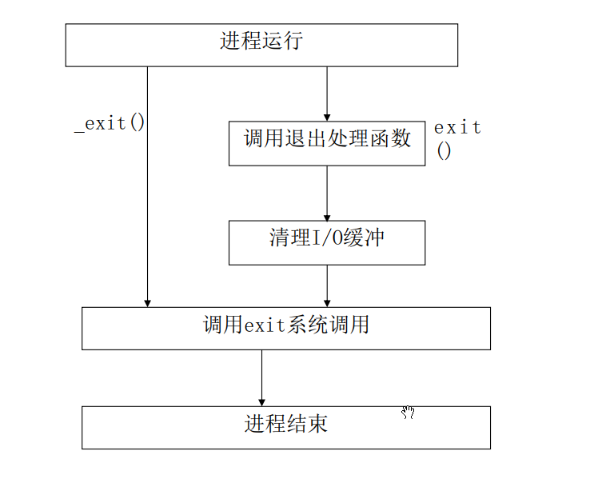

[TOC]


==函数应该关注：输入信息、反馈信息（返回值）、内部工作细节、注意事项==

==函数返回值为指针时，只能是堆区或者静态区==


## 编程模型

- ==常用man手册查看函数、变量的使用==

- 编程模型图

	- 

	- 操作系统（内核），一定是向下隐藏硬件细节（硬件控制程序），向上统一接口（系统调用接口）

	- 硬件控制 —— 向操作系统注册硬件与对应驱动的信息，让操作系统能够调用 —— 实现了跨硬件

		- CPU厂家为了支持OS来管理硬件，CPU设计了至少两个模式，普通权限和特权权限
		- 为了支持普通权限和特权权限之间切换，CPU厂家设计了专门的指令 —— 软中断[^1]指令（由硬件支持）

	- 函数库 ，相同接口，不同实现 —— 实现了跨平台

	- 系统调用接口

		- OS设计者为了让软件设计师（用户空间应用）能使用软中断，设计了一个特殊函数，称为syscall系统调用，通过系统调用号，知道哪个设备

		- ```c
			// 举例，具体更具汇编需要确定
			// 一般函数，跳转到对应的地址上，执行后续指令
			fun();				// JMP  fun		    普通函数，跳转到对应的地址上，执行后续指令
			
			// 系统调用函数
			// SWI指令不同CPU厂家，而不同
			write();			// SWI  2			syscall, 2号软中断，操作系统里，根据2号的特点，找驱动的write方法
			read();				// SWI	 3			 syscall,3号软中断，OS里，根据3号的特点，找read驱动
			// 每个系统调用，都应该指定一个设备，为了让用户空间应用方便，Linux将设备抽象成了 文件描述符（数字） 的概念
			```

		- 

- 概念：

  - 用户空间（用户级） 和 内核空间（内核级）

  	- 由来：保证用户程序的操作（对内核地址的读、写），不会影响整个操作系统和其他用户
  	- **两个空间彼此独立，不能直接访问**。一旦用户非法访问内核空间（0地址），就会触发异常，默认的处理方式，杀死当前的访问进程（可能出现闪退现象）
  	- 这个两个空间是虚拟空间，可以再系统启动时通过配置文件修改

  - 系统调用函数syscall

  	- 由来：用户程序有访问内核空间的需求，所以操作系统提供统一的接口，来让用户直接操作内核空间
  		- 申请堆空间，调用[malloc](###malloc申请堆区的理解) → 本质是调用syscall函数，执行特殊指令，实现空间的转换（用户到内核） →  让操作系统内核管理堆空间（内存）申请和释放

  - ==Linux中一切皆文件==

  - 文件描述符

  	- 对于内核而言， **所有打开的文件都由文件描述符来引用 **

  	- 文件描述符是一个**顺序分配的非负整数**

  		- **每次分配文件描述符，都是从文件描述符池中，获取一个最小的未被使用的数字返回**  

  	- 在Posix标准中， 宏定义在头文件<unistd.h>中，推荐使用宏名

  		- 整数0 ： STDIN_FILENO —— 标准输入

  		- 整数1 ： STDOUT_FILENO —— 标准输出

  		- 整数2 ： STDERR_FILENO   —— 标准错误

  		- 其余数字为被使用

  		- ```c
  			每打开一个程序（进程），动态管理的资源（用户空间资源、内核空间资源）
  				内核空间：
  					维护一张  文件描述符 ---- 	  设备驱动     映射表
  								 0				stdin ---》 键盘、触摸屏
  								 1				stdout ---> LCD屏幕、UART口
  								 2				stderr ---> LCD屏幕、UART口
  								 3 				NULL
  								 4				NULL
  								 ...
  			```

  		- 如果使用了未被分配的文件描述符 , 内部的报错号会指向 `Bad file descriptor` 错误。（不会直接报错）。==系统调用后，必须马上进行判断==

  			- ```c
  				/* 1. 测试使用未被注册驱动的文件描述符 */
  				void test01(){
  				    size_t buf[1024] = {0};
  				    ssize_t w_len =  write(100, buf, sizeof(buf));
  				    if(w_len == -1){
  				        perror("write");
  				        printf("error no: %d, error : %s\n", errno, strerror(errno));
  				    }
  				}
  				```

  			- ```bash
  				siguyuan@debian:~/myfile/application_programming/IO/day01$ ./build 
  				write: Bad file descriptor
  				error no: 9, error : Bad file descriptor
  				```

  

## 文件IO

- 
- 文件是进程（程序）之间进行信息交流的工具

### 全局错误号 —— errno

- 每次系统调用，都是进入内核，一旦发现错误，内核就会更新errno的全局变量，非0的正数都表示一个错误信息

- 打印errno

	- ```c
		perror("msg");	// msg：错误信息的提示 会自己补充冒号和空格
		
		strerror(errno); // 将错误信息转换成字符串返回，配合printf可以实现个性打印  
		```

- ```c
	// 数字 对应的 错误  x86_64 Linux中
	// /usr/include/asm-generic/errno-base.h
	#define	EPERM		 1	/* Operation not permitted */
	#define	ENOENT		 2	/* No such file or directory */
	#define	ESRCH		 3	/* No such process */
	#define	EINTR		 4	/* Interrupted system call */
	#define	EIO		     5	/* I/O error */
	#define	ENXIO		 6	/* No such device or address */
	#define	E2BIG		 7	/* Argument list too long */
	#define	ENOEXEC		 8	/* Exec format error */
	#define	EBADF		 9	/* Bad file number */
	#define	ECHILD		10	/* No child processes */
	#define	EAGAIN		11	/* Try again */
	#define	ENOMEM		12	/* Out of memory */
	#define	EACCES		13	/* Permission denied */
	#define	EFAULT		14	/* Bad address */
	#define	ENOTBLK		15	/* Block device required */
	#define	EBUSY		16	/* Device or resource busy */
	#define	EEXIST		17	/* File exists */
	#define	EXDEV		18	/* Cross-device link */
	#define	ENODEV		19	/* No such device */
	#define	ENOTDIR		20	/* Not a directory */
	#define	EISDIR		21	/* Is a directory */
	#define	EINVAL		22	/* Invalid argument */
	#define	ENFILE		23	/* File table overflow */
	#define	EMFILE		24	/* Too many open files */
	#define	ENOTTY		25	/* Not a typewriter */
	#define	ETXTBSY		26	/* Text file busy */
	#define	EFBIG		27	/* File too large */
	#define	ENOSPC		28	/* No space left on device */
	#define	ESPIPE		29	/* Illegal seek */
	#define	EROFS		30	/* Read-only file system */
	#define	EMLINK		31	/* Too many links */
	#define	EPIPE		32	/* Broken pipe */
	#define	EDOM		33	/* Math argument out of domain of func */
	#define	ERANGE		34	/* Math result not representable */
	```

- errno本质是一个**线程局部的全局变量**，每当程序被加载进入内存，内核就会创建一个全局的errno（默认为0）


### 文件操作类函数 —— 文件IO，系统调用接口

- 
- 这类函数属于内核空间中的函数，每次使用都要很大的资源开销（需要频繁进行内核与用户之间的切换）
	1. 进入内核前，需要保护现场，内核返回用户空间时，需要恢复现场（时间开销大）
		- 现场：将CPU的寄存器资源入栈，放入内存里；恢复时，出栈，从内存中读到CPU对应的寄存器中
			- 内存访问的时间 比 CPU直接执行要慢很多 —— 需要**缓存区**
			- 缓存区的大小，有需要限制，太小，一次搬运的东西太少，需要的时间多；太大，磁盘/内存能接收的数据有限，只能分次获取缓存区的数据，时间也会增加
	2. 调用一次`read / write`,等价于执行了一次驱动程序，调用了一次硬件 （ 时间开销）
		- 文件一般存在磁盘上，磁盘比内存慢 —— 需要缓存区
		- 只有硬件执行完成后，系统调用才有机会返回（退出）
- 下面的buf，就是用户维护的缓存区

#### open函数

- 函数原型

	- ```c
		#include <fcntl.h>
		int open(const char *pathname, int flags, ... /* mode_t mode */ );
		```

- 函数作用：向操作系统给当前文件注册文件描述符

- 输入参数

	- `pathname`: 文件路径。必须保证路径正确

		- 如果路径不正确，会出现`errno: 2, error: No such file or directory`

	- `flags`: 给文件设置访问模式

		- 

		- | **参数名称 (Flags)** | **核心功能说明**                                             | **互斥/组合规则**                           | **操作的目标 (目录 vs 字典)**                                |
			| -------------------- | ------------------------------------------------------------ | ------------------------------------------- | ------------------------------------------------------------ |
			| **`O_RDONLY`**       | **只读**方式打开文件。                                       | 三选一                                      |                                                              |
			| **`O_WRONLY`**       | **只写**方式打开文件。                                       | 三选一                                      |                                                              |
			| **`O_RDWR`**         | **读写**方式打开文件。                                       | 三选一                                      |                                                              |
			| **`O_CREAT`**        | 如果文件不存在，就**创建新文件**，并用 `mode` 参数为其设置权限。 | 可与上方基础读写参数通过按位或 `|` 自由组合 | **目录 + 字典**：在“目录”清单里追加一行新文件名，并在“字典”里划出一块干净的空白页。 |
			| **`O_EXCL`**         | 如果与 `O_CREAT` 连用时文件已存在，则**返回错误消息**。可用于测试文件是否存在。（文件存在就报错） | 必须搭配 `O_CREAT` 使用                     | **目录**：去“目录”清单里核对名字在不在。如果在，直接报错拒绝。 |
			| **`O_TRUNC`**        | 如果文件已存在且成功打开，**先删除文件中原有数据**（长度截断为 0）。 | 组合使用                                    | **字典**：直接把“字典”里的历史正文全部撕掉抹黑，变成完全空白的一页。 |
			| **`O_APPEND`**       | **以追加方式**打开文件，每次写操作都会强制在文件的**末尾**进行。 | 组合使用                                    | **字典**：翻到“字典”正文的最后一行，老老实实接着往下写，绝不覆盖前面的字。 |
			| **`O_NOCTTY`**       | 如果打开的文件是终端设备，该终端**不会**作为当前进程的控制终端。 | 组合使用（常用于串口/网络编程）             | **设备控制**：属于底层硬件控制逻辑，与普通文件目录无关。     |

		- 不写`O_TRUNC 或者 O_APPEND`默认是进行覆盖

		- ```c
			/* 测试3: 文件的覆盖、追加、清空添加 */
			void test03(){
			    // int fd = open("a.txt", O_CREAT | O_WRONLY, 0644);   // 注意创建文件需要正确添加权限(八进制) —— 覆盖
			    // int fd = open("a.txt", O_CREAT | O_TRUNC | O_WRONLY, 0644);   // 注意创建文件需要正确添加权限(八进制) —— 清空添加
			    int fd = open("a.txt", O_CREAT | O_APPEND | O_WRONLY, 0644);   // 注意创建文件需要正确添加权限(八进制) —— 追加
			    if(fd == -1){
			        printf("errno : %d, error: %s\n", errno, strerror(errno));
			        return;
			    }
			
			    ssize_t w_len = write(fd, "abc4567", 2);        // a.txt中原本有1234567
			    if(w_len == -1){
			        printf("errno : %d, error: %s\n", errno, strerror(errno));
			        close(fd);
			        return;
			    }
			
			    close(fd);
			}
			```

		- 

	- `...`: 可选参数，配合`O_CREAT`使用，给创建的文件设置权限，推荐使用八进制 `如：0744`

- 返回值

	- `非负整数`: 申请的文件描述符
	- `-1`: 失败，通过errno查看失败原因

- 内部细节

	- 向当前运行open的进程，在内核空间里，填入了  文件描述符 --- 设备驱动 映射关系
	- 文件描述符的取值规则：	从文件描述符池里，获取一个最小的未被使用的数字，返回

- 实际应用 —— 任务独占使用（方案，任务执行时，先创建一个互斥文件，一旦发现该文件存在，就说明系统有这个服务运行了，就退出，如果没有就创建，保证该程序多次打开，都能退出）

	- ```c
		/*
		    任务独占(场景：同一程序只运行一份；多种程序只有一个能占用资源等)
		    通过O_CREAT | O_EXCL实现
		*/
		
		void test(){
		    /* 1. 创建互斥文件 */
		    int fd = open("huchi.txt", O_CREAT | O_EXCL | O_RDONLY, 644);
		    if(fd == -1){
		        printf("errno: %d, error: %s\n", errno, strerror(errno));
		        return;
		    }
		
		    /* 2. 演示长时间处理任务 */
		    printf("run...\n");
		    getchar();  // 需要获取回车才继续
		    close(fd);
		
		    /* 3. 释放互斥文件资源 */
		    unlink("huchi.txt");
		    
		}
		
		// 运行相同程序时
		// errno: 17, error: File exists
		```

	- 

#### close函数

- 原型

	- ```c
		 #include <unistd.h>
		int close(int fd);
		```

- 返回值

	- `-1`: 失败

	- 

	- | **错误宏**                | **简明含义**                                            |
		| ------------------------- | ------------------------------------------------------- |
		| **`EBADF`**               | **坏的 fd**（无效描述符）                               |
		| **`EINTR`**               | **被信号中断**                                          |
		| **`EIO`**                 | **硬件 I/O 错误**                                       |
		| **`ENOSPC`** **`EDQUOT`** | **磁盘满 / 超过配额** *(常在网络文件系统 NFS 延迟爆雷)* |

- 内部工作细节：

	- 向当前运行close的进程，在内核空间里，删除了  文件描述符 --- 设备驱动 映射关系

#### read函数

- 原型

	- ```c
		#include <unistd.h>
		ssize_t read(int fd, void buf[.count], size_t count);
		```

	- 

- 输入参数

	- `fd`:  文件描述符，具体的读取设备
	- `buf`: 准备的放获取数据的空间
	- `count`: 空间的大小约束

- 返回值

	- `-1`: 失败，具体错误打印errno
	- `0`: 正常读完文件，遇到了EOF（文件末尾的特殊字符）
	- `非0的正数`: 一次读到的字节数

- 内部工作细节

	- 用户空间，先申请一段盒子，把这个盒子的首地址和盒子的容量 交给 fd指向的设备中read方法，驱动把驱动缓存里的数据 填入到用户申请的盒子里

- ```c
	/* 测试4: 读取文件数据到屏幕 */
	void test04(){
	    /* 将aa.txt文件里的内存读取到屏幕中 —— cat命令的效果 */
	    int fd = open("aa.txt", O_RDONLY);
	    if(fd == -1){
	        printf("errno: %d, error: %s\n", errno, strerror(errno));
	        return;
	    }
	
	    /* 将读取的数据写到屏幕中 */
	    char buf[10] = {0};
	    
	    ssize_t r_len = read(fd, buf, sizeof(buf) - 1);     // 因为打印到屏幕，需要%s解码，所以留一个位置放0值
	
	    while(r_len){
	        if(r_len == -1){
	            printf("errno: %d, error: %s\n", errno, strerror(errno));
	            break;
	        }
	
	        buf[r_len] = 0;
	        printf("%s", buf);
	
	        r_len = read(fd, buf, sizeof(buf) - 1);
	    }
	
	    close(fd);
	}
	```

- 

#### write函数

- 原型

	- ```c
		#include <unistd.h>
		ssize_t write(int fd, const void buf[.count], size_t count);
		```

- 输入参数

	- `fd` : 文件描述符
	- `buf` :  传入一个不可修改的空间首地址(const修改),注意越界问题
	- `count` : 限制上面的buf空间大小，防止越界读取

- 返回值

	- `-1`: 失败。通过errno进行打印错误信息
	- `非负的数字` : 成功写入到设备驱动的字节数

- 内部工作细节

	- 向fd指向的设备里，传入 buf为首地址，count个字节的空间信息，交给驱动的write方法，驱动把数据硬件方式传递出现

- ```c
	/* 测试5: 使用write函数打印到屏幕 */
	void test05(){
	    ssize_t w_len = write(1, "nihao\n", 6);
	    if(w_len == -1){
	        printf("errno: %d, error: %s\n", errno, strerror(errno));
	        return;
	    }
	}
	
	
	```


#### lseek函数

- 原型

	- ```c
		#include <unistd.h>
		off_t lseek(int fd, off_t offset, int whence);
		```

- 输入参数

	- `fd`: 文件描述符
	- `offset` : 文件指针（文字从这里输入）偏移位置，相对于whence的偏移
	- `whence` :  
		- `SEEK_SET`: 当前位置为文件的开头， 新位置为偏移量的大小（0 + offset）。  
		- `SEEK_CUR`: 当前位置为文件指针的位置， 新位置为当前位置加上偏移量（offset + whence）。  
		- `SEEK_END`: 当前位置为文件的结尾， 新位置为文件的大小加上偏移量的大小（offset + 写入前整个文件的大小）。  

- 返回值

	- `-1` : 失败。通过errno查询错误
	- `>=0`: 成功，新位置的位移 

- 内部细节

	- 将fd指向的设备驱动里的缓存区，进行索引定位（按照whence的参考系，偏移offset个字节）

- ```c
	/* 测试6: 空洞文件 —— 全是0值填充的文件 */
	/* 场景，在下载时，如果不告知OS文件有多大，那么下载的数据在磁盘上是分散且逻辑上也不连续 */
	/* 为了避免这个情况，提前告知OS分配一个较大的文件，为后续填充做准备，虽然物理上分散，但逻辑上连续 */
	/* OS分配文件，只有真正写入时，才会在磁盘分配真实的空间 */
	void test06(){
	    int fd = open("aaa.txt", O_CREAT | O_WRONLY, 0644);
	    if(fd == -1){
	        printf("errno: %d, error: %s\n", errno, strerror(errno));
	        return;
	    }
	    /* 让文件位置调整到10GB处，这个空洞文件就是10GB大小 */
		lseek(fd, 1024 * 1024 * 1024, SEEK_SET);
	    ssize_t w_len = write(fd, "", 1);
	    if(w_len == -1){
	        printf("errno: %d, error: %s\n", errno, strerror(errno));
	        return;
	    }
	
	    close(fd);
	}
	```

- 


### 文件操作函数 —— 标准IO操作

- 标准库对文件IO操作封装，同时也管理缓存区

	- 使用标准IO操作，一次用户空间与内核空间的切换，会读取比较大的数据到缓存区中**（减少用户空间与内核空间的切换）**
	- 不同的操作系统上的标准IO库实现不同，但接口相同

- 标准IO的特点

  - 不仅在UNIX系统， 在很多操作系统上都实现了标准I/O库（不同操作系统实现不同）
  - 标准I/O库由ANSI C标准说明（接口相同）
  - 标准I/O库处理很多细节， 如**缓存分配、 以优化长度执行I/O**等， 这样使用户不必关心如何选择合适的缓存区的大小
  - 标准I/O在系统调用函数（文件I/O）基础上构造的， 它便于用户使用
  - 标准I/O库及其头文件stdio.h为底层I/O系统调用提供了一个通用的接口  

- 缓存的分类

	- 全缓存
		- 写操作，当缓存区满了，或者遇到满足了一定条件后，才会写入磁盘
		- 读操作，进行读操作时，标准IO会一次性从磁盘读取一块数据，填满缓存区，提供用户读取，直到缓存区读取完之后，才开始下一次读取
		- 适用于普通文件等非交互式设备
	- 行缓存
		- 写操作，数据先写入缓存区，直到写入换行符[^3]，或者缓存区满，才会将这一行数据写入设备中
		- 读操作，向缓存区输入数据，直到遇到换行符，才读到设备中（如果缓存区满了，还没遇到换行符，之后的数据不会写入缓存区，直到换行符将缓冲区数据输入到设备中）
		- 适用于屏幕、键盘、终端等交互式设备
	- 不缓存
		- 写操作，直接向设备发送数据
		- 读操作，直接从设备读数据
	- 缓存的分类，实际是设置标准 I/O 库（C 库）在“内存”与“目标设备”之间搬运数据的“积压策略”，所以同一块缓存有不同的操作行为，但具体类型的划分与FILE结构体有关，即链接的设备有关
	- $$\text{应用程序 (printf/fwrite)} \xrightarrow{\text{调用}} \text{FILE 结构体 (决定积压策略)} \xrightarrow{\text{内存缓存区}} \text{内核/目标设备}$$
	- **标准输出流默认行缓存（与屏幕设备有关），非标准流默认是全缓存，标准错误是不缓存（虽然与屏幕设备有关，但标准库实现时做了区分）**

- 标准IO与文件IO

	- 标准IO
		- 也叫缓存（缓冲）文件系统、高级磁盘IO
		- **系统自动的在内存中为每一个正在使用的文件开辟一个缓冲区**， 从内存向磁盘输出数据必须先送到内存缓冲区， 装满缓冲区在一起送到磁盘中去。 从磁盘中读数据， 则一次从磁盘文件将一批数据读入到内存缓冲区中， 然后再从缓冲区逐个的将数据送到程序的数据区。  
		- 资源开销小，但是针对的驱动有效，如果自定义驱动，无法通过标准IO完成操作
		- 有全缓存和行缓存
	- 文件IO
		- 也叫非缓存（缓冲）文件系统、低级磁盘IO
		- 资源开销大，但能完成对驱动的所有操作
		- 属于不缓存，即系统没有自己管理缓冲区，而是用户管理

- 文件指针（FILE）

	- FILE指针： 每个被使用的文件都在内存中开辟一个区域， 用来存放文件的有关信息， 这些信息是保存在一个结构体类型的变量中， 该结构体类型是由系统定义的， 取名为FILE。（类似链表的表头）

	- 标准I/O库[^2]的所有操作都是围绕流(stream)【加减有意义】来进行的， 在标准I/O中， 流用FILE *来描述。  

	-   ```c
		  typedef struct _IO_FILE FILE;
		  
		  /* The tag name of this struct is _IO_FILE to preserve historic
		     C++ mangled names for functions taking FILE* arguments.
		     That name should not be used in new code.  */
		  struct _IO_FILE
		  {
		    int _flags;		/* High-order word is _IO_MAGIC; rest is flags. 对应的标志位 */
		  
		    /* The following pointers correspond to the C++ streambuf protocol. */
		    /* 缓存区通过开始指针和结束指针控制 */
		    /*  读写都是三个指针完成，所以能指定范围读写，以及记录下一处从哪里开始读写 */
		    /* 这种思想可以学习一下 */
		    char *_IO_read_ptr;	/* Current read pointer 当前指针 */	
		    char *_IO_read_end;	/* End of get area. 结束指针 */
		    char *_IO_read_base;	/* Start of putback+get area. 开始指针 */
		    char *_IO_write_base;	/* Start of put area. */
		    char *_IO_write_ptr;	/* Current put pointer. */
		    char *_IO_write_end;	/* End of put area. */
		    char *_IO_buf_base;	/* Start of reserve area. */
		    char *_IO_buf_end;	/* End of reserve area. */
		  
		    /* The following fields are used to support backing up and undo. */
		    char *_IO_save_base; /* Pointer to start of non-current get area. */
		    char *_IO_backup_base;  /* Pointer to first valid character of backup area */
		    char *_IO_save_end; /* Pointer to end of non-current get area. */
		  
		    struct _IO_marker *_markers;
		  
		    struct _IO_FILE *_chain;
		  
		    int _fileno;
		    int _flags2:24;
		    /* Fallback buffer to use when malloc fails to allocate one.  */
		    char _short_backupbuf[1];
		    __off_t _old_offset; /* This used to be _offset but it's too small.  */
		  
		    /* 1+column number of pbase(); 0 is unknown. */
		    unsigned short _cur_column;
		    signed char _vtable_offset;
		    char _shortbuf[1];
		  
		    _IO_lock_t *_lock;
		    __off64_t _offset;
		    /* Wide character stream stuff.  */
		    struct _IO_codecvt *_codecvt;
		    struct _IO_wide_data *_wide_data;
		    struct _IO_FILE *_freeres_list;
		    void *_freeres_buf;
		    struct _IO_FILE **_prevchain;
		    int _mode;
		    /* Make sure we don't get into trouble again.  */
		    char _unused2[15 * sizeof (int) - 5 * sizeof (void *)];
		  };
		```


#### fopen函数

- 原型

	- ```c
		#include <stdio.h>
		FILE *fopen(const char *restrict pathname, const char *restrict mode);	// restrict 在当前作用域内，这个指针所指向的内存块，【只能】通过这一个指针来读写。绝对没有其他任何指针会指向这里（即不存在内存重叠/指针别名） —— 当前作用域独家代理
		```

	- 

- 输入参数

	- `pathname`:  文件路径

	- `mode`: 模式

		- | **fopen() 模式** | **对应的 open() 标志 (Flags)**  | **详细行为说明（含指针位置与特权）**                         |
			| ---------------- | ------------------------------- | ------------------------------------------------------------ |
			| **`"r"`**        | `O_RDONLY`                      | **只读模式**。文件必须已经存在，否则报错返回 `NULL`。打开后文件指针指向**文件开头**。 |
			| **`"w"`**        | `O_WRONLY | O_CREAT | O_TRUNC`  | **只写截断模式**。若文件不存在则**自动创建**；若文件已存在，则将其内容**完全清空**（截断为 0 字节）。打开后文件指针指向**文件开头**。 |
			| **`"a"`**        | `O_WRONLY | O_CREAT | O_APPEND` | **追加只写模式**。若文件不存在则**自动创建**；若文件已存在，原有内容保留。每次写入数据时，底层的 `O_APPEND` 会强制将指针移动到**文件末尾**进行追加，无法修改历史数据。 |
			| **`"r+"`**       | `O_RDWR`                        | **读写覆盖模式**。文件必须已经存在，否则报错。打开时原有内容保留，文件指针指向**文件开头**。你可以自由读写，但写入时会**覆盖**对应位置的原有数据。 |
			| **`"w+"`**       | `O_RDWR | O_CREAT | O_TRUNC`    | **读写截断模式**。具有 `"w"` 的一切特性（不存在则创建，存在则**清空内容**），但额外允许你读取该文件。打开后文件指针指向**文件开头**。 |
			| **`"a+"`**       | `O_RDWR | O_CREAT | O_APPEND`   | **追加读写模式**。若文件不存在则创建。**读取**数据时可以从任意位置（初始为开头）开始；但只要执行**写入**，**无论你之前把指针（文件光标）移动到了哪里，数据都只会被强制追加到文件末尾**。 |
			| “b”              |                                 | 配合上面使用，以二进制形式打开                               |

- 返回值

	- `NULL`: 失败，并设置errno
	- `!NULL`: FILE指针

- 内部细节

	- 先在堆区上开辟的缓冲区（必须释放），Linux环境下，在调用open函数，成功，返回文件指针；失败，返回NULL

- ```c
	/* 测试1: 缓冲区在堆区上开辟 */
	void test01(){
	    FILE *fp = fopen("a.txt", "r");
	    if(fp == NULL){
	        fprintf(stderr, "fopen : %s\n", strerror(errno));
	        return;
	    }
	
	    fclose(fp);
	    fclose(fp);
	}
	/*
	free(): double free detected in tcache 2
	已中止
	*/
	```

- 


#### fclose函数

- 原型

	- ```c
		#include <stdio.h>
		int fclose(FILE *stream);
		```

- 内部细节

	- 在关闭流之前，会刷新缓冲区（即将数据让设备获取到），然后释放缓冲区

- ```c
	/* 测试2: fclose是会刷新缓冲区 */
	/* 正常关闭: 在关闭之前会刷新缓存区 */
	/* ctrl + c强制关闭(异常关闭): 不会刷新缓存区 */
	void test02(){
	    FILE *fp = fopen("a.txt", "r");
	    if(fp == NULL){
	        fprintf(stderr, "fopen : %s\n", strerror(errno));
	        return;
	    }
	
	    fprintf(stdout, "11111");       // 不能填加\n, 因为是送到标准输出设备(屏幕)上，
	                                                   // 而对标准输出设备是行缓存行为，所以遇到\n会刷新
	
	    int i = 5;
	    while(--i){
	        sleep(1);       // 使用睡眠函数来进行停止演示，使用getchar()，内部会触发IO，导致强制刷新缓冲
	    }
	    
	    fclose(fp);
	    printf("\n");
	}
	
	/*
	siguyuan@debian:~/myfile/application_programming/IO/day02$ ./build 
	11111
	siguyuan@debian:~/myfile/application_programming/IO/day02$ ./build 
	^C
	
	*/
	```

- 


#### fprintf函数

- 原型

	- ```c
		#include <stdio.h>
		int fprintf(FILE *restrict stream,const char *restrict format, ...);
		```

	- 

- 输入参数

	- `stream`: 打印到的设备流

		- 常用流

			- ```c
				/* Standard streams.  */
				extern FILE *stdin;			/* Standard input stream. 标准输入流 */
				extern FILE *stdout;		/* Standard output stream. 标准输出流 */
				extern FILE *stderr;		/* Standard error output stream. 标准错误流 */
				
				/*  区别于文件描述符的三个标准（宏，设备驱动唯一号 */
				/* Standard file descriptors.  */
				#define	STDIN_FILENO	0	/* Standard input. 标准输入 */
				#define	STDOUT_FILENO	1	/* Standard output. 标准输出 */
				#define	STDERR_FILENO	2	/* Standard error output. 标准错误 */
				```

			- 

	- `format`: 打印的消息

	- `...`: 可变参数

- 标准输出流默认行缓存，非标准流默认是全缓存，标准错误是不缓存

	- ```c
		/* 测试3: fprintf的标准输出与标准错误的区分 */
		void test03(){
		    /* 不加\n， 标准错误，不缓存（先输出） 标准输出，行缓存（后输出） */
		    /* 编写程序向标准输出输出”STDOU： Hello World!” */
		    fprintf(stdout, "STDOUT: Hello Word!\t");
		    
		    /* 编写程序向错误输出输出”ERROR： Hello World!” */
		    fprintf(stderr, "ERROR: Hello Word!\t");
		
		
		    /* 控制标准的输出错误输出， 使程序仅输出标准输出字符。 ./build 2> a.log */ 
		    /* 控制标准的输出错误输出， 使程序仅输出错误输出字符。 ./build > a.log*/
		}
		
		```

	- ```bash
		siguyuan@debian:~/myfile/application_programming/IO/day02$ ./build
		ERROR: Hello Word!      STDOUT: Hello Word!     siguyuan@debian:~/myfile/application_programming/IO/day02$ ./build 2> a.log
		STDOUT: Hello Word!     siguyuan@debian:~/myfile/application_programming/IO/day02$ ./build > a.log
		ERROR: Hello Word!      siguyuan@debian:~/myfile/application_programming/IO/day02$ 
		```

	- 

- ```c
	/* myDeubg.h */
	/* 日志头文件骨架 —— 区分哪个模块报错的错误 */
	#ifndef __MY_DEBUG_H__
	#define __MY_DEBUG_H__
	
	#include <stdio.h>
	
	// 封装颜色宏
	// ==================== 1. 样式重置与清除 ====================
	#define NONE          "\033[0m"    // 关闭所有属性，恢复默认
	#define BOLD          "\033[1m"    // 纯加粗/高亮（不改颜色）
	#define UNDERLINE     "\033[4m"    // 下划线
	#define FLASH         "\033[5m"    // 闪烁（部分终端支持）
	#define REVERSE       "\033[7m"    // 反显（前景色和背景色对调）
	
	// ==================== 2. 标准前景色（30 ~ 37） ====================
	#define BLACK         "\033[30m"   // 黑色
	#define RED           "\033[31m"   // 红色（常用于 ERROR）
	#define GREEN         "\033[32m"   // 绿色（常用于 SUCCESS / OK）
	#define YELLOW        "\033[33m"   // 黄色（常用于 WARN）
	#define BLUE          "\033[34m"   // 蓝色（常用于 DEBUG）
	#define PURPLE        "\033[35m"   // 紫色/品红
	#define CYAN          "\033[36m"   // 青色/蓝绿（常用于 TRACE / INFO）
	#define WHITE         "\033[37m"   // 白色（标准暗白）
	
	// ==================== 3. 加粗/高亮前景色（1;30 ~ 1;37） ====================
	#define BOLD_BLACK    "\033[1;30m"
	#define BOLD_RED      "\033[1;31m" // 极其醒目的暴击红（FATAL / CRITICAL）
	#define BOLD_GREEN    "\033[1;32m"
	#define BOLD_YELLOW   "\033[1;33m"
	#define BOLD_BLUE     "\033[1;34m"
	#define BOLD_PURPLE   "\033[1;35m"
	#define BOLD_CYAN     "\033[1;36m"
	#define BOLD_WHITE    "\033[1;37m" // 纯亮白
	
	// ==================== 4. 高亮/明亮前景色（90 ~ 97） ====================
	// 这组颜色比标准色更鲜艳，通常不需要加粗就很亮
	#define DARK_GRAY     "\033[90m"   // 深灰（最适合用来打时间戳或者微秒追踪）
	#define LIGHT_RED     "\033[91m"
	#define LIGHT_GREEN   "\033[92m"
	#define LIGHT_YELLOW  "\033[93m"
	#define LIGHT_BLUE    "\033[94m"
	#define LIGHT_PURPLE  "\033[95m"
	#define LIGHT_CYAN    "\033[96m"
	#define LIGHT_WHITE   "\033[97m"
	
	// ==================== 5. 标准背景色（40 ~ 47） ====================
	#define BG_BLACK      "\033[40m"
	#define BG_RED        "\033[41m"   // 红底
	#define BG_GREEN      "\033[42m"   // 绿底
	#define BG_YELLOW     "\033[43m"   // 黄底
	#define BG_BLUE       "\033[44m"   // 蓝底
	#define BG_PURPLE     "\033[45m"
	#define BG_CYAN       "\033[46m"
	#define BG_WHITE      "\033[47m"
	
	/* 区分开发版本的输出 和 测试版本的输出 */
	#ifdef _DEBUG
	
	/* 测试版，彩色输出 */
	// 使用 ##__VA_ARGS__ 可以完美支持 0 个或多个参数
	#define DEBUG(fmt, ...) do { \
	    fprintf(stdout, "%s[debug]: ", BLUE);  \
	    fprintf(stdout, fmt, ##__VA_ARGS__); \
	    fprintf(stdout, "%s", NONE); \
	} while(0)
	
	#define ERROR(fmt, ...) do { \
	    fprintf(stderr, "%s[error]: ", RED);  \
	    fprintf(stderr, fmt, ##__VA_ARGS__); \
	    fprintf(stderr, "%s", NONE); \
	} while(0)
	
	// 修正：将 stdin 改为 stdout
	#define INFO(fmt, ...) do { \
	    fprintf(stdout, "%s[info]: ", YELLOW);  \
	    fprintf(stdout, fmt, ##__VA_ARGS__); \
	    fprintf(stdout, "%s", NONE); \
	} while(0)
	
	#else
	
	/* 发行版，除了error其他不输出 */
	#define DEBUG(fmt, ...) ((void)0) // 优雅地置空，防止编译警告
	#define INFO(fmt, ...)  ((void)0)
	
	#define ERROR(fmt, ...) do { \
	    fprintf(stderr, "%s[error]: ", RED);  \
	    fprintf(stderr, fmt, ##__VA_ARGS__); \
	    fprintf(stderr, "%s", NONE); \
	} while(0)
	
	#endif
	
	#endif
	```

- 一般与`fscanf`配合，但是fscanf不常用


#### feof函数和ferror函数

- 原型

  - ```c
  	 #include <stdio.h>
  	void clearerr(FILE *stream);		// 清除流（FILE结构体）中的文件结束标志 和 错误标志
  	int feof(FILE *stream);				// 检查流中的文件结束标志
  	int ferror(FILE *stream);			// 检查流中的错误标志
  	
  	```

- 返回值

  - `feof`: 0值，文件标志位为0；!0值，文件标志位被置位
  - `ferror`: 0值，错误标志为0；!0值，错误标志被置位

- EOF，是一个宏，表示-1。它不会出现文件中，这是驱动反馈的一个状态。

	- 从标志输入中采集，Linux中再键盘上`ctrl + D` 发出EOF
	- 键盘发出`ctrl + d`，被键盘驱动收到，键盘驱动里有缓存，再read驱动方法中，反馈没有数据的信息，被syscall 中的read收到 返回0 → 标志IO库收到0，设置EOF状态，通过fgetc等函数返回成-1（32bit）

- 判断文件结束

  - ```c
  	/* 使用feof */
  	int cTemp;
  	while (!feof(fp)) {
  		cTemp = fgetc(fp);
  	}
  	
  	/* 使用EOF */
  	/* 实际开发中，不能通过这个方式写，因为无法判断是错误退出还是文件结束 */
  	int cTemp;
  	cTemp = fgetc(fp);
  	while (cTemp != EOF) {
  		cTemp = fgetc(infile);
  	}
  	```

  - 


#### fgetc和fputc函数

- 每次读写一个字符的IO

- 原型

	- ```c
		#include <stdio.h>
		int fgetc(FILE *stream);	// 是一个函数
		int getc(FILE *stream);		// 由一个宏实现
		int getchar(void);	 		// 等价于get(stdin);
		
		int fputc(int c, FILE *stream);		 // 是一个函数
		int putc(int c, FILE *stream);		 // 由一个宏实现
		int putchar(int c);					// 等价于put(stdout);
		```

	- **宏实现**: 牺牲空间，换时间（重复代码展开，增加代码空间 —— 消耗空间；但就在当前函数操作，不需要保护现场）

	- **函数实现**: 牺牲时间，换空间 (使用一份代码，每次调用需要保护现场、恢复现场 —— 消耗时间； 但多个地方使用同一份代码，节约空间)

- 输入参数

	- `fputc`
		- `c`:  写入到流中的字符，只是取int的低8位数据写入缓存中

- 返回值

	- `fgetc`:  成功返回一个字符，失败或者文件末端则返回EOF（-1）
		- **为什么返回使用int，而不是char（面试常问）**
			- fgetc只会返回两种状态，一种是0x00~0xFF的数据；一种是EOF( -1 )的错误码/结束码。如果是char类型，-1和数据0xFF无法区分，如果是int类型，-1（0xFFFFFFFF）和数据0xFF(0x000000FF)有明显区别
	- `fputc`: 也会返回写入的字符c（先转成unsigned char 在转成 int），错误返回EOF
	- 注意：使用`feof`和`ferror`区分是文件到头了和出现错误退出

- 内部细节

	- 这个两个都是一个字符一个字符的操作，但是对于用户空间和内核空间的切换是比较少的，应该这两种函数，本质是一个字符一个字符的操作标准库缓存区中的数据，当操作完缓存区时，标准库才会区读新的数据

- ```c
	/* 测试4: fgetc和fputc,循环从标准输入(stdin)逐个字符读入数据， 并逐个字符显示到标准输出 */
	void test04(){
	
	    while(1){
	        /* 从屏幕中获取字符 */
	        int g_ch = fgetc(stdin);
	        while(!feof(stdin) ){
	            
	            /* 写到标准输出中 */
	            int p_ch = fputc(g_ch, stdout);
	            if(ferror(stdout)){
	                DEBUG("stdout error\n");
	                break;
	            }
	
	            fprintf(stdout, "\n");      // 加上这句话可以看到fgetc和fputc是一个字符一个字符的处理
	
	            /* 重新获取值 */
	            g_ch = fgetc(stdin);
	        }
	        
	        // 文件终止写法（推荐）
	        // while(g_ch != EOF){
	        //     /* 写到标准输出中 */
	        //     int p_ch = fputc(g_ch, stdout);
	        //     if(ferror(stdout)){
	        //         DEBUG("stdout error\n");
	        //         break;
	        //     }
	
	        //     fprintf(stdout, "\n");      // 加上这句话可以看到fgetc和fputc是一个字符一个字符的处理
	
	        //     /* 重新获取值 */
	        //     g_ch = fgetc(stdin);
	        // }
	        
	        if(ferror(stdin)){
	            DEBUG("stdin error!\n");
	            return;
	        }
	        
	    }
	}
	```

- 

#### fgets函数和fputs函数

- 每次读写一行的数据，遇到\n或者缓存区满才操作 —— 指针的行缓存设备（常用于配置文件，一定不能是二进制文件（数据文件），否则不能保证正确）

- 原型

  - ```c
  	#include <stdio.h>
  	char *fgets(char s[restrict .size], int size, FILE *restrict stream);
  	[[deprecated]] char *gets(char *s);			// 危险函数，存在越界风险
  	
  	int fputs(const char *restrict s, FILE *restrict stream);
  	int puts(const char *s);
  	```
  	
  - ==gets()是一个不推荐使用的函数， 因为调用者在使用gets()时不能指定缓存的长度， 这样就可能造成缓存越界；==  

- 输入参数

  - `fgets`: 
  	- `s` : 字符空间
  	- `size`: 空间的大小
  - `fputs`:
  	- `size`: 字符空间

- 返回值

	- `fgets`: 返回获取的字符串（同s中一样,**会自己添加0值到末尾**）
	- `fputs`:  非负整数, 成功; EOF, 出错

- 内部细节

	- `fgets`: 
		- 从一个流中获取一行数据到s指向的空间
		- 防止越界保险
			1. 从一个流中获取数据时，获取最多size - 1个字节
			2. 获取数据时，遇到\n,也会立刻返回，同时将\n放到s指向空间中
			3. 在退出条件的后一个位置放入0值（\0结束符）

	- `fputs`: 不会主动添加\n符号到目标流内  
	- `puts`: 会主动添加\n符号到标准输出中  

- ```c
	/* 
	a.txt的内容（123后面有换行）
	123
	abcd
	*/
	
	/* 测试5: fgets的条件 */
	void test05(){
	    FILE *fp = fopen("a.txt", "r");
	    if(!fp){
	        ERROR("open, %s", strerror(errno));
	        return;
	    }
	    FILE *fp_w = fopen("a1.txt", "w+");
	    if(!fp_w){
	        ERROR("open, %s", strerror(errno));
	        return;
	    }
	
	    char s[5];
	    char *s1 =  fgets(s, sizeof(s), fp);
	    while(s1){
	        int s2 =  fputs(s, fp_w);
	        if(s2 == EOF){
	            ERROR("fputs, %s", strerror(errno));
	            return;
	        }
	
	        s1 =  fgets(s, sizeof(s), fp);
	    }
	    
	
	    fclose(fp);
	    fclose(fp_w);
	}
	
	/*
	# 0x0a是换行符\n
	siguyuan@debian:~/myfile/application_programming/IO/day02$ hexdump -C a1.txt 
	00000000  31 32 33 0a 61 62 63 64                           |123.abcd|
	00000008
	
	*/
	```

- ```c
	/* 测试6: 回显 */
	void test06(){
	    while(1){
	        char buf[16] = {0};
	        /* 遇到EOF会直接返回NULL */
	        fgets(buf, sizeof(buf), stdin);    // 从键盘中获取值（标准输入）
	        fputs(buf, stdout);                  // 打印到屏幕（标准输出
	    }
	}
	
	```

- 

#### fread函数和fwrite函数

- 每次读写一块数据

- 原型

	- ```c
		#include <stdio.h>
		size_t fread(void ptr[restrict .size * .nmemb],size_t size, size_t nmemb,FILE *restrict stream);
		size_t fwrite(const void ptr[restrict .size * .nmemb],size_t size, size_t nmemb,FILE *restrict stream);
		
		```

	- 

- 输入参数

	- `fread`:  
		- `ptr`: 用来装数据的一片空间地址
	- `fwrite`: 
		- `ptr`: 从这一片空间中取出数据写入流
	- `size`: 每块空间的大小
	- `nmemb`: 多少个size大小的空间
	- `stream`: 流（设备）

- 返回值

	- `>= 1` : 写入或者读出的空间个数
	- `< 1` : 文件结束、文件出错，需要使用`feof 和 ferror`进行区分

- 内部细节

	- ```c
		/* 测试7: 读或写一个二进制数组， 将一个浮点数组的第2至第5个元
		素写至一个文件上 */
		void test07(){
		    float arr[7] = {1.1, 2.3,3.4, 4.5, 5.6,6.7,7.8};
		    FILE *fp = fopen("a1.txt", "w+");
		    if(!fp){
		        ERROR("fopen: %s\n", strerror(errno));
		        return;
		    }
		
		    /* 写入a1.txt中，正常显示乱码 */
		    size_t num = fwrite(&arr[2], sizeof(arr[0]), 4,  fp);
		    if(num < 1){
		        ERROR("fwrite: %s, %zd\n", strerror(errno), num);
		        goto EXIT;
		    }
		    
		    /* 将文件中的光标从最后拉到文件的开头 */
		    fseek(fp, 0, SEEK_SET);
		
		    /* 从文件中读取出来 */
		    num = 0;
		    float arr1[10] = {0};
		    num = fread(arr1, sizeof(arr1[0]), ARRAY_SIZE(arr1), fp);
		    if(feof(fp)){
		        DEBUG("fread: EOF\n");
		    }
		    if(ferror(fp)){
		        ERROR("fread: %s, %zd\n", strerror(errno), num);
		        goto EXIT;
		    }
		
		    for(int i = 0; i < num; ++i){
		        fprintf(stdout, "arr1[%d]=%f,", i, arr1[i]);
		    }
		    fprintf(stdout, "\n");
		
		EXIT:
		    fclose(fp);
		}
		
		```

	- 

#### fseek函数

- 设置文件中的光标位置，读写就是从光标位置处开始读写

- 原型

	- ```c
		#include <stdio.h>
		int fseek(FILE *stream, long offset, int whence);	// 任意位置设置光标
		long ftell(FILE *stream);						  // 获取当前光标的位置
		void rewind(FILE *stream);						  // 将光标拉到文件开头
		
		```

- [fseek的参数与lseek的参数用法一样](####lseek函数)

- ```c
	/* 测试8: fseek和ftell */
	void test08(){
	    FILE *fp = fopen("a1.txt", "w+");
	    if(!fp){
	        ERROR("fopen: %s\n", strerror(errno));
	        return;
	    }
	
	    /* 刚进入文件，没有触发读写操作，光标默认为0 */
	    long offset = ftell(fp);
	    fprintf(stdout, "offset:%ld\n", offset);
	    
	    int num = 0x21;
	
	    int fptc = fputc(num, fp);
	    fptc = fputc(num, fp);
	    if(feof(fp)){
	        DEBUG("EOF\n");
	    }
	    if(ferror(fp)){
	        ERROR("fputc: %s\n", strerror(errno));
	        goto EXIT;
	    }
	
	    offset = ftell(fp);
	    fprintf(stdout, "offset:%ld\n", offset);
	
	    /* fseek存在保护机制，当回退的步数或者增加的步数超过当前的数据时，只回返回当前的坐标 */
	    fseek(fp, -10, SEEK_CUR);
	    offset = ftell(fp);
	    fprintf(stdout, "offset:%ld\n", offset);
	
	    /* a模式下，光标在任何位置，在写入时也会拉回文件末尾 */
	    fptc = fputc(num, fp);
	    fptc = fputc(num, fp);
	    if(feof(fp)){
	        DEBUG("EOF\n");
	    }
	    if(ferror(fp)){
	        ERROR("fputc: %s\n", strerror(errno));
	        goto EXIT;
	    }
	
	    offset = ftell(fp);
	    fprintf(stdout, "offset:%ld\n", offset);
	
	
	EXIT:
	    fclose(fp);
	}
	
	```

- 

#### fflush函数

- 刷新缓存区

- 原型

	- ```c
		#include <stdio.h>
		int fflush(FILE *_Nullable stream);
		```

	- 对于输出流设备，会调用底层的写入函数将缓存区的数据写入到设备

	- 对于输入流设备（针对的时可寻址文件，除了键盘【标准输入，也叫终端】和管道 —— 大部分的字符设备都是不可寻址），会舍去缓存区数据

- ```c
	/* 测试9: fflush标准输入 */
	void debug_stdin_buffer(FILE *fp) {
	    // 在 GCC/Glibc 中，系统自带了 struct _IO_FILE 的定义
	    // 我们直接把标准 stdin 强转为它真正的底层结构体指针
	    struct _IO_FILE *backend = (struct _IO_FILE *)fp;
	
	    // 这样就能直接访问到它的缓冲区指针了！
	    char *start = backend->_IO_read_ptr;
	    char *end   = backend->_IO_read_end;
	
	    printf("剩余未读字节数: %ld\n", end - start);
	    // ... 打印内容 ...
	}
	
	void test09(){
	    /* 标准输入 */
	    /* 输入长度大于s的字符到标准库的缓存区 */
	    char data1[4] = {0};
	    char *s1 = fgets(data1, sizeof(data1), stdin);      // 获取了3个字符,输入的参数中除了显示的字符，还有一个回车符（换行符）
	    if(!s1){
	        ERROR("fgets error\n");
	        return;
	    }
	    
	    fflush(stdin);      // 对于不可寻址的设备（绝大多数的字符设备），fflush是没有效果的
	    debug_stdin_buffer(stdin);
	
	}
	
	/* 测试10: fflush标准输出 */
	void test10(){
	    /* 标准输出 */
	    // char data[4] = {0x31,0x32,0x33,0x0a};    // 会直接显示
	    char data[4] = {0x31,0x32,0x33,0x34};   // 不会直接显示，需要遇到换行符
	    int num = fputs(data, stdout);      // 遇到换行符才输出
	    if(num == -1){
	        ERROR("fputs error\n");
	        return;
	    }
	    fflush(stdout);     // 强制刷新，写入到屏幕
	    while (1) {
	        sleep(1);
	    }
	}
	
	/* 测试11: fflush可寻址输入(磁盘上的文件) */
	void test11(){
	    FILE *fp = fopen("a1.txt", "r");
	    if(!fp){
	        ERROR("fopen: %s\n", strerror(errno));
	        return;
	    }
	
	    char data1[4] = {0};
	    char *s1 = fgets(data1, sizeof(data1), fp);
	    if(!s1){
	        ERROR("fgets error\n");
	        return;
	    }
	
	    debug_stdin_buffer(fp);
	    fflush(fp);      // 对于可寻址的输入设备（文件），会清空缓存区
	    debug_stdin_buffer(fp);
	
	    fclose(fp);
	}
	
	/* 测试12: fflush输出 */
	void test12(){
	    FILE *fp = fopen("a1.txt", "a+");
	    if(!fp){
	        ERROR("fopen: %s\n", strerror(errno));
	        return;
	    }
	
	    char data[4] = {0x31,0x32,0x33,0x34};   // 不会直接写入，需要遇到换行符
	    int num = fputs(data, fp);      // 遇到换行符才输出
	    if(num == -1){
	        ERROR("fputs error\n");
	        return;
	    }
	    fflush(fp);     // 强制刷新，写入到设备
	    while (1) {
	        sleep(1);
	    }
	}
	
	```

- 


### 文件系统操作函数

- 文件操作函数
	- 对文件内存处理，使用文件描述符 —— 设备驱动 —— 调用IO处理
	- syscall使用方式，接口数量少，本质上是一个CPU提供的软中断（异常）   syscall函数利用软中断号来识别哪一个syscall 
		- 软中断号是一个有限的，在32位系统中，可能8bit表示指令，24bit表示中断号
	- 标准IO，封装了syscall，标准库维护了一个缓存区（堆上），有更丰富的接口
- 文件系统操作
	- 对各种文件进行操作
		- 普通文件：标签，是保存磁盘中正文入口。文件系统（管理员） →  磁盘中的正文【需要记住Linux使用.md中的目录 + 字典的图】
		- 目录文件：标签，是保存其他文件标签的容器（管理员里的手册）
		- 字符设备文件：标签，指向了具体字符设备的驱动 —— 直接访问磁盘的内容
		- 块设备文件：标签，指向了具体块设备的驱动 —— 直接访问磁盘的内容
- ==大写的结构体（使用了typedef），通常表示不用关注结构体内部细节，直接使用接口访问。小写的结构体（直接是struct 结构体名），通常需要关注结构体内部细节，会直接使用其成员变量==

#### 对目录文件访问

- 保存标签的容器，底层数据结构 —— 链式结构

- 目录结构体（了解）

- 常用的函数

	- `mkdir / rmdir`: 删除目录 

	- `chdir`: 改变当前程序的工作目录

		- 原型

			- ```c
				#include <unistd.h>
				int chdir(const char *path);
				int fchdir(int fd);
				
				
				#include <unistd.h>
				char *getcwd(char buf[.size], size_t size);		// 获取当前绝对路径，返回与buf相同的内容（路径字符串）为成功；返回NULL，失败，注意存路径字符串的空间大小不够，也会返回NULL
				
				```

			- 

		- ```c
			/* 测试1: chdir作用 */ 
			void test01(){
			   int num = chdir("/tmp");
			   if(num == -1){
			    ERROR("chdir : %s\n", strerror(errno));
			    return;
			   }
			
			   /* 获取当前程序的工作目录 */
			   char buf[100];
			   if(getcwd(buf, sizeof(buf)) != NULL){
			    fprintf(stdout, "path: %s\n", buf);
			   }else{
			    ERROR("getcwd: %s, size little\n", strerror(errno));
			   }
			}
			
			```

		- 

	- `opendir / closedir` : 打开/ 关闭目录

		- 原型

			- ```c
				#include <sys/types.h>
				#include <dirent.h>
				
				DIR *opendir(const char *name);		// 其实就是获取了链表头
				DIR *fdopendir(int fd);
				
				int closedir(DIR *dirp);
				```

	- `readdir`: 获取目录中的文件信息流

		- 原型:

		  - ```c
		  	#include <dirent.h>
		  	struct dirent *readdir(DIR *dirp);	// 类似链表中p = p->next
		  	```

		- 输入参数
		
			- `dirp`: 目录流 —— 类似当前目录的表头
		
		- 返回值
		
			- NULL，错误或者流结束，通过`errno`进行区分；!NULL，返回一个**静态的下一个的目录项的结构体指针**（本质是将原目录项，拷贝到静态区，返回）
		
		- 内部细节
		
			- ```c
				/* 目录项结构体 */
				struct dirent {
				    ino_t          d_ino;       /* Inode number 内存地址的标号 */
				    off_t          d_off;       /* Not an offset; see below  当前目录项在整个目录的偏移，是一个哈希值 */
				    unsigned short d_reclen;    /* Length of this record 目录项成员（结构体成员）的大小（字节为单位），不是实际的文件大小 */
				    unsigned char  d_type;      /* Type of file; not supported
				                                              by all filesystem types 该目录项的类型 */
				    char           d_name[256]; /* Null-terminated filename 该目录项的名字 */
				};
				
				
				/* d_type的取值 */
				/* 硬链接文件只能通过inode知道，硬链接原本文件是什么类型，那么硬链接文件就是什么里类型 */
				DT_BLK      This is a block device. 块设备
				
				DT_CHR      This is a character device. 字符设备
				
				DT_DIR      This is a directory. 目录
				
				DT_FIFO     This is a named pipe (FIFO). 管道
				
				DT_LNK      This is a symbolic link. 软链接文件，
				
				DT_REG      This is a regular file. 普通文件
				
				DT_SOCK     This is a UNIX domain socket. socket文件
				
				DT_UNKNOWN  The file type could not be determined.  未知文件
				
				
				```
		
		- ```c
			/* 测试2: readdir使用和目录项结构体成员的意思 */
			void test02(const char *dir_name){
			    DIR * dirp = opendir(dir_name);
			    if(!dirp){
			        ERROR("opendir:%s\n", strerror(errno));
			        return;
			    }
			    fprintf(stdout, "dir ok!\n");
			
			    struct dirent *dir = readdir(dirp);
			    fprintf(stdout, "inode\t\t name\t\t\t\t off\t\t\t\t reclen\t\t type\t\t \n");
			    /* 目录遍历 */
			    while(dir){
			        /* 展示每个目录项的信息 */
			        fprintf(stdout, "%ld\t\t %s\t\t\t\t %ld\t\t %d\t\t %d\t\t \n", 
			                                        dir->d_ino, 
			                                        dir->d_name, 
			                                        dir->d_off,
			                                        dir->d_reclen,
			                                        dir->d_type
			                                    );
			
			        dir = readdir(dirp);
			    }
			    
			
			    closedir(dirp);
			}
			```
			
		- 


#### 对文件属性操作

- 常用函数
	- `stat` : 文件详细信息
	
		- 原型
	
			- ```c
				#include <sys/stat.h>
				
				int stat(const char *restrict pathname,struct stat *restrict statbuf);   // 对于软连接，查看软连接实际指向的文件信息
				int fstat(int fd, struct stat *statbuf);
				int lstat(const char *restrict pathname,struct stat *restrict statbuf);  // 对于软链接，是查看本身的软连接文件
				
				```
		- 输入参数
	
			- `pathname`: 文件名
			- `statbuf`:  临时空间，用于存储该该文件的信息备份信息（Linux不会让程序员直接操作原本的结构体，怎么操作备份结构体）
		- 返回值
	
			- 成功,0; 失败，返回-1，同时设置errno
		- 内部细节
	
			- ```c
				/* 文件属性结构体 */
				#include <sys/stat.h>
				
				struct stat {
				    dev_t      st_dev;      /* ID of device containing file 在哪个硬盘分区上，计算以后可以得出主设备号和次设备号 */
				    ino_t      st_ino;      /* Inode number 文件的inode号 */
				    mode_t     st_mode;     /* File type and mode 文件类型 */
				    nlink_t    st_nlink;    /* Number of hard links 硬链接数 */
				    uid_t      st_uid;      /* User ID of owner 所有者的ID */
				    gid_t      st_gid;      /* Group ID of owner 所在组的ID */
				    dev_t      st_rdev;     /* Device ID (if special file) 特殊文件标识 */
				    off_t      st_size;     /* Total size, in bytes 文件的实际大小 */
				    blksize_t  st_blksize;  /* Block size for filesystem I/O 文件系统推荐的 I/O 缓冲区大小（非内存占用 读写该文件最优的缓存区取值 */
				    blkcnt_t   st_blocks;   /* Number of 512 B blocks allocated 磁盘实际分配给该文件的 512B 块数量 实际占用的内存 = st_blocks * 512 */
				    /* st_size != st_blksize * st_blocks */						
				
				    /* Since POSIX.1-2008, this structure supports nanosecond
				              precision for the following timestamp fields.
				              For the details before POSIX.1-2008, see VERSIONS. */
				
				    struct timespec  st_atim;  /* Time of last access 最后一次访问时间 */
				    struct timespec  st_mtim;  /* Time of last modification 最后一次修改时间 */
				    struct timespec  st_ctim;  /* Time of last status change 最后一次状态变化时间 */
				
				    #define st_atime  st_atim.tv_sec  /* Backward compatibility */
				    #define st_mtime  st_mtim.tv_sec
				    #define st_ctime  st_ctim.tv_sec
				};
				
				
				st_mode:
				 POSIX refers to the stat.st_mode bits corresponding to the mask S_IFMT (see below) as the file type, the 12 bits  corresponding  to  the  mask
				       07777 as the file mode bits and the least significant 9 bits (0777) as the file permission bits. // 将 stat.st_mode 中对应掩码 S_IFMT（见下文）的二进制位称为 文件类型（file type）。将对应掩码 07777 的 12 个二进制位称为 文件模式位（file mode bits）。将最低的 9 个二进制位（0777）称为 文件权限位（file permission bits）。
				
				The following mask values are defined for the file type: (中间的是8进制数)
				S_IFMT     0170000   bit mask for the file type bit field  // 用于屏蔽其他非mode位的信息
				
				    S_IFSOCK   0140000   socket				// socket文件
				    S_IFLNK    0120000   symbolic link		// 软连接文件
				    S_IFREG    0100000   regular file		// 普通文件
				    S_IFBLK    0060000   block device		// 块设备
				    S_IFDIR    0040000   directory			// 目录
				    S_IFCHR    0020000   character device 	// 字符设备
				    S_IFIFO    0010000   FIFO				// 管道
				
				    Thus, to test for a regular file (for example), one could write:
				
				stat(pathname, &sb);
				if ((sb.st_mode & S_IFMT) == S_IFREG) {
				    /* Handle regular file */
				}
				
				// 可以使用的宏，用于直接判断文件类型
				Because  tests  of  the  above  form are common, additional macros are defined by POSIX to allow the test of the file type in st_mode to be written more con‐
				    cisely:
				
				S_ISREG(m)  is it a regular file?
				
				    S_ISDIR(m)  directory?
				
				    S_ISCHR(m)  character device?
				
				    S_ISBLK(m)  block device?
				
				    S_ISFIFO(m) FIFO (named pipe)?
				
				    S_ISLNK(m)  symbolic link?  (Not in POSIX.1-1996.)
				
				    S_ISSOCK(m) socket?  (Not in POSIX.1-1996.)
				
				    The preceding code snippet could thus be rewritten as:
				
				stat(pathname, &sb);
				if (S_ISREG(sb.st_mode)) {
				    /* Handle regular file */
				}
				
				
				```
		- ```C
			/* 测试3: 文件属性查看（支持目录识别） */
			void test03(const char *dir_name) {
			    /* 1. 获取目录句柄 */
			    DIR *dirp = opendir(dir_name);
			    if (!dirp) {
			        ERROR("opendir '%s' failed: %s\n", dir_name, strerror(errno));
			        return;
			    }
			
			    /* 2. 备份当前工作目录，以便函数退出时恢复（防止破坏外部逻辑） */
			    char original_cwd[512];
			    if (getcwd(original_cwd, sizeof(original_cwd)) == NULL) {
			        ERROR("getcwd failed: %s\n", strerror(errno));
			        closedir(dirp);
			        return;
			    }
			
			    /* 3. 将当前程序切换到对应目录下，方便直接使用相对路径 stat */
			    if (chdir(dir_name) == -1) {
			        ERROR("chdir to '%s' failed: %s\n", dir_name, strerror(errno));
			        closedir(dirp);
			        return;
			    }
			
			    /* 4. 循环读取目录项 */
			    struct dirent *p = readdir(dirp);
			    while (p) {
			        // 排除 "." 和 ".." 目录，防止在后续扩展为递归时陷入无限死循环
			        if (strcmp(p->d_name, ".") == 0 || strcmp(p->d_name, "..") == 0) {
			            // 如果你不想打印 . 和 ..，直接 continue；这里选择只打印名字，跳过详细属性
			            fprintf(stdout, "[Dir Link] %s\n", p->d_name);
			            p = readdir(dirp);
			            continue;
			        }
			
			        /* 5. 获取文件属性 */
			        /* 出现 No such file or directory  是因为p->d_name是相对路径 */
			        // 方式1: 路径拼接 —— 空间限制
			        // char tmp[100];
			        // snprintf(tmp, sizeof(tmp), "%s/%s", dir_name,p->d_name);    // 使用路径拼接
			        struct stat buf = {0};
			        int res = stat(p->d_name, &buf);
			        if (res == -1) {
			            ERROR("stat '%s' failed: %s\n", p->d_name, strerror(errno));
			            // 遇到单文件失败，通常选择 continue 继续读下一个，而不是 break 终止
			            p = readdir(dirp);
			            continue; 
			        }
			
			        /* 6. 判断是否是目录 */
			        if (S_ISDIR(buf.st_mode)) {
			            fprintf(stdout, "[DIR]  %s:\n", p->d_name);
			            // 如果以后想做递归遍历（如 ls -R），在这里调用 test03(p->d_name) 即可
			            // 但注意：递归回来后要重新 chdir 回到当前层级
			        } else if (S_ISREG(buf.st_mode)) {
			            fprintf(stdout, "[FILE] %s:\n", p->d_name);
			        } else {
			            fprintf(stdout, "[OTHER] %s:\n", p->d_name);
			        }
			
			        /* 7. 打印元数据属性 */
			        fprintf(stdout, "\tDev: %lu\tIno: %zd\tMode: %u\tNlink: %zd\tUid: %u\tGid: %u\tSize: %zd\tBlocks: %zd\n", 
			                buf.st_dev,
			                buf.st_ino,
			                buf.st_mode,
			                buf.st_nlink,
			                buf.st_uid,
			                buf.st_gid,
			                buf.st_size,
			                buf.st_blocks
			        );
			
			        /* 8. 打印时间戳 (秒级) */
			        fprintf(stdout, "\tAccess: %zd\tModify: %zd\tChange: %zd\n",
			                buf.st_atim.tv_sec, 
			                buf.st_mtim.tv_sec, 
			                buf.st_ctim.tv_sec
			        );
			
			        p = readdir(dirp);
			    }
			
			    /* 5. 收尾工作：关闭目录句柄 */
			    closedir(dirp);
			
			    /* 6. 收尾工作：将工作目录切回调用前的位置 */
			    if (chdir(original_cwd) == -1) {
			        ERROR("Restore original cwd failed: %s\n", strerror(errno));
			    }
			}
			
			```
		- 
	- `chmod`: 修改权限
	
		- 原型
	
			- ```c
				#include <sys/stat.h>
				
				int chmod(const char *pathname, mode_t mode);
				int fchmod(int fd, mode_t mode);
				```
		- 输入参数
	
			- `mode`:
	
				- ```c
					S_ISUID   // (04000)  set-user-ID (set process effective user ID on execve(2))
					    	 // 作用于文件（通常是可执行二进制文件）：当一个设置了 SUID 的文件被执行时，执行这个程序的进程不会获取当前运行它的普通用户的权限，而是暂时获取该文件拥有者（Owner）的权限。
					
					S_ISGID  // (02000)  set-group-ID (set process effective group ID on execve(2); mandatory locking, as described in fcntl(2); take a new file's group from parent. directory, as described in chown(2) and mkdir(2))
					    	// 作用于文件：类似于 SUID。当可执行文件运行时，进程会临时获取该文件所属组（Group）的权限。
							// 作用于目录（更常用！）：如果对一个目录设置了 SGID，那么任何用户在这个目录下创建的新文件或子目录，其所属组都会自动继承该目录的所属组，而不是创建者自己的主要用户组。
					
					S_ISVTX  // (01000)  sticky bit (restricted deletion flag, as described in unlink(2))
							// 作用于目录（极其重要！）：当一个目录被设置了 Sticky Bit 后，只有文件的拥有者、目录的拥有者或者 root 用户才能够删除或重命名该目录下的文件。其他普通用户即使对该目录有“写（w）”权限，也无法删除别人的文件。
					    
					/* 所有者的权限设置 */
					S_IRUSR  // (00400)  read by owner
					S_IWUSR  // (00200)  write by owner
					S_IXUSR  // (00100)  execute/search by owner ("search" applies for directories, and means that entries within the directory can be accessed)
					
					/* 所有组的权限设置 */
					S_IRGRP  // (00040)  read by group 读
					S_IWGRP  // (00020)  write by group 写
					S_IXGRP  // (00010)  execute/search by group 执行
					
					/* 其他人的权限设置 */
					S_IROTH  // (00004)  read by others 读
					S_IWOTH  // (00002)  write by others 写
					S_IXOTH  // (00001)  execute/search by others 执行
					
					```
	
				- 
	- `chown`: 修改组和所有者
	
		- 原型
	
			- ```c
				#include <unistd.h>
				
				int chown(const char *pathname, uid_t owner, gid_t group);	// 对于软链接，只会改变软链接实际指向的文件
				int fchown(int fd, uid_t owner, gid_t group);
				int lchown(const char *pathname, uid_t owner, gid_t group);  // 对于软链接，只会改变软连接文件
				
				```
	
		- 输入参数
	
			- 

#### 对文件本身操作的函数（区别与之前的对文件内容操作）

- 常用函数
	- `unlink`: 删除链接，解除文件名和磁盘中正文的链接
	
		- 原型:
	
			- ```c
				#include <unistd.h>
				
				int unlink(const char *pathname);
				
				```
		- 内部细节
	
			- 正常删除（无进程打开，且是最后一个硬链接），将这个文件名对于的磁盘正文删除
				- 如果满足以下两个条件：
					1. 这个名字是该文件的**最后一个硬链接**（即硬链接数减到了 0）。
					2. 当前**没有任何进程**正在打开（打开着 fd）这个文件。
				- 操作系统会立刻释放该文件占用的 Inode 和磁盘数据块，文件被**真正删除**，空间可以被其他文件重新使用。
			- 经典的“延迟删除”漏洞/特性（有进程依然打开着文件）
				- 这是一个非常有意思的 Linux 特性：
					- 假设进程 A 已经通过 `open()` 打开了文件 `test.txt` 并拿到了文件描述符（fd）。
					- 此时你调用 `unlink("test.txt")`。
					- **结果**：文件名会立刻消失（`ls` 看不到了）。但是！**由于进程 A 还拿着 fd，文件的物理数据依然保留在磁盘上**，进程 A 仍然可以顺畅地读写这个文件。
					- **真正的删除时机**：直到进程 A 调用了 `close(fd)` 显式关闭，或者进程 A 崩溃/正常退出（操作系统自动回收 fd），这个文件才会被彻彻底底地从磁盘上抹去。
				- **生产环境应用**：很多服务器组件（如 MySQL、日志系统）在创建临时文件时，会执行 `open()` 紧接着立刻调用 `unlink()`。这样可以确保：即使程序异常崩溃，这个临时文件也会被操作系统安全地物理删除，绝不留垃圾、不占空间
			- 如果是个软链接（Symbolic Link）
				- 对软链接调用 `unlink()`，**只会删掉这个软链接（快捷方式）本身**，绝不会影响它指向的源文件。
			- 如果是个特殊文件（套接字 Socket / 管道 FIFO / 设备 Device）
				- 比如你创建了一个命名管道（FIFO）或 Unix Domain Socket。
				- 调用 `unlink()` 后，文件系统里的路径（名字）没了，外部新来的进程无法通过路径再找到它。
				- 但是，**已经打开了它的老进程依然可以继续通信（读写、传输数据）**，直到这些老进程关闭了各自的 fd，这个特殊文件对象才会在内核中被销毁。
	- `remove`
	
		- 原型
	
			- ```c
				#include <stdio.h>
				
				int remove(const char *pathname);
				
				```
		- 内部细节
	
			- 对于文件，会调用unlink；对于目录，会调用rmdir
	- `rename`: 移动
	
		- 原型
	
			- ```c
				#include <stdio.h>
				
				int rename(const char *oldpath, const char *newpath);
				
				```
	
		- 内部细节
	
			- **改名兼移动**：既能同一目录下改名，也能跨目录把文件搬家（相当于 `mv`）。
			- **原子性替换（高并发王牌）**： 如果新路径已经有一个同名文件了，`rename` 会直接“秒杀”并覆盖它。整个过程是一步到位（原子操作）的，外部其他程序在任何瞬间去读，要么读到老文件，要么读到新文件，**绝不会读到空缺状态**。
			- **失败安全**：如果改名中途报错，原本存在的目标文件绝不会被改坏，依然完好如初。
			- **目录限制**：如果移动的是一个目录，新位置要么不存在，要么必须是个**空目录**。

#### 对符号连接相关的函数

- 常用函数
	- `symlink`: 创建软件链接
	
		- 原型
	
			- ```c
				#include <unistd.h>
				
				int symlink(const char *target, const char *linkpath);
				
				```
		- 内部细节
	
			- **本质是个“传话筒”**： 它创建的新文件里**只存了一串路径字符串**（目标的地址）。它是一个完全独立的全新文件，有自己独立的 Inode。
			- **运行时“文本替换”**： 当你访问软链接时，操作系统会在后台自动把链接名字替换成它里面存的路径，顺藤摸瓜去找到最终的目标。
			- **允许指向“空气”（悬空链接）**： 目标文件不存在也没关系，依然可以创建成功。如果把源文件删了，软链接就会变成**死链接（Dangling Link）**；但如果以后在同路径下重新创建同名文件，软链接会“自动复活”。
			- **自身权限是摆设**： 软链接显示的权限（如 `rwxrwxrwx`）毫无意义。你能不能读写它，完全取决于**目标文件**的权限。
	- `readlink`
	
		- 原型
	
			- ```c
				#include <unistd.h>
				
				ssize_t readlink(const char *restrict pathname, char *restrict buf,
				                 size_t bufsiz);
				
				```
	
		- 内部细节
	
			- 读取软链接内容的工具：既不帮你在末尾加 `\0`（需要你根据返回值手动补齐），在 Buffer 太小时还会**默默砍断路径**而不报错。


## 动态库与静态库 [面试常问]

- ```c
	// library/libs/a.h
	#ifndef __A_H__
	#define __A_H__
	
	int my_foo();
	int my_fun();
	int my_abc();
	
	#endif
	
	// library/libs/a1.c
	#include "a.h"
	
	int my_abc(){
	    return 0x12345678;
	}
	
	int my_foo(){
	    return 0x11223344;
	}
	
	// library/libs/a2.c
	#include "a.h"
	
	int my_fun(){
	    return 0x99000011;
	}
	
	// library/main.c
	#include <stdio.h>
	
	#include "a.h"
	
	int main(){
	    fprintf(stdout, "=== %x ===\n", my_abc());
	
	    return 0;
	}
	
	```

- 

- 是什么。

	- 库是一种二进制指令的集合，动和静则分别是一种管理策略，管理二进制的指令集合。本质是，符号表 + 二进制段（代码段）
		- 静态管理策略
			- 符号 —— 指令集，用这个符号，直接把这个符号对应的指令集**拷贝**给目标。即代码中有库函数代码  —— 编译时环境
			- 目标在运行时，已经有独立符号对应的指令，不需要再从运行时环境中查找这个符号对应的代码。即运行时，静态库可以删除 —— 运行时环境
		- 动态管理策略
			- 符号 —— 指令集，编译生成目标时，要用这个符号，只是**预留**一个加载点代码，实际的指令集不会拷贝到目标里 。即代码中没有库函数的源代码   —— 编译时环境
			- 目标在运行时，没有符号对应的指令，必须运行时，通过加载代码，去运行时的环境里找到库里对应的指令集 —— 运行时环境
	- 编译时环境
		- 编译成.o文件时，需要的相关环境（文件）
	- 运行时环境
		- 执行可执行程序时，需要的相关环境（文件）

- 怎么做

	1. 只实现接口（不用添加main函数），把对应的源文件生成目标文件（符号 —— 指令，但是缺少实际地址）

		- ```bash
			gcc -o xx.o xx.c
			```

		- 注意

			- .o文件中函数是没有地址，只是相对地址（编译时地址），只有在实际的程序中运行，才有实际地址（运行时地址）

				- ```bash
					# 前面的地址在可以执行程序中有不同
					siguyuan@debian:~/myfile/application_programming/library/libs$ nm a1.o
					0000000000000000 T my_abc
					000000000000000b T my_foo
					siguyuan@debian:~/myfile/application_programming/library/libs$ nm a2.o
					0000000000000000 T my_fun
					```

				- 

	2. 打包

		1. 静态打包

			- ```bash
				ar rcs 静态库名.a 打包的源材料【相关的.o】
				
				# 如：
				ar rsc liba2.a a2.o
				```

			- 注意：

				- 包（静态库），只是一个存储仓库，没有实际地址；

				- 管理风格，是谁要就全部拷贝给它；

				- 静态库里，不含有其他标签（仓库管理员他躺平，纯粹的库函数相关代码）

				- ```c
					siguyuan@debian:~/myfile/application_programming/library/libs$ ar rsc liba2.a a2.o
					siguyuan@debian:~/myfile/application_programming/library/libs$ ar rsc abc_static.a a1.o
					siguyuan@debian:~/myfile/application_programming/library/libs$ nm abc_static.a
					
					a1.o:
					0000000000000000 T my_abc
					000000000000000b T my_foo
					siguyuan@debian:~/myfile/application_programming/library/libs$ nm liba2.a
					
					a2.o:
					0000000000000000 T my_fun
					
					```

				- 

		2. 动态打包

			- ```bash
				gcc -shared  -o 动态库名.so 源材料【相关.o】
				```

			- 注意

				- 缺少`-shared`会出现`undefined reference to main`的报错

				- 包（动态库）不仅仅是一个存储仓库，还有其他的数据结构

				- 管理风格，你要的时候，给你一个标签，这个标签中没有代码的全部信息，对方在运行时，还有拿着这个标签，去这个仓库找，动态给他对应的指令

				- 动态库里含有了一些其他标签（仓库管理员需要的符号表 —— 一些数据结构）

				- ```bash
					siguyuan@debian:~/myfile/application_programming/library/libs$ gcc -o libabc.so a1.o a2.o
					/usr/bin/ld: /usr/lib/gcc/x86_64-linux-gnu/14/../../../x86_64-linux-gnu/Scrt1.o: in function `_start':
					(.text+0x17): undefined reference to `main'
					collect2: error: ld returned 1 exit status
					
					siguyuan@debian:~/myfile/application_programming/library/libs$ gcc -shared -o libabc.so a1.o a2.o
					siguyuan@debian:~/myfile/application_programming/library/libs$ ls
					a.h  a1.c  a1.o  a2.c  a2.o  abc_static.a  liba2.a  libabc.a  libabc.so
					
					# 动态打包，会出现其他的标签（数据结构）用于完成运行寻址代码
					siguyuan@debian:~/myfile/application_programming/library/libs$ nm libabc.so
					0000000000003e78 d _DYNAMIC
					0000000000003fe8 d _GLOBAL_OFFSET_TABLE_
					                 w _ITM_deregisterTMCloneTable
					                 w _ITM_registerTMCloneTable
					00000000000020f0 r __FRAME_END__
					0000000000002000 r __GNU_EH_FRAME_HDR
					0000000000004008 d __TMC_END__
					                 w __cxa_finalize
					00000000000010b0 t __do_global_dtors_aux
					0000000000003e70 d __do_global_dtors_aux_fini_array_entry
					0000000000004000 d __dso_handle
					0000000000003e68 d __frame_dummy_init_array_entry
					                 w __gmon_start__
					000000000000111c t _fini
					0000000000001000 t _init
					0000000000004008 b completed.0
					0000000000001040 t deregister_tm_clones
					00000000000010f0 t frame_dummy
					00000000000010f9 T my_abc
					0000000000001104 T my_foo
					000000000000110f T my_fun
					0000000000001070 t register_tm_clones
					

- 怎么用

	- 编译

		- 库的使用者，不需要知道接口如何实现，只需要知道接口的声明样式，在使用时告知编译器库的头文件在哪里，方便编译器在编译时，进行语法检测

		- ```bash
			gcc -I声明的文件所在目录 -c -o xx.o 原材料.c
			
			# gcc -I libs/ -c -o build main.c
			```

		- 注意

			- 如果不告知目录，会出现`No such file or directory`报错
			- 

	- 链接

		- 静态库

			1. 第一种方式，直接使用绝对路径告知库位置

				- ```bash
					gcc -o 程序名 原材料静态库路径(所有的.o + 所有的.a)
					```

				-  给的静态库路径，必须真实有效

				- ```bash
					siguyuan@debian:~/myfile/application_programming/library$ gcc -c -o main.o main.c -I libs/
					siguyuan@debian:~/myfile/application_programming/library$ gcc -o build main.o libs/abc_static.a
					siguyuan@debian:~/myfile/application_programming/library$ ./build
					=== 12345678 ===
					
					# 这个方式不能使用.c + .a的形式，必须全部时二进制文件
					siguyuan@debian:~/myfile/application_programming/library$ gcc -o build main.c libs/abc_static.a
					main.c:3:10: fatal error: a.h: No such file or directory
					    3 | #include "a.h"
					      |          ^~~~~
					compilation terminated.
					
					# 此时的可执行程序
					siguyuan@debian:~/myfile/application_programming/library$ nm build
					0000000000003de0 d _DYNAMIC
					0000000000003fe8 d _GLOBAL_OFFSET_TABLE_
					0000000000002000 R _IO_stdin_used
					                 w _ITM_deregisterTMCloneTable
					                 w _ITM_registerTMCloneTable
					0000000000002138 r __FRAME_END__
					0000000000002010 r __GNU_EH_FRAME_HDR
					0000000000004018 D __TMC_END__
					000000000000213c r __abi_tag
					0000000000004018 B __bss_start
					                 w __cxa_finalize@GLIBC_2.2.5
					0000000000004008 D __data_start
					00000000000010f0 t __do_global_dtors_aux
					0000000000003dd8 d __do_global_dtors_aux_fini_array_entry
					0000000000004010 D __dso_handle
					0000000000003dd0 d __frame_dummy_init_array_entry
					                 w __gmon_start__
					                 U __libc_start_main@GLIBC_2.34
					0000000000004018 D _edata
					0000000000004028 B _end
					0000000000001184 T _fini
					0000000000001000 T _init
					0000000000001050 T _start
					0000000000004020 b completed.0
					0000000000004008 W data_start
					0000000000001080 t deregister_tm_clones
					                 U fprintf@GLIBC_2.2.5  # 官方使用的就是动态库
					0000000000001130 t frame_dummy
					0000000000001139 T main
					000000000000116e T my_abc			    
					0000000000001179 T my_foo			   # 没有使用的库要会被加载到可主席程序中
					00000000000010b0 t register_tm_clones
					0000000000004018 B stdout@GLIBC_2.2.5
					
					```

				- 

			2. 第二种方式，使用`-l静态库名`选项指定静态库名，`-L库路径`选项指定静态库所在的目录

				- ```bash
					gcc -o 程序名 原材料 -l库名 -L库所在目录
					```

				- 注意：

					- **使用`-l`时，库文件命名必须为`lib名字.a`，否则无法执行**

					- ```bash
						# 名字必须为libabc_static.a才有效
						siguyuan@debian:~/myfile/application_programming/library$ gcc -o build main.o -labc_static -Llibs
						/usr/bin/ld: cannot find -labc_static: No such file or directory
						/usr/bin/ld: note to link with libs/abc_static.a use -l:abc_static.a or rename it to libabc_static.a
						collect2: error: ld returned 1 exit status
						
						# 对abc_static进行复制命名
						siguyuan@debian:~/myfile/application_programming/library$ cd libs/
						siguyuan@debian:~/myfile/application_programming/library/libs$ ls
						a.h  a1.c  a1.o  a2.c  a2.o  abc_static.a  liba2.a
						siguyuan@debian:~/myfile/application_programming/library/libs$ cp abc_static.a libabc.a
						siguyuan@debian:~/myfile/application_programming/library/libs$ ls
						a.h  a1.c  a1.o  a2.c  a2.o  abc_static.a  liba2.a  libabc.a
						
						# 必须时.o文件才行
						siguyuan@debian:~/myfile/application_programming/library$ gcc -L libs/ -l abc -o build main.c
						main.c:3:10: fatal error: a.h: No such file or directory
						    3 | #include "a.h"
						      |          ^~~~~
						compilation terminated.
						# 有些版本的gcc这么写不会出现错误
						siguyuan@debian:~/myfile/application_programming/library$ gcc -L libs/ -l abc -o build main.o
						/usr/bin/ld: main.o: in function `main':
						main.c:(.text+0xa): undefined reference to `my_abc'
						collect2: error: ld returned 1 exit status
						# 当前版本的gcc -l -L必须放在-o后面
						siguyuan@debian:~/myfile/application_programming/library$ gcc -o build main.o -l abc -L libs/
						siguyuan@debian:~/myfile/application_programming/library$ ./build
						=== 12345678 ===
						siguyuan@debian:~/myfile/application_programming/library$ gcc --version
						gcc (Debian 14.2.0-19) 14.2.0
						Copyright (C) 2024 Free Software Foundation, Inc.
						This is free software; see the source for copying conditions.  There is NO
						warranty; not even for MERCHANTABILITY or FITNESS FOR A PARTICULAR PURPOSE.
						
						
						```

					- 

		- 动态库

			- ```bash
				gcc -o 程序名 原材料 -l库名 -L库所在目录
				```

	- 运行

		- 静态库，即使静态库文件被删除或者移动，源程序依然能运行（代码已经嵌入源程序中）

		- 动态库，如果动态库文件被删除或者移动，程序会直接报错

			- ```bash
				# 运行时，找不到动态库
				siguyuan@debian:~/myfile/application_programming/library$ ./build
				./build: error while loading shared libraries: libabc.so: cannot open shared object file: No such file or directory
				
				```

			- 解决方式

				1. 程序默认运行时，会去系统中的`lib、lib32、lib64`目录下去寻找，所以将库文件放入该文件下【需要管理员权限】

				2. 在shell中设置环境变量

					1. `export LD_LIBRARY_PATH=${LD_LIBRARY_PATH}:/XXXX`
					2. 或者修改用户的PATH配置文件

				3. 【推荐】在编译时，直接指定运行时查找的路径

					- `gcc -o abc main.o -labc -L/home/rocky/bak/test -Wl,-rpath=/opt`

					- 注意：使用`~`时，会出现shell展开错误的情况

						- ```bash
							# Shell 在解析命令时，看到 ~ 紧跟在等号后面，并没有把它当作一个路径的开头，所以 Shell 没有帮它展开
							siguyuan@debian:~/myfile/application_programming/library$ gcc -o build main.o -l abc -L libs/ -Wl,-rpath=~/myfile/application_programming/library/libssiguyuan@debian:~/myfile/application_programming/library$ ./build
							./build: error while loading shared libraries: libabc.so: cannot open shared object file: No such file or directory
							
							# 双引号会阻止波浪号 ~ 的展开（但不会阻止 $ 变量展开）。所以写在双引号里的 ~ 就真的只是一个波浪号字符。
							siguyuan@debian:~/myfile/application_programming/library$ gcc -o build main.o -l abc -L libs/ -Wl,-rpath="~/myfile/application_programming/library/libs"
							siguyuan@debian:~/myfile/application_programming/library$ ./build
							./build: error while loading shared libraries: libabc.so: cannot open shared object file: No such file or directory
							
							
							# 解决方式
							# 使用$ORIGIN 变量，意思是当前可执行文件所在的目录
							siguyuan@debian:~/myfile/application_programming/library$ gcc -o build main.o -l abc -L libs/ -Wl,-rpath='$ORIGIN/libs'
							siguyuan@debian:~/myfile/application_programming/library$ ./build
							=== 12345678 ===
							
							# 使用相对路径 或者绝对路径
							siguyuan@debian:~/myfile/application_programming/library$ gcc -o build main.o -l abc -L libs/ -Wl,-rpath=libs
							siguyuan@debian:~/myfile/application_programming/library$ ./build
							=== 12345678 ===
							
							```

						- 

- 结论

	- `-labc`在链接器工作时，会把其展开成`libabc.a 或者 libabc.so`，优先匹配.so

		- 所以使用-l参数，库名必须为`lib + 名字 + .后缀名`

	- 库 在链接机器上，可以存放在任意位置

		- `gcc -o build main.o libs/mylib_x1.so`  --->  运行时，也要在运行环境中查找libs目录下的情况，-L指定链接时的库查找路径

	- 推荐使用库时，不要把路径信息直接写入编译或者链接指令中，  推荐以-lxxx 形式， -L指定链接时的库查找路径	

		- ```bash
			gcc -o build main.o 
			gcc -o build main.o -labc -L/home/rocky/bak
			```

		- 

	- 静态库

		- 在生成可执行文件时，使用的是静态库，会把这个仓库（使用的.o）里的所有函数直接拷贝到目标区域里
		- 缺点：可执行文件额外增加了代码体积（没有使用的库函数代码）
		- 优势：运行时，不需要运行时环境中还有静态库文件的存在。

	- 动态库

		- 在生成可以执行文件时，使用的是动态库，只会放入一个标签，，运行时，通过这个标签，去动态库中寻找对应的指令
		- 缺点：运行时环境中，必须保证动态库存在，且可以被程序找到
		- 优点：可执行文件的代码体积增加不大


## 多任务（进程与线程 —— 应用层面的理解）

### 进程

#### 进程概念

- 为什么存在

  - 设计操作系统时，就是为了多用户多任务服务，多用户通过权限与资源隔离体现（用户权限、家目录），多任务通过进程之间的切换体现

- 进程就是运行中的程序

- 进程的构成

  - 宏观来说

  	- 
  	- 程序 = 代码段 + 数据段; (静态信息)
  	- 进程 = 代码段 + 数据段 + 堆 + 栈 + 内核段；（静态信息 + 动态信息，内核段只有一份）
  	- 特别注意
  		- **静态 vs 动态：** 尽管整个虚拟内存是运行时分配的，但**代码段和数据段**是磁盘程序的直接镜像，空间大小在加载后**固定不变**（代码只读，全局数据定长）；而**堆区和栈区**会随着程序运行**动态伸缩、频繁改变**。
  		-  内核空间属于**操作系统内核**，而不是某个特定的内核进程。**普通进程绝对不能直接读写（处理）内核空间**。普通进程只有在触发系统调用并切换到**内核态**时，才被允许在内核段中执行受信任的内核代码（使用自己的内核栈）。
  		- 内核中没有堆的概念，但存在动态申请的区域【内核中的“具体功能模块”（如驱动程序、文件系统），向内核中的“内存管理模块”（伙伴系统、Slab 分配器）申请】；用户的堆区有OS管理

  - 微观来说

  	- 

  	- 进程 = 调度体（task_struct） + 内存映射表（memory_map）

  		- 调度体：为OS提供一个数据结构，也叫PCB（process control block）。Linux中是PCB真实名字`task_struct`。

  		  - OS管理任务，就是通过`task_struct`结构体中的`mm_struct`管理物理内存上的数据

  		  - ```c
  		  	struct task_struct {
  		  	    // ... 其他管理信息 ...
  		  	    
  		  	    struct mm_struct *mm;   // 这就是指向进程“虚拟内存映射表”的指针！
  		  	    
  		  	    // ... 其他管理信息 ...
  		  	};
  		  	```

  		  - 其中一个作用：为OS提供调度算法的依据。随机调度（依据时间片调度）

  		  	- 在一个时间段中，OS将时间分成一个个时间片（slice），在时间片中由分成了很多节拍（tick）。

  		  		- ```txt
  		  			[晶振频率 (MHz)]     ──> 硬件物理振动（一秒千万次）
  		  			       │
  		  			       ▼ (分频/计数)
  		  			[Tick 节拍 (Hz)]     ──> 定时器产生的硬件中断（一秒通常 100 或 1000 次）
  		  			       │
  		  			       ▼ (内核累加)
  		  			[时间片 (Slice)]     ──> 操作系统分配给进程的运行时间（比如包含 10 个 Tick，共 10ms）
  		  			```
  		
  		  		
  		
  		- 内存映射表（资源映射表 —— `memory_map / mm_struct`） 虚拟地址到物理地址的转换
  		
  			- 为硬件MMU（内存管理器）提供映射关系
  			- 内核段、用户（代码段、数据段、堆段、栈段）
  			- memory_map中实现的简单理解 f(va, pid) = pa
  				- va: 虚拟地址；pa：物理地址
  				- 传入va和PID，可以等到物理地址

- **进程与程序的区别**

  - **程序**是躺在**硬盘**里的静态代码（菜谱），由代码段和数据段组成，没有生命力。
  - **进程**是进入**内存**并由 CPU 调度的动态实体（炒菜过程），在程序的基础上增加了堆栈空间和内核管理数据（`task_struct`），有生命周期，运行结束就消失。

- PID是进程的唯一标识。PPID是父进程的PID号

- MMU

  - MMU（Memory Management Unit，**内存管理单元**）是一个**硬件芯片**（通常直接集成在 CPU 内部）
  - 作用：将虚拟地址 → 物理地址
  	- OS会去为新进程填一张表，该表由进程中的`mm_struct`接收，表的作用就是告知MMU哪个虚拟地址对应哪个物理地址
  	- 当进程使用内存时，MMU根据虚拟地址 + 进程号 在这张表中找到对应的物理地址，去内存中取数据
  - ARM中CPU中关系【S3C2410芯片】
  	- 
  	- MMU由两个输入，程序中虚拟地址 + PID，才能区别运行相同程序，会有不同的结果
  	- 在ARM芯片中通过C13寄存器（系统控制协处理器中的一个寄存器）完成区别程序（PID）
  	- 操作系统的进程切换，本质就是更新寄存器中的值
  	- 进程中的地址（虚拟地址） —— 片内地址 —— 由CPU发出
  	- 经过MMU转换成的物理地址 —— 片外地址
  	- 有些芯片没有MMU，进程处理方式
  		1. CPU中只有一个程序运行（while(1){}）
  		2. 自己手动对物理内存进行分区，同时保证程序在运行时不越界

- **每个进程，都要自己独立的内存映射表，进程与进程之间资源独立**

- **进程是程序执行和资源管理的最小单位，线程是程序执行的最小单位**

  - 进程并不是由线程组成
  - 线程是共享进程中的内存映射表
  - 线程可以理解成调度体（task_struct）
  - 
  	- **进程是线程的资源容器，而线程是进程里的执行流**
  	- 进程一定有一个主线程，但线程不能没有内存资源
  - **进程（Process）：** 是资源分配的最小单位。
  - **线程（Thread）：** 是 CPU 调度的最小单位。

- 单核CPU中操作系统通过栈完成进程切换（保护现场，恢复现场）

- **之前遇到的时间开销**

	1. 普通函数的调用（保护现场）
	2. syscall调用（保护现场、用户态与内核态切换）
	3. 进程切换（内存映射表 —— memory需要重新刷新）

- 进程的学习应该关注生命周期，以及相关调度体

- 陌生的操作系统上手，应该关注

  - 提供的接口【任务管理接口、文件管理接口】
  - 相关的系统命令

- 每个OS管理PID方式不同，Linux通过树管理PID，即有PPID（父进程号）

  - ```bash
    sudo apt update
    sudo apt install psmisc
    
    pstree
    
    # 执行的结果
    systemd-+-2*[agetty]
            |-code-1b50d58d73---2*[{code-1b50d58d73}]
            |-cron
            |-dbus-daemon
            |-dhcpcd-+-dhcpcd---3*[dhcpcd]
            |        `-2*[dhcpcd]
            |-sh---MainThread-+-MainThread-+-2*[bash]
            |                 |            `-12*[{MainThread}]
            |                 |-2*[MainThread---12*[{MainThread}]]
            |                 |-MainThread-+-MainThread---6*[{MainThread}]
            |                 |            |-clangd.main---7*[{clangd.main}]
            |                 |            `-11*[{MainThread}]
            |                 |-MainThread-+-MainThread---6*[{MainThread}]
            |                 |            |-clangd.main---9*[{clangd.main}]
            |                 |            `-11*[{MainThread}]
            |                 `-10*[{MainThread}]
            |-sshd-+-sshd-session---sshd-session---sh-+-code-fcf604774b---2*[{code-fcf604774b}]
            |      |                                  `-sleep
            |      |-sshd-session---sshd-session-+-bash---pstree  # 通过远程的SSH连接执行pstree
            |      |                             `-bash
            |      `-sshd-session---sshd-session---sftp-server
            |-systemd---(sd-pam)
            |-systemd-journal
            |-systemd-logind
            |-systemd-timesyn---{systemd-timesyn}
            `-systemd-udevd
    
    ```

  - 

- 进程相关的命令

  - `ps` 静态查看进程信息

    - `ps`: 只显示前台进程

    	- ```bash
    		siguyuan@debian:/proc$ ps
    		    PID TTY          TIME CMD
    		2190210 pts/0    00:00:00 bash
    		2311784 pts/0    00:00:00 ps
    		
    		```

    	- 

    - `ps aux` :  用列表显示所有的进程信息（包括前台和后台）

    	- ```bash
    		siguyuan@debian:/proc$ ps aux
    		USER         PID %CPU %MEM    VSZ   RSS TTY      STAT START   TIME COMMAND
    		root           1  0.0  0.6  23788 12548 ?        Ss   Jun19   0:17 /usr/lib/systemd/systemd --system --deserialize=58
    		root           2  0.0  0.0      0     0 ?        S    Jun19   0:00 [kthreadd]
    		root           3  0.0  0.0      0     0 ?        S    Jun19   0:00 [pool_workqueue_release]
    		root           4  0.0  0.0      0     0 ?        I<   Jun19   0:00 [kworker/R-kvfree_rcu_reclaim]
    		root           5  0.0  0.0      0     0 ?        I<   Jun19   0:00 [kworker/R-rcu_gp]
    		root           6  0.0  0.0      0     0 ?        I<   Jun19   0:00 [kworker/R-sync_wq]
    		root           7  0.0  0.0      0     0 ?        I<   Jun19 
    		
    		```

    	- `USER`:  进程的执行者

    	- `PID`: 进程号

    	- `%CPU`: CPU占用率

    	- `%MEM`: 内存占用率。

    		- 这个内存占用率实际是指当前进程的用户空间在CPU的使用情况

    	- `VSZ`: 虚拟机总大小（单位:KiB，二进制千字节，1KiB = 2^10^B [^4]）

    	- `RSS`: 该进程**实际占用**的物理内存大小(单位: KiB)

    	- `TTY`: 进程运行的终端控制台编号（为？，表示为后台进程）

    	- ==`STAT`==: 当前进程的状态信息

    		- ```bash 
    			# 进程状态
    			D    uninterruptible sleep (usually IO)  # 不可中断的等待状态
    			I    Idle kernel thread   # 空闲状态，内核线程专用，本质就是 S状态，为了OS统计有多少S状态的普通程序，所以使用I区分
    			R    running or runnable (on run queue)  # 运行状态(CPU执行) 或者 就绪态(等待CPU调度)
    			S    interruptible sleep (waiting for an event to complete)   # 可中断的等待状态
    			T    stopped by job control signal
    			t    stopped by debugger during the tracing
    			W    paging (not valid since the 2.6.xx kernel)
    			X    dead (should never be seen)  # 死亡进程，绝对不会再终端中显示
    			Z    defunct ("zombie") process, terminated but not reaped by its parent  # 僵尸进程，内存体（mm_struct)不存在了，调度体(task_struct)还在
    			
    			# 进程优先级
    			<    high-priority (not nice to other users) # 高优先级
    			N    low-priority (nice to other users) # 低优先级
    			L    has pages locked into memory (for real-time and custom IO)
    			s    is a session leader
    			l    is multi-threaded (using CLONE_THREAD, like NPTL pthreads do)
    			+    is in the foreground process group
    			
    			```

    	- `START`：进程的启动时间

    	- `TIME`：该进程自启动以来，总共消耗的 CPU 执行时间

    	- `COMMAND`：触发该进程的命令或程序路径

    - `ps -ef`: 显示PPID和PID

    	- ```bash
    		UID          PID    PPID  C STIME TTY          TIME CMD
    		root           1       0  0 Jun19 ?        00:00:17 /usr/lib/systemd/systemd --system --deserialize=58
    		root           2       0  0 Jun19 ?        00:00:00 [kthreadd]
    		root           3       2  0 Jun19 ?        00:00:00 [pool_workqueue_release]
    		root           4       2  0 Jun19 ?        00:00:00 [kworker/R-kvfree_rcu_reclaim]
    		root           5       2  0 Jun19 ?        00:00:00 [kworker/R-rcu_gp]
    		root           6       2  0 Jun19 ?        00:00:00 [kworker/R-sync_wq]
    		```

    	- PID=0不存在，PPID=0表示这个一个祖先进程（最高级的进程）

    	- `/usr/lib/systemd/systemd --system --deserialize=58`和 `/sbin/init`的区别，第一种触发了触发了 Systemd 的“冷启动交接”机制，保证debian的安全启动【常出现在操作系统放在外接磁盘的情况】；第二种，正常启动

    	- 内核线程显示为：`[kthreadd]`、`[kworker/0:1]`、`[ksoftirqd/0]`

    	- PID区别与文件描述符

    		- Linux中PID不能为0；在Windows中PID=0，表示系统空闲进程，显示CPU占用很高，本质是空闲空间中的空指令【节能指令】在CPU的使用情况
    		- 文件描述符为0，表示标准输入

  - `top` 动态显示进程信息

    - ```bash
    	top - 20:14:52 up 4 days, 17:53,  6 users,  load average: 0.02, 0.02, 0.00
    	Tasks: 224 total,   1 running, 223 sleeping,   0 stopped,   0 zombie
    	%Cpu(s):  1.8 us,  0.7 sy,  0.0 ni, 97.5 id,  0.0 wa,  0.0 hi,  0.0 si,  0.0 st
    	MiB Mem :   1935.6 total,    118.1 free,    993.4 used,   1008.0 buff/cache
    	MiB Swap:   2045.0 total,   2037.4 free,      7.6 used.    942.2 avail Mem
    	
    	    PID USER      PR  NI    VIRT    RES    SHR S  %CPU  %MEM     TIME+ COMMAND
    	2190198 siguyuan  20   0   20148   8564   6228 S   0.7   0.4   1:08.34 sshd-session
    	1801273 root      20   0       0      0      0 I   0.3   0.0   4:02.77 kworker/1:1-events
    	
    	```

  - `strace`: 跟踪系统调用和信号。监控一个程序在底层向 Linux 内核发起了哪些“系统调用”（System Calls），以及收到了哪些“信号”（Signals）

  	- ```bash
  		sudo apt update
  		sudo apt install strace
  		
  		strace 程序名
  		strace -p PID
  		```

  - `kill`: 结束进程。

  	- ```bash
  		killall 进程名
  		kill PID
  		kill -9 PID	# 强制杀死进程
  		```

  	- 

- `/proc`: 该目录存放部分内核信息和所有进程映射。通过这个目录中的映射可以直接操作设备。该目录在内存中，并不是在磁盘中。

  - ```bash
  	# 现在的前台进程
  	siguyuan@debian:~$ ps
  	    PID TTY          TIME CMD
  	2341917 pts/2    00:00:00 bash
  	2342512 pts/2    00:00:00 ps
  	
  	# Linux将会在/proc目录下创建进程PID对应的目录存放相关的设备信息
  	siguyuan@debian:/proc$ cd 2341917
  	siguyuan@debian:/proc/2341917$ ls
  	arch_status  cmdline             environ  ksm_merging_pages  mem         numa_maps      personality  setgroups     status          uid_map
  	attr         comm                exe      ksm_stat           mountinfo   oom_adj        projid_map   smaps         syscall         wchan
  	autogroup    coredump_filter     fd       limits             mounts      oom_score      root         smaps_rollup  task
  	auxv         cpu_resctrl_groups  fdinfo   loginuid           mountstats  oom_score_adj  sched        stack         timens_offsets
  	cgroup       cpuset              gid_map  map_files          net         pagemap        schedstat    stat          timers
  	clear_refs   cwd                 io       maps   
  	
  	# 如文件描述符下有相关的输入输出设备的文件描述符
  	siguyuan@debian:/proc/2341917$ cd fd
  	siguyuan@debian:/proc/2341917/fd$ ls -l
  	总计 0
  	lrwx------ 1 siguyuan siguyuan 64  6月24日 08:07 0 -> /dev/pts/2
  	lrwx------ 1 siguyuan siguyuan 64  6月24日 08:07 1 -> /dev/pts/2
  	lrwx------ 1 siguyuan siguyuan 64  6月24日 08:07 2 -> /dev/pts/2
  	lrwx------ 1 siguyuan siguyuan 64  6月24日 08:07 255 -> /dev/pts/2
  	
  	
  	# 可以直接通过这些文件，操作设备。如：直接打印输出到屏幕上
  	siguyuan@debian:/proc/2341917/fd$ echo hello > 1
  	hello
  	# 如果知道其他用户的进程PID号，便可以直接进入这个/proc目录操作对方设备
  	
  	# 因为/proc下的文件并不是真实磁盘文件（虚拟文件，不占用磁盘空间），所以使用rm时，会出现报错
  	siguyuan@debian:/proc$ rm -fr 2341917
  	rm: cannot remove '2341917/task/2341917/fd/0': Permission denied
  	rm: cannot remove '2341917/task/2341917/fd/1': Permission denied
  	rm: cannot remove '2341917/task/2341917/fd/2': Permission denied
  	```

- 操作系统理论的五态图：

  - 

- Linux内核中的进程状态图：

  - 
    - 僵尸态：memory_map资源映射表被释放，只有一个task_struct调度体还在存在
    - 终止态（死亡态）：memory_map和task_struct都被OS回收
    - 不可中断等待态：需要硬件资源才能唤醒
    - 停止态，需要信号唤醒

- 进程类型

  - 交互进程：该类进程是由shell控制和运行的。 交互进程既可以在前台运行， 也可
    以在后台运行。输入一次输出一次  
  - 批处理进程：该类进程不属于某个终端， 它被提交到一个队列中以便顺序执行。  
  - 守护进程：该类进程在后台运行。 它一般在Linux启动时开始执行， 系统关闭时才
    结束。  


#### 进程函数

##### fork函数

- 创建子进程函数

- 原型

	- ```c
		#include <unistd.h>
		pid_t fork(void);
		```

- 返回值：成功，返回子进程的PID；失败，返回，-1，并设置errno

	- 成功的情况下，父进程的通过fork获得`pid_t`是子进程的PID，子进程中`pid_t`则是0
	- 执行一次，返回两次。`fork()` 能返回两次，是因为内核在克隆子进程时，在它们各自**独立**的“进程现场备份（PCB/内核栈）”**中动了手脚：内核向父进程的寄存器备份里写入了**子进程的 PID，向子进程的寄存器备份里写入了 **0**；随后 CPU 通过进程切换**分先后**恢复这两个现场，把备份值分别加载到物理寄存器中返回，从而让父子进程各自拿到了不同的返回值。

- 内部细节

	- 将父进程的资源映射表（memory_map）完全拷贝给子进程【包括堆区、栈区、栈顶指针、程序计数器PC等所有内存】，除了调度体（task_struct）不一样，资源映射表完全一样
	- 子进程是从fork之后继续执行程序，因为栈顶指针和程序计数器也被拷贝
	- 父子进程的内存空间与调度体完全独立，无不影响

- *新老进程的执行，是随机执行（CPU按照时间片进行执行）*

- 只有有PID那么`/porc`目录下就有对应的映射

- 进程创建模型

	- 
		- 进程A通过fork创建出子进程B，内存区一模一样
		- 进程A执行完相关程序之后，通过`wait()`等待子进程B执行完毕
		- 子进程B通过`execve()`，将内存中的值替换成其他进程
		- 进程B执行完之后使用`exit`退出，回收资源映射表（内存），变成僵尸进程，同时发出SIGCHLD信号
		- 进程A接收到进程B的信号，清除进程B的调度体，然后退出

- 应用场景：可以用于进程间通信

- ```c
	/* 每次执行程序，运行的顺序都不一样 */ 
	void test01(){
	    /* 父进程资源映射表全部拷贝给子进程 */
	    fprintf(stdout, "parent process: \n");
	    int a = 100;
	    pid_t pid = fork();         // 子进程执行fork这句之后的代码,fork函数执行一次，返回两次，父进程获得子进程PID，子进程获得
	    if(pid == -1){
	        ERROR(RED, "fork\n");
	        return;
	    }
	
	    if(pid == 0){
	        /* 子进程执行部分 */
	        fprintf(stdout, "child pid: %d ,running...\n", pid);        // 子进程中的pid为0
	        fprintf(stdout, "child a : %d\n",a);
	        for(int i = 0; i < 5; ++i){
	            fprintf(stdout, "child\n");
	        }
	        
	    }else{
	        /* 父进程执行部分 */
	        fprintf(stdout, "parent process runing\n");
	        fprintf(stdout, " child pid:%d \n ", pid);                 // 父进程中的pid为子进程PID
	        fprintf(stdout, "child a : %d\n",a);
	        for(int i = 0; i < 5; ++i){
	            fprintf(stdout, "parent\n");
	        }
	
	        // getchar();      // 等待子进程结束
	    }
	
	    return;
	}
	```

- 孤儿进程：父进程死亡，其子进程由1号进程管理（1号进程也叫祖先进程）

	- 区别于僵尸进程

		- 孤儿进程调度体和资源映射表都在，只是父进程不存在
		- 僵尸进程，资源映射表被释放，父进程还没有回收调度体。如果父进程是祖先进程，那么孤儿进程成为僵尸进程后的极短时间内会被祖先进程回收

	- 孤儿进程的回收只能通过`kill`杀死

	- ```c
		#include <stdio.h>
		#include <unistd.h>
		#include "../../mydebug.h"
		
		/* 孤儿进程 */
		
		void test01(){
		    pid_t pid = fork();         
		    if(pid == -1){
		        ERROR(RED, "fork\n");
		        return;
		    }
		
		    if(pid == 0){
		        /* 子进程执行部分 */
		        fprintf(stdout, "child process running...\n", pid);      
		        
		        /* 持续执行 */
		        while(1){
		            sleep(1);
		        }
		        
		    }else{
		        fprintf(stdout, "parent process runing...\n");
		        getchar();      // 在终止时，通过kill 命令杀死父进程
		    }
		
		    return;
		}
		
		int main(){
		    test01();
		    return 0;
		}
		```

	- ```bash
		siguyuan@debian:/$ ps -ef | grep './build'
		siguyuan 2531930 2341634  0 18:47 pts/0    00:00:00 ./build
		siguyuan 2531931 2531930  0 18:47 pts/0    00:00:00 ./build
		siguyuan 2531951 2341917  0 18:47 pts/2    00:00:00 grep ./build
		siguyuan@debian:/$ kill 2531930
		# 2531931的父进程变成了1,成为孤儿进程
		siguyuan@debian:/$ ps -ef | grep './build'
		siguyuan 2531931       1  0 18:47 pts/0    00:00:00 ./build
		siguyuan 2531981 2341917  0 18:47 pts/2    00:00:00 grep ./build
		
		```

##### getpid和getppid函数

- 获取当前进程的PID 和 获得父进程PID（父进程PID会变化，当前父进程死亡，父进程PID就会变成祖先进程PID1）

- 原型

	- ```c
		#include <unistd.h>
		
		pid_t getpid(void);
		pid_t getppid(void);
		```

- ```c
	#include <stdio.h>
	#include <unistd.h>
	#include "../../mydebug.h"
	
	void test01(){
	    pid_t pid = fork();
	    if(pid == -1){
	        ERROR(RED, "fork\n");
	        return;
	    }
	
	    if(pid == 0){
	        fprintf(stdout, "child PID: %d , parent PID: %d\n", getpid(), getppid());
	    }else{
	        fprintf(stdout, "parent PID: %d , parent PID: %d\n", getpid(), getppid());
	    }
	
	    return;
	}
	
	int main(){
	    test01();
	    return 0;
	}
	
	/*
	siguyuan@debian:~/myfile/application_programming/process$ ./build 
	child PID: 2532668 , parent PID: 2532667
	parent PID: 2532667 , parent PID: 2341634  # parent的父进程PID：2341634，是bash终端的PID
	*/
	```

##### exec系列函数

- exec一系列函数都是替换函数。用于替换创建的子进程中的内存中的值(替换子进程中的上下文)

- 原型

	- ```c
		#include <unistd.h>
		
		int execl(const char *pathname, const char *arg, ...
		          /*, (char *) NULL */);
		int execlp(const char *file, const char *arg, ...
		           /*, (char *) NULL */);
		int execle(const char *pathname, const char *arg, ...
		           /*, (char *) NULL, char *const envp[] */);
		int execv(const char *pathname, char *const argv[]);
		
		/* p 系列的函数，file中的命令会从PATH中去寻找 */
		int execvp(const char *file, char *const argv[]);
		int execvpe(const char *file, char *const argv[], char *const envp[]);
		
		```

- 输入参数

	- exec(二进制文件所在的路径信息【命令路径】, 参数列表【从argv[0]开始 命令 + 参数】);
	- `exec + l` ，表示输入的是不定参数
	- `exec + v`， 使用指针数组将参数存储
	- `exec + e`， 可以有第三个参数`envp`，添加环境变量
	- `exec + p`，file可以不用绝对路径，之间使用命令，会自动去环境变量中寻找

- ```c
	#include <stdio.h>
	#include <unistd.h>
	#include <errno.h>
	#include <string.h>
	#include "../../mydebug.h"
	
	void test01(){
	    pid_t pid = fork();
	    if(pid == -1){
	        ERROR(RED, "fork\n");
	        return;
	    }
	
	    if(pid == 0){
	        fprintf(stdout, "====================\n");
	        // int res = execl("ls", "ls", "-l");                       //  会出现 [error]: execl :No such file or directory 
	        int res = execl("/usr/bin/ls", "ls", "-l", ".");  // 一个引号一个命令参数，如果写在一起会报参数错误 
	        if(res == -1){
	            ERROR(RED, "execl :%s \n", strerror(errno));
	            return;
	        } 
	    }else{
	        fprintf(stdout, "++++++++++++++++++++++\n");
	        /* 必须使用wait等待，这种等待会出现僵尸进程，不过父进程死亡后，由祖先进程回收这个僵尸进程 */
	        getchar();      // 父进程需要等待子进程，否则会出现打印不规范的现象
	    }
	}
	
	int main(){
	    test01();
	    return 0;
	}
	```

- ```bash
	# 父进程不回车
	siguyuan 2534222  0.0  0.0   2552  1548 pts/0    S+   19:52   0:00 ./build
	siguyuan 2534223  0.0  0.0      0     0 pts/0    Z+   19:52   0:00 [ls] <defunct>
	# 调度体没有被回收，以及/proc中的数据没有被清理
	siguyuan@debian:/$ ls /proc/ | grep '2534223'
	2534223
	```

- 

##### exit函数

- 退出进程函数，区别于return，不会返回到上层函数中，而是直接退出当前进程

- 原型

	- ```c
		#include <stdlib.h>
		
		// 标准库函数，会自动将缓存区的数据刷新搭配对应的设备中
		[[noreturn]] void exit(int status);	// status 进程死亡时留给父进程的信息
		// 封装了_exit，作用相同
		[[noreturn]] void _Exit(int status);
		
		
		#include <unistd.h>
		// 系统调用函数
		[[noreturn]] void _exit(int status)
		```

- 

	

##### wait函数

- 等待子进程结束并回收调度体函数

- 原型

	- ```c
		#include <sys/wait.h>
		
		pid_t wait(int *_Nullable wstatus);
		pid_t waitpid(pid_t pid, int *_Nullable wstatus, int options);
		```

- 输入参数

	- `wstatus`: 子进程的状态信息【包括一系列的信息】

		- ```c
			// 通过函数读取信息
			
			/* 第一类: 是否正常退出(自杀) */
			WIFEXITED(wstatus);		// 是否正常死亡（自杀）。如果子进程是通过 exit()、_exit() 或者在 main 函数里 return 正常结束的，它就返回 true。
			
			WEXITSTATUS(wstatus);	// 你自杀后返回什么信息。获取子进程的退出状态码（就是 exit(X) 里的那个 X）；必须先用 WIFEXITED 判断为真，才能调用这个宏！ 否则拿到的数字毫无意义。它只取了退出码的低 8 位（也就是范围在 $0 \sim 255$ 之间
			
			/* 第二类: 被信号杀死(谋杀) */
			WIFSIGNALED(wstatus);	// 是否死于谋杀。如果子进程是因为接收到了某个信号（Signal）被迫异常终止的（比如你在终端执行了 kill -9，或者子进程自己发生了段错误 Segmentation fault），它就返回 true。
			
			WTERMSIG(wstatus);		// 凶手是谁。返回导致子进程死掉的信号编号。
			
			WCOREDUMP(wstatus);		// 死后是否留文件。如果子进程死的时候产生了 Core Dump（核心转储文件），则返回 true。通常在程序发生严重内存错误（如野指针错、内存越界）时，系统会生成这个文件用于后期 GDB 调试。
			
			
			/* 第三类: 被暂停或者定身 */
			/* 只有在你调用 waitpid 时在第三个参数传入了 WUNTRACED 或 WCONTINUED 选项时，才有用武之地。 */
			WIFSTOPPED(wstatus);	// 是否被定身。如果子进程没死，只是因为收到了某个信号（比如 Ctrl+Z 触发的 SIGSTOP）进入了暂停状态，返回 true。
			
			WSTOPSIG(wstatus);		// 谁定的身。返回是谁让它暂停的信号编号（通常是 19，即 SIGSTOP）。必须先由 WIFSTOPPED 确认为真才能使用。
			
			WIFCONTINUED(wstatus);	// 重新运行了吗。如果子进程之前是暂停的，现在因为接收到了 SIGCONT（继续运行信号）重新恢复运行了，返回 true。
			
			
			```

		- 

	- `pid`:

		- `> 0` :  具体的子进程PID。等待具体的某个子进程
		- `0`： 等一个同进程组的子进程。
		- `< -1` : `-  + 组号` 等指定进程组的子进程退出。
		- `-1`: 等待任意子进程。一旦有一个子进程退出，父进程也跟主动执行后续程序，不在管其他子进程

	- `options`: 

		- `0`: 默认，阻塞。死等子进程退出。
		- `WNOHANG`: 非阻塞。没死就立刻返回 `0`，绝不死等。
		- `WUNTRACED`: 监控子进程被 `Ctrl+Z` 暂停。根据是否搭配 `WNOHANG` 决定是否阻塞
		- `WCONTINUED `: 监控子进程从暂停中恢复运行。根据是否搭配 `WNOHANG` 决定是否阻塞

- 返回值

	- `wait` : 成功，返回子进程PID；失败，返回-1
	- `waitpid`:  `>0` 成功清理了一个子进程；`0`: 儿子们都还活着（仅在设置了 `WNOHANG` 时出现）; `-1`: 失败

- 二者的区别

	- `wait`： 只能阻塞当前进程
	- `waitpid`: 可以不阻塞，用于处理其他事情，需要循环询问子进程是否释放，如果太频繁询问子进程，会导致CPU占用过高

- ```c
	#include <stdio.h>
	#include <stdlib.h>
	#include <sys/types.h>
	#include <unistd.h>
	#include <errno.h>
	#include <string.h>
	#include <sys/wait.h>
	#include "../../mydebug.h"
	
	void test01(){
	    pid_t pid = fork();
	    if(pid == -1){
	        ERROR(RED, "fork\n");
	        return;
	    }
	
	    if(pid == 0){
	        fprintf(stdout, "====================\n");
	       
	        exit(5);
	    }else{
	        fprintf(stdout, "++++++++++++++++++++++\n");
	        int sate;
	        pid_t cpid;
	        cpid = wait(&sate);
	        
	        if(WIFEXITED(sate)){
	            fprintf(stdout, "child PID: %d state : %d\n", cpid, WEXITSTATUS(sate));
	        }
	        exit(0);
	    }   
	}
	
	int main(){
	    test01();
	    return 0;
	}
	
	// 如果使用exec替换函数，那么最后exit退出将不会被执行
	```

- 

### 线程

#### 线程的基本概念

- 为什么有线程。
	- 进程间上下文切换时，系统开销比较大（每个进程都需要分配内存映射表）
	- 解决方式：
		- 一个进程中使用多个调度体（线程）共用一张内存映射表
		- OS分配时间片，让一个进程中的多个线程了，轮流使用CPU，减少进程间切换的巨大开销
- **线程与进程的区别【面试常问】**
	- 共性：都是任务的调度体，具有任务的调度能力。 多任务 —— 多个代码段（函数集）
	- 区别：
		- 进程拥有独立的资源映射表，进程和进程之间的虚拟地址空间（资源映射表）是独立
		- 线程是共享一张资源映射表，共享的是资源映射表【代码段（多个线程相同的函数）、数据段、堆、栈等】
			- 对于栈，每个任务（线程）里，都存放了一个栈顶指针容器，每当任务切换后，CPU的栈指针就被任务里的容器赋值
				- 每个任务都要自己的栈空间，局部变量，不共享 。
				- 每个调度体都要一个栈顶指针，CPU切换代码时CPU中的栈底指针获取调度体中的指针
					- 硬件上（CPU中）只有一个栈顶寄存器，所以在这个调度体中也只会有一个栈顶指针。
					- 在任务切换时，CPU 的栈顶寄存器（如 x86 的 `RSP` 或 ARM 的 `SP`）会被重新赋值为当前处于运行态线程的栈顶地址。
				- 所以线程中会有自己维护的栈出现溢出，只能在程序中尽量避免（减少局部变量的使用）
					- 线程1使用了栈的[0,8]；线程2使用了栈的[9, 12]; 在线程1中的局部变量应该尽量保证在[0,8]的空间，否则会越界到线程2中？
						- 栈空间的分配与隔离机制
							- OS会在虚拟内存（当前进程资源映射表）中，为这个线程单独开辟一块专属的栈空间
							- OS会在这些虚拟的栈空间末尾，通常会故意留出一块不可访问的空白区域，叫做**保护页面（Guard Page）**。
							- 如果某个线程栈溢出，最先撞到的是系统设置的墙，触发OS报错
						- 如果裸机开发，没有OS的约束，需要开发者直接去约束管理线程的虚拟栈空间
		- 多线程的任务切换效率比进程要高，减少了TLB 和 Cache刷新
- **多线程编程时，需要注意什么【面试常问，一般跟着上面追问】**
	- 每个任务，什么时候时间片到了，是不知道，可能在正常放数据，时间片就到了。所以需要注意临界区
	- 临界区问题，涉及到互斥和同步
- 多线程优势
	- 提高了任务切换效率
	- 避免了额外的TLB（MMU中的映射表） & Cache的刷新
- 进程中存在主线程，主线程死亡，会销毁所有的资源映射表，主线程 一旦退出，memory_map回收，所以依附于memory_map的其他子线程全部失效
- 线程的优势，数据传递方便，优先使用全局变量或者堆空间传递数据
- 共享区域的冲突
	- 现象：执行代码时，时间片用完，代码没有执行完，OS保护现场，将代码中的共享区域备份。如果别的线程修改共享区域中的数据，那么该线程恢复现场后，执行的数据结果（不是最新）不一定正确。
	- 解决：共享区域。互斥访问


#### 线程函数

- 线程管理库：Linux使用第三方库 posix标准的thread库
- 链接时，要手动指定第三方库的链接 -lpthread 。标准C库，不含有线程库，需要手动链接
	- 现在有些Linux发行版本，对gcc就行了优化，会自动寻找thread库

##### 线程创建 —— `pthread_create`

- 创建当前进程的其他子线程，主线程有OS创建

- 原型

	- ```c
		#include <pthread.h>
		
		int pthread_create(pthread_t *restrict thread,
		                   const pthread_attr_t *restrict attr,
		                   void *(*start_routine)(void *),
		                   void *restrict arg);
		
		```

- 输入参数

	- `thread` : 容器，用于装创建好的线程

	- `attr`: 用来定制线程的底层行为（比如**栈空间大小**、**是否分离**、**调度策略**等）。一般使用NULL（按照默认属性创建线程）。

		- 如果需要设置其他属性

		- ```c
			pthread_attr_t attr; // 1. 定义属性变量
			
			pthread_attr_init(&attr); // 2. 初始化为默认属性
			
			// 3. 根据需求，调用特定函数修改属性（详见下文常见设置）
			// pthread_attr_setxxxx(&attr, ...);
			
			// 4. 创建线程时，把指针传进去
			pthread_create(&thread_id, &attr, start_routine, arg);
			
			pthread_attr_destroy(&attr); // 5. 销毁属性对象（释放可能占用的内部资源）
			```

		- 常见两个设置

			-  设置“栈空间大小”（调整专属虚拟栈的尺寸）

				- ```c
					size_t stack_size = 1024 * 1024; // 设置为 1MB 
					// 注意：改变栈大小时，通常要保证不小于系统规定的最小值（PTHREAD_STACK_MIN，一般是 16KB 左右）
					pthread_attr_setstacksize(&attr, stack_size);
					```

				- 

			-  设置“分离状态”（决定线程死后的资源回收方式）

				- 非分离（默认，PTHREAD_CREATE_JOINABLE）：线程退出了，它的专属栈和资源映射表还会残留在内存里，直到主线程调用 `pthread_join` 去“收尸”，资源才释放。调用`pthread_join`会等待子线程退出（阻塞），并回收资源

				- 分离（PTHREAD_CREATE_DETACHED：线程一旦运行结束（比如时间片内退出了），操作系统会自动在资源映射表里删掉它的专属栈，不需要主线程收尸。调用`pthread_join`，直接返回，不会阻塞

				- ```c
					pthread_attr_setdetachstate(&attr, PTHREAD_CREATE_DETACHED);
					```

			- 

	- `start_routione`: 该线程的工作内容。输入、返回都是`void *`的任意类型（不一定需要传指针）

	- `arg`: 工作函数，需要的参数，如果需要传递多个参数，封装成结构体

		- 如果传局部变量的地址，后续该线程执行会出现错误结果
		- 慎重的把局部变量的首地址，传递给子线程。如果一定传递局部变量，可以备份局部变量的值（因为任务调度随机，每行代码里都要可能被打断，如果备份时被打断，也会出现错误）或者使用同步机制（推荐）

- 返回值: 成功,返回0; 失败，返回errno

- 一旦线程创建，那么当前进程中就有多个线程在抢占CPU

- ```c
	#include <pthread.h>
	#include <stdio.h>
	#include <stdlib.h>
	#include <time.h>
	#include <unistd.h>
	#include <errno.h>
	
	/* 创建线程函数中的attr参数 */
	
	void thread1(void) {
	  int i = 0;
	  for (i = 0; i < 100000; i++) {
	    printf("This is a pthread1.\n");
	    if (i == 2) pthread_exit(0);
	    sleep(1);
	  }
	}
	
	void thread2(void) {
	  int i;
	  while (1) {
	    for (i = 0; i < 3; i++) printf("This is a pthread2.\n");
	    sleep(1);
	  }
	  pthread_exit(0);
	}
	
	int main(void) {
	  pthread_t id1, id2;
	  int i, ret;
	  /* 设置线程属性 */
	  pthread_attr_t attr;
	  pthread_attr_init(&attr);
	  pthread_attr_setscope(
	      &attr,
	      PTHREAD_SCOPE_SYSTEM);  // 默认就是PTHREAD_SCOPE_SYSTEM，在全系统中去竞争CPU时间片
	  pthread_attr_setdetachstate(&attr,PTHREAD_CREATE_DETACHED);     // 设置成分离属性，不会阻塞，线程回收有OS完成 很快就出现结果
	  // pthread_attr_setdetachstate(&attr,PTHREAD_CREATE_JOINABLE);  // 设置成非分离属性，会阻塞，线程资源有当前进程的主线程回收
	
	  ret = pthread_create(&id1, &attr, (void *)thread1, NULL);
	  if (ret != 0) {
	    printf("Create pthread error!\n");
	    exit(1);
	  }
	
	  ret = pthread_create(&id2, NULL, (void *)thread2, NULL);
	  if (ret != 0) {
	    printf("Create pthread error!\n");
	    exit(1);
	  }
	
	  ret = pthread_join(id1, NULL);  // 运行3次后就退出了
	  if (ret == 0) {
	    printf("【成功】线程已被成功回收，资源已释放。\n");
	  } else if (ret == ESRCH) {
	    printf("【未找到】线程不存在，可能早就被回收了，或者 ID 是错的。\n");
	  } else if (ret == EINVAL) {
	    printf(
	        "【无法回收】该线程是【分离属性】(Detached)，不允许被 join 回收！\n");
	  } else {
	    printf("回收失败，错误码: %d\n", ret);
	  }
	
	  printf("-----------\n");
	  ret = pthread_join(id2, NULL);  // 阻塞等待线程2，退出
	  if (ret == 0) {
	    printf("【成功】线程已被成功回收，资源已释放。\n");
	  } else if (ret == ESRCH) {
	    printf("【未找到】线程不存在，可能早就被回收了，或者 ID 是错的。\n");
	  } else if (ret == EINVAL) {
	    printf(
	        "【无法回收】该线程是【分离属性】(Detached)，不允许被 join 回收！\n");
	  } else {
	    printf("回收失败，错误码: %d\n", ret);
	  }
	
	  return (0);
	}
	
	```

- 

##### 线程标识符 —— pthread_self

- 原型

	- ```c
		#include <pthread.h>
		
		pthread_t pthread_self(void);
		```

- 返回值：返回当前线程标识符（线程ID）

##### 线程等待资源回收 —— pthread_join

- 原型

	- ```c	
		#include <pthread.h>
		
		int pthread_join(pthread_t thread, void **retval);
		```

- 输入参数

	- `thread`: 等待的线程ID
	- `retval`: 容器，用于接收子线程退出时的返回值

##### 线程退出 —— pthread_exit

- 原型

	- ```c
		#include <pthread.h>
		
		[[noreturn]] void pthread_exit(void *retval);
		
		```

- 输入参数：用于返回信息。`void *`表示任意类型，不一定是指针

- 线程中绝对不能使用exit(1); 这会导致整个进程退出

- ```c
	#include <pthread.h>
	#include <stdio.h>
	#include <errno.h>
	#include <string.h>
	#include <stdint.h>
	
	#include "../../../mydebug.h"
	
	/* 线程的创建、销毁 */
	
	void aa(){
	    int i = 5;
	    while(i > 0){
	        fprintf(stdout, "aa : %zx\n", pthread_self());
	        --i;
	    }
	
	    pthread_exit(NULL);     // 不返回信息
	}
	
	void bb(int x){
	    int i = 5;
	    while(i > 0){
	        fprintf(stdout, "bb : %zx, x:%d\n", pthread_self(), x);
	        --i;
	    }
	
	    pthread_exit("bb die\n");     // 返回信息
	}
	
	void test01(){
	    fprintf(stdout, "test01 : %zx\n", pthread_self());
	    pthread_t thread01, thread02;
	    int res = pthread_create(&thread01, NULL, (void *(*)(void *))aa, NULL);
	    if(res){
	        ERROR(RED, "thread01 create: %s\n", strerror(errno));
	        return;
	    }  
	
	    int x = 5;
	    /* 消除类型不匹配警告 intptr_t是一个保证和指针大小一模一样的整数类型(64位OS下是8位, 32位OS下是4位) */
	    res = pthread_create(&thread02, NULL, (void *(*)(void *))bb, (void *)(intptr_t)x);  
	    if(res){
	        ERROR(RED, "thread02 create: %s\n", strerror(errno));
	        return;
	    }  
	
	
	    /* 主线等待回收线程1和线程2 */
	    pthread_join(thread01, NULL);
	    char *a = NULL;
	    pthread_join( thread02, (void **)&a);
	    fprintf(stdout, "thread02 die: %s\n", a);
	
	    return;    
	}
	
	int main(){
	    test01();
	
	    return 0;
	}
	```

- ```c
	#include <pthread.h>
	#include <stdio.h>
	#include <string.h>
	#include <unistd.h>
	#include <errno.h>
	#include "../../../mydebug.h"
	
	/* 线程传递局部变量地址 */
	
	void xx(int *x){
	    int y = *x;         // 在进来之后就备份一次局部变量的信息
	    while(1){
	        // fprintf(stdout, "%zx : %d\n", pthread_self(), *x);       // 当别的函数退出时，传入的局部变量就会被回收，打印的值就会出现问题
	        fprintf(stdout, "%zx : %d\n", pthread_self(), y);      
	        sleep(1);
	    }
	    pthread_exit(NULL);
	}
	
	pthread_t create_thread(int num){
	    pthread_t tid;
	    int res = pthread_create(&tid, NULL, (void *(*)(void *))xx, &num);
	    if(res){
	        ERROR(RED, "create: %s\n", strerror(errno));
	        return -1;
	    }
	
	    /* 模拟长时间执行任务 */
	    for (int i = 0; i < 2; ++i) {
			printf("i = %d\n", i);
			sleep(1);
		}
	
	    return tid;
	}
	
	int main(){
	    pthread_t tid1, tid2;
	    tid1 = create_thread(100);
	    tid2 = create_thread(200);
	
	
	    pthread_join(tid1, NULL);
	    pthread_join(tid2, NULL);
	
	    return 0;
	}
	```

- 

#### 线程同步和互斥机制

- 同步和互斥的底层实现是OS提供的方案，被线程库（如：pthread）封装成对应的接口，让用户使用

- OS提供的内部原理

	- 内核里会提供一个包含等待队列的数据结构（存储PCB【进程块】信息、等待队列）

	- ```c
		struct mutex {
		    atomic_long_t        owner;        /* 记录锁的持有者（包含当前进程的 task_struct 指针和一些状态位） */
		    raw_spinlock_t       wait_lock;    /* 保护等待队列的自旋锁 */
		    struct list_head     wait_list;    /* 阻塞在该锁上的进程等待队列 */
		#ifdef CONFIG_MUTEX_SPIN_ON_OWNER
		    struct optimistic_spin_queue osq; /* 乐观自旋队列，用于提高性能 */
		#endif
		    /* ... 省略部分调试相关的字段 */
		};
		
		```

		- 一个锁里面一定有两个变量
			- 存放条件状态的变量
			- 存储进程信息的队列结构。提供两种接口
				- 入队（睡眠），当前的进程放弃CPU，主动执行schedule函数
					- 如果条件不满足（锁、信号量、条件变量），将当前线程放入对象对应的等待队列
				- 出队（唤醒），从队列中选择一个节点[进程信息],放入到OS的运行态队列，等待被调用
					- 看对象对应的等待队列里，是否含有线程，有那么就放入运行态队列

##### 互斥锁

- 早期基于信号量实现（对信号量重组封装）

- 锁（lock）的两种状态：锁定态、非锁锁定态（默认）

- 锁和被锁的临界资源应该封装到一起（结构体，表示这个锁维护了哪些资源）

- 互斥锁函数原型

	- ```c
		#include <pthread.h>
		
		pthread_mutex_t fastmutex = PTHREAD_MUTEX_INITIALIZER;
		pthread_mutex_t recmutex = PTHREAD_RECURSIVE_MUTEX_INITIALIZER_NP;
		pthread_mutex_t errchkmutex = PTHREAD_ERRORCHECK_MUTEX_INITIALIZER_NP;
		
		int pthread_mutex_init(pthread_mutex_t *mutex,
		                       const pthread_mutexattr_t *mutexattr);
		int pthread_mutex_lock(pthread_mutex_t *mutex);
		int pthread_mutex_trylock(pthread_mutex_t *mutex);
		int pthread_mutex_unlock(pthread_mutex_t *mutex);
		int pthread_mutex_destroy(pthread_mutex_t *mutex);
		
		/* 锁结构体 */
		typedef union
		{
		  struct __pthread_mutex_s __data;
		  char __size[__SIZEOF_PTHREAD_MUTEX_T];
		  long int __align;
		} pthread_mutex_t;
		
		/* X86_64下的结构体 */
		struct __pthread_mutex_s
		{
		  int __lock;
		  unsigned int __count;
		  int __owner;
		  unsigned int __nusers;
		  int __kind;
		  short __spins;
		  short __elision;
		  __pthread_list_t __list;			// 等待队列
		# define __PTHREAD_MUTEX_HAVE_PREV      1
		};
		```

	- 

- 加锁接口

	- 原型：`int pthread_mutex_lock(pthread_mutex_t *mutex);`
	- 输入参数：锁对象（锁资源）
	- 返回值：成功，返回0；失败，返回errno
	- 内部细节
		1. **原子抢锁**：直接在用户态通过 CPU 原子指令尝试将锁状态 `__lock` 从 0 改为 1。成功则直接返回（快路径）。
		2. **有限自旋**：若失败，在用户态短暂自旋（空循环）等待，尝试在对方释放锁的瞬间“捡漏”。
		3. **标记并陷入(锁被占用)**：若自旋后锁仍被占用，将锁状态改为 2（表示有等待者），并触发 `futex` 系统调用陷入内核。
		4. **内核排队**：内核接管后，将当前线程的 `task_struct` 挂入该锁对应的内核 Futex 等待队列中，随后调用 `schedule()` 让出 CPU，进入深度休眠，直到未来被 `unlock` 接口唤醒。

- 解锁接口

	- 原型：`int pthread_mutex_unlock(pthread_mutex_t *mutex);`
	- 输入参数：锁对象（锁资源）
	- 返回值：成功，返回0；失败，返回errno
	- 内部细节
		1. **修改状态**：优先在用户态通过原子操作将锁的状态（`__lock`）设为非锁定状态。
		2. **检查等待者**：判断是否有其他线程因该锁而进入内核休眠。
		3. **通知内核（若有等待者）**：调用 `futex` 唤醒系统调用。内核**将等待队列中的一个线程**改回就绪态，移入 OS 的运行队列，等待 CPU 调度。
			- 如果在锁的等待队列中还要线程时，销毁锁`pthread_mutex_destroy`，会导致进程或者OS崩溃。等待的线程变成僵尸线程，无法被唤醒，导致内存泄漏
		4. **完成解锁**：当前线程结束 `unlock` 函数，继续执行后续代码；而被唤醒的线程在被 CPU 调度时，会从其加锁函数（`lock`）内部醒来并成功返回，实现并发交替。

- 


## 杂项

### malloc申请堆区的理解（用户空间向内核空间的切换）

- 前提须知

	1. 操作系统将内存映射成 用户空间和内核空间这个两个虚拟空间
	2. 每个程序都认为自己独享整个内存（虚拟的用户空间）
	3. 堆区 是操作系统管理的用户空间内存
	4. **栈区是固定大小**，从上而下的移动，由编译器管理（因为操作系统信任它）
	5. 堆区是动态调整的，从下而上移动，由操作系统管理
	6. 只有申请了堆区，OS就会绝对信任，只有你不释放，OS就会给你留着
		- OS 信任 malloc 申请的内存，但 free 后 glibc 通常会缓存到自己的内存池（arena），不一定立刻归还内核（尤其是 brk 方式）
	7. OS分配的空间，别不会真的分配，只是在内存分配表中标记这块内存，一旦向该内存写数据，会触发一个硬件中断，叫做 **缺页异常（Page Fault）**，OS根据内存分配表进行内存的分配（先申请画饼，后使用给糖） 

- 流程

	1. 程序员使用`malloc`申请堆区空间
	2. 先程序（里面的C标准函数库 —— glibc）会检查自己手里已有的内存池（申请的堆区）够不够
		- 如果内存足够，直接将这个空闲地址访问给程序员
	3. 如果内存不够，程序会通过**系统函数(`brk()`  和  `mmap()`)**通知OS进行堆区扩容，OS会检查栈区与堆区之间的空闲空间 —— **用户级权力 → 内核级权力（内核在工作）**
		- 如果空闲空间足够，将这个片空间空间分配给堆区（堆边界指针向上移动）
		- 如果空闲空间不够，那么OS会从去**全局的内存池（所有未使用的用户内存空间）**中，会将对应大小的内存标识成程序的堆区
			- glibc 的 arena（主线程用 brk，非主线程/大块多用 mmap）更复杂，多线程时有多个 arena/heap
	4. 如果OS发现全局的内存池中空了，会触发保护机制 —— 内存OOM Killer，扫描所有进程，揪出一个占用内存最多、最可疑的进程（通常就是那个只申请不释放的进程），直接给它发送 `SIGKILL` 信号**强行杀死**（程序崩溃）。此时有了空闲空间，给正常的程序分配堆空间
	5. OS分配好堆空间后，会将这片空间的地址，交给用户程序使用 —— **内核级 → 用户级（用户程序在工作）**

- ```txt
	高地址 (0xFFFFFFFF)
	  ┌────────────────────────────────────────────────────────┐
	  │                 栈 区 (Stack)                          │
	  │  (由编译器和CPU管理, 存放局部变量, 严格向下【减】增长)      │
	  └───────────────────────────┬────────────────────────────┘
	                              │
	                              ▼
	  ==================[ 保护页 Guard Page ]=================== (一旦踩到直接段错误)
	                              
	                              ▲ (大块内存 mmap 在这个真空带任意落户)
	                              │
	  ==========================================================
	                              ▲
	                              │
	  ┌───────────────────────────┴────────────────────────────┐ ▲
	  │                 堆 区 (Heap)                           │ │ 
	  │  (由操作系统和glibc管理, 动态调整, 往上【增】长)          │ │ brk() 抬高
	  ├────────────────────────────────────────────────────────┤ │ 堆区天花板
	  │ ──► [新分配的内存空间] (此时仅在分配表登记, 尚未给糖)      │ │
	  ├────────────────────────────────────────────────────────┤ ▀
	  │ ──► [glibc 现有的内存池 (Memory Pool)] (内含空闲小格子) │
	  └────────────────────────────────────────────────────────┘
	低地址 (0x00000000)
	```

- ```txt
	【 用户空间 (User Space) - CPU 特权级: Ring 3 】
	
	   你的 C 语言程序 ──(调用 malloc(100))──►  C 标准库 (glibc)
	          ▲                                    │
	          │                                    │ (遍历空闲链表)
	          │                                    ▼
	          │                            ┌───────────────┐
	          │     [ 有空闲小格子 ]        │  检查内存池   │
	          └─────( 直接切出 100 字节 )───┤ (常规Heap堆区)│
	                                       └───────────────┘
	                                               │
	                                               │ [ 货架空了/不够用 ]
	                                               ▼
	                                         ( 准备触发系统调用... )
	```

- ```txt
	【 用户空间 (User Space) - 特权级: Ring 3 】
	     C 标准库 (glibc)
	            │
	            │ 1. 把系统调用号 (如 brk=12) 放入 rax 寄存器
	            │ 2. 把目标堆顶地址放入 rdi 寄存器
	            ▼
	     ┌─────────────┐
	     │   syscall   │  ◄──【核心汇编指令：跨越空间大门】
	     └──────┬──────┘
	============│=================================================== 空间隔离边界
	            ▼  ( CPU 硬件触发中断，特权级瞬间由 Ring 3 跃升为 Ring 0 )
	     ┌─────────────┐
	     │ sys_call_map│ (内核系统调用总入口，根据 rax 查表分发)
	     └──────┬──────┘
	            │
	            ▼
	     Linux 内核函数: sys_brk() 或 sys_mmap() 
	     ( 动作：修改页表分配表，画出虚拟内存大饼 )
	            │
	            └───────( 执行完毕，CPU 降权回 Ring 3，将新内存指针返回给 glibc )──┐
	                                                                              ▼
	                                                                     返回到用户程序继续执行
	【 内核空间 (Kernel Space) - 特权级: Ring 0 】
	```

- ```txt
														┌────────────────────────┐
	                               │  操作系统全局空闲内存池  │
	                               │     (大金库彻底空了)    │
	                               └───────────┬────────────┘
	                                           │
	                                           ▼ (触发异常)
	                               ┌────────────────────────┐
	                               │ Linux 内核 OOM Killer   │
	                               └───────────┬────────────┘
	                                           │
	                                           │ (全盘扫描、计算坏蛋分数)
	                                           ▼
	                 ┌──────────────────────────────────────────────────┐
	                 │ 锁定目标：内存占用最高、只申请不释放的“死循环进程”  │
	                 └─────────────────────────┬────────────────────────┘
	                                           │
	                                           ▼ (发射致命信号)
	                                   【 SIGKILL 信号 】
	                                           │
	                                           ▼
	                                 ┌──────────────────┐
	                                 │  目标进程瞬间死掉  │
	                                 └─────────┬────────┘
	                                           │
	                                           ▼ (一鲸落，万物生)
	                               ┌────────────────────────┐
	                               │  所有内存强制收回金库  │
	                               │  系统恢复，其他进程存活 │
	                               └────────────────────────┘
	```

- 

- 普通函数和系统函数（执行特殊指令）在汇编上的区别

	- ```assembly
		; x86_64 Linux
		
		; 普通函数
		mov edi, 10      ; 1. 遵循标准传参规则，第一个参数放进 edi
		mov esi, 20      ; 2. 第二个参数放进 esi
		call my_func     ; 3. 【核心指令】跳转到 my_func 的地址执行，并将下一行地址压入栈中
		; 此时，CPU 依然在 Ring 3（用户态）运行，只是跳转到了另一段用户代码执行
		; my_func 执行完后，内部会有一条 `ret` 指令，再跳回到这里继续执行
		
		; 系统函数 brk
		mov rax, 12             ; 1. 【核心】把 brk 的系统调用号（12）放入 rax 寄存器
		mov rdi, 0x55555577f000 ; 2. 把要设置的堆顶地址传给第一个参数寄存器 rdi
		syscall                 ; 3. 【核心指令】触发硬件中断，CPU 瞬间切换到 Ring 0（内核态）
		; 此时，内核里的 sys_brk 代码开始运行，帮你调整堆区。
		; 执行完后，内核会自动让 CPU 切回 Ring 3（用户态），并把结果放在 rax 中返回。
		
		; 系统调用函数 mmap
		mov rax, 9              ; 1. 【核心】把 mmap 的系统调用号（9）放入 rax
		mov rdi, 0              ; 2. 参数1 (addr) -> rdi
		mov rsi, 4096           ; 3. 参数2 (length) -> rsi
		mov rdx, 3              ; 4. 参数3 (prot) -> rdx
		mov r10, 0x22           ; 5. 参数4 (flags) -> ⚠️ 注意：普通函数用 rcx，系统调用必须用 r10！
		mov r8, -1              ; 6. 参数5 (fd) -> r8
		mov r9, 0               ; 7. 参数6 (offset) -> r9
		syscall                 ; 8. 【核心指令】切入内核态！让内核去全局空闲内存里切一块地盘给你
		```


### MMU的简单流程

- 页表是装在内存（RAM）里的完整大地图，而 TLB 是 MMU 紧随其后佩戴的、装在芯片内部的“快捷小纸条”
- 工作流程
	1. **CPU 发出虚拟地址**。
	2. **MMU 先看 TLB（快表）**：由于 TLB 就在芯片内部，速度极快（通常只需要 1 个时钟周期）。
		- **TLB 命中（Hit）**：如果 TLB 里刚好有这个地址的映射关系，MMU 瞬间拿到物理地址，直接访问内存。**（90% 以上的情况都是这样）**
		- **TLB 缺失（Miss）**：如果 TLB 里没有。
	3. **MMU 去查页表（慢表）**：MMU 只能顺着我们前面说的 `mm_struct->pgd` 指针，规规矩矩地去物理内存（RAM）里层层查找多级页表（这个过程叫 Page Table Walk）。
	4. **更新 TLB**：MMU 从内存拿到物理地址后，会顺手把这条最新的映射关系**填入 TLB 缓存**里，以便下次 CPU 再访问时能直接命中。


### 别名函数类型

```c
time_t;		// 秒数
clock_t;	// 节拍数
size_t;		// 字节为单位的个数，默认是无符号类型
ssize_t;	// 物理含义还是字节为单位的个数，但是希望能够承载-1的状态  有符号类型
mode_t;		// 权限值  八进制 0666 0777
pid_t;		// 进程号  int 类型
```


### man手册

- 推荐查看英文的man手册

- ```bash
	# man man
	SYNOPSIS
	       man [man options] [[section] page ...] ...
	       man -k [apropos options] regexp ...
	       man -K [man options] [section] term ...
	       man -f [whatis options] page ...
	       man -l [man options] file ...
	       man -w|-W [man options] page ...
	
	DESCRIPTION
	       man  is  the system's manual pager.  Each page argument given to man is normally the name of a program, utility or function.  The manual page associated with
	       each of these arguments is then found and displayed.  A section, if provided, will direct man to look only in that section of the manual.  The default action
	       is to search in all of the available sections following a pre-defined order (see DEFAULTS), and to show only the first page found, even  if  page  exists  in
	       several sections.
	
	       The table below shows the section numbers of the manual followed by the types of pages they contain.
	
	       1   Executable programs or shell commands				# 用户命令手册 man 1
	       2   System calls (functions provided by the kernel)		 # 系统调用手册 man 2
	       3   Library calls (functions within program libraries)	 # 库函数手册  man 3
	       4   Special files (usually found in /dev)
	       5   File formats and conventions, e.g. /etc/passwd
	       6   Games
	       7   Miscellaneous (including macro packages and conventions), e.g. man(7), groff(7), man-pages(7)
	       8   System administration commands (usually only for root)
	       9   Kernel routines [Non standard]
	
	```

- `man [指定手册] [函数名/变量名]`


## 练习

### 文件IO相关函数练习

#### 模仿cp命令

```c
#include <fcntl.h>
#include <stddef.h>
#include <string.h>
#include <errno.h>
#include <unistd.h>
#include <stdlib.h>
#include <stdio.h>
#include <unistd.h>


#include "../myDebug.h"

/* 模仿cp命令的 文件拷贝功能  */
/* 使用read/write   fgetc/fputc  fgets/fputs  fread/fwrite 4种方式实现 */
/* 对比读的个数与写的个数是否一样 */

// #define SYSCALL

/**
 * @brief 使用系统调用函数完成文件拷贝
 * 
 * @param fd_src 源文件的文件描述符
 * @param fd_dest 目标文件的文件的描述符
 */
void syscall_copy(int fd_src, int fd_dest){
    /* 读取源文件的数据到缓存区，将缓存区的数据拷贝的目标文件中 */
    char buf[1024] = {0}; 
    ssize_t r_len =  read(fd_src, buf, sizeof(buf));
    int cnt = 0;
    while(r_len){
        char *ptr = buf;        // 记录当前准备写入的内存位置
        ssize_t remain = r_len; // 记录当前这块缓冲区还剩多少字节没写完

        /* 避免多线程时，出现部分写的清空，即写一半，被打断，下面的标准库函数也有类似的处理 */
        while (remain > 0) {
            ssize_t w_len = write(fd_dest, ptr, remain);
            
            if (w_len == -1) {
                // 如果是被信号中断了，什么都不做，重新尝试写一次即可
                if (errno == EINTR) {
                    continue; 
                }
                // 如果是真正的写入错误（如磁盘满了），则报错退出
                ERROR("write error: %s\n", strerror(errno));
                return; // 或者 break 退出外层
            }

            // 成功写入了 w_len 字节
            cnt += w_len;
            ptr += w_len;      // 指针向后移动，指向未写的数据
            remain -= w_len;   // 剩余需要写的字节数减少
        }

        r_len =  read(fd_src, buf, sizeof(buf));
    }

    fprintf(stdout, "write byte:%d\n", cnt);
}

/**
 * @brief 使用标准库中的字符方式拷贝文件
 * 
 * @param src 源文件的结构体指针
 * @param dest 目标文件的结构体指针
 */
void copy_c(FILE *src, FILE *dest){
    int res_src = fgetc(src);
    int cnt = 0;
    while(res_src != EOF){
        if(ferror(src)){
            ERROR("fgetc: %s\n", strerror(errno));
            break;
        }

        fputc(res_src, dest);
        if(ferror(dest)){
            ERROR("fputc: %s\n", strerror(errno));
            break;
        }
        ++cnt;

        res_src = fgetc(src);
    }

    fprintf(stdout, "fputc byte: %d\n", cnt);
}

/**
 * @brief 使用标准库的行方式进行文件拷贝
 * 
 * @param src 源文件的结构体指针
 * @param dest 目标文件的结构体指针
 */
void copy_line(FILE *src, FILE *dest){
    char s[4096] = {0};
    char *res_src = fgets(s, sizeof(s), src);
    int cnt = 0;
    while(res_src != NULL){
        if(ferror(src)){
            ERROR("fgets: %s\n", strerror(errno));
            break;
        }

        fputs(s, dest);
        if(ferror(dest)){
            ERROR("fputs: %s\n", strerror(errno));
            break;
        }
        ++cnt;

        res_src = fgets(s, sizeof(s), src);
    }

    fprintf(stdout, "fputs line: %d\n", cnt);
}

/**
 * @brief 使用标准库中的块方式完成文件拷贝
 * 
 * @param src 源文件的结构体指针
 * @param dest 目标文件的结构体指针
 */
void copy_block(FILE *src, FILE *dest){
    char ptr[1024] = {0};       // 对于文件流推荐使用char，否则拷贝统计很难完整统计，比如刚好少一个（这个没有满一组）
    size_t res_src = fread(ptr, sizeof(ptr[0]), sizeof(ptr) / sizeof(ptr[0]), src);
    int cnt = 0;
    while(res_src > 0){
        if(ferror(src)){
            ERROR("fread: %s\n", strerror(errno));
            break;
        }

        size_t res_dest = fwrite(ptr, sizeof(ptr[0]), res_src, dest);
        if(ferror(dest)){
            ERROR("fwrite: %s\n", strerror(errno));
            break;
        }
        cnt += res_dest * sizeof(ptr[0]);

        res_src = fread(ptr, sizeof(ptr[0]), sizeof(ptr) / sizeof(ptr[0]), src);
    }

    fprintf(stdout, "fwrite byte: %d\n", cnt);
}

#define COPY  2 // 可以取值 0 1 2

#if COPY == 0
    void (*handler)(FILE *, FILE *) = copy_c;
#elif COPY == 1
    void (*handler)(FILE *, FILE *) = copy_line;
#else
    void (*handler)(FILE *, FILE *) = copy_block;
#endif


/**
 * @brief 拷贝文件测试函数
 * 
 * @param src 源文件的路径
 * @param dest 目标文件路径
 */
void test(const char *src, const char *dest){
    /* 分别打开源文件和目标文件 */
    /* 源文件打开失败，则退出警告 */
    /* 目标文件不存在，则创建 */
    
    /* 打开SYSCALL，使用系统调用函数完成文件拷贝 */
#ifdef SYSCALL
    /* 源文件，只读打开，不存在就报错 */
    int fd_src = open(src, O_RDONLY );
    if(fd_src == -1){
        ERROR("open src: %s\n", strerror(errno));
        return;
    }

    /* 目标文件，只写打开，不存在就创建，存在就使用清空写打开 */
    int fd_dest = open(dest, O_WRONLY | O_CREAT | O_TRUNC, 0644);
    if(fd_dest == -1){
        ERROR("open dest: %s\n", strerror(errno));
        close(fd_src);
        return;
    }

   
    syscall_copy(fd_src, fd_dest);
    

    close(fd_dest);
    close(fd_src);

#else
    FILE *fp_src = fopen(src, "rb");
    if (!fp_src) {
        ERROR("fopen src: %s\n", strerror(errno));
        return;
    }

    FILE *fp_dest = fopen(dest, "wb+");     // 拷贝非文本文件使用二进制模式
    if(!fp_dest){
        ERROR("open dest: %s\n", strerror(errno));
        fclose(fp_src);
        return;
    }

    handler(fp_src, fp_dest);

    fclose(fp_dest);
    fclose(fp_src);

#endif
    
    unlink(dest);
    
}

/* 2026.pdf : byte ==> 3244469  line ==> 18958 */
int main(int argc, char *argv[]){
    /* 判断是否输入满足条件 */
    if(argc != 3){
        ERROR("use: ./build src dest\n");
        return -1;
    }

    /* 获取数据,传给拷贝函数 */
    test(argv[1], argv[2]);

    return 0;
}


```


## 注释

[^1]: 软中断由软件代码（或 CPU 内部指令）触发的。<br><tab>CPU 指令触发的异常（如系统调用）<br><tab>内核中的“下半部”延期执行机制（如 Linux 中的 softirq），由于硬件中断（上半部）必须极快完成，那些**耗时但又不紧急**的任务（比如网卡收完数据后的 TCP/IP 协议栈解析），就会被打包丢给内核的软中断（softirq）机制去异步执行<br>硬件中断是由外设（硬件设备）引发的。<br>
[^2]: 标准I/O库是由Dennis Ritchie(C语言之父)在1975年左右编写的
[^3]: 换行符（回车符），原本是 \r\n (0x0d 0x0a)<br><Tab><Tab>Windows:  \r\n 是回车符<br><Tab><Tab>Linux: \n是回车符<br><Tab><Tab>Mac:  \r 是回车符

[^4]: 早期的计算机科学家为了省事，借用了国际单位制里代表“1000”的 **K**（Kilo）来指代最接近它的二进制数 2^10^ = 1024。<br>1998年国际电工委员会（IEC）正式“拨乱反正”，把这两个标准彻底划清了。<br>即，1KB = 1000B，1KiB = 1024B；但因为习惯，这种写法1KB=1024B还是存在<br>怎么区分<br>1.**计算内存（RAM）和数据结构时：** 必须按 **1024** 算<br>2.**计算网络传输或硬盘写入时：** 往往按 **1000** 算<br>3.**看 Linux 系统日志/进程时（如 `ps aux`）：** 严格认准带 `i` 的单位。

