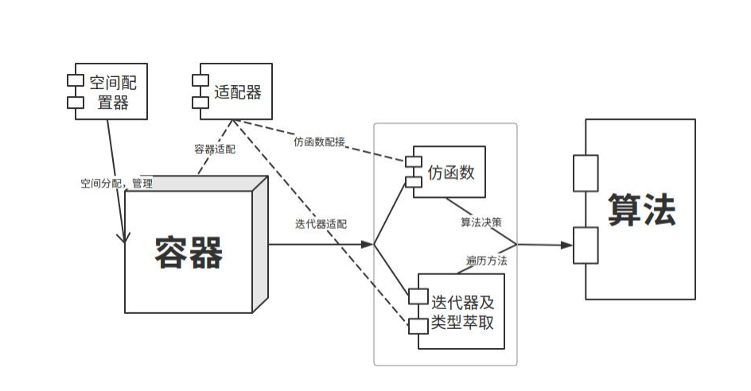

C++的设计思想：**"c with class"** ， 改进C语言的设计 + 面向对象的设计理念   =>    最终目的：简化代码（本质是有一个强大的编译器）


**C++的学习思路**：

​	1、 对C进行改进的设计

​	2、 面向对象的设计理念 —— 封装、继承、多态

​	3、 **C++的标准库 STL**

​	4、 扩展：设计模式（单例模式、工厂模式、适配器模式、装饰器模式）

​	5、【简历体现】第三方库：JSON、protobuf

​	6、 Qt框架


---

# 对C的改进

编译器：具体的执行软件，需要一个执行标准。该标准有ISO委员会制定。

- C with class ：刚创立初期（1979 - 1989），此时的规范还没有国际标准。
- 经典时期：C++98 / C++03，第一份官方国际标准。
- 现代时期：C++11 / C++14。
- 迭代时期：C++17 及以后：每三年发布新标准。


在Linux上，像C一样的man手册查看，需要安装libstdc++-doc 或者 cppman【推荐】

```bash
# cppman 安装
pip install cppman
cppman -u  # 更新/下载索引数据库

# 使用
cppman std::vector
cppman std::cout
```

C++官方参考手册：https://cppreference.com/   中文：https://zh.cppreference.com/%E9%A6%96%E9%A1%B5


---

## C++的基础认识

与C一样的处理流程：预处理 -> 编译 -> 汇编 -> 链接

编译器并非硬性校验后缀名，而是通过后缀名进行‘分流推断’。对于已知的后缀（如 `.c`、`.cpp`），编译器会自动匹配对应的语言规则；而对于无法识别的未知后缀（如 `.cx1`），编译器会放弃前端编译，直接将其透传交给链接器（ld）处理。

```bash
gcc -o build .\ex01\test01.cx1

# 链接错误
E:/project/programming_environment/mingw64/bin/../lib/gcc/x86_64-w64-mingw32/13.2.0/../../../../x86_64-w64-mingw32/bin/ld.exe:.\ex01\test01.cx1: file format not recognized; treating as linker script
E:/project/programming_environment/mingw64/bin/../lib/gcc/x86_64-w64-mingw32/13.2.0/../../../../x86_64-w64-mingw32/bin/ld.exe:.\ex01\test01.cx1:2: syntax error    
collect2.exe: error: ld returned 1 exit status

```

- 对于`g++`编译器，直接将代码视作 C++ 处理。
- `gcc`遇到`.c`会调用 C 语言解析；遇到`.cpp`会调用C++解析，需要手动告知C++的标准库`-lstdc++` 参数（否则报 `undefined reference` 链接错误）。


头文件：C++命名规范上，引用时`<>`中不建议使用.h后缀名，即没有后缀名。

​	C++库：`#include <iostream>`，标准的库一般都放到`std`空间中

​	C库：`#include <string.h>` 或者 `#include <cstring>`。

​	自定义库 / 第三方库：依然和C类似`#include "my_lib.h"` 或者 `#include "my_lib.hpp"`


C —— 面向过程 ，面向动作 ，对动词进行设计

C++ —— 面向对象，面向名词，对名词的类（行为）进行设计


## 扩展内容

### C++ 是 严格的数据类型语言

- 布尔类型（bool）
- 枚举类型（enum）
	- C的枚举：本质就是整型，枚举变量可以⽤任意整型赋值 。
	- c++的枚举：只能⽤被枚举出来的元素初始化 。

```c++
#include <iostream>
#include "test.h"

enum season {spring, summer, autumn, winter};

void test01() {
    bool a = 3.14;      // 隐式类型转换
    // season a1 = 1;   // 会报错：Cannot initialize local variable 'a1' of type season with int
    season a1 = spring; // C++中可以省略enum、struct等关键字，当作一个自定义的类型
    std::cout << a << std::endl;
    std::cout << a1 << std::endl;
}

```


在C++中，不同类型的变量⼀般是不能直接赋值的，需要相应的强转 。

C语⾔的void *是可以被赋值给任意指针类型的，但C++必须代码上明确这是什么类型，典型的
案例就是malloc的使⽤。  

```c++
#include <stdlib.h>
#include <cstdlib>

void test01(){
    // int *p = malloc(sizeof(int)); // 会有：Cannot initialize local variable 'p' of type int * with void *
    int *p = (int *)malloc(sizeof(int));
    free(p);
}
```


`const int * `和` int *`C++认为是完全两个不同的类型，赋值直接报错⽽不是警告。  


### 运算符的重载

C和C++的运算符本质都是：符号 —— 行为 建立映射关系。

​	不同的是C++。可以给**某个类型**中运算符映射到新的行为上。

​	每个数据类型，都有相关的默认行为（函数），针对某个类型 对标点符号 的 行为 重新替换（映射）


重写和重载区别：

| **机制**            | **发生范围**                   | **函数签名要求**                                          | **关键字 / 条件**                          | **作用与多态类型**                      |
| ------------------- | ------------------------------ | --------------------------------------------------------- | ------------------------------------------ | --------------------------------------- |
| **重载 (Overload)** | 同一作用域（如同一个类或全局） | **函数名必须相同** 参数列表**必须不同**（类型/个数/顺序） | 无需特殊关键字                             | **静态多态** （编译期决定调用哪个函数） |
| **重写 (Override)** | 继承链中（基类与派生类）       | **函数名、参数列表、返回值类型** **必须完全相同**         | 基类必须有 `virtual` 派生类可加 `override` | **动态多态** （运行期通过虚表决定）     |


### 命名重整（名字修饰）

C的符号声明：不做任何的符号加工。

C++的所有符号：都是由`前缀 + 符号名 + 后缀`组成的。

- 后缀：如果符号名师函数，那么后缀。后缀模块启动，后缀模型会用函数的输入参数类型，做为后缀的补充。

- 前缀：作用域（名字空间 / 类）。

- ```c++
	#include <iostream>
	
	int add(int a1, int a2) {
	    std::cout << "int" << std::endl;
	    return a1 + a2;
	}
	
	int add(double a1 , double a2) {
	    std::cout << "double" << std::endl;
	    return  a1 + a2;
	}
	
	namespace {
	    namespace add_ {
	        int add(float a1 , float a2) {
	            std::cout << "float" << std::endl;
	            return  a1 + a2;
	        }
	    }
	}
	
	void test02() {
	    std::cout << add(1, 2) << std::endl;
	    std::cout << add(1.0, 2.0) << std::endl;
	}
	
	int main(int argc, char *argv[]) {
	    test02();
	}
	
	```

- ```bash
	g++ -c -o t.o .\ex01\test02.cpp
	
	PS E:\project\cppCLion> nm .\t.o
	0000000000000000 b .bss
	0000000000000000 d .data
	0000000000000000 p .pdata
	0000000000000000 r .rdata
	0000000000000000 r .rdata$.refptr._ZSt4cout
	0000000000000000 r .rdata$.refptr._ZSt4endlIcSt11char_traitsIcEERSt13basic_ostreamIT_T0_ES6_
	0000000000000000 r .rdata$zzz
	0000000000000000 R .refptr._ZSt4cout
	0000000000000000 R .refptr._ZSt4endlIcSt11char_traitsIcEERSt13basic_ostreamIT_T0_ES6_
	0000000000000000 t .text
	0000000000000000 r .xdata
	                 U __main
	0000000000000047 T _Z3adddd  # _Z3 + add + dd
	0000000000000000 T _Z3addii  # _Z3 + add + ii
	00000000000000e9 T _Z6test02v
	0000000000000098 t _ZN12_GLOBAL__N_14add_3addEff  # _ZN12_GLOBAL__N_14add_3 + add + Eff
	                 U _ZNSolsEi
	                 U _ZNSolsEPFRSoS_E
	0000000000000011 r _ZNSt8__detail30__integer_to_chars_is_unsignedIjEE
	0000000000000012 r _ZNSt8__detail30__integer_to_chars_is_unsignedImEE
	0000000000000013 r _ZNSt8__detail30__integer_to_chars_is_unsignedIyEE
	                 U _ZSt4cout
	                 U _ZSt4endlIcSt11char_traitsIcEERSt13basic_ostreamIT_T0_ES6_
	                 U _ZStlsISt11char_traitsIcEERSt13basic_ostreamIcT_ES5_PKc
	00000000000001a4 T main
	
	
	```

- 


函数重载 ：因为有严格的类型限制，且会进行名字修饰，可以写同名不同的函数。（再最后的可执行文件的符号表中，没有相同名字的函数。）


---

命名空间  ：使用`namespace 名字{}`

```c++
namespace 名字{
    // 函数
    // 变量
}
// 访问方式：名字::函数(); 名字::变量=

// 匿名空间，等价于C的static, 只能本文件使用
namespace{
    // 函数
    // 变量
}
// 访问方式： ::函数(); ::变量=  或者  函数()  变量=

// 默认空间访问： ::函数()  ::变量= 或者  函数()  变量=


// 如果匿名空间和全局文件中有同名函数。
// 为了与默认空间区分
// 匿名空间需要使用再嵌套一个有名空间，才能进行访问
namespace{
    namespace 名字{
        // 函数
        // 变量
    }
}
// 后续的访问：
// 默认空间： 函数()  变量=  或者  ::函数(); ::变量=
// 匿名空间： 名字::函数(); 名字::变量=
```

不推荐使用`using namespace std;` 这种形式。

C语言一般使用的是默认空间，C++使用的是有名空间 或者 匿名空间

`using`取别名。

​	可以在某⼀个函数内使⽤using，这样其他函数空间不会污染，⼀旦使⽤了using后，两个命名空间
元素同名后，就会造成名称污染了。  


### 左值和右值

左值：等号左边的值。有实际的空间，可以被寻址，可以被赋值。

右值：等号右边的值。可能就只在编译时期出现 或者 运行时动态产生，只读，临时值，不可以被赋值（不希望用户通过地址访问的空间）

右值引用：`数据类型 &&变量名` 表示。

因为C++是强类型语言，为了类型准确性，将等号左右两边定义成两个类型，减少空间数据拷贝。

```c++
#include <iostream>

void fun(int &&a) {
    std::cout << a << std::endl;
}

void test03() {
    int &&a1 = 10;          // 10为右值， a1虽然绑定了右值，但此时已经变成了左值（有名字、有固定内存地址） == 右值引用
    						// a && b 逻辑与   数据类型 &&变量  右值引用
    int a = a1;
    int *p = &a;
    *p = 20;
    std::cout << a << std::endl;
    a1 = 30;
    std::cout << a << std::endl;
    // fun(a);      //  出现报错 Rvalue reference to type int cannot bind to lvalue of type int 不能为左值
    // fun(a1);     //  出现报错 Rvalue reference to type int cannot bind to lvalue of type int 不能为左值
    fun(10);      // 没有空间拷贝，零拷贝的引用传递（通过指针/地址实现），属于运行期的内存绑定
                    // 当执行 fun(10) 时，编译器会在栈上为这个临时值 10 开辟一块匿名的内存空间。
}
```


### const加强

​	如果变量使用了const修饰，且使用了常量进行初始化，再编译时，将该变量替换成常量，如果获取该变量地址，那么C++编译器会临时申请一个空间给这个指针。 —— 字面量/常量初始化

​	如果变量使用了const修饰，且使用了其他变量给它进行初始化，会将该变量当成一个只读变量，获取这个变量的地址后，可以修改期内容。 —— 变量初始化

```c++
#include <iostream>
void test04() {
    // const int a = 20;  字面量/常量初始化
    int const a = 20;               // a可以当成常量，编译器在编译期，会发生常量折叠（直接替换）
    int *p = (int *)&a;				// p获取是临时空间
    std::cout << a << std::endl;    // 20
    *p = 30;                        // 不像C语言可以通过地址进行修改
    std::cout << a << std::endl;    // 20
	
    // const int a = b; 变量初始化
    int c = 30;
    int const b = c;                // a希望是常量，但是c是变量，只有运行时才知道c的值
    int *q = (int *)&b;				
    std::cout << b << std::endl;    // 30
    *q = 40;                        // 可以修改
    std::cout << b << std::endl;    // 40
}

```

在C++中，取⼀个const变量的地址，或者把它定义为extern，那么这个地址会根据情况，由编译器决定是否单独再分配⼀个空间。  

在c++中，出现在所有函数之外的const作⽤于整个⽂件(也就是说它在该⽂件外不可⻅)，默认为内部连接，c++中其他的标识符⼀般默认为外部连接。  


C/C++中const都异同点总结 ：

1. c语⾔全局const会被存储到只读数据段。c++中全局const当声明extern或者对变量取地址时，编译器会分配存储地址，变量存储在只读数据段。两个都受到了只读数据段的保护，不可修改。  
2. c语⾔中局部const存储在堆栈区，只是不能通过变量直接修改const只读变量的值，但是可以跳过编译器的检查，通过指针间接修改const值。 
3. c++中对于局部的const变量要区别对待：  
	1. 对于基础数据类型，也就是const int a = 10这种，编译器会进⾏优化，将值替换到直接访问的位置（int b = a;）。当对这个变量取地址时，编译器会⾃动分配⼀个临时空间，那么就算通过地址修改，也是对临时空间的修改。 (int *p = (int *)&a;) 
	2.  对于基础数据类型，如果⽤⼀个变量初始化const变量，如果const int a = b,那么也是会给a分配内存。  
	3. 对于⾃定数据类型，⽐如类对象，那么也会分配内存  
4. c中const默认为外部连接，c++中const默认为内部连接。当c语⾔两个⽂件中都有const int a的时候，编译器会报重定义的错误。⽽在c++中，则不会，因为c++中的const默认是内部连接的。如果想让c++中的const具有外部连接，必须显示声明为: extern const int a = 10;  


C++常量定义：

​	1、`#define` ：不推荐，预处理、会出现优先级问题，且不会做类型检查

​	2、 `const`：推荐，编译、会进行语法检查  读时替换


struct的加强 ：

​	a、c中定义结构体变量需要加上struct关键字，c++不需要。

​	b、c中的结构体只能定义成员变量，不能定义成员函数。c++即可以定义成员变量，也可以定义成员函数  


### 引用

引用本质是空间的别名。等价于 常量指针。

空间的地址用这个引用量（常量）进行描述。

语法：`类型& 变量名 = 值`。

​	1、初始化要求：非 const 引用必须绑定到左值（变量）；const 引用可以绑定字面量或临时对象。

​	2、底层实现：编译器在底层通常将引用实现为常指针（Type* const —— 指针常量），并在使用时自动解引用。

​	3、设计目的：常用于函数形参和返回值传递，避免大对象的按值拷贝（减少内存开销和提升性能）。【对于大对象，传递地址比传内容快】

必须在声明引⽤变量时进⾏初始化。  

引⽤初始化之后不能改变。  

不能有NULL引⽤。必须确保引⽤是和⼀块合法的存储单元关联。  

```c++
#include <iostream>

void fun01() {
    int b = 0;
    // int& a = 10;        // 当为左值引用时，等号右边应该为左值
    int& a = b;

    std::cout << b << " " << a << std::endl;
    a = 10;
    std::cout << b << " " << a << std::endl;    // a为b的别名
}

// void fun02(int a, int b) {      // _Z5fun02ii
//     int t = a;
//     a = b;
//     b =t;
// }

void fun02(int *a, int *b) {
    int t = *a;
    *a = *b;
    *b =t;
}

void fun02(int& a, int& b) {        // _Z5fun02RiS_
    int t = a;
    a = b;
    b =t;
}


void test01() {
    int a = 10;
    int b = 20;

    fun02(a, b);        // 对于引用 和 普通的传参, 这个输入方式都能满足，所以编译器不知道该使用哪个函数

    std::cout << a << " " << b <<  std::endl;
}
```

对于使用者来说：语法上无需手动取地址（&）和解引用（*），直接传入变量本身即可，代码更简洁安全

对于编译器来说：语义上直接绑定原变量（不产生副本拷贝）； 底层实现上，编译器会自动将实参的地址传递给形参，并在函数内自动完成解引用。


右值引用：`类型&& 变量名 = 右值;`

常引用：`const 类型& 变量名 = 值;`   

- 该值为变量时，等价于`const 类型* const 变量名 = &值; `

- 该值为无名临时对象（如字面量、表达式中间结果、函数按值返回的临时值）时，除了只读，还能延迟这些临时值的生命周期。无法延长有名局部变量的生命周期，有名局部变量严格受到函数的作用域限制

	- ```c++
		// C++ 支持直接绑定右值/字面量：
		const int& ref = 10; // ✅ 编译器会自动在后台创建一个隐式临时变量，并让 ref 绑定它
		
		// 但如果用 C 语言指针去仿照这个行为：
		const int* const p = &10; // ❌ 编译报错！字面量 10 没有内存地址，无法直接 &10
		
		```

	- 当编译器看到 `const int& ref = 10;` 时，它在底层实际做的事情是：

	- ```c++
		// 类似
		int __temp = 10;                // 1. 生成一个无名临时变量
		const int* const p = &__temp;   // 2. 将指针指向这个临时变量
		// 只要 ref 还在作用域内，__temp 的生命周期就会被延长，不会被销毁
		```

	- ```c++
		// 场景 A：绑定无名临时值 —— 生命周期成功延长
		const int& getTemp() {
		    // ❌ 错误！注意：生命周期延长只在当前作用域生效，不能跨函数边界传递
		    return 10; 
		}
		
		void testA() {
		    const int& ref1 = 10; // ✅ 正确！10 是无名字面量，ref1 成功延长了它的生命周期
		}
		
		// 场景 B：绑定具名局部变量 —— 无法延长生命周期
		const int& getLocal() {
		    int a = 10;         // a 是具名局部变量
		    const int& ref2 = a;// ref2 只是 a 的只读别名，无法影响 a 的销毁
		    return ref2;        // ❌ 错误！函数结束 a 被销毁，返回悬挂引用
		}
		```

	- 

数据引用：

```c++
typedef int arrRef_t[10];
int arr[10];
arrRef& aRef = arr;		// aRef是arr的引用
aRef[x] = y;
```


引用的使用场景：

1. 常量引⽤主要⽤在函数的形参，尤其是类的拷⻉/复制构造函数。
	- 引⽤不产⽣新的变量，减少形参与实参传递时的开销。
	- 由于引⽤可能导致实参随形参改变⽽改变，将其定义为常量引⽤可以消除这种副作⽤。
2. 如果希望实参随着形参的改变⽽改变，那么使⽤⼀般的引⽤，如果不希望实参随着形参改变，那么使⽤常引⽤。
3. 如果从函数中返回⼀个引⽤，必须像从函数中返回⼀个指针⼀样对待。当函数返回值时，引⽤关联
	的内存⼀定要存在  


### 函数

函数重载 —— 本质是 编译器底层会进行命名重整。

- 条件：

	- 同⼀个作⽤域、参数个数不同  
	- 参数类型不同，参数顺序不同  

- **C和C++混合编程**

	- C++中所有的函数名（C++编译器都会命名重整）成`前缀_名称_后缀`。C的函数名：名称
		- 工程环境里，`.c、.cpp`  ，如果都是使用g++编译，最终都是按照C++命名重整进行符号定义，最后链接是没有问题。
		- 工程环境里，`.c` 使用gcc做成了库文件提供给该项目，该符号不会重整 ，需要在函数申明时，加上`extern "C" { 所有C提供的函数声明; }`的限制符，C++编译器就不会按照命名重整⽅式编译这些函数了。 

	- 错误现象：

		- ```c
			#include <stdio.h>
			#include "t.h"
			
			void fun02(int a, int b) {		// 重整名字：_Z5fun02ii
			    printf("a b c\n");
			    return;
			}
			
			```

		- ```c++
			// .h
			#ifndef T_H
			#define T_H
			
			// C和C++混合编程
			void fun02(int a, int b);	//  _Z5fun02ii 并标记为未定义，需要链接时，才能确定具体函数
			
			#endif //T_H
			
			
			// .cpp
			#include <iostream>
			#include "t.h"
				
			int main() {
			    fun02();
			    return 0;
			}
			```

		- ```bash
			# 使用g++编译.c、.cpp，都进行了命名重整
			# 链接时，没有错误
			
			# 如果使用gcc编译.c g++编译.cpp，最后链接到一起
			# 报错：找不到符号
			undefined reference to `fun02(int, int)'
			
			```

		- ```c++
			#include <iostream>
			
			// C和C++混合编程
			// 使用这个限制g++对于该函数名的命名重载
			extern "C"{
			    extern void fun02(int a, int b);
			};
			
			int main() {
			    fun02();
			    return 0;
			}
			```

		- 常见的做法，在C语言的头文件中

		- ```c
			#ifndef T_H
			#define T_H
			
			// 定义这个宏 c++打开，c关闭，这样c和c++都不会报错
			#ifdef __cplusplus
			extern "C" {
			#endif
			
			void fun02(int a, int b);
			
			#ifdef __cplusplus
			}
			#endif
			
			#endif //T_H
			```

		- 

- 

函数的默认参数：当没有传入值时，使用函数声明时的默认值进行赋值。

​	函数的默认参数从左向右，如果⼀个参数设置了默认参数，那么这个参数之后的参数都必须设置默认参数。  

```c++
// 错误版本，报错：error: default argument missing for parameter 3 of 'void fun01(int, int, int)'
// void fun01(int a, int b = 2, int c) {
//     std::cout << a << " " << b << std::endl;
// }

void fun01(int a, int b = 2) {
    std::cout << a << " " << b << std::endl;
}

void fun01(int a) {         // 声明定义时，不会报错，且重命名后名字不同，
                            // 但是在使用时（fun(1) ），编译器无法分辨该使用哪个函数（因为输入参数，两个函数都满足）
    std::cout << a << " == " << std::endl ;
}

// 当只传一个参数时，b 使用默认参数2
```


内联函数：

​	可以像宏一样展开。同时内联函数本身也是一个函数。

​	与宏相比，区别：

| **对比维度** | **预处理宏 (#define)**               | **内联函数 (inline)**                    |
| ------------ | ------------------------------------ | ---------------------------------------- |
| **处理阶段** | **预处理阶段**（编译前纯文本替换）   | **编译与优化阶段**（生成机器码时展开）   |
| **类型检查** | **无**（不检查参数类型）             | **有**（严格的类型检查和隐式转换）       |
| **副作用**   | **高**（参数可能被多次计算）         | **无**（参数仅求值一次，与普通函数一致） |
| **调试体验** | **极差**（源码断点无法定位宏内部）   | **友好**（支持单步调试和变量查看）       |
| **展开控制** | **强制展开**（无论多长都会盲目替换） | **建议性**（编译器根据算法自主决定）     |
| **作用域**   | **无**（全局有效，容易污染命名空间） | **遵循类/命名空间/作用域规则**           |

​	用法：函数前面加`inline`关键字

```c++
inline int max(int a, int b) {
    return a > b ? a : b;
}
```

​	内联函数不能先声明再实现（声明和实现放到一起）

​	内联函数的限制（不满足，会退化成普通函数）：

​		1、不能存在任何形式的循环语句  

​		2、不能存在过多的条件判断语句  

​		3、函数体不能过于庞⼤  

​		4、不能对函数进⾏取址操作  （函数指针调用    函数指针 = &函数名;  /  函数指针 = 函数名）。

​		5、 不能是复杂的递归函数（硬性逻辑限制）

​		6、无法在编译期确定的虚函数调用（动态绑定）

​	

​	【面试常问】：函数和宏的区别？ 

​		1. 函数，调用时，会保护现场（入栈），恢复现场（出栈）；如果频繁调用，时间开销大，但多个地方使用，只有一份代码。 ，空间消耗小

​		2. 宏，预处理时替换，多个地方使用，就有多份代码，空间消耗大，但不会有入栈、出栈，时间开销小。

​		3. 在MCU中，存储有限，常使用函数。MPU，追求时间，使用宏 或者 内联函数


## 新的操作和行为

### 输⼊/输出  

`std::cin`作为从标准输⼊设备中获取数据的对象

`std::cout`作为向标准输出设备输出数据流的对象

`std::cerr`作为向标准错误设备输出数据流的对象  

缺点：格式化输出和复杂。【不推荐使用这个， 使用`printf`】

- 常见的用法：

	- 

	- | **分类**       | **格式化目的**  | **控制符 (<iomanip>)**     | **对应的流成员函数**         | **说明/示例**                           |
		| -------------- | --------------- | -------------------------- | ---------------------------- | --------------------------------------- |
		| **浮点数**     | 固定小数位数    | `std::fixed`               | `cout.setf(ios::fixed)`      | 与 `setprecision` 配合指定小数位数      |
		|                | 科学计数法      | `std::scientific`          | `cout.setf(ios::scientific)` | 例如 `1.23e+02`                         |
		|                | 设置显示精度    | `std::setprecision(n)`     | `cout.precision(n)`          | 配合 `fixed` 为小数位数，否则为有效数字 |
		| **宽度与对齐** | 设置输出宽度    | `std::setw(n)`             | `cout.width(n)`              | **注意：仅对紧随其后的下一次输出有效**  |
		|                | 左对齐 / 右对齐 | `std::left` / `std::right` | `cout.setf(ios::left)`       | 默认是右对齐                            |
		|                | 填充空位字符    | `std::setfill(ch)`         | `cout.fill(ch)`              | 搭配 `setw` 使用，如填 `0`              |
		| **进制转换**   | 八/十/十六进制  | `std::oct` / `dec` / `hex` | `cout.setf(ios::hex)`        | 控制整数的输出进制                      |
		|                | 显示进制前缀    | `std::showbase`            | `cout.setf(ios::showbase)`   | 16进制加 `0x`，8进制加 `0`              |
		|                | 大写进制字母    | `std::uppercase`           | `cout.setf(ios::uppercase)`  | 如 `0X1A` 中的 `X` 和 `A`               |
		| **布尔值**     | 格式化 Boolean  | `std::boolalpha`           | `cout.setf(ios::boolalpha)`  | 输出 `true`/`false` 而不是 `1`/`0`      |

- ```c++
	// 设宽为 10，左对齐，用 '*' 补齐
	std::cout << std::setw(10) << std::setfill('*') << std::left << "Hello" << std::endl;
	```

- 


### new/delete

设计这个两个操作的目的，面向对象

- 面向对象：设计一个类（蓝图），产生一堆这个类的对象（实物）
- 所有类、类型、数据类型都有 构造函数 和 析构函数
	- 构造函数：一旦这个对象诞生，必须调用这个函数进行变量的初始化，编译器自动调用。
		- 构造函数函数名和类名相同，没有返回值，不能有void，但可以有参数。  
		- 类中默认自动生成默认构造函数（无参，用于创建对象时初始化）和  默认拷贝函数（用于已存在的对象初始化新对象）
		- 默认拷贝函数：逐成员拷贝
			- 区别于逐位拷贝，C++编译器的默认拷贝调用成员数据类型的拷贝函数进行拷贝。
				- 对于**基本数据类型（`int、char `）**，值复制。
				- 对于**原生指针（`int *、char *`）**， 复制指针中地址 —— 浅拷贝。
				- 对于**类类型（`std::string 、std::vector`）**，复制指针中的地址，可能会将指针指向的空间也一同拷贝 —— 深拷贝【取决于调用该类自身的拷贝构造函数 —— 由成员类自己保证】。
	- 析构函数：一旦这个对象失效（出栈、堆释放、程序退出），执行这个函数，编译器自动调用。
		- 析构函数函数名是在类名前⾯加”~”组成,没有返回值，不能有void,不能有参数，不能重载。  
		- 类中默认自动生成默认析构函数。


C语言中 栈区编译器管理，决定入栈 和 出栈；堆区，手动管理。

C++中，堆区，编译器辅助用户手动管理。

- 申请堆区空间后，立刻初始化。`new 空间大小(空间初始化);`
	- 申请完之后，编译器自动调用构造函数，进行初始化。
		- 空间大小 —— 根据 数据类型决定
		- 空间初始化由用户决定（`()`里的值）。
	- 申请一堆空间：`new 数据类型[个数];`
	- 申请并初始化一堆空间：`new 数据类型[个数]{值1, 值2};`
		- `{值1, 值2}` —— 使用了初始化列表
- 释放空间前，自动调用析构函数，进行死前操作。
	- 一个空间的释放：`delete 地址;`
	- 一堆空间的释放：`delete[] 地址;`

```c++
#include <iostream>

void fun01() {
    /* 堆区申请 */
    int *p = (int *)new int(6);

    std::cout << *p << std::endl;

    delete p;
}

void fun02() {
    /* 一片内存的申请 */
    // 报错：parenthesized initializer in array new。 部分编译器会进行优化，认为这是正确的，但是不推荐怎么写，不符合语法
    // int *p = new int[3](1 ,2,4);
    int *p = new int[3]{1, 2, 4};

    std::cout << p[0] << std::endl;
    std::cout << p[1] << std::endl;
    std::cout << p[2] << std::endl;

    // delete p;       // 会出现警告，warning: 'delete' applied to a pointer that was allocated with 'new[]'; did you mean 'delete[]'?
    delete[] p;
}


void test03() {
    fun02();
}
```


内存泄漏检测工具

- Linux上：`ASan` 、`Valgrind `、`kmemleak`

- Windows上：

	1. **使用CLion自带的静态检测工具**【推荐】

		- 方法：顶部菜单，选择`Code` -> `inspect Code` -> 看下面给的优化建议 和警告

	2. MSVC 工具链，微软的编译工具链中自带`asan` 和原生的 `<crtdbg.h>` 自动打印内存泄漏
	
	3. 重写全局 `new`/`delete`（轻量自制计数器）
	
	  ```c++
	  #include <iostream>
	  #include <cstdlib>
	  
	  // 简单的内存分配计数器
	  static size_t alloc_count = 0;
	  
	  void* operator new(size_t size) {
	      alloc_count++;
	      return std::malloc(size);
	  }
	  
	  void operator delete(void* ptr) noexcept {
	      if (ptr) {
	          alloc_count--;
	          std::free(ptr);
	      }
	  }
	  
	  // 针对 delete[] 的重载
	  void operator delete[](void* ptr) noexcept {
	      operator delete(ptr);
	  }
	  
	  void check_leaks() {
	      if (alloc_count != 0) {
	          std::cout << "[内存泄漏警告] 未释放的内存块数量: " << alloc_count << std::endl;
	      } else {
	          std::cout << "[内存安全] 没有检测到内存泄漏！" << std::endl;
	      }
	  }
	  
	  int main() {
	      int* p = new int[3]; // 分配内存
	      // delete[] p;       // 故意注释掉
	  
	      check_leaks();       // 输出警告
	      return 0;
	  }
	  ```

	  

	4. 使用第三方轻量级 C++ 检测库：`Dr. Memory`、`Deleaker`、`Visual Leak Detector (VLD)`

	5. 带ASan支持的MinGW-w64（Windows，不太行）

	  - 安装 **MSYS2**:https://www.msys2.org/
	
	  - 打开MSYS2终端,安装完整版mingw-w64工具链:

	  - ```bash
	  	 pacman -S mingw-w64-clang-x86_64-toolchain mingw-w64-clang-x86_64-compiler-rt
	
	  	```
	
	  - 在CLion里切换工具链:
	  	 `Settings` → `Build, Execution, Deployment` → `Toolchains`
	  	 把 `C Compiler` / `C++ Compiler` 指向MSYS2安装目录下的:
	
	  - 修改 **Toolset（工具集）** 的路径为 MSYS2 环境中的环境目录。
	
	  	- 填入`C:\msys64\clang64`
	
	  - ```bash
	    C:\msys64\mingw64\bin\clang.exe
	    C:\msys64\mingw64\bin\clang++.exe
	    ```
	
	  - 应用 -> ok
	
	  - 重新Build即可。


### String类

除了使⽤字符数组来处理字符串以外，c++引⼊了字符串类型。可以定义字符串变量 （字符串类型）。

常见方法：

| **分类**          | **常用属性 / 方法**      | **语法 / 示范**                      | **作用与功能说明**                                           |
| ----------------- | ------------------------ | ------------------------------------ | ------------------------------------------------------------ |
| **基础属性**      | `size()` / `length()`    | `int n = str.size();`                | 返回字符串的实际字符个数（两者完全等价）。                   |
|                   | `empty()`                | `bool b = str.empty();`              | 判断字符串是否为空，为空返回 `true`。                        |
|                   | `capacity()`             | `size_t c = str.capacity();`         | 返回不触发重新分配内存的前提下能容纳的最大字符数。           |
|                   | `sizeof(str)`            | `sizeof(str)`                        | **对象本身**在栈上的内存大小（64位系统下通常固定为 24 或 32 字节，不随字符串变长而改变）。 |
| **C 风格兼容**    | `c_str()` / `data()`     | `const char* p = str.c_str();`       | 返回指向以 `\0` 结尾的 C 风格字符数组指针，用于兼容 C 语言 API。 |
| **元素访问**      | `operator[]`             | `char &c = str[n];`                  | 下标访问指定位置字符，无越界检查（性能高）。                 |
|                   | `at()`                   | `char &c = str.at(n);`               | 带越界检查的访问，若越界会抛出 `std::out_of_range` 异常。    |
|                   | `front()` / `back()`     | `char f = str.front();`              | 分别获取字符串的首字符或尾字符的引用。                       |
| **查找定位**      | `find()`                 | `size_t pos = str.find("s", 0);`     | 从下标 0 开始正向查找子串/字符，**找到返回首字母下标，失败返回 `std::string::npos`**。 |
|                   | `rfind()`                | `size_t pos = str.rfind('a');`       | 反向查找字符或子串最后一次出现的位置。                       |
| **修改与编辑**    | `assign()`               | `str.assign("abc");`                 | 重新给字符串赋值（等价于 `=`）。                             |
|                   | `append()` / `+=`        | `str += "abc";`                      | 在字符串末尾追加内容。                                       |
|                   | `insert()`               | `str.insert(pos, "abc");`            | 在指定下标 `pos` 处插入字符或子串。                          |
|                   | `erase()`                | `str.erase(idx, count);`             | **删除**从 `idx` 开始的 `count` 个字符（默认删至末尾 `npos`）。 |
|                   | `replace()`              | `str.replace(pos, len, "abc");`      | 将从 `pos` 开始长为 `len` 的子串**替换**为新内容。           |
|                   | `clear()`                | `str.clear();`                       | 清空字符串内容，使其长度变为 0。                             |
|                   | `swap()`                 | `s1.swap(s2);`                       | 高效交换两个 `string` 对象的内容（指针交换，复杂度 $O(1)$）。 |
| **提取与生成**    | `substr()`               | `string sub = str.substr(pos, len);` | **截取子串**，从 `pos` 开始提取 `len` 个字符并返回新 `string`。 |
| **内存管理**      | `reserve()`              | `str.reserve(100);`                  | 预分配内存空间，减少频繁追加字符引起的重新分配开销。         |
|                   | `shrink_to_fit()`        | `str.shrink_to_fit();`               | 请求释放未使用的多余容量（将 `capacity` 缩减至 `size` 大小）。 |
| **全局/类型转换** | `std::to_string()`       | `string s = std::to_string(123);`    | 将数值类型（`int`/`float`/`double` 等）转为 `std::string`。  |
|                   | `std::stoi()` / `stod()` | `int val = std::stoi("123");`        | 将字符串转换为整数或浮点数。                                 |


# 面向对象的三大原则

C++面向对象：就是设计自定义的数据类型 ，把数据和内存布局 集中到一个类中。


## 封装性 —— 隐藏实现，暴露接口

封装性，解决了代码安全问题（高内聚），同时屏蔽了代码细节。把一系列有关关联的成员和行为，包装成一个具有权限的空间。（有的成员类外部可以直接访问，有些类外部不让直接访问，在类的内部没有权限区分）


类中的权限：

- `public`：在类内和外部都可以访问的 。
- `private`、`protected` 都不能在外部访问 。
- 所有权限，在类内部都可以访问 。
- ⼀旦出现⼦类的时候，⼦类在类中可以访问⽗类的`public`和`protected`，但不能访问`private`，在⼦类
	的外部，还是只能访问`protected  `


C语言：`struct`，需要考虑内存对齐，把成员在内存上累加在一起。结构中数据操作是不能放到`struct`中。

C++：`class`，把对象的数据（成员）、接口（方法）打包到一起。


```c++
#include <iostream>
#include <string>

struct Pen {
    int n;
};

class Stu1 {
    int m_age;
    std::string m_str;
};

void fun01() {
    Stu1 s1;
    // std::cout << s1.m_age << std::endl;   // 报错 class默认是私有的不能访问
    Pen p1;
    p1.n = 10;
    std::cout << p1.n << std::endl;     // struct默认是公有的
}

class Stu2 {
public:
    Stu2(int a, std::string str): m_age(a), m_str(str) {        // 初始化列表 C++11引入 推荐
        // this->age = age;     // 正常写法
    }

    // 方法 需要方法，来访问私有属性
    int getAge() {
        return this->m_age;
    }

    std::string getStr() {
        return this->m_str;
    }

private:
    int m_age;
    std::string m_str;
};

void fun02() {
    Stu2 s2(10, "abc");
    std::cout << s2.getAge() << " " << s2.getStr() << " len:" << s2.getStr().size() << std::endl;
}

void test04() {
    fun02();
}
```


初始化列表

​	在C++98就已经存在。

```c++
// 初始化列表
//  : 成员名(输入参数)，成员2(输入参数)  初始化列表，
函数名(输入参数) : 成员名(输入参数){

}
```

​	在C++11对初始化列表进行了增强。

​		可以使用大括号`{}`来初始化任何变量或对象。（C++11之前，原生数组用 `{}`，内置类型用 `=`，对象用小括号 `()`）

```c++
int a{5};                    // 基本类型
int arr[]{1, 2, 3};          // 数组
std::string s{"hello"};     // 对象
Widget* w = new Widget{1};  // 堆对象
```

​		类内初始化

```c++
class Point {
    int x = 0; // C++11 类内初始值
    const int y = 100; // C++11 类内初始值
};
```

C++11与C++98对比：

| **维度**       | **C++98 / 03 旧机制**                            | **C++11 加强后**                                            |
| -------------- | ------------------------------------------------ | ----------------------------------------------------------- |
| **语法一致性** | 语法分散（`()`、`=`、`{}` 混用）                 | **统一初始化**：所有对象均可用 `{}`                         |
| **自定义容器** | 仅原生数组支持 `{1, 2, 3}` 初始化                | 引入 **`std::initializer_list`**，自定义类均可支持变长 `{}` |
| **类型安全**   | 允许隐式窄化截断（如 `int x = 3.14;` 默许通过）  | **强类型检查**：`int x{3.14};` 直接编译报错                 |
| **传参与返回** | 必须显式写出类型构造（如 `return Point(1, 2);`） | **隐式列表推导**：可直接 `return {1, 2};` 或传参 `{1, 2}`   |

构造函数使用初始化列表与老方式初始化的区别：

```c++
// 初始化列表 [推荐]
Person(int a, int b): a(a), b(b){
}

// 老方式
Person(int a, int b){
    this->a = a;
    this->b = b;
}

// 区别：
// 初始化列表，在变量申请内存空间的同时放入初始值。没有多余的默认构造函数的调用和二次赋值
// 老方式,在变量申请号内存空间后，再向成员变量中放入拷贝形参的值。
```

针对成员变量中有类时，有明显区别：

```c++
#include <iostream>

// 1. Member 类声明与实现
class Member {
public:
    Member() {
        std::cout << "1. [Member] 默认构造函数被调用" << std::endl;
    }

    Member(const Member& m) {
        std::cout << "1. [Member] 拷贝构造函数被调用" << std::endl;
    }

    Member& operator=(const Member& m) {
        std::cout << "2. [Member] 赋值运算符 (operator=) 被调用" << std::endl;
        return *this;
    }
};

// 2. Init_c 类声明与实现
class Init_c {
private:
    Member m; // 类成员变量

public:
    // 老方式：函数体内赋值
    Init_c(Member val) {
        std::cout << "--- 进入 Init_c 函数体 {} ---" << std::endl;
        this->m = val; // 执行赋值
    }

    // 初始化列表方式（对比测试时可取消注释并注释上面）
    // Init_c(Member val) : m(val) {
    //     std::cout << "--- 进入 Init_c 函数体 {} ---" << std::endl;
    // }
};

// 3. 测试函数
void fun01() {
    Member test_m;
    std::cout << "=== 开始构造 Init_c (老方式) ===" << std::endl;
    Init_c i(test_m);
}

int main() {
    fun01();
    return 0;
}

// 老方式的结果:
// 1. [Member] 默认构造函数被调用
// === 开始构造 Init_c (老方式) ===
// 1. [Member] 拷贝构造函数被调用	  《= 形参 val 按值传递时触发
// 1. [Member] 默认构造函数被调用	  《= 进入 {} 前，成员 m 隐式调用默认构造！
// --- 进入 Init_c 函数体 {} ---
// 2. [Member] 赋值运算符 (operator=) 被调用	《= 被调用 <-- this->m = val 触发赋值

// 初始化列表
// 1. [Member] 默认构造函数被调用
// === 开始构造 Init_c (老方式) ===
// 1. [Member] 拷贝构造函数被调用	《= 形参 val 传参
// 1. [Member] 拷贝构造函数被调用	《= 直接拷贝给成员 m
// --- 进入 Init_c 函数体 {} ---
```

C语言的`struct`不支持内部进行初始化。即`struct中出现=`


### 【面试常问】C++中`struct` 和 `class`区别：

1. 在C++中`struct` 、`class`都是定义一个类，所有的类都能实例化对象。`class`是`struct`的强化。（相比于C的`struct`，可以添加方法到`struct`里）
2. `struct`默认是所有成员（数据、方法）都是公有的`public`；`class`默认是所有成员都是私有的`pirvate`。
3. 一般C++中`struct`描述数据结构（不添加方法）；`class`描述数据 + 方法。
4. 在C 语言中定义变量必须写 `struct Point p1;`（除非用了 `typedef`）。C++ 中直接写 `Point p1;` 即可省略`struct` 和 `class`
5. C 语言的 `struct` **不能**包含成员函数 和 静态变量，也没有 `public/private` 关键字。C++ 的 `struct` 允许包含成员函数、构造/析构函数，并支持访问权限控制。


### 构造和析构的含义

- C++设计理念：避免程序员在对变量申请后，忘记初始化的bug，**语言层面上**，设计成固定程序。

	- C++编译器，每当看到一个**数据类型的定义**时，自动找这个数据类型的 **构造函数去初始化**。
	- C++编译器，每当看到一个**数据类型的释放**时，自动找这个数据类型的 **析构函数去销毁**。【析构释放的是类内成员】
	- 任何的自定义类，如果忘记写构造和析构，编译器会提供默认构造函数 、 默认拷贝构造函数（逐成员拷贝）、析构函数。

- 头文件中写声明，`.cpp`文件写实现。如果在头文件中写实现，编译器可能会将当成 内联函数 进行展开。

	- ```c++
		#ifndef PERSON_H
		#define PERSON_H
		#include <iostream>
		
		class Person {
		public:
		    void fun01() {      // 根据编译器决策，这个会被当成内联函数展开 【不推荐】
		        std::cout << " " << std::endl;
		    }
		private:
		    int age;
		    static int cnt;
		};
		
		#endif //PERSON_H
		
		```

	- 推荐写法：

	- ```c++
		// .h
		#ifndef PERSON_H
		#define PERSON_H
		#include <iostream>
		
		class Person {
		public:
		    Person();		// 默认构造函数 _ZN6PersonC1Ev  _ZN6PersonC2Ev
		    ~Person();		// 析构函数 _ZN6PersonD1Ev  _ZN6PersonD2Ev
		    void fun01();	// _ZN6Person5fun01Ev
		private:
		    int age;
		    static int cnt;
		};
		
		#endif //PERSON_H
		
		// C1 / D1（Complete Object）：用于构建/销毁一个完整的独立对象（包含初始化/销毁虚基类等完整流程）。
		// C2 / D2（Base Object）：当该类作为其他类的基类（被继承）时调用的构造/析构函数（只初始化/销毁属于自己的成员，不重复处理虚基类）。
		```

	- ```c++
		#include "Person.h"
		
		int Person::cnt = 0;    // 显示定义出静态变量，全局性，该类的所有对象唯一
		
		Person::Person() {		// _ZN6PersonC1Ev
		    std::cout << __PRETTY_FUNCTION__ << std::endl;      // 打印完整的函数名
		    age = 10;
		}
		
		Person::~Person() {		// _ZN6PersonD1Ev
		    std::cout << __PRETTY_FUNCTION__ << std::endl;
		}
		
		void Person::fun01() {	// 命名重整后 _ZN6Person5fun01Ev  所有需要添加Person:: 前缀才能认识
		    std::cout << __PRETTY_FUNCTION__ << std::endl;
		    ++Person::cnt;
		    std::cout << " cnt :" << cnt << std::endl;
		}
		```

	- 

- **`__pretty_function__` (GCC/Clang)** 或 **`__FUNCSIG__` (MSVC)**：“**全面的函数名**”（包含类名、命名空间、参数列表及返回值格式），例如 `void Person::fun01(int)`。


```c++
#include <iostream>
#include "test03.h"
#include "Person.h"

void fun01() {
    {   // 限制作用域
        Person p1;
        p1.fun01();
    }   // p1的生命周期在这里结束

    Person p2;
    p2.fun01();
    std::cout << "sizeof: " << sizeof(p2) << std::endl;		// 只有非静态成员变量才是对象唯一的
}

void test01() {
    fun01();
}
```

```bash
Person::Person()
void Person::fun01()
 cnt :1
Person::~Person()
Person::Person()
void Person::fun01()
 cnt :2
sizeof: 4
Person::~Person()

```


### 什么是成员函数、类函数、成员变量、类变量、静态成员变量

内存结构：


成员变量：只有对象实例化后，才有的空间。

成员方法：只有对象实例化后，才能调用的功能函数。放置在代码区，程序运行时，就已经存在。

​	`void Person::fun();`	=>  	`void Person::fun(Person* const this)`

​	内部有一个`this`指针指向调用的对象。

​	所有的成员函数，必须用对象调用的方法，默认都会在第一个输入参数上，增加一个 对象地址的传递`类名 *const this` —— 对象可以调用

静态变量，放置在数据区的，程序运行时（定义了），就已经存在，该类所有对象访问同一份静态变量。

类函数（静态成员方法）：不需要对象实例化，通过类名直接调用该函数功能。

​	内部没有`this`指针。

​	所有的static（类）函数，C++编译器不会扩展这个方法，不会增加 第一个对象地址的形参 —— 对象可以调用，类名可以调用。


```c++
// .h
#ifndef PERSON_H
#define PERSON_H
#include <iostream>

class Person {
public:
    Person();
    ~Person();
    void fun01();           // 成员函数  编译器会强制添加一个输入参数 void fun01(Person * const this);
    static void fun02();    // 类函数（静态成员函数）
private:
    int age;
    static int cnt;
};

#endif //PERSON_H

// .cpp
#include "Person.h"

int Person::cnt = 0;    // 显示定义出静态变量全局性，该类的所有对象唯一

Person::Person() {
    std::cout << __PRETTY_FUNCTION__ << std::endl;      // 打印完整的函数名
    age = 10;
}

Person::~Person() {
    std::cout << __PRETTY_FUNCTION__ << std::endl;
}

void Person::fun01() {
    std::cout << __PRETTY_FUNCTION__ << std::endl;
    this->age += 1;     // 内部有this指针
    ++Person::cnt;
    std::cout << " cnt :" << cnt << std::endl;
}

void Person::fun02() {
    std::cout << __PRETTY_FUNCTION__ << std::endl;
    // this->age += 1;      // 报错，内部没有this指针
}

// 测试
void fun02() {
    Person p1;
    p1.fun01();     // 对象调用成员函数  fun01(p1);
    // Person::fun01();    // 编译器不知道fun01()中的this应该填写什么

    /* 类函数 都能调用 */
    p1.fun02();
    Person::fun02();
}
```


### this的作用

​	所有的成员函数（没有被static修饰的函数），默认要传递 对象的地址 做为第一个形参的参数，**形参**名：this

​	类函数（类的静态函数），没有形参this，不访问成员变量。

```c++
// .h
#ifndef PERSON01_H
#define PERSON01_H

class Person01 {
public:
    Person01();
    // Person01(int age);       // 对应非初始化列表
    explicit Person01(int age); // 对应初始化列表 需要添加explicit关键字，禁用隐式转换。
                                // 1. 禁用隐式类型转换（如 Person01 p = 10; 或函数隐式传参 fun(10)） —— 将10(int) 转换成 10(Person01)
                                // 2. 避免编译器自动创建隐式临时对象，防止产生逻辑 Bug、语义混淆以及意外的性能开销。
                                // 3. 强制要求调用者必须显式构造对象（如 Person01 p(10); 或 Person01(10)）。
    static int cnt;
    void show() const;     // 添加const，表示对这个函数类似，整个成员只读 == const Person01 * const this; 类似常量
    // const void show();   // 这个写法表示，返回值为 const void ，不能修饰this。
                            // 因此静态函数不能使用static void show() const;

private:
    int age;				// 使用函数的修改和查看值，通过写成员方法来间接访问 int getAge(); void setAge(int age);
};

#endif //PERSON01_H


// .cpp
#include "Person01.h"

#include <iostream>

int Person01::cnt = 0;

static int cnt = 10;

Person01::Person01() {      //  编译器会添加一个形参 Person01 * const this;
    cnt += 1;       // 在有作用域包裹的函数中，如果出现同名参数，默认是使用类中的成员 == Person01::cnt += 1
    // ::cnt += 1;        // 在有作用域包裹的函数中，想要访问本文件的全局变量，使用::

    this->age = 0;
}

// Person01::Person01(int age) {
//     cnt += 1;
//     // age = age;      // 直接怎么写分不清谁给谁赋值
//     this->age = age;    // 这个写，表使用传入的age，给当前对象的age赋值
// }

Person01::Person01(int age) : age(age){     // 使用初始化列表进行初始化  等价于 this->age = age
    cnt += 1;
}

void Person01::show() const {
    // this->age = 10;      // 该函数对所有成员变量只读，不能修改
    // cnt = 20;            // 对于静态变量，完全可以修改
    std::cout << "age: " << this->age << " cnt: " << cnt << std::endl;
}


// 测试
void fun03() {
    Person01 p1;
    Person01 p2(20);

    p1.show();
    p2.show();
}
```


C++利用class对C语言struct的空间进行了重构

```c++
class ABC{
    有static
        变量： 等价于 全局变量，只是增加了前缀，使用者显示的用 类名::变量名 来访问。 常驻内存，必须定义  class中的是声明。
        函数： 放到 .text段，不hi额外增加第一个this形参  就是一个功能函数，跟具体对象没有关系
        	  与C的全局函数没有区别，只是命名上，有类名前缀，归类管理。
    无static
        变量： 在实例化对象后，变量空间才申请出来，严格根据对象的生命周期来运行
        函数： 放到 .text段，	会额外增加 第一个this形的。this必须有人传递，通过对象来调用这个成员方法（此时自动进行传递）

}；
```


C++构造函数中的默认参数数
```c++
class Son{
  // Son();					// 不屏蔽，会导致 二义性
  Son(int age = 10);		// 一旦使用这个方式，默认构造函数就不能使用了，应该改函数可以不写参数
  int age;
};
```


### 几种常见构造函数、运算符重载

构造函数分类：

- 初始化相关，用一个空间 初始化 生成的**新对象空间**
	- 默认构造函数
	- 有参构造函数
- 赋值相关，用 同样类型的空间 初始化 新对象空间
	- 拷贝构造函数


```c++
// .h
#ifndef PERSON01_H
#define PERSON01_H

class Person01 {
public:
    Person01();							// 无参构造函数
    Person01(const Person01& other);    // 拷贝构造函数，不能更改原本对象的值 使用引用减少拷贝

    explicit Person01(int age); 	 	// 有参构造函数
    static int cnt;
    void show() const; 
private:
    int age;
};

#endif //PERSON01_H


// .cpp
#include "Person01.h"

#include <iostream>

int Person01::cnt = 0;

static int cnt = 10;

Person01::Person01() {      //  编译器会添加一个形参 Person01 * const this;
    cnt += 1;       // 在有作用域包裹的函数中，如果出现同名参数，默认是使用类中的成员 == Person01::cnt += 1
    // ::cnt += 1;        // 在有作用域包裹的函数中，想要访问本文件的全局变量，使用::

    this->age = 0;
}

Person01::Person01(const Person01& other) {
    std::cout << __PRETTY_FUNCTION__ << std::endl;
    ++cnt;
    if(&other != this) {        // other底层是Person01 * const other，但表名依然是变量  防止自己拷贝自己
        this->age = other.age;
    }
}

Person01::Person01(int age) : age(age){     // 使用初始化列表进行初始化  等价于 this->age = age
    cnt += 1;
}

void Person01::show() const {
    // this->age = 10;      // 该函数对所有成员变量只读，不能修改
    // cnt = 20;            // 对于静态变量，完全可以修改
    std::cout << "age: " << this->age << " cnt: " << cnt << std::endl;
}


// 测试
/* 结果：
* Person01::Person01(const Person01&)
* Person01::Person01(const Person01&)
* Person01::Person01(const Person01&)
* age: 20 cnt: 4
 */
// void f(Person01 p) {        // 自动执行拷贝构造，导致增加时间开销
//     p.show();
// }

/* 结果:
* Person01::Person01(const Person01&)
* Person01::Person01(const Person01&)
* age: 20 cnt: 3
 */
void f(const Person01& p) {     // 使用引用，减少拷贝
    p.show();
}

void fun04() {
    Person01 p1(20);
    Person01 p2 = p1;       // 这是初始化，不是赋值，自动调用拷贝构造函数（隐式）
    Person01 p3(p1);        // 初始化，显示调用拷贝构造函数

    f(p2);
}

```


编译器会默认自动生成无参构造函数、拷贝构造函数、赋值=运算符重载这个三个函数。

C++11新增移动构造 和 移动赋值运算符重载：

​	**移动构造函数（Move Constructor）**：在**创建新对象**时，偷取右值对象的资源。

​	**移动赋值运算符（Move Assignment）**：在**已存在的对象被赋予新值**时，释放自己原有资源，并偷取右值对象的资源。

```c++
#include <iostream>
#include <utility> // 提供 std::move

class BigArray {
private:
    int* data;  // 堆动态数组
    int size;

public:
    // 1. 普通构造函数
    explicit BigArray(int size) : size(size) {
        this->data = new int[size];
        std::cout << "[普通构造] 申请了 " << size * sizeof(int) << " 字节的内存\n";
    }

    // 2. 析构函数
    ~BigArray() {
        if (data != nullptr) {
            delete[] data;
            std::cout << "[析构函数] 释放内存\n";
        } else {
            std::cout << "[析构函数] 无资源可释放（已被移动）\n";
        }
    }

    // 3. 拷贝构造函数（深拷贝 - 性能开销大）
    BigArray(const BigArray& other) : size(other.size) {
        this->data = new int[other.size];
        for (int i = 0; i < size; ++i) {
            this->data[i] = other.data[i];
        }
        std::cout << "[拷贝构造] 深拷贝了内存资源\n";
    }

    // ------------------- 核心：移动语义 -------------------

    // 4. 移动构造函数（参数为右值引用 BigArray&&，不带 const）
    BigArray(BigArray&& other) noexcept 
        : data(other.data), size(other.size) { // 偷取对方的指针和属性
        
        // 关键：将源对象的指针置空，剥夺其所有权，防止析构时重复 delete
        other.data = nullptr;
        other.size = 0;

        std::cout << "[移动构造] 直接接管资源，零内存分配开销！\n";
    }

    // 5. 移动赋值运算符重载
    BigArray& operator=(BigArray&& other) noexcept {
        std::cout << "[移动赋值] 重载调用\n";

        // ① 防止自己赋值给自己 (a = std::move(a))
        if (this != &other) {
            // ② 释放自己原本持有的旧资源（避免内存泄漏）
            delete[] this->data;

            // ③ 偷取对方的资源
            this->data = other.data;
            this->size = other.size;

            // ④ 将对方置空
            other.data = nullptr;
            other.size = 0;
        }
        return *this;
    }
};

// 产生一个临时对象的函数
BigArray createBigArray() {
    BigArray temp(100);
    return temp; // 返回临时右值
}

int main() {
    std::cout << "=== 1. 测试移动构造函数 ===" << std::endl;
    // 使用 std::move 强行把左值 a1 转为右值，触发移动构造
    BigArray a1(1000);
    BigArray a2(std::move(a1)); // a1 的资源转移给 a2，a1 被掏空

    std::cout << "\n=== 2. 测试移动赋值运算符 ===" << std::endl;
    BigArray a3(500);
    a3 = std::move(a2); // a2 的资源转移给 a3，a3 原有的 500 大小内存被释放

    std::cout << "\n=== 3. 函数结束，析构变量 ===" << std::endl;
    return 0;
}
```

总结：

1. **必须将源对象置空 (`other.data = nullptr`)**： 如果不置空，临时右值在离开作用域触发析构函数时，会调用 `delete[] data`，这会导致已经被转移给新对象的内存被意外释放（出现 **Double Free 悬挂指针** 错误）。
2. **建议标上 `noexcept` 关键字**： 移动构造和移动赋值不会重新申请内存，理论上不引发异常。标上 `noexcept` 能让 `std::vector` 等 STL 容器在自动扩容时优先选择移动构造而不是拷贝构造。
3. **`std::move` 不移动任何东西**： `std::move(var)` 的底层实质只是一个**强制类型转换**，告诉编译器：“把 `var` 视作一个右值”，真正触发资源移动动作的是**移动构造函数**或**移动赋值运算符**本身。


运算符重载：重新改变当前类的符号的功能。

**5 个运算符是绝对不能重载的**：

- **`.`** （成员访问运算符）
- **`.\*`** （成员指针访问运算符）
- **`::`** （作用域解析运算符）
- **`? :`** （三目条件运算符）
- **`sizeof`** （对象/类型大小运算符

语法：`返回值类型 operator符号(输入参数){}`

```c++
// .h
#ifndef MYOP_H
#define MYOP_H

class MyOp {
public:
    explicit MyOp(int num = 1, MyOp * ptr = nullptr);

    /* 访问 */
    [[nodiscard]] int getNum() const;   // [[nodiscard]] C++11 引入的 属性标记（Attribute）。作用是警告开发人员：该函数的返回值不能被忽略

    /* 符号重载 */
    MyOp& operator=(const MyOp& other);

    bool operator<(const MyOp& x1) const;   // 不修改里面的值

    MyOp* operator->() const;
private:
    int num;
    MyOp *ptr;
};

#endif //MYOP_H

// .cpp
#include <iostream>
#include "MyOp.h"

MyOp::MyOp(const int num, MyOp *ptr) : num(num),ptr(ptr) {        // 初始化列表的顺序必须与声明一致
}

int MyOp::getNum() const {
    return this->num;
}

MyOp& MyOp::operator=(const MyOp &other) {
    std::cout << __PRETTY_FUNCTION__ << std::endl;
    if(this != &other) {
        this->num = other.num;
        this->ptr = other.ptr;
    }

    return *this;
}

bool MyOp::operator<(const MyOp &x1) const{
    std::cout << __PRETTY_FUNCTION__ << std::endl;
    return x1.num > this->num;
}

MyOp * MyOp::operator->() const {
    std::cout << __PRETTY_FUNCTION__ << std::endl;
    return this->ptr;
}

// 测试
void fun05() {
    MyOp o1;
    MyOp o2(10, &o1);
    MyOp o3(20, nullptr);

    std::cout << " o1: " << o1.getNum();
    std::cout << " o2: " << o2.getNum();
    std::cout << " o3: " << o3.getNum() << std::endl;

    o3 = o1;    // 赋值

    std::cout << " _o3: " << o3.getNum() << std::endl;

    if(o1 < o2) {
        std::cout << "o1 < o2" << std::endl;
    }else {
        std::cout << "o1 >= o2" << std::endl;
    }

    int t = o2->getNum();	// 实际调用的是o1的值
    std::cout << " o2->: " << t << std::endl;

}

// 结果
 o1: 1 o2: 10 o3: 20
MyOp& MyOp::operator=(const MyOp&)
 _o3: 1
bool MyOp::operator<(const MyOp&) const
o1 < o2
MyOp* MyOp::operator->() const
 o2->: 1

```


a. 与`this`相关（成员函数重载）：

​	**`=`（赋值）、`[]`（下标）、`()`（函数调用）、`->`（成员访问）** 这四个运算符**只能写成成员函数**。其他的符号可以使用成员函数或者非成员函数（也就是混合类型的对称运算时）。

b. 与`this`无关（非成员函数重载 / 友元函数 / 全局函数）：

​	 典型：**`<<` 和 `>>`（输入输出流运算符）**，必须双参数 和 引用返回，功能性质决定(双参数用于指定**‘数据源’**与**‘目标流’**，引用返回则是为了支持**链式调用**并维持同一个流对象。)

​	如果写到类中会有报错提示`Overloaded 'operator<<' must be a binary operator (has 3 parameters)`，因为成员函数隐式有一个this参数。

​	想要直接使用类A中私有成员，需要将该重载添加`friend`。 设计成类A的友元函数。

```c++
// << 重载
#include <iostream>

// 1. Friend_c 类声明与实现
class Friend_c {
public:
    explicit Friend_c(int a = 10);

    int getNum();
    void setNum(int num);

    // 声明为友元函数，允许该函数直接访问私有成员 num
    friend std::ostream& operator<<(std::ostream& os, const Friend_c& f);

private:
    int num;
};

// 构造函数：初始化列表
Friend_c::Friend_c(int a) : num(a) {}

int Friend_c::getNum() {
    return this->num;
}

void Friend_c::setNum(int num) {
    this->num = num;
}

// 运算符重载实现（注意：参数建议加上 const，以支持临时对象的输出）
std::ostream& operator<<(std::ostream& os, const Friend_c& f) {
    //    os << " operator<< ,num: " << f.getNum();       // 不声明成友元函数，就只能通过公有的方法进行访问私有属性
    // 声明成友元函数后，可以直接访问私有属性 f.num
    os << " operator<< ,num: " << f.num;
    return os; // 返回引用支持链式调用
}

// 2. 测试函数
void fun02() {
    Friend_c f1(20);
    std::cout << f1 << std::endl; // 链式调用
}

int main() {
    fun02();
    return 0;
}
```


对于友元函数 / 友元类的限制：

​	1、**单向性（不具备互惠性）：** A 是 B 的友元，并不意味着 B 是 A 的友元。B 不能访问 A 的私有/受保护成员，除非 A 也显式声明 B 为友元。

​	2、**不可传递性：** A 是 B 的友元，B 是 C 的友元，A 并不自动成为 C 的友元（“你朋友的朋友不是你的朋友”）。

​	3、**不可继承性：** 基类的友元不能自动访问派生类的私有和受保护成员；反之，派生类的友元也不能自动访问基类的私有成员。


### 深浅拷贝（根据需求进行选择）


| **拷贝类型**               | **复制范围**                                                 | **指针成员的行为**                       | **两个对象的关系**                         | **潜在风险**                                                 |
| -------------------------- | ------------------------------------------------------------ | ---------------------------------------- | ------------------------------------------ | ------------------------------------------------------------ |
| **浅拷贝（Shallow Copy）** | **只拷贝表头** (基本类型值 + 指针地址)                       | 仅复制指针存储的**地址**，指向同一块内存 | **紧密耦合** 修改 A 的数据，B 的数据跟着变 | **二次释放（Double Free）崩溃** 析构时同一块内存被 `delete` 两次 |
| **深拷贝（Deep Copy）**    | **拷贝表头 + 数据域** (基本类型值 + 重新申请动态内存并复制内容) | **申请新内存**，并将原地址的内容复制过来 | **完全独立** 互不影响                      | 无二次释放风险，但有额外的**内存与性能开销**                 |

```c++
#include <iostream>
#include <cstring>

class Array {
private:
    int* data;   // 数据域指针
    int size;    // 表头信息

public:
    Array(int s) : size(s) {
        data = new int[size];
    }

    // 1. 浅拷贝构造函数（默认行为）
    // Array(const Array& other) : size(other.size), data(other.data) {}

    // 2. 深拷贝构造函数（手动实现）
    Array(const Array& other) : size(other.size) {
        // ① 拷贝表头：size 已赋值
        // ② 拷贝数据域：重新在堆区开辟独立内存
        data = new int[size]; 
        // ③ 将原数据域中的内容复制过来
        std::memcpy(data, other.data, size * sizeof(int)); 
    }

    ~Array() {
        delete[] data; // 浅拷贝会导致 double free 崩溃
    }
};
```


各自的使用场景：

- 浅拷贝
	- **只读共享（Read-Only）**：数据创建后绝不修改，仅为了传递引用或临时使用，追求极致性能（避免内存分配和拷贝开销）。
	- **对象不持有独占资源**：类内部没有指针，或者指针指向的是不需要由当前类管理生命周期的全局/共享资源
	- **移动语义（C++11 转移所有权）**：通过 `std::move` 转移资源所有权（转移表头并将原指针置空），避免深拷贝开销。
- 深拷贝
	- **拥有独占堆内存/资源（Resource Ownership）**：类内部通过 `new`/`malloc` 动态申请了内存，且由该类负责 `delete`/`free` 释放（如自定义的 `Vector`、`String`、`LinkedList` 等）。
	- **修改独立性要求**：拷贝出来的对象需要独立修改，不能影响原对象。


## 继承性 —— 提取共性，扩展子类

继承性，代码复用（减少代码的重复书写）、建立类型关系。

目的：在基类中将通用功能设计好，再这个基础上（子类）做扩展和修改。

三种继承方式：

| **继承方式**                | **基类 的public 成员变为** | **基类的 protected 成员变为** | **基类 的private 成员** |
| --------------------------- | -------------------------- | ----------------------------- | ----------------------- |
| **`public`（公有继承）**    | `public`                   | `protected`                   | 不可直接访问            |
| **`protected`（保护继承）** | `protected`                | `protected`                   | 不可直接访问            |
| **`private`（私有继承）**   | `private`                  | `private`                     | 不可直接访问            |

- 基类的`private`的成员，在子类中变成了直接不可见的权限，需要通过调用基类的方法才能间接访问。

- 类外的访问，就是看子类继承后的成员权限

- `protected`权限：子类可以访问，类外不能访问。

- 子类实际上继承了基类的全部属性和方法，只是基类的`private`成员不能直接访问。

	- ```c++
		#include <iostream>
		
		// 1. 类声明与实现
		class Base {
		public:
		    explicit Base(int a = 10);
		    void show() const;
			~Base();
		private:
		    int a;
		};
		
		class Son : public Base {
		public:
		    explicit Son(int b = 20);
			~Son();
		private:
		    int b;
		};
		
		// Base 类成员函数实现
		Base::Base(int a) : a(a) {
		    std::cout << __PRETTY_FUNCTION__ << std::endl;
		}
		
		void Base::show() const {
		    std::cout << __PRETTY_FUNCTION__ << std::endl;
		    std::cout << this->a << std::endl;
		}
		
		Base::~Base() {
		    std::cout << __PRETTY_FUNCTION__  << std::endl;
		}
		
		// Son 类成员函数实现
		Son::Son(int b) : b(b) {
		    std::cout << __PRETTY_FUNCTION__ << std::endl;
		}
		
		Son::Son(int b) : b(b) {
		    std::cout << __PRETTY_FUNCTION__  << std::endl;
		}
		
		// 2. 测试函数
		void fun03() {
		    Son s;
		    s.show();
		    // 子类内存中包含父类的私有属性（sizeof(s) 为 8 字节），只是不能直接访问，需要通过父类方法间接访问
		    std::cout << " Son sizeof: " << sizeof(s) << std::endl; 
		}
		
		int main() {
		    fun03();
		    return 0;
		}
		
		// 结果
		// Base::Base(int)
		// Son::Son(int)
		// void Base::show() const
		// 10
		//  Son sizeof: 8    <-  会继承私有属性，只是这些父类的私有属性变成了不可用状态，只是不能直接访问（可以通过地址间接访问）
		// Son::~Son()
		// Base::~Base()
		```

		​	构造顺序：父 $\rightarrow$ 子

		​	析构顺序：子$\rightarrow$ 父

- 父子的构造函数调用顺序：申请一个子类时，调用构造方法时，先自动调用父类的构造方法，在调用子类的构造方法。 （可以通过初始化列表进行手动自定构造方法）

多态只能在继承中使用。

继承结构：

​	1、派生结构：子类对象是一个父类的扩展

​	2、组合结构：多个类，再一个类中进行组合 —— 可分离

```c++
// ❌ 过度使用继承：如果以后要加“火箭卡车”，继承关系会极其混乱
class Vehicle {};
class FlyableVehicle : public Vehicle {};
class Truck : public FlyableVehicle {};

// ✅ 使用组合结构（可分离、易扩展）：
class Engine { /* 引擎接口 */ };
class FlyModule { /* 飞行模块 */ };

class Car {
private:
    Engine* engine;        // 组合引擎（可分离，随时换成电驱动或油驱动）
    FlyModule* flyModule;  // 组合飞行模块（不需要飞的时候可以是 nullptr）
public:
    Car(Engine* e) : engine(e), flyModule(nullptr) {}
};
```

**使用继承的前提**：必须满足严苛的 `is-a` （是一个）关系，且需要使用**多态**时。

**使用组合的前提**：只需要复用其他类的功能，或者需要**动态拼装/拆卸**功能时。


继承的局限性：

- 创建、销毁的方式不能被继承 —— 构造、析构  
- 复制控制的方式不能被继承 —— 拷贝构造、赋值运算符函数  
- 空间分配的方式不能被继承 —— operator new 、 operator delete  


## 多态性 —— 同一接口，不同行为

多态性，解耦、开闭原则、设计模式

1、什么是多态？

​	a. 有多态必然是有继承关系。

​	b. 多态的本质：父类指针 指向 子类对象空间

​	c. 父类指针 访问 一个方法时，根据指向子类对象，而不同

​	d. 所有的函数调用，编译器编译时，设置一个符号，等待链接时确定符号地址。 —— 静态绑定 链接时已经确定了跳转函数的地址；多态，使用动态绑定，执行时在再去确定函数地址

​		使用方法：父类方法前面添加关键字`virtual`，`override` 关键字添加到**子类函数声明的末尾**（如 `void show() override;`）


总结：父类指针 指向 子类对象空间，利用父类指针访问虚函数时，触发多态（动态查找函数的首地址）


多态分类：

​	编译时多态（如函数重载、模板/泛型编程） —— **静态绑定（早绑定）**，在编译/链接阶段就已确定函数调用的具体入口地址（如普通函数）。

​	运行时多态（重写） —— **动态绑定（晚绑定）**，在程序**执行运行**时，通过对象的虚函数表指针（vptr）查找虚函数表（vtable），从而确定实际要跳转的函数首地址。


2、如何实现多态

**语法使用**：

- 基类方法前添加关键字 `virtual`。
- 子类重写该方法时，建议在函数声明末尾加上 `override` 关键字（用于编译器类型检查，防止签名写错）。
	- 注意：子类重写时，必须与父类同名、同参、同返回，只是实现不同
- 使用父类指针访问虚函数


`override` 的核心作用：安全检查与编译期校验

​	在没有 `override` 时，如果你想重写父类的虚函数，但不小心犯了以下错误，编译器**不会报错**，而是会默默地将其识别为一个**全新的子类成员函数**（导致多态失效）：


```c++
#include <iostream>

// ==================== 类声明 ====================

class Oop {
public:
    explicit Oop(int a = 10);
    virtual ~Oop();                     // 多态基类的析构函数建议声明为虚析构函数

    [[nodiscard]] int getA() const;     // nodiscard 告知编译器返回值不能丢弃
    virtual void show() const;          // virtual 将父类方法声明为虚函数，支持动态绑定
private:
    int a = 0;
};

// 子类
class So : public Oop {
public:
    explicit So(int a, int b = 30);
    ~So() override;                     // 重写虚析构函数

    void show() const override;         // override 显式校验并重写父类虚函数
    									// 如果父类对应函数没有virtual，会报Only virtual member functions can be marked 'override'错误
private:
    int b = 0;
};

// ==================== 类实现 ====================

Oop::Oop(int a) : a(a) {
    std::cout << __PRETTY_FUNCTION__ << std::endl;
}

Oop::~Oop() {
    std::cout << __PRETTY_FUNCTION__ << std::endl;
}

void Oop::show() const {
    std::cout << __PRETTY_FUNCTION__ << std::endl;
    std::cout << this->a << std::endl;
}

int Oop::getA() const {
    return this->a;
}

So::So(int a, int b) : Oop(a), b(b) {
    std::cout << __PRETTY_FUNCTION__ << std::endl;
}

So::~So() {
    std::cout << __PRETTY_FUNCTION__ << std::endl;
}

void So::show() const {
    std::cout << __PRETTY_FUNCTION__ << std::endl;
    std::cout << this->getA() << " +  " << this->b << std::endl;
}

// ==================== 应用函数及测试 ====================

/*
 * 使用场景：一个函数调用根据传入的不同，调用不同的对象方法，使用引用，必须指向有效对象
 *      void f(const Oop& o1){
 *          o1.show();      // 使用子类的方法
 *      }
 * */

void fun01() {
    /* 使用一个统一的类，来访问后面拓展的子类 */
    Oop *o1 = new So(20, 100);
    o1->show();     // 父类不设置成虚函数，通过这个方式就只能使用父类自己的方法
    delete o1;
}

int main() {
    fun01();

    return 0;
}

// 不是虚函数时
// Oop::Oop(int)
// So::So(int, int)
// void Oop::show() const
// 20
// Oop::~Oop()
 
// 设置成虚函数
// Oop::Oop(int)
// So::So(int, int)
// virtual void So::show() const
// 20 +  100
// Oop::~Oop()
```


3、多态的底层原理（C语言实现多态框架的实现原理）

1. 虚表指针（`vptr`）的引入

	- **触发条件**：只要一个类中声明了 `virtual` 虚函数，编译器就会在**对象的内存布局首部（或尾部）自动插入一个隐藏的指针成员**——**虚表指针（`vptr`）**。
	- **内存占用**：无论类中声明了多少个虚函数，对象本身**只增加一个指针的大小**（32 位系统下增加 4 字节，64 位系统下增加 8 字节）。用 `sizeof(类)` 可以验证。
	- **继承特性**：继承该基类的子类，**同样会自动继承/包含这个虚表指针成员**。

2.  虚函数表（`vtable`）与初始化

	- **内存位置**：编译器在编译期会为每个包含虚函数的类生成一张**虚函数表（`vtable`）**，保存在内存的只读数据段（`.rodata`）中。表中按顺序存放着该类各个虚函数的首地址。
	- **指针绑定**：在**对象构造函数执行时**，编译器生成的隐藏代码会把该对象的 `vptr` 指向所属类的 `vtable`：
		- **基类构造时**：将 `vptr` 指向基类的 `vtable`；
		- **子类构造时**：在执行完基类构造后，将 `vptr` **覆盖重新指向**子类自己的 `vtable`（若子类重写了虚函数，子类虚表里的函数地址会被替换为子类函数的首地址）。

3. 动态绑定（晚绑定） —— 真正意义上的多态

	- **原理**：当通过**基类指针（或引用）\**调用虚函数时，编译器不会写死具体的函数跳转地址，而是生成一段\**动态查表代码**：

		$$\text{真实函数地址} = \text{ptr} \rightarrow \text{vptr}[\text{虚函数索引}]$$

	- **执行时机**：在程序**运行时**，通过指针找到对象的 `vptr`，再通过 `vptr` 查 `vtable` 得到真正的虚函数入口地址并完成跳转。这正是**运行时多态**的本质。

4.  静态绑定（早绑定）

	- **非虚函数访问**：当通过基类指针访问普通（非 `virtual`）成员函数时，编译器在**编译/链接阶段**就会通过函数符号直接确定跳转地址，无需经过 `vptr` 查表。

```c
// c语言的实现
#include <stdio.h>
#include <stdlib.h>

// 1. 模拟虚函数表 (vtable)：结构体内部全是函数指针
typedef struct {
    void (*show)(void* self); // 函数指针，相当于 C++ 的虚函数表项
} VTable;

// 2. 模拟基类 (Base)：包含隐藏的 vptr 指针
typedef struct Base {
    const VTable* vptr; // 虚表指针，指向对应的只读虚表
    int a;
} Base;

// 3. 模拟子类 (Son)：第一项必须是 Base（以此保证内存对齐与父类指针强制转换）
typedef struct Son {
    Base base;          // 继承父类（自然拥有了 vptr 和 a）
    int b;
} Son;

// --- 实现具体函数 ---

void Base_show(void* self) {
    Base* b = (Base*)self;
    printf("Base show: a = %d\n", b->a);
}

void Son_show(void* self) {
    Son* s = (Son*)self;
    printf("Son show: a = %d, b = %d\n", s->base.a, s->b);
}

// 定义只读内存段 (.rodata) 中的虚表
static const VTable base_vtable = { .show = Base_show };
static const VTable son_vtable  = { .show = Son_show };

// --- 构造函数（绑定 vptr） ---

void Base_init(Base* b, int a) {
    b->vptr = &base_vtable; // 构造时绑定基类虚表
    b->a = a;
}

void Son_init(Son* s, int a, int b) {
    Base_init(&s->base, a);
    s->base.vptr = &son_vtable; // 子类构造时，用子类虚表覆盖 vptr
    s->b = b;
}

// --- 多态测试 ---

int main() {
    Son son_obj;
    Son_init(&son_obj, 20, 100);

    // 父类指针指向子类对象
    Base* pBase = (Base*)&son_obj;

    // 动态绑定：通过 pBase->vptr 查表调用，执行的是 Son_show
    pBase->vptr->show(pBase); 

    return 0;
}
```


```c++
void fun02(){
    std::cout << sizeof(Oop) << std::endl;      // 内部只有一个虚表的指针  原本：8B的指针 + 4B的int
                                                // 为了内存对齐int变成了8B  8 + 8 = 16
    So s(30, 10);
    Oop *o1 = &s;
    o1->Oop::show();        // 重写之后，想要调用父类方法，必须显示调用。 父类指针-> 父类::方法()
}

// 结果
// 16
// Oop::Oop(int)
// So::So(int, int)
// virtual void Oop::show() const
// 30
// So::~So()
// Oop::~Oop()
```


4、 为什么析构函数设置虚函数

​	为了正确释放子类的类内成员的堆区空间，防止内存泄漏。


**触发条件**：当使用**父类指针指向子类对象**（例如 `Oop *ptr = new So();`），且通过该指针执行 `delete ptr;` 时：

- **如果析构函数不是虚函数（静态绑定）**：编译器只会根据指针类型调用**父类的析构函数**，子类的析构函数不会被执行。如果子类内部申请了堆区内存、打开了文件或持有其他资源，这些资源将**无法被释放**，从而引发严重的内存泄漏。
- **如果析构函数是虚函数（动态绑定）**：执行 `delete ptr;` 时会触发多态机制，**先调用子类的析构函数**（释放子类特有资源），**再自动向上调用父类的析构函数**（释放父类资源），实现完整的资源清理。

> **规范建议**：只要一个类中包含了任何 `virtual` 虚函数，它的析构函数就**必须**声明为 `virtual`。


5、 纯虚类（抽象类）

​	该类只是提供接口的方法规范，尽量不要提供成员属性，将虚函数 = 0 

​	所有这个类的子类对象，都必须实现这些方法，否则子类就没有办法实例化。

​	框架的设计本质思路，只提供方法规范

```c++
#include <iostream>
#include <memory>
#include <vector>

// ==================== 1. 抽象基类（接口类） ====================
class Shape {
public:
    // 抽象类的虚析构函数：保证通过父类指针 delete 时能正确释放子类对象
    virtual ~Shape() = default;

    // 纯虚函数 1：强制子类实现计算面积的方法
    [[nodiscard]] virtual double getArea() const = 0;

    // 纯虚函数 2：强制子类实现绘制图形的方法
    virtual void draw() const = 0;
};


// ==================== 2. 具体子类：Circle（圆形） ====================
class Circle : public Shape {
public:
    explicit Circle(double radius) : radius_(radius) {}

    ~Circle() override = default;

    // 实现基类的纯虚函数
    [[nodiscard]] double getArea() const override {
        return 3.1415926 * radius_ * radius_;
    }

    void draw() const override {
        std::cout << "绘制圆形，半径: " << radius_ << std::endl;
    }

private:
    double radius_ = 0.0;
};


// ==================== 3. 具体子类：Rectangle（矩形） ====================
class Rectangle : public Shape {
public:
    Rectangle(double width, double height) : width_(width), height_(height) {}

    ~Rectangle() override = default;

    // 实现基类的纯虚函数
    [[nodiscard]] double getArea() const override {
        return width_ * height_;
    }

    void draw() const override {
        std::cout << "绘制矩形，宽: " << width_ << ", 高: " << height_ << std::endl;
    }

private:
    double width_ = 0.0;
    double height_ = 0.0;
};


// ==================== 4. 框架通用处理函数（多态接口） ====================
// 使用父类引用/指针，接收任何实现了 Shape 规范的子类
void renderAndPrintArea(const Shape& shape) {
    shape.draw();
    std::cout << "图形面积: " << shape.getArea() << "\n" << std::endl;
}


// ==================== 5. 主函数测试 ====================
int main() {
    // 1. 语法约束验证：
    // Shape shape; // ❌ 编译报错！抽象类包含纯虚函数，无法直接实例化对象

    // 2. 使用父类引用触发多态
    Circle circle(5.0);
    Rectangle rect(4.0, 6.0);

    renderAndPrintArea(circle);
    renderAndPrintArea(rect);

    // 3. 搭配容器与智能指针批量管理对象
    std::vector<std::unique_ptr<Shape>> shapes;
    shapes.push_back(std::make_unique<Circle>(3.0));
    shapes.push_back(std::make_unique<Rectangle>(2.0, 5.0));

    std::cout << "=== 批量处理容器中的对象 ===" << std::endl;
    for (const auto& item : shapes) {
        item->draw();
        std::cout << "面积: " << item->getArea() << std::endl;
    }

    return 0;
}
```


**关于“纯虚函数”与“抽象类”的定义**：

- 包含至少一个**纯虚函数**（如 `virtual void func() = 0;`）的类，就称为**抽象类**（或接口类）。
- **无法实例化**：抽象类不能直接创建对象实例（如 `AbstractClass obj;` 会引发编译报错）。

**关于“不能有成员属性”**：

- **语法层面**：C++ 中的抽象类**是可以包含成员属性（变量）和普通成员函数的**。
- **设计模式/设计规范层面**：在进行 Java 风格的纯接口设计（Interface）时，我们**习惯上/推荐**不在接口类中添加成员属性，只保留 pure virtual 方法规范。但从 C++ 语言语法本身来说，抽象类拥有成员属性是完全合法的。

**子类的实现契约**：

- 继承抽象类的子类，**必须重写并实现父类中所有的纯虚函数**；如果有任何一个纯虚函数未被实现，该子类依然是一个抽象类，同样无法实例化对象。


# STL

模板编程（泛型编程）方法：类是对象的蓝图，模板是类的蓝图。


推荐视频：B站搜索**侯捷STL**


STL，Standard Template Library  标准模板库。

​	模板单独存在没有意义，必须实例化一个类型，在实例化出一个对象。



- 迭代器是**连接容器与算法的桥梁**。它提供了一种通用的方式来顺序访问容器中的元素，而无需暴露容器内部的数据结构（无论底层是连续数组、链表还是树形结构，都可以用类似指针的方式 `*it` 和 `++it` 来读取或遍历）。
- 仿函数的本质是**行为抽象（或函数接口的抽象）**，即“把函数封装成对象”。(让一个对象可以像普通函数一样被调用，同时**能够保存自身的状态**（比如传递参数、记录调用次数等），并且比传统函数指针更容易被编译器内联优化。)
- **适配器（Adapter）**：用于**接口转换**。它将某种已有的接口转换成用户所期望的另一种接口（例如 C++ STL 中的 `std::stack` 和 `std::queue` 就是容器适配器，它们默认基于 `std::deque` 封装并限制其接口）。
- **空间配置器（Allocator）**：负责**内存管理**。专门用来为容器统一提供内存的申请、释放、对象的构造和析构。

https://599b7495.562423.xyz/api/v1/client/subscribe?token=2b47225b51a2759e4b2bed9f73959b45

```c++
#include <iostream>
#include <vector>
#include <algorithm>

void fun01(){
    int arr[] = {19,45,85,35,1,73};

    // 正常的写法 std::vecter<类型, 空间配置器> 下面使用官方默认的适配器
//    std::vector<int> vec(arr, arr + 5);     // 初始化一个vector容器
    std::vector<int> vec(std::begin(arr), std::end(arr));

    /* 使用（迭代器），遍历容器空间 */
    /* 写法1: 显式声明迭代器类型 */
    std::vector<int>::iterator it;
    for (it = vec.begin(); it != vec.end(); ++it) {
        std::cout << *it << std::endl;
    }

    std::cout << "==========" << std::endl;

    /* 写法2: 使用 auto 类型推导迭代器 */
    auto it1  = vec.begin();       // 使用自动推导类型， 不过需要初始化
    for (; it1 != vec.end(); ++it1) {
        std::cout << *it1 << std::endl;
    }

    std::cout << "==========" << std::endl;

    /* 写法3 :基于范围的 for 循环 (Range-based for loop) [推荐] */
    for(const auto &i : vec){
        std::cout << i << std::endl;
    }

    std::cout << "==========" << std::endl;

    /* 写法4：for_each方式 ，传入迭代器 */
    /* Lambda表达式: []()-> {} */
    std::for_each(vec.begin(), vec.end(), [](const int &val) {
        std::cout << val << std::endl;
    });
}

void fun02(){
    int arr[] = {19,45,85,35,1,73};
    std::vector<int> vec(std::begin(arr), std::end(arr));

    /* 排序 */
    std::sort(vec.begin(), vec.end(), [](auto a, auto b){
        return a > b;
    });

    for(auto& i : vec){
        std::cout << i << " ";
    }
    std::cout << std::endl;
}

void fun03(){
    int arr[] = {19,45,85,35,1,73};
    std::vector<int> vec(std::begin(arr), std::end(arr));

    /* 按条件统计, 使用官方的仿函数 */
    /* std::bind 的作用是将这个二元仿函数适配/绑定为一个一元仿函数，供 std::count_if 调用。*/
    /* std::greater<int>() 是一个需要传入两个参数的仿函数（比较 A > B） */
    /* std::placeholders::_1 代表“将来 count_if 遍历到某个元素并传参进来时，把那个元素填在这个位置（即作为第一个参数 A）”。 */
    /* greater_than_8(x) => (std::greater<int>(), x, 8)，即判断 x > 8 */
    int ret = std::count_if(vec.begin(), vec.end(), std::bind(
            std::greater<int>(), std::placeholders::_1, 8));

    std::cout << ret << std::endl;
}

void test06(){
    fun01();
}
```


**优先级队列（`std::priority_queue`）\**是 C++ STL 中常用的一种\**容器适配器（Container Adapter）**。它的特点是队列中的元素按优先级高低自动排序，默认情况下，队头元素（`top()`）始终是整个队列中的最大值。

- **底层数据结构**：默认使用 **大顶堆（Max-Heap）** 实现，基于 `std::vector` 动态数组管理内存。


---


# 模板

因为**模板必须将声明与实现写在同一个头文件（`.hpp`）**中，导致代码无法闭源、增量编译变慢、ABI 不稳定，所以绝大多数公司在**跨模块接口、SDK 暴露接口、商业库设计**中，都会严格禁止或限制设计成模板类。

但是经常使用官方或者其他的模板类。


模板并不会生成处理任何类型的实体， 而是对于实例化模板参数的类型都从模板产生一个不同的实体， 这种具体类型代替模板参数的过程称为模板实例化。 实例化后的函数构成了重载关系， 这种重载关系由 C++类处理。

```c  
template<class T> //class 或 typename
T Max (T x ,T y )
{
return x <y ? y:x;
} i
nt main()
{
cout<<"max 4,5 = " << Max<int>(4,5)<<endl; //::max 也可以解决命名冲突
cout<<"max 4.5,5.5 = "<<Max<double>(4.5,5.5)<<endl;
cout<<"max china,nzhsoft = "<<Max<string>("china","nzhsoft")<<endl;
return 0;
}
```


```bash
nm a.o

...
0000000000000aca W _Z3MaxIdET_S0_S0_		# 三种实例
0000000000000aae W _Z3MaxIiET_S0_S0_		#
0000000000000af2 W _Z3MaxIPKcET_S2_S2_
0000000000000a50 t _Z41__static_initialization_and_destruction_0ii
U _ZNSolsEd@@GLIBCXX_3.4
U _ZNSolsEi@@GLIBCXX_3.4
```


---

# 容器

容器的本质，就是给用户表头，封装内部的数据结构（树、顺序表、哈希表等），提供操作接口，进行高效的操作

```c++
void fun04(){
    std::cout << sizeof(std::vector<int>) << std::endl;
    std::cout << sizeof(std::vector<double>) << std::endl;
}
// 24
// 24
```

- 24就是3个指针，所有vector里面至少有3个指针，来操作这个内存。


C++ 标准模板库（STL）中的容器主要分为两大类：**序列容器**和**关联容器**。

---

## 序列容器（Sequence Containers）

序列容器按线性顺序存储数据，元素的逻辑顺序与插入顺序直接相关。

###  `std::vector`（动态连续数组）

* **底层原理**：基于堆区（Heap）的动态连续内存空间。通常由 3 个指针维护：
  * `first`：指向首元素位置
  * `last`：指向当前有效元素的下一位置
  * `end_of_storage`：指向整个申请内存空间的终点
* **核心特性**：
  * 运行时支持动态扩展（通常按 1.5 倍或 2 倍扩容）。
  * 支持 $O(1)$ 的随机访问。
  * 尾部插入/删除效率极高（均摊 $O(1)$），但中间插入/删除会导致元素移动（$O(N)$）。
* **内存分配**：控制结构在栈或堆，内部数据元素全部分配在**堆区**。

###  `std::array`（静态连续数组）

* **底层原理**：对原生 C 风格数组的封装，容量在**编译期**确定，不支持动态扩容。
* **核心特性**：
  * 无额外的指针或扩容内存开销。
  * 相比原生数组，提供了 STL 标准的迭代器支持与容器通用接口。
* **内存分配**：通常直接分配在**栈区（Stack）**。

### `std::deque`（双端队列）

* **底层原理**：**分段连续空间**。由一个中控器指针数组（Map/Directory）维护多段固定大小的连续内存缓冲区（Chunk/Buffer）。

	* ```txt
		中控数组 (Map): 一个连续的指针数组
		  +----+----+----+----+----+----+----+----+----+----+----+----+----+----+
		  | nullptr | nullptr | Node1 | Node2 | Node3 | nullptr | nullptr |
		  +----+----+----+----+----+----+----+----+----+----+----+----+----+----+
		                        |       |       |
		                        v		v		v
		                     [缓冲区1] [缓冲区2] [缓冲区3]
		```

		* **初始状态**：系统会在堆区申请一个固定长度的指针数组（即中控数组），并将**第一个数据缓冲区的指针放在中控数组的中间位置**。
		* **头部扩张（向左）**：当第一个缓冲区装满时，在左侧申请一个新的 Buffer，并将指针存入 `Node1` 左边的槽位（`nullptr` 位置）。
		* **尾部扩张（向右）**：当最后一个缓冲区装满时，在右侧申请一个新的 Buffer，并将指针存入 `Node3` 右边的槽位（`nullptr` 位置）。
* **核心特性**：
  * 支持头部和尾部的高效插入与删除（$O(1)$）。
  * 支持随机访问 `[]`，但需要内部指针跨缓冲区计算，访问效率略低于 `vector`。
* **主要用途**：作为**容器适配器**（`std::stack` 和 `std::queue`）的默认底层依赖。

###  `std::list`（双向链表）

* **底层原理**：带有头结点的**双向循环链表**（非连续内存）。
* **核心特性**：
  * 任意已知位置的插入与删除操作均为 $O(1)$。
  * 不支持随机访问，仅能通过迭代器顺序遍历。
  * 节点包含前驱和后继指针，存在额外的指针内存开销。

###  `std::forward_list`（单向链表）

* **底层原理**：**单向链表**（非循环）。
* **核心特性**：
  * 每个节点仅保存指向下一个节点的指针，相比 `list` 内存开销更小。
  * 仅支持单向正向遍历，主要提供 `insert_after` 和 `erase_after` 等接口。

---

##  关联容器（Associative Containers）

关联容器基于 **Key（键，set）** 或 **Key-Value（键值对， map）** 进行数据存储，按底层数据结构分为两大类：

### 树形关联容器（非 `unordered` 类）

* **底层结构**：**红黑树（Red-Black Tree，自平衡二叉搜索树）**。
* **性能特点**：
  * **有序性**：元素默认按 Key 排序（中序遍历可得有序序列）。
  * **时间复杂度**：查找、插入和删除均为稳定对数时间 $O(\log N)$。
  * **空间开销**：每个节点额外存储父节点指针、左右子节点指针及颜色标记，空间冗余适中。
* **具体分类**：
  * `std::map`：存储 Key-Value 对，Key 唯一。
  * `std::set`：仅存储 Key，Key 唯一。
  * `std::multimap` / `std::multiset`：包含 `multi` 前缀，**允许 Key 重复**。

### 哈希关联容器（`unordered` 类）

* **底层结构**：**哈希表（Hash Table，链地址法解决冲突）**。
* **性能特点**：
  * **无序性**：元素无序存储，无法按排序顺序遍历。
  * **时间复杂度**：平均查找、插入和删除为 $O(1)$，最坏情况（高碰撞）退化为 $O(N)$。
  * **空间开销**：为了保持较低的哈希冲突率（装载因子），需要预留较多 Bucket 空间，**空间冗余度较高**。
* **具体分类**：
  * `std::unordered_map`：无序 Key-Value 对，Key 唯一。
  * `std::unordered_set`：无序 Key，Key 唯一。
  * `std::unordered_multimap` / `std::unordered_multiset`：无序且**允许 Key 重复**。

---

##  容器特性速查表

| 容器名称                | 底层结构     | 随机访问 `[]`        | 插入/删除复杂度          | 元素是否有序 | 典型应用场景                              |
| :---------------------- | :----------- | :------------------- | :----------------------- | :----------- | :---------------------------------------- |
| **vector**              | 动态连续数组 | $O(1)$               | 尾部 $O(1)$，中间 $O(N)$ | 否           | 绝大多数默认首选的顺序容器                |
| **array**               | 静态连续数组 | $O(1)$               | 不支持动态增删           | 否           | 替代原生 C 数组，追求极致栈内存性能       |
| **deque**               | 分段连续数组 | $O(1)$               | 头部/尾部 $O(1)$         | 否           | 需要双端频繁进出，或作为 stack/queue 底层 |
| **list**                | 双向链表     | 不支持               | 任意已知位置 $O(1)$      | 否           | 频繁在中间插入/删除，无需随机访问         |
| **forward_list**        | 单向链表     | 不支持               | 极轻量 $O(1)$ 插入       | 否           | 追求极致内存利用率的单向链表              |
| **map / set**           | 红黑树       | map 支持, set 不支持 | $O(\log N)$              | **是**       | 需要自动按 Key 排序，有序检索             |
| **unordered_map / set** | 哈希表       | map 支持, set 不支持 | 平均 $O(1)$              | 否           | 追求极速查找，不在意空间消耗与顺序        |


## STL容器底层原理

### `std::vector`（动态数组）

1. **底层内存管理与动态扩容机制**

​	`std::vector` 在内存中占用一块**连续的堆空间**，通过三个指针进行管理：

- `first`（或 `start`）：指向连续空间的首地址。
- `last`（或 `finish`）：指向已构造元素的下一个位置（即 `size()` 边界）。
- `end`（或 `end_of_storage`）：指向当前可用总内存空间的下一个位置（即 `capacity()` 边界）。

```text
[ elem1 | elem2 | elem3 |  ...  | elemN | free | free ]
^                                       ^              ^
start/first                             finish/last    end_of_storage
|<-------------- size() --------------->|
|<---------------------- capacity() ------------------>|
```

2. **扩容过程与开销**

	当添加新元素且 `size() == capacity()` 时，触发重新分配（Reallocation）：

	1. **申请新空间**：按生长因子（GCC/Clang 通常为 2 倍，MSVC 通常为 1.5 倍）在堆上申请一块更大的连续空间。
	2. **搬移旧元素**：将原空间的元素**移动构造**（若支持 `noexcept` 移动构造）或**拷贝构造**到新空间。
	3. **构造新元素**：在新空间末尾构造插入的新元素。
	4. **析构与释放**：析构原空间的所有旧元素，并释放旧的堆内存 block。

3. 优化手段：`reserve()`

	- `reserve(n)`：显式预分配至少能容纳 `n` 个元素的内存空间（改变 `capacity`，不增加 `size`）。**如果能预估数据量，提前 `reserve` 可以将时间复杂度由多次扩容的 $O(N)$ 降至 $O(1)$。**

	- `resize(n)`：改变容器中有效元素的数量（改变 `size`）。若 `n > size()`，会调用元素的构造函数初始化新元素。

4. `push_back` vs `emplace_back`

	- **核心区别在于是否产生临时对象（Temporary Object）**：

		- `push_back`：先在外部构造临时对象，再通过拷贝构造函数或移动构造函数将该对象传入并在容器末尾创建。
		- `emplace_back`：利用 C++11 可变参数模板与完美转发（`std::forward`），直接在容器末尾预留的内存上就地构造（In-place Construction）对象，跳过了临时对象的生成与移动/拷贝过程。

	- ```c++
		#include <iostream>
		#include <utility>
		#include <vector>
		#include <string>
		
		struct Widget {
		    std::string name;
		    int value;
		
		    Widget(std::string  n, int v) : name(std::move(n)), value(v) {
		        std::cout << "Construct: " << name << "\n";
		    }
		
		    /* 拷贝构造 */
		    Widget(const Widget& other) : name(other.name), value(other.value) {
		        std::cout << "Copy Construct: " << name << "\n";
		    }
		
		    /* 移动构造 */
		    Widget(Widget&& other) noexcept : name(std::move(other.name)), value(other.value) {
		        std::cout << "Move Construct: " << name << "\n";
		    }
		};
		
		static void fun01(){
		    std::vector<Widget> vec;
		    vec.reserve(10); // 预分配空间，消除扩容影响
		
		    std::cout << "--- push_back ---" << std::endl;
		    // 产生临时对象 -> 移动构造 -> 析构临时对象
		    vec.push_back(Widget("A", 100));    // 显示构造
		//    vec.push_back("A", 100);          // 当类只有一个成员时，可以通过push_back隐式构造，否则只能显示构造
		
		    std::cout << "--- emplace_back ---" << std::endl;
		    // 直接在容器内部就地构造，无临时对象
		    vec.emplace_back("B", 200);
		}
		
		
		void test07(){
		    fun01();
		}
		
		/*
		--- push_back ---
		Construct: A
		Move Construct: A
		--- emplace_back ---
		Construct: B
		*/
		```

	- 

5. 类型限制与随机访问

	- **构造函数要求**：定义 `std::vector<T> vec(n)`（指定初始大小）时，类型 `T` **必须具备默认（无参）构造函数**。若仅声明 `std::vector<T> vec`（空容器），则不强制要求 `T` 具备默认构造函数。
	- **随机访问**：底层由于是连续内存，可以通过指针偏移在 $O(1)$ 时间复杂度内完成下标访问（`operator[]` 与 `at()`）。其中 `at()` 会进行严格的数组越界检查，越界时抛出 `std::out_of_range` 异常。

6. **迭代器失效（Iterator Invalidation）与安全规避**

	- 失效场景分析

		- **插入/压栈操作（`insert` / `push_back` / `emplace_back`）**：
			- 若**触发扩容**：重新分配了内存，指向旧内存的所有迭代器、指针与引用**全部失效**。
			- 若**未触发扩容**：插入点之后（含插入点）的所有迭代器**全部失效**，插入点之前的迭代器依然有效。
		- **删除操作（`erase` / `pop_back`）**：
			- 被删除元素及其后续所有元素的迭代器**全部失效**。

	- 错误写法（边遍历边删除导致的悬挂迭代器/未定义行为）：

		- ```c++
			// 危险：erase 后 it 已失效，继续 ++it 会导致未定义行为
			for (auto it = vec.begin(); it != vec.end(); ++it) {
			    if (*it == 3) {
			        vec.erase(it); // 此时 it 已失效！下一次 loop 迭代器自增崩溃
			    }
			}
			```

	- 正确写法 1：利用 `erase` 的返回值（更新迭代器）

		- `erase` 会返回指向被删除元素下一个有效元素的迭代器。

		- ```c++
			std::vector<int> vec = {1, 2, 3, 3, 4, 5};
			for (auto it = vec.begin(); it != vec.end(); /* 注意不要在此自增 */) {
			    if (*it == 3) {
			        it = vec.erase(it); // 更新迭代器到被删除元素的下一个位置
			    } else {
			        ++it;
			    }
			}
			```

	- 正确写法 2：Erase-Remove 惯用法（现代 C++ 推荐标准做法）

		- ```c++
			#include <algorithm>
			
			std::vector<int> vec = {1, 2, 3, 3, 4, 5};
			// std::remove 将不匹配的元素前移，并返回指向新逻辑末尾的迭代器
			vec.erase(std::remove(vec.begin(), vec.end(), 3), vec.end());
			```

		- 

### `std::map` 与 `std::unordered_map` 对比

底层数据结构与核心特性：

| **特性**                      | **std::map**                             | **std::unordered_map**                               |
| ----------------------------- | ---------------------------------------- | ---------------------------------------------------- |
| **底层实现**                  | 自平衡二叉搜索树（**红黑树**）           | 链地址法实现的**哈希表**（Hash Table + Bucket）      |
| **元素顺序**                  | 严格有序（默认升序）                     | 无序                                                 |
| **查找/插入/删除 时间复杂度** | 稳定为 $O(\log N)$                       | 平均 $O(1)$，最坏 $O(N)$（哈希冲突严重或 rehash 时） |
| **内存占用**                  | 较小（每个节点额外的左右指针与颜色标记） | 较大（维护 Bucket 数组及哈希冲突链表/桶开销）        |
| **自定义类型约束**            | 必须定义弱序比较规则（`operator<`）      | 必须定义**哈希函数**与**相等比较运算符**             |

比较规则与自定义类型支持：

- `std::map` 自定义 Key 类型

​	`std::map` 需要比较 Key 的相对大小。默认使用 `std::less<Key>`，要求自定义类型必须重载 `operator<` 或指定比较仿函数。

```c++
#include <iostream>
#include <map>
#include <string>

struct Person {
    std::string name;
    int age;

    // 方式 A：重载 operator<
    bool operator<(const Person& other) const {
        if (age != other.age) return age < other.age;
        return name < other.name;
    }
};

int main() {
    std::map<Person, std::string> personMap;
    personMap[{ "Alice", 25 }] = "Engineer";
    return 0;
}
```

- `std::unordered_map` 自定义 Key 类型

​	`std::unordered_map` 需要通过**哈希函数**计算索引，并在发生哈希冲突时通过**相等比较**判断是否为同一 Key。需要提供：

1. **特化 `std::hash` 或传入仿函数（Functor）**。
2. **重载 `operator==`**。

>**概念补充（仿函数/Functor）**：重载了圆括号运算符 `operator()` 的类/结构体，其对象可以像普通函数一样被调用。配合模板使用时性能高于函数指针，能被编译器高效内联。

```c++
#include <iostream>
#include <unordered_map>
#include <string>
#include <functional>

struct Point {
    int x;
    int y;

    // 1. 寻找元素与解决碰撞时需要的相等比较方式
    bool operator==(const Point& other) const {
        return x == other.x && y == other.y;
    }
};

// 2. 自定义仿函数做 Hash 计算
struct PointHash {
    std::size_t operator()(const Point& p) const {
        // 利用 bit-combine 思想合并哈希值
        std::size_t h1 = std::hash<int>{}(p.x);
        std::size_t h2 = std::hash<int>{}(p.y);
        return h1 ^ (h2 << 1); 
    }
};

int main() {
    // 将自定义 Hash 仿函数作为模板参数传入
    std::unordered_map<Point, std::string, PointHash> pointMap;
    pointMap[{1, 2}] = "Target Alpha";

    std::cout << pointMap[{1, 2}] << std::endl;
    return 0;
}
```

- 面试技术选型依据：

	- 需要**范围查找（Range Query）\**或数据\**天然有序**输出：优先选择 `std::map`。

	- 追求极致的**单点高频查找/插入**效率，且数据量较大：优先选择 `std::unordered_map`。

	- 对内存占用极为敏感，或需要防范恶意构造特定数据导致哈希碰撞攻击（Hash DoS）：选择 `std::map`。
