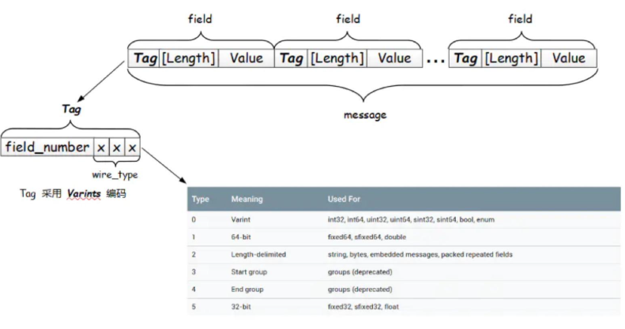

# 应用背景

Google开源项目，解决跨平台跨语言的 序列化结构，以及数据的编码和解码


数据格式：字符串格式 —— JSON/xml、二进制格式 —— Protobuf 

 

Protobuf 是 gRPC 使用的“语言”和“数据包格式”，用于序列化和反序列化。 

gRPC是Google 开发的高性能 RPC 框架。

RPC（远程过程调用）框架是将网络操作（socket、connect、构造请求、send、recv、解析数据）封装成函数，让客户端进行直接调用。

```text
[客户端]                         [服务端]
 Client Stub                     Server Stub
     │                                ▲
     │ 1. 序列化 (Serialize)          │ 4. 反序列化 (Deserialize)
     ▼                                │
[网络传输] ─── 2. HTTP/2 or TCP ───► [网络传输]
     │                                │
     │ 3. 接收字节流                  │ 5. 执行本地方法并返回
     └────────────────────────────────┘
```

RPC 客户端与服务端通过一个接口文件约定通信标准，在运行时通过网络传输二进制字节流进行通信。

​	**开发时**：双方靠同一个契约文件（`.proto`）来达成交流共识，各自生成代码。

​	**运行时**：双方靠网络连接（Socket 字节流）来进行实时的数据交互。


设计阶段，设计是结构化数据，如：车类、人类

​	通过实例化对象，发送到网络中的另一端。

​	为了保证数据的统一，必须使用序列化

​		a、字符串来序列化  —— JSON、XML —— 冗余大、CPU 解析慢 (适合对外接口)

​		b、二进制来序列化 —— Protobuf —— 体积小、速度极快 (适合微服务/RPC)


- 使用Protobuf 库的原因：
	- **内存布局差异**：
		- **C/C++** 中的 `struct` 会受编译器、CPU 架构的影响发生**内存对齐（Memory Alignment / Padding）**。例如一个 `char` 加一个 `int`，在内存里可能被填充成 8 个字节。
		- **Java** 的对象包含对象头（Header）、虚函数表指针等，且变量在堆上分配合物理内存的形式与 C++ 完全不同。
		- **Go** 有自己独特的结构体切片和内存对齐逻辑。
	- **大小端字节序（Endianness）**：有的平台是大端序，有的是小端序。如果直接把 C++ 对象的内存二进制发给 Java，Java 读出来的整型或浮点数值完全是错乱的。
	- 字符串序列的劣势：
		- 使用字符串格式在传输数据时，会带入大量不必要的冗余字符（每一个数据都需要带key）。
		- 字符串 解析效率低，极其消耗 CPU 资源。
		-  缺乏编译期强类型约束（容易运行时报错）
		- 浮点数在字符串化时存在精度丢失与歧义


应用层开发中，**将 Protobuf 序列化后的二进制数（Blob/Bytes）放入数据库中是一种常见的架构设计**


Protobuf 本质就是一个proto格式的文本文件，protoc编译器会生成对应语言的接口


# 安装（现在使用的PC的gcc，不是交叉编译器）

1、版本问题：

​	源码行为：`protobuf-cpp-3.21.12` 

​		`≤ 3.21`使用cpp标准库开发

​		`> 3.21`使用谷歌的自己的`Abseil`库（纯cpp写的）开发 —— 移植容易出现问题


2、源码的编译方式

​	a、先判断当前源码支持哪种配置方式 cmake / make

​		 I. cmake配置、编译、输出的方法：

​			i. 查看`CMakeLists.txt`，配置最终的可执行文件输出的目录项

​				cmake可以选择不同的配置行为

​					cmake内置变量

​					`option`语法新增变量，可以进行选择

​			ii. `cmake -B 文件 -D宏`  配置输出的工程管理文件，指定哪些选择不编译

​				`cmake -B build_abc -G "Unix Makefiles" -Dprotobuf_BUILD_TESTS=OFF -Dprotobuf_BUILD_SHARED_LIBS=ON -DCMAKE_INSTALL_PREFIX=/home/siguyuan/lib/protobuf`

​					执行后会在当前目录生成一个build_abc的构建目录

​					工作中可能需要`-DCMAKE_BUILD_TYPE=版本`

​			iii.`cmake --build` 输出的工程管理文件目录

​				`cmake --build build_abc/ -j$(nproc)`

​			iv.`cmake --install` 将上一步生成的头文件、库、二进制程序  安装到指定目录

​				`cmake --install build_abc/`

​	b、cmake

​	c、将输出的bin目录放入环境变量配置文件`.bashrc`中，重启终端

​		`export PATH="$PATH:/home/siguyuan/lib/protobuf/bin"`


`option`中变量意思

| **变量名**                           | **默认值**     | **作用与含义**                                               |
| ------------------------------------ | -------------- | ------------------------------------------------------------ |
| **`protobuf_INSTALL`**               | `ON`           | 是否在执行 `make install` 时安装 Protobuf 的可执行文件和头文件/库文件。 |
| **`protobuf_BUILD_TESTS`**           | `ON`           | 是否编译 Protobuf 的单元测试（Unit Tests）。                 |
| **`protobuf_BUILD_CONFORMANCE`**     | `OFF`          | 是否编译 Protobuf 的一致性测试套件（Conformance Tests，用于验证不同语言实现的兼容性）。 |
| **`protobuf_BUILD_EXAMPLES`**        | `OFF`          | 是否编译官方提供的示例代码（Examples）。                     |
| **`protobuf_BUILD_PROTOC_BINARIES`** | `ON`           | 是否编译 `protoc` 编译器命令行工具以及 `libprotoc` 动态/静态库。 |
| **`protobuf_BUILD_LIBPROTOC`**       | `OFF`          | 是否单独编译 `libprotoc` 库。                                |
| **`protobuf_DISABLE_RTTI`**          | `OFF`          | 是否禁用 C++ 的运行时类型信息（RTTI）。开启后会禁用 `dynamic_cast` 和 `typeid`，常用于对二进制体积要求极高或禁用 RTTI 的嵌入式场景。 |
| **`protobuf_BUILD_SHARED_LIBS`**     | 继承全局       | 是否将 Protobuf 编译为动态共享库（`.so` / `.dll` / `.dylib`）。若未指定，默认继承全局变量 `BUILD_SHARED_LIBS` 的值。 |
| **`protobuf_MSVC_STATIC_RUNTIME`**   | `ON`*(有条件)* | **(仅限 Windows MSVC 编译器)** 是否使用静态 C/C++ 运行时库（`/MT` 或 `/MTd`）。开启后可避免目标机器缺失 Visual C++ Redistributable 的问题。 *注意：只有在非动态库模式（`NOT protobuf_BUILD_SHARED_LIBS`）下才默认为 `ON`。* |
| **`protobuf_WITH_ZLIB`**             | `ON`           | 是否启用 `zlib` 压缩库支持。开启后 Protobuf 的 `gzip_stream` 等流压缩功能才可用。 |


使用交叉编译器进行编译

```bash
# 在自己自定的目录下创建.cmake文件

# ============ 添加如下内容 ============
# 指定交叉编译器
set(CMAKE_C_COMPILER arm-none-linux-gnueabihf-gcc)
set(CMAKE_CXX_COMPILER arm-none-linux-gnueabihf-g++)
# 显式开启 CMake 的交叉编译模式
set(CMAKE_SYSTEM_NAME Linux)
# 指定目标设备的硬件 CPU 架构名称
set(CMAKE_SYSTEM_PROCESSOR arm)
# =========== 完 ================

# 使用的构建交叉环境的构建目录 使用CMAKE_TOOLCHAIN_FILE指定 关闭编译 protoc 编译器可执行程序protobuf_BUILD_PROTOC_BINARIES=off
cmake -B build -DCMAKE_TOOLCHAIN_FILE=/home/rocky/ebf/ebf.cmake -DCMAKE_BUILD_TYPE=Release -DCMAKE_INSTALL_PREFIX=/home/rocky/ebf/out -Dprotobuf_BUILD_TESTS=OFF -DBUILD_SHARED_LIBS=ON -Dprotobuf_BUILD_PROTOC_BINARIES=off

# 和之前一样进行build和install

# 在后面编写自己的程序时，也需要指定cmake添加/home/rocky/ebf/ebf.cmake这个工具包
cmake -B abc -DCMAKE_TOOLCHAIN_FILE=/home/rocky/ebf/ebf.cmake 
```


# 使用

在工作目录中创建一个`Person.proto`的结构配置文件

```protobuf
// 声明版本
syntax = "proto3";

// 消息格式 建议消息命名不使用下划线
message MyMsg {
  // 基地址 = 序号（数据流中的传输顺序）
  uint32 addr_base = 2;
  // 偏移地址 = 序号
  uint32 addr_offset = 1;
}

// 该序号为传输数据的发送顺序
```

在终端执行`mkdir cxx_out &&  protoc Person.proto --cpp_out=cxx_out `

- 根据自己的项目语言，选择对应的选项，这里使用的`--cpp_out=` 属于C/C++

> [!CAUTION]
>
> **Person.proto**这个文件需要通信双方共享


建议使用C++进行编写。


第一件事情，用cmake生成clangd能识别的配置文件。

- 如果不做，会出现的问题：

	- ```c++
		#include <cstdio>
		#include <iostream>
		#include "cxx_out/Person.pb.h"
		
		int main(){
		    MyMsg a1;
		    std::string code_result; 
		
		    a1.set_addr_base(0x11);
		    a1.set_addr_offset(0x22);
		    a1.SerializeToString(&code_result);
		
		    for(auto x : code_result){
		        printf("0x%hhx\t", x);
		    }
		
		    std::cout << std::endl;
		
		    return 0;
		}
		```

	- ```bash
		# 找不到头文件
		siguyuan@debian:~/EBF_6ULL/app/protobuf_demo$ g++ -o build main.cpp 
		In file included from main.cpp:3:
		cxx_out/Person.pb.h:10:10: fatal error: google/protobuf/port_def.inc: 没有那个文件或目录
		   10 | #include <google/protobuf/port_def.inc>
		      |          ^~~~~~~~~~~~~~~~~~~~~~~~~~~~~~
		compilation terminated.
		
		# 引入头文件
		# 找不到函数
		siguyuan@debian:~/EBF_6ULL/app/protobuf_demo$ g++ -o build main.cpp -I/home/siguyuan/lib/protobuf/include 
		/usr/bin/ld: /tmp/ccduQzHp.o: in function `main':
		main.cpp:(.text+0x52): undefined reference to `google::protobuf::MessageLite::SerializeToString(std::__cxx11::basic_string<char, std::char_traits<char>, std::allocator<char> >*) const'
		/usr/bin/ld: main.cpp:(.text+0x101): undefined reference to `MyMsg::~MyMsg()'
		/usr/bin/ld: main.cpp:(.text+0x120): undefined reference to `MyMsg::~MyMsg()'
		/usr/bin/ld: /tmp/ccduQzHp.o: in function `MyMsg::MyMsg()':
		main.cpp:(.text._ZN5MyMsgC2Ev[_ZN5MyMsgC5Ev]+0x1e): undefined reference to `MyMsg::MyMsg(google::protobuf::Arena*, bool)'
		collect2: error: ld returned 1 exit status
		
		# 引入库
		# 找不库
		siguyuan@debian:~/EBF_6ULL/app/protobuf_demo$ g++ -o build main.cpp -I/home/siguyuan/lib/protobuf/include -lprotobuf 
		/usr/bin/ld: 找不到 -lprotobuf: 没有那个文件或目录
		collect2: error: ld returned 1 exit status
		
		# 告知库地址
		# 找不到自己定义的数据结构
		siguyuan@debian:~/EBF_6ULL/app/protobuf_demo$ g++ -o build main.cpp -I/home/siguyuan/lib/protobuf/include -lprotobuf -L/home/siguyuan/lib/protobuf/lib
		/usr/bin/ld: /tmp/cc4MT2AW.o: in function `main':
		main.cpp:(.text+0x101): undefined reference to `MyMsg::~MyMsg()'
		/usr/bin/ld: main.cpp:(.text+0x120): undefined reference to `MyMsg::~MyMsg()'
		/usr/bin/ld: /tmp/cc4MT2AW.o: in function `MyMsg::MyMsg()':
		main.cpp:(.text._ZN5MyMsgC2Ev[_ZN5MyMsgC5Ev]+0x1e): undefined reference to `MyMsg::MyMsg(google::protobuf::Arena*, bool)'
		collect2: error: ld returned 1 exit status
		
		# 添加原材料
		siguyuan@debian:~/EBF_6ULL/app/protobuf_demo$ g++ -o build main.cpp cxx_out/Person.pb.cc -I/home/siguyuan/lib/protobuf/include -lprotobuf -L/home/siguyuan/lib/pr
		otobuf/lib
		# 运行时找不到库
		siguyuan@debian:~/EBF_6ULL/app/protobuf_demo$ ./build 
		./build: error while loading shared libraries: libprotobuf.so.32: cannot open shared object file: No such file or directory
		# 编译时指定运行时库文件路径
		g++ -o build main.cpp cxx_out/Person.pb.cc -I/home/siguyuan/lib/protobuf/include -lprotobuf -L/home/siguyuan/lib/protobuf/lib -Wl,-rpath=/home/rocky/works/out/lib
		
		# 程序结果 —— 会自动添加新的编码来防止粘包
		0x8     0x22    0x10    0x11
		```

	- `g++ -o build main.cpp cxx_out/Person.pb.cc -I/home/siguyuan/lib/protobuf/include -lprotobuf -L/home/siguyuan/lib/protobuf/lib -Wl,-rpath=/home/rocky/works/out/lib`


```cmake
# CMakeLists.txt编写
cmake_minimum_required(VERSION 3.10)

project(ProtobufDemo C CXX)

set(PROTOBUF_PATH "/home/siguyuan/lib/protobuf")

add_executable(build main.cpp cxx_out/Person.pb.cc)

target_include_directories(build PUBLIC ${PROTOBUF_PATH}/include)

target_link_libraries(build PUBLIC protobuf)

target_link_directories(build PUBLIC ${PROTOBUF_PATH}/lib)

```

```json
// settings.json
{
    // 指定cmake默认的构建目录	
    "cmake.buildDirectory": "${workspaceFolder}/build",
    // vscode下面的cmake的状态栏 —— 紧凑样式
    "cmake.options.statusBarVisibility": "compact",
    // cmake默认到处编译命令的配置文件，给clangd用
    "cmake.exportCompileCommandsFile": true,

    // clangd的配置文件相关设置
    "clangd.arguments": [
        // 显示详细日志
        "--log=verbose",
        // 在后台自动分析文件（基于complie_commands)
        "--background-index",
        // 同时开启的任务数量
        "-j=4",
        // clang-tidy功能
        "--clang-tidy",
        // 全局补全（会自动补充头文件）
        "--all-scopes-completion",
        // 详细补全
        "--completion-style=detailed",
        // 补充头文件
        "--header-insertion=iwyu",
        // pch优化的位置disk memory
        "--pch-storage=memory",
    ],
}
```


常用函数：

## Protobuf 常用函数分类表格

| **分类**                 | **函数 / 方法签名**               | **功能与作用说明**                               | **返回值 / 作用对象**           |
| ------------------------ | --------------------------------- | ------------------------------------------------ | ------------------------------- |
| **单值字段**             | `set_<field>(val)`                | 设置标量字段的值（如 `int32`, `string`）         | `void`                          |
|                          | `<field>()`                       | 读取字段的值                                     | 对应 C++ 类型（值或 `const &`） |
|                          | `has_<field>()`                   | 检查可选字段（`optional`）是否被赋值过           | `bool`                          |
|                          | `clear_<field>()`                 | 重置/清空指定字段的值                            | `void`                          |
| **数组/列表 (repeated)** | `add_<field>()`                   | 向列表中追加一个元素（基础类型直接传值）         | 指向新元素的指针或 `void`       |
|                          | `<field>_size()`                  | 获取列表中的元素个数                             | `int`                           |
|                          | `<field>(index)`                  | 读取列表中索引为 `index` 的元素                  | 对应 C++ 类型                   |
|                          | `mutable_<field>()`               | 获取可变的 Repeated 容器指针，用于直接操作       | `RepeatedPtrField<T>*`          |
| **嵌套消息 (message)**   | `mutable_<field>()`               | **获取嵌套对象的动态指针**（若不存在则自动创建） | `NestedMsg*`                    |
|                          | `has_<field>()`                   | 检查嵌套消息是否已实例化                         | `bool`                          |
| **字典/映射 (map)**      | `mutable_<field>()`               | 获取 Map 字典的可变指针（类似于 `std::map`）     | `Map<K, V>*`                    |
| **序列化 (打包)**        | `SerializeToString(std::string*)` | 将对象序列化为二进制存入 string（最常用）        | `bool`（成功返回 `true`）       |
|                          | `SerializeToArray(void*, int)`    | 序列化到内存 buffer                              | `bool`                          |
| **反序列化 (解包)**      | `ParseFromString(std::string)`    | 从二进制 string 解析并还原对象                   | `bool`（成功返回 `true`）       |
|                          | `ParseFromArray(void*, int)`      | 从内存 buffer 解析并还原对象                     | `bool`                          |
| **通用辅助**             | `DebugString()`                   | 返回格式化后的多行文本格式，方便日志输出         | `std::string`                   |
|                          | `ByteSizeLong()`                  | 获取对象序列化后的字节大小                       | `size_t`                        |
|                          | `Clear()`                         | 重置整个对象的所有字段到默认状态                 | `void`                          |


```c++
#include <iostream>
#include <string>
#include "test_syntax.pb.h" // protoc 生成的头文件

int main() {
    // -------------------------------------------------------------
    // 1. 构造与字段写入 (Setters & Modifiers)
    // -------------------------------------------------------------
    demo::test::TestMessage msg_out;

    // 标量字段赋值
    msg_out.set_user_id(10086);
    msg_out.set_username("Siguyuan");
    msg_out.set_is_active(true);
    msg_out.set_score(99.5);
    msg_out.set_current_status(demo::test::STATUS_SUCCESS);

    // 操作 repeated (列表) 字段：追加元素
    msg_out.add_tags("C++");
    msg_out.add_tags("Protobuf");
    msg_out.add_tags("Linux");

    // 操作 嵌套消息 (Message) 字段：必须使用 mutable_xxx()
    demo::test::TestMessage_Address* addr = msg_out.mutable_home_address();
    addr->set_city("Beijing");
    addr->set_street("Haidian District");

    // 操作 map 字段：获取指针后当作常规 map 使用
    auto* extra = msg_out.mutable_extra_info();
    (*extra)["role"] = "Developer";
    (*extra)["level"] = "Senior";

    // 设置 oneof 字段
    msg_out.set_phone_number("13800138000");

    // -------------------------------------------------------------
    // 2. 序列化 (Serialization)
    // -------------------------------------------------------------
    std::string serialized_data;
    if (!msg_out.SerializeToString(&serialized_data)) {
        std::cerr << "Failed to serialize message!" << std::endl;
        return -1;
    }

    std::cout << "[Info] Serialized size: " << msg_out.ByteSizeLong() << " bytes.\n";
    std::cout << "[DebugString]\n" << msg_out.DebugString() << "\n";

    // -------------------------------------------------------------
    // 3. 反序列化 (Deserialization)
    // -------------------------------------------------------------
    demo::test::TestMessage msg_in;
    if (!msg_in.ParseFromString(serialized_data)) {
        std::cerr << "Failed to parse message!" << std::endl;
        return -1;
    }

    // -------------------------------------------------------------
    // 4. 读取与遍历 (Getters & Iteration)
    // -------------------------------------------------------------
    std::cout << "--- Deserialized Output ---\n";
    std::cout << "User ID   : " << msg_in.user_id() << "\n";
    std::cout << "Username  : " << msg_in.username() << "\n";
    std::cout << "Status    : " << msg_in.current_status() << "\n";

    // 读取嵌套对象
    if (msg_in.has_home_address()) {
        std::cout << "City      : " << msg_in.home_address().city() << "\n";
    }

    // 遍历 repeated (列表) 字段
    std::cout << "Tags (" << msg_in.tags_size() << "): ";
    for (int i = 0; i < msg_in.tags_size(); ++i) {
        std::cout << msg_in.tags(i) << (i == msg_in.tags_size() - 1 ? "" : ", ");
    }
    std::cout << "\n";

    // 遍历 map 字典
    std::cout << "Extra Info:\n";
    for (const auto& pair : msg_in.extra_info()) {
        std::cout << "  " << pair.first << ": " << pair.second << "\n";
    }

    return 0;
}
```

```protobuf
// test_syntax.proto
// 1. 指定 Protobuf 语法版本（必须是文件的首行非空/非注释行）
// 常用版本有 "proto2" 和 "proto3"，目前主流开发推荐使用 proto3
syntax = "proto3";

// 2. 指定生成的 C++ 命名空间 (namespace)
// 编译后生成的类会被包裹在 namespace demo::test 中
package demo.test;

// 3. 导入其他 .proto 文件（按需使用）
// import "google/protobuf/timestamp.proto";

// 4. 定义枚举类型 (Enum)
// 注意：proto3 要求枚举的第一个元素必须为 0，作为默认值
enum Status {
  STATUS_UNKNOWN = 0;  // 默认值，未知状态
  STATUS_SUCCESS = 1;  // 成功
  STATUS_FAILED  = 2;  // 失败
}

// 5. 定义核心消息结构 (Message)
message TestMessage {
  // --- 基础标量类型 ---
  // 语法：类型 字段名 = 编号;
  int32 user_id = 1;         // 32位整形（变长编码，适合正数）
  string username = 2;       // UTF-8 编码或 ASCII 字符串
  bool is_active = 3;        // 布尔值 (true/false)
  double score = 4;          // 双精度浮点数

  // --- 枚举类型 ---
  Status current_status = 5; // 使用上面定义的枚举

  // --- 列表 / 数组类型 (repeated) ---
  // repeated 表示该字段可以包含 0 个或多个元素
  repeated string tags = 6;  // 字符串列表

  // --- 嵌套消息定义与使用 ---
  message Address {
    string city = 1;
    string street = 2;
  }
  Address home_address = 7;  // 引用嵌套消息

  // --- 键值对 Map 类型 ---
  // 语法：map<key_type, value_type> 字段名 = 编号;
  // 注意：key_type 不能是 float/double 或 bytes
  map<string, string> extra_info = 8;

  // --- 可选字段显式标识 (optional) ---
  // 在 proto3 中，加上 optional 可以开启显式的存在性检查（即生成 has_xxx() 方法）
  optional string remark = 9;

  // --- 互斥字段 (oneof) ---
  // 在 oneof 块中，同时只能有一个字段被赋值，多次赋值会覆盖前值，用于节省内存
  oneof contact_method {
    string phone_number = 10;
    string email_address = 11;
  }
}
```


# 编码

protobuf的数据类型映射

| .proto类型 | Java 类型  | C++类型 | 备注                                                         |
| ---------- | ---------- | ------- | ------------------------------------------------------------ |
| double     | double     | double  |                                                              |
| float      | float      | float   |                                                              |
| int32      | int        | int32   | 使用可变长编码方式。编码负数时不够高效——如果你的字段可能含有负数，那么请使用sint32。 |
| int64      | long       | int64   | 使用可变长编码方式。编码负数时不够高效——如果你的字段可能含有负数，那么请使用sint64。 |
| uint32     | int[1]     | uint32  | Uses variable-length encoding.                               |
| uint64     | long[1]    | uint64  | Uses variable-length encoding.                               |
| sint32     | int        | int32   | 使用可变长编码方式。有符号的整型值。编码时比通常的int32高效。 |
| sint64     | long       | int64   | 使用可变长编码方式。有符号的整型值。编码时比通常的int64高效。 |
| fixed32    | int[1]     | uint32  | 总是4个字节。如果数值总是比228大的话，这个类型会比uint32高效。 |
| fixed64    | long[1]    | uint64  | 总是8个字节。如果数值总是比256大的话，这个类型会比uint64高效。 |
| sfixed32   | int        | int32   | 总是4个字节。                                                |
| sfixed64   | long       | int64   | 总是8个字节。                                                |
| bool       | boolean    | bool    |                                                              |
| string     | String     | string  | 一个字符串必须是UTF-8编码或者7-bit ASCII编码的文本。         |
| bytes      | ByteString | string  | 可能包含任意顺序的字节数据。                                 |


**protobuf**

- 优点：
	- **传输效率极高、体积小**：采用 Varint 与 Tag 二进制编码，去除键名与冗余空格，体积仅为 JSON 的 1/3 ~ 1/10。
	- **序列化/反序列化速度快**：无需解析语法树，直接映射内存与二进制字节流，速度比 JSON 快 2 到 10 倍以上。
	- **强类型约束与自动代码生成**：通过 `.proto` 强定义数据结构，自动生成多语言绑定代码，减少手动解析 Bug。
	- **向后/向前兼容性极佳**：基于数字 Tag 识别字段，增删字段不会破坏旧版本代码的解析与运行。
	- **开箱即用集成 gRPC**：原生支持 gRPC 接口设计，非常适合微服务与嵌入式网络通信。
	- **具备天然的物理隐密性（非明文传输）**：序列化产物为纯二进制流，不包含任何字段名与结构信息，相比明文传输的 JSON/XML 具备更好的隐私性与隐蔽性，不易被直接肉眼嗅探或直接还原数据语义。【比htpps性能更高】
- 缺点：
	- **可读性差**：无法直接用文本编辑器阅读或调试，需依靠 `DebugString()` 或专用反解析工具。
	- **依赖原始 Schema**：若没有对应的 `.proto` 描述文件，仅凭二进制字节流极难逆向还原数据的字段语义。
	- **增加工程构建复杂度**：需要引入 `protoc` 编译链与预编译步骤，增加项目配置成本。
	- **Web 前端生态不如 JSON**：在浏览器与 RESTful API 场景中普及度较低，且不适合超大文件的随机局部修改。


**序列化原理**：

文档：https://www.toutiao.com/article/7310170507121590799/?wid=1788265849799

- 为了解决粘包问题，protobuf 数据存储采用 `Tag-[Length]-Value` （TLV格式）即标识 - 长度 - 字段值存储方式，默认采用TV格式
	- `Tag`：唯一标识，根据类型和值的不同，有又有一些区别
		
		- 
		
		- Tag的组成  =   最高位的掩码 + 高4位的字段的编号 + 低3位的编码类型
		
		- ```text
			0 0 0 0 1 0 0 0  (十六进制 0x08)
			│ └─────┘ └───┘
			│    │      └── Wire Type = 000 (0: Varint)
			│    └──────── Field Number = 00001 (1)
			└───────────── MSB 标志 = 0 (表示仅占用 1 个字节。如果=1，表示后续还有Tag数据)
			```
		
		- 
		
	- `Length`：在需要“连续数据空间”或“变长字节块”时使用的
	
	- `Value`：可以是数值，也可以是字符串、二进制字节流、嵌套对象或数组等
	
	- 


## 对于数字的编码 —— Varint 编码（TV 结构）

- 变长的编码方式

- ```c++
	// 对于数字处理的部分源码：
	private void writeVarint32(int n) {             
	    int idx = 0;  
	    while (true) {  
	        if ((n & ~0x7F) == 0) {  
	            i32buf[idx++] = (byte)n;  
	            break;  
	        } else {  
	            i32buf[idx++] = (byte)((n & 0x7F) | 0x80);  
	            // 步骤1：取出字节串末7位
	            // 对于上述取出的7位：在最高位添加1构成一个字节
	            // 如果是最后一次取出，则在最高位添加0构成1个字节
	
	            n >>>= 7;  
	            // 步骤2：通过将字节串整体往右移7位，继续从字节串的末尾选取7位，直到取完为止。
	        }  
	    }  
	    trans_.write(i32buf, 0, idx); 
	    // 步骤3： 将上述形成的每个字节 按序拼接 成一个字节串
	    // 即该字节串就是经过Varint编码后的字节
	}   
	```

	- 针对整数（如 `int32`、`int64`），Protobuf 使用了 **Varint（可变长整数）编码**：
		- **按 7 位截断**：将数字转换为二进制后，按每 **7 个 bit（7 位）** 截为一个分组。  
		- **最高位标志（MSB）**：每个字节的最高位（第 8 位，即 MSB continuation bit）用作**延续标志**：  
			- **1** 代表后面还有字节。  
			- **0** 代表这是当前数字的最后一个字节。
		- **小端存储**：低位分组在前，高位分组在后。


## 对于负数的优化编码 —— Zigzag 编码 +Varint 编码

Zigzag编码：它将带符号整数映射为无符号整数，使正数和负数在数轴上**交替交错排列**。

```c++
// 编码
public int int_to_Zigzag(int n) {
// 传入的参数n = 传入字段值的二进制表示（此处以负数为例）
// 负数的二进制 = 符号位为1，剩余的位数为该数绝对值的原码按位取反；然后整个二进制数+1
  return (n <<1) ^ (n >>31);
}

// 解码
public int Zigzag_to_int(int n) {
  return (n >>> 1) ^ -(n & 1);
}
```

编码 (Encode)

- 对于一个 $N$ 位的整数（例如 32 位 `int32`）：

	$$Z(n) = (n \ll 1) \oplus (n \gg (N - 1))$$

- `n << 1`：将整个数字左移 1 位（相当于乘以 2），最低位空出 `0`。

	`n >> (N - 1)`：**算术右移**（保留符号位）。

	- 如果 $n \ge 0$，右移后得到全 `0`（`0x00000000`）。
	- 如果 $n < 0$，右移后得到全 `1`（`0xFFFFFFFF`，即 `-1` 的补码）。

	`⊕`（异或）：

	- 当 $n \ge 0$ 时：与全 `0` 异或，保持不变（得到偶数）。
	- 当 $n < 0$ 时：与全 `1` 异或，相当于**按位取反**（把绝对值大的负数转为小的奇数）。


解码：

- $$n(Z) = (Z \gg 1) \oplus -(Z \text{ \& } 1)$$

- `Z >> 1`：**逻辑右移** 1 位（相当于除以 2）。

	`-(Z & 1)`：利用最低位判断原数是正还是负。

	- 如果 $Z$ 是偶数（原数正）：`Z & 1` 为 `0`，`-(0)` 为 `0`，与 `0` 异或保持不变。
	- 如果 $Z$ 是奇数（原数负）：`Z & 1` 为 `1`，`-(1)` 为 `-1`（全 `1`），与全 `1` 异或实现按位取反还原。


## 对于字符串/嵌套消息的编码 —— TLV 结构

**Tag**：包含字段号（Field Number）和数据类型编码（Wire Type 2）。  

**Length**：用 Varint 编码记录字符串的 **字节长度**。

**Data**：直接放原生的 **UTF-8 字符字节流**（不修改最高位，不按 7 位截断）。
