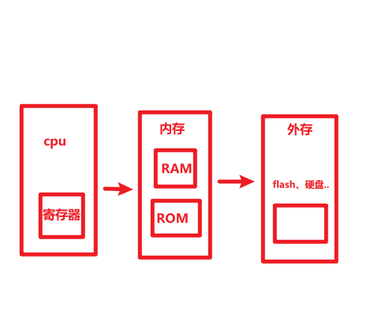
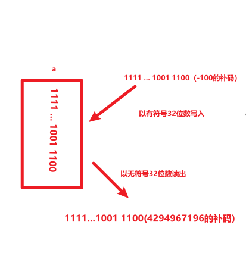
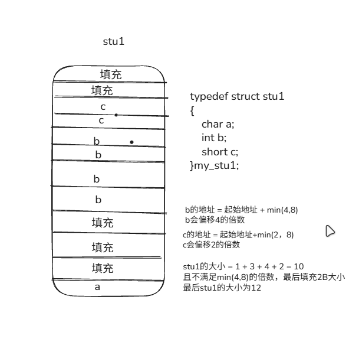
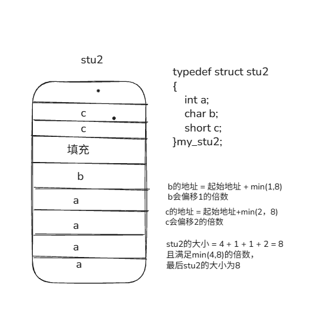
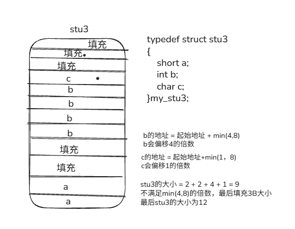
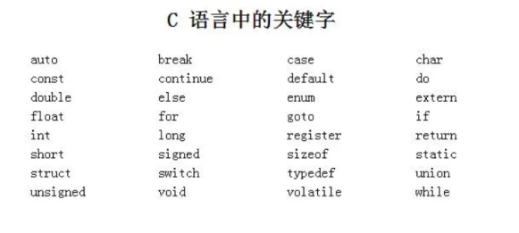
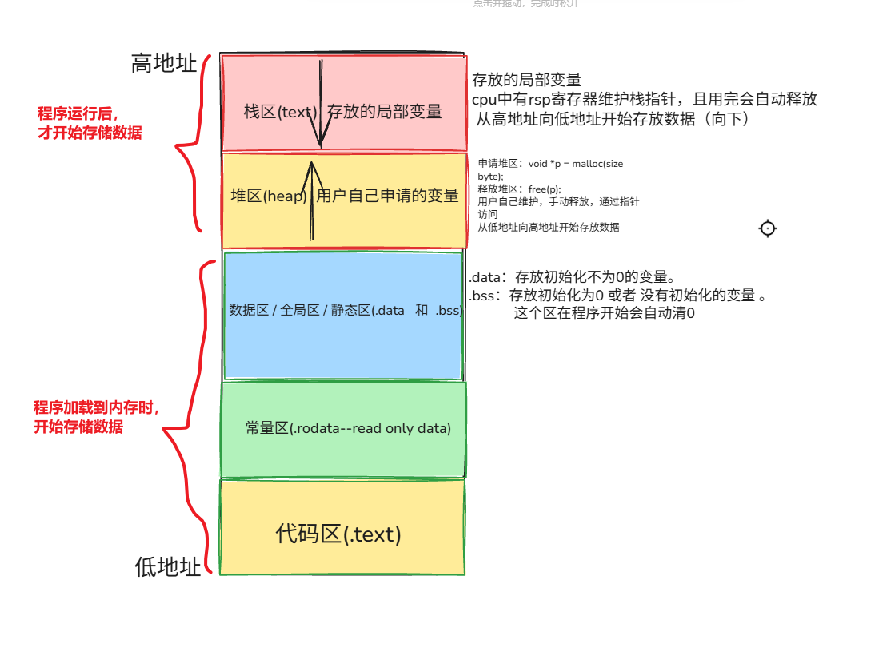
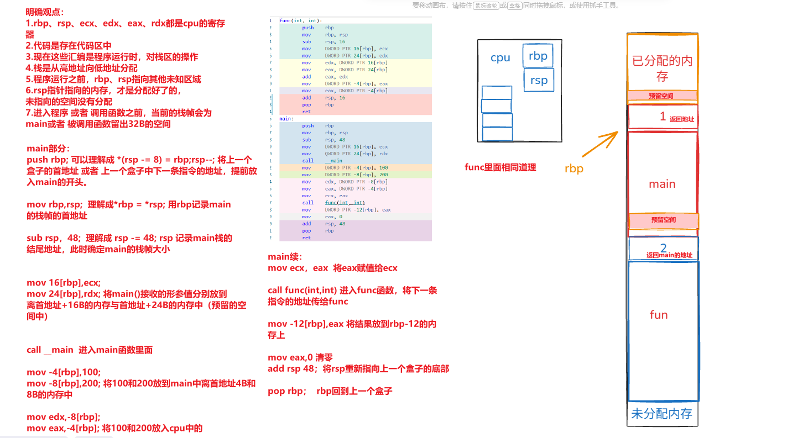

[TOC]

# 前言

- 书籍的推荐先读：《高质量嵌入式 LinuxC 编程》、《深入理解计算机系统（原书第三版）》
- C语言大体的框架是统一的，但是在具体某些实现细节上不同的编译器厂家实现不同；不同操作系统和CPU架构上的相同函数，效果也会有不同 —— **不同操作系统、不同CPU、不同的编译器的C语言行为一致（效果差不多），但具体的实现细节各不相同**
- 有些知识有歧义，应该在有所区分


# 个人代码规范

- 代码规范

  - 

  - | **标识符类型**                           | **推荐命名风格**                      | **别名/缩写示例**             | **命名示例**                            | **规范说明与设计意图**                                       |
  	| ---------------------------------------- | ------------------------------------- | ----------------------------- | --------------------------------------- | ------------------------------------------------------------ |
  	| **局部变量** (Local Var)                 | 小驼峰式 / 小写下划线                 | `l_` (Local)                  | `l_loopCounter` `adc_raw_value`         | 简短、见名知意。在嵌套较深的代码块中，加 `l_` 前缀可一眼与全局变量区分。 |
  	| **全局变量** (Global Var)                | 前缀 + 小驼峰 / 下划线                | `g_` (Global)                 | `g_sysTickCount` `g_u8_app_status`      | **嵌入式开发大忌：滥用全局变量**。必须加 `g_` 前缀，警告开发者该变量有并发修改风险。 |
  	| **静态全局变量** (Static Global)         | 前缀 + 小驼峰                         | `sg_` (Static Global)         | `sg_uartRxBuffer`                       | 限制在当前 `.c` 文件内使用的全局变量，加 `sg_` 提示其作用域。 |
  	| **常量** (Constant)                      | 全大写 + 下划线                       | `c_` (有时用作前缀)           | `MAX_BUFFER_SIZE` `c_pi_value`          | 必须全大写，用于硬件缓冲区大小、数学常数等，不可更改。       |
  	| **普通函数** (Function)                  | 模块名 + 动名词结合                   | `M_` (Module)                 | `HAL_GPIO_Write()` `Adc_ReadValue()`    | 推荐“**模块名_动作+对象**”结构。面向对象思想，便于在 IDE 中输入模块名时自动联想。 |
  	| **中断服务程序** (ISR)                   | 触发源 + 后缀                         | `_ISR` / `_IRQHandler`        | `Timer0_ISR()` `USART1_IRQHandler()`    | 必须有明确的中断后缀，绝对不能在常规代码中手动调用。         |
  	| **宏定义** (Macro)                       | 全大写 + 下划线                       | `M_` (Macro)                  | `SET_BIT(reg, bit)` `IS_PARAM_VALID`    | 带参数的宏（如位操作）必须全大写。注意：嵌入式中能用 `inline` 函数代替宏的尽量代替。 |
  	| **结构体/枚举类型** (Typedef)            | 大驼峰 + 类型后缀                     | `_t` (Type) / `_s` / `_e`     | `PidController_t` `TaskState_e`         | 别名加 `_t` 是标准 C 规范。结构体加 `_s` (Structure)，枚举加 `_e` (Enumeration)。 |
  	| **头文件** (Header)                      | 小写加下划线 / 小驼峰                 | `.hpp` / `.h`                 | `file_system.hpp` `http_session.h`      | 现代 C++ 更倾向于用 `.hpp` 表示包含模板或内联函数的头文件，以区分纯 C 的 `.h`。 |
  	| **源文件** (Source)                      | 与头文件严格一一对应                  | `.cpp` / `.cc`                | `file_system.cpp` `http_session.cc`     | 后缀必须保持项目全系统统一。Google 习惯用 `.cc`，而 Windows/多数通用项目习惯用 `.cpp`。 |
  	| **测试文件** (Test)                      | 原文件名 + 后缀                       | `_test` / `_unittest`         | `file_system_test.cpp`                  | 便于测试框架（如 Google Test）或构建工具（如 CMake）自动识别并排除在生产环境之外。 |
  	| **接口/抽象类** (Interface)              | 前缀 `i` 或大驼峰                     | `i_` / `I`                    | `i_render_engine.hpp` `IRenderEngine.h` | 提示该文件只包含纯虚函数（抽象类），没有具体实现。           |
  	| C++**普通成员变量** (Private/Protected)  | 小写加下划线尾缀 / 小驼峰加 `m_` 前缀 | `_` (尾缀) `m_` (前缀 Member) | `connection_count_` `m_connectionCount` | **极重要**：加尾缀 `_`（Google 规范）或 `m_` 可以瞬间将其与函数局部变量、函数入参区分开。 |
  	| C++**公有成员变量** (Public Struct)      | 小写加下划线 / 小驼峰                 | 无特殊前后缀                  | `name` `age`                            | 如果是纯数据结构（`struct`），通常不需要加 `_` 或 `m_`，直接暴露访问。 |
  	| C++**静态成员变量** (Static Member)      | 前缀区分                              | `s_` (Static) `s_..._`        | `s_instance_` `m_s_max_players`         | 提示该变量属于整个类而非某个实例，多线程环境下需注意并发安全。 |
  	| C++**类内常量 / 枚举** (Static Constant) | 全大写 或 `k`开头的驼峰               | `k` (Constant)                | `kMaxRetryTimes` `MAX_BUFFER_SIZE`      | 类内部的 `constexpr` 或 `const static` 变量。使用 `k` 前缀是 Google 风格，能有效避免宏污染。 |

  - 

  - 

- 写代码小思路： 指令（接收的参数、属性等）  <——映射——> 行为（处理函数）  绘制成表（结构体数组）

# 笔记

## 计算机

- 操作系统的如何运行软件

  - 计算机系统层次结构图
    - 

  - `软件的运行   ——需要——> 机器码符合运行cpu的体系架构（指令集） + 操作系统的支撑（加载进入内存 将应用层与硬件层连接起来）`
    
    - 操作系统
      1. **提供一个CLI（command-line interface）与用户进行交互    【图形界面并不是操作系统必须的】**
      2. **提供一个查找 可执行程序 的依据（关键字 字符串 语法）**
      3. **提供一个查找路径   通过环境变量进行查找**
        - 绝对路径：从根目录 或者 根盘符 开始
        - 相对路径：相对在哪里开始 （当前目录 或者 去PATH中寻找）
        - 每次运行软件都会，读取当前的系统的全部环境变量
        - Windows中环境变量
          - PATH：查找路径 提供路径前缀
          - TEMP 和 TMP：临时目录（中间文件）
    
    - Windos是单用户操作系统（Windos Server是多用户，但是需要购买）；Linux是多用户操作系统（指同一时间，多个用户能操作资源）

- 分类：机器语言、汇编语言、高级语言

  - cpu（中央处理器 —— 负责处理指令 【二进制的规范集合 —— 机器码】）
  - 高级语言  ==>  机器码  需要编译器（翻译官，解析规范与具体的cpu有关【具体的来说和编译器的版本有关 —— 可以在64位系统上运行32位的编译器】，该规范的理论由 ISO制定， 具体的实现规范由具体的 编译器厂家进行规定 如：微软的MSVC编译器、开源的GNU编译器）[^4]

- 通过 **编译器** 将 高级语言 解析成 机器语言

  1. 预处理：对源文件（.c）进行处理，**展开头文件[^1]、[替换宏](###宏替换)、去掉注释、[条件编译](###条件编译)**。
    `gcc -E xxx.c -o xxx.i`
      预处理文件后缀名为 `.i`，*在该阶段报错，通常为该头文件编译器没有找到*。

  2. 编译：将 预处理文件 转换成 汇编文件（.s）
    `gcc -S xxx.i -o xxx.s`
      *在该阶段报错，通常为语法、语句出现错误。*

  3. 汇编：将 汇编文件 转换成 二进制文件 （.o）
    `gcc -c xxx.s -o xxx.o`

  4. 链接：将多个二进制文件，组合成可执行程序（**Windows 上为 PE 格式——.exe；Linux 上为 ELF 格式——.out**）
    `gcc xxx.o -o xxx`
      *在该阶段报错，通常为文件之间的调用出现问题*，例如：在本文件调用外部的 fun 函数，在开头没有引用其对应头文件  或者  没有用 extern 关键字声明 fun 函数为外部函数。

    

    工程上的理解：编译阶段（预处理、编译、汇编） =》 链接阶段

    实际上编译器会根据文件后缀名进行执行（如：`gcc abc.s -o abc.exe` 会执行汇编、链接）

- gcc 常用选项

  - | 选项          | 用法               | 含义                                                         | 工具   | 注意事项                                                     |
  	| ------------- | ------------------ | ------------------------------------------------------------ | ------ | ------------------------------------------------------------ |
  	| -E            |                    | 预处理(.i)                                                   | cpp    | 该阶段可以  引入宏-D  指定头文件-I                           |
  	| -S            |                    | 生成汇编代码（.s）                                           | cc/cc1 | 编译阶段，输出 .s 文件（cc1 负责）                           |
  	| -c            |                    | 生成二进制代码（.o）                                         | as     | 汇编阶段，只编译生成目标文件（.o），不进行链接（as 负责汇编） |
  	| -o            | -o xx              | 链接(生成指定文件)                                           | ld     | 链接阶段，将多个文件联系起来。如果没有-o 将默认输出a.exe/a.out |
  	| -O            | -O<level>          | 优化选项 , <level>取值范围0~3                                |        | -O0（关闭）、-O1、-O2、-O3（最高常用）、-Ofast               |
  	| -g            |                    | 启动调式                                                     | gdb    |                                                              |
  	| -Wall         |                    | 启用所有常见的警告信息                                       |        |                                                              |
  	| -Wextra       |                    | 启用额外的警告信息                                           |        | 比 -Wall 更严格                                              |
  	| -v            |                    | 打印详细的编译过程信息                                       |        |                                                              |
  	| -D            | -D <macro[=value]> | 定义一个宏定义，<macro> 为定义的宏名称，[= value] 为可以定义其值。<br /> |        | 在命令行中将宏定义传递给预处理器                             |
  	| -U            | -U <macro>         | 取消定义 ⼀ 个宏                                             |        |                                                              |
  	| -L            | -L<dir>            | 指定源文件目录（库文件路径），<dir>源文件目录路径            |        | 路径有空格需要加“”包裹                                       |
  	| -l（小写L）   | -l<filename>       | 指定具体的源文件（具体的库文件）                             |        | 使用第三库时使用                                             |
  	| -I（大写的i） | -I<dir>            | 指定头文件目录，<dir>头文件目录路径                          |        |                                                              |
  	| -static       |                    | 生成静态链接（静态库）                                       |        | 生成静态可执行文件（体积大，但不需要依赖 dll）               |
  	| -shared       |                    | 生成动态链接（动态库）                                       |        | 用于生成 .dll（Windows）或 .so（Linux）                      |

- 编译器的工作流程

  - 前提：

    - 需要将 编译器的命令路径 放入到 环境变量PATH中

  - 区分：

    - 编辑器（只有编辑功能 vs code） 集成开发工具（内部集成多种工具 Visual Studio ）

  - 工作流程

    - `gcc -v` 展示的详细信息

    - 都有的信息

      - ```powershell
        Using built-in specs.
        COLLECT_GCC=E:\project\programming_environment\mingw64\bin\gcc.exe
        COLLECT_LTO_WRAPPER=E:/project/programming_environment/mingw64/bin/../libexec/gcc/x86_64-w64-mingw32/13.2.0/lto-wrapper.exe
        OFFLOAD_TARGET_NAMES=nvptx-none
        Target: x86_64-w64-mingw32 
        Configured with: ../configure --prefix=/R/winlibs64ucrt_stage/inst_gcc-13.2.0/share/gcc --build=x86_64-w64-mingw32 --host=x86_64-w64-mingw32 --enable-offload-targets=nvptx-none --with-pkgversion='MinGW-W64 x86_64-ucrt-posix-seh, built by Brecht Sanders, r8' --with-tune=generic --enable-checking=release --enable-threads=posix --disable-sjlj-exceptions --disable-libunwind-exceptions --disable-serial-configure --disable-bootstrap --enable-host-shared --enable-plugin --disable-default-ssp --disable-rpath --disable-libstdcxx-debug --disable-version-specific-runtime-libs --with-stabs --disable-symvers --enable-languages=c,c++,fortran,lto,objc,obj-c++ --disable-gold --disable-nls --disable-stage1-checking --disable-win32-registry --disable-multilib --enable-ld --enable-libquadmath --enable-libada --enable-libssp --enable-libstdcxx --enable-lto --enable-fully-dynamic-string --enable-libgomp --enable-graphite --enable-mingw-wildcard --enable-libstdcxx-time --enable-libstdcxx-pch --with-mpc=/d/Prog/winlibs64ucrt_stage/custombuilt --with-mpfr=/d/Prog/winlibs64ucrt_stage/custombuilt --with-gmp=/d/Prog/winlibs64ucrt_stage/custombuilt --with-isl=/d/Prog/winlibs64ucrt_stage/custombuilt --disable-libstdcxx-backtrace --enable-install-libiberty --enable-__cxa_atexit --without-included-gettext --with-diagnostics-color=auto --enable-clocale=generic --with-libiconv --with-system-zlib --with-build-sysroot=/R/winlibs64ucrt_stage/gcc-13.2.0/build_mingw/mingw-w64 CFLAGS='-I/d/Prog/winlibs64ucrt_stage/custombuilt/include/libdl-win32   -march=nocona -msahf -mtune=generic -O2' CXXFLAGS='-Wno-int-conversion  -march=nocona -msahf -mtune=generic -O2' LDFLAGS='-pthread -Wl,--no-insert-timestamp -Wl,--dynamicbase -Wl,--high-entropy-va -Wl,--nxcompat -Wl,--tsaware' LD=/d/Prog/winlibs64ucrt_stage/custombuilt/share/binutils/bin/ld.exe
        Thread model: posix
        Supported LTO compression algorithms: zlib zstd
        gcc version 13.2.0 (MinGW-W64 x86_64-ucrt-posix-seh, built by Brecht Sanders, r8)
        
        # Target: x86_64-w64-mingw32   x86的cpu架构-Windows64位操作系统-编译器厂家mingw
        # 目标：cpu架构-操作系统-编译器厂家
        
        # Configured with (配置)
        ```

    - 预处理阶段（执行命令 `gcc -v -E -o abc.i abc.c`）

      - ```powershell
        COLLECT_GCC_OPTIONS='-v' '-E' '-o' 'abc.i' '-mtune=generic' '-march=x86-64'
         E:/project/programming_environment/mingw64/bin/../libexec/gcc/x86_64-w64-mingw32/13.2.0/cc1.exe -E -quiet -v -iprefix E:/project/programming_environment/mingw64/bin/../lib/gcc/x86_64-w64-mingw32/13.2.0/ -D_REENTRANT abc.c -o abc.i -mtune=generic -march=x86-64 -dumpbase abc.c -dumpbase-ext .c
        ignoring duplicate directory "E:/project/programming_environment/mingw64/lib/gcc/../../lib/gcc/x86_64-w64-mingw32/13.2.0/include"
        ignoring nonexistent directory "R:/winlibs64ucrt_stage/inst_gcc-13.2.0/share/gcc/include"
        ignoring nonexistent directory "/R/winlibs64ucrt_stage/inst_gcc-13.2.0/share/gcc/include"
        ignoring duplicate directory "E:/project/programming_environment/mingw64/lib/gcc/../../lib/gcc/x86_64-w64-mingw32/13.2.0/include-fixed"
        ignoring duplicate directory "E:/project/programming_environment/mingw64/lib/gcc/../../lib/gcc/x86_64-w64-mingw32/13.2.0/../../../../x86_64-w64-mingw32/include"
        ignoring nonexistent directory "/mingw/include"
        #include "..." search starts here:
        #include <...> search starts here:
         E:/project/programming_environment/mingw64/bin/../lib/gcc/x86_64-w64-mingw32/13.2.0/include
         E:/project/programming_environment/mingw64/bin/../lib/gcc/x86_64-w64-mingw32/13.2.0/../../../../include
         E:/project/programming_environment/mingw64/bin/../lib/gcc/x86_64-w64-mingw32/13.2.0/include-fixed
         E:/project/programming_environment/mingw64/bin/../lib/gcc/x86_64-w64-mingw32/13.2.0/../../../../x86_64-w64-mingw32/include
        End of search list.
        COMPILER_PATH=E:/project/programming_environment/mingw64/bin/../libexec/gcc/x86_64-w64-mingw32/13.2.0/;E:/project/programming_environment/mingw64/bin/../libexec/gcc/;E:/project/programming_environment/mingw64/bin/../lib/gcc/x86_64-w64-mingw32/13.2.0/../../../../x86_64-w64-mingw32/bin/
        LIBRARY_PATH=E:/project/programming_environment/mingw64/bin/../lib/gcc/x86_64-w64-mingw32/13.2.0/;E:/project/programming_environment/mingw64/bin/../lib/gcc/;E:/project/programming_environment/mingw64/bin/../lib/gcc/x86_64-w64-mingw32/13.2.0/../../../../x86_64-w64-mingw32/lib/../lib/;E:/project/programming_environment/mingw64/bin/../lib/gcc/x86_64-w64-mingw32/13.2.0/../../../../lib/;E:/project/programming_environment/mingw64/bin/../lib/gcc/x86_64-w64-mingw32/13.2.0/../../../../x86_64-w64-mingw32/lib/;E:/project/programming_environment/mingw64/bin/../lib/gcc/x86_64-w64-mingw32/13.2.0/../../../
        COLLECT_GCC_OPTIONS='-v' '-E' '-o' 'abc.i' '-mtune=generic' '-march=x86-64' '-dumpdir' 'abc.'
        
        
        # COLLECT_GCC_OPTIONS 设置预处理器gcc的选项
        
        # E:/project/programming_environment/mingw64/bin/../libexec/gcc/x86_64-w64-mingw32/13.2.0/cc1.exe -E -quiet -v -iprefix cc1.exe间接调用cpp.exe(预处理器)
        ```

    - 编译阶段（执行命令 `gcc -v -S -o abc.s abc.i`）

      - ```powershell
        COLLECT_GCC_OPTIONS='-v' '-S' '-o' 'abc.s' '-mtune=generic' '-march=x86-64'
         E:/project/programming_environment/mingw64/bin/../libexec/gcc/x86_64-w64-mingw32/13.2.0/cc1.exe -fpreprocessed abc.i -quiet -dumpbase abc.i -dumpbase-ext .i -mtune=generic -march=x86-64 -version -o abc.s
        GNU C17 (MinGW-W64 x86_64-ucrt-posix-seh, built by Brecht Sanders, r8) version 13.2.0 (x86_64-w64-mingw32)
                compiled by GNU C version 13.2.0, GMP version 6.3.0, MPFR version 4.2.1, MPC version 1.3.1, isl version isl-0.26-GMP
        
        GGC heuristics: --param ggc-min-expand=100 --param ggc-min-heapsize=131072
        Compiler executable checksum: 71996911801439ebea1892f3f3ba3826
        COMPILER_PATH=E:/project/programming_environment/mingw64/bin/../libexec/gcc/x86_64-w64-mingw32/13.2.0/;E:/project/programming_environment/mingw64/bin/../libexec/gcc/;E:/project/programming_environment/mingw64/bin/../lib/gcc/x86_64-w64-mingw32/13.2.0/../../../../x86_64-w64-mingw32/bin/
        LIBRARY_PATH=E:/project/programming_environment/mingw64/bin/../lib/gcc/x86_64-w64-mingw32/13.2.0/;E:/project/programming_environment/mingw64/bin/../lib/gcc/;E:/project/programming_environment/mingw64/bin/../lib/gcc/x86_64-w64-mingw32/13.2.0/../../../../x86_64-w64-mingw32/lib/../lib/;E:/project/programming_environment/mingw64/bin/../lib/gcc/x86_64-w64-mingw32/13.2.0/../../../../lib/;E:/project/programming_environment/mingw64/bin/../lib/gcc/x86_64-w64-mingw32/13.2.0/../../../../x86_64-w64-mingw32/lib/;E:/project/programming_environment/mingw64/bin/../lib/gcc/x86_64-w64-mingw32/13.2.0/../../../
        COLLECT_GCC_OPTIONS='-v' '-S' '-o' 'abc.s' '-mtune=generic' '-march=x86-64' '-dumpdir' 'abc.'
        
        # cc/cc1.exe 编译器
        ```

    - 汇编阶段（执行命令 `gcc -v -c -o abc.o abc.s`）

      - ```powershell
        COLLECT_GCC_OPTIONS='-v' '-c' '-o' 'abc.o' '-mtune=generic' '-march=x86-64'
         E:/project/programming_environment/mingw64/bin/../lib/gcc/x86_64-w64-mingw32/13.2.0/../../../../x86_64-w64-mingw32/bin/as.exe -v -o abc.o abc.s
        GNU assembler version 2.42 (x86_64-w64-mingw32) using BFD version (Binutils for MinGW-W64 x86_64, built by Brecht Sanders, r8) 2.42
        COMPILER_PATH=E:/project/programming_environment/mingw64/bin/../libexec/gcc/x86_64-w64-mingw32/13.2.0/;E:/project/programming_environment/mingw64/bin/../libexec/gcc/;E:/project/programming_environment/mingw64/bin/../lib/gcc/x86_64-w64-mingw32/13.2.0/../../../../x86_64-w64-mingw32/bin/
        LIBRARY_PATH=E:/project/programming_environment/mingw64/bin/../lib/gcc/x86_64-w64-mingw32/13.2.0/;E:/project/programming_environment/mingw64/bin/../lib/gcc/;E:/project/programming_environment/mingw64/bin/../lib/gcc/x86_64-w64-mingw32/13.2.0/../../../../x86_64-w64-mingw32/lib/../lib/;E:/project/programming_environment/mingw64/bin/../lib/gcc/x86_64-w64-mingw32/13.2.0/../../../../lib/;E:/project/programming_environment/mingw64/bin/../lib/gcc/x86_64-w64-mingw32/13.2.0/../../../../x86_64-w64-mingw32/lib/;E:/project/programming_environment/mingw64/bin/../lib/gcc/x86_64-w64-mingw32/13.2.0/../../../
        COLLECT_GCC_OPTIONS='-v' '-c' '-o' 'abc.o' '-mtune=generic' '-march=x86-64' '-dumpdir' 'abc.'
        
        # as.exe 汇编器 将 汇编文件 映射成 机器码
        # 当前阶段cpu可读懂，但不能执行
        ```

    - 链接阶段（执行命令 `gcc -v -o abc.exe abc.o`）

      - ```powershell
        COMPILER_PATH=E:/project/programming_environment/mingw64/bin/../libexec/gcc/x86_64-w64-mingw32/13.2.0/;E:/project/programming_environment/mingw64/bin/../libexec/gcc/;E:/project/programming_environment/mingw64/bin/../lib/gcc/x86_64-w64-mingw32/13.2.0/../../../../x86_64-w64-mingw32/bin/
        LIBRARY_PATH=E:/project/programming_environment/mingw64/bin/../lib/gcc/x86_64-w64-mingw32/13.2.0/;E:/project/programming_environment/mingw64/bin/../lib/gcc/;E:/project/programming_environment/mingw64/bin/../lib/gcc/x86_64-w64-mingw32/13.2.0/../../../../x86_64-w64-mingw32/lib/../lib/;E:/project/programming_environment/mingw64/bin/../lib/gcc/x86_64-w64-mingw32/13.2.0/../../../../lib/;E:/project/programming_environment/mingw64/bin/../lib/gcc/x86_64-w64-mingw32/13.2.0/../../../../x86_64-w64-mingw32/lib/;E:/project/programming_environment/mingw64/bin/../lib/gcc/x86_64-w64-mingw32/13.2.0/../../../
        COLLECT_GCC_OPTIONS='-v' '-o' 'abc.exe' '-mtune=generic' '-march=x86-64' '-dumpdir' 'abc.'
         E:/project/programming_environment/mingw64/bin/../libexec/gcc/x86_64-w64-mingw32/13.2.0/collect2.exe -plugin E:/project/programming_environment/mingw64/bin/../libexec/gcc/x86_64-w64-mingw32/13.2.0/liblto_plugin.dll -plugin-opt=E:/project/programming_environment/mingw64/bin/../libexec/gcc/x86_64-w64-mingw32/13.2.0/lto-wrapper.exe -plugin-opt=-fresolution=C:\Temp\userTemp\ccdbcRS9.res -plugin-opt=-pass-through=-lmingw32 -plugin-opt=-pass-through=-lgcc -plugin-opt=-pass-through=-lgcc_eh -plugin-opt=-pass-through=-lmoldname -plugin-opt=-pass-through=-lmingwex -plugin-opt=-pass-through=-lmsvcrt -plugin-opt=-pass-through=-lkernel32 -plugin-opt=-pass-through=-lpthread -plugin-opt=-pass-through=-ladvapi32 -plugin-opt=-pass-through=-lshell32 -plugin-opt=-pass-through=-luser32 -plugin-opt=-pass-through=-lkernel32 -plugin-opt=-pass-through=-lmingw32 -plugin-opt=-pass-through=-lgcc -plugin-opt=-pass-through=-lgcc_eh -plugin-opt=-pass-through=-lmoldname -plugin-opt=-pass-through=-lmingwex -plugin-opt=-pass-through=-lmsvcrt -plugin-opt=-pass-through=-lkernel32 -m i386pep -Bdynamic -o abc.exe E:/project/programming_environment/mingw64/bin/../lib/gcc/x86_64-w64-mingw32/13.2.0/../../../../x86_64-w64-mingw32/lib/../lib/crt2.o E:/project/programming_environment/mingw64/bin/../lib/gcc/x86_64-w64-mingw32/13.2.0/crtbegin.o -LE:/project/programming_environment/mingw64/bin/../lib/gcc/x86_64-w64-mingw32/13.2.0 -LE:/project/programming_environment/mingw64/bin/../lib/gcc -LE:/project/programming_environment/mingw64/bin/../lib/gcc/x86_64-w64-mingw32/13.2.0/../../../../x86_64-w64-mingw32/lib/../lib -LE:/project/programming_environment/mingw64/bin/../lib/gcc/x86_64-w64-mingw32/13.2.0/../../../../lib -LE:/project/programming_environment/mingw64/bin/../lib/gcc/x86_64-w64-mingw32/13.2.0/../../../../x86_64-w64-mingw32/lib -LE:/project/programming_environment/mingw64/bin/../lib/gcc/x86_64-w64-mingw32/13.2.0/../../.. abc.o -lmingw32 -lgcc -lgcc_eh -lmoldname -lmingwex -lmsvcrt -lkernel32 -lpthread -ladvapi32 -lshell32 -luser32 -lkernel32 -lmingw32 -lgcc -lgcc_eh -lmoldname -lmingwex -lmsvcrt -lkernel32 E:/project/programming_environment/mingw64/bin/../lib/gcc/x86_64-w64-mingw32/13.2.0/crtend.o
        COLLECT_GCC_OPTIONS='-v' '-o' 'abc.exe' '-mtune=generic' '-march=x86-64' '-dumpdir' 'abc.'
        
        # COMPILER_PATH 调用main函数的程序路径
        # LIBRARY_PATH 该调用程序需要的库文件路径
        # ld.exe 链接器 特殊原因需要包装成collect2.exe
        # 这个阶段才确定了操作数的位置，从而cpu能知道指令中操作数的置或者地址 (调用其他函数的指令)
        # 将多个文件组装在一起
        # 当前cpu可以执行
        ```

- CPU执行指令

	- 指令 = 操作码（动作） + 操作数（动作幅度）
		- CPU内部存储的是：**经常使用的操作码和操作数**，掉电会丢失

		- 大部分的操作码 和操作数存在硬盘上，当需要使用的时候，会从硬盘读到内存中

		-  

- 计算机的工作方式

  - 结构特点：CPU（寄存器）、内存（cpu 能直接访问。分为 ROM：掉电不易失、RAM：掉电易失）、外存    （cpu 不能直接访问。掉电不丢失）

  - 

  - 速度特点：寄存器 >> 内存 >> 外存 >> 网络

  - 容量特点：寄存器 < 内存 < 外存

  - 寻址方式：寄存器 —— 编号寻址，内存 —— 地址，外存 —— 块号（扇区号、柱面号）

  - 主存中的缓存区指的是  行缓冲（并不是类似Cache那样的独立的缓存区，只是一块临时的内存区域）

  	- | 维度             | **缓冲区（Buffer）**                                    | **缓存（Cache）**                                            |
  		| ---------------- | ------------------------------------------------------- | ------------------------------------------------------------ |
  		| **主要目的**     | 速度匹配：协调不同速度的设备/组件                       | 加快访问：减少重复读取相同数据的开销                         |
  		| **典型场景**     | I/O 操作（磁盘、网卡、打印机、视频播放等）              | CPU 访存、网页、数据库、文件系统、分布式系统等               |
  		| **数据特征**     | 数据通常**只用一次或短时间使用**（用完可丢）            | 数据**可能被反复使用**（热点数据、局部性原理）               |
  		| **管理方式**     | 一般较简单（FIFO、循环缓冲、双缓冲、环形缓冲）          | 复杂策略（**LRU、LFU、FIFO、Random** 等替换算法）            |
  		| **是否命中**     | 一般不需要“命中”概念                                    | 有明显**命中率（Hit Rate）**概念                             |
  		| **是否独立存在** | **通常是内存中的一块临时区域**（也可硬件实现 ）         | **既有硬件实现，也有软件实现**                               |
  		| **例子**         | 打印机缓冲区、视频播放缓冲、网卡发送/接收缓冲、管道缓冲 | **硬件**：CPU L1/L2/L3 Cache **软件**：浏览器缓存、OS Page Cache、Redis、Nginx 缓存 |

  	- 

  - 体系结构

  	- |              | 特点                                           | 指令执行               |
  		| ------------ | ---------------------------------------------- | ---------------------- |
  		| 冯诺依曼结构 | 指令和数据放在同一片存储器中<br />共用一套总线 | 串行执行               |
  		| 哈佛结构     | 指令和数据分开存放<br />指令总线和数据总线分开 | 并行执行（流水线技术） |
  	- 

  		
  	- 现代的计算机在宏观上使用冯诺依曼结构（指令数据放到同一块内存空间上——硬盘，使用系统总线通信），微观上使用哈佛结构（Cache中有指令Cache和数据Cache）
  	- 
  	- ```txt
  		上图为什么CPU放出的[26:0]的地址线，从LADDR2开与SDRAM相接
  		cpu（本身是按找一个字节处理）发出
  		C程序有int a；
  		假如a的地址刚好是0x100，那么cpu就希望0x100~0x103都是a的内存空间
  		那么发送到SDRAM取值时，就应该以4个字节偏移，所有需要舍弃LADDR0和
  		LADDR1，而一片SDARM里面接收到的地址是0x100 >> 2 = 0x40，从这个地址上读2个字节，两个SDARM的结果组合成4B
  		0x100  
  		0x101
  		0x102
  		0x103
  		
  		cpu只想在发出0x104时，SDRAM才返回4B
  		0x104  
  		    
  		    
  		如果想要cpu想要读取char类型，SDRAM依然返回4B，只是cpu只读最低一位的字节，存入cpu
  		如果想要cpu读取long long型，会发送两次地址，SDRAM返回两次结果
  		```

  - CPU —— 按字节为单位

- **C 语言的本质操作是，操作内存空间（盒子）**

  - 8 比特(bit) = 1 字节(byte，简写为 B)    比特是最小的数据单位
  - 1GB = 2 ^10^MB = 2^20^KB = 2^30^B = 2^30^ * 8 bit

- 计算机中的数据表示

  - 二进制 表示（无论是 数值型数据 还是 非数据值型数据）

- 进制转换

  - 前导符（标识符)

    - C对二进制解码规则

      - ```Mermaid
        flowchart TD
            st([开始]) --> cond1{首位是否为0？}
            
            cond1 -->|是| op1[进入8/16进制解码单元]
            cond1 -->|否| op2[进入10进制解码单元]
            
            op1 --> cond2{次位是否为x？}
            
            cond2 -->|是| op3[进入16进制解码单元]
            cond2 -->|否| op4[进入8进制解码单元]
            
            op2 --> e([结束])
            op3 --> e
            op4 --> e
        ```

      - `0b`是C14标准才加入的
      
      - 
      
      - | 前导符 | 代表的进制 |
      	| ------ | ---------- |
      	| 0b     | 二进制     |
      	| 0      | 八进制     |
      	| 0x     | 十六进制   |

  - 8421 方法  (简单常用)

    | 二进制表示            | 数值         |
    | --------------------- | ------------ |
    | 0x0000 0001           | 2^0^ = 1     |
    | 0x0000 0010           | 2^1^ = 2     |
    | 0x0000 0100           | 2^2^ = 4     |
    | 0x0000 1000           | 2^3^ = 8     |
    | 0x0001 0000           | 2^4^ = 16    |
    | 0x0010 0000           | 2^5^ = 32    |
    | 0x0100 0000           | 2^6^ = 64    |
    | 0x1000 0000           | 2^7^ = 128   |
    | 0x0001 0000 0000      | 2^8^ = 256   |
    | 0x0010 0000 0000      | 2^9^ = 512   |
    | 0x0100 0000 0000      | 2^10^ = 1024 |
    | 0x1000 0000 0000      | 2^11^ = 2048 |
    | 0x0001 0000 0000 0000 | 2^12^ = 4096 |

    - 将 100 转换成二进制：100 = 64 + 32 + 4  —–>   0b0110 0100
    	将 0b0000 1010 转换成十进制：0b0000 1010 = 0b0000 1000 + 0b0000 0010 = 8 + 2  ——> 10

  - **⼀ 位 ⼋ 进制对应三位 ⼆ 进制**     互相转换也可以用 8421 方法

  - **⼀ 位十六进制对应四位 ⼆ 进制**    互相转换也可以用 8421 方法

  - 其余方法：n 进制转二进制 ——辗转相除法   二进制转 n 进制 —— 按位 × 权重，再相加**

  - 16进制、8进制、2进制   单纯表示数据（无负数）

  - 10进制 表示数字（有数学意义 —— 有正负）

- 计算机中数据的存储  

  - **计算机中存储都是数据的补码**[^5]
  	- 正数与 0：原码 = 反码 = 补码
  	- 负数：原码——最高位为 1（符号位），其余与正数原码相同；反码——符号位不变，其余按位取反；补码——反码+1
  	  - 5 的原、反、补码：0b 0000 0101 ；-5 的原：0b 1000 0101、反：0b1111 1010 、补：0b1111 1011 （该例子中原反补都为 8 位大小）（快速将原码 ->补码[^6]）
  	  - -(-5) : -5的补码，0b1111 1011；在取它的补码（取反 + 1），0b0000 0101 =》 5
  - 非数值型的数据表示 

  	- 通过 [ASCII](https://www.runoob.com/w3cnote/ascii.html) [码表](###ASCII)，将符号与数字对应（a 为 97，A 为 65）
  	- 其他字符编码集（utf-8、GBK）

- 计算机中乘除运算

  - 对于 2的乘数（×2、×4、×8…）或者被除数（/2、/4、/8…）：计算机本质是通过 **移位** 完成。（**乘法左移、除法右移**）

  - 对于非 2的乘数（×3、×5、×6…）或者被除数（/3、/5、/6…）：**乘法** 本质是通过 **移位+加法**；**除法** 是通过 **硬件除法器** 计算。

  - 移位 

  	- 左移：有无符号位，右边空位补 0（会出现溢出情况）

  	- ```C
  		#include <stdio.h>
  		
  		int main()
  		{
  		    char a = -65;
  		    printf("%hhx  %d\n",a,a);
  		
  		    a = a * 2;          // 左移溢出 会先将-65 * 2 变成int型计算，在变会char型，实际的值为-（256-126） = -130 < -128 （低于最低的-128）
  		
  		    printf("%hhx  %d\n",a,a);
  		
  		    return 0;
  		}
  		
  		// 结果：
  		/*
  		bf  -65
  		7e  126
  		*/
  		```

  	- 右移：有符号位，左边补符号位；无符号位，左边补 0


## 基本数据类型

- **数据类型的本质是：大小和行为** ==> 在内存上划分多大的盒子来存储数据，其中是否需要特殊位（符号位）   =>  `分配内存空间 以及 大小 运行之前就明确了空间大小`

- 数据类型 \=\==> 分配空间的大小和行为（有无符号）===> 分配的盒子多大，以及是否将最高位当作符号位。

- 基本数据类型的大小关系：

  - ​	    char   <   stort   <=   int   <=   long   <    long long      
  - 大小：1B              2B            2B/4B        不小于 4B       8B             
  - **不同的操作系统中，char 一定为 1B，long long 一定为 8B**
  - stort 是 stort int 简写，long 与 long long 分别为 long int 与 long long int 的简写

- 占位符

  - %为占位符，后面的字母表示使用的解码格式（printf会根据解码格式显示  相当于使用这种方式看内存中的数据）

  - ```c
    // %d 以有符号⼗进制的形式查看（补码解码进行解析 转换成字符数字），默认大小为4B
    // %u 以⽆符号⼗进制的形式查看（正权值解码进行解析），默认大小为4B
    // %x 输出⽆符号整数的⼗六进制，字⺟使⽤⼩写(a-f),默认int ⼤⼩ , 4B
    // %X 输出⽆符号整数的⼗六进制，字⺟使⽤⼤写(A-F)
    
    // h 为half（一半）的简写
    // %hhx 1B 16进制显示
    // %hx 2B 16进制显示
    // %hd 2B 10进制显示
    
    // %c 根据字节，查找ASCII表，根据字体文件找到对应的位图，交给显示模块 char
    // %s 输出字符串  通过传入的首地址，按照字符解码的方式，逐个解码，遇到0值（0值有 各种进制的0、'\0'）结束打印
    
    // %zd 可变大小，查看size_t 类型，z表示size_t类型，d表示以4B大小的十进制显示 也常用sizeof的返回值
    // %lu 以long u 的形式，即⽆符号整型的⽅式输出，具体大小由操作系统决定
    // %llu 以long long u 的形式，即64位⽆符号整型的⽅式输出
    // %llx 表示以⼗六进制形式打印⼀个⻓⻓整型（通常是 64 位）
    
    // %p 以十六进制形式输出地址
    
    // %5~ 宽度为5
    // %05~ 以零填充
    ```
    
  - ```c
    #include <stdio.h>
    #include <stdint.h>
    
    int main()
    {
        printf("sizeof(char): %d ",sizeof(char));
        printf("sizeof(short): %d ",sizeof(short));
        printf("sizeof(int): %d ",sizeof(int));
        printf("sizeof(long): %d ",sizeof(long));
        printf("sizeof(long long): %d\n",sizeof(long long));
    
        // 使用size_t型,需要包含 #include <stdint.h>
        printf("sizeof(int8_t): %zd ",sizeof(int8_t));
        printf("sizeof(int16_t): %zd ",sizeof(int16_t));
        printf("sizeof(int32_t): %zd ",sizeof(int32_t));
        printf("sizeof(int64_t): %zd\n",sizeof(int64_t));
    
        return 0;
    }
    
    // 结果：
    /*
    sizeof(char): 1 sizeof(short): 2 sizeof(int): 4 sizeof(long): 4 sizeof(long long): 8
    sizeof(int8_t): 1 sizeof(int16_t): 2 sizeof(int32_t): 4 sizeof(int64_t): 8
    */
    ```
  
    - 防止不同操作系统中 基本数据类型的大小不一样，封装了 <stdint.h>，定义了固定大小的数据类型[^3]
  
- 初始化本质

  - ```c
  	char a = -100;
  	// 本质上：程序先将 -100 以32位大小的二进制嵌入到存储区 .rodata （常量区）或直接作为指令立即数（指令中的一个固定数值--嵌入代码区.text对应的指令），在开辟一个char（8bit）大小的空间命名为a，将-100的32位二进制补码的低8位拷贝到a空间中。
  	// 100（常量） 默认表示为int型
  	
  	// 字面常量（100、3.14...）默认以int大小嵌入程序中，可以通过 字面常量+（L/LL/UL...)修改嵌入大小。
  	// eg.  char a = -100LL;  （-100以64位有符号二进制嵌入程序中）
  	```

  - 程序中的存数据和取数据不会相互影响，影响的只有存或者取时的行为（以有无符号、多少位进行存取）

  	- ```c
  		int a = -100;
  		printf("%u",a);		// 使用%u的眼镜观察a空间
  		
  		// 打印出的结果为4,294,967,196，但a存储的仍然为-100的补码，只是读取a的内容时，将-100的补码看成没有符号的数值以整型输出。
  		```

  	- 

  - **⼤容量拷⻉给⼩容量 **：小容量从大容量的低位开始 **截断** 自己的长度。（大容量：指代数据类型大小比较大的变量；小容量：指代数据类型大小比较小的变量）

  - **⼩容量拷⻉给⼤容量**：大容量多余空间 **补齐** ——小容量有符号，填充符号位的数值；无符号，填充 0（根据小空间的约束 来补全大空间的空位置）

  	- ```c
  		#include <stdio.h>
  		
  		int main()
  		{
  		    // 大容量拷贝给小容量
  		    char a = 257;           // 257以32位形式嵌入程序（大容量），a只有8位大小
  		
  		    printf("a:%d\n",a);         // a中存储的是1
  		
  		    // 小容量拷贝给大容量
  		    // 小容量有符号
  		    // 小容量有符号
  		    char a1 = 1;           // a1、a2只有8位大小
  		    char a2 = -1;           
  		    unsigned int b = a1;            // b、c有32位大小
  		    unsigned int c = a2;            // 
  		
  		    printf("b:%u\n",b);				// 以无符号整型查看，b获取的数值依然为1      b中空余位置填充了符号位0
  		    printf("c:%u\n",c);				// 以无符号整型查看，c获取的数值为4294967295             c中空余位置填充了符号位1
  		
  		    // 小容量无符号
  		    unsigned char a3 = 1;
  		    unsigned int d = a3;
  		
  		    printf("d:%u\n",d);            // 以无符号整型查看，d的值为1，d中空余位置填充了0
  		
  		
  		    return 0;
  		}
  		
  		// 结果：
  		/*
  		a:1
  		b:1
  		c:4294967295
  		d:1
  		*/
  		```

  - unsigned 无符号类型；signed 有符号

  	- 本质：unsigned => 使用正权值进行解码   signed => 使用补码进行解码
  	
  	- ```c
  		int a;		// 划分了一个4B的空间，用a来标识它。如何操作这32bit的空间   用补码解码方式来操作
  		    
  		unsigned int b;		// 划分了一个4B的空间，用b来标识它。如何操作这32bit的空间	 用全正权值方式来操作
  		
  		a > b // 比较运算符 <、>、<= ... 会按照空间约束(转换成无符号类型)进行比较
  		```
  	
  	- 
  	
  	- 一个有符号与一个无符号相运算时，编译器会将有符号转换成无符号进行计算。**（本质向大容量转换）**
  	
  	- C语言大空间 和 小空间 比较或者计算，都是转换成大空间
  	
  	- **当内存空间当作数字（数学含义），就用signed**
  	
  	- **当内存空间当作数据（没有数学含义），就用unsigned**

- 字符：‘ ’单引号包裹，编译器才能识别成字符，否则会当成变量名。” “ 双引号包裹字符串。

- 字符串中有一个隐藏的 ‘\0’，标识该字符串结束

  - “abc”—> “abc\0”

  - ```C
  	#include <stdio.h>
  	
  	int main()
  	{
  	    char a = '7';
  	
  	    printf("%x\n",a);           // a实际存储的数据：0x37 对应字符'7'
  	    printf("%d\n",a);           // 将a的数据以整型显示为55
  	    printf("%d\n",a - '0');     // 显示出数字7，减去字符'0'的偏移
  	
  	    return 0;
  	}
  	
  	// 字符数字 与 数字并不一样
  	```

- 转义字符\：改变原本字符的意义

- 自定义数据类型

  - 内存累加（有序） —— 结构体
  - 内存共享 —— 共用体
  - 枚举 —— 内部是普通的整型类型 比较鸡肋 赋值时可以乱写

- 常量表达式`(3600 * 24 * 365)ULL` 在编译时就计算完成，ULL表示unsigned long long类型

- **定义与初始化区别**

	1. 定义：需要分配的内存空间大小和行为（有无符号）
	2. 初始化：定义 + 赋予初始化值（在分配空间的同时，将数据放入这个空间）

- 变量取名规范

	- `_t`：已经被typedef定义，从普通数据类型变成有一定意义的类型
		- uint8_t：无符号的字节类型，数据空间的单位（1B）
		- size_t：内存字节单位 B
		- time_t：时间数据类型


## 宏

- **预处理阶段** 时编译器进行处理，**“#”开头的均表示预处理命令**  


### 条件编译

- 条件编译

  - `#if … #else … #endif  `	
  - #if ⽤ 来判断 ⼀ 个条件表达式是否为真，如果为真，则编译相应的代码块。
    
  - 如果使 ⽤ #elif（else if 的意思），则可以为条件提供多个分 ⽀。
  - `#ifdef` 和 `#ifndef `    
  
    - `#ifdef `：⽤ 于判断 ⼀ 个宏是否已经被定义。
  
    - `#ifndef` “”⽤ 于判断 ⼀ 个宏是否没有被定义  
  - `#define` 和 `#undef ` 
  
    - `#define`： ⽤ 于定义宏。
    - `#undef `：⽤ 于取消 宏定义。 
  
- 运用场景：不修改代码，区分debug版本和release版本 

	- ```c
		#include <stdio.h>
		
		int main(){
		#ifdef DEBUG
		    printf("这是debug版本，需要控制台输出");
		#else
		    printf("这是release版本，没有测试代码");
		#endif
		    
		    return 0;
		}
		```

	- ```powershell
		gcc test.c -o test.exe -DDEBUG  # 这是debug版本
		gcc test.c -o test.exe # 这是发行版本
		```

	- 

### 宏替换

- 宏定义（#define）本质上是  **文本替换**。不占用内存，编译器不会检查      
  - C 语言的全局常量，用 const 关键字，且要占内存、在编译阶段会检查
  - 全局变量，编译阶段确认其值；
  - 局部变量。运行时确认其值

- 作用：**文本替换、选择性的添加代码**（将 printf 等调式语句隐藏）

### 宏函数

- 不带参数：`#define   宏名   【字符串 或者 常量】`         

- 带参数：`#define   宏名(形参)   替换文本`   **替换文本中的形参应该使用()包裹起来**

  - ```c
    #include <stdio.h>
    
    #define MAX(a,b) ((a) > (b) ? (a) : (b))     // 带参数的
    // 不带参数  #define MYNUM 1					   
    
    int main()
    {
    
        #ifdef MYNUM					// 如果定义了MYNUM，则打印MYNUM的值
            printf("MYNUM:%d\n",MYNUM);
        #endif
    
        #ifndef MYNUM					// 如果没有定义了MYNUM，则打印NO MYNUM
            printf("NO MYNUM\n");
        #endif
    
        #if MYNUM == 1					// MYNUM等于1，则打印a>b
            printf("a>b\n");
        #endif
        
        int a = 20;
        int b = 10;
        printf("MAX:%d\n",MAX(a,b));
        
        return 0;
    }
    
    /*
    执行结果
    NO MYNUM
    MAX:20
    */
    ```

  - ```powershell
    > gcc .\day02\test03.c -o .\day02\test03
    > .\day02\test03.exe
    NO MYNUM
    MAX:20
    
    # 通过-D 宏定义MYNUM
    > gcc .\day02\test03.c -D MYNUM=1  -o .\day02\test03
    > .\day02\test03.exe
    MYNUM:1
    a>b
    MAX:20
    
    # 该效果经常用于调式，在打印的语句前面添加#ifdef ，通过-D来选择是否显示 或者 使用#define与#undef来选择
    ```

  - 必须用 `()` 包裹的：表达式宏

    - ```c
      #define SQUARE(x) ((x) * (x)) // 外面里面全包起来，保平安
      ```

    - 

  - 不能用 `()` 包裹的：语句块宏

    - ```c
      // \为换行标识 使用语句包裹
      // 且最外面的语句不能有;
      #define DEBUG(fmt, ...) do { \
          fprintf(stdout, "%s[debug]: ", BLUE);  \
          fprintf(stdout, fmt, ##__VA_ARGS__); \
          fprintf(stdout, "%s", NONE); \
      } while(0)
      
      /* 
      #define DEBUG(fmt, ...) do { \
          fprintf(stdout, "[debug]: ");
          fprintf(stdout, "Welcome!\n");
      } while(0);
      
      if(a > 0)
      	DEBUG("xxx");
      else
      	...
      	
      	↓
      if (a > 0) {
          fprintf(stdout, "[debug]: ");
          fprintf(stdout, "Welcome!\n");
      }; // <- 注意看这里！你在代码里写的 DEBUG(...); 那个分号，变成了这里的孤零零的分号,DEBUG("xxx")展开
      else   // <- 这个分号直接把 if 语句斩断了！下面的 else 再次编译报错！
          ...
      
      */
      ```

    - 

- 宏中的# 与 ##：

  - “ # “  将输入的形参变成 字符串

  - ”##“  将形参拼接

  	- ```c
  		#include <stdio.h>
  		#include <string.h>
  		
  		#define AAA(b) #b
  		#define BBB(a,b) a ## b
  		#define CCC(a,b,c) c ## b ## a
  		
  		int main()
  		{
  		
  		    int num = 1;
  		
  		    // #
  		    printf(" #: %s\n",AAA(aaa));         // 将aaa转换成字符串"aaa"
  		    printf(" #: %s\n",AAA(num));         // 将num转换成字符串"num"
  		
  		    // ##
  		    printf(" ##: %d\n",BBB(1,2));        // 将1和2拼接到一起，组成12
  		    printf(" ##: %d\n",BBB(n,um));       // 将u和um拼接到一起，组成num，且具有原本num的属性，即会打印1
  		
  		    printf(" ##: %d\n",CCC(m,u,n));      // 拼接会根据宏定义语序进行拼接，
  		    // printf(" ##: %d\n",CCC(m,m,n));   // 如果拼接的结果不是常量或者已经有的变量，则在编译阶段出现错误
  		
  		}
  		
  		/* 结果
  		 #: aaa
  		 #: num
  		 ##: 12
  		 ##: 1
  		 ##: 1
  		*/
  		```


## 结构体

- 语法：

  - ```c
  	// 声明
  	struct 结构体名 {
  	    数据类型1  成员名1;
  	    数据类型2  成员名2;
  	    ...
  	};
  	
  	
  	// 定义
  	struct 结构体名 结构体变量名;
  	
  	// 使用
  	// 普通变量
  	结构体变量名.成员名;
  	// 结构体指针变量
  	结构体指针变量名->成员名;  // 成员地址：起始地址（结构体指针变量 存的内容） + 偏移量
  	
  	```

  - ```C
  	// 1.
  	 struct people{
  	    int m_age;
  	    char *m_name;
  	}my_people;					// 声明struct people的变量 my_people 如果需要声明其他变量需要使用 struct people 变量名; 
  	
  	// 2.
  	struct {
  	    int m_age;
  	    char *m_name;
  	}my_people;				// 声明了一个匿名结构体的变量
  	```
  	
  - ```c
    typedef struct stu{
        int id;
        char *name;
        char sex;
    } Stu;
    
    /* 定义 */
    struct stu mystu1;      /* 标准定义一个结构体变量 使用 struct 结构体名 */
    mystu1.id = 1;
    mystu1.name = "你好";
    mystu1.sex = 'b';
    
    /* 初始化1 */
    Stu mystu2 = {  /* 使用别名进行定义 */
        2,
        "aa",
        'g'
    };              /* 这个方式必须按照它的变量顺序进行初始化 */ 
    
    /* 初始化2 */
    Stu mystu3 = {  /* 这是GNU的g++提供的初始化方式 */
        .id = 2,    /* 未初始化的变量，默认为0 */
    	.name = "bb"
    };
    ```

  - 

- 结构体开辟内存大小

	- **结构体对齐原则**：

		1. 结构体的首地址 = 第一个成员的首地址

		2. 成员对齐：每个成员的首地址 = 结构体起始地址 + 偏移量（min(自身对齐值，指定对齐值)）

		3. 总体对齐：结构体总体大小 必须 能够被 min(所以成员中最大的自身对齐值，指定对齐值)整除

			- >注意：
				>
				>min(自身对齐值，指定对齐值)：自身对齐值与指定对齐值中最小的一个值。
				>
				>自身对齐值：该成员的数据类型大小。
				>
				>指定对齐值：
				>
				>​	默认 32 位 Linux 的指定对齐值为 4；64 位的指定对齐值为 8；AMR CPU 上指定对齐值默认为 8；32/64 位 windows 默认 8 字节；
				>
				>​	可以通过宏 ==#pragma pack(N)== 设定，N = 2^n^      （n 为 1，2，3….）

			- ```c
				#include <stdio.h>
				
				// 结构体对齐方式
				// stu1 的总体大小为 12
				typedef struct stu1
				{
				    char a;
				    int b;
				    short c;
				}my_stu1;
				
				// stu2 的总体大小为 8
				typedef struct stu2
				{
				    int a;
				    char b;
				    short c;
				}my_stu2;
				
				// stu3 的总体大小为 12
				typedef struct stu3
				{
				    short a;
				    int b;
				    char c;
				}my_stu3;
				
				int main()
				{
				    my_stu1 a1;
				    my_stu2 a2;
				    my_stu3 a3;
				
				    // 结构体名 总体大小 第一成员的首地址 第二成员的首地址 第三成员的首地址
				    printf("name\t\t size\t\t 1\t\t 2\t\t 3\t\t\n");
				    printf("stu1\t\t %d\t\t %x\t\t %x\t\t %x\t\t\n",sizeof(a1),&a1.a,&a1.b,&a1.c);
				    printf("stu2\t\t %d\t\t %x\t\t %x\t\t %x\t\t\n",sizeof(a2),&a2.a,&a2.b,&a2.c);
				    printf("stu3\t\t %d\t\t %x\t\t %x\t\t %x\t\t\n",sizeof(a3),&a3.a,&a3.b,&a3.c);
				    
				    return 0;
				}
				
				// 结果
				/*
				name             size            1               2               3
				stu1             12              7b9ffbe4                7b9ffbe8                7b9ffbec
				stu2             8               7b9ffbdc                7b9ffbe0                7b9ffbe2
				stu3             12              7b9ffbd0                7b9ffbd4                7b9ffbd8
				*/
				```

			- 内存框图（windows 默认指定对齐值为 8）：

			- 

				

				

			- #pragma pack(N )使用：

				- ```c
					#include <stdio.h>
					
					// 结构体对齐方式
					// stu1 的总体大小为 7
					#pragma pack(1)
					typedef struct stu1
					{
					    char a;
					    int b;
					    short c;
					}my_stu1;
					#pragma pack()                  // 恢复默认的指定对齐值
					
					// stu2 的总体大小为 8
					#pragma pack(2)
					typedef struct stu2             // 指定对齐值只会影响首地址，其实际开辟的内存空间还是数据类型决定
					{
					    char a;
					    int b;
					    short c;
					}my_stu2;
					#pragma pack()
					
					// stu3 的总体大小为 12
					typedef struct stu3
					{
					    char a;
					    int b;
					    short c;
					}my_stu3;
					
					int main()
					{
					    my_stu1 a1;
					    my_stu2 a2;
					    my_stu3 a3;
					
					    // 结构体名 总体大小 第一成员的首地址 第二成员的首地址 第三成员的首地址
					    printf("name\t\t size\t\t 1\t\t 2\t\t 3\t\t\n");
					    printf("stu1\t\t %d\t\t %x\t\t %x\t\t %x\t\t\n",sizeof(a1),&a1.a,&a1.b,&a1.c);
					    printf("stu2\t\t %d\t\t %x\t\t %x\t\t %x\t\t\n",sizeof(a2),&a2.a,&a2.b,&a2.c);
					    printf("stu3\t\t %d\t\t %x\t\t %x\t\t %x\t\t\n",sizeof(a3),&a3.a,&a3.b,&a3.c);
					    
					    return 0;
					}
					
					// 结果
					/*
					name             size            1               2               3
					stu1             7               98fff699                98fff69a                98fff69e
					stu2             8               98fff690                98fff692                98fff696
					stu3             12              98fff684                98fff688                98fff68c
					*/
					```

- 位域

	- 用于给结构体 / 联合体 的成员分配特定 **bit** 来存储数据。**节省内存**，不能对位域变量取地址

	- 使用场景：协议（增加可读性）

	- 语法：`数据类型 变量名:分配bit位数;`  （尽量使用无符号数）

	- 对位域变量进行取地址操作
	
		- ```c
			#include <stdio.h>
			#include <string.h>
			
			// #define ABC
			
			// 尽量使用无符号的数据类型进行操作，有符号的数据类型会默认占用一个符号位，从而有溢出现象(截断)
			#ifdef ABC
			typedef struct work{
			    int a : 2;      // a的大小为1bit
			    int b : 2;      // b的大小为3bit
			    int c : 4;      // c的大小为4bit
			}my_work;
			#endif
			
			#ifndef ABC
			typedef struct work{
			    unsigned int a : 4;      // a的大小为4bit
			    unsigned int b : 4;      // b的大小为4bit
			}my_work;
			#endif
			
			int main()
			{
			    #ifdef ABC
			    my_work w = {1,1,7};
			    printf("%d %d %d\n",w.a,w.b,w.c);
			    #endif
			
			    #ifndef ABC
			    my_work w;
			    // printf("%x,%x,%x,%x",&w.a,&w.b,&w.c,&w.d);       // 位段不能进行取地址操作
			    memset(&w,0,sizeof(w));                             // 将该结构体内存初始化为0（包括那些填充的区域）  
			                                                        // 该函数头文件为#include <string.h>
			    printf("%x %x\n",w.a,w.b);
			    w.a = 0x74;     
			    printf("%x %x\n",w.a,w.b);                          // 实际上两个的空间完全隔离，即 w.a = 0x4 ,w.b = 0
			    #endif
			
			    return 0;
			}
			
			// 结果
			/*
			0,0
			5,0
			*/
			
			/*
			#pragma pack(n)        // 设置全局对齐值为 n (1,2,4,8,16)
			#pragma pack()         // 恢复默认对齐值
			#pragma pack(push, n)  // 保存当前对齐值，并设置为 n
			#pragma pack(pop)      // 恢复最近保存的对齐值
			#pragma pack(show)     // 编译时显示当前对齐值 (MSVC)
			*/
			```


## 联合体（共用体）

- 共用体里的成员：共用同一块内存。**共用体占用空间大小为最大的成员变量所需的空间**

- 使用：与结构体用法一样

	- ```c
		// 声明
		union 共用体名 {
		    数据类型1  成员名1;
		    数据类型2  成员名2;
		    ...
		};
		
		// 定义
		union 共用体名 共用体变量名;
		
		// 使用
		// 普通变量
		共用体变量名.成员名;
		// 共用体指针变量
		共用体指针变量名->成员名;  // 成员地址：起始地址（共用体指针变量 存的内容） + 偏移量
		
		```

- 共用体的实际使用(判断cpu的大小端)

	- ```c
		#include <stdio.h>
		#include <string.h>
		
		// 判断cpu为大端模式（Big endian）还是小端模式（Little endian）
		// 大端模式：高地址存数据的低位，低地址存数据的高位；
		// 小端模式：高地址存数据的高位，低地址存数据的低位；
		typedef union {
		    int a;
		    char b;
		}my_endianUnion;    
		
		
		int main()
		{
		    my_endianUnion m;
		    memset(&m,0,sizeof(m));     // 初始化共存体内存
		    m.a = 1;                 // 通过a写入1个字节
		
		
		    if(m.b == 1)       // b(1字节)从中读取低地址的值 
		        printf("Little endian!\n");
		    else
		        printf("Big endian!\n");
		    printf("%d",sizeof(m));     // 内存大小为 int的大小（4）
		
		    return 0;
		}
		// 结果
		/*
		Little endian!
		4
		*/
		```


## 符号

- 常用分类

  - 一目（元）运算符：`~ 操作数`
  - 二目运算符：` + 、-、*、...`
  - 三目运算符：`判断语句 ? 结果1 : 结果2`

- 优先级（简单记法）: **!(逻辑非—>判断真假) > 算术运算符（+ 、/、*、-、%、++、- -） > 关系运算符（>、< 、 >= 、 ==、<= 、!=） > && > || > 赋值运算符（=、&=、|=、%= 、>>=…）**

- 异或 运用加密   

  - 本质：a = a ^ 0;  
  - 加密数据 = 原始数据 ^ 密钥（自己规定的数字 或者 字符）  
  - 原始数据 = 加密数据 ^ 密钥 = 原始数据 ^ 密钥 ^ 密钥 = 原始数据 ^ 0

- 基本运算：

  -  / (除法)：结果是取商。  5 / 2  ===》 2

  -  %(取模)：结果是取余。   5 % 2  ===》 1

  -  ++ /  - -(自增/自减)

  	- ```c
  		#include <stdio.h>
  		
  		int main()
  		{
  		    int num = 1;
  		    int a,b;
  		
  		    // ++num 先++,后返回数值
  		    // num = num + 1;
  		    // a = num;
  		    a = ++num;      //  a = 2,num = 2
  		    printf("a=%d,num=%d\n",a,num);
  		
  		    // num++ 先返回数值，后++
  		    // b = num;
  		    // num += 1; <==> num = num + 1;
  		    b = num++;      // b = 2,num = 3
  		    printf("b=%d,num=%d\n",b,num);
  		
  		    // num--与--num 同理
  		    return 0;
  		}
  		
  		// 结果
  		/*
  		a=2,num=2
  		b=2,num=3
  		*/
  		```

  	- **存地址的变量可以用 `++ --`；数组名不能`++ --`  （数组名是不可修改的值）（常量不能写在等号左边）**

- 位运算：

  - 芯片的物理接口（交流的通道）是由引脚构成（1根引脚 为 1位或者1bit）  程序是通过 寄存器（某一位引脚 通常依附于 一个寄存器 ，该寄存器大小通常 不小于1B）控制引脚

  - 计算机内存一般是**按字节编址**,所以一个bit位没有地址，如果需要取bit的值，需要位运算

  - ~(取反——按位取反)、&(位与——全真为真)、|(位非——全假为假)、<<（左移）、>>（右移）、^（异或——不同为真）、-（取相反数，不够需要处理空间上限）

  - 小技巧

  	1. 置0 用&  置1 用|

  	2. &：常用于 提取某些位，屏蔽某些位，某位置0

  	3. |：常用于 某位置1

  - 某个引脚置为1

    - ```c
      /* 对a变量的5bit的位设置为1 */
      int a;
      a |= (0x1 << 5);
      ```

    - 

  - 某个引脚置为0

    - ```c
      /* 对a变量的5bit的位设置为0 */
      int a;
      /* a &= 0xFFDF; // 可移植性较差 */
      a &= ~(0x1 << 5);
      ```

    - 

  - 某几个连续的引脚设置为 某个特定的值

    - ```c
      /* 对[8:4]位设置成 10110 其他位不变 */
      int a;
      a &= ~(0x1F << 4); /* 先清零 */
      a |= (0x16 << 4);  /* 在置1 [8:4]已经全是0的情况下 */
      ```

    - 

  - 多组连续的引脚设置为特定值

    - ```c
      /* 对[10：8]置为100 ,[4:3]置为10 */
      int data;
      
      data &= ~(0x7 << 8 | 0x3 << 3);  /* 清零 */
      data |= (0x4 << 8 | 0x2 << 3);
      ```

    - 

  - 设备中收到了一个int大小的数据data，判断第6bit是否为1

    - ```c
      int data;
      /* 数据的第6位是否为1 */
      /* 不能写成 data & (0x1 << 6) == 1 */
      if(data & (0x1 << 6)){
          /* 处理代码 */
      }
      
      /* 数据的第6位是否为0 */
      if(!(data & (0x1 << 6))){
          /* 处理代码 */
      }
      ```

    - 

  - 示例：

    - ```c
    	#include <stdio.h>
    	
    	int main()
    	{
    	    int a = 0b10011010;
    	    
    	    // 将a的第3位bit置为0。 置0 选择&  0b1001 1010 => 0b1111 0111位与 => ~(0b0000 1000) => ~(0b0000 0001 << 3)
    	    int a1 = a & ~(0x1 << 3);
    	    printf("a1:%hhx\n",a1);       // a1=0x92  0b1001 0010
    	    
    	    // 将a的第5位bit置为1. 置1 选择| 0b1001 1010 => 0b 0010 0000位或 => 0b0000 0001 << 5
    	    int a2 = a | (0x1 << 5);
    	    printf("a2:%hhx\n",a2);       // a2=0xba   0b1011 1010
    	
    	    // 将a的第3位到第5位置成101。 多位置位 先把目标部分置0，再置1
    	    int a3 = (a & ~(0x7 << 3)) | (0x5 << 3);
    	    printf("a3:%hhx\n",a3);       // a3=0xaa   0b1010 1010
    	        return 0;
    	}
    	
    	// 结果
    	/*
    	a1:92
    	a2:ba
    	a3:aa
    	*/
    	
    	// 多位置位 先把目标部分置0，再按需求置1
    	```

  - **C语言的形参，从右向左运算**

    - ```c
    	#include <stdio.h>
    	
    	int main(){
    	    int a = 0x1;
    	    int b = 0x1;
    	
    	    printf("b = %d\n",b);                         // b = 1
    	
    	    // C语言中的传参，是从右往左进行的
    	    /* 本质是函数调用时，编译器对参数进行压栈，必须从右到左压 */
    	    /* printf("%d %d", a, b) 无论你后面传了多少个参数，最左边的第一个参数（格式化字符串）永远安全地呆在栈顶（离当前指针最近的地方）。*/ 
    	    /* CPU 只要读取栈顶，就能立刻知道传进来的格式化字符串是什么，进而通过解析 %d 的个数，动态地知道后面还有多少个参数、都是什么类型。 */ 
    	    /* 如果从左往右压栈，格式化字符串就会被埋在栈底，在参数数量未知的情况下，程序根本没办法固定偏移量去找到它。 */
    	    printf("%d  %d\n",a & b, a && ++b);           // 错误印象：先（a & b）后（a && ++b） ==》1  1  b = 2
    	    printf("b = %d\n",b);                         // 实际上是：先（a && ++b）后（a & b） ==》0  1  b = 2
    	
    	    printf("%d  %d\n",a | b, a || b++);           //先（a || b++）后（a | b）==》 3  1 b = 2   其中a || b++ 执行到a就结束了
    	    printf("b = %d\n",b); 
    	    printf("%d %d\n", b , ++b);
    	
    	    a = 0x1,b =0x1;
    	    printf("b = %d\n",b);               // b = 1
    	    printf("%d\n",a & b++);             // 1
    	    printf("b = %d\n",b);               // b = 2
    	    printf("%d\n",a & ++b);             // 1
    	    printf("b = %d\n",b);               // b = 3
    	    
    	
    	    return 0;
    	}
    	
    	// 结果
    	/*
    	b = 1
    	0  1
    	b = 2
    	3  1
    	b = 2
    	b = 1
    	1
    	b = 2
    	1
    	b = 3
    	*/
    	```

  - 三种求空间中bit1的个数

    1. 与 0x1 位与，判断是否为0

    	- ```c
    		#include <stdio.h>
    		
    		// 求指定内存中bit 1的个数
    		// 1.与 0x1 位与，判断是否为0
    		int main(){
    		    int num = 0x89763432;
    		    int cut = 0;
    		
    		    for(int i = 0; i < sizeof(num) * 8; i++){
    		        if((num & (0x1 << i)) != 0){
    		            cut++;
    		        }
    		
    		        // 错误写法：错误原因 (num & (0x1 << i))除了第一次可能为1以外，其余结果都是2的倍数
    		        // if((num & (0x1 << i)) == 1){
    		        //     cut++;
    		        // }
    		
    		        // 修改：
    		        // if((num & (0x1 << i)) == (0x1 << i)){
    		        //     cut++;
    		        // }
    		    }
    		    printf("%d",cut);
    		
    		}
    		
    		// 结果
    		// 14
    		```

    	- 

    2. 原始数据 右移 后与 0x1位与，判断是否为1

    	- 使用时，应该先放入     无符号的空间   中进行右移

    	- ```c
    		#include <stdio.h>
    		
    		// 求指定内存中bit 1的个数
    		// 2.原始数据 右移 后与 0x1位与，判断是否为1
    		int main(){
    		    int num = 0x89763432;
    		    // int num1 = num;
    		    unsigned int num1 = num;
    		    int cut = 0;
    		
    		    // 使用int num1 进行处理，可能会出现死循环  num1每次右移后，填充的位符号位，如果符号位为1，则死循环
    		    // 修改：使用unsigned int num1接受数据
    		    while (num1 != 0){
    		        if((num1 & 0x1) == 1){
    		            cut++;
    		        }
    		        num1 = num1 >> 1;
    		    }
    		
    		    printf("%d",cut);
    		
    		}
    		// 结果
    		// 14
    		```

    	- 

    3. 减法（相减不足会借位），进入循环默认不是0（存在1），每次-1与自身位1,是为了让自身变成0，退出循环

    	- ```c
    		#include <stdio.h>
    		
    		// 求指定内存中bit 1的个数
    		// 3.减法（相减不足会借位），进入循环默认不是0（存在1），每次-1结果与自身位与,如果自身变成0就表示没有1了，退出循环
    		int main(){
    		    int num = 0x89763432;
    		    int cut = 0;
    		
    		    while (num){
    		        cut++;
    		        num = num - 1 & num;        // 每次消去一个bit1，与自身位与（消除一个原本的一个1）
    		    }
    		
    		    printf("%d",cut);
    		
    		}
    		// 结果
    		// 14
    		// 0b 1000 0001
    		//  -1 =》 0b 1000 0000
    		//  &自身 =》 0b 1000 0000
    		// -1 => 0b 0111 1111
    		// &自身 =》 0b 0000 0000 =》 2个1
    		```
    		
    	- 

- 逻辑运算符

  - `0 0x0 '\0' 都能表示假`

  - &&（与）: `A && B`。  两真全真     编译器再运行时，如果A为真，执行B；如果A为假，不执行B，直接结束。 `A && B  不等价   B && A`。 有先后关系的执行

  - ||（或）：`A || B`。一真全真       编译器再运行时，如果A为假，执行B；如果A为真，不执行B，直接结束。预防性编程（没有发生，应该怎么处理）

    - ```c
    	#include <stdio.h>
    	
    	int main()
    	{
    	    int a = 1,b = 2, c = 3,d = 4;
    	
    	    printf("c=%d,d=%d\n",c,d);      // c = 3,d = 4
    	    // &&
    	    // 如果A为假，不执行B
    	    (c = a > b) && (d += 1);
    	    printf("c=%d,d=%d\n",c,d);      // c = 0, d = 4     只执行了(c = a > b)
    	    // 如果A为真，执行B；
    	    (c = a < b) && (d -= 1);
    	    printf("c=%d,d=%d\n",c,d);      // c = 1, d = 3    (c = a < b) 与 (d -= 1)都执行了
    	
    	    // ||
    	    // 如果A为假，执行B
    	    (c = a > b) || (d += 1);
    	    printf("c=%d,d=%d\n",c,d);      // c = 0, d = 4     执行了(c = a > b)、(d += 1)
    	    // 如果A为真，不执行B
    	    (c = a < b) || (d -= 1);
    	    printf("c=%d,d=%d\n",c,d);      // c = 1, d = 4    只执行了(c = a < b)
    	
    	    return 0;
    	}
    	
    	// 结果
    	/*
    	c=3,d=4
    	c=0,d=4
    	c=1,d=3
    	c=0,d=4
    	c=1,d=4
    	*/
    	```

- | 运算符 | 作用                                       | 说明                                                         |
  | ------ | ------------------------------------------ | ------------------------------------------------------------ |
  | =      | 赋值                                       | 等号右边空间的内容 按一定约束([大小容量转换](##基本数据类型))  逐位  拷贝到左边的空间中   初始化，在生成空间时，放入空间数据（只执行一次[^7]） |
  | ==     | 逻辑相等（表达式）                         |                                                              |
  | ~      | 按位取反                                   | 当成纯数据进行取反（即全部位 一起取反）                      |
  | `      |                                            | C语言中没有定义该符号                                        |
  | !      | 逻辑取反（表达式）                         | 只有真 或者 假                                               |
  | @      |                                            | C语言中没有定义该符号                                        |
  | #      | 预处理前缀符号                             |                                                              |
  | $      |                                            | C语言中没有定义该符号                                        |
  | %      | 取模（取余）                               | 常用于 得到循环数；<br /> 限制范围   %n  => (0~ n - 1)       |
  | ^      | 异或                                       | 常用于 加密解密；<br />2个数交换，不使用第三个数 a = a ^ b; b = a ^ b; a = a ^ b;<br />异或链表，省内存（但极少用） |
  | &      | 按位与（2个操作数）、取地址符（1个操作数） | 取地址符：不能大小端（只会影响存数据的方式），取到的地址都是低位地址（首地址） |
  | &&     | 逻辑与（表达式）                           | 当第一个表达式为假时，不会对第二个表达式进行判断             |
  | *      | 乘法、指针定义符（类型提升符）、指针取用符 | 类型提升符：完成通过指针里保存的地址，间接访问其他空间的内容<br />区别类型提升符、指针取用符，声明（类型提升符） —— 有数据类型；使用（指针取用符） —— 没有数据类型 |
  | ()     | 优先级符号、函数输入参数的定义、函数调用   |                                                              |
  | _      |                                            | C语言中没有定义该符号                                        |
  | -      | 减法                                       | 有时需要取相反数                                             |
  | +      | 加法                                       |                                                              |
  | ++     | 自增                                       | 行为上的区别：<br />a++（把a当成表达式的结果，先把a返回，再改变a）<br />++a（先改变a，在把a当成表达式结果，返回其值）<br />性能区别：<br />a++ 会先在内存中备份一次就数据，再在a上自增，最后返回备份的旧数据<br />++a 直接自增，返回a的值。<br />所以a++开销和内存 比 ++a大 |
  | - -    | 自减                                       | 同上                                                         |
  | {}     | 函数体、结构体的成员列表、数组空间的初始化 | 在内存上，这是一块空间                                       |
  | []     | 数组下标、空间范围符（对于指针）           |                                                              |
  | \|     | 按位或                                     |                                                              |
  | \|\|   | 逻辑或（表达式）                           | 当第一个表达式为真时，就不会执行第二个表达式                 |
  | \      | 转义字符 、续航符                          | 一般\后面直接跟数字都是八进制表示；\x后面跟着数字表示十六进制 |
  | :      | 标签标识、位域（结构体中语法）、三目运算符 | 当成标签时在内存中不会占空间，编译时也不会变成指令           |
  | ;      | 语义分隔符                                 |                                                              |
  | “ ”    | 字符串常量                                 | 在内存中是一块连续空间，且末尾编译器会自动生成一个`\0`的结束标志<br />本质就是一个地址（首地址）标签 |
  | ‘ ‘    | 一个字符（占1B）                           |                                                              |
  | ,      | 逗号表达式、配合{}进行初始化               | int a = 10，20； 最后a = 20；(逗号表达式)<br />{1,2,3}       |
  | <      | 逻辑小于                                   |                                                              |
  | >      | 逻辑大于                                   |                                                              |
  | ?      | 三目运算符                                 | 简化的if -else                                               |
  | /      | 除法                                       |                                                              |
  | <<     | 位运算 左移                                |                                                              |
  | >>     | 位运算 右移                                |                                                              |
  | .      | 结构体变量访问成员                         |                                                              |
  | ->     | 结构体指针访问成员                         |                                                              |
  | …      | 不定参数（可变参数列表）                   | 只能在函数的形参列表中使用，且在形参列表的位置是最后，后面不能跟其他形参 |
  
  - `+ - * /`
  	- `+ -`:cpu通过硬件电路实现，（减法会变成加法，将负数转换成补码）
  	- `* /`:便宜的cpu没有乘法器和除法器的硬件电路。
  		- 如果想要实现乘法和除法，软件模拟，软件乘法和软件除法，通过`+ -`的循环、移位 来模拟


## 语句

- C的分支循环语句（if-else、while、do-while、for、switch…case…default 、goto）

- 分支语句

	- if-else

		- ```c
			if (a > b)
			// 执⾏⼀条语句
			    
			    
			if (a > b) {
			    
			}
			
			
			
			if (a > b) {
			    
			} else {
			    
			}
			
			
			
			if () {
			    
			} else if () {
			    
			} else {
			    
			}
			```

	- switch-case-default

		- ```c
			switch(变量){					// 变量类型，只能是整数类型（char int longlong long short）
			    case 常量表达式1:
			        代码块；
			        break;				// 如果没有这个，程序会继续执行下面代码；添加之后才会跳出循环
			    case 常量表达式2:
			        代码块；
			        break;				// 如果没有这个，程序会继续执行下面代码；添加之后才会跳出循环  
			        ...
			    default:
			        break;
			}
			
			// 变量 == 常量表达式n 从case 常量表达式n:开始执行代码。    变量 ！= 常量表达式n  从default开始执行
			```

		- 

- 循环语句

  - while

  	- ```c
  		// 先判断语句，为真执行代码块，执行完之后再次对语句进行判断；为假不进入循环
  		while(语句){
  		    代码块;
  		}
  		
  		// 先执行代码块，再判断语句，为真继续执行代码块，然后继续判断；为假退出循环
  		do{
  		    代码块;
  		}while(语句);
  		```

  - for

  	- ```c
  		// 先执行表达式1
  		// 判断表达式2，为真执行代码块，执行表达式3，再次判断表达式2；为假退出循环
  		// 表达式3 一般推荐使用++i(会少一点性能消耗)
  		for(表达式1;表达式2;表达式3){
  		    代码块;
  		}
  		```

- 跳转语句

	- goto

		- ```c
			// 跳转语句  跳过中间代码，执行标记名下方的代码
			goto 标记名;
			    ...
			标记名:
				...
			        
			// goto 作用范围为 当前函数中
			// 经常用于重复执行代码
			// eg.资源申请
			        int state = 0;		// 结果状态
					申请资源
			        	int ref = 申请资源函数();
						// 申请资源失败
						if(ref < 0){
			                state = 1;		// 申请资源失败状态
			                goto out1;
			            }
			        打开设备
			            int ref = 打开设备函数();
						// 打开设备失败
						if(ref < 0){
			                state = 2;		// 打开设备失败状态
			                goto out2;
			            }
			        关闭设备
			            out2:
							关闭设备函数()
			        释放资源
			            out1:
							释放资源函数()
			                return state;
			```

- break：退出当前这层循环

- continue ：跳过当前循环的剩余代码，进入下一次循环

- C语言必须使用整数类型（char、int、short、long、long long）的地方：`%` 和 `switch()`

- **小技巧**

	- **使用while语句的情况：不知道具体循环次数时，利用其条件进行循环。**
	- **使用for语句的情况：明确知道循环次数时，利用其循环次数进行循环。**

- 练习代码 —— 猜数字程序

	- 随机数函数

	  - rand() ——头文件#include <stdlib.h>

	    - 生成的随机数很大，需要取模获取相应的随机数范围。
	    	1. 目标范围[left,right]
	    	2. rand() % (right -left + 1)   获取[0,right-left]，right -left + 1为总的大小
	    	3. (rand() % (right -left + 1)  )+ left    获得目标范围[left,right]
	    - 会从多个随机数池子中的一个池子 获取随机数，默认运行第一次就固定了随机数池子（后续再运行也是取第一次运行的随机数）
	    	- 程序刚开始运行rand确定随机池子，每使用一个rand，从这个池子取数据
	    	- srand(time(NULL)); 通过时间的秒数改变随机数池子   time()头文件\#include <time.h>
	    	- .png)
	
	  - 使用方法
	
	  	- ```c
	  		#include <stdlib.h>
	  		#include <time.h>
	  		
	  		int left = 2,right = 100;
	  		srand(time(NULL));
	  		int num = rand() % (right - left + 1) + left; // 获取[2,100]随机数
	  		```
	
	  	- 
	
	- scanf(): 
	
		- 获取键盘的输入
		- `scanf(“占位符”,&变量名);  // scanf("%d",&num);`
	
	- ```c
		#include <stdio.h>
		#include <stdlib.h>
		#include <time.h>
		#include <windows.h>
		
		/*
		猜数字
		1.随机一个数字[100,200]
		2.用户输入数字猜测数字
		3.用户只有5次猜测机会
		4.提示用户每次猜测结果
		*/
		
		int main(){   
		    SetConsoleOutputCP(65001);
		    
		    // 数字范围[100,200]
		    int left = 100,right = 200;
		
		    int num = 0;
		    srand(time(NULL));                              // 使用时间来获取随机数池子
		    num = rand() % (right - left + 1) + left; 
		
		#ifdef MY_DEBUG
		    printf("num=%d\n",num);
		#endif
		
		    int user_num = 0;
		    
		    // 循环获取5次
		    for(int i = 0; i < 5; i++){
		    input1:        
		        // 获取数字
		        printf("可以猜测次数:%d/5,请输入猜测数字（100~200）: \n", i + 1);
		        int ref = scanf("%d",&user_num);
		        // 处理非法数字和字符
		        if(ref != 1 || user_num < 100 || user_num > 200){
		            while(getchar() != '\n');
		            goto input1;
		        }
		
		        // 比较数字
		        if(user_num < num){
		            printf("猜小了!\n");
		        }else if(user_num > num){
		            printf("猜大了!\n");
		        }else{
		            printf("猜对了!\n");
		            break;                  // 退出循环
		        }
		    }
		    
		    printf("结束游戏！");
		
		    return 0;
		}
		```
	
	- 


## 关键字

- 编译器解析行为：

  - 对 源码文件[^2] 按行（c/c++以分号为一行）解析、识别 字符串
  	- 字符串（符号）：每个标点符号 都有默认的运算规则  c++有运算符的重载  来扩展规则
  	- 字符串（单词）：
  		- 编译器已知单词	=>	关键字
  		- 编译器扩展单词(未知)	=>	变量
  - 文本文件：按照一个特定符号编码 显示出符号
  - 二进制文件：特定的解码规则

- 

  - float与double：用于存储小数（内存中小数分成符号位+指数位+有效数字位）。**float的大小：4B。double的大小：8B。** **编译器默认小数使用double进行嵌入**，例如：float num = 3.14f; 让3.14在运行之前以float形式嵌入指令。

  - void   ——>  void *   【万能指针，能接收任何指针，但是不能直接解引用（* p）,相应解引用需要强制类型转换（*（int）p）】

  - auto：在C语言里 `auto` **没有实际意义**，局部变量默认就是auto关键字。

  - enum：枚举类型。用法同结构体。枚举中定义的成员的默认初始值，在前一个的初始值基础上+1

    - ```c
    	#include <stdio.h>
    	
    	typedef enum aa{
    	    A,                      // 没有初始值，默认第一个成员初始值为0，后续成员的初始值逐个+1
    	    B,
    	    C = 5,                 // 有初始值，后续成员的初始值在次基础上逐个+1      
    	    D,
    	    E
    	}AAA;						// 0，1，5，6，7	
    	
    	int main(){
    	    
    	    AAA a = A;
    	    AAA b = B;
    	    AAA c = C;
    	    AAA d = D;
    	    AAA e = E;
    	    
    	    printf("%d %d %d %d %d",a,b,c,d,e);
    	
    	    return 0;
    	}
    	
    	// 结果
    	// 0 1 5 6 7
    	```

  - register：`register 数据类型 变量名` 会将标记的变量放入寄存器中  常用于 经常使用的数据    **该关键字标记的变量没有地址，不能取地址**

  - typedef

    - 作用：起别名

    - typedef 普通用法：`typedef 原型 别名;`

    	- ```c
    		// 1.
    		 typedef struct people{
    		    int m_age;
    		    char *m_name;
    		}my_people;					// 现在my_people等价于struct people，这个可以用  my_people或者struct people声明变量
    		
    		// 2.
    		typedef long byte8_t;  // 现在byte8_t等价于long
    		
    		// 3.
    		typedef struct {
    		    int m_age;
    		    char *m_name;
    		}my_people;				// 这个只能用  my_people声明变量
    		
    		
    		// 注意：
    		/*
    		这是一个匿名结构体
    		struct {
    			数据类型1  成员名1;
    		    数据类型2  成员名2;
    		};
    		*/
    		```

    	

    - 对函数指针起别名：`typedef 返回值类型 (*函数别名)(形参列表);`

    	- ```c
    		// 4.
    		typedef int (*fun)(int a,int b);
    		// fun为函数指针别名
    		
    		int add(int a,int b)
    		{
    		    return a + b;
    		}
    		
    		int main()
    		{
    		    // 使用时将指向需要的函数的地址
    		    fun fp = add;
    		    int a = fp(1,2);
    		
    		    return 0;
    		}
    		```

    - 与#define 的区别：

    	- #define 是单纯的文本替换；
    	- typedef 是起别名（它有作用范围）
    	- ```c
    		/* 区别1:对普通情况 */
    		// typedef 是类型别名，编译器会进行类型检查
    		// #define 文本替换，编译器不会检查
    		
    		/* 区别2:对指针 */
    		typedef char* char_ptr;
    		#define CHAR_PTR char *
    		
    		char_ptr a,b; /* a和b都是char指针 */
    		CHAR_PTR c,d; /* c是char指针，d是char类型 */
    		
    		/* 区别3:对复杂的类型 */
    		typedef char char_a[10];
    		char_a a;                 /* a是char[10]数组 */
    		
    		#define CHAR_A char[10];  
    		CHAR_A b;				  /* 错误，文本替换后 不符合C语法 char[10] b; 编译阶段会报错 */
    		
    		/* 区别4:作用域 */
    		void func() {
    		    typedef int MY_INT; // 只在 func 内有效
    		    MY_INT a = 10;      // 正确
    		}
    		MY_INT b = 20;          // 报错：MY_INT 未定义
    		
    		void func2() {
    		    #define MY_INT  int // 从这里开始，后面所有代码都替换
    		    MY_INT a = 10;      // 正确
    		}
    		MY_INT b = 20;          // 正确！#define 穿透了函数作用域
    		
    		/* 区别5:调式 */
    		// typedef 能被调式器识别
    		// #define 调式器无法看见它（预处理就消失了）
    		```
    	- 

  - **sizeof**：计算大小，**编译阶段完成计算**。sizeof不是函数。

  - **volatile**：防止编译器优化。（编译器为了方便会将常用且当前范围没有修改的变量放入寄存器中，这样会导致其他范围修改了该值以后（内存中值变了），编译器依然从寄存器中获取该变量。使用了volatile后，会强制编译器从内存中读取该变量）

  	- 使用场景
  		1. 并行设备的硬件寄存器（如：状态寄存器）

  		2. 一个中断服务字程序中会访问到的非自动变量（Non - automatic variables）

  		3. 多线程应用中被几个任务共享的变量

  - **extern**：声明，全局可用（任何位置的文件可用）

  - **const**：用const修饰的变量，不能通过当前变量修改里面的值。可以通过指针获取该变量地址后，使用指针修改其值。（**直接不能改，指针间接改**）

  - **static**：

    - **修饰函数、全局变量，让其只能在本文中使用**

    - **修饰局部变量**（不会改变作用范围）

    	1. **将修饰的局部变量放到静态数据区（没有修饰的局部变量一般放到栈区）。**
    	2. **该局部变量只会初始化一次。**
    	3. **该局部变量的内存释放是在程序结束时（生命周期从当前函数变到整个程序）。**

    - ```c
    	// test05_main
    	#include <stdio.h>
    	#include <stdlib.h>
    	#include <time.h>
    	#include <windows.h>
    	
    	#include "test05_fun.h"
    	
    	/*
    	1.编写一个函数，每调用一次，就输出当前是第几次调用。
    	2.无论调用多少次，计数必须连续累加，不能重置为 0。
    	3.计数变量不能是全局变量，只能定义在函数内部。
    	4.程序结束后，计数变量才释放内存。
    	*/
    	
    	int main(){
    	    SetConsoleOutputCP(65001);          
    	
    	    srand(time(NULL));
    	    int num = (rand() % 10) + 1;
    	
    	    while(num){
    	        num--;
    	        fun();
    	    }
    	
    	
    	
    	    return 0;
    	}
    	
    	// 结果(结果不一定相同)
    	/*
    	调用次数1
    	调用次数2
    	调用次数3
    	调用次数4
    	*/
    	```

    - ```c
    	// test05_fun.h
    	#ifndef TEST05_FUN_H
    	#define TEST05_FUN_H
    	
    	extern void fun();
    	
    	#endif
    	
    	// test05_fun.c
    	#include <stdio.h>
    	
    	void fun(){
    	    static int cut = 0;         // 调用计次 static修饰，一次初始化，当前文件能用
    	
    	    cut++;
    	
    	    printf("调用次数%d\n",cut);
    	}
    	```

- | 关键字  | 作用                                   | 使用                             | 补充                                                         |
	| ------- | -------------------------------------- | -------------------------------- | ------------------------------------------------------------ |
	| sizeof  | 返回 数据类型 或者 变量 所占的字节大小 | sizeof(类型)                     | sizeof 变量 可以这么写，但是无法区分(关键字与关键字  即无法识别 sizeof int),所有使用了()。sizeof的返回值大小并不是确定的（每个平台的数据类型大小不一样） 使用 %zd 可变大小 （printf(“%zd”, sizeo(long));）<br />sizeof一般都是在编译阶段就计算出结果（将创建空间时的大小，复制过来） |
	| typedef | 起别名                                 | typedef 原名 别名;               | 后期常用于对指针、结构体起外号                               |
	| struct  | 结构体声明(自定义类型声明)             | [用法](##结构体)                 |                                                              |
	| union   | 共用体声明(自定义类型声明)             | [用法](##联合体（共用体）)       |                                                              |
	| enum    | 枚举                                   | 同结构体                         | 比较鸡肋，赋值时没有范围要求（可以写不是枚举类型的值）       |
	| const   | 建议修饰的变量不能修改                 | const 变量;                      | C语言const修饰并非强制性的；只是不同直接修改，可以通过指针间接修改该空间的内容 |
	| extern  | 全局声明                               | extern 函数;                     | 可以不写，默认就是extern                                     |
	| static  | 静态变量；本文件有效                   | static 变量名;<br />static 函数; | 提升变量生命周期；降低函数、全局变量的作用范围               |
	
	


## 数组

- 数组本身是指针的语法糖， 是一种数据结构（有限的线性表），不是数据类型，所以数据不会检查越界

  - 在编译时，编译器认可数组，编译时将所有非运行时的结果（包括数组分配的空间），在编译时期计算完成

  - 一旦开始运行，就没有数组概念，所有的数组名，在编译时，数组名 = 空间首地址

- 数组定义：`数据类型 变量名[个数]`。

  - 本质上：开辟了一个连续的空间，在这个空间上均分出相同的对象（盒子）

- 数组名 ==>  数组的首地址 ==> 等价于常量，不能被赋值

  - ```c
  	#include <stdio.h>
  	
  	int main(){
  	    int arr[5] = {1,2,3,4,5};
  		int (*p)[5] = &arr;
  	    //  &arr 存储的是整个数组的首地址 
  	    // arr,&arr[0]存储的是数组第一个成员的首地址
  	    // 二者数值相等，意义不同 
  	    printf("%p %p %p\n",arr,&arr[0],p);    
  	
  	    //  前两个都是偏移 一个int大小 后面一个偏移了一个数组大小（5个int）
  	    printf("%p %p %p\n",arr+1,&arr[0] + 1,p + 1);           
  	    
  	    return 0;
  	}
  	
  	
  	
  	// 现象
  	/*
  	000000cb633ffc00 000000cb633ffc00 000000cb633ffc00
  	000000cb633ffc04 000000cb633ffc04 000000cb633ffc14
  	*/
  	```

- 数组的使用：

  - **数组名[偏移单位] ;**   

  	- 数组名本质是**一段连续空间的标签**，所以数组名必须在编译阶段编译器就需要知道大小，因此数组名不能被改变（常量）—— 数组名不能被赋值（出现在等号的左边）。

  	- 数组名遇到sizeof关键字时，才会被当做这个连续空间；其他时候只是做为整个连续空间的首地址

  - 数组的处理

  	1. 只要声明时初始化，可以整体赋值
  	2. 一旦定义了，再使用时，处理思路是**逐个处理**。（未赋值的部分值为随机值，所以尽量初始化，初始化会将未赋值的部分用0填充）

  - ==数组的注意事项（裸机开发可能会遇到）==

  	- ```c
  		char data[] = "hello";
  		
  		// 等号左边是一个连续的存放char的空间
  		// 等号右边是一个字符串的首地址
  		// 数组 != 地址
  		// 但是在C语言内部，会自动调用memcpy函数或者strcpy函数（逐个拷贝）实现data空间的初始化
  		// 在裸机开发时，会出现开发编译不通过，原因是，不同体系结构的裸机缺少对应的调用函数，所以需要自己手动实现函数（如：memcpy()、strcpy()...)

  - 编译器会 在首地址上 + 偏移单位（偏移单位 ==>偏移（+/-） 数据类型的大小）

    - ```c
    	#include <stdio.h>
    	
    	#define MAX  5
    	
    	int main(){
    	
    	    int arr[MAX] = {1,2,3,4,5};
    	    char arr1[MAX] = {'a','b','c','d','e'};
    	
    	    // 读取数据
    	    for(int i = 0; i < MAX; i++){
    	        // arr[1] 取出arr空间上的第二个盒子的内容 
    	        printf("%d %c\n",arr[i],arr1[i]);
    	    }
    	    printf("\n");
    	    // 查看相应地址
    	    for(int i = 0; i < MAX; i++){
    	        // &arr[1] 取出arr空间上的第二个盒子的首地址，两个相邻首地址相差的大小为数据类型大小
    	        // &arr[0] 与&arr[1]相差4B   &arr1[0]与&arr1[1]相差1B
    	        printf("%p %p\n",&arr[i],&arr1[i]);
    	    }
    	
    	    return 0;   
    	}
    	
    	// 现象
    	/*
    	1 a
    	2 b
    	3 c
    	4 d
    	5 e
    	
    	477b1ffba0 477b1ffb9b
    	477b1ffba4 477b1ffb9c
    	477b1ffba8 477b1ffb9d
    	477b1ffbac 477b1ffb9e
    	477b1ffbb0 477b1ffb9f
    	*/
    	
    	```

    - **数组未初始化的成员，用0填充**

    	- ```c
    		#include <stdio.h>
    		
    		int main(){
    		
    		    int a[5] = {1,2,3};
    		    char b[5] = {'A','B','C'};
    		    float c[5] = {1.0,2.1,3.2};
    		
    		    // 没有初始化的数组成员，全部默认使用0填充
    		    for(int i = 0; i < 5; i++){
    		        printf("%d,%c,%f\n",a[i],b[i],c[i]);
    		    }
    		
    		
    		    char b1 = '\0';
    		    char b2 = '0';
    		
    		    printf("%c,%c\n",b1,b2);                // 字符0 ASIIC码为0x30;  ASIIC码为0对应'\0'（字符串结束标志符）
    		    printf("%llx,%llx\n",b1,b2);
    		
    		    return 0;
    		}
    		
    		// 现象
    		/*
    		1,A,1.000000
    		2,B,2.100000
    		3,C,3.200000
    		0,,0.000000
    		0,,0.000000
    		,0
    		0,30
    		*/
    		```

- 数组越界

  - 使用超出盒子规定个数的大小，进行读取数据（下标 >= 定义的大小）

  - **c语言编译器能编译通过，但是不合法（即会警告，但不报错）**

  - ```c
  	#include <stdio.h>
  	
  	#define MAX 5
  	
  	int main(){
  	    int arr[MAX] = {1,2,3,4,5};
  	
  	    // 合法访问
  	    printf("%d %d\n",arr[0],arr[4]);
  	
  	    // 不合法访问  
  	    // -1和5都已经超过了这个数组的规定访问（0~4）
  	    // 会出现的不确定的结果（那个内存是否能读写）
  	    printf("%d %d\n",arr[-1],arr[5]);
  	
  	    return 0;
  	}
  	// 现象
  	/*
  	1 5
  	0 516
  	*/
  	```

- sizeof与数组

  - **sizeof(数组名)  == 整个连续空间（数组）的大小**

  - sizeof(数组名[1])  == 第二个数组上盒子的大小

  - ```c
  	#include <stdio.h>
  	
  	int main(){
  	
  	    int arr[5] = {1,2,3,4,5};   
  	
  	    printf("%d\n",sizeof(arr));                     // 20B   整个数组的大小
  	    printf("%d\n",sizeof(arr[0]));                  // 4B    数组中一个成员的大小
  	    printf("%d\n",sizeof(arr) / sizeof(arr[0]));    // 5个   数组中的成员个数
  	
  	    return 0;
  	}
  	//现象
  	/*
  	20
  	4
  	5
  	*/
  	```

- 二维数组（空间连续）

  - 二维数组的定义，是告诉编译器如何访问内存索引的计算方式

  - 一维的内存映射成二维的行列

  	- 目的：为了方便程序员阅读代码，计算坐标系统集合、线性代数（矩阵运算）

  	- 在实际的开发过程中，还是关注逻辑坐标，进行编写代码。逻辑转换成内存空间，由编译器完成

  - `数据类型 变量名[行数][列数]`     (列数不能省略)

  - 二维数组遍历：

  	- 第一层循环一个坐标系

  	- 第二次循环一个坐标系

  - 二维数组访问不同方式的时间

  	- 不同方式的时间差异与cpu体系架构有关：缓存（Cache）访问主存是，会将一片连续空间拷贝到Cache中，但是Cache空间有限，没有命中（没有找到）就拷贝新的一段空间覆盖原本的

  	- 内存中按照一行一行读取的情况

  		- 先按行遍历，在遍历列，内存会连续访问，Cache一次访问内存，能读出更多有效数据

  		- 先按列遍历，在遍历行，内存访问不连续，访问时间更久

  		- ```c
  			/* 测试2: 二维数组不同访问方式的时间 */
  			void test02(){
  			
  			
  			    /* 初始化 */
  			    for(int row = 0; row < ROW; ++row){
  			        for(int col = 0; col < COLUMN; ++col){
  			            image[row][col] = COLUMN * row + col + 1; 
  			        }
  			    }
  			
  			    /* 按行读取 */
  			    unsigned long long sum = 0;
  			    clock_t strat  = clock();                                                   /* 记录起始cpu已经消耗的计时单元数 */
  			    for(int row = 0; row < ROW; ++row){
  			        for(int col = 0; col < COLUMN; ++col){
  			            sum += image[row][col];
  			        }
  			    }
  			    clock_t end = clock();                                                      /* 记录结束cpu消耗的计时单元数 */
  			    printf("%.12f \n", ((double)end - (double)strat) / CLOCKS_PER_SEC);   /* 换算成秒 */
  			
  			
  			    sum = 0;
  			    strat  = clock();
  			    for(int col = 0; col < COLUMN; ++col){
  			        for(int row = 0; row < ROW; ++row){
  			            sum += image[row][col];
  			        }
  			    }
  			    end = clock();                                                     
  			    printf("%.12f \n", ((double)end - (double)strat) / CLOCKS_PER_SEC); 
  			}
  			
  			// clock(); // 记录当前的计算机的节拍数 单位次数
  			
  			/*
  			结果：
  			0.148000000000 
  			0.506000000000 
  			*/
  			```

  		- 

  - `*(num + 1)  <==> num[1]    *(*(num + 1) + 1) <==>  num[1][1] <==> *(num[1] + 1) `   加* 看出进盒子内部；加&看出退出盒子

  	- 定义一个指针变量，来保存二维数组、三维数组名

  		- `int arr1[m][n]; int (* p)[n] = arr1;`
  		- `int arr2[x][m][n];int (*p)[m][n] = arr2;`

  - ```c
    #include <stdio.h>
    
    int main(){
        // 多维数组 ： int arr[][] = {{1,2,3},{4,5,6}};  这样写会报错
        int arr1[2][3] = {{1,2,3},{4,5,6}};
    
        // 正常取数据
        for(int i = 0; i < sizeof(arr1) / sizeof(arr1[0]); i++){
            for(int j = 0; j < sizeof(arr1[0]) / sizeof(arr1[0][0]); j++){
                printf("%d ",arr1[i][j]);
            }
        }
    
        printf("\n");
    
        // 数组各个层大小
        printf("sizeof(arr1):%d\n",sizeof(arr1));               // 数组总体大小 24B
        printf("sizeof(arr1[0]):%d\n",sizeof(arr1[0]));         // 数组内层大小 12B   
        printf("sizeof(arr1[0][0]):%d\n",sizeof(arr1[0][0]));   // 单个成员大小 4B
    
        printf("\n --------------------------------- \n");
        
        // 地址
        printf("%p\n",&arr1);                                       // 数组首地址
        printf("&arr1[0]:%p %p\n",arr1,&arr1[0]);                   // 数组行首地址   
        printf("&arr1[0][0]:%p %p\n",&arr1[0][0],arr1[0]);          // 数组列首地址(单个成员)
    
        printf("\n --- \n");
    
        // 地址偏移
        printf("%p\n",&arr1 + 1);                                           // 数组地址偏移  	+ 24B
        printf("&arr1[0]:%p %p\n",&arr1[0] + 1,arr1 + 1);                   // 数组行首地址   + 12B
        printf("&arr1[0][0]:%p %p\n",&arr1[0][0] + 1,arr1[0] + 1);          // 数组列首地址(单个成员)   + 4B
    
        return 0;
    }
    
    // 现象
    /*
    1 2 3 4 5 6 
    sizeof(arr1):24
    sizeof(arr1[0]):12
    sizeof(arr1[0][0]):4
    ---------------------------------
    000000bcb65ffa70
    &arr1[0]:000000bcb65ffa70 000000bcb65ffa70
    &arr1[0][0]:000000bcb65ffa70 000000bcb65ffa70
    ---
    000000bcb65ffa88
    &arr1[0]:000000bcb65ffa7c 000000bcb65ffa7c
    &arr1[0][0]:000000bcb65ffa74 000000bcb65ffa74
    */
    ```

- 数组指针 和 指针数组

  - 数组指针：重点是指针   `数据类型 (*变量名)[];`     指向 数组的指针

  - 指针数组：重点是数组   `数据类型 *变量名[];`          存储指针（地址）的数组

  - ```c
  	#include <stdio.h>
  	
  	int main(){
  	    int arr1[2][3] = {{1,2,3},{4,5,6}};
  	    int arr2[3][3] = {{1,2,3},{4,5,6},{7,8,9}};
  	
  	    // 数组指针
  	    int (*p1)[3] = arr1;                    // 传行首地址    p1走一次需要跨越3个int的大小
  	    // int (*p2)[3] = &arr1;                // 传数组首地址 有警告  会变成逻辑上的 三维数组
  	    int (*p2)[3] = arr2;              
  	    // 一个 int (*p1)[3] 可以指向 行数任意列数为3的二维数组
  	
  	    // 指针数组
  	    int *p3 = NULL,*p4 = NULL;
  	    int * arrp[] = {p3,p4};
  	    int (*arrp1[])[3] = {p1,p2};            // 存放二维数组的行指针
  	
  	
  	    // 大小
  	    printf("%d %d %d\n",sizeof(p1),sizeof(p2),sizeof(arrp));    // 8 8 16
  	    printf("%d %d\n",sizeof(*p1),sizeof(**p1));                 // *p1是行元素 **p1是列元素
  	
  	    // 取值 同二维数组
  	    // 地址
  	    printf("%p,%p\n",p1,*p1);
  	    // 地址偏移
  	    printf("%p,%p,%p\n",p1 + 1,*p1 + 1,*(p1 + 1));             // 行偏移 列偏移*(p1 + 0) + 1  列偏移
  	
  	    return 0;
  	}
  	// 现象
  	/*
  	8 8 16
  	12 4
  	000000c6839ffad0,000000c6839ffad0
  	000000c6839ffadc,000000c6839ffad4,000000c6839ffadc
  	*/
  	
  	/* 
  	*p + 1  <==>   &a[0][1]   
  	*(p + 1)  <==>  &a[1][0]
  	*/
  	```

- n维数组的数组指针 ：  数据类型 (\*p)[][][]..[] = 数组名;  就是用(*变量名) 替换 数组名[]

  - ```c
  	#include <stdio.h>
  	
  	int main(){
  	
  	    // n维数组的数组指针 ：  数据类型 (*p)[][][]..[] = 数组名;  就是用(*变量名) 替换 数组名[]
  	    // a[1][2];   => (*p)[2]  用*p替换外层的a[1]
  	
  	    int a1[3] = {0};
  	    int *p1 = a1;
  	    int (*p2)[3] = &a1;            // 这个就是二维数组；需要一维数组的整个数组首地址
  	
  	    int a2[3][3] = {0};
  	    int (*p3)[3] = a2;
  	    int (*p4)[3][3] = &a2;         // 这个就是三维数组；需要二维数组的整个数组首地址
  	
  	    int a3[3][3][3] = {0};
  	    int (*p5)[3][3] = a3;
  	    int (*p6)[3][3][3] = &a3;      // 这个就是四维数组；需要三维数组的整个数组首地址
  	
  	    return 0;
  	}
  	```

- **指针数组 和 数组指针判断**

  - 指针数组：（看到指针数组需要思考：数组的大小；存什么数据）
    1. 找变量名
    2. 向变量名的右边看是 [  
  - 数组指针：（看到数组指针需要思考：如何修饰指针（存的什么地址（函数；数组；其他指针；普通变量））
    1. 找变量名
    2. 向变量名右边看是）,在向左边看是* 

- 常量不能取地址（执行时没有意义）。如果对其取地址，他的含义会被编译器重新定义

	- 数组名：数组空间首地址

	- &数组名：编译器自行的行为，地址表示一个数组一个数组大小的访问，也就是当成了二维数组

	- ```c
		int a[10];  
		&a;		
		```

	- 


## 指针

- C语言分配与访问内存的两种方式：

  1. 普通变量：分配空间（容量大小） + 定义空间的行为（有符号、无符号）

  2. 数组、指针：分配空间（容量大小） + 定义空间的行为（解码形式）+ 相关的对象的大小限制（指向的空间或者内部划分的空间）

- C语言作为高级语言，更关注内存对象（空间）

  - ```mermaid
    graph LR
        subgraph 符号表映射
            N1["普通变量名"] -->|映射| N2["📍 自身地址<br>📏 自身容量大小"]
            
            P1["指针变量名"] -->|映射| P2["📍 自身地址<br>📏 自身容量大小"]
            P2 -.->|携带步长信息| P3["🎯 目标类型大小<br>（决定 *p 和 p+1 的大小）"]
        end
    
        P3 ==>|解引用/偏移| Access["内存访问操作<br>读写连续 N 个字节"]
    
        style N1 fill:#bbdefb,stroke:#1976d2
        style N2 fill:#e3f2fd,stroke:#1976d2
        style P1 fill:#ffe0b2,stroke:#f57c00
        style P2 fill:#fff3e0,stroke:#f57c00
        style P3 fill:#ffccbc,stroke:#d84315,stroke-width:2px
        style Access fill:#c8e6c9,stroke:#388e3c,stroke-width:2px
    
    ```

  - 存储**二进制信息** —— 基本数据类型

  - 存储**地址信息** （需要关注下面两个信息）—— 指针类型

    - ==自身的容量==：编译器来决定 （gcc -v中的`target`能查看到x86_64，也就是64bit 对应 8B，32bit对应4B）
    - ==存的地址能否访问==，如何访问改空间（修饰该空间的类型，读多大，以有无符号读）

  - |          | 什么样的容器                     | 运算                                                         |
    | -------- | -------------------------------- | ------------------------------------------------------------ |
    | 普通变量 | 一个 保存基本数据类型大小 的容器 | 实现数学规则，  支持位、逻辑、算术、运算                     |
    | 指针变量 | 一个 存储地址信息大小 的容器     | 如何访问下一个对象  => ± 1  ：地址向上/向下一个对象（空间）大小的偏移     而对于其他运算（乘除）没有意义 |

    

- **指针的本质是 “存储内存地址的变量”**（如何处理 内存编号上 盒子的数据），其大小等于 CPU 的 **地址总线宽度**

  - 32 位 CPU：地址总线宽度 32 位 → 指针占 4 字节（能表示 `0 ~ 2³²-1` 的内存地址）；
  - 64 位 CPU：地址总线宽度 64 位 → 指针占 8 字节（能表示 `0 ~ 2⁶⁴-1` 的内存地址）；
  - 关键：指针大小 **与指向的类型无关**（`char*`/`int*`/`double*` 大小完全一致），只和 CPU 架构有关。
  - 对于指针，编译器必须在编译阶段等到2个问题的答案，才能工作
  	1. 指针容器大小
  	2. 通过这个容器间接访问的内存的行为和大小

- 地址总线 = 有多少个对象（空间）；数据总线 = 每个对象多大；控制总线 => 控制读/写 、片选

  - 芯片容量 = 地址线(有多少个) * 数据线（每个多大）  如： 4G × 16  地址线有 32 根（2^32^GB），数据线有 16 根

  	- >“某 CPU 有 16 根地址线（A0-A15），8 根数据线（D0-D7），读写控制线为 WE‾*W* *E*。现有容量为 **4K × 4 位** 的 RAM 芯片。
  		>
  		>1. 需要多少片这样的芯片？
  		>
  		>2. 画出 CPU 与这些芯片的连线图（或问：CPU 总共需要引出多少根线连接到存储器？）”
  		>
  		>	**总连线数 = 地址线根数 + 数据线根数 + 控制线根数**

  	- 离CPU越远，内存容量越大，速度越慢，需要的地址线多（为了解决过多的线，导致芯片空间过大，通常使用**多个时间周期**来获取大容量内存中的数据）

- 32位的系统，一个字（word）= 4个字节；64位系统，1word = 8byte；16位的系统，一个字 = 2个字节   —— 一般字都是形容cpu一次能高效处理的数据宽度，一周期按字处理。区分内存的编址能力，按字节编址

- `数据类型 *(&变量名);`

  - & ：取出变量的地址 ，拿该盒子中最低的内存编号（首地址）
  - *：指针标志（表示地址）。
  - 数据类型：通过什么形式取出数据 -> *()

- 指针定义：`数据类型 *变量名`

  - **定义一个专门用于存储变量地址的盒子**。使用该盒子之前，需要告知以什么形式取出该地址中数据

  - 指大小：与操作系统的地址总线相关。eg.  32位操作系统 -> 32根地址总线 -> 指针大小为4B

  - 行为：如何处理该内存中的数据

  	1. 当作一个数据（普通指针）。eg.  char、long 、int
  	2. 当作一个地址（多级指针）。eg.  char *、long * 、int *
  	3. 当作一段代码（函数指针），存的是代码的入口。eg. int (\*p)(int a,int b);   ——>   返回值类型 (* 变量名)(形参列表)

  - 指针既可以像数组一样同下标访问（[]），也可以通过（*）

  - ```c
  	#include <stdio.h>
  	
  	int fun(int a,int b){
  	    return a + b;
  	}
  	
  	int main(){
  	
  	    int arr[5] = {1,2,3,4,5};
  	    int *p = arr;                   // 等价于 int *p = &arr;
  	    int **pp = &p;                  // 二级指针，pp存储的是p的地址
  	    int (*funP)(int,int) = fun; // 函数指针，funP存储的是fun的首地址
  	
  	    // 无论指针前面的数据类型是什么，指针大小都只和地址总线关
  	    printf("%d %d %d\n\n",sizeof(p),sizeof(pp),sizeof(funP));     // 8 8 8  现在是64位操作系统 
  	
  	    // 二级指针
  	    printf("%d %d %d\n",arr[0],*p,**pp);          // 1 1 1  数组第一个成员的数据
  	    printf("%p %p %p\n",&arr[0],p,*pp);           // 数组第一个成员地址
  	    printf("%p %p\n",&p,pp);                      // 指针p的地址
  	    printf("%p\n\n",&pp);                         // 指针pp的地址
  	
  	    // 函数指针
  	    printf("%d\n",funP(1,2));                   // 3 相当于 printf("%d",fun(1,2)); 
  	    printf("%p %p\n",funP,fun);                 // fun的地址
  	    printf("%p\n\n",&funP);                     // funP的地址
  	
  	    // 指针两种访问形式
  	    printf("%d %d\n",*p,p[0]);                    // 1 1 
  	
  	    return 0;
  	}
  	// 现象
  	/*
  	8 8 8
  	
  	1 1 1
  	975ffb80 975ffb80 975ffb80
  	975ffb78 975ffb78
  	975ffb70
  	
  	3
  	163614a4 163614a4
  	975ffb68
  	
  	1 1
  	*/
  	```

  - 变量名：存的谁的内存编号  （p中是arr的首地址）

  - \* 变量名：指代谁 （\*p是arr中第一个成员）

  - **注意**：能拿到地址的方法（指针、数组名）都要很大的权力，只要有了地址，那么你能访问任何一块空间（没有操作系统的情况）。

  	- C语言编译器不能对指针的访问，进行越界检查，执行时，有可能会被操作系统杀死

  	- ```c
  		int a[10] = {0};
  		int *p = a;
  		a[100] = 10;	/* 能访问,编译器不报错(但是操作系统会检查，如果访问的区域刚好是不能访问的区域，操作系统会杀死进程),但是不合法 */
  		p[100] = 10;	/* 同上 这种写法等价于 *(p + 100) */
  		```

  	- 

- 地址相关的打印尽量使用%p

- 初始化字符空间 和 非字符空间

	- ```c
		// 字符空间
		// 1.
		char arr1[] = "hello";
		// 编译器同调用函数（memcpy或者strcpy），逐个将字符放入arr1空间,0值也会放入arr1空间
		
		// 2.
		char arr2[] = {"hello"};
		
		// 非字符空间
		// 1.与上面2个的区别是，arr3中没有0值的放入，所以使用%s、strlen等字符串相关函数，会出现不可预测的结果
		char arr3[] = {'h','e','l','l','o'};
		```

	- 

- (p+1)和\*p + 1区别

  - ```c
  	#include <stdio.h>
  	
  	int main(){
  	    int arr[5] = {1,2,3,4,5};
  	    int *p = arr;
  	    // int *p = (int *)0x12456778;   // int * 的作用就是告诉编译器，这是一个地址，指向地址内容是整型。如果不加编译器会有警告
  	
  	    printf("%d\n",*p + 1);                // 2  其实是取出第一个成员1，然后相加
  	    printf("%d %d\n",*(p + 1),p[1]);    // 2 2 *(p + 1)  == p[1]  本质都是在arr的首地址 + 偏移一个单位（4B）
  	    printf("%p %p\n",(p + 1),&p[1]);    //  (p + 1)  == &p[1] 
  	
  	    return 0;
  	}
  	
  	// 现象
  	/*
  	2
  	2 2
  	0000004b2b7ff8d4 0000004b2b7ff8d4
  	*/
  	```

- 相同类型指针做差，结果为二者在内存中的距离

  - 两个相同类型的指针相减（两个指针位于同一片连续空间中） =  相差的对象的个数（不是字节数）

  - [x,y] => y - x => 和实际个数相同

  - [x,y) => y - x =>  没有统计y，比实际少统计一个

  - ```c
    #include <stdio.h>
    
    int main(){
        int arr[] = {1,2,3,4,5};
        int *p1 = &arr[0];
        int *p2 = &arr[sizeof(arr) / sizeof(arr[0]) - 1];       // 指向arr的最后一位
    
        printf("%d",p2 - p1);           // 4 二者之差为 两者相差的盒子个数 编译器会自动除以一个sizeof(int)
       
    
        return 0;
    }
    
    // 现象
    // 4
    ```

- 指针常量 和 常量指针（**以英文为主，中文翻译有多种**）

  - 指针常量（pointer to constant ）（重点是“常量”）：const int *p; 或者  int const *p;        指向的盒子中内容不能用这个变量修改（指向变量的值不能变）

  - 常量指针 （constant pointer ）（重点是“指针”）： int * const p;        指向的方向不能用这个变量修改（存的地址不能变）

  - const int * const p;    固定方向，固定数值（指向的地址内容 与 存的地址都不能）

  - 判断方法：

  	1. 去掉 数据类型
  	2. 看const修饰谁 谁就无法改变（可以使用其他变量获取其地址来改变内容）

  - ```c
  	#include <stdio.h>
  	
  	int main(){
  	
  	    // 普通变量
  	    int num1 = 10;
  	    int num2 = 100;
  	    
  	    printf("num1 = %d, num2 = %d\n",num1,num2);              // num1 = 10, num2 = 100
  	
  	    // 常量指针   不变的是常量（指向的盒子内容）
  	    int const *p1  = &num1;              // 即num1中的值无法通过p1进行改变
  	    // *p1 = 20;                         // 会有报错提示
  	    printf("num1 = %d, num2 = %d, *p1 = %d\n",num1,num2,*p1); // num1 = 10, num2 = 100, *p1 = 10
  	    p1 = &num2;                          // 可以改变指向的方向（指向另一个变量）
  	    printf("num1 = %d, num2 = %d, *p1 = %d\n",num1,num2,*p1); // num1 = 10, num2 = 100, *p1 = 100
  	    num2 = 200;                          
  	    printf("num1 = %d, num2 = %d, *p1 = %d\n",num1,num2,*p1); // num1 = 10, num2 = 200, *p1 = 200
  	
  	    // 指针常量   不变的是指针（指向方向）
  	    int * const p2 = &num1;             // 即p2永远指向num1
  	    // p2 =&num2;                       // 会报错
  	    printf("num1 = %d, num2 = %d, *p2 = %d\n",num1,num2,*p2); // num1 = 10, num2 = 200, *p2 = 10
  	    *p2 = 20;                           // 可以修改盒子中的值
  	    printf("num1 = %d, num2 = %d, *p2 = %d\n",num1,num2,*p2); // num1 = 20, num2 = 200, *p2 = 20
  	    int ** const p = (int ** const)&p2; // &p2的类型是 int * const *  可以通过其他变量来改变
  	    *p = &num2;
  	    printf("num1 = %d, num2 = %d, *p2 = %d\n",num1,num2,*p2); // num1 = 20, num2 = 200, *p2 = 200
  	
  	
  	    return 0;
  	}
  	// 现象
  	/*
  	num1 = 10, num2 = 100
  	num1 = 10, num2 = 100, *p1 = 10
  	num1 = 10, num2 = 100, *p1 = 100
  	num1 = 10, num2 = 200, *p1 = 200
  	num1 = 10, num2 = 200, *p2 = 10
  	num1 = 20, num2 = 200, *p2 = 20
  	num1 = 20, num2 = 200, *p2 = 200
  	*/
  	```

  - 指针常量主要用途：函数传参时保护原内容

- <span style="color:#FF0000;">指针判读技巧</span>

  1. <span style="color:#FF0000;">以`变量名(编译器不认识的值)`为中心，**先右后左**，依次回答问题</span>

  2. <span style="color:#FF0000;">遇到`*` 升级成指针变量，容量为8B，那么如何访问对象？</span>

  3. <span style="color:#FF0000;">以`*变量名`为中心，先右后左，依次回答问题</span>

  4. <span style="color:#FF0000;">遇到什么，那么访问的对象大小、行为就确定了（遇到`)`就往反方向看）</span>

    - ```c
  	int (*f)(void);
  	// 以f为中心，先右后左，遇到),反方向
  	// 反方向遇到 * ,f提升为指针,容量为8B，如何访问对象？
  	// 以*f为中心，先右后左，遇到(void),那么对象就是函数，返回值为int，形参为void
  	// 所以这是一个函数指针
  	
  	void (*signal(int,void(*)(int)))(int);
  	// 以signal为中心，先右后左，遇到(int,void(*)(int))),所以为signal为函数，输入参数为int 和 函数指针, 那么它的返回值是什么？
  	// 以signal(int,void(*)(int))为中心，先右后左，遇到),反方向
  	// 遇到*, 返回值是一个指针,那么是什么样的指针呢？
  	// 以(*signal(int,void(*)(int)))为中心，先右后左，遇到(int),所以返回值是一个函数指针
  	// signal是一个输入int和函数指针，返回值为函数指针的函数
  	// 可以改写成
  	typedef void (*func)(int);
  	func signal(int, func);

- 多维指针

  - 常使用的多维指针 —— 二维指针

  - 本质：将内存中不连续的多个离散空间，在逻辑上变成线性结构

  - 二维指针指向的一个一位数组空间，只时这个数组里的每个元素是另外空间的首地址

    - 一个连续钥匙串，每个环上挂一把钥匙
    - 物理上不连续的空间，逻辑上要求连续
    - 常见：main函数里的形参`char *argv[]`

  - 二维指针可以优化switch分支，维护性更好，将离散空间统一到一个连续空间中

    - ```c
      /* 测试3: 二维指针 */
      /* 使用场景 ---- 每周的每天做一件事情(函数),但是每个周事情可能会变,怎么拓展才能不动该代码,实现事情的变更 */
      typedef void (*Work)(void);
      
      
      /**
       * @brief 每天工作函数
       * 
       * @param work_arr 传入一周7天的工作内容的数组
       * @param num  设置了一周的几天
       */
      void test03DayWork(Work *work_arr, int num){
          if(work_arr == NULL){ return; }
      
          /* 1. 获取当前星期 */
          time_t now_time = time(NULL);                   /* 获取当前时间戳 */
          struct tm *tm_struct = localtime(&now_time);    /* 转换成时间结构体（包含了星期） */
          int day = tm_struct->tm_wday;                         /* 获取星期对应的数字(0~6) 0表示星期天 */
          printf("%d\n",day);
      
          /* 2. 当前星期匹配对应的工作 */
          if((day + 1) > num){ return; }
          work_arr[day]();
      }
      
      void func1(){ printf("day1"); }
      void func2(){ printf("day2"); }
      void func3(){ printf("day3"); }
      void func4(){ printf("day4"); }
      void func5(){ printf("day5"); }
      void func6(){ printf("day6"); }
      void func7(){ printf("day7"); }
      
      void test03(){
          Work work_arr[] = {
              func7,
              func1,
              func2,
              func3,
              func4,
              func5,
              func6
          }; 
      
          test03DayWork(work_arr, sizeof(work_arr) / sizeof(work_arr[0]));
      }
      ```

    - 


## 字符串

- 二进制空间

  - 按照数值解释区分
    1. 数据空间（无符号空间）：使用unsigned修饰，单纯表示数量、大小、地址偏移、位标志等，没有负数

    2. 数值空间（有符号空间）：使用signed修饰，有正负、数学运算有意义，如：温度、速度

  - 按照字符区别
    1. 字符空间
    
    	  - C语言：多个字节的空间里，如果把0值当做结束标志的空间，称为字符空间（可读可写），特殊字符空间——字符常量（只读）
    
    	  - 最小单位 1B
    
    	  - 存放字符
    
    2. 非字符空间
    
    	  - 0值有意义
    
    	  - 有外部变量约束这个空间的大小
    
    	  - 存放二进制数据

- C语言描述字符空间

  - ```c
    /* 指向一个int空间的首地址 */
    int a = 0;
    int *p = &a;	
    
    /* 指向一片int的数组空间（连续空间） */
    /* p和5共同描述这片空间，描述复杂空间时，指针和个数可以封装成结构体 */
    int arr[5] = {0};
    int *p = arr;
    
    /* 指向一个char空间的首地址 */
    char a = 0;
    char *p = &a;	
    
    /* 指向一片char的数组空间（连续空间） */
    char *p = "hello";				/* 约定了0值为结束标志 —— 字符空间 */
    char data[2] = {'a','b'};		/* 有个数限制 —— 非字符空间 */
    
    // 部分编译器会认为unsigned char 和 char 是一样的，都是描述数据的（无符号）
    // 后期项目开发描述一个传感器采集数据集的数据空间（1B为一个采集单元）推荐使用uint8_t代替unsigned char,理由是：可读性高
    ```

- 字符空间的访问 —— while遍历（终止条件为 遇到0值）

- 非字符空间的访问 —— for遍历（终止条件为 空间尽头）

- 字符串的本质

  - **字符串通常以 ‘\0’ 结尾（\0 ：结束标志）**，所以字符串长度比看到的字符多一个‘\0’

  - char *p = “xxx”;  “xxx”本质上是字符串的首地址

    - ```c
    	#include <stdio.h>
    	
    	int main(){
    	    // char p[] = "ni hao";   
    	    char *p = "ni hao";
    	    char arr[100] = {0};
    	
    	    printf("%s\n",arr);                     // 空白 即'\0'
    	
    	    // 字符串的大小
    	    printf("%d\n",sizeof(p));               // 8  指针大小  如果p是数组，那么大小为7
    	    printf("%d\n",sizeof("ni hao"));        // 7  比ni hao多以个\0
    	   	printf("%d\n", sizeof(*p));				// 1 char类型
    	
    	    // "xxx"的本质
    	    printf("%p %p\n",&("ni hao"),p);             
    	
    	    int i = 0;
    	    do{
    	        arr[i] = *p;
    	        i++;
    	        p++;
    	    }while(*p != '\0');
    	
    	    printf("%s\t%c",arr,arr[6]);
    	
    	    return 0;
    	}
    	
    	// 现象
    	/*
    	
    	8
    	7
    	00007ff6c0f19000 00007ff6c0f19000
    	ni hao
    	*/
    	```

- 字符串的赋值

  - 字符数组的大小
  	1. 看[]中的数字
  	2. []中没有数字，看初始值的数量
  - `char str[] = 'xxx';`：
  	- **编译器会将“xxx”转换成{‘x’,’x’,’x’,’\0’};** 
  	- “xxx”存储在字符常量区 程序运行时将“xxx”从常量区拷贝给栈区的str
  - sizeof(str);
  	- str为变量名 /  数据类型：变量的大小；
  	- str为数组名：数组总空间的大小；
  	- str为字符串：字符串的大小（包括‘\0’）。          字符串长度（不包括‘\0’）

- printf()中的占位符：%s  将后续变量当成字符串地址，将其中的内容以一个字符一个字符的打印出来。

  - ```c
  	#include <stdio.h>
  	
  	int main(){
  	
  	    int num1 = 0x0061626364;
  	    printf("%s\n",&num1);           // 去num1的盒子中以一个字节一个字节的读取打印
  	    printf("%s\n",num1);            // 去0x0061626364中读取打印 (会报段错误，内存中的这个片区域可能没有读取权限)
  	
  	    return 0;
  	}
  	
  	// 现象
  	/*
  	PS E:\project\cProject> .\tt.exe
  	dcbaHp蹦?
  	PS E:\project\cProject> echo $?
  	False
  	*/
  	```

  - 段错误：访问的内存没有对应权限（例如：修改只读区的内容）

- 字符空间的行为（拷贝、拼接、统计） —— 相关的函数

  - **相关函数头文件 `#include <string,h>`**

  - `strlen();`

    - 统计字符串长度，不包括‘\0’    （从传入的首地址开始，统计字符个数，直到遇到0值为止）

    - strlen() - 1  后期项目中，常用于处理将回车符替换成0值

    - ```c
    	// 函数原型
    	/**
    	 * strlen - Find the length of a string
    	 * @s: The string to be sized
    	 */
    	size_t strlen(const char *s)
    	{
    		const char *sc;
    	
    		for (sc = s; *sc != '\0'; ++sc)			// 使用这个sc = s;while((*sc ++ ) != '\0'); sc的指针在'\0'之后，就是计算了'\0'
    			/* nothing */;
    		return sc - s;
    	}
    	
    	// 自己的统计字符串长度
    	int my_strlen(char const *str){
    	    int cnt = 0;
    	    while(*str != '\0'){
    	        str++;
    	        cnt++;
    	    }
    	    return cnt;
    	}
    	
    	```

  - `strcpy()` 和`strncpy()` 

    - 拷贝字符串（`strcpy()`：完整拷贝;`strncpy()`:部分拷贝  ）

    - strcpy：不会考虑目标区域能不能接收完源数据（会存在越界可能）。 —— **不推荐使用**，一旦超出会修改临界区域的值  <= 扣钱函数

    - **strncpy**

    	- | 源空间与输入的count（拷贝长度）关系 | 结果                                                         | 注意                                                         |
    		| ----------------------------------- | ------------------------------------------------------------ | ------------------------------------------------------------ |
    		| strlen(src) > count                 | 部分拷贝，不会将0值拷贝到目标空间                            | 后续需要留0值的位置，所以这种情况需要sizeof(dest) - 1，后续手动添加0值到末尾 |
    		| strlen(src) <= count                | 全部拷贝，剩余的空间会用0值进行填充<br />有些编译器的厂家实现的strncpy会在src结束之后直接退出（只拷贝src长度的字符） | 如果是直接退出，也需要手动添加0值                            |

    		

    - ```c
      // 函数原型
      /**
       * strcpy - Copy a %NUL terminated string
       * @dest: Where to copy the string to
       * @src: Where to copy the string from
       */
      char *strcpy(char *dest, const char *src)
      {
      	char *tmp = dest;
      
      	while ((*dest++ = *src++) != '\0')			// 先用完，在加加 *dest = *src; *dest != '\0'; *dest++;*src++
      		/* nothing */;
      	return tmp;
      }
      /**
       * strncpy - Copy a length-limited, C-string
       * @dest: Where to copy the string to
       * @src: Where to copy the string from
       * @count: The maximum number of bytes to copy
       *
       * The result is not %NUL-terminated if the source exceeds
       * @count bytes.
       *
       * In the case where the length of @src is less than  that  of
       * count, the remainder of @dest will be padded with %NUL.
       *
       */
      char *strncpy(char *dest, const char *src, size_t count)
      {
      	char *tmp = dest;
      
      	while (count) {
      		if ((*tmp = *src) != 0)
      			src++;
      		tmp++;
      		count--;
      	}
      	return dest;
      }
      
      
      // 完整拷贝
      char * my_strcpy(char *s1,char const *s2){
          char *t = s1;                   // 保留首地址
          char t1 = 0;                    // 用于比较
      
          do{
              *s1 = *s2;
              t1 = *s1;
              s1++;
              s2++;
          }while(t1 != '\0');
      
          return t;
      }
      
      // 不完整拷贝 
      // 如果 字符串长度 >= 截取的数量 只用截取需要的部分;
      // 如果 字符串长度 < 截取的数量 需要将剩下的填充'\0'
      char * my_strncpy(char *s1,char const *s2,int num){
          char *t = s1;                   // 保留首地址
          char t1 = *s2;                    // 用于比较
      
          // 先部分拷贝
          while(num && t1 != '\0'){
              *s1 = *s2;
              num--;
              s1++;
              s2++;
              t1 = *s2;
          }
      
          // 剩余填充
          while(num--){
              s1++;
              *s1 = '\0';
          }
      
          return t;
      }
      
      ```

  - `strcat() `

    - 将字符串拼接在一起

    - ```c
    	// 函数原型
    	/**
    	 * strcat - Append one %NUL-terminated string to another
    	 * @dest: The string to be appended to
    	 * @src: The string to append to it
    	 */
    	char *strcat(char *dest, const char *src)
    	{
    		char *tmp = dest;
    	
    		while (*dest)
    			dest++;
    		while ((*dest++ = *src++) != '\0')
    			;
    		return tmp;
    	}
    	
    	// 字符串拼接
    	char *my_strcat(char *dest,char const *src){
    	    char *t = dest;             // 保留dest的首地址
    	
    	    while(*dest != '\0'){
    	        dest++;                 // 将指针dest移动到字符串末尾
    	    }
    	
    	    do{
    	        *dest = *src;
    	        dest++;
    	    }while(*src++ != '\0');     // src++写在里面会漏拷贝'\0'
    	
    	    return t;
    	}
    	
    	```

  - `strcmp()` 、`strncmp()` 和`strcasecmp()` 

    - 比较字符串是否相等（遇到‘\0’就会停下）

    - `strcmp()` ：完全相等

    - `strncmp()` ：部分相等

    - `strcasecmp()` ：忽略大小写的完全相等

    - ```c
    	// 函数原型
    	/**
    	 * strcmp - Compare two strings
    	 * @cs: One string
    	 * @ct: Another string
    	 */
    	int strcmp(const char *cs, const char *ct)
    	{
    		unsigned char c1, c2;					//使用unsigned char 跨平台兼容，以及对负数值的处理
    	
    		while (1) {
    			c1 = *cs++;
    			c2 = *ct++;
    			if (c1 != c2)
    				return c1 < c2 ? -1 : 1;
    			if (!c1)
    				break;
    		}
    		return 0;
    	}
    	
    	/**
    	 * strncmp - Compare two length-limited strings
    	 * @cs: One string
    	 * @ct: Another string
    	 * @count: The maximum number of bytes to compare
    	 */
    	int strncmp(const char *cs, const char *ct, size_t count)
    	{
    		unsigned char c1, c2;
    	
    		while (count) {
    			c1 = *cs++;
    			c2 = *ct++;
    			if (c1 != c2)
    				return c1 < c2 ? -1 : 1;
    			if (!c1)
    				break;
    			count--;
    		}
    		return 0;
    	}
    	
    	int strcasecmp(const char *s1, const char *s2)
    	{
    		int c1, c2;
    	
    		do {
    			c1 = tolower(*s1++);
    			c2 = tolower(*s2++);
    		} while (c1 == c2 && c1 != 0);
    		return c1 - c2;
    	}
    	
    	/*
    	// 大写字母二进制第 6 位是 0  小写字母二进制第 6 位是 1  
    	int tolower(int c)
    	{
    	    if ((unsigned int)c - 'A' < 26)
    	        return c | ('a' - 'A');   // 位运算更快 
    	    return c;
    	}
    	*/
    	
    	
    	// 字符串对比  相等输出0，大于输出1，小于输出-1
    	// 完全相等
    	int my_strcmp(char const *p1,char const *p2){
    	    while(*p1 != '\0' && *p2 != '\0' && *p1 == *p2){
    	        p1++;
    	        p2++;
    	    }
    	
    	    return *p1 - *p2;         // 相等输出0，大于输出正数，小于输出负数  
    	}
    	
    	// 在限制范围中比对
    	int my_strncmp(char const *p1,char const *p2,int cout){
    	    while(cout != 0 && *p1 != '\0' && *p2 != '\0' && *p1 == *p2){
    	        p1++;
    	        p2++;
    	        cout--;
    	    }
    	    if(cout == 0){
    	        return 0;
    	    }else{
    	        return *p1 - *p2;
    	    }
    	}
    	
    	
    	// 不区分大小写的 完全比对 使用tolower() 将字符中的字母转换成小写
    	int my_strcasecmp(char const *p1,char const *p2){
    	    while(*p1 != '\0' && *p2 != '\0' && tolower(*p1) == tolower(*p2)){
    	        p1++;
    	        p2++;
    	    }
    	
    	    return tolower(*p1) - tolower(*p2);         // 相等输出0，大于输出1，小于输出-1  
    	}
    	
    	
    	```

  - `sprintf()`和 `snprintf()`

  	- 格式化字符串的写入数组，都会自动拷贝0值

  	- `sprintf()` 与 `strcpy()` 一样不安全，不推荐使用（扣钱函数）

  	- **推荐使用`snprintf`**：内部会自动添加0值，所以实际拷贝的字符个数为 n - 1

  	- 具体实现，[见github](https://github.com/torvalds/linux/blob/master/lib/vsprintf.c)

  	- ```c
  		/* 测试6: sprintf 和 snprintf */
  		void test06(){
  		    int a = 0x00313233;
  		    char data1[10] = {0};
  		    char data2[10] = {0};
  		    printf("%s\n", (char *)&a);
  		
  		    /* 危险拷贝 */
  		    sprintf(data1, "helllo , %s", "wold!");
  		
  		    printf("%s \n",data1);
  		
  		    printf("%s\n", (char *)&a);
  		
  		    /* 限制拷贝 */
  		    snprintf(data2, sizeof(data2), "helllo , %s", "wold!");
  		    printf("%s \n", data2);
  		}
  		```

  - `strstr()` ：从一个字符空间 找 另一个字符空间一样的内容  长串中找短串

- memcpy()：内存拷贝，能拷贝0值，字节拷贝

- memset()：内存区域设置某值 不能做到连续空间中每个对象设置成相同数（int 4B） 常用于清零  字节设置


## <span style="color:#FF3333;">C语言虚拟内存分区</span>

- 32位操作系统，理论内存大小有2^32^B = 4GB;    64位操作系统，理论内存大小有2^64^B = 2^34^GB

- 内存分段管理（大概念上，当前层出现解决不了的问题就在这层基础上加一层）

	- 操作系统（OS）为了保证系统的运行稳定性，每个程序运行时的环境（内存空间）进行分段管理

		- 将  程序访问的资源    映射成    CPU能够寻址到的空间
		- 操作系统提供虚拟地址（统一地址，让每个程序都以为自己使用了全部的内存） ，然后将虚拟地址 映射成 物理地址（物理空间不统一）
		- 虚拟地址的大小 == OS的位数有关
			- 物理内存 不能超过  虚拟内存
			- 64位的操作系统 真实寻址能力为48位

- 虚拟内存：一种抽象的内存，让每个进程都以为自己使用的是全部的主存。（目的：为了解决主存的容量问题）

- 虚拟地址：理论的寻址空间（理论内存大小）。 ——硬件MMU映射——>  实际的物理地址（自己装的内存条。如：16G内存条）

- 程序中的所说的地址都是虚拟地址，其理论需要多少根数据线/地址线，实际的可能比理论少

- C程序的虚拟内存空间

  - 

  - 代码区的起始地址不是0x0，而是大于0x0的地址，操作系统将0x0~代码区的起始地址保留了。

  - 有些分法将常量区合并到了数据区，有存在将常量区合并到代码区的

- Linux的全部的虚拟内存空间（（4G大小的虚拟空间为例进行分段   ——   现代操作系统多为分页）

  - 

  - 分段

  	- 管理时机：编译器 在链接时 确定 每个目标文件（所有的.c文件，第三方库）在内存所在的位置
  	- 操作系统存在一个分段分区的标准，来约束不同编译器使用内存（虚拟内存）
  	- 面向硬件编程 没有OS，但是编译器默认有 分段行为  每个段所在的基地址 结合 具体硬件 进行配置

  - 段错误（segment fault）是操作系统报的错误

  - 用户代码不可见的内存 —— 内核空间（操作系统的内存）应用程序读写都报错

  - | 分段名                              | 功能                                                         | 生命周期                                                   | 内部变量创建时机 |
  	| ----------------------------------- | ------------------------------------------------------------ | ---------------------------------------------------------- | ---------------- |
  	| 栈段                                | 局部变量                                                     | 编译器来维护生命周期，不使用就释放（函数调用 —— 函数退出） | 运行时           |
  	| 堆段                                | 动态申请的空间                                               | 程序员来维护，手动释放                                     | 运行时           |
  	| 数据段(.data) ——  只读区（.rodata） | 常量（只读）                                                 | 程序开始 —— 程序退出                                       | 编译时           |
  	| 数据段 —— 全局区、静态区（.data）   | 全局变量、静态变量                                           | 程序开始 —— 程序退出                                       | 编译时           |
  	| 数据段 —— 未初始化区（.bss）        | 未初始化全局变量、静态变量（后续自动初始化，利用0进行占位）  | 程序开始 —— 程序退出                                       | 编译时           |
  	| 代码段(.text)                       | 所有的函数（指令）——按指令解析 （只读） —— 可以通过反汇编查看 | 程序开始 → 程序退出                                        | 编译时           |

  - 程序的编译、链接后的可执行文件大小 ≈ 代码段 + 数据段（静态段）

  - 一般定义任何空间时，可以通过一些方法指定该空间在链接时，分配到哪个段中（通常使用默认分段）

  - 

  - <table border="1" cellpadding="8" cellspacing="0">
  	  <tr>
  	    <th style="
  	      background: linear-gradient(to bottom left, white 49.5%, grey 49.5%, grey 50.5%, white 50.5%);
  	      min-width: 120px;
  	      position: relative;
  	    ">
  	      <span style="float:right; font-weight:normal;">管理者</span>
  	      <br>
  	      <span style="float:left; font-weight:normal;">管理区域</span>
  	    </th>
  	    <th>操作系统</th>
  	    <th>编译器</th>
  	    <th>程序员</th>
  	  </tr>
  	  <tr><td>.text</td><td>管理</td><td></td><td></td></tr>
  	  <tr><td>.rodata</td><td>管理</td><td></td><td></td></tr>
  	  <tr><td>.bss/.data</td><td></td><td>管理</td><td></td></tr>
  	  <tr><td>栈</td><td></td><td>管理</td><td></td></tr>
  	  <tr><td>堆</td><td></td><td></td><td>管理</td></tr>
  	</table>

- 堆区与栈区

  - 栈区	

  	- 无法动态申请空间

  	- 根据声明情况（编译期），调整 栈指针 实现申请空间， 函数返回时，调整栈指针 释放空间（数据还在）

  	- 栈底的地址是高地址，栈顶的地址是低地址，数据从栈底—>栈顶存（高地址->底地址）。效率高

  	- 栈区存的数据其地址一定连续；

  	- 栈区的大小限制 ：希望整个栈区能够为更多的子函数提供服务
  		- 每个子函数的局部变量 有一个大小限制
  		- 以后的交叉编译（PC上写代码 开发板 上 运行） PC上写的代码默认以PC为基础分配栈，移植到更小的开发板 ，会导致闪退  =》引发栈溢出 =》所以局部变量尽量少
  		- 递归函数 =》 容易引发栈溢出
  		- 栈溢出 == 栈装不下了     

  		- 

  - 堆区

    - 运行时，向操作系统申请 **可变空间（动态空间）** ；操作系统维护 哪些空间被使用；向操作系统提交注销空间

    - 堆区：堆底是低地址，堆顶是高地址，数据从堆底—>堆顶存（底地址->高地址）

    - 堆区存的数据其地址不一定连续

    - 操作系统 申请了一个空闲空间（运行时才能知道空间大小），返回空间的首地址 （匿名空间） —— malloc（不同操作系统 调用的接口不同） —— 用一个指针接收

      - ```c
      	xx *p = malloc(单位是字节 sizeof(每个元素的数据类型) * 个数);
      	if(p == NULL) {...}
      	free(p); 	// 不能重复释放
      	p = NULL;	// 防止重复释放导致系统杀死 free(0 / NULL); 不做任何操作
      	```

      - ```c
      	#include <stdlib.h>
      	#include <stdio.h>
      	#include <string.h>
      	
      	void test(){
      	    char *p  = (char *)malloc(sizeof(char) * 0);
      	    if(p == NULL){
      	        printf("null\n");
      	    }else{
      	        printf("no null\n");
      	    }
      	
      	    printf("%p\n", p);
      	    printf("%c\n", *p);
      	
      	    free(p);
      	    printf("++++++++++\n");
      	}
      	
      	int main(){
      	
      	    test();
      	
      	    return 0;
      	}
      	/*
      	no null
      	0000015957F8ADE0
      	?
      	++++++++++
      	
      	这个的结果有两种
      		堆区内存耗尽会返回 NULL
      		堆区内存还要会返回一个地址
      	*/
      	```

      - 

    - 堆溢出 == 一个堆上的盒子存放了超出盒子容量的数据  堆内存耗尽 == 堆装不下了

    	- 内存泄漏：匿名空间存在，但找不到了（没有释放）   程序继续能运行，但是一旦过多内存泄漏，系统内存会被占满   (一般存在操作系统，操作系统会自动检测，并杀死这种程序)
    		- 
    	- double free：多次释放堆区，程序会被OS杀死 
    		- 

  - ```c
    #include <stdio.h>
    #include <stdlib.h>
    
    int main()
    {
        int *a = malloc(4);                     // 开辟了4B大小的空间（一个int的空间）
        // int *b = malloc(4);
        int *b = a + 1;
        char *c = malloc(4);                    // 开辟了4B大小的空间（四个char的空间）
    
        a[0] = 10;
        // b[0] = 1;
        *b = 1;
        c[0] = 100;
        printf("%d %d %d\n",a[0],b[0],c[0]);    // 10 1 100
    
        a[1] = 20;                             
        /*
        a越界（溢出）问题：
            a如果越界，会修改b指向空间的内容    10 20 20 100
            a如果没越界，不会对b有任何变动      10 20 1 100
    
        使用int *b = malloc(4);
        会出现两种结果：
            a与b刚好分配到连续空间上 a越界了(使用了b的空间) 所以会打印 10 20 20 100
            a与b没有分配到连续空间上 a越界了(使用了其他变量的空间,对b无影响) 所以会打印 10 20 1 100
        */ 
        printf("%d %d %d %d\n",a[0],a[1],b[0],c[0]);    // 10 20 2
    
        printf("%d  %d\n",sizeof(a),sizeof(*a));
    
        free(a);
        // free(b);             // free 只能释放 malloc/calloc/realloc 返回的地址
        free(c);
    
        return 0;
    }
    
    // 结果
    /*
    10 1 100
    10 20 20 100
    8  4
    */
    ```

  - free(str);只是修改str指向的空间中的内容，没有修改str的指向。

  - ```
    高地址
        ====================
              栈区
           (局部变量)
             ↓ 向下
        --------------------
             
        --------------------
             ↑ 向上
              堆区
           (malloc/new)
        ====================
    低地址
    ```

- 数据区

	- 静态区（static 关键字）
		- 修饰的这个空间 分配到数据区（分配到生命周期很长的区域 —— 程序结束死亡）
		- 与全局变量 区别
			- 全局变量 所有子函数，都能访问（提升作用范围）
			- 静态变量 不会改变变量的作用范围，常驻内存，只初始化一次 （如果是赋值，则是多次）


## 函数

- 函数

  - 函数名

  	- 等价于 **标签**（常量地址 —— 编译器编译时临时使用，一旦生成了可执行文件，常量地址运行时不占用空间，常量地址嵌入到指令中）  数组名同理

  	- ```c
  		/* 函数名 -- 不占用内存空间 */
  		/* main.c */
  		#include <stdio.h>
  		
  		extern int fun();
  		
  		void test(){
  		    fun();
  		}
  		
  		int main(){
  		    test();
  		    return 0;
  		}
  		
  		/* func.c 与main.c同一级目录 */
  		int fun(){
  		    return 0;
  		}
  		```

  	- `gcc -c -o test_fun_name.o .\test_fun_name.c` `objdump -d .\test_fun_name.o `

  	- 

  	- 

  	- `gcc -o test_fun_name .\test_fun_name_fun.c .\test_fun_name.c` `objdump -d .\test_fun_name.exe > test_fun_name.txt ` 【图中的调整 改为 跳转】

  		

  - ```c
    #include <stdio.h>
    
    int fun(int const num1, int const num2){
        return num1 + num2;
    }
    
    int main(){
    
         printf("-- fun name --\n");
    
        // 函数名 ===> 函数的首地址（入口地址）
        printf("%p\n",fun);
        printf("%p\n",&fun);
    
        printf("-- size --\n");
    
        // 大小  函数是代码，不是数据，所以大小无意义，sizeof无法函数真实的函数大小，返回1的状态  
        printf("%d\n",sizeof(fun));
        fun(100,200);
        printf("%d\n",sizeof(fun));
    
        printf("-- offset --\n");
    
        // 偏移 偏移都是指针指向类型的偏移 char类型
        // 函数地址的运算 没有实际的意义，不同编译器有不同的结果（描述行为）
        printf("%p\n",fun + 1);
        printf("%p\n",&fun + 1);
    
        return 0;
    }
    // 现象
    /*
    -- fun name --
    00007ff725bd14a4
    00007ff725bd14a4
    -- size --
    1
    1
    -- offset --
    00007ff725bd14a5
    00007ff725bd14a5
    */
    ```

- 函数的输入参数 —— 接收信息

  - 函数的声明（定义）本质是告诉编译器这个名字表示什么意义 。之后的函数使用前的声明，主要在头文件中声明

  - 形参列表：调用时给形参申请局部空间，由函数调式时，传递数据（赋值）

    - 值传递、地址传递本质就是拷贝，只是一个拷贝内容的副本，一个拷贝地址的副本

  - 函数的调用者，传递实参，**依然遵守大小容量的转换（截断、补齐）**

  - 函数中，如何接收任何空间

    1. 独立空间，一个数据类型

         - 基本数据类型的变量已经存在，直接拷贝给函数形参

           - 结构体/共用体：是数据类型。支持拷贝，一般结构体都是多个成员组成，拷贝结构体的时间和空间开销大，一般传地址

           - 数组：不是数据类型，不能拷贝
    
    2. 连续空间（如果是只查看——用const修饰，如果需要修改——不使用const）
    
    3. 字符连续空间
    
         - 隐式的结束标志：把0值做为结束标志的空间的首地址传递到函数形参中
    
         - ```c
              // 例如：printf就只需要查看，不需要修改
              int printf(const char *  _Format,...);
              // snprintf的format(源空间)只读，__stream(目标空间)需要写
              int snprintf (char * __stream, size_t __n, const char *  __format, ...);
              ```
    
    4. 非字符连续空间
    
         - 数字空间/特殊空间
    
              - 没有结束标志，一般会传递个数做为结束约束
    
              - 如果是特殊空间，还需要明确知道一个连续空间有多大
    
              - ```c
                   void f3(const struct vip_info *table, int num);		// 读取num个vip_info的表单,只读
                   void f3(struct vip_info *table, int num);			// 更新vip_info里的信息，最多更新num个，可改
                   
                   // 例子
                   // 二维数组
                   // 进行图像的按行均值化处理
                   int blur(char (*image)[600], int row);
                   ```
    
         -  纯数据空间
    
              - 需要考虑如何在函数形参中表示任意空间 —— void *
    
              - `void *`：不能做为变量的声明，不能做为实参，只能在形参中接收一个任意空间的首地址（万能指针）
    
              - 只能在形参中出现，收到任意空间首地址后，**一般按照字节为单位进行逐个处理   声明时，还需要限制以字节为单位的个数**，需要进行强制转换成`char *`
    
              - ```c
                   void voice_handle(const void *, size_t num); // 只读
                   void voice_handle(void *, size_t num);	// 可修改
                   
                   // 他的可变参数，就需要空间地址
                   int scanf(const char * _Format,...);
                   scanf("%d", &c);
                   ```
    
              - 

- 函数的返回值 —— 反馈信息

  - 调用者有一块空间，调用函数之后，这块空间中的内容改变

  - 返回形式

    1. 通过函数输入参数返回。以下为条件

         - 调用者必须传递要更新空间的首地址。&

         - 被调用者里，必须访问这个地址指向空间，并进行改变（放在等号左边）

         	- 二维指针应用场景
         		- 出现在函数形参时，可能表示更新一维指针空间
         		- 出现在函数形参时，可能表示一个数组空间，只是这个空间里保存其他空间的首地址（让物理上不连续的空间，逻辑上变得连续）
         			- 不仅仅有二维指针，而且还要一个数量来约束这个空间
         			- 有些会约定NULL（0值）为结束标志

         - **`stroul()`**：字符转换成数字，常用。to表示转换；ul表示转换成unsigned long

         - ```c
              /**
              * @brief 字符串转换成数字
              * 
              * @param _Str 需要转换的字符串
              * @param _EndPtr 返回转换结束时的指针位置，通过这个判读是否完全转换
              * @param _Radix 转换的进制
              * @return unsigned 转换后的数字
              */
              unsigned long strtoul(const char * _Str,char ** _EndPtr,int _Radix);
              
              void test02(){
                  char *s = "123@123.com";
                  char *end = NULL;
                  unsigned long num = 0;
                  num = strtoul(s, &end, 10);
              
                  printf("%lu, %c\n", num, *end);
              }
              
              /*
              123, @
              */
              ```

         - 

    2. 通过函数返回值返回

         - 逐位拷贝，一旦返回值是指针，指向的空间，必须保证函数返回后，依然有效
         	  - 返回指针时，可返回以下地址
         	    - .rodata区：常量（不常用）
         	    - .data区：全局变量（不常用）、静态变量
         	    - 堆区
         	    	   -  区别堆区和.data区
         	    		- 返回堆区，一般接口是成对出现（有创建、有销毁 —— 都是创建者提供，销毁时尽量封装，不要让使用者来销毁，因为使用者不一定知道具体数据结构）
         	    		- .data区：只用一个接口

- 函数指针：`函数返回值类型 (*指针变量名)(函数形参的数据类型) = 函数名;`

  - 调用：`(*指针变量名)();   <===>  指针变量名();`

  - 保存函数名的指针变量

  - |                  | 函数指针(回调函数、钩子函数) | 普通指针 |
  	| ---------------- | ---------------------------- | -------- |
  	| 占用地址大小容量 | 4/8B                         | 4/8B     |
  	| 运算             | ± 没有意义                   | ±1       |
  	| 取内容           | (*func)() == func()          | *p       |

  - 函数指针使用场景

  	1. 把物理上离散的函数名，变成逻辑上连续的 —— 函数指针数组

  	2. 跨平台设计时、设计时使用（统一接口指向了不同驱动的具体实现函数） —— 解耦（让各个模块独立）

  		- ```c
  			/* 不同身份客户，使用不同功能（VIP调用不同的函数，普通调用另一个函数） */
  			/* 不同类型的用户显示不同的效果 */
  			void showVIP1(char *s){
  			    printf("VIP1, %s\n", s);
  			}
  			void showVIP2(char *s){
  			    printf("VIP2, %s\n", s);
  			}
  			void showVIP3(char *s){
  			    printf("VIP3, %s\n", s);
  			}
  			
  			typedef struct client_s{
  			    void (*showVIP)(char *);    /* 客户身份显示 */
  			    /* 其他客户信息 */
  			}Client_t ;
  			
  			void test01(){
  			    Client_t client1 = {
  			        .showVIP = showVIP1
  			    };
  			    client1.showVIP("你好");
  			
  			    Client_t client2 = {showVIP2};
  			    (*client2.showVIP)("你好");
  			}
  			
  			/* 
  			VIP1, 你好
  			VIP2, 你好 
  			*/
  			```

  		- 

  - 有趣的应用（网络安全方面）：将函数（如：病毒函数）的 二进制 封装到数组中，再通过函数指针将数组当成函数使用。（需要申请内存的可执行权限，尽量函数不要调用其他函数——其他函数调用是通过当前函数的地址进行偏移）

  - ```shell
    E:\project\cProject> gcc .\day09\test01.c -o tt.o -c 
    E:\project\cProject> objdump -d tt.exe | Select-String "fun" -Context 0,50
    > 00000001400014a4 <fun>:
         1400014a4: 55                      push   %rbp
         1400014a5: 48 89 e5                mov    %rsp,%rbp
         1400014a8: 89 4d 10                mov    %ecx,0x10(%rbp)
         1400014ab: 89 55 18                mov    %edx,0x18(%rbp)
         1400014ae: 8b 55 10                mov    0x10(%rbp),%edx
         1400014b1: 8b 45 18                mov    0x18(%rbp),%eax
         1400014b4: 01 d0                   add    %edx,%eax
         1400014b6: 5d                      pop    %rbp
         1400014b7: c3                      ret
    ```

  - ```c
    #include <stdio.h>
    #include <windows.h>
    
    // 使用 objdump -d tt.exe | Select-String "fun" -Context 0,50 将.\day09\test01.c中的可执行程序反汇编，同时将fun过滤出来
    // 注意：使用这个方法执行程序时，最好函数中不要调用其他函数。函数中调用其他函数，地址的转换是通过当前函数的地址偏移过去的，所以使用了这种方法会找不大其他函数。
    /*
    
    int fun(int const num1, int const num2){
        return num1 + num2;
    }
    
    > 00000001400014a4 <fun>:
         1400014a4: 55                      push   %rbp
         1400014a5: 48 89 e5                mov    %rsp,%rbp
         1400014a8: 89 4d 10                mov    %ecx,0x10(%rbp)
         1400014ab: 89 55 18                mov    %edx,0x18(%rbp)
         1400014ae: 8b 55 10                mov    0x10(%rbp),%edx
         1400014b1: 8b 45 18                mov    0x18(%rbp),%eax
         1400014b4: 01 d0                   add    %edx,%eax
         1400014b6: 5d                      pop    %rbp
         1400014b7: c3                      ret
    */ 
    
    
    // 存储fun函数的可执行的二进制编码
    unsigned char buf[] = {
        0x55,
        0x48, 0x89, 0xe5,
        0x89, 0x4d, 0x10,
        0x89, 0x55, 0x18,
        0x8b, 0x55, 0x10,
        0x8b, 0x45, 0x18, 
        0x01, 0xd0,
        0x5d,
        0xc3,
    
    };
    
    int main(){
    
        // 因为windows下不能执行数据区的代码，所以需要使用VirtualAlloc()申请一块可执行的内存
        unsigned char *buf1 = VirtualAlloc(
            NULL,                           // 1. 让系统自动选地址
            sizeof(buf),                    // 2. 要申请多大内存
            MEM_COMMIT | MEM_RESERVE,       // 3. 内存分配方式
            PAGE_EXECUTE_READWRITE          // 4. 权限：可执行+可读+可写
        );
    
        // 将buf的内存中内容拷贝到 buf1中
        memcpy(buf1,buf,sizeof(buf));       
        // 为什么不是strncpy()
        // memcpy()是内存数据的拷贝，他会将'\0'（或者 0）也一起拷贝过去。能接受 任何类型的指针
        // strncpy()是字符拷贝，遇到'\0'会停止拷贝  只能接受 char*
    
        // 使用函数指针 执行这个块区域
        int (*p)(int const,int const) = (int (*)(int const,int const))buf1;
    
        printf("%d",p(1,2));
        
        return 0;
    }
    // 现象
    /*
    3
    */
    ```

- main函数的形参

  - 官方只有两种写法：

  	- `int main();`
  	- `int main(int argc, char **argv);`   <=\=等价于==>  `int main(int argc, char *argv[]);`

  - argc

  	- 命令行参数个数  自动统计

  - argv

  	- 指向的是命令行中的第一个字符串的首地址 （命令行中的字符串以空格为分隔，且会被分配到一段连续的空间中）
  	- 本质是 指针 而不是数组    形成一片连续的空间，将每个的参数首地址记录到这片空间中   
  	- **argv   <====>   *argv[]     在形参列表中，每一个[],都可以看成一个\*

  - 使用：`.\可执行程序 参数1 参数2 参数3...`

  	- 本质上是将 *可执行程序名和参数* 当作字符串进行处理，使用argv存储每个字符串的首地址，同时告诉argc有几个参数
  	- 外面传进的参数会进行修改。如 1\0231 => 1\\\0231 所以打印了5个字符

  - ping命令本质也是  一段可执行程序 + 参数

  - ```c
  	#include <stdio.h>
  	#include <stdlib.h>
  	
  	// 转换成数字
  	int my_atoi(char const *p){
  	    int i = 0;
  	    while(*p != '\0' && (*p - '0') >= 0 && (*p - '0') < 10){
  	        i = i * 10 + (*p - '0');
  	        p++;
  	    }
  	
  	    if(*p != '\0'){
  	        return -1;
  	    }
  	
  	    return i;
  	}
  	
  	// 等价于 int main(int argc, char *argv[])
  	int main(int argc, char **argv){
  	    // 传入的参数 .\tt.exe 01\0123 abc 123
  	    // 外面传入的参数会进行一定的修改
  	    // 如：01\0123 ->  01\\0123  让其能正常打印\
  	
  	    char **p = argv;
  	
  	    // 两种打印参数的办法
  	    // 使用argc
  	    for(int i = 0; i < argc; i++){
  	        printf("%s ",argv[i]);              
  	    }
  	
  	    printf("\n");
  	
  	    // 不使用argc
  	    while(*argv != NULL){
  	        printf("%s ",*argv);
  	        argv++;
  	    }
  	
  	    printf("\n---");
  	
  	    // 如果需要使用外面传输，需要转换成对应的类型，进行计算
  	    // int sum = 200 + atoi(p[3]);        // atoi()将字符串转换成数字
  	    int sum = 200 + my_atoi(p[3]);        // atoi()将字符串转换成数字
  	    // 如果使用int sum = 200 + atoi(argv[3]); 程序不会有结果，因为指针argv移动到了 "123"之后的位置             
  	
  	    printf("%d",sum);
  	
  	    return 0;
  	}
  	
  	```

  - ```powershell
  	PS E:\project\cProject> gcc .\day08\test01.c -o tt 
  	PS E:\project\cProject> .\tt.exe 01\0123 abc 123
  	E:\project\cProject\tt.exe 01\0123 abc 123 
  	E:\project\cProject\tt.exe 01\0123 abc 123
  	---323
  	```

- 函数传参

  - 函数的参数可以有多个
  - 形式参数只有在函数被调⽤的过程中才实例化  
  - 传一段连续空间的数据时（如：数组），需要告知函数 空间首地址 + 空间大小

- 函数返回值

  - 函数的返回值只有一个
  - 需要返回多个值时，在形参中使用指针完成

- 一段简单程序的汇编（函数的栈帧）

  - [汇编网址](https://godbolt.org/)

  - ```c
  	#include <stdio.h>
  	int func(int a, int b)
  	{
  	    int num = a + b;
  	    return num;
  	}
  	int main(int argc, char *argv[])
  	{
  	    int num1 = 100;
  	    int num2 = 200;
  	    int num = func(num1, num2);
  	    return 0;
  	}
  	```

  - 


## 多文件编译

- 多模块编程原理（多文件）

  - C语言编译器
    - **每个源文件会单独编译成目标文件**，每个函数的调用，最终在二进制文件中只用函数名（本质是跳转的位置 —— 在链接时，才能最终确认）

    - 多个目标文件链接成可执行文件

  - `nm .o文件`：查看二进制文件的符号表
    - nm结果中符号说明
      - `T`：全局 text(代码段) 符号，常见于对外可见的函数定义。
      - `t`：局部 text 符号，常见于只在本文件可见的静态函数。
      - `U`：未定义（undefine）符号，表示这里只是引用了它，真正定义在别处。
      - `__函数名`:编译器标准函数

  - 链接时，装配器（ld.exe）只关注符号表，不会检查函数的输入行为和返回值

- 多模块例子

	- 编译器只认函数名，编译阶段不会检查参数和返回值

		- 缺少定义：`undefined reference to 'myAdd'`

		- 重复定义：`multiple definition of 'myAdd'`

		- 没有声明的函数，编译器不会检查输入参数和返回值。如果输入参数少了，就使用空间的随机值；如果输入参数多了，就舍去。为了防止这个情况**在使用前声明这个函数，让编译器在编译器阶段报错**（所有函数，编译器会自动生成 跳转指令，提前声明函数的形式，编译器 评价依据）

		- 

		- ```c
			/* fun.c */
			#include <stdio.h>
			void myAdd(int a, int b){
			    printf("a + b = %d\n", a + b);
			}
			
			/* main.c */
			#include <stdio.h>
			
			/* ---注释1--- */
			// void myAdd(){
			//     printf("1111\n");
			// }
			/* ---------- */
			
			/* ---注释2--- */
			// extern void myAdd(int,int);
			/* ---------- */
			
			int main(){
			    printf("main....\n");
			    // a = 10;   // 变量不声明，编译器编译时会报 .\main.c:7:5: error: 'a' undeclared (first use in this function)
			    myAdd();	// 
			    return 0;
			}
			```

		- ```powershell
			PS E:\project\cNew\day10\multi01> tree /f /a
			E:.
			    fun.c
			    main.c
			    main.o
			
			PS E:\project\cNew\day10\multi01> gcc -c -o main.o .\main.c
			.\main.c: In function 'main':                                        
			.\main.c:6:5: warning: implicit declaration of function 'myAdd' [-Wimplicit-function-declaration]                                         
			    6 |     myAdd();                                                 
			      |     ^~~~~   
			
			# 在main.o中,main是定义的全局函数，有相对地址0000000000000000
			# myAdd因为没有声明，所有是未定义函数，没有相对地址
			PS E:\project\cNew\day10\multi01> nm .\main.o         
			0000000000000000 b .bss
			0000000000000000 d .data
			0000000000000000 p .pdata
			0000000000000000 r .rdata
			0000000000000000 r .rdata$zzz
			0000000000000000 t .text
			0000000000000000 r .xdata
			                 U __main
			0000000000000000 T main
			                 U myAdd
			                 U puts
			
			# 当链接时，依然有函数没有被提供，那么会报 undefined reference to `myAdd'  -- 符号表少了缺少原材料
			PS E:\project\cNew\day10\multi01> gcc .\main.o        
			E:/project/programming_environment/mingw64/bin/../lib/gcc/x86_64-w64-mingw32/13.2.0/../../../../x86_64-w64-mingw32/bin/ld.exe: .\main.o:main.c:(.text+0x1d): undefined reference to `myAdd'
			collect2.exe: error: ld returned 1 exit status
			
			# 链接时，也不会检查函数是否缺少参数
			# 能运行，但结果不定
			# 而有结果打印，是因为调用函数后，去栈上未初始化的a、b空间中取出随机值
			# 添加声明	
			PS E:\project\cNew\day10\multi01> gcc .\fun.o .\main.o               
			PS E:\project\cNew\day10\multi01> .\a.exe                            
			main....
			a + b = -668533552   
			
			 
			# 解开注释1，发现main.o中myAdd已经被定义，且分配了相对地址
			# 在链接时，会报 multiple definition of `myAdd' —— 符号表中有重复，原材料多了
			PS E:\project\cNew\day10\multi01> gcc -c -o main.o .\main.c
			PS E:\project\cNew\day10\multi01> nm .\main.o              
			0000000000000000 b .bss
			0000000000000000 d .data
			0000000000000000 p .pdata
			0000000000000000 r .rdata
			0000000000000000 r .rdata$zzz
			0000000000000000 t .text
			0000000000000000 r .xdata
			                 U __main
			000000000000001e T main
			0000000000000000 T myAdd
			                 U puts
			PS E:\project\cNew\day10\multi01> gcc .\fun.o .\main.o     
			E:/project/programming_environment/mingw64/bin/../lib/gcc/x86_64-w64-mingw32/13.2.0/../../../../x86_64-w64-mingw32/bin/ld.exe: .\main.o:main.c:(.text+0x0): multiple definition of `myAdd'; .\fun.o:fun.c:(.text+0x0): first defined here
			collect2.exe: error: ld returned 1 exit status
			
			# 解开注释2，此时编译阶段，会报 too few arguments to function 'myAdd' 参数不匹配 
			PS E:\project\cNew\day10\multi01> gcc .\main.c .\fun.c
			.\main.c: In function 'main':                                        
			.\main.c:12:5: error: too few arguments to function 'myAdd'          
			   12 |     myAdd();                                                 
			      |     ^~~~~                                                    
			.\main.c:3:13: note: declared here                                   
			    3 | extern void myAdd(int,int);                                  
			      |             ^~~~~      
			```

	- 为了避免声明与函数定义不匹配，需要函数的实现者，维护接口的声明 —— 引出头文件 —— 来维护函数声明。为了避免调用者自己再次声明   ——  让调用者调用头文件

		- ```c
			/* fun.h */
			extern void myAdd(int a, int b);
			
			/* fun.c */
			#include <stdio.h>
			void myAdd(int a, int b){
			    printf("a + b = %d\n", a + b);
			}
			
			/* main.c */
			#include <stdio.h>
			#include "fun.h"
			
			int main(){
			    printf("main....\n");
			    myAdd(10,20);	
			    return 0;
			}
			```

	- 为了避免头文件多次被调用（头文件重复引用） —— 防御性编程 —— guard header

		- ```c
			/* fun.h */
			#ifndef __FUN_H_
			#define __FUN_H_
			extern void myAdd(int a, int b);
			#endif
			
			/* fun.c */
			#include <stdio.h>
			void myAdd(int a, int b){
			    printf("a + b = %d\n", a + b);
			}
			
			/* main.c */
			#include <stdio.h>
			#include "fun.h"
			
			int main(){
			    printf("main....\n");
			    myAdd(10,20);	
			    return 0;
			}
			```

		- 

	- 为了区分自己定义的函数名与其他库中的同名函数，且自己定义的函数不对外使用，可以使用static关键字，编译器会优先使用本文件的函数

- #include <stdio.h> 与#include “xxx.h”区别

  - <>：只在编译器提供的include目录下查找（实际开发中，规定寻找自定义接口）
  - “ ”：不光在编译器提供的头文件目录进行查找，也会在当前路径下查找（实际开发中，规定当前项目自己定义的接口）

- 多文件的定义

  - 头文件(.h文件)

  	- ```c
  		// XXXX.h
  		#ifndef XXXX_H			// 没有定义XXXX_H，执行里面的程序
  		#define XXXX_H			// 定义XXXX_H，防止头文件重复包含(因为最后所以文件会被链接到一起)
  		...
  		// 声明的函数  extern可以省略
  		extern fun();
  		...
  		
  		#endif
  		```

  	- 

  - 源文件(.c文件)

  	- ```c
  		// xxxx.c
  		#include "XXXX.h"
  		
  		/* 正常的程序 */
  		...
  		
  		```

  - 其它文件调用时，应该包含该函数的头文件

  	- ```c
  		// main.c
  		#include "XXXX.h"
  		...
  		```


## 浮点数

- 小数标准：IEEE745


## 笔记中使用到的Linux命令

- Linux中对于字符串的操作

	- `strings 文件名` 过滤出字符串

		- ```shell
			[siguyuan@localhost a]$ cat main.c
			#include <stdio.h>
			#include "head.h"
			
			int main()
			{
			    int a = 20;
			    int b = 12;
			    printf("a = %d, b = %d\n", a, b);
			    printf("a + b = %d\n", add(a, b));
			    printf("a - b = %d\n", subtract(a, b));
			    printf("a * b = %d\n", multiply(a, b));
			    printf("a / b = %f\n", divide(a, b));
			    return 0;
			}
			[siguyuan@localhost a]$ strings main.c
			#include <stdio.h>
			#include "head.h"
			int main()
			    int a = 20;
			    int b = 12;
			    printf("a = %d, b = %d\n", a, b);
			    printf("a + b = %d\n", add(a, b));
			    printf("a - b = %d\n", subtract(a, b));
			    printf("a * b = %d\n", multiply(a, b));
			    printf("a / b = %f\n", divide(a, b));
			    return 0;
			```

- `hexdump -C 文件名` 查看文件在内存中的值

	- ```shell	
		[siguyuan@localhost a]$ hexdump -C main.c 
		00000000  23 69 6e 63 6c 75 64 65  20 3c 73 74 64 69 6f 2e  |#include <stdio.|
		00000010  68 3e 0a 23 69 6e 63 6c  75 64 65 20 22 68 65 61  |h>.#include "hea|
		00000020  64 2e 68 22 0a 0a 69 6e  74 20 6d 61 69 6e 28 29  |d.h"..int main()|
		00000030  0a 7b 0a 20 20 20 20 69  6e 74 20 61 20 3d 20 32  |.{.    int a = 2|
		00000040  30 3b 0a 20 20 20 20 69  6e 74 20 62 20 3d 20 31  |0;.    int b = 1|
		00000050  32 3b 0a 20 20 20 20 70  72 69 6e 74 66 28 22 61  |2;.    printf("a|
		00000060  20 3d 20 25 64 2c 20 62  20 3d 20 25 64 5c 6e 22  | = %d, b = %d\n"|
		00000070  2c 20 61 2c 20 62 29 3b  0a 20 20 20 20 70 72 69  |, a, b);.    pri|
		00000080  6e 74 66 28 22 61 20 2b  20 62 20 3d 20 25 64 5c  |ntf("a + b = %d\|
		00000090  6e 22 2c 20 61 64 64 28  61 2c 20 62 29 29 3b 0a  |n", add(a, b));.|
		000000a0  20 20 20 20 70 72 69 6e  74 66 28 22 61 20 2d 20  |    printf("a - |
		000000b0  62 20 3d 20 25 64 5c 6e  22 2c 20 73 75 62 74 72  |b = %d\n", subtr|
		000000c0  61 63 74 28 61 2c 20 62  29 29 3b 0a 20 20 20 20  |act(a, b));.    |
		000000d0  70 72 69 6e 74 66 28 22  61 20 2a 20 62 20 3d 20  |printf("a * b = |
		000000e0  25 64 5c 6e 22 2c 20 6d  75 6c 74 69 70 6c 79 28  |%d\n", multiply(|
		000000f0  61 2c 20 62 29 29 3b 0a  20 20 20 20 70 72 69 6e  |a, b));.    prin|
		00000100  74 66 28 22 61 20 2f 20  62 20 3d 20 25 66 5c 6e  |tf("a / b = %f\n|
		00000110  22 2c 20 64 69 76 69 64  65 28 61 2c 20 62 29 29  |", divide(a, b))|
		00000120  3b 0a 20 20 20 20 72 65  74 75 72 6e 20 30 3b 0a  |;.    return 0;.|
		00000130  7d 0a                                             |}.|
		00000132
		```

- **`echo $? ` 命令行命令，返回上一次程序运行的状态（false or true）**

- **   `objdump -S 二进制文件名` ：将二进制文件反编译成汇编文件（C语言编译器需要带这个功能）** 

- `nm .文件夹` 查看二进制文件的符号（C语言编译器一起需要带这个功能）


## 杂项知识点

- 定长内存池（内存池中所有内存块都相同）

  - 运行场景：分配固定大小对象
  - 优点：减少内存碎片
  - 使用数组的方式（两种思路）：
    1. 用数组存可用空间的下标，使用的空间标记为-1，释放以后将（当前地址 - 首地址）/ 单个内存块大小 的数值存入数组
    2. 数组的下标与内存池对应，在对应的下标下存对应内存块的状态
  - 使用链表的方式：
    - 需要管理结构体（内部有存下一个内存块的起始地址）、内存块

- ```c
  // 如果：面试问 —— 一般问这个就寄了，可以和面试官聊其他的
  a+++a++;
  
  // a + (++a)++
  // a++ + a++
  
  // 不回答a等于什么;
  // 回答：不同编译器不同结果，（有歧义）实际开发不推荐这样写
  ```

- _变量名：一般是内部变量，外部不能调用、修改

- __变量名：一般是编译器的内部变量，只读

- 遍历法：

  - 从头到尾依次处理 （确定区间，区间的映射范围是计算机能表示）
  - 循环，每次都要做什么事务，每次处理的元素（操作对象），都要做同样的事情
  	- 循环：先循环体（循环规则），最后写循环退出条件

  - 寻找退出的条件，满足条件，退出
  	- 退出的可能性，拆分处理 =》 循环终止的位置，考虑结果的可能性（循环次数完 、break退出）

- 记录1：++*x 与 *x++

  - ```c
  	#include <stdio.h>
  	
  	int main(){
  	int num = 25;
  	int *x = &num;
  	
  	printf("%d\n",*x);      // 25
  	printf("%d\n",++*x);    // 26
  	printf("%d\n",*x);      // 26
  	printf("%d\n",(*x)++);   // 26
  	printf("%d\n",*x);      // 27
  	printf("%d\n",*x++);      // 27
  	printf("%d\n",*x);      // x+1中的内容
  	
  	return 0;
  	}
  	
  	// 现象
  	/*
  	25
  	26
  	26
  	26
  	27
  	27
  	-1317012440
  	*/
  	```

- printf中使用的内置变量名

  - `__FUNCTION__   → 打印当前函数名`

  - ` __FILE__       → 打印当前文件名` 

  - ` __LINE__       → 打印当前行号`

- printf有返回值，返回的是打印到标准输出（屏幕上）的字符个数

- 嵌入式关注的点 —— 编解码

  - 二进制编解码   
    - 对一串二进制数，进行 分割 或者 组装              
    - 常用于底层的通信协议

  - 文本编解码（符合编辑码）
    -  将 文本符号   与 底层的二进制序列  建立一个映射关系 
    - 常用于 文本编码格式

- 码位是指二进制对应的编号（如：十六进制值）

	- 1111 对应的码位是 F，1010 对应的码位是 A


### MinGW-w64目录说明

| 第一层目录             | 含义说明                                 | 主要内容                                                     |
| ---------------------- | ---------------------------------------- | ------------------------------------------------------------ |
| **bin**                | **可执行文件目录**（最重要）             | gcc、g++、ld、make、gdb、clang、python 等所有命令行工具都在这里 |
| **include**            | **头文件目录**（C/C++接口）              | 系统头文件、标准库头文件（如 `stdio.h`、`iostream` 等）      |
| **lib**                | **库文件目录**(C/C++接口的实现)          | `.a`、`.lib` 静态库、`.dll` 动态库、编译器运行时库           |
| **libexec**            | **编译器内部工具目录**                   | GCC 内部使用的程序（如 cc1、cc1plus、collect2 等），一般不需要手动操作 |
| **share**              | **共享数据、文档、国际化文件**           | man 手册、locale（多语言）、gdb/python 脚本、cmake 模块、clang 头文件等 |
| **x86_64-w64-mingw32** | **目标平台专属目录**（MinGW-w64 的核心） | 针对 Windows 64位 的专属头文件、库文件、链接脚本等           |


### 编码表（符号编解码）

- 字符 转换到 内存的二进制数

	- 

	```mermaid
	flowchart TD
	    A[用户按下键盘 'A' 键] --> B[操作系统接收扫描码]
	    B --> C{查询编码表<br>如: ASCII/Unicode}
	    C -->|映射规则| D[找到对应编码（索引）<br>例: 'A' 的 ASCII 码是 65]
	    D --> E[转换为二进制<br>例: 65 = 01000001]
	    E --> F[存储到内存/硬盘]
	    
	    C -.- G[<b>编码表本质</b><br>一个映射“抽象字符”<br>到“唯一数字ID”的查找结构]
	    
	    style C fill:#f9f,stroke:#333,stroke-width:2px
	    style G fill:#e1f5fe,stroke:#333,stroke-dasharray: 5 5
	```

- 内存二进制数  转换到  字符

	- 

	```mermaid
	flowchart TD
	    A[从内存读取二进制数<br>例: 01000001] --> B[系统知道这是文本数据<br>按编码规则解析]
	    B --> C{查编码表<br>得到抽象字符}
	    C -->|例: 01000001 = 65| D[确定抽象字符: 'A']
	    D --> E{当前使用的字体文件<br>如: Arial.ttf}
	    E --> F[字体文件将抽象字符 'A'<br>映射为具体的字形数据<br>（矢量图/位图）]
	    
	    F --> G{字形数据结构}
	    G --> H[如果是矢量字体<br>存储的是关键坐标点和曲线命令]
	    G --> I[如果是点阵字体<br>存储的是固定大小的像素掩码]
	    
	    H & I --> J[图形引擎/显卡根据数据<br>渲染出像素点阵]
	    J --> K[显示器点亮像素<br>显示字符 'A']
	    
	    C -.- L[<b>编码表</b><br>映射: 二进制数 → 抽象字符]
	    E -.- M[<b>字体文件</b><br>映射: 抽象字符 → 图形数据]
	    
	    style C fill:#f9f,stroke:#333,stroke-width:2px
	    style E fill:#bbf,stroke:#333,stroke-width:2px
	    style L fill:#e1f5fe,stroke:#333,stroke-dasharray: 5 5
	    style M fill:#e1f5fe,stroke:#333,stroke-dasharray: 5 5
	```

- 总的规则（抽象字符 本质还是一个数字  也叫做 “码点”）

	- 

	```mermaid
	flowchart LR
	    subgraph A [编码表职责]
	        direction LR
	        A1[二进制数<br>01000001] -- 映射 --> A2[抽象字符<br>'A']
	    end
	    
	    subgraph B [字体文件职责]
	        direction LR
	        B1[抽象字符<br>'A'] -- 映射 --> B2{图形数据}
	        B2 --> B3[矢量图<br>（关键坐标点）]
	        B2 --> B4[位图<br>（像素掩码）]
	    end
	
	    A --> B
	    
	    style A fill:#f9f,stroke:#333
	    style B fill:#bbf,stroke:#333
	```

- 

#### 英语系国家的编码表 —— ASCII

- ASCII控制字符的编号范围是0-31和127（0x00-0x1F和0x7F），共33个字符
	- 
- 可显示字符编号范围是32-126（0x20-0x7E），共95个字符。 
	- 
	- 大写字母 优先级大于 小写字母（大写字母先被找到）
	- `‘字符’`：助记符，编译器会去 映射表中找这个字符对应的二进制数
- 其余的0x80~0xFF 没有被使用


#### 非英语系国家的编码表 —— 国标表（GB系列）、万国表（Unicode表）

##### 国标表（国标码）

- 利用ASCII剩余的 0x80~0xFFH ，每个国家自己编制了对应的编码表

- 中文 的编码表—— GBK —— 2个字节标识一个字符（2个字节都不会使用0x00~0x7F这个区间的值）

- 问题：没有统一的编码，使用别的国家的计算机时，出现乱码情况。

	- 乱码情况，文件的生成时格式与使用时格式不同导致的。

		- 如：源文件（使用vscode的编码格式）    ——>     内存中存储的就是该编码格式映射的二进制数     ——>      运行时的环境（Windows的终端 默认使用的都是 GBK格式）

		- ```cmd
			# cmd终端查看方式
			chcp
			# 输出 活动代码页: 936 代表使用的是GBK的编码格式   活动代码页: 65001 代表使用的是utf-8的编码格式
			```

		- 

			```powershell
			# powershell终端查看编码方式和版本方式
			# 查看版本  Major 对应是版本
			> $PSVersionTable.PSVersion
			
			Major  Minor  Patch  PreReleaseLabel BuildLabel
			-----  -----  -----  --------------- ----------
			7      5      0                      
			
			# 查看编码格式  936表示GBK编码   65001表示utf-8编码
			# 输出编码格式
			> [Console]::OutputEncoding
			EncodingName      : Chinese Simplified (GB2312)
			WebName           : gb2312
			HeaderName        : gb2312
			BodyName          : gb2312
			Preamble          : 
			WindowsCodePage   : 
			IsBrowserDisplay  : 
			IsBrowserSave     : 
			IsMailNewsDisplay : 
			IsMailNewsSave    : 
			IsSingleByte      : False
			EncoderFallback   : System.Text.InternalEncoderBestFitFallback
			DecoderFallback   : System.Text.InternalDecoderBestFitFallback
			IsReadOnly        : False
			CodePage          : 936
			
			# 输入编码格式
			> [Console]::InputEncoding 
			EncodingName      : Chinese Simplified (GB2312)
			WebName           : gb2312
			HeaderName        : gb2312
			BodyName          : gb2312
			Preamble          : 
			WindowsCodePage   : 
			IsBrowserDisplay  : 
			IsBrowserSave     : 
			IsMailNewsDisplay : 
			IsMailNewsSave    : 
			IsSingleByte      : False
			EncoderFallback   : System.Text.InternalEncoderBestFitFallback
			DecoderFallback   : System.Text.InternalDecoderBestFitFallback
			IsReadOnly        : True
			CodePage          : 936
			```


##### 万国表（万国码）

- unicode编码表 （utf-16   —— 使用16bit   2B）
	- 统一全球的各个国家的编码格式
	- 使用2个字节 表示一个字符
	- 等长编码
	- 弊端：英语系国家的字符占用内存增大
- utf-8编码方式
	- 变长编码
	- 英语系国家使用1B表示字符
	- 中文  使用 3B表示
	- 
	- 
		- 每一对的第一行属于Unicode编码的内存表示，第二行属于utf-8的内存表示
		- utf-8怎么转unicode：
			- 第一个字节的 灰色区域为标志位（有多少个1 就是多少字节， 0是为了与实际数据区分 没有1就是 只有了1个字节）
			- 后续字节前面2位必定是（1 0   ——  使用了0x80~0xFF的数）——  能自校验
			- 
			- 文件（使用utf-8）  ——>   在内存中存为3个字节     需要显示时  ——>  将3个字节转换成2个字节的unicode，去字体文件中寻找矢量图		
				- 如：
				- `中`（使用utf-8编码） 内存中的值为：0xE4B8AD。
				- 现在需要显示中，0xE4B8AD（utf-8格式   1110 0100 1011 1000 1010 1101） ——>  0x4E2D（unicode格式 0100 1110 0010 1101     20013） ——>  去字体文件寻找20013对应的矢量图
- 之后再程序源文件：使用utf-8进行编码（任何系统上都能正常显示）
- 乱码解决
	- 编译阶段环境：编译器帮助转码（编译工具链提供iconv工具 进行转码）生成一个对应当前输出环境的可执行文件
		- `gcc -fexec-charset=gbk xx.c` 生成的可执行文件的编码格式为gbk
	- 运行阶段环境：Linux(默认为utf-8)、Windows(默认为gbk)


### gcc的内联汇编（了解）

- 语法格式

	- ```c
		asm volatile (
		    "assembly code"     // 1. 汇编指令列表 多条指令可以用 \n\t（换行和制表符）分隔。
		    : output_operands   // 2. 输出操作数
		    : input_operands    // 3. 输入操作数
		    : clobbered_regs    // 4. 破坏描述符（寄存器脏列表）
		);
		
		// asm 或 __asm__：关键字，表示开始内联汇编。
		// volatile 或 __volatile__：可选（但常用）。告诉编译器不要优化这段汇编代码，必须严格按照原样保留。
		```

	- ①Assembly Code（汇编指令）

		- 必须用双引号包裹。
		- 多条指令可以用 `\n\t`（换行和制表符）分隔。
		- 在指令中，`%0`, `%1`, `%2` 等代表后面操作数列表中的变量（按出现顺序从 0 开始编号）。

	- ② Output Operands（输出操作数）

		- 汇编代码执行后，将结果写回给 C 语言变量。
		- 格式为：`"限制符" (C语言变量)`。
		- 常用的限制符包括：`"=r"`（只写，由编译器分配任意通用寄存器）、`"+r"`（读写）。

	-  ③ Input Operands（输入操作数）

		- C 语言变量作为输入传递给汇编代码。
		- 格式为：`"限制符" (C语言表达式)`。
		- 常用的限制符：`"r"`（放入寄存器）、`"m"`（直接使用内存地址）、`"i"`（立即数）。

	-  ④ Clobbered Registers（破坏描述符）

		- 告诉编译器，你在汇编代码中**悄悄修改了哪些寄存器或内存**，让编译器提前做好备份，避免寄存器冲突。
		- 例如：`"eax"`, `"memory"`（`"memory"` 表示汇编修改了内存，强制编译器重新从内存读取变量值，起到 Memory Barrier 的作用）。

- 例子

	- 两个整数相加（最基础的 R=A+B）

		- ```c
			#include <stdio.h>
			
			int main() {
			    int src1 = 10, src2 = 20, dst;
			
			    // 实现 dst = src1 + src2
			    asm volatile (
			        "addl %2, %0"     // 汇编指令：%0 = %0 + %2
			        : "=r" (dst)      // %0: 输出，绑定到 dst，r 表示寄存器
			        : "0" (src1),     // %1: 输入，"0" 表示复用 %0 相同的寄存器（把 src1 读进 %0）
			          "r" (src2)      // %2: 输入，绑定到 src2，r 表示寄存器
			        :                 // 没有修改其他额外寄存器
			    );
			
			    printf("Result: %d\n", dst); // 输出 30
			    return 0;
			}
			```

	- Linux 内核风格的原子自增（Atomic Increment）

		- ```c
			static inline void atomic_inc(int *v) {
			    asm volatile (
			        "lock; incl %0"   // lock 前缀保证原子性，incl 递增内存值
			        : "+m" (*v)       // %0: 既是输入又是输出 ("+")，直接操作内存 ("m")
			        :                 // 无纯输入
			        : "cc", "memory"  // "cc" 表示修改了 CPU 标志位（Condition Code）
			    );
			}
			```


## 注脚

[^1]: 打开文件名，读取文件中的内容，展开到当前源码位置处。头文件的寻找方式有3种：`<>:在编译器提供的头文件目录下寻找、 “”:主要在当前路径下寻找、gcc -I<path> : 额外添加寻找路径，使用gcc的-I参数`


[^2]: 源码文件为文本文件。<br>文本文件：按照一系列特定符号编码 显示出符号。<br>二进制文件：需要特定的解码规则，才能显示。<br>


[^3]: 


[^4]:代码检测：vscode中使用clangd插件(LLVM提供的客户端)，同时mingGW中bin目录下有clangd.exe（LLVM的服务端）。clangd将客户端捕获的输入，发送给服务端进行检查。


[^5]:补码实际含义 :最高位为负权值 与 其余正权值 组成的二进制数<br> 如：-100的补码1001 1100  实际表示：`-1 * 2^7 + 1 * 2^4 + 1 * 2^3 + 1 * 2^2 = -100`


[^6]:快速方法<br>		发现：负数的最高**负权值** +  其余的正权值（全部有效，为1） = -1<br>		负数的补码： （负数绝对值 - 1）的原码 取反<br>		-100 ： 100 -1 = 99 99的原码：0110 0011  取反为-100的补码 1001 1100


[^7]:C语言，初始化动作对于已经别管理的空间只会执行一次，无论全局、静态（这二者的生命周期都是程序结束）、局部变量（每次进入函数都会开辟新的空间，只是名字不变，当前函数结束就释放，所以初始化动作只执行了一次，下一次进入改函数都是新的空间）


