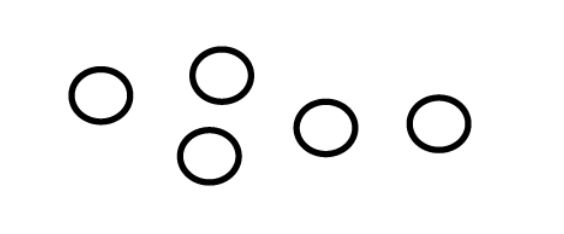
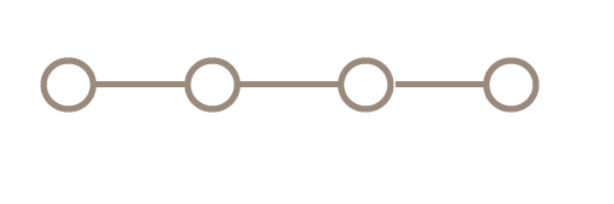
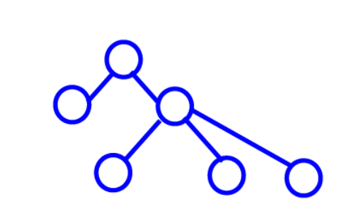
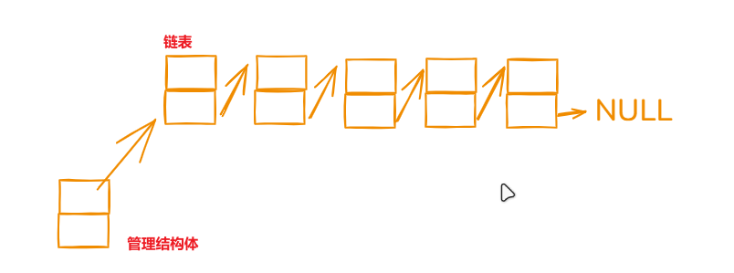
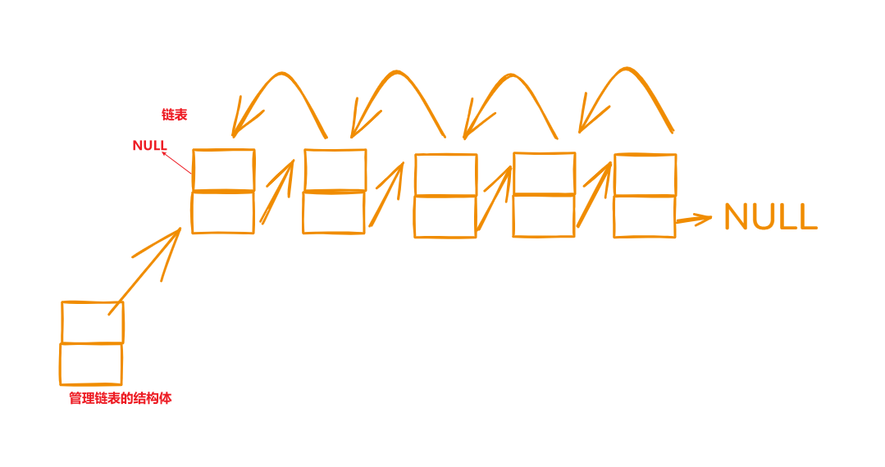
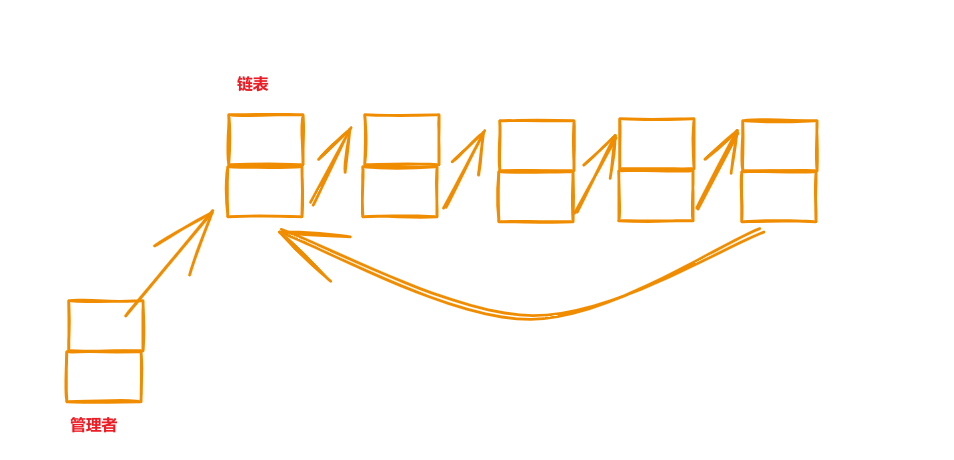
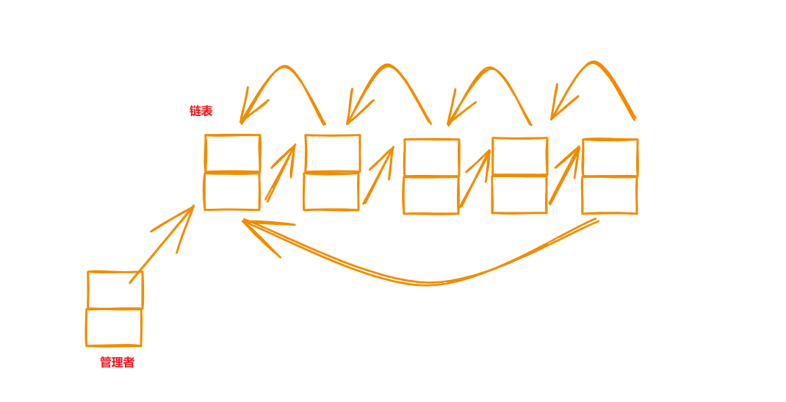

[TOC]

# 前言

- 前面的知识 ==》 单个盒子的大小和行为； 数据结构 ==》 盒子之间的关系

# 个人笔记

## 数据结构概述(盒子之间的关系)

- 存储关系 —— 解决问题方式的实现细节。逻辑结构可以任意使用下面两种存储结构解决
	- 顺序存储结构：数据存储在连续空间上，且每个数据之间的逻辑关系也映射到了内存中。
		- 如：a,b,c 内存中的存储顺序也应该为a,b,c
		- 顺序表、顺序树（树的顺序存储）、顺序图（邻接矩阵，图应该关心向上的关系和向下的关系）
		- 查找快、删除插入慢（而且删除插入之后必须保证物理空间依然连续）
	- 链式存储结构：数据存储在分散的空间上，每个数据中应该包含下一个数据的地址。访问数据时，通过地址进行访问  一个链式的盒子 -> (数据域，指针域) -> (D,S) (数据域：有多个数据；指针域：指向多个位置)
		- 链式表、链式树、链式图
		- 查找慢、增删快
	- 两种存储的组合应用：
	  - 索引存储：索引表 + 数据文件 类似于查字典，通过索引表确定数据的存储在哪个范围。Linux的文件系统。
	  - 哈希存储（散列存储）：数据的存储地址 与 数据本身建立关（该关系自己定义—— 哈希函数）
	  	如：通过数据中的某些属性（如id），找到与地址的关系（id - 起始位置的id = 地址的偏移） 
- 逻辑关系 —— 表示数据运算之间的抽象关系 ，问题的抽象
	- 集合：数据之间没有任何关系（1 ：0）
		- 
	- 线性结构（表） ： 数据之间存在1对1的关系（1:1 —— 即最多一个前驱节点和一个后驱节点），如： 学生表（通过上一个学号，能知道当前学号的学生信息）
		- 
	- 树形结构（树、层级结构）：数据之间存在1对多的关系（1:n —— 即只有一个前驱和多个后驱），如：家谱（爷爷下面有很多人，包括父亲，父亲下面又有很多人）
		- 
	- 图形结构（图、网状结构）：数据之间存在多对多的关系（n:m —— 即任意链接，可以形成环），如：城市的火车线路（成都有到重庆、北京、上海…的火车线路，上海也有到成都、北京、重庆的线路）。图的经典问题，着色（染色）问题。
		- 
- 行为关系（数据运算）：增删改查
- 所有数据结构都应该遵守**数据结构 = 结构头（地址、数据等、让外界访问数据域的方式） + 数据域（具体的数据空间）**

## 算法

- 定义：有穷规则（指令、语句）的有序集合

- 代码质量评估

	- 时间复杂度：执行一段操作，需要的时间
	- 空间复杂度：执行一段操作，需要的空间
	- 二者互相矛盾，时间快，空间就大；空间小，时间就慢
	- 
		- $O(1)$ / $O(C)$ ：常数阶（完美的算法）
			- 数据量 $N \to N \times M$（无论增加多少倍），时间 $T \to T$（保持不变）。
		- $O(\log N)$ ：对数阶（极高的优化目标）
			- 数据量呈**几何级数（平方）\**增长 $N \to N^2$ 时，时间仅\**线性**增加 $T \to 2T$。
		- $O(N)$ ：线性阶（及格/常规算法）
			- 数据量增加 $M$ 倍 $N \to M \times N$，时间也精确增加 $M$ 倍 $T \to M \times T$。
		- $O(N \log N)$ ：线性对数阶（高效排序基准）
			- 数据量增加 $M$ 倍，时间增加比 $M$ 倍稍微多一点点（主要是核心排序算法的极限）。
		- $O(N^2)$ ：平方阶（较差的算法）
			- 数据量增加 $M$ 倍 $N \to M \times N$，时间塌陷式增加 **$M^2$ 倍** $T \to M^2 \times T$。
		- $O(2^N)$ ：指数阶（噩梦级/最差的算法）
			- 数据量每**增加 1 个** $N \to N + 1$，时间直接**翻倍** $T \to 2T$。

## 线性表

- **数据结构的实现思想 ： 表头 + 正文    ====>  面向对象**
- **分层思想，将规律提取出来**

### 顺序表：

- 特点：
  - 随机索引
  - 占用连续空间
  - 增删会移动元素
- 分类
  - 静态顺序表
  - 动态顺序表

- 实现

  - 结构：表头 + 正文
    - 表头信息：指针正文的指针、表的名字、表的所有者

  - 操作
    - 增删改查接口
    - 扩容

- 以连续空间做为操作单位

- 存储密度，高（空间全是数据域）

- 代码

  - 先头文件，在源文件

  - 头文件中，先进正文结构、表头结构、接口定义好

    - ```c
    	/* sequentail_list.h */
    	#ifndef __SEQUENTAIL_LIST_H__
    	#define __SEQUENTAIL_LIST_H__
    	
    	/*
    	 * 动态顺序表
    	 *  数据域设计
    	 *  表头设计
    	 *  接口
    	 *      创建表头（设计者管理表头和数据域）
    	 *      释放表头
    	 *
    	 *      初始化表头（使用者管理表头，设计者管理数据）
    	 *      释放数据域
    	 *
    	 *      指定位置新增
    	 *      尾插
    	 *
    	 *      指定位置删除
    	 *
    	 *      查看全部数据
    	 *      查看指定位置
    	 *
    	 * */
    	
    	/* 1. 数据域设计 */
    	typedef int element_t;
    	
    	/* 2. 表头设计 */
    	typedef struct{
    	    element_t *head;        // 指向数据域的指针
    	    int len;                // 待插入位置的下标 已经添加的元素
    	    int capacity;           // 整个数据域的容量
    	}SeqListTable_t;
    	
    	/* 3. 接口 */
    	
    	/* 创建表头 */
    	/* 设计者管理表头申请和释放 */
    	/* 用户只关心使用 */
    	extern SeqListTable_t *Seq_CreateTable(const int num);
    	/* 摧毁表头 */
    	extern void Seq_DestroyTable(SeqListTable_t *table);
    	
    	/* 初始化表头 */
    	/* 设计者维护数据域的申请和释放 */
    	/* 使用者需要维护表头的申请和释放 */
    	void Seq_InitTable(SeqListTable_t *table, const int num);
    	/* 释放数据域 */
    	void Seq_ReleaseTable(SeqListTable_t *table);
    	
    	/* 指定位置新增 */
    	void Seq_InsertPosTable(SeqListTable_t *table, const int pos, const element_t value);
    	/* 尾插 */
    	void Seq_InsertTailTable(SeqListTable_t *table, const element_t value);
    	
    	/* 查看全部 */
    	void Seq_ShowTable(const SeqListTable_t *table);
    	/* 查看指定位置 */
    	int Seq_ShowPosTable(const SeqListTable_t *table, const int value);
    	
    	/* 指定位置删除 */
    	void Seq_DeleteTable(SeqListTable_t *table, const int pos);
    	#endif 
    	
    	```

    - 

    - ```c
    	/* sequentail_list.c */
    	#include <stdio.h>
    	#include <string.h>
    	#include <stdlib.h>
    	
    	#include "sequentail_list.h"
    	
    	
    	/**
    	 * @brief 创建表头
    	 *
    	 * @param[in] num 数据域空间的大小
    	 * @return 申请并初始化好的表头
    	 */
    	SeqListTable_t *Seq_CreateTable(const int num){
    	    /* 1. 申请表头空间 */
    	    SeqListTable_t *table = (SeqListTable_t *)malloc(sizeof(SeqListTable_t));
    	    if(table == NULL){ 
    	        fprintf(stderr, "table error\n");
    	        return NULL; 
    	    }
    	
    	    Seq_InitTable(table, num);
    	    return table;
    	}
    	
    	
    	/**
    	 * @brief 释放表头
    	 *
    	 * @param[in] table 需要释放的表头，释放数据域的同时也会释放表
    	 */
    	void Seq_DestroyTable(SeqListTable_t *table){
    	    if(table){
    	        Seq_ReleaseTable(table);
    	        free(table);
    	    }
    	}
    	
    	
    	/**
    	 * @brief 初始化表头
    	 *
    	 * @param[out] table 传入已经存在的表头空间
    	 * @param[in] num 数据域空间大小
    	 */
    	void Seq_InitTable(SeqListTable_t *table, const int num){
    	    /* 1. 数据有效性 */
    	    if(!table){
    	        fprintf(stderr, "table is NULL\n");
    	        return;
    	    }
    	
    	    /* 2. 申请数据域空间 */
    	    element_t *data = (element_t *)malloc(sizeof(element_t) * num);
    	    if(data == NULL){ 
    	        fprintf(stderr, "table error\n");
    	        return; 
    	    }
    	
    	    /* 3. 初始化表头 */
    	    table->head = data;
    	    table->capacity = num;
    	    table->len = 0;
    	}
    	
    	/**
    	 * @brief 释放数据域
    	 *
    	 * @param[in] table 需要释放数据域的表头
    	 */
    	void Seq_ReleaseTable(SeqListTable_t *table){
    	    if(table && table->head){
    	        free(table->head);
    	        table->head = NULL;
    	        table->capacity = 0;
    	        table->len = 0;
    	    }
    	}
    	
    	
    	/**
    	 * @brief 数据扩容
    	 *
    	 * @param[in/out] table 传入需要扩容数据域的表头
    	 * @return 0 扩容成功; -1 扩容失败
    	 */
    	static int Seq_Resize(SeqListTable_t *table){
    	    /* 1. 申请新空间 */
    	    int num = table->capacity * 2;
    	    element_t *data = (element_t *)malloc(sizeof(element_t) * num);
    	    if(!data){
    	        fprintf(stderr, "data error\n");
    	        return -1;
    	    }
    	
    	    /* 2. 将老空间数据拷贝到新空间 */
    	    for (int i = 0; i < table->len; ++i) {
    	        data[i] = table->head[i];
    	    }
    	
    	    /* 3. 修改表头 */
    	    free(table->head);
    	    table->head = data;
    	    table->capacity = num;
    	    return 0;
    	}
    	
    	/**
    	 * @brief 指定位置插入元素
    	 *
    	 * @param[in/out] table 需要添加新元素的数据域表头
    	 * @param[in] pos 插入位置
    	 * @param[in] value 插入的元素
    	 */
    	void Seq_InsertPosTable(SeqListTable_t *table, const int pos, const element_t value){
    	    /* 1. 表头有效性检查 */
    	    if(!table){
    	        fprintf(stderr, "table is NULL\n");
    	        return;
    	    }
    	
    	    /* 2. pos合法性检查 */
    	    /* pos需要满足[0, len]范围 */
    	    if(pos < 0 || pos > table->len){
    	        fprintf(stderr, "pos illegal\n");
    	        return;
    	    }
    	
    	    /* 3. 扩容检查 */
    	    /* len大于等于capacity，空间用完，需要扩容 */
    	    if(table->len >= table->capacity && Seq_Resize(table)){}
    	
    	    /* 4. 数据添加 */
    	    /* 需要向后移动[pos, len - 1] 位置上的元素 */
    	    for(int i = table->len - 1; i >= pos; --i){
    	        table->head[i + 1] = table->head[i]; 
    	    }
    	    table->head[pos] = value;
    	
    	    /* 5. 更新表头 */
    	    ++table->len;
    	}
    	
    	
    	/**
    	 * @brief 尾插
    	 *
    	 * @param[in/out] table 需要添加新元素的数据域表头
    	 * @param[in] value 添加的值
    	 */
    	void Seq_InsertTailTable(SeqListTable_t *table, const element_t value){
    	    Seq_InsertPosTable(table, table->len, value);
    	}
    	
    	/**
    	 * @brief 打印数据域全部数据
    	 *
    	 * @param[in] table 数据域表头
    	 */
    	void Seq_ShowTable(const SeqListTable_t *table){
    	    for (int i = 0; i < table->len; ++i) {
    	        printf("%d\t", table->head[i]);        
    	    }
    	    printf("\n");
    	}
    	
    	/**
    	 * @brief 查看指定值的第一个下标
    	 *
    	 * @param[in] table 数据域的表头
    	 * @param[in] value 查看的值
    	 * @return -1 失败;
    	 */
    	int Seq_ShowPosTable(const SeqListTable_t *table, const int value){
    	    /* 1. 找值 */
    	    for (int i = 0; i < table->len; ++i) {
    	        if(table->head[i] == value){
    	            return i;
    	        }
    	    }
    	
    	    return -1;
    	}
    	
    	
    	/**
    	 * @brief 删除指定位置
    	 *
    	 * @param[in/out] table 数据域表头
    	 * @param[in] pos 删除位置
    	 */
    	void Seq_DeleteTable(SeqListTable_t *table, const int pos){
    	    /* 1. pos合法性检查 */
    	    if (pos < 0 || pos > table->len) {
    	        fprintf(stderr, "pos illegal\n");
    	        return;
    	    }
    	
    	    /* 2. 移动[pos, len - 1]的元素 */
    	    for (int i = pos + 1; i < table->len; ++i) {
    	        table->head[i - 1] = table->head[i];
    	    }
    	
    	    /* 3. 更新表头 */
    	    --table->len;
    	}
    	
    	```

    - ```c
    	#include <stdio.h>
    	
    	#include "sequentail_list.h"
    	
    	/**
    	 * @brief 创建表头的方式测试
    	 */
    	void test01(){
    	    SeqListTable_t *table = Seq_CreateTable(5);
    	
    	    if(table){
    	        printf("table ok\n");
    	    }
    	
    	    for (int i = 0; i < 5; ++i) {
    	        Seq_InsertTailTable(table, 100 + i); 
    	    }
    	    Seq_ShowTable(table);
    	
    	    Seq_InsertPosTable(table, 2, 400);
    	    Seq_ShowTable(table);
    	
    	    Seq_DeleteTable(table, 2);
    	    int index =  Seq_ShowPosTable(table, 400);
    	    printf("400:%d\n",index);
    	
    	    Seq_ShowTable(table);
    	
    	    Seq_DestroyTable(table);
    	}
    	
    	int main(){
    	    test01();
    	    return 0;
    	}
    	
    	```

    - ```makefile
    	# makefile模板
    	# 变量集
    	TARGET := build
    	OBJS += main.o
    	OBJS += sequentail_list.o
    	
    	# 规则集（选项、命令）
    	CROSS_COMPILE = 
    	CC = $(CROSS_COMPILE)gcc
    	
    	CFLAGS += -Wall -O2
    	LDFLAGS += 
    	
    	all:$(TARGET)
    	
    	$(TARGET):$(OBJS)
    		$(CC) $(LDFLAGS) -o $@ $^
    	
    	%.o:%.c
    		$(CC) $(CFLAGS) -c -o $@ $<
    	
    	# 伪目标,防止执行make clean 存在clean文件，导致执行失败
    	.PHONY: clean
    	clean:
    		$(RM) $(TARGET) $(OBJS)
    	
    	
    	```

    - 

- 使用的方法：区间定位

- 特点

	- 查找对应位置的元素，效率为O(N)，直接地址偏移
	- 查找某个元素，效率为O(N)，遍历之后，一一对比
	- 增加元素
		- 尾插法，效率 O(C)，如果扩容，效率O(N) —— 推荐
		- 头插法 / 任意位置插入 ，效率O(N)

	- 删除元素
		- 尾删法，前提 表头头中含有len成员，存储的元素个数，效率O(C)
		- 头删法 / 任意位置删除，效率O(N)

- 补充，顺序表实际再有操作系统的内存中分配

	- 物理空间上有足够的容量的连续空间，申请连续空间，操作系统将这片物理空间（这个页）映射成虚拟空间
	- 物理空间上没有足够的容量的连续空间，申请连续空间
		- 操作系统 通过 页式管理管理物理空间（磁盘空间）
		- malloc时，向操作系统申请连续内存
		- 操作系统将多个页（分散的空间），共同映射成连续的虚拟空间。


### 链表

- 特点

  - 逻辑关系上相邻的两个元素在物理内存上是不⼀定相邻的（逻辑连续，存储空间上不连续）；
  - 以节点尾最小操作单位
  - 存储密度，低（空间中数据 + 地址信息）
  - 空间动态分配（空间不够的时候，申请一个更大的空间，将原本的数据拷贝过去，然后释放原空间）
  - 链表是⼀种物理存储结构上⾮连续、⾮顺序的存储结构  
  - 优点：
    - 在插⼊或删除元素时，找到指定位置即可操作，不需要移动⼤量元素  
  - 缺点：
    - 不⽀持随机访问，需要遍历查找元素  

- 链表由多个节点组成，节点=数据域 + 下一个数据的地址

- 特性 —— 需要**备份思想**

  - 脆弱性：一旦更新当前节点的next，后续节点无法在被寻找到。所以改变next之前，需要**备份**next
  - 开弓没有回头箭：表头中指向链表起始节点的指针（节点）head，一旦后移，就找不到前面节点。所以需要**临时节点**进行移动

- 特点：站在前一个元素，操作（增删）当前的元素

  - 插入的思路：
  	- 先申请新节点
  	- 再处理新节点（初始化）
  	- 最后处理老节点（先备份）

  - 删除的思路
  	- 先备份当前节点
  	- 再处理前一个节点
  	- 最后处理当前节点

- 操作性能

  - 插入（表头有头指针，尾指针）
  	- 头插法、尾插法，效率O(C)
  	- 任意位置插入，先遍历到n - 1位置进行操作，效率O(N)

  - 删除
  	- 头删法，效率O(C)
  	- 尾删法，效率O(N)

  - 遍历，效率O(N)

- 链表的节点，可以分配到堆区，也可以在栈区实现（结构体数组 或者 用数组中的两位表示一个节点（数据 + 下标） ——   后面使用的 **堆排序**）

- 以后的项目中基本使用双向链表，表头包含头尾指针

- 分类

  - 单向链表（需要备份，对于指针的移动慎重 —— 有去无回）
  	- 
  	
  	- 反转链表
  	
  		- 带头节点
  	
  			- ```c
  				/*
  				反转前，反转后，头节点不变，只是头节点里的next指针指向的首元素发生变化
  				无返回值
  				*/
  				void reverseList(struct node *header){}
  				```
  	
  			- 
  	
  		- 带头指针
  	
  			- ```c
  				/*
  				反转前，反转后，头指针指向的地址会发生改变
  				无返回值的情况，会使用了二维指针
  				有返回值
  				*/
  				void reverseList(struct node **header){}
  				struct node *reverseList(struct node *header){}
  				```
  	
  		- 头插法
  	
  			- ```c
  				/**
  				 * Definition for singly-linked list.
  				 * struct ListNode {
  				 *     int val;
  				 *     struct ListNode *next;
  				 * };
  				 */
  				struct ListNode* reverseList(struct ListNode* head) {
  				    /* 1. 将头指针转换成头节点 */
  				    struct ListNode dummy; // 引入一个空的带头节点的链表，将原始数据依次插入到该链表 遍历源空间的数据
  				    dummy.next = NULL;  // 引入一个空的带头节点的链表，将原始数据依次插入到该链表 遍历源空间的数据
  				
  				
  				    /* 2. 使用头插法将链表反序 */
  				    
  				    struct ListNode *p = &dummy;
  				    while(head){
  				        struct ListNode *tmp = head->next;
  				        head->next = p->next;
  				        p->next = head;
  				        head = tmp;
  				    }
  				
  				    /* 3 返回数据 */
  				    return dummy.next;
  				}
  				```
  	
  		- 合并两个有序的链表（归并排序）
  	
  			- 尾插法
  	
  				- ```c
  					/**
  					 * Definition for singly-linked list.
  					 * struct ListNode {
  					 *     int val;
  					 *     struct ListNode *next;
  					 * };
  					 */
  					struct ListNode* mergeTwoLists(struct ListNode* list1, struct ListNode* list2) {
  					        /* 1. 创建一个临时的空间装结果 */
  					        struct ListNode tmp;
  					        struct ListNode *head = &tmp; // // 准备了结果的辅助的指针,实现尾插法
  					        tmp.next = NULL;
  					
  					        /* 2. 将比较的空间放入新的管理者中 */
  					        while(list1 && list2){
  					            if(list1->val <= list2->val){
  					                head->next = list1;
  					                list1 = list1->next;
  					            }else{
  					                head->next = list2;
  					                list2 = list2->next;
  					            }
  					            head = head->next;
  					        }
  					
  					        /* 3. 剩余的节点接上 */
  					        if(list1){
  					            head->next = list1;
  					        }
  					
  					        if(list2){
  					            head->next = list2;
  					        }
  					
  					        return tmp.next;
  					}
  					```
  	
  				- 
  - 双向链表
  	- 
  	
  		- 
  	
  - 单向循环链表
  	- 
  - 双向循环链表（内核、高级语言的库文件常用）
  	- 
  	
  	- ```c
  		#ifndef __DOUBLY_CIRCULAR_LINK_H__
  		#define __DOUBLY_CIRCULAR_LINK_H__
  		
  		/* 
  		双向循环链表
  		    接口
  		        创建链表
  		        销毁链表
  		
  		        初始化链表
  		        释放链表
  		
  		        头插
  		        尾插
  		        任意位置插入
  		
  		        指定值删除
  		        指定位置删除
  		
  		        查看
  		
  		        修改
  		*/
  		
  		/* 1. 节点设计 */
  		typedef int element_t;
  		typedef struct node_s{
  		    element_t data;
  		    struct node_s *prev;    // 前继指针
  		    struct node_s *next;    // 后继指针
  		}Node_t ;
  		
  		/* 2. 表头设计 */
  		typedef struct{
  		    Node_t head;            // 头节点
  		    int capacity;           // 容量
  		}DCLinkTable_t;
  		
  		
  		/* 3. 接口设计 */
  		/* 创建链表 */
  		DCLinkTable_t *DCLink_CreateTable();
  		/* 销毁链表 */
  		void DCLINK_DestroyTable(DCLinkTable_t *table);
  		 
  		/* 初始化链表 */
  		void DCLink_InitTable(DCLinkTable_t *table);
  		/* 释放链表 */
  		void DCLink_ReleaseTable(DCLinkTable_t *table);
  		 
  		/* 头插 */
  		void DCLink_InserHeadtTable(DCLinkTable_t *table, const element_t val);
  		/* 任意位置插入 */
  		int DCLink_InsertPosTable(DCLinkTable_t *table, const int pos, const element_t val);
  		 
  		/* 指定值删除 */
  		int DCLink_DeleteValueTable(DCLinkTable_t *table, const element_t val);
  		/* 指定位置删除 */
  		int DCLink_DeletePosTable(DCLinkTable_t *table, const int pos, element_t *val);
  		
  		/* 查看 */
  		 void DCLink_ShowTable(DCLinkTable_t *table);
  		 /* 修改 */
  		 int DCLink_UpdateTable(DCLinkTable_t *table, const int pos, element_t *val);
  		
  		
  		#endif
  		```
  	
  	- ```c
  		#include "doubly_circular_link.h"
  		
  		#include <stdio.h>
  		#include <stdlib.h>
  		
  		/**
  		 * @brief 创建表头
  		 * 
  		 * @return DCLinkTable_t* 返回创建并初始化好的表头
  		 */
  		DCLinkTable_t *DCLink_CreateTable(){
  		    DCLinkTable_t *table = (DCLinkTable_t *)malloc(sizeof(DCLinkTable_t));
  		    if(!table){ return NULL; }
  		
  		    DCLink_InitTable(table);
  		
  		    printf("table create ok \n");
  		
  		    return table;
  		}
  		
  		/**
  		 * @brief 销毁表头
  		 * 
  		 * @param table 表头
  		 * @return void
  		 */
  		void DCLINK_DestroyTable(DCLinkTable_t *table){
  		    if(table){
  		        DCLink_ReleaseTable(table);
  		        free(table);
  		        printf("destroy ok\n");
  		    }
  		}
  		 
  		/**
  		 * @brief 初始化表头
  		 * 
  		 * @param table 申请好内存的表头
  		 */
  		void DCLink_InitTable(DCLinkTable_t *table){
  		    if(table){
  		        table->capacity = 0;
  		        /* 指向自身 */
  		        table->head.next = &table->head;
  		        table->head.prev = &table->head;
  		        printf("table init \n");
  		    }
  		}
  		
  		/**
  		 * @brief 释放节点
  		 * 
  		 * @param table 表头
  		 */
  		void DCLink_ReleaseTable(DCLinkTable_t *table){
  		    if(table){
  		        while (table->head.next != &table->head) {
  		            Node_t *tmp = table->head.next->next;
  		            free(table->head.next);
  		            table->head.next = tmp;
  		            --table->capacity;
  		        }
  		        printf("release ok capacity:%d\n", table->capacity);
  		        table->capacity = 0;
  		        table->head.next = &table->head;
  		        table->head.prev = &table->head;
  		    }
  		}
  		 
  		/**
  		 * @brief 私有的添加节点
  		 * 
  		 * @param prev_node 插入位置的节点
  		 * @param val 添加的值
  		 */
  		static void insertNode(Node_t *prev_node, const element_t val){
  		    /* 1. 申请空间 */
  		    Node_t *new_node = (Node_t *)malloc(sizeof(Node_t));
  		    if(!new_node) { return; }
  		
  		    /* 2. 初始新空间 */
  		    new_node->data = val;
  		    new_node->next = prev_node->next;
  		    new_node->prev = prev_node;
  		
  		    /* 3. 修改老空间 */
  		    prev_node->next->prev = new_node;
  		    prev_node->next = new_node;
  		}
  		
  		/**
  		 * @brief 头插法 / 尾插法
  		 * 
  		 * @param table 表头
  		 * @param val 新增值
  		 */
  		void DCLink_InserHeadtTable(DCLinkTable_t *table, const element_t val){
  		    Node_t *p = &table->head;
  		
  		    insertNode(p, val);
  		    ++table->capacity;
  		}
  		
  		/**
  		 * @brief 指定位置插入数据
  		 * 
  		 * @param table 表头
  		 * @param pos 指定位置 [0, capacity]
  		 * @param val 添加的值
  		 * @return int 0 成功 -1 失败
  		 */
  		int DCLink_InsertPosTable(DCLinkTable_t *table, const int pos, const element_t val){
  		    if(pos > table->capacity || pos < 0){
  		        printf("pos illegality\n");
  		        return -1;
  		    }
  		    
  		    Node_t *p = &table->head;
  		
  		    int index = -1;         // head对应-1
  		    while (p->next != &table->head && index < pos - 1 ) {
  		        Node_t *tmp = p->next;
  		        ++index;
  		        p = tmp;
  		    }
  		
  		    insertNode(p, val);
  		    ++table->capacity;
  		    return 0;
  		}
  		 
  		/**
  		 * @brief 私有的删除节点
  		 * 
  		 * @param node 当前节点
  		 * @param val 用于返回旧数据
  		 */
  		static void deleteNode(Node_t *node, element_t *val){
  		    /* 1. 备份 */
  		    Node_t *prev_node = node->prev;
  		    Node_t *next_node = node->next;
  		    if(val){ *val = node->data; }
  		
  		    /* 2. 修改 */
  		    free(node); 
  		    prev_node->next = next_node;
  		    next_node->prev = prev_node;
  		}
  		
  		/**
  		 * @brief 根据值删除节点
  		 * 
  		 * @param table 表头
  		 * @param val 寻找的值
  		 * @return int 0 成功 -1 失败
  		 */
  		int DCLink_DeleteValueTable(DCLinkTable_t *table, const element_t val){
  		    /* 1. 匹配上值 */
  		    Node_t *p = table->head.next;
  		
  		    while(p != &table->head && p->data != val){
  		        p = p->next;
  		    }
  		
  		    /* 2. 实行删除 */
  		    /* 两种情况：没找到 找到了 */
  		    if(p == &table->head){
  		        printf(" val is inexistence \n");
  		        return -1;
  		    }
  		    deleteNode(p,  NULL);
  		    
  		    --table->capacity;
  		    return 0;
  		}
  		
  		/**
  		 * @brief 根据位置删除节点
  		 * 
  		 * @param table 表头
  		 * @param pos 指定位置 [0, capacity - 1]
  		 * @param val 返回旧数据
  		 * @return int 0 成功 -1 失败
  		 */
  		int DCLink_DeletePosTable(DCLinkTable_t *table, const int pos, element_t *val){
  		    /* 1. 判断pos合法 */
  		    /* pos的范围[0, capacity - 1] */
  		    if(pos < 0 || pos > table->capacity - 1){
  		        printf("pos illegality\n");
  		        return -1;
  		    }
  		
  		    /* 2. 寻找pos位置 */
  		    Node_t *p = &table->head;
  		    int index = -1;
  		    while (p->next != &table->head && index < pos) {
  		        ++index;
  		        p = p->next;
  		    }
  		
  		    /* 3. 删除节点  */
  		    deleteNode(p, val);
  		
  		    /* 4. 更新表头 */
  		    --table->capacity;
  		    return 0;
  		}
  		
  		/**
  		 * @brief 查看链表中的值
  		 * 
  		 * @param table 表头
  		 */
  		 void DCLink_ShowTable(DCLinkTable_t *table){
  		    if(table){
  		        Node_t *p = table->head.next;
  		        printf("link: ");
  		        while(p != &table->head){
  		            Node_t *tmp = p->next;
  		            printf("%d\t", p->data);
  		            p = tmp;
  		        }
  		        printf("\n");
  		    }
  		 }
  		 
  		/**
  		 * @brief 修改对应节点
  		 * 
  		 * @param table 表头
  		 * @param pos 位置[0, capacity - 1]
  		 * @param val 修改的值，也会返回数据
  		 * @return int 0 成功 -1 失败
  		 */
  		 int DCLink_UpdateTable(DCLinkTable_t *table, const int pos, element_t *val){
  		    /* 1. 判断pos合法 */
  		    /* pos的范围[0, capacity - 1] */
  		    if(pos < 0 || pos > table->capacity - 1){
  		        printf("pos illegality\n");
  		        return -1;
  		    }
  		
  		    /* 2. 寻找pos位置 */
  		    Node_t *p = &table->head;
  		    int index = -1;
  		    while (p->next != &table->head && index <= pos) {
  		        ++index;
  		        p = p->next;
  		    }
  		
  		    /* 3. 修改节点  */
  		    int num = p->data;
  		    p->data = *val;
  		    *val = num;
  		
  		
  		    /* 4. 更新表头 */
  		    --table->capacity;
  		    return 0;
  		 }
  		```
  	
  	- 内核写法，前后节点
  	
  		- ```c
  			#include <stdio.h>
  			#include <stdlib.h>
  			#include <stddef.h> // 包含 offsetof
  			
  			// 1. 内核链表核心结构
  			struct list_head {
  			    struct list_head *next, *prev;
  			};
  			
  			// 2. 内核宏定义
  			#define LIST_HEAD_INIT(name) { &(name), &(name) }
  			
  			// 初始化链表头（自己指向自己，形成循环）
  			static inline void INIT_LIST_HEAD(struct list_head *list) {
  			    list->next = list;
  			    list->prev = list;
  			}
  			
  			// 内部插入函数：在已知的前后节点之间插入新节点
  			static inline void __list_add(struct list_head *new_node,
  			                              struct list_head *prev,
  			                              struct list_head *next) {
  			    next->prev = new_node;
  			    new_node->next = next;
  			    new_node->prev = prev;
  			    prev->next = new_node;
  			}
  			
  			// 尾插法：插入到链表尾部（即 head 的前驱）
  			static inline void list_add_tail(struct list_head *new_node, struct list_head *head) {
  			    __list_add(new_node, head->prev, head);
  			}
  			
  			// 通过链表节点指针获取宿主结构体指针
  			#define list_entry(ptr, type, member) \
  			    container_of(ptr, type, member)
  			
  			// 遍历链表的宏
  			#define list_for_each(pos, head) \
  			    for (pos = (head)->next; pos != (head); pos = pos->next)
  			
  			
  			// ==================== 使用示例 ====================
  			
  			// 3. 用户自定义的数据结构（将 list_head 寄生在里面）
  			typedef struct {
  			    int id;
  			    char name[20];
  			    struct list_head list; // 嵌入内核链表节点
  			} UserNode;
  			
  			int main() {
  			    // 定义并初始化链表头（哨兵节点，不存数据）
  			    struct list_head user_list;
  			    INIT_LIST_HEAD(&user_list);
  			
  			    // 创建并插入第 1 个数据
  			    UserNode *u1 = (UserNode *)malloc(sizeof(UserNode));
  			    u1->id = 101;
  			    snprintf(u1->name, sizeof(u1->name), "Alice");
  			    list_add_tail(&(u1->list), &user_list); // 传入的是其中的 list 成员地址
  			
  			    // 创建并插入第 2 个数据
  			    UserNode *u2 = (UserNode *)malloc(sizeof(UserNode));
  			    u2->id = 102;
  			    snprintf(u2->name, sizeof(u2->name), "Bob");
  			    list_add_tail(&(u2->list), &user_list);
  			
  			    // 4. 遍历链表
  			    struct list_head *curr;
  			    printf("开始遍历内核链表：\n");
  			    
  			    // curr 只是 list_head 指针，它在链表节点间移动
  			    list_for_each(curr, &user_list) {
  			        // 利用黑魔法 container_of 还原出宿主 UserNode 的指针
  			        UserNode *user = list_entry(curr, UserNode, list);
  			        printf("ID: %d, Name: %s\n", user->id, user->name);
  			    }
  			
  			    // 释放内存（实际内核中会有 list_for_each_safe 宏来安全删除，这里手动简化）
  			    free(u1);
  			    free(u2);
  			    return 0;
  			}
  			```
  	
  	- 约瑟夫环（Josephu）问题
  	
  		- **【问题描述】**
  	
  			约瑟夫环（Josephus Problem）是一个经典的数学和算法问题：
  	
  			已知 $N$ 个人（编号分别为 $1, 2, ..., N$）围坐在一张圆桌周围。
  	
  			从编号为 1 的人开始报数，数到 $M$ 的那个人出列；
  	
  			他的下一个人又从 1 开始重新报数，数到 $M$ 的人再度出列；
  	
  			依此重复下去，直到圆桌周围的人全部出列。
  	
  			**【求解目标】**
  	
  			输出所有人出列的先后顺序
  	
  		- ```c
  			#include <stdio.h>
  			#include <stdlib.h>
  			
  			// 定义双向循环链表的节点结构
  			typedef struct Node {
  			    int id;                 // 人的编号 (1 ~ N)
  			    struct Node* prev;      // 指向前驱节点
  			    struct Node* next;      // 指向后继节点
  			} Node;
  			
  			// 创建一个包含 N 个节点的双向循环链表
  			Node* CreateJosephusCircle(int n) {
  			    if (n <= 0) return NULL;
  			
  			    Node* head = NULL;
  			    Node* tail = NULL;
  			
  			    for (int i = 1; i <= n; i++) {
  			        Node* newNode = (Node*)malloc(sizeof(Node));
  			        newNode->id = i;
  			
  			        if (head == NULL) {
  			            // 第一个节点初始化
  			            head = newNode;
  			            head->next = head;
  			            head->prev = head;
  			            tail = head;
  			        } else {
  			            // 新节点插入到尾部
  			            tail->next = newNode;
  			            newNode->prev = tail;
  			            newNode->next = head; // 保持循环
  			            head->prev = newNode; // 保持循环
  			            tail = newNode;       // 尾指针后移
  			        }
  			    }
  			    return head;
  			}
  			
  			// 解决约瑟夫环问题的核心算法
  			void SolveJosephus(int n, int m) {
  			    if (n <= 0 || m <= 0) {
  			        printf("参数输入错误！\n");
  			        return;
  			    }
  			
  			    // 1. 创建围成一圈的人
  			    Node* curr = CreateJosephusCircle(n);
  			    
  			    printf("约瑟夫环出列顺序 (共 %d 人，报到 %d 出列):\n", n, m);
  			
  			    // 2. 循环淘汰，直到链表中只剩下最后一个节点
  			    // 判断条件是自己不指向自己，说明还有别人
  			    while (curr->next != curr) {
  			        
  			        // 报数：向前移动 m-1 次（因为起点自己就算数 1）
  			        for (int i = 1; i < m; i++) {
  			            curr = curr->next;
  			        }
  			
  			        // 此时 curr 指向的就是要出列（删除）的人
  			        printf("%d -> ", curr->id);
  			
  			        // 3. 核心：从双向循环链表中安全删除当前节点
  			        Node* toDelete = curr;
  			        
  			        // 让当前节点的前后节点直接握手
  			        toDelete->prev->next = toDelete->next;
  			        toDelete->next->prev = toDelete->prev;
  			
  			        // 将当前指针移向“下一个人”，准备下一轮报数
  			        curr = toDelete->next;
  			
  			        // 释放被淘汰者的内存
  			        free(toDelete);
  			    }
  			
  			    // 4. 打印最后剩下的一个人并释放内存
  			    printf("[%d] (最后留下来的人)\n", curr->id);
  			    free(curr);
  			}
  			
  			// 测试主函数
  			int main() {
  			    int N = 7; // 总人数
  			    int M = 3; // 报数到 3 出列
  			
  			    SolveJosephus(N, M);
  			
  			    return 0;
  			}
  			```
  	
  		- 

- 头节点 和 头指针（针对表头来说）

  - 头节点，处理头节点和处理普通节点的方式一致。带头节点的链表，进行插入（删除）操作，不管再哪里插入（删除），都需要前置节点

    - ```c
    	/* 节点结构体 */
    	struct node
    	{
    	    int data;
    	    struct node *next
    	}Node;
    	
    	/* 管理者 */
    	struct listTable
    	{
    	    Node head;		/* 使用Node变量，利用节点结构体中的next记录节点结构体的起始地址 内存更大 */
    	    ...
    	}listTable;
    	
    	/* 添加 */
    	p = &head;
    	new_node->next = p->next; 
    	p->next = new_node;
    	
    	/* 删除 */
    	p = &head;
    	tmp = p->next;
    	p->next = tmp->next;
    	free(tmp);
    	```

  - 头指针，特殊处理表头，转换成头节点

    - ```c
    	/* 节点结构体 */
    	struct node
    	{
    	    int data;
    	    struct node *next
    	}Node;
    	
    	/* 管理者 */
    	struct listTable
    	{
    	    Node *head;		/* 使用Node指针，直接记录节点结构体的起始地址  */
    	    ...
    	}listTable;
    	
    	/* 将头指针转换成头节点 */
    	/* 放入一个前置节点，避免NULL->next出现的情况 */
    	/* 添加 */
    	Node dummy;				// 使用临时节点操作
    	dummy.next = head;
    	
    	...
    	new_node->next = dummy.next; 
    	dummy.next = new_node;
    	...
    	    
    	head = dummy.next;
    	
    	/* 删除 */
    	Node dummy;
    	dummy.next = head;
    	
    	...    
    	tmp = dummy.next;
    	dummy.next = tmp->next;
    	free(tmp);
    	...
    	head = dummy.next;
    	```

- 代码

  - 头节点单向链表

    - ```c
      /* headNode_link.h */
      #ifndef __SINGLY_LINKED_LIST_H__
      #define __SINGLY_LINKED_LIST_H__
      
      /* 
       * 带头节点的单向链表
       *
       * 接口
       *  创建
       *  销毁
       *
       *  初始化
       *  释放
       *
       *  头插入
       *  尾插入
       *  任意位置插入
       *
       *  值删
       *  任意位置删除
       *
       *  查看
       *
       *  修改
       */
      
      /* 数据域类型 */
      typedef int element_t;
      
      /* 节点 */
      typedef struct node_s{
          element_t data;
          struct node_s *next;
      }Node_t;
      
      /* 表头 */
      typedef struct{
          Node_t head;        // 头节点       
          Node_t tail;        // 尾节点
          int capactiy;       // 节点数量
      }LinkTable_t ;
      
      
      /* 接口 */
      /* 创建 */
      LinkTable_t *HeadNode_CreateTable();
      /* 销毁 */
      void HeadNode_DestroyTable(LinkTable_t *table);
      
      /* 初始 */
      void HeadNode_InitTable(LinkTable_t *table);
      /* 释放 */
      void HeadNode_ReleaseTable(LinkTable_t *table);
      
      /* 头插 */
      void HeadNode_InsertHeadTable(LinkTable_t *table, element_t value);
      /* 尾插 */
      void HeadNode_InsertTailTable(LinkTable_t *table, element_t value);
      /* 任意位置插入 */
      void HeadNode_InsertPosTable(LinkTable_t *table, int pos, element_t value);
      
      /* 值删除 */
      void HeadNode_DeleteVauleTable(LinkTable_t *table, element_t value);
      /* 任意位置删除 */
      void HeadNode_DeletePosTable(LinkTable_t *table,int pos);
      
      /* 查看 */
      void HeadNode_ShowTable(LinkTable_t *table);
      
      /* 修改 */
      void HeadNode_UpdatePosTable(LinkTable_t *table, int pos, element_t value);
      
      #endif 
      
      ```

    - ```c
      /* headNode_link.c */
      #include <stdlib.h>
      #include <stdio.h>
      
      #include "headNode_link.h"
      
      
      /**
       * @brief 申请表头空间(由设计者管理)
       *
       * @return 申请,并初始化好的表头空间
       */
      LinkTable_t *HeadNode_CreateTable(){
          /* 1. 申请空间 */
          LinkTable_t *table = (LinkTable_t *)malloc(sizeof(LinkTable_t));
          if(table == NULL) { 
              fprintf(stderr, "Table create error\n");
              return NULL;
          }
      
          /* 2. 初始化表头 */
          HeadNode_InitTable(table);
      
          return table;
      }
      
      
      /**
       * @brief 销毁表头
       *
       * @param[in] table 表头
       */
      void HeadNode_DestroyTable(LinkTable_t *table){
          if(table){
              HeadNode_ReleaseTable(table);
              free(table);
          }
      }
      
      /**
       * @brief 初始化表头
       *
       * @param[in/out] table 表头
       */
      void HeadNode_InitTable(LinkTable_t *table){
      
          table->head.data = 0;
          table->head.next = NULL;
      
          table->tail.data = 0;
          table->tail.next = NULL;
      
          table->capactiy = 0;
      }
      
      /**
       * @brief 释放节点
       *
       * @param[in/out] table 表头
       */
      void HeadNode_ReleaseTable(LinkTable_t *table){
          if(table){
              Node_t *p = table->head.next;
              while(p){
                  Node_t *tmp = p->next;
                  free(p);
                  p = tmp;
              }
              table->capactiy = 0;
              table->head.data = 0;
              table->head.next = NULL;
              table->tail.data = 0;
              table->tail.next = NULL;
          }
      }
      
      /**
       * @brief 私有的节点插入
       *
       * @param[in] node 插入节点位置
       * @param[in] value 插入的值
       */
      static void insertNode(Node_t *node, element_t value){
          if(node == NULL){
              fprintf(stderr, "node is NULL\n");
              return;
          }
      
          /* 1. 申请新空间 */
          Node_t *new_node = (Node_t *)malloc(sizeof(Node_t));
          if(new_node == NULL) {
              fprintf(stderr, "new_node error\n");
              return;
          }
      
          /* 2. 初始化新空间 */
          new_node->data = value;
          new_node->next = node->next;
      
          /* 3. 修改老节点 */
          node->next = new_node;
      }
      
      /**
       * @brief 头插
       *
       * @param[in/out] table 表头
       * @param[in] value 新增值
       */
      void HeadNode_InsertHeadTable(LinkTable_t *table, element_t value){
          /* 1. 确定p的值 */
          Node_t *p = &table->head;
      
          /* 2. 插入 */
          insertNode(p, value);
      
          /* 3. 更新table */
          if(table->tail.next == NULL){
              table->tail.next = p->next;
          }
          ++table->capactiy;
      }
      
      /**
       * @brief 尾插
       *
       * @param[in/out] table 表头
       * @param[in] value 新增值
       */
      void HeadNode_InsertTailTable(LinkTable_t *table, element_t value){
          /* 1. 确定p的值 */
          Node_t *p = NULL;
          /* tail.next为NULL走头节点, 不为NULL走指针逻辑 */
          if(!table->tail.next){
              p = &table->tail;
          }else{
              /* tail游离在主链表之外，tail.next才在链表上 */
              p = table->tail.next;
          }
      
          /* 2. 插入 */
          insertNode(p, value);
      
          /* 3. 更新table */
          if(!table->head.next){
              table->head.next = p->next;
          }
          table->tail.next = p->next;
          ++table->capactiy;
      }
      
      /**
       * @brief 任意位置插入
       *
       * @param[in/out] table 表头
       * @param[in] pos 插入位置 从1开始有效
       * @param[in] value 新增值
       */
      void HeadNode_InsertPosTable(LinkTable_t *table, int pos, element_t value){
          /* 1. pos的合法性 */
          if(pos > table->capactiy){
              fprintf(stderr, "pos illegal\n");
              return;
          }
      
          /* 2. 确定p的值 */
          /* pos 的 有效范围 [1 ...] head对应1  如果是[0 ...] head对应-1 */
          /* pos前一个节点进行操作 */
          Node_t *p = &table->head;
          int index = 0;
          while (p->next && index < pos - 1) {
              p = p->next;
              ++index;
          }
      
          /* 3. 插入 */
          insertNode(p, value);
      
          /* 4. 更新table */
          if(!table->tail.next || pos == table->capactiy){
              table->tail.next = p->next;
          }
          ++table->capactiy;
      }
      
      
      /**
       * @brief 显示全部链表数据
       *
       * @param[in] table 表头    
       */
      void HeadNode_ShowTable(LinkTable_t *table){
          Node_t *p = table->head.next;
          while (p) {
              printf("%d\t", p->data);
              p = p->next;
          }
          printf("\n");
      }
      
      /**
       * @brief 删除节点
       *
       * @param[in/out] p 传入删除节点的前一个节点
       */
      static void deleteNode(Node_t *p){
          /* 1. 备份旧值 */
          Node_t *tmp = p->next->next;
      
          /* 2. 删除 */
          free(p->next);
          p->next = tmp;
      }
      
      /**
       * @brief 根据值删除节点
       *
       * @param[in/out] table 表头
       * @param[in] value 需要删除的值
       */
      void HeadNode_DeleteVauleTable(LinkTable_t *table, element_t value){
          /* 1. 找到值 */
          Node_t *p = &table->head;
          while (p->next && p->next->data != value) {
              p = p->next;
          }
      
          /* 2. 删除值 */
          /* 判断是没有找到值，还是找打了值 */
          if(!p->next){
              printf("没有找到值\n");
              return;
          }else{
              deleteNode(p);
          }
          --table->capactiy;
      }
      
      /**
       * @brief 根据位置删除节点
       *
       * @param[in/out] table 表头
       * @param[in] pos 删除位置 从1开始有效
       */
      void HeadNode_DeletePosTable(LinkTable_t *table, int pos){
          /* 1. 找到位置的前一个节点 */
          if(pos < 1 || pos > table->capactiy){
              fprintf(stderr, "pos illegal\n");
              return;
          }
      
          Node_t *p = &table->head;
          int index = 0;
          while (p->next && index < pos - 1) {
              p = p->next;
              ++index;
          } 
      
          /* 2. 删除 */
          deleteNode(p);
          --table->capactiy;
      }
      
      void HeadNode_UpdatePosTable(LinkTable_t *table, int pos, element_t value){
          /* 1. 找到位置 */
          if(pos < 1 || pos > table->capactiy){
              fprintf(stderr, "pos illegal\n");
              return;
          }
      
          Node_t *p = &table->head;
          int index = 0;
          while (p && index < pos) {
              p=p->next;
              ++index;
          }
      
          /* 2. 修改 */
          p->data = value;
      }
      
      ```

    - ```c
      /* main.c */
      #include "headNode_link.h"
      #include <stdio.h>
      
      void test01(){
          LinkTable_t *table = HeadNode_CreateTable();
          if(table){
              printf("申请成功\n");
          }
          
          HeadNode_InsertHeadTable(table, 100);
          HeadNode_InsertHeadTable(table, 200);
          HeadNode_InsertHeadTable(table, 300);
          HeadNode_ShowTable(table);
      
          printf("---------------\n");
      
          HeadNode_InsertTailTable(table, 8000);
          HeadNode_ShowTable(table);
      
          printf("---------------\n");
      
          HeadNode_InsertPosTable(table, 2, 500000);
          HeadNode_ShowTable(table);
      
          HeadNode_InsertPosTable(table, 200, -100);
      
      
          HeadNode_DeleteVauleTable(table, 8000);
          HeadNode_ShowTable(table);
      
          HeadNode_DeletePosTable(table, 2);
          HeadNode_ShowTable(table);
      
          HeadNode_UpdatePosTable(table, 3, 3000);
          HeadNode_ShowTable(table);
      
          HeadNode_UpdatePosTable(table, 1, 100000);
          HeadNode_ShowTable(table);
      
          HeadNode_DestroyTable(table);
      }
      
      void test02(){
          LinkTable_t table;
          HeadNode_InitTable(&table);
      
          printf("==================\n");
      
          HeadNode_InsertTailTable(&table, 400);
          HeadNode_InsertTailTable(&table, 500);
          HeadNode_InsertTailTable(&table, 600);
          HeadNode_ShowTable(&table);
      
          HeadNode_ReleaseTable(&table);
      }
      
      int main(){
          test01();
          test02();
          return 0;
      }
      
      ```

  - 带头指针的链表（头指针转成头节点处理，**所有操作都从 `&dummy`（哨兵）出发，把"第一个节点"和"中间节点"的处理完全统一**）

    - ```c
      /* headPoniter_link.h */
      #ifndef __HEADPOINTER_LINK_H_
      #define __HEADPOINTER_LINK_H_
      
      /* 
       * 带头指针的单向链表
       *
       * 接口
       *  创建
       *  销毁
       *
       *  初始化
       *  释放
       *
       *  头插入
       *  尾插入
       *  任意位置插入
       *
       *  值删
       *  任意位置删除
       *
       *  查看
       *
       *  修改
       */
      
      /* 数据域类型 */
      typedef int element_t;
      
      /* 节点 */
      typedef struct nodep_s{
          element_t data;
          struct nodep_s *next;
      }NodeP_t;
      
      /* 表头 */
      typedef struct{
          NodeP_t *head;        // 头指针       
          NodeP_t *tail;        // 尾指针
          int capactiy;        // 节点数量
      }LinkTableP_t ;
      
      
      /* 接口 */
      /* 创建 */
      LinkTableP_t *HeadPointer_CreateTable();
      /* 销毁 */
      void HeadPointer_DestroyTable(LinkTableP_t *table);
      
      /* 初始 */
      void HeadPointer_InitTable(LinkTableP_t *table);
      /* 释放 */
      void HeadPointer_ReleaseTable(LinkTableP_t *table);
      
      /* 头插 */
      void HeadPointer_InsertHeadTable(LinkTableP_t *table, element_t value);
      /* 尾插 */
      void HeadPointer_InsertTailTable(LinkTableP_t *table, element_t value);
      /* 任意位置插入 */
      void HeadPointer_InsertPosTable(LinkTableP_t *table, int pos, element_t value);
      
      /* 值删除 */
      void HeadPointer_DeleteVauleTable(LinkTableP_t *table, element_t value);
      /* 任意位置删除 */
      void HeadPointer_DeletePosTable(LinkTableP_t *table,int pos);
      
      /* 查看 */
      void HeadPointer_ShowTable(LinkTableP_t *table);
      
      /* 修改 */
      void HeadPointer_UpdatePosTable(LinkTableP_t *table, int pos, element_t value);
      
      
      #endif
      
      ```

    - ```c
      /* headPoniter_link.c */
      #include <stdlib.h>
      #include <stdio.h>
      
      #include "headPointer_link.h"
      
      
      /**
       * @brief 申请表头空间(由设计者管理)
       *
       * @return 申请,并初始化好的表头空间
       */
      LinkTableP_t *HeadPointer_CreateTable(){
          LinkTableP_t *table = (LinkTableP_t *)malloc(sizeof(LinkTableP_t));
          if(table == NULL) { 
              fprintf(stderr, "Table create error\n");
              return NULL;
          }
          HeadPointer_InitTable(table);
          return table;
      }
      
      
      /**
       * @brief 销毁表头
       *
       * @param[in] table 表头
       */
      void HeadPointer_DestroyTable(LinkTableP_t *table){
          if(table){
              HeadPointer_ReleaseTable(table);
              free(table);
          }
      }
      
      /**
       * @brief 初始化表头
       *
       * @param[in/out] table 表头
       */
      void HeadPointer_InitTable(LinkTableP_t *table){
          table->head = NULL;
          table->tail = NULL;
          table->capactiy = 0;
      }
      
      /**
       * @brief 释放节点
       *
       * @param[in/out] table 表头
       */
      void HeadPointer_ReleaseTable(LinkTableP_t *table){
          if(table){
              NodeP_t *p = table->head;
              while(p){
                  NodeP_t *tmp = p->next;
                  free(p);
                  p = tmp;
              }
              table->capactiy = 0;
              table->head = NULL;
              table->tail = NULL;
          }
      }
      
      
      /* ------------------------------------------------------------------ */
      /*  私有辅助函数（提取共性）                                            */
      /* ------------------------------------------------------------------ */
      
      /**
       * @brief 在 node 之后插入新节点，返回新节点指针
       *
       * @param[in/out] node  前驱节点（不能为 NULL）
       * @param[in]     value 插入的值
       * @return 新节点指针，失败返回 NULL
       */
      static NodeP_t *insertNode(NodeP_t *node, element_t value){
          NodeP_t *new_node = (NodeP_t *)malloc(sizeof(NodeP_t));
          if(new_node == NULL) {
              fprintf(stderr, "new_node error\n");
              return NULL;
          }
          new_node->data = value;
          new_node->next = node->next;
          node->next     = new_node;
          return new_node;
      }
      
      /**
       * @brief 删除 node->next 所指节点（node->next 不能为 NULL）
       *
       * @param[in/out] node 被删节点的前驱
       */
      static void deleteNode(NodeP_t *node){
          NodeP_t *tmp = node->next->next;
          free(node->next);
          node->next = tmp;
      }
      
      /**
       * @brief 找到第 pos 个节点（直接返回目标节点，用于 Update）
       *
       * @param[in] head 链表真实头指针
       * @param[in] pos  目标位置，从 1 开始（调用者保证合法）
       * @return 第 pos 个节点指针
       */
      static NodeP_t *findNode(NodeP_t *head, int pos){
          NodeP_t *p = head;
          int index = 1;
          while(p && index < pos){
              p = p->next;
              ++index;
          }
          return p;
      }
      
      
      /* ------------------------------------------------------------------ */
      /*  插入                                                                */
      /* ------------------------------------------------------------------ */
      
      /**
       * @brief 头插
       *
       * dummy 充当临时哨兵，next 指向原头节点，
       * 使插入逻辑与任意位置插入完全一致。
       *
       * @param[in/out] table 表头
       * @param[in]     value 新增值
       */
      void HeadPointer_InsertHeadTable(LinkTableP_t *table, element_t value){
          /* dummy 充当哨兵，next 指向原头节点 */
          NodeP_t dummy;
          dummy.next = table->head;
      
          NodeP_t *new_node = insertNode(&dummy, value);
          if(new_node == NULL) return;
      
          /* 同步 head */
          table->head = dummy.next;
      
          /* 第一次插入时同步 tail */
          if(table->tail == NULL){
              table->tail = new_node;
          }
          ++table->capactiy;
      }
      
      /**
       * @brief 尾插
       *
       * 直接操作 tail 指针，O(1)，不需要哨兵。
       *
       * @param[in/out] table 表头
       * @param[in]     value 新增值
       */
      void HeadPointer_InsertTailTable(LinkTableP_t *table, element_t value){
          NodeP_t *new_node = (NodeP_t *)malloc(sizeof(NodeP_t));
          if(new_node == NULL) return;
      
          new_node->data = value;
          new_node->next = NULL;
      
          if(table->tail == NULL){
              /* 空链表：head 和 tail 都指向新节点 */
              table->head = new_node;
              table->tail = new_node;
          }else{
              table->tail->next = new_node;
              table->tail       = new_node;
          }
          ++table->capactiy;
      }
      
      /**
       * @brief 任意位置插入（pos 从 1 开始）
       *
       * dummy 充当哨兵，从哨兵出发走 pos-1 步找到前驱，
       * 使 pos==1 和其他位置逻辑完全统一。
       *
       * @param[in/out] table 表头
       * @param[in]     pos   插入位置
       * @param[in]     value 新增值
       */
      void HeadPointer_InsertPosTable(LinkTableP_t *table, int pos, element_t value){
          if(pos < 1 || pos > table->capactiy){
              fprintf(stderr, "pos illegal\n");
              return;
          }
      
          /* dummy 充当哨兵，next 指向原头节点 */
          NodeP_t dummy;
          dummy.next = table->head;
      
          /* 从哨兵出发走 pos-1 步，找到前驱 */
          NodeP_t *p = &dummy;
          int index = 0;
          while(p->next && index < pos - 1){
              p = p->next;
              ++index;
          }
      
          NodeP_t *new_node = insertNode(p, value);
          if(new_node == NULL) return;
      
          /* 同步 head（pos==1 时头部发生变化） */
          table->head = dummy.next;
      
          /* 若插在末尾，更新 tail */
          if(pos == table->capactiy){
              table->tail = new_node;
          }
          ++table->capactiy;
      }
      
      
      /* ------------------------------------------------------------------ */
      /*  删除                                                                */
      /* ------------------------------------------------------------------ */
      
      /**
       * @brief 根据值删除节点（删第一个匹配项）
       *
       * dummy 充当哨兵，p->next 是候选节点，
       * 统一处理删头节点与删中间/尾节点的逻辑。
       *
       * @param[in/out] table 表头
       * @param[in]     value 需要删除的值
       */
      void HeadPointer_DeleteVauleTable(LinkTableP_t *table, element_t value){
          /* dummy 充当哨兵 */
          NodeP_t dummy;
          dummy.next = table->head;
      
          /* p->next 是候选节点，统一覆盖头节点情况 */
          NodeP_t *p = &dummy;
          while(p->next && p->next->data != value){
              p = p->next;
          }
      
          if(p->next == NULL){
              printf("没有找到值\n");
              return;
          }
      
          /* 删的是尾节点，更新 tail */
          if(p->next == table->tail){
              table->tail = (p == &dummy) ? NULL : p;
          }
      
          deleteNode(p);
          --table->capactiy;
      
          /* 同步 head */
          table->head = dummy.next;
          if(table->capactiy == 0){
              table->tail = NULL;
          }
      }
      
      /**
       * @brief 根据位置删除节点（pos 从 1 开始）
       *
       * dummy 充当哨兵，从哨兵出发走 pos-1 步找到前驱，
       * 统一处理删头节点与删中间/尾节点的逻辑。
       *
       * @param[in/out] table 表头
       * @param[in]     pos   删除位置
       */
      void HeadPointer_DeletePosTable(LinkTableP_t *table, int pos){
          if(pos < 1 || pos > table->capactiy){
              fprintf(stderr, "pos illegal\n");
              return;
          }
      
          /* dummy 充当哨兵 */
          NodeP_t dummy;
          dummy.next = table->head;
      
          /* 从哨兵出发走 pos-1 步，找到前驱 */
          NodeP_t *p = &dummy;
          int index = 0;
          while(p->next && index < pos - 1){
              p = p->next;
              ++index;
          }
      
          /* 删的是尾节点，更新 tail */
          if(p->next == table->tail){
              table->tail = (p == &dummy) ? NULL : p;
          }
      
          deleteNode(p);
          --table->capactiy;
      
          /* 同步 head */
          table->head = dummy.next;
          if(table->capactiy == 0){
              table->tail = NULL;
          }
      }
      
      
      /* ------------------------------------------------------------------ */
      /*  查看 / 修改                                                         */
      /* ------------------------------------------------------------------ */
      
      /**
       * @brief 显示全部链表数据
       *
       * @param[in] table 表头
       */
      void HeadPointer_ShowTable(LinkTableP_t *table){
          NodeP_t *p = table->head;
          while(p){
              printf("%d\t", p->data);
              p = p->next;
          }
          printf("\n");
      }
      
      /**
       * @brief 指定位置修改值（pos 从 1 开始）
       *
       * 用 findNode 直接找到第 pos 个节点修改，无需哨兵。
       *
       * @param[in/out] table 表头
       * @param[in]     pos   修改的位置
       * @param[in]     value 修改的值
       */
      void HeadPointer_UpdatePosTable(LinkTableP_t *table, int pos, element_t value){
          if(pos < 1 || pos > table->capactiy){
              fprintf(stderr, "pos illegal\n");
              return;
          }
      
          NodeP_t *target = findNode(table->head, pos);
          target->data = value;
      }
      
      ```

- 函数返回的地址（指针），指针函数

	1. 返回的地址指向了数据区（主要static区修饰的局部变量） —— 只会提供一个接口
	2. 返回的地址指向了堆区 —— 必然是成对出现的接口
	3. 返回的地址是传入空间的一个部分 
		- strcpy已经有了dst，为什么还需要返回地址
			- `char *stpcpy(char *restrict dst, const char *restrict src);`
			- 为了链式调用（复合函数） —— 工程思想 `strlen( stpcpy(dst, src));`

### 栈(也叫堆栈)

- 是一种线性表，一种逻辑结构，元素和元素之间的关系为 1: 1

- 也分为顺序栈和链式栈

  - 顺序栈 —— 数组实现 （不建议扩容，栈满是一种状态）

  	- ```C
  		/* 栈结构 */
  		/* 建议固定大小，判断栈满 */
  		typedef struct{
  		  element_t data[C];
  		  int top;
  		};
  		
  		/* 满递增栈 */
  		初始化: top = -1;
  		栈满: top == C - 1;
  		/* 空递增栈 */
  		初始化 top = 0;
  		栈满: top == C;
  		```

  - 链式栈 —— 不确定容量大小

  	- 常用方式 ，头插法、头删法

  	- 容量无穷

  	- 例子：算式匹配（准备两个栈 —— 数字栈 或者 符号栈）

  		- ```c
  			#include <stdio.h>
  			#include <stdlib.h>
  			#include <ctype.h>
  			#include <stdbool.h>
  			
  			// --- 1. 链式栈的通用节点定义 ---
  			typedef struct Node {
  			    double num;         // 存放数字（支持浮点数计算）
  			    char op;            // 存放运算符
  			    struct Node* next;
  			} Node;
  			
  			// 数值栈
  			typedef struct { Node* top; } NumStack;
  			// 运算符栈
  			typedef struct { Node* top; } OpStack;
  			
  			// --- 2. 栈的基础操作 ---
  			void PushNum(NumStack* S, double val) {
  			    Node* newNode = (Node*)malloc(sizeof(Node));
  			    newNode->num = val;
  			    newNode->next = S->top;
  			    S->top = newNode;
  			}
  			
  			double PopNum(NumStack* S) {
  			    if (S->top == NULL) return 0;
  			    Node* temp = S->top;
  			    double val = temp->num;
  			    S->top = temp->next;
  			    free(temp);
  			    return val;
  			}
  			
  			void PushOp(OpStack* S, char ch) {
  			    Node* newNode = (Node*)malloc(sizeof(Node));
  			    newNode->op = ch;
  			    newNode->next = S->top;
  			    S->top = newNode;
  			}
  			
  			char PopOp(OpStack* S) {
  			    if (S->top == NULL) return '\0';
  			    Node* temp = S->top;
  			    char ch = temp->op;
  			    S->top = temp->next;
  			    free(temp);
  			    return ch;
  			}
  			
  			char PeekOp(OpStack* S) {
  			    if (S->top == NULL) return '\0';
  			    return S->top->op;
  			}
  			
  			// --- 3. 辅助计算函数 ---
  			// 获取运算符优先级
  			int GetPriority(char op) {
  			    if (op == '+' || op == '-') return 1;
  			    if (op == '*' || op == '/') return 2;
  			    return 0; // '(' 的优先级最低，只有在遇到 ')' 时才弹出
  			}
  			
  			// 执行单步计算
  			void ExecuteCalc(NumStack* numS, OpStack* opS) {
  			    char op = PopOp(opS);
  			    double b = PopNum(numS); // 注意：先弹出的是右操作数
  			    double a = PopNum(numS); // 后弹出的是左操作数
  			    double res = 0;
  			
  			    switch (op) {
  			        case '+': res = a + b; break;
  			        case '-': res = a - b; break;
  			        case '*': res = a * b; break;
  			        case '/': 
  			            if (b != 0) res = a / b; 
  			            else { printf("错误：除数不能为0\n"); exit(1); }
  			            break;
  			    }
  			    PushNum(numS, res); // 结果压回数据栈
  			}
  			
  			// --- 4. 算式解析与计算核心主函数 ---
  			double EvaluateExpression(const char* expr) {
  			    NumStack numS = {NULL};
  			    OpStack opS = {NULL};
  			
  			    for (int i = 0; expr[i] != '\0'; i++) {
  			        // 跳过空格
  			        if (expr[i] == ' ') continue;
  			
  			        // 1. 如果是数字（支持多位数）
  			        // isdigit() 判断一个字符是否是数字字符（即 '0' 到 '9' 之间）
  			        if (isdigit(expr[i])) {
  			            double val = 0;
  			            while (expr[i] != '\0' && isdigit(expr[i])) {
  			                val = val * 10 + (expr[i] - '0');
  			                i++;
  			            }
  			            i--; // 因为for循环自带i++，这里回退一步
  			            PushNum(&numS, val);
  			        }
  			        // 2. 如果是左括号
  			        else if (expr[i] == '(') {
  			            PushOp(&opS, expr[i]);
  			        }
  			        // 3. 如果是右括号
  			        else if (expr[i] == ')') {
  			            while (opS.top != NULL && PeekOp(&opS) != '(') {
  			                ExecuteCalc(&numS, &opS);
  			            }
  			            PopOp(&opS); // 弹出 '('
  			        }
  			        // 4. 如果是加减乘除运算符
  			        else if (expr[i] == '+' || expr[i] == '-' || expr[i] == '*' || expr[i] == '/') {
  			            // 当栈顶运算符优先级大于或等于当前运算符时，先计算
  			            while (opS.top != NULL && GetPriority(PeekOp(&opS)) >= GetPriority(expr[i])) {
  			                ExecuteCalc(&numS, &opS);
  			            }
  			            PushOp(&opS, expr[i]); // 当前运算符入栈
  			        }
  			    }
  			
  			    // 5. 算式遍历完了，把栈里剩余的运算符全部计算完
  			    while (opS.top != NULL) {
  			        ExecuteCalc(&numS, &opS);
  			    }
  			
  			    // 最终数据栈里剩下的唯一数字就是答案
  			    return PopNum(&numS);
  			}
  			
  			// --- 5. 测试运行 ---
  			int main() {
  			    const char* exp1 = "12 + 3 * (4 + 2) - 6 / 2"; // 12 + 18 - 3 = 27
  			    const char* exp2 = "(10 + 20) * 3 / (2 + 4)";  // 30 * 3 / 6 = 15
  			
  			    printf("算式: %s = %.2f\n", exp1, EvaluateExpression(exp1));
  			    printf("算式: %s = %.2f\n", exp2, EvaluateExpression(exp2));
  			
  			    return 0;
  			}
  			```

  		- 

- 特点：

  1. 只能操作一端（只能头 或者 只能尾，一旦规定不能改变）
  	- 区别于线性表，线性表是可以任意位置（头、尾、中间）进行任意操作（添加、删除）
  	- 放入数据的那端为  栈顶；另一端 为 栈底

  2. 数据先进后出

- 应用场景

  - 历史记录。把用户的操作 压入栈，当用户ctrl + z 或者 undo时，出栈
  - 回退路径 —— 类似 迷宫问题
  - 函数的局部信息   ，栈底 到 栈底的空间是不会被修改的
  	- 每个子函数里，都共享系统的栈空间，操作系统为了栈空间可以覆盖更多的子函数，对于每个子函数的栈大小做了限制

  		- 子函数里的局部变量大小 受到限制，超过了操作的系统限制，操作系统直接终止该程序
  		- 子函数里又调用了子函数（可以是别人的函数，自身函数 —— 递归），注意递归深度问题，深度过深（调用过多，且没有返回），也会导致栈溢出 —— 栈大小和具体的硬件有关（内存大小）

  - 将顺序表中的数据倒序。放入栈中，在出栈

- 压栈 和 弹栈 必须满足先进后出
  - 压栈（添加）选择 头插法（简单） 或者 尾插法
  - 弹栈（删除）选择 头删法（简单） 或者 尾删法

- 没有数据的时候，栈顶尽量指向栈底之下。数组（0为底，栈底指向-1）；链表（栈底为NULL）

- 分类：
  - 注：低地址为栈底 —— 递增; 高地址为栈底 —— 递减； 满：栈顶指向元素本身（能直接通过栈顶指针读出数据）；空：栈顶指向当前元素的下一个（需要++ 或者 - - 才能读出数据）
  	- 空栈 —— 栈顶指针指向待插入位置
  		- 入栈： 先放入，后移动栈顶指针
  		- 出栈：先移动栈顶指针，后取出
  	- 满栈 —— 栈顶指针指向实际数据位置
  		- 入栈 ： 先移动栈顶指针，后放入
  		- 出栈： 先取出，后移动栈顶指针
  	- 递增栈 —— 入栈时，栈顶指针 ++
  	- 递减栈 —— 出栈时，栈顶指针 - - 
  - 满递增栈
  - 满递减栈
  - 空递增栈
  - 空递减栈

- C语言是函数式编程语言，编译器自动完成，局部变量的 入栈 和 出栈。 C语言编译器运行前，系统必须提供栈空间（裸机开发需要手动分配栈内存）

  - 局部变量 申请 和 释放 ，只是修改了栈顶指针 （上面是保护区，下面是能修改的 —— 满递减栈，返回局部变量的首地址没有意义 ）
  - C语言编译器默认使用的栈规则：满递减栈
  	- 系统运行后，如果要使用C语言编译器编译的程序，在之前，初始化好一个满递减栈
  	- 栈顶指针指向一个高位地址

- 系统优化 就需要考虑变量放到栈还是堆

  - 当栈空间有限，且数据需要频繁申请释放时，可以使用堆区，做法是申请一块大一些的堆区空间，并做好标志位（规定当前区域是否被占用），程序结束时才释放 —— 也叫内存池

- ```c
	#ifndef __LINK_STACK_H__
	#define __LINK_STACK_H__
	
	/* 
	链式栈
	    接口
	        初始化栈
	        释放节点
	
	        入栈
	        出栈
	*/
	
	/* 1. 节点设计 */
	typedef int element_t;
	typedef struct node_s{
	    element_t data;
	    struct node_s *next;
	}Node_t ;
	
	/* 2. 栈头设计 */
	typedef struct {
	    Node_t *top;      // 栈顶指针 
	    int capacity;
	}LinkStack_t ;
	
	/* 3. 接口设计 */
	/* 初始化栈头 */
	int LStack_InitStack(LinkStack_t *stack);
	/* 释放节点 */
	void LStack_ReleaseStack(LinkStack_t *stack);
	
	/* 入栈 */
	int LStack_Push(LinkStack_t *stack, const element_t value);
	/* 出栈 */
	int LStack_Pop(LinkStack_t *stack, element_t *value);
	
	#endif
	```

- 

- ```c
	#include "link_stack.h"
	
	#include <stdio.h>
	#include <stdlib.h>
	
	int LStack_InitStack(LinkStack_t *stack){
	    /* 1. 栈头合法 */
	    if(!stack) { return -1; }
	
	    /* 2. 初始化栈头 */
	    /* 如果栈还要数据，先释放，在初始化 */
	    if(stack->top){
	        LStack_ReleaseStack(stack);
	    }
	
	    stack->capacity = 0;
	    stack->top = NULL;
	}
	
	void LStack_ReleaseStack(LinkStack_t *stack){
	    /* 1. 释放节点 */
	    if(stack){
	        Node_t *tmp = NULL;
	        while(stack->top){
	            tmp = stack->top->next;
	            free(stack->top);
	            stack->top = tmp;
	            --stack->capacity;
	        }
	
	        printf("release stack! capacity:%d\n", stack->capacity);
	        stack->capacity = 0;
	        stack->top = NULL;
	    }
	}
	
	int LStack_Push(LinkStack_t *stack, const element_t value){
	    /* 1. 申请空间 */
	    Node_t *new_node = (Node_t *)malloc(sizeof(Node_t));
	    if(!new_node){ return -1; }
	
	    /* 2. 初始化新节点 */
	    new_node->data = value;
	    
	    /* 3. 更新栈顶指针 */
	    /* 使用哨兵节点（前置节点），进行处理第一次进入的情况 */
	    Node_t dummy;
	    dummy.next = stack->top;
	    new_node->next = dummy.next;
	    dummy.next = new_node;
	    stack->top = dummy.next;
	    ++stack->capacity;
	}
	
	int LStack_Pop(LinkStack_t *stack, element_t *value){
	    if(stack->top){
	        /* 1. 备份删除节点 */
	        Node_t *tmp = stack->top->next;
	        if(value) { *value = stack->top->data; } 
	        free(stack->top);
	
	        /* 2. 更新栈顶指针 */
	        stack->top = tmp;
	        --stack->capacity;
	    }
	
	}   
	```

- 顺序栈

	- ```c
		#ifndef __LINK_STACK_H__
		#define __LINK_STACK_H__
		
		/* 
		顺序栈
		    接口
		        初始化栈
		        释放节点
		
		        入栈
		        出栈
		*/
		
		/* 1. 节点设计 */
		typedef int element_t;
		
		/* 2. 栈设计 */
		typedef struct {
		    element_t *head;      // 记录申请的队列空间
		    element_t top;        // 栈顶指针
		    int capacity;         // 总容量
		}ArrayStack_t ;
		
		/* 3. 接口设计 */
		/* 初始化栈头 */
		int AStack_InitStack(ArrayStack_t *stack, const unsigned capacity);
		/* 释放节点 */
		void AStack_ReleaseStack(ArrayStack_t *stack);
		
		/* 入栈 */
		int AStack_PushStack(ArrayStack_t *stack, const element_t value);
		/* 出栈 */
		int AStack_PopStack(ArrayStack_t *stack, element_t *value);
		
		#endif
		```

	- 

	- ```c
		#include "array_stack.h"
		
		#include <string.h>
		#include <stdio.h>
		#include <stdlib.h>
		
		/**
		 * @brief 初始化栈表头
		 * 
		 * @param stack 栈头 如果才定义需要进行清零memset(stack, 0, sizeof(ArrayStack_t));
		 * @param capacity 容量大小
		 * @return int 0 成功; 非0 失败
		 */
		int AStack_InitStack(ArrayStack_t *stack, const unsigned capacity){
		    /* 1. 检查数据有效性 */
		    if(!stack){ return -1; }
		    if(stack->head){
		        printf("stack is no empty! no init\n");
		        return -1;
		    }
		
		    /* 2. 申请空间 */
		    element_t *tmp = (element_t *)malloc(sizeof(element_t) * capacity);
		    if(!tmp){ return -1; }
		
		    /* 3. 初始化 */
		    stack->head = tmp;
		    stack->top = 0;             // 空递增栈
		    stack->capacity = capacity;
		    return 0;
		}
		
		/**
		 * @brief 释放节点
		 * 
		 * @param stack 栈头
		 */
		void AStack_ReleaseStack(ArrayStack_t *stack){
		    if(stack && stack->head){
		        free(stack->head);
		        stack->head = NULL;
		        stack->top = 0;
		        stack->capacity = 0;
		        printf("release ok!\n");
		    }
		}
		
		/**
		 * @brief 入栈
		 * 
		 * @param stack 栈头 
		 * @param value 入栈的数据值
		 * @return int 0 成功; 非0 失败
		 */
		int AStack_PushStack(ArrayStack_t *stack, const element_t value){
		    /* 1. 检查容量 */
		    if(stack->top == stack->capacity){
		        fprintf(stderr, "stack full\n");
		        return -1;
		    }
		
		    /* 2. 插入数据 */
		    stack->head[stack->top] = value;
		    ++stack->top;
		    return 0;
		}
		
		/**
		 * @brief 出栈
		 * 
		 * @param stack  栈头
		 * @param value 返回删除位置的值
		 * @return int 0 成功; 非0 失败
		 */
		int AStack_PopStack(ArrayStack_t *stack, element_t *value){
		    /* 1. 检查栈容量 */
		    if(stack->top == 0){
		        fprintf(stderr, "stack is empty\n");
		        return  -1;
		    }
		
		    /* 2. 删除元素 */
		    --stack->top;
		    if(value){ *value = stack->head[stack->top]; }
		    return 0;
		}
		```

	- 


### 队列（只允许在⼀端进⾏插⼊操作，在另⼀端进⾏删除操作的线性表  ）

- 特点：
	1. 只能限制在两端操作，一端只能固定成一种操作（入队 或者 出队）
		- 队尾（插入的一端为队尾）、队头（取出的一端为队头）

	2. 数据先进后出

- 入队与出队的方法必须满足先进先出
  - 入队（添加）选择头插法 或者 尾插法（简单）
  	1. 先放入，后移动（对应出队的1）
  	2. 先移动，后放入 （对应出队的2）
  - 出队（删除）选择尾删法 或者 头删法（简单）
  	1. 先取出，后移动（对应入队的1）
  	2. 先移动，后取出（对应入队的2）
- 分类
	- 顺序队列
		- 存在**假溢出**（物理上有空间，但是逻辑上已经不能在加了）
			- 解决方式： 环形队列 或者 环形缓存区 —— 取模

		- 能判断队列满 
		- 内存管理上方便（放在栈空间上 ——  裸机开发没有操作系统管理堆区，所以使用比较麻烦（需要写对堆区的分配策略））
		- 应用场景：缓存（如果数据的顺序没有明确关系，也可以使用栈实现，只需要位置一个指针）
		- 顺序队列队满和队空的二义性
			- 牺牲一个空间，使 队尾 + 1 == 队头 —— 满；队头 == 队尾 —— 空
			- 定义一个标志，队尾操作对标志赋值1，队头操作对标志赋值0，队头 == 队尾 && 标志 == 0  =》 空；队头 == 队尾 && 标志 == 0  =》 满

	- 链式队列 —— 空间大

- 循环队列，队头指针往后移，队尾指针会跳到队头初始位置 （解决假溢出）
- 数组队列，会出现“假溢出”（队头向队尾移到时，导致一部分空间没有被维护了）
- 队列是移动队尾、队头这个两个指针；而顺序表是移动数据。
- 队头：指向最旧的元素的前一个盒子
- 队尾：指向最新的元素的盒子
- 循环队列，经常使用取余进行边界判断
- ```c
	#ifndef __LINK_QUEUE_H__
	#define __LINK_QUEUE_H__
	
	/* 
	链式队列
	    接口
	        初始化队列
	        释放节点
	
	        入队
	        出队
	*/
	
	/* 1. 节点设计 */
	typedef int element_t;
	typedef struct node_s{
	    element_t data;
	    struct node_s *next;
	}Node_t ;
	
	/* 2. 队列设计 */
	typedef struct {
	    Node_t *front;      // 队头 
	    Node_t *rear;       // 队尾
	    int capacity;
	}LinkQueue_t ;
	
	/* 3. 接口设计 */
	/* 初始化队头 */
	int LQueue_InitQueue(LinkQueue_t *queue);
	/* 释放节点 */
	void LQueue_ReleaseQueue(LinkQueue_t *queue);
	
	/* 入队 */
	int LQueue_EnQueue(LinkQueue_t *queue, const element_t value);
	/* 出队 */
	int LQueue_DeQueue(LinkQueue_t *queue, element_t *value);
	
	#endif
	```
- 
- ```c
	#include "link_queue.h"
	
	#include <stdio.h>
	#include <stdlib.h>
	
	/**
	 * @brief 初始化队列头
	 * 
	 *          队列头必须先初始化为0
	 *       
	 * @param queue 队列头
	 * @return int 0 成功; 非0 失败
	 */
	int LQueue_InitQueue(LinkQueue_t *queue){
	    // printf("111\n");
	    /* 1. queue有效 */
	    if(!queue) { return -1; }  
	
	    /* 2. queue中如果有数据，先删除在初始化 */
	    if(queue->rear){
	        LQueue_ReleaseQueue(queue);
	    }
	
	    queue->capacity = 0;
	    queue->front = NULL;
	    queue->rear = NULL;
	    return 0;
	}
	
	/**
	 * @brief 释放节点
	 * 
	 * @param queue 队列头
	 */
	void LQueue_ReleaseQueue(LinkQueue_t *queue){
	    // printf("222\n");
	    Node_t *tmp = NULL;
	    while(queue->front){
	        tmp = queue->front->next;
	        free(queue->front);
	        queue->front = tmp;
	        --queue->capacity;
	    }
	    printf("release capacity : %d\n", queue->capacity);
	    queue->front = NULL;
	    queue->rear = NULL;
	    queue->capacity = 0;
	}
	
	/**
	 * @brief 入队
	 * 
	 * @param queue 队列头 
	 * @param value 入队的数据值
	 * @return int 0 成功; 非0 失败
	 */
	int LQueue_EnQueue(LinkQueue_t *queue, const element_t value){
	    // printf("333\n");
	    /* 1. 申请新空间 */
	    Node_t *new_node = (Node_t *)malloc(sizeof(Node_t));
	    if(!new_node){ return -1; }
	
	    /* 2. 更新新空间 */
	    new_node->data = value;
	    
	    /* 3. 更新老空间,需要考虑是否是第一次进入 */
	    if(!queue->rear){
	        queue->front = new_node;
	        new_node->next = NULL;
	    }else{
	        new_node->next = queue->rear->next;
	        queue->rear->next = new_node;
	    }
	    queue->rear = new_node;
	    ++queue->capacity;
	    return 0;
	}
	
	/**
	 * @brief 出队
	 * 
	 * @param queue  队列头
	 * @param value 返回删除位置的值
	 * @return int 0 成功; 非0 失败
	 */
	int LQueue_DeQueue(LinkQueue_t *queue, element_t *value){
	    // printf("444\n");
	    /* 1. 备份下一个空间 */
	    if(!queue->front){
	        return -1;
	    }
	    Node_t *tmp = queue->front->next;
	    if(value) { *value = queue->front->data; }
	
	    /* 2. 删除当前空间,如果是最后一个就更新队头 */
	    free(queue->front);
	    
	    /* 3. 更新队头 */
	    if(!tmp){
	        queue->rear = NULL;
	    }
	    queue->front = tmp;
	    --queue->capacity;
	    return 0;
	}
	```
- 顺序队列

  - ```c
    #ifndef __LINK_QUEUE_H__
    #define __LINK_QUEUE_H__
    
    /* 
    顺序队列
        接口
            初始化队列
            释放节点
    
            入队
            出队
    
    注意：需要接近假溢出问题，本次解决方式，牺牲一个空间
    */
    
    /* 1. 节点设计 */
    typedef int element_t;
    
    /* 2. 队列设计 */
    typedef struct {
        element_t *head;      // 记录申请的队列空间
        element_t front;      // 队头 front 为释放位置
        element_t rear;       // 队尾 rear为插入位置
        int capacity;         // 总容量
    }ArrayQueue_t ;
    
    /* 3. 接口设计 */
    /* 初始化队头 */
    int AQueue_InitQueue(ArrayQueue_t *queue, const unsigned capacity);
    /* 释放节点 */
    void AQueue_ReleaseQueue(ArrayQueue_t *queue);
    
    /* 入队 */
    int AQueue_EnQueue(ArrayQueue_t *queue, const element_t value);
    /* 出队 */
    int AQueue_DeQueue(ArrayQueue_t *queue, element_t *value);
    
    #endif
    ```
  - ```c
    #include "array_queue.h"
    
    #include <string.h>
    #include <stdio.h>
    #include <stdlib.h>
    
    /**
     * @brief 初始化队列表头
     * 
     * @param queue 队列头 如果才定义需要进行清零memset(queue, 0, sizeof(ArrayQueue_t));
     * @param capacity 容量大小
     * @return int 0 成功; 非0 失败
     */
    int AQueue_InitQueue(ArrayQueue_t *queue, const unsigned capacity){
        /* 1. 数据合理性检查 */
        if(!queue) { return -1; }
        if(queue->head){
            printf("queue is no empty! no init\n");
            return -1;
        }
    
        /* 2. 申请队列空间 */
        element_t *q = (element_t *)malloc(sizeof(element_t) * capacity);
        if(!q) { return -1; }
    
    
        /* 3. 初始化队列头 */
        queue->head = q;
        queue->front = 0;
        queue->rear = 0;
        queue->capacity = capacity;
        printf("init ok! capacity:%d\n", queue->capacity);
        return 0;
    }
    
    /**
     * @brief 释放节点
     * 
     * @param queue 队列头
     */
    void AQueue_ReleaseQueue(ArrayQueue_t *queue){
        if(queue && queue->head){
            free(queue->head);
            queue->head = NULL;
            queue->front = 0;
            queue->rear = 0;
            queue->capacity = 0;
            printf("release ok!\n");
        }
    }
    
    /**
     * @brief 入队
     * 
     * @param queue 队列头 
     * @param value 入队的数据值
     * @return int 0 成功; 非0 失败
     */
    int AQueue_EnQueue(ArrayQueue_t *queue, const element_t value){
        /* 1. 检查队列容量 */
        /* 当下一个插入的位置等于释放位置，就认为队满 */
        int index = (queue->rear + 1) % queue->capacity;    // 让指针循环
        if(index == queue->front){
            fprintf(stderr,"queue full\n");
            return -1;
        }
    
        /* 2. 插入数据 */
        queue->head[queue->rear] = value;
        queue->rear = index;;
    
        return 0;
    }
    
    /**
     * @brief 出队
     * 
     * @param queue  队列头
     * @param value 返回删除位置的值
     * @return int 0 成功; 非0 失败
     */
    int AQueue_DeQueue(ArrayQueue_t *queue, element_t *value){
        /* 1. 检查队列容量 */
        /* 当队头等于队尾时，认为队空 */
        if(queue->front == queue->rear){
            printf("queue empty\n");
            return -1;
        }
    
        /* 2. 删除元素 */
        if(value){ *value = queue->head[queue->front]; }
        queue->front = ++queue->front % queue->capacity;
    
        return 0;
    }
    ```
  - 


## 树

- [数据结构演示网站](https://www.cs.usfca.edu/~galles/visualization/Algorithms.html)
- 基本概念
	- 只有一个根节点(没有前继节点)
	- 节点与节点之间满足1:m的关系
	- 
	- 度 （取值 ： >= 0）
		- 节点的度 → 分叉数(一个节点下方的相连边数量)
		- 树的度 → 最大的分叉数
		- 叶子节点 → 分叉数为0
	- 父节点（也叫双亲节点） —— 当前节点下方一层有节点相连，当前节点就叫下方的节点的父节点
	- 孩子节点（左右节点） —— 当前节点上方一层有节点相连，当前节点就叫上方的节点的孩子节点
	- 叔叔节点 —— 有共同的父节点
	- 祖父节点 —— 当前节点下方n层（n >= 2）有节点相连，当前节点就叫下方n层节点的祖父节点
	- 层次（高度、深度，取值： >= 1 , 从1开始计算，第一层）
		- 节点的高度，第几层
		- 树的高度 —— 根节点 到 叶子节点的最大层数
	- 

### 二叉树

- 树是一种逻辑结构，在工程中的意义不大，需要添加**约束**变成工程所需的结构
- 树的优化历程（约束的添加，前两种搜索相关，后两种非搜索）
	1. 二叉树 —— 约束：节点的度最多为2（<= 2，只有左右孩子或者左右子树）
		1. **二叉搜索树** —— 约束：在二叉树的基础上，规定**左小右大**（左孩子 小于 父节点，右孩子 大于 父节点）
			1. 容易出现极端情况，添加的元素是有序的，全部在出现在同一边（近似成链表了）
		2. **二叉平衡树**(提高查找效率 【O(logN)】) —— 约束 ：在二叉搜索树的基础上，规定了平衡因子（每个节点都有，|右子树 - 左子树| <= 1）
		3. **红黑树** —— 约束：在二叉平衡树的基础上，优化了平衡因子，工程中常用。
	2. 多叉树 —— 约束：相比于二叉树，每一层的容量增加，高度减少，内部的元素也需要一定规则的排序
		- 也容易出现和二叉搜索树一边倒的情况（链表）
		- 多叉平衡树（如：B树、B+树） —— 约束：在多叉树的基础上，规定了平衡因子
	3. 哈夫曼树 —— 约束：加权求和最小值
	4. 堆结构（区别于C语言内存分布的堆）
- 二叉树的基本特征
	- 左右子树的次序不能颠倒
	- 每个节点最多只有两颗树
	- 元素与元素之间 1 : 2
	- 

### 满二叉树和完全二叉树

- 满二叉树

	- 从上到下，从左到右依次排序，一层放完才有机会放下一层
	- 所有的分支节点都有左右子树，并且叶子节点都在同一层
	- 高度为k，节点数**$$2^k - 1 $$**
	- 

- 完全二叉树

	- 满足满二叉树中的从上到下，从左到右的排序即可（叶子节点可以缺少，但是缺少的位置一定是两个都没有，或者 只有右孩子没有）
	- 所有叶子节点出现k层或者k - 1层
	- 若任一结点， 如果其右子树的最大层次为i， 则其左子树的最大层次为i或i＋ 1。  
	- 

- 二叉树的性质

	- 第i层上的节点数最多$2^{i-1}$
	- 深度为k的二叉树最多有$2^k-1$个节点
	- **在任意一棵二叉树中，叶子节点树 比 度为2的节点数多 1 （哈夫曼编码需要）**
		- 总节点数是所有节点的个数，n = n0 + n1 + n2 【n0表示度为0的节点个数，n1表示度为1的节点位数…】
		- 总节点数是总度数（边数） + 1，n = 0 * n0 + 1 * n1 + 2 * n2 + 1
		- 所以有，n0 = n2 + 1  （即 下方拥有两条边的节点总数 + 1 = 下方没有边的节点总数）
	- 完全二叉树中，只有最下面两次有度数小于2的节点，且最下面一层的叶子节点集中在最左边的若干位置上
	- 满二叉树，深度为k，节点总数为2^k^-1
	- 具有n个节点的完全二叉树的深度为 
		- $\log_2 n \: + \: 1或者\log_2{(n + 1)}$
		- 2^k^ - 1 = n 求k的值

- 二叉树的存储

	- 顺序存储，常用场景 —— 堆排序

	  - 完全二叉树，当根节点保存到1号位置后，规则[i/2,i,2i,2i + 1] 
	  	- 
	  	- 从0开始排序，规则[(i-1)/2, i, 2i+1,  2i+2 ]
	  - 非完全二叉树，使用顺序存储浪费空间，使用链式存储。
	
	- 链式存储
	
		- ```c
			struct node_s{
			 element_t data;
			 struct node_s *left_child;		// 左孩子
			 struct node_s *right_child;	// 右孩子
			};
			```

### 二叉树的遍历（链式存储的遍历）

- 广度遍历（也叫层次遍历） —— 一层一层的处理

	- 引入队列(存节点的地址)，做为缓存区

		- 将一次处理多个任务变成一次处理一个任务。有点类似生产者和消费者模型

		- **慢速设备和快速设备之间的中间件 —— 缓存区 → 队列**

		- ```mermaid
			graph TD
			    Start([开始: 根节点入队]) --> Loop{队列是否为空?}
			    Loop -- 否 --> Dequeue[1. 从队列中弹出当前节点]
			    Dequeue --> Process[2. 处理当前节点的数据]
			    Process --> CheckLeft{3. 是否有左孩子?}
			    
			    CheckLeft -- 有 --> EnqueueLeft[左孩子入队]
			    CheckLeft -- 无 --> CheckRight
			    EnqueueLeft --> CheckRight{4. 是否有右孩子?}
			    
			    CheckRight -- 有 --> EnqueueRight[右孩子入队]
			    CheckRight -- 无 --> Loop
			    EnqueueRight --> Loop
			    
			    Loop -- 是 --> End([结束: 遍历完毕])
			
			    style Start fill:#f9f,stroke:#333,stroke-width:2px
			    style End fill:#9f9,stroke:#333,stroke-width:2px
			    style Loop fill:#ff9,stroke:#333,stroke-width:2px
			```

- 深度遍历 —— 一个节点走到底，然后在回退一个节点进行处理。一般一个节点会经过3次（进入、左子树回退、右子树回退）

	- 非递归方式：引入栈（存节点地址）

	- 递归方式

		- 递归就是将大任务，拆成不可分隔的小任务，确定小任务的返回条件（临界条件）

		- 3种序列

			- 

			- 总的遍历顺序： ABBCDDDCCBAEEFGHHHGKKKGFFEA

				- 进入一个节点，标记一次，每次遍历到空孩子返回
				- 对于C节点：进入C，C；遍历C的左孩子D，CD；遍历D的左孩子NULL，返回，CDD；遍历D的右孩子NULL，返回，CDDD；返回C，遍历右孩子NULL，再次返回，CDDDCC；

			- 先序序列（进入的那次，，第一次）：ABCDEFGHK

			- 中序序列（左孩子返回的那次，第二次）：BDCAEHGKF

			- 后序序列（右孩子返回的那次，第三次）： DCBHKGFEA

			- 先序（从前往后看）、后序（从后往前看）可以确定根节点后，中序再确定左右节点 → 推出树

			- 问题1：若某二叉树的前遍历访问顺序是序abdgcefh,中序遍
				历顺序是dgbaechf,则后序遍历的访问顺序是什么。 （
				gdbehfca ）

				- 

			- 问题2：已知一棵二叉树的中序序列和后序序列分别是BDCEAFHG 和
				DECBHGFA， 请画出这棵二叉树。  

				-   

			- 先序遍历 —— 先处理根节点，在处理叶子节点

			  - ```c
			  	PREORDER ( bitree *r) {
			  	    if ( r = = NULL ) return ;
			  	    printf ( " %c ",r->data );
			  	    PREORDER ( r->lchild );
			  	    PREORDER ( r->rchild );
			  	}
			  	```

			  - 应用场景

			  	- **文件系统操作**：类似“先处理目录再处理子目录”的场景。
			  	- **DFS 搜索**：在需要先判断当前节点再深入子树时特别有用（如判断路径是否存在）。
			
			- 中序遍历 —— 生成的需要是**有序的（升序）**
			
			  - ```c
			  	INORDER ( bitree *r) {
			  	    if ( r = = NULL ) return ; /*空树返回*/
			  	    INORDER ( r->lchild ); /*先访问该节点的左子树*/
			  	    printf ( " %c ",r->data ); /*再访问当前节点*/
			  	    INORDER ( r->rchild ); /*最后访问该节点右子树*/
			  	}
			  	```
			  	
			  - 应用场景
			
			    - **BST 的排序**：直接中序遍历就能得到**升序**结果（最常用）。
			    - **验证二叉搜索树**：中序遍历结果是否严格递增。
			    - **找第 K 小的元素**（Kth Smallest Element）：中序遍历到第 K 个即可。
			    - **恢复 BST**：当 BST 被破坏时，中序遍历能帮助找出需要交换的节点。
			    - **中缀表达式**：表达式树的中序就是常规的中缀表达式（需要加括号）。
			    - **二叉树转双向链表**（Flatten Binary Tree to Linked List）等结构转换。
			
			- 后序遍历 —— 先处理叶子节点，最后处理根节点
			
				- ```c
					POSTORDER ( bitree *r) {
					    if ( r = = NULL ) return ; /*空树返回*/
					    POSTORDER ( r->lchild ); /*先访问该节点的左
					    子树*/
					    POSTORDER ( r->rchild ); /*再访问该节点的右
					    子树*/
					    printf ( " %c ",r->data ); /*最后访问当前节点*/
					}
					```
					
				- 应用场景
				
				  - **删除树 / 释放内存**：必须先删除子节点，最后删除根节点（避免内存泄漏）。
				  - **表达式树求值**：后缀表达式（Reverse Polish Notation），非常适合栈计算，如 2 3 * 4 +。
				  - **计算树的高度 / 大小 / 路径和**：需要先知道左右子树的结果，才能计算当前节点（如二叉树的最大路径和）。
				  - **二叉树转链表**（某些实现方式）。
				  - **拓扑排序的变种**：在依赖关系图中，先处理依赖再处理当前节点。

### 二叉搜索树 和 平衡树（都是二叉搜索树，满足左小右大）

- 二叉搜索树（BST）

  - 优点：⼆叉排序树的中序遍历，就是⼀个从⼩到⼤排好序的序列，但是查找时，完全没有必要先进⾏中序
  	遍历⽣成⼀个有序的数组，再⼆分查找，直接根据⼆叉搜索树的约束直接操作。  

  - 缺点：输入的序列接近有序，构建二叉搜索树时，深度较深，接近于单链表

  - 代码

    - ```c
    	#include <stdio.h>
    	#include <stdlib.h>
    	
    	// 1. 定义二叉搜索树的节点结构
    	struct TreeNode {
    	    int val;
    	    struct TreeNode *left;
    	    struct TreeNode *right;
    	};
    	
    	// 创建新节点的辅助函数
    	struct TreeNode* createNode(int val) {
    	    struct TreeNode* newNode = (struct TreeNode*)malloc(sizeof(struct TreeNode));
    	    if (newNode != NULL) {
    	        newNode->val = val;
    	        newNode->left = NULL;
    	        newNode->right = NULL;
    	    }
    	    return newNode;
    	}
    	
    	// 2. 插入节点 (递归实现)
    	struct TreeNode* insert(struct TreeNode* root, int val) {
    	    // 如果树为空，直接创建新节点作为根
    	    if (root == NULL) {
    	        return createNode(val);
    	    }
    	
    	    // 如果值比当前节点小，往左子树插
    	    if (val < root->val) {
    	        root->left = insert(root->left, val);
    	    } 
    	    // 如果值比当前节点大，往右子树插
    	    else if (val > root->val) {
    	        root->right = insert(root->right, val);
    	    }
    	    // 如果值已经存在 (val == root->val)，通常不进行操作或进行计数
    	
    	    return root;
    	}
    	
    	// 3. 查找节点 (递归实现)
    	struct TreeNode* search(struct TreeNode* root, int target) {
    	    // 没找到或者找到了，都直接返回当前节点指针
    	    if (root == NULL || root->val == target) {
    	        return root;
    	    }
    	
    	    // 目标值小，去左子树找
    	    if (target < root->val) {
    	        return search(root->left, target);
    	    }
    	    // 目标值大，去右子树找
    	    return search(root->right, target);
    	}
    	
    	// 4. 中序遍历 (左 -> 根 -> 右)
    	// 用于打印树的内容，BST的中序遍历结果一定是有序的升序数组
    	void inorderTraversal(struct TreeNode* root) {
    	    if (root == NULL) {
    	        return;
    	    }
    	    inorderTraversal(root->left);       // 左
    	    printf("%d ", root->val);           // 根
    	    inorderTraversal(root->right);      // 右
    	}
    	
    	// 5. 释放内存
    	void freeTree(struct TreeNode* root) {
    	    if (root == NULL) return;
    	    freeTree(root->left);
    	    freeTree(root->right);
    	    free(root);
    	}
    	
    	// 主函数测试
    	int main() {
    	    struct TreeNode* root = NULL;
    	
    	    // 模拟插入一组数据
    	    int nums[] = {5, 3, 7, 2, 4, 6, 8};
    	    int n = sizeof(nums) / sizeof(nums[0]);
    	
    	    for (int i = 0; i < n; i++) {
    	        root = insert(root, nums[i]);
    	    }
    	
    	    // 打印验证
    	    printf("BST 中序遍历结果 (应当为升序): ");
    	    inorderTraversal(root);
    	    printf("\n");
    	
    	    // 测试查找
    	    int target = 6;
    	    struct TreeNode* result = search(root, target);
    	    if (result != NULL) {
    	        printf("成功找到节点，值为: %d\n", result->val);
    	    } else {
    	        printf("未找到值为 %d 的节点\n", target);
    	    }
    	
    	    // 清理内存
    	    freeTree(root);
    	    return 0;
    	}
    	```

  - 工程上不建议用

- 平衡树（AVL树）

	- 平衡因子：每个节点的左子树与右子树的高度差的绝对值小于2

	- 高度接近logN

	- 优点：静态性较好（树已经构建好，只是做查询操作）

	- 缺点：动态性较差（插入、删除容易触发失衡情况，通过旋转来实现，效率降低）

	- 代码

	  - ```c
	  	#include <stdio.h>
	  	#include <stdlib.h>
	  	
	  	// 1. 定义 AVL 树节点结构
	  	struct AVLNode {
	  	    int val;
	  	    int height; // 记录当前节点的高度，用于计算平衡因子
	  	    struct AVLNode *left;
	  	    struct AVLNode *right;
	  	};
	  	
	  	// 获取节点高度的辅助函数（空树高度为 0）
	  	int getHeight(struct AVLNode* node) {
	  	    return node ? node->height : 0;
	  	}
	  	
	  	// 得到两个数中的较大值
	  	int max(int a, int b) {
	  	    return (a > b) ? a : b;
	  	}
	  	
	  	// 创建新节点
	  	struct AVLNode* createNode(int val) {
	  	    struct AVLNode* node = (struct AVLNode*)malloc(sizeof(struct AVLNode));
	  	    if (node) {
	  	        node->val = val;
	  	        node->height = 1; // 新节点初始高度为 1
	  	        node->left = NULL;
	  	        node->right = NULL;
	  	    }
	  	    return node;
	  	}
	  	
	  	// 计算平衡因子（左子树高度 - 右子树高度）
	  	int getBalanceFactor(struct AVLNode* node) {
	  	    return node ? getHeight(node->left) - getHeight(node->right) : 0;
	  	}
	  	
	  	/* ================= 核心：四种旋转操作 ================= */
	  	
	  	// 右旋 (LL 型：左子树的左边太重)
	  	struct AVLNode* rightRotate(struct AVLNode* y) {
	  	    struct AVLNode* x = y->left;
	  	    struct AVLNode* T2 = x->right;
	  	
	  	    // 开始旋转
	  	    x->right = y;
	  	    y->left = T2;
	  	
	  	    // 更新节点高度（必须先更新底层的 y，再更新上层的 x）
	  	    y->height = max(getHeight(y->left), getHeight(y->right)) + 1;
	  	    x->height = max(getHeight(x->left), getHeight(x->right)) + 1;
	  	
	  	    return x; // 返回新的根节点
	  	}
	  	
	  	// 左旋 (RR 型：右子树的右边太重)
	  	struct AVLNode* leftRotate(struct AVLNode* x) {
	  	    struct AVLNode* y = x->right;
	  	    struct AVLNode* T2 = y->left;
	  	
	  	    // 开始旋转
	  	    y->left = x;
	  	    x->right = T2;
	  	
	  	    // 更新高度
	  	    x->height = max(getHeight(x->left), getHeight(x->right)) + 1;
	  	    y->height = max(getHeight(y->left), getHeight(y->right)) + 1;
	  	
	  	    return y; // 返回新的根节点
	  	}
	  	
	  	/* ================= 核心：插入与自动平衡 ================= */
	  	
	  	struct AVLNode* insert(struct AVLNode* node, int val) {
	  	    // 1. 标准 BST 插入逻辑
	  	    if (node == NULL) {
	  	        return createNode(val);
	  	    }
	  	
	  	    if (val < node->val) {
	  	        node->left = insert(node->left, val);
	  	    } else if (val > node->val) {
	  	        node->right = insert(node->right, val);
	  	    } else {
	  	        return node; // 不允许插入重复值
	  	    }
	  	
	  	    // 2. 更新当前节点的高度
	  	    node->height = 1 + max(getHeight(node->left), getHeight(node->right));
	  	
	  	    // 3. 计算平衡因子，检查是否失衡
	  	    int balance = getBalanceFactor(node);
	  	
	  	    // 4. 如果失衡，进行相应的旋转处理
	  	
	  	    // LL 型 (左边的左边重)：直接右旋
	  	    if (balance > 1 && val < node->left->val) {
	  	        return rightRotate(node);
	  	    }
	  	
	  	    // RR 型 (右边的右边重)：直接左旋
	  	    if (balance < -1 && val > node->right->val) {
	  	        return leftRotate(node);
	  	    }
	  	
	  	    // LR 型 (左边的右边重)：先左旋变成 LL，再右旋
	  	    if (balance > 1 && val > node->left->val) {
	  	        node->left = leftRotate(node->left);
	  	        return rightRotate(node);
	  	    }
	  	
	  	    // RL 型 (右边的左边重)：先右旋变成 RR，再左旋
	  	    if (balance < -1 && val < node->right->val) {
	  	        node->right = rightRotate(node->right);
	  	        return leftRotate(node);
	  	    }
	  	
	  	    return node; // 返回未失衡或调整后的节点指针
	  	}
	  	
	  	// 打印中序遍历（验证是否有序）
	  	void inorder(struct AVLNode* root) {
	  	    if (root != NULL) {
	  	        inorder(root->left);
	  	        printf("%d(H:%d) ", root->val, root->height);
	  	        inorder(root->right);
	  	    }
	  	}
	  	
	  	// 释放内存
	  	void freeTree(struct AVLNode* root) {
	  	    if (root == NULL) return;
	  	    freeTree(root->left);
	  	    freeTree(root->right);
	  	    free(root);
	  	}
	  	
	  	int main() {
	  	    struct AVLNode* root = NULL;
	  	
	  	    // 故意按顺序插入，测试它是否会退化成链表
	  	    // 如果是普通BST，树的高度会是 5；如果是AVL树，它会自动旋转保持平衡
	  	    int nums[] = {10, 20, 30, 40, 50, 25};
	  	    int n = sizeof(nums) / sizeof(nums[0]);
	  	
	  	    for (int i = 0; i < n; i++) {
	  	        root = insert(root, nums[i]);
	  	    }
	  	
	  	    printf("AVL树中序遍历结果及节点高度:\n");
	  	    inorder(root);
	  	    printf("\n\n树的根节点当前是: %d\n", root->val); 
	  	
	  	    freeTree(root);
	  	    return 0;
	  	}
	  	```
	  	
	  - 
	
	- 工程常用

### 红黑树（常用，左小右大，RBTree）

- 5个性质规定平衡因子
	1. 节点是红色或⿊色。
	2. 根是黑色
	3. 所有叶子节点都是黑色（叶子节点是 NULL节点）
	4. **每个红色节点都必须有两个黑色的子节点（或者说从每个叶子到根的所有路径上不能有两个连续的红色节点。亦或者说不存在两个相邻的红色节点，相邻指两个节点的父子关系）**
	5. **从任一节点到其每个叶子的所有简单路径都包含相同数目的黑色节点  **
- 优缺点：
	- 动态性适中，不会经常触发调整频率低
	- 静态性适中，比AVL树多1-2层
- ```c
	#include <stdio.h>
	#include <stdlib.h>
	
	// 定义节点颜色
	typedef enum { RED, BLACK } Color;
	
	// 1. 定义红黑树节点结构
	struct RBNode {
	    int val;
	    Color color;
	    struct RBNode *left;
	    struct RBNode *right;
	    struct RBNode *parent; // 红黑树通常需要父节点指针，方便向上回溯调整
	};
	
	// 创建新节点的辅助函数
	struct RBNode* createNode(int val) {
	    struct RBNode* node = (struct RBNode*)malloc(sizeof(struct RBNode));
	    if (node) {
	        node->val = val;
	        node->color = RED; // 新插入的节点默认必须是红色
	        node->left = NULL;
	        node->right = NULL;
	        node->parent = NULL;
	    }
	    return node;
	}
	
	/* ================= 核心基础：左旋与右旋 ================= */
	
	// 左旋操作
	void leftRotate(struct RBNode** root, struct RBNode* x) {
	    struct RBNode* y = x->right;
	    x->right = y->left;
	    
	    if (y->left != NULL) {
	        y->left->parent = x;
	    }
	    
	    y->parent = x->parent;
	    
	    if (x->parent == NULL) {
	        *root = y;
	    } else if (x == x->parent->left) {
	        x->parent->left = y;
	    } else {
	        x->parent->right = y;
	    }
	    
	    y->left = x;
	    x->parent = y;
	}
	
	// 右旋操作
	void rightRotate(struct RBNode** root, struct RBNode* y) {
	    struct RBNode* x = y->left;
	    y->left = x->right;
	    
	    if (x->right != NULL) {
	        x->right->parent = y;
	    }
	    
	    x->parent = y->parent;
	    
	    if (y->parent == NULL) {
	        *root = x;
	    } else if (y == y->parent->left) {
	        y->parent->left = x;
	    } else {
	        y->parent->right = x;
	    }
	    
	    x->right = y;
	    y->parent = x;
	}
	
	/* ================= 核心突破：插入后的红黑树修正 ================= */
	// 当引入新红色节点后，如果其父节点也是红色，就会违反“不能有两个连续红节点”的原则
	void rbInsertFixup(struct RBNode** root, struct RBNode* z) {
	    // 只要父节点是红色，就需要调整
	    while (z->parent != NULL && z->parent->color == RED) {
	        // 情况 A：父节点是爷爷节点的左孩子
	        if (z->parent == z->parent->parent->left) {
	            struct RBNode* uncle = z->parent->parent->right; // 叔叔节点
	            
	            // 案例 1：叔叔节点存在且为红色 -> 只需要变色
	            if (uncle != NULL && uncle->color == RED) {
	                z->parent->color = BLACK;
	                uncle->color = BLACK;
	                z->parent->parent->color = RED;
	                z = z->parent->parent; // 爷爷节点变红了，继续向上检查爷爷
	            } 
	            else {
	                // 案例 2：叔叔是黑色，且当前节点是右孩子 (LR型) -> 先左旋变成 LL型
	                if (z == z->parent->right) {
	                    z = z->parent;
	                    leftRotate(root, z);
	                }
	                // 案例 3：叔叔是黑色，且当前节点是左孩子 (LL型) -> 变色并右旋
	                z->parent->color = BLACK;
	                z->parent->parent->color = RED;
	                rightRotate(root, z->parent->parent);
	            }
	        } 
	        // 情况 B：父节点是爷爷节点的右孩子（与上面对称）
	        else {
	            struct RBNode* uncle = z->parent->parent->left;
	            
	            if (uncle != NULL && uncle->color == RED) {
	                z->parent->color = BLACK;
	                uncle->color = BLACK;
	                z->parent->parent->color = RED;
	                z = z->parent->parent;
	            } 
	            else {
	                if (z == z->parent->left) {
	                    z = z->parent;
	                    rightRotate(root, z);
	                }
	                z->parent->color = BLACK;
	                z->parent->parent->color = RED;
	                leftRotate(root, z->parent->parent);
	            }
	        }
	    }
	    // 根节点强制为黑色
	    (*root)->color = BLACK;
	}
	
	/* ================= 标准插入入口 ================= */
	void insert(struct RBNode** root, int val) {
	    struct RBNode* z = createNode(val);
	    struct RBNode* y = NULL;
	    struct RBNode* x = *root;
	
	    // 1. 标准 BST 插入逻辑，找到合适的空位
	    while (x != NULL) {
	        y = x;
	        if (z->val < x->val) x = x->left;
	        else x = x->right;
	    }
	    
	    z->parent = y;
	    if (y == NULL) {
	        *root = z; // 树为空，z 作为根
	    } else if (z->val < y->val) {
	        y->left = z;
	    } else {
	        y->right = z;
	    }
	
	    // 2. 调用红黑树修正函数，恢复红黑五大特性
	    rbInsertFixup(root, z);
	}
	
	// 中序遍历打印（带上颜色验证）
	void inorder(struct RBNode* root) {
	    if (root != NULL) {
	        inorder(root->left);
	        printf("%d(%s) ", root->val, root->color == RED ? "红" : "黑");
	        inorder(root->right);
	    }
	}
	
	int main() {
	    struct RBNode* root = NULL;
	
	    int nums[] = {10, 20, 30, 15, 25};
	    int n = sizeof(nums) / sizeof(nums[0]);
	
	    for (int i = 0; i < n; i++) {
	        insert(&root, nums[i]);
	    }
	
	    printf("红黑树中序遍历结果(带颜色):\n");
	    inorder(root);
	    printf("\n\n当前根节点是: %d(%s)\n", root->val, root->color == RED ? "红" : "黑");
	
	    return 0;
	}
	```
- 
- 上面的3种树，适合再**内存**上操作，高度接近logN，与磁盘交互效率不高（磁盘速度慢）
- 多叉树，适合在磁盘上做索引结构
	- 多叉平衡树 —— B树、B+树（工作中只有做数据库需要手写B树、B+树）
- 非搜索相关的树，哈夫曼树、堆结构 （应用：榜单）
- 


## 查找算法

- 查找分类：静态查找表和动态查找表
- 查找数据，其实就是查找唯一的标识（关键字、key）

### 顺序查找

- 适用于静态顺序表，连续空间，下标遍历，依次查找 —— 区间法

- 思路之一：牺牲一个空间设置成监视哨兵

	1. 将0号下标的位置，设置成哨兵，该位置放要查找的值
	2. 从后往前遍历，一定会找到元素
		- 如果找到的下标不是0，则是是实际存储的值
		- 如果找到的下标是0，则实际没有存储这个值

- ```c
	typedef struct{
	    ElemType *elem; // 存放查找表中数据元素的数组
	    int length; // 记录查找表中数据的总数量
	}SSTable;
	// 初始化查找表
	SSTable *initTable(int length) {
	    SSTable *table = (SSTable *)malloc(sizeof(SSTable));
	    table->length = length;
	    table->elem = (ElemType *)malloc(sizeof(ElemType) * (length + 1));
	    memset(table->elem, 0, sizeof(ElemType) * (length + 1));
	    return table;
	}
	//查找表查找的功能函数，其中key为关键字
	int search_seq(SSTable *st, keyType key){
	    // 将关键字作为⼀个数据元素存放到查找表的第⼀个位置，起监视哨的作⽤
	    st->elem[0].key = key;
	    int i = st->length;
	    // 从查找表的最后⼀个数据元素依次遍历，⼀直遍历到数组下标为0
	    while (st->elem[i].key!=key) {
	        i--;
	    }
	    // 如果 i=0，说明查找失败；反之，返回的是含有关键字key的数据元素在查找表中的位置
	    return i;
	}
	```

- 


### ==拆半查找==

- 也叫静态二分查找，适用于有序的顺序表，查找效率为O(logN)

- 使用前提，保证是元素必须有序的顺序空间

- 二叉搜索树，是动态二分查找，适用于无序的表

	- 先构建表结构，在查找数据
	- 输入无序数据，动态插入到搜索树中（AVL、RBTree）
	- 查找效率为O(logN)

- 二分查找的思路：不断缩小[left, right]区间的范围，只有定位了这个范围，就找到了mid，根据mid情况，再次调节区间范围

- 写法一（区间：[left, right]）

	- ```c
		/* [left, right] */
		int search(int* nums, int numsSize, int target) {
		    /* 1. 确定左右边界 */
		    int left = 0;               // 从0开始
		    int right = numsSize - 1;   // 取不到numSize因为是闭区间
		    int mid = 0;
		
		    /* 2. 遍历不断的缩小区间 */
		    while(left <= right){
		        mid = (right - left) / 2 + left;    // 算出的是偏移,需要加上left
		        // mid = (right + left) / 2;        // 如果数据过大,会导致int空间溢出
		        if(nums[mid] == target){
		            return mid;
		        }else if(nums[mid] > target){
		            right = mid - 1;                // 已经比较过了mid的位置
		        }else{
		            left = mid + 1;
		        }
		    }
		
		    return -1;
		}
		```

	- 

- 写法二（区间: [left，right) ）

	- ```c
		/* [left, right) */
		int search(int* nums, int numsSize, int target) {
		    /* 1. 确定左右边界 */
		    int left = 0;               // 从0开始
		    int right = numsSize;       // 取不到numSize因为是开区间
		    int mid = 0;
		
		    /* 2. 遍历不断的缩小区间 */
		    /*  如果left <= right相等, [0,0) 会出问题 */
		    while(left < right){
		        mid = (right - left) / 2 + left;    // 需要加上相加算出的是偏移
		
		        if(nums[mid] == target){
		            return mid;
		        }else if(nums[mid] > target){
		            right = mid;                
		        }else{
		            left = mid + 1;
		        }
		    }
		
		    return -1;
		}
		```

	- 


### 哈希查找

- 概念

	- 
	- 哈希算法，是一种映射表，本质是将数据散列到空间中去。
	- 通过哈希函数将输入的值，转换成不可逆的唯一值（在内存中唯一值是对应的内存地址。唯一值根据具体场景含义有不同）—— 常见的转换方式之一取模
	- 哈希函数
		- 也叫摘要函数、散列函数。**不是压缩函数**
		- 特点：
			- 输入任意数字，都会生成一个唯一值（哈希值）
			- 输入与输出 1： 1映射
			- 输出的值 不能倒推出 输入的值（不可逆）
			- 输入值不管多大（1B、1TB..），最后生成的输出值是固定大小的（信息摘要）
		- 简单理解：内部将输入值，分割固定大小的n段，分别进行位运算（异或、相加），生成一段不可逆的固定大小的输出值
		- 应用场景
			- 信息摘要，
				- 不管多大多小的数据，通过哈希函数得到一个固定长度的二进制数据，这个数据就称之为信息摘要A
				- 接收方，收到数据，也通过同样的哈希函数来处理接收的数据，得到一个摘要信息B
				- A  != B，数据被篡改 
			- 密码验证
			- 得到数据的唯一下标，散列
				- 通过哈希函数等到唯一值（散列值）

- 哈希查找

	- 哈希表

		- 哈希查找中重要的容器
		- 负责利用散列值作为索引，高效地存取、管理数据。
		- **无法独立存在**，其底层必须依赖哈希函数来定位。

	- 哈希函数

		- 一段**数学算法 / 函数代码**。根据数据的特征进行处理转换
		- 负责将任意大小的数据映射为固定大小的散列值。
		- **可以独立存在**（如 MD5、SHA-256 用于密码加密或文件校验，不需要哈希表）。

	- 装填因子：衡量哈希表拥挤程度的指标。

		- $装填因子(α) = \frac{已存储元素个数(n)}{总空间个数(m)}$

			

	- **哈希冲突**

		- 通过哈希函数将值放入哈希表时，可能会出现放入同一块空间

		- >构建哈希表时，最重要的是哈希函数的设计。例如设计电话簿案例中的哈希函数为：每个名字的
			>姓的⾸字⺟的 ASCII 值即为对应的电话号码的存储位置。这时会发现，张三和赵六两个关键字的姓的⾸字⺟都是 Z ，最终求出的电话号码的存储位置相同，这种现象称为冲突。在设计哈希函数时，要尽量地避免冲突现象的发⽣。  

		- **解决哈希冲突的方式**

			- 开放地址法

				- 线性探测法
					- 出现哈希冲突（计算的位置上已经有值了），向当前位置偏移±1空间看是否有空位
					- 如果有就继续偏移±1
					- 注意：正确的方向（正负）之后，就不能改变了下同
				- 二次探测法
					- 出现哈希冲突（计算的位置上已经有值了），向当前位置偏移±2^n^的空间看是否有空位
					- 如果有就继续偏移（n += 1）
				- 伪随机数探测法

			- 链地址法（工程中常用）

				- ```c
					#ifndef __HASH_H__
					#define __HASH_H__
					
					/*
					    哈希表 ———— 链地址法
					    接口
					        初始化哈希表
					        释放哈希表
					
					        向哈希表中插入数据
					        删除哈希表中数据
					        在哈希表中查询数据
					
					        显示哈希表中所有数据
					*/
					
					/* 1. 节点设计 */
					typedef int element_t;
					typedef struct node_s{
					    element_t key;
					    struct node_s *next;
					}Node_t;
					
					/* 2. 哈希表设计 */
					/*
					                  哈希表 (Hash Table)          ← 数组 + 链表
					    ┌───────────────────────────────────────────────────────────┐
					    │ 索引 (Index)                                              │
					    ├─────┬─────┬─────┬─────┬─────┬─────┬─────┬─────┬─────┬─────┤
					    │  0  │  1  │  2  │  3  │  4  │  5  │  6  │  7  │  8  │  9  │   ← 桶 (Bucket)
					    ├─────┼─────┼─────┼─────┼─────┼─────┼─────┼─────┼─────┼─────┤
					    │  ●  │     │  ●  │     │  ●  │     │  ●  │     │  ●  │     │   ← 头指针
					    └─────┴─────┴─────┴─────┴─────┴─────┴─────┴─────┴─────┴─────┘
					        │           │           │           │           │
					        ▼           ▼           ▼           ▼           ▼
					      [Node]     [空]       [Node]→[Node]   [Node]     [Node]→[Node]→[Node]
					        │                    │       │          │         │     │     │
					       key=10              key=2  key=12    key=24    key=8  key=18  key=28
					       val=...             val=.. val=...    val=...   ...    ...     ...
					
					哈希函数 h(key) = key % 10
					
					*/
					typedef struct hashTable_s{
					    Node_t **datas;                                      // 哈希表，用于存实际数据的连续空间地址（存的是多个Node_t *)，
					                                                         // 这个连续空间中每一个格子也是节点地址（头指针）。
					    int capacity;                                        // 用于描述这个连续空间的大小（每个链表的头节点），不是实际全部数据的个数（有些位置是链表）
					    int (*hash)(element_t , struct hashTable_s *);       // 哈希函数指针，将数据放入离散的空间中
					}HashTable_t ;
					
					/* 3. 接口设计 */
					/* 初始化哈希表头 */
					void Hash_InitHashTable(HashTable_t *table, const int capacity, int (*hash)(element_t , struct hashTable_s *));
					/* 释放哈希表表 */
					void Hash_ReleaseHaseTable(HashTable_t *table);
					
					/* 插入 */
					void Hash_AddHashTable(HashTable_t *table, const element_t val);
					/* 删除 */
					void Hash_DelHashTable(HashTable_t *table, const element_t target);
					
					/* 查询 */
					int Hash_FindHashTable(HashTable_t *table, const element_t target);
					/* 显示全部 */
					void Hash_ShowHashTable(HashTable_t *table);
					
					
					#endif
					```

				- ```c
					#include "hash.h"
					
					#include <string.h>
					#include <stdio.h>
					#include <stdlib.h>
					
					/**
					 * @brief 初始化哈希表头
					 * 
					 * @param table 创建好的哈希表头
					 * @param capacity 哈希表容量，（哈希表只存头指针)
					 * @param hash 哈希函数
					 */
					void Hash_InitHashTable(HashTable_t *table, const int capacity, int (*hash)(element_t , struct hashTable_s *)){
					    /* 1. 初始化哈希表头 */
					    table->datas = (Node_t **)malloc(sizeof(Node_t *) * capacity);
					    if( !table->datas ){ return; }
					    /* 将datas空间初始化 */
					    memset(table->datas, 0, sizeof(Node_t *) * capacity);
					
					    table->capacity = capacity;
					    table->hash = hash;
					    printf("hash table init ok! capacity: %d \n", table->capacity);
					}
					
					/**
					 * @brief 释放哈希表
					 * 
					 * @param table 表头
					 */
					void Hash_ReleaseHaseTable(HashTable_t *table){
					    /* 1. 先释放每个位置上的链表节点，在释放哈希表 */
					    if(table->datas){
					        int cnt = 0;
					        Node_t *p = NULL;
					        for(int i = 0; i < table->capacity; ++i){
					            p = table->datas[i];
					            while(p){
					                Node_t *tmp  = p->next;
					                free(p);
					                p = tmp;
					                ++cnt;
					            }
					        }
					        free(table->datas);
					        printf("free num: %d \n", cnt);
					        
					        table->capacity = 0;
					        table->datas = NULL;
					        table->hash = NULL;
					    }
					}
					
					/**
					 * @brief 向哈希表中插入数据 —— 链地址法
					 * 
					 * @param table 表头
					 * @param val 插入值
					 */
					void Hash_AddHashTable(HashTable_t *table, const element_t val){
					    /* 1. 先利用哈希函数计算出内存位置 */
					    int index = table->hash(val, table);
					
					    /* 2. 头插入该节点 */
					    Node_t *new_node = (Node_t *)malloc(sizeof(Node_t));
					    if(!new_node) { return; }
					    new_node->key = val;
					    new_node->next = table->datas[index];
					    table->datas[index] = new_node;  
					}
					
					/**
					 * @brief 根据值删除某个节点
					 * 
					 * @param table 表头
					 * @param target 目标值
					 */
					void Hash_DelHashTable(HashTable_t *table, const element_t target){
					   /* 1. 先计算出内存位置(先确定哪个链表) */
					    int index = table->hash(target, table);
					
					    /* 2. 去匹配 */
					    Node_t dummy = {0};
					    dummy.next = table->datas[index];
					    Node_t *p = &dummy;
					    while (p->next && p->next->key != target) {
					        p = p->next;
					    }
					
					    /* 3. 删除 */
					    if(p->next){
					        element_t num = p->next->key;
					        Node_t *tmp = p->next->next;
					        free(p->next);
					        p->next = tmp;
					        printf("delete num: %d\n", num);
					
					        table->datas[index] = dummy.next;
					    }
					    
					}
					
					/**
					 * @brief 查找某个值
					 * 
					 * @param table 表头
					 * @param target 目标值
					 * @return int 0 找到 -1 没有找到
					 */
					int Hash_FindHashTable(HashTable_t *table, const element_t target){
					    /* 1. 先计算出内存位置(先确定哪个链表) */
					    int index = table->hash(target, table);
					
					    /* 2. 去匹配 */
					    Node_t *p = table->datas[index];
					    while(p && p->key != target){
					        p = p->next;
					    }
					    
					    /* 判断找到退出还是遍历完退出 */
					    if(p){
					        return 0;
					    }else{
					        return -1;
					    }
					}
					
					/**
					 * @brief 显示哈希表中的全部数据
					 * 
					 * @param table 表头
					 */
					void Hash_ShowHashTable(HashTable_t *table){
					    printf("hash table : \n");
					    for (int i = 0; i < table->capacity; ++i) {
					        Node_t *p = table->datas[i];
					        printf(" %d: ", i);
					        while (p) {
					            printf("%d\t", p->key);
					            p = p->next;
					        }
					        printf("\n");
					    }
					    printf("\n");
					}
					
					```

				- 

	- 哈希函数的构造方式

		1. 直接定址法
			- key与地址 一一 映射
			- 这种方法**绝不会产生哈希冲突**。但它有一个致命缺点：**只适合关键字分布连续且范围小的情况**。如果数据很稀疏（比如只有两个 Key：1 和 1000000），会造成巨大的内存浪费。
		2. 数字分析法
			- 提取key中的某几位与地址 一一映射
		3. 平方取中法
			- 对key平方之后，取中间的几位与地址 一一映射
			- 为什么要先“平方”？因为平方能让 Key 的**每一位都参与到计算中**，从而使计算出的中间几位分布得非常随机和均匀。
		4. 折叠法
			- 将key分割成位数相同的⼏部分  （最后⼀部分的位数可以不同），然后取这⼏部分的叠加和
				（舍去进位）与地址 一一映射  
			- **补充**：折叠法其实有两种叠加方式：
				- **移位叠加**：直接把几部分加起来（如你所说）。
				- **间界叠加**：像折纸一样，奇数段正着加，偶数段倒过来加。
		5. 除留余数法（常用）
			- key%p
			- 模数（p）取值：一般取质数
			- 对key取模之后与地址——映射
		6. 随机数法

- 工程上数据结构的选择（当前的容器或者结构，是否需要为后面使用提供便利）

	- 存的数据底层用红黑树，非常适合排序，将红黑树的节点进行一次中序遍历，输出的序列就是有序的
	- 存的数据底层用哈希表，遍历后的序列是无序的（散列的），非常适合查找，查找效率高


## 排序

- 分类

	1. 比较排序

		- 思想：
			- 将源空间的无序元素，去填充n个结果空间，需要循环n次
			- 每个结果空间里 找一个合适的元素放进去（比较）   每个元素循环n次或者logN次
				- 变成logN的方式是，不断缩小区间
		- 效率：O(N^2^) 或者 O(NlogN)
		- 针对：顺序结构
		- 具体分类
			1. 插入排序
			2. 选择排序
			3. 交换排序
			4. 堆排序
			5. 归并排序

	2. 计数排序

		- 限制

			- 只能用于“整数”或可映射为整数的数据
			-  极其依赖数据的范围
				- 假如数据中有20亿的数据，要么将数据特征提取，将其映射到较小的区间中（规律不容易总结）；要么直接申请20亿的空间（耗内存）
			-  需要消耗额外的内存空间（需要申请一个辅助空间进行计数）
			- 无法应对动态增长的数据

		- 效率：O(N + K)，K为辅助空间的大小

		- 思想：

			- 对源空间中每拿到一个元素，把其当作下标 ，在临时统计空间（一个区间）中进行计数

			- ```c
				// 源空间
				// 4 3 4 2 5
				
				// 统计空间 将元素数据映射到[1,4],通过 + 1 => [2, 5]
				//  1 2 3 4
				//  1 1 2 1 
				
				// 遍历统计空间，变成有序数组
				// 2 3 4 4 5
				```

			- ```c
				#include "count_sort.h"
				
				#include <stdio.h>
				#include <stdlib.h>
				#include <string.h>
				
				/**
				 * @brief 计数排序
				 *
				 * @param data 传入原空间地址
				 * @param num_size 源空间大小
				 * @param max_size 统计空间大小
				 * @param f1 将源数据映射成[0,max_size)的函数
				 * @param f2 将[0,max_size)映射回去源数据的函数
				 */
				void CountSort_Fun(int *data, const int num_size, int max_size, fun f1, fun f2){
				    /* 1. 申请一个连续空间 */
				   int arr[max_size];
				   memset(arr, 0, sizeof(int) * max_size);
				
				    /* 2. 统计原空间的元素个数 */
				    for(int i = 0; i < num_size; ++i){
				        int index = f1(data[i]);
				        arr[index] += 1; 
				    }
				
				    /* 3. 重新排序 */
				    int data_index = 0;
				    for (int i = 0; i < max_size; ++i) {
				        for (int j = 0; j < arr[i]; ++j) {
				            data[data_index++] = f2(i);
				        }
				    }
				}
				
				```

			- ```c
				#ifndef __COUNT_SORT_H__
				#define __COUNT_SORT_H__
				
				/*
				 * 计数排序(简单)
				 *
				 * */
				
				typedef int (*fun)(int);
				
				/* 计数排序  */
				void CountSort_Fun(int *data, const int num_size,  int max_size, fun f1, fun f2);
				
				#endif
				
				```

			- ```c
				#include <stdio.h>
				#include "count_sort.h"
				int f1(int data){
				    return data - 1;
				}
				int f2(int index){
				    return index + 1; 
				}
				
				void test(){
				    int arr[8] = {1, 3, 2, 9, 1, 5, 6, 2};
				    CountSort_Fun(arr, 8, 9, f1, f2);
				
				    for(int i = 0; i < 8; ++i){
				        printf("%d\t",arr[i]);
				    }
				    printf("\n");
				}
				
				int main(){
				    test();
				
				    return 0;
				}
				
				```


### 插入排序

- 在原空间上进行操作，原空间 = 已排序区域 + 待排序区域

#### 直接插入排序 —— 效率最差

- 基本思想是：
	- 把n个待排序的元素看成为⼀个有序区间和⼀个⽆序区间。
	- 开始时有序区间中只包含1个元素，⽆序区间中包含有n-1个元素，排序过程中每次从⽆序区间中取出第⼀个元素，将它插⼊到有序区间中的适当位置，使之成为新的有序区间，重复n-1次可完成排序过程。  
- 

- 效率为,O(N^2^)，出现这个效率的原因，快结束的无序区间中出现一个很小的数据，可能需要将有序空间完全遍历


#### 折半插⼊排序

- 上述算法在查找插⼊位置时，采⽤的是顺序查找的⽅式，⽽在查找表中数据本身有序的前提下，可
	以使⽤折半查找来代替顺序查找，这种排序的算法就是折半插⼊排序算法。


#### 2-路插⼊排序  

- 2-路插⼊排序算法是在折半插⼊排序的基础上对其进⾏改进，减少其在排序过程中移动记录的次数
	从⽽提⾼效率。
- 具体实现思路为：另外设置⼀个同存储记录的数组⼤⼩相同的数组 d，将⽆序表中第⼀个记录添加
	进 d[0] 的位置上，然后从⽆序表中第⼆个记录开始，同 d[0] 作⽐较：如果该值⽐ d[0] ⼤，则添加到其
	右侧；反之添加到其左侧  
- 
- 


#### ==shell插入排序（重要）==

- 缩小增量的排序
- 基本思路：
	- 先将整个记录表分割成若⼲部分，分别进⾏直接插⼊排序，然后再对整个记录表进⾏⼀次直接插⼊排序。  
	- 按照增量将数据分成若干组，每组的元素，进行直接插入排序，（当前元素与前面的有序元素比较交换）
- 增量选择
	- **小数据量（几百到几千）**：直接用你代码里的 **`len / 2`** 就足够了。虽然它理论上有瑕疵，但因为代码极其简单，没有额外的计算开销，小数据量下跟高级算法没有差别。
	- **中大数据量（上万到十万）**：最合理的推荐是 **Knuth 的 `3k + 1` 序列**。它非常好计算（每次除以 3 即可倒推），且能把大数据的排序时间成倍地缩短，性价比最高。
- 
- ```c
	#include "shell_sort.h"
	
	/**
	 * @brief knuth步长计算公式
	 *          3 * step + 1 = len
	 * @param len 传入需要计算的常人
	 * @return int 返回步长
	 */
	static int knuth(int len) {
	  /* 步长最大值是往上推出来的 */
	  if(len == 1){
	    return 0;
	  }
	  int step = 1;
	  while (step < len / 3) {
	    step = step * 3 + 1;
	  }
	
	  return step;
	}
	
	/**
	 * @brief 当前步长处理数据
	 * 
	 * @param table 数据源
	 * @param step 步长
	 */
	static void processData(SortTable *table, int step) {
	  /* 1. 按步长分组 */
	  for (int i = 0; i < table->length; ++i) {
	    /* 每一组内进行直接插入排序 */
	    /* 插入排序，将当前值提取出来，与前面元素依次比较 */
	    Element tmp = table->data[i];
	    int index = i - step;
	
	    /* 依次与前面的元素进行比较 */
	    /* 如果提取出的元素比前一个小，那么就交换二者的顺序 */
	    while (index >= 0 && table->data[index].key > tmp.key) {
	      swapElement(&table->data[index], &table->data[index + step]);
	      index -= step;
	    }
	  }
	}
	
	/**
	 * @brief 希尔排序
	 *          不断减少步长
	 * @param table 数据源
	 * @param step 步长
	 */
	static void shellSort(SortTable *table, int step) {
	  /* 1. 退出条件 */
	  if (step <= 0) {
	    return;
	  }
	
	  /* 2. 处理当前步长的数据 */
	  processData(table, step);
	
	  /* 3. 缩小步长进行处理 */
	  shellSort(table, knuth(step));
	}
	
	/**
	 * @brief 希尔排序接口
	 * 
	 * @param table 数据源
	 */
	void InsertSort_ShellSort(SortTable *table) {
	  shellSort(table, knuth(table->length));
	}
	```
- 


### 选择排序

- 类似交换排序
- 寻找极值，定点交换
	- 在待找的区间内，寻找最值，放到已经排好序的区间后,不断重复
	- 
- 效率是O(N^2^)


### ==交换排序==

#### ==冒泡排序==

- 原始方式
	- 每个元素都进行交换，将最值不断交换到空间末尾
- 优化方式
	- 对于末端没有交换的区域，可以不用考虑，减少循环次数（设置变量记录最后交换的位置） —— 设置挡板
	
		- ```c
			/**
			 * @brief 冒泡排序（设置边界/挡板）
			 *        不断的缩小每次循环的区间
			 *
			 * @param table 数据源
			 */
			void SwapSort_BubbleBorder(SortTable *table) {
			  /* 设置挡板, 一开始的挡板位置为右边界的位置 [0, length - 1] */
			  int border = table->length - 1;
			
			  /* 进行遍历 */
			  /* border没有到达左边界 */
			  while (border > 0) {
			    int tmp = 0;
			
			    for (int i = 0; i < border; ++i) {
			      /* 后一个比当前小，进行交换 */
			      if (table->data[i].key > table->data[i + 1].key) {
			        swapElement(&table->data[i], &table->data[i + 1]);
			
			        /* 不能直接修改border， 这是内层循环的边界条件 */
			        /* 最后交换的位置，后面的元素就是有序的 */
			        tmp = i;
			      }
			    }
			
			    /* 设置挡板 */
			    border = tmp;
			  }
			}
			```
		- 
	- 增加标志，如果没有交换就退出（标志没有被改变） —— 标志法
	
		- ```c
			/**
			 * @brief 冒泡排序（设置标志）
			 *         最差的情况和普通的冒泡排序一样
			 * @param table 数据源
			 */
			void SwapSort_BubbleFalg(SortTable *table) {
			  for (int i = 0; i < table->length - 1; ++i) {
			    /* 设置标志flag, 当进行交换时，改变flag */
			    int flag = 0;
			
			    for (int j = 0; j < table->length - i - 1; ++j) {
			      if (table->data[j].key > table->data[j + 1].key) {
			        swapElement(&table->data[j], &table->data[j + 1]);
			        flag = 1;
			      }
			    }
			
			    /* 如果没有发现交换，那么后续的元素有序 */
			    if (!flag) {
			      break;
			    }
			  }
			}
			```
	
		- 


#### 快速排序（本质递归树） —— 标准库底层使用的算法

- 区间划分，寻找犄点，保证 左边都比犄点小 ，右边比犄点大，左边的区间 与右边区间的在进行快速排序（分治法）
- 方式：

	- 双边循环法

		- ```c
			/**
			 * @brief 双边循环法
			 *         两个指针从两边遍历交互数据
			 *         核心思想: "挖坑填坑",确定基准最后的位置
			 * @param table 数据源
			 * @param start 区间起始位置
			 * @param end 区间结束位置 [start, end]
			 * @return int 返回基准位置
			 */
			static int towWay(SortTable *table,int start, int end){
			    /* 1. 找基准，取中间值 */
			    int left = start;
			    int right = end;
			    /* 基准就是"坑" */
			    int pivot = (right - left) / 2 + left;
			
			    /* 2. 进行区域划分 */
			    /* 选择一个"坑"（选择left），将它备份，用于后续的比较 */
			    Element tmp = table->data[pivot];
			    /* 将坑移动到left上 */
			    swapElement(&table->data[left], &table->data[pivot]);
			
			    /* 进行左右区间的交换，左边是比基准小的数，右边是比基准大的数 */
			    while(left < right){
			        /* 左边有"坑"（有空位），所有先要在右边找到小值，放到左边的"坑"上 */
			        while(left <= right && table->data[right].key >= tmp.key){ --right; }
			        /* 将这个值和坑进行交换 */
			        swapElement(&table->data[left], &table->data[right]);
			
			        /* 右边有"坑", 在左边寻找大值，放大右边的"坑"上 */
			        while (left <= right && table->data[left].key < tmp.key) { ++left; }
			        swapElement(&table->data[left], &table->data[right]);
			    }
			    /* left和right相遇的位置就是基准应该放的位置（确定基准在最后有序的列表中的位置） */
			    /* 将这个"坑"填上 */
			    table->data[left] = tmp;
			
			    /* 3. 返回最后基准元素最后的位置 */
			    return left;
			}
			
			/**
			 * @brief 快排递归函数
			 *          pivot位置已经确定，不用再进行排序
			 * @param table 数据源 
			 * @param left 数据起始位置
			 * @param right 数据结束位置
			 */
			static void quickSortT(SortTable *table, int left, int right){
			    /* 1. 确定递归退出条件 */
			    if(right <= left){
			        return;
			    }
			
			    /* 2. 处理基准和两边的区域 */
			    int pivot = towWay(table, left, right);
			    quickSortT(table ,left, pivot - 1);  // pivot位置以及确定
			    quickSortT(table, pivot + 1, right);
			}
			
			/**
			 * @brief 双边快排接口
			 * 
			 * @param table 数据源
			 */
			void SwapSort_QuickTwoWay(SortTable *table) {
			    quickSortT(table, 0, table->length - 1);
			}
			```

	- 单边循环法

		- ```c
			/**
			 * @brief 单边循环法
			 *          将基准值放大边界不动，将找有序的边界，与无序边界不停交换，
			 *          最后将基准放到边界的下一个位置上，完全左边区域比基准小，右边区域比基准大
			 * @param table 数据源
			 * @param start 开始的区域
			 * @param end 结束的区域 [start, end]
			 * @return int 返回基准位置
			 */
			static int oneWay(SortTable *table, int start, int end){
			    /* 1. 确定基准 */
			    int pivot = (end - start) / 2 + start;
			
			    /* 2. 进行遍历交互 */
			    /* 将基准值提取出来 */
			    Element tmp = table->data[pivot];
			    
			    /* 将基准放到边界，进行排序 */
			    swapElement(&table->data[start], &table->data[pivot]);
			    pivot = start;  // 记录比基准值小的最后一个位置, 基准就放到最左边不动
			
			    /* 进行遍历 */
			    for(int i = start + 1; i <= end; ++i){
			        /* 待排序的区域[i, end]中小于基准的值 */
			        if(table->data[i].key <= tmp.key ){
			            ++pivot;
			            swapElement(&table->data[pivot], &table->data[i]);
			        }
			    }
			
			    /* 最后将最后一个最小值与基准（start位置）进行交互 */
			    swapElement(&table->data[pivot],  &table->data[start]);
			
			    /* 3. 返回基准最后的位置 */
			    return pivot;
			}
			
			/**
			 * @brief 单边快排递归函数
			 * 
			 * @param table 数据源
			 * @param left 左边界
			 * @param right 右边界[lefr, right]
			 */
			static void quickSortO(SortTable *table, int left, int right){
			    /* 1. 确定递归退出条件 */
			    if(right <= left){
			        return;
			    }
			
			    /* 2. 处理基准和两边的区域 */
			    int pivot = oneWay(table, left, right);
			    quickSortO(table ,left, pivot - 1);  // pivot位置以及确定
			    quickSortO(table, pivot + 1, right);
			}
			
			/**
			 * @brief 单边快排的接口
			 * 
			 * @param table 数据源
			 */
			void SwapSort_QuickOneWay(SortTable *table) {
			    quickSortO(table, 0, table->length - 1);
			}
			
			```

		- 


### ==堆排序 —— 树结构==

- 非常适合做**排行榜**的效果 （动态数据）

- 一定是完全二叉树（数据填充的顺序先上后下，先左后右）

- 两种结构

  - | **结构**              | **特点**                                                     | **适用场景**                                 |
  	| --------------------- | ------------------------------------------------------------ | -------------------------------------------- |
  	| **大顶堆 (Max Heap)** | 每一个节点的值都**大于或等于**它的左右孩子。**根节点是全场最大值。** | 游戏里获取**前 10 名**财富最多的富豪榜。     |
  	| **小顶堆 (Min Heap)** | 每一个节点的值都**小于或等于**它的左右孩子。**根节点是全场最小值。** | 寻找响应时间**最快（值最小）**的动态服务器。 |

  - 

- 动态操作核心机制（大顶堆）

  - 上浮（Sift Up） —— 插入操作
    1. **尾部插入**：把新元素直接塞到数组的最后（即完全二叉树的最后一个叶子节点后面）。
    2. **上浮（向父亲挑战）**：
    	- 拿新节点和它的**父亲节点** `(i-1)/2` 比分数。
    	- 如果新节点的分数比父亲高，就和父亲**对调位置**（也就是交换）。
    	- 交换后，新节点到了父亲的位置，继续用同样的公式和现在的爷爷比，直到它发现自己比父亲矮，或者已经爬到了“根节点（顶端）”，上浮停止。
  - 下沉（Sift Down）—— 提取操作
    1. **取走首长**：把数组第 0 个元素（根节点）取出来。
    2. **移蝉脱壳**：把数组**最后一个元素（最底层的最右边那个小辈）强行拔起来，放到根节点的位置上**。这时候树的结构没坏，但堆的秩序全乱了（一个很小的值坐到了老大的位置上）。
    3. **下沉（向下维稳）**：
      - 这个新上任的“伪根节点”开始和它的**左右两个孩子**进行对比。
      - **核心注意点**：在大顶堆中，它必须挑左右孩子里**最强（值最大）的那一个**去比。
      - 如果它比最强的孩子还要矮，它就得和这个最强的孩子**对调位置（下沉一格）**。
      - 下沉后，在新的位置继续找现在的左右孩子比，直到它比左右两个孩子都大，或者沉到了最底层（叶子节点），下沉停止。

- 代码

	- ```c
		#include "../inc/heap_sort.h"
		#include "sortHelper.h"
		
		/**
		 * @brief 私有创建堆结构
		 *          大顶堆结构满足
		 *              1. 先上后下，先左后右（完全二叉树）
		 *              2. 任意节点 >= 其子节点
		 *          下标如果从1开始
		 *              (i/2, i, 2i, 2i+1)
		 *              (父节点, 当前节点, 左节点, 右节点)
		 *          下标如果从0开始
		 *              ((i-1)/2, i, 2i+1, 2i+2)
		 *              (父节点, 当前节点, 左节点, 右节点)
		 *          最后一个非叶子节点
		 *              (n - 2) / 2
		 * @param table 数据源
		 */
		static void createHeap(SortTable *table) {
		  /* 1. 创建大顶堆结构 */
		  /* 从最后一个非叶子节点进行自下而上的构建 */
		  /* 构建时，应该保证当前节点的所有子节点都满足大顶堆的特性 */
		  int index_end = (table->length - 2) / 2;    // 最后一个非叶子节点
		  
		  /* 可以取到0号下标，应该需要保证每个节点的关系正确 */
		  while(index_end >= 0){
		    int parent = index_end;     // 当前的父节点
		    int left = parent * 2 + 1;  // 左孩子
		    int right = parent * 2 + 2; // 右孩子
		
		    /* 保证孩子节点存在的前提，进行交互 */
		    while (left < table->length) {
		      int max_child = left;   // 最大的孩子，默认为左孩子
		      
		      /* 两个孩子进行比较 */
		      if(right < table->length && table->data[left].key < table->data[right].key){
		        max_child = right;
		      }
		
		      /* 最大的孩子与父节点进行比较 */
		      if(table->data[max_child].key <= table->data[parent].key){
		        break;   // 当前的父子关系已经满足大顶堆的特点(父大子小)
		      }
		
		      /* 进行交换 */
		      swapElement(&table->data[parent], &table->data[max_child]);
		
		      /* 进行下一轮比较 */
		      parent = max_child;
		      left = parent * 2 + 1;
		      right = parent * 2 + 2;
		    }
		
		    --index_end;  // 当节点以及后续的节点关系以及处理完成，开始下一个节点
		  }
		}
		
		/**
		 * @brief 私有对大顶堆排序
		 *          与最后一个节点进行交换，同时保证交换后的树依然是大顶堆
		 *          对于不满足关系的数据，应该将数据与最大的孩子进行交换 —— 下沉
		 *          下沉的结束条件：
		 *              1. 下沉到底
		 *              2. 当前节点已经满了大顶堆的关系
		 * @param table 数据源
		 */
		static void sortHeap(SortTable *table) {
		  /* 1. 对大顶堆进行排序 */
		  /* 最后一个节点与根节点进行交换 */
		  /* 然后从根节点开始，重新保证后续父与子关系满足大顶堆的特性 —— 下沉 */
		  int index_end = table->length - 1;
		
		  /* 不用取到0，当1和0交换完就以及有序了 */
		  while (index_end > 0) {
		    /* 进行交互 */
		    swapElement(&table->data[0], &table->data[index_end]);
		
		    /* 保证新的根节点与后续的子节点满足大顶堆关系(除开index_end位置) */
		    int parent = 0;
		    int left = parent * 2 + 1;
		    int right = parent * 2 + 2;
		    while(left < index_end){
		      int max_child = left;
		
		      /* 孩子之间的比较 */
		      if(right < index_end && table->data[left].key < table->data[right].key){
		        max_child = right;
		      }
		
		      /* 最大孩子与父节点比较 */
		      if (table->data[max_child].key < table->data[parent].key) {
		        break;  // 后续节点已经有序
		      }
		
		      /* 进行交换 */
		      swapElement(&table->data[max_child], &table->data[parent]);
		
		      parent = max_child;
		      left = parent * 2 + 1;
		      right = parent * 2 + 2;
		    }
		    --index_end;
		  }
		}
		
		/**
		 * @brief 场景A：堆未满时的普通插入（自底向上上滤）
		 *        适用于动态维护一个尚未达到最大容量的大顶堆。
		 * 
		 * @param table 堆数据结构指针
		 * @param e     要插入的新元素
		 * @param capacity 数组的最大固定容量限制
		 * @return int  1 表示插入成功；0 表示堆已满，拒绝插入
		 */
		int insertHeap_NotFull(SortTable *table, Element e, int capacity) {
		    // 1. 空间边界检查，防止内存越界
		    if (table->length >= capacity) {
		        return 0; // 堆已满，空间不足，拒绝插入
		    }
		
		    // 2. 将新元素直接放入当前堆的末尾（数组最后有效位置）
		    int child = table->length;
		    table->data[child] = e;
		    table->length++; // 堆有效长度加 1
		
		    // 3. 自底向上进行“上滤 (Sift Up)”调整，恢复大顶堆特性
		    // 只要当前节点不是根节点，就尝试跟它的父节点进行比较
		    while (child > 0) {
		        int parent = (child - 1) / 2; // 根据 0-based 公式计算父节点下标
		
		        // 如果新节点的值大于父节点的值，说明破坏了大顶堆特性（父应该 >= 子）
		        if (table->data[child].key > table->data[parent].key) {
		            // 与父节点交换位置
		            swapElement(&table->data[child], &table->data[parent]);
		            // 指针向上移动，追踪刚刚换上去的新节点，继续判断
		            child = parent;
		        } else {
		            // 如果新节点已经不大于父节点，说明大顶堆结构已重新稳固，提前结束
		            break;
		        }
		    }
		
		    return 1; // 成功插入
		}
		
		/**
		 * @brief 场景B：堆已满时的替换插入（常用于海量数据 Top-K 筛选最小的 K 个数）
		 *        在固定空间内，通过淘汰当前堆顶的最大值，将更小的新数据纳入堆中。
		 * 
		 * @param table 堆数据结构指针
		 * @param e     源源不断进来的外部新数据元素
		 */
		void insertHeap_TopK(SortTable *table, Element e) {
		    // 防御性安全检查：如果堆本身连一个元素都没有，直接退出
		    if (table->length <= 0) return;
		
		    /* * 因为是大顶堆，堆顶 data[0] 永远是当前固定空间内的“最大门槛”。
		     * 如果新进来的数据 key 比当前堆里的最大值还要小，说明它有资格挤进前 K 名。
		     */
		    if (e.key < table->data[0].key) {
		        // 1. 淘汰当前的堆顶最大值，用新数据直接覆盖根节点
		        table->data[0] = e;
		
		        // 2. 根节点被换成了一个较小的值，破坏了大顶堆结构，需要自顶向下“下沉 (Sift Down)”
		        int parent = 0;
		        int left = parent * 2 + 1;
		        int right = parent * 2 + 2;
		
		        // 只要当前节点还有左孩子，就尝试向下滤
		        while (left < table->length) {
		            int max_child = left; // 默认左孩子最大
		
		            // 如果右孩子存在，且右孩子比左孩子大
		            if (right < table->length && table->data[left].key < table->data[right].key) {
		                max_child = right;
		            }
		
		            // 如果父亲已经比最大的孩子还要大，说明下沉到位，大顶堆恢复，安全退出
		            if (table->data[parent].key >= table->data[max_child].key) {
		                break;
		            }
		
		            // 否则，父亲与大孩子交换位置
		            swapElement(&table->data[parent], &table->data[max_child]);
		
		            // 追踪下沉节点，更新下标，准备下一轮比较
		            parent = max_child;
		            left = parent * 2 + 1;
		            right = parent * 2 + 2;
		        }
		    }
		    /* 如果 e.key >= table->data[0].key，说明新数据比堆里的所有数据都大，直接丢弃，空间保持不变 */
		}
		
		/**
		 * @brief 淘汰当前堆中最小的元素，换入更大的元素（最终留下最大的 K 个数）
		 * 💡 注意：为了能秒杀“最小的元素”，此处的下沉逻辑必须按【小顶堆】（父节点 <= 子节点）来走。
		 *
		 * @param table 堆数据结构指针
		 * @param e     源源不断进来的外部新数据
		 */
		void insertHeap_KeepMax(SortTable *table, Element e) {
		    // 防御性安全检查：如果堆里没数据，直接退出
		    if (table->length <= 0) return;
		
		    /* * 💡 核心逻辑：
		     * table->data[0] 此时是小顶堆的根节点，代表当前堆里的【最小值（最低门槛）】。
		     * 如果新来元素 e.key 比这个最小值还要大，说明堆顶的那个数已经没资格留在“最大组合”里了。
		     */
		    if (e.key > table->data[0].key) {
		        
		        // 1. 将最没竞争力的“当前最小值”替换出去，用更大的新数据覆盖根节点
		        table->data[0] = e;
		
		        // 2. 根节点换成了一个较大的值，需要按照【小顶堆】规则自顶向下“下沉 (Sift Down)”
		        int parent = 0;
		        int left = parent * 2 + 1;
		        int right = parent * 2 + 2;
		
		        // 只要当前节点还有左孩子，就尝试向下滤
		        while (left < table->length) {
		            int min_child = left; // 先默认左孩子是最小的孩子
		
		            /* * 【小顶堆修改点 1】
		             * 如果右孩子存在，我们要找出左右孩子中【更小的那个】。
		             * 因为我们要让最小的孩子代表新一轮的“低门槛”
		             */
		            if (right < table->length && table->data[right].key < table->data[left].key) {
		                min_child = right;
		            }
		
		            /* * 【小顶堆修改点 2】
		             * 如果父亲已经比最小的孩子还要小（或相等），说明已经符合小顶堆关系（父小子大）
		             * 下沉到位，直接安全退出
		             */
		            if (table->data[parent].key <= table->data[min_child].key) {
		                break;
		            }
		
		            // 否则，说明父亲比孩子大，不符合小顶堆，需要交换位置（让小孩子上去，大父亲下来）
		            swapElement(&table->data[parent], &table->data[min_child]);
		
		            // 追踪下沉的节点，更新下标，准备下一轮比较
		            parent = min_child;
		            left = parent * 2 + 1;
		            right = parent * 2 + 2;
		        }
		    }
		    /* * 💡 如果 e.key <= table->data[0].key：
		     * 说明新数据比当前堆里的【最小值】还要小，它绝对没有机会进入“最大前 K 名”，直接丢弃！
		     */
		}
		
		/**
		 * @brief 外部接口
		 * 
		 * @param table 数据源
		 */
		void Heap_Sort(SortTable *table) {
		  createHeap(table);
		  sortHeap(table);
		}
		```
		
	- 


### 归并排序

- 将数据不断分割成长度为1的区间，然后分割的区间在进行有序合并


### 测试模块的书写

```c
#ifndef __SORT_TEST_H__
#define __SORT_TEST_H__

/*
 * 排序测试模块
 *  
 *  数据类型，key和data
 *  数据表，记录连续空间的首地址和个数
 *
 *  接口
 *      列表交换
 *      生成无序数据列表
 *      生成有序数据列表
 *      列表复制
 *      释放列表
 *
 *      列表测试时间
 *
 * */

/* 复杂数据类型 */
typedef int key_t;
typedef struct{
    key_t key;      // 数据标识
    void *data;     // 其他数据
}Element_t ;

/* 数据表头 */
typedef struct {
    Element_t *head;     // 连续数据空间的首地址
    int capacity;        // 数据空间的大小 
}Table_t ;


/* 接口设计 */
/* 列表交换  */
void SortTest_SwapElement(Element_t *e1, Element_t *e2);
/* 生成无序列表 */
Table_t *SortTest_UnorderedTable(const int len, const int left, const int right);
/* 生成有序列表 */
Table_t *SortTest_OrderedTable(const int len, const int swap_num);
/* 列表复制 */
Table_t *SortTest_CopyTable(Table_t *table_old) ;
/* 释放列表 */
void SortTest_ReleaseTable(Table_t *table);

/* 排序函数指针类型 */
typedef void (*SortHandler)(Table_t *table);
/* 测试 */
void SortTest_Test(const char *sort_name, SortHandler handler, Table_t *table);

#endif

```

```c
#include "sort_test.h"

#include <stdlib.h>
#include <string.h>
#include <time.h>
#include <stdio.h>


/**
 * @brief 私有的元素交换函数
 * 
 * @param e1 元素1
 * @param e2 元素2
 */
void SortTest_SwapElement(Element_t *e1, Element_t *e2){
    Element_t tmp = {0};
     /* 结构体交换使用内存拷贝 */
    memcpy(&tmp, e1, sizeof(Element_t));
    memcpy(e1, e2, sizeof(Element_t));
    memcpy(e2, &tmp, sizeof(Element_t));
}


/**
 * @brief 参数无序的数据的列表
 * 
 * @param len 这片的空间大小
 * @param left 数据取值的左闭区间
 * @param right 数据取值的右闭区间 [left, right]
 * @return Table_t* 装有无序数据的表头
 */
Table_t *SortTest_UnorderedTable(const int len, const int left,const int right) {
    /* 1. 申请表头空间 */
    Table_t *table = (Table_t *)malloc(sizeof(Table_t));
    if(!table){ return NULL; }

    /* 2. 申请连续的空间 */
    Element_t *head = (Element_t *)malloc(sizeof(Element_t) * len);
    if(!head){
      free(table);
      return NULL;
    }

    /* 3. 使用随机函数初始化连续空间和表头 */
    /* 使用的范围为[left, right] */
    table->capacity = len;
    table->head = head;

    srand(time(NULL));
    for(int i = 0; i < len; ++i){
      head[i].key = (rand() % (right - left + 1) + left);
      head[i].data = NULL;
    }

    return table;
}


/**
 * @brief 只有部分元素不同的有序的数据列表
 * 
 * @param len 连续空间的大小
 * @param swap_num 交换几次元素
 * @return Table_t* 部分有序的表头
 */
Table_t *SortTest_OrderedTable(const int len, const int swap_num){
    /* 1. 申请表头空间 */
    Table_t *table = (Table_t *)malloc(sizeof(Table_t));
    if(!table){ return NULL; }

    /* 2. 申请连续的空间 */
    Element_t *head = (Element_t *)malloc(sizeof(Element_t) * len);
    if(!head){
      free(table);
      return NULL;
    }

    /* 3. 使用随机函数初始化连续空间和表头 */
    /* 先参数有序数据，在随机交换swap_num次数据 */
    table->capacity = len;
    table->head = head;

    for(int i = 0; i < len; ++i){
      table->head[i].key = i;
      table->head[i].data = NULL;
    }

    srand(time(NULL));
    for(int i = 0; i < swap_num; ++i){
      int index1 = rand() % len;
      int index2 = rand() % len;
      SortTest_SwapElement(&head[index1], &head[index2]);
    }

    return table;
}

/**
 * @brief 拷贝列表
 * 
 * @param table_old 老列表
 * @return Table_t* 新列表
 */
Table_t *SortTest_CopyTable(Table_t *table_old) {
    Table_t *table_new = (Table_t *)malloc(sizeof(Table_t));
    if(!table_new){ return NULL; }

    Element_t *head = (Element_t *)malloc(sizeof(Element_t) * table_old->capacity);
    if(!head){
      free(table_new);
      return NULL;
    }

    for(int i = 0; i < table_old->capacity; ++i){
      head[i].key = table_old->head[i].key;
      head[i].data = table_old->head[i].data;
    }

    table_new->capacity = table_old->capacity;
    table_new->head = head;

    return table_new;
}

/**
 * @brief 释放表头
 * 
 * @param table 表头
 */
void SortTest_ReleaseTable(Table_t *table){
  if(table){
    if(table->head){
      free(table->head);
    }
    free(table);
  }
}

/**
 * @brief 私有的检查排序函数是否交换了数据
 * 
 * @param table 表头
 * @return int 0 成功 -1 失败
 */
static int testCheckData(Table_t *table){
  Element_t *tmp = table->head;
  for(int i = 1; i < table->capacity; ++i){
      if(table->head[i - 1].key > table->head[i].key){
          return -1;
      }
  }
  return 0;
}

/**
 * @brief 测试函数
 * 
 * @param sort_name 排序函数名字
 * @param handler 排序函数指针
 * @param table 数据表头
 */
void SortTest_Test(const char *sort_name, SortHandler handler, Table_t *table){
  /* 1. 先记录当前周期频率,指向排序函数，在记录一次周期频率 */
  clock_t start = clock();
  handler(table);
  clock_t end = clock();

  if(testCheckData(table)){
     printf(" %s failed\n", sort_name);
     return;
  }

  printf("%s time : %lf \n", sort_name, (double)(end - start) / CLOCKS_PER_SEC );
}

```


## 杂项

- 数据结构显示网址：
	- https://visualgo.net/zh
	- https://www.cs.usfca.edu/~galles/visualization/Algorithms.html


### KMP算法 —— 字符串匹配算法

- 在匹配失败时，不需要回溯主串的指针，而是利用已知的信息将模式串向右滑动尽可能远的位置。

- 已知信息，就是需要比较前计算出的next数组。

	- next数组中存在的是对应子串中的每个字符**前面能匹配上的最长前后缀长度**（也是后面长串中找子串的回退值）
	- 如："abcabd"，d字符对应的next的最长前后缀为"ab"，所以值为2
		- 对于 `d` 前面的子串 `abcab`：
			- **前缀**（包含首字符、不含尾字符）：`a`, `ab`, `abc`, `abca`
			- **后缀**（包含尾字符、不含首字符）：`b`, `ab`, `cab`, `bcab`
			- **最长公共部分**：`ab`，长度为 **2**。
	- **`next` 数组值代表的本质含义**：
		- **已知信息**：当 `d` 匹配失败时，由于前面有长度为 2 的 `ab` 既是前缀也是后缀，说明主串刚才匹配到 `d` 前面时，也一定包含了 `ab`。
		- **向右滑动**：模式串不用重头再来，直接把前缀的 `ab` 移动到刚才后缀 `ab` 的位置，也就是**直接让模式串索引为 2 的字符（即 `c`）对齐主串当前失败的位置**，继续向下比较。

- 假设主串是 `abcabe...`，模式串是 `abcabd`：

	- ```text
		步骤 1：在 d 处匹配失败
		
		    主串：  a  b  c  a  b  e  ...
		           │  │  │  │  │  ✕
		    模式串：a  b  c  a  b  d
		
		步骤 2：利用 d 前面子串 abcab 的已知信息
			abcab 的最长公共前后缀是 ab（长度 2）。
			意味着模式串开头的 ab 和末尾的 ab 完全一样。
		
		步骤 3：主串指针不动，模式串向右滑动
			由于开头的 ab 必然能和主串的 ab 匹配上，直接跳过 ab 的比较，将模式串的 c（索引 2）对准主串失败的位置 e：
			
			主串：  a  b  c  a  b  e  ...
		                    	  │
		模式串：       		 a  b  c  a  b  d
		```

	- 

- ```c
	#include <stdio.h>
	#include <stdlib.h>
	#include <string.h>
	
	// 构建 next 数组（前缀表）
	void getNext(int* next, const char* pattern) {
	    int j = 0; // 前缀末尾，同时也代表当前最长相等前后缀的长度
	    next[0] = 0; // 单个字符的最长相等前后缀长度为 0
	
	    int len = strlen(pattern);
	    for (int i = 1; i < len; i++) { // i 表示后缀末尾
	        // 前后缀不匹配时，利用已知的 next 数组进行回溯
	        while (j > 0 && pattern[i] != pattern[j]) {
	            j = next[j - 1];
	        }
	        // 前后缀匹配时，最长相等前后缀长度加 1
	        if (pattern[i] == pattern[j]) {
	            j++;
	        }
	        // 更新 next[i]
	        next[i] = j;
	    }
	}
	
	// KMP 主匹配函数
	int kmpSearch(const char* text, const char* pattern) {
	    int textLen = strlen(text);
	    int patternLen = strlen(pattern);
	
	    if (patternLen == 0) return 0;
	    if (textLen < patternLen) return -1;
	
	    // 动态分配 next 数组空间
	    int* next = (int*)malloc(sizeof(int) * patternLen);
	    if (next == NULL) return -1;
	
	    getNext(next, pattern);
	
	    int j = 0; // 模式串的指针
	    for (int i = 0; i < textLen; i++) { // 主串指针 i 永远不回溯
	        // 当前字符不匹配，模式串指针根据 next 数组跳转
	        while (j > 0 && text[i] != pattern[j]) {
	            j = next[j - 1];
	        }
	        // 当前字符匹配，模式串指针后移
	        if (text[i] == pattern[j]) {
	            j++;
	        }
	        // 模式串完全匹配成功
	        if (j == patternLen) {
	            free(next); // 释放内存
	            return i - patternLen + 1; // 返回在主串中的匹配起始索引
	        }
	    }
	
	    free(next); // 释放内存
	    return -1; // 未找到匹配
	}
	
	int main() {
	    const char* text = "abcabeabcabd";
	    const char* pattern = "abcabd";
	
	    int index = kmpSearch(text, pattern);
	
	    if (index != -1) {
	        printf("匹配成功，起始索引为: %d\n", index);
	    } else {
	        printf("未找到匹配字符串\n");
	    }
	
	    return 0;
	}
	```

- 


# 个人小记

- 小记1：指针回到前面空闲空间

	- ```c
		/* 原本空间(只有5个)，其地址:  0x1 0x2 0x3 0x4 0x5 */
		/* 指针指向0x5,使下一次+1回到0x1上              |  */
		/* +1后的效果                |                  */
		/* 使用例子： 动态循环队列（指针版） */
		int offset = (table->rear + 1 ) - table->start; /* 计算偏移量 */
		int offset = offset % table->capacity;          /* 利用偏移量 计算相对位置 */
		table->rear =  table->start + offset;
		```

	- 