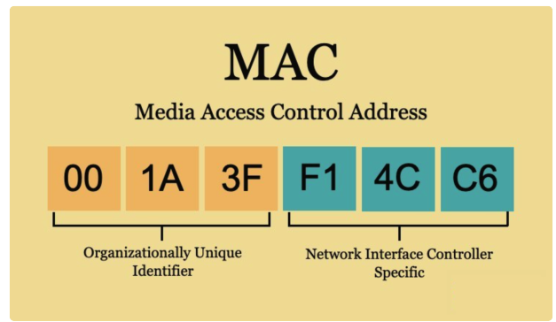
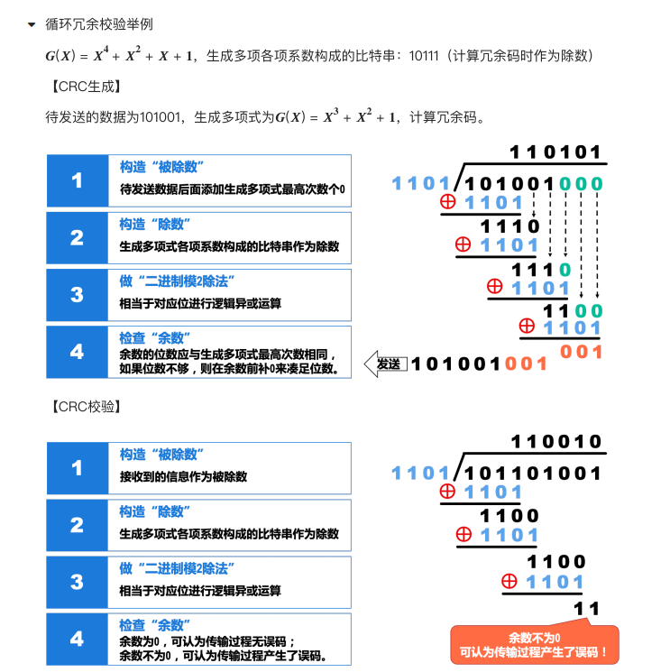

[TOC]


## 计算机网络组成

- 区别网络、互联网、因特网

	- 网络：由节点 + 链路（有线 或者 无线）组成。是设备与设备的之间的通信技术（设备之间通过 **交换机** 进行交换）

		- 

	- 互联网：由网络 + 路由器组成。若干网络通过路由器互连（网络之间通过路由器进行交换。路由器功能 = 交换机功能 + 路由功能）

		- 路由器用在网络之间，交换机用在电脑（具体设备）之间
		- 

	- 因特网：本质是互联网。世界上最大的互联网（遵守同一套共同协议 —— TCP/IP 协议栈）

		- 共同的协议：TCP/IPv4、TCP/IPv6，专指 TCP/IP 协议族
		- 

	- 互联网和因特网之间的关心

		- internet
			- 通 ⽤ 名词，表示互联 ⽹（互连 ⽹），任意通信协议
		- Internet
			- 专有名词，因特 ⽹，专指 TCP/IP 协议族
			- 因特 ⽹ 服务提供者（Internet Service Provider，ISP）
			- 在安装系统时，就会把相关的 TCP/IP 协议安装
			- 
			- 

	- 因特网的标准化工作

		- 因特 ⽹ 的标准化 ⼯ 作是 ⾯ 向公众的，其任何 ⼀ 个建议标准在成为因特 ⽹ 标准之前都以 **RFC 技术 ⽂ 档** 的形式在因特 ⽹ 上发表。  

			- RFC（Request for Comments，请求意见稿）就是互联网的“官方标准说明书”和“技术法案库”。【因特网使用协议的具体格式】
			- 任何 ⼈ 都可以从因特 ⽹ 上免费下载 RFC⽂ 档，并随时对某个 RFC⽂ 档发表意 ⻅ 和建议。  

			- 
				- [IEFT 委员会官网](https://www.ietf.org/)
				- [RFC 文档查询](https://www.rfc-editor.org/)

- 任何设备之间的交流，都需要考虑 连接（怎么连） + 数据协议（数据什么样）

## 计算机网络端系统体系结构体分层

- 为什么需要分层

	- 如果 A、B、C 通信，需要考虑下面的问题
		1. 身份识别
		2. 如何识别错误、纠正错误
		3. 数据格式（如何解析）
		4. 物理设备冲突
		5. 丢失数据

- “分层”可将庞 ⼤ 复杂的问题转化为若 ⼲ 较 ⼩ 的局部问题  

- 

- 一般项目开发常用 TCP/IP 参考模型。在教学中常用 OSI 和原理参考模型

- **OSI 模型各层的作用**

	- 应用层
		- 解决的问题：人机交互与业务逻辑
		- 典型协议：HTTP (网页), FTP (文件传输), SMTP (邮件), DNS (域名解析)。
		- 针对的数据：报文 (Message) / 原始数据。
	- 表示层
		- 解决的问题：数据如何解释和呈现（解决“听不听得懂”的问题）。
			- 数据加密与解密（保证安全性）。
			- 数据压缩与解压缩（提升传输效率）。
			- 数据格式转换
		- 
	- 会话层
		- 解决的问题：建立、管理和终止应用程序之间的会话（通信连接）
			- 进程管理与同步：决定数据由谁发送、何时发送（半双工或全双工控制）。
			- 断点续传：在数据流中插入检查点（Checkpoint），如果网络中断，可以从上一个检查点恢复，而不需要重新传输整个文件。
	- 传输层
		- 解决的问题：端到端（End-to-End）的进程间通信与数据传输质量。
			- 应用分发（端口号）：标识设备上的具体进程。*（注：端口是合法的通信端点，并非后门，后门是指恶意使用了某个非正常的端口）*。
			- 可靠与不可靠传输 —— 丢包（根据业务具体选择）
				- TCP（可靠传输，处理丢包、超时重传、拥塞控制）；
				- UDP（不可靠传输，只管发，速度快）。
			- 针对的数据：段 (Segment) —— 如 TCP 段、UDP 数据报。
			- 
	- 网络层
		- 解决的问题：跨网络（跨网段）的路径选择和寻址。
			- 逻辑寻址：使用 IP 地址 标识全球范围内的网络和主机。
				- IP 地址：收货地址，由网络管理员或路由器动态分配，在同一个网络中唯一。
			- 路由与转发：路由器根据 *路由表* 和 *路由协议*，为数据包寻找一条跨越多个网络的最佳路径。
		- 针对的数据：数据包 (Packet) / 分组。
		- 
	- 数据链路层
		- 解决的问题：在同一个局域网内，相邻节点之间可靠的数据传输。
			- 物理寻址：使用 MAC 地址 标识同一局域网内的硬件身份。
				- MAC 地址：身份证号，一个硬件设备出厂以后固定在网卡上的，全球唯一。
			- 成帧（Framing）：从物理层的 0 和 1 比特流中，通过首尾边界符区分出地址和数据。
			- 介质访问控制（MAC）：协调多台主机争用一根总线，防止信号冲突（如 CSMA/CD 协议）。
			- 差错检测：通过循环冗余校验码（CRC）检测数据在传输中是否发生误码，若有误码直接丢弃。
			- 流量控制：防止发送方发得太快，把接收方的缓冲区塞满。
		- 针对的数据：帧 (Frame)（核心公式：`一组数据 + 帧头(含MAC) + 帧尾(校验码) = 数据帧`）。
		- 
	- 物理层
		- 解决的问题：透明地传输原始比特流（0 和 1）。
			- 信号转换：将数字信号（0 和 1）转换成电信号、光信号或无线电波（通过电压、频率等物理特性）。
				- 数字信号也叫逻辑信号
			- 物理特性定义：规定接口的形状、引脚数量、线缆的材质（双绞线、光纤）以及传输速率。
		- 针对的数据：比特 (Bit)。
		- 

- ```c
	[应用层数据] (Hello)
	      │
	      ▼ (传输层加上端口号)
	[TCP 头部] + [应用层数据]  <-- 变成【段 Segment】
	      │
	      ▼ (网络层加上IP地址)
	[IP 头部] + [TCP 头部] + [应用层数据]  <-- 变成【包 Packet】
	      │
	      ▼ (数据链路层加上MAC地址和CRC)
	[MAC 头部] + [IP 头部] + [TCP 头部] + [应用层数据] + [FCS校验] <-- 变成【帧 Frame】
	      │
	      ▼ (物理层变成网线里的电压波形)
	10101100010101... <-- 变成【比特流 Bit】
	```

- **面试常问分层模型，回答：层次名字 + 功能 + 主要协议**

- OSI 标准不常用的原因：

	- 缺乏实际经验，没有商业驱动 ⼒
	- 协议实现过分复杂，运 ⾏ 效率很低
	- 标准的制定周期太 ⻓，产品 ⽆ 法及时进 ⼊ 市场
	- 层次划分不太合理，有些功能在多个层次中重复出现  

- TCP/IP 参考模型的常用

	- 
	- TCP 解决传输层问题
	- IP 解决网络层问题
	- TCP/IP 协议栈：内部有许多协议，属于 OS 的内核
	- 网卡 = 数据链路层 + 物理层

- Wireshark 软件，开发时看数据格式

- 协议：

	- 字符串协议  [标识]：[数据]
	- 二进制协议 都是字节表示什么含义，某个字节的高几位表示 xx。11111 11111 

- 

## 计算机网络的数据传输

### 电路交换

- 使用电话线进行通信
- 流程
	- 建 ⽴ 连接，分配通信资源
	- 通话，⼀ 直占 ⽤ 通信资源
	- 释放连接，归还通信资源
- 
-  以前的电话线手动需要拨号，现在光纤时代被光猫屏蔽，光猫自动拨号，运营商公司下发临时 IP。
-  相关技术：ADSL

### 分组交换（存储转发）

- 
- 优点
	- 没有建 ⽴ 连接和释放连接的过程
	- 分组传输过程中逐段占 ⽤ 通信链路，有较 ⾼ 的通信线路利 ⽤ 率
	- 交换节点可以为每 ⼀ 个分组独 ⽴ 选择转发路由，使得 ⽹ 络有很好的 ⽣ 存性
- 缺点
	- 分组 ⾸ 部带来了额外的传输开销
		- 每个数据包 = 数据 + 首部
	- 交换节点存储转发分组会造成 ⼀ 定的时延
	- ⽆ 法确保通信时端到端通信资源全部可 ⽤，在通信量较 ⼤ 时可能造成 ⽹ 络阻塞
	- 分组可能会出现失序和丢失等问题  
- 


## 计算机网络的性能指标（了解）

### 1. 核心性能指标总览

| 性能指标                 | 基本单位   | 核心定义与内涵                                     | 记忆要点               |
| :----------------------- | :--------- | :------------------------------------------------- | :--------------------- |
| **速率 (Data Rate)**     | b/s (bps)  | 每秒传送的比特（bit）数量                          | 数据的 **传送快慢**     |
| **带宽 (Bandwidth)**     | b/s (bps)  | 线路所能传送数据的 **最高数据率**（最高理论极限值） | 管道的 **最高时速**     |
| **吞吐量 (Throughput)**  | b/s (bps)  | 单位时间内通过某个网络/接口的 **实际数据量**        | 管道的 **实际流量**     |
| **时延 (Delay)**         | s (秒)     | 数据从网络一端传送到另一端所耗费的时间             | **时间损耗**           |
| **时延带宽积**           | bit (比特) | 传播时延 与 带宽 的乘积                            | 链路的 **饱满容量**     |
| **往返时间 (RTT)**       | s (秒)     | 从发送数据开始，到收到接收端确认分组为止的总时间   | 双向通信的 **闭环时间** |
| **利用率 (Utilization)** | % (百分比) | 链路或网络被数据通过的时间比例                     | 线路的 **繁忙程度**     |

###  指标深度拆解

#### 速率 (Rate)

* **概念**：指数据的传送速率，也称为数据率或比特率。
* **单位换算陷阱**：
  * **数据量单位**（大写 `B` 表示 Byte）：以 $2^{10}$ 为进率。
    $$1\text{KB} = 2^{10}\text{B}, \quad 1\text{MB} = 2^{20}\text{B}, \quad 1\text{GB} = 2^{30}\text{B}$$
  * **速率单位**（小写 `b` 表示 bit）：以 $10^3$ 为进率。
    $$1\text{kb/s} = 10^3\text{b/s}, \quad 1\text{Mb/s} = 10^6\text{b/s}, \quad 1\text{Gb/s} = 10^9\text{b/s}$$
* **实战计算公式**：
  $$\text{发送时延} = \frac{\text{数据块大小 (Byte)} \times 8}{\text{网卡发送速率 (b/s)}}$$
* 软件上以字节为单位；网络以 bit 为单位
* 

#### 带宽 (Bandwidth)

* **双重定义**：
  1. **模拟信号系统**：信号所占用的频率范围（单位：$\text{Hz}$）。
  2. **计算机网络系统**：通信线路所能传送数据的能力，即 **最高数据率**（单位：$\text{b/s}$）。
* **木桶效应**：
  $$\text{实际数据传送速率} = \min[\text{主机接口速率}, \text{线路带宽}, \text{交换机/路由器接口速率}]$$

####  吞吐量 (Throughput)

* **概念**：单位时间内通过某个网络或接口的 **实际数据量**。
* **特性**：吞吐量真实反映了网络的当前运行状态，且 **严格受网络带宽的限制**。
*  网络实战延伸：上行/下行、CDN 与 P2P
	1. **带宽的不对称性 (Asymmetric Bandwidth)**
	   * **现实情况**：民用宽带普遍 **下行带宽大、上行带宽小**（如 一般说的 1000M 是指 1000M 下行和 50M-100M 上行）。
	   * **原因**：运营商的商业限速策略。家庭用户主要行为是下载（看视频、刷网页），高价的对称上行带宽被打包卖给了企业和机房。
	   * **对吞吐量的影响**：上行数据传输的 **实际吞吐量** 由于受到物理和人为带宽的卡脖子，远远低于下行吞吐量。

	2. **CDN (内容分发网络 - Content Delivery Network)**
	   * **核心本质**：**“空间换时间”**。在全国各地部署中转缓存服务器（边缘节点）。
	   * **解决痛点**：跨地域访问带来的巨大 **传播时延** 和骨干网 **拥堵（吞吐量过载）**。
	   * **工作逻辑**：通过智能 DNS，让用户自动访问物理距离最近的服务器，直接获取静态数据。

	3. **P2P (对等网络 - Peer-to-Peer)**
	   * **核心本质**：**去中心化，访问就近的个人设备**。
	   * **工作逻辑**：不再依赖单一的中央服务器。每个下载者（Peer）在获取数据的同时，也利用自己的 **上行带宽** 向附近的其他用户上传数据，极大地缓解了服务器的压力。

#### 时延 (Delay / Latency)

总时延由四部分相加组成：$\text{总时延} = T_{\text{发送}} + T_{\text{传播}} + T_{\text{排队}} + T_{\text{处理}}$

```text
💻 发送端                                                     💻 接收端
+----------+      ======================================      +----------+
| 发送时延  | ===> | ⚡ 传播时延 (电磁波在介质中飞行) ⚡ | ===> | 处理时延  |
| (推向线路)|      |  (排队时延：在路由器队列里等待)     |      | (检验纠错)|
+----------+      ======================================      +----------+
```

1. **发送时延**：主机或路由器将数据分组推上通信线路所用的时间。

	$$T_{\text{发送}} = \frac{\text{分组长度 (bit)}}{\text{发送速率 (b/s)}}$$

2. **传播时延**：电磁波在信道（光纤/铜线）中传播一定距离所需的时间。

	$$T_{\text{传播}} = \frac{\text{信道长度 (m)}}{\text{电磁波传播速率 (m/s)}}$$

	*(注：电磁波在光纤中的传播速率约为 $2.0 \times 10^8 \text{m/s}$)*

3. **排队时延**：分组在交换节点（路由器）输入输出队列中留存等待处理的时间。

4. **处理时延**：交换节点收到分组后进行检错、查找转发表等操作耗费的时间。

#### 时延带宽积 (Delay-Bandwidth Product)

- **公式**：

	$$\text{时延带宽积} = \text{传播时延} \times \text{带宽}$$

- **物理意义**：若把链路看作管道，时延带宽积就是 **链路以比特为单位的体积（即链路长度）**。这对后续理解以太网的“最短帧长”至关重要。

#### 往返时间 (RTT)

- **概念**：从发送端发送数据分组开始，到发送端收到接收端的确认分组（ACK）为止总共耗费的时间。
- **检测工具**：在终端通过 `ping` 命令（如 `ping www.baidu.com`）可以直观测试 RTT。

#### 利用率 (Utilization)

- **分类**：
	- **链路利用率**：某条链路有百分之几的时间是有数据通过的（完全空闲时为 0）。
	- **网络利用率**：网络中所有链路的链路利用率的 **加权平均**。
- **警惕雪崩效应**：利用率并非越高越好。当利用率过高时，由于数据包在排队，网络的 **时延会急剧增大**。一般当利用率超过 50% 时，网络拥堵风险会显著上升。


## 计算网络互联

- 两天计算机的互联 —— 网线直连（需要用交叉线）

	- 交叉线：2 根线，有发送端和接收端
		- 
	- 直通线：1 根线，能收发（但是有些硬件不支持）

- 多台计算机的互联

	- 老式

		- 同轴电缆 
			- 
				- 终结电阻：防止电信号反射
		- 特点：
			- 半双 ⼯ 通信、容易冲突  
			- 不安全、⼀ 旦某段线路出现问题，整个通信 ⽹ 络都会瘫痪  

	- 新式

		- 集线器（Hub）

			- 集线器有多个接 ⼝，接 ⼝ 的类型是 RJ-45。⼀ 个接 ⼝ 收到数据后会发给其它的全部接 ⼝。集线器 ⼯ 作在物理层，类似于 ⼀ 个多接 ⼝ 的转发器，收到什么就转发什么，⼀ 个接 ⼝ 收到会转发给其它的全部接 ⼝。
			- 特点：
				- 半双 ⼯ 通信、容易发 ⽣ 冲突  
				- 不安全、跟同轴电缆 ⼀ 样，没有记录存储能 ⼒，但某两个节点出现问题，不影响其他节点  。
			- 物理层设备。靠电路是实现数据转发。
			- 不能识别 MAC 地址
			- 场景：分析数据格式。（利用其没有存储能力特点，路由器、交换机无法实现）
			- 
				- 有时会出现第一个包超时，后续有正常显示的原因：
					- 在以太网中，数据包必须封装上 **目标 MAC 地址** 才能在网线上传输。
					- 刚开始的时候，计算机 2 自己的 **ARP 缓存表** 里是空的，找不到 `192.168.1.5` 对应的 MAC 地址。
					- 于是，Ping 命令发出的第一个 ICMP 数据包只能被 **挂起（或者丢弃）**，电脑必须先发出一个 **ARP 请求广播** 去询问：“谁的 IP 是 192.168.1.6？请把你的 MAC 地址告诉我！”
					- 后续计算机 4 返回消息之后，计算机 2 才有了正常响应
			- 缺点：   
				- 广播漫游(冲突域过大导致的严重网络拥堵)
					- 如果有 1000 台设备 ⽤ 多集线器连接，那么 1 台主机发送的数据，虽然最后只有 ⼀ 个主机来处理这个数据包，但会被发送到 999 台主机，对整个 ⽹ 络链路的占 ⽤ 率会 ⾮ 常 ⾼  

		- 网桥（Bridge）

			- 也叫桥接器。数据链式层设备
			- 可以直接用于设备或者集线器之间的连接，只有连接 2 个设备
			- 第一次使用，也会向全部设备发送信息，通过返回记录设备在哪个集线器哪里（左右两边）。保存了目标地址所在的位置，他一旦收到目的地的包，判断 左边  右边  是否转发
			- 有识别 MAC 地址的能力
			- ⽹ 桥能够互连两个采 ⽤ 不同传输介质与不同传输速率的 ⽹ 络，但是 ⽹ 桥需要互连的 ⽹ 络在数据链路层以上采 ⽤ 相同的协议。⽹ 桥可以分隔两个 ⽹ 络之间的通信量，对收到的帧根据其 MAC 帧的 ⽬ 的地址进 ⾏ 转发和过滤。当 ⽹ 桥收到 ⼀ 个帧时，并不是向所有的接 ⼝ 转发此帧，⽽ 是根据此帧的 ⽬ 的 MAC 地址，查找 ⽹ 桥中的地址表，然后确定将该帧转发
				到哪 ⼀ 个接 ⼝，或者是把它丢弃(即过滤)。  
			- 特点：
				- ⽹ 桥可以通过 ⾃ 学习得知每侧接 ⼝ 的 MAC 地址，从 ⽽ 起到隔绝冲突域的作 ⽤
			- 

		- 交换机（Switch）

			- 相当于集线器+⽹ 桥，接 ⼝ 更多的 ⽹ 桥、全双 ⼯ 通信，⽐ 集线器安全。  本质是多端的网桥

			- 会自动记录每个端口的对应设备 MAC 地址。会自动转发，没有抓包功能

			- 流程：

				- 设备第一次会自动构成 ARP 协议的包，进行广播，记录设备的 MAC 地址（请求），目标设备的定点回应 ARP（响应）**网络通信 = 请求 + 响应**
					- ARP 包会周期性发送，进行动态更新设备节点
				- 有了目标设备的 MAC 地址之后才能完整的构建出数据包，进行定点发包

			- 二层设备（交换机）的防火墙，面对 MAC 地址进行过滤

				- 

				- | **设备层级**           | **代表设备**     | **防火墙看什么？**              | **相当于现实中的...**                                        |
					| ---------------------- | ---------------- | ------------------------------- | ------------------------------------------------------------ |
					| **二层 (Data Link)**   | 交换机           | 源/目的 **MAC 地址**            | 门卫只认 **工牌/身份证号**                                    |
					| **三层 (Network)**     | 路由器           | 源/目的 **IP 地址**             | 信封上的 **寄信地址和收信地址**。                             |
					| **四层 (Transport)**   | 传统防火墙       | **TCP/UDP 协议 + 端口号**       | 进大楼可以，但只准去 **3 楼办业务（端口）**，不准去 4 楼研发部。 |
					| **七层 (Application)** | 下一代防火墙/WAF | **具体业务数据、URL、特定指令** | 检查人员要把你的 **包打开，翻看里面的信件内容** 是否有违禁词。 |

			- 

				- 交换机 2 第一次群发，是因为自己的 MAC 地址表是空的，需要进行广播
				- 注意：思科软件中，三角形不是绿色，表示设备还是审查，不能正常通信

		- 路由器（Router）

			- 上面的设备必须连接在同一局域网内，而路由器可以在不同局域网进行连接
			- 路由器一般至少有 2 个网卡，一个 WAN（广域网）口相关的网卡，一个 LAN 口（局域网）相关的网卡。有 3 种 IP
				- 没有接口的 IP 地址（127.x.x.x）: 回环地址（本地地址），不会被路由器转发到外界
				- LAN 口 IP（PC 的网关 IP）：用于区分一个 IP 是在本地的局域网和非本地的局域网（如：因特网）
				- WAN 口 IP：用于于非本地局域网进行交流的
				- **路由器的网卡数量：** “一般至少有 2 个物理接口”，但在软件逻辑上，通过“子接口（Sub-interface）”技术，**一个物理 LAN 口可以虚拟出多个不同的网关 IP**（比如同时当 `192.168.1.254` 和 `192.168.2.254` 的网关，用来连接多个局域网）。
				- **路由器的上级也有网关：** 电脑把网关设为路由器的 LAN 口 IP；而 **路由器自己也会把自己的“默认网关”设为运营商光猫的 IP**。网络就是这样一层一层套上去的。
			- 特点：
				- 可以在不同 ⽹ 段之间转发数据
				- 隔绝 ⼴ 播域  
			- 主机发送数据之前，⾸ 先会判断 ⽬ 标主机的 IP 地址跟它是否在同 ⼀ 个 ⽹ 段：  
				- 同 ⼀ 个 ⽹ 段：ARP⼴ 播，查找 MAC，通过交换机、集线器传递数据  
				- 不在同 ⼀ 个 ⽹ 段：通过路由器转发数据，主机向 ⽹ 关发送数据  
			- 路由默认是没有配置，需要进入命令界面激活端口（2 个）、配置 LAN 口 IP（2 个）, 还要在设备中配置默认网关（路由器的 LAN 口 IP）
			- 

### ==网络中数据传输时数据格式的变化==

- 
- 
	- 传输层头部（根据协议的不同，数据格式有所不同）
	  - **分支一：UDP 协议（给数据加 8B 头部）**
	  	- `8B 头部 = 源端口(2B) + 目的端口(2B) + 整个包长度(2B) + 校验和(2B)`
	  		- 整个包长度 = 头部 + 实际数据，用 2B 字节表示
	  - **分支二：TCP 协议（给数据加 至少 20B 头部）**
	  	- `≥20B 头部 = 源端口 + 目的端口 + 序号 + 确认号 + 各种控制开关...`（第 13 个字节是头部长度）
	- IP 头(固定 20 字节起步（变长）)
	  - ` 头部 = 版本(4bit) + 头部长度(4bit) + 服务类型 + 总长度(2B) + TTL(生存时间) + 协议号 + 源IP(4B) + 目的IP(4B)...`。
	  	- 其中 **TTL（生存时间）** 极其重要，因为路由器每转发一次，TTL 就要减 1，防环路全靠它。
	  - PC 拿“目的 IP”和“自己的子网掩码”做 `AND`（与）运算。
	    - 结果相同 $\rightarrow$ 在同一局域网 $\rightarrow$ 找 **目标的 MAC**。
	    - 结果不同 $\rightarrow$ 不在同一局域网 $\rightarrow$ 找 **网关（路由器 LAN 口）的 MAC**。
	  - ARP 判断
	  	- PC 拿“目的 IP”和“自己的子网掩码”做 **AND（与）运算**，决定“下一跳 IP”是谁：
	  		- **结果相同** $\rightarrow$ 同一局域网 $\rightarrow$ “下一跳 IP” 就是 **目标主机 IP**。
	  		- **结果不同** $\rightarrow$ 跨网段（外网） $\rightarrow$ “下一跳 IP” 就是 **网关 IP**。
	  			- 当网络层确定了“下一跳 IP”后，准备将数据包递交给数据链路层。在递交的前一刻，**网络层主动去查找邻居表（ARP 缓存表）**：
	  				- **分支 A（缓存命中）：** ARP 表里有该“下一跳 IP”的 MAC 地址。
	  					- **动作：** 网络层直接把这个 MAC 地址和 IP 数据包一起丢给数据链路层。数据链路层（工具人）直接贴上以太网头发送。**(此过程未触发 ARP 协议，没有 ARP 包)**    
	  				- **分支 B（缓存未命中 $\rightarrow$ 正式触发 ARP 协议）：** ARP 表里没有该“下一跳 IP”的 MAC 地址。
	  					-  **动作 1（挂起）：** 网络层按下暂停键，将原本要发出去的真实数据包（包含 TCP/IP）**挂起在内存的发送队列中**。   
	  					- **动作 2（触发 ARP）：** 网络层调用 ARP 协议模块，**临时生成一个全新的、独立的 ARP 请求包**（没有上层数据的纯问路工具包）。  
	  					-  **动作 3（下发广播）：** ARP 模块将这个请求包递交给数据链路层，外壳目的 MAC 填 `FF-FF-FF-FF-FF-FF`，顺着网线广播出去。
	  			- **数据复活：**  当收到对端的 ARP 应答包并更新 ARP 缓存表后，网络层将内存中挂起的真实数据包“复活”，重新交给数据链路层，此时数据链路层即可填入正确的 `目的 MAC` 并将其发送出去。
	- 以太头（固定长度（14 字节），且没有长度字段）
	  - 头部 = 目的 MAC（6B） + 源 MAC（6B） + 类型（2B）
	- 路由器收到后：
	  - 路由器（网卡）收到以太网帧后，只看 **目的 MAC**。
	  	- 如果目的 MAC 是 **网关自己** 的 LAN 口 MAC $\rightarrow$ 接收，撕掉以太头，送入路由器内核（网络层）处理。
	  		- 路由器在 LAN 口 **撕掉** 二层以太头，露出 IP 头。
	  		- 路由器根据目的 IP 查 **路由表**，决定走 哪个口
	  			- 路由表有具体的 MAC 地址，走 LAN 口，发送给具体设备
	  			- 对应的是运营商 MAC 地址，走 WAN 口，路由器在 WAN 口 **重新封包**，生成 **全新的二层头部**。发送给运行商路由器 LAN 口
	  				- **新二层头：** `[源: 路由器WAN口MAC] [目的: 运营商设备接口MAC]`
	  				- 网络历史上有过“令牌环网（Token Ring）”，但它和“以太网（Ethernet）”是相互竞争的死对头。现在令牌网已经被淘汰了，全球都在用以太网格式。ARP 协议之所以在内核里重复写源 MAC，就是为了兼容像令牌网、Wi-Fi 等不同的二层外壳。
	  	- 如果目的 MAC **不是自己**（而是局域网内其他设备），说明这个包只是利用了路由器的 **内嵌交换机芯片（LAN 口交换机）**。数据在二层直接被交换机芯片转发走，**根本不会送入路由器的内核**。
	- 运营商收后
	  - 运营商入口路由器：
	  	- 撕掉你原本的二层头，露出 IP 头。根据目的地，在 IP 头前面强行插入【MPLS 标签】。
	  - 骨干网极速转发：骨干网内部路由器只看、并交换【MPLS 标签】，不看 IP 头。通过 QoS 机制让高优先级流量排队优先通过。 
	  - 运营商出口路由器（边界交接）：  
	  	- 在离开运营商网络的最后一个节点，【撕掉 MPLS 标签】，还原为纯粹的 IP 包。  
	  	-   查看目的 IP，在物理出口重新封装成【标准以太网头】。  
	  	-   新二层头：[源: 运营商出口 MAC] [目的: 目标路由器 WAN 口 MAC]，发送给目标所在的路由器。
	  - 流程：
	  	- 数据包 **进隧道前**：必须在收费站（边界路由器）贴上内部通行证——**MPLS 标签**。
	  	- 数据包 **在隧道里**：所有的交警和指示牌（骨干网路由器）**只看标签，不看 IP**，一路绿灯极速放大。
	  	- 数据包 **出隧道时**：在最后一个出口收费站（也就是连接目标公司的那个运营商路由器），会执行一个动作叫 **“弹出标签（Pop）”**，把这个通行证撕掉。
	- 目标的路由器
	  - **目标路由器动作：** 收到包，撕掉 WAN 口的以太网头。看 IP 头发现就是自己内网的服务器，于是在 LAN 口触发 ARP（如果不知道 MAC），最后封上最终的内网以太头（源：目标路由 LAN 口 MAC，目的：目标服务器 MAC）。

### MAC 地址

- 每一个网卡都要 6 字节组成的唯一标识
	- 
		- 前三个字节：OUI，组织唯 ⼀ 标识符，由 IEEE 的注册管理机构分配给 ⼚ 商
			- OUI 查询  ：https://standards-oui.ieee.org/oui/oui.txt;   https://mac.bmcx.com/  
		- 后三个字节：⽹ 络接 ⼝ 标识符，由 ⼚ 商 ⾃⾏ 分配  
	- 如：MAC 的表示格式（每个厂商的表示不一定相同，但在传输时都是二进制数据，没有符号）
		- Windows 				   ——  40-55-82-0A-8C-6D
		- Linux、Android、Mac、iOS      ——  40:55:82:0A: 8C: 6D
		- Packet Tracer                            ——   4055.820A.8C6D
		- 当 48 位全为 1 时，代表 **⼴ 播地址** ——    FF-FF-FF-FF-FF-FF  
	-  MAC 地址的获取
		- 当不知道对 ⽅ 主机的 MAC 地址时，可以通过发送 ARP⼴ 播获取对 ⽅ 的 MAC 地址
			- 获取成功后，会缓存 IP 地址、MAC 地址的映射信息，俗称：ARP 缓存
			- 通过 ARP⼴ 播获取的 MAC 地址，属于动态（dynamic）缓存
			- 存储时间 ⽐ 较短（默认是 2 分钟），过期就 ⾃ 动删除
		- 相关命令
			- `arp -a [主机地址]`：  查询 ARP 缓存 
			- `arp -d [主机地址]`： 删除 ARP 缓存
			- `arp -s 主机地址 MAC地址`：增加 ⼀ 条缓存信息（这是静态缓存，存储时间较久）

### ARP 协议

- ARP 协议的全称是 Address Resolution Protocol(地址解析协议)，它是 ⼀ 个通过 ⽤ 于实现从 IP 地
  址到 MAC 地址的映射，即询问 **⽬ 标 IP 对应的 MAC 地址 的 ⼀ 种协议**  

- ARP 是一个介于网络层（L3）和数据链路层（L2）之间的“胶水”协议（或称为 2.5 层协议）。

- 流程：当 A -> B 发送
  - ```mermaid
    graph TD
        A[网络层计算完路由] --> B{查询本地 ARP 缓存表}
        B -- 1. 缓存命中 --> C[网络层直接放行]
        C --> D[数据链路层直接封装目标 MAC 正常发送]
        
        B -- 2. 缓存未命中 --> E[核心动作: 数据包挂起]
        E --> F[网络层主动触发 ARP 协议]
        F --> G[创建全新的 ARP 请求包并广播]
        G --> H[收到 ARP 应答后刷新表]
        H --> I[数据包复活: 填入 MAC 并正常发送]
    ```

  - 

- 主机 A 想要获取主机 B 的 MAC 地址，主机 A 会通过 ⼴ 播 的 ⽅ 式向以太 ⽹ 上的所有主机发送 ⼀ 个
  ARP 请求包

  - ARP 包的组成：【以太网头：广播 MAC + 源 MAC】 + 【ARP 内核：操作码 + 源 IP + 源 MAC + 目标 IP + 全 0 MAC】

    - 广播 MAC：FF - FF - FF - FF - FF - FF

    - 

    - | 字段序号 | 字段名称 (Field Name)            | 占用字节 (Size) | 字段具体含义与值说明                                         |
    	| :------: | :------------------------------- | :-------------: | :----------------------------------------------------------- |
    	|  **1**   | **硬件类型** (Hardware Type)     |     2 Bytes     | 标识物理网络类型。以太网（Ethernet）固定为 **`1`** (`0x0001`)。 |
    	|  **2**   | **协议类型** (Protocol Type)     |     2 Bytes     | 标识要解析的上层协议。IPv4 地址解析固定为 **`0x0800`**。     |
    	|  **3**   | **硬件地址长度** (Hardware Size) |     1 Byte      | 物理地址长度。以太网 MAC 地址固定为 **`6`**（字节）。        |
    	|  **4**   | **协议地址长度** (Protocol Size) |     1 Byte      | 网络层地址长度。IPv4 地址固定为 **`4`**（字节）。            |
    	|  **5**   | **操作码** (Opcode)              |     2 Bytes     | **区分包属性：**<br>• **`1`** (Request)：代表 **请求包（问路）**。<br>• **`2`** (Reply)：代表 **应答包（回话）**。 |
    	|  **6**   | **源 MAC 地址** (Sender MAC)     |     6 Bytes     | 发送本报文的主机物理 MAC 地址。<br>• 请求包：填“自己的真实 MAC”。<br>• 应答包：填“被寻找者的真实 MAC”。 |
    	|  **7**   | **源 IP 地址** (Sender IP)       |     4 Bytes     | 发送本报文的主机网络 IPv4 地址。<br>• 请求包：填“自己的真实 IP”。<br>• 应答包：填“被寻找者的真实 IP”。 |
    	|  **8**   | **目标 MAC 地址** (Target MAC)   |     6 Bytes     | 接收端的物理 MAC 地址。<br>• ⚠️ **请求包：因未知对方 MAC，此处全部填全 `0` 占位**。<br>• 应答包：填当初“提问者”的 MAC 地址。 |
    	|  **9**   | **目标 IP 地址** (Target IP)     |     4 Bytes     | 本次要寻找或要回应的目标网络 IPv4 地址。<br>• 请求包：填“我要找的那个人的 IP”。<br>• 应答包：填当初“提问者”的 IP 地址。 |

    - 为什么有两个源 MAC 地址

    	- 因为数据链路层，解包以太头后，就会将数据扔掉
    	- 网络层就无法知道请求是谁发送的，在回应 ARP 应答包的时候，就不知道发送给谁了。

- ARP 欺骗原理

	- 在目标机发 ARP 时，黑客构成当前局域网网关的 ARP 响应包（IP + 黑客的 MAC）
	- 不停发送，让目标机发送数据到黑客机上，黑客机进行丢包进行限速、屏蔽

- ARP 相关技术

	- ARP 缓存表的动态更新机制
		- 为了防止设备更换网卡或变更 IP 导致局域网通信瘫痪，内核中的 ARP 缓存表具备 **生存老化时间（Aging Time）**。
		- 动态条目在长时间（通常为数分钟）没有流量交互后，会被操作系统自动从内存中 **定时清除**，下次通信时重新触发 ARP 请求。
	- ARP 欺骗（ARP Spoofing）原理
		- **协议漏洞：** ARP 协议是 **无状态且缺乏认证** 的。即使主机没有发送过 ARP 请求，只要收到别人发来的 ARP 应答（Reply），它也会盲目相信并刷新本地 ARP 表。
		- **攻击路径：** 当目标机在局域网内尝试通信时，攻击者（黑客）持续向目标机发送伪造的 ARP 应答包。（将目标的机器商中 ARP 表中网关 IP 映射成攻击成的 MAC 地址）
			- $$\text{伪造内容：[ 网关的 IP ] } \leftrightarrow \text{ [ 攻击者的 MAC 地址 ]}$$
		- **攻击后果：** 目标机的 ARP 缓存表被污染。此后目标机发往外网（如百度、腾讯）的所有流量，其二层目的 MAC 都会指向攻击者。攻击者不仅可以实施窃听，还能通过丢弃报文实施限速、断网（屏蔽）或中间人攻击。

- 

	- 这个包大小 60B
	- 以太头部
		- 目标 MAC：FF-FF-FF-FF-FF-FF ，是一个广播地址
		- 源 MAC：00-e0-4c-68-00-65
		- 类型：ARP

	- ARP 请求

- RARP： ARP 的反向协议（Reverse ARP），用于通过已知的 MAC 地址反查 IP 地址。

### IP 地址

- IPv4：32 位，IPv6：128 位
- 表示方式 —— 点分 10 进制：192.168.1.2 （每个数据都是 10 进制数）
- IP 地址，逻辑概念，一个物理的 MAC 设备，具有多个逻辑的虚拟的 IP 地址
- 分类历史：
	- 
		- 分类编址（了解）
			- 
				- A 类、B 类和 C 类地址都是单播地址，只有单播地址可以分配给 ⽹ 络中的主机（或路由器）的各接 ⼝。
				- **主机号为“全 0”的地址是 ⽹ 络地址，不能分配给主机（或路由器）的各接 ⼝  。**
				- **主机号为“全 1”的地址是 ⼴ 播地址，不能分配给主机（或路由器）的各接 ⼝。**   
				- 网络号：一片局域网的身份证（小区地址）
				- 主机号：一个设备的身份证（具体的居民地址）
			- 问题：地址资源非常浪费，且不够灵活
		- 划分子网
			- 根据分类编址，主机号进行分组的方式
			- 网络号 = IP 地址 & 子网掩码
			- 主机号 = IP 地址 & (~子网掩码)
				- 主机号为 0： 网络号
				- 主机号全为 1：广播地址
				- 所以实际可用的主机地址格式需要减去 2 个（掐头去尾）
			- 问题：依然存在地址浪费的情况
		- **无分类方式**
			- 舍弃分类编址，直接更具子网掩码进行划分
			- 表示方式 —— 斜线记法 ： 192.168.1.2/12
				- 表示网络号占 12 位，192.160.0.0
				- 主机号为（32 - 12 = 20 位）：192.160.0.1 ~ 192.175.255.254
			- 
				- **红线部分必须记住**
				- 路由器不会转发私有 IP 和 127 开头的本地地址
- A：`192.168.0.10/24` 与 B：`192.168.10.10/16` 相互通信（直接连接的方式）
	- A 和 B 分别在自己的机器中，网络号都是 `192.168.0.0`
	- 但是 A 不能发送消息给 B，B 能 A 发送消息
		- 在 A 的网络层，因为只知道自己的子网掩码，所以 A 用自己的子网掩码与其他 IP 进行操作
			- 源 IP: 192.168.0.10/24 → 192.168.0.0
			- 目的 IP：192.168.10.10/24 → 192.168.10.0
			- A 发现网络号不一样，认为不是同一个局域网，且没有路由器，所以不能通信
		- 在 B 的网络层，因为只知道自己的子网掩码，所以 B 用自己的子网掩码与其他 IP 进行操作
			- 目的 IP: 192.168.0.10/16 → 192.168.0.0
			- 源 IP：192.168.10.10/16 → 192.168.0.0
			- B 发现网络号一样，认为是同一个局域网，所以能通信
- 子网
	- 牺牲主机号，将原本属于同一局域网的网络，隔离开，将主机号缩小
	- 场景
		- 公司里面，将有限 IP 划分给不同的部分（要求 IP 相互隔离）
- 超网
	- 牺牲网络号部分，将原本不属于同一局域网的网络，划分到一起，同时将主机号扩大
	- 场景
		- 路由聚合，将一片局域网的 IP 的共性提取（有多少位相同）—— 公共前缀算法来实现
			- 路由聚合也叫构成超网

- 因特网的公网和私网
	- 公 ⽹（public）
		- Internet 上路由器中只有到达公 ⽹ 的路由表，没有到达私 ⽹ 的路由表
		- 公 ⽹IP 由因特 ⽹ 信息中 ⼼（Internet Network Information Center，Inter NIC）统 ⼀ 分配和管理 ISP 需要向 Inter NIC 申请公 ⽹IP  
	- 私 ⽹（private）
		- 主要 ⽤ 于局域 ⽹
		- A 类：10.0.0.0/8，1 个 A 类 ⽹ 络
		- B 类：172.16.0.0/16 ~ 172.31.0.0/16，16 个 B 类 ⽹ 络
		- C 类：192.168.0.0/24 ~ 192.168.255.0/24，256 个 C 类 ⽹ 络  
- NAT 技术（虚拟地址转换技术）
	- 虚拟路由器
	- 私 ⽹IP 访问 Internet 需要进 ⾏NAT 转换为公 ⽹IP 
		- 公网 IP 是实际的物理路由器（或者说运营商分配给该路由器的物理接口）提供的，而 NAT 只是这个公网 IP 的“操盘手（使用者）”。 
	- NAT 是一段跑在路由器内核里的 **算法和协议（软件/逻辑层）**。它自己手里没有任何 IP 地址。
		- 当它发现内网的 PC（`192.168.1.100`）想要访问百度时，NAT 引擎会直接跑到路由器的 WAN 口，**把 WAN 口正在使用的那个公网 IP（`202.108.22.5`）借过来**。
		- NAT 把数据包里的源 IP 改成这个借来的公网 IP，并且在内存里偷偷记下一笔账（**NAT 映射表**）：
			- “刚刚 `192.168.1.100:端口A` 发出的包，被我虚拟转换成了 `202.108.22.5:端口B`。等会儿百度回信找 `端口B` 时，我得记得把包还给内网的 `.1.100`。”
	- NAT 特点
		- 可以节约公 ⽹IP 资源
			- 使用同一公网，不同端口，使用节约 IP
		- 会隐藏内部真实 IP  
	- 分类
		- 静态转换，⼿ 动配置 NAT 映射表
		- 动态转换，定义外部地址池，动态随机转换，⼀ 对 ⼀ 转换
		- PAT（Port Address Translation），多对 ⼀ 转换
			- 采 ⽤ 端 ⼝ 多路复 ⽤ 技术  

## 数据链路层

- 这层的数据包 称为 帧

- 协议分类

	- 广播协议：CSMA/CD（⽐ 如同轴电缆、集线器等组成的 ⽹ 络。现在很少使用）、IEEE 802.3 (以太网协议)、IEEE 802.11 (Wi-Fi 协议无线局域网)、IEEE 802.15.1 (蓝牙 Bluetooth)  
		- 共享型网络，一条公用总线（或一台交换机）上 **同时连接着成百上千台设备**。

	- 点对点协议：PPP 协议、PPPoE （将 PPP 帧封装。 ADSL 宽带拨号上网使用的就是 PPPoE 协议）、HDLC (High-Level Data Link Control，高级数据链路控制)
		- 点对点：一根线两头 **有且仅有两个节点**。不需要 MAC 地址、ARP 协议

- 以太网的数据链路，使用 MAC 地址；令牌环网的数据链路，使用令牌 token

- ⽹ 络适配器（俗称 ⽹ 卡）和其相应的软件驱动程序就实现了这些协议。**⼀ 般的 ⽹ 络适配**
	**器都包含了物理层和数据链路层这两层的功能。**  

	- 内部的芯片，将数字信号（数据中的 0、1）转换成物理信号（电路中的高低电平）

- 数据链路层的数据包（帧）构成

	- 
	- 帧结束符
		- 出现原因：为了物理信号传输时，能再传输时区分帧与帧的区别
		- 开始与结束符的主要功能是帧定界（区分帧与帧之间的关系）
		- **帧结束符在数据链路层中并不是必不可少的**。完全取决于这个网络协议在物理层和设计思路上是如何规划“判定一帧结束”的。
			- 靠物理层“断电/载波消失”（不需要结束符）
			- 靠特定的“结束控制字符”（必须有结束符）
			- 靠“计数机制/长度指示”（不需要结束符）

	- MTU：最 ⼤ 传输单元。每 ⼀ 种数据链路层协议都规定了所能传送的帧数据 ⻓ 度上限  （不包含数据链路协议头）。以太网协议的 `46 ≤ MTU ≤ 1500`
		- MTU 过短
			1. 产生很多拆包，容易导致在数据丢包 或者 重传代价过大
			2. 传输的有效数据变少，出现更多的协议头

		- MTU 过长
			1. 不一定能传输出去（运营商的路由器中有严格的 MTU 限制）
			2. 引起网络排队，一次数据占用线路太长

	- 
		- FCS：帧检验序列 
			- 是一种校验码，常用 CRC 循环冗余校验
			- FCS 和结束符，在拆包软件中看见的原因：
				- 接收端网卡在硬件层面完成校验后，把它们当做“拆完的快递包装盒”给随手扔掉了。但是在特殊的网卡中、硬件故障、畸形包中可以看到

		- 
			- **帧开始**：它依靠前导码（Preamble）和帧开始定界符（SFD）来高调宣布开始。
				- 注意：为了防止正文中出现与前导码一样的数据，会在一样的数据前面添加标志数据。这种方式也叫透明传输

			- **帧结束**：它不需要专门的结束标志。因为以太网的物理层有一种机制叫 **曼彻斯特编码**，当数据发送完毕后，线路上会直接 **失去电信号（没有电压变化）**。网卡只要检测到信道“变安静了”（载波消失），就知道这一帧已经结束了。因此，以太网帧的最后几个字节就是 **FCS**，FCS 完结之处，就是一帧的物理终点。

		- 数据链路层首部 = 协议头部（以太网头部） + 帧开始； 数据链路尾部 = 帧结束符（不包含 FCS）

	- PPP 协议经常使用于路由器之间的通信
	- 差错检测
		- FCS 由数据部分 + 以太网头部计算而出，进行校验
		- CRC 循环冗余校验 —— 硬件实现（了解）
			- 

- 数据链路层协议

	- Ethernet V2 标准  （以太网协议）

		- 协议帧总的长度（除开了 8 字节的帧开始），64B~1518B

		- ⽤ 交换机组建的 ⽹ 络，已经 ⽀ 持全双 ⼯ 通信，不需要再使 ⽤CSMA/CD 协议，它传输的帧依然是以太 ⽹ 帧  

		- 以太 ⽹ 帧：⾸ 部 + 数据 + FCS  

		- 

		- Wireshark 捕获的帧数据

			- 

			- 包大小为 60 字节： 14 + 46 = 60，少了 FCS 的 4 字节（被 PC 网卡给使用后丢弃了）

			- 不同协议对应的编号（部分）

				- 

				- | **十进制编号** | **十六进制编号** | **对应的上层协议名称** | **笔记中的物理意义**                      |
					| -------------- | ---------------- | ---------------------- | ----------------------------------------- |
					| 2048           | **`0x0800`**     | **IPv4 协议**          | 普通上网数据包（包含普通的 TCP/UDP 流量） |
					| 2054           | **`0x0806`**     | **ARP 协议**           | 局域网广播问路、单播回话的工具包          |
					| 34525          | **`0x86DD`**     | **IPv6 协议**          | 下一代 IPv6 的普通上网数据包              |
					| 34887          | **`0x8847`**     | **MPLS 标签单播**      | 你笔记中运营商骨干网极速隧道所使用的协议  |

	- PPP 协议

		- 应用
			- 因特 ⽹⽤ 户
			- ⼴ 域 ⽹ 路由器链路  


## 网络层

- 也叫网际层，将不同的异构网络（不是同一片网络）组合到一起

- 在传输过程中目的 IP 和源 IP 都不会变

- 主要功能：

  - 分组转发
  - 路由选择（主要是最小路径算法）

- 网络层会进行拆包（触发拆包的条件：超过网络层协议规定的 MTU —— 最大的数长度；超过传输层协议规定的 MTU）；传输层不会拆包（拆包：将过大的数据包拆分成小的数据包）

- ⽹ 络层向上层提供两种服务  

	- 面向连接的虚电路服务 (Virtual Circuit)
		- 核心思想：“可靠通信应由网络自身来保证”。
		- 传输特点：
			- 通信双方在传输数据前，必须先建立一条逻辑上的虚电路 (VC)【传输线路固定】。
			- 所有分组（数据包）都沿着这条已建立的固定路线进行传输。
		- 缺点与成本：
			- 路由器开销大：中间的路由器需要维护复杂的转发表（记录虚电路标识、目的地址等）。
			- 时间成本高：逐跳（Hop-by-Hop）【路由器与路由器之间】需要发送 + 应答机制，如果中间传输有错误，路由器之间就需要负责重传。
			- 整体造价高。
		- 典型代表：曾经的 X.25、帧中继（Frame Relay）、异步传输模式（ATM）。  
	- 无连接的数据报服务 (Datagram) —— 互联网的核心
		- 核心思想：“可靠通信应由用户主机（端系统）来保证”。
		- 传输特点：
			- 无连接：不需要提前建立网络层连接。
			- 路由不固定：每个分组独立选择路由，各走各的路（因此每个包都必须包含完整的源 IP 和目的 IP 供路由器查表）。
		- 优点：网络底层设计极度简化，路由器只负责快速转发，不负责可靠性保障，造价便宜，扩展性极强。
		- 缺点（不可靠性）：网络层只提供“尽力而为（Best-Effort）”的服务，传送的分组可能出现以下问题：
			1.  重复：
				- *原因*：中间某个路由器处理数据变慢或链路拥堵，导致分组卡在路上。源主机在定时器超时后，认为该包已丢失，于是再次发送了一份一模一样的包。最终，目的主机收到了两份相同的包。
			2. 失序（乱序）【针对有先后关心的包，如：文件。区分分包重组】：
				- *原因*：因为数据报服务的路线是不固定的。假设先发了 A 包，后发了 B 包。A 包走了一条拥堵的普通道路，B 包走了一条刚空闲出来的光纤高速路。结果 B 包比 A 包先到达目的地，导致接收端收到的数据顺序颠倒。
			3. 误码（比特差错）：
				- *原因*：数据在物理介质中传输时，受到电磁干扰或信号衰减，导致数据中的某些二进制位（0 变成 1，或 1 变成 0）。
				- *处理机制*：IP 协议首部有校验和。如果中间路由器发现首部误码，会直接将该包丢弃，它绝不负责重传。这个“丢弃”导致的空缺，最终交由上层（如传输层的 TCP 协议）去发现并通知源头重传。

- IPv4 协议

	- ```text
		0               1               2                               4(B)
		0       4       8               16                              32(bit)  <- 位数
		+-+-+-+-+-+-+-+-+-+-+-+-+-+-+-+-+-+-+-+-+-+-+-+-+-+-+-+-+-+-+-+-+
		|版本(4b)|首部长度| 区分服务 (8b) |          总长度 (16b)         |  -- 第1行 (4字节)
		+-+-+-+-+-+-+-+-+-+-+-+-+-+-+-+-+-+-+-+-+-+-+-+-+-+-+-+-+-+-+-+-+
		|          标识 (16b)           |标志(3b)|      片偏移 (13b)     |  -- 第2行 (4字节)
		+-+-+-+-+-+-+-+-+-+-+-+-+-+-+-+-+-+-+-+-+-+-+-+-+-+-+-+-+-+-+-+-+
		| 生存时间(TTL) |   协议 (8b)   |         首部校验和 (16b)      |  -- 第3行 (4字节)
		+-+-+-+-+-+-+-+-+-+-+-+-+-+-+-+-+-+-+-+-+-+-+-+-+-+-+-+-+-+-+-+-+
		|                        源 IP 地址 (32b)                       |  -- 第4行 (4字节)
		+-+-+-+-+-+-+-+-+-+-+-+-+-+-+-+-+-+-+-+-+-+-+-+-+-+-+-+-+-+-+-+-+
		|                       目的 IP 地址 (32b)                      |  -- 第5行 (4字节)
		+-+-+-+-+-+-+-+-+-+-+-+-+-+-+-+-+-+-+-+-+-+-+-+-+-+-+-+-+-+-+-+-+
		|                                                               |
		|                    可选字段 (Options) + 填充                  |  -- 长度可变(最大40B)
		|                                                               |
		+-+-+-+-+-+-+-+-+-+-+-+-+-+-+-+-+-+-+-+-+-+-+-+-+-+-+-+-+-+-+-+-+
		|                                                               |
		|                         数据部分 (Data)                       |
		|                                                               |
		```

		- 固定部分（20 字节）

			- 版本号：第一个字节的高 4 位（传输是按字节传输，所以一个字节低位先传，高位在后）

				- ⻓ 度为 4 个 ⽐ 特，⽤ 来表示 IP 协议的版本。  
				- `0b0100`: IPv4; `0b0110`: IPv6

			- 首部长度：

				- 占 4 个 ⽐ 特（第一个字节的低 4 位）
				- **乘以 4 才是最终 ⻓ 度**，⽤ 来表示 **IPv4 数据报的 ⾸ 部 ⻓ 度**。  

			- 区分服务：

				- 用来实现网络层的 QoS（Quality of Service，服务质量保证），也就是为不同类型的数据包提供不同的转发优先级。（不一定有效，如：路由器不支持 QoS 服务）

			- 总长度：

				- 占 16 个 ⽐ 特  （2 个字节）
				- IP 头部 + 传输层给的数据包
				- 最大 65535（2^16^-1）

			- **标识**：

				- 占 16⽐ 特  
				- 数据包的 ID  
				- 当数据包过 ⼤ 进 ⾏ 分 ⽚ 时，同 ⼀ 个数据包的所有 ⽚ 的标识都是 ⼀ 样的  
				- 有 ⼀ 个计数器专 ⻔ 管理数据包的 ID，每发出 ⼀ 个数据包，ID 就加 1  

			- **标志**：

				- 占 3⽐ 特
				- 是否分片，以及后续有没有相同 id 的数据包
				- 最低位（More Fragment，MF）
					- MF = 1 表示本分 ⽚ 后 ⾯ 还有分 ⽚
					- MF = 0 表示本分 ⽚ 后 ⾯ 没有分 ⽚

				- 中间位（Don’t Fragment，DF）
					- DF = 1 表示没有分 ⽚
					- DF = 0 表示分 ⽚

				- 最 ⾼ 位为保留位，必须设置为 0  

			- **片偏移**：

				- 占 13⽐ 特  

				- **⽚ 偏移乘以 8：字节偏移**  

				- **每 ⼀⽚IP 数据报的数据部分 ⻓ 度 ⼀ 定是 8 的整数倍**  

					- ```text
						【2021年 题36】若路由器向MTU=800B的链路转发⼀个总⻓度为1580B的IP数据报（⾸部⻓度
						为20B）时，进⾏了分⽚，且每个分⽚尽可能⼤，则第2个分⽚的总⻓度字段和MF标志位的值分
						别是（ B ）。
						A、796,0  B、796,1  C、800,0  D、800,1
						
						解析：
							MTU是数据链路层的概念，即数据链路层的数据长度。
							IP的数据长度 = 800 - 20 = 780（减去头部长度），780 / 8 = 97.5不符合，最大为97 * 8 = 776。
							1580大于800，所以需要进行分包，分成3个包，
								第 1 个分片：分走数据776B（1580 - 20 - 776 = 784），
								第 2 个分片：继续分走数据776字节（还剩784 - 776 = 8）。
								第 3 个分片：分走剩下的 $8\text{ 字节}$ 数据。
								第2片有后续数据包，MF = 1
						```

			- 生存时间(TTL)

				- 占 8⽐ 特  
				- 每个路由器在转发之前会将 TTL 减 1，⼀ 旦发现 TTL 减为 0，路由器会返回错误报告  
				- **【面试常问】为什么有 TTL**
					- 防止数据长期占用资源防止错误路由的 IPv4 数据报无限制地在因特网中死循环

				- Windows 的 TTL 默认为 128
				- Linux 的 TTL 默认为 64

			- 协议

				- 给传输层的具体类型协议程序

				- 不同协议的编号（部分）

					- 

					- | **协议号（十进制）** | **对应的传输层协议名称** | **意义**                                                   |
						| -------------------- | ------------------------ | ---------------------------------------------------------- |
						| **`1`**              | **ICMP 协议**            | 专门用来跑 `ping` 命令检测网络连通性的网络控制协议         |
						| 2                    | IGMP 协议                 |                                                            |
						| **`6`**              | **TCP 协议**             | 面向连接的可靠传输，后面通常带着 HTTP/HTTPS 网页数据       |
						| **`17`**             | **UDP 协议**             | 无连接的不可靠传输，后面通常带着视频流、DNS 或者是游戏数据 |
						| **`89`**             | **OSPF 协议**            | 路由器之间相互学习、交换路由表时使用的动态路由协议         |

					- ARP 协议不需要编号，因为它只发送到路由器，没有离开局域网

		- 可选部分（最大 40B）

		  - 为了实现一些特殊的网络控制或诊断功能。
		    - *例如*：记录路由（Record Route）（让沿途路由器把自己的 IP 记在可变部分里）、时间戳（Timestamp）、严格/松散源路由选择（指定必须经过哪些路由器）。

		- 内核和进程的工作分工

		  - 内核层（操作系统核心）的处理
		    1. 数据包首先被加载到内核内存（在 Linux 中是 `sk_buff` 结构体）。
		    2. **固定首部处理**：内核先检查版本、校验和、目的 IP 是不是自己。
		    3. **可变部分（IP 选项）处理**：如果内核发现“首部长度”大于 20 字节，说明 **可变部分存在**。内核的网络栈代码会 **直接在内核空间中解析并处理这些选项**。
		    	- *例如*：如果是“记录路由”选项，内核会在这个可变部分里写上自己的 IP，然后帮它转发走，整个过程 **根本不需要惊动任何上层应用程序（进程）**。
		  - 传输层与应用层（用户进程）的处理
		  	1. 当内核处理完 IP 层的所有事情（包括可变部分）后，会把 IP 头“剥掉”。
		  	2. 内核根据 IP 头里的“协议”字段（如 TCP/UDP），把剩下的 **传输层数据** 送到对应的传输层协议栈。
		  	3. 最终，通过 Socket 缓冲区，将数据复制到 **用户空间**，由监听特定端口的 **用户进程**（比如你的 Java 程序、Tomcat、或者是 C 语言写的网络服务）去处理真正的业务数据。

	- ```yaml
		# IPv4头
		Internet Protocol Version 4, Src: 39.134.201.248, Dst: 172.16.0.192
		    0100 .... = Version: 4	# 版本号 高4位
		    .... 0101 = Header Length: 20 bytes (5) # 头部的大小 低4位 20B = 5 * 4
		    Differentiated Services Field: 0x04 (DSCP: LE, ECN: Not-ECT) # 区分服务
		        0000 01.. = Differentiated Services Codepoint: Lower Effort (1)
		        .... ..00 = Explicit Congestion Notification: Not ECN-Capable Transport (0)
		    Total Length: 1500  # 整个数据包大小
		    Identification: 0x4620 (17952) # 标识，这个数据包ID
		    010. .... = Flags: 0x2, Don't fragment    # 标志
		        0... .... = Reserved bit: Not set     
		        .1.. .... = Don't fragment: Set     # 不分包
		        ..0. .... = More fragments: Not set # 没有后续包
		    ...0 0000 0000 0000 = Fragment Offset: 0  # 片偏移
		    Time to Live: 56 # TTL
		    Protocol: TCP (6)  # 传输层解析的协议
		    Header Checksum: 0x58a9 [validation disabled]
		    [Header checksum status: Unverified]
		    Source Address: 39.134.201.248  # 源
		    Destination Address: 172.16.0.192 # 目的
		    [Stream index: 7]
		
		
		```

	- 

- **ping 命令**

	- 核心属性与网络分层

		- 所属协议：`ping` 基于 **ICMP（网际控制报文协议）**。它不属于传输层，而是网络层（L3）的伴生协议。
		- 可靠性本质：它通过“发送请求（Echo Request） + 期待应答（Echo Reply）”的机制来实现确认。虽然它提供确认，但它依然运行在不可靠的 IP 层之上，丢包了它自己不负责重传，只会向用户报告超时。
		- 绕过传输层（Raw Socket）： 传统的网络应用（如 Web 浏览、SSH）数据必须流经 **传输层（TCP/UDP）**。但 `ping` 是应用层用户进程直接调用系统的 **原始套接字（Raw Socket）**，**直接命令网络层构建 ICMP 包，完全绕过 TCP/UDP**。

	- 数据包的封装与发送流程（以 `ping www.baidu.com` 为例）

		- 当你在终端敲下 `ping` 时，数据从上到下、再到网关的封装转发流程如下：

			- ```text
				[应用层: 发起命令] ──> [网络层: 构建ICMP(头+正文) 并加上IPv4头] ──> [数据链路层: 加上以太网帧头(目标MAC)] ──> [物理网卡]
				```

			- 源主机封装：

				- **ICMP 报文**：生成 ICMP 头部（类型 8 代表请求），并塞入一段 **毫无实质意义的填充正文**（通常是字母表或随机数，纯粹用来凑字数/测试延迟）。
				- **IP 头部**：加上 IPv4 头，填入源 IP 和百度的目的 IP。
				- **以太网帧头**：加上数据链路层头部。因为要出网，所以这里的 **目的 MAC 地址填的是本地网关（路由器）的 MAC 地址**。

			- 网关转发： 数据包通过链路层抵达网关。网关拆掉二层帧头，看一眼三层 IP 目的地，通过 **路由选择算法** 一条一条地将数据包最终转发给百度服务器。

	- 百度服务器的接收与响应

		- 逐层解包：百度服务器收到该数据帧，先解析并剥离数据链路层的 MAC 地址，再解析 IPv4 头部。
		- 内核拦截：内核网络栈发现 IP 头部的“协议”字段显示这是一个 ICMP 包，便直接在内核中处理该 ICMP 请求，并 **原封不动地把接收到的填充正文复制一份**，封装成 ICMP 应答包（类型 0）按原路回传。

	- 发送缓冲区与分片策略（`ping -l size`）

		- 针对你提到的发送缓冲区和大小限制，底层的因果关系是：
			- **发多少，回多少**：`ping -l size`（Windows 下是 `-l`，Linux 下是 `-s`）可以指定 ICMP 正文的大小。百度收到多少字节的填充垃圾，就必须原样返回多少字节。
			- **缓冲区大小限制的目的**：操作系统和网卡驱动会对这个 `size` 设上限（例如最大 65500 字节）。这是为了 **防止恶意程序或误操作产生无穷大的无用流量，瞬间榨干网卡的发送缓冲区和网络带宽**。
			- **触发网络层拆包（分片）**： 如果设置的 `size` 比较大（比如 `ping -l 3000`），这 **大幅超过了数据链路层的 MTU（通常是 1500B）限制**。此时，网络层（IP 层）必须站出来把这个巨大的 ICMP 包 **拆分成多个 IP 分片** 发送。到达目的地后，百度服务器的网络层再把它们拼起来，然后做出应答。

- 网络原理

	- 分层设计思想 → 分层协议 
		- 分层协议分成 2 类
			- 时序协议：先做什么，再做什么
			- 格式协议：针对二进制格式、针对字符串格式
				- 针对二进制的格式：长度是固定的（格式固定，有什么值），不会太多的冗余
					- 链路层
					- 网络层
					- 传输层
					- 应用层
				- 针对字符串的格式：长度是不固定的，描述信息。如：属性名: 值
					- 应用层
	- 身份识别
		- 物理链路身份，针对局域网中的设备身份分配（网络）
			- 常见以太网身份 —— MAC 地址
				- MAC 地址格式
					- 6B = 3B + 3B
				- 以太网协议
					- 以太网格式头 + 正文
		- 网络层身份（IP 地址），针对因特网中的局域网身份分配
			- IP 地址
				- 将节点 划分成虚拟的网络号 + 主机号  IP 地址/子网掩码 如：192.168.1.100/24 （子网掩码：连续的多个位表示网络号）
				- 因特网的身份区别
					- 私有 IP
						- A B C 分别选出了 3 个区间的 IP 地址
						- 骨干网路由器 不会转发私有 IP1 的数据包
						- NAT 技术，将私有 IP 转换成公有 IP
					- 公有 IP
						- A B C 中除了私有 IP 的其他 IP
			- IP 协议

- **网络层的常见协议：ICMP 协议、IP 协议**

- ==**协议的学习：每个比特位什么意思，有什么变种协议，用在什么地方**==


## 计算机网络编程

### ==UDP==

- ICMP 包，不需要传输层，这个数据包被接收端收到后，只能在网络层处理完，没有机会往上传

	- ICMP 包 = ICMP 头（8B） + 数据

- UDP 包

	- 解决传输层问题，收到的数据包 和具体哪个应用进行一个映射关系（端口 —— 发送端和接收端）
	- UDP 包 = UDP 头（8B） + 正文数据
		- UDP 头  = 端口信息 + 数据包信息
			- 端口信息：源端口 + 目的端口
			- 数据包信息：整个数据包长度 + 校验位

- 端口号

	- 16bit 表示（2B）

	- 网络上的数据一旦超过 1 个字节，就会出现高位和低位顺序问题（大小端）

		- CPU 一旦取出了多字节数据时，其解析行为有

			- 内存的低地址 对应 数据的低位 —— 小端模式

			- 内存的低地址 对应 数据的高位 —— 大端模式

			-  `file 文件名`: 查看文件信息

				- ```bash
					# file 可执行程序 能看到 OS 的大小端（LSB —— 小端）
					siguyuan@debian:~/myfile/application_programming/library$ file build
					build: ELF 64-bit LSB pie executable, x86-64, version 1 (SYSV), dynamically linked, interpreter /lib64/ld-linux-x86-64.so.2, BuildID[sha1]=05524beb659fd21532595c5aab480be8155fdba8, for GNU/Linux 3.2.0, not stripped
					
					```

		- CPU 可以在工作在 大端/小端中 —— 主机字节序（有两种，小端字节序和大端字节序）

			- 字节序：决定了多字节数据（如 `int`, `short`）在内存中是如何逐个字节存储的。

		- 网络上传输的数据，通长都是大端模式 —— 网络字节序

- 场景：

  - 发送小尺寸数据（如对 DNS 服务器进行 IP 地址查询时）  

  - 在接收到数据， 给出应答较困难的网络中使用 UDP。（如： 无线网络）  

  - 适合于广播/组播式通信中。  

  - MSN/QQ/Skype 等即时通讯软件的点对点文本通讯以及音视频通讯通常采用 UDP 协议  

  - 流媒体、 VOD、 VoIP、 IPTV 等网络多媒体服务中通常采用 UDP 方式进行实时数据传输  

- 网络编程的基本思想

  1. 构建应用层数据（先选择 大类  再选择 数据报、流、原始）
  2. 通知内核层，如何传输
  	- 即填写填写传输头 + 网络头 + 链路头

- 应用空间，通过 socket API 完成 内核信封（数据结构）的选择

  - 信封（数据结构）
  	1. UDP 头（数据报套接字）
  		- 数据报，包与包有明确区分
  	2. TCP 头（流式套接字）
  	3. 其他头（原始套接字）—— 不经过传输层，直接到网络层
  - socket 的出现早于网络, socket 早期针对进程间通信

- UDP --- 用户数据报协议， 是一个全双工无连接的简单的面向数据报的 **传输层协议**。 UDP **不提供可靠性**，
  **它只是把应用程序传给 IP 层的数据报发送出去， 但是并不能保证它们能到达目的地。** 由于 UDP **在传输数**
  **据报前不用在客户和服务器之间建立一个连接， 且没有超时重发等机制， 故而传输速度很快**。

  - UDP 是一种面向无连接的协议， 每个数据报都是一个独立的信息， 包括完整的源地址或目的地址， 它
  	在网络上以任何可能的路径传往目的地， 因此能否到达目的地， 到达目的地的时间以及内容的正确性都是
  	不能被保证的。

- 函数（接口）

  - socket  —— 获取 socket 文件描述符

  	- ```C  
  		#include <sys/socket.h>
  		
  		int socket(int domain, int type, int protocol);
  		```

  	- 输入参数

  		- `domain`: 大类型

  			- **核心**：

  			- | **地址族名称 (Name)** | **常用宏别名** | **适用场景 / 意思**      | **开发中的具体注释与避坑指南**                               | **查看详细信息的 Man 手册** |
  				| --------------------- | -------------- | ------------------------ | ------------------------------------------------------------ | --------------------------- |
  				| **`AF_INET`**         | `PF_INET`      | **IPv4 网络通信**        | **最常用！** 用于普通的互联网、局域网套接字开发。比如编写 TCP/UDP 客户端/服务器。 | `man 7 ip`                  |
  				| **`AF_INET6`**        | `PF_INET6`     | **IPv6 网络通信**        | 结构体与 IPv4 不同（使用 `sockaddr_in6`）。在现代网络开发中，为了兼容未来的 IPv6 环境，通常会逐步用它取代 `AF_INET`。 | `man 7 ipv6`                |
  				| **`AF_UNIX`**         | **`AF_LOCAL`** | **本机进程间通信 (IPC)** | **非常重要！** 流量不需要经过任何真实的物理网卡或网络协议栈，纯粹是在 Linux 内核内存中拷贝数据。**速度极快**。 | `man 7 unix`                |
  				| **`AF_PACKET`**       | `PF_PACKET`    | **底层原始抓包/发包**    | 绕过传输层和网络层，直接在数据链路层（L2）读写原始网卡数据（Raw Packets）。著名的抓包工具 **Wireshark / tcpdump** 就是基于这个实现的。 | `man 7 packet`              |

  			- 特殊领域常用：

  			- 

  			- | **地址族名称 (Name)** | **适用场景 / 意思**    | **开发中的具体注释**                                         | **查看详细信息的 Man 手册**                                  |
  				| --------------------- | ---------------------- | ------------------------------------------------------------ | ------------------------------------------------------------ |
  				| **`AF_CAN`**          | **汽车 CAN 总线协议**  | **嵌入式/车载开发重点！** Linux 内核内置了对汽车控制器局域网（CAN 总线）的支持（SocketCAN）。在做汽车中控、网关或车载 ECU 通信开发时必用。 | 通过安装 `can-utils` 查阅，或查看内核文档                    |
  				| **`AF_BLUETOOTH`**    | **蓝牙低级协议**       | 用于 Linux 设备（如树莓派、嵌入式 Linux 板）连接蓝牙耳机、传感器或进行 BLE（低功耗蓝牙）数据透传开发。 | 系统通常未内置完整 man，参考官方 BlueZ 文档                  |
  				| **`AF_NETLINK`**      | **内核与用户空间通信** | 很多高级网络工具（如 `ip route` 内部）通过它向 Linux 内核查询或修改网卡状态、路由表。它不是用来做设备间通信的，而是 **用户态程序与 Linux 内核沟通的桥梁**。 | `man 7 netlink`                                              |
  				| **`AF_VSOCK`**        | **虚拟机与宿主机通信** | 常用于超载鸡（Hypervisor）与客户机（Guest OS）之间的通信。例如 VMware 或 KVM 的增强工具，不依赖传统虚拟网卡，走专用的虚拟总线通信，效率极高。 | `man 7 vsock`                                                |
  				| **`AF_XDP`**          | **高性能极速数据通道** | Express Data Path。允许在网卡驱动层直接把数据分流到用户空间，**绕过整个 Linux 协议栈**，常用于极致追求性能的防火墙、DDoS 防御或高性能网关。 | 查看 Linux 内核源码树中的 `Documentation/networking/af_xdp.rst` |

  		- `type`: 根据 `domain` 选项，去对应的 man 手册中寻找

  			- IPv4 协议（`man 7 ip`）

  				- ```c
  					#include <sys/socket.h>
  					#include <netinet/in.h>
  					#include <netinet/ip.h> /* superset of previous */
  					
  					// man 手册例子
  					tcp_socket = socket(AF_INET, SOCK_STREAM, 0);
  					udp_socket = socket(AF_INET, SOCK_DGRAM, 0);
  					raw_socket = socket(AF_INET, SOCK_RAW, protocol);
  					```

  				- `SOCK_STREAM`: 打开流式套接字（TCP 头）

  				- `SOCK_DGRAM`: 打开数据报套接字（UDP 头）

  				- `SOCK_RAW`: 打开原始套接字

  		- `protocol`: 

  			- 选择 UDP 或者 TCP，默认为 0；

  			- 在使用 `SOCK_RAW`（原始套接字）时，`socket()` 函数的第三个参数 `protocol`（协议）具有非常特殊的意义。

  				- **对于发送数据**：它会直接填入你发出去的 IPv4 首部中的 **Protocol（协议）字段**。告知接收方的主机，这个 IP 包里封装的是什么上层数据。
  				- **对于接收数据**：内核的网络栈会根据这个参数进行 **过滤**。只有当收到的 IP 包中的“协议字段”与你指定的参数相符时，内核才会把这个完整的 IP 包拷贝给你的 `raw_socket`。

  			- 

  			- | **常量名称**       | **对应数值** | **意思与具体用途**                                           |
  				| ------------------ | ------------ | ------------------------------------------------------------ |
  				| **`IPPROTO_ICMP`** | `1`          | **ICMP 协议**。最常用的场景，用来自己编写 **Ping** 工具（发送 ICMP 请求）或者 Traceroute（路由追踪）。 |
  				| **`IPPROTO_TCP`**  | `6`          | **TCP 协议**。当你想要绕过操作系统的普通 TCP 连接控制，自己手动构建带有特殊标志位（如 SYN, FIN, RST）的 TCP 报文时使用（常见于写网络扫描器，如模拟 nmap 的 SYN 扫描）。 |
  				| **`IPPROTO_UDP`**  | `17`         | **UDP 协议**。用来手工构造非标准的 UDP 报文。                |
  				| **`IPPROTO_RAW`**  | `255`        | **完全原始的 IP 包**。这是一种特殊情况：如果你不仅想控制传输层，还想 **完全自己手工编写整个 IP 首部（Header）**，你就需要配合 `setsockopt(..., IP_HDRINCL, ...)` 选项，此时第三个参数通常传 `IPPROTO_RAW`。 |

  	- 返回值，失败返回-1，成功返回文件描述符

  		- 与以前文件相关的文件描述符是同一个文件描述符池中取（即取最小未占用的文件描述符）

  - `bind` —— 将文件描述符绑定信息

  	- ```c
  		#include <sys/socket.h>
  		
  		int bind(int sockfd, const struct sockaddr *addr,
  		         socklen_t addrlen);
  		```

  	- 输入参数

  		- `sockfd`: 文件描述符

  		- `addr`: `struct sockaddr` 是基础类，需要具体类型（具体的类型需要 man 手册查询）

  			- 基础类型的样子（没有实际作用）

  				- ```c
  					struct sockaddr {
  					    sa_family_t sa_family;
  					    char        sa_data[14];
  					}
  					
  					```

  				- 

  			- IP 类型（`man 7 ip`）

  				- ```c
  					struct sockaddr_in {
  					    sa_family_t    sin_family; /* 大类型: AF_INET */
  					    in_port_t      sin_port;   /* 端口号 */
  					    struct in_addr sin_addr;   /* ip 地址 */
  					};
  					
  					/* Internet address */
  					struct in_addr {
  					    uint32_t       s_addr;     /* 网络字节序(大端模式)表示 */
  					};
  					
  					```

  				- `sin_port`: 可以通过下面的函数进行获取

  					- ```c
  						#include <arpa/inet.h>
  						
  						uint32_t htonl(uint32_t hostlong);	// 将本地的 IP 转成网络 IP
  						uint16_t htons(uint16_t hostshort);	// 将本地端口号转换成网络端口号（以大端方式存放）TCP/IP 协议中端口号占 16 位，2 个字节
  						
  						uint32_t ntohl(uint32_t netlong);	// 将网络 IP 转换成本地 IP（10 进制表示）
  						uint16_t ntohs(uint16_t netshort);	// 将网络端口号转换成本地端口号
  						```

  						- **`h`** = Host（本地主机，通常是小端序）
  						- **`n`** = Network（网络，固定大端序）
  						- **`s`** = Short（16 位，专用于端口号）
  						- **`to`** = 转换到
  						- `htons` 就是 "Host to Network Short" —— 把本地端口号变成网络端口号。

  				- `sin_addr`: 设置 IP 地址，服务端通常配置成 `0.0.0.0`(INADDR_ANY 或者 0)

  					- 让服务器程序监听（Bind）当前主机上“所有可用的网络接口（网卡）”

  	- 返回值：成功返回 0，失败返回-1

  - `recvfrom` —— 等待 socket 消息的到来（类似管道中的 `read`）

  	- ```c
  		#include <sys/socket.h>
  		
  		ssize_t recv(int sockfd, void buf[.len], size_t len,
  		             int flags);
  		ssize_t recvfrom(int sockfd, void buf[restrict .len], size_t len,
  		                 int flags,
  		                 struct sockaddr *_Nullable restrict src_addr,
  		                 socklen_t *_Nullable restrict addrlen);	
  		ssize_t recvmsg(int sockfd, struct msghdr *msg, int flags);
  		
  		```

  	- `buf`: 缓存区

  	- `flags`: 用于 **控制接收数据的行为**。

  		- 

  		- | **标志位 (Flags)** | **含义与核心作用**                                           | **常见应用场景**                                             |
  			| ------------------ | ------------------------------------------------------------ | ------------------------------------------------------------ |
  			| **`MSG_PEEK`**     | **窥看数据**。从缓冲区读取数据，但 **不把数据从内核缓冲区中清除**。下次调用 `recv` 依然能读到相同的数据。 | 比如你不知道接下来的数据有多长，先用 `MSG_PEEK` 读个报头看看长度，再决定分配多大内存。 |
  			| **`MSG_DONTWAIT`** | **非阻塞操作**。如果当前内核缓冲区里没有数据，`recv` 不会卡住（阻塞）等待，而是立刻返回 `-1`，并将 `errno` 设置为 `EAGAIN` 或 `EWOULDBLOCK`。 | 高并发网络服务器中，避免单条连接阻塞整个进程。               |
  			| **`MSG_WAITALL`**  | **等待所有数据**。强制 `recv` 阻塞，直到 **满足你要求的 `len` 长度字节的数据全部攒齐了** 才返回（除非遇到信号中断、断开连接或报错）。 | 用来彻底解决 TCP 拆包导致的“半包”问题，确保一次读完整。      |
  			| **`MSG_OOB`**      | **接收带外数据 (Out-of-band)**。用于接收 TCP 的紧急数据（Urgent Data）。 | 极少使用，通常用于发送紧急控制命令。                         |

  	- `src_addr`: 如果不为 NULL，会将发送方的 IP 信息填写到该结构体中

  	- `addrlen`: 结构体大小

  	- `msg`: 将接收所需的全部要素（缓冲区、发送方地址、甚至网络辅助数据）**全部打包进了一个叫 `msghdr` 的结构体中**(详细信息需要查询)

  		- ```c
  			struct msghdr {
  			    void         *msg_name;       /* 可选：指向存放对端 IP 端口的结构体 (如 sockaddr_in) */
  			    socklen_t     msg_namelen;    /* 对端地址结构体的长度 */
  			    struct iovec *msg_iov;        /* 关键：指向分段输入/输出缓冲区的数组（分散接收） */
  			    size_t        msg_iovlen;     /* msg_iov 数组中元素的个数 */
  			    void         *msg_control;    /* 可选：指向辅助数据（控制信息）的缓冲区 */
  			    size_t        msg_controllen; /* 辅助数据缓冲区的长度 */
  			    int           msg_flags;      /* 接收到报文之后的返回标志（由内核填入） */
  			};
  			```

  	- 返回值：读到的数据长度，失败返回-1

  - `sendto` —— 写消息

  	- ```c
  		#include <sys/socket.h>
  		
  		ssize_t send(int sockfd, const void buf[.len], size_t len, int flags);
  		ssize_t sendto(int sockfd, const void buf[.len], size_t len, int flags,
  		               const struct sockaddr *dest_addr, socklen_t addrlen);
  		ssize_t sendmsg(int sockfd, const struct msghdr *msg, int flags);
  		```

  	- `flags`: 控制数据发送时的行为

  		- 

  		- | **标志位 (Flags)** | **含义与核心作用**                                           | **常见应用场景**                                             |
  			| ------------------ | ------------------------------------------------------------ | ------------------------------------------------------------ |
  			| **`MSG_DONTWAIT`** | **开启非阻塞发送**。如果当前内核发送缓冲区已经满了（塞不下了），`sendto` 不会卡住（阻塞）等待，而是立刻返回 `-1`，并将 `errno` 设置为 `EAGAIN` 或 `EWOULDBLOCK`。 | 高并发网络服务器或高频 UDP 发包中，防止因为网络拥堵导致整个发送线程被卡死。 |
  			| **`MSG_NOSIGNAL`** | **屏蔽 `SIGPIPE` 信号**。在 TCP 连接中，如果对端已经关闭了连接（`close`），你若继续往里写数据，内核默认会向你的进程发送一个 `SIGPIPE` 信号，这会导致你的 **程序直接崩溃退出**。 | **写 TCP/Unix 域套接字必带！** 加上这个标志后，即使连接断开，程序也不会崩溃，而是让 `sendto` 返回 `-1`，并把 `errno` 设为 `EPIPE`，让你可以用代码优雅地处理断开。 |
  			| **`MSG_MORE`**     | **提示内核“后面还有数据”**。告知内核当前发送的数据还不是一个完整的包，先不要着急把数据打包发到网线上，等我后面继续调用 `send` 把数据攒多了一起发（类似于开启或延迟 TCP 的 Nagle 算法）。 | 在 UDP 中可以用来把多次小块的 `sendto` 拼接成一个大 IP 报文发送，减少网络分片和报头开销。 |
  			| **`MSG_OOB`**      | **发送带外数据 (Out-of-band)**。用于发送 TCP 紧急数据。它会在 TCP 报头中拉起 URG 标志位。 | 极少使用，通常用于在死锁或拥堵的连接中发送紧急撤销或控制指令。 |
  			| **`MSG_CONFIRM`**  | **确认邻居存活**。告知链路层（ARP 层）：“我已经收到对面的回应了，对面是活的”。这样内核就不需要再定期发 ARP 请求去刷新邻居主机的 MAC 地址。 | 常用于高吞吐量的 UDP 路由或转发服务中，用来减少局域网内的 ARP 广播垃圾流量。 |

  	- `dest_addr`: 不能为 NULL，接收方是谁

  	- 返回值，失败-1。

  - `inet_aton`: 将网络字节序的 IP 转换成点分 10 进制形式

  	- ```c
  		#include <sys/socket.h>
  		#include <netinet/in.h>
  		#include <arpa/inet.h>
  		
  		int inet_aton(const char *cp, struct in_addr *inp);	// 字符串转网络字节序的 IP
  		
  		in_addr_t inet_addr(const char *cp);
  		in_addr_t inet_network(const char *cp);
  		
  		[[deprecated]] char *inet_ntoa(struct in_addr in);
  		
  		[[deprecated]] struct in_addr inet_makeaddr(in_addr_t net,
  		                                            in_addr_t host);
  		
  		[[deprecated]] in_addr_t inet_lnaof(struct in_addr in);
  		[[deprecated]] in_addr_t inet_netof(struct in_addr in);
  		
  		```

  	- 如果不包含 `#include <arpa/inet.h>` 会出现很多其他问题

- UDP 底层：有一个链表的缓存区，按照 UDP 包的逐个存储的

  - UDP 的丢包是，网络传输过程中数据丢失，因为没有确认机制。一旦收到了，通过底层缓存存储。
  - 服务器是否存在，不影响发送
  - 客户端是否退出，不影响接收

- TCP 底层：有一个顺序缓存区，会出现粘包现象

- Linux 如何查看当前系统的 UCP 服务

  - `netstat -uan`
  	- `u`: UDP
  	- `t`: TCP
  	- `a`: 所有信息
  	- `n`: 以数字显示端口号

- UDP 客户端和服务端

  - 服务端：bind 后，等待
  - 客户端：应该填写的是目的地的信息；自己的信息应该是系统自动填写，因为不同的机器运行该代码时，环境是不一样的。所以客户端不建议使用 bind
  - 编写注意：
  	- 如果调试助手能通过（代码没有问题），如果不同机器不能连通（组网有问题）

- 不同终端怎么连接（双网卡）

  - 虚拟机桥接就是，创建了一个虚拟的交换机（只转发数据），将虚拟机的网卡与物理网卡连在一起

  - 

  - 在虚拟机添加新的网卡（桥接），连通 PC 的有线网卡

  - 先关闭虚拟机，点击设置，添加网络适配器（改成桥接模式）

    - 
    - 注意：桥接模式默认使用的是 VMnet0 网卡，如果该网卡被占用；应该选择自定义，选择一张没有被占用的网卡
    - 如果默认的桥接使用 VMnet0，如果自定义，选择自定义的网卡进行设置（从虚拟网络编辑器 进入这个界面）
    - 

  - 怎么确定连接物理网卡

    - 虚拟网络设置中看有没有新的连接，没有手动添加，确定与哪个物理网卡连接

  - 进入 Debian，手动配置这个网卡的 IP

    - `ifconfig -a`

    - `ifconfig 网卡名 ip`: 临时使用，重启后消失 （注意：子网掩码一致）

    - ```bash
    	siguyuan@debian:~$ sudo ifconfig
    	ens33: flags=4163<UP,BROADCAST,RUNNING,MULTICAST>  mtu 1500
    	        inet 10.128.0.8  netmask 255.0.0.0  broadcast 10.255.255.255
    	        inet6 fe80::ffc8:a1f3:f13:4caa  prefixlen 64  scopeid 0x20<link>
    	        ether 00:0c:29:4d:76:c7  txqueuelen 1000  (Ethernet)
    	        RX packets 1962  bytes 452774 (442.1 KiB)
    	        RX errors 0  dropped 0  overruns 0  frame 0
    	        TX packets 2638  bytes 324631 (317.0 KiB)
    	        TX errors 0  dropped 0 overruns 0  carrier 0  collisions 0
    	
    	lo: flags=73<UP,LOOPBACK,RUNNING>  mtu 65536
    	        inet 127.0.0.1  netmask 255.0.0.0
    	        inet6 ::1  prefixlen 128  scopeid 0x10<host>
    	        loop  txqueuelen 1000  (Local Loopback)
    	        RX packets 0  bytes 0 (0.0 B)
    	        RX errors 0  dropped 0  overruns 0  frame 0
    	        TX packets 0  bytes 0 (0.0 B)
    	        TX errors 0  dropped 0 overruns 0  carrier 0  collisions 0
    	
    	siguyuan@debian:~$ sudo ifconfig -a
    	ens33: flags=4163<UP,BROADCAST,RUNNING,MULTICAST>  mtu 1500
    	        inet 10.128.0.8  netmask 255.0.0.0  broadcast 10.255.255.255
    	        inet6 fe80::ffc8:a1f3:f13:4caa  prefixlen 64  scopeid 0x20<link>
    	        ether 00:0c:29:4d:76:c7  txqueuelen 1000  (Ethernet)
    	        RX packets 1986  bytes 454598 (443.9 KiB)
    	        RX errors 0  dropped 0  overruns 0  frame 0
    	        TX packets 2667  bytes 328277 (320.5 KiB)
    	        TX errors 0  dropped 0 overruns 0  carrier 0  collisions 0
    	
    	ens37: flags=4098<BROADCAST,MULTICAST>  mtu 1500	 # 新网卡
    	        ether 00:0c:29:4d:76:d1  txqueuelen 1000  (Ethernet)
    	        RX packets 0  bytes 0 (0.0 B)
    	        RX errors 0  dropped 0  overruns 0  frame 0
    	        TX packets 0  bytes 0 (0.0 B)
    	        TX errors 0  dropped 0 overruns 0  carrier 0  collisions 0
    	
    	lo: flags=73<UP,LOOPBACK,RUNNING>  mtu 65536
    	        inet 127.0.0.1  netmask 255.0.0.0
    	        inet6 ::1  prefixlen 128  scopeid 0x10<host>
    	        loop  txqueuelen 1000  (Local Loopback)
    	        RX packets 0  bytes 0 (0.0 B)
    	        RX errors 0  dropped 0  overruns 0  frame 0
    	        TX packets 0  bytes 0 (0.0 B)
    	        TX errors 0  dropped 0 overruns 0  carrier 0  collisions 0
    	
    	
    	siguyuan@debian:~$ sudo ifconfig ens37 192.168.50.50
    	siguyuan@debian:~$ sudo ifconfig
    	ens33: flags=4163<UP,BROADCAST,RUNNING,MULTICAST>  mtu 1500
    	        inet 10.128.0.8  netmask 255.0.0.0  broadcast 10.255.255.255
    	        inet6 fe80::ffc8:a1f3:f13:4caa  prefixlen 64  scopeid 0x20<link>
    	        ether 00:0c:29:4d:76:c7  txqueuelen 1000  (Ethernet)
    	        RX packets 2395  bytes 482894 (471.5 KiB)
    	        RX errors 0  dropped 0  overruns 0  frame 0
    	        TX packets 3316  bytes 402957 (393.5 KiB)
    	        TX errors 0  dropped 0 overruns 0  carrier 0  collisions 0
    	
    	ens37: flags=4163<UP,BROADCAST,RUNNING,MULTICAST>  mtu 1500
    	        inet 192.168.50.50  netmask 255.255.255.0  broadcast 192.168.50.255
    	        inet6 fe80::20c:29ff:fe4d:76d1  prefixlen 64  scopeid 0x20<link>
    	        ether 00:0c:29:4d:76:d1  txqueuelen 1000  (Ethernet)
    	        RX packets 30  bytes 17991 (17.5 KiB)
    	        RX errors 0  dropped 1  overruns 0  frame 0
    	        TX packets 7  bytes 586 (586.0 B)
    	        TX errors 0  dropped 0 overruns 0  carrier 0  collisions 0
    	
    	lo: flags=73<UP,LOOPBACK,RUNNING>  mtu 65536
    	        inet 127.0.0.1  netmask 255.0.0.0
    	        inet6 ::1  prefixlen 128  scopeid 0x10<host>
    	        loop  txqueuelen 1000  (Local Loopback)
    	        RX packets 0  bytes 0 (0.0 B)
    	        RX errors 0  dropped 0  overruns 0  frame 0
    	        TX packets 0  bytes 0 (0.0 B)
    	        TX errors 0  dropped 0 overruns 0  carrier 0  collisions 0
    	
    	```

    - 

  - 不同机器 ping 检验

- 端口拒绝，怎么接收这种端口拒绝的数据

- 简单客户端和服务端

  - ```c
  	#include <stdlib.h>
  	#include <stdio.h>
  	#include <string.h>
  	#include <sys/socket.h>
  	#include <netinet/in.h>
  	#include <netinet/ip.h> 
  	#include <arpa/inet.h>
  	#include <errno.h>
  	#include <unistd.h>
  	
  	/* 客户端 */
  	
  	int init_udp_server(uint16_t port){
  	    /* socket 初始化成 udp 协议 */
  	    int udp_socket = socket(AF_INET, SOCK_DGRAM, 0);     // 选择 TCP/IP 类型，使用 UDP 协议
  	    if(udp_socket == -1){
  	        fprintf(stderr, "socket: %s\n", strerror(errno));
  	        return -1;
  	    }
  	
  	    // 客户端应该填写的是目的地的信息，自己的信息，应该是系统自动填写，因为不同的机器运行该代码时，环境是不一样的
  		// 客户端不建议使用 bind
  	    return udp_socket;
  	}
  	
  	void fill_inet_address(struct sockaddr_in *server, const char *ip_addr, uint16_t port) {
  		server->sin_family = AF_INET;
  		server->sin_port = htons(port);
  		server->sin_addr.s_addr = inet_addr(ip_addr);
  	}
  	
  	int main(int argc, char *argv[]){
  	    // 限制必须输入 IP 和 端口， argc 应该为 3
  	    if (argc != 3) {
  	        fprintf(stderr, "Usage: %s <server_ip> <port>\n", argv[0]);
  	        return -1;
  	    }
  	
  	    char *end;
  	    uint16_t port = strtoul(argv[2], &end, 10); // argv [2] 是端口
  	    if (*end != 0) {
  	        fprintf(stderr, "port format error!\n");
  	        return -1;
  	    }
  	
  		int sockfd = init_udp_server(port);
  		if (sockfd == -1) {
  			return -1;
  		}
  	
  	    /* 接收数据 */
  	    struct sockaddr_in server;
  		memset(&server, 0, sizeof(server));
  		fill_inet_address(&server, argv[1], port);
  	    char buf[1024] = {0};
  	    while (1) {
  	        /* 只读 */
  	        printf("plase input content: ");
  			fflush(stdout);
  			if (fgets(buf, sizeof(buf), stdin) == NULL) {
  	            break;
  	        }
  	        
  	        // 安全地去掉换行符
  	        size_t len = strlen(buf);
  	        if (len > 0 && buf[len - 1] == '\n') {
  	            buf[len - 1] = '\0';
  	        }
  	
  			if (strncmp(buf, "quit", 4) == 0) {
  	            // 通知服务端我也要退出了
  	            sendto(sockfd, buf, strlen(buf), 0, (const struct sockaddr *)&server, sizeof(server));
  				break;
  			}
  			// 1. 发送给服务端
  	        sendto(sockfd, buf, strlen(buf), 0, (const struct sockaddr *)&server, sizeof(server));
  	
  	        // 2. 接收服务端的回应
  	        // struct sockaddr_in reply_addr;
  	        // socklen_t reply_len = sizeof(reply_addr);
  	        // ssize_t r_len = recvfrom(sockfd, buf, sizeof(buf) - 1, 0, (struct sockaddr *)&reply_addr, &reply_len);
  	        // if (r_len == -1) {
  	        //     fprintf(stderr, "recvfrom: %s\n", strerror(errno));
  	        //     continue;
  	        // }
  	        // buf [r_len] = '\0';
  	        // printf("server reply: %s\n", buf);
  	
  	    }
  	
  	    close(sockfd);
  	    return 0;
  	}
  	```

  - ```c
  	#include <stdlib.h>
  	#include <stdio.h>
  	#include <string.h>
  	#include <sys/socket.h>
  	#include <netinet/in.h>
  	#include <netinet/ip.h> 
  	#include <errno.h>
  	#include <unistd.h>
  	
  	/* 服务端 */
  	
  	int main(){
  	    /* socket 初始化成 udp 协议 */
  	    int udp_socket = socket(AF_INET, SOCK_DGRAM, 0);     // 选择 TCP/IP 类型，使用 UDP 协议
  	    if(udp_socket == -1){
  	        fprintf(stderr, "socket: %s\n", strerror(errno));
  	        return -1;
  	    }
  	
  	    /* 绑定信息 */
  	    struct sockaddr_in addr;
  	    memset(&addr, 0, sizeof(addr));
  	    /* 初始化服务器端口，ip */
  	    addr.sin_family      = AF_INET;
  	    addr.sin_port        = htons(8080);  // 将主机字节序端口号 转换成 网络字节序的端口号
  	    addr.sin_addr.s_addr = INADDR_ANY;             // 将服务器的 ip 设置成 0.0.0.0，可以接收任意 ip
  	    int ret = bind(udp_socket, (const struct sockaddr *)&addr, sizeof(addr));
  	    if(ret == -1){
  	        fprintf(stderr, "bind: %s\n", strerror(errno));
  	        close(udp_socket);
  	        return -1;
  	    }
  	
  	    /* 接收数据 */
  	    char buf[1024] = {0};
  	    struct sockaddr_in src_addr;
  	    socklen_t addr_len = sizeof(src_addr);
  	    while (1) {
  	        memset(&src_addr, 0, sizeof(src_addr));
  	
  	        socklen_t addr_len = sizeof(src_addr);      // 每次接收前必须重置 addr_len
  	        
  	        ssize_t r_len = recvfrom(udp_socket, buf, sizeof(buf) - 1, 0, (struct sockaddr *)&src_addr, &addr_len);
  	        if(r_len == -1){
  	            fprintf(stderr, "recvfrom: %s\n", strerror(errno));
  	            continue;
  	        }
  	
  	        buf[r_len] = 0;     // 构建成字符串
  	
  	        fprintf(stdout, "%s\n", buf);
  	
  	        /* 退出 */
  	        if(strncmp(buf, "quit", 4) == 0){
  	            break;
  	        }
  	
  	        /* 会客户端 */
  	        ssize_t w_len = sendto(udp_socket, buf, strlen(buf), 0, (const struct sockaddr *)&src_addr, addr_len);
  	        if(w_len == -1){
  	            if(w_len == -1){
  	                fprintf(stderr, "sendto: %s\n", strerror(errno));
  	                continue;
  	            }
  	        }
  	
  	    }
  	
  	    close(udp_socket);
  	    return 0;
  	}
  	```

  - 

### ==TCP==

- 在传输层由内核实现了流式缓存区 —— 顺序存储，有了 FIFO 概念（先来先到）

  - 流式缓存区，只能为 1 条连接服务
  - 维护 1：1 的连接之前，建立该连接的过程，需要另外一个监听服务

- 查看 TCP 协议

  - ```bash
  	siguyuan@debian:~$ netstat -tan
  	Active Internet connections (servers and established)
  	Proto Recv-Q Send-Q Local Address           Foreign Address         State
  	tcp        0      0 127.0.0.1:39661         0.0.0.0:*               LISTEN
  	tcp        0      0 0.0.0.0:22              0.0.0.0:*               LISTEN
  	tcp        0      0 127.0.0.1:6010          0.0.0.0:*               LISTEN
  	tcp        0      0 127.0.0.1:34609         0.0.0.0:*               LISTEN
  	tcp        0      0 127.0.0.1:39661         127.0.0.1:34018         ESTABLISHED
  	tcp        0     92 10.128.0.128:22         10.128.0.1:21104        ESTABLISHED
  	tcp        0      0 127.0.0.1:34018         127.0.0.1:39661         ESTABLISHED
  	tcp        0     96 10.128.0.128:22         10.128.0.1:22995        ESTABLISHED
  	tcp        0      0 10.128.0.128:34458      20.205.243.160:443      TIME_WAIT
  	tcp        0      0 10.128.0.128:22         10.128.0.1:43019        ESTABLISHED
  	tcp6       0      0 :::22                   :::*                    LISTEN
  	tcp6       0      0 ::1:6010                :::*                    LISTEN
  	
  	# Recv-Q: 接收队列（传输过来，还没有从内核缓存区拿出来的数据 —— 字节数）
  	# Send-Q: 发送队列（应用层写入内核缓存区，进行发送，但还没有接收回复的数据 —— 字节数）
  	# LISTEN 监听 socket
  	# ESTABLISHED 已经建立连接 socket
  	```

  	- 监听的 socket，不负责应用层的数据传输，只负责再传输层建立连接

- TCP 维护 1+ x 的链路

  - 1：1 条监听链路。只负责建立新连接服务
  - x：多条 IO 链路。每个客户端都通过对应的一条链路和服务器通信

- TCP 编程基本思路

  - 

  - 

  - 建立一条监听链路，得到监听描述符

  	- 在传输层打开了门，等待客服端连接。即内核（内核协议栈）在自动完成三次握手，和创建与客户端的连接。

  	- 客户端的消息都是发送到内核的 TCP 缓存区

  	- 应用层，只是从内核缓存区拿数据

  		- ```bash
  			siguyuan@debian:~$ netstat -tan
  			Active Internet connections (servers and established)
  			Proto Recv-Q Send-Q Local Address           Foreign Address         State
  			tcp        2      0 0.0.0.0:8080            0.0.0.0:*               LISTEN  # 服务端创建的监听 socket
  			tcp        0      0 10.128.0.128:8080       10.128.0.1:43657        ESTABLISHED # 服务器与客户端 1 的连接通道
  			cp        4      0 10.128.0.128:8080       10.128.0.1:22135        ESTABLISHED # 服务器与客户端 2 的连接通道，且接收到了客户端 2 发送的 4 个字节数据，但应用层服务端没有读取该数据
  			```

  		- 哪怕应用层的服务器程序只是创建了监听 socket，也客户端依然能发送服务端进行存储

  	- 内核里的 socket，默认都是双向的。

  	- 监听描述符，只能在传输层上进行数据交互，不能把应用层的数据传递过去。为了实现这个效果，使用 `listen`【将 socket 描述符改为监听状态】

  		- 第二个参数：最多有多少等待（三次握手的缓存区）

  - 服务器不断从监听链路，获得新的客户端连接，处理客户连接，关闭客户连接

  	- `accept`: 从监听链路的缓存区获取数据（接收客户端发来的三次握手（已成功）请求）
  		- 返回新连接的文件描述符
  	- `read/recv`： 从新连接的缓存区获取数据
  		- 返回值为 0 时，对方关闭
  	- 并发问题（多个客户端时 `accept` 与 recv 谁先执行）
  		- 方式一：一次处理一个客户（循环中循环）
  	- **粘包问题**
  		- 解决方式 1：消息头指定长度（Length-Field Header，最推荐）
  			- 在每条消息的头部增加一段固定长度的字段（如 2 或 4 字节），用来记录后续消息体（Payload）的字节长度。
  		- 解决方式 2：特殊分隔符分隔（Delimiter-based）
  			- 在每条消息的末尾加上特定的分隔符（如 `\n`、`\r\n` 或 `$$`）。
  			- **缺点**：如果消息体本身可能包含该分隔符，则必须提前进行转义处理。
  		- 解决方式 3：固定消息长度（Fixed-Length）
  			- 规定所有发送的消息长度均为固定值 $M$（例如 256 字节）
  			- **缺点**：当实际消息很小（如仅 10 字节）时，会浪费大量带宽填充无用字节，灵活性较差。
  		- 解决方式 4： 短连接模式（Short Connection）
  			- 发送方每发送一条消息就主动关闭（Close）一次 TCP 连接。
  			- **缺点**：频繁建立和销毁 TCP 连接（三次握手与四次挥手）开销巨大，无法复用连接，性能极低，仅适用于极低频的交互场景。

- TCP 服务器编写：
  1. 维护一个监听描述符，不能发送/接收 应用层数据，

    - 监听描述符 ---- 内核里的一个缓存
      - 这个缓存获取数据的 API： accept

    - 什么条件阻塞，什么条件唤醒：	这个缓存区，存放三次握手成功的新描述的状态，即使应用层没有把这个新连接的描述符取出，不影响新连接的缓存区的使用

  2. 维护多个新连接，具有发送/接收应用层数据的能力

    - 每条新连接 ---- 一个缓存
    - API：  read/write		recv/send

  3. ```c
    #include <stdlib.h>
      #include <stdio.h>
      #include <string.h>
      #include <sys/socket.h>
      #include <netinet/in.h>
      #include <netinet/ip.h> 
      #include <errno.h>
      #include <unistd.h>
      #include <arpa/inet.h>
      #include <stdint.h>
      /* 服务端 */
      int init_tcp_server(uint16_t port){
          /* 创建 tcp 的 socket 文件描述符 */
          int tcp_socket = socket(AF_INET, SOCK_STREAM, 0);
          if(tcp_socket == -1){
              fprintf(stderr, "socket:%s\n", strerror(errno));
              return -1;
          }
          /* 将 tcp 的文件描述符与实际的 IP 端口进行绑定 */
          struct sockaddr_in addr;
          addr.sin_family      = AF_INET;
          addr.sin_port        = htons(port);
          addr.sin_addr.s_addr = htonl(INADDR_ANY);   // 设置成 0.0.0.0
          int ret = bind(tcp_socket, (const struct sockaddr *)&addr,  sizeof(addr));
          if(ret == -1){
              fprintf(stderr, "bind:%s\n", strerror(errno));
              close(tcp_socket);
              return -1;
          }
      
          /* 将当前的 socket 设置成监听状态 */
          ret = listen(tcp_socket, 5);      // 待连接的队列最大为 5 条
          if(ret == -1){
              fprintf(stderr, "listen:%s\n", strerror(errno));
              close(tcp_socket);
              return -1;
          }
      
          fprintf(stdout, "suecss\n");
      
          return tcp_socket;
      }
      
      void chat_handler(int tcp_socket){
          char buf[1024] = {0};
          struct sockaddr_in addr;
          socklen_t addr_len = sizeof(addr);
          while (1) {
              memset(&addr, 0, sizeof(addr));
              /* 从监听的缓存区获取连接的文件描述符 */
              /* 再一个 while 中同时使用 accept 和 recv，可能出现并发问题。*/ 
              /* 即多个客户端，当最后一个客户端在执行完一次 accept 和 recv 之后，程序会阻塞在 accept 等待新的客户端连接。*/
              /* 之前的连接没有断开，想继续发消息，服务器却无法处理 */
              int socketfd = accept(tcp_socket, (struct sockaddr *)&addr, &addr_len); // 这里可以写 NULL
              if(socketfd == -1){
                  fprintf(stderr, "accept:%s\n", strerror(errno));
                  continue;
              }
              /* 解决方式 1： 一次就对一个客户端进行处理，直到该客户端断开连接（添加一个 while 循环进行读写）. */ 
              /* 弊端：其他客户端会长时间无法获取服务器复活。也容易出现粘包现象（多条数据一起读出来） */
              while (1) {
                  int r_len = recv(socketfd, buf, sizeof(buf) - 1, 0);      // tcp 的文件描述符中包含了相应的数据信息（IP + 端口）
                  if(r_len == -1 ){
                      fprintf(stderr, "recv:%s\n", strerror(errno));
                      close(socketfd);
                      break;
                  }else if(r_len == 0){   // 对方关闭了连接
                      fprintf(stdout, "quit\n");
                      close(socketfd);
                      break;
                  }
                  buf[r_len] = 0;
      
                  fprintf(stdout, "r:%s\n", buf);
      
                  int w_len = send(socketfd, buf, r_len, 0);
                  if(w_len == -1){
                      fprintf(stderr, "send:%s\n", strerror(errno));
                      close(socketfd);
                      break;
                  }  
              }
      
              close(socketfd);
          }
      }
      
      int main(int argc, char *argv[]){
          if(argc != 2){
              fprintf(stderr, "use: ./server [port] \n");
              return -1;
          }
          char *end = NULL;
          uint16_t port = strtol(argv[1], &end, 10);  // 将字符串端口号转换成 2 字节的数据
          if(*end){
              fprintf(stderr, "port error \n");
              return -1;
          }
          int tcp_socket = init_tcp_server(port);
          if(tcp_socket == -1){
              return -1;
          }
          chat_handler(tcp_socket);
      
          close(tcp_socket);
      
          return 0;
      }
  
  
  
- TCP客户端

  - 向服务器发起连接，维护一个socket连接

    - 让内核传输层 记忆 这条连接的 我是谁 你是谁
    - TCP发送数据，确认数据这个流程是传输层做的，传输层的代码应该只读这条连接的情况
    - `connect`:也是阻塞函数

  - ``` c
    #include <stdlib.h>
    #include <stdio.h>
    #include <string.h>
    #include <sys/socket.h>
    #include <netinet/in.h>
    #include <netinet/ip.h> 
    #include <errno.h>
    #include <unistd.h>
    #include <arpa/inet.h>
    #include <stdint.h>
    
    /* 客户端 */
    
    int init_tcp_client( char *url, uint16_t port){
        /* 创建 tcp 的 socket 文件描述符 */
        int tcp_socket = socket(AF_INET, SOCK_STREAM, 0);
        if(tcp_socket == -1){
            fprintf(stderr, "socket:%s\n", strerror(errno));
            return -1;
        }
    
        struct sockaddr_in addr;
        memset(&addr, 0, sizeof(addr));
        addr.sin_family      = AF_INET;
        addr.sin_port        = htons(port);
        addr.sin_addr.s_addr = inet_addr(url);
    
        /* 与服务端建立连接 内核自动执行三次握手 */
        int ret = connect(tcp_socket, (const struct sockaddr *)&addr, sizeof(addr));
        if(ret == -1){
            fprintf(stderr, "connect:%s\n", strerror(errno));
            close(tcp_socket);
            return -1;
        }
    
        fprintf(stdout, "suecss\n");
    
        return tcp_socket;
    }
    
    void chat_handler(int tcp_socket){
        char buf [1024] = {0};
        while (1) {
            /* 只读 */
            printf("plase input content: ");
    		fflush(stdout);
    		if (fgets(buf, sizeof(buf), stdin) == NULL) {
                break;
            }
            
            // 安全地去掉换行符
            size_t len = strlen(buf);
            if (len > 0 && buf [len - 1] == '\n') {
                buf [len - 1] = '\0';
            }
    
            int w_len = send(tcp_socket, buf, len, 0);
            if(w_len == -1){
                fprintf(stderr, "send:%s\n", strerror(errno));
                break;    
            }
        }
    }
    
    int main(int argc, char *argv []){
        if(argc != 3){
            fprintf(stderr, "use: ./client [ip] [port] \n");
            return -1;
        }
    
        char *end = NULL;
        uint16_t port = strtol(argv [2], &end, 10);  // 将字符串端口号转换成 2 字节的数据
        if(*end){
            fprintf(stderr, "port error \n");
            return -1;
        }
    
        int tcp_socket = init_tcp_client(argv [1], port);
        if(tcp_socket == -1){
            return -1;
        }
    
        chat_handler(tcp_socket);
    
        close(tcp_socket);
    
        return 0;
    }
    ```

- 异常退出可能导致，通信未被正确关闭，端口未完全销毁，导致端口占用

- send是阻塞函数。一次调用不一定能把数据全部发送出去，所以会多次调用（需要人为约定应用层协议，用于区分数据流）

- **【面试常问】TCP的三次握手和四次挥手**

  - 

  	- 三次握手
  		1. 服务端先通过`listen()`创建监听socket（设置状态为`LISTEN`），监听连接信息
  		2. 第一次握手：客户端调用 `connect()`，触发第一次握手，与服务端开始建立连接，客户端发送请求的TCP包（SYN包），其中包含了序列号（seq = x），并将自己的状态设置成`SYS_SENT`。
  		3. 第二次握手：服务端，通过监听socket，监听到TCP包，解包，发送请求 + 应答的TCP包（SYN + ACK包），发送服务端自己的序列号（seq = y） 和 回应客户端的应答号（ack  = x + 1）【注：应答号应该是上一次的收到包的序列号 + 1】，并设置自己的状态为`SYN_RCVD`
  		4. 第三次握手：客户端接收TCP包，将自己的状态设置成`ESTABLISHED`，确定客户端这方没有问题，向服务端发送应答包（ACK包），包含应答号（ack = y + 1）。服务端接收应答TCP包，将自己的状态设置成`ESTABLISHED`，完全建立连接

  	- 数据传输
  		1. 谁先调用`write()`,谁发送数据包。数据包要求：`seq = x , ack = y;`(x 和 y都是在三次握手 或者 数据传输之后序列号和应答号)
  		2. 谁调用`read()`,谁接收数据包，并发送应答包，数据包要求：`ack = x + 数据长度 + 1`
  			- $$现在的 Seq = 自己上一次的 Seq + 自己上一次的 Len + 自己上一次的特殊旗标(SYN/FIN)$$
  			- $$Ack = 对方的 Seq + 对方的 Len + 对方的特殊旗标(SYN/FIN算1)$$
  			- ACK、PSH标志不消耗序列号。

  	- 四次挥手(图中的x和y一直表示链接开始时的序列号，下面写的x和y是当前阶段的序列号)
  		1. 第一次挥手，客户端调用`close()`或者异常退出，通知内核将相关的socket设置成`FIN_WAIT_1`状态，并发送数据包（FIN + ACK），包含`seq = x, ack = y`通知服务端。
  		2. 第二次挥手，服务端接收到数据包，解包，将自己的状态设置成`CLOSE_WAIT`，等待数据读取完成之后执行`close()`，等待的同时向客户端发送响应包（ACK）`ack = x + 1`，客户端接收后将自己设置成`FIN_WAIT_2`状态，等待服务器发送退出消息
  		3. 第三次挥手，服务端读取完毕，调用`close()`通知内核，发送一个数据包（FIN），将自己的状态设置成`LAST_ACK`。
  		4. 第四次挥手，客户端接收之后发送ACK数据包，同时将自己设置成`TIME_WAIT`状态，死等 **2MSL**（最大报文生存时间，通常是 60 秒到 4 分钟）才能彻底关闭。为了防止第四次挥手的 ACK 丢失导致服务端重传 FIN。（如果服务端继续发送 FIN数据包，就表示没有ACK包没有发送到，需要重发）

  - 

  - 三次握手（不携带其他数据，只到传输层）

    - ``` yacas
      // 只要是用方括号 [...] 括起来的信息，全都是 Wireshark 软件自己推导、计算或者关联出来的，在真实的 TCP/IP 网络数据包里绝对不存在。
      // 第一次握手 客户端(53836) → 服务端(8080)
      Transmission Control Protocol, Src Port: 53836, Dst Port: 8080, Seq: 0, Len: 0
          Source Port: 53836
          Destination Port: 8080
          [Stream index: 2]
          [Stream Packet Number: 1]
          [Conversation completeness: Complete, WITH_DATA (31)]
          [TCP Segment Len: 0]		// 没有数据
          Sequence Number: 0    (relative sequence number) // 客户端逻辑序列号
          Sequence Number (raw): 1950998478				 // 客户端实际的序列号
          [Next Sequence Number: 1    (relative sequence number)] 
          Acknowledgment Number: 0
          Acknowledgment number (raw): 0
          1010 .... = Header Length: 40 bytes (10)
          Flags: 0x002 (SYN)				// SYN 请求包
          Window: 64240
          [Calculated window size: 64240]
          Checksum: 0xecee [unverified]
          [Checksum Status: Unverified]
          Urgent Pointer: 0
          Options: (20 bytes), Maximum segment size, SACK permitted, Timestamps, No-Operation (NOP), Window scale
          [Timestamps]
          [Client Contiguous Streams: 1]
          [Server Contiguous Streams: 1]
      
      
      // 第二次握手  服务端(8080) → 客户端(53836)
      Transmission Control Protocol, Src Port: 8080, Dst Port: 53836, Seq: 0, Ack: 1, Len: 0
          Source Port: 8080
          Destination Port: 53836
          [Stream index: 2]
          [Stream Packet Number: 2]
          [Conversation completeness: Complete, WITH_DATA (31)]
          [TCP Segment Len: 0]		// TCP 包数据长度
          Sequence Number: 0    (relative sequence number)	
          Sequence Number (raw): 3370612859				// 服务端序列号
          [Next Sequence Number: 1    (relative sequence number)]	
          Acknowledgment Number: 1    (relative ack number)
          Acknowledgment number (raw): 1950998479			// ack = 1950998478 + SYN + 0 
          1010 .... = Header Length: 40 bytes (10)
          Flags: 0x012 (SYN, ACK)			// SYN + ACK 包
          Window: 65535
          [Calculated window size: 65535]
          Checksum: 0xad6e [unverified]
          [Checksum Status: Unverified]
          Urgent Pointer: 0
          Options: (20 bytes), Maximum segment size, No-Operation (NOP), Window scale, SACK permitted, Timestamps
          [Timestamps]
          [SEQ/ACK analysis]
          [Client Contiguous Streams: 1]
          [Server Contiguous Streams: 1]
      
      
      // 第三次握手 客户端(53836) → 服务端(8080)
      Transmission Control Protocol, Src Port: 53836, Dst Port: 8080, Seq: 1, Ack: 1, Len: 0
          Source Port: 53836
          Destination Port: 8080
          [Stream index: 2]
          [Stream Packet Number: 3]
          [Conversation completeness: Complete, WITH_DATA (31)]
          [TCP Segment Len: 0]
          Sequence Number: 1    (relative sequence number)
          Sequence Number (raw): 1950998479
          [Next Sequence Number: 1    (relative sequence number)]
          Acknowledgment Number: 1    (relative ack number)		
          Acknowledgment number (raw): 3370612860  // 没有数据，只用 SYN 消耗
          1000 .... = Header Length: 32 bytes (8)
          Flags: 0x010 (ACK)			// ACK 应答包
          Window: 502
          [Calculated window size: 64256]
          [Window size scaling factor: 128]
          Checksum: 0xda45 [unverified]
          [Checksum Status: Unverified]
          Urgent Pointer: 0
          Options: (12 bytes), No-Operation (NOP), No-Operation (NOP), Timestamps
          [Timestamps]
          [SEQ/ACK analysis]
          [Client Contiguous Streams: 1]
          [Server Contiguous Streams: 1]
      
      
      ```

  - 数据传输

    - ``` yacas
      // 客户端 → 服务端
      Transmission Control Protocol, Src Port: 53836, Dst Port: 8080, Seq: 1, Ack: 1, Len: 4
          Source Port: 53836
          Destination Port: 8080
          [Stream index: 2]
          [Stream Packet Number: 4]
          [Conversation completeness: Complete, WITH_DATA (31)]
          [TCP Segment Len: 4]
          Sequence Number: 1    (relative sequence number)
          Sequence Number (raw): 1950998479
          [Next Sequence Number: 5    (relative sequence number)]	
          Acknowledgment Number: 1    (relative ack number)
          Acknowledgment number (raw): 3370612860
          1000 .... = Header Length: 32 bytes (8)
          Flags: 0x018 (PSH, ACK)			// PSH（推送） + 应答
          Window: 502
          [Calculated window size: 64256]
          [Window size scaling factor: 128]
          Checksum: 0x0ce3 [unverified]
          [Checksum Status: Unverified]
          Urgent Pointer: 0
          Options: (12 bytes), No-Operation (NOP), No-Operation (NOP), Timestamps
          [Timestamps]
          [SEQ/ACK analysis]
          [Client Contiguous Streams: 1]
          [Server Contiguous Streams: 1]
          TCP payload (4 bytes)
          TCP segment data (4 bytes)		// 4 个字节的数据
      
      // 服务端 → 客户端
      Transmission Control Protocol, Src Port: 8080, Dst Port: 53836, Seq: 1, Ack: 5, Len: 0
          Source Port: 8080
          Destination Port: 53836
          [Stream index: 2]
          [Stream Packet Number: 5]
          [Conversation completeness: Complete, WITH_DATA (31)]
          [TCP Segment Len: 0]
          Sequence Number: 1    (relative sequence number)
          Sequence Number (raw): 3370612860
          [Next Sequence Number: 1    (relative sequence number)]
          Acknowledgment Number: 5    (relative ack number)
          Acknowledgment number (raw): 1950998483
          1000 .... = Header Length: 32 bytes (8)
          Flags: 0x010 (ACK)			// ACK
          Window: 255
          [Calculated window size: 65280]
          [Window size scaling factor: 256]
          Checksum: 0xc928 [unverified]
          [Checksum Status: Unverified]
          Urgent Pointer: 0
          Options: (12 bytes), No-Operation (NOP), No-Operation (NOP), Timestamps
          [Timestamps]
          [SEQ/ACK analysis]
          [Client Contiguous Streams: 1]
          [Server Contiguous Streams: 1]
      
      ```

    - 

  - 四次挥手

    - ``` yacas
      // 第一次挥手 客户端 → 服务端
      Transmission Control Protocol, Src Port: 53836, Dst Port: 8080, Seq: 5, Ack: 1, Len: 0
          Source Port: 53836
          Destination Port: 8080
          [Stream index: 2]
          [Stream Packet Number: 6]
          [Conversation completeness: Complete, WITH_DATA (31)]
          [TCP Segment Len: 0]
          Sequence Number: 5    (relative sequence number)
          Sequence Number (raw): 1950998483		// 上一次服务端回应的序列号
          [Next Sequence Number: 6    (relative sequence number)]
          Acknowledgment Number: 1    (relative ack number)
          Acknowledgment number (raw): 3370612860
          1000 .... = Header Length: 32 bytes (8)
          Flags: 0x011 (FIN, ACK)				// FIN + ACK
          Window: 502
          [Calculated window size: 64256]
          [Window size scaling factor: 128]
          Checksum: 0xc431 [unverified]
          [Checksum Status: Unverified]
          Urgent Pointer: 0
          Options: (12 bytes), No-Operation (NOP), No-Operation (NOP), Timestamps
          [Timestamps]
          [Client Contiguous Streams: 1]
          [Server Contiguous Streams: 1]
      
      // 第二次挥手 服务端 → 客户端
      Transmission Control Protocol, Src Port: 8080, Dst Port: 53836, Seq: 1, Ack: 6, Len: 0
          Source Port: 8080
          Destination Port: 53836
          [Stream index: 2]
          [Stream Packet Number: 7]
          [Conversation completeness: Complete, WITH_DATA (31)]
          [TCP Segment Len: 0]
          Sequence Number: 1    (relative sequence number)
          Sequence Number (raw): 3370612860
          [Next Sequence Number: 1    (relative sequence number)]
          Acknowledgment Number: 6    (relative ack number)
          Acknowledgment number (raw): 1950998484
          1000 .... = Header Length: 32 bytes (8)
          Flags: 0x010 (ACK)		// ACK
          Window: 255
          [Calculated window size: 65280]
          [Window size scaling factor: 256]
          Checksum: 0xc150 [unverified]
          [Checksum Status: Unverified]
          Urgent Pointer: 0
          Options: (12 bytes), No-Operation (NOP), No-Operation (NOP), Timestamps
          [Timestamps]
          [SEQ/ACK analysis]
          [Client Contiguous Streams: 1]
          [Server Contiguous Streams: 1]
      
      // 第三次挥手 服务端 → 客户端
      Transmission Control Protocol, Src Port: 8080, Dst Port: 53836, Seq: 1, Ack: 6, Len: 0
          Source Port: 8080
          Destination Port: 53836
          [Stream index: 2]
          [Stream Packet Number: 8]
          [Conversation completeness: Complete, WITH_DATA (31)]
          [TCP Segment Len: 0]
          Sequence Number: 1    (relative sequence number)
          Sequence Number (raw): 3370612860
          [Next Sequence Number: 2    (relative sequence number)]
          Acknowledgment Number: 6    (relative ack number)
          Acknowledgment number (raw): 1950998484
          1000 .... = Header Length: 32 bytes (8)
          Flags: 0x011 (FIN, ACK)		// FIN + ACK
          Window: 255
          [Calculated window size: 65280]
          [Window size scaling factor: 256]
          Checksum: 0xc14d [unverified]
          [Checksum Status: Unverified]
          Urgent Pointer: 0
          Options: (12 bytes), No-Operation (NOP), No-Operation (NOP), Timestamps
          [Timestamps]
          [Client Contiguous Streams: 1]
          [Server Contiguous Streams: 1]
      
      // 第四次挥手 客户端 → 服务端
      Transmission Control Protocol, Src Port: 53836, Dst Port: 8080, Seq: 6, Ack: 2, Len: 0
          Source Port: 53836
          Destination Port: 8080
          [Stream index: 2]
          [Stream Packet Number: 9]
          [Conversation completeness: Complete, WITH_DATA (31)]
          [TCP Segment Len: 0]
          Sequence Number: 6    (relative sequence number)
          Sequence Number (raw): 1950998484
          [Next Sequence Number: 6    (relative sequence number)]
          Acknowledgment Number: 2    (relative ack number)
          Acknowledgment number (raw): 3370612861
          1000 .... = Header Length: 32 bytes (8)
          Flags: 0x010 (ACK)			// ACK
          Window: 502
          [Calculated window size: 64256]
          [Window size scaling factor: 128]
          Checksum: 0xc053 [unverified]
          [Checksum Status: Unverified]
          Urgent Pointer: 0
          Options: (12 bytes), No-Operation (NOP), No-Operation (NOP), Timestamps
          [Timestamps]
          [SEQ/ACK analysis]
          [Client Contiguous Streams: 1]
          [Server Contiguous Streams: 1]
      
      
      ```
      

  - 为什么是“三次”握手？两次或者四次不行吗？

  	-  **防止旧的重复连接初始化造成混乱（主要原因）：** 如果客户端发送的第一个 `SYN` 报文在网络中阻塞了，客户端超时后重传了第二个 `SYN` 并成功建立连接。当数据传输完毕连接断开后，那个失效的第一个 `SYN` 突然送达服务端：  
  		-  **如果是两次握手：** 服务端一收到就直接进入 `ESTABLISHED` 状态并死等数据，而客户端其实根本不理会，导致服务端资源浪费。 
  		-   **如果是三次握手：** 服务端收到后回 `SYN-ACK`，客户端发现回应的 `Ack` 不是自己期望的，会直接发送 `RST` 报文拒绝，服务端随即释放连接。

  	-   **为了初始化并同步双方的初始序列号（ISN）：** TCP 是可靠传输，双方都必须要知道对方的 `Seq`。两次握手只能让服务端确认客户端的 `Seq`，但客户端无法确认服务端的 `Seq`；而四次挥手则可以被优化合并为三次。 
  	- **验证双向通信能力：** 
  		- 第一次握手：服务端证明了 “对方能发，我能收”；  
  		-  第二次握手：客户端证明了 “我能发能收，对方也能发能收”；  
  		-  第三次握手：服务端证明了 “对方能收，我能发”。

  - 什么是 SYN 洪泛攻击（SYN Flood）？如何防御？【SYN Flood 属于DOS攻击（拒绝服务攻击）的一种】

  	- **攻击原理：** 攻击者伪造海量不存在的 IP 地址向服务端发送 `SYN` 包（第一次握手），服务端收到后回应 `SYN-ACK`（第二次握手）并进入 `SYN_RCVD` 状态。由于 IP 是假的，服务端永远等不到第三次握手的 `ACK`。这些大量的半连接会霸占服务端的 **SYN 半连接队列**，导致正常用户无法建立连接。
  	- **防御手段：**  
  		-  **开启 SYN Cookies 机制：** 当半连接队列满了，服务端不再把连接放入队列，而是通过计算一个哈希值（包含时间戳、四元组等信息）作为服务端的 `ISN` 发回去。如果是正常客户端，第三次握手回 `ACK` 时会带上这个值加 1，服务端验证合法后直接建立连接。  
  		-  **增大半连接队列** 或 **减小 SYN-ACK 的重传次数**。

  - 第三次握手可以携带应用层数据吗？第一、二次呢？

  	- **结论：** 第一、二次**绝对不可以**；第三次**可以**。
  	- **原因：** 如果第一、二次握手能带数据，那攻击者可以在 `SYN` 包里塞满垃圾数据，让服务端在还没确认连接合法性的情况下，消耗大量内存来缓存这些数据，极大增加了被攻击的风险。而第三次握手时，客户端已经进入 `ESTABLISHED` 状态，确认了服务端的可靠性，所以可以携带数据。

  - 为什么连接时是三次，而断开时却要“四次”

  	- **根本原因：** TCP 是**全双工**通信（双方都可以同时收发数据）。 
  	- 当主动方发送 `FIN`（第一次挥手）时，只代表**主动方没有数据要发送了**，但此时主动方依然拥有接收数据的能力。  
  	- 被动方收到 `FIN`后，立刻回复 `ACK`（第二次挥手），告诉对方“我知道你没数据发了”。但是，**被动方此时可能还有没发完的数据**，需要继续发完。
  	-  只有等被动方也把数据全部发完后，才会调用 `close()` 发送 `FIN`（第三次挥手）。因为被动方的 `ACK` 和 `FIN` 往往不能同时发送，所以拆成了两步，从而变成了四次挥手。

  - 为什么主动断开方要进入 `TIME_WAIT` 状态？为什么要等 2MSL？

  	- **MSL（Maximum Segment Lifetime）**：报文在网络中的最大生存时间。
  	- 留守 2MSL 的核心原因有两个： 
  		1.  **保证第四次挥手的 `ACK` 能够安全送达服务端：** 如果客户端发完第四次挥手的 `ACK` 后直接关闭，而这个 `ACK` 在网络中丢失了，服务端就会因为没收到回应而超时重传第三次挥手的 `FIN`。如果客户端还在 `TIME_WAIT`，就能接收到重传的 `FIN` 并重新补发 `ACK`。这来回最长刚好需要 2 个 MSL（一个 FIN 过去，一个 ACK 回来）。 
  		2.  **防止“已失效的连接请求报文段”出现在新连接中：** 等待 2MSL 可以让这场连接产生的所有网络报文都在网络中自然消失，确保下一个新建立的连接（若刚好占用了相同的端口四元组）不会收到上一次连接残留的脏数据。

  - 服务器出现大量 `CLOSE_WAIT` 状态是什么原因？

  	- **现象：** `CLOSE_WAIT` 是被动关闭方（服务端）在收到对方 `FIN` 并回应 `ACK` 后的状态。 
  	-  **原因：** 说明**服务端的代码里出现了 Bug，程序在读取完数据后，漏写了 `close()` 关闭 Socket 的操作**。导致内核一直卡在 `CLOSE_WAIT` 状态，无法发起第三次挥手（内核协议栈在等应用层显式关闭）。 
  	-  **解决思路：** 排查应用层代码，检查网络连接处的异常处理，确保不论成功失败，最终的 `finally` 块或销毁逻辑中都要显式释放连接资源。

- 相关函数

  - accept —— 监听链路的缓存区获取链接好的文件描述符

    - ``` c
    	#include <sys/socket.h>
    	
    	int accept(int sockfd, struct sockaddr *_Nullable restrict addr,
    	           socklen_t *_Nullable restrict addrlen);
    	```

    - `sockfd`: 监听socket文件描述符

    - `addr`: 不如不为NULL，则用来装与当前设备建立连接的设备的IP和端口

    - 成功，返回连接好的文件描述符

  - `listen` —— 将普通的socket转换成监听socket

    - ``` c
    	#include <sys/socket.h>
    	
    	int listen(int sockfd, int backlog);
    	
    	```

    - `backlog`: 最大的等待连接队列条数

  - `connect` —— 与服务端建立连接

    - ``` c
    	#include <sys/socket.h>
    	
    	int connect(int sockfd, const struct sockaddr *addr,
    	            socklen_t addrlen);
    	
    	```

    - `sockfd`: 待绑定的普通socket

    - `addr`: 与之间建立连接的服务端IP、端口

- 2MSL问题 —— 解决

	- 问题现象

		- 服务器与客户端正常连接后，若**服务器主动关闭连接**，紧接着立即尝试第二次启动服务器，会出现 `bind` 失败（报错通常为 `Address already in use`），需要等待大约 2 分钟左右端口才能恢复可用。

	- 原因

		- **TIME_WAIT 状态**：根据 TCP 四次挥手协议，**主动关闭连接的一方**在发送完最后一次 `ACK` 后，其内核对应的套接字不会立刻销毁，而是必须进入 `TIME_WAIT` 状态。
		- **2MSL 时间**：该状态默认维持 **$2 \times \text{MSL}$**（Maximum Segment Lifetime，最大报文生存时间，通常为 2 分钟左右）。这涵盖了最后一个 ACK 发送过去以及对方可能重传 FIN 报文的一来一回最长时间。
		- **端口占用**：在 $2\text{MSL}$ 期间，操作系统内核认为该端口上的旧连接尚未完全收尾，因此**继续占用该端口**，导致服务器立刻重启时无法再次绑定（`bind`）该端口。

	- 解决方法

		- 为了允许服务器在崩溃或手动关闭后能立即重启，可以通过网络配置函数 `setsockopt()`，在套接字创建后、**`bind()` 之前**，强制开启端口复用选项。
		- 核心 API：`setsockopt()`。核心参数：`SO_REUSEADDR`

	- 函数

		- ``` c
			#include <sys/socket.h>
			
			int getsockopt(int sockfd, int level, int optname,
			               void optval[restrict *.optlen],
			               socklen_t *restrict optlen);		// 获取 socket 的选项属性
			int setsockopt(int sockfd, int level, int optname,
			               const void optval [.optlen],
			               socklen_t optlen);				// 设置 socket 的选项属性
			
			```

			- `sockfd`: 待设置的socket文件描述符
			- `level`
				- 通用套接字，使用`SOL_SOCKET`
				- 特定的协议，使用**[协议编号](https://www.iana.org/assignments/protocol-numbers/protocol-numbers.xhtml)**【`man 5 protocols`】

			- `optname`: 选项的名字
				- 特定协议：查看`man 7 协议名【ip / tcp /udp】`中`Socket options`下面的介绍
				- 通用套件字，查看`man 7 socket`中`Socket options`下面的介绍。
					- `SO_REUSEADDR`: 端口复用

			- `optval`:选项的值
				- 1是启用，0是不启用

			- `optlen`: 选项空间长度

	- ``` c
		int init_tcp_server(uint16_t port){
		    /* 创建 tcp 的 socket 文件描述符 */
		    int tcp_socket = socket(AF_INET, SOCK_STREAM, 0);
		    if(tcp_socket == -1){
		        fprintf(stderr, "socket:%s\n", strerror(errno));
		        return -1;
		    }
		
		    /* 处理 2MSL 问题, 端口复用 */
		    int val = 1;
		    int ret = setsockopt(tcp_socket, SOL_SOCKET, SO_REUSEADDR, &val, sizeof(val));
		    if(ret == -1){
		        fprintf(stderr, "socket:%s\n", strerror(errno));
		        return -1;
		    }
		
		    /* 将 tcp 的文件描述符与实际的 IP 端口进行绑定 */
		    struct sockaddr_in addr;
		    addr.sin_family      = AF_INET;
		    addr.sin_port        = htons(port);
		    addr.sin_addr.s_addr = htonl(INADDR_ANY);   // 设置成 0.0.0.0
		
		    ret = bind(tcp_socket, (const struct sockaddr *)&addr,  sizeof(addr));
		    if(ret == -1){
		        fprintf(stderr, "bind:%s\n", strerror(errno));
		        close(tcp_socket);
		        return -1;
		    }
		
		    /* 将当前的 socket 设置成监听状态 */
		    ret = listen(tcp_socket, 5);      // 待连接的队列最大为 5 条
		    if(ret == -1){
		        fprintf(stderr, "listen:%s\n", strerror(errno));
		        close(tcp_socket);
		        return -1;
		    }
		
		    fprintf(stdout, "suecss\n");
		
		    return tcp_socket;
		}
		```

	- 


### 应用层上常用协议 —— http（以TCP连接为基础）

- TCP客户端建立

  - 一个初始化的过程

  	- IP:  点分十进制表示方式 适合局域网，不适合因特网。

  		- 域名，在因特网中使用。如何解析成 32bit的网络序 —— DNS解析

  	- `port`: 服务器提供的，所谓的服务。

  		- 基础网络与核心服务端口

  			- 

  			- | **端口号**  | **协议 / 服务名称**                            | **核心用途说明**                                             |
  				| ----------- | ---------------------------------------------- | ------------------------------------------------------------ |
  				| **21**      | **FTP** (File Transfer Protocol)               | 文件传输协议。用于在服务器和客户端之间上传/下载文件。        |
  				| **22**      | **SSH** (Secure Shell)                         | **极其常用。** 安全外壳协议，用于远程加密登录 Linux 服务器，或者通过 SFTP 传输文件。 |
  				| **23**      | **Telnet**                                     | 远程登录协议。与 SSH 类似，但因为是**明文传输**、不安全，现在基本被 SSH 淘汰，仅用于测试端口连通性。 |
  				| **25**      | **SMTP** (Simple Mail Transfer Protocol)       | 简单邮件传输协议。用于在邮件服务器之间**发送**电子邮件。     |
  				| **53**      | **DNS** (Domain Name System)                   | **极其常用。** 域名系统。将我们输入的网址（如 `www.baidu.com`）解析转换成真实的 IP 地址。主要使用 **UDP** 协议。 |
  				| **67 / 68** | **DHCP** (Dynamic Host Configuration Protocol) | 动态主机配置协议。用于给局域网内的电脑、手机自动分配 IP 地址（67为服务端，68为客户端）。 |

  		- Web 网页访问端口

  			- 

  			- | **端口号** | **协议 / 服务名称**                    | **核心用途说明**                                             |
  				| ---------- | -------------------------------------- | ------------------------------------------------------------ |
  				| **80**     | **HTTP** (HyperText Transfer Protocol) | **极其常用。** 超文本传输协议。传统的普通网页访问端口，数据为**明文传输**。 |
  				| **443**    | **HTTPS** (HTTP Secure)                | **极其常用。** 加密超文本传输协议。在 HTTP 基础上加入了 SSL/TLS 加密层，现在几乎所有主流网站（网银、电商、社交）都强制使用该端口。 |

  		- 主流数据库服务端口

  			- 

  			- | **端口号** | **数据库名称** | **类型**          | **备注说明**                                           |
  				| ---------- | -------------- | ----------------- | ------------------------------------------------------ |
  				| **3306**   | **MySQL**      | 关系型数据库      | **极其常用。** 绝大多数 Web 应用的默认数据库端口。     |
  				| **1433**   | **SQL Server** | 关系型数据库      | 微软公司开发的数据库系统（MSSQL）默认端口。            |
  				| **1521**   | **Oracle**     | 关系型数据库      | 甲骨文公司的大型商业数据库默认监听端口。               |
  				| **5432**   | **PostgreSQL** | 关系型数据库      | 近年来非常流行的开源强力关系型数据库。                 |
  				| **6379**   | **Redis**      | 非关系型（NoSQL） | **极其常用。** 高性能内存键值缓存数据库。              |
  				| **27017**  | **MongoDB**    | 非关系型（NoSQL） | 文档型数据库，常用于存储类似 JSON 格式的非结构化数据。 |

  		- 常用开发、中间件与容器端口

  			- 

  			- | **端口号**       | **服务 / 组件名称**    | **核心用途说明**                                             |
  				| ---------------- | ---------------------- | ------------------------------------------------------------ |
  				| **8080**         | **Tomcat / 备用 HTTP** | **极其常用。** Java Web 开发中 Tomcat 的默认端口；也经常被开发者用作测试、备用的 HTTP 端口。 |
  				| **9000**         | **PHP-FPM / MinIO**    | 常用于 FastCGI 进程管理器（PHP 核心）或对象存储服务 MinIO。  |
  				| **5672 / 15672** | **RabbitMQ**           | 消息队列中间件。`5672` 为消息通讯端口，`15672` 为后台 Web 管理界面端口。 |
  				| **9092**         | **Kafka**              | 高吞吐量的分布式发布订阅消息系统默认端口。                   |
  				| **2181**         | **ZooKeeper**          | 分布式协调服务（常配合 Kafka 或 Dubbo 使用）的默认客户端连接端口。 |
  				| **9200 / 9300**  | **Elasticsearch**      | 分布式搜索引擎。`9200` 用于 HTTP 协议的各种 API 调用，`9300` 用于集群内部节点通信。 |
  				| **2375 / 2376**  | **Docker Remote API**  | Docker 守护进程的远程控制端口（`2376` 为加密安全端口）。     |

  	- 三次握手发起者 填服务器的IP:port

  - IO过程

- DNS

  - Windows查看域名的IP的指令`nslookup 域名`【记得关闭梯子】

  - ``` bash
    C:\Windows\System32 > nslookup www.baidu.com
    服务器:  UnKnown
    Address:  10.100.2.7
    
    非权威应答:
    名称:    www.a.shifen.com # 百度官方域名
    Addresses:  2409:8c00:6c21:118b:0:ff:b0e8: f003
              2409:8c00:6c21:11eb:0:ff:b0bf: 59ca
              39.156.70.46   # 百度域名对应的 IP（有多个）
              39.156.70.239
    Aliases:  www.baidu.com # 百度别名
    ```

  - 域名转换成IP网络序，需要一个DNS服务器，发起DNS请求，DNS返回一个响应，这个响应包里，就含有域名对应的信息

  - 相关函数

  	- ``` c
  		 #include <netdb.h>
  		
  		[[deprecated]] struct hostent *gethostbyname(const char * name);
  		```

  	- 输入参数

  		- `name`: 域名（会向DNS服务器发送请求，然后转换成网络字节序） 或者 点分十进制的IP（直接转换成网络字节序）

  	- 返回值

  		- ``` c
  			struct hostent {
  			    char  *h_name;            /* official name of host */
  			    char **h_aliases;         /* alias list */
  			    int    h_addrtype;        /* host address type */
  			    int    h_length;          /* length of address */
  			    char **h_addr_list;       /* list of addresses */
  			}
  			#define h_addr h_addr_list [0] /* for backward compatibility */
  			
  			```

  		- `h_name`: 官方正式名

  		- `h_aliases`: 别名。存的是一个一个字符串，以一个char *空间不放数据（为NULL），作为结束标志

  		- `h_addrtype`: IPv4 或者 IPv6

  		- `h_length`: 一个网络字节序的位数(单个IP的长度)

  		- `h_addr_list`: 对应的IP集合。存的是一个一个IP的网络字节序（IPv4为32位，IPv6为128位）。以一个char *空间不放数据（为NULL），作为结束标志

  		- ``` c
  			#include <arpa/inet.h>
  			#include <netinet/in.h>
  			#include <stdint.h>
  			#include <stdio.h>
  			#include <netdb.h>
  			#include <sys/socket.h>
  			
  			/* 域名转 IP —— gethostbyname()的 demo */
  			
  			void getDNS(char *url){
  			    struct hostent *host = gethostbyname(url);
  			    if(! host){
  			        fprintf(stderr, "gethostbyname:%s\n", hstrerror(h_errno));  // 设置的错误变量不同
  			        return;
  			    }
  			
  			    /* 重要：不要开梯子弄这个，否则无法正常显示正式名（h_name）和别名（h_aliases） */
  			    /* 开梯子不影响域名转 IP */
  			    fprintf(stdout, "name :%s \n", host-> h_name);   // 正式名
  			    if(host-> h_aliases && host-> h_aliases [0]){
  			        /* 正常拿到了 DNS 服务器回复的消息 */
  			        char **p = host-> h_aliases;
  			        while(*p){      // 用来一个 NULL 来做结束标志
  			            fprintf(stdout, "%s\n", *p);
  			            ++p;
  			        }
  			    }else{
  			        /* 开了梯子，未检测到别名（可能受代理/Fake-IP 环境影响） */
  			        fprintf(stdout, "VPN influence\n");
  			    }
  			
  			    if(host-> h_addrtype == AF_INET){
  			        fprintf(stdout, "IPv4\n");
  			    }else{
  			        fprintf(stdout, "IPv6\n");
  			    }
  			    
  			    /* IP 长度 4 字节 32 位 */
  			    fprintf(stdout, "%d\n", host-> h_length);
  			
  			    char **p = host-> h_addr_list;
  			    while(*p){
  			        fprintf(stdout, "%s\n", inet_ntoa(*(struct in_addr *)*p));
  			        ++p;
  			    }
  			
  			}
  			
  			int main(int argc, char *argv []){
  			    if(argc != 2){
  			        fprintf(stderr, "use: ./build [IP / domain name]\n");
  			        return -1;
  			    }
  			
  			    getDNS(argv [1]);
  			
  			    return 0;
  			}
  			```

  	- ``` c
  		#include <sys/types.h>
  		#include <sys/socket.h>
  		#include <netdb.h>
  		
  		int getaddrinfo(const char *restrict node,
  		                const char *restrict service,
  		                const struct addrinfo *restrict hints,
  		                struct addrinfo **restrict res);
  		
  		void freeaddrinfo(struct addrinfo *res);
  		
  		```

  	- `node`:  你要连接的主机名或 IP 地址。

  		- 域名：`www.baidu.com`, IP： `192.168.0.1`

  	- `service`: 你想要使用的服务或端口号。

  		- 服务：`https / http..`。端口：`80`
  		- `node`和 `service`不能全为 NULL

  	- `hints`: 

  		- “筛选漏斗”。因为一个域名可能对应多个 IP（IPv4、IPv6、TCP、UDP），如果你不加限制，系统会一股脑把所有组合都塞给你。通过 `hints`，你可以告诉系统你只想要什么。

  			- ``` c
  				struct addrinfo {
  				    int              ai_flags;
  				    int              ai_family;
  				    int              ai_socktype;
  				    int              ai_protocol;
  				    socklen_t        ai_addrlen;
  				    struct sockaddr *ai_addr;
  				    char            *ai_canonname;
  				    struct addrinfo *ai_next;
  				};
  				
  				```

  			- 

  			- 你通常需要自己定义一个 `struct addrinfo` 结构体，清零后设置以下几个核心字段：

  				- `ai_family`：指定协议族。
  					- `AF_INET`：只想要 IPv4。
  					- `AF_INET6`：只想要 IPv6。
  					- `AF_UNSPEC`：IPv4 和 IPv6 都要（默认）。
  				- `ai_socktype`：指定套接字类型。
  					- `SOCK_STREAM`：只想要 TCP 链接。
  					- `SOCK_DGRAM`：只想要 UDP 报文。
  				- `ai_flags`：附加标志（如前面提到的 `AI_PASSIVE` 用于服务器绑定）。
  				- **如果是 `NULL`**：代表你没有任何限制，系统会返回所有可能的地址组合。

  	- `res`: 返回的结果，在堆区申请的 

  	- 返回值：成功0，失败-1

  	- ``` c
  		#include <arpa/inet.h>
  		#include <netinet/in.h>
  		#include <stdint.h>
  		#include <stdio.h>
  		#include <netdb.h>
  		#include <string.h>
  		#include <sys/socket.h>
  		#include <sys/types.h>
  		#include <unistd.h>
  		
  		
  		/* 域名转 IP —— getaddrinfo()的 demo */
  		
  		void getDNS(char *url){
  		    struct addrinfo          hints;
  		    struct addrinfo          *result;
  		
  		    memset(&hints, 0, sizeof(hints));
  		    hints.ai_family   = AF_INET;      // 满足 IPv4
  		    hints.ai_socktype = SOCK_STREAM;    // 返回 TCP 协议的
  		    // hints.ai_flags    = AI_PASSIVE;   // 这个配置参数的 socket 能于 bind
  		    hints.ai_flags = AI_CANONNAME;    // 获取正式名
  		    hints.ai_protocol = 0;            // 任何协议
  		    hints.ai_canonname = NULL;  
  		    hints.ai_addr = NULL;
  		    hints.ai_next = NULL;
  		
  		    int ret = getaddrinfo(url, NULL, &hints, &result); 
  		    if(ret){
  		        fprintf(stderr, "getaddrinfo: %s\n", gai_strerror(ret));    // ret 是非零的错误代码
  		        return;
  		    }
  		
  		    /* 提示：不开梯子时才能通过真实公网 DNS 服务器拿到真实的 CNAME 链条 */
  		    struct addrinfo *p = result;
  		
  		    if (p && p-> ai_canonname) {
  		        fprintf(stdout, "==== 官方正式名 (Canonical Name): %s ====\n", p-> ai_canonname);
  		    }
  		
  		    int count = 1;
  		    char ip_str [INET_ADDRSTRLEN]; // 用于存放转换后的 IP 字符串
  		
  		    while(p){
  		        // 判断是否是 IPv4 结构体
  		        if (p-> ai_family == AF_INET) {
  		            // 类型强转：将通用地址结构转为 IPv4 专用的 sockaddr_in
  		            struct sockaddr_in *ipv4 = (struct sockaddr_in *)p-> ai_addr;
  		            
  		            // 将网络字节序的二进制 IP 转换为文本字符串
  		            if (inet_ntop(AF_INET, &(ipv4-> sin_addr), ip_str, sizeof(ip_str))) {
  		                fprintf(stdout, " IP 地址 [%d]: %s\n", count++, ip_str);
  		            }
  		        }
  		        
  		        // 顺便打印一下用这个节点配置去创建 socket 是否能成功
  		        int sockfd = socket(p-> ai_family, p-> ai_socktype, p-> ai_protocol);
  		        if (sockfd >= 0) {
  		            fprintf(stdout, "  -> 成功创建测试 Socket, fd = %d\n", sockfd);
  		            close(sockfd);
  		        }
  		
  		        p = p-> ai_next; // 移向下一个解析出来的 IP 节点
  		    }
  		
  		    /* 用完之后必须释放堆内存，防止内存泄漏 */
  		    freeaddrinfo(result);
  		
  		}
  		
  		int main(int argc, char *argv []){
  		    if(argc != 2){
  		        fprintf(stderr, "use: ./build [IP / domain name]\n");
  		        return -1;
  		    }
  		
  		    getDNS(argv [1]);
  		
  		    return 0;
  		}
  		```

- http协议

	- **HTTP（超文本传输协议，Hypertext Transfer Protocol）**是一种用于从网络传输超文本到本地浏览器的传输协议。

	- HTTP 工作在 TCP/IP 模型之上，通常使用端口 **80**。

	- 请求

		- ``` http
			GET / HTTP/1.1
			Accept: text/html, application/xhtml+xml, application/xml;
			Accept-Language: zh-CN, zh; q = 0.9, en; q = 0.8, en-GB; q = 0.7, en-US; q = 0.6
			Connection: keep-alive
			```

		- 

		- 

			- 请求行

				- 方法：如 GET、POST、PUT、DELETE等，指定要执行的操作。
					- `get`: 你直接给我资源
					- `post`: 我给你资源，所以后面正文

				- URL（统一资源标识符）：请求的资源路径，通常包括主机名、端口号（如果非默认）、路径和查询字符串。

			- 请求行的格式示例：`GET /index.html HTTP/1.1`

			- 请求头部的常用字段

				- 

				- | **分类**       | **请求头字段 (Header)** | **核心作用 (做什么的)**            | **常见示例值**                  | **关键备注**                           |
					| -------------- | ----------------------- | ---------------------------------- | ------------------------------- | -------------------------------------- |
					| **基础连接**   | `Connection`            | 控制 TCP 连接在请求后是否关闭      | `keep-alive`, `close`           | HTTP/1.1 默认长连接 (`keep-alive`)     |
					|                | `Host`                  | 目标服务器的**域名和端口号**       | `www.baidu.com:443`             | 区分同一台物理服务器上的不同网站       |
					| **数据描述**   | `Content-Length`        | 请求正文（Body）的字节长度         | `148`                           | GET 请求通常没有；POST 传输时必须有    |
					|                | `Content-Type`          | 请求正文的数据格式类型             | `application/json`, `text/html` | 告诉后端应该用什么格式去解析数据       |
					| **客户端信息** | `User-Agent`            | 客户端的浏览器、操作系统等信息     | `Mozilla/5.0 ... Chrome/...`    | 常用于服务器做多端适配或**反爬虫**     |
					| **安全与认证** | `Cookie`                | 自动携带的本地存储凭证             | `session_id=abc123xyz`          | HTTP 无状态，靠它来维持用户登录状态    |
					|                | `Authorization`         | 客户端手动的身份验证 Token         | `Bearer eyJhbGciOi...`          | 现代前端 API 鉴权最常用的方式          |
					| **来源与跨域** | `Origin`                | 发起请求的源（协议+域名+端口）     | `https://juejin.cn`             | 用于 **CORS 跨域**安全检查（不含路径） |
					|                | `Referer`               | 当前请求的**前一个页面地址**       | `https://site.com/page.html`    | 包含了具体路径，常用于**防盗链**与统计 |
					| **缓存协商**   | `Cache-Control`         | 强制缓存的控制策略                 | `no-cache`, `no-store`          | `no-store` 代表绝对不缓存任何数据      |
					|                | `If-None-Match`         | 询问服务器资源是否变动 (对比 ETag) | `W/"5d0df725-c24"`              | 若没变，服务器返回 `304` 命中协商缓存  |
					| **客户端能力** | `Accept`                | 声明客户端能接收的媒体类型         | `application/json, text/plain`  | 告诉服务器“我想要什么格式的响应”       |
					| (我能接受啥)   | `Accept-Encoding`       | 声明客户端支持的压缩算法           | `gzip, deflate, br`             | 服务器据此压缩体积，**极大节省带宽**   |
					|                | `Accept-Language`       | 声明客户端的语言环境               | `zh-CN,zh;q=0.9,en;q=0.8`       | 常用于网站的国际化（多语言）切换       |

	- 响应

	  - ``` http
	  	HTTP/1.1 200 OK
	  	Server: nginx
	  	Date: Thu, 09 Jul 2026 02:22:28 GMT
	  	Content-Type: text/html; charset = utf-8	
	  	Content-Length: 56179
	  	Connection: keep-alive
	  	Cache-Control: max-age = 120
	  	Content-Encoding: gzip
	  	```

	  	- `Content-Type`：告知浏览器怎么解析这个数据
	  	
	  - 

	  - 
	
	    - 响应行
	    	- 协议 + 状态码 + 状态
	    		- 状态码
	    			- **1xx（信息性状态码）**：表示接收的请求正在处理。
	    			- **2xx（成功状态码）**：表示请求正常处理完毕。
	    			- **3xx（重定向状态码）**：需要后续操作才能完成这一请求。
	    			- **4xx（客户端错误状态码）**：表示请求包含语法错误或无法完成。
	    			- **5xx（服务器错误状态码）**：服务器在处理请求的过程中发生了错误。

	- 注意程序构建http协议时需要添加`\r\n`
	
	- http是字符串协议，后期是可以利用字符串API接口来处理数据


### IO模型

- Linux的5种IO模型
	- **阻塞 I/O**：I/O 执行时若资源不够，程序会阻塞（卡死）在当前调用中，直到资源满足、数据复制完成才继续执行。最常用、最基础。
	- **非阻塞 I/O** ：I/O 执行时若资源不够，**立即返回错误码**，程序不卡顿，可以做其他事情。但为了读到数据，需要**不停循环调用（轮询）**，非常消耗 CPU。
	- **I/O 复用** ：将多个 Socket 注册到内核的特殊结构（如 `epoll`）中。哪个 Socket 有数据了，**内核就会通知用户程序**。用单线程管几万个连接，高并发的核心基石。
	- **信号驱动 I/O** ：给 Socket 注册信号。数据就绪时，**内核发送信号通知用户程序，由程序自己调用 I/O 函数去搬运并处理资源**。因高并发下内核信号易排队溢出，实际极少使用。
	- **异步 I/O** ：用户程序发起请求后直接飞走干别的。**内核亲自等待数据，并在数据到达后自动将数据拷贝到用户指定的内存位置，全部搞定后才通知程序处理**。在 Linux 历史上因不支持网络而**功能残缺**（直到近期 `io_uring` 诞生才补齐）。

#### 非阻塞IO

- 当一个应用程序使用了非阻塞模式的套接字， 它需要使用一个循环来不停地测试是否一个文件描述符有数据可读（称做polling）—— 浪费CPU资源

- 所有的socket描述符，都可以通过`fcntl`  设置

	- ``` c
		#include <fcntl.h>
		
		int fcntl(int fd, int op, ... /* arg */ );
		
		```

	- `fd`: 文件描述符

	- `op`: 操作。常用，`F_GETFL`: 获取当前文件描述符的属性。`F_SETFD`: 设置当前文件描述符的属性

	- `arg`: 如果`op = F_SETFL`, 设置成非阻塞为`arg = O_NONBLOCK`

- ``` c
	#include <asm-generic/socket.h>
	#include <stdlib.h>
	#include <stdio.h>
	#include <string.h>
	#include <sys/socket.h>
	#include <netinet/in.h>
	#include <netinet/ip.h> 
	#include <errno.h>
	#include <unistd.h>
	#include <arpa/inet.h>
	#include <stdint.h>
	#include <fcntl.h>
	
	
	
	int init_tcp_server(uint16_t port){
	    /* 创建 tcp 的 socket 文件描述符 */
	    int tcp_socket = socket(AF_INET, SOCK_STREAM, 0);
	    if(tcp_socket == -1){
	        fprintf(stderr, "socket:%s\n", strerror(errno));
	        return -1;
	    }
	
	    /* 处理 2MSL 问题, 端口复用 */
	    int val = 1;
	    int ret = setsockopt(tcp_socket, SOL_SOCKET, SO_REUSEADDR, &val, sizeof(val));
	    if(ret == -1){
	        fprintf(stderr, "socket:%s\n", strerror(errno));
	        return -1;
	    }
	
	    /* 将 tcp 的文件描述符与实际的 IP 端口进行绑定 */
	    struct sockaddr_in addr;
	    addr.sin_family      = AF_INET;
	    addr.sin_port        = htons(port);
	    addr.sin_addr.s_addr = htonl(INADDR_ANY);   // 设置成 0.0.0.0
	
	    ret = bind(tcp_socket, (const struct sockaddr *)&addr,  sizeof(addr));
	    if(ret == -1){
	        fprintf(stderr, "bind:%s\n", strerror(errno));
	        close(tcp_socket);
	        return -1;
	    }
	
	    /* 将当前的 socket 设置成监听状态 */
	    ret = listen(tcp_socket, 5);      // 待连接的队列最大为 5 条
	    if(ret == -1){
	        fprintf(stderr, "listen:%s\n", strerror(errno));
	        close(tcp_socket);
	        return -1;
	    }
	
	    fprintf(stdout, "suecss\n");
	
	    return tcp_socket;
	}
	
	void chat_handler(int tcp_socket){
	    char buf [1024] = {0};
	    struct sockaddr_in addr;
	    socklen_t addr_len = sizeof(addr);
	    while (1) {
	        memset(&addr, 0, sizeof(addr));
	
	        int socketfd = accept(tcp_socket, (struct sockaddr *)&addr, &addr_len); // 这里可以写 NULL
	        if(socketfd == -1){
	            fprintf(stderr, "accept:%s\n", strerror(errno));
	            continue;
	        }
	
	        /* 将 socketfd 设置成非阻塞 */
	        int flag = fcntl(socketfd, F_GETFL);        // 先获取原本的属性配置
	        flag |= O_NONBLOCK;                                 // 在不破坏原本属性的情况下，设置成非阻塞
	        fcntl(socketfd, F_SETFL, flag);             // 设置成非阻塞情况
	
	        while (1) {
	            int r_len = recv(socketfd, buf, sizeof(buf) - 1, 0);      // tcp 的文件描述符中包含了相应的数据信息（IP + 端口）
	            if(r_len == -1 ){
	                /* 非阻塞模式下，资源未满足时 errno 会是 EAGAIN 或 EWOULDBLOCK */
	                if (errno == EAGAIN || errno == EWOULDBLOCK) {
	                    // 说明目前没数据，但连接没断开。我们可以做点别的事，然后继续轮询
	                    fprintf(stdout, "目前没收到数据，我先睡 1 秒再来看... (非阻塞体现)\n");
	                    sleep(1); 
	                    continue; // 关键：继续循环，不要 break 断开连接！
	                }
	                
	                // 真正的网络错误才断开
	                fprintf(stderr, "recv 发生真正错误:%s\n", strerror(errno));
	                close(socketfd);
	                break;           
	            }else if(r_len == 0){   // 对方关闭了连接
	                fprintf(stdout, "quit\n");
	                close(socketfd);
	                break;
	            }
	
	            buf [r_len] = 0;
	
	            fprintf(stdout, "r:%s\n", buf);
	
	            int w_len = send(socketfd, buf, r_len, 0);
	            if(w_len == -1){
	                fprintf(stderr, "send:%s\n", strerror(errno));
	                close(socketfd);
	                break;
	            }  
	        }
	
	        close(socketfd);
	    }
	}
	
	int main(int argc, char *argv []){
	    if(argc != 2){
	        fprintf(stderr, "use: ./server [port] \n");
	        return -1;
	    }
	
	    char *end = NULL;
	    uint16_t port = strtol(argv [1], &end, 10);  // 将字符串端口号转换成 2 字节的数据
	    if(*end){
	        fprintf(stderr, "port error \n");
	        return -1;
	    }
	
	    int tcp_socket = init_tcp_server(port);
	    if(tcp_socket == -1){
	        return -1;
	    }
	
	    chat_handler(tcp_socket);
	
	    close(tcp_socket);
	
	    return 0;
	}
	```

### IO复用

#### select模型

- 一个总的管理多个IO，有IO消息通知，总管理一个一个询问，直到遇到通知的IO

- 本质：其消息通知的是通过 高电平触发进行通知内核。所以当前没有将触发的IO处理完毕，在下一次也会继续通知

- 基本思想

  - 先构造一张有关描述符的表， 然后调用一个函数。 当这些文件描述符中的一个或多个已准备好进行I/O时函数才返回。
  - 函数返回时告诉进程那个描述符已就绪， 可以进行I/O操作  

- `select`

  - ``` c
    #include <sys/select.h>
    
    typedef /* ... */ fd_set;
    
    int select(int nfds, fd_set *_Nullable restrict readfds,
               fd_set *_Nullable restrict writefds,
               fd_set *_Nullable restrict exceptfds,
               struct timeval *_Nullable restrict timeout);
    
    void FD_CLR(int fd, fd_set *set);		// 将指定文件描述符，从集合中删除
    int  FD_ISSET(int fd, fd_set *set);		// 判断当前文件描述符，是否在集合中，不是返回 0
    void FD_SET(int fd, fd_set *set);		// 将文件描述符，添加到集合中
    void FD_ZERO(fd_set *set);				// 清空集合
    
    ```

  - 输入参数

    - `nfds`: 被监听的文件描述符的最大值加 1（文件描述从0开始）。

    	- ``` c
    		// 内核遍历的伪代码：没有取等于
    		for (int i = 0; i < maxfd_plus_1; i++) {
    		    if (bitmap_is_set(readfds, i)) {
    		        // 检查这个 fd 是否有数据...
    		    }
    		} 
    		```

    	- 

    - `readfds`: 读操作相关的集合。没有动静的 fd 被清为 0，有动静（满足条件）的 fd 保持为 1。（下面两个相同）

    - `writefds`: 写操作相关的集合。

    - `exceptfds`: 异常相关的集合

    - `timeout`: 超时时间结构体指针。它用来决定 `select` 没等到消息时该怎么办：是永远死等（传 `NULL`），还是到点立刻返回（传时间）。

  - 返回值，

    - 大于 0：成功，返回**就绪的文件描述符总个数**。
    - 等于 0：超时时间到了，依然没有任何 fd 就绪。
    - 等于 -1：调用失败，报错并设置 `errno`。

  - 内部细节

    - 用户在用户态构建一个基于位图（Bitmap）的集合 `fd_set`。
    	- 用户态的 `fd_set` 本质是一个固定长度的二进制数轴（数组），比如一共有 1024 个比特位。
    - 调用 `select` 时，该集合被**完整拷贝到内核态**。
    	- 把用户态的这串 1024 位的二进制数据直接复制到了内核的局部变量里。
    - 内核在内核态对这些 fd 进行轮询监控。
    - 有事件触发或超时后，内核直接**修改这份集合的副本**（将未就绪的 fd 位抹零，就绪的留 1）。
    - 内核将修改后的集合**写回（覆盖）用户态的原变量**，函数返回，供用户程序用 `FD_ISSET` 遍历。
    - ``` text
    	用户空间              内核空间
    	   │                     │
    	   ├─ 1. 拷贝 fd_set ─── > ┤ (从用户态拷贝到内核态)
    	   │                     │
    	   │                     ├─ 2. 第一次遍历: 轮询检查 fd 是否就绪
    	   │                     ├─ 3. 未就绪: 挂入等待队列，进程休眠 💤
    	   │                     │      ... 等待硬件中断/数据到来 ...
    	   │                     ├─ 4. 被唤醒: 再次遍历，标记就绪的 fd
    	   │                     │
    	   ├─ 5. 返回 fd_set < ───┤ (将修改后的位图拷贝回用户态)
    	   │                     │
    	   ├─ 6. 再次遍历 ─────── > 获取究竟是哪个 fd 发生了反应
    	```
    - 

  - 缺陷

    1. 最多只能管理 1024 个连接
    2. 每次都要“重新交表”，**下一次循环时，你必须在用户态重新构造、重新初始化这张表，并再次原封不动地复制给内核**。非常消耗 CPU。
    3. 线性遍历（越数越慢）。**并发量越高，遍历的开销就呈现线性暴涨（时间复杂度 $O(n)$）**。

- select的底层机制

	- select是内核提供的一套框架（顺序表、fd_set位域）
	- fd_set保存了要监听的文件描述符，一旦集合里哪怕有一个IO发送反应。集合就反应，框架就遍历这个集合，找到究竟是哪个IO发送了反应
	- 框架把找到的这些IO映射到fd_set里，填写位域，唤醒select
	- 到了用户空间，用户空间遍历返回的fd_set，逐个查找究竟是哪个IO反应

- select的时间复杂度O(N)

- 客户端

  - ``` c
  	#include <stdlib.h>
  	#include <stdio.h>
  	#include <string.h>
  	#include <sys/select.h>
  	#include <sys/socket.h>
  	#include <netinet/in.h>
  	#include <netinet/ip.h> 
  	#include <errno.h>
  	#include <unistd.h>
  	#include <arpa/inet.h>
  	#include <stdint.h>
  	
  	/* 客户端 IO 复用 —— select 方式 */
  	
  	int init_tcp_client( char *url, uint16_t port){
  	    /* 创建 tcp 的 socket 文件描述符 */
  	    int tcp_socket = socket(AF_INET, SOCK_STREAM, 0);
  	    if(tcp_socket == -1){
  	        fprintf(stderr, "socket:%s\n", strerror(errno));
  	        return -1;
  	    }
  	
  	    struct sockaddr_in addr;
  	    memset(&addr, 0, sizeof(addr));
  	    addr.sin_family      = AF_INET;
  	    addr.sin_port        = htons(port);
  	    addr.sin_addr.s_addr = inet_addr(url);
  	
  	    /* 与服务端建立连接 内核自动执行三次握手 */
  	    int ret = connect(tcp_socket, (const struct sockaddr *)&addr, sizeof(addr));
  	    if(ret == -1){
  	        fprintf(stderr, "connect:%s\n", strerror(errno));
  	        close(tcp_socket);
  	        return -1;
  	    }
  	
  	    fprintf(stdout, "suecss\n");
  	
  	    return tcp_socket;
  	}
  	
  	void chat_handler(int tcp_socket){
  	    /* 将 tcp_socket 和 标志输入放入 IO 复用中 */
  	    fd_set readfds;
  	    FD_ZERO(&readfds);                  // 清空文件描述符集合
  	    FD_SET(STDIN_FILENO, &readfds);     // 将标志输入加入集合
  	    FD_SET(tcp_socket, &readfds);       // 将 socket 加入集合
  	    int maxfd = tcp_socket;             // 最大的文件描述符
  	    /* maxfd 必须 + 1，因为文件描述是从 0 开始，而需要告诉最多有多少个 */
  	    /* 内核遍历的伪代码：没有取等于
  	        for (int i = 0; i < maxfd_plus_1; i++) {
  	            if (bitmap_is_set(readfds, i)) {
  	                // 检查这个 fd 是否有数据...
  	            }
  	        } 
  	    */
  	    
  	    printf("plase input content: ");
  	    fflush(stdout);
  	
  	    char buf [1024] = {0};
  	    fd_set bak;        // 备份当前的添加的文件描述符集合
  	    size_t len = 0;
  	    while (1) {
  	        bak = readfds;  // 补充；C 的结构体拷贝是浅拷贝（位拷贝） —— 按字节原封不动的拷贝，
  	                        // 如果有指针会将指针里的值也一起拷贝（两个指针指向同一个空间），一个指针指向空间释放，那么另一个指针使用时，会出现错误崩溃
  	                        // 深拷贝，就将指针指向的空间也一起复制过来，两个指针指向两个空间
  	        int ret = select(maxfd + 1, &bak, NULL, NULL, NULL);
  	        if(ret == -1){
  	            fprintf(stderr, "select:%s\n", strerror(errno));
  	            return;
  	        }
  	
  	
  	        if(FD_ISSET(STDIN_FILENO, &bak)){
  	            /* 触发的是标准输入 */
  	            /* 只读 */
  	            if (fgets(buf, sizeof(buf), stdin) == NULL) {
  	                break;
  	            }
  	
  	            // 安全地去掉换行符
  	            len = strlen(buf);
  	            if (len > 0 && buf [len - 1] == '\n') {
  	                buf [len - 1] = '\0';
  	            }
  	
  	            int w_len = send(tcp_socket, buf, len, 0);
  	            if(w_len == -1){
  	                fprintf(stderr, "send:%s\n", strerror(errno));
  	                break;    
  	            }
  	
  	            printf("plase input content: ");
  	            fflush(stdout);
  	        }
  	
  	        if(FD_ISSET(tcp_socket, &bak)){
  	            /* 触发是接收消息 */
  	            ssize_t r_len = recv(tcp_socket, buf, sizeof(buf) - 1, 0);
  	            if(r_len == -1){
  	                fprintf(stderr, "send:%s\n", strerror(errno));
  	                break;
  	            }else if(r_len == 0){
  	                fprintf(stdout, "\nexit\n");
  	                break;
  	            }
  	
  	            buf [r_len] = 0;
  	
  	            if(strncmp(buf, "quit\n", 4) == 0){
  	                fprintf(stdout, "\nexit\n");
  	                break;
  	            }
  	            fprintf(stdout, "\n%s\n", buf);
  	
  	            printf("plase input content: ");
  	            fflush(stdout);
  	        }
  	    }
  	
  	    /* 清除 */
  	    FD_CLR(tcp_socket, &readfds);
  	    FD_CLR(STDIN_FILENO, &readfds);
  	}
  	
  	int main(int argc, char *argv []){
  	    if(argc != 3){
  	        fprintf(stderr, "use: ./client [ip] [port] \n");
  	        return -1;
  	    }
  	
  	    char *end = NULL;
  	    uint16_t port = strtol(argv [2], &end, 10);  // 将字符串端口号转换成 2 字节的数据
  	    if(*end){
  	        fprintf(stderr, "port error \n");
  	        return -1;
  	    }
  	
  	    int tcp_socket = init_tcp_client(argv [1], port);
  	    if(tcp_socket == -1){
  	        return -1;
  	    }
  	
  	    chat_handler(tcp_socket);   
  	
  	    close(tcp_socket);
  	
  	    return 0;
  	}
  	```

  - 

- 服务端

  - ``` c
  	#include <asm-generic/socket.h>
  	#include <stdlib.h>
  	#include <stdio.h>
  	#include <string.h>
  	#include <sys/select.h>
  	#include <sys/socket.h>
  	#include <netinet/in.h>
  	#include <netinet/ip.h> 
  	#include <errno.h>
  	#include <unistd.h>
  	#include <arpa/inet.h>
  	#include <stdint.h>
  	
  	/* 服务端 IO 复用 —— select 方式 */
  	
  	int init_tcp_server(uint16_t port){
  	    /* 创建 tcp 的 socket 文件描述符 */
  	    int tcp_socket = socket(AF_INET, SOCK_STREAM, 0);
  	    if(tcp_socket == -1){
  	        fprintf(stderr, "socket:%s\n", strerror(errno));
  	        return -1;
  	    }
  	
  	    /* 处理 2MSL 问题, 端口复用 */
  	    int val = 1;
  	    int ret = setsockopt(tcp_socket, SOL_SOCKET, SO_REUSEADDR, &val, sizeof(val));
  	    if(ret == -1){
  	        fprintf(stderr, "socket:%s\n", strerror(errno));
  	        return -1;
  	    }
  	
  	    /* 将 tcp 的文件描述符与实际的 IP 端口进行绑定 */
  	    struct sockaddr_in addr;
  	    addr.sin_family      = AF_INET;
  	    addr.sin_port        = htons(port);
  	    addr.sin_addr.s_addr = htonl(INADDR_ANY);   // 设置成 0.0.0.0
  	
  	    ret = bind(tcp_socket, (const struct sockaddr *)&addr,  sizeof(addr));
  	    if(ret == -1){
  	        fprintf(stderr, "bind:%s\n", strerror(errno));
  	        close(tcp_socket);
  	        return -1;
  	    }
  	
  	    /* 将当前的 socket 设置成监听状态 */
  	    ret = listen(tcp_socket, 5);      // 待连接的队列最大为 5 条
  	    if(ret == -1){
  	        fprintf(stderr, "listen:%s\n", strerror(errno));
  	        close(tcp_socket);
  	        return -1;
  	    }
  	
  	    fprintf(stdout, "suecss\n");
  	
  	    return tcp_socket;
  	}
  	
  	void chat_handler(int tcp_socket){
  	    /* 将 tcp_socket 和 标志输入放入 IO 复用中 */
  	    fd_set readfds;
  	    FD_ZERO(&readfds);                  // 清空文件描述符集合
  	    FD_SET(STDIN_FILENO, &readfds);     // 将标志输入加入集合
  	    FD_SET(tcp_socket, &readfds);       // 将 socket 加入集合
  	    int maxfd = tcp_socket;             // 最大的文件描述符
  	
  	    fd_set bak;             // 备份当前的添加的文件描述符集合
  	    size_t len = 0;
  	
  	    char buf [1024] = {0};
  	    struct sockaddr_in addr;
  	    socklen_t addr_len = sizeof(addr);
  	    while (1) {
  	        bak = readfds;
  	        memset(&addr, 0, sizeof(addr));
  	
  	        int ret = select(maxfd + 1, &bak, NULL, NULL, NULL);
  	        if(ret == -1){
  	            fprintf(stderr, "select:%s\n", strerror(errno));
  	            return;
  	        }
  	
  	        /* 去 bak 位域中遍历触发信号的 IO 有哪些 */
  	        for(int i = 0; i <= maxfd; ++i){
  	            /* 将不存在的值过滤 */
  	            if (! FD_ISSET(i, &bak)) {
  	                continue; // 没事的 fd 直接跳过
  	            }
  	
  	            if(i == tcp_socket){
  	                int socketfd = accept(tcp_socket, (struct sockaddr *)&addr, &addr_len); // 这里可以写 NULL
  	                if(socketfd == -1){
  	                    fprintf(stderr, "accept:%s\n", strerror(errno));
  	                    continue;
  	                }
  	
  	                /* 将新添加的加入集合中 */
  	                FD_SET(socketfd, &readfds);
  	                maxfd = socketfd > maxfd ? socketfd : maxfd;    // 更新最大值
  	            }else{
  	                int r_len = recv(i, buf, sizeof(buf) - 1, 0);      // tcp 的文件描述符中包含了相应的数据信息（IP + 端口）
  	                if(r_len == -1 ){
  	                    fprintf(stderr, "recv:%s\n", strerror(errno));
  	                    close(i);
  	                    FD_CLR(i, &readfds);
  	                    break;
  	                }else if(r_len == 0){   // 对方关闭了连接
  	                    fprintf(stdout, "quit\n");
  	                    close(i);
  	                    FD_CLR(i, &readfds);
  	                    break;
  	                }
  	        
  	                buf [r_len] = 0;
  	        
  	                fprintf(stdout, "r:%s\n", buf);
  	        
  	                int w_len = send(i, buf, r_len, 0);
  	                if(w_len == -1){
  	                    fprintf(stderr, "send:%s\n", strerror(errno));
  	                    close(i);
  	                    break;
  	                }  
  	            }
  	        }
  	    }
  	}
  	
  	int main(int argc, char *argv []){
  	    if(argc != 2){
  	        fprintf(stderr, "use: ./server [port] \n");
  	        return -1;
  	    }
  	
  	    char *end = NULL;
  	    uint16_t port = strtol(argv [1], &end, 10);  // 将字符串端口号转换成 2 字节的数据
  	    if(*end){
  	        fprintf(stderr, "port error \n");
  	        return -1;
  	    }
  	
  	    int tcp_socket = init_tcp_server(port);
  	    if(tcp_socket == -1){
  	        return -1;
  	    }
  	
  	    chat_handler(tcp_socket);
  	
  	    close(tcp_socket);
  	
  	    return 0;
  	}
  	```

- `poll`

  - ``` c
    #include <poll.h>
    
    int poll(struct pollfd *fds, nfds_t nfds, int timeout);
    
    ```

  - **`fds`（结构体数组指针）：** 指向一个 `struct pollfd` 类型的数组。每一项代表一个你想要监控的描述符及其事件。

  - **`nfds`（数组元素个数）：** 专门用来指定 `fds` 数组中的**元素总个数**（即你让 `poll` 帮你看管多少个目标）。

  - **`timeout`（超时时间，单位：毫秒）：**

    - `-1`：**永久阻塞**（死等），直到至少有一个描述符触发事件或被信号中断。
    - `0`：**立即返回**（非阻塞轮询），不管有没有事件触发，立刻过一遍并返回结果。
    - `> 0`：**等待指定的毫秒数**，到点如果还没动静就超时返回。

  - 返回值

    - **`> 0`**：成功。返回当前**实际发生事件的文件描述符总个数**（即 `revents` 不为 0 的结构体数量）。
    - **`0`**：超时。在指定的时间内，没有任何描述符发生期望的事件。
    - **`-1`**：失败。调用出错，内核会设置 `errno`（例如 `EINTR` 代表被系统信号中断）。

  - ``` c
    struct pollfd {
        int   fd;         /* file descriptor */
        short events;     /* requested events */
        short revents;    /* returned events */
    };
    ```

    - `fd`:填入你需要监控的开放文件或 Socket 的描述符。

    - `events`:输入参数。告诉内核你希望帮盯着这个 `fd` 的什么动作。它可以是多个标志位通过按位或（`|`）组合而成。

    	- 

    	- | **标志位常量** | **属于谁**       | **含义**                                                     |
    		| -------------- | ---------------- | ------------------------------------------------------------ |
    		| **`POLLIN`**   | 用户/内核        | **有数据可读**。例如：常规 Socket 收到数据、监听 Socket 来新连接、标准输入敲了键盘。 |
    		| **`POLLOUT`**  | 用户/内核        | **写缓冲区空闲，可写**。网络发送缓冲区没满，现在调 `send` 不会卡住。 |
    		| **`POLLERR`**  | **内核强行注入** | **发生错误**。例如：硬件报错、网线断开。在 `events` 里填它没用，但只要发生，内核必在 `revents` 中返回。 |
    		| **`POLLHUP`**  | **内核强行注入** | **通道挂断**。例如：TCP 对方突然异常关闭了连接（收到 RST）。 |
    		| **`POLLNVAL`** | **内核强行注入** | **非法的文件描述符**。你传给 `poll` 的 fd 根本就没打开，或者已经被 close 掉了。 |

    - `revents`:输出参数。告诉程序，这个 `fd` 刚才到底发生了什么。

  - ``` c
    struct pollfd fds [100]; // 假设最大支持 100 个并发
    // 1. 初始化设置（ events 只需要设置一次 ）
    fds [0].fd = listen_sock;
    fds [0].events = POLLIN; 
    
    while(1) {
        // 2. 调用 poll。fds [0].revents 会被内核不断擦除并重写
        int ret = poll(fds, 100, -1); 
        if (ret < 0) { perror("poll error"); break; }
    
        // 3. 依然需要像 select 一样，用 for 循环去一个一个询问结果
        for (int i = 0; i < 100; i++) {
            if (fds [i].fd < 0) continue; // 自动跳过被临时忽略或空闲的格子
    
            // 4. 通过按位与（&）检查内核返回的 revents
            if (fds [i].revents & POLLIN) {
                if (fds [i].fd == listen_sock) {
                    // 处理新连接...
                } else {
                    // 处理客户端数据接收...
                }
            }
            
            if (fds [i].revents & (POLLERR | POLLHUP)) {
                // 处理异常断开或报错，清理关闭该 fd...
                close(fds [i].fd);
                fds [i].fd = -1; // 腾出格子
            }
        }
    }
    ```

  - 缺点：

    - 每次都要“重新交表”，**下一次循环时，你必须在用户态重新构造、重新初始化这张表，并再次原封不动地复制给内核**。非常消耗 CPU。
    - 线性遍历（越数越慢）。**并发量越高，遍历的开销就呈现线性暴涨（时间复杂度 $O(n)$）**。
    - 数组维护成本极高（“缝缝补补”的数组管理）。添加和删除不是按照顺序来的，可能导致顺序空间中的有效数据变的不集中

#### epoll模型

- epoll底层机制

	- epoll是内核提供的一套框架（红黑树（监听集合） + 链表（就绪队列））
		- 红黑树：平衡二叉搜索树，查找效率O(logN)树里面维护一个个节点
			- 节点：K-V对 K:文件描述符，V：任意的值（这个值应该包含所需的数据（如，文件描述符、需要处理事件））
		- 用户空间把 要监听的文件描述符 进行上树（添加到树中），一旦上树，就能够被侦测
	- 用内核的红黑树保存了要监听的文件描述符，一旦集合里哪怕有一个IO发送反应。集合就反应，框架查找哪些IO发送反应
	- 框架把找到的这些IO映射到 双向循环链表 里，链表的每个节点里存放（V）
	- 框架提供一个接口，在链表缓存里进行阻塞  epoll_wait() 
	- 到了用户空间，用户获得的V，遍历拿到的V（包含了做了什么事情），分别处理

- **epoll与select区别【面试常问】**

	- 底层数据结构不同，epoll的底层是采用红黑树 + 双向链表；select底层采用位域技术
	- 底层的数据处理效率不同，一旦集合里发生的事件，epoll采用logN复杂度查找，而select采用N复杂度查找
	- 应用层，select返回的是发生改变的位域，仍然需要用户层遍历查找究竟是哪些IO。而epoll直接从双向链表中取得以发生的事件集，只需要遍历这个返回的事件集，就可以得到每个发生反应IO了
	- epoll牺牲了空间，适合IO很多，但发生事件的频率不高的场景，如：环境采集、网页服务
	- select牺牲了时间，适合IO很多，但发生事件频率极高的场景，如：网游
	- epoll支持ET模式和LT模式

- 接口

	- ``` c
		#include <sys/epoll.h>
		
		int epoll_create(int size);   // 获取 epoll 内部数据结构的描述符
		int epoll_create1(int flags);
		
		```

		- `size`: 必须大于0，size的值会被忽略，因为红黑树和链表都是动态存储
		- `flags`: 必须大于0，除了能使用`EPOLL_CLOEXEC`行为，其他与size相同
		- 返回值，成功，返回在内核里产生的红黑树 + 链表的映射对象描述符；失败，-1

	- ``` c
		#include <sys/epoll.h>
		
		int epoll_ctl(int epfd, int op, int fd,
		              struct epoll_event *_Nullable event);  // 添加/删除事件到监听的红黑树中
		
		```

		- `epfd`: epoll的文件描述符

		- `fd`: 具体的行为的文件描述符

		- `op`: 操作选项

			- ` EPOLL_CTL_ADD`: 上树（向红黑树添加新的文件描述符）
			- `EPOLL_CTL_DEL`: 下树（从红黑树中删除对应的文件描述符）

		- `event`: 事件

			- ``` c
				#include <sys/epoll.h>
				
				struct epoll_event {
				    uint32_t      events;  /* Epoll events */
				    epoll_data_t  data;    /* User data variable */
				};
				
				union epoll_data {
				    void     *ptr;
				    int       fd;
				    uint32_t  u32;
				    uint64_t  u64;
				};
				
				typedef union epoll_data  epoll_data_t;
				
				```

			- `events`: 可以通过 `|`连接

				- `EPOLLIN`: 读操作相关事件
				- `EPOLLOUT`: 写操作相关事件
				- `EPOLLET`: 使用ET方式（边沿触发）通知。

			- `data`: 具体的事件内容

				- `*ptr`: 常用，直接执行该文件描述符，需要操作的事件结构体

		- 返回值，成功0，失败-1

	- ``` c
		#include <sys/epoll.h>
		
		int epoll_wait(int epfd, struct epoll_event *events,
		               int maxevents, int timeout);		// 等待事件触发 类似 select
		int epoll_pwait(int epfd, struct epoll_event *events,
		                int maxevents, int timeout,
		                const sigset_t *_Nullable sigmask);
		int epoll_pwait2(int epfd, struct epoll_event *events,
		                 int maxevents, const struct timespec *_Nullable timeout,
		                 const sigset_t *_Nullable sigmask);
		
		```

		- `events`: 准备一个装触发事件的空间
		- `maxevents`: 空间的最大长度
		- `timeout`: wait等待时间，如果为`-1`，则无限等待，直到有事件发生；如果为`0`,则立刻返回
		- 返回值：成功返回有多少个事件触发；失败返回-1

	- ``` c
		#include <sys/socket.h>
		
		int getpeername(int sockfd, struct sockaddr *restrict addr,
		                socklen_t *restrict addrlen);	// 获取与当前 sockfd 连接的另一方信息
		
		```

		- `sockfd`: 想要获取连接对方信息的套接字
		- `addr`: 用于存返回的信息
		- 返回值：成功0，失败-1

	- ``` c
		#include <sys/socket.h>
		
		int getsockname(int sockfd, struct sockaddr *restrict addr,
		                socklen_t *restrict addrlen);	// 获取当前 sockfd 的信息
		
		```

		- 用法与上同

- epoll触发模型ET（边沿触发）和LT（水平触发）

	- LT (Level Triggered，水平触发 — 默认模式)

		- 触发条件： 只要内核接收缓冲区中**有数据**，`epoll_wait` 就会频繁触发，直到数据被全部读完。
		- 痛点分析： 如果数据很大，一次 `recv` 没读完，`epoll_wait` 就会疯狂返回，导致频繁的系统调用，开销极大；甚至如果读操作阻塞，还会卡死其他客户端的通信。
		- **优势：** **编程简单、安全可靠。** 不必担心数据丢失，哪怕这次没读完，下次循环还能接着读。

	- ET (Edge Triggered，边沿触发 — `EPOLLET`)

		- 触发条件： 只有状态发生变化时（即数据“从无到有”，或者有新数据到达）才会触发一次。
		- 痛点分析： 如果一次 `recv` 没把内核缓冲区的数据读光，`epoll_wait` 就再也不会触发了，残留的数据就会丢失。因此**必须使用循环 `recv` 一次性读完**。
		- **如何解决循环 `recv` 不知道何时退出的问题？**
			- **核心方案：** 必须将 socket 设置为**非阻塞（Non-blocking）**。
			- 当循环 `recv` 把内核数据读光后，它不会阻塞，而是会立刻返回 `-1`，并且全局变量 `errno` 会被设置为 `EAGAIN` 或 `EWOULDBLOCK`。
			- **退出条件：** 只要判断出 `(ret == -1 && (errno == EAGAIN || errno == EWOULDBLOCK))`，就说明数据拿干净了，安全退出循环，绝不会死锁，也不用等对方断开连接！
		- **优势：** **性能极高。** `epoll_wait` 触发频率极低，减少了用户态与内核态的上下文切换，且不会因为数据没读完而阻塞其他通信，是高性能服务器（如 Nginx）的首选。

	- ``` c
		#include <stdio.h>
		#include <stdlib.h>
		#include <string.h>
		#include <errno.h>
		#include <unistd.h>
		#include <fcntl.h>
		#include <stdint.h>
		#include <sys/socket.h>
		#include <netinet/in.h>
		#include <arpa/inet.h>
		#include <sys/epoll.h>
		
		/* ==== ==== ==== ==== ==== ==== ==== ==== ==== ==== ==
		 * 💡 核心控制宏：在此切换触发模型
		 *    注释掉代表使用 LT (水平触发) 模式
		 *    打开代表使用 ET (边沿触发) 模式
		 * ==== ==== ==== ==== ==== ==== ==== ==== ==== ==== == */
		// #define USE_ET 
		
		
		/* ==== ==== ==== ==== ==== ==== ==== ==== ==== ==== ==
		 * 1. 结构体与前置声明
		 * ==== ==== ==== ==== ==== ==== ==== ==== ==== ==== == */
		typedef int (*fun_t)(void * arg);
		
		/* 反应堆任务结构体 */
		struct task_s {
		    int fd;             // 该任务操作的 IO 对象对应文件描述符 [cite: 6]
		    int epollfd;        // 该任务最终靠 epoll 对象进行 ADD DEL [cite: 6]
		    uint8_t *data;      // 缓存区首地址 [cite: 6]
		    int len;            // 缓存区长度 [cite: 6]
		    int pos;            // 当前索引号 [cite: 6]
		    fun_t handler;      // 事件触发时的回调函数指针 [cite: 6]
		};
		
		/* 函数声明 */
		int addTask(int fd, int epfd, struct task_s *task);
		int delTask(int fd, int epfd);
		int listenTask(int tcp_socket, int epfd);
		int listenHandler(struct task_s *task);
		int oddNumberTask(int socket, int epfd);
		int oddNumberHandler(struct task_s *task);
		int evenNumberTask(int socket, int epfd);
		int evenNumberHandler(struct task_s *task);
		
		/* 将文件描述符设置为非阻塞的辅助函数 */
		static void setNonBlocking(int fd) {
		    int flags = fcntl(fd, F_GETFL, 0);
		    fcntl(fd, F_SETFL, flags | O_NONBLOCK);
		}
		
		
		/* ==== ==== ==== ==== ==== ==== ==== ==== ==== ==== ==
		 * 2. Epoll 任务控制模块 (Task)
		 * ==== ==== ==== ==== ==== ==== ==== ==== ==== ==== == */
		int addTask(int fd, int epfd, struct task_s *task) {
		    struct epoll_event event;
		    memset(&event, 0, sizeof(event));
		    
		#ifdef USE_ET
		    // ET 模式：必须配合非阻塞 IO
		    setNonBlocking(fd);
		    event.events = EPOLLIN | EPOLLET; 
		    printf("[INFO] 挂载树：使用 ET (边沿触发) 模式挂载 fd: %d\n", fd);
		#else
		    // LT 模式：默认触发模式
		    event.events = EPOLLIN; 
		    printf("[INFO] 挂载树：使用 LT (水平触发) 模式挂载 fd: %d\n", fd);
		#endif
		
		    event.data.ptr = task; // 将包含回调函数的结构体作为 ptr 挂载 [cite: 5]
		    int ret = epoll_ctl(epfd, EPOLL_CTL_ADD, fd, &event); //[cite: 5]
		    if (ret == -1) {
		        fprintf(stderr, "epoll_ctl ADD failed: %s\n", strerror(errno)); //[cite: 5]
		        return -1;
		    }
		    return 0;
		}
		
		int delTask(int fd, int epfd) {
		    int ret = epoll_ctl(epfd, EPOLL_CTL_DEL, fd, NULL); //[cite: 5]
		    if (ret == -1) {
		        fprintf(stderr, "epoll_ctl DEL failed: %s\n", strerror(errno)); //[cite: 5]
		        return -1;
		    }
		    return 0;
		}
		
		
		/* ==== ==== ==== ==== ==== ==== ==== ==== ==== ==== ==
		 * 3. 业务处理器模块 (Listen / Odd / Even)
		 * ==== ==== ==== ==== ==== ==== ==== ==== ==== ==== == */
		
		/* --- 监听端口任务 --- */
		int listenTask(int tcp_socket, int epfd) {
		    struct task_s *task = malloc(sizeof(struct task_s)); //[cite: 9]
		    if (! task) { return -1; } //[cite: 9]
		    memset(task, 0, sizeof(struct task_s)); //[cite: 9]
		    task-> fd      = tcp_socket; //[cite: 9]
		    task-> epollfd = epfd; //[cite: 9]
		    task-> handler = (fun_t)listenHandler; // 绑定正确的处理回调函数
		
		    if (addTask(tcp_socket, epfd, task) == -1) { //[cite: 9]
		        free(task);
		        return -1;
		    }
		    return 0;
		}
		
		int listenHandler(struct task_s *task) {
		    int new_sockfd = accept(task-> fd, NULL, NULL); //[cite: 9]
		    if (new_sockfd < 0) {
		        fprintf(stderr, "accept failed: %s\n", strerror(errno)); //[cite: 9]
		        return -1;
		    }
		
		    printf("\n [New Connection] 收到新连接, 分配 fd: %d\n", new_sockfd);
		
		    // 根据 fd 的奇偶性将其分流到不同的任务处理器上 [cite: 9]
		    if (new_sockfd % 2) {
		        if (oddNumberTask(new_sockfd, task-> epollfd) == -1) { //[cite: 9]
		            close(new_sockfd); //[cite: 9]
		            return -1;
		        }
		    } else {
		        if (evenNumberTask(new_sockfd, task-> epollfd) == -1) { //[cite: 9]
		            close(new_sockfd); //[cite: 9]
		            return -1;
		        }
		    }
		    return 0;
		}
		
		/* --- 奇数 fd 任务处理器 --- */
		int oddNumberTask(int socket, int epfd) {
		    struct task_s *task = malloc(sizeof(struct task_s));
		    if (! task) { return -1; }
		    memset(task, 0, sizeof(struct task_s));
		    task-> fd      = socket;
		    task-> epollfd = epfd;
		    task-> handler = (fun_t)oddNumberHandler; // 绑定正确的处理回调函数
		
		    if (addTask(socket, epfd, task) == -1) {
		        free(task);
		        return -1;
		    }
		    return 0;
		}
		
		int oddNumberHandler(struct task_s *task) {
		    char buf [1024] = {0};
		
		#ifdef USE_ET
		    /* ---------------- ET 模式的循环非阻塞读取 ---------------- */
		    printf("--> [ODD fd:%d] 进入 ET 边沿触发处理器\n", task-> fd);
		    while (1) {
		        ssize_t r_len = recv(task-> fd, buf, sizeof(buf) - 1, 0);
		        if (r_len < 0) {
		            // 当 errno 为 EAGAIN，说明内核缓冲区的数据已经全部清空
		            if (errno == EAGAIN || errno == EWOULDBLOCK) {
		                printf("    [ET] 内核数据已全部榨干，安全退出单次处理循环。\n");
		                break;
		            }
		            fprintf(stderr, "    [ET] recv error: %s\n", strerror(errno));
		            goto cleanup;
		        } 
		        else if (r_len == 0) {
		            printf("    [ET] 客户端已断开。\n");
		            goto cleanup;
		        } 
		        else {
		            buf [r_len] = '\0';
		            printf("    [ET 读到数据]: %s", buf);
		            send(task-> fd, " ODD_ET_ACK\n ", 11, 0);
		        }
		    }
		#else
		    /* ---------------- LT 模式的单次局部读取 ---------------- */
		    printf("--> [ODD fd:%d] 进入 LT 水平触发处理器\n", task-> fd);
		    // 故意只读取 4 个字节，测试如果没读完，epoll_wait 是否会再次催促触发
		    ssize_t r_len = recv(task-> fd, buf, 4, 0);
		    if (r_len <= 0) {
		        if (r_len == 0) printf("    [LT] 客户端已断开。\n");
		        else fprintf(stderr, "    [LT] recv error: %s\n", strerror(errno)); //[cite: 7]
		        goto cleanup;
		    } else {
		        buf [r_len] = '\0';
		        printf("    [LT 读到局部数据]: %s\n", buf);
		        send(task-> fd, " ODD_LT_ACK\n ", 11, 0);
		    }
		#endif
		    return 0;
		
		cleanup:
		    delTask(task-> fd, task-> epollfd); //[cite: 7]
		    close(task-> fd);
		    free(task); //[cite: 7]
		    return -1;
		}
		
		/* --- 偶数 fd 任务处理器 --- */
		int evenNumberTask(int socket, int epfd) {
		    struct task_s *task = malloc(sizeof(struct task_s)); //[cite: 7]
		    if (! task) { return -1; } //[cite: 7]
		    memset(task, 0, sizeof(struct task_s)); //[cite: 7]
		    task-> fd      = socket; //[cite: 7]
		    task-> epollfd = epfd; //[cite: 7]
		    task-> handler = (fun_t)evenNumberHandler; // 绑定正确的处理回调函数
		
		    if (addTask(socket, epfd, task) == -1) { //[cite: 7]
		        free(task);
		        return -1;
		    }
		    return 0;
		}
		
		int evenNumberHandler(struct task_s *task) {
		    char buf [1024] = {0}; //[cite: 7]
		    
		#ifdef USE_ET
		    printf("--> [EVEN fd:%d] 进入 ET 边沿触发处理器\n", task-> fd);
		    while (1) {
		        ssize_t r_len = recv(task-> fd, buf, sizeof(buf) - 1, 0);
		        if (r_len < 0) {
		            if (errno == EAGAIN || errno == EWOULDBLOCK) {
		                printf("    [ET] 内核数据已全部榨干，安全退出单次处理循环。\n");
		                break;
		            }
		            goto cleanup;
		        } else if (r_len == 0) {
		            printf("    [ET] 客户端已断开。\n");
		            goto cleanup;
		        } else {
		            buf [r_len] = '\0';
		            printf("    [ET 读到数据]: %s", buf);
		            send(task-> fd, " EVEN_ET_ACK\n ", 12, 0);
		        }
		    }
		#else
		    printf("--> [EVEN fd:%d] 进入 LT 水平触发处理器\n", task-> fd);
		    ssize_t r_len = recv(task-> fd, buf, 4, 0); // 同样故意只读 4 个字节
		    if (r_len <= 0) {
		        if (r_len == 0) printf("    [LT] 客户端已断开。\n"); //[cite: 7]
		        else fprintf(stderr, "    [LT] recv error: %s\n", strerror(errno)); //[cite: 7]
		        goto cleanup;
		    } else {
		        buf [r_len] = '\0';
		        printf("    [LT 读到局部数据]: %s\n", buf);
		        send(task-> fd, " EVEN_LT_ACK\n ", 12, 0); //[cite: 7]
		    }
		#endif
		    return 0;
		
		cleanup:
		    delTask(task-> fd, task-> epollfd); //[cite: 7]
		    close(task-> fd);
		    free(task); //[cite: 7]
		    return -1;
		}
		
		
		/* ==== ==== ==== ==== ==== ==== ==== ==== ==== ==== ==
		 * 4. 服务器核心引擎 (Server Engine & Main)
		 * ==== ==== ==== ==== ==== ==== ==== ==== ==== ==== == */
		int initTcpServer(uint16_t port) {
		    int tcp_socket = socket(AF_INET, SOCK_STREAM, 0); //[cite: 1]
		    if (tcp_socket == -1) {
		        fprintf(stderr, "socket create failed: %s\n", strerror(errno)); //[cite: 1]
		        return -1;
		    }
		
		    int val = 1; //[cite: 1]
		    setsockopt(tcp_socket, SOL_SOCKET, SO_REUSEADDR, &val, sizeof(val)); //[cite: 1]
		
		    struct sockaddr_in addr; //[cite: 1]
		    addr.sin_family      = AF_INET; //[cite: 1]
		    addr.sin_port        = htons(port); //[cite: 1]
		    addr.sin_addr.s_addr = htonl(INADDR_ANY); //[cite: 1]
		
		    if (bind(tcp_socket, (const struct sockaddr *)&addr, sizeof(addr)) == -1) { //[cite: 1]
		        fprintf(stderr, "bind failed: %s\n", strerror(errno)); //[cite: 1]
		        close(tcp_socket); //[cite: 1]
		        return -1;
		    }
		
		    if (listen(tcp_socket, 5) == -1) { //[cite: 1]
		        fprintf(stderr, "listen failed: %s\n", strerror(errno)); //[cite: 1]
		        close(tcp_socket); //[cite: 1]
		        return -1;
		    }
		
		    printf("[SUCCESS] TCP 服务器成功在端口 %d 开启监听。\n", port);
		    return tcp_socket;
		}
		
		void serverLoop(int tcp_socket, int epfd) {
		    // 主监听套接字上树
		    if (listenTask(tcp_socket, epfd) == -1) { //[cite: 1]
		        return; //[cite: 1]
		    }
		
		    struct epoll_event events [10]; //[cite: 1]
		    while (1) {
		        memset(events, 0, sizeof(events)); //[cite: 1]
		        int num = epoll_wait(epfd, events, sizeof(events) / sizeof(events [0]), -1); //[cite: 1]
		        if (num == -1) {
		            if (errno == EINTR) continue; // 排除信号中断
		            fprintf(stderr, "epoll_wait failed: %s\n", strerror(errno)); //[cite: 1]
		            return; //[cite: 1]
		        }
		
		        // 统一分发处理（反应堆核心：只认回调函数，不写 if-else 判断 fd）
		        for (int i = 0; i < num; ++i) {
		            struct task_s *task = events [i].data.ptr; //[cite: 1]
		            if (task && task-> handler) {
		                // 执行绑定好的具体处理器 [cite: 1]
		                task-> handler(task); 
		            }
		        }
		    }
		}
		
		int main(int argc, char *argv []) {
		    if (argc != 2) {
		        fprintf(stderr, "使用方法: ./server [端口号]\n"); //[cite: 3]
		        return -1;
		    }
		
		    uint16_t port = atoi(argv [1]);
		    int tcp_socket = initTcpServer(port); //[cite: 3]
		    if (tcp_socket == -1) return -1; //[cite: 3]
		
		    int epfd = epoll_create(1); //[cite: 1]
		    if (epfd == -1) {
		        close(tcp_socket); //[cite: 3]
		        return -1;
		    }
		
		    serverLoop(tcp_socket, epfd); //[cite: 3]
		
		    close(tcp_socket); //[cite: 3]
		    close(epfd); //[cite: 3]
		    return 0; //[cite: 3]
		}
		```

	- 

- epoll反应堆框架

	- 利用K-V中V可以携带指针信息，把任务单独封装起来，让V存储这个任务的首地址

	- 一旦事件发生了 event_wait 函数返回，返回了一堆V。遍历V，提取里面的指针指向的空间

	- 如果空间含有函数指针，框架只需要执行这个函数指针

	- ``` c
		[ 创建套接字与 epoll 实例 ]
		           │
		           ▼
		[ 封装 listenTask 并挂载 EPOLLIN ] ── > (等待客户端连接)
		           │
		     ┌─────┴──────────┐
		     ▼（事件触发）     │
		[ 执行 listenHandler ] │
		     │                │
		     ▼ (accept 新连接) │
		[ 判断奇偶, 封装新 Task ] 
		     │
		     ▼
		[ 注册 EPOLLIN 读事件 ] < ───┐
		     │                     │
		     ▼（客户端发数据）       │
		[ 执行 ReadHandler ]       │ (不断循环交替)
		     │                     │
		     ▼ (修改为可写事件)       │
		[ 注册 EPOLLOUT 写事件 ]    │
		     │                     │
		     ▼（缓冲区可写）         │
		[ 执行 WriteHandler ] ──────┘
		```

	- 

### 小知识补充

- 网络编程考虑

	- C/S模式
		- 客户端
			- 识别服务器信息（IP + port） 
			- 传输层协议（TCP UDP） 数据IO   
			- 数据IO，客户先发请求，服务器接收后，解析，构造响应，发送响应
		- 服务器

- 服务器模型

	- 循环服务器（简单）

		- 单连接，同一时刻只能响应一个客户端的请求

			``` c
			// TCP
			socket(...);
			bind(...);
			listen(...);
			while(1)
			{
			    accept(...);
			    while(1)		// 一次连接，只处理一个客户端
			    {
			        recv(...);
			        process(...);
			        send(...);
			    }
			    close(...);
			}
			
			// UDP
			socket(...);
			bind(...);
			while(1)
			{
			    recvfrom(...);
			    process(...);
			    sendto(...);
			}
			```

	- 并发服务器

		- 多连接，同一时刻响应多个客户端的请求

			1. 多进程的并发服务器

				- ``` c
					#include <asm-generic/socket.h>
					#include <stdlib.h>
					#include <stdio.h>
					#include <string.h>
					#include <sys/socket.h>
					#include <netinet/in.h>
					#include <netinet/ip.h> 
					#include <errno.h>
					#include <unistd.h>
					#include <arpa/inet.h>
					#include <stdint.h>
					#include <limits.h>
					#include <sys/epoll.h>
					#include <signal.h>
					#include <sys/wait.h>
					
					#include "utils.h"
					
					static void exit_process(int sig) {
						wait(NULL);
					}
					
					void multiprocessServer(int tcp_socket){
					    /* 多进程并发服务器 */
					
					    /* 信号回收子进程的资源回收，否则会出现大量僵尸态 */
					    signal(SIGCHLD, exit_process);      // 子进程死亡时信号，默认忽略，现在用于资源回收
					
					    struct sockaddr addr;
					    socklen_t addr_len = sizeof(addr);
					    while (1) {
					        memset(&addr, 0, sizeof(addr));
					        int new_fd = accept(tcp_socket, &addr, &addr_len);
					        if(new_fd == -1){
					            fprintf(stderr, "accept:%s\n", strerror(errno));
					            continue;
					        }
					
					        /* 创建子进程 */
					        if(fork() == 0){
					            /* 子进程的处理逻辑 */
					            while (1) {
									int ret = process_message(new_fd);
									if (ret == 0) {
										break;
									} else if (ret == -1) {
										perror("process_message");
										break;
									}
								}
					
					            close(new_fd);          // 关闭连接
					            exit(0);
					        }
					        close(new_fd);              // 父进程需要断开新的 socketfd，不断开，会出现大量的 CLOSE_WAIT 状态
					    }
					}
					```

				- 父进程不关闭 `newfd` 导致的问题

					- 产生的大量状态
						- **服务器端（本地）**：出现大量的 **`CLOSE_WAIT`** 状态。
						- **客户端（对端）**：出现大量的 **`FIN_WAIT_2`** 状态。
					- 底层原理（引用计数死锁）
						- Linux 内核的文件描述符（FD）采用**引用计数**机制。
						- 当父进程 `accept` 成功时，`newfd` 的计数为 1；随后 `fork()`，子进程复制 FD 表，计数变为 **2**。
						- 当客户端主动断开连接（发来第一个 `FIN`）时，服务器内核自动回复 `ACK`，此时连接进入 **`CLOSE_WAIT`** 状态。
						- 即使子进程处理完业务退出，释放了它那份 FD，计数也只是**由 2 减为 1**。
						- 因为父进程从未调用 `close(newfd)`，该套接字的引用计数永远不会清零。内核认为程序仍在使用该连接，因此**绝对不会发送最后那个 `FIN` 包（第三次挥手）**。
					- 致命后果
						- `CLOSE_WAIT` 状态**没有超时消亡机制**。随着连接不断建立和断开，`CLOSE_WAIT` 会无限堆积，迅速耗尽服务器的**文件描述符（FD）上限**，最终导致 `accept()` 报错 `Too many open files` (EMFILE)，服务器彻底瘫痪。

				- **子进程资源回收（僵尸进程处理）**【面试常问】

					- 什么时候回收子进程资源？
						- **答**：在**子进程退出（完成业务）时**。
						- 当子进程调用 `exit()` 或 `return` 结束时，它会释放大部分资源，但会保留一个进程控制块（PCB）和退出状态在内核中，此时子进程进入**僵尸状态（Zombie，即 `Z` 状态）**。必须由父进程为其“收尸”后，该进程资源才算完全释放。
					-  核心解决方案：利用 `SIGCHLD` 信号异步处理
						- 如果父进程使用阻塞的 `wait()` 显式等待，就无法循环 `accept` 接收新客户端了。所以面试中最完美的回答是：**利用信号异步处理**。
							- **信号触发机制**：子进程状态改变（如退出、暂停）时，内核会向其父进程发送 **`SIGCHLD`** 信号。内核默认对该信号的处理是**忽略**。
							- **异步回收原理**：父进程通过 `signal()` 或 `sigaction()` 函数注册一个自定义的信号处理函数。当子进程退出触发信号时，父进程会**被打断当前的阻塞**，自动跳转去执行处理函数中的 `wait()/waitpid()`，从而完美实现不阻塞主循环的同时异步回收资源。

			2. I/O多路复用并发服务器

			3. 多线程并发服务器，需要注意临界资源

- TCP/IP中网络信息检索函数
	gethostname() 获得主机名
	**getpeername() 获得与套接口相连的远程协议地址**
	**getsockname() 获得本地套接口协议地址**
	**gethostbyname() 根据主机名取得主机信息**
	gethostbyaddr() 根据主机地址取得主机信息
	getprotobyname() 根据协议名取得主机协议信息
	getprotobynumber() 根据协议号取得主机协议信息
	getservbyname() 根据服务名取得相关服务信息
	getservbyport() 根据端口号取得相关服务信息
	getsockopt()/setsockopt() 获取/设置一个套接口选项
	ioctl()/fcntl() 设置套接口的工作方式 
- 网络超时
	1. 设置socket的属性 SO_RCVTIMEO
	2. 超时必须设置成非阻塞模式
	``` c
	// 1. 初始化基础 Socket
	int listenfd = socket(AF_INET, SOCK_STREAM, 0);
	bind(listenfd, ...);
	listen(listenfd, ...);
	
	// 2. 核心：为【监听套接字】设置超时时间（限制客户端必须在 5 秒内连入）
	struct timeval timeout;
	timeout.tv_sec = 5;  // 5 秒超时
	timeout.tv_usec = 0;
	setsockopt(listenfd, SOL_SOCKET, SO_RCVTIMEO, &timeout, sizeof(timeout));
	
	printf("开始等待客户端连接，限时 5 秒...\n");
	
	// 3. 阻塞等待连接 (由于设置了 RCVTIMEO，accept 最多只等 5 秒)
	int clientfd = accept(listenfd, NULL, NULL);
	
	if (clientfd < 0) {
	    // 如果返回 -1 且错误码是 EAGAIN，说明 5 秒内没有任何客户端连过来
	    if (errno == EAGAIN || errno == EWOULDBLOCK) {
	        printf("💥 现象：5 秒内无人连接，accept 监听超时退出！\n");
	    } else {
	        perror("accept 错误");
	    }
	    close(listenfd);
	    return -1; 
	}
	
	printf("✓ 成功迎来客户端 fd =%d，开始对其进行数据传输监听...\n", clientfd);
	
	// 4. 核心：为【新连接的套接字】也设置超时时间（限制连入后必须在 5 秒内发数据）
	setsockopt(clientfd, SOL_SOCKET, SO_RCVTIMEO, &timeout, sizeof(timeout));
	
	char buf [1024];
	printf("等待客户端发送数据，限时 5 秒...\n");
	
	// 5. 阻塞读取数据 (最多只等 5 秒)
	int len = recv(clientfd, buf, sizeof(buf), 0);
	
	if (len < 0) {
	    // 如果返回 -1 且错误码是 EAGAIN，说明客户端连上后装死，5 秒内没发任何数据
	    if (errno == EAGAIN || errno == EWOULDBLOCK) {
	        printf("💥 现象：客户端 fd =%d 连上后不发数据，recv 接收超时！踢掉它！\n", clientfd);
	    } else {
	        perror("recv 错误");
	    }
	} else if (len == 0) {
	    printf("客户端主动断开连接\n");
	} else {
	    printf("✓ 成功在超时前收到数据: %s\n", buf);
	}
	
	// 6. 清理关闭
	close(clientfd);
	close(listenfd);

- 广播和组播

- | **特性**     | **广播 (Broadcast)**                                         | **组播 / 多播 (Multicast)**                                  |
	| ------------ | ------------------------------------------------------------ | ------------------------------------------------------------ |
	| **协议支持** | **只有 UDP 才能实现**（TCP 是面向连接的单播）。              | **只有 UDP 才能实现**（基于无连接的报文传输）。              |
	| **发送范围** | 局域网内的所有主机（强行轰炸）。                             | 局域网内加入了指定组播组的所有主机（精准订阅）。             |
	| **网络开销** | **高**。网卡即使不需要也会接收并提交给网络层过滤，浪费不相关主机的 CPU。 | **低**。网卡通过硬件 MAC 地址过滤，只有加入组的会员主机才会接收。 |
	| **作用范围** | **仅限局域网**（路由器默认隔离广播包，绝不转发）。           | **主要用于局域网**（若跨路由需要路由器开启网际组管理协议 IGMP）。 |

- 广播的接收方和发送方通常必须绑定并使用相同的端口。

- 组播不像广播那样无脑轰炸，它采用“会员制”。这个额外的 **ID 号** 在网络层表现为 **组播 IP 地址**，在代码中表现为加入的 **组播结构体（多播组）**。

  ```c
  // 发送方
  // 1. 创建 UDP 套接字
  int sock_fd = socket(AF_INET, SOCK_DGRAM, 0);
  
  // 2. 【核心】允许该套接字发送广播权限
  int opt = 1;
  setsockopt(sock_fd, SOL_SOCKET, SO_BROADCAST, &opt, sizeof(opt));
  
  // 3. 配置目标地址为 局域网广播地址 
  struct sockaddr_in broadcast_addr;
  broadcast_addr.sin_family = AF_INET;
  broadcast_addr.sin_port = htons(8888); // 广播的目标端口
  broadcast_addr.sin_addr.s_addr = inet_addr("255.255.255.255"); // 全网广播地址
  
  // 4. 发送数据
  char *msg = "This is a broadcast message!";
  sendto(sock_fd, msg, strlen(msg), 0, (struct sockaddr*)&broadcast_addr, sizeof(broadcast_addr));
  
  close(sock_fd);
  ```

  ```c
  // 接收方
  int sock_fd = socket(AF_INET, SOCK_DGRAM, 0);
  
  // 配置本地绑定信息
  struct sockaddr_in local_addr;
  local_addr.sin_family = AF_INET;
  local_addr.sin_port = htons(8888); // 【必须】与发送方指定的目的端口相同
  local_addr.sin_addr.s_addr = htonl(INADDR_ANY); // 接收任意网卡的广播
  
  bind(sock_fd, (struct sockaddr*)&local_addr, sizeof(local_addr));
  
  // 阻塞接收广播轰炸
  char buf[1024];
  recvfrom(sock_fd, buf, sizeof(buf), 0, NULL, NULL);
  printf("收到广播: %s\n", buf);
  ```

- 组播

	- ```c
		// 发送方
		int sock_fd = socket(AF_INET, SOCK_DGRAM, 0);
		
		// 配置目标地址为特定的【组播 D 类地址】
		struct sockaddr_in multicast_addr;
		multicast_addr.sin_family = AF_INET;
		multicast_addr.sin_port = htons(9999); // 组播指定的端口
		multicast_addr.sin_addr.s_addr = inet_addr("239.0.0.1"); // 局域网私有组播 ID
		
		// 发送数据 (只有加入了 239.0.0.1 组的主机才会收到)
		char *msg = "This is a multicast message!";
		sendto(sock_fd, msg, strlen(msg), 0, (struct sockaddr*)&multicast_addr, sizeof(multicast_addr));
		
		close(sock_fd);
		```

	- ```c
		// 接收方
		int sock_fd = socket(AF_INET, SOCK_DGRAM, 0);
		
		// 1. 绑定本地端口
		struct sockaddr_in local_addr;
		local_addr.sin_family = AF_INET;
		local_addr.sin_port = htons(9999); // 必须与组播发送方的目的端口一致
		local_addr.sin_addr.s_addr = htonl(INADDR_ANY);
		bind(sock_fd, (struct sockaddr*)&local_addr, sizeof(local_addr));
		
		// 2. 【核心】创建“额外 ID”多播组结构体，并申请加入
		struct ip_mreq mreq;
		mreq.imr_multiaddr.s_addr = inet_addr("239.0.0.1"); // 指定要加入的多播组 IP (ID 号)
		mreq.imr_interface.s_addr = htonl(INADDR_ANY);     // 指定用本机的哪个网卡去接收
		
		// 3. 【核心】使用 IPPROTO_IP 层的 IP_ADD_MEMBERSHIP 属性加入会员
		setsockopt(sock_fd, IPPROTO_IP, IP_ADD_MEMBERSHIP, &mreq, sizeof(mreq));
		
		printf("成功加入组播组 239.0.0.1，正在等待组内消息...\n");
		
		// 4. 阻塞接收组内消息
		char buf[1024];
		recvfrom(sock_fd, buf, sizeof(buf), 0, NULL, NULL);
		printf("收到组播组消息: %s\n", buf);
		
		// 5. 【可选】退出组播组
		setsockopt(sock_fd, IPPROTO_IP, IP_DROP_MEMBERSHIP, &mreq, sizeof(mreq));
		close(sock_fd);
		```

	- 


## 杂项

### 数据链路层和传输层的可靠与不可靠的理解

- **数据链路层的“可靠/不可靠”**：是“点到点”（Point-to-Point）的。
	- 是护航兵。它只负责把数据安全地从小区门口送到对面的马路上，防止过马路时被物理撞飞。
	- 针对“相邻设备间”的物理安全
		- **物理防损坏（差错检测）**：电磁干扰、网线老化会导致信号变形（`0` 变成 `1`）。数据链路层通过 **CRC 循环冗余校验码** 确保接收方设备拿到的数据是完好无损的。一旦发现被磁场干扰了，立刻丢弃，保护设备接收队列的安全。
		- **物理防冲突（介质访问控制）**：如果一根总线上多台电脑同时说话，电信号会混在一起变成噪音。它通过协议（如以太网的 CSMA/CD）让大家排队说话，防止信号相撞。
		- **物理防淹没（流量控制）**：如果发送方网卡是 1000M 速率，接收方网卡是 10M 速率，发送方一下子倒沙子一样倒过来，接收方的缓冲区会爆炸。数据链路层通过控制机制，让发送方慢点发，保护接收方设备的内存安全。
	- **局限性**：它只负责 **“这一站到下一站”**。数据出了这根网线，后面经过其他路由器死机了、丢包了，它完全无能为力。
- **传输层的“可靠/不可靠”**：是“端到端”（End-to-End）的。
	- 是保镖兼快递员。它负责把货物从北京一直护送到西藏。哪怕中间某段路塌方了（底层丢包），它也会想办法绕道或者重新发货，直到把完好无损的包裹亲手交到西藏收件人（目标应用进程）手里。
	- 针对“整条传输过程”的逻辑安全
		- **全程防丢失（超时重传）**：数据在漫长的互联网传输中，可能因为某个中间路由器撑爆了、死机了而直接人间蒸发（丢包）。传输层通过 **ACK 确认应答机制**，发现对面没收到，就重新复制一份发过去，确保传输过程有始有终。
		- **全程防乱序（序列号）**：大文件会被切成无数个网络小包，它们在互联网上走的路线可能不一样（有的走北京，有的走上海）。谁先到谁后到说不准。传输层通过给每个包打上 **序号（Sequence Number）**，在终点自动组装排好序，防止数据错乱。
		- **全局防瘫痪（拥塞控制）**：当整个互联网的核心骨干网大堵车时，传输层能敏锐地感知到，并主动让所有发送端放慢发送速度，防止整个互联网溃败瘫痪。

### 电话线时代 到 光纤时代

- 电话线时代：因为那时候网络和电话共用同一条线。上网的本质，就是让电脑通过一个叫 **Modem（调制解调器，俗称“猫”）** 的设备，**真的给电信局的服务器“打个电话”**。
	- **手动操作**：你在 Windows 系统里，得双击一个“宽带连接”的图标，点击“拨号”。
	- **物理现象**：点击后，“猫”会发出一段非常经典的“嘘——哩哩哩——刷——”的怪叫声。这其实是你的电脑在和电信局的机器“对暗号”、协商传输频率。
	- **致命缺点**：这种拨号会 **占用电话通道**。只要你上着网，家里的座机电话就打不进来，听筒里全是噪音；而且速度极慢（早期的 56Kbps，下载一个 MP3 歌曲要十几分钟）。
- 光纤时代：现在我们拉的都是光纤，走的是 **PPPoE（基于以太网的点对点协议）**。
	- **光猫接管了这一切**：电信师傅来你家装宽带时，把你的宽带账号和密码直接配置进了光猫（或者路由器）的后台。
	- **通电即拨号**：只要光猫一通电，它就会在后台自动向电信公司的机房（BRAS 设备）发起账号密码验证。这个过程就是 **自动拨号**。
	- **下发临时外网 IP**：验证成功后，电信公司的服务器就会从它的 IP 池里，随机挑一个 **临时的公网 IP 地址** 下发给你的光猫。
- 光猫桥接和路由模式
	- **光猫负责拨号（默认的“路由模式（NAT）”）**：
		- 光猫自己拿到了电信下发的临时外网 IP。
		- 光猫内部集成了一个“小型路由器”，它把外网 IP 藏起来，给你的电脑和手机分配 `192.168.1.X` 的内网 IP。
		- **缺点**：如果你想在家里自己用 Linux 设备搭个服务器、或者做网络编程的远程实验，由于光猫性能弱且限制多，外网很难直接访问到你的设备。
	- **路由器负责拨号（所谓的“桥接模式”）**：
		- 你找电信客服，把光猫改成“桥接”。此时光猫退化成一个纯粹的“光信号转电信号”的无脑工具。
		- 你自己买的高性能 **无线路由器** 接在光猫后面，由你的 **路由器去后台输入账号密码进行拨号**。
		- 你的路由器直接拿到了电信下发的临时外网 IP。这样你对网络就有了绝对的控制权（端口映射、动态 DNS 等都能玩了）。

### 家用/机房网速慢排查与性能瓶颈指南

当网络实际吞吐量未达到预期带宽时，需要从“运营商 ➔ 传输介质 ➔ 路由设备 ➔ 终端硬件”整条链路进行分段排查。

---

#### 环节一：运营商端（源头与策略限制）

网速的上限由运营商（电信/联通/移动）决定，排查网速慢首先要确认源头是否给足。

* **签约带宽与实际下发**：
  * **百兆/千兆瓶颈**：办了 1000M 的宽带，但光猫或者运营商机房端口如果限制在 100M，源头就会卡死。
  * **测速验证**：电脑用网线直接插在光猫的 **千兆口（LAN1 通常是千兆）** 上测速。如果直接测速达标，说明运营商没问题，瓶颈在后续设备。
* **DNS 解析速度**：
  * **现象**：下载速度很快（如看视频不卡），但每次点击网页都要转圈很久才加载出来。
  * **原因**：运营商默认的 DNS 服务器拥堵或解析慢。
  * **优化**：在路由器或电脑上把 DNS 更改为公共高质 DNS（如 `114.114.114.114` 或阿里 `223.5.5.5`）。
* **上行带宽被榨干**：
  * 家用宽带普遍上行极小（如 30M-50M）。如果家里有设备在偷偷上传文件（如百度网盘上传、P2P 玩客云、监控上传），一旦 **上行吞吐量被吃满，会直接导致下行的 ACK 确认包发不出去**，从而引发下行网速整体雪崩。

---

#### 环节二：传输线缆（物理层介质瓶颈）

网线是数据链路层和物理层的桥梁。很多人家里升级了千兆宽带，却因为墙壁里埋的旧网线导致网速被硬生生卡在 100M 以下。

| 网线规格     | 专业称呼 | 最高支持带宽            | 吞吐量极限  | 适用场景与排查建议                                           |
| :----------- | :------- | :---------------------- | :---------- | :----------------------------------------------------------- |
| **五类线**   | Cat5     | **100 Mbps**            | ~ 12.5 MB/s | **淘汰货**。内部只有 4 芯通信，绝对无法突破百兆。若升级了千兆宽带必须全量更换。 |
| **超五类线** | Cat5e    | **1000 Mbps (千兆)**    | ~ 110 MB/s  | **千兆守门员**。短距离内支持千兆，但抗干扰能力弱。若线材劣质或水晶头没做好，会自动降速到 100M。 |
| **六类线**   | Cat6     | **1000 Mbps - 10 Gbps** | > 110 MB/s  | **现代千兆/万兆主流**。中间有十字骨架隔离抗干扰。家里布线或机房连接的首选。 |
| **超六类线** | Cat6A    | **10 Gbps (万兆)**      | 万兆极限    | 屏蔽性极高，线身僵硬，适合大型机房骨干网连接。               |

* **💡 Typora 避坑实战检查**：
  * 怎么看网线版本？直接看网线外皮上印的小字：如果有 `CAT5` 则是五类线；有 `CAT5E` 是超五类；有 `CAT6` 则是六类线。
  * **网线水晶头陷阱**：千兆网线必须 **8 芯全通**。如果当年装修师傅偷懒只接了 4 芯，六类线也会退化成 100M 速率。

---

#### 环节三：路由器设备（网络层与交换性能）

路由器负责 NAT 地址转换和数据包转发，是家庭网络的调度中心。

* **网口规格（百兆口 vs 千兆口）**：
  * 很多老旧路由器或百元内低端路由器，虽然无线宣称有 1200M，但其背部的 **WAN 口（接光猫的口）和 LAN 口（接电脑的口）其实是 100M 的物理硬端口**。这种路由器连上千兆光猫，网速也绝对超不过 100M。
* **CPU 与转发性能（吞吐量瓶颈）**：
  * 当家里上网设备变多（手机、智能家居、电脑共计二三十台），或者开启了大量的安全防火墙规则时，路由器的 CPU 满载，会导致 **排队时延** 急剧增大，造成丢包和网速变慢。

---

#### 环节四：手机/终端硬件支持（无线接入层瓶颈）

即使运营商、网线、路由器全部是千兆、万兆级别的，如果你的手机、平板或笔记本的无线网卡硬件太老，网速依然快不起来。

| Wi-Fi 版本  | 技术标准 | 核心频段         | 理论最高速率       | 现实环境极限吞吐量与特点                                     |
| :---------- | :------- | :--------------- | :----------------- | :----------------------------------------------------------- |
| **Wi-Fi 4** | 802.11n  | 2.4GHz / 5GHz    | 150M-600Mbps       | 实际测速很难超过 **100M**。2.4G 频段干扰极大（微波炉、蓝牙、邻居 Wi-Fi 都挤在一起），极易卡顿。 |
| **Wi-Fi 5** | 802.11ac | 仅 5GHz          | 1.3Gbps - 3.46Gbps | 实际测速通常在 **300M - 600M** 之间。速度较快，但穿墙能力差，设备多了会排队。 |
| **Wi-Fi 6** | 802.11ax | 2.4GHz / 5GHz    | 4.8Gbps - 9.6Gbps  | 实际测速可轻松 **吃满 1000M 光纤**。引入 OFDMA 技术，多台手机同时并发不排队、延迟极低。 |
| **Wi-Fi 7** | 802.11be | 2.4G / 5G / 6GHz | 高达 46Gbps        | 极速万兆时代，支持多链路聚合（MLO），多频段同时传输。        |

* **终端排查要点**：
  * **多天线支持（MIMO）**：高端手机内部有 2x2 或 4x4 双天线，低端手机只有单天线。同样连接 Wi-Fi 6 路由器，单天线手机的网速只有高端手机的一半。
  * **频段选择**：手机连 Wi-Fi 时，如果离路由器较远，手机可能会自动从高速的 **5G 频段** 切换到慢速但穿墙好的 **2.4G 频段**，导致网速瞬间变慢。

---

#### 总结：经典“木桶效应”网速公式

$$\text{最终实际网速 (吞吐量)} = \min \begin{cases} \text{运营商签约带宽} \\ \text{网线规格限制 (4芯/8芯/Cat5/Cat6)} \\ \text{路由器网口与CPU转发能力} \\ \text{手机/电脑无线网卡版本 (Wi-Fi 5/6)} \end{cases}$$

**示例**：办了 1000M 宽带（运营商），买了 Wi-Fi 6 手机（终端），买了千兆路由器（路由），但是墙里埋的是十几年前的五类线（网线）。
$$\text{最终网速} = \min(1000\text{M}, 100\text{M}, 1000\text{M}, 1000\text{M}) = 100\text{M}$$
结果：你的网速被死死卡在 100M。排查时必须顺着链路依次向下寻找那个“最低的木板”。

### 网络术语

- 实体
  - 实体是指任何可发送或接收信息的硬件或软件进程。
  - 对等实体是指通信双 ⽅ 相同层次中的实体  
  - 
- 协议
  - 协议是控制两个对等实体在“⽔ 平 ⽅ 向” 进 ⾏“逻辑通信”的规则的集合  
  - 
  - 协议的三要素
  	- 语法，定义所交换信息的格式
  		- 
  	- 语义，定义通信双 ⽅ 所要完成的操作  
  	- 同步，定义通信双 ⽅ 的时序关系    
  		- 
- 服务
  - 协议是“⽔ 平”的，⽽ 服务是“垂直”的。
  - 实体看得 ⻅ 下层提供的服务，但并不知道实现该服务的具体协议。下层的协议对上层的实体是“透明”的。
  - 对等层次之间传送的数据包称为该层的协议数据单元（Protocol Data Unit，PDU）。
  - 同 ⼀ 系统内层与层之间交换的数据包称为服务数据单元（Service Data Unit，SDU）。
  - 
- 

### PPP 协议和 P2P 架构的区别

| **对比维度**     | **PPP 协议**                         | **P2P 架构**                            |
| ---------------- | ------------------------------------ | --------------------------------------- |
| **全称**         | Point-to-Point Protocol              | Peer-to-Peer                            |
| **本质**         | 一个具体具体的 **通信协议**           | 一种 **网络应用架构** / 思想             |
| **OSI 模型层次** | **数据链路层** (Layer 2)             | **应用层** (Layer 7)                    |
| **连接规模**     | 严格的 **两个直接相邻节点** (1 对 1)  | 成千上万台 **逻辑上的对等电脑** (多对多) |
| **解决的问题**   | 两个设备间怎么封装数据、怎么拨号认证 | 怎么在浩瀚的互联网里高效分发文件/资源   |
| **经典代名词**   | 宽带拨号、账号密码认证               | BT 下载、种子文件、区块链               |
