- [TOC]

## 汇编指令

- `MOV`： 数据传送指令，将一个值从源位置复制到目标位置；（移动复制指令）

- `IMUL` 是乘法指令，处理带符号数的整数乘法

- `INC` 是加法指令，用于将操作数的值加 1。

- `ADD` 是加法指令，用于对两个操作数进行相加。

- `WORD PTR` 表示操作的是两个字节（16 位）的数据。

- `JMP` 用于无条件跳转，跳转后不会返回。

- `CALL` 用于调用子程序，执行完子程序后会回到之前的代码继续执行。

- `DWORD PTR`汇编语言中的一个关键字，主要用于显式声明在指令中操作的数据是 **双字（DWORD，Double Word）** 类型，即长度为 **32位（4字节）**。

- `JGE`条件跳转指令，当比较操作后的结果为“**大于或等于**”时，程序跳转到指定的目标地址。

- `JL`条件跳转指令，当比较操作后的结果为“**小于**”时(有符号的比较结果)，程序跳转到指定的目标地址。

- `JE / JG`当比较指令（如`CMP`）的结果显示两个值相等时（ZF=1），执行跳转。

- `JB`当无符号比较结果显示小于时（CF=1），执行跳转

- `JA`当无符号比较结果显示大于时（CF=0 且 ZF=0），执行跳转。

- `JG`当有符号比较结果显示大于时（ZF=0 且 SF=OF），执行跳转。

- `JNE / JNZ`：当比较结果不相等时跳转。

- `CMP` 是汇编语言中的“比较”指令，主要用于比较两个操作数的大小关系。一般配合JE`, `JNE`, `JL`, `JG使用。(进行一次减法操作，通过标志位（CF、ZF、OF、SF）判断大小，如：无符号数

	- **若`ZF`为 1**，说明相减的结果为 0，即两个操作数相等。

	- 若`ZF`为 0

		，说明相减的结果不为 0，但还需进一步判断：

	- **若`CF`也为 1**，说明在无符号数运算中，`op2`大于`op1`，有“借位”（即`op1 - op2`的结果为一个大数值）。

	- **若`CF`为 0**，则`op1`大于`op2`，无“借位”（`op1 - op2`的结果为一个正常数值）。

	有符号数

	- 如果 **SF = 1**（结果为负），则说明 `op1 < op2`。
	- 如果SF = 0（结果为非负），则需要进一步分析：
		- 如果 **ZF = 1**，则说明 `op1 = op2`。
		- 如果 **ZF = 0**，则
			- 如果 `(CF ^ OF) = 1`（即 CF 和 OF 不同），则说明 op1 < op2。
			- 如果 `(CF ^ OF) = 0`（即 CF 和 OF 相同），则说明 op1 > op2。)

- `NEG` 是 **取反（取负数）指令**，

- `AND` 是逻辑**与**指令，用于执行位级的逻辑与操作
	- **影响标志位**：
		- 运算结果会影响以下标志位：
			- **CF（进位\借位标志）**：不受影响。
			- **ZF（零标志）**：如果结果全为 0，则 ZF = 1；否则 ZF = 0。
			- **SF（符号标志）**：根据结果的最高位而定，如果结果最高位为 1，则 SF = 1；否则 SF = 0。（0正1负）
			- **OF（溢出标志）**：不受影响。
			- **PF（奇偶标志）**：根据结果中 1 的个数是否为偶数而定。
			- **AF（辅助进位标志位）**

- `OUT` 指令用于将数据从寄存器或内存**写入**到指定的 I/O 端口。

- `IN` 指令用于从指定的 I/O 端口**读取**数据，并将其存储到寄存器中。

- `OR`逻辑**或**运算，对两个操作数逐位进行或运算，结果存储到指定的目标操作数中。

- `NOT`逻辑**非**运算，逐位取反，结果存储到目标操作数中。

- `XOR`逻辑**异或**运算，逐位进行异或运算，结果存储到目标操作数中。

- `INT n`执行软件中断指令,n为中断号

## 计算机系统基础知识

### 8086寻址方式

1. 80X86计算机中的寻址方式包括程序寻址和数据寻址两类。

2. 数据寻址方式是指获取指令所需的操作数或操作数地址的方式；

  | 编号 | 寻址方式             | 示例                      | 解释                                                         |
  | ---- | -------------------- | ------------------------- | ------------------------------------------------------------ |
  | 1    | 直接寻址             | INC WORD PTR [500]        | 操作数的有效地址直接包含在指令中，不需要依赖寄存器。         |
  | 2    | 寄存器间接寻址       | MOV [ECX], EDX            | 操作数的有效地址由寄存器的值提供。                           |
  | 3    | 基址寻址             | MOV ECX, [EAX+24]         | 寻址方式通过基址寄存器的值，加上指令中的位移量来得到有效地址。 |
  | 4    | 变址寻址             | ADD EAX, TABLE[ESI]       | 操作数地址通过变址寄存器的值加上指令中的位移量计算。         |
  | 5    | 带比例因子的变址寻址 | IMUL EBX, TABLE[ESI*4], 7 | 使用变址寻址，并额外允许对变址寄存器的值（乘以比例因子）进行进一步偏移。 |
  | 6    | 基址变址寻址         | `MOV EAX, [ESI][EBX]`     | 寻址方式通过基址寄存器和变址寄存器，共同加上偏移量得到地址。 |

  - **MOV ECX, [EAX+24]**
  	- 作用：将内存地址 `[EAX + 24]` 中存储的值加载到寄存器 `ECX` 中。
  - **IMUL EBX, TABLE[ESI\*4], 7**
  	- 作用：从内存地址 `TABLE[ESI*4]` 处读取数据，与值 `7` 相乘，结果存入寄存器 `EBX` 中。
  - **INC WORD PTR [500]**
  	- 作用：将内存地址 `[500]` 处的 16 位（字）数据加 1。
  - **ADD EAX, TABLE[ESI]**
  	- 作用：将内存地址 `TABLE[ESI]` 中的数据加到寄存器 `EAX` 中，结果存回 `EAX`。
  - **`MOV EAX, [EN][EBX]`**
  	- 作用：将复杂地址 `[EN][EBX]` 指向的内存数据加载到寄存器 `EAX` 中。
  - **MOV [ECX], EDX**
  	- 作用：将寄存器 `EDX` 中的值存储到内存地址 `[ECX]` 中。
  - 总结: 指令  目的寄存器，源寄存器，操作数
  	- [a] 表示从a地址取数据
  	- b[a]表示从b的a地址处取数据
  	- 数据段基地址：数据段所在内存的起始地址。通常在x86架构中，分段寄存器 **DS（数据段寄存器）** 中存储了数据段的基地址。
   -  基址变址寻址（相对基址加变址寻址）：若操作数在存储器中，其有效地址是一个**基数寄存器**（BX、BP）的值、一个**变址寄存器**（SI、DI）的值和指令中的**8位/16位偏移量**之和。其有效地址的计算公式如下式所示：
	$$
	EA = 
	\left\{
	\begin{array}{l}
	(BX) \\
	(BP)
	\end{array}
	\right\}
	+
	\left\{
	\begin{array}{l}
	(SI) \\
	(DI)
	\end{array}
	\right\}
	+
	\left\{
	\begin{array}{l}
	8位 \\
	16位
	\end{array}
	\right\}
	\text{偏移量}
	$$
	在不使用段超越前缀的情况下，规定：如果有效地址中含有BP，则其缺省的段寄存器为SS；否则（存在BX），其缺省的段寄存器位DS。
  	- 

3. 程序寻址方式是指在程序中出现转移和调用时的程序定位方式。

  | 编号 | 寻址方式         | 示例                                      | 解释                                                         |
  | ---- | ---------------- | ----------------------------------------- | ------------------------------------------------------------ |
  | 1    | 段内直接寻址方式 | `JMP 1000H`                               | 无条件跳转到内存地址 `1000H`。  指令将指令本身提供的位移量加到指令指针寄存器中，形成目标有效地址的寻址方式。 |
  | 2    | 段内间接寻址方式 | `JMP BX`     `JMP WORD PTR [BP+TABLE]` | 无条件跳转到寄存器 `BX` 中存储的目标地址。 使用变址方式从内存读取地址，跳转到目标位置。内存地址由 `BP` 寄存器和 `TABLE` 的偏移共同决定。  程序转移的地址存放在寄存器或存储器单元中。由于此寻址方式修改IP的内容，因此这种寻址方式只能在段内进行程序转移。 |
  | 3    | 段间直接寻址方式 | `CALL 2600H:3800H`                        | 函数调用，跳转到段地址 `2600H` 和偏移地址 `3800H` 的目标函数入口。  指令中直接给出16位段地址和16位偏移地址，通过这两个值完成程序转移。 |
  | 4    | 段间间接寻址方式 | `CALL DWORD PTR [DI]`                     | 函数调用，调用目标地址存储在 `[DI]` 指定的内存位置。  转移地址由指令中给出的存储器数据寻址方式完成，包括存放段地址偏移量和段地址。低位字节单元存放偏移地址，高位字节单元存放段地址。 |

- 总结：出现**段地址:偏移地址**一定为段间寻址（段地址和偏移地址分别是 2 字节，所以需要DWORD PTR）
- 立即寻址：
	- **定义**: 操作数直接包含在指令中。
	- **特点**: 快速访问，因为操作数不需要额外的内存访问。

- 隐含寻址：
	- **定义**: 操作数所在的寄存器或内存位置隐含在指令中，而不是显式地指定。
	- **特点**: 指令长度较短，因为不需要指定具体的寄存器或内存地址。

### cpu

- CPU产生每条指令的操作信号并将操作信号送往相应的部件进行控制。

- CPU中的控制器决定计算机运行过程的自动化。

- CPU是计算机的控制中心，主要由运算器、控制器、寄存器组(cache)和内部总线等部件组成。

- **运算器**由算术逻辑单元( ALU ——最核心)、累加寄存器、数据缓冲寄存器( DR )和状态寄存器（PSW）组成。

    - 它是数据加工处理部件。相对于控制器而言，运算器接受控制器的命令而进行动作，即运算器所进行的全部操作都是由控制器发出的控制信号来指挥的，所以它是执行部件。

- **控制器**由程序计数器(PC)、指令寄存器(IR)、指令译码器、时序产生器和操作控制器组成。

    - 它的主要功能是：从内存中取出一条指令，并指出下一条指令在内存中的位置，对指令进行译码测试，并产生相应的操作控制信号。（发布命令的“决策机构）
    - 指令寄存器(IR)：用于暂存从内存取出的、正在运行的指令。这是由系统使用的寄存器，程序员不能访问。

- CPU主要有 4 个重要的寄存器，即数据缓冲寄存器( DR )、指令寄存器( IR )、地址寄存器( AR )和程序计数器( PC )。

    - **程序计数器（PC） ** **本质：程序计数器PC主要用于存放下一条指令的地址(能被程序员访问)。**
        - 程序计数器是专用于存储指令地址的寄存器，具有寄存信息和计数两种功能，也称为指令计数器。
        - 在程序开始执行前，程序计数器存储程序的起始地址，指向下一条指令的存储单元。当一条指令执行后，PC自动加1，指向下一条指令地址。
    - 地址寄存器( AR )：
        - 用来保存当前 CPU 所访问的内存单元的地址。
        - 由于在内存和 CPU 之间存在着操作速度上的差别，所以必须使用地址寄存器来保持地址信息，直到内存的读/写操作完成为止。
    - 指令寄存器( IR )：
        - 用来保存**当前正在执行的一条指令**，所以其位数取决于指令字长
        - 当执行一条指令时，先把它从内存取到数据缓冲寄存器中，然后再传送至指令寄存器。
        - 指令划分为操作码和地址码字段。为了执行任何给定的指令，必须对操作码进行测试，以便识别所要求的操作。
        - 对用户完全透明（指看不见）
    - 数据缓冲寄存器( DR )：
        - 用来暂时存放由内存读出的一条指令或一个数据字。
        - 反之，当向内存存储一条指令或一个数据字时，也暂时将它们存放在数据缓冲寄存器中。
    - 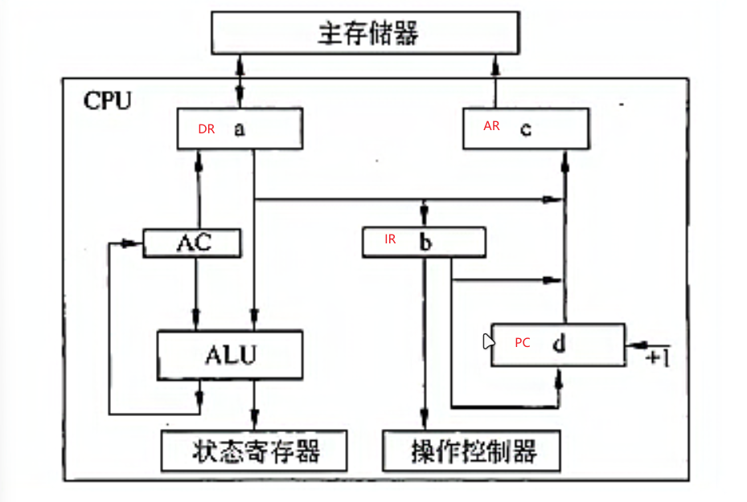

- 主频是**CPU 的时钟频率**，即 CPU 的工作频率：

- 一个时钟周期完成的指令数是固定的，因此主频越高，CPU 的速度越快。

- 主频常用来描述 CPU 的运算速度。

- 外频是**系统总线的工作频率**。

- **倍频**定义：

- 倍频指 CPU 主频与外频之比。

- **公式：主频 = 外频 × 倍频。**

- 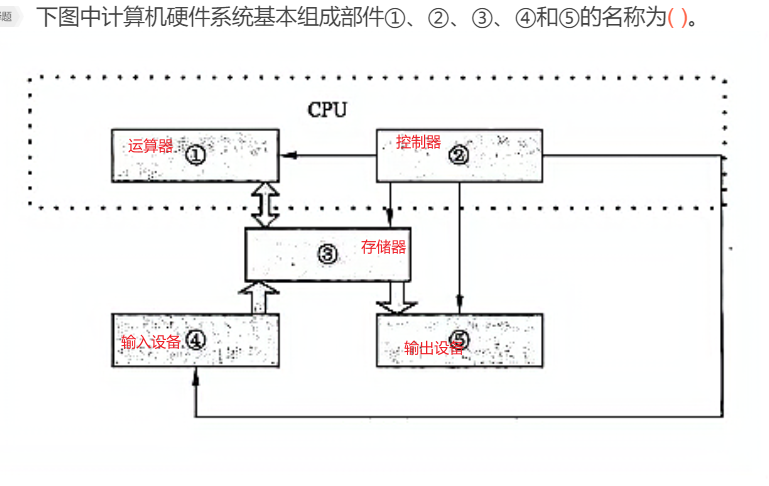

  - **控制器控制每个部件**
  - **运算器和控制器组成 CPU**
  - **输入设备只有输入的数据通路**
  - **输出设备只有输出的数据通路**
  - **存储器数据寄存器(MDR)和存储器地址寄存器(MAR)**：用于对内存单元访问时的数据和地址暂存。是由系统使用的，程序员不能访问。

- ### CPU加电或复位后的启动地址介绍：

  1. **启动地址的固定性**
    CPU在加电或复位后，会从一个固定的地址开始执行指令。这个地址一般是ROM或Flash等存储器的特定地址。（一般是处理器厂商决定这个地址）

    （BIOS—–基本输入输出系统，保存在ROM中）
  2. **第一条指令地址**
    第一条指令通常会固定在上述启动地址处，不同处理器的复位地址可能不同。
  3. **不同系统的启动地址实例**
    - **ARM系统**：通常从0地址开始运行。
    - **PowerPC系统**：通常复位启动地址为 `0xFFFF0100`，如Freescale的MPC82XX系列处理器。
    - **其他处理器**：也有从 `0xFFFFFFFC` 启动的，例如mA的PPC405GP和PPC440。
  4. **指令结构**
    复位启动地址处的指令长度通常为4个字节，其功能一般为一个跳转指令。

- 协处理器

  - 协处理器是一种协助中央处理器完成其无法执行或执行效率及效果低下的处理工作而开发和应用的处理器。
  - 中央处理器无法执行的工作有很多，比如设备间的信号传输、接⼊设备的管理等；而执行效率、效果低下的有图形处理、声频处理等。为了进行这些处理，各种辅助处理器就诞生了。需要说明的是，由于现在的计算机中，整数运算器与浮点运算器已经集成在一起，因此浮点处理器已经不算是辅助处理器。而内建于CPU中的协处理器，同样不算是辅助处理器，除非它是独立存在。
  - 协处理器也能通过提供一组专门的新指令来扩展指令集。例如，有一组专门的指令可以添加到标准ARM指令集中，以处理向量浮点(VFP)运算。
  - 协处理器可以在自己内部所包含的寄存器上进行指令的加载以及存储操作，可以和主处理器CPU之间进行数据交换，以提高执行效率。

### 指令集

  - **CISC (Complex Instruction Set Computer)**  复杂指令集：
  	- 基本思想：增强指令的功能，用复杂的新指令取代原有的多个简单指令功能，软件功能硬件化。
  	- 采用微程序控制（将控制信号放入存储器中，机器运行时，一条一条的读取这些控制信号）
  	- 导致指令系统更加庞大复杂。
  	- 通常指令数目在300条以上，有时超过500条，且每条指令的字长不相等，每条指令执行时间也相差较大。
  	- 寻址方式复杂

- 复杂指令集的处理器有CDC 6600、System/360、VAX、PDP-11、Motorola 68000家族、x86等。

- **RISC (Reduced Instruction Set Computer)**  精简指令集：
- 基本思想：通过减少指令数目及简化指令功能，降低设计复杂度以提升性能。
- 优化编译提高指令执行速度。
- 采用硬布线控制逻辑（通过简单的逻辑门（与门、或门）实现）优于微程序控制。
- 20世纪70年代末开始兴起，指令系统更简洁高效。
- 特征有：
- 统一指令编码(例如，所有指令中的op-code永远位于同样的比特位置，等长指令），可以快速解释。
  - 泛用的暂存器，所有暂存器可以用于所有内容，以及编译器设计的单纯化(不过暂存器中区分了整数和浮点数)。
  - 单纯的寻址模式(复杂指令集以简单计算指令串行取代），寻址方式简单；
  - 硬件中支持的少数数据类型(例如，一些CISC计算机中存有处理字节字符串的指令，这在RISC计算机中不太可能出现)。
- 采用Load/Store结构（用Load/Store指令对存储器进行操作）。

- 目前常见的精简指令集微处理器包括DECAlpha、ARC、ARM、 AVR、MIPS、PA-RISC、Power Architecture(包括PowerPC、PowerXCell)和SPARC等。
	- 中国自主研发的通用cpu——龙芯兼容MIPS指令集

### 校验码

  - 一个编码系统中任意两个合法编码（码字）之间不同的二进制位数称为这两个码字的**码距**，而整个编码系统中任意两个码字的最小距离就是该编码系统的**码距**。为使一个系统能检测和纠正一位差错，码间最小距离必须至少为3。

  - **海明码**是可以纠正一位差错的编码，是利用奇偶性的检测和纠错方法。海明码的基本意思是将传输的数据增加几个校验位，使得任意两个合法码字的不同位数为一定的数值（海明距离）。假设要传输的信息有m位，则经海明码编码的码字就有n=m+r位。

  	- 如：1101000 使用海明码编码（偶校验）

  	-  **k + r ≤ 2^r^ - 1**  （用于计算校验位数）【r】为校验位位数( r 取满足公式的最小值)，【k】为原始数据的位数。最小海明距离为k+1，纠正最大错误数为 k / 2；

  	- 原始数据用**D**表示，7位表示为：**D~7~D~6~D~5~D~4~D~3~D~2~D~1~**

​	校验位用 **P**表示，4位表示为：**P~4~P~3~P~2~P~1~**

​	海明码用 **H**表示，11位海明码为：**H~11~H~10~H~9~H~8~H~7~H~6~H~5~H~4~H~3~H~2~H~1~**

​	

| H~11~ | H~10~ | H~9~ | H~8~ | H~7~ | H~6~ | H~5~ | H~4~ | H~3~ | H~2~ | H~1~ |
| ----- | ----- | ---- | ---- | ---- | ---- | ---- | ---- | ---- | ---- | ---- |
| D~7~  | D~6~  | D~5~ | P~4~ | D~4~ | D~3~ | D~2~ | P~3~ | D~1~ | P~2~ | P~1~ |
| 11    | 10    | 9    | 8    | 7    | 6    | 5    | 4    | 3    | 2    | 1    |

- 在海明码中，校验位通常放置于2的幂次的位置上，也就是**P~i~**放在 **2^i-1^** 的位置上

- 下面组合的由来：

	- H1位置   1 = 2^0^     
	- H2位置   2 = 2^1^
	- H3位置   3 = 2^1^+2^0^
	- H4位置   4 = 2^2^
	- H5位置   5 = 2^2^+2^0^
	- H6位置   6 = 2^2^+2^1^
	- H7位置   7 = 2^2^+2^1^+2^0^
	- H8位置   8 = 2^3^
	- H9位置   9 = 2^3^  + 2^0^
	- H10位置   10 = 2^3^+2^1^
	- H11位置   11= 2^3^+2^1^+2^0^
	- 第一部分（含有2^0^的位置）：P1 D1  D2  D4 D5 D7   （位置序号的二进制的最后一位为1   1，3，5，7，9）
	- 第二部分（含有2^1^的位置）：P2 D1 D3 D4 D6 D7（位置序号的二进制的倒数第二位为1    2，3，6，7，10，11）
	- 第三部分（含有2^2^的位置）：P3 D2 D3 D4 (位置序号的二进制的倒数第三位为1  4，5，6，7)
	- 第三部分 （含有2^3^的位置）：P4 D5 D6 D7 （位置序号的二进制的倒数第四位为1  8,9,10,11）

- P~1~   **D~1~**     **D~2~**    **D~4~**    **D~5~**   **D~7~**       P1 = 0 （组合中1的个数必须为偶数（偶校验））
	P~2~   **D~1~**     **D~3~**    **D~4~**    **D~6~**   **D~7~**       P2 = 0
	P~3~   **D~2~**     **D~3~**    **D~4~**     P3 = 1
	P~4~   **D~5~**     **D~6~**    **D~7~**     P4 = 1

- 校验（保证S1、S2、S3、 S4均为0     如果为1，则出现错误）
	S1 = P1 ⊕ **D1** ⊕ **D2** ⊕ **D4** ⊕ **D5** ⊕ **D7**
	S2 = P2 ⊕ **D1** ⊕ **D3** ⊕ **D4** ⊕ **D6** ⊕ **D7**
	S3 = P3 ⊕ **D2** ⊕ **D3** ⊕ **D4**
	S4 = P4 ⊕ **D5** ⊕ **D6** ⊕ **D7**

- 纠错
	如果S1 = 1，S2\S3\S4都等于0，那么可以确定是P1出错了（如图，S1中的P1不会与其他相交）

	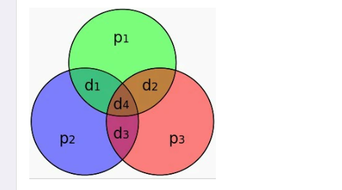

  - **循环冗余校验码（CRC）**的方法是在信息码的尾部拼接校验位，形成长度为n位的编码。其特点是检错能力较强且开销小，易于用编码器及检测电路的实现。利用生成多项式为k个数据产生r个校验位来进行编码，其编码长度为k+r

  - 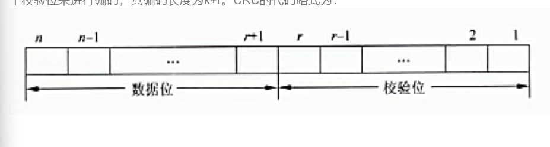

  - 在数据通信与网络中，通常/t相当大，由一位甚至数千数据位构成一帧，而后用CRC码产生的R位的校验码。它只能检测出错误，但不能纠正错误。

  	- 一般取 **r=16**。
  	- 标准16位多项式有：
        		- **CRC-16 = x^16^ + x^15^ + x^2^ + 1**
                		- **CRC-CCITT = x^16^ + x^15^ + x^2^ + 1**
  	- 一般情况下，r位生成多项式产生的CRC码可以检测出所有的双错、奇数位错和突发长度小于等于r位的突发错误。用于纠错目的的循环码的算法比较复杂。
  	- 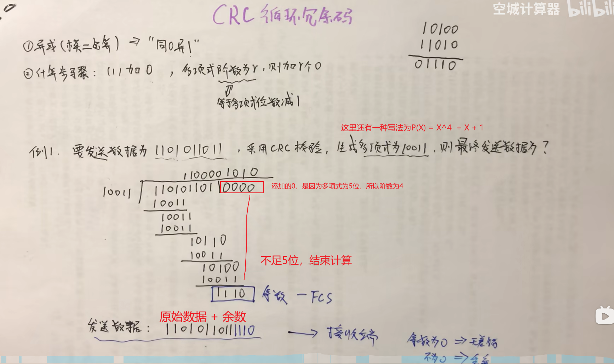

### 高速缓存

- Cache

  - Cache是一个高速小容量的临时存储器，可以用高速的静态存储器（SRAM）芯片实现。它可以集成到CPU芯片内部，或者设置在CPU与内存之间（容量大小：cpu < Cache < 主存，存储速度: cpu > Cache > 主存），用于存储CPU最经常访问的指令或者操作数据。

  	Cache的出现基于两个因素：

  	1. 由于CPU的速度和性能提高很快，主存速度提升较低且价格高，导致了速度不匹配的问题。
  	2. 程序执行具有局部性特点，即访问的数据和指令往往集中在某些区域。

  	因此，利用小容量的SRAM构成Cache，可以较低代价实现更高速度，从而尽可能发挥CPU的性能。

  	为了尽可能发挥CPU的高速性能，Cache的底层硬件必须实现全面功能。

  	在容量确定的情况下，替换算法本身的策略设计（不同算法如：LRU、FIFO）是影响Cache命中率的关键因素。

  - 不仅在CPU和内存之间有Cache，而且在内存和硬盘之间也有Cache（磁盘高速缓存），乃至在硬盘与网络之间也有某种意义上的Cache（如Internet临时文件夹）。因此，凡是位于速度相差较大的两种硬件之间的，均可用Cache协调两者数据传输速度差异问题，而**Cache对程序员是透明的**。

- 由硬件来实现Cache的全部功能

- **Cache的重要指标**：

  - Cache的重要指标是Cache的命中率。
    - CPU 在 Cache 中找到有用的数据被称为命中，当 Cache 中没有 CPU 所需的数据时（这时称为未命中），CPU 才访问内存。
    - 提高命中率的算法：
      - “最近最少使用算法”（LRU 算法）：将最近一段时间内最少被访问过的行淘汰出局。因此需要为每行设置一个计数器，LRU 算法是把命中行的计数器清零，其他各行计数器加 1。当需要替换时，淘汰行计数器计数值最大的数据踢出局。
    - 例题1：已知Cache的命中率为H=0.98，主存比Cache慢4倍，已知主存存取周期为200ms，则系统平均访问时间是  53ns。
      - 主存的存取周期为 200ns，主存比 Cache 慢 4 倍，则 Cache 的存取周期为：50ns。Cache 的命中率为 0.98，则系统的平均访问时间是 50×0.98 + 200×0.02 = 53ns。

- 改进Cache性能方法：降低失效率、减少失效开销、减少Cache命中时间。

- **主存和Cache之间的地址映射方式**：

  - 地址映射方式有三种：全相连映射方式、直接映射方式和组相连映射方式。

  - 全相连映射方式：
  	- 主存的一个块的地址与内容一起存于Cache的行中。
  	- 块地址存于Cache的标记部分。
  	- 特点：
  		- 存储的块与块之间，以及存储顺序或保存的存储器地址之间没有直接的关系。
  		- 程序可以访问主存中很多互不相关的数据块，而这些数据块位于主存器的不同部位上。
  		- Cache 必须对每个块和块自身的地址进行存储。
  		- 当请求数据时，Cache 控制器需要将请求地址与所有地址进行比较以确认命中。
  	- 优点：
  		- Cache 能够在给定的时间内存储主存器中的不同块，命中率高。
  	- 缺点：
  		- 每次请求数据时，都需要与 Cache 中的地址进行比较，比较次数多，速度较慢。
  	
  - 直接映射方式：（主存地址=区号+块号+块内地址）
  	- 是一种多对一的映射关系。
  	
  	- 一个主存块只能拷贝到Cache的一个特定行位置上。
  	
  	- **特点**：
  	
  		- 相比于全相联 Cache，直接映射 Cache 的地址只需比较一次，大大减少了地址比较的次数。
  		- 其做法是为 Cache 中的每个块位置分配索引字段，并使用 Tag 字段区分存放在 Cache 位置上的不同的块。
  		- 单路直接映射将主存储器分成若干页，每一页的大小与 Cache 存储器的大小相同。
  		- 主存储器的每一页面与 Cache 存储器的大小相同时，可以实现主存储器页与 Cache 偏移量的直接映射。
  	
  	- **工作流程**：
  	
  		- Cache 的 Tag 存储器（偏移量）保存着主存储器的页地址（页号）。
  		- 请求数据时，直接比较主存器页号与 Cache 的 Tag 字段。
  	
  	- **优缺点**：
  	
  		- **优点**：查找速度快，由于仅需一次地址比较。
  		- **缺点**：当主存储器的组之间频繁调用时，Cache 控制器需要频繁进行地址转换（多路直接映射下的问题）。
  	
  	- 在32位计算机中，Cache容量为16KB，Cache块的大小为16B，若主存与Cache地址映像采用直接映射方式，则主存地址1234E8F8（十六进制）装入Cache的地址是（）。
  	
  		A 0001 0001 0011 01
  		B 0100 0100 0110 10
  		**C 1010 0011 1110 00**
  		D 1101 0011 1010 00
  	
  		1. **Cache大小和块大小**：
  	
  			- Cache容量为16KB。
  			- 块大小为16B。
  	
  			总共有16KB  / 16B = 1024 个块。需要10位表示索引(2^10^=1024)
  	
  		2. 直接映射方式需要考虑地址的组成，包括标签（tag）、索引（index）和块地址（block offset）。由于块大小为16B，需要用4位来表示块内的地址（2^4^=16）。这指的是块偏移。
  	
  		3. 总地址空间为32位，所以地址的拆分为：
  	
  			- 10位用于索引（tag）
  			- 4位用于块偏移（index）
  			- 余下的18位用于标签（block offset）
  	
  		4. 1234E8F8 H = 0001 0010 0011 0100 1110 1000 1111 1000
  	
  		5. Cache地址为（后14位数据）：10 1000 1111 1000
  	
  - 组相连映射方式：（主存地址 = 区号 +组号 + 组内块号 +块内地址号）
  	- 每组行数的取值一般较小。
  	- **特点**：
  		- 组相联 Cache 是介于全相联 Cache 和直接映射 Cache 之间的一种结构。
  		- 它使用了多个直接映射的块，并允许对于某个约定的索引号（Index），可以有多个块位置。
  		- 这种结构可以增加命中率和系统效率。
  	- **示例计算**：容量为64块的Cache采用组相连联方式映像，块大小为128字节每4块为一组，若主存容量为4096块，且以字节编址，那么主存地址为（）位，主存区号为（）位
  		- 主存容量：
  			- 主存总容量 = 块数量 * 块容量 = 4096 * 128  = 2 ^19^
  			- 主存地址应为 19 位。
  		- 块内地址：
  			- 块内容为 128 字节，因此块内地址号为 7 位。
  		- 组相联结构设计：
  			- Cache 容量为 64 块，每组 4 块，共分为16组。
  			- 每组4块，组内块号用2位表示
  			- 有16组，每组的组号用 4 位地址（2^4^）表示。
  			- 剩余的即为区号，应为 6 位（19 - 7 - 4 -2 = 6）。

- **Cache修改与主存内容一致性**：

  - 当CPU对Cache的修改后，如何与主存（Memory）内容保持一致，可以选择以下方法之一：
    - 写回法（Write-Back）
      - 这种方法仅在缓存块需要被替换出缓存时，才会将该缓存块中的数据写入内存。
      - 如果缓存命中，即缓存中有要写入的数据，那么只会更新缓存中的数据，并不会写入内存。
      - 每个缓存块会有一个脏位（Dirty bit）标识，用于判断该块是否被修改过。只有当脏位被置位时，即该块数据有更新时，才会在被置换出缓存时写入内存。
      - 特点：只有在缓存块被替换时才写入内存，减少了内存写操作的次数，提高了性能。
      - 优点：通过减少不必要的内存写操作，提高系统性能。
      - 缺点：实现较为复杂，因为需要管理脏位和缓存替换策略。
    - 写通法（全写法或者写直达法）（Write-Through）
      - 每当CPU有写操作时，数据会同时写入内存（如果数据地址也在缓存中，则必须同时更新缓存）。
      - 优点：数据一致性很容易保证，因为内存和缓存数据始终一致，比写回法易于实现。
      - 缺点：由于每次写操作都需要写入内存，这可能导致内存写操作成为性能瓶颈。为了缓解这个问题，通常会使用一个写缓冲器（Write buffer）或者写缓存器来暂存写操作指令。
      - 特点：每次写操作都会同时写入内存，保证数据一致性。
    - 写一次法（Write-Once）
      - 通常指在系统运行期间，只有首次写入某个缓存块时会将数据写入内存，之后对该缓存块的写入操作只会更新缓存，而不更新内存。
      - 这种方法并不常见，因为它**会引入数据不一致**的问题。如果需要保证数据一致性，会需要特殊的机制来处理。
    - 缓冲直写法（Post-Write）
      - 这个概念与写回法相似，但更强调的是使用一个专用的缓冲区（Post-Write Buffer）来存储对缓存的更新。
      - 当CPU有写操作时，缓存块会首先被更新，同时更新指令会被存储在缓冲区中。
      - 缓冲区会在合适的时候（例如，空闲时或者缓冲区满的时候）将更新指令应用到内存上，从而减少内存写操作的次数。
      - 特点：先将更新写入缓存和缓冲区，延时写入内存，优化缓存访问速度。
      - 优点：可以提高Cache访问速度。
      - 缺点：连续多次更新可能导致缓冲区资源不足，迫使同步更新Memory。

- 计算机采用分级存储体系的目的是解决：存储容量、成本速度之间的矛盾。（缓存使用SRAM、内存使用DRAM、外出使用磁存储器）

  - SRAM的集成度低、速度快；
  - DRAM的集成度高，但是需要动态刷新；
  - 磁存储器速度慢、容量大、价格便宜。

### 系统总线（又称内总线或者板级总线   三总线结构）

- #### 数据总线

  - 数据总线负责整个系统的数据流量，其宽度（单位：二进制位数）决定了CPU与二级高速缓存、内存及输入输出设备之间一次数据传输的信息量。

  - 数据总线宽度（传输的位数）取决于通道一次并能传输二进制位数。
  	- 数据总线越宽，数据传输速率越快。
  	- 数据总线宽度受CPU**字长**限制。
  	- CPU的字长以位为单位，例如8086 CPU的字长是16位，但数据总线宽度为8位（标准为16位机），因此每次只能传送1个字节。

- #### 地址总线

  - 地址总线宽度决定了计算机地址范围，影响寻址能力及内存存储范围。
  	- 地址宽度受CPU芯片决定，直接指向内存存储单位。
  	- 例如，地址总线宽度若为20位，可寻址范围是1MB（2^20^），若扩展至32位便可寻址到4GB。
  	- 内存大小通常以 **字节（Byte，简称B）** 为单位

- #### 数据总线和地址总线综合总结

  - 数据总线宽度影响数据传输效率，地址总线宽度影响寻址范围。

  - 两者配合决定了系统的性能，影响访问速率与范围。

- #### 总线设计对性能的重要影响

  - 对于寄存器与存储器等设备的访问通过地址总线完成。

  - 地址总线宽度不足可能导致性能损失或系统设计的受限。

  总之，在微型计算机系统中，对总线设计（包括数据线与地址线）的合理配置非常必要。

- 控制总线、地址总线、数据总线一般统称为**系统总线**或者**计算机总线**。
  - **控制总线（CB）**：负责传递控制信号，用于协调和控制计算机内部各部件的工作。
  - **地址总线（AB）**：用于传输地址信息，表示数据的来源或目标位置。
  - **数据总线（DB）**：用于传输实际的数据

- 系统总线（内总线）：

	- **ISA总线**：
		- **全称**：Industrial Standard Architecture（工业标准架构）。
		- **提出时间**：1984年。
		- **提出者**：IBM公司。
		- **用途**：为PC/AT机设计的标准。
		- **特点**：是XT总线的扩展，支持8/16位数据总线。
		- **扩展性**：标准总线，广泛应用于早期PC系统。
	- **EISA总线**：
		- **全称**：Extended Industry Standard Architecture（扩展工业标准架构）。
		- **提出时间**：1988年。
		- **提出者**：Compaq等9家公司。
		- 特点：
			- 基于ISA总线，新增了双层插座。
			- 在原有ISA总线的98条信号线基础上增加了98条，提供更强的扩展能力。
			- 兼容ISA信号，增强了设备兼容性。
		- **扩展性**：适合需要更多扩展卡的用户。
	- **PCI总线**：
		- **全称**：Peripheral Component Interconnect（外围组件互连）。
		- **提出者**：Intel公司。
		- **用途**：当前最流行的局部总线之一。
		- 特点：
			- 定义了32位数据总线，可扩展到64位。
			- 插槽体积小，支持突发读写操作，最大传输速率为132 MB/s。
			- 支持多组外围设备。
			- 不兼容现有的ISA、EISA、MCA总线，但基于奔腾新一代微处理器发展。
			- 独立于处理器，适合新一代计算机系统。

- 外总线：

	- **SCSI总线**：
		- **全称**：Small Computer System Interface（小型计算机系统接口）。
		- **用途**：用于计算机和智能设备之间的系统级接口。
		- 特点：
			- 支持多种外部设备（如硬盘、软驱、光驱、打印机、扫描仪等）。
			- 是独立处理设备的标准，增强了设备的高速传输和兼容性。
	-  **USB 接口（Universal Serial Bus）**
		- **定义**：USB 是一个外部总线标准，用于规范计算机与外部设备的连接和通讯，是 PC 领域广泛应用的接口技术。
		- **功能**：支持设备的即插即用和热插拔功能。
		- **应用**：USB 接口可用于连接多达 127 个外设，例如鼠标、调制解调器、键盘等。
		- **发展史**：USB 自 1996 年推出后，成功替代了串口和并口，并成为个人电脑和大量智能设备的常用接口之一。
	- **网络接口（RJ45 接口）**
		- **定义**：网络接口一般采用 RJ45 接口。
		- **标准**：遵循 IEEE 802.3 标准。
		- **传输速率**：通常为 10M/100M/1000Mbps。
		- **工作模式**：可工作在全双工或半双工模式。

### 总线

- 总线(Bus)是计算机各种功能部件之间传送信息的公共通信干线，它是由导线组成的传输线束，按照计算机所传输的信息种类，计算机的总线可以划分为数据总线、地址总线和控制总线，分别用来传输数据、数据地址和控制信号。总线是一种内部结构，它是CPU、内存、输入、输出设备传递信息的公用通道，主机的各个部件通过总线相连接，外部设备通过相应的接口电路再与总线相连接，从而形成了计算机硬件系统。在计算机系统中，各个部件之间传送信息的公共通路叫总线，微型计算机是以总线结构来连接各个功能部件的。

- **总线按功能划分：**

  - 地址总线（address bus）：专门用来传送地址。

  - 数据总线（databus）：用于传送数据信息，可分为单向传输和双向传输数据总线，双向传输通常采用双三态形式的总线。

  - 控制总线（control bus）：用于传送控制信号和时序信号，例如微处理器对外部存储器操作时发出的读/写信号、片选信号和读入中断响应信号等。控制总线一般是双向的，方向和位数根据系统需要决定。
  	- 在设计中，数据总线和地址总线可以在地址锁存器控制下被共享（复用）。

- #### 按数据传输方式划分：

  - **串行总线**：常见的有SPI、I²C、USB、RS232、CAN等。
  - **并行总线**：种类相对较少，常见的有ISA、PCI、VME等。
  - 新一代高速串行总线：
  	- SATA、PCIE（PCL Express）、IEEE 1394、RapidIO、USB 3.0等。
  	- 基于光纤的高速串行总线：AFDX、FC等。

- **单总线结构**：

  - 只有系统总线
  - 通过一组系统总线将计算机系统的各部件连接成一个整体。
  - 各部件可以通过总线交换信息。
  - 优点：易于扩展新设备；所有设备可以统一的编址，便于设备管理。
  - 缺点：同一时刻只能支持总线上一个设备间的通信（分时使用总线），导致信息传递受到局限性。（类似1-Wire总线通信协议）
  - 总线的一个操作过程是完成两个模块之间传送信息，启动操作过程的是主模块，另外一个是从模块。某一时刻总线上只能有一个主模块占用总线。**总线的操作步骤：主模块申请总线控制权，总线控制器进行裁决，主模块得到总线控制权后寻址从模块，从模块确认后进行数据传送，从模块可以是多个设备**
  - 应用：主要用于微型计算机和小型计算机中。
  - 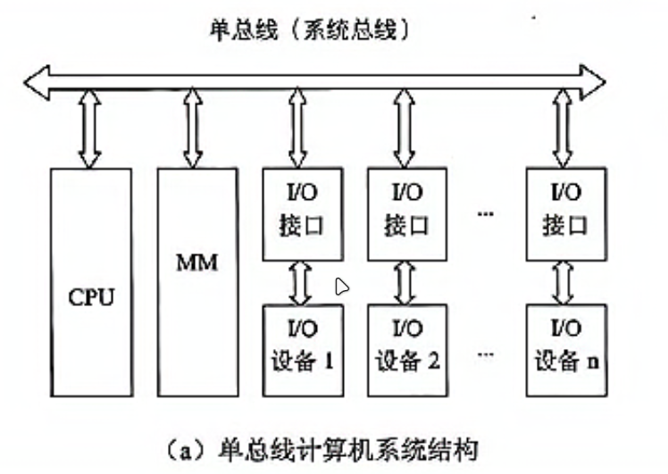

- **双总线结构**：
  - 有系统总线和内存总线
  - 设置多组总线以消除信息传递的瓶颈。
  - 典型方式是在主存和CPU之间增加一组专用的高速存储总线。
  - 优点：通过专用总线处理主存和CPU之间的信息交换，同时系统总线依然可以服务其他设备；信息传递效率高。
  - 缺点：需要增加硬件投资。
  - 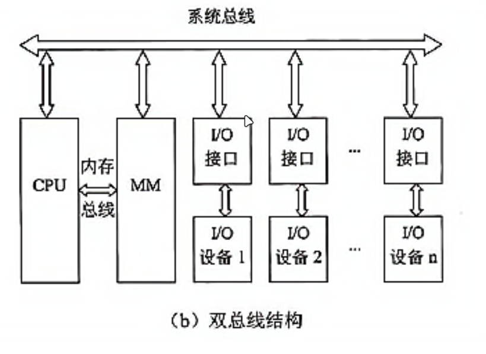

- **多总线结构**：
  - 系统总线+内存总线+I/O总线

- 计算机总线是计算机各功能部件之间传送信息的公共通信干线，由导线组成的传输线束。根据传输数据的方式，总线可分为串行总线和并行总线
  - **串行总线**：
    - 按位传输数据。
    - 特点：
    	- 使用一条信号线进行数据传输。
    	- 接口连接简单。
    	- 脚数量少。
    	- 成本较低。
    	- 系统可靠性高。
    - 常见串行总线：RS232、I2C、IEEE1394、USB等
  - **并行总线**：
    - 并行接口与计算机设备之间传递数据的通道。
    - 并行传输的二进制位数称为数据宽度（多条信号线进行数据传输）。
    - 常见并行总线：ISA、PCI、VME等。
  - CPU与接口之间按并行传输数据，假如：接口与外设之间按串行传输数据
  	- 发送端（在数据输出过程中）：CPU把要输出的字符（并行方式）送入“数据输出寄存器”，然后由“发送移位寄存器”移位，把数据1位1位送到外设（串行方式）。
  	- 接受端（在数据输入过程中），数据1位1位地从外设进入的“接收移位寄存器”（串行方式），当“接收移位寄存器”中接收完1个字符的各位后，数据就从“接收位置寄存器”进入“数据输入寄存器”（并行方式）。CPU从“数据输入寄存器”中读取得到的字符。

- **总线**就是连接两个以上数字系统元器件的信息通路。通常可以把总线分为以下几类：

  1. **片内总线**：就是集成电路芯片内部各个功能之间的连接线，这类总线是由芯片设计者来实现的。

  2. **元件级总线**（又称为板内总线）：用于实现电路板内各个元器件的连接。

  3. **内总线**（又称为系统总线）：用于将构成微型机的各个电路板连接在一起。

  	1. **PC/XT 总线**

  		- **特点**：PC/XT是最早的PC机的系统总线，它由62个插座信号构成。除了地址、数据、控制线外，还包括6条中断请求线、3条DMA请求信号、3条DMA响应信号、电源、地等其他信号。
  		- **数据传输**：它是一条8位宽的总线，每次利用该总线进行读写操作时，只能传送8位数据。
  		- **寻址范围**：可以寻址到1MB（1兆字节）。

  	2. **ISA总线**

  		- **特点**：ISA总线（Industry Standard Architecture）是工业标准总线。它向下兼容PC/XT总线，基于PC/XT总线的基础上扩充了36个信号线，包括24条地址线、16条数据线。

  		- **寻址范围**：可以寻址到16MB（16兆字节）。

  		- **性能指标**：总线的最高频率为8MHz，数据最高传输速率为16MB/s。总体性能较低

  	3.  **PCI总线**

  		- **特点**：PCI（Peripheral Component Interconnect）总线是一种不依赖于任何具体CPU的局部总线。它是一种高性能、可扩展的总线标准。
  			- 时钟频率与数据传输速率：
  				- PCI总线的时钟频率为33MHz或66MHz。
  				- 进行64位数据传输时，数据传输速率可以达到528MB/s。

  		- 兼容性和特性：
  			- PCI总线支持即插即用。
  				- 总线上的设备可以提出总线请求，PCI管理器中的仲裁机构一旦允许该设备成为主控设备，就可以由它来控制PCI总线，实现主设备和从设备之间的点对点数据传输。

  4. **外总线**（又称为通信总线）：用于实现微机系统和外设之间的相互连接。

  	1. **IEEE-1394总线**

  		- **特点**：IEEE-1394总线是一种新的串行外总线。它支持热插拔，并且即插即用，同时传输速率也很高。
  			- 数据传输速率：
  				- IEEE-1394传输速率可以达到400Mb/s。
  				- 新的IEEE-1394b传输速率可以达到3.2Gb/s。

  		- **传输距离**：传输距离较远。

  	2. USB总线

  	3. VME总线

- 采用总线结构的主要**优点**有：

  ① 面向存储器的双总线结构信息传送效率较高，这是它的主要优点。但 CPU 与 I/O 接口都要访问存储器时，仍会产生冲突。

  ② CPU 与高速的局部存储器和局部 I/O 接口通过高传输速率的局部总线连接，速度较慢的全局存储器和全局 I/O 接口与较慢的全局总线连接，从而兼顾了高速设备和慢速设备，使它们之间不互相牵扯。

  ③ 简化了硬件的设计。便于采用模块化结构设计方法，面向总线的微型计算机设计只要按照这些规定制作 CPU 插件、存储器插件以及 I/O 插件等，将它们连入总线就可工作，而不必考虑总线的详细操作。

  ④ 简化了系统结构。整个系统结构清晰。连线少，底板连线可以印制化。

  ⑤ 系统扩充性好。一是规模扩充，规模扩充仅仅需要多插一些同类型的插件。二是功能扩充，功能扩充仅仅需要按照总线标准设计新插件，插件插入机器的位置往往没有严格的限制。

  ⑥ 系统更新性能好。因为 CPU、存储器、I/O 接口等都是按总线规约挂到总线上的，因而只要总线设计恰当，可以随时随着处理器的芯片以及其他有关芯片的进展设计新的插件，新的插件插到底板上对系统进行更新，其他插件和底板连线一般不需要改。

  ⑦ 便于故障诊断和维修。用主板测试卡可以很方便找到出现故障的部位。以及总线类型。

- 采用总线结构的**缺点**有：

  ① 由于在 CPU 与主存储器之间、CPU 与 I/O 设备之间分别设置了总线，从而提高了微机系统信息传送的速率和效率。但是由于外部设备与主存储器之间没有直接的通路，它们之间的信息交换必须通过 CPU 才能进行中转，从而降低了 CPU 的工作效率 (或增加了 CPU 的占用率。一般来说，外设工作时要求 CPU 干预越少越好。CPU 干预越少，这个设备的 CPU 占用率就越低，说明设备的智能化程度越高)，这是面向 CPU 的双总线结构的主要缺点。

  ② 利用总线传送具有分时性。当有多个主设备同时申请总线的使用时必须进行总线的仲裁，分时传输。

  ③ 总线的带宽有限，如果连接到总线上的某个硬件设备没有资源调控机制容易造成信息的延时 (这在某些即时性强的地方是致命的)。

  ④ 连到总线上的设备必须有信息的筛选机制，要判断该信息是否是传给自己的。

- 总线的数据传输类型分为**单周期方式和突发（burst）方式（猝发）**。

	- 单周期方式是指一个总线周期只传送一个数据。
	- 突发（burst）方式是指获得总线控制权后进行多个数据的传输。寻址时给出目的地址，访问第一个数据；数据2、3到数据n的地址在首地址基础上按一定规则自动寻址（如自动加1）。（先进行一次地址传输）
	- 例题：
	- 某同步总线的时钟频率为 **100MHz**，宽度为 **32位**，地址/数据复用，每传输一个地址或者数据占一个时钟周期。若该总线支持 **burst（猝发）** 传输方式，则一次“主存写”总线事务传输一个数组 `int buf[4]` 所需要的时间至少是50ns。
	- 32位，int型占4个字节，buf[4]占16个字节，即128位数据。需要128 ÷ 32  = 4个周期。一个周期为1÷100MHZ = 10ns。采用burst方式，需要5个周期（先传输地址），5×10ns =50ns

- 带宽

  - 例题：总线宽度：并行传输4字节（即32位），总线时钟频率10MHZ，总线周期占2个时钟周期。
  - 时钟周期：1 / 10MHZ = 0.1us
  - 总线周期：0.1us × 2 = 0.2us 
  - 带宽：4B / 0.2us = 20M B/s

- 总线主设备是指可申请并能获得总线使用权的设备

### 流水线

- **流水线技术**是一种将每条指令分解为多步，并让各步操作重叠，从而**实现几条指令并行处理的技术**。

  - 在程序中，指令的顺序执行依然遵循一条条指令的次序，但可以预先取若干指令。
  - 当前指令尚未执行完成时，可以提前启动后续指令的一些操作步骤。
  - 这种技术的优势在于通过操作的重叠加速了程序的运行速度。

  显然，这种方法能够显著提高程序的执行效率。

- 流水线的操作周期应为“瓶颈”段（最长时间段）所需的时间

-  **流水线深度的定义**

  流水线深度指的是**流水线各个阶段的数量**。现代处理器中，指令执行被分解为多个阶段，每个阶段完成一部分指令执行的工作。例如（五级流水线——AMR9）：

  - 取指（IF）：指从存储器中取出指令，并将其放入指令流水线
  - 解码（ID）：指对指令进行译码解码
  - 执行（EX）：指利用逻辑运算单元进行运算的执行
  - 访存（MA）：指在需要情况下进行数据存储器的访问
  - 写回（WB）：指将指令产生的结果回写到寄存器中

  如果一个流水线有更多的阶段（更深的流水线），则表示每条指令被细分为更多的步骤。

-   **同时运行的指令条数**

  流水线的设计允许每个阶段都在处理一条不同的指令。随着指令在流水线内推进，在某一时刻，不同阶段可能同时操作不同的指令。因此，**同时运行的指令条数主要取决于流水线有多少个阶段**，即流水线深度。

  - 当流水线有 个阶段时，一般情况下可以同时处理 条指令。
  - 这表明流水线越深，同时运行的指令条数的上限越高。

-  **过深流水线的问题**

  尽管深流水线可以提高并行性，但也可能带来以下问题：

  - **分支预测代价高**：分支错误时，深流水线的误操作指令更多，因此会浪费更多资源。
  - **指令间相关性**：指令间的数据依赖会导致流水线暂停，降低效率。
  - **设计复杂性增加**：增加流水线阶段需要对每个阶段进行更精细的管理。

- 各段时间不相等流水线

  - 吞吐量 = 总指令条数 / 总时间
  	- k段流水线，k段所需的总时间为t~1~，k段中所需最长的时间为t~max~ ，连续输入n条指令，吞吐率为：n  / （t~1~ + （n-1）× t~max~）    （一定会有一个完整的流水线）
  	- 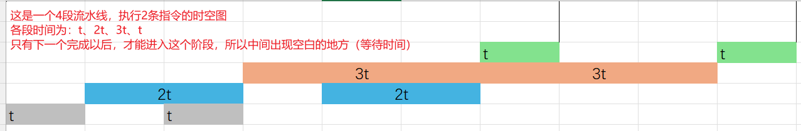   

### 执行指令

- **取指令**
	控制器首先接程序计数器所指地址从内存中取出一条指令。
- **指令译码**
	将指令的操作码部分送指令译码器进行分析，然后根据指令的功能向有关部件发出控制命令。
- **按指令操作码执行**
	根据指令译码器分析指令产生的操作控制命令以及程序状态字（PSW）寄存器的状态，控制微操作部件产生一系列CPU内部的控制信号和输出到CPU外部控制信号。通过这一系列控制信号的控制下，实现指令的具体功能。
- **形成下一条指令地址**
	- 若指令为转移类指令，则修改程序计数器的内容；
	- 若是直接转移类指令，则该指令中的转移地址直接送入程序计数器；
	- 若是间接转移类指令，则非直接转移类指令需修改程序计数器的内容。

### DMA

- **DMA(Direct Memory Access，直接内存访问)方式：**

  - **定义：**
    - 一种完全由硬件执行I/O交换的工作方式。DMA控制器从CPU处完全接管地址总线、数据总线和控制总线的控制，数据交换不经过CPU，而直接在内存和I/O设备之间进行。
  - **特点：**
    - 减少CPU参与：
    	- 利用DMA进行数据传送时不需要CPU的参与，一旦DMA控制器初始化完成，数据就开始传送，DMA脱离CPU独立完成数据传送。
    - 无需中间操作：
    	- 利用DMA传送数据的好处是数据直接在源地址和目的地址之间传送，无需中间操作。
  - **操作说明：**
    - 如果通过CPU传送数据需要两步操作：
    	1. CPU把一个字节从源地址读到内部寄存器中。
    	2. 然后再从寄存器传送到内存。
    - DMA控制器只需一步操作，它操作系统总线上的控制信号，使多个字节一次完成。
  - **优势：**
  	- 大大提高了计算机运行速度和工作效率。
  - DMA控制器
  	- DMA控制器可以像CPU那样获得总线的控制权，完成外设与存储器之间的数据高速交换
  	- 。DMA控制器不但要与外设连接，以接受外设发出的DMA操作请求和在DMA期间对外设进行控制，还要与CPU连接，以请求总线的控制权；
  	- 同时，它还需要与三大总线（地址、控制、数据总线）连接，以便进行总线的控制。
  	- DMA控制器里面包含**地址寄存器、状态寄存器、控制寄存器、字节计数器**。
  		- 地址寄存器包括源地址和目的地址寄存器；
  		- 状态寄存器用于寄存DMA传送前后的状态；
  		- 控制寄存器用于选择DMA控制器的操作类型、工作方式、传送方向和有关参数；
  		- 字节计数器用于控制传送数据块的长度。

- 一个完整的DMA传输过程所需的4个步骤：

  1. **DMA请求**：由CPU对DMA控制器进行初始化，并向I/O接口发出操作命令，I/O接口提出DMA请求。
  2. **DMA响应**：DMA控制器对DMA请求判断优先级及需求，然后通过总线控制逻辑接管总线的控制权。
  3. **DMA传输**：DMA控制器直接控制RAM与I/O接口之间的数据传输，减少CPU的干预。
  4. **DMA结束**：数据传输结束后，DMA控制器解释放总线控制权，并通知CPU进行后续处理。

- 中断与DMA区别：

	- **中断方式与DMA方式的中断处理时间点不同：**
		- **中断方式**: 在数据缓冲寄存器满之后才发出中断，要求CPU进行中断处理。
		- **DMA方式**: 在所要求传送的数据块全部传送结束时，才要求CPU进行中断处理。**这就大大减少了CPU进行中断处理的次数。**

	- **数据传送的控制方式不同：**
		- **中断方式**: 数据传送是在中断处理时由CPU控制完成的。
		- **DMA方式**: 数据传送是在DMA控制器的控制下完成的。**这就排除了CPU因并行设备过多而来不及处理，以及因速度不匹配而造成数据丢失等现象。**

### 芯片引脚计算

SRAM芯片的容量为 **512B×8 位**  （总容量为：512B × （8 位/ 8） = 512B），计算引脚数如下：

1. **容量与地址线计算**：
	- 容量为 512，表示 2^9，因此需要 9 根地址线，表示寻址范围为 0 ~ 511。
2. **数据总线**：
	- 位宽为 8 位，需提供 8 根数据总线。
3. **控制引脚**：
	- 需要以下控制信号：
		- 芯片选择信号 (**CS**)
		- 读/写控制信号 (**WE/RW**)
4. **电源/接地引脚**：
	- 每个芯片通常至少需要 2 个引脚（电源 & 接地引脚）。

因此，该芯片引出的最小引脚数目为：
数据线(8) + 地址线(9) + 控制线(2) + 电源/接地(2) = **21 根引脚**。

------

#### 拓展：芯片引脚计算的一般方法

##### 地址线数目计算

公式：
地址线数 = log~2~存储单元容量

- 对于 512×8 位的 SRAM，每个存储单元是 1 字节（=8 位），因此 512 个存储单元需要 **9 条地址线**。

##### 数据线数目计算

数据总线的位宽与数据存储的“位宽”直接相关，即每次并行传输的数据位数。

- 若存储为 8 位宽，则需要 **8 条数据线**。
- 若存储为 16 位宽，则需要 **16 条数据线**，以此类推。

##### 控制线计算

控制线通常包含以下几类：

- **CS** (Chip Select)：用于激活芯片，必需 1 条。
- **WE/RW** (Write Enable)：控制读或写操作，通常需要 1 条。
- **OE** (Output Enable)：一些芯片中用于精确控制输出。

通常至少需要 2~3 条控制线。

##### 电源与接地线

每个芯片都需要电源和接地线，一般至少 2 根。

##### 例题

若某 SRAM 的容量为 1KB（1024×8 位），每次传输 8 位：

1. 地址线数 = = 10 条
2. 数据线数 = 8 条
3. 控制线数 = 至少 2 条
4. 电源与接地引脚 = 2 条

总引脚数 = 10 + 8 + 2 + 2 = **22 根**。

##### 例题2

 **设用2K×4位的存储器芯片组成16K×8位的存储器（地址单元为0000H～3FFFH，每个芯片的地址空间连续），则地址单元0B1FH所在芯片的最小地址编号为（B ）。**

- **选项**：
	- A. 0000H
	- B. 0800H
	- C. 2000H
	- D. 2800H
- 由2K×4的存储器芯片组成容量为16K×8位的存储器时，共需要16片（16K×8/(2K×4)）。用2个存储器芯片组成2K×8的存储空间（每个芯片的地址空间连续），16K×8位的存储空间共分为8段，即：
	- **0000H\~07FFH，0800H\~0FFFH，1000H\~17FFH，1800H\~1FFFH，2000H\~27FFH，2800H\~2FFFH，3000H\~37FFH，3800H~3FFFH**。
- 显然，地址单元 **0B1FH** 所在芯片的起始地址为 **0800H**。

##### 例题3

对于一块具有15条地址线、16条双向数据线的SRAM，其容量为2^15^X16位 = 2^15^X(16/8)B=2^15^X2=64KB

##### 例题4

某计算机数据总线为16位，内存按字节编址，地址从B4000H到DBFFFH，共用（）字节。若用存储容量位16K x 16bit的存储器芯片构成该内存，至少需要（）片。

DBFFFH-B4000H = 27FFFH  因为地址从0开始计数，所以共用了27FFFH + 1 = 28000H = 163,840字节

内存按字节编址   16K x 2字节的存储芯片  容量为2^15^字节 32768字节

所以需要   163,840字节 ÷ 32768字节 = 5

**字节为8位二进制  字为题干给的长度（字长）**

### 计算机外设的编址方法：**单独寻址法（单独编址）**和**统一寻址法（统一编址）**。

- **单独寻址法**（I/O映射方式）：
	- 专用于 I/O 端口的设备，存储器和 I/O 端口在两个独立的地址空间中。
	- 优点：
		- I/O 端口的地址码较短，不占用存储器空间，译码电路简单。
		- 程序较明确，存储器和 I/O 端口的控制结构相互独立，可以分开设计。
	- 缺点:
		- 需要专门的I/O指令，程序设计的灵活性差
- **统一寻址法**（存储器映射方式）：
	- 存储器和 I/O 端口使用统一的地址空间。当一个地址空间分配给 I/O 端口后（通过地址范围区分访问内存单元和I/O设备），存储器就不能再拥有这一部分的地址空间。
	- I/O读写操作指令与存储单元的读写指令相同，但行为不同。
	- 优点：
		- 不需要专门的 I/O 指令，任何存储器数据进行操作指令(访存指令)都能用于 I/O 端口的数据操作，程序较简洁。
		- 由于 I/O 端口的地址空间是内存空间的一部分，这样 I/O 端口的地址空间可以大可小，使外设数量几乎不受限制。
		- 还可以对端口内容进行算术逻辑运算、移位等操作。
		- 给I/O端口较大的编址空间，对大型控制系统及数据通信有意义。
	- 缺点:
		- I/O端口占用内存空间，影响系统内存容量
		- 访问I/O端口也要同访问内存一样，由于内存地址较长，导致执行时间增加。

### 计算机系统的结构

- 按指令流和数据流的组织关系
	- 
		1. **单指令流单数据流（SISD）**
		2. **单指令流多数据流（SIMD）**
		3. **多指令流单数据流（MISD）**
		4. **多指令流多数据流（MIMD）**
	- 在高性能计算中，许多计算机采用并行技术，主要其中包括SMD或MIMD。大规模并行处理器（MPP）是多计算机系统的一个实例，由专门设计的扩展性高带宽通信网络组成，能够连接成千上万的高性能微处理器。

- 体系结构
	- 
		1. **冯·诺依曼结构 (Von Neumann)**：
			- 又称为“普林斯顿结构”。
			- 特点：程序指令存储器和数据存储器共享同一个存储器，属于统一存储结构，cpu区分指令和数据依靠**指令周期的不同阶段**（即执行时按顺序依次取出指令或者数据）。
			- 该结构中，指令与数据通过公共总线传输，容易造成瓶颈。
		2. **哈佛结构 (Harvard)**：
			- 特点：程序指令存储器和数据存储器彼此独立分开，属于分离存储结构。
			- 因为指令和数据拥有各自独立的存储器和通道，能显著提高数据处理的并行性和效率。
			- 取指与执行在流水线上可以重叠
	- DSP(最大量的工作是与存储器交换信息，所以需要哈佛结构提高并行性)系统：如TMS320C6000系列芯片采用哈佛结构
	- PPC7447主体采用的是冯诺依曼结构

### 输入输出控制方法

**计算机中主机与外设间进行数据传输的输入输出控制方法有程序控制方式、中断方式、DMA等。**

- **在程序控制方式下**，由CPU执行程序控制数据的输入输出过程。

	- #### **特点：**

		- **完全由软件控制**：CPU需要通过程序主动查询外设的状态，确定何时可以进行数据传输。
		- **被动等待**：CPU需要不断轮询设备的状态，直到设备准备好数据或准备好接收数据。

		#### **工作原理：**

		1. **主动查询**：CPU通过读取设备的状态寄存器，判断设备是否完成上一次操作。
		2. **初始化**：在发起数据传输之前，CPU需要设置数据传输相关参数。
		3. **数据传输**：当设备准备好后，CPU将数据写入或从设备中读出数据。
		4. **结束操作**：数据传输完成后，继续执行下一条指令。

		#### **优缺点：**

		- 优点：
			- 简单易实现，适用于简单的数据传输场景。
		- 缺点：
			- **CPU效率低**：CPU需要频繁查询设备状态，浪费大量CPU时间。
			- **无法处理突发情况**：如果设备传输时间不确定，可能导致长时间等待。

- **在中断方式下**，外设准备好输入数据或接收数据时向CPU发出中断请求信号，CPU若决定响应该请求，则暂停正在执行的任务，转而执行中断服务程序进行数据的输入输出处理，之后再回去执行原来被中断的任务。

	- #### **特点：**

		- **外设主动通知主机**：当外设准备好数据或完成操作时，通过中断方式向CPU发送信号，请求CPU处理。
		- **CPU中断响应**：CPU接收到中断信号后，暂停当前任务，处理外设的请求。

		#### **工作原理：**

		1. **外设中断请求**：外设完成数据准备好或传输结束后，向CPU发送中断信号。
		2. **中断响应**：CPU响应中断，暂停当前任务，转到中断处理程序。
		3. **数据传输**：中断处理程序负责完成数据传输或状态处理工作。
		4. **恢复执行**：中断处理完毕后，返回到被中断的程序继续执行。

		#### **优缺点：**

		- 优点：
			- **CPU效率高**：CPU不用主动轮询设备，能更高效地执行其他任务。
			- **实时性好**：设备准备好后，能够及时通知CPU处理，响应速度快。
		- 缺点：
			- **中断处理开销**：每次中断都需要保存上下文和恢复上下文，有一定开销。
			- **不适合大量数据传输**：频繁中断可能导致系统性能下降。

- **在DMA方式(直接存储器存取)下**，CPU只需向DMA控制器下达指令，让DMA控制器来处理数据的传送，数据传送完毕再把信息反馈给CPU，这样在很大程度上就减低了CPU资源占有率，可以大大节省系统资源。

	- #### **特点：**

		- **外设直接访问内存**：外设通过专用的DMA控制器与内存直接交换数据，无需CPU干预。
		- **无需CPU干预**：CPU在数据传输过程中可以继续执行其他任务，提高效率。

		#### **工作原理：**

		1. **初始化DMA**：CPU设置DMA控制器，指定数据传输的起始地址、传输字节数等参数。
		2. **DMA接管传输**：DMA控制器根据预先设置的参数，直接从内存读取或写入数据到外设。
		3. **数据传输完成**：传输完成后，DMA控制器可向CPU发送中断信号，通知传输完成。
		4. **CPU继续工作**：在此期间，CPU可以执行其他任务，无需直接参与数据传输。

		#### **优缺点：**

		- 优点：
			- **极大提高效率**：数据传输过程无需CPU干预，CPU可以专注于其他计算任务。
			- **适合大数据传输**：适用于大量数据的高速传输。
		- 缺点：
			- **硬件开销大**：需要额外的DMA控制器硬件支持。
			- **配置复杂**：DMA的初始化较复杂，需要精确设置传输参数。

- **通道方式下**

	- #### **特点：**

		- **专用通道控制器**：外设通过独立的通道控制器与内存进行数据传输，类似于DMA但功能更为强大。
		- **硬件支持的数据传输**：通道控制器负责数据传输和中断管理，实现更加高效的输入输出控制。

		#### **工作原理：**

		1. **初始化通道**：CPU设置通道控制器的参数，包括传输方向、数据量、起始地址等。
		2. **通道接管任务**：通道控制器根据设定的模式，启动数据传输，CPU无需参与。
		3. **传输完成通知**：传输完成后，通道控制器通过中断机制通知CPU传输完成。
		4. **数据传输复杂任务**：通道控制器可以处理更复杂的输入输出操作，如多级缓冲、链式传输等。

		#### **优缺点：**

		- 优点：
			- **灵活性高**：通道可以处理更为复杂的输入输出任务，适应多种场景。
			- **效率高**：数据传输由通道独立完成，CPU可专注于其他任务。
		- 缺点：
			- **硬件复杂度高**：通道控制器设计复杂，硬件成本较高。
			- **开发难度大**：对程序员的专业能力要求较高。

### 8086

- 8086微处理器由指令执行单元EU和总线接口单元BIU组成。其中，指令执行单元EU由EU控制器、算术逻辑运算单元ALU、1个16位状态寄存器FLAGS、8个通用16位寄存器和1个数据暂存寄存器等4个部件组成。其主要功能是执行指令。

	- **EU控制器**：负责从BIU的指令队列中取指令，并对指令译码，根据指令要求向EU内部各部件发出控制命令以实现各条指令的功能。

	- **算术逻辑运算单元ALU**：可完成16位或8位的二进制运算，运算结果可通过内部总线送到通用寄存器，或者送往组成BIU的内部寄存器中，等待写入存储器。

	- **状态寄存器(FLAGS)**：是一个16位的寄存器，用来反映经ALU运算后的结果特征，并置入标志寄存器FLAGS中保存。

	- **通用寄存器和暂存寄存器**：包括4个16位数据寄存器AX、BX、CX、DX和4个16位指针与变址寄存器SP、BP、SI、DI，用来存放程序计算处理的数据和地址。

	- **16位暂存器**：协助ALU完成运算，用来暂存参加运算的操作数。

- **在8086处理器中，内部寄存器主要包括：数据寄存器、指针寄存器、控制寄存器和段寄存器。其中数据寄存器包括AX、BX、CX、和DX。指针寄存器包括了堆栈指针SP、基址指针BP、源变址寄存器SI和目的变址寄存器DI。控制寄存器包括了指令指针IP和状态标志寄存器PSW。段寄存器包括了代码段CS、数据段DS、堆栈段SS和附加段ES。**
- 在8086处理器中，它只有四个段寄存器，分别为代码段寄存器CS、数据段寄存器DS、堆栈段寄存器SS和附加段寄存器ES。在8086处理器中，**每个段具有64KB的存储空间**，每段的**段内物理地址由16位的段寄存器和16位的地址偏移量确定**。8086所对应的**物理地址是由20位来组成的**，其中物理地址的产生公式为：**物理地址 = 段寄存器的内容 × 16（即段寄存器的值左移4位）+ 偏移地址**。

### 6264芯片（静态读/写存储器（SRAM））

- **6264是28引脚双列直插式芯片，其引脚含义为：CS为片选信号，OE为输出允许信号，WE为写信号，Ao～A12为13根地址线，Do～D7为8位数据线。6264的操作方式如下表所示：**

	| CS₁  | CS₂  | OE   | WE   | 方式     | D₀～D₇          |
	| ---- | ---- | ---- | ---- | -------- | --------------- |
	| H    | *    | *    | *    | 未选中   | 高阻            |
	| \*   | L    | *    | *    | 未选中   | 高阻            |
	| L    | H    | H    | H    | 输出禁止 | 高阻            |
	| L    | H    | L    | H    | 读       | Dout |
	| L    | H    | H    | L    | 写       | Din  |
	| L    | H    | L    | L    | 写       | Din  |

### 操作系统存储器管理

- 页式存储管理
	- 页式虚拟存储器管理
		- 主要特点：不要求将作业同时全部装入到内存的连续区域，如果访问的页面不在内存，将产生缺页中断并进行缺页中断处理，若无空闲存储块时，需要根据某种算法进行页面置换。

### 内存地址计算

1. 题目给出了一个二维数组 `float array[5][4]`，并要求计算其中某个元素的内存地址。以下是具体的已知条件：

	1. **数组元素地址**：`array[0][0]` 的地址为 **2400**。

	2. **数组元素长度**：每个数组元素的长度为 **32位**，即 **4字节 (4B)**。

	3. **存储模式**：采用 **行优先存储模式**（行式存储）。

	4. **目标元素**：需要计算 `array[3][2]` 的内存地址。

		2400 + （3 * 4 + 2）* 4 = 2456；

	1. **数组元素地址**：`array[0][0]` 的地址为 **2400H**。
	2. **数组元素长度**：每个数组元素的长度为 **32位**，即 **4字节 (4B)**。
	3. **存储模式**：采用 **行优先存储模式**（行式存储）。
	4. **目标元素**：需要计算 `array[3][2]` 的内存地址。

​		 （3 * 4 + 2）* 4 = 56 ;   —换成16进制—->    38H + 2400H  = 2438H

- 地址范围大小 = 结束地址 - 起始地址 + 1

### 中断

- 中断响应是一种软硬件结合处理系统例外事件的机制。
- 它是指计算机在执行程序的过程中，当出现异常情况或特殊请求时，CPU 响应中断，由硬件自动将相应的中断向量地址装入程序计数器（PC），转入对应的中断服务程序进行处理。例如，在 IBM370 系统中，当**硬件响应中断**时，**是通过新老程序状态字的交换实现的**（老程序状态字：系统正在运行时的程序状态字。新程序状态字：指存放在内存指定单元的程序状态字）。需要中断响应时，即停止现行程序的运行，转向对这些异常情况或特殊请求的处理，处理结束后再返回到现行程序的中断处，继续执行原程序。
- 中断的处理会涉及到底层硬件的响应机制和上层软件的处理方法。

  - 在中断控制器中，一般会包含有中断配置寄存器、中断状态寄存器、中断请求寄存器等。并且可能存在多个外设共用一个中断线的情况。
  - 对于CPU来说，一个系统中会存在多个中断的同时产生，因此需要在**中断控制器**中按照**优先级逻辑进行中断选择**，通知CPU进行中断处理。在其处理过程中，中断请求会记录在中断请求寄存器的对应位，**中断屏蔽寄存器**用来配置是否进行对应位的**中断屏蔽**，通过控制其值来进行使能或者关闭的控制。**判优线路**根据每个中断的优先级，选择一个最高优先级的中断源进行响应。由于有可能是多个外部中断源共用一个中断线，因此，当中断产生时，需要借助**状态寄存器**来判定是**哪个中断源产生的对应中断**。

- 程序状态字（PSW）是计算机系统的核心部件（控制器的一部分），用来反映 CPU 的当前状态，通常存放两类信息：
  - **第一类**：体现当前指令执行结果的各种状态信息，如无进位（CY位）、有溢出（OV 位）、结果正负（SF 位）、结果是否为零（ZF 位）、奇偶标志（P 位）等。
  - **第二类**：存放控制信息，如允许中断（IF 位）、跟踪标志（TF 位）、方向标志位（DF）、寄存器组选择位（RS0和RS1）。
  - 有些机器中将 PSW 称为标志寄存器 FR（Flag Register）。
  - 程序员能访问状态字寄存器（PSW）。

- 中断处理的策略不同，可以分为单级中断系统和多级中断系统

  - ### 单级中断系统

  	单级中断系统是中断结构中最基本的形式。在单级中断系统中，所有的中断源都属于同一级，**所有中断源触发按优先级排成一行**。**其优先次序是离CPU近的优先权高**。当响应某一中断请求时，执行该中断源的中断服务程序。在此过程中，不允许其他中断源再打破中断服务子程序。即使优先权比它高的中断源也不能再打断。只有当该中断服务程序执行完毕之后，才能响应其他中断。

  - ### 多级中断系统

  	多级中断系统是指计算机系统中有相当多的中断源，根据各中断条件的轻重缓急程度不同而分成若干级别，每一中断级分配给一个优先权。一般说来，优先级高的中断级可以打断优先级低的中断服务程序，以**程序嵌套**方式进行工作。根据系统的配置不同，多级中断可分为一维多级中断和二维多级中断。

- 中断处理基本流程

  - 中断请求
  	- 这是中断处理的起点，一个中断事件发生，设备或软件向CPU发送中断请求信号。这个信号通知CPU需要处理一个事件。
  - 中断判优
  	- 检测优先级
  - 中断响应
  	- 保护硬件现场
  	- 关中断
  	- 保护断点
  	- 获取中断服务程序入口地址(识别中断源)
  - 中断服务
  	- 保护现场(保护原本的寄存器数据)
  	- 开中断（允许执行期间更高级别的中断打断——中断嵌套）
  	- 中断服务
  	- 恢复现场
  - 中断返回

- 中断流程

	| 步骤               | 实现         | 解释                                                         |
	| ------------------ | ------------ | ------------------------------------------------------------ |
	| 关中断             | 硬件完成     | 进入不可再次响应中断的状态，由硬件自动实现；                 |
	| 保存断点           | 硬件完成     | 为了在中断处理结束后能正确地返回到中断点，在响应中断时，必须把当前的程序计数器 PC 中的内容（即断点）保存起来； |
	| 识别中断源         | 硬件完成     | 转向中断服务程序：在多个中断源同时请求中断的情况下，本次实际响应的只能是优先权最高的那个中断源，所以，需要进一步判断中断源，并转入相应的中断服务程序入口； |
	| 保存现在和屏蔽字   | 中断程序完成 | 进入中断服务程序后，首先要保存现场，现场信息一般指的是程序状态字，中断屏蔽寄存器和 CPU 中某些寄存器的内容。保存旧的屏蔽字是为了在中断返回前恢复屏蔽字。 |
	| 设置新的屏蔽字     | 中断程序完成 | 为了实现屏蔽字改变中断优先级或控制中断的产生；               |
	| 开中断             | 中断程序完成 | 因为接下去就要执行中断服务程序，开中断将允许更高级中断请求得到响应，实现中断嵌套； |
	| 执行中断服务程序   | 中断程序完成 | 不同中断源的中断服务程序是不同的，实际有效的中断处理工作是在此程序段中实现的； |
	| 关中断             | 中断程序完成 | 是为了在恢复现场和屏蔽字时不被中断打断；                     |
	| 恢复现在和屏蔽字   | 中断程序完成 | 将现场和屏蔽字恢复到进入中断前的状态；                       |
	| 开中断             | 中断程序完成 | 中断返回是用一条 IRET 指令实现的，它完成恢复断点的功能，从而返回到原程序执行。 |
	| 中断返回，恢复断点 | 中断程序完成 | 无                                                           |

	

- 根据图片中的内容和描述，嵌入式系统中多用的 I/O 设备管理软件一般分为 4 层

  - 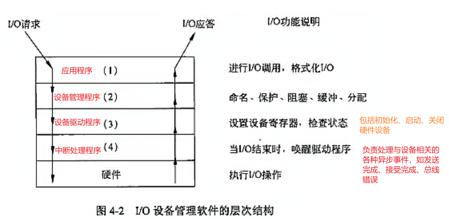

- #### 中断源可以分为两大类，一是内部中断，二是外部中断。

  - 内部中断由 CPU 内部的事件及执行软中断指令产生，当前已经定义的内部中断包括：

    - **除法中断**：执行除法指令时，如果出错产生该中断。

    - **单步中断**：这是在调试阶段中为单步运行程序而提供的中断形式。

    - **断点中断**：这是在调试阶段中为设置程序断点而提供的中断形式。

    - **溢出中断**：在算术运算程序中产生的。

    - **软件中断**：执行软件中断指令 `INT n` 时产生该中断。

  - 外部中断是由外部中断源产生对 CPU 的请求引起的，一般外部中断源又可以分为可屏蔽中断和不可屏蔽中断。
    - **I/O设备如显示器、键盘、打印机等引起的中断；**
    - **软盘、硬盘、光盘等数据通道引起的中断；**
    - **外部定时电路引起的中断以及其他等**

- 中断相应时间：指从中断源发出中断请求到CPU开始进入中断处理的所经过的时间。

- 中断是指计算机系统运行时，出现来自处理机以外的任何现行程序不知道的事件，CPU暂停现行程序，转去处理这些事件，待处理完毕，再返回原来的程序继续执行，这个过程称为中断。

- 请求 CPU 中断的设备或事件称为中断源。根据中断源的不同类别，可以把中断分为内中断和外中断两种。由异步的外部事件引起的 CPU 改变程序执行流程的过程叫“外中断”或“硬中断”。由 CPU 内部原因而改变程序执行流程的过程称“内中断”、“软中断”或“异常”。

- 为了便于控制中断请求信号的产生，也为了利用屏蔽码改变中断处理的优先级别，当产生中断请求后，用程序方式有选择地封锁部分中断，而允许其余部分中断仍得到响应，称为中断屏蔽。有些中断请求是不可屏蔽的，也就是说，不管中断系统是否开中断，这些中断源的中断请求一旦提出，CPU 必须立即响应。所以，中断又分为可屏蔽中断和不可屏蔽中断。

-  RS232接口介绍数据时，可以采用查询和中断两种方式，其采用的中断方式特点是：不长期占用CPU资源，系统开销小。

### 存储器

通常人们将高性能计算机的存储体系结构分为三层存储器层次结构：高速缓存（Cache）、主存储器（MM）和辅助存储器（外存储器）。

- **高速缓存（Cache）**是用来存放当前最活跃的程序和数据，作为主存局部域的副本，其特点是：容量一般在几KB到几MB之间；速度一般比主存快5～10倍，由快速半导体存储器构成；其内容是主存局部域的副本，**对程序员来说是透明的**。
- **外存储器**能长期保存信息，并且不依赖于电来保存信息。外存储器通常由磁表面存储器（如磁盘、磁带）及光盘存储器构成。

存储系统中的存储器，按访问方式可分为按地址访问的存储器和按内容访问的存储器；按寻址方式分类可分为随机存储器、顺序存储器和直接存储器。

**1. 随机存储器 (Random Access Memory, RAM)**
随机存储器指可对任何存储单元存入或读取数据，访问任何一个存储单元所需的时间是相同的。

**2. 顺序存储器 (Sequentially Addressed Memory, SAM)**
顺序存储器指访问数据所需要的时间与数据所在的存储位置相关，磁带是典型的顺序存储器。

**3. 直接存储器 (Direct Addressed Memory, DAM)**
直接存储器是介于随机存取和顺序存取之间的一种寻址方式。磁盘是一种直接存取存储器，它对磁道的寻址是随机的，而在一个磁道内，则是顺序寻址。

**4. 相联存储器**
相联存储器是一种按**内容访问**的存储器。其工作原理就是把数据或数据的某一部分作为关键字，将该关键字与存储器中的每一单元进行比较，找出存储器中所有与关键字相同的数据字。

### IEEE1394

**IEEE1394分为两种传输方式：Backplane模式和Cable模式。**

- **Backplane模式**：
	- 最小的速率也比USB1.1最高速率高，分别为12.5Mbps、25Mbps、50Mbps。
	- 可以用于多数的高带宽应用。
- **Cable模式**：
	- 是速度非常快的模式。
	- 分为100Mbps、200Mbps和400Mbps几种。
	- 在200Mbps下可以传输不经压缩的高质量数据电影。

**1394B是1394技术的升级版本，它通过低成本、安全的CAT5（五类）实现了高性能家庭网络。**

- 1394B自1995年就开始提供产品。

- 1394B是1394A技术的**向下兼容性扩展**。

- 1394B能提供800Mbps或更高的传输速度。

-  **IEEE1394B总线的传输距离在S400下，使用铜介质传输可以达10m**

- IEEE 1394A 标准的接点间距只有 4.5 m，IEEE 1394B 标准的接点间距可以达到 100 m。1394 总线协议包括**物理层、链路层、传输层、应用层以及串行总线管理器**。目前已经有很多厂家能提供 1394 总线接口的协议芯片，**可以使用1394B的物理层芯片和1394A的链路层芯片混合形成1394网络**

- **IEEE1394B总线上最多能支持63个设备**（根据 IEEE 1394 标准，地址空间由 **6 位二进制**组成。2^6^=64,一般地址 0 通常保留为**广播地址**,所以最多支持63个）

- 不同的媒介可以实现不同的传送距离和速率，如下表所示。

- | 非屏蔽五类双绞线（UTP-5） | 100    | √                 |                   |                   | √（未定）         |                    |                    |
	| ------------------------- | ------ | ----------------- | ----------------- | ----------------- | ----------------- | ------------------ | ------------------ |
	| 媒 介                     | 距离/m | S100 （100 Mbps） | S200 （200 Mbps） | S400 （400 Mbps） | S800 （800 Mbps） | S1600（1600 Mbps） | S3200（3200 Mbps） |
	| 塑料光纤（POF）           | 100    | √                 | √                 | √                 | √                 |                    |                    |
	| 玻璃光纤（GOF）           | 100    | √                 | √                 | √                 | √                 | √                  | √                  |
	| 屏蔽双绞线 （ STP-bcta）  | 4.5    | √                 | √                 | √                 | √                 | √                  | √                  |
	| 屏蔽双绞线 （ STP-DS）    | 4.5    | √                 | √                 | √                 |                   |                    |                    |

- IEEE 1394连线是一种高速串行总线，IEEE 1394A 使用6根线（4根信号线、1根电源线、1根地线），而 IEEE 1394B 使用9根线（8根同轴电缆用于数据传输和时钟同步，1根电源线）。安装简单，价格也较为便宜。

### 特殊名词

1. **ECC是英文“Error Correcting Code”的简写，中文含义是“自动错误检查和纠正”。**
1. **TLB（Translation lookaside buffer，旁路转换缓冲区，也称为页表缓冲区）**存储了一些将虚拟地址转换为物理地址的页表项。又称为快表技术。当处理器需要访问主存时，它不会直接在内存的物理地址空间中查找，而是通过一组虚拟地址转换为主存的物理地址。TLB负责将虚拟内存地址翻译成实际的物理内存地址，而CPU在寻址时会优先在TLB中查找。

### 通道

- **通道与设备控制器的基本功能与结构**

	- 一种任务（分区或进程）之间通信的一种技术

	- 通道总线与设备控制器的连接

	  通道总线可以连接多个设备控制器，而一个设备控制器可以与一个或多个设备相连。因此，从逻辑结构上看，输入输出（I/O）系统一般具有四级连接：
	
	  - **CPU**
	  - **主存**
	  - **通道**
	  - **设备控制器**
	  - **外部设备**

	- 通道的基本功能

	  通道的主要功能包括：
	
	  1. **执行通道指令**：按照I/O指令的要求启动外部设备。
	  2. **组织数据传输**：协调外部设备和内存之间的数据传输。
	  3. **报告中断**：向CPU报告完成状态或异常情况。

	- CPU对通道的控制与管理

	  CPU通过执行I/O指令以及处理来自通道的中断，实现对通道的控制和管理。

	-  通道的分类

	  根据通道的工作方式，通道可以分为以下三种类型：

	  ##### （1）数据选择通道
	
	  - **定义**：选择通道又称为高速通道，能够在物理上连接多个设备，但这些设备不能同时工作。
	  - **特点**：
	  	- 主要用于连接**高吞吐量，低频率交互的设备（如：磁带）**。
	  	- 数据选择通道每次以块为单位传送一批数据；
	
	  - **工作模式**：通道一次只能为一个设备服务，不适合低速设备较多的情况。
	  - 数据选择通道用于连接高速的外围设备。高速外围设备需要很高的数据传输率，因此不能采用字节多路通道那样的控制方式。选择通道在物理上可以连接多台外围设备，但多台设备不能同时工作。也就是说，在一段时间内，选择通道只能为一台外围设备服务，在不同的时间内可以选择不同的外围设备。一旦选中某一设备，通道就进入忙状态，直到该设备数据传输工作结束，才能为其他设备服务。

	  ##### （2）数组多路通道
	
	  - **定义**：数组多路通道是对数据选择通道的改进。
	  - **基本思想**：当某个外设进行数据传送时，通道为该设备服务；当设备执行寻址等控制性动作时，通道暂时断开与该设备的连接，挂起该设备的通道程序，去为其他设备服务。
	  - **优点**：
	  	- 能够提高通道的利用率，适用于需要频繁切换服务的场景。
	  	- 数组多路通道有多个非分配型子通道，可以连接多台**高速外围设备（高频交互）（如：磁盘、硬盘**）。
	
	  - 数组多路通道是字节多路通道和选择通道的结合，其基本思想是：当某设备进行数据传输时，通道只为该设备服务；当设备在进行寻址等控制性操作时，通过暂时断开与设备的连接，挂起该设备的通道程序，去为其他设备服务，即执行其他设备的通道程序。由于数组多路通道既保持了选择通道的高速传输数据的优点，又充分利用了控制性操作的时间间隔为其他设备服务，使得通道效率充分得到发挥，因此数组多路通道在实际计算机系统中应用最多，适合于高速设备的数据传输。
	
	  ##### （3）字节多路通道
	
	  - **定义**：字节多路通道主要用于连接大量的低速设备。
	  - **特点**：
	  	- 可以同时为多个低速设备服务，提高设备的利用率。
	  	- 字节多路通道是按照字节交叉方式工作的；
	  - 字节多路通道是一种简单的共享通道，主要用于连接**大量的低速设备（如：终端）**。由于外围设备的工作速度较慢，通道在传送两个字节之间有很多空闲时间，利用这段空闲时间字节多路通道可以为其他外围设备服务。因此字节多路通道采用分时工作方式，依靠它与 CPU 之间的高速总线分时为多台外围设备服务。
	
	- 通道系统在I/O系统中起着核心作用，通过不同的通道类型（如选择通道、数组多路通道、字节多路通道）可以灵活地管理外部设备，提高资源利用率和系统的整体效率。CPU通过I/O指令和中断机制，对通道进行有效控制和管理，确保数据传输的高效和可靠。
	

### 定时器

#### 看门狗

看门狗电路是一种独立的定时器，包含一个定时器控制寄存器，可以设定特定的时间周期。当系统正常运行时，应用程序需要在设定的时间之前（即“喂狗”）重置定时器，以表明程序仍在正常运行。如果没有及时重置定时器，则认为程序可能已经出错或死锁，看门狗电路会发出RESET指令，强制系统复位并重新启动程序。

看门狗的主要作用是防止程序因某种原因“跑飞”或陷入死锁状态。

具体来说，如果程序的完整运行周期为tp ，而看门狗的定时周期设定为tw ，则要求tw > tp 。在程序运行过程中，需要定时修改定时器的计数值。只要程序正常运行，定时器就不会溢出。如果由于干扰或其他原因，系统未能在 时刻重置定时器，定时器将在 时刻溢出（或超时），从而触发系统复位中断，使得系统能够重新运行并恢复正常状态。

### JTAG（系统初始代码调试的接口）

在嵌入式系统设计中，为了调试系统初始化代码（特别是在裸系统状态下，即系统存储介质中未加载任何代码时），需要进行细致的功能和性能验证。JTAG（Joint Test Action Group）是一种国际标准测试协议（IEEE 1149.1兼容），主要用于**芯片内部测试**。大多数高级器件均支持JTAG协议，例如DSP、FPGA等。

**JTAG的标准接口包含4条线：TMS（模式选择）、TCK（时钟）、TDI（数据输入）和TDO（数据输出），有时还包含复位等信号**。JTAG的核心是边界扫描技术，这种技术于20世纪80年代中期在解决PCB物理访问问题的基础上发展而来。边界扫描在芯片级内部嵌入测试电路，从而形成完整的电路板级测试协议。通过访问边界扫描链的输入输出（IO），可以显著减少甚至消除对传统电路板物理测试点的需求，从而降低测试成本。具体优势包括：

1. **电路板布局简化**：不再需要为测试设计复杂的设计规则。
2. **测试夹具更经济**：无需为测试点设计昂贵的夹具。
3. **测试系统更节省**：减少了电路板内部测试资源的消耗。
4. **标准化接口的广泛使用**：提高了测试设备的通用性和互操作性。
5. **加快上市时间**：通过减少测试步骤，缩短了产品开发周期。

此外，边界扫描技术还支持在PCB贴片之后，对几乎所有的CPLD（复杂可编程逻辑器件）和闪存设备进行编程，无论其尺寸或封装类型如何。在系统编程中，通过减少硬件处理环节、简化库存管理和集成编程步骤，能够显著降低生产成本并提高生产效率。

[2.32.3.3中有补充](####3. SDRAM 存储器)

### 同步、异步（总线通信按照传输时序控制的方式）

- 同步方式：

	- **定义**：所有设备共享一个**公共的时钟信号**，按照固定的定时规则进行数据传输。

	- 特点：
		- 数据传输严格遵守时钟信号的节拍。
		- 时钟信号定义了等间隔的时间段（总线周期）。
		- 所有设备同步操作，保证数据传输的时序一致性。

	- 缺点：
		- 对设备的响应速度有一定要求，设备需要在固定时间内完成操作。
		- 设备之间速度差异可能影响传输效率。

-  异步方式：

	- **定义**：不使用公共的时钟信号，通过**握手信号**（如就绪信号和应答信号）进行数据传输。

	- 特点：
		- 数据传输的时序由握手信号控制，不需要公共时钟。
		- 允许设备之间在较大的时间范围内进行通信。
		- 握手信号包括“就绪”（ready）和“应答”（acknowledge）。

	- 优点：
		- 设备之间速度差异较大时，异步方式可以更好地适配设备的传输速度。
		- 消除了对公共时钟的依赖，灵活性更高。

	- 缺点：
		- 握手信号的宽度和传输过程需要精心设计，以避免误操作。
		- 异步方式的实现相对复杂。

-  异步方式的三种形式：

1. **非互锁（Non-Interlocked）**：
	- 发送设备将数据置于总线上，然后发出就绪信号。
	- 接收设备收到就绪信号后，开始接收数据并发出应答信号。
	- 发送设备收到应答信号后，撤销数据，准备下一次传输。
2. **半互锁（Half-Interlocked）**：
	- 与非互锁类似，但就绪信号保持到接收设备发出应答信号为止。
3. **全互锁（Fully Interlocked）**：
	- 数据发送设备发出数据后发出就绪信号，接收设备响应该信号并发出应答信号。
	- 发送设备收到应答信号后复位就绪信号，接收设备再复位应答信号。
	- 这种方式更严格地控制了握手信号的时序，避免误操作。

- 总结：

	- **同步方式** 适合设备之间传输速度差异较小的场景，保证数据传输的严格时序性。

	- **异步方式** 更灵活，适合设备之间速度差异较大或不需要共享时钟的场景，但实现过程相对复杂。

### 程序局部性

- 程序局部性包括空间局部性和时间局部性。
	- 空间局部性是指，某个地址一旦被使用，其附近的地址在最近的一段时间内通常也会被访问。
	- 时间局部性是指，某个指令被访问后，在最近的一段时间内很可能再次被访问。
- 导致程序局部性的原因通常是程序中包含大量的循环，数据结构中又经常出现数组等存储区域比较集中的结构。前者导致代码和变量被重复使用（时间局部性），后者导致访问区域相对集中（空间局部性）。

### 原码、补码、反码

- 原码：最高位为符号位
- 补码：
  - 正数：与原码完全相同
  - 负数：符号位不变，其他位取反
- 补码：
  - 正数：与原码完全相同
  - 负数：符号位不变，其他位取反后，加末位1
- **关于n位补码表示数据**：
	- 符号位：补码采用1 位（最高位）表示数据的符号，其中：
		- **0** 表示数是正数；
		- **1** 表示数是负数。
	- **数值部分**：
		- 除了符号位以外的 **n-1 位** 表示数的数值部分。
- **补码表示的整数范围**：
	- 最大整数：
		- 二进制形式为：**n-1 个 1**（即 2^n-1^-1）。
	- 最小整数：
		- 二进制形式为：**1 后面跟着 n-1 个 0**（2^n-1^），此时最高位的 1 既表示符号位，也表示数值的一部分。

### 文件系统

- 在计算机系统中，文件通常存储在磁盘或其他非易失性存储介质上。
- 文件系统负责文件的组织、存储、检索、命名、共享和保护等功能，并为程序员提供描述文件抽象的程序接口。
- 程序员无需关注文件存储分配的细节和存储布局的细节，只需通过调用相应的程序接口即可完成对文件的操作。
- 文件是具有文件名的一组相关信息的集合，文件系统是指操作系统中与文件管理有关的软件和数据的集合。
	- 从系统角度看，文件系统是对文件的存储空间进行组织和分配，负责文件的存储并对存入文件进行保护和检索的系统。文件系统负责为用户建立、撤销、读写、修改和复制文件。
	- 从用户角度看，文件系统主要实现了按名存取。也就是说，当用户要求系统保存一个已命名文件时，文件系统根据一定的格式将用户的文件存放到文件存储器中适当的地方，当用户需要使用文件时，系统根据用户所给的文件名能够从文件存储器中找到所需的文件。
	- 为了使用户能灵活方便地使用和控制文件，文件系统提供了**一组进行文操作的系统调用命令**。最基本的文件操作命令有建立文件、**删**除文件、打开文件、关闭文件、读文件和写文件。
	- 为了避免用户在每次访问文件时从外存中查找文件目录，系统提供了打开文件命令(open)。
		- 该命令的功能是**将待访问文件的目录信息读入内存活动文件表中（将文件的控制管理信息从辅存读到内存）**，建立起用户和文件的联系。一旦文件被打开就可以多次使用，直到文件关闭为止。在有些系统中，也可以通过读命令隐含地向系统提出打开文件的要求。若在读写命令中不包含打开文件功能，则在使用文件之前，必须先打开文件。

### 进程调度算法

####  **时间片轮转调度算法**

- **特点**：将CPU时间划分成固定长度的时间片，每个进程轮流在时间片内获得CPU使用权。
- **特性**：公平性较好，但可能会导致长进程的等待时间过长，而短进程效率较低。
- **缺点**：没有显式考虑进程的等待时间和执行时间。

------

#### 2. **短时间优先调度算法**

- **特点**：根据进程的估计执行时间进行调度，优先执行估计执行时间较短的进程。
- **特性**：能够快速执行较短的任务，提高整体效率。
- **缺点**：没有显式考虑进程的等待时间，可能导致长进程长期等待（饥饿问题）。

------

#### 3. **先来先服务调度算法**

- **特点**：按照进程到达的先后顺序进行调度，先到的进程优先调度。
- **特性**：简单易实现，但没有显式考虑进程的执行时间，可能导致短进程的效率低下。
- **缺点**：忽略了进程的执行时间和等待时间的关系。

------

#### 4. **高响应比优先调度算法**

- **特点**：综合考虑进程的等待时间和执行时间，优先调度响应比最高的进程。

- **响应比公式**（响应比大于1）：
	$$
	响应比 = \frac{等待时间 + 执行时间}{执行时间} = 1 + \frac{等待时间}{执行时间}
	$$
	
- 特性：

	- 既能快速响应短任务的调度需求，又能兼顾长任务的公平性。
	- 避免了长时间等待或长时间执行的任务被忽略的情况。

- **优点**：能够综合衡量进程的等待时间和执行时间，兼顾公平性和效率。

### 分段存储管理

- 在分段存储管理方式中，作业的空间地址被划分为若干个段，每个段定义了一组逻辑信息。例如，有主程序段 `MAIN`、子程序段 `X`、数据段 `D` 及栈段 `S` 等。
- 每个段都有自己的名字。为了实现简单起见，通常可用一个段号来代替段名，每个段都从 0 开始编址，并采用一段连续的地址空间。
- 在地址长度为 32 位的系统中，当段号占 8 位时，段内空间为 24 位，则最大段长为2^24^ 。
- 物理地址 = （段地址 << 24） + 段内地址。（段号8位，段内空间24位的情况）

### 嵌入式系统

1. 在嵌入式系统中，**Board Support Package（简称为BSP，板级支持包）** 是实现特定的支持代码，通常会与 **bootloader** 一起设置。 **bootloader** 包含最小的设备驱动来加载操作系统与所有在板上的设备的驱动程序。 **BSP** 是介于主板硬件和操作系统之间的一层，**主要目的是为了支持操作系统，使之能够更好地运行于硬件主板**。不同的操作系统对应不同定义形式的 **BSP**，例如 **VxWorks** 的 **BSP** 和 **Linux** 的 **BSP** 相对于某个 **CPU** 来说，尽管实现的功能一样，可是写法和接口定义完全不同。

2. 嵌入式实时操作系统可以分为基本内核和扩展内核。其对应的定义为：当外界事件或数据产生时，能够接受并以足够快的速度予以处理，其处理的结果又能在规定的时间内来控制生产过程或对处理系统做出快速响应，并控制所有实时任务协调一致运行的嵌入式操作系统。在工业控制、军事设备、航空航天等领域对系统的响应时间有苛刻的要求，这就需要使用实时系统。嵌入式操作系统通常是实时操作系统。比如 **μC/OS-II**、**eCos** 和 **Linux**。故对嵌入式实时操作系统的理解应该建立在对嵌入式系统的理解之上，并加入对响应时间的要求。

3. 在实际的嵌入式系统设计中，应用编程接口一般**以库或者组件的形式**而存在，选择哪种则依赖于对应的嵌入式操作系统。在实际的系统构建时，并不一定需要对应的接口 **API**。

4. 在嵌入式实时系统中，**通常用BIT完成对故障的检测和定位**。BIT一般包括四种：上电BIT、维护BIT、周期BIT、启动BIT等。

  1. 上电BIT是在系统上电时对所有硬件资源进行自检的程序，它拥有100% CPU控制权，可以对系统中的硬件进行充分检测。

  2. 周期BIT是在系统运行的空闲时间，周期性地对硬件进行检测，由于系统处于正常运行状态，测试程序必须采取非破坏性测试算法，对部分可测部件进行测试。

  3. 维护BIT是在系统维护状态下，对系统硬件的部分或全部进行维护性测试，测试软件拥有100% CPU控制权，可以对系统中的所有硬件进行完整的测试。

  4. 嵌入式系统应该在不同的状态或运行阶段选择适应的BIT，以保证系统故障的及时发现与定位。

5. 嵌入式系统存储硬件设计中的三种存储器接口

6. **Flash 存储器的基本概念与特性：**

	- **Flash 存储器的英文名称**：Flash Memory，通常简称为 Flash。

	- **分类**：Flash 属于内存器件的一种，是一种非易失性（Non-Volatile）内存。

	- **Flash 与普通内存的区别**

		- Flash 的非易失性特点：
			- Flash 存储器能够在没有电流供应的情况下，长久地保持其存储的数据。
			- 这一特性类似于硬盘，数据即使在断电后也不会丢失。
			- 正是因为这一特性，Flash 成为便携型数字设备的存储介质的基础。
		- 普通内存的易失性特点：
			- 常见的 DDR、SDRAM 或 RDRAM 等内存属于易失性（Volatile）内存。
			- 这类内存需要持续的电流供应才能保持数据，一旦停止电流供应，内存中的数据将会丢失。
			- 因此，每次打开计算机时，都需要将数据重新加载到内存中。

	- ### **Flash 存储器的可擦写特性**

		- **Flash 是非易失存储器**，可以对称为块的存储器单元块进行擦写和重新编程。
		- 写入操作的限制：
			- Flash 的写入操作**只能在空的单元块或已经被擦除的单元块中进行。**
			- 因此，在大多数情况下，**进行写入操作之前必须先执行擦除操作**。
			- 这一特性是 Flash 存储器与普通易失性内存（如 DDR、SDRAM）的关键区别之一。

#### NOR Flash 存储器（随机存储介质）

  - 特点：
   - 带有通用的 SRAM 接口，可以轻松挂接在 CPU 的地址、数据总线上。
   - 对 CPU 的接口要求低，可以轻松集成。
   - 写操作只能将数据位从1写成0，而不能从0写成1，所以先执行擦除操作。NOR Flash擦除前需要将目标块内所有位先写为 0。
   - 容量大小为1~8MB
   - 主要用于存储代码
   - 芯片内执行（XIP，eXecute In Place），应用程序可以直接在 Flash 存储器中运行，无需将代码读到系统 RAM 中（例如：系统引导程序）。
  - 应用场景：数据量较小的场合——可以进行字节级别访问，可以随机读取如同RAM所有无需加载，能直接运行存储的代码。
   - 例如，uboot 中的只读段可以直接在 NOR Flash 上运行。

#### NAND Flash 存储器（连续存储介质）

  - 特点：
  	- 使用复杂的 I/O 口来串行地存取数据，通过 8 个引脚来传送控制、地址和数据信息。
  	- 时序较为复杂，因此一般需要 CPU 集成 NAND Flash 控制器。
  	- 由于 NAND Flash 不直接挂接在地址总线上，如果想使用 NAND Flash 作为系统的启动盘，CPU 需具备特殊功能。
  - 应用场景：数据量较大的场合—–读取速度慢需要加载到RAM中进行速度匹配
  	- 例如，s3c2410 在被选择为 NAND Flash 启动方式时，上电时会自动读取 NAND Flash 的 4KB 数据（系统引导程序）到地址 0 的 SRAM 中。
  	- 如果 CPU 不具备这种功能，可以通过其他方式启动，如使用小的 NOR Flash 来运行启动代码。
  - 写入条件：
  	- 任何Flash器件 的写入操作只能在空或已擦除的扇区中进行。
  - 擦除操作：
  	- NAND Flash 的擦除操作较为简单，而NOR Flash擦除前需要将目标块内所有位先写为 0。

#### SDRAM 存储器

  - 特点：
  	- 有一个同步接口的动态随机存取内存（DRAM），DRAM 通常有一个异步接口，以随时响应控制输入的变化。
  	-  有一个同步接口，响应控制输入前会等待一个时钟信号，从而与计算机的系统总线同步。
  - 性能对比：
  	- 相对于 NOR Flash 和 NAND Flash，SDRAM 的读写速度要快得多。

  总结

  - **NOR Flash**：适合需要直接执行代码的场景，接口简单，芯片内执行能力强。
  - **NAND Flash**：存储容量大，但需要 CPU 支持复杂控制，写入和擦除有特殊要求。
  - **SDRAM**：动态随机存取内存，同步接口，读写速度快，适合需要高吞吐量的场景。

#### **嵌入式硬件系统**

  6. 以嵌入式微处理器为核心，主要由嵌入式微处理器、总线、存储器、输入输出接口和外围设备组成。

  7. 嵌入式系统的硬件可分为核心微处理器、外围控制电路和外设与扩展三大部分。

   8.  核心微处理器可以分为由通用的计算机CPU 演变而来的微处理器、嵌入式微控制器，又称之为单片机，即MCU、嵌入式 DSP处理器，专门用于信号处理和嵌入式片上系统。

   9.  外围电路主要用于进行外部的控制，系统必要的资源支撑等。

   10.  外设与扩展主要进行系统对外的交互和扩展实现，包括各种接口外设，各种交互实现等。

  11. 在开发嵌入式系统时，运行程序的目标平台通常具有有限的存储空间和运算能力。例如，常见的ARM平台，其静态存储空间大约在16MB到32MB之间，而CPU的主频通常在100MHz到500MHz之间。在这种情况下，直接在ARM平台上进行本地编译（本机编译）是不太可能的，因为一般的编译工具链（compilation tool chain）需要很大的存储空间，并且需要较强的CPU运算能力。为了解决这一问题，嵌入式系统普遍采用**交叉开发调试的方法**。通过交叉编译工具，我们可以**在CPU能力较强、存储空间充足的主机平台上（比如PC，称为宿主机）**编译出针对其他平台（比如ARM，称为目标机）的可执行程序。**交叉编译只需要在主机平台上安装对应的交叉编译工具链**（crosscompilation tool chain），然后用这个交叉编译工具链编译我们的源代码，最终生成可在目标平台上运行的代码。通过**串口、以太网或者JTAG等方式**，将生成的代码下载到嵌入式设备中运行调试。

8. 嵌入式软件开发

	1. 嵌入式软件开发不同于传统软件开发，其所使用的开发环境、工具都有特殊性，在嵌入式软件开发中，一般使用宿主机和目标机的模式进行系统开发（交叉开发环境），并且借助于开发工具进行目标开发。
	
	2. 宿主机是指普通PC机中构建的开发环境，一般需要配置交叉编译器，借助于宿主机的环境，使用交叉编译器进行目标编译，代码生成，同时借助仿真器或者是网络进行目标机的程序调式。
	
	3. 目标机可以是嵌入式系统的实际运行环境，也可以是能够替代实际运行环境的仿真系统。在线仿真器 ICE（In-Circuit Emulator）是一种模拟CPU的设备，可以根据配置模拟实际CPU的寄存器环境。
	
	4. JTAG（Joint Test Action Group，联合测试工作组）是一种国际标准测试协议（IEEE 1149.1兼容），主要用于芯片内部测试。现在多数的高级器件都支持JTAG协议，如DSP（数字信号处理）、FPGA（现场可编程门阵列）器件等。标准的 JTAG 接口是 4 线：TMS、TCK、TDI、TDO，**分别为模式选择、时钟、数据输入和数据输出线**。
	  1. JTAG 最初是用来对芯片进行测试的，JTAG 的基本原理是在器件内部定义一个 TAP（Test Access Port，测试访问口），通过专用的 JTAG 测试工具对内部节点进行测试。JTAG 测试允许多个器件通过 JTAG 接口串联在一起，形成一个 JTAG 链，能实现对各个器件分别进行测试。如今，JTAG 接口还常用于实现 ISP（In-System Programmer，在系统编程），对 FLASH 等器件进行编程。
	  2. 通常所说的 JTAG 大致分为两类：一类用于测试芯片的电气特性，检测芯片是否有问题；一类用于 Debug（调试），一般支持 JTAG 的 CPU 内部都包含了这两个模块。
	  3. 一个含有 JTAG Debug 接口模块的 CPU，**只要时钟正常**，就可以通过 JTAG 接口访问 CPU 的内部寄存器和挂在 CPU 总线上的设备（I/O设备），如 FLASH（闪存）、RAM（随机存取存储器）、SOC（系统级芯片）内置模块的寄存器，像 UART（串行通信接口）、Timers（定时器）、GPIO（通用输入输出）等的寄存器。
	
	5. 嵌入式软件
	
		- 就是嵌入在硬件系统中的软件，一般包括以下几类：
	
			- **初始化引导代码（Bootloader）**：负责系统启动过程。
	
			- **板级支持包（BSP, Board Support Package）**：提供硬件接口支持。
	
			- **嵌入式操作系统（Embedded OS）**：管理硬件资源和任务调度。
	
			- **网络协议栈（Network Stack）**：支持网络通信功能。
	
			- **图形用户界面（GUI, Graphical User Interface）**：提供人机交互。
	
			- **应用软件（Application Software）**：实现具体的功能需求。
	
		- **嵌入式软件开发的特点：**
	
			- 交叉编译的必要性：在进行嵌入式软件开发时，一般不能直接在目标平台上编译，而是采用交叉编译的方式。其中原因有以下两点：
				- 目标平台资源有限：
					- 嵌入式系统的硬件资源通常有限，例如常见的 ARM 平台，其静态存储空间一般在 **16MB 到 32MB** 之间，而 CPU 频率通常在 **100MHz 到 500MHz** 之间。
					- 一般的编译工具链（Compilation Tool Chain）需要较大的存储空间，并且需要较强的 CPU 运算能力。因此，在目标平台上直接编译通常是不可行的。
				- 运行环境不匹配：
					- 由于目标机的硬件环境与开发主机（宿主机）的运行环境不同，目标平台上的硬件和软件环境（如处理器架构、驱动等）可能不兼容开发主机上的编译环境。
					- 因此，为了确保代码能够在目标机上运行，必须提供与目标平台匹配的类库和运行环境。
	
		-  **交叉编译的作用：**
	
			- 开发人员可以通过交叉编译工具在主机平台上（如运行强大 CPU 和充足存储空间的 PC 上）编译生成针对目标平台的可执行程序。
			- 这种方式不仅解决了目标平台资源有限的问题，还确保了代码在目标机上的兼容性和可运行性。
	
		- **. 交叉编译的核心目标：**
	
			- 在宿主机（开发环境）上完成代码的编译，生成适合目标机（嵌入式硬件）运行的可执行程序。
			- 提供与目标平台匹配的运行环境和类库，确保代码能够在目标平台上正常运行。

### 并行技术

- 并行技术是多处理器（CPU）或多处机并行处理任务的技术，为了解决复杂的计算问题，提高计算速度，一般采用这种技术。如现在我们所称的多核技术、众核技术、大规模并行机等等。

### 缓冲技术

- 缓冲技术也称 Spooling 技术，Spooling 的意思是外部设备同时联机操作，又称为假脱机输入/输出操作，是操作系统中采用的一项将独占设备改造成共享设备的技术。Spooling 系统的组成包括三部分：输入井和输出井、输入缓冲区和输出缓冲区、输入进程和输出进程。为了解决 CPU 输出数据的速度远远高于打印机的打印速度这一矛盾，在操作系统中一般用 Spooling 技术。

- 缓冲技术：

	- 单缓冲：

		- 输入时间T   传送时间M  处理时间C

		- 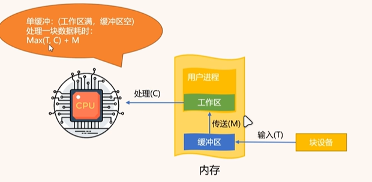

		- $$
			处理一块数据的耗时：
			\\
			Max(T,C)+M 
			\\
			取T、C中较大值
			$$

			

	- 双缓冲

		- 输入时间T   传送时间M1，M2  处理时间C

		- 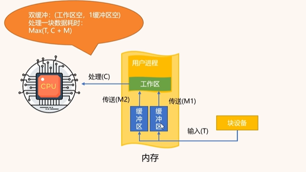

		- $$
			处理一块数据的耗时：
			\\
			Max(T,C + M1)
			\\
			使用M中
			$$

		- 例题：

			本题考查的是 单缓冲区和双缓冲区的性能分析，尤其是数据块的读取、传输和处理时间的计算。已知条件如下：

			 	磁盘块与缓冲区大小相同。

			​	 每个磁盘块读入缓冲区的时间为 15us。 

			​	由缓冲区送至用户区的时间为 5us。 

			​	在用户区内系统对每块数据的处理时间为1u s。

			​	 用户需要处理 10 个磁盘块。 

			问题分析 我们需要分别计算：

			 	采用单缓冲区时的总时间。
			 	
			 	采用双缓冲区时的总时间。

			单缓冲：第一块：15+5+1 = 21us

			​		后面9块（输入、处理并行）：(Max(15,1) + 5) * 9 = 180us;

			​		总时间：180 + 21 = 201us

			双缓冲：第一块：15+5+1 = 21us 

			​		后面九块（输入、传输、处理三个并行）：Max(15,5+1) * 9 = 135us

			​		总共：135 + 21 = 156us

### 虚存（VM）技术

- 虚存（VM）技术能从逻辑上对内存进行扩充，达到扩充内存的效果，具有请求调入和置换功能。

### 网络设计

- 在网络设计过程中，一般服务器和客户端的通信可以采用TCP，也可以采用UDP的形式进行。
	- **TCP是面向连接的通信方式**，可以保证数据的准确性和一致性，UDP是不保证连接，但是其速度快，负荷较小。

- 在TCP连接过程中，需要服务器，客户端按照固定的流程进行软件实现。服务器首先绑定端口和IP，然后侦听，等待客户端连接。客户端在创建对应的套接字后即可按照IP，端口来连接服务器，待连接成功后，服务器客户端即可开始通信。
- 在UDP的通信实现中，客户端不用连接服务器，只是向固定的IP和端口进行数据报文的发送，服务器端只是不断的接收对应IP和端口的数据，然后依据数据内容进行有效性判断，进而进行数据处理。

### 虚拟存储管理

- **虚拟存储器的工作原理**

  - 虚拟存储器的原理在于：执行程序时，允许程序的一部分被调入主存执行，而其他部分保留在辅存。
  - 操作系统中的存储管理软件会先将当前待执行的程序段（如主程序）从辅存调入主存，此时未执行的程序段（如子程序）仍保留在辅存。
  - 当需要执行存放在辅存中的某个程序段时，CPU会通过某种程序调度算法将它们调入主存。

- 虚拟存储技术目的：扩充内存容量。

- **虚拟存储器的调度方式**

  调度方式主要包括三种：

  - **分页式（页式调度）**
  - **段式**
  - **段页式**

  **分页式调度**

  - 将逻辑和物理地址空间均划分为固定大小的页。
  - 主存按页顺序编号，每个独立编址的程序空间有自己的页号顺序。
  - 通过调度辅存中的程序的各页可以离散装入主存的不同页面位置，并可据页表检索。
  - 优点：
  	- 页内零头小，页表对程序员来说透明，地址变换快，调入操作简单。
  - 缺点：
  	- 各页不是程序的独立模块，不利于实现程序和数据的保护。

  **段式调度**

  - 按程序的逻辑结构划分地址空间，段的长度是随意的，并且允许伸长。
  - 优点：
  	- 消除了内存零头，易于实现存储保护，便于程序动态装配。
  - 缺点：
  	- 调入操作复杂。

  **段页式调度**

  - 将段式调度和分页式调度结合在一起。
  - 在段页式调度中：
  	- 物理空间被划分为固定大小的页。
  	- 程序按模块划分为段，每个段再被分为与物理页同样大小的页面。
  - 优点：
  	- 综合了段式和页式的优点。
  - 缺点：
  	- 增加了硬件成本，软件也较复杂。

  - 大型通用计算机系统多数采用段页式调度，因为它综合了段式和页式调度的优点。

- **地址变换与存储管理**

  - 页式虚拟存储器中：
    - 虚拟地址到实地址的变换由主存中的页表实现。
  - 段页式存储管理中：
    - 主存的调入和调出是按照页进行，但可按段实现保护。
  - 段式存储管理中：
    - 按照程序的逻辑结构划分段，各段的长度可以按实际需要分配。

- 虚拟存储体系由 **主存-辅存** 两级存储器构成

  - 一般计算机系统中主要有两种存储体系：
  - Cache存储体系由Cache和主存储器构成，主要的目的是提高存储器速度，对系统程序员以上均透明；
  - 虚拟存储体系由主存储器和在磁盘上存储器等构成，主要目的是扩大存储容量，对应用程序员透明。

### 通信

- 共享内存
	- 指在多处理器的计算机系统中，可以被**不同中央处理器(CPU)访问的大容量内存**。共享内存也可以是一个操作系统中的多进程之间的通信方法，这种方法通常用于一个程序的多进程间通信，实际上多个程序间也可以通过共享内存来传递信息。如下图示。共享内存相比其他通信方式有着更方便的数据控制能力，数据在读写过程中会更透明。当成功导入一块共享内存后，它只是相当于一个字符串指针来指向一块内存，在当前进程下用户可以随意的访问。
	- 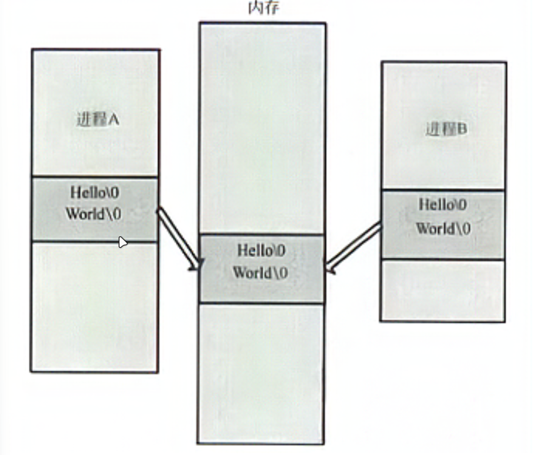
	- 共享内存的一个缺点是：由于多个CPU需要快速访问存储器，这样就要对存储器进行缓存(Cache)。任何一个缓存的数据被更新后，由于其他处理器也可能要存取，共享内存就需要立即更新，否则不同的处理器可能用到不同的数据。（内存同步机制）另一个缺点是，数据写入进程或数据读出进程中，需要附加的数据结构控制。

### 平均故障间隔时间MTBF

- 平均故障间隔时间是指计算机运行中，两次相邻故障之间的时间。平均故障间隔时间MTBF是多次故障间隔时间的平均值。它是衡量计算机系统可靠性的一个重要指标，**MTBF的值越大，表示系统可靠性越高。**

- 如果系统运行一段较长的时间，系统内故障次数为N(t)则系统的平均故障间隔时间为：
	$$
	MTBF = \frac{1}{N(t) + 1}
	$$
	
- 如果系统失效率是λ，是包括各部件失效率之总和。失效率可以通过各部件、元件的寿命实验获得，如果参与运行的元件总数是N，元件失效前正常运行的时间是t，失效元件个数是n，则其平均失效率：
	$$
	\overline{\lambda} = \frac{n}{N*t}
	$$
	
- 系统平均故障间隔时间MTBF与系统失效率之间的关系：
	$$
	MTBF = \frac{1}{\lambda}
	$$
	
- 计算机可用性反映了计算机系统在规定条件下正常工作的概率，一般用平均利用率表示。计算机的平均利用率可用系统平均故障间隔时间（即系统无故障时间）MTBF和系统平均修复时间（系统故障时间）MTTR表示为：
	$$
	A = \frac{MTBF}{MTBF + MTTR}
	$$
	即：
	$$
	A = \frac{正常运行时间}{正常运行时间 + 故障时间}
	$$
	

### 浮点数

- 在计算机中使用了类似于十进制的科学计数法的方法来表示二进制实数，因为表示不同的数时小数点位置的浮动不固定而取得浮点数表示法。浮点数编码由两部分组成：阶码（即指数，为带符号的定点整数，常用移码表示，也有用补码）、尾数（是定点纯小数，常用补码表示，或原码表示）。因此可以知道，浮点数的精度由尾数的位数决定，表示范围的大小则主要由阶码的位数决定。
- 浮点数二进制N的形式为 N=2^E^×F，E为阶码（纯整数），F为尾数（纯小数），指数为纯整数

### 指令寻址方式

- 随着主存增加，指令本身很难直接反映操作数的值或者其地址，必须通过某种映射方式来实现对所需操作数的获取。

1. **寻址方式的概念**：
	- 指令系统中将这种映射方式称为“寻址方式”。
	- 寻址方式是指指令按照什么方式找到（或访问）所需的操作数或信息（例如转移地址信息等）。
2. **可访问的数据和信息**：
	- 可以被指令访问到的数据和信息包括：
		- 通用寄存器
		- 主存
		- 堆栈
		- 外设端口寄存器等
3. **立即寻址的定义**：
	- 指令中的**地址码字段直接给出操作数本身**，而不是其访存地址。
	- 不需要访问任何地址的寻址方式被称为“立即寻址”。

缓冲

### 容错技术

- 计算机系统容错技术主要研究系统对故障的检测、定位、重构和恢复等。典型的容错结构有两种，即单通道计算机加备份计算机结构和多通道比较监控系统结构。
- 从硬件余度设计角度出发，系统通常采用相似余度或非相似余度实现系统容错，从软件设计角度出发，实现容错常用的有恢复块技术和N版本技术等。
- 双重系统中，两个子系统同时同步运行，当联机子系统出错时，由备份子系统接替。

### 计算机性能评测

- 计算机系统的性能指标对用户非常重要。评价一个计算机系统，通常使用的综合评测指标有3类：工作量类、响应性能类和利用率类。
- 除上述综合评价指标外，评价系统性能的还有可靠性、可用性、可维护性，兼容性、开放性、可扩展性、安全性和性能价格比等。
- 基准程序法 benchmark，是目前使用较多的一种计算机性能测试方法。
- 平均故障间隔时间（MTBF）用以表示系统平均无故障可正常运行的时间，是所选时段多次故障间隔时间的平均值，MTBF越大，表示系统越可靠。

### ADC题型中的1LSB换算

$$
1LSB的换算公式：
\\
1LSB = \frac{V_{ref}}{2^n}
\\
其中V_{ref}为参考电压，n为ADC的位数
\\
如：
若参考电压为5V，ADC为10位，则1LSB=5V/1024≈4.88mV    1024 = 2^10
$$

### 嵌入式数字信号处理器

- 嵌入式处理器简介**

	- 嵌入式处理器一般分为以下几类：
		- 嵌入式微控制器
		- 嵌入式微处理器
		- 嵌入式数字信号处理器
		- 片上处理器
	- **数字信号处理器（DSP）的定义**：
		数字信号处理器（Digital Signal Processor）是一种专为数字信号处理运算设计的微处理器，能够快速高效地完成各种数学计算任务。它由大规模或超大规模集成电路心片组成，专门用于处理特定类型的信号处理任务。

-  **数字信号处理器的应用领域**

	数字信号处理器并不仅仅局限于音视频处理领域，其广泛应用范围包括：

	- **通信与信息系统**
	- **信号与信息处理**
	- **自动控制**
	- **雷达**
	- **军事**
	- **航空航天**
	- **医疗**
	- **家用电器**

	**传统替代方案的不足**：

	- 使用通用的微处理器完成大量数字信号处理运算时，速度较慢，难以满足实际需求。
	- 使用位片式微处理器和快速并联乘法器虽然有效，但器件数量多、逻辑设计复杂、耗电大、价格昂贵。

	**DSP的优势**：
	数字信号处理器（DSP）的出现解决了上述问题，它能够快速实现信号的以下处理：

	- 采集
	- 变换
	- 滤波
	- 估值
	- 增强
	- 压缩
	- 识别

	通过这些处理，能够将信号转换为符合实际需求的形式。

- **数字信号处理器的结构特点**

**1. 哈佛结构（Havard Structure）**

- **特点**：程序和数据存储空间彼此独立，各自拥有独立的程序总线和数据总线。这种结构可以同时对数据和程序进行寻址，显著提高数据处理能力，非常适合实时数字信号处理。

**2. 改进的哈佛结构（TI公司的改进版本）**

- **改进点**：在数据总线和程序总线之间进行局部的交叉连接。
- 优点：
	- 允许数据存放在程序存储器中，并被算术运算指令直接使用，增强了芯片的灵活性。
	- 通过调度好两个独立的总线，可以实现全速运行，提升处理能力。
	- 指令存储在高速缓存（Cache）中，避免了从存储器中读取指令的时间消耗，显著提高了运行速度。

**3. 硬件加速模块**

- 在DSP处理器中，经常集成一些硬件模块用于指令加速，例如低开销的跳转指令等，进一步提升处理效率。

**4. 单周期内的硬件地址产生器**

- DSP处理器内通常具有多个硬件地址产生器，能够在单周期内工作，支持指令执行过程中的流水线操作。
- 流水线操作使得指令的取指、译码和执行可以重叠执行，显著提升处理效率。不同DSP处理器所支持的流水线级数有所不同。

### SD存储卡

####  **SD卡概述**

- **定义**: SD卡是一种新型存储器件，旨在满足安全性、容量、性能和使用环境等方面的需求。

- 工作模式

	: 提供两种工作模式：

	- **SD模式**: 连接多个从设备，支持多卡共享时钟、电源和地。
	- **SPI模式**: 通常用于简单电路设计。

- **集成性**: 嵌入式处理器中通常已集成SD卡接口模块，外围电路设计简单。

#### **SD卡的信号和管脚**

- **管脚数量**: 共9个管脚。
- 信号类型:
	- **时钟信号 (CLK)**: 提供系统时钟。
	- **命令信号 (CMD)**: 用于发送命令和接收响应。
	- **数据线 (DATA0~3)**: 双向信号，用于数据传输（4根线）。
	- **电源（VCC、GND）、片选信号**。

#### **SD卡与MicroSD卡的区别**

- **封装**: MicroSD卡体积更小，大小接近SIM卡。
- **协议**: 二者协议相同。
- **架构**: SD模式支持多个从设备，共享时钟、电源和接地（支持一主多从架构）。

#### **SD卡的操作**

- SD卡的操作是通过一系列命令完成的，包括初始化、配置、数据传输等。
- 初始化：
	- 发送CMD0复位命令:
		- 返回值:
		- **1**: 复位成功。
		- **0**: 复位失败。
	- 发送CMD8命令:
		- 验证SD卡接口操作条件:
		- 有响应且支持SDHC卡（兼容SD2.0协议）: 返回值为当前的工作电压范围。
		- 无响应或不支持SDHC卡:。
	- 循环发送CMD55+ACMD41命令:
		- 判断是否有响应:
		- 有响应: 轮询OCR忙标志位，等待初始化完成。
		- 初始化完成后：
			- 判断是否是SDHC卡。
	- 发送CMD2命令:
		- 获取每张卡的CID号（Card Identification Number）。
	- 发送CMD3命令:
		- 通知卡返回一个新的RCA（Relative Card Address），主机后续使用此地址作为数据传输模式的地址。
	- 发送CMD9命令:
		- 返回CSD寄存器数据（128位），包含卡的具体数据，如块长度、存储容量、速度传输速率等。
	- 发送CMD7命令:
		- 选择一张卡，并切换到数据传输模式。每次只会有一张卡处于传输模式。
	- 发送CMD55+ACMD51命令:
		- 返回SCR寄存器数据，获取SD卡支持的位宽信息。
	- 发送CMD55+ACMD6命令:
		- 配置4位数据传输模式。

### 进程调度（占用CPU的进程发生变化则认为发生调度）

#### **进程切换**

- **定义**: 进程切换是一种多任务、多用户操作系统的基础功能，用于协调多个进程在CPU上的运行。
- 行为:
	- 挂起（暂停）正在CPU上运行的进程。
	- 恢复之前挂起的某个进程，使它继续运行。
- **目的**: 解决CPU资源的竞争问题，保证多任务系统的高效运行。
- 实现机制:
	- 操作系统将正在运行进程的状态（寄存器、中间数据等）保存到内存中。
	- 将CPU资源切换给其他进程，使其开始运行。

#### **进程的基本状态**

- **(a) 执行态 (Run)**:
	- **定义**: 进程正在占用CPU资源，处于运行状态。
	- 特点:
		- 单处理器系统中只能有一个进程处于此状态。
		- 是进程的运行状态。
		- 拥有全部资源
	- **条件**: 进程需要具备运行条件，且拥有CPU资源。
- **(b) 就绪态 (Ready)**:
	- **定义**: 进程本身具备运行条件，但由于系统资源（如处理器数量或时间片不足）未被分配CPU资源。
	- 特点:
		- 处于等待状态，准备运行。
		- 是进程即将运行的状态。
		- 除了处理机资源没有，其他资源基本拥有
	- **条件**: 进程需要具备运行条件，但暂时无法使用CPU资源。
- **(c) 等待态 (Wait)**:
	- **定义**: 进程本身不具备运行条件，即使分配了CPU资源也无法运行。
	- **别名**: 挂起态（Suspended）、封锁态（Blocked）、睡眠态（Sleep）。
	- 特点:
		- 进程正在等待某事件的发生，例如资源释放、I/O完成信号等。
		- 是进程的阻塞状态。
		- 全部资源都失去
	- **条件**: 进程需要等待外部事件，直到条件满足才能继续运行。

#### **进程状态的转换**

- 就绪态 → 执行态:
	- 当一个就绪进程获得CPU资源时，其状态从就绪变为执行（调度行为）。
- 执行态 → 就绪态:
	- 当一个执行进程被剥夺CPU资源时，例如：
		- 进程用完系统分配的时间片。
		- 有更高优先级的进程需要运行。
- 执行态 → 等待态:
	- 当一个执行进程因事件受阻时，例如：
		- 申请的资源被占用（等待某个事件发生睡眠）。
		- 启动的I/O传输未完成。
	- 是一个主动行为
- 等待态 → 就绪态:
	- 当所等待的事件发生时，例如：
		- 得到申请的资源（因等待的事情发生而被唤醒）。
		- I/O传输完成。
	- 是一个被动行为

### MMU

1. **MMU 定义**：
	- MMU 是内存管理单元 (Memory Management Unit)（存储管理单元）。
	- 它是中央处理器 (CPU) 中用于管理虚拟存储器和物理存储器的控制单元。
	- 也负责虚拟地址到物理地址的映射，提供硬件机制的内存访问授权，支持多用户多进程操作系统功能。
2. **地址范围**：
	- 虚拟地址空间：
		- 32位 CPU 的地址范围是 `0 ~ 0xFFFFFFFF (4GB)`。
		- 64位 CPU 的地址范围是 `0 ~ 0xFFFF FFFF FFFF FFFF`。
		- 这个范围是程序能够产生的地址集合，称为虚拟地址空间，每一地址称为虚拟地址。
	- 物理地址空间：
		- 物理地址空间是系统的实际内存地址范围，通常小于虚拟地址空间。
		- 示例：一台 256MB 的 32位 x86 主机，虚拟地址空间为 `0 ~ 0xFFFFFFFF (4GB)`，而物理地址空间为 `0x00000000 ~ 0x0FFFFFFF (256MB)`。
3. **虚拟地址与物理地址的映射**：
	- 在没有虚拟存储器的计算机上，地址直接送到内存总线上，直接读写对应的物理存储器。
	- 在使用虚拟存储器的计算机上，虚拟地址不是直接送到内存地址总线上，而是通过 MMU 将虚拟地址映射为物理地址。
4. **多用户多进程支持**：
	- MMU 为每个用户进程提供独立的地址空间，确保进程之间的隔离性。
	- 操作系统通过 MMU 划分地址区域，使每个进程看到的内容可以完全不同。
	- 示例：在 Windows 操作系统中，地址范围 `4M ~ 2G` 是用户地址空间。不同进程在相同地址读取的数据可能不同，因为它们映射的内容不同。
5. **内存访问授权与保护**：
	- MMU 提供硬件机制的内存访问授权，当多个进程共享一个存储器空间时，防止进程有意或无意地破坏其他进程的代码、数据或堆栈。
	- 异常进程可能导致系统崩溃或异常，MMU 提供基于进程的安全性保护。
	- 实时操作系统 (RTOS) 使用 MMU 实现单独地址空间的进程，通过生成基于 RAM 的数据结构并保护这些结构。
6. **逻辑地址与物理地址的转换**：
	- MMU 在指令调用或数据读写过程中，将使用的逻辑地址映射为存储器物理地址。
	- 对于非法逻辑地址的访问，MMU 会标记，防止对未映射地址的操作。
7. **系统优势**：
	- 多进程环境下的隔离性：避免进程之间的相互干扰。
	- 安全性：防止异常进程破坏内核代码或内部数据结构。
	- 可靠性：基于进程的实时操作系统 (RTOS) 性能优越，避免关键进程的代码或数据被破坏。

### 可执行程序基本结构

- 程序经过编译后生成的目标文件至少含有三个段，分别是text段、data段和bss段。
	- bss段（bss segment）通常是指用来**存放程序中未初始化的全局变量**的一块内存区域，**在程序载入时由内核清零。bss段属于静态内存分配**。
	- data段（data segment）通常是指用来存放程序中**已初始化的全局变量和常量**的一块内存区域，**data段属于静态内存分配**。
	- text段（code segment/text segment）通常是指用来**存放程序执行代码**的一块内存区域，这部分区域的大小在程序运行前就已经确定，并且内存区域通常属于**只读**（某些架构也允许代码段为可写，即允许修改程序）。在代码段中，也有可能包含一些只读的常数变量，例如字符串常量等。

### RapidIO通讯

- #### **RapidIO 的 I/O 操作简介**

	- RapidIO 是一种高性能的互联接口规范，广泛应用于高速互连系统中，比如嵌入式系统和高性能计算领域。在 RapidIO 的规范中，I/O 操作是基于请求的事务模式，在事务结束时会有响应。RapidIO 协议在串行模式下被称为 **SRIO（Serial RapidIO）**，它构建了三层的协议体系，分别是 **物理层**、**传输层** 和 **逻辑层**。
		1. 物理层：
			- 定义了硬件接口的电气特性，包括链路控制、初级流量控制和低级错误管理。
		2. 传输层：
			- 负责寻址和路由信息管理。
		3. 逻辑层：
			- 定义了服务类型和包交换格式。
	- 逻辑层支持两种操作方式：
		- **直接 IO/DMA 方式**
		- **消息传递方式**

- #### **直接 IO/DMA 传输方式**

	- 直接 IO/DMA 是一种常用的数据传输方式，**发送端需要知道被访问设备的存储空间地址映射**。在直接 IO/DMA 模式下，**被访问端的操作主要由硬件实现**。发起一次传输操作需要以下内容：

		- 有效数据
		- 目标器件 ID
		- 数据长度
		- 数据在被访问设备存储空间的地址
		- 包优先级

		所有包的长度必须为 **32bit 的整数倍**，若不能满足要求，则通过添加附加位进行补齐。

		直接 IO/DMA 传输方式包含以下几种事务类型：

		1. NWRITE：
			- 可以直接向被访问器件的存储空间写入数据，单次操作最多写入 256 字节，且不要求目标器件响应。
			- **事务类型**：第 5 类事务。
		2. NWRITE_R：
			- 与 NWRITE 基本相同，但 NWRITE_R 操作要求目标器件响应。
			- **事务类型**：第 5 类事务。
		3. SWRITE：
			- 流写操作，数据大小必须满足 8 字节的整数倍。发送后不要求目的器件进行响应。对于流传输模式而言，SWRITE 是效率最高的方式。
			- **事务类型**：第 6 类事务。
		4. NREAD：
			- 直接从目的器件的存储空间读取内容，一次操作可读取数据长度为 1～256bit。
			- **事务类型**：第 2 类事务。
		5. Atomic：
			- 原子操作，不包含任何有效载荷，通常用于保证数据的一致性和完整性。
		6. Maintenance：
			- 维护包，用于器件发现、路由信息维护和交换器件的初始化配置等。

- #### **消息传递方式**

	- 消息传递方式不需要发送端节点知道目的节点的地址空间映射，当数据到达目的节点时，会根据邮箱号确定消息存储位置。在消息传递模式下进行数据传输时，除了有效载荷外，还需要提供目的节点的 ID、数据长度、包优先级和邮箱号等。

		消息传递方式定义了两种传输类型：

		1. DOORBELL（门铃消息）：
			- 门铃消息要求传输的消息长度小于等于 16KB，适用于处理器间的中断通知。
			- 属于第 10 类事务。
		2. MESSAGE（多事务消息）：
			- 多事务消息的有效载荷最高可达 4096 字节，最多可包含 16 个事务，每个事务的最大有效载荷为 256 字节。
			- 有效载荷大小必须为双字的整数倍。
			- 属于第 11 类事务。

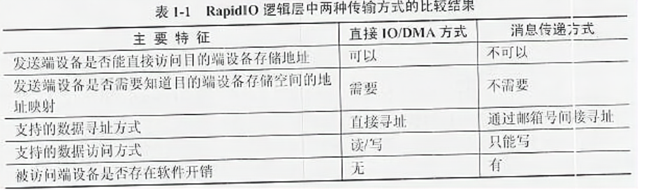

### 指令系统

- 指令系统是指计算机所能执行的全部指令的集合，它描述了计算机内全部的控制信息和“逻辑判断”能力。不同计算机的指令系统包含的指令种类和数目也不同。一般按功能划分包括如下类型：
	- **数据处理指令：** 包括算术运算指令、逻辑运算指令、移位指令、比较指令等；
	- **数据传送指令：** 包括寄存器之间、寄存器与主存储器之间的传送指令等；
	- **程序控制指令：** 包括条件转移指令、无条件转移指令、转子程序指令等；
	- **输入/输出指令：** 包括各种外围设备的读、写指令等，有的计算机将输入/输出指令包含在数据传送指令类中；
	- **状态管理指令：** 包括诸如实现置存储保护、中断处理等功能的管理指令。
- **程序控制指令（转移指令）：**
	程序控制指令也称转移指令。执行程序时，有时机器执行到某条指令时，出现了几种不同结果，这时机器必须执行一条转移指令，根据不同结果进行转移，从而改变程序原来执行的顺序。这种转移指令称为条件转移指令。除了各种条件转移指令外，还有无条件转移指令、转子程序指令、返回主程序指令、中断返回指令等。转移指令的转移地址一般采用直接寻址和相对寻址方式来确定。

### MIPS

- MIPS用来描述计算机的定点运算速度，表示当执行定点程序时，该机器每秒钟能完成的多少百万条指令。设每一机器周期为1微秒，基本指令需 **k** 个周期，则MIPS峰值为 **1/(k)M** 兆。
- 对于一台计算机而言：
	- **峰值MIPS值**：是按照其指令集中基本指令的执行速度计算的。
	- **平均MIPS值**：是根据指令的使用频度加权各类指令执行速度计算得出的。
	- **基准程序MIPS值**：是通过运行基准程序测得的MIPS值。由于不同的基准程序中包含的各种指令的比例不同，因此在比较时必须说明使用的是怎样的基准程序。

### 特权指令集

- 特权指令集是计算机指令集的一个子集，在多用户、多任务的计算机系统中必不可少，通常与系统资源的操纵和控制有关。
- 主要用于系统资源的分配和管理，包括改变系统工作方式、检测用户访问权限、修改虚拟存储器管理中的段表或页表，以及完成任务的创建和切换等功能。这类指令一般不直接提供给用户使用。
- 只有当计算机处于系统态运行时，才可以执行特权指令。

### 可靠度

- #### 并联系统的可靠性计算公式

	- 在并联系统中，设每个子系统的可靠性分别为R1、R2…….RN 。

	- 整个系统的可靠性 可由下式求得：
		$$
		R = 1 - (1 - R1)\times(1-R2)\times\cdots\times(1-RN)
		$$
		

- #### 串联系统的可靠性计算公式

	- 假设一个系统由 个子系统组成，当且仅当所有的子系统都能正常工作时系统才能正常工作，这种系统称为串联系统。

	- 若串联系统中各个子系统的可靠性分别用R1,R2…….RN来表示，则系统的可靠性R可由下式求得： 
		$$
		R = R1\times R2 \times\cdots\times RN
		$$
		

### 可编程逻辑器件

- #### **FPGA (Field-Programmable Gate Array)**

  - **中文名称**：现场可编程门阵列 (FPGA)。
  - 定义：
    - 是在 PAL、GAL、CPLD 等可编程器件的基础上进一步发展的产物。
    - 作为专用集成电路 (ASIC) 领域中的一种半定制电路而出现。
    - 解决了定制电路的不足，同时克服了原有可编程器件门电路数量有限的缺点。
    - FPGA采用逻辑单元阵列（Logic Cell Array, LCA），内部包括可配置逻辑模块（Configurable Logic Block, CLB）、输入输出模块（Input Output Block, IOB）和内部连线（Interconnect）三部分。
    - PGA利用小型查找表（16X1 RAM）来实现组合逻辑，每个查找表连接到一个D触发器的输入端，触发器再来驱动其他逻辑电路或驱动I/O，由此构成了既可实现组合逻辑功能又可实现时序逻辑功能的基本逻辑单元模块。这些模块之间利用金属连线互相连接或连接到I/O等模块。
    - FPGA的逻辑是通过叫内部静态存储单元加载编程数据来实现的，存储在存储器单元中的值决定了逻辑单元的逻辑功能以及各模块之间或模块与I/O间的联接方式，并最终决定了FPGA所能实现的功能。
    - FPGA允许无限次的编程。
  - 优点：
  	- FPGA由逻辑单元、RAM、乘法器等硬件资源组成，通过将这些硬件资源合理组织，可实现乘法器、寄存器、地址发生器等硬件电路。
  	- FPGA可通过使用框图或者Verilog HDL来设计，从简单的门电路到FIR或各FFT电路。
  	- FPGA可无限地重新编程，加载一个新的设计方案只需几百毫秒，利用重配置可以减少硬件的开销。
  	- FPGA的工作频率由FPGA芯片以及设计决定，可以通过修改设计或者换更快的芯片来达到某些苛刻的要求（当然，工作频率也不能无限制地提高，而是受当前的IC工艺等因素制约）
  - 缺点：
  	- FPGA的所有功能均依靠硬件实现，无法实现分支条件跳转等操作。
  	- FPGA只能实现定点运算。
  - 常用的硬件描述语言：
    - Verilog HDL、VHDL。
  - **乒乓操作法**
  	- 是FPGA开发中的一种**数据缓冲优化设计技术**，可以看作是另一种形式的**流水线技术**。乒乓操作法的核心是在数据处理过程中，通过“输入数据流选择单元”和“输出数据流选择单元”的切换，实现数据的无缝缓冲与处理，从而优化数据流的吞吐和效率。
  	- **输入缓冲阶段**
  		- 输入的数据流通过“输入数据流选择单元”逐步分配到两个数据缓冲校块中。数据缓冲模块可以是FPGA中的任意存储模块，如双口RAM、单口RAM或FIFO等。
  		- **第一个缓冲周期**：输入数据流缓存到“数据缓冲模块1”。
  		- **第二个缓冲周期**：输入数据流切换到“数据缓冲模块2”，同时“数据缓冲模块1”中缓存的**第一个周期**数据通过“输出数据流选择单元”送入“数据流运算处理模块”进行运算。
  		- **第三个缓冲周期**：输入数据流再次切换到“数据缓冲模块1”，同时“数据缓冲模块2”中缓存的**第二个周期**数据通过“输出数据流选择单元”送入“数据流运算处理模块”进行运算。
  		- 如此循环往复，实现数据的持续处理。
  	- **无缝处理机制**：
  		- 通过“输入数据流选择单元”和“输出数据流选择单元”的切换配合，输入数据流和输出数据流能够**无缝传递**，即数据流之间的处理不会出现时间停顿，从而实现**连续不断地数据处理**。
  		- 这种操作方式非常适合需要流水线式算法的场景，能够完美解决数据的缓冲与处理问题。

- #### **CPLD (Complex Programmable Logic Device)**

	- **中文名称**：复杂可编程逻辑器件 (CPLD)。
	- 定义：
		- 从 PAL 和 GAL 器件发展而来，规模相对较大，结构复杂，属于大规模集成电路范围。
		- 是一种用户根据自身需求自行构造逻辑功能的数字集成电路。
	- 设计方法：
		- 借助集成开发软件平台，使用原理图、硬件描述语言等方法，生成相应的目标文件。
		- 通过下载电缆（“**在系统**”编程）将代码传输到目标芯片中，实现设计的数字系统。

- #### **FPGA 和 CPLD 的区别：**

	1. **逻辑功能与适用场景**
		- **FPGA 更适合完成时序逻辑**，因为它的触发器资源丰富，特别适合处理复杂的时序逻辑。
		- **CPLD 更适合完成各种算法和组合逻辑**，因为它的乘积项资源丰富，适合处理组合逻辑和算法性任务。
	2. **布线和延迟特性**：
		- **CPLD 的连续式布线结构**决定了其时序延迟是均匀的，且可预测。
		- **FPGA 的分段式布线结构**决定了其延迟具有不可预测性。
	3. **编程灵活性**：
		- FPGA 在编程上比 CPLD 更灵活。
			- FPGA 通过修改内部连线的布线来编程，且可以在逻辑门下进行编程。
			- CPLD 通过修改具有固定内连电路的逻辑功能来编程，且是在逻辑块下编程。
	4. **集成度与结构复杂性**：
		- **CPLD 的集成度比 FPGA 高**，具有更复杂的布线结构和逻辑实现。
	5. **编程方式及使用便捷性**：
		- **CPLD 使用起来比 FPGA 更方便**，其编程采用 E2PROM 或 FLASH 存储技术，无须外部存储器芯片，使用简单。
		- FPGA 的编程信息需存放在外部存储器上，使用方法复杂。
	6. **工作速度与预测性**：
		- CPLD 的速度比 FPGA 快，并且具有较高的时间可预测性。
			- 这是因为 CPLD 是逻辑块级编程，且逻辑块之间采用集中式的互联。
			- 而 FPGA 是门级编程，不同 CLB（ configurable logic block）之间的互联采用分布式互连方式。
		- 
	7. **编程方式与断电后果**：
		- **CPLD 编程主要是基于 E2PROM 或 FLASH 存储器**，编程次数可达 1 万次，系统断电时编程信息不会丢失。
		- FPGA 编程基于 SRAM，断电后编程信息丢失，需要重新写入，但可以在工作中快速编程，实现动态配置。
	8. **保密性**：
		- **CPLD 保密性好**，而 FPGA 保密性较差。
	9. **功耗与集成度**：
		- **一般情况下，CPLD 的功耗比 FPGA 大**，且集成度越高，功耗增加越明显。

### 外设分类及各自特性

- 在 Linux 操作系统下，设备文件主要分为三类：**块设备（block devices）**、**字符设备（character devices）\**和\**网络设备（network devices）**。

	**1.设备文件的分类**

	- **块设备（Block Devices）**：指利用一块系统内存作为缓冲区的设备，主要针对慢速设备（如磁盘等存储设备）。块设备的设计目的是减少 CPU 的等待时间，提高性能。
		- 典型的块设备包括：闪存、磁盘等存储设备。
		- 特点：
			- 利用系统内存作为缓冲区。
			- 如果用户进程对设备的请求能够满足用户的请求，就直接返回请求的数据。
			- 如果无法满足，会调用请求函数进行实际的 I/O 操作。
			- 设计用于慢速设备，以减少 CPU 耗费的时间。
	- **字符设备（Character Devices）**：指存取时没有缓冲的设备，数据传输逐字节进行。
		- 典型的字符设备包括：鼠标、键盘、串行口等。
		- 特点：
			- 对字符设备发出读/写请求时，实际的硬件 I/O 会立即发生。
			- 相比块设备，字符设备的 I/O 操作不使用缓冲区。
	- **网络设备（Network Devices）**：主要用于和外部进行网络通信。
		- 网络设备可以通过 **BSD 套接字接口** 访问数据。
		- 网络设备的读取速率依赖于外部网络硬件介质（如网络卡等）。
		- 与字符设备和块设备的通信速率不能简单比较，因为网络设备的性能还受网络环境和硬件的影响。

	**2. 块设备与字符设备的主要区别**

	- **字符设备**：
		- 读/写请求时，实际的硬件 I/O 立即发生。
		- 没有缓冲区，逐字节进行数据传输。
	- **块设备**：
		- 利用一块系统内存作为缓冲区。
		- 读/写请求时，先检查缓冲区，如果数据可用，则直接返回；否则执行实际的 I/O 操作。
		- 主要针对慢速设备设计，以降低 CPU 等待时间。

	**3. 网络设备的特点**

	- 网络设备通过 **BSD 套接字接口** 进行数据访问。
	- 读取速率由 **外部网络硬件介质**（如网卡）决定。
	- 通信速率无法与字符设备或块设备简单比较，因其性能还依赖于网络环境和基础设施。

### 通信方式

- **在计算机系统中，CPU 和外部通信有两种通信方式：并行通信和串行通信。**
- **而按照串行数据的时钟控制方式，串行通信又可分为同步通信和异步通信两种方式。**
- **所谓异步串行通信，是指数据传送以字符为单位，字符与字符间的传送是完全异步的，位与位之间的传送基本上是同步的。**
	- **异步串行通信的特点可以概括为：**
		- **以字符为单位传送信息；**
		- **相邻两字符间的间隔是任意长；**
		- **因为一个字符中的比特位长度有限，所以需要的接收时钟和发送时钟只要相近就可以。**
	- **简单而言，异步方式的特点就是：字符间异步，字符内部各位同步。**
	- **在异步串行通信的数据格式中，每个字符（每帧信息）由 4 个部分组成：**
		- **1 位起始位，规定为低电平 0；**
		- **5～8 位数据位，即要传送的有效信息；**
		- **1 位奇偶校验位；**
		- **1～2 位停止位，规定为高电平 1。**

### 互斥操作机制

- 作用：**相互操作用来保证共享数据操作的完整性。通过互斥锁保证任一时刻只能有一个应用访问共享对象。**
- **在编程中引入了对象互斥的概念，来保证共享数据操作的完整性。每个对象都对应于一个可称为“互斥锁”的标记，这个标记用来保证在任一时刻，只能有一个线程访问该对象。**
- **在多任务操作系统中，同时运行的多个任务可能都需要使用同一种资源。互斥锁 (mutex) 是一种简单的加锁的方法来控制对共享资源的访问，互斥锁只有两种状态，即上锁 (lock) 和解锁 (unlock)。**
- **互斥锁的特点有：**
	1. **原子性**：把一个互斥量锁定为一个原子操作，这意味着操作系统保证了如果一个线程锁定了一个互斥量，没有其他线程在同一时间可以成功锁定这个互斥量；
	2. **唯一性**：如果一个线程锁定了一个互斥量，在它解除锁定之前，没有其他线程可以锁定这个互斥量；
	3. **非繁忙等待**：如果一个线程已经锁定了一个互斥量，第二个线程又试图去锁定这个互斥量，则第二个线程将被挂起（不占用任何 CPU 资源），直到第一个线程解除对这个互斥量的锁定为止，第二个线程则被唤醒并继续执行，同时锁定这个互斥量。
- **互斥锁的操作流程如下：**
	1. 在访问共享资源后临界区域前，对互斥锁进行加锁；
	2. 在访问完成后释放互斥锁上的锁；
	3. 对互斥锁进行加锁后，任何其他试图再次对互斥锁加锁的线程将会被阻塞，直到锁被释放。

### 显示缓冲

- 计算机的显示存储器又名帧缓冲存储器。显示卡上都设有一块与屏幕显示位置对应的存储区，称为显示缓存V-RAM。它实际上是一块动态随机存取存储器DRAM，用来存放当前屏幕显示的数据。显示缓存中某一地址的数据决定了当前屏幕上某一点的色彩属性。因此，显示存储器的容量决定了最大显示分辨率及显示深度。

	1. **显示分辨率**
		- 显示分辨率（屏幕分辨率）是屏幕图像的精细程度，是指显示器所能显示的像素有多少。由于屏幕上的点、线和面都是由像素组成的，显示器可显示的像素越多，画面就越精细，同样的屏幕区域内能显示的信息也越多，所以分辨率是个非常重要的性能指标。可以把整个图像想象成是一个大型的棋盘，而分辨率的表示方式就是所有经线和纬线交叉点的数目。显示分辨率一定的情况下，显示屏越小图像越清晰；反之，显示屏大小固定时，显示分辨率越高，图像越清晰。高分辨率是保证彩色显示器清晰度的重要前提。

	2. **电子枪扫描原理**
		1. 电子枪从屏幕的左上角的第一行（行的多少根据显示器当时的分辨率所决定，例如，800×600分辨率下，电子枪就要扫描600行）开始，从左至右逐行扫描，第一行扫描完后再从第二行的最左端开始至第二行的最右端，一直到扫描完整个屏后再从屏幕的左上角开始，这时就完成了一次对屏幕的刷新，周而复始。一般来讲，屏幕的刷新率要达到75Hz以上，人眼才不易感觉出屏幕的闪烁。CRT显示器的刷新率是由其行频和当时的分辨率决定的：行频越高，同一分辨率下的刷新率就越高；而行频一定的情况下，分辨率越高则它所能达到的刷新率越低。

	3. **显存带宽**
		- 显存带宽是指显示芯片与显存之间的数据传输速率。显存带宽是决定显卡性能和速度最重要的因素之一。

- 例题：

	- 一台计算机的显示存储器用 DRAM 芯片实现，要求显示分辨率为 1024×1024，颜色深度为 24 位，帧频为 100Hz，显示总带宽的 50% 用来刷新屏幕，则需要的显存总带宽至少为（D ）。

		A. 1200Mbps
		B. 9600Mbps
		C. 2400Mbps
		D. 4800Mbps

	- 显存带宽 = 显存位宽 × 显存频率   （单位位bps）

		- DDRDouble Data Rate，双倍数据传输率）技术
		- 显存带宽 = 显存位宽 × 显存频率 × 2 / 8

	- 颜色深度 = 每像素的数据量

		- 显存位宽 = 1024 * 1024 * 24 = 25,165,824位
		- 显存带宽 = 显存位宽 *  显存频率 = 25,165,82400bps = 2516.5824Mbps
		- 显示总带宽的 50% 用来刷新屏幕
			- 显示总带宽 = 显示带宽  / 0.5 ≈ 5033.16Mbps

### Boot Loader

- BootLoader 是在操作系统内核运行之前运行的一小段引导程序，可以初始化硬件设备、建立内存空间映射，从而将系统的软硬件环境带到一个合适的状态，以便为最终调用操作系统内核准备好正确的环境。
- 有些 BootLoader 支持多 CPU。
- 在嵌入式操作系统中，通常没有 BIOS 那样的固件程序，因此，整个系统的加载启动任务，就完全由 BootLoader 完成。
- 通常，BootLoader 是严重依赖于特定硬件环境实现的，所以，建立一个通用的 BootLoader 几乎是不可能的。

### 主存储器

- 按照存储器在计算机中的用途分类，嵌入式系统的存储器包括内部存储器和外部存储器。将存储器按照存放信息的易失性，可分为 **易失性存储设备** 和 **非易失性存储设备**。易失性存储设备的代表是 **RAM (Random Access Memory)**，称为随机存取存储器。在计算机存储体系结构中，RAM 是与 CPU 直接交换数据的内部存储器，也叫主存、内存。按照 RAM 存储单元的工作原理，RAM 又分为 **SRAM (Static RAM, 静态随机存储器)** 和 **DRAM (Dynamic RAM, 动态随机存储器)**。
-  SRAM
	- 静态存储单元是在静态触发器的基础上附加门控管而构成的。因此，它是靠触发器的自保功能存储数据的。
	- SRAM 将每个位存储在一个双稳态存储器单元，每个单元用一个六晶体管电路实现。数据一旦写入，其信息就稳定地保存在电路中等待读出。无论读出多少次，只要不断电，此信息会一直保持下去。
	- SRAM 初始加电时，其状态是随机的。写入新的状态，原来的旧状态就消失了。新状态会一直维持到写入新的状态为止。
	- 在电路工作时，即使不进行读写操作，只要保持在加电状态下，电路中就一定有晶体管导通，就一定有电流流过，带来功率消耗。因此与 DRAM 相比，SRAM 功耗较大，集成度不能做很高。
	- 高速缓存 Cache 一般采用 SRAM。高速缓冲存储器是存在于主存与 CPU 之间的一级存储器，由静态存储芯片 (SRAM) 组成，容量比较小但速度比主存高得多，接近于 CPU 的速度。
- DRAM
	- DRAM 将每个位存储为对一个电容的充电，每个单元由一个电容和一个访问晶体管组成。
	- 当 DRAM 存储器单元中的电容非常小，它被干扰之后很难恢复，也有很多原因会造成电容漏电，因此为了避免存储信息的丢失，必须定时地给电容补充电荷。通常把这种操作称为“刷新”或“再生”，因此 DRAM 内部要有刷新控制电路，其操作也比静态 SRAM 复杂。
	- 尽管如此，由 DRAM 存储单元的结构非常简单，所用元件少且功耗低，可以制造得很密集，已成为大容量 RAM 的主流产品。
		常说的内存条就是采用 DRAM 构成，目前使用的主要足 SDRAM 和 DDR SDRAM。
- ROM
	- ROM（Read-Only Memory，只读存储器）的重要特性是其存储信息的非易失性，存放在 ROM 中的信息不会因去掉供电电源而丢失，再次充电时，存储信息依然存在。其结构较简单，读出较方便，因而常用于存储各种固定程序和数据。

### 大小端存储

- 在计算机系统中，数据是以字节为单位的，每个地址单元对应一个字节（8 bits）。当一个数据需要多个字节表示时，必然存在着如何安排其字节顺序的问题，因此导致了“大端存储模式”和“小端存储模式”。
	- **大端存储模式**（大小小大）：
		- 数据的高字节保存在内存的低地址中，而数据的低字节保存在内存的高地址中。
		- **示例**：一个16比特的`short`型变量`x`，其值为`0x1122`，其中`0x11`为高字节，`0x22`为低字节。
		- 如果x在内存中的地址为0x00000010，那么：
			- 对于大端模式，将高字节`0x11`存放在低地址`0x00000010`中。
			- 将低字节`0x22`存放在高地址`0x00000011`中。
	- **小端存储模式**（大大小小）：
		- 数据的高字节保存在内存的高地址中，而数据的低字节保存在内存的低地址中。这种模式与大端模式刚好相反。
	- **常见平台的特点**：
		- X86结构通常采用小端模式。
		- 很多ARM和DSP也采用小端模式。
		- 一部分ARM处理器可以在程序中通过特定指令（如在ARM Cortex系列中使用`REV`、`REV16`、`REVS`等指令）进行大小端模式的切换。

## 单位换算

- 时间
  - 1秒(s) = 1000毫秒(ms)
  - 1毫秒(ms) = 1000微秒(us)
  - 1微秒(us) = 1000纳秒(ns)
  - 1纳秒(ns) = 1000皮秒(ps)
- 频率
  - 1MHZ = 1×10^6^HZ
- 比特每秒
	- bps 《===》 bit/s 
	- B/s（字节每秒）
	- 1Mbps = 1000000bps

